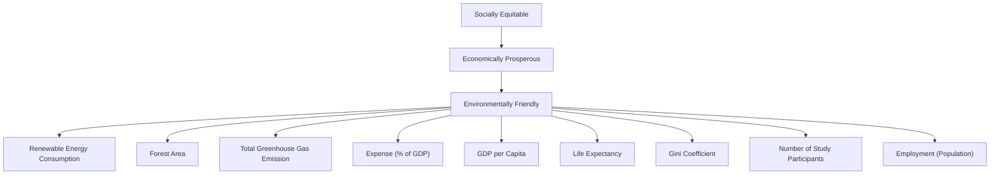

For office use only

T1 \_\_\_\_

T2 \_\_\_\_

T3 \_\_\_\_

T4

Team Control Number

67171

Problem Chosen

E

For office use only

F1 \_\_\_\_

F2 \_\_\_\_

F3 \_\_\_\_

F4

## 2017

## MCM/ICM

## Summary Sheet

The problems caused by rapid urban sprawl are becoming increasingly important in the past few decades. Our team was tasked with modeling smart growth of a city in the light of urban planning theory. We assumed that budget is the major factor which determines growth of a city and the budget in a certain year is limited.

We developed a three dimensional baseline cube model to measure the success of smart growth of a city. The three dimensions are Economic Development Index(EDI), Social Justice Index(SJI) and Environment Performance Index(EPI), with which we measure economic state, social state and environment state of a city growth respectively. A state of growth is mapped into a vector in this cube. And the vector of ideal smart growth is represented by diagonal of the cube. By comparing the vector of growth about a city and the ideal vector, we can directly know how the current growth plan of this city meets the smart growth principles. The angle between city vector and ideal vector means the degree of sustainability of a city. The smaller the angle is, the more sustainable the city is. Besides, the length of city vector represents the speed of growth. The larger the length is, the faster the city grows. Using our cube model, we measured the growth plan of Wellington and Edinburgh.

In order to develop a smart growth plan, we need to optimize the angle and length of a city vector. Therefore, we integrate angle and length into an Smart Growth Index(SGI) with an added parameter $\mu$ illustrating how policymakers weigh importance between these two elements. Based on our assumptions, our task is to find an optimal allocation of total budget. Our total budget comprises seven components: transport service, social service, environmental service, education service, health service, development service and other service. So we updated the baseline cube model to modified cube model to evaluate the effects of these components on EPI, SJI and EDI with parameters. We estimated these parameters using data of this city collected in past few years, with which we are able to find an optimal allocation of budget given a total budget. What's more, we can rank the individual initiatives as the most potential to the least potential by sorting the components of the optimal budget. By incorporating known numerical values about budget and EPI, SJI, EDI in Wellington and Edinburgh into our model, we shed light on the most influential factors in budget and developed a smart growth plan to significantly improve states of these two cities. Based on our plan, we made a 30-year forecast for them. Also, with an additional 50% population increase, we adjusted our growth plan. Utilizing sensitivity analysis and F test, our model is testified to be reliable.

## Contents

I. Introduction......3

II. Restatement of the Problem...... 4

III. General Assumptions......4

IV. Models......4

4.1 A Measurement of Smart Growth: Baseline Cube Model.... 4

4.1.1 Main Parameters in Baseline Cube Model....4

4.1.2 Smart Growth Index(SGI)......5

4.1.3 Economic Development Index(EDI)......6

4.1.4 Social Justics Index(SJI)......6

4.1.5 Environment Performance Index(EPI)....7

4.1.6 A Three Dimensional Baseline Cube Model to Determine Smart Growth......7

4.2 A Development of Growth Plan: Modified Cube Model....8

4.2.1 Additional Assumptions......8

4.2.2 A Modified Cube Model for Growth Plan....9

4.2.3 Solution to the Modified Cube Model....9

4.2.4 The Optimal States(S) of the Next Few Decades.... 10

4.2.5 Development of Growth Plan and Rank of the Components......10

V. Case study....11

5.1 The Current Growth Plan for Edinburgh and Wellington.... 11

5.1.1 Evaluation of Current Growth Plan for Edinburgh.... 11

5.1.2 Evaluation of Current Growth Plan for Wellington.... 11

5.2 Growth Plan for Edinburgh and Wellington.... 13

4.2.1 Growth Plan for Edinburgh....13

4.2.1 Growth Plan for Wellington.... 14

5.3 Ranking and Comparison of Components....16

5.4 Explanation of Growth Plan in Additional 50% Populatio Growth....16

VI. Model Testing....17

VII. Sensitivity Analysis...... 17

VIII. Strength and Weakness.... 18

8.1 Strength of Models......18

8.1.1 Inclusive....18

8.1.2 Quantification.... 18

8.1.3 Simple but Universal....18

8.1.4 Visible and Understandable.... 18

8.2 Weakness of models....19

8.2.1 Accuracy Relies on Statistics.... 19

8.2.2 Disasters Are Not Included....19  
8.2.3 Difference Replaced Derivatives.... 19

## IX. References.... 21

## I. Introduction

"Poor accessibility is the common denominator of urban sprawl - nothing is within easy walking distance of anything else."

\- Dr Reid Ewing, the National Center for Smart Growth, quoted from a BBC article "The community are still not very happy about the plans.....The concerns relate to the huge volume of traffic and school capacity.....You are looking at a lovely rural community becoming more urban sprawl."

\- Kevin Turley, deputy manager of Lakeside Plant Centre, quoted from a BBC article

The problems caused rapid urban sprawl is becoming increasingly important in the past few decades. In 1950, 30 percent of the world's population was urban, but by 2050, 66 percent of the world's population is projected to be urban. Also, the urban population of the world has grown rapidly since 1950, from 746 million to 3.9 billion in2014[1]. The rapid urbanizing is causing serious problems for the economy, society and environment of cities, such as traffic jam, less farmland, higher resource pressure, etc. With an attempt to solve these problems, the Local Government Commission which presents the annual New Partners for Smart Growth conference adopted the original Ahwahnee Principles in 1991[2]. Many of the major principles are now generally accepted as part of smart growth movement such as Transit oriented development, a focus on walking distance, greenbelts and wildlife corridors, and infill and redevelopment[3].

There are at least two definitions about smart growth. According to Boeing et al.[4], “smart growth is an urban planning and transportation theory that concentrates growth in compact walkable urban centers to avoid sprawl. It also advocates compact, transit-oriented, walkable,

bicycle-friendly land use, including neighborhood schools, complete streets, and mixed-use development with a range of housing choices". IEPA[5] also describes that smart growth is about helping every town and city become a more economically prosperous, socially equitable, and environmentally sustainable place to live. The three E's sustainability raised by the latter is clearer and more practical. As the problem caused by urban sprawl is becoming increasingly serious, the International City Management Group (ICM) is eager to implement smart growth theories into city design around the world.

flowchart

Figure 1 Three E's sustainability and related components

## II. Restatement of the Problem

The International City Management Group (ICM) raised a series of tasks for our group to deal with. These problems and our work can be restated as the following lists:

1) Considering the 3 E's of sustainability and/or the 10 principles of smart growth, design a metric to measure the smart growth of a city. According to the three E's requirement, we designed a three dimensional baseline cube model to determine whether the smart growth of the city is successful or not. This model is based on Smart Growth Index(SGI), Economic Development Index (EDI), Social justice index (SJI) and Environment Performance Index(EPI). By utilizing EDI, SJI and EPI, we can determine a city is smart growth or not. The SGI is used to measure the level of the growth.  
2) Select two mid-sized cities (with a population of between 100,000 and 500,000) on different continents and measure how the current growth plan of each city meets the smart growth principles. We selected Edinburgh and Wellington as our targets and searched the growth plan of the two cities. Using the baseline cube model, we measured and discussed how successfully their growth plan meets the smart growth.  
3) Develop a growth plan for both cities over the next few decades and support your choice of the components, after which use your metric to evaluate the success of your smart growth plans. Based on the budget plan of the selected cities and our baseline cube model, we developed modified cube model with a component matrix B. The matrix B is consisted of seven components: transport service(B1), social service(B2), environmental service(B3), education service(B4), health service(B5), development service(B6) and other(B7). By maximizing the SGI, an optimal growth plan can be achieved by changing B1,B2,B3,B4,B5,B6 and B7 to the optimal value. Since the metric is based on the cube model and during the calculation process the SGI achieves the maximum value, the optimal growth plan we developed can automatically meet the smart growth requirement in our baseline cube model.  
4) Rank the individual components in your smart growth plan according to their potential. Compare the components and their ranking between the two cities. We used our modified cube model to evaluate the potential of the individual components and compared both the components and their rankings in the two cities.  
5) Under the consumption that the population of the two cities will increase by additional 50% by 2050, explain how your plan supports the growth. We evaluated the extent to which our plans support the growth.

## III. General Assumption

## We assume that the statistics we collected from the website are reliable and accurate.

The data utilized in our models is mainly collected from valid statistics websites of Edinburgh and Wellington, such as Scotland's census[6], Statistics New Zealand[7]. Thus, this assumption is reasonable.

## We assume that the there is a relatively stable political and economic environment for Edinburgh and Wellington.

In other words, there are no destructive nature or human disasters in the selected two countries, such as great earthquake, war and diplomatic disruption. Neither is the impact of exogenous events like terrorist attack and scandals taken into consideration in our models.

## We assume that the growth status of Edinburgh and Wellington in the next few decades is successive with that of the past one decade.

We have researched the growth plans of Edinburgh[14] and Wellington[15] in the past decade and in the next few decades. We found that the growth plans of the two periods are rather identical. Additionally, we have assumed that the economic environment for the two cities is relatively stable. Thus, it is reasonable to assume the growth status of the two cities is successive with that of the past decade.

## IV. Models

In this chapter, we developed a three dimensional baseline cube model to determine the smart growth of a city, after which we updated this model to set modified cube model to develop a growth plan for Edinburgh and Wellington in the next three decades and rank the factors. Both the baseline cube model and the modified cube model are tested using F test.

## 4.1 A Measurement of Smart Growth: Baseline Cube Model

In this model, Economic Development Index(EDI), Social Justice Index(SJI) and Environment Performance Index(EPI) are used to determine whether the growth of a city is smart growth or not. Smart Growth Index(SGI) is calculated from the three indexes(EDI,SJI,EPI) to evaluate the level of smart growth. To begin with, we summarized the main parameters used in our model. Then, we defined the expression of Smart Growth Index(SGI), after which Economic Development Index(EDI), Social Justice Index(SJI) and Environment Performance Index(EPI) are introduced. These indexes(EDI, DJI and EPI) represent Economically prosperous, Socially Equitable, and Environmentally Sustainable (the 3E's of sustainability) respectively. At last, based on the SGI, EDI, SJI and EPI, we developed a three dimensional baseline cube model to determine the smart growth of a city.

## 4.1.1 Main Parameters in Baseline Cube Model

After referring to the work of Professor Montenegro et al.[8], the definition of Social justice index[10] and Environmental Performance Index[11], we selected the following parameters to determine the smart growth. We will explain the reasons for the choice in the next few sections.

Table1: Main parameters utilized in baseline cube model

<table><tr><td>First stage</td><td>Second stage</td><td>Third stage</td></tr><tr><td rowspan="9">Smart Growth Index(SGI)</td><td rowspan="3">Economic Development Index (EDI)</td><td>Life Expectancy</td></tr><tr><td>GDP Per Capita</td></tr><tr><td>Expense(% of GDP)</td></tr><tr><td rowspan="3">Social Justice Index (SJI)</td><td>Employment Rate</td></tr><tr><td>Number of Study Participants</td></tr><tr><td>Gini Coefficient</td></tr><tr><td rowspan="3">Environment Performance Index(EPI)</td><td>Total Greenhouse Gas Emissions</td></tr><tr><td>Forest Area</td></tr><tr><td>Renewable Energy Consumption</td></tr></table>

## 4.1.2 Smart Growth Index (SGI)

Considering the three E's sustainability, we defined Smart Growth Index(SGI) to measure the level of smart growth. SGI is calculated from Current Growth(CG) and Smart Growth(SG) with

$$
S G I = \frac {\cos \left\langle \overrightarrow {C G} , \overrightarrow {S G} \right\rangle + \mu \left| \overrightarrow {C G} \right|}{1 + \mu \sqrt {3}} \tag {1}
$$

where the first term of the numerator is the cosine function of the angle between the current growth vector and the ideal smart growth vector. This term represents whether the direction of current growth is close to smart growth or not. If this term is closed to one, it means the city is developing at a right direction. The second term of the numerator is the length of the current growth vector, representing the rate of the city growth. In this equation, $\mu$ is utilized to illustrate the weight of growth rate to growth direction. The value of $\mu$ is dependent on the policymaker and requirement. If growth rate is more important than growth direction(such as a developing country), $\mu$ can be set as larger than $1/\sqrt{3}$ to balance the two terms, but it is recommended that the value set between 0 and $1/\sqrt{3}$ especially in developed countries, since the direction of growth is more important than growth rate in most cases. The denominator of the equation on the right hand is utilized to normalize the SGI to a range of 0\~1 for the convenience of defining the extent of smart growth. A summary of the SGI equation is given as the following table:

Table 2: A summary of SGI Expression

<table><tr><td>Expression</td><td>Term</td><td>Description</td><td>Meaning</td></tr><tr><td rowspan="4"> $SGI = \frac{\cos\langle\overrightarrow{CG},\overrightarrow{SG}\rangle}{1+\mu\sqrt{3}}$ </td><td> $\cos\langle\overrightarrow{CG},\overrightarrow{SG}\rangle$ </td><td>The angle between CG vector and SG vector</td><td>The direction of city growth</td></tr><tr><td> $|\overrightarrow{CG}|$ </td><td>The length of CG vector</td><td>The rate of city growth</td></tr><tr><td> $\mu$ </td><td>Weight of CG length</td><td>Importance of growth rate to growth direction</td></tr><tr><td> $\frac{1}{1+\mu\sqrt{3}}$ </td><td>normalization</td><td>Normalize the SGI to a range of 0~1</td></tr></table>

$$
\mu = \frac {1}{\sqrt {3}}
$$

Balanced city

$$
\mu > \frac {1}{\sqrt {3}}.
$$

Developing city

$$
\mu <   \frac {1}{\sqrt {3}}
$$

Developed city

Fig 2. The value of $\mu$ for different types of city

CG is calculated from current state and previous state. The State(S) represents the smart growth state of a city in a certain time. The expression of state is consisted of Economic Development Index(EDI), Social Justice Index(SJI) and Environment Performance Index(EPI). The SGI is calculated with following equation:

$$
\overrightarrow {C G} = \left(\overrightarrow {S _ {\text { current }}} - \overrightarrow {S _ {\text { previous }}}\right) \tag {2}
$$

where

$$
\overrightarrow {S _ {\text { current }}} = \left(S J I _ {\text { current }}, E D I _ {\text { current }}, E P I _ {\text { current }}\right)
$$

$$
\overrightarrow {S _ {\text { previous }}} = \left(S J I _ {\text { previous }}, E D I _ {\text { previous }}, E P I _ {\text { previous }}\right)
$$

## 4.1.3 Economic Development Index (EDI)

Professor Montenegro et al.[8] proposed a simple and operational economic development index that combines the level of income per capita and the distribution of income. Based on his work and the data available, we updated this method by utilizing one of the big three economic indicators[9] and Expense of GDP to evaluate the economic status, i.e., GDP per capita and Expense of GDP are utilized to measure the economic development of a city. Additionally, we added life expectancy to our model to improve the accuracy of prediction. The EDI is calculated with following equation:

$$
E D I = \frac {1}{3} (L i f e E x p e c t e n c y + G D P p e r C a p i t a + E x p e n s e o f G D P) \tag {3}
$$

## 4.1.4 Social Justice Index (SJI)

Social justice index[10] comprises 27 quantitative and eight qualitative indicators, each associated with one of the six dimensions of social justice: 1) poverty prevention, 2) equitable education, 3) labor market access, 4) social cohesion and non-discrimination, 5) health, and 6) intergenerational justice. We selected three major factors from these 6 dimensions to determine the social equality of certain city. These factors and their relationship with the dimensions are: Gini coefficient represents the fairness of income distribution, employment

rate represents the labor market access, number of study participants represents the equality of education. According to the definition[10], the weight of Gini coefficient, employment rate and number of study participants are 3/7, 2/7, 2/7 respectively. SJI is calculated by

$$
S J I = \frac {3}{7} \text { GiniCoefficient } + \frac {2}{7} \text { NumberofStudyParticipants } + \frac {2}{7} \text { EmploymentRate } \tag {4}
$$

## 4.1.5 Environment Performance Index (EPI)

The Environmental Performance Index (EPI) is a method of quantifying and numerically marking the environmental performance of a state's policies. This index was developed from the Pilot Environmental Performance Index, first published in 2002, and designed to supplement the environmental targets set forth in the United Nations Millennium Development Goals[12]. In our model, the Environment Performance Index (EPI) is calculated from three aspects: Total Greenhouse Gas Emissions, Forest Area and Renewable Energy Consumption. The Expression of EPI is shown in the following equation:

$$
E P I = \frac {1}{3} \left(\text { TotalGreenhousGasEmissions } + \text { ForestArea } + \text { RenewableEnergyConsumption }\right) \tag {5}
$$

## 4.1.6 A Three Dimensional Baseline Cube Model to Determine Smart Growth

After defining the dependent variable SGI and the independent variables EDI, SJI and EPI, we developed a three dimensional cube model to measure the smart growth of a city. The CG vector is plotted in a three dimensional coordinates with x-axial representing EDI, y-axial representing SJI and z-axial representing EPI. The smart growth is determined by the lowest value of the three factors. It is only when all three values of the parameters are high that a city can achieve ideal growth. When all three parameters are positive, the growth is classified as smart growth. Otherwise it is classified as non-smart growth. In the cube model, SG is the ideal smart growth vector with a coordinate of $(1,1,1)$ . Based on the researches of Li et al. $[13]$ , we updated the two coordinates in his work to three coordinates. Each of the three variables is classified as 6 levels in our cube model. The baseline cube model is shown in the following figure:

3d line chart

| SJI | EPI | Growth Type     |
|-----|-----|-----------------|
| 0.0 | 0.0 | CURRENT GROWTH  |
| 0.2 | 0.4 | CURRENT GROWTH  |
| 0.4 | 0.8 | SMART GROWTH    |
| 0.6 | 1.0 | SMART GROWTH    |
| 0.8 | 1.0 | CURRENT GROWTH  |
| 1.0 | 1.0 | CURRENT GROWTH  |

Fig 3. Three dimensional baseline cube model  
Table 3. Classification of EDI/SJI/EPI according to their values

<table><tr><td>Value</td><td>EDI</td><td>SJI</td><td>EPI</td></tr><tr><td>0.8~1</td><td>High</td><td>High</td><td>High</td></tr><tr><td>0.5~0.8</td><td>Medium</td><td>Medium</td><td>Medium</td></tr><tr><td>0~0.5</td><td>Low</td><td>Low</td><td>Low</td></tr><tr><td>-0.5~0</td><td>Negative</td><td>Negative</td><td>Negative</td></tr><tr><td>-0.8~-0.5</td><td>Bad</td><td>Bad</td><td>Bad</td></tr><tr><td>-1~-0.8</td><td>Worst</td><td>Worst</td><td>Worst</td></tr></table>

In summary, in this model the lowest value of EDI, SJI and EPI is utilized to determine whether the growth of a city is smart growth or not, SGI is utilized to measure the level of smart growth. The results are listed in the following table:

Table 4. Evaluation of growth results

<table><tr><td>Min(EDI,SJI,EPI)</td><td>Growth type</td><td>SGI</td><td>Level of growth</td></tr><tr><td rowspan="3">&gt;0</td><td rowspan="3">Smart growth</td><td>0.8~1</td><td>High</td></tr><tr><td>0.5~0.8</td><td>Medium</td></tr><tr><td>0~0.5</td><td>Low</td></tr><tr><td>&lt;0</td><td>Non-smart growth</td><td>—</td><td>—</td></tr></table>

## 4.2 A Development of Growth Plan: Modified Cube Model

In this section, we developed a modified cube model to make growth plan for a city based on the baseline cube model. This model is based on the budget which is the primary tool in social and economic development. In addition to the general assumptions, we added additional assumption that the total budget of a city is limited in a certain year and budget is the major factor that influence the development of a city. The budget is classified into seven categories: transport service, social service, environmental service, education service, health service, development service and other. With this model, we can achieve the optimal growth plan and the ranking of components according to their potential.

## 4.2.1 Additional Assumptions

We assume that the total budget of Edinburgh and Wellington is limited in a certain year and the budget in the next thirty years is predicted with the budget data from 2009 to 2015.

Since both economic and political environment for Edinburgh and Wellington are relatively stable in the next decades, there will be no wide floating in the budget trend of a city. Thus, the budget is predictable with the data of the past years.

We assume that budget is the major factor that determine the growth of a city.

According to N.V. Prosyanik et al.[16], in a market economy, the city budget is the primary tool to regulate social and economic processes. Therefore, it is reasonable to assume that in our metric budget is the major factor that influences the growth of a city.

## 4.2.2 A Modified Cube Model for the growth plan

Updating the three dimensional baseline cube model, we obtained the modified cube model to develop a growth plan over next few decades. In this model, based on the data of the past $k$ years, we can estimate parameter $\hat{b}$ in this model. After obtaining $\hat{b}$ , we are able to solve this nonlinear programming problem using Matlab. There are seven factors in the budget allocation matrix( $\tilde{B}$ ): transport service(B1), social service(B2), environmental service(B3), education service(B4), health service(B5), development service(B6) and other(B7). These seven factors are summarized from the growth plan of Edinburgh[14] and Wellington[15].

max SGI

$$
s. t. \left\{ \begin{array}{c} \vec {B} \geq 0 \\ \Delta \vec {S} \geq 0 \\ \sum_ {i = 1} ^ {7} B _ {i} = \text { totalBudget } \end{array} \right. \tag {6}
$$

where

$$
\mathrm{SGI} = f (\vec {B}) = \frac {\cos \langle \overrightarrow {S G} , \Delta \vec {S} \rangle + \mu | \Delta \vec {S} |}{1 + \sqrt {3} \mu}
$$

$$
\Delta \vec {S} = \left[ \begin{array}{l} \frac {\mathrm{dEPI}}{\mathrm{dt}} \\ \frac {d S J I}{d t} \\ \frac {d E D I}{d t} \end{array} \right] = \left[ \begin{array}{l l l l l l l} b _ {1 1} & b _ {1 2} & b _ {1 3} & b _ {1 4} & b _ {1 5} & b _ {1 6} & b _ {1 7} \\ b _ {2 1} & b _ {2 2} & b _ {2 3} & b _ {2 4} & b _ {2 5} & b _ {2 6} & b _ {2 7} \\ b _ {3 1} & b _ {3 2} & b _ {3 3} & b _ {3 4} & b _ {3 5} & b _ {3 6} & b _ {3 7} \end{array} \right] \left[ \begin{array}{l} B _ {1} \\ B _ {2} \\ B _ {3} \\ B _ {4} \\ B _ {5} \\ B _ {6} \\ B _ {7} \end{array} \right] \tag {7}
$$

In equation (6), the term $\vec{B} \geq 0$ is introduced to assure that every element of the matrix $\vec{B}$ is positive, since in budget can't be negative in the budget plan of a city. $\Delta \vec{S} \geq 0$ is utilized to ensure that SGI falls in the first quadrant. The term $\sum_{i=1}^{7} B_i = \text{totalBudget}$ limits the budget within a certain value.

## 4.2.3 Solution to the Modified Cube Model

To solve the model, we estimate the parameter $\hat{b}$ using data in the past $k$ years by the least square method. We denote residual error by $e$ .

Assume

$$
e = \Delta S _ {k} - \hat {b} B _ {k}
$$

where

$$
\Delta S _ {k} = \left[ \Delta \vec {S} _ {t - 1} \Delta \vec {S} _ {t - 2} \dots \Delta \vec {S} _ {t - k} \right] \tag {8}
$$

$$
B _ {k} = \left[ \vec {B} _ {t - 1} \vec {B} _ {t - 2} \dots \vec {B} _ {t - k} \right]
$$

Using the least square method to minimize

$$
\left\| e \right\| ^ {2} = e ^ {T} e = \left\| \Delta S _ {k} - \hat {b} B _ {k} \right\| ^ {2}
$$

we can achieve

$$
\hat {b} = (B _ {k} ^ {T} B _ {k}) ^ {- 1} B _ {k} \Delta S _ {k}
$$

The $B_{k}$ can be directly obtained from budget plan of Wellington[17] and Edinburgh[18]. In order to get $\Delta S_{t}$ , we calculate difference between the state(S) in adjacent two years with the following equation:

$$
\Delta S _ {t} = \left[ \begin{array}{l} \frac {d E P I}{d t} \\ \frac {d S J I}{d t} \\ \frac {d E D I}{d t} \end{array} \right] _ {t} = \left[ \begin{array}{l} E P I _ {t + 1} \\ S J I _ {t + 1} \\ E D I _ {t + 1} \end{array} \right] - \left[ \begin{array}{l} E P I _ {t} \\ S J I _ {t} \\ E D I _ {t} \end{array} \right] \tag {9}
$$

After achieving $\hat{b}$ , we can put it into the model to calculate the corresponding best budget allocation $\vec{B}_{optimal}$ and rank the components according to their potential. The potential of a component is calculated by comparing the current budget with optimal budget.

## 4.2.4 The Optimal State(S) of the Next Few Decades

the state of next year can be calculated by the state of current year and optimal budget allocation with the following equation:

$$
\left[ \begin{array}{l} E P I \\ S J I \\ E D I \end{array} \right] _ {t + 1} = \left[ \begin{array}{l} \frac {d E P I}{d t} \\ \frac {d S J I}{d t} \\ \frac {d E D I}{d t} \end{array} \right] _ {t} + \left[ \begin{array}{l} E P I \\ S J I \\ E D I \end{array} \right] _ {t} = \left[ \begin{array}{l l l l l l l} b _ {1 1} & b _ {1 2} & b _ {1 3} & b _ {1 4} & b _ {1 5} & b _ {1 6} & b _ {1 7} \\ b _ {2 1} & b _ {2 2} & b _ {2 3} & b _ {2 4} & b _ {2 5} & b _ {2 6} & b _ {2 7} \\ b _ {3 1} & b _ {3 2} & b _ {3 3} & b _ {3 4} & b _ {3 5} & b _ {3 6} & b _ {3 7} \end{array} \right] \left[ \begin{array}{l} B _ {1} \\ B _ {2} \\ B _ {3} \\ B _ {4} \\ B _ {5} \\ B _ {6} \\ B _ {7} \end{array} \right] _ {\text {optimal}} + \left[ \begin{array}{l} E P I \\ S J I \\ E D I \end{array} \right] _ {t} \tag {10}
$$

On the right hand of the equation, the first term is the optimal SGI, the second term is the state at year t. Based on this equation, we can plot the state of a city over the next few decades.

## 4.2.5 Development of Growth Plan and Rank of the Components

Based on $\vec{B}_{optimal}$ above, we are able to rank the individual initiatives within our smart growth plan as the most potential to the least potential.

By sorting

$$
\vec {B} _ {o p t i m a l} = \left[ B _ {1} B _ {2} B _ {3} B _ {4} B _ {5} B _ {6} B _ {7} \right]
$$

we get the rank of components and initiatives in the budget allocation:

$$
\vec {B} _ {o p t i m a l} = [ B _ {1} ^ {\prime} B _ {2} ^ {\prime} B _ {3} ^ {\prime} B _ {4} ^ {\prime} B _ {5} ^ {\prime} B _ {6} ^ {\prime} B _ {7} ^ {\prime} ]
$$

where

$$
B _ {1} ^ {\prime} > B _ {2} ^ {\prime} > B _ {3} ^ {\prime} > B _ {4} ^ {\prime} > B _ {5} ^ {\prime} > B _ {6} ^ {\prime} > B _ {7} ^ {\prime}
$$

By comparing the current budget plan and the optimal budget allocation plan, we can make a growth plan for the next few decades.

## V. Case study

## 5.1 The Current Growth Plan for Edinburgh and Wellington

Under the assumption we made in section3, we used the three dimensional baseline cube model developed in section4.1 to evaluate the growth status of Edinburgh and Wellington from 2005 to 2015. Since the development plan of the two cities in the next four decades[14,15] are rather identical with that in the past decade and we have assumed that the political and economic environment of Edinburgh and Wellington are relatively stable, it is reasonable to use the data we collected from 2005 to 2015 to measure the current growth plan.

## 5.1.1 Evaluation of Current Growth Plan for Edinburgh

Based on the data we collected from Scotland's census[6], we calculated the growth status of Edinburgh. The previous state is the mean values of 2004, 2005 and 2006 states. The current state is the mean values of 2013, 2014 and 2015 states. The results are shown in the following table:

Table 5. Evaluation results of Edinburgh

<table><tr><td>State</td><td>EPI</td><td>SJI</td><td>EDI</td></tr><tr><td>Previous</td><td>0.4029</td><td>0.4234</td><td>0.2751</td></tr><tr><td>Current</td><td>0.6201</td><td>0.6686</td><td>0.6173</td></tr><tr><td>CG</td><td>0.2172</td><td>0.2452</td><td>0.3422</td></tr><tr><td>SGI</td><td colspan="3">0.2814</td></tr></table>

According to the results, the three factors of CG are all positive. Therefore, the growth of Edinburgh meets the three E's requirements, the city is smart growth. There are, however, some shortages in the development of Edinburgh as well. The SGI is 0.2814 in Edinburgh, which means that the smart growth is at low level. Although the three factors are all positive, the value of each components is relatively small, especially for EPI and SJI. There is still much room for the further development of Edinburgh.

## 5.1.2 Evaluation of Current Growth Plan for Wellington

Similar to the case of Edinburgh, we used the data collected from Statistics New Zealand[7] to achieve the growth status of Wellington. The previous state and current state are the mean values of 2004, 2005, 2006 and mean values of 2013, 2014 and 2015 respectively. The results are shown in the following table:

Table 6. Evaluation results of Wellington

<table><tr><td>State</td><td>EPI</td><td>SJI</td><td>EDI</td></tr><tr><td>Previous</td><td>0.5612</td><td>0.3026</td><td>0.9284</td></tr><tr><td>Current</td><td>0.3806</td><td>0.6390</td><td>0.3000</td></tr><tr><td>CG</td><td>-0.1806</td><td>-0.3374</td><td>0.6284</td></tr><tr><td>SGI</td><td colspan="3">—</td></tr></table>

It's clear from the table that there are two factors(EPI and SJI) that are negative, which means that both social equality and environment of Wellington got worse between 2005 and 2015. Thus, the growth of Wellington is not smart growth. However, there is also a merit in the development of Wellington. Compared with that of Edinburgh, the EDI of Wellington is much higher(0.6284). Thus, the rate of economic growth is higher in Wellington, but the growth of the city not in a smart way.

scatterplot

| Location | SJI | EDI |
|---|---|---|
| Wellington | -0.25 | 0.7 |
| Edinburgh | 0.1 | 0.3 |

Fig 4. SJI and EDI in current growth plan of Edinburgh and Wellington

scatterplot

| Location | SI | EPI |
|---|---|---|
| Wellington | -0.3 | 0.0 |
| Edinburgh | 0.1 | 0.0 |

Fig 5. SJI and EPI in current growth plan of Edinburgh and Wellington

scatterplot

| City | EDI | EPI |
|---|---|---|
| Edinburgh | 0.0 | 0.0 |
| Wellington | 0.5 | -0.5 |

Fig 6. EDI and EPI in current growth plan of Edinburgh and Wellington

3d line chart

| Location   | SJI    | EPI    |
| ---------- | ------ | ------ |
| Williton   | -0.8   | -0.2   |
| Edinburgh  | -0.7   | 0.3    |
| Ideal Smart Growth | -0.6 | 1.0    |

Fig 7. The current growth plan of Wellington and Edinburgh in the cube model

## 5.2 Growth Plan for Edinburgh and Wellington

Based on the model developed in section 4.2 and the budget plan of Edinburgh and Wellington from 2009 to 2015[17,18], we achieved the optimal budget plan for the two cities. Then, according to the difference between the current budget plan and the optimal plan, we raised a new development plan.

## 5.2.1 Growth Plan for Edinburgh

The current budget plan of Edinburgh is an average of the budget from 2009 to 2015. The optimal budget plan for next three decades is calculated with the current budget plan with the model raised in section 4.2. The results of current plan and optimal plan are shown in following table as percentage of total budget:

Table 7. the current budget plan and optimal budget plan(% of total budget) of Edinburgh

<table><tr><td>Term</td><td>Factor</td><td>Current plan(%)</td><td>Optimal plan(%)</td><td>Change Δ (%)</td></tr><tr><td>B1</td><td>transport service</td><td>0.9887</td><td>8.0097</td><td>7.0210</td></tr><tr><td>B2</td><td>social service</td><td>36.6694</td><td>30.0526</td><td>-6.618</td></tr><tr><td>B3</td><td>environmental service</td><td>7.8152</td><td>14.7184</td><td>6.9032</td></tr><tr><td>B4</td><td>education service</td><td>41.1969</td><td>31.1592</td><td>-10.0377</td></tr><tr><td>B5</td><td>health service</td><td>3.8814</td><td>7.6051</td><td>3.7237</td></tr><tr><td>B6</td><td>development service</td><td>1.8227</td><td>7.9766</td><td>6.1539</td></tr><tr><td>B7</td><td>other</td><td>7.6256</td><td>0.4785</td><td>-7.1471</td></tr><tr><td>Total</td><td>All</td><td>100</td><td>100</td><td>0</td></tr></table>

According to the table, we give the following suggestions for the growth plan in the next three decades. Since it is not practical for a city to transform the current plan to the optimal plan in a short time, we made a growth plan with a period of three decades for the city to develop from current situation to optimum smart growth.

1) Increase transport service from current 0.9887% to optimal 8.0097%. The transport service budget in current plan is rather small, which has become a limitation for the further development of the city. To increase the transport service, the government can take a variety of measures, such as adding additional bus lines, building more public transport facilities and updating the road systems of the city.  
2) Decrease social service from 36.6694% to 30.0526%. By cutting off unnecessary fire and social work, the social service budget can be slightly reduced.  
3) Increase environmental service from 7.8152% to 14.7184%. The government should put more funding into the environmental protection service. This is also a good way to boost the tourism industry.  
4) Decrease education service from 41.1969% to 31.1592%. In current budget system, a large proportion of funding is used for education. This high budget can be decreased by reducing excess welfare and adopt new education policy.  
5) Increase health service from 3.8814% to 7.6051%.  
6) Increase development service from 1.8227% to 7.9766%.  
7) Decrease other from 7.6256% to 0.4785%.

After raising the optimal growth plan, we developed the growth plan figure which represents

the change of EDI,SJI and EPI in the next three decades. The figure is shown below:

line chart

| Time | SJI  | EDI  | EPI  |
|------|------|------|------|
| 2017 | 0.65 | 0.68 | 0.60 |
| 2027 | 1.30 | 1.00 | 1.25 |
| 2037 | 1.60 | 1.40 | 1.55 |
| 2047 | 1.70 | 1.65 | 1.75 |

Fig 8. Growth plan for Edinburgh in the next three decades

## 5.2.2 Growth Plan for Wellington

Similar to the case of Edinburgh, the optimal budget plan of Wellington for the next three decades is calculated with the current budget plan and the model of 4.2. The results of current plan and optimal plan are shown in following table as percentage of total budget:

Table 8. the current budget plan and optimal budget plan(% of total budget) of Wellington

<table><tr><td>Term</td><td>Factor</td><td>Current plan(%)</td><td>Optimal plan(%)</td><td>Change Δ (%)</td></tr><tr><td>B1</td><td>transport service</td><td>12.4286</td><td>7.5749</td><td>-4.8537</td></tr><tr><td>B2</td><td>social service</td><td>49.8571</td><td>41.6691</td><td>-8.1880</td></tr><tr><td>B3</td><td>environmental service</td><td>7.1429</td><td>18.7261</td><td>11.5832</td></tr><tr><td>B4</td><td>education service</td><td>4.8571</td><td>11.3591</td><td>6.5020</td></tr><tr><td>B5</td><td>health service</td><td>3.1429</td><td>3.8608</td><td>0.7179</td></tr><tr><td>B6</td><td>development service</td><td>16.8571</td><td>10.5691</td><td>-6.2880</td></tr><tr><td>B7</td><td>other</td><td>5.7143</td><td>6.2409</td><td>0.5266</td></tr><tr><td>Total</td><td>All</td><td>100</td><td>100</td><td>0</td></tr></table>

we give the following suggestions for the growth plan in the next three decades for Wellington.

1) Decrease transport service from current 12.4286% to optimal 7.5749%. In current budget plan, the transport service makes up a relatively large proportion of the budget. The government should take new transport policy to reduce the cost in

transport.

2) Decrease social service from 49.8571% to 41.6691%. The social service budget is very large in current budget plan, which has limited the development of other aspects. Thus, the cost in social service should be cut down to improve the funding in other services.  
3) Increase environmental service from 7.1429% to 18.7261%.  
4) Increase education service from 4.8571% to 11.3591%.  
5) Increase health service from 3.8814% to 7.6051%.  
6) Increase transport service from 1.8227% to 7.9766%.  
7) Decrease other from 7.6256% to 0.4785%.

The Development of Wellington Over the Next Three Decades  

line chart

| Time | SJI  | EDI  | EPI  |
|------|------|------|------|
| 2017 | 0.4  | 0.65 | 0.3  |
| 2027 | 1.05 | 0.95 | 0.85 |
| 2037 | 1.35 | 1.25 | 1.2  |
| 2047 | 1.45 | 1.5  | 1.4  |

Fig 9. Growth plan for Wellington in the next three decades

## 5.3 Ranking and Comparison of Components

After achieving the current plan and optimal plan of Edinburgh and Wellington, we ranked the components according to their potential and made a comparison between the two cities. The results are shown in the following table:

Table10. ranking and comparison of components for Edinburgh and Wellington

<table><tr><td rowspan="2">Ranking</td><td colspan="2">Edinburgh</td><td colspan="2">Wellington</td></tr><tr><td>Components</td><td>Change |Δ| (%)</td><td>Components</td><td>Change |Δ| (%)</td></tr><tr><td>1</td><td>education service(B4)</td><td>10.0377</td><td>environmental service(B3)</td><td>11.5832</td></tr><tr><td>2</td><td>Other(B7)</td><td>7.1471</td><td>social service(B2)</td><td>8.1880</td></tr><tr><td>3</td><td>transport service(B1)</td><td>7.0210</td><td>education service(B4)</td><td>6.5020</td></tr><tr><td>4</td><td>environmental service(B3)</td><td>6.9032</td><td>development service(B6)</td><td>6.2880</td></tr><tr><td>5</td><td>social service(B2)</td><td>6.6180</td><td>transport service(B1)</td><td>4.8537</td></tr><tr><td>6</td><td>development service(B6)</td><td>6.1539</td><td>health service(B5)</td><td>0.7179</td></tr><tr><td>7</td><td>health service(B5)</td><td>3.7237</td><td>Other(B7)</td><td>0.5266</td></tr><tr><td>Average</td><td>—</td><td>6.8007</td><td>—</td><td>5.5228</td></tr></table>

It is clear from table that there is a significant difference in the most potential components between Edinburgh and Wellington. For Edinburgh, the top three components are education service, other and transport service, representing 10.0377%, 7.1471% and 7.0210% respectively, while in Wellington environmental service(11.5832%), social service(8.1880%) and education service(6.5020%) are the dominating components. Similarly, the least three components are generally not the same expect the health service.

## 5.4 Explanation of Growth Plan in Additional 50% Population Growth

According to the modified cube model, we can support the population growth by adjusting the distribution of the budget.

We proposed SJI, EDI, EPI to measure the process of ‘Smart Growth’. Considering another 50% growth of population, we reanalyze the three indicators qualitatively. We assumed that SJI is made up of the employment rate and literacy rate between males and females, and Gini coefficient. We raised that the proportion of growth people follows that of the current people, which means that there will be the same scale of people who are not in study, who are out of job, and who are members of low-income group. As is demonstrated above, the first indicator, SJI, will remain unchanged with the burgeoning population.

The second index (EDI) consists of life expectancy, GDP per capita and expanse of GDP. As we mentioned above, the rising population follows the original population ratio. It is reasonable to believe that the health level will be the same as before, which means that life expectancy will not change. The statistics shown in the chart demonstrates the stagnation in GDP per capita since the financial crisis in the UK[19], we can conclude that GDP per capita will fluctuate on an even keel. The amount of expanse and GDP will increase with the rise of the population at similar rate. Thus, we can assume that expense of GDP will not change. In conclusion, it is reasonable to assume that EDI will not be severely affected by the population growth.

As for the last index EPI, it is acceptable to assume that the total greenhouse gas emission will increase with the rise of population when the economic and political status is stable. After analyzing the data, we achieved the result that the EPI will decrease. Also, the city will need to provide more space for living, which will reduce the forest area invisibly. In addition, According to the EU Public Affairs, Regulatory, Policy & Government Relations Professional, Bogdan Patru, In 2014, the share of energy from renewable sources in gross final consumption of energy reached 16% in the EU, almost double that of 2004 (8.5%), the first year for which data is available[20]. However, the renewable energy is still a small part of the final energy. With the population growing, there is no enough renewable energy to consume, while the total energy is required to increase to meet their increasing demands, which will bring about the renewable energy consumption ratio dropping sharply.

Finally, we concluded that EPI will decrease until the environment can not afford it. Among the three indicators, we reached the conclusion that only EPI increases with the rise of population, and the city budget should be adjusted to adapt to the change. As for the budget plan we came up with in section5.2, only the environment service budget is related to EPI, so we need to add the environment budget to improve environment conditions to reduce the impact caused by population growth.

Considering the specific index of EPI, the city should put more budget into reducing the emission of greenhouse gas. There are many measures that can be adopted to achieve this goal. For example, the government could support the study of improving energy efficiency by providing financial support. Besides, we should put more funds into planting trees and building flats to reserve the forest area. Last but not least, the government is supposed to discover and develop new energy. Advanced technology shall be utilized to improve the versatility and reduce the storage of renewable energy.

## VI. Model Testing

We tested our model by the method of F test. We denoted regression sum of squares by RSS and residual sum of squares by SSE.

$$
M S R = \frac {S S R}{k - 1}
$$

$$
M S E = \frac {S S E}{T - k} \tag {11}
$$

$$
F = \frac {M S R}{M S E} = \frac {S S R / (k - 1)}{S S E / (T - k)}
$$

The null hypothesis is rejected if the F calculated from the data is greater than the critical value of the F-distribution for some desired false-rejection probability (e.g. 0.05).

## VII. Sensitivity Analysis

In this section, we tested the sensitivity of the baseline cube model changing one of the

parameters and comparing the difference between the original results and changed results.

We changed the parameter Gini coefficient of Edinburgh from the original 0.3087 to 0.3859(increase $25\%$ ). The changed result and original results are shown in the following list:

Table 11. Original results and changed results of Edinburgh

<table><tr><td></td><td></td><td>EPI</td><td>SJI</td><td>EDI</td></tr><tr><td rowspan="2">original</td><td>result</td><td>0.2172</td><td>0.2452</td><td>0.3422</td></tr><tr><td>SGI</td><td colspan="3">0.2814</td></tr><tr><td rowspan="2">changed</td><td>result</td><td>0.2172</td><td>0.2247</td><td>0.3422</td></tr><tr><td>SGI</td><td colspan="3">0.2767</td></tr><tr><td rowspan="2">Δ (%)</td><td>result</td><td>0</td><td>8.3605</td><td>0</td></tr><tr><td>SGI</td><td colspan="3">1.6702</td></tr></table>

As is shown in the table, when Gini coefficient changed by 25%, SJI changed by 8.3605%, SGI changed by 1.6702%. Since Gini coefficient is only used for the calculating SJI, other parameters (EPI and EDI) remain unchanged. In general, when the third stage parameters are changed, the sensitivity of the second stage is relatively high, but the first stage(SGI) is rather insensitive.

## VIII. Strength and Weakness

## 9.1 Strength of models

## 9.1.1 Inclusive

Our baseline cube model and modified cube model include 9 independent parameters and 7 independent components respectively. These parameters and components represent most of the major factors that determine the growth of a city, making the models relatively reliable and inclusive.

## 9.1.2 Quantification

In our model, the three E's requirements are transformed into three dimensionless indexes. After normalizing the parameters, it is much easier to determine whether the growth is smart growth or not and classify the level of smart growth. At the same time, by qualifying the factors, the process of evaluation is clearer and more intuitive.

## 9.1.3 Simple but Universal

The formation of our models is simple, where the relationship between the factors and results is clear and straightforward. However, by introducing some inclusive parameters and components, the models are easily applied to the case of other cities. Thus our models are also relatively universal.

## 9.1.4 Visible and Understandable

By introducing the three dimensional cube, we are able to show the results directly and visibly. This merit also makes it easier to understand our model. Additionally, we linked the components in our model to the factors in social development, so our models are

understandable.

## 9.2 Weakness of Models

## 9.2.1 Accuracy Relies on Statistics

In our model, large quantities of statistics are required to ensure the prediction is accurate and reliable. Thus, the modified cube model is dependent on the database to guarantee the accuracy.

## 9.2.2 Disasters Are Not Included

In our model, exigence events including nature disasters and human disruptive events are not taken into consideration. Our model is not reliable when faced with destructive disasters.

## 9.2.3 Difference Replaced Derivatives

We use difference between two adjacent years to calculate derivatives, which does not ensure the accuracy. Therefore, small error may be introduce into our models. However, it will not affect the reliability of our model.

## IX. References

[1] World Urbanization Prospects. Retrieved from: https://esa.un.org/unpd/wup/Publications/ Files/WUP2014-Highlights.pdf  
[2] Local Government Commission. Retrieved from: http://www.lgc.org/about/ahwahnee/principles  
[3] New Partners. Retrieved from: https://www.newpartners.org/about-the-event/  
[4] Boeing, Geoff; Church, Daniel; Hubbard, Haley; Mickens, Julie; & Rudis, Lili. (2014). LEED-ND and Livability Revisited. Berkeley Planning Journal, 27(1). ucb\_crp\_bpj\_24500. Retrieved from: https://escholarship.org/uc/item/49f234rd  
[5] EPA. Retrieved from: https://www.epa.gov/smartgrowth/smart-growth-publication  
[6] Scotland's census. Retrieved from: http://www.scotlandscensus.gov.uk/ods-web/area.html  
[7] Statistics New Zealand. Retrieved from: http://nzdotstat.stats.govt.nz/wbos/index.aspx#  
[8] Montenegro A. An Economic Development Index[J]. Development & Comp Systems, 2004.  
[9] The big three economic indicators. Retrieved from: https://www.discoveroptions.com/mixed/content/education/articles/bigthreeeconomicindicators.html  
[10] Social Justice Index. Retrieved from: http://www.social-inclusion-monitor.eu/social-justice-index/  
[11] Environmental Performance Index. Retrieved from: https://en.wikipedia.org/wiki/Environmental\_Performance\_Index  
[12] Yale Center for Environmental Law & Policy, and Center for International Earth Science Information Network at Columbia University. "Environmental Performance Index"  
[13] Li, Y., Zhang, K. S., Song, N., Chen, L. Comparison of Two Analytical Approaches in the Assessment of Urban Sustainable Development. Huanjing Kexue yu Jishu, 2012,35(8), 199' IC205  
[14] The city of Edinburgh Council. Retrieved from: http://www.edinburgh.gov.uk/localdevelopmentplan  
[15] Wellington city council. Retrieved from: http://wellington.govt.nz/have-your-say/public-inputs/feedback/closed/wellington-urban-growth-plan  
[16] N.V. Prosyanik. Retrieved from: http://www.nbuv.gov.ua/old\_jrn/Soc\_Gum/Vdnuet/eco/n/2012\_4/Prosanik.pdf  
[17] Wellington County. Retrieved from: http://www.wellington.ca/en/government/budget.asp  
[18] The city of Edinburgh Council. Retrieved from: http://www.edinburgh.gov.uk/downloads/file/8300/key\_facts\_and\_figures\_booklet\_2016-2017  
[19] SPERI British Political Economy Brief No. 7. Retrieved from: http://speri.dept.shef.ac.uk/wp-content/uploads/2014/09/Brief7-the-relationships-between-economic-growth-and-population-growth.pdf  
[20] Renewable energy share rose to 16% in 2014. Retrieved from: https://www.linkedin.com/pulse/renewable-energy-share-rose-16-2014-bogdan-patru