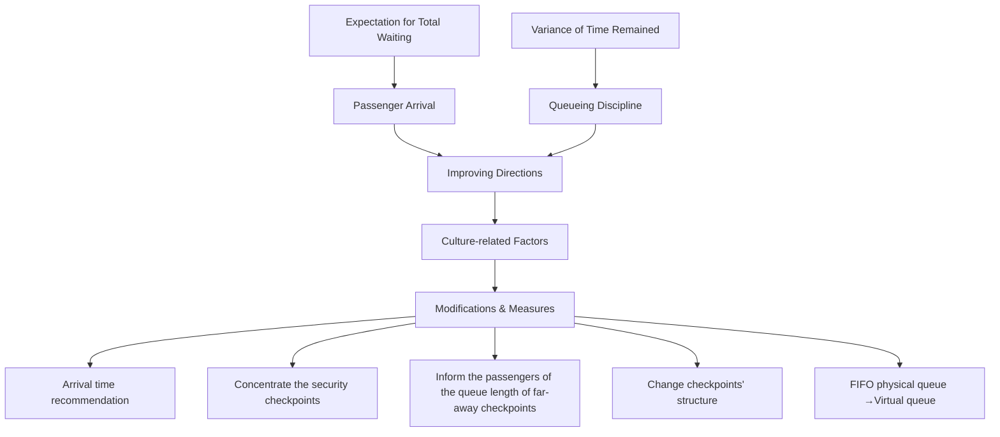
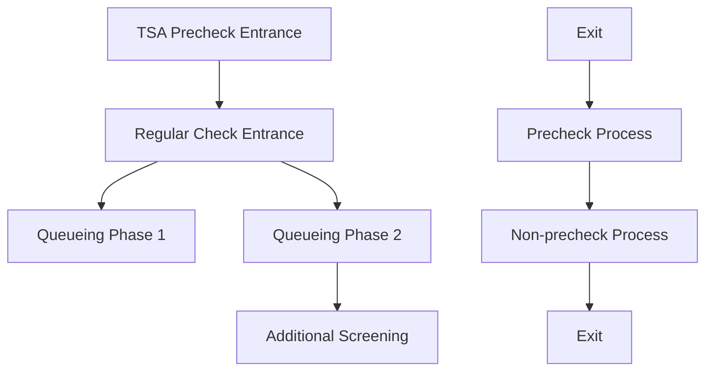
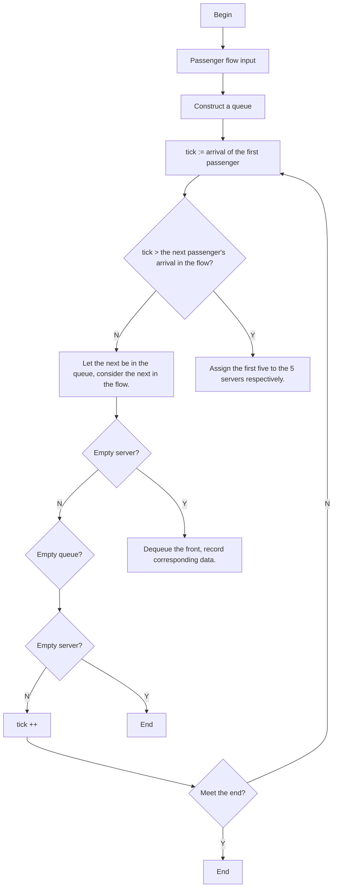
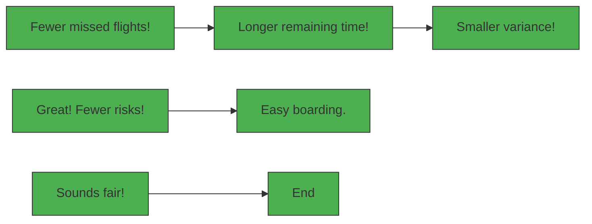

## 2017

## MCM/ICM

## Summary Sheet

(Your team's summary should be included as the first page of your electronic submission.)

Type a summary of your results on this page. Do not include the name of your school, advisor, or team members on this page.

# Summary

Bottlenecks that passengers take time to take care of their carry-on properties before X-ray scanning and that the structure of the checkpoints is not satisfying are spotted, and detailed recommendations for the airport security management to raise throughput of the security checkpoints, to improve the passengers’ satisfaction and to keep the cost relatively low are given with cultural factors quantified and their impacts on the models discussed.

We divided the security check process into two phases and regard the entire as two queueing models in series. By analyzing the given data, the document check is found to be a Poisson queueing (????/????/????) in Kendall notation, and Erlangian process $( M / E _ { k } / c )$ is concerned in the scan check process. Numeric solution of $( M / E _ { k } / c )$ is introduced using simulation technique.

Assumed that arrivals of passengers for a flight obey normal distribution, the varying passenger flow in a period of time can be generated from the real data and used for our simulation. We also believe that the mean ???? and the variance $\sigma ^ { 2 }$ of the distribution is culture-related. We also find that the passenger flow can be changed by recommending the passengers their arrivals, and thus better result of the passengers’ waiting time can be achieved.

We also suggested several methods to improve the design of the checkpoint, including shortening the distances between identical checkpoints and more rational human resource allocation.

Virtual queueing is recommended as an approach to improve passengers’ experience, and modify the conventional First In First Service queueing discipline to partial priority queueing discipline as well. A partial priority queueing discipline is put forward to reduce the remaining time variance of the passengers and to decrease the number of passengers that missed their flights, thus better passenger satisfaction is reached.

We also introduced culture-related factors for passenger arrival recommendation and priority queueing discipline. For the latter, an “acceptability factor” named ???? is used to denote the acceptability of strict priority discipline. And the examples of different cultures are given to illustrate this idea.

Validation of each model are made in our essay to make them convincing. We later assess the models and give a complete guide for the security managers to optimize the airport security check workflow. Weaknesses and further work that is not implemented in our essay are also pointed out.

# Time Counts! Less Waiting & Better Airports

## 1 Introduction

## 1.1 Background

Airport security check has been improved ever since the 911 attack. Although enhanced security means safer flights, however the complicated procedure may also increase the passengers waiting time and add cost to the U.S. Transportation Security Agency (TSA). Under some extreme circumstances, passengers have to wait for hours (and they are often recommended to be earlier for 2–3 hours, which often lead to confusion) (Hetter, 2016). Thus, to shorten the passengers’ waiting and designing a more efficient security check procedure is vitally important.

TSA is now in controversy for causing long queues waiting for security check. We, the Internal Control Management (ICM) team, trying to find a solution, faces the problems below:

1. Identify the bottlenecks of the current security check workflow.  
2. Improve the process with modifications, and illustrate how the modifications work.  
3. Find how to allow the modified process to be compatible with different culture backgrounds and lower the variance of the passengers’ waiting time.  
4. Make suggestions on the policy for the security manager, with concern of the former requirements and corresponding models.

## 1.2 Analysis and Approach Overview

For problem 1, we divide the security check process in two parts: Phase 1, document check; and Phase 2, luggage and body scanning. The former is a Poisson queue, while the latter concerns an Erlangian model. Simulation is practiced as a means of solving multi-server Erlangian model. By testing the total waiting time’s sensitivity to changes on numbers of parallel servers in the two phases respectively, the bottlenecks of the workflow can be spotted.

To solve problem 2, considering the influential factors of a queueing process, modifications will be put forward to optimize and avoid congestions.

The current TSA recommended passengers’ arrival time is used to build a model of the passenger arrival behavior at an airport, and we assume the arrivals in time for one certain flight obey normal distribution, and in a small time interval, the arrivals of all passengers for all flights obey an exponential distribution. We will modify the arrival recommendation strategy to influence passengers’ arrival behavior.

Another direction to improve the current process is to provide more robust security check service with greater capacity. A few suggestions and their verification or explanation will be given.

Besides the performance, justifiability also counts. Virtual queueing under other disciplines (Zhao, et al., 2016) will be a good practice. Queueing discipline modification is culture-sensitive, and thus lead to the discussion of the third problem.

The following diagram illustrate the above ideas in a more visual way:


<details>
<summary>flowchart</summary>


</details>

Figure 1 Optimizing directions and our modifications,  
where “service pattern” concerns the service rate and number of servers.

## 2 Assumptions

1. Individual variability is not considered for the servers, the checkpoint structures, etc.  
2. Although the number of lanes opened in the scan check process is dynamic, we assume that the service capability is always at its maximum. That is to say, spare lanes will be open, so long as the arrival exceeds the current capability.  
3. Assume that every passenger will choose to wait in the queue that minimizes their waiting time at every checkpoint.  
4. Points in time that passengers arrive at the airport for a certain flight obey normal distribution.  
5. TSA Pre-check won’t contribute much to the congestion compared with the normal one.  
6. Almost everyone would arrive at the airport for at least half an hour.

See 4.1 Security Check Process—Overview, and 4.3 Queueing Model Specification for detailed interpretation and assumptions of the given datasheet.

## 3 Symbols and Notations

Symbol or Notation  
(????/????/????): (????/????/????)  
Specification

<table><tr><td>Kendall notation, where a,b,c,d,e and f denote the inter-arrival-time distribution, the service time distribution, the number of parallel servers,</td></tr></table>

<table><tr><td></td><td>queueing discipline, restriction on system capacity, and the source of the arrival (usually infinity) respectively. (Taha, 2014)</td></tr><tr><td>M</td><td>Denote an exponential distribution for inter-arrival time and service time, i.e. a Poisson distribution for arrival and remove rate.</td></tr><tr><td>Ek</td><td>Erlang distribution type k.</td></tr><tr><td>x̂</td><td>Estimated value of x.</td></tr><tr><td>λd, μd</td><td>Arrival and service rates of the document check process.</td></tr><tr><td>λs, μs</td><td>Arrival and service rates of the scan check process.</td></tr><tr><td>Γ(α)</td><td>Γ(α) = ∫∞0xα-1e-xdx</td></tr><tr><td>N(μ, σ2)</td><td>Normal distribution with mean μ, and variance σ2.</td></tr></table>

## Queueing Model for Security Check Process

## 4.1 Security Check Process------Overview


<details>
<summary>flowchart</summary>


</details>

Figure 2 TSA Security checkpoint

The detailed security check process of one single checkpoint given in the diagram above. According to TSA’s policy, we classify the security processes in two types (pre-check included and no pre-check concerned process), and divide the each process in two queueing phases. In Phase 1, the passengers’ identity documents will be checked, after which they enter Phase 2, where luggage and body screening will be accepted. Two different types are in essence the same queueing with different parameters (number of servers, service time, etc.). And the entire security check process can be seen as two queueing models in series.

To better clarify the whole process, a procedure sequence diagram is given below:


<details>
<summary>text_image</summary>

A B C D E
F G H
</details>

Figure 3 Procedure sequence diagram  
A: time waiting for the document check, B: document checking time  
C: time waiting for sending luggage for X-ray scanning, D: X-ray scanning time, E: other possible luggage checks  
F: time waiting for millimeter wave scan, G: body scan time, H: other possible body checks  
The yellow shaded part is Phase 1 as we introduced in previous paragraphs, and the rest Phase 2.

The given Excel datasheet contains time records of the airport checkpoints (whose differences denote the inter-arrival time), time taken of the ID check process of previous checked passenger (i.e. B in the diagram), millimeter wave scan timestamps (differences of which are the millimeter wave scanning time, shown as G in the diagram), timestamps that luggage getting out of the X-ray scan (differences denote E), and time to get scanned property (D, E, F, G, H).

By analyzing the given datasheet, patterns of the airport security check behaviors, such as the distribution of passengers’ inter-arrival time and service time at each section, can be discovered. Therefore a complete queueing model can be specified.

## 4.2 Significance Test on Two TSA Officers

The given datasheet involves timing of two different TSA officers, the significance test here is to verify that individual variability does not contribute much to the service time.

Suppose that variances of the service time of the two TSA officers are equal, $\sigma _ { 1 } ^ { 2 } = \sigma _ { 2 } ^ { 2 } = \sigma ^ { 2 }$ .

We make the null hypothesis $H _ { 0 }$ that service time expectations of both officers are the same, i.e. $\mu _ { 1 } = \mu _ { 2 }$ .

The combined sample variance of the two officers, $s _ { w } ^ { 2 } = 1 2 . 9 2 7$ .

At level, $\begin{array} { r } { \frac { | \overline { { x _ { 1 } } } - \overline { { x _ { 2 } } } | } { s _ { w } \sqrt { 1 / n _ { 1 } + 1 / n _ { 2 } } } = 1 . 3 7 5 \leq t _ { 0 . 0 2 5 } ( 1 4 ) = 2 . 1 4 5 } \end{array}$ , the null hypothesis is not rejected.

Assume that the document check service time obeys the exponential distribution. The parameter of the distribution, i.e. service rate, is estimated, $\widehat { \mu _ { d } } = 0 . 0 9 4 6 5$ .

## 4.3 Queueing Model Specification

The two phases of the process can be specified as a series of queues by giving the arrival and service time distribution pattern.

## 4.3.1 Arrival


<details>
<summary>histogram</summary>

| Bin Range | Frequency |
|---|---|
| 0 - 10 | 21 |
| 10 - 20 | 13 |
| 20 - 30 | 6 |
| 30 - 40 | 3 |
| 40 - 50 | 0 |
| 50 - 60 | 1 |
| 60 - 70 | 1 |
| 70 - 80 | 1 |
</details>

Figure 4 Frequency histogram of non-pre-check arrivals


<details>
<summary>histogram</summary>

| Bin Range | Frequency |
|---|---|
| 0 - 5 | 30 |
| 5 - 10 | 7 |
| 10 - 15 | 3 |
| 15 - 20 | 7 |
| 20 - 25 | 5 |
| 25 - 30 | 4 |
| 30 - 35 | 1 |
| 35 - 40 | 0 |
| 40 - 45 | 0 |
| 45 - 50 | 0 |
</details>

Figure 5 Frequency histogram of pre-check arrivals

According to the histograms above, we suppose that the time intervals of both the regular and pre-check arrivals obey exponential distribution $f ( x ) = \lambda _ { d } \mathrm { e } ^ { - \lambda _ { d } x }$ .

Maximum likelihood estimation of the parameter $\lambda _ { d } \colon$

$$
L (\lambda_ {d}) = \prod_ {i = 1} ^ {n} f (x _ {i}) = \prod_ {i = 1} ^ {n} \lambda_ {d} \mathrm{e} ^ {- \lambda_ {d} x _ {i}} = \lambda_ {d} ^ {n} \mathrm{e} ^ {- \lambda_ {d} \sum_ {i = 1} ^ {n} x _ {i}}
$$

$$
\ln L (\lambda_ {d}) = n \ln \lambda_ {d} - \lambda_ {d} \sum_ {i = 1} ^ {n} x _ {i}, \frac {\mathrm{d} \ln L (\lambda_ {d})}{\mathrm{d} \lambda_ {d}} = \frac {n}{\lambda_ {d}} - \sum_ {i = 1} ^ {n} x _ {i} = 0
$$

Therefore ????� = $\begin{array} { r } { \widehat { \lambda _ { d } } = \frac { n } { \sum _ { i = 1 } ^ { n } x _ { i } } = \frac { 1 } { \overline { { x _ { \ i } } } } } \end{array}$ , and the expectation, $\begin{array} { r } { E \Big ( \widehat { \lambda _ { d } } \Big ) = E \Big ( \frac { 1 } { \overline { { x _ { \iota } } } } \Big ) = \frac { 1 } { E ( x ) } = \lambda _ { d } , } \end{array}$ is an unbiased estimation. Thus the arrival rates of the regular and pre-check procedures are estimated to be $\widehat { \lambda _ { 1 } } = 0 . 0 7 7 2 4 4$ and $\widehat { \lambda _ { 2 } } = 0 . 1 0 8 8 2 0 1 6$ , respectively.

Here, a goodness of fit test is done, and each of the procedures are classified into 10 classes. Let’s take the regular (without pre-check) procedure as an example:

<table><tr><td>Class</td><td>0-8</td><td>8-16</td><td>16-24</td><td>24-32</td><td>32-40</td><td>40-48</td><td>48-56</td><td>56-64</td><td>64-72</td><td>72-80</td></tr><tr><td>True Frequency</td><td>21</td><td>13</td><td>6</td><td>3</td><td>0</td><td>0</td><td>1</td><td>1</td><td>0</td><td>1</td></tr><tr><td>Predicted Probability</td><td>0.461</td><td>0.248</td><td>0.134</td><td>0.072</td><td>0.039</td><td>0.021</td><td>0.011</td><td>0.006</td><td>0.003</td><td>0.002</td></tr><tr><td>Predicted Frequency</td><td>21.204</td><td>11.430</td><td>6.161</td><td>3.321</td><td>1.790</td><td>0.965</td><td>0.520</td><td>0.280</td><td>0.151</td><td>0.081</td></tr></table>

Table 1 Regular procedure, non-pre-check, true frequencies and predicted frequencies

$$
\chi^ {2} = \sum_ {i = 1} ^ {1 0} \frac {\left(N _ {i} - n p _ {i}\right)}{n p _ {i}} = 1 5. 8 9 8 <   \chi_ {0. 0 5} ^ {2} (9) = 1 6. 9 1 9
$$

Thus we consider the above as an exponential distribution.

And similarly, fit for the pre-check procedure, $\chi ^ { 2 } = 1 5 . 5 9 9 < \chi _ { 0 . 0 5 } ^ { 2 } ( 9 ) = 1 6 . 9 1 9 .$ .

Since the inter-arrival time obeys exponential distribution, the number of passengers’ arrival in unit time obeys Poisson distribution.

## 4.3.2 Phase 1 Queueing Specification

We also consider the service time of Phase 1 obeys exponential distribution, which is a common practice for simple cases in queueing theory, and the service rate is below.

$$
\mu_ {d} = 0. 0 9 4 6 5
$$

Based on the above discussion, the Kendall notation of Phase 1 is $( M / M / c )$ , where denotes a Poisson process and is the number of parallel servers. The arrival rate of this queueing model depend on certain conditions, and ???? is given by the airport facility background. We assume that the service rate is a constant $\mu _ { d } = 0 . 0 9 4 6 5$ for each server.

## 4.3.3 Phase 2

Because the two queueing models are in series, we have $\lambda _ { s } = \mu _ { d }$ . Phase 2 is also a multiple-server model, but the serving process is much more complicated, besides the histogram does not obey exponential distribution, apparently.

An Erlangian model is introduced, Erlang service is widely used to model combined serving processes, where consequent queueing models are


<details>
<summary>histogram</summary>

| Bin Range | Frequency |
| --------- | --------- |
| 0-10      | 0.010     |
| 10-20     | 0.030     |
| 20-30     | 0.030     |
| 30-40     | 0.015     |
| 40-50     | 0.009     |
| 50-60     | 0.008     |
| 60-70     | 0.002     |
| 70-80     | 0.001     |
</details>

Figure 6 Histogram of the service time in Phase 2, together with a PDF plot of an Erlang distribution.

connected in series. ???? identical Poisson servers in series generate an Erlang type ???? service. However, it is often the case that parameter is not strictly equal to the number of phases in a server. PDF of Erlang type ???? distribution is given by

$$
f (x) = \frac {1}{\Gamma (\alpha) \beta^ {\alpha}} x ^ {\alpha - 1} \exp (- x / \beta), (\alpha , \beta > 0; 0 <   x <   \infty)
$$

with the expectation $\begin{array} { r } { E ( x ) = \alpha \beta } \end{array}$ and variance $V a r ( x ) = \alpha \beta ^ { 2 }$ . Parameter  and $\beta$ is related with and the service rate (Gross, et al., 1985):

$$
\left\{ \begin{array}{l} \alpha = k \\ \beta = \frac {1}{k \mu} \end{array} \right.
$$

Fit the distribution for the total service time in Phase 2 (time to get scanned property), our results are, $k = 4 , \mu _ { s } = 0 . 0 3 5 7$ .

Therefore, the Kendall notation of Phase 2 queueing is $( M / E _ { k } / c )$ , where the input is identical to the output of Phase 1, $E _ { k }$ is an Erlang type $k = 4 , \mu _ { s } = 0 . 0 3 5 7$ distribution, and the number of parallel servers (i.e. the number of X-ray scanners and millimeter wave scanners) is depend on specific airport.

$( M / E _ { k } / c )$ queueing does not have a good analytical solution; our numerical solution using simulation technique will be introduced later.

## 4.4 Section Summary

The airport security check process consists of two phases, first of which is an $( M / M / c )$ queueing process, and the second is an $( M / E _ { k } / c ^ { \prime } )$ queueing. Arrival rate of the second is the service rate of the first. Parameters of the distributions can be estimated using the given data.

## Queueing Simulation and Bottlenecks Spotting

## 5.1 Estimating Expenses

According to (Learn.org; PayScale.com), income of a security officer is \$28,624 \$58,987 and of an airline security screener is \$23,262–\$54,015. That is the human resource expenses of the security check. Costs of security devices are mostly one-off consumptions. The price of an airport X-ray baggage scanner is at \$20,000–50,000 and of a millimeter wave full body scanner is at \$100,000 (Alibaba.com). And the maintenance cost is mainly from the electricity. Another fact is that one single lane of the scan check process requires 4 security screeners on average. Therefore, we drew a conclusion that the cost of one lane (server) in Phase 2, is about the cost of 4 desks (servers) at Phase 1.

## 5.2 Basic Ideas

A MATLAB program is written to simulate the entire security check process. To build up the numeric solution, Markov chains are used for Erlangian queueing. (Zeng, et al., 2011)


<details>
<summary>flowchart</summary>


</details>

Figure 7 MATLAB simulation specification

Since there is no analytical solution of an $( M / E _ { k } / c )$ (Phase 2) queueing model, a simulation of the entire security check process is put forward, and both Phase 1 and Phase 2 are concerned in the model in series.

Given the parameters of each probability distribution at the two phases, we generate series of random variates to simulate the process. First, random variates obeying exponential distribution is generated as people’s inter-arrival time. We then calculate and store the arrival timestamps, service time (generated random variables obeying another exponential distribution) and waiting time (worked out with the previous passenger’s waiting time, service time and the arrival interval) of each passenger in a table. Besides getting results of waiting time spans, the removal rate of Phase 1 is also observed, which is used as the arrival of Phase 2. After working on Phase 1, we do the same on Phase 2, but the new service is Erlangian. Finally, expectations of total waiting time are evaluated.

To spot the bottlenecks in the process, we tested the improvements of total waiting time expectations when 4 document check servers are added (row “Document Check Added” in the table below), and 1 scan check server is added (row “Scan Check Added”).

## 5.3 Spot the Bottlenecks!

The simulated security process has a changeable arrival rate $\lambda _ { d } ,$ , and both of the initial numbers of the document check servers and of the scan check servers are assigned 5, as is the case in Figure 2, which is a small scale for an airport. The service rate of one document check server is assigned $\mu _ { d } = 0 . 0 9 4 6 5$ , and that of one scan check service is $\mu _ { s } = 0 . 0 3 5 7$ . Service of Phase 2 is Erlangian type $k = 4$ . These three parameters are the same to what we have mentioned before.

Below lists the expectations for total waiting time at different arrival rates. Row “Original” is the total waiting time expectation of process consist of $( M / M / 5 )$ and $( M / E _ { k } / 5 )$ . Row “Document Check Added” for the case that 4 document check servers are added, that is $( M / M / 9 )$ for Phase 1 and $( M / E _ { k } / 5 )$ for Phase 2. For row “Scan Check Added”, 1 scan check server is added, that is $( M / M / 5 )$ and $( M / E _ { k } / 6 )$ .

<table><tr><td> $\lambda_d$ </td><td>3.247</td><td>3.710</td><td>4.329</td><td>4.478</td><td>4.638</td><td>4.810</td><td>5.194</td></tr><tr><td>Original</td><td>31349</td><td>22632</td><td>12781</td><td>10807</td><td>8988</td><td>7391</td><td>3668</td></tr><tr><td>Document Check Added</td><td>31092</td><td>21878</td><td>11832</td><td>10671</td><td>8925</td><td>7215</td><td>3291</td></tr><tr><td>Scan Check Added</td><td>18258</td><td>10643</td><td>3045</td><td>1680</td><td>271</td><td>88</td><td>24</td></tr></table>

Table 2 Simulation results of the total waiting time (in seconds)

We find that, the document check process is not the bottleneck of the process, but the scan check. By adding scan check lanes, service capability of the whole system is significantly increased. We can even observe that some divergent queueing cases converge $( e . g . \ \lambda _ { d } = 5 . 1 9 4 )$ .

## 5.4 Comments

Based on the above analysis, bottlenecks restricting the queueing capacity and efficiency comes from the scan process Phase 2. From the given data, we see that the X-ray scan time is usually fast and steady, and is not likely to be the bottleneck. However, time taken for the passenger to take off clothes and to take care of their carry-on properties contribute much to the next passenger’s waiting (time C in Figure 3), especially when someone is heavy with carry-on properties or not experienced in air travelling.

We would recommend the airport to allow the passengers to take a bin for their to-bescanned properties before queueing, and thus waiting time in Phase 2 will be reduced.

## 6 Comments on the Safety

Firstly, on the stand of the airport, any security accident, including terrorist attacks, hijacking or aircraft destroying, if happens, will cause unbearable blame from the public opinion, which is unacceptable for the airport. Thus it does not sound like a good idea to reduce the links in security check procedure to fasten check-in and to lower the expenses.

A fundamental principle of our later discussion is that, no procedure in the security check chain is omitted. Means like optimizing queueing processes, arranging human resources, guiding passengers’ arrival can be implemented as ways to improve the passenger experience.

## 7 Passenger Arrival Behavior Modeling

## 7.1 Passenger Flow Generating

Flight records of O’Hare International Airport on Wednesday, Jan. 18, 2017 were found on (Flight Stats), including the departure time and information of the plane models. Most of the airlines are Boeing 737-800 whose capacity is usually 104–189 passengers.

To simulate the passenger arrival behavior, i.e. the varying passenger flow in a time period, we assume that the capacity of every flight is about 189, and the points of the passengers’ arrival time obey normal distribution. Since TSA recommends passengers to be at the airport 2 hours earlier before the flight for domestic departures, we model the passengers’ arrival time for each flight to obey normal distribution $N ( \mu , \sigma ^ { 2 } )$ , and let $\mu$ be 2 hours before the departure and $\mu + 3 \sigma$ be the point in time that there is half an hour remained.


<details>
<summary>line chart</summary>

| x    | y     |
| ---- | ----- |
| 0    | 300   |
| 50   | 500   |
| 100  | 520   |
| 150  | 1000  |
| 200  | 750   |
| 250  | 500   |
| 300  | 400   |
| 350  | 880   |
| 400  | 650   |
| 450  | 840   |
| 500  | 750   |
| 550  | 980   |
| 600  | 960   |
| 650  | 980   |
| 700  | 960   |
</details>

Figure 8 Varying passenger flow in a time period, from 6:30 a.m. to 16:40 p.m., O’Hare International Airport, Jan. 18, 2017

We then add these PDFs together and get the dynamic passenger arrival data. The shown plotted graph (Figure 8) is such a practice on timespan between 6:30 a.m. to 16:40 p.m.

We can see a peak at 9:30 a.m. and at around 11:00, the passenger flow get down to a relatively low level (this is probably because of massive departures).

Based on the above passenger flow distribution, we will simulate the security check queueing process at a domestic departure checkpoint later.

## 7.2 Arrival Time Recommendation

We tend to believe that the passenger arrival behavior can be changed by recommending their arrival time, however this is often much more complex due to airport location or cultural norm of a certain nation.

We calculated the mean waiting time of the passengers by simulating using the varying passenger flow introduced in the last subsection, at different normal distributions as we mentioned above. Only one checkpoint is taken into account in the simulation, and the flow is generated with domestic departure flights. When the average arrival of the passengers for a certain flight is 120 minutes earlier, its mean waiting time in the security check process is about 26 minutes as shown in the chart below.

<table><tr><td>Difference of μ and the departure time (min)</td><td>90</td><td>105</td><td>120</td><td>150</td><td>180</td></tr><tr><td>σ (Ensured that μ + 3σ is at 30 min earlier the departure)</td><td>20</td><td>25</td><td>30</td><td>40</td><td>50</td></tr><tr><td>Passenger flow per hour</td><td>491</td><td>498</td><td>502</td><td>503</td><td>498</td></tr><tr><td>Mean waiting at Phase 1 (sec)</td><td>0.0953</td><td>0.0633</td><td>0.0781</td><td>0.0654</td><td>0.0631</td></tr><tr><td>Mean waiting at Phase 2 (sec)</td><td>82.9986</td><td>56.146</td><td>26.0189</td><td>21.7186</td><td>16.9306</td></tr></table>

Table 3 Result for waiting time at different recommended time

From the chart, we curiously found that the earlier the passengers arrive, the less the mean waiting time will be. This is quite expected, because earlier arrivals and more uniformly distributed arrival intervals can reduce the “strikes” of the passenger flow.

Cultural norm impact on the arrival rate distribution (“varying passenger flow”, in other words) will be discussed later. Measures like sending text messages to passengers for recommending their arrivals based on real-time data as well as their cultural background will help.

## 8 Checkpoint Redesign

## 8.1 Concentrating the Checkpoints

## 8.1.1 Basic Ideas

In queueing theory, it is found that $( M / M / c )$ queueing has a better performance than ???? parallel $( M / M / 1 )$ queueing processes, with shorter mean queue length and better mean waiting time. (See Appendix 13.1 for Proof) Simulation of a more complex system, as in the security check process is made and the results are consistent. According to our assumption, so long as the passengers could see the servers, they will choose to wait in the queue that minimizes their waiting time. Thus making the passengers know the queueing conditions at checkpoints works.

## 8.1.2 Measures to Take

Security checkpoints to terminals are shown in the O’Hare terminal map. (Chicago Department of Aviation, 2012). We would recommend the airport to reduce the distances between each checkpoints at Terminal 1 and 3. This will help the passengers to choose a checkpoint minimizing their waiting among the equivalent checkpoints at each terminal.

Another possible solution which is equivalent to the former is to monitor the real-time queue length of each checkpoint at Terminal 1 and 3 and install LED boards to show these information. This also helps the passengers to choose a proper checkpoint.


<details>
<summary>text_image</summary>

Terminal 2
Terminal 3
Terminal 1
Terminal 5
P
P
P
P
P
Economy Parking Lots
</details>

Figure 9 O’Hare Terminal Map, © 2012 Chicago Department of Aviation, URL: http://www.flychicago.com /OHare/EN/AtAirport/map/default.aspx (Chicago Department of Aviation, 2012)

The above measures may both avoid some queue’s getting too long and cause a congestion.

## 8.2 Checkpoint Structure

## 8.2.1 Distribution of Human Resource between the 2 Phases

This suggestion on checkpoint redesign is a continued section of Section 5.3, Spotting Bottlenecks. We know that the cost of a lane in Phase 2 is 4 times more than that of a desk at Phase 1. Optimizing the checkpoint structure and keep the cost relatively low can balance the service rates of the document check process and the scan check process, as well as saving money.

This is a programming problem in operation research. Assume the number of document check servers is $k _ { 1 }$ , and that of the scan check is $k _ { 2 }$ .

$$
M i n i m i z e k _ {1} + k _ {2},
$$

$$
s. t. \left\{ \begin{array}{l} 0 <   k _ {1}, k _ {2} \leq 5 \\ k _ {1} \mu_ {d} > \lambda_ {d} \\ k _ {2} \mu_ {s} > \lambda_ {s} \end{array} \right.
$$

We trial the number of servers with our simulation to find the appropriate ratio. Our result is, when there are 5 lanes of scan check servers, 3 document check servers are enough for most common cases. Cut on document check service desks won’t cause bottlenecks, and according to our previous study, adding new lanes will greatly improve the security check service.

<table><tr><td>Time since the initial (min)</td><td>391-450</td><td>451-510</td><td>511-570</td><td>571-630</td><td>631-690</td><td>691-750</td><td>751-810</td><td>811-870</td><td>871-930</td><td>931-990</td></tr><tr><td>Passenger flow /h</td><td>563</td><td>433</td><td>277</td><td>473</td><td>430</td><td>484</td><td>550</td><td>541</td><td>662</td><td>617</td></tr><tr><td>Positions needed for Phase 1</td><td>2</td><td>2</td><td>1</td><td>2</td><td>2</td><td>2</td><td>2</td><td>2</td><td>3</td><td>3</td></tr><tr><td>Mean waiting time at Phase 1</td><td>28.7135</td><td>7.6859</td><td>103.3296</td><td>12.2084</td><td>7.2299</td><td>11.2017</td><td>21.9008</td><td>17.9357</td><td>4.1698</td><td>3.188</td></tr><tr><td>Positions needed for Phase 2</td><td>5</td><td>4</td><td>3</td><td>5</td><td>4</td><td>5</td><td>5</td><td>5</td><td>5</td><td>5</td></tr><tr><td>Mean waiting time at Phase 2</td><td>27.3362</td><td>31.1131</td><td>14.1786</td><td>7.986</td><td>26.8053</td><td>7.2921</td><td>19.351</td><td>15.4442</td><td>6172</td><td>96.1114</td></tr></table>

Figure 10 Numbers of positions needed at Phase 1 and Phase 2 to make the queue length converge

## 8.2.2 Dynamic Assignment of Duty in a Time Span

Based on our previous work on passenger flow distribution in a period of time and the programming in the above subsubsection, we evaluate the duty assignment at each checkpoint every hour.


<details>
<summary>line chart</summary>

| Time   | Series 1 | Series 2 |
| ------ | -------- | -------- |
| 6:30   | 4.0      | 2.0      |
| 7:30   | 4.0      | 2.0      |
| 8:30   | 3.0      | 2.0      |
| 9:30   | 5.0      | 2.0      |
| 10:30  | 4.0      | 2.0      |
| 11:30  | 5.0      | 2.0      |
| 12:30  | 5.0      | 2.0      |
| 13:30  | 5.0      | 2.0      |
| 14:30  | 6.0      | 3.0      |
| 15:30  | 6.0      | 3.0      |
</details>

Figure 11 Dynamic assignment of duty with Phase 1 in blue and Phase 2 in green

Allocating fewer staff at the troughs, and more at the peaks, will help the security check system running properly at relatively low cost.

And for the specific problem we are now considering, we practice this method and plan to allocate the duty like this:

<table><tr><td>–</td><td>8:30 a.m.</td><td>2 for document check and 4 for scan check</td></tr><tr><td>8:30 a.m. –</td><td>13:30 p.m.</td><td>2 for document check and 5 for scan check</td></tr><tr><td>13:30 p.m. –</td><td>16:30 p.m.</td><td>3 for document check and 6 for scan check</td></tr></table>

Table 4 Dynamic duty allocation

## 8.2.3 Sensitivity Test

A sensitivity test is made for our model. The test is done via simulation.

<table><tr><td></td><td>Original</td><td>Decreased flow</td><td>Increased service ability</td></tr><tr><td>Passenger flow</td><td>502</td><td>452</td><td>502</td></tr><tr><td>Serve ability (Phase 2)</td><td>0.036</td><td>0.036</td><td>0.040</td></tr><tr><td>Mean waiting time</td><td>41.70</td><td>12.57</td><td>7.834</td></tr></table>

Table 5 Sensitivity test result, simulations for each case are done for 5 times

We find that when the passenger flow decreases by 10%, the mean waiting time deceases by 69.9%. When the document check service ability is raised by 10%, the mean waiting time almost remains the same. And if the service ability at Phase 2 is increased by 10%, the mean waiting time drops as much as 81.2%!

From the above test, we drew a conclusion that the queueing system is sensitive to the scan check service ability, while a low sensitivity is observed for changes of the document check ability. This again verifies the bottlenecks that we found earlier, and optimization can be given around the found bottlenecks.

## 9 Virtual Queueing

Waiting room can be useful to improve passengers’ experience. What’s even better is that the queueing discipline can be modified with this method. The conventional physical queue method is a strict FIFS (First In First Served), while virtual queueing can be more flexible. With the popularization of smartphones, new queueing methods that basically share the same process as virtual queueing, such as mobile queueing, but are more convenient and more sufficient are introduced, which will also provide us more possibilities to modify the queueing process. (Wikipedia; Zhao, et al., 2016)

## 9.1 Strict Priority Queue

Passengers’ satisfaction can be quantified by the number of passengers that missed their flights, mean remaining time after security check and the variant of the remaining time. Although FIFS sounds like an absolutely equitable practice, it is frustrating under some extreme circumstances. Imagine an “early bird” comes to the airport 6 hours in advance of his or her departure. If an unfortunate congestion occurs, the early passenger would hold up the passengers behind whose flight might be to take off. This is not acceptable.

Consider a strict priority queue, where the priority is strictly based on the departure time of each passenger. We now prove that this approach achieves better passenger satisfaction with our simulation.


<details>
<summary>flowchart</summary>


</details>

Figure 12 Passenger satisfaction

Our approach is to change the queueing discipline in the simulation, and we do find a strict priority queue performs better in the above aspects. The testing data involves a passenger flow of 723 passengers per hour. Our results are as follows:

<table><tr><td></td><td>1</td><td>2</td><td>3</td><td>4</td><td>5</td><td>6</td><td>7</td><td>8</td><td>9</td><td>10</td><td>Mean</td></tr><tr><td>FIFS</td><td>231</td><td>292</td><td>233</td><td>280</td><td>346</td><td>298</td><td>333</td><td>316</td><td>209</td><td>274</td><td>281.2</td></tr><tr><td>Priority</td><td>19</td><td>0</td><td>0</td><td>35</td><td>0</td><td>31</td><td>0</td><td>2</td><td>7</td><td>0</td><td>9.4</td></tr></table>

Figure 13 Numbers of passenger that missed their flights. 10 experiments are done here.

And the means and the variances of remaining time:

<table><tr><td></td><td>Mean</td><td>Variance</td></tr><tr><td>FIFS</td><td>6918</td><td> $6.8787 \times 10^{6}$ </td></tr><tr><td>Priority</td><td>6864</td><td> $3.9684 \times 10^{6}$ </td></tr></table>

Figure 14 Means and variances of the remaining time

Means are almost the same (this is expected, because expectation for the waiting time won’t vary with queueing discipline, which is a theorem in queueing theory. The slight difference is caused by the generation of random variates) while variance of queueing where priority is considered seems to be better.

## 9.2 Virtual Queueing Concerning Partial Priority Discipline

However, a strict priority queue does not sounds rational to a lot of people. (And of course, it is culture dependent.) A better queueing discipline is introduced here to be a fairer and more efficient option, and above all, cultural adaptable.

We introduce an “acceptability factor” $( 0 \leq \alpha \leq 1 )$ denote the acceptance of the strict priority discipline. We then use a partial priority discipline, which is a mixture of strict FIFS and strict priority discipline.

Let $t _ { a }$ denote a passenger’s arrival time, and $t _ { d }$ denote his or her departure time. We use

$$
t _ {p} = \alpha t _ {d} + (1 - \alpha) t _ {a}
$$

as the priority of the passengers, and sort the waiting queue in this discipline.

We tested $\alpha = 0 . 5$ for a passenger flow at 721 passengers/h, which is quite an extreme case for a single checkpoint. Below is our result.

<table><tr><td></td><td>Passengers Missed Flight</td><td>Variance</td></tr><tr><td>FIFS</td><td>281.2</td><td> $6.8787 \times 10^{6}$ </td></tr><tr><td>Partial Priority</td><td>71.3</td><td> $5.1711 \times 10^{6}$ </td></tr><tr><td>Strict Priority</td><td>9.4</td><td> $3.9684 \times 10^{6}$ </td></tr></table>

Table 6 Number of passengers that missed the flight (10 hours) and variance of remaining time,

We find the partial priority discipline is also effective in raising passenger satisfaction.

## Inter-cultural Applicability

## 10.1 Cultural Impacts on Punctuality

Different cultural norms have an impact on passengers’ punctuality.

People in the United States, Canada and many northern European countries have a linear view of time, and are more likely to be punctual. This is also true to East Asian countries, like China and Japan, where social efficiency is seen important. In these countries, people tend to have a keen sense of time, and would usually be early for an event. On the contrast, Spaniards or people from Southern Europe are not so punctual. Passengers from such nations often hurry to board. (Business Insider)

Viewing the differences of varied cultural norms with our passenger arrival behavior model (see Section 7), we can say that the passenger flow in countries where people are more punctual is often more smooth and steady. More mathematically, the mean arrival time $\mu$ is often far earlier than the passengers’ flight departures, and the variance of their arrival distribution $\sigma ^ { 2 }$ is relatively small. Case for countries that are not so punctual is just opposite, as shown in the following plotted graph.


<details>
<summary>line chart</summary>

| x    | y     |
| ---- | ----- |
| 0    | 890   |
| 100  | 500   |
| 200  | 770   |
| 300  | 800   |
| 400  | 910   |
| 500  | 1080  |
| 600  | 910   |
</details>

Figure 15 Smooth passenger flow, is 150 minutes earlier the departure, and $\sigma = 4 0$ .


<details>
<summary>line chart</summary>

| x    | y     |
| ---- | ----- |
| 0    | 400   |
| 50   | 1250  |
| 100  | 650   |
| 150  | 780   |
| 200  | 250   |
| 250  | 1150  |
| 300  | 450   |
| 350  | 1020  |
| 400  | 570   |
| 450  | 1170  |
| 500  | 820   |
| 550  | 1330  |
| 600  | 980   |
</details>

Figure 16 Rough passenger flow, where $\mu$ is 90 minutes earlier, and $\sigma = 2 0$ .

Airports with more smooth and steady passenger flow does not requires too much human resource, and its assignment can be more flexible, for passenger flow peaks are seldom observed. Scale effect that adopt $( M / M / c )$ rather than parallel $( M / M / 1 )$ also tend to work. Instead, it is not this satisfying in a less punctual nation. More peaks will be found, and massive human resource is needed to deal with the sudden congestions.

As we have mentioned before, sending text messages in advance to recommend passengers’ check-in time personally based on the current passenger flow at the airport is a very good practice. But when different cultural norms are considered, this is not that easy, for people’s punctuality must be taken into account. Since there is no such practice now, we cannot determine the $\mu$ and $\sigma ^ { 2 }$ of people’s arrival behavior in different countries, yet we can prove it certainly works.

## 10.2 Cultural Impacts in Queueing Process

Another cultural impact on our model is the acceptability of priority queueing in different nations. People in the United States respect others’ privacy as well as they hate other people cutting in line. Swiss are punctual and take collective efficiency as the most important. While in China, jumping queues is usual because individual efficiency is respected, and people tend to forgive such behaviors if the queue jumper has reasonable excuses.

The above varied thinking patterns may lead to different acceptability in different nations. Our acceptability factor (See 9.2 for definition), enlighten the culture-related factor in our model.

For example, passengers from the United States tend to think the new queueing discipline is not acceptable, because it damages the FIFS principle. However, Swiss might be in favor of our method because it dramatically raises the collective efficiency, and thus a greater ???? could be assigned. Chinese would probably think a neutral ???? was a good practice.

## Discussion and Conclusions

## 11.1 Policy Recommendations

We here give a complete guide on security check modifications and policy making for the TSA security manager based on our previous model, as our solution to problem 4.

## To Security Managers

To solve the airport security check congestion, and to optimize the throughput at the airport security checkpoints, we give you the following recommendations on policy making based on our investigation.

On human resource distribution, we would recommend fewer document check servers, while more for scan check. Bottlenecks of the security check workflow are at the scan check phase, and we have proved that 2 or 3 desks for document check is enough for a 5-lane scan check area. Dynamic allocation of document check servers and lanes opened should be reserved as a way to reduce unnecessary cost, besides, our approach to solve this has been put forward in our paper.

On facilities, waiting rooms should be built for virtual queueing. If possible, adding lanes for scan check at each checkpoint will dramatically increase the passenger throughput. Shorten the distances between identical checkpoints in the terminal will help passengers to choose one that minimizes their waiting. LED boards providing information of queue lengths at each checkpoint works in the same way. If possible, we also recommend a mobile queue system to be built, together with a queue management system, these facilities, thanks to the new information technology, will enhance the efficiency encouragingly. Providing passengers with bins for their to-be-scanned properties in advance will also shorten their waiting during the scan check process and avoid bottlenecks.

On safety and the cost, no reduction of links on the current security check procedure is recommended, since the risks cannot be assessed in value. Dynamic assignment of the duties is a possible solution as we have just mentioned above. Opening new lanes for checkpoints will also cost money, but money saved by good human resource allocation can be used for throughput enhancement.

We would like to highlight our approach to influence the passengers’ arrival. TSA has already made recommendations of time-in-advance for the passengers to avoid missing flights. Through our assumptions and modeling, we are curious to find that it is possible to affect the passenger flow by informing passengers of the arrival time ahead of their departure personally and dynamically based on the realtime statistics of the passenger flow at the airport. And the influenced passenger flow may reduce the occurrence of congestions at security checkpoints.

Passengers’ satisfaction is considered and quantified. With the help of virtual queueing mechanism, the departure priority queueing discipline can be practiced, which will reduce the variant of the passengers’ remaining time (thus raises the fairness) and more importantly, reduce the missed flights of the passengers.

Cultural norm impact on our model is also taken into consideration. Passengers’ cultural background may influence their punctuality of arrival and acceptability of our partial priority queueing discipline. Punctuality of a nation has an impact on the passenger flow at an airport, and acceptability of priority queueing should also be taken into account to avoid cultural taboos. This requires adaptation of our models in different countries. Changing the assumed normal distribution for passenger arrival and the acceptability factor ???? (See 9.2 for definition) will help. For example, for countries where people are not punctual, we can recommend them to be earlier for the flights. Another example is to illustrate the acceptability of our partial priority queueing discipline. In countries where jumping queue is extremely disagreeable, we can set the queueing to be more FIFS. On contrary, in countries where collective efficiency is emphasized, we adjust our factor ???? to add the priority components in the queueing process.

We hereby sincerely hope the above recommendations will work.

Internal Control Management (ICM) team

## 11.2 Model Assessment

Model validation has been implemented in each section of the above modeling. Here, we assess the strengths, weaknesses and possible future work in the section.

## 11.2.1 Strengths

• Full assumptions and validations are made for passengers’ arrival distribution and security check service time models. Bottlenecks are spotted and thorough analysis is made.  
• Our simulation of one day’s passenger flow is based on the real data of O’Hare International Airport, which is convincing.  
• Safety is taken as a fundamental principle. All optimization is done based on the prin ciple.  
Recommendations on passenger arrival guidance, checkpoint redesign, change of the queueing discipline, allocation of human resources, virtual queueing are given. Passengers’ satisfactory are considered, and the passenger’s flight experience will be improved.  
• Cultural differences are quantified and fully assessed. Sensitivity to these cultural factors of the passenger flow and acceptability to our priority queueing discipline.

## 11.2.2 Weaknesses

TSA Pre-check is not investigated thoroughly.  
• Lack of further consideration on safety.

## 11.3 Conclusions

For problem 1, we use the given data and find the distribution pattern of passenger flow and service time, then queueing models are built for the security check process at each checkpoint. We see the security check process as a $( M / M / c )$ queueing and a $( M / E _ { k } / c )$ process in series. Evaluation of passenger flow behavior in a period of time is made. We use normal distribution to simulate the varying passenger flow.

For problem 2, we put forward several possible approaches to improve passenger through put and raise the passengers’ satisfaction, including checkpoint redesign and virtual queueing where a partial priority queueing discipline is introduced.

Cultural norm impacts are also taken into account. For problem 3, we discussed the cultural impact on passenger flow and acceptability of the priority discipline, and recommendations are given to adapt our model to different cultures.

A detailed guide for policy making is made as our solution of problem 4, again, cultural factors are considered and recommendations concerning cultural difference are made. The recommendations we gave are all proved to be valid in previous discussions.

## 11.4 Further Work

• Discuss the Pre-check modification. Levels of security check based on the passengers credit rating, or more detailed background check can be implemented.

• Investigation on how cultural norm differences impact the punctuality and attitude towards the priority queueing need to be done. The correlations between the mathematical parameters and factors in reality should be revealed.  
• Detailed research on raising the check-in experience of the disabled and the senior should be made.  
Effect caused by waiting based on Lorenz curve.

## References

[1] Alibaba.com. Airport security device x-ray baggage scanner. Alibaba. [Online] [Cited: 1 22, 2017.] https://www.alibaba.com/product-detail/Airport-security-device-x-raybaggage\_60381309000.html.  
[2] —. High Quality Product Millimeter Wave Full Body Scanner Price. Alibaba. [Online] [Cited: 1 22, 2017.] https://www.alibaba.com/product-detail/High-Quality-Product-Millimeter-Wave-Full\_60569216900.html?spm=a2700.7724838.0.0.uHVhJp.  
[3] Business Insider. How Different Cultures Understand Time. Business Insider. [Online] [Cited: 1 24, 2017.] http://www.businessinsider.com/how-different-cultures-understand-time-2014- 5?IR=T.  
[4] Chicago Department of Aviation. 2012. O'Hare Map. FlyChicago. [Online] Chicago Department of Aviation, 2012. [Cited: 1 23, 2017.] http://www.flychicago.com/pages/landingpage.aspx.  
[5] Flight Stats. Flight Stats Information. Flight Stats. [Online] Flight Stats. [Cited: 1 23, 2017.] http://www.flightstats.com/go/FlightStatus/flightStatusByFlight.do.  
[6] Gross, Donald and Harris, Carl M. 1985. Fundamentals of Queueing Theory. s.l. : Wiley, 1985. pp. 170-175. ISBN 0-471-89067-7.  
[7] Hetter, Katia. 2016. How long will you wait in the TSA security line? CNN. [Online] 6 9, 2016. [Cited: 1 20, 2017.] http://edition.cnn.com/2016/06/09/travel/tsa-securityline-wait-times-how-long/.  
[8] Learn.org. How Much Do Airport Security Jobs Pay? Learn.org. [Online] [Cited: 1 22, 2017.] http://learn.org/articles/How\_Much\_Do\_Airport\_Security\_Jobs\_Pay.html.  
[9] PayScale.com. Security Guard Salary (United States). PayScale. [Online] [Cited: 1 22, 2017.] http://www.payscale.com/research/US/Job=Security\_Guard/Hourly\_Rate.  
[10] Taha, Hamdy A. 2014. Operations Research: Pearson New International Edition: An Introduction, 9/E. s.l. : Pearson, 2014. ISBN-10: 129202433X.  
[11] Wikipedia. Queue area. Wikipedia. [Online] [Cited: 1 23, 2017.] https://en.wikipedia.org/wiki/Queue\_area.  
[12] Zeng, Yong, Dong, Lihua and Ma, Jianfeng. 2011. Modeling, Analysis and Simulation in Queueing Phenomena. Xi'an : Xidian Univerisity Press, 2011. pp. 92-96. ISBN 978-7-5606-2672-7.  
[13] Zhao, Zhenwu and Ma, Jianjun. 2016. Tendency and Research on the Queue System of Airport Security Check. China Transportation Review. 10 2016, Vol. 38, 10, pp. 64-69.

## Appendix

## 13.1 Proof

Theorem: Mean waiting time of a $\left( M / M / k \right)$ queueing is shorter than that of ???? parallel $( M / M / 1 )$ queueing processes (Zeng, et al., 2011; Taha, 2014).

Proof: Consider ???? parallel $( M / M / 1 )$ processes, input of each server is Poisson $\lambda / k .$ . The mean queue length,

$$
L _ {q, 1} = \frac {\rho_ {1}}{(1 - \rho_ {1}) ^ {2}} \cdot P _ {0, 1}, \mathrm{where} \rho_ {1} = \frac {\lambda}{k \mu}
$$

$$
P _ {0, 1} = \left(1 + \frac {\rho_ {1}}{1 - \rho_ {1}}\right) ^ {- 1} = 1 - \rho_ {1}
$$

Thus,

$$
L _ {q, 1} = \frac {\rho_ {1} ^ {2}}{1 - \rho_ {1}}
$$

And the mean waiting time (Little’s formula),

$$
W _ {q, 1} = \frac {L _ {q , 1}}{\lambda / k} = \frac {\rho^ {2}}{k \lambda (1 - \rho / k)}, \mathrm{where} \rho = \frac {\lambda}{\mu}
$$

As for the $( M / M / k )$ process, the input is Poisson .

$$
L _ {q, 2} = \frac {\rho^ {k + 1}}{(k - 1) ! (k - \rho) ^ {2}} \cdot P _ {0, 2}
$$

$$
P _ {0, 2} = \left(\sum_ {n = 0} ^ {k - 1} \frac {\rho^ {n}}{n !} + \frac {\rho^ {k}}{k !} \cdot \frac {1}{1 - \rho / k}\right) ^ {- 1}
$$

And thus,

$$
L _ {q, 2} = \frac {\rho^ {k + 1}}{(k - 1) ! (k - \rho) ^ {2}} \cdot \frac {1}{\sum_ {n = 0} ^ {k - 1} \frac {\rho^ {n}}{n !} + \frac {\rho^ {k}}{k !} \cdot \frac {1}{1 - \rho / k}}
$$

The mean waiting time is given by

$$
W _ {q, 2} = \frac {L _ {q , 2}}{\lambda} = \frac {1}{\lambda} \cdot \frac {\rho^ {k + 1}}{k ^ {2} (k - 1) ! (1 - \rho / k) ^ {2}} \cdot \frac {1}{\sum_ {n = 0} ^ {k - 1} \frac {\rho^ {n}}{n !} + \frac {\rho^ {k}}{k !} \cdot \frac {1}{1 - \rho / k}}
$$

To prove that $W _ { q , 2 } < W _ { q , 1 }$ ,

$$
\Leftrightarrow \frac {1}{\lambda} \cdot \frac {\rho^ {k + 1}}{k ^ {2} (k - 1) ! (1 - \rho / k) ^ {2}} \cdot \frac {1}{\sum_ {n = 0} ^ {k - 1} \frac {\rho^ {n}}{n !} + \frac {\rho^ {k}}{k !} \cdot \frac {1}{1 - \rho / k}} <   \frac {\rho^ {2}}{k \lambda (1 - \rho / k)}
$$

$$
\Leftarrow \frac {\rho^ {k - 1}}{k ! \left(\sum_ {n = 0} ^ {k - 1} \frac {\rho^ {n}}{n !} \left(1 - \frac {\rho}{k}\right) + \frac {\rho^ {k}}{k !}\right)} <   1
$$

$$
\Leftarrow \frac {\rho^ {k - 1}}{k ! \left(0 + \frac {\rho^ {k}}{k !}\right)} = \frac {1}{\rho} <   1
$$

Since $\rho = \lambda / \mu ,$ generally we have $1 < \rho < k .$ . It is true that $W _ { q , 2 } < W _ { q , 1 }$

## 13.2 MATLAB Source Code for Simulation

## 13.2.1 simulation\_simple.m

```matlab
clc;
clear all;
load leave_time_ID;
load peo_num_ID
% load peo_num;%change comments
i=1;
x_k = 4;
x_mu = 1/28;
machine_number = 5;
% mean_arr = 12.9870/2.7;%0.077/10 %just influence the people number
% final_span = 3600*10;

% peo_num = floor(span/mean_arr);%change comments
peo_num = peo_num_ID;

% % generate the arrival intervals of people at airport randomly
% peo_in = exprnd(mean_arr,1,peo_num);
% actual_span = sum(peo_in);
% peo_in = peo_in.*(span/actual_span);
% peo_arr = cumsum(peo_in);

% record_arr =
[leave_time_ID(1,:),leave_time_ID(2,:),leave_time_ID(3,:),leave_time_record_arr = (leave_time_ID(:))';
record_arr(find(record_arr == 0)) = [];
record_arr = sort(record_arr);
peo_arr = record_arr;

% %generate the service time of people at airport
% peo_serv = gamrnd(x_k,1/(x_k*x_mu),1,peo_num);

%record the state of each security check point
```

```matlab
state = zeros(3*machine_number, peo_num);

%initialize the time and intervals to leave in each array
leave_time = zeros(machine_number, peo_num);
leave_interval = zeros(machine_number, peo_num); %the time each person in arrays

%initialize the number of people waited in each array
count = ones(1, machine_number);

%initialize the person's data
for i = 1: machine_number
    state(3*(i-1)+1,1) = peo_arr(i);
    state(3*(i-1)+2,:) = gamrnd(x_k,1/(x_k*x_mu),1,peo_num);
    state(3*i,1) = 0;

    leave_time(i,1) = sum(state(3*(i-1)+1 : 3*i , 1)); %generate the leaving time of the first person in each array
    leave_interval(i,1) = sum(state(3*(i-1)+3:3*i,1)); %generate the leaving intervals of the first person in each array
end

record_min = zeros(1, machine_number);
for i = machine_number+1 : peo_num

    for j = 1: machine_number
    record_min(j) = leave_time(j,count(j));
    end
    [temp,min_array] = min(record_min);

    count(min_array) = count(min_array) + 1;
    state(3*(min_array-1)+1 , count(min_array)) = peo_arr(i); %let the people in the min_array

    if state(3*(min_array-1)+1 , count(min_array)) < state(3*(min_array-1)+2 , count(min_array)-1)...
    +state(3*(min_array-1)+1 ,
    count(min_array)-1)...
    +state(3*(min_array-1)+3 ,
    count(min_array)-1)

    state(3*(min_array) , count(min_array)) = state(3*(min_array-1)+2 , count(min_array)-1)
```

```matlab
+state(3*(min_array-1)+1,
count(min_array)-1)...
+state(3*(min_array-1)+3,
count(min_array)-1)...
-state(3*(min_array-1)+1,
count(min_array));
else
    state(3*(min_array), count(min_array)) = 0;
end

leave_time(min_array,count(min_array)) = sum(state(3*(min_array-1)+1:3*min_array,
count(min_array));
leave_interval(min_array,count(min_array)) = sum(state(3*(min_array-1)+3:3*min_array,
count(min_array));
end

total = 0;
for i = 1:size(leave_interval,1)
    for j = 1:size(leave_interval,2)
    if leave_interval(i,j) ~= 0
    total = total + leave_interval(i,j);
    end
    end
end

means = total/peo_num;
```

## 13.2.2 simulation\_tick.m

```matlab
clc;
clear all;
load change2;

x_k = 4;
x_mu = 1/28;

mean_serv = 10.5652;
machine_number = 5;

peo_arr = change2(2,:).*60;
peo_fli = change2(1,:).*60;
peo_num = size(change2,2);
```

```matlab
state = zeros(4*machine_number, peo_num);
%the first row is the flight time of each passenger
%the second row is the arrival time of each passenger
%the third row is the service time of each passenger
%the fourth row is the waiting time of each passenger

leave_time = zeros(machine_number, peo_num);
wait_time = zeros(machine_number, peo_num);

%initialize the state matrix
for i = 1: machine_number
    state(4*(i-1)+1,1) = peo_fli(i);
    state(4*(i-1)+2,1) = peo_arr(i);
% state(4*(i-1)+3,:) = exprnd(mean_serv,1,peo_num);%service times of each machine in
exponential distribution
    state(4*(i-1)+3,:) = gamrnd(x_k,1/(x_k*x_mu),1,peo_num);
    state(4*(i-1)+4,1) = 0;

    leave_time(i,1) = sum(state(4*(i-1)+2 : 4*i ,1));
    wait_time(i,1) = state(4*i,1);
end

count = ones(1,machine_number);%record the array length of each machine

queue = zeros(1,peo_num);
front = 1;
rear = 1;

scanning = machine_number+1;

record_min = zeros(1,machine_number);
for j = 1:machine_number
    record_min(j) = leave_time(j,count(j));
end

[min_time,min_array] = min(record_min);

% %push the next person into queue
% queue(rear) = scanning;
% rear = rear + 1;
% scanning = scanning+1;
```

```matlab
for tick = floor(peo_arr(1)):floor(peo_fli(length(peo_fli)))
    if tick > peo_arr(scanning) && scanning < peo_num%push the latest person into queue
    queue(rear) = scanning;
    rear = rear + 1;

    %    if rear > front
    %    temp_queue = queue(front:rear - 1);
    %    [temp_record,temp_order] = sort(peo_fli(temp_queue));
    %    queue(front:rear-1) = temp_queue(temp_order);
    %    end

    scanning = scanning + 1;
    end

    %    if peo_arr(queue(front)) < min_time
    if tick > min_time
    if rear > front % the queue is not empty
    count(min_array) = count(min_array) + 1;
    state(4*(min_array-1)+1, count(min_array)) = peo_fli(queue(front));
    state(4*(min_array-1)+2, count(min_array)) = peo_arr(queue(front));
    state(4*(min_array-1)+4, count(min_array)) = max(min_time - peo_arr(queue(front)), 0);

    leave_time(min_array,count(min_array)) = sum(state(4*(min_array-1)+2 : 4*(min_array),count(min_array)));
    wait_time(min_array,count(min_array)) = state(4*(min_array),count(min_array));%update the leave time

    front = front + 1;%pop the prior person to serve

    for j = 1:machine_number
    record_min(j) = leave_time(j,count(j));
    end
    [min_time,min_array] = min(record_min);%update the min_time and the min_array
    end

    end
end
```

```matlab
total = 0;
flag = 0;
for i = 1:machine_number
    for j = 1:count(i)
    total = total + state(4*(i-1)+1,j)-state(4*(i-1)+2,j)-state(4*(i-1)+3,j)-state(4*i,j);
    if state(4*(i-1)+1,j)-state(4*(i-1)+2,j)-state(4*(i-1)+3,j)-state(4*i,j) < 0
    flag = flag + 1;
    end
    end
end
means = total / peo_num;

summation = 0;
for i = 1:machine_number
    for j = 1:count(i)
    summation = summation + (state(4*(i-1)+1,j)-state(4*(i-1)+2,j)-state(4*(i-1)+3,j)-state(4*i,j)-means)^2;
    end
end
variance = summation / peo_num;
```

## 13.2.3 stream.m

```matlab
function [ total ] = stream( pretime, variance, people)
% UNTITLED
% original:pretime=120,variance=30,people=189
a=[-3*variance:1:3*variance];
a=[a;a];
a(2,1)=normcdf(a(1,1),0,variance)*people;
for i=2:6*variance+1
    a(2,i)=normcdf(a(1,i),0,variance)-normcdf(a(1,i-1),0,variance);
    a(2,i)=a(2,i)*people;
end
data=xlsread('data',2);
siz=size(data);
dataset=[];
data=data*24*60;
for i=1:siz(1,1)
    for j=1:siz(1,2)
    if data(i,j)>0
    dataset=[dataset,data(i,j)];
```

```matlab
end
end
end
siz=size(dataset);
total=zeros(1,1440);
for i=1:siz(1,2)
    for j=1:variance*6+1
    if dataset(1,i)-pretime+a(1,j)>=1
    total(1,round(dataset(1,i)-pretime+a(1,j)))=total(1,round(dataset(1,i)-pretime+a(1,j)))+a(2,j);
    end
    end
end
end
```

13.2.4 stream2.m  
```matlab
function [ total ] = stream( pretime, variance, people)
% UNTITLED
% original:pretime=120,variance=30,people=189
a=[-3*variance:1:3*variance];
a=[a;a];
a(2,1)=normcdf(a(1,1),0,variance)*people;
for i=2:6*variance+1
    a(2,i)=normcdf(a(1,i),0,variance)-normcdf(a(1,i-1),0,variance);
    a(2,i)=a(2,i)*people;
end
data=xlsread('data',2);
siz=size(data);
dataset=[];
data=data*24*60;
for i=1:siz(1,1)
    for j=1:siz(1,2)
    if data(i,j)>0
    dataset=[dataset,data(i,j)];
    end
    end
end
siz=size(dataset);
total=zeros(1,1440);
for i=1:siz(1,2)
```

```matlab
for j=1:variance*6+1
    if dataset(1,i)-pretime+a(1,j)>=1
    total(1,round(dataset(1,i)-pretime+a(1,j)))=total(1,round(dataset(1,i)-pretime+a(1,j)))+a(2,j);
    end
end
end
```