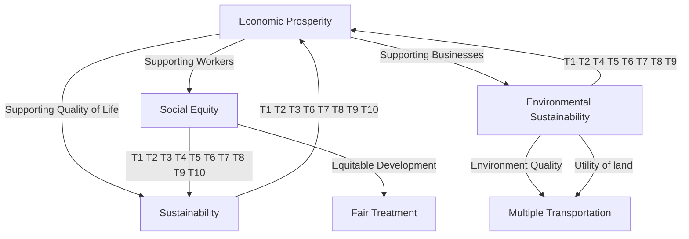
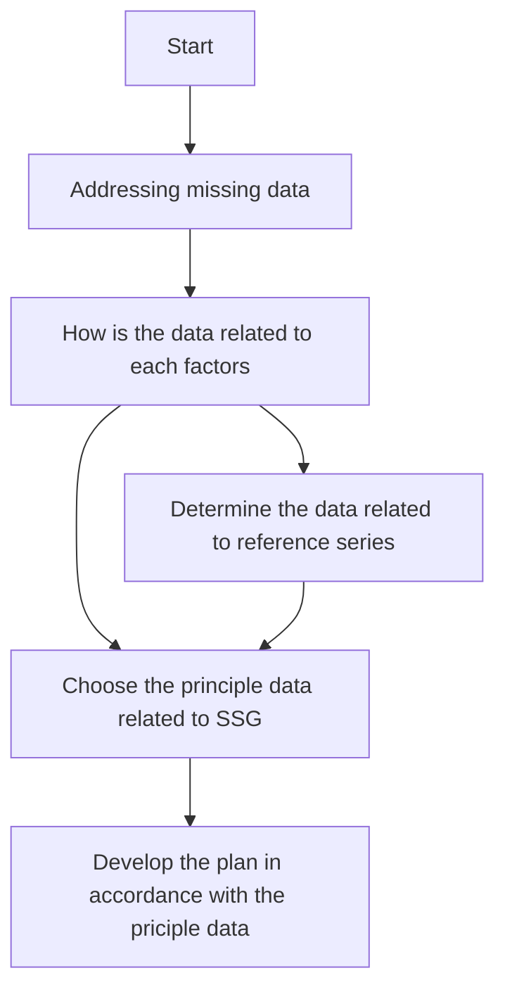

For office use only

T1

T2

T3

T4

Team Control Number

68242

Problem Chosen

E

For office use only

F1

F2

F3

F4

2017

MCM/ICM

Summary Sheet

Towards A Sustainable City

In consequence of the urban sprawl, the world is witnessing a series of economic, social and environmental problems. Formulating reasonable urban plan, which is crucial and critical to tackle these problems, is a complicated issue that should embrace the goals of economic prosperity, social equity and environmental sustainability. Fortunately, the Smart Growth Theory provides us new ideas to deal with those problems. In this paper, we focus on how to evaluate the performance of a smart growth plan, and how to formulate a smart growth plan with consideration of the unique needs for a city.

First, we establish a set of metrics to analyze the determinant factors in evaluation of smart growth. To find out what on earth the outcomes of a smart growth plan will be, we do a research on the relationship between the goals of three E’s and the ten principles. After that, based on analysis for a large body of case studies from EPA and Smart Growth America, we construct a metric named SSG (Success of Smart Growth). It consists of SEP (affected by economic prosperity), SSE (affected by social equity) and SES (affected by environmental sustainability). Each contains three first class indicators and different quantities of second class indicators.

Next, to research the current growth plan for two mid-sized cities in different continents, we select Wellington, the capital of New Zeal and Anchorage, a city in Alaska, America as objects we focus on. Besides, we select some cities which have been implemented smart growth plan for a long period of time as the reference standard to evaluate the success of a city’s current plan. With method of Grey Relational Analysis, we calculate rational grade of each metric by use of related data collected from authority websites. The results tell us that both cities develop well in some aspect of smart growth but still have a long way to achieve the goal of high smart growth.

Then, based on the three key steps from case study in EPA to formulate a smart growth plan, we set goals for each city by virtue of the evaluation results above. Besides, we indentify the existing strengths and barriers based on unique characteristics such as demographics, geographic conditions and expected growth rates in order to find the opportunities and challenges for each city. Moreover, with the method of PCA, we determine the principle components of each first class indicator for two cities. By integration of these key information, as well as reference to Getting to Smart Growth 100 policies for implementation, we formulate 7 specific initiatives for the two cities, respectively. Furthermore, with application of the evaluation method we form, we compare the performance between current plan and our plan by setting hypothesis and extending data with Grey Forecasting Model. The results show that our plans will exert increasingly positive impacts on the smart growth of each city as time goes by.

Also, we define an index of potential for the initiatives in our plans. According to the index value, we rank the initiatives in order of high potential to low potential. What’s more, we apply the Malthusian growth model to predict the change of population when the population has an additional 50% increase by 2050. The results demonstrate that our plan still perform well.

Finally, we test the sensitivity of our model, conclude the strengths and weakness, and give our thoughts about future work.

## Contents

1 Introduction .

1.1 Background . 2  
1.2 Restatement of problems. 2  
1.3 Overview of our work . 3

2 General Assumptions and Justifications . 3  
3 Variable Description 4  
4 Policy Tools for Smart Growth .  
5 Success of Smart Growth Metric System.. 5

5.1 Metric of SEP . 6

5.1.1 Potential Indicators for Economical Prosperity 6  
5.1.2 The SEP Metric system. .

5.2 Metric of SEP .

5.2.1 Potential Indicators for Social Equity .  
5.2.2 The SSE Metric system . 8

5.3 Metric of SES . 8

5.3.1 Potential Indicators for Environmental Sustainability . 8  
5.3.2 The SES Metric system . 10

5.4 Metric of SSG.. .. 10

6 Analysis for current plans . 10

6.1 Selecting the focus area.. .. 10

6.1.1 Cities we focus on, Wellington and Anchorage. . 10  
6.1.2 Data sources. 11  
6.1.3 Current urban plans 11

6.2 Measure the growth plan of two cities . . 11

6.2.1 Application of Grey Relational Analysis. 11  
6.2.2 The Evaluation Results.. 12

7 Growth plans for both cities ... 13

7.1 Goals for Wellington and Anchorage. . . 13  
7.2 Identifying existing strengths and barriers based on characteristics . .. 13  
7.3 Selecting the policy tools and initiatives.... 14  
7.4 Performance evaluation of smart growth plans.. .. 15  
7.5 Initiatives Rank based on index of potential . . 16  
7.6 Analysis of a given population growth rate. . 17  
7.7 Sensitivity analysis. . 18

8 Evaluation of the model . 18

8.1 Strengths. . 18  
8.2 Weakness . 19

9 Conclusions and Future work. 19

9.1 Conclusions . . 19  
9.2 Future work . . 19

References .. .. 20

Appendix . . 21

## 1 Introduction

## 1.1 Background

In the late 1990s, researchers realized that the development of urban sprawl brought a series of economic, social and environmental problems[1].

Economic problems mainly refer to the low-density expansion of cities, which cause the increase of per capita cost of service facilities, the waste of land resources and the the recession of central area.

Social problems mainly refer to the social negative impacts of urban sprawl. Especially, a serious problem is the spatial separation of different races and different income groups, which contributes to the social violence and racism.

Environmental problems mainly refer to the environment negative impacts of urban sprawl, such as the reduction of agricultural land and wetlands, the environmental pollution resulting from the use of motor vehicles.

So accompany with the urbanization, the challenge emerging is how to manage city in order to maintain its advantages of innovation and flexibility, realize its potential to provide high quality living conditions, significantly reduce resource consumption and environmental impact. To deal with these challenges, there was born a theory called smart growth, a way to build cities, towns, neighborhoods that are Economical prosperity, social Equity, and Environmental sustainability [2]. In order words, a smart growth plan aims at achieving the goal we call three E’s of sustainability. Besides, these exists ten principles to help achieve the goal of smart growth. To embrace a more depict description of the smart growth, pay attention to figure 1.

venn diagram

| Component               | Value |
| ----------------------- | ----- |
| Economically Prosperous  |       |
| Environmentally Sustainable |       |
| Socially Equitable      |       |
| Smart Growth            |       |

Figure1. The three E’s of sustainability of smart growth

Except for adhering to the goal of three E’s of sustainability, the unique needs such as demographics, growth needs, and geographical conditions of a city, are key factors to formulate a specific smart growth plan for the city itself.

## 1.2 Restatement of problems

To help implement smart growth theories into city design around the world, we are required to select two mid-sized cities (a population of between 100,000 and 500,000), on two different continents. Under circumstances of the two cities, we need to do as follows：

Task1. Create a metric system to evaluate the success of a smart growth city under consideration of three E’s of sustainability.

Task2. Research how the current growth plan of each city meets the smart principles and how successful the plan is.

Task3. Develop a growth plan for both cities based on the geography, expected growth rates, and economic opportunities, later evaluate the plans.

Task4. Rank the individual initiatives in accordance with the order from the most potential to the least potential. Then compare and contrast the ranks between two countries.

Task5. Discuss how the plan supports the level of growth that the population of each city increases by 50%.

## 1.3 Overview of our work

We first introduce the relationship between goals of three E’s and the ten principles for smart growth by searching key words in related definitions form Smart Growth America.  
We establish three metrics of smart growth, totally including 9 first class indicators and 23 second class indicators in section 5.  
Then we select two cities, one is Wellington in New Zealand, and the other is Anchorage, Alaska in America as the objects we focus on.  
We form an assessment criterion with reference to the development of some cities with a long history of smart growth. After that, we apply the method of Grey Relational Analysis to determine the degree of success for the current urban plan in section 6.  
In next section, we formulate the smart growth plan which contains 7 specific initiatives based on Principal Component Analysis for each city, according to the following key steps[3]:

A. Setting goals.  
B. Identifying existing Strengths and barriers.  
C. Selecting the right policy tools and initiatives.

We define an index of development potential to evaluate the performance of our initiatives. Then rank the initiatives in line with the percentage changes in the rational grade after the implementing of our plans. Furthermore, we analyze the sensitivity of our plan under circumstance that the population increases by 50% by 2050.

The structure of sustainability is as follows, where T represents 10 principles of smart growth.

flowchart

Figure2. The structure of sustainability

## 2 General Assumptions and Justifications

To simplify the problem, we have the following basic assumptions，which are properly justified.

The three E’s of sustainability is a broad statement of general goals of a city’s smart growth, and the adjustment of goals will happen when the city has reached one of them. What’s more, there are different small goals under each general goal.  
Furthermore, the ten principles are the general tools to help realize the goals for smart growth. These principles are flexible and adaptable, the adjustment may happen when the city aims at different goals.  
Each specific policy initiatives can not only play a part in certain goal, but also a possibility in other goals in different aspects.  
The metric to measure the success of smart growth is equally adaptable for different cities in different countries.  
The social environment is stable in both cities, and our plans can be smoothly implemented.  
The cities we select as reference have achieved a lot in smart growth, and most of the indicators have reached a high level.  
The growth rate of population of both cities can be seem as constant, because the birth rate and the death rate of both cities almost stay constant.

## 3 Variable Description

<table><tr><td>Variables</td><td>Descriptions</td><td>First appearing page</td></tr><tr><td> $T_i$ </td><td>Theithprinciple among the ten principles</td><td>5</td></tr><tr><td> $G_i$ </td><td>Theithgoal of three E’s of sustainability</td><td>5</td></tr><tr><td>SSG</td><td>The metric to measure the success of smart growth</td><td>6</td></tr><tr><td>SEP</td><td>The metric to measure the success of economic prosperity</td><td>6</td></tr><tr><td>SSE</td><td>The metric to measure the success of social equity</td><td>6</td></tr><tr><td>SES</td><td>The metric to measure the success of environmental sustainability</td><td>6</td></tr><tr><td> $SEP_{ij}$ </td><td>Thejthsecond class indicator of theithfirst class indicator for SEP</td><td>7</td></tr><tr><td> $SSE_{ij}$ </td><td>Thejthsecond class indicator of theithfirst class indicator for SSE</td><td>9</td></tr><tr><td> $SES_{ij}$ </td><td>Thejthsecond class indicator of theithfirst class indicator for SES</td><td>11</td></tr><tr><td> $s_{ij}$ </td><td>Thejthcity observation on theithindicator</td><td>12</td></tr><tr><td> $γ_{ij}$ </td><td>The grey rational coefficient for thejthsecond class indicator of theithfirst class indicator</td><td>12</td></tr><tr><td> $δ_i$ </td><td>The rational grade of theithfirst class indicator</td><td>13</td></tr><tr><td> $W_i$ </td><td>Theithinitiatives in Wellington’s smart growth plan</td><td>15</td></tr><tr><td> $A_i$ </td><td>Theithinitiatives in Anchorage’s smart growth plan</td><td>15</td></tr><tr><td> $P_i$ </td><td>The index of the development potential for initiatives i</td><td>17</td></tr></table>

## 4 Policy Tools for Smart Growth

As is stated before, the ten principles help for achieving the three general goals, so we can regard the principles as policy tools for plan formulation. Strictly speaking, each principle exerts effects on all the three E's. But comparatively, targets of different principles are not completely equivalent. Here we tend to find the relationship between ten principles and three E's, in order to figure out the guiding principles of growth plan formulation for different goals. We collect key words from What Is Smart Growth in website of Smart Growth America [4] What we find is that each tool is intended for more than one goal, we show it in table 1.

If a city mainly intends to achieve Economical prosperity, the initiatives should pay prior attention to policy tools T1, T6, T7, T8, and T9; If a city mainly intends to achieve social Equity, the initiatives should pay prior attention to policy tools T3, T8, T9 and T10; If a city mainly intends to achieve Environmental sustainability, the initiatives should pay prior attention to policy tools T1, T2, T6, T7 and T8.

Table 1. Policy tools for smart growth  
(G1: Economically prosperity.G2: social Equity G3:Environmental sustainability)

<table><tr><td></td><td>Principles as General policy Tools</td><td>key words from What Is Smart Growth in website of Smart Growth America</td><td>Intentions</td></tr><tr><td>T1:</td><td>Mix land uses</td><td>support businesses, improve safety, enhance vitality, live closer</td><td>G1,G3</td></tr><tr><td>T2:</td><td>Take advantage of compact building design</td><td>more people to jobs, homes, businesses, making the most of public investments</td><td>G1,G3</td></tr><tr><td>T3:</td><td>Create a range of housing opportunities and choices</td><td>more choices, different income, religions, races</td><td>G2</td></tr><tr><td>T4:</td><td>Create walkable neighborhoods</td><td>safely and conveniently</td><td>G3</td></tr><tr><td>T5:</td><td>Foster distinctive, attractive communities with a strong sense of place</td><td>natural features, historic structures, public art</td><td>G3</td></tr><tr><td>T6:</td><td>Preserve open space, farmland, natural beauty, and critical environmental areas</td><td>natural recreation areas, protecting them from natural disasters, animal and plant habitats</td><td>G1,G3</td></tr><tr><td>T7:</td><td>Strengthen and direct development towards existing communities</td><td>makes the most of the investments</td><td>G1,G3</td></tr><tr><td>T8:</td><td>Provide a variety of transportation choices</td><td>high-quality public transportation, safe and convenient biking and walking infrastructure</td><td>G1,G2,G3</td></tr><tr><td>T9:</td><td>Make development decisions predictable, fair, and cost effective</td><td>development decisions ,more timely, cost-effective, predictable</td><td>G1,G2</td></tr><tr><td>T10:</td><td>Encourage community and stakeholder collaboration in development decisions</td><td>strategies by the people who live and work there</td><td>G2</td></tr></table>

## 5 Success of Smart Growth Metric System

According to the three E’s of sustainability and the 10 principles of smart growth, we choose indicators from both different case study of smart growth in EPA website and the features of cities we select. For example, we focus on Fair treatment, Meaningful involvement, Equitable development to research the social Equity in smart growth [5]. Besides, the components of economic development are from the case study A KELSO, WASHINGTON [3]. As for Environmental sustainability, we pay attention to land use, transportation and environment quality.

Here we start to analyze the potential indicators which can imply the goal of three E’s. We construct a metric incorporating the extent to success of a city’s smart growth, named Success of Smart Growth(SSG). It measures how successful the city’s smart growth is. A larger SSG implies a better development situation in aspects of all three E’s of sustainability. To construct the SSG, we successively construct metric of SEP, SSE and SES.

## 5.1 Metric of SEP

## 5.1.1Potential Indicators for Economical Prosperity

In this section, we refer to the case study Using Smart Growth Strategies to Foster Economic Development: A Kelso, Washington, Case Study to analyze the success of economy. In the study, the economic development consists of three components, respectively are Supporting Businesses, Supporting Workers and Supporting Quality of Life.

To embrace a more depict description of the components of economical prosperity, pay attention to figure 3.

venn diagram chart

| Category                  | Value |
| ------------------------- | ----- |
| Supporting Businesses      |       |
| Supporting Quality of Life |       |
| Supporting Workers        |       |

Figure3. The three components of smart growth economical prosperity

Supporting Businesses. This component of a smart growth economic development strategy focuses on understanding the current composition and location of businesses, jobs, and potential emerging entrepreneurs in the community. In that way, the business diversity indicates the extent of harmonious development in economic. The per capital GDP and the tax income measure the level of economic development.  
Supporting Workers. Workforce development is important to ensure that residents can successfully compete for employment opportunities and that all residents have the opportunity to benefit from economic prosperity. To ensure the opportunities of employment, the city plan should aim at providing all kinds of occupations for different workers and developing the skills of workers, which can be realized by the development of education. Furthermore, the larger the population density is, the larger of size of the city will be, and the more labor force for economical construction will be.  
Supporting Quality of Life. One of the aims of economic development is to improve the quality of people’s life. Among these factors, the amenities serve people, the cost of living implying the living burden and total crime implying safety of living are taken into our consideration.

## 5.1.2 The SEP Metric system.

Based on the above analysis to the potential indicators of economical prosperity, we develop a metric named Success of Economical Prosperity (SEP) to describe the extent to success of a city’s smart growth in area of Economical Prosperity. The metric includes three first class indicators and ten second class indicators. We show the metric of SEP in table 2.

Table 2. Indicators in SEP metric system.

<table><tr><td rowspan="11">SEP</td><td>Indicators</td><td>Notation</td><td>Indicators</td><td>Notation</td><td>Target</td></tr><tr><td rowspan="3">Supporting Businesses</td><td rowspan="3"> $\text{SEP}_1$ </td><td>Business diversity</td><td> $\text{SEP}_{11}$ </td><td>↑</td></tr><tr><td>GDP per capita</td><td> $\text{SEP}_{12}$ </td><td>↑</td></tr><tr><td>Tax income</td><td> $\text{SEP}_{13}$ </td><td>↑</td></tr><tr><td rowspan="4">Supporting Workers</td><td rowspan="4"> $\text{SEP}_2$ </td><td>Population density</td><td> $\text{SEP}_{21}$ </td><td>↑</td></tr><tr><td>Educational attainment</td><td> $\text{SEP}_{22}$ </td><td>↑</td></tr><tr><td>Unemployment rate</td><td> $\text{SEP}_{23}$ </td><td>↓</td></tr><tr><td>Occupational diversity</td><td> $\text{SEP}_{24}$ </td><td>↑</td></tr><tr><td rowspan="3">Supporting Quality of Life</td><td rowspan="3"> $\text{SEP}_3$ </td><td>Cost of living</td><td> $\text{SEP}_{31}$ </td><td>↓</td></tr><tr><td>Amenities</td><td> $\text{SEP}_{32}$ </td><td>↑</td></tr><tr><td>Total crime</td><td> $\text{SEP}_{33}$ </td><td>↓</td></tr></table>

The target ↑ (↓) indicates that the increase (decrease) of the value will help promote the extent to success of economical prosperity in smart growth. In all, the metric of SEP can be finally expressed by a function of SEP1, SEP2 and ${ \mathrm { S E P } } _ { 3 }$ as $S E P { = } f ( S E P _ { 1 } , S E P _ { 2 } , S E P _ { 3 } )$ .the diversity can be calculated by Shannon diversity index.

## 5.2 Metric of SEP

## 5.2.1 Potential Indicators for Social Equity

In this section, we discuss the indicators of social equity. The social equity refers to improvement of the long-standing environmental, health, and economic disparities in low-income, minority, and tribal communities. Because these communities face an array of challenges, including proximity to polluting facilities, barriers to participating in decision-making processes, disproportionate levels of chronic disease, neighborhood disinvestment, and poor or no access to jobs and services [5]. Refers to the Smart Growth and Equitable Development in website of EPA, we sum up three components of social equity, which are fair treatment, meaningful involvement and equitable development. The component relationship of social equity is displayed in figure 4.

venn diagram chart

| Category               | Value |
| ---------------------- | ----- |
| Fair Treatment         |       |
| Equitable Development  |       |
| Meaningful Involvement  |       |
| The socially equitable  | Three core components |

Figure4. The three components of smart growth social equity

Fair Treatment. Fair treatment means that no group of people should bear a disproportionate share of the negative environmental consequences resulting from industrial, governmental, or commercial operations and policies. That ‘s to say, all people, regardless of race, ethnicity, or economic status, should have the opportunity to enjoy the positive outcomes of environmentally related decisions and actions, such as cleaner air and water, improved health, and economic vitality. Given that the environment quality is more appropriate to been incorporated into the analysis of environmental sustainability. We mainly focus on the income distribution and health care system.

Median income, a large median income demonstrates a high equity of income distribution.  
Health care index, which measures the level of health care. A larger value means a more developed and more equitable city.

Meaningful Involvement. Meaningful involvement means that the public should have opportunities to participate in decisions that could affect their environment and their health. We utilize the indicator of policy participation to measure the extent of involvement.

Equitable Development. It refers to a range of approaches for creating communities and regions where residents of all incomes, races, and ethnicities participate in and benefit from decisions that shape the places where they live. So we analyze the extent of religious freedom and racial equity, both are positive indicators.

## 5.2.2 The SSE Metric system

Based on the above analysis to the potential indicators of social equity, we develop a metric named Success of Social Equity (SSE) to describe the extent to success of a city’s smart growth in area of social equity. The metric includes three first class indicators and five second class indicators. We show the metric of SSE in table 3.

Table 3. Indicators in SSE metric system.

<table><tr><td rowspan="6">SSE</td><td>Indicators</td><td>Notation</td><td>Indicators</td><td>Notation</td><td>Target</td></tr><tr><td rowspan="2">Fair Treatment</td><td rowspan="2"> $SSE_1$ </td><td>Median income</td><td> $SSE_{11}$ </td><td>↑</td></tr><tr><td>Health care index</td><td> $SSE_{12}$ </td><td>↑</td></tr><tr><td>Meaningful Involvement</td><td> $SSE_2$ </td><td>Policy participation</td><td> $SSE_{21}$ </td><td>↑</td></tr><tr><td rowspan="2">Equitable Development</td><td rowspan="2"> $SSE_3$ </td><td>Religious freedom</td><td> $SSE_{31}$ </td><td>↑</td></tr><tr><td>Racial equity</td><td> $SSE_{32}$ </td><td>↑</td></tr></table>

The target ↑ indicates that the increase of the value will help promote the extent to success of social equity in smart growth.

The metric of SSE can finally express by a function of SSE1, $\mathrm { S S E } _ { 2 }$ and $\mathrm { S S E } _ { 3 }$ as ${ S S E } { = } f ( { S S E } _ { 1 } , { S S E } _ { 2 } , { S S E } _ { 3 } )$ . In addition, the extent of religious freedom and racial equity are calculated by formula of formula of Shannon's diversity index,

$$
S S E _ {3 1} = - \sum_ {i = 1} ^ {m} d _ {i} \ln (d _ {i}), S S E _ {3 2} = - \sum_ {i = 1} ^ {m} d _ {i} \ln (d _ {i})
$$

where $d _ { i }$ is the percentage of i against the total.

## 5.3 Metric of SES

## 5.3.1 Potential Indicators for Environmental Sustainability

After browsing web about environmental topics[6] in EPA, we realize that environmental sustainability contains key words such as air, chemicals, climate change, greener living, land, waste and cleanup, water, as well as many other topics. We classify these topics into three categories. The first is environmental quality, the second is utility of land, and the last one is multiple transportation. We show this relationship in figure 5.

venn diagram

| Category                     | Value |
| ---------------------------- | ----- |
| Environment Quality          | Large |
| Multiple Transportation       | Medium |
| Utility of land               | Small |
| The environmentally sustainable  | Three core components |

Figure 5. The three components of smart growth environmental sustainability

Environment Quality. The intuitive indicators to measure environmental sustainability are the environment quality, which can be directly reflected from the degree of pollution in aspects of air, water and noise. Moreover, the larger the green area is, the higher the degree of environmentally friendly of the city will be.  
− Utility of land. According to the Theory of Wrestling Sprawl[7], the measure of the degree to sprawl can be divided into eight dimensions. We define the utility of land as follows in accordance with that theory.

Concentration is the degree to which housing units are disproportionately located in a relatively few areas or spread evenly.

$$
S E S _ {2 1} = \frac {\left(\sum_ {i = 1} ^ {N} \left(D _ {u} (i) - D _ {d} (i)\right) ^ {2} / N\right) ^ {\frac {1}{2}}}{\sum_ {i = 1} ^ {N} D _ {d} (i) / N}
$$

where i is the medium spatial scale used in the analysis, $D _ { u } ( i )$ is the density of land use i over the total urban area, $D _ { d } ( i )$ is the density of land use i over the developable urban area.

Mixed used is the degree to which substantial numbers of two different land uses (e.g., housing units and financial units) exist within the same area and this pattern is typical throughout the city.

$$
S E S _ {2 2} = \frac {\sum_ {i = 1} ^ {N} D _ {d} (i) \left(D _ {d} (j) / S\right)}{D _ {u} (i)}
$$

It demonstrates i in any area occupied by j.

Clustering is the degree to which development within any one-mile-square area is clustered within one of the four one-half-mile squares contained within (as opposed to spread evenly throughout).

$$
S E S _ {2 1} = \frac {\sum_ {i = 1} ^ {N} \left(D _ {u} (i) - D _ {d} (i)\right) / N}{\sum_ {i = 1} ^ {N} D _ {u} (i) / N}
$$

Multiple Transportation. It is evident that a high ratio of public transportation in people’s daily life will exert positive effects on the environment quality. Additionally, one of the measurements for the rationality of transport plan is traffic safety.

## 5.3.2 The SES Metric system

Based on above analysis of potential indicators of environmental sustainability, we develop a metric named Success of Environmental Sustainability (SES) to describe the extent to success of a city’s smart growth in area of environmental sustainability. The metric includes three first class indicators and eight second class indicators. As showed in table 4.

Table 4. Indicators in SES metric system.

<table><tr><td rowspan="9">SES</td><td>Indicators</td><td>Notation</td><td>Indicators</td><td>Notation</td><td>Target</td></tr><tr><td rowspan="3">Environment Quality</td><td rowspan="3"> $SES_1$ </td><td>Air pollution index</td><td> $SES_{11}$ </td><td>↓</td></tr><tr><td>Water pollution index</td><td> $SES_{12}$ </td><td>↓</td></tr><tr><td>Green area</td><td> $SES_{13}$ </td><td>↑</td></tr><tr><td rowspan="3">Utility of land</td><td rowspan="3"> $SES_2$ </td><td>Concentration</td><td> $SES_{21}$ </td><td>↑</td></tr><tr><td>Mixed used</td><td> $SES_{22}$ </td><td>↑</td></tr><tr><td>Clustering</td><td> $SES_{23}$ </td><td>↑</td></tr><tr><td rowspan="2">Multiple Transportation</td><td rowspan="2"> $SES_3$ </td><td>Ratio of public transportation</td><td> $SES_{31}$ </td><td>↑</td></tr><tr><td>Traffic Safety</td><td> $SES_{32}$ </td><td>↑</td></tr></table>

The target ↑ (↓) indicates that a high (low) value of the indicator is expected to enhance the environmental sustainability, the metric of SES can finally expressed by a function of $\mathrm { S E S } _ { 1 } , \mathrm { S E S } _ { 2 }$ and $\mathrm { S E S } _ { 3 }$ as $S E S { = } f ( S E S _ { 1 } , S E S _ { 2 } , S E S _ { 3 } )$ .

## 5.4 Metric of SSG

Now that we have constructed the metric of SEP, SSE and SES, we can construct metric of SSG by integrating them, with respect to the relatively importance in the smart growth goals. We assign weights (0.3, 0.3, 0.4) to SEP, SSE and SES based on consideration that the environmental sustainability plays a decisive role in both economical prosperity and social equity. So SSG are expressed as follows.

$$
\begin{array}{l} S S G = \theta_ {1} S E P + \theta_ {2} S S E + \theta_ {3} S E S \\ = 0. 3 S E P + 0. 3 S S E + 0. 4 S E S \\ \end{array}
$$

a high SSG value demonstrates a high degree to success of the smart growth for the city.

## 6 Analysis for current plans

## 6.1 Selecting the focus area

## 6.1.1 Cities we focus on, Wellington and Anchorage.

In terms of the theory of urban growth, the development of urban growth can be divided into three stages: clustering, decentralization and networking. We select two cities in decentralization, the low-density stage needs to necessarily developing the smart growth, separately are

Wellington, the capital of New Zealand with a population about 450 thousand.  
Anchorage, a city in Alaska, America, with a population of about 300 thousand.

According to the smart growth case introduced in EPA, we know that part of American cities have been implementing smart growth for a long time. Among these cities, the Atlanta, Portland and Austin and some other cities are selected as our reference standard to evaluate the success of current growth plan of a city.

## 6.1.2 Data sources.

We need to collect more than 20 kinds of data of the indicators of our metric. Among these indicators, the data of policy participation and water pollution index are far less sufficient to meet our needs, so the indicator SSE2 (Meaningful Involvement) can not be quantified. The source of data for both cities are different.

For the America cities, we collect from a lot of websites for statistical data, the main source is the data from AreaVibes[8] and City-Data[9] .  
For Wellington , we collect from Statistics New Zealand[10]

## 6.1.3 Current urban plans

We carefully browse the urban plans for Wellington and Anchorage. Then we conclude some key goals and initiatives.

Wellington aims at achieving a compact city, a livable city, a city set in nature and a resilient city[11] .

Anchorage relies on the strategies guidance[12] of balanced regional growth, infill and redevelopment, neighborhood diversity, multi-family housing, environmentally sensitive development, residential land conservation and restoration and major transportation.

## 6.2 Measure the growth plan of two cities

## 6.2.1 Application of Grey Relational Analysis

On account of the complicated and uncertain correlation between the second class indicators and the first class indicators, it is hard to analyze their explicit effects on the goals of three E’s if we consider approaches with perfect information. Grey Relational analysis (GRA) is a branch of Grey system theory. It can capture the interactions among factors and indicate the grey relational grade of each indicator. Here we make use of GRA to analyze the developing status, the steps of GRA are as follows.

## Step 1. Normalization based on classification of indicators.

According to the goals and directions of their impact, the indicators can be divided into three types, "higher is better" indicators, "lower is better" indicators and "middle is better" indicators. Refer to Table 2, Table 3 and Table 4, we know that in addition to the "lower is better" indicators, such as unemployment rate, cost of living, total crime and pollution index. The others are "higher is better" indicators, so we can have the method of maximum difference normalization for the "higher is better" indicators.

$$
x _ {i j} = \frac {s _ {i j} - s _ {i \min}}{s _ {\mathrm{imax}} - s _ {\mathrm{imin}}}
$$

And we can have the method of minimum difference normalization for "lower is better" indicators.

$$
x _ {i j} = \frac {s _ {i \max} - s _ {i j}}{s _ {\mathrm{imax}} - s _ {\mathrm{imin}}}
$$

where $s _ { i j }$ is the jth city observation on the ith indicator.

## Step 2. Choose the reference series.

The reference series are composed of optimal value of each indicator. Because of the long history of smart growth, we use the average of indicators from the reference cities we select, Atlanta, Portland and Austin, etc. The reference series $\boldsymbol { x } _ { 0 } = \left\{ x _ { 0 1 } ^ { 1 } , x _ { 0 2 } ^ { 1 } , . . . , x _ { 3 1 } ^ { 3 } , x _ { 3 2 } ^ { 3 } \right\}$ .

Step 3. Compute grey rational coefficient $\gamma _ { i j }$ with respect to the jth second class indicator of the first class indicator. The equation is

$$
\gamma_ {i j} = \frac {\Delta_ {\min} + \tau \Delta_ {\max}}{\Delta_ {i j} + \tau \Delta_ {\max}}
$$

where ${ \Delta _ { i j } } = { x _ { i j } } - { x _ { 0 j } } , { \Delta _ { \operatorname* { m a x } } } = \operatorname* { m a x } _ { i } \operatorname* { m a x } _ { j } { \Delta _ { i j } } , { \Delta _ { \operatorname* { m i n } } } = \operatorname* { m i n } _ { i } \operatorname* { m i n } _ { j } { \Delta _ { i j } }$ , and resolution ratio  is set 0.5 to optimally improve the significance of the difference of the difference among rational coefficients.

Step 4. Calculate the rational grade of each first class indicator respectively by taking the average of its rational coefficient.

$$
\delta_ {i} = \frac {1}{n} \sum_ {i = 1} ^ {n} \gamma_ {i j}, j = 1, \dots , n
$$

where n is the number of second class indicators of the ith first class indicator.

The rational grade demonstrates the connection between the city we research and those cities which have achieve a lot in smart growth. The larger the value of rational grade of the indicator is, the higher the success of the plan implied by this indicator will be.

## 6.2.2 The Evaluation Results

Soon after the processing of data, we calculate the rational grade of each first class indicator of the two cities. We show the GRA results in table 5.

Table 5 rational grade of each metric in two cities

<table><tr><td rowspan="2"></td><td colspan="3">SEP</td><td colspan="2">SSE</td><td colspan="3">SES</td></tr><tr><td> $\text{SEP}_1$ </td><td> $\text{SEP}_2$ </td><td> $\text{SEP}_3$ </td><td> $\text{SSE}_1$ </td><td> $\text{SSE}_3$ </td><td> $\text{SES}_1$ </td><td> $\text{SES}_2$ </td><td> $\text{SES}_3$ </td></tr><tr><td>Wellington</td><td>0.7393</td><td>0.6774</td><td>0.7513</td><td>0.7172</td><td>0.7318</td><td>0.6586</td><td>0.9073</td><td>0.6840</td></tr><tr><td>Anchorage</td><td>0.6624</td><td>0.7566</td><td>0.4140</td><td>0.7098</td><td>0.7683</td><td>0.6720</td><td>0.8577</td><td>0.8111</td></tr></table>

After calculating the average of each metric, we get Wellington (SEP (0.7227), SSE (0.7245), SES (0.7500)), whose weighted average with weight (0.3, 0.3, 0.4) is 0.7341; the Anchorage (SEP (0.6110), SSE (0.7390), SES (0.7803)), whose weighted average with weight (0.3, 0.3, 0.4) is 0.7171. For a depict comparison, we draw a radar chart as showed in figure 6.

radar chart

|        | SEP1  | SEP2  | SEP3  | SSE1  | SSE3  | SES1  | SES2  | SES3  |
| ------ | ----- | ----- | ----- | ----- | ----- | ----- | ----- | ----- |
| Wellington | 0.75  | 0.70  | 0.72  | 0.68  | 0.71  | 0.65  | 0.78  | 0.69  |
| Anchorage   | 0.65  | 0.75  | 0.68  | 0.72  | 0.78  | 0.68  | 0.80  | 0.74  |

Figure 6 Rational grades for the first class indicators.

To analyze how successful the city’s current growth plan is, taking the average value of indicators for those cities which have implemented smart growth for a long time as our reference standard, we define four degrees of growth with reference to the literature[13] as follows. On account of the boundaries of four degrees are not exact, the ranges overlap.

Ⅰ. High smart growth: with value of rational grade between 0.7\~1.  
Ⅱ. Smart growth: with value of rational grade between 0.5\~0.8.  
Ⅲ. Sprawl growth: with value of rational grade between 0.2\~0.6.  
Ⅳ. High sprawl growth: with value of rational grade between 0.1\~0.3.

Comparing the rational grade to the range of four degrees, we infer that,

The current growth plan for both city reaches a degree of smart growth in some extent. Because most of cities have more or less implement the method of smart growth.  
Both cities have comparitively huge potentials to reach a high smart growth. It’s obvious that there is still a long way to go to keep up with those cities which implement long-term smart growth. Because the rational grade is lower than 0.8 for each metric.  
Wellington does slightly better in the balanced development adhering to the goals of three E’s than Anchorage, especially in supporting quality of life in area of economical prosperity.  
Anchorage develops better both in social equity and environmental sustainability, but behaves badly in supporting quality of life.

## 7 Growth plans for both cities

With the analysis above, both cities still have a long way to go in achieving high smart growth. In order to improve the current plan to support the three E's of smart growth，we formulate the smart growth plan in order of following three steps[3]: A. Setting the goals, B. Identifying existing strengths and barriers, C. Selecting the right policy tools and initiatives.

## 7.1 Goals for Wellington and Anchorage.

Based on the analysis in section 6.2.2, development of both cities are not as well as the reference cities in all aspects of three Es, so the ultimate goals for both two cities are achieving balance in economical prosperity, social equity and environmental sustainability. Only differentiate in the focal points of the smart growth and the priority.

## 7.2 Identifying existing strengths and barriers based on characteristics

The unique characteristic refers to the geography, expected growth rates, and economic opportunities of the cities. Here we analyze the strengths or opportunity, barriers or challenges during the process of getting to the development goals.

The existing strengths and barriers of Wellington

## Strengths

Wellington is at the south-western tip of the North Island on Cook Strait, separating the North and South Islands. Although it has a pretty large square of land, the land is also concentrated and mixed used. Meanwhile, the supporting on business and quality of life are put significant amount of effort by the governments, such as making efforts to decrease the total crime rate. Besides, it provides equitable development which ensures the economic opportunities.

## Barriers

Compared to the cities with high smart growth, Wellington still has low forest coverage rate. Poor environment quality is another factor that needs to be improved. Besides, there is still some unfair treatment, such as the unreasonable distribution of income and the high cost of health treatment.

The existing strengths and barriers of Anchorage

## Strengths

Anchorage is on a strip of coastal lowland and extends up the lower alpine slopes of the Chugach Mountains. With small coastal lowland, the utility of land for Anchorage is more sufficient. In addition, the approach of transportation is multiple. Almost three quarters of inhabitants regard the car as their first choice. 9.1% of inhabitants are willing to walk or bicycle and 3.2% of inhabitants choose to take the bus. Furthermore, the development is still equitable as well.

## Barriers

Because of the limit of geographic conditions, the speed of economic development is a little slow. For example, the GDP per capita is a quarter less than that of the average of cities with smart growth. Meanwhile, the security environment is not optimistic with a high crime rate.

## 7.3 Selecting the policy tools and initiatives

According to the analysis of two cities, Wellington mainly performs badly in the environmental sustainability and performs well in economical prosperity. In order to keep sustainable development of environment, the priorities of metric are SES, SSE and SEP. Meanwhile, the barrier of Anchorage is the development of economy. Therefore, the plan should first focus on SEP, then focus on the improvement of SES and SSE. Generally, a policy usually can not only play a part in certain indicator, but also a possibility in other indicators of different aspects. It is necessary to find the principle components for each metric. More intuitive flow refers to figure 10(Appendix).

With the method of Principle Component Analysis (PCA), which is a statistical procedure that uses an orthogonal transformation to convert a set of observations of possibly correlated variables into set of values of linearly uncorrelated variables [14] , we determine the principle indicators of each metric by SPSS. Combining the principle indicators with analysis in section 4 and section 6.3.2, we roughly identify the policy tools and specific initiatives.

Plan for Wellington, with seven principle components (two for SES, two for SSE, three for SEP), as well as its current strengths and barriers, we give specific initiatives, the corresponding policy tools and the indicators involved in each initiative in table 6.

Table 6 Growth plan for Wellington

<table><tr><td>Metric</td><td>Policy tools(principles)</td><td>Initiatives for Wellington smart growth(one typical initiative)</td><td>Indicator components</td></tr><tr><td rowspan="2">SES</td><td rowspan="2"> $T_1,T_2,T_6,T_7,T_8$ </td><td> $W_1$ : Use innovative permitting approaches to protect critical environmental areas.</td><td> $SES_{11} SES_{21} SES_{22} SES_{31} SES_{32}$ </td></tr><tr><td> $W_2$ : Provide condition for Greenfield growth.</td><td> $SES_{13} SES_{23}$ </td></tr><tr><td rowspan="2">SSE</td><td rowspan="2"> $T_3,T_8,T_9,T_{10}$ </td><td> $W_3$ : Creating communities for all incomes, races,and ethnicities involved in.</td><td> $SSE_{31} SSE_{32}$ </td></tr><tr><td> $W_4$ : Improve income distribution mechanism tonarrow the gap between rich and poor.</td><td> $SSE_{11}$ </td></tr><tr><td rowspan="3">SEP</td><td rowspan="3"> $T_1,T_6,T_7,T_8,T_9$ </td><td> $W_5$ : Strengthen the financial investment ininfrastructure construction.</td><td> $SEP_{11} SEP_{21} SEP_{22} SEP_{31} SEP_{33}$ </td></tr><tr><td> $W_6$ : Encourage all types of entrepreneurship,</td><td> $SEP_{12} SEP_{24}$ </td></tr><tr><td> $W_7$ : Create job opportunities by attractinginvestment.</td><td> $SEP_{13} SEP_{23}$ </td></tr></table>

Plan for Anchorage, we also give seven initiatives with consideration of principle components (two for SEP, two for SSE, two for SEP). In combination with policy tools and the indicators involved in each initiative, we show the plan in table7.

Table 7 Growth plan for Anchorage

<table><tr><td>Metric</td><td>Policy tools(principles)</td><td>Initiatives for Anchorage smart growth</td><td>Indicator components</td></tr><tr><td rowspan="2">SEP</td><td rowspan="2"> $T_1,T_6,T_7,T_8,T_9$ </td><td>A1: Provide skills training for dense workers</td><td> $SEP_{12}SEP_{13}SEP_{21}SEP_{22}SEP_{23}SEP_{24}SEP_{31}SEP_{33}$ </td></tr><tr><td>A2: Develop a wide range of industries.</td><td> $SEP_{11}$ </td></tr><tr><td rowspan="2">SSE</td><td rowspan="2"> $T_3,T_8,T_9,T_{10}$ </td><td>A3: Develop a fair health insurance system.</td><td> $SSE_{11}$  $SSE_{12}$  $SSE_{32}$ </td></tr><tr><td>A4: Legislation protects the history and culture of different religions.</td><td> $SSE_{31}$ </td></tr><tr><td rowspan="3">SES</td><td rowspan="3"> $T_1,T_2,T_6,T_7,T_8$ </td><td>A5: Adopt comprehensive plans and sub-area plans that encourage a mix of land uses.</td><td> $SES_{22} SES_{23} SES_{31} SES_{32}$ </td></tr><tr><td>A6: Manage the transition between higher- and lower-density neighborhoods.</td><td> $SES_{11} SES_{21}$ </td></tr><tr><td>A7: Encourage the use of public transport by some incentives.</td><td> $SES_{31}$ </td></tr></table>

## 7.4 Performance evaluation of smart growth plans

## Hypothesized Settings.

We assume our plans state in 6.3.3 will basically result in the change of the following indicators. The change rate is in accordance with average level of reference cities.

##  For Wellington

$\mathrm { W } _ { 1 }$ mainly contributes to the growth of degree of land mixed use. We assume the value will increase by 5% in short-term (5 years), 10% in medium-term (10 years), and 20% in long-term (30years).

$\mathrm { W } _ { 2 }$ aims at increase the area of green land. In accordance with the average level of the reference cities, we set the value increase by 5% in short-term 15% in medium-term, and 20% in long-term.

$\mathrm { { W } } _ { 4 }$ aims at increase the median income, we assume that will increase by 10% in short-term 20% in medium-term, and 30% in long-term.

$\mathrm { W } _ { 5 }$ aims at increase the educational attainment, we assume that it will increase by 5% in short-term, 20% in medium-term, and 30% in long-term. Besides, it causes population density increase by 5% in short-term, 15% in medium-term, and 40% in long-term.

Other initiatives aim at maintaining the present level or only result in a slight change.

##  For Anchorage

${ \bf A _ { 1 } }$ aims at supporting workers, which can be measured by $\mathrm { S E P } _ { 2 1 }$ . So we assume the population density increase by 5% in short-term, 10% in medium-term, and 30% in long-term.

$\mathbf { A } _ { 3 }$ aims at promoting the level of health care, we set the increase by 5% in short-term 10% in medium-term, and 15% in long-term.

$\mathbf { A } _ { 5 }$ mainly contributes to the growth of degree for land mixed use. We assume the value will increase by 5% in short-term, 10% in medium-term and 20% in long-term.

$\mathbf { A } _ { 6 }$ aims at increase the concentration degree of land use, we assume the value increase by 5% in short-term 10% in medium-term, and 15% in long-term.

${ \bf A } _ { 7 }$ results in the ratio of public transportation increasing by 3% in short-term 6% in medium-term, and 9% in long-term.

Other initiatives aim at maintaining the present level or result only in a slight change.

## Performance of smart growth plan over time.

After data processing under the hypothesized settings, we show the distribution of the value SSE, SES and SEP in different stage of development with plans we make for each city. We give a intuitive show in figure 7.

3d contour plot

| Grey rational grade | Value  |
| ------------------- | ------ |
| 0.73                | Long-term |
| 0.7225              | Medium-term |
| 0.7175              | Short-term |
| 0.7129              | Origin   |
| 0.7086              | Other   |
| 0.7043              | Other   |

3d heatmap chart

| Grey rational grade | Value  |
| ------------------- | ------ |
| 0.72                | Long-term |
| 0.7174              | Medium-term |
| 0.7145              | Short-term |
| 0.7116              | Origin   |

Figure 7 The expected distribution of the three metrics under our plan

From above figures, our plans demonstrate increasing positive effects on value of each metric, that’s to say our plans will exert better influence on the smart growth of that city as time goes by, from short-term (5 years), medium-term (10 years), to long-term (30years).

## 7.5 Initiatives Rank based on index of potential

After we develop the growth plan for both cities, we define the index of potential $p _ { i }$ , which measures the potential of a initiative denoted by the percentage changes in the rational grade of the corresponding indicator(more detail in section 7.4).

$$
p _ {i} = \frac {S _ {p i} - S _ {o i}}{S _ {o i}}
$$

where $S _ { p i }$ is the expected rational grade of indicator i after the implement of our smart growth plan, $S _ { o i }$ is the expected rational grade of indicator i under current plan. A large index of potential demonstrates a high potential of the initiative in improving the indicator related.

In order to obtain the series data with current plan for the next few decades, we use the Grey Forecasting Model to predict the precise trend with a few data. Based on our assumption, we apply GM (1, 1) model, the most widely used Grey Forecasting Model, to predict the indicators in our metric system. Then with data of indicators from 2007 to 2014(8 observations), we predict the value of indicators from short term(5 years), medium term(10years) to long term (30 years), to give a description of the development tendency under current plan.

With the expected growth rate of our plan presented above, we predict the expected value under our smart growth plan.

After gaining the expected data under current plan and our plan, we calculate the rational grade of each first class indicator of SEP, SSE, and SES under the stages range from short term, medium term to long term. Rational grade of current plan and our plan are both with reference to the series from other cities we select as standard.

Table 8 shows the potential of initiatives for Wellington and Anchorage.

Table 8 Index of potential for initiatives

<table><tr><td rowspan="4">Wellington</td><td>Initiative</td><td></td><td> $W_1$ </td><td> $W_2$ </td><td> $W_3$ </td><td> $W_4$ </td><td> $W_5$ </td><td> $W_6$ </td><td> $W_7$ </td></tr><tr><td rowspan="3">Potential</td><td>Short-term</td><td>0.0320</td><td>0.0411</td><td>-</td><td>0.0107</td><td>0.0069</td><td>-</td><td>-</td></tr><tr><td>Medium-term</td><td>0.0470</td><td>0.1491</td><td>-</td><td>0.0269</td><td>0.0601</td><td>-</td><td>-</td></tr><tr><td>Long-term</td><td>0.0172</td><td>0.2217</td><td>-</td><td>0.0536</td><td>0.0977</td><td>-</td><td>-</td></tr><tr><td rowspan="4">Anchorage</td><td>Initiative</td><td></td><td> $A_1$ </td><td> $A_2$ </td><td> $A_3$ </td><td> $A_4$ </td><td> $A_5$ </td><td> $A_6$ </td><td> $A_7$ </td></tr><tr><td rowspan="3">Potential</td><td>Short-term</td><td>0.0020</td><td>-</td><td>0.0125</td><td>-</td><td>0.0144</td><td>0.0247</td><td>0.0476</td></tr><tr><td>Medium-term</td><td>0.0019</td><td>-</td><td>0.0316</td><td>-</td><td>0.0098</td><td>0.0283</td><td>0.1073</td></tr><tr><td>Long-term</td><td>0.0036</td><td>-</td><td>0.0640</td><td>-</td><td>0.0300</td><td>0.0416</td><td>0.1842</td></tr></table>

The symbol “-”indicates that the initiative aims at maintaining the current level of the related indicators because of these aspects have achieved the goal of smart growth. In order words, the aspect implied by indicators related to the initiative have behaved at least as well as the reference cities, we can approximately think that these initiatives have a potential equals to zero, and we can adjust the potential among these by virtue of the current value.

Based the results above, we rank the initiatives with the smart growth plan for each city, as shown in table 9.

Table 9 Rank of initiatives according to potential

<table><tr><td>Stage</td><td>Wellington</td><td>Anchorage</td></tr><tr><td>Short-term</td><td> $W_2 > W_1 > W_4 > W_5 > W_3 > W_6 > W_7$ </td><td> $A_7 > A_6 > A_5 > A_3 > A_1 > A_2 > A_4$ </td></tr><tr><td>Medium-term</td><td> $W_2 > W_5 > W_1 > W_4 > W_3 > W_6 > W_7$ </td><td> $A_7 > A_3 > A_6 > A_5 >> A_1 > A_2 > A_4$ </td></tr><tr><td>Long-term</td><td> $W_2 > W_5 > W_4 > W_1 > W_3 > W_6 > W_7$ </td><td> $A_7 > A_3 > A_6 > A_5 > A_1 > A_2 > A_4$ </td></tr></table>

 For Wellington. $\mathrm { W } _ { 2 } ,$ providing condition for Greenfield growth is the most potential. $\mathbf { W _ { 5 } } ,$ , strengthening the financial investment in infrastructure construction gets more and more potential as time goes by.

For Anchorage. $\mathbf { A } _ { 7 } .$ , encouraging the use of public transport by some incentives is the most potential. $\mathbf { A } _ { 3 } ,$ , developing a fair health insurance system becomes more and more potential, because the effects of health care emerge after a period of time.  
The variation of initiatives sequence is generally the same trend between two cities over three stages.

## 7.6 Analysis of a given population growth rate

If the population of each city increases by an additional 50% by 2050, there will be profound impact on wide range of our life, including economy, equity and environment.

## Economy affects

With a larger size of populations, the pressure of business and labors are even higher than ever before. We use the Malthusian growth model, widely regarded in the field of population ecology as the first principle of population dynamics, to express the law of population growth. The differential equation is

$$
\frac {d P _ {i} (t)}{d t} = r P _ {i} (t)
$$

$$
P _ {i} (t _ {0}) = P _ {i 0}
$$

where $P _ { i } ( t )$ is the population of city i at time t, r is the population growth rate, $P _ { i 0 }$ is the initial population size at time t. By formulation $r { = } \frac { P _ { i } ( t ) } { t P _ { i 0 } }$ with the initial population, we can get the population growth rate is 1.16% on average every year. So the hypothesized setting of our smart growth plans must be adjusted to adapt to this level of growth. In other words, Population density increases by 5.8% in short-term, 11.6% in medium-term, and 35% in long-term. What’s more, the GDP per capita tend to decrease in short-term.

## Equity affects

Accompanying with the increase of population, more and more people are in demand for equitable access to job opportunities. The indicator which can be affected a lot in metric of SSE may be the median income, on account of a high possibility of people losing job. Set the increase ratio of median income increase by 5% in short-term, 10% in medium-term, and 20% in long-term may be more appropriate.

## Environment affects

The planning department will prefer to make full use of land and develop more ways of public transportation. So the hypothesized setting for the indicator, ratio of public transportation, will be higher than 3% in short-term, 6% in medium-term and 9% in long-term. The concentration of land also needs to be adjusted to meet the increasing demand for land resources. Here we set the increase ratio of public transportation 5%, 10%, 15% in three stages, and 10%, 15%, 20% for concentration of land.

## Performance of our plan in long term.

After the adjustment of our hypothesized settings, we apply the same method in section 7.4 to evaluate the performance of our plan under such level of growth. Given that the additional increase of population lasts to 2050, our analysis is based on problem of long term.

Long-term Performance of our plan for Wellington  

bar chart

| Category | after adjustment | before adjustment | current plan |
| :--- | :--- | :--- | :--- |
| SEP | 0.735 | 0.745 | 0.722 |
| SSE | 0.733 | 0.744 | 0.725 |
| SES | 0.711 | 0.713 | 0.673 |

Long-Term Performance of our plan for Anchorage  

bar chart

| Category | after adjustment | before adjustment | current plan |
| :--- | :--- | :--- | :--- |
| SEP | 0.6 | 0.62 | 0.58 |
| SSE | 0.75 | 0.76 | 0.74 |
| SES | 0.78 | 0.81 | 0.75 |

Figure 8. The long-term performance of our plans

As is shown in figure 8, under the circumstances of an additional 50% increase of the population by 2050, our plan performs better than the current plan of each city. After adjustments of our hypothesized settings to meet the growth needs, the plan still performs better than the current plan of each city but does not perform as well as our origin plan.

## 7.7 Sensitivity analysis

In our model of Grey Relational Analysis, the grey rational grade varies from different resolution ratio .We test the sensitivity of grey rational grade with and without our plan.

line chart

| resolution ratio | with plan | without plan |
| ---------------- | --------- | ------------ |
| 0.07             | 0.26      | 0.18         |
| 0.17             | 0.47      | 0.41         |
| 0.27             | 0.58      | 0.53         |
| 0.37             | 0.65      | 0.60         |
| 0.47             | 0.70      | 0.65         |
| 0.57             | 0.73      | 0.69         |
| 0.67             | 0.75      | 0.72         |
| 0.77             | 0.77      | 0.74         |
| 0.87             | 0.79      | 0.76         |
| 1.0              | 0.81      | 0.78         |

Figure 9. The sensitivity of resolution ratio

Take the example for the long-term plan. It is obvious that grey rational grade with our plan is higher than that without plan. And with the increase of resolution rate, the grade initially increase then tends to remain unchanged. Evidently, =0.5 is a good choice.

## 8 Evaluation of the model

## 8.1 Strengths

Our metric for the degree of success of smart growth (SSG) in a city, and its three components, SEP, SSE and SES are given detail description according to the literature reference and actual situation.  
We take comprehensive utilization of the methods, Grey Relational Analysis, Principle Component Analysis, and Grey Forecasting Model. So our model is convincing and

substantial.

With the definition of potential, we clearly express the effects growth initiatives we formulate for the cities, which implies that our model is workable.

## 8.2 Weakness

Data deviation: data we collect is from multiple websites, the difference in statistical standards may result in bias conclusions. What’s more, the lack of data for more indicators may lead to the errors in evaluation system.  
Lack of reference cities: the number of the cities we use as reference standard may be small, which may be not able to sufficiently support our analysis.  
Subjectivity: a lot of subjective methods are in the model, and some indicators are born in terms of our own experience and intuition. Some may be not credible.

## 9 Conclusions and Future work

## 9.1 Conclusions

In this paper, we have considered the indicators of the success of smart growth of a city and assist Wellington(New Zealand) and Anchorage (America) to develop a growth plan over the next few years. First we construct a success of smart growth metric system (SSG) in accordance with the three E’s of sustainability and the 10 principles of smart growth. We divide SSG into three components, the success of economical prosperity (SEP), the success of social equity (SSE) and the success of environmental sustainability(SES). And we develop them based on the second class indicators, widely used in EPA website and literatures. When incorporating them, we assign fixed weights (0.3,0.3,0.4) to SEP, SSE and SES as the basic consideration which sustainable environment plays a decisive role among them.

In terms of the theory of urban growth, we choose two cities in decentralization, the low-density stage needs to necessarily developing the smart growth. Due to the sophisticated and uncertain correlation between the first class indicators and the second class indicators, we apply the Grey Relational Analysis to capture the interactions among the indicators. According to the smart growth case introduction in EPA, we regard some of America cities implementing smart growth for a long time as our reference series to evaluate the success of a cities’ current growth plan. By our SSG system, both cities are at the edge of smart growth and have comparatively great potentials to reach a high smart growth.

To reach a high smart growth for both cities, we develop a growth plan based on the smart growth principles. We formulate the smart growth plan in order of following three steps. After setting the goals and identifying existing strengths and barriers, we develop seven initiatives for short term, medium term and long term. And all of our plans perform efficiently for different terms.

Finally, we defined index of potential to measure the potential of a initiative. By GM(1, 1) model, the most widely used Grey Forecasting Model, we predict the indicators in the next 40 years, and initiative $\mathrm { W } _ { 2 }$ ranks first in Wellington, initiative ${ \bf A } _ { 7 }$ ranks first in Anchorage. The plan after some adjustments, still perform well under circumstances of an additional 50% increase of the population by 2050.

## 9.2 Future work

Uncontrovertibly, there are many drawbacks in our model, such as the few data to analysis. We have to do a lot more to improve our work.

More data is needed.

There are some real data missing that we can not collect a data set for a long time. As a

result, the prediction may not as precise as we anticipate.

Focus on the difference of the current policies.

One of our drawbacks is poor analysis on the policy participation. If we have more time, it is necessary to incorporate sufficient data of policy participation.

Involve BP neutral network and SLEUTH models.

BP neutral network and SLEUTH models are excellent model when tackling huge amount of samples. We can apply the model to make good use of the data to simulated the real situations.

## References

[1]Jing Guan, Research on smart growth, Research on Financial and Economic Issues, February，2013  
[2]Smart Growth: Improving lives by improving communities, Retrieved from https://s martgrowthamerica.org/  
[3] Using Smart Growth Strategies to Foster Economic Development: A Kelso, Washin gton, Case Study, Retrieved from https://www.epa.gov/sites/production/files/2015-05/docu ments/using-smart-growth-strategies-foster-economic-development-kelso.pdf.  
[4] What is smart growth, Retrieved from https://smartgrowthamerica.org/our-vision/what -is-smart-growth/  
[5] Smart Growth and Equitable Development, Retrieved from https://www.epa.gov/smar tgrowth/smart-growth-and-equitable-development  
[6] Environmental Topics, Retrieved from https://www.epa.gov/environmental-topics  
[7] Galster G, Hanson R, Ratcliffe MR, Wolman H, Coleman S, Freihage [J] Wrestlin g sprawl to the ground: Defining and measuring an elusive concept  
[8] AreaVibes, Retrieved from http://www.areavibes.com/search/  
[9] City-Data, Retrieved from http://www.city-data.com/  
[10] Statistics New Zealand, Retrieved from http://stats.govt.nz/  
[11] Wellington Urban Growth Plan, Urban Development and Transport Strategy 2014  
[12] Anchorage 2020, Anchorage Bowl Comprehensive Plan, 58.  
[13] Jing Long, The Study of Urban-rural Land Use Smart Growth Based on BP Neur al Networks [J] 2013.6  
[14] P.T.harker Alternative modes of questioning in the analytic hierarchy process, Math modeling, Vol.9,No.3-5,1987

## Appendix

flowchart

Figure 10. Model Schematic Diagram