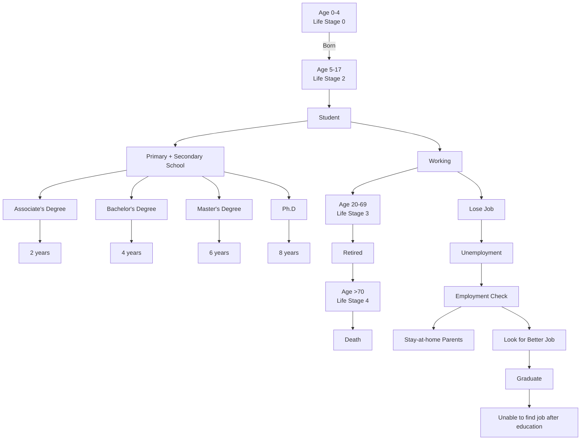

For office use only

T1

T2

T3

T4

Team Control Number

## 68940

Problem Chosen

F

For office use only

F1

F2

F3

F4

2017

MCM/ICM

Summary Sheet

(Your team's summary should be included as the first page of your electronic submission.)

Type a summary of your results on this page. Do not include the name of your school, advisor, or team members on this page.

Understanding the socioeconomic processes and tensions underlying population stability is im perative for establishing a population of humans on Mars. The objective of our team was to develop governmental and welfare policies that would allow for a population of 10,000 new residents on Mars to develop an egalitarian civilization that surpasses similar civilizations on Earth. To accomplish this goal, our team was tasked with building a model that evaluates the parameters related to income, education, and equality for the new population.

We developed an agent-based model that simulates a population of 10,000 agents on Mars using real world data given by the US Census’ data on occupational income. In our model, each agent, or Martian citizen, progresses through their lifecycle by attending college, searching for jobs, and earning income. The government then protects these individual agents from economic harm using programs such as welfare and minimum wage. To maximize both social welfare and productivity, we chose to monitor the state of the economy and create metrics that would measure the effect of agent-based factors on the community’s well-being. We measured multiple parameters of the community generated by these agents, which allowed us to evaluate the condition of the economy. From these parameters, we generated three metrics: the Income Metric I, the Education Metric E, and the Equality Metric Q. The income metric favors higher per capita income values on Mars and punishes a wage gap between the rich and the poor that is either too large or too small. The education metric measures the amount of unemployment as an economical factor and the student-to-faculty ratio as a social welfare factor so as to evaluate education through both the lens of productivity and well-being. Finally, the Equality Metric compares the proportion of women in occupations on Mars to their proportion in jobs on Earth to illustrate the dynamic social equality present in Population Zero. Additionally, our model includes several economic indicators and properties like the inflation rate, a progressive tax system, total investment, and government debt to add further to the dynamic equilibrium of the economy.

Using our model, we found that the best initial population had a mean age of 37 and a ratio of 1:10 of innovators to producers. Analysis of our metrics suggests that the Martian society can support more than 10,000 people in case of an emergency migration from Earth, assuming that infrastructure is present. We found that a minimum wage of \$70,000 provided the greatest benefit to society. As maternity and paternity leave lengths did not have a great impact on GDP, we determined that a maternity leave length of 10 months and a paternity leave length of 3 months. Government control of inflation proved to be critical to maintaining the purchasing power of the people. A progressive tax system served to increase income inequality while keeping investment high and government debt low, allowing the government to provide for increased education and infrastructure needs in the future. Most importantly, a happiness survey can be utilized to create a a strong, collaborative society working to reach common goals.

January 24, 2017

Dr. Isabelle C. Moss

Director of LIFE

Quai Gustave-Ador

1207 Genôlve, Switzerland

Dear Dr. Moss:

Thank you for working with us to design a plan to colonize Mars! We are excited to be a part of humanity’s greatest advancement since the Moon Landing – UTOPIA: 2100. We have developed a model to address your concerns about the social and economic equality in UTOPIA: 2100. We aimed to produce policy measures that would maximize income equality, gender equality, and educational advancement in the society.

Considering the complexity of describing governmental policy for a society on an entirely new planet, we developed an intricate, agent-based model that suggested that the initial population should be composed of a 50:50 ratio of males:females to optimize the equality metric. We also determined that the occupations of each person should be chosen so that the proportion of people in each job (as defined by the Bureau of Labor Statistics) is conserved. We found that choosing a population with a mean age of 37, and which consisted of more teenagers and children than older people, resulted in high GDP values and optimized the education and income metrics (see image below). Selecting a population with a 10% proportion of innovators (those individuals with jobs in management and science who are more likely to invest in technological advancement) produced optimal unemployment rates. Other factors such as marital status and ethnicity are less influential on the overall development of the colony, so ensuring that these demographics are equally represented is adequate. The use of unskilled labor has become substantially lower when compared to the $2 1 ^ { \mathrm { s t } }$ century due to the rise of automation and innovations in the robotics industry. Therefore, we suggest that the government require and fund the two-year college education of all people, eliminating "unskilled labor" from UTOPIA: 2100. When we tested various population distributions, we noticed some oscillations in education demand. In particular, after a few years into the model, the demand for education slowly fell over time. However, as the new generation came into the college education system, a huge spike in the education demand occurred. To mitigate the effects of this influx, the Martian government should be prepared to provide funds during the sudden influx of students.


<details>
<summary>histogram</summary>

| age_range | count |
| --------- | ----- |
| 0-5       | 380   |
| 5-10      | 650   |
| 10-15     | 670   |
| 15-20     | 690   |
| 20-25     | 710   |
| 25-30     | 730   |
| 30-35     | 750   |
| 35-40     | 770   |
| 40-45     | 790   |
| 45-50     | 760   |
| 50-55     | 730   |
| 55-60     | 700   |
| 60-65     | 670   |
| 65-70     | 640   |
| 70-75     | 610   |
| 75-80     | 580   |
| 80-85     | 550   |
| 85-90     | 520   |
| 90-95     | 490   |
| 95-100    | 460   |
| 100-105   | 430   |
| 105-110   | 400   |
| 110-115   | 370   |
| 115-120   | 340   |
</details>

The first thing to be done in the new Martian civilization is social welfare. In order to correctly implement this, the civilization’s government must be able to provide universal healthcare, college tuition, social security, and welfare. We also tested various social benefits like minimum wage. According to our income metrics, a minimum wage value of \$70000 (adjusted for projected inflation in 2100) will provide the optimal benefit to society. On the other hand, maternity and paternity leave appear to have an insignificant economic effect. Setting these two lengths to 10 months and 3 months respectively may help increase the happiness and well-being of our population.

The government is also responsible for the social and economic well-being of all citizens of UTOPIA: 2100. As a result, the central banking institution must ensure that inflation rates stay below income growth rates to prevent loss of purchasing power and keep investment levels high. We propose a progressive tax system to help fund government spending while reducing income inequalities. The tax rate should be maintained so that the government is not earning large sums of money and so that the people are not losing much of their hard-earned income due to the government. Strict non-discriminatory policies should be implemented in the job sector to increase gender equality; people should not be denied jobs due to their gender, race, and other characteristics.

An extremely efficient and reliable method to measure the progress of UTOPIA: 2100 is the happiness index, which can be measured by implementing a survey in which citizens report their satisfaction about governmental policies (such as maternity/paternity leave length, unemployment, and inflation). By increasing the overall happiness of the people through this survey, the government can gain the people’s trust, and form a strong, collaborative society working to reach common goals.

By following these policies, we hope to achieve the following:

• The development of a large middle class that composes the vast majority of the population. We also hope to minimize the number of minimum wage workers and have only a small number of extremely wealthy people.  
• The unemployment rate is stable and low, and our education systems can adequately accommodate and teach the population. We hope to eventually have government subsidisation of 4-year college educations for all students.  
• There is an equal proportion of women to men in each job field.

With these policies in place, the government need only develop physical infrastructure (living quarters, food production facilities, etc.) as population size grows. Given the initial population size and characteristics, keeping up with the population growth should not be difficult.

In the event of a disaster on Earth resulting in a need for large scale migrations, the government on Mars needs to improve its physical infrastructure to accommodate the large influx of immigrants. However, none of the policies need to be altered substantially.

We thank you for your cooperation in this grand endeavor and we wish the best for UTOPIA: 2100.

Sincerely,


Matthew C. McConaughey

Senior Policy Advisor

Mathematical Analyst

LABORATORY OF INTERSTELLAR, FINANCIAL, AND EXPLORATION POLICY

E: mcconaughey@icm.gov

M: (555)555-5555

## Introduction

Houston, we have a problem! The Laboratory of Interstellar, Financial, and Exploration Policy (LIFE) has conducted multiple studies, designed the infrastructure, and conducted scientific experiments to allow for the first human population to live on Mars. This first population, called Population Zero, will include 10,000 people. The mission of Population Zero is to create a sustainable society by maximizing both economic output and happiness in the workplace for its citizens.

This project, termed UTOPIA: 2100, outlines the goal of creating an optimal workforce for the 22nd century to give all people the greatest quality of life with a vision of sustainability for the next 100 years on Mars. This martian community will be driven by egalitarian principles in economics, government, workforce, and justice systems.

In the process of developing an economic-workforce-education system for Population Zero, LIFE has tasked our group of mathematical modelers and policy advisors to develop a set of policies to facilitate the migration to Mars. The goal of our team is to consider income, education, and equality as they relate to the goals of Population Zero and provide policy recommendations that will accommodate such interplanetary community projects.

## Restatement of Problem

Our group is tasked with developing policy recommendations that will allow Population Zero to maximize both economic output and happiness in the workplace for their citizens. The vision of the UTOPIA: 2100 project is to produce a sustainable population on Mars. The International Coalition on Mars (ICM) has provided directives for our group to develop these recommendations.

## Parametrization of Factors

We are tasked with defining parameters related to income, education, and social equality for Population Zero. This involves the consideration of workforce demographics, educational demographics, governmental infrastructure that facilitates these parameters, and policies that will ensure that such parameters are maximized.

In completing this directive, we are asked to identify specific outcomes that would indicate positive outcomes for these three factors for the next decade. We are also asked to suggest possible demographics of Population Zero that would lead to positive results. Furthermore, metrics are to be created that can measure these parameters.

## Sample Population

We are tasked with synthesizing a sample population of 10,000 that would ensure the goals of UTOPIA: 2100. In doing so, we must consider the demographics of age, sex, and education. Furthermore, this population must be capable of facilitating the goals of UTOPIA: 2100.

## Model

Finally, we are tasked with building a model that can describe the population dynamics for the next ten years. In doing so, we must determine the salary distribution that will balance productivity and well being. We are also asked to characterize innovations that could improve our model. In addition, we conduct sensitivity analysis for a 100-year plan and consider emergency evacuation migration patterns from Earth to Mars.

## Definitions and Assumptions

Since it is challenging to predict all variables and factors that may affect our model, we made certain assumptions to produce a working model.

• Every Martian goes to college to obtain at least an Associate’s Degree.

– Due to the high level of technical skills required to survive the new life on Mars as well as the predicted high demand for education in the 22nd century[1], we mandate that all citizens become well-educated.

• Education Diplomas are issued at 2-, 4-, 6-, and 8-year intervals.

– We assume every college student follows the traditional pattern of Associate’s in 2 years, Bachelor’s in 4 years, Master’s in 6 years, and Ph. D in 8 years. Other degree options that require more than 8 years are not covered in our model.

• Every individual is actively pursuing a job given that they are of working age and are not a permanent stay-at-home mom or dad.

– In our model, pursuing a job and becoming a productive citizen is more important than holding degrees that require higher levels of education. In an egalitarian society, the social welfare of the Martian citizens should not depend on the education to which they are privy.

• Members of the population on Mars will retire at the age of 70, and their life expectancy will be 100 years.

– According to the UN Population Bureau, the life expectancy in the 22nd century will be 100[2]. In addition, from historical charts [3], it can be seen that average retirement age has increased from 57 in 1991 to 60 in 2012. This is roughly an increase of 1 year in retirement per 7 years passed. Extrapolated to the year 2100, a retirement age of 70 is a reasonable estimate.

• Race, ethnicity, or religion have no impact on a population’s ability to progress on Mars.

– The cultural values borne from race, ethnicity, and religion are difficult to quantify or express in a model.

• Incomes, the number of workers in each occupation, and general prices will increase at the same annual rate as they currently do.

– Using the same annual rate of increase is a reasonable way to extrapolate 22nd century incomes, prices, and job occupations from current ones.

• The necessary infrastructure (ex. homes and other essentials) is already present on Mars before Population Zero.

– It is reasonable to assume that LIFE has already built infrastructure to support Population Zero.

• The familial relationships between individuals agents are not considered

– Representing familial units in an agent-based model requires an underlying network. Such a network is computationally intensive and difficult to evaluate over 10,000 nodes.

• The time of death is not contingent upon the events that take place in your life.

– Our model does not take into account the hard-to-quantify relationships between income and occupation on health.

• Other than maternity and paternity leave, our model does not consider any other forms of leave.

– It is challenging to quantify events in the life of an agent in our model that would result in unpaid leave.

## Analysis of Problem

The two important themes in this problem are the maximization of social welfare and productivity. The new society in Mars is based upon egalitarian principles and must be able to provide for the well being of its citizens whilst producing an unparalleled economy.

Since we are creating an entirely independent and self-sustaining civilization, we can incorporate several desirable characteristics that may or may not be present on Earth. The first such characteristic for our Martian civilization is personal initiative: every individual should be motivated to increase the well-being of his or her self. This motivation usually comes in the form of higher wages for the individual. Although a simple concept, the lack of personal initiative was a main contributor to the downfall of Communism [4]. Rather than reducing the behavior of members of the population to a set of variables, it is important to maintain the characteristics of each individual agent so as to account for this personal initiative in our model.

The second essential characteristic of our advanced civilization is social welfare. In particular, the Martian government should be able to provide funds to accommodate health care, college education, maternity/paternity leave, and other socially useful public goods. Having this would allow our Martian civilization to potentially surpass the United States in social welfare programs.

Our plan to approach this problem is to develop an agent-based model, where agents represent Population Zero on Mars. Although we considered models based on differential mathematics, tradi tional differential equation models do not account for personal initiative. Furthermore, such systems often overlook complex interactions that occur due to the behavior of discreet agents rather than continuous variables. Therefore, we chose to use an agent-based model, as it accurately represents a person’s impact on society as well as the interactions between and within citizens. To characterize our civilization, we created the model in NetLogo.

## Model Design and Justification

To better understand the mechanics and interactions in the system, we will describe our model by analyzing the life of Bob, a person born on Mars.

Our model categorizes people into 4 lifestages (0, 1, 2, 3, and 4) based on their age and occupation. When Bob is born, his lifestage is 0. Once Bob becomes 5 years old, he starts attending primary school, and his lifestage is set to 1. Bob continues through his education until he graduates high school. Bob receives an Associate’s degree because college education is paid for and required by the government.

After getting his Associate’s degree, Bob looks for a job. However, he can only search for jobs which have an education requirement of 2 years or less. If Bob finds such a job on his first try, he takes it; otherwise, he can either continue to search for a job (and is classified as unemployed) with a probability p2 or go back to school with a probability $\left( 1 - p _ { 2 } \right)$ . If he goes back to school, he continues his education and obtains a Bachelor’s degree. Once again, he searches for a job, but this time, he can search for jobs which have an education requirement of 4 years or less. If Bob does not get a job and goes back to school (now with a probability $\left( 1 - p _ { 4 } \right) )$ , he gets his Master’s degree and searches for a job again (this time searching through jobs with an education requirement of 6 years or less). If he still does not get a job and goes back to school once more (with probability $\left( 1 - p _ { 6 } \right) )$ ), he obtains a Ph.D. Then, he leaves college with probability $p _ { 8 } = 1$ and continues to search for a job (with any education requirement) until he finds one.

If Bob has a Bachelor’s, Master’s, or a Doctorate, there is a chance that he will get a job with a lower education requirement than his educational attainment. For example, let us assume that Bob has a Master’s degree and is searching for a job. Although there are no available positions for jobs with an educational requirement of 6 or 4 years, there is an availability for a job with an educational requirement of 2 years. Bob then takes this job, and is classified as underemployed since he is ”overqualified” for his job.

People who are underemployed continue to search for jobs while they work. In this case, Bob will see if there are any job availabilities with education requirements of 4 or 6 years. If he finds one, he will quit his current job and take the new job. If he finds more than one job with different educational requirements (both higher than that of his current job), he will take the job with the highest educational requirement that he satisfies. Once Bob has a job whose educational requirement matches his level of education, he is no longer classified as underemployed.

## The Census Data

To determine the set of available jobs at every step in our model, we need data that indicates the likely distribution of jobs that will be available on Mars. To do this, we use the United States Bureau of Labor Statistics’ (BLS) data from 2011 to 2015. The BLS categorizes the set of all occupations in the US into 22 primary categories. Each category contains the number of people in that category, mean income, median income, percentile 10 income, percentile 25 income, percentile 75 income, and percentile 90 income1. To extrapolate the data for the year 2100 for each individual occupation, we perform an exponential fit with the 5 years of available data to determine the annual growth rate of both income and number of workers. Given these growth rates, we scale current US employment and income values to that of 2100 US.

The last thing we need for each occupation type is the minimum education necessary for that occupation. The BLS does not provide each of the 22 occupations with a minimum education level. Instead, we referenced independent sources to determine these values. Our calculations can be are summarized in Table 1 and Table 2 in the Appendix.

At every tick in the model, an “Income File” and “Job Distribution” are evaluated. The “Income File” contains data about the mean income and percentile incomes for agents in the model, whilst the “Job Distribution” contains the distributions of jobs in the model. Both variables initially start at the extrapolated values for 2100 but grow dynamically with time (using the same annual growth rates). However, since the population of Mars is not the same as the population of the US, it is not the number of workers in each occupation that carries meaning but rather the ratio of the workers in each occupation to the complete labor force. Thus, we replace every value $v _ { i }$ for occupation i with

$$
\frac {v _ {i}}{\sum_ {i} v _ {i}}
$$

to obtain the fraction of total jobs that are of occupation i. To calculate the number of actual jobs on Mars, we need to multiply by the size of the job market (i.e. the number of people demanding jobs). This is equal to the number of people working, the number of unemployed individuals, and the subset of students in college that are actively requesting jobs at the time. However, in the real world, job creation and job elimination are not instantaneous: there is some inflexibility in changing the number of jobs. To account for this, the set of available jobs is reset according to the size of the job market once a year instead of once a tick. Note that in our model, ticks are evaluated 6 times per year.

To determine the income for each person who is hired, each worker is given a “percentile.” If this percentile is 10, then that worker receives the percentile 10 income from our job ratios. If the percentile is 25, then that worker receives the percentile 25 income. If a worker is given a percentile between 10 and 25, then that worker receives a weighted average of the known values of the percentile 10 and percentile 25 incomes. In other words, if the worker is given a percentile of x, then his or her income is

$$
(2 5 - x) \times (\text { percentile } 1 0) + (x - 1 0) \times (\text { percentile } 2 5)
$$

If a worker’s percentile is below 10, he or she receives minimum-wage (which will be described in detail later). If a worker’s percentile is above 90, we cannot interpolate due to a lack of data, and therefore set it to be the percentile 90 income. Of course, there must also be room for growth for the worker’s income. To account for this growth, the worker’s income increases by some fixed amount given by his or her job’s growth rate every year.

When a worker receives a job, he or she is randomly assigned a percentile from 10 to 50 as a starting salary. When Population Zero arrives on Mars, their salary begins at the percentile appropriate for their age and education, given that they started fresh out of college. When calculating the percentile growth rate, we wanted employees to grow by at least 20 percentiles in their tenure. We $\frac { 2 0 } { 4 . 3 } = 4 . 6 5$

There is a 2% chance that a given worker will lose his job every year [43]. If a worker loses his job, he will look for a new one in the job market and will remain unemployed until he finds one.

There is also a probability that a worker will quit his/her job and become a stay-at-home parent. In this case, the worker is removed from the labor force and his/her lifestage is set to 4, though they do not receive social security until they reach 70 years of age. The probability that a worker becomes a stay-at-home parent depends upon his/her gender and is inversely proportional to his/her level of education [50, 51, 52].

<table><tr><td>Level of Education</td><td>Male</td><td>Female</td></tr><tr><td>Associate</td><td>0.07</td><td>0.25</td></tr><tr><td>Bachelor</td><td>0.03</td><td>0.19</td></tr><tr><td>Master</td><td>0.02</td><td>0.09</td></tr><tr><td>Ph. D</td><td>0.01</td><td>0.06</td></tr></table>

The probabilities $p _ { 2 } , p _ { 4 } , p _ { 6 }$ , and $p _ { 8 }$ are set using the 2015 US Census Bureau data on Educational Attainment: [28]:

<table><tr><td>Associate</td><td>Bachelor</td><td>Master</td><td>Ph. D</td></tr><tr><td>22537</td><td>46515</td><td>18683</td><td>6987</td></tr></table>

To illustrate this, consider $p _ { 4 }$ . It is defined to be the number of people who leave college with a Bachelor’s degree over the number people who leave college with a Bachelor’s degree or higher. Thus

$$
p _ {4} = \frac {4 6 5 1 5}{4 6 5 1 5 + 1 8 6 8 3 + 6 9 8 7} = 0. 4 9
$$

## Birth and Death

Now, let us consider another agent in our model, Alice. Alice is approximately 26 years old, has a job, and is married to Bob2. As Alice is a female between the ages of 18 and 50, there is a chance that she will have a child. This probability $p _ { \mathrm { b a b y } }$ is given as a function of age (a) and the number of babies previously conceived (b). The probability is inversely proportional to the number of babies previously conceived since one is less likely to give birth if one already has a lot of children. The probability peaks at 26 years of age (as shown by [38]) and is lower at the boundaries of 18 and 50 years of age. Thus:

$$
p _ {\mathrm{baby}} = k \times \frac {\left(\frac {\frac {1}{6} a - 3}{(\frac {1}{6} a - 4) ^ {2} + 1}\right)}{b + 1}
$$

Notice that this metric is proportional to a constant k. To simulate the world birth rate of 2.4 [39], we use the constant $k = 0 . 2 6 5 ^ { 3 }$ (as determined by trial-and-error). If Alice is going to have a child, a timer starts for her. Once that timer reaches 9 months, the baby is born. After the baby is born, Alice cannot have a child for at least another 15 months.

When Alice’s baby timer reaches 7 months, she goes on maternity leave (if she has a job). The maternity leave’s length is varied during model testing to determine its effect on different metrics discussed later. Wages that Alice receives during her maternity leave are not counted in any of the income metrics as these are transfer payments subsidized by the government. When Alice’s maternity leave ends, Bob’s paternity leave begins. The paternity leave length is also varied.4

Let us once again consider Bob, who is now 70 years old. Bob now retires and begins receiving So cial Security from the government. Bob’s lifestage is set to 4, and he continues to live in this manner for some time. When people are born, their lifespan is predetermined using a gamma distribution. The mean lifespan is 100 years, with a variation of 10 years. Once Bob’s age equals his lifespan, he dies. This is the life cycle of a person living in our model of UTOPIA: 2100.

To illustrate the life cycle, we provide the following flowchart.


<details>
<summary>flowchart</summary>


</details>

Figure 1: A Flowchart illustrating the life of individual agents in the model.

## Global Inflation

As we begin to consider monetary costs and the bureaucracy, it is important to consider the global inflation that occurs between today and the $2 2 ^ { \mathrm { n d } }$ century. US inflation from 1923 to 2012 is illustrated below [37]:


<details>
<summary>line chart</summary>

| Year | WORLD |
|------|-------|
| 1977 | 11.4% |
| 1980 | 14.0% |
| 1985 | 7.3%  |
| 1990 | 9.3%  |
| 1995 | 9.3%  |
| 2000 | 3.3%  |
| 2005 | 4.3%  |
| 2010 | 3.1%  |
| 2015 | 1.6%  |
</details>

Due to the seemingly random behavior of world inflation, we cannot reasonably extrapolate inflation for the remainder of the $2 1 ^ { \mathrm { s t } }$ century. To avoid this pitfall, we consider Canada’s inflation rate. From the following figure, we see that Canada has a very stable inflation rate [40]:


<details>
<summary>line chart</summary>

| Year | Value |
| ---- | ----- |
| 95   | 0.8   |
| 97   | 0.6   |
| 99   | 0.7   |
| 01   | 0.9   |
| 03   | 1.1   |
| 05   | 0.8   |
| 07   | 0.7   |
| 09   | 0.6   |
| 11   | 0.8   |
| 13   | 0.7   |
| 15   | 0.6   |
</details>

As Canada tends to favor economic stability over rapid economic growth, we will model our economy after Canada’s economy, since our goal is to maximize both productivity and social welfare. Current Canadian inflation is around 1.3% [41], so this will be the world inflation rate used to convert from the 21st century to 22nd century monetary values.

## Economic Indicators & Essentials

The goal of Population Zero is to create a society that far exceeds the economic strength of similar societies on Earth, yet achieves a societal equilibrium across income, equality in workspace, and edu cation. As such, it is important to monitor the condition of the economy induced by our agent-based model. We calculate various economic indicators that allow us to track the development and progress of UTOPIA: 2100.

## Taxes

To preserve income equality, we have implemented a progressive tax system with 5 tax brackets. All taxes are deducted from each consumer’s income. These taxes primarily represent income tax rates, but can be adjusted to include sales tax, property tax, etc. The tax rate for each bracket is a fraction of the “overall tax rate” (OTR), which is varied during model testing. We can vary the tax rate to determine the effect on GDP, government debt, and our income metric. The following are the tax brackets and their corresponding rates:

<table><tr><td>Tax Bracket</td><td>Tax Rate</td></tr><tr><td> $\leq$  Minimum Wage</td><td>0%</td></tr><tr><td>Minimum Wage -  $(\frac{\text{Minimum Wage} + \text{Income Mean}}{2})$ </td><td> $\frac{\text{OTR}}{6}$ </td></tr><tr><td> $(\frac{\text{Minimum Wage} + \text{Income Mean}}{2}) - \text{Income Mean}$ </td><td> $\frac{\text{OTR}}{5}$ </td></tr><tr><td>Income Mean - 75 $^{\text{th}}$  Income Percentile</td><td> $\frac{\text{OTR}}{4}$ </td></tr><tr><td>75 $^{\text{th}}$  Income Percentile - 90 $^{\text{th}}$  Income Percentile</td><td> $\frac{\text{OTR}}{3}$ </td></tr><tr><td> $\geq$  90 $^{\text{th}}$  Income Percentile</td><td> $\frac{\text{OTR}}{2}$ </td></tr></table>

## Government Spending and Debt

In order to be an idyllic civilization, the government must pay for public goods that benefit society. As stated earlier, the government must pay for the college education of all students, social security, welfare, infrastructure, and health care. The amount of funds spent on each of these was calculated using ratios from the U.S. government with the exception of health care, which was calculated from

Canada. The values are \$42,155 per student per year (education) [31], \$168,281,905 per 10,000 people per year (health care) [32], \$158,625,722 per 10,000 people per year (infrastructure) [30], \$59,000 per unemployed person per year (welfare) [34], and \$45,000 per person over 70 per year (social security) [33].

Government debt is the accumulated value of the budget deficit over time. The deficit is calculated by the total money collected through annual taxes minus the total annual government spending.

## Inflation

To model inflation rates in our society, we consider the following graph [53]:


<details>
<summary>line chart</summary>

| Year | CPI-U Annual % Change |
| ---- | ---------------------- |
| 1923 | 5.5%                   |
| 1925 | 6.0%                   |
| 1927 | 5.0%                   |
| 1929 | -2.0%                  |
| 1931 | -1.5%                  |
| 1933 | -2.5%                  |
| 1935 | -2.0%                  |
| 1937 | -1.5%                  |
| 1939 | -1.0%                  |
| 1941 | 2.5%                   |
| 1943 | 3.0%                   |
| 1945 | 4.0%                   |
| 1947 | 5.5%                   |
| 1949 | 5.0%                   |
| 1951 | 4.5%                   |
| 1953 | 4.0%                   |
| 1955 | 3.5%                   |
| 1957 | 2.0%                   |
| 1959 | 1.5%                   |
| 1961 | 1.0%                   |
| 1963 | 1.5%                   |
| 1965 | 2.0%                   |
| 1967 | 2.5%                   |
| 1969 | 3.0%                   |
| 1971 | 3.5%                   |
| 1973 | 4.0%                   |
| 1975 | 5.0%                   |
| 1977 | 6.0%                   |
| 1979 | 7.0%                   |
| 1981 | 8.5%                   |
| 1983 | 7.5%                   |
| 1985 | 6.5%                   |
| 1987 | 6.0%                   |
| 1989 | 5.0%                   |
| 1991 | 4.0%                   |
| 1993 | 3.5%                   |
| 1995 | 3.0%                   |
| 1997 | 2.5%                   |
| 1999 | 2.0%                   |
| 2001 | 2.5%                   |
| 2003 | 2.0%                   |
| 2005 | 2.5%                   |
| 2007 | 3.0%                   |
| 2009 | 2.5%                   |
| 2011 | 2.0%                   |
</details>

This graph is approximately sinusoidal. Though there are deviations, we can reasonably assume that inflation tends to follow a sinusoidal pattern.

The inflation over time (in our model) is given as a function of two sinusoids. This function models the cyclic nature of inflation while also accounting for yearly fluctuations. The fluctuations in inflation that occur over long periods of time tend to coincide with the business cycle, and are represented with a larger change in amplitude. Consequently, brief variation in inflation, represented by the amplitude of the sinusoid with an annual period, is relatively small.

$$
\mathrm{Inflation} (t) = 0. 0 0 2 5 \sin \left(\frac {2 \pi t}{2 0}\right) + 0. 0 0 8 - 0. 0 0 0 5 \cos (2 \pi t)
$$

Inflation directly affects our model by reigning back income growth. In particular, our model divides every person’s salary by the combined effect of inflation to obtain its “real value”. Minimumwage, welfare, and social security are unaffected by this since the government is presumed to update these values to keep up with inflation.

## Unemployment

The unemployment rate is given by the following function:

$$
\text { Unemployment } = \frac {\text { Number   of   Workers }}{\text { Labor   Force }}
$$

We can think of unemployment as a metric of how poorly the current education levels in the population match the actual set of available jobs. Therefore a high unemployment implies that the current education system is not working properly and requires intervention.

## Marginal Propensity to Consume (MPC)

The MPC is a variable quantity in our model. It is set to 0.9 to mimic the MPC of the United States in 2016 [29]. MPC controls the amount of consumer expenditures and the investment schedule as detailed later.

## Consumer Expenditures

All consumers (people) spend an amount of money equal to welfare (as it is the bare minimum wage necessary to survive). In other words, if a consumer had 0 income, he or she will still spend the amount of dollars equal to welfare. For every dollar of income thereafter, a consumer spends MPC of that. Therefore in total, a consumer spends

$$
\text { Income } \times M P C + \text { Welfare }
$$

## Interest Rate

The interest rate is a value varied for testing purposes that determines the effectiveness of investment spending. The rate is constant since reserve banks do not generally change the rate. It is currently set to 0.75% [35].

## Investment Spending

People invest money proportionally to the amount they save from their income (retired and college students do not invest). Investment spending is inversely proportional to inflation, as people would be less likely to invest in weaker money. Since a consumer saves (1 − MPC) for every dollar amount gained in income, and consumers are welfare in debt with 0 income, the total amount of savings is $\begin{array} { r } { ( 1 - \mathrm { M P C } ) ( \mathrm { i n c o m e - \frac { w e l f a r e } { 1 - M P C } } ) } \end{array}$ 1−MPC ).

$$
\mathrm{Investment} = \frac {(\mathrm{Income} - \frac {\mathrm{Welfare}}{1 - \mathrm{MPC}}) (1 - \mathrm{MPC})}{1 + \mathrm{Inflation}}
$$

Investment spending leads to returns on investment for consumers.

## Gross Domestic Product (GDP)

GDP is calculated as a sum of Consumer Expenditures, Government Spending, Investment Spending, and Net Exports. However, because we are aiming to create a self-sustaining society, we assume that there are no Net Exports. A steadily rising GDP indicates a growing yet stable economy.

## Parametrization of Social Welfare and Productivity

## Income Metric

We design three metrics to measure the success of Population Zero in maximizing productivity and well being. The values of these three metrics are used to determine the success of Population Zero over a ten-year period. The income metric measures the population’s propensity to facilitate a productive economy whilst punishing a wage gap that may be detrimental to the happiness and social welfare of the population. In general, the mean income of Population Zero should rise faster than inflation so as to maintain a stable economy. Furthermore, an increasing mean income also facilitates a wealthier economy, and therefore a productive society. However, it is often the case that only a certain section of the population is capable of increasing their income, whilst others are constrained by societal factors. To punish such a gap between the rich and the poor, our income metric I is the multiplicative combination of a component $\mu _ { I }$ that accounts for increase in mean income and a component $\sigma _ { I }$ that

accounts for wage gap.

$$
I = \mu_ {I} \cdot \sigma_ {I}
$$

The mean $\mu _ { I }$ is simply the ratio of the total income and the working population5. In our model, the working population is assigned a lifestage of 3.

$$
\mu_ {I} = \frac {\text {Total income of workers not on leave}}{\text {Number of people at lifestage 3}}
$$

The component $\sigma _ { I }$ is designed to punish a wage gap that is either too small or too large. A small wage gap would necessitate the redistribution of wealth by the government and would slow down the productivity of the economy due to a lack of capital and incentive to innovate. However, a large wage gap is likely to be detrimental to the social welfare and result in an ever-decreasing middle class. Thus, the following function was devised to punish both large and small wage gaps. A larger value of I suggests a stronger income distribution in Population Zero.

$$
\sigma_ {I} = \frac {\sigma}{(\sigma) ^ {2} + 0 . 5 5}
$$

where σ = Standard Deviation (Total income of workers not on leave)/Income Mean

This graph quickly rises from (0, 0) to form a peak then slowly converges to zero. To determine the value of the constant (0.55), we found that the Gini Coefficient of a well developed country was approximately 0.4 [55]. Using the fact that incomes tend to form a log-normal distribution, we were able to use the conversion $G = \mathrm { e r f } \left( \textstyle { \frac { \sigma } { 2 } } \right) [ 5 6 ]$ , which implies that $\sigma = 0 . 7 4$ . We then solved for the constant that would make the variance function peak at $\sigma = 0 . 7 4$ , which evaluated to be 0.55.

As was mentioned previously, the standard metric for evaluating income inequality is the Gini Coefficient, which is defined as [54].

$$
G = \frac {\sum_ {i = 1} ^ {n} \sum_ {j = 1} ^ {n} | x _ {i} - x _ {j} |}{2 n \sum_ {i = 1} ^ {n} x _ {i}}
$$

The Gini Coefficient essentially calculates the difference in income between every pair of people, and normalizes it by the number of people, which is the most comprehensive method of analyzing income inequality. However, calculating the Gini Coefficient at every step of our model would be extremely computationally intensive $( O ( n ^ { 2 } )$ , since $n ^ { 2 }$ pairs exist). We therefore developed the Income Metric I as a computational alternative.

The per capita income of the United States was reported to be \$36,257 [45] in the year 2015. Adjusting for inflation, this per capita income is around \$176,769. The estimated value of the sigma component $\sigma _ { I }$ is less than 0.5 [44]. Thus, the income metric for the United States in the year 2095 is $I = 8 8 3 8 4$ . Comparatively, the goal for Population Zero is to achieve an income metric of at least $I > 1 5 0 0 0 0$ .

## Education Metric

The education metric E measures the quality of education provided on Mars for Population Zero. The goal of the university system is two-fold: to increase the productivity of the community by educating the public and to provide the social benefit of a proper, well-proportioned, and involved education. To measure the effect of education on the economy directly, we consider the unemployment rate as an indicator of education/job mismatch, as this relates directly to the number of students that graduate and are able to find jobs. To account for the quality of education provided to students, we multiply the unemployment rate with the student-to-faculty ratio across our university system to include a measure of education quality in the classroom. However in this student-to-faculty ratio, we consider the total number of years of education of all faculty members instead of strictly the number of faculty. Note that a smaller value of E indicates a better education system.

$$
E = \text { Unemployment } \times \frac {\text { Number   of   Students }}{\sum_ {\text { faculty }} \text { Years   of   Education }}
$$

The number of students paid for by the government in the United States in 2010 was estimated to be 47,929,619 [46]. The total number of high school teachers has been estimated to be 3,385,000 [47] with every teacher having on average 4.58 years of education[48]. The unemployment rate in 2010 was 9.6% [49]. Thus, the value of the unemployment metric in 2010 was $E = 0 . 0 2 9 7$ . Comparatively, the goal for Population Zero is to achieve an education metric of at most $E < 0 . 0 3$ .

## Equality Metric

The equality metric Q measures the difference between the proportion of women in each job on Mars and Earth. One of the goals of UTOPIA: 2100 is to ensure that women are accurately represented in each job sector. Equality paves a path for productivity and social welfare. It stabilizes the playing field for both sexes and normalizes the experience in the workforce, resulting in a higher productivity. Furthermore, equality in the workplace is important for the social well-being of men and women alike, since diversity breeds open mindedness, acceptance, and empathy. To measure equality, we use the following formula:

$$
Q = \frac {1}{\text { Labor   Force }} \sum_ {j \in \text { jobs }} c _ {j} \cdot W _ {j}
$$

ci = Weight representing underrepresentation of women in that job type.

$$
= \left(\frac {\text {of women in job type on Earth}}{\text {total} \text {of people in job type on Earth}} - \frac {\text {of women in job type on Mars}}{\text {total} \text {of people in job type on Mars}}\right) ^ {2}
$$

Wi = Number of women in job type, including those on maternity or paternity leave

Due to the construction of this metric, Mars will always be compared to the ratios that are present on Earth. Therefore, the value of Q on Earth is always equal to 0. The goal of Population Zero is to achieve an equality metric $Q > 3 . 5$ .

All three of our metrics are interconnected through the economic indicators. Unemployment is the key factor that impacts all three metrics. As unemployment rises, more people are living on welfare, and our income metric decreases. Similarly, our education metric increases (which is a negative indicator) as it is proportional to unemployment. Our equality metric is imbalanced by a rise in unemployment as firing more workers could result in an imbalance in the male-female worker ratio of a women-heavy occupation. Note that all metrics are evaluated every two months in our model.

## Characteristics of Population Zero

We synthesized a sample population of 10,000 people for this model. We consider only the sex, age, and occupation of each agent. In our model, the education level associated with each occupation is pre-determined. Therefore, the occupation assigned to each person speaks to the level of education that each agent possesses. A random sampling of sex with equal probability resulted in 4954 females and 5046 males. The age of all people was determined from a normal distribution centered at $\mu = 3 0$ years of age and a standard deviation of $\sigma = 2 4$ , as seen in Figure 2a. The absolute value of this distribution was taken so as to remove any negative values of age and to increase the number of teenagers and children sent to Mars. This age distribution is illustrated in Figure 2b and is designed in such a manner so as to closely resemble the age distribution of developed countries [5]. This synthesized age distribution has a mean of $\mu = 3 6 . 7$ years of age. The occupations of the people were determined by a weighted sampling, using proportions that were extrapolated from the Bureau of Labor Statistics.


<details>
<summary>histogram</summary>

| Bin Range       | Count |
| --------------- | ----- |
| -50 to -40      | 0     |
| -40 to -30      | 50    |
| -30 to -20      | 150   |
| -20 to -10      | 300   |
| -10 to 0        | 550   |
| 0 to 10         | 750   |
| 10 to 20        | 900   |
| 20 to 30        | 950   |
| 30 to 40        | 920   |
| 40 to 50        | 850   |
| 50 to 60        | 700   |
| 60 to 70        | 550   |
| 70 to 80        | 350   |
| 80 to 90        | 200   |
| 90 to 100       | 100   |
| 100 to 110      | 50    |
| 110 to 120      | 25    |
</details>

(a) The initial age distribution


<details>
<summary>histogram</summary>

| age_range | count |
| --------- | ----- |
| 0-5       | 380   |
| 5-10      | 640   |
| 10-15     | 660   |
| 15-20     | 680   |
| 20-25     | 700   |
| 25-30     | 720   |
| 30-35     | 740   |
| 35-40     | 760   |
| 40-45     | 780   |
| 45-50     | 800   |
| 50-55     | 820   |
| 55-60     | 840   |
| 60-65     | 860   |
| 65-70     | 880   |
| 70-75     | 900   |
| 75-80     | 920   |
| 80-85     | 940   |
| 85-90     | 960   |
| 90-95     | 980   |
| 95-100    | 1000  |
| 100-105   | 1020  |
| 105-110   | 1040  |
| 110-115   | 1060  |
| 115-120   | 1080  |
</details>

(b) The age distribution of Population Zero

Of the 22 major occupations, we characterized three as occupations involving innovators and the rest as occupations involving producers. These innovative occupations were (1) Management Occupations, (2) Computer and Mathematical Occupations, and (3) Life, Physical, and Social Science Occupations. A total of 1421 innovators are thus present in Population Zero. On a societal level, the function of innovators is to generate capital by investing money and creating jobs for other members of society6. Thus, innovators are important for maintaining the welfare of an egalitarian society. However, innovators can also increase the disparity between the rich and the poor. Our initial data set for Population Zero maintained a 1:10 ratio of innovators to producers to maximize both welfare and income equality. However, sensitivity analysis with multiple types of occupation distributions was conducted to understand the impact of innovators and producers on the Martian society.

The use of unskilled labor is hypothesized to become substantially lower when compared to the 20th century due to the rise of automation and innovations in the robotics industry. In fact, we ran our model with a government that pays for and supports the education of all members up to two years of college, thus producing a highly educated set of skilled citizens that can work alongside such automation to become more productive rather than compete with the automation and hinder the already challenging task of living on Mars.

In Population Zero, it becomes unnecessary to consider the distribution of families vs. single people, as the likelihood of people reproducing right after they land on Mars is relatively low.

## Results

## Optimal Salary and Minimum Wage Distribution

In our model, the amount of welfare that was provided to unemployed peoples was calculated using the minimum amount of money required to live in an average city in the United States and adjusting for inflation in 2095 [34]. Minimum-wage, on the other hand, is a value set by the Martian government. If minimum wage is too low, the GDP significantly decreased, along with consumer expenditures. Furthermore the mean income will likely decrease, causing the income-metric to decrease. Also if the minimum wage is too close in amount to welfare, the members of the population would not have any incentive to work. On the other hand, when minimum wage is too high, they may be too little variation among the population, decreasing the potential of “personal initiative” and decreasing the income-metric.

<table><tr><td>Minimum Wage</td><td>Income Metric</td><td>GDP</td></tr><tr><td>65000</td><td>181056</td><td>2431800000</td></tr><tr><td>70000</td><td>183379</td><td>2443000000</td></tr><tr><td>75000</td><td>182186</td><td>2445000000</td></tr><tr><td>80000</td><td>182909</td><td>2448000000</td></tr></table>

In the table above, we see a definite positive correlation between minimum wage and GDP (as expected). An increase of roughly 5000 in minimum wage leads to an increase of about 11 million initially from 65000 to 70000, followed by increases of 2 million for the rest. On the other hand, the income wage can be seen to hit a peak at a minimum wage amount of 70000 dollars. Given the high income metric and the large increase in GDP, a minimum wage of \$70,000 is logically the best value to consider.

## Contribution of New Ideas

As our technology advances, more “unskilled” jobs can be given to robots or other forms of automated devices. As the government requires and funds the 2-year college education of all people, workers would be unlikely to be without a job due to machines replacing them. As technology advances even more and we are able to increase our GDP, the government can begin to fund the 4-year college education of all people, leading to a more skilled and efficient workforce. The increase in GDP and productivity due to the higher skill level of the workers would also serve as an incentive for government to subsidize college education.

A key measure of the success of UTOPIA: 2100 is the happiness index. While it is largely subjective (and thus cannot be accurately measured in the quantitative model), implementing such a measure would allow the government to increase the overall happiness of the society. The government could calculate the happiness index through a survey, consisting of questions similar to those found in http://www.grossnationalhappiness.com/Questionnaire/Questionnaire2014.pdf. Questions would include satisfaction about maternity/paternity leave, educational opportunities, and general stress levels. By increasing the overall happiness of the people, the government can gain the people’s trust, and form a strong, collaborative society working to reach common goals.

## Maternity and Paternity Leave

Maternity and Paternity leave lengths present a curious set of pros and cons to the economy. While the people on maternity and paternity leave do receive income, they are much less active in the economy, and therefore contribute less to the overall GDP as their incomes are essentially considered transfer payments. Furthermore, the incomes of the people on leave are not counted in the overall income metric, as doing so would represent an inaccurate productivity of the population. By implementing the happiness index survey, the government can easily calculate a leave length that maximizes the income metric while keeping happiness high.

By changing the maternity/paternity leave lengths on the model, we found that7

<table><tr><td colspan="2">Maternity Leave - 10 Months</td><td colspan="2">Paternity Leave - 3 Months</td></tr><tr><td>Paternity Leave</td><td>Income Metric</td><td>Maternity Leave</td><td>Income Metric</td></tr><tr><td>1 Month</td><td>181415.918</td><td>2 Months</td><td>184061.442</td></tr><tr><td>2 Months</td><td>182953.169</td><td>4 Months</td><td>182521.232</td></tr><tr><td>3 Months</td><td>182705.453</td><td>6 Months</td><td>182033.492</td></tr><tr><td>4 Months</td><td>181697.193</td><td>8 Months</td><td>182696.682</td></tr><tr><td>5 Months</td><td>182111.493</td><td>10 Months</td><td>182705.453</td></tr><tr><td>6 Months</td><td>182256.076</td><td>12 Months</td><td>184019.439</td></tr><tr><td>7 Months</td><td>183022.395</td><td>14 Months</td><td>182867.229</td></tr><tr><td>8 Months</td><td>181720.176</td><td>16 Months</td><td>183826.363</td></tr><tr><td>9 Months</td><td>182812.225</td><td>18 Months</td><td>183220.033</td></tr><tr><td>10 Months</td><td>182756.155</td><td>20 Months</td><td>182181.098</td></tr></table>

In the table above, we see that the relationship between maternity/paternity leave and the incomemetric is heavily arbitrary: a maternity leave of 2 and 12 months return almost the same income metric. Therefore we can conclude that the cost associated with increasing maternity and paternity leave is insignificant compared to the value gained by increases in the happiness index.

## The Subgroups of the Workforce

We have implemented a progressive taxation system in which the workforce is divided into several tax-brackets as defined in our model design. The people in the higher tax-brackets more strongly prefer lower tax rates. This is reflected by the income metric, which increases as tax rate is decreased.

However, lower tax rates also create an immense increase in government debt. This relationship is described as follows:

<table><tr><td>Tax Rate</td><td>Income Metric</td><td>Government Debt</td></tr><tr><td>30</td><td>202442</td><td>2435615966</td></tr><tr><td>35</td><td>200593</td><td>2203859518</td></tr><tr><td>40</td><td>198452</td><td>1991658290</td></tr><tr><td>45</td><td>193952</td><td>1772320817</td></tr><tr><td>50</td><td>192268</td><td>1575884465</td></tr><tr><td>55</td><td>189427</td><td>1389024511</td></tr><tr><td>60</td><td>186683</td><td>1186607709</td></tr><tr><td>65</td><td>184507</td><td>1016978870</td></tr><tr><td>70</td><td>180049</td><td>871943235</td></tr><tr><td>75</td><td>177063</td><td>711551404</td></tr><tr><td>80</td><td>174896</td><td>538459074</td></tr><tr><td>85</td><td>171446</td><td>401100465</td></tr><tr><td>90</td><td>168890</td><td>282366320</td></tr></table>

We also subdivided our workforce into innovators and non-innovators, with innovators investing approximately 1.5 times as much as non-innovators. As the tax-rate increases, the investment of these innovators decreases significantly. However, this investment is essential if our civilization is to grow and develop in the long-term. The relationship between tax-rate and investment is as follows:

<table><tr><td>Tax Rate</td><td>Investment By Innovators</td></tr><tr><td>35</td><td>15275282</td></tr><tr><td>40</td><td>12381247</td></tr><tr><td>45</td><td>10046593</td></tr><tr><td>50</td><td>7301852</td></tr><tr><td>55</td><td>6418527</td></tr><tr><td>60</td><td>3215712</td></tr></table>

Note that investment is heavily elastic with tax-rate. Therefore we should strive to reduce the tax-rate whenever possible to ensure a high level of investment.

## 100-year

When we progress from a 10-year model to a 100 year model, it becomes necessary to consider other parameters. For example, inflation begins to play a crucial role in economic growth over 100 years. If inflation becomes higher than the growth rate of a given job’s income, workers with that job will start to lose purchasing power. This results in much greater income disparity, evidenced by lower income metric values.

To counter the adverse effects of inflation on income growth, we implement a governmental pol icy that keeps inflation at bay. Through the central banking institution (by buying securities), the government can regulate inflation to ensure that most workers are not losing purchasing power. We implemented this in our model by setting the inflation rate to oscillate about a value that would not harm the vast majority of workers.

The other parameter that played an important role in the long-term model was the “baby constant”, a factor that helps determine the rate of population growth. If the baby-constant was set to be static over 100 years, there was a massive baby boom at the beginning. This wave of new babies then flooded the job market in another 20 years, causing unemployment to skyrocket. To prevent this calamity from occurring, we allowed the baby-constant to gradually increase to its final value over 20 years. This resulted in a much smaller wave of new babies and allowed the population to stabilize much more quickly while not raising unemployment by a large amount. Gradually increasing the baby-constant also accounts for the fact that people will be less likely to reproduce immediately after they have arrived on a new planet, but they will tend to settle down gradually.

## Behavior of Age Dynamics over Time

When the model is run initially, a distinct set of generation waves is visible in the age distribution, as seen in Figure 3a. The wave on the right inside Figure 3a is Population Zero, whilst all other waves are new populations born on Mars. Over time, the original population phases out and the wave of new generations completely take over, as seen in Figure 3b. Interestingly, all populations tested eventually reach the steady state that is visible in Figure 3c, wherein the birth rate and death rate are roughly equal and population growth is steady. The waves of generations become indiscernible. This is the form of age distribution described by the United Nations for developed countries [5].


<details>
<summary>bar chart</summary>

| Age | Number |
| --- | --- |
| 0 | 180 |
| 1 | 175 |
| 2 | 185 |
| 3 | 190 |
| 4 | 180 |
| 5 | 170 |
| 6 | 165 |
| 7 | 175 |
| 8 | 185 |
| 9 | 195 |
| 10 | 200 |
| 11 | 190 |
| 12 | 180 |
| 13 | 170 |
| 14 | 160 |
| 15 | 150 |
| 16 | 140 |
| 17 | 130 |
| 18 | 120 |
| 19 | 110 |
| 20 | 100 |
| 21 | 90 |
| 22 | 80 |
| 23 | 70 |
| 24 | 60 |
| 25 | 50 |
| 26 | 40 |
| 27 | 30 |
| 28 | 20 |
| 29 | 10 |
| 30 | 5 |
| 31 | 2 |
| 32 | 1 |
| 33 | 0 |
| 34 | 0 |
| 35 | 0 |
| 36 | 0 |
| 37 | 0 |
| 38 | 0 |
| 39 | 0 |
| 40 | 0 |
| 41 | 0 |
| 42 | 0 |
| 43 | 0 |
| 44 | 0 |
| 45 | 0 |
| 46 | 0 |
| 47 | 0 |
| 48 | 0 |
| 49 | 0 |
| 50 | 0 |
| 51 | 0 |
| 52 | 0 |
| 53 | 0 |
| 54 | 0 |
| 55 | 0 |
| 56 | 0 |
| 57 | 0 |
| 58 | 0 |
| 59 | 0 |
| 60 | 0 |
| 61 | 0 |
| 62 | 0 |
| 63 | 0 |
| 64 | 0 |
| 65 | 0 |
| 66 | 0 |
| 67 | 0 |
| 68 | 0 |
| 69 | 0 |
| 70 | 0 |
| 71 | 0 |
| 72 | 0 |
| 73 | 0 |
| 74 | 0 |
| 75 | 0 |
| 76 | 0 |
| 77 | 0 |
| 78 | 0 |
| 79 | 0 |
| 80 | 0 |
| 81 | 0 |
| 82 | 0 |
| 83 | 0 |
| 84 | 0 |
| 85 | 0 |
| 86 | 0 |
| 87 | 0 |
| 88 | 0 |
| 89 | 0 |
| 90 | 0 |
| 91 | 0 |
| 92 | 0 |
| 93 | 0 |
| 94 | 0 |
| 95 | 0 |
| 96 | 0 |
| 97 | 0 |
| 98 | 0 |
| 99 | 0 |
| ... | ...
</details>

(a)


<details>
<summary>bar chart</summary>

| Age | Number |
| --- | --- |
| 0 | 200 |
| 1 | 205 |
| 2 | 210 |
| 3 | 215 |
| 4 | 220 |
| 5 | 225 |
| 6 | 230 |
| 7 | 235 |
| 8 | 240 |
| 9 | 245 |
| 10 | 250 |
| 11 | 255 |
| 12 | 260 |
| 13 | 265 |
| 14 | 270 |
| 15 | 275 |
| 16 | 280 |
| 17 | 285 |
| 18 | 290 |
| 19 | 295 |
| 20 | 300 |
| 21 | 305 |
| 22 | 310 |
| 23 | 315 |
| 24 | 320 |
| 25 | 325 |
| 26 | 330 |
| 27 | 335 |
| 28 | 340 |
| 29 | 345 |
| 30 | 350 |
| 31 | 355 |
| 32 | 360 |
| 33 | 365 |
| 34 | 370 |
| 35 | 375 |
| 36 | 380 |
| 37 | 385 |
| 38 | 390 |
| 39 | 395 |
| 40 | 400 |
| 41 | 405 |
| 42 | 410 |
| 43 | 415 |
| 44 | 420 |
| 45 | 425 |
| 46 | 430 |
| 47 | 435 |
| 48 | 440 |
| 49 | 445 |
| 50 | 450 |
| 51 | 455 |
| 52 | 460 |
| 53 | 465 |
| 54 | 470 |
| 55 | 475 |
| 56 | 480 |
| 57 | 485 |
| 58 | 490 |
| 59 | 495 |
| 60 | 500 |
| 61 | 505 |
| 62 | 510 |
| 63 | 515 |
| 64 | 520 |
| 65 | 525 |
| 66 | 530 |
| 67 | 535 |
| 68 | 540 |
| 69 | 545 |
| 70 | 550 |
| 71 | 555 |
| 72 | 560 |
| 73 | 565 |
| 74 | 570 |
| 75 | 575 |
| 76 | 580 |
| 77 | 585 |
| 78 | 590 |
| 79 | 595 |
| 80 | 600 |
| 81 | 605 |
| 82 | 610 |
| 83 | 615 |
| 84 | 620 |
| 85 | 625 |
| 86 | 630 |
| 87 | 635 |
| 88 | 640 |
| 89 | 645 |
| 90 | 650 |
| 91 | 655 |
| 92 | 660 |
| 93 | 665 |
| 94 | 670 |
| 95 | 675 |
| 96 | 680 |
| 97 | 685 |
| 98 | 690 |
| 99 | 695 |
|100 |1.0 (approximate) for all ages from age group '1' to '1' (approximate) from age group '2' to '3'.
</details>

(b)


<details>
<summary>bar chart</summary>

| Age | Number |
| --- | --- |
| 0 | 246 |
| 1 | 245 |
| 2 | 244 |
| 3 | 243 |
| 4 | 242 |
| 5 | 241 |
| 6 | 240 |
| 7 | 239 |
| 8 | 238 |
| 9 | 237 |
| 10 | 236 |
| 11 | 235 |
| 12 | 234 |
| 13 | 233 |
| 14 | 232 |
| 15 | 231 |
| 16 | 230 |
| 17 | 229 |
| 18 | 228 |
| 19 | 227 |
| 20 | 226 |
| 21 | 225 |
| 22 | 224 |
| 23 | 223 |
| 24 | 222 |
| 25 | 221 |
| 26 | 220 |
| 27 | 219 |
| 28 | 218 |
| 29 | 217 |
| 30 | 216 |
| 31 | 215 |
| 32 | 214 |
| 33 | 213 |
| 34 | 212 |
| 35 | 211 |
| 36 | 210 |
| 37 | 209 |
| 38 | 208 |
| 39 | 207 |
| 40 | 206 |
| 41 | 205 |
| 42 | 204 |
| 43 | 203 |
| 44 | 202 |
| 45 | 201 |
| 46 | 200 |
| 47 | 199 |
| 48 | 198 |
| 49 | 197 |
| 50 | 196 |
| 51 | 195 |
| 52 | 194 |
| 53 | 193 |
| 54 | 192 |
| 55 | 191 |
| 56 | 190 |
| 57 | 189 |
| 58 | 188 |
| 59 | 187 |
| 60 | 186 |
| 61 | 185 |
| 62 | 184 |
| 63 | 183 |
| 64 | 182 |
| 65 | 181 |
| 66 | 180 |
| 67 | 179 |
| 68 | 178 |
| 69 | 177 |
| 70 | 176 |
| 71 | 175 |
| 72 | 174 |
| 73 | 173 |
| 74 | 172 |
| 75 | 171 |
| 76 | 170 |
| 77 | 169 |
| 78 | 168 |
| 79 | 167 |
| 80 | 166 |
| 81 | 165 |
| 82 | 164 |
| 83 | 163 |
| 84 | 162 |
| 85 | 161 |
| 86 | 160 |
| 87 | 159 |
| 88 | 158 |
| 89 | 157 |
| 90 | 156 |
| 91 | 155 |
| 92 | 154 |
| 93 | 153 |
| 94 | 152 |
| 95 | 151 |
| 96 | 150 |
| 97 | 149 |
| 98 | 148 |
| 99 | 147 |
| 100 | 146 |
| ... | ... |
| ... | ... |
| ... | ... |
| ... | ... |
| ... | ... |
| ... | ... |
| ... | ... |
| ... | ... |
| ... | ... |
| ... | ... |
| ... | ... |
| ... | ... |
| ... | ... |
| ... | ... |
| ... | ... |
| ... | ... |
| ... | ... |
| ... | ... |
| ... | ... |
| ... | ... |
| ... | ... |
| ... | ... |
| ... | ... |
| ... | ... |
| ... | ... |
| ... | ... |
| ... | ... |
| ... | ... |
| ... | ... |
| ... | ... |
| ... | ... |
| ... | ... |
| ... | ... |
| ... | ... |
| ... | ... |
| ... | ... |
| ... | ... |
| ... | ... |
| ... | ... |
| ... | ... |
| ... | < |
| ... | < |
| ... | < |
| ... | < |
| ... | < |
| ... | < |
| ... | < |
| ... | < |
| ... | < |
| ... | < |
| ... | < |
| ... | < |
| ... | < |
| ... | < |
| ... | < |
| ... | < |
| ... | < |
| ... | < |
| ... | < |
| ... | < |
</details>

(c)  
Figure 3: Age distributions across a 100-year model

The short-term instability that occurs before birth and death rates are equal is not without its disadvantages. When Population Zero is first initialized, there are naturally very few babies being born. Thus, after a few years, there are very few individuals who are currently inside the college education system. As the model progresses, more babies are born, leading to a sudden spike in the number of children being born. When these children progress to college, there is a sudden spike in the demand for education:


<details>
<summary>line chart</summary>

| x    | y     |
| ---- | ----- |
| 0    | 0     |
| 231  | 112   |
</details>

Figure 4: Notice the sudden drop then spike in the education metric

Since the education metric is subject to natural market forces, the government must intervene to provide additional funds and employment during this time of high educational demand.

## Sensitivity Analysis

We conducted different initial population selections and compared the effects on the metrics and economic indicators. Since we are only selecting based on age, sex, and occupation, all of the following selection processes are highly sustainable.

<table><tr><td>Size</td><td>Population Characteristics</td><td>Notes</td></tr><tr><td>10000</td><td>Population Zero</td><td>See Characteristics of Population Zero</td></tr><tr><td>10000</td><td>25% female, 75% male</td><td>male/female ratio stabilizes at 1 after 100 years; population increases for 30 years and decreases later, ends at 9000; equality still rises but equality is lower; relatively low GDP</td></tr><tr><td>10000</td><td>75% female, 25% male</td><td>population increases steadily to 28000; male/female ratio stabilizes at 1 after 100 years; equality rises but higher than usual; GDP rises for 20 years, falls for 20 years, then rises from then on out; GDP is higher than usual</td></tr><tr><td>10000</td><td>age, occupation, and sex have an equal chance of being selected</td><td>third lowest GDP before Population 2; Equality is approximately same; population slightly increases to 11000</td></tr><tr><td>10000</td><td>older people (mean of 60)</td><td>lowest GDP; population falls continuous until 80 years in where it stabilizes to 4000; equality peaks at its highest at 50 years but decreases normally to an average equality</td></tr><tr><td>10000</td><td>50% innovators and 50% producers with occupation ratios conserved</td><td>GDP and equality are steady increase; unemployment peaks at 11% in 15 years which is much worse than the other populations; education metric is very high; income metric is the lowest out of all the populations</td></tr></table>

All populations eventually demonstrated a stable unemployment rate of around 3-4%. The equality metric for all populations is around 10. The income metric is generally above 400,000, and rises steadily over time. The income distribution is skewed to the left, but maintains a middle class. The primary difference between the population groups is how the population grows relative to the initial selection of 10000 people. For more unrestrained growth, a 75% female and 25% male population is optimal. For a more conservative growth, a population in which age, sex, and occupation are independent is more optimal. It is important to note that simply stuffing “innovators” into the population will lead a very high unemployment and other problems.

To test the effects of increased population size in migration phases due to disasters that may occur on Earth, such as “planet-sized comet strike,” we tested our model on various populations sizes with random distributions of personal characteristics to simulate the fact that there is no chance to pick and choose the population that migrates during an emergency. We sampled sizes of 10,000, 20,000, 40,000, 60,000, 80,000, and 100,000. Each agent in these samples had an equal chance to be male or female. Furthermore, the age was equally distributed between 1 and 100 years of age. Finally, occupations were distributed without priority for any one vocation.

The normal migratory population displayed a higher GDP and a much higher income metric (al most 1.5 times as high). The population always grew in every simulation, albeit slowly. The equality metric was generally higher than Population Zero. Unemployment was essentially the same across all populations, but the education metric was significantly higher in migratory populations when compared to Population Zero. GDP increases linearly with population in migration patterns. All other characteristics are comparable across the different populations tested for migration emergencies.

Our model suggests that with these policies, our economy can handle mass migrations of peoples with random attributes. However, infrastructure is not considered in our agent-based model and must be reevaluated in the case that such a migration does occur.

## Strengths and Weaknesses

## Strengths

• Our model incorporates many of the socioeconomic aspects of a civilization such as the job market, taxation, population growth, and education system. This allows us to make informed predictions about UTOPIA: 2100’s development and will enable us to prepare for the challenges that we predict from the model.  
• Our agent-based model allows for different combinations to occur in every agent, such as age, sex, education, and income. Unlike a continuous model, where we are forced to generalize such combinations and quantify the interactions between different variables in a broad scope, an agent-based approach allows our model to better characterize the interactions that may occur and reveal outcomes that are often not quantifiable with pure mathematics.  
• Our model is robust as it allows for economic considerations of large scale migrations over arbitrarily large time scales. Though we only rigorously tested our model’s efficacy for 100 years, we know that the model will continue to make predictions given that the patterns of inflation, interest rate, and other economic indicators holds and the age distribution achieves an equilibrium.  
• Our model utilizes metrics that are evaluated continuously, thus allowing us to observe the state of the economy and social welfare at different points of population stress. For instance, between two generations, there is often a lack of teachers and a surplus of students, which is exemplified

by the rise in the education metric. Thus, policy can be designed to not only address the initial population on Mars, but also analyze policy options for certain intervals in the model.

• Our model includes a large amount of dynamic elements over time. For example, every citizen is given a dynamic income, which is dynamically affected by sinusoidal inflation and taxation. By allowing characteristics to vary, we reduce the number of assumptions, and therefore reduce the number of possible invariant critical points that may break when the model is put under stress by varying population characteristics.

## Weaknesses

• Our model is heavily dependent on current census data of employment, inflation, income growth, percentage of bachelor degrees, and other Census data. Therefore, relatively small changes in this data can compound into large amounts of variation over 80 years.  
• Our model is strictly economic in nature. Therefore our model does not take into account the physical infrastructure needed to facilitate a civilization on a large scale. In particular, our model may imply that a large initial population is more digestible than it may be in actuality.  
• Our model is probabilistic in nature, meaning that it will return slightly different values when run under the same initial settings. Therefore, multiple trials of our model must be run to determine a value.  
• Our model does not consider family structure. In actuality, there may be transfers of income and other interactions within a family that may not be accounted for in this model.

## Conclusion and Future Work

We were tasked with the job of modeling and characterizing the income, education, and equality of the Martian population over the course of 10 and 100 years in an effort to maximize the social welfare and productivity of the new civilization. We began by creating an agent-based model that characterized the combined effect of the personal initiative of every Martian citizen and the social welfare provided by the government. By defining the income, education, and equality metrics, we were are able to identify positive and negative characteristics of the Martian economy.

We found that the best initial population had a mean age of 37 and a ratio of 1:10 of innovators to producers. The Martian society can also support more than 10,000 people in emergency situations, assuming that there is adequate infrastructure. We also determined that a maternity leave length of 10 months and a paternity leave length of 3 months would be optimal. Furthermore, the minimum wage was determined to be optimal at around \$70,000. Government control of inflation and a progressive tax system served to increase income inequality while keeping investment high and government debt low, allowing the government to provide for increased education and infrastructure needs. A happiness survey can be utilized to create a a strong, collaborative society working to reach common goals.

Given enough time, our group can extend the model to include family structures by implementing an underlying network to simulate inheritance. We can also consider infrastructure as a potential parameter when considering mass migration from the Earth to Mars. To infinity and beyond!

## Appendix

Table 1

<table><tr><td>Name</td><td>Education</td><td>Workers in 2015</td></tr><tr><td>Management Occupations</td><td>6 [6]</td><td>1.0174</td></tr><tr><td>Business and Financial Operations Occupations</td><td>4 [7]</td><td>1.0184</td></tr><tr><td>Computer and Mathematical Occupations</td><td>6 [8]</td><td>1.0229</td></tr><tr><td>Architecture and Engineering Occupations</td><td>4 [9]</td><td>1.0179</td></tr><tr><td>Life, Physical, and Social Science Occupations</td><td>8 [10]</td><td>1.0134</td></tr><tr><td>Community and Social Service Occupations</td><td>2 [11]</td><td>1.0128</td></tr><tr><td>Legal Occupations</td><td>8 [12]</td><td>1.0127</td></tr><tr><td>Education, Training, and Library Occupations</td><td>4 [13]</td><td>1.0102</td></tr><tr><td>Arts, Design, Entertainment, Sports, and Media Occupations</td><td>4 [14]</td><td>1.0138</td></tr><tr><td>Healthcare Practitioners and Technical Occupations</td><td>8 [15]</td><td>1.0169</td></tr><tr><td>Healthcare Support Occupations</td><td>8 [16]</td><td>1.0190</td></tr><tr><td>Protective Service Occupations</td><td>4 [17]</td><td>1.0108</td></tr><tr><td>Food Preparation and Serving Related Occupations</td><td>2 [18]</td><td>1.0157</td></tr><tr><td>Building and Grounds Cleaning and Maintenance Occupations</td><td>2 [19]</td><td>1.0143</td></tr><tr><td>Personal Care and Service Occupations</td><td>2 [20]</td><td>1.0100</td></tr><tr><td>Sales and Related Occupations</td><td>4 [21]</td><td>1.0112</td></tr><tr><td>Office and Administrative Support Occupations</td><td>4 [22]</td><td>1.0159</td></tr><tr><td>Farming, Fishing, and Forestry Occupations</td><td>2 [23]</td><td>1.0202</td></tr><tr><td>Construction and Extraction Occupations</td><td>2 [24]</td><td>1.0165</td></tr><tr><td>Installation, Maintenance, and Repair Occupations</td><td>2 [25]</td><td>1.0148</td></tr><tr><td>Production Occupations</td><td>4 [26]</td><td>1.0143</td></tr><tr><td>Transportation and Material Moving Occupations</td><td>2 [27]</td><td>1.0141</td></tr></table>

Table 2

<table><tr><td>Name</td><td>Income8</td><td>Income Growth Rate</td></tr><tr><td>Management Occupations</td><td>115020</td><td>6936990</td></tr><tr><td>Business and Financial Operations Occupations</td><td>73800</td><td>7032560</td></tr><tr><td>Computer and Mathematical Occupations</td><td>86170</td><td>4005250</td></tr><tr><td>Architecture and Engineering Occupations</td><td>82980</td><td>2475390</td></tr><tr><td>Life, Physical, and Social Science Occupations</td><td>71220</td><td>1146110</td></tr><tr><td>Community and Social Service Occupations</td><td>46160</td><td>1972140</td></tr><tr><td>Legal Occupations</td><td>103460</td><td>1062370</td></tr><tr><td>Education, Training, and Library Occupations</td><td>53000</td><td>8542670</td></tr><tr><td>Arts, Design, Entertainment, Sports, and Media Occupations</td><td>56980</td><td>1843600</td></tr><tr><td>Healthcare Practitioners and Technical Occupations</td><td>77800</td><td>8021800</td></tr><tr><td>Healthcare Support Occupations</td><td>29520</td><td>3989910</td></tr><tr><td>Protective Service Occupations</td><td>44610</td><td>3351620</td></tr><tr><td>Food Preparation and Serving Related Occupations</td><td>22850</td><td>12577080</td></tr><tr><td>Building and Grounds Cleaning and Maintenance Occupations</td><td>27080</td><td>4407050</td></tr><tr><td>Personal Care and Service Occupations</td><td>25650</td><td>4307500</td></tr><tr><td>Sales and Related Occupations</td><td>39320</td><td>14462120</td></tr><tr><td>Office and Administrative Support Occupations</td><td>36330</td><td>21846420</td></tr><tr><td>Farming, Fishing, and Forestry Occupations</td><td>26360</td><td>454230</td></tr><tr><td>Construction and Extraction Occupations</td><td>47580</td><td>5477820</td></tr><tr><td>Installation, Maintenance, and Repair Occupations</td><td>45990</td><td>5374150</td></tr><tr><td>Production Occupations</td><td>36220</td><td>9073290</td></tr><tr><td>Transportation and Material Moving Occupations</td><td>35160</td><td>9536610</td></tr></table>

NetLogo Model Code  
```txt
extensions[csv]
globals
[
    data
    file
    prev-income-mean
    income-mean
    depreciation
    mu-constant
    income-d
    income-var
    earth
    mars
    inflation-amp
    inflation-period
    inflation-amp-2
    inflation-period-2
    inflation-constant
    prob-4-job
    prob-6-job
    prob-8-job
    available-jobs
    labor-force
    census
    income-file
    population
    total-inflation
    government-debt
    bracket-1
    bracket-2
    bracket-3
    bracket-4
    bracket-5
    tax-rate-1
    tax-rate-2
    tax-rate-3
    tax-rate-4
    tax-rate-5
]
turtles-own
[
    age
    job
    working?
    education
    student?
    sex
    on-leave
    income
    lifestage; 0 if infant, 1 if student, 2 if college, 3 if adult, 4 if retired, sending primarily 3's, age limit for initial populations
    time-in-job
    growth-rate
    percentile
    underemployed?
    baby-cooldown
```

```tcl
num-babies
innovator
experience
death
gross-income
]
patches-own[; TO DO Set num-babies per women to 2.4
; TO DO Set taxes and taxation to nice values
; TO DO SET minimum wage, welfare, social security
]
]breed[mouse mice]
to toggle
if (mouse-down?)[
]
end

to read
file-close-all
file-open "datas.csv"
set data []
let data-row []
while [not file-at-end?] [
    set data-row csv:from-row file-read-line
    set data lput data-row data
]
file-close-all
file-open readFilefile
set population []
set data-row []
while [not file-at-end?] [
    set data-row csv:from-row file-read-line
    set population lput data-row population
]
file-close-all
file-open "earth.csv"
set earth []
set data-row []
while [not file-at-end?][
    set data-row csv:from-row file-read-line
    set earth lput data-row earth
]
process
end

to process
set file
n-values 22 [
    [arg] ->
(list (item 0 (item arg data)) (item 1 (item arg data)) (item 2 (item arg data)) (item 3 (item arg data)) (item 4 (item arg data)) (item 5 (item arg data)) (item 6 (item arg data)) (item 8 (item arg data)) (item 7 (item arg data)) (item 10 (item arg data)) (item 12 (item arg data)) 0 arg (item 13 item arg data))
]; NAME A_MEAN A_10 A_25 A_50 A_75 A_90 A_rate 8 work force 9 work force rate 10 education laborers id INNOVATOR V. PRODUCER
set population bf population
```

set population map [[pop]->(list read-sex item 1 pop ((item 2 pop) + random-float 1) item 3 pop) ] population ; M/F AGE JOB

set earth map [[a]->(list round (item 0 a \* item 1 a) item 1 a)] earth nd

o setup

clear-all

reset-ticks

;;import-drawing "mars.png"

read

set bracket-1 minimum-wage

set bracket-2 round ((minimum-wage + income-mean) / 2)

set bracket-3 income-mean

set bracket-4 555000

set bracket-5 775000

set tax-rate-1 tax-rate / 6

set tax-rate-2 tax-rate / 5

set tax-rate-3 tax-rate / 4

set tax-rate-4 tax-rate / 3

set tax-rate-5 tax-rate / 2

set total-inflation 1

set mu-constant 1

set income-d 0.55

set inflation-period 20

set inflation-constant 0.008

set inflation-amp 0.0025

set inflation-amp-2 0.0005

set inflation-period-2 1

set-default-shape turtles "person"

set available-jobs [0 0 0 0 0 0 0 0 0 0 0 0 0 0 0 0 0 0 0 0 0 0]

set mars n-values 22 [

[arg]->

[0 0]

]

set prob-4-job 0.49106860 + 0.197240345 + 0.03564114 + 0.038122

set prob-6-job 0.197240345 + 0.03564114 + 0.038122

set prob-8-job 0.03564114 + 0.038122

set-census

let rr length filter [[arg]->(not (item 2 arg = -1)) and item 1 arg < 70 and item 1 arg >= 18] population

set available-jobs map [[arg]-> arg \* rr] census

foreach population [

[arg]->

crt 1 [

setxy random-xcor random-ycor

set size 0.35

set color green + 1

set age item 1 arg

set sex item 0 arg

set student? false

set underemployed? false

set death abs (200 - random-gamma 1000 10)

set on-leave

set baby-cooldown

set num-babies 0

ifelse((not (item 2 arg = -1)) and item 1 arg < 70 and item 1 arg >= 18)[

set lifestage 3

```tcl
set education item 10 item item 2 arg file
ifelse(item item 2 arg available-jobs > 0)[
    set available-jobs replace-item item 2 arg available-jobs ((item item 2 arg
    available-jobs) - 1)
    set job item 2 arg
    set working? true
    set innovator item 13 item job file;TODO give innovator when jobs are assigned, check for
    other 63's
    set time-in-job 0
    set percentile 10
    set growth-rate random-normal (4.65) .4
    let ar item job file
    set file replace-item item 12 ar file replace-item 11 ar ((item 11 ar) + 1)
    set labor-force labor-force + 1
    ifelse(sex = "female")[ 
    set mars replace-item job mars (list ((item 0 item job mars) + 1) ((item 1 item job
    mars) + 1))
    ][ 
    set mars replace-item job mars (list (item 0 item job mars) ((item 1 item job mars) + 1
    ))
    ]
    ]
    [ 
    set working? false
    ]
][ 
    set working? false
    if(item 1 arg >= 70)[
    set lifestage 4
    ]
    if(item 1 arg < 5)[
    set lifestage 0
    ]
    if(item 1 arg < 18 and item 1 arg >= 5)[
    set lifestage 1
    ]
    if(item 1 arg >= 18 and item 1 arg < 70)[
    set lifestage 2
    set student? true
    ]
    ]
]
set labor-force count turtles with [working?]
set-census
set-available-jobs
set-income-file
ask turtles[
    set percentile (min (list 90 (5 + random 11 + (max (list 0 (age - 20))) * growth-rate))) -
    growth-rate / ticks-per-year
    grow-income
]
set income-mean (sum [income] of (turtles with [working? and on-leave <= 0])) / (count turtles
with [lifestage = 3])
set prev-income-mean 1
set income-var (standard-deviation [income] of turtles) / income-mean
```

```txt
to set-census
let s sum map [[arg] -> item 8 arg * (item 9 arg) ^ (80 + ticks / ticks-per-year)] file
set census map [[arg] -> item 8 arg * (item 9 arg) ^ (80 + ticks / ticks-per-year) / s] file
end
to set-available-jobs
set available-jobs map [[arg] -> round ((count turtles with [lifestage = 3] + (count turtles with [student?] / 2 / ticks-per-year)) * item (item 12 arg) census - item 11 arg)] file
end
to go
if(ticks >= stop-time)[
stop
]
set-census
if(abs (ticks / ticks-per-year - round ticks / ticks-per-year) < 0.0001)[
set-income-file
]
;if(abs (4 * ticks / ticks-per-year - round 4 * ticks / ticks-per-year) < 0.0001)[
set-available-jobs
;]
set-inflation
ask turtles[
if(working?)[;10 @ 25, 25 @ 35, 50 @ 45, 75 @ 55, 90 @ 65
set time-in-job time-in-job + 1 / ticks-per-year
set experience experience + 1 / ticks-per-year
lose-job
;Add welfare + minimum-wagw
]
set-education
set-age
grow-income
adjust-income
create-babies
if (age >= death)[
if(working?)[
retire
]
die
]
]
set prev-income-mean income-mean
set income-mean (sum [income] of (turtles with [working? and on-leave <= 0])) / (count turtles with [lifestage = 3])
set income-var (standard-deviation [income] of turtles with [working?]) / income-mean
set-government-debt
tick
end
to lose-job
if(random-float 1 < 1 - (1 - 0.02) ^ (1 / ticks-per-year))[ 
set working? false
set underemployed? false
set income 0
set file replace-item job file replace-item 11 item job file ((item 11 item job file) - 1)
set labor-force labor-force - 1
set available-jobs replace-item job available-jobs ((item job available-jobs) + 1)
ifelse(sex = "female")[ 
set mars replace-item job mars (list ((item 0 item job mars) - 1) ((item 1 item job mars) - 1))
```

```txt
][
    set mars replace-item job mars (list (item 0 item job mars) ((item 1 item job mars) - 1))
    ]
    set job 0
]
end

to-report baby-constant
    report baby-constant-final * min (list 20 ((ticks) / ticks-per-year)) / 20
end

to-report baby-prob [b n]
    let a floor b
    report baby-constant * (a / 6 - 3) / ((a / 6 - 4) ^ 2 + 1) / (n + 1)
end; TODO

to-report read-sex [hi]
    if (hi = 1)[
    report "male"
    ]
    report "female"
end

to create-babies
    ifelse(sex = "male" and on-leave > 0)[
    set on-leave on-leave - 12
    ][
    set on-leave 0
    ]
    if (sex = "female" and age >= 18 and age < 50)[
    ifelse(baby-cooldown > 0)[
    set baby-cooldown baby-cooldown - 1
    if((baby-cooldown + 1) * 4 > 5 * ticks-per-year and baby-cooldown * 4 <= 5 * ticks-per-year)
    [
    hatch 1 [
    set student? false
    set age random-float (1 / ticks-per-year)
    set baby-cooldown 0
    set working? false
    set sex read-sex random 2
    set lifestage 0
    set underemployed? false
    set num-babies 0
    setxy random-xcor random-ycor
    set death abs (200 - random-gamma 1000 10)
    set income 0
    set baby-cooldown 0
    set experience 0
    set on-leave 0
    set job 0
    set education 0
    set time-in-job 0
    set growth-rate 0
    set percentile 10
    set innovator ifelse-value (random-float 1 < 0.1)
    [1][0]
    ]
    set num-babies num-babies + 1
    ]
    ifelse(on-leave > 0)[
    set on-leave on-leave - 12
```

```lisp
][
    set on-leave 0
]
if((baby-cooldown + 1) * 12 > ticks-per-year * 17 and baby-cooldown * 12 <= ticks-per-year * 17)[
    set on-leave ((maternity-leave) * ticks-per-year) - 1
]
if(on-leave < 0 and sex = "female")[
    set on-leave 0
    ask one-of turtles with [sex = "male" and abs (age - [age] of myself) <= 5 and on-leave <= 0][
    set on-leave (ticks-per-year * paternity-leave) - 1
]
]
]
][
if(random-float 1 < 1 - (1 - (baby-prob age num-babies))^(1 / ticks-per-year))[
    set baby-cooldown 2 * ticks-per-year
]
]
]
end
to set-income-file
set income-file n-values 22 [
    [arg] ->
(list (item 0 (item arg file)) ((item 1 (item arg file))* (item 7 item arg file)^(85 + ticks / ticks-per-year)) ((item 2 item arg file) * (item 7 item arg file)^(85 + ticks / ticks-per-year)) ((item 3 item arg file) * (item 7 item arg file)^(80 + ticks / ticks-per-year)) ((item 4 item arg file) * (item 7 item arg file)^(85 + ticks / ticks-per-year)) ((item 5 item arg file) * (item 7 item arg file)^(80 + ticks / ticks-per-year)) ((item 6 item arg file) * (item 7 item arg file)^(85 + ticks / ticks-per-year)))
]
end
to set-education
if(age < 18 - 0.0001 and age + 1 / ticks-per-year >= 18 - 0.0001 and not student?)[
    set student? true
    set education 0
]
if(student?)
if(education < 2 - 0.0001 and education + 1 / ticks-per-year >= 2 - 0.0001)[
    set education education + 1 / ticks-per-year
    check-job
stop
]
if(education < 4 - 0.0001 and education + 1 / ticks-per-year >= 4 - 0.0001)[
    set education education + 1 / ticks-per-year
    check-job
stop
]
if(education < 6 - 0.0001 and education + 1 / ticks-per-year >= 6 - 0.0001)[
    set education education + 1 / ticks-per-year
    check-job
stop
]
if(education < 8 - 0.0001 and education + 1 / ticks-per-year >= 8 - 0.0001)[
    set education education + 1 / ticks-per-year
    check-job
```

```txt
stop
]
set education education + 1 / ticks-per-year
]
if(((not working?) or underemployed?) and lifestage = 3 and age + 1 / ticks-per-year < 70; and abs (2 * ticks / ticks-per-year - round 2 * ticks / ticks-per-year) < 0.0001
)[
check-job
]
and
to check-job
let grow random-normal (4.65) .4
if(round education = 2)[
    foreach file [
    [arg]-> 
    if( item 10 arg = 2 and item item 12 arg available-jobs > 0 and ((not underemployed?) or item 10 item job file < 2))[ 
    ifelse(sex = "female" and random-float 1 < 0.25) or (sex = "male" and random-float 1 < 0.07)[ 
    if(working?)[ 
    set labor-force labor-force - 1 
    set file replace-item job file replace-item 11 item job file ((item 11 item job file) - 1)
    set available-jobs replace-item job available-jobs ((item job available-jobs) - 1)
    ifelse(sex = "female")[ 
    set mars replace-item job mars (list ((item 0 item job mars) - 1) ((item 1 item job mars) - 1))
    ][ 
    set mars replace-item job mars (list (item 0 item job mars) ((item 1 item job mars) - 1))
    ]
    ]
    set working? false 
    set student? false 
    set underemployed? false 
    set lifestage 4 
    stop
    ][ 
    if(working?)[ 
    set labor-force labor-force - 1 
    set file replace-item job file replace-item 11 item job file ((item 11 item job file) - 1)
    set available-jobs replace-item job available-jobs ((item job available-jobs) - 1)
    ifelse(sex = "female")[ 
    set mars replace-item job mars (list ((item 0 item job mars) - 1) (item 1 item job mars) - 1))
    ][ 
    set mars replace-item job mars (list (item 0 item job mars) ((item 1 item job mars) - 1))
    ]
    ]
    set job item 12 arg 
    set working? true 
    set student? false 
    set file replace-item item 12 arg file replace-item 11 arg (item 11 arg + 1)
    set labor-force labor-force + 1 
    set available-jobs replace-item (item 12 arg) available-jobs ((item (item 12 arg)
```

```txt
available-jobs) - 1)
set time-in-job 0
set underemployed? false
set growth-rate grow
set percentile 10 + random (skew * 2 - 20)
set innovator item 13 item job file
ifelse(sex = "female")[ 
    set mars replace-item job mars (list ((item 0 item job mars) + 1) ((item 1 item job mars) + 1))
][ 
    set mars replace-item job mars (list (item 0 item job mars) ((item 1 item job mars) + 1))
]
stop
]
]
if(random-float 1 > prob-4-job and not underemployed?)
if(working?)
set labor-force labor-force - 1
set file replace-item job file replace-item 11 item job file ((item 11 item job file) - 1)
set available-jobs replace-item job available-jobs ((item job available-jobs) - 1)
ifelse(sex = "female")[ 
    set mars replace-item job mars (list ((item 0 item job mars) - 1) ((item 1 item job mars) - 1))
][ 
    set mars replace-item job mars (list (item 0 item job mars) ((item 1 item job mars) - 1))
]
set working? false
set student? false
set underemployed? false
];
TO DO: FAMILIES
if(round education = 4)[
foreach file [
    [arg]->
    if( item 10 arg = 4 and item item 12 arg available-jobs > 0 and ((not underemployed?) or item 10 item job file < 4))[ 
    ifelse(sex = "female" and random-float 1 < 0.19) or (sex = "male" and random-float 1 < 0.03)[ 
    if(working?)
    set labor-force labor-force - 1
    set file replace-item job file replace-item 11 item job file ((item 11 item job file) - 1)
    set available-jobs replace-item job available-jobs ((item job available-jobs) - 1)
    ifelse(sex = "female")[ 
    set mars replace-item job mars (list ((item 0 item job mars) - 1) ((item 1 item job mars) - 1))
][ 
    set mars replace-item job mars (list (item 0 item job mars) ((item 1 item job mars) - 1))
]
set working? false
set student? false
```

```txt
set underemployed? false
set lifestage 4
stop
][ 
    if (working?)[
    set labor-force labor-force - 1
    set file replace-item job file replace-item 11 item job file ((item 11 item job file) - 1)
    set available-jobs replace-item job available-jobs ((item job available-jobs) - 1)
    ifelse(sex = "female")[ 
    set mars replace-item job mars (list ((item 0 item job mars) - 1) ((item 1 item job mars) - 1))
    ][ 
    set mars replace-item job mars (list (item 0 item job mars) ((item 1 item job mars) - 1))
    ]
    ]
    set job item 12 arg
    set working? true
    set student? false
    set file replace-item item 12 arg file replace-item 11 arg (item 11 arg + 1)
    set labor-force labor-force + 1
    set available-jobs replace-item item 12 arg available-jobs (item item 12 arg available-jobs - 1)
    set time-in-job 0
    set underemployed? false
    set growth-rate grow
    set percentile 10 + random (skew * 2 - 20)
    set innovator item 13 item job file
    ifelse(sex = "female")[ 
    set mars replace-item job mars (list ((item 0 item job mars) + 1) ((item 1 item job mars) + 1))
    ][ 
    set mars replace-item job mars (list (item 0 item job mars) ((item 1 item job mars) + 1))
    ]
    stop
    ]
    ]
]
if (not working?)[
    foreach file [
    [arg]-> 
    if( item 10 arg = 2 and item item 12 arg available-jobs > 0 and ((not underemployed?) or item 10 item job file < 2))[ 
    ifelse(sex = "female" and random-float 1 < 0.19) or (sex = "male" and random-float 1 < 0.03)[ 
    if (working?)[
    set labor-force labor-force - 1
    set file replace-item job file replace-item 11 item job file ((item 11 item job file) - 1)
    set available-jobs replace-item job available-jobs ((item job available-jobs) - 1)
    ifelse(sex = "female")[ 
    set mars replace-item job mars (list ((item 0 item job mars) - 1) ((Item 1 item job mars) - 1))
    ][ 
    set mars replace-item job mars (list (item 0 item job mars) ((Item 1 item job mars)
```

```txt
- 1))
]
set working? false
set student? false
set underemployed? false
set lifestage 4
stop
][
    if (working?)[
    set labor-force labor-force - 1
    set file replace-item job file replace-item 11 item job file ((item 11 item job file) - 1)
    set available-jobs replace-item job available-jobs ((item job available-jobs) - 1)
    ifelse(sex = "female")[ 
    set mars replace-item job mars (list ((item 0 item job mars) - 1) ((item 1 item job mars) - 1))
    ][ 
    set mars replace-item job mars (list (item 0 item job mars) ((item 1 item job mars) - 1))
    ]
    ]
    set job item 12 arg
    set working? true
    set student? false
    set file replace-item item 12 arg file replace-item 11 arg (item 11 arg + 1)
    set labor-force labor-force + 1
    set available-jobs replace-item item 12 arg available-jobs (item item 12 arg available-jobs - 1)
    set time-in-job 0
    set underemployed? true
    set growth-rate grow + 0.1
    set percentile 10 + random (skew * 2 - 20)
    set innovator item 13 item job file
    ifelse(sex = "female")[ 
    set mars replace-item job mars (list ((item 0 item job mars) + 1) ((item 1 item job mars) + 1))
    ][ 
    set mars replace-item job mars (list (item 0 item job mars) ((item 1 item job mars) + 1))
    ]
    stop
    ]
    ]
]
if(random-float prob-4-job > prob-6-job and not underemployed?)
if (working?)[
    set labor-force labor-force - 1
    set file replace-item job file replace-item 11 item job file ((item 11 item job file) - 1)
    set available-jobs replace-item job available-jobs ((item job available-jobs) - 1)
    ifelse(sex = "female")[ 
    set mars replace-item job mars (list ((item 0 item job mars) - 1) ((item 1 items job mars) - 1))
    ][ 
    set mars replace-item job mars (list (item 0 item job mars) ((item 1 item job mars) - 1))
]
```

```txt
]
set working? false
set student? false
set underemployed? false
]
if(round education = 6)[
foreach file [
    [arg]->
    if( item 10 arg = 6 and item item 12 arg available-jobs > 0 and ((not underemployed?) or item 10 item job file < 6))[ 
    ifelse(sex = "female" and random-float 1 < .09) or (sex = "male" and random-float 1 < 0.02 )[
    if(working?)[
    set labor-force labor-force - 1
    set file replace-item job file replace-item 11 item job file ((item 11 item job file) - 1)
    set available-jobs replace-item job available-jobs ((item job available-jobs) - 1)
    ifelse(sex = "female")[ 
    set mars replace-item job mars (list ((item 0 item job mars) - 1) ((item 1 item job mars) - 1))
    ][ 
    set mars replace-item job mars (list (item 0 item job mars) ((item 1 item job mars) - 1))
    ]
    ]
    set working? false
    set student? false
    set underemployed? false
    set lifestage 4
stop
][
    if(working?)[
    set labor-force labor-force - 1
    set file replace-item job file replace-item 11 item job file ((item 11 item job file) - 1)
    set available-jobs replace-item job available-jobs ((item job available-jobs) - 1)
    ifelse(sex = "female")[ 
    set mars replace-item job mars (list ((item 0 item job mars) - 1) ((item1 item job mars) - 1))
    ][ 
    set mars replace-item job mars (list (item 0 item job mars) ((item 1 item job mars) - 1))
    ]
    ]
    set job item 12 arg
    set working? true
    set student? false
    set file replace-item item 12 arg file replace-item 11 arg (item 11 arg + 1)
    set labor-force labor-force + 1
    set available-jobs replace-item item 12 arg available-jobs (item item 12 arg available-jobs - 1)
    set time-in-job 0
    set underemployed? false
    set growth-rate grow
    set percentile 10 + random (skew * 2 - 20)
    set innovator item 13 item job file
```

```lisp
ifelse(sex = "female")[ 
    set mars replace-item job mars (list ((item 0 item job mars) + 1) ((item 1 item job mars) + 1))
    ][ 
    set mars replace-item job mars (list (item 0 item job mars) ((item 1 item job mars) + 1))
    ]
    stop 
    ]
    ] 
]
if(not working?)
foreach file [
    [arg]-> 
    if( item 10 arg = 4 and item item 12 arg available-jobs > 0 and ((not underemployed?) or item 10 item job file < 4))[ 
    ifelse(sex = "female" and random-float 1 < .09) or (sex = "male" and random-float 1 < 0.02)[ 
    if(working?)[
    set labor-force labor-force - 1
    set file replace-item job file replace-item 11 item job file ((item 11 item job file) - 1)
    set available-jobs replace-item job available-jobs ((item job available-jobs) - 1)
    ifelse(sex = "female")[ 
    set mars replace-item job mars (list ((item 0 item job mars) - 1) ((item 1 item job mars) - 1))
    ][ 
    set mars replace-item job mars (list (item 0 item job mars) ((item 1 item job mars) - 1))
    ]
    ]
    set working? false
    set student? false
    set underemployed? false
    set lifestage 4
stop
][ 
    if(working?)[
    set labor-force labor-force - 1
    set file replace-item job file replace-item 11 item job file ((item 11 item job file) - 1)
    set available-jobs replace-item job available-jobs ((item job available-jobs) - 1)
    ifelse(sex = "female")[ 
    set mars replace-item job mars (list ((item 0 item job mars) - 1) (( item 1 item job mars) - 1))
    ][ 
    set mars replace-item job mars (list (item 0 item job mars) ((item 1 item job mars) - 1))
    ]
    ]
    set job item 12 arg
    set working? true
    set student? false
    set file replace-item item 12 arg file replace-item 11 arg (item 11 arg + 1)
    set labor-force labor-force + 1
    set available-jobs replace-item item 12 arg available-jobs (item item 12 arg available-jobs - 1)
```

```tcl
set time-in-job 0
set underemployed? true
set growth-rate grow + 0.1
set percentile 10 + random (skew * 2 - 20)
set innovator item 13 item job file
ifelse(sex = "female")[    set mars replace-item job mars (list ((item 0 item job mars) + 1) ((item 1 item job mars) + 1))
][    set mars replace-item job mars (list (item 0 item job mars) ((item 1 item job mars) + 1))
]
stop
]
]
]
]
if(not working?)
foreach file [
    [arg]->
    if( item 10 arg = 2 and item item 12 arg available-jobs > 0 and ((not underemployed?) or item 10 item job file < 2))[    ifelse(sex = "female" and random-float 1 < .09) or (sex = "male" and random-float 1 < 0.02)[    if(working?)[
    set labor-force labor-force - 1
    set file replace-item job file replace-item 11 item job file ((item 11 item job file) - 1)
    set available-jobs replace-item job available-jobs ((item job available-jobs) - 1)
    ifelse(sex = "female")[    set mars replace-item job mars (list ((item 0 item job mars) - 1) ((item 1 item job mars) - 1))
    ][    set mars replace-item job mars (list (item 0 item job mars) ((item 1 item job mars) - 1))
    ]
    ]
    set working? false
    set student? false
    set underemployed? false
    set lifestage 4
stop
]
if(working?)
    set labor-force labor-force - 1
    set file replace-item job file replace-item 11 item job file ((item 11 item job file) - 1)
    set available-jobs replace-item job available-jobs ((item job available-jobs) - 1)
    ifelse(sex = "female")[    set mars replace-item job mars (list ((item 0 item job mars) - 1) ((item 1 item job mars) -1))
][    set mars replace-item job mars (list (item 0 item job mars) ((item 1 item job mars) - 1))
]
]
set job item 12 arg
```

```txt
set working? true
set student? false
set file replace-item item 12 arg file replace-item 11 arg (item 11 arg + 1)
set labor-force labor-force + 1
set available-jobs replace-item item 12 arg available-jobs (item item 12 arg available-jobs - 1)
set time-in-job 0
set underemployed? true
set growth-rate grow + 0.2
set percentile 10 + random (skew * 2 - 20)
set innovator item 13 item job file
ifelse(sex = "female")[    set mars replace-item job mars (list ((item 0 item job mars) + 1) ((item 1 item job mars) + 1))
][    set mars replace-item job mars (list (item 0 item job mars) ((item 1 item job mars) + 1))
]
stop
]
]
]
]
]
if(random-float prob-6-job > prob-8-job and not underemployed?)
if(working)?
set labor-force labor-force - 1
set file replace-item job file replace-item 11 item job file ((item 11 item job file) - 1)
set available-jobs replace-item job available-jobs ((item job available-jobs) - 1)
ifelse(sex = "female")[    set mars replace-item job mars (list ((item 0 item job mars) - 1) ((item 1 item job mars) - 1))
][    set mars replace-item job mars (list (item 0 item job mars) ((item 1 item job mars) - 1))
]
set working? false
set student? false
set underemployed? false
]
if(round education = 8)[
foreach file [
    [arg]->
    if( item 10 arg = 8 and item item 12 arg available-jobs > 0 and ((not underemployed?) or item 10 item job file < 8))[    ifelse(sex = "female" and random-float 1 < .06) or (sex = "male" and random-float 1 < 0.01)
    if(working?)
    set labor-force labor-force - 1
    set file replace-item job file replace-item 11 item job file ((item 11 item job file) - 1)
    set available-jobs replace-item job available-jobs ((item job available-jobs) - 1)
    ifelse(sex = "female")[    set mars replace-item job mars (list ((item 0 item job mars) - 1) ((item 1 item job mars) - 1))
    ][    set mars replace-item job mars (list (item 0 item job mars) ((item 1 item job mars) -
```

```clojure
1))
]
]
set working? false
set student? false
set underemployed? false
set lifestage 4
stop
][
if (working?)[
    set labor-force labor-force - 1
    set file replace-item job file replace-item 11 item job file ((item 11 item job file) - 1)
    set available-jobs replace-item job available-jobs ((item job available-jobs) - 1)
    ifelse(sex = "female")[ 
    set mars replace-item job mars (list ((item 0 item job mars) - 1) ((item 1 item job mars) - 1))
    ][ 
    set mars replace-item job mars (list (item 0 item job mars) ((item 1 item job mars) - 1))
    ]
]
set job item 12 arg
set working? true
set student? false
set file replace-item item 12 arg file replace-item 11 arg (item 11 arg + 1)
set labor-force labor-force + 1
set available-jobs replace-item item 12 arg available-jobs (item item 12 arg available-jobs - 1)
set time-in-job 0
set underemployed? false
set growth-rate grow
set percentile 10 + random (skew * 2 - 20)
set innovator item 13 item job file
ifelse(sex = "female")[ 
    set mars replace-item job mars (list ((item 0 item job mars) + 1) ((item 1 item job mars) + 1))
][ 
    set mars replace-item job mars (list (item 0 item job mars) ((item 1 item job mars) + 1))
]
stop
]
]
if (not working?)
foreach file [
    [arg]->
    if( item 10 arg = 6 and item item 12 arg available-jobs > 0 and ((not underemployed?) or item 10 item job file < 6))[ 
    ifelse(sex = "female" and random-float 1 < .06) or (sex = "male" and random-float 1 < 0.0 - 1)[ 
    if (working?)[
    set labor-force labor-force - 1
    set file replace-item job file replace-item 11 item job file ((item 11 item job file) - 1)
    set available-jobs replace-item job available-jobs ((item job available-jobs) - 1)
```

```txt
ifelse(sex = "female")[ set mars replace-item job mars (list ((item 0 item job mars) - 1) ((item 1 item job mars) - 1)) ] [ set mars replace-item job mars (list (item 0 item job mars) ((item 1 item job mars) - 1)) ] set working? false set student? false set underemployed? false set lifestage 4 stop ] [ if (working?) [ set labor-force labor-force - 1 set file replace-item job file replace-item 11 item job file ((item 11 item job file) - 1) set available-jobs replace-item job available-jobs ((item job available-jobs) - 1) ifelse(sex = "female") [ set mars replace-item job mars (list ((item 0 item job mars) - 1) ((item 1 item job mars) - 1)) ] [ set mars replace-item job mars (list (item 0 item job mars) ((item 1 item job mars) - 1)) ] set job item 12 arg set working? true set student? false set file replace-item item 12 arg file replace-item 11 arg (item 11 arg + 1) set labor-force labor-force + 1 set available-jobs replace-item item 12 arg available-jobs (item item 12 arg available-jobs - 1) set time-in-job 0 set underemployed? true set growth-rate grow + 0.1 set percentile 10 + random (skew * 2 - 20) set innovator item 13 item job file ifelse(sex = "female")[ set mars replace-item job mars (list ((item 0 item job mars) + 1) ((item 1 item job mars) + 1)) ] [ set mars replace-item job mars (list (item 0 item job mars) ((item 1 item job mars) + 1)) ] stop ] if(not working?) [ foreach file [ [arg]-> if( item 10 arg = 4 and item item 12 arg available-jobs > 0 and ((not underemployed?) or item 10 item job file < 4)) [ ifelse(sex = "female" and random-float 1 < .06) or (sex = "male" and random-float 1 < 0.0
```

```lisp
1)[
if (working?)[
    set labor-force labor-force - 1
    set file replace-item job file replace-item 11 item job file ((item 11 item job file) - 1)
    set available-jobs replace-item job available-jobs ((item job available-jobs) - 1)
    ifelse(sex = "female")[ 
    set mars replace-item job mars (list ((item 0 item job mars) - 1) ((item 1 item job mars) - 1))
    ][
    set mars replace-item job mars (list (item 0 item job mars) ((item 1 item job mars) - 1))
    ]
    ]
    set working? false
    set student? false
    set underemployed? false
    set lifestage 4
stop
][
    if (working?)[
    set labor-force labor-force - 1
    set file replace-item job file replace-item 11 item job file ((item 11 item job file) - 1)
    set available-jobs replace-item job available-jobs ((item job available-jobs) - 1)
    ifelse(sex = "female")[ 
    set mars replace-item job mars (list ((item 0 item job mars) - 1) ((item 1 items job mars) - 1))
    ][
    set mars replace-item job mars (list (item 0 item job mars) ((item 1 item job mars) - 1))
    ]
    ]
    set job item 12 arg
    set working? true
    set student? false
    set file replace-item item 12 arg file replace-item 11 arg (item 11 arg + 1)
    set labor-force labor-force + 1
    set available-jobs replace-item item 12 arg available-jobs (item item 12 arg available-jobs - 1)
    set time-in-job 0
    set underemployed? true
    set growth-rate grow + 0.2
    set percentile 10 + random (skew * 2 - 20)
    set innovator item 13 item job file
    ifelse(sex = "female")[ 
    set mars replace-item job mars (list ((item 0 item job mars) + 1) ((item 1 item job mars) + 1))
    ][
    set mars replace-item job mars (list (item 0 item job mars) ((item 1 item job mars) + 1))
    ]
stop
]
```

```clojure
if(not working?)
    foreach file [
    [arg]->    if( item 10 arg = 2 and item item 12 arg available-jobs > 0 and ((not underemployed?) or item 10 item job file < 2))[    ifelse(sex = "female" and random-float 1 < .06) or (sex = "male" and random-float 1 < 0.0
    1)[    if(working?[    set labor-force labor-force - 1    set file replace-item job file replace-item 11 item job file ((item 11 item job file) - 1)
    set available-jobs replace-item job available-jobs ((item job available-jobs) - 1)
    ifelse(sex = "female")[    set mars replace-item job mars (list ((item 0 item job mars) - 1) ((item 1 item job mars) - 1))
    ][    set mars replace-item job mars (list (item 0 item job mars) ((item 1 item job mars) - 1))
    ]
    ]
    set working? false
    set student? false
    set underemployed? false
    set lifestage 4
stop
][    if(working?[    set labor-force labor-force - 1
    set file replace-item job file replace-item 11 item job file ((item 11 item job file) - 1)
    set available-jobs replace-item job available-jobs ((item job available-jobs) - 1)
    ifelse(sex = "female")[    set mars replace-item job mars (list ((item 0 item job mars) - 1) ((item 1 item job mars) - 1))
    ][    set mars replace-item jomars (list (item 0 item job mars) ((item 1 item job mars) - 1))
    ]
    ]
    set job item 12 arg
    set working? true
    set student? false
    set file replace-item item 12 arg file replace-item 11 arg (item 11 arg + 1)
    set labor-force labor-force + 1
    set available-jobs replace-item item 12 arg available-jobs (item item 12 arg available-jobs - 1)
    set time-in-job 0
    set underemployed? true
    set growth-rate grow + 0.3
    set percentile 10 + random (skew * 2 - 20)
    set innovator item 13 item job file
    ifelse(sex = "female")[    set mars replace-item job mars (list ((item 0 item job mars) + 1) ((item 1 item job mars) + 1))
    ][    set mars replace-item job mars (list (item 0 item job mars) ((item 1 item job mars) + 1))
```

```txt
944    ]
945    stop
946    ]
947    ]
948    ]
949    if(not underemployed?)
950    if(working?)
951    set labor-force labor-force - 1
952    set file replace-item job file replace-item 11 item job file ((item 11 item job file) - 1)
953    set available-jobs replace-item job available-jobs ((item job available-jobs) - 1)
954    ifelse(sex = "female")[ 
955    set mars replace-item job mars (list ((item 0 item job mars) - 1) ((item 1 item job mars) - 1))
956    )[
957    set mars replace-item job mars (list (item 0 item job mars) ((item 1 item job mars) - 1))
958    ]
959    ]
960    set student? false
961    set working? false
962    set underemployed? false
963    ]
964    ]
965    set education round education
966 end
967 to retire
968    if(working?)
969    set available-jobs replace-item job available-jobs (item job available-jobs + 1)
970    set labor-force labor-force - 1
971    set underemployed? false
972    set file replace-item job file replace-item 11 item job file ((item 11 item job file) - 1)
973    ifelse(sex = "female")[ 
974    set mars replace-item job mars (list ((item 0 item job mars) - 1) ((item 1 item job mars) - 1))
975    )[
976    set mars replace-item job mars (list (item 0 item job mars) ((item 1 item job mars) - 1))
977    ]
978    ]
979    set working? false
980 end
981 to-report unemployment-rate
982    if(count turtles with [lifestage = 3] = 0)[
983    report 0
984    ]
985    report 1 - ((labor-force) / (count turtles with [lifestage = 3]))
986 end
987 to grow-income
988    if(working?)[
989    set percentile percentile + growth-rate / ticks-per-year
990    if(percentile < 10)[
991    set income minimum-wage
992    stop
993    ]
994    if(percentile < 25)[
995    set income ((item 2 (item job income-file)) * (25 - percentile) + (item 3 (item job income-file)) * (percentile - 10)) / 15 / total-inflation
996    stop
```

```tcl
]
if(percentile < 50)[
    set income ((item 3 (item job income-file)) * (50 - percentile) + (item 4 (item job income-file)) * (percentile - 25)) / 25 / total-inflation
stop
]
if(percentile < 75)[
    set income ((item 4 (item job income-file)) * (75 - percentile) + (item 5 (item job income-file)) * (percentile - 50)) / 25 / total-inflation
stop
]
if(percentile < 90)[
    set income ((item 5 (item job income-file)) * (90 - percentile) + (item 6 (item job income-file)) * (percentile - 75)) / 15 / total-inflation
stop
]
set income item 6 (item job income-file) / total-inflation
]
if(lifestage = 3 and (not working?))[ 
    set income welfare
]
end
to adjust-income
set gross-income income
set income income - taxation income
if(income < minimum-wage and working?)[
    set income minimum-wage
]
if(not working?)[
    set income 0
]
if(investment > 0 and working?)[
    set income income + interest-rate * investment
]
end
to set-age
set age age + 1 / ticks-per-year
if(age < 5)[
    set lifestage 0
stop
]
if(age < 18)[
    set lifestage 1
stop
]
if(age >= 70 or lifestage = 4)[
    if(not (lifestage = 4))[ 
    retire
]
set lifestage 4
stop
]
if(student?)[
    set lifestage 2
stop
]
set lifestage 3
```

```txt
end
1053 to-report investment
1054 report (1 / (1 + inflation)) * (income - welfare / (1 - MPC)) * (1 - MPC) * ifelse-value (
1055 innovator = 1) [1.5] [1]
1056 end
1057 to-report gdp
1058 report (sum [income] of turtles with [working?]) * MPC + welfare * count turtles with [lifestage >= 3] + government-spending + sum [investment] of turtles with [working?]
1059 end
1060 ;to-report mean-metric
1061 ; let dmu (abs (income-mean - prev-income-mean)) / (income-mean + prev-income-mean) * 2 *
1062 ticks-per-year
1063 ; report dmu / (dmu + mu-constant * income-mean); TO DO set mu-constant
1064 ;end
1065 to-report variance-metric
1066 report (income-var) / ((income-var) ^ 2 + income-d)
1067 end
1068 to-report income-metric
1069 report income-mean * variance-metric
1070 end
1071 to-report equal [a b]
1072 if(item 1 b = 0)[
1073 report 0
1074 ] 
1075 to-report equality-c
1076 let x (map equal earth mars)
1077 report map [[arg]-> arg / sum x ] x
1078 end
1079 to-report equality
1080 let women n-values 22 [
1081    [arg]-> 
1082    count turtles with [sex = "female" and job = arg]
1083 ]
1084 report sum (map [[a b] -> a * b] equality-c women) / labor-force
1085 end
1086 to-report inflation
1087 report sinoid (ticks / ticks-per-year)
1088 end
1089 to-report sinoid [hi]
1090 report inflation-amp * sin (hi * 360 / inflation-period) + inflation-constant - inflation-amp-2 * cos (hi * 360 / inflation-period-2)
1091 end
1092 to set-inflation
1093 set total-inflation total-inflation * (1 + inflation) ^ (1 / ticks-per-year)
1094 end
1095 to-report education-metric
1096 let t sum ([education] of turtles with [job = 7]) + sum ([experience] of turtles with [job = 7])
1097 if(t = 0)[
1098    set t (1 / 2)
1099 ]
1100 report 100 * unemployment-rate * count turtles with [student?] / t
1101 end
1102 to-report government-spending
1103 report count turtles with [student?] * 42155 + ((168281905 + 158625722) * count turtles / 10000) + count turtles with [lifestage = 3 and (not working?)] * welfare + count turtles with [
```

```txt
age >= 70] * social-security
; insurance everything else defense + 79312861
end
to set-government-debt
    set government-debt government-debt + (government-spending - sum [taxation income] of turtles with [lifestage = 3]) / ticks-per-year
end
to-report taxation [n]
    let tax 0
    if (n > bracket-5) [
    set tax (tax + (tax-rate-5 * (n - bracket-5)))
    set n (bracket-5)
    ]
    if (n > bracket-4) [
    set tax (tax + (tax-rate-4 * (n - bracket-4)))
    set n (bracket-4)
    ]
    if (n > bracket-3) [
    set tax (tax + (tax-rate-3 * (n - bracket-3)))
    set n (bracket-3)
    ]
    if (n > bracket-2) [
    set tax (tax + (tax-rate-2 * (n - bracket-2)))
    set n (bracket-2)
    ]
    if (n > bracket-1) [
    set tax (tax + (tax-rate-1 * (n - bracket-1)))
    set n (bracket-1)
    ]
    report tax
end
```

## Population Characteristics

Every person in the population has certain characteristics associated with them that helps determine their interactions in the society and economy. We now provide a brief description of these characteristics.

• Age – This value reports the age of the person and is set to zero when the person is born.  
• Job – This value represents the person’s job field (0 - 22). If the person does not have a job, this value is set to -1.  
• Working? – This value reports true if the person has a job and false if they do not have a job.  
• Education – This value represents the number of years of education of the person (0 - Not yet in college, 2 - Associate, 4 - Bachelor, 6 - Master, 8 - Ph. D).  
• Student? – This value reports true if the person is in school/college and false if they are not.  
• Sex – This value reports the sex of the person (male or female)  
• On-leave – This value represents the number of months of maternity/paternity leave that a person has. If on-leave = 0, the person is not on leave.  
• Income – This value represents the net-income of the person.  
• Gross-Income – This value represents the gross-income of the person.  
• Lifestage – This value represents the lifestage of the person: 0 if infant, 1 if student, 2 if college, 3 if adult, and 4 if retired/stay-at-home-parent.  
• Time-In-Job – This value represents the amount of time that a person has been in his/her latest job.  
• Experience – This value represents the total amount of time that a person has worked in all of their jobs (their total work experience).  
• Growth Rate – This value represents the percentile growth rate of a person. It is a randomly selected value normally distributed about a mean of 4.6 and a standard deviation of .4  
• Percentile – This value represents the income percentile of the person.  
• Underemployed? – This value reports true if the person is overqualified for their job (i.e. their level of education is greater than the education requirement of their job) and false if they are not.  
• Baby-Cooldown – This value represents the time that a person cannot have another baby. If this value is 0, the person can have another baby (given that they are of the appropriate age).  
• Num-Babies – This value represents the number of children that a baby has. It is inversely proportional to the probability that a person will have another baby.  
• Innovator – This value represents whether or not a person will be an innovator (0 - Non Innovator, 1 - Innovator). Approximately 10% of the population is composed of innovators, and innovators tend to invest 50% more than non-innovators (this amount is set by the user).  
• Death – This value represents the lifespan of a person. If a person’s age equals his lifespan, he will die.

## References

[1] “A Skills Model for 22nd Century Higher Education.” The Blue Review. 19 June 2013. Web. 23 Jan. 2017.  
[2] “World Population to 2300.” UN Journal (n.d.): n. pag. Web. 22 Jan. 2017.  
[3] Gallup, Inc. “In U.S., Average Retirement Age Up to 61.” Gallup.com. 15 May 2013. Web. 22 Jan. 2017.  
[4] “Communism and Computer Ethics.” Communism: Work Ethic and Motivation. Stanford University, n.d. Web. 22 Jan. 2017.  
[5] “World Population Ageing.” Department of Economic and Social Affairs. United Nations. 2013. Web. Jan. 22. 2017.  
[6] “What are the Requirements Needed to Obtain a Business Management Degree?” BusinessManagementDegree.net. 2017. Web. 22. Jan. 2017.  
[7] “What are the Educational Requirements for a Financial Advisor Career?” Learn.org. 2017. Web. 22. Jan. 2017.  
[8] “Computer Programmer Education Requirements and Career Information.” Study.com. 2017. Web. 22. Jan. 2017.  
[9] “Architect Educational Requirements.” Study.com. 2017. Web. Jan. 22. 2017.  
[10] “Cancer Researcher: Job Description and Education Requirements.” Study.com. 2017. Web. Jan. 22. 2017.  
[11] “Becoming a Social Worker: Starting Out.” SocialWorkLicensure.org. 2017. Web. 22. Jan. 2017.  
[12] “Business Law Career Options and Education Requirements.” Study.com. 2017. Web. Jan. 22. 2017.  
[13] “What do you have to major in to become a Teacher?” Study.com. 2017. Web. Jan. 22. 2017.  
[14] “Fashion Designer: Education Requirements and Career Info” Study.com. 2017. Web. Jan. 22. 2017.  
[15] “Requirements to Become a Doctor in the U.S.” Study.com. 2017. Web. Jan. 22. 2017.  
[16] American Scoeity of Anesthesiologists. “How to Prepare for a Career in Anesthesiology.” ASAHQ.org. 2017. Web. 22. Jan. 2017.  
[17] “Joining the Central Intelligence Agency.” CIAAgentEdu.org. 2017. Web. Jan. 22. 2017.  
[18] Eisele, Greg. “How Long is Culinary School?” The University of Tennessee. Jan. 19. 2016. Web. Jan. 22. 2017.  
[19] “Building Maintenance Education Requirements and Degree Program Info.” Study.com. 2017. Web. Jan. 22. 2017.  
[20] “Personal Care Worker: Job Description, Salary Info and Requirements.” Study.com. 2017. Web. Jan. 22. 2017.  
[21] “Sales Associate: Job Description, Requirements and Career Information.” Study.com. 2017. Web. Jan. 22. 2017.  
[22] “Office Manager: Job Profile and Education Requirements.” Study.com. 2017. Web. Jan. 22. 2017.  
[23] “Forestry Training Programs and Requirements.” Study.com. 2017. Web. Jan. 22. 2017.  
[24] “Constrution Degree Programs and College Majors.” Study.com. 2017. Web. Jan. 22. 2017.  
[25] “Cable Technician: Job Duties and Requirements.” Study.com. 2017. Web. Jan. 22. 2017.  
[26] “Career Information for a Degree in Industrial Engineering.” Study.com. Web. Jan. 22. 2017.  
[27] “Transportation Degree Programs with Course Descriptions.” Study.com. 2017. Web. Jan. 22. 2017.  
[28] “Educational Attainment in the United States: 2013 - Detailed Tables.” U.S. Census Bureau, Demographic Internet Staff. Web. 22 Jan. 2017.  
[29] Ross, Sean. ”How Does the Marginal Propensity to Consume in the United States Compare to Other Countries?” Investopedia. 04 June 2015. Web. 22 Jan. 2017.  
[30] ”What Is the Total Government Spending?” US Total Government Spending in dollar Trillion, Breakdown for 2017 - Charts. Web. 22 Jan. 2017.  
[31] “Cost and Length of Associates Degree Programs.” Associates Degree. AssociatesDegree.com. 2017. Web. 22. Jan. 2017.  
[32] “Spending.” Canadian Institute for Health Information. 2017. Web. Jan. 22. 2017.  
[33] “Fact Sheet - Social Security.” Social Security. Social Security Administration. 2016. Web. Jan. 22. 2017.  
[34] Glasmeier, Amy K. “Living Wage Calculation for North Carolina.” Living Wage Calculator. Massachusetts Institute of Technology. 2017. Web. Jan. 22. 2017.  
[35] Tankersley, Jim. “Federal Reserve raises interest rates for second time in a decade.” The Washington Post. 14 Dec. 2016. Web. Jan. 22. 2017.  
[36] The Space Report. Rep. Colarado Springs: Space Foundation, 2016. Print.  
[37] ”Inflation, Consumer Prices (annual %).” Inflation, Consumer Prices (annual %) — Data. Web. 22 Jan. 2017.  
[38] “Delayed Childbearing: More Women Are Having Their First Child Later in Life.” Centers for Disease Control and Prevention. Centers for Disease Control and Prevention, 12 Aug. 2009. Web. 22 Jan. 2017.  
[39] “Fertility Rate, Total (births per Woman).” Fertility Rate, Total (births per Woman) — Data. Web. 22 Jan. 2017.  
[40] Media, Triami. “Historic Inflation Canada - CPI Inflation.” Historic Inflation Canada – Historic CPI Inflation Canada. Web. 22 Jan. 2017.  
[41] Staff. “Canada’s Inflation Rate Ticks up to 1.3% in September.” Global News. 21 Oct. 2016. Web. 22 Jan. 2017.  
[42] “Employee Tenure Summary.” U.S. Bureau of Labor Statistics. United States Department of Labor. 22. Sep. 2016. Web. Jan. 22. 2017.  
[43] Blastland, Michael. “Go Figure: How Likely Are You to Lose Your Job?” BBC News. BBC, 08 Dec. 2011. Web. 22 Jan. 2017.  
[44] Dagum, Camilo. “Income Inequality Measures.” Encyclopedia of Statistical Sciences (2004): n. pag. Web.  
[45] Proctor, Bernadette D. et al. “Income and Poverty in the United States.” U.S. Department of Commerce. Sep. 2016. Web. Jan. 22. 2017.  
[46] Bauman, Kurt and Davis, Jessica. “Estimates of School Enrollment by Grade in the American Community Survey, the Current Population Survey, and the Common Core of Data.” Economic and Housing Statistics Division. U.S. Census Bureau. Dec. 31. 2013. Web. Jan. 22. 2017.  
[47] “Number and Percentage Distribution of Teachers in Public and Private Elementary and Secondary Schools, by Selected Teacher Characteristics: Selected Years, 1987-88 through 2011-12.” National Center for Education Statistics. U.S. Department of Education. July 2013. Web. Jan. 22. 2017.  
[48] “Highest Degree Earned, Years of Full-time Teaching Experience, and Average Class Size for Teachers in Public Elementary and Secondary Schools, by State: 2011-12.” National Center for Education Statistics. IES, n.d. Web. 23 Jan. 2017.  
[49] “State Unemployment Rates in 2010.” TED: The Economics Daily. Bureau of Labor Statistics, United States Department of Labor. March 01. 2011. Web. Jan. 22. 2017.  
[50] Cohn, D’Vera, Gretchen Livingston, and Wendy Wang. “Chapter 2: Stay-at-Home Mothers by Demographic Group.” Pew Research Center’s Social & Demographic Trends Project. 08 Apr. 2014. Web. 22 Jan. 2017.  
[51] Livingston, Gretchen. “Chapter 1: The Likelihood of Being a Stay-at-Home Father.” Pew Research Center’s Social & Demographic Trends Project. 05 June 2014. Web. 22 Jan. 2017.  
[52] Livingston, Gretchen. “Opting Out? About 10% of Highly Educated Moms Are Staying at Home.” Pew Research Center. 07 May 2014. Web. 22 Jan. 2017.  
[53] ”Bogleheads.org.” CPI Max and Min Changes since 1913 - Bogleheads.org. Web. 23 Jan. 2017.  
[54] Payne, Stephen. “The Info List - Gini Index.” TheInfoList.com. 2015. Web. Jan. 22. 2017.  
[55] Bourne, Murray. “The Gini Coefficient of Wealth Distribution.” The InMath Blog. SquareCirclez. Feb. 24. 2010. Web. Jan. 22. 2017.  
[56] Crow, E. L., & Shimizu, K. (Eds.). (1988). Lognormal distributions: Theory and applications (Vol. 88). New York: M. Dekker, page 11.