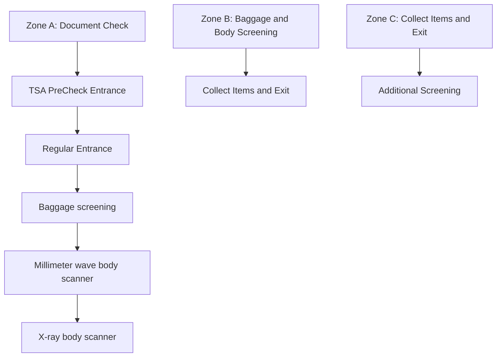

Team Control Number

For office use only

T1  
T2  
T3  
T4

68942

Problem Chosen

D

For office use only

F1  
F2  
F3  
F4

2017

MCM/ICM

Summary Sheet

(Your team's summary should be included as the first page of your electronic submission.)

Type a summary of your results on this page. Do not include the name of your school, advisor, or team members on this page.

The objective of our Internal Control Management (ICM) team was to investigate the flow of passengers through American airport checkpoints in light of various airport security controversies. The TSA asked our team to determine bottlenecks in the current security process that impacted passenger throughput and variance in wait times, and to develop modifications that might expedite throughput and decrease variance. We developed an agent-based model using NetLogo to study how passengers move through a typical security checkpoint. Our model divided the current screening process into individual components (processes like document-checking and lines for those processes) to precisely locate potential bottleneeks and included separate components for passengers enrolled in PreCheck, a program that expedites screening for trusted travellers. Travelers and their speeds through certain components of the process were generated probabilistically to most accurately represent real-world unpredictability.

We ran the model with different checkpoint configurations and varying traffic volumes. Our model found that for low traffic volumes, overall wait times and variance were low. More importantly, at higher volumes (approx. 3 or less seconds per passenger) there were three significant bottlenecks: the lines for PreCheck and regular document-checking at the start of the checkpoint, and for the body scanners that most regular passengers must pass through. These three components caused over 99% of the variance and length of total wait times, with standard deviation of wait times topping 30 minutes during peak hours.

Using the NetLogo model, we studied how certain modifications would impact passenger flow. At higher traffic volumes, throughput was increased by up to 16% by more metal detector use, better officer training for pat-downs, or the addition of a single metal detector or body scanner and the extra body scanner reduced variance by 33%. The model also investigated how throughput and wait times were influenced by passenger behaviors. We found that cutting, opting for pat-downs, and slower walking all impacted the checkpoint negatively, but with less severity than expected.

Our model allowed us to closely analyze the efficiency of airport security checkpoints and shed light on how to resolve one of travelling's biggest issues.

# Optimizing Passenger Throughput at an Airport Security Checkpoint

## 1 Introduction

On the morning of September 11, 2001, a series of four coordinated terrorists attacks in New York, Pennsylvania, and Virginia killed nearly 3000 people and injured over 6000 others. The insufficient airport security methods at the time allowed terrorists to board and subsequently hijack four passenger airliners. In the aftermath of the attacks, Congress and former President George W. Bush passed the Aviation and Transportation Security Act which established the Transportation Security Agency (TSA) as method to prevent similar attacks in the future. The TSA’s mission is to “protect the nation’s transportation systems to ensure freedom of movement for people and commerce” and desires to “provide the most effective transportation security in the most efficient way as a high performing counter-terrorism organization” [11].

Since its inception, the TSA has evolved to combat the various threats that terrorists pose to ordinary travelers. The addition of baggage screening, liquids limitations, and millimeter wave body scanners are just some examples of the increased security measures the TSA has implemented over the past decade. However, in 2016, the TSA came under sharp criticism when extremely long lines, particularly at large airports, caused travelers to miss their flights. Furthermore, there have been incidents where travelers experienced unexpected and unpredicted long wait times. This high variance has lead to travelers making the tough choice between arriving at the airport unnecessarily early or potentially missing their flight. As a result, the TSA is facing a tension between maximizing security and minimizing inconvenience travelers. Although the TSA’s PreCheck program, which allows travelers expedite the screening process, has become more popular, the exact effect on traveler throughput is not known.


<details>
<summary>flowchart</summary>


</details>

Figure 1: Illustration of the TSA Screening Process

Our team has been tasked by the TSA with optimizing the traveler throughput at an airport security checkpoint. Our solution identifies the problems with the current airport security checkpoint, shown above in Figure 4, and proposes a model that improves the checkpoint throughput and reduces variance in wait time while maintaining current safety and security standards.

## 2 Screening Process

Airport security checkpoints can be divided into four major zones, as demonstrated in Figure 4.

In Zone A, passengers arrive to the checkpoint and wait in a queue until a security officer can inspect their documents. In Zone B, passengers walk to an available screening lane. There, they unload their belongings for x-ray screening and pass through a millimeter wave body scanner or a walk-through metal detector (WTMD). In Zone C, the passengers collect their belongings from the x-ray conveyor belt and leave the checkpoint. In Zone D, passengers who require additional screening undergo pat-downs and/or baggage searches.

We model the checkpoint as a sequence of processes (e.g., passing through a body scanner) and queues (e.g., the line before a body scanner). The amount of time each process takes is set in our model, which queue times depend on the length and nature of the queue. Airports and the TSA wish to minimize the amount of time that passengers spend in any queue. In our model, there are a total of four queues and ten processes in the screening process, not including Zone D. They are, in chronological order:

<table><tr><td>Zone</td><td>Queue</td><td>Process</td></tr><tr><td rowspan="3">A</td><td>Document check line (q0)</td><td></td></tr><tr><td rowspan="2"></td><td>Walk to document check</td></tr><tr><td>Document check</td></tr><tr><td rowspan="8">B</td><td></td><td>Walk to screening lane</td></tr><tr><td>X-ray screening line (q1)</td><td></td></tr><tr><td rowspan="2"></td><td>Unload belongings for screening</td></tr><tr><td>Walk to line</td></tr><tr><td>Body scanner or WTMD line (q2)</td><td></td></tr><tr><td rowspan="3"></td><td>Walk to scanner or WTMD</td></tr><tr><td>Body scanning or WTMD</td></tr><tr><td>Walk to collection line</td></tr><tr><td rowspan="3">C</td><td>Collection line (q3)</td><td></td></tr><tr><td rowspan="2"></td><td>Collect belongings</td></tr><tr><td>Exit</td></tr></table>

Table 1: Breakdown of the screening process

If a passenger undergoes additional screening in Zone D, he or she walks to Zone D, waits in a queue for an available security officer, and then undergoes the screening. In the case of a baggage search, the passenger exits the checkpoint from Zone D. Otherwise, the passenger walks to Zone C to retrieve baggage and then exits.

## 3 Assumptions

Real-world It was necessary to make several assumptions in our model:

1. Each passenger travels alone. We assume that passengers do not travel in pairs, as families, or in groups; each makes decisions that are dependent on his or her own needs and not the needs of others.  
2. The given data set is representative of how passengers proceed through the screening process. It is difficult to accurately predict how long each traveler will spend in each zone of the screening process. We assume that the given data closely approximates the movements of most travelers through security checkpoints.  
3. Arrivals are uniformly random. According to the given data, the arrival times of travelers do not follow any clear pattern within short time periods (Figure 3). Thus, the best way to model arrivals is to generate travelers with a constant probability. The probability itself may vary between regular and Pre-Check arrivals, as well as with total traffic volumes.  
4. Travelers choose the screening lane with the least amount of people. When passing from the document check to the baggage and body screening, people will choose what they perceive to be the most efficient route: the lane with the least number of people.  
5. The general layout of any US security checkpoint is the same as presented in Figure 4. The TSA sets strict guidelines for the layout, equipment, and dimensions of any airport security checkpoint [12]. Because it is difficult and costly to expand the total space of security checkpoints, we limit the total number of lanes to six, though lanes may be closed during periods of lower traffic. Similarly, the number of document-checking security officers is limited by physical space availability. A typical checkpoint, as depicted in [12], has one document-checking officer for each body scanner.  
6. For every two screening lines, there is one metal detector and one millimeter wave body scanner. According to the TSA’s Security Checkpoint Layout Design/Reconfiguration Guide, the optimal layout for Zone B is two screening lines per metal detector and one metal detector per body scanner whenever possible [12].  
7. Queues have no limit. At a real-world security checkpoint, bottlenecks in Zones B and C would translate to longer queue times in Zone A because of physical limits to the lengths of lines. However, we allow all queues to extend indefinitely in order to discover precisely where bottlenecks exist in the screening process. Long queue lengths and wait times indicate which parts of the process are causing delays.  
8. At most one passenger arrives to the checkpoint every second. Most airport security queues are designed so that only one person can join at a time. It is reasonable to assume that passengers allow for a one-second gap to the next person.  
9. Walking from the checkpoint entrance to the document-checking queue requires no time. When lines are short, security officers will frequently reroute the queue to shorten the distance from the checkpoint entrance. As a result, it usually takes little time to walk to the end of the document-checking queue in Zone A.  
10. An average American passenger’s personal space is a 3’ by 3’ square. [12]  
11. All passengers eventually complete the screening process. We assume that all passengers successfully exit the security checkpoint; none are arrested, detained, or leave the airport.  
12. All travelers enrolled in the PreCheck program pass through WTMDs. [10]  
13. Every passenger brings at least one piece of luggage. The TSA screens more than 1.7 billion carry-on bags a year, more than double the number of passengers. It is reasonable to assume that every traveler carrys at least one bag, if only to store his or her documents, wallet, and other important possesions.

## 3.1 Normality


<details>
<summary>q-q plot (quantile-quantile plot)</summary>

| Theoretical Quantiles | Sample Quantiles |
| --------------------- | ---------------- |
| -2.0                  | 3.0              |
| -1.5                  | 6.0              |
| -1.0                  | 7.0              |
| -0.5                  | 8.0              |
| 0.0                   | 9.0              |
| 0.5                   | 10.0             |
| 1.0                   | 11.0             |
| 1.5                   | 12.0             |
| 2.0                   | 13.0             |
| 2.5                   | 14.0             |
| 3.0                   | 15.0             |
| 3.5                   | 16.0             |
| 4.0                   | 17.0             |
| 4.5                   | 18.0             |
| 5.0                   | 19.0             |
</details>


<details>
<summary>q-q plot (quantile-quantile plot)</summary>

| Theoretical Quantiles | Sample Quantiles |
| --------------------- | ---------------- |
| -2.0                  | 5.0              |
| -1.5                  | 7.5              |
| -1.0                  | 8.0              |
| -0.5                  | 9.0              |
| 0.0                   | 10.0             |
| 0.5                   | 11.0             |
| 1.0                   | 14.0             |
| 1.5                   | 15.0             |
| 2.0                   | 20.0             |
</details>

Figure 2: Normal Q-Q Plots for document check (left) and body scan (right) times

We used the Shapiro-Wilk normality test [4] and quantile-quantile (Q-Q) plots to determine the distributions of datasets from the given passenger data. We found two that could be approximated by normal distributions: document check process times and millimeter wave body scanner times, as determined by subtracting successive timestamps in the given data. For both, normality was not rejected at the $p = 0 . 0 1$ significance level and the $\mathrm { Q - Q }$ plots showed linear trends with fairly random deviations (Figure 2). This allowed us to design our program to generate probabilistic times based on a normal distribution.

## 3.2 Process Times

Many of the process times were determined from the given data. However, for some processes it was necessary to make certain assumptions regarding the TSA screening process and traveler speeds. We based many of these values on personal investigation and real-world footage of travelers in airport checkpoints.

<table><tr><td>Zone</td><td>Process</td><td>Time (s)</td></tr><tr><td rowspan="2">A</td><td>Walk to document check</td><td>2</td></tr><tr><td>Document check</td><td>11.2</td></tr><tr><td rowspan="7">B</td><td>Walk to screening lane</td><td>3 [1]</td></tr><tr><td>Unload belongings for screening</td><td>15 [1]</td></tr><tr><td>Walk to scanner or WMTD line</td><td>3</td></tr><tr><td>Walk to scanner or WMTD</td><td>2</td></tr><tr><td>Body scan</td><td>10.5</td></tr><tr><td>WTMD</td><td>1</td></tr><tr><td>Walk to collection line</td><td>3</td></tr><tr><td rowspan="2">C</td><td>Collect belongings</td><td>15 [1]</td></tr><tr><td>Exit</td><td>5-7</td></tr><tr><td rowspan="3">D</td><td>Walk to Zone D</td><td>3</td></tr><tr><td>Pat-down</td><td>150 [8]</td></tr><tr><td>Baggage Search</td><td>200</td></tr></table>

Table 2: Process times for regular passengers

Some passengers enroll in PreCheck, a TSA program that expedites the screening process. Passengers in PreCheck do not need to remove jackets, belts, shoes, or laptops, shortening the time for unloading and retrieving belongings at the scanner (in our model, to 10 seconds). In addition, PreCheck passengers pass through WTMDs instead of the body scanners, which speeds the process further. However, the other times are largely the same.

## 3.3 Rates and Probabilities

Certain processes, like pat-downs and baggage searches, do not occur for every passenger. Instead, we assigned each process a certain probability.

• Each person has a 3% chance of being given a pat-down, including the approximate 1% of passengers who opt for a pat-down instead of a body scan [3]. Other reasons for pat-downs include failing a body scan or metal detector.  
• The probability of having a baggage search is equal to that of receiving a pat-down.  
• Travelers not enrolled in the PreCheck program have a 20% probability of being sent through the WTMD instead of the millimeter wave body scanner. The majority of non-PreCheck passengers sent through the WTMD are under 12, over 65, or have severe disabilities.

## 4 Definitions and Testing Parameters

The TSA wishes to evaluate and improve its airport security checkpoints. In particular, it is concerned with two statistics:

Definition 1. The throughput of a checkpoint at any time is the rate of passengers exiting the checkpoint.

The unit of throughput used in this paper is passengers per minute (PAX/min).

Definition 2. The wait time of a passenger is the total amount of time that he or she spent in queues during the checkpoint.

Our goal was to investigate possible bottlenecks in the security screening process that might cause decreases in throughput, increases in wait time, and increases in wait time variance. We measured variance of wait time by calculating the standard deviation of the wait times of all passengers.

## 4.1 Arrivals

To simulate the randomness of the real-world passenger arrivals, passengers in our model are generated probabilistically every second rather than at a constant rate. Each arrival is then categorized as PreCheck or regular and sent to the corresponding queue.

Definition 3. The generation probability is the probability at each second that a passenger enters the checkpoint.

From the given data, the generation probability is 0.19, the average “rate” of passengers per second from the given data (Figure 3). This was determined by counting the number of total passenger arrival timestamps, both PreCheck and regular, that occurred within nine minutes. After arriving, each new passenger has a

0.45 probability of joining the PreCheck queue, since approximately 45% of passengers are currently enrolled in PreCheck.


<details>
<summary>bar chart</summary>

| Time (hr:min) | Arrivals |
| ------------- | -------- |
| 0:01          | 18       |
| 0:02          | 5        |
| 0:03          | 10       |
| 0:04          | 13       |
| 0:05          | 9        |
| 0:06          | 8        |
| 0:07          | 9        |
| 0:08          | 10       |
| 0:09          | 19       |
</details>

Figure 3: Arrivals (PreCheck and regular) over time

## 4.2 Lanes and Officers

The checkpoint tested in our model contains six screening lanes. PreCheck lanes usually make up a third of total lanes, so when the checkpoint is fully running there are two PreCheck lanes and four regular lanes. The number of available officers in Zone D is equal to the number of active lanes: six. However, during times of less traffic airports will decrease the number of active screening lanes and document-checking officers in order to save money.

Therefore, we tested two different configurations of active lanes and officers: one with all six lanes open for higher traffic, and one with only three lanes open for lower traffic.

Each configuration is denoted by a four-digit number. For example, the number 1234 denotes the configuration with 1 PreCheck document-checking officer, 2 active PreCheck screening lanes, 3 regular documentchecking officers, and 4 active regular screening lanes.

Definition 4. The configuration number is the four-digit number that denotes the numbers of lanes and officers active in the configuration.

## 4.3 Testing

In our model, we tested different volumes of traffic by increasing or decreasing the generation probability. We tested five generation probabilities: 0.09 (low traffic), 0.18 (normal traffic), 0.36 (busy traffic), 0.54 (high traffic), and 0.72 (peak traffic).

We tested configuration 1221 for lower traffic (generation probabilities of 0.09, 0.18, 0.36, 0.54) and configuration 2243 for higher traffic (generation probabilities of 0.18, 0.36, 0.54, 0.72). Each configuration was run at least three times in our model, collecting data after each run and averaging across all runs to obtain our results. Each run generated passengers for one hour (3600 seconds) and then ran until the all passengers exited. To measure throughput, we counted the number of exiting passengers every ten minutes and divided by ten to obtain throughput passengers per minute.

We also tested the effect of increasing or decreasing the number of PreCheck document-checking officers on throughput and wait time, varying the number of officers from 1 to 3 for the 1221 configuration and the

standard 0.18 generation probability.

## 5 NetLogo Model

To evaluate our assumptions and generate data, we use an agent-based NetLogo model. By using NetLogo, we are able to visually and robustly simulate passengers, officers, scanners, and queues in a time-accurate model. We can also use NetLogo’s powerful experimentation functionality to generate data.

## 5.1 Passengers

The basis of our model are passengers as represented by “turtles”, icons in the grid with attributes and the ability to perform actions. Each of our passengers has several attributes, including attributes that describe the passenger like is-precheck and speed-factor. Other attributes, including queue-pos and stage describe the passenger’s position in the model. Passengers are represented by pink (PreCheck) people, or purple (non-PreCheck) people.

Each passenger’s attributes are probabilistically decided by global values. For example, is-precheck is determined by precheck-percentage and is-cutter is determined by cutting-percentage. Passengers also record key data, including time-waiting to track total waiting time, and a wait-queue value for each queue they wait in.

## 5.2 Other turtles


<details>
<summary>natural_image</summary>

Diagram of a mechanical or electrical component with brown rods, red hexagons, and yellow/red lines, set against a blue background (no text or symbols)
</details>

Figure 4: This screenshot shows the simulation before passengers are generated.

Our passengers are affected by not only their own attributes, but by the officers, scanners, and “pack stations”. Officers occupy one of two areas: either an document check lane (Zone A), or the rescreen/patdown lanes (Zone D). In Zone A, they are assigned to either precheck or non-precheck, calling for passengers at the beginning of their respective queues. They are represented by orange people with blue hats and a badge. In Zone D, they are represented by a single officer icon that can patdown/rescreen multiple passengers. Scanners come in two forms - millimeter wave scanners or walk-through metal detectors. Each scanner pair operates as part of two lanes, and has its own queue. Millimeter wave scanners are represented by red hexagons, and WTMDs are represented by yellow rectangles. “Pack stations” are used to represent the areas in which passengers take off or put on coats, bags, and other items before or after screening. Each lane has one “unpack station” and one “repack station”. They are represented by the dark brown circles on the lighter brown x-ray machines.

## 5.3 Running the simulation

When setup is called, the world creates officers, scanners, packing stations, and colors patches to visually guide the progression of passengers through lanes. When the model is set to go, the model generates a passenger at each tick (equivalent to a second) at a certain probability gen-prob. Passengers progress through security in several stages according to our outlined process. Our simulation only generates passengers in the first 3600 ticks in order to only simulate a single real-world hour. The simulation stops when there are no longer passengers in the security checkpoint. At the end of the run, we use mean and standard-deviation to calculate the values we use for our analysis.


<details>
<summary>flowchart</summary>

```mermaid
graph TD
  A["setup"] --> B["go-once"]
  B --> C["go"]
  C --> D["gen-prob 45"]
  C --> E["preched-percentage 45"]
  D --> F["num-preched-lanes 2"]
  D --> G["num-preched-id 2"]
  E --> H["num-normal-lanes 4"]
  E --> I["num-normal-id 3"]
  F --> J["rescreen-prob 3"]
  G --> K["patdown-prob 3"]
  H --> L["rescreen-length 200"]
  I --> M["patdown-length 150"]
  J --> N["metal-detector-prob 20"]
  K --> O["unpad-capacity 3"]
  L --> P["repad-capacity 9"]
  M --> Q["cutter-percentage 0"]
  M --> R["cutting-prob 0"]
  M --> S["slow-percent 0"]
  M --> T["slow-factor 1.5"]
    
  U["count passeng... 37"] --> V["birth-per-10m [41"]]
  W["all-passengers 4"] --> X["death-per-10m [4"]]
  Y["avg-alive-time 0"] --> Z["stddev-alive-time 0"]
  AA["avg-waiting-time 0"] --> AB["stddev-waiting... 0"]
    
  AC["avg-queue-p0 0"] --> AD["stddev-queue-p0 0"]
  AE["avg-queue-p1 0"] --> AF["stddev-queue-p1 0"]
  AG["avg-queue-p2 0"] --> AH["stddev-queue-p2 0"]
  AI["avg-queue-p3 0"] --> AJ["stddev-queue-p3 0"]
    
  AK["avg-queue-pd 0"] --> AL["stddev-queue-pd 0"]
    
  AM["count passeng... 37"] --> AN["birth-per-10m [41"]]
  AO["all-passengers 4"] --> AP["death-per-10m [4"]]
  AQ["avg-alive-time 0"] --> AR["stddev-alive-time 0"]
  AS["avg-waiting-time 0"] --> AT["stddev-waiting... 0"]
```
</details>

Figure 5: This screenshot shows a simulation in progress.

For single, visible runs, we use the green sliders on the left to adjust parameters, the purple buttons to setup and go, viewing output in the boxes on the right when the simulation finishes. For batches of runs, we use NetLogo’s “BehaviorSpace” to run 3 trials of simulations with varying parameters.

## 6 Results


<details>
<summary>line chart</summary>

| Time (min) | 0.09  | 0.18  | 0.36  | 0.54  |
| ---------- | ----- | ----- | ----- | ----- |
| 0          | 4.5   | 7.8   | 12.0  | 12.0  |
| 50         | 5.0   | 8.5   | 13.0  | 14.0  |
| 100        | 0.0   | 0.0   | 4.5   | 5.0   |
| 150        | 0.0   | 0.0   | 4.5   | 4.5   |
| 200        | 0.0   | 0.0   | 0.0   | 4.5   |
| 250        | 0.0   | 0.0   | 0.0   | 0.0   |
</details>

Figure 6: Average throughputs (passengers/minute) over time for the 1221 configuration

<table><tr><td>Generation Probability</td><td>Total Average Wait Time (sec)</td><td>Total Standard Deviation (sec)</td></tr><tr><td>0.09</td><td>20.51</td><td>41.68</td></tr><tr><td>0.18</td><td>232.39</td><td>286.88</td></tr></table>

Table 3: Wait time data for the 1221 configuration

<table><tr><td>Generation Probability</td><td>Queue</td><td>Average (PreCheck)</td><td>Standard Deviation (PreCheck)</td><td>Average (Regular)</td><td>Standard Deviation (Regular)</td></tr><tr><td rowspan="5">0.09</td><td>q0</td><td>0.69</td><td>2.25</td><td>9.58</td><td>17.46</td></tr><tr><td>q1</td><td>0.00</td><td>0.00</td><td>0.00</td><td>0.00</td></tr><tr><td>q2</td><td>0.28</td><td>0.85</td><td>0.14</td><td>0.92</td></tr><tr><td>q3</td><td>23.17</td><td>50.30</td><td>7.72</td><td>27.29</td></tr><tr><td>Total</td><td>24.14</td><td>53.40</td><td>17.45</td><td>45.67</td></tr><tr><td rowspan="5">0.18</td><td>q0</td><td>1.75</td><td>4.08</td><td>372.53</td><td>297.88</td></tr><tr><td>q1</td><td>0.00</td><td>0.00</td><td>0.00</td><td>0.00</td></tr><tr><td>q2</td><td>0.51</td><td>1.15</td><td>0.40</td><td>1.72</td></tr><tr><td>q3</td><td>36.68</td><td>64.89</td><td>15.00</td><td>42.05</td></tr><tr><td>Total</td><td>38.94</td><td>70.12</td><td>387.93</td><td>341.65</td></tr></table>

Table 4: Wait times (sec) by queue for the 1221 configuration

For configuration 1221, the average throughput peaks at about 14 passengers/min for generation probabilities of 0.36 and 0.54, indicating that this was not the best configuration for those higher traffic volumes (Figure 6). However, for 0.09 and 0.18 the configuration had more than enough capacity for the arrivals. This seems to imply that the bottleneck for throughput is primarily the number of active lanes and officers; once arrival rates increase past a certain point, increases in arrival rate no longer significantly impacts the throughput. From Table 4, it is clear that the main bottleneck of both the PreCheck and the regular processes is line $\mathrm { q 3 }$ (retrieving belongings from the x-ray belt) for all except the regular passengers at 0.18 generation probability, where the bottleneck is $\mathrm { q 0 }$ (document-checking line). The variance in wait times is more than double the average wait time for a generation probability of 0.09. This may also be due to the natural variance that occurs from such a low generation probability, since high variance in arrivals easily translates to variance in wait times and throughput.

The wait time standard deviation is not immediately concerning for all but the 0.18, regular passengers case. The highest total standard deviation in those three cases is 70 seconds, or just over a minute. This means that a traveler having to wait more than five minutes longer than expected is high improbable. However, the case of regular passengers in the 0.18 generation probability case is much greater, with a wait time standard deviation of nearly six minutes.

<table><tr><td>Generation Probability</td><td>Total Average Wait Time (sec)</td><td>Total Standard Deviation (sec)</td></tr><tr><td>0.18</td><td>3.95</td><td>6.89</td></tr><tr><td>0.36</td><td>221.27</td><td>351.47</td></tr><tr><td>0.54</td><td>1088.93</td><td>867.74</td></tr><tr><td>0.72</td><td>2012.31</td><td>1409.13</td></tr></table>

Table 5: Wait time data for the 2243 configuration

<table><tr><td>Generation Probability</td><td>Queue</td><td>Average (PAX)</td><td>Standard Deviation (PAX)</td></tr><tr><td rowspan="5">0.18</td><td>q0</td><td>1.97</td><td>4.67</td></tr><tr><td>q1</td><td>0.00</td><td>0.00</td></tr><tr><td>q2</td><td>0.39</td><td>0.96</td></tr><tr><td>q3</td><td>0.00</td><td>0.00</td></tr><tr><td>Total</td><td>2.36</td><td>5.63</td></tr><tr><td rowspan="5">0.36</td><td>q0</td><td>162.31</td><td>322.88</td></tr><tr><td>q1</td><td>0.00</td><td>0.00</td></tr><tr><td>q2</td><td>0.66</td><td>1.15</td></tr><tr><td>q3</td><td>0.00</td><td>0.00</td></tr><tr><td>Total</td><td>162.98</td><td>324.03</td></tr><tr><td rowspan="5">0.54</td><td>q0</td><td>914.88</td><td>545.95</td></tr><tr><td>q1</td><td>0.00</td><td>0.00</td></tr><tr><td>q2</td><td>0.80</td><td>1.31</td></tr><tr><td>q3</td><td>0.00</td><td>0.00</td></tr><tr><td>Total</td><td>915.69</td><td>547.26</td></tr><tr><td rowspan="5">0.72</td><td>q0</td><td>1817.71</td><td>1060.32</td></tr><tr><td>q1</td><td>0.00</td><td>0.00</td></tr><tr><td>q2</td><td>0.76</td><td>1.27</td></tr><tr><td>q3</td><td>0.00</td><td>0.00</td></tr><tr><td>Total</td><td>1818.47</td><td>1061.59</td></tr><tr><td rowspan="5">0.18</td><td>q0</td><td>0.49</td><td>1.80</td></tr><tr><td>q1</td><td>0.00</td><td>0.00</td></tr><tr><td>q2</td><td>4.83</td><td>7.43</td></tr><tr><td>q3</td><td>0.00</td><td>0.00</td></tr><tr><td>Total</td><td>5.31</td><td>9.24</td></tr><tr><td rowspan="5">0.36</td><td>q0</td><td>7.94</td><td>17.12</td></tr><tr><td>q1</td><td>0.00</td><td>0.00</td></tr><tr><td>q2</td><td>262.35</td><td>345.87</td></tr><tr><td>q3</td><td>0.00</td><td>0.00</td></tr><tr><td>Total</td><td>270.29</td><td>363.00</td></tr><tr><td rowspan="5">0.54</td><td>q0</td><td>484.27</td><td>275.54</td></tr><tr><td>q1</td><td>0.00</td><td>0.00</td></tr><tr><td>q2</td><td>744.30</td><td>871.23</td></tr><tr><td>q3</td><td>0.00</td><td>0.00</td></tr><tr><td>Total</td><td>1228.57</td><td>1146.77</td></tr><tr><td rowspan="5">0.72</td><td>q0</td><td>1219.21</td><td>714.21</td></tr><tr><td>q1</td><td>0.00</td><td>0.00</td></tr><tr><td>q2</td><td>945.64</td><td>1154.63</td></tr><tr><td>q3</td><td>0.00</td><td>0.00</td></tr><tr><td>Total</td><td>2164.86</td><td>1868.85</td></tr></table>

Table 6: PreCheck wait times (sec) by queue for the 2243 configuration

Table 7: Regular wait times (sec) by queue for the 2243 configuration


<details>
<summary>line chart</summary>

| Time (minutes) | 0.18  | 0.36  | 0.54  | 0.72  |
| -------------- | ----- | ----- | ----- | ----- |
| 0              | 10.0  | 17.5  | 19.0  | 18.5  |
| 20             | 11.0  | 18.5  | 20.0  | 19.5  |
| 40             | 12.0  | 19.0  | 21.0  | 20.5  |
| 60             | 11.5  | 18.5  | 20.5  | 20.0  |
| 80             | 0.0   | 5.0   | 18.0  | 19.5  |
| 100            | 0.0   | 0.0   | 6.0   | 18.5  |
| 120            | 0.0   | 0.0   | 4.0   | 15.0  |
| 140            | 0.0   | 0.0   | 2.0   | 6.0   |
| 160            | 0.0   | 0.0   | 0.0   | 5.5   |
| 180            | 0.0   | 0.0   | 0.0   | 5.0   |
| 200            | 0.0   | 0.0   | 0.0   | 0.0   |
</details>

Figure 7: Average throughputs (passengers/minute) over time for the 2243 configuration

For configuration 2243, the average throughput peaks at about 21 passengers/min for generation probabilities of 0.36, 0.54 and 0.72, indicating that this was not the best configuration for those higher traffic volumes (Figure 7). However, for a generation probability of 0.09, the configuration had more than enough capacity for the arrivals. From the regular passengers described in table 7, we see a bottleneck at both the document check queue $( \mathrm { q 0 } )$ and the scanner queue (q2). Our PreCheck passengers in table 6 do not have a bottleneck in the scanner queue, but still have a high waiting time in the document check queue. Our observed variance in $\mathrm { q 0 }$ wait times is more than double the average for regular and PreCheck passengers with generation probabilities 0.18 and 0.36, likely due to a few extremely high wait times. Our standard deviation with a generation probability is low, less than 10 seconds in either case. With generation probability 0.36, the standard deviation increases to approximately 5.5 minutes for PreCheck and 6 minutes for non-PreCheck passengers. Standard deviations of generation probabilities of 0.54 and 0.72 become excessive, almost 10 and 20 minutes for PreCheck and 20 and 30 minutes for non-PreCheck passengers. We see an unacceptably high standard deviation of wait times with this configuration at high density populations.

## 6.1 Varying PreCheck Document-checking Officers

<table><tr><td>Number of PreCheck Officers</td><td>Average Wait Time (sec)</td><td>Standard Deviation (sec)</td><td>Avg. Throughput (PAX/min)</td></tr><tr><td>1</td><td>2216.70</td><td>1276.84</td><td>4.82</td></tr><tr><td>2</td><td>309.62</td><td>252.01</td><td>9.23</td></tr><tr><td>3</td><td>59.26</td><td>101.28</td><td>10.49</td></tr></table>

Table 8: Throughput and wait times for varying numbers of PreCheck officers

As the number of document-checking officers increases, both the average wait time and the wait time standard deviation decrease significantly, with the largest decrease occurring from one to two officers. However, while there is a significant increase of nearly 100% in average throughput from one to two officers, the increase from two to three is much smaller. Therefore, when taking cost into account two officers does seem to be the optimal number when there is one active PreCheck lane and low traffic.


<details>
<summary>line chart</summary>

| Time (min) | 1    | 2    | 3    |
| ---------- | ---- | ---- | ---- |
| 0          | 4.00 | 8.00 | 8.50 |
| 20         | 4.50 | 9.00 | 8.50 |
| 40         | 4.00 | 8.50 | 10.00 |
| 60         | 4.50 | 8.50 | 11.00 |
| 80         | 4.50 | 1.00 | 0.00 |
| 100        | 4.50 | 0.00 | 0.00 |
| 120        | 4.50 | 0.00 | 0.00 |
</details>

Figure 8: Average throughputs (passengers/minute) over time for varing numbers of PreCheck officers

## 7 Improvements to the Current Process

It was clear from the results in Section 6 that there was much room for improvement in the current security screening process. We proposed four modifications and, using the NetLogo model, investigated how these changes might affect throughput and wait times. The modifications were:

1. Adding another metal detector  
2. Increasing the probability of WTMD usage for non-PreCheck passengers  
3. Adding another millimeter wave body scanner  
4. Reducing Pat-Down Times  
5. Increasing the percent of PreCheck passengers  
6. Increasing the number of PreCheck document-checkers

For nearly all modifications to the original model, we used the 1221 configuration for generation proba bilities of 0.09 and 0.18 and the 2243 configuration for generation probabilities of 0.36, 0.54, and 0.72.

## 7.1 Throughput Data

Table 9 shows the change in average throughput from each of the modifications.

<table><tr><td rowspan="2">Generation Probability</td><td rowspan="2">Extra Metal Detector</td><td colspan="3">More WTMD Use</td><td rowspan="2">Extra Scanner</td><td rowspan="2">Shorter Pat-downs</td></tr><tr><td>30</td><td>40</td><td>50</td></tr><tr><td>9</td><td>-</td><td>0.97</td><td>1.77</td><td>1.59</td><td>0.93</td><td>1.02</td></tr><tr><td>18</td><td>-</td><td>0.60</td><td>0.71</td><td>1.01</td><td>1.03</td><td>1.01</td></tr><tr><td>36</td><td>1.00</td><td>1.01</td><td>1.14</td><td>1.16</td><td>1.08</td><td>0.99</td></tr><tr><td>54</td><td>1.22</td><td>1.04</td><td>1.05</td><td>1.08</td><td>1.11</td><td>0.99</td></tr><tr><td>72</td><td>1.43</td><td>1.05</td><td>1.08</td><td>1.13</td><td>1.13</td><td>1.00</td></tr></table>

Table 9: Ratio of new to original throughputs

## 7.2 Extra Metal Detector

By adding another metal detector to our PreCheck lanes, we can alleviate queue wait times and decrease variance in the queue before scanning (q2).

<table><tr><td>Generation Probability</td><td>Wait Time w/o Extra PreCheck Lane (sec)</td><td>Standard Deviation w/o Extra PreCheck Lane (sec)</td><td>Wait Time w/ Extra PreCheck Lane (sec)</td><td>Standard Deviation w/ Extra PreCheck Lane (sec)</td></tr><tr><td>0.36</td><td>221.27</td><td>351.47</td><td>337.27</td><td>329.46</td></tr><tr><td>0.54</td><td>1088.93</td><td>867.74</td><td>711.87</td><td>940.49</td></tr><tr><td>0.72</td><td>2012.31</td><td>1409.13</td><td>1344.34</td><td>1607.91</td></tr></table>

Table 10: Average Wait Times and Standard Deviations of the Screening Process with and without an extra metal detector

From Table 10 we can see that adding an extra metal detector when the generation probability is 0.54 and 0.72 significantly decreases the average wait time of the screening process. We do not see the same effect with a generation possibility of 0.36. However, the metal detector does increase throughput at all three generation probabilities. Thus, we can conclude that adding an extra metal detector is strictly beneficial.

The increases in standard deviation are likely to due the fact that PreCheck passengers already experience shorter wait times than regular passengers do. Decreasing PreCheck times further will increase overall standard deviation. Based on table 9, adding an extra metal detector increases throughput from 28% to 82% varying based on generation probabilty.

## 7.3 Increasing WTMD Usage

Travelers pass through the WTMD almost without stopping, while travelers that use the millimeter wave body scanner spend about 11 seconds being scanned. If we increase the probability that any traveler proceeds through the WTMD instead of the millimeter wave body scanner, we should be able to increase the rate at which travelers pass through Zone B. To modify our current model, which has 20% of travelers being selected for the WTMD, we increased that probability to 30%, 40%, and 50%. Figure 11 shows the results.


<details>
<summary>bar chart</summary>

| Generation Probability | 20% WTMD Usage (sec) | 30% WTMD Usage (sec) | 40% WTMD Usage (sec) | 50% WTMD Usage (sec) |
| :--- | :--- | :--- | :--- | :--- |
| 0.09 | 30 | 40 | 30 | 30 |
| 0.18 | 230 | 310 | 300 | 330 |
| 0.36 | 210 | 160 | 80 | 100 |
| 0.54 | 1080 | 920 | 790 | 710 |
| 0.72 | 2010 | 1880 | 1760 | 1560 |
</details>

Figure 9: Average Wait Times for Different Probabilities of People Passing Through WTMDs. All data is expressed as the mean + the standard deviation.

From Figure 11, we can see that increasing the probability of travelers proceeding through the WTMD instead of the millimeter wave body scanners does indeed decrease the average wait time of travelers during the screening process. Looking at the generation probabilities of 0.36, 0.54, and 0.72, there is a clear downward trend as the probability increases. The same is true for standard deviations of wait times; while the change that they show is less, there is a noticeable decrease in standard deviations from the original 20% WTMD usage for higher generational probabilities (0.36, 0.54, and 0.72). Based on table 9, increasing WTMD usage correlates to increasing throughput, anywhere from a decrease of 40% to an increase of 113% based on generation probability. The benefits of increasing WTMD usage are most pronounced with a 50% usage rate, presenting a benefit to all generation probabilites.

## 7.4 Extra Millimeter Wave Scanner

By adding an additional millimeter wave scanner, the security checkpoint should see an increase in throughput as more passengers are able to be scanned. We see a greatly decreased wait time and standard deviation for most passenger arrival densities, but an increased wait time and standard deviation when the generation probability is 0.18. The differences are significant; for higher traffic volumes (generation probabilities of 0.36 or more), the standard deviation decreases by more than a third. This could justify the extra cost of adding another body scanner, which costs about \$250,000 [12].

<table><tr><td>Generation Probability</td><td>Wait Time (sec)</td><td>Standard Deviation (sec)</td><td>Wait Time w/ Extra Scanner (sec)</td><td>Standard Deviation w/ Extra Scanner (sec)</td></tr><tr><td>0.09</td><td>20.51</td><td>41.68</td><td>16.91</td><td>36.35</td></tr><tr><td>0.18</td><td>232.39</td><td>286.88</td><td>314.69</td><td>376.13</td></tr><tr><td>0.36</td><td>221.27</td><td>351.47</td><td>111.61</td><td>104.23</td></tr><tr><td>0.54</td><td>1088.93</td><td>867.74</td><td>526.05</td><td>530.25</td></tr><tr><td>0.72</td><td>2012.31</td><td>1409.13</td><td>989.71</td><td>992.35</td></tr></table>

Table 11: Average Wait Times and Standard Deviations of the Screening Process with and without an Extra Scanner

Adding an extra scanner can have mixed results on throughput (based on Table 9). Though it causes a throughput increase of 3% to 99% for generation probabilities 18 to 72, the checkpoints’s throughput decreases by 7% with a low generation probability of 9%.

## 7.5 Decreasing Pat-down Times

We consider improved training for TSA officers responsible for conducting pat-downs and baggage rescreening in order to improve these processes. This would cause an increase in throughput, as faster pat-downs and rescreenings would allow these affected passengers to pass through security more quickly. We see a slight decrease in wait time and standard deviation for lower generation probabilities, namely 9% and 18%. However, for higher traffic the changes are nearly negligible, with the standard deviation increasing for when generation probability is 0.72.

<table><tr><td>Generation Probability</td><td>Wait Time w/ Regular Pat-downs (sec)</td><td>Standard Deviation w/ Regular Pat-downs (sec)</td><td>Wait Time w/ Faster Pat-downs (sec)</td><td>Standard Deviation w/ Faster Pat-downs (sec)</td></tr><tr><td>0.09</td><td>20.51</td><td>41.68</td><td>13.13</td><td>27.23</td></tr><tr><td>0.18</td><td>232.39</td><td>286.88</td><td>190.30</td><td>249.36</td></tr><tr><td>0.36</td><td>221.27</td><td>351.47</td><td>199.50</td><td>314.69</td></tr><tr><td>0.54</td><td>1088.93</td><td>867.74</td><td>1089.12</td><td>838.24</td></tr><tr><td>0.72</td><td>2012.31</td><td>1409.13</td><td>2095.55</td><td>1489.29</td></tr></table>

Table 12: Average Wait Times and Standard Deviations of the Screening Process with Regular and Faster Pat-downs

Based on table 9, shorter pat-downs have a very slight change to the average throughput (±5%), with the exception of a generation probability of 36, which had a 82% increase.

## 7.6 Increasing percentage of PreCheck passengers

TSA PreCheck allows passengers to pass through security without removing light jackets, shoes, laptops, and belts. It also allows passengers to more quickly pass through security with a WTMD rather than a millimeter body scanner. An increase in percentage of people with access to this expedited process could potentially increase the throughput of the security checkpoint and reduce variance from waiting in the scanner queue.


<details>
<summary>bar chart</summary>

| Generation Probability | 45% Patdown | 55% PreCheck | 65% PreCheck | 75% PreCheck |
| ---------------------- | ----------- | ------------ | ------------ | ------------ |
| 0.09                   | ~50         | ~100         | ~100         | ~100         |
| 0.18                   | ~200        | ~100         | ~100         | ~100         |
| 0.36                   | ~200        | ~300         | ~500         | ~1000        |
| 0.54                   | ~1000       | ~1200        | ~1600        | ~2200        |
| 0.72                   | ~2000       | ~2200        | ~2600        | ~3400        |
</details>

Figure 10: Average Wait Times for varying percentages of passengers with PreCheck. All data is expressed as the mean + standard deviation.

However, while the increase did lead to improvements when traffic was low, the increase in percentage of PreCheck passengers was detrimental at probabilities higher than 0.18. This is likely due to the limiting factor of only two lanes and two document-checking officers for PreCheck passengers.

## 7.7 Increasing the number of PreCheck percentage and document-checkers

Having observed a bottleneck in the document-checking queue with PreCheck passengers at high volumes of traffic, we add two document-checking officers, making the configuration 2443 rather than 2243.


<details>
<summary>bar chart</summary>

| Generation Probability | 45% Patdown | 55% PreCheck | 65% PreCheck | 75% PreCheck |
| :--- | :--- | :--- | :--- | :--- |
| 0.36 | 200 | 100 | 120 | 180 |
| 0.54 | 1100 | 550 | 650 | 950 |
| 0.72 | 2000 | 1300 | 1380 | 1700 |
Error bars indicate variability. The y-axis represents Average Wait Time (sec). Error bars represent standard deviation. Legend: Blue = Patdown, Orange = PreCheck, Grey = PreCheck, Yellow = PreCheck.
</details>

Figure 11: Average Wait Times for varying percentages of passengers with PreCheck. All data is expressed as the mean + standard deviation.

We see that as we increase percentage of PreCheck enrollment, we see an overall decrease in wait time and wait time variance, lowest at 55%. After this sharp dip, average wait time increases steadily. This is observed at all generation probabilites, though it is most pronounced after 0.36. Overall, a slight increase in PreCheck enrollment is greatly beneficial.

## 8 Variation in Traveler Behavior

In our model, we assumed that passengers follow mostly the same behavior, with only small variations in times. However, in the real world passengers exhibit a wide range of different behaviors. This is especially true at large international airports, where passengers differ by culture in addition to age, mobility, and personal preferences. We tested our model with the addition of new traveler styles to investigate how different social interactions would affect throughput and wait time. In particular, we investigated the following behaviors:

1. Cutting in line  
2. Aversion to body scanners (people can opt out of body scanning and receive a pat-down instead)  
3. Slower movement

## 8.1 Throughput Data

Table ?? shows the change in average throughput from each new passenger behavior.

<table><tr><td rowspan="2">Generation Probability</td><td rowspan="2">Cutting</td><td colspan="2">More Pat-downs</td><td rowspan="2">Slow Travelers</td></tr><tr><td>1%</td><td>2%</td></tr><tr><td>0.09</td><td>1.04</td><td>0.98</td><td>0.98</td><td>0.94</td></tr><tr><td>0.18</td><td>1.05</td><td>1.00</td><td>1.00</td><td>0.99</td></tr><tr><td>0.36</td><td>1.00</td><td>0.99</td><td>0.98</td><td>1.00</td></tr><tr><td>0.54</td><td>0.99</td><td>0.99</td><td>0.99</td><td>0.99</td></tr><tr><td>0.72</td><td>1.00</td><td>1.01</td><td>1.02</td><td>0.98</td></tr></table>

Table 13: Ratio of New to Old Throughputs

## 8.2 Cutting

In the interest of personal efficiency, some passengers may value their own position in queues rather more than the queue’s overall order. We refer to these passengers as “cutters”, people who will try to skip to the front of their queue and succeed about half the time. In modifying our model, we had 20% of travelers be cutters.

Comparing the data at various arrival densities (Table 14), we find that cutting led to an increase in average and standard deviations of wait time. This may be because cutters cause other passengers to have to wait longer, therefore increasing the average wait time and standard deviation; as expected, cutting benefits only those who cut. However, the negative effects of cutting could be mitigated by enforcing a stric no-cutting policy in all queues.

<table><tr><td>Generation Probability</td><td>Wait Time w/o Cutting (sec)</td><td>Standard Deviation w/o Cutting (sec)</td><td>Wait Time w/ Cutting (sec)</td><td>Standard Deviation w/ Cutting (sec)</td></tr><tr><td>0.09</td><td>20.51</td><td>41.68</td><td>18.49</td><td>39.65</td></tr><tr><td>0.18</td><td>232.39</td><td>286.88</td><td>329.34</td><td>385.85</td></tr><tr><td>0.36</td><td>221.27</td><td>351.47</td><td>266.60</td><td>634.58</td></tr><tr><td>0.54</td><td>1088.93</td><td>867.74</td><td>1143.61</td><td>1183.92</td></tr><tr><td>0.72</td><td>2012.31</td><td>1409.13</td><td>2075.03</td><td>1697.81</td></tr></table>

Table 14: Average Wait Times and Standard Deviations of the Screening Process with Individuals Who Cut

## 8.3 Higher Pat-down Probability

Since the addition of the new millimeter wave body scanners to the TSA’s screening process in 2010, many travelers have expressed their concerns about the privacy of these machines. Responding to those concerns, the TSA allow people to defer a scan by the millimeter wave body scanner and receive a pat-down instead. Thus, we tested different probabilities of travelers declining a millimeter wave body scan and receiving a pat-down to see if it had any effect on the wait time for the screening process. According to the TSA, only about 1% of travelers opt for a pat-down instead of a millimeter wave body scan so we tested both a 1% probability and a 2% probability [8].


<details>
<summary>bar chart</summary>

| Generation Probability | 0% Patdown (sec) | 1% Patdown (sec) | 2% Patdown (sec) |
| :--- | :--- | :--- | :--- |
| 0.09 | 50 | 40 | 30 |
| 0.18 | 220 | 270 | 310 |
| 0.36 | 210 | 280 | 240 |
| 0.54 | 1100 | 1130 | 1070 |
| 0.72 | 2020 | 2080 | 2080 |
</details>

Figure 12: Average wait times for various patdown probabilities. All data is expressed as the mean + the standard deviation.

From Figure 12, a 1% or 2% amount of travelers deferring a millimeter wave scan does not affect the wait time standard deviations significantly. This may not remain true for higher probabilities, but with low probabilities, the effect is not significant.

## 8.4 Slower Travelers

Not all travelers move at the same rate. While young adults move relatively quickly, older travelers and children may move slower than them. Thus, to incorporate the idea of a variety of speeds, we included slow travelers into the model. These travelers move half as fast as regular travelers and appear 20% of the time.

<table><tr><td>Generation Probability</td><td>Wait Time w/o Slow Travelers (sec)</td><td>Standard Deviation w/o Slow Travelers (sec)</td><td>Wait Time w/ Slow Travelers (sec)</td><td>Standard Deviation w/ Travelers (sec)</td></tr><tr><td>0.09</td><td>20.51</td><td>41.68</td><td>13.27</td><td>31.75</td></tr><tr><td>0.18</td><td>232.39</td><td>286.88</td><td>268.67</td><td>312.06</td></tr><tr><td>0.36</td><td>221.27</td><td>351.47</td><td>314.23</td><td>386.51</td></tr><tr><td>0.54</td><td>1088.93</td><td>867.74</td><td>1126.22</td><td>812.25</td></tr><tr><td>0.72</td><td>2012.31</td><td>1409.13</td><td>2101.90</td><td>1399.51</td></tr></table>

Table 15: Average Wait Times and Standard Deviations of the Screening Process with and Without Slow Travelers

From Figure 15, we can see that the addition of slow travelers increases the wait time, but not the standard deviation of screening process. This seems logical, because slower travelers will not only slow down the process as a whole, but also slow down travelers around them, accounting for the smaller standard deviations.

## 9 Policy and Procedural Recommendations

Based on our observations, we recognize several problem areas for current TSA checkpoints. PreCheck passengers are limited by the number of document-checking TSA officers, especially at a high volume of traffic. Non-PreCheck passengers are limited by document checking queues and scanner queues. These high wait times also lead to unacceptably large wait times and variances in those wait times, up to 30 minutes in high traffic scenarios. To improve the efficiency of the security checkpoint, we encourage the TSA to make one or more of the following changes:

• Add a metal detector to alleviate long, varied queue lengths in PreCheck lanes.  
• Add a millimeter wave scanner in non-PreCheck lanes in order to reduce variance and length of queues.  
• Increase the number of document-checking TSA officers

In order to address future increases in the proportion of passengers enrolled in PreCheck, we also suggest the following:

• Add document-checking TSA officers for PreCheck queues  
• Add more Pre-Check lanes

Devoting more resources to PreCheck is less effective on its own. These changes are only made effective by an increase in PreCheck enrollment.

Other observed behaviors, including slower passengers and passengers that cut in front of others can be addressed specifically:

• Enforce stricter queueing. Cutting increases wait time variance and can increase average wait time, especially at higher traffic volumes. Posted signs in queues can help reduce incentive to skip through queues.

• Slower travelers can be overwhelmed in high traffic scenarios, but should be reassured their progress through security is not affecting variance.

## 10 Strengths and Weaknesses

In future work, we would like to address the weaknesses of our model and improve on the computational efficiency of our simulations. This model had a number of strengths and weaknesses:

• Strength: Our model is based on real data released by the TSA.

By generating values based on real-world data directly from the TSA and other reputable sources, our model more effectively represents real-world scenarios.

• Strength: Our model uses probabilistic methods to generate data.

Because we use previous data but add random variance, we are able to simulate scenarios with realistic randomness. A deterministic model would not be able to factor the significant unpredictability that is present in the real world.

• Strength: Our model is flexible and readily adaptable.

By using NetLogo, we can very quickly and easily change settings to investigate effects of each parameter. The experimentation capabilities of NetLogo allow us to automatically compile large quantities of data in spreadsheets. Our many inputs allow a wide variety of configurations to be fine-tuned.

• Strength: Our model tests a large variety of modifications and different behaviors.

We were able to simulate changes in both the checkpoint itself and in human behavior, and find some modifications that improved overall efficiency of the checkpoint.

• Weakness: Our model cannot assess all potential combinations of parameters and configurations.

The ideal solution would test each of the thousands of possible security configurations, varying the numbers of lanes, document-checking officers, and equipment to find the optimal configuration. How ever, this is a vastly unreasonable task. Instead, our model compares a large set of configurations to determine the best one.

• Weakness: Our model does not include a quantification of security.

Each simulation, though representative of throughput and queue times, does not quantify security. It is difficult to analyze how “secure” a checkpoint without extensive data and studies on each component of the screening process.

• Weakness: Our model cannot portray the complete complexity of human behaviors.

Though we consider a number of the most common behaviors, including differing perceptions of personal space and propensity for cutting in line, there are many more to be found among real-world passengers. Analyzing and implementing more behaviors into our model is a strong avenue for future work.

• Weakness: Our model has a limited number of trials for each combination of factors.

Though we are able to analyze data with 3 trials each, due to the probabilistic nature of the model, these trials may not accurately reflect the real-world system. More trials would allow us to more accurately analyze our model.

## References

[1] “Airport Security Footage - September 2006. Minneapolis International Airport.” YouTube. YouTube, 14 Oct. 2010. Web. 20 Jan. 2017.  
[2] Burns, Bob. “TSA 2015 Year in Review.” The TSA Blog. Transportation Security Administration, 21 Jan. 2016. Web. 20 Jan. 2017.  
[3] Burns, Bob. “TSA Myth or Fact: Leaked Images, Handcuffed Hosts, Religious Garb, and More!” The TSA Blog. Transportation Security Administration, 18 Nov. 2010. Web. 21 Jan. 2017.  
[4] Dittami, Simon. “Shapiro-Wilk Normality Test.” Shapiro Wilk Test (Web Version). N.p., 2009. Web. 20 Jan. 2017.  
[5] Duarte, Lourdes. “Long Lines Reported at Chicago Midway Airport’s TSA Checkpoint.” WGN-TV. WGN-TV, 13 July 2016. Web. 20 Jan. 2017.  
[6] Gildor, Omri A. “Security of Airports: Full Body Scanners and Walk Through Metal Detectors – CSCI 1951E S01: Computer Systems Security: Principles and Practice.” CSCI 1951E S01 Computer Systems Security Principles and Practice. Brown University, 3 Feb. 2015. Web. 20 Jan. 2017.  
[7] Hetter, Katia. “How Long Will I Wait in the TSA Line?” CNN. Cable News Network, 9 June 2016. Web. 20 Jan. 2017.  
[8] Jansen, Bart. “TSA Defends Full-body Scanners at Airport Checkpoints.” USA Today. Gannett Satellite Information Network, 02 Mar. 2016. Web. 20 Jan. 2017.  
[9] McCoy, William. ”How Many Carry-on Items Can a Person Bring on an Airplane?” USA Today. Gannett Satellite Information Network, n.d. Web. 21 Jan. 2017.  
[10] Michaels, Allison. “The Pros and Cons of TSA PreCheck.” U.S. News World Report. U.S. News World Report, 22 Apr. 2014. Web. 20 Jan. 2017.  
[11] “Mission.” Transportation Security Administration. The Department of Homeland Security, 09 Dec. 2016. Web. 20 Jan. 2017.  
[12] ”Security Checkpoint Layout Design/Reconfiguration Guide.” Transportation Security Administration. The Department of Homeland Security, 7 Nov. 2006. Web. 20 Jan. 2017.  
[13] Schuppe, John. “Airline Slams TSA over Long Delays, Missed Flights.” CNBC. CNBC, 14 Apr. 2016. Web. 20 Jan. 2017.  
[14] “Transportation Security Timeline.” Transportation Security Administration. The Department of Homeland Security, n.d. Web. 20 Jan. 2017.  
[15] “Travel Tips: Advanced Imaging Technology.” Transportation Security Administration. The Department of Homeland Security, 12 May 2016. Web. 20 Jan. 2017.  
[16] “TSA Releases 2015 Statistics.” Transportation Security Administration. The Department of Homeland Security, 21 Jan. 2016. Web. 20 Jan. 2017.  
[17] Wilensky, U. (1999). NetLogo. http://ccl.northwestern.edu/netlogo/. Center for Connected Learning and Computer-Based Modeling, Northwestern University, Evanston, IL.  
[18] Wisniewski, Mary. “At Chicago Airports, Wait times in TSA Lines Are 10 Minutes or Less.” Chicagotribune.com. Chicago Tribune, 23 Aug. 2016. Web. 20 Jan. 2017.

<table><tr><td>Generation Probability</td><td>Queue</td><td>Average (PAX)</td><td>Standard Deviation (PAX)</td></tr><tr><td rowspan="5">0.09</td><td>q0</td><td>0.26</td><td>1.30</td></tr><tr><td>q1</td><td>0.00</td><td>0.00</td></tr><tr><td>q2</td><td>0.28</td><td>0.87</td></tr><tr><td>q3</td><td>13.14</td><td>32.70</td></tr><tr><td>Total</td><td>13.68</td><td>34.87</td></tr><tr><td rowspan="5">0.18</td><td>q0</td><td>1.94</td><td>4.38</td></tr><tr><td>q1</td><td>0.00</td><td>0.00</td></tr><tr><td>q2</td><td>0.58</td><td>1.20</td></tr><tr><td>q3</td><td>46.84</td><td>69.45</td></tr><tr><td>Total</td><td>49.36</td><td>75.03</td></tr><tr><td rowspan="5">0.36</td><td>q0</td><td>136.01</td><td>238.85</td></tr><tr><td>q1</td><td>0.00</td><td>0.00</td></tr><tr><td>q2</td><td>0.73</td><td>1.23</td></tr><tr><td>q3</td><td>35.53</td><td>70.90</td></tr><tr><td>Total</td><td>172.27</td><td>310.98</td></tr><tr><td rowspan="5">0.54</td><td>q0</td><td>892.67</td><td>491.70</td></tr><tr><td>q1</td><td>0.00</td><td>0.00</td></tr><tr><td>q2</td><td>0.71</td><td>1.20</td></tr><tr><td>q3</td><td>67.50</td><td>121.87</td></tr><tr><td>Total</td><td>960.85</td><td>614.77</td></tr><tr><td rowspan="5">0.72</td><td>q0</td><td>2024.50</td><td>1192.34</td></tr><tr><td>q1</td><td>0.69</td><td>0.00</td></tr><tr><td>q2</td><td>34.07</td><td>1.19</td></tr><tr><td>q3</td><td>67.10</td><td>67.10</td></tr><tr><td>Total</td><td>2126.36</td><td>1260.63</td></tr><tr><td rowspan="5">0.09</td><td>q0</td><td>0.55</td><td>2.03</td></tr><tr><td>q1</td><td>0.00</td><td>0.00</td></tr><tr><td>q2</td><td>0.44</td><td>1.07</td></tr><tr><td>q3</td><td>12.36</td><td>32.56</td></tr><tr><td>Total</td><td>13.35</td><td>35.66</td></tr><tr><td rowspan="5">0.18</td><td>q0</td><td>3.17</td><td>7.74</td></tr><tr><td>q1</td><td>0.00</td><td>0.00</td></tr><tr><td>q2</td><td>0.67</td><td>1.28</td></tr><tr><td>q3</td><td>42.51</td><td>70.06</td></tr><tr><td>Total</td><td>46.35</td><td>79.08</td></tr><tr><td rowspan="5">0.36</td><td>q0</td><td>83.75</td><td>154.49</td></tr><tr><td>q1</td><td>0.00</td><td>0.00</td></tr><tr><td>q2</td><td>0.70</td><td>1.22</td></tr><tr><td>q3</td><td>48.75</td><td>76.08</td></tr><tr><td>Total</td><td>133.20</td><td>231.79</td></tr><tr><td rowspan="5">0.54</td><td>q0</td><td>972.72</td><td>565.84</td></tr><tr><td>q1</td><td>0.00</td><td>0.00</td></tr><tr><td>q2</td><td>0.70</td><td>1.22</td></tr><tr><td>q3</td><td>29.51</td><td>57.71</td></tr><tr><td>Total</td><td>1002.93</td><td>624.77</td></tr><tr><td rowspan="5">0.72</td><td>q0</td><td>1998.51</td><td>1158.93</td></tr><tr><td>q1</td><td>0.00</td><td>0.00</td></tr><tr><td>q2</td><td>0.72</td><td>1.24</td></tr><tr><td>q3</td><td>38.87</td><td>82.61</td></tr><tr><td>Total</td><td>2038.1</td><td>1242.78</td></tr></table>

Table 16: WTMD 30%

Table 17: WTM 40%

## A Code

The following is the code for the NetLogo model used in this paper:

```ini
breed[passengers passenger]
breed[officers officer]
breed[xrays xray]
breed[unpackers unpacker]
breed[mmscanners mmscanner]
breed[packers packer]
undirected-link-breed[id-checks id-check]
undirected-link-breed(queue-links queue-link]
undirected-link-breed[unpack-links unpack-link]
undirected-link-breed[pack-links pack-link]
undirected-link-breed[scan-links scan-link]
undirected-link-breed[patdown-links patdown-link]
```

```txt
globals[
    p0-length ;;precheck document queue length
    n0-length ;;nonprecheck document queue length
    p1-length
```

```txt
n1-length
a2-length
pd-length
total-passengers
death-per-10m
birth-per-10m
total-wait-queue-p0; before id
total-wait-queue-n0
total-wait-queue-p1 ; before unpack
total-wait-queue-n1
total-wait-queue-p2 ; before scan
total-wait-queue-n2
total-wait-queue-p3 ; before repack
total-wait-queue-n3
total-wait-queue-pd ; before patdowns
total-alive-time
total-waiting-time
avg-alive-time
avg-waiting-time
stddev-alive-time
stddev-waiting-time
avg-queue-p0
avg-queue-p1
avg-queue-p2
avg-queue-p3
avg-queue-n0
avg-queue-n1
avg-queue-n2
avg-queue-n3
avg-queue-pd
stddev-queue-p0
stddev-queue-p1
stddev-queue-p2
stddev-queue-p3
stddev-queue-n0
stddev-queue-n1
stddev-queue-n2
stddev-queue-n3
stddev-queue-pd
all-passengers

officers-own[
which-queue
id
patters]

unpackers-own[
which-queue
active]

packers-own[
```

```txt
which-queue
active
]
xrays-own[
    which-queue
    active
]
mmscanners-own[
    which-queue
    active
    capacity
]
passengers-own[
    is-precheck
    baggage
    personal-space
    is-cutter
    waiting-time
    scan-time
    which-queue
    queue-pos
    walking
    is-waiting
    fd-speed
    next-passenger
    p-length
    id-check-length
    unpack-length
    scan-length
    pack-length
    walking-time
    id-check-time
    unpack-time
    pack-time
    patdown-time
    stage
    md-prob
    total-wait-time
    wait-queue-0
    wait-queue-1
    wait-queue-2
    wait-queue-3
    wait-queue-pd
    alive-time
    delayer
    speed-factor
]
to setup
clear-all
reset-ticks
```

```txt
setup-globals
setup-zones
setup-decor
let i 0
let t num-precheck-id + num-normal-id
create-officers t[
    set shape "Officer"
    set patters false
    set id i
    set i i + 1
    set color 27
    set size 2.5
    setxy (id * (60 / t)) mod 60 + ((60 / t) / 2) 45
    ifelse id < num-precheck-id[
    set which-queue 0
    ][ 
    set which-queue 1
    ]
]
set i 0
create-officers 1[
    set shape "Officer"
    set patters true
    set color 27
    set size 2.5
    setxy (i * 3) + 41 3
    set which-queue i
    set i i + 1
]
set birth-per-10m []
set death-per-10m []
end

to go
if ticks mod 600 = 0[
    set birth-per-10m lput 0 birth-per-10m
    set death-per-10m lput 0 death-per-10m
]
if ticks = 0[make-passenger]
if random 100 < gen-prob and ticks < 3600[make-passenger]
increment-queues ;; each officer calls the front of the queue
if count passengers = 0[
    process-data
    stop
]
ask passengers[
    set is-waiting true
    if stage = 0 and walking-time = int(2 * speed-factor)[
    set walking false
    set is-waiting false
]
if stage = 1 and walking-time = int(3 * speed-factor)[
    set walking false
    set stage 2
```

```txt
set is-waiting false
]
if stage = 3 and walking-time = int(3 * speed-factor)[
    set walking false
    set stage 4
    set is-waiting false
]
if stage = 4 and walking-time = int(2 * speed-factor)[
    set walking false
    set is-waiting false
]
if stage = 7 and walking-time = int(3 * speed-factor)[
    set walking false
    set stage 8
    set is-waiting false
]
if stage = 9[
    set is-waiting false
    facexy xcor ycor - 1
    fd 1
    if [pycor] of patch-here = 0[record-data]
]
if stage = 201 and walking-time = int(3 * speed-factor)[
    set walking false
    set is-waiting false
]
if walking[
    fd fd-speed
    set walking-time walking-time + 1
    set is-waiting false
]
if stage = 0 and id-check-time >= id-check-length[
    find-lane
    set id-check-time id-check-time + 1
    set is-waiting false
]
if count my-id-checks = 1[
    set id-check-time id-check-time + 1
    set is-waiting false
]
if (unpack-time = int(15 * speed-factor) and not(is-precheck) or (unpack-time = int(7 * speed-factor)
    ask my-links[die]
    through-security
    set unpack-time unpack-time + 1
    set is-waiting false
]
if stage = 8 and (pack-time >= int(10 * speed-factor) and not(is-precheck) or (pack-time >= int(5 * 
    ask my-links[die]
    set pack-time pack-time + 1
    ifelse random 100 < rescreen-prob[
    set stage 100
    set patdown-time 0
    set p-length rescreen-length
    set is-waiting false
```

```txt
if delay-on [set delayer random 5 + 5]
    patdown
][
    set is-waiting false
    set stage 9
]

if patdown-time = int(p-length * speed-factor) and stage = 201[
    ;show "This happens!"
    set is-waiting false
    ask my-links[die]
    set stage 5
    set patdown-time patdown-time + 1
    ifelse p-length = patdown-length[
    repack
    ][
    set is-waiting false
    set stage 9
]

if stage = 4 and ((md-prob and scan-time = 1) or (not(md-prob) and scan-time >= scan-length))[ 
    set is-waiting false
    ;show "This other thing happens!"
    ifelse random 100 < patdown-prob[
    set stage 200
    set p-length patdown-length
    set patdown-time 0
    patdown
    ][
    set stage 5
    repack
    ]
    set scan-time scan-time + 1

if count my-unpack-links = 1[
    set is-waiting false
    set unpack-time unpack-time + 1

if count my-scan-links = 1 and walking = false[
    set is-waiting false
    set scan-time scan-time + 1

if count my-pack-links = 1[
    set is-waiting false
    set pack-time pack-time + 1

if count my-patdown-links = 1[
    set is-waiting false
    set patdown-time patdown-time + 1

if is-waiting[
    ifelse stage = 0[set wait-queue-0 wait-queue-0 + 1][
    ifelse stage = 2[set wait-queue-1 wait-queue-1 + 1][
    ifelse stage = 4[set wait-queue-2 wait-queue-2 + 1][
```

```txt
ifelse stage = 8[set wait-queue-3 wait-queue-3 + 1][show stage]]]
    if stage = 201[
    set wait-queue-pd wait-queue-pd + 1
    set delayer delayer - 1
    ]
    ;show stage
    set waiting-time waiting-time + 1
    ]
    set alive-time alive-time + 1
    ]
    tick
end

to setup-zones
    let t num-precheck-id + num-normal-id
    ask patches[
    ifelse pycor > 45[
    ifelse pxcor < 60 * (num-precheck-id / t)[
    set pcolor blue + 1
    ][
    set pcolor blue - 2
    ]
    ][
    ifelse pycor > 10[
    ifelse pxcor < 20[
    set pcolor white - 2
    ][
    set pcolor white
    ]
    ][
    ifelse pxcor > 40 and pycor < 6[
    set pcolor red
    ][
    set pcolor green
    ]
    ]
    ]
    ]
    ]
end

to setup-decor
    ask patches[
    if pycor < 40 and pycor > 8 and (
    (pxcor > 0 and pxcor < 4) or
    (pxcor > 15 and pxcor < 19) or
    (pxcor > 20 and pxcor < 24) or
    (pxcor > 35 and pxcor < 39) or
    (pxcor > 40 and pxcor < 44) or
    (pxcor > 55 and pxcor < 59)
    )[
    set pcolor 36
    ]
    ]
```

```txt
let i 0
create-xrays 3[
    set shape "rectangle"
    setxy i * 20 + 12 30
    facexy xcor ycor + 1
    set size 5
    set color yellow
    set which-queue i
    set active true
    set i i + 1
]
set i 0
create-mmscanners 3[
    set shape "hex"
    ifelse i = 1 and mmscanner-extra-capacity[
    set capacity 2
    ],
    set capacity 1
    ]
    setxy i * 20 + 6.5 28
    facexy xcor ycor + 1
    set size 5
    set color red - 1
    set which-queue i
    set i i + 1
    set active true
]
set i 0
let p [2 17 22 37 42 57]
create-unpackers 6[
    set shape "circle"
    setxy item i p 35
    set size 2
    set color 34
    set which-queue i
    set i i + 1
    set active true
]

set i 0
create-packers 6[
    set shape "circle"
    setxy item i p 15
    set size 2
    set color 34
    set which-queue i
    set i i + 1
    set active true
]
end

to setup-globals
set p0-length 0
set n0-length 0
```

```tcl
set p1-length n-values num-precheck-lanes [0]
set n1-length n-values num-normal-lanes [0]
set a2-length n-values ((num-precheck-lanes + num-normal-lanes + 2) / 2) [0]
set pd-length n-values (num-precheck-lanes + num-normal-lanes + 2) [0]
set total-wait-queue-p0 [];before id
set total-wait-queue-n0 []
set total-wait-queue-p1 [];before unpack
set total-wait-queue-n1 []
set total-wait-queue-p2 [];before scan
set total-wait-queue-n2 []
set total-wait-queue-p3 [];before repack
set total-wait-queue-n3 []
set total-wait-queue-pd [];before patdowns
set total-alive-time []
set total-waiting-time []
end

to increment-queues
ask officers with [not(patters)][
    let p-in-queue (passengers with [walking = false and id-check-time = 0 and which-queue = [which-queue] of my-links - 1) / 2
    if count p-in-queue >= 1 and count my-links = 0[
    ask min-one-of p-in-queue [queue-pos][
    face myself
    set fd-speed (distancexy [xcor] of myself [ycor] of myself - 1) / 2
    create-id-check-with myself
    set walking true
    ]
    ]
    ]
    ask unpackers with [active][
    let p-in-queue (passengers with [stage = 2 and walking = false and which-queue = [which-queue] of my-links - 1) / 2
    ;show p-in-queue
    if count p-in-queue >= 1[
    ask p-in-queue[
    if (count p-in-queue < unpack-capacity + personal-space) or (member? self (min-n-of (unpack-capacity) or self) / 2)
    create-unpack-link-with myself
    ]
    ]
    ]
    ]
    ask mmscanners with [active][
    let p-in-queue (passengers with [stage = 4 and walking = false and int(which-queue / 2) = [which-queue] of my-links - 1) / 2
    if count p-in-queue >= 1 and count my-links <= capacity - 1[
    ask min-one-of p-in-queue [queue-pos][
    face myself
    set fd-speed (distancexy [xcor] of myself [ycor] of myself) / 2
    create-scan-link-with myself
    set walking-time 0
    set walking true
    ]
    ]
    ask xrays with [active][
    let p-in-queue (passengers with [stage = 4 and walking = false and int(which-queue / 2) = [which-queue] of my-links - 1) / 2
```

```txt
if count p-in-queue >= 1 and (count my-links = 0 or (extra-md and count my-links = 1 and which-queue = 1) {
    ask min-one-of p-in-queue [queue-pos] [
    face myself
    set fd-speed (distancexy [xcor] of myself [ycor] of myself) / 2
    create-scan-link-with myself
    set walking-time 0
    set walking true
    ]
    ]
}

ask packers with [active and count passengers with [stage = 201 and delayer <= 0 and which-queue = [w]
    let p-in-queue (passengers with [stage = 8 and walking = false and which-queue = [which-queue] of m
    ;show p-in-queue
    if count p-in-queue >= 1[
    ask p-in-queue[
    if (count p-in-queue < repack-capacity + personal-space) or (member? self (min-n-of (repack-cap
    create-pack-link-with myself
    ]
    ]
    ]
    ]
}

ask officers with [patters][
    let p-in-queue (passengers with [stage = 201 and walking = false])
    if count p-in-queue >= 1 and count my-links < 6[
    ask p-in-queue[
    if (count p-in-queue < 6) or (member? self (min-n-of 6 p-in-queue [queue-pos]))[
    create-patdown-link-with myself
    ]
    ]
    ]
    ]
]

end

to make-passenger
set birth-per-10m replace-item (length birth-per-10m - 1) birth-per-10m ((last birth-per-10m) + 1)
create-passengers 1[
    set shape "person"
    set color 115
    set size 2.5
    set is-precheck random 100 < precheck-percentage
    set walking false
    set p-length 10000000
    set queue-pos -1
    ifelse random 100 < 20[
    set personal-space 0
    ][
    ifelse random 100 < 50[
    set personal-space 1
    ][
    set personal-space 2
    ]
    ]
    set id-check-length random-normal 11.21 3.79
    set scan-length random-normal 10.47 3.06
```

```tcl
set delayer 0
set is-cutter random 100 < cutter-percentage
set speed-factor 1
if random 100 < slow-percent[set speed-factor slow-factor]
ifelse is-precheck[
    set color 135
    set which-queue 0
    set md-prob true
    setxy (random 30) + size / 2 max-pycor - size / 2
    ;if p0-length != 0[
    ; set next-passenger one-of passengers with [queue-pos = p0-length and which-queue = [which-queue = [which-queue = [which-queue = [which-queue = [which-queue = [which-queue = [which-queue = [which-queue = [which-queue = [which-queue = [which-queue = [which-queue = [which-queue = [which-queue = [which-queue = [which-queue = [which-queue = [which-queue = [which-queue = [which-queue = [wich-queue = [which-queue = [which-queue = [which-queue = [which-queue = [which-queue = [which-queue = [which-queue = [which-queue = [which-queue = [which-queue = [which-queue = [which-queue = [which-queue = [which-queue = [which-queue = [which-queue = [which-queue = [which-queue = [which-queue = [which-queue = [which-queue = [which-queue = [which-queue = [which-queue = [which-queue = [which-queue = [which-queue = [which-queue = [which-queue = [which-queue = [which-queue = [which-queue = [which-queue = [which-queue = [which-queue = [which-queue = [which-queue = [which-queue = [which-queue = [wich-queue = [wich-queue = [wich-queue = [wich-queue = [wich-queue = [wich-queue = [wich-queue = [wich-queue = [wich-queue = [wich-queue = [wich-queue = [wich-queue = [wich-queue = [wich-queue = [wich-queue = [wich-queue = [wich-queue = n0-length + 1
    ;show p0-length
    set queue-pos p0-length
    ][ 
    set which-queue 1
    set md-prob random 100 < metal-detector-prob
    setxy (random 30) + 30 max-pycor - size / 2
    ;if n0-length != 0[
    ; set next-passenger one-of passengers with [queue-pos = n0-length and which-queue = [which-queue = n0-length + 1
    ;create-queue-link-with next-passenger[set color black]
    ;]
    set p0-length p0-length + 1
    ;show p0-length
    set queue-pos p0-length
    ]
    ;show next-passenger
    ]
    set total-passengers total-passengers + 1
end

to find-lane
ask my-links[die]
; join queue - represented by stage 1
ifelse is-precheck[
    set which-queue (position min p1-length p1-length)
    ifelse is-cutter and random 100 < cutting-prob[
    set queue-pos 0
    ][ 
    set queue-pos item which-queue p1-length
    ]
    set p0-length p0-length - 1
    set p1-length replace-item (which-queue) p1-length (min p1-length + 1)
    ;show p1-length
][ 
    set n0-length n0-length - 1
    set which-queue (position min n1-length n1-length)
    ifelse is-cutter and random 100 < cutting-prob[
    set queue-pos 0
    ][ 
    set queue-pos item which-queue n1-length
]
```

```tcl
set n1-length replace-item (which-queue) n1-length (min n1-length + 1)
;show n1-length
]
let p [5 15 25 35 45 55]
if not(is-precheck)[set which-queue which-queue + num-precheck-lanes]
facexy (item which-queue p) (37 + queue-pos *.3)
set fd-speed (distancexy (item which-queue p) (37 + queue-pos *.3)) / (3 * speed-factor)
;show fd-speed
set stage stage + 1
set walking-time 0
set walking true
end

to through-security
ask my-links[die]
; join queue - represented by stage 3
set stage 3
if random 100 < cant-scan[
    set patdown-time 0
    set p-length rescreen-length
    set is-waiting false
    if delay-on [set delayer random 5 + 5]
    patdown
]
ifelse is-precheck[
    set p1-length replace-item (which-queue) p1-length (item which-queue p1-length - 1)
    ifelse is-cutter and random 100 < cutting-prob[
    set queue-pos 0
    ][    set queue-pos item int(which-queue / 2) a2-length
    ]
    set a2-length replace-item (int(which-queue / 2)) a2-length (queue-pos + 1)
    ;show a2-length
][
    set n1-length replace-item (which-queue - num-precheck-lanes) n1-length ((item (which-queue - num-p
    ifelse is-cutter and random 100 < cutting-prob[
    set queue-pos 0
    ][    set queue-pos item int(which-queue / 2) a2-length
    ]
    set a2-length replace-item (int(which-queue / 2)) a2-length (queue-pos + 1)
    ;show a2-length
]

let p [8 28 48]
facexy (item int(which-queue / 2) p) (33 + queue-pos *.3)
set fd-speed (distancexy (item int(which-queue / 2) p) (33 + queue-pos *.3)) / int(3 * speed-factor)
set walking-time 0
set walking true
end

to repack
; join queue - represented by stage 7
ask my-links[die]
```

```tcl
set stage 6
let p [5 15 25 35 45 55]
facexy (item which-queue p) (15) ; once was (15 + queue-pos *.3)
set fd-speed (distancexy (item which-queue p) (15)) / int(3 * slow-factor)
;show fd-speed
set stage stage + 1
set walking-time 0
set walking true
end

to patdown
; join queue - represented by stage 201
ask my-links[die]
let p [41 44 47 50 53 56]
ifelse is-cutter and random 100 < cutting-prob[
    set queue-pos 0
][
    set queue-pos item which-queue pd-length
]
set pd-length replace-item (which-queue) pd-length (queue-pos + 1)
facexy (item which-queue p)(5 + queue-pos *.3)
set fd-speed (distancexy (item which-queue p)(5 + queue-pos *.3)) / int(3 * speed-factor)
set stage 201
set walking-time 0
set walking true
end

to record-data
set death-per-10m replace-item (length death-per-10m - 1) death-per-10m ((last death-per-10m) + 1)
set all-passengers all-passengers + 1
ifelse is-precheck[
    set total-wait-queue-p0 lput wait-queue-0 total-wait-queue-p0
    set total-wait-queue-p1 lput wait-queue-1 total-wait-queue-p1
    set total-wait-queue-p2 lput wait-queue-2 total-wait-queue-p2
    set total-wait-queue-p3 lput wait-queue-3 total-wait-queue-p3
    set total-wait-queue-pd lput wait-queue-pd total-wait-queue-pd
][
    set total-wait-queue-n0 lput wait-queue-0 total-wait-queue-n0
    set total-wait-queue-n1 lput wait-queue-1 total-wait-queue-n1
    set total-wait-queue-n2 lput wait-queue-2 total-wait-queue-n2
    set total-wait-queue-n3 lput wait-queue-3 total-wait-queue-n3
    set total-wait-queue-pd lput wait-queue-pd total-wait-queue-pd
]
set total-alive-time lput alive-time total-alive-time
set total-waiting-time lput waiting-time total-waiting-time
;show waiting-time
die
end

to process-data
set avg-alive-time mean total-alive-time
set stddev-alive-time standard-deviation total-alive-time
set avg-waiting-time mean total-waiting-time
set stddev-waiting-time standard-deviation total-waiting-time
```

```txt
set avg-queue-p0 mean total-wait-queue-p0
set avg-queue-p1 mean total-wait-queue-p1
set avg-queue-p2 mean total-wait-queue-p2
set avg-queue-p3 mean total-wait-queue-p3
set avg-queue-n0 mean total-wait-queue-n0
set avg-queue-n1 mean total-wait-queue-n1
set avg-queue-n2 mean total-wait-queue-n2
set avg-queue-n3 mean total-wait-queue-n3
set avg-queue-pd mean total-wait-queue-pd
set stddev-queue-p0 standard-deviation total-wait-queue-p0
set stddev-queue-p1 standard-deviation total-wait-queue-p1
set stddev-queue-p2 standard-deviation total-wait-queue-p2
set stddev-queue-p3 standard-deviation total-wait-queue-p3
set stddev-queue-n0 standard-deviation total-wait-queue-n0
set stddev-queue-n1 standard-deviation total-wait-queue-n1
set stddev-queue-n2 standard-deviation total-wait-queue-n2
set stddev-queue-n3 standard-deviation total-wait-queue-n3
set stddev-queue-pd standard-deviation total-wait-queue-pd
end
```