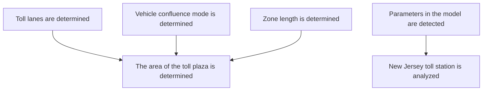
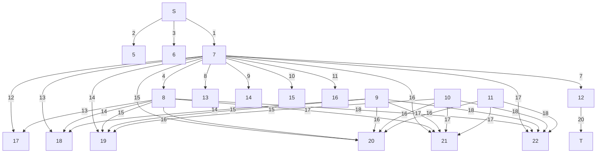
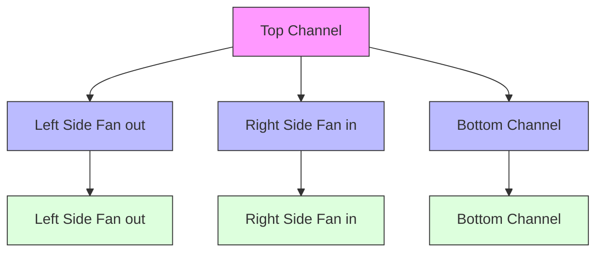

<table><tr><td>For office use only</td><td>Team Control Number</td><td>For office use only</td></tr><tr><td>T1</td><td>69427</td><td>F1</td></tr><tr><td>T2</td><td></td><td>F2</td></tr><tr><td>T3</td><td>Problem Chosen</td><td>F3</td></tr><tr><td>T4</td><td>B</td><td>F4</td></tr></table>

# 2017 MCM/ICM Summary Sheet

# Optimal Design of Toll Plaza Based on Minimum Risk Maximum Flow

The design of highway toll plaza is crucial to the traffic flow and tollbooths operation efficiency.

We study the optimal design program of toll plaza from three aspects：accident rate, traffic flow and construction cost. At the same time, we give the design figures and merging pattern of toll plaza.

The first stage, we determine the number of tollbooths by assuming that the traffic condition is normal. The number of toll lanes is decided by traffic capacity, traffic flow and service level. We establish a function model of tollbooths through the above three indexes. When the number of lanes is 3, we know that the number of single-way toll lanes should be 7 by calculating the traffic data from the highway tollbooths of 417 highway in Florida. We find in the sensitivity analysis that the traffic flow is positively related to the number of toll lanes.

The second stage, the optimal model of the merging pattern based on minimum risk and maximum throughput is established. This model is on account of the analysis of the performance of the existing toll plaza to optimize its design program, and we regard the deceleration shunt and acceleration merging of the whole toll plaza as a directed and weighted network flow. Similarly, by using the data of the highway tollbooths of 417 road in Florida, we obtain the program of merging pattern (Shown in Fig.5). The maximum traffic flow of this program can reach 1375 vehicles per hour, the accident rate can be reduced to 0.9%.

The third stage, taking into account the vehicle's variable motion in the toll plaza, we employ the driving distance between the front and rear vehicles and the braking distance of the rear vehicle to determine the size of the toll plaza, and establish a optimization model to minimize the construction cost. Likewise, using the data from the highway tollbooths of 417 road in Florida, we obtain the smallest toll plaza (Shown in Fig.6) whose area about 4650.1875 square meters.

Remarkably, we test the model in detail. The traffic flow and the accident rate are lower in light traffic flow. When the traffic flow is larger, the accident rate is increased by 0.05% compared with the slight traffic flow, that is, the size of traffic flow on the toll plaza design is not significant. After examining the impact of adding autonomous vehicles into mixed traffic, we add 500 autonomous vehicles into the traffic flow based on unit traffic flow on Highway 95 in New Jersey. And the accident rate was reduced by 0.83%. In view of the proportion of the three tollbooths, the greater the proportion of automatic tollbooths, the smaller the entire toll area, the smaller the number of tollbooths, the stronger the capacity of the tollbooths.

Finally, we apply the model to study the optimal design of the highway toll plaza in New Jersey. We select the New Jersey Highway No.95 as the research object, and we get its shape about toll plaza and the figure of merge pattern (See Fig.12). The number of toll lanes is 10, and the proportions of the three tollbooths is 5:3:2, the area of the toll plaza is 9614.56 $m ^ { 2 }$ . Last but not least, writing a letter to the New Jersey Turnpike Authority about the design scheme．

# Contents

# 1 Introduction ....

1.1 Background ..   
1.2 Previous Research .   
1.3 Our Work.. 2

# 2 Analysis of Overall and Key Points .. 2

2.1 Overall Analysis . 2   
2.2 Key Points Analysis . . 3

2.2.1 Analysis of Tollbooth Number .. 3   
2.2.2 Performance Analysis of Toll Plaza.. 3   
2.2.3 Cost Analysis of Toll Plaza Design . 3

# 3 Assumptions and Justification..

# 4 Symbols and Definitions .... 4

# 5 The Model . 4

# 5.1 Model I: The Determination of the Toll Lane Number B. 5

5.1.1 Modeling Ideas ......   
5.1.2 Supplementary Assumptions and Justification . 5   
5.1.3 The Calculation of the Toll Lane Number B .   
5.1.4 Model Calculation and Result Analysis . . 8   
5.1.5 Sensitivity Analysis— Parameter Sensitivity of DHV .. . 8

# 5.2 Model II: Optimal Merging Pattern Design Model Based on Minimum Risk and Maximum Flow. 9

5.2.1 Modeling Ideas.. 9   
5.2.2 Supplementary Assumptions and Justification ... 9   
5.2.3 Minimum Risk and Maximum Flow Model.. C   
5.2.4 Model Calculation and Result Analysis . 11

# 5.3 Model Ⅲ: An Optimization Model for the Minimum Cost of Toll Plaza .... .. 13

5.3.1 Modeling Ideas.... .. 13   
5.3.2 Supplementary Assumptions and Justification ...... .13   
5.3.3 The Design of the Minimum Cost Toll Plaza Based on the Optimization Model . .. 13   
5.3.4 Model Calculation and Result Analysis . .14

# 6 Testing the Model.. .. 15

6.1 Influence of Traffic Flow on Model . .15   
6.2 The Influence of Traffic Combination of Autonomous Vehicles on the Model. .. 16   
6.3 The Influence of the Proportion of Three Toll Stations on the Model. .. 16

# 7 Case Study on New Jersey 's Freeway Toll Plaza....... .17

7.1 Data Collection...... .. 17   
7.2 The Structural Analysis of the Parameters . .17   
7.3 Model Application and Result Analysis . .. 18

8 Conclusions ... .. 19   
9 Strengths and Weaknesses... .. 20

9.1 Strengths.. .. 20   
9.2 Weaknesses... .. 20

10 Future Improvements ... .. 20   
11 A letter to the New Jersey Highway Authority... .. 20

References ..... .. 22

Appendices..... .... 23

# 1 Introduction

# 1.1 Background

The development of the automobile industry has stimulated the development of road, especially highway. Therefore, the world's expressway network is becoming increasingly developed, they connecting the large and medium-sized cities. The American expressway network is fairly developed, which not only undertakes more than 21% of the traffic volume and reduces space-time distance, but also improves the transport efficiency and promotes the further flow of goods and resources. This kind of perfect highway has made a great contribution to the economic development of the United States, and changed the American way of travel in life.[1]

Highway toll plaza is an important part of the highway, and it belongs to the category of traffic construction.[2] In the rush hour, the service efficiency of the tollbooths is greatly reduced. When the service level cannot meet the demand of traffic volume, the phenomenon of traffic congestion and long queues will be formed in the toll plaza.[3] How to use a variety of technical means to create a smooth and convenient barriers tolls environment is the primary task of highway toll plaza design.


<details>
<summary>text_image</summary>

Fan out
Fan in
Fan in
Fan out
</details>

Fig. 1 A plan graph of the toll plaza

# 1.2 Previous Research

So far, People have studied all aspects of highway toll plaza design. The previous research topics of toll plaza are broadly classified into traffic capacity, safety and environmental impact.

The overwhelming majority of people have studied traffic capacity. Kazuhito and Takashi studied the traffic and queues conditions in traffic flow on toll highways with multi-lane tolls.[4] In the study of traffic capacity, Zarrillo used the SHAKER method to analyze the traffic capacity of five freeway tollbooths in Florida. Literature [5] and [6] introduces the principle, advantages, disadvantages and applicable situations of various construction modes of mainline toll plazas at home and abroad. In terms of delay analysis, Ayein's Mesoscopic approach is closer to practical delay than the VISSIM approach. [7]

Security analysis is an indispensable part in the design of highway toll plaza. Literature [8] the research on applying traffic conflict technology to highway safety evaluation has been carried out. Through the simulation software VB.NET and Hassan, simulated the stochastic nature of traffic arrival, toll collection time and driver decision making, then the microscopic traffic simulation model is established to design, assessment and operational analysis of the highway toll plaza. Literature [9] and [10], a simple-minded single lane deterministic discrete traffic model is used to investigate the impact of the presence of toll stations on average vehicle speed. Literature [11] studied the impact of toll plaza on traffic flow by simulated highway traffic through the Nagel-Schreckenberg model.

The above studies have their own advantages, the overwhelming majority of them focus on the impact of existing toll plazas. But these studies do not synthesize these effects to design a solution to toll plaza traffic difficulties. Therefore, we focus on the design of the toll plaza.

With the support of technology and theory, we developed a mathematical model to determine the shape, size and merging pattern of the area following the toll barrier. This model can make accident prevention, throughput and cost most suitable for toll plaza.

# 1.3 Our Work

When vehicles fan in from  B tollbooth egress lanes down to  L lanes of traffic , the area following the toll barrier has a significant impact on accident prevention, throughput and so on. Specifically, the toll plaza's traffic flow, accident rate, and cost are strongly correlated with its shape, size, and merging patterns. In order to determine the best design of the toll plaza, we have done the following three aspects from the performance analysis of any specific toll plaza.

Determine the number of toll lanes: The number of toll lanes are determined by the traffic flow, the traffic capacity of each toll lane and the level of service. The toll lane capacity is divided into single-channel capacity and multi-channel capacity. In the case of multi-channel, we choose M / G / K queuing model to describe the actual operating state of the toll plaza. The queuing model is also used to describe the traffic flow, which can be used to divide the service level of toll plaza. At a certain service level, we convert the traffic flow into traffic intensity, which is the matching conditions of the number of toll lanes.   
Design the optimal merging pattern of traffic flow: The merging pattern plays an important role in the occurrence of traffic flow and traffic accidents. Because of the U-curve relationship between the ratio of traffic flow to capacity and the accident rate, we establish the optimal traffic flow merging pattern design model based on maximum throughput and minimum security risk.   
 Optimal cost calculation of toll plaza: Vehicles across the toll plaza is a process of slowing down and then accelerating. We assume that the study is carried out in an ideal traffic state in order to simplify the model. In the process of speed changing, the size of the toll plaza needs to meet two conditions, namely, the safety distance between the front and rear cars and the actual braking distance. Based on this condition, we build the optimization model to get the size of the toll plaza that minimizes the cost.   
 Test models and analyze performance in different traffic environments: The increase of the traffic flow makes the service pressure of the toll plaza increase, and we use variable-controlling approach to analyze its impact on the program. At the same time, we consider the effect of autonomous (self-driving) vehicles on the model. Autonomous vehicles have only one choice of toll modes, so it will change the merging pattern of traffic flow. If the proportion of three toll plaza identified, the design of the toll plaza will be affected by the proportion of the program.

# 2 Analysis of Overall and Key Points

# 2.1 Overall Analysis

As an important part of freeway, expressway sub-confluence area and toll plaza design require a further research. The ultimate goal of toll plaza design is to avoid the traffic accident and the traffic congestion. After through the toll plaza, vehicles can have the smooth and safe access to the toll lane to accept the service, and have enough confluence space to drive back to the normal lane. This can provide a safe, comfortable and efficient working environment for toll collection and toll plaza management.

The shape, size and merging pattern of the toll barrier area are the determining factors of toll plaza traffic flow. In the toll plaza, the traffic flow reflects the service level of the toll plaza, and reflects the rationality of the toll plaza design. When vehicles from B tollbooth egress lanes down to L lanes of traffic, the distribution of the two lanes determines the mode of merging pattern of the vehicles. In the rush hour, however, due to serious congestion, the toll plaza traffic flow and security risks has become a rational evaluation index of charging toll plaza design. As the land and road construction are expensive, so we have to consider the impact of the size of the toll plaza on the construction cost.

# 2.2 Key Points Analysis

# 2.2.1 Analysis of Tollbooth Number

The number of toll lanes should be determined by three main factors: traffic volume, mode of charging and service level. The greater the traffic, the more charge lanes needed. Charging methods and facilities determine the time of charge. The shorter the charging time, the greater the capacity, the less the number of toll lanes required. The service level depends on the road class and the management requirements, which is expressed as the average number of waiting vehicles for each toll lanes. The less the average number of vehicles waiting, the higher the level of service, the less charge lanes needed.

# 2.2.2 Performance Analysis of Toll Plaza

When the service level of the highway toll plaza cannot meet the traffic demand, the toll plaza will be formed within the traffic congestion and long queues. In order to reduce the queuing time, the driver may change or seize the toll lanes and other unsafe traffic behavior. In this case, the toll plaza vehicles intertwined, and further exacerbate the congestion of the toll plaza. This congestion will seriously affects the level of highway service, and brings security risks. Therefore, in order to improve the service level of expressway, we establish an optimization model to ensure the maximum traffic volume and minimize the security risk to solve the problems above.

# 2.2.3 Cost Analysis of Toll Plaza Design

In general, in the process through the tollbooth, the vehicle first decelerated into the toll plaza, and then the average speed through the toll lanes, and finally speed up leaving the toll plaza. At the peak of traffic, any adjacent vehicle in each fleet has a safe distance to travel and the actual braking distance of the car, which is a key factor in determining the size of the toll plaza. However, due to the high cost of land and road construction, we need to meet these two distances at the same time, making the toll plaza area to a minimum.

# 3 Assumptions and Justification

 Assumption Ⅰ：Models are divided into large, medium and small types. After entering the control area, the vehicle should in accordance with the provisions of the system speed as far as possible. Two-way traffic at the toll plaza is the same.

Reason: Because the type of highway traffic vehicle is various kinds, the vehicles are divided into three types according to the standard of charge and the physical characteristics of vehicles. The same two-way traffic flow facilitates the simplified model.

 AssumptionⅡ：The same type of road traffic speed is the same. The toll plaza has an open field of view, good flat line and road conditions.

Reason：The focus of this paper is on the regional design of the toll plaza, which includes shape, size and merging pattern. Therefore, in order to make the stability of the model higher, other factors that affect the toll plaza traffic flow should be in the ideal state.

AssumptionⅢ：The vehicle input area of the toll station is symmetrical with the merging area.

Reason：In order to simplify the model, we choose the toll plaza which has a symmetrical shape and toll plaza which perpendicular to the direction of traffic to study.

Assumption Ⅳ：Tollbooths are arranged perpendicular to the direction of the traffic flow.

Reason：Only when the toll station direction perpendicular to the direction of traffic flow, toll lanes can adapt the vehicle into the toll plaza direction, so as to reduce the average delay time.

# 4 Symbols and Definitions

In the section, we use some symbols for constructing the model as follows:

Table 1 Symbols and Definitions 

<table><tr><td>Symbols</td><td>Meanings</td><td>Symbols</td><td>Meanings</td></tr><tr><td>DHV</td><td>Traffic flow</td><td>M</td><td>Traffic capacity</td></tr><tr><td>N</td><td>Toll station number</td><td>ns</td><td>Traffic intensity</td></tr><tr><td>bij</td><td>Accident rate</td><td>D&#x27;</td><td>Braking distance of rear car</td></tr><tr><td>S&#x27;</td><td>Safety distance of moving vehicle</td><td>t</td><td>Travel time</td></tr><tr><td>Tq</td><td>Average length of stay</td><td>Lq</td><td>Average queue length</td></tr></table>

# P.s. Other symbols instructions will be given in the text.

# 5 The Model

Before diving into the specific modeling steps, briefly explain the whole idea, analysis the flow chart shown in Fig. 2：


<details>
<summary>flowchart</summary>


</details>

Fig. 2 Flow chart of overall analysis

# 5.1 Model I: The Determination of the Toll Lane Number B

In the case of many vehicles, the toll plaza may form a bottleneck and affect the traffic on the highway. Therefore, set a reasonable number of toll lanes is an important part of the toll plaza design.

# 5.1.1 Modeling Ideas

The number of toll lanes is determined by three factors: the traffic volume, the capacity of each toll lanes, and the service level. Once the traffic demand is greater than the toll plaza's capacity, the toll plaza will inevitably become a bottleneck on the highway. Therefore, it is the main content of expressway toll plaza design to determine the number of toll lanes reasonably.

# 5.1.2 Supplementary Assumptions and Justification

In the toll plaza, we assume that the traffic flow of same kind of lanes is the same. When the servi ce level of the tollbooth is fully capable of accepting the traffic volume, the driving vehicle is free to c hoose the payment ways and will not cause congestion. We set the study period to normal traffic condi tions. Normal traffic conditions refer to the formation of vehicles as a single standard vehicle, that is, s mall cars, vehicles to maintain the appropriate minimum distance between the headway, and no interfe rence in any direction.

# 5.1.3 The Calculation of the Toll Lane Number B

# 1. Traffic flow of toll plaza

From the US studies, the design hour traffic  DHV is generally based on the 30th peak hour traffic volume (30 HV ) in the year of the vision. This method will not create a traffic emergency in the toll plaza, but also more appropriate in the economic interests.

The design per hour traffic volume DHV pcu h ( / ) can be calculated from the annual average daily traffic volume AADT pcu h ( / ) for the forecast year, formula [12] is as follows:

$$
D H V = A A D T \times K \times D \tag {1}
$$

Where， K is the coefficient of design per hours traffic, the general value is: K  0.12 . D is the coefficient of unbalanced distribution of the direction, the general value is  D  0.6 , value range is 0.55 \~ 0.65.

# 2. Traffic capacity of toll plaza

Expressway toll plaza capacity depends on the choice of charging methods. Its capacity can change greatly because of different charging methods. Analysis of the capacity of toll plazas need to ensure the impact of different models on toll capacity, it usually measured by the degree of the impact of vehicle conversion. The influence of different vehicles on the capacity of toll plaza is mainly the different departure time.

# (1) Traffic capacity of single lane

The basic capacity of toll lanes refers to the maximum traffic volume that each toll lane can pass per unit time under the ideal condition of road and traffic. Equation [13] is as follows:

$$
M = \frac {3 6 0 0}{T _ {S} + T _ {G}} \tag {2}
$$

Where,  M is the basic traffic capacity of toll lane; $T _ { s }$ is the standard car service hours; $T _ { \cal G }$ is the standard departure time.

# (2) Traffic capacity of Multi-lane

The M/G/K queuing model can describe the actual operating state of the toll plaza in the case of multi-channel. The statistical formula of M/G/K model [12] is as follows:

Average length of stay:

$$
T _ {q} = \frac {D (S + G) + [ E (S + G) ] ^ {2}}{2 E (S + G) [ N - \lambda E (S + G) ]} \left[ 1 + \sum_ {i = 0} ^ {N - 1} \frac {(N - 1) ! [ N - \lambda E (S + G) ]}{i ! [ \lambda E (S + G) ] ^ {K - i}} \right] ^ {- 1} \tag {3}
$$

Average length of stay:

$$
T _ {d} = E (S + G) + T _ {q} \tag {4}
$$

Average queue length:

$$
L _ {q} = \frac {\lambda D (S + G) + \lambda [ E (S + G) ] ^ {2}}{2 E (S + G) [ N - \lambda E (S + G) ]} \left[ 1 + \sum_ {i = 0} ^ {N - 1} \frac {(N - 1) ! [ N - \lambda E (S + G) ]}{i ! [ \lambda E (S + G) ] ^ {N - i}} \right] ^ {- 1} \tag {5}
$$

Since both the service time and the departure time follow a normal distribution, so the following equation [12] holds:

$$
E (S + G) = E (S) + E (G) \tag {6}
$$

$$
D (S + G) = D (S) + D (G) \tag {7}
$$

Where，  is the average car strength; N is the number of toll lanes; E S( ) is the service time expectations; E G( ) is the departure time expectation; D S( ) is the variance of service time; D G( ) is the variance of the departure time.

According to the M/G/K queuing theory model, we can calculate the maximum number of vehicles that can be handled under different toll lanes and different queuing degrees by using toll plaza service time and departure time expectation and variance.

# 3. Service Level

# (1) Average queue length

The average queue length is the average number of vehicles waiting for service. From the intuitive point of view, the more long average queue length, the more serious traffic congestion. The operating status of the toll plaza is usually described by the queuing system. Therefore, the queue length $L _ { q }$ is calculated according to (6)

Through investigation, we can draw the following conclusions: when the average number of queuing vehicles from one to four, the toll plaza capacity increased significantly; when it from four to eight, the toll plaza capacity increased slowly; when it from eight to ten, the toll plaza capacity increased further slowly. In view of this regulation of toll plaza capacity changes, the service level of the toll plaza is divided into four levels.（Annex 1)

# (2) Average delay time

We also use the M / G / K queuing model to describe the toll station traffic flow conditions, calculating the average vehicle delay time according to the following formula [14].

$$
d = \frac {D (S) + E ^ {2} (S)}{2 E (S) (N - \lambda E (S))} \left[ 1 + \sum_ {i = 0} ^ {N - 1} \frac {(N - 1) ! (N - \lambda E (S))}{i ! (\lambda E (S)) ^ {N - i}} \right] ^ {- 1} \tag {8}
$$

Where， d is the average delay time of vehicles ,unit is sec per vehicle, other symbols are expressed by the formula (5).

Different toll collection systems, the average delay time of the toll booths different levels of service. When choosing a model to use to calculate the average delay time of vehicles in tollbooths, the entire tollbooths is considered by us. In view of this regulation of average delay time, the service level of the toll plaza is divided into four levels.（Annex 2)

At a given service level, the traffic volume through each lane or the lane is expressed as a throughput per second and becomes a traffic intensity, the distribution of which is non-uniform. Traffic intensity and service time are both subject to a certain probability distribution. Thus, using the queuing theory, we can calculate the traffic intensity $n _ { s }$ ( the number of passes per second) according to a certain vehicle lane N and a certain service level. that can be passed by each lane in a lane number and a service level $q / s$ (average waiting or queue number of vehicles, q is the total number of vehicles waiting for each lane).(Table 5[14])

Table 2 a traffic lane intensity value $n _ { s }$ 

<table><tr><td rowspan="2">traffic intensity $n_s$ vehicle lane N</td><td colspan="4">Service Level  $q/s$ </td></tr><tr><td>0.5</td><td>1.0</td><td>1.5</td><td>2.0</td></tr><tr><td>1</td><td>0.33</td><td>0.50</td><td>0.61</td><td>0.68</td></tr><tr><td>2</td><td>0.57</td><td>0.71</td><td>0.76</td><td>0.85</td></tr><tr><td>3</td><td>0.70</td><td>0.79</td><td>0.85</td><td>0.88</td></tr><tr><td>4</td><td>0.75</td><td>0.83</td><td>0.87</td><td>0.90</td></tr><tr><td>5</td><td>0.80</td><td>0.86</td><td>0.89</td><td>0.92</td></tr><tr><td>6</td><td>0.83</td><td>0.88</td><td>0.92</td><td>0.94</td></tr><tr><td>7</td><td>0.85</td><td>0.90</td><td>0.93</td><td>0.95</td></tr><tr><td>8</td><td>0.86</td><td>0.91</td><td>0.93</td><td>0.95</td></tr></table>

# 4. Calculation of the number of toll lanes B

We design the average daily traffic volume for the  H vehicles , and design the service level by waiting in line for the average vehicle $q _ { s }$ . For the export of goods imports, we design traffic per hour as follows:

$$
D H V = A A D T * K * D = Q * 0. 1 2 * 0. 6 \tag {9}
$$

Where, K  0.12 , $D = 0 . 6 0$ .

This corresponds to the design traffic intensity(vehicles per second):

$$
n = \frac {D H V}{6 0 * 6 0} \tag {10}
$$

When  N lanes are used, the traffic intensity per lane at the required level of service is $n _ { N }$ , in which case the number of passing vehicles per hour in the lanes is as follows:

$$
N ^ {\prime} = N * \frac {n _ {N} * 6 0 * 6 0}{S} = N * n _ {N} * \frac {3 6 0 0}{S} \tag {11}
$$

Where, S is the service time. The constraint is $N ^ { \prime } { > } D H V$ , which is:

$$
N * n _ {N} > D H V * \frac {S}{3 6 0 0} = n * S \tag {12}
$$

Finally, we refer to the table with the calculation results, then can get the number of toll lanes B .

# 5.1.4 Model Calculation and Result Analysis

# (1) Algorithm thought

We use the algebraic method to calculate the number of toll lanes. According to the formula given above, replace the letter into the specific value, and then we do the corresponding operation, thus get the number of toll lanes.

# (2) Algorithm steps

Step1 ：To determine the daily traffic volume  ADT and the coefficient of traffic volume per hour K by using  D ;

Step2 ：Calculate the traffic intensity and traffic volume per hour;

Step3 ：To determine the service time based on the relationship between the number of lanes and the number of vehicles per hour;

Step4 ：According to the total traffic intensity, look up the table to get the number of lanes.

# (3) Model result

According to the inquiry, the annual average daily traffic volume of New Jersey is 38594. Assuming the number of average waiting vehicles is 1.5, the traffic coefficient K is 0.12, and the average service level is 6s. By calculating and querying the traffic strength values (refer to appendix) of a lane , we get the following results:

Table 3 Calculation results 

<table><tr><td>Traffic volume per hour(vehicles/h)</td><td>Traffic intensity(vehicles/h)</td><td>Toll lanes</td></tr><tr><td>4578</td><td>0.7716</td><td>7</td></tr></table>

# (4) Result analysis

The number of toll lanes calculated is the number of one-way toll lanes. According to our inquiry, the New Jersey freeway has four lanes in one direction. Obviously, the number of toll lanes is larger than the number of main lanes. Based on the relationship between toll lanes and main lanes, this result is reasonable.

# 5.1.5 Sensitivity Analysis——Parameter Sensitivity of DHV

According to the formula above $D H V = A D T * K * D$ , we know that  DHV contains three parameters, so we carry out sensitivity analysis on  DHV . We change the traffic volume per hour by changing the average daily traffic volume, then we get the different toll lanes number which corresponding to the different traffic volume per hour, specific as follows:


<details>
<summary>line</summary>

| Hourly traffic(vehicle/h) | Number of toll lanes |
| ------------------------- | -------------------- |
| 0                         | 1                    |
| 1000                      | 2                    |
| 2000                      | 4                    |
| 2500                      | 5                    |
| 3000                      | 5                    |
| 3500                      | 6                    |
| 4000                      | 7                    |
| 4500                      | 8                    |
| 5000                      | 9                    |
</details>

Fig. 3 The relationship between traffic volume and toll lanes

From the figure above, we can get the following conclusions: traffic volume per hour and the number of toll lanes are positively related. From the trend of the graph, we can know that the number of toll lanes will change once the traffic volume per hour changes, which indicating that the impact of traffic volume per hour on the number of toll lanes is significant.

# 5.2 Model II: Optimal Merging Pattern Design Model Based on Minimum Risk and Maximum Flow

Highway tollbooth is the bottleneck of the highway, the area near it is the traffic accident-prone areas. To reduce tollbooth congestion and reduce the accident rate, the toll plaza should make traffic flow through orderly and smoothly to ensure traffic safety.

# 5.2.1 Modeling Ideas

As the traffic lane and toll lane have different speed limits, their traffic volume differ. In the process of passing the toll plaza, two kinds of traffic volume restrict the dynamic change of vehicles. The process of vehicles through the toll station can be divided into several stages, which are slow down into the station, line up, pay and accelerate the departure. When there are speed errors in these stages, traffic accidents occur. The toll plaza design is to seek as much traffic as possible and as little risk and operating expenses as possible. Therefore, we turn the toll plaza design into a graph theory problem to establish a minimum risk and maximum flow model.

# 5.2.2 Supplementary Assumptions and Justification

Similarly, when the service level of the toll station is fully able to accept the traffic volume, the vehicle can be free to choose the payment method, and will not cause congestion. But this situation has no practical effect on the study, therefore, we set the study period as the peak traffic.

# 5.2.3 Minimum Risk and Maximum Flow Model

According to the characteristics of the toll plaza, we abstract the traffic input area as a point $\nu _ { 0 }$ and the traffic merging area as a point $\nu _ { t }$ . At the same time, toll lanes are also be seen as points. Based on the merging model of the vehicles in the toll plaza, we obtain a network diagram $G = \left( V , A , C \right)$ .

# (1) Determination of decision variables

The total traffic flow and accident rate per hour are determined by the traffic volume per hour.

The number of tollbooths determines the traffic volume per hour. In this model, the number of tollbooths B is the decision variable.

# (2) Determination of objective function

Assuming that the vehicle input area and merging area tollbooths are symmetrical, that is, the input area and merging area has  L lanes and $B ( B > L )$ tollbooths. As the driving lanes' speed is different to the toll lanes' speed, so the traffic flow of them is also different. One objective function of this model is to maximize the traffic volume per hour F to the merging point of the toll plaza. which is:

$$
\max v \tag {13}
$$

The model also needs to ensure that the coefficient of safety risk of this area is the minimum while traffic volume of the toll plaza is the maximum. We select the accident rate as an evaluation index of the traffic safety of toll plaza. Zhong Liande [15] e.t. concluded that the ratio of traffic volume per hour to capacity is related to the accident rate curve. The accident rate is calculated as follows (H represent DHV here and below):

$$
b _ {i j} = 6. 2 3 4 3 \left(H _ {i j} / M _ {i j}\right) ^ {2} - 7. 2 2 1 9 H _ {i j} / M _ {i j} + 2. 7 0 9 1 \tag {14}
$$

Another objective function of the model is as follows:

$$
\min \sum_ {(i, j) \in A} b _ {i j} H _ {i j} \tag {15}
$$

We combine two objective functions into an objective function:

$$
\max E = v - \lambda \sum_ {(i, j) \in A} b _ {i j} H _ {i j} \tag {16}
$$

# (3) Determination of constraint conditions

Each road has its own maximum traffic volume $c _ { i j }$ , the actual traffic volume $H _ { i j }$ on each road cannot exceed its capacity, namely:

$$
0 \leq H _ {i j} \leq c _ {i j}, \forall (i, j) \in A \tag {17}
$$

For intermediate points, the incoming traffic volume is equal to the outgoing traffic volume, which is for each intermediate point $\nu _ { i } ( i \neq 1 , t )$ ,

$$
\sum_ {j: (i, j) \in A} H _ {i j} - \sum_ {j: (j, i) \in A} H _ {j i} = 0, i \neq 0, t \tag {18}
$$

For starting point, all its outgoing traffic minus all incoming traffic is equal to net flow v H( ) , which is

$$
\sum_ {j: (i, j) \in A} H _ {i j} - \sum_ {j: (j, i) \in A} H _ {j i} = v, i = 0 \tag {19}
$$

For the terminal point, all its outgoing traffic volumes minus all incoming traffic volumes is equal to negative net flow v H( ) , which is

$$
\sum_ {j: (i, j) \in A} H _ {i j} - \sum_ {j: (j, i) \in A} H _ {j i} = - v, i = t \tag {20}
$$

(4) Optimal Merging Pattern Design Model Based on Maximum Throughput and Minimum Risk

$$
\max E = v - \lambda \sum_ {(i, j) \in A} b _ {i j} H _ {i j},
$$

$$
s. t. \left\{ \begin{array}{l} \sum_ {j: (i, j) \in A} H _ {i j} - \sum_ {j: (j, i) \in A} H _ {j i} = \left\{ \begin{array}{l} v, i = 0 \\ - v, i = t, \\ 0, i \neq 0, t \end{array} \right. \\ \sum_ {j: (i, j) \in A} H _ {i j} - \sum_ {j: (j, i) \in A} H _ {j i} = d _ {i}, i \in V \\ b _ {i j} = 6. 2 3 4 3 \left(H _ {i j} / M _ {i j}\right) ^ {2} - 7. 2 2 1 9 H _ {i j} / M _ {i j} + 2. 7 0 9 1, \forall (i, j) \in A \\ 0 \leq H _ {i j} \leq c _ {i j}, \forall (i, j) \in A \end{array} \right. \tag {21}
$$

Where，

$$
f _ {i} = \left\{ \begin{array}{l} v _ {\max}, i = 0, \\ - v _ {\max}, i = t, \\ 0, i \neq 0, t \end{array} \right. \tag {22}
$$

H is the vehicles volume per hour of the road;  M is the capacity of the road; $c _ { i j }$ is the maximum vehicles volume per hour; $b _ { i j }$ is the accident rate of toll plaza.

# 5.2.4 Model Calculation and Result Analysis

# (1) Algorithm thought

We use the label method to solve the problem. The basic idea of finding the maximum flow in the network by labeling is to search for augmented tracks, so that the traffic volume of the network can be increased until the maximum. That is, an initial flow is first given, and such a stream exists, for example, a zero-flow. If there is an augmentable track, then adjusting the flow on each arc on that track will result in a new stream. For a new flow, if there is still augmentable, the value of the flow is increased in the same way, until the network does not have any available augmented tracks for the newly obtained stream, this flow is the maximum flow.

# (2) Algorithm steps

#  Labeling process

Step1 ：Mark the starting point as $( s , + \infty )$ ;

Step2 ：If the vertex  x has been labeled, then label all the unmarked adjacent vertices  y of the vertex  x by the following rules;

Step3 ： $\begin{array} { r l } { \mathrm { I f } } & { { } ( x , y ) \in A , } \end{array}$ ，and $f _ { x y } < u _ { x y }$ ,let $\delta _ { y } = \mathrm { m i n } \{ u _ { x y } - f _ { x y } , \delta _ { x } \}$ , label the vertex y as $( x ^ { + } , \delta _ { \mathrm { v } } )$ , i f $f _ { x y } = u _ { x y }$ , do not give the vertex  y label, and vice versa into step 4;

Step4 ： $( x , y ) \in A ,$ and $f _ { y x } > 0$ , let $\delta _ { y } = \operatorname* { m i n } \{ f _ { y x } , \delta _ { x } \}$ , and label  y as $( x ^ { - } , \delta _ { \mathrm { v } } )$ ; if $f _ { y x } = 0$ , do not givethe vertex  y label;

Step5 ：Repeat step (2) repeatedly until the terminal point t is marked or no longer have vertices can be labeled so far. When t labeled, it indicates that there is an augmented track from the s to t , then we can steer to the flow process two. If the point  t cannot be labeled, and there are no other vertexes that can be labeled, indicating that there is no augmentable track from s to t , the algorithm ends, then the flow we get is the maximum flow.

#  Flow process

Step1 ：Let $u = t$ ；

Step2 ：If the label of  u is $( \nu ^ { + } , \delta _ { t } )$ ），then $f _ { \nu u } = f _ { \nu u } + \delta _ { t }$ ；Label  u as $( \nu ^ { - } , \delta _ { t } )$ ，then $f _ { u \nu } = f _ { u \nu } - \delta _ { t }$ ；Step3 ：If $u = s$ ，remove all labels and go back to the labeling process (A). Otherwise, return to step2.

# (3) Model result

We designed a traffic flow of 3000 vehicles per hour, one-way there are three main lanes, according to the formula that calculate the toll lanes have been given above, we can get that we need five toll lanes. There are three main lanes, its specific parameters are as follows:

Table 4 Parameter index 

<table><tr><td>Charging Ways</td><td>Lane width (m)</td><td>Speed (km/h)</td><td>Capacity(vehicles per hour)</td></tr><tr><td>Automatic charge</td><td>3.5</td><td>≤60</td><td>727</td></tr><tr><td>Semi-automatic charge</td><td>3.5</td><td>≤40</td><td>703</td></tr><tr><td>Labor charges</td><td>3.5</td><td>≤40</td><td>624</td></tr></table>

According to the capacity in the table above and the actual capacity, we set up two automatic charges, two semi-automatic charges and a manual charge respectively, set the order from the inside to the outside is automatic charges, semi-automatic charges, manual charge. Then we turn the toll plaza into a graph theory, numbered the lanes and we get the following results:


<details>
<summary>flowchart</summary>


</details>

Fig. 4 Network diagram

We obtain the vehicles volume and then the traffic flow adjacency matrix (Annex3) for each main line and toll lane by querying. At the same time, we get the traffic volume and capacity of the corresponding road. We use Lingo (code: LINGO.lg4 and LINGO1.lg4) to solve this problem, the minimum accident rate and the maximum flow path is as follows:

Table 5 Performance analysis of toll plaza 

<table><tr><td>Path</td><td>Traffic Volume(vehicles per hour)</td><td>Total Accident Rate</td></tr><tr><td>1→4→7→12→17→20</td><td rowspan="2">1375</td><td rowspan="5">0.96%</td></tr><tr><td>1→4→8→13→17→20</td></tr><tr><td>2→5→9→14→18→21</td><td>976</td></tr><tr><td>3→6→11→16→19→22</td><td rowspan="2">649</td></tr><tr><td>3→6→10→15→18→21</td></tr></table>

The traffic flow diagram is as follows:


<details>
<summary>flowchart</summary>


</details>

```mermaid
graph TD
    A["Top Layer"] --> B["Left Side"]
    A --> C["Right Side"]
    D["Left Side"] --> E["Left Side"]
    D --> F["Right Side"]
    G["Left Side"] --> H["Right Side"]
    I["Right Side"] --> J["Left Side"]
    K["Left Side"] --> L["Right Side"]
    M["Right Side"] --> N["Left Side"]
    O["Left Side"] --> P["Right Side"]
    Q["Left Side"] --> R["Right Side"]
    S["Left Side"] --> T["Left Side"]
    U["Left Side"] --> V["Right Side"]
    W["Left Side"] --> X["Right Side"]
    Y["Left Side"] --> Z["Left Side"]
    AA["Left Side"] --> AB["Right Side"]
    AC["Left Side"] --> AD["Right Side"]
    AE["Left Side"] --> AF["Left Side"]
    AG["Left Side"] --> AH["Right Side"]
    AI["Left Side"] --> AJ["Right Side"]
    AK["Left Side"] --> AL["Left Side"]
    AM["Left Side"] --> AN["Right Side"]
    AO["Left Side"] --> AP["Right Side"]
    AQ["Left Side"] --> AR["Left Side"]
    AS["Left Side"] --> AT["Right Side"]
    AU["Left Side"] --> AV["Right Side"]
    AW["Left Side"] --> AX["Left Side"]
    AY["Top Layer"] --> Z
    AZ["Top Layer"] --> AA
    BA["Fan out"] --> AA
    BB["Fan in"] --> AA
    BC["Fan out"] --> AA
    BD["Fan in"] --> AA
    BE["Fan out"] --> AA
    BF["Fan in"] --> AA
    BG["Fan out"] --> AA
    BH["Fan in"] --> AA
    BI["Fan out"] --> AA
```

Fig. 5 Traffic flow diagram

# (4) Result analysis

In summary, from the results we can see that the tollbooths can meet the actual maximum flow, and not prone to congestion. After the vehicles enter the tollbooths, their confluence avoids the intersection as much as possible, which reduces the probability of accidents greatly and improves the capacity of the road. So this scheme is feasible under such traffic flow.

# 5.3 Model Ⅲ: An Optimization Model for the Minimum Cost of Toll Plaza

Because the land and road construction are expensive, so when design the toll plaza , we should also consider the cost factors to ensure the toll plaza traffic conditions safe and efficient.

# 5.3.1 Modeling Ideas

Location choice of highway toll plaza should insist on serving the public, with the principle of economizing on investment, reducing land use and protecting surrounding natural environment, the location of freeway toll plaza should consider the land acquisition cost, construction cost and operation cost comprehensively.

# 5.3.2 Supplementary Assumptions and Justification

In the same lane, we assume that the same direction of the vehicle traveling at the same speed, and there is a certain distance between vehicles. This situation constitutes a stable traffic flow. If the spacing of the following vehicle is too small, then prone to crash; if the spacing is too large, it will affect the capacity of the road.

# 5.3.3 The Design of the Minimum Cost Toll Plaza Based on the Optimization Model

In order to maximize the traffic volume at the toll plaza and minimize the probability of traffic conflicts, we need to design a toll plaza of reasonable size to meet these requirements.

Assuming the speed of the vehicle in front is $\nu _ { 1 }$ , the acceleration is $a _ { 1 }$ ; the speed of the rear vehicle is $\nu _ { 2 }$ , the acceleration is $a _ { 2 }$ ; the headway of the rear and front vehicles is h , the reaction time of the rear vehicle driver is  r . At this point the actual braking distance of the rear vehicle is $D ^ { \prime }$ :

$$
D ^ {\prime} = v _ {2} r + \frac {v _ {2} ^ {2}}{2 a _ {2}} \tag {23}
$$

The formula to calculate the distance $S _ { \nu } ( m )$ between the rear and front vehicles is:

$$
S ^ {\prime} = S _ {0} + \frac {v _ {1} t}{3 . 6} + \frac {v _ {2} ^ {2}}{2 * 3 . 6 ^ {2}} \left(\frac {1}{j _ {a _ {2}}} - \frac {1}{j _ {a _ {1}}}\right) \tag {24}
$$

In the formula, $S _ { 0 }$ is the safety distance between the tail of the front vehicle and the front of the rear vehicle after stopping the brake; t is the sum of the braking reaction time and the braking force growth time of the rear driver; $j _ { a _ { 1 } }$ is the deceleration of the front brake; $j _ { a _ { 2 } }$ is the braking deceleration of the rear vehicle.

The so-called traffic safety distance refers to the distance between the two cars. This distance is an appropriate distance that does not cause rear-end accidents without reducing road capacity. Based on these theories, we establish the optimization model of the minimum cost of toll plaza.

$$
\begin{array}{l} \max Z = \sum_ {(i, j) \in A} \left(\lambda_ {1} S _ {i j} ^ {\prime} + \lambda_ {2} D _ {j} ^ {\prime}\right) \\ s. t. \left\{ \begin{array}{l} S _ {i j} ^ {\prime} = S _ {0} + \frac {v _ {i} t _ {j}}{3 . 6} + \frac {v _ {j} ^ {2}}{2 * 3 . 6 ^ {2}} \left(\frac {1}{j _ {a _ {j}}} - \frac {1}{j _ {a _ {i}}}\right), i, j \in V, i \neq j \\ a _ {i} > 0, i \in V \\ D _ {j} ^ {\prime} = v _ {j} r + \frac {v _ {j} ^ {2}}{2 a _ {j}}, j \in V \end{array} \right. \tag {25} \\ \end{array}
$$

Where， $S _ { i j } ^ { \prime }$ is the driving safety distance between the front vehicle  i and the rear vehicle $j ; \ D _ { j } ^ { \prime }$ is the actual braking distance of rear $j ; \ \lambda$ is the weight.

# 5.3.4 Model Calculation and Result Analysis

Through the query, we get the sliding friction coefficient of 0.75, the reaction time of driver of 0.6 second, acceleration of $7 . 3 9 m / s ^ { 2 }$ . Using the corresponding route and the corresponding speed, we use MATLAB (code: sir.m,iil.m) to obtain the length of acceleration area of 65.25 m , because we assume that the toll plaza is symmetrical, so the length of the deceleration area is 65.25 m .

According to the data queried, we know the length and width of tollbooth, the width of lane and the width of tollbooth. We place these data on the figure below, specific is as follows:


<details>
<summary>text_image</summary>

50m
22.5m
Fan in
Tollbooths
Fan out
65.25m 48m 65.25m
</details>

Fig. 6 Traffic flow diagram

We assume that the shape of the toll plaza is as shown above, we can see from the figure that the width of toll lane is 50m, the width of main lane is 22.5m, the length of toll lane is 48m, the length of acceleration and deceleration area is 65.25m. Then according to the formula area, we get the area of the toll plaza is 24650.1875m .

# 6 Testing the Model

# 6.1 Influence of Traffic Flow on Model

We use the control variable method to analyze the impact of traffic flow on the performance of the program, we change the traffic flow, so as to get the maximum traffic flow and traffic accident rate under each flow, as follows:

Table 6 Traffic flow and accident rate data 

<table><tr><td>Traffic flow</td><td>1500</td><td>1750</td><td>2000</td><td>2250</td><td>2500</td><td>2750</td><td>3000</td><td>3250</td><td>3500</td><td>3750</td><td>4000</td><td>4250</td></tr><tr><td>Accident rate (%)</td><td>0.91</td><td>0.94</td><td>0.91</td><td>0.94</td><td>0.95</td><td>0.95</td><td>0.96</td><td>0.96</td><td>0.963</td><td>0.96</td><td>0.96</td><td>0.96</td></tr></table>

The traffic flow diagram is as follows:


<details>
<summary>flowchart</summary>


</details>

Fig. 7 Traffic flow diagram

From the table we can see that with the traffic flow increases the collision rate is also increasing, which is realistic. Traffic flow increased rapidly and the risk coefficient increased more slowly, indicating that the risk of our program is relatively stable.


<details>
<summary>line</summary>

| Vehicle flow | Maximum traffic |
| ------------ | --------------- |
| 1500         | 1500            |
| 2000         | 2000            |
| 2500         | 2500            |
| 3000         | 3000            |
| 3500         | 3000            |
| 4000         | 3000            |
| 4500         | 3000            |
| 5000         | 3000            |
</details>

Fig. 8 Relationship between traffic flow and maximum flow

The picture above depicts the relationship between the traffic flow and the maximum flow rate. In the front, we have obtained the maximum flow of our scheme is 3000. When the maximum flow rate is reached, the maximum flow rate remains constant with the increase of the number of vehicles. It is shown that the maximum flow of our scheme does not change with the change of light and heavy flow. As long as the traffic flow does not exceed the maximum flow, our scheme is effective, indicating that our performance is relatively stable.

# 6.2 The Influence of Traffic Combination of Autonomous Vehicles on the Model

The autonomous vehicle is a kind of intelligent vehicle, which also can be called wheeled mobile robot. It mainly rely on the intelligent driving device which is base on the computer system to achieve unmanned. When an autonomous vehicle passes through a highway tollbooth, it only can go through the automatic toll lane. We assume that the autopilot vehicles takes the inner lane and the corresponding toll lane. We assume that adding 500 autopilot vehicles to the original traffic flow, the other parameters remain unchanged, according to the previous procedure, using MATLAB to get the solution results, which are as follows:

Table 7 Performance analysis of toll plaza 

<table><tr><td>Path</td><td>Traffic Volume(vehicles per hour)</td><td>Total Accident Rate</td></tr><tr><td>1→4→7→12→17→20</td><td>1476</td><td rowspan="5">0.96%</td></tr><tr><td>2→5→9→14→18→21</td><td rowspan="2">1065</td></tr><tr><td>2→5→8→13→17→20</td></tr><tr><td>3→6→11→16→19→22</td><td rowspan="2">826</td></tr><tr><td>3→6→10→15→18→21</td></tr></table>

The one-sided shunt mode is shown below:


<details>
<summary>text_image</summary>

Fan in
Fan out
62.25m 48m 62.25m
</details>

Fig. 9 Vehicle shunt after automatic driving

From the results above, we can know that the traffic flow of electronic tollbooths will increase when the number of autonomous vehicles increases, which will result in the increasing of the traffic flow of other toll lanes. As the electronic tolling time is shorter, from the figure we can see that the traffic flow of the acceleration lanes after the electronic lanes increases. When the number of autonomous vehicles is increasing, the traffic capacity of the tollbooths increases, and we need to set up more electronic toll lanes.

# 6.3 The Influence of the Proportion of Three Tollbooths on the Model

Different tollbooths are different in their work efficiency, the speed of vehicles passing through different types of tollbooths are different, so the proportion of different types of tollbooths have an impact on the length of the length of acceleration area and the total number of tollbooths. Therefore, we use the controlling variable method to determine the impact of different types of tollbooths on our program. We set the proportion as automatic tollbooths: semi-automatic tollbooths: artificial tollbooths = 3:1:1. According to the method of determining the toll lanes and the calculation method of the acceleration area, we get the new program when the traffic flow is 3000, specific as follows:

Table 8 Model results 

<table><tr><td>Program</td><td>New Program</td><td>Previous Program</td></tr><tr><td>Number of Tollbooths</td><td>Automatic tollbooth 3,semi-automatic tollbooth 1, the artificial tollbooth 1</td><td>Automatic tollbooth 2,semi-automatic tollbooth 2, the artificial tollbooth 1</td></tr><tr><td>The Length of Acceleration Area</td><td>57.31m</td><td>65.25m</td></tr></table>

Based on the calculation of the number of toll stations and the length of the acceleration area, we can get the following vehicle confluence model


<details>
<summary>text_image</summary>

Fan in
Fan out
57.31m 48m 57.31m
</details>

Fig. 10 Traffic convergence

We can know from the figure above that the greater the proportion of automatic tollbooths, the entire toll area will be reduced, the number of tollbooths will be reduced, the capacity of the toll will be enhanced.

# 7 Case Study on New Jersey 's Freeway Toll Plaza

# 7.1 Data Collection

According to the previous work, we know that we need to know the following parameters to build a toll plaza: traffic flow, toll lane, proportion of different toll lanes, the length of deceleration and acceleration area and the width of lane. Among these parameters, the most important parameter is the traffic flow.

We query the data of the number of lanes, lane width, toll lanes and the length of deceleration area for each time period in New Jersey, which are shown in the following table:

Table 9 Highway Data of New Jersey 

<table><tr><td>Main Lane Number</td><td>Lane Width (m)</td><td>Toll Lanes</td><td>Length of Deceleration Area (m)</td></tr><tr><td>4</td><td>14</td><td>12</td><td>70</td></tr></table>

# 7.2 The Structural Analysis of the Parameters

Traffic flow is the most important parameter of our program. The change of traffic flow determines the shunt of vehicles and the design of the number of toll lanes, so we analyze the changes of traffic flow at each moment. Based on the change of traffic flow at each moment, we get the following diagram:


<details>
<summary>line</summary>

| Time | Vehicle flow |
| ---- | ------------ |
| 0    | 15           |
| 5    | 105          |
| 10   | 40           |
| 15   | 55           |
| 20   | 30           |
| 25   | 15           |
</details>

Fig. 11 The changes of day traffic flow in New Jersey

From the figure, we can get the conclusion that the traffic flow in New Jersey reaches a peak around seven o 'clock am. Among this day, the New Jersey freeway has a maximum traffic flow of one hundred and six vehicles per minute and a minimum traffic flow of fifteen vehicles per minute. We can get an average of two thousand six hundred and thirty-four vehicles per hour on the New Jersey freeway.

# 7.3 Model Application and Result Analysis

In practice, the acceleration of the vehicle in the acceleration zone is not the same as that of the deceleration zone. And after charging, the driver does not drive in accordance with the provisions. Now we assume that the acceleration of the vehicle in the acceleration region is not equal to the deceleration of the vehicle in the deceleration region. When the vehicle is out of third tracks, it does not follow the prescribed route. We assume that the length of the toll plaza remains unchanged. We make the acceleration in front of different, According to our query data, we use the previous model, using Matlab calculation, we can get the number of toll roads and toll lanes, the speed of acceleration and deceleration. The results are as follows：

Table 10 The Results of Model Application 

<table><tr><td>Toll Lanes</td><td>Proportion of Different Toll Lanes</td><td>Area of Toll Plaza</td></tr><tr><td>10</td><td>5:3:2</td><td>9614.5</td></tr></table>

According to the number of toll lanes, the proportion of different toll lanes, as well as the length of the different lanes, the tilt angle, the size of the toll plaza, as well as the diversion mode, we can get the following diversion pattern.


<details>
<summary>text_image</summary>

26m
Fan in
Fan out
44.8°
131m
</details>

Fig. 12 Design of tollbooth with different accelerations

According to the New Jersey toll plaza of the existing toll lanes and toll plaza area and different types of toll lanes, the following figure is the result of their comparison.


<details>
<summary>bar</summary>

| Category | calculated value | actual value |
|---|---|---|
| Automatic toll station | 5 | 3 |
| Semi automatic toll station | 3 | 6 |
| Manual toll station | 2 | 4 |
| Toll lane | 10 | 12 |
| Area of the toll plaza | 9.5 | 11.5 |
</details>

Fig. 13 Comparison of design schemes with existing schemes

From the graph we can see that our scheme and New Jersey 95 toll station program, the number of toll lanes reduced, while the number of automatic toll lanes increased, the overall size of the toll plaza is reduced.

# 8 Conclusions

According to our model, the number of toll lanes can be determined by the traffic volume, traffic capacity and service level of each toll lane. To design the number of toll lanes is an important task of design the toll plaza. In the calculation model of the toll lanes, the number of toll lanes is calculated by converting the traffic volume into the traffic intensity and using the traffic intensity to match the number of toll lanes. Through the sensitivity analysis, the traffic volume is positively related to the number of toll lanes, and the traffic volume has a great influence on the number of toll lanes. Based on the analysis of the performance of existing toll plaza, we build the optimal design model of merging pattern based on maximum throughput and minimum accident rate. This model is related to the traffic volume and accident rate. When analyzing the influence of traffic flow on accident rate, we find that the accident rate increases with the increase of traffic flow at a very small rate. The braking distance and safe distance of vehicles in the toll plaza determines the size of the toll plaza. Based on this principle, we build the model to obtain the minimum design cost.

We test the above models and find that traffic volume increasing with the increase in traffic flow, the access of the autonomous vehicles will optimize the capacity of toll plaza, and the proportion of the three tollbooths' perfect role on the design program. Finally, we apply the model in New Jersey as a case, and provide some advice.

# 9 Strengths and Weaknesses

# 9.1 Strengths

 Our sensitivity analyses show that our models are fairly robust to changes in parameter value.   
The assumptions in our models are reasonable, which can not only simplify the problems, but also lay the foundation for the establishment of the latter model.   
For the model two, we abstract the traffic import area and merge area into point, which makes the model universally applicable.   
We take into account a number of factors that may affect the design of the toll plaza, such as accident rate, throughput and cost.

# 9.2 Weaknesses

We assume that the traffic import area and merge area are completely symmetrical in model three, but this is often not the case in real life.   
Different units have different working efficiency, but the model only considers the same unit, which makes the calculation result and the actual situation of the error.   
The simplification and approximation taken in the process of going through toll plazas introduce errors.

# 10 Future Improvements

In order to simplify the solution steps of the model, we assume that the traffic volume distribution is fixed, rather than subject to Poisson distribution or Exponential distribution. In order to consider the model of this problem more comprehensively, we should discuss the characteristics of the distribution of traffic flow, which can make the solution results more accurate and credible.   
− The toll plaza designed by us is a plane. In fact, it also can be a stereo shape. If so, our toll plaza design will have a lower accident rate and a higher traffic flow performance. However, it may also cause higher cost. This is a question worthy of our thinking, we look forward to solve it one day. Now we do not get to the bottom due to the limited technical level.

# 11 A letter to the New Jersey Highway Authority

Dear Sir:

The purpose of this letter is to advise you on the design of the toll plaza. We have analyzed the performance of the existing toll plaza. On the basis of the analysis, we propose three mathematical models to determine the design of the toll plaza. The design elements of the toll plaza include its shape, size and merging pattern, which are also important parameters of our models. We take the traffic accident, the traffic volume and the cost as the important modeling request in our models. At the same time, we also applied the model to the design of the highway toll plaza in New Jersey. Here we will introduce the design of the toll plaza from three aspects.

The first is to determine the number of toll lanes. From a macro point of view, the number of toll lanes generally determine the geometry of the toll plaza. Therefore, to determine the number of toll lanes is the primary task of the designing of the toll plaza. Studies have shown that the number of toll lanes is determined by the traffic volume, capacity and service level. Therefore, we conducted an in-depth analysis of these three factors. Among them, the single-lane and multi-lane capacity are based on the theory of queuing for research. In other words, when more vehicles is waiting to serve and need to queue up in the toll plaza, we calculate the capacity by studying their queuing time and length. For the service level, we divide it into four levels from two angles :the average queue length and the average delay time. The four service levels also reflect the traffic conditions of toll plaza with different traffic needs. Using these three factors, the calculation model of the number toll lane can be determined. Through the sensitivity analysis to the model, we know that the traffic volume is positively correlated with the number of toll lanes, and the traffic volume has a great influence on the number of toll lanes. Of course, it is inevitable that the number of toll lanes too much or too little is not conducive to the toll plaza traffic.

The second is the determination of the merging pattern. As we all know, if the merging pattern of toll plaza is reasonable and effective, then it will lead the entire traffic safe and effective conduction. Therefore, to determine the merging pattern is also an important task of the design of the toll plaza. The main factors considered in the merging pattern are traffic volume and accident rate. As the ways of toll are different, so the toll lanes will be selected to change lane according to their needs. This will cause cross-driving and traffic accidents inevitably. Our model is established with traffic volume and accident rate, which is, the Minimum Risk and Maximum Flow Model. The merging problem of traffic flow is transformed into the graph theory problem in our model, and the final result is a merging model graph. However, when the traffic volume of toll plaza is very large, the accident rate will still be significantly increased.

The third is to determine the size of the toll plaza, in other words, to determine the area of the toll plaza. Taking into account the land and road construction costs are expensive, we add the cost to the model. We know that vehicles need to slow down before the acceleration when it enters the toll plaza. When the team enter into the toll plaza, there is a safe distance between rear and front vehicles and the actual braking distance of the vehicle behind. Only when the length of the toll plaza meet this condition will there no accidents during the driving. The purpose of our model is to minimize the cost of land and road construction of the toll plaza. In the sensitivity analysis, we find that the speed of vehicles have a great impact on the size of the toll plaza.

Finally, we analyzed the stability of this solution in different situations. Once the traffic flow is very large, the traffic volume will increase, traffic congestion is inevitable. The access of autonomous vehicles will introduce us to consider the arrangement pattern of the toll lanes. If the toll lanes are arranged reasonably, the capacity of the toll plaza will be greatly improved. When the proportion of the tollbooths is determined, if the proportion of automatic tollbooths is larger, the area of the toll plaza will be reduced, the number of tollbooths will be reduced, and the capacity of the toll collection area will be enhanced.

We analyzed the data of the highway tollbooths in New Jersey and calculated by applying the data in the model. The conclusions are as follows: If the average traffic volume of the New Jersey Expressway is two thousand six hundred and thirty-four per hour, the criteria designed are as follows:

<table><tr><td>Toll Lanes</td><td>Proportion of Different Toll Lanes</td><td>Length of Acceleration Area</td><td>Area of Toll Plaza</td></tr><tr><td>10</td><td>5:3:2</td><td>61.28 m</td><td>9614.5</td></tr></table>

The above conclusion is just one study of case. The actual situation can be determined by the model. Of course, our model is established in the ideal traffic conditions, so there exists limitations. Attention should be paid to the actual need when using.

Hope that our model can be helpful to you!

Sincerely,

MCM Team Members

# References

[1] Wang Ruitao, The Inspiration of American Expressway Construction to Our Country[J], Northern Communications, 2013, S2: 27-29.   
[2] Lin Ruihui, The Overall Planning and Design of Expressway Toll Plaza[J], Popular Science & Technology, 2006, 06: 21.   
[3] Zhang Chenchen, Wang Yanhui, Jia Limin, Congestion Dissipation Control Strategies for Expressway Mainline Toll Station[J], China Journal of Highway and Transport, 2013, 4(26): 139-145.   
[4] Kazuhito Komada, Takashi Nagatani, Traffic Flow Through Multi-lane Tollbooths on a Toll Highway[J], Elsevier Science B.V., 2010, 389: 2268-2279.   
[5] M L Zarrillo, A E Radwan, Methodology SHAKER and the Capacity Analysis of Five Toll Plazas[J], Journal of Transportation Engineering, 2009, 135(3): 83-93.   
[6] Zhong Jikai, Study on Freeway Mainline Toll Plaza at Provincial Border[J], Journal of Highway and Transportation Research and Development, 1999, S1(16): 40-41.   
[7] M Ayein, K Kiskel, V Papayannoulis, G Davies, Development of Methodology for Toll Plaza Delay Estimation for Use in Travel Demand Model Postprocessor[J], Transportation Research Record, 2009, 2133: 1-10.   
[8] Zhang Zhizhao, Research on Traffic Conflict of Freeway Diverging and Merging Sections and Toll Booth[D], Harbin: Harbin Institute of Technology, 2014.   
[9] Hassan T. Abdelwahab, Traffic Micro-simulation Model for Design and Operational Analysis of Barrier Toll Stations[J], Ain Shams Engineering Journal, 2016.   
[10] H. F. Chau, Hao Xu, L.-G. Liu, Exactly Solvable Single Lane Highway Traffic Model with Tollbooths[J], Elsevier Science B.V., 2002, 303: 534-542.   
[11] Ding-Wei Huang, Wei-Neng Huang, The Influence of Tollbooths on Highway Traffic[J], Elsevier Science B.V., 2002, 312:597-608.   
[12] Zhou Gang, Chang Chengli, Expressway Tollgate Capacity Study[J], Journal of Highway and Transportation Research and Development, 2001, 3(18): 56-59.   
[13] Wang Bohui, Road Interchange Project[M], China Communications Press, 200: 115.   
[14] Su Li, Study on the Design of Highway Toll Station[D], Xi'an: Chang;an University, 2012.   
[15] Pu Yun, Hu Lu, Jiang Yangsheng, Zhu Juanxiu, Peng Bo, Variable Speed-limit Control Before Expressway Mainline Toll Station[J], Journal of Traffic and Transportation Engineering, 2012, 5(12): 119-126.

Appendices 

<table><tr><td colspan="2">Annex 1 Service level classification based on average queue length</td></tr><tr><td>Service level</td><td>Standards</td></tr><tr><td>Level One</td><td>Toll stations almost no queuing vehicles, so vehicles are free to choose the toll lane to receive service directly.</td></tr><tr><td>Level Two</td><td>There are a small number of queuing vehicles at the toll stations, but the queuing length is short and some vehicles will have to wait for some time before they can receive services.</td></tr><tr><td>Level Three</td><td>Toll stations are a lot of queuing vehicles, queuing length is longer, almost all vehicles need to wait for a longer time to accept the service.</td></tr><tr><td>Level Four</td><td>A long queue is formed within the toll station, and all vehicles must wait for a long time before receive service.</td></tr><tr><td colspan="2"></td></tr><tr><td colspan="2">Annex 2 Service level classification based on average delay time</td></tr><tr><td>Service level</td><td>Standards</td></tr><tr><td>Level One</td><td>For conventional tollbooths, the vehicle does not have to queue up at the toll road; for automatic tollbooths, the queuing time of the vehicle is shorter.</td></tr><tr><td>Level Two</td><td>For regular tollbooths, the queuing time of vehicles is longer; for automatic tollbooths, the delay time is longer, but shorter than the regular tollbooth.</td></tr><tr><td>Level Three</td><td>The average number of vehicles queued in front of tollbooths is large.</td></tr><tr><td>Level Four</td><td>Traffic demand is greater than the tollbooths capacity, the vehicles queued before the tollbooths is of a long team.</td></tr><tr><td colspan="2"></td></tr></table>

Annex 3 Service level classification based on average delay time   
A= $\begin{bmatrix}\infty\infty\infty\\1000\\1000\\1000\\10008007000\\7008008007000\\00700800700\\727\\727\\703\\703\\645\\7276450\\645727645\\0645727\\0703727\\0645727\\1000\\1000\\1000\\\infty\\\infty\\\infty\\\end{bmatrix}$

Filename : LINGO.lg4   
Function : Calculating the maximum traffic flow   
```matlab
model:
sets:
nodes/s,1,2,3,4,5,6,7,8,9,10,11,12,13,14,15,16,17,18,19,20,21,22,t/;
arcs(nodes,nodes)/s 1,s,2,s 3,1 4,2 5,3 6,4 7,4 8,4 9,4 10,4 11,5 7,5 8,5 9,5 10,5 11,6 7,6 8,6 9,6 10,6 11,7 12 ,8
13,9 14,10 15,11 16,12 17,12 18, 12 19,13 17,13 18,13 19,14 17,14 18,14 19,15 17,15 18,15 19,16 17,16 18,16
19,17 20,18 21,19 22,20 t,21 t,22 t/:c,f;
endsets
data:
c=1500 1500 1500 1500 1200 1000 1500    1200 0 0 0 1000 1200 1000 0 0 0 890 1000 890 925 925 903 903 866
925 925 0 866 925 866 0 866 903 0    866 903 0 0 866 1500 1200 1000 1500 1500 1500;
enddata
n=@size(nodes); !The number of vertices;
max=flow;
@for(nodes(i)|i #ne#1 #and# i #ne# n:
@sum(arcs(i,j):f(i,j))=@sum(arcs(j,i):f(j,i)));
@sum(arcs(i,j)|i #eq# 1:f(i,j))=flow; 
```

<table><tr><td>@sum( $\text{arcs}(i,j)$ |j #eq# n:f(i,j))=flow;@for( $\text{arcs}$ :@bnd(0,f,c));end</td></tr><tr><td>Filename : LINGO1.lg4</td></tr><tr><td>Function : Calculating the minimum accident rate</td></tr><tr><td>model:sets:nodes/s,1,2,3,4,5,6,7,8,9,10,11,12,13,14,15,16,17,18,19,20,21,22,t/; $\text{arcs}$ (nodes,nodes)/s 1,s,2,s 3,1 4,2 5,3 6,4 7,4 8,4 9,4 10,4 11,5 7,5 8,5 9,5 10,5 11,6 7,6 8,6 9,6 10,6 11,7 12 ,8 13,9 14,10 15,11 16,12 17,12 18, 12 19,13 17,13 18,13 19,14 17,14 18,14 19,15 17,15 18,15 19,16 17,16 18,16 19,17 20,18 21,19 22,20 t,21 t,22 t:/c,f,u;endsetsdata:d=3000 0 0 0 0 0 0 0 0 0 0 0 0 0 0 0 0 0 0 0 0 0 -3000; !The maximum flow is 3000;c=1500 1500 1500 1500 1200 1000 1500 1200 0 0 0 1000 1200 1000 0 0 0 890 1000 890 925 925 903 903 866 925 925 0 866 925 866 0 866 903 0 866 903 0 0 866 1500 1200 1000 1500 1500 1500;u=6.2343.*(C/263).^2-7.2219*C/236;enddatamin=@sum( $\text{arcs}$ :u);@for( $\text{nodes}$ (i):@sum( $\text{arcs}$ (i,j):f(i,j))-@sum( $\text{arcs}$ (j,i):f(j,i))=d(i));@for( $\text{arcs}$ :@bnd(0,f,u));End</td></tr><tr><td>Filename : sir.m,iil.m</td></tr><tr><td>Function : Calculating the length of the fan out point</td></tr><tr><td>V1=[60 60 40 40 40 40 40 40 40];T1=[0.56 0.56 0.56 0.56 0.56 0.56 0.56 0.56 0.56];T2=[0.6 0.6 0.6 0.6 0.6 0.6 0.6 0.6 0.6];a=[0.9 0.9 0.9 0.9 0.9 0.9 0.9 0.9 0.9];V2=[30 35 40 45 50 55 60 65 70 75 ];A=[7.8 7.8 7.6 7.6 7.5 7.5 7.5 7.5 7.5];S=V1.*T1/3.6+V1.*T2+V1.^2/228.6L=V2.^2./(2.*A)P=0.6.*S+0.4.*LQ=max(P) plot(V2,P,&#x27;rp--&#x27;)</td></tr></table>