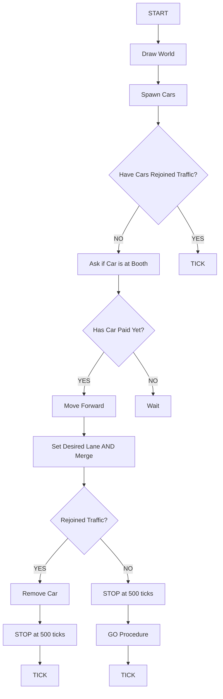

# 2017

# MCM/ICM

# Summary Sheet

(Your team's summary should be included as the first page of your electronic submission.)

Type a summary of your results on this page. Do not include the name of your school, advisor, or team members on this page.

Long lines and heavy congestion are major problems that are faced at toll booth plazas across the country. In particular, the New Jersey Turnpike is infamous for its heavy traffic. This paper proposes a method for developing and evaluating novel plaza designs which incorporates the effects of varying levels of traffic, toll booth payment methods, as well as the effect of an increasing number of autonomous, self-driving cars. First a model of the plaza is created in NetLogo, an agent-based modeling software. Agent-based modeling is a natural choice for simulating a problem such as this, since it allows cars to simulate human interactions in traffic. With this foundation our robust model is able to evaluate multiple realizations of a wide range of variables influencing custom satisfaction of the plaza. This report alone analyzes over 700 possible combinations of these variables, ranging from lane drop design and number of highway lanes to driver patience as well as the parameters mentioned earlier. It was found that a symmetric design was desired to maximize the satisfaction as well as efficiency of the plaza. Additionally, the effect of the number of electronic transponder only lanes was significant, with a higher number of such lanes corresponding to a higher overall satisfaction rating. It was also found that the effect of self-driving cars was negligible, though this might be expected as they should operate close to human operate vehicles. It was found that across parameters, the ability to reduce the amount of stop-and go traffic made the greatest impact on the system. This model is very versatile and is able to be applied to changing traffic dispositions (i.e. aggressive vs. defensive), toll booth types, and highway speeds entering and exiting the plaza. Proper use of this model will lead to invaluable analyses that can aid in easing the congesting of major toll plazas across the United States.

# An Agent-Based Model for Developing and Evaluating Efficient Toll Plaza Designs

MCM Problem B: Merge after Toll

Team 70174

January 23, 2017

To the New Jersey Turnpike Authority:

The New Jersey Turnpike is one of the most notable roads in the nation. Unfortunately, its notoriety is likely a case of infamy. The New Jersey Turnpike is a toll road, and toll roads often frustrate travelers with their long lines. In addition, toll plazas are often dangerous, especially when cars are forced to merge quickly after a tollbooth. However, there may be hope for the public image of the NJT. If a more efficient tollbooth plaza design was implemented, the NJT could see a reduction in traffic and an increase in safety.

We have developed a model to simulate the movement of cars and traffic on the toll plazas of the New Jersey Turnpike (NJT), and we hope that it can be of some use to you. Our model was developed in NetLogo, a software program that is often used to model physical and social phenomenon. Our model considers individual drivers on the NTJ. In our model, individual cars make choices that aggregate to form group dynamics. Thus, the model can simulate traffic and queueing on toll plazas of various sizes. In addition, it can be easily altered to consider diverse scenarios relevant to the NJT, including different levels of traffic flow, self driven cars, and the different payment methods that travelers use on your roads.

Of particular interest to us is the cost, wait time, safety, and throughput of the toll plazas on the NJT. It has been theorized that manipulations of the merging strip after a toll plaza could increase the efficiency and safety of the NJT. We have been investigating that claim, and have some preliminary results. So far, it appears that toll plazas are most effective if lanes decrease from their increased width to normal road size symmetrically. It appears to remain true regardless of total lane count or traffic density.

Another interesting result of our model is that the patience of individual drivers has a great impact on the system. In our model, whenever cars came to a complete stop, they suffered a loss of patience, meaning that they were frustrated and more willing to make risky driving decisions. In light of this, efforts should be made to preserve the patience of drivers on the NJT. Perhaps something as simple as decreasing the speed limit on the portion of the highway leading up to the toll plazas, so that cars are driving for longer, instead of stopping, would make the system more efficient and safe overall.

We have not yet investigated many of our theorized toll plaza designs, but we wanted to pass the model along to you. The model is equipped with a very user friendly interface, which you can use to investigate any situation immediately interesting to you while we conduct our own research. We have checked the robustness of the model, and it provides trustworthy results.

We sincerely hope that our report and its model prove useful to you, and that it provides suggestions that make the NJT more profitable, as well as safer and more efficient for those who travel on it.

Sincerely,

MCM team 70174

# 1 Introduction

Tollroads are seen all over America, with 42 states, D.C., and Puerto Rico all having some sort of toll road.9. Toll plazas, where tolls are collected, typically contain more lanes than the roads leading into them. This configuration requires cars to merge onto a condensed lane after paying their toll. It is possible that a certain configuration of merging lanes, as well as the addition of more automated tolls, might increase the efficeincy of the toll plaza, raising the satisfaction of travelers overall.

An analysis of this type is especially pertinent in New Jersey, home to the infamous New Jersey Turnpike (NJT), a 148 mile toll road.5 A recent study showed that New Jersey is the only state that is disliked more than it is liked.6,7. Though there are many factors influencing public opinion of the state, it is likely that one of them is the NJT. The NJT is known, and not fondly, for its long waits and high fees. If a new toll plaza design could decrease costs and wait times, it is possbile that New Jersey could improve its public image.

In addition, there is a push in New Jersey for the automation of toll roads through the addition of automated tollbooths.10. While automated tollbooths promise potential savings to both the government and consumers, they also threaten the job security of hundreds of Americans. It seems necesarry to compare the costs and benefits of all scenarios before making a decision.

# 2 Analysis of the Problem

The problem prompt asks us to consider a toll plaza, where L lanes fan out into B>L tollbooths and then condense back into L lanes. The strip of road after the toll plaza, where cars are expected to condense to fewer lanes, can take many shapes. These shapes affect the ability of cars to merge onto the highway safely and efficiently.

We are asked find the ”best” design for a tollbooth plaza. This solution should consider such things as accident prevention, the throughput of the toll plaza, and the cost of the plaza. We are also asked to consider our solution in a number of different conditions, such as light or heavy traffic.

To address this challenge, we will use NetLogo, an agent based modeling software2, to simulate theoretical toll plazas. These plazas will have variable numbers of lanes-in, L, and toolbooths, B, with varying patterns in the merge strip after the toll. The tollbooths will accept different payment methods (electronic, cash, exact change). The cars driving through the plazas will be a mixture of automated or human driven. The results of these simulations will be evaluated using a defined satisfaction metric that gives equal weight to cost, wait time, and safety. After determining a few optimal designs, we will evaluate how these ideal toll plazas preform in varied conditions, like light or heavy traffic, or a higher proportion of automated cars.

# 3 Assumptions and Justifications

• Assumption: There are more toll lanes than incoming traffic lanes.   
• Assumption: Cars always go to booths of their assigned payment method.

Justification: When driving on toll roads, people are typically very careful to choose an appropriate lane. Moreover, if cars enter the wrong lane, there are usually procedures in place to ensure flow is not disrupted. For instance, on the NJT, if a car enters an EZ pass lane without an EZ pass, the driver is billed later through the mail.11

• Assumption: The cost of restructuring a toll plaza will be about the same.

Justification: We are more interested in a long-term analysis of toll-booth performance as well as satisfaction. Moreover, hiring a construction crew and paying for materials will be similar for B-L combinations that are the same. The real cost comes from having to employ workers to man the tollbooths.

• Assumption: Cars always choose the shortest lane of their payment type, so long as they are able to merge into that lane.

• Assumption: Self driving cars are perfectly patient.

Justification: The technology on self driving cars is oriented towards accident prevention, e.g., correcting lane drift and detecting possible objects in a collision path.8 Thus, it seems that self driving cars practice defensive, rather than aggressive, driving. In our model, this translates to maximum patience.

• Assumption: Human operated booths and exact change tolls (where money is given to a machine) are considered equivalent.

Justification: This is partially necessary to reduce complexity in the model and allow for solvability. However, this is realistic in that the approximate time to pay each is the same and that human manned booths would be able to take exact change.

• Assumption: Drivers have varying levels of patience.

• Assumption: Cars that are paying with an electronic sensor, such as an EZ-Pass, may go through any lane.

Justification: On the New Jersey Turnpike, every tollbooth is equipped with an EZ-Pass sensor.5

• Assumption: All toll plazas use a symmetric fanning-out method to separate into toll lanes.

Justification: This allows for strictly the exit strategy to be assessed as desired. Additionally, this should be the easiest way to construct toll plazas in order to keep as much of the previous infrastructure as possible.

• Assumption: Every toll booth services two lanes.

• Assumption: All autonomous driving cars are equipped with the EZ-Pass payment method.

• Assumption: The average time to pay at a toll booth is 30 seconds.

• Assumption: The average vehicle on the road is an SUV.

# 4 Toll Booth Plaza Model

# 4.1 Model Development

Our model is is built in NetLogo2, an agent based modeling software developed by Uri Wilensky at Northwestern University in Illinois. Besides its strength and versatility, NetLogo is also freeware, making it easily accessible and extremely useful for the rapid creation of complex models. NetLogo is very well constructed in that it offers a large set of pre-defined methods that allow for complex interaction between agents the environment. The modeling interface also allows the user a large range of input variable options making NetLogo dependent on user input if needed. In NetLogo, it is possible to program the behavior of hundreds of individually acting agents. Over time, as agents interact, it is possible to ”explore the connection between the micro-level behavior of individuals and the macro-level patterns that emerge from their interaction.”3 This element of agent choice makes NetLogo a natural choice for our problem, where the individual choices drivers make about where to direct their cars impacts the efficiency of the system overall. Additionally, Net-Logo’s behavior space tool can rapidly output data based on user input once the model is fully constructed.

Although toll roads and toll plazas exist all over the country, this model is based off of the toll plazas of the New Jersey Turnpike (NJT). This is done to ensure that this report may be useful to the New Jersey Turnpike Authority, who this report is prepared for. In addition, although our primary interest lies in the merging patterns after tollbooths, our model includes the lanes before the tollbooths. We included this part of the plaza so that we could accurately simulate how people queue when waiting to pay, which affects their dispersal into merging lanes after the toll. Moreover, this allows for an easier investigation of a discrete problem than statistical methods might afford, e.g. a Poisson Distribution governing arrival time of cars.

In developing the model, we sought to be able to vary the number of lanes in, L, and toll booths, B. However, we also sought to develop a model that could account for various traffic levels, payment types, and cars (i.e. self-driving or human-operated). To simulate realistic decisions of human drivers, we equipped each car with a unique top speed, patience level, and servicing time. The advantage of an agent-based model is that the cars will react to the system as real cars would in a traffic jam.

# 4.2 NetLogo Model

Since the NetLogo code is based around the ability for the agents to make autonomous decisions, many procedures needed to be developed that would govern the motions of the cars. To give a better representation of the procedures follow and the way in which NetLogo functions, a pseudo-code flow chart is provided below. Notably, NetLogo works best with two different procedures working in tandem. That is, it is important to first initialize the world, and then run a GO procedure that actually executes the motion of the world.

flowchart

Figure 1: Pseudo-Code for the toll plaza model

# 4.3 Agent Sets and their Governing Principles

The NetLogo world is made up of agents, which are beings that can follow instructions. In particular, we are interested in “turtles”, which move throughout the world. In the case of this model, the turtles we are interested in are those we define to be of the breed cars, i.e. the cars in the world. Once a breed has been defined, the turtles in that breed can be given characteristics. In particular, cars are given the following characteristics: driver, speed, top-speed, target-lane, patience, car-payment-method,

# service-time, anticipation.

• driver: This is a binary value that designates whether any given car is human operated or is autonomous.   
• speed: This is the current speed of the car.   
• top-speed: Since drivers differ in their driving styles, the actual top speed allowed for a vehicle is randomly a little above the speed limit. For self driving cars, the top speed is the speed limit, since they would follow the law perfectly.   
• target-lane: This is used by procedures that govern the merging process. Initially this value corresponds to the lane that the car begins in.   
• patience: Patience is a value that aids in realistically characterizing how aggressive a driver is. Every time that a car has to use its breaks, a little patience is decremented. If the value ever hits zero, then the car will begin to attempt to merge into another lane so that it can pass the slower moving car ahead of it.   
• car-payment-method: This allows for cars to have three different payment methods, EZ-Pass, exact change (automated toll), and cash (they have to go to a human operated toll).   
• service-time: This is the value that it will take a car to be serviced by a toll. Since drivers take varying amounts of time to pay, we sample from distributions to determine the specific time for a car and assign it that value. For example, if a car pays with cash or exact change, we suppose that the service-time, X, follows an exponential distribution, i.e. $X \sim E x p ( \frac { 1 } { 3 0 } )$ , so that the mean time is 30 seconds.4 We then sample from this distribution to set the particular service-time. For cars that have the EZ-Pass, they simply need to slow down to 5 mph when approaching the tollbooth and may pass straight through, so their service time is 0.12   
• anticipation: This value is used to model when drivers decide that they need to merge out of a lane with a lane drop or when they need to try to move towards a toll booth that supports their payment method. A unique value for each car keeps a situation where all cars attempt to merge at the same time from happening, as this is unrealistic and would skew the model’s results.

# 4.4 Environment Setup Procedures

The procedures that are used to initialize the model are describe below.

# 4.4.1 Draw Road

This procedure creates the road on the map. First we color all of the patches in the world green to indicates grass. Next, we define which y-values in the world we want the cars to see as lanes. We obtain these values by generating a set of the form {(numberoflanes)–(n ∗ 2)–1|0 <= n <= (numberoflanes)} where number of lanes is defined as ( numberof tolls ∗ 2) – so that we get one lane on either side of the tolls. Once the lanes are defined, we set the toll spawn points along the y-axis above every other lane, starting with the bottom lane. Once this is done, we color all of the other lane patches and their neighbors grey. This colors in the lanes as well as the spaces in between them. Next, we shave down the part of the highway after the tolls where the cars will merge into L lanes by coloring back over part of the road with grass. Once the road shape is set, we move on to draw the road lines.

# 4.4.2 Draw Road Lines

To determine where to draw road lines, we look at all patches which have |y−coordinate| ≤ (numberoflanes+ 1) and are not lanes. We then spawn an invisible turtle at that location. If the turtle is on the edge of the road, we draw a yellow line with a gap distance of zero on all grey patches along that y-coordinate (to give a solid yellow lane line along the outside of the outermost lanes). If the turtle is in between lanes, we draw a white line with a gap distance of .5 patches on all grey patches along that y-coordinate (to give a dotted white highway lane line in between lanes). To draw the lines, we have each of these lane drawing turtles to put down a pen of the appropriate color and then move forward (1 − gapdistance). Then the turtles pick up their pen and move forward their gap distance. They continue this for the entire width of the world and then they are killed when they return to the y-axis.

# 4.4.3 Create Barriers Along Edges

Due to the fact that it is easier to program turtle-to-turtle interactions in NetLogo than it is turtle-to-patch interactions, we created barriers along the road to indicate to cars that they cannot go off-road. These can also be thought of as medians, which are a common lane management system used in toll plazas. To create our red barriers along the sides of the road, we spawn a turtle with the breed “barriers” at every green patch which has at least one neighbor that is grey (i.e. all grass patches which are beside the road).

# 4.4.4 Create or Remove Cars

To create cars, we count the total number of cars in the world and if that is less than the number shown on the number-of-cars slider set by the user in the interface, we spawn another car on the road before the toll booths. If the number of cars in the world is more than the slider indicates, we kill a random car. We also kill cars that reach the end of the world. So, when a car has gone through the tolls and merges back into the normal highway traffic, another car enters the queue at the tolls.

As cars are created, they are given random values to determine whether or not they are self-driving, their top speed, wait time at the tolls, patience level, method of payment, and anticipation level.

# 4.5 Step Forward and Go Procedures

# 4.5.1 Operate Booth

This section of the code sets the gates for the toll booths in the lanes next to them. These gates are where the cars stop for and wait for their service time to pass, or cruise through at a very slow pace so that their electronic transponder can be detected by scanners. Once cars have waited long enough or cruised through the pay station, they move forward.

# 4.5.2 Move Forward

In the move forward command, cars will accelerate unless they are being blocked by another car, a barrier, or if they are at their top-speed. If a car sees another car or barrier ahead of it within their field of vision, they will slow down and lose some patience. It is important to note that cars will detect barriers from much farther away because most drivers will begin to merge sooner if they are running out of road than if there is another car in front of them that is still moving forward. If their patience ever reaches zero, they choose a new lane, merge into it, and reset their patience. If a car runs out of road (i.e. cannot merge before the end of their lane) they will stop completely and try to merge.

# 4.5.3 Choose New Lane

If a car has to choose a new lane because there is a barrier in front of them, they will choose to merge into the lane next to them that the merge lane is pushing them towards – similar to how drivers in the real world would follow a merging traffic pattern. If the car is merrging because there is another car in front of them, they will choose one of the lanes next to them to merge into. This choice is random if both lanes are open, but if one lane is being blocked by another car or a barrier, they will choose the open lane.

This part of the code also prompts cars to get into their correct payment type lanes if they have not yet reached the tolls. Note that this will only affect cars that do not have an electronic transponder because cars with an electronic transponder can go through any toll lane.

# 4.6 Distance/Time Correlations

To ground the model in reality, it was necessary to develop a conversion from patches and ticks to feet and seconds. The speed limit is initially set to be 0.5 patches/tick so that a car cannot completely skip a patch, otherwise it might be the case that not every car stops at toll. Moreover, we suppose a speed limit of 65 mph, as this is a standard Interstate speed limit. Given the assumption that the average vehicle on the road would be an SUV and that vehicle’s length is on average 18 feet, we let this be the length of a patch. Now we convert:

$$
\frac {0 . 5 \mathrm{patch}}{\mathrm{tick}} * \frac {1 8 \mathrm{feet}}{\mathrm{patch}} * \frac {\mathrm{seconds}}{9 5 \mathrm{feet}} \approx \frac {1 0 \mathrm{tick}}{1 \mathrm{second}}
$$

Thus we get that 10 ticks ≈ 1 second, and a real, physical meaning can be assigned to the model.

# 5 Model Analysis

# 5.1 Satisfaction Metric

In order to compare scenarios where there are differences in variable values (more cars, different structure of merging pattern) we created a metric to calculate the fitness of the setup overall. The equation is as follows,

$$
\text {satisfaction} _ {i} = \frac {\text {cost} _ {i}}{\max (\text {cost} _ {i})} + \frac {\text {wait time} _ {i}}{\max (\text {wait time} _ {i})} + \left(1 - \frac {\text {safety} _ {i}}{\max (\text {safety} _ {i})}\right) + \left(1 - \frac {\text {throughput} _ {i}}{\max (\text {throughput} _ {i})}\right) \tag {1}
$$

for any toll plaza configuration, i.

In the above metric, ”cost” is the money needed to maintain the tollbooths at a toll plaza, either to buy and maintain a automated machine, or to man a tollbooth for a year. A toll plaza can not be exorbitantly expensive, or the government will be unwilling to maintain it.

”Wait time” is the total time cars in the system spend below a low speed limit. Wait time here is used as an indicator of how efficient the system is, and also how satisfied travelers will be after passing through.

”Safety” is a metric to determine how safe cars are in the tollbooth plaza. This was calculated as a function of how many times the average car had to merge, as merging is a relatively high risk activity in the toll plaza environment. Thus the number of merges acts as a proxy for accident risk.

”Throughput” is how many cars managed to pass entirely through the toll plaza during the course of our simulation. Again throughput is a measurement of how efficient a toll plaza is.

An optimal tollbooth design should minimize cost and wasted time while maximize safety and throughput. Therefore, as we run comparative scenarios, we are looking to minimize our satisfaction equation. It is important to note that every term in the metric is standardized to be on the interval [0, 1]. This allows for all of the terms to be weighted equally, but also allows for a comparison even when comparing sets of data where a sweep has been performed on a variable – so long as everything has been standardized for number of input cars, i.e. different toll plazas can be easily compared with one another.

# 5.2 An Example Comparison: Roads of 3 Sizes

We were interested in seeing if a particular merge pattern is more more efficient. To do this, we compared 3 merging strip patterns. We also conducted this experiment on highways of three sizes, so that we could see if total lane count had an effect.

The three merging strip patterns were:

1. Symmetric: Pattern decreases from the toll plaza symmetrically, in equal numbers on both sides of the road.   
2. Merge Up: Pattern fans in from the bottom, while maintaining the top lane.   
3. Merge Down: Pattern maintains the bottom lane and decreases from the top.

  
Figure 2: Three Merge Lane Patterns: 1. Symmetric, 2. Merge Up, 3. Merge Down

The following lane comparison was used in the analysis:

1. 3 Lanes, 4 Booths   
2. 4 Lanes, 6 Booths   
3. 6 Lanes, 9 Booths

text_image

Diagram showing three stages of a semiconductor device structure with labeled components and internal structures

Figure 3: Road Size Comparison: 1. 3 lane, 4 booths with symmetric fanning 2. 4 lane, 6 booths with symmetric fanning 3. 6 lanes, 9 booths with symmetric fanning

We ran each size and fanning pattern in three levels of traffic- low, medium, and high. We then combined the scores of each individual traffic level to obtain one overall satisfaction level for each lane design. For example we calculated a throughput measurement by adding up, for each traffic level (low, med,high) all the cars that passed all the way through the toll plaza to the end of our defined world in, and then dividing them by the total cars in the system for each traffic level. In the specific instance of a 3 lane, 4 booth arrangement, with symmetric fanning,

$$
\mathrm{throughput3l4bs} = \frac {\sum_ {i = 1} ^ {3} \text {cars that passed all the way through the toll plaza}}{\sum_ {i = 1} ^ {3} \text {total spawned cars}} \tag {2}
$$

where i is the traffic level.

<table><tr><td colspan="2">Lane Design Satisfaction Rating 3 Lanes, 4 Booths</td></tr><tr><td></td><td>symmetric2.627608536</td></tr><tr><td></td><td>Merge Up2.650960515</td></tr><tr><td></td><td>Merge Down2.701233333</td></tr><tr><td colspan="2">4 Lanes, 6 Booths</td></tr><tr><td></td><td>symmetric2.634759975</td></tr><tr><td></td><td>Merge Up2.7717</td></tr><tr><td></td><td>Merge Down2.711140793</td></tr><tr><td colspan="2">6 Lanes, 9 Booths</td></tr><tr><td></td><td>symmetric3.084464016</td></tr><tr><td></td><td>Merge Up3.154486562</td></tr><tr><td></td><td>Merge Down3.158183333</td></tr></table>

Figure 4: Comparison Satisfaction Ratings for 3 Highways of Different Sizes: highways of different sizes are compared with symmetric merging, upward merging, and downward merging. In each case, symmetric merging is the most satisfactory.

As shown by the bold areas in the above figure, the symmetric tollbooth design seems to be the most effective, regardless of road size.

This seems to make sense, as cars that have to merge after the toll booths are merging in from two directions rather than all having to wait to merge from the same direction. So, you get that the cars merging into the outermost lanes of the highway when it has L lanes is approximately half that of the merge up or merge down configurations.

# 5.3 Data Collection

To collect the data for the above experiment, the NetLogo Behavior Space was utilized. This is a feature of NetLogo that will allow one to run their model multiple times to look at an aggregate of model behavior by observing reporters that are given to the terminal and draw conclusions, such as shown. An image of the Behavior Space terminal for one of our experiments is shown below.

text_image

Experiment
Experiment name 3 lane 4 booth
Vary variables as follows (note brackets and quotation marks):
['out-lanes-above-DEPRECATED' 3]
['booths-below' 1]
['number-of-lanes-in' 3]
['booths-above' 1]
['percent-auto' 0 10 25]
Either list values to use, for examples:
my-slide" 1 2 7 8"
or specify start, increment, and end, for example:
my-slide" [0 1 10] (note additional brackets)
to go from 0, 1 at a time, to 10.
You may also vary max-picor, min-picor, max-pycor, min-pycor, random-seed.
Repetitions 1
run each combination this many times
✓ Run combinations in sequential order
For example, having "var" 1 2 3] with 2 repetitions, the experiments' "var" values will be:
sequential order 1, 1, 2, 2, 3, 3
alternating order: 1, 2, 3, 1, 2, 3
Measure runs using these reporters:
merge-counter
throughput
mean [ patience ] of cars
count cars with [ speed <= 0.04 ]
count cars with [ speed <= 0.08 ]
one reporter per line/ you may not split a reporter
across multiple lines
✓ Measure runs at every step
if unchecked, runs are measured only when they are over
Setup commands:
setup
Go commands:
go
✓ Stop condition:
the run stops if this reporter becomes true
Final commands:
run at the end of each run
Time limit 500
stop after this many steps (0 = no limit)
OK Cancel

Figure 5: Behavior Space set up for experiment run

One can see that this allows us to look at the state of the system at every tick for the reporters that we have specified, namely the number of merges, the cars that have made it through the plaza, the average system patience, and the number of cars that are below a threshold speed.

# 6 Sensitivity Analysis

In a model such as this one where there is a large number of parameters to consider, it is crucial to perform a sensitivity analysis on the parameters to determine how robust the model is.

# 6.1 Sensitivity with Respect to Patience

Patience is one of the more important parameter of this model, since it drives the merging mechanism for cars, which in turn drives the overall traffic pattern that is seen in the system. To test its affect on the system, the number of merges occurred up to that tick were recorded and plotted against time. All three of the experiments were the same standard three lane four toll booth symmetric system, just with varying amounts of patience.

line

| Ticks Elapsed | Low Patience (10) | Medium Patience (20) | High Patience (30) |
| ------------- | ----------------- | -------------------- | ------------------ |
| 0             | 0                 | 0                    | 0                  |
| 32            | 20                | 10                   | 5                  |
| 64            | 40                | 20                   | 10                 |
| 96            | 60                | 30                   | 15                 |
| 128           | 80                | 40                   | 20                 |
| 160           | 100               | 50                   | 25                 |
| 192           | 120               | 60                   | 30                 |
| 224           | 140               | 70                   | 35                 |
| 256           | 160               | 80                   | 40                 |
| 288           | 180               | 90                   | 45                 |
| 320           | 200               | 100                  | 50                 |
| 352           | 220               | 110                  | 55                 |
| 384           | 240               | 120                  | 60                 |
| 416           | 260               | 130                  | 65                 |
| 448           | 280               | 140                  | 70                 |
| 480           | 300               | 150                  | 75                 |

Figure 6: Merges vs. Tick for a three lane in 4 toll booth symmetric layout

From the figure, it can be seen that the model is rather sensitive to lowering the patience, yet the effect is less drastic as the patience rises. This is due to the fact that if the maximum patience is lower, then cars are much more likely to try to leave their lane, but that after a threshold, the number of times that a car has to brake to desire to switch lanes is not reached by most of the cars at any point while they travel through the toll plaza.

line

| Ticks Elapsed | Low Patience (10) | Medium Patience (20) | High Patience (30) |
| ------------- | ----------------- | -------------------- | ------------------ |
| 0             | 0                 | 0                    | 0                  |
| 34            | 0                 | 0                    | 0                  |
| 68            | 0                 | 0                    | 0                  |
| 102           | 500               | 200                  | 100                |
| 136           | 1000              | 500                  | 300                |
| 170           | 1500              | 800                  | 500                |
| 204           | 2500              | 1200                 | 800                |
| 238           | 3500              | 1800                 | 1200               |
| 272           | 4500              | 2200                 | 1500               |
| 306           | 5500              | 2500                 | 1800               |
| 340           | 6500              | 2800                 | 2000               |
| 374           | 7500              | 3000                 | 2200               |
| 408           | 8500              | 3200                 | 2400               |
| 442           | 9500              | 3500                 | 2600               |
| 476           | 9800              | 3700                 | 2800               |

Figure 7: Merges vs. Tick for a six lane in 9 toll booth symmetric layout

The data from a higher lane simulation corroborates this result. Thus one can be sure that this is a trend in the data, not merely an artifact of a relatively small funnel for a small L, small B system.

# 6.2 Sensitivity with Respect to Number of Self Driving Cars

As self-driving cars continue to captivate the imagination of the nation, it would be worthwhile to know what effect they might have on the traffic encountered in toll plazas. An initial sweep was done ranging from 0% to 25% on the symmetric six lane nine toll layout with a medium traffic level in order to gauge the impact.

line

| Ticks Elapsed | No Self Driving | Low Self Driving (10%) | Medium Self Driving (25%) |
| ------------- | --------------- | ---------------------- | ------------------------- |
| 0             | 0               | 0                      | 0                         |
| 32            | 0               | 0                      | 0                         |
| 64            | 0               | 0                      | 0                         |
| 96            | 0               | 0                      | 0                         |
| 128           | 0               | 0                      | 0                         |
| 160           | 0               | 0                      | 0                         |
| 192           | 0               | 0                      | 0                         |
| 224           | 0               | 0                      | 0                         |
| 256           | 50              | 50                     | 50                        |
| 288           | 100             | 100                    | 100                       |
| 320           | 150             | 150                    | 150                       |
| 352           | 200             | 200                    | 200                       |
| 384           | 250             | 250                    | 250                       |
| 416           | 300             | 300                    | 300                       |
| 448           | 350             | 350                    | 350                       |
| 480           | 350             | 350                    | 350                       |

Figure 8: Accumulated Cars that have rejoined normal traffic vs. ticks for a six lane in, 9 toll booth symmetric layout

As can be seen from the figure, there is essentially no impact on the accumulated throughput of the system, i.e. the number of cars that are serviced by the toll plaza and re-enter the normal traffic pattern. This same experiment was run on the three lane four tollbooth symmetric layout with medium traffic as well, and the results can be seen below.

line

| Ticks Elapsed | No Self Driving | Low Self Driving (10%) | Medium Self Driving (25%) |
| ------------- | --------------- | ---------------------- | ------------------------- |
| 0             | 0               | 0                      | 0                         |
| 32            | 0               | 0                      | 0                         |
| 64            | 0               | 0                      | 0                         |
| 96            | 0               | 0                      | 0                         |
| 128           | 0               | 0                      | 0                         |
| 160           | 0               | 0                      | 0                         |
| 192           | 0               | 0                      | 0                         |
| 224           | 0               | 0                      | 0                         |
| 256           | 20              | 15                     | 10                        |
| 288           | 40              | 35                     | 30                        |
| 320           | 60              | 55                     | 50                        |
| 352           | 80              | 75                     | 70                        |
| 384           | 100             | 95                     | 90                        |
| 416           | 120             | 115                    | 110                       |
| 448           | 130             | 125                    | 120                       |
| 480           | 140             | 135                    | 130                       |

Figure 9: Accumulated Cars that have rejoined normal traffic vs. ticks for a three lane in, four toll booth symmetric layout

We see the same pattern emerge once more, and thus we can safely say that the effect of self-driving cars is negligible on the system. It remains to be seen what the effect of these cars would be on the system as they gain a larger market share, but it is unlikely in the near future that more than 25% of cars on the road will drive themselves. Moreover, it is not surprising that the effect should be negligible, since ideally self driving cars would drive like their human counterparts, just more defensively.

# 6.3 Sensitivity to Number of Cars in the System

In order to determine the effect of number of cars in the system, an efficiency was defined for the system, such that ef f iciency = cars out of system this tickcars in system at start . If this is summed over all of the ticks, one gets an accumulated efficiency, a sort of measure of how well the system is performing over time.

line

| Ticks Elapsed | Low Number of Cars | Medium Number of Cars | High Number of Cars |
| -------------- | ------------------ | --------------------- | ------------------- |
| 0              | 0.0                | 0.0                   | 0.0                 |
| 34             | 0.0                | 0.0                   | 0.0                 |
| 68             | 0.0                | 0.0                   | 0.0                 |
| 102            | 0.0                | 0.0                   | 0.0                 |
| 136            | 0.0                | 0.0                   | 0.0                 |
| 170            | 0.0                | 0.0                   | 0.0                 |
| 204            | 0.0                | 0.0                   | 0.0                 |
| 238            | 0.0                | 0.0                   | 0.0                 |
| 272            | 0.1                | 0.1                   | 0.05                |
| 306            | 0.2                | 0.2                   | 0.1                 |
| 340            | 0.3                | 0.3                   | 0.15                |
| 374            | 0.4                | 0.4                   | 0.2                 |
| 408            | 0.5                | 0.5                   | 0.25                |
| 442            | 0.6                | 0.6                   | 0.3                 |
| 476            | 0.7                | 0.7                   | 0.35                |

Figure 10: Accumulated Efficiency vs. ticks for a four lane in, six booth symmetric layout

From this, we see that there seems to be a fairly consistent drop off in accumulated efficiency for every step up in the number of cars. Thus we can feel confident that our model is not artificially hampering itself based in relation to the number of cars in the system, and our method of normalizing over the populations is valid in our metric definition. To further confirm this result, we would want to run more trials with different numbers of starting cars and determine if the the correlation between the end accumulated efficiency of the systems is linear.

# 7 Strengths and Weaknesses

# Strengths

• Perhaps the biggest strength of our model is the aspect of agent choice. In our model, each car determines for itself which path is best. This allows for a more accurate representation of real world human behavior.   
• Our model incorporates many different parameters. This makes it possible to consider a wide range of possible plaza designs – we tested 729 of these.   
• Our model has a very user friendly interface. This makes it easy for those not familiar with NetLogo to investigate specific scenarios that are of interest to them.

text_image

setup
go once
go
number-of-cars
77
percent-auto
0
deceleration
0.05
acceleration
0.05
max-patience
10
number-of-lanes-in
2
bootline-above
1
bootline-below
1
percent-autotolls
92
number-ez
2
platz-length
3
On
eZ-center

Figure 11: NetLogo Interface

• Our model has the option to visually show cars moving down the road and through a toll plaza. This visual component aides in the understanding of individual and group behavior from a qualitative perspective.

# Weaknesses

• Due to the computational complexity of the model and the amount of time it takes to run for large worlds and a high number of cars, it was not feasible to run multiple runs for each combination of the parameters in the amount of time allowed. Thus, more runs are necessary to verify some results.   
• Although the model has a user friendly interface, the underlying code is fairly complex, especially to those not familiar with NetLogo or Java. This would present a barrier to any modifications that would need to be made.   
• Although our model has the potential for a great deal of variation in configuration of the tollbooth plazas, our limited time reduced how much we were able to explore. Our report only contains reports on a relatively small number of combinations.

# 8 Conclusions

Toll roads, and their associated toll plazas are an unpleasant, but in many cases unavoidable, part of life. This problem asked us to look for a toll plaza design that improved upon conventional designs. Overall, our model allowed us to look at the impact of individual choice upon the dynamics of queueing at a toll plaza.

Our model suggests that the shape of the merge lanes that bottleneck traffic after the toll plazas have the most significant impact on overall satisfaction within a system. In particular, a symmetrical lane merge is more efficient than a skewed merge from one direction.

When designing toll plazas, particular attention should be paid to preserving driver patience. When drivers lose patience, most often when they come to complete stops, they act in ways that compromise their safety. This decreases the overall efficiency of the system. Perhaps a simple solution, like decreasing the speed limit half a mile before the toll plaza, so that drivers simply drive slow as opposed to stopping, could drastically improve the efficiency of the entire system.

# 9 Further Work

Though our model is a robust simulation for the movement of cars in a toll plaza, there are still improvements that can be made.

1. It would be interesting to experiment with toll booth operating procedures, rather than just layouts. For example, we hypothesized that a stop light system on the tollbooths that staggered the release of cars from adjacent lanes might eliminate some congestion. It was believed that this would allow cars to merge much more quickly after paying the toll, thus resulting in less end of lane congestion that slowed the system up.   
2. Additionally, more tollbooth types need to be looked at. Unfortunately we were unable to properly distinguish between human operated and exact change tolls, thus we were unable to identify their effect. Future efforts should include an analysis on this.

# 10 Bibliography

1. Wilensky, U. Payette, N. (1998). Netlogo Traffic 2 Lanes model. http://ccl.northwestern.edu/netlogo/models/Traffic2lanes. Center for Connected Learning and Computer-Based Modeling, Northwestern University, Evanston, IL.   
2. Wilensky, U. (1999). Netlogo. http://ccl.northwestern.edu/netlogo/. Center for Connected Learning and Computer-Based Modeling, Northwestern University, Evanston, IL   
3. NetoLogo User Manual (version 5.3.1). (n.d.). Retrieved January 23, 2017, from https://ccl.northwestern.edu/netlogo/faq.html   
4. Reid, R.D., sander, N.R. (2002). Operations management: an integrated approach (4th ed.). Hoboken, NJ: John Wiley.   
5. Information about the New Jersey Turnpike. New Jersey Turnpike Authority. (n.d.). Retrieved Januray 23, 2017, from http://state.nj.us/turnpike/who-we-are.html   
6. Here’s Another Reason to Hate the New Jersey Turnpike. (n.d.). Retrieved January 23,2017, from http://time.com/money,3946779/worst-road-tolls-new-jersey-turnpike/   
7. Moore, P. (n.d.). New Jersey: The least liked state in America. Retrieved January 23, 2017, from https://today.yougov.com/new/2015/07/01/new-jersey-least-liked-state-america/   
8. Gates, G., Granville, K., Singhni, A. Russel, K. (n.d.). When Cars Drive Themselves. Retrieved January 23, 2017 from https://www.nytimes.com/interactive/2016/12/14/technology/how-self-driving-carswork.htm.   
9. Workman, S., Rall, J. (2013). TOLL FACILITIES IN THE UNITED STATES. Retrieved January 23, 2017, from http://www.ncsl.org/research/tranportation/toll-facilities-in-the-united-states.aspx   
10. Wittkowski, D. (2013, December 28). NJ toll collectors fighting to keep jobs on Turnpike, GSP. Retreived January 23, 2017, from http://archive.northjersey.com/news/nj-toll-collectors-fighting-tokeep-jobs-on-turnpik-gsp-1.68990   
11. Missed A Toll? (n.d.). Retrieved January 23, 2017, from https://www.expresslanes.com/missed-a-toll   
12. E-ZPass
R New Jersey - About E-ZPass FAQs. (n.d.). Retrieved January 23, 2017, from https://www.ezpassnj.com/en/faq/general.shtml   
13. What is the width and length of the average car? (n.d.). Retrieved January 23, 2017, from https://www.reference.com/vehicles/width-length-average-car-9eb7b00283fb1bd8