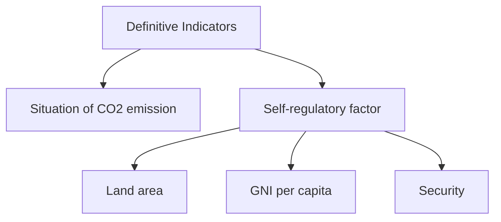

# 2018

# MCM/ICM

# Summary Sheet

# SPEC: A Climate-based Fragility Model

## Summary

Effects of Climate Change have aroused growing attention worldwide. The potential damages of Climate Change threaten most regions in the world, especially those fragile states. A fragile state cannot meet its people’s demands, and is quite vulnerable to those climate shocks. As a result, how to measure the fragility of countries counts.

Our SPEC Model provides a quantitative analysis of fragility degree for most countries in the world. It considers multiple aspects, including security, politics, economics and Climate Change.

We use 20 individual indicators to measure each aspects. Considering the impact of time, we apply Latest-determine Method and Weighted Average Method to do data weighting for different indicators. Moreover, in Weighted Average Method, we use the exponential weighting pattern to have realistic time-relating weights to better measure the indicators in a long period.

We divide effects of Climate Change into two parts: General impacts and Extreme impacts. The general part refers to those indirect effects of Climate Change. We use four indi-cators to represent the influences of rising sea level, decreasing arable lands, deteriorating ecological environment and restrained water source.

The extreme part of Climate Change illustrates the potential damage of extreme weathers resulting from Climate Change. We apply Self-regulatory Factor to predict countries’ ability to maintain their current condition facing extreme weathers. We use three indicators to further measure the self-regulatory factor. Moreover, self-regulatory factor also relates to the Tipping Point of a country, and we put forward the Tipping Model.

We apply Analytic Hierarchy Process (AHP) to determine the weights of indicators. We refer to different databases such as Worldbank. We simulate our model to 178 countries in the world, and we work out the self-regulatory factor and SPEC index of each country.

We apply the SPEC model to Yemen, one of the most fragile country and India, a country with ordinary fragility. We predict the total cost of state driven intervention of India.

In order to make our model more applicable, we use Re-weighting Method to modify our model. In this way, we find SPEC works well in "smaller" or "larger" states.

Finally, we do sensitivity analysis to the SPEC Model and discuss strengths and weaknesses.

Keywords: SPEC Model; Self-regulatory Factor; Weighed Average Method; data mining; climate impacts; Analytic Hierarchy Process;

## SPEC: A Climate-based Fragility Model

February 12, 2018

## Contents

## 1 Introduction 1

1.1 Problem Background . 1  
1.2 Our Efforts 1

## 2 Assumptions 2

## 3 Nomencalture 2

## 4 Statement of Our Model 3

4.1 Security . 3  
4.2 Politics 4  
4.3 Economics 4  
4.4 Data Weighting Methods for Individual Indicators . 5

4.4.1 Latest-determine Method 5  
4.4.2 Weighted Average Method 5

4.5 Climate 6

4.5.1 General Climate Impact 6  
4.5.2 Extreme Weather Events 8  
4.5.3 Self-regulatory factor R 9

4.6 Calculation . 9

## 5 Answers to Tasks 11

5.1 Task 1 11  
5.2 Task 2 12  
5.3 Task 3 13

5.3.1 Tipping Model Based on Self-regulatory Factor . . 13  
5.3.2 Application of Our Model to India . . . 14

5.4 Task 4 . 15

5.4.1 Predict the total cost of intervention 16

5.5 Task 5 . . 16

5.5.1 Larger "states" 17

5.5.2 Ex-State model 17

5.5.3 Dealing with missing data . . . . 17

5.5.4 Smaller "states" 18

5.5.5 Re-weighting for SPEC index . . . . 18

5.5.6 Examples: Guangzhou and Cape Town . 18

## 6 Model Analysis 19

6.1 Sensitivity Analysis 19

6.1.1 Impact of Mediate Constant a in Weighted Average Method . . . . . . 19

6.1.2 Impact of Universal Extreme Weather Probability p% 20

6.2 Strengths & Weaknesses 20

6.2.1 Strengths . . . . 20

6.2.2 Weaknesses 20

## 7 Conclusion 20

Appendices 22

Appendix A SPEC Indexes Results 22

Appendix B Analytic Hierarchy Process 23

Appendix C SPEC Model Data Mining Algorithm 24

Appendix D SPEC Model Final Calculation Algorithm 30

Team # 72968

Page 1 of 20

## 1 Introduction

## 1.1 Problem Background

It is always an interesting experience in winter seeing passengers taking off their sweaters and heavy coats on the plane flying from north to south. Obviously, climate influence our life-style. Moreover, nowadays it significantly impact the stability, or saying conversely, the fragility of a country.

A fragile state is a low-income country characterized by weak state capacity and/or精品数模资料，各类比赛优秀论文、学习教程、写作模板与经验技巧、matlab程序代码资料等，尽在淘宝店铺：闵大荒工科男的杂货铺 weak state legitimacy leaving citizens vulnerable to a range of shocks [1]. A state’s fragility interplays with its social conditions and they can easily fall into a viscous cycle once one of the indexes becomes severe. Therefore, people often examine fragility to view as a compre-hensive reflection of a country’s conditions.

There are multiple ways to measure the fragility of a country. The existing fragility lists such as Fragile States Index [2] of Fund for Peace [3] put more focus on social indicators re-garding politics, safety, economy, etc.. However, they almost neglect natural indicators such as climate shocks and global climate changes, whose influences have become remarkable today. Here we use "almost" to assume their weighting systems, considering climate to have minor impacts on fragility by indirectly affect the core indexes including security political, economical indicators.

## 1.2 Our Efforts

To specify the climate impacts on fragility, we build a climate-based fragility model called the SPEC Model, which is able to analyse the impact of climate both directly and indirectly. In the model, we also quantify other important indicators concerning security, politics and economics.

In Section (2), we state the basic assumptions of the SPEC Model. In Section (4), we give detailed explanation and calculation for each indicator used in the model. Section (6) provides thorough analysis of the SPEC Model including sensitivity analysis and strengths & weaknesses review.

We also solve tasks listed as follows,

1. Build a model to determine the fragility of a country and analyse the influence of climate.  
2. Apply our model on one of the top 10 most fragile states and quantify the impact of climate on fragility.  
3. Apply our model on another state outside the top 10 most fragile list. Find distinct indicators and tipping point of its fragility trend.  
4. Use our model to predict positive interventions to reduce negative impact of climate and avoid a fragile state.  
5. Generalize our model on states of different sizes, small as cities, large as continents.

## 2 Assumptions

We make the following assumptions for the SPEC Model:

1. States can exchange resources and communicate with neighbouring states.  
2. Within a country, resources can be dispatched quickly from rich places to poor areas, especial when some parts of the country are suffering natural catastrophe.  
3. The stability and strength of a country is largely depend on the political environment, economical conditions, social security, military power, national resources, etc..  
4. The richness of national resources can be reflected by national territorial area.  
5. Risk of extreme weather events increases with global climate change [4].

## 3 Nomencalture

The name for our climate-based fragility model SPEC is the combination of four first letters of Security, Politics, Economics , Climate. These four parts are our focus in the fragility measurement model.

We use the notation in Table 1 to present the indicators in equations of our SPEC Model. Notations used only once is not included in Table (1), they are introduced in certain sections.

Table 1: Notation

<table><tr><td>Symbol</td><td>Definition</td></tr><tr><td>Security</td><td>Synthetic Security Indicator</td></tr><tr><td> $S_{conf}$ </td><td>Social conflicts</td></tr><tr><td> $S_{abs}$ </td><td>Political stability &amp; Absence of violence</td></tr><tr><td> $S_{coups}$ </td><td>Incidence of coups</td></tr><tr><td> $S_{abuse}$ </td><td>Gross human rights abuses</td></tr><tr><td> $S_{ref}$ </td><td>Refuge &amp; Territory</td></tr><tr><td>Politics</td><td>Synthetic Political Indicator</td></tr><tr><td> $P_{gov}$ </td><td>Government effectiveness</td></tr><tr><td> $P_{law}$ </td><td>Rule of law</td></tr><tr><td> $P_{corpt}$ </td><td>Control of corruption</td></tr><tr><td> $P_{acc}$ </td><td>Voice &amp; Accountability</td></tr><tr><td>Economics</td><td>Synthetic Economical Indicator</td></tr><tr><td> $E_{GNI}$ </td><td>Gross national income (GNI) per capita</td></tr><tr><td> $E_{GDP}$ </td><td>Growth of domestic product (GDP)</td></tr><tr><td> $E_{inf}$ </td><td>Inflation</td></tr><tr><td> $E_{ineq}$ </td><td>Income inequality</td></tr><tr><td> $E_{reg}$ </td><td>Regulatory quality</td></tr><tr><td>Climategen</td><td>Climate indicator for general global climate change</td></tr><tr><td> $C_{elv}$ </td><td>Population living in areas where elevation is below 5 meters</td></tr><tr><td> $C_{frst}$ </td><td>Forest area</td></tr><tr><td> $C_{ara}$ </td><td>Arable land</td></tr><tr><td> $C_{drk}$ </td><td>People using basic drinking water service</td></tr><tr><td>Climateext</td><td>Climate indicator for extreme weather events</td></tr><tr><td>R</td><td>Self-regulatory factor</td></tr><tr><td> $SPEC_{score}$ </td><td>the intergrated SPEC Model score</td></tr></table>

Team # 72968

In assessment of the fragility of a country, a state, or a city, we refer to multiple factors. We classify the factors into four main fields: politics, economics, security and climate. Factors in distinct fields contribute to fragility in different ways. We introduce the quantification of impact from various factors field-by-field.


<details>
<summary>pie chart</summary>

stability index
| Category | Stability Index |
|---|---|
| Political | 100 |
| Economy | 85 |
| Climate Change | 75 |
| Security | 65 |
</details>

Figure 1: SPEC Index

## 4.1 Security

We use five security indicators in security fields. These five indicators measure the pres-ence of different types of political violence in a country, from civil war to gross human rights violations on a scale of 0 (smallest) to 10 (greatest).

Social conflicts is an indication of the state’s ability to maintain peace within its borders and provide basic physical and human security. We refer to the data set Major Episodes of Political Violence 1946-2016 that comprises a comprehensive accounting of all forms of major armed conflicts in the world.

Political stability and absence of violence measures the perceptions of the likelihood that the government will be destabilized or overthrown by separatism or violent means, including terrorism.

Incidence of coups. States that have experienced violent overthrow are by definition highly unstable, and likely to lack the political mechanisms that ensure peaceful transition of power. For this indicator, a country score 0 if there have been any coups in the last fifteen years and score 10 if else. We acquire the data from List-of-coups on Wikipedia.

Gross human rights abuses. States that rely on widespread oppression to maintain control will be susceptible to internal discontent and instability. We assign a score for this indicator based on Political Terror Scale 2015.

Refugee & Terrorism is the best available indicator for a state’s ability to carry out its sovereignty and maintain a monopoly on the use of armed force across the entirety

of its territory. Large numbers of refugees emerge in those countries which can not quell the revolutionary and ethnic wars started by challengers seeking major changes in their status.The database is provided by Political Instability Task Force, 2017.

The mathematical expression for security indicators in the SPEC Model equation has a form of

$$
S e c u r i t y = \alpha_ {1} S _ {c o n f} + \alpha_ {2} S _ {a b v} + \alpha_ {3} S _ {c o u p s} + \alpha_ {4} S _ {a b u s e} + \alpha_ {5} S _ {r e f}
$$

We will later assign weights 1, 2, 3, 4, 5 to these indicators in Section (4.6).

## 4.2 Politics

We used four political indicators to quantify the impact of politics on fragility of a state. We define the four indicators to reflect the political appearance of a state to the same large extent and ignore other minor factors. We treat the four political indicators equally by grad-ing the them from 0 (smallest) to 10 (greatest) in the fragility function.

Government effectiveness directly shows the states’ govern capability, including the public and civil service quality and policy executive ability. Facing with social crisis, a government’s coping ability impacts the results greatly.

Rule of law measures the confidence and efficiency of a government to build a legitimate country using strong regulations, and relate tightly to the long-term stability of a state.

Control of corruption prevents the state from irrational resource distribution and institution erosion, which is a strong indicators to predict a state’s public trust.

Voice & Accountability measures the extent of citizens get involved in the construction of a government. It is the reflection of civil freedom and influence the stability of a government in the long-term.

In assessment of political indicators, We refer to the data set Governance Matters VI, 2007 on the World Bank. The mathematical expression for political indicators in the SPEC Model equation has a form of

$$
P o l i t i c s = \beta_ {1} P _ {g o v} + \beta_ {2} P _ {l a w} + \beta_ {3} P _ {c o r p t} + \beta_ {4} P _ {a c c}
$$

where 1, 2, 3, 4 are given in Section (4.6).

## 4.3 Economics

There are five economical indicators. These widely used indicators allow us to capture key aspects of national economic performance.

Gross National Income (GNI) per Capita. We believe low per capita income is a prox-imate精品数模资料，各类比赛优秀论文、学习教程、写作模板与经验技巧、matlab程序代码资料等，尽在淘宝店铺：闵大荒工科男的杂货铺！ effect of state weakness, circumscribing a country’s capacity to achieve essential government functions. The database is provided by World Development Indicators, 2007.

精品数模资料，各类比赛优秀论文、学习教程、写作模板与经验技巧、matlab程序代码资料等，尽在淘宝店铺：闵大荒工科男的杂货铺

Growth of Gross Domestic Product (GDP). Like GNI per capita, average economical growth can be both a resulting effect and proximate cause of state weakness. Coun-tries that manage to sustain economical growth generally exhibit relatively stable and secure societies. The same data set is available at The World Bank.

Inflation may indicate an economy’s susceptibility to external shocks or unsustainable fiscal policy. We use the absolute value of the annual change in consumer prices, al-lowing us to treat cases of deflation and inflation in the same manner. World Economic Outlook Database, 2017 provides the data required.

Income Inequality. High income inequality has been linked to the likelihood of rebellion and other forms of political violence. We determine the score of each country based on its Gini coefficient which represents the wealth distribution of a country’s residents.

Regulatory Quality. Poor Regulatory Quality indicates a state’s inability to foster an environment conducive to private-sector growth, which is essential to increasing national income. Governance Matters VI, 2007 provides the data required.

The mathematical expression for political indicators in the SPEC Model equation has a form of

$$
E c o n o m i c s = \gamma_ {1} E _ {G N I} + \gamma_ {2} E _ {G D P} + \gamma_ {3} E _ {i n f} + \gamma_ {4} E _ {i n e q} + \gamma_ {5} E _ {r e g}
$$

We will later assign weights 1, 2, 3, 4, 5 to these indicators in Section (4.6).

## 4.4 Data Weighting Methods for Individual Indicators

We search for the data of the indicators in security, political and economical fields and operate the mass data with two fundamental methods: weighted average methods and latest-determine methods, and then we apply the operated indicators into the equation of fragility.

## 4.4.1 Latest-determine Method

Indicators acts differently to the fragility of a country, some of them has abrupt and sudden impact, while others has on-going influence. We apply the latest-determine method on indicators that has sudden and short impact, and only use the latest data to represent the indicator.

Among all 14 indicators introduced in the previous three fields, we use this latestdetermine method on 9 of them, regarding them as instantaneous and transient factors. For only 5 in-dicators mentioned in the next part, we use the weighted average method to measure their relatively long-standing impact.

## 4.4.2 Weighted Average Method

We apply an exponential weighing pattern, showing the impact of a indicator decreases with time. We define the relative weight $( 1 \mathsf { a } ) ^ { \mathsf { T } }$ , where T is the time number in the time 精品数模资料，各类比赛优秀论文、学习教程、写作模板与经验技巧、matlab程序代码资料等，尽在淘宝店铺：闵大荒工科男的杂货铺

A mediate constant a = 0:15 implies the weight decreases by 15 percent when we move back in time each year. Though the mediate constant a in the equation of relative weight can be a arbitrary constant in [0; 1], the value of a = 0:15 is rational to quantify the impact variation with time goes by.

Time range of 5 years or 15 years are reasonable enough for the impact of indicators, when T with 15 year range measures long and continuous impact and 5 year range measures relatively small and continuous impact.

Then we scale the relative weight to make the sum equals to 1 and get the result of absolute weight that used in our method of averaging.

$$
\text { Weight } _ {\text { absolute }} = \frac {(1 - a) ^ {T}}{\sum_ {i = 0} ^ {T} (1 - a) ^ {i}} \tag {1}
$$

where we define a = 0:15 and T = 5; 10.

Parameter Scheme for Indicators: We use the weighted average method to process the data of 5 indicators. Three indicators belong to security category: social conflicts, incidence of coups, human rights abuse. Two indicators belong to economy category: Growth of Gross Domestic Product (GDP), Inflation.

We assign 15 year time span for social conflicts, incidence of coups; 5 year time span for human rights abuse, GDP and inflation. A country suffering social conflicts and incidence of coups need a relatively longer time to recover from the mighty and widespread social destruction. Under this condition, there are still repercussions with decreasing impact to make a country fragile. We assign 5 year time span for human rights abuse since it is a more flexible indicator, which can be easily changed by policy or other instant law. GDP and inflation measures the economic appearance of a country. Since economic event happen frequently in modern world and their effects do not vanish instantly, we assume the latest 5 year data forecast the present economy.

## 4.5 Climate

We consider two aspects of climate impact on fragility of a state. General climate impact indicator measures the impact under global climate trend such as global warming and glacier melting. The general impact are largely determined by the state’s dependence on agriculture, water source and its location (risk of being submerged by rising sea level), etc. Extreme weather condition indicator measures the possibility of a country to become frag-ile faced with natural catastrophe. It relates tightly with the state’s possibility of suffering a natural disaster and resistance of destruction.

## 4.5.1 General Climate Impact

From 1990s, people become more clear about the negative trend of climate and put more efforts on researches and control of the global climate change. Results of climate change including increased droughts, shrinking glaciers and other ecological problems, are blocking the development of many countries.

In this section, we employ four indicators to quantify the general climate impact on a country caused by the current global climate trend.

We process the raw data and normalize the values of four indicators to fall in a range from 0 to 5, and then give them different weights in the SPEC Model equation.

## Population living in areas where elevation is below 5 meters (% of total population)

Population living in areas where elevation is below 5 meters (% of total population) shows the risk of a country to become fragile faced with global warming and glacier melting. Once the sea level rises, and if a country has a large population living in the place with elevation lower than 5 meters, the residential condition in the country will meet with crisis. We calculate the indicator result as Equation (2), showing that more population living in areas where elevation is below 5 meters, smaller the value of the indicator is, and more fragile the country is.

$$
C _ {e l v} = (1 - D _ {e l v} \%) \times 5 \tag{2}
$$

where

– Celv is the normalized result of the indicator ranging from 0 5.  
– Delv is the population percentage in the source which ranging from 0 56:18.

## Forest area (% of land area)

Forest area reflects the animal and plant ranges and is a measurement of species rich-ness. A larger forest area build a more stable and adaptable ecological environment when a state faced with climate change. We calculate the forest area indicator value in SPEC model using Equation (3), showing faster the growth of forest land, higher the indicator value is, and less fragile the country is.

$$
C _ {f r s t} = \exp \left(\frac {D _ {t , f r s t} \%}{D _ {T , f r s t} \%}\right) \tag{3}
$$

– Cfrst is the normalized result of the forest area indicator ranging from 0 5.  
– D is the forest area percentage in the latest year source ranging from 0 73:1.  
– DT;frst is the forest area percentage in the reference year.

## Arable land (% of land area)

Frequent draughts and floods nowadays are the result of climate change and they diminish the area of arable land. Observing the change of arable land we can predict a country’s resistance towards climate change. Equation (4) calculate the arable land indicator value in the SPEC model, showing lower the decreasing speed of arable land area, higher the arable land indicator value is, and less fragile the state is.

$$
C _ {a r a} = \exp \left(\frac {D _ {t , a r a} \%}{D _ {T , a r a} \%}\right) \tag{4}
$$

– $\mathsf { C a r a }$ is the normalized result of the forest area indicator ranging from 0 5.  
– $\mathsf { D } _ { \mathsf { f } ; \mathsf { a r a } }$ is the arable land area percentage in the latest year source ranging from

0 56:1精品数模资料，各类比赛优秀论文 $7 5 \sharp$ 习教程、写作模板与经验技巧、matlab程序代码资料等，尽在淘宝店铺：闵大荒工科男的杂货铺 $- \mathsf { D } \mathsf { T } ; \mathsf { a r a }$ is the arable land area percentage in the reference year.

## People using basic drinking water service (% of population)

Global climate change give rise to the possibility of floods and droughts. Draughts especially, threaten the daily water supply for residence. Water resource is also one of the core inducement of region conflicts. Change of the population using basic drinking water service measures the state’s dependence on water. We use Equation (5) to calcu-late the drinking water indicator in the SPEC Model. If the population using drinking water service rises with time, the state depends less on water resource and thus less on climate, and appears less fragile.

– Cdrk is the normalized result of the drinking water indicator ranging from 0 5.  
– $\mathsf { D } _ { \mathsf { f } , \mathsf { d r } \mathsf { k } }$ is the drinking water service population in the latest year source ranging from 0 100.  
– $\mathsf { D } \mathsf { T } ; \mathsf { d r } \mathsf { k }$ is the drinking water service population in the reference year.

On the basis of accessible data, we use different ways to process the data and let the indexes fall in the value interval [0; 5]. Then we weigh the indexes '1, '2, '3, '4 and get the value of general climate impact indicator as Equation (6).

$$
\text { Climate } _ {\text { gen }} = \varphi_ {1} C _ {\text { elv }} + \varphi_ {2} C _ {\text { frst }} + \varphi_ {3} C _ {\text { ara }} + \varphi_ {4} C _ {\text { drk }} \tag {6}
$$

## 4.5.2 Extreme Weather Events

There is little doubt that the Earth’s climate is changing and weather is becoming more extreme. Future warming will bring more dangerous condition, even if the world manages to keep temperature rises within a 2 C limit to which governments have committed. The state’s ability to cope with extreme weather has shown an increasing role in safeguarding economic and social stability. The full formula for country scoring in extreme condition is given by

$$
C l i m a t e _ {e x t} = e ^ {- R} \cdot \ln \frac {C O _ {2 t}}{C O _ {2 T}} \cdot p \tag {7}
$$

where

– p% is the universal probability of extreme weather. At current time, it’s reasonable to set the value of p to 5%.  
– $\mathsf { C O } _ { 2 \mathrm { t } }$ is national ${ \mathsf { C O } } _ { 2 }$ emissions(kt) that year.  
– $\mathtt { C O 2 7 }$ is national ${ \mathsf { C O } } _ { 2 }$ emissions(kt) in year 1990.  
– R refers to self-regulation factor. It is originally a measure of the stability of the ecosystem and here it indicates country’s ability to effectively carry out disaster relief and disaster prevention work. This factor is synthesized from three parts which we discuss later.

Extreme weather events is of small probability, but can be catastrophic. In the process of increasing overall national strength, the state’s response capability to extreme weather conditions is also on the rise. However extreme heatwaves and heavy rain storms are already happening with increasing regularity worldwide because of man-made climate change.

There-fore a proportional item $\mathsf { C O } _ { 2 \mathsf { t } } / \mathsf { C O } _ { 2 \mathsf { T } }$ is of necessity in the formula to indicate the increasing difficulty of disaster relief and the increase of probability.

## 4.5.3 Self-regulatory factor R

Self-regulatory factor R is synthesized from three parts: national land area, per capita income, security. The self-regulatory factor r is determined by Equation (8).

$$
R = \theta_ {1} r _ {1} + \theta_ {2} r _ {2} + \theta_ {3} r _ {3}, \quad R \in (0, 1)
$$

$$
r _ {1} = \ln \frac {s (n)}{s (U S A)}, \quad r _ {1} \in (0, 1)
$$

$$
r _ {2} = \ln \frac {i (n)}{i (L)}, \quad r _ {2} \in (0, 1)
$$

$$
r _ {3} = \text { security } / 5 0, \quad r _ {3} \in (0, 1) \tag {8}
$$

where s(n) is national land area, s(USA) is the land area of America. For Russia and Canada, whose land area is bigger than America, we set its r1 to 1 to avoid inaccuracy.

i(n) is per capita income, and i(L) is the per capita income of Luxembourg. According to World Bank, Luxembourg’s per capita income ranks first in the world. Security score is already obtained, we divide it by 50 to have the value fall in the range of zero to one.

Security factors is the basic guarantee for dealing with extreme weather events. Relatively large land area enhance disaster prevention capabilities to some extent for its rich resources and manpower. Per capita income is the embodiment of the current economic strength that support disaster prevention and relief work.

## 4.6 Calculation

The score of the SPEC Model measures the fragility of a state. Higher scores show less fragility while lower scores show more fragility. The SP ECscore has the equation form as

$$
S P E C _ {S c o r e} = \frac {\text { Security } + \text { Politics } + \text { Economics } + \text { Climate } _ {g e n}}{\text { Climate } _ {e x t}} \tag {9}
$$

Equation (9) shows the relation between the SPEC score and indicators of four core fields regarding fragility: security, politics, economics and climate, where climate consists of general climate change and extreme weather condition. The five security indicators, the four political indicators, the five economical indicators and four general climate indicators have positive correlation with the SPEC score. Bigger the value of the indicators, bigger the value of the SPEC score and less fragility of a state.

We only put the indicators considering extreme weather condition in the denominator, showing the negative correlation with the SPEC score. Bigger the value of extreme weather indicator, smaller the value of the SPEC score and more fragile of a state.

We span the item of Climateext referring to Equation (8), since its calculation differs from the other four items in the numerator of Equation (9).

$$
S P E C _ {s c o r e} = \frac {\text { Security } + \text { Politics } + \text { Economics } + \text { Climate } _ {g e n}}{e ^ {- R} \cdot \ln \frac {C O _ {2 t}}{C O _ {2 T}} \cdot p} \tag {10}
$$

$$
R = (31.89\%) \left(\ln \frac {s(n)}{s(USA)}\right) + (22.11\%) \left(\ln \frac {i(n)}{i(L)}\right) + (46.00\%) (security / 50) \tag{11}
$$

Team # 72968

Page 10 of 20

We prioritize the indicators and employ $\mathsf { A H P }$ to get the coefficients for every indicator. Results are listed in Table (2).

Table 2: The weight of indicators

<table><tr><td>Indicators</td><td>weight (%)</td></tr><tr><td>Social conflicts</td><td>20.69</td></tr><tr><td>Political stability and absence of violence</td><td>17.24</td></tr><tr><td>Incidence of coups</td><td>27.59</td></tr><tr><td>Gross human rights abuses</td><td>10.34</td></tr><tr><td>Refugee</td><td>24.14</td></tr><tr><td>Government effectiveness</td><td>25.00</td></tr><tr><td>Rule of law</td><td>25.00</td></tr><tr><td>Control of corruption</td><td>25.00</td></tr><tr><td>Voice &amp; Accountability</td><td>25.00</td></tr><tr><td>Gross National Income (GNI) per Capita</td><td>25.93</td></tr><tr><td>Growth of Gross Domestic Product (GDP‘ijL’</td><td>29.63</td></tr><tr><td>Inflation</td><td>11.11</td></tr><tr><td>Income Inequality</td><td>18.51</td></tr><tr><td>Regulatory Quality</td><td>14.86</td></tr><tr><td>Population living in areas where elevation is below 5 meters</td><td>11.31</td></tr><tr><td>Forest area</td><td>35.43</td></tr><tr><td>Arable land</td><td>22.61</td></tr><tr><td>People using basic drinking water service</td><td>30.65</td></tr></table>

Then, We have precise Equations (12) to calculations each indicator, and plug them in Equation (9) to get the SPEC score. We conclude the results in Figure (2).

$$
\text { Security } = (20:69 \%) S _ {\text { conf }} + (20:69 \%) S _ {\text { abv }} + (20:69 \%) S _ {\text { coups }} + (20:69 \%) S _ {\text { abuse }} +
$$

$$
(24:14\%)S_{\text{ref}} \text{Politics} = (25:00\%)P_{\text{gov}} + (25:00\%)P_{\text{law}} + (25:00\%)P_{\text{corpt}} + (25:00\%)P_{\text{acc}}
$$

$$
\text { Economics } = (25:93\%)E_{GNI} + (29:63\%)E_{GDP} + (11:11\%)E_{inf} + (18:51\%)E_{ineq} + (14:86\%)E_{reg}
$$

$$
\text {Climate} _ {\text {gen}} = (1 1: 3 1 \%) C _ {\text {elv}} + (3 5: 4 3 \%) C _ {\text {frst}} + (2 2: 6 1 \%) C _ {\text {ara}} + (3 0: 6 5 \%) C _ {\text {drk}}
$$

(12)


<details>
<summary>choropleth map</summary>

| Country | SPEC Index |
| --- | --- |
| United States | 67.97 |
| Canada | 67.97 |
| Mexico | 67.97 |
| Brazil | 67.97 |
| Argentina | 67.97 |
| Germany | 67.97 |
| France | 67.97 |
| United Kingdom | 67.97 |
| Italy | 67.97 |
| Spain | 67.97 |
| Russia | 67.97 |
| China | 67.97 |
| India | 67.97 |
| Japan | 67.97 |
| Australia | 67.97 |
| South Africa | 67.97 |
| Nigeria | 67.97 |
| Egypt | 67.97 |
| Saudi Arabia | 67.97 |
| Iran | 67.97 |
| Turkey | 67.97 |
| South Korea | 67.97 |
| Indonesia | 67.97 |
| Pakistan | 67.97 |
| Bangladesh | 67.97 |
| Vietnam | 67.97 |
| Philippines | 67.97 |
| Malaysia | 67.97 |
| Thailand | 67.97 |
| Myanmar | 67.97 |
| Cambodia | 67.97 |
| Laos | 67.97 |
| Nepal | 67.97 |
| Kenya | 67.97 |
| Uganda | 67.97 |
| Ethiopia | 67.97 |
| DR Congo | 67.97 |
| Libya | 67.97 |
| Senegal | 67.97 |
| Mozambique | 67.97 |
| Madagascar | 67.97 |
| Cameroon | 67.97 |
| Angola | 67.97 |
| Zambia | 67.97 |
| Malawi | 67.97 |
| Zimbabwe | 67.97 |
| Eritrea | 67.97 |
| Eswatini | 67.97 |
| Eritrea-Leste | 67.97 |
| Eswatini-Brunei | 67.97 |
| Eswatini-Portugal | 67.97 |
| Eswatini-Portugal | 67.97 |
| Eswatini-Portugal | 67.97 |
| Eswatini-Portugal | 67.97 |
| Eswatini-Portugal | 67.97 |
| Eswatini-Portugal | 67.97 |
| Eswatini - Caribbean Islands | 67.97 |
| Eswatini - Caribbean Islands | 67.97 |
| Eswatini - Caribbean Islands | 67.97 |
| Eswatini - Caribbean Islands | 67.97 |
| Eswatini - Caribbean Islands | 67.97 |
| Eswatini - Caribbean Islands | 67.97 |
| Eswatini-Whites Islands | 67.97 |
| Eswatini-Whites Islands | 67.97 |
| Eswatini-Whites Islands | 67.97 |
| Eswatini-Whites Islands | 67.97 |
| Eswatini-Whites Islands | 67.97 |
| Eswatini-Whites Islands | 67.97 |
</details>

Figure 2: World map for SPEC score. Higher score means means a state less fragile, and lower score means a state more fragile.

## 5 Answers to Tasks

## 5.1 Task 1

We use the SPEC Model to determine the fragility of a state. Fragility classification depends on the value of the SPEC score. SPEC score falls between 0 to 27 belongs to fragile category; SPEC score falls between 27 to 50 belongs to vulnerable category; SPEC score falls between 50 to 70 belongs to stable category.

Table 3: Fragility classification.

<table><tr><td>SPEC score</td><td>Fragility</td></tr><tr><td>[0; 27)</td><td>Fragile</td></tr><tr><td>[27; 50)</td><td>Vulnerable</td></tr><tr><td>[50; 70)</td><td>Stable</td></tr></table>

To measure the climate impact on fragility, we evaluate the values of Climateext to see direct impacts and Climategen to analyse indirect impacts.

Climateext measures the intensity of direct extreme climate impacts. According to statical data generated by the SPEC Model, Climateext larger than 2:70, indicating a state’s extreme weather conditions impacts the fragility to a great extent. Climateext between 2:00 and 3:70 is normal. Climateext below 2:00 means the state has little impact from extreme weather conditions.

Climateext is influence by two main factors: i) self-regulatory factor R: R below 0:60 means a country is not capable of fighting extreme climate impacts and existence of extreme weather lead to more fragility; 0:60 to 0:75 is the normal range; R above 0:75 means a country is very powerful to cope with extreme weather, and acts less sensitive to destruction of ex-

treme climate. ii) probability of extreme weather events

$$
\ln \frac {\mathrm{CO} _ {2 \mathrm{t}}}{\mathrm{CO} _ {2 \mathrm{T}}} \quad \text { p,   which   is   influence   by }
$$

the emission of the greenhouse gases. CO2 emission index larger than 0.80 is a serious phe-nomenon saying that a country is having too much CO2 emission to promote the possibility of having extreme weather and thus increase its fragility.

Climategen measures the indirect impacts of climate. According to SPEC Model statistical data, Climategen above 5:00 is having large indirect impact of climate by affecting other indicators in security, political, economical fields. Climategen between 3:00 and 5:00 is normal. Climategen below 3:00 appear to have little indirect impact from climate change.

## 5.2 Task 2

We choose Yemen to discuss its fragility causes. Yemen ranks seven in our SPEC fragility list, which agrees well with its rank in the fsi list.


<details>
<summary>treemap</summary>

| Category | Politics | Security | Economics | General | Extreme |
|---|---|---|---|---|---|
| Emissions | 0 | 0 | 10-scale | 0 | 0 |
| Inflation | 0 | 0 | 0 | 0 | 0 |
| Income Inequality | 0 | 0 | 0 | 0 | 0 |
| GNI per capita | 0 | 100 | 0 | 0 | 0 |
| Refugees | 0 | 150 | 0 | 0 | 0 |
| Social Conflict | 0 | 120 | 0 | 0 | 0 |
| Gross Human Rights Abuses | 0 | 0 | 0 | 0 | 0 |
| Forest Area (% of land) | 0 | 0 | 0 | 120 | 0 |
| People using basic drinking water service (% of population) | 0 | 0 | 0 | 0 | 0 |
| Population living in areas where elevation is below 5 meters (% of total population) | 0 | 0 | 0 | 120 | 0 |
| Arable Land (% of ... ) | 0 | 0 | 0 | 0 | 120 |
| Voice &... | 0 | 0 | 0 | 0 | 120 |
| Country Land... | 120 | 0 | 0 | 0 | 120 |
| Self-regula... | 120 | 0 | 0 | 0 | 120 |
| G... | 120 | 0 | 0 | 0 | 120 |
| C... | 120 | 0 | 0 | 0 | 120 |
Gni per capita: Extreme; Country Land...; Self-regula...; Voice &...; Ru... of...; C...
</details>

Figure 3: yemen

The direct climate indicator Climateext = 2:83 is larger than 2:70, which means the fragility of the country is greatly influenced by the extreme climate events. The reason be-hind is that Yemen has a low self-regulatory factor R = 0:60, indicating its poor resistance before natural catastrophe. R made up of an item r3 = security=50, and since there are so-cial conflicts and coups inside the country, Yemen owns a poor ability to recover itself once encounter climate shocks. Extreme climate conditions can easily drive Yemen to be fragile.

The indirect climate indicator Climategen = 3:67 is a normal value for according to SPEC’s statistical data. Therefore, it contributes little to Yemen’s fragility.

## How to be less fragile

Improve political conditions and stop coups.

Improve security conditions by stopping social conflicts.

Live in harmony with the neighbouring countries to help when faced with climate problems.

精品数模资料，各类比赛优秀论文、学习教程、写作模板与经验技巧、matlab程序代码资料等，尽在淘宝店铺：闵大荒工科男的杂货铺

Increase self-regulatory factor to promote the state’s capability to cope with extreme climate events.

## 5.3 Task 3

As is shown above, Climate Change effects a country’s fragility from two aspects, including general part and extreme part. As we have mentioned, the general part refers to the indirect impacts of Climate Change. According to available sources, we find indirect impacts only has slight influence on the fragility of a country in a short period.

Therefore, we conclude that the general part effects the fragility in a long period. That period will be at least twenty-year-scaled. In this case, we mainly consider the impacts of the extreme part when measuring the fragility of a country.

## 5.3.1 Tipping Model Based on Self-regulatory Factor

From the above conclusion, we find that Climate Change pushes a country to become more fragile mostly via its extreme part. According to what is discussed in the Model Section, we come to determine the definitive indicators.


<details>
<summary>flowchart</summary>


</details>

Figure 4: Definitive indicators of impacts of Climate Change.

Since the situation of CO2 emissions of a country is limited to its current technology and has close relation to its future development, it might be steady in a long term. So our major work is to discuss the self-regulatory factor.

Moreover, we use our SPEC data calculated above to see the relation between SPEC index and the self-regulatory factor.


<details>
<summary>scatterplot</summary>

| Extreme climate factor | SPEC Index | Self-regulatory factor |
| ---------------------- | ---------- | ---------------------- |
| 0.8                    | 70         | 0.6                    |
| 0.6                    | 65         | 0.5                    |
| 0.4                    | 55         | 0.4                    |
| 0.2                    | 45         | 0.3                    |
| 0.0                    | 35         | 0.2                    |
| 1.0                    | 25         | 0.1                    |
| 2.0                    | 15         | 0.0                    |
| 3.0                    | 5          | 0.1                    |
| 4.0                    | 0          | 0.2                    |
</details>

Figure 5: Relation of SPEC Index

From the Figure (7), we find that SPEC index and the self-regulatory factor has a beautiful linear relation. When the self-regulatory factor increases, the relevant SPEC also increases. This relation confirms our assumption and discussion above.

Since the self-regulatory factor measures the ability of countries to maintain their current condition facing extreme situations, it is valid for us to put forward a Tipping Model based on Self-regulatory Factor.

From the relation between SPEC index and self-regulatory factor, we have the following definition:

Tipping Point: The Tipping Point of a country is the time when its self-regulatory factor decrease to reach the very value 0:6, and becomes lower.

Due to the indicators self-regulatory factor use, it well illustrates slight changes of security, political, economical conditions of a country under Climate Change. When the value of self-regulatory factor is smaller than 0:6, it is impossible for those countries to keep them safe from extreme climate shocks. Also, from the results of our model above, we find that such countries with small self-regulatory factor mostly are fragile, and some vulnerable. This shows our definition of Tipping Point is quite reasonable.

## 5.3.2 Application of Our Model to India

  
Figure 6: India

From Figure (7) , we have the following conclusions:

India is a vulnerable country.

Politics in India is stable, but not strong.

India exists gross human rights abuses, especially to females.

Due to the geographical position of India, large amount of population of India living in areas where elevation is below 5 meters face the severe threaten of rising sea level.

The yearly rising ${ \mathsf { C O } } _ { 2 }$ emissions put India at higher risk of extreme weathers.

Although India has self-regulatory factor 0:735, it is at quite high risk facing extreme weathers as a result of Tropical Monsoon Climate.

Therefore, India is becoming more vulnerable to extreme weathers. If India do not take effective measures to solve gross human rights abuses, India may face more social conflicts, 精品数模资料，各类比赛优秀论文、学习教程、写作模板与经验技巧、matlab程序代码资料等，尽在淘宝店铺：闵大荒工科男的杂货铺 which negatively affect economics and security of India. This adverse trend will bring down the self-regulatory factor of India, and India might reach the Tipping Point in a short period.

## 5.4 Task 4

According to SPEC Index, climate change has direct and indirect effects on states’ stabil-ity. Initiatives is needed to deal with these two aspects respectively.

Our eight proposed state driven interventions for India is in appliance with the climate indicators in SPEC Index.

For general climate impact:

Set strict control over the rezoning of cultivated land during urbanization.

Promote agricultural transformation and upgrading, increase water use efficiency and equity.

Develop desalination technology.

Carry out old town renovation and reasonably increase the urban density. Urban plan-ning has to focus on tall buildings.

Increase the income of the forestry sector, focus on the renewal and reforestation of natural forests and reduce artificial forests of single tree species.

For extreme weather events:

Promote accurate poverty alleviation and attach more importance to the consistency of poverty alleviation policies.

Strengthen infrastructure construction in rural areas and promote housing safety for lower-class residents.

Add medical expenses to local health insurance plan and focus on reducing under-5 deaths rate.

These initiatives closely respond to the impact of general climate factors as follows.

1. According to the World Bank collection of development indicators, arable land in India was reported at 156463000 ha in 2015,about 500,000 hectares less than year 2004. To deal with dwindling arable land, India must set strict control over the rezoning of cultivated land. Land other than agricultural use needs to be more efficiently utilized.  
2. Faced with increasing population, density in residential neighbourhoods has to be increased by decreasing lot sizes and replacing old houses with town-houses.  
3. Report[6] claimed that India’s population is growing faster than its ability to produce rice and wheat. To feed its growing population, India should raise its farm productivity by reducing food staple spoilage and improving its infrastructure.

4. Affected by the southwest monsoon, grain output fluctuates every few years. From 1999 to 2005, the minimum grain output reached 1.74 billion tons, the highest at 213 million tons, a difference of 390 million tons [7]. Thus, under the influence of continued climate change, the pressure on food security in India is likely to increase.  
5. India has already carried out Forest regeneration program, but many are singlespecies plantations. Large-scale afforestation in degraded forest areas, including monoculture, can not create the ecosystems and biodiversity needed for abundant animal and plant ranges [8].  
6. In 2015, implementation of a universal health care system was delayed due to budgetary concerns. Penetration of health insurance in India is low by international standards and most healthcare expenses are paid out of pocket by patients and their fam-ilies, rather than through insurance [9]. The add to the vulnerability of low-class resi-dents facing extreme weather events.

## 5.4.1 Predict the total cost of intervention

It’s quite diffcult to accurately predict the expenses these measures for India required. We first determine the field to these measures belong and refer to The Expenditure of Government of India 2016-2017 to get access to the government’s total spending in this area.

Then we compare and estimate the ratio of expenditures on this measure to major items in this area. The estimated expenditure of our 8 proposed intervention is listed below. (Unit: hundred million dollars)

Table 4: Estimated expenditure of each intervention

<table><tr><td>Intervention</td><td>Expenditure</td></tr><tr><td>Control of rezoning</td><td>18.7</td></tr><tr><td>Agricultural upgrading</td><td>77.9</td></tr><tr><td>Desalination</td><td>50</td></tr><tr><td>Rural renovation</td><td>1558</td></tr><tr><td>Forestry sector</td><td>20</td></tr><tr><td>Poverty alleviation</td><td>468</td></tr><tr><td>Housing safety</td><td>1000</td></tr><tr><td>Healthcare</td><td>100</td></tr></table>

## 5.5 Task 5

We notice that only a few countries cover extra large land areas equivalent of continents. If measured by population, countries that own 20 million to 50 million people is equivalent to the scale of a medium-sized city and only 25 countries is under that size. When coming to smaller states and larger states, to be more mathematically precise, we have to adjust the coefficient of our SPEC Model.

What’s noteworthy is that it’s never merely the change in land area, indicators in security, politic and economic fields are all affected.

## 5.5.1 Larger "states"

To obtain a modification of SPEC Model, a ex-State model is required. The following facts need special consideration.

Big countries have more human and energy resources and can be fully deployed during times of emergency.

As a combination of countries, continents have inherent advantages in developing resilient and flexible policy-making. All regions have a higher degree of coordination and complementarity of policies when faced with unrest.

Policy silos are more impossible to exist, it is essential rearrange evaluation system in a broader context of education, healthcare, good governance, and societal resilience.

## 5.5.2 Ex-State model

As noted above, we already have each country’s score on fragility and now we need to weight each of them. The scoring formula is

$$
F _ {c o p} = \frac {\sum_ {k = 1} ^ {n} R _ {i} F _ {i}}{\sum_ {k = 1} ^ {n} R _ {i}} \tag {13}
$$

where

– Fcop is the fragility of the hole continent.  
– Fi is the fragility of the hole continent.  
– Ri is the earlier determined self-regulation factor of each country.

Notice that countries rank high in SPEC fragility index has high likelihood of future political and economic instability. In broader view, these countries take on more responsibility in face of difficulties. Therefore we determine the expression of continent’s fragility by a weighted average expression. This approach is concise and effective.

## 5.5.3 Dealing with missing data

Though our SPEC indicators have relatively good data coverage worldwide, there are missing data points. In this ex-State model where multiple area needs to be included, we don’t filling these data gaps with imputed estimates.

Instead we calculate with available country data using the formula above. Our rationale is that neither the accuracy of the overall continent weakness score, nor the credibility, are significantly affected by the missing data. Furthermore, most countries have data for all SPEC indicators.There is a risk that imputed data would amount to an implausible estimate of a country’s performance on certain indicators.

## 5.5.4 Smaller "states"

Cities have less industrial diversity and abundance of resources compared with states. here we explain how to rearrange the weight of each SPEC fields.

The following facts need special consideration.

With globalization providing a net benefit to nations around the world, regions are linked closer with each other.

The city’s basic climatic conditions can be obtained from the country’s data.

Each city has its own major industry which reflect the city’s overall strength and significantly affect its vulnerability to economic fluctuations and climate events.

## 5.5.5 Re-weighting for SPEC index

Here are the principles for re-weighting.

1. Four general climatic indicators apply to both cities and states, therefore, scoring formula for general climte conditions doesn’t change.  
2. As explained earlier, scoring formula for extreme climate condition consist of extreme weather events(EWE) probability, CO2 emission and self-regulatory factor(R). EWE probability doesn’t change with land area size. R is determined by the same formula expressed earlier and CO2 emission is available in data set.  
3. The weight for security(S),politic(P) and economic(E) fields is rearranged using Analytic Hierarchy Process based on city’s major industry.

## 5.5.6 Examples: Guangzhou and Cape Town

We take Guangzhou and Cape Town as examples to reweight its SPEC index in compli-ance with principles above.

Guangzhou is the capital and most populous city of the province of Guangdong in southern China. Its urban development characteristics is embodied in following areas.

– main manufacturing hub of one of mainland China’s leading commercial and manufacturing regions  
– rivers and streams improve the landscape and keep the ecological environment of the city stable  
– top ten container ports in the world

Cape Town is the legislative capital of South Africa. Its urban development character-istics is embodied in following areas.

– noted for its architectural heritage and natural setting, once named the best place in the world to visit  
– serves as the regional manufacturing centre

With careful consideration of each field, the new SPEC coefficient is determined through AHP method.


<details>
<summary>stacked bar chart</summary>

| City | Security (%) | Politics (%) | Economics (%) | Climate (%) |
| :--- | :--- | :--- | :--- | :--- |
| Guangzhou | 0.19 | 0.10 | 0.67 | 0.04 |
| Cape town | 0.12 | 0.06 | 0.53 | 0.30 |
</details>

Figure 7: Rearranged weight for small "states"

## 6 Model Analysis

## 6.1 Sensitivity Analysis

The SPEC model contains several constant parameters. We referred to on-line database and various accessible literature when deciding on the parameters. In this section, we test and sensitivity of the SPEC Model by changing the values of the parameters to show its reliability.

## 6.1.1 Impact of Mediate Constant a in Weighted Average Method


<details>
<summary>line chart</summary>

| Time span (year) | a=0.15 | a=0.10 | a=0.20 | a=0.125 | a=0.175 |
| ---------------- | ------ | ------ | ------ | ------- | ------- |
| 0                | 0.17   | 0.13   | 0.21   | 0.14    | 0.18    |
| 2                | 0.14   | 0.11   | 0.16   | 0.12    | 0.15    |
| 4                | 0.11   | 0.09   | 0.12   | 0.09    | 0.11    |
| 6                | 0.08   | 0.07   | 0.08   | 0.07    | 0.08    |
| 8                | 0.06   | 0.05   | 0.05   | 0.05    | 0.06    |
| 10               | 0.04   | 0.04   | 0.03   | 0.04    | 0.04    |
| 12               | 0.03   | 0.03   | 0.02   | 0.03    | 0.03    |
| 14               | 0.02   | 0.02   | 0.01   | 0.02    | 0.02    |
| 16               | 0.01   | 0.01   | 0.01   | 0.01    | 0.01    |
</details>

Figure 8: Weight variation with time span for different a.

We set a to be 0:15 and never changed again in when using weighted average method to give weight of every indicator. We choose constant 0:15 based on the same calculations in Index of State Weakness In the Developing World [10]. In Figure (8), we have value of a to vary from 0:10 to 0:20 by 0:25. Every curve representing a certain value of a shows the same trend. Therefore, the SPEC Model is not sensitive to the value of mediate constant a.

## 6.1.2 Impact of Universal Extreme Weather Probability p%

We set the universal extreme weather probability $p \%$ to be 5% and remain it constant in the SPEC Model. We referred to the on-line statics and find the current possibility of extreme weather events falls in the range from 5% - 10%. We choose the smallest value 5% $\left( \ln { \frac { C O _ { 2 t } } { C O _ { 2 T } } } \right)$ to keep the whole estimation precise. Due to the annually growing emission of green house gases, we have the $\left( \ln { \frac { C O _ { 2 t } } { C O _ { 2 T } } } \right)$ CO2t larger than 1 buffer the effect of choosing a small possibility of extreme weather. With the dilution of $\left( \ln { \frac { C O _ { 2 \tt t } } { C O _ { 2 T } } } \right)$ $p \%$ is not sensitive in he SC el.

## 6.2 Strengths & Weaknesses

## 6.2.1 Strengths

The SPEC Model uses accurate and latest databases to guarantee the reliability of results. The results have high reference value and can be applied in real life immediately.

We employ 19 indicators of 4 fields in the SPEC Model to measure the fragility of a state. In this way the SPEC Model is able to avoid abrupt influence of a single indicator, and the results are more integrated.

We apply two kinds of data weighting methods (Latest-determine Method and Weighted Average Method), according to the characteristic of the indicator, making the SPEC Model more scientific.

We explore the climate indicators and divide the impacts into indirect ones and direct ones. Calculations on items of climate indicators is straightforward quantifications of their impacts on fragility.

## 6.2.2 Weaknesses

We neglect some indicators such as terrorism because we lack the accurate database, which may result in large fragility errors of some country.

Some indicators of a states are missing. To get the SPEC score, it requires extra weighting of the indicators, which means the SPEC Model can be complex sometimes.

## 7 Conclusion

We build the SPEC model to analyse countries’ fragility, considering the aspects of security, politics, economics and climate. We employ different data weighting methods do quantify individual indicators. Analytic Hierarchy Process is applied to determine weight numbers. We propose the Self-regulatory Factor to better measure the Tipping Point of different countries. Also, we modify our model to ensure it applicable to "larger" or "smaller" states. Then we refer to databases such as Worldbank, and we work out detailed and quan-tified SPEC indicators of 178 countries and regions in the world. Our final SPEC Score corresponds to the Fragile States Index. Finally, we do sensitivity analysis, discuss strengths and weaknesses and prove the credibility of our SPEC model.

## References

[1] “Fragile state,” Wikipedia. [Online]. Available: https://en.wikipedia.org/wiki/ Fragile\_state  
[2] “Fragile states index,” Fund for Peace (FFP). [Online]. Available: http://fundforpeace. org/fsi/  
[3] “Fund for peace,” Wikipedia. [Online]. Available: https://en.wikipedia.org/wiki/ Fund\_for\_Peace  
[4] M. M. Q. Mirza, “Climate change and extreme weather events: can developing countries adapt?” Climate policy, vol. 3, no. 3, pp. 233–248, 2003.  
[5] “Analytic hierarchy process,” Wikipedia. [Online]. Available: https://en.wikipedia. org/wiki/Analytic\_hierarchy\_process  
[6] S. Sengupta, “The food chain in fertile india, growth outstrips agriculture,” New York Times. http://www. nytimes. com/2008/06/22/business/22indiafood. html, 2008.  
[7] C. P. Ilbert, The Government of India. BiblioBazaar, LLC, 2008.  
[8] K. Chakraborty, S. Sudhakar, K. Sarma, P. Raju, and A. K. Das, “Recognizing the rapid expansion of rubber plantation–a threat to native forest in parts of northeast india,” CURRENT SCIENCE, vol. 114, no. 1, pp. 207–213, 2018.  
[9] P. Berman, R. Ahuja, and L. Bhandari, “The impoverishing effect of healthcare payments in india: new methodology and findings,” Economic and Political Weekly, pp. 65– 71, 2010.  
[10] S. E. Rice and S. Patrick, Index of state weakness in the developing world. Brookings Institution Washington, DC, 2008.

## Appendices

## Appendix A SPEC Indexes Results

<table><tr><td>#</td><td>Country</td><td>Governme</td><td>Rule of</td><td>Control</td><td>Voice &amp;</td><td>Social</td><td>CPolitics</td><td>Incidence</td><td>Gross</td><td>Hu Refugees</td><td>GNI per</td><td>Growth</td><td>Inflistic</td><td>Income</td><td>Regulate</td><td>Populiat</td><td>Forest</td><td>Arahable</td><td>L&#x27;people</td><td>uCountry</td><td>GNI per</td><td>CO2</td><td>emi</td><td>Self-reg</td><td>Extreme</td><td>SPBC Ind</td></tr><tr><td>1</td><td>South Su</td><td>0.05</td><td>0.29</td><td>0.19</td><td>0.54</td><td>2.74</td><td>0.19</td><td>0.00</td><td>1.32</td><td>0.00</td><td>5.99</td><td>0.00</td><td>7.16</td><td>5.37</td><td>0.29</td><td>4.98</td><td>1.94</td><td>2.50</td><td>3.23</td><td>0.83</td><td>0.60</td><td>1.02</td><td>0.43</td><td>3.30</td><td>7.42</td><td></td></tr><tr><td>2</td><td>Sudan</td><td>0.72</td><td>0.91</td><td>0.14</td><td>0.34</td><td>3.36</td><td>0.24</td><td>0.00</td><td>1.02</td><td>3.49</td><td>6.86</td><td>5.60</td><td>7.18</td><td>6.46</td><td>0.48</td><td>4.96</td><td>1.94</td><td>4.65</td><td>3.68</td><td>0.92</td><td>0.69</td><td>1.10</td><td>0.52</td><td>3.27</td><td>12.72</td><td></td></tr><tr><td>3</td><td>Central</td><td>0.29</td><td>0.19</td><td>0.91</td><td>1.87</td><td>8.41</td><td>0.71</td><td>0.00</td><td>3.00</td><td>5.09</td><td>5.29</td><td>0.00</td><td>8.28</td><td>4.38</td><td>0.58</td><td>5.00</td><td>2.69</td><td>2.54</td><td>2.83</td><td>0.83</td><td>0.53</td><td>1.04</td><td>0.54</td><td>3.02</td><td>12.96</td><td></td></tr><tr><td>4</td><td>Burundi</td><td>0.77</td><td>0.77</td><td>1.06</td><td>0.79</td><td>8.98</td><td>0.52</td><td>0.00</td><td>3.30</td><td>5.92</td><td>5.04</td><td>5.16</td><td>9.16</td><td>6.08</td><td>2.07</td><td>5.00</td><td>4.03</td><td>3.63</td><td>2.91</td><td>0.63</td><td>0.50</td><td>1.14</td><td>0.48</td><td>3.52</td><td>14.80</td><td></td></tr><tr><td>5</td><td>Afghanistan</td><td>0.96</td><td>0.39</td><td>0.34</td><td>2.12</td><td>6.57</td><td>0.10</td><td>10.00</td><td>1.67</td><td>0.00</td><td>5.68</td><td>7.23</td><td>9.44</td><td>5.60</td><td>0.72</td><td>5.00</td><td>2.72</td><td>2.67</td><td>10.24</td><td>0.94</td><td>0.57</td><td>1.37</td><td>0.59</td><td>3.90</td><td>15.70</td><td></td></tr><tr><td>6</td><td>Somalia</td><td>0.05</td><td>0.05</td><td>0.05</td><td>0.30</td><td>5.00</td><td>0.29</td><td>10.00</td><td>1.89</td><td>0.00</td><td>5.88</td><td>3.00</td><td>10.00</td><td>5.00</td><td>0.10</td><td>4.97</td><td>2.33</td><td>2.93</td><td>6.92</td><td>0.83</td><td>0.59</td><td>1.03</td><td>0.58</td><td>2.88</td><td>16.35</td><td></td></tr><tr><td>7</td><td>Yemen</td><td>0.24</td><td>0.48</td><td>0.10</td><td>0.59</td><td>8.85</td><td>0.05</td><td>0.00</td><td>1.76</td><td>9.82</td><td>6.22</td><td>0.00</td><td>9.16</td><td>6.33</td><td>0.53</td><td>4.92</td><td>2.72</td><td>2.47</td><td>5.19</td><td>0.82</td><td>0.62</td><td>1.03</td><td>0.60</td><td>2.83</td><td>16.38</td><td></td></tr><tr><td>8</td><td>Congo Be</td><td>0.58</td><td>0.43</td><td>0.77</td><td>1.09</td><td>0.00</td><td>0.43</td><td>10.00</td><td>0.00</td><td>4.63</td><td>5.43</td><td>10.00</td><td>9.59</td><td>5.79</td><td>0.77</td><td>5.00</td><td>2.64</td><td>2.89</td><td>3.38</td><td>0.91</td><td>0.54</td><td>1.26</td><td>0.59</td><td>3.47</td><td>16.98</td><td></td></tr><tr><td>9</td><td>Chad</td><td>0.63</td><td>0.72</td><td>0.48</td><td>1.23</td><td>8.63</td><td>1.10</td><td>0.00</td><td>6.15</td><td>9.86</td><td>5.89</td><td>7.66</td><td>9.58</td><td>5.67</td><td>0.96</td><td>5.00</td><td>2.16</td><td>4.33</td><td>2.98</td><td>0.88</td><td>0.59</td><td>1.28</td><td>0.64</td><td>3.38</td><td>18.20</td><td></td></tr><tr><td>10</td><td>Libya</td><td>0.14</td><td>0.14</td><td>0.29</td><td>1.18</td><td>9.44</td><td>0.39</td><td>0.00</td><td>2.17</td><td>9.91</td><td>7.57</td><td>0.00</td><td>9.63</td><td>5.00</td><td>0.05</td><td>4.89</td><td>2.72</td><td>2.58</td><td>2.72</td><td>0.90</td><td>0.76</td><td>1.02</td><td>0.67</td><td>2.61</td><td>18.29</td><td></td></tr><tr><td>11</td><td>Syria</td><td>0.19</td><td>0.10</td><td>0.24</td><td>0.15</td><td>8.48</td><td>0.05</td><td>10.00</td><td>0.00</td><td>0.00</td><td>6.73</td><td>3.00</td><td>9.33</td><td>6.42</td><td>0.38</td><td>4.99</td><td>3.12</td><td>2.66</td><td>2.77</td><td>0.76</td><td>0.67</td><td>0.96</td><td>0.60</td><td>2.63</td><td>19.37</td><td></td></tr><tr><td>12</td><td>Equatorial</td><td>0.67</td><td>0.67</td><td>0.05</td><td>0.20</td><td>10.00</td><td>3.90</td><td>0.00</td><td>5.38</td><td>10.00</td><td>7.94</td><td>2.15</td><td>9.67</td><td>6.00</td><td>0.63</td><td>4.95</td><td>2.46</td><td>2.52</td><td>2.76</td><td>0.84</td><td>0.79</td><td>1.07</td><td>0.64</td><td>2.81</td><td>20.60</td><td></td></tr><tr><td>13</td><td>Haiti</td><td>0.10</td><td>1.63</td><td>0.72</td><td>2.66</td><td>9.77</td><td>2.24</td><td>0.00</td><td>5.95</td><td>9.70</td><td>5.96</td><td>6.05</td><td>9.32</td><td>5.91</td><td>0.82</td><td>4.91</td><td>2.43</td><td>3.94</td><td>3.12</td><td>0.64</td><td>0.60</td><td>1.08</td><td>0.58</td><td>3.02</td><td>20.89</td><td></td></tr><tr><td>14</td><td>Venezuel</td><td>0.87</td><td>0.05</td><td>0.67</td><td>1.82</td><td>10.00</td><td>1.29</td><td>0.00</td><td>0.00</td><td>9.92</td><td>8.39</td><td>3.89</td><td>4.11</td><td>5.31</td><td>0.24</td><td>4.88</td><td>2.59</td><td>2.82</td><td>2.76</td><td>0.85</td><td>0.84</td><td>1.01</td><td>0.67</td><td>2.56</td><td>20.98</td><td></td></tr><tr><td>15</td><td>Congo Re</td><td>1.20</td><td>1.44</td><td>0.96</td><td>1.72</td><td>0.00</td><td>2.52</td><td>10.00</td><td>0.00</td><td>9.87</td><td>6.66</td><td>7.05</td><td>9.65</td><td>5.11</td><td>1.06</td><td>4.98</td><td>2.69</td><td>3.15</td><td>3.33</td><td>0.79</td><td>0.67</td><td>1.21</td><td>0.66</td><td>3.14</td><td>21.18</td><td></td></tr><tr><td>16</td><td>Guinea E</td><td>0.43</td><td>0.63</td><td>0.38</td><td>2.76</td><td>0.00</td><td>2.81</td><td>10.00</td><td>0.00</td><td>9.82</td><td>5.82</td><td>7.31</td><td>9.77</td><td>6.63</td><td>0.87</td><td>4.24</td><td>2.53</td><td>3.02</td><td>3.44</td><td>0.77</td><td>0.58</td><td>1.12</td><td>0.63</td><td>2.96</td><td>22.07</td><td></td></tr><tr><td>17</td><td>North Rc</td><td>0.38</td><td>0.34</td><td>0.53</td><td>0.05</td><td>0.00</td><td>2.19</td><td>10.00</td><td>0.00</td><td>9.99</td><td>6.71</td><td>3.00</td><td>10.00</td><td>6.00</td><td>0.05</td><td>4.74</td><td>2.07</td><td>2.78</td><td>2.71</td><td>0.73</td><td>0.67</td><td>0.95</td><td>0.64</td><td>2.51</td><td>22.34</td><td></td></tr><tr><td>18</td><td>Comoros</td><td>0.53</td><td>1.15</td><td>3.17</td><td>3.94</td><td>10.00</td><td>4.67</td><td>0.00</td><td>9.24</td><td>9.99</td><td>5.95</td><td>5.29</td><td>9.67</td><td>5.50</td><td>1.25</td><td>4.96</td><td>2.28</td><td>2.72</td><td>2.63</td><td>0.47</td><td>0.59</td><td>1.08</td><td>0.57</td><td>3.08</td><td>22.64</td><td></td></tr><tr><td>19</td><td>Myanmar</td><td>1.63</td><td>1.68</td><td>3.08</td><td>2.41</td><td>0.00</td><td>2.33</td><td>10.00</td><td>2.28</td><td>5.10</td><td>6.34</td><td>10.00</td><td>9.38</td><td>6.19</td><td>1.88</td><td>4.45</td><td>2.30</td><td>3.13</td><td>3.43</td><td>0.84</td><td>0.63</td><td>1.10</td><td>0.62</td><td>2.96</td><td>23.77</td><td></td></tr><tr><td>20</td><td>Eritrea</td><td>0.34</td><td>0.58</td><td>1.15</td><td>0.10</td><td>9.70</td><td>1.71</td><td>10.00</td><td>2.00</td><td>5.41</td><td>5.60</td><td>4.22</td><td>10.00</td><td>6.00</td><td>0.14</td><td>4.96</td><td>2.61</td><td>4.00</td><td>3.15</td><td>0.72</td><td>0.56</td><td>1.02</td><td>0.66</td><td>2.64</td><td>23.94</td><td></td></tr><tr><td>21</td><td>Guinea</td><td>1.49</td><td>0.97</td><td>1.49</td><td>2.61</td><td>9.95</td><td>3.10</td><td>0.00</td><td>5.13</td><td>9.82</td><td>5.82</td><td>7.31</td><td>9.77</td><td>6.63</td><td>1.92</td><td>4.70</td><td>2.51</td><td>3.02</td><td>3.44</td><td>0.77</td><td>0.58</td><td>1.05</td><td>0.63</td><td>2.79</td><td>24.31</td><td></td></tr><tr><td>22</td><td>Madagascar</td><td>1.06</td><td>2.55</td><td>1.63</td><td>3.74</td><td>10.00</td><td>3.14</td><td>0.00</td><td>6.47</td><td>10.00</td><td>5.36</td><td>5.75</td><td>9.31</td><td>5.73</td><td>2.60</td><td>4.92</td><td>2.60</td><td>3.52</td><td>3.97</td><td>0.93</td><td>0.54</td><td>1.08</td><td>0.64</td><td>2.92</td><td>24.36</td><td></td></tr><tr><td>23</td><td>Niger</td><td>3.13</td><td>2.98</td><td>3.13</td><td>3.45</td><td>10.00</td><td>1.19</td><td>0.00</td><td>8.32</td><td>9.99</td><td>5.29</td><td>9.10</td><td>9.96</td><td>6.60</td><td>2.64</td><td>5.00</td><td>2.36</td><td>3.65</td><td>3.34</td><td>0.88</td><td>0.53</td><td>1.18</td><td>0.64</td><td>3.11</td><td>24.62</td><td></td></tr><tr><td>24</td><td>Kyrgyz H</td><td>1.78</td><td>1.30</td><td>1.20</td><td>3.25</td><td>0.00</td><td>2.29</td><td>10.00</td><td>0.00</td><td>9.97</td><td>6.27</td><td>7.92</td><td>9.25</td><td>7.10</td><td>4.04</td><td>5.00</td><td>2.10</td><td>2.64</td><td>2.96</td><td>0.76</td><td>0.63</td><td>1.11</td><td>0.64</td><td>2.94</td><td>24.77</td><td></td></tr><tr><td>25</td><td>Bangladesh</td><td>2.55</td><td>3.08</td><td>2.12</td><td>3.10</td><td>10.00</td><td>1.05</td><td>0.00</td><td>2.91</td><td>9.86</td><td>6.44</td><td>9.32</td><td>9.27</td><td>6.79</td><td>2.21</td><td>4.35</td><td>2.65</td><td>2.46</td><td>2.80</td><td>0.73</td><td>0.64</td><td>1.08</td><td>0.60</td><td>2.95</td><td>24.96</td><td></td></tr><tr><td>26</td><td>Mali</td><td>1.59</td><td>2.26</td><td>2.98</td><td>3.99</td><td>9.84</td><td>0.86</td><td>0.00</td><td>3.37</td><td>8.44</td><td>5.95</td><td>6.99</td><td>9.80</td><td>6.70</td><td>2.84</td><td>5.00</td><td>2.22</td><td>19.37</td><td>4.52</td><td>0.87</td><td>0.59</td><td>1.08</td><td>0.62</td><td>2.90</td><td>25.02</td><td></td></tr><tr><td>27</td><td>Honduras</td><td>2.31</td><td>1.20</td><td>2.79</td><td>3.35</td><td>10.00</td><td>3.38</td><td>0.00</td><td>4.68</td><td>9.90</td><td>6.87</td><td>6.45</td><td>9.49</td><td>4.99</td><td>3.08</td><td>4.95</td><td>2.05</td><td>1.96</td><td>3.07</td><td>0.72</td><td>0.69</td><td>1.06</td><td>0.64</td><td>2.80</td><td>25.22</td><td></td></tr><tr><td>28</td><td>Mauritien</td><td>2.12</td><td>2.31</td><td>2.16</td><td>2.46</td><td>10.00</td><td>2.10</td><td>0.00</td><td>6.82</td><td>9.64</td><td>6.29</td><td>7.46</td><td>9.66</td><td>6.76</td><td>2.40</td><td>4.04</td><td>2.03</td><td>2.92</td><td>3.66</td><td>0.86</td><td>0.63</td><td>1.11</td><td>0.67</td><td>2.84</td><td>25.32</td><td></td></tr><tr><td>29</td><td>Zimbabwe</td><td>1.11</td><td>0.82</td><td>0.87</td><td>1.97</td><td>10.00</td><td>2.43</td><td>0.00</td><td>4.01</td><td>9.82</td><td>6.08</td><td>9.64</td><td>9.79</td><td>5.68</td><td>0.34</td><td>5.00</td><td>2.10</td><td>3.81</td><td>2.57</td><td>0.90</td><td>0.61</td><td>1.00</td><td>0.63</td><td>2.64</td><td>25.43</td><td></td></tr><tr><td>30</td><td>Timor-Lé</td><td>1.39</td><td>1.01</td><td>3.46</td><td>5.42</td><td>0.00</td><td>4.33</td><td>10.00</td><td>7.40</td><td>10.00</td><td>6.83</td><td>7.52</td><td>9.37</td><td>6.97</td><td>1.39</td><td>4.95</td><td>2.23</td><td>3.64</td><td>3.86</td><td>0.60</td><td>0.68</td><td>1.21</td><td>0.65</td><td>3.16</td><td>25.56</td><td></td></tr><tr><td>31</td><td>Malawi</td><td>2.26</td><td>3.85</td><td>2.40</td><td>4.93</td><td>10.00</td><td>4.52</td><td>0.00</td><td>7.15</td><td>10.00</td><td>5.16</td><td>7.07</td><td>7.97</td><td>5.39</td><td>1.97</td><td>5.00</td><td>2.42</td><td>5.22</td><td>3.68</td><td>0.71</td><td>0.52</td><td>1.06</td><td>0.62</td><td>2.85</td><td>26.34</td><td></td></tr><tr><td>32</td><td>Burkina</td><td>3.46</td><td>3.41</td><td>5.24</td><td>4.88</td><td>10.00</td><td>1.52</td><td>0.00</td><td>6.79</td><td>9.98</td><td>5.75</td><td>8.17</td><td>9.86</td><td>6.47</td><td>3.80</td><td>5.00</td><td>2.35</td><td>5.68</td><td>3.17</td><td>0.78</td><td>0.58</td><td>1.15</td><td>0.63</td><td>3.08</td><td>26.58</td><td></td></tr><tr><td>33</td><td>Leos</td><td>3.94</td><td>2.40</td><td>1.54</td><td>0.44</td><td>10.00</td><td>6.24</td><td>0.00</td><td>0.00</td><td>9.93</td><td>6.87</td><td>10.00</td><td>9.57</td><td>6.36</td><td>2.45</td><td>5.00</td><td>3.11</td><td>6.74</td><td>5.79</td><td>0.77</td><td>0.69</td><td>1.12</td><td>0.65</td><td>2.91</td><td>26.69</td><td></td></tr><tr><td>34</td><td>Benin</td><td>3.32</td><td>2.93</td><td>3.65</td><td>6.31</td><td>10.00</td><td>4.96</td><td>0.00</td><td>7.65</td><td>10.00</td><td>6.00</td><td>7.64</td><td>9.80</td><td>5.22</td><td>3.03</td><td>4.41</td><td>2.34</td><td>5.24</td><td>3.05</td><td>0.73</td><td>0.60</td><td>1.17</td><td>0.65</td><td>3.06</td><td>26.75</td><td></td></tr><tr><td>35</td><td>Iraq</td><td>0.91</td><td>0.24</td><td>0.63</td><td>2.22</td><td>5.44</td><td>0.33</td><td>10.00</td><td>1.21</td><td>6.84</td><td>7.69</td><td>9.11</td><td>9.69</td><td>7.05</td><td>1.11</td><td>4.71</td><td>2.76</td><td>2.60</td><td>2.88</td><td>0.81</td><td>0.77</td><td>1.06</td><td>0.69</td><td>2.65</td><td>27.04</td><td></td></tr><tr><td>36</td><td>Montenegro</td><td>5.77</td><td>5.34</td><td>5.43</td><td>4.93</td><td>0.00</td><td>5.10</td><td>0.00</td><td>8.01</td><td>9.99</td><td>7.94</td><td>5.02</td><td>9.79</td><td>6.81</td><td>6.25</td><td>4.50</td><td>3.75</td><td>1.05</td><td>2.79</td><td>0.59</td><td>0.79</td><td>1.01</td><td>0.55</td><td>2.90</td><td>27.27</td><td></td></tr><tr><td>37</td><td>Maldives</td><td>4.09</td><td>3.61</td><td>2.89</td><td>2.56</td><td>0.00</td><td>6.00</td><td>10.00</td><td>7.24</td><td>10.00</td><td>8.30</td><td>8.33</td><td>9.49</td><td>6.16</td><td>3.46</td><td>2.39</td><td>2.72</td><td>3.67</td><td>3.02</td><td>0.36</td><td>0.83</td><td>1.17</td><td>0.62</td><td>3.16</td><td>27.67</td><td></td></tr><tr><td>38</td><td>Philippi</td><td>5.19</td><td>3.65</td><td>3.41</td><td>5.07</td><td>6.82</td><td>1.00</td><td>0.00</td><td>2.41</td><td>10.00</td><td>7.32</td><td>9.04</td><td>9.69</td><td>5.99</td><td>5.38</td><td>4.72</td><td>3.14</td><td>2.80</td><td>2.86</td><td>0.79</td><td>0.73</td><td>1.04</td><td>0.61</td><td>2.92</td><td>28.21</td><td></td></tr><tr><td>39</td><td>Ecuador</td><td>3.85</td><td>2.69</td><td>2.93</td><td>3.79</td><td>10.00</td><td>4.29</td><td>0.00</td><td>5.98</td><td>9.99</td><td>7.75</td><td>6.90</td><td>9.61</td><td>5.35</td><td>1.30</td><td>4.74</td><td>2.49</td><td>2.07</td><td>3.05</td><td>0.78</td><td>0.78</td><td>1.06</td><td>0.69</td><td>2.68</td><td>28.70</td><td></td></tr><tr><td>40</td><td>Lesotho</td><td>2.02</td><td>4.76</td><td>5.77</td><td>4.78</td><td>10.00</td><td>3.71</td><td>0.00</td><td>7.34</td><td>10.00</td><td>6.39</td><td>6.72</td><td>9.52</td><td>4.58</td><td>3.85</td><td>4.98</td><td>3.21</td><td>2.27</td><td>2.94</td><td>0.64</td><td>0.64</td><td>1.04</td><td>0.62</td><td>2.79</td><td>28.80</td><td></td></tr><tr><td>41</td><td>Papua Ne</td><td>2.36</td><td>2.45</td><td>1.59</td><td>5.27</td><td>10.00</td><td>2.90</td><td>0.00</td><td>5.91</td><td>10.00</td><td>7.06</td><td>10.00</td><td>9.45</td><td>5.82</td><td>2.98</td><td>4.98</td><td>2.71</td><td>4.77</td><td>2.71</td><td>0.81</td><td>0.71</td><td>1.08</td><td>0.67</td><td>2.77</td><td>28.89</td><td></td></tr><tr><td>42</td><td>Gambia</td><td>1.92</td><td>2.50</td><td>2.21</td><td>1.38</td><td>10.00</td><td>2.76</td><td>10.00</td><td>5.36</td><td>9.88</td><td>5.43</td><td>5.62</td><td>9.43</td><td>5.27</td><td>3.17</td><td>3.82</td><td>2.88</td><td>15.12</td><td>2.96</td><td>0.58</td><td>0.54</td><td>1.13</td><td>0.68</td><td>2.85</td><td>29.08</td><td></td></tr><tr><td>43</td><td>Russia</td><td>4.42</td><td>2.12</td><td>1.88</td><td>1.53</td><td>0.00</td><td>1.67</td><td>10.00</td><td>0.00</td><td>9.37</td><td>8.22</td><td>4.10</td><td>9.07</td><td>6.23</td><td>3.70</td><td>4.94</td><td>2.74</td><td>2.54</td><td>2.75</td><td>1.00</td><td>0.82</td><td>1.01</td><td>0.74</td><td>2.39</td><td>29.18</td><td></td></tr><tr><td rowspan="17">44</td><td rowspan="17" colspan="26">Pakistanian 2)</td></tr><tr></tr><tr></tr><tr></tr><tr></tr><tr><td rowspan="12"></td><td rowspan="12"></td><td rowspan="12"></td><td rowspan="11"></td><td rowspan="7"></td><td rowspan="7"></td><td rowspan="7"></td><td rowspan="7"></td><td rowspan="7"></td><td rowspan="7"></td><td rowspan="7"></td><td rowspan="7"></td><td rowspan="7"></td><td rowspan="7"></td><td rowspan="7"></td><td rowspan="7"></td><td rowspan="7"></td></tr><tr></tr><tr></tr><tr></tr><tr></tr><tr></tr><tr></tr><tr></tr><tr></tr><tr></tr><tr></tr><tr><td></td><td></td><td></td><td></td><td></td><td></td><td></td><td></td><td></td><td></td><td></td><td></td><td></td><td></td></tr></table>

<table><tr><td>99 Nicaragua</td><td>2.40</td><td>3.03</td><td>1.73</td><td>3.00</td><td>10.00</td><td>3.95</td><td>10.00</td><td>6.73</td><td>9.99</td><td>6.84</td><td>8.33</td><td>9.38</td><td>5.34</td><td>3.22</td><td>4.96</td><td>2.26</td><td>3.12</td><td>2.77</td><td>0.73</td><td>0.68</td><td>1.02</td><td>0.78</td><td>2.35</td><td>38.31</td></tr><tr><td>90 Zambia</td><td>2.74</td><td>4.33</td><td>4.23</td><td>3.55</td><td>10.00</td><td>5.29</td><td>10.00</td><td>6.77</td><td>10.00</td><td>6.46</td><td>7.89</td><td>9.21</td><td>4.29</td><td>3.27</td><td>5.00</td><td>2.59</td><td>3.93</td><td>3.53</td><td>0.84</td><td>0.65</td><td>1.11</td><td>0.82</td><td>2.46</td><td>38.34</td></tr><tr><td>91 Bosnia s</td><td>3.80</td><td>4.38</td><td>3.70</td><td>4.09</td><td>10.00</td><td>3.29</td><td>10.00</td><td>6.81</td><td>9.82</td><td>7.61</td><td>4.55</td><td>10.00</td><td>6.62</td><td>4.86</td><td>4.99</td><td>2.72</td><td>3.36</td><td>2.75</td><td>0.68</td><td>0.78</td><td>1.05</td><td>0.77</td><td>2.43</td><td>38.40</td></tr><tr><td>92 Sri Lank</td><td>4.47</td><td>5.43</td><td>4.81</td><td>4.29</td><td>7.11</td><td>4.95</td><td>10.00</td><td>4.05</td><td>9.83</td><td>7.37</td><td>8.80</td><td>9.55</td><td>6.08</td><td>5.14</td><td>4.85</td><td>2.57</td><td>4.21</td><td>3.29</td><td>0.69</td><td>0.74</td><td>1.06</td><td>0.73</td><td>2.55</td><td>38.45</td></tr><tr><td>93 Armenia</td><td>4.95</td><td>5.05</td><td>3.27</td><td>3.05</td><td>10.00</td><td>2.48</td><td>10.00</td><td>4.97</td><td>9.89</td><td>7.37</td><td>7.18</td><td>9.57</td><td>6.76</td><td>6.30</td><td>5.00</td><td>2.71</td><td>2.87</td><td>2.81</td><td>0.64</td><td>0.74</td><td>1.05</td><td>0.74</td><td>2.51</td><td>38.48</td></tr><tr><td>94 Bahamas</td><td>7.40</td><td>6.01</td><td>8.27</td><td>7.49</td><td>0.00</td><td>7.81</td><td>10.00</td><td>7.40</td><td>10.00</td><td>9.11</td><td>2.37</td><td>9.83</td><td>6.00</td><td>6.35</td><td>3.99</td><td>2.72</td><td>2.72</td><td>2.70</td><td>0.57</td><td>0.91</td><td>1.06</td><td>0.72</td><td>2.58</td><td>38.61</td></tr><tr><td>95 Brunei D</td><td>8.13</td><td>7.31</td><td>7.26</td><td>2.32</td><td>0.00</td><td>9.38</td><td>10.00</td><td>8.84</td><td>10.00</td><td>9.30</td><td>2.57</td><td>9.94</td><td>6.00</td><td>7.12</td><td>4.92</td><td>2.60</td><td>12.18</td><td>2.72</td><td>0.53</td><td>0.93</td><td>1.08</td><td>0.73</td><td>2.61</td><td>38.64</td></tr><tr><td>96 Senegal</td><td>3.65</td><td>4.71</td><td>5.72</td><td>5.76</td><td>9.96</td><td>3.67</td><td>10.00</td><td>7.24</td><td>9.77</td><td>6.13</td><td>7.33</td><td>9.89</td><td>5.97</td><td>4.90</td><td>4.50</td><td>2.53</td><td>2.86</td><td>3.39</td><td>0.76</td><td>0.61</td><td>1.09</td><td>0.77</td><td>2.51</td><td>39.54</td></tr><tr><td>97 Tunisia</td><td>4.52</td><td>5.58</td><td>5.28</td><td>5.67</td><td>10.00</td><td>1.33</td><td>10.00</td><td>5.27</td><td>9.98</td><td>7.25</td><td>4.91</td><td>9.51</td><td>6.42</td><td>3.32</td><td>4.57</td><td>3.47</td><td>2.71</td><td>2.93</td><td>0.75</td><td>0.73</td><td>1.03</td><td>0.77</td><td>2.39</td><td>39.67</td></tr><tr><td>98 Mexico</td><td>5.96</td><td>3.32</td><td>2.31</td><td>4.38</td><td>7.77</td><td>2.00</td><td>10.00</td><td>3.29</td><td>9.90</td><td>8.15</td><td>5.73</td><td>9.64</td><td>5.18</td><td>6.44</td><td>4.92</td><td>2.65</td><td>2.78</td><td>3.01</td><td>0.90</td><td>0.82</td><td>1.01</td><td>0.81</td><td>2.25</td><td>40.11</td></tr><tr><td>99 Seychell</td><td>6.73</td><td>5.87</td><td>7.69</td><td>5.12</td><td>0.00</td><td>6.95</td><td>10.00</td><td>8.76</td><td>10.00</td><td>5.63</td><td>8.09</td><td>9.62</td><td>5.32</td><td>4.47</td><td>4.17</td><td>2.72</td><td>1.16</td><td>2.81</td><td>0.38</td><td>0.86</td><td>0.96</td><td>0.65</td><td>2.52</td><td>40.18</td></tr><tr><td>100 El Salva</td><td>4.28</td><td>2.64</td><td>3.32</td><td>5.52</td><td>10.00</td><td>4.48</td><td>10.00</td><td>7.26</td><td>9.80</td><td>7.40</td><td>4.93</td><td>9.88</td><td>5.92</td><td>5.72</td><td>4.98</td><td>2.22</td><td>3.58</td><td>3.19</td><td>0.62</td><td>0.74</td><td>1.01</td><td>0.76</td><td>2.35</td><td>40.30</td></tr><tr><td>101 Jordan</td><td>5.87</td><td>6.20</td><td>6.44</td><td>2.51</td><td>10.00</td><td>2.67</td><td>10.00</td><td>4.92</td><td>9.98</td><td>7.40</td><td>5.71</td><td>9.68</td><td>6.63</td><td>5.43</td><td>5.00</td><td>2.70</td><td>2.39</td><td>2.69</td><td>0.71</td><td>0.74</td><td>1.05</td><td>0.77</td><td>2.44</td><td>40.38</td></tr><tr><td>102 Albania</td><td>5.24</td><td>3.94</td><td>4.13</td><td>5.17</td><td>10.00</td><td>5.52</td><td>10.00</td><td>7.40</td><td>9.89</td><td>7.46</td><td>4.80</td><td>9.79</td><td>7.10</td><td>6.06</td><td>4.65</td><td>2.73</td><td>2.90</td><td>2.84</td><td>0.64</td><td>0.75</td><td>1.07</td><td>0.78</td><td>2.46</td><td>40.49</td></tr><tr><td>103 Barbados</td><td>8.17</td><td>7.69</td><td>8.80</td><td>9.47</td><td>0.00</td><td>8.14</td><td>10.00</td><td>9.00</td><td>10.00</td><td>8.62</td><td>3.36</td><td>9.69</td><td>6.00</td><td>6.88</td><td>4.98</td><td>2.72</td><td>1.99</td><td>2.71</td><td>0.39</td><td>0.86</td><td>1.01</td><td>0.68</td><td>2.61</td><td>40.51</td></tr><tr><td>104 South Ek</td><td>8.08</td><td>8.61</td><td>6.68</td><td>6.70</td><td>0.00</td><td>5.19</td><td>10.00</td><td>0.00</td><td>10.00</td><td>9.15</td><td>5.98</td><td>9.83</td><td>6.84</td><td>8.41</td><td>4.85</td><td>2.65</td><td>2.15</td><td>2.75</td><td>0.72</td><td>0.91</td><td>1.02</td><td>0.71</td><td>2.51</td><td>40.65</td></tr><tr><td>105 Cuba</td><td>5.00</td><td>3.51</td><td>6.06</td><td>0.64</td><td>10.00</td><td>6.62</td><td>10.00</td><td>4.79</td><td>9.94</td><td>7.86</td><td>5.87</td><td>10.00</td><td>6.00</td><td>6.67</td><td>4.85</td><td>3.88</td><td>2.39</td><td>2.78</td><td>0.72</td><td>0.79</td><td>1.03</td><td>0.81</td><td>2.29</td><td>40.77</td></tr><tr><td>106 Solomon</td><td>1.54</td><td>4.04</td><td>4.38</td><td>6.26</td><td>9.84</td><td>6.29</td><td>10.00</td><td>9.33</td><td>10.00</td><td>6.75</td><td>7.53</td><td>9.56</td><td>6.30</td><td>1.54</td><td>4.86</td><td>2.62</td><td>6.16</td><td>2.22</td><td>0.64</td><td>0.67</td><td>1.05</td><td>0.78</td><td>2.41</td><td>40.82</td></tr><tr><td>107 Macedoni</td><td>5.63</td><td>4.18</td><td>4.66</td><td>3.84</td><td>10.00</td><td>3.24</td><td>10.00</td><td>0.00</td><td>9.98</td><td>7.62</td><td>5.69</td><td>9.82</td><td>6.44</td><td>6.83</td><td>5.00</td><td>2.86</td><td>1.99</td><td>2.69</td><td>0.63</td><td>0.76</td><td>0.95</td><td>0.73</td><td>2.29</td><td>41.42</td></tr><tr><td>108 Morocco</td><td>5.10</td><td>4.90</td><td>5.29</td><td>2.91</td><td>10.00</td><td>3.57</td><td>10.00</td><td>5.19</td><td>9.98</td><td>7.12</td><td>6.96</td><td>9.89</td><td>5.92</td><td>4.52</td><td>4.93</td><td>3.09</td><td>2.49</td><td>3.65</td><td>0.81</td><td>0.71</td><td>1.04</td><td>0.80</td><td>2.34</td><td>41.59</td></tr><tr><td>109 Slovak B</td><td>7.64</td><td>7.50</td><td>6.35</td><td>7.54</td><td>0.00</td><td>6.67</td><td>10.00</td><td>0.00</td><td>9.99</td><td>8.71</td><td>5.63</td><td>9.85</td><td>7.39</td><td>7.88</td><td>5.00</td><td>2.75</td><td>2.42</td><td>2.72</td><td>0.67</td><td>0.97</td><td>0.98</td><td>0.70</td><td>2.43</td><td>41.70</td></tr><tr><td>110 Gabon</td><td>2.07</td><td>3.13</td><td>2.45</td><td>2.27</td><td>10.00</td><td>4.38</td><td>10.00</td><td>8.49</td><td>10.00</td><td>7.95</td><td>8.00</td><td>9.81</td><td>5.78</td><td>2.16</td><td>4.75</td><td>2.84</td><td>3.01</td><td>3.04</td><td>0.78</td><td>0.79</td><td>1.01</td><td>0.63</td><td>2.20</td><td>41.89</td></tr><tr><td>111 Trinidad</td><td>6.30</td><td>4.81</td><td>4.86</td><td>6.60</td><td>10.00</td><td>5.67</td><td>10.00</td><td>7.91</td><td>10.00</td><td>8.67</td><td>3.40</td><td>9.42</td><td>5.97</td><td>5.67</td><td>4.85</td><td>2.73</td><td>1.87</td><td>2.87</td><td>0.53</td><td>0.87</td><td>1.06</td><td>0.78</td><td>2.43</td><td>41.99</td></tr><tr><td>112 China</td><td>6.78</td><td>4.62</td><td>4.90</td><td>0.69</td><td>9.97</td><td>2.71</td><td>10.00</td><td>2.82</td><td>7.92</td><td>8.07</td><td>10.00</td><td>9.74</td><td>5.78</td><td>4.42</td><td>4.67</td><td>3.24</td><td>2.63</td><td>3.44</td><td>1.00</td><td>0.81</td><td>1.07</td><td>0.84</td><td>2.31</td><td>42.05</td></tr><tr><td>113 Paraguay</td><td>2.16</td><td>2.88</td><td>2.50</td><td>4.53</td><td>10.00</td><td>5.33</td><td>10.00</td><td>7.78</td><td>10.00</td><td>7.43</td><td>8.02</td><td>9.57</td><td>5.20</td><td>4.23</td><td>5.00</td><td>2.21</td><td>8.06</td><td>3.74</td><td>0.80</td><td>0.74</td><td>1.05</td><td>0.83</td><td>2.28</td><td>42.14</td></tr><tr><td>114 Brazil</td><td>4.76</td><td>5.19</td><td>3.85</td><td>6.16</td><td>10.00</td><td>3.00</td><td>10.00</td><td>3.00</td><td>9.99</td><td>8.13</td><td>3.56</td><td>9.31</td><td>4.87</td><td>4.86</td><td>4.87</td><td>2.58</td><td>4.69</td><td>2.93</td><td>0.99</td><td>0.91</td><td>1.04</td><td>0.87</td><td>2.17</td><td>42.62</td></tr><tr><td>115 Serbia</td><td>5.58</td><td>5.00</td><td>4.57</td><td>5.32</td><td>7.44</td><td>4.81</td><td>10.00</td><td>7.18</td><td>9.63</td><td>7.67</td><td>3.31</td><td>9.49</td><td>7.09</td><td>5.48</td><td>5.00</td><td>3.00</td><td>2.71</td><td>2.70</td><td>0.71</td><td>0.77</td><td>0.97</td><td>0.77</td><td>2.23</td><td>42.68</td></tr><tr><td>116 Ghana</td><td>4.62</td><td>5.48</td><td>5.10</td><td>6.75</td><td>10.00</td><td>4.00</td><td>10.00</td><td>7.13</td><td>9.84</td><td>6.47</td><td>9.91</td><td>8.68</td><td>5.78</td><td>4.57</td><td>4.87</td><td>2.85</td><td>5.36</td><td>3.35</td><td>0.77</td><td>0.65</td><td>1.08</td><td>0.79</td><td>2.47</td><td>42.73</td></tr><tr><td>117 Kuwait</td><td>4.66</td><td>5.67</td><td>5.00</td><td>2.81</td><td>10.00</td><td>4.14</td><td>10.00</td><td>6.10</td><td>9.99</td><td>9.36</td><td>5.95</td><td>9.67</td><td>6.00</td><td>5.29</td><td>4.13</td><td>3.63</td><td>6.86</td><td>2.72</td><td>0.61</td><td>0.94</td><td>1.05</td><td>0.80</td><td>2.36</td><td>42.84</td></tr><tr><td>118 Kazakhstan</td><td>5.14</td><td>3.46</td><td>2.07</td><td>1.32</td><td>10.00</td><td>4.76</td><td>10.00</td><td>4.77</td><td>9.98</td><td>8.13</td><td>7.29</td><td>9.25</td><td>7.35</td><td>5.19</td><td>5.00</td><td>2.67</td><td>2.31</td><td>2.88</td><td>0.92</td><td>0.81</td><td>1.05</td><td>0.87</td><td>2.21</td><td>42.88</td></tr><tr><td>119 Georgia</td><td>7.12</td><td>6.39</td><td>7.36</td><td>5.37</td><td>9.90</td><td>3.52</td><td>10.00</td><td>6.43</td><td>9.94</td><td>7.38</td><td>7.56</td><td>9.69</td><td>6.15</td><td>8.13</td><td>4.86</td><td>2.78</td><td>1.78</td><td>2.87</td><td>0.70</td><td>0.74</td><td>1.11</td><td>0.77</td><td>2.55</td><td>42.92</td></tr><tr><td>120 Bhutan</td><td>7.02</td><td>6.83</td><td>8.32</td><td>4.48</td><td>10.00</td><td>8.29</td><td>10.00</td><td>8.98</td><td>9.88</td><td>7.00</td><td>8.46</td><td>9.25</td><td>6.12</td><td>2.69</td><td>5.00</td><td>3.02</td><td>2.49</td><td>3.34</td><td>0.66</td><td>0.70</td><td>1.16</td><td>0.80</td><td>2.59</td><td>43.22</td></tr><tr><td>121 Peru</td><td>4.86</td><td>3.37</td><td>4.33</td><td>5.57</td><td>10.00</td><td>4.10</td><td>10.00</td><td>5.61</td><td>9.97</td><td>7.78</td><td>7.46</td><td>9.67</td><td>5.57</td><td>6.97</td><td>4.95</td><td>2.64</td><td>3.17</td><td>3.05</td><td>0.88</td><td>0.78</td><td>1.08</td><td>0.84</td><td>2.32</td><td>43.35</td></tr><tr><td>122 Indonesi</td><td>5.34</td><td>3.89</td><td>4.28</td><td>5.02</td><td>9.54</td><td>3.33</td><td>10.00</td><td>4.61</td><td>9.87</td><td>7.28</td><td>8.41</td><td>9.41</td><td>6.05</td><td>5.00</td><td>4.63</td><td>2.50</td><td>3.66</td><td>3.32</td><td>0.90</td><td>0.73</td><td>1.04</td><td>0.82</td><td>2.27</td><td>43.56</td></tr><tr><td>123 Guiana</td><td>4.18</td><td>4.23</td><td>4.52</td><td>5.62</td><td>10.00</td><td>4.62</td><td>10.00</td><td>7.91</td><td>10.00</td><td>7.47</td><td>7.30</td><td>9.81</td><td>5.55</td><td>3.65</td><td>3.61</td><td>2.70</td><td>2.40</td><td>2.94</td><td>0.76</td><td>0.75</td><td>1.03</td><td>0.82</td><td>2.28</td><td>43.57</td></tr><tr><td>124 Dominica</td><td>4.38</td><td>4.47</td><td>2.26</td><td>5.22</td><td>10.00</td><td>5.71</td><td>10.00</td><td>6.03</td><td>10.00</td><td>7.84</td><td>8.47</td><td>9.63</td><td>5.51</td><td>5.34</td><td>4.94</td><td>3.80</td><td>2.43</td><td>2.82</td><td>0.67</td><td>0.78</td><td>1.01</td><td>0.79</td><td>2.28</td><td>44.36</td></tr><tr><td>125 Jamaica</td><td>6.88</td><td>4.52</td><td>5.19</td><td>7.04</td><td>10.00</td><td>5.48</td><td>10.00</td><td>6.33</td><td>9.98</td><td>7.55</td><td>3.63</td><td>9.31</td><td>5.45</td><td>5.96</td><td>4.82</td><td>2.67</td><td>2.42</td><td>2.78</td><td>0.58</td><td>0.76</td><td>0.96</td><td>0.76</td><td>2.25</td><td>44.64</td></tr><tr><td>126 Suriname</td><td>4.04</td><td>4.95</td><td>4.47</td><td>6.11</td><td>10.00</td><td>5.62</td><td>10.00</td><td>8.60</td><td>10.00</td><td>7.92</td><td>4.20</td><td>9.37</td><td>4.24</td><td>2.79</td><td>2.19</td><td>2.71</td><td>3.13</td><td>2.90</td><td>0.75</td><td>0.79</td><td>0.98</td><td>0.83</td><td>2.13</td><td>44.90</td></tr><tr><td>127 Malta</td><td>7.74</td><td>8.22</td><td>7.60</td><td>8.92</td><td>0.00</td><td>8.95</td><td>10.00</td><td>8.78</td><td>10.00</td><td>9.03</td><td>8.30</td><td>9.86</td><td>6.00</td><td>8.51</td><td>4.89</td><td>2.72</td><td>2.11</td><td>2.72</td><td>0.36</td><td>0.90</td><td>0.99</td><td>0.67</td><td>2.55</td><td>44.94</td></tr><tr><td>128 Saudi Ar</td><td>6.35</td><td>6.78</td><td>6.30</td><td>0.39</td><td>9.73</td><td>2.86</td><td>10.00</td><td>4.10</td><td>9.99</td><td>8.93</td><td>7.77</td><td>9.68</td><td>6.00</td><td>5.58</td><td>4.74</td><td>2.72</td><td>2.61</td><td>2.81</td><td>0.91</td><td>0.89</td><td>1.06</td><td>0.86</td><td>2.23</td><td>45.42</td></tr><tr><td>129 South Af</td><td>6.49</td><td>5.92</td><td>6.01</td><td>6.90</td><td>10.00</td><td>4.24</td><td>10.00</td><td>4.73</td><td>10.00</td><td>7.70</td><td>5.05</td><td>9.46</td><td>3.66</td><td>6.20</td><td>4.99</td><td>2.72</td><td>2.59</td><td>3.00</td><td>0.87</td><td>0.77</td><td>1.02</td><td>0.84</td><td>2.21</td><td>45.91</td></tr><tr><td>130 Argentinio 6, 6, 6, 6, 6, 6, 6, 6, 6, 6, 6, 6, 6, 6, 6, 6, 6, 6, 6, 6, 6, 6, 6, 6, 6, 6, 6, 6, 6, 6, 6, 6, 6, 6,</td><td></td><td></td><td></td><td></td><td></td><td></td><td></td><td></td><td></td><td></td><td></td><td></td><td></td><td></td><td></td><td></td><td></td><td></td><td></td><td></td><td></td><td></td><td></td><td></td></tr></table>

## Appendix B Analytic Hierarchy Process

clc a=[1,3,1/6,5;1/3,1,1/7,4;6,7,1,9;1/7,1/4,1/9,1]; n=length(a);

[x,y]=eig(a);eigenvalue=diag(y);lamda=eigenvalue(1); ci1=(lamda-4)/3;

RI=[0,0,0.58,0.9,1.12,1.24,1.32,1.41,1.45,1.49,1.51]; RI(n)

CR=ci1/RI(n)

w1=x(:,1)/sum(x(:,1))

b=[1,3,1/4,1/4;1/3,1,1/6,1/6;4,6,1,3;4,6,1/3,1]; m=length(b);

[p,q]=eig(b);eigenvalue2=diag(q);lamda2=eigenvalue2(1);

ci2=(lamda2-4)/3;

CR2=ci2/RI(n)

w2=p(:,1)/sum(p(:,1))

## Appendix C SPEC Model Data Mining Algorithm

## Part I

import numpy as np

import pandas as pd

import math

ref = pd.read\_csv(’/Users/Administration/Desktop/fsi-2017.csv’)

govind = pd.read\_csv(’/Users/Administration/Desktop/worldwide\_governance\_indicators.csv’) confli =

pd.read\_csv(’/Users/Administration/Desktop/conflict\_intensity.csv’)

abu = pd.read\_csv(’/Users/Administration/Desktop/gross\_humanrights\_abuses.csv’) elevation =

pd.read\_csv(’/Users/Administration/Desktop/elevation.csv’)

CO = pd.read\_csv(’/Users/Administration/Desktop/CO2.csv’)

forest = pd.read\_csv(’/Users/Administration/Desktop/forestarea.csv’) arable =

pd.read\_csv(’/Users/xufeng/Desktop/arableland.csv’)

gdp\_growth = pd.read\_csv(’/Users/Administration/Desktop/gdp\_growth.csv’) gni\_per =

pd.read\_csv(’/Users/Administration/Desktop/gni\_per\_capita.csv’) landarea =

pd.read\_csv(’/Users/Administration/Desktop/country\_land\_area.csv’) inflation =

pd.read\_csv(’/Users/Administration/Desktop/inflation.csv’) drinking\_water =

pd.read\_csv(’/Users/Administration/Desktop/drinking\_water.csv’) refugee =

pd.read\_csv(’/Users/xufeng/Administration/refugee.csv’)

gini = pd.read\_csv(’/Users/xufeng/Administration/gini.csv’)

ref\_ = ref.fillna(0) govind\_ =

govind.fillna(0) confli\_ =

confli.fillna(0) abu\_ = abu.fillna(0)

elevation\_ = elevation.fillna(0) CO\_ =

CO.fillna(0)

forest\_ = forest.fillna(0) arable\_ =

arable.fillna(0) gdp\_growth\_ =

gdp\_growth.fillna(0) gni\_per\_ =

gni\_per.fillna(0) landarea\_ = landarea.fillna(0)

inflation\_ = inflation.fillna(0)

drinking\_water\_ = drinking\_water.fillna(0) refugee\_ =

refugee.fillna(0)

gini\_ = gini.fillna(0)

country = [] gov

= [] law = [] corpt

= [] acc = []

conflict = [] abv =

[] coups = []

abuse = [] refu =

[] gni = []

gdp = [] inf =

[] ineq = []

reg = [] ele =

[] fore = []

ara = [] water

= [] co = []

land = []

gni\_p = []

for i in range(178):

country.append(ref\_[’Country’][i]) for j in

range(7704):

if (country[i] == govind\_[’Country Name’][j] and govind\_[’Indicator Code’][j] == ’ for a in range(2016, 2003, -1):

a = str(a)

if govind\_[a][j] != 0:

s = govind\_[a][j]/10.0

abv.append(s)

break

a = int(a)

```python
if (a <= 2004 and govind['2004'][j] == 0):
    abv.append('null')
break
if (j >= 7703 and country[i] != govind['Country Name'][7703]): print (i, country[i], 'abv', 6)
    abv.append('null') #a =
    int(a) #if a <= 2004:
    #abv.append('null') for j

in range(7704):
    if (country[i] == govind['Country Name'][j] and govind['Indicator Code'][j] == ' for a in range(2016, 2003, -1):
    a = str(a)
    if govind_[a][j] != 0:
    s = govind_[a][j]/10.0
    corpt.append(s)
    break
    a = int(a)
    if (a <= 2004 and govind['2004'][j] == 0): corpt.append('null')
break
if (j >= 7703 and country[i] != govind['Country Name'][7703]): print (i, country[i], 'corpt', 3)
    corpt.append('null')

for j in range(7704):
    if (country[i] == govind['Country Name'][j] and govind['Indicator Code'][j] == ' for a in range(2016, 2003, -1):
    a = str(a)
    if govind_[a][j] != 0:
    s = govind_[a][j]/10.0
    gov.append(s)
    break
    a = int(a)
    if (a <= 2004 and govind['2004'][j] == 0): gov.append('null')
break
if (j >= 7703 and country[i] != govind['Country Name'][7703]): print (i, country[i], 'gov', 1)
    gov.append('null')

for j in range(7704):
    if (country[i] == govind['Country Name'][j] and govind['Indicator Code'][j] == ' for a in range(2016, 2003, -1):
    a = str(a)
    if govind_[a][j] != 0:
    s = govind_[a][j]/10.0
    reg.append(s)
    break
    a = int(a)
    if (a <= 2004 and govind['2004'][j] == 0): reg.append('null')
break
if (j >= 7703 and country[i] != govind['Country Name'][7703]): print (i, country[i], 'reg', 14)
    reg.append('null')

for j in range(7704):
    if (country[i] == govind['Country Name'][j] and govind['Indicator Code'][j] == ' for a in range(2016, 2003, -1):
    a = str(a)
    if govind_[a][j] != 0:
    s = govind_[a][j]/10.0
    law.append(s)
    break
    a = int(a)
    if (a <= 2004 and govind['2004'][j] == 0): law.append('null')
break
if (j >= 7703 and country[i] != govind['Country Name'][7703]): print (i, country[i], 'law', 2)
    law.append('null')

for j in range(7704):
    if (country[i] == govind['Country Name'][j] and govind['Indicator Code'][j] == ' for a in range(2016, 2003, -1):
    a = str(a)
    if govind_[a][j] != 0:
    s = govind_[a][j]/10.0
    acc.append(s)
    break
    a = int(a)
    if (a <= 2004 and govind['2004'][j] == 0): acc.append('null')
```

```python
break
if (j >= 7703 and country[i] != govind['Country Name'][7703]): print (i, country[i], 'acc', 4)
    acc.append('null')

conflictt = 0
for k in range(2012, 1997, -1): for j in
    range(9046):
    if (country[i] == confli['COUNTRY'][j] and confli['YEAR'][j] == k): x = 10 - confli['ACTOTAL'][j]
    if x <= 0: x =
    0
    conflictt = conflictt + x * (0.85**(2013 -k)) / 5.171659 conflict.append(conflictt)

abusee = 0
for k in range(2016, 2011, -1): for j in
    range(8606):
    if (country[i] == abu['Country'][j] and abu['Year'][j] == k): a = abu['PTS_A'][j]
    b = abu['PTS_H'][j] c =
    abu['PTS_S'][j]
    if (a != 'NA' and b != 'NA' and c != 'NA'): x = (a + b + c)/3
    elif (a != 'NA' and b != 'NA' and c == 'NA'): x = (a + b)/2
    elif (a != 'NA' and b == 'NA' and c != 'NA'): x = (a + c)/2
    elif (a == 'NA' and b != 'NA' and c != 'NA'): x = (b + c)/2
    elif (a != 'NA' and b == 'NA' and c == 'NA'): x = a
    elif (a == 'NA' and b != 'NA' and c == 'NA'): x = b
    elif (a == 'NA' and b == 'NA' and c != 'NA'): x = c
    else:
    x = 2
    x = (5 - x) * 2.0
    abusee += x * (0.85**(2017 - k)) / 3.152337 abuse.append(abusee)

for j in range(264):
    if (elevation['Country Name'][j] == country[i] and elevation['2010'][j] != 0): y = elevation['2010'][j]
    s = (100 - y) / 20
    ele.append(s) break

if (j >= 263 and elevation['2010'][263] == 0): ele.append('null')

for j in range(264):
    if (CO['Country Name'][j] == country[i] and CO['2001'][j] != 0 and CO['2014'][j x = CO['2001'][j])
    y = CO['2014'][j]
    s = math.log(y) / math.log(x) co.append(s)
    break

if (j >= 263 and CO['2001'][263] == 0): co.append('null')
elif (j >= 263 and CO['Country Name'][263] != country[i]): print (i, country[i], 'co', 21)
    co.append('null')

for j in range(264):
    if (country[i] == arable['Country Name'][j] and arable['1992'][j] != 0 and arabl x = arable['1992'][j]
    y = arable['2015'][j] s =
    math.exp(y/x) ara.append(s)
    break

if (j >= 263 and arable['1992'][263] == 0): ara.append('null')

elif (j >= 263 and arable['Country Name'][263] != country[i]): print (i, country[i], 'ara', 17)
    ara.append('null')

for j in range(264):
    if (country[i] == forest['Country Name'][j] and forest['2000'][j] != 0 and fores x = forest['2000'][j]
    y = forest['2015'][j] s =
    math.exp(y/x) fore.append(s)
    break

if (j >= 263 and forest['2000'][263] == 0):
```

```python
fore.append('null')
elif (j >= 263 and forest['Country Name'][263] != country[i]): print (i, country[i], 'fore', 16)
    fore.append('null')

for j in range(264):
    if (country[i] == drinking_water['Country Name'][j] and drinking_water['2000'][j x = drinking_water['2000'][j])
    y = drinking_water['2015'][j] s =
    math.exp(y/x) water.append(s)

    break
    if (j >= 263 and drinking_water['2000'][263] == 0): water.append('null')

    elif (j >= 263 and drinking_water['Country Name'][263] != country[i]): print (i, country[i], 'water', 18)
    water.append('null')

    s = 0 cnt
    = 0

    for k in range(2015, 2000, -1): k = str(k)
    p = int(k)
    for j in range(264):
    if (country[i] == inflation['Country Name'][j] and inflation[k][j] != 0 and c cnt += 1
    x = (100 - abs(inflation_[k][j])) / 10.0 s += x * (0.85**(2016 - p)) / 3.152337
    if cnt >= 5: inf.append(s)
    else: inf.append('null')

    s = 0 cnt
    = 0

    for k in range(2015, 2000, -1): k = str(k)
    p = int(k)
    for j in range(264):
    if (country[i] == gdp_growth['Country Name'][j] and gdp_growth[k][j] != 0 and cnt += 1
    x = gdp_growth_[k][j]
    s += x * (0.85**(2016 - p)) / 3.152337
    q = s + 3 if q
    >= 10:
    q = 10
    elif q < 0:
    q = 0
    if cnt >= 5:
    gdp.append(q)
    else: gdp.append('null')

    for j in range(264):
    if (country[i] == landarea['Country Name'][j] and landarea['2017'][j] != 0): x = landarea['2017'][j]
    y = landarea['2017'][249]
    s = math.log(x) / math.log(y) if s > 1:
    s = 1
    land.append(s)
    break
    if (j >= 263 and landarea['2017'][263] == 0): land.append('null')

    elif (j >= 263 and landarea['Country Name'][263] != country[i]): print (i, country[i], 'land', 19)
    land.append('null')

    for j in range(264):
    if (country[i] == gni_per['Country Name'][j] and gni_per['2016'][j] != 0): x = gni_per['2016'][j]
    y = gni_per['2016'][142]
    s = math.log(x) / math.log(y) if s > 1:
    s = 1
    gni_p.append(s) r =
    s * 10 gni.append(r)

    break
    if (j >= 263 and gni_per['2016'][263] == 0): gni_p.append('null')
    gni.append('null')

    elif (j >= 263 and gni_per['Country Name'][263] != country[i]): print (i, country[i], 'gni, gni_p', 10, 20)
```

```python
gni_p.append('null')
gni.append('null')

for j in range(264):
    if country[i] == refugee ['Country Name'][j]: if
    refugee_['2016'][j] != 0:
    x = refugee_['2016'][j] / 1000000.0 * 10.0 x = 10.0 - x
    if x <= 0: x =
    0
    refu.append(x)
    break

    elif (refugee ['2016'][j] == 0 and refugee_['2015'][j] != 0): x = refugee_['2015'][j] / 1000000.0 * 10.0
    x = 10.0 - x if x
    <= 0:
    x = 0
    refu.append(x)
    break

    elif (refugee ['2016'][j] == 0 and refugee_['2015'][j] == 0 and refugee_['2014 x = refugee_['2014'][j] / 1000000.0 * 10.0
    x = 10.0 - x if x
    <= 0:
    x = 0
    refu.append(x)
    break

    elif (refugee ['2016'][j] == 0 and refugee_['2015'][j] == 0 and refugee_['2014 x = refugee_['213'][j] / 1000000.0 * 10.0
    x = 10.0 - x if x
    <= 0:
    x = 0
    refu.append(x)
    break

    elif (refugee ['2016'][j] == 0 and refugee_['2015'][j] == 0 and refugee_['2014 x = refugee_['2'23'][j] / 1000000.0 * 10.0
    x = 10.0 - x if x
    <= 0:
    x = 0
    refu.append(x)
    break

    break
    if (j >= 263 and refugee ['2016'][j] == 0 and refugee ['2'23](j)] == 0 and refugee ['2'23](j]
    elif (j >= 263 and refugee ['Country Name'][263] != country[i]): print (i, country[i], 'refu', 9)
    refu.append('null')

    guo = ['Fiji', 'Ecuador', 'Burundi', 'Central African Republic', 'Venezuela', 'Philipp for j in range(38):
    if guo[j] == country[i]: s = 0
    coups.append(s) break

    if (j >= 37 and guo[37] != country[i]): s = 10
    coups.append(s)

    for j in range(264):
    if country[i] == gini ['Country Name'][j]: for k in
    range(2015, 1979, -1):
    k = str(k)
    if gini_[k][j] != 0:
    s = (100 - gini_[k][j]) / 10 ineq.append(s)
    break
    k = int(k)
    if (k <= 1980 and gini['1980'][j] == 0): ineq.append('null')

    break
    if (j >= 263 and gini ['Country Name'][263] != country[i]): print (i, country[i], 'ineq', 13)
    ineq.append('null')

    c = [country, gov, law, corpt, acc, conflict, abv, coups, abuse, refu, gni, gdp, inf, i SPEC = pd.DataFrame(spec)
    C = SPEC.T SPEC.to_csv('/Users/Administration/Desktop/SPEC_data.csv', mode='a+')
    t ('Successfully done!')
```

## Part II

import pandas as pd import math  
```python
arable = pd.read_csv('/Users/Administration/Desktop/arableland.csv') gdp_growth = pd.read_csv('/Users/Administration/Desktop/gdp_growth.csv') gni_per = pd.read_csv('/Users/Administration/Desktop/gni_per_capita.csv') landarea = pd.read_csv('/Users/Administration/Desktop/country_land_area.csv') inflation = pd.read_csv('/Users/Administration/Desktop/inflation.csv') drinking_water = pd.read_csv('/Users/Administration/Desktop/drinking_water.csv') refugee = pd.read_csv('/Users/Administration/Desktop/refugee.csv')
gini = pd.read_csv('/Users/Administration/Desktop/gini.csv')
```

```python
arable_ = arable.fillna(0) gdp_growth_ =
gdp_growth.fillna(0) gni_per_ =
gni_per.fillna(0) landarea_ = landarea.fillna(0)
inflation_ = inflation.fillna(0)
drinking_water_ = drinking_water.fillna(0) refugee_ =
refugee.fillna(0)
gini_ = gini.fillna(0)
```

```python
df = pd.read_csv('/Users/Administration/Desktop/SPEC_data.csv')
```  
for i in [3, 5, 6, 15, 28, 29, 35, 36, 48, 57, 58, 66, 69, 79, 105, 111, 133, 153]: for j in range(264):

```python
if (df['22'][i] == gni_per['Country Code'][j] and gni_per['2016'][j] != 0): x = gni_per['2016'][j]
    y = gni_per['2016'][142]
    s = math.log(x) / math.log(y) if s > 1:
    s = 1 df['20'][i]
    = s
    r = s * 10 df['10'][i] = r
    break

for j in range(264):
    if df['22'][i] == refugee ['Country Code'][j]: if
    refugee['2016'][j] != 0:
    x = refugee['2016'][j] / 1000000.0 * 10.0 x = 10.0 - x
    if x <= 0: x =
    0
    df['9'][i] = x break

    elif (refugee['2016'][j] == 0 and refugee['2015'][j] != 0): x = refugee['2015'][j] / 1000000.0 * 10.0
    x = 10.0 - x if x
    <= 0:
    x = 0 df['9'][i]
    = x break

    elif (refugee['2016'][j] == 0 and refugee['2015'][j] == 0 and refugee['2014 x = refugee['2014'][j] / 1000000.0 * 10.0
    x = 10.0 - x if x
    <= 0:
    x = 0 df['9'][i]
    = x break

    elif (refugee['2016'][j] == 0 and refugee['2015'][j] == 0 and refugee['2014 x = refugee['2013'][j] / 1000000.0 * 10.0
    x = 10.0 - x if x
    <= 0:
    x = 0 df['9'][i]
    = x break

    elif (refugee['2016'][j] == 0 and refugee['2015'][j] == 0 and refugee['2014 x = refugee['2012'][j] / 1000000.0 * 10.0
    x = 10.0 - x if x
    <= 0:
    x = 0 df['9'][i]
    = x break

    break
s = 0 cnt
= 0

for k in range(264):
    if (df['22'][i] == gdp_growth['Country Code'][j] and gdp_growth[k][j] != 0 an cnt += 1
```

```python
x = gdp_growth_[k][j]
s += x * (0.85**(2016 - p)) / 3.152337

q = s + 3 if q
<= 0:
    q = 0 elif q
>= 10:
    q = 10 if
cnt >= 5:
    df['11'][i] = q

s = 0 cnt
= 0

for k in range(2015, 2000, -1): k = str(k)
    p = int(k)
    for j in range(264):
    if (df['22'][i] == inflation['Country Code'][j] and inflation[k][j] != 0 and cnt += 1
    x = (100 - abs(inflation_[k][j]))/10.0 s += x * (0.85**(2016 - p)) / 3.152337

if cnt >= 5: df['12'][i] = s

for j in range(264):
    if (df['22'][i] == landarea['Country Code'][j] and landarea['2017'][j] != 0): x = landarea['2017'][j]
    y = landarea['2017'][249]
    s = math.log(x) / math.log(y) if s > 1:
    s = 1 df['19'][i]
    = s break

for j in range(264):
    if (df['22'][i] == drinking_water['Country Code'][j] and drinking_water['2000'][x = drinking_water['2000'][j]
    y = drinking_water['2015'][j] s =
    math.exp(y/x)
    df['18'][i] = s break

for j in range(264):
    if (df['22'][i] == arable['Country Code'][j] and arable['1992'][j] != 0 and arab x = arable['1992'][j]
    y = arable['2015'][j] s =
    math.exp(y/x) df['17'][i] = s
    break

for j in range(264):
    if df['22'][i] == gini['Country Code'][j]: for k in
    range(2015, 1979, -1):
    k = str(k)
    if gini_[k][j] != 0:
    s = (100 - gini_[k][j]) / 10 df['13'][i] = s
    break
    break

df = df.fillna(0) df.to_csv('/Users/Administration/Desktop/SPEC_Data.csv', mode='a+') print('Successfully done!')
```

## Appendix D SPEC Model Final Calculation Algorithm

import pandas as pd import math

```txt
R = [] spec = []
country = [] gov
= [] law = []
corpt = [] acc =
[]
```

```hcl
conflict = [] abv =
[] coups = []
abuse = [] refu =
[]
```

```toml
gni = [] gdp =
[] inf = [] ineq
= [] reg = []
ele = [] fore =
[] ara = []
water = [] co
= [] land = []
gni_p = []
extre = []
```

```python
df = pd.read_csv('/Users/Administration/Desktop/SPEC_Data.csv') df = df.fillna(0)
```

for i in range(178):  
```txt
country.append(df['0'][i])
gov.append(df['1'][i])
law.append(df['2'][i])
corpt.append(df['3'][i])
acc.append(df['4'][i])
conflict.append(df['5'][i])
abv.append(df['6'][i])
coups.append(df['7'][i])
abuse.append(df['8'][i])
refu.append(df['9'][i])
gni.append(df['10'][i])
gdp.append(df['11'][i])
inf.append(df['12'][i])
ineq.append(df['13'][i])
reg.append(df['14'][i])
ele.append(df['15'][i])
fore.append(df['16'][i])
ara.append(df['17'][i])
water.append(df['18'][i])
land.append(df['19'][i])
gni_p.append(df['20'][i])
co.append(df['21'][i])

pol = df['1'][i] + df['2'][i] + df['3'][i] + df['4'][i]

sec = 0.2069 * df['5'][i] + 0.1724 * df['6'][i] + 0.2759 * df['7'][i] + 0.1034 * df['8 sec = sec * 5]

eco = 0.2593 * df['10'][i] + 0.2963 * df['11'][i] + 0.1111 * df['12'][i] + 0.1851 * df eco = eco * 5

gen = 0.1131 * df['15'][i] + 0.3543 * df['16'][i] + 0.2261 * df['17'][i] + 0.3065 * df alpha = 0.3189 * df['19'][i] + 0.2211 * df['20'][i] + 0.46 * sec / 50

extreme = math.exp(-alpha) * df['21'][i] * 5 extre.append(extreme)

R.append(alpha)

index = (pol + sec + eco + gen) / extreme

spec.append(index)
```

```txt
final = [country, gov, law, corpt, acc, conflict, abv, coups, abuse, refu, gni, gdp, inf, SPEC = pd.DataFrame(final))
```

```txt
SPEC = SPEC.T SPEC.to_csv('/Users/Administration/Desktop/SPEC_INDEX.csv', mode='a+')
```

```lua
print ('Successfully done!')
```  
[13]