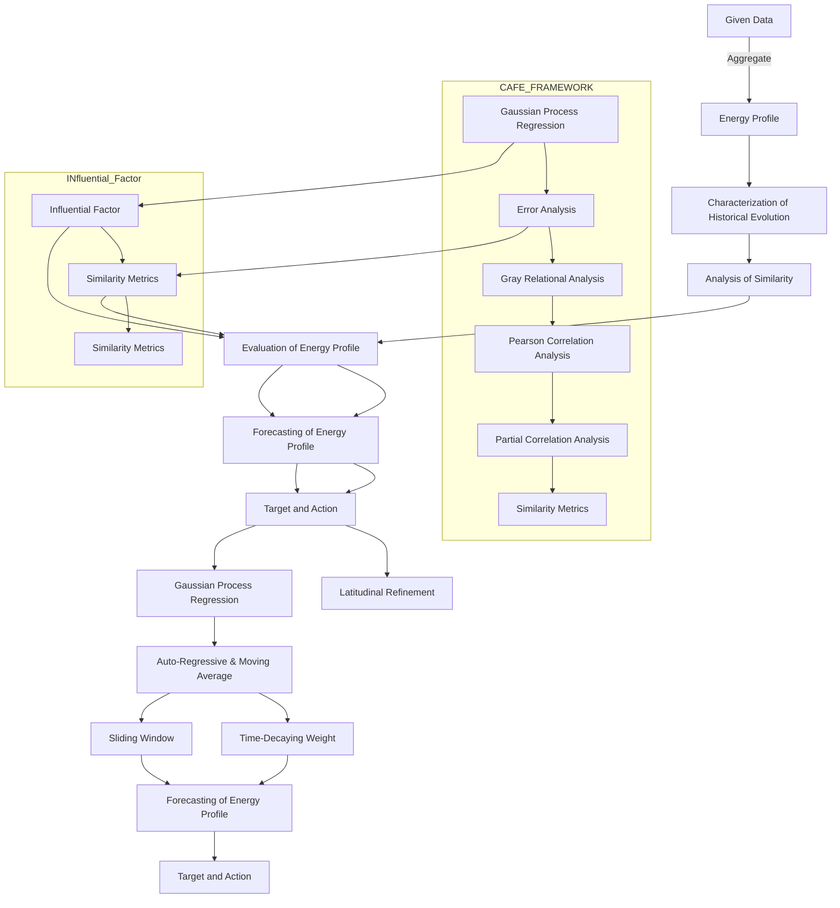
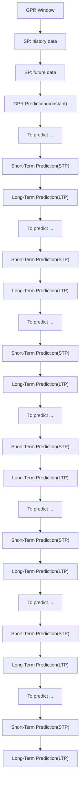

For office use only

T1

T2

T3

T4

Team Control Number

72969

Problem Chosen

C

For office use only

F1

F2

F3

F4

## 2018

## Mathematical Contest in Modeling (MCM/ICM) Summary Sheet

# CAFE: Characterization, Analysis, Forecasting, and Evaluation of Energy Profile

## Summary

As sustainability comes in the spotlight, renewable energy receives extensive study. One fresh idea to it in U.S. is the Interstate Energy Compact, aiming at promoting collaboration for energy use among states. In this paper, we formulate concrete objectives and actions on the use of renewable energy for such a compact among California (CA), Arizona (AZ), New Mexico (NM) and Texas (TX).

We first build CAFE, a novel framework for Characterization, Analysis, Forecast and Evaluation on the energy profile (EP) of a state. We constitute EP with 20 items in a multifaceted manner selected and aggregated from the 605 variables in the provided data. We utilize the Gaussian Process Regression (GPR) model to characterize the basic evolving trends, strong fluctuations and random noise level of different EP time series in each state from 1960 to 2009. We combine Gray Relational Analysis and Kendall Rank to measure the similarity of EPs among states in value and tendency respectively, and use both Pearson Correlation Coefficient and Partial Relational Coefficient to unveil outer influential factors on the similarity. We consider 7 criteria concerning renewable energy, endow them with different importance by the Entropy Weight Method, integrate them into an ultimate score based on TOPSIS method, and finally judge CA having the ‘best’ profile. We pioneeringly formulate an ARMA-GPR Hybrid model for EP prediction of 2025 and 2050, which adaptively suits itself to short-term and long-term prediction. We further propose a sliding window mechanism and a ‘Look-Ahead’ refinement approach incorporating more information in prediction.

We then determine goals and approaches for renewable energy usage in 2025 and 2050. We discover the predominance of renewable energy consumption (RC) in its usage, and thus model the goal setting problem as a multi-objective optimization over RC. Results show that RC targets for 2025/2050 are respectively CA: 988787/1227217, AZ: 148028/175154, NM: 30120/36359, TX: 283871/371206 (billion Btu). We further propose three actions to stimulate RC in AZ, NM, and TX, and show that CA can export more renewable energy to help the other three states in enhancing RC.

We finally conduct sensitivity analysis, dissect pros and cons of our model and present a memo of our work to the state governors.

Keywords: CAFE; Energy Profile; Correlation Analysis; ARMA-GPR Model; Multi-Objective

## Contents

1 Introduction 1  
2 Assumptions 2  
3 Abbreviation and Definitions 3  
4 CAFE: Characterization, Analysis, Forecasting, and Evaluation ofEnergy Profile 3

4.1 Energy Profile Formulation 3  
4.2 Energy Profile Characterization and Analysis . 5

4.2.1 GPR model: Evolution of Energy Profile . . 5  
4.2.2 Similarity Analysis of Energy Profile . . 8

4.3 Influential Factors of Similarities.. . 10  
4.4 Energy Profile Evaluation. 11  
4.5 Energy Profile Prediction... 12

5 Targets and Actions for Interstate Energy Compact 14

5.1 Targets: Total Renewable ConsumptionBased Optimization. ..15  
5.2 Actions: Motivating Renewable Energy Use in NM, TX, and AZ.. ..17

6 Sensitivity Analysis 19  
7 Strengths and Weaknesses 20

7.1 Strengths.. . 20  
7.2 Weaknesses... . 20

8 Conclusion 20

## 1 Introduction

With the mounting heterogeneity of energy infrastructures and demands in different regions, centralized regulation of energy can no longer meet the needs for economic development in every state in U.S. To confront this, two well-known interstate compacts: Western Interstate Energy Compact (1970) and South States Energy Compacts (1978), were proposed to make for state economic enhancement in a decentralized and cooperative manner[1].

In 21st century, as sustainability becomes under great concern, the same issue of decentralization falls upon the renewable energy management. Currently, the state governors of California, Arizona, New Mexico, and Texas are planning to formulate a renewable energy interstate compact. Specifically, they need

an energy profile1 for states to characterize and evaluate their renewable energy use,       • and make predictions for it in 2025 and 2050;  
a list of goals written in the compact for renewable energy usage in 2025 and 2050, and         • at least three actions to achieve these goals.

A slew of prior arts have shed light on the energy prediction: Cammarano et. al [3] proposed Pro-Energy, a prediction model of future available energy for wireless sensor networks, Virote and Neves-Sirva [4] built an energy consumption model based on stochastic Markov models to forecast energy saving. However, above works zoomed in on prediction within days, far less than intervals of years as the compact requires. Moreover, no prior works have ever raised any quantified goal or action for renewable energy in an interstate energy compact.

In this work, we propose a novel framework, named CAFE (Characterization, Analysis, Forecasting, and Evaluation of Energy Profile), to fill in the gap above. The framework of CAFE is shown in Figure 1.


<details>
<summary>flowchart</summary>


</details>

Figure 1: Framework of CAFE (Characterization, Analysis, Forecasting, and Evaluation of Energy Profile)

CAFE framework in Fig. 1 can be summarized as the following steps:

Characterization: We create an energy profile for each state as an integration of 20 typical items, and build Gaussian Process Regression (GPR) model to show the evolution of energy profile.  
Analysis: utilize Correlation Analysis to identify the similarities of energy profile among states with the potential causes including geography, climate, industry, etc.  
Evaluation: We apply Technique for Order of Preference by Similarity to Ideal Solution• (TOPSIS) method to form an integrated criterion based on seven refined criteria.  
Forecast: We novelly propose an ARMA-GPR model which adaptively suits well in both short-term and long-term energy profile prediction. This model not only integrates GPR and ARMA by allocating a time-decaying weight, but also incorporates the similarity among states.  
Targets and Actions: We utilize multi-objective programming to determine quantified• targets for renewable energy consumption in four states in 2025 and 2050, and provide actions stimulating the renewable energy use in AZ, NM, and TX based on our prediction.

## 2 Assumptions

First and foremost, we make some basic assumptions and explain their rationales.

Assumption 1. Each state attaches great importance to renewable energy usage and sets a shared goal to enhance the management and development of renewable energy.

This assumption is the premise of our work since only when each state endeavors to increase the usage of renewable energy, our proposed targets and actions will make sense.

Assumption 2. There will be no great technology revolution bringing revolutionary alternative renewable energy.

There is no sign for the emergence of some new and revolutionary alternative energy up to now, so this assumption can help to eliminate the effects of the small probability event.

Assumption 3. No destructive catastrophe (such as great earthquake) and no human-made disasters (such as war) will happen by 2050.

These kinds of disasters happened rarely in the history record, so we neglect their effects in our model.

Assumption 4. The provided data is realistic and accurate to a certain degree.

Despite the incompleteness of the data and some tolerant error in statistics, we make this assumption to guarantee one valid solution.

Table 1: Abbreviation of Relevant Terms

<table><tr><td>Abbreviation</td><td>Full Name</td></tr><tr><td>RC</td><td>Renewable Consumption</td></tr><tr><td>UC</td><td>Unrenewable Consumption</td></tr><tr><td>RP</td><td>Renewable Production</td></tr><tr><td>UP</td><td>Unrenewable Production</td></tr><tr><td>RI</td><td>Renewable Import</td></tr><tr><td>RE</td><td>Renewable Export</td></tr><tr><td>RED</td><td>Renewable Expenditure</td></tr><tr><td>UED</td><td>Unrenewable Expenditure</td></tr><tr><td>CPC</td><td>Consumption Per Capita</td></tr><tr><td>EPC</td><td>Expenditure Per Capita</td></tr><tr><td>RPES</td><td>Renewable Production Entropy by Source</td></tr><tr><td>UPES</td><td>Unrenewable Production Entropy by Source</td></tr><tr><td>RCES</td><td>Renewable Consumption Entropy by Source</td></tr><tr><td>UCES</td><td>Unrenewable Production Entropy by Source</td></tr><tr><td>SRP</td><td>Share of Renewable Production</td></tr><tr><td>SRC</td><td>Share of Renewable Consumption</td></tr><tr><td>RCPR</td><td>Renewable Consumption-Production Ratio</td></tr><tr><td>TCPR</td><td>Total Consumption-Production Ratio</td></tr><tr><td>RCEES</td><td>Renewable Consumption Entropy by End-use Sector</td></tr><tr><td>UCEES</td><td>Unrenewable Consumption Entropy by End-useSector</td></tr></table>

## 3 Abbreviation and Definitions

For compactness, we define a series of abbreviations for some notions concerning energy profile in Table 1.

## 4 CAFE: Characterization, Analysis, Forecasting, and Evaluation of Energy Profile

In this section, we firstly create the energy profile based on provided data. Then we propose a novel model: CAFE, to comprehensively characterize, analyze, forecast, and evaluate the energy profiles of CA, AZ, NM, and TX, based on the provided data set comprised of 605 variables from 1960 to 2009 [5].

## 4.1 Energy Profile Formulation

First of all, we formulate an energy profile for each state. The energy profile should present a panoramic view of energy use. We macroscopically divide energy into renewable (electricity, ethanol fuel, nuclear fuel, wood etc.) and unrenewable (oil/gasoline/petroleum, coal, natural gas) ones. We extract items reflecting the global information about different

aspects of energy in a state, mainly in terms of import, export, production, consumption, and expenditure. Specifically, we select the following items which possess the global property: RC, UC, RP,UP,RI, RE, RED, UED, CPC, EPC.

```mermaid
graph TD
  A["Unrenewable"] --> B["Unrenewable Production"]
  A --> C["Unrenewable Production Entropy (Source)"]
  D["Renewable"] --> E["Renewable Import"]
  D --> F["Renewable Production"]
  D --> G["Renewable Production Entropy (Source)"]
  D --> H["Share of Renewable Production"]
  I["Use"] --> J["Renewable Export"]
  I --> K["Renewable Consumption"]
  I --> L["Renewable Expenditure"]
  I --> M["Renewable Consumption Entropy (Source)"]
  I --> N["Renewable Consumption Entropy (End-Use Sector)"]
  I --> O["Share of Renewable Consumption"]
  P["Consumption per Capita"] --> Q["Expenditure per Capita"]
  R["Energy Profile"] --> S["Energy Profile"]
  T["Supply"] --> U["Energy Profile"]
  V["Ratio"] --> W["Energy Profile"]
  X["Entropy"] --> Y["Energy Profile"]
  Z["Volume"] --> AA["Energy Profile"]
  AB["Volume per Capita"] --> AC["Energy Profile"]
  AD["Renewable Production/Renewable Consumption"] --> AE["Renewable Supply Usage"]
  AF["Total Production / Total Consumption"] --> AG["Renewable Unrenewable Supply Usage"]
```


<details>
<summary>flowchart</summary>


</details>

Figure 2: The Energy Profile of a State

To explore the underneath information within these items, we make some aggregations to form new items listed in Table 2. Inside, RPES/UPES/RCES/UCES (RPES as an epitome) characterizes energy usage distribution over different kinds of sources while RCEES/UCEES (RCEES as an epitome) shows that over different sectors, serving as a supplement to items with totality property; SRP/SRC represents the popularity of renewable energy use; RCPR/ TCPR evinces the balance of energy use in a state. All these aggregated items enrich our consideration in energy profile characterization.

Table 2: Aggregated Items in Energy Profile

<table><tr><td>Item</td><td>Definition</td></tr><tr><td colspan="2"> $\sum_{j p_j \log(1/p_j)^3}$ </td></tr><tr><td>RPES/RCEES</td><td></td></tr><tr><td>SRP</td><td>RP/(RP+UP)</td></tr><tr><td>SRC</td><td>RC/(RC+UC)</td></tr><tr><td>RCPR</td><td>RC/RP</td></tr><tr><td>TCPR</td><td>(RC+UC)/(RP+UP)</td></tr></table>

Then combining the aggregated items with selected original items, we propose a taxonomy of items in energy profile as Figure 2, to help readers understand the relationship among extracted items. In Figure 2, we group these items into four sub-classes based on whether the energy is renewable and supply or usage of the energy. Moreover, these items can be classified into four categories with different physical dimensions: entropy, volume, ratio, and volume per capita. Items concerning volume show the concrete values of different energy aspects, while those in the relative dimension present the relationship between different aspects of energy. By this classification, we clarify the relationship of items in energy profile in a logical and hierarchical way.

## 4.2 Energy Profile Characterization and Analysis

## 4.2.1 GPR model: Evolution of Energy Profile

To help us understand the evolving pattern of the energy profile, we probe into a generative model to characterize the historical evolution. We first make an observation on the given data to form an intuitive understanding of the longitudinal data. We select four typical time series among extracted items, which present different shapes and trends, asshown in Fig. 3. Specifically, renewable expenditure of Arizona (Fig. 3(a)) generally presents an ascending trend with tiny fluctuations; renewable export of Arizona (Fig. 3(b)) has a sudden increase while renewable consumption entropy by source (Fig. 3(c)) appears to fluctuate near a certain value.

Based on the observations, we summarize the following challenges in characterization of these time series:

• The fitting model should characterize the basic evolving trend of time series;  
• The strong fluctuations of item values requires a model to capture the instability;  
• The model should accommodate the random noise existing in time series.

In view of these challenges, we adopt the Gaussian Process Regression (GPR), an nonparametric probabilistic model, to fit the time series. The model of GPR can be generalized as follows. Assume that noisy data

$$
y (x) = f (x) + s (x) \tag {1}
$$


<details>
<summary>line chart</summary>

| Time | Renewable Expenditure |
| ---- | --------------------- |
| 1960 | 0                     |
| 1961 | 0                     |
| 1962 | 0                     |
| 1963 | 0                     |
| 1964 | 0                     |
| 1965 | 0                     |
| 1966 | 0                     |
| 1967 | 0                     |
| 1968 | 0                     |
| 1969 | 0                     |
| 1970 | 200                   |
| 1971 | 400                   |
| 1972 | 600                   |
| 1973 | 800                   |
| 1974 | 1000                  |
| 1975 | 1200                  |
| 1976 | 1400                  |
| 1977 | 1600                  |
| 1978 | 1800                  |
| 1979 | 2000                  |
| 1980 | 2200                  |
| 1981 | 2400                  |
| 1982 | 2600                  |
| 1983 | 2800                  |
| 1984 | 3000                  |
| 1985 | 3200                  |
| 1986 | 3400                  |
| 1987 | 3600                  |
| 1988 | 3800                  |
| 1989 | 4000                  |
| 1990 | 4200                  |
| 1991 | 4400                  |
| 1992 | 4600                  |
| 1993 | 4800                  |
| 1994 | 5000                  |
| 1995 | 5200                  |
| 1996 | 5400                  |
| 1997 | 5600                  |
| 1998 | 5800                  |
| 1999 | 6000                  |
| 2000 | 6200                  |
| 2001 | 6400                  |
| 2002 | 6600                  |
| 2003 | 6800                  |
| 2004 | 7000                  |
| 2005 | 7200                  |
| 2006 | 7400                  |
| 2007 | 7600                  |
| 2008 | 7800                  |
| 2009 | 8000                  |
</details>

(a) RED of Arizona.


<details>
<summary>scatterplot</summary>

| Time | Renewable Export |
|---|---|
| 1960 | 50 |
| 1961 | 70 |
| 1962 | 80 |
| 1963 | 90 |
| 1964 | 100 |
| 1965 | 110 |
| 1966 | 120 |
| 1967 | 130 |
| 1968 | 140 |
| 1969 | 150 |
| 1970 | 200 |
| 1971 | 450 |
| 1972 | 300 |
| 1973 | 100 |
| 1974 | 120 |
| 1975 | 130 |
| 1976 | 140 |
| 1977 | 150 |
| 1978 | 160 |
| 1979 | 30 |
| 1980 | 20 |
| 1981 | 10 |
| 1982 | 5 |
| 1983 | 5 |
| 1984 | 5 |
| 1985 | 5 |
| 1986 | 5 |
| 1987 | 5 |
| 1988 | 5 |
| 1989 | 5 |
| 1990 | 5 |
| 1991 | 5 |
| 1992 | 5 |
| 1993 | 5 |
| 1994 | 5 |
| 1995 | 5 |
| 1996 | 5 |
| 1997 | 5 |
| 1998 | 5 |
| 1999 | 5 |
| 2000 | 5 |
| 2001 | 200 |
| 2002 | 220 |
| 2003 | 300 |
| 2004 | 600 |
| 2005 | 750 |
| 2006 | 1050 |
| 2007 | 1200 |
| 2008 | 1250 |
| 2009 | 1250 |
| 2010 | 1250 |
</details>

(b) RE of Arizona.


<details>
<summary>scatter plot</summary>

| Time | Renewable Consumption Entropy by Source |
| ---- | --------------------------------------- |
| 1960 | 0.65                                    |
| 1961 | 0.60                                    |
| 1962 | 0.55                                    |
| 1963 | 0.50                                    |
| 1964 | 0.48                                    |
| 1965 | 0.45                                    |
| 1966 | 0.42                                    |
| 1967 | 0.40                                    |
| 1968 | 0.38                                    |
| 1969 | 0.36                                    |
| 1970 | 0.35                                    |
| 1971 | 0.36                                    |
| 1972 | 0.37                                    |
| 1973 | 0.38                                    |
| 1974 | 0.39                                    |
| 1975 | 0.40                                    |
| 1976 | 0.41                                    |
| 1977 | 0.42                                    |
| 1978 | 0.43                                    |
| 1979 | 0.44                                    |
| 1980 | 0.45                                    |
| 1981 | 0.46                                    |
| 1982 | 0.47                                    |
| 1983 | 0.48                                    |
| 1984 | 0.49                                    |
| 1985 | 0.50                                    |
| 1986 | 0.51                                    |
| 1987 | 0.52                                    |
| 1988 | 0.53                                    |
| 1989 | 0.54                                    |
| 1990 | 0.55                                    |
| 1991 | 0.56                                    |
| 1992 | 0.57                                    |
| 1993 | 0.58                                    |
| 1994 | 0.59                                    |
| 1995 | 0.60                                    |
| 1996 | 0.61                                    |
| 1997 | 0.62                                    |
| 1998 | 0.63                                    |
| 1999 | 0.64                                    |
| 2000 | 0.65                                    |
| 2001 | 0.66                                    |
| 2002 | 0.67                                    |
| 2003 | 0.68                                    |
| 2004 | 0.69                                    |
| 2005 | 0.70                                    |
| 2006 | 0.71                                    |
| 2007 | 0.72                                    |
| 2008 | 0.73                                    |
| 2009 | 0.74                                    |
| 2010 | 0.75                                    |
</details>

(c) RCES of Arizona.  
Figure 3: Three typical time series of longitudinal energy profile data.

where $f ( x )$ is the ground-truth value and $\boldsymbol { \epsilon } ( x ) \sim \mathbf { N } ( 0 , \sigma ^ { 2 } )$ is the temporally irrelevant random noise. GPR model assumes $f ( x )$ to satisfy the Gaussian process, i.e.,

$$
f (x) \sim G P (\mu_ {x}, K _ {f}), \tag {2}
$$

where $\mu _ { x }$ is the mean value and $K _ { f }$ is the covariance matrix called kernel. A natural selection for $K _ { f } = ( k _ { f } ( x _ { i } , x _ { j } ) ) _ { n \times n }$ is the Gaussian function:

$$
k _ {f} (x _ {i}, x _ {j}) = c _ {0} \exp \left(- \frac {(x _ {i} - x _ {j}) ^ {2}}{2 \sigma_ {0} ^ {2}}\right), \tag {3}
$$

where $c _ { 0 }$ is a constant and $\sigma _ { 0 }$ represents the decaying rate of auto-correlation.

Consider a time series $\{ y ( x ) \in \mathbf { R } \}$ where $x$ denotes a time point and $y$ is the value at $x .$ Suppose that $\mathbf { y } \in \mathbf { R } ^ { n \times 1 }$ constitutes the n observed time series value, then $\mathbf { y } \sim G P ( \mu , K )$ ) Here $\mu$ is the mean value vector and

$$
K = \left(k (x _ {i}, x _ {j})\right) _ {n \times n} = K _ {f} + \sigma^ {2} I, \tag {4}
$$

where $\sigma$ reflects the noise level. For a new value $x ^ { * }$ , predict its corresponding $y ^ { * }$ .We can easily find that

$$
\left[ \begin{array}{l} \mathbf {y} \\ y ^ {*} \end{array} \right] \sim N \left(\left[ \begin{array}{l} \mu \\ \mu^ {*} \end{array} \right], \left[ \begin{array}{c c} K _ {0} & K _ {1} ^ {T} \\ K _ {1} & K _ {2} \end{array} \right]\right), \tag {5}
$$

where $K _ { 0 } = K , K _ { 1 } = [ k ( x ^ { * } , x _ { 1 } ) , k ( x ^ { * } , x _ { 2 } ) , \cdots , k ( x ^ { * } , x _ { n } ) ]$ and $K _ { 2 } = k ( x ^ { * } , x ^ { * } )$ Therefore we can obtain the conditional distribution of $y ^ { * }$ over $\mathbf { y } ,$

$$
y ^ {*} | \mathbf {y} \sim N (K _ {1} K _ {0} ^ {- 1} \mathbf {y}, K _ {2} - K _ {1} K _ {0} ^ {- 1} K _ {1} ^ {T}). \tag {6}
$$

Hence our predicted $y ^ { * }$ satifies $y ^ { * } \sim \mathbf { N } ( \mu _ { * } , \sigma _ { * } ^ { 2 } )$ where,

$$
\mu_ {*} = K _ {1} K _ {0} ^ {- 1} \mathbf {y}, \quad \sigma_ {*} ^ {2} = K _ {2} - K _ {1} K _ {0} ^ {- 1} K _ {1} ^ {T} + \sigma . \tag {7}
$$

## Justification of GPR model:

• $\beta = \| K _ { 0 } ^ { - 1 } \| _ { \infty }$ reflects the basic evolving trend of time series.  
. $\begin{array} { r } { \alpha = \frac { 1 } { n } \sum \sigma _ { * } ^ { 2 } } \end{array}$ quantitatively characterizes the fluctuation of the time series.  
. $\sigma ^ { 2 }$ captures the random noise level.

GPR model makes a probabilistic prediction of outputs with confidence intervals in consideration of the stochastic errors. Furthermore, GPR renders higher correlation for temporally closer values, coinciding with the fact that closer information is of greater significance in prediction of energy profile.

By adopting GPR, we fit the time series in Figure 3 as Figure 4.

Since GPR does not output a deterministic value, we additionally show the 95%-confident intervals of each output. The gap surrounded by the upper and lower confident lines is called confidence interval. As we can see, for RED of Arizona with a consistent increasing trend, the confident interval is fairly small, showing the high stability and predicting reliability of its evolution. By contrast, for RCES of Arizona with the greatest fluctuation, the confident interval is large, which indicates that the evolution of renewable expenditure is of great randomness, low predictability, and high sensitivity to outer influential factors.


<details>
<summary>line chart</summary>

| Time | Renewable Expenditure |
| ---- | --------------------- |
| 1960 | 0                     |
| 1970 | 500                   |
| 1980 | 2000                  |
| 1990 | 3500                  |
| 2000 | 5000                  |
| 2010 | 7500                  |
</details>

(a) RED of Arizona


<details>
<summary>line chart</summary>

| Time | Renewable Export |
|------|------------------|
| 1960 | -200             |
| 1970 | 400              |
| 1980 | 100              |
| 1990 | 0                |
| 2000 | 0                |
| 2010 | 1600             |
</details>

(b) RE of Arizona


<details>
<summary>line chart</summary>

| Time | Renewable Consumption Entropy by Source |
| ---- | --------------------------------------- |
| 1960 | 0.7                                     |
| 1970 | 0.4                                     |
| 1980 | 0.8                                     |
| 1990 | 0.6                                     |
| 2000 | 0.4                                     |
| 2010 | 0.8                                     |
</details>

(c)RCES of Arizona  
Figure 4: GPR curve of three typical time series

We further apply our model into the remaining energy profile time series and present the regression parameters of $\mathrm { A Z }$ in Table 3 and the corresponding regression curve in Fig. 5 (the placing order is the same as Table 3). As we can see, $\beta$ reflects the general trend of the evolution, α represents the temporal fluctuation of measurements while $\sigma ^ { 2 }$ shows thenoise error. Items (RC, UC, etc.) have α $\sigma ^ { 2 } ,$ , which means that fluctuation takes the predominant part while random noise can be neglected; For those where α is close to $\sigma ^ { 2 }$ (UCES, SRC, etc.), it is not reasonable to omit the impact of random noises.

Table 3: GPR regression results for energy profiles of Arizona (1960-2009) (The arrow directions represent the basic evolving trends while L and S is the abbreviation of large and small respectively)

<table><tr><td></td><td>RC</td><td>UC</td><td>RP</td><td>UP</td><td>RI</td><td>RE</td><td>RED</td><td>UED</td><td>CPC</td><td>EPC</td></tr><tr><td> $\beta$ </td><td>90679</td><td>782873</td><td>88454</td><td>298941</td><td>124</td><td>297</td><td>2657</td><td>3400</td><td>0.11</td><td>1328</td></tr><tr><td>Trend</td><td>↑</td><td>↑</td><td>↑</td><td>↑</td><td>↑</td><td>↑</td><td>↑</td><td>↑</td><td>→</td><td>↑</td></tr><tr><td> $\alpha$ </td><td>10164</td><td>1.89</td><td>10161</td><td>3.33</td><td>190</td><td>82</td><td>52</td><td>4.8</td><td>5205</td><td>98</td></tr><tr><td>Fluctuation</td><td>L</td><td>S</td><td>L</td><td>S</td><td>S</td><td>S</td><td>S</td><td>S</td><td>L</td><td>S</td></tr><tr><td> $\sigma^2$ </td><td>0.13</td><td>0.03</td><td>0.13</td><td>0.02</td><td>0.06</td><td>0.05</td><td>0.02</td><td>0.06</td><td>0.22</td><td>0.09</td></tr><tr><td>Noise</td><td>L</td><td>S</td><td>L</td><td>S</td><td>S</td><td>S</td><td>S</td><td>S</td><td>L</td><td>S</td></tr><tr><td>MAPE</td><td>0.05</td><td>0.02</td><td>0.05</td><td>0.63</td><td>0.23</td><td>0.35</td><td>0.17</td><td>0.08</td><td>0.01</td><td>0.02</td></tr><tr><td></td><td>RPES</td><td>UPES</td><td>RCES</td><td>UCES</td><td>RCEES</td><td>UCEES</td><td>SRP</td><td>SRC</td><td>RCPR</td><td>TCPR</td></tr><tr><td> $\beta$ </td><td>0.56</td><td>-0.23</td><td>0.56</td><td>2.40</td><td>-0.42</td><td>-0.70</td><td>-0.98</td><td>0.32</td><td>1.60</td><td>2.11</td></tr><tr><td>Trend</td><td>↑</td><td>↓</td><td>→</td><td>↑</td><td>↓</td><td>↓</td><td>↓</td><td>↑</td><td>↑</td><td>↓</td></tr><tr><td> $\alpha$ </td><td>2234</td><td>0.17</td><td>412</td><td>710</td><td>458</td><td>1290</td><td>0.01</td><td>0.04</td><td>231</td><td>980</td></tr><tr><td>Fluctuation</td><td>L</td><td>S</td><td>L</td><td>L</td><td>L</td><td>L</td><td>S</td><td>S</td><td>L</td><td>L</td></tr><tr><td> $\sigma^2$ </td><td>0.34</td><td>0.07</td><td>0.28</td><td>0.31</td><td>0.02</td><td>0.34</td><td>0.01</td><td>0.11</td><td>0.31</td><td>0.01</td></tr><tr><td>Noise</td><td>L</td><td>S</td><td>L</td><td>L</td><td>S</td><td>L</td><td>S</td><td>S</td><td>L</td><td>S</td></tr><tr><td>MAPE</td><td>0.02</td><td>0.25</td><td>0.04</td><td>0.01</td><td>0.07</td><td>0.05</td><td>0.01</td><td>0.08</td><td>0.01</td><td>0.01</td></tr></table>

Error Analysis: Table 3 also shows the Mean Absolute Percent Error (MAPE) between regression values and ground-truth values. The low MAPEs corroborate the regression precision of GPR model in fitting energy profile time series.

  
Figure 5: Evolution of Energy Profile for AZ (the placing order is the same as Table 3)

## 4.2.2 Similarity Analysis of Energy Profile

We take a step further to study the similarity of energy profile evolution among four states. Shown in Figure 4, the temporal fluctuation entangles accurate analysis of the relationship among four states over each item, due to the uncertain time-variation of each time series and our incomplete knowledge of other potential influential factors. For such an unclear situation, we adopt the Gray Relational Analysis (GRA) to unveil the relationship among energy profile in four states. GRA performs reliably under systems with information incompleteness and uncertainty, and with complicated multivariate interrelationships [6, 7], by pursuing an appropriate result acceptable in real cases instead of persisting in an optimum [8].

We conduct our GRA-based analysis as follows: For item e, suppose we consider the values of it for T years, then we can obtain the time series $y _ { i } = ( y _ { i } ( 1 ) , y _ { i } ( 2 ) , . . . , y _ { i } ( T ) )$ for state i. Then for two states i and $j ,$ we define $\xi _ { i j } ,$ which represents the relationship between comparability vector yi and reference vector $y _ { j } .$ Specifically,

$$
\xi_ {i j} = \frac {\underset {t \in \{1 , 2 , \dots , T \}} {\min} \underset {i \neq j} {\min} | y _ {i} (t) - y _ {j} (t) | + \underset {t \in \{1 , 2 , \dots , T \}} {\max} \underset {i \neq j} {\max} | y _ {i} (t) - y _ {j} (t) |}{| y _ {i} (t) - y _ {j} (t) | + \underset {t \in \{1 , 2 , \dots , T \}} {\max} \underset {i \neq j} {\max} | y _ {i} (t) - y _ {j} (t) |}. \tag {8}
$$

Then the gray relational coefficient (GRC) is

$$
\rho_ {i j} = \frac {\sum_ {k = 1} ^ {T} \xi_ {i j} (k)}{T}, \tag {9}
$$

which characterizes the correlation.

Nevertheless, conducting GRA only measures the similarity on totality property of each item, as shown in Eqn. (8), which cannot characterize the similarity on evolution tendency. In real cases, however, tendency similarity counts much as one can characterize the future trend of a profile more precisely. To tackle it, we harness the Kendall Rank Correlation Coefficient (KRCC) to model the tendency similarity. KRCC considers two random arrays $y _ { i } = ( y _ { i } ( 1 ) , y _ { i } ( 2 ) , . . . , y _ { i } ( T ) )$ and $y _ { j } = ( y _ { j } ( 1 ) , y _ { j } ( 2 ) , . . . , y _ { j } ( T ) )$ .For a pair of observations $( y _ { i } ( t _ { 1 } ) , y _ { j } ( t _ { 1 } ) )$ and $( y _ { i } ( t _ { 2 } ) , y _ { j } ( t _ { 2 } ) )$ (t1 = t2), if $( y _ { i } ( t _ { 1 } ) - y _ { i } ( t _ { 2 } ) ) ( y _ { j } ( t _ { 1 } ) - y _ { j } ( t _ { 2 } ) ) > 0$ we call the pair is concordant, while if $( y _ { i } ( t _ { 1 } ) - y _ { i } ( t _ { 2 } ) ) ( y _ { j } ( t _ { 1 } ) - y _ { j } ( t _ { 2 } ) ) < 0$ means discordant. KRCC is then defined as

$$
\tau (X, Y) = \frac {\{N _ {c} \} - \{N _ {d} \}}{T (T - 1) / 2}. \tag {10}
$$

$$
\xi_ {i j} = \frac {\underset {t \in \{1 , 2 , \dots , T \}} {\min} \underset {i \neq j} {\min} | y _ {i} (t) - y _ {j} (t) | + \underset {t \in \{1 , 2 , \dots , T \}} {\max} \underset {i \neq j} {\max} | y _ {i} (t) - y _ {j} (t) |}{| y _ {i} (t) - y _ {j} (t) | + \underset {t \in \{1 , 2 , \dots , T \}} {\max} \underset {i \neq j} {\max} | y _ {i} (t) - y _ {j} (t) |}. \tag {8}
$$

Then the gray relational coefficient (GRC) is

$$
\rho_ {i j} = \frac {\sum_ {k = 1} ^ {T} \xi_ {i j} (k)}{T}, \tag {9}
$$

which characterizes the correlation.

Nevertheless, conducting GRA only measures the similarity on totality property of each item, as shown in Eqn. (8), which cannot characterize the similarity on evolution tendency. In real cases, however, tendency similarity counts much as one can characterize the future trend of a profile more precisely. To tackle ${ \mathrm { i t } } ,$ we harness the Kendall Rank Correlation Coefficient (KRCC) to model the tendency similarity. KRCC considers two random arrays $y _ { i } = ( y _ { i } ( 1 ) , y _ { i } ( 2 ) , . . . , y _ { i } ( T ) )$ and $y _ { j } = ( y _ { j } ( 1 ) , y _ { j } ( 2 ) , . . . , y _ { j } ( T ) )$ . For a pair of observations $( y _ { i } ( t _ { 1 } ) , y _ { j } ( t _ { 1 } ) )$ and $( y _ { i } ( t _ { 2 } ) , y _ { j } ( t _ { 2 } ) )$ (t1 = t2), if $( y _ { i } ( t _ { 1 } ) - y _ { i } ( t _ { 2 } ) ) ( y _ { j } ( t _ { 1 } ) - y _ { j } ( t _ { 2 } ) ) > 0$ we call the pair is concordant, while if $( y _ { i } ( t _ { 1 } ) - y _ { i } ( t _ { 2 } ) ) ( y _ { j } ( t _ { 1 } ) - y _ { j } ( t _ { 2 } ) ) < 0$ means discordant. KRCC is then defined as

$$
\tau (X, Y) = \frac {\{N _ {c} \} - \{N _ {d} \}}{T (T - 1) / 2}. \tag {10}
$$

Then we can obtain the integrated KRCC denoted as $I K R C C _ { i j }$ in the same way.


<details>
<summary>heatmap</summary>

| | AZ | CA | NM | TX |
|---|---|---|---|---|
| AZ | 0.96 | 0.82 | 0.72 | 0.64 |
| CA | 0.88 | 0.92 | 0.72 | 0.72 |
| NM | 0.88 | 0.72 | 0.96 | 0.72 |
| TX | 0.88 | 0.72 | 0.72 | 0.96 |
</details>

(a)GRC


<details>
<summary>heatmap</summary>

| | AZ | CA | NM | TX |
|---|---|---|---|---|
| AZ | 0.75 | 0.25 | 0.00 | 0.25 |
| CA | 0.50 | 0.25 | 0.00 | 0.25 |
| NM | 0.75 | 0.25 | 0.50 | 0.25 |
| TX | 0.75 | 0.25 | 0.50 | 0.25 |
</details>

(b)KRCC  
Figure 6: Heat map for GRC and KRCC

## 4.3 Influential Factors of Similarities

To understand the profile similarities and differences much in depth, we then explore the impacts of other possible influential factors including geography, climate, industry and population. Note that geography and climate can be viewed as constants while industry and population are evolving temporally. Therefore, for a constant factor G we use Absolute Mean Error between two states i and $j ,$ denoted as

$$
\gamma_ {i j} ^ {G} = \frac {\left| G _ {i} - G _ {j} \right|}{\left| G _ {i} \right|}, \tag {13}
$$

to characterize the interstate similarity of factor G. For an evolving factor H we use the Pearson Correlation Coefficient (PCC) of it in two states i and j, whose definition is

$$
\rho_ {i j} ^ {H} = \frac {\sum_ {k} (H _ {k} ^ {i} - \bar {H} ^ {i}) (H _ {k} ^ {j} - \bar {H} ^ {j})}{\sqrt {\sum_ {l} (H _ {l} ^ {i} - \bar {H} ^ {i}) ^ {2} \sum_ {l} (H _ {l} ^ {j} - \bar {H} ^ {j}) ^ {2}}}, \tag {14}
$$

where $H _ { i }$ and $H _ { j }$ are the arrays of H.

To study the influential factors, our empirical intuition is: if two states with a similar factor (like geography) share the similar energy profile, then we treat this factor is related to the interstate similarity of energy profile. In Figure 7, we plot the factor similarity v.s. IGRC for $2 C _ { 4 } ^ { 2 } = 1 2$ state pairs. As we can see, the scattered points appear to have a consistent trend, which indicates that the factor similarity is related to IGRC.

Then we probe into the influential factors for IKRCC. We adopt Pearson Correlation Coefficient (PCC) and Partial Relational Coefficient (PRC) to study the correlation. The advantage of PRC over PCC is that PRC takes the interdependence among different influential factors into considerations and capture the correlation excluding the impact from otherfactors. Table 4 shows the PCC and PRC between influential factors and IKRCC: PCC shows that all of the potential criteria have a negative correlation within the two states involved.


<details>
<summary>scatterplot</summary>

| Area Similarity | IGRC  |
| --------------- | ----- |
| 0.26            | 0.75  |
| 0.27            | 0.77  |
| 0.28            | 0.76  |
| 0.29            | 0.79  |
| 0.30            | 0.72  |
| 0.31            | 0.71  |
| 0.32            | 0.67  |
| 0.33            | 0.69  |
| 0.34            | 0.66  |
| 0.35            | 0.65  |
| 0.36            | 0.64  |
| 0.37            | 0.65  |
| 0.38            | 0.66  |
| 0.39            | 0.67  |
| 0.40            | 0.68  |
| 0.41            | 0.69  |
</details>

(a) Area


<details>
<summary>scatterplot</summary>

| Temperature Similarity | IGRC  |
| ---------------------- | ----- |
| 0.30                   | 0.79  |
| 0.32                   | 0.76  |
| 0.35                   | 0.72  |
| 0.40                   | 0.73  |
| 0.45                   | 0.71  |
| 0.50                   | 0.68  |
| 0.55                   | 0.66  |
| 0.60                   | 0.65  |
</details>

(b)Temperature


<details>
<summary>scatterplot</summary>

| Population Similarity | IGRC  |
| --------------------- | ----- |
| 0.2                   | 0.79  |
| 0.3                   | 0.76  |
| 0.4                   | 0.78  |
| 0.5                   | 0.73  |
| 0.6                   | 0.72  |
| 0.7                   | 0.71  |
| 0.8                   | 0.68  |
| 0.9                   | 0.66  |
| 1.0                   | 0.65  |
</details>

(c)Population


<details>
<summary>scatterplot</summary>

| GDP Similarity | IGRC  |
| -------------- | ----- |
| 0.2            | 0.78  |
| 0.3            | 0.76  |
| 0.4            | 0.74  |
| 0.5            | 0.72  |
| 0.6            | 0.70  |
| 0.7            | 0.68  |
| 0.8            | 0.66  |
| 0.9            | 0.64  |
</details>

(d)GDP  
Figure 7: Factor Similarity v.s. IGRC

Table 4: Pearson Correlation Coefficient and Partial Relational Coefficient.

<table><tr><td></td><td>Area</td><td>Water Percentage</td><td>Altitude</td><td>Rainfall</td></tr><tr><td>PCC</td><td>-0.45</td><td>-0.26</td><td>-0.39</td><td>-0.44</td></tr><tr><td>PRC</td><td>-0.57</td><td>-0.14</td><td>0.27</td><td>0.34</td></tr><tr><td></td><td>Temperature</td><td>Population</td><td>GDP</td><td>GDP Per Capita</td></tr><tr><td>PCC</td><td>-0.61</td><td>-0.28</td><td>-0.21</td><td>-0.42</td></tr><tr><td>PRC</td><td>-0.71</td><td>-0.72</td><td>0.80</td><td>-0.37</td></tr></table>

## 4.4 Energy Profile Evaluation

Following the energy profile characterization, we will analyze which state turns out to have the best profile in terms of renewable energy usage. A good profile for renewable energy should be integratedly judged and ultimately indicate a positive tendency for its greater influence in society. In our work, we designate seven criteria based on different angles to measure how good a profile is in regards to renewable energy use, list in detail in Table 5. New criteria include: RCPC (Renewable Consumption Per Capita), IRRC (Increasing Rate of Renewable Consumption), and REGR (Renewable Expenditure-GDP Ratio). The proposed criteria synthetizes popularity, diversity, and economic potentials, ensuring higher social impact of renewable energy under a better energy profile for renewable energyuse.

Table 5: Criteria for Evaluating Energy Profile

<table><tr><td>Abbreviation</td><td>Significance towards RE</td><td>Entropy weight</td></tr><tr><td>RCES</td><td>Consumption Variety</td><td>0.183</td></tr><tr><td>RCEES</td><td>Consumption Variety</td><td>0.191</td></tr><tr><td>RCPR</td><td>Economic Balance</td><td>0.105</td></tr><tr><td>SRC</td><td>Consumption Proportion</td><td>0.120</td></tr><tr><td>RCPC</td><td>Individual Consumption</td><td>0.189</td></tr><tr><td>IRRC</td><td>Consumption Trend</td><td>0.107</td></tr><tr><td>REGR</td><td>Expenditure Proportion</td><td>0.101</td></tr></table>

Judging the best profile requires reasonably melting the above seven criteria into a synthetic one. Here we again adopt Entropy Weight Method to allocate weights to each criterion. In view of our objective to selecting the best profile, we utilize the TOPSIS2 method, whose core is to directly identify the best profile by minimizing the distance to the ‘virtual optimum’ where all criteria reach the optimum. To implement the method, we first normalize each criterion value to eliminate the problem of different scales. Use $Z _ { i j }$ to denote the value of the j-th criterion for state i and its corresponding normalized value $Z _ { i j } ^ { 0 }$ can be calculated

by

$$
Z _ {i j} ^ {0} = \frac {Z _ {i j} - \min _ {i} Z _ {i j}}{\max _ {i} Z _ {i j} - \min _ {i} Z _ {i j}}. \tag {15}
$$

Second, we calculate the distance to the "virtual optimum",

$$
D _ {i} ^ {+} = \sqrt {\sum_ {j = 1} ^ {7} W _ {j} \cdot (Z _ {i j} - Z _ {j} ^ {+}) ^ {2}}, \tag {16}
$$

$$
D _ {i} ^ {-} = \sqrt {\sum_ {j = 1} ^ {7} W _ {j} \cdot (Z _ {i j} - Z _ {j} ^ {-}) ^ {2}}, \tag {17}
$$

where $Z _ { j } ^ { + } , Z _ { j } ^ { - }$ stand for the best and worst value of the j-th criterion among four states; $W _ { j }$ is the entropy weight for the j-th criterion. Finally, we can derive the evaluation score for state $^ { i , }$

$$
\operatorname{Score} (i) = \frac {D _ {i} ^ {-}}{D _ {i} ^ {+} + D _ {i} ^ {-}}, \tag {18}
$$

The evaluation results are presented in Table 6, whose first seven columns are the normalized criteria, and the last column is the score for each state. As we can see, CA ranks the first in our final criterion, with TX following behind, while AZ ranks the third and NM is at the bottom. This matches our sense that CA and TX are more developed, and they should ${ \bf g 0 }$ further in renewable energy use compared with less developed AZ and NM.

Table 6: Evaluation Results of Renewable Energy Usage for Four States

<table><tr><td></td><td>RCES</td><td>RCEES</td><td>RCPR</td><td>SRC</td><td>RCPC</td><td>IRRC</td><td>REGR</td><td>Score</td></tr><tr><td>AZ</td><td>0.16</td><td>0</td><td>0.95</td><td>0.69</td><td>0.16</td><td>0</td><td>1</td><td>0.434</td></tr><tr><td>CA</td><td>1</td><td>1</td><td>0.56</td><td>1</td><td>0</td><td>1</td><td>0</td><td>0.628</td></tr><tr><td>NM</td><td>0.32</td><td>0.21</td><td>0</td><td>0.38</td><td>0.29</td><td>0.52</td><td>0.64</td><td>0.417</td></tr><tr><td>TX</td><td>0</td><td>0.21</td><td>1</td><td>0</td><td>1</td><td>0.83</td><td>0.88</td><td>0.534</td></tr></table>

## 4.5 Energy Profile Prediction

We now make predictions on each energy profile of the four states. Following the GPR model in profile characterization (Section 4.1), we first make prediction by GPR, results of which are presented in Figure 8. We can observe that all items turn into a stable increase after 10 years. This is because in long-term perspective, the prediction should reflect the general trend, and become more ‘conservative’ especially in predicting possible fluctuations since uncertainty increases. Therefore, for those showing a general increasing trend, like RED and ${ \mathrm { R E } } ,$ the long-term prediction shows a stable uphill, while for those showing violent fluctuation like RCES, the prediction only turns a slight increase. This phenomenon echos our characterization of item value evolution (Section 4.1): the higher predictability the evolution is, the less conservative the long-term prediction will be.


<details>
<summary>line chart</summary>

| Time | Renewable Expenditure |
|------|------------------------|
| 1960 | 0                      |
| 1970 | ~2000                  |
| 1980 | ~4000                  |
| 1990 | ~5000                  |
| 2000 | ~6000                  |
| 2010 | ~8000                  |
| 2020 | ~7000                  |
| 2030 | ~9000                  |
| 2040 | ~11000                 |
| 2050 | ~13000                 |
</details>

(a) RED of Arizona.


<details>
<summary>line chart</summary>

| Time | Historical data | regression curve | predicted data |
|------|-----------------|------------------|----------------|
| 1960 | ~100            | ~100             | ~100           |
| 1970 | ~300            | ~300             | ~300           |
| 1980 | ~200            | ~200             | ~200           |
| 1990 | ~100            | ~100             | ~100           |
| 2000 | ~500            | ~500             | ~500           |
| 2010 | ~1500           | ~1500            | ~1500          |
| 2020 | ~1200           | ~1200            | ~1200          |
| 2030 | ~800            | ~800             | ~800           |
| 2040 | ~1000           | ~1000            | ~1000          |
| 2050 | ~1500           | ~1500            | ~1500          |
</details>

(b) RE of Arizona.


<details>
<summary>line chart</summary>

| Time | Renewable Consumption Entropy by Source |
|------|----------------------------------------|
| 1960 | 0.7                                    |
| 1970 | 0.4                                    |
| 1980 | 0.8                                    |
| 1990 | 0.6                                    |
| 2000 | 0.4                                    |
| 2010 | 0.8                                    |
| 2020 | 0.6                                    |
| 2030 | 0.7                                    |
| 2040 | 0.7                                    |
| 2050 | 0.7                                    |
</details>

(c) RCES of Arizona.  
Figure 8: GPR-Based Energy Profile Prediction of Arizona.

However, although GPR presents a global prediction, it fails to focus on the local information, thus making unreasonable short-term prediction. For example, for RE of Arizona (Figure 8(b)), we can discover that within a short period after 2009, there is a counterintuitive decrease opposite to the sharp increase within several years before 2009. This is because GPR synthesizes all the historical data, and thus drags down the sudden increase after 2009.

To refine the short-term prediction, a local prediction model should be taken. Wedesign two novel techniques to refine our model.

## Technique 1: Sliding Window Mechanism

The Autoregressive Moving Average Model (ARMA) model is an autoregressive predicting method with priority in short-term prediction [9]. Its general representation is ARMA(p,q) as follows:

$$
y (t) = c + \epsilon (t) + \sum_ {i = 1} ^ {p} \phi_ {i} y (t - i) + \sum_ {i = 1} ^ {q} \theta_ {i} \epsilon (t - i), \tag {19}
$$

where s(t) is the white noise at time t, while φi and $\theta _ { i }$ are both weights. The sliding window


<details>
<summary>flowchart</summary>


</details>

Figure 9: ARMA-GPR Hybrid Model in short-term and long-term prediction

mechanism, which restricts our consideration within a small temporal range near the current 精品数模资料， 各类比赛优秀论文、学习教程、写作模板与经验技巧、matlab程序代码资料等，尽在淘宝店铺：闵大荒工科男的杂货铺 time, keeps away from the ‘outmoded’ data of less contribution and even bringing harmful offset in short-term prediction. Specifically, we set the current time t and only consider time interval [t k + 1, t], where k t. An intuitive example is illustrated in Figure 9. Moreover, as we target at following the trend around current time in short-term prediction with higher accuracy, we need to precisely characterize how much the item value changes, that is to apply ARMA model on the increments of item values, i.e.,

$$
\Delta y (t) = c + \epsilon (t) + \sum_ {i = 1} ^ {p} \phi_ {i} \Delta y (t - i) + \sum_ {i = 1} ^ {q} \theta_ {i} \epsilon (t - i). \tag {20}
$$

## Technique 2: 'Look Aside' Latitudinal Refinement

As the existing similarities of profiles among four states, discussed in Section 4.2, it is inadequate to solely take longitudinal study on the profile evolution of a single state. Instead, latitudinal perspectives should be embedded, i.e., taking the correlation of profiles among states into the prediction of a specific state. The intuitive illustration is shown in Figure 9. To quantify the integration of interstate correlation, we add a weight δ to the predictions by ARMA in other states, specifically,

$$
\Delta \tilde {y} _ {i} (t) = b \Delta y _ {i} (t) + (1 - b) \sum_ {j \neq i} \Delta y _ {j} (t). \tag {21}
$$

After obtaining the integrated increment $\Delta \tilde { y } _ { i } ( t )$ , we predict the item value by

$$
y ^ {A} (t) = y (t - 1) + \Delta \tilde {y} _ {i} (t). \tag {22}
$$

## Incorporation of Techniques

We now combine the prediction by ARMA and GRP and form a novel hybrid model, which we call ARMA-GPR model. Note that from short-term to long-term prediction, the local factor counts less while global factor counts more. Hence, we render an exponentially decaying weight $\kappa ( t )$ to the local prediction. Concretely, the prediction at time t should be

$$
y ^ {*} (t) = \kappa (t) y ^ {A} (t) + (1 - \beta (t)) y ^ {G} (t), \tag {23}
$$

where $y ^ { G } ( t )$ denotes the prediction given by GPR and $\kappa ( t ) = \exp ( - a _ { 0 } ( t - t _ { 0 } ) ) \ ( c _ { 0 } > 0$ and in this problem $t _ { 0 } = 2 0 0 9 )$

We plot the prediction results of ARMA-GPR model in Fig. 10. Comparing with theprediction of GPR, the predicted value given by ARMA-GPR model appears to be ‘higher’ than GPR predicted value. This is because the time series before 2009 present a ascending trend, the sliding window of the ARMA model would capture this trend and ‘pull’ up the predicted value. With the time going by, the ARMA-GPR predicted value inclines to converge to the GPR predicted value, which results from the time-decaying weight.

## 5 Targets and Actions for Interstate Energy Compact

In this section, we put our CAFE model for energy profile into practical policies. Specif ically, we determine quantified goals for renewable energy use for 2025 and 2050, and propose specific measures for accomplishing such goals by the four states.


<details>
<summary>line chart</summary>

| Time | GPR 95% confidence intervals | ARMA-GPR 95% confidence intervals | GPR regression curve | ARMA-GPR predicted curve | GPR predicted data | ARMA-GPRpredicted data | historical data |
|------|------------------------------|------------------------------------|----------------------|--------------------------|--------------------|------------------------|-----------------|
| 1960 | ~0                           | ~0                                 | ~0                   | ~0                       | ~0                 | ~0                     | ~0              |
| 1970 | ~100                         | ~100                               | ~100                 | ~100                     | ~100               | ~100                   | ~100            |
| 1980 | ~300                         | ~300                               | ~300                 | ~300                     | ~300               | ~300                   | ~300            |
| 1990 | ~500                         | ~500                               | ~500                 | ~500                     | ~500               | ~500                   | ~500            |
| 2000 | ~700                         | ~700                               | ~700                 | ~700                     | ~700               | ~700                   | ~700            |
| 2010 | ~800                         | ~800                               | ~800                 | ~800                     | ~800               | ~800                   | ~800            |
| 2020 | ~750                         | ~750                               | ~750                 | ~750                     | ~750               | ~750                   | ~750            |
| 2030 | ~850                         | ~850                               | ~850                 | ~850                     | ~850               | ~850                   | ~850            |
| 2040 | ~1100                        | ~1100                              | ~1100                | ~1100                    | ~1100              | ~1100                  | ~1100           |
| 2050 | ~1350                        | ~1350                              | ~1350                | ~1350                    | ~1350              | ~1350                  | ~1350           |
| 2060 | ~1450                        | ~1450                              | ~1450                | ~1450                    | ~1450              | ~1450                  | ~1450           |
</details>

(a) RED of Arizona.


<details>
<summary>line chart</summary>

| Time | GPR 95% confidence intervals | ARMA-GPR 95% confidence intervals | GPR regression curve | ARMA-GPR predicted curve | GPR predicted data | ARMA-GPRpredicted data | historical data |
|------|------------------------------|-----------------------------------|----------------------|--------------------------|--------------------|------------------------|-----------------|
| 1960 | ~100                         | ~100                              | ~100                 | ~100                     | ~100               | ~100                   | ~100            |
| 1970 | ~200                         | ~200                              | ~200                 | ~200                     | ~200               | ~200                   | ~200            |
| 1980 | ~300                         | ~300                              | ~300                 | ~300                     | ~300               | ~300                   | ~300            |
| 1990 | ~400                         | ~400                              | ~400                 | ~400                     | ~400               | ~400                   | ~400            |
| 2000 | ~500                         | ~500                              | ~500                 | ~500                     | ~500               | ~500                   | ~500            |
| 2010 | ~1500                        | ~1500                             | ~1500                | ~1500                    | ~1500              | ~1500                  | ~1500           |
| 2020 | ~1600                        | ~1600                             | ~1600                | ~1600                    | ~1600              | ~1600                  | ~1600           |
| 2030 | ~1700                        | ~1700                             | ~1700                | ~1700                    | ~1700              | ~1700                  | ~1700           |
| 2040 | ~1800                        | ~1800                             | ~1800                | ~1800                    | ~1800              | ~1800                  | ~1800           |
| 2050 | ~1900                        | ~1900                             | ~1900                | ~1900                    | ~1900              | ~1900                  | ~1900           |
</details>

(b) RE of Arizona.


<details>
<summary>line chart</summary>

| Time | GPR 95% confidence intervals | ARMA-GPR 95% confidence intervals | GPR regression curve | ARMA-GPR predicted curve | GPR predicted data | ARMA-GPR-predicted data | historical data |
|------|------------------------------|-----------------------------------|----------------------|--------------------------|--------------------|-------------------------|----------------|
| 1960 | ~0.7                         | ~0.7                              | ~0.7                 | ~0.7                     | ~0.7               | ~0.7                    | ~0.7           |
| 1970 | ~0.4                         | ~0.4                              | ~0.4                 | ~0.4                     | ~0.4               | ~0.4                    | ~0.4           |
| 1980 | ~0.8                         | ~0.8                              | ~0.8                 | ~0.8                     | ~0.8               | ~0.8                    | ~0.8           |
| 1990 | ~0.6                         | ~0.6                              | ~0.6                 | ~0.6                     | ~0.6               | ~0.6                    | ~0.6           |
| 2000 | ~0.3                         | ~0.3                              | ~0.3                 | ~0.3                     | ~0.3               | ~0.3                    | ~0.3           |
| 2010 | ~0.8                         | ~0.8                              | ~0.8                 | ~0.8                     | ~0.8               | ~0.8                    | ~0.8           |
| 2020 | ~0.6                         | ~0.6                              | ~0.6                 | ~0.6                     | ~0.6               | ~0.6                    | ~0.6           |
| 2030 | ~0.7                         | ~0.7                              | ~0.7                 | ~0.7                     | ~0.7               | ~0.7                    | ~0.7           |
| 2040 | ~0.7                         | ~0.7                              | ~0.7                 | ~0.7                     | ~0.7               | ~0.7                    | ~0.7           |
| 2050 | ~0.7                         | ~0.7                              | ~0.7                 | ~0.7                     | ~0.7               | ~0.7                    | ~0.7           |
</details>

(c) RCES of Arizona.  
Figure 10: ARMA-GPR-Based Energy Profile Prediction of Arizona.

## 5.1 Targets: Total Renewable Consumption Based Optimization

Based on our observation on provided data, we identify that the renewable consumption (RC) accounts for a dominant proportion of total renewable energy use. The predominance of RC enlightens us to concentrate on consumption issues in drafting the targets while putting aside others like RP, RI, and RE.

Before we get down to setting targets for energy usage, we make some further assumptions based on the general ones in Section 2.

Assumption 5. The ultimate aim of the compact is to maximize the global benefits over states.

Assumption 6. The governors of each state incline to be ‘selfish’ and , that is to say, they are unwilling to sacrifice their own benefits in the consideration of the compact.

Based on Assumption 5, the goal of the compact should be maximizing total renewable consumption (TRP) among the states. However, solely considering the amount of consumption covers the renewable energy use partially, as analyzed in Section 4.3. Therefore, a more reasonable way to deciding goals should stem from our proposed criteria evaluating the energy profile (Section 4.3). Hence the target setting problem can be formulated as a multiobjective programming. To integrate the evaluation (i.e., objective function) of four states, we define Total Renewable Consumption Profile (TRCP) and

$$
T R C P = \sum_ {i = 1} ^ {4} b _ {i} \tilde {\text { Score }} _ {p} (i), \tag {24}
$$

where $S c o r e _ { p } ( i )$ is the evaluation score after implementation of compact.

When determining $b _ { i } ,$ we should notice the common sense that the interstate compact ought not to further expand the gap of renewable energy use among these states, causing more serious economic disparity. Therefore, an intuitive way is to offset the 'dominance of states with higher profile score in T RC P by setting proper $w _ { i } .$ Specifically we set ${ w _ { i } } =$ $1 / S c o r e ( i )$ , where Score(i) is the current profile score of state i. Note that the maximization of T RCP would only concern three criteria related to RC: SRC, RCPR, and REGR.

Moreover, there are two restrictions for the states during their chase for TRC maximization:

• RC Satisfaction: The compact should be satisfied by all four states, hence it should not cripple the consistent economic development of any state.  
• RC Limitation: The TRC should not exceed total renewable production (TRP) in every year within the four states.

For the first restriction, we suppose that the satisfactory lower bound of RC in each state for one year is the RC prediction given in Section 4.4. Mathematically, let RC prediction be $\tilde { R C } ,$ therefore $R C _ { i } \geq \tilde { R C } _ { i } , i = 1 , 2 , 3 , 4 ;$ For the second restriction, we need to ensure $\begin{array} { r } { \sum _ { i = 1 } ^ { 4 } R C _ { i } \leq \sum _ { i = 1 } ^ { 4 } R P _ { i } } \end{array}$ Combining our objecive and restrictions, we formulate the following basic TRCP maximization problem:

$$
\begin{array}{l} \max _ {R C _ {i}, i = 1, 2, 3, 4} T R C P = \sum_ {i = 1} ^ {4} \frac {\tilde {S c o r e} _ {p} (i)}{S c o r e (i)} \\ s. t. \left\{ \begin{array}{l l} R C _ {i} \geq \tilde {R C} _ {i} & (i = 1, 2, 3, 4), \\ \sum_ {i = 1} ^ {4} R C _ {i} \leq \sum_ {i = 1} ^ {4} R P _ {i}. \end{array} \right. \\ \end{array}
$$

Apparently, the problem is a linear programming, thus easy to solve. However, we observe that there are two limitations in the original TRCP maximization problem:

Inhomogenity: The distribution of RC among states is heavily skewed. Most of the RC enhancement is offered to the New Mexico, while the other three states only enjoy tiny increase. This extreme inhomogeneity inhibits the RC development in states other than NM, deviating from the mutuality of the compact.  
Infeasibility: It is possible that no feasible solution exists in maximizing TRCP due to           • the hard constraints on RC. For example when RP is smaller than our predicted $\tilde { R \mathrm { { C } } }$ then chances are that the feasible region is an empty set.

To this end, we modify the original optimization problem into the following renovated version,

$$
\max _ {R C _ {i}, i = 1, 2, 3, 4} T R C P ^ {\prime} = \sum_ {i = 1} ^ {4} \frac {S c o r e _ {p} (i)}{S c o r e _ {i}} - \lambda (\sum_ {i = 1} ^ {4} R C _ {i} - \sum_ {i = 1} ^ {4} R P _ {i}) ^ {2}
$$

$$
s. t. \quad R C _ {i} \geq d _ {i} \cdot \tilde {R C} _ {i} \quad (i = 1, 2, 3, 4),
$$

where λ is positive predefined parameters and $d _ { i } ( i = 1 , 2 , 3 , 4 )$ are the expected benefit of each state, which can be set by the governors.

Intuitively, there are two adjustments in the new optimization problem. The first is introducing an additive RC requirement i. It tightens the restriction of RC enhancement,thus ensuring an acceptable increment in each state, which dissolves the inhomogenity limitation. The second is converting the RC Limitation constraint into a penalized term in the objective function, where λ is the penalized factor. The penalized term restricts small discrepancy between TRC and TRP which meets the balance requirement in practice. Meanwhile, it relaxes the hard requirements that $R C \ \leq \ R P$ based on the incompleteness of the provided data, and the possible renewable energy transformation with states other than the four mentioned ones, which dissolves the infeasibility limitation.

Then we apply our model to setting of targets in 2025 and 2050. Table 7 shows the renewable consumption targets as well as improvement percentage compared with the predicted RC for 2025 and 2050. Here we consider $d _ { i } = 1 0 \%$ for 2025, $d _ { i } = 2 0 \%$ for 2050, i = 1, 2, 3, 4, and $\mathrm { s e t } = 0 . 0 1 5$ . We will further discuss the setting of in sensitivity analysis.

Table 7: Renewable Consumption Targets for 2025 and 2050 $( 1 0 ^ { 1 4 } \mathrm { B t u } )$

<table><tr><td>Year</td><td>AZ</td><td>CA</td><td>NM</td><td>TX</td></tr><tr><td>2025</td><td>1.63(24%)</td><td>10.90(10%)</td><td>0.54(81%)</td><td>3.12(10%)</td></tr><tr><td>2050</td><td>2.10(58%)</td><td>14.73(20%)</td><td>0.77(113%)</td><td>4.45(20%)</td></tr></table>

Then we study the effects of our proposed targets on energy profiles. Specifically, we compare the predicted values of RCPR, SRC, and RCPC with the proposed targets and those without targets. The results are shown in Figure 11. We notice that for all three items, the predicted values with targets all outstrip those without targets in both 2025 and 2050, showing the probable promotion brought about by the targets.


<details>
<summary>stacked bar chart</summary>

| Category | 2025 - Com | 2050 - Com |
| :--- | :--- | :--- |
| AZ | 1.1 | 1.3 |
| CA | 1.1 | 1.3 |
| NM | 2.0 | 2.3 |
| TX | 1.2 | 1.3 |
</details>

(a) RCPR


<details>
<summary>stacked bar chart</summary>

Predicted
| Region | 2025 - Predicted | 2050 - Predicted |
| :--- | :--- | :--- |
| AZ | 0.08 | 0.07 |
| CA | 0.10 | 0.11 |
| NM | 0.06 | 0.08 |
| TX | 0.02 | 0.02 |
</details>

(b) SRC


<details>
<summary>bar chart</summary>

| State | RCPC (bottom segment) | RCPC (middle segment) | RCPC (top segment) |
|-------|------------------------|------------------------|--------------------|
| AZ    | 0.018                  | 0.002                  | 0.025              |
| CA    | 0.024                  | 0.003                  | 0.035              |
| NM    | 0.014                  | 0.025                  | 0.035              |
| TX    | 0.010                  | 0.014                  | 0.016              |
</details>

(c) RCPC  
Figure 11: The Effects of Proposed Policies in Energy Profile Enhancement.

Moreover, we also calculate the evaluation criteria based on the RC targets and present the results in Fig. 12. As we can see, SRC, RCPR, and, REGR for four states achieve significant improvement under the RC targets.

## 5.2 Actions: Motivating Renewable Energy Use in NM, TX, and AZ

Principles for Actions: (i) Since our goals are predicated on the renewable energy con sumption (RC), the actions should first contribute to the achievement of RC requirements;


<details>
<summary>radar chart</summary>

| Category | Value |
| -------- | ----- |
| RCES     | 10    |
| RCEES    | 8     |
| RCP      | 9     |
| SRC      | 7     |
| RCPC     | 6     |
| IRRC     | 5     |
| REGR     | 7     |
</details>

(a) AZ


<details>
<summary>radar chart</summary>

| Category | Value |
| --- | --- |
| RCES | 100 |
| REGR | 95 |
| RCEES | 100 |
| REGR | 95 |
| RCP | 90 |
| IRRC | 100 |
| SRC | 95 |
| RCPC | 90 |
| SRC | 85 |
| SRC | 80 |
| SRC | 75 |
| SRC | 70 |
| SRC | 65 |
| SRC | 60 |
| SRC | 55 |
| SRC | 50 |
| SRC | 45 |
| SRC | 40 |
| SRC | 35 |
| SRC | 30 |
| SRC | 25 |
| SRC | 20 |
| SRC | 15 |
| SRC | 10 |
| SRC | 5 |
| SRC | 0 |
| ORC | 95 |
| ORC | 90 |
| ORC | 85 |
| ORC | 80 |
| ORC | 75 |
| ORC | 70 |
| ORC | 65 |
| ORC | 60 |
| ORC | 55 |
| ORC | 50 |
| ORC | 45 |
| ORC | 40 |
| ORC | 35 |
| ORC | 30 |
| ORC | 25 |
| ORC | 20 |
| ORC | 15 |
| ORC | 10 |
| ORC | 5 |
| ORC | 0 |
| ORC | -5 |
| ORC | -10 |
| ORC | -15 |
| ORC | -20 |
| ORC | -25 |
| ORC | -30 |
| ORC | -35 |
| ORC | -40 |
| ORC | -45 |
| ORC | -50 |
| ORC | -55 |
| ORC | -60 |
| ORC | -65 |
| ORC | -70 |
| ORC | -75 |
| ORC | -80 |
| ORC | -85 |
| ORC | -90 |
| ORC | -95 |
| ORC | -100 |
| ORC | -105 |
| ORC | -110 |
| ORC | -115 |
| ORC | -120 |
| ORC | -125 |
| ORC | -130 |
| ORC | -135 |
| ORC | -140 |
| ORC | -145 |
| ORC | -150 |
| ORC | -155 |
| ORC | -160 |
| ORC | -165 |
| ORC | -170 |
| ORC | -175 |
| ORC | -180 |
| ORC | -185 |
| ORC | -190 |
| ORC | -195 |
| ORC | -200 |
| ORC | -205 |
| ORC | -210 |
| ORC | -215 |
| ORC | -220 |
| ORC | -225 |
| ORC | -230 |
| ORC | -235 |
| ORC | -240 |
| ORC | -245 |
| ORC | -250 |
| ORC | -255 |
| ORC | -260 |
| ORC | -265 |
| ORC | -270 |
| ORC | -275 |
| ORC | -280 |
| ORC | -285 |
| ORC | -290 |
| ORC | -295 |
| ORC | -300 |
| ORC | -305 |
| ORC | -310 |
| ORC | -315 |
| ORC | -320 |
| ORC | -325 |
| ORC | -330 |
| ORC | -335 |
| ORC | -340 |
| ORC | -345 |
| ORC | -350 |
| ORC | -355 |
| ORC | -360 |
| ORC | -365 |
| ORC | -370 |
| ORC | -375 |
| ORC | -380 |
| ORC | -385 |
| ORC | -390 |
| ORC | -395 |
| ORC | -400 |
| ORC | -405 |
| ORC | -410 |
| ORC | -415 |
| ORC | -420 |
| ORC | -425 |
| ORC | -430 |
| ORC | -435 |
| ORC | -440 |
| ORC | -445 |
| ORC | -450 |
| ORC | -455 |
| ORC | -460 |
| ORC | -465 |
| ORC | -470 |
| ORC | -475 |
| ORC | -480 |
| ORC | -485 |
| ORC | -490 |
| ORC | -495 |
| ORC | -500 |
| ORC | -505 |
| ORC | -510 |
| ORC | -515 |
| ORC | -520 |
| ORC | -525 |
| ORC | -530 |
| ORC | -535 |
| ORC | -540 |
| ORC | -545 |
| ORC | -550 |
| ORC | -555 |
| ORC | -560 |
| ORC | -565 |
| ORC | -570 |
| ORC | -575 |
| ORC | -580 |
| ORC | -585 |
| ORC | -590 |
| ORC | -595 |
| ORC | -600 |
| ORC | -605 |
| ORC | -610 |
| ORC | -615 |
| ORC | -620 |
| ORC | -625 |
| ORC | -630 |
| ORC | -635 |
| ORC | -640 |
| ORC | -645 |
| ORC | -650 |
| ORC | -655 |
| ORC | -660 |
| ORC | -665 |
| ORC | -670 |
| ORC | -675 |
| ORC | -680 |
| ORC | -685 |
| ORC | -690 |
| ORC | -695 |
| ORC | -700 |
| ORC | -705 |
| ORC | -710 |
| ORC | -715 |
| ORC | -720 |
| ORC | -725 |
| ORC | -730 |
| ORC | -735 |
| ORC | -740 |
| ORC | -745 |
| ORC | -750 |
| ORC | -755 |
| ORC | -760 |
| ORC | -765 |
| ORC | -770 |
| ORC | -775 |
| ORC | -780 |
| ORC | -785 |
| ORC | -790 |
| ORC | -795 |
| ORC | -800 |
| ORC | -805 |
| ORC | -810 |
| ORC | -815 |
| ORC | -820 |
| ORC | -825 |
| ORC | -830 |
| ORC | -835 |
| ORC | -840 |
| ORC | -845 |
| ORC | -850 |
| ORC | -855 |
| ORC | -860 |
| ORC | -865 |
| ORC | -870 |
| ORC | -875 |
| ORC | -880 |
| ORC | -885 |
| ORC | -890 |
| ORC | -895 |
| ORC | -900 |
| ORC | -905 |
| ORC | -910 |
| ORC | -915 |
| ORC | -920 |
| ORC | -925 |
| ORC | -930 |
| ORC | -935 |
| ORC | -940 |
| ORC | -945 |
| ORC | -950 |
| ORC | -955 |
| ORC | -960 |
| ORC | -965 |
| ORC | -970 |
| ORC | -975 |
| ORC | -980 |
| ORC | -985 |
| ORC | -990 |
| ORC | -995 |
</details>

(b)CA


<details>
<summary>radar chart</summary>

| Category     | Value |
| ------------ | ----- |
| RCES         | 10    |
| RCEES REGR   | 15    |
| RCP IRRC     | 20    |
| SRC          | 12    |
| RCPC         | 8     |
</details>

(c) NM


<details>
<summary>radar chart</summary>

| Category | Evaluation of 2009 | Prediction of 2050 | Target of 2050 |
| -------- | ------------------ | ------------------ | -------------- |
| RCES     | ~1.8               | ~1.6               | ~1.7           |
| RCEES    | ~1.6               | ~1.4               | ~1.5           |
| RCP      | ~1.4               | ~1.2               | ~1.3           |
| SRC      | ~1.2               | ~1.0               | ~1.1           |
| RCPC     | ~1.0               | ~0.8               | ~0.9           |
</details>

(d)TX  
Figure 12: Radar Map: Energy Profile Evaluation and Target

(ii) If RC requirements are fulfilled, the actions should also bring about positive effects on related items, for example the consumption entropy and the share of renewable consumption; (iii) Actions should also be prediction-based to inhibit worse tendency in future in time.

Based on the above principles, we propose the following 3 actions and quantitatively interpret their promising effects.

## Action 1: Stimulating RC and RP of NM and TX in short term

According to our prediction of 2025, we discover the following decrease in RC and RP of NM and TX, listed in Table 8. We observe that in short term, the renewable energy turns a negative trend in NM and TX, which indicates that the governors of NM and TX should stimulate the promotion of renewable energy use. Particularly NM should focus on it, since it is predicted that in 2025 the renewable energy import (RI) of NM still increases byalmost −(199 93)/93 = 114% compared with 2009. This shows the possible promotion of unrenewable energy use by NM governments, on which the interstate compact should exert more notice.

Table 8: The decrease of RC and RP of NM and TX in 2025

<table><tr><td></td><td>NM</td><td>TX</td></tr><tr><td>RP</td><td>(35635 – 30119)/35635 = 15.5%</td><td>(356635 – 283870)/356635 = 20.4%</td></tr><tr><td>RC</td><td>(33785 – 26700)/33785 = 21.0%</td><td>(303697 – 245937)/303697 = 19.0%</td></tr></table>

## Action 2: Reducing Unrenewable Energy Production in AZ.

Certainly, all states should decrease their usage of unrenewable energy including motor gasoline, natural gas and petroleum products. This problem is extremely serious in $\scriptstyle \mathrm { A Z , }$ as there is a steep decline of the share of renewable production (SRP): with a value of 30% in 2025 and 87% in 2050. This sharp decrease echoes the historic evolution of unrenewable energy production of AZ, with an almost 800 times groundbreaking increase from 556 (1960) to 482422 (2009) billion Btu. Both strongly show that the wide industrial and social needof unrenewable energy in AZ. Therefore the to realize the goal of $\scriptstyle \mathrm { A Z , }$ AZ should limit the production of unrenewable energy, especially natural gas and gasoline accounting for the principal portions (20.2% and 28.9% currently).

## Action 3: Promoting Diverse Usage of More Kinds of Renewable Energy in NM, TX

We note from our prediction that NM and TX may both have a decrease in RCES, i.e. the variety of different kinds of renewable energy consumption. The predicted decrease is shown in Table 9, which may be a consistent downhill in future. To inhibit such worse tendency, NM and TX can try other possible renewable energy and expand its consumption variety. Currently solar and geothermal energy is of the lowest utilization rate in renewable energy, which account for only 1.3% and 4.4%. Therefore, motivating the use of these energy has great potentials in enhancing renewable energy usage.

In all, according to our current profile assessment and prediction, CA performs the best and can develop as its current trend without exerting more additional actions. Therefore, the compact can make CA and other three states cooperate with each other. Specifically, for example, CA can provide more renewable export to AZ to stimulate the renewable energy consumption there, and to NM and TX to impede the declining trend of their renewable consumption.

Table 9: The decrease of RCES of NM and TX in 2025 and 2050

<table><tr><td></td><td>NM</td><td>TX</td></tr><tr><td>2025</td><td>(0.746 – 0.55)/0.746 = 26.3%</td><td>(0.614 – 0.38)/0.614 = 38.1%</td></tr><tr><td>2050</td><td>(0.746 – 0.43)/0.746 = 42.3%</td><td>(0.614 – 0.25)/0.614 = 59.3%</td></tr></table>

## 6 Sensitivity Analysis

We probe into the sensitivity of some parameters in our ARMA-GPR models. As shown in Fig. 13(a), when we change b from 0.1 to 0.9, the predicted curve moves upward. The prediction of 2025 varies much while the prediction of 2050 remains unchanged. Thisindicates that the short-term prediction is sensitive to b and the long-term prediction is insensitive. The reason is that the ARMA prediction counts little in long-term prediction. Moreover, Fig. 13(b) shows the variation when we change c0 from 0.1 to 0.9. As we can see, with c0 increasing, the ARMA-GPR prediction curve approaches GPR prediction curve. This is because larger c0 generates faster decaying of the effects by ARMA and makes the curve converge to GPR prediction more quickly.


<details>
<summary>line chart</summary>

| Time | GPR regression curve | ARMA-GPR predicted curve | historical data |
|------|----------------------|--------------------------|-----------------|
| 1950 | 0.65                 | -                        | 0.65            |
| 1960 | 0.45                 | -                        | 0.45            |
| 1970 | 0.35                 | -                        | 0.35            |
| 1980 | 0.75                 | -                        | 0.75            |
| 1990 | 0.60                 | -                        | 0.60            |
| 2000 | 0.40                 | -                        | 0.40            |
| 2010 | 0.75                 | 0.85                     | 0.75            |
| 2020 | 0.65                 | 0.75                     | 0.65            |
| 2030 | 0.65                 | 0.70                     | 0.65            |
| 2040 | 0.65                 | 0.70                     | 0.65            |
| 2050 | 0.65                 | 0.70                     | 0.65            |
</details>

(a) sensitivity of b


<details>
<summary>line chart</summary>

| Time | GPR regression curve | ARMA-GPR predicted curve | historical data |
|------|----------------------|--------------------------|-----------------|
| 1960 | 0.62                 | -                        | -               |
| 1970 | 0.35                 | -                        | -               |
| 1980 | 0.72                 | -                        | -               |
| 1990 | 0.60                 | -                        | -               |
| 2000 | 0.40                 | -                        | -               |
| 2010 | 0.75                 | 0.78                     | -               |
| 2020 | -                    | 0.75                     | -               |
| 2030 | -                    | 0.70                     | -               |
| 2040 | -                    | 0.68                     | -               |
| 2050 | -                    | 0.65                     | -               |
</details>

(b) sensitivity of c  
Figure 13: Sensitivity Analysis of Parameters in ARMA-GPR model

Then we probe into the sensitivity of our optimization model in Section 5.1. Setting different , we obtain the optimized value of the objective function, shown in Table 10. The

Table 10: Sensitivity Analysis of Parameter in Optimization Model

<table><tr><td> $\lambda$ </td><td>0.011</td><td>0.012</td><td>0.013</td><td>0.014</td><td>0.015</td><td>0.016</td><td>0.017</td><td>0.018</td><td>0.019</td></tr><tr><td> $TRCP^j$ </td><td>3.11</td><td>4.25</td><td>6.45</td><td>7.43</td><td>9.23</td><td>11.25</td><td>14.50</td><td>16.34</td><td>18.33</td></tr></table>

results in the table show that different bring about much variation of the optimized value. In fact, represents the weight of difference between total renewable consumption and production. If this weight is small, then the target RC given by the optimization will increase much. This provides more flexibility to the governors. Specifically, if the governors desire to set a high and challenging target, can be set as a relatively small value. To achieve this

target, each state must take more actions and enhance cooperation. Hence, one can set a proper to adjust the difficulty of the compact target.

## 7 Strengths and Weaknesses

## 7.1 Strengths

Low Feature and Evaluation Complexity: We refine 20 out of total 605 features, and further generalize 7 criteria integrated into 1 in evaluation;  
High Generalizability: We apply GPR to characterize all items in energy profiles with• different trends due to its non-parametic property;  
Bilateral Similarity Analysis: We seminally dissect similarity of energy profiles among     • different states by the combination of GRA and KRCC, with concentration on value and tendency similarity respectively;  
Temporally Adaptive Prediction: We are avant-couriers proposing the ARMA-GPR   • Hybrid model suitable in both short-term and long-term prediction, by adaptively altering the weights of local and global information;  
Quantified and Rational Goals: We set quantified goals strictly based on optimization theory.

## 7.2 Weaknesses

• No Verification of Raw Data: We have no guarantee of the accuracy of given data [5].  
No Involvement of Other States: We do not consider states other than CA, AZ, NM, and TX, due to the lack of relevant data.  
No Consideration of State Self-Interest: We set our targets based on maximizing total • renewable energy consumption, but in fact each state may care more about its own development while regardless of others, thus not following our mutual targets.

## 8 Conclusion

In this paper, we first create a energy profile by selecting and aggregating the variables in the provided data. Then we propose a framework called CAFE (Characterization, Analysis, Forecasting, and Evaluation of Energy Profile) to characterize the evolution of energy profile time series, analyze the similarity of energy profile among four states, evaluate the renewable energy usage, and forecast the future evolution of energy profile. Based on the results of CAFE, we adopt multi-objective programming to set up renewable energy usage targets for CA, AZ, NMïijNˇ and TX. Moreover, we propose a series of concrete actions for each state to meet the targets. Finally, we conduct sensitivity analysis of some parameters in our model and discuss the strengths and weakness of our work.

# MEMORANDUM

To: Governors of CA, AZ, NM, and TX

From: Team #72969

Date: Feb 12th, 2018

Subject: Energy Profiles Characterization, Prediction and Future Goals

Honorable Governors of CA, AZ, NM, and TX,

Currently the four states intend to enact an energy compact, with emphasis on policies of renewable energy usage. As the person in charge, our team has made a comprehensive study on renewable energy use based on historical data from 1960 to 2009, including characterizing the energy profile of four states in this period, predicting energy use to 2050, and setting future goals and actions.

Energy Profiles: In 2009, both the renewable energy production and consumption in all states increase at least 100% and 200% compared with 1960 respectively. Main difference exists in unrenewable energy production: CA and TX decreases by 16.5% and 3.4%, while NM and AZ increases by 52% and 800 times. It renders CA and TX an increasing share of renewable energy production, while AZ a decrease by 85%. Generally, CA is judged to have the best energy profile in 2009.

Predictions: We make predictions of energy profiles in 2025 and 2050. For the renewable energy production and consumption, both NM and TX first decrease before 2025 while increase around 2050, while CA and AZ consistently increase. Other factors are of reasonable future trends expect: (i) the share of renewable energy production, where AZ is predicted to have a decrease of 30%/87% in 2025/2050 compared with that in 2009; (ii) the varietyof renewable energy consumption, where NM and TX continues to decrease by 37%/49% and 38%/59%.

Goals: Renewable energy consumption (RC) takes the dominant role of all renewable energy use, acting as the linchpin of renewable energy promotion. Therefore the states should stimulate RC in future. Based on our prediction, the goals of RC are respectively CA: 988787/1227217, AZ: 148028/175154, NM: 30120/36359, TX: 283871/371206 (billion Btw)in the year of 2025/2050.

Actions: Our main proposed actions, ranked by significance, are: (i) Stimulating RC and RP of NM and TX in short term; (ii) Reducing Unrenewable Energy Production in AZ; (iii) Promoting Diverse Usage of More Kinds of Renewable Energy in NM and TX. All are based on profiles as of 2009 and our predictions. Meanwhile, CA can perform positively without any extra action, so CA can export more renewable energy to the other three states to stimulate their RCs.

The above is the summary of our study. We sincerely hope that it will provide you with useful information.

Thanks!

## References

[1] J. F. Zimmerman, Interstate cooperation: Compacts and administrative agreements. SUNY Press, 2012.  
[2] “Explanation of energy profiles.” http://libguides.gatech.edu/c.php?g=54047p=349537.  
[3] A. Cammarano, C. Petrioli, and D. Spenza, “Pro-energy: A novel energy prediction model for solar and wind energy-harvesting wireless sensor networks,” in IEEE 9th International Conference on Mobile Adhoc and Sensor Systems (MASS), pp. 75–83, 2012.  
[4] J. Virote and R. Neves-Silva, “Stochastic models for building energy prediction based on occupant behavior assessment,” Energy and Buildings, vol. 53, pp. 183–193, 2012.  
[5] “Dataset source.” https://catalog.data.gov/dataset/state-energy-data-system-sedscomplete-dataset-through-2009sec-dates.  
[6] U. Çaydas¸ and A. Hasçalık, “Use of the grey relational analysis to determine optimum laser cutting parameters with multi-performance characteristics,” Optics & Laser Technology, vol. 40, no. 7, pp. 987–994, 2008.  
[7] Y. Kuo, T. Yang, and G.-W. Huang, “The use of grey relational analysis in solving multiple attribute decision-making problems,” Computers & industrial engineering, vol. 55, no. 1, pp. 80–93, 2008.  
[8] “Grey relational analysis.” https://en.wikipedia.org/wiki/Grey-relational-analysis.  
[9] S. Akhtar and S. Rozi, “An autoregressive integrated moving average model for shortterm prediction of hepatitis c virus seropositivity among male volunteer blood donors in karachi, pakistan,” World Journal of Gastroenterology (WJG), vol. 15, no. 13, pp. 1607–1612, 2009.

Appendix A: Similarity calculation MATLAB code  
```matlab
factor = [423970 295243 315198 696241;
4.70 0.35 0.20 2.50;
880 1250 1740 520;
563 323 350 734;
17 24 15 .5 21;
92.6 22 6.62 40.6;
2424 295 91 1648;
61925 43269 43551 59995];

F = 8;
factorrelation = zeros(N,N,F);
factort = [];
similarity1t = [];
for f = 1 : F

figure;
x = [];
y = [];
for n1 = 1 : N
for n2 = 1 : N

if n1~=n2
factorrelation(n1, n2, f) = abs(factor(f, n1) - factor(f, n2)) / factor(f, n1);
plot(factorrelation(n1, n2, f), similarity1(n1, n2), 'bo');
x = [xfactorrelation(n1, n2, f)];
y = [ysimilarity1(n1, n2)];
hold on;
end
end
end
factort = [factort; x];
similarity1t = [similarity1t; y];
[w, s] = polyfit(x, y, 1);
x = 0 : 0 . 0 1 : 1 0 0;
y = w(1) * x + w(2);
plot(x, y);
a = 0; b1 = 1.2 * max(max(factorrelation(:,:,f)); b2 = 1.2 * max(max(similarity1));
%xlim([ab1]);
%ylim([0.8 * min(min(similarity1)) b2]);
axis([ab1 ab2]);
end

for f = 1 : F

tmp = factorrelation(:,:,f);
factorkendallc(f) = corr(similarity2(:), tmp(:), 'type', 'pearson');
```

```matlab
end
tmp1 = [];  
for f = 1 : F  
tmp = [];  
for n1 = 1:N  
tmp = [tmp ; factorrelation(n1 :, f)'];  
end  
tmp1 = [tmp1 tmp];  
end  
factor k end allp = partialcorr([tmp1, similarity2(:)]);
```

Appendix B: GPR regression MATLAB code  
```matlab
N = 4;
K = 20;
T = 50;

weight = zeros(N,K);
bias = zeros(N,K);
Sigma = zeros(N,K);
deviation = zeros(N,K);

x = 1960 : 2009;
x = x';
testx = 2010:2050;
testx = testx';
fork=1:20

datafit = datanew(6*k-4:6*k-1,2:T+1);
datafit(isnan(datafit)) = 0;

y = datafit(1,:);
gprMdl1 = fitrgp(x,y,'Basis','linear',...
'FitMethod','exact','PredictMethod','exact','Kernel Function','squaredexponential','Standardize',1,'Regularization',0.2);

y = datafit(2,:);
gprMdl2 = fitrgp(x,y,'Basis','linear',...
'FitMethod','exact','PredictMethod','exact','Kernel Function','squaredexponential','Standardize',1,'Regularization',0.2);
beta2 = gprMdl2.Beta(1);

y = datafit(3,:);
gprMdl3 = fitrgp(x,y,'Basis','linear',...
'FitMethod','exact','PredictMethod','exact','Kernel Function','squaredexponential','Standardize',1,'Regularization',0.2);
beta3 = gprMdl3.Beta(1);
```

```matlab
y = datafit(4,:);
gprMdl4 = fitrgp(x,y,'Basis','linear',...
'FitMethod','exact','PredictMethod','exact','Kernel Function','squaredexponential','Standardize',1,'Regularization',0.2);
beta4 = gprMdl4.Beta(1);

testx = 1960:2009;
[ygr1,bi1,ci1] = predict(gprMdl1,testx');
[ygr2,bi2,ci2] = predict(gprMdl2,testx');
[ygr3,bi3,ci3] = predict(gprMdl3,testx');
[ygr4,bi4,ci4] = predict(gprMdl4,testx');

error(k) = mean(abs(ygr1' - datafit(1,:))./(datafit(1,:)));
weight(1,k) = gprMdl1.Beta(1);
bias(1,k) = gprMdl1.Beta(2);
Sigma(1,k) = gprMdl1.Sigma;
deviation(1,k) = mean((bi1(1:50))/mean(datafit(1,:));
weight(2,k) = gprMdl2.Beta(1);
bias(2,k) = gprMdl2.Beta(2);
Sigma(2,k) = gprMdl2.Sigma;
deviation(2,k) = mean((bi2(1:50))/mean(datafit(2,:));
weight(3,k) = gprMdl3.Beta(1);
bias(3,k) = gprMdl3.Beta(2);
Sigma(3,k) = gprMdl3.Sigma;
deviation(3,k) = mean((bi3(1:50))/mean(datafit(3,:));
weight(4,k) = gprMdl4.Beta(1);
bias(4,k) = gprMdl4.Beta(2);
Sigma(4,k) = gprMdl4.Sigma;
deviation(4,k) = mean((bi4(1:50))/mean(datafit(4,:));

subplot(2,10,k)
plot(testx,ygr1,'b','LineWidth',1,'Color','r');
set(gca,'xtick',[],,'xticklabel',[]);
set(gca,'ytick',[],,'yticklabel',[]);
xlim([1960 2009]);
hold on
end
```

Appendix C: ARMA-GPR regression MATLAB code  
```javascript
N = 4;
K = 20;
T = 50;
x = 1960 : 2009;
x = x' ;
testx = 2010 : 2050;
```

```matlab
8    te s tx = testx ',;
9 %f o r k=1:K;
10    k=13;
11    datafit = datanew(6*k-4:6*k-1,2:T+1);
12    datafit(isnan(datafit)) = 0;
13
14    y = datafit(1,:);
15    y0 = [diff(datafit(1,:))';repmat(y(1,49),41,1)];
16    z = iddata(y0);
17 %z .y = cumsum(z .y) ;%i n t e g r a t e d data
18 m = armax(z(1:49),[33],' Int e grate N o i s e',true);
19 yma1 = predict(m,z,41);
20 yma1 = yma1 .outputdata(50:90);
21    gprMdl1 = fitrgp(x,y,'Basis','linear',...
22    'FitMethod','exact','PredictMethod','exact','Kernel Function','squaredexponential','Standardize',1,'Regularization',0.2);
23    beta1 = gprMdl1 .Beta(1);
24
25    y = datafit(2,:);
26    y0 = [diff(datafit(2,:))';repmat(y(1,49),41,1)];
27    z = iddata(y0);
28 %z .y = cumsum(z .y) ;%i n t e g r a t e d data
29 m = armax(z(1:49),[33],' Int e grate N o i s e',true);
30 yma2 = predict(m,z,41);
31 yma2 = yma2 .outputdata(50:90);
32    gprMdl2 = fitrgp(x,y,'Basis','linear',...
33    'FitMethod','exact','PredictMethod','exact','Kernel Function','squaredexponential','Standardize',1,'Regularization',0.2);
34    beta2 = gprMdl2 .Beta(1);
35
36    y = datafit(3,:);
37    y0 = [diff(datafit(3,:))';repmat(y(1,49),41,1)];
38    z = iddata(y0);
39 %z .y = cumsum(z .y) ;%i n t e g r a t e d data
40 m = armax(z(1:49),[33],' Int e grate N o i s e',true);
41 yma3 = predict(m,z,41);
42 yma3 = yma3 .outputdata(50:90);
43    gprMdl3 = fitrgp(x,y,'Basis','linear',...
44    'FitMethod','exact','PredictMethod','exact','Kernel Function','squaredexponential','Standardize',1,'Regularization',0.2);
45    beta3 = gprMdl3 .Beta(1);
46
47    y = datafit(4,:);
48    y0 = [diff(datafit(4,:))';repmat(y(1,49),41,1)];
49    z = iddata(y0);
50 %z .y = cumsum(z .y) ;%i n t e g r a t e d data
51 m = armax(z(1:49),[33],' Int e grate N o i s e',true);
```

```matlab
yma4 = predict(m, z, 41);
yma4 = yma4 . outputdata(50:90);
gprMdl4 = fitrgp(x,y,'Basis','linear',...
'FitMethod','exact','PredictMethod','exact','Kernel Function','squaredexponential','Standardize',1,'Regularization',0.2);
beta4 = gprMdl4 . Beta(1);

alpha = 0.8;
ysp1 = alpha * cumsum(yma1) + (1-alpha)*(prelation(1,2,k)*cumsum(yma2)+prelation(1,3,k)*cumsum(yma3)+prelation(1,4,k)*cumsum(yma4))/sqrt(prelation(1,2,k)^2+prelation(1,3,k)^2+prelation(1,4,k)^2);
ysp2 = alpha * cumsum(yma2) + (1-alpha)*(prelation(2,1,k)*cumsum(yma1)+prelation(2,3,k)*cumsum(yma3)+prelation(2,4,k)*cumsum(yma4))/sqrt(prelation(2,1,k)^2+prelation(2,3,k)^2+prelation(2,4,k)^2);
ysp3 = alpha * cumsum(yma3) + (1-alpha)*(prelation(3,1,k)*cumsum(yma1)+prelation(3,2,k)*cumsum(yma2)+prelation(3,4,k)*cumsum(yma4))/sqrt(prelation(3,1,k)^2+prelation(3,2,k)^2+prelation(3,4,k)^2);
ysp4 = alpha * cumsum(yma4) + (1-alpha)*(prelation(4,1,k)*cumsum(yma1)+prelation(4,2,k)*cumsum(yma2)+prelation(4,3,k)*cumsum(yma3))/sqrt(prelation(4,1,k)^2+prelation(4,2,k)^2+prelation(4,3,k)^2);

[ygr1,bi1,ci1] = predict(gprMdl1,testx);
[ygr2,bi2,ci2] = predict(gprMdl2,testx);
[ygr3,bi3,ci3] = predict(gprMdl3,testx);
[ygr4,bi4,ci4] = predict(gprMdl4,testx);

a1 = 0.4; a2 = 0.5; decay = -0.6;
ypred1 = ((1 - a1 .* exp(decay .* (testx - 2010))).*ygr1 + a1 .* exp(decay .* (testx - 2010)).*ysp1);
ypred1 = (1 - a1 .* exp(decay .* (testx - 2010))).*ygr1 + a1 .* exp(decay .* (testx - 2010)).*(datafit(1,50)+ysp1);
ypred2 = (1 - a1 .* exp(decay .* (testx - 2010))).*ygr2 + a1 .* exp(decay .* (testx - 2010)).*(datafit(1,50)+ysp2);
ypred3 = (1 - a1 .* exp(decay .* (testx - 2010))).*ygr3 + a1 .* exp(decay .* (testx - 2010)).*(datafit(1,50)+ysp3);
ypred4 = (1 - a1 .* exp(decay .* (testx - 2010))).*ygr4 + a1 .* exp(decay .* (testx - 2010)).*(datafit(1,50)+ysp4);
end
```