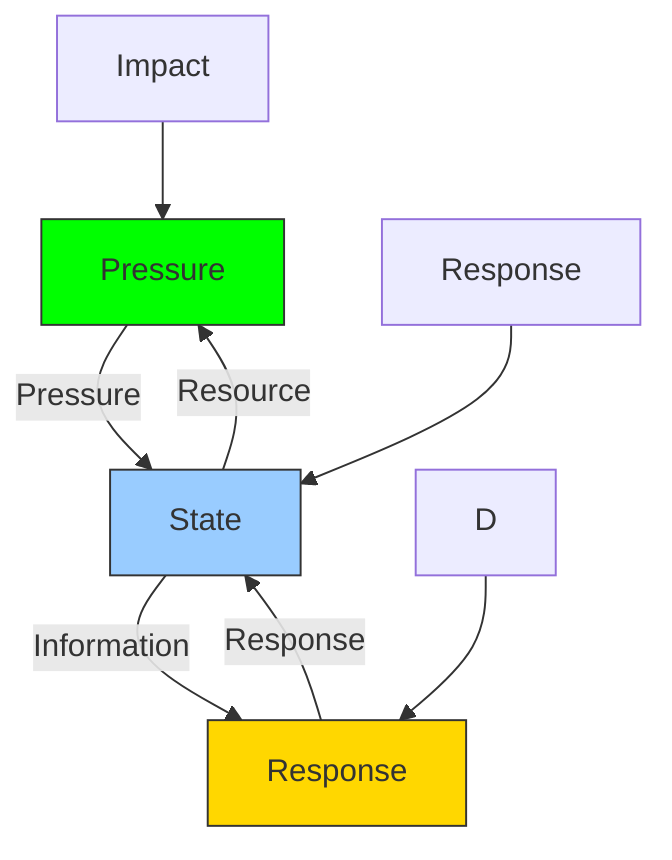
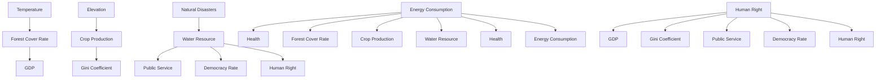

For office use only

T1

T2

T3

T4

Team Control Number

73119

Problem Chosen

E

For office use only

F1

F2

F3

F4

2018

MCM/ICM

Summary Sheet

In the past two decades, regional instability caused by some fragile state(s) has become more and more concerned by the whole world. Among the various factors, climate changes usually lead to high frequency of extreme weather events, which significantly exacerbate the fragility of a certain state. How to mitigate the impact of climate changes and prevent a state from becoming a fragile one has been widely recognized as a very important and urgent issue.

As a response, in order to predict a state’s fragility accurately, we develop a nov-el model called PSA (Pressure Sensitivity Adaptability), which is significantly ex-tended from the well-known PSR (Pressure State Response) model. Specifically, our model contains three dimensions whose weights are obtained by combining AHP (Analytic Hierarchy Process) and EWM (Entropy Weight Method). Notice that FI (Fragile Index) is a weighted sum of the three dimensions denoting the fragility of a certain state. In our empirical studies, we verify the effectiveness of our model via the ground truth of the public fragile state index. Meanwhile, we use a regression analysis method to get functional relationship between nonclimatic indicators and climatic indicators. We choose DRC (Democratic Republic of the Congo) and BD (Bangladesh) in our case studies. Specifically, we use the values of the indicators of a decade as the input data fed to our model, and obtain the FI curve. For DRC, the FI curve without the effect of climate changes is modeled by keep the values of the corresponding climate indicators constant. For BD, we use GM (1,1) to draw the prediction curve of FI and find that the time that BD is likely to become a stable state is around 2076.

Furthermore, we study six major intervention policies of BD for climate changes. We find that natural disasters in BD are serious and suggest investing more fiscal expenditure in intervention2 (intervention2: Comprehensive Disaster Managemen-t). It is estimated that this expenditure will increase by 35% every 5 years. We can then get other policies’ fiscal expenditures through GM (1, 1), and finally get the total expenditure in 5 years, 10 years and even 20 years.

We select Asia, Europe and Africa so as to study the portability of our proposed model. For continents, the fragile indexes of several representative countries are selected and averaged in order to estimate the continent fragile index. The result-s are very promising, which clearly showcases the effectiveness of our model on continents.

Finally, we conduct a sensitivity analysis in order to gain some deep understanding of our model, and conclude the report via discussing the strengths and weaknesses of our proposed model.

## Contents

## 1 Introduction 2

1.1 Background 2  
1.2 Restatement of Problems . 2  
1.3 Our Work . 3

## 2 Assumptions and Symbol Table 3

2.1 Assumptions . . 3  
2.2 Symbol Table . 4

## 3 Model PSA 4

3.1 PSR . 4  
3.2 PSA . 4

3.2.1 Identify indicators 5  
3.2.2 Data Pre-processing 6  
3.2.3 Data Normalization 6  
3.2.4 Calculate weight by AHP 7  
3.2.5 Calculate weight by EWM . 7  
3.2.6 Weighted average . . 8

3.3 Analyze direct and indirect impacts of climate change . . . 8  
3.4 Test PSA 10

## 4 Case Study 12

4.1 Study 1: Democratic Republic Of the Congo . . . 12

4.1.1 Climate change effects of Congo . . 12  
4.1.2 The FI without climate change effects 12

4.2 Study 2: People’s Republic of Bangladesh . . 13

4.2.1 Climate change effects of Bangladesh . . 13  
4.2.2 Prediction 15  
4.2.3 Effect of Human Intervention . 15  
4.2.4 Total cost . . 16

## 5 Further Exploration 17

## 6 Sensitivity Analysis 17

## 7 Strengths and Weaknesses 18

7.1 Strengths . . 18  
7.2 Weaknesses 19

## 8 Conclusions 19

## Appendices 21

## Appendix A FI of Country 21

## 1 Introduction

## 1.1 Background

In the past 20 years, there have been local wars and conflicts in the world and the fragile states have been a threat to the world security. Therefore, fragile states become a major issue for the world’s development. OECD (Organization for Economic Co-operation and Development) defines "States are fragile when state structures lack political will and/or capacity to provide the basic functions needed for poverty reduction, develop-ment and to safeguard the security and human rights of their populations."[1] Many universities and research institutes start to research centers to specialize in problems of fragile states. To measure fragility of a state, many evaluation indexes have been put forward, such as World Bank’s Country Policy and Institutional Assessment (CPIA) [2], Carton University’s Country Indicators for Foreign Policy Fragility Index (CIFP)[3]and The Fund for Peace’s Fragile States Index (FSI)[4]. Nowadays, due to the rapid devel-opment of industries and the rapid increase of population, large amount of energy consumption and greenhouse gases emission like carbon dioxide cause global warm-ing, then the frequent extreme weather and even the more extreme phenomena like a colder winter and a hotter summer. The climate change leads to more frequent and more serious drought, flood, storm, coldness and hotness, and leads to decline of wa-ter, food and energy[5], and then even leads to the wide spread of famine and diseases. If the government is unable to solve the problem of famine and diseases for people, there will be local violent conflicts. If the foreign government interferes in internal af-fairs, there will be wars and regional instability. Without effective measures to solve these problems, there will be disasters which bring threats to the world’s peace and de-velopment. Hence, reducing the fragility of a state has its unprecedented significance in today’s world.

## 1.2 Restatement of Problems

To create a more stable world, fragile state should be studied first and the following tasks are to be accomplished:

An evaluation index system to evaluate a state’s fragility and measure the influences of climate change on fragility is needed. By considering various factors like economy, society, politics and local climate, the model should clearly extinguish the state is fragile, vulnerable or stable. Meanwhile the model can identify how climate change increases fragility through direct means or indirectly as it influences other indicators. (Refer to Task1)

The influence of climate change on state should be evaluated, which help find out some definitive indicators. (Refer to Task2 and Task 3)

The risks of current national policies about reducing climate change, the effect of protecting the state from being fragile as well as the total cost should be evaluat-ed. (Refer to Task4)

Adjust the model and make it adaptable to cities and continents.(Refer to Task5)

## 1.3 Our Work

First we build our basic model PSA(Pressure Sensitivity Adaptability) based on PSR Model. Then we utilize its FI(Fragility Index)to measure a state’s fragility. Afterwards, we compare the result with the FSI’s ranking and discover that our model is rational. Moreover, we show the relations between indexes through regression analysis.

We choose Democratic Republic of the Congo in our case study, and analyze how cli-mate change influences its fragility in details. By adjusting the model appropriately, we simulate the state without fragility. Next we analyze Bangladesh through several aspects: fragility, influences of climate change on fragility and related indicators. According to range in task 1, we define a tipping point 0.6 and forecast the time taken for Bangladesh’s fragility to reach that point using GM (1, 1).

In task 4, we continue to discuss about Bangladesh further. We collect Bangladesh policies about climate change and fiscal expenditure data in recent years. Through analysis of the data and events about climate change, we can show the influences of these human interventions on this state’s fragility. Finally, the fiscal expenditure in 5 years will be estimated based on the current one.

Then we expend the PSA and analyze other regions. After respective analysis on cities and continents, we find that our model is portable.

Finally we do sensitivity analysis on related parameters of our model, and discuss strengths and weaknesses.

## 2 Assumptions and Symbol Table

## 2.1 Assumptions

We assume the countries we studied are regular.

Almost every country’ development conforms to certain regular patterns, which is based on facts.

We assume the countries we studied are stable.

Though countries’ political stabilities are different, we focus more on climate change. Thus, this assumption is reasonable and helps avoid unnecessary trou-bles when building the model.

We assume that indicators except those we have studied have few influences on the system.

In the model, we consider several crucial indicators. However, there are large numbers of indicators. Thus, we assume that other indicators except those men-tioned above are uninfluential.

We assume that the statistics we captured from websites are precise and reli-able.

The statistics we collected are from different websites which are authoritative. Therefore, this assumption is reasonable.

## 2.2 Symbol Table

Symbol that we use in the model are shown in the following table :

Table 1: Symbol table

<table><tr><td>Symbol</td><td>Description</td></tr><tr><td>FI</td><td>Fragile Index</td></tr><tr><td>P</td><td>Pressure</td></tr><tr><td>S</td><td>Sensitivity</td></tr><tr><td>A</td><td>Adaptability</td></tr><tr><td>DRC</td><td>Democratic Republic of the Congo</td></tr><tr><td>BD</td><td>Bangladesh</td></tr><tr><td> $x_i$ </td><td>The i-th indicator</td></tr></table>

Note:Pi means the i-th indicator, e.g.temperature anomalies is the first indicator. Hence, it can be denoted as x1.

## 3 Model PSA

According to previous work, we are going to build our model base on the PSR model.

## 3.1 PSR

Currently the PSR model (Pressure State Response) are frequently applied among research on fragility. In P-SR, ‘P’ represents the pressure dimension, which indicates the pressure that are brought to the system. Here, we suppose that climate change and human activites are the ‘pressure’. Moreover, ‘S’ represents the state dimension, which shows the states that are influenced by the pressure. ‘R’ represents the Response dimension, which reflects the response of the system.

flowchart

Figure 1: PSR Model

## 3.2 PSA

We will do the following steps to build our PSA model.

## 3.2.1 Identify indicators

After carefully analyzing the relevant information, we determine the indicators shown in the figure below:

<table><tr><td>Target Layer</td><td>Dimension Layer</td><td>Theme Layer</td><td>Indicator Layer</td><td></td></tr><tr><td rowspan="16">Fragility Index</td><td rowspan="6">Pressure</td><td rowspan="3">Nature</td><td>temperature anomalies</td><td>*</td></tr><tr><td>average elevation</td><td>+</td></tr><tr><td>natural disaster risk index</td><td>-</td></tr><tr><td rowspan="3">Human</td><td>population density</td><td>-</td></tr><tr><td>CO2 emission</td><td>-</td></tr><tr><td>energy consumption per capita</td><td>-</td></tr><tr><td rowspan="5">Sensitivity</td><td rowspan="3">Nature</td><td>forest cover rate</td><td>+</td></tr><tr><td>crop production index</td><td>+</td></tr><tr><td>percentage of people using basic drinking water services</td><td>+</td></tr><tr><td rowspan="2">Social</td><td>health index</td><td>+</td></tr><tr><td>GDP unit energy consumption</td><td>-</td></tr><tr><td rowspan="5">Adaptability</td><td>Economic</td><td>GDP per capita</td><td>+</td></tr><tr><td rowspan="2">Social</td><td>Gini coefficient</td><td>-</td></tr><tr><td>public service</td><td>+</td></tr><tr><td rowspan="2">Political</td><td>democracy index</td><td>+</td></tr><tr><td>human right</td><td>+</td></tr></table>

Figure 2: Indicators

In line with the characteristics of PSR, we first divide fragility into three aspect-s: Pressure, Sensitivity, Adaptation. Then as for Pressure, we assume that there are pressure from the climate and the one from human activities. As for Sensitivity, we determine indicators according to Xu’s work[16]. Finally, we choose indicators for Adaptation referring to Fragile State Index(FSI).

## Pressure

– Temperature departure value: it reflects the difference between the temper-ature this year and the usual average temperature.  
– Average altitude: the higher the average altitude is, the less influences by rise of sea level.  
– Natural disaster risk index: it is to measure the degree of being endangered of a state confronted earthquake, rainstorm, flood, drought and other natu-ral disasters. (Refer to Wikipedia’s natural disaster risk index: as a result of vulnerability and natural hazards such as earthquakes, volcanic eruptions, storms, floods, droughts and sea level)  
– Population density: the higher the population density, the heavier the burden to different kinds of national resources like water, food and energy, and to national public infrastructures.  
– ${ \mathsf { C O } } _ { 2 }$ emissions: it reflects the pollution. The larger it is, the more serious the pollution and the more powerful the pressure to environment.

– Energy consumption per capita: it indirectly reflects the abundance of a state’s energy.

## Sensitivity

– Forest cover rate: the larger the forest cover rate is, the less sensitive to climate change.  
– Crop production index: the more the food production and store, and people will not starve, and in some way avoid unrests, the less sensitive to deal with foreign interference and domestic conflicts.  
– Percentage of people using basic drinking water services: many conflicts in the world result from water shortage.  
– Health index: the healthier the people are, the less the diseases are, the less sensitive to influences of climate change.  
– GDP unit energy consumption: it reflects the economic efficiency of a state. The higher the efficiency is, the more prosperous the economy is.

## Adaptability

– GDP per capita: economy can reflect the degree of prosperity of a state economy. The more prosperous the economy is, the better the infrastructure is, the stronger the ability to deal with climate change is.  
– Gini coefficient: Gini coefficient reflects the status of a state’s gap between the rich and the poor. The larger the gap is, the greater the conflicts, the weaker the ability to adapt to the external threats.  
– Public service: it means public financing and community service, and the basic guarantee to public health. The better the public welfare is, the better the adaptability is.  
– Democracy index: being undemocratic will leads to social unrest and regional instability.  
– Human right: Guarantee the human right and make humans’ basic right guaranteed to make people happier and society more stable.

## 3.2.2 Data Pre-processing

We searched some websites like WorldBank,The Economist and Fragile State Index and find 16 indicators of 20 countries firstly. Some statistics of indicators are missing for not all statistics can be searched on Internet. We utilize SPSS’s multiple imputation to fill the missing values to ensure smooth data processing and analysis.

## 3.2.3 Data Normalization

While analyzing all the indicators, we find that they can be divided into three types. Symbol ‘+’ means that for the indicator, bigger is better. Similarly, symbol ‘-’ means smaller is better and symbol ‘\*’ means that the value is better when it is closer to the specific value.

Therefore, for those bigger is better, the equation should be

$$
r _ {i} = \frac {r r _ {i \min}}{r _ {\max} r _ {\min}} \tag {1}
$$

As for the smaller is better, the equation should be

$$
r _ {i} = \frac {r _ {\max i}}{r _ {\max \min}} \tag {2}
$$

As for the special type, such as the temperature anomalies here, we define the equation as follow:

$$
r _ {t a} = 1 - \frac {| t a |}{| t a | _ {\max}} \tag {3}
$$

where jtaj means the original absolute value of temperature anomalies, and jtajmax means the maximum absolute value.

## 3.2.4 Calculate weight by AHP

To calculate weights of indicators of PSA, we intend to use AHP. Firstly, we define the expressions as follow:

$$
F I = ! _ {1} P +! _ {2} S +! _ {3} A \tag {4}
$$

nX

$$
P = _ {i} P _ {i} \tag {5}
$$

where n means the number of indicators and $\mathsf { P i }$ represents the indicators of Pressure.

Similarly, we have

$$
S = \sum_ {i = 1} ^ {n} \beta_ {i} S _ {i}
$$

$$
A = \sum_ {i = 1} ^ {n} \gamma_ {i} A _ {i}
$$

where $\mathsf { S i }$ and $\mathsf { A i }$ represents indicators of Sensitivity and Adaptability respectively.

Afterwards, we construct the score matrices and calculate the weight of each indicator.

## 3.2.5 Calculate weight by EWM

As we all know, AHP has some subjectivity due to the score matrices. Hence, we calculate the weights using Entropy Weight Method(EWM)[15]

Firstly, we calculate the proportion of the $\mathrm { j } ^ { \mathrm { t h } }$ indicator of the $\mathsf { i } ^ { \mathsf { t h } }$ country.

$$
p _ {i j} = \overline {{P _ {m (8) i = 1}}} ^ {r _ {i j}} r _ {i j}
$$

精品数模资料，各类比赛优秀论文、学习教程、写作模板与经验技巧、matlab程序代码资料等，尽在淘宝店铺：闵大荒工科男的杂货铺

where rij means the value of the corresponding indicator, and m represents the number of the countries.

Then we get the entropy value of the $\boldsymbol { \mathrm { j } } ^ { \mathrm { t h } }$ indicator:

$$
E _ {j} = k \left(p _ {i j} \underset {= 1} {\overset {m} {\operatorname{In}}} p _ {i j}\right) \tag {9}
$$

where $\mathsf { k } = \mathsf { I n } \mathsf { m }$

Finally, we get the weight of the $\mathrm { j } ^ { \mathrm { t h } }$ indicator:

$$
E _ {j} = - k \sum_ {i = 1} ^ {m} (p _ {i j} * l n p _ {i j}) \tag {9}
$$

Since we want to reduce the subjectivity of AHP, which can be supplemented by EWM, we get the final weight by calculating the weighted average of the results calculated above.

We define the equation as follows,

$$
W _ {i} = W _ {1 a i} + W _ {2 e i} \tag {11}
$$

where $\mathsf { W } _ { \mathsf { a i } }$ represents the weight of the $\mathsf { i } ^ { \mathsf { t h } }$ indicator calculated by AHP and $\mathsf { W } _ { \mathsf { e } \mathrm { i } }$ represents the one calculated be EWM. Here we suppose $ \iota = 0 { : } 8$ and $_ { 2 } = 0 . 2$

Finally we get the weights of all the indicators.

## 3.3 Analyze direct and indirect impacts of climate change

In task 1, we are required to identify how climate change increases fragility directly and indirectly.

flowchart

Figure 3: Relationship between indicators

Through regression analysis, we can give a more specific relationship among the indicators.Some examples are listed in Table 2:

<table><tr><td>Climate Indicators</td><td>Relationship</td></tr><tr><td rowspan="2">Temperature t</td><td>Water = 1:099 t + 42:15</td></tr><tr><td>Crop P roduction = 3:551 t + 114</td></tr><tr><td rowspan="2">Elevation e</td><td>Human Right = 30:25 e 17:29</td></tr><tr><td>Democracy Rate = 20:12 e + 19:97</td></tr></table>

Table 2: Examples of Relationship

## Through direct means

– Temperature anomalies: the characteristic of significant climate change is influences of temperature. Temperature of current year is different from usual like the rise or drop of temperature. The most direct influence index is to increase the absolute value of temperature anomalies, which directly makes a state more fragile.  
– Average elevation: the global warming causes the sea level rise. For some low-lying countries, they will be confronted with being submerged, which directly makes a state more fragile.  
– Natural disaster risk index: climate change is likely to bring hot weather and then the hurricane, rainstorm, flood, drought and other natural disasters.

## Through indirect means

– Forest cover rate: climate change probably causes rainstorm and mountain torrents which erode soil and destroy the forests and villages, and probably causes drought which makes trees wither. Therefore, it indirectly causes the decrease of forest cover rate.  
– Crop production index: climate change is likely to cause more intense rain-fall, longer dry periods or increased temperature. More intense rainfall will result in crop stopping growing due to water shortage and decline of pro-duction. The increased temperature will result in reduction of output for some crops’ inadaptability, insects calamity or some viral pathogens which will infect crops and livestock and then cause death in batches. What’s worse, there will be no harvest at all. The increased temperature will also in-fluence the output of fishery. The increased temperature helps phycophyta grow up rapidly, then dissolved oxygen declines, and the nutrition neces-sary for fish upwells, which is bad for survival of fish. Finally the output of fish declines.

– Percentage of people using basic drinking water service: increased temperature will lead to more evaporation of the open shallow groundwater

sources. Flood and rainstorm will cause death of livestock, breeding of bac-teria, water infection of virus, then water pollution, degradation of water quality, and reduction of clear drinking water.

## – Health Index:

1. Climate change influences the supply of food nutrition. Some research reports show that, global warming and increasing concentration of carbon dioxide will cause the decrease of protein synthetized by crops. Higher carbon dioxide concentrations will drain the protein contents of barely(14.6 percent), rice(7.6 percent), wheat(7.8 percent), and potatoes(6.4 percent).[6] oth-er key nutrition like zinc and iron are threated for the same reasons. This is more serious than the influence on human health of lack of protein.

2. Climate change will make diseases spread more easily and as a result, people are easier to get sick. Climate change induces some new infectious diseases, such as HIV, SARS and Ebola disease.[7]Rainstorm and flood create a humid and warm environment which is suitable for breeding for mosquitoes pathogens, which causes the wide spread of infectious diseases. Through touching or drink the polluted water, people will suffer from waterborne diseases like diarrhea and so on, which greatly undermines human health.

– GDP per capita: for tropical countries, increased temperature will reduce workers’ productivity. In contrary, for northern countries in cold areas, increased temperature probably increase productivity and then the average GDP.

– Human right: the negative influences of climate change result in high frequency of extreme weather and natural disasters, which directly or indirectly brings threats to human’s basic rights including water drinking and hygiene, food, health, housing, culture and development , and influences fragility.

## 3.4 Test PSA

After building the basic model PSA, we are going to test it. By analyzing the ranking of FSI, we select 20 countries from different level. We compare the FI calculated by PSA and the ranking of FSI, and then analyze the result.

Furthermore, we set up thresholds according to the relevant report.

$$
\text { Status } = \left\{ \begin{array}{l l} \text { Stable } & \text { if } \quad F I \geq 0. 6 \\ \text { Vulnerable } & \text { if } \quad 0. 4 \leq F I <   0. 6 \\ \text { Fragile } & \text { if } \quad 0 \leq F I <   0. 4 \end{array} \right. \tag {12}
$$

Team # 73119

We can see the results on the figure below, which makes comparison easily.

scatterplot

| Point | X    | Y     |
|-------|------|-------|
| 1     | 0.5  | 0.34  |
| 2     | 1.0  | 0.38  |
| 3     | 1.5  | 0.41  |
| 4     | 2.0  | 0.54  |
| 5     | 2.5  | 0.48  |
| 6     | 3.0  | 0.45  |
| 7     | 3.5  | 0.55  |
| 8     | 4.0  | 0.31  |
| 9     | 4.5  | 0.53  |
| 10    | 5.0  | 0.53  |
| 11    | 5.5  | 0.54  |
| 12    | 6.0  | 0.57  |
| 13    | 6.5  | 0.62  |
| 14    | 7.0  | 0.38  |
| 15    | 7.5  | 0.76  |
| 16    | 8.0  | 0.77  |
| 17    | 8.5  | 0.79  |
| 18    | 9.0  | 0.85  |
| 19    | 9.5  | 0.54  |
| 20    | 10.0 | 0.67  |

Figure 4: Fragility Index:Blue circles represent the results of PSA, and red crosses rep-resent the results of FSI

The corresponding contries are listed in the Appendix A.

From Figure 4, we can clearly see that the result is relatively consistent with the trend of the ranking. For this reason, we believe that PSA is resonable.

For task 1, we are required to identify when a state is fragile,vulnerable, or stable. In PSA we can identify a state by Equation 12. For example, when the FI of a state satisfy the inequality F I 0:6, we can draw a conclusion that the state is stable.

Table 3: Classification of 20 states

<table><tr><td>PSA</td><td>Country Code</td></tr><tr><td>Fragile</td><td>DRC,EG,BD,HT,KE</td></tr><tr><td>Vulnerable</td><td>JM,TR,PH,IN,CN,ZA,MY,BR,MX</td></tr><tr><td>Stable</td><td>AR,US,UK,FR,NZ,GR</td></tr><tr><td>FSI</td><td>Country Code</td></tr><tr><td>Fragile</td><td>DRC,EG,BD,PH,HT,KE</td></tr><tr><td>Vulnerable</td><td>JM,TR,IN,CN,ZA,BR,NZ,MY,BR</td></tr><tr><td>Stable</td><td>AR,US,UK,FR,MX</td></tr></table>

From Table 3,Our model’s classification results are mostly consistent with FSI, which proves that our model is valid.

## 4 Case Study

## 4.1 Study 1: Democratic Republic Of the Congo

We choose the Democratic Republic Of the Congo as our research object. The reason is that this country is top10 in Fragile State Index, with distinct climate change, clear dry and rainy seasons. Climate change has great influences on this state’s fragility.

## 4.1.1 Climate change effects of Congo

We collect ten years data of Congo and draw the curve as follow:

line chart

| Year | Fragile Index |
| ---- | ------------- |
| 2006 | 0.34          |
| 2007 | 0.345         |
| 2008 | 0.345         |
| 2009 | 0.333         |
| 2010 | 0.33          |
| 2011 | 0.339         |
| 2012 | 0.319         |
| 2013 | 0.328         |
| 2014 | 0.314         |
| 2015 | 0.314         |
| 2016 | 0.317         |

Figure 5: FI of Congo

The reason for the decrease of its fragile index during 2009 to 2010 is the cholera at the end of 2008, which causes 1million people at risk for water-borne diseases.[9] The reason for occurrence of cholera is that the heavy rainstorm created an environment of high temperature and high humidity, and water was polluted by stools.

Then the Bacillus comma bred rapidly and people drank the polluted water without any sanitization. At last, cholera broke out and further caught local riots and wars and the state became more fragile. In 2012, Congo suffered the severe drought in 60 years.[10] In some regions, not only rivers, grass dried up but also some basic food like cassava and vegetables were in shortage.[11] It destroyed public service and human right and hence the state became more fragile.

## 4.1.2 The FI without climate change effects

According to Task 2, we are required to analyze the situation without considering climate change.

line chart

| Year | with the climate change | without the climate change |
| ---- | ------------------------ | --------------------------- |
| 2006 | 0.34                     | 0.34                        |
| 2007 | 0.345                    | 0.348                       |
| 2008 | 0.345                    | 0.365                       |
| 2009 | 0.335                    | 0.372                       |
| 2010 | 0.33                     | 0.38                        |
| 2011 | 0.34                     | 0.382                       |
| 2012 | 0.32                     | 0.385                       |
| 2013 | 0.33                     | 0.405                       |
| 2014 | 0.315                    | 0.398                       |
| 2015 | 0.315                    | 0.398                       |
| 2016 | 0.318                    | 0.41                        |

Figure 6: Comparison of Congo’s FI with and without climate change’s effect

According to Task 2, we are required to analyze DRC’s situation without considering climate change. Details are as followed:

In the Figure 6, the red curve represents the FI curve without effects of climate change and is denoted as FI-1; the blue curve represents the FI curve with effects of climate change and is denoted as FI-2.

We adjust the climate indicator value (temperature anomalies and average elevation) to be consistent to that in 2006, then calculate the values of other non-climatic indica-tors without effects of climate change through regression equation, and finally gain the FI-1 curve through PSR model. The FI-1 curve shows a slow uptrend, which suggest that DRC will be less fragile without effects of climate change. However, without con-sidering the heavy rainstorm during 2008 to 2010, fragile index still rises slowly and even stagnates. It is possible that DRC is affected by other factors like earthquake and refugees.

## 4.2 Study 2: People’s Republic of Bangladesh

## 4.2.1 Climate change effects of Bangladesh

As for Task 3, we select Bangladesh as our study state. Reasons are as followed: BD is a fragile state. Occasional climate change in some years makes it more fragile. Nonethe-less, with political stability and government’s interventions to deal with threats of cli-mate change, BD is gradually becoming stable for development.

line chart

| Year | Fragile Index |
| ---- | ------------- |
| 2006 | 0.38          |
| 2007 | 0.38          |
| 2008 | 0.35          |
| 2009 | 0.37          |
| 2010 | 0.39          |
| 2011 | 0.395         |
| 2012 | 0.385         |
| 2013 | 0.39          |
| 2014 | 0.395         |
| 2015 | 0.39          |
| 2016 | 0.385         |

Figure 7: FI of Bangladesh

As the chart above shows, the general trend of BD is upward. It is mainly the priva-tization policy that BD’s government actively promotes that helps infrastructure con-struction, investment environment’s improvement and economic development. How-ever, the sharp decline of fragile index in 2008 is mainly caused by the Cyclone Sidr in November, 2007, which attacked the southeast coast of BD and badly affected about 1 million families’ life. It was estimated 3406 deaths, 1001 missing and over 55,000 injuries.[12]

Gale and flood destroyed housing and infrastructure including roads and bridges. Tide water made water polluted by salt sea water and sanitary fixture was destroyed, which directly gave rise to the soar of natural disaster risk index and sharp decline of public service. In the following years the government took active measures of disaster recov-ery and reconstruction. It is not until 2010 that the country recovered from the hit of Cyclone Sidr in 2007.

In June, 2012, rainstorm gave rise to flood and landslide, caught deaths and destruction, and seriously influenced ten regions in norther and southeastern BD.[13]In December, a cold wave once in 40 years hit the northern BD. Hospital reports in affected areas showed larger numbers of people suffered from the relative diseases. The weath-er also caught loss of crops and other natural resources. [14]Climate change in these regions makes BD more fragile.

As the BD fragile index curve show, there is obvious decline from 2007 to 2009 and from 2011 to 2012. According to the original statistics, the increases of temperature anoma-lies and natural disaster risk index suggest that both of them (temperature anomalies and natural disaster risk index) are key identify definitive indicators that influence BD’s fragility.

## 4.2.2 Prediction

We referred to FSI’s ranking and define the three c: stable, vulnerable, fragile, when validating our model in Section 3. BD is in the interval of Frafile.

line chart

| Year | Fragile Index |
| ---- | ------------- |
| 2010 | 0.40          |
| 2030 | 0.45          |
| 2050 | 0.50          |
| 2076 | 0.60          |
| 2085 | 0.65          |

Figure 8: Prediction of Bangladesh

According to definition of intervals of fragility in Task 1, BD’s FI is 0.38, meaning it is fragile. Based on the trend of BD’s FI in recent years, we predict its FI predict curve in 80 years through Gray Prediction Model (GM(1,1),Gray Prediction Model). As Figure 8 shows, BD will be stable in 60 years, namely 2076.

## 4.2.3 Effect of Human Intervention

We continue to take Bangladesh as our research target. According to the report of the Bangladesh government on climate security and development over the past few years[], they have made some countermeasures against climate change and can be broadly classified into six categories:

Intervention1:Food Security Social Protection and Health

Intervention2:Comprehensive Disaster Management

Intervention3:Climate Resilient Infrastructure

Intervention4:Research and Knowledge Management

Intervention5:Mitigation and Low Carbon Development

Intervention6:Capacity Building and Institutional Strengthening

We analyzed the impact of these interventions on our model, as shown in the following table:

<table><tr><td>Intervention</td><td>Impact indicators</td></tr><tr><td>Intervention1</td><td>health index,Gini coefficient</td></tr><tr><td>Intervention2</td><td>natural disaster risk indexcrop production index,percentage of people using basic drinking water servicesforest cover rate</td></tr><tr><td>Intervention3</td><td>public service,Gini coefficient</td></tr><tr><td>Intervention4</td><td>GDP per capita,Gini coefficient</td></tr><tr><td>Intervention5</td><td> $CO_{2}$  emission</td></tr><tr><td>Intervention6</td><td>population density,democracy index,human right</td></tr></table>

## 4.2.4 Total cost

To predict the total cost of intervention in climate change, first of all we look up the budget allocation for expenditure and total coast of six interventions from 2014 to 2017.

From 2014 to 2017, with budgets of other intervention except Intervention2 Comprehensive Disaster Management increasing relatively steadily, budgets in Intervention2 Comprehensive Disaster Management decreases, which results in the decline of fragili-ty index and better fragility.

Therefore, we set up constraint conditions when predicting total cost of BD government’s interventions:

Over the next few years, BD government’s total cost of interventions in climate change will only increase at the growth rate of those in recent years rather than increasing unlimitedly

Except Intervention2 Comprehensive Disaster Management, other budgets for expenditure will be predicted according to status quo through Gray Prediction Model

The fiscal expenditure of Intervention2: Comprehensive Disaster Management will increase by 35% every five years

Total expenditure and budget allocations for expenditure estimated in 5 years, 10 years and 20 years are as followed:

<table><tr><td>program</td><td>Current</td><td>in 5 years</td><td>in 10 years</td><td>in 20years</td></tr><tr><td>Intervention1</td><td>1735.9</td><td>2076.4</td><td>2487.5</td><td>3570</td></tr><tr><td>Intervention2</td><td>3467.2</td><td>4680.72</td><td>6318.972</td><td>8530.6122</td></tr><tr><td>Intervention3</td><td>2474.39</td><td>2890.4</td><td>3378.4</td><td>4615.2</td></tr><tr><td>Intervention4</td><td>365.87</td><td>522.7</td><td>786.9</td><td>1783.2</td></tr><tr><td>Intervention5</td><td>169.92</td><td>185.95</td><td>205.58</td><td>251.3</td></tr><tr><td>Intervention6</td><td>6420.84</td><td>8230</td><td>10443</td><td>16813</td></tr></table>

## 5 Further Exploration

According to Task 5, we are required to extend our model to a wider range. First of all, we use PSA to analyze the fragility of the continents. We choose Asia, Europe and Africa. Since continent is made up of countries, we are going to take an average of statistics of all the counties. Here, we select several typical countries of every continent and do the analysis.

Results calculated by PSA are shown in the table below:

<table><tr><td>Continents</td><td>Europe</td><td>Asia</td><td>Africa</td></tr><tr><td>FI</td><td>0.8176</td><td>0.3218</td><td>0.2849</td></tr></table>

Table 4: FI of different continents

Frome Table 4, we can clearly see that Europe get the highest score and Africa get the lowest one. By analyzing the FSI map, we can see that our result is reasonable. Almost all the European countries are stable while most of those in Africa are fragile. As a result, we can draw a conclusion that our model works well on continents.

Next, we apply our model to analyze the cities. We find that several indicators, such as CO2 emission and crop production index, are hard to be obtained for a specific city. Therefore, we need to modify PSA to make it work on cities.

The solution is to replace those indicators that are not suitable for the cities with the similar ones.

For example,it is difficult to evaluate the forest cover rate of many cities, we can use greenland rate instead. Besides, crop production index may be another barrier, we can replace it with the local food safety index.

## 6 Sensitivity Analysis

While we combine the results of AHP and EWM to get the final weight of each indicator, we set $_ { 1 } = 0 . 8$ and $_ { 2 } = 0 . 2$ . Here, we will analyze the sensitivity of 1 and 2.

We set 1 = 0:2; 0:3; 0:5; 0:7; 0:8 respectively and get the results as follows:

line chart

| Year | θ1 = 0.8 | θ1 = 0.7 | θ1 = 0.5 | θ1 = 0.3 | θ1 = 0.2 |
|------|----------|----------|----------|----------|----------|
| 2006 | 0.38     | 0.37     | 0.34     | 0.31     | 0.29     |
| 2007 | 0.38     | 0.37     | 0.34     | 0.31     | 0.29     |
| 2008 | 0.35     | 0.34     | 0.31     | 0.28     | 0.27     |
| 2009 | 0.37     | 0.36     | 0.33     | 0.30     | 0.28     |
| 2010 | 0.39     | 0.38     | 0.34     | 0.31     | 0.29     |
| 2011 | 0.40     | 0.39     | 0.35     | 0.32     | 0.30     |
| 2012 | 0.39     | 0.37     | 0.34     | 0.31     | 0.29     |
| 2013 | 0.39     | 0.38     | 0.34     | 0.31     | 0.29     |
| 2014 | 0.39     | 0.38     | 0.34     | 0.31     | 0.29     |
| 2015 | 0.39     | 0.38     | 0.34     | 0.31     | 0.29     |
| 2016 | 0.39     | 0.38     | 0.34     | 0.31     | 0.29     |

Figure 9: Analysis of 1

Figure 9 indicates that when the value of 1 is changing, the trend does not change a lot, which means that PSA is stable.

## 7 Strengths and Weaknesses

## 7.1 Strengths

Our model inherits the advantages of AHP (AHP, Analytic Hierarchy Process) and EWM (EWM, Entropy Weight Method).

When weighing the indicators, we utilize weight average method combining the AHP (AHP, Analytic Hierarchy Process) with (EWM, Entropy Weight Mothed). To some extent, this method not only provides a supplement of indicators’ horizontal comparison with EWM, but also covers the shortages that indicator weight under EWM vary with samples and is even overwhelmingly dependent on sam-ples. Moreover, this method reduces subjectivity of AHP.

## Our model is effective through validation.

Fragile State Index’s result serves as a benchmark to verify our model. We find the results of our model are close to the truth no matter the classification of state fragility or state ranking, which shows that our model is rational.

## The model we build has good adapability.

Experienced studies show that, our model can be adapted to larger states (conti-nents) for effective analysis on fragility.

## 7.2 Weaknesses

In our model, due to time constraints, we just choose the average fragile index of some states to represent the continent’s fragile index during calculation of conti-nent index. Thus, there will be some deviation.

In our model, regional instability and violent conflicts are excluded. We don’t take riots and wars into consideration. Therefore, our model is not reliable when facing states with large-scale wars.

## 8 Conclusions

By building up an indicator system, we select a leading indicator FI to measure a region’s fragility. Our PSA model is reasonable after validation. We analyze Congo and Bangladesh respectively combining climate change. According to our model, we estimate a state’s fiscal expenditure on climate change interference. Afterwards, we expend the application of PSA model to analyze cities and continents our model is testified to be extensible.Finally, by sensitivity analysis, we can see that our model is stable.

## References

[1] Mcloughlin, C.. Topic guide on fragile states. Birmingham:University of Birmingham, UK. 2012: 5  
[2] CPIA: https://data.worldbank.org/data-catalog/CPIA  
[3] CIFP: https://carleton.ca/cifp/  
[4] FSI: http://fundforpeace.org/fsi/  
[5] Schwartz, P. and Randall, D. ‘An Abrupt Climate Change Scenario and Its Implications for United States National Security’, October 2003.  
[6] Climate Change Is Draining Protein Out Of Staple Crops: http://www.iflscience.com/environment/climate-change-draining-proteinstaple-crops/  
[7] Climate Change And Infectious Diseases - World Health Organization http://www.who.int/globalchange/publications/climatechangechap6.pdf  
[8] Human Rights and Climate Change http://www.ohchr.org/EN/Issues/HRAndClimate-Change/Pages/HRClimateChangeIndex.aspx  
[9] Cholera in the Congo: Fighting could cause disease outbreak https://blogs.scientificamerican.com/news-blog/cholera-in-the-congo-fightingcould-2008-11-11/  
[10] Horn of Africa sees ’worst drought in 60 years http://www.bbc.com/news/world-africa-13944550  
[11] Parts of DR Congo hit by unusual drought http://www.africareview.com/news/Unusual-drought-hits-parts-of-DRC/979180-1104984-ovfxcqz/index.html  
[12] de Bangladesh G. Cyclone Sidr in Bangladesh: Damage, Loss and Needs Assess-ment for Disaster Recovery and Reconstruction[J]. 2008.  
[13] Bangladesh: Floods and Landslides Emergency appeal n MDRBD010 Operation update n2 https://reliefweb.int/report/bangladesh/bangladesh-floods-andlandslides-emergency-appeal-n%C2%B0-mdrbd010-operation-updaten%C2%B02  
[14] Bangladesh: Cold Wave - Dec 2012 https://reliefweb.int/disaster/cw-2013-000001-bgd  
[15] Liu Zhi, et al. "Application of Entropy Weight Method in Comprehensive Evaluation of Enterprise Performance" Journal of Sinopec Management Institute 10.4 (2008): 63-65.

[16] Xu Ting-ting, et al. Research on Shanghai Comprehensive Vulnerability Assess-ment of Climate Change – Based on PSR Model[J]. Resource Development & Mar-ket 2015, 31(3): 288-292.  
[17] Climate Protection and Development Budget Report 2017-18.Finance Division,Ministry of Finance Government of the People’s Republic of Bangladesh

## Appendices

## Appendix A FI of Country

<table><tr><td>No.</td><td>Country</td><td>FI</td><td>FSI Ranking</td></tr><tr><td>1</td><td>Congo, Dem. Rep.</td><td>0.3366</td><td>7</td></tr><tr><td>2</td><td>Egypt</td><td>0.3762</td><td>36</td></tr><tr><td>3</td><td>Bangladesh</td><td>0.4047</td><td>39</td></tr><tr><td>4</td><td>Jamaica</td><td>0.5416</td><td>117</td></tr><tr><td>5</td><td>Turkey</td><td>0.4788</td><td>64</td></tr><tr><td>6</td><td>Philippines</td><td>0.4454</td><td>54</td></tr><tr><td>7</td><td>India</td><td>0.5504</td><td>72</td></tr><tr><td>8</td><td>Haiti</td><td>0.3099</td><td>11</td></tr><tr><td>9</td><td>China</td><td>0.5288</td><td>85</td></tr><tr><td>10</td><td>South Africa</td><td>0.5244</td><td>96</td></tr><tr><td>11</td><td>Malaysia</td><td>0.544</td><td>116</td></tr><tr><td>12</td><td>Brazil</td><td>0.5649</td><td>110</td></tr><tr><td>13</td><td>Argentina</td><td>0.619</td><td>140</td></tr><tr><td>14</td><td>Kenya</td><td>0.3746</td><td>22</td></tr><tr><td>15</td><td>United States</td><td>0.7602</td><td>158</td></tr><tr><td>16</td><td>United Kingdom</td><td>0.7666</td><td>160</td></tr><tr><td>17</td><td>France</td><td>0.7842</td><td>159</td></tr><tr><td>18</td><td>New Zealand</td><td>0.8472</td><td>170</td></tr><tr><td>19</td><td>Mexico</td><td>0.5376</td><td>88</td></tr><tr><td>20</td><td>Greece</td><td>0.6615</td><td>127</td></tr></table>

<table><tr><td>Country Code</td><td>DRC</td><td>EG</td><td>BD</td><td>JM</td><td>TR</td><td>PH</td><td>IN</td><td>HT</td><td>CN</td><td>ZA</td></tr><tr><td>PSA</td><td>0.337</td><td>0.376</td><td>0.396</td><td>0.542</td><td>0.479</td><td>0.445</td><td>0.550</td><td>0.310</td><td>0.529</td><td>0.524</td></tr><tr><td>Rank</td><td>19</td><td>17</td><td>16</td><td>10</td><td>14</td><td>15</td><td>8</td><td>20</td><td>12</td><td>13</td></tr><tr><td>FSI</td><td>0.1839</td><td>0.348</td><td>0.365</td><td>0.594</td><td>0.456</td><td>0.399</td><td>0.501</td><td>0.207</td><td>0.525</td><td>0.537</td></tr><tr><td>Rank</td><td>20</td><td>17</td><td>16</td><td>7</td><td>14</td><td>15</td><td>13</td><td>19</td><td>12</td><td>11</td></tr><tr><td>Country Code</td><td>MY</td><td>BR</td><td>AR</td><td>KE</td><td>US</td><td>UK</td><td>FR</td><td>NZ</td><td>MX</td><td>GR</td></tr><tr><td>PSA</td><td>0.544</td><td>0.565</td><td>0.619</td><td>0.375</td><td>0.760</td><td>0.767</td><td>0.784</td><td>0.847</td><td>0.538</td><td>0.662</td></tr><tr><td>Rank</td><td>9</td><td>7</td><td>6</td><td>18</td><td>4</td><td>3</td><td>2</td><td>1</td><td>11</td><td>5</td></tr><tr><td>FSI</td><td>0.590</td><td>0.566</td><td>0.685</td><td>0.269</td><td>0.787</td><td>0.798</td><td>0.793</td><td>0.855</td><td>0.542</td><td>0.612</td></tr><tr><td>Rank</td><td>8</td><td>9</td><td>5</td><td>18</td><td>4</td><td>2</td><td>3</td><td>1</td><td>10</td><td>6</td></tr></table>

Team # 73119

# Appendix B Climate expenditure of Bangladesh

Table 2.6: Climate Expenditure by Thematic Areas  
(Crore taka/BDT 10 million)

<table><tr><td rowspan="2">Thematic Area</td><td colspan="4">Climate ADP Expenditure</td><td colspan="4">Non-Development Climate Expenditure</td><td colspan="4">Total Climate Expenditure</td></tr><tr><td>Revised 2010/11</td><td>Revised 2011/12</td><td>Revised 2012/13</td><td>Budget 2013/14</td><td>Revised 2010/11</td><td>Revised 2011/12</td><td>Revised 2012/13</td><td>Budget 2013/14</td><td>Revised 2010/11</td><td>Revised 2011/12</td><td>Revised 2012/13</td><td>Budget 2013/14</td></tr><tr><td>Theme 1</td><td>926.42</td><td>869.12</td><td>2,276.12</td><td>2,439.63</td><td>1,292.86</td><td>1,312.06</td><td>1,921.69</td><td>1,801.38</td><td>2,219.28</td><td>2,181.18</td><td>4,197.81</td><td>4,241.02</td></tr><tr><td>Theme 2</td><td>891.08</td><td>964.60</td><td>1,459.97</td><td>1,403.56</td><td>650.07</td><td>670.34</td><td>978.19</td><td>873.81</td><td>1,541.15</td><td>1,634.94</td><td>2,438.17</td><td>2,277.37</td></tr><tr><td>Theme 3</td><td>1,492.62</td><td>1,396.09</td><td>2,111.95</td><td>2,167.66</td><td>94.24</td><td>87.53</td><td>76.95</td><td>98.69</td><td>1,586.85</td><td>1,483.62</td><td>2,188.89</td><td>2,266.35</td></tr><tr><td>Theme 4</td><td>351.73</td><td>271.65</td><td>555.88</td><td>636.68</td><td>381.05</td><td>407.32</td><td>567.35</td><td>416.23</td><td>732.78</td><td>678.97</td><td>1,123.24</td><td>1,052.91</td></tr><tr><td>Theme 5</td><td>178.84</td><td>68.14</td><td>609.76</td><td>682.38</td><td>144.57</td><td>142.09</td><td>77.67</td><td>38.50</td><td>323.40</td><td>210.23</td><td>687.43</td><td>720.89</td></tr><tr><td>Theme 6</td><td>1,350.98</td><td>1,277.47</td><td>2,077.528</td><td>2,154.81</td><td>1,102.11</td><td>1,088.754</td><td>1,479.19</td><td>1,443.2</td><td>2,453.09</td><td>2,366.22</td><td>3,556.72</td><td>3,597.99</td></tr><tr><td>Total</td><td>5,191.66</td><td>4,847.08</td><td>9,091.20</td><td>9,484.73</td><td>3,664.90</td><td>3,708.09</td><td>5,101.05</td><td>4,671.79</td><td>8,856.56</td><td>8,555.17</td><td>14,192.26</td><td>14,156.51</td></tr></table>

SourCes: iBAS, ADP, BCCSAP-2009 and CPEIR, 2012

Figure 10: Climate Expenditure: 2011-2014  
Table 2: Allocation in BCCSAP Thematic Areas in Selected Ministry Budget

<table><tr><td rowspan="2">BCCSAP Themes</td><td colspan="4">CC relevant Allocation (amount in thousand taka)</td></tr><tr><td>2017-18</td><td>2016-17</td><td>2015-16</td><td>2014-15</td></tr><tr><td>Food Security Social Protection and Health</td><td>17,353,924</td><td>16,678,265</td><td>16,146,944</td><td>13,304,421</td></tr><tr><td>% of total CC relevant allocation</td><td>11.86</td><td>12.11</td><td>13.04</td><td>14.15</td></tr><tr><td>% of Ministry budget</td><td>2.28</td><td>2.19</td><td>2.12</td><td>1.75</td></tr><tr><td>Comprehensive Disaster Management</td><td>34,671,966</td><td>29,434,227</td><td>30,318,387</td><td>20,687,257</td></tr><tr><td>% of total CC relevant allocation</td><td>23.69</td><td>21.37</td><td>24.49</td><td>22.00</td></tr><tr><td>% Ministry budget</td><td>4.55</td><td>3.86</td><td>3.98</td><td>2.71</td></tr><tr><td>Climate Resilient Infrastructure</td><td>24,743,940</td><td>23,947,171</td><td>13,248,641</td><td>6,559,625</td></tr><tr><td>% of total CC relevant allocation</td><td>16.91</td><td>17.39</td><td>10.70</td><td>6.97</td></tr><tr><td>% of Ministry budget</td><td>3.25</td><td>3.14</td><td>1.74</td><td>0.86</td></tr><tr><td>Research and Knowledge Management</td><td>3,658,676</td><td>2,804,454</td><td>4,165,926</td><td>2,631,410</td></tr><tr><td>% of total CC relevant allocation</td><td>2.50</td><td>2.04</td><td>3.37</td><td>2.80</td></tr><tr><td>% of Ministry budget</td><td>0.48</td><td>0.37</td><td>0.55</td><td>0.35</td></tr><tr><td>Mitigation and Low Carbon Development</td><td>1,699,220</td><td>1,613,205</td><td>1,653,730</td><td>1,639,602</td></tr><tr><td>% of total CC relevant allocation</td><td>1.16</td><td>1.17</td><td>1.34</td><td>1.74</td></tr><tr><td>% of Ministry budget</td><td>0.22</td><td>0.21</td><td>0.22</td><td>0.22</td></tr><tr><td>Capacity Building and Institutional Strengthening</td><td>64,208,380</td><td>63,261,544</td><td>58,246,322</td><td>49,226,953</td></tr><tr><td>% of total CC relevant allocation</td><td>43.88</td><td>45.93</td><td>47.06</td><td>52.34</td></tr><tr><td>% of Ministry budget</td><td>8.43</td><td>8.30</td><td>7.64</td><td>6.46</td></tr><tr><td>Total CC Relevance (Tk)</td><td>146,336,106</td><td>137,738,867</td><td>123,779,950</td><td>94,049,267</td></tr><tr><td>% of Total Budget - 6 Ministries</td><td>19.20</td><td>20.88</td><td>20.71</td><td>17.95</td></tr></table>

Source: Finance Division, Ministry of Finance

Figure 11: Climate Expenditure: 2015-2017