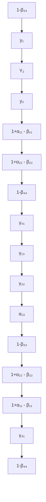
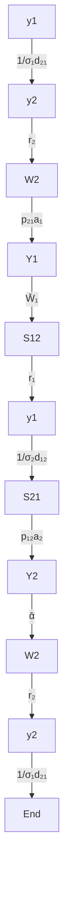

For office use only

T1

T2

T3

T4

Team Control Number

73410

Problem Chosen

B

For office use only

F1

F2

F3

F4

2018

MCM/ICM

Summary Sheet

# Language Population Projection and Location Optimizaion Model Based on Inhomogeneous Transition Matrix and Simulated Annealing Algorithm

Summary

With the advent of increasingly accelerated globalization, the intricate geographic distributions of languages start to hamper international business operations and cross-culture interactions. Comprehending the distribution dynamics has never been more crucial, yet projecting the distributions is difficult, particularly due to the complicated composition of speakers, the influence of various exogenous factors like the migration, government policies, economic development, and eagerness to learn. Therefore, we establish a new model to replace the projection model based purely on population, as it is not only inaccurate but also invalid faced with the scarcity of supporting data.

Our model focuses on native speakers and non-native speakers of languages. We introduce the transition matrix to describe the transition between native speakers and non-native speakers of different languages, because the population growth of a language doesn’t solely come from natural births, but also migration and learning. Additionally, we introduce two new groups: learners and migrants to further analyze the transition. In the end, we intro-duce a set of parameters to represent the exogenous influences, a new variable to express time changes, and establish our inhomogeneous transition matrix.

It has been tested that our matrix only requires relatively little amount of data input to function well. We employ the model to successfully project the geographic distributions of languages in 2067, based on the data in 2017. In the end, we adopt the simulated annealing algorithm to help our client, a large multinational service corporation, select optimal location options for new of-fices.

Keywords: Population of languages, Transition, Office locations

## Contents

## 1 Introduction 2

## 2 Preliminary Model 2

2.1 Notations and Symbol Description . . 2

2.1.1 Symbol Description 2  
2.1.2 Notations 3

2.2 General Assumptions . 3

2.3 Analysis of the Problem 3

2.3.1 N=2 Model 4

2.4 Calculating and Simplifying the Model 6  
2.5 The Model Results 8

## 3 Modified Model 9

3.1 Notations and Symbool Description 9

3.1.1 Additional Notations . 9  
3.1.2 Additional Symbol Description . . 10

3.2 Additional Assumptions . . 10  
3.3 Analysis of the Problem 10  
3.4 Calculating and Simplifying the Model 12  
3.5 The Model Results 13

3.5.1 Graph of Population of Different Language Groups . . . 13  
3.5.2 Graph of the Scale of Migration . . . 14  
3.5.3 Distribution of Non-native English Speakers . . 14

3.6 Sensitivity Analysis . . 15

3.6.1 High Uniformity Scenario . . 15  
3.6.2 Low Uniformity Scenario 16

## 4 Application of Our Model 17

4.1 Assumptions . . 17  
4.2 Symbol Descrption 18  
4.3 Calculating and Simplifying . . 18

4.3.1 The Year of 2017 18  
4.3.2 The Year of 2067 19

## 5 Strengths and Weaknesses 20

## 6 Memo 21

## Appendices 24

Appendix A Tables 24

Appendix B Figures 26

## 1 Introduction

There are about 6,900 languages spoken on Earth nowadays. About half of the world’s population take one of ten languages as their native language and much of the world population also speaks a second language. However, because of a variety of influences, the population of speakers of a language may increase or decrease over time. Our target is to investigate trends of global languages and location options for new offices.

In part I, we compared our problem with the idea of Markov chain, and add transition matrix to describe the population transition from native speakers of a language to second language speakers of another language to native speakers of another language. Considering that transitions are inhomogeneous, we finally built up inhomogeneous transition matrix and used this matrix to predict the populations of different languages and their geographical distribution. In part II, based on prediction of our model in part I, we used simulated annealing algorithm to find the best location options for new offices.

## 2 Preliminary Model

## 2.1 Notations and Symbol Description

## 2.1.1 Symbol Description

<table><tr><td>Symbol</td><td>Description</td></tr><tr><td>N</td><td>The number of languages in consideration</td></tr><tr><td> $Y_{i}^{(n)}$ (i = 1; 2; :;; N; n = 0; 1; 2:::)</td><td>The number of native speakers of language i in the year of n</td></tr><tr><td> $y_{i}^{(n)}$ (i = 1; 2; :;; N; n = 0; 1; 2:::)</td><td>The number of non-native speakers of language i in the year of n</td></tr><tr><td> $Y_{(n)}$ </td><td>the state vector of the model in the year of n</td></tr><tr><td>A</td><td>The transition matrix</td></tr><tr><td>ii</td><td>The annual birth rate of native speakers of language i</td></tr><tr><td>i(N+i)</td><td>The annual proportion of non-native speakers of language i giving birth to native speakers of this language</td></tr><tr><td>ii</td><td>The annual death rate of native speakers of language i</td></tr><tr><td>(N+i)(N+i)</td><td>The annual death rate of non-native speakers of language i</td></tr><tr><td>(N+i)j</td><td>The annual proportion (learning rate) of native speakers of language j successfully starting to master language i</td></tr><tr><td>i</td><td>The total learning rate of language i</td></tr></table>

## 2.1.2 Notations

Native speakers of A are individuals whose first language is A.

Non-native speakers of A are individuals whose first language is not A, but who master A as a foreign language (Implying that the individual possesses advanced skills of language A and is fluent in both speaking and writing).

## 2.2 General Assumptions

1. Speakers of any particular language can be categorized into two groups: native speakers and non-native speakers.  
2. The number of native speakers only increases out of natural birth, and all newborn babies remain native speakers at the year of their birth (Leaving out rare cases of prodigies who can instantly learn to speak foreign languages); The number of native speakers is only reduced by death (Leaving out rare cases of postnatal first language disability).  
3. Native speakers of a certain language cannot be converted to non-native speakers of this language, but can become non-native speakers of other languages.  
4. The number of non-native speakers only increases out of postnatal learning, and only decreases due to death (Leaving out rare cases of forgetting learnt foreign lan-guages).  
5. Non-native speakers of a certain language cannot be converted to native speakers of this language, but can become non-native speakers of other languages.  
6. Once an individual has mastered a new language, he becomes a non-native speaker of this language, while remaining all previous identities.  
7. No radical and unpredicted events will occur, causing utter shifting in the population structure.

## 2.3 Analysis of the Problem

It is apparent that native speakers and non-native speakers of the same language are more closely related, which mainly reflects in:

1. Parents usually raise their children to have the same first languages, or at least languages they master. Therefore, we can assume that new native speakers can only be given birth to by native speakers or non-native speakers of the same language (Leaving out refugees, asylum seekers etc.).  
2. It’s unlikely that native speakers of a certain language can abandon their first language. Therefore, we can assume that no native speakers of a certain language can be converted to non-native speakers of this language (Leaving out rare cases of postnatal first language disability).

Furthermore, A number of people who cannot master a certain language will be con-verted to non-native speakers of this language through learning every year. There will also be natural deaths causing the number of each group of people to drop.

## 2.3.1 N=2 Model

Take the simplest model with only two languages (N = 2) as an example, we are able to plot the transition between different groups of people (See Figure 1).

flowchart

Figure 1: Transition Between Different Groups with Only Two Languages

It can be concluded that this model much resembles the model of homogeneous Markow chain (After converted to the new group, the element will remain in the previous groups). The transition follows the following rules:

$$
\begin{array}{l} \mathbf {Y} ^ {(n + 1)} = \left( \begin{array}{c} Y _ {1} ^ {(n + 1)} \\ Y _ {2} ^ {(n + 1)} \\ y _ {1} ^ {(n + 1)} \\ y _ {2} ^ {(n + 1)} \end{array} \right) \\ = \left( \begin{array}{c c c c} 1 + \alpha_ {1 1} - \beta_ {1 1} & 0 & \alpha_ {1 3} & 0 \\ 0 & 1 + \alpha_ {2 2} - \beta_ {2 2} & 0 & \alpha_ {2 4} \\ 0 & \gamma_ {3 2} & 1 - \beta_ {3 3} & 0 \\ \gamma_ {4 1} & 0 & 0 & 1 - \beta_ {4 4} \end{array} \right) \left( \begin{array}{l} Y _ {1} ^ {(n)} \\ Y _ {2} ^ {(n)} \\ y _ {1} ^ {(n)} \\ y _ {2} ^ {(n)} \end{array} \right) \tag {1} \\ = \mathbf {A} \mathbf {Y} ^ {(n)} \\ \end{array}
$$

In expression (1), parameters are set as follows:

1. 11; 22 represents the annual birth rate of native speakers of language 1 and 2 respectively.  
2. 11; 22 represents the annual death rate of native speakers of language 1 and 2 respectively.  
3. 13; 24 represents the ratio of non-native speakers of language 1 and 2 giving birth to native speakers of corresponding language respectively (Assuming all births are single births).

4. 32; 41 represents the ratio of native speakers of language 1 and 2 learn to speak the other language respectively.  
5. 33; 44 represents the annual death rate of non-native speakers of language 1 and 2 respectively.  
6. It should be noted that we set zero the (3; 4) and the (4; 3) element in the matrix to prevent double counting.  
7. Additionally, we also set zero the (1; 4) and the (2; 3) element to prevent double counting (e.g. offspring of people who are native speakers of language 1 and nonnative speakers of language 2 will be counted twice).

If the transition reaches a steady state (Implying that each group takes up a steady split of total population, rather than in terms of absolute quantity), it can be derived:

$$
\lim _ {k \rightarrow \infty} \mathbf {A} ^ {k} \mathbf {Y} ^ {(0)} = \lambda^ {k} \mathbf {Y} \tag {2}
$$

is the growth rate of total population, Y(0) is an arbitrary initial vector,Y is a constant vector.

When the transition reaches the steady state, we have:

$$
\mathbf {A} \mathbf {Y} = \lambda \mathbf {Y} \tag {3}
$$

Obviously, is the eigenvalue of matrix A, and Y is the eigenvector of this matrix. We can derive the proportion of each group through matrix normalization Y.

To simplify the test of this model, let’s consider a particular scenario with following parameters:

$$
\alpha_ {1 1} = \alpha_ {2 2} = 0. 0 2
$$

$$
\alpha_ {1 3} = \alpha_ {2 4} = 0. 0 5
$$

$$
\beta_ {1 1} = \beta_ {2 2} = \beta_ {3 3} = \beta_ {4 4} = 0. 0 1 \tag {4}
$$

$$
\gamma_ {4 1} = \gamma_ {3 2} = 0. 0 1
$$

The transition matrix is:

$$
\mathbf {A} = \left( \begin{array}{c c c c} 1. 0 1 & 0 & 0. 0 5 & 0 \\ 0 & 1. 0 1 & 0 & 0. 0 0 5 \\ 0 & 0. 0 1 & 0. 9 9 & 0 \\ 0. 0 1 & 0 & 0 & 0. 9 9 \end{array} \right) \tag {5}
$$

This matrix possesses four different eigenvalues, and only when = 1:01049, can the eigenvector be positive semidefinite vector (all elements are non-negative):

$$
\mathbf {Y} = \left( \begin{array}{l} 0. 5 0 0 \\ 0. 5 0 0 \\ 1. 1 2 4 \\ 1. 1 2 4 \end{array} \right) \tag {6}
$$

This is the steady state of language population structure, which represents that no matter what the initial distribution is, non-native speakers of these two languages will both take up 1:124 of the total population.

Apparently, in the bilingual (N = 2) model, the number of non-native speakers of each language exceeds that of native speakers of each language, which poses an indirect constraint on the range of parameter (learning rate). By employing the Matlab, we derive the quantitative influence of learning rate on the proportion of non-native speakers.

line chart

| Learning rate(γ) | Ratio of non-native speakers |
| ---------------- | ---------------------------- |
| 0.000            | 0.0                          |
| 0.005            | 0.2                          |
| 0.010            | 0.4                          |
| 0.015            | 0.6                          |
| 0.020            | 0.8                          |
| 0.025            | 1.0                          |
| 0.030            | 1.2                          |
| 0.035            | 1.4                          |
| 0.040            | 1.6                          |
| 0.045            | 1.8                          |
| 0.050            | 2.0                          |

Figure 2: Correlation Between the Proportion of Non-native Speakers and Learning Rate ( )

We can see in (Figure 2), when > 0:021, the proportion of non-native speakers exceeds that of native speakers. Therefore, this model cannot stay at a learning rate greater than 0.021 in the long run.

## 2.4 Calculating and Simplifying the Model

Since the top twenty-six languages cover most of the world population, we have reason to believe that the majority of verbal communications and information exchanges are conducted through these twenty-six languages. Due to limited data[1], we will only be analyzing twenty-two major languages out of these twenty-six languages in this subsection (We will come back to the twenty-six-language model in the following sections). Thus, we only consider a model with twenty-two languages (N = 22), and the transition matrix for this model is:

$$
\mathbf {A} = \left( \begin{array}{c c c c c c} 1 + \alpha_ {1 1} - \beta_ {1 1} & \dots & 0 & \alpha_ {1 (N + 1)} & \dots & 0 \\ \vdots & \ddots & \vdots & \vdots & \ddots & \vdots \\ 0 & \dots & 1 + \alpha_ {N N} - \beta_ {N N} & 0 & \dots & \alpha_ {N (2 N)} \\ 0 & \dots & \gamma_ {(N + 1) N} & 1 - \beta_ {(N + 1) (N + 1)} & \dots & 0 \\ \vdots & \ddots & \vdots & \vdots & \ddots & \vdots \\ \gamma_ {(N + N) 1} & \dots & 0 & 0 & \dots & 1 - \beta_ {(2 N) (2 N)} \end{array} \right) \tag {7}
$$

To make a more accurate projection, we should set the values of parameters in this model to better fit the real scenario:

1. Given that native speakers of different languages have distinctive birth rates and death rates, we introduce a set of new data to reflect the difference[1].

To derive the birth rate and death rate of different language groups, we first catego-rize nations by official language, and select several major nations to represent each group (Total number of native speakers in these countries taking up more than 90% of the total number of native speakers of this language worldwide). We have the following table in Appendix A.

We draw upon public sources for population, annual birth rate and death rate of aforementioned nations (2013). We then compute the weighted average an-nual birth rate and death rate of language groups, and list in the table in Ap-pendix A)[4][5]

2. Since non-native speakers of a language can come from any nations (other than nations where this language is commonly regarded as first language), we may as well assume non-native speakers of different languages share the same birth rate and death rate (equal to world average death rate):

$$
\begin{array}{l} \beta_ {(N + 1) (N + 1)} = \beta_ {(N + 2) (N + 2)} = \dots = \beta_ {(N + N) (N + N)} = \overline {{{{\beta}}}} \tag {8} \\ \alpha_ {1 (N + 1)} = \alpha_ {2 (N + 2)} = \dots = \alpha_ {N (N + N)} \quad = \alpha \\ \end{array}
$$

Drawing upon public sources, world average death rate: = 0:0083; world average birth rate: $^ { - } = \dot { 0 } { : } 0 1 9 3$ , and the proportion of immigrants to non-native speakers of a certain language is: r = 0:172, Therefore, we may assume:

$$
\alpha = r \overline {{{\alpha}}} = 0. 0 0 3 3 \tag {9}
$$

3. Considering different languages bear different level of attractiveness, the learning rate for each language should also be different. To simplify the model, it is reasonable for us to assume a language is indifferently attractive to different groups of people, therefore leading to the same learning rate amongst different groups, though it may not be the real case.

$$
\gamma_ {i (N + 1)}: \gamma_ {i (N + 2)}: \dots : \gamma_ {i (N + j)}: \dots : \gamma_ {i (N + N)}; j = 1, 2, \dots , N, j \neq i \tag {10}
$$

The learning rate (shown above) is a constant rate. We can temporarily assume that the learning rate of a language equals the proportion of its non-native speakers to total non-native speakers, multiplied by the total learning rate.

$$
\begin{array}{l} \gamma (N + 1) i: \gamma (N + 2) i: \dots : \gamma (N + j) i: \dots : \gamma (N + N) i \\ = y _ {1} ^ {(0)}: y _ {2} ^ {(0)}: \dots : y _ {N} ^ {(0)} \\ = 1 7 8: 5 1 0: 9 0: 2 1 4: 2 6: 3 0: 2 0: 8 7: 4 1: 8: 0. 2: 5: 8: 4: 0. 2: 3: 0. 3 \\ : 1: 5: 1: 6: 2 \\ = 0. 1 4 9 1: 0. 4 2 7 2: 0. 0 7 5 4: 0. 1 7 9 2: 0. 0 2 1 8: 0. 0 2 5 1: 0. 0 1 6 8: 0. 0 7 2 9: 0. 0 3 4 5 \tag {11} \\ : 0. 0 0 6 7: 0. 0 0 0 2: 0. 0 0 4 2: 0. 0 0 6 7: 0. 0 0 3 4: 0. 0 0 0 2: 0. 0 0 2 5: 0. 0 0 0 3: 0. 0 0 0 8 \\ : 0. 0 0 4 2: 0. 0 0 0 8: 0. 0 0 5 0: 0. 0 0 1 7 \\ = \hat {y _ {1}} ^ {(0)}: \hat {y _ {2}} ^ {(0)}: \dots : \hat {y _ {N}} ^ {(0)} \\ \end{array}
$$

Note that the last equation is normalized.

Therefore, the annual learning rate $( \mathsf { N } { + } \mathsf { j } ) ; \mathsf { i }$ from group i to group j (non-native speakers) is the normalization ratio $\mathsf { y } ^ { \wedge _ { \cdot } ( 0 ) }$ shown, multiplied by the group’s annual total learning rate , which is:

$$
\gamma_ {(N + j) i} = \hat {y} _ {j} ^ {(0)} \Gamma_ {i} \tag {12}
$$

The modified transition matrix is too huge (44 44), so we will not present it here to save space:

## 2.5 The Model Results

We use data in 2013 to establish the initial vector ${ \mathsf { Y } } ^ { ( 0 ) }$ , and obtain the projected statistics in 2017 after four alterations. $\mathsf { Y } ^ { ( 4 ) } = \mathsf { A } ^ { 4 } \mathsf { Y } ^ { ( 0 ) }$ (Presenting only the top 10 figures) (Table 1):

<table><tr><td>Language</td><td>Native (predict)</td><td>Native (real)</td><td>Non-native (predict)</td><td>Non-native (real)</td></tr><tr><td>Mandarin</td><td>870</td><td>897</td><td>180</td><td>193</td></tr><tr><td>English</td><td>353</td><td>371</td><td>521</td><td>611</td></tr><tr><td>Spanish</td><td>422</td><td>436</td><td>92</td><td>91</td></tr><tr><td>Hindi/Urdu</td><td>340</td><td>329</td><td>219</td><td>215</td></tr><tr><td>Russian</td><td>170</td><td>153</td><td>27</td><td>113</td></tr><tr><td>Portuguese</td><td>206</td><td>218</td><td>31</td><td>11</td></tr><tr><td>Bengali</td><td>201</td><td>242</td><td>20</td><td>19</td></tr><tr><td>French</td><td>78</td><td>76</td><td>89</td><td>153</td></tr><tr><td>Japanese</td><td>129</td><td>128</td><td>?</td><td>?</td></tr><tr><td>German</td><td>78</td><td>76</td><td>8</td><td>52</td></tr></table>

Table 1: Projections for Population Statistics of Major Languages in 2017

There are deviations between projected and real statistics in a number of items, like the number of non-native German speakers. To quote the data in 2013, there are only eight million non-native German speakers, whereas the figure reaches fifty-two million in 2017. This apparently goes against common sense, so we believe that these deviations are mostly caused by the inaccuracy of the data (In fact the inaccuracy of the data is also pronounced by the data source itself).

The data in 2013 is in Appendix A[1].

Additionally we can compute the positive semidefinite eigenvector Y (Normalized according to statistics of the former 22 groups) and the eigenvalue of the transition matrix A:

$$
\mathbf {Y} = (0. 0 0 5 0, \dots , 0. 9 6 0 1, \dots , 0. 0 0 0 3) ^ {T} \tag {13}
$$

$$
\lambda = 1. 0 2 1 5
$$

These two items have corresponding practical meanings:

1. Eigenvector: the equilibrium ratio (in the long run) of the population of each group to total population.  
2. Eigenvalue: the equilibrium total growth rate (in the long run) (accumulated growth rate of all language groups).

We can find that native speakers of Panjabi will take up more than 96% of total population when reaching equilibrium, which obviously goes against common sense. The reason why this phenomenon takes place is that the birth rate of native speaker of Panjabi is the highest (0.0286) amongst all native speaker groups, and that the group with the highest growth rate will dominate in a homogeneous model.

Therefore, to conduct a more accurate projection in the long run, we must introduce time as a new variable into the model, or rather: an inhomogeneous model.

## 3 Modified Model

The aforementioned preliminary model yields quite accurate projections for population of different language groups in the short run. However, the model is lacking in accuracy when it comes to long-run projections. Defects of the model are:

1. No regard to the process of learning a language, which implies that it takes time for an individual to master a new language, and that the length of time is influenced by education level, language similarity (e.g. English is more similar to French than to Mandarin), and eagerness to learn  
2. No regard to the change of birth rate and death rate over time  
3. No regard to the economic development over time  
4. Fail to reveal the exact impact of population migration  
5. Fail to derive the distribution of English population group as requested by our client

Therefore, building upon the preliminary model, we introduce time as a new variable to better fit the real case. Furthermore, we introduce a new dimension of variables (language learners, migrants, a breakdown of English speakers) to observe the process of learning and migration.

Note: For convenience, we number English as 1, and Chinese as 2.

## 3.1 Notations and Symbool Description

## 3.1.1 Additional Notations

Learners of language B from language A are native speakers of language A who are starting to learn language B (not non-native speakers of language B).

Language group (region) A are regions where native speakers of language A take residence (Implying that the total population of language region A is the population of native speakers of language A, and that we use the economic data of aforementioned major countries to represent their corresponding language groups (regions)).

Migrants to language B region are non-native speakers of language B whose offspring is native speaker of language B, or rather the first-generation immigrants.

Decrease matrix is the matrix evaluating the natural death and migration of a language group.

## 3.1.2 Additional Symbol Description

<table><tr><td>Symbol</td><td>Description</td></tr><tr><td> $y_{j1}^{(n)} (j = 2, ..., N; n = 0, 1, 2...)$ </td><td>the number of non-native English speakers who are converted in the year of  $n$ , from language  $j$ </td></tr><tr><td> $S_{ji}$ </td><td>the number of learners of language  $j$  from language  $i$ </td></tr><tr><td> $W_j$ </td><td>the number of migrants to language  $j$  region</td></tr><tr><td> $p_{ji}(0 < p_{ij} < 1)$ </td><td>the eagerness to learn language  $j$  of people from language  $i$  group (region)</td></tr><tr><td> $d_{ji}$ </td><td>the similarity between language  $i$  and language  $j$ </td></tr><tr><td> $σ_i$ </td><td>the average length of learning a foreign language of the same family in language  $i$  group (region)</td></tr><tr><td> $a_i$ </td><td>the annual proportion of new learners to the total population of language region  $i$ </td></tr><tr><td> $r_j$ </td><td>the proportion of migrants to non-native speakers of language  $j$ </td></tr><tr><td> $\Xi$ </td><td>the natural growth matrix of native speakers</td></tr><tr><td> $Π_1$ </td><td>the decrease matrix of non-native English speakers</td></tr><tr><td> $Π$ </td><td>the decrease matrix of non-native speakers</td></tr><tr><td> $Ω$ </td><td>the death matrix of migrants</td></tr><tr><td>S</td><td>the reproductive matrix of migrants</td></tr><tr><td> $G_1$ </td><td>the learning matrix of English</td></tr><tr><td>G</td><td>the learning matrix of all languages combined</td></tr><tr><td> $R_1$ </td><td>the migration matrix of English region</td></tr><tr><td>R</td><td>the migration matrix</td></tr></table>

## 3.2 Additional Assumptions

1. The birth rate and death rate of each group is not affected by the population of each group, and only changes over time.  
2. An individual will not be born as a learner (Implying that the number of learners only increase due to learning, not reproduction), and will not die during learn-ing (However, the natural death rate will not be affected, since learners are mostly young and unlikely to die).  
3. Offspring of migrants will be considered as native speakers of the language region they migrate into.  
4. Once an individual successfully migrates into a foreign language region, he will not be considered a non-native speaker of this language (Implying that the nonnative speaker group in the aforementioned preliminary model can actually be broken down into two groups in this model: non-speaker group and migrant group of this language).

## 3.3 Analysis of the Problem

Example graph of transition between different groups in a bilingual model with regard to learners and immigrants is shown below (Figure 3):

flowchart

Figure 3: Example Graph of Transition Between Different Groups in a Bilingual Model

The transition matrix in the year of n is:

$$
\mathbf {A} ^ {(n)} = \left( \begin{array}{c c c} \boldsymbol {\Xi} ^ {(n)} & \mathbf {0} & \mathbf {S} ^ {(n)} \\ \mathbf {G} ^ {(n)} & \boldsymbol {\Pi} ^ {(n)} & \mathbf {0} \\ \mathbf {0} & \mathbf {R} ^ {(n)} & \boldsymbol {\Omega} ^ {(n)} \end{array} \right)
$$

The population of a language in the year of (n + 1) can be expressed as:

$$
\mathbf {Y} ^ {(n + 1)} = \mathbf {A} ^ {(n)} \mathbf {Y} ^ {(n)} \tag {14}
$$

When Y changes, it will, in turn, influence the transition matrix:

$$
\mathbf {A} ^ {(n + 1)} = F [ \mathbf {Y} ^ {(n)}, n ] \tag {15}
$$

1.  is the natural growth matrix of native speakers, and possesses the property of diagonality, with a diagonal entry equal to 1 plus natural growth rate (1 + natural growth rate).  
2. II is the decrease matrix of non-native speakers, and possesses the property of diagonality, with a diagonal entry equal to 1 minus death rate and migration rate (1 - death rate - migration rate).  
3.Ω is the death matrix of migrants, and possesses the property of diagonality.  
4. G is the transition matrix from native speakers to non-native speakers of another language (learning matrix), and has a diagonal entry equal to 0.  
5. R is the transition matrix from non-native speakers to migrants of the same language (learning matrix), and possesses the property of diagonality.  
6. S is the reproduction matrix of migrants, and possesses the property of diagonality.

If we want to analyze the distribution of English speakers separately, we should mod-ify the aforementioned matrix as follows:

$$
\mathbf {A} ^ {(n)} = \left( \begin{array}{c c c c} \boldsymbol {\Xi} ^ {(n)} & \mathbf {0} & \mathbf {0} & \mathbf {S} ^ {(n)} \\ \mathbf {G _ {1}} ^ {(n)} & \boldsymbol {\Pi_ {1}} ^ {(n)} & \mathbf {0} & \mathbf {0} \\ \mathbf {G} ^ {(n)} & \mathbf {0} & \boldsymbol {\Pi} ^ {(n)} & \mathbf {0} \\ \mathbf {0} & \mathbf {R _ {1}} ^ {(n)} & \mathbf {R} ^ {(n)} & \boldsymbol {\Omega} ^ {(n)} \end{array} \right)
$$

1. $\Pi _ { 1 }$ is the decrease matrix of non-native English speakers and possesses the property of diagonality, with a diagonal entry equal to 1 minus death rate and migration rate (1-death rate-migration rate).  
2. $\mathbf { G } _ { 1 }$ is the transition matrix from native speakers of other languages to non-native English speakers (learning matrix of English), with all entries zero in the first column. The rest of the matrix is a diagonal matrix.  
3. $\mathbf { R _ { 1 } }$ is the transition matrix from non-native speakers of English to migrants of English region (migration matrix of English), with all entries zero other than entries in the first row.

It should be noted that we only consider the distribution of non-native English speak-ers in the aforementioned matrixes, but the distribution of English speakers can be influ-enced by emigrants of native English speakers. However, since the number of non-native speakers far exceeds that of emigrants’, we’ll leave out such an influence.

We have considered three exogenous factors in total:

1. Government policy factor will influence parameter pij and rj.  
2. Economic factor and initial population factor will influence parameter pij and rj.  
3. Education factor will influence parameter i and ai

## 3.4 Calculating and Simplifying the Model

We take the year of 2017 as the starting year. Since the top twenty-six languages cover most of the world population, we have reason to believe that the majority of verbal communications and information exchanges are conducted through these twenty-six lan-guages. Therefore, we only consider a model with twenty-six languages (N = 26).

Prior to determining the transition matrix, we should first set the initial vector, which stands for the initial distribution of non-native English speakers. We assume the initial distribution of non-native English speakers to be proportional to the distribution of native speakers in total, which is:

$$
y _ {2 1} ^ {(0)}: \dots : y _ {N 1} ^ {(0)} = Y _ {2} ^ {(0)}: \dots : Y _ {N} ^ {(0)} \tag {16}
$$

To save time, we adopt the annual birth rate, death rate and migration rate projected for the next fifty years by United Nations. We employ the weighted average method to compute the birth rate, death rate and migration rate in the upcoming fifty years, and plot the trend in passing. See: Apendix B

Building upon these data, we can set: , 1, , ,S,R1,R. Then

we should attempt to set $\mathsf { G } ; \mathsf { G } _ { 1 } \mathrm { : }$ uu

The learning rate $\mathbf { j i } ^ { ( \mathsf { n } ) }$ from language group i to language j satisfies that:

$$
\gamma_ {j i} ^ {(n)} = \frac {p _ {j i} ^ {(n)} a _ {i} ^ {(n)}}{\sigma_ {i} ^ {(n)} d _ {j i} ^ {(n)}} \tag {17}
$$

We assume the eagerness $\mathsf { p } _ { \mathsf { j } \mathsf { i } } ^ { ( \mathsf { \Pi } , \mathsf { n } ) }$ to learn is proportional to the number of non-native speakers of language j (Assuming that people’s eagerness to learn a language in the past reflects people’s eagerness to learn this language in the future):

$$
p _ {1 i} ^ {(n)}: \dots : p _ {N i} ^ {(n)} = y _ {1} ^ {(n)}: \dots : y _ {N} ^ {(n)} = \hat {y _ {1}} ^ {(n)}: \dots : \hat {y _ {N}} ^ {(n)}
$$

We assume all language groups share the same level of education:

$$
a _ {1} = \dots = a _ {N} = 0. 0 1
$$

$$
\sigma_ {1} = \dots = \sigma_ {N} = 3
$$

We assume that any two languages from the same language family have the firstlevel similarity (Implying a similarity parameter equal to 1), whereas any two languages from different language families have the second-level similarity (Implying a similarity parameter equal to 2), which can be expressed as:

$$
d _ {j i} = \left\{ \begin{array}{l l} 1, & \text { If   language   i   and   j   belong   to   the   same   language   family } \\ 2, & \text { If   language   i   and   j   belong   to   different   language   families } \end{array} \right.
$$

This implies that one in a hundred people start to learn a foreign language annually in each country. On average, it takes them three years to master a foreign language from the same language family as their first language, and six years if from different language families.

## 3.5 The Model Results

## 3.5.1 Graph of Population of Different Language Groups

We will skip the computation process to save space. Through repeated alterations, we can plot the graph of population of different language groups in the next fifty years (Figure 4).

Based on the projections, we can align the top ten languages in terms of population in 2017 and 2067: (Table 2):

According to this ranking, Portuguese and French both drop out of the top ten, whereas Hausa and Punjabi make it to the top ten. We observe the following patterns for lan-guages whose ranking elevates:

1. High birth rate, e.g. Hausa and Punjabi  
2. For language groups whose migration is mostly immigration, belonging to a bigger family (more languages from the same family) would be better, whereas it is the opposite for language groups whose migration is mostly emigration, e.g. Arabic  
3. High attractiveness (Implying people’s stronger eagerness to learn this language), e.g. English

line chart

| Year | Mandarin | English | Arabic | Spanish | Hindustani |
|------|----------|---------|--------|---------|------------|
| 2010 | 1100     | 1000    | 550    | 550     | 280        |
| 2020 | 1100     | 1020    | 580    | 600     | 300        |
| 2030 | 1100     | 1040    | 600    | 650     | 320        |
| 2040 | 1100     | 1060    | 620    | 680     | 340        |
| 2050 | 1100     | 1080    | 640    | 700     | 360        |
| 2060 | 1100     | 1100    | 660    | 720     | 380        |
| 2070 | 1100     | 1120    | 680    | 740     | 400        |

Figure 4: Graph of Population of Top Five Language Groups in the Next Fifty Years (See in Apendix B for the rest twenty-one language groups)

<table><tr><td>Ranking</td><td>2017</td><td>2067</td></tr><tr><td>1</td><td>Mandarin</td><td>English</td></tr><tr><td>2</td><td>English</td><td>Mandarin</td></tr><tr><td>3</td><td>Hindi/Urdu</td><td>Arabic</td></tr><tr><td>4</td><td>Spanish</td><td>Spanish</td></tr><tr><td>5</td><td>Arabic</td><td>Hindi/Urdu</td></tr><tr><td>6</td><td>Malay</td><td>Bengali</td></tr><tr><td>7</td><td>Russian</td><td>Hausa</td></tr><tr><td>8</td><td>Bengali</td><td>Malay</td></tr><tr><td>9</td><td>Portuguese</td><td>Punjabi</td></tr><tr><td>10</td><td>French</td><td>Russian</td></tr></table>

Table 2: Ranking of Languages by Population in 2017 and 2067

## 3.5.2 Graph of the Scale of Migration

Additionally, we can easily derive the graph of the scale of migration starting from the year of 2017 (Figure 5)

We only label in the graph the top four attractive language regions for immigrants, and it’s apparent that they are all developed countries except for Russia (Mostly due to the historical factor that the population is not clearly divided amongst neighboring countries after the disintegration of USSR). Furthermore, the quantity of immigrants to English region (Over one hundred million) far exceeds that of other language regions’, mostly driven by the extensive acceptance of this language.

## 3.5.3 Distribution of Non-native English Speakers

We can also easily derive the distribution of non-native English speakers (Figure 6):

The scale of non-native English speakers is unparalleled. According to our projections, there are more than ninety million non-native English speakers amongst all native Chinese speakers.

What intrigues us is that despite most English nations (e.g. U.S.A., UK) being isolated in terms of geography, English regions have the largest scale of immigrants and nonnative speakers. This implies that geographic factors will not pose significant impact on migration in the next fifty years.

line chart

| Year | English | French | German | Russian |
|------|---------|--------|--------|---------|
| 2010 | 0       | 0      | 0      | 0       |
| 2020 | 15      | 1      | 1      | 0.5     |
| 2030 | 40      | 3      | 2      | 1       |
| 2040 | 65      | 5      | 3      | 1.5     |
| 2050 | 85      | 7      | 4      | 2       |
| 2060 | 105     | 9      | 5      | 2.5     |
| 2070 | 115     | 10     | 6      | 3       |

Figure 5: Graph of the Scale of Migration in the Next Fifty Years (Starting from the year of 2017)  

pie chart

| Language | Percentage (%) |
|---|---|
| Mandarin | 35 |
| Spanish | 25 |
| Hindi | 18 |
| Arabic | 15 |
| Bengali | 12 |
| Portuguese | 10 |
| Punjabi | 8 |
| Russian | 6 |
| Hausa | 5 |
| Japanese | 4 |
| Others | 45 |

Figure 6: Distribution of Non-native English Speakers in 2067

## 3.6 Sensitivity Analysis

In this subsection, we will be mainly analyzing the sensitivity of our model to the uniformity of eagerness to learn of different language groups (Implying that and that if a language group has a barely uniform eagerness to learn, people in this language group tends to learn different foreign languages).

## 3.6.1 High Uniformity Scenario

If a language group has high uniformity in terms of eagerness to learn, people’s probability of choosing to learn each language is more uniformly distributed. The major corresponding real cases are:

1. Governments impose no restrictions over second language, and people in this lan-

guage group can choose which foreign language to learn at their discretion.

2. People are not highly purposeful when it comes to learning a foreign language, which means that they are not learning foreign languages merely for the purpose of attaining more opportunities.

To reflect the characteristics of a high uniformity scenario, we modify expression (17) to:

$$
\gamma_ {j i} ^ {(n)} = \frac {(y _ {i} ^ {(n)}) ^ {k} a _ {i} ^ {(n)}}{\sigma_ {i} ^ {(n)} d _ {j i} ^ {(n)}}
$$

The higher k is, the lower the uniformity is. The initial model adopts k = 1, and when k = 0:1, the graph of population of different language groups are as follows: (Figure 7).

line chart

| - | ~98 |
| --- | --- |
| - | ~97 |
| - | ~96 |
| - | ~95 |
| - | ~94 |
| - | ~93 |
| - | ~92 |
| - | ~91 |
| - | ~90 |
| - | ~89 |
| - | ~87 |
| - | ~86 |
| - | ~85 |
| - | ~84 |
| - | ~83 |
| - | ~82 |
| - | ~81 |
| - | ~80 |
| - | ~79 |
| - | ~78 |
| - | ~77 |
| - | ~76 |
| - | ~75 |
| - | ~74 |
| - | ~73 |
| - | ~72 |
| - | ~71 |
| - | ~70 |
| - | ~69 |
| - | ~68 |
| - | ~67 |
| - | ~66 |
| - | ~65 |
| - | ~64 |
| - | ~63 |
| - | ~62 |
| - | ~61 |
| - | ~60 |
| - | ~59 |
| - | ~58 |
| - | ~57 |
| - | ~56 |
| - | ~55 |
| - | ~54 |
| - | ~53 |
| - | ~52 |
| - | ~51 |
| - | ~50 |
| - | ~49 |
| - | ~48 |
| - | ~47 |
| - | ~46 |
| - | ~45 |
| - | ~44 |
| - | ~43 |
| - | ~42 |
| - | ~41 |
| - | ~40 |
| - | ~39 |
| - | ~38 |
| - | ~37 |
| - | ~36 |
| - | ~35 |
| - | ~34 |
| - | ~33 |
| - | ~32 |
| - | ~31 |
| - | ~30 |
| - | ~29 |
| - | ~28 |
| - | ~27 |
| - | ~26 |
| - | ~25 |
| - | ~24 |
| - | ~23 |
| - | ~22 |
| - | ~21 |
| - | ~20 |
| - | ~19 |
| - | ~18 |
| - | ~17 |
| - | ~16 |
| - | ~15 |
| - | ~14 |
| - | ~13 |
| - | ~12 |
| - | ~11 |
| - | ~10 |
| - | ~9 |
| - | ~8 |
| - | ~7 |
| - | ~6 |
| - | ~5 |
| - | ~4 |
| - | ~3 |
| - | ~2 |
| - | ~1 |

Figure 7: Graph of Population of Different Language Groups When k=0.1

We can find that the population of English doesn’t exceed that of Mandarin’s. The attractiveness of English is impaired.

## 3.6.2 Low Uniformity Scenario

If a language group has high uniformity in terms of eagerness to learn, people’s probability of choosing to learn each language is less uniformly distributed (concentrated at widely accepted foreign languages). The major corresponding real cases are:

1. Governments introduce restrictions over second language, e.g. all people should learn a specified foreign language.  
2. People are highly purposeful when it comes to learning foreign languages, eager to attain more opportunities through language learning.

When k = 10, the graph of population of different language groups is as follows (Figure 8).

We can find that the population of English is rocketing, surpassing that of Mandarin’s tens of years earlier. The attractiveness of English is further reinforced.

line chart

| Year | English | Mandarin | Hindi | Spanish | Arabic | Malay | Russian | Bengali | Portuguese | French | Hausa | Punjabi | Japanese | German | Persian | Swahili | Tekugu | Javanese | Wu | Korean | Tamil | Marathi | Yue | Turkish | Vietnamese | Italian |
| --- | --- | --- | --- | --- | --- | --- | --- | --- | --- | --- | --- | --- | --- | --- | --- | --- | --- | --- | --- | --- | --- | --- | --- | --- | --- | --- |
| 2010 | 1000 | 500 | 250 | 500 | 250 | 250 | 250 | 250 | 250 | 250 | 250 | 250 | 250 | 250 | 250 | 250 | 250 | 250 | 250 | 250 | 250 | 250 | 250 | 250 | 250 | 250 |
| 2020 | 1100 | 600 | 300 | 600 | 300 | 300 | 300 | 300 | 300 | 300 | 300 | 300 | 300 | 300 | 300 | 300 | 300 | 300 | 300 | 300 | 300 | 300 | 300 | 300 | 300 | 300 |
| 2030 | 1200 | 700 | 350 | 700 | 350 | 350 | 350 | 350 | 350 | 350 | 350 | 350 | 350 | 350 | 350 | 350 | 350 | 350 | 350 | 350 | 350 | 350 | 350 | 350 | 350 | 350 |
| 2040 | 1300 | 800 | 400 | 800 | 400 | 400 | 400 | 400 | 400 | 400 | 400 | 400 | 400 | 400 | 400 | 400 | 400 | 400 | 400 | 400 | 400 | 400 | 400 | 400 | 400 | 400 |
| 2050 | 1400 | 900 | 450 | 900 | 450 | 450 | 450 | 450 | 450 | 450 | 450 | 450 | 450 | 450 | 450 | 450 | 450 | 450 | 450 | 450 | 450 | 450 | 450 | 450 | 450 | 450 |
| 2060 | 1500 | 1000 | 500 | 1000 | 500 | 500 | 500 | 500 | 500 | 500 | 500 | 500 | 500 | 500 | 500 | 500 | 500 | 500 | 500 | 500 | 500 | 500 | 500 | 500 | 500 | 500 |

Figure 8: Graph of Population of Different Language Groups When k=10

## 4 Application of Our Model

## 4.1 Assumptions

With regard to our client company being a large multinational service company, we derive their extrinsic and intrinsic needs for additional international offices:

1. These six new offices should cover the population of major languages (twentythree major languages listed by our client) in a mutually exclusive and collectively ex-haustive way (Implying that each language can only be covered by one of the six offices except for English).  
2. The basic working languages of an office are English and local language.  
3. These offices should cover languages with the largest population and the most robust economy (Evaluated based on the GDP of different language regions). The transportation costs between each office and the language regions they cover should also be the smallest.  
4. One office shouldn’t cover too many different languages, or else there will be an impairment on profit due to lower operation efficiency and higher costs.  
5. There must be English speaking residents near each office (Each language region is projected to have English speaking residents by our previous models)

Drawing upon the analysis above, we establish our rating model for office locations:

$$
S _ {i} = \epsilon^ {k _ {i}} \sum_ {j = 0} ^ {k _ {i}} \frac {P _ {i j} ^ {\eta_ {1}} E _ {i j} ^ {\eta_ {2}}}{D _ {i j} ^ {\eta_ {3}}} - h _ {i} \tag {18}
$$

$$
h _ {i} = \frac {1 0 ^ {\eta_ {1}} E _ {i 0} ^ {\eta_ {2}}}{D _ {i 0} ^ {\eta_ {3}}}
$$

## 4.2 Symbol Descrption

<table><tr><td>Symbol</td><td>Description</td></tr><tr><td> $S_i$ </td><td>The score of office location i</td></tr><tr><td> $k_i$ </td><td>The number of additional languages used by office i (Other than English and the local language)</td></tr><tr><td> $\epsilon$ </td><td>The marginal impairment rate on profit when an office covers one more language</td></tr><tr><td> $P_{ij}$ </td><td>The total population of language j group (All covered by office i, and evaluated based on accumulated population of major nations in the group) (Unit: million)</td></tr><tr><td> $E_{ij}$ </td><td>The accumulated GDP of language j group (All covered by office i, and evaluated based on accumulated GDP of major nations in the group) (Unit: ten billion USD)</td></tr><tr><td> $D_{ij}$ </td><td>The transportation costs from office i to language j region (Office i covering language j, and evaluated based on current weighted average transportation costs by air, water and land route (if possible), from the site to major nations in the region)</td></tr><tr><td> $\eta_1, \eta_2, \eta_3$ </td><td>Weight coefficient</td></tr><tr><td> $h_i$ </td><td>The establishment cost of office i (e.g. rent)</td></tr></table>

Note: j = 0 represents the local language of the office.

## 4.3 Calculating and Simplifying

To start with, we propose a list of candidate cities for further examination and selec-tion. These cities cover major nations of all twenty-three languages, except for English, Mandarin and Wu (Because our client has already set up offices in cities covering those language regions):

Bombay, Dubai, Madrid, Jakarta, Moscow, Rio de Janeiro, Dhaka, Paris, Abuja, Islam-abad, Tokyo, Berlin, Tehran, Dodoma, Seoul, Hong Kong, Istanbul, Ho Chi Minh City, Rome.

## 4.3.1 The Year of 2017

We conduct simulation on the data of 2017, with weight coefficients set as (Set to fit the real case and their orders of magnitude):

$$
\epsilon = 0. 9 8, \eta_ {1} = \eta_ {2} = \eta_ {3} = 1,
$$

Given the enumeration method taking too much time, we decide to adopt the simulated annealing algorithm to derive the model. We set the initial temperature: $T _ { 0 } = 9 7 ,$ terminal temperature: $T _ { t } = 3 ,$ ,attenuation coefficient: $\alpha = 0 . 9 9$ , Markoff chain length: $l = 1 0 0 0 0 ,$ , and language-city transition ratio: $\rho = 8 : 2$ We assume the model satisfies Metro Polis-Hastings algorithm.

After repeating for ten times, we have the stable solution with the highest accumulated scores:

<table><tr><td>Office location</td><td>Covering languages (Exclusive of English)</td></tr><tr><td>Tokyo</td><td>Japanese, Korean, Javanese, Malay</td></tr><tr><td>Bombay</td><td>Hindustani, Telugu, Tamil, marathi</td></tr><tr><td>Madrid</td><td>Spanish, Italian</td></tr><tr><td>Rio de Janeiro</td><td>Portuguese</td></tr><tr><td>Moscow</td><td>Arabic ,Russian ,Bengali, Hausa, Punjabi, Persian, Swahili, Yue, Vietnamese, Turkish</td></tr><tr><td>Paris</td><td>French, Germany</td></tr><tr><td>Accumulated scores</td><td>43.0</td></tr></table>

If we set up only five offices, then the optimal stable solution is as follows:

<table><tr><td>Office location</td><td>Covering languages (Exclusive of English)</td></tr><tr><td>Tokyo</td><td>Japanese, Korean, Javanese, Malay</td></tr><tr><td>Bombay</td><td>Hindustani, Telugu, Tamil, marathi</td></tr><tr><td>Madrid</td><td>Spanish, Germany</td></tr><tr><td>Moscow</td><td>Arabic ,Russian ,Bengali, Hausa, Punjabi, Persian, Swahili, Yue, Vietnamese, Turkish</td></tr><tr><td>Paris</td><td>French, Portuguese, Italian</td></tr><tr><td>Accumulate scores</td><td>39.7</td></tr></table>

We can see that despite the costs of opening more offices, opening six offices is still superior to opening five offices.

We also simulate other scenarios with different weight coefficients if our client attaches great importance to regional economy or population. See: Appendix A

## 4.3.2 The Year of 2067

Given an intrinsic change in communications and transportation in 2067 (Compared to 2017), the geographic factor is less significant. We set the coefficients as:

$$
\epsilon = 0. 9 8, \eta_ {1} = \eta_ {2} = 1, \eta_ {3} = 0. 1,
$$

We make projections about the economy (GDP) of each language region (Evaluated based on major nations in each region), by establishing a cycle projection model. We integrate the Kitchin cycle, Juglar cycle, Kuznets swing and Kondratiev wave, and sim-ulate the integrated cycle with a trigonometric function. We then use the GDP data of each region in the past forty-six years to solve for the coefficients, and then employ the function to forecast GDP of each language region in 2067. See Appendix A[6] for our projected growth rate in each cycle and terminal GDP (Starting at 2015, with each cycle representing approximately thirteen years).

Combined with the projected distribution of population of different languages in 2067 by our previous models, we can derive the optimal stable solution:

<table><tr><td>Office location</td><td>Covering languages (Exclusive of English)</td></tr><tr><td>Tokyo</td><td>Japanese, Swahili, Yue, Vietnamese</td></tr><tr><td>Bombay</td><td>Hindustani, Telugu, Tamil, marathi</td></tr><tr><td>Madrid</td><td>Spanish, French, Germany</td></tr><tr><td>Jakarta</td><td>Javanese, Malay, Hausa, Korean</td></tr><tr><td>Dubai</td><td>Arabic ,Russian ,Bengali, Punjabi, Persian, Turkish</td></tr><tr><td>Paris</td><td>French,Italian</td></tr><tr><td>Accumulated scores</td><td>236.2</td></tr></table>

If we open only five offices, then the optimal stable solution is:

<table><tr><td>Office location</td><td>Covering languages (Exclusive of English)</td></tr><tr><td>Bombay</td><td>Hindustani, Telugu, Tamil, marathi</td></tr><tr><td>Madrid</td><td>Spanish, French, Germany</td></tr><tr><td>Jakarta</td><td>Javanese, Malay, Japanese, Korean, Yue</td></tr><tr><td>Dubai</td><td>Arabic ,Russian ,Bengali, Hausa, Punjabi, Persian, Turkish</td></tr><tr><td>Rio de Janeiro</td><td>Portuguese, Swahili, Vietnamese,Italian</td></tr><tr><td>Accumulated scores</td><td>225.2</td></tr></table>

We can see that opening six offices is still superior to opening five offices, yet the gap is narrowing. If the management cost is taken into consideration, opening five offices can be a viable option for our client.

## 5 Strengths and Weaknesses

## Strengths

1. We preserve sufficient interfaces in our model, for further analysis and consid-eration of more variables.  
2. We leave out irrelevant (Or weakly correlated) variables, making the model simple and concise.  
3. We make our model more legible and applicable, by introducing the transition matrix and transition graph.  
4. We make our model fit the real case better, by separating learners, migrants, and English speakers from other groups.

## Weaknesses

1. Our consideration of the influence of economic development is not sufficient.  
2. We regard natural growth, migration, and language learning as major factors influencing the language structure. However, the change in language structure can influence these three factors in turn. We only consider its influence on language learning in our model.  
3. The first language of migrants can also influence the language structure of the regions they migrate to. This model doesn’t take this into consideration.  
4. The distinctions of education level in different language regions are not sufficiently considered in our model.

## 6 Memo

Dear Sir or Madame,

In accordance to your requests, we establish two customized models to develop accu-rate projections and help your company deliver successful global solutions at the lowest possible costs.

First, we investigate trends of global languages through our inhomogeneous transition model, and cast a projection for population of different languages in the next 50 years (With regard to the uneven distribution of population amongst languages, we only examine languages with a population larger than 50 million in 2017).

The projected distribution is rather different from that in 2017, and the key findings are:

1. The population of English rises to surpass Mandarin, and dominates as the international language with most speakers, mostly due to its extensive acceptance by people across the world. The population of non-native English speakers will reach approximately 490 million, with most of being native Chinese speakers (91 million).  
2. The population of Arabic / Punjabi / Hausa increases greatly (The number of Arabic speakers only falls behind that of English’s and Mandarin’s), mostly due to the high birth rate.  
3. The population of Mandarin / Japanese / Russian / Korean / Yue / Wu decreases sharply, mostly due to the declining birth rate and aging population.  
4. The geographic distribution of migrants is extremely uneven in 2067, with the English region hosting most immigrants (More than 100 million), mostly due to the imbalanced migration amongst developed and under-developed regions.

Building upon our language population model, we establish the site rating model. If your company value cost savings and revenues expansion equally, we hereby propose the optimal location options for new offices:

<table><tr><td>Office location</td><td>Covering languages (Exclusive of English)</td></tr><tr><td>Tokyo</td><td>Japanese, Korean, Javanese, Malay</td></tr><tr><td>Bombay</td><td>Hindustani, Telugu, Tamil, marathi</td></tr><tr><td>Madrid</td><td>Spanish, Italian</td></tr><tr><td>Rio de Janeiro</td><td>Portuguese</td></tr><tr><td>Moscow</td><td>Arabic ,Russian ,Bengali, Hausa, Punjabi, Persian, Swahili, Yue, Vietnamese, Turkish</td></tr><tr><td>Paris</td><td>French, Germany</td></tr></table>

If your company offers necessities (Implying that prices of your offerings vary little to consumption power / GDP), then total population of covered languages has a greater impact on the revenues of each office. We hereby propose:

<table><tr><td>Office location</td><td>Covering languages (Exclusive of English)</td></tr><tr><td>Tokyo</td><td>Japanese, Korean, Hausa</td></tr><tr><td>Bombay</td><td>Hindustani, Telugu, Tamil, marathi</td></tr><tr><td>Madrid</td><td>Spanish, Portuguese</td></tr><tr><td>Jakarta</td><td>Javanese, Malay, Bengali</td></tr><tr><td>Moscow</td><td>Arabic, Russian, Punjabi, Persian, Swahili, Yue, Vietnamese, Turkish</td></tr><tr><td>Paris</td><td>French, Italian, German</td></tr></table>

If your company offers non-necessities (Implying that prices of your offerings vary greatly to consumption power / GDP), then accumulated GDP of covered language regions has a greater impact on the revenues of each office. We hereby propose:

<table><tr><td>Office location</td><td>Covering languages (Exclusive of English)</td></tr><tr><td>Tokyo</td><td>Japanese, Korean, Malay, Javanese</td></tr><tr><td>Bombay</td><td>Hindustani, Telugu, Tamil, marathi</td></tr><tr><td>Madrid</td><td>Spanish, Portuguese</td></tr><tr><td>Beilin</td><td>German, Hausa</td></tr><tr><td>Moscow</td><td>Arabic, Russian, Punjabi, Persian, Swahili, Yue, Vietnamese, Turkish, Bengali</td></tr><tr><td>Paris</td><td>French, Italian</td></tr></table>

## Note that:

1. We select these locations from a list of candidate cities that are major cities or pivot cities in different language regions. For example, we choose Berlin to represent the German region, and Rio de Janeiro to represent the Portuguese region (Because Brazil has a higher GDP than Portugal).  
2. With regard to your established offices in New York, U.S.A. and Shanghai, China, we exclude English, Mandarin, and Wu in our model (Shanghai office can cover Mandarin and Wu, and English is mandatory for all offices).  
3. In the light of your globalization strategy, we assume that these 6 new offices can cover all 23 languages left of major languages in a mutually exclusive and collectively exhaustive way to save resources.

Drawing upon both models, we project our proposal to be still valid even after 50 years. However, due to economic development of Middle East and Southeast Asia, as well as the population growth of Arabic and multiple languages in Southeast Asia, we suggest that your company should move the offices in Moscow and Paris to Dubai and Jakarta. Meanwhile, the languages each office cover should also be adjusted.

We do not recommend cutting down the number of new offices below 6 in the short term, but our model projects that over time the returns of opening 5 new offices are catch-ing up with those of opening 6 new offices, due to the development of communications and transportation. In 2067, the difference is around 5%, so we recommend your com-pany may consider to shut down one office, if the saved costs can compensate the lost 5% revenues.

## References

[1] https://en.wikipedia.org/wiki/List\_of\_languages\_by\_total\_ number\_of\_speakers  
[2] UN Data. Net migration rate. http://data.un.org/Data.aspx?q=migration&d=PopDiv&f= variableID%3a85  
[3] UN Data. GDP by Type of Expenditure at current prices - US dollars. http://data.un.org/Data.aspx?q=GDP&d=SNAAMA&f=grID%3a101% 3bcurrID%3aUSD%3bpcFlag%3a0  
[4] UN Data. Crude death rate. http://data.un.org/Data.aspx?q=death+rate&d=PopDiv&f= variableID%3a65  
[5] UN Data. Crude birth rate. http://data.un.org/Data.aspx?q=birth+rate&d=PopDiv&f= variableID%3a53  
[6] 2018 | 22nd ANNUAL EDITION LONG-TERM CAPITAL MARKET ASSUMP-TIONS, by J.P. Morgan Asset Management

## Appendices

## Appendix A Tables

<table><tr><td>Language</td><td>Countries</td></tr><tr><td>Mandarin</td><td>China, Singapore</td></tr><tr><td>English</td><td>United Kingdom, United States of America, Canada, Australia, New Zealand, South Africa</td></tr><tr><td>Spanish</td><td>Spain, Mexico, Colombia, Argentina</td></tr><tr><td>Hindi/Urdu</td><td>India, Pakistan</td></tr><tr><td>Russian</td><td>Russia, Belarus, Kyrgyz Republic, Kazakhstan</td></tr><tr><td>Portuguese</td><td>Portugal, Brazil</td></tr><tr><td>Bengali</td><td>Bangladesh</td></tr><tr><td>French</td><td>France, Canada, Belgium, Switzerland</td></tr><tr><td>Japanese</td><td>Japan</td></tr><tr><td>German</td><td>Germany, Austria, Switzerland</td></tr></table>

Table 3: Major Countries of Different Language Groups

<table><tr><td>Language</td><td>Weighted average birth rate</td><td>Weighted average death rate</td></tr><tr><td>Mandarin</td><td>0.0121</td><td>0.0071</td></tr><tr><td>English</td><td>0.0136</td><td>0.0086</td></tr><tr><td>Spanish</td><td>0.0206</td><td>0.0078</td></tr><tr><td>Hindi/Urdu</td><td>0.0161</td><td>0.0058</td></tr><tr><td>Russian</td><td>0.0140</td><td>0.0141</td></tr><tr><td>Portuguese</td><td>0.0141</td><td>0.0067</td></tr><tr><td>Bengali</td><td>0.0193</td><td>0.0057</td></tr><tr><td>French</td><td>0.0113</td><td>0.0082</td></tr><tr><td>Japanese</td><td>0.0082</td><td>0.0094</td></tr><tr><td>German</td><td>0.0097</td><td>0.0093</td></tr></table>

Table 4: Birth Rate and Death Rate of Major Language Groups

<table><tr><td>Language</td><td>Native</td><td>Non-native</td></tr><tr><td>Mandarin</td><td>850</td><td>178</td></tr><tr><td>English</td><td>353</td><td>510</td></tr><tr><td>Spanish</td><td>400</td><td>90</td></tr><tr><td>Hindi/Urdu</td><td>324</td><td>214</td></tr><tr><td>Russian</td><td>170</td><td>26</td></tr><tr><td>Portuguese</td><td>200</td><td>30</td></tr><tr><td>Bengali</td><td>190</td><td>20</td></tr><tr><td>French</td><td>76</td><td>87</td></tr><tr><td>Japanese</td><td>130</td><td>?</td></tr><tr><td>German</td><td>78</td><td>8</td></tr></table>

Table 5: Population Statistics of Major Languages in 2013

<table><tr><td>Office location</td><td>Covering languages (Exclusive of English)</td></tr><tr><td>Tokyo</td><td>Japanese, Korean, Hausa</td></tr><tr><td>Bombay</td><td>Hindustani, Telugu, Tamil, marathi</td></tr><tr><td>Madrid</td><td>Spanish, Portuguese</td></tr><tr><td>Jakarta</td><td>Javanese, Malay, Bengali</td></tr><tr><td>Moscow</td><td>Arabic, Russian, Punjabi, Persian, Swahili, Yue, Vietnamese, Turkish</td></tr><tr><td>Paris</td><td>French, Italian, German</td></tr></table>

Table 6: Office Location Selections When $1 = 2 ; 2 = \ 3 = 1$ (More regard to population)

<table><tr><td>Office location</td><td>Covering languages (Exclusive of English)</td></tr><tr><td>Tokyo</td><td>Japanese, Korean, Malay, Javanese</td></tr><tr><td>Bombay</td><td>Hindustani, Telugu, Tamil, marathi</td></tr><tr><td>Madrid</td><td>Spanish, Portuguese</td></tr><tr><td>Beilin</td><td>German, Hausa</td></tr><tr><td>Moscow</td><td>Arabic, Russian, Punjabi, Persian, Swahili, Yue, Vietnamese, Turkish, Bengali</td></tr><tr><td>Paris</td><td>French, Italian</td></tr></table>

Table 7: Office Location Selections When $1 = 2 ; 2 = \ 3 = 1$ (More regard to population)

<table><tr><td></td><td>Cycle 1</td><td>Cycle 2</td><td>Cycle 3</td><td>Cycle 4</td><td>2017 GDP</td><td>2067 GDP</td></tr><tr><td>India</td><td>1.77093244</td><td>1.79285437</td><td>1.20503007</td><td>1.18984108</td><td>2.11624E+12</td><td>9.63382E+12</td></tr><tr><td>UAE</td><td>2.34739506</td><td>2.39043403</td><td>1.32380487</td><td>1.29887136</td><td>3.70296E+11</td><td>3.57275E+12</td></tr><tr><td>Spain</td><td>1.77925415</td><td>1.80145680</td><td>1.20690268</td><td>1.19156508</td><td>1.19296E+12</td><td>5.49389E+12</td></tr><tr><td>Malaysia</td><td>2.04379203</td><td>2.07530650</td><td>1.26381944</td><td>1.24388686</td><td>8.61934E+11</td><td>5.74723E+12</td></tr><tr><td>Rassia</td><td>1.17979323</td><td>1.18406734</td><td>1.05484027</td><td>1.05099867</td><td>1.32602E+12</td><td>2.05362E+12</td></tr><tr><td>Bengaladesh</td><td>1.74035172</td><td>1.76124883</td><td>1.19810151</td><td>1.18346095</td><td>1.94466E+11</td><td>8.45179E+11</td></tr><tr><td>Spain</td><td>1.93249998</td><td>1.96000801</td><td>1.24046279</td><td>1.22243396</td><td>1.77259E+12</td><td>1.01811E+13</td></tr><tr><td>France</td><td>1.63293805</td><td>1.65032250</td><td>1.17315091</td><td>1.16046588</td><td>2.41895E+12</td><td>8.87464E+12</td></tr><tr><td>Nigeria</td><td>1.80587369</td><td>1.82897954</td><td>1.21285675</td><td>1.19704555</td><td>4.94583E+11</td><td>2.37168E+12</td></tr><tr><td>Pakistan</td><td>1.68267193</td><td>1.70166563</td><td>1.18482564</td><td>1.17122932</td><td>2.66458E+11</td><td>1.05876E+12</td></tr><tr><td>Japan</td><td>1.70175575</td><td>1.72137488</td><td>1.18924877</td><td>1.17530547</td><td>4.38308E+12</td><td>1.79463E+13</td></tr><tr><td>Germany</td><td>1.62696655</td><td>1.64415981</td><td>1.17173442</td><td>1.15915950</td><td>3.3636E+12</td><td>1.222078E+13</td></tr><tr><td>Iran</td><td>1.90019888</td><td>1.92656774</td><td>1.23352935</td><td>1.21606083</td><td>3.98563E+11</td><td>2.18869E+12</td></tr><tr><td>Tanzania</td><td>1.67179450</td><td>1.69043368</td><td>1.18229065</td><td>1.16889277</td><td>4.56282E+10</td><td>1.78202E+11</td></tr><tr><td>Korea</td><td>2.09597423</td><td>2.12940922</td><td>1.27450158</td><td>1.25369008</td><td>1.37787E+12</td><td>9.82618E+12</td></tr><tr><td>Hong Kong</td><td>1.94604458</td><td>1.97403352</td><td>1.24334890</td><td>1.22508618</td><td>3.09236E+11</td><td>1.80953E+12</td></tr><tr><td>Turkey</td><td>1.81628507</td><td>1.83974633</td><td>1.21517075</td><td>1.19917504</td><td>7.17888E+11</td><td>3.49557E+12</td></tr><tr><td>Vietnam</td><td>2.02929384</td><td>2.06027943</td><td>1.26082183</td><td>1.24113496</td><td>1.93241E+11</td><td>1.26428E+12</td></tr><tr><td>Italy</td><td>1.63241448</td><td>1.64978215</td><td>1.17302684</td><td>1.16035146</td><td>1.82158E+12</td><td>6.67733E+12</td></tr></table>

Table 8: Economic Outlook for the Next Fifty Years

## Appendix B Figures

  
Figure 9: Graph of Birth Rate in the Next Fifty Years

  
Figure 10: Graph of Death Rate in the Next Fifty Years

line chart

| Year | Bengali | Malay | Hausa | Russian | French | Portuguese | Punjabi | Japanese | German | Persian | Swahili | Javanese | Korean | Telugu | Wu |
|------|---------|-------|-------|---------|--------|------------|---------|----------|--------|---------|---------|----------|--------|--------|----|
| 2010 | 260     | 280   | 230   | 270     | 230    | 240        | 160     | 150      | 130    | 110     | 100     | 95       | 95     | 95     | 85 |
| 2020 | 280     | 290   | 240   | 265     | 240    | 245        | 170     | 160      | 130    | 115     | 105     | 100      | 100    | 100    | 85 |
| 2030 | 300     | 300   | 250   | 260     | 245    | 250        | 180     | 155      | 130    | 120     | 110     | 105      | 105    | 105    | 85 |
| 2040 | 320     | 310   | 260   | 255     | 250    | 255        | 190     | 150      | 130    | 125     | 115     | 110      | 110    | 110    | 85 |
| 2050 | 330     | 320   | 270   | 250     | 255    | 260        | 200     | 145      | 130    | 130     | 120     | 115      | 115    | 115    | 85 |
| 2060 | 335     | 330   | 280   | 245     | 260    | 265        | 210     | 140      | 130    | 135     | 125     | 120      | 120    | 120    | 85 |
| 2070 | 340     | 340   | 300   | 240     | 265    | 270        | 220     | 135      | 130    | 140     | 130     | 125      | 125    | 125    | 85 |

Figure 11: Graph of Population of Top 6 to 16 Language Groups in the Next Fifty Years

line chart

| Year | Javanese | Telugu | Korean | Tamil | Marathi | Vietnamese | Wu | Yue | Italian |
|------|----------|--------|--------|-------|---------|------------|----|-----|---------|
| 2010 | 95       | 92     | 97     | 75    | 80      | 74         | 82 | 80  | 66      |
| 2020 | 100      | 96     | 98     | 78    | 81      | 76         | 83 | 81  | 65      |
| 2030 | 105      | 100    | 99     | 82    | 82      | 78         | 84 | 82  | 64      |
| 2040 | 110      | 105    | 98     | 85    | 83      | 80         | 85 | 83  | 63      |
| 2050 | 112      | 108    | 95     | 88    | 85      | 82         | 86 | 84  | 62      |
| 2060 | 114      | 110    | 90     | 90    | 87      | 84         | 87 | 85  | 61      |
| 2070 | 115      | 111    | 87     | 91    | 88      | 86         | 88 | 86  | 60      |

Figure 12: Graph of Population of Top 17 to 26 Language Groups in the Next Fifty Years