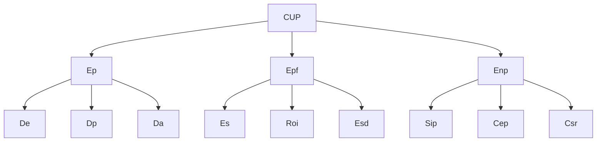
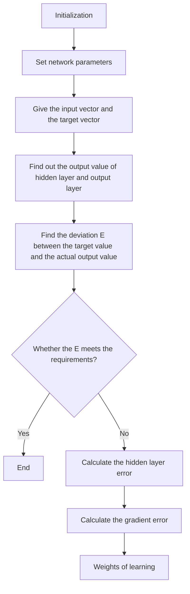

For office use only

T1

T2

T3

T4

73767

Problem Chosen

C

For office use only

F1

F2

F3

F4

2018

MCM/ICM

Summary Sheet

# A Setting System of Interstate Energy Cooperation Goals Based on Data Insight

Summary

After performing data analysis and modeling, we finally determine a set of development goals for the new four-state energy compact.

First, we preprocess the data provided, which includes default value processing, abnormal value process and data classification. For the sake of analysis, we divide various energy into two broad categories. One is cleaner renewable energy (CRE), the other is traditional fossil energy (TFE). After that, we select 11 important variables from the given data to create the energy profile for each of the four states. We call the 11 variables the basic variables

Next, we apply the decoupling theory to characterize the dynamic relationship be tween economic development and energy utilization, which can reflect the evolutionof energy profile. We find that the four states differ in production and usage of various energy significantly. To determine the underlying factors that lead to the differences, we construct the simultaneous equations model. Combining natural environment information further, we find out the factors and know the respective strengths of the fourstates in CRE.

Then, we establish a multi-dimensional evaluation system to identify the state that has the“best”energy profile on the whole. We introduce the index, comprehensive utilization performance (CUP) to measure the energy profile. The CUP is composed of three parts, energy performance, economic performance and environment performance. And each of the three parts includes three indexes respectively, all of which are synthesized by the basic variables. We use the PCA method to integrate the nine indexes into an overall index, namely the CUP. Ranking CUP, we find that California is the“best”.

Finally, we construct BP neural network to predict the energy profile. Analogous to Cobb-Douglas Production Function in economics, we define the CUP in a new way for predicting. Through setting various development scenarios, we get the predictions successfully. After that, we regard the four states as a whole to determine renewable energy usage targets for 2025 and 2050. In this process, we use the BP neutral network and previous models again. We collect real data from 2010 to 2015 to calculate the values of CUP. Compare them to the predicted value, we test our predicting system. The result shows that our predicting system works well.

## Contents

## MEMO 3

## 1 Introduction 4

1.1 Problem Statement.. 4  
1.2 Our Goals. . 4  
1.3 Our Thinking.. .4

## 2 Assumptions and Notations 5

2.1 Assumptions... .5  
2.2 Notations.. ..6

## 3 Data Preprocessing 6

3.1 Default Value Processing. . 6  
3.2 Abnormal Value Processing. . 6  
3.3 Data Synthesis and Classification. 7

## 4 Energy Profile 7

## 5 Model Construction 10

5.1 Decoupling Analysis. . 10  
5.2 The Simultaneous Equations Model. .. 10  
5.3 The Multi-dimensional Evaluation System.. 12

5.3.1 Construction of Indexes.. . 12  
5.3.2 Principle Component Analysis. .. 13

5.4 Energy Profile Predicting System.. ..14

5.4.1 Determining the Predictors.. .. 14  
5.4.2 Constructing BP Neural Network.. .. 15  
5.4.3 Analyzing the Error........ .17  
5.4.4 Predicting the Target Values. . 17

## 6 Testing Our Model 19

6.1 Predicting Reliability Test. .19  
6.2 Sensitivity Analysis. 19

## 7 Determining Goals for the Energy Compact 20

7.1 Idea one: Don’t cooperate. .. 20  
7.2 Idea two: Cooperate.. . 20  
7.3 Goals and Actions. ..20

Team # 73767

Page 2 of 28

8 Conclusions

21

9 Strengths and Weaknesses

21

9.1 Strengths.. . 21

9.2 Weaknesses. . 22

References

22

Appendices

23

Appendix A Profiles of Arizona

23

Appendix B Profile of New Mexico

25

Appendix C Profiles of Texas

25

## MEMO

From: Team 73767, MCM 2018

To: The group of Governors

Date: February 13, 2018

Subject: Goals for the interstate energy compact

Dear governors, we are honored to inform you our achievement after performing data analysis and modeling.

First, we introduce the energy profiles of your states in 2009. We use comprehensive utilization performance (CUP) to reflect the energy profile on the whole. Ranking the CUP of your four states, California appears to be the best. In terms of the usage of cleaner renewable energy, California, Arizona, Texas and New Mexico has the largest consumption successively in the water power, nuclear power, wind power and solar power. It is decided by the natural environment of your four states, such as geography and climate.

Then, we provide you the goals for the interstate energy compact. Through predicting, your four states’ average CUP will increase to 16.98 by 2025 and to 26.05 by 2050, if your four states can cooperate adequately. Based on the predictions, we set the development goals as follows:

• Building a community of energy utilization and economic development, so as to realize manual benefit and win-win result.

• Promoting the production and usage of new energy sources and reducing the dependence on traditional fossil fuels.

• Increasing the whole economy’s comprehensive utilization performance to 16.98 by 2025 and to 26.05 by 2050, and achieving the harmony of economy, energy and environment ultimately.

According to the goals above and the characteristics of each of your four states, we offer you the following suggestions to meet the goals.

• Building an energy investment bank to integrate money for developing the clear renewable energy.  
• Enhancing residuals’ environmental protection consciousness.  
• Adjusting the industrial structure properly.

We sincerely hope that you can achieve the goals above!

Please contact us if you have any problems.

## 1 Introduction

## 1.1 Problem Statement

Energy is the main material base and driving force for human’s daily production and life. The proper utilization of all kinds of energy are closely link to the sustainability of economic development. The excessive consumption of traditional fossil fuels not only restricts the economic development, but also causes a series of environmental problems, such as global warming. Therefore, in America, many states have been trying to improve the production and usage of energy. A successful practice is that some states with different strengths and weaknesses unite to form an interstate compact, for promoting the usage of cleaner, renewable energy sources, through cooperation and adherence to specific policies.

In the southwest of the U.S., there are four states – California (CA), Arizona (AZ), New Mexico (NM), and Texas (TX) – that hope to form a realistic new energy compact as well. Asked by the four governors of these sates, we determine a set of development goals for the energy compact.

## 1.2 Our Goals

Based on our understanding of the problem, we set the following goals:

• Use the given data to found an energy profile for each state.  
• Develop a model system to show the dynamic relationships between various en ergy consumption and economic development of each of the four states, and explore the underlying factors that lead to these relationships.  
• Define the“best”profile for use of cleaner, renewable energy, then set up a system of evaluation to determine the state that has the“best”profile in2009.  
• According to the analysis above, develop a model and set different scenarios to predict the energy profile of each state for 2025 and 2050.  
• Based on the established models, decide the usage targets of cleaner and renewable energy for 2025 and 2050. Then provide three actions for the four states to achieve the goals.

## 1.3 Our Thinking

This is a typical big data problem, so we solve it from the point of view of statistical analysis. Here is our thinking.

First, we preprocess the data provided, which includes default value processing, abnormal value processing and data synthesis and classification. Based on our definitions, we select some major energy sources for analysis and divide them into two categories. One is called cleaner renewable energy (CRE), the other is called traditional fossil energy (TFE). The specific definitions will be given later.

Second, we select some important data from the dataset provided to construct the energy profile. Through statistical charts, we visualize them. In this way, we found an energy profile for each state. Comparing the energy files of the four states, we find differences in their utilization of the two kinds of energy sources. To further clarify the differences, we learn from the decoupling theory and use coefficients of elasticity to show the dynamic relationships between various energy consumption and economic development of each state. Then we use the simultaneous equations model to respectively analyze the four states’ economy systems, in which way, we find out the reasons why the differences exist.

Third, we introduce the concept of the comprehensive utilization performance (CUP) to evaluate which of the four states appeared to have the“best”profile. Since different states have their own characteristics, therefore, we establish a multi-dimensional evaluation system to measure the comprehensive utilization performance in case of bias. Then we use principle component analysis (PCA) to integrate each evaluation index into an overall index, namely the comprehensive utilization performance.

Finally, we build the BP neural network to predict the energy profile of each state. By setting various change trajectory of independent variables, we get the predictions successfully. After that, we regard the four states as a whole to determine renewable energy usage targets for 2025 and 2050.

## 2 Assumptions and Notations

## 2.1 Assumptions

Due to lack of necessary data and limitation of our knowledge, we make the following assumptions to help us perform modeling. These assumptions are the premise for our subsequent analysis.

• For the four states, all kinds of energy they produce are consumed by themselves each year. Thus we can replace energy output with energy consumption in calculation.  
• The policy of each state will not change in the future. This assumption may be not realistic, but it is essential for us when predicting the energy profile in 2025 and 2050.  
• The natural environment of the each states will not change. So we can see it as constant. This assumption simplify our analysis, and it is reasonable, since the natural environment is usually stable.  
• Once forming an interstate energy compact, the four states can develop and utilize resources together. Thus they can realize manual benefit and win-win result.

## 2.2 Notations

Here are the notations and their meanings in our paper:

<table><tr><td>Notation</td><td>Meaning</td></tr><tr><td>Epd</td><td>Electricity production</td></tr><tr><td>Tpd</td><td>Total energy production</td></tr><tr><td>Rce</td><td>Renewable energy expenditure</td></tr><tr><td>ttdp</td><td>GDP</td></tr><tr><td>Cpd</td><td>Renewable energy production</td></tr><tr><td>Pri</td><td>Price energy</td></tr><tr><td>Ind</td><td>Secondary industry consumption</td></tr><tr><td>Pop</td><td>Population</td></tr><tr><td>Wcs</td><td>Wood consumption</td></tr><tr><td>Tcs</td><td>TFE consumption</td></tr><tr><td>Enc</td><td>Total energy consumption</td></tr><tr><td>Cep</td><td>Carbon emission per capita</td></tr><tr><td>K</td><td>Energy expenditures as share of GDP</td></tr></table>

Table 1: notation

## 3 Data Preprocessing

For data-analysis problem, there are usually some incomplete and abnormal data in the large amount of raw data, which may seriously affect the efficiency of modeling and the accuracy of conclusions. So it is quite important to preprocess the data.

## 3.1 Default Value Processing

We use different methods to process variables with various degrees of data loss. (1) For variables with large amount of data missing, we just delete it. Because small data cannot provide enough and valuable information for our modeling. (2) For variables with a small amount of data missing, we use interpolation method to compensate the data. More specifically, we first use existing data points to establish an appropriate interpolation function, and then replace the missing value with the function value f (xi) at the corresponding point xi.

## 3.2 Abnormal Value Processing

If a value in a set of data is more than twice the standard deviation of the average, we call it the abnormal value. Statistically we can use a box-plot to identify the abnormal values. For the abnormal value, we fix it with the average value of its two adjacent observations.

## 3.3 Data Synthesis and Classification

There are 605 variables in the dataset provided. Not all of them are used in our model. Thus, we sort the data we need into a new dataset. Besides, we divide the energy sources into two categories for the further analysis, One is called cleaner renewable energy, which includes the hydroenergy, the wind energy, the geothermal energy, the solar energy and the ethanol; the other is called traditional fossil energy, which includes the coal, the petroleum, the natural gas and other fuels.

Definition:

• Cleaner renewable energy is the energy that produces little pollution and can be used directly in the production and life.  
• Traditional fossil energy is non−renewable energy and will cause air pollution after burning.

In our model, some synthesized variables are used, for example, the average price of cleaner renewable energy. It can be calculated according to formula (1). Other synthesized variables will be explained later.

$$
P = \frac {\sum_ {i = 1} ^ {p _ {i}} p _ {i} \cdot q _ {i}}{\sum_ {i = 1} ^ {q _ {i}}} \quad i = 1, 2, \dots \tag {1}
$$

## 4 Energy Profile

After data preprocessing, we choose 11 important variables to create the energy profile. we call them the basic variables

<table><tr><td>Notation</td><td>Abbreviation in the original data set</td></tr><tr><td>GDP</td><td>GDPRX</td></tr><tr><td>Total population</td><td>TPOPP</td></tr><tr><td>TFE consumption</td><td>FFTCB</td></tr><tr><td>Total consumption</td><td>TETCB</td></tr><tr><td>Wood consumption</td><td>WWTCB</td></tr><tr><td>Electricity production</td><td>ESTCB</td></tr><tr><td>Total energy production</td><td>TEPRB</td></tr><tr><td>Price of renewable energy</td><td>AVACD</td></tr><tr><td>Renewable energy production</td><td>REPRB</td></tr><tr><td>Renewable energy expenditure</td><td>RFEIV</td></tr><tr><td>Secondary industry consumption</td><td>TEICB</td></tr></table>

Table 2: basic variable

Descriptive statistics is usually the first step in statistical analysis, which can shows the important features of the data visually through graphs and tables. In view of this, we adopt the descriptive statistics method to show the energy profile of each state. Here is the energy profile of California, those of other states are attached to the appendix.

line chart

| year | Consumption (Billion Btu) | Price (Dollar/Million Btu) |
|------|---------------------------|----------------------------|
| 1960 | 3000000                   | 5                          |
| 1963 | 3500000                   | 5                          |
| 1966 | 4000000                   | 5                          |
| 1969 | 4500000                   | 5                          |
| 1972 | 4800000                   | 5                          |
| 1975 | 4700000                   | 10                         |
| 1978 | 5000000                   | 20                         |
| 1981 | 4800000                   | 30                         |
| 1984 | 5200000                   | 35                         |
| 1987 | 5500000                   | 38                         |
| 1990 | 5800000                   | 40                         |
| 1993 | 6000000                   | 42                         |
| 1996 | 6200000                   | 45                         |
| 1999 | 6300000                   | 48                         |
| 2002 | 6500000                   | 55                         |
| 2005 | 6600000                   | 60                         |
| 2008 | 6700000                   | 62                         |

line chart

| year | Consumption (Billion Btu) | Price (Dollar/Million Btu) |
|------|---------------------------|----------------------------|
| 1960 | ~150000                   | ~5                         |
| 1963 | ~250000                   | ~7                         |
| 1966 | ~350000                   | ~10                        |
| 1969 | ~450000                   | ~12                        |
| 1972 | ~550000                   | ~15                        |
| 1975 | ~300000                   | ~20                        |
| 1978 | ~500000                   | ~25                        |
| 1981 | ~650000                   | ~30                        |
| 1984 | ~800000                   | ~35                        |
| 1987 | ~750000                   | ~38                        |
| 1990 | ~850000                   | ~40                        |
| 1993 | ~950000                   | ~42                        |
| 1996 | ~1050000                  | ~45                        |
| 1999 | ~950000                   | ~48                        |
| 2002 | ~1050000                  | ~50                        |
| 2005 | ~1150000                  | ~52                        |
| 2008 | ~1050000                  | ~55                        |

line chart

| year | Consumption (Billion Btu) | Price (Dollars/Million Btu) |
|------|---------------------------|-----------------------------|
| 1960 | 3500000                   | 2                           |
| 1963 | 4000000                   | 3                           |
| 1966 | 4500000                   | 4                           |
| 1969 | 5000000                   | 5                           |
| 1972 | 5500000                   | 6                           |
| 1975 | 6000000                   | 8                           |
| 1978 | 6500000                   | 12                          |
| 1981 | 6800000                   | 15                          |
| 1984 | 7000000                   | 18                          |
| 1987 | 7200000                   | 20                          |
| 1990 | 7500000                   | 22                          |
| 1993 | 7800000                   | 24                          |
| 1996 | 8000000                   | 25                          |
| 1999 | 8200000                   | 24                          |
| 2002 | 8400000                   | 23                          |
| 2005 | 8600000                   | 22                          |
| 2008 | 8800000                   | 21                          |

line chart

| year | T&N    | C&R    |
|------|--------|--------|
| 1960 | 85.00% | 5.00%  |
| 1963 | 84.00% | 6.00%  |
| 1966 | 83.00% | 7.00%  |
| 1969 | 82.00% | 8.00%  |
| 1972 | 80.00% | 9.00%  |
| 1975 | 75.00% | 10.00% |
| 1978 | 73.00% | 8.00%  |
| 1981 | 74.00% | 9.00%  |
| 1984 | 75.00% | 10.00% |
| 1987 | 74.00% | 11.00% |
| 1990 | 75.00% | 12.00% |
| 1993 | 76.00% | 13.00% |
| 1996 | 75.00% | 14.00% |
| 1999 | 76.00% | 15.00% |
| 2002 | 75.00% | 14.00% |
| 2005 | 74.00% | 13.00% |
| 2008 | 73.00% | 12.00% |

Figure 1: change trend of price and energy consumption in California

bar chart

| Category | Country | Btu (Thousand barrels) |
| :--- | :--- | :--- |
| Clean and renewable energy | F | 5000 |
| Clean and renewable energy | HY | 345000 |
| Clean and renewable energy | GE | 2000 |
| Clean and renewable energy | WE | 30000 |
| Clean and renewable energy | PH&SO | 20000 |
| Traditional and unrenewable energy | C | 5000 |
| Traditional and unrenewable energy | PE | 3150000 |
| Traditional and unrenewable energy | NG | 2050000 |
| Traditional and unrenewable energy | OT | 400000 |

Figure 2: energy consumption of different items in California

Figure 2 :

<table><tr><td>Pic1</td><td>Trend graph of TFE and its price</td></tr><tr><td>Pic2</td><td>Trend graph of CRE and its price</td></tr><tr><td>Pic3</td><td>Trend graph of total consumption(TC) and its price</td></tr><tr><td>Pic4</td><td>Trend graph of the ratio of TFE to TC and CRE to TC</td></tr></table>

Figure 3 :

<table><tr><td>F</td><td>Fuel enthanol</td><td>C</td><td>Coal</td></tr><tr><td>HY</td><td>Hydroelectricity</td><td>PE</td><td>Petroleum products</td></tr><tr><td>GE</td><td>Geothermal energy</td><td>NG</td><td>Natural gas</td></tr><tr><td>WE</td><td>Wind energy</td><td>OT</td><td>Other</td></tr><tr><td>PH&amp;SO</td><td>Photovoltaic and solar thermal energy</td><td></td><td></td></tr><tr><td colspan="4">(Only the unit of &quot;F&quot;is Thausand Barrels)</td></tr></table>

Table 3: the cutline in Figure 2 and Figure 3

pie chart

California
| Sector | Percentage (%) |
| :--- | :--- |
| Total energy consumed by the transportation sector | 39.09 |
| Total energy consumed by the commercial sector | 19.72 |
| Total energy consumed by the industrial sector | 22.11 |
| Total energy consumed by the residential sector | 19.08 |
| Others | 0.00 |

Figure 3: constitution of total energy consumption in California in 2009

<table><tr><td>Variable</td><td>Quantitative Change</td><td>Rate of Change</td></tr><tr><td>Energy total production</td><td>510310.93(Billion Btu)</td><td>156.56%</td></tr><tr><td>Renewable energy total production</td><td>28262.33(Billion Btu)</td><td>383.32%</td></tr><tr><td>Fossil fuels, total production</td><td>482048.60(Billion Btu)</td><td>151.32%</td></tr><tr><td>Electricity production</td><td>16995.11(Billion Btu)</td><td>2279.84%</td></tr><tr><td>Wood consumption</td><td>4244.64(Billion Btu)</td><td>64.04%</td></tr><tr><td>Secondary industry consumption</td><td>414753.42(Billion Btu)</td><td>199.64%</td></tr><tr><td>Renewable energy total end-use expenditures</td><td>750.17(Million dollars)</td><td>873.31%</td></tr><tr><td>GDP</td><td>59090(Million dollars)</td><td>593.15%</td></tr></table>

Table 4: quantitative change and rate of change of typical variables from 1960 to 2009

By comparing the energy profiles of the four states, we preliminarily reached the following conclusions:

Overall, the four states differ in their utilization and consumption of the two types           • of energy (CRE&TFE).  
Each of the four states has a growing share of CRE consumption, while the share        • of TFE is still high.  
California ranks the first in terms of the amount of CRE consumption; Arizona • ranks the first in terms of the share of CRE consumption. However, New Mexico lags behind in the usage and consumption of CRE.

## 5 Model Construction

## 5.1 Decoupling Analysis

Since having had a general idea of the energy profiles of the four states, we now intend to calculate the coefficients of elasticity to deeply analyze the dependency between economic development and the various energy consumption of each state. According to the decoupling theory, the higher the absolute value of the elasticity, the stronger the dependency.[1] The formula of coefficient of elasticity is asfollow.

$$
e l a = \left| \frac {\Delta E n c}{\Delta G d p} \cdot \frac {G d p}{E n c} \right| \tag {2}
$$

The calculation results are shown in figure 4. From the figure, we can intuitively know that generally the dependency between economic development and CRE consumption is on the rise for each state, but the intensity of the dependency differs among the four states.

line chart

| Year | AZ   | CA   | NM   | TX   |
|------|------|------|------|------|
| 1960 | 0.3  | 0.7  | 1.5  | 0.1  |
| 1962 | 0.2  | 1.3  | 0.8  | 0.5  |
| 1964 | 0.4  | 1.1  | 2.6  | 0.8  |
| 1966 | 0.3  | 0.6  | 0.2  | 0.9  |
| 1968 | 0.5  | 0.5  | 2.1  | 0.7  |
| 1970 | 0.3  | 0.5  | 0.2  | 0.6  |
| 1972 | 0.4  | 0.9  | 0.3  | 0.7  |
| 1974 | 1.4  | 0.3  | 0.8  | 0.6  |
| 1976 | 0.3  | 0.2  | 0.7  | 0.8  |
| 1978 | 0.4  | 0.9  | 0.6  | 0.5  |
| 1980 | 1.7  | 1.7  | 1.9  | 1.5  |
| 1982 | 0.4  | 1.2  | 2.4  | 0.5  |
| 1984 | 0.5  | 1.8  | 3.2  | 2.1  |
| 1986 | 0.7  | 1.7  | 1.2  | 1.5  |
| 1988 | 1.0  | 1.4  | 1.4  | 0.5  |
| 1990 | 0.5  | 1.4  | 0.8  | 0.5  |
| 1992 | 0.4  | 2.0  | 3.5  | 0.5  |
| 1994 | 0.5  | 1.2  | 1.5  | 1.5  |
| 1996 | 0.5  | 1.2  | 0.5  | 1.5  |
| 1998 | 0.5  | 1.2  | 1.4  | 1.5  |
| 2000 | 1.7  | 2.2  | 2.2  | 2.2  |
| 2002 | 1.7  | 0.7  | -    | -    |
| 2004 | -    | -    | -    | -    |
| 2006 | -    | -    | -    | -    |
| 2008 | -    | -    | -    | -    |

line chart

| Year | AZ   | CA   | NM   | TX   | Tendency |
|------|------|------|------|------|----------|
| 1960 | 0.5  | 4.3  | 1.2  | 0.3  | 0.2      |
| 1962 | 0.6  | 1.8  | 1.1  | 0.4  | 0.2      |
| 1964 | 0.7  | 5.0  | 2.4  | 0.5  | 0.2      |
| 1966 | 0.8  | 5.5  | 0.3  | 1.5  | 0.2      |
| 1968 | 0.9  | 5.8  | 0.3  | 1.6  | 0.2      |
| 1970 | 1.0  | 1.5  | 0.4  | 1.2  | 0.2      |
| 1972 | 1.1  | 2.3  | 0.5  | 1.1  | 0.2      |
| 1974 | 1.2  | 3.4  | 0.6  | 0.8  | 0.2      |
| 1976 | 1.3  | 6.3  | 0.7  | 0.6  | 0.2      |
| 1978 | 5.6  | 7.5  | 1.4  | 1.2  | 0.2      |
| 1980 | 3.3  | 1.8  | 2.7  | 2.1  | 0.2      |
| 1982 | 1.5  | 2.5  | 2.8  | 1.8  | 0.2      |
| 1984 | 1.6  | 2.6  | 1.5  | 3.8  | 0.2      |
| 1986 | 6.2  | 7.5  | 0.8  | 3.4  | 0.2      |
| 1988 | 4.0  | 7.5  | -    | -    | -        |
| 1990 | -    | -    | -    | -    | -        |
| 1992 | -    | -    | -    | -    | -        |
| 1994 | -    | -    | -    | -    | -        |
| 1996 | -    | -    | -    | -    | -        |
| 1998 | -    | -    | -    | -    | -        |
| 2000 | -    | -    | -    | -    | -        |
| 2002 | -    | -    | -    | -    | -        |
| 2004 | -    | -    | -    | -    | -        |
| 2006 | -    | -    | -    | -    | -        |
| 2008 | -    | -    | -    | -    | -        |

Figure 4: elasticity coefficient of FTE(left) and CRE(right)

## 5.2 The Simultaneous Equations Model

To explore the underlying factors that leads to the differences of energy files among the four states, we develop a simultaneous equations model, as shown below. Different equations into the model, since there are interactions between each two of the three elements, eco- nomic development, energy consumption, and environmental pollution. [2]

<table><tr><td></td><td>systemmorecomp</td></tr><tr><td>from single equation regression, simultaneous equations model can explain the complex economic</td><td></td></tr></table>

$$
\left\{ \begin{array}{l} \ln (E n c) = \beta_ {0} + \beta_ {1} \ln (G d p) + \beta_ {2} \ln (C e p) + \beta_ {3} \ln (P r) + \beta_ {4} \ln (p o p) + \beta_ {5} \ln (I n d) + \beta_ {6} \ln (K) + X + \varepsilon_ {3} \\ \ln (G d p) = \alpha_ {0} + \alpha_ {1} \ln (E n c) + \alpha_ {2} \ln (C e p) + \alpha_ {3} \ln (K) + \alpha_ {4} \ln (P o p) + \varepsilon_ {1} \\ \ln (C e p) = \gamma_ {0} + \gamma_ {1} \ln (G d p) + \gamma_ {2} \ln (E n c) + \gamma_ {3} \ln (P o p) + \gamma_ {4} \ln (I n d) + \varepsilon_ {2} \end{array} \right. \tag {3}
$$

where X is a set of controlling variables on the natural environment

Lack of variable data on the natural environment, we neglect the set of controlling variables X to solve the model. The regression results of equation ln(Enc) are shown in the following table. The regression coefficients reflect the influence of explanatory variables on dependent variables, from which we can determine the impact of different factors on the energy variable.

<table><tr><td rowspan="2">Equation 1</td><td colspan="4">TFE</td><td colspan="4">CRE</td></tr><tr><td>AZ</td><td>CA</td><td>NM</td><td>TX</td><td>AZ</td><td>CA</td><td>NM</td><td>TX</td></tr><tr><td>ln(ttdp)</td><td>0.2189***</td><td>0.5122**</td><td>0.4896**</td><td>1.2368***</td><td>0.1904***</td><td>0.4915**</td><td>0.2167*</td><td>0.4532**</td></tr><tr><td>ln(Cep)</td><td>0.0012</td><td>0.0104**</td><td>0.1326**</td><td>0.1725**</td><td>0.0031</td><td>0.0113*</td><td>0.0682**</td><td>0.1651***</td></tr><tr><td>ln(K)</td><td>0.2169**</td><td>0.3481**</td><td>0.2018*</td><td>0.3018**</td><td>0.2267**</td><td>0.4162**</td><td>0.2481***</td><td>0.3156*</td></tr><tr><td>ln(Pop)</td><td>0.0104</td><td>0.0341</td><td>0.0361*</td><td>-0.2214</td><td>0.0133</td><td>0.0265</td><td>0.0421*</td><td>-0.2153</td></tr><tr><td>ln(Prì)</td><td>0.1152*</td><td>0.1421</td><td>0.1102**</td><td>0.2451</td><td>0.1842*</td><td>0.1821*</td><td>0.2012**</td><td>0.2201</td></tr><tr><td>ln(Ind)</td><td>0.1421*</td><td>0.4142***</td><td>0.2269*</td><td>0.2684**</td><td>0.1723*</td><td>0.3841***</td><td>0.2362*</td><td>0.2758*</td></tr><tr><td>Constant</td><td>17.6421*</td><td>19.2364*</td><td>13.2631*</td><td>50.3641*</td><td>16.6372*</td><td>37.6298*</td><td>13.2156*</td><td>61.2571*</td></tr></table>

Table 5: the regression results of Equation 1  
\*，\*\*，\*\*\* respectively represent the confidence of 10%,5%,1%

From the Table 5, we can see that population has no significant influence on the energy consumption. While the the economic development and the share of secondary industy have significant influence on the energy consumption.

To determine the influence of geography and climate, we collect information about the natural environment of the four states, which is shown in Figure 5. It shows the resource distribution of solar power, wind power and hydroelectric power.

From Figure 5, we know that the four states differ in the potential of CRE production. The differences are caused by the various natural environment of the four states, such as climate and geography.

text_image

GREAT PL
NEBRUKA
UNITED
STATES
San Francisco
GREAT BASIN
NEVADA
San Diego
Las Vegas
Tijuana
Colorado Plateau
Arizona
Phoenix
El Paso
New Mexico City
OHAMA
Dallas
TEXAS
Houston
Hermosillo
Chihuahua
St. Ant.
Hydroelectric Power
Wind Power
Solar Power

Figure 5: resource distribution of CRE

## 5.3 The Multi-dimensional Evaluation System

In this part, we will determine which of the four states has the“best”energy profile in 2009. Through the above analysis, we know that the four states differ in strengths and weaknesses congenitally. Thus, for avoiding bias, we establish a multi-dimensional evaluation system to measure their energy profile.

## 5.3.1 Construction of Indexes

The core indexes of our evaluation system is called comprehensive utilization performance (CUP), which reflects the development and utilization level of CRE. The CUP is composed of three parts, energy performance, economic performance and environment performance. And each of the three parts includes three indexes as well. These indexes and their formulas are detailed in the Table 6.

flowchart

Figure 6: evaluation index systerm

<table><tr><td></td><td>Name of Index</td><td>Meaning</td><td>Formula</td></tr><tr><td rowspan="3">Energy performance (Ep)</td><td>Development Efficiency (De)</td><td>Reflects the status of the CRE development and utilization in the electricity industry.</td><td> $De = \frac{Cpd}{Epd}$ </td></tr><tr><td>Development Potential (Dp)</td><td>Reflects the sustainability of CRE development and utilization.</td><td> $Dp = \frac{(Cpd_t - Cpd_{t-1})}{Cpd_{t-1}}$ </td></tr><tr><td>Development Achievements (Dpa)</td><td>Reflects the contribution of CRE development and utilization to the state energy structure.</td><td> $Dpa = \frac{Cpd}{Tpd}$ </td></tr><tr><td rowspan="3">Economic proformance (Epf)</td><td>Economic support (Es)</td><td>Reflect the state&#x27;s support for renewable energy at the investment level</td><td> $Es = \frac{Rce}{ttdp}$ </td></tr><tr><td>Rate of return on investment (Roi)</td><td>Reflect the efficiency and profitability of investment on renewable energy</td><td> $Roi = \frac{Cpd}{Rce}$ </td></tr><tr><td>Equilibrium of supply and demand (Esd)</td><td>Reflect supply&#x27;s satisfaction with demand</td><td> $Esd = \frac{1}{Pc}$ </td></tr><tr><td rowspan="3">Environment performance (Enp)</td><td>Secondary industry proportion (Sip)</td><td>Reflects the dependence on polluting industries in each state.</td><td> $Sip = \frac{Scs}{Tocs}$ </td></tr><tr><td>Carbon emission per capita (Cep)</td><td>Reflects the situation of the greenhouse gas emission per capita.</td><td> $Cep = \frac{Tcs}{Tpo}$ </td></tr><tr><td>Consumption of natural resources per capita (Csr)</td><td>Reflects the situation of natural resources consumption per capita.</td><td> $Cnr = \frac{Wcs}{Tpo}$ </td></tr></table>

Table 6: indexes and their formulas

## 5.3.2 Principle Component Analysis

We use the PCA method to integrate each evaluation index into an overall index, namely the comprehensive utilization performance. Then through the comparison of the CUP values of the four states, we determine the“best”state.

First, we use the given data and the formulas in Table 6 to calculate the evaluation indexes. And then, we use the equation below to standardize the values of these indexes.

$$
\bar {a} _ {i j} = \frac {a _ {i j} - \mu_ {j}}{s _ {j}}
$$

$$
\mu_ {j} = \frac {1}{n} \sum_ {i = 1} ^ {n} a _ {i j} \tag {4}
$$

$$
s _ {j} = \sqrt {\frac {1}{n - 1} \sum_ {i = 1} ^ {n} (a _ {i j} - \mu_ {j}) ^ {2}}
$$

Next, we use the equation N to calculate the correlation coefficient matrix of the standardized data.

$$
r _ {i j} = \frac {\sum_ {k = 1} ^ {n} \bar {a} _ {k i} \cdot \bar {a} _ {k j}}{n - 1} \tag {5}
$$

Then we compute the eigenvalue $\lambda _ { i }$ and eigenvector $\vec { u } _ { i }$ of the correlation coefficient matrix. According to the eigenvectors, we can get the principal components yi. We can get nine principal components in total, but we can only use three of them, which have the highest contribution rate.

$$
y _ {1} = u _ {1 1} \bar {x} _ {1} + u _ {2 1} \bar {x} _ {2} + \dots + u _ {m 1} \bar {x} _ {m},
$$

$$
y _ {2} = u _ {1 2} \bar {x} _ {1} + u _ {2 2} \bar {x} _ {2} + \dots + u _ {m 2} \bar {x} _ {m}, \tag {6}
$$

$$
y _ {n} = u _ {1 n} \bar {x} _ {1} + u _ {2 n} \bar {x} _ {2} + \dots + u _ {m n} \bar {x} _ {m},
$$

Finally, we calculate the contribution rate based on the formula $^ { 7 , }$ then use the formula 8 to determine an overall index, which is named comprehensive utilization performance by us. Sorting the CuP, we can find out which of the states is the best.

$$
b _ {j} = \frac {\lambda_ {j}}{\sum_ {k = 1} ^ {m} \lambda_ {k}} \tag {7}
$$

$$
Z = \sum_ {j = 1} ^ {p} b _ {j} y _ {j} \tag {8}
$$

The results of PCA is showed in table 7. from the table, we can see that California has the“best”energy profile in 2009.

<table><tr><td>Rank</td><td>State</td><td>PCA Score</td></tr><tr><td>1</td><td>California</td><td>0.9433</td></tr><tr><td>2</td><td>Texas</td><td>0.5561</td></tr><tr><td>3</td><td>Arizona</td><td>0.2466</td></tr><tr><td>4</td><td>New Mexico</td><td>-1.7459</td></tr></table>

Table 7: PCA scores

## 5.4 Energy Profile Predicting System

## 5.4.1 Determining the Predictors

In part $5 . 3 ,$ we measured the energy file in three dimensions, energy performance, economic performance and environment performance. For the following analysis, we select an index from each of them to calculate the comprehensive utilization performance (CUP) in a different way.

The indexes we select are Dpa, Roi and Cep. Analogous to Cobb-Douglas Production Function in economics, we derive the following formula.

$$
C U P = A \cdot (D p a) ^ {a} \cdot (R o i) ^ {\beta} C e p ^ {\gamma} \tag {9}
$$

$\begin{array} { r l } & { w h e r e : } \\ & { \textit { \textbf { A i s u n i t c o r r e c t i o n f a c t o r } } , } \\ & { \alpha , \beta , \gamma a r e w e i g h t c o e f f i c i e n t s ~ o f { \nu } a r i a b l e s ; } \\ & { \alpha + \beta + \gamma = 1 . } \end{array}$

In the previous analysis, we pointed out that, there is an interaction between each tow of the three elements, economy, energy and environment.[3] Therefore, we choose ttDP per capital (ttdp) , Secondary industry proportion (Sip) and carbon emission per capita (Cep) as the independent variables in prediction. Then we can drive the following equation.

$$
C U P = \theta_ {0} + \theta_ {1} t t d p + \theta_ {2} S i p + \theta_ {3} C e p + \varepsilon \tag {10}
$$

## 5.4.2 Constructing BP Neural Network

Since we have to predict the energy profiles of the four states respectively, it is a heavy task. Thus, we utilize the intelligent algorithm (BP neural network) with high prediction efficiency to finish this work. It has been proved theoretically that BP neural network can approach any nonlinear function with higher precision. The flow chart below shows the principle of BP neural network.

flowchart

Figure 7: the principle of BP neural network

There are two steps in the process of constructing BP neural network. First, we should set the network parameter k that represents the numbers of neurons. Here we let

Set a pair of samples $( X , Y ) , X = [ x _ { 1 } , x _ { 2 } , \cdots , x _ { m } ] ^ { \prime } , Y = [ y _ { 1 } , y _ { 2 } , \cdots , y _ { n } ] ^ { \prime }$ The hidden neural unit is $O = [ O _ { 1 } , O _ { 2 } , \cdots , O _ { l } ]$ . The network weight matrix between the input layer and the hidden layer neurons $W ^ { 1 }$ , and the network weight matrix between the hidden layer neurons and the output layer $W ^ { 2 }$ are shown below.

$$
W ^ {1} = \left[ \begin{array}{c c c c} \omega_ {1 1} ^ {1} & \omega_ {1 2} ^ {1} & \dots & \omega_ {1 m} ^ {1} \\ \omega_ {2 1} ^ {1} & \omega_ {2 2} ^ {1} & \dots & \omega_ {2 m} ^ {1} \\ \vdots & \vdots & & \vdots \\ \omega_ {l 1} ^ {1} & \omega_ {l 2} ^ {1} & \dots & \omega_ {l m} ^ {1} \end{array} \right], W ^ {2} = \left[ \begin{array}{c c c c} \omega_ {1 1} ^ {2} & \omega_ {1 2} ^ {2} & \dots & \omega_ {1 l} ^ {2} \\ \omega_ {2 1} ^ {2} & \omega_ {2 2} ^ {2} & \dots & \omega_ {2 l} ^ {2} \\ \vdots & \vdots & & \vdots \\ \omega_ {n 1} ^ {2} & \omega_ {n 2} ^ {2} & \dots & \omega_ {n l} ^ {2} \end{array} \right] (1 1)
$$

The threshold of the hidden layer neurons $\theta ^ { 1 }$ and the output layer neurons $\theta ^ { 2 }$ are:

$$
\theta^ {1} = \left[ \theta_ {1} ^ {1}, \theta_ {2} ^ {1}, \dots , \theta_ {l} ^ {1} \right] ^ {\prime}, \quad \theta^ {2} = \left[ \theta_ {1} ^ {2}, \theta_ {2} ^ {2}, \dots , \theta_ {n} ^ {2} \right] ^ {\prime} \tag {12}
$$

So the output of the hidden layer is:

$$
O _ {j} = f \left(\sum_ {i = 1} ^ {m} \omega_ {j i} ^ {1} x _ {i} - \theta_ {j} ^ {1}\right) = f (n e t _ {j}) \tag {13}
$$

where f (-) is the trans fer function of the hidden layer

And the output of the hidden layer is:

$$
z _ {k} = g \left(\sum_ {j = 1} ^ {l} \omega_ {k j} ^ {2} O _ {j} - \theta_ {k} ^ {2}\right) = g (n e t _ {k}) \tag {14}
$$

where g(-) is the trans fer function of the output layer

The error between the network's output and the expected output is:

$$
\begin{array}{l} E = \frac {1}{2} \sum_ {k = 1} ^ {n} (y _ {k} - z _ {k}) ^ {2} \\ = \frac {1}{2} \sum_ {k = 1} ^ {n} [ y _ {k} - g (\sum_ {j = 1} ^ {l} \omega_ {k j} ^ {2} O _ {j} - \theta_ {k} ^ {2}) ] ^ {2} \tag {15} \\ = \frac {1}{2} \sum_ {k = 1} ^ {n} \{y _ {k} - g [ \sum_ {j = 1} ^ {l} \omega_ {i j} ^ {2} f (\sum_ {i = 1} ^ {m} \omega_ {i j} ^ {1} x _ {i} - \theta_ {j} ^ {1}) - \theta_ {k} ^ {2} ] \} ^ {2} \\ \end{array}
$$

$\omega _ { k j } ^ { 2 }$ is the weight of the neurons between hidden layer and output layer.The partial derivative of the error E to $\omega _ { k j } ^ { 2 }$ is:

$$
\frac {\partial E}{\partial \omega_ {k j} ^ {2}} = \frac {\partial E}{\partial z _ {k}} \frac {\partial z _ {k}}{\partial \omega_ {k j} ^ {2}} = - (y _ {k} - z _ {k}) g ^ {\prime} (n e t _ {k}) O _ {j} = - \delta_ {k} ^ {2} O _ {j} \tag {16}
$$

m # 73767 Page 17 of 28 derivative of the error E to $\omega _ { j i } ^ { 1 }$ is:

$$
\frac {\partial E}{\partial \omega_ {j i} ^ {1}} = \sum_ {k = 1} ^ {n} \sum_ {j = 1} ^ {l} \frac {\partial E}{\partial z _ {k}} \frac {\partial z _ {k}}{\partial O _ {j}} \frac {\partial O _ {j}}{\partial \omega_ {j i} ^ {1}} = - \sum_ {k = 1} ^ {n} (y _ {k} - z _ {k}) g ^ {\prime} (n e t _ {k}) \omega_ {k j} ^ {2} f ^ {\prime} (n e t _ {j}) x _ {i} = - \delta_ {j} ^ {l} x _ {i} \tag {17}
$$

According to formula (16) and (17), we can drive the adjusting formula of weight:

$$
\left\{ \begin{array}{l} \omega_ {j i} ^ {1} (t + 1) = \omega_ {j i} ^ {1} (t) + \Delta \omega_ {j i} ^ {1} = \omega_ {j i} ^ {1} (t) - \eta^ {1} \frac {\partial E}{\partial \omega_ {j i} ^ {1}} = \omega_ {j i} ^ {1} (t) + \eta^ {1} \partial_ {j} ^ {1} x _ {i} \\ \omega_ {k j} ^ {2} (t + 1) = \omega_ {k j} ^ {2} (t) + \Delta \omega_ {k j} ^ {2} = \omega_ {k j} ^ {2} (t) - \eta^ {2} \frac {\partial E}{\partial \omega_ {k j} ^ {2}} = \omega_ {k j} ^ {2} (t) + \eta^ {2} \partial_ {j} ^ {2} O _ {j} \end{array} \right. \tag {18}
$$

where $\eta ^ { 1 }$ $\eta ^ { 2 }$ are the learning steps of hidden layer and output layer respectively

## 5.4.3 Analyzing the Error

Entering the selected variable data into the network, we get the fitting figures, shown in Figure 8. Then we use the following formula to calculate the average fitting error, the results are showed in table 8.

$$
A f e = \frac {1}{n} \sum_ {i = 1} ^ {n} \left| e _ {i} \right| = \frac {1}{n} \sum_ {1} ^ {n} \left| y _ {i} - \hat {y} _ {i} \right| \tag {19}
$$

<table><tr><td>State</td><td>California</td><td>Arizona</td><td>New Mexico</td><td>Texas</td></tr><tr><td>Afe</td><td>6.47%</td><td>5.37%</td><td>8.82%</td><td>12.09%</td></tr></table>

Table 8: average fitting error

## 5.4.3 Predicting the Target Values

To predict the dependent variable, we have to know the independent variablesfirst. Unfortunately, we lack the values of ttdp, Sip and Cep for 2025 and 2050. So we can only predict the dependent variable by setting the change trajectory of the three independent variables in advance. We set two scenarios in total.[4]

line chart

| Year | Actual value of AZ | Fitted value of AZ |
|------|---------------------|---------------------|
| 1960 | 0.5                 | 0.5                 |
| 1962 | 0.4                 | 0.4                 |
| 1964 | 0.3                 | 0.3                 |
| 1966 | 0.4                 | 0.4                 |
| 1968 | 0.5                 | 0.5                 |
| 1970 | 0.6                 | 0.6                 |
| 1972 | 0.8                 | 0.8                 |
| 1974 | 0.6                 | 0.6                 |
| 1976 | 0.5                 | 0.5                 |
| 1978 | 0.6                 | 0.6                 |
| 1980 | 0.7                 | 0.7                 |
| 1982 | 0.9                 | 0.9                 |
| 1984 | 1.2                 | 1.2                 |
| 1986 | 1.6                 | 1.6                 |
| 1988 | 1.6                 | 1.6                 |
| 1990 | 1.2                 | 1.2                 |
| 1992 | 1.3                 | 1.3                 |
| 1994 | 1.4                 | 1.4                 |
| 1996 | 1.3                 | 1.3                 |
| 1998 | 1.4                 | 1.4                 |
| 2000 | 1.5                 | 1.5                 |
| 2002 | 1.7                 | 1.7                 |
| 2004 | 1.6                 | 1.6                 |
| 2006 | 1.5                 | 1.5                 |
| 2008 | 1.6                 | 1.6                 |

line chart

| Year | Actual value of CA | Fitted value of CA |
|------|--------------------|--------------------|
| 1960 | 0.4                | 0.3                |
| 1962 | 0.5                | 0.4                |
| 1964 | 0.6                | 0.7                |
| 1966 | 0.5                | 0.4                |
| 1968 | 0.4                | 0.3                |
| 1970 | 0.5                | 0.6                |
| 1972 | 0.6                | 0.7                |
| 1974 | 0.7                | 0.8                |
| 1976 | 0.6                | 0.5                |
| 1978 | 0.5                | 0.4                |
| 1980 | 0.6                | 0.5                |
| 1982 | 0.5                | 0.4                |
| 1984 | 0.6                | 0.7                |
| 1986 | 0.8                | 0.9                |
| 1988 | 0.7                | 0.6                |
| 1990 | 0.8                | 0.9                |
| 1992 | 0.7                | 0.6                |
| 1994 | 0.8                | 0.9                |
| 1996 | 1.2                | 1.1                |
| 1998 | 1.3                | 1.4                |
| 2000 | 1.5                | 1.6                |
| 2002 | 1.8                | 1.9                |
| 2004 | 1.9                | 2.0                |
| 2006 | 1.8                | 1.9                |
| 2008 | 1.9                | 2.0                |

line chart

| Year | Actual value of NM | Fitted value of NM |
|------|--------------------|--------------------|
| 1960 | 0.30               | 0.35               |
| 1962 | 0.28               | 0.25               |
| 1964 | 0.26               | 0.28               |
| 1966 | 0.24               | 0.22               |
| 1968 | 0.22               | 0.15               |
| 1970 | 0.20               | 0.30               |
| 1972 | 0.18               | 0.10               |
| 1974 | 0.16               | 0.25               |
| 1976 | 0.18               | 0.28               |
| 1978 | 0.20               | 0.25               |
| 1980 | 0.22               | 0.28               |
| 1982 | 0.24               | 0.25               |
| 1984 | 0.26               | 0.30               |
| 1986 | 0.28               | 0.32               |
| 1988 | 0.30               | 0.25               |
| 1990 | 0.28               | 0.22               |
| 1992 | 0.26               | 0.25               |
| 1994 | 0.24               | 0.15               |
| 1996 | 0.26               | 0.28               |
| 1998 | 0.28               | 0.25               |
| 2000 | 0.30               | 0.28               |
| 2002 | 0.32               | 0.15               |
| 2004 | 0.34               | 0.35               |
| 2006 | 0.36               | 0.45               |
| 2008 | 0.55               | 0.65               |

line chart

| Year | Actual value of TX | Fitted value of TX |
|------|--------------------|--------------------|
| 1960 | 0.13               | 0.13               |
| 1962 | 0.12               | 0.14               |
| 1964 | 0.10               | 0.07               |
| 1966 | 0.10               | 0.10               |
| 1968 | 0.10               | 0.12               |
| 1970 | 0.19               | 0.21               |
| 1972 | 0.20               | 0.20               |
| 1974 | 0.10               | 0.05               |
| 1976 | 0.10               | 0.12               |
| 1978 | 0.10               | 0.13               |
| 1980 | 0.05               | 0.03               |
| 1982 | 0.05               | 0.03               |
| 1984 | 0.05               | 0.03               |
| 1986 | 0.10               | 0.12               |
| 1988 | 0.19               | 0.15               |
| 1990 | 0.18               | 0.16               |
| 1992 | 0.23               | 0.23               |
| 1994 | 0.15               | 0.15               |
| 1996 | 0.15               | 0.18               |
| 1998 | 0.15               | 0.18               |
| 2000 | 0.15               | 0.15               |
| 2002 | 0.15               | 0.15               |
| 2004 | 0.15               | 0.15               |
| 2006 | 0.22               | 0.25               |
| 2008 | 0.40               | 0.38               |

Figure 8: the fitting results  

line chart

| Year | Value |
| ---- | ----- |
| 1960 | 0.60  |
| 1961 | 0.68  |
| 1962 | 0.70  |
| 1963 | 0.69  |
| 1964 | 0.67  |
| 1965 | 0.70  |
| 1966 | 0.69  |
| 1967 | 0.68  |
| 1968 | 0.69  |
| 1969 | 0.68  |
| 1970 | 0.67  |
| 1971 | 0.66  |
| 1972 | 0.65  |
| 1973 | 0.64  |
| 1974 | 0.63  |
| 1975 | 0.62  |
| 1976 | 0.61  |
| 1977 | 0.62  |
| 1978 | 0.63  |
| 1979 | 0.64  |
| 1980 | 0.63  |
| 1981 | 0.62  |
| 1982 | 0.61  |
| 1983 | 0.60  |
| 1984 | 0.59  |
| 1985 | 0.58  |
| 1986 | 0.57  |
| 1987 | 0.56  |
| 1988 | 0.55  |
| 1989 | 0.54  |
| 1990 | 0.53  |
| 1991 | 0.52  |
| 1992 | 0.51  |
| 1993 | 0.50  |
| 1994 | 0.49  |
| 1995 | 0.48  |
| 1996 | 0.47  |
| 1997 | 0.46  |
| 1998 | 0.45  |
| 1999 | 0.44  |
| 2000 | 0.43  |
| 2001 | 0.42  |
| 2002 | 0.41  |
| 2003 | 0.40  |
| 2004 | 0.39  |
| 2005 | 0.38  |
| 2006 | 0.37  |
| 2007 | 0.36  |
| 2008 | 0.35  |
| 2009 | 0.34  |

Figure 9: Scenario one

line chart

| Year | Value |
|---|---|
| 1960 | 200 |
| 1961 | 202 |
| 1962 | 205 |
| 1963 | 208 |
| 1964 | 210 |
| 1965 | 207 |
| 1966 | 212 |
| 1967 | 215 |
| 1968 | 225 |
| 1969 | 235 |
| 1970 | 240 |
| 1971 | 242 |
| 1972 | 245 |
| 1973 | 250 |
| 1974 | 255 |
| 1975 | 260 |
| 1976 | 265 |
| 1977 | 270 |
| 1978 | 280 |
| 1979 | 285 |
| 1980 | 290 |
| 1981 | 285 |
| 1982 | 280 |
| 1983 | 270 |
| 1984 | 260 |
| 1985 | 250 |
| 1986 | 245 |
| 1987 | 230 |
| 1988 | 220 |
| 1989 | 230 |
| 1990 | 235 |
| 1991 | 230 |
| 1992 | 225 |
| 1993 | 220 |
| 1994 | 220 |
| 1995 | 215 |
| 1996 | 200 |
| 1997 | 195 |
| 1998 | 205 |
| 1999 | 210 |
| 2000 | 220 |
| 2001 | 225 |
| 2002 | 220 |
| 2003 | 225 |
| 2004 | 230 |
| 2005 | 235 |
| 2006 | 230 |
| 2007 | 225 |
| 2008 | 220 |
| 2009 | 200 |

Figure 10: Scenario two

## Scenario one: Linear trend•

As is shown in figure 9, if the change of the three independent variables follows the linear trend. We can use the formula 15 to characterize their trajectory.

$$
x _ {t} = x _ {t - 1} + a \tag {20}
$$

## Scenario two: Smooth fluctuation•

As is shown in figure 10, if the change of the three independent variables follow the smooth fluctuation. Wecan use autoregressive moving average model, ARMA(p,q) to characterize their trajectory.[5]

$$
x _ {t} = \varphi_ {0} + \varphi_ {1} x _ {t - 1} + \varphi_ {2} x _ {t - 2} + \varphi_ {p} x _ {t - p} + \varepsilon_ {t} - \theta_ {1} \varepsilon_ {t - 1} + \theta_ {2} \varepsilon_ {t - 2} - \theta_ {q} \varepsilon_ {t - q} + \mu \tag {21}
$$

Once determining the change trajectory of independent variables, we can estimate their values. Entering them to the BP networks, we get the predicted values of the CUP of each states. The results are shown in table 9.

<table><tr><td></td><td colspan="5">Scenario 1</td><td colspan="4">Scenario 2</td></tr><tr><td rowspan="3">AZ</td><td>Year</td><td>DPA</td><td>ROI</td><td>CEC</td><td>CUP</td><td>DPA</td><td>ROI</td><td>CEC</td><td>CUP</td></tr><tr><td>2025</td><td>0.06</td><td>25.16</td><td>170.97</td><td>23.92</td><td>0.05</td><td>22.15</td><td>190.26</td><td>23.49</td></tr><tr><td>2050</td><td>0.07</td><td>50.45</td><td>100.45</td><td>40.19</td><td>0.06</td><td>50.15</td><td>120.15</td><td>35.22</td></tr><tr><td rowspan="2">CA</td><td>2025</td><td>0.08</td><td>30.04</td><td>138.63</td><td>28.39</td><td>0.10</td><td>29.36</td><td>145.26</td><td>26.14</td></tr><tr><td>2050</td><td>0.09</td><td>57.87</td><td>89.14</td><td>45.15</td><td>0.12</td><td>55.86</td><td>108.15</td><td>39.15</td></tr><tr><td rowspan="2">NM</td><td>2025</td><td>0.07</td><td>50.14</td><td>350.45</td><td>8.20</td><td>0.07</td><td>41.26</td><td>351.22</td><td>7.89</td></tr><tr><td>2050</td><td>0.08</td><td>59.85</td><td>282.43</td><td>15.16</td><td>0.09</td><td>57.12</td><td>301.86</td><td>14.12</td></tr><tr><td rowspan="2">TX</td><td>2025</td><td>0.05</td><td>20.60</td><td>348.15</td><td>7.84</td><td>0.05</td><td>19.26</td><td>369.15</td><td>6.95</td></tr><tr><td>2050</td><td>0.08</td><td>48.29</td><td>321.53</td><td>14.50</td><td>0.08</td><td>44.12</td><td>348.85</td><td>12.19</td></tr></table>

Table 9: the predicting results

## 6 Testing Our Model

## 6.1 Predicting Reliability Test

To test the predicting reliability of the BP network, we collect relevant data of each state from 2010 to 2015, and use them to predict the CUP. Then we use formula 15 again to compute the average error between the predicted values and the actual ones. Here are the results.

<table><tr><td colspan="5">The predicting error</td></tr><tr><td>State</td><td>California</td><td>Arizona</td><td>New Mexico</td><td>Texas</td></tr><tr><td>Error</td><td>5.89%</td><td>6.24%</td><td>7.98%</td><td>10.07%</td></tr></table>

Table 10: the predicting error

## 6.2 Sensitivity Analysis

In the process of constructing BP network, we let the network parameter k = 9. How does the change of kinfluence the predicting results? We analyze the average deviation of CUP caused by changing k slightly.

<table><tr><td>State</td><td>k-2</td><td>k-1</td><td>k+1</td><td>k+2</td></tr><tr><td>AZ</td><td>11.08%</td><td>4.43%</td><td>3.54%</td><td>8.51%</td></tr><tr><td>CA</td><td>8.19%</td><td>3.15%</td><td>4.66%</td><td>10.80%</td></tr><tr><td>NM</td><td>9.78%</td><td>5.39%</td><td>4.66%</td><td>12.28%</td></tr><tr><td>TX</td><td>6.66%</td><td>2.19%</td><td>2.28%</td><td>12.33%</td></tr><tr><td>Mean</td><td>8.93%</td><td>3.79%</td><td>3.79%</td><td>10.98%</td></tr></table>

Table 11: the influence by changing k

From table 11, we can find that the influence of k is not big, which we can bear.

## 7 Determining Goals for the Energy Compact

## 7.1 Idea one: Don’t cooperate

If the four states don’t cooperate, which means they develop independently, they can only utilize their own resources to enhance the level of renewable energy usage. In this condition, we can just use the predicted values in part 5.4 as their respective targets.

For the two scenarios in part 5.4, we think that scenario two is more reasonable and realistic. Because the evolution of the macro-economy is usually stable, especially for advanced economies like the United States.[6] So we just take scenario two into consideration.

In scenario two, the average comprehensive utilization performance can increase to 16.12 and 25.17 successively in 2025 and 2050.

## 7.2 Idea two: Cooperate

Given that the four-state energy compact is an interstate compact, it is necessary for the tour states to cooperate. We presume that they can develop and utilize resources together. In this case, we regard the four states as a whole economy. Then we use previous method and models to predict the whole economy’s comprehensive utilization performance for 2025 and 2050.

<table><tr><td>Year</td><td>2025</td><td>2050</td></tr><tr><td>The whole economy’s CUP</td><td>16.98</td><td>26.05</td></tr></table>

Table 12: predictions of the whole economy

The results shows that the whole economy’s comprehensive utilization performance can increase to 16.98 and 26.05 successively in 2025 and 2050, and each of them is higher than that in idea one. Maybe it is because cooperation enables the four states to give ful play to their own advantages and promote the development and utilization of cleaner renewable energy. [7]

## 7.3 Goals and Actions

Based on the results in idea two and the previous analysis, we set the following goals for the four-state energy compact.

Building a community of energy utilization and economic development, so as to• realize manual benefit and win-win result.  
Promoting the production and usage of new energy sources and reducing then• dependence on traditional fossil fuels.  
Increasing the whole economy’s comprehensive utilization performance to 16.98          • by 2025 and to 26.05 by 2050, and achieving the harmony of economy, energy and environment ultimately.

According to the goals above and the characteristics of each state, we propose the actions and measures for the four states.

Focus on developing their own advantageous energy resource and share their en-• ergy and achievements with others.  
Make more investment in scientific research to make better use of renewable en-• ergy to improve the low utilization efficiency of new energy sources.  
Introduce a proper subsidy policy to award the enterprises who develop new en-• ergy source.  
Make certain quantitative index and do statistic periodically to make sure the di-• rection of energy development is going well.

## 8 Conclusions

We are asked by the governors of the four states to set some goals for their interstate energy compact. After performing data analysis and modeling, we have finished the task successfully. First, Using decoupling theory and simultaneous equations model, we characterize the evolution of energy profile of each state from 1960 – 2009, and find out the influential factors. We have known that it is the differences of economic level, industrial structure and natural environment that lead to the distinct energy profiles of each state. In terms the production and usage of cleaner renewable energy, each of the four states has a growing share of CRE consumption, while the share of TFE consumptionis still high.

Second, we construct a multi-dimensional Evaluation System and introduce the core concept in this paper, named comprehensive utilization performance (CUP), which reflects the development and utilization level of CRE. Through the PCA method, we determine that California has the“best”energy profile.

Finally, based on the previous analysis, we build BP neural network for predicting the energy profile of each state. By setting various change trajectory of independent variables, we get the target values successfully. After that, we regard the four states as a whole to determine renewable energy usage targets for 2025 and 2050. In this process, we use BP neutral network again.

## 9 Strengths and Weaknesses

## 9.1 Strengths

Data preprocessing.When faced with big data problem, the data processing is very  • important. Through this step, we greatly improve the quality of the data. Thus, it is more efficient and convenient for us to solve the problem.  
Accuracy and stability.We use BP neutral network to make predictions. It is a pow-• erful algorithm with great nonlinear approximation ability. The error test shows that our predicting results are more accurate. Besides, when changing the network parameter k, its influence is not large. So the BP network is more stable.  
Good expansibility and flexibility. There are three parameters• $\alpha , \beta$ and γ in our CUP equation, which can be used to reflect the importance of corresponding indicators. In different situations, we can adjust them flexibly.

## 9.2 Weaknesses

Subjectivity.The calculation of some synthesized variables is subjective. It can• cause extra error of our models.  
Lack necessary data. Lack of data on energy production, we can only use data on• energy consumption to replace them.  
Simplifying assumption.For convenience of modeling, we neglect the elements• about import and export, which play import roles in economy.

## References

[1] Carley S.State renewable energy electricity policies: An empirical evaluation of Effectiveness [J]. Energy Policy, 2009, 37(8): 3071–3081.  
[2] Verbruggen A, Fischedick M, Moomaw W, et al. Renewable energy costs, potentials, Barriers: Conceptual issues [J]. Energy Policy 2010, 38(2): 850–861.  
[3] Vries B J M D, Vuuren D P V, Hoogwijk M M. Renewable energy sources: Their global potential for the first-half of the 21st century at a global level: Anintegrated Approach [J]. Energy Policy, 2007, 35(4):2590-2610. [36] Sliz-Szkliniarz B. Assessment of the renewable energy-mix and land use trade-off at a regional level: A case stud for the Kujawsko–Pomorskie Voivodship [J]. Land Use Policy, 2013, 35: 257–270.  
[4] Al-Badi A H, Malik A, Gastli A. Assessment of renewable energy resources potential in Oman and identification of barrier to their significant utilization[J]. Renew able and Sustainable Energy Reviews, 2009, 13(9): 2734–2739.  
[5] Akella A K, Saini R P,Sharma M P.Social, economic and environmental impacts of renewable energy systems [J]. Renewable Energy, 2009, 34 (2): 390–396  
[6] Kaygusuz K. Environmental impacts of the solar energy systems [J]. Energy Sources Part A:Recovery Utilization and Environmental Effects, 2009, 31: 1366-1376.  
[7] Wee H M, Yang W H, Chou C W, et al. Renewable energy supply chains, performance, application barriers, and strategies for further development [J]. Renewable and Sustainable Energy Reviews, 2012, 16 (8): 5451–5465.

## Appendices

Appendix A Profiles of Arizona  

line chart

| year | Consumption (Btu) | Price ($/Million Bt) |
|------|-------------------|----------------------|
| 1960 | 200000            | 5                    |
| 1963 | 300000            | 5                    |
| 1966 | 400000            | 5                    |
| 1969 | 500000            | 5                    |
| 1972 | 600000            | 5                    |
| 1975 | 700000            | 10                   |
| 1978 | 800000            | 15                   |
| 1981 | 900000            | 20                   |
| 1984 | 1000000           | 25                   |
| 1987 | 1100000           | 25                   |
| 1990 | 1200000           | 25                   |
| 1993 | 1300000           | 25                   |
| 1996 | 1200000           | 25                   |
| 1999 | 1300000           | 25                   |
| 2002 | 1400000           | 25                   |
| 2005 | 1500000           | 25                   |
| 2008 | 1400000           | 28                   |

line chart

| year | Consumption (Billion Btu) | Price (Dollar/Million Btu) |
|------|---------------------------|----------------------------|
| 1960 | ~20000                    | ~5                         |
| 1963 | ~40000                    | ~6                         |
| 1966 | ~60000                    | ~7                         |
| 1969 | ~80000                    | ~8                         |
| 1972 | ~100000                   | ~10                        |
| 1975 | ~120000                   | ~15                        |
| 1978 | ~150000                   | ~20                        |
| 1981 | ~200000                   | ~25                        |
| 1984 | ~250000                   | ~30                        |
| 1987 | ~300000                   | ~35                        |
| 1990 | ~350000                   | ~35                        |
| 1993 | ~380000                   | ~35                        |
| 1996 | ~450000                   | ~35                        |
| 1999 | ~420000                   | ~35                        |
| 2002 | ~400000                   | ~35                        |
| 2005 | ~380000                   | ~35                        |
| 2008 | ~420000                   | ~35                        |

line chart

| year | Consumption (Billion Btu) | Price (Dollar/Million Btu) |
|------|---------------------------|----------------------------|
| 1960 | 300000                    | 10                         |
| 1963 | 400000                    | 15                         |
| 1966 | 500000                    | 20                         |
| 1969 | 600000                    | 25                         |
| 1972 | 700000                    | 30                         |
| 1975 | 800000                    | 40                         |
| 1978 | 900000                    | 60                         |
| 1981 | 1000000                   | 80                         |
| 1984 | 1100000                   | 10                         |
| 1987 | 1200000                   | 12                         |
| 1990 | 1300000                   | 14                         |
| 1993 | 1400000                   | 16                         |
| 1996 | 1500000                   | 18                         |
| 1999 | 1600000                   | 20                         |
| 2002 | 1700000                   | 22                         |
| 2005 | 1800000                   | 24                         |
| 2008 | 1750000                   | 25                         |

line chart

| year | T&N    | C&R    |
|------|--------|--------|
| 1950 | 90.00% | 10.00% |
| 1953 | 85.00% | 12.00% |
| 1956 | 80.00% | 15.00% |
| 1959 | 78.00% | 14.00% |
| 1962 | 76.00% | 13.00% |
| 1965 | 78.00% | 14.00% |
| 1968 | 80.00% | 15.00% |
| 1971 | 82.00% | 16.00% |
| 1974 | 85.00% | 17.00% |
| 1977 | 88.00% | 18.00% |
| 1980 | 90.00% | 20.00% |
| 1983 | 92.00% | 25.00% |
| 1986 | 95.00% | 30.00% |
| 1989 | 93.00% | 35.00% |
| 1992 | 91.00% | 32.00% |
| 1995 | 88.00% | 34.00% |
| 1998 | 85.00% | 36.00% |
| 2001 | 87.00% | 34.00% |
| 2004 | 89.00% | 32.00% |
| 2007 | 91.00% | 34.00% |
| 2010 | 93.00% | 36.00% |
| 2013 | 95.00% | 38.00% |
| 2016 | 97.00% | 40.00% |
| 2019 | 99.00% | 42.00% |
| 2022 | 101.00%| 44.00% |
| 2025 | 103.00%| 46.00% |
| 2028 | 105.00%| 48.00% |

Figure 11: Energy profile of Arizona  

bar chart

| Category | Clean and renewable energy (Btu) | Traditional and unrenewable energy (Btu) |
| :--- | :---: | :---: |
| F | 1500 | 48000 |
| HY | 78000 | 370000 |
| GE | 0 | 0 |
| WE | 0 | 0 |
| PH&SO | 3500 | 20000 |
| C | 0 | 250000 |
| PE | 0 | 350000 |
| NG | 0 | 200000 |
| OT | 0 | 25000 |

Figure 12: Means of energy consumption in Arizona

<table><tr><td colspan="4">Figure 12 :</td></tr><tr><td>Pic1</td><td colspan="3">Trend graph of TFE and its price</td></tr><tr><td>Pic2</td><td colspan="3">Trend graph of CRE and its price</td></tr><tr><td>Pic3</td><td colspan="3">Trend graph of total consumption(TC) and its price</td></tr><tr><td>Pic4</td><td colspan="3">Trend graph of the ratio of TFE to TC and CRE to TC</td></tr><tr><td colspan="4">Figure 13 :</td></tr><tr><td>F</td><td>Fuel ethanol</td><td>C</td><td>Coal</td></tr><tr><td>HY</td><td>Hydroelectricity</td><td>PE</td><td>Petroleum products</td></tr><tr><td>GE</td><td>Geothermal energy</td><td>NG</td><td>Natural gas</td></tr><tr><td>WE</td><td>Wind energy</td><td>OT</td><td>Other</td></tr><tr><td>PH&amp;SO</td><td>Photovoltaic and solar thermal energy</td><td></td><td></td></tr><tr><td colspan="4">(Only the unit of &quot;F&quot;is Thausand Barrels)</td></tr></table>

Table 13: the cutline in Figure 2 and Figure 3

pie chart

| Category | Percentage (%) |
| :--- | :--- |
| Total energy consumed by the transportation sector | 33.94 |
| Total energy consumed by the commercial sector | 24.21 |
| Total energy consumed by the industrial sector | 14.29 |
| Total energy consumed by the residential sector | 27.56 |
| Others | 0.00 |

Figure 13: The constitute of total energy consumption in Arizona in 2009

<table><tr><td colspan="3">Data from 1960 to 2009</td></tr><tr><td>Variable</td><td>Quantitative Change</td><td>Rate of Change</td></tr><tr><td>Energy total production</td><td>1116104.735(Billion Btu)</td><td>374.35%</td></tr><tr><td>Renewable energy total production</td><td>67311.832(Billion Btu)</td><td>186.04%</td></tr><tr><td>Fossil fuelS, total production</td><td>1048792.903(Billion Btu)</td><td>400.36%</td></tr><tr><td>Electricity production</td><td>672434.71972(Billion Btu)</td><td>2090.35%</td></tr><tr><td>Wood consumption</td><td>6547.67591(Billion Btu)</td><td>171.44%</td></tr><tr><td>Secondary industry consumption</td><td>1127324.01293(Billion Btu)</td><td>816.29%</td></tr><tr><td>Renewable energy total end-use expenditures</td><td>4885.009(Million dollars)</td><td>4728.95%</td></tr><tr><td>GDP</td><td>201016(Million dollars)</td><td>6.736912662</td></tr></table>

Table 14: The quantitative change and the rate of change of typical variables

Appendix B Profile of New Mexico  

line chart

| year | Consumption (Billion Btu) | Price (Dollars/Million Btu) |
|------|---------------------------|----------------------------|
| 1960 | 300000                    | 5                          |
| 1963 | 350000                    | 5                          |
| 1966 | 400000                    | 5                          |
| 1969 | 450000                    | 5                          |
| 1972 | 500000                    | 5                          |
| 1975 | 550000                    | 10                         |
| 1978 | 600000                    | 15                         |
| 1981 | 650000                    | 20                         |
| 1984 | 650000                    | 25                         |
| 1987 | 700000                    | 25                         |
| 1990 | 750000                    | 25                         |
| 1993 | 750000                    | 25                         |
| 1996 | 800000                    | 25                         |
| 1999 | 850000                    | 25                         |
| 2002 | 850000                    | 25                         |
| 2005 | 850000                    | 25                         |
| 2008 | 850000                    | 25                         |

line chart

| year | Consumption (Billion Btu) | Price (Dollars/Million Btu) |
|------|---------------------------|----------------------------|
| 1960 | ~100                      | ~5                         |
| 1963 | ~100                      | ~6                         |
| 1966 | ~100                      | ~7                         |
| 1969 | ~100                      | ~8                         |
| 1972 | ~100                      | ~10                        |
| 1975 | ~100                      | ~15                        |
| 1978 | ~100                      | ~20                        |
| 1981 | ~100                      | ~25                        |
| 1984 | ~200                      | ~25                        |
| 1987 | ~300                      | ~25                        |
| 1990 | ~400                      | ~25                        |
| 1993 | ~400                      | ~25                        |
| 1996 | ~500                      | ~25                        |
| 1999 | ~500                      | ~25                        |
| 2002 | ~500                      | ~25                        |
| 2005 | ~1000                     | ~25                        |
| 2008 | ~2500                     | ~25                        |

line chart

| year | Consumption (Billion Btu) | Price (Dollars Million Btu) |
|------|---------------------------|----------------------------|
| 1960 | 350000                    | 1                          |
| 1963 | 400000                    | 2                          |
| 1966 | 450000                    | 3                          |
| 1969 | 500000                    | 4                          |
| 1972 | 550000                    | 5                          |
| 1975 | 500000                    | 8                          |
| 1978 | 480000                    | 12                         |
| 1981 | 470000                    | 25                         |
| 1984 | 480000                    | 28                         |
| 1987 | 520000                    | 27                         |
| 1990 | 580000                    | 29                         |
| 1993 | 620000                    | 30                         |
| 1996 | 650000                    | 32                         |
| 1999 | 680000                    | 35                         |
| 2002 | 700000                    | 45                         |
| 2005 | 720000                    | 65                         |
| 2008 | 750000                    | 25                         |

line chart

| year | T&N    | C&R    |
|------|--------|--------|
| 1960 | 60.00% | 0.00%  |
| 1963 | 65.00% | 0.00%  |
| 1966 | 70.00% | 0.00%  |
| 1969 | 75.00% | 0.00%  |
| 1972 | 85.00% | 0.00%  |
| 1975 | 88.00% | 0.00%  |
| 1978 | 90.00% | 0.00%  |
| 1981 | 95.00% | 0.00%  |
| 1984 | 98.00% | 0.00%  |
| 1987 | 95.00% | 0.00%  |
| 1990 | 92.00% | 0.00%  |
| 1993 | 93.00% | 0.00%  |
| 1996 | 94.00% | 0.00%  |
| 1999 | 95.00% | 0.00%  |
| 2002 | 94.00% | 0.00%  |
| 2005 | 93.00% | 0.00%  |
| 2008 | 92.00% | 5.00%  |

Figure 14: energy profile of New Mexico  

bar chart

| Category | Clean and renewable energy (Btu(Thousand barrels)) | Traditional and unrenewable energy (Btu) |
| :--- | :---: | :---: |
| F | 300 | 190000 |
| HY | 1400 | 200000 |
| GE | 400 | 200000 |
| WE | 10400 | 250000 |
| PH&SO | 500 | 25000 |
| C | 100 | 200000 |
| PE | 150 | 200000 |
| NG | 150 | 250000 |
| OT | 150 | 25000 |

Figure 15: means of energy consumption in New Mexico

## Appendix C Profiles of Texas

<table><tr><td colspan="4">Figure 15 :</td></tr><tr><td>Pic1</td><td colspan="3">Trend graph of TFE and its price</td></tr><tr><td>Pic2</td><td colspan="3">Trend graph of CRE and its price</td></tr><tr><td>Pic3</td><td colspan="3">Trend graph of total consumption(TC) and its price</td></tr><tr><td>Pic4</td><td colspan="3">Trend graph of the ratio of TFE to TC and CRE to TC</td></tr><tr><td colspan="4">Figure 16 :</td></tr><tr><td>F</td><td>Fuel ethanol</td><td>C</td><td>Coal</td></tr><tr><td>HY</td><td>Hydroelectricity</td><td>PE</td><td>Petroleum products</td></tr><tr><td>GE</td><td>Geothermal energy</td><td>NG</td><td>Natural gas</td></tr><tr><td>WE</td><td>Wind energy</td><td>OT</td><td>Other</td></tr><tr><td>PH&amp;SO</td><td>Photovoltaic and solar thermal energy</td><td></td><td></td></tr><tr><td colspan="4">(Only the unit of &quot;F&quot;is Thausand Barrels)</td></tr></table>

Table 15: the cutline in Figure 2 and Figure 3

pie chart

New Mexico
| Sector | Percentage (%) |
| :--- | :--- |
| Total energy consumed by the transportation sector | 30.20 |
| Total energy consumed by the commercial sector | 18.27 |
| Total energy consumed by the industrial sector | 33.93 |
| Total energy consumed by the residential sector | 17.60 |
| Others | 0.00 |

Figure 16: the constitute of total energy consumption in New Mexico in 2009

Table 16: The quantitative change and the rate of change of typical variables

<table><tr><td colspan="3">Data from 1960 to 2009</td></tr><tr><td>Variables</td><td>Quantitative Change</td><td>Rate of Change</td></tr><tr><td>Energy total production</td><td>510310.930(Billion Btu)</td><td>156.56%</td></tr><tr><td>Renewable energy total production</td><td>28262.327(Billion Btu)</td><td>383.32%</td></tr><tr><td>Fossil fuelS, total production</td><td>482048.602(Billion Btu)</td><td>151.32%</td></tr><tr><td>Electricity production</td><td>16995.11376(Billion Btu)</td><td>2279.84%</td></tr><tr><td>Wood consumption</td><td>4244.64258(Billion Btu)</td><td>64.04%</td></tr><tr><td>Secondary industry consumption</td><td>414753.41587(Billion Btu)</td><td>199.64%</td></tr><tr><td>Renewable energy total end-use expenditures</td><td>750.173(Million dollars)</td><td>873.31%</td></tr><tr><td>GDP</td><td>59090(Million dollars)</td><td>593.15%</td></tr></table>

line chart

| year | Consumption (Billion Btu) | Price (Dollars/Million Btu) |
|------|---------------------------|----------------------------|
| 1960 | 4000000                   | 5                          |
| 1963 | 5000000                   | 5                          |
| 1966 | 6000000                   | 5                          |
| 1969 | 7000000                   | 5                          |
| 1972 | 8000000                   | 5                          |
| 1975 | 7500000                   | 10                         |
| 1978 | 8500000                   | 15                         |
| 1981 | 9000000                   | 20                         |
| 1984 | 8500000                   | 25                         |
| 1987 | 9500000                   | 25                         |
| 1990 | 10000000                  | 25                         |
| 1993 | 11000000                  | 25                         |
| 1996 | 11500000                  | 25                         |
| 1999 | 12000000                  | 25                         |
| 2002 | 12500000                  | 30                         |
| 2005 | 13000000                  | 35                         |
| 2008 | 12500000                  | 35                         |

line chart

| year | Consumption (Billion Btu) | Price (Dollar/Million Btu) |
|------|---------------------------|----------------------------|
| 1960 | ~10,000                   | ~5                         |
| 1963 | ~15,000                   | ~7                         |
| 1966 | ~20,000                   | ~10                        |
| 1969 | ~25,000                   | ~12                        |
| 1972 | ~30,000                   | ~15                        |
| 1975 | ~40,000                   | ~20                        |
| 1978 | ~50,000                   | ~25                        |
| 1981 | ~60,000                   | ~30                        |
| 1984 | ~70,000                   | ~35                        |
| 1987 | ~80,000                   | ~40                        |
| 1990 | ~150,000                  | ~45                        |
| 1993 | ~300,000                  | ~50                        |
| 1996 | ~400,000                  | ~55                        |
| 1999 | ~450,000                  | ~60                        |
| 2002 | ~500,000                  | ~65                        |
| 2005 | ~600,000                  | ~75                        |
| 2008 | ~750,000                  | ~35                        |

line chart

| year | Consumption (Billion Btu) | Price (Dollar/Million Btu) |
|------|---------------------------|----------------------------|
| 1960 | 4000000                   | 0                          |
| 1963 | 5000000                   | 0                          |
| 1966 | 6000000                   | 0                          |
| 1969 | 7000000                   | 0                          |
| 1972 | 8000000                   | 0                          |
| 1975 | 8500000                   | 2                          |
| 1978 | 9000000                   | 4                          |
| 1981 | 9500000                   | 6                          |
| 1984 | 10000000                  | 5                          |
| 1987 | 10500000                  | 4                          |
| 1990 | 11000000                  | 5                          |
| 1993 | 11500000                  | 6                          |
| 1996 | 12000000                  | 7                          |
| 1999 | 12500000                  | 8                          |
| 2002 | 12500000                  | 15                         |
| 2005 | 12500000                  | 22                         |
| 2008 | 12500000                  | 15                         |

line chart

| year | T&N    | C&R    |
|------|--------|--------|
| 1960 | 100.00%| 0.00%  |
| 1963 | 100.00%| 0.00%  |
| 1966 | 100.00%| 0.00%  |
| 1969 | 100.00%| 0.00%  |
| 1972 | 100.00%| 0.00%  |
| 1975 | 100.00%| 0.00%  |
| 1978 | 100.00%| 0.00%  |
| 1981 | 100.00%| 0.00%  |
| 1984 | 100.00%| 0.00%  |
| 1987 | 100.00%| 0.00%  |
| 1990 | 100.00%| 0.00%  |
| 1993 | 100.00%| 5.00%  |
| 1996 | 100.00%| 5.00%  |
| 1999 | 100.00%| 5.00%  |
| 2002 | 100.00%| 5.00%  |
| 2005 | 100.00%| 5.00%  |
| 2008 | 100.00%| 5.00%  |

Figure 17: Energy profile of Texas

bar chart

| Category | The consumption of CRE (Btu Thousand barrels) | The consumption of TFE (Btu Thousand barrels) |
|---|---|---|
| Clean and renewable energy | 3000 | 0 |
| HE | 13000 | 0 |
| GE | 1000 | 0 |
| WE | 47000 | 0 |
| PH&SO | 500 | 0 |
| C | 0 | 900000 |
| PE | 0 | 4000000 |
| NG | 0 | 3850000 |
| OT | 0 | 1050000 |

Figure 18: Means of energy consumption in Texas

Figure 18 :

<table><tr><td>Pic1</td><td>Trend graph of TFE and its price</td></tr><tr><td>Pic2</td><td>Trend graph of CRE and its price</td></tr><tr><td>Pic3</td><td>Trend graph of total consumption(TC) and its price</td></tr><tr><td>Pic4</td><td>Trend graph of the ratio of TFE to TC and CRE to TC</td></tr></table>

Figure 19 :

<table><tr><td>F</td><td>Fuel enthanol</td><td>C</td><td>Coal</td></tr><tr><td>HY</td><td>Hydroelectricity</td><td>PE</td><td>Petroleum products</td></tr><tr><td>GE</td><td>Geothermal energy</td><td>NG</td><td>Natural gas</td></tr><tr><td>WE</td><td>Wind energy</td><td>OT</td><td>Other</td></tr><tr><td>PH&amp;SO</td><td>Photovoltaic and solar thermal energy</td><td></td><td></td></tr><tr><td colspan="4">(Only the unit of &quot;F&quot;is Thausand Barrels)</td></tr></table>

Table 17: the cutline in Figure 2 and Figure 3

pie chart

Texas
| Sector | Percentage (%) |
| :--- | :--- |
| Total energy consumed by the transportation sector | 24.11 |
| Total energy consumed by the commercial sector | 12.92 |
| Total energy consumed by the industrial sector | 48.70 |
| Total energy consumed by the residential sector | 14.26 |
| Others | 0.00 |

Figure 19: The constitute of total energy consumption in Texas in 2009

<table><tr><td>Variable</td><td>Quantitative Change</td><td>Rate of Change</td></tr><tr><td>Energy total production</td><td>6319816.106(Billion Btu)</td><td>142.26%</td></tr><tr><td>Renewable energy total production</td><td>306479.838(Billion Btu)</td><td>611.07%</td></tr><tr><td>Fossil fuelS, total production</td><td>6013336.268(Billion Btu)</td><td>136.90%</td></tr><tr><td>Electricity production</td><td>1061765.94759(Billion Btu)</td><td>8953.51%</td></tr><tr><td>Wood consumption</td><td>23236.12241(Billion Btu)</td><td>60.67%</td></tr><tr><td>Secondary industry consumption</td><td>5556015.3619(Billion Btu)</td><td>158.61%</td></tr><tr><td>Renewable energy total end-use expenditures</td><td>24323.858(Million dollars)</td><td>5688.46%</td></tr><tr><td>GDP</td><td>876004(Million dollars)</td><td>460.01%</td></tr></table>

Table 18: The quantitative change and the rate of change of typical variables