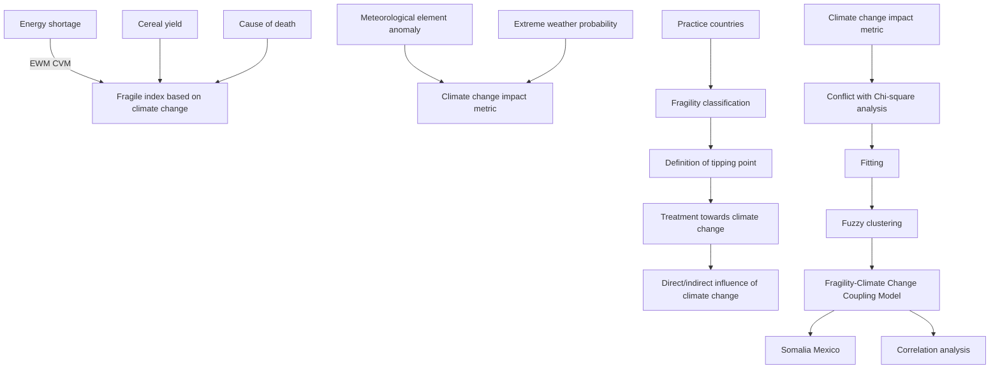
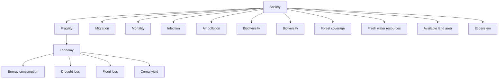

For office use only

T1  
T2  
T3  
T4

Team Control Number

74971

Problem Chosen

E

For office use only

F1  
F2  
F3  
F4

# 2018 MCM/ICM Summary Sheet

# Climate counts! Less Fragility & better Countries Abstract

With the rapid increase of the climate change influence, considerable attention has been attached to socalled ‘fragile’ country. In order to measure the impact of climate change and propose reasonable state interventions, we establish the Fragile-Climate Change Coupling Model and other models based on the theory of country fragility and climate change.

In task 1, for the sake of numeric measurement of the climate change’s influence, we introduce the anomaly of meteorological elements and the extreme weather probability, which make up the climate change index(CCI). Furthermore, 12 indicators closely related to the climate change from three aspects are selected primarily, and then entropy weight method (EWM) and coefficient of variation method(CVM) are applied to integrate the indexes into the fragility index based on the climate change(FCI). Moreover, fuzzy cluster analysis(FCA) is employed to clarify countries into four: impregnable, stable, vulnerable, and fragile.

In task 2, we select Somalia as a research object and analyze the correlation between its CCI and the 12 indexes in the fragile state index(FSI) to reveal the impact of climate change. The result indicates that the economic fragility is sensitive to CCI. Meanwhile, the social fragility has less reaction to climate change, and climate change has potential effect on politics.

In task 3, the Chi-square analysis and fitting method are employed to reflect the specific function relationship between FCI and CCI, by which we establish the Fragile-Climate Change Coupling Model. Thus, it comes to us that with the increase of climate change in Mexico, the fragility rises up correspondingly. We define the country tipping point in the light of the result of fuzzy cluster, and build up the climate change prediction model by utilizing the second exponential smoothing method. The conclusion is that a country reaches the tipping point when the CCI of the country drops down to 58.72, and it will probably fall into fragile country. When the other indexes reach their own critical points, it should also be vigilant.

In task 4, on the basis of three perspectives of fragility, we propose some human interventions aimed at the twelve fragility indicators. They are listed as follows: strengthen infrastructure construction, reuse of resources, improve the covering rate of gardening, return arable land to the water and so on. Then we establish the Intervention Cost Prediction Model, which is composed of the cost of intervention of economic recession, ecosystem sustainability, society habitability, and opportunity cost.

In task 5, we propose some modifications to apply our model into smaller or larger states. With the appropriate alteration of indicators of fragility and climate change, our models have high stability and extensive applicability..

Key Words: Climate change, Fragility, EWM, Fuzzy clustering

## Content

## 1. Introduction...

1.1 Background.  
1.2 Our work..

## 2. Assumptions and Justification....

## 3. Notations....

## 4. The Fragility Measurement on Climate Change...

4.1 Climate change index (CCI). C  
4.2 Fragility index based on climate change. . 6  
4.3 Fragility identification. 9

## 5. Fragility Analysis of Somalia..... 12

5.1 Climate characteristics.. 12  
5.2 Correlation between CCI and FSI.. . 13

## 6. Fragility-Climate Change Coupling Model.. 14

6.1 Climate characteristics of Mexico.. .14  
6.2 Fragility-climate change correlation. . 15  
6.3 Definition of tipping point. .16

## 7. Human Intervention and Cost Prediction.. 17

## 8. Modifications of our model.. . 18

8.1 Smaller states.. .18  
8.2 Larger states.. . 19

## 9. Sensitivity Analysis...... 19

## 10. Strengths and Weaknesses.. . 20

10.1 Strengths. ..20  
10.2 Weaknesses.... .20

## References.. .21

## 1. Introduction

## 1.1 Background

When it comes to climate change, many studies can be referred to since people think more highly of the impacts climate change exerts on environment, economic and society. According to the Fifth Assessment Report (AR5)[1] from the Intergovernmental Panel on Climate Change (IPCC), climate change refers to the changes in climate state. The reasons account for that may be natural internal processes or external forces, like volcano eruption, or continuous human activities which result in the composition changes of atmosphere.

Moreover, the effects of climate change are likely to aggravate the breakdown of social and governmental structures, leading to fragile states consequently. Fragility is also be defined in AR5, which involves with various concepts and factors including the sensitivity towards harm and the lack of response or adaptability.

As a fragile country, it’s economic, society and population will be more sensitive to the climate shocks such as extreme meteorological disaster, rising sea level, increasing global temperature and decreasing arable land. Correlating with poor governance and social fragmentation, environmental instability will trigger violent conflict undoubtedly[2].

## 1.2 Our work

In order to find out the way that climate change effects on regional fragility, we are required to establish an evaluation index model which determines a country’sfragility. By selecting appropriate evaluation indicators, we endow target weights and combine those low indicators to realize some comprehensive indexes. Subsequently, the established model will be applied to various countries to test its applicability and modifications will be proposed to improve it.

We will proceed as follows for the sake of tackling these problems:

State assumptions and make notations. Ignoring some insignificant impacts, we will narrow the core of our approaches towards regional fragility and climate change. Then we will list some notations which are important for us to clarify our model and determine their definitions.  
Establish an evaluation index model which illustrates the fragility and measures the effects of climate change simultaneously. We will apply the fuzzy clustering method to expound a state’s fragility, like fragile, vulnerable, or stable. How the climate change affect fragility is also needed.  
Apply our model to one of the 10 most fragile states and another state not in that and investigate their actual influence factors. Then we will define a tipping point to judge when a country reaches it.  
Introduce the human intervention. Human activities can do a favor to prevent a

country becoming more delicate, which can be predicted from the results of our model. Subsequently, we propose some modifications to apply our model to some smaller or larger states.

Sensitivity analysis and model evaluation. With the evaluation criteria defined before, we evaluate the reliability of our model and do the sensitivity analysis. Then, we will discuss the strengths and weaknesses about our model.

The whole modeling process can be shown as follows:

flowchart

Fig.1 Technology route for the creation of our paper.

## 2. Assumptions and Justification

To simplify the given problems and modify it more appropriate for simulatingreallife conditions, we make the following basic hypotheses, each of which is properly justified.

We assume the country as an overall unit without considering the differences of regions within the country. The assumption is a prerequisite for us to do intensive study. For some countries with vast territory, the climatic conditions vary in latitude and development of different regions is imbalanced.

We assume that all the countries react positively to climate change and take human interventions to decrease the fragility of their country, neglecting the passive countries.

## 3. Notations

We list the symbols and notations used in this paper in Table 1.

Table 1 Notations

<table><tr><td>Symbols</td><td>Definition</td></tr><tr><td>ERI</td><td>Economic recession index</td></tr><tr><td>ESI</td><td>Ecosystem sustainability index</td></tr><tr><td>SHI</td><td>Social habitability index</td></tr><tr><td>FCI</td><td>Fragility index based on the climate change</td></tr><tr><td>CCI</td><td>Climate change index</td></tr><tr><td>C</td><td>Pearson's contingency coefficient</td></tr><tr><td>TC</td><td>Total cost of human intervention</td></tr></table>

## 4. The Fragility Measurement on Climate Change

The Organization for Economic Cooperation and Development (OECD) assumes that if a country, armed with the weak ability of managing the basic state function like population and territory, lacks of political ability or political will to develop a constructive mutually reinforce relationship with the society, then the country is considered as a fragile country[3].

The Country Policy and Institutional Assessment (CPIA) is one of the most widely used evaluation systems, which is composed of four clusters: economic management, structural policies, policies for social inclusion and equity, and public sector management and institutions. These four clusters allow for further refinement and can be expanded to 20 criteria (now has been decreased to 12 criteria) [4].

## 4.1 Climate change index (CCI)

As the recent researches show[1], the core impact of the climate change mainly focused on the warming in temperature, the anomaly of precipitation, the rise of sea level, the number of days in extreme weather.

## 4.1.1 Temperature, precipitation, sea level indicator

The characteristics of a country’s climate like temperature, precipitation or sea level differ a lot because of its longitude, latitude, and altitude. Therefore, we define annual temperature anomaly $d _ { \mathrm { { 1 } } }$ , annual precipitation anomaly $d _ { 2 }$ , and annual sea level anomaly $d _ { 3 }$ , annual standard deviation of temperature $\sigma _ { \mathrm { 1 } }$ , precipitation $\sigma _ { 2 }$ , and sea level $\sigma _ { 3 }$ to describe the climate change.

Recalling on the basic knowledge of meteorology, the narrow concept of climate is the mean state of weather. The World Meteorological Organization (WMO) stipulates 30 years’ statistical mean and variability of climate factors can represent the basic characteristics of the native climate.

We assume that the temperature, precipitation, and sea level index obey segmented distribution. When the annual anomaly $d _ { i }$ of a country exceeds the 30years’ standard deviation $\sigma _ { i : }$ , climate is changing and the scale depends on their difference. Thus, we

Have

$$
\varphi_ {i} = \left\{ \begin{array}{l l} e ^ {a | d _ {i} |} - 1 & 0 \leq | d _ {i} | <   \sigma_ {i} \\ b | d _ {i} | + c & \sigma_ {i} \leq | d _ {i} | <   2 \sigma_ {i} \\ h \ln (| d _ {i} |) + k & 2 \sigma_ {i} \leq | d _ {i} | <   5 \sigma_ {i} \end{array} \right.
$$

where $\varphi _ { 1 } , ~ \varphi _ { 2 }$ , and $\varphi _ { 3 }$ represent those index of temperature T , precipitation $P$ , and sea level L respectively. Since the function is continuous, the values of same critical points are equivalent. Thus, we will give the boundary conditions.

$$
\left\{ \begin{array}{l} e ^ {a \sigma_ {i}} - 1 = b \sigma_ {i} + c = 0. 1 \\ 2 b \sigma_ {i} + c = h \ln (2 \sigma_ {i}) + k = 0. 5 \\ h \ln (5 \sigma_ {i}) + k = 1 \end{array} \right.
$$

line chart

| d     | φ    |
|-------|------|
| 0     | 0.0  |
| σ     | 0.1  |
| 2σ    | 0.5  |
| 5σ    | 1.0  |

Fig.2 The curves of temperature, precipitation, or sea level index. The index model has three subsections: exponential, linear, and logarithmic distribution, showing the effects three indicators’ anomalies have on native climate change.

As the Fig.3 shows, the annual anomaly $d _ { i }$ changing within a standard deviation $\sigma _ { i : }$ , it is reasonable and common because of the micro disturbance, thus this function obeys exponential distribution and tends to climate change rapidly, setting the critical value $\varphi _ { i } { = } 0 . 1$ . With the increasing value of annual anomaly, the speed will slow down gradually, from the linear shape, setting the critical value $\varphi _ { i } { = } 0 . 5$ , to logarithmic distribution. Then we have

$$
\varphi_ {i} = \left\{ \begin{array}{l l} e ^ {\frac {\ln 1 . 1}{\sigma_ {i}} | d _ {i} |} - 1 & 0 \leq | d _ {i} | <   \sigma_ {i} \\ \frac {0 . 4}{\sigma_ {i}} | d _ {i} | - 0. 3 & \sigma_ {i} \leq | d _ {i} | <   2 \sigma_ {i} \\ \frac {0 . 5}{\ln 2 . 5} \ln (\frac {| d _ {i} |}{5 \sigma_ {i}}) + 1 & 2 \sigma_ {i} \leq | d _ {i} | <   5 \sigma_ {i} \end{array} \right.
$$

## 4.1.2 Extr

eme

weat

her

indi

cato

r

As is vividly shown in Fig.4, in the context of global warming, the extreme weather disasters mainly embodies in high temperature and rainstorm[6]. Thus, combined with the temperature and precipitation index, we can construct the extreme weather index E .

line chart

| Frequency Range | Event Type              |
| --------------- | ----------------------- |
| μ to μ+2σ       | Hot weather             |
| μ to μ'+2σ'     | Extreme hot weather      |

Fig.3 The schematic diagram of parameters of climate probability distribution. The right part shows the increase of average temperature and standard deviation. The shade of light red indicates the hot weather, while the red shade indicates the extreme hot weather.

We assume that the temperature and precipitation during one year of a country have a normal distribution, which will be confirmed later. We can derive that

$$
f (t) = \frac {1}{\sqrt {2 \pi} \sigma_ {i}} \exp (- \frac {(t - \mu_ {i}) ^ {2}}{2 \sigma_ {i} ^ {2}}) \tag {4}
$$

where $f ( t )$ is the probability density function of the temperature, t is the daily average temperature of a region, and $\mu _ { i }$ is the annual average temperature.

Then we define that when the value of anomalies beyond twice as much as that of standard deviation, the weather is abnormal. Then we can conclude the probability of abnormal temperature $P ( t )$ . Similarly, precipitation has the function $P ( p )$ )

$$
P (t) = \int_ {\mu_ {i} + 2 \sigma_ {i}} ^ {\infty} f (t) d t, P (p) = \int_ {\mu_ {i} + 2 \sigma_ {i}} ^ {\infty} f (p) d p \tag {5}
$$

Subsequently, we can calculate the extreme weather index E .

$$
E = P (t) + P (p) = \int_ {\mu_ {i} + 2 \sigma_ {i}} ^ {\infty} f (t) d t + \int_ {\mu_ {i} + 2 \sigma_ {i}} ^ {\infty} f (p) d p \tag {6}
$$

Therefore, in order to simplify the model and simultaneously the effectiveness of our model, we select the anomaly of temperature, precipitation, sea level and the days of extreme disaster days as the points of focus for the sake of analyzing the influence of climate change. Subsequently, we weight the indexes and integrate into one comprehensive metric, which is considered to be able to represent the extent of climate change. It is difficult for us to measure the actual proportion of those factors, hence we assume that they are as crucial as each other.

$$
C C I = \frac {1}{m} (T + P + \lambda L + E) \times 1 0 0 \tag {7}
$$

where CCI is the climate change impact metric, T , P , L , E are the evaluation

indexes of temperature, precipitation, sea level, and extreme weather respectively.

Considering the landlocked countries without the effects of sea, we are required to make a difference between landlocked and coastal states. Thus, we have

$$
\left\{ \begin{array}{l l} \lambda = 1, m = 4 & \text { coastal   or   island   country } \\ \lambda = 0, m = 3 & \text { landlocked   country } \end{array} \right. \tag {8}
$$

## 4.2 Fragility index based on climate change

## 4.2.1 Primary indicator system

Since the World Bank already has its evaluation system, the evaluation criteria he has chosen are from a macroscopic and comprehensive perspective. In order to develop a strong relationship between the impact of climate change and a country’s fragility, on the basis of a narrative explaining links between environmental stress and conflict[5], we define fragility evaluation indexes from three levels.

flowchart

Fig.4 Process flow for the establishment of the fragility evaluation criteria. From the perspective of economic recession, ecosystem sustainability, and society habitability, the model defines twelve indicators and incorporated them into the fragility index based on climate change.

## (1) Economic recession

Energy shortage $X _ { 1 }$ (kwh per capita). When a country suffers from a climate shock, armed with the weak infrastructure construction, the country will be more sensitive to the climate change. Thus, we introduce the ratio of the total electricity to the population to reflect the energy shortage.

Cereal yield X (kg per hectare). Agriculture may be one of the most sensitive departments to climate change. We choose food production to represent the agriculture’s reflection on climate change. The value of this indicator is inversely proportional to the fragility.  
Economic loss in flood disaster X (% of GDP). Global warming may strengthen the hydrologic cycle and average precipitation tends to increase. Flood disasters will cause the mountain torrents rushing down, flooding farmland, destructions of infrastructures, and casualties. Then we introduce the ratio of economic loss in flood disaster to GDP to represent the disaster’s impacts.  
Economic loss in drought X 4 (% of GDP). Although the precipitation may increase in some regions, actual vaporization will rise simultaneously caused by the rising average world temperature. We hence define the ratio of economic loss in drought to GDP to symbolize drought’s stress.

## (2) Ecosystem sustainability

Forest area X (% of land area). Forest productivity is one of the main factors to judge the tree growth and ecosystem functioning. The influences climate change exerts on forests major in temperature stress, etc. Thus, we introduce the ratio of the forest area to grossing land area to represent a country’s forest cover rate.  
Annual fresh water $X _ { \mathit { \Pi } _ { 6 } }$ (cubic meters per capita). Fresh water resource is one of the material basis upon survival of mankind. Climate change may cause groundwater levels to decline and rivers to dry up. Consequently, annual fresh water occupation per capita is defined to illustrate the effects of climate change.  
Arable land $X  { 7 }$ (hectares per person). With the average temperature rising noticeably, glaciers melt undoubtedly, leading to the rises in sea levels. The intuitionistic result is the reduction of arable land. We hence introduce the arable land per capita to describe its reflection to climate shock.  
Greenhouse gas emissions X 8 (metric tons per capita). As we all know, greenhouse gas emissions and climate change are interacted with each other. Therefore, we determine greenhouse gas emissions per capita as one of the influence of climate change.  
Native biodiversity $X _ { \mathfrak { g } }$ . Some species are in danger of extinction since they fail to adapt to the new living environment. Thus, we introduce the native species threatened as the biodiversity reflection to climate change.

## (3) Society habitability

Net migration $X _ { 1 0 }$ . Due to the increasing severe burden of natural resources, the impacts of climate change threaten the self-sufficient ability of human beings. We consequently define net migration as an evaluation indicator.

 Cause of death, by natural disasters $X _ { 1 1 }$ (% of total). Extreme weather like EI Niño , sand storm and hurricane will increase in frequency and intensity after climate change. We hence introduce the ratio of death by natural disasters to total number.  
Prevalence of infection $X _ { 1 2 }$ . People are at high risk of dying from communicable diseases through the transmission of insects. So, we choose prevalence of infection to represent the reflection of human health to climate change.

## 4.2.2 Weight of indicators

## a. Entropy weight method

With the evaluation indicators defined above, we further determine the weights of these indicators, resulting in the combination of primary indicators. Recalling on the Entropy Weight Method (EWM), we will carry out the standardized treatment, making the optimal and worst value of each variables after alternation be 1 and 0,respectively. The evaluation indexes are $X _ { 1 } , X _ { 2 } , X _ { 3 } , . . . , X _ { k }$ , where $X _ { i } = \left\{ x _ { i 1 } , x _ { i 2 } , . . . , \mathbf { x } _ { i n } \right\}$ . Among there, k and n are the number of defined evaluation indictors and sovereign countries throughout the world, where k =12 .

For the sake of the cost-type indicators, the fragility of a country is proportional to the value of the indicator. However, in terms of the gain-type indicators, the higher the value is, the less fragile the country will be. Thus, we have

$$
\left\{ \begin{array}{l} \left| y _ {i j} = \frac {x _ {i j} - \min \left(x _ {i}\right)}{\max \left(x _ {i}\right) - \min \left(x _ {i}\right)} \right. \\ v _ {y} = \frac {\max \left(x _ {y}\right) - x}{\max \left(x _ {i}\right) - \min \left(x _ {i}\right)} \end{array} \quad j = 1, 2, \dots , n \right. \tag {9}
$$

where $y _ { i j }$ is the standardized value of each evaluation indicator of each country, max(x ) and min(x ) are the maximum and minimum value of the evaluation indicato $X _ { i } . ~ \operatorname* { m a x } ( x _ { i } ) = \operatorname* { m a x } \left\{ x _ { i 1 } , x _ { i 2 } , . . . , x _ { i n } \right\} , ~ \operatorname* { m i n } ( x _ { i } ) = \operatorname* { m i n } \left\{ x _ { i 1 } , x _ { i 2 } , . . . , x _ { i n } \right\}$ . r

After standardization, we succeed in substituting $y _ { i j }$ for $x _ { i j }$ to implicate the fragility of a country. Then we introduce

$$
p = y _ {i j} / \sum_ {j = 1} ^ {n} y _ {i j} \tag {10}
$$

According to the concepts of self-information and entropy in the information theory, we can calculate the information entropy $E _ { i }$ of each evaluation indicator, hence we can obtain

$$
E _ {i} = - \ln (n) ^ {- 1} \sum_ {j = 1} ^ {n} p _ {i j} \ln (p _ {i j}) \tag {11}
$$

On the basis of the information entropy, we will further compute the weight of each evaluation indicator we defined before.

$$
w _ {i} = \frac {1 - E _ {i}}{k - \sum_ {i} E _ {i}} \quad i = 1, 2,..., k \tag {12}
$$

Subsequently, we can derive the three comprehensive evaluation indicators: economic recession index, ecosystem sustainability index, and social habitability. Hereafter this paper will be abbreviated as ERI , ESI , and SHI respectively. On the basis of those calculated weights, we have

$$
\left\{ \begin{array}{l} E R I _ {i} = w _ {1} y _ {1 i} + w _ {2} y _ {2 i} + w _ {3} y _ {3 i} + w _ {4} y _ {4 i} \\ E S I _ {i} = w _ {5} y _ {5 i} + w _ {6} y _ {6 i} + w _ {7} y _ {7 i} + w _ {8} y _ {8 i} + w _ {9} y _ {9 i} \\ S H I _ {j} = w _ {1 0} y _ {1 0 j} + w _ {1 1} y _ {1 1 j} + w _ {1 2} y _ {1 2 j} \end{array} \right. \tag {13}
$$

## b. Coefficient of variation method

Furthermore, we apply coefficient of variation method to weight these three indices and merge them into a comprehensive metric. Therefore, we will introduce the application of coefficient of variation method briefly.

Coefficient of variation method (CVM) utilizes the information from various indexes and achieve the weight of each index through calculating, which shows to be an objective approach to give weight.

Owing to the influence of different dimension, it is hard to compare the index directly, so it needs the coefficient of variation of each index to measure the difference extent of them. The formula of each index can be expressed as:

$$
V = \frac {\theta_ {i}}{\underset {i} {\Xi}} \quad i = 1, 2, 3 \tag {14}
$$

where $V _ { i }$ is the coefficient of variation of the index i , which can also be called as standard deviation coefficient, and $\theta _ { i }$ means the standard deviation of the index i . And the $z _ { 1 }$ , z2 , $z _ { 3 }$ separately means ERI , ESI , and SHI . Then the weight of each index comes to us:

$$
W _ {i} = \frac {V _ {i}}{\sum_ {i = 1} ^ {n} V _ {i}} \quad i = 1, 2, 3 \tag {15}
$$

By this way, we are able to achieve the weight of each index without any subjective impression. Finally, after getting the weight, we can derive the comprehensive metricfragility index based on the climate change FCI

$$
F C I = \left(W _ {1} \times E R I + W _ {2} \times E S I + W _ {3} \times S H I\right) \times 1 0 0 \tag {16}
$$

## 4.2.3 Fuzzy Cluster Analysis

Combined with the comprehensive fragility metric we established before, we will import data of various countries from the World Bank and calculate the values of FCI . Then according to their respective values, we use Mahalanobis distance to clarify these countries as: impregnable, stable, vulnerable, and fragile. Thus, we can identify a country’s fragility from their FCI . Since it is a conventional method, we neglect the calculate process of it.

## 4.3 Fragility identification

In the establishment of fragility-climate change coupling model, we assume that n is the number of sovereign countries throughout the world, which is too complicated to implement. Thus, we select 20 countries varying in geographical locations, economy degree, and climate features throughout the world, which will be listed later.

Table 2 Weight values of the twelve evaluation indicators and three comprehensive indexes.

<table><tr><td rowspan="13">Fragility</td><td>Indicators</td><td>Weights</td><td>Indicators</td><td>Weights</td></tr><tr><td rowspan="4">Economic recession</td><td rowspan="4">0.1145</td><td>Energy shortage</td><td>0.2912</td></tr><tr><td>Cereal yield</td><td>0.1227</td></tr><tr><td>Economic loss in flood disaster</td><td>0.1648</td></tr><tr><td>Economic loss in drought</td><td>0.1971</td></tr><tr><td rowspan="5">Ecosystem sustainability</td><td rowspan="5">0.6055</td><td>Forest area</td><td>0.2965</td></tr><tr><td>Annual fresh water</td><td>0.2083</td></tr><tr><td>Arable land</td><td>0.1122</td></tr><tr><td>Greenhouse gas emissions</td><td>0.1954</td></tr><tr><td>Native biodiversity</td><td>0.1876</td></tr><tr><td rowspan="3">Society habitability</td><td rowspan="3">0.2800</td><td>Net migration</td><td>0.1986</td></tr><tr><td>Cause of death, by natural disasters</td><td>0.5177</td></tr><tr><td>Prevalence of infection</td><td>0.2837</td></tr></table>

Since the specific value of those indicators have been given in Table 2, hence we can calculate the FCI of our selected countries and apply fuzzy clustering method to clarify these countries into four groups: impregnable, stable, vulnerable, and fragile. The higher the value is, the more fragile the country is. The results of clustering are shown as follows.

bar-line hybrid chart

| x  | Bar Value | Line Value |
|----|-----------|------------|
| 6  | 0.5       | 0.5        |
| 8  | 1.0       | 1.0        |
| 16 | 1.5       | 1.5        |
| 17 | 1.5       | 1.5        |
| 1  | 0.5       | 0.5        |
| 5  | 0.5       | 0.5        |
| 7  | 0.5       | 0.5        |
| 9  | 0.5       | 0.5        |
| 12 | 1.0       | 1.0        |
| 2  | 1.0       | 1.0        |
| 3  | 1.0       | 1.0        |
| 13 | 1.0       | 1.0        |
| 3  | 1.0       | 1.0        |
| 15 | 1.0       | 1.0        |
| 18 | 1.0       | 1.0        |
| 14 | 1.0       | 1.0        |
| 11 | 1.0       | 1.0        |
| 10 | 2.0       | 2.0        |
| 10 | 4.0       | 4.0        |
| 4  | 1.0       | 1.0        |
| 9  | 1.0       | 1.0        |
| 20 | 1.0       | 1.0        |

bar chart

(b)
| X-Axis | Value |
|---|---|
| 9 | 14 |
| 10 | 8 |
| 11 | 3 |
| 12 | 18 |
| 13 | 2 |
| 14 | 6 |
| 15 | 20 |
| 16 | 5 |
| 17 | 16 |
| 18 | 1 |
(b)

bar chart

| Country | f    |
| ------- | ---- |
| 7       | 0.5  |
| 8       | 0.6  |
| 3       | 0.7  |
| 14      | 0.8  |
| 18      | 0.9  |
| 17      | 1.0  |
| 1       | 1.1  |
| 5       | 1.2  |
| 16      | 1.3  |
| 10      | 1.4  |
| 11      | 1.5  |
| 13      | 1.6  |
| 15      | 1.7  |
| 12      | 1.8  |
| 19      | 2.0  |
| 2       | 2.5  |
| 6       | 3.0  |
| 4       | 3.5  |
| 20      | 4.0  |
| 9       | 4.5  |

bar chart

(d)
| Country | Value |
| :--- | :--- |
| 8 | 16 |
| 3 | 119 |
| 11 | 15 |
| 19 | 18 |
| 5 | 20 |
| 12 | 20 |
| 15 | 20 |
| 7 | 20 |
| 13 | 20 |
| 14 | 20 |
| 18 | 20 |
| 10 | 20 |
| 4 | 20 |
| 9 | 20 |
| 20 | 20 |
| 2 | 20 |
| 6 | 20 |
| 17 | 20 |
| 1 | 20 |

Fig.5 Clustering results of the four indicators. (a) economic recession; (b) society

sustainability; (c) ecosystem habitability; (d) fragility. The sequence number along the abscissa axis represents the country: 1 Afghanistan; 2 Bangladesh; 3 Barbados; 4 Canada; 5 Colombia; 6 Cuba; 7 Dominica; 8 Eritrea; 9 Finland; 10 France; 11 Georgia; 12 Iran; 13 Mali; 14 Mauritius; 15 Paraguay; 16 Senegal; 17 South Sudan; 18 Trinidad and Tobago; 19 Tunisia; 20 United States.

According to Fig.5 , we can determine the classification standards of a country’s fragility, once the value of ERI , ESI , SHI , and FCI is figured out. As is shown in Fig.6, the classification standards of the three combined indicators and the comprehensive metric vary a little. Since their focus of attention: economy, ecosystem, society, and combination put the emphasis on the various development of a country, the ultimate ranks of fragility will be different simultaneously.

The deeper the color is, the more fragile the country will be. According to classification standards, the comprehensive metric-fragility rank indicates that stable country is the overwhelming country, succeeding in striking a balance between vectoring sustainable development.

heatmap

| Category | impregnable | stable | vulnerable | fragile |
| :--- | :--- | :--- | :--- | :--- |
| Comprehensive metric | 21.27 | 47.24 | 63.29 | |
| Economic recession | 25.72 | 40.6 | 71.25 | |
| Ecosystem sustainability | 26.92 | 33.08 | 52.15 | |
| Society habitability | 25.41 | 38.60 | 59.49 | |

Fig.6 Classification standards and their respective critical points of verifying a country’s fragility, which is classified as impregnable, stable, vulnerable, and fragile.

The original fragility ranks from Fragile States Index 2017 (FSI), as we can see in Fig.7, match the fragile index based on climate change FCI we established well. We choose six countries as an example.

For example, South Sudan is actually the most fragile country in the world because of its poverty, weak infrastructure, and relatively basic agriculture technologies. Similarly, it is more sensitive to climate change, making itself the most fragile index. When it comes to developed countries like United States, its global superpower, firm infrastructure, and advanced technology determine that it will be easier to deal with climate change. Thus, it is clarified as impregnable.

bar-line hybrid chart

| Country | Fragility | rank |
| :--- | :--- | :--- |
| South Sudan | 42 | 0 |
| Tunisia | 85 | 85 |
| Finland | 175 | 175 |
| France | 130 | 160 |
| United States | 175 | 160 |
| Eritrea | 85 | 30 |
Impregnable stable vulnerable Fragile

Fig.7 Comparison of original ranks from FSI and estimated fragility indexes from FCI .

## 5. Fragility Analysis of Somalia

## 5.1 Climate characteristics

Second-placed Somalia locates in Somali peninsula in the African Continent, on the verge of the India Ocean. It is one of the least developed nations throughout the world, with vulnerable industry, food shortage, and natural disasters. Most regions of Somalia belong to subtropical and tropical desert climate. The typical characteristics are high temperature throughout the year and dry or rainless environments[7].

bar-line hybrid chart

| Year | Temperature anomaly | Annual mean temperature |
|------|---------------------|--------------------------|
| 1991 | 26.5                | 0.3                      |
| 1993 | 26.1                | 0.2                      |
| 1995 | 26.7                | 0.4                      |
| 1997 | 27.4                | 0.5                      |
| 1999 | 26.5                | -0.2                     |
| 2001 | 26.7                | -0.1                     |
| 2003 | 26.8                | 0.1                      |
| 2005 | 26.5                | -0.3                     |
| 2007 | 26.1                | -0.2                     |
| 2009 | 26.8                | 0.3                      |
| 2011 | 25.8                | -0.4                     |
| 2013 | 27.0                | 0.4                      |
| 2015 | 28.0                | 0.6                      |

Fig.8 The annual mean temperature and temperature anomaly of Somalia from 1991 to 2015.

As is shown in Fig.8, the 24 years’ average temperature of Somalia is $2 6 . 5 ^ { \circ } C$ , which illustrates its high temperature very well. The annual temperature fluctuates in a small scale: from $- 0 . 5 ^ { \circ } C$ to 0.5 C . Then we conduct the normal distribution verification of temperature and precipitation as follows.

According to Fig.9, the daily average temperature and precipitation scatterplots fit very well with the curves of normal distribution. Thus, our assumption used in the establishment of CCI is reasonable and practical.

scatterplot

| Standard Normal Quantiles | Quantiles of Input Sample |
| ------------------------- | ------------------------- |
| -3.5                      | 22.0                      |
| -2.5                      | 23.0                      |
| -1.5                      | 24.0                      |
| -0.5                      | 26.0                      |
| 0.5                       | 28.0                      |
| 1.5                       | 30.0                      |
| 2.5                       | 31.0                      |
| 3.5                       | 32.0                      |

histogram

| Temperature Range | Frequency |
| ----------------- | --------- |
| 20 - 21           | 1         |
| 21 - 22           | 3         |
| 22 - 23           | 5         |
| 23 - 24           | 8         |
| 24 - 25           | 12        |
| 25 - 26           | 19        |
| 26 - 27           | 28        |
| 27 - 28           | 30        |
| 28 - 29           | 34        |
| 29 - 30           | 27        |
| 30 - 31           | 16        |
| 31 - 32           | 10        |
| 32 - 33           | 5         |
| 33 - 34           | 2         |
| 34 - 35           | 1         |

scatterplot

| Standard Normal Quantiles | Quantiles of Input Sample |
| ------------------------- | ------------------------- |
| -3.0                      | -10                       |
| -2.5                      | 0                         |
| -2.0                      | 10                        |
| -1.5                      | 20                        |
| -1.0                      | 30                        |
| -0.5                      | 40                        |
| 0.0                       | 50                        |
| 0.5                       | 60                        |
| 1.0                       | 70                        |
| 1.5                       | 80                        |
| 2.0                       | 90                        |
| 2.5                       | 100                       |
| 3.0                       | 110                       |
| 3.5                       | 120                       |
| 4.0                       | 130                       |

histogram

| Precipitation Range | Frequency |
| ------------------- | --------- |
| 0-5                 | 0         |
| 5-10                | 1         |
| 10-15               | 3         |
| 15-20               | 6         |
| 20-25               | 14        |
| 25-30               | 18        |
| 30-35               | 25        |
| 35-40               | 30        |
| 40-45               | 35        |
| 45-50               | 32        |
| 50-55               | 25        |
| 55-60               | 18        |
| 60-65               | 10        |
| 65-70               | 6         |
| 70-75               | 3         |
| 75-80               | 1         |

Fig.9 Verification of normal distribution. (a) q-q plot of the temperature; (b) frequency histogram of daily average temperature; (c) q-q plot of the precipitation; (b) frequency histogram of daily average precipitation.

## 5.2 Correlation between CCI and FSI

To research more deeply on the effect of climate change, we study the relationship among climate change and several indexes of FSI in Somalia for the last 30 years by method of Pearson correlation analysis. Correlation coefficients are shown in Table 3.

Table 3 Correlation coefficients of climate change and each index of FSI

<table><tr><td>Indictors</td><td>Security apparatus</td><td>Factionalized elites</td><td>Group grievance</td><td>Economy</td></tr><tr><td>Coefficients</td><td>0.1327</td><td>0.0028</td><td>0.4007</td><td>0.6528</td></tr><tr><td>Indicators</td><td>Economic inequality</td><td>Human flight and brain drain</td><td>State legitimacy</td><td>Public services</td></tr><tr><td>Coefficients</td><td>0.5431</td><td>0.3287</td><td>0.0028</td><td>0.2758</td></tr><tr><td>Indicators</td><td>Human rights</td><td>Demographic pressures</td><td>Refugees and IDPs</td><td>External intervention</td></tr><tr><td>Coefficients</td><td>0.1279</td><td>0.5628</td><td>0.6526</td><td>0.0167</td></tr></table>

In Table 3, it comes to us clearly that CCI and FSI show great relevance. For example, CCI has high coefficient with poverty and economic decline, economic inequality, which represent that the aspect of economy is sensitive to the change of climate. And the climate change directly and powerfully changes the economy of one country. For example, the increase of mean temperature would come more droughts, which decreases the grain yield and inevitably reduces the income. However, the richest crowd still take up most of the wealth in the country, so the economic inequality keeps increase.

On the other side, the coefficients with Public services, Human flight and brain drain, Human rights, which belong to the social aspect, are less than that of economy. It is easily to understand. Because, though the influence of climate change on the side of society is significant, the influence is slow and hidden. So the effect on the social aspect needs time to reveal.

Nevertheless, the coefficients with Factionalized elites, State legitimacy, which stand for the politics aspect, are very little. That means the connection between climate change and politics is limited. The main reason is that politics is the result of human subjective initiative, which has little relationship with weather. However, it doesn’t mean there is no effect. The climate change still has potential influence on politics. For example, the poverty resulting from famine, whose critical reason is drought, may trigger a political revolution.

## 6. Fragility-Climate Change Coupling Model

## 6.1 Climate characteristics of Mexico

Because of the many plateau and mountainous areas, the climate of Mexico is complexed and various. The vertical climate is characterized. In most areas, they can be clarified as drought and rain seasons.

line chart

| Year | FCI  | CCI  |
|------|------|------|
| 2006 | 53.0 | 44.0 |
| 2007 | 52.5 | 43.0 |
| 2008 | 52.0 | 42.0 |
| 2009 | 55.5 | 45.0 |
| 2010 | 56.0 | 43.5 |
| 2011 | 55.0 | 43.0 |
| 2012 | 57.0 | 56.0 |
| 2013 | 55.5 | 57.5 |
| 2014 | 56.5 | 55.0 |
| 2015 | 59.0 | 57.5 |
| 2016 | 57.5 | 56.5 |
| 2017 | 57.0 | 57.5 |

Fig.11 Comparison of Mexico FCI and CCI

As is illustrated in the Fig.11, the FCI of Kenya rise up rapidly between 2006 and 2008, and then it fluctuates at a high level. It is displayed by the linear trend line of CCI that though the level of CCI doesn’t keep increasing, the overall trend is to rise up, and the impact of the CCI is to improve the index FCI .

## 6.2 Fragility-climate change correlation

In order to confirm the correlation between climate change and fragility of the country, we will conduct Chi-square analysis between FCI and CCI . According to the values of FCI , CCI , we will have the basis matrix M

$$
M - \left[ \begin{array}{c c c c} m _ {1 1} & m _ {1 2} & \dots & m _ {1 n} \\ m & m & & \\ \lfloor_ {2 1} & _ {2 1} & \dots & m _ {2 n} \end{array} \right] \tag {17}
$$

Where $m _ { 1 j }$ represents $F C I _ { \mathrm { \Delta } _ { j } } , \mathrm { \Delta } m _ { 2 j }$ represents CCI . Then, we can calculate chisquare value $\chi ^ { 2 }$ :

$$
\chi^ {2} = g \left| \sum_ {j = 1} ^ {n} \sum_ {i = 1} ^ {2} \left(\frac {m _ {y}}{g _ {2} g _ {n}}\right) - 1 \right| \tag {18}
$$

Where $g = \sum _ { i = 1 } ^ { n } \sum _ { i = 1 } ^ { 2 } m _ { i j } , g _ { 2 } = \sum _ { i = 1 } ^ { 2 } m , g _ { n } = \sum _ { j = 1 } ^ { n } m _ { i j }$ . Then the Pearson’s contingency coefficient C comes to us

$$
C = \sqrt {\chi^ {2} / \left(g + \chi^ {2}\right)} \tag {19}
$$

The higher the value of C , the more closely the correlation between climate change effects and fragility of the country.

In order to measure the effects of climate change on fragility, we assume that without the influence of climate change, the country’s fragility is very small. When it is shocked by climate change, the fragility will increase rapidly, with the exponential formation, thus we have

$$
F C I = r \times \exp (l * C C I + u) \tag {20}
$$

where r , l , u are the regression coefficients derived from the fitting curve.

As is shown in Fig.10, by analyzing the relationship between climate change impact index and the national vulnerability in the last thirty years in Somalia, we can see that when climate change impact index grow, the national vulnerability approximately presents positive exponential function, which is estimated as:

$$
F C I = 2 1. 2 5 * \exp (0. 0 6 3 6 C C I + 0. 0 0 1 4) \tag {2}
$$

The good-of-fit test of our coupling model is 0.5317. The result is not perfect, because climate is random complexity, however, our fitting model still elaborate vital phenomenon. That is when climate change is very intense, the country is rather fragile. Without the effects of climate change, the value of CCI is 0 and FCI is a constant. The country’s fragility will be so small that we can identify it as stable or impregnable.

line chart

| CCI | FCI  |
|-----|------|
| 0   | 25   |
| 5   | 18   |
| 10  | 24   |
| 15  | 30   |
| 20  | 40   |
| 25  | 35   |
| 30  | 32   |
| 35  | 25   |
| 40  | 45   |
| 45  | 30   |
| 50  | 18   |
| 55  | 45   |
| 60  | 40   |
| 65  | 65   |
| 70  | 40   |
| 75  | 85   |
| 80  | 70   |

Fig.10 The curve fitting of our coupling model. The blue line is made by the method of cubic spline, and the black dotted line is a fitting curve.

## 6.3 Definition of tipping point

The climate change always exists and every country more or less is influenced by it. But not all of the country will fall into the ‘fragile’ country under the pressure of climate change. However, some of them inevitably change into fragile country, and each of them has gone through the tipping point between ‘stable’ and ‘fragile’. In this part we will discuss about the definition of tipping point based on the conclusion of Fragility-Climate Change Coupling Model.

To begin with, it’s hard to give a precise point of time when will the country fall into fragile country, but we can learn the circumstance that the country will soon become fragile country. What we need to do is that illustrate this critical point whichis shown by the value of indexes. And from what was discussed above, we can fairly know that when one country’s FCI drop down to 63.29, it enters the fragile country rank. However, a country’s critical point is ought not to be just one index, for when one aspect shows to be hazardous for one country’s fragility, it may not be reflected in the comprehensive index, but it really need to be noticed. Therefore, we list the tipping point for each aspect in Table 4.

Table 4 Tipping point for each aspect

<table><tr><td>Aspect</td><td>ERI</td><td>ESI</td><td>SHI</td><td>FCI</td></tr><tr><td>Value</td><td>71.25</td><td>62.15</td><td>59.49</td><td>63.29</td></tr></table>

When the value of above parameters reach the level in the table, the country should keep vigilant against the influence of climate change, which already goes to a high level and the country would slid to the rank of fragile country.

According to the research of IPCC, it comes to us clearly that the world is Irreversibly warming and different weather disasters take place more frequently. Based on the conclusion of Fragility-Climate Change Coupling Model, we can easily get the relationship between CCI and FCI . Substitute the value of tipping point into the formula, we will derive that when the CCI comes to 58.72, the country experiences the critical point, which should be attached close attention to.

We use the second exponential smoothing method to establish the Climate Change Prediction Model. Its formula could be expressed as:

$$
\left\{ \begin{array}{l} S _ {t} ^ {(1)} = \alpha y _ {t} + (1 - \alpha) S _ {t - 1} ^ {(1)} \\ S _ {t} ^ {(2)} = \alpha S _ {t} ^ {(1)} + (1 - \alpha) S _ {t - 1} ^ {(2)} \end{array} \right. \tag {22}
$$

Where the $S _ { t } ^ { ( 1 ) }$ is the smooth value of the primary index, $S _ { t } ^ { ( 2 ) }$ is the smooth value of the second index. When the trend of parameter shows to be straight line, it could employ the straight line model:

$$
M _ {t + m} = a _ {t} + b _ {t} m \quad m = 1, 2 \dots \tag {23}
$$

$$
\left\{ \begin{array}{c} a = 2 S ^ {(1)} - S ^ {(2)} \\ t \alpha^ {t} \quad (1) \end{array} \right. \tag {24}
$$

$$
\left\lfloor b _ {t} = \frac {}{1 - \alpha} (S _ {t} - S _ {t}) \right.
$$

where the $M _ { t + m }$ means the value of CCI . Based on this model, we can predict the strength of climate change, and the result reflects that by 2023, Mexico’s CCI will boom and exceed 58.72, which represents that it falls into fragile country.

line chart

| Year | CCI  |
|------|------|
| 2005 | 40.0 |
| 2006 | 35.0 |
| 2007 | 33.0 |
| 2008 | 34.0 |
| 2009 | 43.0 |
| 2010 | 36.0 |
| 2011 | 35.0 |
| 2012 | 48.0 |
| 2013 | 55.0 |
| 2014 | 47.0 |
| 2015 | 47.0 |
| 2016 | 40.0 |
| 2017 | 47.0 |
| 2018 | 52.0 |
| 2019 | 54.0 |
| 2020 | 55.0 |
| 2021 | 56.0 |
| 2022 | 57.0 |
| 2023 | 58.72 |
| 2024 | 60.0 |
| 2025 | 62.0 |
| 2026 | 64.0 |
| 2027 | 66.0 |
| 2028 | 68.0 |
| 2029 | 70.0 |
| 2030 | 72.0 |

Fig.12 The practical value (2006\~2017) and predictied value of CCI (2017\~2030).

## 7. Human Intervention and Cost Prediction

Our fragile-climate change coupling model presents the interaction of climate change and national vulnerability. If a country is stable or impregnable, it raised the resistance of the risk of climate change. This is a positive feedback system. Next, we will propose some state driven interventions which could improve the ability to cope with climate change and mitigate the risk of climate change.

On the basis of our established twelve fragility indicators, we propose some interventions from the perspective of exposure, sensitivity, and adaptive capacity[6]. Exposure indicates the pressure of a country suffering from climate change. Sensitivity reflects the internal system’s sensitivity to climate change. Adaptive capacity describes the internal system’s response and adaptation to climate change.

## (1) Economic recession

Strengthen infrastructure construction. Infrastructure like dam or drainage system values important faced with natural disasters like flood, rainstorm. This measure will reduce economic losses and casualties efficiently.  
Reuse of resources. Electricity generation consumes enormous fuel, leading to greenhouse gas emissions. The reuse of resources will reduce air pollution and save energy a lot, which slows down the climate change.

## (2) Ecosystem sustainability

Improve the covering rate of gardening. Afforestation and protection of forests can improve the ecosystem, curb erosion, and resist sandstorm damage. Implement of it can reduce the fragile sensitivity to climate change.  
 Return arable land to the water. This measure is not only helpful to flood control, but also protect the ecosystem, thus increase the country’s ecosystem stability.

## (3) Society habitability

Improve social security benefits. If the majority of people have access to social security benefits when shocked by climate disasters, the country will be more stable and people get along certainly harmonious with each other.  
Increase the service level for elementary medical institutions. When the climate change shocks, the prevalence of infection will increase rapidly. With the perfect medical treatment, we can minimize casualties.

Thus, we can develop the intervention cost prediction model:

$$
T C = E R C + E S C + S H C + T C \tag {25}
$$

where TC is the total cost of human intervention, ERC , ESC , SHC are the cost of intervention of economic recession, ecosystem sustainability, and society habitability, TC is the opportunity cost. Opportunity cost is the economy development we give up in order to decrease the country’s fragility.

## 8. Modifications of our model

For the sake of smaller “states” (such as cities) or larger “states” (such as continents), our coupling model can also work, while precision of our prediction will decrease. Thus, we have to propose some modifications to improve our model.

## 8.1 Smaller states

The majority of greenhouse gas emissions comes from cities result from the consumption of fossil fuel, which used in electricity generation, transportation, lighting, etc. Thus, the weights of our model must be adjusted to adapt to the practical situation of the city. For example, the weight of greenhouse gas emissions should increase.

The infrastructure like drainage system of a city determine its fragility to a great extent. Thus, the indicators of a city’s fragility must be more detailed, such as infrastructure construction, renewable energy. Moreover, we should take the country’s macro-control policies into consideration.

## 8.2 Larger states

As for continents, its vast land determines that the climate change will be more complicated and changeable. As high-latitude areas, melting glaciers and frozen soil are expected to be considered. Meanwhile, large scale circulations between oceans like Walker Circulation, Thermohaline Circulation, and El Niño Southern Oscillation (ENSO) are the major concerns of climate change.  
The fragility of the continent also needs alteration. Mass migration of refugees caused by disease breaks, famine, or military action, may exert great influences on the fragility of the continent. The weights of those indicators change inevitably.

## 9. Sensitivity Analysis

In real life, statistical data are often inaccurate and there may be some deviations in the inputs of our model. These deviations may affect the results of our model. To test the robustness of our model, in this section, we will analyze the sensitivity of our Climate Change Prediction Model in task 3. The results of the sensitivity analysis explain that our model show a perfect stability.

scatterplot

| Year | CCI  |
|------|------|
| 1995 | 28   |
| 1998 | 31   |
| 2000 | 34   |
| 2002 | 36   |
| 2005 | 39   |
| 2008 | 41   |
| 2010 | 43   |
| 2012 | 45   |
| 2015 | 48   |
| 2017 | 50   |
| 2019 | 53   |
| 2020 | 58   |
| 2021 | 60   |
| 2022 | 62   |
| 2023 | 65   |
| 2024 | 68   |
| 2025 | 70   |

Fig.13 The curve fitting of CCI with time. The black line is a fitting curve and the blue shadow part is the confidence interval for future prediction.

In task 3, we predict in 2023 Mexico’s CCI will exceed 58.72 in the method of Second Exponential Smoothing, which indicate that it will fall into a fragile country in 2023, if not take actions to cope with climate change. In the section, we forecast the tipping point in Mexico by curve fitting, the fitting result show that in the year of 2020, the CCI excess 58.72 close to the previous result. Furthermore, by changing the parameters of curve fitting with 95% confidence bound, as is shown in the blue shadow part, we discover our model is still stable and the tipping point range from the year of 2019 to 2021. Compared with the past results, the error is about 2-4years, which is within acceptable limits. This shows the stability of our model, which can solve practical problems in real life.

## 10. Strengths and Weaknesses

## 10.1 Strengths

The fragility-climate change coupling model established in our paper is based on the fragility theory and research results of IPCC, thus it is relatively rigorous.  
− The results of fragility index based on climate change matches the ranks of selected countries from FSI well, which indicates our model is reasonable and effective.  
Our evaluation indicators are determined from three perspectives: economic recession, ecosystem sustainability, and society habitability. It is comprehensive and objective to describe the fragility of a country.

## 10.2 Weaknesses

Ignoring the difference of climate distribution throughout the country, we use the national average levels to describe the country’s climate characteristics, which may reduce the accuracy of our model.  
− We argue that all the countries react positively to climate change, neglecting those passive countries, which may exert on our intervention cost prediction model.

## References

[1] Pachauri R K, Allen M R, Barros V R, et al. Climate change 2014: synthesis report. Contribution of Working Groups I, II and III to the fifth assessment report of the Intergovernmental Panel on Climate Change. IPCC, 2014.  
[2] Theisen, O.M., Gleditsch, N.P., and Buhaug, H. “Is climate change a driver of armed conflict?” Climate Change, April 2013, V117 (3), 613-625.  
[3] Stewart F, Brown G. Fragile states. University of Oxford. Centre for research on inequality, human security and ethnicity (CRISE), 2009.  
[4] Bandura R. A survey of composite indices measuring country performance: 2008 update. New York: United Nations Development Programme, Office of Development Studies (UNDP/ODS Working Paper), 2008.  
[5] Krakowka, A.R., Heimel, N., and Galgano, F. “Modeling Environmenal Security in Sub-Sharan Africa – ProQuest.” The Geographical Bulletin, 2012, 53 (1): 21-38.  
[6] Liu Yang. Study on the social and economic effects of global climate change on the estuary and coastal areas of the Yangtze River Delta. East China Normal University, 2014.  
[7] Somalia: https://en.wikipedia.org/wiki/Somalia  
[8] Schwartz, P. and Randall, D. “An Abrupt Climate Change Scenario and Its Implications for United States National Security”, October 2003.  
[9] Fragile States Index: http://fundforpeace.org/fsi/  
[10] The World Bank: http://www.worldbank.org/en/topic/fragilityconflictviolence/br ief/harmonized-list-of-fragile-situations