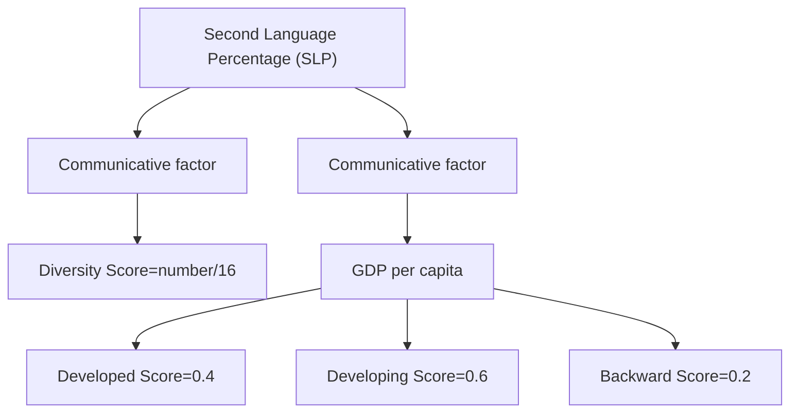
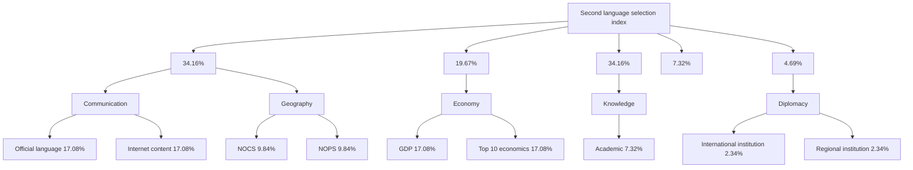
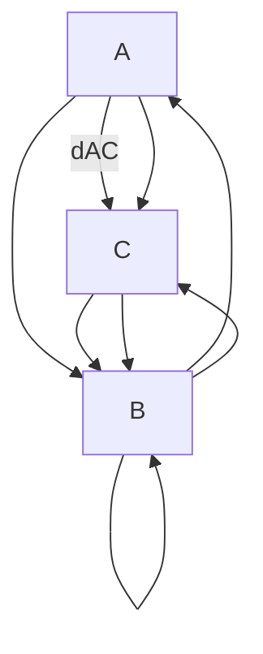
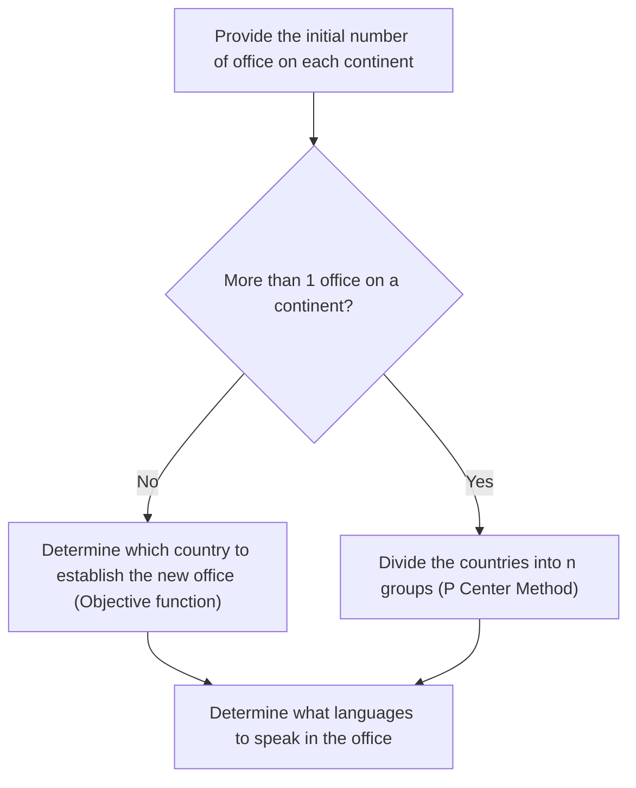

For office use only

T1

T2

T3

T4

Team Control Number

77238

Problem Chosen

B

For office use only

F1

F2

F3

F4

## 2018

## MCM/ICM

Summary Sheet

## Summary

Thousands of languages are spoken around on the Earth, and over 40% of people take one of the top ten most spoken language as their mother tongue. Meanwhile, more and more people are learning a second language to meet the rapid development of economy and globalization.

Aimed to predict the distribution of widespread language speakers over the next 50 years, we build a Language Development Model, and apply it to countries with a population over 10 million to describe the possibility of the new generation in a certain country studying a certain second language. We employ the Analytical Hierarchy Process (AHP) to determine the specific parameters, and carry out stochastic simulation on Python to produce the results, which shows that mild change takes place on the list of popular languages – only two of the top-10 languages are replaced, while the total number of speakers of several languages gains an impressive increase.

Based on the language distribution model we obtain, we develop a Location Determination Model. The dual-solution model further provide a recommendation for a large multinational service company to select the location of their new international office. One of the solution is oriented by language structure, and the other by geographic condition. Taking language distribution as well as economic development of different countries into account, the model suggests that new offices should be located in Nigeria, India, Germany, Italy, Brazil, Australia for short-term interest, and Nigeria, Russia, Germany, Poland, Brazil, Australia for long-term development.

The sensitivity analysis shows the strong robustness of our model. Variation of key parameters causes moderate changes to the computing result. When we test the sensitivity, we indirectly validate our model’s conformance with reality that the direction of fluctuation of the result matches situations in real world. Meanwhile, we further discuss the impact of reducing the number of new office, and provide practicable advice on location determination of new offices.

Key Words: Language Development Model, AHP, Fuzzy Clustering, P-Center Model

## Content

1. Introduction.. (  
2. Assumptions and Justification. 3  
3. Notation.. . 4  
4. Model..

4.1 Language Development Model.  
4.1.1 Judgment Process.. .4  
4.1.2 Stochastic Simulation Process..  
4.2 Location Determination Model. 1  
4.2.1 Solution Oriented by Language Structure.. 11  
4.2.2 Solution Oriented by Geographic Condition.. . 13

5. Sensitivity Analysis.... 17

5.1 Sensitivity Analysis on Language Development Model. .17  
5.1.1 Net Birth Rate Impact.. 17  
5.1.2 GDP Growth Rate Impact. 17  
5.1.3 Migration Rate Impact. .18

5.2 Sensitivity Analysis on Location Determination Model. .19

6. Further Discussion... .. 20

7. Strengths and Weaknesses... .. 20

7.1 Strengths. . 20

7.2 Weaknesses.. . 21

7. Conclusion... 21

Reference... 21

Memo to the Service Company....... . 22

## 1. Introduction

Language is the most important communication tool for human beings. Today, over 6000 languages are spoken on Earth, which help preserve and inherit human civilization and achievements. While everyone has his/her own native language which seldom changes all over his/her life, the number of people speaking a second language keeps increasing not only because of domestic factors such as school studying or governmental promotion, but also international factors including growing migration, booming global tourism and close communication online. Considering both native and second language speakers, great changes take place in language distribution and the number of speakers.

To investigate how the commonly used languages scatter worldwide, we develop a Language Development Model to forecast the future development of the 16 most spoken languages counted in 2017. Based on the original distribution of different languages and the Net Birth Rate of these countries, we build the model to simulate how language distribution changes over the next 50 years.

After obtaining the result from the Language Development Model, we build a Location Determination Model using two different solutions. For the former one, we group the countries

based on their language structure. For the latter one, they are separated according to their geographic condition. After the grouping process, we set two goals to filter an optimal location for the new office in each group, namely GDP distribution and distance from other countries in the same group. Besides, we give recommended spoken language in these new offices.

## 2. Assumptions and Justification

We make some general assumptions to simplify our model. These assumptions together with corresponding justification are listed below:

All people take a certain language as their native language, but not every of them speaks a second language.

Language is an indispensable tool for every person, so all people can speak at least one language, either commonly or rarely used. However, whether one speaks an additional second language depends on multiple reasons, for example, the developmental level of his/her country.

All existing people won’t change their native and second language.

People usually speak the same native language through his/her life. We do not consider change in native language caused by migration or other factors in the simplified model. The influence of migration will be discussed in 4.1.1.

The new generation all take their parents’ native language as their own native language. However, their choice of the second language varies for several reasons discussed in 4.1.1. Few families are composed of members speaking different native language. Meanwhile, the specific data is hard to derive. So, we ignore the influence of the multi-composed families and assume that children all take their parents’ native language as their own native language.

More detailed assumptions will be listed if needed.

## 3. Notation

<table><tr><td> $A_i$ </td><td>The percentage of people in country  $i$  speak a second language.</td></tr><tr><td> $P_{ij}$ </td><td>The possibility of people in country  $i$  speak a second language  $j$ . If language  $j$  is the native language of this country,  $P_{ij} = 0$ .</td></tr><tr><td> $NONLS_i$ </td><td>Number of native language speakers in country  $i$ .</td></tr><tr><td> $NOSLS_i$ </td><td>Number of second language speakers in country  $i$ .</td></tr><tr><td> $TNOS_i$ </td><td>Total number of speakers in country  $i$ .</td></tr></table>

## 4. Model

## 4.1 Language Development Model

To discuss the changes of the top-ten language list, we analyze 16 currently most spoken languages. We gather the characteristics of language distribution of different countries to produce a global language distribution. To reduce the amount of calculation, we only consider countries with a population over 10 million, since they have contributed about 92% of total population on Earth as shown in Appendix 1. To simplify our model, we suggest the language with the most speakers represent the native language of a certain country. For each country, we acquire its population data from 2007 to 2017 on the United Nation Database [1], and obtain its Net Birth Rate to calculate its newly-born population every year. Meanwhile, the percentage of different language speakers is acquired [1,2] so that we can know the current language structure of the country. Through careful analysis of every country we take into account, we seek to obtain the language distribution all over the world.

## 4.1.1 Judgment Process

We assumed that the existing people won’t make a change on their native and second language, and the newly-born population all take their parents’ native language as their own native language. Therefore, the numerical development of a certain language is completely determined by the newly increased population. However, not all of them will speak a second language, and which language they will take as their second language varies for economic, social, political and other reasons. So, we divide the judgment process into two steps – first to judge whether one will speak a second language, and then which language he/she will take. The judgment process of our Language Development Model is shown in Figure 1.


<details>
<summary>flowchart</summary>

```mermaid
graph TD
  A["Newly-born population"] --> B{Speak a second language? (Communication and economy)}
  B -->|No| C["(1-Ai)"]
  B -->|Yes| D{Which language? (communication, geography, economy, knowledge, diplomacy)}
  D -->|Yes| E["(Ai)"]
  D -->|No| F["Pii"]
  F --> G["Chinese"]
  F --> H["English"]
  F --> I["French"]
  F --> J["......"]
  G --> K["Speak various second language"]
  H --> K
  I --> K
  J --> K
```
</details>

Figure 1 Judgment process of Language Development Model

To quantify various reasons that affect the second language, we first take communicative and economic factors to determine if one speaks a second language in our analysis. Both two factors weigh 0.5 when calculating the possibility.

Communicative factor is measured by diversity, which equals to number of language that is spoken by over 100,000 people to 16 (the number of commonly used language we discuss in the paper). For example, if there are 10 languages spoken by over 100,000 people in that country, the score of communicative factor equals to 10/16 (0.625). So, the higher the diversity of language, the higher the percentage $\mathrm { A _ { i } }$ for newly-born generation to speak a second language.

However, when considering economic factors, the economic development level may not have positive correlation to the percentage $\mathrm { A } _ { \mathrm { i } } .$ As far as we are concerned, people in developed countries may lack the motivation to study a second language although they have sufficient resources, while people in backwardcountries lack resources to learn. Therefore, people in developing countries who have moderate resources and highest passion have the highest ikelihood to study. The level of economic development is divided into 3 groups according to the GDP per capita of the country. In the meantime, GDP per capita increases at different rate for countries in different development level, which is listed in

Table 1 below. Taking all these factors considered, we give a covering possibility of speaking a second language for every country we discussed above.


<details>
<summary>flowchart</summary>


</details>

Figure 2 Principle to determine whether one speaks a second language


<details>
<summary>line chart</summary>

| Rank | GDP per capita($) |
| ---- | ----------------- |
| 0    | 80000             |
| 20   | 40000             |
| 40   | 20000             |
| 60   | 10000             |
| 80   | 5000              |
| 100  | 2000              |
| 120  | 1000              |
| 140  | 500               |
</details>

Figure 3 Classification of countries according to GDP per capita

Table 1 Increasing rate of GDP per capita for countries in different development level

<table><tr><td>Countries</td><td>Developed</td><td>Developing</td><td>Backward</td></tr><tr><td>Rate</td><td>+2%</td><td>+7%</td><td>+3%</td></tr></table>

As for the choice of the second language, we take five factors into consideration – communication[3], geography, economy, knowledge[4] and diplomacy[5]. Each of the five factors contains some measurable parameters, for example, number of countries that speak the language (NOCS) and number of people that speak the language (NOPS) in geography section, GDP and number of top 10 economics in economy section. Among these parameters, some are global and have the same value for every country, such as NOCS and NOPS, while others are internal and differ from country to country, such as local GDP and domestic language distribution. This means people in different countries have different possibility to speak the same second language $( P _ { i _ { 1 } j _ { 1 } } \neq$ $\mathrm { P _ { i _ { 2 } j _ { 1 } } } )$ , and people in the same country have different possibility to speak different second language $( P _ { i _ { 1 } j _ { 1 } } \neq P _ { i _ { 1 } j _ { 2 } } )$ .

To determine the weights of each of the five sections, we use Analytical Hierarchy Process (AHP) to determine the weights. This method helps to convert our subjective preference to measurable weights to evaluate the importance of different factors.

We first build a $5 ^ { * } 5$ comparison matrix, each element of which shows the extent of preference between factor i and j. Since daily communication is important for people, and studying a second language usually have a close relationship to business and trade, we give them special preference, and obtain the following matrix.

<table><tr><td></td><td>Com</td><td>Geo</td><td>Eco</td><td>Kno</td><td>Dip</td></tr><tr><td>Com</td><td>1</td><td>2</td><td>1</td><td>5</td><td>6</td></tr><tr><td>Geo</td><td>1</td><td> $1/2$ </td><td>1</td><td>3</td><td>5</td></tr><tr><td>Eco</td><td>1</td><td>2</td><td>1</td><td>5</td><td>6</td></tr><tr><td>Kno</td><td> $1/5$ </td><td> $1/3$ </td><td> $1/5$ </td><td>1</td><td>2</td></tr><tr><td>Dip</td><td> $1/6$ </td><td> $1/5$ </td><td> $1/6$ </td><td> $1/2$ </td><td>1</td></tr></table>

Calculating the maximum eigenvalue and normalizing the corresponding eigenvector, we obtain the weights of each section, and divide them equally for the measurable subsections. The sections we consider together with their weight is shown in Figure 4 below.


<details>
<summary>flowchart</summary>


</details>

Figure 4 Sections and their weight when determining which second language to speak

To test the consistency of the matrix, we calculate the Consistency Ratio (CR), which is defined as the ratio of Consistency Index (CI) to Average Random Consistency Index (RI). Since $n = 5 , R I = 1 . 1 2$ , and $\begin{array} { r } { C I = \frac { \lambda _ { m a x } - n } { n - 1 } = 0 . 0 1 1 5 } \end{array}$ , we get $C I = 0 . 0 1 0 3 < 0 . 1$ , so the consistency of the matrix is confirmed.

## 4.1.2 Stochastic Simulation Process

At the initial phase, we simply simulate the total number of speakers (TNOS ) to simplify our model. Meanwhile, we take the dominant language to represent the native language of a certain country, and ignore the influence of migration. Therefore, the change of TNOSi is simply determined by the newly-born generation. When simulating the model on Python, we first calculate the product of Second Language Percentage (SLP) and the newly-born population of the country to determine the increased number of second language learner. Then we assign a random value between 0 and 1 to every 10,000 second language learners to determine which second language to learn. If the random value falls within the interval of a certain language, all people in the group are regarded to study the specific language.


<details>
<summary>timeline diagram</summary>

| Position | Value |
|---|---|
| French | 0.725 |
| Spanish | 0.741 |
| ... | ... |
</details>

Figure 5 Determination of which second language to speak

The first simulation result shows that moderate changes occur to the top ten list of total number of speakers. Two languages – Portuguese and Russian, are replaced by German and Japanese. The rank of the eight languages listed both in 2017 and 2067 also shows a sligh difference.

As for the total number of speakers, most of the languages we analyze gain growth. The number of German speakers increases the fastest, up to 805.11%. The number of French and Japanese speakers also increases by over 500%. This is mainly because countries which speak these languages have high GDP, so people around the world tend to study these languages for economic reasons. Meanwhile, the original population base of these languages is not so high as Chinese/English speaking countries. The combination of the two aspects leads to this stunning result. If the threshold is reduced to 100%, up to 6 languages are included. But the language which develops the worst, the Russian, only record a -0.51% drop. This is due to the negative Net Birth Rate in Russia and few countries speaking Russian, which lead to decrease in domestic population and lack of new learners for communicative factors.

Table 2 First simulation result

<table><tr><td>Language</td><td>Rank in 2017</td><td>Rank in 2067</td><td>Population in 2017</td><td>Population in 2067</td><td>Increased rate (%)</td><td>Increased number</td></tr><tr><td>English</td><td>1</td><td>1</td><td>1255857851</td><td>3172666602</td><td>152.63</td><td>1916808751</td></tr><tr><td>Chinese</td><td>2</td><td>2</td><td>1096961483</td><td>2278106986</td><td>107.67</td><td>1181145503</td></tr><tr><td>Spanish</td><td>3</td><td>3</td><td>520236718</td><td>1482532068</td><td>184.97</td><td>962295350</td></tr><tr><td>Hindi</td><td>4</td><td>7</td><td>449573687</td><td>480031690</td><td>6.77</td><td>30458003</td></tr><tr><td>Arabic</td><td>5</td><td>8</td><td>334611664</td><td>345470847</td><td>3.25</td><td>10859183</td></tr><tr><td>Malay</td><td>6</td><td>9</td><td>292434196</td><td>296957189</td><td>1.55</td><td>4522993</td></tr><tr><td>Bengali</td><td>7</td><td>10</td><td>246276800</td><td>248034947</td><td>0.71</td><td>1758147</td></tr><tr><td>French</td><td>8</td><td>4</td><td>242897420</td><td>1471076958</td><td>505.64</td><td>1228179538</td></tr><tr><td>Portuguese</td><td>9</td><td>11</td><td>229370143</td><td>238969091</td><td>4.18</td><td>9598948</td></tr><tr><td>Russian</td><td>10</td><td>12</td><td>207790825</td><td>206735561</td><td>-0.51</td><td>-1055264</td></tr><tr><td>Hausa</td><td>11</td><td>13</td><td>150021627</td><td>149734135</td><td>-0.19</td><td>-287492</td></tr><tr><td>Punjabi</td><td>12</td><td>14</td><td>147803740</td><td>149154483</td><td>0.91</td><td>1350743</td></tr><tr><td>Japanese</td><td>13</td><td>6</td><td>133972338</td><td>1135657916</td><td>747.68</td><td>1001685578</td></tr><tr><td>German</td><td>14</td><td>5</td><td>136642027</td><td>1236759996</td><td>805.11</td><td>1100117969</td></tr><tr><td>Persian</td><td>15</td><td>15</td><td>119207805</td><td>125462681</td><td>5.25</td><td>6254876</td></tr><tr><td>Urdu</td><td>16</td><td>16</td><td>69081313</td><td>69250144</td><td>0.24</td><td>168831</td></tr></table>


<details>
<summary>line chart</summary>

| Year | Chinese | English | Hindi | Urdu | Spanish | Arabic | Malay | Russian | Bengali | Portuguese | French | Hausa | Punjabi | Japanese | German | Persian |
|------|---------|---------|-------|------|---------|--------|-------|---------|---------|------------|--------|-------|---------|----------|--------|---------|
| 2020 | 1.1e9   | 1.3e9   | 0.4e9 | 0.3e9| 0.5e9   | 0.2e9  | 0.2e9 | 0.3e9   | 0.2e9   | 0.2e9      | 0.3e9  | 0.2e9 | 0.2e9   | 0.2e9    | 0.2e9  | 0.2e9   |
| 2030 | 1.3e9   | 1.6e9   | 0.4e9 | 0.4e9| 0.7e9   | 0.2e9  | 0.3e9 | 0.4e9   | 0.2e9   | 0.2e9      | 0.5e9  | 0.3e9 | 0.2e9   | 0.2e9    | 0.2e9  | 0.2e9   |
| 2040 | 1.5e9   | 1.9e9   | 0.4e9 | 0.4e9| 0.9e9   | 0.2e9  | 0.5e9 | 0.6e9   | 0.2e9   | 0.2e9      | 0.8e9  | 0.4e9 | 0.2e9   | 0.2e9    | 0.2e9  | 0.2e9   |
| 2050 | 1.7e9   | 2.3e9   | 0.4e9 | 0.4e9| 1.1e9   | 0.2e9  | 0.7e9 | 0.8e9   | 0.2e9   | 0.2e9      | 1.1e9  | 0.6e9 | 0.2e9   | 0.2e9    | 0.2e9  | 0.2e9   |
| 2060 | 1.9e9   | 2.7e9   | 0.4e9 | 0.4e9| 1.3e9   | 0.2e9  | 0.9e9 | 1.0e9   | 0.2e9   | 0.2e9      | 1.4e9  | 0.8e9 | 0.2e9   | 0.2e9    | 0.2e9  | 0.2e9   |
| 2070 | 2.1e9   | 3.1e9   | 0.4e9 | 0.4e9| 1.5e9   | 0.2e9  | 1.1e9 | 1.2e9   | 0.2e9   | 0.2e9      | 1.7e9  | 1.1e9 | 0.2e9   | 0.2e9    | 0.2e9  | 0.2e9   |
| 2080 | 2.3e9   | -       | -     | -    | -       | -      | -     | -       | -       | -          | -      | -     | -       | -        | -      | -       |
</details>


<details>
<summary>line chart</summary>

| Year | Chinese | English | Hindi | Urdu | Spanish | Arabic | Malay | Russian | Bengali | Portuguese | French | Hausa | Punjabi | Japanese | German | Persian |
|------|---------|---------|-------|------|---------|--------|-------|---------|---------|------------|--------|-------|---------|----------|--------|---------|
| 2020 | 2       | 2       | 4     | 6    | 4       | 6      | 6     | 10      | 10      | 10         | 8      | 10    | 12      | 14       | 14     | 14      |
| 2030 | 2       | 2       | 4     | 6    | 4       | 6      | 6     | 10      | 10      | 10         | 8      | 10    | 12      | 14       | 14     | 14      |
| 2040 | 2       | 2       | 4     | 6    | 4       | 6      | 6     | 10      | 10      | 10         | 8      | 10    | 12      | 14       | 14     | 14      |
| 2050 | 2       | 2       | 4     | 6    | 4       | 6      | 6     | 10      | 10      | 10         | 8      | 10    | 12      | 14       | 14     | 14      |
| 2060 | 2       | 2       | 4     | 6    | 4       | 6      | 6     | 10      | 10      | 10         | 8      | 10    | 12      | 14       | 14     | 14      |
| 2070 | 2       | 2       | 4     | 6    | 4       | 6      | 6     | 10      | 10      | 10         | 8      | 10    | 12      | 14       | 14     | 14      |
| 2080 | 2       | 2       | 4     | 6    | 4       | 6      | 6     | 10      | 10      | 10         | 8      | 10    | 12      | 14       | 14     | 14      |
</details>

Figure 6 Change of total number and rank of the 16 languages over 50 years


<details>
<summary>world map with diverging color and bubble sizes</summary>

| Region | Color | Bubble Size (Relative) |
| --- | --- | --- |
| North America | Blue | Medium |
| Europe | Yellow | Large |
| Asia | Red | Very Large |
| South America | Green | Medium |
| Africa | Purple | Small |
| Australia | Black | Small |
| Central America | Light Grey | Medium |
| Middle East | Dark Grey | Small |
| Southeast Asia | Light Grey | Small |
| South Asia | Grey | Small |
| North Africa | Dark Grey | Small |
| Europe | Dark Grey | Small |
| Asia | Dark Grey | Small |
| Africa | Dark Grey | Small |
| North America | Dark Grey | Small |
| Europe | Dark Grey | Small |
| Asia | Dark Grey | Small |
| Africa | Dark Grey | Small |
| North America | Dark Grey | Small |
| Europe | Dark Grey | Small |
| Asia | Dark Grey | Small |
| Africa | Dark Grey | Small |
| North America | Dark Grey | Small |
| Europe | Dark Grey | Small |
| Asia | Dark Grey | Small |
| Africa | Dark Grey | Small |
| North America (Total) | Dark Grey | Small |
| Total (Total) | Dark Grey | Small |
</details>


<details>
<summary>text_image</summary>

2030
</details>


<details>
<summary>text_image</summary>

2050
</details>


<details>
<summary>world map with bubble overlay</summary>

| Region | Value |
| --- | --- |
| North America | 2067 |
| Europe | 1800 |
| Asia | 1500 |
| Africa | 1200 |
| South America | 1000 |
| Australia | 800 |
| Central America | 700 |
| Middle East | 600 |
| Southeast Asia | 500 |
| Eastern Europe | 400 |
| Southern Europe | 300 |
| Northern Europe | 200 |
| Central Asia | 150 |
| South Asia | 100 |
| North Africa | 80 |
| South Africa | 60 |
| Europe | 50 |
| Asia | 40 |
| Africa | 30 |
| Central America | 20 |
| South America | 15 |
| North America | 100 |
| South America | 80 |
| Europe | 60 |
| Asia | 50 |
| Africa | 40 |
| Central America | 30 |
| South America | 20 |
| North America | 15 |
| South America | 10 |
| Europe | 10 |
| Asia | 8 |
| Africa | 6 |
| Central America | 5 |
| South America | 4 |
| North America | 3 |
| South America | 2 |
| Europe | 2 |
| Asia | 1 |
| Africa | 1 |
| Central America | 1 |
| South America | 1 |
| North America | 1 |
| South America | 1 |
| Europe | 1 |
| Asia | 1 |
| Africa | 1 |
| Central America | 1 |
| South America | 1 |
| North America | 1 |
| South America | 1 |
| Europe | 1 |
| Asia | 1 |
| Africa | 1 |
| Central America | 1 |
| South America | 1 |
| North America | 1 |
| South America | 1 |
| Europe | 1 |
| Asia | 1 |
</details>

Chinese  
English  
French  
Japanese  
Russian  
German  
Spanish  
Portuguese  
Italian  
Hindi  
Arabic  
Malay  
Bengali  
Persian  
Hausa  
Punjabi


  
Figure 7 Change of language distribution around the world

To improve our model, we consider number of native language speakers $( N O N L S _ { i } )$ and number of second language speakers $( N O S L S _ { i } )$ separately in the second phase. Since the total number is composed by native and second language parts, $T N O S _ { i } = N O N L S _ { i } + N O S L S _ { i }$ , we just need to simulate the number of native speakers, and get the number of second language speakers

77238 by subtraction. We get the following results:


<details>
<summary>line chart</summary>

| Year | Chinese | English | Hindi | Urdu | Spanish | Arabic | Malay | Russian | Bengali | Portuguese | French | Hausa | Punjabi | Japanese | German | Persian |
|------|---------|---------|-------|------|---------|--------|-------|---------|---------|------------|--------|-------|---------|----------|--------|---------|
| 2020 | 1.07e9  | 0.75e9  | 0.41e9| 0.30e9| 0.41e9  | 0.20e9 | 0.28e9| 0.10e9  | 0.10e9  | 0.18e9     | 0.18e9 | 0.00e9| 0.10e9  | 0.10e9   | 0.10e9 | 0.30e9  |
| 2030 | 1.08e9  | 0.85e9  | 0.42e9| 0.30e9| 0.42e9  | 0.21e9 | 0.28e9| 0.10e9  | 0.10e9  | 0.19e9     | 0.20e9 | 0.00e9| 0.10e9  | 0.10e9   | 0.10e9 | 0.30e9  |
| 2040 | 1.10e9  | 1.00e9  | 0.43e9| 0.30e9| 0.43e9  | 0.22e9 | 0.28e9| 0.10e9  | 0.10e9  | 0.20e9     | 0.22e9 | 0.00e9| 0.10e9  | 0.10e9   | 0.10e9 | 0.30e9  |
| 2050 | 1.12e9  | 1.15e9  | 0.44e9| 0.30e9| 0.44e9  | 0.23e9 | 0.28e9| 0.10e9  | 0.10e9  | 0.21e9     | 0.25e9 | 0.00e9| 0.10e9  | 0.10e9   | 0.10e9 | 0.30e9  |
| 2060 | 1.14e9  | 1.35e9  | 0.45e9| 0.30e9| 0.45e9  | 0.24e9 | 0.28e9| 0.10e9  | 0.10e9  | 0.22e9     | 0.30e9 | 0.18e9| 0.10e9  | 0.10e9   | 0.10e9 | 0.35e9  |
| 2070 | 1.16e9  | 1.55e9  | 0.46e9| 0.30e9| 0.46e9  | 0.25e9 | 0.28e9| 0.10e9  | 0.10e9  | 0.23e9     | 0.35e9 | 0.25e9| 0.15e9  | 0.15e9   | 0.15e9 | 0.45e9  |
| 2080 | -       | -       | -     | -    | -       | -      | -     | -       | -       | -          | -      | -     | -       | -        | -      | -       |
</details>


<details>
<summary>line chart</summary>

| Year | Chinese | English | Hindi | Urdu | Spanish | Arabic | Malay | Russian | Bengali | Portuguese | French | Hausa | Punjabi | Japanese | German | Persian |
|------|---------|---------|-------|------|---------|--------|-------|---------|---------|------------|--------|-------|---------|----------|--------|---------|
| 2020 | 2       | 2       | 4     | 6    | 4       | 6      | 6     | 8       | 10      | 8          | 8      | 13    | 13      | 13       | 14     | 14      |
| 2030 | 2       | 2       | 4     | 6    | 4       | 6      | 6     | 8       | 10      | 8          | 8      | 13    | 13      | 13       | 14     | 14      |
| 2040 | 2       | 2       | 4     | 6    | 4       | 6      | 6     | 8       | 10      | 8          | 8      | 13    | 13      | 13       | 14     | 14      |
| 2050 | 2       | 2       | 4     | 6    | 4       | 6      | 6     | 8       | 10      | 8          | 8      | 13    | 13      | 13       | 14     | 14      |
| 2060 | 2       | 2       | 4     | 6    | 4       | 6      | 6     | 8       | 10      | 8          | 8      | 13    | 13      | 13       | 14     | 14      |
| 2070 | 2       | 2       | 4     | 6    | 4       | 6      | 6     | 8       | 10      | 8          | 8      | 13    | 13      | 13       | 14     | 14      |
| 2080 | 2       | 2       | 4     | 6    | 4       | 6      | 6     | 8       | 10      | 8          | 8      | 13    | 13      | 13       | 14     | 14      |
</details>

Figure 8 Change of number of native speakers and rank of 16 languages over 50 years

Compared with the result of total speakers, we can see that the initial number of native Chinese speakers is more than that of English. However, native English speakers increase much faster than Chinese ones, and surpass Chinese in 2049. The number of other native language speakers also have a small difference from the total number. Meanwhile, we can see that the curve of native speakers is not so smooth as the total speakers one. This is the result of our simplification that we only take the dominant language to represent the native language of a country, so there may be sudden growth or drop of the number when the prevailing language of a country changes.

To better simulate the reality situation, we further consider the influence of migration. We assume that the moment the migration happens, all the immigrants instantly change their native language from their original one to the new one. The emigrant country subtracts thesame number of native language speakers as emigrant number, and immigrant country adds the number to their native language speakers. Meanwhile, immigrants’ original native language is counted into the second language of the new country.

Taking the influence of migration into account, little change occurs in the total number and native language speaker number of all these 16 languages. The development trend and speed are all similar to the former one without consideration of migration. This is attributed to the inconspicuous rate of migration, which is approximately one tenth of the average Net Birth Rate. Simulation result is shown in the following figure:


<details>
<summary>line chart</summary>

| Year | Chinese | English | Hindi | Urdu | Spanish | Arabic | Malay | Russian | Bengali | Portuguese | French | Hausa | Punjabi | Japanese | German | Persian |
|------|---------|---------|-------|------|---------|--------|-------|---------|---------|------------|--------|-------|---------|----------|--------|---------|
| 2020 | 1.1e9   | 1.2e9   | 0.45e9| 0.15e9| 0.5e9   | 0.3e9  | 0.3e9 | 0.2e9   | 0.2e9   | 0.2e9      | 0.25e9 | 0.15e9| 0.15e9  | 0.15e9   | 0.15e9 | 0.15e9  |
| 2030 | 1.15e9  | 1.3e9   | 0.45e9| 0.15e9| 0.55e9  | 0.35e9 | 0.35e9| 0.25e9  | 0.25e9  | 0.25e9     | 0.3e9  | 0.2e9 | 0.15e9  | 0.15e9   | 0.15e9 | 0.15e9  |
| 2040 | 1.2e9   | 1.4e9   | 0.45e9| 0.15e9| 0.6e9   | 0.4e9  | 0.4e9 | 0.3e9   | 0.3e9   | 0.3e9      | 0.35e9 | 0.25e9| 0.15e9  | 0.15e9   | 0.15e9 | 0.15e9  |
| 2050 | 1.25e9  | 1.5e9   | 0.45e9| 0.15e9| 0.65e9  | 0.45e9 | 0.45e9| 0.35e9  | 0.35e9  | 0.35e9     | 0.4e9  | 0.3e9 | 0.15e9  | 0.15e9   | 0.15e9 | 0.15e9  |
| 2060 | 1.3e9   | 1.6e9   | 0.45e9| 0.15e9| 0.7e9   | 0.5e9  | 0.5e9 | 0.4e9   | 0.4e9   | 0.4e9      | 0.45e9 | 0.35e9| 0.2     | 0.15e9   | 0.15e9 | 0.15e9  |
| 2070 | 1.35e9  | 1.7e9   | 0.45e9| 0.15e9| 0.75e9  | 0.55e9 | 0.55e9| 0.45e9  | 0.45e9  | 0.45e9     | 0.5e9  | 0.4    | 0.2     | 0.15e9   | 0.15e9 | 0.15e9  |
| 2080 | 1.4e9   | 1.8e9   | 0.45e9| 0.15e9| 0.8e9   | 0.6e9  | 0.6e9 | 0.5     | 0.5     | 0.5        | 0.55e9 | 0.4    | 0.2     | 0.15e9   | 0.15e9 | 0.15e9  |
</details>


<details>
<summary>line chart</summary>

| Year | Chinese | English | Hindi | Urdu | Spanish | Arabic | Malay | Russian | Bengali | Portuguese | French | Hausa | Punjabi | Japanese | German | Persian |
|------|---------|---------|-------|------|---------|--------|-------|---------|---------|------------|--------|-------|---------|----------|--------|---------|
| 2020 | 1.05e9  | 0.75e9  | 0.42e9| 0.30e9| 0.42e9  | 0.30e9 | 0.30e9| 0.18e9  | 0.15e9  | 0.22e9     | 0.18e9 | 0.01e9| 0.18e9   | 0.10e9   | 0.10e9 | 0.30e9  |
| 2030 | 1.05e9  | 0.80e9  | 0.42e9| 0.30e9| 0.42e9  | 0.30e9 | 0.30e9| 0.18e9  | 0.15e9  | 0.22e9     | 0.18e9 | 0.01e9| 0.18e9   | 0 .10e9   | 0.10e9 | 0.30e9  |
| 2040 | 1.05e9  | 0.85e9  | 0.42e9| 0.30e9| 0.42e9  | 0.30e9 | 0.30e9| 0.18e9  | 0.15e9  | 0.22e9     | 0.18e9 | 0.01e9| 0.18e9   | 1.15e9   | 1.15e9 | 0.30e9  |
| 2050 | 1.05e9  | 0.90e9  | 0.42e9| 0.30e9| 0.42e9  | 0.30e9 | 0.30e9| 0.18e9  | 0.15e9  | 0.22e9     | 0.18e9 | 0.01e9| 0.18e9   | 135e9    | 135e9  | 0.30e9  |
| 2060 | 1.05e9  | 1.00e9  | 0.42e9| 0.30e9| 0.45e9  | 0.32e9 | 0.32e9| 0.22e9  | 0.15e9  | 0.22e9     | 0.22e9 | -0.15e9| -      | -        | -      | -       |
| 2070 | -       | -       | -     | -    | -       | -      | -     | -       | -       | -          | -      | -     | -      | -        | -      | -       |
| 2080 | -       | -       | -     | -    | -       | -      | -     | -       | -       | -          | -      | -     | -      | -        | -      | -       |
</details>

Figure 9 Simulation result when take migration into account

## 4.2 Location Determination Model

## 4.2.1 Solution Oriented by Language Structure

To determine the location of the new offices, we build a Location Determination Model, using the results obtained from the Stochastic Language Development Model. Since international branch offices are usually set in well developed country, we simply focus on countries with GDP over 100 billion dollars, which helps reduce the number of country to 52. In the meantime, the capital of a country is usually the economic, political and transportation center, so we adopt the capital as the only candidate city for each country.

For these 52 countries (or you can say, their capitals), we employ Algorithms for Fuzzy Clustering (AFFZ) to separate them into 6 groups according to their similarity in language structure[6]. For each country, it generates a vector, each element of which stands for the total number of people speaking the specific language. The correlation between every two countries can be calculated through Angle Cosine Method:

$$
r _ {i j} = \frac {\left| \sum_ {k = 1} ^ {m} x _ {i k} \cdot x _ {j k} \right|}{\sqrt {\sum_ {k = 1} ^ {m} x _ {i k} ^ {2} \cdot \sum_ {k = 1} ^ {m} x _ {j k} ^ {2}}}
$$

With the correlation value, we create a Fuzzy Similar Matrix, and then generate a Fuzzy Equivalent Matrix to divide these 52 countries into 6 groups. For each group, we choose 1-3 languages to represent the characteristics of it.

The purpose of establishing an international new office is to get tight connection with economically developed countries and regions, so there are two objectives that we are concerned about most, namely the distance from the candidate country (or capital) to other countries, and the GDP distribution in the group. We hope that the office is built somewhere close to the welldeveloped countries, and we get the following expression for country j

$$
\sum_ {i \neq j} \frac {(G D P _ {i}) ^ {2}}{d _ {i j}} + \frac {(G D P _ {j}) ^ {2}}{\frac {1}{2} \min _ {i \neq j} d _ {i j}}
$$

In the expression, subscript i refers to country i, and $d _ { i j }$ refers to the distance between country i and j. We square the GDP since we think that GDP is a more important factor compared with distance. The first section of the expression represents the effect of distance as well as GDP of other countries. When considering domestic condition, we also use the data of GDP and distance to keep the dimension coherent to the former. However, the distance can’t be 0, so we replace it with half of the distance from its closest country, which makes the value a minimum and not to be 0.

The larger the value of the expression, the better a country to set the office in. So, we need to search for the maximum value in each group to determine the location. That means, the objective function is

$$
\max (\sum_ {i \neq j} \frac {(G D P _ {i}) ^ {2}}{d _ {i j}} + \frac {(G D P _ {j}) ^ {2}}{\frac {1}{2} \min _ {i \neq j} d _ {i j}})
$$

Running the solution program on Matlab using the current (2017) language structure of each country, we obtain the members of each group as the following table shows:

Table 3 Current grouping result (solution 1)

<table><tr><td>Group</td><td>Language</td><td>Countries</td><td>Number</td></tr><tr><td>1</td><td>Arabic</td><td>Morocco, Algeria, Egypt, Iraq, Saudi Arabia</td><td>5</td></tr><tr><td>2</td><td>Spanish + French + Russian</td><td>South Africa, Nigeria, Armenia, Kazakhstan, Kyrgyzstan, Vietnam, Singapore, Philippine, Thailand, South Korea, Japan, Romania, Greece, Czechia, Finland, Austria, Belgium, Poland, Switzerland, Netherland, Spain, Russia, Italy, France, Britain, Germany, Mexico, Puerto Rico, Canada, New Zealand, Australia, Peru, Chile, Colombia, Venezuela, Argentina, China, America</td><td>38</td></tr><tr><td>3</td><td>Bengali</td><td>Bangladesh</td><td>1</td></tr><tr><td>4</td><td>Malay</td><td>Malaysia, Indonesia</td><td>2</td></tr><tr><td>5</td><td>Hindustani</td><td>India, Pakistan</td><td>2</td></tr><tr><td>6</td><td>Portuguese</td><td>Portugal, Brazil</td><td>2</td></tr></table>

Based on the latitude and longitude data of each country, we calculate the distance among them with simple Matlab program. Then we can get the value of the criterion expression of each country, therefore determine the countries for new offices. Final result of locations and the languages used in each office is shown in Table 4.

Table 4 Current locations and languages for each office

<table><tr><td>Country (Capital)</td><td>Saudi Arabia (Riyadh)</td><td>Germany (Berlin)</td><td>Bangladesh (Dhaka)</td><td>Indonesia (Jakarta)</td><td>India (New Delhi)</td><td>Brazil (Brasilia)</td></tr><tr><td>Language</td><td>Arabic</td><td>Spanish, French, Russia</td><td>Bengali</td><td>Malay</td><td>Hindustani</td><td>Portuguese</td></tr></table>

If we substitute the data of language structure and GDP with the future one in 2067 (GDP is regarded to increase at a constant speed as shown in

Table 1), the grouping result and the locations as well as spoken languages will change as Table 5 and Table 6 show below:

Table 5 Future grouping result

<table><tr><td>Group</td><td>Language</td><td>Countries</td><td>Number</td></tr><tr><td>1</td><td>Arabic</td><td>Morocco, Algeria, Egypt, Iraq, Saudi Arabia</td><td>5</td></tr><tr><td>2</td><td>Hindustani +Malay +German</td><td>Brazil, Russia, Poland, India, Germany, Malaysia, Britain, Kazakhstan, Indonesia, Canada, South Korea, Australia, Netherland, Iran, Thailand, Switzerland, Nigeria, Philippine, South Africa, Pakistan, Austria, Vietnam, Singapore, Finland, Czechia, New Zealand, Botswana, China, America</td><td>29</td></tr><tr><td>3</td><td>Bengali</td><td>Bangladesh</td><td>1</td></tr><tr><td>4</td><td>Spanish</td><td>Mexico, Argentina, Venezuela, Chile, Peru, Romania, Italy, Spain, Ecuador, Cuba, Dominican</td><td>13</td></tr></table>

# Team  
Page 13 of 23

<table><tr><td></td><td></td><td>Republic, Colombia, Portugal</td><td></td></tr><tr><td>5</td><td>Japanese</td><td>Japan</td><td>1</td></tr><tr><td>6</td><td>French</td><td>France, Belgium</td><td>2</td></tr></table>

Table 6 Future locations and languages for each office

<table><tr><td>Country (Capital)</td><td>Saudi Arabia (Riyadh)</td><td>Poland (Warsaw)</td><td>Bangladesh (Dhaka)</td><td>Japan (Tokyo)</td><td>France (Paris)</td><td>Argentina (Buenos Aires)</td></tr><tr><td>Language</td><td>Arabic</td><td>Hindustani, Malay, German</td><td>Bengali</td><td>Japanese</td><td>French</td><td>Portuguese</td></tr></table>

## 4.2.2 Solution Oriented by Geographic Condition

As we can see, the result produced by solution oriented by language structure can hardly be regarded as the ideal locations for new office. In fact, although relatively little languages are considered such as Arabic and Bengali and it is easy to determine what languages to speak in each new office, the locations are unsatisfactory from the economic point of view. This can be stem from the huge difference of the 6 groups, one of which contains 38 countries spreading on almost every continent, covering nearly 75% of the total countries we discuss. The remaining 14 countries are all relatively small or medium countries, and have mediocre economic level, which are not suitable locations for international business.

Since then, we shift our way of thinking, and first decide how many offices to build on each continent (totally 6 worldwide) according to the economic development. For continents with n (n> 1) offices, we divide them into n parts based on the geographic location of each country, applying P Center Method while grouping. That means, if there are two offices in Europe, we randomly take two countries of it, and sum up the smaller value of the distance between anther country and these two. After traversing all cases, we select two countries with the minimum value as the reference countries, marked as A, B. Then we add other countries into the group of country A or B on the basis of their distance from these countries. For example, another country C has shorter distance to country B than country A, then it is added to the second group.


<details>
<summary>flowchart</summary>


</details>

Because dAc<dBc, C is grouped in the second group.  
Figure 10 The grouping process

After the grouping process, we use the same criterion expression as the solution oriented by language structure to determine the optimal office location for each group. Algorithms for Fuzzy Clustering (AFFZ) is applied to finally decide what language to speak in the office. We observe the characteristics of language structure of clustered group with most countries, and choose 1-3

77238 languages that have great amount of speakers.


<details>
<summary>flowchart</summary>


</details>

Figure 11 Process of solution oriented

When simulating the solution on Matlab program, we take the original two offices in Shanghai and New York into consideration since they also contribute to connection with other countries around them, which may influence the location selection. That means, we suggest originally there is no office anywhere on Earth, and we need to distribute 8 offices around the world, and see if the results include companies in China and the United States. The number of offices distributed around the world is initially set as the following table:

Table 7 Initial distribution of office number

<table><tr><td>Continent</td><td>Asia</td><td>Europe</td><td>North America</td><td>South America</td><td>Oceania</td><td>Africa</td></tr><tr><td>Number</td><td>2</td><td>2</td><td>1</td><td>1</td><td>1</td><td>1</td></tr></table>

For Asia and Europe, two offices are set, so P Center Method is applied to separate thei countries into two groups. For other continents, only one office is set, so the grouping process is skipped. Russia is regarded as an Asian country because geographically most of its territory locates in Asia.

We discuss the current and future situation separately. The result of the 8 groups for current situation is shown as following:

Table 8 Current grouping result (Solution 2)

<table><tr><td>Group</td><td>Continent</td><td colspan="5">Members</td></tr><tr><td rowspan="2">1</td><td rowspan="2">Asia</td><td>Vietnam</td><td>Bangladesh</td><td>Singapore</td><td>Thailand</td><td>South Korea</td></tr><tr><td>Japan</td><td>China</td><td>Malaysia</td><td>Philippines</td><td>Indonesia</td></tr><tr><td rowspan="2">2</td><td rowspan="2">Asia</td><td>India</td><td>Pakistan</td><td>Armenia</td><td>Kazakhstan</td><td>Kyrgyzstan</td></tr><tr><td>Iraq</td><td>Iran</td><td>Saudi Arabia</td><td>Russia</td><td></td></tr><tr><td rowspan="2">3</td><td rowspan="2">Europe</td><td>Hungary</td><td>Greece</td><td>Austria</td><td>Poland</td><td>Romania</td></tr><tr><td>Czechia</td><td>Finland</td><td>Italy</td><td></td><td></td></tr><tr><td rowspan="2">4</td><td rowspan="2">Europe</td><td>Belgium</td><td>Switzerland</td><td>Netherlands</td><td>France</td><td>Britain</td></tr><tr><td>Germany</td><td>Portugal</td><td>Spain</td><td></td><td></td></tr><tr><td>5</td><td>North America</td><td>Puerto Rico</td><td>Mexico</td><td>Canada</td><td>America</td><td></td></tr><tr><td rowspan="2">6</td><td rowspan="2">South America</td><td>Peru</td><td>Chile</td><td>Colombia</td><td>Venezuela</td><td>Argentina</td></tr><tr><td>Brazil</td><td></td><td></td><td></td><td></td></tr><tr><td>7</td><td>Oceania</td><td>New Zealand</td><td>Australia</td><td></td><td></td><td></td></tr><tr><td>8</td><td>Africa</td><td>Morocco</td><td>Algeria</td><td>South Africa</td><td>Egypt</td><td>Nigeria</td></tr></table>

Using the objective function mentioned above to evaluate the suitability of each country in a group, we obtain the optimal location for the new offices in 2017. The result also validate that China and the United States of America are ideal locations to set offices in. Figure 12 distinctly shows the location of offices and corresponding relative members in the same group on the map of the world.


<details>
<summary>text_image</summary>

Germany
Italy
United States
Nigeria
Brazil
India
China
Australia
</details>

Figure 12 Location of offices worldwide in 2017

The languages spoken in each country are shown in the table below:  
Table 9 Languages spoken in each office in 2017

<table><tr><td>Country (Capital)</td><td>Nigeria (Abuja)</td><td>India (New Delhi)</td><td>China (Shanghai)</td><td>Italy (Rome)</td><td>Germany (Berlin)</td><td>America (New York)</td><td>Brazil (Brasilia)</td><td>Australia (Canberra)</td></tr><tr><td>Language</td><td>Arabic</td><td>Russian, Hindistani, Punjabi</td><td>Chinese, Japanese</td><td>German</td><td>German, French, Spanish</td><td>Spanish, French</td><td>Spanish</td><td>Spanish</td></tr></table>

If the data is replaced by the one in 2067, Italy and India are replaced by Poland and Russia. China and America still exist in the list, once again validating their suitability to be the location for international offices. Meanwhile, small changes occur in languages spoken because of different develop speed of different languages. The grouping result, the final locations of offices and the languages spoken are shown below.

Table 10 Future grouping result (solution 2)

<table><tr><td>Group</td><td>Continent</td><td colspan="5">Members</td></tr><tr><td rowspan="2">1</td><td rowspan="2">Asia</td><td>Vietnam</td><td>Bangladesh</td><td>Singapore</td><td>Thailand</td><td>South Korea</td></tr><tr><td>Japan</td><td>China</td><td>Malaysia</td><td>Philippines</td><td>Indonesia</td></tr><tr><td rowspan="2">2</td><td rowspan="2">Asia</td><td>India</td><td>Pakistan</td><td>Saudi Arabia</td><td>Kazakhstan</td><td>Russia</td></tr><tr><td>Iraq</td><td>Iran</td><td></td><td></td><td></td></tr><tr><td rowspan="2">3</td><td rowspan="2">Europe</td><td>Hungary</td><td>Greece</td><td>Austria</td><td>Poland</td><td>Romania</td></tr><tr><td>Czechia</td><td>Finland</td><td>Italy</td><td>Croatia</td><td></td></tr><tr><td rowspan="2">4</td><td rowspan="2">Europe</td><td>Belgium</td><td>Switzerland</td><td>Netherlands</td><td>France</td><td>Britain</td></tr><tr><td>Germany</td><td>Portugal</td><td>Spain</td><td></td><td></td></tr><tr><td>5</td><td>North America</td><td>Cuba</td><td>Mexico</td><td>Canada</td><td>America</td><td>Dominican Republic</td></tr><tr><td rowspan="2">6</td><td rowspan="2">South America</td><td>Peru</td><td>Chile</td><td>Colombia</td><td>Venezuela</td><td>Argentina</td></tr><tr><td>Brazil</td><td>Ecuador</td><td></td><td></td><td></td></tr><tr><td>7</td><td>Oceania</td><td>New Zealand</td><td>Australia</td><td></td><td></td><td></td></tr><tr><td>8</td><td>Africa</td><td>Algeria</td><td>South Africa</td><td>Egypt</td><td>Nigeria</td><td></td></tr></table>


<details>
<summary>text_image</summary>

United States
Germany
Poland
Russia
China
Nigeria
Brazil
Australia
</details>

Figure 13 Location of offices worldwide in 2067

Table 11 Languages spoken in each office in 2067

<table><tr><td>Country (Capital)</td><td>Nigeria (Abuja)</td><td>Russia (Moscow)</td><td>China (Shanghai)</td><td>Poland (Warsaw)</td><td>Germany (Berlin)</td><td>America (New York)</td><td>Brazil (Brasilia)</td><td>Australia (Canberra)</td></tr><tr><td>Language</td><td>Arabic</td><td>Russian, Hindistani</td><td>Chinese, Japanese</td><td>German</td><td>German, French, Spanish</td><td>Spanish</td><td>Spanish</td><td>Malay</td></tr></table>

## 5. Sensitivity Analysis

## 5.1 Sensitivity Analysis on Language Development Model

In the Language Development Model, the Net Birth Rate, GDP growth rate and migration rate will have an impact on the results. Therefore, it is necessary to analyze the impact of these three factors on the simulation results.

## 5.1.1 Net Birth Rate Impact

The Net Birth Rate in each country is the main motivation behind the language development, here we reduce and increase the net birth rate of all countries by 20% and 10%, and use the Language Development Model to calculate the total number of 16 languages speakers after 50 years. The relative changes are shown in the following table.

Table 12 Analytical result of Net Birth Rate impact

<table><tr><td>Change of Net Birth Rate</td><td>-20%</td><td>-10%</td><td>+10%</td><td>+20%</td></tr><tr><td>Chinese</td><td>-13.60%</td><td>-6.50%</td><td>10.53%</td><td>20.22%</td></tr><tr><td>English</td><td>-13.84%</td><td>-5.41%</td><td>13.07%</td><td>24.76%</td></tr><tr><td>Hindi</td><td>-0.05%</td><td>-0.55%</td><td>0.85%</td><td>0.73%</td></tr><tr><td>Urdu</td><td>0.75%</td><td>-0.84%</td><td>-0.16%</td><td>-1.03%</td></tr><tr><td>Spanish</td><td>-18.45%</td><td>-9.99%</td><td>10.34%</td><td>23.82%</td></tr><tr><td>Arabic</td><td>3.20%</td><td>-3.05%</td><td>2.41%</td><td>2.30%</td></tr><tr><td>Malay</td><td>-1.56%</td><td>-1.53%</td><td>1.53%</td><td>1.50%</td></tr><tr><td>Russian</td><td>-1.89%</td><td>-1.91%</td><td>-1.01%</td><td>-0.78%</td></tr><tr><td>Bengali</td><td>-0.72%</td><td>-0.76%</td><td>0.73%</td><td>0.74%</td></tr><tr><td>Portuguese</td><td>-4.66%</td><td>-4.42%</td><td>4.29%</td><td>3.87%</td></tr><tr><td>French</td><td>-24.35%</td><td>-13.02%</td><td>14.00%</td><td>27.69%</td></tr><tr><td>Hausa</td><td>-0.26%</td><td>-0.04%</td><td>0.02%</td><td>-0.19%</td></tr><tr><td>Punjabi</td><td>-1.28%</td><td>0.88%</td><td>1.07%</td><td>0.93%</td></tr><tr><td>Japanese</td><td>-28.38%</td><td>-13.96%</td><td>17.91%</td><td>34.08%</td></tr><tr><td>German</td><td>-25.32%</td><td>-14.07%</td><td>16.50%</td><td>36.66%</td></tr><tr><td>Persian</td><td>-5.90%</td><td>-5.69%</td><td>5.39%</td><td>5.27%</td></tr></table>

As can be seen from the above table, for most languages, the number of language speakers is positively correlated with the Net Birth Rate. In other words, as the Net Birth Rate rises, the number of language speakers increases, and as the Net Birth Rate decreases, the number of language speakers drops. This result is consistent with common sense. From this perspective, we can say that this model accurately simulates the reality situation. In addition, all the changes in this table are less than 40%. Therefore, the model can be considered as a robust one.

## 5.1.2 GDP Growth Rate Impact

The growth rate of GDP used in the Language Development Model was 2% in developed countries, 7% in developing countries and 3% in backward countries. Now we change these three numbers by -50%, -10%, +10%, +100%, and use the Language Development Model to calculate the total number of 16 languages speakers after 50 years. The relative changes are shown in the

77238following table.

Table 13 Analytical result of GDP Growth Rate impact

<table><tr><td>GDP increase rate</td><td>-50%</td><td>-10%</td><td>+10%</td><td>+100%</td></tr><tr><td>Chinese</td><td>-0.51%</td><td>-0.49%</td><td>1.45%</td><td>2.49%</td></tr><tr><td>English</td><td>-2.88%</td><td>-2.15%</td><td>3.62%</td><td>1.52%</td></tr><tr><td>Hindi</td><td>0.32%</td><td>0.69%</td><td>0.24%</td><td>1.40%</td></tr><tr><td>Urdu</td><td>-0.28%</td><td>-0.30%</td><td>-0.07%</td><td>0.05%</td></tr><tr><td>Spanish</td><td>-0.20%</td><td>-1.44%</td><td>-2.20%</td><td>0.99%</td></tr><tr><td>Arabic</td><td>-2.47%</td><td>-2.71%</td><td>2.82%</td><td>2.16%</td></tr><tr><td>Malay</td><td>-1.58%</td><td>-1.58%</td><td>1.58%</td><td>1.58%</td></tr><tr><td>Russian</td><td>-0.62%</td><td>-0.45%</td><td>-0.65%</td><td>0.84%</td></tr><tr><td>Bengali</td><td>-0.75%</td><td>-0.75%</td><td>0.75%</td><td>0.75%</td></tr><tr><td>Portuguese</td><td>-4.32%</td><td>-4.34%</td><td>4.30%</td><td>4.39%</td></tr><tr><td>French</td><td>-1.64%</td><td>-1.92%</td><td>0.62%</td><td>0.27%</td></tr><tr><td>Hausa</td><td>-0.13%</td><td>-0.13%</td><td>-0.13%</td><td>-0.13%</td></tr><tr><td>Punjabi</td><td>-1.96%</td><td>-0.73%</td><td>0.85%</td><td>1.56%</td></tr><tr><td>Japanese</td><td>-1.18%</td><td>-0.80%</td><td>1.68%</td><td>3.66%</td></tr><tr><td>German</td><td>-2.38%</td><td>0.38%</td><td>0.30%</td><td>1.71%</td></tr><tr><td>Persian</td><td>5.50%</td><td>5.58%</td><td>5.58%</td><td>5.50%</td></tr></table>

As can be seen from the above table, the increase in GDP growth rate will cause an increase in the number of most languages. However, even in the case of GDP growth rate increases by 100%, the total population of languages will not change much (the maximum is only 3.66%). Therefore, the change in the GDP growth rate has little effect on the result of the population after 50 years.

## 5.1.3 Migration Rate Impact

By increasing and decreasing the migration rate in each country, we calculate the total population change of each language after 50 years.

Table 14 Analytical result of Migration Rate impact

<table><tr><td>Migration Rate</td><td>-20%</td><td>-10%</td><td>+10%</td><td>+20%</td></tr><tr><td>Chinese</td><td>3.16%</td><td>-0.81%</td><td>-3.51%</td><td>-8.30%</td></tr><tr><td>English</td><td>-4.23%</td><td>-2.18%</td><td>3.40%</td><td>5.27%</td></tr><tr><td>Hindi</td><td>1.14%</td><td>0.00%</td><td>-5.20%</td><td>-6.86%</td></tr><tr><td>Urdu</td><td>0.00%</td><td>0.00%</td><td>0.19%</td><td>0.00%</td></tr><tr><td>Spanish</td><td>-0.12%</td><td>-0.08%</td><td>1.10%</td><td>1.42%</td></tr><tr><td>Arabic</td><td>0.15%</td><td>0.40%</td><td>-1.34%</td><td>-1.77%</td></tr><tr><td>Malay</td><td>-3.80%</td><td>-6.94%</td><td>-9.11%</td><td>-23.48%</td></tr><tr><td>Russian</td><td>0.20%</td><td>-0.01%</td><td>-0.40%</td><td>-0.34%</td></tr><tr><td>Bengali</td><td>0.08%</td><td>0.06%</td><td>0.03%</td><td>-0.01%</td></tr><tr><td>Portuguese</td><td>-0.17%</td><td>-0.15%</td><td>-0.07%</td><td>-0.05%</td></tr><tr><td>French</td><td>-1.00%</td><td>0.09%</td><td>-0.60%</td><td>-0.23%</td></tr><tr><td>Hausa</td><td>-0.11%</td><td>-0.15%</td><td>-0.13%</td><td>-0.07%</td></tr><tr><td>Punjabi</td><td>0.06%</td><td>-0.02%</td><td>0.04%</td><td>0.01%</td></tr><tr><td>Japanese</td><td>-0.10%</td><td>-1.44%</td><td>8.51%</td><td>3.59%</td></tr><tr><td>German</td><td>-0.51%</td><td>-0.32%</td><td>-1.12%</td><td>4.30%</td></tr><tr><td>Persian</td><td>-0.68%</td><td>-0.44%</td><td>-0.59%</td><td>0.17%</td></tr></table>

From this table, we can see that the number of Chinese, Hindi and Malay speakers are negatively correlated with migration rate, while the total number of speakers of English and Japanese are positive correlated with it. This is because people speaking Chinese, Malay and Hindi have stronger tendency to migrate and lots of them choose English-speaking countries as their second hometown.

## 5.2 Sensitivity Analysis on Location Determination Model

As is shown in 4.2, three factors contribute to the final locations for the new offices – geographic position, language structure and economic condition measured by GDP.

In our model, the impact of a country’s geographic position is expressed by distance. As the position of a country is not likely to change over time, we do not pay much attention to the sensitivity of this factor. Language structure, which is affected by net birth rate, migration and GDP growth, plays a significant role when deciding what language should be spoken in the new offices, but it is less important in the position-determining step. Consequently, in the sensitivity analysis section, we mainly focus on the fluctuation of GDP growth and its influences.

Similar as what we have done in section 5.1.2, we again apply a -50%, -10%, +10% and +100% variation to the GDP growth rate, and record the recommending countries for new offices under each circumstance, respectively. We spot notable changes.

Table 15 Sensitivity Analysis of Location Determination Model

<table><tr><td></td><td>Group members Variation</td><td>Recommended Country</td><td>Group members Variation</td><td>Recommended Country</td><td>Group members Variation</td><td>Recommended Country</td><td>Group members Variation</td><td>Recommended Country</td></tr><tr><td>GDP growth rate variation</td><td colspan="2">-50%</td><td colspan="2">-10%</td><td colspan="2">+10%</td><td colspan="2">+100%</td></tr><tr><td>Africa</td><td>+0</td><td>Nigeria</td><td>+0</td><td>Nigeria</td><td>+2</td><td>South Africa</td><td>+4</td><td>Botswana</td></tr><tr><td rowspan="2">Asia</td><td>+0</td><td>Russia</td><td>+0</td><td>Russia</td><td>+0</td><td>Russia</td><td>+0</td><td>Russia</td></tr><tr><td>+0</td><td>China</td><td>+0</td><td>China</td><td>+0</td><td>China</td><td>+0</td><td>China</td></tr><tr><td rowspan="2">Europe</td><td>+0</td><td>Germany</td><td>+0</td><td>Germany</td><td>+0</td><td>Germany</td><td>-2</td><td>Germany</td></tr><tr><td>+0</td><td>Poland</td><td>+0</td><td>Poland</td><td>-1</td><td>Poland</td><td>-1</td><td>Poland</td></tr><tr><td>North America</td><td>+0</td><td>USA</td><td>+0</td><td>USA</td><td>+0</td><td>Mexico</td><td>+0</td><td>Mexico</td></tr><tr><td>Oceanic</td><td>+0</td><td>Australia</td><td>+0</td><td>Australia</td><td>-1</td><td>Australia</td><td>-1</td><td>Australia</td></tr><tr><td>South America</td><td>+0</td><td>Brazil</td><td>+0</td><td>Brazil</td><td>+0</td><td>Brazil</td><td>+0</td><td>Brazil</td></tr></table>

From the table above we can conclude that:

If the GDP growth rate decreases, neither the group members nor the recommended country changes.  
If the GDP growth rate increases, there tends to be more group members for Africa and less members for Europe and Oceanic. Meanwhile, the recommended countries alter.

This phenomenon can be explained by the difference of GDP growing speed between developing and developed countries. When GDP growth rate increases, the difference broadens, meaning that more developing countries will take the place of the developed ones. It is natural that Africa attracts more attention, and we have more developing countries in the recommend list.

## 6. Further Discussion

Because the Location Determination Model produces just passable result through the solution oriented by language structure, we apply the latter solution oriented by geographic condition to further discuss whether 5 or even less offices to open can be applicable.

Since this solution does not make any restriction on the number of new office, the company can choose to open any arbitrary number of office based on its actual financial condition. As long as the company has a preliminary planning of how many new offices to open and which continent they are located at, we can provide the exact location of each office immediately.

For example, suggest the company decides to cut an office in Europe and open 5 offices in total, it won’t affect the location of other offices in other continents, but may change the location of Europe. Calculating this situation on Matlab program, we get the result of short-term and longterm decision shown in the following figure.


<details>
<summary>flow diagram</summary>

| Category | Transition | Sub-category |
| --- | --- | --- |
| Europe | Italy | Germany |
| Europe | Poland | Poland |
| Other Continents | Nigeria | India |
| Other Continents | Nigeria | India |
| Other Continents | Nigeria | Brazil |
| Other Continents | Nigeria | Australia |
| Other Continents | Nigeria | Russia |
| Other Continents | Nigeria | Russia |
| Other Continents | Nigeria | Brazil |
| Other Continents | Nigeria | Australia |
</details>

Figure 14 Changes in the location of Europe continent

Therefore, we can say that our model with the geographic-condition-oriented solution has strong adaptability to various situations and is a simple but also feasible method to provide advice on selection of new offices location.

## 7. Strengths and Weaknesses

## 7.1 Strengths

Based on the AHP method, the Language Development Model fully considers the influence of many possible factors on language development, including communication, geography, economy, academy and diplomacy. Therefore, the result of the model is highly credible.  
 The Language Development Model takes country rather than language as the unit of simulation. So, it can not only model the development of a certain language over time, but also model the linguistic structure of any given country over time.  
 We looked into the location determination problem from two different aspects: the similarity of linguistic structure and the geographic distance between countries. We made a judgement on the priority of these two factors and improved our model.  
The Location Determination Model can reflect the economic consideration of a modern international company as GDP plays an important role when determining the location for new

8offices.

Flexibility and adaptability are also advantages of the Location Determination Model. When the company change its strategy, new decisions can be quickly derived without modifying the algorithm.

## 7.2 Weaknesses

In our model, to simplify our model, only the language with the largest number of speakers is considered as the native language of a country. But in fact, there might be two or even more native languages in a country.  
The objective function to optimize the position of new offices is determined with a certain degree of arbitrariness. It can be further improved to meet different actual needs.  
The correctness of our conclusions relies heavily on the accuracy of the data collected and the estimates of GDP, language and population development.  
The recommendation provided by our model remains at the stage of countries (capitals). Further analyses are required in order to determine the specific cities.

## 7. Conclusion

To predict the future distribution of commonly used languages, we build a Language Development Model, setting up 2 criteria to estimate the percentage of speaking a second language, 5 factors to evaluate which second language to speak. Then we simulate the model on Python, using data of population, GDP, language structure and etc. of over 50 countries we collected on the Internet. We conclude that only moderate changes occur to top ten language list, and most of the 16 languages we discuss gain a growth in their total speaker number.

To further provide advice to the multinational service company, we build a Location Determination Model, applying two solutions to figure out the suitable locations for establishment of new offices. The first solution oriented by language structure produced just passable result without comprehensive consideration on economic condition. The second solution, if provided initial number of office on each continent, produces generally ideal locations, and new decisions can be quickly derived if the company change its strategy.

## Reference

[1] http://data.un.org/Data.aspx  
[2] https://www.cia.gov/library/publications/resources  
[3] https://w3techs.com/technologies/overview/content\_language/all  
[4] http://akarlin.com/2011/05/top-10-most-useful-languages/  
[5] Kai L. Chan, PhD, POWER LANGUAGE INDEX, May 2016  
[6] Gustafson, D. E. (1979). Fuzzy clustering with a fuzzy covariance matrix. Proc of IEEE Cdc San Diago Ca, 2, 761-766.

## Memo to the Service Company

## Dear Chief Operating Officer,

We are glad to hear your recent plan about opening six new international offices, which wil definitely be an important milestone for your company to become truly international. For such a significant plan, it is necessary to carry out some research before making the final decision. To assist you to decide the location of new offices and determine the languages spoken in the offices, we performed investigations using mathematical modelling.

Firstly, we build up a Language Development model to investigate the distribution of various language speakers over time. In this model, we consider many possible influencing factors, including economy, geography, communication, knowledge and diplomacy. This model is based on data from the United Nation (UN). Through our calculations and tests, we found that this model can really help us to predict the future of language development. It is indicated in this model that over the next 50 years, two original most spoken languages (Russian and Portuguese) will be replaced (by German and Japanese), while the total number of speakers of most languages will gain an impressive increase.

Based on the model of language distribution, combined with Algorithm for Fuzzy Clustering method and P-Center method, we develop a Location Determination Model using two solutions to further provide a recommendation for your company to select the location of your new international office and its working language. One of the solution is oriented by language structure, and the other by geographic condition. Taking language distribution as well as economic development of different countries into account, we suggest to locate new offices in the capitals of Nigeria, India, Germany, Italy, Brazil, Australia for short-term interest. These six locations as well as the languages to be used in the new offices are as the following:


<details>
<summary>text_image</summary>

Germany
United States
Italy
Nigeria
India
China
Brazil
Australia
</details>

<table><tr><td>Recommended Location for New Offices</td><td>Language(s) to be Used</td></tr><tr><td>New York, America</td><td>Spanish</td></tr><tr><td>Shanghai, China</td><td>Chinese and Japanese</td></tr><tr><td>Moscow, Russia</td><td>Russian and Hindustani</td></tr><tr><td>Warsaw, Poland</td><td>German</td></tr><tr><td>Berlin, Germany</td><td>German, French and Spanish</td></tr><tr><td>Abuja, Nigeria</td><td>Arabic</td></tr><tr><td>Brasilia, Brazil</td><td>Spanish</td></tr><tr><td>Canberra, Australia</td><td>Malay</td></tr></table>

Considering from long-term perspective, your company should build these six new offices in the capitals of Nigeria, Russia, Germany, Poland, Brazil and Australia. Moreover, since our model makes no restriction on number of new office, you can set arbitrary number of offices based on your actual financial condition. As long as you make a preliminary planning of how many new offices to open and which continents they are located at, we can provide the exact location of each office immediately.

We hope that our suggestion can provide useful information for you.

Yours sincerely,

Team #77238