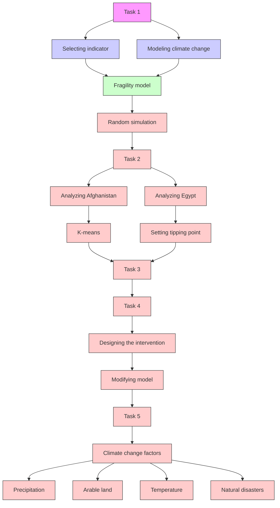
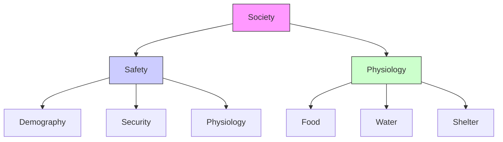
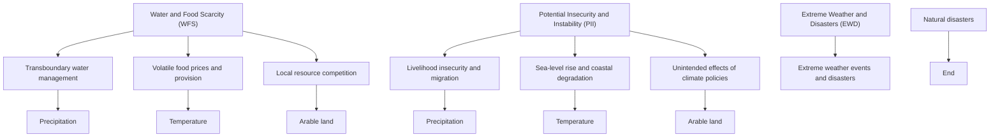

<table><tr><td colspan="2">For o ce use onl</td></tr><tr><td>T1</td><td></td></tr><tr><td>T2</td><td></td></tr><tr><td>T3</td><td></td></tr><tr><td>T4</td><td></td></tr></table>

<table><tr><td>am Control Numl</td></tr><tr><td>与经验技巧、matTa</td></tr><tr><td>78511</td></tr><tr><td>Problem Chosen</td></tr><tr><td>E</td></tr></table>

<table><tr><td>For once use only</td></tr><tr><td>T1</td></tr><tr><td>T2</td></tr><tr><td>T3</td></tr><tr><td>T4</td></tr></table>

# 2018 MCM/ICM

## How Will Climate Change A ect Fragility?

People living in fragile states are more vulnerable to potential shocks. With the climate change exacerbating fragility, people gradually begin to focus on the importance of measuring and dealing with the fragility. In order to solve these problems, we rst establish an evaluation model to measure the fragility under climate change. Then it is applied to Afghanistan and Egypt to show their fragility situation. At last, a set of optimal interventions are given and the model is modi ed in order to apply to smaller and bigger states.

To begin with, 37 inferior factors are considered into our model and we gure out the normalization method and measurement for each inferior factor. After that, eight superior indicators are summarized from inferior factors include food, water, shelter, security, stability, economics, governance and demography. The analytic hier-archy process method is used to weigh these indicators. At last, the impacts of climate change are characterized by precipitation, arable land, temperature and natural disasters.

Next, the evaluation model is applied to Afghanistan and Egypt. Afghanistan is in the top ten fragile states list and Egypt is not in the top ten list. Fragility indicator is used to measure the fragility. It is a bene t-type indicator normalized to the range of [0,1]. Using the collected data, we nd that with the climate change, the fragility indicator is 0.280 for Afghanistan and 0.407 for Egypt. Without the climate change, it is

0.310 for Afghanistan and 0.428 for Egypt. The percentage change is 10.7% and 5.2%, respectively. Among the eight superior indicators, economics is mostly a ected. At last, we use the K-Means Clustering Algorithm to determine the tipping point and stable point. Results show the tipping point is 0.428 and the stable point is 0.711.

In order to help Afghanistan and Egypt escape from the fragility, an optimization model is developed to maximize the fragility indicator under the limitation of the budget. To prevent fragility, Afghanistan needs to spend 285% of its GDP (57.2 billion dollars) and Egypt 1% (3.32 billion dollars). We gure out the optimal distribution of money using our optimization model. Results show that money for food and water should account for 30% and 25%, respectively. Sensitivity analysis is made at the end. Our model is a little more sensitive to precipitation.

At last, our model is modi ed to t for smaller and bigger states. For smaller states, the factors and weights are reconsidered and the cost of intervention is lower because of the synergy e ect; for bigger states, the sphere of in uence is restrained, and the cost is higher because of the di culty in managing the bigger states. Still using the data of Afghanistan and Egypt, we nd that other things equal, smaller states can develop more quickly while bigger states develop much more slowly.

## Contents

1 Introduction 1  
2 Assumptions 2  
3 Measurement of Fragility and Climate Change 2

3.1 Establishment of the Fragility Model 2

3.1.1 Discussion of the Superior and Inferior Indicators 3  
3.1.2 Normalization of Inferior Indicators . 4  
3.1.3 Determination of the Weights for Indicators 6

3.2 Modeling the Climate Change Impacts . . . . . 6

3.2.1 Characterizing the Climate Change . . . 6  
3.2.2 Water and Food Scarcity Impacts . .  
3.2.3 Potential Insecurity and Instability Impacts 8  
3.2.4 Extreme Weather and Disasters Impacts . 9

4 Analysis of Fragility in Afghanistan and Egypt 10

4.1 Fragility Situation in Afghanistan and Egypt . . . . 10  
4.2 Sensitivity analysis . . . .  
4.3 Determination of Tipping Point . . . . . ...12

5 Designation of Intervention Plan 13

5.1 Establishment of the Optimization Model . . . . . 13  
5.2 Formulation of a Intervention Project . . . . . 14  
5.3 Impacts of the Intervention Project . . . . . 16  
5.4 Sensitivity Analysis . . . . ....16  
5.5 Suggestions 17

6 Modi cation of Fragility Model 17

6.1 Modi cation for Smaller States 17  
6.2 Modi cation for Bigger States . . 18  
6.3 Application to Afghanistan and Egypt 19

7 Conclusions 20  
8 Strengths and Weaknesses 20

Reference 21

Team # 78511 Page 1 of 21

## 1 Introduction

## Backgroud

People used to think that climate change just a ects the environment business. However, Frank Walter, the foreign minister in Germany, claimed that climate change is a growing threat to peace and stability[1] . It will aggravate the fragility of countries.

When the climate change is combined with the poverty and resource scarcity, the state might be more fragile because of the violent con icts caused by the combination. We have to study on the relationship between climate change and fragility of countries, in order to halt the exacerbation of fragility and o er the reasonable intervention plans to the fragile states.

精品数模资料，各类比赛优秀论文、学习教程、写作模板与经验技巧、matlab程序代码资料等，尽在淘宝店铺：闵大荒工科男的杂货铺Literature Review

States can be divided into fragile states and resilient states. Fragility and resilience are de ned in the report of New Climate for Peace. Fragility is the inability (whethe whole or partial) of a state to ful l its responsibilities as a sovereign entity, including a lack of legitimacy, authority, and capacity to provide basic services and protect its citizens[2] . Resilience is the opposite. Climate change alone cannot make signi cant e ects on the state, but it can so when it interacts other pressures. There are seven risks that will emerge: local resource competition, livelihood insecurity and migration, extreme weather events and disasters, volatile food prices and provision, transboundary water management, sea-level rise and coastal degradation, and unintended e ects of climate policies. These possible consequence o ers the base of thinking for our study.

The essay of Department for International Development indicated that, the governance e ciency, state function and international support need to be improved, in order to relieve the fragility problem[3] . In another essay, the writer pointed out that the rebuilding of Afghanistan includes the economic, politics, security and society area[4] . These facets should be included in our fragility model to make it more comprehensive.

The previous researches have contributed a lot to the solution of fragility problems, but there are still some limitations of their work for solving our problem. For instance, the factors of the physiological need are ignored in the rank of fragility, and the cost of the intervention has not been considered. Furthermore, they provide little statistics and models to measure the fragility, which are taken into account in our study, these factors are involved to build a more complete and useful model.

## Our Work

Because of the weaknesses of the previous work, we should further study this issue in detail. The mind map of our study is shown in Figure 1 in detail. Firstly, a new evaluation model should be established considering more factors. Climate change impacts should also be taken into account. In our study, the climate change is regarded as an in uential factor added into the fragility evaluation model. After that, Afghanistan and Egypt are analyzed and the fragility situations are discussed. Afghanistan is in the top ten fragile states list while Egypt is not.

In order to ght against fragility, interventions are needed. Optimization model is used to gure out the best intervention plan under the limitation of budget. The main purpose is to maximize the fragility indicator. At last, modi cation is made to smaller and bigger states according to their natural features. The factors and costs of intervention for smaller and bigger states are reconsidered.

flowchart

Figure 1: Flowchart of our study

## 2 Assumptions

The fragile states are not able to adapt to the climate change in the short run.

{ If a state can adapt to that change well, climate change can even bene t that state[5] . Considering that most fragile states are developing states, we assume that they are not able to adapt to the climate change in the short run.

The long run impacts of natural disasters are neglected.

{ The impacts of natural disasters are always direct, like economic loss. In the long run, the disasters will be solved and their impact will not last as long as other climate changes like temperature increase.

The marginal cost of intervention increases linearly.

{ This is a reasonable simpli cation of increasing marginal cost[6] . In reality, the increase of marginal cost depends on the speci c situation.

The physiological need is the most important need of human.

{ Physiological need is the most basic need. It should be given more attention.

## 3 Measurement of Fragility and Climate Change

The fragility model includes two parts: the indicators used to describe fragility and the impacts of climate change on indicators. The fragility of a state is actually measured by the indicators and the impacts of climate change is built into the indicators. Therefore, We will rst establish an indicator system to evaluate the fragility. Climate change is regarded as in uential factors to the indicators.

## 3.1 Establishment of the Fragility Model

According to the problem, a fragile state is one where the state government is not able to, or chooses not to provide the basic essentials to its people. This implies that the theory of needs can be applied to measure the fragility. The most popular theory of needs is Maslow's hierarchy of needs. From the most basic needs to the most superior, the needs are physiology, safety, society, self-esteem and self-actualization[7] .

We only take into account the three most basic needs, considering that fragile states are often characterized by low income and weak government[8] . The framework of the

fragility model is shown in Figure 2. Several speci c factors are considered under each type of need in Figure 2. The physiology is consisted with food, water and shelter. The safety is consisted with security and stability. The society is consisted with economics, governance and demography. We set an indicator for each detailed need, so we get eight superior indicators describing the fragility. A speci c assemblage I is given for them:

$$
I = f F D; W A; S H; S C; S T; E C; G N; D M g
$$

where F D, W A, SH, SC, ST , EC, GN, DM represent food, water, shelter, security, stability, economics, governance and demography, respectively.

There are many inferior indicators under each superior indicator. As shown in Figure 2, 37 inferior indicators are considered in our fragility model. The superior indicators are determined by the linear combination of these inferior indicators. The determination of the weights will be discussed later. Those eight superior indicators measure the fragility of a state. We set the fragility indicator F as the linear combination of them:

$$
F = \begin{array}{c} X \\ ! _ {i} i \\ i 2 l \end{array} \tag {1}
$$

where !i is the weight of each superior indicator.

flowchart

Figure 2: Framework of fragility model

We are going to introduce the inferior indicators and normalize each of them into the same pattern. After that, the weights of each superior and inferior indicator will be determined using the Analytic Hierarchy Process (AHP).

## 3.1.1 Discussion of the Superior and Inferior Indicators

The fragility indicator is calculated by eight superior indicators and the superior indi-cators are determined by the inferior indicators. We are going to discuss about them in detail.

Physiology

Food is a basic precondition for living, so it is also a critical factor related to the fragility. When a country is lack of food, citizens will not satisfy and they may rob others or even attack the government. Therefore, the more food people can get, the less fragile the country is. The food indicator (F D) is based on the following inferior indicators: food production per capita, average food price and food import quantity.

Similarly, people need usable water to maintain their subsistence. A state may become less fragile because of the insu cient usable water. Therefore, the water indicator (W A) is also used to re ect the fragility. The speci c inferior indicators are: water quantity per capita, sewage discharge rate, improved water rate and total water reservoir.

Shelter is an important factor a ecting fragility. In the fragile countries, people gener-ally do not have a stable shelter, especially when the violent con icts exist. This situation can exacerbate the fragility[9] . The inferior indicators for shelter indicator (SH) are: housing area per capita, slum population portion and house price.

## Safety

The security indicator (SC) is important for the safety. the speci c inferior indicators for the factors listed in Figure 2 are: crime rate, external intervention level, number of terrorist attacks, army power and police density.

The stability indicator (ST ) refers to the stability of the migration of population, so it is a ected by the population mobility. In some states, refugee is a serious problem. Their migration and mobility can disturb the society severely. The society is also su ered from the violent con icts. The inferior indicator for these factors are refugee index, number of violent con icts and migration rate.

## Society

The economic indicator (EC) is rather important. It is in uenced by many aspects, like GDP, in ation, etc. The inferior indicators are chosen as: GDP per capita, in-ation rate, unemployment rate, the Gini coe cient, debt to GDP ratio and interest rate.

The governance indicator (GN) mainly refers to the ability to manage the society. It measures whether the government can manage the state well. The inferior indicators for it are law system completeness, management e ciency, corruption rate, public service quality, party relationship and the government support rate.

Demography indicator (DM) describes the features related to people, like population and age structure. Similarly, the inferior indicators are: population density, amount of the ethnics, literacy rate over 15 years old, epidemic rate, sex ratio, average age and equity level.

## 3.1.2 Normalization of Inferior Indicators

The inferior indicators need to be normalized into the range of [0,1]. Meanwhile, the inferior indicators need to be transformed to the bene t-type indicators which means that the larger the better. We use di erent normalization method to normalize di erent kinds of indicators according to their characteristics. These methods include the logistic function, the maximum normalization method, the moderate normalization method, the minimum normalization method and the subordinate function of fuzzy mathematics. We are going to show the applications of each method we use.

## Logistic function

This normalization method is applied to indicators which do not have a speci c upper limitation, such as the food production per capita. There are some rules of normalization for this kind of indicators. When the original indicator is close to 0, the normalized indicator should be 0; when the original indicator approaches in nity, the normalized indicator should be close to 1. Meanwhile, the normalized indicators should rise sharply when it is close to 0. For these reasons, we choose logistic function to be the normalization

function:

$$
x ^ {0} = \frac {1}{1 + e ^ {b (x x _ {0})}} \tag {2}
$$

where $\mathsf { x } ^ { 0 }$ is the normalized indicator; x is the original indicator; x0 is the minimum stan-dard of the indicator; b is a parameter to control the climbing speed of the normalization function. The value of b will be determined in the solution of model.

Maximum normalization method

This method is used to normalize the bene t-type indicators, like the improved water rate. The greater the indicator is, the better the situation is. The way to normalize the indicators is

$$
x ^ {0} = \frac {x}{X _ {\max}} \tag {3}
$$

where $\mathsf { X m a x }$ is the maximum of the indicator.

Minimum normalization method

This method is similar to the maximum normalization method. It is used to normalize the cost-type indicators, such as the crime rate. The way to normalize the indicators is

$$
x ^ {0} = 1 \frac {x}{x _ {\max}} \tag {4}
$$

Moderate normalization method

This method is used to normalize the moderate-type indicators. When the indicator is close to the optimal value, the state can have better resilience. The example of this kind of indicators includes the in ation rate. The way to normalize is

$$
x ^ {0} = \frac {\mathrm{j} x \quad x _ {\text {opj}}}{\max f j x _ {\max} \quad x _ {\text {opj}} ; \mathrm{j} x _ {\min} \quad x _ {\text {opjg}}} \tag {5}
$$

where $\mathsf { x } _ { \mathsf { o p } }$ is the optimal value of the indicator.

Subordinate function

This method is used to normalize the discrete indicators. These indicators can be divided into several intervals with a discrete grade, like GDP per capita. According to the theory of fuzzy mathematics, we choose the correspondence of the value set and the comment set as:

fAwf ul; Bad; N ormal; Good; Excellentg = f1; 2; 3; 4; 5g (6)

The partial large Cauchy distribution membership function is determined as:

$$
f (x) = \left\{ \begin{array}{l} \frac {1}{1 + \frac {a}{(x - b) ^ {2}}}, 1 \leq x <   3 \\ c \ln x + d, 3 \leq x \leq 5 \end{array} \right. \tag {7}
$$

We set that when the grade value is 1, the membership grade should be 0.01; when the grade value is 3, the membership grade should be 0.8; when the grade value is 5, the membership grade should be 1. Hence, the parameters of the partial large Cauchy

distribution membership function can be determined as:

$$
\mathrm{c} = 0: 3 9 1 5; \quad \mathrm{d} = 0: 3 6 9 9 \tag {8}
$$

$$
a = 1: 1 0 8 6; \quad b = 0: 8 9 4 2
$$

Using these normalization method, all the inferior indicators can be normalized. Here we omit the detailed methods for each inferior indicator.

## 3.1.3 Determination of the Weights for Indicators

The Analytic Hierarchy Process (AHP) is a well-developed method which is used to analyze the weights. The hierarchy structure of the indicators need to be determined. It consists eight superior indicators and 37 inferior indicators.

The weights of normalized superior and inferior indicators is calculated using AHP method. Speci cally, the superior indicators are divided into three groups based on the three kinds of need. The weight of the superior indicators in the same group is regarded as the same. The results are listed in Table 1.

Table 1: The weights of indicators

<table><tr><td colspan="3">Physiological need</td></tr><tr><td>Food 18%</td><td>Water 18%</td><td>Shelter 18%</td></tr><tr><td>Price 26%, Import 10%</td><td>Stress 46%, Sanitation 26%</td><td>House price 14%, Slums 24%</td></tr><tr><td>Production 64%</td><td>Pollution 14%, Reservoir 14%</td><td>Housing area 62%</td></tr></table>

Safety need

<table><tr><td>Security 15%</td><td>Stability 15%</td></tr><tr><td>External intervention 11%Military 6%, Public order 21%Terrorist attack 42%, Crimes 20%</td><td>Refugee 29%, Violent con ict 62%Population mobility 9%</td></tr></table>

Society need

<table><tr><td>Economics 5.33%</td><td>Governance 5.33%</td><td>Demography 5.33%</td></tr><tr><td>GDP 40%, National debt 6%In ation 16%, Interest 5%Unemployment 10%Uneven development 23%</td><td>Law 5%, Corruption 18%Management 34%Party 22%Public support 9%Public services 12%</td><td>Population 47%Education 6%, Health 10%Gender distribution 10%Equality 4%, Ethnic 18%Age structure 5%</td></tr></table>

We assume the physiology is the most important factor. Therefore, the food, water and shelter indicator occupy the largest weights. Among the inferior indicators, the food production, the water stress and the housing area indicators are most important. As for safety and society, the management, GDP, terrorism and violent con ict seem to be more signi cant. These indicators do have huge impact on the fragility of a country in reality.

## 3.2 Modeling the Climate Change Impacts

Next, we will measure the impacts of climate change. The climate change includes many kinds of forms, such as shrinking glaciers and unpredictable weather. We should describe them using typical parameters so that it can be made clear.

## 3.2.1 Characterizing the Climate Change

We extract three important factors as they run through nearly all of the climate changes. These three factors are: percentage change of the precipitation, arable land and temperature. Besides, another category called natural disaster is also set to include those climate changes which are not re ected by the three factors.

We will de ne the direct and indirect impacts of climate change. The direct impacts of climate change are de ned as impacts which are simply caused by climate change and do not necessarily relate to other factors. They are always the impacts to food, water and shelter. The indirect impacts of climate change are impacts which are caused

by climate change combined with other factors. They are always the impacts to factors under safety and society in Figure 2.

The climate impacts report has analyzed the impacts in detail. They gave out seven ways in which climate change may exacerbate the fragility[2] . We list them out as follows: 1. local resource competition; 2. livelihood insecurity and migration; 3. extreme weather events and disasters; 4. volatile food prices and provision; 5. transboundary water management; 6. sea-level rise and coastal degradation; 7. unintended e ects of climate policies.

We can categorize them into some groups according to the their general features. These seven impacts can be concluded into three general features: water and food scarcity (W F S), potential insecurity and instability (P II)and extreme weather and disasters (EW D). Local resource competition, volatile food prices and provision and transboundary water management are categorized into W F S. They are all impacts related to water and food. Livelihood insecurity and migration, sea-level rise and coastal degradation and unintended e ects of climate policies belong to P II. As for the natural disasters, it will be discussed in EW D.

Up to now, we summarize the climate change impacts into three categories, which is shown in Figure 3. The impacts caused by the change of climate factors except disasters have long run impacts. EW D refers to the sudden impacts because of disasters. We can express the superior indicators after taking each kind of impacts into account as

$$
\mathrm{i} _ {\mathrm{C}} = \mathrm{f} _ {\mathrm{i}} \quad \mathrm{i} \quad \mathrm{i}; \mathrm{i} 2 \mathrm{l} \tag {9}
$$

where ic is the indicator after the impacts of climate change; fi is the in uential coe - cients of di erent indicators, which characterize the long run impacts; i is the sudden impacts caused by the natural disasters.

flowchart

Figure 3: Categories of Climate Change Impacts

The four climate factors we re ned can describe most of the impacts. We will next determine the in uential coe cients and the sudden impacts based on the three categories.

## 3.2.2 Water and Food Scarcity Impacts

Water and food scarcity (W F S) includes water scarcity and food scarcity. Climate change can make both direct and indirect impacts related with W F S, as de ned before. We will discuss these two types of impacts, respectively.

Direct impacts

The direct impacts of W F S are the water scarcity and food scarcity caused by pre-cipitation decrease, arable land decrease and temperature increase. Speci cally, water scarcity is only related to the precipitation, and food scarcity is related to precipitation, temperature and arable land.

Food may be a ected by all of the climate factors. We assume that food will change proportionally with each climate factor, so the in uential coe cient of food can be ob-tained as:

$$
f _ {F D} = (1 \quad p r) (1 \quad t e) (1 \quad a r) \tag {10}
$$

where pr; te; ar are the percentage change of precipitation, temperature and arable land, respectively.

Water is mainly relevant to the precipitation. The same proportional assumption is made so that the in uential coe cient of water fW A is

$$
f _ {W A} = 1 \quad p r \tag {11}
$$

Indirect impacts

The indirect impacts mainly refer to impacts on security and some social factors (Figure 2). They are caused by the combination of climate change and W F S. This is in line with the fact that resources scarcity and poor governance can combine to a ect fragility, as illustrated in the reference [2].

First we concern the indirect impacts on security. Poor governance can further exacer-bate the side e ects like violent con icts according to the report of G7 in 2015[2] . This can worsen the security of a state. Thus, the in uential coe cient fSC;1 for security indicator is de ned as

$$
f _ {S C, 1} = f _ {W A} f _ {F D} G N ^ {\alpha_ {S C, 1} \lambda_ {p r} + \beta_ {S C, 1} \lambda_ {a r} + \gamma_ {S C, 1} \lambda_ {t e}} \tag {12}
$$

where GN is the governance indicator; ; ; re ect the importance of governance to cope with climate change. As we can see from Equation 12, it involves both the climate change and governance. The greater the climate change factors i are, the smaller the in uential coe cient for security indicator is.

Now we are going to talk about the impacts on economics. Food scarcity will cause volatile food prices. The increase of food price will inevitably cause the price level to rise, because food is a kind of necessity for subsistence. This is known as in ation. Therefore, climate change will have indirect impacts on economics. Furthermore, this will cause the whole economy to be a ected more signi cantly than the initial impact because of the multiplier e ect[10] . The multiplier e ect is the reality that people have their marginal propensity to consume (M P C) and will not spend all the money. Therefore, the whole economy would lose more from an economic perspective than the initial impact. Based on the above analysis, the in uential coe cient f is

$$
f _ {E C} = 1 - \frac {1}{1 - M P C} (1 - f _ {F D}) \tag {13}
$$

## 3.2.3

## Potential Insecurity and Instability Impacts

Climate change makes impacts related with potential insecurity and instability (P II). For direct impacts, climate change can signi cantly a ect the environment. Once the environment is not suitable to live, people will have to migrate to other places. This might increase the risks of insecurity and instability. What's more, temperature increase will also a ect human health and further exacerbate the demographical situation. For indirect impacts, the security, stability and governance should be taken into account.

Direct impacts

The direct impacts on P II mainly refers to the impacts on the shelter and demography.精品数模资料，各类比赛优秀论文、学习教程、写作模板与经验技巧、matlab程序代码资料等，尽在淘宝店铺：闵大荒工科男的杂货铺 Shelter is mainly a ected by the sea-level rise and coastal degradation. Sea-level rise is caused by the melting of glaciers, so we can assume that the rate of sea-level rise is

proportional to the temperature increase[11] . We can get the rate of sea-level rise is

$$
\frac {\mathrm{d} H}{\mathrm{d} t} = a _ {\text { te }} (t) T _ {0} \quad (1 4) _ {\text { where   a   is   proportionality }}
$$

constant; te(t)T0 is the temperature increase. Besides, the lower the elevation of a region is, the more susceptible the region is to the sea-level rise. Thus, we use the ratio of the elevation and sea-level rise rate to measure the impact of sea-level rise to the shelter. Considering that people may also migrate to other places because of the lack of precipitation and arable land, we take the in uential coe cient of shelter indicator as

$$
f _ {S H} = (1 - \lambda_ {p r}) (1 - \lambda_ {a r}) (1 - e ^ {- \frac {E}{d H / d t}}) \tag {15}
$$

where E is the elevator; dH=dt is the rate of sea-level rise. According to Equation 15, if the elevation is relatively high, the shelter indicator will almost not be in uenced.

Demography would be a ected by temperature because of health. Germs may become more active in high-temperature areas. For simplicity, we approximately take the in uential coe cient of demography as

$$
f _ {D M} = 1 - \lambda_ {t e} \tag {16}
$$

Indirect impacts

Large amount of people might surge into the city or other regions because of the climate change. This is a threat to the security and stability of a region. Besides, the public services in the region may be insu cient if there are too many people. Therefore, the security, stability and the governance quality will be a ected.

The threat to the security mainly comes from migration and disease, and the sound quality of governance can alleviate it to some extent. If migration is banned or limited, this kind of security threat will decrease. Therefore, the in uential coe cient of security should take migration, disease and governance indicator into consideration. It is determined as

$$
f _ {S C; 2} = f _ {S H} f _ {D M} G N _ {S C; 2 \text { pr }} ^ {+} + _ {S C; 2 \text { ar }} ^ {+} + _ {S C; 2 \text { te }} \tag {17}
$$

where ; ; re ect the importance of law to cope with climate change. Combine t-wo in uential coe cients of security indicator, and we can get the complete in uential coe cient for security fSC as

$$
f _ {\text {SC}} = f _ {\text {SC}; 1} f _ {\text {SC}; 2} \tag {18}
$$

The stability only relates to the migration of people and completeness of the law, which is similar to what we have discussed for the security. Therefore, the in uential coe cient of stability indicator is

$$
f _ {S T} = f _ {S H} G N _ {S T p r ^ {+} S T a r ^ {+} S T t e} \tag {19}
$$

On the contrary, governance quality can also deteriorate because of the migration, such as public service and management. Governance quality can be in uenced by the de-mographic indicators, like population and education. Therefore, the in uential coe cient of governance indicator fGN is

$$
f _ {G N} = f _ {S H} D M _ {G N p r} ^ {+ G N a r} + G N t e \tag {20}
$$

## 3.2.4 Extreme Weather and Disasters Impacts

Extreme weather and disasters (EW D) is a special form of climate change impacts which is di erent from (W F S) and (P II). W F S and P II are caused by the change of precipitation, arable land and temperature, which belong to the long-run impacts. On

the contrary, EW D does not have signi cant long-run indirect impacts, but it does great harm directly in the short run. For example, droughts, ood or hurricane will not maintain for a long time, but they will cause destroyable damage to assets and lives[12] . Therefore, we only focus on the direct impacts of EW D in this part.

Natural disasters are somewhat random. Therefore, we use the random simulation to simulate natural disasters and measure its possible in uence. The Poisson distribution is often used to measure the frequency of natural disasters in a given period[13] , so we suggest that the number of disasters in a year follows the Poisson distribution:

$$
N \sim P (\mu) = \frac {\mu^ {k} e ^ {- \mu}}{k !}, k = 0, 1, 2, \dots \tag {21}
$$

where is the parameter of Poisson distribution, also known as the mean value of N. describes whether the natural disasters occur frequently or not in this region and it can be determined by the history data.

The natural disaster will a ect our fragility indicators when it occurs. The general signi cance of its impacts is measured by the exponential distribution. We assume the general signi cance is 0.001 each time in average, so we get

$$
\text { Sig } \quad f (x) = \left( \begin{array}{l l l} 1 0 0 0 e ^ {1 0 0 0 x}; & x > & 0 \\ 0; & x & 0 \end{array} \right. \tag {22}
$$

The mean value is chosen as the general signi cance Sig. The decrease in each fragility indicator is still simulated using exponential distribution, based on the general signi cance of the disaster. Therefore, the impacts of the disasters are expressed as:

$$
\delta \sim f (x) = \left\{ \begin{array}{l l} \frac {1}{S i g} e ^ {- \frac {x}{S i g}}, & x > 0 \\ 0, & x \leq 0 \end{array} \right. \tag {23}
$$

Up to now, the in uential coe cients fi and sudden impacts i are determined. The superior indicators after taking into account the climate change ic is calculated using Equation 9.

## 4 Analysis of Fragility in Afghanistan and Egypt

We choose Afghanistan and Egypt as our study objects. Afghanistan is in the top ten fragile states list, while Egypt is not. Afghanistan is fragile with dry climate and water scarcity. Egypt is a state whose fragility level is at the boundary of fragility. We will calculate the fragility with and without impacts of climate change for Afghanistan and Egypt. Meanwhile, the di erences between the two states will be compared.

## 4.1 Fragility Situation in Afghanistan and Egypt

The original fragility of Afghanistan and Egypt can be obtained based on our model and the data of inferior indicators. Other parameters will be set according to references and reality. At last, we will do sensitivity analysis of the critical variables: the percentage change of precipitation, arable land and temperature.

In order to calculate the fragility indicator, the weights and data of each inferior and superior indicators must be obtained. In subsection 3.1, the weights have been determined using AHP. In this part, some parameters and data will be decided and精品数模资料，各类比赛优秀论文、学习教程、写作模板与经验技巧、matlab程序代码资料等，尽在淘宝店铺：闵大荒工科男的杂货铺 collected. In order to calculate the fragility indicator after climate change, the parameters in subsection 3.2 should be determined.

We can get some information about precipitation, arable land and temperature change from references [14] and [15]. The climate change is estimated as 0.1% for temperature increase, 0.2% for precipitation decrease and 2.7% for arable land decrease. The param-eters of the importance of governance to cope with climate change ; ; are set to 1 for simplicity. According to economic textbook[16] , the marginal propensity to consume M P C is estimated as 0.6 in average. The proportionality constant a in the expression of sea-level rise rate is determined by the relative research as 0.34mm/year per centigrade[11] . which measures the average number of disasters is set as 10. The average temperature is estimated as 20 C for Afghanistan and 25 C for Egypt.

Table 2: Superior indicators before and after climate change

<table><tr><td></td><td colspan="2">Afghanistan</td><td colspan="2">Egypt</td></tr><tr><td>Indicators</td><td>Without climate change</td><td>With climate change</td><td>Without climate change</td><td>With climate change</td></tr><tr><td>F D</td><td>0.271</td><td>0.307</td><td>0.409</td><td>0.429</td></tr><tr><td>W A</td><td>0.336</td><td>0.363</td><td>0.547</td><td>0.557</td></tr><tr><td>SH</td><td>0.324</td><td>0.341</td><td>0.520</td><td>0.543</td></tr><tr><td>SC</td><td>0.070</td><td>0.105</td><td>0.161</td><td>0.183</td></tr><tr><td>ST</td><td>0.149</td><td>0.174</td><td>0.215</td><td>0.240</td></tr><tr><td>EC</td><td>0.305</td><td>0.379</td><td>0.538</td><td>0.596</td></tr><tr><td>GN</td><td>0.437</td><td>0.471</td><td>0.429</td><td>0.454</td></tr><tr><td>DM</td><td>0.729</td><td>0.749</td><td>0.598</td><td>0.602</td></tr><tr><td>F</td><td>0.280</td><td>0.310</td><td>0.428</td><td>0.407</td></tr></table>

The values of superior indicators and fragility indicator (F ) of Afghanistan and Egypt without and with climate change are listed in Table 2. The fragility indicators are cal-culated using Equation 1. From Table 2, the fragility of Afghanistan increases from 0.28 to 0.31 without the impacts of climate change. The percentage change is 10.7%. This is a relatively signi cant change for Afghanistan. As for Egypt, the fragility indicator decreases from 0.428 to 0.407 after the impact of climate change. The percentage change is 4.9%. This is a smaller change but is still signi cant. Compare Afghanistan and Egypt and we nd Afghanistan is more vulnerable. This indicates that states with lower fragility indicator will be more vulnerable.

radar chart

| Region | Without Climate Change | With Climate Change |
| ------ | ---------------------- | ------------------- |
| FD     | 0.307                  | 0.287               |
| WA     | 0.363                  | 0.354               |
| SH     | 0.341                  | 0.319               |
| SC     | 0.105                  | 0.156               |
| ST     | 0.174                  | 0.156               |
| EC     | 0.379                  | 0.339               |
| GN     | 0.447                  | 0.447               |
| DM     | 0.749                  | 0.741               |

radar chart

| Region | Without Climate Change | With Climate Change |
| ------ | ---------------------- | ------------------- |
| FD     | 0.429                  | 0.409               |
| WA     | 0.557                  | 0.547               |
| SH     | 0.543                  | 0.520               |
| SC     | 0.183                  | 0.161               |
| ST     | 0.240                  | 0.215               |
| EC     | 0.596                  | 0.538               |
| GN     | 0.454                  | 0.429               |
| DM     | 0.602                  | 0.598               |

Figure 4: Superior indicators with and without climate change:  
(a) Afghanistan; (b) Egypt.

The signi cance of climate change impacts can be demonstrated more intuitively by the radar graph shown in Figure 4. From Figure 4(a), the economic indicator, shelter indicator and governance indicator are more vulnerable. The demography indicator is the least vulnerable in Afghanistan. The similar impacts also t for Egypt, as shown in Figure 4(b). Speci cally, the economic indicator is very vulnerable in Egypt. This is a result of the huge population in Egypt and that each person has a marginal propensity to spend money.

## 4.2 Sensitivity analysis

Next, we will do the sensibility analysis for the important variables: percentage change of precipitation, arable land and temperature. We will discuss the in uence of these three parameters on the fragility indicator. The initial value of these three parameters are set as 0.2%, 2.7% and 0.1%, respectively. When discussing one of them, the other two parameters are set as the initial values.

We change the three parameters from 0.05% to 5% with the footstep of 0.05%. The variation of the fragility indicator of Afghanistan and Egypt is shown in Figure 5. From Figure 5, we can conclude that the fragility indicator keeps a decreasing trend with the rise of the three parameters. It is obvious that the in uence of the percentage change of precipitation decrease pr is more signi cant than the other two parameters. The in uence of the percentage change of temperature increase te performs di erently in di erent countries. For Afghanistan (Figure 5(a)), the in uence caused by temperature increase seems to be not signi cant. For Egypt (Figure 5(b)), the in uence is more obvious, so Egypt is more sensitive to temperature increase. Besides, the in uence of the natural disasters is shown by the uctuation of the fragility indicators. The drastic uctuation shows that the in uence of natural disasters is very crucial to the fragility indicator. In conclusion, the decrease in precipitation and the natural disasters are the two main reasons which make the two states more fragile.

line chart

| Value of Three Parameters | Precipitation | Arable land | Temperature |
| ------------------------- | ------------- | ----------- | ----------- |
| 0.00                      | 0.29          | 0.30        | 0.29        |
| 0.01                      | 0.28          | 0.31        | 0.28        |
| 0.02                      | 0.27          | 0.29        | 0.27        |
| 0.03                      | 0.28          | 0.29        | 0.28        |
| 0.04                      | 0.28          | 0.29        | 0.28        |
| 0.05                      | 0.26          | 0.29        | 0.28        |

line chart

| Value of Three Parameters | Precipitation | Arable land | Temperature |
| ------------------------- | ------------- | ----------- | ----------- |
| 0.00                      | 0.41          | 0.42        | 0.41        |
| 0.01                      | 0.39          | 0.41        | 0.40        |
| 0.02                      | 0.38          | 0.40        | 0.39        |
| 0.03                      | 0.39          | 0.41        | 0.39        |
| 0.04                      | 0.37          | 0.40        | 0.38        |
| 0.05                      | 0.38          | 0.39        | 0.38        |

Figure 5: Sensitivity analysis of the percentage change of climate factors:  
(a) Afghanistan; (b) Egypt.

## 4.3 Determination of Tipping Point

There are 193 countries all over the world and about 35 to 50 of them are listed as fragile states[8] . This means that about a quarter of countries in the world are fragile states. Our tipping point should be determined as the boundary between these fragile states and other states. What's more, we will additionally de ne a stable point which divide the vulnerable country and stable country.

We classify the countries in the world into four categories according to the fragility indicator. The boundary of the most fragile states is the tipping point and the boundary

of the stablest group is the stable point. The method we use is the K-means Clustering Algorithm. K-means Clustering Algorithm aims to partition n observations into k clusters[17] . Its purpose is to minimize the sum of the distances from the sort center D( k)

$$
D (\mu_ {k}) = \sum_ {x _ {i} \in C _ {k}} (x _ {i} - \mu_ {k}) ^ {2} \tag {24}
$$

where xi is an observation in the $\mathsf { k } ^ { \mathsf { t h } }$ cluster Ck.

However, it is so di cult to calculate the fragility indicator of each country in the world so that the K-means Clustering Algorithm is hard to apply. Therefore, we will rst use FSI (Fragile States Index) to nd the tipping point based on the o cial indexes. Then we will nd the country whose FSI is the closest to the tipping point. At last, we calculate the fragility indicator of that country using our model and set it as our tipping point.

The tipping point is calculated as 91.3 and the stable point is 47.4 based on FSI, as shown in Figure 6(a). The FSI of Egypt is 89.8, which is close to the FSI tipping point. The FSI of Argentina is 48.2, which is the closest to the FSI stable point. We approxi-mately use the fragility indicator of Egypt as the tipping point and that of Argentina as the stable point.

The fragility indicator of Egypt and Argentina are 0.428 and 0.711, respectively. Therefore, the tipping point is determined as 0.428 and the stable point is 0.711. As shown in Figure 6(b), when the fragility indicator is lower than 0.428, the state is fragile; when the fragility indicator is greater than 0.711, the state is stable, otherwise the state is vulnerable.

bar chart

| Tipping Point (TSI) | Value |
|---|---|
| Stable | 47.4 |
| Vulnerable | 71.3 |
| Fragile | 91.3 |
| 89.8 Egypt | 120 |
| 48.2 Argentina | 47.4 |

bar chart

| Tipping Point (Fragility Indicator) | Value |
|---|---|
| Fragile | 0 |
| Egypt | 0.428 |
| Vulnerable | 0.711 |
| Stable | 1 |

Figure 6: Tipping point and stable point in di erent calculation systems:  
(a) FSI; (b) fragility indicator.

## 5 Designation of Intervention Plan

Intervention plans for Afghanistan and Egypt are necessary. Fragility is harmful for a state to develop. We will establish an optimization model under the budget limit for ghting against fragility. Then we move on to decide the values of related parameters. After solving the model, a set of intervention plans and its impacts will be given. At last, we will analyze the sensitivity of the climate change factors.

## 5.1 Establishment of the Optimization Model

Our optimization model is a single objective model. The objective of the optimization model is maximizing the fragility indicator. The main constraint is the total budget for improving fragility indicator. That means we should maximize the fragility indicator with a certain amount of budge.

Better management of budgets can bene t the fragility to the best extent. This decides that the constraints of the model mainly come from the budget B. Therefore, total cost of the interventions should not exceed the total budget:

精品数模资料，各类比赛优秀论文、 $\sum _ { i } ^ { j \neq j } B _ { i } ^ { \pm } \leq \sum _ { B , i } ^ { \neq } \in I$ 经验技巧、matlab程序代码资料等，尽在淘宝店铺：闵大荒工科男的杂货铺(25)

where Bi is the money spending on each superior indicator.

When an indicator increases by 0.01, the certain amount of money is needed. We call the amount of money as ${ \mathsf { B } } { \mathsf { k } } ^ { 0 }$ . According to the economic law of increasing marginal cost[6] , the marginal money ${ \mathsf { B } } { \mathsf { k } } ^ { 0 }$ needed for the additional improvement increases progressively. For simpli cation, we approximately take it as

$$
B _ {i} ^ {0} = \alpha_ {i} (i - f _ {i} i _ {0} - \delta_ {i}), i \in I \tag {26}
$$

where i is the linear coe cient; i0 is the original value of indicators before taking into account the impacts of climate change. In this way, the budget used to improve a certain fragility indicator can be written as

$$
B _ {i} = \int_ {i _ {0}} ^ {i} \frac {B _ {i} ^ {0} (\zeta)}{0 . 0 1} d \zeta , i \in I \tag {27}
$$

Taking into account the relationships between those superior indicators established in subsection 3.1, and we can nally obtain the optimization model:

$$
s. t. \left\{ \begin{array}{l} \max F \\ F = \sum_ {i} \omega_ {i} i \\ \sum_ {i} B _ {i} \leq B \\ i = f _ {i} i _ {0} - \delta_ {i} + 0. 1 \sqrt {\frac {2 B _ {i}}{\alpha_ {i}}} \\ B _ {i} \geq 0 \\ 0 \leq i \leq 1 \end{array} \right.
$$

There are also other constraints which relate the indicators together. These constraints include Equation 9-13, 15-20 and 23.

## 5.2 Formulation of a Intervention Project

In order to re ect the amount of money needed intuitively, the proportion of budget in GDP r is used to describe the money needed, so the budget for fragility dealing is

$$
B = r G D P \tag {29}
$$

The GDP of Afghanistan and Egypt in 2016 are 21.06 and 332.3 billion dollars, respec-tively. We assume that the percentage of precipitation decrease, arable land decrease and temperature increase are 0.2%, 2.7% and 0.1%, respectively, which is in accordance with the former part. Further analysis of the percentage changes will be shown in the sensitivity analysis.

Figure 7 shows the relationship between fragility indicator and the budget. For both Afghanistan and Egypt, intervention plans are e ective. However, Figure 7(a) illustrates that 285% of Afghanistan GDP is needed to prevent Afghanistan from being a fragile country. That is, the total cost of intervention is about 57.2 billion dollars. It is hard for Afghanistan to escape from fragility without the external help. As for Egypt, its fragility indicator is 0.428 without the impacts of climate change, which is set as our tipping point.

After taking into account the climate change impacts, the fragility indicator of Egypt精品数模资料，各类比赛优秀论文、学习教程、写作模板与经验技巧、matlab程序代码资料等，尽在淘宝店铺：闵大荒工科男的杂货铺 decreases to about 0.38, which means that Egypt becomes a fragile state. Egypt must spend 1% of its GDP (about 3.32 billion dollars) to deal with fragility problems in order to prevent itself from turning into a fragile state. The scal pressure for Egypt

is much lower than that of Afghanistan. There are two reasons account for this result. On the one hand, Egypt is not far away from the tipping point at the very beginning while Afghanistan is in the top ten fragile states list. On the other hand, the GDP of Afghanistan is much lower than Egypt. This means Afghanistan must spend a larger portion of its GDP.

line chart

| Portion of budget in GDP | Fragility indicator |
| ------------------------ | --------------------- |
| 0                        | 0.3                   |
| 1                        | 0.3                   |
| 2                        | 0.3                   |
| 3                        | 0.3                   |
| 4                        | 0.3                   |

line chart

| Portion of budget in GDP | Fragility indicator |
| ------------------------ | -------------------- |
| 0.01                     | 0.428                |

Figure 7: Fragility situation with/without climate change and intervention: (a) Afghanistan; (b) Egypt.

We will give the optimal intervention plan under the budget of each country. As analyzed above, the total cost for Afghanistan to escape from fragility is 57.2 billion dollars and for Egypt, 3.32 billion dollars, so we discuss the intervention plan under these budgets. We get the optimal plan from the optimization model and show it in Figure 8. As we can see from Figure 8, the allocation of the budget is similar for Afghanistan and Egypt. What's more, the indicators of the physiological need should be invested more because they are given more weights in our fragility model. They are the most basic factors to prevent fragility.

Based on these results, we suggest that both Afghanistan and Egypt should spend about one-third of their budget on the facet of food. Following that, nearly one-fourth of the budget should be spent to improve water situation, such as water pollution, water sanitation and water stress. Food and water are two basic requirements of people. Shelter and security should be regarded as equally important according to the optimization results, where Afghanistan and Egypt should spend about 6.5 billion and 0.4 billion respectively. As for facets of other superior indicators:stability, economics, governance and demography, Afghanistan should spend 4.51, 2.62, 1.61 and 2.23 billion dollars and Egypt 0.27, 0.15, 0.09 and 0.13 billion dollars.

bar chart

(a) billion dollars
| Category | Investment (billion dollars) |
|---|---|
| B_FD | 19.71 |
| B_WA | 13.09 |
| B_SH | 6.83 |
| B_SC | 6.59 |
| B_ST | 4.51 |
| B_EC | 2.62 |
| B_GN | 1.61 |
| B_DM | 2.23 |

bar chart

(b)
| Category | Investment (billion dollars) |
|---|---|
| B_FD | 1.12 |
| B_WA | 0.78 |
| B_SH | 0.40 |
| B_SC | 0.38 |
| B_ST | 0.27 |
| B_EC | 0.15 |
| B_GN | 0.09 |
| B_DM | 0.13 |

Figure 8: Optimal allocation of budget: (a) Afghanistan; (b) Egypt.

## 5.3 Impacts of the Intervention Project

We compare the superior indicators before and after intervention in order to know the impacts of the intervention. The impact of interventions on superior indicators can be obtained according to the third constraint in the optimization model. Figure 9 shows the radar graphs of the eight superior indicators before and after the intervention. As shown in Figure 9, the food and water situation are improved signi cantly after intervention both in Afghanistan and Egypt. The improvement of food indicator is about 0.183 in Afghanistan which is especially signi cant. These are excellent achievements because physiological needs account for the most part of the fragility. At the same time, other superior indicators like shelter, security and stability also improve a lot in Afghanistan and Egypt. These will help them deal with the fragility.

(a)  

radar chart

|        | Before intervention | After intervention |
| ------ | ------------------- | ------------------ |
| FD     | 0.285               | 0.470              |
| WA     | 0.352               | 0.477              |
| SH     | 0.325               | 0.390              |
| SC     | 0.151               | 0.151              |
| ST     | 0.154               | 0.206              |
| EC     | 0.317               | 0.399              |
| GN     | 0.436               | 0.486              |
| DM     | 0.728               | 0.798              |

radar chart

|        | Before intervention | After intervention |
| ------ | ------------------- | ------------------ |
| FD     | 0.586               | 0.442              |
| WA     | 0.542               | 0.572              |
| SH     | 0.518               | 0.533              |
| SC     | 0.139               | 0.157              |
| ST     | 0.215               | 0.227              |
| EC     | 0.503               | 0.522              |
| GN     | 0.418               | 0.430              |
| DM     | 0.586               | 0.603              |

Figure 9: Superior indicators before and after the intervention: (a) Afghanistan; (b) Egypt.

After these interventions, the fragility indicator of Afghanistan is 0.385, and its fragility indicator before intervention is 0.288. The fragility indicator increases by 33.7%, but it is still smaller than the tipping point. Afghanistan is still a fragile country after the intervention. This is may be caused by the random natural disasters. Natural disasters would do signi cant harm to the region at many facets. Besides, the total cost of this improvement is about 57.2 billion dollars, which is three times of Afghanistan GDP. This is a big challenge for the state. As for Egypt, our intervention can e ectively prevent Egypt from becoming a fragile state with only 1% of its GDP. The fragility indicator of Egypt increases from 0.397 to 0.42. This is very close to the tipping point.

## 5.4 Sensitivity Analysis

Next, we will analyze the sensitivity of the climate change factors: percentage change of precipitation, arable land and temperature. The initial values of them are 0.2%, 2.7% and 0.1%. We change the value of each factor from 0.005 to 0.2 with the step of 0.005. When one of the parameters is changing, other two parameters are still set as the initial value. The proportion of budget in GDP is set as 57.2 billion dollars for Afghanistan and 3.32 for Egypt.

Figure 10 shows the trend of optimal fragility indicator of Afghanistan and Egypt. The trends are similar in the two states. We can see that fragility decreases mostly rapidly with the change of precipitation. This means that our optimization model is most sensitive to precipitation. The uctuation of the line represents the random natural disasters.

line chart

| Value of Three Parameters | Precipitation | Arable land | Temperature |
| ------------------------- | ------------- | ----------- | ----------- |
| 0.00                      | 0.37          | 0.37        | 0.32        |
| 0.05                      | 0.31          | 0.32        | 0.36        |
| 0.10                      | 0.28          | 0.31        | 0.33        |
| 0.15                      | 0.26          | 0.28        | 0.27        |
| 0.20                      | 0.24          | 0.28        | 0.25        |

line chart

| Value of Three Parameters | Precipitation | Arable land | Temperature |
| ------------------------- | ------------- | ----------- | ----------- |
| 0.00                      | 0.43          | 0.46        | 0.42        |
| 0.05                      | 0.39          | 0.41        | 0.43        |
| 0.10                      | 0.37          | 0.40        | 0.39        |
| 0.15                      | 0.35          | 0.39        | 0.37        |
| 0.20                      | 0.31          | 0.35        | 0.36        |

Figure 10: Sensitivity analysis of percentage change of climate factor using the optimization model: (a)Afghanistan; (b) Egypt.

## 5.5 Suggestions

From the results of our optimization model, we conclude that Afghanistan should spend 285% of its GDP to prevent fragility and Egypt 1%. The di erence is signi cant. For Afghanistan, it is almost impossible to prevent fragility in the short run. Therefore, we suggest the related organizations should help those countries whose fragility indicator is far lower than the tipping point, like Afghanistan. Otherwise they can hardly escape from fragility. Speci cally, fragile states should use about one-third of the budget to deal with food issues and about one-fourth to deal with water issues. As for other aspects, the speci c investment can be obtained through our optimization model. This model can give out the optimal intervention to eliminate fragility within a limited budget.

## 6 Modi cation of Fragility Model

It is worth noted that our model aims to solve the fragility in small or middle countries like Afghanistan and Egypt. That is because when we consider the possible factors, we regard the country as a whole and provide factors for sovereign states. However, some factors need to be modi ed when our model is applied to smaller region like cities or bigger state like continents. Speci cally, there are three problems for smaller states:

Factors like parties and ethnic is not suitable to smaller states.

Factors like city environment and development indicator should be considered. The cost of interventions will be lower because of synergy[18] .

Similarly, there are two problems for bigger states like continents:

Climate change impacts will not a ect the state as a whole;

The cost of interventions should be related to the scale of intervention it implements to;

We will modify our model based on these problems in this section in order to make our model available to smaller and bigger states.

## 6.1 Modi cation for Smaller States

Modi cation for smaller states includes two general aspects: factor reconsideration and cost modi cation.

For superior indicators of physiological need, most of the original factors are still suit-able except food import. Food import is a general factor for a sovereign state, so it should be deleted. For superior indicators of safety need, the external intervention and military factors should be deleted, because they are not meaningful for cities. Meanwhile, sustain-

ability and exibility should be added to measure smaller states. For superior indicators of society need, ethnic, uneven development, national debt and party relationship should be deleted. Economic structure, economic e ciency, subsidy and public green space should be taken into account. We still use the AHP method and get weights of the factors for smaller state, which are shown in Table 3.

From Table 3 we can see that the main body of our model is unchanged. The weights are still similar to Table 1. This guarantees that our model is consistent for smaller states and normal states.

Table 3: The weights of indicators

<table><tr><td colspan="3">Physiological need</td></tr><tr><td>Food 18%</td><td>Water 18%</td><td>Shelter 18%</td></tr><tr><td>Price 26%, Production 74%</td><td>Stress 46%, Sanitation 26% Pollution 14%, Reservoir 14%</td><td>House price 14%, Slums 24% Housing area 62%</td></tr></table>

Safety need

<table><tr><td>Security 15%</td><td>Stability 15%</td></tr><tr><td rowspan="2">Public order 11%</td><td>Refugee 25%, Violent con ict 48%</td></tr><tr><td>Population mobility 9%</td></tr><tr><td>Terrorist attack 58%, Crimes 31%</td><td>Sustainability 13%, exibility 6%</td></tr></table>

Society need

<table><tr><td>Economics 5.33%</td><td>Governance 5.33%</td><td>Demography 5.33%</td></tr><tr><td>GDP40%, Unemployment11%In ation 20%, Interest 5%Economic structure 17%Uneven development 11%Economic e ciency 7%</td><td>Law 5%, Corruption 18%Management 34%Subsidy 21%Public support 9%Public services 12%</td><td>Public green space 17%Education 6%, Health 10%Gender distribution 10%Equality 5%, Population 47%Age structure 5%</td></tr></table>

The cost of intervention in smaller states such as cities will be smaller because of the synergy e ect. High population density can improve communication ability and knowledge sharing so that the cost of intervention will decrease. We use to measure the synergy e ect and the linear coe cient for smaller states in intervention cost s can be rewritten as

$$
\alpha_ {s} = \xi \alpha
$$

## 6.2 Modi cation for Bigger States

The impact area of climate change and the complexity of governance should be con-sidered for bigger states.

As for the impact of climate change, we mainly focus on natural disasters because it always occurs to a limited range. Other climate changes like greenhouse e ect and sea-level rise are global climate change. Therefore, even bigger states like continents will su er from it as a whole.

We de ne an in uential range index to measure how signi cantly the climate change impacts this bigger state. Most natural disasters will not too serious and extreme disaster only occurs accidentally, so we assume the probability function of the in uential range index f (x) as

$$
f _ {\psi} (x) = \left\{ \begin{array}{l l} - 2 x + 2, & x \in [ 0, 1 ] \\ 0, & \text {others} \end{array} \right.
$$

Team # 78511

In this way, the possibility of serious natural disasters is much lower. The impacts of disasters for bigger states is determined as

$$
\delta_ {b} = \psi \delta
$$

where is the impacts of natural disasters in normal states.

The cost of interventions has nothing to do with the proportion of budget in GDP in the former model. However, it is impossible for the government to cope with the fragility of the whole state at a time in bigger states. The e ciency of large-scale investment coping with fragility will inevitably decrease because of the ability limitation. This is equivalent of increasing the unit cost of intervention. Generally, the higher the proportion of budget in GDP is, the bigger the scale of intervention is, and the higher the unit cost of intervention is. Therefore, the linear coe cient for bigger states in intervention cost b is determined as

$$
\alpha_ {b} = (1 + r) \alpha
$$

where r is the proportion of budget in GDP.

## 6.3 Application to Afghanistan and Egypt

We still use the example of Afghanistan and Egypt to apply the modi ed model in order to compare the model before and after the modi cation. Figure 11 illustrates the di erences of our three models. The horizontal axis represents the proportion of budget in GDP, and the vertical axis represents the best fragility level it can reach under the limitation of current budget.

(a)  

line chart

| Portion of budget in GDP | Smaller state | Normal state | Bigger state |
| ------------------------ | ------------- | ------------ | ------------ |
| 0                        | 0.32          | 0.32         | 0.32         |
| 1                        | 0.38          | 0.36         | 0.35         |
| 2                        | 0.43          | 0.41         | 0.36         |
| 3                        | 0.46          | 0.44         | 0.37         |
| 4                        | 0.48          | 0.45         | 0.37         |

(b)

line chart

| Portion of budget in GDP | Smaller state | Normal state | Bigger state |
| ------------------------ | ------------- | ------------ | ------------ |
| 0.00                     | 0.45          | 0.43         | 0.43         |
| 0.05                     | 0.50          | 0.48         | 0.49         |
| 0.10                     | 0.53          | 0.51         | 0.51         |
| 0.15                     | 0.56          | 0.53         | 0.53         |
| 0.20                     | 0.59          | 0.56         | 0.55         |

Figure 11: Comparison between the original fragility model and the modi ed one: (a) Afghanistan; (b) Egypt.

We can know from Figure 11 that the general trend of the fragility of smaller states increases more rapidly than bigger states because of the synergy e ect. The fragility of bigger states increases very slowly when the budget increases. This is because continent is too large to manage in the short run. Therefore, trying to improve the fragility of bigger states in one time is impossible. Figure 11(a) shows that Afghanistan is more similar to a smaller state. This is in accordance to the reality. Afghanistan is a relatively small country with about twenty million people. This population is similar to that of Beijing.

As for Egypt, it is a relatively large country with ninety million people. Therefore, it is精品数模资料，各类比赛优秀论文、学习教程、写作模板与经验技巧、matlab程序代码资料等，尽在淘宝店铺：闵大荒工科男的杂货铺 more similar to the bigger state, as shown in Figure 11(b).

We suggest that the scale of the state should be considered when using our fragility model. For smaller state, the modi cation of factors and cost should be applied; for bigger state, the modi cation of the in uential area and cost should be applied.

## 7 Conclusions

To sum up, we rst establish an evaluation model to measure fragility, and then we take into account the climate change impacts. The optimization model is used to nd the intervention to reach the fragile point. Besides, the modi cation of the evaluation model gures out suitable models for smaller and bigger states. Afghanistan is in the top ten fragile states list and Egypt is not fragile but vulnerable. They are analyzed using our model to decide the impacts of climate change on fragility.

The results of our model show that the fragility indicator with climate change is 0.280 for Afghanistan and 0.407 for Egypt. Without the climate change, the fragility indicator changes to 0.310 for Afghanistan and 0.428 for Egypt. Among the eight superior indicators, economics indicator will be mostly a ected whose average percentage change is 14.6%. The tipping point and stable point are determined as 0.428 and 0.711, which divides the states into three kinds: fragile, vulnerable and stable.

According to the result of optimization, Afghanistan needs to spend 285% of its GDP and Egypt 1% to avoid fragility. The cost is mainly used to prove the food and water indicators. After intervention, both states will be less fragile. However, it is hard for Afghanistan to escape from fragility in the short run.

We reconsider the factors and weights for smaller states and lower the cost of intervention for them because of the synergy e ect. For bigger states, the in uence range is considered and the cost is higher because of the di culty in managing. We nd that smaller states can develop more quickly than bigger states.

## 8 Strengths and Weaknesses

## Strengths

Five di erent normalization methods are used to normalize the inferior indicators. According to the di erent features of di erent type of indicators, we choose the most suitable normalization method. This will improve the availability of our models.

The in uence of the natural disaster is generated by the random distribution. We use Poisson distribution to simulate it. This is a suitable method to measure the disasters. Compared with others who neglect the disasters, our model can be more useful.

In the optimization model, the costs of the intervention are set as an increasing cost. This is more realistic. Because actually the marginal cost of everything is increasing, our model is more practicable.

In the modi cation of the model, we apply our modi ed model to Afghanistan and Egypt to test its availability. Results show Afghanistan is similar to a smaller state and Egypt is similar to a bigger state. This can validate our modi ed model.

## Weaknesses

In the K-means Clustering Algorithm, the data from the FSI website is used to help us nd the tipping point. This may cause some deviations, but this method can simply our calculation process and bring convenience.

Some of the value of parameters are estimated such as the cost of unit intervention. This may cause the actual e ect of the budget deviates from the reality, but more speci c statistics can be collected when using our model to solve this problem.

For bigger states, it is better to divide the states into di erent part according to their geological characteristics. In this way our model can be more accurate. The further work can be done to improve this aspect.

## References

[1] Wikipedia. Frank walter steinmeier. https://en.wikipedia.org/wiki/Frank-/ Walter\_Steinmeier.  
[2] Stang G Rttinger L, Smith D. A New Climate for Peace: Taking Action on Climate and Fragility Risks: an Independent Report Commissioned by the G7 Members, 2015.  
[3] Vaillant C Chapman N. Synthesis of country programme evaluation conducted in fragile states. ITAD, 2010.  
[4] Mustafa M Q. The responsibility to protect a fragile state: a case study of postintervention afghanistan. Accessed February 12, 2018.  
[5] Richard S J Tol. Estimates of the damage costs of climate change. part 1: Benchmark estimates. Environmental and Resource Economics, 21(1):47{73, Jan 2002.  
[6] Richard D S Philip A L. Has australia surpassed its optimal macroeconomic scale? nding out with the aid of \`bene t' and \`cost' accounts and a sustainable net bene t index. Ecological Economics, 28(2):213 { 229, 1999.  
[7] McLeod S. Maslow's hierarchy of needs. Simply Psychology, 1, 2007.  
[8] Wikipedia. Fragile state. https://en.wikipedia.org/wiki/Fragile\_state.  
[9] Wikipedia. Shanty town. https://en.wikipedia.org/wiki/Shanty\_town.  
[10] Toh R S Khan H, Phang S. The multiplier e ect: Singapore's hospitality industry. Cornell Hotel and Restaurant Administration Quarterly, 36(1):64{69, 1995.  
[11] Stefan Rahmstorf. A semi-empirical approach to projecting future sea-level rise. Science, 315(5810):368{370, 2007.  
[12] David G L Carol T W. Modeling the regional impact of natural disaster and recovery: A general framework and an application to hurricane andrew. International Regional Science Review, 17(2):121{150, 1994.  
[13] Wikipedia. Poisson distribution. https://en.wikipedia.org/wiki/Poisson\_ distribution.  
[14] National aeronautics and space administration. Global temperatures. https:// earthobservatory.nasa.gov/Features/WorldOfChange/decadaltemp.php.  
[15] The gardian. Earth has lost a third of arable land in past 40 years, scientists say. https://www.theguardian.com/environment/2015/dec/02/ arable-land-soil-food-security-shortage#img-1.  
[16] Krugman P. Economics. Worth publishers, 2013.  
[17] Wikipedia. K-means clustering. https://en.wikipedia.org/wiki/K-means\_ clustering.  
[18] Wood J. Synergy city; planning for a high density, super-symbiotic society. Landscape and Urban Planning, 83(1):77 { 83, 2007.