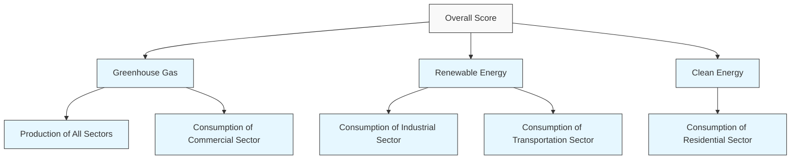

For office use only

T1

T2

T3

T4

Team Control Number

## 78577

Problem Chosen

C

For office use only

F1

F2

F3

F4

2018

MCM/ICM

Summary Sheet

# Sustainable Energy Assessment

# Summary

Energy is one of the four pillars of modern social development the most basic material basis, and a prerequisite for human civilization. In United States, many aspects of energy policy are decentralized to the state level.

In this paper, we are asked by these states to inform their development of a set of goals for their interstate energy compact.

First, we preprocess the data, including the processing of missing values and the normalization of the data. In the process of missing value processing, we deal with the indicators lacking a small amount of data by Cubic Spline Interpolation, the indicators lacking less than a half of data by curve fitting, and the indicators missing the vast majority of data by replacing is with the average values of other cities.

Second, in order to create a profile of energy, by analyzing the data, we classify the energy sources, and then choose three indicators to calculate, including the use of renewable energy sources $\begin{array} { r } { U _ { r } , } \end{array}$ the use of clean energy $U _ { c } ,$ and greenhouse gas emissions GE, all of which are calculated separately by transportation, industrial, commercial and residential sectors. After defining these indicators, we make an analysis and comparison on the profiles of the four states made.

Then, based on the above indicators, we propose the MAUA model to calculate the overall score. We first use the PCA to integrate the different aspects of the three indicators, and then we use the Combination Weighting Approach (AHP and PCA) to weight these three indicators. And we get the weights of $U _ { r } , U _ { c } , G E$ as 0.178, 0.433, -0.389. To make our model more accurate, we take the MAUA model with the appropriate utility function to calculate the composite score. We then sort the states by descending order of overall score: CA, TX, NM, AZ.

After that, we use the ARIMA model to predict each state's indicators. It is estimated that by 2025, the overall score of each state will reach CA: 0.2578, AZ: 0.1966, NM: 0.2545, TX: 0.1518. And by 2050, each state’s score will reach CA: 0.3481, AZ: 0.3334, NM: 0.3232, TX: 0.3132.

Finally, we set goals of the four states to be raising the proportion of electric generated by renewable energy source to 34% by 2025 and 59% by 2050. We use the proportion of electric generated by renewable energy source to indicate the renewable energy usage and use our model to predict the proportion. To achieve such goals, we recommend the following three actions for the four states: integrating electric market, establishing a fund and apply tax and subsidy policy.

## Contents

## 1 Introduction 1

1.1 Background . . 1  
1.2 Our Work . 1  
1.3 Detailed Assumptions and Notations

1.3.1 Detail Assumptions . .

1.3.2 Mathematical Notations . 2

## 2 Data Preprocessing 2

2.1 Addressing the Missing Values 2  
2.2 Data Normalization 3

## 3 Energy Profile 3

3.1 Energy Classification . 3  
3.2 Energy Indices . 4  
3.3 Analysis of Energy Profiles of Four States 6

3.3.1 Energy Structure 6

3.3.2 Use of Renewable and Clean Energy . . . 6

3.3.3 Greenhouse Gas Emissions 7

3.3.4 Influential Factors . 7

## 4 Model for Overall Score 9

4.1 Overview of the Model . 9  
4.2 Utility Function . 10  
4.3 Determination of Weights 11

4.3.1 Solving for Weights of Secondary Indices Using PCA . 11

4.3.2 Combination Weighting Approach . 11

4.4 Determination of the Best Profile 12

## 5 Prediction of Energy Profiles 13

5.1 Model of ARIMA 13  
5.2 Solution and Results of ARIMA . 13

## 6 Cooperation Strategies of Energy Compact 15

6.1 Future Energy Targets 15  
6.2 Actions to Take 16

6.2.1 Establish a Fund 16

6.2.2 Electricity Market Integration 18

6.2.3 Enact Strict Laws and Regulations . . 18

## 7 Evaluation of Our Model 18

7.1 Strengths of Our Model . 18  
7.2 Weaknesses of Our Model 19

## References 19

## Memo

To: Governors of CA, AZ, TX and NM

From: Team # 78577

Date: 12 February 2018

Subject: Usage of Cleaner, Renewable Energy Sources

## Purpose

We propose to summarize the state profiles of 2009 for you, and predict the trend of energy usage in the absence of any policy changes, give my recom mended goals and actions.

## Summary for the Profile of 2009

CA (California) has the best energy profile of 0.1816 in 2009, followed by TX (Texas) of 0.1743, NM (New Mexico) of 0.1209 and AZ (Arizona) of 0.1064. This result is quite reasonable because California had the lowest emission of greenhouse gases (per capita) and relatively high performance in use of renewable energy in 2009.

## Prediction the Trend of Energy Usage

If we ignore any policy changes, by 2025, the four states (AZ, CA, NM, TX) will achieve an overall score of 0.1966, 0.2578, 0.2545, 0.1518.

By 2050, the four states (AZ, CA, NM, TX) will achieve an overall score of 0.3334, 0.3481, 0.3232, 0.3132, where CA always has the best score, and TX has the minimal one.

## Recommended Goals and Actions

We recommend goals of the four states to be raising the proportion of electric generated by renewable energy source to 34% by 2025 and 59% by 2050. To achieve such goals, we recommend the following three actions for the four states.

1. Integrating electric market;  
2. Establishing a fund.  
The total fund is 208 billion with the share of: CA: 89.8, AZ: 31.3, NM: 30.6, TX: 56.3.  
3. Applying tax and subsidy policies.

## 1 Introduction

## 1.1 Background

Energy is an important part of people’s daily life, and the cornerstone of the development of society. The formation of an industrial society brought fossil fuels into our lives. However, with the development of society, people have been gradually aware of the shortcomings of fossil fuels: high pollution and limited quantity. People began to seek to create a clean, renewable energy structure.

Along the U.S. border with Mexico, four states hope to form a realistic energy contract that focuses on cleaner, renewable energy. We are asked to analyze the composition of the energy structure of these states, and predict the trend of their development over the next 50 years. We will finally put forward some feasible suggestions for the compact.

## 1.2 Our Work

In this paper, we break our work into sections as follows.

1. Process the primary data (including missing value processing, data normalization).  
2. Establish the comprehensive evaluation model of energy (energy profile), and solve for the state with best energy profile.  
3. Establish the prediction model of energy profile, and analyze the changing trend in each state.  
4. Set reasonable targets according to our model results, and providefeasible suggestions for the compact.

## 1.3 Detailed Assumptions and Notations

## 1.3.1 Detail Assumptions

In our model, we make the following assumptions.

We ignore any policy changes by each governor’s office when predicting the energy profile of each state, which has been mentioned in the problem.

Weassume that the relative importance of various indicators doesn’t change over time.

Each sector (transportation, commerce, etc.) is of the same importance to an energy type, and is empowered only by the amount of information contained. For example, the four sectors have the same realistic weight on renewable energy, and only consider the number of factors in the synthesis process.

## 1.3.2 Mathematical Notations

Here are the notations and their meanings in our paper:

Table 1: Mathematical Notations

<table><tr><td>Notations</td><td>Mathematical Meanings</td></tr><tr><td> $S$ </td><td>Overall score of energy profile</td></tr><tr><td> $U_r$ </td><td>Energy index of use of renewable energy</td></tr><tr><td> $U_c$ </td><td>Energy index of use of clean energy</td></tr><tr><td> $GE$ </td><td>Energy index of greenhouse gasemissions</td></tr><tr><td> $x_i$ </td><td>Data of the  $i$ th indicator</td></tr><tr><td> $u_i(\cdot)$ </td><td>Utility FunctionProportion of consumption</td></tr><tr><td> $CA_r, CC_r, CI_r, CR_r$ </td><td>of renewable energy in four sectors</td></tr><tr><td> $CA_c, CC_c, CI_c, CR_c$ </td><td>Proportion of consumptionof clean energy in four sectors</td></tr></table>

## 2 Data Preprocessing

The attached data file “ProblemCData.xlsx” provides us with 50 years (1960- 2009) of data in 605 variables on energy production and consumption along with some demographic and economic information of the four states respectively. This is a huge amount of data with lots of redundant and useless data. Therefore, we need to perform data preprocessing by cleaning, selecting and normalizing the data.

## 2.1 Addressing the Missing Values

There are lots of missing values in the data file, so we come up with the following methods to address this problem.

1. For some of the indicators (of some states), there are sometimes a small number of values to be zero, which may result from statistical negligence. In this case, we adopt cubic spline interpolation to fill in the missing values.  
2. Data of some indicators were not collected in certain years (less than 25 years), which would lead to long lists of zeros. In this case, we fit the remaining data into a curve and thus fill in the missing values.  
3. For those indicators who have only 40 years (1970-2009) of data, we can adopt the same method mentioned in 2.  
4. For some of the indicators (of some states), most or all of the values are zero. In this case, we have to refer to other data (e.g. data of other states of the same indicator) and fill it with the help of the average of other highly correlated data.

It is noteworthy that not all zeros are caused by statistical negligence. Some of them may be due to the absence of according technology or other special reasons. A typical example is “electricity produced from nuclear power by the electric power sector”.

## 2.2 Data Normalization

Since we will use indicators with various units, we have to normalize all the indicators and scale all the values in the range [0,1]. Formula (1) gives the general form of the adopted normalization.

$$
x _ {\text {new}} = \frac {x - x _ {\min}}{x _ {\max} - x _ {\min}}, \tag {1}
$$

where $x _ { m a x }$ and $x _ { m i n }$ are respectively the maximum and minimum value of the indicators in the same unit.

For most of the given indicators (e.g. consumption, production), the values are proportional to the population or the area of the state. Therefore, when we compare the states in terms of such indicators, we avoid the influence of popula tion by dividing the variables by the population of the state accordingly.

## 3 Energy Profile

## 3.1 Energy Classification

To create an energy profile of each state, we categorize the energy into the following groups:

Coal  
• Natural gases  
• Petroleum products  
• Nuclear energy  
• Renewable Energy

Renewable energy here includes biomass energy, geothermal energy, Photovoltaic and solar thermal energy, hydroelectricity energy and wind energy. Since the reduction of greenhouse emissions is also crucial in determining the energy structure, we will also consider clean energy, which is the aggregation ofrenewable energy, natural gases and nuclear energy.

## 3.2 Energy Indices

To demonstrate the overall performance of the use of energy of four states, we adopt three indices listed below.

## Use of Renewable Energy

The use of renewable energy is one of the most important indices to illustrate the energy profile of each state. Thus, we create an energy index $U _ { r } ,$ which includes the following aspects:

1. Total production of renewable energies per capita $P _ { r }$  
2. Proportion of renewable energy consumption in all energy consumption in transportation sector per capita CAr  
3. Proportion of renewable energy consumption in all energy consumption in commercial sector per capita CC r  
4. Proportion of renewable energy consumption in all energy consumption in industial sector per capita CI r  
5. Proportion of renewable energy consumption in all energy consumption in residential sector per capita CRr

Total production of renewable energy per capita can reflect the extent to which renewable energy is developed. Since the energy structure of the four sectors are different and changes over time, we should calculate the proportion of consumed renewable energy respectively.

## Use of Clean Energy

Similar to renewable energy, we create an energy index $U _ { c }$ to illustrate the use of clean energy, which is determined by the following indicators:

1. Total production of clean energies per capita $P _ { c }$  
2. Proportion of clean energy consumption in all energy consumption in transportation sector per capita CAc  
3. Proportion of clean energy consumption in all energy consumption in commercial sector per capita CCc  
4. Proportion of clean energy consumption in all energy consumption in industial sector per capita $C I _ { c }$  
5. Proportion of clean energy consumption in all energy consumption in residential sector per capita CRc

## Greenhouse Gas Emissions

In the United States, most of the emissions of human-caused greenhouse gases (GHG) come primarily from burning fossil fuels (coal, natural gas and petroleum) for energy use. Carbon Dioxide is the main component of greenhouse gases, so we use the emission of carbon dioxide to represent that of greenhouse gases.

To analyze emissions across different fuels, we compare the amount of $\mathbf { C O } _ { 2 }$ emitted per unit of energy output using the data in Table 2.[1]

Table 2: $\mathbf { C O } _ { 2 }$ Emission Ratio of Different Fuels

<table><tr><td>Fuel</td><td>CO2 Emission Ratio (Pound/Million Btu)</td></tr><tr><td>Coal</td><td>214.3</td></tr><tr><td>Gasoline</td><td>157.2</td></tr><tr><td>Natural gas</td><td>117.0</td></tr></table>

Therefore, we calculate the index of total greenhouse gas emissions GE as the weighted sum of consumption of fossil fuels with $\mathbf { C O } _ { 2 }$ emission ratios as weights.

## 3.3 Analysis of Energy Profiles of Four States

## 3.3.1 Energy Structure

To illustrate the energy profiles of the four states, we first need to observe their energy structures.

In Figure 1, we present the consumption of five types of energy per capita in the four states. This shows that energy consumption in both 1960 and 2009 comes mainly from non-renewable energy sources (coal, patroleum and natural gas).

  
Figure 1: Energy Consumption Structure

Figure 2 shows the production of five types of energy per capita. We can see that the large differences between the states: Arizona and California lack natural resources while New Mexico and Texas are rich in resources such as patroleum and natural gas.

  
Figure 2: Energy Production Structure

## 3.3.2 Use of Renewable and Clean Energy

Use of renewable and clean energy is a main component of the energy profile. Figure 3 illustrates the proportion of consumption of renewable and clean energy

and their changing trends over time.

From Figure 2, we find that California had the best performace in the twoin dices since the 1980s. The general trend of proportion of consumed clean energy had been decreasing before 1985 and have been slowly increasing sincethen.

line chart

| Year | AZ RENEWABLE | CA RENEWABLE | NM RENEWABLE | TX RENEWABLE | AZ CLEAN | CA CLEAN | NM CLEAN | TX CLEAN |
| --- | --- | --- | --- | --- | --- | --- | --- | --- |
| 2018 | 0.80 | 0.45 | 0.65 | 0.85 | 0.10 | 0.45 | 0.10 | 0.65 |
| 2019 | 0.75 | 0.48 | 0.68 | 0.82 | 0.12 | 0.48 | 0.12 | 0.68 |
| 2020 | 0.70 | 0.50 | 0.65 | 0.80 | 0.15 | 0.50 | 0.15 | 0.65 |
| 2021 | 0.65 | 0.52 | 0.62 | 0.78 | 0.18 | 0.52 | 0.18 | 0.62 |
| 2022 | 0.60 | 0.55 | 0.60 | 0.75 | 0.20 | 0.55 | 0.20 | 0.60 |
| 2023 | 0.55 | 0.58 | 0.58 | 0.72 | 0.22 | 0.58 | 0.22 | 0.58 |
| 2024 | 0.50 | 0.60 | 0.55 | 0.70 | 0.25 | 0.60 | 0.25 | 0.55 |
| 2025 | 0.45 | 0.62 | 0.52 | 0.68 | 0.28 | 0.62 | 0.28 | 0.52 |
| 2026 | 0.40 | 0.65 | 0.50 | 0.65 | 0.30 | 0.65 | 0.30 | 0.50 |
| 2027 | 0.35 | 0.68 | 0.48 | 0.62 | 0.32 | 0.68 | 0.32 | 0.48 |
| 2028 | 0.30 | 0.70 | 0.45 | 0.60 | 0.35 | 0.70 | 0.35 | 0.45 |
| 2029 | 0.25 | 0.72 | 0.42 | 0.58 | 0.38 | 0.72 | 0.38 | 0.42 |
| 2030 | 0.20 | 0.75 | 0.40 | 0.55 | 0.40 | 0.75 | 0.40 | 0.45 |
| 2031 | 0.15 | 0.78 | 0.38 | 0.52 | 0.42 | 0.78 | 0.42 | 0.48 |
| 2032 | 0.10 | 0.80 | 0.35 | 0.50 | 0.45 | 0.80 | 0.45 | 0.55 |
| 2033 | 0.15 | 0.82 | 0.32 | 0.48 | 0.48 | 0.82 | 0.48 | 0.62 |
| 2034 | 0.20 | 0.85 | 0.30 | 0.45 | 0.50 | 0.85 | 0.50 | 0.65 |
| 2035 | 0.25 | 0.88 | 0.28 | 0.42 | 0.52 | 0.88 | 0.52 | 0.72 |
| 2036 | 0.30 | 0.90 | 0.25 | 0.40 | 0.55 | 0.90 | 0.55 | 0.78 |
| 2037 | 0.35 | 0.92 | 0.22 | 0.38 | 0.58 | 0.92 | 0.58 | 0.85 |
| 2038 | 0.40 | 0.95 | 0.20 | 0.35 | 0.62 | 0.95 | 0.62 | 1e-1 |

line chart

| Year | Greenhouse Gas Emission Per Capita (Pound) |
| ---- | ------------------------------------------ |
| 2010 | 6500                                       |
| 2011 | 6400                                       |
| 2012 | 6300                                       |
| 2013 | 6200                                       |
| 2014 | 6100                                       |
| 2015 | 6000                                       |
| 2016 | 5900                                       |
| 2017 | 5800                                       |
| 2018 | 5700                                       |
| 2019 | 5600                                       |
| 2020 | 5500                                       |
| 2021 | 5400                                       |
| 2022 | 5300                                       |
| 2023 | 5200                                       |

Figure 3: Use of Renewable and Clean Energy Figure 4: Greenhouse Gas Emissions Per Capita

## 3.3.3 Greenhouse Gas Emissions

Another important factor of the energy profile is greenhouse gas emissions. Figure 4 illustrates the emissions per capita and the changing trend over time.

Arizona and California have obvious advantages over New Mexico and Texas in this aspect. This can be derived from Figure 1, for the proportion of consumed coal, patroleum and natural gases directly contribute to greenhouse gas emissions. The general trend of greenhouse gas emissions has been decreasing since the early 1980s.

## 3.3.4 Influential Factors

## Geography and Climate

Due to the unique geography of the four states, they have different levels of richness in both non-renewable and renewable resources.[1]

Arizona has few fossil fuel resources and no significant natural gas reserves, but it does have abundant solar and geothermal energy potential. Arizona also has some wind potential, mainly along and just north of the steep-walled Mogollon Rim that cuts across the central part of the state.

California has an abundant supply of crude oil and natrual gas but lacks coal reserves. It also leads the nation in electricity generation from solar,geothermal, hydroelectric and biomass resources.

New Mexico is among the top 10 natural gas-producing states. Its richness in fossil fuels is average. New Mexico possesses substantial renewable resources, particularly from wind and solar, but also from hydroelectric, biomass, and geothermal energy.

Texas leads the nation in crude oil and natural gas reserves. It is rich in all kinds of renewable resources, especially wind energy, which accounts for nearly all of the electricity generated.

The four states are roughly on the same latitude and the climate there is mild. Therefore, the per capita energy use in residential sector is relatively lower because there’s little need for air conditioning or space heating.

## Population

The four states have huge difference in population. Population of the four states is shown in Figure 5.

stacked bar chart

| Year | AZ (Thousand) | CA (Thousand) | NM (Thousand) | TX (Thousand) |
| :--- | :--- | :--- | :--- | :--- |
| 1960 | 1500 | 14000 | 1800 | 13000 |
| 1970 | 2000 | 16000 | 2200 | 14000 |
| 1980 | 3000 | 18000 | 2700 | 16000 |
| 1990 | 4000 | 22000 | 3300 | 18000 |
| 2000 | 5500 | 26000 | 3800 | 21000 |
| 2010 | 6500 | 31000 | 4500 | 24000 |

Figure 5: Population of Four States

It can be seen that the population of California and Texas are much larger than that of Arizona and New Mexico.

Actually, California and Texas are the two most populated states in America and they have the largest energy demand. The large populations of the states make the production of the renewable and clean energy per capita less outstanding, despite their richness in natural resources.

## Economy and Policy

California and Texas have two largest economy in USA. Therefore, they have the ability to increase energy efficiency with the implementation of alternative technologies. Arizona’s primary economic activities are not energy intensive, the state’s per capita energy consumption is among the lowest in the nation. New

Mexico has recognized an economic interest in selling more electricity to other states, particularly electricity generated from its renewable resources.

All of the four states have regulated policies to increase the use of renewable or clean energy and to reduce greenhouse gas emissions. This accounts for the general trend illustrated in Figure 3 and 4 since the early 1980s.

## 4 Model for Overall Score

## 4.1 Overview of the Model

After selecting the energy indices, we then develop a model to characterize how the energy profile of each of the four states has evolved from 1960 to 2009. Figure 6 gives an intuitive representation of our model.

flowchart

Figure 6: Overview of the Model

Firstly, we use PCA (Principle Component Analysis) to calculate two energy indices – $U _ { c }$ and $U _ { r }$ . We adopt PCA to compress the primary data and determine their weights because the indicators (e.g. consumption proportion for different sectors) are correlated, where AHP (Analytic Hierarchy Process) would lose effect.

During the procedure of weighted sum, we make use of Utility Functions, which would help deal with the problem of too large magnitude gap.

After that, we adopt the Combination Weighting Approach to get the overal score S. The details of the approaches will be discussed in the following sections.

## 4.2 Utility Function

In our model, we are confronted with problems of large magnitude even after normalization. In order not to omit influence of the indices with small magni tudes, we decide to make use of utility functions.

Utility functions can be regarded as adjusters which tune the data values to make the data distribution more uniform.

Among all forms of utility functions, we choose the form as formula (2):

$$
u _ {i} \left(x _ {i}\right) = \left\{ \begin{array}{l l} 0 & , x \leq a _ {i} \\ \left(\frac {x _ {i} - a _ {i}}{b _ {i} - a _ {i}}\right) ^ {k _ {i}} & , x > a _ {i} \end{array} , \right. \tag {2}
$$

where $x _ { i }$ is the ith index, $a _ { i } , b _ { i }$ and $k _ { i }$ are undetermined coefficients.

In order to make the data values range between 0 and 1 after the manipulation, we have

$$
u _ {i} (\min (x _ {i})) = 0, \quad u _ {i} (\max (x _ {i})) = 1. \tag {3}
$$

To determine the coefficient $k _ { i } ,$ we assign the median value of the data to be 0.5, namely,

$$
u _ {i} (\text { median } (x _ {i})) = 0. 5. \tag {4}
$$

Generally, the region around the median of the data has the largest distribu tion density. As is shown in Figure $^ { 7 , }$ we effectively increase the distinction of the data by using utility function.

line chart

| x_i   | u_i(x_i) |
|-------|----------|
| 0.0   | 0.0      |
| 0.2   | 0.05     |
| 0.4   | 0.15     |
| 0.6   | 0.35     |
| 0.8   | 0.65     |
| 1.0   | 1.0      |

Figure 7: Sketch Map of Utility Function

Substituting formula (3) (4) into formula (2), $a _ { i } = 0 , b _ { i } = 1$ and $k _ { i }$ can be

obtained with data of different indices.

## 4.3 Determination of Weights

## 4.3.1 Solving for Weights of Secondary Indices Using PCA

First, we process the secondary indices of each state using PCA. We obtain the weights of secondary indices contributing to the first two principle components as shown in Table 3.

Table 3: Results of PCA

<table><tr><td>Renewable</td><td> $CA_r$ </td><td> $CC_r$ </td><td> $CI_r$ </td><td> $CR_r$ </td><td> $P_r$ </td><td>Cumulative</td></tr><tr><td>Comp.1</td><td>0.19347</td><td>-0.09019</td><td>0.11611</td><td>-0.16790</td><td>0.95538</td><td>0.83952</td></tr><tr><td>Comp.2</td><td>-0.21188</td><td>-0.24016</td><td>-0.93253</td><td>0.07815</td><td>0.14730</td><td>0.93164</td></tr><tr><td>Clean</td><td> $CA_c$ </td><td> $CC_c$ </td><td> $CI_c$ </td><td> $CR_c$ </td><td> $P_c$ </td><td>Cumulative</td></tr><tr><td>Comp.1</td><td>-0.00036</td><td>-0.59869</td><td>-0.28644</td><td>-0.48698</td><td>-0.56777</td><td>0.93549</td></tr><tr><td>Comp.2</td><td>0.00229</td><td>0.80078</td><td>-0.22566</td><td>-0.37477</td><td>-0.40910</td><td>0.97887</td></tr></table>

By using the first two principle components, we can get a cumulative proportion of 0.93 for clean energy, and 0.98 for renewable energy.

## 4.3.2 Combination Weighting Approach

After determining the principle components for secondary indices, we calculate the weights of 3 energy indices. Since we have to consider the correlations between the indices and the realistic importance of them simultaneously, we adopt the Combination Weighting Approach by combining AHP and PCA together to get the weights and thus the overall score S for each state. The fomula of this approach is given by

$$
d _ {i} = \prod_ {j = 1} ^ {p} (u _ {j i}) ^ {\frac {1}{p}} / \sum_ {i = 1} ^ {m} \prod_ {j = 1} ^ {p} (u _ {j i}) ^ {\frac {1}{p}}, \quad i = 1, 2, \dots , m, \tag {5}
$$

where $d _ { i }$ is the final weight we get for the ith index, $p$ is the number of weighting methods and m is the number of indicators.

By calculation, we can get the weights using different weighting method as shown in Table 4. It’s also worth mentioning that, when processing AHP, we get the consistent index $C R = 0 . 0 3 3 < 0 . 1$ . So the results of AHP pass the consistency check.

To conclude, as is shown in Table 3, our criteria can be demonstrated as follows. We think that if a state has lower GE and higher $U _ { r }$ and $U _ { c } ,$ then the state is better in use of cleaner, renewable energy.

And then by formula (2) (3) (4), we can obtain the coefficients for utility functions as shown in Table 5.

Table 4: Weights of Energy Indices

<table><tr><td>Method</td><td> $U_r$ </td><td> $U_c$ </td><td>GE</td></tr><tr><td>AHP</td><td>0.258</td><td>0.637</td><td>-0.105</td></tr><tr><td>PCA</td><td>0.066</td><td>0.158</td><td>-0.776</td></tr><tr><td>Combination</td><td>0.178</td><td>0.433</td><td>-0.389</td></tr></table>

Table 5: Coefficients for Utility Functions

<table><tr><td>Coefficient</td><td> $U_r$ </td><td> $U_c$ </td><td>GE</td></tr><tr><td> $a_i$ </td><td>-0.115</td><td>-0.361</td><td>0</td></tr><tr><td> $b_i$ </td><td>0.074</td><td>-0.096</td><td>1</td></tr><tr><td> $k_i$ </td><td>1.431</td><td>0.782</td><td>0.821</td></tr></table>

## 4.4 Determination of the Best Profile

After determining the weights, we can get the energy indices and overall scores of four states. The energy indices of four states in 2009 are shown in Figure 8 and the overall scores of four states during 50 years are shown in Figure9.

bar chart

| State | U_r | U_s | GE |
|---|---|---|---|
| AZ | 0.5 | 0.22 | 0.2 |
| CA | 0.6 | 0.18 | 0.01 |
| NM | 0.53 | 0.67 | 0.68 |
| TX | 1.0 | 0.53 | 0.61 |

Figure 8: Energy Indices in 2009

line chart

| Year | Overall Score |
| ---- | ------------- |
| 2010 | 0.00          |
| 2011 | 0.00          |
| 2012 | 0.00          |
| 2013 | 0.00          |
| 2014 | 0.00          |
| 2015 | 0.00          |
| 2016 | 0.00          |
| 2017 | 0.00          |
| 2018 | 0.00          |
| 2019 | 0.00          |
| 2020 | 0.00          |
| 2021 | 0.00          |
| 2022 | 0.00          |
| 2023 | 0.00          |

Figure 9: Overall Scores

From Figure 9, we know that CA (California) has the best energy profile in 2009, followed by TX (Texas), NM (New Mexico) and AZ (Arizona). This result is quite reasonable because California had the lowest emission of greenhouse gases (per capita) and relatively high performance in use of renewable energy in 2009.

## 5 Prediction of Energy Profiles

## 5.1 Model of ARIMA

ARIMA model is a widely used time series analysis method, which first put forward by Box and Jenkins in 1970.[5] The basic approaches of ARIMA are:

• Firstly, smooth the original time series with difference method;  
Secondly, determine the type of model, the order of model and undetermined parameters by analyzing the characteristics of ACF (Autocorrelation Function) and PACF (Partial Autocorrelation Function) of stationary sequence;  
• Thirdly, test the validity of the model;  
• Finally, analyze and predict the future time series.

ARIMA model can be known as $A R I M A ( p , q , d ) $ , where $p$ is the autoregressive order number and $q$ is the sliding average order number. This model represents making differences on the non-stationary random sequence variable $Y _ { t }$ for d times, and then we obtain the stationary series $X _ { t }$ .

After that, we fit the series $X _ { t }$ with $A R M A ( p , q )$ model, which can be expressed as

$$
X _ {t} = \varphi_ {1} X _ {t - 1} + \dots + \varphi_ {p} X _ {t - p} + \varepsilon_ {t} - \left(\theta_ {1} \varepsilon_ {t - 1} + \dots + \theta_ {q} \varepsilon_ {t - q}\right), \quad t \in \mathbb {Z}, \tag {6}
$$

where the former part is the autoregressive process, and $\varphi _ { 1 } , \cdots , \varphi _ { p }$ ,are regression coefficients; the latter part is the sliding average process, $\theta _ { 1 } , \cdots , \theta _ { q }$ are sliding average coefficients, $\{ \varepsilon _ { t - q } , \cdots , \varepsilon _ { t } \}$ is the white noise sequence not observed which obeys gaussian distribution.

## 5.2 Solution and Results of ARIMA

For more intuitive analysis of energy indices and more accurate predictions, we use ARIMA model to predict each secondary index separately.

In this paper, we only pick one index, $C A _ { r }$ of California, as an example to illustrate in detail.

To begin with, by drawing a curve of the data series, we find that it isn’t a stationary time series for it’s increasing. So we process once difference method on the sequence. However, since p-value $= 0 . 2 6 0 7 > 0 . 0 5 ,$ , we process difference on the sequence again. Then we get a p-value of $0 . 0 1 4 < 0 . 0 5$ , which means the data passes the test.

We then plot the ACF and PACF graphs for this sequence to select the ap propriate p and q for the ARIMA(p, q, d) model. As is shown in Figure 10, the autocorrelation value basically does not exceed the confidence intervals after the 4-th order hysteresis. Although there exits a autocorrelation value that exceeds the bounds, it may be caused by chance to exceed the 95% confidence intervals, so we have $p = 4$ . Using the same method, according to Figure 11, we can obtain that $q = 4$ .

line chart

| Lag | ACF    |
| --- | ------ |
| 0   | 1.0000 |
| 1   | 0.3500 |
| 2   | -0.2000 |
| 3   | -0.2500 |
| 4   | -0.3000 |
| 5   | -0.2500 |
| 6   | -0.1000 |
| 7   | 0.1000 |
| 8   | 0.1500 |
| 9   | 0.1000 |
| 10  | 0.1500 |
| 11  | 0.0500 |
| 12  | -0.1000 |
| 13  | -0.1500 |
| 14  | -0.1500 |
| 15  | -0.1500 |
| 16  | -0.1500 |
| 17  | -0.1500 |
| 18  | -0.1500 |
| 19  | -0.1500 |
| 20  | 0.2000 |
| 21  | 0.1500 |
| 22  | 0.1500 |
| 23  | 0.1500 |
| 24  | 0.1500 |
| 25  | -0.1500 |
| 26  | -0.2500 |
| 27  | -0.2500 |
| 28  | -0.1500 |
| 29  | 0.1500 |
| 30  | 0.3500 |

Figure 10: Autocorrelation Function

line chart

| Lag | PACF  |
| --- | ----- |
| 0   | 0.35  |
| 1   | -0.35 |
| 2   | 0.02  |
| 3   | -0.35 |
| 4   | -0.05 |
| 5   | -0.25 |
| 6   | 0.10  |
| 7   | -0.20 |
| 8   | 0.05  |
| 9   | 0.07  |
| 10  | -0.10 |
| 11  | 0.03  |
| 12  | 0.06  |
| 13  | -0.10 |
| 14  | -0.15 |
| 15  | -0.05 |
| 16  | -0.35 |
| 17  | 0.15  |
| 18  | -0.20 |
| 19  | 0.03  |
| 20  | 0.10  |
| 21  | -0.05 |
| 22  | -0.15 |
| 23  | -0.05 |
| 24  | -0.10 |
| 25  | -0.15 |
| 26  | -0.10 |
| 27  | 0.05  |
| 28  | 0.07  |
| 29  | 0.05  |

Figure 11: Partial Autocorrelation Function

Through the above process, we have determined our model as ARIMA(4, 4, 2). And then by calculation, we can draw the prediction results as shown in Figure 12.

area chart

| Year | CA₄ (Lower Bound) | CA₄ (Upper Bound) |
|------|-------------------|-------------------|
| 1960 | ~0.0005           | ~0.0007           |
| 1975 | ~0.0006           | ~0.0008           |
| 2000 | ~0.0009           | ~0.0012           |
| 2025 | ~0.0015           | ~0.0022           |
| 2050 | ~0.0025           | ~0.0038           |

Figure 12: Prediction of CA of California

The parameters are shown in Table 6. Among them, $\sigma ^ { 2 } = 1 . 4 3 9 \ 1 0 ^ { - } { } ^ { 8 } \ .$ , loglikelihood=361.26, AIC=-704.52. These results show the feasibility of the model.

Table 6: Results of Parameters in ARIMA

<table><tr><td>Parameter</td><td> $\phi_1$ </td><td> $\phi_2$ </td><td> $\phi_3$ </td><td> $\phi_4$ </td></tr><tr><td>Value</td><td>0.1779</td><td>0.2868</td><td>-0.0048</td><td>-0.1790</td></tr><tr><td>Parameter</td><td> $\theta_1$ </td><td> $\theta_2$ </td><td> $\theta_3$ </td><td> $\theta_4$ </td></tr><tr><td>Value</td><td>-1.5161</td><td>0.1022</td><td>0.4157</td><td>0.0218</td></tr></table>

Afterwards, using the method mentioned above, we can predict the values of all secondary indices, and thus determine the energy indices and overall scores of the four states. Our prediction of overall score of each state is shown in Figure 13.

line chart

| Year | Series 1 | Series 2 | Series 3 | Series 4 |
|------|----------|----------|----------|----------|
| 1980 | 0.23     | 0.25     | 0.19     | 0.00     |
| 1981 | 0.22     | 0.24     | 0.18     | -0.01    |
| 1982 | 0.21     | 0.23     | 0.17     | -0.02    |
| 1983 | 0.20     | 0.22     | 0.16     | -0.03    |
| 1984 | 0.19     | 0.21     | 0.15     | -0.04    |
| 1985 | 0.18     | 0.20     | 0.14     | -0.05    |
| 1986 | 0.17     | 0.19     | 0.13     | -0.06    |
| 1987 | 0.16     | 0.18     | 0.12     | -0.07    |
| 1988 | 0.15     | 0.17     | 0.11     | -0.08    |
| 1989 | 0.14     | 0.16     | 0.10     | -0.09    |
| 1990 | 0.13     | 0.15     | 0.09     | -0.10    |
| 1991 | 0.12     | 0.14     | 0.08     | -0.11    |
| 1992 | 0.11     | 0.13     | 0.07     | -0.12    |
| 1993 | 0.10     | 0.12     | 0.06     | -0.13    |
| 1994 | 0.09     | 0.11     | 0.05     | -0.14    |
| 1995 | 0.08     | 0.10     | 0.04     | -0.15    |
| 1996 | 0.07     | 0.09     | 0.03     | -0.16    |
| 1997 | 0.06     | 0.08     | 0.02     | -0.17    |
| 1998 | 0.05     | 0.07     | 0.01     | -0.18    |
| 1999 | 0.04     | 0.06     | 0.00     | -0.19    |
| 2000 | 0.03     | 0.05     | -0.01    | -0.20    |
| 2001 | 0.02     | 0.04     | -0.02    | -0.21    |
| 2002 | 0.01     | 0.03     | -0.03    | -0.22    |
| 2003 | 0.00     | 0.02     | -0.04    | -0.23    |
| 2004 | -0.01    | 0.01     | -0.05    | -0.24    |
| 2005 | -0.02    | 0.00     | -0.06    | -0.25    |
| 2006 | -0.03    | -0.01    | -0.07    | -0.26    |
| 2007 | -0.04    | -0.02    | -0.08    | -0.27    |
| 2008 | -0.05    | -0.03    | -0.09    | -0.28    |
| 2009 | -0.06    | -0.04    | -0.10    | -0.29    |
| 2010 | -0.07    | -0.05    | -0.11    | -0.30    |
| 2011 | -0.08    | -0.06    | -0.12    | -0.31    |
| 2012 | -0.09    | -0.07    | -0.13    | -0.32    |
| 2013 | -0.10    | -0.08    | -0.14    | -0.33    |
| 2014 | -0.11    | -0.09    | -0.15    | -0.34    |
| 2015 | -0.12    | -0.10    | -0.16    | -0.35    |
| 2016 | -0.13    | -0.11    | -0.17    | -0.36    |
| 2017 | -0.14    | -0.12    | -0.18    | -0.37    |
| 2018 | -0.15    | -0.13    | -0.19    | -0.38    |
| 2019 | -0.16    | -0.14    | -0.20    | -0.39    |
| 2020 | -0.17    | -0.15    | -0.21    | -0.40    |
| 2O21E<fcel>-<ecel><ecel><ecel><nl>

Figure 13: Prediction of Overall Scores

The overall scores of the four states in 2025 and 2050 are shown in Table 7.

Table 7: Prediction of Overall Scores in 2025 and 2050

<table><tr><td></td><td>AZ</td><td>CA</td><td>NM</td><td>TX</td></tr><tr><td>2025</td><td>0.1966</td><td>0.2578</td><td>0.2545</td><td>0.1518</td></tr><tr><td>2050</td><td>0.3334</td><td>0.3481</td><td>0.3232</td><td>0.3132</td></tr></table>

## 6 Cooperation Strategies of Energy Compact

## 6.1 Future Energy Targets

When setting targets for the compact, we mainly focus on the increase in per formance of use of renewable energy Ur after their combination.

We have already predicted the change in energy profile in the following years. Now, we are to aggregate the data of the four states together and predict its changing trend as well. We will make use of the changing trend of $U _ { r }$ to set the targets.

As is shown in Figure 14, we can know that the prediction value of $U _ { r }$ in 2025 and 2050 is respectively 0.34 and 0.59.

line chart

| Year | U_r  |
| ---- | ---- |
| 1980 | 0.10 |
| 1981 | 0.10 |
| 1982 | 0.09 |
| 1983 | 0.08 |
| 1984 | 0.09 |
| 1985 | 0.09 |
| 1986 | 0.10 |
| 1987 | 0.10 |
| 1988 | 0.10 |
| 1989 | 0.10 |
| 1990 | 0.11 |
| 1991 | 0.12 |
| 1992 | 0.13 |
| 1993 | 0.14 |
| 1994 | 0.15 |
| 1995 | 0.16 |
| 1996 | 0.17 |
| 1997 | 0.18 |
| 1998 | 0.19 |
| 1999 | 0.20 |
| 2000 | 0.21 |
| 2001 | 0.22 |
| 2002 | 0.23 |
| 2003 | 0.24 |
| 2004 | 0.25 |
| 2005 | 0.26 |
| 2006 | 0.27 |
| 2007 | 0.28 |
| 2008 | 0.29 |
| 2009 | 0.30 |
| 2010 | 0.31 |
| 2011 | 0.32 |
| 2012 | 0.33 |
| 2013 | 0.34 |
| 2014 | 0.35 |
| 2015 | 0.36 |
| 2016 | 0.37 |
| 2017 | 0.38 |
| 2018 | 0.39 |
| 2019 | 0.40 |
| 2020 | 0.41 |
| 2021 | 0.42 |
| 2022 | 0.43 |
| 2023 | 0.44 |
| 2024 | 0.45 |
| 2025 | 0.46 |
| 2026 | 0.47 |
| 2027 | 0.48 |
| 2028 | 0.49 |
| 2029 | 0.50 |
| 2030 | 0.51 |
| 2031 | 0.52 |
| 2032 | 0.53 |
| 2033 | 0.54 |
| 2034 | 0.55 |
| 2035 | 0.56 |
| 2036 | 0.57 |
| 2037 | 0.58 |
| 2038 | 0.59 |
| 2039 | 0.60 |

Figure 14: Prediction of Overall Scores

In order to show the strength of cooperation, we set the target as 110% ofthe predicted value. That is to say, the compact should reach the $U _ { r }$ score of 0.374 and 0.649 in 2025 and 2050 respectively.

## 6.2 Actions to Take

## 6.2.1 Establish a Fund

The first action is to establish a fund. The fund will be used to invest companies to build facilities relative to wind or solar energy. To achieve goals in compact, the four states have to contribute a certain amount of money to the fund.

Generally, the cooperation of the four states can create some extra profit. So this approach can be understood as a problem of the distribution of profit in a cooperation. We use the Shapley Value Regression Model to determine the optimized share of the funding from each state.

## Shapley Value Regression Model

The Shapley value provides a priori evaluation of the position of each member in a cooperative game, based on the contribution that each member can make to the different coalitions. In the game, some basic rules to ensure equity should be followed:[8]

• Efficiency: members should distribute the full yield of the game.  
Symmetry: two members who have the same marginal contribution to each coalition should have the same value.  
• Law of aggregation: two independent games can be combined linearly.  
Null member property: members who contribute nothing should get zero value.

In a cooperative game $( N , \nu )$ , for each member $\dot { \epsilon } ^ { N }$ , the ideal profit of the game is $\Phi _ { i } ( \nu )$ . If the functions $\Phi _ { i } ( . )$ satisfy all the rules mentioned above, the distributed profit of each can member can be given by formula (7) (8).

$$
\Phi_ {i} (v) = \sum_ {s \in N} \omega_ {n} [ v (s) - v (s \backslash i) ], \tag {7}
$$

$$
\omega_ {n} = \frac {(| s | - 1) ! (n - | S |)}{n !}. \tag {8}
$$

## Share of Investment of Each State

Electric price and the proportion of RES are proportional relationship. Using data of America from 2006 to 2014 in the paper, we estimate the rate of transforming money into proportion of RES and get the result that 5.2 billion dollars can improve 1% proportion of RES.[12]

The detailed information of electricity and its price is shown in Table 8.

Table 8: Electricity Information

<table><tr><td></td><td>AZ</td><td>CA</td><td>NM</td><td>TX</td></tr><tr><td>Electricity (Wind) (Btu)</td><td>288.3592</td><td>56996.98</td><td>15095.7</td><td>195454.8</td></tr><tr><td>Electricity (Solar) (Btu)</td><td>2.982</td><td>19.783</td><td>0.645</td><td>1.22</td></tr><tr><td>Electricity Price(Wind) ($/MWh) (Solar)</td><td>50</td><td>40</td><td>35</td><td>30</td></tr><tr><td>Electricity Price($/MWh)</td><td>80</td><td>90</td><td>100</td><td>110</td></tr></table>

Using the information above, we solve formula (7) (8) and get the share and the amount of investment of each state illustrated in Table 9.

Table 9: Results of Investment

<table><tr><td></td><td>AZ</td><td>CA</td><td>NM</td><td>TX</td><td>Total</td></tr><tr><td>Share (%)</td><td>0.150</td><td>0.431</td><td>0.147</td><td>0.27</td><td>1</td></tr><tr><td>Money (Billion dollars)</td><td>57.1</td><td>148.2</td><td>50.5</td><td>92.8</td><td>343.85</td></tr></table>

## 6.2.2 Electricity Market Integration

As the compact mainly focuses on renewable and clean energy, we don’t consider other kinds of energy. Renewable energy source has four major compo nents: biomass, hydropower, wind power and solar thermal. The four states don’t have much differences in biomass and hydropower has already reached its market saturation. However, the four states differ signifantly in wind power and solar thermal for the reason of different altitude and geology. As a result, the four states have different radiation intensity, wind speed and so on, which means they have different potential ability wind and solar energy. Thus, we only pay attention to the cooperation on the last two type of energy.

After integration, states can buy energy from others with lower price while states who provide energy earn money when building more plants.

## 6.2.3 Enact Strict Laws and Regulations

To increase the overall energy profile, we also suggest the compact to work together to enact some strict laws and regulations. We can take the following steps:

Carry out a certain degree of tax exemption on renewable energy power generation.  
Develop different renewable energy projects according to the energy structure of states. For example, CA may focus on the construction and development of wind power and hydroelectric power.  
To drive the rapid development of renewable energy, set up funds in four states that aim to select renewable energy construction demonstration projects.

## 7 Evaluation of Our Model

## 7.1 Strengths of Our Model

Based on the conditions of missing data of indicators, we take different measures to maintain the authenticity of the data as much as possible.

After a systematic consideration, we divide the indices into several categories, and take PCA and combination weighting approach (AHP and PCA) to obtain reasonable results.  
We use ARIMA time series model to predict. Compared with the traditional method of fitting prediction, the model has considered the data change of each year, making it more credible.  
We make a detailed analysis when determining the goals as well as measures.  
• We have splendid presentations of our results through a variety of charts.

## 7.2 Weaknesses of Our Model

Wemay not make full use of all the data. We use only 13 indicators to calculate the composite score, and some other summary indicators foranalysis.

The determination of the form of utility function and the determination of p and q of the ARIMA model may be subjective.

## References

[1] U.s. energy information administration. https://www.eia.gov.  
[2] Omar Hafez and Kankar Bhattacharya. Optimal planning and design of a renewable energy based supply system for microgrids. Renewable Energy, 45:7–15, 2012.  
[3] James Douglas Hamilton. Time series analysis, volume 2. Princeton university press Princeton, 1994.  
[4] Andrew C Harvey and Andrew C Harvey. Time series models, volume 2. Harvester Wheatsheaf New York, 1993.  
[5] Gareth Janacek. Time series analysis forecasting and control. Journal of Time Series Analysis, 31(4):303–303, 2010.  
[6] M. Kelly and M. C Thorne. An approach to multi-attribute utility analysis under parametric uncertainty. Annals of Nuclear Energy, 28(9):875–893,2001.  
[7] Dawen Liang. Maximum likelihood estimator for variance is biased: Proof. 2012.  
[8] Tatiana Nenova. The value of corporate voting rights and control: A crosscountry analysis. Journal of Financial Economics, 68(3):325–351, 2003.  
[9] Angel Nikolaev and Popi Konidari. Development and assessment of renewable energy policy scenarios by 2030 for bulgaria. Renewable Energy, 111:792–802, 2017.  
[10] Jyoti P Painuly. Barriers to renewable energy penetration; a framework for analysis. Renewable energy, 24(1):73–89,2001.  
[11] YF Zhou and Fa-jie WU. Combination weighting approach in multiple attribute decision making based on relative entropy. Operations research and management science, 5:009, 2006.  
[12] Tong Zhu. Comparison analysis on current energy transition in germany and the united states. International Petroleum Economics, 2016.