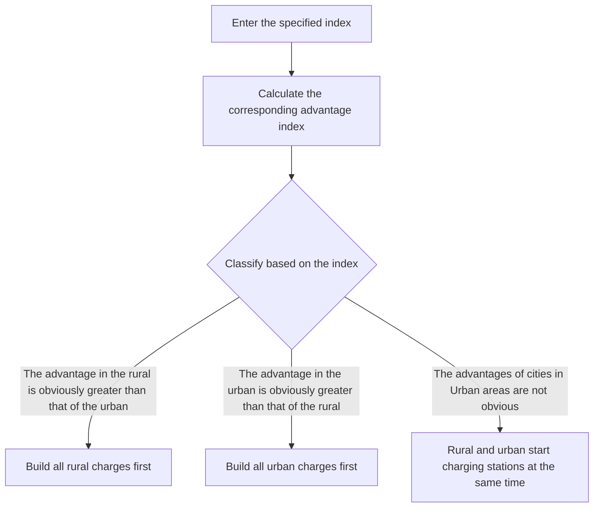

For office use only

T1

T2

T3

T4

Team Control Number

78826

Problem Chosen

D

For office use only

F1

F2

F3

F4

2018

MCM/ICM

Summary Sheet

## A Design of Elecomb

Summary

This article mainly analyzes the problem of charging station network construction.

In the first question, we first predict the development mode of Tesla's charging station with the help of the control system model and find that Tesla will push the United States to all-electrification. Considering the coverage of charging stations and other factors, the nonlinear programming model is established according to the idea of shortest path and minimum cost to get the network of charging stations in the United States. In total, 6.55 million charging stations need to be established, of which 1.28 million in rural, 3 million in suburban, 2.23 million in urban, 1.99 million fast charging stations, and 5.56 million destination charging stations.

In the second question, we chose Ireland. First, based on the model of the first question, a total of 87700 charging stations need to be established in the case of full coverage of electric vehicles. Then establish a degree of urgency index according to the distribution of population density and so on, which characterizes the establishment of the charging station of the degree of urgency mentioned above and it varies with the charging stations. With the index we find that the dynamic development mode of Irish charging station network is a mix of both rural and urban. Finally, based on the logistic growth model, we find that it takes Ireland about 18.1 years to realize all-electric.

In the third question, we first optimize the index of urgency in the light of the different cost of building charging stations in urban and rural areas and the level of science and technology. And then the indexes that affect the urgency level are described by the macroeconomic indicators of the country such as the Gini coefficient, the urban house price, using a similar way to establish an urgent degree of urban and rural areas within the country's priority AI. If AI< 0.2, built all rural chargers first, if AI >0.65, built all urban chargers first, while in other cases built both of them at the same time.

In the fourth question, we analyzed the impact of sharing cars, self-driving cars etc. on the popularization of electric vehicles and discovered that their influences are focus on different parts.

Besides, we found that with the increase in the coverage rates of rapid battery-swap stations in the cities, it’s effect on the reduction of the overall number of urban charging stations tends to decrease.

Finally, we wrote a handout for the leaders who are attending an international energy summit. And point out the key factors they should consider to realize all-electric cars and set a date to ban gas.

Key Words：Classification System Logistic Growth Urgency Index Elecomb Nonlinear Programming Model

## 1.Introduction

## 1.1 Problem Background

With aggravation of the greenhouse effect and the air pollution problem, all countries are looking for new energy sources to replace conventional fuel, such as original oil or diesel oil, to ease our increasingly serious air problems. Since the launch of hybrid cars and gas-fueled vehicles, the exploration of new clean cars is still going on continuously. At present, the electric vehicles led by Tesla will break through the limitation of energy and economy to a greater extent and will balance the relationship between rapidly growing automotive demand and the environment better. The appropriate number of charging stations with the proper distance is of utmost importance for the popularization of electric vehicles. Compared with petrol stations, electric vehicle charging stations occupy less space, have higher safety factor and can be better distributed in the streets and communities, allowing people to use it more conveniently and efficiently. However, the promotion of electric vehicles is not accomplished in a single step. It is necessary to expand the coverage of electric vehicles gradually, improve the network of electric vehicle charging stations continuously, and finally finish the operation of ending gasoline and diesel vehicles. In addition, different countries have different economic and cultural conditions, therefore, it need to determine the promotion time and promotion scope according to their specific conditions in order to achieve better results.

## 1.2 Restatement of the Problem

According to the requirements of the problem, the final network we need to solve for the charging station includes the number of charging stations, the location, and the number of chargers for each station and the different needs of cities, suburbs, rural areas. At the same time, taking into account the development and evolution of charging station network, we consider the changes of charging station network under the conditions of 10%, 30%, 50% and 90% respectively.

For task 1, we are supposed to explore Tesla's network of charging stations and discuss whether Tesla is on the track of the switch to all-electric vehicle in the United States. In the light of different charging stations are charged differently, we need to figure out the demands of charging stations how many charging stations are required, and if everyone in the United States uses , whether would electric vehicles be Completely popularized and how will they be distributed in urban, suburban, and rural areas.

For task 2, firstly, we are supposed to choose a country, and then to determine the optimal number of its charging station layout, distribution and the main factors for a certain country which restrict it from turning fuel cars into electric vehicles instantaneously. Secondly, we need to plan the entire process of building its charging network start from scratch, including the first locations to build charging stations and the factors that influence the design of charging station. Last, we will set a development schedule of electric cars for that country, and taking into account its key impact factors.

For task 3, considering the difference between population densities and wealth distributions and things like that among different countries, we are going to talk over whether our original network plan is feasible and what the key factors are which trigger different modes of network growth. Then discussing the feasibility of establishing a classification system and the different growth models they should follow among countries.

For Task 4, analyze the impact of technological advances on the popularity of electric vehicles, such as the emergence of vehicle sharing, flying cars and autonomous vehicles.

For Task 5, write a handout that covers the key elements needed to consider for different types of countries, making it easy for the leaders to make a national plan and set a date to ban the use of gasoline.

## 1.3 Overview of Our Work

The construction of electric vehicle charging station network is a key point for the popularization of electric vehicles. The construction of charging station network will be affected by many factors, such as population density, science and technology level, economic conditions and costs. At the same time, different countries have their own unique geographical features and national characteristics which make the problem more complicated. In order to solve the problem of the construction of charging station network, we build and optimize the entire model step by step through the following steps.

● First explore the Tesla charging station network using a high-order control system model. Combined with the idea of cell and pixel, a nonlinear programming model is set up to minimize the cost and find out the shortest path so as to explore the distribution of different types of charging stations in the US cities, suburbs and rural areas.  
● First, determine the distribution of charging stations in Ireland if it’s under the full coverage of electric vehicles according to the charging station service capabilities and charging station costs. An urgency coefficient is defined for each charging station to indicate the urgency of building the charging station. The index of urgency is mainly determined by the factors such as population density, wealth distribution and service capability. According to the index of urgency, we set out the process of building an Irish charging station network from scratch and draw the model it established. Finally, we use Logistic growth model to determine the development schedule of electric vehicles inIreland.  
● Optimize the index of urgency based on the land cost, construction cost and the technological factors. In order to characterize the network growth model of charging stations in different countries, we use the macroeconomic indicators of each country to describe the above-mentioned indicators of urgency, for example, use the Gini coefficient to represent the distribution of wealth, use education years to represent the level of science and technology and so on. These indicators are used to indicate the priority of cities and rural areas in the country so as to determine the charging station network development model that different countries should follow.  
● Different kinds of new technology vehicles affect different aspects, and we separately analyze them and combine the model we established to judge their impact. We also studied the impact of rapid battery-swap with different coverage ratios in the city on the number of urban charging stations.

## 2. General Assumption

●Assumption I: The distance between any vehicle gathering point and charging station is the straight line distance between two points.  
● Assumption II: Electric vehicles in class j are evenly distributed, but different classes of areas

have different densities of distribution.

Reason: From the national level, even though the density distribution of vehicles in urban, suburban and rural areas is different, they can be regarded as uniform compared to the entire land area

●Assumption III: No matter how many electric piles are set up in a charging station, it will not affect the charging of electric vehicle and the electricity consumption of the surrounding residents

## 3. Symbols and Definitions

In the section, we use some symbols for constructing the model as follows:

Table 1 Symbols and Definitions

<table><tr><td>Symbols</td><td>Meanings</td></tr><tr><td> $(x_{ija}, y_{ija})$ </td><td>The coordinates of charging station A in class i number j</td></tr><tr><td> $(x_{ijb}, y_{ijb})$ </td><td>The coordinates of B vehicle aggregation point in class i number j</td></tr><tr><td> $M_{ijk}$ </td><td>The total number of charging stations in class i number j type k</td></tr><tr><td> $K_{ik}$ </td><td>The minimum number of charging stations in class i of type k</td></tr><tr><td> $S_{ij}$ </td><td>The total area of number j in class i</td></tr><tr><td> $\rho_{ij}$ </td><td>The vehicle density of number j in class i</td></tr><tr><td> $n_{ijk}$ </td><td>The service capacity of k type charging station in state i number j</td></tr><tr><td>i</td><td>i∈(1,3) and it means urban, suburban and rural area.</td></tr><tr><td>j</td><td>The number of objects of class i.</td></tr><tr><td>k</td><td>Different types of charging stations.</td></tr><tr><td>U</td><td>The degree of urgency index</td></tr><tr><td>TC</td><td>The total cost to build a charging station.</td></tr><tr><td>AI</td><td>The comparative advantage index</td></tr></table>

## P.S. Other symbols instructions will be given in the text.

## 4. Model Design

## 4.1 Model I：Estimated the Charging Station Network of US

When considering the establishment of the charging station, Tesla has two charging methods: supercharging and destination charging. The supercharging station is suitable for vehicles that do not want to stay while the destination charging station is suitable for vehicles that can stay for a longer period of time. We think destination charging stations are more distributed among cities in the state to meet people's daily traffic needs, and supercharging stations are more to meet the needs of longdistance travelers.

When considering Tesla's growing network of charging stations, we first fit Tesla’s charging station data from 2012 to 2017 and found that it is basically in line with the linear growth model, which reminds us of the control Engineering high order system time-domain response (the specific process shown in Figure 4.1).

  
Figure 4.1 The control Engineering high order system time-domain response

It is clear that after we extend the time, Tesla's model fits the first case, so Tesla intends to push the US to fully electrified. In the process of being fully electrified, as long as it continuously increases the number of charging stations to meet the demand of charging, it must be fully electrified in the end.

## 4.1.1 ‘ Elecomb ’, The Model of Charging Station Network within State

The construction of charging stations in the states is mainly to meet people's daily charging demands among all cities. We designed a pixel-honeycomb model which we call ‘Elecomb’ to represent the specific situation of each city in the state. Among each city, the density of vehicles in urban, suburban and rural areas is different and we use the density of pixels to represent it. Then we use different sizes of honeycomb to cover the entire city in order to reach the best coverage. Different sized honeycomb represents different sizes of charging station coverage area for the same service capability. The reason why choosing the honeycomb is that it can make the overlapping area reach the minimum, so that a single charging station can play its maximum utility and it has strong economy, besides it is self-adaptive[1]. What’s more, the charging station in the state includes two type: supercharging stations and destination stations.

text_image

RURAL AREAS
SUBURBAN
USA
California

Figure 4.2 The pixel and honeycomb

##  Vehicle density in different cities in the state

We found the population density of urban, suburbs and rural areas in different cities in different states in the United States Census Bureau [2]. We calculated the vehicle density #\$ based on the population density and average U.S. vehicle ownership which is 0.77, and the vehicle density heat map is shown in Figure 4.3.

heatmap

| State | Value |
|-------|-------|
| Alabama | 1200 |
| Alaska | 800 |
| Arizona | 1500 |
| Arkansas | 900 |
| California | 2500 |
| Colorado | 1800 |
| Connecticut | 1600 |
| Delaware | 1400 |
| Florida | 1700 |
| Georgia | 1300 |
| Hawaii | 1900 |
| Idaho | 1100 |
| Illinois | 1600 |
| Indiana | 1700 |
| Iowa | 1500 |
| Kansas | 1800 |
| Kentucky | 1400 |
| Louisiana | 1300 |
| Maine | 1900 |
| Maryland | 2100 |
| Massachusetts | 2300 |
| Michigan | 1600 |
| Minnesota | 1700 |
| Mississippi | 1500 |
| Missouri | 1800 |
| Montana | 1400 |
| Nebraska | 1600 |
| Nevada | 1700 |
| New Hampshire | 1500 |
| New Jersey | 1800 |
| New Mexico | 1600 |
| New York | 2200 |
| North Carolina | 2400 |
| North Dakota | 2600 |
| Ohio | 2700 |
| Oklahoma | 2500 |
| Oregon | 2800 |
| Pennsylvania | 2400 |
| Rhode Island | 2600 |
| South Carolina | 2700 |
| South Dakota | 2500 |
| Tennessee | 2600 |
| Texas | 2900 |
| Utah | 3100 |
| Vermont | 3300 |
| Virginia | 3500 |
| Washington | 3700 |
| West Virginia | 3900 |
| Wisconsin | 3600 |
| Wyoming | 3800 |

Figure 4.3 The vehicle density heat map

## The minimum number of different types of charging stations

Since we assume that urban, suburban, and rural areas within the vehicle aggregation points are evenly distributed, the minimum number of different types of stations $K _ { i k }$ can be determined directly based on the size of the area in different regions of a city $S _ { i j }$ , the density of vehicles $\rho _ { i j }$ , and the service capabilities of each type of charging station $n _ { i j k }$ .The specific formula is as follows:

$$
K _ {i k} = \sum_ {j = 1} ^ {f} \frac {S _ {i j}}{n _ {i j k} / \rho_ {i j}} \tag {1}
$$

Where $n _ { i j k }$ represents the service capacity of k type charging station in state i number j, different charging stations have different service capabilities due to the different numbers of charging piles, in order to ease this problem, we set the number of charging piles for each supercharging station to nine based on the data found on Wikipedia. Since the destination charging station is generally located in a restaurant or the like, there is only one charging pile for one charging station.

## City charging station site selection

According to the idea of honeycomb, our charging station $( x _ { i j a } , y _ { i j a } )$ is set at the center of the honeycomb. According to the idea of the shortest path, we want to minimize the sum of the distances from all the vehicle gathering points $( x _ { i j b } , y _ { i j b } )$ in the coverage area of the honeycomb to the charging station, and it can be specifically expressed as

$$
\min \sum_ {j = 1} ^ {f} \sum_ {a = 1} ^ {g} \sum_ {b = 1} ^ {h} \sqrt {\left(x _ {i j a} - x _ {i j b}\right) ^ {2} + \left(y _ {i j a} - y _ {i j b}\right) ^ {2}} \tag {2}
$$

where f represents the total number of the class i. g represents the total number of the charging stations. h represents the total number of the vehicle gathering points.

## Multi-objective optimization model

The objective is to set up the model with the shortest distance from each vehicle gathering point to the charging station and the lowest cost to build the charging station, and the model is as follow:

$$
\min \sum_ {j = 1} ^ {f} \sum_ {a = 1} ^ {g} \sum_ {b = 1} ^ {h} \sqrt {\left(x _ {i j a} - x _ {i j b}\right) ^ {2} + \left(y _ {i j a} - y _ {i j b}\right) ^ {2}} \tag {3}
$$

$$
\min \sum_ {k = 1} ^ {2} \sum_ {j = 1} ^ {f} M _ {i j k} \tag {4}
$$

s.t.

$$
\left\{ \begin{array}{l} \max \left(\min \left(\sum_ {j = 1} ^ {f} \sum_ {a = 1} ^ {g} \sum_ {b = 1} ^ {h} \sqrt {\left(x _ {i j a} - x _ {i j b}\right) ^ {2} + \left(y _ {i j a} - y _ {i j b}\right) ^ {2}}\right)\right) \leq 1 5 0 \\ \sum_ {j = 1} ^ {f} M _ {i j k} \geq K _ {i k} \\ S _ {\max} * \sum_ {j = 1} ^ {f} \sum_ {k = 1} ^ {2} n _ {i j k} \geq V * S _ {\text {per}} \\ \forall M _ {i j 1} * \frac {T}{E [ h (t) ]} * 9 \geq \forall V _ {i j 1} \\ \forall M _ {i j 2} * \frac {T}{E [ H (t) ]} \geq \forall V _ {i j 2} \end{array} \right. \tag {5}
$$

where $S _ { m a x }$ represents the maximum mileage that a fully charged electric car can

travel and we find that $S _ { m a x } = 3 0 0$ miles on the Tesla website. $S _ { p e r }$ represents mileage per person per day and we find that $S _ { p e r } = 3 6 . 9$ miles on the U.S. Department of Transportation. V represents the total number of vehicles in this area and we find that the total number vehicles in US is 250 million on the U.S. Department of Transportation, so we can figure out the number of vehicles in each area. $V _ { i j 1 }$ represents the total number of vehicles that can be covered by the supercharging station.

$V _ { i j 2 }$ represents the total number of vehicles that can be covered by the destination charging station. H(t) represents the service time of vehicles in the destination charging station and it obeys normal distribution. h(t) represents the service time of vehicles in the destination charging station and it obeys normal distribution.

Table 4.1 The number of different charging stations in state

<table><tr><td>Charging station</td><td>Destination stations</td><td>Supercharging stations</td><td>Total stations</td></tr><tr><td>Urban</td><td>1.86 million</td><td>0.37 million</td><td>2.23 million</td></tr><tr><td>Suburban</td><td>2.50million</td><td>0.50 million</td><td>3.00 million</td></tr><tr><td>Rural areas</td><td>1.20 million</td><td>0.04 million</td><td>1.20 million</td></tr><tr><td>Total stations</td><td>5.56 million</td><td>0.91 million</td><td>6.47 million</td></tr></table>

  
Figure 4.4 The location of charging stations within state

## 4.1.2 The Model of Charging Station Network between States

We follow the U.S. road map to arrange charging stations between states, and arrange fast charging stations along important U.S. roads so that long-distance travelers can charge their Tesla. Because there are few people living around the interstate roads and the long-distance travelers are in a hurry to charge their Tesla, so we do not set destination charging stations between states.

According to this problem we can refer to the setting of the roadside service area in the United States. The distance between every service area is about 50 miles, which covers a gas station within their courage, so we can arrange Tesla's fast charging station in the service area which does not exceed Tesla's maximum mileage if it filled with fully oil. What’s more, the setting of the service area is the result of research and investigation by most experts and it might be a good choice for Tesla to set up a supercharging station.

At the Federal Highway Administration we found that the entire main roads cover 3951098 miles [3]. If we set a gas station for every 50 miles, we can get the approximate number of charging stations needed, and the number is shown in the Table 4.2, we also show the location of the stations in the Figure 4.5.

Table 4.2 The number of different charging stations between states

<table><tr><td>Charging station</td><td>Destination stations</td><td>Supercharging stations</td><td>Total stations</td></tr><tr><td>Rural areas</td><td>0 million</td><td>0.08million</td><td>0.08 million</td></tr><tr><td>Total stations</td><td>0 million</td><td>0.08 million</td><td>0.08 million</td></tr></table>

geographic map

| State | Latitude (°N) | Longitude (°W) |
| :--- | :--- | :--- |
| Washington | 30 | 120 |
| Oregon | 40 | 110 |
| California | 50 | 70 |
| Massachusetts | 30 | 100 |
| New York | 40 | 90 |
| Vermont | 30 | 80 |
| Connecticut | 30 | 110 |
| Rhode Island | 30 | 100 |
| Maine | 30 | 90 |
| New Hampshire | 30 | 110 |
| Delaware | 30 | 120 |
| Maryland | 30 | 100 |
| Virginia | 30 | 110 |
| Pennsylvania | 30 | 100 |
| Ohio | 30 | 120 |
| Michigan | 30 | 110 |
| Minnesota | 30 | 100 |
| Wisconsin | 30 | 120 |
| Illinois | 30 | 110 |
| Kansas | 30 | 100 |
| Nebraska | 30 | 120 |
| South Dakota | 30 | 90 |
| North Dakota | 30 | 110 |
| Montana | 30 | 100 |
| Idaho | 30 | 120 |
| Utah | 30 | 110 |
| Colorado | 30 | 100 |
| Georgia | 30 | 120 |
| Florida | 30 | 90 |
| Texas | 30 | 110 |
| Oklahoma | 30 | 100 |
| Louisiana | 30 | 120 |
| Kentucky | 30 | 110 |
| West Virginia | 30 | 100 |
| Alabama | 30 | 120 |
| Mississippi | 30 | 90 |
| Arkansas | 30 | 110 |
| Louisiana | 30 | 100 |
| West Virginia | 30 | 120 |
| Kentucky | 30 | 90 |
| West Virginia | 30 | 110 |
| West Virginia | 30 | 100 |
| West Virginia | 30 | 120 |
| West Virginia | 30 | 90 |
| West Virginia | 30 | 110 |
| West Virginia | 30 | 100 |
| West Virginia | 30 | 120 |
| West Virginia | 30 | 90 |
| West Virginia | 30 | 110 |
| West Virginia | 30 | 100 |
| West Virginia | 30 | 120 |

Figure 4.5 The location of charging station between states

Note that a point on the picture represents a charging station, in order to make it more obvious we enlarge some points, the rest of the points remain their original size and therefore it is too small to show in the figure.

Taking all this into account, we can conclude that the number of charging stations in the cities, suburbs and rural areas required by the United States to achieve full coverage of electric vehicles is shown in the Table 4.3 and the location in the Figure 4.6.

Table 4.3 The number of different charging stations in the US

<table><tr><td>Charging station</td><td>Destination stations</td><td>Supercharging stations</td><td>Total stations</td></tr><tr><td>Urban</td><td>1.86 million</td><td>0.37 million</td><td>2.23 million</td></tr><tr><td>Suburban</td><td>2.50 million</td><td>0.50 million</td><td>3.00 million</td></tr><tr><td>Rural areas</td><td>1.20 million</td><td>0.12 million</td><td>1.28 million</td></tr><tr><td>Total stations</td><td>5.56 million</td><td>0.99 million</td><td>6.55 million</td></tr></table>

geographic map with point markers

| Latitude | Longitude | Color | Dot Count |
| --- | --- | --- | --- |
| 30°N | 120°W | Red | High |
| 30°N | 110°W | Blue | Medium |
| 30°N | 100°W | Yellow | Low |
| 30°N | 90°W | Light Blue | Medium |
| 30°N | 80°W | White | Low |
| 30°N | 70°W | Dark Blue | Low |
| 40°N | 120°W | Red | High |
| 40°N | 110°W | Blue | Medium |
| 40°N | 100°W | Yellow | Low |
| 40°N | 90°W | Light Blue | Medium |
| 40°N | 80°W | White | Low |
| 40°N | 70°W | Dark Blue | Low |
| 50°N | 120°W | Red | High |
| 50°N | 110°W | Blue | Medium |
| 50°N | 100°W | Yellow | Low |
| 50°N | 90°W | Light Blue | Medium |
| 50°N | 80°W | White | Low |
| 50°N | 70°W | Dark Blue | Low |
| 60°N | 120°W | Red | High |
| 60°N | 110°W | Blue | Medium |
| 60°N | 100°W | Yellow | Low |
| 60°N | 90°W | Light Blue | Medium |
| 60°N | 80°W | White | Low |
| 60°N | 70°W | Dark Blue | Low |
| 70°N | 120°W | Red | High |
| 70°N | 110°W | Blue | Medium |
| 70°N | 100°W | Yellow | Low |
| 70°N | 90°W | Light Blue | Medium |
| 70°N | 80°W | White | Low |
| 70°N | 70°W | Dark Blue | Low |
| 80°N | 120°W | Red | High |
| 80°N | 110°W | Blue | Medium |
| 80°N | 100°W | Yellow | Low |
| 80°N | 90°W | Light Blue | Medium |
| 80°N | 80°W | White | Low |
| 80°N | 70°W | Dark Blue | Low |
| 90°N | 120°W | Red | High |
| 90°N | 110°W | Blue | Medium |
| 90°N | 100°W | Yellow | Low |
| 90°N | 90°W | Light Blue | Medium |
| 90°N | 80°W | White | Low |
| 90°N | 70°W | Dark Blue | Low |
| 100°N | 120°W | Red | High |
| 100°N | 110°W | Blue | Medium |
| 100°N | 100°W | Yellow | Low |
| 100°N | 90°W | Light Blue | Medium |
| 100°N | 80°W | White | Low |
| 100°N | 70°W | Dark Blue | Low |
| 110°N | 120°W | Red | High |
| 110°N | 110°W | Blue | Medium |
| 110°N | 100°W | Yellow | Low |
| 110°N | 90°W | Light Blue | Medium |
| 110°N | 80°W | White | Low |
| 110°N | 70°W | Dark Blue | Low |
| 120°N | 120°W | Red | High |
| 120°N | 110°W | Blue | Medium |
| 120°N | 100°W | Yellow | Low |
| 120°N | 90°W | Light Blue | Medium |
| 120°N | 80°W | White | Low |
| 120°N | 70°W | Dark Blue | Low |

Figure 4.6 The location of charging stations in the US

## 4.2 Model II：The Charging Station Network of Ireland

## 4.2.1 The Model of Charging Station Network of Ireland

Based on the original US model, we can calculate the number of charging stations, distribution and other information in Ireland with the same method [4]. In this model, we only divide Ireland into two types, urban and rural. At the same time, because the Ireland is a country with a small land area, the miles traveled inside the country are basically within 100 miles. Therefore, unlike the United States, we do not consider separately the distribution of charging stations among the counties. Instead, we build the map based on the design of the charging station in the country, and the results are shown in the following Table 4.4 and Figure 4.7.

Table 4.4 The number of different charging stations in Ireland

<table><tr><td>Charging station</td><td>Destination stations</td><td>Supercharging stations</td><td>Total stations</td></tr><tr><td>Urban</td><td>42.18 thousand</td><td>8.44 thousand</td><td>50.62 thousand</td></tr><tr><td>Rural areas</td><td>30.90 thousand</td><td>6.18 thousand</td><td>37.08 thousand</td></tr><tr><td>Total stations</td><td>73.08 thousand</td><td>14.62 thousand</td><td>87.70 thousand</td></tr></table>

geographic heatmap

| Latitude | Longitude | Value |
| -------- | --------- | ----- |
| 56° N    | 6° W      | Low   |
| 54° N    | 8° W      | Medium|
| 52° N    | 10° W     | High  |

Figure 4.7 The location of charging stations in Ireland

According to our designed charging station network model, we can see that the main factors that affect us are population density, economic conditions, the service capabilities of charging station and other geographical conditions.

## 4.2.2 Charging Station Dynamic Programming Model

In the previous question, we calculated the number of charging stations in Ireland under full coverage, which is the final state we are going to reach. We can also calculate the location of each charging station so that the entire dynamic programming process can be viewed as a sequential problem of selecting each specific charging station across the network of charging stations. In order to solve the sequential problem better, we combine the three indicators of service capability, population density and wealth distribution into a new one: the urgency of setting up a charging station, the more urgent the faster we set up a charging station here. All the data comes from the Irish Central Bureau of Statistics and Wikipedia.

## Service capacity indicators

In the first question, we set up a model of the shortest path and the minimum number of charging stations, which is an indicator of maximum service capability. Using the number of vehicles that can be serviced by the charging station per unit area as the indicators of maximum service capability, in order to unify the units of the three indicators, we normalize it as

$$
D = \frac {r _ {s}}{R _ {s}}
$$

Where $r _ { s }$ represents the number of vehicles that can be serviced by the charging station per unit area in the city. $R _ { s }$ represents the number of vehicles that can be serviced by the charging station per unit area in the country.

## Population density indicator

The demand of electric vehicles will change with the population density, so the number of charging stations needed is also different, in order to unify the units of this indicators, we normalize it as

$$
P = \frac {r _ {p}}{R _ {p}}
$$

Where $r _ { p }$ represents the local population density $. R _ { p }$ represents the country's population density

## Wealth distribution indicator

The demand of electric vehicles is also different in different regions of wealth distribution, so the number of charging stations required is also different, and it is can also be normalized as

$$
\mathrm{E} = \frac {r _ {e}}{R _ {e}}
$$

Where $r _ { e }$ represents the local per capita disposable income. $R _ { e }$ represents the country's per capita disposable income.

## The urgency of setting up a charging station indicator

Weighting the indicators above and sum them up, we can draw our final indicator which shows in the following formula:

$$
U = \alpha_ {1} * D + \alpha_ {2} * P + \alpha_ {3} * E
$$

All the factors are just as important to us. We sort all of the charging stations in ascending order according to the urgency of setting up a charging station. In the process of construction, first of all, it’s essential to build a more urgent charging station. After satisfying the need of more urgent charging stations, we are going to build a less urgent one until the charging stations completely cover Ireland. Based on the weight we calculate, we can find out that the charging stations in Ireland are built at the same time in the urban and rural and the specific order of the construction of urban and rural charging stations in each county is shown in Appendix 3. We calculate the case when the charging station coverage is 30%, 50%, 100%, and get the following results.

Table 4.5 The number of charging stations in Ireland

<table><tr><td>Charging station coverage</td><td>30%</td><td>50%</td><td>100%</td></tr><tr><td>Urban</td><td>25.77 thousand</td><td>41.58 thousand</td><td>50.62 thousand</td></tr><tr><td>Rural areas</td><td>0.54 thousand</td><td>2.27 thousand</td><td>37.08 thousand</td></tr><tr><td>Total stations</td><td>26.31 thousand</td><td>43.85 thousand</td><td>87.70 thousand</td></tr></table>

heatmap

| Latitude | Longitude | Value |
| -------- | --------- | ----- |
| 52°N     | 6°W       | Low   |
| 52°N     | 8°W       | Medium|
| 52°N     | 10°W      | High  |
| 52°N     | 95°W      | Low   |
| 54°N     | 6°W       | Low   |
| 54°N     | 8°W       | Medium|
| 54°N     | 10°W      | High  |
| 54°N     | 95°W      | Low   |
| 56°N     | 6°W       | Low   |
| 56°N     | 8°W       | Medium|
| 56°N     | 10°W      | High  |
| 56°N     | 95°W      | Low   |

heatmap

| Latitude | Longitude | Value |
| -------- | --------- | ----- |
| 56° N    | 10° W     | Low   |
| 54° N    | 8° W      | Medium|
| 52° N    | 6° W      | High  |

heatmap

| Latitude | Longitude | Value |
| -------- | --------- | ----- |
| 55° N    | 10° W     | Low   |
| 54° N    | 8° W      | Medium|
| 53° N    | 6° W      | High  |

Figure 4.8 The location of charging stations of different coverage

We discussed Tesla's case in the United States in the first question. Tesla hopes to attract more customers through the establishment of charging stations, not in response to their existing customers. Also, the problem is focus on attracting more users. As a rational enterprise, Tesla will find ways to make more money and all countries will support the development and promote the use of environment-friendly products. What’s more, building more charging stations is also a way to keep up with trend and make more profit.

## 4.2.3 The model of Irish electric vehicle development timeline

Ireland is already a developed country, so we think its vehicle ownership will remain basically unchanged. With the introduction of electric vehicles, it will replace the original fuel vehicles until it is fully electrified. From the above analysis we can see that the main factor affecting the popularity of electric vehicles is the charging station, which is related to economic conditions, population density and other factors, so the wealth distribution and population density indirectly affect the popularity of electric vehicles. We can view this as a model of finite growth whose final situation is known, which is a logistic growth model [5]. The condition of economy, population density and other factors will affect its growth, so we set up the following model

$$
\frac {\mathrm{d} V}{\mathrm{d} t} = \beta * r * (F - V) * V
$$

Where r represents the growth rate. F represents the vehicle ownership. β represents the factors that influence the growth. Calculate the formula, we can draw the expression of V(t)

$$
V (t) = \frac {V _ {0} * F * e ^ {r * F * (t - t _ {0})}}{F - V _ {0} + V _ {0} * e ^ {r * F * (t - t _ {0})}}
$$

when t → ∞, we can draw that

$$
V (t) = \frac {V _ {0} * F}{(F - V _ {0}) * e ^ {- r * F * (t - t _ {0})} + V _ {0}}
$$

Then, we fit the growth of electric vehicles in the United States based on the 2005-2016 data. The difference between Ireland and the United States lies in the coefficients . We searched for the date on Wikipedia and found that the population density in the United States is 0.5 for Ireland and the per capita GDP for the United States is 0.93 for Ireland so that we can draw the Irish model of growth from the United States model and plot its specific growth in Matla2016, just as shown in Figure 4.9.

line chart

| num-Months | num-elecAutoCar |
| ---------- | --------------- |
| 128        | 315720          |
| 145        | 947160          |
| 156        | 1578600         |
| 217        | 3157200         |

Figure 4.9 The Irish electric vehicle development timeline

In the figure, we can see the time needed to develop to different stages, and it takes about 18.1 years for Ireland to reach the full coverage of electric vehicles.

## 4.3 Model III：The Model of Classification System

First of all, in the above model, population density distribution and wealth distribution have been taken into account. Therefore, population density distribution and wealth distribution have no effect on the construction model of our charging station network. However, considering different geographical issues, we think this indicator is used to determine qualitatively whether this country is suitable for establishing a charging station in the first place. If appropriate, we can still use our original model, if not, there is no need to establish a charging station in this place, such as Venice where is no need to build a car charging station there. Therefore, Australia, China, Indonesia, Saudi Arabia and Singapore given in the problem are all apply to the above model except that the growth pattern of the charging station network in each country is different.

## 4.3.1 The Optimization Model of the Indicator of Urgency

We consider the key factor triggering different growth networks to be the urgency of setting up charging stations in different parts of the country. In the above model, we did not distinguish the cost of establishing charging stations in rural and urban areas. However, in fact, the construction costs of rural and urban areas are different and it have a great influence on the construction of charging station network, so we optimize the indicator in terms of cost.

Total costs include construction costs, land costs. The cost of land is mainly related to the land price in urban and rural areas, and the cost of construction is related to the country's technological level. Therefore, we establish the following cost factor formula:

$$
T C = \varphi * C _ {+} * \gamma_ {+} + \theta_ {\mathrm{i}} * L _ {\mathrm{i}}
$$

Where  represents the technological level of different country. $C _ { k }$ represents the construction cost of charging stations of type k. $\gamma _ { k }$ represents the total number of the k type charging stations in the area. $\theta _ { i }$ represents the total area of charging stations in the class i. $L _ { i }$ represents the cost of land in the class i per unit area.

Once the cost factor changes, the problem of a service model described in the index will change accordingly. So the degree of urgency indicator turn up to the following formula

$$
U = \alpha_ {1} * D ^ {\prime} + \alpha_ {2} * P + \alpha_ {3} * E
$$

Then according to the indicator of urgency after optimization, we can see that the main factors that lead to the different growth networks are population density distribution, wealth distribution, service capacity and cost. In order to better explain the influence of these factors on different growth networks, we take Ireland as an example to see how the changes in population density distribution and wealth distribution affect the overall growth network, the result is shown below:

bar chart

| Population density distribution variation | The sum of rank variation |
| ----------------------------------------- | ------------------------- |
| 20%                                       | 2                         |
| 30%                                       | 2                         |
| 35%                                       | 2                         |
| 40%                                       | 2                         |
| 45%                                       | 2                         |
| 50%                                       | 2                         |

bar chart

| Gini coefficient variation (%) | The sum of rank variation |
|---|---|
| 1 | 4 |
| 2 | 12 |
| 3 | 14 |
| 4 | 20 |
| 5 | 18 |
| 6 | 20 |
| 7 | 34 |
| 8 | 36 |
| 9 | 42 |
| 10 | 46 |

Figure 4.10 The change of the charging station network construction

## 4.3.2 The model of classification system

Different countries have different growth modes, but we can classify their growth models into three categories according to the macroeconomic indicators provided by each country. The specific steps of the model are as follows:

flowchart

According to the main influencing factors of the index of urgency, we describe these factors to different macroscopic indexes, the reason why we choose macroeconomic indexes is that they are easier to obtain and each country is calculated in the same way, and indexes have greater

representation and economy.

Population density using urban population $P _ { u }$ , rural population $P _ { r }$ , urban area $A _ { u } ,$ , rural area $A _ { r }$ four macro-indexes to describe, and it can be expressed as

$$
P = \frac {\frac {P _ {u}}{A _ {u}} - \frac {P _ {r}}{A _ {r}}}{\frac {P _ {u}}{A _ {u}}}
$$

The distribution of wealth is directly expressed by the Gini coefficient.

As for total cost, we use the urban land prices $m _ { u } ,$ , rural land prices $m _ { r }$ to represent the cost of land, while construction costs related to technological factors G, and we use the years of education Y to describe, the formula can be expressed as

$$
T C = w _ {3 1} * \frac {m _ {u} - m _ {r}}{m _ {u}} + w _ {3 2} * \frac {1}{G}
$$

On Wikipedia we can find the number of years of schooling, Y = 0 means illiteracy. However, those who have not received education, we think he also has a certain ability, so we represent G as $\mathsf { G } = \mathsf { Y } / 1 6 { \star } 0 . 6 { \star } 0 . 4 ,$ and $w _ { 3 1 } = 0 . 8 3 3 , w _ { 3 2 } = 0 . 1 6 7$

Therefore, we can calculate each country's comparative advantage index

$$
\mathrm{Al} = \mathrm{P} * w _ {1} + D * w _ {2} + T C * w _ {3} + b i a s
$$

Finding the corresponding index data in the global economic database and considering that there is no gap between urban and rural areas, we can get an equilibrium point of AI = 0.4. Both sides are of normal distribution, so we get the range of AI under different growth network, just as Figure 4.11 shows

bar chart

| Category | Value |
| -------- | ----- |
| Build all rural charges first | 0.2 |
| Build all urban charges first | 1.0 |
| Rural and urban start charging stations at the same time | 0.65 |

Figure 4. 11 The range of AI under different growth network

Therefore, we establish a classification system, each country inputs its own urban population, rural population, urban area, rural area, Gini coefficient, average years of education to get the relative superiority index, and thus come to their own charging station growth network.

## 5. The Impact of Different Technologies on the Popularization of Electric Vehicles

With the development of technology, the emergence of new types of vehicles and the charging and discharging methods will have different effects on the popularity of electric vehicles. In this question, we mainly consider the impact of sharing cars, self-driving cars, car quick-changers and flying cars.

First we consider the impact of shared cars. With the emergence of shared cars, the demand for electric vehicles, fuel vehicles will decline, which to some extent hurts the popularity of electric vehicles. However, as the number of cars decreases, the service capacity of individual charging stations will increase, so it will be possible to accelerate the popularization of electric vehicles by setting up fewer charging stations to reduce the time for building the entire charging station network. Therefore, the emergence of shared cars for the popularity of electric vehicles have pros and cons such it should not be generalized as a whole.

Second, we consider the impact of autonomous vehicles. We originally designed the charging station network without considering the impact of human factors, and we think the vehicles are all following the preset shortest path, but in reality it is not the case. Therefore, the model in the first question can be improved by adding human factors. At the same time, autonomous vehicles are a totally system-operated vehicle that makes cars smarter and alleviates many traffic problems, thereby accelerating the popularity of electric vehicles.

Third, consider the impact of rapid battery-swap stations. Rapid battery-swap stations are mainly to greatly reduce the charging time of electric vehicles, and the service capability of the whole city has been improved. What’s more, we think that the rapid battery-swap stations can be regarded as a collection of charging stations with a certain service capability and generally appears in urban areas where the vehicle density is relatively high. Therefore, we consider the change in the number of charging stations as a whole when the penetration of the rapid battery-swap stations are improved. Then we study the case of the US and Ireland and plot the Figure 5.1.

  
Figure 5.1 The changes in total number of stations

It can be seen from the figure that the emergence of rapid battery-swap stations will reduce the number of the stations as a whole, and its rate of descent will be slower and slower as the degree of coverage increases. The emergence of the substation makes the environmental benefits of electric vehicles and the rapid benefits of rapid charging mutually reinforcing, improving the overall

effectiveness.

Finally, we consider issues such as flying cars and Hyperloop. They certainly will have an impact on the popularity of electric vehicles, but the way they affect it is different.

## 6.Strengths and Weaknesses

## 6.1 Strengths

● Data has high security and reliability  
●. The model takes full account of the differences between urban and rural areas in all aspects.  
● Predicting the Tesla development model with control engineering content.  
● The density of vehicles in different regions is represented by pixels, and the cell is used as the charging station coverage model, thereby ensuring the coverage area while ensuring the minimum overlap area.

## 6.2 Weaknesses

● Due to time and data constraints, the model fails to considerate the differences within urban or rural areas.  
● In the process of calculation, the data that can not be found in some areas are replaced with the previous data.  
● Rather than strictly considering the difference in the number of charging piles in charging stations in different regions, the number of charging piles in the same type of charging station is considered to be the same.

## 7. Future Improvements

● If we have more time, we will first consider the differences in the number of charging piles in the same type of charging stations. Different charging piles represent different service capabilities, so that the area that they can cover will change. Our model will be more realistic.  
● When designing model 1, taking into account the possible waiting time for the electric vehicles to charge in the charging station. At the same time consider the impact of some human factors on the model.  
● Find more reliable data to fit the future growth model of electric vehicles and reduce errors.

## 8.Conclusion

●In the future, it is very likely that among the majority of countries, electric vehicles will be completely popularized. Besides, the stagnation of the rest countries could be attributed to their own geographical reasons, such as Indonesia, Venice and other countries or regions.  
●The main influencing factors which trigger different modes of network growth contain the density of population, the distribution of wealth, the strength of science and technology and cost. Besides, different factors may cause different effects.

● The Gini coefficient has a great influence on the development of the charging station network, while the population density has only a slight impact.

## Handout

Distinguished leaders:

With the increasing prominence of resources and environmental issues, the new type of electric vehicles can largely alleviate various problems caused by automobile exhaust emissions. Meanwhile, with the advancement of science and technology, all kinds of technologies of electric vehicles have become increasingly sophisticated, which laid a good foundation for its popularity.

Through our research, we can know that the most important factor influencing the popularization of electric vehicles is the perfection of charging station network and the dynamic process of its construction. Different countries have different economic and technological levels as well as their unique national characteristics. In view of this situation, we have developed a system to determine its mode of development based on such notable features like the Gini index, urban population, and rural population. All you need to do is to input Gini coefficient, rural population, urban population, urban area, rural area, urban land price, rural land price and the average schooling years of your country into our system. Our system will give you an indicator of in your country's relative priority between urban and rural areas. And you can find the right growth pattern for your country based on the value of the indicator.

bar chart

| Category | Value |
| -------- | ----- |
| Build all rural charges first | 0.2 |
| Build all urban charges first | 0.65 |

Rural and urban start charging stations at the same time

Regarding the date of the ban on gas, the total coverage of electric vehicles based on the world average is about 163 years, but the degree varies with countries. All you need to do is to input the population density, urbanization rate and GDP per capita into our Logistic Growth Model based on your own situation to find the time it takes for the country to reach full coverage of electricvehicles, which is the time that gasoline should be banned.

Since each country has its specific situation, there will be some inevitable errors and uncertainties in our model, but it can provide a general development forecast for different countries to better achieve the full coverage of electric vehicles, I hope our model can benefit your country to some extend, thank you for coming to this meeting.

## References

[1] Marzetta, T. L. (2010). Noncooperative cellular wireless with unlimited numbers of base station antennas. IEEE Transactions on Wireless Communications, 9(11), 3590-3600.  
[2]’the United States Census Bureau’ https://www.census.gov/  
[3] https://en.wikipedia.org/wiki/List\_of\_United\_States\_Numbered\_Highways  
[4]’Central Statistics Office’ http://census.cso.ie/sapmap/  
[5] Giordano, F. R., Weir, M. D., & Fox, W. P. (2009). A first course in mathematical modeling =. , 15(4), 155-166.  
[6] Brownley, C. W. (2016). Foundations for Analytics with Python: From Non-Programmer to Hacker. O'Reilly Media, Inc.

## Appendix 1

The scatter plot of Tesla's sales data.

line chart

| num-Month | num-Car |
| --------- | ------- |
| 0         | 0       |
| 10        | 80      |
| 20        | 180     |
| 30        | 280     |
| 40        | 380     |
| 50        | 480     |
| 60        | 530     |

## Appendix 2

The location of charging stations in Lubbock, US.

<table><tr><td>33.4390885°N</td><td>102.0635472°W</td><td>33.4541675°N</td><td>102.0287237°</td><td>33.4662308°N</td><td>102.0008649°W</td><td>33.4662308°N</td><td>101.9730060°W</td><td>133.4782940°N</td><td>101.9451472°W</td></tr><tr><td>33.4451201°N</td><td>102.0635472°W</td><td>33.4601991°N</td><td>102.0287237°</td><td>33.4722624°N</td><td>102.0008649°W</td><td>33.4722624°N</td><td>101.9730060°W</td><td>133.4843256°N</td><td>101.9451472°W</td></tr><tr><td>33.4511517°N</td><td>102.0635472°W</td><td>33.4662308°N</td><td>102.0287237°</td><td>33.4782940°N</td><td>102.0008649°W</td><td>33.4782940°N</td><td>101.9730060°W</td><td>133.4903572°N</td><td>101.9451472°W</td></tr><tr><td>33.4571833°N</td><td>102.0635472°W</td><td>33.4722624°N</td><td>102.0287237°</td><td>33.4843256°N</td><td>102.0008649°W</td><td>33.4843256°N</td><td>101.9730060°W</td><td>133.4963888°N</td><td>101.9451472°W</td></tr><tr><td>33.4632150°N</td><td>102.0635472°W</td><td>33.4782940°N</td><td>102.0287237°</td><td>33.4903572°N</td><td>102.0008649°W</td><td>33.4903572°N</td><td>101.9730060°W</td><td>133.5024204°N</td><td>101.9451472°W</td></tr><tr><td>33.4692466°N</td><td>102.0635472°W</td><td>33.4843256°N</td><td>102.0287237°</td><td>33.4963888°N</td><td>102.0008649°W</td><td>33.4963888°N</td><td>101.9730060°W</td><td>133.5084520°N</td><td>101.9451472°W</td></tr><tr><td>33.4752782°N</td><td>102.0635472°W</td><td>33.4903572°N</td><td>102.0287237°</td><td>33.5024204°N</td><td>102.0008649°W</td><td>33.5024204°N</td><td>101.9730060°W</td><td>133.5144837°N</td><td>101.9451472°W</td></tr><tr><td>33.4813098°N</td><td>102.0635472°W</td><td>33.4963888°N</td><td>102.0287237°</td><td>33.5084520°N</td><td>102.0008649°W</td><td>33.5084520°N</td><td>101.9730060°W</td><td>133.5205153°N</td><td>101.9451472°W</td></tr><tr><td>33.4873414°N</td><td>102.0635472°W</td><td>33.5024204°N</td><td>102.0287237°</td><td>33.5144837°N</td><td>102.0008649°W</td><td>33.5144837°N</td><td>101.9730060°W</td><td>133.5265469°N</td><td>101.9451472°W</td></tr><tr><td>33.4933730°N</td><td>102.0635472°W</td><td>33.5084520°N</td><td>102.0287237°</td><td>33.5205153°N</td><td>102.0008649°W</td><td>33.5205153°N</td><td>101.9730060°W</td><td>133.5325785°N</td><td>101.9451472°W</td></tr><tr><td>33.4994046°N</td><td>102.0635472°W</td><td>33.5144837°N</td><td>102.0287237°</td><td>33.5265469°N</td><td>102.0008649°W</td><td>33.5265469°N</td><td>101.9730060°W</td><td>133.4028988°N</td><td>101.9381825°W</td></tr><tr><td>33.5054362°N</td><td>102.0635472°W</td><td>33.5205153°N</td><td>102.0287237°</td><td>33.5325785°N</td><td>102.0008649°W</td><td>33.5325785°N</td><td>101.9730060°W</td><td>133.4089304°N</td><td>101.9381825°W</td></tr><tr><td>33.4300411°N</td><td>102.0565825°W</td><td>33.5265469°N</td><td>102.0287237°</td><td>33.3908356°N</td><td>101.9939001°W</td><td>33.3908356°N</td><td>101.9660413°W</td><td>133.4149621°N</td><td>101.9381825°W</td></tr><tr><td>33.4360727°N</td><td>102.0565825°W</td><td>33.5325785°N</td><td>102.0287237°</td><td>33.3968672°N</td><td>101.9939001°W</td><td>33.3968672°N</td><td>101.9660413°W</td><td>133.4209937°N</td><td>101.9381825°W</td></tr><tr><td>33.4421043°N</td><td>102.0565825°W</td><td>33.3968672°N</td><td>102.0217590°</td><td>33.4028988°N</td><td>101.9939001°W</td><td>33.4028988°N</td><td>101.9660413°W</td><td>133.4270253°N</td><td>101.9381825°W</td></tr><tr><td>33.4481359°N</td><td>102.0565825°W</td><td>33.4028988°N</td><td>102.0217590°</td><td>33.4089304°N</td><td>101.9939001°W</td><td>33.4089304°N</td><td>101.9660413°W</td><td>133.4330569°N</td><td>101.9381825°W</td></tr><tr><td>33.4541675°N</td><td>102.0565825°W</td><td>33.4089304°N</td><td>102.0217590°</td><td>33.4149621°N</td><td>101.9939001°W</td><td>33.4149621°N</td><td>101.9660413°W</td><td>133.4390885°N</td><td>101.9381825°W</td></tr><tr><td>33.4601991°N</td><td>102.0565825°W</td><td>33.4149621°N</td><td>102.0217590°</td><td>33.4209937°N</td><td>101.9939001°W</td><td>33.4209937°N</td><td>101.9660413°W</td><td>133.4451201°N</td><td>101.9381825°W</td></tr><tr><td>33.4662308°N</td><td>102.0565825°W</td><td>33.4209937°N</td><td>102.0217590°</td><td>33.4270253°N</td><td>101.9939001°W</td><td>33.4270253°N</td><td>101.9660413°W</td><td>133.4511517°N</td><td>101.9381825°W</td></tr><tr><td>33.4722624°N</td><td>102.0565825°W</td><td>33.4270253°N</td><td>102.0217590°</td><td>33.430569°N</td><td>101.9939001°W</td><td>33.430569°N</td><td>101.9660413°W</td><td>133.4571833°N</td><td>101.9381825°W</td></tr><tr><td>33.4782940°N</td><td>102.0565825°W</td><td>33.4330569°N</td><td>102.0217590°</td><td>33.4390885°N</td><td>101.9939001°W</td><td>33.4390885°N</td><td>101.9660413°W</td><td>133.4632150°N</td><td>101.9381825°W</td></tr><tr><td>33.4843256°N</td><td>102.0565825°W</td><td>33.4390885°N</td><td>102.0217590°</td><td>33.4451201°N</td><td>101.9939001°W</td><td>33.4451201°N</td><td>101.9660413°W</td><td>133.4692466°N</td><td>101.9381825°W</td></tr><tr><td>33.4903572°N</td><td>102.0565825°W</td><td>33.4451201°N</td><td>102.0217590°</td><td>33.4511517°N</td><td>101.9939001°W</td><td>33.4511517°N</td><td>101.9660413°W</td><td>133.4752782°N</td><td>101.9381825°W</td></tr><tr><td>33.4963888°N</td><td>102.0565825°W</td><td>33.4511517°N</td><td>102.0217590°</td><td>33.4571833°N</td><td>101.9939001°W</td><td>33.4571833°N</td><td>101.9660413°W</td><td>133.4813098°N</td><td>101.9381825°W</td></tr><tr><td>33.5024204°N</td><td>102.0565825°W</td><td>33.4571833°N</td><td>102.0217590°</td><td>33.4632150°N</td><td>101.9939001°W</td><td>33.4632150°N</td><td>101.9660413°W</td><td>133.4873414°N</td><td>101.9381825°W</td></tr><tr><td>33.5084520°N</td><td>102.0565825°W</td><td>33.4632150°N</td><td>102.0217590°</td><td>33.4692466°N</td><td>101.9939001°W</td><td>33.4692466°N</td><td>101.9660413°W</td><td>133.4933730°N</td><td>101.9381825°W</td></tr><tr><td>33.5144837°N</td><td>102.0565825°W</td><td>33.4692466°N</td><td>102.0217590°</td><td>33.4752782°N</td><td>101.9939001°W</td><td>33.4752782°N</td><td>101.9660413°W</td><td>133.4994046°N</td><td>101.9381825°W</td></tr><tr><td>33.5205153°N</td><td>102.0565825°W</td><td>33.4752782°N</td><td>102.0217590°</td><td>33.4813098°N</td><td>101.9939001°W</td><td>33.4813098°N</td><td>101.9660413°W</td><td>133.5054362°N</td><td>101.9381825°W</td></tr><tr><td>33.4209937°N</td><td>102.0496178°N</td><td>33.4813098°N</td><td>102.0217590°</td><td>33.4873414°N</td><td>101.9939001°W</td><td>33.4873414°N</td><td>101.9660413°W</td><td>133.5114679°N</td><td>101.9381825°W</td></tr><tr><td>33.4270253°N</td><td>102.0496178°N</td><td>33.4873414°N</td><td>102.0217590°</td><td>33.4933730°N</td><td>101.9939001°W</td><td>33.4933730°N</td><td>101.9660413°W</td><td>133.5174995°N</td><td>101.9381825°W</td></tr><tr><td>33.430569°N</td><td>102.0496178°N</td><td>33.4933730°N</td><td>102.0217590°</td><td>33.4994046°N</td><td>101.9939001°W</td><td>33.4994046°N</td><td>101.9660413°W</td><td>133.5235311°N</td><td>101.9381825°W</td></tr><tr><td>33.4390885°N</td><td>102.0496178°N</td><td>33.4994046°N</td><td>102.0217590°</td><td>33.5054362°N</td><td>101.9939001°W</td><td>33.5054362°N</td><td>101.9660413°W</td><td>133.5295627°N</td><td>101.9381825°W</td></tr><tr><td>33.4451201°N</td><td>102.0496178°N</td><td>33.5054362°N</td><td>102.0217590°</td><td>33.5114679°N</td><td>101.9939001°W</td><td>33.5114679°N</td><td>101.9660413°W</td><td>133.5355943°N</td><td>101.9381825°W</td></tr><tr><td>33.4511517°N</td><td>102.0496178°N</td><td>33.5114679°N</td><td>102.0217590°</td><td>33.5174995°N</td><td>101.9939001°W</td><td>33.5174995°N</td><td>101.9660413°W</td><td>133.53998830°N</td><td>101.9381825°W</td></tr><tr><td>33.4692466°N</td><td>102.0496178°N</td><td>33.5295627°N</td><td>102.0217590°</td><td>33.5355943°N</td><td>101.9939001°W</td><td>33.5355943°N</td><td>101.9660413°W</td><td>133.5477979°N</td><td>101.9381825°W</td></tr><tr><td>33.4752782°N</td><td>102.0496178°N</td><td>33.5355943°N</td><td>102.0217590°</td><td>33.5878888°N</td><td>101.9939001°W</td><td>33.5878888°N</td><td>101.9660413°W</td><td>133.5467797°N</td><td>101.9381825°W</td></tr><tr><td>33.4843256°N</td><td>102.0496178°N</td><td>33.5477888°N</td><td>102.0217590°</td><td>33.5983888°N</td><td>101.9939001°W</td><td>33.5983888°N</td><td>101.9660413°W</td><td>133.5467797°N</td><td>101.9381825°W</td></tr><tr><td>33.4933730°N</td><td>102.0496178°N</td><td>33.5477888°N</td><td>102.0217590°</td><td>33.5983888°N</td><td>101.9939001°W</td><td>33.5983888°N</td><td>101.9660413°W</td><td>132.4903572°N</td><td>101.9381825°W</td></tr><tr><td>33.4994046°N</td><td>102.0496178°N</td><td>33.5477888°N</td><td>102.0217590°</td><td>33.5983888°N</td><td>101.9939001°W</td><td>33.5983888°N</td><td>101.9660413°W</td><td>128.42043°N</td><td>101.9381825°W</td></tr><tr><td>33.5054362°N</td><td>102.0496178°N</td><td>33.5477888°N</td><td>102.0217590°</td><td>33.5983888°N</td><td>101.9939001°W</td><td>33.5983888°N</td><td>101.9660413°W</td><td>127.4272624°N</td><td>101.9381825°W</td></tr><tr><td>33.5144837°N</td><td>102.0496178°N</td><td>33.5477888°N</td><td>102.0217590°</td><td>33.5983888°N</td><td>101.9939001°W</td><td>33.5983888°N</td><td>101.9660413°W</td><td>126.4924356°N</td><td>101.9381825°W</td></tr><tr><td>33.5144837°N</td><td>102.0496178°N</td><td>33.5477888°N</td><td>102.0217590°</td><td>33.5983888°N</td><td>101.9939001°W</td><td>44444477°N</td><td>101.9660413°W</td><td>126.462222222222222222222222222222222222222222222222222222222222222222222222222222222222222222222222222222</td><td></td></tr><tr><td>33.5144837°N</td><td>102.0496178°N</td><td>33.5477888°N</td><td>102.0217590°</td><td>33.5983888°N</td><td>101.9939001°W</td><td>44444477°N</td><td>101.979977°W</td><td>126.4968672°N</td><td>101.9242531°W</td></tr><tr><td>33.5265469°N</td><td>102.0496178°N</td><td>33.5477888°N</td><td>102.0217590°</td><td>33.5983888°N</td><td>101.9939001°W</td><td>44444477°N</td><td>101.979977°W</td><td>126.4622222222222222222222222222222222222222222222222222222222222222</td><td></td></tr><tr><td>33.5265469°N</td><td>102.0496178°N</td><td>33.</td><td></td><td></td><td></td><td></td><td></td><td></td><td></td></tr></table>

## Appendix 3

The specific order of the construction of urban and rural charging stations in each county.

<table><tr><td>1</td><td>Dublin City urban_area</td><td>32</td><td>Roscommon urban_area&#x27;</td></tr><tr><td>2</td><td>Limerick City and County urban_area&#x27;</td><td>33</td><td>Waterford City and County rural_area&#x27;</td></tr><tr><td>3</td><td>Kildare urban_area&#x27;</td><td>34</td><td>Wicklow rural_area&#x27;</td></tr><tr><td>4</td><td>Cork County urban_area&#x27;</td><td>35</td><td>Monaghan urban_area&#x27;</td></tr><tr><td>5</td><td>Cork City urban_area&#x27;</td><td>36</td><td>Sligo urban_area&#x27;</td></tr><tr><td>6</td><td>Dublin City rural_area&#x27;</td><td>37</td><td>Carlow rural_area&#x27;</td></tr><tr><td>7</td><td>Waterford City and County urban_area&#x27;</td><td>38</td><td>Meath rural_area&#x27;</td></tr><tr><td>8</td><td>Wicklow urban_area&#x27;</td><td>39</td><td>Fingal urban_area&#x27;</td></tr><tr><td>9</td><td>&#x27;Carlow urban_area&#x27;</td><td>40</td><td>Offaly rural_area&#x27;</td></tr><tr><td>10</td><td>Meath urban_area&#x27;</td><td>41</td><td>Wexford rural_area&#x27;</td></tr><tr><td>11</td><td>Offaly urban_area&#x27;</td><td>42</td><td>Kilkenny rural_area&#x27;</td></tr><tr><td>12</td><td>Wexford urban_area&#x27;</td><td>43</td><td>Tipperary rural_area&#x27;</td></tr><tr><td>13</td><td>Kilkenny urban_area&#x27;</td><td>44</td><td>Dun Laoghaire-Rathdown rural_area&#x27;</td></tr><tr><td>14</td><td>Dun Laoghaire-Rathdown urban_area&#x27;</td><td>45</td><td>Galway City rural_area&#x27;</td></tr><tr><td>15</td><td>Tipperary urban_area&#x27;</td><td>46</td><td>Galway County rural_area&#x27;</td></tr><tr><td>16</td><td>Galway City urban_area&#x27;</td><td>47</td><td>South Dublin rural_area&#x27;</td></tr><tr><td>17</td><td>South Dublin urban_area&#x27;</td><td>48</td><td>Louth rural_area&#x27;</td></tr><tr><td>18</td><td>Galway County urban_area&#x27;</td><td>49</td><td>Leitrim rural_area&#x27;</td></tr><tr><td>19</td><td>Limerick City and County rural_area&#x27;</td><td>50</td><td>Westmeath rural_area&#x27;</td></tr><tr><td>20</td><td>Louth urban_area&#x27;</td><td>51</td><td>Laois rural_area&#x27;</td></tr><tr><td>21</td><td>Leitrim urban_area&#x27;</td><td>52</td><td>Donegal urban_area&#x27;</td></tr><tr><td>22</td><td>Westmeath urban_area&#x27;</td><td>53</td><td>Kerry rural_area&#x27;</td></tr><tr><td>23</td><td>Laois urban_area&#x27;</td><td>54</td><td>Clare rural_area&#x27;</td></tr><tr><td>24</td><td>Kerry urban_area&#x27;</td><td>55</td><td>Mayo rural_area&#x27;</td></tr><tr><td>25</td><td>Clare urban_area&#x27;</td><td>56</td><td>Cavan rural_area&#x27;</td></tr><tr><td>26</td><td>Mayo urban_area&#x27;</td><td>57</td><td>Longford rural_area&#x27;</td></tr><tr><td>27</td><td>Cavan urban_area&#x27;</td><td>58</td><td>Roscommon rural_area&#x27;</td></tr><tr><td>28</td><td>Kildare rural_area&#x27;</td><td>59</td><td>Monaghan rural_area&#x27;</td></tr><tr><td>29</td><td>Cork County rural_area&#x27;</td><td>60</td><td>Sligo rural_area&#x27;</td></tr><tr><td>30</td><td>Cork City rural_area&#x27;</td><td>61</td><td>Fingal rural_area&#x27;</td></tr><tr><td>31</td><td>Longford urban_area&#x27;</td><td>62</td><td>Donegal rural_area&#x27;</td></tr></table>