<table><tr><td>For office use only</td><td>Team Control Number</td><td>For office use only</td></tr><tr><td>T1</td><td>79002</td><td>F1</td></tr><tr><td>T2</td><td rowspan="2">Problem Chosen</td><td>F2</td></tr><tr><td>T3</td><td>F3</td></tr><tr><td>T4</td><td>B</td><td>F4</td></tr></table>

## 2018

## MCM/ICM

## How many languages?

To predict the number of the one language, we assume that native speakers are related to natural growth rate of its native speaker and number of the its second speakers. Based on the data we collected, we use time series languages speakers difference equation model to describe the dynamic change of both native and second language speakers, considering the influence of foreign language taught in school, social media, economics, cultural communication and so on.

The difference equation model can apply our collected indicators to the prediction of change of language distribution over time. 50 years later, top 10 languages in order of total speakers change from [Mandarin, English, Hindustani, Spanish, Arabic, Malay, Russian, Bengali, Portuguese French] to [Mandarin ,English, Spanish, Hindustani, Arabic, Bengali, Portuguese, Malay, Russian, French]; the rank of top 10 native languages speakers changes from [Mandarin, Spanish, English, Hindustani, Arabic, Bengali, Portuguese, Russian, Punjabi, Japanese] to [Mandarin, Spanish, English, Hindustani, Arabic, Bengali, Portuguese, Punjabi, Russian and Hausa]. By analyzing these changes, we find some reasonable explanations, such as the rapid natural growth rate of some developing countries and some languages’ increasing speaking-power.

Given the global population growth and migration pattern, we establish geographical distribution of difference equation model, to predict the geographical distribution of different languages. Through the establishment of the difference equation, we consider the relationship between the distribution of languages on different continents and main migration routes. We use MATLAB to calculate language proportion changes on each continent over the next 50 years, finding some reasonable predictions. For example, Mandarin will become the No.2 native language in North America and Australia. The proportion of Mandarin and Arabic speakers in Europe will increase significantly.

In Part II, based on the requirement and the feature of service company, we choose six suitable cities based on our prediction of language speakers. Also, we find that the cities are different depending on whether the company is long-term oriented (6 suggested cities: Shanghai, New York, Calcutta, Madrid, Dubai, and Rio de Janeiro) or short-term oriented (6 cities: Shanghai, New York, Calcutta, Madrid, Dubai, and Singapore).

Moreover, we build the cost-benefit analysis model to calculate the suitable number of offices that this company should build. Given the level of company’s profitability and cost, we set a new parameter, cost-profitability ratio. If the value of cp ratio is less than 281, we think 6 offices should be built. If the value of this ratio is between 281 and 422, we think 5 offices should be built. If the value is between 422-527, 4 offices are best; if it is between 527 and 544, 3 office should be built; if> 544, we should only maintain two offices.

Finally, we analyze the performance of our model and the sensitivity of our model, proving that our model is relatively stable for different parameters.

Key words: Language distribution, Time Series Difference Equation Model, Dynamic simulation, site selection Cost-profit analysis

## CONTENT

## 1 Introduction......................

1.1 Problem Background..  
1.2 Our work..  
2 Assumptions and Symbols...  
2.1 Assumptions of the initial data. 2  
2.2 Symbols and definitions. . 3  
3 Part I Models and Results...  
3.1 Model I: Various Languages Speakers Difference Equation Model.

3.1.1 The increase of the native speakers. . 4  
3.1.2 The increase of the second language speakers.. 5  
3.1.3 The total difference equation of model I. . 8

3.2 Model I Results & Analysis. . 8

3.2.1 Initial rank and parameter setting. .8  
3.2.2 Results & Analysis. 9

3.3 Model II: Geographical Distribution Difference Model. . 10  
3.4 Population growth fitting and current migration pattern.. .11  
3.5 The increase speakers of each language on each continent. .12  
3.6 Result and Analysis.. . 13

4 Part II Models & Results........ 15

4.1 Assumptions about the service company.. . 15  
4.2 Explanation about our choices. 15  
5 Sensitivity Analysis....... 1  
5.1 sensitivity analysis of Model I.. 1  
5.2 sensitivity analysis of model II. .19

6 Strength and Weakness.... .20  
7 Memo..... . 21  
8 Appendix....... 22  
8.1 data.. 22  
8.2 program. 24

## 1 Introduction

## 1.1 Problem Background

In the world of globalization, number of native speakers and L2 speakers of a certain language increase or decrease over time. There are many factors that affect the increase or decrease of a certain language, including the foreign language taught in school, cultural communication and assimilation, Economic Factor, technology, social media and so on.

Our first task is to establish a model of the distribution of various language speakers over time, in which we should consider the factor listed above.

Besides, our second task is the establish a model to predict the geographic distributions of these languages over time based on the given globe population and human migration patterns for the next 50 years.

In the part II, a large multinational service company hire our team to give location options for new offices. So our third task is to consider where we should locate these offices and if opening less than six offices better.

## 1.2 Our work

Language is such an important topic due to its role in cultural communication, international business, migration issue and so on. Under the circumstance that we are consulted to give out 6 most suitable sites to build new office by a service company, our main work is as follows:

Firstly, based on the data we collected, we use time series languages speakers difference equation model to describe the dynamic change of both native and second language speakers, considering the influence of foreign language taught in school, social media, economics, cultural communication and so on.

Secondly, considering the global population growth model and migration patterns, we establish geographical distribution difference model, presenting the change of languages’ distribution in 6 main continents over 50 years.

Thirdly, we choose the six suitable cities based on our prediction of language speakers. Also, we find that the cities are different depending on whether the company is long-term oriented or short-term oriented.

Moreover, we build the cost-benefit analysis model to calculate the suitable number of offices that this company should build.

Finally, we analyze the performance of our model and the sensitivity of our model.

## 2 Assumptions and Symbols

## 2.1 Assumptions of the initial data

1. Those languages whose current total speakers are less than 100 million won’t become the top 10 languages. Thus, according to the list of languages by total number of speakers, we only use the data of top 16 languages, since they are the only languages that are used by more than 100 million people.[1]

Reason: The French ranked 10th in 2017 with a total number of 228million speakers. According to common sense, total number of Language speakers have a small possibility to decrease. So, those languages with fewer than 100million speakers are less likely to become Top10 in 50 years. At the same time, we also do this to reduce our computational load and to reduce our programming difficulty.

2. For some Languages L2 speakers number ‘?’in the [1], we assume it is zero.

Reason: We speculate there may be two reasons for the coming of ‘?’. One is because the data is too small, not good statistics. The other reason is that it is controversial to define who can be the second foreign language speakers. For both reasons, we can all assume the number is zero.

## 3. We think native speaker's growth is only related to its own natural growth rate and second language population

Reason: According to our common sense, the growth of native speakers is often associated with changes in the local population. Local population grow, native speakers also will grow. Foreigners migrate in, and the foreign language native speakers increase. Therefore, native speaker changes and population changes are very relevant. And in order to simply our model, we think native speaker's growth is only related to its own natural growth rate and second language population.[2]

## 4.We think L2 speaker’s growth is only affected by its own feature (the languages learned in school, cultural communication) and the global situation (economics, development of technology, media use). And the relationship between them is directly proportional.

Reason: According to common sense, these factors positively affects the L2 speaker’s growth. Although we are not quite sure whether the relationship between them is linear or not, in order to simplify the problem, we may think that the relationship between them is linear, and therefore, proportional.

## 2.2 Symbols and definitions

Table 1 Symbols and definitions

<table><tr><td>Symbols</td><td>Definitions</td></tr><tr><td> $x_{i}(t)$ </td><td>The population of the native speaker of language i in year t</td></tr><tr><td> $y_{i}(t)$ </td><td>The population of the L2 speaker of language i in year t</td></tr><tr><td> $s_{i}(t)$ </td><td>The population of the total speaker of language i in year t</td></tr><tr><td> $LangT_{ij}$ </td><td>the percentage of language i taught in the area where the native speakers use language j</td></tr><tr><td> $Cult_{i,j}$ </td><td>the extent of cultural exchange between language i and language j</td></tr><tr><td> $Eco_{i}$ </td><td>the economic power of language i</td></tr><tr><td>c</td><td>the velocity of technology development, c&gt;0</td></tr><tr><td> $Net_{i}$ </td><td>the power of language i in the internet</td></tr><tr><td> $k_{n}$ </td><td>Scale coefficient in the difference equation, we will discuss in more detail in the text. n=1, 2,...6</td></tr><tr><td> $Pop(city_{i})$ </td><td>the number of speakers of top 10 languages except English in  $city_{i}$ </td></tr></table>

Table 2 codes for top 16 languages

<table><tr><td>i</td><td>1</td><td>2</td><td>3</td><td>4</td><td>5</td><td>6</td><td>7</td><td>8</td></tr><tr><td>Languages</td><td>Mandarin</td><td>English</td><td>Hindustani</td><td>Spanish</td><td>Arabic</td><td>Malay</td><td>Russian</td><td>Bengali</td></tr><tr><td>i</td><td>9</td><td>10</td><td>11</td><td>12</td><td>13</td><td>14</td><td>15</td><td>16</td></tr><tr><td>Languages</td><td>Portuguese</td><td>French</td><td>Hausa</td><td>Punjabi</td><td>German</td><td>Japanese</td><td>Persian</td><td>Swahili</td></tr></table>

## 3 Part I Models and Results

## 3.1 Model I: Various Languages Speakers Difference Equation Model

How to quantify the relationship between language growth and the various factors is a difficult problem? There are a variety of time series models we could use. If we have enough data, we can regress the functional relationship between the number of languages on various factors. But the truth is, we can’t find enough credible data online. There are two reasons for this. One is because it is vague to judge whether a person has a second foreign language ability. For this reason, different data sources may not come from the same criterion. So the data between the two will be very different. In addition, the two data whose sources are the same, while years are different are still not credible. This is because the dates of the censuses vary from country to country. This makes a lot of data does not have time continuity. For these two reasons, we can’t and will not use those methods of fitting forecasts.

Difference equation model can consider the impact of different factors on the size of the independent variables. Moreover, the difference equation model only requires the initial data on it. These two characteristics fit very well with our problem. The time step in which we set in the difference equation is one year. We denote that the number of native speakers of language i in next period depends on the current number of its native speakers and the current number of its $2 ^ { \mathrm { n d } }$ language speakers. Therefore, we can construct a difference equation model to describe the change of 2 types speakers for the 16 languages.

## 3.1.1 The increase of the native speakers

According to our common sense, the growth of native speakers is often associated with changes in the local population. Local population grow, and native speakers also will grow. Foreigners migrate in, and the foreign language native speakers increase. Therefore, native speaker changes and population changes are very relevant. So, we assume that native speaker's growth is only related to its natural growth and the number of second language speakers. We choose the weighted average of natural growth rate of countries whose official language is the language i as the increase of the native speakers of language i.

However, the world population growth pattern varies from countries. The most significant difference is the difference between the population growth patterns in developing and developed countries. Therefore, we divide these languages into two group. One type is mainly spoken in developed countries, and the other is mainly spoken in the developing countries. Developed countries usually have low natural population growth rates and high immigration rate while developing countries usually have higher natural population growth rates. To take this difference into consideration, we divide all 16 languages into 2 types, according to their main speakers types—developed or developing.

Table 3 types of languages

<table><tr><td>types</td><td>languages</td></tr><tr><td>Type I: most spoken in developed countries</td><td>English, Spanish, French, German, Japanese, Mandarin</td></tr><tr><td>Type II: most spoken in developing countries</td><td>Hindustani, Arabic, Malay, Portuguese, Hausa, Punjabi, Persian, Swahili</td></tr></table>

## Type I languages’ speakers’ growth model: Malthusian growth model

Type I languages are mainly spoken in developed countries, whose population usually have a very low natural growth rate, such as 0.5%, or even a negative value. Its population growth rate mainly depends on the immigration, while the next generation of those immigrants usually have to learn the local language as their mother tongue.

For this type countries, we can consider it as a constant rate, r, over the next 50 years. So we use the Malthusian growth model to measure the number of native speakers[4]. According to Malthusian growth model, the population growth rate, r, does not change over time. Therefore, the population in year t+1 could be written as:

$$
x _ {i} (t + 1) - x _ {i} (t) = x _ {i} (t) r _ {i} + R \cdot y _ {i} (t) \tag {1}
$$

denotes the number of native speakers of language i in year t; $\boldsymbol { \mathrm { r } } _ { \mathrm { i } }$ denotes the natural speaker growth rate of language i; R denotes a coefficient that explains the proportion of 2nd speakers of this language in year t that turns into native speaker in year t+1. Later, we will do sensitivity analysis for this coefficient R.

## Type II languages’ speakers’ growth model: Logistic Growth Model

Type II languages are mainly spoken in developing countries, whose population usually have a relatively higher natural growth rate, such as 2%. Nevertheless, we cannot use this number for the next 50 years, since their population cannot maintain growing so fast. To make a more realistic analysis, we use Logistic Growth Model. Logistic Growth Model is a slight modification of Malthus’s model. It points that the population growth rate is not constant—there is a limited carrying capacity of the environment, resulting in a stable population over time[5].

According to Logistic Growth Model, the population in year t+1 could be written as:

$$
x _ {i} (t + 1) - x _ {i} (t) = \left(r _ {i} - \frac {x _ {i} (t)}{s _ {i}}\right) \cdot x _ {i} (t) \tag {2}
$$

$\mathbf { r _ { i } }$ denotes the current natural growth rate of Type II languages; $\boldsymbol { s } _ { i }$ is the maximum of numbers of speakers of language i, To make it simple, we regard $s _ { \mathrm { i } } = 2 x _ { i } ( o ) . \mathrm { \ x _ { i } } ( \mathrm { o } )$ denotes the initial number of native speakers of language i.

## 3.1.2 The increase of the second language speakers

When discussing the change of $2 ^ { \mathrm { n d } }$ language speakers, we believe it is mainly affected by two major factors. Firstly, it is affected by its own feature, such as region, difficulty, promotion by the government, cultural communication, etc. Secondly, it is affected by the global situation, such as economics, development of technology, etc.

## 3.1.2.1 Effect of the language own features

## the foreign language taught in school [3]

We assume that the language promoted by the government is the foreign language taught in school. For example, English is taught in many countries as students’ main foreign language because of English’s wide spread and use in the world. Although statistics are incomplete in some developing countries, we only found data of some developed countries. However, we think this promotion of language in education is related to the power of the language itself, which means the number of L2 speakers. Therefore, we use available data to make up for the missing data.

$$
\Delta_ {\mathrm{i}, \text { LangT }} = k _ {1} \sum_ {j = 1} ^ {1 6} \text { Lang } T _ {i j} \cdot x _ {j} (t)
$$

$L a n g T _ { i j }$ denotes the percentage of language i taught in the area where the native speakers use language j.

For example, when i refers to French and $\mathrm { j }$ refers to English, lang $\mathrm { T _ { i j } }$ is the percentage of French taught in school as a foreign language in English-speaking countries. $\mathbf { k } _ { 1 }$ is the coefficient to measure how much this factor (the language taught in school) will influence the increase of 2nd language speakers of language i. Later we will do sensitivity analysis for $\mathbf { k } _ { 1 }$ .


<details>
<summary>pie chart</summary>

Foreign language studied in American institutions of higher education
| Language | Percentage (%) |
|---|---|
| Spanish | 65.0 |
| French | 25.0 |
| American Sign Language | 15.0 |
| German | 10.0 |
| Italian | 8.0 |
| Japanese | 7.0 |
| Chinese | 6.0 |
| Arabic | 4.0 |
| Latin | 3.0 |
</details>

Figure 1 The foreign language studied in school, taking U.S. for example[6]

## Cultural communication & assimilation

Many reports state that cultural communication and assimilation play a significant role in the increase of $2 ^ { \mathrm { n d } }$ language learners. However, how to quantify cultural exchange is a very difficult issue. In order to solve this problem, we propose two factors that will affect cultural communication. The following are two effects:

Neighborhood Effect: If the speakers of two language live near to each other, it is more likely for them to have cultural communication. And therefore, they would become more likely to learn neighbors’ language as their $2 ^ { \mathrm { n d } }$ language.

```mermaid
graph TD
  A["Arabic"] --> B["Mandarin"]
  C["Malay"] --> D["English"]
  E["Russian"] --> F["Hindustani"]
  G["Bengali"] --> H["French"]
  I["Japanese"] --> J["Punjabi"]
  K["German"] --> L["Persian"]
  M["Swahili"] --> N["Portuguese"]
  O["Spanish"] --> P["Hindustani"]
  Q["English"] --> R["Mandarin"]
  S["Spanish"] --> T["French"]
  U["Portuguese"] --> V["French"]
  W["Hausa"] --> X["Punjabi"]
  Y["German"] --> Z["Persian"]
  AA["Swahili"] --> AB["Punjabi"]
  AC["English"] --> AD["Mandarin"]
  AE["Spanish"] --> AF["Hindustani"]
  AG["Portuguese"] --> AH["French"]
  AI["German"] --> AJ["Persian"]
  AK["Swahili"] --> AL["Punjabi"]
  AM["English"] --> AN["Mandarin"]
  AO["Spanish"] --> AP["Hindustani"]
  AQ["Portuguese"] --> AR["French"]
  AS["German"] --> AT["Persian"]
  AU["Swahili"] --> AV["Punjabi"]
  AW["English"] --> AX["Mandarin"]
  AY["Arabic"] --> AZ["Mandarin"]
  BA["Malay"] --> BB["Mandarin"]
  BC["Russian"] --> BD["Mandarin"]
  BE["Bengali"] --> BF["Mandarin"]
  BG["German"] --> BH["Mandarin"]
  BI["Swahili"] --> BJ["Mandarin"]
```


<details>
<summary>flowchart</summary>


</details>

Figure 2 The neighborhood effect among the top 16 languages  
( the two language having a line linked means there will be Neighborhood effect between them )

Policy-led Effect: When the home country of language speakers is strongly promoting the country's relations with some special countries, the likelihood of those languages learning from each other's languages will also increase, such as China's the Belt and Road Policy making it more motivated for the people along the policy to learn Chinese. For example, Pakistan uses Chinese as its second language.

The power of these two effect is positively related to the population of language speakers, $\mathbf { x } _ { \mathrm { i } } ( t ) \cdot x _ { j } ( t )$ , and the cultural communication between two languages. We get the following equation:

$$
\Delta_ {\mathrm{i,cult}} = \mathrm{k} _ {2} \cdot \sum_ {\mathrm{j=1}} ^ {1 6} C u l t _ {i, j} \cdot x _ {i} (t) \cdot x _ {j} (t)
$$

$\mathrm { c u l t _ { \mathrm { i , j } } }$ describes the extent of cultural exchange between language i and language j; k is the coefficient to measure how much this factor (the extent of cultural communication and assimilation) will influence the increase of $2 ^ { \mathrm { n d } }$ language speakers of language i. Later we will do sensitivity analysis for k2.

## 3.1.2.2 Effect of the global situation

## Economic Factor

Different languages have different speaking power in the global business environment. The more powerit has, the more persons choose to learn it. Through the GDP contributed by different languages [See Figure 3], we give different weight to the top 16 language.

$$
\Delta_ {\mathrm{i,Eco}} = k _ {3} \cdot E c o _ {i}
$$

Eco is the economic power of language i. k describes how much the economic factor motivates people to learn language i as their 2nd language. Later we will do sensitivity analysis for k .


<details>
<summary>pie chart</summary>

GDP contributed by languages
| Language | GDP (%) |
|---|---|
| English | 28.2 |
| Mardin | 22.8 |
| Others | 19.5 |
| Spanish | 5.2 |
| German | 4.5 |
| French | 4.2 |
| Mandarin | 3.0 |
| Arabic | 2.0 |
| Hindiustani | 1.5 |
| Russian | 1.0 |
| Portuguese | 1.0 |
| Japanese | 0.5 |
| English | 1.0 |
</details>

Figure 4 GDP contributed by language [7]

## the update of translation software technology

The development of technology will make it easier and faster to translate different languages. We assume the velocity of translation software’s update rate is constant. Therefore, it will have a negative impact on the number of 2nd language learners. This factor will influence the increase of L2 speakers of language i as:

$$
\Delta_ {\mathrm{i}, \text { Tech }} = k _ {4} c \quad (c > 0, k _ {4} <   0)
$$

C is the velocity of technology development. $\mathrm { k } _ { 4 }$ describes the change of $2 ^ { \mathrm { n d } }$ language learner influenced by the development of translation software. Later we will do sensitivity analysis for k .

## the push of network and social media

Though there are thousands of languages all over the world, only 5% of them are used widely in the internet. 54.5% of all web content is still in English despite huge growth in users that do not understand English or who prefer to access content in their native languages. Due to analysis of the most popular 10 million websites by W3techs, after English, the most common languages are Russian (5.9%), German (5.7%), Japanese (5.0%), and Spanish (4.7%).[8]

Data also show us that the number of languages used by mainstream social medias, such as Facebook, Twitter and LinkedIn is limited to few languages.


<details>
<summary>pie chart</summary>

languages in the internet
| Language | Percentage (%) |
| :--- | :--- |
| Mardarin | 21 |
| English | 27 |
| Spanish | 8 |
| Arabic | 5 |
| Russian | 3 |
| Portuguese | 4 |
| French | 3 |
| German | 2 |
| Japanese | 3 |
| others | 24 |

| Number of Languages (Approx) | 2012 | 2015 |
| :--- | :--- | :--- |
| used by LinkedIn | 17 | 24 |
| used by Twitter | 21 | 48 |
| used by Google Translate | 63 | 91 |
| used by Facebook | 70 | 80+50* |
| recognized by Wikipedia | 285 | 290 |
| supported by Google Search | 345 | 348** |
| Estimated number of localized languages | 500 | 500 |

# Languages still in use in world
approx: 8,000 (approx); 7,102 languages still in use in world
</details>

Figure 5 languages in the internet (left) [9] & the pressure of mainstream website(right)[8]

We can express the power of language in the network as follows:

$$
\Delta_ {\mathrm{i,Net}} = k _ {5} \cdot N e t _ {i}
$$

describes the power of language i in the internet. $\mathrm { k } _ { 5 }$ describes the change of $2 ^ { \mathrm { n d } }$ language learner influenced by the push of internet and social media. Later we will do sensitivity analysis for $\mathrm { k } _ { 5 }$ .

## 3.1.3 The total difference equation of model I

In this way, we get the general formula describing the change in the number of speakers learning i as their 2nd languages: $2 ^ { \mathrm { n d } }$

$$
y _ {i} (t + 1) - y _ {i} (t) = \Delta_ {i, L a n g T} + \Delta_ {i, c u l t} + \Delta_ {i, E c o} + \Delta_ {i, T e c h} + \Delta_ {i, N e t} \tag {3}
$$

Adding (1) and (3), we get the change of total speakers for Type I language:

$$
S _ {i} (t + 1) - S _ {\mathrm{i}} (t) = x _ {i} (t) r _ {i} + R \cdot y _ {i} (t) + \Delta_ {i, L a n g T} + \Delta_ {i, c u l t} + \Delta_ {i, E c o} + \Delta_ {i, T e c h} + \Delta_ {i, N e t} \tag {4}
$$

Adding (2) and (3), we get the change of total speakers for Type II language

$$
S _ {i} (t + 1) - S _ {\mathrm{i}} (t) = \left(r _ {i} - \frac {x _ {i} (t)}{s _ {i}}\right) \cdot x _ {i} (t) + \Delta_ {i, L a n g T} + \Delta_ {i, c u l t} + \Delta_ {i, E c o} + \Delta_ {i, T e c h} + \Delta_ {i, N e t} \tag {5}
$$

## 3.2 Model I Results & Analysis

## 3.2.1 Initial rank and parameter setting

In the section above, we build a difference equation model, which could predict the number of native speakers and second language speakers in the following years. We get the initial rank by total language speaker[1]. It represents the numbers of native speakers and second language speakers of different languages in 2017. And here is the initial data:

Table 4 The initial rank by language size [1]

<table><tr><td>Rank</td><td>Language</td><td>L1speakers</td><td>L1Rank</td><td>L2speakers</td><td>L2Rank</td><td>Total</td></tr><tr><td>1</td><td>Mandarin</td><td>897</td><td>1</td><td>193</td><td>4</td><td>1090</td></tr><tr><td>2</td><td>English</td><td>371</td><td>3</td><td>611</td><td>1</td><td>982</td></tr><tr><td>3</td><td>Hindustani</td><td>329</td><td>4</td><td>215</td><td>2</td><td>544</td></tr><tr><td>4</td><td>Spanish</td><td>436</td><td>2</td><td>91</td><td>8</td><td>527</td></tr><tr><td>5</td><td>Arabic</td><td>290</td><td>5</td><td>132</td><td>6</td><td>422</td></tr><tr><td>6</td><td>Malay</td><td>77</td><td>15</td><td>204</td><td>3</td><td>281</td></tr><tr><td>7</td><td>Russian</td><td>153</td><td>8</td><td>113</td><td>7</td><td>267</td></tr><tr><td>8</td><td>Bengali</td><td>242</td><td>6</td><td>19</td><td>13</td><td>261</td></tr><tr><td>9</td><td>Portuguese</td><td>218</td><td>7</td><td>11</td><td>15</td><td>229</td></tr><tr><td>10</td><td>French</td><td>76</td><td>17</td><td>153</td><td>5</td><td>229</td></tr><tr><td>11</td><td>Hausa</td><td>85</td><td>11</td><td>65</td><td>10</td><td>150</td></tr><tr><td>12</td><td>Punjabi</td><td>148</td><td>9</td><td>?</td><td>?</td><td>148</td></tr><tr><td>13</td><td>German</td><td>76</td><td>18</td><td>52</td><td>12</td><td>129</td></tr><tr><td>14</td><td>Japanese</td><td>128</td><td>10</td><td>1</td><td>19</td><td>129</td></tr><tr><td>15</td><td>Persian</td><td>60</td><td>25</td><td>61</td><td>11</td><td>121</td></tr><tr><td>16</td><td>Swahili</td><td>16</td><td>26</td><td>91</td><td>8</td><td>107</td></tr></table>

According to the data we collected in [1, 4-7, 9], we can set indices in the formula (4) and formula (5). The indices are given as follows:

Table 5 Indices setting

<table><tr><td>Index</td><td> $k_1$ </td><td> $k_2$ </td><td> $k_3$ </td><td> $k_4$ </td><td> $k_5$ </td></tr><tr><td>value</td><td> $\frac{1}{300}$ </td><td> $\frac{1}{90000}$ </td><td>0.2</td><td>-0.3</td><td>0.2</td></tr><tr><td>Explanation</td><td>L2 learner condition</td><td>Cultural communication</td><td>Language’s power in business</td><td>Technology factor</td><td>Language’s power in internet</td></tr></table>

These parameters in our various languages speakers difference equation model are given by our estimate. We will do sensitivity analysis for them to judge if the change of L2 speakers will be sensitive to these indices.

## 3.2.2 Results & Analysis

After inputting the initial value and indices in MATLAB, we got the new rank:

Table 6 The predicted rank by language size after 50 years, Unit: million

<table><tr><td>rank</td><td>Languages</td><td>L1speakers</td><td>L1 rank</td><td>L2speakers</td><td>L2 rank</td><td>Total</td></tr><tr><td>1</td><td>Mandarin</td><td>1119.9556</td><td>1</td><td>397.2715</td><td>2</td><td>1517.227</td></tr><tr><td>2</td><td>English</td><td>625.07569</td><td>3</td><td>752.60658</td><td>1</td><td>1377.682</td></tr><tr><td>3</td><td>Spanish</td><td>714.54914</td><td>2</td><td>232.09149</td><td>7</td><td>946.6406</td></tr><tr><td>4</td><td>Hindustani</td><td>437.73828</td><td>4</td><td>322.65571</td><td>3</td><td>760.394</td></tr><tr><td>5</td><td>Arabic</td><td>410.4004</td><td>5</td><td>235.69087</td><td>5</td><td>646.0913</td></tr><tr><td>6</td><td>Bengali</td><td>337.48877</td><td>6</td><td>112.72084</td><td>13</td><td>450.2096</td></tr><tr><td>7</td><td>Portuguese</td><td>306.72269</td><td>7</td><td>101.83735</td><td>14</td><td>408.56</td></tr><tr><td>8</td><td>Malay</td><td>121.75222</td><td>11</td><td>269.89281</td><td>4</td><td>391.645</td></tr><tr><td>9</td><td>Russian</td><td>159.65859</td><td>9</td><td>187.58738</td><td>8</td><td>347.246</td></tr><tr><td>10</td><td>French</td><td>109.24506</td><td>13</td><td>234.28833</td><td>6</td><td>343.5334</td></tr><tr><td>11</td><td>Punjabi</td><td>226.42109</td><td>8</td><td>78.858666</td><td>15</td><td>305.2798</td></tr><tr><td>12</td><td>Hausa</td><td>133.98132</td><td>10</td><td>132.39229</td><td>10</td><td>266.3736</td></tr><tr><td>13</td><td>Persian</td><td>87.30792</td><td>14</td><td>122.95997</td><td>12</td><td>210.2679</td></tr><tr><td>14</td><td>German</td><td>81.926176</td><td>15</td><td>125.04862</td><td>11</td><td>206.9748</td></tr><tr><td>15</td><td>Japanese</td><td>121.48183</td><td>12</td><td>71.268763</td><td>16</td><td>192.7506</td></tr><tr><td>16</td><td>Swahili</td><td>26.054248</td><td>16</td><td>145.23578</td><td>9</td><td>171.29</td></tr></table>

The top ten of total speakers vary from Mandarin、English、Hindustani、Spanish、Arabic、Malay、Russian、 Bengali、Portuguese、French to Mandarin、English、Spanish、Hindustani、Arabic、Bengali、Portuguese、 Malay、Russian、French.

The top ten of native speakers vary from Mandarin、Spanish、English、Hindustani、Arabic、Bengali、Portuguese、 Russian、Punjabi、Japanese to Mandarin、Spanish、English、Hindustani、Arabic、Bengali、Portuguese、 Punjabi、Russian、Hausa.

Comparing the two rankings, we can draw 5 main conclusions:

The fast increase of Mandarin L2 speakers: As the official language of China, a typical representative of the fast-growing countries, Mandarin has attracted many people to choose it as their second language. At the same time, China has also adopted a series of exchange policies with other countries, such as the aid to Africa and the Belt and Road Policy, which has also enhanced the attractiveness of Chinese.

Russian total rank declines: due to the very low natural growth rate in Russia, Russian native speakers’ rank declines, directly leading the decline in Russian’s total rank.

Bengali total rank increase: Bangladesh has a large national population base and a high natural increase rate, resulting in a rapid increase in Bengali native speakers and its rank.

The list of top 10 languages only have an intra-group change: Because there is a huge gap between the 10th language (French, total speakers:229 million) and the 11th language (Hausa, total speaker: 150 million). The gap doesn’t disappear completely over time. But we can see from Table 7 that the top 16 list changes during 50 years.

Native speaker of Japanese decline from the top 10 list: This is mainly because Japan's natural growth rate has been negative recently. In addition, Hausa in Africa has become the 10th largest native language speaker due to its rapid rate of natural increase

## 3.3 Model II: Geographical Distribution Difference Model

As the model above established, we have established a model to measure the speakers’ numbers of different languages over time. The model above quantifies the relationship between the trend of native speakers and second language speakers and School, migration of cultural group, economics, the use of translation technology and social media. But obviously, we did not consider the impact of geographical distribution on the language. The following model specifically addresses this issue.

However, how to put the geographical distribution into our model is a huge challenge. We did not know at the outset what amount of language should be used to measure the geographic distribution of languages. But as we looked up the data, we found that the language distribution across all continents varied greatly. Below is the language distribution in 2017:


<details>
<summary>world map</summary>

| Country | Language |
| --- | --- |
| United States | Arabic |
| Canada | English |
| Mexico | English |
| Brazil | French |
| Argentina | Spanish |
| United Kingdom | English |
| Germany | German |
| France | French |
| Italy | French |
| Spain | Spanish |
| Australia | English |
| New Zealand | English |
| China | Mandarin |
| India | Hindi |
| Japan | Japanese |
| South Korea | Japanese |
| Nigeria | Chinese |
| Indonesia | Chinese |
| Vietnam | Chinese |
| Thailand | Chinese |
| Philippines | Chinese |
| Malaysia | Chinese |
| Singapore | Chinese |
| Netherlands | Chinese |
| Sweden | Chinese |
| Norway | Chinese |
| Denmark | Chinese |
| Finland | Chinese |
| Austria | Chinese |
| Poland | Chinese |
| Czech Republic | Chinese |
| Hungary | Chinese |
| Romania | Chinese |
| Bulgaria | Chinese |
| Ukraine | Chinese |
| Russia | Russian |
| Mexico | Russian |
| Argentina | Spanish |
| Colombia | Spanish |
| Peru | Spanish |
| Venezuela | Spanish |
| Ecuador | Spanish |
| Bolivia | Spanish |
| Guyana | Spanish |
| Suriname | Spanish |
| Ecuador | Spanish |
| Costa Rica | Spanish |
| Panama | Spanish |
| Nicaragua | Spanish |
| Jamaica | Spanish |
| Haiti | Spanish |
| Dominican Republic | Spanish |
| Cuba | Spanish |
| Puerto Rico | Spanish |
| Guatemala | Spanish |
| Honduras | Spanish |
| Bolivia | Spanish |
| Paraguay | Spanish |
| Uruguay | Spanish |
| Chile | Spanish |
| Guyana | Spanish |
| Costa Rica | Spanish |
| Panama | Spanish |
| Puerto Rico | Spanish |
| Cuba | Spanish |
| Puerto Rico | Spanish |
| Puerto Rico | Spanish |
| Puerto Rico | Spanish |
| Puerto Rico | Spanish |
| Puerto Rico | Spanish |
| Puerto Rico | Spanish |
| Puerto Rico | Spanish |
| Puerto Rico | Spanish |
| Puerto Rico | Spanish |
| Puerto Rico | Spanish |
| Puerto Rico | Spanish |
| Puerto Rico | Spanish |
| Puerto Rico | Spanish |
</details>

Figure 6 Language distribution in 2017

Therefore, we divide Earth language data into six continents, and each different continent has a different language distribution. Then, based on the modeling ideas of the above model, we consider the natural increase of population on all continents on the one hand, and population migration across the other continents on the other hand. Then we create a difference equation for each language of each continent over time. This equation can consider the impact of the annual immigrant population on the local language and the local language's own internal growth, which is what we want.

The following section considers assumptions about the world's population growth and the pattern of migration.

## 3.4 Population growth fitting and current migration pattern

In the following section, we will fit the world's population data and find the main migration path of the world's population.

Although we can easily find the world demographic data from the World Bank[10] from 1960 to 2016, how to fit the 56-year data to make their errors smaller is still a problem. We tried exponential fitting, polynomial fitting, logistic equation fitting and so on, and finally found that Gaussian function fitting the best. Below is our fitting effect and function expression.


<details>
<summary>line chart</summary>

| Year | Value (×10¹⁰) |
| ---- | ------------- |
| 1960 | 3.0           |
| 1970 | 4.0           |
| 1980 | 5.0           |
| 1990 | 6.0           |
| 2000 | 7.0           |
| 2010 | 8.0           |
| 2020 | 8.5           |
| 2030 | 9.5           |
| 2040 | 10.0          |
| 2050 | 10.5          |
| 2060 | 10.8          |
| 2070 | 11.0          |
| 2080 | 11.2          |
</details>

Figure 7 The regression on the world demographic data

$$
\mathrm{N} (\mathrm{t}) = 1. 0 5 8 * 1 0 ^ {1 1} * e ^ {(t - 2 0 6 9) / 9 7. 6 7) ^ {2}}
$$

N(t) denotes the world population in t years.

Current global migration model is very complicated. If we focus on the population transfer data in various countries, we can easily fall into too many data and can’t get the result. So, in order to simplify the world migration pattern, we may wish to consider only major migration routes in the current world. Then we look for the main migration patterns, and the image below shows some of the routes we found.


<details>
<summary>text_image</summary>

Distance no object
Some of the world's more important
current migration routes
ATLANTIC
OCEAN
PACIFIC
OCEAN
INDIAN
OCEAN
Sources: National Public Radio;
The Economist
</details>

Figure 8 Some main routes of global migration[11]

Based on the current global migration patterns, we propose to assume the following seven major migration routes. These seven migration routes are the most promising migration path we believe will be in the next 50 years. Based on the average annual data and our understanding of these routes, we make the following assumptions as to the proportion of these seven routes in all the routes.

Table 8 7 main migration routes

<table><tr><td>route</td><td>details</td><td>proportion</td></tr><tr><td>1</td><td>China to US and Canada</td><td>20%</td></tr><tr><td>2</td><td>China to EU</td><td>15%</td></tr><tr><td>3</td><td>India to EU</td><td>15%</td></tr><tr><td>4</td><td>West Asia to EU</td><td>15%</td></tr><tr><td>5</td><td>north Africa to EU</td><td>15%</td></tr><tr><td>6</td><td>Latin America to US and Canada</td><td>15%</td></tr><tr><td>7</td><td>China to Australia</td><td>5%</td></tr></table>

## 3.5 The increase speakers of each language on each continent

Because we mainly consider the impact of immigration on the geographical distribution of language, we do not intend to consider the second language speakers here. All the following language-related data refers to the native speakers. Just like the model we built above, we also regard one year as the variation time of the difference equation. We denote $X _ { j } ^ { i } ( t )$ as the numbe o $\mathrm { \ddot { 1 } ^ { t h } }$ language speakers in $\mathrm { j } ^ { \mathrm { t h } }$ continent in the year t. Also, we denote $L _ { i }$ as the number of speakers in the $\mathrm { i } ^ { \mathrm { t h } }$ migration route, which is marked above.

When we think about the $\mathrm { i } ^ { \mathrm { t h } }$ language native speakers' increase, the first thing we think of is the natural increase of the population. But different languages generally have different natural growth rates of its native speakers. So we denote $r _ { j } ^ { i }$ is the natural increase rate of $\mathrm { \ddot { i } ^ { t h } }$ language in $\mathrm { j } ^ { \mathrm { t h } }$ continent.

When we think of the impact of migration route on native speakers, what we think first is that the population of immigrants will increase the number of native speakers of the language which the migration group speaks.

difficult to measure the impact of this factor on the number of native speakers in that country, we assume that the annual growth of native speakers in local languages because of migration is proportional to the number of immigrants, and we set the index is $\mathrm { k } _ { 6 } .$

Thus, we have the following difference equation:

$$
X _ {j} ^ {i} (t + 1) = X _ {j} ^ {i} (t) + r _ {j} ^ {i} \cdot X _ {j} ^ {i} (t) + \sum_ {l = 1} ^ {6} k _ {6} \cdot L _ {l} \cdot p _ {j} ^ {i} * I _ {\{d e s t i n a t i o n = = j \}} + \sum_ {l = 1} ^ {6} L _ {l} \cdot I _ {\{d e s t i n a t i o n = = j \}} \cdot I _ {\{L a n g u a g e = = i \}}
$$

$p _ { j } ^ { i }$ denotes the $\mathrm { i } ^ { \mathrm { t h } }$ language's proportion in $\mathrm { j } ^ { \mathrm { t h } }$ continent; $I _ { \{ d e s t i n a t i o n = = j \} }$ judges whether the migration's destination is $\mathrm { j } ^ { \mathrm { t h } }$ continent; $I _ { \{ L a n g u a g e = = i \} }$ judges whether the migration's language is $\mathrm { i } ^ { \mathrm { t h } }$ language.

After we calculated every language of the six continents, we can get the language distribution of each continent one year later. After 50 times of this process, we can so predict the geographical distribution of every continent 50 years later.

## 3.6 Result and Analysis

We use MATLAB to calculate that difference equations. And the chart below is our result. In order to easily differentiate data changes on all continents, we specialized in converting data of different continents to pie charts.


<details>
<summary>pie chart</summary>

| Country | English | Spanish | Portuguese | Arabic | Hindi | English |
| --- | --- | --- | --- | --- | --- | --- |
| United States | 64% | 60% | 34% | - | - | - |
| Canada | - | - | - | - | - | - |
| Mexico | - | - | - | - | - | - |
| Brazil | - | - | - | - | - | - |
| Argentina | - | - | - | - | - | - |
| Colombia | - | - | - | - | - | - |
| Peru | - | - | - | - | - | - |
| Venezuela | 15% | 0% | - | - | 11% | - |
| Ecuador | - | - | - | - | - | - |
| Bolivia | - | - | - | - | - | - |
| Paraguay | - | 1% | - | - | - | - |
| Chile | - | 1% | - | - | - | - |
| Peru | 7% | 5% | 5% | 8% | 8% | 7% |
| Uruguay | 7% | 5% | 5% | 8% | 13% | 7% |
| Costa Rica | 7% | 5% | 5% | 8% | 14% | 6% |
</details>

Figure 9 The distribution of languages in 6 main continents in 2017.


<details>
<summary>pie chart</summary>

| Country | Language | Percentage (%) |
| --- | --- | --- |
| United States | English | 52 |
| United States | Spanish | 11 |
| United States | Mandarin | 12 |
| United States | Vietnamese | 0 |
| United States | Tagalog | 3 |
| United States | Arabic | 1 |
| United States | Hindi | 0 |
| United States | Mandarin | 1 |
| United States | Arabic Spanish | 5 |
| United States | Hindi | 38 |
| United States | English Japanese | 8 |
| United States | French | 8 |
| United States | Italian | 8 |
| United States | German | 12 |
| United States | Russian | 13 |
| United States | Mandarin | 1 |
| United States | Arabic | 0 |
| United States | Hindi | 0 |
| United States | Spanish | 5 |
| United States | Hindi | 30 |
| United States | Mandarin | 21 |
| United States | Hindi | 15 |
| United States | Indonesia | 7 |
| United States | English | 6 |
| United States | Bangladesh | 6 |
| United States | Arabic | 6 |
| United States | Oromo | 4 |
| United States | Yoruba | 5 |
| United States | Spanish | 61 |
| United States | Portuguese | 34 |
| United States | Spanish | 50 |
| United States | Arabic | 25 |
| United States | Hindi | 15 |
| United States | English | 6 |
| United States | Hindi (other) | 30 |
| United States | English (other) | 67 |
| United States | English (other) | 22 |
| United States | Mandarin (other) | 10 |
| United States | Arabic (other) | 22 |
</details>

Figure 10 The distribution of languages in 6 main continents in 2037


<details>
<summary>pie chart</summary>

| Country | Language | Percentage (%) |
| --- | --- | --- |
| United States | English | 41 |
| United States | Spanish | 15 |
| United States | French | 7 |
| United States | Vietnamese | 1 |
| United States | Arabic | 0 |
| United States | Tagalog | 6 |
| United States | Hindi | 1 |
| United States | Others | 9 |
| Canada | English | 36 |
| Canada | Spanish | 4 |
| Canada | French | 7 |
| Canada | Arabic | 4 |
| Canada | Mandarin | 2 |
| Canada | Hindi | 1 |
| Canada | Others | 9 |
| Australia | English | 25 |
| Australia | Spanish | 4 |
| Australia | French | 8 |
| Australia | Japanese | 3 |
| Australia | English | 8 |
| Australia | Russian | 5 |
| Australia | Italian | 8 |
| Australia | Polish | 5 |
| Australia | Banglal | 7 |
| Australia | Arabic | 7 |
| Indonesia | English | 8 |
| Indonesia | Mandarin | 20 |
| Indonesia | Hindi | 18 |
| Indonesia | English | 8 |
| Indonesia | Arabic | 7 |
| Indonesia | Others | 7 |
| Philippines | English | 61 |
| Philippines | Spanish | 50 |
| Philippines | Portuguese | 35 |
| Philippines | Arabic | 24 |
| Philippines | Hindi | 10 |
| Philippines | Others | 4 |
| Vietnam | English | 61 |
| Vietnam | Spanish | 4 |
| Vietnam | French | 7 |
| Vietnam | Arabic | 4 |
| Vietnam | Hindi | 1 |
| Vietnam | Others | 0 |
| Russia | English | 13 |
| Russia | Spanish | 4 |
| Russia | French | 8 |
| Russia | Japanese | 3 |
| Russia | English | 8 |
| Russia | Russian | 5 |
| Russia | Italian | 8 |
| Russia | Polish | 5 |
| Russia | Banglal | 7 |
| Russia | Arabic | 7 |
| Yemenoruba | Spanish | 4 |
| Yemenoruba | French | 7 |
| Yemenoruba | Arabic | 5 |
| Yemenoruba | Oromo | 4 |
| Yemenoruba | Others | 0 |
| Oman | Spanish | 61 |
| Oman | Portuguese | 4 |
| Oman | Arabic | 24 |
| Oman | Hindi | 18 |
| Oman | Others | 9 |
| Bhutanian Islands | English | 61 |
| Bhutanian Islands | Spanish | 4 |
| Bhutanian Islands | French | 7 |
| Bhutanian Islands | Arabic | 4 |
| Bhutanian Islands | Hindi | 1 |
| Bhutanian Islands | Others | 0 |
</details>

Figure 11 The distribution of languages in 6 main continents in2067

According to the above changes show, we could find:

1. The distribution of languages in Africa, Australia, Asia and Latin America did not change much. This is because the linguistic changes in these two continents are mainly determined by the natural population growth. The mode of population migration has little effect on these two continents. (Although Africa is one of the immigrants’ exit points and Australia is one of the destinations for immigrants).  
2. The proportion of Mandarin and Spanish in the United States and Canada is on the rise. Portuguese native speakers appear and account for a certain percentage. This is because Route 1 brings a large number of Mandarin speakers to the United States and Canada, and Route 6 brings a large number of

Spanish and Portuguese speakers.

3. Native speakers of Arabic, Mandarin, Hindi appear in Europe and continue to increase. However, due to the small number of immigrants, the proportion is still low. The language of Europe still contains a lot of varieties.

## 4 Part II Models & Results

## 4.1 Assumptions about the service company

A service company is a business that generates income by providing services instead of selling physical products. A good example of a service company is a public accounting firm. They earn revenues by preparing income tax returns, performing audit and asset services, and even doing bookkeeping work.[12]

Based on our understanding of the service company, we make the following assumptions about the location of the new international offices.

1. The service company's profit is in direct proportion to the total number of languages it serves. The more languages it serves, the higher the profit it earns. This is also the main profit pattern of this service company.  
2. The offices should be located in the places where English is widely used , in consideration of the crucial role English plays in the communication between different branch offices.  
3. The offices tend to be located in a densely populated and easily accessible metropolitan area. That is, if there are two cities in the same language area, we prefer to choose a city with a large population and convenient traffic.

## 4.2 Explanation about our choices

There will not be major changes in language population in the short term. So, we refer to the number of language speakers in 2017 when considering the short-term site selection. The top-six used languages are Mandarin, English, Hindustani, Spanish, Arabic and Malay. The six locations are correspondingly Shanghai, New York, Calcutta, Madrid, Dubai, Singapore. The population density map and the locations of offices are shownbelow:


<details>
<summary>heatmap</summary>

| Region | Population Density (People/km²) |
| --- | --- |
| North America | 801+ |
| Europe | 401-800 |
| Asia | 201-400 |
| South America | 101-200 |
| Africa | 51-100 |
| Australia | 26-50 |
| Central America | 13-25 |
| Middle East | 0-12 |
| Southeast Asia | 0-12 |
| Eastern Europe | 0-12 |
| Southern Europe | 0-12 |
| Northern Europe | 0-12 |
| Western Europe | 0-12 |
| Central Asia | 0-12 |
| South Asia | 0-12 |
| North America | 0-12 |
| South America | 0-12 |
| Europe | 0-12 |
| Asia | 0-12 |
| Africa | 0-12 |
| Central America | 0-12 |
| South America | 0-12 |
| Western Europe | 0-12 |
| Eastern Europe | 0-12 |
| Southern Europe | 0-12 |
| Northern Europe | 0-12 |
| Central Asia | 0-12 |
| South America | 0-12 |
| Western Europe | 0-12 |
| Eastern Europe | 0-12 |
| Southern Europe | 0-12 |
| Northern Europe | 0-12 |
| Central Asia | 0-12 |
| South America | 0-12 |
| Western Europe | 0-12 |
| Eastern Europe | 0-12 |
| Southern America | 0-12 |
| Northern Europe | 0-12 |
| Central Asia | 0-12 |
| South America | 0-12 |
| Western Europe | 0-12 |
| Eastern Europe | 0-12 |
| Southern America | 0-12 |
| Northern Europe | 0-12 |
| Central Asia | 0-12 |
| South America | 0-12 |
| Western European | 0-12 |
| Eastern Europe | 0-12 |
| Southern Europe | 0-12 |
| Northern Europe | 0-12 |
| Central Asia | 0-12 |
| South America | 0-12 |
| Western Europe | 0-12 |
| Eastern Europe | 0-12 |
| Southern America | 0-12 |
| Northern Europe | 0-12 |
| Central Africa | 0-12 |
| South Africa | 0-12 |
| Western Africa | 0-12 |
| Eastern Africa | 0-12 |
| Southern Africa | 0-12 |
| Northern Africa | 0-12 |
| Central Africa | 0-12 |
| South Africa | 0-12 |
| Western Africa | 0-12 |
| Eastern Africa | 0-12 |
| Southern Africa | 0-12 |
| Northern Africa | 0-12 |
| Central Africa | 0-12 |
| South Africa | 0-12 |
| Western Africa | 0-12 |
| Eastern Europe | 0-12 |
| Southern Europe | 0-12 |
| Western Europe | 0-12 |
| Eastern Europe | 0-12 |
| Southern Europe | 0-12 |
| Northern Africa | 0-12 |
| Central Africa | 0-12 |
| South Africa | 0-12 |
| Western Africa | 0-12 |
| Eastern Europe | 0-12 |
| Southern Europe | 0-12 |
| Western Europe | 0-12 |
| Eastern Europe | 0-12 |
| Southern Europe | 0-12 |
| Northern Europe | 0-12 |
| Central Africa | 0-12 |
| South Africa | 0-12 |
| Western Africa | 0-12 |
| Eastern Europe | 0-12 |
| Southern Europe | 0-12 |
| Western Europe | 0-12 |
| Eastern Europe | 0-12 |
| Southern Europe | 0-12 |
| Northern Africa | 0-12 |
| Central Asia | 0-12 |
| South Asia | 0-12 |
| Western Asia | 0-12 |
| Eastern Asia | 0-12 |
| Southern Asia | 0-12 |
| Western Asia | 0-12 |
| Eastern Europe | 0-12 |
| Southern Europe | 0-12 |
| Western Europe | 0-12 |
| Eastern Europe | 0-12 |
| Southern Europe | 0-12 |
| Northern Africa | 0-12 |
| Central Africa | 0-12 |
| South Africa | 0-12 |
| Western Africa | 0-12 |
| Eastern Africa | 0-12 |
| Southern Africa | 0-12 |
| Western Africa | 0-12 |
| Eastern Europe | 0-12 |
| Southern Europe | 0-12 |
| Western Europe | 0-12 |
| Eastern Europe | 0-12 |
| Southern Europe | 0-12 |
| Northern Africa | 0-12 |
| Central Africa | 0-12 |
| South Africa | 0-12 |
| West Asia (Western) | 401+ (approximate) |
| Central & South America (Western) | (approximate) |
| North America (Western) | (approximate) |
| South America (Western) | (approximate) |
| North America (Western) | (approximate) |
| South America (Western) | (approximate) |
| North America (Western) | (approximate) |
| South America (Western) | (approximate) |
| North America (Western) | (approximate) |
| South America (Western) | (approximate) |
| North America (Western) | (approximate) |
| South America (West) | (approximate) |
| North America (Western) | (approximate) |
| South America (Western) | (approximate) |
| North America (Western) | (approximate) |
| South America (Western) | (approximate) |
</details>

Figure 12 population density map and locations of 6 offices based on data in 2017

However, when we consider the site selection in the long term, we refer to the results of our model I. At this point, the top-six used languages have changed. They are Mandarin, English, Spanish, Hindustani, Arabid and

Bengali. However, due to its large population but underdeveloped economy in Bangladesh, the company's service projects lack local consumer groups. So, we consider the seventh language in the projected languages rankings –Portuguese. Therefore, we choose Shanghai, New York, Madrid, Calcutta, Dubai, and Rio de Janeiro to locate these offices, arranged in order.


<details>
<summary>heatmap</summary>

| Region | Population Density (People/km²) |
| --- | --- |
| North America | 801+ |
| Europe | 401-800 |
| Asia | 201-400 |
| South America | 101-200 |
| Africa | 51-100 |
| Australia | 26-50 |
| Central America | 13-25 |
| Middle East | 0-12 |
| Southeast Asia | 0-12 |
| Eastern Europe | 0-12 |
| Southern Europe | 0-12 |
| Northern Europe | 0-12 |
| Western Europe | 0-12 |
| Central Asia | 0-12 |
| South Asia | 0-12 |
| North Africa | 0-12 |
| South Asia | 0-12 |
| Europe | 0-12 |
| Asia | 0-12 |
| Africa | 0-12 |
| Central America | 0-12 |
| South America | 0-12 |
| Western Europe | 0-12 |
| Eastern Europe | 0-12 |
| Southern Europe | 0-12 |
| Northern Africa | 0-12 |
| Central Asia | 0-12 |
| South Asia | 0-12 |
| Western Europe | 0-12 |
| Eastern Europe | 0-12 |
| Southern Europe | 0-12 |
| Northern Africa | 0-12 |
| Central America | 0-12 |
| South America | 0-12 |
| Western Europe | 0-12 |
| Eastern Europe | 0-12 |
| Southern Europe | 0-12 |
| Northern Africa | 0-12 |
| Central America | 0-12 |
| South America | 0-12 |
| Western Europe | 0-12 |
| Eastern Europe | 0-12 |
| Southern Europe | 0-12 |
| Northern Europe | 0-12 |
| Central America | 0-12 |
| South America | 0-12 |
| Western Europe | 0-12 |
| Eastern Europe | 0-12 |
| Southern Europe | 0-12 |
| Northern Africa | 0-12 |
| Central America | 0-12 |
| South America | 0-12 |
| Western Europe | 0-12 |
| Eastern European Region | 0-12 |
| Western Europe | 0-12 |
| Eastern Europe | 0-12 |
| Western Europe | 0-12 |
| Eastern Europe | 0-12 |
| Western Europe | 0-12 |
| Eastern Europe | 0-12 |
| Western Europe | 0-12 |
| Eastern Europe | 0-12 |
| Western Europe | 0-12 |
| Western Europe | 0-12 |
| Western Europe | 0-12 |
| Western Europe | 0-12 |
| Western Europe | 0-12 |
| Western Europe | 0-12 |
| Western Europe | 0-12 |
| Western Europe | 0-12 |
| Western Europe | 0-12 |
| Western Europe | 0-12 |
| West Africa | 801+ |
| Central Asia | 401-800 |
| South Asia | 201-400 |
| South America | 101-200 |
| Africa | 51-100 |
| Africa | 26-50 |
| Africa | 13-25 |
| Africa | 0-12 |
| Africa | 0-12 |
| Africa | 0-12 |
| Africa | 0-12 |
| Africa | 0-12 |
| Africa | 0-12 |
| Africa | 0-12 |
| Africa | 0-12 |
| Africa | 0-12 |
| Africa | 0-12 |
| Africa | 0-12 |
| Africa | 0-12 |
</details>

Figure 13 population density map and locations of 6 offices based on data in 2067

As we can see in Figure 14, Singapore is replaced by Rio de Janeiro since the rapid growth of Portuguese speakers.

Based on our model from Part I, here are our results:

In the short term, we choose Shanghai, New York, Calcutta, Madrid, Dubai and Singapore to locate these international offices. The top-six used languages-- Mandarin, English, Hindustani, Spanish, Arabic and Malay would be spoken correspondingly in these offices.

In the long term, we choose Shanghai, New York, Madrid, Calcutta, Dubai, and Rio de Janeiro. Mandarin, English, Spanish, Hindustani, Arabid and Portuguese would be spoken correspondingly in these offices. Cost-Benefit Analysis Model

Whenever establishing a new office in a new location, the company will have a wider range of consumer groups, and thus more revenue. But at the same time, building a new office also costs a lot. According to the general Benefit = Revenue − Cost equation, we need to clarify the source of company’s revenue R and cost C.

Since English is a necessary language, we used the number of the most popular language speakers except English in that region, to judge the company's profitability when we set up our Cost-Benefit Analysis model. Here we give some Assumptions as follows:

R (Total Revenue) is positively related to the company’s profitability, which is α C (Total Cost) is a fix number in each place. We assume the cost of building a new office is a constant C.

So, we have the equation:

$$
\text { Profit } \left(\text { city } _ {\mathrm{i}}\right) = \alpha \cdot \text { pop } (\text { city } _ {\mathrm{i}}) - C
$$

Pop(city ) is the number of speakers of top 10 languages except English in city . Because we use pop(city ) to describe the power and popularity of language i, we could let the number of total speakers to roughly represent it.

We have calculated the most suitable cities in 4.1. The rank is in Table 9

Table 10 The most suitable cities

<table><tr><td>Rank</td><td>1</td><td>2</td><td>3</td><td>4</td><td>5</td><td>6</td></tr><tr><td>City</td><td>Shanghai</td><td>New York</td><td>Madrid</td><td>Calcutta</td><td>Dubai</td><td>Singapore</td></tr></table>

Note: 1. Shanghai and New York is the two office we already have.

2. We use the data collected in 2017 rather than the predicted value for 50 years later, because the company will construct the 6 new office now but not 50 years later.

To calculate the profit-maximize office amount, we need to ask some additional information from our client company, which is the exact value of α and C, from the company to measure its profitability.

For $\mathrm { c i t y _ { i } , }$ we have a judgement to determine whether we should set up an office here:

$$
\left\{ \begin{array}{l l} I f \frac {C}{\alpha} > p o p (c i t y _ {i}), & \text {set up an office in city} _ {i} \\ I f \frac {C}{\alpha} \leq p o p (c i t y _ {i}), & \text {do not set up an office in city} _ {i} \end{array} \right.
$$

C/α measures the company’s ability to turn the cost into profit, we call it cost-profitability ratio, or c-p ratio in short.

Given different value of $\mathrm { C } / \alpha ,$ we can give the following suggestions:

Table 11 How many offices should the company set up?

<table><tr><td>C-p ratio (unit: million)</td><td>Number of offices</td><td>City</td></tr><tr><td>[544.982)</td><td>2</td><td>Shanghai, New York</td></tr><tr><td>[527,544)</td><td>3</td><td>Shanghai, New York, Madrid,</td></tr><tr><td>[422,527)</td><td>4</td><td>Shanghai, New York, Madrid, Calcutta</td></tr><tr><td>[281, 422)</td><td>5</td><td>Shanghai, New York, Madrid, Calcutta, Dubai</td></tr><tr><td>[0, 281)</td><td>6</td><td>Shanghai, New York, Madrid, Calcutta, Dubai, Singapore</td></tr></table>

Therefore, given the additional information of α and C, we can help the company to decide how many offices they should build.

## 5 Sensitivity Analysis

## 5.1 sensitivity analysis of Model I

The purpose of our Model I was to get the change of Top10 language of the most native speakers and total speakers for the next 50 years. But if you use rankings as the dependent variable for our sensitivity analysis, we think the result we got must be insensitive, and the rank remain the same, because the Independent variables change little, and the rank is a discrete data. So we want to choose one of the model I’s result data as our other dependent variable. For example, we choose the number of Mandarin second language speakers in 50 years later as our observed variables. The following analysis is to consider the sensitivity of this variable under small changes in below parameters.

## 1. natural increase rate

We enter different natural growth rates of Mandarin into the program, and we get different Mandarin L2 speakers number. Here is the result:

Table 12 Sensitivity analysis on natural increase rate

<table><tr><td>natural increase rate of Mandarin</td><td>0.34</td><td>0.44</td><td>0.54</td></tr><tr><td>the number of Mandarin L2 speakers</td><td>386.34</td><td>397.27</td><td>403.18</td></tr><tr><td>sensitivity</td><td colspan="3">0.093256475</td></tr></table>

The Sensitivity Index shown above means that when the natural increase rate increased by 1%, the number of Mandarin L2 speakers will in turn increase by 0.09%. So the variation of this index has minor influence on the results.

## 2. $\mathbf { k } _ { 1 }$

$\mathbf { k } _ { 1 }$ is the proportional coefficient of the second language growth rate and school learning rate. We enter different $\mathbf { k } _ { 1 }$ into the program, and we get different Mandarin L2 speakers number. Here is the result:

Table 13 Sensitivity analysis on k

<table><tr><td> $k_1$ </td><td>0.0025</td><td>0.003333</td><td>0.005</td></tr><tr><td rowspan="2">the number of Mandarin L2 speakers sensitivity</td><td>383.14</td><td>397.27</td><td>410.5</td></tr><tr><td></td><td>0.104437788</td><td></td></tr></table>

The Sensitivity Index shown above means that when the $\mathbf { k } _ { 1 }$ increased by 1%, the number of Mandarin L2 speakers will in turn increase by 0.10%. So the variation of this index has minor influence on the results.

## 3. k

$\mathbf { k } _ { 2 }$ is the proportional coefficient of the second language growth rate and cultural communication. we enter different $\mathbf { k } _ { 2 }$ into the program, and we get different Mandarin L2 speakers number. Here is the result:

Table 14 Sensitivity analysis on k

<table><tr><td> $k_2$ </td><td>0.00001</td><td>0.0000111</td><td>0.0000125</td></tr><tr><td rowspan="2">the number of Mandarin L2 speakers sensitivity</td><td>393.11</td><td>397.27</td><td>401.38</td></tr><tr><td></td><td>0.093739774</td><td></td></tr></table>

The Sensitivity Index shown above means that when the $\mathbf { k } _ { 2 }$ increased by 1%, the number of Mandarin L2 speakers will in turn increase by 0.09%. So the variation of this index has minor influence on the results.

## 4. k3

k is the proportional coefficient of the second language growth rate and economics. we enter different k into the program, and we get different Mandarin L2 speakers number. Here is the result:

Table 15 Sensitivity analysis on k3

<table><tr><td> $k_3$ </td><td>0.2</td><td>0.3</td><td>0.4</td></tr><tr><td rowspan="2">the number of Mandarin L2 speakers sensitivity</td><td>387.12</td><td>397.27</td><td>408.2</td></tr><tr><td></td><td>0.079593224</td><td></td></tr></table>

The Sensitivity Index shown above means that when the $\mathbf { k } _ { 3 }$ increased by 1%, the number of Mandarin L2 speakers will in turn increase by 0.079%. So the variation of this index has minor influence on the results.

## 5. k4

$\mathrm { k } _ { 4 }$ is the proportional coefficient of the second language growth rate and technology. we enter different $\mathrm { k } _ { 4 }$ into the program, and we get different Mandarin L2 speakers number. Here is the result:

Table 16 Sensitivity analysis on k

<table><tr><td>k4</td><td>0.1</td><td>0.2</td><td>0.3</td></tr><tr><td rowspan="2">the number of Mandarin L2 speakers sensitivity</td><td>391.82</td><td>397.27</td><td>403.1</td></tr><tr><td></td><td>0.028393788</td><td></td></tr></table>

The Sensitivity Index shown above means that when the $\mathrm { k } _ { 4 }$ increased by 1%, the number of Mandarin L2 speakers will in turn increase by 0.028%. So, the variation of this index has minor influence on the results.

## 6. k5

$\mathrm { k } _ { 5 }$ is the proportional coefficient of the second language growth rate and media. we enter different $\mathrm { k } _ { 5 }$ into the program, and we get different Mandarin L2 speakers number. Here is the result:

Table 17 Sensitivity analysis on k

<table><tr><td> $k_5$ </td><td>0.1</td><td>0.2</td><td>0.3</td></tr><tr><td rowspan="2">the number of Mandarin L2 speakers sensitivity</td><td>394.88</td><td>397.27</td><td>400.12</td></tr><tr><td></td><td>0.013190022</td><td></td></tr></table>

The Sensitivity Index shown above means that when the increased by 1%, the number of Mandarin L2 speakers will in turn increase by 0.013%. So, the variation of this index has minor influence on the results.

## 5.2 sensitivity analysis of model II

The purpose of Model II is to show the relationship between the change in the geographical distribution of language and the immigrants over time. The man-made parameters in model II are the natural increase rates and $\mathrm { k } _ { 6 } .$ Below we will conduct a sensitivity analysis of these two parameters. We will use different result to measure the change of the two indices.

## 7. Natural growth rate

In our model II, we set a very large number of natural growth rates. Almost every continent has its ownnatural rate of growth in every language. But we can’t analysis every parameter. Therefore, we only change the natural growth rate of Hindi in Asia to see what changes it will bring.


<details>
<summary>pie chart</summary>

| Language | Percentage (%) |
| :--- | :--- |
| Mandarin in | 20 |
| Hindi | 18 |
| English | 8 |
| Indonesian | 7 |
| Arabic | 7 |
| Bangla | 7 |
| Russian | 5 |
| Japanese | 3 |
| others | 25 |
</details>


<details>
<summary>pie chart</summary>

| Language | Percentage (%) |
| :--- | :--- |
| Mandarin | 20 |
| Hindi | 17 |
| English | 8 |
| Indonesian | 7 |
| Arabic | 7 |
| Bangla | 7 |
| Russian | 5 |
| Japanese | 4 |
| others | 25 |
</details>

Figure 15 Sensitivity analysis on the natural growth rate the given Hindi growth rate is 0.8%(right) and 1.2%(left)

As the pie chart shows, subtle changes in the rate of natural increase do not change the distribution in Asia. Therefore, we say that the selection of our natural growth rate is insensitive to the result.

## 8. k

$\mathrm { k } _ { 6 }$ is the proportional coefficient of migration to the growth of native language speakers. If we change the number of ${ \bf k } _ { 6 } ,$ all results may change. The $\mathrm { k } _ { 6 }$ we set first is 0.5%. Then we slightly lower this value to 0.3% to see what changes it will produce.


<details>
<summary>pie chart</summary>

| Country | Language | Percentage (%) |
| --- | --- | --- |
| United States | English | 41 |
| United States | Mandarin | 15 |
| United States | Spanish | 10 |
| United States | Arabic | 7 |
| United States | French | 7 |
| United States | Tagalog | 6 |
| United States | Vietnamese | 0 |
| United States | Others | 9 |
| Canada | English | 36 |
| Canada | Mandarin | 2 |
| Canada | Spanish | 4 |
| Canada | Arabic | 4 |
| Canada | Hindi | 1 |
| Canada | English (other) | 36 |
| Canada | Russian | 13 |
| Canada | German | 12 |
| Canada | English (other) | 36 |
| Canada | French | 8 |
| Canada | Polish | 5 |
| Canada | Italian | 8 |
| Canada | Japanese (other) | 25 |
| Canada | Mandarin (other) | 20 |
| Canada | Hindi (other) | 18 |
| Canada | Indonesia (other) | 8 |
| Canada | English (other) | 8 |
| Canada | Bangladesh (other) | 7 |
| Canada | Arabic (other) | 7 |
| Canada | Russian (other) | 5 |
| Canada | Oromo (other) | 4 |
| Canada | Spanish (other) | 61 |
| Canada | Oromo (other) | 4 |
| Canada | Portuguese (other) | 35 |
| Canada | Arabic (other) | 24 |
| Canada | Spanish (other) | 24 |
| Canada | Oromo (other) | 5 |
| Canada | Yoruba (other) | 5 |
| Canada | Yemen (other) | 4 |
| Canada | Arabic (other) | 4 |
| Canada | English (other) | 60 |
| Canada | Mandarin (other) | 18 |
| Canada | Arabic (other) | 21 |
| Canada | English (other) | 60 |
| Australia | English | 60 |
| Australia | Mandarin (other) | 18 |
| Australia | Arabic (other) | 1 |
| Australia | English (other) | 0 |
| Australia | Hindi (other) | 0 |
| Australia | English (other) | 0 |
| Australia | Hindi (other) | 0 |
| Australia | English (other) | 0 |
| Australia | Hindi (other) | 0 |
| Australia | English (other) | 0 |
| Australia | Hindi (other) | 0 |
| Australia | English (other) | 0 |
| Australia | Hindi (other) | 0 |
| Australia | English (other) | 0 |
| and Others: Others (other). The chart displays the percentage distribution of language preferences across countries. < | caption_end | > |
</details>

Figure 16 The sensitivity analysis on migration coefficient 6

We now have a slight difference between this result and in Figure 17 the original result in Figure 18. English and French speakers in the U.S. and Canada dropped slightly. Besides, Australian English users dropped slightly. We can see that these changes are very small and do not affect the overall situation. So, we think the change of this parameter has little effect on the result.

## 6 Strength and Weakness

## Strengths:

(1) We do plenty of research, and collect plenty of data which make our model close to reality.  
(2) We consider various factors in terms of second language increase, such as school teaching, cultural migration and assimilation, the use of technology, social media and economics.  
(3) We do a full sensitivity analysis.

## Weakness:

(1) We do not include all influence to the total number of speakers of a language, such as the use of electronic communication for lack of data.  
(2) We assume the second language speakers is in direct proportion to its influences. But the fact may be not. For example, we assume the second language speakers is in direct proportion to school teaching, but the fact may be exponential relationship or paternity relationship.  
(3) Our model II does not consider age and sex ratio.  
(4) We do not consider the second language in respect of geographic distributions of these languages. Because we do not find efficient data to analyze this.

## 7 Memo

MEMORANDUM

TO: Chief Operating Officer

FROM: Team#79002

About half the world’s total population are saying that one of the top 10 languages (in order of most speakers) as their mother tongue. In addition, many people learn a language as their second language because of government promotion, schooling, neighborhood effect, social media trends, international business and immigration. Therefore, the number of native speakers and 2nd language speakers in each language is dynamically changing over time.

## Prediction of top 10 languages over 50 years:

Based on the various data collected from Ethnologue, World Bank and many other resources, our team has taken into account the factors mentioned above and has built a model of the number of speakers of each language over time to predict the change in language rank over the 50-year period.

Wefound the top 10 languages’ranks change from Mandarin、English、Hindustani、Spanish、Arabic、Malay、 Russian、Bengali、Portuguese、French in 2017 to Mandarin、English、Spanish、Hindustani、Arabic、Bengali、 Portuguese、Malay、Russian、French in 2067.

As a service company, when choosing whether to set up local branches, your company should focus on how many potential local clients, and then to conduct a wide range of professional service, to achieve higher profitability.

In the meantime, a large percentage of these cities are either native or second foreign languages, and employees of more than two languages are easily admitted to the company's branch office.

## Six office sites:

Our recommendations are different in the short term versus the long term because the rapid growth in both population and economic of Portuguese speaker.

In the short term, the six office sites recommended are: Shanghai, New York, Calcutta, Madrid, Dubai, and Singapore. While in the long term, the six offices sites recommended are: Shanghai, New York, Calcutta, Madrid, Dubai, and Rio de Janeiro.

As we can see, the Malay speakers’ growth is slightly slower than the growth of Portuguese speakers.

## The best number of offices:

To determine the best number of offices, we set up a cost-benefit analysis model, and when your company has provided us with your profitability and office-building costs, we can figure out the suitable company number. When the company's profitability and cost levels are different, the number of plants best suited for construction is different.

If the value of c-p ratio is less than 281, we think 6 offices should be built. If the value of this ratio is between 281 and 422, we think 5 offices should be built. If the value is between 422-527, 4 offices are best; if it is between 527 and 544, 3 office should be built; if> 544, we should only maintain two original offices.

Thank you for your consultation.

Best,

Team#79002

## References:

[1]. https://en.wikipedia.org/wiki/List\_of\_languages\_by\_total\_number\_of\_speakers.  
[2]. Languages for the future. 2013: British Council.  
[3]. Sarah Elaine Eaton, P.D., global trends in language learning in 21st century. 2010.  
[4]. https://en.wikipedia.org/wiki/Malthusian\_growth\_model.  
[5]. http://www.stolaf.edu/people/mckelvey/envision.dir/logistic.html.  
[6]. https://en.wikipedia.org/wiki/List\_of\_most\_commonly\_learned\_foreign\_languages\_in\_the\_United\_States.  
[7]. http://unicode.org/notes/tn13/.  
[8]. https://www.weforum.org/agenda/2015/10/is-the-internet-killing-off-the-worlds-languages/.  
[9]. http://www.internetworldstats.com/stats7.html.  
[10]. https://data.worldbank.org.cn/indicator/SP.POP.TOTL.  
[11]. https://faculty.washington.edu/sis/.  
[12]. https://www.myaccountingcourse.com/accounting-dictionary/service-company.  
[13]. https://en.wikipedia.org/wiki/List\_of\_most\_commonly\_learned\_foreign\_languages\_in\_the\_United\_States.

## 8 Appendix

## 8.1 data

(1) language distribution of various continents:

<table><tr><td></td><td></td><td>Asia</td><td>Europe</td><td>North America</td><td>Latin America</td><td>Africa</td><td>Australia</td></tr><tr><td>1</td><td>Mandarin</td><td>900</td><td>0</td><td>0</td><td>0</td><td>0</td><td>0.62</td></tr><tr><td>2</td><td>English</td><td>301.6</td><td>60</td><td>347.8</td><td>0</td><td>6.5</td><td>18</td></tr><tr><td>3</td><td>Hindustani</td><td>0</td><td>0</td><td>0</td><td>0</td><td>0</td><td>0</td></tr><tr><td>4</td><td>Spanish</td><td>0</td><td>38</td><td>0</td><td>314.2</td><td>4.1</td><td>0</td></tr><tr><td>5</td><td>Arabic</td><td>230</td><td>0</td><td>0</td><td>0</td><td>150</td><td>0.3472</td></tr><tr><td>6</td><td>Malay</td><td>30</td><td>0</td><td>0</td><td>0</td><td>0</td><td>0</td></tr><tr><td>7</td><td>Russian</td><td>260</td><td>106</td><td>0</td><td>0</td><td>0</td><td>0</td></tr><tr><td>8</td><td>Bengali</td><td>0</td><td>0</td><td>0</td><td>0</td><td>0</td><td>0</td></tr><tr><td>9</td><td>Portuguese</td><td>1.2</td><td>10</td><td>0</td><td>201</td><td>13.7</td><td>0</td></tr><tr><td>10</td><td>French</td><td>0</td><td>66</td><td>11.2</td><td>0.2</td><td>0.7</td><td>0</td></tr><tr><td>11</td><td>Hausa</td><td>0</td><td>0</td><td>0</td><td>0</td><td>34</td><td>0</td></tr><tr><td>12</td><td>Punjabi</td><td>100</td><td>0</td><td>0</td><td>0</td><td>0</td><td>0</td></tr><tr><td>13</td><td>Japanese</td><td>120</td><td>0</td><td>0</td><td>0</td><td>0</td><td>0</td></tr><tr><td>14</td><td>German</td><td>0</td><td>97</td><td>0</td><td>0</td><td>0</td><td>0</td></tr><tr><td>15</td><td>Persian</td><td>50</td><td>0</td><td>0</td><td>0</td><td>0</td><td>0</td></tr><tr><td>16</td><td>Swahili</td><td>0</td><td>0</td><td>0</td><td>0</td><td>15</td><td>0</td></tr><tr><td></td><td></td><td></td><td></td><td>0</td><td>0</td><td></td><td></td></tr><tr><td></td><td>total</td><td>4436</td><td>741</td><td>579</td><td>517</td><td>1216</td><td>24.8</td></tr><tr><td></td><td>others</td><td>2443.2</td><td>364</td><td>200</td><td>1.6</td><td>992</td><td>5.8328</td></tr></table>

Source:

https://www.worldatlas.com/articles/the-most-spoken-languages-in-america.html

https://en.wikipedia.org/wiki/Teaching\_English\_as\_a\_second\_or\_foreign\_language#Asia

https://en.wikipedia.org/wiki/List\_of\_countries\_by\_natural\_increase

http://www.myeses.com/news/view.asp?id=3457

https://www.douban.com/note/635706471/

https://en.wikipedia.org/wiki/List\_of\_countries\_by\_population\_growth\_rate

https://en.wikipedia.org/wiki/List\_of\_countries\_and\_dependencies\_by\_population

(2) languages On the Internet[9]

<table><tr><td>Mardarin</td><td>771</td><td>20.68133</td><td>0.206813</td><td></td><td></td><td></td></tr><tr><td>English</td><td>985</td><td>26.42167</td><td>0.264217</td><td></td><td></td><td></td></tr><tr><td>Hindustani</td><td>0</td><td>0</td><td>0</td><td></td><td></td><td></td></tr><tr><td>Spanish</td><td>312</td><td>8.369099</td><td>0.083691</td><td>Mardarin</td><td>771</td><td>20.68133</td></tr><tr><td>Arabic</td><td>185</td><td>4.962446</td><td>0.049624</td><td>English</td><td>985</td><td>26.42167</td></tr><tr><td>Malay</td><td>0</td><td>0</td><td>0</td><td>Spanish</td><td>312</td><td>8.369099</td></tr><tr><td>Russian</td><td>109</td><td>2.92382</td><td>0.029238</td><td>Arabic</td><td>185</td><td>4.962446</td></tr><tr><td>Bengali</td><td>0</td><td>0</td><td>0</td><td>Russian</td><td>109</td><td>2.92382</td></tr><tr><td>Portuguese</td><td>158</td><td>4.238197</td><td>0.042382</td><td>Portuguese</td><td>158</td><td>4.238197</td></tr><tr><td>French</td><td>108</td><td>2.896996</td><td>0.02897</td><td>French</td><td>108</td><td>2.896996</td></tr><tr><td>Hausa</td><td>0</td><td>0</td><td>0</td><td>German</td><td>85</td><td>2.280043</td></tr><tr><td>Punjabi</td><td>0</td><td>0</td><td>0</td><td>Japanese</td><td>118</td><td>3.165236</td></tr><tr><td>German</td><td>85</td><td>2.280043</td><td>0.0228</td><td>others</td><td>897</td><td>24.06116</td></tr><tr><td>Japanese</td><td>118</td><td>3.165236</td><td>0.031652</td><td></td><td></td><td></td></tr><tr><td>Persian</td><td>0</td><td>0</td><td>0</td><td></td><td></td><td></td></tr><tr><td>swahili</td><td>0</td><td>0</td><td>0</td><td></td><td></td><td></td></tr><tr><td>others</td><td>897</td><td>24.06116</td><td></td><td></td><td></td><td></td></tr><tr><td>total</td><td>3728</td><td></td><td></td><td></td><td></td><td></td></tr></table>

(3) GDP

<table><tr><td>Mardarin</td><td>22.8</td><td>0.228</td><td></td><td></td><td></td></tr><tr><td>English</td><td>28.2</td><td>0.282</td><td></td><td></td><td></td></tr><tr><td>Hindustani</td><td>2.1</td><td>0.021</td><td></td><td></td><td></td></tr><tr><td>Spanish</td><td>5.2</td><td>0.052</td><td></td><td></td><td></td></tr><tr><td>Arabic</td><td>2</td><td>0.02</td><td></td><td>Mardarin</td><td>22.8</td></tr><tr><td>Malay</td><td>0</td><td>0</td><td></td><td>English</td><td>28.2</td></tr><tr><td>Russian</td><td>2.1</td><td>0.021</td><td></td><td>Hindustani</td><td>2.1</td></tr><tr><td>Bengali</td><td>0</td><td>0</td><td></td><td>Spanish</td><td>5.2</td></tr><tr><td>Portuguese</td><td>3.4</td><td>0.034</td><td></td><td>Arabic</td><td>2</td></tr><tr><td>French</td><td>4.2</td><td>0.042</td><td></td><td>Russian</td><td>2.1</td></tr><tr><td>Hausa</td><td>0</td><td>0</td><td></td><td>Portuguese</td><td>3.4</td></tr><tr><td>Punjabi</td><td>0</td><td>0</td><td></td><td>French</td><td>4.2</td></tr><tr><td>German</td><td>4.9</td><td>0.049</td><td></td><td>German</td><td>4.9</td></tr><tr><td>Japanese</td><td>5.6</td><td>0.056</td><td></td><td>Japanese</td><td>5.6</td></tr><tr><td>Persian</td><td>0</td><td>0</td><td></td><td>others</td><td>19.5</td></tr><tr><td>swahili</td><td>0</td><td>0</td><td></td><td></td><td></td></tr><tr><td>others</td><td>19.5</td><td></td><td></td><td></td><td></td></tr></table>

[7]

(4) foreigh language taught in school:[13]

Source:

https://en.wikipedia.org/wiki/List\_of\_most\_commonly\_learned\_foreign\_languages\_in\_the\_United\_States

http://ec.europa.eu/eurostat/statistics-

explained/index.php/File:Foreign\_languages\_learnt\_per\_pupil\_in\_upper\_secondary\_education\_(general),\_20

10\_and\_2015\_(%25)\_ET2017.png

<table><tr><td></td><td>语言</td><td>1</td><td>2</td><td>3</td><td>4</td><td>5</td><td>6</td><td>7</td><td>8</td><td>9</td><td>10</td><td>11</td><td>12</td><td>13</td><td>14</td><td>15</td><td>16</td></tr><tr><td></td><td></td><td>Mandarin</td><td>English</td><td>Hindustani</td><td>Spanish</td><td>Arabic</td><td>Malay</td><td>Russian</td><td>Bengali</td><td>Portuguese</td><td>French</td><td>Hausa</td><td>Punjabi</td><td>Japanese</td><td>German</td><td>Persian</td><td>Swahili</td></tr><tr><td>1</td><td>Mandarin</td><td>9.59</td><td>30.37</td><td>10.69</td><td>4.52</td><td>6.56</td><td>10.14</td><td>5.62</td><td>0.94</td><td>0.55</td><td>7.60</td><td>3.23</td><td>0.00</td><td>2.58</td><td>0.05</td><td>3.03</td><td>4.52</td></tr><tr><td>2</td><td>English</td><td>3.90%</td><td>0</td><td></td><td>50.60%</td><td>2.10%</td><td></td><td>1.40%</td><td></td><td>0.80%</td><td>12.70%</td><td></td><td></td><td>4.30%</td><td>5.50%</td><td></td><td></td></tr><tr><td>3</td><td>Hindustani</td><td>9.59</td><td>30.37</td><td>10.69</td><td>4.52</td><td>6.56</td><td>10.14</td><td>5.62</td><td>0.94</td><td>0.55</td><td>7.60</td><td>3.23</td><td>0.00</td><td>2.58</td><td>0.05</td><td>3.03</td><td>4.52</td></tr><tr><td>4</td><td>Spanish</td><td></td><td>79.8</td><td></td><td></td><td></td><td></td><td></td><td></td><td></td><td>19.4</td><td></td><td></td><td></td><td>0.08</td><td></td><td></td></tr><tr><td>5</td><td>Arabic</td><td>9.59</td><td>30.37</td><td>10.69</td><td>4.52</td><td>6.56</td><td>10.14</td><td>5.62</td><td>0.94</td><td>0.55</td><td>7.60</td><td>3.23</td><td>0.00</td><td>2.58</td><td>0.05</td><td>3.03</td><td>4.52</td></tr><tr><td>6</td><td>Malay</td><td>9.59</td><td>30.37</td><td>10.69</td><td>4.52</td><td>6.56</td><td>10.14</td><td>5.62</td><td>0.94</td><td>0.55</td><td>7.60</td><td>3.23</td><td>0.00</td><td>2.58</td><td>0.05</td><td>3.03</td><td>4.52</td></tr><tr><td>7</td><td>Russian</td><td>9.59</td><td>30.37</td><td>10.69</td><td>4.52</td><td>6.56</td><td>10.14</td><td>5.62</td><td>0.94</td><td>0.55</td><td>7.60</td><td>3.23</td><td>0.00</td><td>2.58</td><td>0.05</td><td>3.03</td><td>4.52</td></tr><tr><td>8</td><td>Bengali</td><td>9.59</td><td>30.37</td><td>10.69</td><td>4.52</td><td>6.56</td><td>10.14</td><td>5.62</td><td>0.94</td><td>0.55</td><td>7.60</td><td>3.23</td><td>0.00</td><td>2.58</td><td>0.05</td><td>3.03</td><td>4.52</td></tr><tr><td>9</td><td>Portuguese</td><td>9.59</td><td>30.37</td><td>10.69</td><td>4.52</td><td>6.56</td><td>10.14</td><td>5.62</td><td>0.94</td><td>0.55</td><td>7.60</td><td>3.23</td><td>0.00</td><td>2.58</td><td>0.05</td><td>3.03</td><td>4.52</td></tr><tr><td>10</td><td>French</td><td></td><td>51.6</td><td></td><td>37.5</td><td></td><td></td><td></td><td></td><td></td><td></td><td></td><td></td><td></td><td>10.9</td><td></td><td></td></tr><tr><td>11</td><td>Hausa</td><td>9.59</td><td>30.37</td><td>10.69</td><td>4.52</td><td>6.56</td><td>10.14</td><td>5.62</td><td>0.94</td><td>0.55</td><td>7.60</td><td>3.23</td><td>0.00</td><td>2.58</td><td>0.05</td><td>3.03</td><td>4.52</td></tr><tr><td>12</td><td>Punjabi</td><td>9.59</td><td>30.37</td><td>10.69</td><td>4.52</td><td>6.56</td><td>10.14</td><td>5.62</td><td>0.94</td><td>0.55</td><td>7.60</td><td>3.23</td><td>0.00</td><td>2.58</td><td>0.05</td><td>3.03</td><td>4.52</td></tr><tr><td>13</td><td>Japanese</td><td>9.59</td><td>30.37</td><td>10.69</td><td>4.52</td><td>6.56</td><td>10.14</td><td>5.62</td><td>0.94</td><td>0.55</td><td>7.60</td><td>3.23</td><td>0.00</td><td>2.58</td><td>0.05</td><td>3.03</td><td>4.52</td></tr><tr><td>14</td><td>German</td><td></td><td>69.10</td><td></td><td>14.00</td><td></td><td></td><td></td><td></td><td></td><td>16.90</td><td></td><td></td><td></td><td></td><td></td><td></td></tr><tr><td>15</td><td>Persian</td><td>9.59</td><td>30.37</td><td>10.69</td><td>4.52</td><td>6.56</td><td>10.14</td><td>5.62</td><td>0.94</td><td>0.55</td><td>7.60</td><td>3.23</td><td>0.00</td><td>2.58</td><td>0.05</td><td>3.03</td><td>4.52</td></tr><tr><td>16</td><td>Swahili</td><td>9.59</td><td>30.37</td><td>10.69</td><td>4.52</td><td>6.56</td><td>10.14</td><td>5.62</td><td>0.94</td><td>0.55</td><td>7.60</td><td>3.23</td><td>0.00</td><td>2.58</td><td>0.05</td><td>3.03</td><td>4.52</td></tr></table>

(5)natural growth rate:

<table><tr><td>NO.</td><td>language</td><td>natural growth rate (%)</td><td>Main countries</td></tr><tr><td>1</td><td>Mandarin</td><td>0.44</td><td>China</td></tr><tr><td>2</td><td>English</td><td>1</td><td>Australia;Canada;Ireland;Jamaica;New Zealand;;United Kingdom;United States of America</td></tr><tr><td>3</td><td>Hindustani</td><td>1.4</td><td>India</td></tr><tr><td>4</td><td>Spanish</td><td>1</td><td>Spain;Argentina;Peru;Colombia;Venezuela</td></tr><tr><td>5</td><td>Arabic</td><td>1.8</td><td>Algeria;Bahrain;Egypt;Iraq;Jordan;Yemen</td></tr><tr><td>6</td><td>Malay</td><td>2.7</td><td>Brunei, Indonesia, Malaysia and Singapore</td></tr><tr><td>7</td><td>Russian</td><td>0.04</td><td>Russia, Belarus, Kazakhstan, Kyrgyzstan</td></tr><tr><td>8</td><td>Bengali</td><td>1.7</td><td>Bangladesh</td></tr><tr><td>9</td><td>Portuguese</td><td>1.76</td><td>Brazil, Mozambique, Angola, Portugal, Guinea-Bissau, East Timor</td></tr><tr><td>10</td><td>French</td><td>0.64</td><td>Belgium, Canada, Congo, France, Haiti,, Mali,Niger, Switzerland, Togo, and Vanuatu.</td></tr><tr><td>11</td><td>Hausa</td><td>2.67</td><td>Nigeria</td></tr><tr><td>12</td><td>Punjabi</td><td>2.4</td><td>Pakistan</td></tr><tr><td>13</td><td>Japanese</td><td>-0.12</td><td>Japan</td></tr><tr><td>14</td><td>German</td><td>0.1</td><td>Germany;Belgium;Austria;Switzerland</td></tr><tr><td>15</td><td>Persian</td><td>2</td><td>Iran,Afghanistan,Tajikistan</td></tr><tr><td>16</td><td>Swahili</td><td>3</td><td>Tanzania, Kenya, Uganda,Comoros</td></tr></table>

## Source:

https://en.wikipedia.org/wiki/List\_of\_countries\_by\_natural\_increase

## 8.2 program

1.module I

%r1 average natural popurlation of people

z=xlsread('data.xlsx');

x0=z(:,1);

y0=z(:,2);

r1=z(:,3);

c=[1;1;0;1;0;0;1;0;0;1;0;0;1;1;0;0];%developed or not

n=length(x0);

x=zeros(n,60);

y=zeros(n,60);

x(:,1)=x0;

y(:,1)=y0;

r2=0.0005;% increase contributed by the second language speakers

k1=1/300;% school factor

k2=1/90000;% cultural communication

k3=0.3;% international bussiness

```matlab
k4=0.2;% the use of translation technology
k5=0.3;% socia media
a=xlsread('a.xlsx');%different language use percentage in school of differentregion
b=xlsread('b.xlsx');%comunacation percentage
q=xlsread('q.xlsx');%GDP communicated by languages
p=xlsread('p.xlsx');%language used in internet
for i=2:60
    %the next year native speakers
    x(:,i)=x(:,i-1)+native1(x(:,i-1).*c,y(:,i-1).*c,r1,r2)+native2(x(:,i-1).*(c==0),r1,2*x0);
    %the increase of second language speakers because of school use
    delta1=school(x(:,i-1),a,k1);
    %the increase of second language speakers because of cultural communication
    delta2=culturecom(x(:,i-1),b,k2);
    %the increase because of international bussiness
    delta3=interbussiness(q,k3);
    %the decrease because of the use of translation technology
    delta4=technology(k4);
    %the increase because of social media
    delta5=media(p,k5);
    y(:,i)=y(:,i-1)+delta1+delta2+delta3+delta4+delta5;
end

xlswrite('answer.xlsx',[x(:,50),y(:,50)]);
function z=native1(x,y,r1,r2)
% the increase of native speaker in developed countries
z=r1.*x/100+r2.*y;
end

function z=native2(x,r,s)
% the increase of native speaker in developing countries
z=r/100.*(1-x./s).*x;
end

function z=school(x,a,k)
%the increase of second language speakers because of school use
%k is a properation index
n=length(x); z=zeros(n,1);
for i=1:n
    z(i)=k*a(i,:)x;
```

```matlab
end
end

function z=technology(k)
% the increase because of the use of translation technology
z=-k;
end

function z=media(p,k)
z=k*p;
end

function z=culturecom(x,b,k)
%the increase of second language speakers because of cultural communication
n=length(x);
z=zeros(n,1);
for i=1:n
    z(i)=k*x(i)*b(i,:)*x;
end
end

2. module II
#include<stdio.h>
#include<math.h>
#include<cstring>
#include<iostream>
#include<algorithm>
using namespace std;
float r[50][50],sum[50];
float x[50][50],y[50],ry[50],p[50][50];

struct node {
    float people;
    int language;
}aa[50];

bool cmp(node a,node
    b){ return
    a.people>b.people;
}
int T=50;
float k=0.003;
```

```txt
int main()
{
    //x[i][j]第 i 洲说 j 语言人数
    //r[i][j]表示第i 洲说语言j 的自然增长率
    //y[i]第 i 洲 others 的人数
    //ry[i]第 i 洲 others 的自然增长率
    //p[i][j]第 i 洲说 j 语言的比例
    x[1][1]=150,x[1][2]=56,x[1][3]=34,x[1][4]=28,x[1][5]=26;y[1]=289.25692;

    x[2][6]=897,x[2][7]=550,x[2][8]=301.625412,x[2][9]=260,x[2][10]=240,x[2][11]=230,x[2][12]=120;
    y[2]=1377.734272;
    x[3][8]=18.175,x[3][6]=0.625,x[3][1]=0.35,y[3]=5.85;

    x[4][9]=106,x[4][13]=97,x[4][14]=66,x[4][15]=65,x[4][8]=60,x[4][16]=38.5,x[4][17]=38,y[4]=304.382487;
    x[5][17]=383.4,x[5][18]=217.26,y[5]=38.34;

    x[6][8]=43.240855,x[6][17]=4.508850,x[6][6]=0.932035,x[6][18]=0.601385,x[6][19]=0.30643,x[6][1]=0.539895,x[6][14]=7.2867;
    y[6]=9.9511;
    r[1][1]=0.015;r[1][3]=0.02;for(int i=1;i<=19;i++)if(r[1][i]==0)r[1][i]=0.016;
    r[2][6]=0.005;r[2][7]=0.012;r[2][8]=0.009;r[2][9]=0.002;for(int i=1;i<=19;i++)if(r[2][i]==0)r[2][i]=0.01;
    for(int i=1;i<=19;i++)r[5][i]=0.01,r[6][i]=0.004,r[3][i]=0.008;
    ry[1]=0.016;ry[2]=0.001;ry[3]=0.008;ry[5]=0.001;ry[6]=0.004;

    printf("time continent language people(million) others(million)\n");
    for(int t=1;t<=T;t++){
    for(int
    i=1;i<=6;i++) { sum[
    i]=0;
    for(int j=1;j<=19;j++)
    sum[i]=sum[i]+x[i][j];
    sum[i]+=y[i];
    for(int j=1;j<=19;j++)
    p[i][j]=x[i][j]/sum[i];
    }
    for(int
    i=1;i<=6;i++) { for(int
    j=1;j<=19;j++)
    x[i][j]=x[i][j]*(1+r[i][j]);
    y[i]=y[i]*(1+ry[i]);
    }
```

```javascript
x[4][6]+=0.36+0.36*k*p[4][6];x[4][1]+=0.72*(1+k*p[4][1]);
x[4][7]+=0.18*(1+k*p[4][7]);x[4][8]+=0.18*(1+k*p[4][8]);
x[6][6]+=0.48*(1+k*p[6][6]);x[6][17]+=0.24*(1+k*p[6][17]);
x[6][18]+=0.12*(1+k*p[6][18]);x[3][6]+=0.12*(1+k*p[3][6]);
//    x[2][6-=8.4;x[2][1-=3.6;
//    x[2][7-=1.8;x[2][8-=1.8;
//    x[5][17-=2.4;x[5][18-=1.2;
//    x[1][1-=4.8;

for(int
    i=1;i<=6;i++) { for(int
    j=1;j<=19;j++) {
    aa[j].people=x[i][j];aa[j].language=j;
    }

    sort(aa+1,aa+20,cmp);

if(t==20||t==50) {

    for(int j=1;j<=19;j++)

printf("%d %d %d %lf %lf\n",t,i,aa[j].language,aa[j].people,y[i]);
    printf("\n");
    }
    }
}

return 0;
}
```