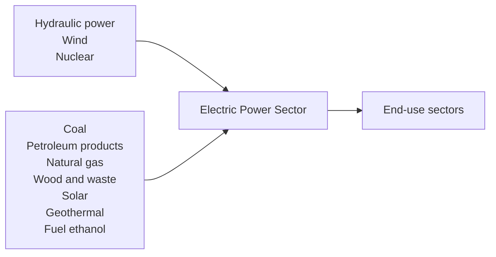

<table><tr><td>For office use only</td><td>Team Control Number80560</td><td>For office use only</td></tr><tr><td>T1</td><td></td><td>F1</td></tr><tr><td>T2</td><td></td><td>F2</td></tr><tr><td>T3</td><td>Problem Chosen</td><td>F3</td></tr><tr><td>T4</td><td>C</td><td>F4</td></tr></table>

## 2018

## MCM/ICM

## Summary Sheet

## Summary

## A New Keynesian Approach to Optimizing Energy Compact

In our paper, we construct an EROI evaluation system for the four states using data science and succeed in determining optimal goals for the interstate energy compact.

First, we operate on the data. Data are screened according to their integrity and usefulness of the infomation. Then we select and merge different variables using Coin-egration and Multiple Dimensional Scaling(MDS) based on the independence and representativeness of the attributes. For the reserved variables and statistics by year, we use Mean Substitution to conduct data imputation. Then, we classify the processed database by usage, sources and sectors. Classification on the energy sources is eventually made according to the corresponding environmental impact.

Second, we construct a EROI evaluation system, which is an improvement of Return on Investment (ROI). We classify various kinds of energies into 10 distinct groups. All variables of prices are adjusted in order to offset the influence by inflation and geographical differences. After that, we find that the external cost is related to the intensity of pollution, so it is used to measure the influence on environment. Also, we take sector influence and electric energy loss into consideration. Our data shows that California has the best profile for use of cleaner energy since 1974.

Third, our predicting models feature both Mathematical and Economic models. Since the data given are not stable in Time Series, we do not take ARMA or ARCH model into consideration. A linear model is initially adopted to regress the data, but it turns out to have limited accuracy and fails to fit short-term fluctuations or long-term trends. As a result, we adopt a dynamic New Keynesian IS-LM model and include forward-looking expectations in the model. We can therefore predict future energy consumption and structure with better accuracy. What's more, to simulate policy effects, demand shocks and supply shocks are added to the enhanced model, so that we are able to provide governors with quantitative prediction of policies.

Finally, sensitivity analysis is added to test and verify our models. The satisfying results allow us to put models into real situations and to solve real problems. We determine the renewable energy usage targets that in 2025, California may reach 42% of clean, renewable energy to the total consumption. Other states can reach 35%. And in 2050 All states may reach different from 38% to 51%. Four states' government should subsidize clean and renewable energy and impose pollution tax on others. Other kinds of direct investment and long-term policy can also be used to meet the energy goals.

Keywords: New Keynesian; IS-LM Model; Linear Regression; Time Series; MDS

## Contents

## 1 Introduction 1

1.1 Problem Background 1  
1.2 Overview of Our Work 1  
1.3 Assumptions 2

## 2 Data Processing 2

2.1 Data Screening 2  
2.2 Data Imputation 3  
2.3 Data Classification 3

## 3 Energy Profile 4

3.1 Overview Profile of the Four States 4  
3.2 Characterize the energy profile 4

## 4 EROI Evaluation System 5

4.1 EROI Definition 5  
4.2 The Revised EROI Evaluation System 6  
4.3 Results of EROI Evaluation System 7

## 5 Predictive Modeling 9

5.1 Linear Regression Model 9  
5.2 Dynamic New Keynesian IS-LM Model 10  
5.3 Enhanced NK IS-LM Model with Demand and Supply Shock ..... 12  
5.4 Climate Change Compact in Action 16

## 6 Sensitivity Analysis 17

## 7 Strength and Weakness 17

7.1 Weakness 18

<table><tr><td>8 Conclusions</td><td>18</td></tr><tr><td>9 Memo</td><td>21</td></tr><tr><td>Appendices</td><td>22</td></tr><tr><td>Team # 80560</td><td>Page 1 of 24</td></tr></table>

## 1 Introduction

## 1.1 Problem Background

Energy production lays a solid foundation for the development of the whole nation and serves as the essential impetus for the function of the entire society. The utilization of cleaner and green energy is a growing trend worldwide for purpose of the sustainable development. There are masses of clean energy oriented contracts being signed all over the world, while very few of those are carried out due largely part to their unrealistic and far-fetched goals. Therefore, setting goals reasonable enough contributes a lot to the optimal reconstruction of the energy structure regarding various countries or states.

The past years have witnessed unprecedented boom in the development of big data. Data science has penetrated into every aspects of our life, and plays a significant role in statistics, market intelligence, business analysis and so on. Moreover, data science can be applied to offer a feasible solution and set a realistic goal and thus facilitates the decision-making process. Therefore we give full play to the data science in addressing the optimal issue.

Now there are four states along the US border with Mexico, California (CA), Arizona (AZ), New Mexico (NM), and Texas (TX) that wish to form a realistic and practical new energy compact focused on increased usage of cleaner, renewable energy sources. With 50 years of data in 605 variables on each of these four states' energy production and con-sumption collected, we can perform data analysis and modeling to figure out a series of reasonable goals for the interstate energy compact.

## 1.2 Overview of Our Work

First, we find a few key points in this question:

Create an energy profile for the four states respectively.

Characterize the energy profile based on the time series model.

Develop an evaluation system to judge the level of the energy profile.

How to predict the energy profile of the four states.

Determine future renewable energy usage targets and how to achieve them.

On the basis of above discussion, to determine the optimal energy goals, we may boil down the tasks to the following steps:

First, we do data screening according to the integrity and usefulness of the information. For the retention of the dataset we use Cointegration and Multiple Dimen-sional Scaling to perform data imputation. And classify the data.

Second, we use knowledge of finance to construct EROI evaluation system. And we use the EROI concept to evaluate the energy profile evolved from 1960–2009.

Third, we initially adopt Linear Regression Model to predict the energy profile of the four states in 2025 and 2050 while further use Dynamic New Keynesian IS-LM Model to obtain more reliable projections.

Finally, we analyse different situations of the four states and accordingly propose specific goals and actions.

## 1.3 Assumptions

The data after screening and imputation are correct and robust for further analysis.

Natural resources in the four states are abundant and will not be exhausted before 2050.

All energy, no matter clean or not, are identical in total costs after 2009 (production cost + possible environmental cost).

Inflation (i.e. GDP deflator) will not change in future years.

We mainly focus on the performance of macro-economy and energy structure, in-cluding renewable and clean energy.

## 2 Data Processing

## 2.1 Data Screening

Given that we have 50 years of data in 605 variables of the four states, the original database is quite large. Therefore, we should do data screening according to the integrity and usefulness of the information. We first delete some variables manually, and then we use Cointegration and MDS to further narrow down the variables.

## - Cointegration

We randomly choose two variables and each of them establishes a time series $x_{1}, x_{2}$ .

First we construct a regression model:

$$
x _ {2 t} = \beta_ {0} + x _ {1 t} + \epsilon_ {t} \tag {1}
$$

If the residual series $\epsilon_{t}$ is stationary, then $x_{1t}, x_{2t}$ have cointegration. Based on Augmented Dickey-Fuller Test(ADF Test), if the P-value is lower than 0.05, then $x_{1t}, x_{2t}$ have correlation. Similarly, we can obtain the correlation between any two of these variables and thus in this way we can find the variables that any two of which don't have correlation. Therefore, we reduce the large amounts of variables to ten major Categories for further scaling.

## Multiple Dimensional Scaling

Multidimensional scaling (MDS) is a means of visualizing the level of similarity of individual cases of a dataset. It refers to a set of related ordination techniques used in information visualization, in particular to display the information contained in a distance matrix.

We then utilize this method to further narrow down the variables.

## 2.2 Data Imputation

In statistics, missing data is quite common in the dataset and may cause certain bias in the final conclusion. Therefore data imputation, which means replacing missing data with substituted values, is of great necessity in eliminating such bias and obtaining more authentic results.

Through preliminary observation on the raw dataset, we discover that the statistics of some variables remain zero for several years in a row. Some are missing data while under some circumstances the true value is zero. Therefore, firstly we should distinguish the abnormal statistics from the database and then deal with the missing data.

By far there are several ways to do data imputation, including Listwise deletion, Mean substitution, Multiple Imputation and so on. Here we use Mean substitution.

## 2.3 Data Classification

We classify the energy production database by three aspects – usage, source and sector. The specific classification is listed as follows.


<details>
<summary>text_image</summary>

Source
●Fossil fuel
●Nuclear energy
●Renewables
Usage
●Produced
●Consumed
●Efficiency
●Expenditure
●Price
●Others
Sector
●Transportation
●Industrial
●Residential
●Commercial
●Electric plant
</details>

Figure 1: Energy production database classification

Further we make a classification on different kinds of energy sources in terms of their environmental impact:


<details>
<summary>flowchart</summary>


</details>

Figure 2: Energy Source Classification

## 3 Energy Profile

## 3.1 Overview Profile of the Four States

<table><tr><td></td><td>AZ</td><td>CA</td><td>NM</td><td>TX</td></tr><tr><td>Percentage of total energy consumed by end-use sector.</td><td>57.90%</td><td>82.06%</td><td>62.91%</td><td>76.06%</td></tr><tr><td>Percentage of total energy loss.</td><td>36.25%</td><td>23.28%</td><td>23.19%</td><td>21.94%</td></tr><tr><td>Percentage of Clean and Renewable Energy Consumption in End-use Sector</td><td>3.51%</td><td>2.01%</td><td>1.06%</td><td>0.90%</td></tr><tr><td>Percentage of Clean Energy Consumption in Electric Plant Sector</td><td>61.56%</td><td>93.28%</td><td>22.70%</td><td>45.59%</td></tr><tr><td>Average Price of fossil energy* (dollar per million Btu)</td><td>8.63</td><td>11.98</td><td>7.66</td><td>8.94</td></tr></table>

Figure 3: Overview Profile of the Four States

\*Average price of fossil energy is important data because some states, such as Texas, have plenty of oil reserves. These states' low price of fossil energy can't reflect its advantage in energy consumption. As long as we are learning about the energy consumption in various states, the effect of energy exploitation should be removed.

  
Figure 4: Four states energy consumption by sector

## 3.2 Characterize the energy profile

Energy structure depends excessively on a state's population, economy and industry. The table below briefly summarizes the demographical, climatic and industrial feature of these four states:

Geography plays an important role in the distribution of energy plants across the four states. Due to similar geographical character, natural gas plants and petroleum plants locate sparsely in their terrain. However, their difference outweighs similarities. While California and Texas have various energy plants, such distributions in Arizona and New Mexico are relatively monotonous. In addition, California is the only state to own geothermal plants. Coal power plants, however, mainly locate in Arizona and Texas. While solar power are more abundant in California and Ari-zona, Texas has more wind power plants. Finally, California and Texas have the largest number of hydroelectric power plants

<table><tr><td></td><td>California</td><td>Arizona</td><td>Texas</td><td>New Mexico</td><td>Source</td></tr><tr><td>Population( in July, 2016) (in Million)</td><td>29.2965</td><td>6.9086</td><td>27.9049</td><td>2.0854</td><td>Data from U.S. Census Bureau</td></tr><tr><td>GDP (million USD in 2016)</td><td>2,622,731</td><td>305,849</td><td>1,599,283</td><td>93,594</td><td>Bureau of Economic Analysis. Retrieved 8 December 2017.</td></tr><tr><td>Climate (Avg °F)</td><td>59.4</td><td>60.3</td><td>64.8</td><td>53.4</td><td>www.currentresults.com</td></tr><tr><td>Major Industry</td><td>Industry, agriculture, technology, tourism, and the motion picture industry</td><td>Manufacturing, mining( gold and silver, but mostly cooper, and tourism)</td><td>Petroleum, natural gas, farming, steel, banking and tourism</td><td>Mining and Oil and Gas Extraction, manufacturing</td><td>Various sources</td></tr></table>

Figure 5: population distribution


<details>
<summary>text_image</summary>

Map of the United States showing geographic locations with labeled cities and marked markers, including a legend for icons and location labels.
</details>

Figure 6: geography distribution  
Figure from https://www.eia.gov/state/maps.php

Energy structure depends excessively on a stateâAZs population, economy and industry. The table below briefly summarizes the demographical, climatic and industrial feature of these four states:

## 4 EROI Evaluation System

## 4.1 EROI Definition

Return on Investment (ROI), by definition, is the ratio between the net profit and cost of investment resulting from an investment of some resources, which is used to evaluate the efficiency of an investment or to compare the efficiencies of several different investments.

We then come up with the idea that similar concept can be introduced to the energy production fields. After further research, we discover energy return on investment (EROI), which is the ratio of the amount of usable energy delivered from a particular energy resource to the amount of energy used to obtain that energy resource.

Arithmetically the EROI can be written as:

$$
E R O I = \frac {\sum_ {i = 1} ^ {n} E _ {i} ^ {O}}{\sum_ {i = 1} ^ {n} E _ {i} ^ {I}} \tag {2}
$$

Where $E_{i}^{O}$ denotes the equivalent caloric value of the total ith energy output and $E_{i}^{I}$ denotes the equivalent caloric value of the total ith energy investment.

## Investment

We find that non-clean energy is more cost effective to produce while may simultaneously generate huge amounts of environmental cost. By contrast, clean energy can virtually do little damage to the environment while the production is more complex and can cost a lot regarding the relevant research and production process. Therefore, we should take both internal cost and external expenditure into consideration in order to evaluate certain energy comprehensively. The investment consists of two parts – Energy Production Internal Cost(EIC) and Energy Production External Expenditure(EEE).

## Output

The net energy yield refers to the amount of energy that is gained from harvesting an energy source. This yield is the total amount of energy gained from harvesting the source after deducting the amount of energy that was spent to harvest it. And here we take the total EIC of all kinds of energy as the energy yields given that the two have positive correlation.

## 4.2 The Revised EROI Evaluation System

Denotation and Definition

<table><tr><td>Denotation</td><td>Definition</td></tr><tr><td>i</td><td>quality factor</td></tr><tr><td>Eo</td><td>the output energy</td></tr><tr><td>EI</td><td>the input energy</td></tr><tr><td>EIC</td><td>energy production internal cost</td></tr><tr><td>EEE</td><td>energy production external expenditure</td></tr><tr><td>PEE</td><td>Percentage of total energy consumed by Electric power plant</td></tr><tr><td>I</td><td>energy intensity</td></tr><tr><td>i</td><td>Sector influence rate</td></tr></table>

Table 1: Denotation and Definition of the Revised EROI Evaluation System

## EIC revision

## 1. Value of US dollar adjustment

Some parts of the energy investment can appear some statistics in the form of money rather than caloric value. Therefore we need to find a conversion factor in order to measure such monetary investment in the unit of BTU. Here we take energy intensity as the conversion factor, which means that the energy costs per unit GDP. The relevant GDP statistics of the four states can be obtained on the official websites and further we need to take inflation factor into account. Theoretically, in order to eliminate the influence of inflation, we need to accordingly adjust the GDP each year on the basis of the GDP in the first year.

Although energy prices have been increasing in the past 50 years, some of the increment are not caused by the change of real price, but due to the depreciation of US dollar. In order to remove this influencing factor, we decided to use the following formula:

$$
I = \frac {\text {GDP (2005)}}{\text {CurrentGDP}} \tag {3}
$$

## 2. Regional difference adjustment

Some states, such as Texas, are rich in fossil fuel reserves. These states' low price of petroleum products is partly because their easy access to plenty of oil. In order to address the energy quality issue, many researchers have construct various index to add up all kinds of energy. Here we adopt the earliest measurement:

$$
\alpha_ {i} = \frac {P _ {i}}{P _ {1}} \tag {4}
$$

Where $P_{1}$ denotes the national standard price of certain energy, while $P_{i}$ denotes the state price of the $i_{th}$ energy. The ratio is the quality factor i of the $i_{th}$ energy.

## EEE Calculation

In economic terms, an externality is the cost or benefit that affects a party that does not choose to incur that cost or benefit.

Pollution is an essential part of negative externality. When consuming some kinds of energy that causes pollution, we do harm to the environment and this damage can be measured by currency. According to OECD(2005), EEA(2004) and Pew Research Center(2009), we got the external cost of every kinds of energy. After changing unit and exchange rate, as well as adjusting the number into dollars in 2005 just like EIC, we computed the following table.

<table><tr><td>Coal</td><td>Petroleum products</td><td>Wood and waste</td><td>Natural gas</td><td>Fuel ethanol</td></tr><tr><td>20.367</td><td>17.866</td><td>10.720</td><td>6.432</td><td>5.002</td></tr><tr><td>Solar</td><td>Hydroelectricity</td><td>Geothermal</td><td>Nuclear</td><td>Wind</td></tr><tr><td>3.752</td><td>1.608</td><td>1.429</td><td>1.072</td><td>0.536</td></tr></table>

Figure 7: The external cost of energy(dollar in 2005/million Bru)

## Sector Influence Rate

It's quite obvious that pollution in residential area poses larger threat on environment than that in industrial area. As a result, we set up an influence rate of different sectors to balance the real influence of external cost.

<table><tr><td>All</td><td>Residential</td><td>Commercial</td><td>Industrial</td><td>Transportation</td></tr><tr><td>1.0</td><td>1.2</td><td>1.1</td><td>0.8</td><td>1.3</td></tr></table>

Figure 8: The influence rate of every end-use sector

## Revised Formula

Based on the relevant revision stated above, we can obtain a new EROI calculation formula:

$$
E n d - u s e E R O I = \frac {\sum \alpha_ {i} E I C _ {i}}{\sum \alpha_ {i} (\beta_ {i} * E E E _ {i} + I * E I C _ {i})} \tag {5}
$$

$$
E l e c t r i c p o w e r p l a n t E R O I = \frac {\sum \alpha_ {i} E I C _ {i}}{\sum \alpha_ {i} (E E E _ {i} + I * E I C _ {i})} \tag {6}
$$

$$
\text { TotalEROI } = \text { PEE } * \text { ElectricpowerplantEROI } + (1 - \text { PEE }) * \text { End } - \text { useEROI } \tag {7}
$$

## 4.3 Results of EROI Evaluation System

In the late 1970s, three states, except Arizona, had experienced great growths. After the peak from 1981 to 1982 was a long decline and it was not until the new century, that all four states started another increment. However, the financial crisis in 2007 2008 had great impact on the situation.


<details>
<summary>line chart</summary>

| Year | AZ   | CA   | NM   | TX   |
|------|------|------|------|------|
| 1970 | 36%  | 32%  | 21%  | 22%  |
| 1975 | 34%  | 38%  | 25%  | 30%  |
| 1980 | 37%  | 52%  | 32%  | 40%  |
| 1985 | 33%  | 48%  | 28%  | 35%  |
| 1990 | 28%  | 40%  | 26%  | 28%  |
| 1995 | 27%  | 42%  | 25%  | 26%  |
| 2000 | 28%  | 48%  | 30%  | 32%  |
| 2005 | 35%  | 55%  | 38%  | 45%  |
| 2009 | 32%  | 58%  | 40%  | 48%  |
</details>

Figure 9: Total EROI of four states from 1970 to 2009


<details>
<summary>area chart</summary>

| StateCode | Fuel ethanol | Solar | Geothermal |
|---|---|---|---|
| AZ | 0.00 | 0.00 | 0.00 |
| CA | 0.00 | 0.00 | 0.00 |
| NM | 0.00 | 0.00 | 0.00 |
| TX | 0.00 | 0.00 | 0.00 |
</details>

Figure 10: Percentage of Using Clean and Renewable Energy in End-use Sector

The total EROI of four states has dropped significantly. Among these four states, California had an obvious advantage in EROI.

In end-use sectors, energy that is both clean and renewable only occupies a little part of total consumption. In 2009, the figure was 3.5% in Arizona, 2% in California and only about 1% in other two states. There had been nearly no consumption in all states before 1990, since clean energy, such as nuclear and hydraulic power, can hardly be directly used by end-use sectors.


<details>
<summary>stacked area chart</summary>

| StateCode | StateCode | Nuclear | Natural gas | Geothermal | Hydroelectricity | Wind | Solar |
|-----------|-----------|---------|-------------|------------|------------------|------|-------|
| AZ        | 1974      | 0.5     | 0.3         | 0.1        | 0.4              | 0.0  | 0.0   |
| CA        | 1974      | 0.4     | 0.2         | 0.1        | 0.3              | 0.0  | 0.0   |
| NM        | 1974      | 0.3     | 0.2         | 0.1        | 0.2              | 0.0  | 0.0   |
| TX        | 1974      | 0.2     | 0.2         | 0.1        | 0.1              | 0.0  | 0.0   |
| (Total)   | 2009      | 0.3     | 0.2         | 0.1        | 0.1              | 0.0  | 0.0   |
</details>

Figure 11: Percentage of Using Clean Energy in Electricity Power Plant

However, the situation is different in electric power plant, where plenty of clean energies are used. Totally, all four states experienced long and slow decreases in the 1970s, after which they had experienced quite different situations. Since 1985, about 90% of energy sources of electricity generation in California have been clean energy. Arizona also had a good performance, when Nuclear Energy has occupied 30-40% of its electricity generation source. In recent 20 years, elec-tric power plant in Texas had a stable energy consumption. Since 2005, usage of wind energy has increased greatly. However, in New Mexico, clean energy was not widely used.


<details>
<summary>line chart</summary>

| Year | AZ   | CA   | NM   | TX   |
|------|------|------|------|------|
| 1970 | 52%  | 42%  | 5%   | 15%  |
| 1975 | 35%  | 45%  | 8%   | 25%  |
| 1980 | 25%  | 55%  | 10%  | 28%  |
| 1985 | 28%  | 68%  | 10%  | 25%  |
| 1990 | 20%  | 55%  | 10%  | 18%  |
| 1995 | 18%  | 58%  | 10%  | 15%  |
| 2000 | 20%  | 62%  | 12%  | 20%  |
| 2005 | 22%  | 60%  | 15%  | 28%  |
| 2009 | 20%  | 55%  | 18%  | 30%  |
</details>

Figure 12: Electric power plant EROI of four states from 1970 to 2009

The situation during the past 40 years is illustrated in the figure above. California had won the highest EROI ever since 1974 as expected. According to the Total EROI in 2009, California also had the best profile for use of clean, renewable energy.

<table><tr><td></td><td>AZ</td><td>CA</td><td>NM</td><td>TX</td></tr><tr><td>Total EROI</td><td>37.27%</td><td>50.32%</td><td>36.96%</td><td>39.49%</td></tr></table>

Figure 13: total EROI of Four states in 2009

According to the total EROI, it can be clearly observed that California has the best profile, followed by Texas, Arizona and New Mexico.

## 5 Predictive Modeling

In this section, we used various models to predict the future of energy industry. Despite the fact that we have data of various years, they are not technically Time Series. To be specific, many factors do not pass ADF unit root test and, thus, traditional Time Series model such as ARMA or GARCH(ARCH) model could not and should not be used in prediction. We mainly developed two models, one mathematically and one economically: linear regression model and New Keynesian IS-LM model.

## 5.1 Linear Regression Model

This first model that come to our mind is the basic linear regression model. In this model, 43 Factors of different energy categories are used to perform the regression. We've listed some of the results as follows:

The graph shows that some factors are well fitted into regression, such as JFACB (Row1, Col.2). Others do not and neglect some curves and fluctuations in short term periods, especially factors like NGCBB (Row 2, Col. 5). Apart from that, many factors are co-integrated, which means that it will be a redundant to take them all into consideration.

## Linear Regression fails for mainly two reasons:

First, despite the fact that long-term macro-economic performances often seem to have trends to follow, these trends are very likely to change due to policy changes and macro-market dynamics. Such factors are not included in a purely mathematics model(i.e.Linear Regression). Even if polynomial algorithms can fit into historical data, it will still face the problem of overfitting and


<details>
<summary>line chart</summary>

| LGICB | 6566666666666666666666666666666666666666666666666666666666666666666666666666666666666666666666666666667 |
| --- | --- |
| MGICB | 8533333333333333333333333333333333333333333333333333333333333333333333333333333333333333333333334 |
| MGCCB | 12598848888888884888888888888888888888888888888888888888889 |
| NGACB | 17598848888888884888888888888888888888888889 |
| NGCCB | 225988488888888444444444444444444444444444444444444444444444444444444444444444444444444444444444445 |
| PFCB | 275988488888879927777777777777777777777777777777777777777777777777777777777777777777777777777777777777777777777777777 |
| SOTCB | 52599222222222222222222222222222222222222222222222222222222222222222222222222222222222222222222222<nl> |
| SGICB | 1111111111111111111111111111111111111111111111111111111111111111111111111<nl> |
| WWICB | 159999999999999999999999999999999999999999999999999999999999999999999999999999999999999999999999999999<nl> |
| MGICB | 21599999999999999999999999999999999999999999999999999999999999999999999999999<nl> |
</details>

Figure 14: Linear Regression for (15/43) factors in California

have poor performance predicting future. Linear regression, thus, will not be able to represent the whole picture of the market and cannot follow the trend in the long term.

Secondly, short term micro-economic performances include sophisticated price change and the balance over supply and demand. These factors have very strong periodical likelihood to changes and relatively bigger standard deviations, so linear regression fails to provide sufficient and accurate predictions in the short term.

## 5.2 Dynamic New Keynesian IS-LM Model

In the long run we are all dead.(Keynes, 1923). Due to inefficiency of predicting long-term and short-term future by the previous linear model, an adapted economic model that focus on period-to-period fluctuation is introduced to make further and more accurate prediction in the short term and finally to simulate long term dynamics.

Traditional Keynesian IS-LM curves measures the relationship between price fluctuation, interest rate and level of output in short-term economic fluctuations. The initial intension of the model is to derive the output and interest rate in order to reach a short-term equilibrium. Based on the research of David Aadland (2014), a dynamic IS-LM model is applied to solve the energy prediction problem.

- Model Parameters

<table><tr><td>Detotation</td><td>Definition</td></tr><tr><td> $c_t$ </td><td>Consumption in t year</td></tr><tr><td> $\tau_t$ </td><td>trend output</td></tr><tr><td> $x_t = c_t - \tau_t$ </td><td>Output Gap</td></tr><tr><td> $i_t$ </td><td>Return on investing(ROI)certain energy</td></tr><tr><td> $\pi_t$ </td><td>Price increase</td></tr><tr><td> $r_t = i_t - E_t\pi_{t+1}$ </td><td>real ROI rate</td></tr><tr><td> $\nu_t$ </td><td>demand shock</td></tr><tr><td> $\mu_t$ </td><td>supply shock</td></tr><tr><td> $\alpha$ </td><td>moving average parameters</td></tr><tr><td>i</td><td>risk free investment rate</td></tr></table>

- IS curve

The IS curve summarizes public demand of energy, and it takes the form

$$
x _ {t} = - \phi [ i _ {t} - E _ {t} \pi_ {t + 1} ] + E _ {t} x _ {t + 1} \tag {8}
$$

This equation it indicates that the output gap in year t is caused by the real return on earnings rate plus the expectation of the output gap in year t+1. Intuition: The output gap is negatively related to the real interest rate, because higher returns induce investors to invest more today, thus reducing the output demand. The output gap is positively related to the expectation of output gap in t+1 period, since a better future and higher expectation is often self-fulfilling in economy.

## - LM curves

LM curve measures public supply. Traditionally, it takes the form of $M/P = L(r, Y)$ , which takes into consideration of price level, money supply and interest rate into determination of output. In the case, however, to measure the money supply of energy consumption is very much an unrealistic task. As a result, two separate LM curves are introduced to measure the price fluctuation.

## -LM curve I

LM curve I summarizes public supply of energy, and it takes the form

$$
\pi_ {t} = \lambda x _ {t} + \gamma E _ {t} \pi_ {t + 1} \tag {9}
$$

This function shows that the increase of certain energy price in period t equals output gap in the same period plus the expected price fluctuation in the next period.

Intuition: Price fluctuation is, on one hand, determined positively by output gap and, on the other hand, by unexpected real output outweighs trend output. Also, the expected price change is self-fulfilling and relates positively to the price change in this period.

## -LM curve II

In real life situations, central banks in the world have started to use interest rate as a measure of policy instruments to regulate national economy. Based on John Taylor (2010)'s policy rule, we derived the function to determine ROI rate, which takes the form

$$
I _ {t} = I + \theta_ {x} E _ {t} x _ {t + 1} + \theta_ {\pi} E _ {t} \pi_ {t + 1} \tag {10}
$$

This function indicated that the ROI rate is the sum of non-risk investment rate, expected output gap and expected price fluctuation.

Intuition: Investment of energy production is determined by the possible future development of the industry and the possible price fluctuations. Money supply of the energy division, according to Taylor Rules, is assumed to adjust in response to the ROI rate.

## - Handling Expectation

For simplicity, the expected output gap Etxt+1 and expected price increase Etpait+1 is given as moving average

$$
E _ {t} x _ {t + 1} = \left[ x _ {t - 1}, x _ {t - 2}, x _ {t - 3}, x _ {t - 4}, x _ {t - 5} \right] * \alpha \tag {11}
$$

$$
E _ {t} \pi_ {t + 1} = \left[ \pi_ {t - 1}, \pi_ {t - 2}, \pi_ {t - 3}, \pi_ {t - 4}, \pi_ {t - 5} \right] * \alpha \tag {12}
$$

In this case, alpha vector is set to weight $[0.5, 0.15, 0.1, 0.1, 0.1, 0.05]^{T}$ , and are able to reach to satisfying conclusion.

## • Big Picture of Dynamic New Keynesian Models

To put all the pieces together, the big picture of Dynamic New Keynesian Models take the form of:

$$
x _ {t} = - \phi [ i _ {t} - E _ {t} \pi_ {t + 1} ] + E _ {t} x _ {t + 1}
$$

$$
\pi_ {t} = \lambda x _ {t} + \gamma E _ {t} \pi_ {t + 1}
$$

$$
I _ {t} = I + \theta_ {x} E _ {t} x _ {t + 1} + \theta_ {\pi} E _ {t} \pi_ {t + 1}
$$

The parameters $(\phi,\lambda,\gamma,\theta_{x},\theta_{z},\theta_{i})$ are therefore set to fit the historical data from 1970 to 2009 in four states.

To further avoid redundancy we have chosen 10 MSNs, one for each energetic category to describe trait of consumption. The chosen factors are not co-integrated with each other, and thus are efficient to work in the model.

• Results of New Keynesian Model

The results of four states are shown in the table(billion Btu):

<table><tr><td>Energy</td><td>California</td><td></td><td>Arizona</td><td></td><td>New Mexico</td><td></td><td>Texas</td><td></td></tr><tr><td></td><td>2025</td><td>2050</td><td>2025</td><td>2050</td><td>2025</td><td>2050</td><td>2025</td><td>2050</td></tr><tr><td>Coal</td><td>36866.9</td><td>35683.5</td><td>16417.8</td><td>25531.1</td><td>2264.58</td><td>3528.00</td><td>49054.4</td><td>76271.9</td></tr><tr><td>Natural gas</td><td>2140457</td><td>3327307</td><td>152071.1</td><td>236390.8</td><td>240575</td><td>373975.3</td><td>2854761</td><td>4437663</td></tr><tr><td>Petroleum</td><td>5015969</td><td>7797268</td><td>768174.4</td><td>1194120</td><td>353683.6</td><td>549798.5</td><td>7751729</td><td>12049965</td></tr><tr><td>Solar</td><td>30205.5</td><td>46956.8</td><td>5396.95</td><td>8390.99</td><td>349.566</td><td>552.735</td><td>972.084</td><td>1517.60</td></tr><tr><td>Geothermal</td><td>2858.37</td><td>4453.88</td><td>437.865</td><td>680.018</td><td>629.529</td><td>988.719</td><td>2345.83</td><td>3656.23</td></tr><tr><td>Fuel ethanol</td><td>110091.4</td><td>171142.4</td><td>23910.05</td><td>37170.75</td><td>3770.696</td><td>5866.872</td><td>74755.37</td><td>116205.3</td></tr><tr><td>Wood and Waste</td><td>190232.2</td><td>295717.8</td><td>16613.63</td><td>25826.09</td><td>15323.07</td><td>23829.41</td><td>109979.4</td><td>170968.8</td></tr><tr><td>Hydroelectricity</td><td>289547.7</td><td>280278.1</td><td>89182.22</td><td>138641.7</td><td>3488.702</td><td>5431.955</td><td>14813.36</td><td>23032.46</td></tr><tr><td>Nuclear</td><td>464845.2</td><td>722602.1</td><td>406072.7</td><td>631221.7</td><td>nan</td><td>nan</td><td>580634.3</td><td>902591.2</td></tr><tr><td>Wind</td><td>72724.7</td><td>113052.7</td><td>nan</td><td>nan</td><td>19172.92</td><td>29813.04</td><td>194650</td><td>302556.1</td></tr></table>

Nan in the table are caused by insufficient data, so that we cannot predict their development.

Table 2: Energy Profile Prediction of the Four States

We've also visualized our findings in Figure 9-12. These figures show the energy consumption from 1970 to 2050, and the figure between 2009 to 2050 are predicted with New Keynesian IS-LM Model. The results show intuitively but quantitatively that, without any inference of policies, the economy tends to use such energy that has a higher proportion before. In addition, those energy with less prior usage slowly grow up, as to the effect of the expansion of aggregated demand and supply. However, their percentage tends to drop and gradually lose competition with energies like coals and petroleum.

These findings are quite consistent with real world situation. Suppliers of coal and petroleum tend to maximize their profit and expand their business, so they are very likely to hinder new technology breakthrough, for fear of the shrinkage of their own benefit. These phenomena slow the pace of renewable and clean energy development and call for the inference of governmental policy to encourage and promote the growth of green technology. In the next section, we're going to introduce an adapted model to analyze and predict the effect of various policies.

## 5.3 Enhanced NK IS-LM Model with Demand and Supply Shock

To better indicate the effect of policies, we then introduced the demand and supply shock to IS-LM model. The enhanced model takes the form:

$$
x _ {t} = - \phi [ i _ {t} - E _ {t} \pi_ {t + 1} ] + E _ {t} x _ {t + 1} + \nu_ {t} \tag {13}
$$

$$
\pi_ {t} = \lambda x _ {t} + \gamma E _ {t} \pi_ {t + 1} + \mu_ {t} \tag {14}
$$

$$
I _ {t} = I + \theta_ {x} E _ {t} x _ {t + 1} + \theta_ {\pi} E _ {t} \pi_ {t + 1} \tag {15}
$$


<details>
<summary>line chart</summary>

| Year | Coal | Natural Gas | All petroleum products | Solar | Geothermal | Fuel ethanol | Wood and waste | Hydroelectricity | Nuclear | Wind |
| --- | --- | --- | --- | --- | --- | --- | --- | --- | --- | --- |
| 1970 | ~0 | ~0 | ~200000 | ~0 | ~0 | ~0 | ~0 | ~0 | ~0 | ~0 |
| 1980 | ~0 | ~0 | ~300000 | ~0 | ~0 | ~0 | ~0 | ~0 | ~0 | ~0 |
| 1990 | ~0 | ~0 | ~400000 | ~0 | ~0 | ~0 | ~0 | ~0 | ~0 | ~0 |
| 2000 | ~0 | ~0 | ~500000 | ~0 | ~0 | ~0 | ~0 | ~0 | ~0 | ~0 |
| 2010 | ~0 | ~0 | ~600000 | ~0 | ~0 | ~0 | ~0 | ~0 | ~0 | ~0 |
| 2020 | ~0 | ~0 | ~700000 | ~0 | ~0 | ~0 | ~0 | ~0 | ~0 | ~0 |
| 2030 | ~0 | ~0 | ~800000 | ~0 | ~0 | ~0 | ~0 | ~0 | ~0 | ~0 |
| 2040 | ~0 | ~0 | ~900000 | ~0 | ~0 | ~0 | ~0 | ~0 | ~0 | ~0 |
| 2050 | ~0 | ~0 | ~1000000 | ~0 | ~0 | ~0 | ~0 | ~50 | ~5 | ~5 |
| 2150 | ~5 | ~5 | ~150 | ~5 | ~5 | ~5 | ~5 | ~15 | ~15 | ~15 |
| 2250 | ~15 | ~15 | ~25 | ~15 | ~15 | ~15 | ~15 | ~25 | ~25 | ~25 |
| 2350 | ~25 | ~25 | ~35 | ~25 | ~25 | ~25 | ~25 | ~35 | ~35 | ~35 |
| 2450 | ~35 | ~35 | ~45 | ~35 | ~35 | ~35 | ~35 | ~45 | ~45 | ~45 |
| 2550 | ~45 | ~45 | ~55 | ~45 | ~45 | ~45 | ~45 | ~55 | ~55 | ~55 |
| 2650 | ~55 | ~55 | ~65 | ~55 | ~55 | ~55 | ~55 | ~65 | ~65 | ~65 |
| 2750 | ~65 | ~65 | ~75 | ~65 | ~65 | ~65 | ~65 | ~75 | ~75 | ~75 |
| 2850 | ~75 | ~75 | ~85 | ~75 | ~75 | ~75 | ~75 | ~85 | ~85 | ~85 |
| 2950 | ~85 | ~85 | - | - | - | - | - | - | - | - |
</details>

Figure 15: Arizona energy profile prediction Figure 16: California energy profile prediction


<details>
<summary>line chart</summary>

| Year | Coal | Natural Gas | All petroleum products | Solar | Geothermal | Fuel ethanol | Wood and waste | Hydroelectricity | Nuclear | Wind |
| --- | --- | --- | --- | --- | --- | --- | --- | --- | --- | --- |
| 1970 | ~0 | ~250000 | ~150000 | ~0 | ~0 | ~0 | ~0 | ~0 | ~0 | ~0 |
| 1980 | ~0 | ~220000 | ~200000 | ~0 | ~0 | ~0 | ~0 | ~0 | ~0 | ~0 |
| 1990 | ~0 | ~230000 | ~210000 | ~0 | ~0 | ~0 | ~0 | ~0 | ~0 | ~0 |
| 2000 | ~0 | ~240000 | ~220000 | ~0 | ~0 | ~0 | ~0 | ~0 | ~0 | ~0 |
| 2010 | ~0 | ~250000 | ~230000 | ~0 | ~0 | ~0 | ~0 | ~0 | ~0 | ~0 |
| 2020 | ~0 | ~260000 | ~240000 | ~0 | ~0 | ~0 | ~0 | ~0 | ~0 | ~0 |
| 2030 | ~0 | ~270000 | ~250000 | ~0 | ~0 | ~0 | ~0 | ~0 | ~0 | ~0 |
| 2040 | ~0 | ~280000 | ~260000 | ~0 | ~0 | ~0 | ~0 | ~0 | ~5M | ~1M |
| 2050 | ~1M | ~35M | ~35M | ~1M | ~1M | ~1M | ~1M | ~1M | ~1M | ~1M |
| 2060 | ~1M | ~38M | ~38M | ~1M | ~1M | ~1M | ~1M | ~1M | ~1M | ~1M |
| 2070 | ~1M | ~42M | ~42M | ~1M | ~1M | ~1M | ~1M | ~1M | ~1M | ~1M |
| 2080 | ~1M | ~45M | ~45M | ~1M | ~1M | ~1M | ~1M | ~1M | ~1M | ~1M |
| 2090 | ~1M | ~48M | ~48M | ~1M | ~1M | ~1M | ~1M | ~1M | ~1M | ~1M |
| 2100 | ~1M | ~52M | ~52M | ~1M | ~1M | ~1M | ~1M | ~1M | ~1M | ~1M |
| 2110 | ~1M | ~55M | ~55M | ~1M | ~1M | ~1M | ~1M | ~1M | ~1M | ~1M |
| 2120 | ~1M | ~58M | ~58M | ~1M | ~1M | ~1M | ~1M | ~1M | ~1M | ~1M |
| 2130 | ~1M | ~62M | ~62M | ~1M | ~1M | ~1M | ~1M | ~1M | ~1M | ~1M |
| 2140 | ~1M | ~65M | ~65M | ~1M | ~1M | ~1M | ~1M | ~1M | ~1M | ~1M |
| 2150 | ~1M | ~68M | ~68M | ~1M | ~1M | ~1M | ~1M | ~1M | ~1M | ~1M |
| 2160 | ~1M | ~72M | ~72M | ~1M | ~1M | ~1M | ~1M | ~1M | ~1M | ~1M |
| 2170 | ~1M | ~75M | ~75M | ~1M | ~1M | ~1M | ~1M | ~1M | ~1M | ~1M |
| 2180 | ~1M | ~78M | ~78M | ~1M | ~1M | ~1M | ~1M | ~1M | ~1M | ~1M |
| 2190 | ~1M | ~82M | ~82M | - | - | - | - | - | - | - |
</details>

Figure 17: New Mexico energy profile predic- Figure 18: Texas energy profile prediction tion

The enhanced model provides us with a better way to simulate the effect of policies. It inspired us to think quantitatively and logically on this topic and shed light on the way policies work so that we could come up with better solutions to promote renewable energies.

We have considered various composition of policies. Here are some of the results we would like to share with governors and policy makers.

## 1. Demand Side Policies

The first aspect of energy policy is to insert demand shock to the public. These policies are intended to increase the demand of clean energy and decrease that of unclean energy. Such policies include:

- Subsidies for clean energy and extra taxes for unclean energy.  
- Construction of better facilities and infrastructures for access to clean energy.


<details>
<summary>line chart</summary>

| Year | Demand Shock Policy | Natural Growth |
|------|---------------------|----------------|
| 2025 | 2352313             | 2137004        |
| 2050 | 3656814             | 3321931        |
</details>

Figure 19: Demand Shock Policy on California Natural Gas Consumption from 1970 to 2050

When we insert a demand shock on California natural gas consumption in 2009, the instant

effect is significant âA,S consumption shoots high in the first year. It decreases a little bit in the following year, and fluctuates in two more years. After that, the effect of demand shock dies down, and consumption starts to grow at its previous rate.

## 2. Supply Side Policies

Unlike demand shock, we have mathematically two ways to control supply in IS-LM model. The first one would be to insert a supply shock, which is similar to demand side. Another method would be to change the interest rate and thus the ROI rate by cutting cost for renewable energy plants. In real situations, governmental policies have larger effect on supply rather than demand, thus making supply side very important. Such policies include:

- Higher taxes on unrenewable energy supply and subsidies for renewable energy.  
- Easier access and lower interest rate in renewable energy industry, as lower interest rate promotes larger investment for investors and allows loaners to fund their program easier.  
- Direct governmental investment on renewable energy plants.

## 3. Long term Policy outweigh its short counterpart

Politicians are always limited to establish only short-term policies. However, giving demand shock for longer periods will lead to a significant better outcome than only giving demand shock for one period. Intuitive as it may sound, it does have a quantitative support by using the enhanced model.


<details>
<summary>line chart</summary>

| Year | Negative Demand Shock | No Policy Interference | Natural Growth | Smaller Interest Rate |
|------|------------------------|--------------------------|----------------|------------------------|
| 2025 | 62027                  | 96451                    | 62027          | 111897                 |
| 2050 | 96451                  | 111897                   | 96451          | 111897                 |
</details>

Figure 20: Negative supply shock on Texas coal Figure 21: Effect of interest rate on Texas coal consumption from 1970 to 2050 sumption from 1970 to 2050


<details>
<summary>line chart</summary>

| Year | Long-term | Short-term |
|------|-----------|------------|
| 2025 | 11036     | 5395       |
| 2050 | 17147     | 8385       |
</details>

Figure 22: Long-term and short-term policy on Cal-Figure 23: total consumption of the four states from ifornia solar consumption from 1970 to 2050 2009 to 2050

In the case of California Solar Consumption. A 3-year demand shock and a 1-year demand shock are simulated on 2009. In the successive year after 2009, two successive policies increased the consumption. Despite a downward after each policy is implemented, the add-up effect is way higher than only short-term policies. To our surprise, 3-year policies have a nearly 200% higher promotion in consumption of solar energy than that of 1-year policies! The result shows that a policy in force for two more years will lead to nearly half of the better results. Thus, we believe that long-term policy outweigh its short counterpart.

## 4. Cross-state cooperation


<details>
<summary>stacked bar chart</summary>

| Category | Solar | Geothermal | Fuel ethanol | Hydroelectricity | Nuclear | Wind |
|---|---|---|---|---|---|---|
| TX | 0.01 | 0.02 | 0.25 | 0.08 | 0.69 | 0.43 |
| NM | 0.17 | 0.13 | 0.28 | 0.15 | 0.42 | 0.35 |
| CA | 0.08 | 0.19 | 0.22 | 0.35 | 0.25 | 0.11 |
| AZ | 0.05 | 0.03 | 0.15 | 0.25 | 0.64 | 0.07 |
</details>

Figure 24: Prediction energy proportion in 2025


<details>
<summary>stacked bar chart</summary>

| Region | Solar | Geothermal | Fuel ethanol | Hydroelectricity | Nuclear | Wind |
|---|---|---|---|---|---|---|
| TX | 0.05 | 0.03 | 0.28 | 0.12 | 0.26 | 0.49 |
| NM | 0.25 | 0.15 | 0.27 | 0.18 | 0.19 | 0.39 |
| CA | 0.15 | 0.22 | 0.25 | 0.35 | 0.12 | 0.11 |
| AZ | 0.12 | 0.07 | 0.23 | 0.38 | 0.27 | 0.13 |
</details>

Figure 25: Prediction energy proportion in 2050

So far, we have analyzed various energy policies and their effect under IS-LM Model, but these policies are still limited within state. In order to have a knowledge for the state contract, we dug deeper into the cross-state cooperation for renewable energies. Such policies are:

- Extension of energy transmission between states.  
- Investment of technology.  
- Construction of cross boarder natural gas tube.

## 5.4 Climate Change Compact in Action

Based on our models, local governments need to implement multiple actions in order to reach our goals. We consider following actions as necessary for development of renewable energy.

WHEREAS, there is consensus among state leaders that energetic problem is among the most significant problems facing the four states; and

WHEREAS, collaboration of the four states will lead to a better energy structure with less pollution to the environment and more efficient usage of energy; and

WHEREAS, all parties recognize that coordinated and collective action on energetic problem will best serve the citizens of the region;

THEREFORE, EACH STATE SHALL:

Provide easy loans and low interest rates to investors in the field of renewable energy, while promoting banks and institutions invest on such programs.

Governmental subsidies to renewable demanders and suppliers, with taxes to unrenewable energy users and producers.

Easy loan and low interest rate to investors at renewable technologies and plants. Actions across the border:

States with higher technological capabilities help other states build plants of high efficiency and low environmental cost.

Construct more energy pipelines and transmission cables across states' border.


<details>
<summary>text_image</summary>

Map showing a purple truss bridge over the Gulf of Mexico and a colorful network map with location markers.
</details>

Figure 26: energy pipelines and transmission cables sketch map

## 6 Sensitivity Analysis

We have tested the max or min value of our IS-LM model, and the results are satisfying. Since it's the dynamic IS-LM model does not take natural resources and technological factors into consideration, so it does not always have equilibrium. Most of the parameters have economical meanings so that they are limited to a certain range. For example $x$ is limited to [-1,1]. The following graph is based on the sensitivity test of Arizona Natural Gas consumption, and the results are shown as follow:


<details>
<summary>line chart</summary>

| x    | θ_x = -1 | θ_x = -0.5 | θ_x = 0 | θ_x = 0.5 | θ_x = 1 |
| ---- | -------- | ---------- | ------- | --------- | ------- |
| 0    | 140000   | 140000     | 140000  | 140000    | 140000  |
| 10   | 130000   | 135000     | 135000  | 135000    | 135000  |
| 20   | 115000   | 125000     | 125000  | 125000    | 125000  |
| 30   | 118000   | 128000     | 128000  | 128000    | 128000  |
| 40   | 115000   | 125000     | 125000  | 125000    | 125000  |
| 50   | 125000   | 135000     | 135000  | 135000    | 135000  |
| 60   | 135000   | 145000     | 145000  | 145000    | 145000  |
| 70   | 145000   | 155000     | 155000  | 155000    | 155000  |
| 80   | 155000   | 165000     | 165000  | 165000    | 165000  |
</details>

Figure 27: sensitivity analysis

## 7 Strength and Weakness

subsectionStrength

Integrity. All the data in the given dataset have been screened and checked carefully, for either missing information or incorrect information.

Fair evaluation system. Our evaluation criteria oriented from the return on earnings (ROI) rate. Thus, it has very clear meanings on the cost and earnings of certain energy.

Mathematical and Economical Model: Our models and parameters have direct economic meanings, while subjecting to mathematics laws at the same time.

Dynamic Models and Programming: sophisticated economical models and Time Series pro-gramming is included as to simulate the growth of energy consumption and price.

Science for Policy. We have added supply and demand shocks in models in order to simulate the effect of policies. Thus, the policy makers can use our model for quantitative analysis and clearly observe market dynamics.

## 7.1 Weakness

Simplifying Assumptions. Simplified assumptions are adopted for a solvable model, so the result may slightly digress from the ground truth.

Lack of possible cost. We did not have time to take construction costs of plants into consideration and nor did we add into the model the constraints of technology and natural resources.

Local maxima or minima. Our model have considerable amount of parameters. Although it fits good to predict the future, it is inevitable that local maxima or minima is reached in predicting some factors.

## 8 Conclusions

## Energy Profile

Based on our energy profile and EROI model, California had boasted the best profile for use

of clean and renewable energy since 1974. Texas is listed the second in 2009 $^{\text{AZs}}$ profile. By using NK IS-LM models, we predict that in 2025, the rank of four states is likely to remain the same as 2009, in the absence of any policy change. Furthermore, in 2050, Texas is likely to lose its leading position, plummeting to the fourth. California, as everyone has expected, will still be the best state in overall energy use.

## Predictions& Goals

Our models have set targets for the four states in 2025 and 2050. These figures are listed below, which takes into consideration the situation during the past decades and current price fluctuations, thus denoting the percentage of clean energy consumption to total energy consumption.

<table><tr><td></td><td>AZ</td><td>CA</td><td>NM</td><td>TX</td></tr><tr><td>2025</td><td>40.64%</td><td>42.90%</td><td>36.69%</td><td>35.47%</td></tr><tr><td>2050</td><td>51.58%</td><td>46.83%</td><td>48.18%</td><td>38.85%</td></tr></table>

We also fit the targets into our EROI model, and computed the Total EROI in 2025 and 2050 as follows:

<table><tr><td></td><td>AZ</td><td>CA</td><td>NM</td><td>TX</td></tr><tr><td>Total EROI in 2025</td><td>36.01%</td><td>53.02%</td><td>36.29%</td><td>39.82%</td></tr><tr><td>Total EROI in 2050</td><td>48.81%</td><td>56.85%</td><td>47.86%</td><td>45.21%</td></tr></table>

Intuition of models for Politicians

As our models are mostly based on economic models, it has further economic meanings that the four states might take into consideration to meet their energy compact goals:

\- Subsidies for clean and renewable energy and collect pollution fee or tax from un-clean energy.

- Easier access and lower interest rate in renewable energy industry, as lower interest rate promotes larger investment for investors and allows loaners to fund their program easier.  
- Direct governmental investment on renewable energy plants, such as construction of better facilities and infrastructures for access to clean energy.  
- Long term policy has a larger impact on the energy situation.

What's more, long term policy has a larger impact on the energy situation.

## References

[1] Yan Hu, Lianyong Feng, Dong Tian.(2011).New approach to evaluating energy production – Energy Return On Investment.Energy  
[2] New Keynesian; IS-LM Model; Linear Regression; Time Series; MDS  
[3] Macroeconomics Mankiw 9th edition By N. Gregory Mankiw Macroeconomics (Ninth Edition) (2015-06-06)  
[4] C. Groth, Lecture Notes in Macroeconomics, (Mimeo) 2011  
[5] University of Wyoming College of Business Department of Economics and Finance ECON 5110 Macroeconomics II Lecture Note 4, 2014  
[6] OECD, 2005, Environmentally Harmful Subsidies: Challenges for Reform, Paris: OECD  
[7] European Environment Agency (EEA), 2004, Energy Subsidies in the European Union: A Brief Overview, Copenhagen: EEA  
[8] The Pew Center on Global Climate Challenge, 2009. Wind and Solar Electricity: Challenge and Opportunities.

## 9 Memo

Dear governors,

We are reaching out to you because we can offer you reasonable goals for the interstate energy contract. And our definition of Energy Return on Investment is based on profit maximization with both economic and ecologic benefits taken into consideration.

To begin with, we establish an energy profile for each of the four states and construct EROI evaluation system to rate the energy profile. We can conclude that California has the best profile, followed by Texas, Arizona and New Mexico in 2009.

Additionally, we adopt Dynamic New Keynesian IS-LM Model to predict the energy usage in 2025 and 2050. We determine the renewable energy usage targets that in 2025, California may reach 42% of clean, renewable energy to the total consumption. Other states can reach 35%. And in 2050 All states may reach different from 38% to 51%.

Last but not lease, we propose several realistic goals for the compact and feasible actions to achieve them.

## Goals

Governmental subsidies to renewable demanders and suppliers, with taxes to unrenewable energy users and producers.

loan and low interest rate to investors at renewable technologies and plants. Actions across the border:

States with higher technological capabilities help other states build plants of high efficiency and low environmental cost.

Construct more energy pipelines and transmission cables across states' border.

## Climate Change Compact in Action

Work in close collaboration on construction of energy plants, including coal, natural gas, all petroleum products, solar, geothermal, fuel ethanol, wood and waste, hydroelectricity, nuclear and wind production.

Work in close collaboration on construction of infrastructures and energy transmission system, including but not limited to underground pipelines, electric cables and energetic production material.

Work in close collaboration on streamlining certification process across border and simplifying approval process, including land certificate, operation certificate and safety checks.

Use available fiscal and monetary policies, including providing reasonable subsidies to re-newable demanders and suppliers in each state and levying taxes on unrenewable energy users and producers.

Provide easy loans and low interest rates to investors in the field of renewable energy, while promoting banks and institutions invest on such programs.

Wish our proposal can inspire you in pursuit of a more environmental friendly society. We are looking forward to hearing from you.

Yours sincerely,

A team of modelers who are enthusiastic about environmental preservation

## Appendices

Here are programmes we used in our model as follow. calculation of EROI Evaluation System Python source:

```txt
””
```

```txt
This Python file described our Major Model to establish Energy Profile „”
```

```python
import numpy as np
import pandas as pd
import matplotlib.pyplot as plt
```

```txt
########## Load Data ########
```

```python
# total dataset
data = pd.read_excel('NewestData211.xlsx', index_col=0)
```

```python
# price of energy
p = pd.read_excel('price_of_energy.xlsx', index_col=0)
```

```python
# price of electricity
pe = pd.read_excel('price_of_electricity.xlsx', index_col = 0)
```

```python
# outer electricity
oe = pd.read_excel('outer_electricity.xlsx', index_col = 0)
```

```python
# outer energy
o = pd.read_excel('outer_energy.xlsx', index_col = 0)
```

```txt
#label
MSN = pd.read_excel('new_label.xlsx')
```

```python
#TETCD
TETCD = pd.read_excel('TETCD.xlsx', index_col = 0)
TETCD.index = pd.date_range(start = '1/1/1970', end = '1/1/2009', freq='AS')
```

```python
# original state_state_
= {
    'AZ':
    pd.DataFrame(), 'TX':pd.Da
    taFrame(), 'NM':pd.DataFra
    me(), 'CA': pd.DataFrame()
}
state = {
    'AZ': pd.DataFrame(columns =
    MSN['MSN']), 'TX':pd.DataFrame(columns =
    MSN['MSN']), 'NM':pd.DataFrame(columns =
    MSN['MSN']), 'CA': pd.DataFrame(columns =
    MSN['MSN'])
}
```

```python
for key in state_: one_state =
    state_[key]
    one_state = data[data['StateCode'] == key].drop('StateCode', axis = 1) for each_MSN in MSN['MSN']:
    temp = one_state[one_state['MSN'] == each_MSN]
    state[key][each_MSN] = temp['Data']
    state[key].index = pd.date_range(start = '1/1/1960', end = '1/1/2009', freq='AS')
```

# Main Function #def coe(year,key,flag = True):  
```txt
This Function Returns cost of unit energy production (COE)
```

## Input ##  
```txt
Flag = True : with electricity;
    = False: without electricity; Year: any datetime
key: statecode
”
```

# Data Part #  
```python
n = p.values.shape[0] # number of energy m = pe.shape[0] # nuber of electricity
```

```txt
# national data
avg_cost_us = TETCD.loc[year].values
```

# state data  
```ini
nominal_GDP = state[key].loc[year]['GDPRV'] real_GDP
= state[key].loc[year]['GDPRX'] pai =
nominal_GDP/real_GDP
avg_cost = state[key].loc[year]['TETCD']
```

Energy Part  
```python
# price of energy
price = []
for tag in p.values.reshape(n,):
    if type(tag) is float or type(tag) is int: price.append(tag)
    else:
    price.append(float(state[key][tag].loc[year]))
price = (np.array(price)+o.values.reshape((n,))) / pai / avg_cost * avg_cost_us
# price is (n,)
```

# consumption data of energy
c\_energy = []  
```python
for each_MSN in np.asarray(p.index):
    c_energy.append(state[key].loc[year][each_MSN])
c_energy = np.asarray(c_energy)
# shape is (n,)
```

######### Electricity Part ##########  
```python
# Price of electricity
price_e = []
for tag in pe.values.reshape(m,):
    if type(tag) is float or type(tag) is int:
    price_e.append(tag)
    else:
    price_e.append(float(state[key][tag].loc[year]))
```

```txt
price_e = (np.asarray(price_e)+oe.values.reshape((m,))) / pai / avg_cost * avg_cost_us #shape = (m,)
```

```python
# Consumption data of electricity
c_electricity = []
for each_MSN in np.asarray(pe.index):
    c_electricity.append(state[key].loc[year][each_MSN])
```

```python
c_electricity = np.asarray(c_electricity)
# shape = (m,)

####### Return Part ###########
#return cost of average energy cost_of_energy =
(np.dot(c_energy,price)
+flag * np.dot(c_electricity,price_e))/(np.sum(c_energy) + flag * np.sum(
########## Using the Function ###########
year = '2009-01-01' for
key in state:
print (key,"with:\t",coe(year,key,True)) print
(key,"without:\t",coe(year,key,False))
    c_electricity))
return cost_of_energy
```

calculation of weight by the entropy method matlab source:  
```matlab
function [s,w]=shang(x)
[n,m]=size(x);
[X,ps]=mapminmax(x');
ps.ymin=0.002; - ps.ymax=0.996;
ps.yrange=ps.ymax-ps.ymin;
X=mapminmax(x',ps);

X=X';
for i=1:n
    for j=1:m p(i,j)=X(i,j)/sum(X(:,j));

    end
end
k=1/log(n); for
j=1:m
    e(j)=-k*sum(p(:,j).*log(p(:,j)));
end
d=ones(1,m)-e; -
w=d./sum(d);
```