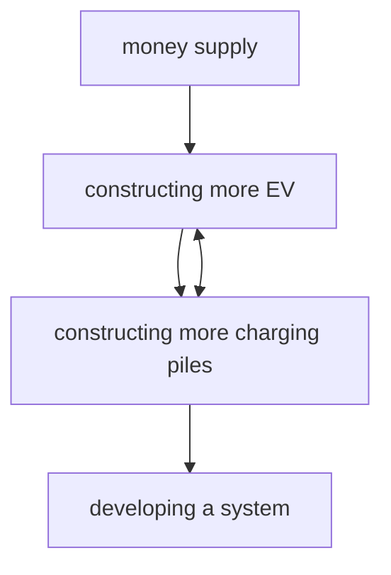

For office use only

T1

T2

T3

T4

Team Control Number

81402

Problem Chosen

D

For office use only

F1

F2

F3

F4

## 2018

## MCM/ICM

Summary Sheet

(Your team's summary should be included as the first page of your electronic submission.)

Type a summary of your results on this page. Do not include the name of your school, advisor, or team members on this page.

## Forecast, Blueprint, Strategy, for EV's Future

Since 21th century, electric vehicles(EV) has grown from a sprout in vehicles industries as for its environmental benefits. Many people wonder that if one day electric vehicles could replace fuel vehicles completely. Considering the inconvenience of charging, a critical problem of electric vehicles is about the charging system construction.

To maximize profit and minimize cost, the EV industries are overcoming three facets: 1) the mapping distribution of a specific area; 2) a time-domain evolution model for market prediction/forecast; 3) A standard classification of worldwide marketing. To reduce the Carbon Dioxide pollution, the government also concerns about the policy design for EV market.

In this essay, we will start from an approach to the charger location and allocation problem, and then dig deep into the forecast of EV market in different countries. To solve 5 tasks, we proposed several models in the cross-science of Network Science, Operations Research, Economics, Statistics, Environmental Science, Graph Theory, Cybernetics and Game Theory.

For task 1), we first took a data pre-processing, transforming address/zip code to Geodetic Coordinate System. We aim to make an approach to the maximum coverage problem. We defined 892 supercharger locations, 3,048 charger locations and 492 urban cities/clusters as “nodes”. For the simplicity, an undirected graph model representing the whole charging network was established, in which every node denotes a potential position for building chargers. After the graph was connected, we applied SPFA algorithm to calculate the Shortest Path among each nodes pairs. We also developed a Demand Estimation Model to generalize Average Miles Driven data and Urbanization data, and proposed the demand of each node respectively. To obtain a best charger allocation scheme, we constructed a Linear Programming model, which could be not solved in affordable time. To reduce the computational complexity, we converted it into an equivalent Minimum Cost Max-flow Network model. We showed our location and allocation results in maps, graphs, contours and major city lists, respectively for U.S. and South Korea. For task 2b), we applied a Most Profit model based on Nash Equilibrium, to find the optimal strategy in a “chicken or the egg causality dilemma”: chargers lead vehicles market, or vehicles market lead chargers? For the former situation, we introduced a systematic dynamic model to demonstrate the process by cybernetics concepts; For the latter situation, we introduced a Market Evolution Model based on Bass Diffusion Model, to achieve a better understanding of high technology products’ adoption in economics. For task 2c), We proposed Bass Diffusion Model based on data analysis, predicted the market adopted timeline from a blank market. For task 3), we discussed the feasibility of our previous model, and proposed a Linear Regression Model to calculate the weight of each factors contributed to future EV industry evolution, i.e. GDP per Capita, PPI, Oil price, etc. For task 4), we proposed our perspective for high technology adoption in the future. For task 5), we proposed our hand out to decision makers in governments, briefly stating our results in EV market promotion.

Our work has many strengths and weaknesses. Our strengths were performed in interdisciplinary views, coding and mathematic skills, economics views and social responsibilities; our weakness were performed in the lack of sensitivity modification, and

## Contents

## 1 Introduction 2

## 2 Modeling 2

2.1 Outline...  
2.2 Assumptions. .3  
2.3 Location & Allocation Optimization Model. 3  
2.4 Demand Estimation Model. D  
2.5 Shortest Path Model. 6  
2.6 Best Profit Strategy Model.  
2.7 Market Evolution Model. 8  
2.8 Classification of Promoting EVs..

## 3 Dataset & Toolkit 10

## 4 Results and Analysis 10

4.1 Task 1.. .. 10  
4.2 Task 2.. . 12  
4.2.1 Task 2a...... 12  
4.2.2 Task 2b... .. 15  
4.2.3 Task 2c.. .16  
4.3 Task 3... .. 17  
4.4 Task 4.. . 18  
4.5 Handout... . 20

## Appendices 22

## Appendix A Code 22

## 1 Introduction

Having seen the environmental situation (greenhouse effect, etc.), an alternativeenergy to replace fossil fuels in vehicles industry is now becoming a hot issue. With the rapid technology development of electric vehicles and the encouragement of policies cooperation on international negotiations, electric vehicles(EV) is now a fashion in both laboratory and commerce.

Since 2012, Tesla Corporation is standing out as a leading peer in electric vehicles industries. Tesla improves its R & D investment, resulting in a solid foundation of electric vehicle engine and energy storage technology. It results in the excellent performance o sales in many products, such as Model S and Model X.

The power supply and charging networks are essential infrastructures in electric vehicles industry. Problem D in ICM 2018 provided a chance to see the insight of these infrastructures. By analyzing and predicting its consuming trend and the location of charging piles, it may be a good perspective for us to understand the expecting future.

## 2 Modeling

## 2.1 Outline

To maximize profit and minimize cost, the EV industries are overcoming three facets: 1) the mapping distribution of a specific area; 2) a time-domain evolution model for market prediction/forecast; 3) A standard classification of worldwide marketing.

For the mapping chargers design, it includes: 1a) the calculation of demand chargers in numbers, according to Population, Urbanization, Household travel willingness, etc; 1b)the optimization of chargers design: sizing and placing.

1b) is a critical problem. The location of EV chargers should be both easily accessible and widely spread. Hence, EVs can be charged easily in "neighborhood" for regular business/school/church, etc., and also able to cruise around a larger area upon being re-charged for long distance trips.(Lam et. al, 2014)[9] The ultimate goal to maximize the efficiency of chargers and the coverage of charging system.

Green energy industries like Tesla Corp. has been scheduling a long-term marketing and planning blueprint to switch U.S./the world to an all electric vehicles society. This blueprint requires a systematic dynamic model to forecast the market evolution in the following decades. To expand Tesla Corp.’s global market, decision makers would run into a “chicken or the egg causality dilemma": 2a) Let chargers stimulate vehicles sales, or 2b), vehicles sales promote the charger system construction? This game theory problem would introduce two different marketing prediction and strategies.

Tosolve tasks stated in ICM 2018 Problem D, we apply multiple mathematical modeling methods in the cross-science of Operation Researches, Network Sciences, Economics, Game Theory, Geography, Graph Theory, etc.

For facet 1), the mapping distribution of a specific area, the bottleneck is how to optimize the distribution under a certain charging demand. It indicates a famous problem in applied mathematics, Maximum Coverage Problem(or, Maximum Coverage Location Problem, Church & Revelle, 1974)[3]. We established a Linear Programming Model(MLP Model, Hiller, 2012)[8] to solve this problem. To reduce the computational complexity,we converted it into an equivalent Minimum Cost Max-flow Network model.

In our MLP model, two parameters needed to be modified: i) the shortest path between two nodes; ii) the charging demand of each node. To find parameter i), we developed a Shortest Path Model(Dijkstra, 1959)[5]. All the address/zip codes data from Tesla.com were extracted, and transformed into Geodetic Coordinate Format. After pre-processing, we applied all the location data of existing chargers, superchargers, and largest 497 cities/clusters (definition of Urban, U.S. Census Bureau, 2010)[18][19] in U.S. to draw a graph. We identified that the current construction of Tesla chargers and superchargers is able to link 497 cities/clusters. To modify parameter ii), we introduced a Demand Estimation Model in a macro scope via statistics from geography, i.e. population, urbanization, highway miles, etc. We calculate the demand per node(city) (di below) by Average Miles Driven per year by state (AMD)[17] and Urbanization Statistics, in urban, suburban and rural areas respectively.

For facet 2), the time-domain market evolution model, we need to clarify the difficulty of making a decision on which is the leading factor - between constructing charging piles and constructing EVs. For decision makers, we introduce a game theory model Best Profit Strategy Model - to find the optimal strategy.

For the case 2a), we introduced a Systematic Dynamic model, but not a quantitative one. we didn’t include this part in our Modeling section, only in the tasks.

For the case 2b), we proposed a Market Prediction Model - Bass diffusion model (Norton & Bass, 1987)[11] to estimate the future occupancy of future EV market. Bass diffusion model demonstrate how a high technology product run into the market and ultimately replace the old generation of products. Applying Tesla sales data and Korea EV sales data, Bass Diffusion Model performs well in our data fitting.

For facet 3), the standard classification of worldwide marketing, we promote a classification sample by Linear Regression.

## 2.2 Assumptions

In this model, the following items are out of our work scope: 1a) altitude of each cities/nodes in calculating distances in shortest path model; 1b) traffic jams; 1c) charging blueprint of Alaska and Hawaii, and Puerto Rico; 1d) the growth of the demand, in task 1;1e)home charging.

For the simplicity, we also simplify the following items in our modeling: 2a) We define geographical design of "urban" and "suburban" as a circle zone. Their area are extracted from Land Area in Urban areas of the United States of America (U.S. Census Bureau, 2010)[18][19].; 2b) The earth radius was set by 6,378 kilometers; 2c) We use superchargers construction to replace chargers in our blueprint(as superchargers are more efficient).

Other assumptions mention in a single task/model are also valid.

## 2.3 Location & Allocation Optimization Model

Tosolve the Maximal Coverage Problem, we developed a Linear Programming model to find the maximal coverage solution in station location problem. We didn’t consider the capacity difference between a charger and a supercharger primarily; for an optimized blueprint in a large scale, we first regard them as "nodes", which means that we attach more importance to the location.

Objective Function:

$$
\min _ {y _ {i j}, c _ {i}} \sum_ {i \in V} \sum_ {j \in V} y _ {i j} d (i, j) \tag {1}
$$

subjected to

$$
\forall i \in V, \forall j \in V, y _ {i j} \geqslant 0 \tag {2}
$$

$$
\forall i \in V, \sum_ {j \in V} y _ {i j} \geqslant d _ {i} \tag {3}
$$

$$
\sum_ {\forall i \in V,} \quad y _ {i j} \geqslant a d _ {i} \tag {4}
$$

$$
j \in V \land d i s t (i, j) \geqslant m i n D
$$

$$
\forall i \in V, c _ {i} \geqslant 0 \tag {5}
$$

$$
\forall j \in V, \sum_ {i \in V} y _ {i j} \leqslant c _ {j} \tag {6}
$$

$$
\forall j \in V, c _ {i} \leqslant \max C \tag {7}
$$

Equation (2) presented the non-negativity of demand sharing in two nodes. Equation (3) meet the demand of charging alternatively; and (4) meet the demand of charging mul tiple alternatively, mainly for long-distance traveling. For complete illustrations, please see the Notations below:

V: nodes of a graph. For $v \in V ,$ ,v could be a city, a potential charger location, or a town;

E: $( u , v ) \in E \Leftrightarrow ( u , v \in V ) \land D ( u , v ) \leqslant$ max D. max D represents the maximum distance a vehicle can travel continuously after charging once; $D$ represents the Euclidean distance from u to v. We processed this distance by calculate the longitude/latitude on spherical surface(earth surface).

$G \colon G \equiv ( E , V )$ . The Graph node of the charging network.

$d _ { i } \colon i \in V$ . The charging demand of a single node i.

$c _ { i } \colon i \in V$ . The charging capacity of node i.

$d ( i , j ) \colon$ : The shortest path length from i to ${ \_ }$ in G.

$y _ { i , j } \colon$ Charging alternatively: $y _ { i , j }$ demonstrate the demand of node i ultimately shared by node $j .$ We implement this to cases where people initially want to charge in i but finally charged in j.

α: A Dimensionless Coefficient of long distance traveling. For example, $a d _ { i }$ means Charging multiple alternatively. It demonstrate the charging demand of node i which has to be contributed by the "distant" nodes. The neighborhood nodes is defined by a distance radius min $\dot { D . }$ We implement this to cases where people have long distance travel demands, they need to charge in another city.

max C: A parameter. The Maximum charger capacity of a single node, depending on the charge technique.

Nevertheless, since there are more than $| \bigstar ^ { 2 }$ variables in the above linear programming model, it is difficult to solve this large-scale LP model using standard algorithms like Simplex. Thus, the LP model is converted into an equivalent minimum cost maxflow model as follows.

• Assume that the source and sink of the network flow model is, respectively, S and $\operatorname { T } ;$

• Assume that the network flow model is $G _ { n e t } = ( V _ { n e t } , E _ { n e t } )$ , where $V _ { n e t }$ is the node set of $G _ { n e t }$ and $E _ { n e t }$ is the edge set;  
•Let $V _ { n e t } = \{ S , T \} \cup \{ v a _ { i } | i \in V \} \cup \{ v b _ { i } | i \in V \} \cup \{ v c _ { i } | i \in V \} ;$  
For every node $v a _ { i } \in \{ v a _ { i } | i \in V \}$ , add a new edge from S to $v a _ { i }$ with capacity ad and unit cost 0 into $E _ { n e t } ;$  
For every node $v b _ { i } \in \{ v b _ { i } | i \in V \}$ , add a new edge from S to $v b _ { i }$ with capacity $( 1 - \alpha ) d _ { i }$ and unit cost 0 into $E _ { n e t } ;$  
For every node $v c _ { i } \in \{ v c _ { i } | i \in V \}$ , add a new edge from $v c _ { i }$ to T with capacity maxC and unit cost 0 into $E _ { n e t } ;$  
For every node pair $( v a _ { i } , v c _ { j } ) \in \{ ( v a _ { i } , v c _ { j } ) | i , j \in V , d i s t ( i , j ) \geqslant m i n D \}$ , add a new edge from $v a _ { i }$ to $v c _ { j }$ with capacity ∞ and unit cost $d ( i , j ) ;$ .,  
For every node pair $( v b _ { i } , v c _ { j } ) \in \{ ( v b _ { i } , v c _ { j } ) | i , j \in V \}$ , add a new edge from $v a _ { i }$ to vcj with capacity ∞ and unit cost $d ( i , j ) ;$  
•Once the above minimum cost max-flow model is solved, we shall obtain the solution of the LP model:

The minimum cost equals mir $\begin{array} { r } { \iota _ { y _ { i j } , c _ { i } } , \sum _ { i \in V } \sum _ { j \in V } y _ { i j } d ( i , j ) ; } \end{array}$  
- if $d i s t ( i , j ) < m i n D ,$ the optimal $y _ { i j }$ equals the flow of edge $( v b _ { i } , v c _ { j } ) ;$ .  
$\mathrm { ~ f ~ } d i s t ( i , j ) \geqslant m i n D ,$ the optimal $y _ { i j }$ equals the total flow of edges $( v a _ { i } , v c _ { j } ) , ( v b _ { i } , v c _ { j } ) ;$  
The optimal $c _ { i }$ equals the flow of edge $( v c _ { i } , T )$

## 2.4 Demand Estimation Model

The charging demand is also a complicated issue to be solved. Everyday, people travel back and forth, contributing the demand of each charger. Previous researches have pro posed the (daytime, nighttime) demand of each community in a city by Linear Regression, where various factors have been taken into consideration: neighborhood, population, community social structure, household traveling willingness, employment, daily activities, etc.(Chen et al., 2013;Frade et al.,2011)[2][7] Such estimations are feasible in a relative small scale, like Lisbon and Seattle in the literature. For such a large scale of United States, it would occur a large computational complexity if we divide the whole country into communities and apply linear regression to calculate the weight of each factors. Hence we only consider the impact factors in a macro scope, i.e. population and land area of cities (also called, urbanization), Average Miles Driven per year by state (AMD)[17].

We prepared a parsimonious estimation with the following model setting: a) We divide AMD data to urban, suburban and rural respectively. A vague definition of "suburban" were introduced. b) We regard a city (among 497 cities/clusters) as a node. The urban demand was contributed by its own population and its share of AMD. The urban share of AMD corresponds to inter-city traveling (employment, school, church, etc.) c) The demand of rural area was shared by the remained AMD per area. Considered the subnational travel, we distribute this demand equally to states. d) A definition of urban, suburban and rural should be clarified. Urban areas of the United States of America(U.S.

Census Bureau, 2010) [18][19] only defined “urban" in a broad sense: Urban included all population in urbanized areas and urban clusters (each with their own population size and density thresholds). This definition includes both urban and suburban. It has always been an issue to clarify the geographic definition of urban suburban areas, in a narrow sense, we define urban as a node on the map and suburban as the cities’ large land area proposed in Urban areas of the United States of America data. For population distribution, we distribute 26% in urban, 53% in suburban, and 21% in rural.[22] e) We only considered the current population, demand, etc. The ultimate goal is to change the whole vehicles industry to an all-electric one. The aim of replacing fuel energy vehicles weights more than calculate the growth of vehicles. We didn’t propose a dynamic system, for task 1.

Therefore, We propose the demand function subjected to the location of each node:

$$
\text { if } i \in U, d _ {i} = r a t i o \times m _ {j} \frac {P _ {c}}{P _ {e}} \tag {8}
$$

$$
D _ {R} = \sum m _ {j} - \sum_ {i \in U} \frac {d _ {i}}{r a t i o} \tag {9}
$$

$$
\text { if } i \in R, d _ {i} = \frac {2 \pi \epsilon^ {2} D _ {R}}{S} \tag {10}
$$

$$
\text { if } i \in S U, d _ {i} = \frac {2 \pi \epsilon^ {2} D _ {R}}{S} + \frac {d _ {\text { center } (i)}}{\text { ratio }} \times (1 - \text { ratio }) \frac {1}{\text { size } (\text { center } (i))} \tag {11}
$$

The notations reads i: node; $j \colon$ state; R: rural area; SU :suburban area; $U$ : urban area; di: demand per node; $D _ { R } \colon$ demand except urban area; $P _ { c } \mathbf { : }$ population of a city; $P _ { s } \mathrm { : }$ population of a state; mj: AMD where the city locates;S: land area of U.S.; ϵ: a parameter to adjust demand weight by the nodes density in an area; center(i): i SU , center(i) is the center city that suburban node i belongs to; size(i): $i _ { \in } U ,$ , the number of suburban cities belonging to city i;.

## 2.5 Shortest Path Model

To run the Linear Programming model, the shortest path $d ( i , j )$ need to be calculated. We could simply tackle the problem employing a iterative algorithm(Dijkstra, 1959)[5]. This problem sets reads the tree of minimum total length between n nodes, and the path of minimum total length between two given nodes P and Q(Dijkstra, 1959)[5].

Our model setting aims to construct a graph connecting all nodes. Primary nodes were set by all the current superchargers in U.S. (892 nodes), chargers in U.S. (3,048 nodes) and 497 cities/clusters mentioned above. In total, we set 4,295 nodes covering 48 states and Washington D.C. in U.S.(Alaska, Hawaii and Puerto Rico are exceptions.)

A data pre-processing was applied as all the raw location data were performed in address/zip code format. In order to calculate the path, we applied a Google Geocode API[20] to transform the raw data into Geodetic Coordinate System(latitude, longitude). Hence, the shortest path could be calculated via distance calculation on a spherical surface. The earth radius was set by $^ { 6 , 3 7 8 }$ kilometers for the simplicity. We here propose a general nodes map of applied nodes (figure1)

To reduce the calculation complexity, we apply the SPFA Algorithm (Duan, 1994)[6] to optimize shortest path calculation based on queue.


<details>
<summary>scatterplot</summary>

| longitude | latitude | category           |
| --------- | -------- | ------------------ |
| -120      | 50       | major cities        |
| -110      | 45       | major cities        |
| -100      | 40       | major cities        |
| -90       | 35       | major cities        |
| -80       | 30       | major cities        |
| -70       | 25       | major cities        |
| -120      | 45       | destination chargers|
| -110      | 40       | destination chargers|
| -100      | 35       | destination chargers|
| -90       | 30       | destination chargers|
| -80       | 25       | destination chargers|
| -70       | 20       | destination chargers|
</details>

Figure 1: All nodes (superchargers, chargers and cities inclueded)


<details>
<summary>scatter plot</summary>

| category             | longitude | latitude |
| -------------------- | --------- | -------- |
| major cities         | -86.80    | 36.15    |
| destination chargers | -86.75    | 36.15    |
| super chargers       | -86.75    | 36.00    |
</details>

Figure 2: Nodes around Salt-Lake City

## 2.6 Best Profit Strategy Model

Marketing strategies should change dynamically regarding the development of EV technology, the ability of charging piles (the charge of piles and how long can it add charge) and the instant international trade accumulating the acceleration of EV and charging piles.

We need to do is find the best profit between two situations : more EV and more charging piles. Between the two classifications, there are a best expectation that would happen so that we can get the most profit. We introduce a Best Profit Strategy Model based a Nash Equilibrium(Nash, 1951)[10] in Game Theory.

A plan needed to be drew, to predict a pattern in order to decide what we should weight more between constructing EV and constructing charging piles. Notations needs to be emphasized below:

P : the ratio of charging piles to EV;

$P _ { 0 } \colon$ the standard ratio of charging piles to $\mathrm { E V } ;$

$P _ { c \mathrm { : } }$ the ratio of charging piles to standard charging piles;

$P _ { e } \mathrm { : }$ the ratio of EV to standard EV;

formulation from Nash Equilibrium provides

$$
E X _ {1} = \frac {P _ {0}}{P} (\frac {P - P _ {0}}{P _ {0}}) ^ {2}
$$

$$
E X _ {2} = \frac {P _ {0}}{P} (\frac {P - P _ {0}}{P _ {0}}) ^ {2}
$$

$$
E X _ {3} = \frac {P}{P _ {0}} (\frac {P - P _ {0}}{P _ {0}}) ^ {2}
$$

$$
E X _ {4} = (\frac {P}{P _ {0}}) ^ {2} (\frac {P - P _ {0}}{P _ {0}}) ^ {2}
$$

$$
E X = \sum_ {i} E X _ {i}
$$

Hence we can write the following a game theory model, see table1 and 2. $E X _ { 1 }$ and $E X _ { 1 0 }$ hold the same formulation, with different notations for probabilities.

This is a simple game theory model describing the optimal strategy. The meaning of the optimal strategy in which we choose is the representation of the relative degree of data. What we need to do is find a formal formula to correctly describe the data of the standard chargers and $P _ { 0 } ;$

In order to maximize the interests, one should be in a positive or negative situation when our earnings are equal (or in this game, each other can change both the front and the probability that our expected revenue), so that we know that:

$$
P _ {e} = \frac {E X _ {4 0} - E X _ {2 0}}{E X _ {1 0} - E X _ {2 0} - E X _ {3 0} + E X _ {4 0}} \tag {17}
$$

Hence, the future strategy would made based on this model.

## 2.7 Market Evolution Model

To see the marketing performance of "chargers in response to car purchases", a forecasting model is required to explain systematic dynamic market evolution of Electric Vehicles.

Table 1: Nash Equilibrium Model for chargers

<table><tr><td></td><td> $P < P_0$ </td><td> $P > P_0$ </td></tr><tr><td> $P_c < 1$ </td><td>Chargers  $EX1$ </td><td>EV  $EX3$ </td></tr><tr><td> $P_c > 1$ </td><td>EV  $EX2$ </td><td>Chargers  $EX4$ </td></tr></table>

Table 2: Nash Equilibrium Model for EVs

<table><tr><td></td><td> $P < P_0$ </td><td> $P > P_0$ </td></tr><tr><td> $P_e < 1$ </td><td>Chargers  $EX_{10}$ </td><td>EV  $EX_{30}$ </td></tr><tr><td> $P_e > 1$ </td><td>EV  $EX_{20}$ </td><td>Chargers  $EX_40$ </td></tr></table>

We intuitively notice the development of high technology products as a simple positive feedback process. Such an explosive trend is unfeasible in fitting a linear model. Particularly, in United States, the growth economics index(e.g.GDP per capita, household income) and population tend to be moderate. Thus, a linear regression cannot explain the boost or the expected boost in Electric Vehicles industry. However, anexponential increase in the positive feedback is explosive. Comparing with the analogywith species reproduction in ecology, an exponential model ignores the limited antecedents of the environmental resources we live in. We also notice that although it is not completely identical, in some situations the model does reflect well at some point in time.

Although the initial assumption says that exponential growth is occurring in the same period, we can adjust the model by modifying the multiple of the exponential growth to avoid the blow up. By showing that growth multiples are affected by certain factors, such factors become the core of this model.

We here apply Bass diffusion model(Norton & Bass, 1987)[11] to estimate the future occupancy of the charging pile through the number of tesla electric cars. This model tends to form an s-shaped curve in the transition from positive feedback to negative feedback.

When considering the impact of multivariate factors on the problem, the logistic model reflects its key significance, which is also used by us in predicting the future trend of electric vehicles and the adding number of charging piles.

Bass Diffusion Model says that,

$$
f (t) / [ 1 - F (t) ] = p + q F (t). \tag {18}
$$

It explains the $\operatorname { i f } f ( t )$ is defined as the probability of adoption at time $t ,$ (neglecting the hazard function), $F ( t )$ is the fraction of the ultimate potential has adopted by time $t .$ $p$ and $q$ are parameters, respectively, the coefficient of innovation and the coefficient of imitation.

To solve this differential equation, an initial condition could be added as a zeroth point ${ \mathcal { F } } ( 0 ) = 0$ . Thus we will get the solution of $F ( t )$ and f (t):

$$
F (t) = [ 1 - \exp (- b t) ] / [ 1 + a \exp (- b t) ] \tag {19}
$$

$$
f (t) = \left(b ^ {2} / p\right) \exp (- b t) / [ 1 + a \exp (- b t) ] ^ {2} \tag {20}
$$

where $a = q / p$ and $b = p + q$ . The peak of $f ( t )$ occurs at $t ^ { * } = ( 1 / b ) l n ( a )$ .

This differential equation could be solved numerically. In this essay, we will propose the market evolution of America and South Korea by fitting the existing sales data into Bass diffusion model.

## 2.8 Classification of Promoting EVs

When talking about the classification system, we need to think about such a question: how these factors affect the selection of different approaches to growing the network and how much? Maybe different countries have different situations and therefore selecting the factors seems important.

There are so many countries such as America, United Kingdom, China, Japan, South Korea and other countries and there are many factors, for instance, GDP, Engels coefficient, degree of industrialization and agriculture, the degree of traffic network development, and so on.

Among these factors, some are possibly interacted and associated. What we might think most is find a master-slave relationship among these factors. However, in this model setting, we need to notice some important factors that we cannot ignore as there are some essential small factors such as the degree of electricity, industrialization and transportation. These may be a branch of some data such as GDP or PPI, but they are the same important.

Now we can set a function to mainly describe some necessary index. The Multiple Linear Regression formula reads:

$$
a _ {1} \frac {t t D P}{t t D P _ {0}} + a _ {2} \frac {P P I}{P P I _ {0}} + a _ {3} \frac {t t I}{t t I _ {0}} + a _ {4} \frac {R N}{R N _ {0}} + a _ {5} \frac {V P C}{V P C _ {0}} + a _ {6} \frac {O P}{O P _ {0}} + a _ {7} \frac {U B}{U B _ {0}} = 1 \tag {21}
$$

Our notation reads: ttDP: Gross Domestic Product per Capita; PPI: Producer Price Index;ttI: GiniCoefficients;RN: Roadnetworktotalmiles;V PC: VehiclesperCapita(1000 people); OP : Oil Price; UB: Urbanization.

The EV weight were replaced by V PC and OP in our model as many countries haven’t promote EV.

## 3 Dataset & Toolkit

We have applied the following dataset and toolkit:

• For original Tesla chargers and superchargers, we applied address/zip code from official website[4] [14].  
• For Shortest Path Model, we transformed address/zip code to Geodetic Coordinate System, and applied Google Geocode API[20]. We also used the Korea cities data to get latitudes and longitudes of Korea cities.[25]  
• For Demand Estimation Model, we applied Average Miles Driven per year by state (AMD) [17],Urban areas of the United States of America(U.S. Census Bureau, 2010) [18][19].  
• For Location & Allocation Optimization Model, we applied Google Costflow Toolkit to optimize Linear Programming calculation[21].  
• For Market Evolution Model/Bass Diffusion Model, we referred the Tesla sales data[15][12] in America and EV sales data in South Korea[13][16] to predict the dynamic evolution of Tesla market.  
• For classification between countries, we applied global data of GDP[27], PPI[29], GI[23], Road Network[24], Urbanization[30], Oil Price[26] and Vehiclesper Capita[28].

## 4 Results and Analysis

## 4.1 Task 1

Our Simulation including 4,297 nodes have proposed a possible blueprint for Tesla’s charger construction. We suppose that the superchargers would replace the chargers due to the advantages in charging power. For our distribution, allocation and capacity blueprint we only consider the superchargers.

Our Shortest Path Model demonstrate that all the chargers, superchargers and cities arefullyconnected. Parameter mind = 170(miles)accordingtothe chargingcapacityof 30 minutes in Teslasupercharger. Indeed, Teslais on track to allow a complete switch to all-electric in the US. It might take a few decades to accomplish a complete switch, but Tesla is trying to draw theblueprint.

Our Demand Estimation Model provides a demand(in miles unit) for each node. We classified the demand of urban areas, suburban areas and rural areas respectively, and derivedparameter α = 0.25whichcouldbe fitted in the weightofdistantmultiple alternative charging. We set the parameters max $c = 5 0 0 0 0 ( \mathrm { t h e }$ upper limit superchargers for a node).

Our Location & Allocation Optimization Model provides a forecast of an all-electric U.S. It would require 873,869 to cover an all-electric U.S. The charger connections can be seen in Figure 4. An interesting thing occurred in our simulation: the current supercharger nodes would remain active, but most of the charger nodes are eliminated for the performance.

For the Allocation of chargers, the distribution map can be seen in Figure 3. We also print the superchargers design of 12 Cities/Clusters with largest population, in Table3. A contour figure are shown in Figure 5

We propose the urban, suburban and rural distribution of superchargers in Table 4.


<details>
<summary>3d heatmap chart</summary>

| latitude | longitude | value  |
| -------- | --------- | ------ |
| 55       | -60       | 0      |
| 50       | -70       | 25000  |
| 45       | -80       | 5000   |
| 40       | -90       | 10000  |
| 35       | -100      | 15000  |
| 30       | -110      | 20000  |
| 25       | -120      | 25000  |
| 20       | -130      | 30000  |
| 15       | -140      | 35000  |
| 10       | -150      | 40000  |
| 5        | -160      | 45000  |
| 0        | -170      | 5000   |
</details>

Figure 3: Charger Distribution in U.S.


<details>
<summary>scatterplot</summary>

| longitude | latitude |
| --------- | -------- |
| -120      | 50       |
| -110      | 45       |
| -100      | 40       |
| -90       | 35       |
| -80       | 30       |
| -70       | 25       |
</details>

Figure 4: Charger Connections in U.S.


<details>
<summary>heatmap</summary>

| latitude | longitude | value |
| -------- | --------- | ----- |
| 20       | -130      | 0     |
| 25       | -120      | 35    |
| 30       | -110      | 30    |
| 35       | -100      | 35    |
| 40       | -90       | 40    |
| 45       | -80       | 45    |
| 50       | -70       | 50    |
| 55       | -60       | 55    |
</details>

Figure 5: Chargers Distribution Contour Figure in U.S.

## 4.2 Task 2

## 4.2.1 Task 2a

Based on the models applied in task 1, we drew a graph of 135 Korea’s main cities[25]. Then we created a location and allocation blueprint if we replace Korea’s current vehicles to EVs.

Due to the lack of data, we calculated the demand of each node by the following estimation:

$$
d _ {i} = d _ {i} \text {   in   U.S.   } \times \frac {\text { vehicles   per   capita   of   South   Korea }}{\text { vehicles   per   capita   of   U.S. }} \tag {22}
$$

Table 3: Superchargers design of 12 Main Cities/Clusters

<table><tr><td>Location</td><td>Numbers</td><td>Location</td><td>Numbers</td></tr><tr><td>New York-Newark</td><td>11667</td><td>Philadelphia</td><td>3634</td></tr><tr><td>Los Angeles-Long Beach-Anaheim</td><td>8289</td><td>Huston</td><td>9609</td></tr><tr><td>Chicago</td><td>5730</td><td>Atalanta</td><td>9680</td></tr><tr><td>Miami</td><td>6823</td><td>Detroit</td><td>3991</td></tr><tr><td>Dallas-Fort Worth-Arlington</td><td>3798</td><td>Boston</td><td>2893</td></tr><tr><td>Washington D.C.</td><td>2715</td><td>Phoenix-Mesa</td><td>2342</td></tr></table>

Table 4: Charger Distribution Planning in Urban, Suburban andRural

<table><tr><td>Geography</td><td>Urban</td><td>Suburban</td><td>Rural</td></tr><tr><td>Proportion</td><td>40.25%</td><td>25.38%</td><td>34.36%</td></tr></table>

Our calculations showed that 56,953 superchargers required to be constructed in South Korea. Figure 6 shows the predicted superchargers location in South Korea. Figure 7 shows the predicted superchargers distribution in South Korea. Similar to U.S., South Korea has well-constructed road, vehicles culture, high household income, and urbanization degree. Their difference mainly includes geography (land area, cities’ network, population, etc.) Based on our model, key factors that shaped the development could be: geographic cities/road network, population and urbanization. From this perspective, South Korea could be considered as a large land area of U.S., like Northeast.


<details>
<summary>scatterplot</summary>

| longitude | latitude |
| --------- | -------- |
| 126.5     | 33.0     |
| 126.7     | 34.5     |
| 126.9     | 35.0     |
| 127.1     | 35.5     |
| 127.3     | 36.0     |
| 127.5     | 36.5     |
| 127.7     | 37.0     |
| 127.9     | 37.5     |
| 128.1     | 38.0     |
| 128.3     | 37.5     |
| 128.5     | 37.0     |
| 128.7     | 36.5     |
| 128.9     | 36.0     |
| 129.1     | 35.5     |
| 129.3     | 35.0     |
| 129.5     | 34.5     |
</details>

Figure 6: Charger Connections in South Korea


<details>
<summary>3d contour plot</summary>

| latitude | longitude | value  |
| -------- | --------- | ------ |
| 38       | 129.5     | 2000   |
| 37       | 129.0     | 4000   |
| 36       | 128.5     | 6000   |
| 35       | 128.0     | 8000   |
| 34       | 127.5     | 10000  |
| 33       | 127.0     | 12000  |
| 32       | 126.5     | 14000  |
| 31       | 126.0     | 16000  |
</details>

Figure 7: Charger Distribution in South Korea


<details>
<summary>heatmap</summary>

| latitude | longitude | value |
| -------- | --------- | ----- |
| 38       | 126.0     | 0     |
| 37       | 127.0     | 1     |
| 36       | 128.0     | 0     |
| 35       | 129.0     | 1     |
| 34       | 129.5     | 0     |
</details>

Figure 8: Chargers Distribution Contour Figure in South Korea

<table><tr><td>Location</td><td>Seoul</td><td>Pusan</td><td>Taegu</td><td>Inch&#x27;on</td><td>Taejon</td></tr><tr><td>Numbers</td><td>11153</td><td>3777</td><td>2597</td><td>2479</td><td>1774</td></tr><tr><td>Location</td><td>Kwangju</td><td>Sungnam</td><td>Puch&#x27;n</td><td>Suwon</td><td>Ulsan</td></tr><tr><td>Numbers</td><td>1602</td><td>1264</td><td>1147</td><td>1112</td><td>918</td></tr></table>

Table 5: Number of Chargers in 10 Major South Korean Cities

## 4.2.2 Task 2b

Speaking of investment to a blank market, we will propose several investment strategy. It always runs into a dilemma. We need chargers to make people who purchased EV more convenient; but the original market laws based on the technology promotion and lever principle are also important. Or we can say, both of them cannot be neglected, especially in the expansion period.

Our Most Profit model in game theory has provided a future planning of probabilities in the two situations: chargers first, or market first? To find a general "behaviour", our game theory model applied EV and charging piles generations, to find an optimized solution(Table 6).

By linear regression, we can generally observe that when $P _ { e }$ is stable in the standard

<table><tr><td>Year</td><td>2012</td><td>2013</td><td>2014</td><td>2015</td><td>2016</td><td>2017</td></tr><tr><td>EV Purchase</td><td>52607</td><td>97507</td><td>122438</td><td>116099</td><td>158614</td><td>199826</td></tr><tr><td>Chargers</td><td>11042</td><td>20198</td><td>25684</td><td>31674</td><td>44028</td><td>59167</td></tr><tr><td> $P_e$ </td><td>0.11</td><td>0.20</td><td>0.26</td><td>0.31</td><td>0.44</td><td>0.59</td></tr><tr><td> $P_0$ </td><td>0.21</td><td>0.21</td><td>0.21</td><td>0.27</td><td>0.28</td><td>0.30</td></tr></table>

Table 6: Best Profit Model Derivation

value of 0.375, the value of $P _ { 0 }$ should be stable at 0.275. The game theory valid test in U.S. corresponds our calculations of South Korea. Such a "behavior" could be considered as "the choice of customers and producers". Weapply the parameter $P _ { 0 } = 0 . 2 7 5$ for our game theory case.

Thus, our proposal talks about the balance of constructing the ratio of charging piles and EV Build a charging system and electric vehicles proportionally in a scale based on the standard ratio of 0.275. The investment proportion of the two projects is carried out according to the price of the charging system divided by the price of the chargers divided by the price of the electric vehicle, and the fluctuation limit is no more than 10 million. According to the game theory model, when the pile ratio is less than 0.275, it tends to pile the pile, and vice versa. The important factor is the ratio of pile to car and the saturation limit of pile and car. From the perspective of urban and rural areas, the mixed construction should be taken.

For the first situation, the chargers’ leading one, we can take a qualitative system dynamic approach. When we placed the angle of view in the process of attention to the improvement of the electric system, we find it exists as a system flow and it has a positive feedback, which makes us able to use system dynamics model to solve the problem. In the analysis of the mutual promotion mechanism between charging piles and electric vehicles, we can realize that there is a considerable positive feedback incentive between the two situations. We can draw a brief system dynamics process(Figure 9) based on the existing positive feedback and system flow. Through the analysis of system dynamics model, we can get a preliminary answer that is to say, if you don’t appear under the mutual promotion mechanism of overproduction, will be the trend of positive feedbackon the whole, in other words, that is to build one arbitrary will promote another production and construction.

For the second situation, we will let the market drive.


<details>
<summary>flowchart</summary>


</details>

Figure 9: System Dynamic Process

## 4.2.3 Task 2c

As the task requires a "blank" market, our investment would firstly "build" chargers to stimulate the first 6 years of an EV market corresponding to the graph in task 1) and chargers’ growth in task 2b). For the simplicity, we adjusted our placing with current sales data of Korea EV market, and re-calculate the time scale. Then we put the market evolution model in our task solution.

The key factor of our Market Prediction Model is generally shaped by the relationship of high-technology production and the old generations of the production. Thisrelationship has it’s own parameters in p(innovations) and q(imitations). In South Korea case, the p and q were generally modified by it’s market evolution. Actually, South Korea is actually a leading peer in worldwide EV market. Domestic companies like Hyundai also promoted it’s own EV products. Statistics shows that Korea is the only country that upgraded its target in 2016, from 200 000 to 250 000 electric cars by 2020, as per the Special Plan for Fine Dust Management, released in June 2016[16].

We applied Bass Diffusion Model as our Market Prediction Model. We applied EV sales data of South Korea(since 2012), the competition in EV industry were neglected. We applied Bass Diffusion Model because it performs well in South Korea’s previous data, revealing a situation that South Korea is on the track of Bass Prediction.

Our simulation shows the EV market evolution in South Korea in Figure10 (Adoption at time t) and Figure11(Ultimate Potential adopted by time).

The ultimate adoption percentage is shown in table 7.

Table 7: Ultimate Adoption Percentage (zeroth point from2018)

<table><tr><td>Percentage</td><td>10%</td><td>30%</td><td>50%</td><td>99.9%</td></tr><tr><td>Year</td><td>2026</td><td>2028</td><td>2029</td><td>2036</td></tr></table>


<details>
<summary>line chart</summary>

| t (year) | f(t) (year) |
| -------- | ----------- |
| 0        | 0.0000      |
| 1        | 0.0000      |
| 2        | 0.0000      |
| 3        | 0.0000      |
| 4        | 0.0000      |
| 5        | 0.0050      |
| 6        | 0.0100      |
| 7        | 0.0200      |
| 8        | 0.0400      |
| 9        | 0.0700      |
| 10       | 0.1100      |
| 11       | 0.1400      |
| 12       | 0.1500      |
| 13       | 0.1400      |
| 14       | 0.1200      |
| 15       | 0.1000      |
| 16       | 0.0800      |
| 17       | 0.0600      |
| 18       | 0.0400      |
| 19       | 0.0200      |
| 20       | 0.0100      |
| 21       | 0.0050      |
| 22       | 0.0025      |
| 23       | 0.0010      |
| 24       | 0.0005      |
| 25       | 0.0000      |
</details>

Figure 10: Adoption at time t


<details>
<summary>line chart</summary>

| t (year) | F(t) (year) |
| -------- | ----------- |
| 0        | 0.0         |
| 5        | 0.0         |
| 10       | 0.2         |
| 15       | 0.8         |
| 20       | 0.95        |
| 25       | 1.0         |
</details>

Figure 11: Ultimate Potential adopted by time

## 4.3 Task 3

We don’t have much confidence in the model’s feasibility of promoting EV into the five countries. As mentioned above, both U.S. and South Korea have well-constructed road, vehicles culture, high household income, and urbanization degree. We suppose that in some other developed countries, like Australia, with well-constructed road network, this might be feasible. In city countries like Singapore, we might face the hazard estimation of demand. The demand of a city must be carefully estimated, as mentioned above. In other developing countries, like China, India or Indonesia, the main problem would be the household income, urbanization. Thanks to the government’s policy in China, China’s EV market is now becoming a leading market worldwide.

After applying data in seven aspects, we get the results of Linear Regression Model plotted in Figure 12.

By comparing these index, we can know which is more important in this country. The network in Saudi Arabia and Australia might be a problem, as the large occupation of desert area. As for Singapore, over-promotion in Vehicles industry would leave a negative effect on it’s traffic. China needs to improve its urbanization. In Indonesia, it needs to improve its GDP per Capita, its gas price and urbanization. To expand the vehicles industries, Saudi Arabia and U.S. needs to reduce it’s Gini Coefficients - make more people afford vehicles.

However, there are many aspects influencing a country’s market. A simple classification as we proposed above, might not gave an accurate, quantitative answer on the key factors that trigger the selection of different approaches. The following factors can be taken into consideration:

• GDP per Capita(weighted, can be replaced by household income or consumption data)  
• PPI(weighted, can be replaced by domestic EV industries data)  
• Gini Intex(weighted, or Engel’s coefficients)  
• Road network total miles(weighted, but it’s constrained by the geography land scale of a country)  
• Vehicles per Capita and Oil Price (weighted, but this one should be the EV adoption weight in the future)  
• Urbanization(weighted)  
• Public Policy(support from government)  
• Vehicles Culture and Public transportation

To summarize, EV market would have different evolution in different countries. Geography, economics, policy, culture...all of them can affect a market’s domestic evolution.


<details>
<summary>scatterplot</summary>

| Country | Impact Factors a | Weight |
|---|---|---|
| America/100 | 3 | 4 |
| Saudi Arabia/10 | 3 | 6.5 |
| Saudi Arabia/10 | 2 | 0.2 |
| Saudi Arabia/10 | 3 | -0.5 |
| Saudi Arabia/10 | 4 | -3.8 |
| Saudi Arabia/10 | 6 | 2.0 |
| Saudi Arabia/10 | 7 | 0.0 |
| Singapore | 2 | 0.2 |
| Singapore | 3 | -0.5 |
| Singapore | 4 | 3.2 |
| Singapore | 5 | -0.8 |
| Singapore | 6 | 3.0 |
| Singapore | 7 | 3.0 |
| Australia | 3 | -0.2 |
| Australia | 4 | -8.5 |
| Australia | 5 | -0.5 |
| Australia | 6 | 0.0 |
| Australia | 7 | -5.8 |
| China | 2 | -0.5 |
| China | 3 | 0.2 |
| China | 4 | 3.2 |
| China | 5 | 0.5 |
| China | 6 | 0.8 |
| China | 7 | 4.0 |
| Indonesia | 2 | 0.2 |
| Indonesia | 3 | 3.5 |
| Indonesia | 4 | -0.2 |
| Indonesia | 5 | -0.5 |
| Indonesia | 6 | -1.0 |
| Indonesia | 7 | -1.5 |
</details>

Figure 12: The Weight of 7 aspects in 6 countries

## 4.4 Task 4

We are drifting such a technological world that we would never know what will happen in the next decade. What we havent dreamed up, like smart phones and ArtificialIntelligence, have come true. Relying on our limited knowledge about forecasting the future world, what we need to deeply think is that whether or not it really has a profound impact on the energy structure.

Considering the energy structure nowadays, it is mainly dependent on fossil fuels such as coal, oil and natural gas. Other kinds of energy like wind, hydrogen and nuclear are not common in our daily life. Using the heat directly like the internal combustion engine for driving the car is constantly seen than others. As there are not enough technic for keeping the car motivated and full of charge, in terms of vehicle performance, there are some deficiencies in electric cars. Besides, the cost of electric vehicles is too high and there are lack of enough assistant from policy and country, leading to its slow development today.

The development of electric vehicles is mainly from climate international change in the world. As countries around the world have a great deal of concern about environmental issues, climate change and so on, new energy has become the focus of the worlds attention. A larger scale in developing the new energy such as wind and hydrogen to power generation seems mainstream. Electric vehicles are a fundamental basic in the development of using new energy. What we are concerned about is how chargers can supply enough impetus and reserve enough energy for a longdistance.

In a continuous period, we may think about a better way to supply enough impetus and reserve enough energy, for instance, developing new energy and making a formation of an alternative to electric vehicles. If the new technology cannot get enough improvement on doing so, I think that such an innovation cannot be revolutionary on todays power demand. Such a barrier cannot hold a big truck for lifting a heavy stone and delivering a high speed in todays fast life for a quick speed such as airplane and the high-speed rail. Imaging that there is a change that can greatly inspire the property of high-speed and enough power reservation in a modality of electricity, I think that it must leads to a huge decline about the cost of electric vehicles unless there is something necessary for supplying that is too expensive to cover the cost such as a pressurized gas tank for storing liquefied hydrogen gas. Maybe in a few decades we can see a spectacular situation that around the world there are countless electric vehicles crossing the road safely than before as there is no open flame for explosion. It must accumulate the development of electric vehicles in a positive feedback and thus gradually improves the number of holding EV and charging piles. In a few years it can replace fossil fuel cars around the world.

In another perspective, if the technological level has a great impact and even there exists a huge change so that it can replace electric vehicles such as nuclear energy which is portable and safe enough for not leaking. Maybe such technic has such a profound effect on electric vehicles that is particularly exciting. Although electric cars have enough room to grow and update, a more efficient approach to energy use would make such progress negligible. So in such intense energy structure in the process of transformation, the vigorous development of electric vehicles, maybe over a period of time, will be much more efficient because of the new energy development and gradual reduction of its size, eventually leading to the most efficient means of energy use, such as nuclear energy or hydrogen, finally sustained application above to our way oftransportation.

In a word, the development of energy depends on the newest energy structure. We hopefully see such a better transportation in car-share and ride-share services, self-driving cars, rapid battery-swap stations for electric cars, and even flying cars and Hyperloop.

## 4.5 Handout

As an international energy summit, we are very pleasant to be here with all of you in the diplomatic field. During these days of conferences, we will mainly discuss the development of energy structure and policy blueprint. We understand that different countries have different energy policies and energy technology development plans. We hopethat a forward-looking energy structure will be more suitable for a long-term planning, contributing to the future of our planet from every part.

The meeting to discuss the main content has the following aspects, also hoping that leaders can agree on agreement, for each national energy policy focus on targeted policy.

• Future use of new energy  
• Structural contradictions in new energy development  
• Development prospects and plans for new energy applications.

Our meeting attaches much importance to the specific implementation of the protocol after the end of the conference in domestic laws. Electric cars contributes a lot on the reduction of pollution. In the concrete of new energy development and popularization of electric cars, we propose several factors which could influence the policies for promoting electric vehicles.

These factors are listing as follows:

• The state of economic development  
• The development of electric vehicles  
• State power supply situation  
• The development of electric vehicles  
• State power supply situation  
• National road traffic distribution planning  
• Trasportation network  
• Urbanization  
• Engels coefficient  
• The state finances tax on related areas  
• International cooperation and trade  
• Transformation of technological achievements  
• International cooperation in the field of technology

We aware that the factors above do not fully cover all fields of a country’s blueprint. Our hope is to initiate a trend with green, electric vehicles. We hope that stay touched in the summit of the differences and contradictions, participate in negotiations of the international framework, being committed to global governance and development, jointly set up a broader platform for the development of new energy technologies.

## References

[1] Becker, T. A., Sidhu, I., & Tenderich, B. (2009). Electric vehicles in the United States: a new model with forecasts to 2030. Center for Entrepreneurship and Technology, University of California, Berkeley, 24.  
[2] Chen, T. D., Kockelman, K. M., & Khan, M. (2013, January). The electric vehicle charging station location problem: a parking-based assignment method for Seattle. In Transportation Research Board 92nd Annual Meeting (Vol. 340, pp. 13-1254).  
[3] Church, R., & ReVelle, C. (1974, December). The maximal covering location problem. In Papers of the Regional Science Association (Vol. 32, No. 1, pp. 101-118). Springer-Verlag.  
[4] Destination Charging | Tesla. (2018). Tesla.com. Retrieved 10 February 2018, from https://www.tesla.com/destination-charging  
[5] Dijkstra, Edsger W. "A note on two problems in connexion with graphs." Numerische mathematik 1.1 (1959): 269-271.  
[6] Fanding, D. (1994). A Faster Algorithm for Shortest-Ptath SPFA [J]. Journal of Southwest Jiaotong University, 2.  
[7] Frade, I., Ribeiro, A., Gonçalves, G., & Antunes, A. (2011). Optimal location of charging stations for electric vehicles in a neighborhood in Lisbon, Portugal. Transportation research record: journal of the transportation research board, (2252), 91- 98.  
[8] Hillier, F. S. (2012). Introduction to operations research. Tata McGraw-Hill Education.  
[9] Lam, A. Y., Leung, Y. W., & Chu, X. (2014). Electric vehicle charging station placement: Formulation, complexity, and solutions. IEEE Transactions on Smart Grid, 5(6), 2846-2856.  
[10] Nash, J. (1951). Non-cooperative games. Annals of mathematics, 286-295.  
[11] Norton, J. A., & Bass, F. M. (1987). A diffusion theory model of adoption and substitution for successive generations of high-technology products. Management science, 33(9), 1069-1086.  
[12] Monthly Plug-In Sales Scorecard. (2018). Insideevs.com. Retrieved 10 February 2018, from https://insideevs.com/monthly-plug-in-sales-scorecard/  
[13] Organization for Economic Co-operation and Development, Retail Trade Sales: Passenger Car Registrations for the Republic of Korea [SLRTCR03KRQ180S], retrieved from FRED, Federal Reserve Bank of St. Louis; https://fred.stlouisfed.org/series/SLRTCR03KRQ180S, February 10, 2018.  
[14] Supercharger | Tesla. (2018). Tesla.com. Retrieved 10 February 2018, from https://www.tesla.com/supercharger  
[15] U.S. vehicle sales 1977-2017 | Statistic. (2018). Statista. Retrieved 10 February 2018, from https://www.statista.com/statistics/199983/us-vehicle-sales-since-1951/

[16] https://www.iea.org/publications/freepublications/publication/GlobalEVOutlook2017.pdf  
[17] https://www.carinsurance.com/Articles/average-miles-driven-per-year-bystate.aspx  
[18] https://en.wikipedia.org/wiki/List\_of\_United\_States\_urban\_areas#cite\_note-1  
[19] https://www.census.gov/geo/reference/ua/urban-rural-2010.html  
[20] https://developers.google.com/maps/documentation/geocoding/intro  
[21] https://developers.google.com/optimization/flow/mincostflow  
[22] https://fivethirtyeight.com/features/how-suburban-are-big-american-cities/  
[23] https://en.wikipedia.org/wiki/List\_of\_countries\_by\_income\_equality  
[24] https://en.wikipedia.org/wiki/List\_of\_countries\_by\_road\_network\_size  
[25] http://www.tageo.com/index-e-ks-cities-KR.htm  
[26] https://www.bloomberg.com/graphics/gas-prices/#20173:Australia:USD:g  
[27] https://en.wikipedia.org/wiki/List\_of\_countries\_by\_GDP\_(nominal)\_per\_capita  
[28] https://en.wikipedia.org/wiki/List\_of\_countries\_by\_vehicles\_per\_capita  
[29] https://tradingeconomics.com/indonesia/producer-prices  
[30] https://en.wikipedia.org/wiki/Urbanization\_by\_country

## Appendices

## Appendix A Code

Here are codes we used in our model as follows.

Build Graph  
```python
import csv
import json
import sys
import matplotlib.pyplot as plt
from utils import distance, calculate_shortest_path, is_connected,
    calculate_shortest_path_dijkstra
import math
import numpy as np

vertex = []

print "processing data..."
# plot the major cities
cnt = 0
with open("./data/urban_data_with_state.json", "r") as f:
```

```python
cities = json.load(f)
city_x = []
city_y = []
city_no = []
for city in cities:
    cnt += 1
    if city["longitude"] < -140:
    continue
    if city["latitude"] < 20:
    continue
    city_x.append(city["longitude"])
    city_y.append(city["latitude"])
    city_no.append(cnt - 1)
    point = {}
    point["x"] = city["longitude"]
    point["y"] = city["latitude"]
    point["type"] = "city"
    point["no"] = cnt - 1
    point["state"] = city["state"]
    point["area"] = city["land_area"]
    point["name"] = city["name"]
    if len(point["state"]) > 2:
    print "***** ERROR *****"
    point["population"] = city["population"]
    vertex.append(point)

print "major cities: ", len(city_x), "/", len(cities)

# plot the super chargers
schargers x = []
schargers_y = []
schargers_no = []
cnt = 0
tot = 0
with open("./data/superchargers.csv", "r") as f:
    lines = csv.reader(f)
    flag = True
    for line in lines:
    if flag:
    flag = False
    continue
    tot += 1
    if float(line[2]) < -140 or float(line[2]) > -40:
    continue
    schargers_x.append(float(line[2]))
    schargers_y.append(float(line[1]))
    schargers_no.append(tot - 1)
    point = {}
    point["x"] = float(line[2])
    point["y"] = float(line[1])
    point["type"] = "super_charger"
    point["no"] = tot - 1
    vertex.append(point)

print "super chargers: ", len(schargers_x), "/", tot

# plot the destination chargers
chargers_x = []
chargers_y = []
chargers_no = []
cnt = 0
with open("./data/destinations.csv", "r") as f:
```

```python
lines = csv.reader(f)
flag = True

for line in lines:
    if flag:
    flag = False
    continue
    cnt += 1
    if float(line[2]) < -140 or float(line[2]) > -40:
    continue
    x = float(line[2])
    y = float(line[1])
    if y < 20:
    continue
    chargers_x.append(x)
    chargers_y.append(y)
    chargers_no.append(cnt - 1)
    point = {}
    point["x"] = x
    point["y"] = y
    point["type"] = "destination_charger"
    vertex.append(point)

print "destination chargers: ", len(chargers_x), "/", cnt

print ""
for i in range(len(vertex)):
    sys.stdout.write("\\033[F") #back to previous line
    sys.stdout.write("\\033[K") #clear line
    print "classifying vertex into urban/suburban/rural: %.2f" % (float(i) / float(len(vertex)) * 100.) + "%"
    if vertex[i]["type"] == "city":
    vertex[i]["position"] = "urban"
    else:
    is_suburban = False
    for j in range(len(vertex)):
    if vertex[j]["type"] == "city":
    if distance(vertex[i]["y"], vertex[i]["x"], vertex[j]["y"],
    vertex[j]["x"]) < math.sqrt(vertex[j]["area"] / 2 / math.pi):
    vertex[i]["position"] = "suburban"
    is_suburban = True
    break
    if is_suburban == False:
    vertex[i]["position"] = "rural"

with open("./data/vertex.json", "w") as f:
    json.dump(vertex, f, indent = 4, sort_keys = True)

a = plt.scatter(city_x, city_y, c = 'r', marker = 'o')
b = plt.scatter(chargers_x, chargers_y, c = 'g', marker = '+')
c = plt.scatter(schargers_x, chargers_y, c = 'b', marker = '+')
plt.legend((a, b, c), ("major cities", "destination chargers", "super chargers"))
plt.xlabel("longitude")
plt.ylabel("latitude")

MaxD = 170 * 1.609344
x = city_x + schargers_x + chargers_x
y = city_y + schargers_y + chargers_y
edges = []
edge_table = []
```

```python
sz = len(x)
for i in range(sz):
    edge_table.append([])
print "size of V: ", sz
print ""
for i in range(sz):
    sys.stdout.write("\\033[F") #back to previous line
    sys.stdout.write("\\033[K") #clear line
    print "building graph: %.2f" % (float(i) / float(sz) * 100.) + "%"
    for j in range(i + 1, sz):
    d = distance(x[i], y[i], x[j], y[j])
    if d <= MaxD:
    edges.append([i, j, d])
    edge_table[i].append([j, d])
    edge_table[j].append([i, d])
print "size of E: ", len(edges)

print "is connected: ", is_connected(sz, edge_table)

print ""
total_dist = []
with open("data/spp.csv", "w") as f:
    for i in range(sz):
    sys.stdout.write("\\033[F") #back to previous line
    sys.stdout.write("\\033[K") #clear line
    print "calculating shortest path: %.2f" % (float(i + 1) / float(sz) * 100.) + "%"
    dist = calculate_shortest_path(i, sz, edge_table)
    total_dist = total_dist + dist
    for j in range(len(dist)):
    if j > 0:
    f.write(",")
    f.write(str(dist[j]))
    f.write("\n")
print "MinD = %s" % np.mean(np.asarray(total_dist))
```

Linear Programming  
```python
import networkx as nx
import random
import sys
from ortools.graph import pywrapgraph
import timeit
import csv
import re
import json

start = timeit.default_timer()

alpha = 0.25
minD = 500
min_cost_flow = pywrapgraph.SimpleMinCostFlow()
maxC = 50000
base = 365 * 24 * 340 * 1.609344

ssp = []
sz = 0
print ""
total = 0.
with open("./data/ssp_new_1.csv", "r") as f:
    while True:
```

```python
line = f.readline()
    if line == None or len(line) == 0:
    break
    sz += 1
    sys.stdout.write("\033[F") #back to previous line
    sys.stdout.write("\033[K") #clear line
    print "retrieving ssp data: %.2f" % (float(sz) / 4295. * 100) + "%"
    line = re.sub(r"\n", '', line)
    line = line.split(r",")
    for i in range(len(line)):
    line[i] = float(line[i])
    ssp.append(line)

with open("./data/demand.json", "r") as f:
    demand = json.load(f)

min_cost_flow = pywrapgraph.SimpleMinCostFlow()
inf = 0x7ffffff

total_flow = 0
print ""
for i in range(1, sz + 1):
    sys.stdout.write("\033[F") #back to previous line
    sys.stdout.write("\033[K") #clear line
    print "building network: %.2f" % (float(i) / float(sz) * 100.0) + "%"
    total_flow += int(demand[i - 1] / base + 2)
    min_cost_flow.SetNodeSupply(i, int((1. - alpha) * demand[i - 1] / base + 1))
    min_cost_flow.SetNodeSupply(sz + i, int(alpha * demand[i - 1] / base + 1))
    min_cost_flow.SetNodeSupply(2 * sz + i, - maxC)
    for j in range(1, sz + 1):
    min_cost_flow.AddArcWithCapacityAndUnitCost(i, 2 * sz + j, inf,
    int( ssp[i - 1][j - 1]))
    if ssp[i - 1][j - 1] >= minD:
    min_cost_flow.AddArcWithCapacityAndUnitCost(sz + i, 2 * sz + j,
    inf, int(ssp[i - 1][j - 1]))

print "sz: %s" % sz
print "total_flow: %s" % total_flow
print "calculating..."
min_cost_flow.SolveMaxFlowWithMinCost()
print "min-cost: ", min_cost_flow.OptimalCost()

solution = []
num_of_arcs = min_cost_flow.NumArcs()
max_flow = 0
flow = [0] * sz

print ""
for i in range(num_of_arcs):
    sys.stdout.write("\033[F") #back to previous line
    sys.stdout.write("\033[K") #clear line
    print "retrieving optimal flow: %.2f" % (float(i + 1) / float(num_of_arcs) * 100.0) + "%"
    flow[min_cost_flow.Head(i) - 2 * sz - 1] += min_cost_flow.Flow(i)
    max_flow += min_cost_flow.Flow(i)
print "max-flow: ", max_flow

with open("./data/assignments.json", "w") as f:
    json.dump(flow, f, indent = 4)

stop = timeit.default_timer()
```

print "time consumed: %s s" % (stop - start)