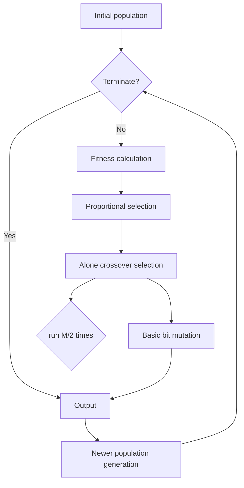

<table><tr><td>For office use onlyT1____T2____T3____T4 ____</td><td>Team Control Number82150Problem ChosenC</td><td>For office use onlyF1____F2____F3____F4 ____</td></tr><tr><td></td><td>2018MCM/ICMSummary Sheet</td><td></td></tr></table>

In order to set realistic and proper goals for the new four-state energy compact, our team makes an analysis and prediction on the energy profiles. Then, we propose three practical actions for the governors to meet these goals. Specifically,

For part I, we first explore the energy profiles from four aspects – Total Energy Production, Total Energy Consumption, Energy Price and Energy Structure. Secondly, regarding population, economy, modernization and geography as influential factors, we study the similarities and differences in the usage of cleaner, renewable energy quantitatively. Next, the EM-TOPSIS-PROMETHEE Evaluation Model is developed to determine the “best” profile in 2009. Following the 3E principle, we conclude that California excels in four aspects – Renewable Energy Potential, Energy Structure, Renewable Energy Proportion and Economic Conversion Rate. Finally, Vector Autoregression Model is utilized to predict each state’s energy profile.

For part II, combining Game Theory, we obtain the optimal energy allocation among four states through Genetic Algorithm. For one thing, the compact will reduce their import energy price, and thus improving their energy structure in New Mexico and Texas, the energy import-oriented states. For another, the energy efficiency will be boosted due to the growth of energy exports in Arizona, the energy export-oriented state. Hence, we set the promotion in Renewable Energy Proportion and Economic Conversion Rate as their energy compact goals. Afterwards, three actions, including cutting the export taxes, imposing subsides and strengthening interstate communication, are put forward to realize above-mentioned goals.

Finally, for the governors, we prepare a memo to introduce the energy profiles in 2009, the prediction on energy usage without any policy changes and our recommended goals for energy compact.

Keywords: Energy profile; VAR Model; Genetic Algorithm; Energy compact

## Context

1 Introduction.. →

1.1 Restatement of the Problem..

2 Assumptions and Nomenclature.

2.1 Assumptions..

2.2 Nomenclature.. .2

3 Date Processing.. .2

3.1 Delete the redundant data. 2

3.2 Delete the invalid data... .3

4 Part I Analysis, evaluation and prediction of energy profiles.

4.1 The energy profiles.. 3

4.2 The evolution of the energy profile..

4.3 The best profile for use of cleaner, renewable energy. . 8

4.4 The prediction based on VAR Model.. ... 12

5 Part II New energy compact.. .14

5.1 Goals for the new four-state energy compact.. ...14

5.2 Three actions to meet their energy compact goals. .17

6 Strengths and Weaknesses.... . 18

6.1 Strengths.. ....18

6.2 Weaknesses. ... 19

7 Conclusion.... . 19

References... . 20

Appendix.... .21

From: MCM 2018 Team 82150

To: The group of Governors

Date: 12, February 2018

Subject: Goals for the energy compact

For your information, here we introduce our analysis of states’ profile, our prediction of energy usage and our recommended goals for compact. The details are as below:

The analysis of states’ profile

 Arizona, California, New Mexico and Texas are energy oversupplied state, energy oversupplied state, energy short-supplied state and energy supply & demand balance state respectively.  
 The states whose energy prices are sorted from high to low are Arizona, California, New Mexico and Texas respectively.  
 Among these four states, the proportion of petroleum products is the greatest, while that of renewable energy is the lowest.  
 The maximum proportions of total energy consumption in different sectors vary from the states.

The prediction of energy usage

 Total energy usage will continue to rise, but growth rate will decline.  
 Total renewable energy usage and its growth will continue to rise.  
 Arizona will be renewable energy export-oriented, for the growth rate of energy production will exceed the rate of energy usage.  
 Texas and New Mexico are likely to become renewable energy importoriented.

The recommended goals for compact

 The first goal: Promotion in Renewable Energy Proportion.  
 The second goal: Promotion in Economic Conversion Rate.  
 These goals can be realize by strengthening interstate communication, cutting the export taxes and imposing renewable energy subsidies.

Please contact me if you have any problems.

## 1 Introduction

## 1.1 Restatement of the Problem

Nowadays, energy production and usage are a major portion of any economy. In the United States, many aspects of energy policy are decentralized to the state level. Additionally, the varying geographies and industries of different states affect energy usage and production.

Firstly, we make a comprehensive and obvious analysis of energy profile for each of the four states according to the data selected in attachments.

Then, we analyze the evolution of energy profile and make an understandable comparison about the usage of cleaner, renewable energy sources among four states.

Thirdly, we select proper criteria to evaluate and predict profiles of each state in 2009, 2025 and 2050. Then, under a four-state energy compact, we determine renewable energy usage targets according to the “best” profile criteria and prediction. At last, based on the models we build, we try to put forward the effective improvement in compacts and offer our models to the group of governors.

## 2 Assumptions and Nomenclature

## 2.1 Assumptions

In order to simplify our model, we make some assumption in our paper. The details are as below:

There's no difference in the statistic caliber of four states, and thus the data is completely reliable.  
Only electricity is taken into account when we analyze the renewable energy, because we make an assumption that renewable energy is finally transformed into electricity.  
Standard energy structure is the structure that each energy has the same proportion.  
− We assume that renewable energy consumption and petroleum consumption add up to the total energy consumption.  
In the case of the new energy contact, no cooperation cost is accounted.  
 We assume that the contact exerts no effect on the total energy consumption in four states and only affects the renewable energy consumption.

## 2.2 Nomenclature

Table 2-1: the Nomenclature in our paper

<table><tr><td>Symbol</td><td>Definition</td></tr><tr><td> $A_1$ </td><td>Renewable Energy Potential</td></tr><tr><td> $A_2$ </td><td>Energy Structure</td></tr><tr><td> $A_3$ </td><td>Renewable Energy Proportion</td></tr><tr><td> $A_4$ </td><td>Economic Conversion Rate</td></tr><tr><td> $RP_t$ </td><td>The renewable energy production in year  $t$ </td></tr><tr><td> $EP_i$ </td><td>The proportion of origin  $i$  in electricity</td></tr><tr><td> $TC_t$ </td><td>The total energy consumption in year  $t$ </td></tr><tr><td> $RC_t$ </td><td>The total renewable energy consumption in year  $t$ </td></tr><tr><td> $GDP_t$ </td><td>GDP in year  $t$ </td></tr><tr><td> $RE_t$ </td><td>The expenditure of total renewable energy in year  $t$ </td></tr><tr><td> $e_j$ </td><td>The entropy in the index  $j$ </td></tr><tr><td> $g_j$ </td><td>The difference coefficient in the index  $j$ </td></tr><tr><td> $w_j$ </td><td>The final weight in the index  $j$ </td></tr><tr><td> $S_i^+$ </td><td>The final score of state  $i$ </td></tr><tr><td> $η$ </td><td>The distrust coefficient</td></tr><tr><td> $p_e^i$ </td><td>The electricity import price</td></tr><tr><td> $p_e^n$ </td><td>The electricity export price</td></tr><tr><td> $p_p$ </td><td>The petroleum price</td></tr><tr><td> $γ$ </td><td>The pulling coefficient</td></tr><tr><td> $E_{TC}^e$ </td><td>The electricity exports</td></tr><tr><td> $E_{TC}^i$ </td><td>The electricity imports</td></tr><tr><td> $E_{TC}^n$ </td><td>The electricity production</td></tr><tr><td> $E_{TC}$ </td><td>The total electricity consumption</td></tr><tr><td> $P_{TC}$ </td><td>The total petroleum consumption</td></tr><tr><td> $p$ </td><td>The average price of energy</td></tr><tr><td> $P_{TC}^e$ </td><td>The export price of electricity</td></tr></table>

## 3 Date Processing

First, we classify the data in the worksheet into three categories: redundant data, invalid data, and normal data. Then, as for redundant data, we remove them to make it more convenient for us to search the required data. As for invalid data, we delete them from the worksheet. As for normal data, we sort them and learn the meaning of their “msn”. The works we have done in data processing are as follows.

## 3.1 Delete the redundant data

There is data redundancy in the worksheet “seseds”. As we can see in Table 3-1, NGACB and NNACB have the same content except their msn. So we delete the redundant data “MMACB”.

Table 3-1 : Examples of redundant data

<table><tr><td>NGACB</td><td>Natural gas consumed by the transportation sector.</td><td>Billion Btu</td></tr><tr><td>NNACB</td><td>Natural ...... sector. (Code used in SEDS 2006.)</td><td>Billion Btu</td></tr></table>

## 3.2 Delete the invalid data

In the worksheet “seseds”, there is no data labeled with “PACCK”. So we define the data without content in the worksheet as invalid data. After screening all data, we remove the invalid data.

Table 3-2 : Examples of invalid data

<table><tr><td>PACCK</td><td>Factor for converting ......</td><td>United States only.</td><td>Million ...barrel</td></tr></table>

## 4 Part I Analysis, evaluation and prediction of energy profiles

## 4.1 The energy profiles

In order to explain the energy profiles, we subdivide the energy profiles into four aspects: Total Energy Production , Total Energy Consumption , Energy Price and Energy Structure . As the latest data can reflects the current energy profile in each state better, we select the data of each state in 2009.

Total Energy Production ul and Total Energy Consumption u

Table 4-1: the table of TEP and TEC in four states  
Units：Billion Btu

<table><tr><td></td><td>TEP</td><td>TEC</td><td></td><td>TEP</td><td>TEC</td></tr><tr><td>Arizona</td><td>570994.0459</td><td>1454313.457</td><td>California</td><td>2605311.838</td><td>8005515.051</td></tr><tr><td>New Mexico</td><td>2412219.049</td><td>670094.5064</td><td>Texas</td><td>11914996.72</td><td>11297410.59</td></tr></table>

Total Energy Production and Total Energy Consumption are important indicators for energy profile of each state. In order to describe the production and consumption better, we divide the states into three types: oversupplied, supply-and-demand balanced and short supplied. When Total Energy Production is obviously larger than Total Energy Consumption, the states are regarded as oversupplied, such as Arizona and California. When Total Energy Production is lower than Total Energy Consumption obviously, the states are regarded as short supply, such as New Mexico. When the states don’t satisfy two situations above, they are regarded as supply-and-demand balanced, such as Texas.

Energy Price ul

The price of commodity fluctuates with its supply and demand. To some extent, energy price can reflect the costs of source exploitation, transportation and distribution. At the same time, it can also reflect the economic benefits of energy use. In our opinion, when one state acquires similar resources, the lower the price is, the better the economic benefits it will get. As can be seen from the table in appendix, states’ unit price of energy from high to low are 19.664, 18.405, 17.179 and 15.380. The corresponding states are Arizona, California, New Mexico and Texas respectively.

Energy Structure u

In the worksheet “seseds”, we can get total energy consumption in five sectors. The five sectors are transportation, commercial, electric power, industrial and residential sector. After processing the data, we can get the proportion of total energy consumption in these five sector. The proportion are as below and the table of the proportion are in appendix.


<details>
<summary>stacked bar chart</summary>

| State | Residential (%) | Industrial (%) | Electric power (%) | Commercial Transportation (%) |
| :--- | :--- | :--- | :--- | :--- |
| Arizona | 18 | 10 | 42 | 25 |
| California | 17 | 23 | 26 | 29 |
| New Mexico | 16 | 25 | 33 | 24 |
| Texas | 12 | 55 | 35 | 24 |
</details>


<details>
<summary>stacked bar chart</summary>

| State | Pretroleum | Renewable | Other |
| :--- | :--- | :--- | :--- |
| Arizona | 10 | 0 | 10 |
| California | 35 | 5 | 35 |
| New Mexico | 2 | 0 | 5 |
| Texas | 52 | 3 | 48 |
</details>

Figure 4-1 : the proportion of total energy consumption in five sectors  
Figure 4-2 : the proportion of Petroleum, Renewable energy and other energy

In Arizona and New Mexico, proportions of total energy consumption in the Electric power sector are the greatest respectively. In California, the proportion in the transportation sector is the greatest, while in Texas, the proportion in the industrial sector is the greatest. So we can conclude that the focus of development in four states and energy structure are different. As can be seen from the figure 4-2, the proportion of petroleum products consumption is the greatest among four state although they differ greatly in Total Energy Consumption, while the proportion of renewable energy is the lowest.

## 4.2 The evolution of the energy profile

## 4.2.1 The growth of energy consumption


<details>
<summary>line chart</summary>

| Year | Arizona | California | New Mexico | Texas |
|------|---------|------------|------------|-------|
| 1960 | 200     | 350        | 450        | 450   |
| 1965 | 220     | 380        | 500        | 500   |
| 1970 | 250     | 420        | 550        | 550   |
| 1975 | 280     | 450        | 600        | 650   |
| 1980 | 260     | 400        | 550        | 600   |
| 1985 | 240     | 350        | 500        | 550   |
| 1990 | 230     | 380        | 550        | 580   |
| 1995 | 220     | 360        | 580        | 600   |
| 2000 | 210     | 350        | 550        | 580   |
| 2005 | 200     | 340        | 520        | 550   |
| 2010 | 190     | 330        | 500        | 520   |
</details>

Figure 4-3 : The figure of energy consumption per capita


<details>
<summary>line chart</summary>

| Year | Arizona | California | New Mexico | Texas |
|------|---------|------------|------------|-------|
| 1970 | 10.5    | 15.2       | 8.3        | 8.7   |
| 1975 | 6.8     | 11.5       | 6.2        | 5.9   |
| 1980 | 5.5     | 7.8        | 4.1        | 3.8   |
| 1985 | 8.2     | 14.3       | 7.5        | 6.9   |
| 1990 | 9.7     | 15.8       | 8.6        | 7.4   |
| 1995 | 12.1    | 17.2       | 10.3       | 8.9   |
| 2000 | 15.6    | 21.5       | 12.7       | 10.8  |
| 2005 | 13.2    | 14.8       | 9.5        | 6.3   |
| 2010 | 17.5    | 17.8       | 10.2       | 8.1   |
</details>

Figure 4-4 : The figure of economic conversion efficiency

Figure 4-3 reveals the evolution of the energy consumption per capita in each state, we can conclude that the energy consumption per capita is relatively stable, which fluctuates over a long time. Unchanged as the consumption per capita remains, the economic conversion efficiency in four states, shown in figure 4-4, shares the similar tendency. The index calculates the output created by per unit of energy, which indicates the production capacity of a state. As is shown in the figure 4-4, there is a boost in the conversion efficiency in all states during 1990s and a slight decline after 2000 with their rank unchanged.

## 4.2.2 The evolution of energy structure

Similarities in the energy structure


<details>
<summary>bar chart</summary>

| State | 1979 Petroleum&Coal | 1989 Petroleum&Coal | 1999 Petroleum&Coal | 2009 Petroleum&Coal | 1979 Renewable&Natural gas | 1989 Renewable&Natural gas | 1999 Renewable&Natural gas | 2009 Renewable&Natural gas |
|---|---|---|---|---|---|---|---|---|
| Arizona | 0.75 | 0.74 | 0.71 | 0.65 | 0.34 | 0.26 | 0.22 | 0.33 |
| California | 0.56 | 0.49 | 0.45 | 0.45 | 0.36 | 0.37 | 0.38 | 0.38 |
| New Mexico | 0.76 | 0.89 | 0.85 | 0.83 | 0.48 | 0.40 | 0.36 | 0.42 |
| Texas | 0.53 | 0.58 | 0.61 | 0.61 | 0.46 | 0.41 | 0.35 | 0.33 |
</details>

Figure 4-5 : The evolution of energy structure

In general, the energy consumption structure of the four states is not balanced. Energy consumption mainly concentrates on petroleum products, and the consumption of coal is the second. In the world energy consumption structure, petroleum, natural gas and coal are the three most important types of consumer resources with roughly equal proportions[1].

Nevertheless, there is a drop in the consumption of petroleum and coal in Arizona, California and New Mexico, along with an increase in the proportion of renewable and natural gas. The first explanation is that economic development promotes the development of technology. Secondly, attaching importance to energy saving and environmental protection are also important reasons for their improvement in energy structure.

## Differences in the energy structure

Taking the continuity of the policy into account, we set a 10-year cycle to analyze the energy profiles of the four states at various time points, and then get the evolution of the energy structure. As is shown in this figure 4-6, the energy growth rate rose slightly in the commercial sector in each state from 1979 to 1989. In the next 20 years, however, there has been no significant changes in the proportion in this area, for the business is relatively mature.


<details>
<summary>bar chart</summary>

| State       | 1979 Transportation | 1989 Transportation | 1999 Transportation | 2009 Transportation | 1979 Commercial | 1989 Commercial | 2009 Commercial | 1984 Commercial Arizona |
| ----------- | --------------------- | ---------------------- | ---------------------- | --------------------- | ----------------- | ----------------- | ----------------- | ------------------------ |
| California  | ~250,000              | ~300,000               | ~280,000               | ~260,000              | ~150,000          | ~140,000          | ~130,000          | ~120,000                 |
| New Mexico  | ~10,000               | ~15,000                | ~12,000                | ~10,000               | ~5,000            | ~4,000            | ~3,000            | ~2,000                   |
| Texas       | ~15,000               | ~25,000                | ~22,000                | ~20,000               | ~15,000           | ~14,000           | ~13,000           | ~650,000                 |
</details>

Figure 4-6: The evolution of TEC in five sector from 1979 to 2009

In transportation and industrial sector, the proportion of energy consumption declined year by year. The reason is that with the development of science and technology, people are seeking a high-quality development in economy. In Electric power and residential sector, the proportion of energy consumption has a steady increase, while the growth rate also increase year by year and can be up to 1-2% yearly. In recent years, people have paid growing attention to the efficient and clean utilization of resources, and the electronic products represented by computers have been increasingly enriched. As a result, more energy flows to electricityindustry.

## 4.2.3 The evolution of Renewable energy

Similarities in the trend of renewable energy usage


<details>
<summary>line chart</summary>

| Year | Arizona | California | New Mexico | Texas |
|------|---------|------------|------------|-------|
| 1978 | 0.10    | 0.08       | 0.01       | 0.005 |
| 1983 | 0.24    | 0.13       | 0.01       | 0.005 |
| 1988 | 0.10    | 0.09       | 0.01       | 0.005 |
| 1993 | 0.08    | 0.11       | 0.01       | 0.005 |
| 1998 | 0.12    | 0.10       | 0.01       | 0.005 |
| 2003 | 0.05    | 0.09       | 0.01       | 0.005 |
| 2008 | 0.06    | 0.08       | 0.04       | 0.02  |
</details>

Figure 4-7: the proportion of renewable energy

The share of renewable energy consumption peaked in 1997 or 1998 and then declined in different states. We reckon that Kyoto Protocol in 1997 serves as an effective incentive for state governments to use renewable energy. In the meantime, due to government’s continuously increasing awareness of environmental protection, the gap between high-renewable energy use states and low-weight states narrows gradually.

Differences in the application of renewable resource

 The usage of renewable resource

In the analysis of their differences in the usage of renewable energy sources, we take factors of economy, geography, population and grid modernization into consideration. To be specific, there’s nothing ambiguous that economic growth has boosted energy demand and promoted the technological level in energy utilization at the same time[2]. Besides, transformation in industrial structure affects the energy demand directly and changes the energy consumption structure, the second industry, the largest energy consumption intensity[3]. To some extent, the technology level of a state is revealed by the Grid Modernization Index (released by GridWise Alliance in Nov. 2017. Website of https://www.metering.com/news/2017-grid-modernisation-index-rankings/). Moreover, the characteristics of their population and geography also play a prominent role in the development of their energy consumption.


<details>
<summary>choropleth map</summary>

| State | Grid Modernization Index |
|---|---|
| CA | 75 |
| AZ NM | 50 |
| TX | 30 |
</details>

Figure 4-8: the Grid Modernization Index in four states

Based on the useful information provided, we make regression with panel data that takes the time-fixed effects into account:.

$$
y _ {i t} = \beta_ {1} \ln x 1 _ {i t} + \beta_ {2} \ln x 2 _ {i t} + \beta_ {3} \ln x 3 _ {i t} + \beta_ {4} \ln x 4 _ {i t} + \varepsilon_ {i t} \tag {1}
$$

In the equation (1), ${ \bf y } _ { i t }$ is the proportion of renewable energy consumption during the period of t in state i, and $\scriptstyle { x 1 } _ { i t } , \ x 2 _ { i t }$ and ${ \pmb x } 3 _ { i t }$ are the population during the period of t in state i, the growth rate of GDP and the Grid Modernization Index respectively. We assign ${ \pmb { \alpha } } _ { i } = { \pmb { 1 } }$ when state i is close to the ocean. $\beta _ { 1 } , \beta _ { 2 } , \beta _ { 3 }$ and $\pmb { \beta } _ { 4 }$ are the coefficients and $\varepsilon _ { i t }$ is the residual term. Since the GDP data started in 1977, we all select the data after 1978 to get the result:

$$
y _ {i t} = 0. 0 2 3 ^ {* * *} \ln x 1 _ {i t} + 0. 0 0 2 \ln x 2 _ {i t} + 0. 0 2 6 ^ {* * *} \ln x 3 _ {i t} - 0. 0 3 8 \alpha_ {i} - 0. 0 7 3 ^ {* * *}.
$$

We can conclude that the consumption rate of renewable energy has a significant positive correlation with the population and modernization level in a state. The economic growth and the geographical factor, however, have no significant effect.

The consumption of renewable energy could increase by 2.3% or 2.6% with a 1% increase in population or a 1% increase in the Grid Modernization Index respectively.

Because California is taking the lead in the modernization, cleaner, renewable energy is easier to utilize by means of modern technology. Besides, the large number of its population requires the wide application of renewable energy in view of the pollution.

Undoubtedly, California has ranked the highest by the Grid Modernization Index in recent years. Arizona ranks next owning to its large population and advanced level of modernization. The use rate of renewable resource in New Mexico is relatively low as the consequence of its small population and low level of modernization. As to Texas, the total use of renewable energy is considerable owning to its well-developed industrialization but the use rate is the lowest, indicating its unhealthy development pattern.

 The structure of renewable resource  


<details>
<summary>stacked bar chart</summary>

| State | Geothermal (%) | Nuclear (%) | Photovoltaic and solar (%) | Wind (%) |
| :--- | :--- | :--- | :--- | :--- |
| Arizona | 0 | 100 | 0 | 0 |
| California | 25 | 60 | 10 | 0 |
| New Mexico | 0 | 0 | 100 | 0 |
| Texas | 70 | 50 | 30 | 0 |
</details>

Figure 4-9: the proportion of electricity origins

Since the geographical variables are not significant enough in the regression model above, we now analyze the effect of geography on the structure of renewable energy use specifically.

The clean energy structure of Arizona and New Mexico is single and the California and Texas’s are slightly more abundant. The electricity is nuclear-energy-dominated in Arizona. The reason is that the possibility of earthquake is low and the reserve of Uranium is large. All of these factors facilitate the development of nuclear electricity. The electricity is wind-energy-dominated in New Mexico. This is because much of the territory is covered by alpine plateau and deserts, which is suitable to develop wind power. In Texas, electricity is produced from nuclear energy and wind energy.Because of the Pacific Rim, California is rich in geothermal energy, which is used to generate electricity. The first Geothermal Power Station was built here.

## 4.3 The best profile for use of cleaner, renewable energy

## 4.3.1. Index Selection

Nowadays, since an increasingly number of people pay attention to sustainable development, the use of clean renewable energy becomes the focus of the government[4]. Both ecological benefit and economic benefit should be taken into account when government carries out the energy policies[5]. Thus, following the 3E

principle - energy, environment and economy, we select four indexes: Renewable Energy Potential, Energy Structure, Proportion of Renewable Energy and Economic Conversion Rate.

 Renewable Energy Potential $\pmb { A } _ { 1 }$

In 1994, World Energy Council put forward the concept of renewable energy potential. Later in 2008, Hoogwijk and Graus perfected it[6]. The potential of renewable energy reflects the speed and potential of utilizing renewable energy during a period. In this paper, the increase rate of renewable energy production is used to reflect the potential of renewable energy:

$$
\mathrm{A} _ {1} = \frac {\boldsymbol {R P} _ {t} - \boldsymbol {R P} _ {t - 1}}{\boldsymbol {R P} _ {t - 1}},
$$

where $\scriptstyle { R P _ { t } }$ is the renewable energy production in year  and $R P _ { t - \mathrm { ~ 1 ~ } }$ is the renewable energy production in year  − .

Energy Structure $\pmb { A } _ { 2 }$

Energy structure optimization refers to under certain technical and economic conditions, the proportion of various energy tends to be reasonable, so as to achieve the purpose of improving energy utilization and further improving the overall benefits. In this paper, electricity mainly consists of four origins - Geothermal, Nuclear, Photovoltaic and solar, Wind. Hamming value[7] is used to calculate the closeness degree between the real electricity structure and the standard structure.

$$
A _ {2} = 1 - \frac {1}{4} \sum_ {i = 1} ^ {4} \left| E P _ {i} - \frac {1}{4} \right|,
$$

where $E P _ { i }$ is the proportion of state i.

Proportion of Renewable Energy $A _ { 3 }$

Higher proportion of renewable energy is more conducive to upgrading the energy supply system, and further to achieve a coordinated and sustainable development.

$$
A _ {3} = \frac {R C _ {t}}{T C _ {t}},
$$

where $T C _ { t }$ is total energy consumption in year t and $R C _ { t }$ is total renewable energy consumption in year t.

Economic Conversion Rate ${ \pmb A } _ { 4 }$

Economic performance reflects the economic benefits of renewable energy utilization. The efficiency and potential of energy output are described by the expenditure ratio of GDP [8]

$$
A _ {4} = \frac {G D P _ {t}}{R E _ {t}},
$$

where ${ \bf G } { \bf D } { \bf P } _ { t }$ is GDP in year t and $R E _ { t }$ is the expenditure of total renewable energy in year t.

## 4.3.2. The EM-TOPSIS-PROMETHEE evaluation model

Due to the dynamic and complexity of clean renewable energy, a comprehensive

evaluation model is developed for evaluating the usage of cleaner, renewable energy in combination of entropy method, TOPSIS method and PROMETHEE method [5].

The model mainly includes two parts. One is to define index weight and the other is to score each state. In the index weight definition part, we use the entropy method and in the scoring part, we combine the TOPSIS method and the PROMETHEE method, which can not only reflect the difference among clean renewable energy use in different states, but can also instruct what states can do to approach the ideal condition. Thus, we can evaluate and sort each states’ usage of renewable energy comprehensively.

Let $\pmb { S } = [ C A ~ A Z ~ N M ~ T X ]$ be the set of the states, $\boldsymbol { \mathrm { A } } = \left[ A _ { 1 } ~ A _ { 2 } ~ A _ { 3 } ~ A _ { 4 } \right]$ be the set of evaluation indexs, $\mathbf { X } = \left( x _ { i j } \right) _ { m \times n }$ be the decisn matrix, where $\boldsymbol { x } _ { i j }$ denotes t value of state i in index j.

## Step1. Standardized Processing

•To eliminate different dimensions of different indexes, before data analysis, we first conduct Standardized Processing:

$$
x _ {i j} ^ {\prime} = \frac {x _ {i j} - \min x _ {i j}}{\max x _ {i j} - \min x _ {i j}}.
$$

$\textbf { X } ^ { \prime } \ = \textbf X = \left( \boldsymbol { x ^ { \prime } } _ { i j } \right) _ { m \times n } .$

Step2. Index weight definition based on entropy method

ca  ht     = $\begin{array} { r } { p _ { i j } = \frac { 1 + x _ { i j } } { \sum _ { i = 1 } ^ { m } \left( 1 + x _ { i j } \right) } . } \end{array}$ 1+xy  
•Calculate the entropy and the difference coefficient in the index j:

$$
e _ {j} = - (\ln m) ^ {- 1} \sum_ {i = 1} ^ {m} p _ {i j} \ln p _ {i j}, g _ {i} = 1 - e _ {j}.
$$

•Calculate the final weight of each index wj = $\begin{array} { r } { w _ { j } = \frac { g _ { j } } { \sum _ { i = 1 } ^ { n } g _ { j } } } \end{array}$ and get the weight set

$$
\mathbf {W} = [ w _ {1} w _ {2} w _ {3} w _ {4} ].
$$

Step3. Evaluation based on the TOPSIS method and the PROMETHEE method

•Calculate the weighted standardized decision matrix:

$$
\mathbf {Z} = \left(\mathbf {z} _ {i j}\right) _ {m \times n}, \mathbf {z} _ {i j} = w _ {j} \times x _ {i j}.
$$

•Determine the positive ideal solution ${ { \pmb z } ^ { + } }$ and the negative ideal solution $z ^ { - }$ ..

$$
\mathbf {Z} ^ {+} = (z _ {1} ^ {+} z _ {2} ^ {+} z _ {3} ^ {+} z _ {4} ^ {+}),
$$

$$
\mathbf {Z} ^ {-} = (z _ {1} ^ {-} z _ {2} ^ {-} z _ {3} ^ {-} z _ {4} ^ {-}),
$$

where $\mathbf { Z } _ { j } ^ { + } = \operatorname* { m a x } _ { i } ( x ^ { \prime } { } _ { i j } ) , \mathbf { Z } _ { j } ^ { + } = \operatorname* { m i n } _ { i } \bigl ( x ^ { \prime } { } _ { i j } \bigr )$

•Calculate the Euclidean distance between each states' indexes and the positive ideal solution ${ { \pmb z } ^ { + } }$ , the negative ideal solution $z ^ { - }$ respectively:

$$
\boldsymbol {d} _ {i} ^ {+} = \sqrt {\sum_ {j = 1} ^ {n} \left(\mathbf {z} _ {i j} - \mathbf {z} _ {i j} ^ {+}\right) ^ {2}}, \boldsymbol {d} _ {i} ^ {-} = \sqrt {\sum_ {j = 1} ^ {n} \left(\mathbf {z} _ {i j} - \mathbf {z} _ {i j} ^ {-}\right) ^ {2}}.
$$

•Determine the preference function and preference exponential relationship. We define $d _ { j } ( a , b ) = x ^ { \prime } { } _ { a j } - x ^ { \prime } { } _ { b j }$ , preference function $\mathbf { P } ( d ) = \left\{ { \bf 1 } , d \geq 0 \right.$ preference exponential relationship $\begin{array} { r } { \pi _ { ( d _ { a b } ) } = \sum _ { j = 1 } ^ { n } P _ { j } ( d _ { a b } ) \omega _ { j } } \end{array}$  
•Calculate the positive flow and the negative flow of each evaluation objective, and the formulas are as follows:

$$
\Phi^ {+} (d _ {i}) = \frac {1}{m - 1} \sum_ {k = 1} ^ {m} \pi (d _ {a k}), \Phi^ {-} (d _ {i}) = \frac {1}{m - 1} \sum_ {k = 1} ^ {m} \pi (d _ {a k})
$$

where $\pmb { k } = \pmb { 1 } , 2 \dots , \pmb { m } ,$ and $k \neq i .$

•For $d _ { i } ^ { + } , d _ { i } ^ { - } , \phi ^ { + } ( d _ { a } ) , \phi ^ { - } ( d _ { a } )$ , after normalization processing, we can obtain $D _ { i } ^ { + } , D _ { i } ^ { - } , \Phi _ { i } ^ { + } , \Phi _ { i } ^ { - }$

The larger the value of $\pmb { D } _ { i } ^ { - }$ and $\Phi _ { i } ^ { + }$ , the better the performance of the state. In contrast, the larger the value of $\pmb { D } _ { i } ^ { + }$ and $\Phi _ { i } ^ { - }$ , the worse the performance of the state. In this paper, we combine $\pmb { D } _ { i } ^ { - }$ and $\Phi _ { i } ^ { + }$ to evaluate each state's performance in the use of clean renewable energy: $S _ { i } ^ { + } = \varsigma \Phi _ { i } ^ { + } + \tau D _ { i } ^ { - }$ , where  and τ depend on the preference of the decision maker and satisfy $\varsigma + \tau = 1 , \varsigma , \tau \in [ 0 , 1 ]$

In this paper, we define $\begin{array} { r } { \varsigma = \tau = \frac { 1 } { 2 } . } \end{array}$

## 4.3.2. The Final Ranks

Firstly, we calculate the index of each state according to our definitions.

Table 4-2: the values of all indicators in all states

<table><tr><td></td><td> $A_1$ </td><td> $A_2$ </td><td> $A_3$ </td><td> $A_4$ </td></tr><tr><td>AZ</td><td>-0.088</td><td>0.626</td><td>0.071</td><td>0.145</td></tr><tr><td>CA</td><td>0.055</td><td>0.806</td><td>0.089</td><td>0.180</td></tr><tr><td>NM</td><td>-0.036</td><td>0.625</td><td>0.053</td><td>0.115</td></tr><tr><td>TX</td><td>0.018</td><td>0.750</td><td>0.032</td><td>0.099</td></tr></table>

After standardization, we obtain:

Table 4-3: the standard values of all indicators in all states

<table><tr><td></td><td> $A_1$ </td><td> $A_2$ </td><td> $A_3$ </td><td> $A_4$ </td></tr><tr><td>AZ</td><td>0.000</td><td>0.004</td><td>0.689</td><td>0.566</td></tr><tr><td>CA</td><td>1.000</td><td>1.000</td><td>1.000</td><td>1.000</td></tr><tr><td>NM</td><td>0.368</td><td>0.000</td><td>0.376</td><td>0.200</td></tr><tr><td>TX</td><td>0.748</td><td>0.690</td><td>0.000</td><td>0.000</td></tr></table>

Then, we use entropy method and get the weight of each index:

$$
\mathrm{W} = [ 0. 2 2 0 9 0. 3 2 5 6 0. 2 1 3 6 0. 2 3 9 9 ].
$$

Afterwards, TOPSIS and PROMETHEE method are utilized and we calculate φ+=|0.4109 1.0000 0.2248 0.3643|,D-=|0.3944 1.0000 0.2440 0.5490 | t

The final scores of four states (Arizona, California, New Mexico, Texas) are: S + =[0.4026 1.0000 0.2344 0.4566] (refer to figure 4-10) .


<details>
<summary>choropleth map</summary>

| State | Score |
|-------|-------|
| CA    | 40    |
| AZ    | 37    |
| NM    | 36    |
| TX    | 32    |
</details>

Figure 4-10: the final scores in four states

California excels in all respects and ranks first. Texas ranks second. Although its economic conversion rate and the proportion of renewable energy ranks the last four states, its potential for renewable energy is better and its energy structure is more reasonable. These factors are conducive to the increase of renewable energy proportion and the optimization of Energy structure, which can promote economic development. Besides, economic efficiency can be improved. Arizona and New Mexico come in third and fourth place. We find that their energy structure is the least reasonable. Although they have higher renewable energy proportions and economic conversion rates, the potential of renewable energy is explored slightly, which affects the overall ranking. Based on the four scores, we find that Arizona and New Mexico are in a better position now but their prospects are negative. The optimization of energy structure is very difficult. States in this type require to be determined to ensure a balanced and environmentally friendly energy structure. Texas, however, is in the worst shape but with promising and sustainable growth prospects. We suggest that Texas should continue to maintain its proportion of renewable energy consumption and optimize its energy structure.

## 4.4 The prediction based on VAR Model

In order to predict energy consumption and sustainable development of each state, we predict the total energy consumption, the average energy price, the petroleum price, the electricity price, the electricity production and the electricity consumption in four

states. The total energy consumption and the average energy price reflect the future trends of energy usage in each state. The petroleum and electricity price, electricity production and consumption can reflect the sustainable development trends of each

Team #82150 Page 13 of 36state. In these two aspects, we set up Energy Consumption Prediction Model (ECPM) and Sustainability Development Prediction Model (SDPM) based on Vector Autoregression Model. Given economic and social factors, we take GDP growth rate and population into account in our models as well. We take ECPM of California as an example and the modeling process is as follows.

$T E C _ { t } ^ { C A } , P _ { t } ^ { C A } , V _ { G D P ( t ) } ^ { C A }$ and $P o P _ { t } ^ { c A }$ denote total energy consumption, average energy price, GDP growth rate and population in California in year t. They can be predicted by lags of $T E C _ { t } ^ { C A } , P _ { t } ^ { C A } , V _ { G D P ( t ) } ^ { C A }$ and $P o P _ { t } ^ { C A }$ .In order to obtain stationary data, we first standardize and difference the four indexes. Afterwards, we calculate the lag phase $\pmb { p }$ according to the AIC criteria. The VAR model of energy usage prediction in California is as follows:

$$
\mathbf {T E C} _ {t} ^ {C A} = w _ {0} + \sum_ {i = 1} ^ {p} \alpha_ {i} \mathbf {T E C} _ {t - i} ^ {C A} + \sum_ {i = 1} ^ {p} \beta_ {i} P _ {t - i} ^ {C A} + \sum_ {i = 1} ^ {p} \gamma_ {i} V _ {G D P (t - i)} ^ {C A} + \sum_ {i = 1} ^ {p} \mu_ {i} \mathbf {P O P} _ {t - i} ^ {C A} + \varepsilon_ {t},
$$

where ${ w _ { 0 } }$ is constant, $\varepsilon _ { t }$ is random disturbance term with zero mean, constant $P _ { t } ^ { C A } , V _ { G D P ( t ) } ^ { C A }$ and $P O P _ { t } ^ { C A }$ can also be described in this way.

According to the AIC criteria, we calculate the lag phase $\pmb { p } = \pmb { 1 }$ and we obtain the energy consumption prediction model:

$$
\left(T E C _ {t} ^ {C A}, P _ {t} ^ {C A}, V _ {t} ^ {C A}, P O P _ {t} ^ {C A}\right) = \left(1, T E C _ {t - 1} ^ {C A}, P _ {t - 1} ^ {C A}, V _ {t - 1} ^ {C A}, P O P _ {t - 1} ^ {C A}\right) \cdot \Omega ,
$$

$$
\text { where } \Omega = \left( \begin{array}{c c c c} 0. 1 0 3 & 0. 3 2 1 & 1. 0 9 2 & 0. 0 2 3 \\ 0. 0 3 4 & 0. 3 5 1 & - 1. 2 0 8 & 0. 0 2 7 \\ - 0. 5 3 3 & - 0. 1 2 7 & - 2. 5 6 2 & 0. 0 2 0 \\ 0. 0 6 0 & - 0. 0 1 2 & - 0. 0 8 4 & - 0. 0 0 4 \\ 0. 3 1 7 & - 2. 2 7 1 & - 6. 8 7 2 & 0. 7 7 4 \end{array} \right).
$$

The prediction charts are as follows:


<details>
<summary>line chart</summary>

| year | Total Energy Consumption (Billion Btu) |
| ---- | -------------------------------------- |
| 1980 | ~6.5e+06                               |
| 1990 | ~7.5e+06                               |
| 2000 | ~8.5e+06                               |
| 2010 | ~9.5e+06                               |
| 2020 | ~1.0e+07                               |
| 2030 | ~1.1e+07                               |
| 2040 | ~1.2e+07                               |
| 2050 | ~1.3e+07                               |
</details>


<details>
<summary>line chart</summary>

| time | Price/Million dollars |
| ---- | --------------------- |
| 1980 | ~5                    |
| 1990 | ~8                    |
| 2000 | ~10                   |
| 2010 | ~20                   |
| 2020 | ~25                   |
| 2030 | ~30                   |
| 2040 | ~35                   |
| 2050 | ~37                   |
</details>

Figure 4-11: the prediction of TEC and price in California

Table 4-4: the prediction accuracy of ECPM and SDPM

<table><tr><td></td><td>Energy Consumption Prediction Model</td><td>Sustainability Development Prediction Model</td></tr><tr><td>Arizona</td><td>97.28%</td><td>93.64%</td></tr><tr><td>California</td><td>97.15%</td><td>94.48%</td></tr><tr><td>New Mexico</td><td>96.81%</td><td>93.60%</td></tr><tr><td>Texas</td><td>97.64%</td><td>90.94%</td></tr></table>

Based on our prediction, the energy profiles of four states in 2025 and 2050 are shown in the table 4-5 and table 4-6. All prediction is made under the circumstances of no policy intervention.

Table 4-5: the energy profile prediction of four states in 2025

<table><tr><td></td><td>Total energy consumption</td><td>Total electricity consumption</td><td>Total electricity production</td><td>Average energy price</td><td>Average electricity price</td><td>Average petroleum price</td></tr><tr><td>Arizona</td><td>1923218</td><td>347936.5</td><td>577838.4</td><td>25.03065</td><td>30.99559</td><td>24.19626</td></tr><tr><td>California</td><td>9389109</td><td>1100789</td><td>575461.7</td><td>26.57905</td><td>46.88564</td><td>28.01131</td></tr><tr><td>New Mexico</td><td>832192.8</td><td>100305.3</td><td>533703.2</td><td>23.86519</td><td>26.13365</td><td>26.7748</td></tr><tr><td>Texas</td><td>13271970</td><td>1525875</td><td>586494.5</td><td>22.81525</td><td>36.29519</td><td>23.22217</td></tr></table>

Table 4-6: the energy profile prediction of four states in 2050

<table><tr><td></td><td>Total energy consumption</td><td>Total electricity consumption</td><td>Total electricity production</td><td>Average energy price</td><td>Average electricity price</td><td>Average petroleum price</td></tr><tr><td>Arizona</td><td>2558264</td><td>493663.8</td><td>841818.4</td><td>35.50622</td><td>39.36702</td><td>35.12232</td></tr><tr><td>California</td><td>10886977</td><td>1391365</td><td>843764</td><td>37.90532</td><td>65.47865</td><td>40.32907</td></tr><tr><td>New Mexico</td><td>1037193</td><td>138641</td><td>750917.2</td><td>33.47528</td><td>32.10451</td><td>38.56357</td></tr><tr><td>Texas</td><td>15625368</td><td>2044211</td><td>858801.2</td><td>32.8048</td><td>49.98144</td><td>33.20695</td></tr></table>

In the future, four states’total energy consumption and average energy prices are on the rise. Among them, the average energy prices of these states are not significantly different Nevertheless, New Mexico's total energy consumption is far lower than that of the other three states. Thus, we conclude that New Mexico's industrial development is still relatively backward. At the same time, the industrial development of Texas and California is in the leading position.

In term of the future trends of sustainable development, the consumption, production and price of clean renewable energy (refer to electricity in this paper) are on the rise. However, the clean renewable energy sources in Texas and California both have low self-sufficient rates and their self-sufficient rates will be further reduced in the future. As we can see in above table, Arizona and New Mexico's clean renewable energy production will grow faster than energy consumption and may be further exportedoriented in the future.

## 5 Part II New energy compact

## 5.1 Goals for the new four-state energy compact.

## 5.1.1. Four-state cooperation model with Genetic Optimization Algorithm

Comparing the energy profile of four states, especially the renewable energy, we can conclude that California is energy self-sufficient, Arizona is energy export-oriented,

New Mexico and Texas are energy import-oriented. Their self-sufficient rates of renewable energy are 0.90, 1.53, 0.24 and 0.54 respectively.

Based on above-mentioned evaluation model, California ranks the highest, which reveals its balanced energy structure. Considering its self-sufficient rate is close to 1， it is safe to say that California is self-sufficient in the usage of renewable energy. So we assume that California can benefit little in the new energy compact, expect for a closer interstate relationship.

In contrast, the other three states can get a significant promotion. On one hand, the compact can reduce the import prices of renewable energy. Accordingly, the cost of their industrial electricity consumption will be reduced, thus bringing considerable economic benefits to energy import-oriented states. On top of this, lower electricity costs can motivate their use of electricity energy and improve their energy structure. As to energy export-oriented state, on the other hand, their exports of renewable energy will be boosted. Definitely, more energy exports will promote their economic development.

Optimal strategies of new energy compact

For New Mexico and Texas, the energy import-oriented states, a resource allocation optimization model is built under the principle of maximizing economic efficiency (ie. minimizing energy costs) and optimizing interstate relations. The dynamic development theory of trust between partners in supply chains tells us that trust develops in a dynamic way and mutually reinforces with the dependence[9].

Under the assumption of constant total energy consumption n, the formation of new energy compact will merely affect the usage of renewable energy in each state. In addition, in term of energy security and ecological protection, we make some restraints on the states’ self-sufficient rate and the proportion of renewable energy. On the basis of 3E Model, the optimization model is built from the aspect of energy efficiency, economic benefits and ecological benefits.

$$
\min p _ {e} ^ {i} E _ {T C} ^ {i} + p _ {e} ^ {n} E _ {T C} ^ {n} + p _ {p} P _ {T C} + \frac {\eta}{E _ {T C} ^ {i}}
$$

$$
s. t. \left\{ \begin{array}{c} E _ {T C} ^ {i} + E _ {T C} ^ {n} + P _ {T C} = T E C \\ \frac {E _ {T C} ^ {i} + E _ {T C} ^ {n}}{T E C} > \alpha \\ \frac {E _ {T C} ^ {n}}{E _ {T C}} > \beta \\ E _ {T C} ^ {i} > 0 \end{array} \right.
$$

where $\frac { \eta } { E _ { T C } ^ { i } }$ coefficient  indicates a more serious distrust threat) $p _ { e } ^ { i } , p _ { e } ^ { n }$ and ${ p _ { p } }$ denote electricity import price, electricity export price and petroleum price respectively. $E _ { T C } ^ { i } , E _ { T C } ^ { n } , E _ { T C }$ and $P _ { T C }$ denote electricity imports, electricity production, total electricity consumption and total petroleum consumption respectively. and denote the lower limits of renewable energy proportion and self-sufficient rate. Genetic Algorithm is applied to solve the optimization above.

## Solution to the optimization problem

Genetic Algorithm is used to solve optimal energy allocation strategy, for it is effective to solve combinatorial optimization problems[10]. The algorithm flow is as follows:


<details>
<summary>flowchart</summary>


</details>

Figure 5-1: the algorithm flow

In the paper, we take Texas in 2025 and 2050 as an example to describe this problem. According to the predicted electricity price, we define that the price of electricity imported from Arizona in states’ compact are 32 and 45 in 2025 and 2050 respectively. Besides, we define $\alpha = 1 5 \%$ and $\alpha = 2 0 \%$ in 2025 and 2050 respectively. Both $\pmb { \beta }$ in 2025 and 2050 are defined as 25%.


<details>
<summary>line chart</summary>

| Eranum | Max Fitness (×10⁸) |
| ------ | ------------------ |
| 0      | -3.38              |
| 20     | -3.45              |
| 40     | -3.42              |
| 60     | -3.46              |
| 80     | -3.48              |
| 100    | -3.46              |
| 120    | -3.47              |
| 140    | -3.45              |
| 160    | -3.42              |
| 180    | -3.46              |
| 200    | -3.48              |
</details>


<details>
<summary>line chart</summary>

| Eranum | Max Fitness |
| ------ | ----------- |
| 0      | -5.7e8      |
| 200    | -5.8e8      |
</details>

Figure 5-2: the plot of Fitness Function of Genetic Algorithm in 2025 and 2050

Through calculation, we can obtain the optimal renewable energy imports of Texas. When $\pmb { \eta } < 5 \times 1 0 ^ { 1 2 }$ , that is, when the relationship between four states is relatively harmonious, the optimal renewable energy imports of Texas will be 1083997 and 1729084.8 Billion Btu respectively.

## 5.1.2. Renewable energy usage targets for 2025 and 2050

Under the new energy compact, we can calculate the optimal renewable energy imports of New Mexico and Texas. Enjoying the lower price , New Mexico and Texas will be inclined to exploit more renewable energy, thus giving rise to a larger share of renewable energy $\textrm { A } _ { 3 }$ .

Table 5-1 :The target renewable energy proportion $\mathsf { A } _ { 3 }$ of New Mexico and Texas under new energy compact

<table><tr><td></td><td>Optimal imports</td><td>A3(Target)</td><td>(Predicted)</td></tr><tr><td>New Mexico(2025)</td><td>93424</td><td>0.14</td><td>0.12</td></tr><tr><td>New Mexico(2050)</td><td>119321.95</td><td>0.15</td><td>0.13</td></tr><tr><td>Texas(2025)</td><td>1083996.5</td><td>0.15</td><td>0.11</td></tr><tr><td>Texas(2050)</td><td>1729085</td><td>0.20</td><td>0.13</td></tr></table>

As for Arizona, the energy export-oriented state, the growth in energy exports stimulates their development of economy, which denotes higher energy efficiency. Such improvement is embodied by an increase in economic conversion rate ${ \pmb A } _ { 4 }$ . Next, we define electricity pulling coefficient γ. $\gamma E _ { T C } ^ { e }$ denotes the growth in GDP brought by one more unit of electricity export[11]. That is,

$$
\Delta G D P = \gamma p _ {T C} ^ {e} \Delta E _ {T C} ^ {e}
$$

In this cases, $\begin{array} { r } { \Delta { { A _ { 4 } } } = \frac { { { \gamma \Delta { E _ { T C } ^ { e } } } } } { { ( p \cdot { T E C } ) } } } \end{array}$ where p is the average price of energy, TEC is the total energy consumption and $\pmb { p } \cdot \pmb { T } \pmb { E } \pmb { C }$ is the total energy expenditure.

Owing to the increase in electricity exports in Arizona, its economic conversion rate $A _ { 4 }$ can be oved.Theadd valecounts on  export pulng cefficnt . e change of GDP increases with the increase of the pulling effect brought by electricity export. Generally speaking,  takes value of $0 . 6 6 7 ^ { [ 1 2 ] }$

Table 5-2: The target economic conversion rate ${ \bf A } _ { 4 }$ of Arizona under new energy compact

<table><tr><td></td><td>Optimal exports</td><td>A4(Target)</td><td>(Predicted)</td></tr><tr><td>Arizona (2025)</td><td>1177421</td><td>0.22</td><td>0.15</td></tr><tr><td>Arizona (2050)</td><td>1848407</td><td>0.26</td><td>0.15</td></tr></table>

## 5.2 Three actions to meet their energy compact goals

In a bid to meet their energy compact goals, three policies are proposed, including export tax cut, renewable energy subsidies as well as inner relation building.

## 5.2.1. Export tax cut

As is well known to all, export is one of three carriages to promote economic growth. And its growth can promote the growth of $\mathrm { G D P ^ { [ 1 3 ] } }$ . We define Υ as the export coefficients to denote the export multiple. Υ indicates the contribution of unit electricity exports to the economy：

$$
\Delta \mathbf {G D P} = \gamma P _ {T C} ^ {e} \Delta E _ {T C} ^ {e},
$$

where $P _ { T C } ^ { e }$ is the export price of electricity, while $\Delta E _ { T C } ^ { e }$ is the import price of electricity.

Via cutting export taxes, the interstate trading costs can be largely reduced, thus improving the value of Υ With a greater export multiple, the growth of economy pulled by energy export will be more conceivable. When the value of Υ of Arizona

increases by $\mathbb { T } \mathscr { \overline { { 0 , } } }$ its economic conversion rate $\pi$ will increases by 3.4%. Hence, export tax cut plays a prominent role in the advancement in the economic conversion efficiency of renewable energy.

## 5.2.2. Renewable energy subsidies

Imposing subsidies for the usage of renewable energy, undoubtedly, will boost energy proportion of the renewable energy $\pmb { A } _ { 3 }$ . Under the same budget constraints, industries are inclined to pursue the largest economic benefits. A shift is stimulated by a lower cost of electricity from petroleum-dominated energy structure to a new-energydominated structure. When the budget of energy expenditure in Texas increases by 1%, its proportion of the renewable energy $\pmb { A } _ { 3 }$ will increases by 9.9%. Therefore, it is imperative for the governments to impose the energy subsidies.

## 5.2.3. Internal communication strengthening

We define $\frac { \eta } { E _ { T c } ^ { i } }$ indicate the closeness among compact. Fixing the electricity import $E _ { T C } ^ { i }$ , the relationship among the states in compact get worse with the increase of the distrust coefficient η.

So in order to strengthen internal communication and reach a sustainable compact development, actions should be taken to decrease the distrust coefficient . It is suggested that they strengthened their correlation in political, economic and cultural aspects. For instance, they can promote infrastructure construction among the compact together. By doing this, more jobs opportunities can be provided and more points of economic growth can be created. Besides, this action can promote the rational allocation of resources in energy cooperation among four states.

## 6 Strengths and Weaknesses

## 6.1 Strengths

When analyzing the evolution of energy profile in each state, we take the factor of economy, population, modernism and geography into consideration. Not only do we consider indicators in a comprehensive way, but we also find the quantitative relationship between them.  
Our evaluation model follows the principle of 3E model, which embraces the aspects of energy, economy and environment.  
Combining TOPSIS and PROMETHEE methods, the evaluation model not only reflects the relation among the usage of cleaner, renewable energy of different states, but also compares it with the ideal conditions. It allows us to evaluate and sort the usage of cleaner, renewable energy comprehensively in different states.  
In the prediction of energy profile, we consider the lag effect of different variables. Moreover, Vector Autoregression Model enables us to make a prediction on multi-

dimensional data.

In order to set realistic goals for new energy compact, we obtain the optimal allocation among four states through Genetic Algorithm. In view of different selfsufficient rate of four states, we determine different goals for energy importoriented and export-oriented states.

## 6.2 Weaknesses

− We assume that the electricity represents all the renewable energy but there are many other kinds of renewable energy.  
Since the self-sufficient rate of California is close to 1, we reckon that California will benefit little from the energy compact. Nevertheless, it may also enjoy the lower import price or the growth in the export.  
When we use Hamming value to calculate the closeness degree between the electricity origins structure and the standard structure, we define the standard structure as Geothermal, Nuclear, Photovoltaic and Solar, Wind each accounting for 1/4. However, in fact, due to different material resources in different states, different state's standard structure shouldn’t be the same.

## 7 Conclusion

In this paper, we make an analysis and prediction on the energy profiles to set realistic and proper goals for new four-state energy compact. Besides, we propose three practical actions for the governors to meet these goals. Here we conclude our findings.

Firstly, as to select which state have the “best” profile for use of cleaner, renewable energy in 2009, we establish the EM-TOPSIS-PROMETHEE evaluation model. The scores for Arizona, California, New Mexico and Texas are 0.40, 1.00, 0.23 and 0.46.

Secondly, Energy Consumption Prediction Model and Sustainability Development Prediction Model are developed and we conclude that overall energy use and sustainability development both have been improved.

Then, according to the changes of energy import price, we set the promotion in Renewable Energy Proportion and Economic Conversion Rate as their energy compact goals.

At last, we put forward three actions to realize the compact’s goals. States can strengthen inner communication, cut the export taxes and impose subsides.

## References

[1] LIU Hao. Study on the Energy System Planning in Small and Medium-sized Towns - A Case Study of Guanzhong Region [D]. Xi'an University of Architecture and Technology,2012.  
[2] Luo Xuan. China's energy consumption of space-time characteristics and its influencing factors [D]. Hunan University, 2012.  
[3] YAO Yong-ling: Analysis of Influencing Factors of Energy Consumption in Beijing Urban Development [J]. China Population Resources and Resources, 2011, (10): 40-45.  
[4] Forsberg C W. Sustainability by combining nuclear, fossil, and renewable energy sources [J]. Progress in Nuclear Energy, 2009, 51(1):192-200.  
[5] Shen Y C, Lin G T R, Li K P, et al. An assessment of exploiting renewable energy sources with concerns of policy and technology [J]. Energy Policy, 2010, 38(8)： 4604-4616.  
[6] Hoogwijk M, Graus W. Global Potential of Renewable Energy Source: A Literature Assessment [R]. Report prepared for Renewable Energy Network(REN-21), Pairs:2008.  
[7] DBS King. Hamming value determination and comparison [P]. United States, 6330702[P]. 2001.  
[8] Zhang Long. Research on Performance Evaluation of Renewable Energy Development and Utilization. PhD thesis, 2017: 31.  
[9] Niu Qianqian. Establishment of trust mechanism of supply chain cooperation and dynamic equilibrium of trust [D]. Xi'an University of Architecture and Technology,2014.  
[10] Yuen, Shiu y. ; Chow, Chi Kin. / A genetic algorithm that adaptively mutates and never revisits. In: IEEE Transactions on Evolutionary Computation. 2009 ; Vol. 13, No. 2. pp. 454-472.  
[11] Xing Wei, Li Changying. Research on the pulling effect of export-added value of the whole industry based on the heterogeneity of factor density [J]. Economic Issues, 2016 (09): 92-100.  
[12] Koopman R, Wang Z, Wei S J．Tracing Value: Added and Double Counting in Gross Exports [J]．American Economic Review, 2014, 104(2) : 459-494  
[13] Lisheng Shen. Evaluating the Contribution of Three Components of GDP [J]. The Journal of Quantitative & Technical Economics, 2009, 4: 139-151.

## Appendix

Table: The unit price in four states in 2009  
Unit: Dollars per million Btu

<table><tr><td></td><td>Arizona</td><td>California</td><td>New Mexico</td><td>Texas</td></tr><tr><td>Unit price</td><td>19.66482</td><td>18.40528</td><td>17.17897</td><td>15.37925</td></tr></table>

Table: The proportion of energy consumption in all sectors  
Unit: Percent

<table><tr><td>Period</td><td>Sector</td><td>Arizona</td><td>California</td><td>New Mexico</td><td>Texas</td></tr><tr><td>1979</td><td rowspan="4">Transportation</td><td>0.237032</td><td>0.282016</td><td>0.248018</td><td>0.17142</td></tr><tr><td>1989</td><td>0.214547</td><td>0.309027</td><td>0.243588</td><td>0.173232</td></tr><tr><td>1999</td><td>0.208348</td><td>0.298436</td><td>0.232408</td><td>0.166937</td></tr><tr><td>2009</td><td>0.196507</td><td>0.32081</td><td>0.18999</td><td>0.183397</td></tr><tr><td>1979</td><td rowspan="4">Commercial</td><td>0.115476</td><td>0.125964</td><td>0.098233</td><td>0.074429</td></tr><tr><td>1989</td><td>0.14142</td><td>0.139915</td><td>0.116483</td><td>0.080017</td></tr><tr><td>1999</td><td>0.136568</td><td>0.140413</td><td>0.114565</td><td>0.083152</td></tr><tr><td>2009</td><td>0.14017</td><td>0.161829</td><td>0.114899</td><td>0.09826</td></tr><tr><td>1979</td><td rowspan="4">Electric power</td><td>0.320244</td><td>0.190493</td><td>0.313081</td><td>0.182351</td></tr><tr><td>1989</td><td>0.372031</td><td>0.182877</td><td>0.366535</td><td>0.209918</td></tr><tr><td>1999</td><td>0.401203</td><td>0.185745</td><td>0.344286</td><td>0.223504</td></tr><tr><td>2009</td><td>0.421049</td><td>0.179354</td><td>0.370944</td><td>0.239445</td></tr><tr><td>1979</td><td rowspan="4">Industrial</td><td>0.19982</td><td>0.247005</td><td>0.241575</td><td>0.485956</td></tr><tr><td>1989</td><td>0.129121</td><td>0.212388</td><td>0.184561</td><td>0.440694</td></tr><tr><td>1999</td><td>0.113406</td><td>0.220383</td><td>0.210342</td><td>0.430968</td></tr><tr><td>2009</td><td>0.082708</td><td>0.181443</td><td>0.213437</td><td>0.370412</td></tr><tr><td>1979</td><td rowspan="4">Residential</td><td>0.127429</td><td>0.154522</td><td>0.099092</td><td>0.085843</td></tr><tr><td>1989</td><td>0.14288</td><td>0.155792</td><td>0.088833</td><td>0.096139</td></tr><tr><td>1999</td><td>0.140474</td><td>0.155022</td><td>0.098398</td><td>0.095439</td></tr><tr><td>2009</td><td>0.159566</td><td>0.156565</td><td>0.11073</td><td>0.108486</td></tr></table>

Table: the proportion of TEC in five sectors in 2009  
Unit: percent

<table><tr><td></td><td>Transportation</td><td>Commercial</td><td>Electric power</td><td>Industrial</td><td>Residential</td></tr><tr><td>Arizona</td><td>19.65</td><td>14.02</td><td>42.10</td><td>8.27</td><td>15.96</td></tr><tr><td>California</td><td>32.08</td><td>16.18</td><td>17.94</td><td>18.14</td><td>15.66</td></tr><tr><td>New Mexico</td><td>19.00</td><td>11.49</td><td>37.09</td><td>21.34</td><td>11.07</td></tr><tr><td>Texas</td><td>18.34</td><td>9.83</td><td>23.94</td><td>37.04</td><td>10.85</td></tr></table>

Table: The proportion of electricity origins

<table><tr><td></td><td>Geothermal</td><td>Nuclear</td><td>Photovoltaic and solar</td><td>Wind</td></tr><tr><td>AZ</td><td>0.0000</td><td>0.9987</td><td>0.0004</td><td>0.0009</td></tr><tr><td>CA</td><td>0.2408</td><td>0.6377</td><td>0.0121</td><td>0.1094</td></tr><tr><td>NM</td><td>0.0000</td><td>0.0000</td><td>0.0000</td><td>1.0000</td></tr><tr><td>TX</td><td>0.0000</td><td>0.6895</td><td>0.0000</td><td>0.3105</td></tr></table>

getMsn.m  
```matlab
clear;
clc;
%simple version
    simpleData=['problemC_msn.xlsx'];
%all data
allData=['problemC.xlsx'];
%get msncodes in the sheet 'msncodes'
%Msncodes is the code of different resources
%count_msn is the number of msn
[num,Msncodes]=xlsread(simpleData);
%Msncodes=cell2mat(Msncodes);
msn=[];
[count_msn,n]=size(Msncodes);
msn=[msn;cell2mat(Msncodes([2:count_msn],1)]);
%msn=['MSSSS';'CLTXB']

%get all resources
%Year_Data is Year & Data
%MSN_State is MSN &State
[Year_Data,MSN_State]=xlsread(allData,'seseds');
%MSN_State=cell2mat(MSN_State);
[count_data,nn]=size(MSN_State);
year=Year_Data(:,1);
data=Year_Data(:,2);
MSN=[];
State=[];
MSN=[MSN;cell2mat(MSN_State([2:count_data],1))];
State=[State;cell2mat(MSN_State([2:count_data],2))];
port=[];
%get realPos
realPos=[];
result_temp=[];
result=[];
result_year=[];
result_state=[];
result_data=[];
```

```matlab
%findDataByMsncodes in the sheet 'sesedes'
for i=1:count_msn-1
    i,
    %port=repmat(msn(i,:),a
    port=msn(i,:);
    new_port=[];
%    repmat(A,6,1)
    port=repmat(port,count_data-1,1);
    %pos1960=find(year_1960);
    iseq=(port(:,1)==MSN(:,1));
    len=length(find(iseq));
    if(len==0)%1
    continue;
    end
    realPos=find(iseq);
    new_port=MSN(find(iseq),:);
    iseq=(port(find(iseq),2)==new_port(:,2));
    len=length(find(iseq));
    if(len==0)%2
    continue;
    end
    realPos=realPos(find(iseq));
    new_port=new_port(find(iseq),:);
    iseq=(port(find(iseq),3)==new_port(:,3));
    len=length(find(iseq));
    if(len==0)%3
    continue;
    end
    realPos=realPos(find(iseq));
    new_port=new_port(find(iseq),:);
    iseq=(port(find(iseq),4)==new_port(:,4));
    len=length(find(iseq));
    if(len==0)%4
    continue;
    end
    realPos=realPos(find(iseq));
    new_port=new_port(find(iseq),:);
    iseq=(port(find(iseq),5)==new_port(:,5));
    len=length(find(iseq));
    realPos=realPos(find(iseq));
    if(len==0)%5
    continue;
    end
    result=[result;(new_port(find(iseq),:))];
```

```matlab
result_state=[result_state;State(realPos', :)];
result_year=[result_year;year(realPos)];
result_data=[result_data;data(realPos)];
end
[c, r]=size(result);
for i=1:c
    result_c(i)=mat2cell(result(i,:));
    result_state_c(i)=mat2cell(result_state(i,:));
    result_year_c(i)=mat2cell(result_year(i));
    result_data_c(i)=mat2cell(result_data(i));
end
    resultFinal(:,1)=result_c';
    resultFinal(:,2)=result_state_c;
    resultFinal(:,3)=result_year_c;
    resultFinal(:,4)=result_data_c;
xlswrite('result.xls', resultFinal);
```

Part\_B\_1  
```r
library(maps)
library(ggplot2)
data=read.csv("the Grid Modernization Index.csv")
rownames(data)=data$region
data$region=tolower(rownames(data))
states<-map_data("state")
choro=merge(states,data,by="region")
choro=choro[order(choro$order),]
qplot(long,lat,data=choro,group = group, fill = the.Grid.Modernization.Index,geom="polygon", colour=I("white"))
```

Part\_1\_C  
```matlab
data=xlsread('指标 2009.xlsx');
%
[n,m]=size(data);
maxdata=repmat(max(data),n,1);
mindata=repmat(min(data),n,1);
max_min=maxdata-mindata;
stddata=(data-mindata)./max_min;
%%f=(1+stddata)./repmat(sum(1+stddata),n,1);
e=-1/log(n)*sum(f.*log(f));
d=1-e;
w=d/sum(d); %
```

```matlab
%%  
normdata=repmat(w,n,1).*stddata; %  
posideal=max(normdata); %  
negideal=min(normdata); %  
%%  
dtopos=sqrt(sum((normdata-repmat(posideal,n,1)).^2,2));  
dtoneg=sqrt(sum((normdata-repmat(negideal,n,1)).^2,2));  
%%  
d1=zeros(4,4);  
for j=1:4  
    for i=1:4  
    d1(j,i)=stddata(j,1)-stddata(i,1);  
    end  
end  
d2=zeros(4,4);  
for j=1:4  
    for i=1:4  
    d2(j,i)=stddata(j,2)-stddata(i,2);  
    end  
end  
d3=zeros(4,4);  
for j=1:4  
    for i=1:4  
    d3(j,i)=stddata(j,3)-stddata(i,3);  
    end  
end  
d4=zeros(4,4);  
for j=1:4  
    for i=1:4  
    d4(j,i)=stddata(j,4)-stddata(i,4);  
    end  
end  
p1=zeros(4,4);  
for j=1:4  
    for i=1:4  
    if d1(i,j)>0  
    p1(i,j)=1;  
    end  
    end  
end  
p2=zeros(4,4);  
for j=1:4  
    for i=1:4  
    if d2(i,j)>0
```

```matlab
p2(i,j)=1;
end
end
end
p3=zeros(4,4);
for j=1:4
    for i=1:4
    if d3(i,j)>0
    p3(i,j)=1;
    end
    end
end
p4=zeros(4,4);
for j=1:4
    for i=1:4
    if d4(i,j)>0
    p4(i,j)=1;
    end
    end
end
pi_ab=w(1)*p1+w(2)*p2+w(3)*p3+w(4)*p4;
fipos=zeros(1,4);
for i=1:4
    fipos(i)=(pi_ab(i,1)+pi_ab(i,2)+pi_ab(i,3)+pi_ab(i,4))/3;
end
fineg=zeros(1,4);
for i=1:4
    fineg(i)=(pi_ab(1,i)+pi_ab(2,i)+pi_ab(3,i)+pi_ab(4,i))/3;
end
fipos=fipos/fipos(2);
dtoneg=dtoneg'/dtoneg(2);
(fipos+dtoneg)/2
```

Part\_1\_D  
```r
library(vars)
data<-as.matrix(read.csv("VAR.csv",header=F));
data_AZ1<-data[,2:5];
data_AZ2<-data[,4:9];
data_CA1<-data[,11:14];
data_CA2<-data[,13:18];
data_NM1<-data[,20:23];
data_NM2<-data[,22:27];
data_TX1<-data[,29:32];
data_TX1<-data[,31:36];
```

```r
# traindata
data_CA1.train<-data_CA1[1:28,];
data_CA1.train<-scale(data_CA1.train)
center.back=attr(data_CA1.train,"scaled:center")
scale.back=attr(data_CA1.train,"scaled:scale")
# stationary test
library(tseries)
for(i in 1:ncol(data_CA1.train))
{
    pValue=adf.test(data_CA1.train[,i)$p.value
    print(paste("",colnames(data_CA1.train)[i], "",pValue))
}
library(timeSeries)
data_CA1.train.diff=data_CA1[1:(dim(data_CA1.train)[1]-1),]
for(i in 1:ncol(data_CA1.train))
{
    v0=diff(data_CA1.train[,i])
    data_CA1.train.diff[,i]=v0
    pValue=adf.test(v0)$p.value
    print(paste("",colnames(data_CA1.train)[i], "",pValue))
}

rowCol=dim(data_CA1.train.diff)
aicList=NULL
lmList=list()
for(p in 1:3)
{
    baseData=NULL
    for(i in (p+1):rowCol[1])
    {
    baseData=rbind(baseData,c(as.vector(data_CA1.train.diff[i,]), as.vector(data_CA1.train.diff[(i-1):(i-p),]))
    }
    X=cbind(1,baseData[(rowCol[2]+1):ncol(baseData)])
    Y=baseData[,1:rowCol[2]]
    coefMatrix=solve(t(X) %*%X) %*%t(X) %*%Y
    aic=log(det(cov(Y-X %*%coefMatrix)))+2*(nrow(coefMatrix)-1)^2*p/nrow(baseData)
    aicList=c(aicList,aic)
    lmList=c(lmList,list(coefMatrix))
}
data.frame(p=1:3,aicList)
```

```r
p=which.min(aicList)
n=nrow(data_CA1.train.diff)
preddf=NULL
for(i in 1:4)
{
    predData=as.vector(data_CA1.train.diff[(n+i-1):(n+i-p),])
    predVals=c(1,predData)%*%lmList[[p]]
    predVals=data_CA1.train[n+i,]+predVals
    predVals=predVals*scale.back+center.back
    preddf=rbind(preddf,predVals)
    data_CA1.train=rbind(data_CA1.train,(data_CA1[n+i+1,]-center.back)/scale.back)
    data_CA1.train.diff=rbind(data_CA1.train.diff,data_CA1.train[n+i+1,]-data_CA1.train[n+i,])
}
rownames(preddf)=NULL
data_CA1.test=data_CA1[29:32,]
preddf-data_CA1.test
summary(as.vector(abs(preddf-data_CA1.test)*100/abs(data_CA1.test)))

par(mfrow=c(2,2))
seloc=29:32;
for(i in 1:ncol(data_CA1))
{
    plot(data_CA1[,i],type='l',lwd=2,col='gray',ylim=range(data_CA1[,i]))
    lines(seloc,preddf[,i],col='red',lty=3,lwd=2)
}
par(mfrow=c(1,1))
##########
data_CA1<-data[,11:14];
data_CA1<-scale(data_CA1)
center.back=attr(data_CA1,"scaled:center")
scale.back=attr(data_CA1,"scaled:scale")

library(tseries)
library(timeSeries)
data_CA1.diff=data_CA1[1:(dim(data_CA1)[1]-1),]
for(i in 1:ncol(data_CA1))
{
    v0=diff(data_CA1[,i])
    data_CA1.diff[,i]=v0
    pValue=adf.test(v0)$p.value
    print(paste("",colnames(data_CA1)[i], "",pValue))
}
```

```txt
rowCol=dim(data_CA1.diff)
aicList=NULL
lmList=list()
for(p in 1:3)
{
    baseData=NULL
    for(i in (p+1):rowCol[1])
    {
    baseData=rbind(baseData,c(as.vector(data_CA1.diff[i,]), as.vector(data_CA1.diff[(i-1):(i-p),]))
    }
    X=cbind(1,baseData[, (rowCol[2]+1):ncol(baseData)])
    Y=baseData[,1:rowCol[2]]
    coefMatrix=solve(t(X) %*%X) %*%t(X) %*%Y
    aic=log(det(cov(Y-X %*%coefMatrix))) + 2*(nrow(coefMatrix)-1)^2*p/nrow(baseData)
    aicList=c(aicList,aic)
    lmList=c(lmList,list(coefMatrix))
}
data.frame(p=1:3,aicList)

p=which.min(aicList)
n=nrow(data_CA1.diff)
preddf=NULL
for(i in 1:41)
{
    predData=as.vector(data_CA1.diff[(n+i-1):(n+i-p),])
    predVals=c(1,predData)%*%lmList[[p]]
    predVals=data_CA1[n+i,]+predVals
    predVals=predVals*scale.back+center.back
    preddf=rbind(preddf,predVals)
    data_CA1=rbind(data_CA1,(predVals-center.back)/scale.back)
    data_CA1.diff=rbind(data_CA1.diff,data_CA1[n+i+1,]-data_CA1[n+i,])
}

data_CA1<-data[,11:14];
forecast<-rbind(data_CA1,preddf)
colnames(forecast)<-c("TEC","P","VGDP","POP")
tsforecast<-ts(forecast,start=1978,freq=1)
par(mfrow=c(1,2))
seloc=2010:2050
time<-c(1978:2050)
```

```python
plot(time, tsforecast[,1], type='l', lwd=2, col='darkolivegreen1',
    ylim=range(tsforecast[,1]), ylab='Total Energy Consumption/Billion Btu')
lines(seloc, tsforecast[33:73,1], col='red', lty=3, lwd=4)

plot(time, tsforecast[,2], type='l', lwd=2, col='darkolivegreen1',
    ylim=range(tsforecast[,2]), ylab='Price/Million dollars')
lines(seloc, tsforecast[33:73,2], col='red', lty=3, lwd=4)
par(mfrow=c(1,1))
```

Part\_2\_A  
```matlab
function
[BestPop,Trace]=fga(FUN,LB,UB,eranum,popsize,pCross,pMutation,pInversion,options)
T1=clock;
if nargin<3, error('FMAXGA requires at least three input arguments'); end
if nargin==3, eranum=200;popsize=100;pCross=0.8;pMutation=0.1;pInversion=0.15;options=[0 1e-4];end
if nargin==4, popsize=100;pCross=0.8;pMutation=0.1;pInversion=0.15;options=[0 1e-4];end
if nargin==5, pCross=0.8;pMutation=0.1;pInversion=0.15;options=[0 1e-4];end
if nargin==6, pMutation=0.1;pInversion=0.15;options=[0 1e-4];end
if nargin==7, pInversion=0.15;options=[0 1e-4];end
if find((LB-UB)>0)
    error('Error because LB<UB:');
end

global m n NewPop children1 children2 VarNum

bounds=[LB;UB]';bits=[];VarNum=size(bounds,1);
precision=options(2);
bits=ceil(log2((bounds(:,2)-bounds(:,1))' ./ precision));
[Pop]=InitPopGray(popsize,bits);
[m,n]=size(Pop);
NewPop=zeros(m,n);
children1=zeros(1,n);
children2=zeros(1,n);
pm0=pMutation;
BestPop=zeros(eranum,n);
Trace=zeros(eranum,length(bits)+1);
i=1;
while i<=eranum
    for j=1:m
    value(j)=feval(FUN,(b2f(Pop(j,:),bounds,bits)));
    end
    [MaxValue,Index]=max(value);
    BestPop(i,:)=Pop(Index,:);
```

```matlab
Trace(i,1)=MaxValue;
Trace(i,(2:length(bits)+1))=b2f(BestPop(i,:),bounds,bits);
[selectpop]=NonlinearRankSelect(FUN,Pop,bounds,bits);
[CrossOverPop]=CrossOver(selectpop,pCross,round(unidrnd(eranum-i)/eranum));
%round(unidrnd(eranum-i)/eranum)
[MutationPop]=Mutation(CrossOverPop,pMutation,VarNum);
[InversionPop]=Inversion(MutationPop,pInversion);
Pop=InversionPop;
pMutation=pm0+(i^4)*(pCross/3-pm0)/(eranum^4);
p(i)=pMutation;
i=i+1;
end
t=1:eranum;
plot(t,Trace(:,1)');
xlabel('Eranum');ylabel('Max Fitness');
[MaxFval,I]=max(Trace(:,1));
X=Trace(I,(2:length(bits)+1));
hold on; plot(I,MaxFval,'*');
text(I+5,MaxFval,'FMAX='num2str(MaxFval)]);
str1=sprintf (' %d generation ,when independent variable is %s ,the optimal value is %f\nThe chromosome : %s',I,num2str(X),MaxFval,num2str(BestPop(I,:)));
disp(str1);
%figure(2);plot(t,p);
T2=clock;
elapsed_time=T2-T1;
if elapsed_time(6)<0
    elapsed_time(6)=elapsed_time(6)+60; elapsed_time(5)=elapsed_time(5)-1;
end
if elapsed_time(5)<0
    elapsed_time(5)=elapsed_time(5)+60; elapsed_time(4)=elapsed_time(4)-1;
end

function [initpop]=InitPopGray(popsize,bits)
len=sum(bits);
initpop=zeros(popsize,len);%The whole zero encoding individual
for i=2:popsize-1
    pop=round(rand(1,len));
    pop=mod([0 pop]+[pop 0]),2);
    initpop(i,:)=pop(1:end-1);
end
initpop(popsize,:)=ones(1,len);%The whole one encoding individual

function [fval] = b2f(bval,bounds,bits)
scale=(bounds(:,2)-bounds(:,1))'/(2.^bits-1); %The range of the variables
```

```matlab
numV=size bounds,1);
cs=[0 cumsum(bits)];
for i=1:numV
a=bval((cs(i)+1):cs(i+1));
fval(i)=sum(2.^(size(a,2)-1:-1:0).*a)*scale(i)+bounds(i,1);
end

function [selectpop]=NonlinearRankSelect(FUN,pop,bounds,bits)
global m n
selectpop=zeros(m,n);
fit=zeros(m,1);
for i=1:m
    fit(i)=feval(FUN(1,:), (b2f(pop(i,:), bounds, bits)));
end
selectprob=fit/sum(fit);
q=max(selectprob);
x=zeros(m,2);
x(:,1)=[m:-1:1]';
[y x(:,2)]=sort(selectprob);
r=q/(1-(1-q)^m);
newfit(x(:,2))=r*(1-q).^x(:,1)-1);
newfit=cumsum(newfit);
rNums=sort(rand(m,1));
fitIn=1;newIn=1;
while newIn<=m
    if rNums(newIn)<newfit(fitIn)
    selectpop(newIn,:)=pop(fitIn,:);
    newIn=newIn+1;
    else
    fitIn=fitIn+1;
    end
end

function [NewPop]=CrossOver(OldPop,pCross,opts)
global m n NewPop
r=rand(1,m);
y1=find(r<pCross);
```

```matlab
y2=find(r>=pCross);
len=length(y1);
if len>2&mod(len,2)==1
    y2(length(y2)+1)=y1(len);
    y1(len)=[];
end
if length(y1)>=2
    for i=0:2:length(y1)-2
    if opts==0

[NewPop(y1(i+1),:),NewPop(y1(i+2),:)]=EqualCrossOver(OldPop(y1(i+1),:),OldPop(y1(i+2),:)));
    else

[NewPop(y1(i+1),:),NewPop(y1(i+2),:)]=MultiPointCross(OldPop(y1(i+1),:),OldPop(y1(i+2),:)));
    end
    end
end
NewPop(y2,:)=OldPop(y2,:);

function [children1,children2]=EqualCrossOver(parent1,parent2)
global n children1 children2
hidecode=round(rand(1,n));
crossposition=find(hidecode==1);
holdposition=find(hidecode==0);
children1(crossposition)=parent1(crossposition);
children1(holdposition)=parent2(holdposition);
children2(crossposition)=parent2(crossposition);
children2(holdposition)=parent1(holdposition);

function [Children1,Children2]=MultiPointCross(Parent1,Parent2)
global n Children1 Children2 VarNum
Children1=Parent1;
Children2=Parent2;
Points=sort(unidrnd(n,1,2*VarNum));
for i=1:VarNum
    Children1(Points(2*i-1):Points(2*i))=Parent2(Points(2*i-1):Points(2*i));
    Children2(Points(2*i-1):Points(2*i))=Parent1(Points(2*i-1):Points(2*i));
end
```

```matlab
function [NewPop]=Mutation(OldPop,pMutation,VarNum)

global m n NewPop
r=rand(1,m);
position=find(r<=pMutation);
len=length(position);
if len>=1
    for i=1:len
    k=unidrnd(n,1,VarNum);
    for j=1:length(k)
    if OldPop(position(i),k(j))==1
    OldPop(position(i),k(j))=0;
    else
    OldPop(position(i),k(j))=1;
    end
    end
    end
end

NewPop=OldPop;

function [NewPop]=Inversion(OldPop,pInversion)
global m n NewPop
NewPop=OldPop;
r=rand(1,m);
PopIn=find(r<=pInversion);
len=length(PopIn);
if len>=1
    for i=1:len
    d=sort(unidrnd(n,1,2));
    if d(1)~=1&d(2)~=n
    NewPop(PopIn(i),1:d(1)-1)=OldPop(PopIn(i),1:d(1)-1);
    NewPop(PopIn(i),d(1):d(2))=OldPop(PopIn(i),d(2):-1:d(1));
    NewPop(PopIn(i),d(2)+1:n)=OldPop(PopIn(i),d(2)+1:n);
    end
    end
end
```