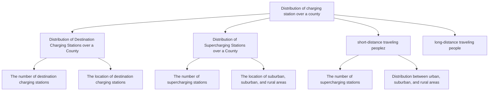

<table><tr><td>For office use only</td><td>Team Control Number</td><td>For office use only</td></tr><tr><td>T1</td><td>82794</td><td>F1</td></tr><tr><td>T2</td><td></td><td>F2</td></tr><tr><td>T3</td><td>Problem Chosen</td><td>F3</td></tr><tr><td>T4</td><td>D</td><td>F4</td></tr></table>

# 2018 Mathematical Contest in Modeling (MCM/ICM) Summary Sheet

# How to achieve the full adoption of all-electric vehicles

## Summary

We construct two models to facilitate the construction of the Tesla network from a macro perspective, a double-layer complex network to measure the network topology and a SI epidemic model based on the evaluation index system(SI-EI)to identify the key factors in the building process.

The double-layer complex network can be used to determine the number, location and distribution of chargeing stations. People are divided into long-distance and short-distance travelers. The number of charging stations are determined mainly by Vehicle Density, Daily Mileage and Range Anxiety: (1) the outer layer is to study the demands of long-distance travelers for supercharge stations,with introduced Weighted Betweenness to measure whether a city is a traffic hub, which is the reference to arrange the location; (2) the inner layer is to study the demands of the remaining three cases, and arrange location according to Vehicle Density. The distribution is based on the number of the above four cases. We introduce Reachable Level, Permeability and Long-distance travel demand rate into SI-EI model to measure daily infection rate λ, and apply the traditional SI model to determine the key factors.

For problem 1, there are 8.08 million destination charging stations and 2.16 million supercharge stations in the final network architecture. It takes 108 years to reach fully automobile electrification for constructed networks while it takes 36 years to construct networks.

For problem 2, we choose Ireland. There are 78 thousand destination charging stations and 20.8 thousand supercharge stations in the final network architecture. The optimal investment plan is to establish a 2: 1 ratio between the scale of the site and the present required scale, and to establish charging stations by mixing the ratio of the city to the rural area to 3: 2. The conclusion is mainly building destination charging stations when Permeability is less than 30%, and building supercharge stations in cities when Permeability is less than 50%but more than 30%, otherwise building supercharge stations in roads.

For problem 3, we build a classification system to have a weak traffic network.

For problem 4, technology that would hinder EVs’spread include: car-share, ride-share services and hyperloop. While technology that would boost EVs’spread include: self-driving cars, rapid battery-swap stations for electric cars, and flying cars

## Contents

## 1 Overview 1

1.1 Background.  
1.2 Restatement of Problem..  
1.3 Illustration. 2

## 2 Notations 2

## 3 Assumptions and Justification 2

## 4 Double-Layer Complex Network 3

4.1 Model Overview and Analysis. . 3  
4.2 Inner Layer: Distribution of Charging Stations over a County. . 4  
4.2.1 Distribution of Destination Charging Stations overa County. . 4  
4.2.2 Distribution of Supercharging Stations overa County. . 5  
4.3 Outer Layer: Distribution of Charging Stations from Countyto County. 7

## 5 SI epidemic model based on the evaluationindex system 9

5.1 Model Overview and Analysis. 9  
5.2 Establishment of Evaluation Index System. 9  
5.2.1 Analysis of User’s Demands. .9  
5.2.2 The Measure of Index. . 10  
5.3 SI Epidemic Model. .11

## 6 Application and Analysis 12

6.1 Task 1:Explore the network of Tesla charging stations in theUnited States.. . 12

6.1.1 The number and distribution of charging stations. . 12  
6.1.2 Prediction.. . 13

6.2 Task 2: Analysis the network of Tesla built in Ireland. . 14

6.2.1 2a: The number, placement and distribution of charging stations and key factors.. .14  
6.2.2 2b: Our proposed charging station plan. .. 16

6.2.3 2c: Our proposed growth plan timeline. .17  
6.2.4 Analysis of key factors.. ..17

6.3 Task 3: A weak traffic network classification system. . 18

6.4 Task 4: The impact of technology on EVs’ spread. .19

7 Sensitivity Analysis 19

8 Comment on Heavy Trucks 20

9 Analysis of the Model 20

9.1 Strengths. ..20  
9.2 Weaknesses. ..20

10 Task 5: Handout 21

Appendices 23

## 1 Overview

## 1.1 Background

The world is fascinated by reducing the use of fossil fuels, including gasoline for vehicles. Whether motivated by the environment or by the economics, consumers are starting to migrate to electric vehicles. The migration from gasoline and diesel vehicles to electric vehicles is not simple and can’t happen overnight. The location and convenience of charging stations is critical as early adopters and eventually mainstream consumers volunteer to switch. When nations plan this transition, they need to do:

• Build a sufficient number of vehicle charging stations in all the rightplaces;  
• Consider the final network of charging stations  
• Consider the growth and evolution of the network of charging stations overtime.

As nations seek to develop policies that promote the migration towards electric vehicles, they will need to design a plan that works best for their individual country.

## 1.2 Restatement of Problem

We need to determine the final architecture of the charging network to support the full adoption of all-electric vehicles. And we will identify the key factors that will be important as they plan their timeline for an eventual ban or dramatic reduction of gasoline and diesel vehicles.

Our specific tasks are the following:

• Explore the current and growing network of Tesla charging stations in the UnitedStates.  
• Select one of the following nations(South Korea, Ireland, or Uruguay). Build the network considering the number and distribution of charging stations, determine the growth plan and propose the timeline for the full evolution to electric vehicles in this country. And identify the key factors.  
• Identify the key factors that trigger the selection of different approaches to growing the network in different countries. Discuss the feasibility of creating a classification system that would help a nation determine the general growth model.  
• Comment on how other transportation options might impact our analyses of the increasing use of electric vehicles with the development of technology.  
• Prepare a one-page handout written for the leaders of a wide range of countries who are attending an international energy summit.

## 1.3 Illustration

• Two types of charging stations

Tesla currently offers two types of charging stations: (1) destination charging and (2) supercharging. Supercharging stations are usually built along the main road. Supercharging can quickly charge the vehicle while people take a quick break. Destination charging stations are built at places, including nearby company, shopping center and parking lots.

• Distribution of charging stations

The meaning of the distribution of charging stations is the differences in the distribution of rural areas, suburban areas, and urban areas. The differences include the number of charging stations, distribution of two types of charging stations and soon.

• Explanations for county

There are two explanations for county[6], one is that the county is composed of city[7] and country side, the other is that the county is composed of urban, suburban and rural areas.

• A charging station contains only one charger

Because our model calculates the number of chargers needed, while the number of charging stations depends on how many chargers a site contains. The specific number of distribution involves the use of power networks and land resources, which we won’t take into accounts too much about.

## 2 Notations

Here we list the symbols and notations used in this paper, as shown in Table 1. Some of them will be defined later in the following sections.

Table 1: Notations

<table><tr><td>Symbol</td><td>Description</td></tr><tr><td> $\lambda$ </td><td>The daily contact rate</td></tr><tr><td> $i$ </td><td>The current number of EVs</td></tr><tr><td> $M_{sum}$ </td><td>The total number of traditional vehicles and EVs</td></tr><tr><td> $D$ </td><td>The total satisfaction</td></tr></table>

## 3 Assumptions and Justification

• Focus only on personal passenger vehicles.

• a complete switch to all-electric happens, the system is stable and neither will people convert to gasoline vehicle users nor will people convert to EV users.  
• A charging station contains only one charger

## 4 Double-Layer Complex Network

## 4.1 Model Overview and Analysis

Sincewearebuildinganetworkofchargingstationsforacountry,weshouldstandonthe nation’s point to consider this problem. There are many differences between the counties in a country,includingtopography,folk customs and so on. Existing papers [1−3] did research on specific city, including the number of charging stations per street and so on. Such method of research does not apply to this problem. Weshould grasp the essence of the problem and abstract the problem, so we come up with a double-layered complex network, which means the global networkof charging stations and the networkof chargingstation’s distribution.

Take the United States for example, the structure of our double-layer complex network is shown in Figure 1:

```mermaid
graph TD
  A["Node 1"] --> B["Node 2"]
  B --> C["Node 3"]
  C --> D["Node 4"]
  D --> E["Node 5"]
  E --> F["Node 6"]
  F --> G["Node 7"]
  G --> H["Node 8"]
  H --> I["Node 9"]
  I --> J["Node 10"]
  J --> K["Node 11"]
  K --> L["Node 12"]
  L --> M["Node 13"]
  M --> N["Node 14"]
  N --> O["Node 15"]
  O --> P["Node 16"]
  P --> Q["Node 17"]
  Q --> R["Node 18"]
  R --> S["Node 19"]
  S --> T["Node 20"]
  T --> U["Node 21"]
  U --> V["Node 22"]
  V --> W["Node 23"]
  W --> X["Node 24"]
  X --> Y["Node 25"]
  Y --> Z["Node 26"]
```


<details>
<summary>flowchart</summary>


</details>


<details>
<summary>text_image</summary>

A county
A supercharging station
A destination charging station
</details>

Figure 1: A double-layer Network

We have already discussed in the Illustration of the general location of the two charging stations in the city. This article does not intend to discuss the specific location of the charging station from a microscopic point of view, but to discuss the location from a macro perspective where the location is understood as the number of charging stations allocated in different cities.

## 4.2 Inner Layer: Distribution of Charging Stations over a County

The design of the inner layer is mainly for the people whose scope of activity is in a county. They are characterized by a narrow range of activities, less power consumption per day, so it’s reasonable to build destination charging stations primarily.

However, there are still two kinds of people need supercharging stations. One is that the people whose scope of activity is in a county, but always forgets charging his vehicle. The other are the long-distance travelers who pass the county.

Figure 2 is the summary of the text below.  


<details>
<summary>flowchart</summary>


</details>

Figure 2: The structure of this subsubsection

## 4.2.1 Distribution of Destination Charging Stations over a County

## 1. The number of destination charging stations:

We quantify the number of destination charging stations by introducing the total load of charging formula [4]:

$$
L (S _ {i}, t, \tau) = f (S _ {i}, \tau) \times \phi (S _ {i}) \times N _ {s u m} \times \mu ((P, t, \tau) | _ {S _ {i}}), i = 1, 2, \dots , 6 \tag {1}
$$

$$
h \mathbf {j} (S _ {i})
$$

$$
\phi (S _ {i}) = g (D _ {i}) d D _ {i}, i = 1, 2, \dots , 6 \tag {2}
$$

$$
l l (S _ {i})
$$

$$
T L (t, \tau) = \sum_ {S _ {i} \in t t _ {\tau}} \left(L \left(S _ {i}, t, \tau\right)\right) \tag {3}
$$

where

• $S _ { i }$ is the ith user group, and the six user groups are divided according to the difference of daily mileage of electric vehicles(EVs).  
• $L ( S _ { i } , t , \tau )$ is the total number of destination charging stations $S _ { i }$ need in timet of workday τ.  
• $\textstyle f ( S _ { i } , \tau )$ is the probability distribution of the users in user group $S _ { i }$ in workdays and is equal to the ratio of charging users to total users of user group $S _ { i }$ duringworkday τ .  
• $N _ { s u m }$ is the holding number of EVs in our researching area.  
• $\mu ( ( P , t , \tau ) | _ { s _ { i } } )$ is the expected value for a single user in user class $S _ { i }$ charged during workday τ at timet.  
• $\phi ( S _ { i } )$ is the ratio of the number of users in user group $S _ { i }$ to $N _ { s u m }$ .  
• $g ( D _ { i } )$ is the probability density function that daily driving distance of a single user in user group $S _ { i }$ obeys.  
• $t t _ { \tau }$ is the set of user group that have charged during the workday τ.  
• $T L ( t , \tau )$ is the total number of destination charging stations needed in time t of workdayτ.

There is no doubt that we should use $D T L = \mathsf { m a x } \overleftarrow { \sum } _  T L ( t , \tau ) \}$ as the required number of destination charging stations.

## 2. The location of destination charging stations:

The number of destination charging stations assigned to each county is proportional to the vehicle density in the county.

$$
D T L _ {i} = \frac {D T L \times C D _ {i}}{\sum_ {i} C D}
$$

where $D T L _ { i }$ is the number of charging stations required for the ith city, DTL is the number of charging stations required for the whole country, $C D _ { i }$ is the traffic density of the ith city.

## 3. Distribution between urban, suburban, and rural areas:

Our research on quantity and location is based on vehicle density, and the main difference between urban, suburban, and rural areas is vehicle density as well, so it is reasonable to allocate the number of destination charging stations based on the vehicle density ratio.

## 4.2.2 Distribution of Supercharging Stations over a County

For short-distance traveling people who always forget charging

## 1. The number of supercharging stations:

Suppose that people with rate a always forget charging at home, then they need supercharging stations. Range anxiety is defined as drivers’ concerns with being stranded with a discharged EV battery and the associated delays to their journeys due to long recharging times [5]. Considering that the range anxiety of destination charging stations should larger than that of fast-charge, so we introduce a Damage Factor $^ { r d , }$ its meaning is the maximum remaining capacity when people want to use the supercharging stations relative to that when they want to use the destination charging stations and the number of supercharging stations. we need can be represented as:

$$
S T L = D T L \times a \times r d \tag {5}
$$

## 2. The location of supercharging stations:

It’s similar to the location of destination charging stations, so we will not repeat them here.

## 3. Distribution between urban, suburban, and rural areas:

It’s similar to the distribution of destination charging stations between urban, suburban, and rural areas, so we will not repeat them here.

## For long-distance traveling people

Since long-distance travelers tend to rest at the center of the counties along the way, it can be predicted that important cities should have a large demand for supercharging stations. Thus we need to set up the stations in such important cities to fit thedemands.

The importance of cities can be measured by Betweenness.

$$
B _ {i} = \sum_ {1 \leq j <   l \leq N, j \neq i \neq l} \frac {n _ {j l} (i)}{n _ {j l}} \tag {6}
$$

where, $n _ { j l } ( i )$ is the number of the shortest paths between $\nu _ { j }$ and $\nu _ { l }$ which also passes $\nu _ { i } ,$ $n _ { j l }$ is the number of the shortest paths between $\nu _ { j }$ and $\nu _ { l } .$

Given that the network we have constructed is a weighted graph, the attribute of a node is its number of vehicles, and the attribute of an edge is the distance between two adjacent cities. Now we introduce two coefficients to construct Weighted Betweenness. Thus, we get our final Weighted Betweenness WB to measure the importance of cities.

$$
W B _ {i} = B _ {i} \times \eta_ {1} \times \eta_ {2} \tag {7}
$$

where $\eta _ { 1 }$ is the ratio of the sum of the population of the cities connected to the city to the total population, $\eta _ { 2 }$ is the ratio of the sum of the length of the edge between the city and all of its surrounding cities to the total length of the edge.

## 1. The number of supercharging stations:

Let us estimate the number of supercharging stations needed for long-distance travelers. We assume that long-distance travelers charge mainly during the twelve hoursdaytime, charging thirty minutes each time and traveling an average of L miles per day. $\rho$ is a factor used to prevent the rush hour from being in short supply. The Range Anxiety, $E _ { r } ,$ is set at 130 miles, which means that travelers are expected to charge when they spend 130 miles.

$$
S T L = \frac {w \times N _ {s u m} \times L \times \rho}{2 4 E _ {R}} \tag {8}
$$

## 2. The location of supercharging stations:

Then we divide supercharging stations into two types, one around the city and the other on the road between the two counties. We should try our best to put the supercharging stations in the city, which not only meets the requirements of long-distance travelers but also reduces the construction cost. Here we mainly consider the supercharging stations around the city, and we will continue to discuss the supercharging station on the road between the two counties later. We set the ratio of the supercharging stations on the road to the overall supercharging stations as $\beta .$

$$
S T L _ {c _ {i}} = \Sigma \frac {W B _ {i}}{W B _ {i}} \times S T L \times (1 - \beta) \tag {9}
$$

## 3. Distribution between urban, suburban, and rural areas:

We have discussed above that the supercharging station here is built in the urban area, as for the supercharging stations built in the suburban and rural areas, they will be discussed in the outer network.

## 4.3 Outer Layer: Distribution of Charging Stations from County to County

The main target of the chargers between counties is those who travel long distances, whose EV may out of battery before they arrive at their destinations. Thus they need the charging stations. However they wish they could arrive in a certain time, so compared with destination charging stations, they need supercharging stations more. From this we know, stations between counties should be supercharging stations.

There are three types of routes in the outer layer, as is shown in Figure 4:

• The direct route between cities in the same county.  
• The direct route between cities in neighboring counties.


<details>
<summary>pie chart</summary>

| Category | Value |
|---|---|
| urban area | 10 |
| suburban area | 25 |
| rural area | 30 |
| urban area | 15 |
| suburban area | 20 |
| rural area | 25 |
| urban area | 10 |
| suburban area | 20 |
| rural area | 25 |
| urban area | 30 |
| suburban area | 20 |
| rural area | 25 |
| urban area | 30 |
| suburban area | 20 |
| rural area | 25 |
| urban area | 30 |
| suburban area | 20 |
| rural area | 25 |
| urban area | 30 |
| suburban area | 20 |
| rural area | 25 |
| urban area | 30 |
| suburban area | 25 |
| suburban area | 15 |
| DCS | 40 |
| SCSL | 25 |
| SCSS | 15 |
</details>

DCS : destination charging stations  
sCSS : supercharging stations for short-distance traveling people  
SCSL : supercharging stations for long-distance traveling people

Figure 3: the number of charging stations

• The route between cities that aren’t in adjacent counties passes through the big cities who located between these cities.

It is worth mentioning that different countries have different standards for the classification of cities. We will study the number and location of supercharging stations as follows.


<details>
<summary>scatterplot</summary>

| Category     | Shape  | Color  |
| ------------ | ------ | ------ |
| small city   | Circle | Grey   |
| big city     | Star   | Yellow |
| road         | Line   | Blue   |
| county       | Circle | Grey   |
</details>

Figure 4: the outer-layer Network

## 1. The number of supercharging stations:

The network of the outer layer is a complete graph. We test all the edges in thecomplete graph. The calculation of the number of supercharging stations between two cities is as follows:

$$
K _ {i j} = ^ {\prime} \frac {L}{E _ {R}} ^ {\prime} \times \frac {N _ {i} + N _ {j}}{N _ {s u m}} \times K _ {s u m} \times \beta \tag {10}
$$

where, L is the distance between two cities; $E _ { R }$ is Range Anxiety; $N i ( i = 1 , 2 , . . . )$ is the number of EVs in the ith city; $N _ { s u m }$ is the number of EVs in all cities; $K _ { i j }$ is the number of supercharging stations between the ith city and the $j t h$ city; $K _ { s u m }$ is the number of supercharging stations in all cities; β is the scale factor.

## 2. The location of supercharging stations:

According to the experience of life, people will choose the shortest path to reach their destination. And based on the interpretation and analysis of $E _ { R } ,$ supercharging station should be placed on the shortest path between the two cities and the distance to the nearest supercharging station is 130 miles.

## 5 SI epidemic model based on the evaluation index system

## 5.1 Model Overview and Analysis

In life, people decide whether to use traditional vehicles or electric vehicles based on their satisfaction with electric vehicles which is mainly measured by the number and location of charging stations. Thus we established a evaluation index system to measure people’s satisfaction.

When a person is very satisfied with electric vehicles, he will tell his friends and family around the advantages of electric vehicles, so that people around him have a certain probability of being convinced by him, that is, turning to the use of electric vehicles. According to the above analysis, we have established a SI epidemic model based on the evaluation index system.

## 5.2 Establishment of Evaluation Index System

Before establishing evaluation index system, we need to analyse people’s specific demands. In the following, we first classify people according to the length of their journey and analyse the demands of different types of people. Then establish the evaluation index system according to people’s demands.

## 5.2.1 Analysis of User’s Demands

Based on people’s preferences, people are divided into two types: those who prefer longdistance travel (LT) and those who prefer short excursions (SE).

• Long trips often cross several counties and will definitely need supercharging station during the travel, so it’s more important for LT that the number and location of supercharging station along the way.  
• SE’s basic necessities of life are mostly in their own county. SE is divided into people who won’t forget to charge (NFC) and who will forget to charge (FC). NFC’s daily life does not

require supercharging station, they only need a sufficient number of destination charging stations to meet the daily charging demands. FC may require supercharging stations in the city in case forgotten to charge EVs in time, so the number of supercharging stations in the city is more important to FCs than NFCs.

According to the analysis above, the metrics in evaluation index system should include: the number of destination charging stations; the number of supercharging stations in the city; the number of supercharging stations in the road; the location of supercharging stations in the road.


<details>
<summary>text_image</summary>

the number of
DCS
the number of
SCSC
the location
of SCSR
</details>

the metrics in evaluation index system DCS:destination charging stations SCSC: supercharging stations in the city SCSR: supercharging stations in the road  
Figure 5: the metrics in evaluation index system

## 5.2.2 The Measure of Index

The measure of the level of satisfaction with the number of destination charging stations is the following:

$$
D N L = \frac {D T L _ {\text {now}}}{D T L \times P T} \tag {11}
$$

where DNL is the satisfaction level with the number of destination charging stations, DTLnow is the number of destination charging stations now, DTL is the total number of destination charging stations when every gas vehicle has been replaced by an electric one and every gas station has been replaced with a charging station, PT is the permeability.

To measure the level of satisfaction with the number of supercharging stations, we have proposed the following formula:

$$
S N L = \frac {S T L _ {c} \_ n o w}{S T L _ {c} \times P T} \tag {12}
$$

where, SNL is the satisfaction level with the number of destination charging stations in city, $S T L _ { c \_ n o w }$ is the number of supercharging stations in city now, STLc is the total number of destination charging stations when every gas vehicle has been replaced by an electric oneand every gas station has been replaced with a charging station in city, also, PT is the permeability.

Permeability is the current proportion of EVs to all vehicles which can be calculated as follows:

$$
P T = \frac {i}{M _ {\text {sum}}} \tag {13}
$$

where, i is the current number of EVs while $M _ { s u m }$ is the total number of traditional vehicles and EVs.

Satisfaction level with the location of a supercharging station on a long road is indicated by RL, which means reachable level, that is the reachable probability of multiple counties to county B from county A route. If County A and County B are far apart and there are not enough supercharging stations on the road for charging, they are not reachable, otherwise they are reachable.

Overall satisfaction can be measured as follows:

$$
D = w \times P C + (1 - w) \times \left(a \times \frac {S T L _ {c n o w}}{S T L _ {c} \times P T} + \frac {D T L _ {n o w}}{D T L \times P T}\right) \tag {14}
$$

Where, D is the total satisfaction, w is the percentage of the number of LT, a is the ratio of the number of FC to SE, RL is the Reachable Level.

## 5.3 SI Epidemic Model

In the SI epidemic model, people who use EVs are equivalent to those patients in the SI model. People who use traditional vehicles are equivalent to healthy people in the SI model, and those who are healthy will use EVs because of the encouragement of the people around them , that is, they will become patients.

As is shown in Figure 6 , the dots whose color is the deepest represent patients while the dots whose color is the lightest represent healthy people. The depth of the dots’color on behalf of people’s satisfaction to EVs. The ratio of the number of LT to that of overall w and the ratio of the number of CSE to that of SE a can be calculated as:


<details>
<summary>network graph</summary>

| Category                     | Node IDs |
| ---------------------------- | -------- |
| People who use traditional cars | 1        |
| People who use EVs          | 2        |
| People who use EVs          | 3        |
| People who use EVs          | 4        |
| People who use EVs          | 5        |
| People who use EVs          | 6        |
| People who use EVs          | 7        |
| People who use EVs          | 8        |
| People who use EVs          | 9        |
| People who use EVs          | 10       |
| People who use EVs          | 11       |
| People who use EVs          | 12       |
| People who use EVs          | 13       |
| People who use EVs          | 14       |
| People who use EVs          | 15       |
| People who use EVs          | 16       |
| People who use EVs          | 17       |
| People who use EVs          | 18       |
| People who use EVs          | 19       |
| People who use EVs          | 20       |
| People who use EVs          | 21       |
| People who use EVs          | 22       |
| People who use EVs          | 23       |
| People who use EVs          | 24       |
| People who use EVs          | 25       |
| People who use EVs          | 26       |
| People who use EVs          | 27       |
| People who use EVs          | 28       |
| People who use EVs          | 29       |
| People who use EVs          | 30       |
| People who use EVs          | 31       |
| People who use EVs          | 32       |
| People who use EVs          | 33       |
| People who use EVs          | 34       |
| People who use EVs          | 35       |
| People who use EVs          | 36       |
| People who use EVs          | 37       |
| People who use EVs          | 38       |
| People who use EVs          | 39       |
| People who use EVs          | 40       |
| People who use EVs          | 41       |
| People who use EVs          | 42       |
| People who use EVs          | 43       |
| People who use EVs          | 44       |
| People who use EVs          | 45       |
| People who use EVs          | 46       |
| People who use EVs          | 47       |
| People who use EVs          | 48       |
| People who use EVs          | 49       |
| People who use EVs          | 50       |
| People who use EVs          | 51       |
| People who use EVs          | 52       |
| People who use EVs          | 53       |
| People who use EVs          | 54       |
| People who use EVs          | 55       |
| People who use EVs          | 56       |
| People who use EVs          | 57       |
| People who use EVs          | 58       |
| People who use EVs          | 59       |
| People who use EVs          | 60       |
| People who use EVs          | 61       |
| People who use EVs          | 62       |
| People who use EVs          | 63       |
| People who use EVs          | 64       |
| People who use EVs          | 65       |
| People who use EVs          | 66       |
| People who use EVs          | 67       |
| People who use EVs          | 68       |
| People who use EVs          | 69       |
| People who use EVs          | 70       |
| People who use EVs          | 71       |
| People who use EVs          | 72       |
| People who use EVs          | 73       |
| People who use EVs          | 74       |
| People who use EVs          | 75       |
| People who use EVs          | 76       |
| People who use EVs          | 77       |
| People who use EVs          | 78       |
| People who use EVs          | 79       |
| People who use EVs          | 80       |
| People who use EVs          | 81       |
| People who use EVs          | 82       |
| People who use EVs          | 83       |
| People who use EVs          | 84       |
| People who use EVs          | 85       |
| People who use EVs          | 86       |
| People who use EVs          | 87       |
| People who use EVs          | 88       |
| People who use EVs          | 89       |
| People who use EVs          | 90       |
| People who use EVs          | 91       |
| People who use EVs          | 92       |
| People who use EVs          | 93       |
| People who use EVs          | 94       |
| People who use EVs          | 95       |
| People who use EVs          | 96       |
| People who use EVs          | 97       |
| People who use EVs          | 98       |
| People who use EVs          | 99       |
| People who use EVs          | 100      |
</details>

Figure 6: Network of SIS Epidemic Model

$$
w = P T \times x \tag {15}
$$

$$
a = P T \times y \tag {16}
$$

where PT is the permeability, x is the number of LT to all when every gas vehicle replaced by an electric one and every gas station replaced with a charging station, y is the number of CSE to that of SE when every gas vehicle replaced by an electric one and every gas station replaced with a charging station. Then put formula (15) and formula (16) into (14).

In this epidemic model, λ is the number of people who own vehicles that make efficient use of EVs (enough to convert people from a traditional vehicle user to an EV user) every day, which can be referred to as the daily contact rate. The parameterλ can be calculated as:

$$
\lambda = \frac {(D - X) P}{D} \tag {17}
$$

where X is a threshold value. When the total satisfaction level $D = X ,$ people are neutral about EVs and traditional vehicles; When $D > X ,$ people tend to choose EVs; When $D < X ,$ people tend to choose a traditional vehicle. P is the total number of people with vehicles that come in contact with each person who uses the EVs every day.

$$
\frac {d i}{d t} = \lambda i (1 - i), i (0) = i _ {0} \tag {18}
$$

where i is the current number of $\mathrm { E V s , }$ λ is the daily contact rate, i is the initial value of EVs.

## 6 Application and Analysis

## 6.1 Task 1:Explore the network of Tesla charging stations in the United States

## 6.1.1 The number and distribution of charging stations

## 1. Destination charging stations

• The number of destination charging stations

We consulted for information and learned the current total population of the United States is 323.1 million, the per capita consumption of vehicle is 0.766 and the daily mileage expectation is 43.4. We regard these data as the value of parameters in the formula 1, and get the answer $D T L = 8 . 0 8 m i l l i o n$ .

• The distribution of destination charging stations

Based on the model name, the distribution of destination charging stations is the same as the radio of urban, suburban, and rural areas. The result is as shown in Table 3.

## 2. Supercharging stations

• The number of supercharging stations The number of supercharging stations is shown in Table 2.

Table 2: the number of charging stations

<table><tr><td colspan="2">type</td><td>number(million)</td></tr><tr><td colspan="2">destination charging stations</td><td>8.08</td></tr><tr><td rowspan="2">supercharging stations</td><td>long-distance traveling people</td><td>1.62</td></tr><tr><td>short-distance traveling people</td><td>0.54</td></tr></table>

• The distribution of supercharging stations

According to the formula 9, when ß=0.3, we get the distribution as follows:


<details>
<summary>stacked bar chart</summary>

| Area | Destination Charging Stations | Supercharging Stations |
| :--- | :--- | :--- |
| rural area | 0.02 | 0.13 |
| suburban area | 0.08 | 0.07 |
| urban area | 0.95 | 0.68 |
</details>

Figure 7: the comparison of distribution between destination charging stations and supercharging stations

Table 3: the distribution of supercharging stations

<table><tr><td>areas</td><td>urban areas</td><td>suburban areas</td><td>rural areas</td></tr><tr><td>destination charging stations</td><td>0.8</td><td>0.15</td><td>0.05</td></tr><tr><td>supercharging stations</td><td>0.725</td><td>0.1125</td><td>0.1625</td></tr></table>

## 6.1.2 Prediction

We can assume that when a complete switch to all-electric happens, the system is stable and neither will people convert to gasoline vehicle users nor will people convert to EV users.

Assuming that the level of satisfaction D is the threshold at this time, this assumption is reasonable because vehicle companies will surely pursue their own maximum profits under the premise of maintaining system stability which will keep the satisfaction at the lowest level of satisfaction.


<details>
<summary>line chart</summary>

| t    | the growing network of Tesla | the current network of Tesla |
| ---- | ---------------------------- | ---------------------------- |
| 36   | 1                            | 1                            |
| 108  | 1                            | 1                            |
</details>

Figure 8: the comparison of the growing network and the current network of Tesla

We set $w = 0 . 7 , a = 0 . 3 , P T = 0 . 0 0 2 ,$ resulting in a threshold of 1.85. It can be seen from the Figure 8 that under the premise of ensuring that each future state is the same as today, the current Teslanetwork can meet the requirements of an all-electric vehicle but requires 36. Compared with the growing Tesla network, the main change is the addition of 496 supercharging stations, which can reduce the realization time to 108.

## 6.2 Task 2: Analysis the network of Tesla built in Ireland

## 6.2.1 2a: The number, placement and distribution of charging stations and key factors

The determination of the number and distribution of charging stations is consistent with task 1, and we apply the collected data about Ireland to get the result:

Table 4: the distribution of destination charging stations

<table><tr><td>areas</td><td>urban areas</td><td>suburban areas</td><td>rural areas</td></tr><tr><td>destination charging stations</td><td>0.7</td><td>0.2</td><td>0.1</td></tr><tr><td>supercharging stations</td><td>0.7</td><td>0.125</td><td>0.175</td></tr></table>

Table 5: the number of charging stations

<table><tr><td colspan="2">type</td><td>number(thousand)</td></tr><tr><td colspan="2">destination charging stations</td><td>78.0</td></tr><tr><td rowspan="2">supercharging stations</td><td>long-distance traveling people</td><td>15.6</td></tr><tr><td>short-distance traveling people</td><td>5.2</td></tr></table>

We will focus on determining the location below.

In order to simplify the problem, we have selected 27 big cities in Ireland, with a total population of 80% of the total population of the country.

## 1. The location of destination charging stations

Apply the ratio of vehicle possession to equation 4 to get the number of distribution for each city:


<details>
<summary>bar-line hybrid chart</summary>

| Location | Population | Number of Destination Charging Stations |
| --- | --- | --- |
| 1 | 550000 | 6000 |
| 2 | 250000 | 3000 |
| 3 | 200000 | 2500 |
| 4 | 200000 | 2500 |
| 5 | 200000 | 2500 |
| 6 | 200000 | 2500 |
| 7 | 200000 | 2500 |
| 8 | 200000 | 2500 |
| 9 | 200000 | 2500 |
| 10 | 200000 | 2500 |
| 11 | 200000 | 2500 |
| 12 | 200000 | 2500 |
| 13 | 200000 | 2500 |
| 14 | 200000 | 2500 |
| 15 | 200000 | 2500 |
| 16 | 200000 | 2500 |
| 17 | 200000 | 2500 |
| 18 | 200000 | 2500 |
| 19 | 200000 | 2500 |
| 20 | 200000 | 2500 |
| 21 | 200000 | 2500 |
| 22 | 200000 | 2500 |
| 23 | 200000 | 2500 |
| 24 | 200000 | 2500 |
| 25 | 200000 | 2500 |
| 26 | 200000 | 2500 |
| 27 | 200000 | 2500 |
| 28 | 200000 | 2500 |
| 29 | 200000 | 2500 |
| 30 | 200000 | 2500 |
| 31 | 200000 | 2500 |
| 32 | 200000 | 2500 |
| 33 | 200000 | 2500 |
| 34 | 200000 | 2500 |
| 35 | 200000 | 2500 |
| 36 | 200000 | 2500 |
| 37 | 200000 | 2500 |
| 38 | 200000 | 2500 |
| 39 | 200000 | 2500 |
| 40 | 255166 | 3166 |
| 41 | 1,31899 | 18,488 |
| 42 | - | - |
| 43 | - | - |
| 44 | - | - |
| 45 | - | - |
| 46 | - | - |
| 47 | - | - |
| 48 | - | - |
| 49 | - | - |
| 50 | - | - |
| 51 | - | - |
| 52 | - | - |
| 53 | - | - |
| 54 | - | - |
| 55 | - | - |
| 56 | - | - |
| 57 | - | - |
| 58 | - | - |
| 59 | - | - |
| 60 | - | - |
| 61 | - | - |
| 62 | - | - |
| 63 | - | - |
| 64 | - | - |
| 65 | - | - |
| 66 | - | - |
| 67 | - | - |
| 68 | - | - |
| 69 | - | - |
| 70 | - | - |
| 71 | - | - |
| 72 | - | - |
| 73 | - | - |
| 74 | - | - |
| 75 | - | - |
| 76 | - | - |
| 77 | - | - |
| 78 | - | - |
| 79 | - | - |
| 80 | - | - |
| 81 | - | - |
| 82 | - | - |
| 83 | - | - |
| 84 | - | - |
| 85 | - | - |
| 86 | - | - |
| 87 | - | - |
| 88 | - | - |
| 89 | - | - |
| 90 | - | - |
| 91 | - | - |
| 92 | - | - |
| 93 | - | - |
| 94 | - | - |
| 95 | - | - |
| 96 | - | - |
| 97 | - | - |
| 98 | - | - |
| 99 | - | - |
| ... | ... | ... |
| ... | ... | ... |
| ... | ... | ... |
| ... | ... | ... |
| ... | ... | ... |
| ... | ... | ... |
| ... | ... | ... |
| ... | ... | ... |
| ... | ... | ... |
| ... | ... | ... |
| ... | ... | ... |
| ... | ... | ... |
| ... | ... | ... |
| ... | ... | ... |
| ... | ... | ... |
| ... | ... | ... |
| ... | ... | ... |
| ... | ... | ... |
| ... | ... | ... |
| ... | ... | ... |
| ... | ... | ... |
| ... | ... | ... |
| ... | ... | ... |
| ... | ... | ... |
| ... | ... | ... |
| ... | ... | ... |
| ... | ... | ... |
| ... | ... | ... |
| ... | ... | ... |
| ... | ... | ... |
| ... | ... | ... |
| ... | ... | ... |
| ... | ... | ... |
| ... | ... | ... |
| ... | ... | ... |
| ... | ... | ... |
| ... | ... | ... |
| ... | ... | ... |
| ... | ... | ... |
| ... | ... | ... |
| ... | ... | ... |
| ... | ... | ... |
| ... | ... | ... |
| ... | ... | ... |
| ... | ... | ... |
| ... | ... | ... |
| ... | ... | ... |
| ... | ... | ... |
| ... | ... | ... |
| ... | ... | ... |
| ... | ... | ... |
| ... | ... | ... |
| ... | ... | ... |
| ... | ... | ... |
| ... | ... | ... |
| ... | ... | ... |
| ... | ... | ... |
</details>

Figure 9: the number of distribution for each city  


<details>
<summary>geographic dot map</summary>

| Location | Value |
| -------- | ----- |
| Various cities in Iceland | 0 to 1400 (color-coded) |
</details>

Figure 10: the distribution map of chargers

Based on the assume that the demographic difference in small cities is not obvious be cause of the small population, we randomly allocate the remaining destination chargers to the more open areas of the map (the remaining small cities that we did not consider).

## 2. The location of super chargestations

• For short-distance travelers

In equation 5, let a = 0.3, rd = 0.25 to get the number of distribution for each city.

• For long-distance travelers

We use weighted mediators to measure the importance of nodes in the network, according to the importance. By equation 9 and equation 10, we can get the number of distribution for each city and the number of distribution on each road as:


<details>
<summary>natural_image</summary>

Map of the United States with network connections and flight paths (no text or labels)
</details>

Figure 11: mix map


<details>
<summary>text_image</summary>

Map of the United States with red location pins indicating locations, overlaid with gray and white markers for reference.
</details>

Figure 12: distribution of supercharging stations

## Reasonableness Analysis:

Because the Tesla network in Ireland is in its infancy, it is difficult to verify the validity of our results. We study the relatively more mature Tesla network in the United States. The figure below is a mixture of the betweenness, the vehicle density and the shortest path based on the 309 major metropolitan areas in the United States. The lighter places indicate the higher proportion of the destination charging stations and the supercharging stations. We can easily identify the coastal cities of Boston, Los Angeles, New York and Miami though not fortified traffic but with a large population. We can speculate that the reason for their distribution is primarily our study of vehicle density. While for Peoria, Las Cruces, Jackson, Little Rock and other cities with relatively small population but the traffic fortress of the city, their distribution is mainly due to our study of the weighted mediation.

Moreover, the main highlight in the picture is the best route to place super-charging stations for long-distance travelers. And we can observe that our highlight area distribution is in good agreement with the current Tesla network density distribution in the United States, proving that our model works well.

## 6.2.2 2b: Our proposed charging station plan

## 1. Chargers distribution ordering trade-off

Based on the second Model, we consider three cases: build all city-based chargers first, or all rural chargers, or mix of both. The main difference among them is that different locations affect λ in $E _ { q } ( 1 8 )$ . We consider λ change with the growth of PT according to equation (17), and get the change of PT with time t in different situations, as is shown in Figure 13.

Result Analysis: We can see that hybrid construction achieves the 100% permeability rate the fastest, and even faster when the two are roughly proportional to 3: 2. This is consistent with the idea of using population density measures in our model. The collected data show that the proportion of urbanization in Ireland is 63.2%, so the model results are in line with real life.

## 2. Cars first or Stations first

The minimum number of charging stations to be built is such that λ is exactly equal to the threshold,otherwisepermeability ofthe EV (PT )willcontinue to decrease. Wehave changed the ratio of the number of charging stations in the case of building the chargers first to that in the case of build chargers in response to vehicle purchases several times. The result is shown in Figure14.


<details>
<summary>line chart</summary>

| t   | rural area changer first | city-based changer first | mix the ratio of the city to rural area to 3:1 | mix the ratio of the city to rural area to 3:2 |
| --- | ------------------------ | ------------------------ | --------------------------------------------- | --------------------------------------------- |
| 0   | 0.0                      | 0.0                      | 0.0                                           | 0.0                                           |
| 39.1| 0.9                      | 0.9                      | 0.9                                           | 1.0                                           |
| 54.1| 1.0                      | 1.0                      | 1.0                                           | 1.0                                           |
| 323.1| 1.0                     | 1.0                      | 1.0                                           | 1.0                                           |
</details>

Figure 13: Chargers distribution ordering trade-off


<details>
<summary>line chart</summary>

| t   | cars first | 2:1 ratio between the scale of the site and the present required scale | 3:1 ratio between the scale of the site and the present required scale |
| --- | ---------- | ------------------------------------------------------------------ | ------------------------------------------------------------------ |
| 41  | 0.9        | 1.0                                                                | 1.0                                                                |
| 108 | 1.0        | 1.0                                                                | 1.0                                                                |
</details>

Figure 14: Cars first or Stations first

Result Analysis: The main difference between the two cases is the rate of reaching 100% permeability and the up-front capital wasted by building supercharging stations. We can simply assume that the saving of capital is linear with the PT speed, so we concluded that it is wise to build the chargers first, and that it is optimal to build a site size that is 2: 1 to now. Therefore, we can draw the conclusion of the optimal investment plan: to establish a 2: 1 ratio between the scale of the site and the present required scale, and to establish charging stations by mixing the ratio of the city to the rural area to 3: 2.

## 6.2.3 2c: Our proposed growth plan timeline

Based on the analysis of the SI-EI model, the main task of different periods is changed, it can be seen in the Figure 15.

## 6.2.4 Analysis of key factors

Based on the above analysis, now we study the key factors.

1. In Task 2a, we main explore the final Tesla network topology. The key factors that shaped the development of our plan is the ratio of the total number of charging stations over the country to that in each city.


<details>
<summary>infographic</summary>

| Category | Percentage (%) |
| -------- | -------------- |
| mainly establish supercharging stations for short-distance traveling people | 30%-50% |
| mainly establish supercharging stations for long-distance traveling people | >50% |
| mainly establish destination charging stations | 0-30% |
| Mainly establish supercharging stations for short-distance traveling people | 100% |
</details>

Figure 15: The main task of different periods

2. In Task 2b, we main explore the Tesla network establishment process. The key factors tha shaped our proposed charging station plan are the ratio of the simultaneous construction of urban and rural areas.

3. In Task 2c, we mainly explore the different phases of the Tesla network establishment The key factors that shape your proposed growth plan timeline are the different main influencing factors in different stages of establishment.

## 6.3 Task 3: A weak traffic network classification system

This question requires us to create a classification system that would help a nation determine the general growth model, we consider to create a classification system which include the country who has a weak traffic network. The underdevelopment may be due to the special geography or underdeveloped economy, which makes it difficult to establish a nationwide road system.

This question requires us to determine the general growth model, so we don’t consider country-specific details, and the only difference between classification system with others is that there is little need to consider the need to establish charging stations for long-distance travelers. Building roadways between neighboring cities is the key factor that trigger the selection of different approaches to growing the network.

Now our proposed plan for growing and evolving the network of chargers doesn’twork. Therefore, we should greatly reduce the weight of betweenness index in the first model, which will simplify the problem to mainly relying on the proportion of the number of vehicles in the region to allocate charging stationso Considering people’s satisfaction with the EVs network, the satisfaction of long-haul travelers is relatively more difficult to meet previously. Now that we don’t need to take them into consider, it is more simple and fast to migrate away from gasoline and diesel vehicles to all EVs.

## 6.4 Task 4: The impact of technology on EVs’ spread

## 1. Technology that would hinder EVs’ spread: vehicle-share, ride-share services and hyperloop

As these three technologies evolve, the per-capita holding of vehicles will fall (that is, some owners sell their EVs), but as more people use new technologies, some may find it inconvenient to buy a vehicle again. These qualities are in line with the SIS model, so our SI model becomes a SIS model. The phenomenon will lead to a decline in the popularity rate of EVs. Therefore, it is necessary to dynamically adjust the construction of the EVs network based on the decreasing proportion.

## 2. Technology that would boost EVs’ spread: self-driving cars, rapid battery-swap sta tions for EVs, and flying cars

These three technologies will increase the attractiveness of EVs. The λ in our SI model willincrease,aswellasthepenetrationandpopularityrateofEVs. Theycanalsoexpand the demand of charging stations and accelerate the conversion to full EVs.

## 7 Sensitivity Analysis

We have conducted a sensitivity analysis of the SI-EI model: setting i(0) = 0.01 and studying the change of the proportion of i when λ is 0.3, 0.27 and 0.33 respectively over time.


<details>
<summary>line chart</summary>

| t  | λ=0.3  | λ=0.33 | λ=0.27 |
|----|--------|--------|--------|
| 0  | 0.0000 | 0.0000 | 0.0000 |
| 5  | 0.0500 | 0.0600 | 0.0400 |
| 10 | 0.2500 | 0.3000 | 0.1800 |
| 15 | 0.5500 | 0.6500 | 0.4500 |
| 20 | 0.8500 | 0.9000 | 0.7500 |
| 25 | 0.9500 | 0.9700 | 0.8800 |
| 30 | 0.9800 | 0.9900 | 0.9500 |
| 35 | 0.9950 | 0.9980 | 0.9850 |
| 40 | 1.0    | 1.0    | 1.0    |
</details>

Figure 16: the change of the proportion of i when λ is 0.3, 0.27 and 0.33 respectively over time

We’vefoundthattheproportionofiislesssensitivetoλwhenthesystemisinitsearlyand late stages while it is sensitive in mid-term stage. For example, when t = 15, the proportion of the three of i is about 0.4, 0.5 and 0.6. This discovery is of practical significance, which means the mid-term stage is the rapid growth stage of permeability in which we can take steps to increase people’s satisfaction level thus increase λ and speed up the rate of penetration.

## 8 Comment on Heavy Trucks

Heavy trucks generally need to travel a long way, as well as their huge traction, which result in that their demand for supercharging stations is greater than that of personal vehicles and they are not suitable for charging in cities. When a country’s road transport industry is developed, attention should be given to improving the satisfaction of truck drivers and the number of supercharging stations in rural areas and suburban areas.

## 9 Analysis of the Model

## 9.1 Strengths

1. The model of double-layer complex network appropriates problem’s requirements, Analysis network construction from a macroscopic perspective is different from a great deal of analysis on the power and street layout or other micro perspective in the field and greatly simplifies the problem.  
2. The SI-EI model cleverly assimilated the idea of the traditional SI model and combined with the evaluation index system to study the permeability from a novel perspective.  
3. The selection of Weighted Betweeness is very appropriate, well identified a major traffic hub city, so that the charging station distribution more reasonable.

## 9.2 Weaknesses

The layout of the charging stations is only accurate to the amount allocated to the city because of the large differences among cities and the difficulty in collecting the data, and with more detailed data we can get a more accurate distribution.

## 10 Task 5: Handout

The world is fascinated by reducing the use of fossil fuels, including gasoline for cars. Whether motivated by the environment or by the economics, consumers are starting to migrate to electric vehicles. We should consider the key factors that affect our plan in order to build this network faster and better.

## 1. From the perspective of the final network topology

We should have a more accurate prediction of the topology of the final network, which mainly contains the consideration of the number, location and distribution of charging stations. These metrics are the most important reference to measure whether the network building process is better or not. A better prediction can boost the Permeability, save more funding of network construction and get the most socialbenefits.

## 2. From the investment perspective of network establishment process

We should maintain the highest possible investment efficiency in the network con struction process. To decide the optimal ratio, the current ratio of charging stations in urban and rural areas should be taken into account, combined with their own national urbanization rate. Moreover, building ultra-scale charging stations in advance is extremely helpful in accelerating the penetration of electric vehicles. Although it brings a waste of previous capital, but the latter part of the benefits of speed is far greater than the waste here.

## 3. From the stage perspective of network establishment process

textbfWe should ensure that the establishment of the charging station to best meet peo ple’s needs. The leading crowd who influence the overall satisfaction levels is different in different stages. We initially speculated that in general destination charging stations should be built in the initial construction stage; supercharge stations for short-distance travelers should be built in the mid-term stage; supercharge stations for long-distance travelers should be built in the latter stage.

The above is the overall consideration of the key factors of network construction.We think it would be most reasonable to set a gas vehicle-ban date at 40 years later. The leaders of all countries should, according to the particular circumstances of their own country, determine the ways that are best for themselves, I wish all of you early realization of full automobile electrification!

## References

[1] Wu,Lixia.ResearchontheLayoutPlanning ofChargingStationforElectricVehicleinthe City [D]. Chongqing Jiaotong UniVersity,Chongqing,China:Wu Lixia, 2017.  
[2] Wu, Lian. Locating Electric Vehicles Refueling Stations Based On The Generalized Coverage[D]. Huazhong University of Science and Technology:Wu Lian, 2016.  
[3] Fang, Lu. The location-sizing problem of electric vehicle charging station deployment based on queuing theory[D]. Beijing Jiaotong University:Fang Lu, 2015.  
[4] Xu, Hao. Studies on Optimal Charging Station Placing and Orderly Charging Strategy for Large-Scale Electric Vehiclesinto Grid[D]. Huazhong University of Science and Technology:Xu Hao, 2015.  
[5] Fei, Wu, Ramteen, Sioshansi. A stochastic flow-capturing model to optimize the location of fast-charging stations with uncertain electric vehicle flows[J]. Transportation Research, 2017, (53): 354-376.  
[6] County https://en.wikipedia.org/wiki/County  
[7] City https://en.wikipedia.org/wiki/City

## Appendices

Here are simulation programmes we used in our model as follow.

some more textInput C++ source:

```c
#define N 307
#define INF 1000000
typedef struct 
{
    int from;
    int to;
    char *fromCity;
    char *toCity;
    int value;
} Data;
int *getPath(int *path[], int i, int j)
{
    int *ret = (int *)malloc(sizeof(int));
    for (int i = 0; i < 20; i++)
    {
    ret[i] = -1;
    }
    if (i == j || path[i][j] == -1)
    {
    return ret;
    }
    int temp = i;
    int k = 0;
    while (temp != j)
    {
    ret[k++] = temp;
    temp = path[temp][j];
    }
    ret[k++] = temp;
    return ret;
}

void Floyd(Data *matrix[], int *path[])
{
    for (int k = 0; k < N; k++)
    {
    for (int i = 0; i < N; i++)
    {
    for (int j = 0; j < N; j++)
    {
    if (
    matrix[i][k].value != INF && matrix[k][j].value != INF &&
```

```javascript
matrix[i][j].value > matrix[i][k].value + matrix[k][j].value)
{
    matrix[i][j].value = matrix[i][k].value + matrix[k][j].value;
    matrix[i][j].fromCity = matrix[i][k].fromCity;
    matrix[i][j].toCity = matrix[k][j].toCity;
    path[i][j] = path[i][k];
}
}
```