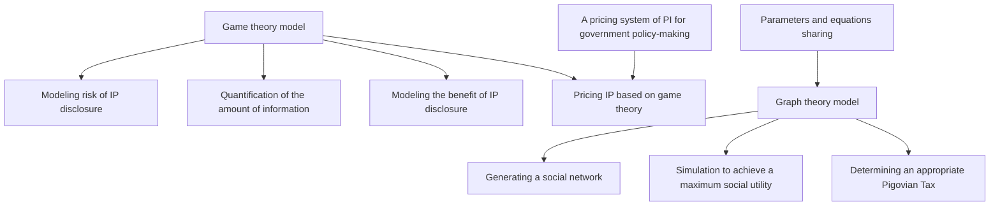
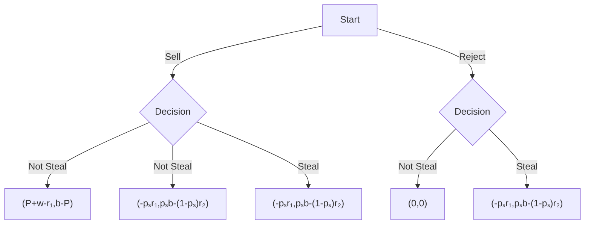

<table><tr><td>For office use only</td><td>Team Control Number83744</td><td>For office use only</td></tr><tr><td>T1</td><td></td><td>F1</td></tr><tr><td>T2</td><td></td><td>F2</td></tr><tr><td>T3</td><td>Problem Chosen</td><td>F3</td></tr><tr><td>T4</td><td>F</td><td>F4</td></tr></table>

## 2018

## MCM/ICM

Summary Sheet

## Private Information Pricing System Based on Game Theory and Graph Theory

To study the issues regarding private information (PI), build a pricing system and offer recommendations to government, we build our primary model based on game theory and extend it by referring to graph theory. We assume there are three components of the society: individuals, organizations and governments. Individuals decide whether to sell and disclose PI to organizations and they both make every efforts to maximize their own benefits. The government, as a social planner, can adopt some measures to maximize social utility, including both individuals and organizations. We set a dynamic perfect-information two-stage sequential game to predict the behavior of individuals and organizations, where simultaneously, we try to explore the policy implications for government.

First, to model risk of data disclosure for individuals, we divide the risk into three primary and possible categories. Each sub-risk is affected by different characteristics of the individuals and specific kind of information. To provide an insight of how to quantify these risks, we provide some rough estimation of each sub-risk on the most influential factor. Considering the weights of these sub-risks may be distinctive in different PI domains such as social media, financial transaction and health records, we employ AHP to quantify the weights given that there are few data available in this field. Then, we use the amount of information as an essential factor influencing the value of data disclosure for both individuals and organizations. We create a method to quantify the amount of PI with the category of basic and profitable information. Naturally, we assume the benefit of individuals and organizations increases with larger amount of PI.

Next, we enter the main part of our analysis to solve the game. By discussing the equilibrium and constraints in the game, we predict every market outcome with different parameter settings. The equilibrium allows us to add in the role of governments where they can use an elaborate pricing system to offer recommended price of different PI and strengthening market surveillance to make the market more effective.

The following parts will show several applications of our model under different circumstances. We discuss whether PI should be made a basic human right from economics perspective, introduce dynamic time influence on data value, consider how generational risk perception difference will affect the model and provide suggestions for policy-making during a massive data breach.

Lastly, to extend our model on network effect of PI, we employ a network simulation based on graph theory with consideration of information externality. We find that the social utility will be greatly miscalculated if we ignore the network effect, leading to the failure of pricing system. Nevertheless, with Pigovian Taxation, or subsidy, on information disclosure with strong externality, governments can erase the externality effect and increase the total social utility.

flowchart

# MEMORANDUM

To: President of Government

From: Team 83744

Subject: Policy Recommendation on Private Information

Date: February 12, 2018

This memo is presented to provide you with an overview of our models on privacy, corresponding results and policy recommendations. Our team has investigated various issues and aspects about private information (PI) and based on our investigation, we introduced some useful parameters and build two prime models utilizing game theory and graph theory respectively.

In our first model based on game theory, four key exogenous parameters are introduced and elaborately discussed: $r_{1}$ , the risk of data disclosure on individuals (e.g. identity theft, spam and price discrimination); w, the benefit of data sharing for individuals (e.g. service personalization and health condition analysis report); b, the benefit of data sharing for organizations owning the information (e.g. targeted advertisement and reasonable price setting); $p_{s}$ , the probability of data being stolen, or illegally used without individual's consent by organizations (e.g. data hacking). We adopt assorted measures to account for some major impacts for each parameter. Then we use the framework of game theory to predict how these parameters' changes will result in the variation of market outcomes. Next, to explore how government can play a positive role in this field and enlarge the total social utility, we further introduce P (price suggested by government on PI transactions) and $r_{2}$ (the risk of organizations' being punished by government for illegally capturing individuals' data).

After calculation by game theory, the larger value of w, b and the smaller value of $r_{1}$ can lead to greater possibility of Nash Equilibrium of market disclosure or transaction, which means those market transaction data are more likely to be shared by individuals to companies because individuals can receive the benefit of targeted offers (w) and companies can use it to locate potential customers (b). The effect of $p_{s}$ is more complex. We use the method of Shapley Value to derive a fair pricing system for individuals and organizations, which can also lead to efficient market equilibrium.

However, one of the largest concerns of PI sharing is externality, indicating that others sharing of their data may result in the benefit or cost on others, especially in the Information Age when people are widely connected. A positive example is individuals epidemic disease data for Center of Disease Control (CDC) will be extremely helpful to control terrifying diseases. In contrast, my Instagram post tag can expose my friends location or other private information to the public, leading to unexpected risk. To delineate this phenomenon, we employ graph theory to build a network model and predict social utility under different circumstances.

The result shows that total social utility will be greatly miscalculated if we ignore the externality and this effect grows bigger with increasing externality (both positive and negative). With the inspiration of economic theory, we introduces Pigovian Tax to erase externality. The simulation reveals that proper amount of taxation(or subsidy) on individuals or organizations will greatly increase social utility.

Based on our models and results, we offer the following valuable and viable recommendations to your government and hope for the adoption:

- Government should not confine privacy as a kind of untradeable (non-waiver) human right from economic perspective which will result in loss in efficiency.  
- Government can provide suggested optimal price for different types PI. For PI with higher value for firms or NGO, and PI with higher disclosure risk for individuals, the transaction price should both be higher. Specific examples can be financial transaction data generating great value for firms and private identity information with much risk of identity theft and misuse.  
- Government should conduct supervision and increase the punishment for illegally data-capturing behavior for organizations to a certain degree to deter misbehavior, especially for those information with low benefits to firms such as depreciated personal history data. However, over expenditure on supervision will also cause inefficiency for government.  
- Considering generational difference, in reality, the elderly may be less willing to accept the price suggested by government. But government should not address this issue if they believe that they accurately estimate objective risk and other parameters.  
- Government should take quick actions in preventing another PI theft accident after massive data breach because of increased leakage risk, and thus the negative effect can be erased as much as possible. The total loss in this process depends on the speed of government reaction and the required level of management.  
- A law should be enacted by country, forcing data-holder agencies to take responsibility and offer reimbursement to individuals for misuse or loss of data. The measure will create incentive for organizations to carefully keep private information and increase social welfare.  
- Regarding the externality of PI, we strongly recommend government levy tax on data sharing behavior with negative externality (e.g. phone apps that require friends online privacy) and provide subsidy on those with positive externality (e.g. personal disease data). And the amount of taxation should be in proportion to the extent of externality.

## Contents

## 1 Introduction 1

1.1 Background....1  
1.2 Statement of the problem....1

## 2 Base model analysis 3

2.1 Assumptions....3  
2.2 Notation of parameters....3  
2.3 Modelling risk....3  
2.4 Cost and benefit analysis of privacy....6  
2.5 A game theory model for pricing private information....8  
2.6 The transfer of pricing power....9

## 3 Application of our model 11

3.1 Privacy as a human right.... 11  
3.2 Timeliness of private information.... 12  
3.3 Generational difference in PI system....13  
3.4 Massive PI breach concern....14

## 4 Extension on network effect of PI 16

4.1 Modelling network effect....16

4.1.1 Generating a scale-free network....16  
4.1.2 Simulation process....17  
4.1.3 Simulation results.... 17

4.2 Corresponding policy suggestions....17

## 5 Conclusion 19

5.1 Strengths and weaknesses....19

5.1.1 Strengths.... 19  
5.1.2 Weaknesses....19

5.2 Conclusion....19

## A Appendix 23

A.1 Examples of calculating the amount of PI.... 23

## List of Figures

1 Decision Tree of the Baseline Game Theory Model....8  
2 Supply And Demand Curve For PI As Commodities....10  
3 Willingness Versus Age....14  
4 BA Network Of 10,000 Nodes....16  
5 e=-0.05....18  
6 e=0.01.... 18  
7 $U_{max}$ vs e....18  
8 $d_{m}$ vs e....18

## 1 Introduction

## 1.1 Background

The value of private information has always been in the center of discussion both academically and mundanely, especially in an era where information explodes exponentially and big data becomes popular. Private information can bring profits to both individual and organizations who obtain private information. But the use of private information to gain profit may bring harm to the information owner. Determining the exact value of private information will facilitate policy making of government to balance privacy protection and public data sharing.

With the development of information technology, personal information can be obtained more easily than ever. Tons of information concerning personal preferences and tastes are automatically exposed after consumers shopping online. Individual information including phone number and home address have to be provided in myriads of scenarios and may be leaked for advertising use. Considering the benefits of private information, if no protection is provided, individuals will find it almost impossible to keep privacy and may suffer from tele marketing harassment, property loss, and social embarrassment.

Private information, on the other hand, will bring benefits to individuals only if it's known to others in some cases. Marketers are better able to serve customers through customization and promotion if personal data are provided [2]. Individual health profiles can be used by hospital to control the spread of epidemics. Thus, it's inappropriate to rush to the conclusion that privacy must be kept only to the individual.

Scholars have explored qualitative solutions to the conflicts of privacy protection and information sharing. For example, fair information practices (FIPs), are a set of standards governing the collection and use of personal information, incorporating five core principles: notice, choice, access, security and enforcement [3]. However, lack in quantitative models of private information value greatly harms the efficacy of such methods. The ambiguity makes it hard to evaluate the process of protection and dissemination.

It’s rather interesting to compare private information (PI) with private personal property (PP), as well as with intellectual property (IP). An assumption in our model depicts an essential similarity of those three: they are both tradable items on corresponding markets, where we can also put price tags on them. However, compared to normal PP and IP, PI transaction is more like leasing instead of selling. Individuals still have property to their private information but they cannot resell their PP or IP under common cases. As for organizations, based on our assumptions, they cannot sell or give PI to other agencies even after they lawfully obtain it.

## 1.2 Statement of the problem

Problem F in ICM requires us to act as a policy analysis team and provide a pricing system of private information. To begin with, we have to give private information a clear definition. Privacy has many meanings under different circumstances, and some of them may even cause contradiction [4]. Referring to the definition in literature, we introduce the following definition.

- Private information is a kind of differentiation power related to an individual [5].  
- Private information is owned by individuals, which cannot be legally obtained by any other people without permission or transaction [6].

We then adopt analytical hierarchy process to model the risk brought by PI leakage of people with different characteristics and specific information domain. Then, we set an economic scenario where private information can be traded between individuals and organizations. By using the model of game theory, we analyze the cost and benefits of government privacy protection and therefore give a pricing structure of private information. By assigning the pricing power to different entities, we reach the equilibrium naturally generating the appropriate price for individuals, organizations and the entire nation. Generational difference, interaction influence and massive leakage are then explored through parametric manipulation. Additionally, we extend our model to the social network level based on graph theory. Finally, we come up with the memo of policy recommendations.

The essay is structured as below. The following chapter introduces our model for risk and baseline game theory model for pricing, with the cost-benefit analysis for privacy protection. Part three assigns pricing power and introduces generational difference and studies the case of massive information leakage. Part four presents a simulation on an undirected scale-free graph to provides suggestions for policy-making. Part five concludes.

## 2 Base model analysis

## 2.1 Assumptions

As discussed above, we make several assumptions in our model. In latter part of the essay, we may relax some of these assumptions to deal with different issues.

- There are three components of the society: Individuals, organizations and governments.  
- Individuals and organizations are market participants. They only care about their own benefits.  
- Private information sold to organizations cannot be sold by the organization to other entities.  
- Every participant in the game has perfect information.  
- Government acts as a social planner whose aim is to maximize social utility.  
• Government sets the price for private information.  
- The transaction of private information takes the following form: Organizations devise the bundle of private information they want to obtain, individuals then decide whether to sell given a price.

The first four assumptions are in accordance with the basic economic theories. The sixth assumption is to assure that the value of private information rises when more information is included, discarding some valueless combinations of information.

## 2.2 Notation of parameters

We start the analysis by giving a list of parameters involved in the model as shown in Table 1.

## 2.3 Modelling risk

In our model, $r1$ represents the risk of private information leakage. More specifically, being the major disutility in privacy issues, it is the expected loss once your PI is disclosed by yourself and shared with organizations. We want to categorize these risks to accurately model risk to account for different individual characteristics and specific domain of information. After reviewing related literatures, we divide $r1$ into three sub-risks, the risk of exposure to targeted marketing harass like sales call $r11$ [10], the risk of property loss $r12$ (including but not limit to telecom fraud, Internet fraud) and the risk of discrimination $r13$ (including but not limit to employment discrimination, insurance discrimination and sexual discrimination). Also, we treat total risk as the weighted summation of these three sub-risks. Different information type in various domains have different weights here, as their likelihood in corresponding risks differs.

$$
\boldsymbol {r} = \overrightarrow {a} \cdot (\overrightarrow {r}) ^ {\boldsymbol {T}}, \overrightarrow {r} = (r _ {1 1}, r _ {1 2}, r _ {1 3}); \tag {1}
$$

$\overrightarrow{a}$ is the weight vector. Obviously, sub-risks here are influenced by numerous factors. To simplify the model and quantify these risks, we just consider the most essential individual characteristics in each sub-risk.

Firstly, people with high time value suffers most from sales call since the time they spend on listening the boring call is more valuable. According to traditional labor economics theory [11], on equilibrium, the time value of leisure is equal to the amount of income. So $r_{11}$ equals the time length of sales call multiplied by wage. For example, if we assume time length of a sales call equals to 30 seconds and some ones day wage equals to 200, then $r = 0.5(\underline{200}) = 0.21$ .

8·3600

<table><tr><td>Parameter</td><td>Description</td></tr><tr><td> $P$ </td><td>Price of commercialized PI</td></tr><tr><td> $r_{1}$ </td><td>Expected loss from PI leakage</td></tr><tr><td> $r_{11}$ </td><td>Risk of targeted marketing harass</td></tr><tr><td> $r_{12}$ </td><td>Risk of property loss</td></tr><tr><td> $r_{13}$ </td><td>Risk of discrimination</td></tr><tr><td> $\overrightarrow{a}$ </td><td>Weight vector of  $r_{1}$ </td></tr><tr><td> $\overrightarrow{r}$ </td><td>Vector of risk components</td></tr><tr><td> $\theta$ </td><td>Social rank of individual wealth</td></tr><tr><td> $\overrightarrow{IS}$ </td><td>Vector of sensitive characteristics</td></tr><tr><td> $\overrightarrow{V}$ </td><td>Value of individual PI treatment</td></tr><tr><td> $A_{i}$ </td><td>Reciprocal matrices for different domain of information</td></tr><tr><td> $b$ </td><td>Value of private information for organizations</td></tr><tr><td> $w$ </td><td>Mutual benefits of data disclosure for individuals</td></tr><tr><td> $x$ </td><td>The amount of information</td></tr><tr><td> $PI_{b}$ </td><td>Basic private information</td></tr><tr><td> $PI_{p}$ </td><td>Profitable private information</td></tr><tr><td> $n$ </td><td>Number of pieces of basic private information</td></tr><tr><td> $C$ </td><td>Completeness of basic private information</td></tr><tr><td> $p_{s}$ </td><td>Probability of organization’s successful PI theft</td></tr><tr><td> $r_{2}$ </td><td>Loss of organizations from the risk of unsuccessful theft</td></tr><tr><td> $N$ </td><td>The number of changes happen in a given time period</td></tr><tr><td> $t$ </td><td>Time</td></tr><tr><td> $\mu$ </td><td>Subjective risk perception index</td></tr><tr><td> $r_{1}'$ </td><td>Subjective expected risk</td></tr><tr><td> $p$ </td><td>Score of willingness to take risks</td></tr><tr><td> $v_{i}$ </td><td>Degree of nodes</td></tr><tr><td> $d$ </td><td>Tax or subsidy offered by government on information disclosure</td></tr><tr><td> $e$ </td><td>Externality effects</td></tr><tr><td> $U_{max}$ </td><td>Maximum of social welfare</td></tr></table>

Table 1: List of Parameters and Notations

Secondly, telecom insurance price is a persuasive measure of how much people are willing to fully avoid fraud risks. Based on the insurance products designed by Alipay and ZhongTong Company, the insurance price is 9.9 CNY(1.57 USD). On the other hand, people who are less wealthy have fewer fraud risk since they have less property to be defrauded. As a result, they are less willing to pay such a price. We introduce discount parameter $\theta$ to indicate the wealth level: $\theta$ equals to the rank of his/her wealth in the society. So $r_{12}=insurance\ price\cdot\theta_{2}$ .

As for discrimination risk, it varies from different PI and discrimination such as driving records for car insurance discrimination, medical records for health insurance discrimination, political leaning and mar-

ital status of female for employment discrimination and sexual minority for social discrimination. So we think the key factor here is the occurrence of these sensitive information and peoples characteristics. For example, political extremists will suffer from employment discrimination while those moderates will not

face the risk when they share their political views. From these complex cases, we model $r_{IS} = \overrightarrow{IS} \cdot \overrightarrow{V}$ . $\overrightarrow{IS}$ is a vector denoting a series of sensitive characteristics and people with one of these characteristics will be marked as 1, otherwise 0, in corresponding elements. $\overrightarrow{V}$ denotes the benefits of protecting characteristics from companies. The value of $\overrightarrow{V}$ needs further research and exploration. The setting here explains why some political dissenters or sexual minorities have higher leakage risks and therefore avoid sharing their PI.

To understand how different domains of information will influence the risk, we need to determine the weights $\overrightarrow{a}$ of different sub-risk. Referring to Analytic Hierarchy Process (AHP) developed by Thomas L. Saaty in the 1970s [12], we develop a method on estimating the weights in different domains. The main step in AHP tries to estimate the weights of different criteria to the goal just based on the importance comparison between each two criteria. The comparison result is stored in a reciprocal matrix and then calculate the eigenvector. Similarly, we try to estimates the weights of different sub-risks to the total risk based on the likelihood comparison. For example, if the likelihood of $r_{11}$ is bigger than $r_{12}$ , then the first row, second column element $A(1, 2)$ will range from 1 to 9, where the bigger number indicates the bigger likelihood, and correspondingly, the second row, first column element $A(2, 1)$ will range from 1 to $1/9$ , which is the reciprocal value of $A(1, 2)$ . Likewise, the same rule still holds if the likelihood of $r_{12}$ is bigger than $r_{11}$ when we have $A(1, 2) < 1$ and $A(2, 1) > 1$ . The following matrices indicate a kind of reasonable likelihood comparison under social media $A_1$ , financial transaction $A_2$ and health/medical records $A_3$ , devised by us.

$$
A _ {1} = \left[ \begin{array}{c c c} 1 & 5 & 1 \\ \frac {1}{5} & 1 & \frac {1}{5} \\ 1 & 5 & 1 \end{array} \right],
$$

$$
A _ {2} = \left[ \begin{array}{c c c} 1 & 2 & 6 \\ \frac {1}{2} & 1 & 5 \\ \frac {1}{6} & \frac {1}{5} & 1 \end{array} \right],
$$

$$
A _ {3} = \left[ \begin{array}{c c c} 1 & \frac {1}{2} & \frac {1}{2} \\ 2 & 1 & \frac {1}{2} \\ 1 & 2 & 2 \end{array} \right];
$$

Based on these comparison matrices, we derived different weights of sub-risk in the three domains.

$$
\overrightarrow {a \mathbf {i}} = (0. 4 5, 0. 1, 0. 4 5)
$$

$$
\overrightarrow {a \mathbf {2}} = (0. 5 7, 0. 3 4, 0. 0 8)
$$

$$
\overrightarrow {a \mathbf {s}} = (0. 2 0, 0. 3 1, 0. 4 9)
$$

Basically, the weights here are in accordance with our intuition. For instance, people tend to have more worries about fraud in financial transaction domain than in social media domain and they also tend to have more worries about discrimination(by health insurance company) in health/medical records domain. We provide an example to explain our model more clearly. Imagine someone who receives 100 daily wage and ranks $50\%$ of his wealth in the society with no sensitive characteristics. Then we can calculate out the risk n of his PI in financial transaction domain using (1) and $\overrightarrow{a2}$ .

$$
\begin{array}{l} r _ {1} = \overrightarrow {a _ {2}} \cdot (\overrightarrow {r}) ^ {T} \\ = (0. 5 7, 0. 3 4, 0. 0 8) \cdot (0. 5 \cdot \frac {1 0 0}{8 \cdot 6 0}), 1. 5 7 \cdot 0. 5, 0 ] \\ = 0. 3 2 6. \tag {2} \\ \end{array}
$$

So the risk of privacy information being known by others is modelled accurately. Protecting privacy help individual avoid the risk. Thus, it is reasonable to view the price point for protecting PI as the amount of expectation loss from the risk, i.e., $r_{1}$ in this section. For every individual and every domain of information, the price point can be calculated as (2). The related values depend on the property of the individual and the information.

## 2.4 Cost and benefit analysis of privacy

In this section, we refer to the work of Acquisti A.(2010) [14], framing the analysis by presenting the disclosure of PI and protecting PI as two sides of a coin, wherein protected PI may carry benefits and costs which are, adversely, the opportunity cost and benefits of PI disclosure. For disclosed data, we refer to states in which individuals knowingly and or unknowingly share PI with data holding organizations 3. For protecting PI, we similarly refer to the situations above (data disclosure) have not taken place. While Disclosure of PI can result in economic value for both organizations and individuals, this behavior may also bring risk to individuals. So three key parameters are introduced to model the tradeoffs between costs and benefits of keeping PI private.

We use $r_{1}$ to indicate the risk of data disclosure, or the value of keeping data privacy. Recently, many economics studies have assumed that privacydemands and privacyvalue are existing in, or highly sensitive to the indirect negative consequences of information transmission [13]. The consequences include but not limit to identity theft, price discrimination, stigma or other psychological costs [15]. The structure of $r_{1}$ has been fully explored in the previous section.

Then, we use b to model the benefit of PI disclosure for organizations. As a kind of valuable resource in information age, private data possession can lead to increased revenues for companies through consumer targeting, disease tracking for Center for Disease Control (CDC) and research output for universities. The most prominent example of how consumer information can be leveraged for higher profit is online ad-vertising. E-commerce and online advertising now amount to 300 billion per year in the US, providing employment to 3.1 million Americans [16]. Organizations also benefit indirectly from consumer data by selling it to other firms. Simultaneously, PI disclosure may also benefit individuals, which we use w to stand for. By providing data to companies or organizations, people might be able to install the App,

receive corresponding conveniences 4, have targeted offers, personalization and data analysis report. Some individuals may even receive monetary compensation for revealing her own personal data.

We then explore the determinants of b and w. Apparently, innumerable factors will affect b and w in reality, such as characteristics of individual, different organizations for different uses and types of PI. To simplify the model and account for a consensus that a name with the persons picture attached is of higher value than a name alone, we adopt one of the most essential factors, the amount of information, which we use x to denote. We decide that x is the sole determinant of b and w in our base model s and consider the exact effect. Certainly, The larger amount of sharing PI, the more valuable it will be for both organizations and individuals. For example, advertising companies with more PI are able to target potential consumers more accurately. Likewise, individual will receive better targeted offers and personalized product with sharing larger amount of data. So it is apparent that both variables are positively related. However, the accurate relationship between b,w and x depends greatly upon the purposes of organizations and services provided to individuals. So we do not provide a detailed function of $b(x)$ and $w(x)$ here.

But we have to find a way to quantify the amount of personal information an individual provided so as to compare their value. The value of a phone number alone seems to be smaller compared with the value of a phone number with the persons recent photo attached. Initially we referred to Shannons information theory [17], viewing each personal information as a random variable. However, as is pointed out by Daniel Moody & Peter Walsh [18], information theory has not proved to be a useful method in practice except in engineering, for it focuses purely on the amount of information transmitted and ignores the context of the information. The information entropy of the phone number of a tycoon and that of a common person may be the same, but the prior seems to have much greater value than the latter for luxury goods companies. Here we divide personal information into two categories: basic personal information and profitable personal information. Basic personal information, denoted by $PI_b$ is defined as the information used to identify, contact and locate a single person, or to identify an individual in context. Specifically, it refers to personal information an individual provided when applying for a US VISA $\delta$ . Considering the rapid development of online shopping and social network, we include IP address. There are 15 type of $PI_b$ in total.

$$
\boldsymbol {P} \boldsymbol {I} _ {\boldsymbol {b}} = \{\text { full   name,   photo,   gender,   marital   status,   date   of   birth },
$$

place of birth, national identification number, social security number,

home address, ZIP code, primary phone number, secondary phone number,

work phone number, email address, IP address}

Profitable personal information, denoted by $PI_{p}$ , is defined as information that are profitable when combined with basic personal information, such as income, job, shopping preference, political leaning, health condition and travel experience. We assume that $PI_{p}$ does not have any value without $PI_{b}$ . This is easy to understand. For example, shopping preference of an individual is of little use for an advertiser when the name or contact information are not provided. Now we can naturally define the amount of information as:

$$
x = C \cdot l n (n + 1), \tag {3}
$$

$$
C = \frac {\text { number   of   pieces   of } P I _ {b} \text { provided }}{1 5}. \tag {4}
$$

Here we introduce n as the number of pieces of $PI_{p}$ included, and select logarithmic function to measure the profitability referring to the utility function widely used in microeconomics [19]. C measures the completeness of basic personal information provided, referring to a method to measure the completeness of pharmacological information in Wikipedia articles [20]. In this way, our definition above can be used to compare the amount of personal information in a specific context. We have two examples devised in appendix for further discussion. Briefly, a name with a person's photo attached is more valuable than a name alone because it contains more information 7.

In this section, we perceive the benefit of keeping privacy as n in previous section. The tradeoffs are the benefits brought to both sides through information sharing. With the definition of x, we successfully quantify b and w for comparison. The price structure of PI should take both sides into consideration because keeping them can lead to potential opportunity cost. All of these will be involved in our pricing system in next section.

## 2.5 A game theory model for pricing private information

Suppose now that private information is commercialized and can be traded freely. We devise a game theory model to characterize the appropriate price for each transaction. The transaction is a two-period game, and information of the game is perfect for both sides. Given the price, individual chooses to sell or not to sell their private information. In the second period, the organization will decide on whether to obtain the private information through illegal channels, i.e., PI theft. If the organization chooses not to steal and the individual decides to sell, then the transaction is executed at the price, or both sides will receive nothing. In the model, we have analyzed r1, b and w in the previous sections. Given the bundle of information on

flowchart

Figure 1: Decision Tree of the Baseline Game Theory Model

sale, the three parameters are constants in the model. We now introduce $\mathbf{r}$ and $p_{s}$ . $p_{s}$ is the probability of organizations' stealing PI successfully, which is influenced by the precautions of individuals. $\mathbf{r}$ refers to the loss of organization if stealing is unsuccessful. Specifically, here we assign $\mathbf{r}$ as the punishment of government if theft behaviors are exposed. The organizational cost of stealing is trivial in the setting. So the benefits of PI theft is the expectation of rewards, i.e., $p_{s} \cdot b - (1 - p_{s}) \cdot r$ .

We calculate the sub-game perfect Nash equilibrium of the game. In the second period, the organization will choose to steal if the expectation is larger than zero. This depends on the value of the information bundle on sale, the probability of successful theft and the punishment. To consider the nontrivial part, we assume that $p_{s} \cdot b - (1 - p_{s}) \cdot m > 0$ . This is reasonable since now government has not attached much importance to preventing PI theft. This assumption will be relaxed in later policy analysis. Now we return

to the first period.

The choice of the individual depends on P. If P is larger than $(1 - p_{s}) \cdot n - w$ , meaning that the price individual received can compensate for the possible risk loss less the profit from sharing the data, then the individual will sell their PI at that price. And for the organization, P has to satisfy P < b so that the organization will be willing to participate in this game.

As policy advisors, we first assume that the price is set by the government. What the government aims to achieve is that once commercialized, individual and organization can successfully trade at the given price, making both sides better off. Thus, we have to make (sell, not steal) the equilibrium. Such price will only exist only if the following condition stands:

$$
(1 - p _ {s}) \cdot (b + r) \geq (1 - p _ {s}) \cdot r - w;
$$

If the above condition is disobeyed, then no price will be appropriate. Low price will discourage individuals to sell, while a high price will motivate the organization to steal given a positive stealing expectation profit. The equilibrium price can be any points in $[(1 - p_{s}) \cdot r_{1} - w, (1 - p_{s}) \cdot (b + r_{2})]$ . As a social planner, the government should then consider the equality of the distribution of the surplus in social welfare between the two sides. We draw lessons from the method by L.S. Shapley on equal distribution of the bonus [7] and reach the conclusion that the bonus should be distributed equally to both sides. Thus, the pricing system for a government is:

$$
\boldsymbol {P} = \frac {1}{2} [ (1 - p _ {\mathrm{s}}) \cdot b + (1 + p _ {\mathrm{s}}) \cdot r ] \tag {5}
$$

subject to:

$$
\left(1 - p _ {s}\right) \cdot \left(b + r _ {\mathbf {2}}\right) \geq \left(1 - p _ {s}\right) \cdot r _ {\mathbf {1}} - w, \tag {6}
$$

$$
p _ {s} \cdot b - (1 - p _ {s}) \cdot r _ {\mathbf {2}} > 0; \tag {7}
$$

To make it clear, the price given by the government has achieved two goals: leading to an efficient market equilibrium where both participants are better off, and assure the equality in the distribution of trading surplus. n is the benefit of keeping privacy, modelled as risk in 2.3. b and w are value of information discussed in 2.4, making use of the pricing structure. $p_{s}$ is influenced by personal ability, and government exerts great impact on both n and $p_{s}$ . The five parameters are all related to properties of the information sold, including distinct domains and personal characteristics.

## 2.6 The transfer of pricing power

In this section we modify our model by assigning pricing power, i.e., the ability to set the price, to different entities. Through the alteration of this ability, we obtain different predictions of the price.

First we consider a market with no market power and no government pricing. Recalled that in previous section, price will be a point in $[(1 - p_{s}) \cdot n - w, (1 - p_{s}) \cdot (b + r_{2})]$ . However, now it's hard to detect the actual price in single transaction, because it highly depends on the negotiation ability of both participants. Market fluctuation will affect the exact price of this perfectly competitive market. We use the forces of supply and demand to depict this situation. We simply consider information as homogeneous commodities, and there are numerous individuals and organizations in the market. The deduction of the supply and demand curve comes from the cost and benefit analysis qualitatively $^{8}$ . From the perspective of individuals, the marginal cost equals the loss from the risk they are exposed to less the mutual benefits they obtain from the data transaction. If more information is sold, the loss from the risk will grow larger since the risk is increasing. The mutual benefit, existing in some certain kinds of information $^{9}$ , grows slower than the loss, so the marginal cost will rise, in accordance with the traditional supplier marginal cost. The demand curve of the organizations represent their willingness to pay. So the final price can be determined in the supply and demand system in Figure 2.

Note that in Figure 2, the demand curve starts from the point $(0,(1-p_{s})\cdot(b+r_{2}))$ , and the supply curve

text_image

(1-p_s)*(b_2+r_2)
(1-p_s)*(b_1+r_2)
(1-p_s)*r_1-w
P
Q

Figure 2: Supply And Demand Curve For PI As Commodities

starts from the point $(0,(1-p_{s})\cdot r_{1}-w)$ , corresponding to the equilibrium. Instead of focusing on the price point, we depict market fluctuation through comparative statics. We consider an exogenous impact that increases the demand of the organizations at given price, which makes the demand curve shift right and increases the price. This can be quantitatively explained as the increase in b, and the intercept of the demand curve gets larger $^{10}$ . Then if technology advances and PI theft is more likely to happen, the risk gets bigger, increasing the supply curve's intercept. In this way, the supply curve turns left, and the price rises $^{11}$ .

Next we assume that individuals have control to sell of their PI, that is, they can determine the price of their private information. In this scenario, the decision tree in our basic model remains, but a totally different explanation is given. The goal individual wants to achieve is utility maximization. And the largest possible payoff for him is $P + w - r_{1}$ . And P cannot be larger than $(1 - p_{s}) \cdot (b + r_{2})$ . So the best payoff for him is $(1 - p_{s}) \cdot (b + r_{2}) + w - r_{1}$ . As a result, if (sell, not steal) could be an equilibrium, individual will choose the price with the largest payoff, leaving the organization indifferent between buying and stealing. However, if this price is smaller then $(1 - p_{s}) \cdot r_{1} - w$ , then the individual will decide to quit the transaction. The result is concluded as below.

$$
\boldsymbol {P} = \left\{ \begin{array}{l l} (1 - p _ {s}) \cdot (b + r _ {\mathbf {2}}) & , (1 - p _ {s}) \cdot (b + r _ {\mathbf {2}}) \geq (1 - p _ {s}) \cdot r _ {\mathbf {1}} - w \\ 0 (Q u i t) & , (1 - p _ {s}) \cdot (b + r _ {\mathbf {2}}) <   (1 - p _ {s}) \cdot r _ {\mathbf {1}} - w \end{array} \right. \tag {8}
$$

## 3 Application of our model

## 3.1 Privacy as a human right

Should privacy be regarded as a basic human right? From our model, we find out that the answer to the question varies according to the properties of certain type of private information. As described in our assumptions, we give this question an entirely rational and utility maximization solution, ignoring the potential cultural or political influence.

We reviewed literatures on the definition of basic human rights. Human rights are moral principles or norms that describe certain standards of human behaviour, and are regularly protected as legal rights in municipal and international law [21]. To make matters clearer, we give more specific meanings of basic human rights in our model, which has two levels. The first one is that private information should be completely protected from market and cannot be sold. The second is that individuals have the rights to decide on whether to sell their PI, and any efforts other than personal consent that entities take to obtain an individual's PI must be regarded as illegal, and be punished severely. Turning to our model and recalling the equilibrium result, we found that an ideal market equilibrium will only exist if $(1 - p_{s}) \cdot (b + r) \geq (1 - p_{s}) \cdot r - w$ . If we do not consider government monitoring and the condition will turn to $(1 - p_{s}) \cdot b \geq (1 - p_{s}) \cdot r - w$ . Qualitatively, if a type of private information will bring about many losses to individuals once leaked, and the mutual benefits of information sharing is small 12, then most likely the market fails to generate an ideal equilibrium, which may lead to another outcome of the game: evil capture of PI without consent. As a result, government should ban the transaction of this level of information and keep it entirely to the individuals, as in our first type of human rights definition. Now individuals are better off through protection. And for information with a large b, a small r and a large w 13, the best choice is to let it be traded freely.

Next, we consider the policy parameter in our model, i.e., $r_{2}$ . The basic idea is to enhance $r_{2}$ so as to satisfy the condition. Here we extend the discussion to a previously made assumption, $p_{s} \cdot b - (1 - p_{s}) \cdot r_{2} > 0$ . No PI theft will occur if $r_{2}$ is high enough such that:

$$
r _ {2} > \frac {p _ {\mathrm{s}}}{1 - p _ {\mathrm{s}}} \cdot b; \tag {9}
$$

As a result, organizations have no inclinations to steal in the second stage. Thus, the equilibrium price changes 14:

$$
\boldsymbol {P} = \frac {1}{2} (b + r _ {1} - w). \tag {10}
$$

subject to:

$$
b \geq r 1 - w; \tag {11}
$$

It is clear to see that now individuals benefit more since the organizations have no threats of illegally obtaining PI now. So $\frac{p_{s}}{1-p_{s}}b$ can be viewed as an upper bound of supervision for a type of information, which depends on two elements. If individuals have the ability to protect their PI, which means a small

$p_{s}$ , this will help the government reduce the cost of supervision. So here, for any type of information, the government can simply set the supervision level to the upper bound, and by appealing to individuals protecting their PI carefully, can successfully decrease the cost of supervision.

Combined with the discussion on the first meaning of human rights we defined, we find that it is more appropriate for government to adopt the second method. Privacy should be considered as human rights, and it can be also traded under the willingness of individuals. To sum up, the best protection strategy of government acts as below: If a type of information is highly valued by buyers, which means the b is large, then it is likely that the transaction will be executed smoothly, so the government does not need to take many efforts on supervising. And if the information has a low perceived value b, then the government should set its protection level generating an approximately $\frac{ps}{1-p_{s}}\cdot b$ effect. This policy is optimal because individuals receive benefits and have control to their PI, organizations obtain useful PI in a legal way, and the cost of government is much less than other forbidden or overall supervision policies.

## 3.2 Timeliness of private information

In this section we introduce a dynamic element to our model that incorporates the consideration into changing personal beliefs about the worth of their private information. Specifically, we consider the change of the amount of information with time passing.

As is mentioned by Daniel Moody & Peter Walsh [22], information is perishable and its value depreciates overtime. We view this decline as a result of the gradual loss of x (the amount of information we defined in section 2.4). For example, the phone number of an individual is personal information, but once the individual uses a new number, the old number is of no importance and contains no value. Information becomes invalid due to the changing nature of the world. The speed at which personal information loses the value depends on its type.

For basic personal information( $PI_{b}$ ), we view the probability of change remains the same over time. Let N be a random variable representing the number of changes happens in time t and we divide t into small fragments $\Delta t$ , so there will be $N0 = \frac{t}{\Delta t}$ fragments. Let $\lambda \cdot \Delta t$ be the probability of a change during time $\Delta t$ . We assume that during $\Delta t$ the probability of two changes is 0. That is to say an individual is unlikely to change his or her basic information frequently during a short time (the probability of changing ones name twice in an hour is 0). We also assume that the changes are mutually independent. The probability distribution and expectation of N can be calculated as below 15.

$$
P (N = k) = C _ {N _ {0}} ^ {k} (\lambda \cdot \Delta t) ^ {k} \cdot (1 - \lambda \cdot \Delta t) ^ {N _ {0} - k}, \tag {12}
$$

$$
E (N) = N \mathbf {0} \cdot \lambda \cdot \Delta t = \lambda \cdot t; \tag {13}
$$

That is to say the number of changes is proportional to time. Hence the decline of x can be modeled as 16:

$$
x (t) = x \mathbf {0} - \lambda \cdot t; \tag {14}
$$

For profitable personal information( $PI_{p}$ ), we view the change mainly as a result of the drifts of personal interest. For example, the transaction data of LG cell phone ten years ago is of little use since the individual may like iPhone now. The exponential function is widely used to measure drifts to gradually discount the history of past behaviour [23] [24], based on which we model the change of $PI_{p}$ 17:

$$
x (t) = x \mathbf {0} \cdot e ^ {- \frac {\ln 2 \cdot t}{h}} \tag {15}
$$

Specific examples could be transaction data and social media data. The former directly reflects shopping preference while the latter can be analyzed to catch to mine customer sentiment in order to support marketing and customer service activities $[25]$ . Shopping preference and customer sentiment are considered here as personal interests. Now that we have incorporated the dynamic element in the relationship between x and t, we can return to our basic model and analyze the price with time passing. Recall that in section 2.4 we define b and w as functions of x. P is a function of b and n, so P is directly influenced by x, and the existence of equilibrium is also affected by x.

Given a bundle of information, the amount of information x contained decreases year after year, and as a result, b and w also decreases. The decrease of b has two impacts on the equilibrium. The equilibrium price gets lower 18, and the condition 18 intends to fail. On the other hand, w also decreases, leading the right side of condition 18 becomes larger. So the model predicts the dynamic change of the equilibrium as described below:

The value of private information tends to decline as time passes, due to the decay in the amount of information it contain. This leads to the market price of PI falls(linearly correlated with the decrease in value of PI to buyers). Further, the market transaction will not be an equilibrium anymore. Government ought to interfere and protect the individuals from PI theft.

## 3.3 Generational difference in PI system

In this section we consider the variation of risk perception by age and how this would affect our pricing system. We define risk-to-benefit ratio of PI and data privacy as $\frac{r_{1}}{w}$ . Because the issue of how age difference will influence risk perception is hotly discussed, we will mainly focus on the generation effect on r1 instead of the benefit w. So the risk-to-benefit ratio is only affected by the change of risk.

We emphasize the meaning of $r_{1}$ here and provide further explanations. $r_{1}$ , the risk of data disclosure, is the expected loss derived by objective, rational and detailed calculation. So we assume the value of $r_{1}$ here is independent of peoples subjective perception. To describe the perception by various groups of individuals, we introduce an index, $\mu$ , to stand for the degree of subjective and psychological risk perception.

The total subjective risk value of individuals become $r_{1}^{'} = \mu \cdot r_{1}$ .

The higher value of $\mu$ indicates the larger risk perception. When $\mu = 1$ , it indicates that the individual can accurately perceive the expectation loss of PI disclosure and correspondingly, $\mu > 1$ indicates that the individual overvalues the risk.

The data from a research based on SOEP database can provide us with an useful insight of the relationship between risk perception $[26]$ . The research focuses on risk attitudes and individual characteristics, where age is included. Clearly, people with higher willingness to take risk should have lower perception of risk and those with lower willingness to take risk should have higher mental value of risk. We take the median willingness score p of each age group from SOEP and fit the relationship between them, using polynomial curve fitting. The fitting curve is:

$$
f (x) = 2. 7 3 8 \cdot 1 0 ^ {-} \mathbf {7} \cdot x \mathbf {4} + (- 8. 1 8 2) \cdot 1 0 ^ {-} \mathbf {5} \cdot x \mathbf {3} + 7. 3 5 7 \cdot 1 0 ^ {-} \mathbf {5} \cdot x \mathbf {2} + - 0. 2 7 9 9 * x + 9. 7. \tag {16}
$$

As is shown in Figure 3, generally, as people age, they are less willing to take risk and therefore, possess

scatterplot

| Age | Willingness |
| --- | --- |
| 20 | 6.5 |
| 25 | 6.0 |
| 30 | 5.5 |
| 35 | 5.5 |
| 40 | 5.5 |
| 45 | 5.5 |
| 50 | 5.5 |
| 55 | 5.5 |
| 60 | 5.0 |
| 65 | 4.5 |
| 70 | 4.5 |
| 75 | 4.0 |
| 80 | 3.5 |
| 85 | 3.0 |
| 90 | 2.5 |

Figure 3: Willingness Versus Age

higher risk perception, $\mu$ . To quantify $\mu$ specifically, we endeavor to form a bijection between willingness score p and $\mu$ . We describe our assumptions and constraints concerning this relationship:

- The larger value of $p$ should correspond to the lower value of $\mu$ . As is mentioned above, risk-loving people will have less perceived loss of PI disclosure.  
- $\mu$ should be strictly larger than 0. When $p$ is the mean value, the corresponding $\mu$ should be 1 since we assume the average people can accurately measure the objective expectation of loss.

According to our assumption, we use the bijection from $p$ to $\mu$ as below. The power item indicates how much standard deviation exists between $p$ and the mean value 5.1.

$$
\mu = e ^ {- \frac {p - 5 . 1}{1 . 1}} \tag {17}
$$

So we can derive that, for example, someone aged 30 will have score p = 5.94, and thus will have $\mu = 0.4678$ and underrate the expected loss.

Now we discuss how the modelling of generational difference influence the game between individuals and organizations in our base model. For those who age and have higher $\mu$ , only when either they have higher w, mutual benefit from sharing PI, or higher price P in the market equilibrium, will they be willing to have their PI sold. This is because the equilibrium price is determined by their actual risk r1, but their own perception is even higher. So a higher P is required.

## 3.4 Massive PI breach concern

In this section, we apply our model to analyze massive data breach. We first discuss the kind of information being leaked, followed by a general analysis in PI market.

The immediate outcome of the breach is explicit. For the type of private information being exposed, the value b for organizations decreases, and the probability of successful theft $p_{s}$ rises because small flaws in protection can lead to larger one. Moreover, we suppose that the information being exposed typically has a small w. This is reasonable because individuals are willing to share PI with large w, and it is meaningless to talk about massive breach. r1 will get larger because information of the same type is more likely to be leaked and do harm to individuals.

We reconsider the two conditions in the equilibrium in section 2.5 19. The first condition tends to be

disobeyed given $r2$ does not change accordingly. Thus, the market equilibrium is likely to fail and more vicious thefts will occur. If the government does not do anything, then the second condition will also be disobeyed. So this type of information will finally degrade into a point where no transactions and no thefts happen.

Now we consider that the government will take actions by increasing $r2$ . The change of the model will be similar to that to section 3.1. With $r2$ increasing, the first condition will be satisfied again, with the second condition being dissatisfied quicker, reducing the incentive for theft. Thus, the transaction equilibrium recovers with a different price. Since no more theft occurs, $b$ will increase again and $r1$ will decrease. Finally the corresponding parameter return to the original state, and government can go back to normal. The implication from the model is obvious: government can take quick actions in preventing PI theft after a massive data breach and the negative effect can be erased. The total loss in this process depends on the speed of government reaction and the required level of management.

In reality, US court rulings have not awarded damages for breaches of PI up to 2009. The reason lies on the plaintiffs' inability to show actual damages - as required by negligence tort claims- or to show a clear linkage of causation between the breach and the ensuing damage [27]. Moreover, data-keeping organizations may hold the view that individuals should bear the risks, or expectation losses, of data breach which are included in $r_{1}$ , when they carry out their decision of disclosure. However, according to Acquisti [28], the setting will definitely lead to moral hazard of data holders: they have few incentives to keep PI safety because they have not internalized such privacy costs in their utility function. So we think a helpful law regarding PI should be enacted by country, forcing data-holder agencies' responsibility and reimbursement to individuals for misuse or loss of data.

Next we consider the effect of a massive data breach on the overall PI market. According to the research by Romanosky and Acquisti [27], individuals availed themselves of the free credit protection and monitoring tools after data breach of Choicepoint company. We regard it as steps of individual protection of data, and thus the parameter $p_{s}$ will decrease after massive data cascade and organizations which wish to obtain private information illegally will face more difficulties in stealing or capturing without clear consent. So $p_{s}$ will fall in general. This will also change the outcome of our game theory model.

As $p_{s}$ falls, the condition 19 is disobeyed and there is no intention of stealing PI due to the low probability. The first condition 18 will turn into $b \geq n - w$ . The social welfare becomes better since it is sure that theft will not happen. This can be explained as the positive externality brought by the massive data breach. Government and individuals' sense of information protection will rise and the circumstance will be better.

$$
(1 - p _ {s}) \cdot (b + r _ {2}) \geq (1 - p _ {s}) \cdot r _ {1} - w, \tag {18}
$$

$$
p _ {s} \cdot b - (1 - p _ {s}) \cdot r _ {2} > 0; \tag {19}
$$

## 4 Extension on network effect of PI

In previous sections we focus on the effect of PI disclosure on individuals. That effect, including risks and benefits, would be greatly reduced if individual chooses to keep his PI protected. However, in reality, the disclosure of others privacy might affect a PI-keeper since the data of one person can provide information about others when they are socially, professionally, economically, or demographically connected [29]. This phenomenon, causing the cost or benefit that affects a party who did not choose to incur that cost or benefit, is a typical example of externality in economics. A kind of classic and useful policy to solve externality problem is Pigovian Tax/Subsidy: taxing on those who produce the externality. Based on the theory of tax neutrality, its indifferent between taxing on individuals and data-demanded organizations. In the following section we extend our model to take network effect into consideration and consider the effect of Pigovian Tax based on the simulation on an undirected scale-free graph 20.

## 4.1 Modelling network effect

## 4.1.1 Generating a scale-free network

Previous studies suggest that social network sites and other human-formed networks exhibit properties of scale-free networks $[30]$ . Hence we conduct our simulations on an undirected scale-free graph, assuming the relationship between people are bidirectional. We use BA (Barabsi-Albert) model to randomly generate a scale-free network, since BA model follows the rule that the more nodes a particular node connects to, the more likely the node will attract new connections $[31]$ , which is a good approximation of social network 21. In BA model, certain number of nodes are first randomly connected. The remaining unconnected nodes are then added to the graph according to the principle that the probability of connecting to an existing node is proportional to the degree of that node $[31]$ . The graph with 10,000 nodes we generate via BA model is shown in Figure 4.

natural_image

Abstract 3D rendering of a dense cluster of red dots surrounded by black lines (no text or symbols)

Figure 4: BA Network Of 10,000 Nodes

## 4.1.2 Simulation process

Each node represents an individual who can decide whether to disclose his/her PI. The decision is made according to the payoff function below:

$$
\text { Payoff } = w _ {i} - (1 - p _ {\mathrm{s}}) \cdot r _ {i} - d. \tag {20}
$$

Here the footnote i refers to the ith individual and variable d refers to the identical tax by government to solve externality problem resulting from the data disclosure. w,n and $p_{s}$ are as defined previously, varying from person to person. The simulation is carried out for each individual to make decision on disclosing his/her PI if and only if the payoff is positive. To model the PI disclosure effect on the whole society, we define the utility function of the whole society as following:

$$
U = \sum_ {i \in I} [ b + w _ {i} - (1 - p _ {s}) r _ {i} + e \cdot v _ {i} - d ] + | I | \cdot d. \tag {21}
$$

Here $v_{i}$ is the degree of the ith node and variable e reflects the ith nodes disclosure effect on others through a certain edge. e can be either positive(e.g. disease information for epidemic control) or negative(e.g. other peoples privacy on my Facebook post). We assume that edge is identical and the magnitude of externality depends solely on the degree. The set I is defined as the set of people choosing to disclose his/her PI in the network and $|I|$ is the number of elements in I. Benefit b is held the same for everybody.

As for parameters value in the model, $w_{i}$ and $r_{i}$ are randomly initialized following a uniform distribution on [0,1]. Other parameters in this simulation is set as: b = 0.1, $p_{s} = 0.05$ . Regarding the heterogeneity of information, we test e from -0.2 to 0.2 with a step length of 0.01. For each e, we test d from -1 to 1 with a step length of 0.01, calculate the corresponding U and determine the d value of the maximum U, which we name $d_{m}$ that reflects the best taxation rate for government, given e.

## 4.1.3 Simulation results

Figure 5 shows a U - d plot for e = -0.05 and Figure 6 shows a U - d plot for e = 0.01. From the plot we can clearly see the maximum d lies in the middle with given externality magnitude and the peak shifted leftwards when e grows.

$U_{max}$ is plotted against e in Figure 7, showing a steady growth of $U_{max}$ with increasing e. The figure shows the effect of externality on optimal social utility. It is interesting to find that government can do little to obtain better social utility when externality is negative. When externality grows from negative to positive, the rising of social utility speeds up, meaning that the government can do more to improve the overall welfare.

In Figure 8 $d_{m}$ (best taxation rate) increases when e declines, which really makes sense in that when the negative externality grows bigger, Pigovian Tax should also be heavier to address it. In addition, when something has lots of positive externality such as epidemic disease record registration, a negative tax, which means subsidy, can be given to individuals to maximize social utility.

## 4.2 Corresponding policy suggestions

According to the simulation results above, ignoring externality of PI will certainly misvalue the effect of data disclosure. Also, market force itself fails to erase externality and government have the responsibility to intervene by adopting Pigovian Tax, especially for those PI with strong externality. For PI with strong negative externality, such as those applications requiring your friends privacy, government can levy tax either on individuals or organizations; for PI with strong positive externality, such as diseases data for CDC or other health research institutions, government can offer subsidy for either part.

line chart

| d (taxation rate) | U (social utility) |
| ----------------- | ------------------ |
| -1.00             | -2000              |
| -0.75             | -1500              |
| -0.50             | -1000              |
| -0.25             | -500               |
| 0.00              | 0                  |
| 0.25              | 800                |
| 0.50              | 600                |
| 0.75              | 300                |
| 1.00              | 0                  |

Figure 5: e=-0.05

line chart

| d (taxation rate) | U (social utility) |
| ----------------- | ------------------ |
| -1.00             | 1550               |
| -0.75             | 1650               |
| -0.50             | 2000               |
| -0.25             | 2400               |
| 0.00              | 2500               |
| 0.25              | 2300               |
| 0.50              | 1800               |
| 0.75              | 1000               |
| 1.00              | 0                  |

Figure 6: e=0.01

line chart

| e      | Umax  |
| ------ | ----- |
| -0.20  | 0     |
| -0.15  | 0     |
| -0.10  | 0     |
| -0.05  | 1000  |
| 0.00   | 2000  |
| 0.05   | 4000  |
| 0.10   | 6000  |
| 0.15   | 8000  |
| 0.20   | 12000 |

Figure 7: $U_{max}$ vs e

line chart

| e      | dim (d for maximum U) |
| ------ | --------------------- |
| -0.20  | 1.00                  |
| -0.15  | 0.75                  |
| -0.10  | 0.50                  |
| -0.05  | 0.25                  |
| 0.00   | 0.00                  |
| 0.05   | -0.25                 |
| 0.10   | -0.50                 |
| 0.15   | -0.75                 |
| 0.20   | -0.75                 |

Figure 8: $d_{m}$ vs e

A commonly asked question could be if it is the community's responsibility to protect citizens' PI to reduce shared risks. According to our simulation, community needn't take that responsibility because government's tax has already compensated most of the shared risks, which has been taken into consideration in the payoff function for every individual.

## 5 Conclusion

## 5.1 Strengths and weaknesses

## 5.1.1 Strengths

- We use a traditional sequential game theory model to depict the market equilibrium. It is concise and powerful. By adding several parameters to the base framework, we can apply the model to many realistic settings.  
- Scientific methods are adopted in deciding the actual form of parameters. We combine AHP, graph theory, psychological theory and fitting methods with our economic model, and achieve satisfactory result.  
- We use undirected scale-free network to creatively simulate the process of private information disclosure and quantify the effects of externality. This is quite new in related fields.  
- We give direct and viable policy implications to government from comparative statics in our model, which are convincing and scientific.

## 5.1.2 Weaknesses

- We do not discuss the situation of imperfect information. In reality, the parameters are hard to be fully obtained by participants.  
- We do not check the robustness and the sensitivity of our model due to the lack in data in reality.  
- The forms of parameters are subjective. We only give a rough quantitative form of $r_1$ , $b$ , etc., without exploring the most suitable form. Future research could look into these parameters more carefully.  
- Our model only consider the transaction between one individual and one organization. More complex game settings, like many individuals involved in a trade with one organization, can be explored further.  
- We do not consider the cost of protecting PI such as purchase of data protection software and time spent on taking precautions, both of which will affect our equilibrium result.  
- Due to our assumption, individuals still possess the ownership of PI even after they reach a trade with one agency. This means that they can trade with other organizations. But we do not consider the effect of this due to shortage of time.

## 5.2 Conclusion

In this paper we devise a pricing system for commercialized PI based on game theory. We fully discuss the potential costs and benefits of privacy and incorporate corresponding parameters in the payoff representation of the game.

By solving the equilibrium, we conclude that under certain circumstances, selling PI as commodities will bring benefits to individuals and organizations with government setting the price. We then extend our analysis by discussing the parameters. We find that government can set privacy as basic human rights. PI can be sold if the individual agrees and government have an efficient way of supervision and regulation through the control of one parameter.

We also take into account the timeliness of information and concludes that government should pay extra attention to those information which are not sold for years because they are more likely to be stolen. The generational difference of risk attitude suggests that as people grow older, they are more unwilling to sell their PI. Then we use our model to explain massive data breach and find that by quick reactions, government can bring the equilibrium back to normal. And the overall awareness of data protection will be strengthened. Finally, we account for the network effects of PI by generating a scale-free network and simulate the process of PI disclosure. The implication is that government can do little when the disclosure has negative externality, but can greatly improve social welfare by encouraging disclosure with positive externality.

Private information pricing will become a hotter topic in the future. With more data accumulated, it is very likely that what we propose in this paper be verified by empirical evidence. Though some discussions are rough and incomplete, we believe that our results provide some beneficial policy implications for reference. If possible, we hope that we could dig deeper into this field.

## References

[1] Lee D J, Ahn J H, Bang Y. Managing consumer privacy concerns in personalization: a strategic analysis of privacy protection[J]. Mis Quarterly, 2011: 423-444.  
[2] Phelps J, Nowak G, Ferrell E. Privacy concerns and consumer willingness to provide personal information[J]. Journal of Public Policy & Marketing, 2000, 19(1): 27-41.  
[3] Rotenberg M. Fair Information Practices and the Architecture of Privacy (What Larry Doesn't Get)[J]. Stan. Tech. L. Rev., 2001: 1.  
[4] Shostack A, Syverson P. What price privacy?[M]. Economics of Information Security. Springer, Boston, MA, 2004: 129-142.  
[5] Jentzsch N, Preibusch S, Harasser A. Study on monetising privacy: An economic model for pricing personal information[J]. ENISA, Feb, 2012.  
[6] Stevens G M. Data security breach notification laws[J]. 2012.  
[7] Shapley L S. A value for n-person games[J]. The Shapley value, 1988: 31-40.  
[8] Varian H R. Economic aspects of personal privacy[M]//Internet policy and economics. Springer, Boston, MA, 2009: 101-109.  
[9] Laudon K C. Markets and privacy[J]. Communications of the ACM, 1996, 39(9): 92-104.  
[10] Hann I H, Hui K L, Lee T S, et al. Consumer privacy and marketing avoidance[J]. Unpublished manuscript, Department of Information Systems, National University of Singapore, 2005.  
[11] Cahuc P, Carcillo S, Zylberberg A. Labor economics[M]. MIT press, 2014.  
[12] Saaty T L. Decision making with the analytic hierarchy process[J]. International journal of services sciences, 2008, 1(1): 83-98.  
[13] Wathieu L, Friedman A. An empirical approach to understanding privacy valuation[J]. 2007.  
[14] Acquisti A. The economics of personal data and the economics of privacy[J]. 2010.  
[15] Stone E F, Stone D L. Privacy in organizations: Theoretical issues, research findings, and protection mechanisms[J]. Research in personnel and human resources management, 1990, 8(3): 349-411.  
[16] Deighton, J. and J. Quelch (2009). Economic Value of the Advertising-Supported Internet Ecosystem. IAB Report.  
[17] Shannon, C. and Weaver, W. The Mathematical Theory of Communication, University of Illinois Press, Urbana, Illinois, 1949.  
[18] Moody D L, Walsh P. Measuring the Value Of Information-An Asset Valuation Approach[C]//ECIS. 1999: 496-512.  
[19] Varian H R. Microeconomics: a modern perspective[J]. Gezhi Press, The Joint Publishing Company, Polity Press, Shanghai, 2011, 282: 1176.  
[20] Kraenbring J, Penza T M, Gutmann J, et al. Accuracy and completeness of drug information in Wikipedia: a comparison with standard textbooks of pharmacology[J]. PloS one, 2014, 9(9): e106930.  
[21] Nickel J. with assistance from Thomas Pogge, MBE Smith, and Leif Wenar (Dec 13, 2013) Stanford Encyclopedia of Philosophy[J]. Human Rights.  
[22] Moody D L, Walsh P. Measuring the Value Of Information-An Asset Valuation Approach[C]//ECIS. 1999: 496-512.  
[23] Zheng N, Li Q. A recommender system based on tag and time information for social tagging systems[J]. Expert Systems with Applications, 2011, 38(4): 4575-4587.  
[24] Cheng Y, Qiu G, Bu J, et al. Model bloggers' interests based on forgetting mechanism[C]//Proceedings of the 17th international conference on World Wide Web. ACM, 2008: 1129-1130.  
[25] Khan G F. Seven layers of social media analytics: Mining business insights from social media text, actions, networks, hyperlinks, apps, search engine, and location data[M]. CreateSpace, 2015.  
[26] Dohmen T J, Falk A, Huffman D, et al. Individual risk attitudes: New evidence from a large, representative, experimentally-validated survey[J]. 2005.  
[27] Romanosky S, Acquisti A. Privacy costs and personal data protection: Economic and legal perspectives[J]. Berkeley Technology Law Journal, 2009, 24(3): 1061-1101.  
[28] Acquisti A. The economics of personal data and the economics of privacy[J]. 2010.  
[29] Wathieu L, Friedman A. An empirical approach to understanding privacy valuation[J]. 2007.  
[30] Ahn Y Y, Han S, Kwak H, et al. Analysis of topological characteristics of huge online social networking services[C]//Proceedings of the 16th international conference on World Wide Web. ACM, 2007: 835-844.  
[31] Barabsi A L, Albert R. Emergence of scaling in random networks[J]. science, 1999, 286(5439): 509-512.

## A Appendix

## A.1 Examples of calculating the amount of PI

Consider a bundle of information of Alice 22:

<table><tr><td>Information</td><td>Contents</td><td>Type</td></tr><tr><td>Name</td><td>Alice</td><td> $PI_b$ </td></tr><tr><td>Gender</td><td>Female</td><td> $PI_b$ </td></tr><tr><td>Phone number</td><td>123456</td><td> $PI_b$ </td></tr><tr><td>Email address</td><td>Alice@yahoo.com</td><td> $PI_b$ </td></tr><tr><td>Political leaning</td><td>Democrat</td><td> $PI_p$ </td></tr><tr><td>Living condition</td><td>In a house</td><td> $PI_p$ </td></tr><tr><td>Annual income</td><td>$100,000</td><td> $PI_p$ </td></tr></table>

Table 2: Private Information of Alice

Here $C = \underline{4}$ and $n = 3$ . $X(A) = \underline{4} \cdot \ln 3 = 0.29$ .

Then we consider a bundle of information of Bob:

<table><tr><td>Information</td><td>Contents</td><td>Type</td></tr><tr><td>Name</td><td>Bob</td><td> $PI_b$ </td></tr><tr><td>Gender</td><td>Male</td><td> $PI_b$ </td></tr><tr><td>Phone number</td><td>654321</td><td> $PI_b$ </td></tr><tr><td>Annual income</td><td>$100,000</td><td> $PI_p$ </td></tr><tr><td>The size of the house</td><td>200 m2</td><td> $PI_p$ </td></tr><tr><td>Living condition</td><td>In a house</td><td> $PI_p$ </td></tr><tr><td>The size of the mortgage</td><td>$500,000</td><td> $PI_p$ </td></tr><tr><td>Bathroom number</td><td>2</td><td> $PI_p$ </td></tr><tr><td>Bedroom number</td><td>5</td><td> $PI_p$ </td></tr><tr><td>Has a garden</td><td>Yes</td><td> $PI_p$ </td></tr></table>

Table 3: Private Information of Bob

Here $C = \frac{5}{15}$ and $n = 6$ . So $X(B) = \frac{5}{15} \cdot \ln 7 = 0.39$ .

In this case Bob's private information is more valuable than that of Alice for $X(B) > X(A)$ . This is because Bob provides more valuable private information. The calculation of private information is done similarly.