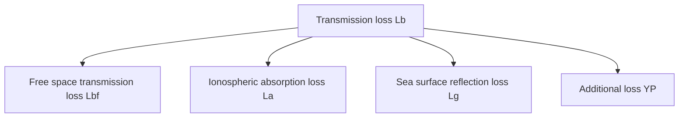

For office use only

T1

T2

T3

T4

Team Control Number

86103

Problem Chosen

A

For office use only

F1 \_\_\_\_

F2

F3

F4

2018

MCM/ICM

Summary Sheet

# Simulation Analysis of Multi-hop HF Radio

Summary

HF radio propagation plays an extremely important role in communication at sea and mountains. It may be influenced by various factors, resulting in great loss of signal transmission. In this paper we focus on transmission and reflection loss of HF radio propagation in reflecting surface changes.

First, according to the PM wave spectrum and random wave theory, we establish a three-dimensional random wave model to simulate the motion of waves. On this basis, we analyze the reflection of electromagnetic waves on the sea surface. We consider the influence of wave height caused by different wind levels on the reflection coefficient and obtain the reflection loss of electromagnetic wave under different conditions successfully. Then we get the sum of the loss in the transmission and the The first reflection intensity of the turbulent ocean and the calm one. At last we analyze the signal electric-field and atmospheric noise electric field of the receiving point, get the relation between SNR, transmission distance and hops, and the maximum number of hops should be 6 when SNR attenuates to 10 dB.

Second, we analyze the transmission on the ground on the basis of the wave model. We simulate the topography with the wave fluctuation. Because the electromagnetic characteristics of the earth are different from the sea surface, we correct the relative dielectric constant and conductivity. Since there are more obstacles on the ground than on the sea, so we also analyze the diffraction phenomenon of electromagnetic wave propagation on the ground. We calculate and compare the first reflection intensity between mountainous or rugged terrain and smooth terrain. Surprisingly, the effective distance of sky-wave transmission is shorter than that of sea surface reflection. Under the same conditions, the maximum number of hops of HF radio propagation is 4.

Finally, we consider the wind and waves that the ship may encounter on the sea surface, and calculate the longest distance that the received signal can propagate at a given wind level (i.e., SNR not less than 10 dB). Because ships usually travel longer, we also analyze the periodic variation of the ionosphere with time, and obtain the influence of the periodic variation of the ionosphere on the propagation of sky wave. On the basis of this, we get the optimal radio frequency under different conditions. After taking the ship speed into account, we amend the original model and obtain the maximum time for the ship to maintain the same multi-hop path.

# Simulation Analysis of Multi-hop HF Radio

## Abstract

HF radio is widely used in long-distance propagation in a lot of countries because of its advantages of long propagation distance, low transmission loss and no external influence on the quality of propagation, especially maritime propagation. Because it is capable of reflections off the ionosphere and the earth, "jumping" to its destination. Besides, the characteristics of the reflected surface determine the intensity of the reflected waves and the extent to which the signal eventually travels. In this paper, we simulate different environments of the ocean and ground, and obtain the degree of signal loss and the propagation distance finally.

## Ocean wave model

According to the wave spectrum and random wave theory, we take the actual wave as the superposition result of sinusoidal wave with different frequency, different propagation direction, different wave height and different initial phase. Then we establish the Longuet-Higgins long peak wave model. On this basis, we analyze the possible superposition of waves, and get the three-dimensional simulation diagram of the waves, and simulate it.


<details>
<summary>3d surface plot</summary>

| X    | Y    | Z    |
|------|------|------|
| 0    | 0    | 0    |
| 100  | 100  | 100  |
| 200  | 200  | 200  |
| 300  | 300  | 300  |
| 400  | 400  | 400  |
| 500  | 500  | 500  |
</details>

Figure 1 The wave situation when the wind scale is 6

## Transmission loss analysis

In the process of transmission, SNR of the signal may be reduced due to various factors. For a fixed reception point, the loss of the signal is related to the angle of the signal emission, the transmission distance, the ionospheric absorption intensity, sea situation and so on. We have a simple classification of the loss of the signal: free space transmission loss, ionospheric absorption loss, additional loss and sea surface reflection loss.

Then, we lay special stress on the relationship between sea surface reflection loss and various factors. By simulating the reflection path, we study the relationship between reflection path and reflection coefficient, and draw the conclusion that when the hop count is 1, the relationship between the first reflection intensity and the wind scale is as follows:


<details>
<summary>bar chart</summary>

| Wind Scale | 10MHz (dBw) | 20MHz (dBw) | 30MHz (dBw) |
| ---------- | ----------- | ----------- | ----------- |
| 0          | -161        | -162        | -163        |
| 1          | -162        | -163        | -164        |
| 2          | -162        | -163        | -165        |
| 3          | -162        | -164        | -166        |
| 4          | -163        | -165        | -167        |
| 5          | -163        | -165        | -167        |
| 6          | -164        | -166        | -167        |
| 7          | -164        | -166        | -167        |
| 8          | -164        | -166        | -167        |
</details>

Figure 2 The relationship between the wind scale and the first reflection intensity

In long-distance propagation, the number of multi-hop is often greater than 1 so that the wave can travel enough distance. But the integrity of the signal also attenuates gradually with the propagation. By calculation, we know that the maximum number of hops at calm sea is 6 when the power is 100 w and the frequency is 15 MHz.

## Compare with the model on the ground

Based on the three-dimensional wave model, we simulate the relief of the terrain with the wave fluctuation. Considering diffraction may occur during the ground propagation, and the variation of the conductivity and relative dielectric constant caused by the complex ground. We modify the existing models, calculate the first reflection intensity and the maximum number of hops on different ground forms.

## Modification based on navigation

In the actual navigation, the receiving point is motional. Thus, it cannot be regarded as a fixed point and to be calculated. So we modify the model to calculate the emission angle, frequency, power and so on as variables. Based on these, we obtain the maximum distance and the time to maintain the same multi-hop path before the SNR attenuates to 10 dB. We also conclude that the absorption loss will increase due to the periodic variation of the ionosphere. So the launch frequency needs to be adjusted at different times.

## Contents

## 1 Introduction 3

1.1 Background....3  
1.2 Restatement of the problem....3

## 2 Assumptions 3

## 3 Notation 4

## 4 Radio propagation on sea surface model 4

4.1 Introduction to HF propagation....4  
4.1.1 Way of HF propagation....4  
4.1.2 Structure of ionosphere....5  
4.1.3 Best usable frequency....5

## 4.2 Wave model....6

4.2.1 Longuet - Higgins wave model....6  
4.2.2 Three dimensional wave model....6  
4.2.3 Model simulation....7

## 4.3 Transmission loss of HF radio waves $L_{b}$ 7

4.3.1 Free space transmission loss $L_{bf}$ .....8  
4.3.2 Ionospheric absorption loss $L_{a}$ 8  
4.3.3 Sea surface reflection loss $L_{g}$ .....9  
4.3.4 Additional loss $Y_{P}$ 12

## 4.4 First reflection intensity....12

## 4.5 Calculation of SNR....13

4.5.1 HF sky-wave field intensity $^{[10]}$ 13  
4.5.2 Field intensity of atmospheric noise.... 14  
4.5.3 Maximum number of hops....14

## 5 Comparison between sea surface model and ground surface model 15

## 6 Motion analysis of ships using HF radio propagation on turbulent ocean 16

6.1 Maximum time( $t_{max}$ ) using the same multi-hop path.... 16

6.2 Suggestions on frequency selection of transmitter....18

## 7 Strengths and weaknesses 18

7.1 Strengths....18

7.2 Weaknesses....18

## Appendices 21

## Appendix A First appendix 21

## 1 Introduction

## 1.1 Background

It is universally acknowledged that a ship sailing in the boundless sea will encounter a variety of danger at any time. With the increasing number of ships in the world and the trend toward large-scale and high-speed ocean shipping, the world's waterways are becoming more and more crowded and crisis may occur at any time. In this case, HF radio propagation has played a significant role. HF radio propagation can attract us to transmitting messages, thats mainly because that HF communication can be achieved only by appropriate transmitting power and moderate equipment cost even far apart.

## 1.2 Restatement of the problem

As required by the question, we are supposed to determine the strength of the first reflection off a turbulent ocean and compare it with the strength off a calm ocean. Meanwhile, we will also determine the maximum number of hops the signal can take before its strength falls below a usable SNR. After that, we will compare the findings with hf reflections off different topography. Moreover, we are going to change our model to accommodate a shipboard receiver moving on a turbulent ocean.

There are two forms of shortwave propagation. One is ground wave, which consists of surface wave, direct wave and reflected wave; and another is sky wave that reaches the ground reception point being reflected by the ionospheric. In this article, we only model the reflection of sky waves.

## 2 Assumptions

- We consider the transmission of sky waves as the main way.  
Reason: Energy is lost with the propagation of ground wave, and the higher the frequency(that is, the shorter the wave length), the greater the loss. However, sky-wave communication has the advantages of long propagation distance, low transmission loss and not being affected by the geological types of both sides. So we consider the transmission of sky waves as the main way.  
- The reflection of sky-waves in the ionosphere is mainly considered in the $F_{2}$ layer.  
Reason: (1) It's exist all day. (2) It's height can accommodate the longest path. (3) MUF(maximum usable frequency) is the biggest.  
- The main factor affecting wave height is wind speed.  
- We regard the relative permittivity and conductivity of seawater as fixed values. Reason: The changes of relative dielectric constant and conductivity are mainly

caused by the change of salt content and temperature, and the wave and sea water motion have little effect on them, so we think that they are almost unchanged, and regard them as fixed values.

\- We consider ships movement on the sea as a uniform motion.

## 3 Notation

<table><tr><td>Notation</td><td>Definition</td></tr><tr><td> $L_b$ </td><td>Transmission loss</td></tr><tr><td> $L_{bf}$ </td><td>Free space transmission loss</td></tr><tr><td> $L_a$ </td><td>Ionospheric absorption loss</td></tr><tr><td> $L_g$ </td><td>Ground reflection loss</td></tr><tr><td> $\varepsilon$ </td><td>Electric medium constant</td></tr><tr><td> $\sigma$ </td><td>Conductivity</td></tr><tr><td> $Y_P$ </td><td>Additional loss</td></tr><tr><td>r</td><td>Propagation distance</td></tr><tr><td>D</td><td>Maximum propagation distance</td></tr><tr><td> $\Delta$ </td><td>Elevation angle of transmission</td></tr><tr><td>n</td><td>Number of hops</td></tr><tr><td>f</td><td>Working frequency</td></tr><tr><td> $P_0$ </td><td>Power of the transmitter</td></tr><tr><td> $P_1$ </td><td>First reflection intensity</td></tr><tr><td>R</td><td>Reflection coefficient</td></tr><tr><td> $\theta$ </td><td>Incidence angle of electromagnetic wave</td></tr></table>

P.s. Other symbols instruction will be given in the text.

## 4 Radio propagation on sea surface model

## 4.1 Introduction to HF propagation

## 4.1.1 Way of HF propagation

HF propagation is the radio propagation of radio waves in the range of 3 to 30MHz(corresponding wave length 100 to 10m). HF communication has the advantages of long communication distance, strong persistence and simple equipment, meanwhile, it has the disadvantages of channel congestion, time-varying, dispersion characteristics, and so on. Moreover, it is easy to be influenced by other external factors and is unstable. HF propagation can propagate along the ground as the ground-wave, and it can also propagate through reflections off the ionospheric as the sky-wave. The propagation diagram is as follows:


<details>
<summary>text_image</summary>

Ionosphere
</details>

Figure 1 HF propagation diagram

## 4.1.2 Structure of ionosphere

Ionosphere is a ionization region of the earths atmosphere. It is ionized by high energy radiation from the sun and cosmic rays. For the existence of a huge number of free electrons and ions, radio waves can change the speed of propagation, and refraction, reflection and scattering occurred. The ionosphere can be divided into layer D, E, F and so on, and the layer F can be divided into $F_{1}$ and $F_{2}^{[1]}$ . The height of each layer changes over time, and some layers even disappear at night.


<details>
<summary>area chart</summary>

| Time | F    | F1   | F2   | E    | D    |
|------|------|------|------|------|------|
| Night| 200  | 200  | 200  | 100  | 100  |
| Day  | 300  | 300  | 300  | 100  | 100  |
</details>

Figure 2 Inner layers of ionosphere

## 4.1.3 Best usable frequency

According to the theory of ionospheric propagation, shortwave with a higher frequency can only return to the ground from the reflection off ionosphere with a higher electron density distribution. There is a maximum frequency of radio waves that can be reflected back to the ground, which we call MUF(maximum usable frequency). the frequency of propagation should be as high as possible to reduce absorption, but generally only at the frequency of 0.85 MUF. Because if we use MUF, as long as the ionosphere changes slightly, the radio waves would go through the ionosphere without going back. So we call the frequency of 0.85 MUF $^{[2]}$ the best usable frequency.

## 4.2 Wave model

## 4.2.1 Longuet - Higgins wave model

The wave phenomenon is very complex, and its speculative and nonlinear. Therefore, it is very difficult to establish an accurate wave model. According to the wave spectrum and random wave theory, we can regard the actual wave as the result of sinusoidal wave superposition with different frequency, different propagation directions, different wave heights and different initial phases. The Longuet-Higgins model $^{[3]}$ describes the waves of long-peak waves by the superposition of countless random cosine waves, and the amplitude is expressed as follows:

$$
\zeta (t) = \sum_ {i = 1} ^ {\infty} \xi_ {a i} \cos (\omega_ {i} + \varepsilon_ {i}) \tag {1}
$$

Where $\xi_{ai}$ refers to the amplitude of the i cosine wave, $\omega_{i}$ refers to the frequency of the i cosine wave, and $\varepsilon_{i}$ refers to the phase of the i cosine wave.

In practical applications, the Longuet-Higgins model is often expressed by the wave spectrum:

$$
\zeta (t) = \sum_ {i = 1} ^ {\infty} \sqrt {2 S _ {\zeta} \Delta \omega} \cos (\omega_ {i} + \varepsilon_ {i}) \tag {2}
$$

In the formula, $S_{\zeta} \Delta\omega$ is the wave spectrum. At present, there are several widely used ocean spectrum, such as Pierson-Moscowitz spectrum(PM spectrum), Neumann spectrum(N spectrum), ITTC spectrum and so on, among which PM spectrum is the most widely used. It can well represent the fully developed random waves. Therefore, we use the PM spectrum. And the expression of PM spectrum is as follows:

$$
S _ {\zeta} (\omega_ {i}) = \frac {8 . 1 \times 1 0 ^ {- 3} g ^ {2}}{\omega^ {5}} \exp \left[ - 0. 7 4 \left(\frac {g}{v \omega}\right) ^ {4} \right] \tag {3}
$$

Where v is the wind speed with a height of 19.5m above the sea level.

## 4.2.2 Three dimensional wave model

In the above model, we consider only one direction. But in the actual wave, the wave not only changes in height and frequency, but also spread in more than one direction. So we define the waves which are superimposed on each other and diffused randomly to $\pm\pi/2$ in the main wave as three dimensional irregular short peak random wave model.

We overlay the above model in many directions, and finally we get the following expression:

$$
\zeta (\xi , \eta , t) = \sum_ {i = 1} ^ {n} \sum_ {j = 1} ^ {m} \zeta_ {a i j} \cos \left(k _ {i} \xi \cos \mu_ {j} + k _ {i} \eta \sin \mu_ {j} - \omega_ {i} + \varepsilon_ {i j}\right) \tag {4}
$$

Where $\zeta_{aij}$ , $\omega_{i}$ , $k_{i}$ , $\mu_{j}$ and $\varepsilon_{ij}$ are the amplitude, the angular frequency, the wave number, the direction angle and the random initial phase of the component harmonics, $\varepsilon_{ij}$ is random number between 0 and $\pi/2$ , ( $\xi$ , $\eta$ ) is the coordinates of a certain point on a wave surface.

## 4.2.3 Model simulation

We simulated the model in MATLAB, and the results are as follows:

  
Figure 3 Wave situation of 5\~8 winds

## 4.3 Transmission loss of HF radio waves $L_{b}$

During the transmission of radio waves, there are many factors that can affect the transmission loss. We divide the basic transmission loss $(L_{b})$ during the whole propagation process into four parts: free space transmission loss $L_{bf}$ , ionospheric absorption loss $L_{a}$ , ground reflection loss $L_{g}$ , and additional loss $Y_{P}$ . If all losses are expressed in decibel(dB), the basic transmission loss of sky-wave propagation is as follows:

$$
L _ {b} = L _ {b f} + L _ {i} + L _ {g} + Y _ {P} \tag {5}
$$


<details>
<summary>flowchart</summary>


</details>

Figure 4 Parts of transmission loss

## 4.3.1 Free space transmission loss $L_{bf}$

The free space transmission loss is the loss of energy caused by geometric factors after radio wave detaching antenna. The equality of $L_{bf}$ is as follows $^{[4]}$ :

$$
L _ {b f} = 3 2. 4 4 + 2 0 \lg f + 2 0 \lg r \tag {6}
$$

Where $f$ is the working frequency in $MHz$ and $r$ is the effective path of HF radio propagation in km.

The curvature of the earth and the height of the ionosphere limit the one-time maximum jump distance of the reflection off the ionospheric $D_{max}$

$$
D _ {m a x} = 2 R _ {e} \left[ \arccos \left(\frac {R _ {e}}{R _ {e} + h} * \cos \Delta_ {m i n}\right) - \Delta_ {m i n} \right] \tag {7}
$$

In the equation, $\Delta_{min}$ is the minimum elevation angle of the antenna, and we know that the general elevation angle of the antenna is greater than $3^{\circ}$ . The $R_{e}$ is the radius of the earth, and we value it as 6371km. The h is the reflection virtual height of the ionosphere. The height of each layer is shown in the diagram. For $F_{2}$ reflection, the maximum propagation distance $D_{max}$ is 4000km.

## 4.3.2 Ionospheric absorption loss $L_{a}$

In HF radio propagation, the loss caused by ionospheric absorption mainly occurs in layer D, because there are more neutral molecules in layer D and the collision loss is larger $^{[6]}$ . The concentration of electrons in layer D decreases at night, and the absorption loss decreases. The loss is mainly non-offset absorption. The emission absorption in layer 4 E or F mainly refers to offset absorption $^{[7]}$ . We ignore it in calculation for its very small ( $\leq 1$ dB).

$$
L _ {a} = \frac {6 7 7 . 2}{(f + f _ {H}) ^ {1 . 9 8} + 1 0 . 2} \sum_ {j = 1} ^ {n} \sec \phi_ {j} \times I _ {j} \tag {8}
$$

Where $\phi$ is the incident angle at a height of 100 km, f(MHz) is the working frequency and $f_{H}$ (MHz) is the gyromagnetic frequency, I is the absorption index and n is number of hops in the path.

The absorption index I is:

$$
I = (1 + 0. 0 3 7 R) (\cos 0. 8 8 1 \chi) ^ {1. 3} \tag {9}
$$

Where R is the number of sunspots and $\chi$ is the zenith angle of two 100 km high absorbs.

For the ionospheric absorption loss is related to transmitter, issue time and teh parameters of receiving spots, and that the calculation is too complex, we take it as 4dB to make the calculation easy.

## 4.3.3 Sea surface reflection loss $L_{g}$

## (1) Calm sea reflection

For multi-hop sea surface reflection loss suppose incident wave is messy polarization. The energy of the radio waves is evenly distributed on the horizontal and vertical polarizations, so that the formula for calculating the energy is

$$
L _ {g} = 1 0 \lg \left(\frac {R _ {V} ^ {2} + R _ {H} ^ {2}}{2}\right) \tag {10}
$$

Where RH and RV are the reflection coefficients of horizontal and vertical polarized waves, respectively, as follows:

$$
R _ {H} = \frac {\sin \theta - \sqrt {\widetilde {\varepsilon} - \cos^ {2} \theta}}{\sin \theta + \sqrt {\widetilde {\varepsilon} - \cos^ {2} \theta}} \tag {11}
$$

$$
R _ {V} = \frac {\tilde {\varepsilon} \sin \theta - \sqrt {\tilde {\varepsilon} - \cos^ {2} \theta}}{\tilde {\varepsilon} \sin \theta + \sqrt {\tilde {\varepsilon} - \cos^ {2} \theta}} \tag {12}
$$

$$
\tilde {\varepsilon} = \varepsilon - \mathrm{j} 6 0 \lambda \sigma \tag {13}
$$

Where $\theta$ is the incident angle, is the complex permittivity of the sea surface, $\varepsilon$ is the permittivity of seawater, $\lambda$ is the wavelength of the incident wave and $\sigma$ is the con-ductivity. According to this formula, the relationship between $R_{H}$ , $R_{v}$ and the angle of incidence.


<details>
<summary>line chart</summary>

| incident angle(°) | reflection coefficient (red line) | reflection coefficient (blue line) |
| ----------------- | ---------------------------------- | ----------------------------------- |
| 0                 | 1.0                                | 1.0                                 |
| 20                | ~0.95                              | ~0.97                               |
| 40                | ~0.92                              | ~0.95                               |
| 60                | ~0.90                              | ~0.93                               |
| 80                | ~0.89                              | ~0.92                               |
| 90                | ~0.88                              | ~0.91                               |
</details>


<details>
<summary>line chart</summary>

| incident angle(°) | reflection coefficient (blue) | reflection coefficient (red) |
| ----------------- | ----------------------------- | ---------------------------- |
| 0                 | 1.0                           | 1.0                          |
| 10                | 0.35                          | 0.28                         |
| 20                | 0.75                          | 0.65                         |
| 40                | 0.88                          | 0.80                         |
| 60                | 0.92                          | 0.87                         |
| 80                | 0.93                          | 0.89                         |
</details>

Figure 5 The relationship between RH, RV and incidence angle

According to the figure, it is not difficult to find that for the horizontal polarized wave, the reflection coefficient decreases gradually from 1, while the amplitude is very small. For the vertical polarized wave, with the reflection coefficient increases with the increase of the incident angle, the reflection coefficient increases to 1 gradually after de-creasing rapidly at first. The comparison shows that the change of reflection coefficient

of the horizontal polarization wave is much more sensitive to the incident angle.

## (2) Ocean Wave Model algorithm for turbulent ocean

For the three dimensional irregular short-peak random wave model mentioned above, we randomly select a wave cross section to analyze. When the electromagnetic wave shines on the wave, most of the available electromagnetic waves are emitted in the form of reflection and scattering, and reflection is the main one.


<details>
<summary>text_image</summary>

Diagram showing wave interference pattern with incident and reflected rays, overlaid on a fluctuating blue signal line.
</details>

Figure 6 Diagram of electromagnetic wave reflection on turbulent ocean

For the wave function $\xi(x)$ of this cross section at a certain time, we take the derivative of it and obtain the tangent equation of the section irradiated by electromagnetic wave.

$$
y = \xi^ {\prime} (x) (x - x _ {0}) + y _ {0} \tag {14}
$$

Where $(x_0, y_0)$ is the coordinate of surface element $\alpha$ .

According to Sneel's law, we assume that the grazing angle of electromagnetic wave incident to plane $\alpha$ is $\theta$ , and then we obtain the propagation path equation of reflected wave as shown below:

$$
y = \tan (\Delta + \arctan \xi^ {\prime} (x)) (x - x _ {0}) + y _ {0} \tag {15}
$$

Because the water surface has a certain dip angle, the full incident wave cant be reflected in the positive direction. Therefore, we differentiate the wave surface, analyze each micro-element plane, and find out the total number of reflected waves reflected in the forward direction, and get the correction coefficient finally:

$$
\rho = \frac {m}{M} \tag {16}
$$

Where m is the total number of positive and negative reflection electromagnetic waves and M is the total number of incident electromagnetic waves.


<details>
<summary>natural_image</summary>

Abstract diagram with a blue wavy line and two black arrows pointing downward, no text or symbols present.
</details>

Figure 7 Diagram of wave shadow

As shown in the figure, the actual waves will have ups and downs. Especially when the wind and waves are high, some of the sea surface will be covered by the waves. At this point, we have corrected the occluded part, ignoring the reflected light in that part. The correction method is as follows:

We obtain the second derivative for wave function $\xi(x)$ and obtain the tangent equation of extreme value point corresponding to its extreme point. Then the second intersection point of electromagnetic wave and wave is the intersection point of the equation and wave function, and the shading is the shaded area.

$$
\rho^ {\prime} = \rho_ {*} \frac {S - s}{S} \tag {17}
$$

Where S is the surface area of a wave and s is the shaded area.


<details>
<summary>line chart</summary>

| wind speed(m/s) | 10MHz  | 20MHz  | 30MHz  |
| --------------- | ------ | ------ | ------ |
| 0               | 1.0000 | 1.0000 | 1.0000 |
| 5               | 0.9980 | 0.9985 | 0.9990 |
| 10              | 0.9940 | 0.9960 | 0.9975 |
| 15              | 0.9880 | 0.9910 | 0.9950 |
| 20              | 0.9780 | 0.9850 | 0.9925 |
</details>


<details>
<summary>line chart</summary>

| wind speed(m/s) | 1°     | 5°     | 15°    |
| --------------- | ------ | ------ | ------ |
| 0               | 1.0000 | 1.0000 | 1.0000 |
| 5               | 0.9980 | 0.9950 | 0.9920 |
| 10              | 0.9950 | 0.9850 | 0.9700 |
| 15              | 0.9900 | 0.9650 | 0.9300 |
| 20              | 0.9850 | 0.9300 | 0.8700 |
</details>

Figure 8 Diagrams of correction coefficients

In the figure above, the left image shows the correction coefficients at different wind speeds when the grazing angle is $1^{\circ}/5^{\circ}/15^{\circ}$ , and the right image shows the correction coefficients at different wind speeds when the frequency is 10 MHz / 20 MHz / 30 MHz.

We can get the following curve, which is the final reflection coefficient by multiplying it with the reflection coefficient when it is stationary:


<details>
<summary>line chart</summary>

| frequency(MHz) | calm  | level 2 | level 4 | level 6 |
| -------------- | ----- | ------- | ------- | ------- |
| 0              | 0.91  | 0.83    | 0.76    | 0.70    |
| 5              | 0.88  | 0.75    | 0.65    | 0.55    |
| 10             | 0.84  | 0.65    | 0.52    | 0.40    |
| 15             | 0.80  | 0.55    | 0.42    | 0.30    |
| 20             | 0.77  | 0.48    | 0.35    | 0.25    |
| 25             | 0.75  | 0.42    | 0.30    | 0.22    |
| 30             | 0.73  | 0.35    | 0.25    | 0.19    |
</details>

Figure 9 Relation curve of reflection coefficient under different wind speed

Then we can get the loss of turbulent ocean:

$$
L _ {g} ^ {\prime} = L _ {g} - 1 0 \lg \left(\rho^ {\prime}\right) \tag {18}
$$

## 4.3.4 Additional loss $Y_{P}$

Additional loss is the loss caused by other factors in addition to the main reasons mentioned above. The detailed calculation is too complicated, but we conclude that it is mainly related to local time, which is assumed to be about 15 dB here $^{[9]}$ .

## 4.4 First reflection intensity

Combined with the loss analysis above, for a single jump signal source, we can get the following formula:

$$
1 0 \lg (P _ {1}) = 1 0 l g (P _ {0}) - L _ {b f} - L _ {a} - L _ {g} - Y _ {P} \tag {19}
$$

Among them, $P_{1}(w)$ is the electromagnetic wave power of the transmitting point and $P_{0}(w)$ is the first reflection intensity. For the electromagnetic wave propagation route which has been determined in both time and space, only $L_{g}$ is alterable because of the different sea conditions, we get the following chart by calculation:


<details>
<summary>bar chart</summary>

| Wind Scale | 10MHz (dBw) | 20MHz (dBw) | 30MHz (dBw) |
| ---------- | ----------- | ----------- | ----------- |
| 0          | -154.2      | -154.6      | -154.8      |
| 1          | -154.7      | -155.4      | -156.1      |
| 2          | -155.1      | -156.2      | -157.2      |
| 3          | -155.5      | -156.9      | -158.0      |
| 4          | -155.9      | -157.5      | -158.7      |
| 5          | -156.2      | -158.0      | -159.3      |
| 6          | -156.6      | -158.5      | -159.7      |
| 7          | -156.9      | -158.9      | -160.1      |
| 8          | -157.2      | -159.2      | -160.5      |
</details>

Figure 10 The strength of the first reflection $P_{1}$

Table 1 Related Parameters

<table><tr><td>Parameter</td><td>Reference value</td><td>Unit</td></tr><tr><td> $L_a$ </td><td>4</td><td>dB</td></tr><tr><td> $Y_P$ </td><td>15</td><td>dB</td></tr><tr><td> $f$ </td><td>100</td><td>MHz</td></tr><tr><td> $P_0$ </td><td>100</td><td>w</td></tr><tr><td> $\theta$ </td><td>3</td><td>°</td></tr></table>

As is shown in the figure, its the first reflection intensity of a signal with different frequencies under different wind speeds. We can get the curve of reflection intensity changing with sea condition by fitting. From the diagram, we can know that the first reflection intensity decreases with the increase of frequency and the increase of wind speed. Thus, we must consider the influence of weather in the process of maritime communication.

## 4.5 Calculation of SNR

## 4.5.1 HF sky-wave field intensity $^{[10]}$

The field strength of the receiving point can be calculated by the following formula:

$$
E _ {t} = 1 3 7. 2 + 2 0 \lg f + 1 0 \lg P _ {0} + G _ {t} - L _ {b} \tag {20}
$$

In the formula, $E_{t}(\mathrm{dB})$ is the signal intensity of the receiving point during the propagation of sky wave, f(MHz) is the working frequency, $P(\mathrm{kw})$ is the power of the transmitter, $t_{t}(\mathrm{dB})$ is the normal gain of the transmitter antenna radiation, and $L_{b}(\mathrm{dB})$ is the transmission loss of sky-wave.

## 4.5.2 Field intensity of atmospheric noise

Atmospheric noise is mainly caused by lightning $^{[11]}$ . It is the main noise source of marine HF radio propagation at present. The formula for calculating the effective value of atmospheric noise field intensity is as follows:

$$
E _ {n} = F _ {a} + 1 0 \lg B + 2 0 \lg f - 9 6. 8 \tag {21}
$$

In the formula, $E_{n}(\mathrm{dB})$ is the field intensity of atmospheric noise, $F_{a}(\mathrm{dB})$ is the effective noise coefficient of atmospheric radio, $B(\mathrm{dB})$ is the effective noise bandwidth of receiver, $F(\mathrm{MHz})$ is working frequency.

Atmospheric noise is usually estimated by the noise data provided in the CCIR322nd report. A complete set of atmospheric noise data contains 72 charts. The calculation process is very complicated and the accuracy is not high enough. Thus we use the method of establishing a database to make a simple estimate. The following figure shows the atmospheric noise table at different times in a certain area in summer $^{[12]}$ .

Table 2 Atmospheric noise at different times in a certain area in summer

<table><tr><td rowspan="2">LongitudeLocal TimeCoefficientLatitude</td><td colspan="3">75~90</td><td colspan="3">90~105</td><td colspan="3">105~120</td></tr><tr><td>0~4</td><td>4~8</td><td>8~12</td><td>0~4</td><td>4~8</td><td>8~12</td><td>0~4</td><td>4~8</td><td>8~12</td></tr><tr><td>10~20</td><td>95</td><td>70</td><td>99</td><td>78</td><td>102</td><td>104</td><td>104</td><td>81</td><td>103</td></tr><tr><td>20~30</td><td>95</td><td>73</td><td>99</td><td>75</td><td>100</td><td>99</td><td>99</td><td>74</td><td>99</td></tr><tr><td>30~40</td><td>93</td><td>71</td><td>99</td><td>71</td><td>98</td><td>98</td><td>91</td><td>68</td><td>94</td></tr><tr><td>40~50</td><td>88</td><td>68</td><td>90</td><td>62</td><td>62</td><td>78</td><td>81</td><td>62</td><td>77</td></tr></table>

## 4.5.3 Maximum number of hops

According to the formula for calculating the electric field intensity of HF sky-wave and the formula for calculating the effective value of atmospheric noise field intensity, we obtain the formula for calculating signal-to-noise ratio of shortwave sky-wave communication under natural conditions.

$$
S N R = 2 0 1. 5 6 + 1 0 \lg P _ {0} - 2 0 \lg f - 2 0 \lg r - 1 0 \lg B - L _ {a} - L _ {g} - Y _ {P} - F _ {a} \tag {22}
$$

In the formula, after $n$ jumps, we found that

$$
r = n D _ {\max} \tag {23}
$$

$$
L _ {g} ^ {\prime} = (n - 1) \times L _ {g} \tag {24}
$$

$$
L _ {a} ^ {\prime} = n \times L _ {a} \tag {25}
$$

With reference to the following table for each parameter, we can get n = 6 by using the fsolve function of MATLAB.

## 5 Comparison between sea surface model and ground surface model

Because the ground environment is more complicated than the sea surface and is composed of various materials, we take the relative permittivity of 3 to 8 as the basic value and the geodetic equivalent conductivity as the electrical conductivity in the calculation.

By using the proposed model and the algorithm proposed above, we take the undulation of the mountain as the motion of the wave and calculate it approximately. Because there are many obstacles on the ground, the electromagnetic wave will be diffracted when it meets the obstacle. However, because the short wave wavelength is not enough to avoid obstacles, most of them will be blocked by various obstacles, so the propagation ability of short wave on the ground is very weak. According to the analysis, we substitute the electromagnetic parameters of ground into the formula and get the solution as follows $^{[13]}$ :


<details>
<summary>line chart</summary>

| frequency(MHz) | reflection coefficient (blue) | reflection coefficient (green) | reflection coefficient (yellow) |
| -------------- | ----------------------------- | ------------------------------ | ------------------------------- |
| 0              | 0.21                          | 0.19                           | 0.17                            |
| 10             | 0.18                          | 0.15                           | 0.12                            |
| 20             | 0.15                          | 0.12                           | 0.09                            |
| 30             | 0.11                          | 0.07                           | 0.06                            |
</details>


<details>
<summary>line chart</summary>

| frequency(MHz) | calm | hills | low mountains | middle mountains |
| -------------- | ---- | ----- | ------------- | ---------------- |
| 0              | 6.5  | 6.8   | 7.2           | 7.5              |
| 10             | 6.5  | 7.8   | 9.0           | 10.0             |
| 20             | 6.5  | 8.8   | 10.5          | 11.5             |
| 30             | 6.5  | 9.7   | 11.5          | 12.5             |
</details>

Figure 11 Reflection coefficient relationship curves under different ground conditions

The related parameters are shown in the table.

Table 3 $\varepsilon,\sigma$ in different environments

<table><tr><td rowspan="2">Ground form</td><td colspan="2">Variation</td><td colspan="2">Average</td></tr><tr><td> $\varepsilon(F/m)$ </td><td> $\sigma(S/m)$ </td><td> $\varepsilon(F/m)$ </td><td> $\sigma(S/m)$ </td></tr><tr><td>Seawater</td><td>80</td><td>1~4.3</td><td>80</td><td>4</td></tr><tr><td>Freshwater</td><td>80</td><td> $10^{-3} \sim 2.4 \times 10^{-2}$ </td><td>80</td><td> $10^{-3}$ </td></tr><tr><td>Wet soil</td><td>10~30</td><td> $3 \times 10^{-3} \sim 2.4 \times 10^{-2}$ </td><td>10</td><td> $10^{-2}$ </td></tr><tr><td>Dry soil</td><td>3~4</td><td> $1.1 \times 10^{-5} \sim 2 \times 10^{-2}$ </td><td>4</td><td> $10^{-3}$ </td></tr></table>

The first reflection intensity in hilly areas is as shown in the diagram, especially when the terrain is smooth, the relief degree is 0.


<details>
<summary>bar chart</summary>

| The relief degree | 10MHz (dBw) | 20MHz (dBw) | 30MHz (dBw) |
| ----------------- | ----------- | ----------- | ----------- |
| 0                 | -161.2      | -161.6      | -161.7      |
| 1                 | -161.6      | -162.4      | -163.0      |
| 2                 | -162.1      | -163.2      | -164.1      |
| 3                 | -162.4      | -163.9      | -165.0      |
| 4                 | -162.8      | -164.4      | -165.7      |
| 5                 | -163.1      | -165.0      | -166.2      |
| 6                 | -163.5      | -165.4      | -166.7      |
| 7                 | -163.8      | -165.9      | -167.1      |
| 8                 | -164.1      | -166.2      | -167.4      |
</details>

Figure 12 Strength of the first reflection

We take $L_{g}$ as 6.53dB when the ground is flat and we get that n = 4. Compared with the sea surface, the propagation distance of the HF radio through the ground is much shorter than that of the sea surface.

## 6 Motion analysis of ships using HF radio propagation on turbulent ocean

## 6.1 Maximum time( $t_{max}$ ) using the same multi-hop path

In the above model, we only consider the condition that the reception point is fixed. This model is applicable to the communication between two fixed points, or the case where the position change of the receiving point is negligible. The ship in the turbulent ocean has a long moving distance, so we can not only calculate the effective propagation distance r as a fixed value $^{[14]}$ . At this point, the propagation distance r is related to the emission angle $\Delta$ , and $L_{a}$ , $L_{g}$ is related to n (the number of hops of sky-wave), meanwhile, $L_{g}$ is also related to the emission angle $\Delta$ . To ensure that the received signal is clear enough, we conclude that the SNR should be greater than or equal to 10, that is:

$$
S N R = 2 0 1. 5 6 + 1 0 \lg P _ {0} - 2 0 \lg f - 2 0 \lg r - 1 0 \lg B - n L _ {a} - (n - 1) L _ {g} - Y _ {p} - F _ {a} \geq 1 0 (2 4)
$$

Through analysis, we know that since $L_{g}$ is related to $\Delta$ , the longer the route distance is, the higher the power transmitter and the increase antenna are needed to assist the ship in the sea course. Or the radio frequency can be adjusted to avoid overattenuating to make the SNR too low and difficult to distinguish.


<details>
<summary>3d contour plot with color gradient</summary>

| Distances /km | SNR /dB | Value |
| ------------- | ------- | ----- |
| 0             | 80      | 100   |
| 0             | 60      | 75    |
| 0             | 40      | 50    |
| 0             | 20      | 25    |
| 0             | 0       | 0     |
| 0             | -20     | -25   |
| 0             | -40     | -50   |
| 0             | -60     | -50   |
| 10000         | 80      | 95    |
| 10000         | 60      | 85    |
| 10000         | 40      | 75    |
| 10000         | 20      | 65    |
| 10000         | 0       | 55    |
| 10000         | -20     | 45    |
| 10000         | -40     | 35    |
| 10000         | -60     | 35    |
| 15000         | 80      | 90    |
| 15000         | 60      | 80    |
| 15000         | 40      | 70    |
| 15000         | 20      | 60    |
| 15000         | 0       | 50    |
| 15000         | -20     | 40    |
| 15000         | -40     | 30    |
| 15000         | -60     | 35    |
| 20000         | 80      | 85    |
| 20000         | 60      | 75    |
| 20000         | 40      | 65    |
| 20000         | 20      | 55    |
| 20000         | 0       | 45    |
| 20000         | -20     | 35    |
| 20000         | -40     | 25    |
| 20000         | -60     | 35    |
</details>

Figure 13 Relationships among distance, frequency and SNR

As shown in the figure, SNR of 100w signal is obtained at the receiving points with different frequencies and distances, with the number of hops $n = 1 \sim 6$ , the wind scale is 5, and the receiving points at different frequencies and distances.

Table 4 Maximum propagation distance r when f=15Hz, P=100w

<table><tr><td>Number of hops n</td><td>Maximum propagation distance r(km)</td><td>SNR(dB)</td></tr><tr><td>1</td><td>3225</td><td>54.0977</td></tr><tr><td>2</td><td>6449</td><td>23.2859</td></tr><tr><td>3</td><td>9674</td><td>16.9728</td></tr><tr><td>4</td><td>10125</td><td>10</td></tr><tr><td>5</td><td>&lt;10125</td><td>10</td></tr><tr><td>6</td><td>&lt;10125</td><td>10</td></tr></table>

We can know from the figure that when n is fixed, the propagation distance is insufficient or the signal-to-noise ratio is too low with increasing distance.

By analyzing the data above, we draw a conclusion that when the number of hops is too high, for the ship traveling on the turbulent sea surface, the signal reflects too many times between the sea surface and the ionosphere, and the loss of the propagation path is too large, which results in the decrease of the maximum propagation distance. It is not enough to spread the signal far enough. Therefore, in this case, we need to increase the transmission power or signal frequency to increase the signal-to-noise ratio and the maximum propagation distance.

In summary, the maximum time for ships to maintain multi-hop paths in turbulent ocean is :

$$
t _ {m a x} = \frac {r}{v} \tag {27}
$$

Where v is the speed of the ship moving at sea. In the case of the table above, the multi-hop path must be changed for every 3000km movement. In the case of 100W and 15MHz, the signal power and frequency must be increased when the transmission distance is over 10000 km.

## 6.2 Suggestions on frequency selection of transmitter

Because not only the periodic variation of the ionosphere, but also the influence of the day and night, the season, the solar activity and so on can affect the value of the ionospheric propagation loss $L_{a}$ . In order for ships to have better communication at sea, the emitter must choose different frequency at different time to achieve better propagation. The following table shows the range of radio broadcasts commonly used to take into account ionospheric effects:

Table 5 Recommended emission frequency

<table><tr><td>2~4 MHz</td><td>Tropical frequency, small number of sunspots and transmission is good. Some countries near the equator can use it as domestic broadcasting</td></tr><tr><td>6~7 MHz</td><td>More suitable using in autumn and winter or night for close-range broadcasting</td></tr><tr><td>9~11 MHz</td><td>Moderate and suitable for all-day broadcasting both inside and outside</td></tr><tr><td>13 MHz</td><td>Effect would be better at daytime and is suitable for long distance broadcasting</td></tr><tr><td>15~17MHz</td><td>Better in spring and summer</td></tr></table>

## 7 Strengths and weaknesses

## 7.1 Strengths

- We classify and analyze the propagation path, which makes our calculation more accurate.  
- We have established a three-dimensional wave model, which is more intuitive.  
- We adopt the correction method of reflection coefficient, which is different from the previous empirical formula, and can analyze the reflection coefficient under different sea conditions quantitatively.  
- We take the effects of periodic ionospheric variations into account, which are sensitive and can be used in various situations.

## 7.2 Weaknesses

- We only consider the HF sky-wave transmission model, but the ground-wave transmission also has certain influence.  
- In real life, the ionospheric loss is complicated and varies greatly with latitude, longitude, seasons and so on. However, we only calculate the reasonable values

according to the literature.

- We only focus on the characteristics of shortwave propagation at sea level and the effect of reflection without considering the effect of refraction diffraction.  
- The dielectric constant and conductivity of the reflected surface change with the frequency, but we only use the fixed value to calculate. When the salinity and temperature of seawater change sharply, the reliability of the data will decrease.

## References

[1] LI Wei. Influence of Ionospheric Characteristics on Shortwave Transmission[J]. Inner Mongolia Radio & TV Broadcast Engineering, 2016, 33(06): 68-71. Mathematical Society and Addison-Wesley Publishing Company, 1984-1986.  
[2] SHI Xiang-tong, WANG Lei, HU Bo. Frequency Selection of Shortwave Communication Radio[J]. Ship Electronic Engineering, 2013, 33(10):39-41.  
[3] QI Ning, XIA Tian, LI Wen-yan, ZHAO Li-guang. Simulation of the Mathematical Model of 3-D Irregular Wave Based on MATLAB[J]. Computer Knowledge and Technology, 2013, 9(25): 5737-5739.  
[4] PENG Feng-hua, ZHOU Xue-jun. Propagation of Maritime Short-wave Telecommunication Link[J]. Ship Electronic Engineering, 2011, 31(12): 125-127.  
[5] ZHAO Yu-cai. Research and Realization on Radio Propagation Prediction and Interference Analyzing Technology[D]. National University of Defense Technology, 2009.  
[6] YUAN Xiao-bo. Shortwave Sky Wave Propagation Loss Prediction and Prediction of Field Strength[J]. Information & Communications, 2013(05):11-12.  
[7] LI Xue-hongLI FazhongHAN LongCHEN Lijun. Method and Models of Field Strength Calculation in HF Sky Wave Communication[J]. Communications Technology, 2016, 49(04): 418-422.  
[8] WANG Ying, GU Jian. Research and simulation analysis of radio reflection characteristic over the ocean[J]. International Electronic Elements, 2016, 24(05):113-115+119.  
[9] LUO Jia, ZHANG Wen-ming, WANG Xue-song. Modeling and Simulation of HF Skywave Transmission Loss in Communication Countermeasure[J]. Computer Simulation, 2007(08):28-31+35.  
[10] DONG HangXU ChiYI TaoHAN Dong. HF Communication Aid DecisionMaking Model based on SNR Evaluation[J]. Communications Technology, 2014, 47(11): 1313-1317.  
[11] Qu Gui-cheng, Wang Rui. Research on the Feasibility of Shortwave Communication at Sea under the Condition of Atmosphere Yawp.[J]. Ship Electronic Engineering, 2009, 29(01): 92-95.  
[12] ZHANG Hai-yong. Evaluation of SNR and SIR Based on HF Field-Strength Prediction[A]. Thirteen Chinese Conference SSTA:2011:5.  
[13] ZHUANG Qian-boSUN Fang-gang. Influence of Different Ground Forms on Shortwave Communication[J]. China New Telecommunications, 2014, 16(09): 92+97.  
[14] HUANG Fang. Research on Characteristics of Maritime Wireless Radio Propagation and Channel Modeling[D]. Hainan University, 2016, 49(04): 418-422.

## Appendices

## Appendix A First appendix

Here are simulation programmes we used in our model as follow.

```matlab
%Wave situation
fengji=8;
pinpushu=1000;
jiaodushu=5;

wavewmin = [2.438306 1.462983 1.044989 0.812770 0.664988 0.562683 0.487659 0.430288];
wavewmax = [16.444115 9.866469 7.047480 5.481373 4.484760 3.794799 3.288826 2.90190];
wavewp=[4.053570 2.432142 1.737244 1.351190 1.105519 0.935439 0.810714 0.715336];

%----
u=[3,5,7,9,11,13,15,17];
%----
if fengji>8
    fengji=8;
end
if fengji<1
    fengji=1;
end
fi=fengji;
wmin=wavewmin(fi);
wmax=wavewmax(fi);
wp=wavewp(fi);
ui=u(fi);
M=pinpushu;
N=jiaodushu;
wavewn=(wmax-wmin)/M;
thetawn=pi/N;
dx=1;
dy=1;
x=[0:dx:500];
y=[0:dy:300];
[x,y]=meshgrid(x,y);
z=zeros(size(x));
for wi=1:M
    for ki=1:N
    theta=-pi/2+(ki-1)*thetawn;
    epsin=rand*2*pi;
    w=wmin+(wi-1)*wavewn+wavewn/2;
    swi=0.81*exp(-7400/(w*ui+eps).^4)*2*(cos(theta)).^2/(pi*(w.^5+eps));
    an=sqrt(2*swi*wavewn*theta);
    z1=w*w*x*cos(theta)/9.8+w*w*y*sin(theta)/9.8+epsin;
    z=an*cos(z1)+z;
    end
end
surfl(x,y,abs(z));
shading flat;
colormap ;
```

lightangle(-45,30);

set(findobj(gca,'type','surface'),'FaceLighting','phong','AmbientStrength',.3,'DiffuseStrength 'SpecularStrength',.9,'SpecularExponent',200)

set(gca,'ztick',[0,5]);

%Figure 5: calculate the relationship between Rh,Rv and incidence angle

thetas=(0:1:90);

theta=thetas./180.\*pi;

niu=10;

lambda=1./niu;

epsilon=80-1i.\*60.\*lambda.\*50;

RH1=sin(theta)-sqrt(epsilon-cos(theta).^2);

RH2=sin(theta)+sqrt(epsilon-cos(theta).^2);

RHh=abs (RH1./RH2);

subplot(1,2,1);

plot(thetas,RHh,'LineWidth',1.5);axis([0 90 0.2 1]);hold;

xlabel('incident angle(a)')

ylabel('reflection coefficient')

RH1=epsilon.\*sin(theta)-sqrt(epsilon-cos(theta).^2);

RH2=epsilon.\*sin(theta)+sqrt(epsilon-cos(theta).^2);

RHv=abs (RH1./RH2);

subplot(1,2,2);

plot(thetas,RHv,'LineWidth',1.5);axis([0 90 0.2 1]);hold;

xlabel('incident angle(a.)')

ylabel('reflection coefficient')

niu=20;

lambda=1./niu;

epsilon=80-1i.\*60.\*lambda.\*50;

RH1=sin(theta)-sqrt(epsilon-cos(theta).^2);

RH2=sin(theta)+sqrt(epsilon-cos(theta).^2);

RHh=abs (RH1./RH2);

subplot(1,2,1);

plot(thetas,RHh,'r','LineWidth',1.5);axis([0 90 0.2 1]);hold;

set(get(gca,'YLabel','FontSize',12)

set(get(gca,'XLabel'),'FontSize',12)

RH1=epsilon.\*sin(theta)-sqrt(epsilon-cos(theta).^2);

RH2=epsilon.\*sin(theta)+sqrt(epsilon-cos(theta).^2);

RHv=abs (RH1./RH2);

subplot(1,2,2);

plot(thetas,RHv,'r','LineWidth',1.5);axis([0 90 0.2 1]);hold;

set(get(gca,'YLabel'), 'FontSize', 12)

set(get(gca,'XLabel'), 'FontSize', 12)

%Figure 8: Diagrams of correction coefficients

clc;clear;

niu1=30\*10^6;c=3\*10^8;niu2=20\*10^6;niu3=10\*10^6;

theta=1/180\*pi;

omega=[0:20];

h=0.0051.\*omega.^2;

g1=0.5\*(4.\*pi.\*h.\*niu1.\*sin(theta)./c);

g2=0.5\*(4.\*pi.\*h.\*niu2.\*sin(theta)./c);

g3=0.5\*(4.\*pi.\*h.\*niu3.\*sin(theta)./c);

rou1=1./(sqrt(3.2.\*g1-2+sqrt((3.2.\*g1).^2-7.\*g1+9)));

rou2=1./(sqrt(3.2.\*g2-2+sqrt((3.2.\*g2).^2-7.\*g2+9));

rou3=1./(sqrt(3.2.\*g3-2+sqrt((3.2.\*g3).^2-7.\*g3+9));

subplot(1,2,1);

plot(omega,rou1,'r',omega,rou2,'b',omega,rou3,'g','LineWidth',1.5);axis([0 20 0.97 1]);hold on

```matlab
legend('10MHz','20MHz','30MHz')
xlabel('wind speed(m/s)')
ylabel('correction coefficient')
set(get(gca,'YLabel'),'FontSize',12)
set(get(gca,'XLabel'),'FontSize',12)
niu=20*10^6;
theta1=1/180*pi;c=3*10^8;theta2=5/180*pi;theta3=15/180*2;
omega=[0:20];
h=0.0051.*omega.^2;
g1=0.5*(4.*pi.*h.*niu.*sin(theta1)./c);
g2=0.5*(4.*pi.*h.*niu.*sin(theta2)./c);
g3=0.5*(4.*pi.*h.*niu.*sin(theta3)./c);
rou1=1./(sqrt(3.2.*g1-2+sqrt((3.2.*g1).^2-7.*g1+9)));
rou2=1./(sqrt(3.2.*g2-2+sqrt((3.2.*g2).^2-7.*g2+9)));
rou3=1./(sqrt(3.2.*g3-2+sqrt((3.2.*g3).^2-7.*g3+9)));
subplot(1,2,2);
plot(omega,rou1,'r',omega,rou2,'b',omega,rou3,'g','LineWidth',1.5);axis([0 20 0.84 1]);
legend('la', '5a', '15a')
xlabel('wind speed(m/s)')
ylabel('correction coefficient')
set(get(gca,'YLabel'),'FontSize',12)
set(get(gca,'XLabel'),'FontSize',12)
```

```matlab
%Figure9 Relation curve of reflection coefficient under different wind
%speed
clc;clear;
theta=87/180.*pi;
niu=(3:30);
lambda=1./niu;
epsilon=80-1i.*60.*lambda.*50;
RH1=sin(theta)-sqrt(epsilon-cos(theta).^2);
RH2=sin(theta)+sqrt(epsilon-cos(theta).^2);
RHh=abs(RH1./RH2);
RH1=epsilon.*sin(theta)-sqrt(epsilon-cos(theta).^2);
RH2=epsilon.*sin(theta)+sqrt(epsilon-cos(theta).^2);
RHv=abs(RH1./RH2);
RH=(power(RHh,2)+power(RHv,2))/2;
theta1=87/180*pi;
c=3*10^8;
nius=[3:30];
niu=nius.*10^6;
h1=0;h2=1.5;h3=3,h4=4.5;
g1=0.5*(4.*pi.*h1.*niu.*sin(theta1)./c);
g2=0.5*(4.*pi.*h2.*niu.*sin(theta1)./c);
g3=0.5*(4.*pi.*h3.*niu.*sin(theta1)./c);
g4=0.5*(4.*pi.*h4.*niu.*sin(theta1)./c);
rou1=1./(sqrt(3.2.*g1-2+sqrt((3.2.*g1).^2-7.*g1+9)));
rou2=1./(sqrt(3.2.*g2-2+sqrt((3.2.*g2).^2-7.*g2+9)));
rou3=1./(sqrt(3.2.*g3-2+sqrt((3.2.*g3).^2-7.*g3+9)));
rou4=1./(sqrt(3.2.*g4-2+sqrt((3.2.*g4).^2-7.*g4+9)));
RH_1=RH.*rou1;RH_2=RH.*rou2;RH_3=RH.*rou3;RH_4=RH.*rou4;
plot(nius,RH_1,'r',nius,RH_2,'b',nius,RH_3,'g',nius,RH_4,'y','LineWidth',1.5);
xlabel('frequency(MHz)')
ylabel('reflection coefficient')
set(get(gca,'YLabel'),'FontSize',12)
set(get(gca,'XLabel'),'FontSize',12)
legend('calm','level 2','level 4','level 6')
```

```matlab
%Figure11 Reflection coefficient relationship curves under different ground
%conditions
clc;clear;
theta=87/180.*pi;
niu=(3:30);
lambda=1./niu;
epsilon=80-1i.*60.*1ambda.*50;
epsilon=8;
RH1=sin(theta)-sqrt(epsilon-cos(theta).^2);
RH2=sin(theta)+sqrt(epsilon-cos(theta).^2);
RHh=abs(RH1./RH2);
RH1=epsilon.*sin(theta)-sqrt(epsilon-cos(theta).^2);
RH2=epsilon.*sin(theta)+sqrt(epsilon-cos(theta).^2);
RHv=abs(RH1./RH2);
RH=(power(RHh,2)+power(RHv,2))/2;
theta1=87/180*pi;
c=3*10^8;
nius=[3:30];
niu=nius.*10^6;
h1=0;h2=1.5;h3=3,h4=4.5;
g1=0.5*(4.*pi.*h1.*niu.*sin(theta1)./c);
g2=0.5*(4.*pi.*h2.*niu.*sin(theta1)./c);
g3=0.5*(4.*pi.*h3.*niu.*sin(theta1)./c);
g4=0.5*(4.*pi.*h4.*niu.*sin(theta1)./c);
rou1=1./(sqrt(3.2.*g1-2+sqrt((3.2.*g1).^2-7.*g1+9)));
rou2=1./(sqrt(3.2.*g2-2+sqrt((3.2.*g2).^2-7.*g2+9)));
rou3=1./(sqrt(3.2.*g3-2+sqrt((3.2.*g3).^2-7.*g3+9)));
rou4=1./(sqrt(3.2.*g4-2+sqrt((3.2.*g4).^2-7.*g4+9)));
RH_1=RH.*rou1;RH_2=RH.*rou2;RH_3=RH.*rou3;RH_4=RH.*rou4;
subplot(1,2,1)
plot(nius,RH_1,'r',nius,RH_2,'b',nius,RH_3,'g',nius,RH_4,'y','LineWidth',1.5);
xlabel('frequency(MHz)')
ylabel('reflection coefficient')
set(get(gca,'YLabel'),'FontSize',12)
set(get(gca,'XLabel'),'FontSize',12)
RH_1=-10*log10(RH_1);RH_2=-10*log10(RH_2);RH_3=-10*log10(RH_3);RH_4=-10*log10(RH_4);
subplot(1,2,2)
plot(nius,RH_1,'r',nius,RH_2,'b',nius,RH_3,'g',nius,RH_4,'y','LineWidth',1.5);
xlabel('frequency(MHz)')
ylabel('Sea surface reflection loss');legend('calm','hills','low mountains','middle mountains'
set(get(gca,'YLabel'),'FontSize',12)
set(get(gca,'XLabel'),'FontSize',12)
```

%figure 13 relationship among distances frequency and SNR  
```matlab
clear;clc;format;
P=100;B=3000*10^-6;Yp=15;La=4;Fa=80;f=[3:30];
r=[4000:1000:20000];R=6371;h=300;c=3*10^8;flow=3;
n=1;thetas=(3:3:90);theta=thetas.*pi./180;
D=2*R*(acos(R/(R+h)*cos(theta))-theta);
lambda=1./f;
epsilon=80-1i.*60.*lambda.*50;
RH1=zeros(length(theta),length(epsilon));
RH2=zeros(length(theta),length(epsilon));
RHh=zeros(length(theta),length(epsilon));
RHv=zeros(length(theta),length(epsilon));
RH=zeros(length(theta),length(epsilon));
for i=1:length(theta)
```

```matlab
for j=1:length(f)
    RH1(i,j)=sin(theta(i))-sqrt(epsilon(j)-cos(theta(i))^2);
    RH2(i,j)=sin(theta(i))+sqrt(epsilon(j)-cos(theta(i))^2);
    RHh(i,j)=abs(RH1(i,j)/RH2(i,j));
    RH1(i,j)=epsilon(j)*sin(theta(i))-sqrt(epsilon(j)-cos(theta(i))^2);
    RH2(i,j)=epsilon(j)*sin(theta(i))+sqrt(epsilon(j)-cos(theta(i))^2);
    RHh(i,j)=abs(RH1(i,j)/RH2(i,j));
    RH(i,j)=(power(RHh(i,j),2)+power(RHv(i,j),2));%;n
end
end
rou=zeros(length(theta),length(epsilon));
g=zeros(length(theta),length(epsilon));
niu=f.*10^6;
for i=1:length(theta)
    for j=1:length(f)
    g(i,j)=0.5*(4.*pi.*flow.*niu(j).*sin(theta(i))./c);
    rou(i,j)=1./(sqrt(3.2.*g(i,j)-2+sqrt((3.2.*g(i,j)).^2-7.*g(i,j)+9)));
    end
end
RH=RH.*rou;
Lg=-10*log10(RH);
for n=1:6
    for j=1:30
    thetax=3*j;
    L(1,j)=n*D(1,j);
    for i=1:28
    fs=i+2;
    SNR(j,i)=201.56+10*log10(P)-20*log10(fs)-20*log10(L(1,j))-10*log10(B)-n*La-(n-1)*
    if i==13
    dis(n)=L(1,1)
    end
    end
    end
    end
    mesh(f,L,SNR);hold on;
    max(n)=min(SNR(:,13))
end
```