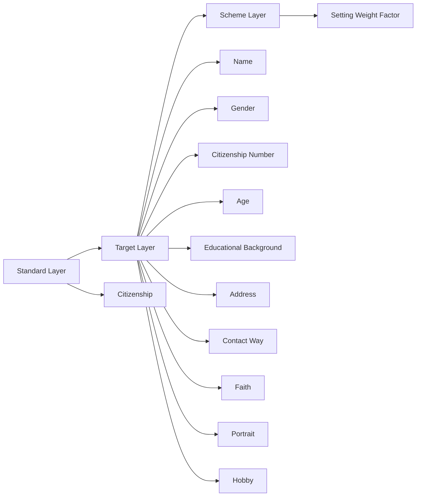
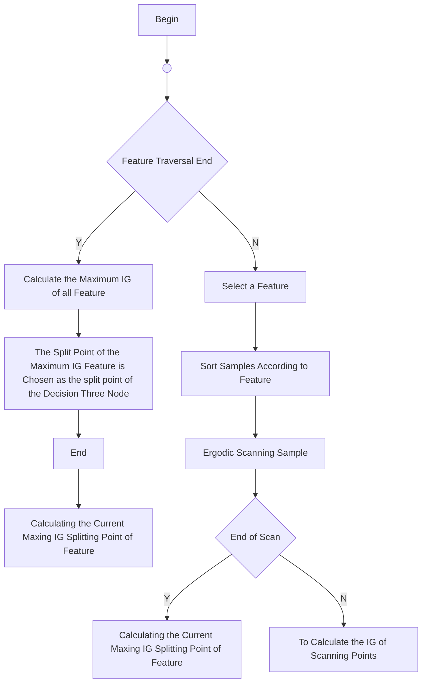
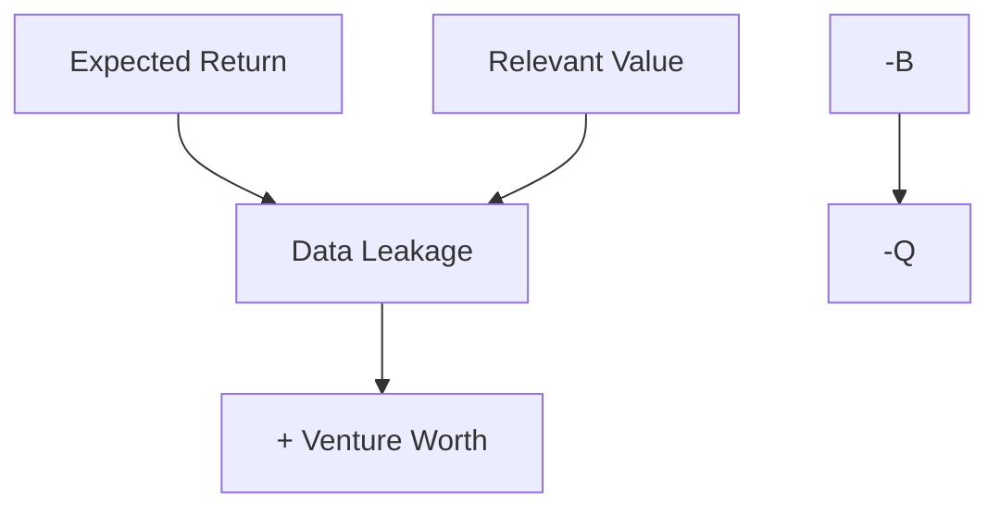
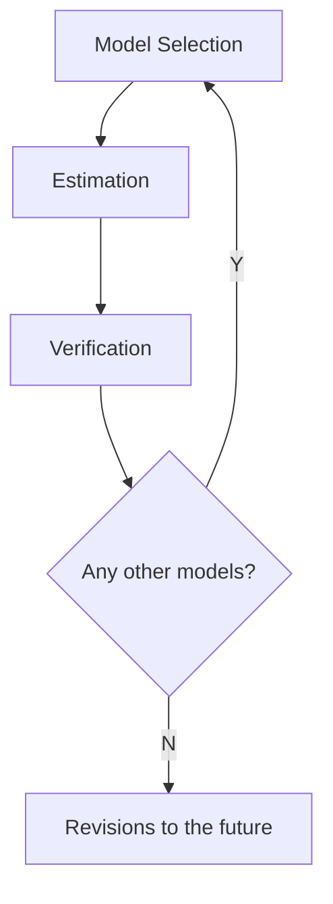

## Team Control Number

For office use only

T1

T2

T3

T4

## 87280

Problem Chosen

F

For office use only

F1

F2

F3

F4

## 2018 ICM

## How much is your privacy information?

## Summary Sheet

For ensuring the stability of the society, we establish a system of privacy pricing.

Task1, according to the personal characteristics and information field, we choose 26 indexes to measure privacy price, and divide them into 5 categories according to the degree of correlation.

Task2, we price the privacy. The present value method is used to quantify the value of privacy. We use the Analytic Hierarchy Process and Gradient Boosting Decision Tree, through the Python language to calculate the coefficients of the parameters. Then we establish Gauss mixture model to evaluate the information related value. Finally, the simulation of 500 people's privacy information is selected to verify the feasibility of the model.

Task3, we give the pricing method, introduce the demand elasticity coefficient, and analyze that the privacy information is more flexible. Then the life cycle changes in a long time range are predicted.

Task4, with the development of the times, the risk factor will be changed. We add dynamic factors and use Matlab to fit the change function of the risk coefficient.

Task5, the value of privacy will increase with age and then stabilize at a certain level. We find out the relationship between PI, IP and PP in the privacy market through a number of literature searches.

Task6, we use small world model and dynamic game theory to do simulation and prediction, and find that the privacy of individuals and groups will be largely leaked with the development of market.

Task7, the impact of data leakage is long tail. The agency can use the actuarial model to calculate the total amount of compensation to the individual.

Task8, we put forward some suggestions to the government on the basis of the model.

Finally, we perform a sensitivity test to verify the stability of the model.

## I Introduction

With the development of social informatization, the commercialization of privacy becomes an important issue. Therefore, we need to establish a privacy pricing system to maintain the stable and healthy development of the information sales market. Our tasks are as follows:

Task 1: considering the level of risk can pass personal information and data fields classifying model, considering the different characteristics of category information, find the best balance of classification accuracy and simplicity.

Task 2: the question to think about the integrity of personal information, uniqueness, scarcity, according to the value of different factors, finally comprehensive assessment of the value of personal information.

Task 3: consider the information value, risk value, and the impact of information integrity on the final information pricing.

Task 4: consider the assumptions and constraints of the pricing model, judge the relationship between information privacy and human rights, and adjust the model to make it universal in the dynamic environment.

Task 5: consider the influence of age factors on the risk-benefit ratio of the population,and consider the similarities and differences between PI and PP and IP.

Task 6: make sure each individual data sharing information leakage caused by the network effect, and to consider whether the information network effect will affect the value of the personal information system, and to have the same privacy risks related to personnel, thesale of their personal information should be restricted.

Task 7: consider the impact of large-scale PI leakage on data vendors, acquirers, and information value systems. And consider whether the responsibility for data disclosure should be responsible for information disclosure.

Task 8: organize the above questions into proposals.

## II Categorize individuals into sub-groups (Task 1)

## 2.1 A brief introduction to personal privacy pricing

Personal privacy is a basic resource, if it is used reasonably, it will help to promote the information social development. Culnan[1] find that, if private used by business are not known to individuals, they will increase their concerns about privacy disclosure. Hagel and others’ [2] research shows, some people tend to pay more attention to privacy, the reason is that they want to get compensation for information leakage. Adjei[3]thinks that, people will be willing to provide personal information to get paid if their personal profits outweigh the risks.

Thus, it can be seen that, on the premise of the sound pricing system of personal privacy most people are willing to obtain certain compensation or compensation through the sale of personal privacy. So the appropriate pricing system should be set up.

## 2.1.1 The establishment and evaluation of personal privacy information archives

The classification of personal privacy information can help research and excavate the real value contained in information, and the value of information can be further evaluated by studying the correlation degree. Therefore, we chose 26 indicators based on the principle of personal information classification and the actual situation of this subject. It includes personal attributes, financial transactions, social networks, personal assets and health care. This paper classifies personal privacy into two aspects: individual characteristics and information field.

The indicators and their classification are shown in Figure 2-1.

```mermaid
graph TD
  A["Characteristics of the specific domain of information"] --> B["Category"]
  B --> C["Domain of information"]
  C --> D["Health/Medical"]
  C --> E["Finance"]
  C --> F["Social contact"]
  C --> G["Social Way"]
  C --> H["Interpersonal relationships"]
  C --> I["Social Signal"]
  C --> J["Financial Credit"]
  C --> K["Transaction Amount"]
  C --> L["Trading Information"]
  C --> M["Debt"]
  C --> N["Physical Health Status"]
  C --> O["Medical Insurance"]
  C --> P["Medical History"]
  C --> Q["Genetic Map"]
  C --> R["Medical Expense"]
  C --> S["Expenditure"]
  C --> T["Intellectual Property"]
  C --> U["Personal Assets"]
  C --> V["Total Assets"]
  C --> W["Income"]
  C --> X["Hobby"]
  C --> Y["Hobby"]
  C --> Z["Portrait"]
  C --> AA["Portrait"]
  C --> AB["Age"]
  C --> AC["Educational Background"]
  C --> AD["Gender"]
  C --> AE["Name"]
  C --> AF["Address"]
  C --> AG["Citizenship Number"]
  C --> AH["Faith"]
```


<details>
<summary>flowchart</summary>


</details>

Figure 2-1: Classification

The reasons for the selection of personal privacy information in five aspects are analyzed as follows:

Citizenship:They belong to the range of attribute information and are objective information that can be used to identify specific individuals.  
 Social Contact: Because of the unique social attributes of human beings, it has an important research value in the field of information, which is generated in the process of life with the other spider web information.  
Finance: It reflects the situation of individual financial trade and has great value for information mining.  
Health/Medical: It has certain significance to the study of social medical treat- ment service system, and reflects the various situations of the individual body.  
Personal Assets：It reflects the personal economic status, which is valuable for public interest, such as national economic analysis, and corporate profits, and it can create economic benefits.

## III Privacy Cost Model（Task2）

## 3.1 Brief Introduction

The cost of privacy is a comprehensive pricing of the value of privacy, and we consider three components.

The first is the expected value of income, and we divide five two - level parameters into two categories.

 Difficult to quantify: As citizenship, we empower each parameter by analytic hierarchy process[4].  
 Quantify: The other 16 parameters can be quantified by using the present value method of income in accounting. Then the coefficient of each parameter is calculated by the machine learning method of the Gradient Boosting Decision Tree(GBDT)[5].

The second aspect is the risk value of privacy. Because the value of risk is not easy to measure, we use probability theory to estimate the average deviation degree of expected revenue and get the expected risk reward[6].

The third aspect is information related value. The cost of privacy depends not only on the integrity of information, but also on the relevance. For example, the value of only the name should be lower compared with the value of the name attached to the person. We set up a Gauss mixed model to study the relationship between the correlation value and the relevant value of information[7].

## 3.2 Model Building

## 3.2.1 Expected Value of Income

The expected value of income is ：

$$
I = \sum_ {j = 1} ^ {2 6} \alpha_ {i} C _ {i}
$$

Where：

I ： Expected total income value

$\alpha _ { j } .$ ：The value coefficient of the $j ^ { t h }$ parameter, $\boldsymbol { \alpha } _ { \mathrm { ~  ~ } j } = \boldsymbol { \omega } _ { j } ^ { * }$

$C _ { j }$ ：The expected return value of the $j ^ { t h }$ parameter

## Step1:The empowerment of civil identity information by AHP

The related factors of citizenship quantification are decomposed into objectives, guidelines, programs and so on. Based on this, qualitative and quantitative analysis is carried out. The analytic hierarchy process is like Figure 3–1：


<details>
<summary>flowchart</summary>


</details>

Figure 3–1: The Structure of AHP

Construct a comparison matrix

By consulting relevant information and combining with the reality of life, we analyze the relationship and importance of 10 indicators in citizenship, and build pair wise comparison matrix.

Hierarchical single order

The elements of each column of the judgement matrix are normalized, and the general terms of the elements are:

$$
\mathrm{A} _ {i j} = \mathrm{A} _ {i j} \div \sum_ {\mathrm{i}, \mathrm{j} = 1} ^ {n} \mathrm{A} _ {i j}
$$

Using sum and product method are used to calculate and add the judgement matrix of each column after the normalization. The $\mathrm { W } _ { i }$ is obtained.

$$
\mathrm{W} _ {i} = \sum_ {\mathrm{i}, \mathrm{j} = 1} ^ {n} B _ {i j}
$$

The element of the $\mathrm { W } _ { i }$ is the sort weight value of the relative importance of the same level factor to a certain factor of the upper level factor. For $\textbf { W } = ( \dot { \textbf { W } } , \textbf { W } _ { _ 2 } , . . . , \textbf { W } ) ^ { T }$ ,In the 2 process of normalization, the approximate solution of the eigenvector is obtained. Calculating the maximum eigenvalue of the judgment matrix $\lambda _ { \operatorname* { m a x } }$

$$
\lambda_ {\max} = \sum_ {i = 1} ^ {n} \frac {(\mathrm{AW}) _ {i}}{n \mathrm{W} _ {i}}
$$

After that, we can make sure that the rank ordering is consistent with the consistency check. The so-called consistency check is the allowable range of A.

Pairwise comparison matrix consistency test

The consistency index of the pairwise comparison matrix is Consistency Index (C.I.),

$$
C I = \frac {\lambda_ {\max} - n}{n - 1}
$$

To measure the size of CI, a random consistency index RI is introduced. The method is: construct 500 pairwise comparison matrices randomly, and get the consistency index

$$
R I = \frac {C I _ {1} + C I _ {2} + \dots + C I _ {5 0 0}}{5 0 0}
$$

The ratio of the consistency index CI. to the same order mean random consistency index R.I. is called the random consistency ratio Consistency Ratio(CR)。

$$
C R = \frac {C I}{R I}
$$

The CR<0.1 is obtained through the level analysis software, and the consistency check is passed.

Determining the weight factor

The eigenvectors are obtained by calculation,which is the weight of the 10 indexes.

$$
\alpha_ {j \in [ 1, 1 0 ]} = W = (0. 0 5 6, 0. 0 1 9, 0. 1 5 5, 0. 0 2 5, 0. 0 7 5, 0. 1 3 4, 0. 0 5 3, 0. 0 9 5, 0. 1 8 6, 0. 2 0)
$$

## Step2：Earnings present value method quantifies other information

Privacy information seems to be difficult to quantify, but as long as the method is appropriate, we can quantify it to a certain extent. We regard privacy information as an intangible asset, a lot of international ways of quantifying intangible assets. Here we use the present value method[8].

The present value method of income is a kind of asset evaluation method to estimate the value of the assets evaluated by estimating the future expected revenue of the assessed assets and turning them into the present value. We determine the value of privacy information by calculating the future revenue of the privacy value. For example, Table 3-1 shows that the future earnings of businesses refer to the profits gained by merchants' knowledge of private information, or the expenditure reduced by government agencies and public organizations.

Table 3–1: Information value quantization table

<table><tr><td colspan="2">Original Parameter</td><td>Quantized Parameters</td></tr><tr><td rowspan="4">Personal Assets</td><td>Total Assets</td><td>Average Deposit</td></tr><tr><td>Income</td><td>Disposable Income</td></tr><tr><td>Expenditure</td><td>Disposable Expenditure</td></tr><tr><td>Intellectual Property</td><td>Education Expenditure</td></tr><tr><td rowspan="3">Social Contact</td><td>Social Way</td><td>Social Consumption Profit</td></tr><tr><td>Friends</td><td>Social Web Site Profit</td></tr><tr><td>Social Signal</td><td>Profit of Communication</td></tr><tr><td rowspan="4">Finance</td><td>Financial Credit</td><td>Average Credit</td></tr><tr><td>Trading Information</td><td>Average Stock Investment</td></tr><tr><td>Transaction on Amount</td><td>Average Transaction Amount</td></tr><tr><td>Debt</td><td>Average Liabilities</td></tr><tr><td rowspan="5">Health/Medical</td><td>Physical Health Status</td><td>Health Expenses</td></tr><tr><td>Medical Insurance</td><td>Insurance Cost</td></tr><tr><td>Medical History</td><td>Medical Records</td></tr><tr><td>Medical Expense</td><td>Medical Expenditure</td></tr><tr><td>Genetic Map</td><td>Medical Research Funds</td></tr></table>

## Step3：GBDT calculation of expected value coefficient

Gradient Boosting Decision Tree is a combination algorithm for machine learning[9],By iterating forward distribution algorithm, continue with the new weights, each round of iteration to get a strong learner and loss function, the next iteration of the goal is to find is a weak learning regression tree model, make the next round to minimize the loss, it is to find a decision tree, let sample loss to become smaller. This is the most significant algorithm in machine learning at present. Figure 3 - 2 shows the principle of its calculation[10].

The last formula of the above steps is the information gain after the division of the decision tree is created, and the best splitting point is the position with the highest information gain. In order to find the maximum gain position of the feature, we need to traverse all the characteristics, find the highest gain for every feature, calculate all the features gain, the specific process is like Figure 3 – 3, and then use greedy algorithm to repeat the process.


<details>
<summary>text_image</summary>

O(Θ) = E(Θ) + R(Θ)
O(q) = ∑i=1n E(yi, ŷi(q)) + ∑i=1q R(fi)
= ∑i=1n E((yi, ŷi(q-1) + ft(xi)) + ∑i=1q R(fi)
O(q) ⇒ ∑i=1n E(yi, ŷi(q)) + ∑i=1q R(fi)
= ∑i=1n E((yi, ŷi(q-1) + gt(xi) + ½hf_i^2(x_i)) + ∑i=1q R(fi))
O(q) ⇒ ∑i=1n [g_i f_q(x_i) + ½ h_i f_q^2(x_i)] + R(f_q)
= ∑i=1n [g_i ω_η(x_i) + ½ h_i ω_η^2(x_i)] + ψT + φ ½ ∑j=1^T ω_j^2
= ∑j=1^T [(∑i∈I_j g_i)ω_j + ½ (∑i∈I_j h_i + φ)ω_j^2] + ψT
O = -½ ∑j=1^T G_j^2 / H_i + ψ + ηT
Gain = G_L^2 / H_L + ψ + G_R^2 / H_R + ψ - (G_L + G_H)^2 / H_L + H_R + ψ - η
Symbol Description
O(Θ): Objective function
E(Θ): Error function, training loss measures
how well model fit on training data.
R(Θ): Regularization function, measures
complexity of model.
i: The i^th leaf
q : Number of iterations
ŷ_i^(q) The model when
training round q
ŷ_i^(q-1): Keep functions added
in previous round
f_g(x_i): New Function
ω ∈ L^T The weight of leaves
η: L^d → {1,2,...,T} The structure of the tree
ψ: Number of leaves
φ: Norm of leaf scores
T: The number of leaves
</details>

Figure 3–2: GBDT Principle

We use Python to program according to the above principles, then we can increase the accuracy and find the most appropriate coefficient by adjusting the steps, iterations, the maximum depth of decision tree, the minimum sample size and so on.Finally, we can get the expected value of each parameter value coefficient:

$$
\omega^ {*} = - \frac {G _ {j}}{\pi_ {j} + \psi}
$$

## 3.2.4 Venture Value

## Step1. The standard deviation is calculated.

Generally, we can use standard deviation to measure the degree of general response risk, but we have multidimensional index. In order to facilitate comparison with other parameters, it is more ideal to use standard deviation rate.

$$
C o f = \frac {\sigma}{E}
$$

Where

Cof ：coefficient of variation, E ：expected value, ：Standard deviation


<details>
<summary>flowchart</summary>


</details>

Figure 3–3:Information gain traversal

## Step2. Determine the risk factor.

By the analytic hierarchy process described above, the weight of each parameter is considered as a risk factor, indicating the risk of privacy exposure.

The risk coefficient is determined by the analytic hierarchy process. After introducing the risk factor, we can calculate the expected rate of return on the risk of privacy:

$$
R _ {i} = \sum_ {j = 1} ^ {2 6} r _ {i} C o f
$$

Where

$R _ { j }$ ：The rate of risk reward for the $j ^ { t h }$ parameter

$r _ { j }$ ：The risk coefficient of the $j ^ { t h }$ parameter

Step3. Calculating the amount of the risk of privacy, that is the value of the risk.

$$
K = \sum_ {j = 1} ^ {2 6} I _ {j} R _ {j} = \sum_ {j = 1} ^ {2 6} \frac {\alpha_ {j} r _ {j} C _ {j} \sigma}{E}
$$

Where

$K$ ：Value of privacy risk, ：Expected return value of the jth $j ^ { t h }$ parameter $I _ { j }$

## 3.2.4 Information related value

For the personal privacy information provided, the value of the data should be further excavated. According to practical experience, the more sensitive information is, the more sensitive rules can be mined, so the value of information is bigger, so we define "information related value" to measure the degree of information correlation.

According to the study, the relationship between the two is "S" positive correlation, so the Gauss mixed model is established[11], the Gauss probability density function is used to quantify accurately.

The relationship between information related value and information correlation is consistent with the following Gauss function curve trend such as figure Figure 3–4.

$$
D (\delta) = a e ^ {- \frac {(\delta - \mu) ^ {2}}{2 \sigma^ {2}}}
$$

The $\mu$ and $\sigma$ are the parameters, and the maximum likelihood method can be used[12]to estimate the parameters


<details>
<summary>line chart</summary>

| Information correlation | Price(¥) |
| ------------------------ | -------- |
| 0.0                      | 0        |
| 0.5                      | 10       |
| 1.0                      | 30       |
| 1.5                      | 60       |
| 2.0                      | 100      |
| 2.5                      | 150      |
| 3.0                      | 200      |
| 3.5                      | 250      |
| 4.0                      | 280      |
| 4.5                      | 290      |
| 5.0                      | 300      |
</details>

Figure 3–4:Relation diagram of information related value and correlation

The MATLAB program is used to program the correlation value of the information provided by the individual, and the information related value can be calculated. Personal data provided that the two person, the expected value and risk return value is the same, privacy cost pricing is not representative of the two men is the same, it is necessary to study the degree of correlation according to specific content provided by the two data, estimate the value of the relevant information, so as to calculate the final cost of privacy pricing.

The information related value is calculated on the basis of the expected value of income, and the concrete steps are as follows:

$$
D = a e ^ {- \frac {(\delta - \mu) ^ {2}}{2 \sigma^ {2}}}
$$

Where：

D ：Information related value, I ：Expected value of income, ：Correlation

## 3.2.4 Total value of the cost of privacy

$$
C P = I + K + D = \sum_ {j = 1} ^ {2 6} \alpha_ {j} C _ {j} \bullet \left(1 + \sum_ {j = 1} ^ {2 6} r _ {j} C o f + a e ^ {- \frac {(\delta - \mu) ^ {2}}{2 \sigma^ {2}}}\right)
$$

Where：

<table><tr><td colspan="2">CP: Total price of privacy</td></tr><tr><td>I: Expected value of income</td><td> $R_{i}$ : Risk rate</td></tr><tr><td>K: value of risk</td><td> $r_{i}$ : risk coefficient</td></tr><tr><td>D: Information related value</td><td> $\sigma$ : standard deviation</td></tr><tr><td> $\alpha_{j}$ : Expected return coefficient  $\alpha_{j} = \omega_{j}^{*}$ </td><td>E: expectation</td></tr><tr><td>Cof: coefficient of variation</td><td> $\delta$ : correlation</td></tr></table>

## 3.3 Model solution

## 3.3.1 Data compilation

Based on the parameters that are quantified, we have collected data for 1997-2016 years in China's census and consumption.

Data source:National Bureau of Statistics of China（http://data.stats.gov.cn/）

## 3.3.2 Data processing

After a simple arrangement of the data, further processing of the data is needed.

Data cleaning: check whether the data is correct. The outliers are modified by fuzzy matching to fill the missing values.

Data standardization: using the Z-score method to standardize the data, the research shows that the method has the highest compatibility in many criteria standardization[13].

## 3.3.3 Calculation coefficient

Through the above method, we get the risk coefficient, value coefficient and correlation degree of each dimension through the analytic hierarchy process and GBDT by Python programming. The specific values are Table 3–2.

## 3.3.4 Privacy cost pricing

The expected value of earnings is based on the data of China's nearly five years (2011- 2016) and is further calculated by the above coefficients.

Table 3–2 Value coefficient and risk factor

<table><tr><td>Secondary</td><td>Tertiary</td><td>Income Coefficient</td><td>Risk Coefficient</td></tr><tr><td rowspan="10">Citizenship</td><td>Name</td><td>0.056</td><td>0.020</td></tr><tr><td>Gender</td><td>0.019</td><td>0.020</td></tr><tr><td>Citizenship Number</td><td>0.155</td><td>0.163</td></tr><tr><td>Age</td><td>0.025</td><td>0.026</td></tr><tr><td>Educational Background</td><td>0.075</td><td>0.059</td></tr><tr><td>Address</td><td>0.134</td><td>0.173</td></tr><tr><td>Contact Way</td><td>0.053</td><td>0.059</td></tr><tr><td>Faith</td><td>0.095</td><td>0.083</td></tr><tr><td>Portrait</td><td>0.186</td><td>0.197</td></tr><tr><td>Hobby</td><td>0.200</td><td>0.200</td></tr><tr><td rowspan="4">Personal Assets</td><td>Total Assets</td><td>0.045</td><td>0.581</td></tr><tr><td>Income</td><td>0.014</td><td>0.163</td></tr><tr><td>Expenditure</td><td>0.052</td><td>0.163</td></tr><tr><td>Intellectual Property</td><td>0.084</td><td>0.092</td></tr><tr><td rowspan="3">Social Contact</td><td>Social Way</td><td>0.076</td><td>0.405</td></tr><tr><td>Friends</td><td>0.008</td><td>0.149</td></tr><tr><td>Social Signal</td><td>0.023</td><td>0.234</td></tr><tr><td rowspan="4">Finance</td><td>Financial Credit</td><td>0.025</td><td>0.211</td></tr><tr><td>Trading Information</td><td>0.049</td><td>0.186</td></tr><tr><td>Transaction on Amount</td><td>0.008</td><td>0.127</td></tr><tr><td>Debt</td><td>0.007</td><td>0.687</td></tr><tr><td rowspan="5">Health/Medical</td><td>Physical Health Status</td><td>0.041</td><td>0.233</td></tr><tr><td>Medical Insurance</td><td>0.058</td><td>0.060</td></tr><tr><td>Medical History</td><td>0.017</td><td>0.091</td></tr><tr><td>Medical Expense</td><td>0.053</td><td>0.233</td></tr><tr><td>Genetic Map</td><td>0.074</td><td>0.383</td></tr></table>

Table 3-3 Privacy cost price

<table><tr><td></td><td colspan="11">Citizenship</td><td colspan="4">Personal</td><td colspan="3">Social</td><td colspan="4">Finance</td><td colspan="5">Health/Medical</td><td colspan="4">¥</td></tr><tr><td>ID</td><td>x1</td><td>x2</td><td>x3</td><td>x4</td><td>x5</td><td>x6</td><td>x7</td><td>x8</td><td>x9</td><td>x10</td><td>x11</td><td>x12</td><td>x13</td><td>x14</td><td>x19</td><td>x20</td><td>x21</td><td>x15</td><td>x16</td><td>x17</td><td>x18</td><td>x22</td><td>x23</td><td>x24</td><td>x25</td><td>x26</td><td>I</td><td>K</td><td>D</td><td>CP</td><td></td></tr><tr><td>1</td><td>0</td><td>1</td><td>1</td><td>1</td><td>1</td><td>0</td><td>0</td><td>1</td><td>1</td><td>1</td><td>1</td><td>0</td><td>1</td><td>0</td><td>0</td><td>1</td><td>1</td><td>0</td><td>0</td><td>1</td><td>0</td><td>0</td><td>0</td><td>0</td><td>1</td><td>0</td><td>926.04</td><td>472.93</td><td>170.18</td><td>1569.16</td><td></td></tr><tr><td>2</td><td>1</td><td>1</td><td>1</td><td>1</td><td>1</td><td>1</td><td>1</td><td>0</td><td>0</td><td>1</td><td>0</td><td>1</td><td>1</td><td>0</td><td>1</td><td>1</td><td>1</td><td>1</td><td>1</td><td>1</td><td>1</td><td>1</td><td>0</td><td>1</td><td>1</td><td>1</td><td>365.19</td><td>734.33</td><td>173.54</td><td>1273.06</td><td></td></tr><tr><td>3</td><td>0</td><td>1</td><td>1</td><td>1</td><td>1</td><td>0</td><td>0</td><td>1</td><td>0</td><td>0</td><td>1</td><td>0</td><td>1</td><td>1</td><td>0</td><td>1</td><td>0</td><td>1</td><td>0</td><td>0</td><td>1</td><td>1</td><td>1</td><td>1</td><td>1</td><td>1</td><td>1506.07</td><td>528.41</td><td>198.76</td><td>2233.23</td><td></td></tr><tr><td>4</td><td>1</td><td>1</td><td>1</td><td>1</td><td>1</td><td>1</td><td>0</td><td>0</td><td>1</td><td>0</td><td>0</td><td>1</td><td>0</td><td>0</td><td>0</td><td>1</td><td>1</td><td>1</td><td>0</td><td>1</td><td>0</td><td>1</td><td>1</td><td>1</td><td>1</td><td>1</td><td>234.76</td><td>701.66</td><td>39.85</td><td>976.28</td><td></td></tr><tr><td>5</td><td>0</td><td>1</td><td>1</td><td>1</td><td>1</td><td>0</td><td>1</td><td>1</td><td>0</td><td>0</td><td>0</td><td>1</td><td>1</td><td>1</td><td>1</td><td>0</td><td>1</td><td>1</td><td>1</td><td>0</td><td>1</td><td>1</td><td>0</td><td>1</td><td>1</td><td>0</td><td>730.35</td><td>770.34</td><td>61.78</td><td>1562.46</td><td></td></tr><tr><td>.</td><td></td><td></td><td></td><td></td><td></td><td></td><td></td><td></td><td></td><td></td><td></td><td></td><td></td><td></td><td></td><td></td><td></td><td></td><td></td><td></td><td></td><td></td><td></td><td></td><td></td><td></td><td></td><td></td><td></td><td></td><td></td></tr><tr><td>.</td><td></td><td></td><td></td><td></td><td></td><td></td><td></td><td></td><td></td><td></td><td></td><td></td><td></td><td></td><td></td><td></td><td></td><td></td><td></td><td></td><td></td><td></td><td></td><td></td><td></td><td></td><td></td><td></td><td></td><td></td><td></td></tr><tr><td>.</td><td></td><td></td><td></td><td></td><td></td><td></td><td></td><td></td><td></td><td></td><td></td><td></td><td></td><td></td><td></td><td></td><td></td><td></td><td></td><td></td><td></td><td></td><td></td><td></td><td></td><td></td><td></td><td></td><td></td><td></td><td></td></tr><tr><td>224</td><td>0</td><td>0</td><td>0</td><td>0</td><td>1</td><td>0</td><td>0</td><td>0</td><td>1</td><td>1</td><td>0</td><td>0</td><td>0</td><td>0</td><td>1</td><td>0</td><td>0</td><td>0</td><td>1</td><td>1</td><td>1</td><td>0</td><td>0</td><td>1</td><td>0</td><td>1</td><td>611.83</td><td>55.10</td><td>88.19</td><td>755.12</td><td></td></tr><tr><td>225</td><td>1</td><td>1</td><td>1</td><td>1</td><td>1</td><td>1</td><td>0</td><td>1</td><td>0</td><td>0</td><td>0</td><td>1</td><td>1</td><td>1</td><td>0</td><td>1</td><td>1</td><td>0</td><td>0</td><td>1</td><td>0</td><td>1</td><td>1</td><td>1</td><td>0</td><td>0</td><td>598.51</td><td>403.65</td><td>80.72</td><td>1082.88</td><td></td></tr><tr><td>226</td><td>1</td><td>1</td><td>1</td><td>1</td><td>1</td><td>1</td><td>1</td><td>0</td><td>1</td><td>1</td><td>0</td><td>0</td><td>0</td><td>1</td><td>0</td><td>1</td><td>0</td><td>1</td><td>1</td><td>0</td><td>0</td><td>0</td><td>1</td><td>0</td><td>0</td><td>0</td><td>660.82</td><td>440.44</td><td>111.43</td><td>1212.69</td><td></td></tr><tr><td>227</td><td>0</td><td>1</td><td>1</td><td>1</td><td>1</td><td>0</td><td>1</td><td>0</td><td>1</td><td>0</td><td>0</td><td>0</td><td>0</td><td>0</td><td>0</td><td>0</td><td>1</td><td>1</td><td>0</td><td>1</td><td>1</td><td>0</td><td>0</td><td>1</td><td>1</td><td>0</td><td>650.62</td><td>692.13</td><td>79.51</td><td>1422.27</td><td></td></tr><tr><td>.</td><td></td><td></td><td></td><td></td><td></td><td></td><td></td><td></td><td></td><td></td><td></td><td></td><td></td><td></td><td></td><td></td><td></td><td></td><td></td><td></td><td></td><td></td><td></td><td></td><td></td><td></td><td></td><td></td><td></td><td></td><td></td></tr><tr><td>.</td><td></td><td></td><td></td><td></td><td></td><td></td><td></td><td></td><td></td><td></td><td></td><td></td><td></td><td></td><td></td><td></td><td></td><td></td><td></td><td></td><td></td><td></td><td></td><td></td><td></td><td></td><td></td><td rowspan="2"></td><td rowspan="2"></td><td rowspan="2"></td><td></td></tr><tr><td>.</td><td></td><td></td><td></td><td></td><td></td><td></td><td></td><td></td><td></td><td></td><td></td><td></td><td></td><td></td><td></td><td></td><td></td><td></td><td></td><td></td><td></td><td></td><td></td><td></td><td></td><td></td><td></td><td></td></tr><tr><td>497</td><td>1</td><td>1</td><td>1</td><td>1</td><td>0</td><td>1</td><td>1</td><td>1</td><td>0</td><td>1</td><td>0</td><td>1</td><td>0</td><td>1</td><td>0</td><td>0</td><td>1</td><td>0</td><td>1</td><td>1</td><td>1</td><td>1</td><td>1</td><td>0</td><td>1</td><td>0</td><td>815.32</td><td>419.52</td><td>138.94</td><td>1373.78</td><td></td></tr><tr><td>498</td><td>0</td><td>0</td><td>0</td><td>0</td><td>0</td><td>0</td><td>0</td><td>0</td><td>0</td><td>0</td><td>0</td><td>1</td><td>1</td><td>0</td><td>0</td><td>1</td><td>1</td><td>0</td><td>1</td><td>1</td><td>1</td><td>1</td><td>0</td><td>0</td><td>1</td><td>0</td><td>1488.56</td><td>343.07</td><td>231.13</td><td>2062.76</td><td></td></tr><tr><td>499</td><td>0</td><td>1</td><td>1</td><td>1</td><td>1</td><td>1</td><td>1</td><td>0</td><td>1</td><td>0</td><td>1</td><td>0</td><td>1</td><td>0</td><td>1</td><td>1</td><td>0</td><td>1</td><td>1</td><td>0</td><td>0</td><td>0</td><td>1</td><td>0</td><td>1</td><td>0</td><td>170.35</td><td>512.77</td><td>92.07</td><td>775.18</td><td></td></tr><tr><td>500</td><td>1</td><td>0</td><td>0</td><td>0</td><td>0</td><td>1</td><td>1</td><td>0</td><td>0</td><td>1</td><td>1</td><td>0</td><td>1</td><td>1</td><td>1</td><td>1</td><td>1</td><td>1</td><td>0</td><td>1</td><td>1</td><td>1</td><td>1</td><td>1</td><td>0</td><td>1</td><td>394.81</td><td>885.23</td><td>33.59</td><td>1313.63</td><td></td></tr><tr><td></td><td></td><td></td><td></td><td></td><td></td><td></td><td></td><td></td><td></td><td></td><td></td><td></td><td></td><td></td><td></td><td></td><td></td><td></td><td></td><td></td><td></td><td></td><td></td><td></td><td></td><td></td><td>Average</td><td>811.34</td><td>454.54</td><td>116.25</td><td></td></tr><tr><td></td><td></td><td></td><td></td><td></td><td></td><td></td><td></td><td></td><td></td><td></td><td></td><td></td><td></td><td></td><td></td><td></td><td></td><td></td><td></td><td></td><td></td><td></td><td></td><td></td><td></td><td></td><td>Standard Deviati-</td><td>371.82</td><td>235.88</td><td>43.94</td><td></td></tr></table>

1 of them represent this privacy information, and 0 are not provided.

Then, we simulated the transactions of 500 people's personal privacy data, such as Table 3 – 3, and calculated the privacy cost pricing based on these data, and made a brief analysis.

We calculate each individual's expected return value, risk value and relative value, have been found according to the total privacy, personal privacy information provided \$600-3000 between the floating in.

If a person provides all his privacy information is all 1, then we calculate the total privacy for \$5578 (per year).

## IV Pricing system & Supply and demand relationship （Task3）

When we sell personal privacy information as commodities, we are bound to be affected by market fluctuations, including micro supply and demand, macro policy adjustment and economic balance.

## 4.1 Pricing system

Individuals can earn certain profits by selling their own privacy information. Businesses or government agencies want to purchase these information, and they will pay personal money, plus some profits besides privacy costs.

$$
B = C P + S
$$

Where:

B ：Pricing of privacy information CP ：The total price of privacy

S ：Personal sale of hidden profits

According to the current market profits, in addition to luxury accessories and profiteering, the profit margin of a commodity is roughly 10%-30%. As a person's private seller, how much profit can be made for its own price, but the profit margin can not exceed 30%.

The profit margin is $\phi \left( \phi \leq 0 . 3 \right)$ ，we can get the following:

$$
\begin{array}{l} B = C P + C P \bullet \phi = C P (1 + \phi) \\ = (1 + \phi) \sum_ {j = 1} ^ {2 6} \alpha_ {j} C _ {j} \bullet \left(1 + \sum_ {j = 1} ^ {2 6} r _ {j} C o f + a e ^ {- \frac {(\delta - \mu) ^ {2}}{2 \sigma^ {2}}}\right) \\ \end{array}
$$

## 4.2 Demand elasticity of privacy value

When privacy information becomes a commodity in the market, it will receive the influence of market fluctuations caused by various factors.This kind of influence will cause the change of demand and price of privacy information. In order to respond to the degree and relationship of change, we introduce the concept of demand price elasticity in economics to explain the demand elasticity of privacy value[14].

$$
E _ {d} = \frac {\partial Q}{\partial B} \bullet \frac {B}{Q}
$$

Where：

$E _ { d }$ ：Elasticity coefficient of demand， Q ：Quantity demanded，

B ：Pricing of privacy information

In general, the elastic coefficient is negative, and in order to be simple, we see it as a positive number. It is also divided into five cases of Table4-1.

## Table 4–1 Elasticity coefficient of demand

<table><tr><td> $E_{d}=0$ </td><td>Nonelastic,the price will change in any case, and the demand will not change.</td></tr><tr><td> $0Lack of elasticity, The rate of change in demand is less than the rate of price change.</td><td>Lack of elasticity, The rate of change in demand is less than the rate of price change.</td></tr><tr><td>\( E_{d}=1$ </td><td>Single elasticity, at this time, the rate of price change is equal to the rate of change in demand.</td></tr><tr><td> $E_{d}>1$ </td><td>Resilient,A ratio of change in price to a ratio of change in demand.</td></tr><tr><td> $E_{d}=\infty$ </td><td>Perfect elasticity, The price is fixed and there is an unlimited demand.</td></tr></table>

According to the concept of life cycle, we divide the market of this kind of information into three stages, as shown by Figure 4–1


<details>
<summary>line chart</summary>

| Phase      | B     |
| ---------- | ------- |
| Evolution  | High    |
| Maturation | Medium  |
| Winter     | Low     |
</details>

Figure 4–1 Life Cycle

 Development period: In this period, the relationship between the value of privacy and the amount of demand is more flexible. When the price of privacy rises, most people will be willing to sell, and when the price falls, people will choose to keep their privacy.  
 Mature period: With the deepening of the concept of privacy information becoming a commodity, institutions or organizations have fixed demand for privacy information, and the coefficient of elasticity will be smaller, or even a fixed price.  
 Decline period: When most of the people's privacy is sold for years, the market for privacy information is close to saturation, and there may be a price - free phenomenon.

## V Assumptions and Dynamic improvement（Task 4）

## 5.1 Assumptions and constraints of personal information pricing model

1. It is assumed that people with the same conditions have the same willingness to protect privacy. In the real world, due to the particularity of each person, the degree of importance attached to personal information is different. Its distribution is roughly normal distribution. We assume that each person's attention to their personal information is only related to the individual characteristics and information related fields.  
2. We don't consider the personal information of people in a special field. Special areas include political areas, military areas, and so on. In some special areas, the disclosure of

personal information will result in greater consequences and can’t be quantified according to general standards.

3. We only consider the data of model system above. In order to quantify the value of personal data, we only select the characteristic factors that have a great impact on the value of personal information and evaluate the value of personal information according to the characteristic factors.

## 5.2 Whether information privacy should be regarded as human rights

In our view, information privacy should not be protected fully as human rights.

On the one hand, a part of personal information is closely related to the dignity of the person and reflects the personality factors of the individual. From the phenomenon of the commercialization of personal information, we can find that personal information reflects both personality and property interests[15].Therefore, it is reasonable to protect the property right.

To sum up, we think that the personal information should be divided into two aspects, that is, the personality elements of personal information and the property elements of personal information. In the collection and utilization of personal information, we should pay attention to the desensitization of personal information and make use of the information data without damaging the legitimate rights and interests of the information owners.

## 5.3 Dynamic analysis of cost of privacy

## 5.3.1 The change of personal values with time

With the development of time, the spread of privacy protection ideas is expanding. People are increasingly familiar with the consequences of privacy disclosure and pay more attention to privacy. Therefore, people's expectations for the return of privacy are getting higher and higher. According to the analysis of the privacy cost model, the risk value is changed due to the change of people's thought.

## 5.3.2 The dynamic analysis of the model

With the change of time，he value of risk increases gradually, we add dynamic factors on the basis of the original model. The risk factors of 26 indicators $\left( \begin{array} { l } { r _ { j } } \end{array} \right)$ are changed from constants to functions , which are changing by time( t ).

Taking the total asset as an example, its trend of change is shown in Figure 5-1.

The data is fitted by the MATLAB fitting toolbox. We get a higher fitting degree R-square, which is 0.9779. The fitting effect is very good. So, the function relationship between the risk coefficient $\left( r _ { 1 8 } \right)$ and the time (t ) of the 18th indexes is as follows:

$$
r _ {1 8} = - 0. 6 4 0 4 e ^ {(- 0. 0 7 0 6 6 t + 0. 6 8 8 7)}
$$

By fitting the risk coefficients of the other 25 indexes in the same way, we can calculate the function relation of the risk coefficients of each index. Combined with the formula of risk value:

$$
K = \sum_ {j = 1} ^ {2 6} I _ {j} R _ {j} = \sum_ {j = 1} ^ {2 6} \frac {\alpha_ {j} r _ {j} C _ {j} \sigma}{E}
$$

We will add the functional relationship between the dynamic factors $( ~ r _ { j }$ )and the time ( t ) into the upper formula, then it can calculate the change of risk value over time to realize the dynamic evaluation of the model.


<details>
<summary>line chart</summary>

| Year | Risk factor |
| ---- | ----------- |
| 0    | 0.0         |
| 5    | 0.18        |
| 10   | 0.35        |
| 15   | 0.42        |
| 20   | 0.50        |
| 25   | 0.581       |
| 30   | 0.60        |
| 35   | 0.62        |
| 40   | 0.64        |
| 45   | 0.66        |
| 50   | 0.68        |
| 55   | 0.70        |
| 60   | 0.72        |
</details>

Figure 5-1: The change trend of total assets

## VI Generational differences and conceptual comparisons（Task5）

## 6.1 Generational Differences

With the different ideas of the times and the growth of age, there are more or less differences in the cognition of the risk and income of privacy information. In this regard, we collect relevant data, and do an analysis.

Data sources:

(1) Data report on China's Internet consumption ecology in 2015- 2017.  
http://doc.mbalib.com/view/e720ad8eb4ebac9f83d56ec790a6dd1c.html

(2) Census of China's national bureau of statistics.

http://www.stats.gov.cn/tjsj/pcsj/

(3) Chinese data Yearbook

http://data.stats.gov.cn/easyquery.htm?cn=C01

We get the consumption data of all ages in personal assets, social networking, financial transactions, health care, and then analyze and regress to get Figure 6 - 1, from 19 to 63 years old, the average growth of people's activities and consumption expenditure and 19 years old.

According to the analysis of the second problem, consumption expenditure can be regarded as expected value, so our model needs to make some changes.

If pertinence is stronger, or we want to accurately calculate the value of privacy information, we can increase the value of each kind of privacy value according to the growth of every dimension.

If only for the overall calculation, and without careful consideration of the increase in the situation, the average growth value can be used.


<details>
<summary>line chart</summary>

| Age | Value (%) |
|---|---|
| 19 | 2.5 |
| 23 | 3.8 |
| 27 | 6.5 |
| 31 | 7.8 |
| 35 | 10.8 |
| 39 | 11.8 |
| 43 | 13.5 |
| 47 | 15.8 |
| 51 | 16.0 |
| 55 | 17.8 |
| 59 | 18.0 |
| 63 | 19.2 |
</details>

Figure6–1 Generational Differences of consumption level

## 6.2 Compare with PI，PP and IP

·Private information[16] ： Non - public information ,Commercialization is not entirely beneficial to individuals, and the sale of personal information will bring a series of immeasurable risks, which may be invisible and long-term.

PP：Personal property is divided into tangible and intangible assets [17].

The sale of PP by changing the commodity itself to a certain value is not determined by the relationship with the owner.

 IP：Rights generated by creative activities based on intelligence[18].

The sale of IP will not cause the risk of disclosure of privacy information.

The conceptual relationships of PI, PP, and IP are shown in Figure 6 - 2.


<details>
<summary>text_image</summary>

Personal Property
Private Information
Intellectual Property
</details>

Figure 6–2 The conceptual relationships of PI, PP, and IP

## VII Network effects of data sharing（Task 6）

We use Matlab to build a small world model for information leakage, and find that individuals who do not sell privacy are increasingly implicated with the development of privacy trading market. Then through the dynamic game theory, it is predicted that the information of the group will be leaked seriously because of the individual behavior, and if it is properly constrained, the interests of the group can be maximized.

## 7.1 The analysis and hypothesis of the problem.

1.Using the "economic man" hypothesis in economics, it is assumed that all the residents in the community are economic man, that is, each step should only consider their own interests.  
2.Using a modified small-world model to simulate group information leaks, members who sell the information leak personal information about members of his or her neighborhood and have ${ \tt a } ^ { p }$ chance to reveal information about other members.  
3.Assuming that any member's sale of personal information is immediately known toother members, this is a reasonable assumption in small groups.  
4.Suppose each member has the same impact on information disclosure.  
5.Suppose that the information breakers leak information to themselves and to the associated members have the same impact.  
6. Information disclosure does not consider human rights constraints.

## 7.2 Model

## 7.2.1 A small world model of personal privacy disclosure.

Establish a small world model to describe the degree of privacy disclosure in a group, In the model, the proportion of people willing to sell personal information for profit is n ， The proportion of people who are unwilling to sell personal information in return for benefits is 1 n ，individuals who sell their privacy will lose the privacy of two adjacent individuals in the model, the probability of having n causes loss of privacy of non-adjacent individuals. Use Matlab software to simulate.


<details>
<summary>radar chart</summary>

| Point | Value |
|---|---|
| 1 | 17 |
| 2 | 18 |
| 3 | 19 |
| 4 | 20 |
| 5 | 21 |
| 6 | 22 |
| 7 | 23 |
| 8 | 24 |
| 9 | 25 |
| 10 | 26 |
| 11 | 27 |
| 12 | 28 |
| 13 | 29 |
| 14 | 30 |
| 15 | 31 |
| 16 | 32 |
| 17 | 33 |
| 18 | 34 |
| 19 | 35 |
| 20 | 36 |
| 21 | 37 |
| 22 | 38 |
| 23 | 39 |
| 24 | 40 |
| 25 | 41 |
| 26 | 42 |
| 27 | 43 |
| 28 | 44 |
| 29 | 45 |
| 30 | 46 |
| 31 | 47 |
| 32 | 48 |
| 33 | 49 |
| 34 | 50 |
| 35 | 51 |
| 36 | 52 |
| 37 | 53 |
| 38 | 54 |
| 39 | 55 |
| 40 | 56 |
| 41 | 57 |
| 42 | 58 |
| 43 | 59 |
The chart displays a single data series with values ranging from approximately -10 to +10. The x-axis is labeled 'Value' and the y-axis is labeled 'Value'. There are no labels or additional data series provided in the image.
</details>


<details>
<summary>line chart</summary>

| Point | Value |
|---|---|
| 1 | 20 |
| 2 | 23 |
| 3 | 25 |
| 4 | 26 |
| 5 | 27 |
| 6 | 28 |
| 7 | 29 |
| 8 | 30 |
| 9 | 31 |
| 10 | 32 |
| 11 | 33 |
| 12 | 34 |
| 13 | 35 |
| 14 | 36 |
| 15 | 37 |
| 16 | 38 |
| 17 | 39 |
| 18 | 40 |
| 19 | 41 |
| 20 | 42 |
| 21 | 43 |
| 22 | 44 |
| 23 | 45 |
| 24 | 46 |
| 25 | 47 |
| 26 | 48 |
| 27 | 49 |
| 28 | 50 |
| 29 | 51 |
| 30 | 52 |
| 31 | 53 |
| 32 | 54 |
| 33 | 55 |
| 34 | 56 |
| 35 | 57 |
| 36 | 58 |
| 37 | 59 |
| 38 | 60 |
| 39 | 61 |
| 40 | 62 |
| 41 | 63 |
| 42 | 64 |
| 43 | 65 |
| 44 | 66 |
| 45 | 67 |
| 46 | 68 |
| 47 | 69 |
| 48 | 70 |
| 49 | 71 |
| 50 | 72 |
| 51 | 73 |
| 52 | 74 |
| 53 | 75 |
| 54 | 76 |
| 55 | 77 |
| 56 | 78 |
| 57 | 79 |
| 58 | 80 |
| 59 | 81 |
| End Point (End Point) | End Point (End Point) |
</details>

n=0.25. p=0.3.

n=0.25. p=0.1  


<details>
<summary>radar chart</summary>

| Angle | Value |
|---|---|
| 0 | 40 |
| 30 | 99 |
| 60 | 58 |
| 90 | 57 |
| 120 | 36 |
| 150 | 34 |
| 180 | 32 |
| 210 | 30 |
| 240 | 28 |
| 270 | 26 |
| 300 | 24 |
| 330 | 22 |
| 360 | 20 |
| 390 | 18 |
| 420 | 17 |
| 450 | 16 |
| 480 | 15 |
| 510 | 14 |
| 540 | 13 |
| 570 | 12 |
| 600 | 11 |
| 630 | 10 |
| 660 | 9 |
| 690 | 8 |
| 720 | 7 |
| 750 | 6 |
| 780 | 5 |
| 810 | 4 |
| 840 | 3 |
| 870 | 2 |
| 900 | 1 |
| 930 | 0 |
| 960 | -1 |
| 990 | -2 |
| 1020 | -3 |
| 1050 | -4 |
| 1080 | -5 |
| 1110 | -6 |
| 1140 | -7 |
| 1170 | -8 |
| 1200 | -9 |
| 1230 | -10 |
| 1260 | -11 |
| 1290 | -12 |
| 1320 | -13 |
| 1350 | -14 |
| 1380 | -15 |
| 1410 | -16 |
| 1440 | -17 |
| 1470 | -18 |
| 1500 | -19 |
| 1530 | -20 |
| 1560 | -21 |
| 1590 | -22 |
| 1620 | -23 |
| 1650 | -24 |
| 1680 | -25 |
| 1710 | -26 |
| 1740 | -27 |
| 1770 | -28 |
| 1800 | -29 |
| 1830 | -30 |
| 1860 | -31 |
| 1890 | -32 |
| 1920 | -33 |
| 1950 | -34 |
| 1980 | -35 |
| 2010 | -36 |
| 2040 | -37 |
| 2070 | -38 |
| 2100 | -39 |
| 2130 | -40 |
| 2160 | -41 |
| 2190 | -42 |
| 2220 | -43 |
| 2250 | -44 |
| 2280 | -45 |
| 2310 | -46 |
| 2340 | -47 |
| 2370 | -48 |
| 2400 | -49 |
| 2430 | -50 |
| 2460 | -51 |
| 2490 | -52 |
| 2520 | -53 |
| 2550 | -54 |
| 2580 | -55 |
| 2610 | -56 |
| 2640 | -57 |
| 2670 | -58 |
| 2700 | -59 |
| 2730 | -60 |
| 2760 | -61 |
| 2790 | -62 |
| 2820 | -63 |
| 2850 | -64 |
| 2880 | -65 |
| 2910 | -66 |
| 2940 | -67 |
| 2970 | -68 |
| 3000 | -69 |
| 3030 | -70 |
| 3060 | -71 |
| 3090 | -72 |
| 3120 | -73 |
| 3150 | -74 |
| 3180 | -75 |
| 3210 | -76 |
| 3240 | -77 |
| 3270 | -78 |
| 3300 | -79 |
| 3330 | -80 |
| 3360 | -81 |
| 3390 | -82 |
| 3420 | -83 |
| 3450 | -84 |
| 3480 | -85 |
| 3510 | -86 |
| 3540 | -87 |
| 3570 | -88 |
| 3600 | -89 |
| 3630 | -90 |
| 3660 | -91 |
| 3690 | -92 |
| 3720 | -93 |
| 3750 | -94 |
| 3780 | -95 |
| 3810 | -96 |
| 3840 | -97 |
| 3870 | -98 |
| 3900 | -99 |
| Note: The values in the 'Value' column are estimated based on the number of variables (e.g., 'Number') and are not explicitly labeled in the original data. The 'Angle' label is also included in the chart.
</details>

n\_ =0.5 , p =0.1


<details>
<summary>radar chart</summary>

| Point | Value |
|---|---|
| 1 | 39 |
| 2 | 40 |
| 3 | 38 |
| 4 | 37 |
| 5 | 36 |
| 6 | 35 |
| 7 | 34 |
| 8 | 33 |
| 9 | 32 |
| 10 | 31 |
| 11 | 30 |
| 12 | 29 |
| 13 | 28 |
| 14 | 27 |
| 15 | 26 |
| 16 | 25 |
| 17 | 24 |
| 18 | 23 |
| 19 | 22 |
| 20 | 21 |
| 21 | 20 |
| 22 | 19 |
| 23 | 18 |
| 24 | 17 |
| 25 | 16 |
| 26 | 15 |
| 27 | 14 |
| 28 | 13 |
| 29 | 12 |
| 30 | 11 |
| 31 | 10 |
| 32 | 9 |
| 33 | 8 |
| 34 | 7 |
| 35 | 6 |
| 36 | 5 |
| 37 | 4 |
| 38 | 3 |
| 39 | 2 |
| 40 | 1 |
</details>

n=0.5 , p =0.3.  
Figure 7– 1 :Simulation of small world model.

Assuming that the group has a population of 40, adjust the range of n and p ,and simulate the loss of privacy.

The individuals who are connected by the attachment are individuals who are at risk of privacy disclosure. According to the Matlab simulation analysis, it is obvious that with the increasing of the parameters P and N, the privacy disclosure in the group becomes more and more serious.

## 7.2.2 Analysis of prisoner's dilemma based on dynamic game theory.

In a group, some people are willing to sell their own privacy, others think that privacy is more important, we assume that the sale of privacy is an open, in groups, there are four kinds of condition.

Table 7-1 The game of interest within the group

<table><tr><td colspan="2"></td><td colspan="2">Members of B</td></tr><tr><td colspan="2">Game matrix</td><td>Sale privacy</td><td>No sale</td></tr><tr><td rowspan="2">Members of A</td><td>Sale privacy</td><td>Both A and B get money and lose their privacy.</td><td>B get money, Both A and B lose their privacy.</td></tr><tr><td>No sale</td><td>A get money, Both A and B lose their privacy.</td><td>NO one get money and lose their privacy.</td></tr></table>

According to "economic man" hypothesis, each group member only consider their interests and action, is willing to sell a member of the privacy will sell their privacy, under this precondition, even if other members do not want to sell privacy, their privacy will be violated, as a result, even if part of the members are reluctant to sell privacy for interests, in seeking to stop the cases, will sell the privacy in order to get more benefits.

Based on the above simulation analysis, we get the conclusion. In the outside world without intervention, a group with the same privacy risks into sub-game refining Nash equilibrium, cannot get benefit optimization, in order to jump out of the prisoner's dilemma, to maximize the interests of groups and groups to limit the privacy of personal selling behavior is necessary.

## VIII Impact of data disclosure on the value of privacy(Task 7)

When information security issues arise in the organizations that purchase personal privacy information, there will be a large amount of privacy information leakage. If the privacy is stolen by criminals, it can pose a threat to personal safety and social stability.

## 8.1 The impact of data leakage on the value of privacy

We discuss the impact of data leakage based on the components of privacy value

1. When a large number of data is leaked, personal privacy information is improperly distributed in the market, then the bussiniess’ willingness to purchase personal information will be reduced, and the expected return value of the individual will also decline.  
2. Because of people's awareness of the risk of personal information leakage is increased, and their willingness to sell information will decline.  
3. The relevant value will decrease with the decrease of expected return value.

In general, as Figure 8-1 shows, data leakage can cause the decline of personal privacy value, and the willingness of people to sell their privacy value will also decline, which will lead to the economic crisis of privacy trading market.


<details>
<summary>flowchart</summary>


</details>

Figure 8–1：The impact of data leakage on the value of privacy

## 8.2 Time effect of data leakage

As time goes on, the impact of data leaks can change, too. We consider the influence of two trends, one is the long tail effect [19], the other is the bullwhip effect[20]. As shown in Figure 8-2.


<details>
<summary>line chart</summary>

| Time | Long Tail Consequence | Bullwhip Consequence |
| --- | --- | --- |
| 0 | High | Low |
| 1 | Decreasing | Increasing |
| 2 | High | Low |
| 3 | Decreasing | Increasing |
| 4 | High | Low |
| 5 | Decreasing | Increasing |
| 6 | High | Low |
| 7 | Decreasing | Increasing |
| 8 | High | Low |
| 9 | Decreasing | Increasing |
| 10 | High | Low |
| 11 | Decreasing | Increasing |
| 12 | High | Low |
| 13 | Decreasing | Increasing |
| 14 | High | Low |
| 15 | Decreasing | Increasing |
| 16 | High | Low |
| 17 | Decreasing | Increasing |
| 18 | High | Low |
| 19 | Decreasing | Increasing |
| 20 | High | Low |
| 21 | Decreasing | Increasing |
| 22 | High | Low |
| 23 | Decreasing | Increasing |
| 24 | High | Low |
| 25 | Decreasing | Increasing |
| 26 | High | Low |
| 27 | Decreasing | Increasing |
| 28 | High | Low |
| 29 | Decreasing | Increasing |
| 30 | High | Low |
| 31 | Decreasing | Increasing |
| 32 | High | Low |
| 33 | Decreasing | Increasing |
| 34 | High | Low |
| 35 | Decreasing | Increasing |
| 36 | High | Low |
| 37 | Decreasing | Increasing |
| 38 | High | Low |
| 39 | Decreasing | Increasing |
| 40 | High | Low |
| 41 | Decreasing | Increasing |
| 42 | High | Low |
| 43 | Decreasing | Increasing |
| 44 | High | Low |
| 45 | Decreasing | Increasing |
| 46 | High | Low |
| 47 | Decreasing | Increasing |
| 48 | High | Low |
| 49 | Decreasing | Increasing |
| 50 | High | Low |
| 51 | Decreasing | Increasing |
| 52 | High | Low |
| 53 | Decreasing | Increasing |
| 54 | High | Low |
| 55 | Decreasing | Increasing |
| 56 | High | Low |
| 57 | Decreasing | Increasing |
| 58 | High | Low |
| 59 | Decreasing | Increasing |
| 60 | High | Low |
| 61 | Decreasing | Increasing |
| 62 | High | Low |
| 63 | Decreasing | Increasing |
| 64 | High | Low |
| 65 | Decreasing | Increasing |
| 66 | High | Low |
| 67 | Decreasing | Increasing |
| 68 | High | Low |
| 69 | Decreasing | Increasing |
| 70 | High | Low |
| 71 | Decreasing | Increasing |
| 72 | High | Low |
| 73 | Decreasing | Increasing |
| 74 | High | Low |
| 75 | Decreasing | Increasing |
| 76 | High | Low |
| 77 | Decreasing | Increasing |
| 78 | High | Low |
| 79 | Decreasing | Increasing |
| 80 | High | Low |
| 81 | Decreasing | Increasing |
| 82 | High | Low |
| 83 | Decreasing | Increasing |
| 84 | High | Low |
| 85 | Decreasing | Increasing |
| 86 | High | Low |
| 87 | Decreasing | Increasing |
| 88 | High | Low |
| 89 | Decreasing | Increasing |
| 90 | High | Low |
| 91 | Decreasing | Increasing |
| 92 | High | Low |
| 93 | Decreasing | Increasing |
| 94 | High | Low |
| 95 | Decreasing | Increasing |
| 96 | High | Low |
| 97 | Decreasing | Increasing |
| 98 | High | Low |
| 99 | Decreasing | Increasing |
| 100 | High | Low |
| Long Tail | - | - |
| Bullwhip | - | - |
| Long Tail | - | - |
| Bullwhip | - | - |
| Bullwhip | - | - |
| Bullwhip | - | - |
| Bullwhip | - | - |
| Bullwhip | - | - |
| Bullwhip | - | - |
| Bullwhip | - | - |
| Bullwhip | - | - |
</details>

Figure 8–2: Long Tail and Bullwhip Effect

 Long tail effect ： If the public opinion of the leak is guided by the demand side of personal information, such as intermediary companies and government agencies, then there will be a long tail effect.  
Bullwhip effect：If the message of the leaked data is spread rapidly across the network, the overall public opinion is not controlled by any organization, then there will be the bullwhip effect.


<details>
<summary>line chart</summary>

| Time | Consequence |
|------|-------------|
| 0    | Low         |
| 1    | Rising       |
| 2    | High        |
| 3    | Low         |
| 4    | Rising       |
| 5    | High        |
| 6    | Low         |
| 7    | Rising       |
| 8    | High        |
| 9    | Low         |
| 10   | Rising       |
| 11   | High        |
| 12   | Low         |
| 13   | Rising       |
| 14   | High        |
| 15   | Low         |
| 16   | Rising       |
| 17   | High        |
| 18   | Low         |
| 19   | Rising       |
| 20   | High        |
| 21   | Low         |
| 22   | Rising       |
| 23   | High        |
| 24   | Low         |
| 25   | Rising       |
| 26   | High        |
| 27   | Low         |
| 28   | Rising       |
| 29   | High        |
| 30   | Low         |
| 31   | Rising       |
| 32   | High        |
| 33   | Low         |
| 34   | Rising       |
| 35   | High        |
| 36   | Low         |
| 37   | Rising       |
| 38   | High        |
| 39   | Low         |
| 40   | Rising       |
| 41   | High        |
| 42   | Low         |
| 43   | Rising       |
| 44   | High        |
| 45   | Low         |
| 46   | Rising       |
| 47   | High        |
| 48   | Low         |
| 49   | Rising       |
| 50   | High        |
| 51   | Low         |
| 52   | Rising       |
| 53   | High        |
| 54   | Low         |
| 55   | Rising       |
| 56   | High        |
| 57   | Low         |
| 58   | Rising       |
| 59   | High        |
| 60   | Low         |
| 61   | Rising       |
| 62   | High        |
| 63   | Low         |
| 64   | Rising       |
| 65   | High        |
| 66   | Low         |
| 67   | Rising       |
| 68   | High        |
| 69   | Low         |
| 70   | Rising       |
| 71   | High        |
| 72   | Low         |
| 73   | Rising       |
| 74   | High        |
| 75   | Low         |
| 76   | Rising       |
| 77   | High        |
| 78   | Low         |
| 79   | Rising       |
| 80   | High        |
| 81   | Low         |
| 82   | Rising       |
| 83   | High        |
| 84   | Low         |
| 85   | Rising       |
| 86   | High        |
| 87   | Low         |
| 88   | Rising       |
| 89   | High        |
| 90   | Low         |
| 91   | Rising       |
| 92   | High        |
| 93   | Low         |
| 94   | Rising       |
| 95   | High        |
| 96   | Low         |
| 97   | Rising       |
| 98   | High        |
| 99   | Low         |
| 100  | Rising       |
</details>

Figure 8–3 : The impact of data leakage changes over time

Although these two cases will appear, the bullwhip effect can be controlled by the other.With impact events increasing, effects of data leakage has become smaller. Therefore, the overall impact of data leakage, such as Figure 8-3. It will rise first, then drop, and there will be fluctuations in it.

## 8.3 Agency compensation model

When the data leakage occurs, the agency needs to compensate everyone for a certain loss. In addition to the value of the data itself, the agency also needs to compensate for other losses caused by data lost. We use the actuarial model of the insurance[21] industry to calculate the amount of compensation. The establishment method of actuarial model is generally parametric modeling, and its process is shown in Figure 8-4.


<details>
<summary>flowchart</summary>


</details>

Figure 8–4 : Flow chart of parameter construction of actuarial model

Finally, the amount of compensation we have calculated is as follows:

$$
U = I + \Pi
$$

Where：

U :The amount of the final compensation to the individual

I :The value of the information itself ,and it is also the original expected value.

 ：Other losses should be compensated for by the actuarial model.

## IX Sensitivity analysis

In order to test the stability of the model, we consider that different people pay different attention to personal privacy information and have different attitudes and tolerance to risk disclosure. Therefore, the weight assignment of value coefficient and risk coefficient is different from person to person. In order to test the universality of the coefficients determined by the gradient lifting tree and the analytic hierarchy process, we have designed a questionnaire on personal privacy information attitude (see Appendix II). In this paper, 50 people of different ages were selected as the respondents, we investigated their weighting of 26 indicators and obtained new value coefficients and risk factors. Through the analysis of the data, 3 groups of invalid data were excluded, and 47 new value coefficients and risk factors were obtained. We put these coefficients into the model and repriced the privacy costs of the 500 people generated by the simulation. The new pricing situation is shown in Figure 9-1.( Because of the large amount of data, only partial data is displayed.)

<table><tr><td>Y</td><td>1</td><td>2</td><td>3</td><td>. . .</td><td>28</td><td>29</td><td>30</td><td>. . .</td><td>45</td><td>46</td><td>47</td><td>Average</td><td>Original</td></tr><tr><td>1</td><td>2418. 38</td><td>514. 48</td><td>138. 68</td><td></td><td>1678. 21</td><td>631. 23</td><td>1553. 20</td><td></td><td>2167. 91</td><td>2290. 65</td><td>2212. 43</td><td>1529. 31</td><td>1569. 16</td></tr><tr><td>2</td><td>2170.00</td><td>710.77</td><td>370. 17</td><td></td><td>333. 31</td><td>1985.96</td><td>2475.36</td><td></td><td>586.87</td><td>1245.99</td><td>761.85</td><td>1244. 81</td><td>1273.06</td></tr><tr><td>3</td><td>976. 14</td><td>1262.71</td><td>868.07</td><td>. . .</td><td>1723.50</td><td>267. 38</td><td>1148.80</td><td>. . .</td><td>708.05</td><td>1527.78</td><td>269.61</td><td>1002.89</td><td>2233.23</td></tr><tr><td>4</td><td>2440. 34</td><td>3156.78</td><td>2170. 18</td><td></td><td>4308.75</td><td>668.45</td><td>2872.00</td><td></td><td>1770. 11</td><td>3819.44</td><td>674.03</td><td>2507. 21</td><td>976. 28</td></tr><tr><td>5</td><td>213.61</td><td>426.25</td><td>1668. 34</td><td></td><td>2125.89</td><td>1829.91</td><td>1596.25</td><td></td><td>2064. 98</td><td>1033. 28</td><td>1474.04</td><td>1408. 55</td><td>1562.46</td></tr><tr><td></td><td></td><td></td><td></td><td></td><td></td><td></td><td></td><td></td><td></td><td></td><td></td><td></td><td></td></tr><tr><td></td><td></td><td></td><td></td><td></td><td></td><td></td><td></td><td></td><td></td><td></td><td></td><td></td><td></td></tr><tr><td></td><td></td><td></td><td></td><td></td><td></td><td></td><td></td><td></td><td></td><td></td><td></td><td></td><td></td></tr><tr><td>224</td><td>759.22</td><td>982. 11</td><td>675. 17</td><td></td><td>1340.50</td><td>207.96</td><td>893.51</td><td></td><td>550.70</td><td>1188. 27</td><td>209.70</td><td>780.02</td><td>755. 12</td></tr><tr><td>225</td><td>1243. 98</td><td>1360.05</td><td>1409.85</td><td>. . .</td><td>1515.01</td><td>1026.92</td><td>473.99</td><td></td><td>1032. 11</td><td>762.64</td><td>1404.80</td><td>1167.50</td><td>1082. 88</td></tr><tr><td>226</td><td>324.77</td><td>242. 11</td><td>487.81</td><td></td><td>2271. 10</td><td>1868. 35</td><td>1827.77</td><td></td><td>2399. 22</td><td>2410. 90</td><td>263. 25</td><td>1398.47</td><td>1212. 69</td></tr><tr><td>227</td><td>444.85</td><td>1115.50</td><td>2152.79</td><td></td><td>173.90</td><td>1906.60</td><td>1597. 18</td><td></td><td>2504. 45</td><td>2508. 15</td><td>1912. 18</td><td>1409.52</td><td>1422. 27</td></tr><tr><td></td><td></td><td></td><td></td><td></td><td></td><td></td><td></td><td></td><td></td><td></td><td></td><td></td><td></td></tr><tr><td></td><td></td><td></td><td></td><td></td><td></td><td></td><td></td><td></td><td></td><td></td><td></td><td></td><td></td></tr><tr><td></td><td></td><td></td><td></td><td></td><td></td><td></td><td></td><td></td><td></td><td></td><td></td><td></td><td></td></tr><tr><td>497</td><td>1129. 58</td><td>1170. 88</td><td>1486. 88</td><td></td><td>542.34</td><td>1063. 58</td><td>1956. 28</td><td></td><td>733.50</td><td>1933.00</td><td>1167. 24</td><td>1444. 82</td><td>1373. 78</td></tr><tr><td>498</td><td>2345.73</td><td>2334.04</td><td>820.51</td><td rowspan="3"></td><td>1408.93</td><td>1449.89</td><td>1795. 29</td><td rowspan="3"></td><td>3119. 91</td><td>1882. 15</td><td>2049. 26</td><td>1794. 48</td><td>2062. 76</td></tr><tr><td>499</td><td>884.87</td><td>589.07</td><td>780. 10</td><td>1128.67</td><td>1023.80</td><td>301.64</td><td>1496. 41</td><td>534. 34</td><td>470. 12</td><td>818. 34</td><td>775. 18</td></tr><tr><td>500</td><td>1474.78</td><td>981.78</td><td>1300, 16</td><td>1881, 12</td><td>1706, 33</td><td>502, 73</td><td>2494, 02</td><td>890, 56</td><td>783, 53</td><td>1363, 90</td><td>1313, 63</td></tr></table>

Figure 9-1: Local diagram of new pricing results

The average value of the new pricing (Average) is not significantly different from the original model (Original). We use SPSS software to carry out the independent-samples T-test on these two sets of data, and get the test results such as Figure 9- 2.

Independent Samples Test

<table><tr><td rowspan="3" colspan="2"></td><td colspan="2">Levene&#x27;s Test for Equality of Variances</td><td colspan="7">t-test for Equality of Means</td></tr><tr><td rowspan="2">F</td><td rowspan="2">Sig.</td><td rowspan="2">t</td><td rowspan="2">df</td><td rowspan="2">Sig. (2-tailed)</td><td rowspan="2">Mean Difference</td><td rowspan="2">Std. Error Difference</td><td colspan="2">95% Confidence Interval of the Difference</td></tr><tr><td>Lower</td><td>Upper</td></tr><tr><td rowspan="2">data</td><td>Equal variances assumed</td><td>.083</td><td>.775</td><td>-.115</td><td>24</td><td>.910</td><td>-19.79385</td><td>172.83605</td><td>-376.50991</td><td>336.92222</td></tr><tr><td>Equal variances not assumed</td><td></td><td></td><td>-.115</td><td>23.998</td><td>.910</td><td>-19.79385</td><td>172.83605</td><td>-376.51157</td><td>336.92388</td></tr></table>

Figure 9-2: The result of independent-samples T-test

It can be seen from the test results that, in the test of homogeneity of variance, $\mathbf { p } { = } \mathbf { 0 } . 7 7 5 { > } \mathbf { 0 } . \mathbf { 0 } 5 ,$ we can accept the original hypothesis, it can be considered that the variance is equal, the independent-samples T-test should be used.

The results of independent-samples T-test shows, $\scriptstyle \mathbf { p = 0 . 9 1 0 < 0 . 0 5 } ,$ we can’t accept the original hypothesis. Therefore, there is no significant difference between the above two sets of data, so the stability of the model is good.

## X Analysis of the advantages and weaknesses of the model

## Advantages：

1. We consider many basic and derived parameters and establish a personal information pricing model that reflects the impact of all aspects.  
2. The impact of the emergency pricing model is considered.  
3. Model is a simple but flexible and reliable. When a certain factor changes greatly, the model can be universally adjusted by simple adjustment.  
4. The method used in the pricing model is novel, R-squared is high, and the error rate is small.

## Weaknesses:

1. Some parameters need to be adjusted according to the actual situation.  
2. It is impossible for all people can accept the commercialization of privacy.  
3. The areas involved are not exhaustive.


# Privacy Pricing Policy Recommendations

Dear decision maker:

In the information society, the analysis and processing of information has brought great social and economic value. Information becomes more and more important.

At present, the personal information of citizens has been circulated in the market, but personal information is an important part of information cluster. The laws, policies and pricing strategies related to the commercialization of personal information still exist in a large gap in related fields, resulting in huge risks. In order to standardize the market order of information, reduce the risk of citizen information leakage brought by information commercialization. Through the comprehensive consideration of various factors, we have set up a pricing system for the commercialization of personal information.

Our team considers the value of information from both the information owner and the information user. We obtain cost measurement through information, assess the risk and value of information sharing, and predict the value of information. Furthermore, we consider the influence of dynamic factors and sudden events on information value and establish the information commercialization pricing system.


## Privacy information pricing

We consider the following factors to price the model.

prospective earnings ： Consider privacy as an intangible asset, quantifying the value of personal information through the quantitative method of intangible assets. It can also be understood that when individuals sell their privacy as a commodity, they can make a big profit for their privacy buyers.

Risk assessment value：When people sell their privacy, the privacy they sell brings certain risks. As compensation, the information buyer should compensate the seller for risk. Because each person's information and information value is different, the risk value is different.

Relevance value：In fact, the privacy value of the system is often higher than that of individual privacy prices. Other things being equal,if privacy is a system, the value of privacy is higher.

Other factors：In addition to the above three factors, we also consider other factors to dynamically compensate the model.

 Generational differences：Age differences lead to different ideas. This leads to greater cognitive differences in the value of privacy.  
 Age difference ： The younger age differences can also be reflected in the concept, and the information value of the individual will change as the age changes. Individuals' perceptions of risk and benefits also change with age.  
 Unpredictable risk：Some risks are latent and cannot be predicted in today's

circumstances.


## Effect of pricing

Applicable fields：We make pricing proposals for PI in three areas

 social media  
 financial transactions  
 health/medical records

## Model effect：

According to the online survey and simulation, the same crowd divided on the value of information cognition has a little different, but the overall value of the float is less than \$10, the pricing model of basic can meet the expected value of people.

And more than 50% of people are willing to sell their privacy information at this price, but only if the information can be reasonably used, and it will not pose a threat to personal safety.


## National macro-control

In order to avoid unexpected privacy information market conditions, lead to data leakage or other social instability happens, the government must want to undertake certain macroeconomic regulation and control, limit privacy price within a certain range.

 Promulgates the laws and regulations of economic regulation and  
regulation: establish a perfect system to adapt to the development of market economy, and calm the relationship between supply and demand.  
 Disciplinary punishment for illegal behaviors: avoid using other people's  
privacy information for illegal activities.  
 Restricted trading of special information: information of certain special groups, such as government personnel, should be restricted according to circumstances.


## Accident prevention

If something unexpected happens, for example, a large amount of privacy is leaking, we need to develop a complete solution.

 Agency compensation: on the basis of personal information value, make ain increment compensation.  
 Guide public opinion: the government and media guide public opinion without infringing on individual rights and interests, and prevent riots or panic, causing social instability.  
 Control the market: try to avoid leaking data into the market to prevent  
economic recession or imbalance.  
 Deal with it as soon as possible: timely and properly handle the unexpected situation.

## References:

[1] Culnan M J.’How did they get my name’:an exploratory investigation of consumer attitudes toward secondary information use[J].MIS Quarterly,1993,17(3):341-363.  
[2] Hagel J III,Rayport J F. The coming battle for customer information[J]. Harvard Business Review,1997,75(1):53-65  
[3] Adjei J K． Monetization of personal identity information: technological and regulatory framework[C].India: International Conference on Information Science&Security,2015  
[4] Al-Harbi A S. Application of the AHP in project management[J]. International Journal of Project Management, 2001, 19(1):19-27.  
[5] Dai yixin, sun rongling. Realization and quantification of intangible asset value [J]. Chinese soft science,2000(07):74-77.  
[6] Zhu guo. Application of EXCEL in financial management -- calculation of investment risk value [J]. Journal of chifeng college (natural edition), 2009, 25(4):130-131.  
[7] Sun Guangling, Tang Xianglong. Hierarchical semi supervised learning algorithm based on Gauss mixture model [J]. Computer research and development,2004(01):159-164.  
[8] Li Hongxun. Asset evaluation and management: China Forestry Publishing House, 2000  
[9] Friedman J H. Stochastic Gradient Boosting[J]. Computational Statistics & Data Analysis, 2002, 38(4):367-378.  
[10] Introduction to Boosted Trees, Tianqi Chen, 2014 From http://homes.cs.washington.edu/\~tqchen/pdf/BoostedTree.pdf]  
[11] Sun Guangling, Tang Xianglong. Research and development of semi supervised learning algorithm [J]. layered computer based on Gauss mixture model,2004(01):159-164  
[12] Zhang Rongquan, Du Yuming, Yang Jianyu. A LFM signal maximum likelihood estimation model and a fast algorithm for parameter estimation [J]. Journal of radio wave science,2005 Journal of radio wave science (05):101-105.  
[13] Xu Yunhui, Li Zhongfei. Dynamic portfolio selection based on income sequence related dynamic mean variance model [J]. Theory and practice of system engineering, 2008(08): 125-  
[14]Diego S. Price elasticity of demand[J]. Betascript Publishing, 2009, 3(4):1717-1718.  
[15] PengYun. Research on property property of personal information from the angle of Anglo American Property Law. Legal system and society:ten-day periodical, 2011(11): 249  
[16] A. Beimel and Y.Stahl, Robust information-theoretic private information retrieval, in Proceedings of the 3rd International Conference on Security in Communication Networks (SCN'02), pp. 326–341, 2003. Cite is from DGH 2012, op. cit.  
[17] Personal property". Sir Robert Harry Inglis Palgrave. Dictionary of political economy, Volume 3. 1908. p. 96  
[18] Personal property". Sir Robert Harry Inglis Palgrave. Dictionary of political economy, Volume 3. 1908. p. 96  
[19] Tang Haijun. Theory of long tail theory of economics[J]. Modern management science. 2009(1):62-64.  
[20] Tang Haijun. Theory of long tail theory of economics[J]. Modern management science. 2009(1):62-64.  
[21] Xiao Yan. Actuarial model [M]. Renmin University of China press, 2013.

## Appendix I

## Python

```python
#######import numpy as np
from sklearn.ensemble import GradientBoostingRegressor
gbdt=GradientBoostingRegressor(loss='ls', learning_rate=0.1,
n_estimators=100,
subsample=1, min samples split=2, min samples leaf=1, max depth=3
, init=None, random_state=None, max_features=None, alpha=0.9, verbose=0,
max_leaf_nodes=None, warm_start=False
)
train_feat=np.genfromtxt("f_train.txt", dtype=np.float32)
train_id=np.genfromtxt("f.txt", dtype=np.float32)
test_feat=np.genfromtxt("f_test.txt", dtype=np.float32)
test_id=np.genfromtxt("ff.txt", dtype=np.float32)

gbdt.fit(train_feat, train_id)
pred=gbdt.predict(test_feat)
print(gbdt.feature_importances_)
total_err=0

for i in range(test_feat.shape[0]):
    print(pred[i], test_id[i])
    err=(pred[i]-test_id[i])/test_id[i]
    total_err+=err*err

print(total_err/pred.shape[0])
##Result##
```python
[0.05769512 0.00610115 0.05629678 0.01203783 0.02682956 0.08157958
0.03342411 0.09468546 0.03692312 0.05884569 0.03874673 0.06441484
0.05666908 0.01886848 0.04130826 0.08557419]
2.0430143820015707 2.04364
1.7260317333863573 1.72623
1.4539094183773056 1.45404
1.187036709759271 1.18706
0.936417771272397 0.93639
2.324334324614137e-08
```

## Matlab

%%%%%%%%%%%%%%%%%%%%%%%%Small world model%%%%%%%%%%%%%%%%%%%%%%%%%%%%%%

```matlab
function matrix = SW()
tic
a=1:1:40;
c=randperm(numel(a));
N=a(c(1:20));m=2;
p=0.1;
matrix=sparse([], [], [], 40, 40, 0);
for i=m+1:N(1:20)-m
for j=i-m:i+m
matrix(i,j)=1;
end
end
for i=1:m
for j=1:i+m
matrix(i,j)=1;
end
end
for i=N(1:20)-m+1:N(1:20)
for j=i-m:N(1:10)
matrix(i,j)=1;
end
end
for i=1:m
for j=N(1:20)-m+i:N(1:20)
matrix(i,j)=1;matrix(j,i)=1;
end
end
for i=1:N(1:20)-m-1
for j=i+1:i+m
r=rand(1);
if r<=p
unconect=find(matrix(i,:)==0);
M=length(unconect);
r1=ceil(M*rand(1));
matrix(i, unconect(r1))=1;
matrix(unconect(r1),i)=1;
end
end
end
for i=N(1:10)-m+1:N(1:10)-1
```

```matlab
for j=[i+1:N(1:20) 1:i- N(1:20)+m]
r=rand(1);
if r<=p
unconect=find(matrix(i,:)==0);
r1=ceil(length(unconect)*rand(1));
matrix(i, unconect(r1))=1;
matrix(unconect(r1), i)=1;
end
end
end
for i=N(1:20)
for j=1:m
r=rand(1);
if r<=p
unconect=find(matrix(i,:)==0);
r1=ceil(length(unconect)*rand(1));
matrix(i, unconect(r1))=1;
matrix(unconect(r1), i)=1;
matrix(i, j)=0; matrix(j, i)=0;
end
end
end
for m=1:N(1:20)
matrix(m,m)=0;
end
toc
end
function tu_plot(rel, control)
r_size=size(rel);

if nargin<2
    control=0;
end
if r_size(1)~=r_size(2)
    disp('Wrong Input! The input must be a square matrix!');
    return;
end
len=r_size(1);
rho=50;
r=2/1.05^len;
theta=0:(2*pi/len):2*pi*(1-1/len);
[pointx, pointy]=pol2cart(theta', rho);
theta=0:pi/36:2*pi;
```

```matlab
[tempx, tempy] = pol2cart(theta', r);
point = [pointx, pointy];
hold on
for i = 1 : len
temp = [tempx, tempy] + [point(i, 1) * ones(length(tempx), 1), point(i, 2) * ones(length(tempx), 1)];
    plot(temp(:, 1), temp(:, 2), 'r');
    text(point(i, 1) - 0.3, point(i, 2), num2str(i));
end
for i = 1 : len
    for j = 1 : len
    if rel(i, j)
    link_plot(point(i, :), point(j, :), r, control);
    end
    end
end
set(gca, 'XLim', [-rho - r, rho + r], 'YLim', [-rho - r, rho + r]);
axis off
function link_plot(point1, point2, r, control)
temp = point2 - point1;
if (~temp(1)) && (~temp(2))
    return;
end
theta = cart2pol(temp(1), temp(2));
[point1_x, point1_y] = pol2cart(theta, r);
point_1 = [point1_x, point1_y] + point1;
[point2_x, point2_y] = pol2cart(theta + (2 * (theta < pi) - 1) * pi, r);
point_2 = [point2_x, point2_y] + point2;
if control
    arrow(point_1, point_2);
else
    plot([point 1(1), point 2(1)], [point 1(2), point 2(2)]);
end
```

%%%%%%%%%%%%%%%%%%%%%%%%%%%% Risk factor %%%%%%%%%%%%%%%%%%%%%%%%%%%%%%

```javascript
x=0:60;
y=0.71*log(x)/log(60)
figure('color',[1 1 1]);
plot(x,y)
hold on;
```

```txt
plot([28,28], [0,0.581], 'g--')
hold on;
plot([0,28], [0.581,0.581], 'g--')
xlabel('Year')
ylabel('Risk factor')
hold on;
gl=[0:3:60]
Y=interp1(x,y,gl);
dian=[0
0.182,0.356,0.351,0.420,0.437,0.501,0.535,0.571,0.581,0.599,0.601,0.630,0.
656,0.640,0.668,0.665,0.651,0.683,0.710,0.712];
scatter(gl,dian,'k')
```

% %%%%%%%%%%%%%% The correlation %%%%%%%%%%%%%%%%%%%%%%%%%%  
```matlab
clc,clear
a=xlsread('data.xlsx','Sheet1','A4:Z504'); %The data is in Appendix II
name=xlsread('data.xlsx','Sheet1','A4:A504');
CitizenshipNumber=xlsread('data.xlsx','Sheet1','C4:C504');
Address=xlsread('data.xlsx','Sheet1','F4:F504');
ContactWay=xlsread('data.xlsx','Sheet1','G4:G504');
if(name==0&Citizenship==0&Number==0&Address==0&ContactWay==0)
    Y=0;
else
    gl=xlsread('data.xlsx','Sheet1','AA4:AA504');
x=0:0.00001:5;
y=300*gaussmf(x,[1.8 5]);
figure('color',[1 1 1]);
plot(x,y)
Y=interp1(x,y,gl)
end
xlabel('Information correlation')
ylabel('Price(£)')
```

## Appendix II

## An Investigation Into Attitudes To Personal Privacy.

## 1. Your gender：

A. Male  
B. Female

## 2. Your age：

A．≤11years  
B.12 years—18 years  
C.19 years—35 years  
D. 36 years—65 years  
E.≥65 years

## 3. Your career：

A. Government officials  
B Technical personnel  
C. Junior officers  
D. Business services  
E. Business and service personnel.  
F. Production, transportation equipment operators and related personnel.  
G.solder

## 4. You attach great importance to personal privacy information.：

A. attach great importance to  
B. attach importance to  
C. general emphasis  
D. do not take the  
E. it doesn't matter

## 5. Please fill in the following table with the following information you think:

For example, if you think the home address information is three times as important as the name information, please fill in the "3" in the corresponding form; If you think the importance of gender information is 1/8 times that of interest and hobbies, please fill in "1/8" in the corresponding form.

<table><tr><td></td><td>x1</td><td>x2</td><td>x3</td><td>x4</td><td>x5</td><td>x6</td><td>x7</td><td>x8</td><td>x9</td><td>x10</td><td>x11</td><td>x12</td><td>x13</td><td>x14</td><td>x15</td><td>x16</td><td>x17</td><td>x18</td><td>x19</td><td>x20</td><td>x21</td><td>x22</td><td>x23</td><td>x24</td><td>x25</td><td>x26</td></tr><tr><td>Name(x1)</td><td>1</td><td></td><td></td><td></td><td></td><td></td><td></td><td></td><td></td><td></td><td></td><td></td><td></td><td></td><td></td><td></td><td></td><td></td><td></td><td></td><td></td><td></td><td></td><td></td><td></td><td></td></tr><tr><td>Gender(x2)</td><td></td><td>1</td><td></td><td></td><td></td><td></td><td></td><td></td><td></td><td></td><td></td><td></td><td></td><td></td><td></td><td></td><td></td><td></td><td></td><td></td><td></td><td></td><td></td><td></td><td></td><td></td></tr><tr><td>Citizenship Number(x3)</td><td></td><td></td><td>1</td><td></td><td></td><td></td><td></td><td></td><td></td><td></td><td></td><td></td><td></td><td></td><td></td><td></td><td></td><td></td><td></td><td></td><td></td><td></td><td></td><td></td><td></td><td></td></tr><tr><td>Age(x4)</td><td></td><td></td><td></td><td>1</td><td></td><td></td><td></td><td></td><td></td><td></td><td></td><td></td><td></td><td></td><td></td><td></td><td></td><td></td><td></td><td></td><td></td><td></td><td></td><td></td><td></td><td></td></tr><tr><td>Educational Background(x5)</td><td></td><td></td><td></td><td></td><td>1</td><td></td><td></td><td></td><td></td><td></td><td></td><td></td><td></td><td></td><td></td><td></td><td></td><td></td><td></td><td></td><td></td><td></td><td></td><td></td><td></td><td></td></tr><tr><td>Address(x6)</td><td></td><td></td><td></td><td></td><td></td><td>1</td><td></td><td></td><td></td><td></td><td></td><td></td><td></td><td></td><td></td><td></td><td></td><td></td><td></td><td></td><td></td><td></td><td></td><td></td><td></td><td></td></tr><tr><td>Contact Way(x7)</td><td></td><td></td><td></td><td></td><td></td><td></td><td>1</td><td></td><td></td><td></td><td></td><td></td><td></td><td></td><td></td><td></td><td></td><td></td><td></td><td></td><td></td><td></td><td></td><td></td><td></td><td></td></tr><tr><td>Faith(x8)</td><td></td><td></td><td></td><td></td><td></td><td></td><td></td><td>1</td><td></td><td></td><td></td><td></td><td></td><td></td><td></td><td></td><td></td><td></td><td></td><td></td><td></td><td></td><td></td><td></td><td></td><td></td></tr><tr><td>Portrait(x9)</td><td></td><td></td><td></td><td></td><td></td><td></td><td></td><td></td><td>1</td><td></td><td></td><td></td><td></td><td></td><td></td><td></td><td></td><td></td><td></td><td></td><td></td><td></td><td></td><td></td><td></td><td></td></tr><tr><td>Hobby(x10)</td><td></td><td></td><td></td><td></td><td></td><td></td><td></td><td></td><td></td><td>1</td><td></td><td></td><td></td><td></td><td></td><td></td><td></td><td></td><td></td><td></td><td></td><td></td><td></td><td></td><td></td><td></td></tr><tr><td>Total Assets(x11)</td><td></td><td></td><td></td><td></td><td></td><td></td><td></td><td></td><td></td><td></td><td>1</td><td></td><td></td><td></td><td></td><td></td><td></td><td></td><td></td><td></td><td></td><td></td><td></td><td></td><td></td><td></td></tr><tr><td>Income(x12)</td><td></td><td></td><td></td><td></td><td></td><td></td><td></td><td></td><td></td><td></td><td></td><td>1</td><td></td><td></td><td></td><td></td><td></td><td></td><td></td><td></td><td></td><td></td><td></td><td></td><td></td><td></td></tr><tr><td>Expenditure(x13)</td><td></td><td></td><td></td><td></td><td></td><td></td><td></td><td></td><td></td><td></td><td></td><td></td><td>1</td><td></td><td></td><td></td><td></td><td></td><td></td><td></td><td></td><td></td><td></td><td></td><td></td><td></td></tr><tr><td>Intellectual Property(x14)</td><td></td><td></td><td></td><td></td><td></td><td></td><td></td><td></td><td></td><td></td><td></td><td></td><td></td><td>1</td><td></td><td></td><td></td><td></td><td></td><td></td><td></td><td></td><td></td><td></td><td></td><td></td></tr><tr><td>Social Way(x15)</td><td></td><td></td><td></td><td></td><td></td><td></td><td></td><td></td><td></td><td></td><td></td><td></td><td></td><td></td><td>1</td><td></td><td></td><td></td><td></td><td></td><td></td><td></td><td></td><td></td><td></td><td></td></tr><tr><td>Friends(x16)</td><td></td><td></td><td></td><td></td><td></td><td></td><td></td><td></td><td></td><td></td><td></td><td></td><td></td><td></td><td></td><td>1</td><td></td><td></td><td></td><td></td><td></td><td></td><td></td><td></td><td></td><td></td></tr><tr><td>Social Signal(x17)</td><td></td><td></td><td></td><td></td><td></td><td></td><td></td><td></td><td></td><td></td><td></td><td></td><td></td><td></td><td></td><td></td><td></td><td></td><td></td><td></td><td></td><td></td><td></td><td></td><td></td><td></td></tr><tr><td>Financial Credit(x18)</td><td></td><td></td><td></td><td></td><td></td><td></td><td></td><td></td><td></td><td></td><td></td><td></td><td></td><td></td><td></td><td></td><td></td><td>1</td><td></td><td></td><td></td><td></td><td></td><td></td><td></td><td></td></tr><tr><td>Trading Information(x19)</td><td></td><td></td><td></td><td></td><td></td><td></td><td></td><td></td><td></td><td></td><td></td><td></td><td></td><td></td><td></td><td></td><td></td><td></td><td>1</td><td></td><td></td><td></td><td></td><td></td><td></td><td></td></tr><tr><td>Transaction on Amount(x20)</td><td></td><td></td><td></td><td></td><td></td><td></td><td></td><td></td><td></td><td></td><td></td><td></td><td></td><td></td><td></td><td></td><td></td><td></td><td></td><td>1</td><td></td><td></td><td></td><td></td><td></td><td></td></tr><tr><td>Debt(x21)</td><td></td><td></td><td></td><td></td><td></td><td></td><td></td><td></td><td></td><td></td><td></td><td></td><td></td><td></td><td></td><td></td><td></td><td></td><td></td><td></td><td>1</td><td></td><td></td><td></td><td></td><td></td></tr><tr><td>Physical Health Status(x22)</td><td></td><td></td><td></td><td></td><td></td><td></td><td></td><td></td><td></td><td></td><td></td><td></td><td></td><td></td><td></td><td></td><td></td><td></td><td></td><td></td><td></td><td>1</td><td></td><td></td><td></td><td></td></tr><tr><td>Medical Insurance(x23)</td><td></td><td></td><td></td><td></td><td></td><td></td><td></td><td></td><td></td><td></td><td></td><td></td><td></td><td></td><td></td><td></td><td></td><td></td><td></td><td></td><td></td><td></td><td>1</td><td></td><td></td><td></td></tr><tr><td>Medical History(x24)</td><td></td><td></td><td></td><td></td><td></td><td></td><td></td><td></td><td></td><td></td><td></td><td></td><td></td><td></td><td></td><td></td><td></td><td></td><td></td><td></td><td></td><td></td><td></td><td>1</td><td></td><td></td></tr><tr><td>Medical Expense(x25)</td><td></td><td></td><td></td><td></td><td></td><td></td><td></td><td></td><td></td><td></td><td></td><td></td><td></td><td></td><td></td><td></td><td></td><td></td><td></td><td></td><td></td><td></td><td></td><td></td><td>1</td><td></td></tr><tr><td>Genetic Map(x26)</td><td></td><td></td><td></td><td></td><td></td><td></td><td></td><td></td><td></td><td></td><td></td><td></td><td></td><td></td><td></td><td></td><td></td><td></td><td></td><td></td><td></td><td></td><td></td><td></td><td>1</td><td></td></tr></table>