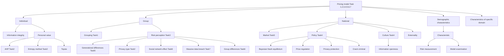
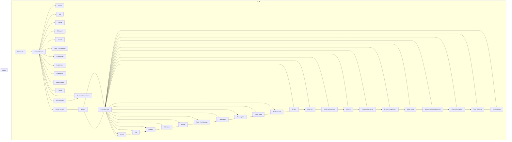
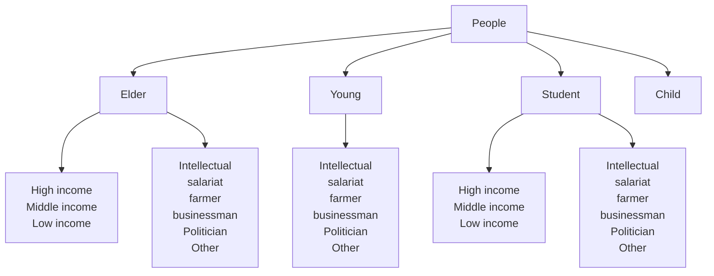
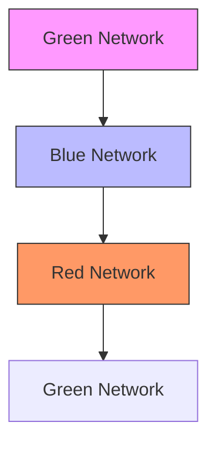
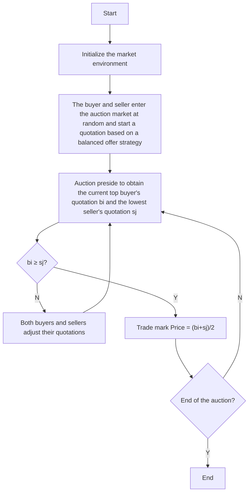

For office use only

T1

T2 \_\_\_\_

T3

T4

Team Control Number

## 88508

Problem Chosen

F

For office use only

F1 \_\_\_\_

F2 \_\_\_\_

F3 \_\_\_\_

F4

## 2018 ICM Summary Sheet

## A Smart Privacy Commodity: a Quantitative Model of Dynamic Pricing Strategy

This article presents a model to precisely quantify the price set and risk of private information(PI), and with it we can get the optimal strategy of the privacy management.

To precisely quantify the price set of PI and get the optimal strategy of the privacy management, we innovatively decomposed our model into two sub-problems, they are model of PI price set and model of privacy risk.

First, we created the model of PI price set on individual scope, community scope and nation scope. At the first step, we gathered the basic characteristics of individuals in the domain of social media, financial activity, medical care and e-commerce, and defined the PI, PP, IP given in task 5. We weighted combination of entropy method and AHP and decided the weight of the four domains. Then based on TOPSIS comprehensive evaluation method and PI's consistency tradeoffs, we built the model of privacy price set on individual scope. At the second step, to precisely measure the price set of PI on community scope, we learnt from the multiway tree theory and divided people by their age, occupation, income to make our sub-community have the similar characteristic. Considered the requirement of task, we precisely quantified the risk perception (which is determined by privacy type, generational differences, network effects, data breach and community difference). From generational differences we can launch a conclusion that people in 20-30 years old are most willing to share their information, and the tendency is decrease by the age turns old. The data breach will lead a heavy reduction of the willingness of information share, and can hardly resurgence in short time. Considering the time factor, we combined the risk perception and markov chain model, and got the dynamic alter process of the risk perception by the year. In the calculation of the matrix of transition probability, we used the bayesian theorem. Then we combined the model of privacy price set on individual scope and model of risk perception and got the price set of PI on community scope. At the third step, we analyzed the price set model on nation scope from three aspects. They are market aspect, policy aspect and culture aspect. On the market aspect, we used the bayesian nash equilibrium; On the policy aspect, we considered the macroscopic readjustment and control policy, privacy authority policy and strike information leak and illegal transaction policy; On the culture aspect, we considered the atmosphere of information transparency. From the analysis we got the price set model on the nation scope, the amount of all four domains is 783\$.

Second, for the risk model, we qualitatively analyzed the different type of risk which faced by different community in different domains, and measured these risks. Then we answered the question given in task4, task6 and task7.

In addition, we used real data to examine our model. The inaccuracy of our model is no more than 0.17, which means our model is highly practical. We also put our model through error analysis and robustness analysis. The outcome shows our model has well robustness, which means our model is highly reliable. At last, we summarized our advantage and weakness, and blueprinted further development.

The innovation of the article is that we consider enough factors. Besides, in the logistic model of network effects, we randomly chose 2012 and 2032 year, then using visualization method to compare their variation, and answer the question in task 6. We considered PI in different domains have different influence (good for public interest or harm national security), and quantified the external effect, which made our model optimized. In conclusion, our model answered all the given questions, and has its creativeness and practicability.

# POLICY MEMO

February 13, 2017

## Dr.Decision Maker

Director of ICM

Dear Dr. Decision Maker:

Thank you for working with us to design a plan to quantify the cost of privacy of electronic communications and transactions across society. We have developed a model to address your concerns about the cost of privacy.

Through the model, we found out the value and risk of PI in all fields. The value and risk can be divided into two categories according to their nature: personality and economic rights. Therefore, we suggest that when discussing the privacy rights of information, it should be divided into two categories. When PI plays the role of safeguarding the value or function of human dignity, it should give the right of personality determination; when PI plays the value or function of the property, it should be given the rights of property; when playing dual functions, it should be based on double recognition.

In the model we evaluated different elements. The conclusion is that the importance of the different elements of the data is various. For example, the value of ID number is higher than that of age. People are also different in their willingness to expose them, and their losses after being illegally used are also quite different. Therefore, our advice on the protection and use of information is as follows.

First, the information is divided into personal general information and personal sensitive information. On the basis of the distinction, it strengthens the protection of sensitive personal information and strengthens the use of general personal information. The classification is based on the PI types. Such as age or sex is a less-sensitive message which can be enhanced use. More sensitive personal information, such as hobbies and political preferences, should be based on respect for the individual's wishes. Bank card number, physical condition and other the most sensitive information should be strictly protected and strictly controlled its use. Reconcile the conflict of needs protection and utilization of personal information and achieve the balance of interests.

Our generational difference model reflects intergenerational differences in the population. The 20-30 age group has an open attitude toward the sharing of personal information, much higher than other age groups. However, because young people have less social experience, they are not aware of the risks posed by the sharing of personal information. Therefore, the blind sharing of personal information may bring greater risks. The government should strengthen its information security education for this group. While other age groups remain closed to information sharing, which will reduce the efficiency of using personal information. The government should strengthen the protection of information and reduce their vigilance.

Through the model we also found that the use of personal information will have external benefits which cannot be detected by general measures. This is of great importance when considering the value of the entire social PI. This external effect may be positive or negative. For the positive externalities, such as the use of PI can reduce the overall social losses in the field of disease control. These are the market regulation can not capture and government support and regulation. Similarly, negative externalities also require government control.

An information leak event is a contingency which will cost so much. As we can see from our risk perception model, when Information leakage event occurs and exposed to public view, the public's trust in information sharing will rapidly decline and it will be hard to recover in a short time. After the information leaked, the probability of their loss is greatly increased resulting from harassment and fraud. This will affect the personal life and social stability. These losses are caused by the mismanagement of the information controller, which entitles the individual to claim against the enterprise or agency.

Our model defines PI values and risks that provide direction for the utilization and protection of PI. Among these, the trade-off between the use of information and information protection is an eternal topic. Personal information is "information that can identify one's identity," and identifiable factors can have an impact on the protection of the rights and interests of the main body of information and the utilization of the company.

In the model of risk identification, we find that most of the risk comes from "Information that can identify one's identity". But from the value model, it can be seen that "Information that can identify one's identity" is not an important factor. Therefore, "personal factors eliminating" can be done during the collection, storage, processing and utilization of PIs. For example, when personal information is used in targeted marketing of financial transactions, removing a single person's explicit identification does not affect the analysis of the characteristics of a consumer group. Therefore, in the collection process, unless the consent of the main body of information, the relationship between the personal characteristics and the specific identification information should be cut off.

At the same time, focusing on information leakage is the most important aspect of information protection. In the era of big data, Internet users in the personal information, comments, pictures, hobbies, transaction information, visit the website, etc. were recorded by the enterprise. Coupled with powerful data mining technology, making information interrelated, once the data leaked, personal information security is facing a great threat.

In order to reduce the risk of leakage and reduce losses, the advice we give based on our model as follow.

The conclusion for in the country-level pricing model is that the national policy of combating the crime of information theft will reduce the information leakage rate. Therefore, we suggest that the state should strictly legislate to crack down on crimes. Second, raising security awareness from the individual, business, social level, and making information safe to share. Third, prevent staff leaks is very important. Data breach survey report in 2008 shows that only 18% of the information leakage is due to Internal staff leaked. But its destructive power is obviously greater than the external damage. Therefore, we must do a good job of the confidentiality of internal staff.

Sincerely,
Team#88508

## A Smart Privacy Commodity:

## A Quantitative Model of Dynamic Pricing Strategy

## 1 Introduction

1.1 Background......4  
1.2 Restatement and Clarification......4  
1.3 Overview of Our Work....4

2 General Assumptions and Justifications....5  
3 Data Sources and Variable Description....5

3.1 Data Sources....5  
3.2 Variable Description....6

4 Privacy Pricing Model....7

4.1 The Perspective of Individual....7

4.1.1 Features and Parameters of the Selection....7  
4.1.2 Wegihted Combination of Entropy Method and AHP......8  
4.1.3 TOPSIS Comprehensive Evaluation Method....9  
4.1.4 PI's Consistency Tradeoffs.... 10  
4.1.5 Individual Comprehensive Pricing.... 10

4.2 The Perspective of Group.... 11

4.2.1 The Classification of Sub-groups Based on Multiway Tree...... 11  
4.2.2 The Group Pricing Model Based on Markov Chain and Bayes Theorem..... 11

4.3 The Perspective of Entire Nation.... 14

4.3.1 Market Model Based on Game Theory.... 15  
4.3.2 The Perspective of Policy....15  
4.3.3 The Perspective of Culture.... 16  
4.3.4 The Overall Results of National Pricing Model....16  
4.3.5 The Optimization of Pricing Model - Considering the External Effect......17

5 Risk Model of PI....18

5.1 The Definition of Risks of Each Group in All Fields.... 18  
5.2 Risk Measurement and Calculation....19

6 Testing the model....19

6.1 Examination Using the Real Data.... 19  
6.2 Error Analysis.... 20  
6.3 Stability Test....20

7 Strengths and Weaknesses....21

7.1 Strengths....21  
7.2 Weaknesses....21  
7.3 Future Work....21

8 Conclusion....21

References....21

Appendix....22

## 1 Introduction

## 1.1 Background

“App makers sometimes like to test the limits to see what they can get away with, before users decide to turn off a feature because they aren’t comfortable with the amount of personal data being provided, or the audience that it’s being shared with.”

\- Daniela Relph, Alan Turing Institute, quoted from a BBC article

"People always want to give yourself some privacy space, just like you will always be standing in front of the shadow of you blocking the line of sight of the light."

\- Laura Sheeter, LSE, quoted from a BBC article

At the moment, webcasts and social media are sweeping across the globe. Life sharing and information dissemination have become the main theme of today's society. Especially in today's Internet era and big data era, every move of our lives is recorded and controlled. Social media has become a window to people's lives, and strangers can know about it through this window. Some people believe privacy is very important and it needs protection, while others think privacy can be shared. Therefore, the discussion of privacy is particularly necessary. We view privacy as a commodity that can be quantified and traded and to establish our model.

## 1.2 Restatement and Clarification

Our team is certain to construct a policy model, which include a set of policy recommendations that will create an efficient privacy pricing plan. To find out the optimal strategies, we need to construct models, run simulations and present the visualized results. Our model should be scalable, multilayered and dynamic. However, trade-offs should be made if some objectives contradict.

We aim to solve the following problems:

- Categorize individuals into various subgroups and develop a price point for protecting one's privacy and PI in various applications. And define a set of parameters, measures from the perspective of individuals and specific domain of information.  
- Based on some trade-offs, a privacy cost model is built by grouping the weights of the four domains (social media, financial transactions, health/medical records, electronic commerce).  
- The privacy pricing model is set up from the perspective of individuals, groups and entire nations respectively. The model needs to take into account the relationship between supply and demand and personal preference.  
● State the assumptions and constraints of the model established and define whether information privacy is a fundamental human right. Introduce dynamic elements to explore changes in people's values.  
- Answer the question of whether there are generational differences in perceptions of the risk-to-benefit ratio of PI and data privacy. Explain the effects of age and distinguish the influence of PI, PP and IP.  
- Using the optimized method to capture the network effect of data sharing, to answer the question of which subjects are affected, and the responsibilities that come with the community.  
- How to adjust the model if the privacy data is lost or abused? Answer the question of how the responsible institution of the violation should perform the liability.  
- In addition to using real data to test the stability of the model, sensitivity analysis is also used.

## 1.3 Overview of Our Work

We divided the PI into four areas: social media, financial transactions, health records, and e-commerce, then analyze the properties and characteristics of PI, and answer the problems raised by the task 5 that difference between the PI, PP, and IP. At the same time integrated Task1-7, we set up pricing models from three levels: individuals, groups and countries. We conducted a selection of individual characteristics and specific information areas characteristics, and combine Analytic Hierarchy Process and Entropy method to determine the weight of characteristics in the four areas. Finally, based on the TOPSIS method and combined the Information Feature Completeness, We established a PI pricing model of individual level.

We classify people based on their personal characteristics and different areas, such as age, occupation characteristics, income and so on. Integrated task 2, task 5, task 6 requirements, we introduce the concept of group risk perception, which is determined by the type of privacy, intergenerational differences, social network effects, data breaches, group differences. We set up a social network effect model to capture the dynamic process of social network effects.

Analyze the national level from a market perspective, policy perspective, cultural perspective. The market uses the Bayesian Nash equilibrium model. Policy considerations Market macro-control policies, Personal privacy protection policies, cracking down on information disclosure and illegal trading. Cultural perspectives consider the open atmosphere of information at the national level. Then we use the external effect to optimize the pricing model. After that, we measured the risk of different characteristic people and different information fields. Finally, we conducted a correctness test, error analysis and robustness analysis.


<details>
<summary>flowchart</summary>


</details>

Fig.1 The Overview of Our Work

## 2 General Assumptions and Justifications

We make the following basic assumptions in order to simplify the problem. Each of our assumptions is justified and is consistent with the basic fact.

- It is assumed that people can control the supply of their PI in the market.  
● Suppose people's PI and related data is a valuable and quantifiable commodity.  
- Assuming different people's PI, different areas of PI, different combinations of PI, all have different values.  
- Once PI enters the market, it will be dominated by the law of the market.  
- Assuming that government regulations and policies are mandatory and effective, it can affect the supply and demand of PI in the market.  
- Assume that the general trend of society is more and more inclined to share PI.  
- Assume that once the PI is leaked, it will become part of the identity theft ring.

## 3 Data Sources and Variable Description

## 3.1 Data Sources

The selection of data is of great significance to the model. The authenticity and extensiveness of the data make the model more practical. After repeated search, We found the real data involved in the Acquisti article [1]. This data come from the US Family Educational Rights and Privacy Act (FERPA) and the US Equal Employment Opportunity Commission (EEOC). Although the authority of these data is beyond doubt, due to the variety of variables will be used in different areas in the process of model building, these data must be varied. These data due to sample size and capacity constraints, cannot meet the needs of our model. So we look for an alternative method that uses some of the data that is already in McSherry's article [2]. Then use computer simulation part of the data that modeling needed according to objective laws. The combination of the two types of data becomes the data used by our model. At the same time, we use the real data involved in the Acquisti article [1] to test our model.

## 3.2 Variable Description

Tab.1 Parameter List

<table><tr><td>Name</td><td>Symbol</td><td>Type</td><td>Tier</td><td>Unit</td></tr><tr><td>The ratio of AHP</td><td> $\omega_{total}$ </td><td>Ratio</td><td>Individual</td><td>/</td></tr><tr><td>The ratio of entropy method</td><td> $\omega_{total}$ </td><td>Ratio</td><td>Individual</td><td>/</td></tr><tr><td>The ratio of AHP and entropy method</td><td> $\omega_{total}$ </td><td>Ratio</td><td>Individual</td><td>/</td></tr><tr><td>The ideal solution in TCE Method</td><td> $A^{+}$ </td><td>Numerical</td><td>Individual</td><td>/</td></tr><tr><td>The negative-ideal solution in TCE Method</td><td> $A^{-}$ </td><td>Numerical</td><td>Individual</td><td>/</td></tr><tr><td>Similarity between example and ideal solution</td><td> $S_{i}^{+}$ </td><td>Ratio</td><td>Individual</td><td>/</td></tr><tr><td>Similarity between example and negative-ideal</td><td> $S_{i}^{-}$ </td><td>Ratio</td><td>Individual</td><td>/</td></tr><tr><td>The relative approach degree of TCE approach</td><td> $C_{i}$ </td><td>Numerical</td><td>Individual</td><td>/</td></tr><tr><td>Information completeness</td><td> $\eta_{ct}$ </td><td>Numerical</td><td>Individual</td><td>/</td></tr><tr><td>Privacy type</td><td> $T_{pt}$ </td><td>Class</td><td>Groups</td><td>/</td></tr><tr><td>Generational differences</td><td> $T_{gd}$ </td><td>Numerical</td><td>Groups</td><td>/</td></tr><tr><td>Social network effect</td><td> $T_{sn}$ </td><td>Numerical</td><td>Groups</td><td>/</td></tr><tr><td>Data breach</td><td> $T_{db}$ </td><td>Ratio</td><td>Groups</td><td>/</td></tr><tr><td>Differences in subgroups</td><td> $T_{dis}$ </td><td>Ratio</td><td>Groups</td><td>/</td></tr><tr><td>Group risk perception</td><td> $\delta_{risk}$ </td><td>Numerical</td><td>Groups</td><td>/</td></tr><tr><td>Initial state matrix of values</td><td> $R^{(0)}$ </td><td>Matrix</td><td>Groups</td><td>/</td></tr><tr><td>Transfer probability matrix</td><td> $\gamma_s(\alpha | \delta_{risk})$ </td><td>Matrix</td><td>Groups</td><td>/</td></tr><tr><td>The cost of privacy of a group</td><td> $V_{total}$ </td><td>Numerical</td><td>Groups</td><td>/</td></tr><tr><td>The private value of a commodity to buyer i</td><td> $b_i$ </td><td>Numerical</td><td>Nations</td><td>$</td></tr><tr><td>The private value of a commodity to seller j</td><td> $d_j$ </td><td>Numerical</td><td>Nations</td><td>$</td></tr><tr><td>The payment of buyer i</td><td> $B\_U_i$ </td><td>Numerical</td><td>Nations</td><td>$</td></tr><tr><td>The payment of seller j</td><td> $S\_U_j$ </td><td>Numerical</td><td>Nations</td><td>$</td></tr><tr><td>Pricing according to the macro-control policy</td><td> $T_{mc}$ </td><td>Numerical</td><td>Nations</td><td>$</td></tr><tr><td>Pricing according to the privacy policy</td><td> $T_{pp}$ </td><td>Numerical</td><td>Nations</td><td>$</td></tr><tr><td>Pricing according to the combating crime policy</td><td> $T_{cc}$ </td><td>Numerical</td><td>Nations</td><td>$</td></tr><tr><td>Pricing according to the cultural Policy</td><td> $T_{co}$ </td><td>Numerical</td><td>Nations</td><td>$</td></tr><tr><td>Comprehensive measurement of risk</td><td> $R_i$ </td><td>Numerical</td><td>Individual</td><td>/</td></tr></table>

## 4 Privacy Pricing Model

The trading of private data comes with a series of benefits and risks. The main task of this chapter is to build a model that benefits of trading privacy, which is to establish a pricing model of private information. In order to make our article structure clearer, we consider task1-7, set up the pricing model from three levels of individuals, groups and countries. Individuals, groups, countries, these three levels are progressive relationship, each level has the corresponding parameters and optimization algorithm. In the individual and group pricing model, the result is "value" rather than "price". Value is a relative concept that reflects the attributes of a product. At the same time, we also need to answer the question of task 5: PP is a concept belonging to the property rights, and PI is not only belong to the property rights, but also the concept of human rights, so the two work in different extents. The IP is the product of human intelligence, it can be a commodity, and PI is not a product of human intelligence.


<details>
<summary>flowchart</summary>


</details>

Fig.2 Hierarchy Figure

## 4.1 The Perspective of Individual

## 4.1.1 Features and Parameters of the Selection

In order to accurately assign individuals and their information to different groups, we select the characteristics of individuals and particular information fields as indicators. In the selection of personal characteristics, we selected six personal characteristics, such as name, gender, age, educational attainment, income level and occupation type, according to Karaman's article $^{[3]}$ (which is the most cited demographic literature). In the selection of particular information fields, we start with not just social media, financial transactions, health records, but we also consider the area of e-commerce (which is a field in which private information such as personal preference and location is easily leaked). Then we select the features of four information areas. In the field of social media, we first refer to Mangold's article $^{[4]}$ (which is the most cited social media article). Select the number of news feed (news feed), the number of dynamic comments, the number of visits, the number of login as features. In the field of financial transactions, select the number of accounts opened by the user, credit limit, loan amount, credit performance, refer to Matheson's article $^{[5]}$ (which is the most cited financial transaction literature).

In the field of health care, we selected the number of hospitalizations, drug consumption, the type of condition, and the degree of health, refer to the report released by WHO $^{[6]}$ . In the field of e-commerce, we selected the user's favorite category, the consumer interval, the number of logins and the number of purchases, refer to Whinston's article $^{[7]}$ (which is the most cited e-commerce literature)

## 4.1.2 Wegihted Combination of Entropy Method and AHP

Next we need to establish a PI pricing model. According to the background of the topic, the different elements of the data have different degrees of value to the PI demand side. Therefore, it is necessary to clearly set the scientific and reasonable weights for the above personal characteristics and the four field characteristics to represent the value of different factors. First of all, we conducted a non-dimensionalization.

On how to scientifically and reasonably determine the weight of each feature, we choose the method of combining AHP and entropy method. It is well-known that Analytical Hierarchy Process (AHP) is the most commonly used method in the field of scientific empowerment. It takes a complex multi-index evaluation problem as a system through a hierarchical structure, divides the total goal into multiple sub-goals or criteria.

In order to determine the weight of each indicator, although it combines the experience, knowledge and other factors, but still has the subjective and optional shortcomings. Entropy method introduced at this time is more appropriate. Entropy is proposed by Shannon, originally a thermodynamic concept. Applying entropy can measure the amount of information contained in the index data in the index system and determine the weight of each index. Entropy method has fully tapped the information contained in the original data, the result is more objective, but it can not fully reflect the knowledge and experience, sometimes the weight may not accord with the actual importance. Therefore, we combine these two methods, using the Mon formula $^{[8]}$ , the weighted sum of the results obtained by the two methods. The result is a comprehensive consideration of subjective and objective indicators of the weight vector $\omega_{total}$ . AHP combined with entropy method: according to the formula of Mon, summed the results obtained by the two methods:

$$
\omega_ {\text { total }} = \alpha \cdot \omega_ {\text { total }} + (1 - \alpha) \omega_ {\text { total }} (0 \leq \alpha \leq 1) \tag {1}
$$

From Figure 3, we can get the weight of each feature for four areas by AHP, entropy method and the combination of the two. In the model, we use the combination of the AHP and entropy method to get the weight for the next analysis.

<table><tr><td colspan="4">AHP</td><td colspan="2">Weighted combination of entropy method and AHP</td></tr><tr><td colspan="2">Social media</td><td colspan="2">Financial transactions</td><td colspan="2">Social media</td></tr><tr><td>Age</td><td>0.052</td><td>Age</td><td>0.06</td><td>Age</td><td>0.026</td></tr><tr><td>Gender</td><td>0.037</td><td>Gender</td><td>0.05</td><td>Gender</td><td>0.018</td></tr><tr><td>Education</td><td>0.1</td><td>Education</td><td>0.065</td><td>Education</td><td>0.068</td></tr><tr><td>Income</td><td>0.12</td><td>Income</td><td>0.225</td><td>Income</td><td>0.132</td></tr><tr><td>Push The Message</td><td>0.164</td><td>Bank account</td><td>0.151</td><td>Push The Message</td><td>0.185</td></tr><tr><td>Commented</td><td>0.196</td><td>Credits</td><td>0.124</td><td rowspan="3">Commented</td><td rowspan="3">0.2</td></tr><tr><td>Subscripted</td><td>0.167</td><td>Loan line</td><td>0.117</td></tr><tr><td>Login times</td><td>0.137</td><td>Credit performance</td><td>0.173</td></tr><tr><td colspan="2">Health records</td><td colspan="2">E-commerce</td><td>Subscripted</td><td>0.185</td></tr><tr><td></td><td></td><td></td><td></td><td>Login times</td><td>0.172</td></tr><tr><td></td><td></td><td></td><td></td><td colspan="2">Financial transactions</td></tr><tr><td></td><td></td><td></td><td></td><td>Age</td><td>0.03</td></tr><tr><td></td><td></td><td></td><td></td><td>Gender</td><td>0.025</td></tr><tr><td></td><td></td><td></td><td></td><td>Education</td><td>0.081</td></tr><tr><td></td><td></td><td></td><td></td><td>Income</td><td>0.31</td></tr><tr><td></td><td></td><td></td><td></td><td>Bank account</td><td>0.154</td></tr><tr><td></td><td></td><td></td><td></td><td>Credits</td><td>0.12</td></tr><tr><td></td><td></td><td></td><td></td><td>Loan line</td><td>0.117</td></tr><tr><td></td><td></td><td></td><td></td><td>Credit performance</td><td>0.146</td></tr><tr><td></td><td></td><td></td><td></td><td colspan="2">Health records</td></tr><tr><td></td><td></td><td></td><td></td><td>Age</td><td>0.024</td></tr><tr><td></td><td></td><td></td><td></td><td>Gender</td><td>0.021</td></tr><tr><td></td><td></td><td></td><td></td><td>Education</td><td>0.124</td></tr><tr><td></td><td></td><td></td><td></td><td>Income</td><td>0.387</td></tr><tr><td></td><td></td><td></td><td></td><td>Interest</td><td>0.094</td></tr><tr><td></td><td></td><td></td><td></td><td>Consumption range</td><td>0.071</td></tr><tr><td></td><td></td><td></td><td></td><td>E-business platform</td><td>0.148</td></tr><tr><td></td><td></td><td></td><td></td><td>Login times</td><td>0.119</td></tr><tr><td></td><td></td><td></td><td></td><td colspan="2">E-commerce</td></tr><tr><td></td><td></td><td></td><td></td><td>Age</td><td>0.037</td></tr><tr><td></td><td></td><td></td><td></td><td>Gender</td><td>0.042</td></tr><tr><td></td><td></td><td></td><td></td><td>Education</td><td>0.062</td></tr><tr><td></td><td></td><td></td><td></td><td>Income</td><td>0.129</td></tr><tr><td></td><td></td><td></td><td></td><td>Numbre of hospitalizations</td><td>0.164</td></tr><tr><td></td><td></td><td></td><td></td><td>Drug consumption</td><td>0.211</td></tr><tr><td></td><td></td><td></td><td></td><td>Type of illness</td><td>0.155</td></tr><tr><td></td><td></td><td></td><td></td><td>Health status</td><td>0.182</td></tr></table>

Fig.3 AHP and Entropy Method Weight Graph

## 4.1.3 TOPSIS Comprehensive Evaluation Method

We establish our pricing model based on the TOPSIS (Technique for order preference by similarity to an ideal solution) method after determining the features scientifically. TOPSIS method, an effective method in multi-objective decision analysis and is commonly used. The basic principle is to detect the distance between the evaluation object and the positive ideal and the distance between the evaluation object and the negative ideal. The best evaluation is the nearest to the positive ideal and the farthest from the negative ideal.

We calculate the corresponding pricing of each area in our model and score each person according to the TOPSIS method. We need to determine the positive ideal and the negative ideal after determining the weight of each feature.

$$
A ^ {+} = \left\lfloor \left(\max _ {i} k _ {i j} \mid j \in J\right), \left(\min _ {i} k _ {i j} \mid j \in J\right) \right\rfloor = \left[ k _ {1} ^ {+}, k _ {2} ^ {+}, \dots , k _ {n} ^ {+} \right] i = 1, 2, \dots , m \tag {2}
$$

$$
A ^ {-} = \left[ \left(\min _ {i} k _ {i j} \mid j \in J\right), \left(\max _ {i} k _ {i j} \mid j \in J\right) \right] = \left[ k _ {1} ^ {-}, k _ {2} ^ {-}, \dots , k _ {n} ^ {-} \right] i = 1, 2, \dots , m
$$

Then we calculate the distance from the ideal solution.

$$
S _ {i} ^ {+} = \sqrt [ 2 ]{\sum_ {j = 1} ^ {n} \left(k _ {i j} - k _ {j} ^ {+}\right) ^ {2}}, S _ {i} ^ {-} = \sqrt [ 2 ]{\sum_ {j = 1} ^ {n} \left(k _ {i j} - k _ {j} ^ {-}\right) ^ {2}} \tag {3}
$$

After that we calculate the relative proximity.

$$
C _ {i} = \frac {S _ {i} ^ {-}}{\left(S _ {i} ^ {-} + S _ {i} ^ {+}\right)} i = 1, \dots , m \quad 0 \leq C _ {i} \leq 1 \tag {4}
$$

$$
\left\{ \begin{array}{l} S _ {i} ^ {-} = 0, C _ {i} = 0, A _ {i} = A _ {i} ^ {-} \\ S _ {i} ^ {+} = 0, C _ {i} = 1, A _ {i} = A _ {i} ^ {+} \end{array} \right. \tag {5}
$$

The results based on the TOPSIS pricing method are shown in Figure 4, where the ordinate is the number of people in the "value" phase and the abscissa is the "value" under ideal conditions. We can see that all four fields have different pricing strategies.


<details>
<summary>line chart</summary>

| Topsis score in social media | Number |
| ---------------------------- | ------ |
| 0.0                          | 2000   |
| 0.1                          | 500    |
| 0.2                          | 0      |
| 0.3                          | 0      |
| 0.4                          | 0      |
| 0.5                          | 0      |
| 0.6                          | 0      |
| 0.7                          | 200    |
| 0.8                          | 100    |
| 0.9                          | 0      |
| 1.0                          | 0      |
</details>


<details>
<summary>line chart</summary>

| Topsis score in financial transactions | Number |
| -------------------------------------- | ------ |
| 0.0                                    | 450    |
| 0.1                                    | 700    |
| 0.2                                    | 650    |
| 0.3                                    | 50     |
| 0.4                                    | 20     |
| 0.5                                    | 10     |
| 0.6                                    | 5      |
| 0.7                                    | 5      |
| 0.8                                    | 5      |
| 0.9                                    | 5      |
| 1.0                                    | 5      |
</details>


<details>
<summary>line chart</summary>

| Topsis score in health records | Number |
| ----------------------------- | ------ |
| 0.0                           | 0      |
| 0.2                           | 0      |
| 0.4                           | 0      |
| 0.5                           | 250    |
| 0.6                           | 350    |
| 0.7                           | 600    |
| 0.8                           | 50     |
| 1.0                           | 0      |
</details>


<details>
<summary>line chart</summary>

| Topsis score in E-commerce | Number |
| ------------------------- | ------ |
| 0.0                       | 7200   |
| 0.1                       | 500    |
| 0.2                       | 100    |
| 0.3                       | 50     |
| 0.4                       | 20     |
| 0.5                       | 10     |
| 0.6                       | 5      |
| 0.7                       | 2      |
| 0.8                       | 1      |
| 0.9                       | 1      |
| 1.0                       | 1      |
</details>

Fig.4 Topsis Pricing Results in Four Areas

## 4.1.4 PI's Consistency Tradeoffs

In the TOPSIS model, the value of individual's PI in different fields has been measured, but there is still a lack of partial information. Although the TOPSIS model above can reflect the importance of different elements, it can't reflect the importance of different combinations of different elements. So we proposed the concept of PI's consistency tradeoffs.

$$
\eta_ {c t} = \frac {\sum_ {i = 1} ^ {k} A _ {i} \cdot \omega_ {\text {total}}}{\sum_ {i = 1} ^ {n} A _ {j} \cdot \omega_ {\text {total}}} (i = 1, 2 \dots , m j = 1, 2 \dots , m) \tag {6}
$$

A refers to whether there is this feature, n is the number of all features, and k is the number of features included.

PI 's consistency tradeoffs are shown in Figure 5. The ordinate represents the number of the information integrity, and the abscissa represents information integrity.


<details>
<summary>line chart</summary>

| Consistency tradeoffs in social media | Number |
| ------------------------------------- | ------ |
| 0.0                                   | 3900   |
| 0.1                                   | 500    |
| 0.2                                   | 900    |
| 0.3                                   | 100    |
| 0.4                                   | 700    |
| 0.5                                   | 200    |
| 0.6                                   | 100    |
| 0.7                                   | 50     |
| 0.8                                   | 20     |
| 0.9                                   | 10     |
| 1.0                                   | 5      |
</details>


<details>
<summary>line chart</summary>

| Consistency tradeoffs in financial transactions | Number |
| ---------------------------------------------- | ------ |
| 0.0                                            | 1200   |
| 0.1                                            | 200    |
| 0.2                                            | 50     |
| 0.3                                            | 100    |
| 0.4                                            | 200    |
| 0.5                                            | 1700   |
| 0.6                                            | 1200   |
| 0.7                                            | 400    |
| 0.8                                            | 300    |
| 0.9                                            | 100    |
| 1.0                                            | 50     |
</details>


<details>
<summary>line chart</summary>

| Consistency tradeoffs in health records | Number |
| --------------------------------------- | ------ |
| 0.55                                    | 2000   |
| 0.78                                    | 2200   |
| 0.65                                    | 500    |
| 0.60                                    | 600    |
| 0.55                                    | 400    |
| 0.50                                    | 300    |
| 0.45                                    | 200    |
| 0.40                                    | 100    |
| 0.35                                    | 50     |
| 0.30                                    | 20     |
| 0.25                                    | 10     |
| 0.20                                    | 5      |
| 0.15                                    | 2      |
| 0.10                                    | 1      |
| 0.05                                    | 0      |
| 0.00                                    | 0      |
</details>


<details>
<summary>line chart</summary>

| Consistency tradeoffs in E-commerce | Number |
| ----------------------------------- | ------ |
| 0.0                                 | 3500   |
| 0.1                                 | 1000   |
| 0.2                                 | 900    |
| 0.3                                 | 800    |
| 0.4                                 | 200    |
| 0.5                                 | 300    |
| 0.6                                 | 100    |
| 0.7                                 | 50     |
| 0.8                                 | 20     |
| 0.9                                 | 10     |
| 1.0                                 | 5      |
</details>

Fig.5 PI's Consistency Tradeoffs in Four Areas

## 4.1.5 Individual Comprehensive Pricing

We use $\varepsilon$ to represent the comprehensive pricing results for individuals.

$$
\varepsilon = \eta_ {c t} \cdot \theta_ {t p s} \tag {7}
$$

The calculation is done by a computer, and the result is shown in Figure 6. The ordinate represents the number of people in the score segment, while the abscissa represents each person's score in the field.


<details>
<summary>line chart</summary>

| Individual pricing in social media | Number |
| ---------------------------------- | ------ |
| 0.0                                | 7500   |
| 0.1                                | 0      |
| 0.2                                | 500    |
| 0.3                                | 200    |
| 0.4                                | 100    |
| 0.5                                | 50     |
| 0.6                                | 20     |
| 0.7                                | 10     |
| 0.8                                | 5      |
</details>


<details>
<summary>line chart</summary>

| Individual pricing in financial transactions | Number |
| -------------------------------------------- | ------ |
| 0.0                                          | 2000   |
| 0.1                                          | 900    |
| 0.2                                          | 100    |
| 0.3                                          | 50     |
| 0.4                                          | 20     |
| 0.5                                          | 10     |
| 0.6                                          | 5      |
| 0.7                                          | 2      |
| 0.8                                          | 1      |
</details>


<details>
<summary>line chart</summary>

| Individual pricing in health records | Number |
| ------------------------------------ | ------ |
| 0.0                                  | 0      |
| 0.1                                  | 0      |
| 0.2                                  | 0      |
| 0.3                                  | 200    |
| 0.4                                  | 550    |
| 0.5                                  | 250    |
| 0.6                                  | 50     |
| 0.7                                  | 10     |
| 0.8                                  | 0      |
| 0.9                                  | 0      |
</details>


<details>
<summary>line chart</summary>

| Individual pricing in E-commerce | Number |
| -------------------------------- | ------ |
| 0.0                              | 8000   |
| 0.1                              | 0      |
| 0.2                              | 0      |
| 0.3                              | 0      |
| 0.4                              | 0      |
| 0.5                              | 0      |
| 0.6                              | 0      |
| 0.7                              | 0      |
| 0.8                              | 0      |
</details>

Fig.6 Total Individual Pricing Results in Four Areas

## 4.2 The Perspective of Group

## 4.2.1 The Classification of Sub-groups Based on Multiway Tree

To establish a pricing model at the group level, individuals must be categorized into different subgroups. And subgroups after classification should have a similar level of risk. In order to achieve a better classification effect, we use the idea of Rodeh's multi tree $^{[9]}$ to classify subgroups. The idea of multi tree is derived from the domain of information entropy. Its basic principle is to use ergodic algorithm for classification, which has the advantages of accurate classification and fast speed. We classify people based on their age, occupational characteristics, income characteristics, and so on. The results are shown in Figure7.


<details>
<summary>flowchart</summary>


</details>

Fig.7 Classification Results of Sub-group

## 4.2.2 The Group Pricing Model Based on Markov Chain and Bayes Theorem

After an accurate classification of individuals, we need to establish a group pricing model. However, due to the different characteristics of group members, different group members are affected by different factors. And there may be a cross effect among members, therefore, the group pricing model is more complex than the individual pricing model, and more factors need to be considered.

In the model, we introduce the concept of risk perception based on the assumption that people have the right to decide whether to sell their own data or not. PI's pricing is largely influenced by people's values, and people's values are determined by people's risk perception. Task2 requires us to consider the impact of different combinations of PIs, and task5 requires us to consider the issue of generational differences. Task6 requires us to consider the effects of network and the common characteristics of groups, and task7 requires us to consider the impact of data breach.

Therefore, we quantify the risk perception by combining the requirements of task and Peters's article $^{[10]}$ . Risk perception $\delta_{risk}$ is determined by privacy type, generational differences, social network, data breach, and differences in subgroups. Our idea of solving task4 is to solve the risk perception, and we can get people's initial values. Taking the time factor into consideration, we can get the dynamic change of people's values and then get the dynamic group pricing model. Therefore, we first measure the group's risk perception.

①Privacy type: $\eta_{ct}$ represent PI's consistency tradeoffs.

$$
T _ {p t} = - e ^ {\eta_ {c t}} \tag {8}
$$

②Generational differences: $t_{age}$ represent the average age of a sub group.

$$
T _ {g d} = \frac {1}{\sqrt {\frac {7 1 \pi}{5 0}}} \cdot e ^ {\frac {- \left(t _ {\text {age}} - 2 7\right) ^ {2}}{2 6 8}}, t _ {\text {age}} = (3, 1 5, 2 7, 4 5, 6 7) \tag {9}
$$

③Network effect: Because social networks are a growing process, we draw on Mugglestone's approach $^{[11]}$ to using logistic models to show social network effects. $t_{time}$ represent year.

$$
T _ {s n} = \frac {0 . 8 7}{1 + \left(\frac {0 . 8 7}{4 . 3 0 7 5} - 1\right)} \cdot e ^ {- 2. 0 2 t _ {\mathrm{time}}} \tag {10}
$$

In this model, we are able to capture the dynamic process of social network effects. In order to answer the question of task6, we illustrate the changes in the social network effect by comparing the existing 2012 data with the computer simulated 2032 data. As shown in Figure 8, the left figure shows the social network effect in 2012 and the right figure shows the situation in the year of 2032. Each color in the diagram represents a different sub-group. As time passes and data become more and more shared, people's social intersections gradually increase, and the clustering of the same subgroups becomes more obvious. Therefore, we can conclude that with the sharing of data, people's social network effect gradually strengthened. At the same time we can answer the question of task6: The social network effect affects the group's pricing model, which we have already taken into account. Due to the characteristics of social network effects, individual pricing will not be affected by social network effects. However, network effect also influences the national pricing model, so we decompose it and finally turn it into a group risk perception problem.

## The process of social network effect

```mermaid
graph TD
  A["Central Node"] --> B["Node 1"]
  A --> C["Node 2"]
  A --> D["Node 3"]
  A --> E["Node 4"]
  A --> F["Node 5"]
  A --> G["Node 6"]
  A --> H["Node 7"]
  A --> I["Node 8"]
  A --> J["Node 9"]
  A --> K["Node 10"]
  A --> L["Node 11"]
  A --> M["Node 12"]
  A --> N["Node 13"]
  A --> O["Node 14"]
  A --> P["Node 15"]
  A --> Q["Node 16"]
  A --> R["Node 17"]
  A --> S["Node 18"]
  A --> T["Node 19"]
  A --> U["Node 20"]
  A --> V["Node 21"]
  A --> W["Node 22"]
  A --> X["Node 23"]
  A --> Y["Node 24"]
  A --> Z["Node 25"]
```


<details>
<summary>flowchart</summary>


</details>


<details>
<summary>flowchart</summary>


</details>

Fig.8 The process of social network effect

④Data breach: $g_{disclosure}$ represent the degree of message disclosure.

$$
\begin{array}{r l} g _ {\text { disclosure }} & = \frac {\text { The   PI   value   that   has   been   revealed }}{\text { All   PI   values }} \\ T _ {d b} & = 1 0 0 \left(1 - \frac {5}{3} g _ {\text { disclosure }}\right) e ^ {- \frac {3}{5}} \cdot g _ {\text { disclosure }} \end{array} \tag {1}
$$

⑤ Differences in subgroups:

$$
T _ {d i s} = \frac {k _ {a}}{k _ {b}}, k _ {a} = \frac {\text { Group   } i \text {   who   has   been   leaked   PI }}{\text { All   who   have   been   leaked   PI }}, k _ {b} = \frac {\text { Group   } I \text {   in   society }}{\text { All   in   society }} \tag {13}
$$

⑥Integrate the above formula:

$$
\delta_ {\text { risk }} = T _ {p t} \cdot T _ {g d} \cdot T _ {s n} \cdot T _ {d b} \cdot T _ {d i s} \tag {14}
$$

Figure 9 is the dynamic process of a group's risk perception in different areas and years. According to the figure, in most years, it is influenced by social environment, subjective psychology and other factors, and these factors have not changed much in the big environment. As a result, risk perception in all areas has a relatively consistent change over the next 50 years.


<details>
<summary>line chart</summary>

| Years | Social media | Financial transactions | Health records | E-commerce |
|-------|--------------|------------------------|----------------|----------|
| 0     | 15           | 12                     | 10             | 16       |
| 5     | 35           | 24                     | 19             | 32       |
| 10    | 37           | 26                     | 20             | 34       |
| 15    | 38           | 27                     | 21             | 35       |
| 20    | 40           | 28                     | 22             | 37       |
| 25    | 42           | 29                     | 23             | 39       |
| 30    | 43           | 30                     | 24             | 40       |
| 35    | 45           | 31                     | 25             | 42       |
| 40    | 47           | 32                     | 26             | 44       |
| 45    | 48           | 33                     | 27             | 45       |
| 50    | 50           | 34                     | 28             | 46       |
</details>

Fig.9 Risk Perception Results in Four Areas

Risk perception determines the change of people's values. People's values are not a static process. On the contrary, it is necessary to take the time factor into consideration and make it a dynamic and changing process. In modeling the dynamic process of values, we chose the Markov chain model. The advantage of the Markov chain model is that the future situation is only affected by the current situation, but has nothing to do with the past situation, and has a very big advantage in forecasting the exchange rate and product sales.

Values $\gamma_{s}$ are divided into six state-space, which are very reluctant, unwilling, general, willing, and very willing. The initial state matrix of the value is:

$$
R ^ {(0)} = \left[ \begin{array}{l l l l l} - 2 & - 1 & 0 & 1 & 2 \end{array} \right] \tag {15}
$$

The most important step in Markov chain is the calculation of the transfer matrix. To ensure the accuracy of the results, we refer to Joyce's approach $^{[12]}$ , using the Bayesian probability formula to calculate the transition probability matrix.

$$
\gamma_ {s} ^ {(0)} = \left[ \begin{array}{c c c c c} \gamma_ {s 0 0} ^ {(n)} & \gamma_ {s 0 1} ^ {(n)} & \dots & \gamma_ {s 0 n} ^ {(n)} & \dots \\ \gamma_ {s 1 0} ^ {(n)} & \gamma_ {s 1 1} ^ {(n)} & \dots & \gamma_ {s 1 n} ^ {(n)} & \dots \\ \vdots & \vdots & \ddots & \vdots & \ddots \\ \gamma_ {s n 0} ^ {(n)} & \gamma_ {s n 1} ^ {(n)} & \dots & \gamma_ {s n n} ^ {(n)} & \dots \\ \vdots & \vdots & \ddots & \vdots & \ddots \end{array} \right] \tag {17}
$$

The transfer probability matrix:

Then use Maruyama's state probability recursive formula $^{[13]}$ to calculate the dynamic changes in the values of each year. Using the following formula to sum up, then we get the result of the value in $t_{time}$ .

$$
\gamma_ {s} ^ {(n)} = \sum_ {t = 1} ^ {n} R (t _ {\text {time}}) \tag {18}
$$

The relationship between the group pricing model and the value $\gamma_{s}$ is:

$$
\left\{ \begin{array}{l} V _ {i j k} = \gamma_ {x _ {i j k}} ^ {(n)} \cdot \sum_ {a = 1} ^ {n} \varepsilon \\ V _ {\text { total }} = \sum_ {i = 1} ^ {3} \sum_ {j = 1} ^ {6} \sum_ {k = 1} ^ {3} V _ {i j k} \end{array} \right. \tag {19}
$$

Among them, i represent age, which is divided into $(1,2,3,4,5)$ five groups. j represent occupation, which is divided into $(1,2,3,4,5,6)$ six groups. k represent income, which is divided into $(1,2,3)$ three groups.

The calculation of the above formula is done by the computer. Due to the importance of PI in different domains and the degree of loss of PI leakage is different, so there are different pricing strategies in different fields. We divide people into different subgroups, so the pricing strategy for each subgroup is different. We take age as an example and divide it into 5 sub-groups. As shown in Figure 10, compared with young children and the elderly, middle-aged groups have higher PI value because they have obtained certain social status. In different fields, the value of PI in health care is significantly higher than other fields.


<details>
<summary>bar chart</summary>

| Group | Social media | Financial transactions | Health medical | E-commerce |
|-------|--------------|------------------------|----------------|------------|
| 1     | 50           | 100                    | 700            | 20         |
| 2     | 200          | 150                    | 1100           | 50         |
| 3     | 800          | 1800                   | 2400           | 1000       |
| 4     | 250          | 2500                   | 3400           | 400        |
| 5     | 50           | 500                    | 700            | 20         |
</details>

Fig.10 Total Price Results of Different Sub-groups

## 4.3 The Perspective of Entire Nation

Unlike individual and group pricing models, nation pricing model is more complex. The national pricing model should take into account market factors, policy factors (such as price regulation, specific data protection) and cultural constraints.

Because the factors that need to be considered at the national level are too complex, it is very difficult to portray the national pricing model in a comprehensive way $^{[14]}$ . Therefore, this article slightly simplifies the national pricing model, supposing the country has an ideal market conditions, the ideal macro-control, the ideal policy role. We analyze from the perspective of the market, the policy and the culture. Finally, the three perspectives are integrated to obtain the national pricing model.

## 4.3.1 Market Model Based on Game Theory

Nowadays, many modern countries are market economy countries $^{[15]}$ , so the PI value at the national level will be determined mainly by the market. At this point, the market is fully competitive, meaning that individuals have the right to decide at what price to sell their PI, and the buyer has the right to decide at what price to buy. However, due to the serious asymmetry of information between the buyers and sellers in the market, the pursuit of maximization of individual utility and other characteristics, the buyer and seller still do not know the other's quotation, so it is a static game that belongs to incomplete information. And there is Bayesian Nash equilibrium in this process.

Suppose there are multiple buyers and sellers in the market and both sides trade all the homogeneous goods. In order to protect the interests of both parties and avoid "malicious quotes", the highest price allowed by the market is $O_{max}$ , and the lowest price is $O_{min}$ . $b_{i}$ represent the private value of a commodity to i buyer. $d_{j}$ represent the private value of a commodity to j buyer.

$$
b _ {i} \sim \left\lfloor O _ {\min}, O _ {\max} \right\rfloor , \text {   equidistribution   } \tag {20}
$$

$$
d _ {j} \sim \left\lfloor O _ {\max}, O _ {\min} \right\rfloor , e q u i d i s t r i b u t i o n
$$

At the same time, the payment of the i buyer's $B_{-}U_{i}$ is a function of the quotation, and the quotation is a function of valuation.

$$
B _ {-} U _ {i} = b _ {i} - g _ {i} \left(b _ {i}\right) \tag {21}
$$

$g_{i}(b_{i})$ is the quotation function of the i buyer. In the same way, the payment by the j seller $S\_U_{j}$ is:

$$
S _ {-} U _ {j} = s _ {j} \left(d _ {j}\right) - d _ {j} \tag {22}
$$

$s_{j}(d_{j})$ is the quotation function of the j buyer, $s_{j}(d_{j}) \geq d_{j}$ , that is, the seller's offer is not lower than its own valuation.

According to Bayesian equilibrium,

$$
g ^ {*} = \angle b + \frac {1}{3} O _ {\text {min}} + \frac {1}{1 2} O _ {\max} \tag {23}
$$

$$
s _ {j} ^ {*} = \frac {2}{3} d + \frac {1}{1 2} O _ {\text {min}} + \frac {1}{4} O _ {\text {max}} \tag {24}
$$

The above is a pricing strategy based on the Bayesian Nash equilibrium of incomplete information game. This process aims to maximize the expected return on both buyers and sellers. According to the above strategy can maximize the expected return of both parties so as to achieve balanced status.

In this paper, the computer simulation is carried out based on the game model above. The rules of computer simulation are designed as follows:

- The experiment is divided into several segments and the data is initialized at the beginning of each experiment. We also have to set up the number of buyer and seller, the forecast price of the lowest market, the forecast price of the highest market, the range of price adjustment and so on.  
- With the random entry and quotation of buyers and sellers, get the highest buyer's quotation as the latest realistic buyer's quotation, and get the lowest seller's quotation as the latest seller's quoted price.  
- Once the actual buyer's quote is higher than or equal to the actual seller's quoted price, the transaction immediately takes place and the bidding market is withdrawn.

## 4.3.2 The Perspective of Policy

The country has the function of maintaining social stability and ensuring the steady development of the market. At the national level, the country does not just rely solely on market pricing, but on the other hand, the country will formulate relevant policies, such as market macro-control policies, privacy policies, policy of combating PI leakage. After the country has formulated these policies, it will not only affect the supply of

PI in the market, but also affect people's values. And these changes will undoubtedly have an impact on national pricing model.

From the perspective of policy, we choose market macro-control policies, privacy policies, policy of combating PI leakage to make policy modeling.

## ①Market Macro-control Policy

After the government formulates the market macro-control policy, it will bring the maximum price and the minimum price of PI commodities.

$$
T _ {m c} = \left\lfloor \vartheta_ {m c} O _ {\min}, \vartheta_ {m c} O _ {\max} \right\rfloor , \text {   equidistribution   } \tag {25}
$$

$\mathcal{G}_{mc}$ represent the correction factor.

## ②Privacy policy

Under certain circumstances, for public safety or national crisis considerations, the country will introduce some laws or regulations to protect citizens of certain special PI. And these types of PI will be short of supply at this time, the price of PI will rise.

$$
T _ {p p} = \vartheta_ {p p} \cdot V _ {i j k} \tag {26}
$$

$\mathcal{G}_{pp}$ represent the correction factor. $V_{ijk}$ , as mentioned in the previous article, refers to the value of a group in a certain field.

## ③Policy of combating PI leakage

Combating crime is the basic function of the country. If the country strengthens the information legislation, the probability of information leakage, the degree of leakage and the underground network transaction will be much lower.

$$
T _ {c c} = \vartheta_ {c c} \cdot g _ {\text {disclosure}} + \varsigma \tag {27}
$$

$g_{cc}$ represent the correction factor. $g_{disclosure}$ , as mentioned in the previous article, refers to information disclosure. $\zeta$ represent a constant.

## 4.3.3 The Perspective of Culture

Culture is a common value that a nation forms in its long-term activities, affecting everyone in the group. The influence of culture on PI pricing lies in the openness of people's values. Based on Kotro's article $^{[16]}$ , we outline the factors that affect the openness of PI. The factors are GDP, the proportion of the information industry in the total industry, the average years of education.

$$
T _ {c o} = \vartheta_ {c o 1} \bullet G D P + \vartheta_ {c o 2} \bullet b _ {I T} + \vartheta_ {c o 3} \bullet E _ {e d u} \tag {28}
$$

$$
\delta_ {\text { risk } \_ \text { new }} = \delta_ {\text { risk }} + \vartheta_ {\text { co   4 }} \tag {29}
$$

Among them, $T_{co}$ is the sharing atmosphere of the country, and is a macro concept. $\vartheta_{co1}, \vartheta_{co2}, \vartheta_{co3}, \vartheta_{co4}$ represent the correction factor. $b_{IT}$ is the proportion of the information industry to all industries. $E_{edu}$ is the number of years receiving education.

As the country's sharing atmosphere changes, the risk perception of the group will be affected to some extent. Therefore, we have considered this point and adjusted the previous group risk perception, which making this model become more scientific and accurate.

## 4.3.4 The Overall Results of National Pricing Model

The calculation of the above model is done by the computer. Here, we only present the result at the market level and the result at the national level. The result is shown in Figure 11. Through the market figure, we can see that the seller and the buyer have a comprehensive balance in the fully competitive market. They are connected at the 783 price point, and this "price point" is the optimal price at the market level, which is the price of our market model.

The same reason can be obtained at the national level. Both the policy and cultural will affect the supply of PI goods on the market. According to the theorems of economics, we can figure out the

comprehensive price at the national level, which is represented by $\theta_{na}$ . And the calculation process is carried out by the computer.

On the left side of the picture is the flow chart of the algorithm which we calculate market hierarchy model, the graph on the upper right is the result graph for the market level and the figure on the bottom-right is the national equilibrium results. The blue curve on the right shows the buyer's pricing, the red curve represents the seller's price, and the yellow curve shows the transaction price. The horizontal ordinate shows times of transaction, and the longitudinal coordinate shows the price of the transaction.


<details>
<summary>flowchart</summary>


</details>


<details>
<summary>line chart</summary>

| Times of trades | Buyer's price | Seller's price | Transaction price |
| ---------------- | ------------- | -------------- | ----------------- |
| 0                | 1200          | 300            | 750               |
| 2                | 1150          | 350            | 750               |
| 4                | 1100          | 400            | 750               |
| 6                | 1050          | 450            | 750               |
| 8                | 1000          | 500            | 750               |
| 10               | 950           | 550            | 750               |
| 12               | 850           | 750            | 750               |
| 14               | 750           | 850            | 0                 |
| 16               | 650           | 950            | 0                 |
| 18               | 550           | 1000           | 0                 |
| 20               | 450           | 1050           | 0                 |
</details>


<details>
<summary>line chart</summary>

| Times of trades | Buyer's price | Seller's price | Transaction price |
| ---------------- | ------------- | -------------- | ----------------- |
| 0                | 1250          | 300            | 800               |
| 2                | 1200          | 350            | 780               |
| 4                | 1150          | 400            | 760               |
| 6                | 1100          | 450            | 750               |
| 8                | 1050          | 500            | 740               |
| 10               | 1000          | 550            | 730               |
| 12               | 950           | 600            | 720               |
| 14               | 900           | 650            | 710               |
| 16               | 850           | 700            | 700               |
| 18               | 800           | 750            | 690               |
| 20               | 750           | 800            | 680               |
</details>

Fig.11 The flow chart and the result of national pricing model

## 4.3.5 The Optimization of Pricing Model - Considering the External Effect

After completing the basic model, we further optimized the model. We can't ignore the fact that when PI is widely used in various fields, part of the value or risk may not be owned by all its stakeholders. Other people may share interests or share values. Such values or costs are called the external effects in economics.


<details>
<summary>line chart</summary>

| Scenario | Point | P1 | P2 | P3 |
|----------|-------|----|----|----|
| MPC+MEC=MSC | K     |    |    |    |
| S=MPC    | K     |    |    |    |
| MEB      | A     |    |    |    |
| S=MSC,MPC | K     |    |    |    |
| MPB+MEB=MSB | Q2   |    |    |    |
| D=MPB    | Q1   |    |    |    |
</details>

Fig.12 the external effect

PI's external effects are diverse, for example, in the field of health care, the Centers for Disease Control and Prevention use data to track the disease and will control the disease within a certain range. From its

initial value, its value is reflected in the price of the patient's disease, but in fact others have reduced their losses as the result of the disease being controlled.

In the same way, PI also has a negative effect to public. For example, in the field of financial transactions, the misuse of information by a company may cause the whole society's distrust of the industry and the loss of other companies. And these values are not reflected in the value of PI.

In order to accurately measure the value of PI, we add the correction coefficient $\mu_{ext}$ of externality to the above pricing model.

①The Modified Individual Pricing Model: $\varepsilon = \eta_{ct} \cdot \theta_{tps} + \mu_{ext}$

$$
: V _ {\text { total }} = \sum_ {i = 1} ^ {3} \sum_ {j = 1} ^ {6} \sum_ {k = 1} ^ {3} V _ {i j k} + \mu_ {\text { ext }}
$$

②The Modified Group Pricing Model

③The Modified Entire Nation Pricing Model: $\theta_{na\_ new} = \theta_{na} + \mu_{ext}$

## 5 Risk Model of PI

Everyone obtains some benefits while exposing their personal information in a particular field, but there is also some losses due to its uncontrollability. The risks that information exposure brings are unavoidable when sharing personal information. However, the risk and potential loss of sharing personal information in different fields by different people varies according to the differences between the indicators of different fields, such as loss of intellectual property (IP), loss of valuables and social losses. Our goal is to establish a Risk Model to quantify these potential risks.

## 5.1 The Definition of Risks of Each Group in All Fields

In order to establish a quantitative risk model, the risks need to be defined accurately. Therefore, we will explore the potential risks qualitatively according to four sub-areas.

## ①The area of social media

Social media is an open area that encourages users to participate in the social network. In terms of the overall social environment, two circles of acquaintances and strangers emerge, but strangers make up the majority. This makes the environment for information dissemination more complicated. We divide the population into different groups (for the details of classification, see 4.2.1) and distinguish them according to the characteristics of different groups. For example, young people may be criticized by others on the Internet because of their own opinions. The risks they face in the field of social media include the risk of psychological harm, the risk of interpersonal marginalization and the risk of breaking off of social relations. For the important people who represent the government or enterprises, the risks include the loss of prestige of government, the loss of reputation of the enterprise, the loss of orders and the breach of contract due to improper speech. For young students, the risks in the social media arena may be the risk of fluctuating grades.

## ②The area of financial transactions

The loss in the field of financial transactions is directly related to economic loss. Criminals turn a citizen account into a money laundering account through identity theft, using privacy information to cheat or induce or illegal transactions in financial accounts. Fake shopping and fake financing are the most common risks people face after their PI being leaked. For middle-aged businesspeople and white-collar workers, the major risks they face in the area of financial transactions are the risk of their credit being downgraded, the risk of disqualification of their loans, the risk of a capital account being frozen, the risk of their own account becoming a money laundering account, etc. For the elderly, the risk in the field of financial transactions is the risk of being induced and being scammed. And for young students, the risk that their identities are stolen is more common in the financial trading community due to the lack of funds in their accounts.

## ③The area of health records

The PI loss in the field of health care is more serious as the information in the field of health care is mostly private. There is no doubt that it is kind not to let the people around know what kind of disease he or she has, as a result, some people will conceal their illness or their own history of illness from the perspective of their own dignity. What's more, some diseases are private. Once the people around learn about it, it may seriously affect their interpersonal relationships, such as HIV and virus flu. For the elderly, the risks in the field of health care is becoming the sales objects of medical devices or pharmaceutical companies and may be swindled by false pharmaceutical companies. For middle-aged business people, the risks in the field of health care lies in the loss of orders and the marginalization of relationships, including the conflicts in marriage. For young students, the main risks they face are marginalization of psychological and relationships, and the risk of physical punishment from classmates.

## ④The area of E-commerce

E-commerce is related to personal preferences. Once the personal information is mastered in the field of E-commerce, his or her personal preferences can be obtained through frequency analysis and sellers can fraud, shoddy or increase the price. For middle-aged business men, the risk in the field of E-commerce is that it is easy for others to obtain personal preferences. Additionally, it may give rise to some professional embarrassment due to the partial purchase on the Internet. For young and middle-aged ladies, the risk in the field of E-commerce lies in uncontrolled acceptance of business promotions which results in waste. For students, they were likely to be cheated.

## 5.2 Risk Measurement and Calculation

In this part, we will quantify the risks above with symbols and formulas.

A comprehensive measure of risk:

$$
R _ {i} = \sum r _ {j k m} \bullet P _ {k}, \quad j = s, f, h, e, k = 1, 2, 3, m = 1, 2, 3, 4 \tag {30}
$$

In the formula above, $r_{jkm}$ refers to the value of the loss, $P_{k}$ refers to the probability of occurrence of the risk. In summary, among the types of risks above, the risks may be psychological injury, marginalization and corporal punishment due to the disclosure of PI and these risks belong to the category of "human rights". On the other hand, people may also be deceived, stolen because of PI disclosure and these risks belong to the category of "property rights". Therefore, we draw lessons from the point of view of Geest $^{[17]}$ , to answer the questions of task4: PI can not be judged as human rights simply. PI belongs to human rights in the context of human and it belongs to property rights when it involves property. At the same time, according to the point of view of Leikas $^{[18]}$ , we can answer the question in task6,7 about who should be responsible for PI: If PI is shared by the community, the risk should be the main part of the community, and the individual is responsible in specific conditions. And responsible agencies for data violations should bear all responsibility for PI, and pay for the cost of abuse or loss due to their mistakes.

## 6 Testing the model

## 6.1 Examination Using the Real Data

The data we used in our model consists of parts of the data in literatures and simulation data imitated by computer. Although the model considers many factors and is also optimized, the results obtained may have partial deviations. Therefore, we use the real data in Acquisti's article $^{[1]}$ to test the effect of our model. Taking the varieties in the tendencies to share personal information among different age groups as an example, the results show that the difference between the two is between 0 and 0.17. It indicates that our model is similar to the real situation and it reflects the correctness and rationality of our model, that is to say, the model is credible.


<details>
<summary>bar chart</summary>

| Groups | Actual | Ideal |
| ------ | ------ | ----- |
| 0      | 0.00   | 0.04  |
| 2      | 0.21   | 0.18  |
| 4      | 0.35   | 0.38  |
| 6      | 0.55   | 0.50  |
| 8      | 0.40   | 0.45  |
| 10     | 0.18   | 0.25  |
| 12     | 0.14   | 0.10  |
| 14     | 0.09   | 0.03  |
| 16     | 0.05   | 0.01  |
| 18     | 0.11   | 0.01  |
| 20     | 0.03   | 0.01  |
</details>

Fig.13 Reliability Analysis

## 6.2 Error Analysis

In real life, the measurement of the value of information can be complicated because the way it is used and some social factors. In this section, we will analyze the possible errors that the model can not account for certain factors.

- In our classification, the population is mainly classified according to demographic statistical characteristics, ignoring the deviation caused by demographic differences.  
- The internal structure of the features may not be non-linear. That is to say, features may manifest a greater influence due to the interaction between them.  
- People's risk perception can be forecasted exactly in the short term. Nevertheless, the rapid development of the information industry gives rise to the quick the updated of people's values, the measurement may not be suitable for the future society in the long run.

## 6.3 Stability Test

The features are selected before the model is established. In order to measure the stability of the evaluation method, the method of replacing some features is used to find out whether the results are consistent and stable after using the same evaluation method. After substituting some of the features, we find that the results of the model in each domain show a small difference when substituting a few features, but the results change greatly when the an increasing number of features are replaced. It represents that the model has strong stability. At the same time, the feature selected in the model also has a greater effect on the results.


<details>
<summary>line chart</summary>

| The number of the missing | Social media | Financial transaction | Health records | E-business |
| -------------------------- | ------------ | --------------------- | -------------- | ---------- |
| 1                          | 0.0          | 0.0                   | 0.0            | 0.0        |
| 2                          | 0.0          | 0.0                   | 0.0            | 0.0        |
| 3                          | 0.05         | 0.05                  | 0.05           | 0.08       |
| 4                          | 0.1          | 0.15                  | 0.15           | 0.15       |
| 5                          | 0.25         | 0.45                  | 0.55           | 0.28       |
| 6                          | 0.4          | 0.6                   | 0.65           | 0.43       |
| 7                          | 0.63         | 0.7                   | 0.72           | 0.65       |
| 8                          | 0.8          | 0.85                  | 0.88           | 0.8        |
| 9                          | 1.0          | 1.0                   | 1.0            | 1.0        |
</details>

Fig.14 Stability Analysis

## 7 Strengths and Weaknesses

## 7.1 Strengths

Our model considers plenty of the influencing factors. In reality, the value of the information itself, the sharing of information, and the model of price formation is influenced by a great number of factors. We identified the most important feature accurately in the model and took the influence of other significant factors into account.

Classical mathematical models and algorithms are used in our model. We draw on the wisdom of our predecessors fully in the process of modeling and solving and we combine the classic mathematical models and algorithms with our model to make our model more scientific and accurate.

Our model is innovative. We establish our model from the perspectives of individuals, groups and nations creatively and divide our model into pricing models and risk models. In the pricing model, the group's risk is considered which makes our model more creative.

Our model is scientific and adaptable. The model is based on theories of each field and real data so that it is powerful in explaining the reality. The model does not require the internal structure of the data. The content and features of the data are processed by the model, which has strong stability and applicability.

## 7.2 Weaknesses

The real world is a complicated system. We build up assumptions and simplify the reality while establishing our model and these simplifications leave the model with some errors.

We have few ways to obtain the data needed in the model for the cost of privacy. As a consequence, some models are only theoretical inferences and require data to test.

## 7.3 Future Work

We need to measure some of the characteristic data accurately in the next step to make the parameters in the model more reasonable. At the same time, we need to compare the model and the reality to identify the factors that lead to the error and optimize the internal structure of the model. After that, we need to simplify the assumptions we create to make our model more realistic and have more explanatory power.

We establish the pricing model according to the static game theory. In fact, the transaction behavior in the real world is interactive and multi-party. As a consequence, solve the problem according to the dynamic game theory will have more explanatory power. We will establish a model with the introduction of dynamic game theory in the next step to explain the formation of the cost of personal information.

## 8 Conclusion

The model we built addresses the eight tasks required effectively and it is innovative. The innovation of our model is that we consider a great number of factors and we use real data to test. It makes the model practical. We randomly picked two time-points: 2012 and 2012 in the logistic model in the analysis on the effects of social-network and rendered the difference between them on the picture.

We also optimized the pricing model. We take the PI that is beneficial to the public benefit and PI that endanger national security into account and quantified the concept of external effects. In conclusion, our model solves all the tasks required and is innovative and practical.

## References

[1] Acquisti A, Taylor C R, Wagman L. The Economics of Privacy[J]. Ssrn Electronic Journal, 2016, 54(13):págs. 442-492.  
[2] Mcsherry F D. Privacy integrated queries: an extensible platform for privacy-preserving data analysis.[J]. Communications of the Acm, 2010, 53(9):89-97.  
[3] Nada Karaman Aksentijević. Demographic Characteristics[J]. Physical Review A, 2015, 35(12):5274-5277.  
[4] Mangold W G, Faulds D J. Social media: The new hybrid element of the promotion mix[J]. Business Horizons, 2009, 52(4):357-365.  
[5] Matheson T. Taxing Financial Transactions: Issues and Evidence[J]. Imf Working Papers, 2011, 11(54).  
[6] Organization W H. Primary health care: report of the International Conference on Primary Health Care. Alma-Ata, USSR, September, 1978[M]. WHO, 1978.  
[7] Kalakota R, Whinston A B. Frontiers of electronic commerce[J]. 1996.  
[8] Mon D L. Evaluating weapon system using fuzzy analytic hierarchy process based on entropy weight[J]. Fuzzy Sets & Systems, 1994, 62(2):127-134.  
[9] Itai A, Rodeh M. The Multi-Tree Approach To Reliability In Distributed Networks[J]. Information & Computation, 1988, 79(1):43-59.  
[10] Slovic P, Peters E. Risk Perception and Affect[J]. Current Directions in Psychological Science, 2010, 15(6):322-325.  
[11] Augustin N H, Mugglestone M A, Buckland S T. An Autologistic Model for the Spatial Distribution of Wildlife[J]. Journal of Applied Ecology, 1996, 33(2):339-347.  
[12] Joyce J M. Bayes' Theorem[J]. Stanford Encyclopedia of Philosophy, 2008.  
[13] Asahara A, Maruyama K, Sato A, et al. Pedestrian-movement prediction based on mixed Markov-chain model[C]// ACM Sigspatial International Symposium on Advances in Geographic Information Systems, Acm-Gis 2011, November 1-4, 2011, Chicago, Il, Usa, Proceedings. DBLP, 2011:25-33.  
[14] Heesterman A R G. Macro-economic market regulation[J]. International Finance, 1974, 18(3):343–360.  
[15] Ellman M. The Economics of Transition: From Socialist Economy to Market Economy. by Marie Lavigne[M]. Macmillan, 1995.  
[16] Kotro T. From Ideas to Outcomes: Managerial Innovations in the Era of Openness[J].  
[17] Geest G D. HUMAN RIGHTS AND PROPERTY: FREE SPEECH, PRIVACY, PROHIBITION OF SLAVERY[J].  
[18] Leikas S, Lindeman M, Roininen K, et al. Who is responsible for food risks? The influence of risk type and risk characteristics.[J]. Appetite, 2009, 53(1):123-126.

## Appendix

Appendix Tab.1 The list of MATLAB Script :

<table><tr><td>No.1</td><td>TOPSIS.M</td></tr><tr><td>No.2</td><td>AHP.M</td></tr><tr><td>No.3</td><td>DBSCAN.M</td></tr><tr><td>No.4</td><td>KMNS.M</td></tr><tr><td>No.5</td><td>ENTROPY.M</td></tr><tr><td>No.6</td><td>MYPLOT1.M</td></tr><tr><td>No.7</td><td>MYPLOT2.M</td></tr><tr><td>No.8</td><td>MYPLOT3.M</td></tr></table>

No.1 topsis.m

<table><tr><td>Function:</td><td>The code applies TOPSIS approach according to the theory of multiple objective decision to score the price of each person(row)</td></tr><tr><td>Input:</td><td>A is according to Decision matrixW is according to Weight matrix</td></tr><tr><td>Output:</td><td>result present a vector recording the final score</td></tr></table>

<table><tr><td>1</td><td>function result = topsis(A,W)</td></tr><tr><td>2</td><td>% The function applies TOPSIS approach according to</td></tr></table>

```matlab
% the theory of multiple objective decision
% and the relative approach degree is used to
% give the rule of object recognition.
% about input :
% A is according to Decision matrix
% W is according to Weight matrix
% initialization
[m,n]=size(A);
T = zeros(1,n);
for i=1:n
    % calculating the Weighted normalized matrix
    T(:,i)=A(:,i)*W(i);
end
A1=zeros(1,n);% initialize the ideal model
A2=zeros(1,n);% initialize the negative-ideal model
Tmax=max(T);
Tmin=min(T);
for i=1:n
    A1(i)=Tmax(i);% calculate the ideal model
    A2(i)=Tmin(i);% calculate the negative-ideal model
end
% calculate the Close degree of the scheme
for i=1:m
    C1=T(i,:) -A1;
    S1(i)=norm(C1);
    C2=T(i,:) -A2;
    S2(i)=norm(C2);
    T(i)=S2(i)/(S1(i)+S2(i));
end
result=T;
```

No.2 ahp.m  
```txt
Function: The code realized the AHP method
Input: A is according to Decision matrix
RI is according to Decision weight
Output: Q presents the Weight matrix
```

```matlab
function Q = ahp(A,RI)
% The function applies AHP method
% about input :
% A is according to Decision matrix
% RI is according to Decision weight
% anout output :
% Q is according to Weight matrix
n=size(A,2);% Index number obtained
[V,D]=eig(A);
tmp=max(D);
B=max(tmp);
[row,col]=find(D==B);
C=V(:,col);
% CI according to consistency test index
CI=(B-n)/(n-1);
CR=CI/RI(1,n);
if CR<0.10
    disp('CI=');disp(CI);
    disp('CR=');disp(CR);
    Q=zeros(n,1);
    for i=1:n
    % Normalization of eigenvector
    Q(i,1)=C(i,1)/sum(C(:,1));
    end
```

```matlab
25 else
26 disp('Failed, try again.'); 
27 end
```

No. 3 DBSCAN.m  
```txt
Function: The code realized the DBSCAN classification algorithm  
Input: X : data to be classified(data of each person)  
Epsilon : the epsilon of Density-based Clustering  
MinPts : the MinPts of Density-based Clustering  
Output: ID : The result(Group name) according to DBSCAN  
Noise : The Noise point
```

```matlab
function [ID, noise] = DBSCAN(X, epsilon, MinPts)
    C = 0;
    n = size(X, 1);
    ID = zeros(n, 1);
    D = pdist2(X, X);
    visited = false(n, 1);
    noise = false(n, 1);
    for i = 1:n
    if ~visited(i)
    visited(i) = true;
    Neighbors = RegionQuery(i);
    if numel(Neighbors) < MinPts
    noise(i) = true;
    else
    C = C + 1
    ExpandCluster(i, Neighbors, C);
    end
    end
end
function ExpandCluster(i, Neighb, C)
    ID(i) = C;
    k = 1;
    while true
    j = Neighb(k);
    if ~visited(j)
    visited(j) = true;
    Neighbors2 = RegionQuery(j);
    if numel(Neighbors2) >= MinPts
    temp = Neighb;
    Neighb = [temp, Neighbors2];
    end
    end
    if ID(j) == 0
    ID(j) = C;
    end
    k = k + 1;
    if k > numel(Neighb)
    break;
    end
    end
end

function Neighbors = RegionQuery(i)
    Neighbors = find(D(i, :) <= epsilon);
end
```

No.4 kmns.m  
Function: The code realized the k-means classification algorithm to classify all people into different groups for finding out the characteristics of specific people
Input: data stored the index of each person
N stands for the number of categories
Output: result presents the result of classification

function result = kmns(data,N)
% The function provided a method of classification
% according to the k-means
% about input :
% data is according to the index of each person
% N according to the number of categories
% about output :
% result according to the result of Classification
% Initialization :
[m,n]=size(data);
result=zeros(m,n+1);
% Initialize the Cluster center
center=zeros(N,n);
result(:,1:n)=data(:,:,while 1
    for x=1:N
    % Random cluster center
    center(x,:)=data( randi(300,1),: );
    end
    distance=zeros(1,N);
    num=zeros(1,N);
    new_center=zeros(N,n);
    for x=1:m
    for y=1:N
    % calculate the distance to each category
    distance(y)=norm(data(x,:)-center(y,:));
    end
    % calculate the minimum distance
    [~, temp]=min(distance);
    result(x,n+1)=temp;
    end
    % initialization
    k=0;
    for y=1:N
    for x=1:m
    if result(x,n+1)==y
    new_center(y,:)=new_center(y,:)+result(x,1:n);
    num(y)=num(y)+1;
    end
    end
    new_center(y,:)=new_center(y,:)/num(y);
    if norm(new_center(y,:)-center(y,:))<0.1
    k=k+1;
    end
    end
    if k==N
    break;
    else
    center=new_center;
    end
end
[m, n]=size(result);
% To see them on the picture !
figure;
hold on;

```matlab
for i=1:m
    if pattern(i,n)==1
    plot(pattern(i,1),pattern(i,2),'r*');
    plot(center(1,1),center(1,2),'ko');
    elseif pattern(i,n)==2
    plot(pattern(i,1),pattern(i,2),'g*');
    plot(center(2,1),center(2,2),'ko');
    elseif pattern(i,n)==3
    plot(pattern(i,1),pattern(i,2),'b*');
    plot(center(3,1),center(3,2),'ko');
    elseif pattern(i,n)==4
    plot(pattern(i,1),pattern(i,2),'y*');
    plot(center(4,1),center(4,2),'ko');
    else
    plot(pattern(i,1),pattern(i,2),'m*');
    plot(center(4,1),center(4,2),'ko');
    end
end
grid on;
```

## No.5 entropy.m

Function: The code realized the entropy to obtain the weight of each index

Input: data is according to Original data matrix

Output: s stored the score of each person

w stored weight of each indexresult

```matlab
function [s,w]=entropy(data)
% About the function : the weight of each index (column)
% and the score of each data line are obtained by entropy method
% About inout :
% data is according to Original data matrix
% each line according to a person
% each column according to an index
% about output :
% s according to the score of each person
% w according to the weight of each index
% Initialization :
[n,m]=size(data);
% Normalization of the treatment
[~,ps]=mapminmax(data');
ps.ymin=0.002; % Calculate the Minimum value after normalization
ps.ymax=0.996; % Calculate the Maximum value after normalization
ps.yrange=ps.ymax-ps.ymin;
X=mapminmax(data',ps);
X=X';
% Calculate the proportion : p(i,j)
p = zeros(n,m);
for i=1:n
    for j=1:m
    p(i,j)=X(i,j)/sum(X(:,j));
    end
end
% Calculate the Entropy : e(j)
k=1/log(n);
e = zeros(1,m);
for j=1:m
    e(j)=-k*sum(p(:,j).*log(p(:,j)));
end
% Calculate the Information entropy redundancy
d=ones(1,m)-e;
% Calculate the weight of each index
```

```txt
36 w=d./sum(d);
37 % Calculate the score of each person
38 s=w*p';
```  
No.6 myplot1.m

Function: To see the distribution of Information integrity on the pictures

Input: data is according to Original data matrix

Output: pictures

```matlab
% To see the distribution of Information integrity
% in each field on the picture!
figure
% the scores in social media
[y,x]=hist(data(:,23),100);
plot(x,y,'b','LineWidth',1.5);
xlabel('Consistency tradeoffs in social media');
ylabel('Number');
title('Characteristics of consistency tradeoffs in social media');
figure
% the scores in financial transactions
[y,x]=hist(data(:,24),100);
plot(x,y,'b','LineWidth',1.5);
xlabel('Consistency tradeoffs in financial transactions');
ylabel('Number');
title('Characteristics of consistency tradeoffs in financial transactions');
figure
% the scores in health records
[y,x]=hist(data(:,25),100);
plot(x,y,'b','LineWidth',1.5);
xlabel('Consistency tradeoffs in health records');
ylabel('Number');
title('Characteristics of consistency tradeoffs in health records');
figure
% the scores in E-commerce
[y,x]=hist(data(:,26),100);
plot(x,y,'b','LineWidth',1.5);
xlabel('Consistency tradeoffs in E-commerce');
ylabel('Number');
title('Characteristics of consistency tradeoffs in E-commerce');
```  
No.7 myplot2.m

Function: To see the distribution of scores on the pictures

Input: data is according to Original data matrix

Output: pictures

```matlab
% Social media
output_tmp1 = output_args1.*data(:,23);
[y,x] = hist(output_tmp1,100);
figure;
plot(x,y,'r','LineWidth',2);
xlabel('Individual pricing in social media');
ylabel('Number');
title('Characteristics of individual pricing in social media');
% Financial transactions
output_tmp2 = output_args2.*data(:,24);
[y,x] = hist(output_tmp2,100);
figure;
plot(x,y,'r','LineWidth',2);
xlabel('Individual pricing in financial transactions');
ylabel('Number');
```

```matlab
16 title('Characteristics of individual pricing in financial transactions');
17 % Health records
18 output_tmp3 = output_args3.*data(:,25);
19 [y,x] = hist(output_tmp3,100);
20 figure;
21 plot(x,y,'r','LineWidth',2);
22 xlabel('Individual pricing in health records');
23 ylabel('Number');
24 title('Characteristics of individual pricing in health records');
25 % E-commerce
26 output_tmp4 = output_args4.*data(:,26);
27 [y,x] = hist(output_tmp4,100);
28 figure;
29 plot(x,y,'r','LineWidth',2);
30 xlabel('Individual pricing in E-commerce');
31 ylabel('Number');
32 title('Characteristics of individual pricing in E-commerce');
```  
No.8 myplot3.m

Function: To see the distribution of risk perception on the pictures

Input: data is according to Original data matrix

Output: pictures

```matlab
% To see the distribution of Risk perception
% in each field on the picture!
% Total score in Social media
% data of the field is in the data1.mat
output_args1 = topsis(data1, qz(:, 1))';
[y, x] = hist(output_args1, 100);
figure;
plot(x, y, 'b', 'LineWidth', 1.5);
xlabel('Topsis score in social media');
ylabel('Number');
title('Characteristics of topsis score in social media');
% Total score in Financial transactions
% data of the field is in the data2.mat
output_args2 = topsis(data2, qz(:, 2))';
[y, x] = hist(output_args2, 100);
figure;
plot(x, y, 'b', 'LineWidth', 1.5);
xlabel('Topsis score in financial transactions');
ylabel('Number');
title('Characteristics of topsis score in financial transactions');
% Total score in Health records
% data of the field is in the data3.mat
output_args3 = topsis(data3, qz(:, 3))';
[y, x] = hist(output_args3, 100);
figure;
plot(x, y, 'b', 'LineWidth', 1.5);
xlabel('Topsis score in health records');
ylabel('Number');
title('Characteristics of topsis score in health records');
% Total score in E-commerce
% data of the field is in the data4.mat
output_args4 = topsis(data4, qz(:, 4))';
[y, x] = hist(output_args4, 100);
figure;
plot(x, y, 'b', 'LineWidth', 1.5);
xlabel('Topsis score in E-commerce');
ylabel('Number');
title('Characteristics of topsis score in E-commerce');
```