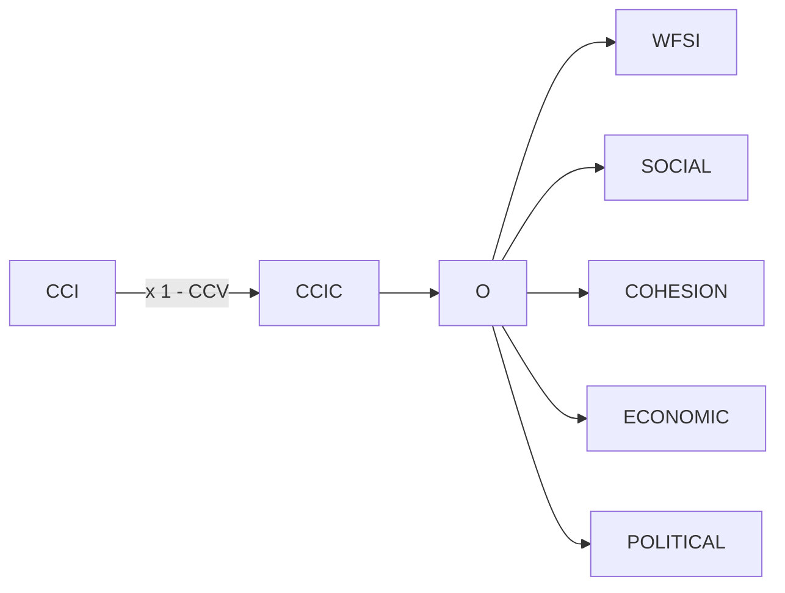
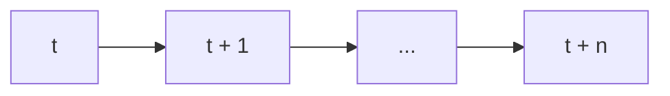
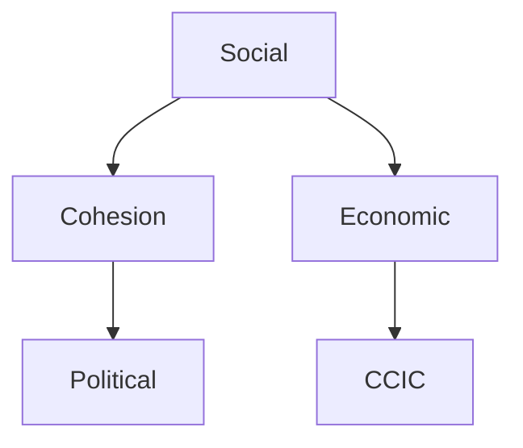
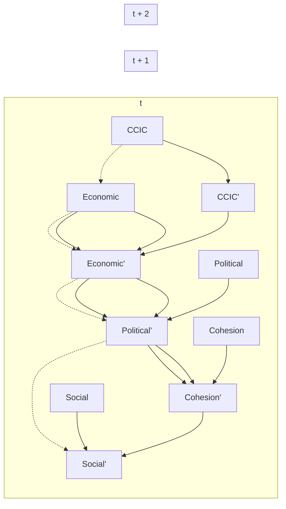

<table><tr><td colspan="2">For office use only</td></tr><tr><td>T1</td><td></td></tr><tr><td>T2</td><td></td></tr><tr><td>T3</td><td></td></tr><tr><td>T4</td><td></td></tr></table>

Team Control Number  
88902  
Problem Chosen

E

<table><tr><td colspan="2">For office use only</td></tr><tr><td>F1</td><td></td></tr><tr><td>F2</td><td></td></tr><tr><td>F3</td><td></td></tr><tr><td>F4</td><td></td></tr></table>

# 2018 MCM/ICM Summary Sheet

# A Probabilistic Model of the Relationships between Countries and Climate Change

Summary

Background Under the effects of climate change, a series of economic, environmental and social problem have emerged from region to region, especially in fragile states. It becomes more and more imperative to develop a sophisticated but easy-to-understand model of the relationships between a country’s fragility and the impact of climate change over it as a guide for the decision and policy makers.

Objective The objective of this paper is to propose a probability and machine learning based model called 2THN(2-Time-slice Hybrid Network), as well as two new metrics to measure the fragility(WFSI(Weighted Fragile State Index)) and climate change’s impact of the country(CCIC(Climate Change Index by Country)). The whole paper can be divided into five main parts: data collection and pre-process; model representation; parameter estimation; model analysis; case study and problem solution.

Firstly, we identify all the data we would like to use in an ideal situation. But since we cannot get access to some subset of the ideal data, we have to construct our model using a different dataset other than the expected one. Incomplete as it is, it’s sufficient for the purpose of illustrating the main points of our model. Data augmentation, classification, and several normalization methods are also introduced in thispart.

Secondly, trying to make the paper easy to read and understand, we then concentrate only on the representations and semantics of our models, leaving out the esoteric mathematical details. We first define our first metric - Climate Change Index(CCI), which is a global metric to quantize the degree of climate change. Later on, Climate change vulnerability(CCV) is introduced, which is a state-level metric. We then define the Climate Change Index by Country(CCIC) using CCI and CCV as our second metric. Then Weighted Fragile State Index(WFSI), a revised version of FSI utilizing Analytical Hierarchy Process(AHP) and Entropy Method(EM) is defined, after which we introduce the novel 2-Time-slice Hybrid Network(2THN) to connect the two dots(CCIC and WFSI) and establish an easy-to-understand relationship, where the rationales of our choice of a probabilistic model, as well as other concerns are thoroughly discussed.

Thirdly, the details of how the parameters are derived are introduced, including the details of Entropy Method(EM) and the learning and inference of 2THN. Meanwhile, the reasons for our choice to learn both the structure and parameters are discussed.

Fourthly, we analyze the properties and characteristics of our model using Mean Value Analysis, correlation analysis, information-theoretical analysis and other analysis to better understand the trained model, where we make our hypothesis of the dynamics of the Climate-Fragility system and justify them by reasoning through the evidence. Furthermore, the notion of Warning Zone(WZ) is introduced, indicating that the latent effects of climate change are invisible to people outside a specific range.

Eventually, we come back to the 5 tasks assigned to us in the first place and tackle them using our model one by one. We use K-Means to define the standard line of one country’s fragility state. We take Sudan and Greece as examples to apply our model in practice, after which we identify some possible strategies taking Sudan’s example again. Finally, we scale our model to the level of continents and discuss the feasibility of scaling it to even cities.

Conclusion In general, the models of WFSI-CCIC and 2THN fit well to reality and therefore pragmatic. The fact that the parameters are calculated by analyzing the data instead of fixed gives our model enormous flexibility, making it easy to be applied widely. But meanwhile, its strong dependence on data makes it useless when facing extreme situations such as countries in large scale wars.

## Contents

## 1 Introduction····

1.1 Background····  
1.2 Our Methods····

## 2 Assumption and Acronyms·····

2.1 Assumption···· 2  
2.2 Acronyms· 2

## 3 Data···· ···2

3.1 Data Collection and Augmentation·· b  
3.2 Data Classification·· 3  
3.3 Data Normalization···  
3.4 Data Discretization·· 3

## 4 Model···· .. 3

4.1 Climate Change Index by Country(CCIC) 3

4.1.1 Climate Change Index(CCI) 4  
4.1.2 Climate Change Vulnerability(CCV)···

4.2 Weighted Fragile State Index(WFSI)·  
4.3 2-Time-Slice Hybrid Network··· 5

4.3.1 Overview··  
4.3.2 Assumptions··· 6  
4.3.3 Precautions···  
4.3.4 Inner Structure - Markov Network·  
4.3.5 Intra Structure - Bayesian Network·

## 5 Parameter Estimation··· 9

5.1 Weight Calculation· ·

5.1.1 Formation Of indicator eigenvalue matrix C· 9  
5.1.2 Calculating the entorpy of indicators·· ·  
5.1.3 The coefficient of variation of indicators··· · 10  
5.1.4 Calculating the weight of entropy· 10  
5.1.5 Normalization of indicator eigenvalue matrix··· ···10  
5.1.6 Fuzzy Comprehensive Entropy Weight Medol· ····· 10

5.2 Parameters of 2THN····· 10

5.2.1 Learning· 11  
5.2.2 Inference· 12

## 6 Analysis···· 12

6.1 Intuition···· · 12  
6.2 Posterior Mean Value Analysis···· 12  
6.3 Other Analysis· ···13

## 7 Task 1: Models and Standard Lines····· ······13

7.1 Determine the standard line by K-Means Clustering Algorithm···· ····· 13  
7.2 Identifying the Impact of Climate Change· ····14

## 8 Task 2: Case Study - Sudan··· ··· 14

## 9 Task 3: Case Study - Greece· ··· 15

9.1 WFSI and CCIC for Greece···· · 15  
9.2 Prediction for Greece··· ···16

## 10 Task 4: Possible Strategies· 17

## 11 Task 5: Scalability Analysis·····

## 12 Strengths and weaknesses·····

12.1 Strengths· ···19  
12.2 Weaknesses· 19

## Reference·· ···· 20

## Appendices· ···· 23

## 1 Introduction

## 1.1 Background

In 2007, the Intergovernmental Panel on Climate Change (IPCC) first associated the fragile state with climate change. They state that developing countries are particularly vulnerable to the socioeconomic impacts of climate change for their dependence on agriculture and high population growth as well as weak infrastructure. The close to 80 percent of the world population that lives in the developing world faces 90 percent of the disasters[1]. Efforts to help fragile states move onto a path toward stability and sustainability continue to face enormous challenges. Climate change is one of these challenges[2]. There is a growing consensus among researchers and policy-makers that climate change represents a real threat to peace and security. Dabelko stated in Climate Change and Fragile States Workshop[3] that climate change can act as a "threat multiplier" and a stressor on state capacities, on communities and on existing conflict dynamics.

In order to solve this problem, we have to construct a model with high enough fidelity of the dynamics regarding the whole system. However, we have two main challenges before us:

1. It is within these fragile countries that climate information is often the weakest if it exists at all[4].

Attempting to solve this problem, we make effective use of the data by combining multiple data source, conducting sophisticated data preprocessing and augmentation, adding weight control as well as utilizing the expert knowledge. But still, we are suffering from the lack of data.

2. The impacts of climate change could be obscured while passing through the fuzzy physical channels for its interconnectedness with development, resource use, health, livelihoods, and economies[3], making it extremely hard to get deep insight of the system.

To better model the interconnected and uncertain nature of the system, we propose a probabilistic model called 2THN(2-Time-slice Hybrid Network), combined with the information and probabilistic theory as well as the most advanced machine learning approach.

## 1.2 Our Methods

The overall objectives of our model is listed as follows:

1. Design a comprehensible and pragmatic metric as well a clearly defined standard for the measurements of the fragility of and climate change impact over one country.  
2. Establish a probabilistic network with reasonably fidelity to analyze the simultaneous and temporal relationships of the five most crucial elements and therefore provide referential suggestions for decision and policy makers.


<details>
<summary>flowchart</summary>


</details>

Figure 1: The structure of our model.

Figure 1 shows the structure of our model. First, we define Climate Change Index(CCI) as a quantified measurement of the global climate change. Second, we manipulate it with Climate Change Vulnerability(CCV) to narrow the global effect of climate change down to a single country, resulting in a new index called Climate Change Index by Country(CCIC). Third, we establish a probabilistic network between CCIC and Weighted Fragile State Index(WFSI), disassembling CCIC into four dimensional sub-indicators, combined with sophisticated weightingmethods.

## 2 Assumption and Acronyms

## 2.1 Assumption

1. The data source is reliable.  
2. The domestic political situation is relatively stable and large-scale war does not break out in the country while applying our model.  
3. The main productive forces and social structure won’t change in recent years.

## 2.2 Acronyms

<table><tr><td>Abbreviation</td><td>Full Name</td><td>Abbreviation</td><td>Full Name</td></tr><tr><td>CI</td><td>Cohesion Index</td><td>C1</td><td>Security Apparatus</td></tr><tr><td>EI</td><td>Economic Index</td><td>C2</td><td>Factionalized Elites</td></tr><tr><td>PI</td><td>Policy Index</td><td>C3</td><td>Group Grievance</td></tr><tr><td>SI</td><td>Social Index</td><td>E1</td><td>Economy</td></tr><tr><td>CCI</td><td>Climate Change Index</td><td>E2</td><td>Economic Inequality</td></tr><tr><td>CCIC</td><td>Climate Change Idnex of Country</td><td>E3</td><td>Human Flight and Brain Drain</td></tr><tr><td>WFSI</td><td>Weighted Fragile State Index</td><td>P1</td><td>State Legitimacy</td></tr><tr><td>2THN</td><td>2-Time-slic Hybrid Network</td><td>P2</td><td>Public Services</td></tr><tr><td>P3</td><td>Human Rights</td><td>S1</td><td>Demographic Pressures</td></tr><tr><td>WZ</td><td>Warning zone</td><td>CCV</td><td>Climate Change Vulnerability</td></tr><tr><td>S2</td><td>Refugees and IDPs</td><td>X1</td><td>External Intervention</td></tr><tr><td>FI</td><td>Factor Indicator</td><td>RI</td><td>Result Indicator</td></tr><tr><td>EPI</td><td>Environmental Performance Index</td><td>KA</td><td>K-means Clustering Algorithm</td></tr></table>

## 3 Data

## 3.1 Data Collection and Augmentation

To determine a state’s fragility, we use 12 indicators(C1, C2, C3, E1, E2, E3, P1, P2, P3, S1, S2, X1) provided by THE FUND FOR PEACE[30].

Annual Average Temperature[31] and Precipitation[32], CO Emissions[33], Arable Land[34], Enviroment Performance Index[35] are used to calculate Climate Change Index of a state.

For the first 12 indicators, we download data of 12 years(2006-2017) on 178 countries. To get sufficient data for calculation of CCI, we can only find data of 13 years(2000-2012) on 111 countries. Luckily, the 111 countries are all included in the former 178 countries. So, we finally get data of 7 years(2006-2012) on 111 countries.

We didn’t manage to find EPI data of year 2011, so, for the sake of continuity and authenticity of the data, we use the mean value of the year of 2010 and 2012 to fill the blank because the indicator values are comparatively smooth.

## 3.2 Data Classification

Same as THE FUND FOR PEACE[30], we divide these 12 indicators into four categories(Cohesion Index, Economic Index, Political Index, Social Index) as shown in Figure 3. The reasons to adopt such a hierarchical structure are listed as follows:

1. There is a significant knowledge gap among key decision and policy makers around the climate change and environmental risks in fragile states and their impact on the security environment[26]. To provide the decision makers with more acceptable instructions, we have to make our model easy to understand.  
2. To avoid the extensive computational cost when implementing the algorithms, which will be introduced later.

## 3.3 Data Normalization

Accounting for the different scales of the indicators, all our data has been normalized before used in our models.

All the 17 indicators can be classified into three types: positive indicators to which the bigger the better, negative indicators to which the smaller the better, and special indicators of which the best value is a fixed value. Suppose there are evaluating indicators counted m, evaluating objects counted n. Inthefollowingequations,cij represents theoriginalvalueofindicatoriforsamplestatej, where i = 1, 2, . . . , n and j = 1, 2, . . . , m. $r _ { i j }$ is the normalized value of $x _ { i j } .$ .

For the positive indicators, there are

$$
r _ {i j} - \frac {c _ {i j}}{\max _ {j} \left\{c _ {i j} \right\}} \tag {1}
$$

For the negative indicators, thereare

$$
r _ {i j} = \frac {\min \left\{c _ {i j} \right\}}{c _ {i j}} \tag {2}
$$

For the special indicator, we must choose a best-fixed value. In our model, PRI, TASI and ALI belong to this kind. We calculate the average value of each country as the best value for that country due to different national conditions. The normalization equation is:

$$
\boldsymbol {r} _ {i j} = 1 - \frac {c _ {i j} - A _ {i j}}{\cdot \max \left\{\left| c _ {i j} - A _ {i j} \right| \right\}}. \tag {3}
$$

where, $A _ { i j }$ is the best value for the jth indicator on the ith country. If $r _ { i j }$ equals to $0 ,$ we reassign it to 0.0001.

## 3.4 Data Discretization

In order to utilize the computer to simulate our model and to make our model more comprehensive, we discretize our results into 10 intervals using the K-means algorithm.

## 4 Model

## 4.1 Climate Change Index by Country(CCIC)

To establish the network between climate change and fragility of a country, we first design a metric to quantize the impact of climate change on different countries. There are two steps as follows:

1. Define CCI(Climate Change Index).  
2. Multiply CCI with CCV(Climate Change Vulnerability) to get CCIC.

## 4.1.1 Climate Change Index(CCI)

According to the IPCC(Intergovernmental Panel on Climate Change), climate change refers to "a change in the state of the climate that can be identified . . . by changes in the mean and/or the variability of its properties, and that persists for an extended period, typically decades or longer"[5].

There are many related professional indexes used to measure climate change, but most of them include high weights of unnatural indica-


<details>
<summary>pie chart</summary>

| Category       | Value |
| -------------- | ----- |
| RI             | 10    |
| PR             | 8     |
| TP             | 7     |
| CE             | 15    |
| SL             | 6     |
| ND             | 5     |
| AL             | 4     |
| BI             | 3     |
| Factor Indicator | 10    |
</details>

Figure 2: Climate Change Index(CCI)

tors(e.g., CCPI(Climate Change Performance Index) weights climate policy as 20%[7]), which are not desired in our case for the presence of CCV(Climate Change Vulnerability). Therefore, we establish a new metric ourselves by combining two categories consisting of only natural indicators and weight them: factor indicator and result indicator as shown in Figure 2.

Factor indicators(FI) are variables which directly influence the climate, such as temperature, solar radiation intensity, precipitation and carbon emission. Result indicator(RI) is on the opposite, which is the natural phenomenon, which indicates the degree of climate change reversely. It includes biodiversity, arable land, sea level change, natural disasters and so on. Here, we only gained the access to complete historical metadata for three FI and one RI by country due to the access right and time limitation. Hence, we turned to a processed data index which is so-called Environmental Performance Index(EPI). According to the Yale Center for Environmental Law & Policy (2018), EPI consists of many RIs like forest(5%), biodiversity(12.5%), water resource(12.5%) and so on.

$$
C C I = W ^ {T} \times \mathrm{Index} _ {\text {norm}}
$$

where WT means the weight vector and $\operatorname { I n d e x } _ { n o r m }$ is the normalized value vector of a country.

The equation above is processed to grade the degree of climate change, which we will discuss in detail later in Parameter Estimation Section. That is, if a country gets a high score, which is approaching 1, this country doesn’t suffer much from climate change.

## 4.1.2 Climate Change Vulnerability(CCV)

Due to geographical location or socio-economic condition, some countries are more vulnerable to the impacts of climate change than others. ND-GAIN[6] assesses the vulnerability of a country by considering six life-supporting sectors: food, water, health, ecosystem services, human habitat and infrastructure, which can be quantized respectively by a real number between 0 to 1. The higher the number, the more likely the country will suffer from the impact of climate change. Wetake this metric as climate change vulnerability(CCV), and multiplied the processed CCI to getCCIC:

$$
C C I C = C C I \times (1 - C C V)
$$

where the CCIC will become fairly large when CCI is approaches 1 or CCV is approaches 0.

## 4.2 Weighted Fragile State Index(WFSI)

Weighting model is essential to evaluate the different contribution of the indicators, especially in our case. Here, we assume that the four categories (cohesion, economic, political and social) have the same importance for the time being. However, if expert knowledge is accessible, we can use AHP(Analytical Hierarchy Process) to give a more sophisticated overall weighting strategy while we use EM(Entropy Method)(details will be discussed later in Parameter Estimation Section) to weight the 12 sub-factors based on the historical data.


<details>
<summary>pie chart</summary>

| Category | Value |
| --- | --- |
| Social | 0.42243838 |
| Political | 0.34309562 |
| Cohesion | 0.39815429 |
| Economic | 0.3561599 |
| Political | 0.34309562 |
| Social | 0.24450222 |
| Political | 0.28844633 |
| Cohesion | 0.23940738 |
| Economic | 0.35956439 |
| Political | 0.28844633 |
| Social | 0.33305939 |
| Political | 0.28844633 |
| Cohesion | 0.39815429 |
| Economic | 0.3561599 |
| Political | 0.28844633 |
| Social | 0.24450222 |
| Political | 0.28844633 |
| Cohesion | 0.23940738 |
| Economic | 0.35956439 |
| Political | 0.28844633 |
| Social | 0.24450222 |
| Political | 0.28844633 |
| Cohesion | 0.23940738 |
| Economic | 0.3561599 |
| Political | 0.28844633 |
| Social | 0.24450222 |
| Political | 0.28844633 |
| Cohesion | 0.23940738 |
| Economic | 0.359565 |
| Political | 0.28844633 |
| Social | 0.24450222 |
| Political | 0.28844633 |
| Cohesion | 0.23940738 |
| Economic | 0.3561599 |
| Political | 0.2884465 |
| Social | 0.24450222 |
| Political | 0.2884465 |
| Cohesion | 0.23940738 |
| Economic | 0.3561599 |
| Political | 0.2884465 |
| Social | 0.24450222 |
| Political | 0.2884465 |
| Cohesion | 0.2394073 |
| Economic | 0.3561599 |
| Political | 0.2884465 |
| Social | 0.24450222 |
| Political | 0.2884465 |
| Cohesion | 0.2394073 |
| Economic | 0.3561599 |
</details>

Figure 3: Weighted Fragile State Index(WFSI)

We respectively apply EM to the four indicators, each of which consists of another three subfactors, which is shown in Figure 3.

Once we get the result from EM, we then multiply it by the FSI we already have, whose result is exactly what we need.

## 4.3 2-Time-Slice Hybrid Network

## 4.3.1 Overview

We now have the normalized measurements of the four most crucial indicators we obtained by utilizing EM. To better study the interactions between these four indicators, we then formulate its inner structure and the temporal effects across them into a 2-Time-slice Hybrid Network(2THN). Specifically, we combine the undirected Markov Network(MN) model with the directed Bayesian Network(BN) model, which can be illustrated by figure 4.

But why probabilistic models? Although determinism is indeed a very valuable property in modeling, taking the massive uncertainty and noises into consideration, for even a modest problem, giving an exact answer is often infeasible [14], leave alone such a complicated one. Furthermore, according to Dan Smith and Janani Vivekananda [15], there is at least three dimensions’ uncertainty under the context of climate change’s effects:

1. The precise physical effects are uncertain, including their scale and geography.  
2. The knock-on social consequences are uncertain.

3. The third dimension uncertainty lies in the lack of clear and tested policy prescriptions to guide the response.

Probabilistic networks(PNs), also known as Bayesian networks(BNs), are already well established as representations of domains involving such uncertain relations among a group of random variables [10], therefore becomes an eligible candidate. Another reason is that the data is seldom complete in real life, which is also well supported by probabilistic models both in theory and in practice. Moreover, the separation of knowledge and reasoning [12] in probabilistic models decouples the system’s overall complexity.


<details>
<summary>flowchart</summary>


</details>

Figure 4: Overview of the 2THN model.

During our research, we found most of the models are either pure Bayesian networks or pure Markov networks but rarely both. So we feel it necessary to defend our choice of such a hybrid system. We have known that the impact between the indicators are mutual and intricate and the inner structure can even be cyclic. Hence, the impact one indicator imposes on the others will eventually and inevitably affect itself, which makes this problem problematic. Neither Bayesian networks nor Markov networks alone can model the pairwise relationships and the temporal dynamics simultaneously, which leads to our hybrid system - 2THN.

In our model of 2THN, the dashed-lined area represents the template part, whose structure will be replicated to other adjacent time slices. The original inspiration is the so-called 2-time-slice bayesian network(2TBN), where all the links are directed and acyclic. In order to capture more traits of the interconnected nature of such a fuzzy system, we combine it with another probabilistic graphical model, Markov network, which is undirected. The whole model can be taken into two parts - inner-time-slice model and intra-time-slice model. The inner-time-slice model is used to analyze the instant effects and the simultaneous relationships within our four-indicator fragility model while the intra-time-slice model is used to analyze the temporal effect among the four different indicators.

## 4.3.2 Assumptions

To simplify our model, we make the following two assumptions for the directed intra-time-slice model:

## 1. Markov Assumption

Because we decide to use a template model to make the model more general, we assume the conditional probability distribution of future states of the process depends only upon the present state, not on the sequence of events that preceded it [13]. That is to say, once you know the current state, you don’t care about the past anymore, therefore you forget about the past. Specifically, the fragility of the next year only depends on the environments of the current year instead of a trajectory of the past years. This assumption can be expressed precisely using the following mathematical expressions:

Given:

$$
(X ^ {(t + 1)} \perp X ^ {(0: t - 1)} / X ^ {(t)})
$$

Then:

$$
P (X ^ {(0: T)}) = P (X ^ {(0)}) \prod_ {t = 0} ^ {T - 1} P (X ^ {(t + 1)} | X ^ {(t)})
$$

where Xt is the random variables(nodes) in time slice t.

## 2. Time Invariance

We further assume the dynamics of the system don’t depend on the time in our model, which is to say, for all given t, we have:

$$
P (X ^ {(t + 1)} | X ^ {(t)}) = P (X ^ {j} | X)
$$

where $\boldsymbol { X } ^ { j }$ denotes the next time slice and X denotes the current time slice, therefore we can replicate the same model to every transition instead of creating one for each of them.

## 4.3.3 Precautions

An important parameter of our model is the time granularity ∆T . We set it to one year for the time being in order to make it easier to get valid data. But this interval can be reset to a smaller value if enough data becomes available in the future.

Another very important point worth caution is that the inner-time-slice model and the intra-timeslice model should never be mixed up remissly. These two pieces are designed for different dynamics and different purposes. All models are wrong, but some are useful [9]. If you are mixing them up, you are risking confusing the map with the territory. As Lee states in Plato and the Nerd:

Models are human constructions. Modeling paradigms are also human constructions.

Therefore, both are subject to creativity. They are invented not discovered[8].

Therefore, models are also subject to the context of the concrete problem. Hence, we would like to restate the subtlety here although mentioned previously:

## 1. Inner Structure - Markov Network

In our model, it captures the intricate pairwise and simultaneous relationships between the four indicators. It can be used to analyze the integrative node-node interactions without the notion of time, therefore to better understand the whole system.

## 2. Intra Structure - Dynamic Bayesian Network

In our model, it models the dynamics of the system over a time series. It enables us to monitor and update the overall system as time proceeds, and make future predictions, which is the central model of the following discussion.

## 4.3.4 Inner Structure - Markov Network

We learned the following Markov network from data, representing the pairwise relationships between the five indicators. The lines between the nodes denote the mutual interactions of these indicators.

For each edge between two of the five indicators(Economic E, Cohesion C, Political P , Social S and CCIC CCIC) X, Y , there is an associated factor(aka. affinity function, compatibility function, soft constraints) $\varphi _ { i j } ( X , ~ Y )$ , which is a replacement of the conditional probability in a Bayesian network. The factor represents the local happiness of the variable [12] X and Y to take a particular joint assignment. We can get such factors through some particular algorithms which will be introduced in parameter estimation.

Having all the factors in our model, we are able to calculate the product of factors $\scriptstyle { \widetilde { P } } _ { \Phi }$ :


<details>
<summary>flowchart</summary>


</details>

Figure 5: The inner structure of 2THN.

$$
\tilde {P} _ {\Phi} (E, C, P, S, C C I C) = \prod_ {i} ^ {k} \phi_ {i} (F _ {i}) \tag {4}
$$

where ω is the coefficient, f is the feature function and $D _ { i }$ is the $j ^ { t h }$ factor, e.g. $( C , P ) , ( S , E )$ . Then we can normalize it using:

$$
P (E, C, P, S, C C I C) = \frac {1}{\overline {{Z}}} \tilde {P} _ {\text {   }} (E, C, P, S, C C I C) \tag {5}
$$

where Z is called the partition function:

$$
Z = \sum_ {\tilde {P} _ {\Phi} (E, C, P, S, C C I C)} \tag {6}
$$

A relatively subtle point of the Markov network model is that there isn’t a natural mapping between the probability distribution and the factors. This means we have to explicitly specify the factorizations. Here, we claim this network to be a pairwise network in order to do so. Note further, the pairwise factor is commutative in our model, so there are $7$ factors in total in this network, listed as follows:

$$
(P, C); (C, S); (S, E); (E, C C I).
$$

## 4.3.5 Intra Structure - Bayesian Network

Tovisualize the conditional dependencies across time slice, we use the directed acyclic graph(DAG), shown as Figure 6:


<details>
<summary>flowchart</summary>


</details>

Figure 6: The intra structure of 2THN.

For each node in the DAG, there exists a probability distribution function(pdf), whose dimension and definition depends on the edges leading to that node. In our example, the dashed line denotes so-called "persistence link", which links the same node from t to t + 1(the unprimed node to the primed node). The solid link denotes the other dependencies between different nodes. This structure is replicated for all the given time ti to $t _ { i } + 1$ while in this graph we only show 2 steps. So for a trajectory over $0 , 1 , . . . , T$ , we can then unroll the template network to a flattened ground network. That is to say, we can, therefore, make predictions over an arbitrarily long time series using some inference algorithms, which enables us to get insights of the deep causal relationships among the 5 elements.

The joint probability distributions can then be calculated using the chain rule according to Equation 7.

$$
P (X ^ {\prime} | X) = \prod_ {i = 1} ^ {n} P (X _ {i} ^ {\prime} | \mathrm{Pa} _ {X _ {i} ^ {\prime}})
$$

where $\boldsymbol { X } ^ { j }$ is the set of random variables in the next time slice, X is the random variables in the current time slice, and $\mathrm { P a } _ { \mathbf { x } ^ { j } }$ is all the parents of $X _ { i }$ i

## 5 Parameter Estimation

In this section, how to determine the weight of the 12 fragility indicators as well as how the structure and parameters of 2THN model are determined are introduced.

## 5.1 Weight Calculation

## 5.1.1 Formation Of indicator eigenvalue matrix C

Suppose there are evaluating indicators counted m, evaluating objects counted n, then forms the indicator eigenvalue matrix $\pmb { C } = ( \mathbf { c } _ { i j } ) _ { m \times n }$

$$
C = \left[ \begin{array}{c c c c} c _ {1 1} & c _ {1 2} & \ldots & c _ {1 n} \\ c _ {2 1} & c _ {2 2} & \ldots & c _ {2 n} \\ \vdots & \vdots & \ddots & \vdots \\ c _ {m 1} & c _ {m 2} & \ldots & c _ {m n} \end{array} \right] = \binom{c _ {i j}}{m \times n}
$$

where $c _ { i j }$ is the data of the jth evaluating object on the ith indicator

## 5.1.2 Calculating the entorpy of indicators

Information entropy is the measurement of the disorder degree of a system[28]. When the difference of the value among the evaluating objects on the same indicator is high, while the entropy is small, it illustrates that this indicator provides more useful information. On the other hand, if the difference is smaller and the entropy is higher, the indicator provides less useful information.[29]

$$
e _ {i} = - 1 \times k \sum_ {j = 1} ^ {n} (p _ {i j} \ln p _ {i j})
$$

$$
p _ {i j} = c _ {i j} / \sum_ {j = 1} ^ {n} c _ {i j} \quad \text { and } \quad k = \frac {1}{\ln n}
$$

(9)

In which,

where $e _ { i }$ is the entropy of the ith indicator, $e _ { i } { > } 0$ .

## 5.1.3 The coefficient of variation of indicators

$$
g _ {i} = 1 - e _ {i}
$$

where $g _ { i }$ is coefficient of variation. The larger the $g _ { i }$ is, the more significant the ith indicator is to the model.

## 5.1.4 Calculating the weight of entropy

$$
w _ {i} = g _ {i} / \sum_ {i = 1} ^ {m} g _ {i}
$$

where wi is the weight of the ith indicator.

If each evaluating object on the ith evaluation indicator is exactly the same, the entropy reaches the maximum value of 1 and the corresponding weight is $0 ,$ which means this indicator provides nothing useful for the decision maker, that is to say, it can be ignored. In contrast, if each evaluating object varies on one indicator, then the entropy of the indicator is small and the weight is high, indicating that the indicator provides more useful information and should be focused on.

## 5.1.5 Normalization of indicator eigenvalue matrix

According to aforementioned three methods of data normalization, normalize equation (8) to get equation (11)

$$
\boldsymbol {R} = \left[ \begin{array}{c c c c} r _ {1 1} & r _ {1 2} & \ldots & r _ {1 n} \\ r _ {2 1} & r _ {2 2} & \ldots & r _ {2 n} \\ \vdots & \vdots & \ddots & \vdots \\ r _ {m 1} & r _ {m 2} & \ldots & r _ {m n} \end{array} \right] = \binom{r _ {i j}}{m \times n}
$$

where $r _ { i j }$ is the data of the jth evaluating object on the ith indicator, and $r _ { i j } \in [ 0 , 1 ]$ .

## 5.1.6 Fuzzy Comprehensive Entropy Weight Medol

According to the definition of membership matrix, the relative optimal membership degree vectors of inferior and superior ones are respectively:

$$
\boldsymbol {b} = (0 \quad 0 \quad 0 \quad \dots \quad 0) ^ {\mathsf {T}}
$$

$$
\boldsymbol {h} = (1 \quad 1 \quad 1 \quad \dots \quad 1) ^ {\mathsf {T}}
$$

The optimal membership degree of the evaluating object is:

$$
\begin{array}{l} u _ {j} = \frac {1}{1 + \left[ d (r _ {j} , h) / d (r _ {j} , b) \right] ^ {2}} \\ = \frac {1}{1 + \left\{\sum_ {i = 1} ^ {m} \left[ w _ {i} (r _ {i j} - h _ {i}) \right] ^ {q} / \sum_ {i = 1} ^ {m} \left[ w _ {i} (r _ {i j} - b _ {i}) \right] ^ {q} \right\} ^ {2 / q}} \tag {12} \\ \end{array}
$$

## 5.2 Parameters of 2THN

Recall that previously we have introduced the representation of the 2THN model. but we haven’t dived into the details of how to apply such model yet. One essential work of constructing probability 精品数模资料，各类比赛优秀论文、学习教程、写作模板与经验技巧、matlab程序代码资料等，尽在淘宝店铺：闵大荒工科男的杂货铺 networks is to learn its parameters, including its structure and conditional probability distributions, after which we can then conduct inference on the unknown data or updating the existing model. Here we will briefly introduce the mechanisms of such process using the intra-time-slice Bayesian network(figure 6 ) as an example, leaving out the Markov network to avoidduplicates.

## 5.2.1 Learning

Although extensive researches have been done upon the relationships among the four indicators and the impact of climate change[17, 18, 19, 20], none of them considered all of the five as a whole.Furthermore, according to the report of the Climate Change and Fragile States Workshop held on September 28 and 29, 2011[3], perfect knowledge is not available, especially in contexts of fragility and it’s essential to step back from our understandings and assumptions and think openly and holistically.

Learning the structure of the Bayesian network model that represents a domain can reveal insights into its underlying causal structure[21] while learning the parameters can reveal the details of how the nodes are connected, which exactly embodies the concepts addressed above - to think openly and holistically. Another benefit we can get from utilizing this strategy is that continuously updating both the structure and the parameters becomes easy, making it possible for the model to evolve over time with more and more data fed in. Hence, both the structure and parameters of our model are learned from data, concretely, we use the pgmpy python library[23] for the implementation.

Structure Learning To summarize, the overall strategy is to use a score function to rate each network and choose the one with the best score. Given the data set $D ,$ , the structure $G ^ { \prime } \mathrm { s }$ score is:

$$
\operatorname{Score} (D, G) = P (G \mid D) = \frac {P (D \mid G) P (G)}{P (D)}
$$

which is the posterior probability of G given data D. Note that the denominator is fixed for a given data set, so our task reduces to maximize the numerator $P ( D / G ) P ( G )$ . To further simplify the problem, we assume a uniform prior distribution over $P ( G )$ (see Heckerman[22] for other discussions), therefore $P ( D / G )$ is the only one left:

$$
P (\mathcal {D} | \mathcal {G}) = \int P (\mathcal {D} | \mathcal {G}, p) P (p | \mathcal {G}) d p
$$

where $p$ is the weight by the posterior probability of all the possible parameters. For multinomial $\mathrm { P D F s ^ { [ 1 6 ] } } .$ :

where $\alpha _ { i j k }$ and $N _ { i j k }$ are the hyperparameters, which counts for the probability distribution function of $X _ { i }$ for parent configuration j.

This process can be complicated for two main reasons:

(1) Difficulties in inferring causality.  
(2) The exponential number of directed edges that are possible for a givendataset.

To tackle these problems, we choose to use Greedy Hill Climbing algorithm with a reduced factor set(keep only 5 elements). But while we gained better performance through this approach, we are also faced with the risk of getting stuck in a local optimum, which can be well solved by applying random restarts.

Parameter Learning Parameter learning is relatively less problematic than structure learning, it is similar to many common parameter training algorithms in the field of machine learning. We use the normalized data as input, then train the previously constructed network using Maximum Likelihood Estimation $( { \bf M L E } ^ { [ 2 4 ] } )$ to get the conditional probability distributions of every random variable.

## 5.2.2 Inference

In general, a computation of a probability of interest given a model is known as probabilistic infer-$e n c e ^ { [ 2 2 ] } ,$ . Having the joint distribution of X, in principle, we can compute any probability of interest about X. Typically, we will be in a situation where some evidence is observed so that we can infer something else about other variables. Generally, the queries can be expressed using the following question: "What is the whole probability distribution over variable X given evidence e, $P \left( { X } { \mid } { e } \right) ? ^ { \left\lceil 2 5 \right\rceil * }$ Concretely, given the query variables X, observed evidence $E = e$ and unobserved variables Y:

$$
P (X | E = e) = \frac {P (X , e)}{P (e)} \propto \sum_ {y} P (X, e, y)
$$

which means to simply sum over all the variables not involved in the query. For other more sophisticated inference methods, see Butz, et al[27].

## 6 Analysis

## 6.1 Intuition

We can easily draw the following intuitive conclusions from both Figure 5 and Figure 6:

1. CCIC can affect economic directly since they are connected directly in bothgraph.  
2. CCIC can affect all the other three elements indirectly through the flow ofinfluence.

These conclusions are rather intuitive, hence easy to understand. We will then try to justify the above intuitions using some formal methods and gain further understanding of the dynamics of this system.

## 6.2 Posterior Mean Value Analysis

The most direct way to understand how one element may affect the other is to visualize it. Since we already considered the country’s vulnerability in CCIC, we can then synthesize all the 111 countries’ data to conduct the posterior mean analysis.

The results of the four indicators are rather similar(Figure 8). From the four wired curves caused by CCIC, we can see that CCIC is not always linearly correlated with the other four indicators(recall that CCIC is considered to be the larger the better). Weinterpret this phenomenon by the following hypothesis:

(1) Within a reasonable range, concretely (0, 0.2) in our model(we call it the Warn- ing Zone(WZ)), CCIC can effectively promote or diminish all the other four indicators, whose impact can be approximately considered as positively linear.  
(2) After WZ, CCIC’s impact gradually recedes, ultimately exercises no or even negative impacts on the other four dimensions’ performance.


<details>
<summary>line chart</summary>

| Variable Means | Economic | Social | Political | Cohesion |
| -------------- | -------- | ------ | --------- | -------- |
| 0.10           | 0.140    | 0.150  | 0.155     | 0.160    |
| 0.20           | 0.160    | 0.165  | 0.170     | 0.175    |
| 0.30           | 0.175    | 0.178  | 0.182     | 0.185    |
| 0.40           | 0.185    | 0.188  | 0.192     | 0.195    |
| 0.50           | 0.195    | 0.192  | 0.198     | 0.200    |
| 0.60           | 0.205    | 0.198  | 0.205     | 0.208    |
| 0.70           | 0.215    | 0.202  | 0.212     | 0.215    |
| 0.80           | 0.225    | 0.208  | 0.218     | 0.220    |
| 0.90           | 0.235    | 0.212  | 0.222     | 0.225    |
| 1.00           | 0.240    | 0.215  | 0.225     | 0.228    |
</details>

Figure 7: Posterior mean analysis for CCIC.

We further postulate that when global climate change deteriorates to a certain extent, its

influence will gradually emerge. Until then, the impact is invisible to people. Hence, we must be aware of its presence and get ready to properly handle it. Another interesting point(the red outlier line) lies in Figure 7, where the red line(economic) becomes an outlier. Its slope is slightly higher than the others, which can be explained by the direct connection between CCIC and economic.


<details>
<summary>line chart</summary>

| Variable Means | Social | Political | Economic | CCIC |
| -------------- | ------ | --------- | -------- | ---- |
| 0.10           | 0.10   | 0.10      | 0.10     | 0.15 |
| 0.20           | 0.15   | 0.15      | 0.15     | 0.20 |
| 0.30           | 0.20   | 0.20      | 0.20     | 0.25 |
| 0.40           | 0.25   | 0.25      | 0.25     | 0.27 |
| 0.50           | 0.30   | 0.30      | 0.30     | 0.28 |
| 0.60           | 0.35   | 0.35      | 0.35     | 0.27 |
| 0.70           | 0.40   | 0.40      | 0.40     | 0.26 |
| 0.80           | 0.45   | 0.45      | 0.45     | 0.25 |
| 0.90           | 0.50   | 0.50      | 0.50     | 0.24 |
| 1.00           | 0.55   | 0.55      | 0.55     | 0.23 |
| 1.10           | 0.60   | 0.60      | 0.60     | 0.22 |
| 1.20           | 0.65   | 0.65      | 0.65     | 0.21 |
| 1.30           | 0.70   | 0.70      | 0.70     | 0.20 |
| 1.40           | 0.75   | 0.75      | 0.75     | 0.19 |
| 1.50           | 0.80   | 0.80      | 0.80     | 0.18 |
</details>


<details>
<summary>line chart</summary>

| Variable Means | CCIC  | Political | Cohesion | Social |
| -------------- | ----- | --------- | -------- | ------ |
| 0.00           | 0.25  | 0.25      | 0.25     | 0.25   |
| 0.10           | 0.30  | 0.25      | 0.25     | 0.25   |
| 0.20           | 0.35  | 0.30      | 0.30     | 0.30   |
| 0.30           | 0.35  | 0.40      | 0.40     | 0.35   |
| 0.40           | 0.35  | 0.50      | 0.50     | 0.45   |
| 0.50           | 0.35  | 0.60      | 0.60     | 0.55   |
| 0.60           | 0.35  | 0.70      | 0.70     | 0.65   |
| 0.70           | 0.35  | 0.75      | 0.75     | 0.70   |
| 0.80           | 0.35  | 0.80      | 0.80     | 0.75   |
| 0.90           | 0.35  | 0.85      | 0.85     | 0.80   |
| 1.00           | 0.35  | 0.90      | 0.90     | 0.85   |
</details>


<details>
<summary>line chart</summary>

| Variable Means | Economic | Cohesion | CCIC | Social |
| -------------- | -------- | -------- | ---- | ------ |
| 0.00           | 0.18     | 0.16     | 0.18 | 0.16   |
| 0.10           | 0.25     | 0.22     | 0.28 | 0.24   |
| 0.20           | 0.30     | 0.35     | 0.30 | 0.32   |
| 0.30           | 0.35     | 0.45     | 0.30 | 0.40   |
| 0.40           | 0.40     | 0.55     | 0.30 | 0.50   |
| 0.50           | 0.45     | 0.65     | 0.30 | 0.60   |
| 0.60           | 0.50     | 0.75     | 0.28 | 0.70   |
| 0.70           | 0.55     | 0.85     | 0.27 | 0.75   |
| 0.80           | 0.60     | 0.90     | 0.26 | 0.80   |
| 0.90           | 0.65     | 0.95     | 0.25 | 0.85   |
| 1.00           | 0.75     | 1.00     | 0.24 | 1.00   |
</details>


<details>
<summary>line chart</summary>

| Variable Means | Cohesion | CCIC  | Political | Economic |
| -------------- | -------- | ----- | --------- | -------- |
| 0.00           | 0.15     | 0.25  | 0.25      | 0.25     |
| 0.10           | 0.20     | 0.28  | 0.28      | 0.28     |
| 0.20           | 0.25     | 0.30  | 0.30      | 0.30     |
| 0.30           | 0.30     | 0.32  | 0.32      | 0.32     |
| 0.40           | 0.35     | 0.32  | 0.35      | 0.35     |
| 0.50           | 0.40     | 0.32  | 0.40      | 0.40     |
| 0.60           | 0.45     | 0.32  | 0.45      | 0.45     |
| 0.70           | 0.50     | 0.32  | 0.50      | 0.50     |
| 0.80           | 0.55     | 0.32  | 0.55      | 0.55     |
| 0.90           | 0.60     | 0.32  | 0.60      | 0.60     |
| 1.00           | 0.65     | 0.32  | 0.65      | 0.65     |
| >1.10          | 0.70     | 0.32  | 0.70      | 0.70     |
</details>

Figure 8: Posterior mean analysis for the 4 indicators.

## 6.3 Other Analysis

We also conducted other analysis to our model, including both statistical methods(correlation, etc.) and information-theoretical methods(mutual information, Entropy, etc.), shown in Table 1, Ta ble 2, from which we can see that the bond between CCIC and economic is weaker than the others. This is reasonable to some extent. But it may also indicate that not enough evidences are provided to convince ourselves that climate change can actually have a great impact on a country’s economic system. With more data, the actual bond may gradually emerge, and presumably become strong than the current one. Moreover, other bonds other than the current set are also possible to emerge in the future.

## 7 Task 1: Models and Standard Lines

## 7.1 Determine the standard line by K-Means Clustering Algorithm

After all the four indicators of WFSI for a country have been calculated, we still don’t have a qualitative concept about the country’s current state. Fragile? Vulnerable? Or stable? Therefore, K-Means clustering algorithm[36] is adopted to set a standard.

<table><tr><td></td><td>KL Divergence</td><td>Mutual information</td><td>Consistency Estimate</td></tr><tr><td>Sum</td><td>3.3175</td><td>3.3175</td><td>3.3175</td></tr><tr><td>Mean</td><td>0.8294</td><td>0.8294</td><td>0.8294</td></tr><tr><td>Standard Deviation</td><td>0.3377</td><td>0.3377</td><td>0.3377</td></tr></table>

Table 1: Overall metrics.

<table><tr><td>Parent</td><td>Child</td><td>KL Divergence</td><td>Relative Weight</td><td>Overall Contribution</td><td>Mutual information</td><td>Symmetric Normalized Mutual Information</td><td>Symmetric Relative Mutual Information</td><td> $G_{KL}$ -test</td><td>G-test (Data)</td><td>Pearson&#x27;s Correlation</td></tr><tr><td>Political</td><td>Cohesion</td><td>1.1556</td><td>1.0000</td><td>34.8327%</td><td>1.1556</td><td>34.7862%</td><td>40.9864%</td><td>983.6067</td><td>983.6067</td><td>0.9053</td></tr><tr><td>Economic</td><td>Political</td><td>0.9829</td><td>0.8506</td><td>29.6288%</td><td>0.9829</td><td>29.5893%</td><td>34.3695%</td><td>836.6590</td><td>836.6590</td><td>0.8754</td></tr><tr><td>Cohesion</td><td>Social</td><td>0.9143</td><td>0.7912</td><td>27.5612%</td><td>0.9143</td><td>27.5244%</td><td>31.2598%</td><td>778.2728</td><td>778.2728</td><td>0.8142</td></tr><tr><td>CCIC</td><td>Economic</td><td>0.2646</td><td>0.2290</td><td>7.9774%</td><td>0.2646</td><td>7.9667%</td><td>9.0010%</td><td>225.2653</td><td>225.2653</td><td>0.2602</td></tr></table>

Table 2: Metrics for node-node relationship.

One drawback[37] to the algorithm occurs when it is applied to datasets with m data points in n 10 dimensional real space $\pmb { \mathsf { R } } ^ { n }$ and the number of desired clusters is k 20. In this situation, the K-Means algorithm often converges with one or more clusters which are either empty or summarize very few data points (i.e. one data point). However, our model has only four dimensions and K, which denotes the number of clusters, is 3 in our model. So, KA is suitable for ourmodel.

Given a datasets D of m points in $\pmb { \mathsf { R } } ^ { n }$ and cluster centers $C ^ { 1 , t } , C ^ { 2 , t } , \ldots , C ^ { k , t }$ at iteration $\mathrm { t , }$ compute $C ^ { 1 , t + 1 } , C ^ { 2 , t + 1 } , \ldots , C ^ { k , t + 1 }$ at iteration $t + 1$ in the following 2 steps:

1. Cluster Assignment. For each data record ${ \boldsymbol { x } } ^ { i } \in D ,$ assign $x ^ { i }$ to cluster $h ( i )$ such that center $C ^ { h \left( i \right) , t }$ is nearest to $x ^ { i }$ in the 2-norm.  
2. Cluster Update. Compute $C ^ { h , t + 1 }$ as the mean of all points assigned to clusterh.

Stop when $C ^ { h , t + 1 } = C ^ { h , t } , h = 1 , \ldots , k ,$ else increment t by 1 and go to step 1.

After training a K-Means model using the data we have, we find it performs well as is shown in Figure 9.

Because we have four dimensions, which can’t be shown in only one figure. Hence, we draw each three of them for one time in a figure, after which we get these fourfigures.

## 7.2 Identifying the Impact of Climate Change

Please see 6.1 and 6.2.

## 8 Task 2: Case Study - Sudan

Among all of the top 10 most fragile states, we can only get the data of Iraque and Sudan. Considering the extensive chaos and wars in Iraque, we finally chose Sudan.

Conducting causality inference in probabilistic models are rather easy. According to our data, we provide our model with a new piece of evidence:

$$
P (0. 0 6 7 \leqslant C C I C \leqslant 0. 0 9 1) = 1
$$

We then calculate the probability of other variables accordingly, the original and post-evidence results are shown in the same graph(Figure 10) for the purpose of comparison. It is obvious that CCIC can result in a high probability of low score in all the other four variables without other external intervention, especially economic. Hence, we can conclude that climate change can make the bad situation even worse, through directly weaken one country’s economic system and indirectly influence all the other variables.

  
Figure 9: K-Means Model Results

Therefore, if we conversely set CCIC to be greater than 0.38, it would result in a higher probability of high score in all the other variables, therefore leading to a less fragile state. For more concrete strategies in order to ease the fragility of Sudan, see section 10.

  
Figure 10: Impact of CCIC.

## 9 Task 3: Case Study - Greece

## 9.1 WFSI and CCIC for Greece

Greece is chosen to be evaluated by our model. Firstly, we get the WFSI and CCIC scores for Greece from 2008 to 2012 as shown below in Figure 11. Note that each score of Greece is below 0.35 and the changes between years are small, so we set the radar chart boundary to 0.35 to better show the trend of the changes.


<details>
<summary>radar chart</summary>

Greece
| Year | Category | Value |
|---|---|---|
| 2008 | CI | High |
| 2008 | PI | Medium |
| 2008 | SI | Low |
| 2008 | CCIC | Medium |
| 2009 | CI | High |
| 2009 | PI | Medium |
| 2009 | SI | Low |
| 2009 | CCIC | Medium |
| 2010 | CI | High |
| 2010 | PI | Medium |
| 2010 | SI | Low |
| 2010 | CCIC | Medium |
| 2011 | CI | High |
| 2011 | PI | Medium |
| 2011 | SI | Low |
| 2011 | CCIC | Medium |
| 2012 | CI | High |
| 2012 | PI | Medium |
| 2012 | SI | Low |
| 2012 | CCIC | Medium |
</details>

Figure 11: WFSI and CCIC for Greece from 2008 to 2012

The details for each year is shown in Table 3. In these five years, Greece stays in the vulnerable state.

<table><tr><td>Year</td><td>CI</td><td>EI</td><td>PI</td><td>SI</td><td>CCIC</td><td>Category</td></tr><tr><td>2008</td><td>0.34311201</td><td>0.30068317</td><td>0.32482785</td><td>0.33128552</td><td>0.110295</td><td>vulnerable</td></tr><tr><td>2009</td><td>0.33108916</td><td>0.28565486</td><td>0.3052545</td><td>0.28280523</td><td>0.119507</td><td>vulnerable</td></tr><tr><td>2010</td><td>0.3177221</td><td>0.31542998</td><td>0.27146437</td><td>0.30181049</td><td>0.081737</td><td>vulnerable</td></tr><tr><td>2011</td><td>0.32430351</td><td>0.3477323</td><td>0.27657189</td><td>0.26598385</td><td>0.086050</td><td>vulnerable</td></tr><tr><td>2012</td><td>0.30322494</td><td>0.29910825</td><td>0.29347285</td><td>0.32876026</td><td>0.095530</td><td>vulnerable</td></tr></table>

Table 3: WFSI and CCIC for Greece from 2008 to 2012.

The data above suggests that, although the current status of Greece is acceptable, the FSI scores of it is gradually reducing. Especially, the cohesion index and policy index decline obviously. Although in 2008 the Greek economy was regarded as the 27th largest economy[38] of the world by nominal Gross Domestic Product (GDP) with 32,100 USD GDP per capita[39], as a corollary of the international financial crisis and the local unrelenting spending, Greek citizens started facing serious socioeconomic turmoil. In 2009, the economic crisis impinged on a greater proportion of the population, whereas in 2010 a Memorandum of Economic and Financial Policies was signed in order to avert Greece’s default. The same year, national estimates showed that GDP dropped to -3.5%, while unemployment rates reached as high as 14.2%, with 180,000 people losing their jobs[40]. In 2011, the profile of the Greek economy appears the gloomiest of the decade: GDP further declined to -6.1%, whereas unemployment rates increased from 6.6% in May 2008 to 16.6% in May 2011. Concomitantly, throughout the same period, the debt has grown from 105.4% in 2007 to 160.9% of GDP in 2011 (239.4 billion euros to 328.6 billion euros)[41].

## 9.2 Prediction for Greece

Using the model 2THN, we predict the future status of Greece, shown in Figure 12. The detail predicting data from 2013 to 2017 is shown in Table 4.

<table><tr><td>Year</td><td>CI</td><td>EI</td><td>PI</td><td>SI</td><td>Category</td></tr><tr><td>2013</td><td>0.32372539</td><td>0.27658597</td><td>0.30632332</td><td>0.34520463</td><td>vulnerable</td></tr><tr><td>2014</td><td>0.27213682</td><td>0.23103887</td><td>0.25672303</td><td>0.38824761</td><td>vulnerable</td></tr><tr><td>2015</td><td>0.27160032</td><td>0.26766136</td><td>0.25412672</td><td>0.46719683</td><td>vulnerable</td></tr><tr><td>2016</td><td>0.24880141</td><td>0.24614655</td><td>0.2126675</td><td>0.444723410</td><td>fragile</td></tr><tr><td>2017</td><td>0.27053746</td><td>0.26077977</td><td>0.18593567</td><td>0.24906261</td><td>fragile</td></tr></table>

Table 4: WFSI C for Greece from 2013 to 2017.


<details>
<summary>line chart</summary>

| Year | CI    | EI    | PI    | SI    |
|------|-------|-------|-------|-------|
| 2008 | 0.34  | 0.30  | 0.33  | 0.33  |
| 2010 | 0.32  | 0.35  | 0.27  | 0.29  |
| 2012 | 0.31  | 0.30  | 0.30  | 0.33  |
| 2014 | 0.28  | 0.24  | 0.26  | 0.40  |
| 2016 | 0.26  | 0.25  | 0.21  | 0.45  |
| 2018 | 0.27  | 0.26  | 0.19  | 0.25  |
</details>

Figure 12: WFSI for Greece from 2008 to 2017

Frankly speaking, the wired peak in our prediction results are not very easy to interpret. Presumably, the reasons may lie inside the complex black box implementation of our model, which forms a weak point of our model.

Despite the absence of the full understand of the result, in order to get the tipping point, we retrieve the center of the three cluster calculated by KA(see section 7.1 for more information), which respectively are:

$$
[ 0. 7 1 4 6 3 6 6, 1. 4 8 1 6 8 5 7 3, 2. 6 2 9 1 7 1 1 4 ]
$$

Then we calculate the mean of the two smaller values as the tipping point. We can then draw the conclusion from Table 4 that Greece may turn to fragile state in 2016. Among the four index, the policy index and social index fluctuate wildly while the social index even plays a decisive role of Greece’s turning back to fragile state.

## 10 Task 4: Possible Strategies

Climate change is a global issue (fixed CCI), which is hard to be adjusted by only one country’s efforts. However, we can find a breakout according to our model - CCV can differ from country to country, which makes it possible to mitigate the risk of climate change by launching particular policies on a state level. Based on the indicators that form CCV, we can reduce CCV from six equally weighted dimensions according to NG-GAIN: food, water, health, ecosystem services, human habitat and infrastructure.

We again take Sudan as an example, the proposed state driven interventions in Table 5 may help to increase its resilience to climate change, therefore help to prevent it from becoming a even more fragile state under the severe climate change.

Note that it is impossible for us to diminish CCV down to zero. So in order to set a realistic goal, we roughly recommend some percentages based on the current speed of development[43]. And the estimated costs of the interventions are given by consulting the Expenditure Review of Sudan[42], combined with the goals of interventions as percentages.

## 11 Task 5: Scalability Analysis

Our models are originally based on national level, which are relatively independent entities. We find that continents are more similar to countries than cities from the perspective of independence level. So we postulate that our model can be scaled to continents under some adjustments butprobably not cities.

To simplify the problem, we simply average the WFCIs for all countries on a single (modified)continent directly to get the new WFCIs(Weighted Fragile Continent Index) and then visualize them, as shown in Figure 13(The gray area means that we have no data of it).

<table><tr><td>Sub Indicators</td><td>Value</td><td>Interventions</td><td>Estimated Cost</td></tr><tr><td>Food</td><td>0.739</td><td>Provide farmers with support on Fertilizer, Irrigation, Pesticide, Tractor use to increase yield by 10 % every three year.</td><td>$8 million/year</td></tr><tr><td>Water</td><td>0.691</td><td>Introduce technology to build dam or amplify dam capacity.Increase clean water storage by 6% every three year.</td><td>$3 million/year</td></tr><tr><td>Health</td><td>0.709</td><td>Spend more budget on medical staffs to reduce the deaths from climate change induced diseases by 8% every three year.</td><td>$2 million/year</td></tr><tr><td>Ecosystem</td><td>0.661</td><td>Enact more strict policies to protect biomes and reduce the vulnerability score in terms of ecosystem by 1% every year.</td><td>$80,000/year</td></tr><tr><td>Habitat</td><td>0.547</td><td>Improve the quality of trade and transport especially paved roads to reduce the habitat index by 2% every three year.</td><td>$500,000/year</td></tr><tr><td>Infrastructure</td><td>0.337</td><td>Put more effort into disaster preparedness to reduce the damage of disaster by 1% every three year.</td><td>$600,000/year</td></tr><tr><td>CCV</td><td>0.620</td><td>All interventions above try to reduce CCV to improve the climate change resilience of SDN (CCIC = (1-CCV) *CCI)</td><td>$14.18million/year</td></tr></table>

Table 5: Proposed solutions to Sudan’s case.  


<details>
<summary>heatmap</summary>

| Country/Region | Value |
| --- | --- |
| North America | High |
| Europe | High |
| Asia | High |
| Africa | High |
| South America | High |
| Australia | Low |
| Central America | Low |
| Middle East | Low |
| Southeast Asia | Low |
| Eastern Europe | Low |
| Southern Europe | Low |
| Western Europe | Low |
| North Africa | Low |
| South Asia | Low |
| Central Asia | Low |
| Middle East | Low |
| Southeast Asia | Low |
| North Africa | Low |
| South Asia | Low |
| Central Asia | Low |
| South America | Low |
| North America | Low |
| Europe | Low |
| Asia | Low |
| Africa | Low |
| South America | Low |
| Central Asia | Low |
| Southeast Asia | Low |
| Eastern Europe | Low |
| Southern Europe | Low |
| Western Europe | Low |
| North America | Low |
| Europe | Low |
| Asia | Low |
| Africa | Low |
| South America | Low |
| Central Asia | Low |
| Southeast Asia | Low |
| Western Europe | Low |
| North America | Low |
| Europe | Low |
| Asia | Low |
| Africa | Low |
| South America | Low |
| Central Asia | Low |
| Southeast Asia | Low |
| Western Europe | Low |
| North America | Low |
| Europe | Low |
| Asia | Low |
| Africa | Low |
| South America | Low |
| Central Asia | Low |
| Southeast Asia | Low |
| Western Europe | Low |
</details>

(a) Climate Change Indexby Country.


<details>
<summary>heatmap</summary>

| Country/Region | Value |
| --- | --- |
| North America | High |
| Europe | High |
| Asia | High |
| Africa | High |
| South America | High |
| Australia | Low |
| Central America | Low |
| Middle East | Low |
| Southeast Asia | Low |
| Eastern Europe | Low |
| Western Europe | Low |
| North Africa | Low |
| Southern Africa | Low |
| Middle East & North Africa | Low |
| North America & South America | Low |
| Europe & Central Asia | Low |
| Africa & South America | Low |
| Middle East & North Africa | Low |
| Western Europe & Central Asia | Low |
| North America & South America | Low |
| Europe & Central Asia & South America | Low |
| North America & South America & Central Asia | Low |
| Europe & Central Asia & South America & Central Asia | Low |
| North America & South America & Central Asia | Low |
| Europe & Central Asia & South America & Central Asia | Low |
| North America & South America & Central Asia | Low |
| Europe & Central Asia & South America & Central Asia | Low |
| North America & South America & Central Asia | Low |
| Europe & Central Asia & South America & Central Asia | Low |
| North America & South America & Central Asia | Low |
| Europe & Central Asia & Southern Africa | Low |
| North America & South America & Central Africa | Low |
| Europe & Central Asia & Southern Africa | Low |
| North America & South America & Central Africa | Low |
| Europe & Central Asia & Southern Africa | Low |
| North America & South America & Central Africa | Low |
| Europe & Central Asia & Southern Africa | Low |
| North America & South America & Central Africa | Low |
| Europe & Central Asia & Southern Africa | Low |
| North America & South America & Central Africa | Low |
| Europe & Central Africa | Low |
| North America & South America & Central Africa | Low |
| Europe & Central Africa | Low |
| North America & South America & Central Africa | Low |
| Europe & Central Africa | Low |
| North America & South America & Central Africa | Low |
| Europe & Central Africa | Low |
| North America & South America & Central Africa | Low |
| Europe & Central Africa | Low |
| North America & South America & Central Africa | Low |
| Europe & Eastern Africa | Low |
| North America & South America & Central Africa | Low |
| Europe & Eastern Africa | Low |
| North America & South America & Central Africa | Low |
| Europe & Eastern Africa | Low |
| North America & South America & Central Africa | Low |
| Europe & Eastern Africa | Low |
| North America & South America & Central Africa | Low |
| Europe & Eastern Africa | Low |
| North America & South America & Central Africa | Low |
| Europe & Northern Africa | Low |
| North America & South America & Central Africa | Low |
| Europe & Northern Africa | Low |
| North America & South America & Central Africa | Low |
| Europe & Northern Africa | Low |
| North America & South America & Central Africa | Low |
| Europe & Northern Africa | Low |
| North America & South America & Central Africa | Low |
| Europe & Northern Africa | Low |
| North America & South America & Central Africa | Low |
| Europe & Eastern Africa | Low |
| North America & South America & Central Africa | Low |
| Europe & Eastern Africa | Low |
| North America & South America & Central Africa | Low |
| Europe & Eastern Africa | Low |
| North America & South America & Central Africa | Low |
| Europe & Eastern Africa | Low |
| North America & South America & Central Africa | Low |
| Europe & Southern Africa | Low |
| North America & South America & Central Africa | Low |
| Europe & Southern Africa | Low |
| North America & South America & Central Africa | Low |
| Europe & Southern Africa | Low |
| North America & South America & Central Africa | Low |
| Europe & Southern Africa | Low |
| North America & South America & Central Africa | Low |
| Europe & Southern Africa | Low |
| North America & South America & Central Africa | Low |
| Europe & Northern Africa | Low |
| North America & South America & Central Africa | Low |
| Europe & Northern Africa | Low |
| North America & South America & Central Africa | Low |
| Europe & Northern Africa | Low |
| North America & South America & Central Africa | Low |
| Europe & Northern Africa | Low |
| North America & South America & Central Africa | Low |
| Europe & Southern Africa | Low |
| North America & South America & Central Africa | Low |
| Europe & Southern Africa | Low |
| North America & South America & Central Africa | Low |
| Europe & Southern Africa | Low |
| North America & South America & Central Africa | Low |
| Europe & Southern Africa | Low |
</details>

(b) Weighted Fragile Continent Index.  
Figure 13: Results with continents.

Note that we didn’t use the geographical "continent" as defined in Wikipedia. Instead, we made some adjustments to the "structure of the world", notably we put the area in the south of the U.S. as a whole(Latin America). This is because that the economic and social environment of these countries differ too much from the U.S. and Canada despite the fact that they are in the same continent. For a counterexample, please find Australia in both graphs and make a comparison. The modeling result is not very ideal since Australia should have had a very healthy score. The problem lies in theweak cluster strategy, which could be solved by splitting countries like Papua New Guinea to the Southeast Asia. After further research, we eventually draw the following conclusions:

1. Our model can be applied to continents if proper adjustments(such as re-clustering) over the definition of the term "continent" are made. Concretely, the adjustments should take the economic, social and political difference among the clustered countries into consideration.  
2. The probability of our model’s application on cities is remote unless we substitute the 5 major indicators with some re-designed indicators and re-weight them accordingly. The reasons lie in the shrink of the "granularity" of the problem, making it harder to predict the overallsystem’s performance. As a result, more sophisticated models are required instead of a simple 5-element network.

## 12 Strengths and weaknesses

Generally speaking, our model is designed for average countries. One country can use this model to guide its direction of development by conducting inference on the trainednetwork.

## 12.1 Strengths

## 1. Robustness and flexibility.

The fundamental strength of our model comes from its enormous flexibility, where none of the parameters in our model is fixed, even the structure of the network. And since that all the parameters are learned from data, our model is very easy to be customized, therefore could be applied widely. Our model also incorporates the idea of big data. That is to say, with more and more data(evidence), our model can give more and more precise predictions. Furthermore, our model has the notion of time, which is omitted in most mathematical models.

## 2. Combination of data and expert knowledge.

Besides effectively utilizing the data, our model also takes advantage of the expert knowledge when determining the weights(AHP) and constructing the network. This gives our model a second dimension’s insight.

## 3. Easy to understand.

Adopting a hierarchical structure, our model can be easily understood with a single graph and several lines of explanation, see Figure 1. Hence, our model is more likely to be understood by the decision and policy makers with the presence of their knowledge gap in the complex interconnected system.

## 12.2 Weaknesses

## 1. Potential vulnerability due to the lack of data.

The fundamental weakness of our model also comes from data. Since our model is so dependent on data, it is likely to be useless when considering countries in abnormal situations, such as large-scale wars and natural disasters.

## 2. Potential invalid assumptions.

Another obstacle that may hold back our model’s performance is that the assumptions made to simplify the model may be invalid, therefore leading to a less useful model. For example, the fragility of one country may depend on other factors other than the 4 factors identified by us. Our model may also fail to give reasonable results when encountering some abnormal cases.

## 3. Potential abnormal phenomenons.

Due to the internal complexity of the inherent structure of 2THN, some outcomes of our model may be hard to interpret(see section 9.2), which is also the drawback of many other machine learning approaches such as neural networks. (Note that the internal complexity doesn’t necessarily conflict with its comprehensibility for that it can be treated as a blackbox.)

## References

[1] Wijeyaratne, S. (2009). Fragile environment, fragile state: Conflict, crisis and climate change.  
[2] Crawford, A., DazÃl’, A., Hammill, A., Parry, J., & Zamudio, N. (2015). Promoting climateresilient peacebuilding in fragile states. Geneva: International Institute for Sustainable Development (IISD).  
[3] Climate Change and Fragile States Workshop report. (n.d) Retrieved Feb 10, 2018, from https://reliefweb.int/sites/reliefweb.int/files/resources/Climate\_ Change\_and\_Fragile\_States\_Workshop\_Report.pdf  
[4] Mason, S., Kruczkiewicz, A., Ceccato, P., & Crawford, A. (2015). Accessing and using climate data and information in fragile, data-poor states. International Institute for Sustainable Development: Winnipeg, MB, Canada.  
[5] Edenhofer, O., & Seyboth, K. (2013). Intergovernmental panel on climate change(IPCC).  
[6] Chen, C., Noble, I., Hellmann, J., Coffee, J., Murillo, M., & Chawla, N. (2015). University of Notre Dame Global Adaptation Index Country Index Technical Report. ND-GAIN: South Bend, IN, USA.  
[7] Burck, J., Bals, C., & Ackermann, S. (2009). The climate change performance index:background and methodology. Germanwatch.  
[8] Lee, E. A. (2017). Plato and the nerd: the creative partnership of humans and technology.  
[9] Box, George E. P.; Norman R. Draper (1987). Empirical Model-Building and Response Surfaces, p. 424, Wiley. ISBN 0471810339.  
[10] Mihajlovic, V., & Petkovic, M. (2001). Dynamic bayesian networks: a state of the art. Epl.  
[11] Simon. (2011). Probabilistic graphical models: principles and techniques by daphne koller and nir friedman, mit press, 1231 pp. \$95.00, isbn 0-262-01319-3. Knowledge Engineering Review, 26(2), 237-238.  
[12] Koller, D., & Friedman, N. (2009). Probabilistic graphical models. Probabilistic Graphical Models. Springer International Publishing.  
[13] Markov property. (n.d.) In Wikipedia. Retrieved Feb 10, 2018, from https://en.wikipedia. org/wiki/Markov\_property  
[14] Jaimovich, A. (2010). Understanding Protein-protein Interaction Networks (Doctoral dissertation, Hebrew University).  
[15] Dan, S., & Vivekananda, J. (2009). Climate change, conflict and fragility.  
[16] Cooper, G. F., & Herskovits, E. (1992). A bayesian method for the induction of probabilistic networks from data. Machine Learning, 9(4), 309-347.  
[17] Woolcock, M., & Ritzen, J. (2010). Social cohesion, public policy and economic, growth: implications for countries. The Contribution of Human and Social Capital to Sustained Economic Growth and Well-being: International Symposium Report, Human Resources Development Canada and OECD.  
[18] Carvajal, L. (2007). Impacts of climate change on human development. (49).  
[19] Gelsdorf, & Kirsten. (2010). Global challenges and their impact on international humanitarian action.  
[20] Dziembala, Malgorzata. (2016). Some considerations on the relationship between economic and social cohesion and implementation of the cohesion policy. Perspectives on Federalism, 8(1), 53-80.  
[21] Margaritis, D. (2003). Learning bayesian network model structure from data /. Learning Bayesian Network Model Structure from Data.  
[22] Heckerman, D. (1995). A tutorial on learning with bayesian networks. Learning in Graphical Models, 25(4), 33-82.  
[23] Ankan, A., & Panda, A. (2015). Mastering Probabilistic Graphical Models using Python. Packt Publishing.  
[24] Edgeworth, Francis Y. (Sep 1908). "On the probable errors of frequency-constants". Journal of the Royal Statistical Society. 71 (3): 499-512. doi:10.2307/2339293. JSTOR 2339293.  
[25] Inference in Bayesian Networks. (n.d.) Retrieved Feb 10, 2018, from https: //ocw.mit.edu/courses/electrical-engineering-and-computer-science/ 6- 825-techniques-in-artificial-intelligence-sma-5504-fall-2002/ lecture-notes/Lecture16FinalPart1.pdf  
[26] Climate change, fragility and conflict. (n.d.) Retrieved Feb 10, 201, from http://www. international-alert.org/projects/13624.  
[27] Butz, C. J., Oliveira, J. D. S., & Madsen, A. L. (2014). Bayesian Network Inference Using Marginal Trees. Probabilistic Graphical Models. Springer International Publishing.  
[28] Meng Q S, 1989. Information theory [M]. Xi’An: Xi’An Jiaotong University Press. 19-36.  
[29] Zou, Z. H., Yi, Y., & Sun, J. N. (2006). Entropy method for determination of weight of evaluating indicators in fuzzy synthetic evaluation for water quality assessment. Journal of Environmental Sciences, 18(5), 1020-1023.  
[30] Global Data | Fragile States Index. Retrieved Feb 9, 2018, form http://fundforpeace.org/ fsi/data/  
[31] World Bank, 2018. Retrieved Feb 9, 2018, form http://climatedataapi.worldbank.org/ climateweb/rest/v1/country/cru/tas/year/ISO3.csv  
[32] World Bank, 2018. Retrieved Feb 9, 2018, form http://climatedataapi.worldbank.org/ climateweb/rest/v1/country/cru/pr/year/ISO3.csv  
[33] World Development Indicators, 2018. CO2 emissions (metric tons per capita) (EN.ATM.CO2E.PC). Retrieved Feb 9, 2018, form http://databank.worldbank.org/ data/reports.aspx?source=world-development-indicators&preview=on  
[34] World Development Indicators, 2018. Arable land (% of land area)(AG.LND.ARBL.ZS). Re trieved Feb 9, 2018, form http://databank.worldbank.org/data/reports.aspx? source=world-development-indicators&preview=on  
[35] Enviroment Performance Index, 2018. Retrieved Feb 9, 2018, form http://archive.epi. yale.edu/downloads  
[36] Duda, R. O., Hart, P. E., & Stork, D. G. (1995). Pattern classification and scene analysis 2nd ed. ed: Wiley Interscience.  
[37] Bradley, P. S., Bennett, K. P., & Demiriz, A. (2000). Constrained k-means clustering. Microsoft Research, Redmond, 1-8.  
[38] Economou, M., Madianos, M., Peppou, L. E., Patelakis, A., & Stefanis, C. N. (2013). Major depression in the era of economic crisis: a replication of a cross-sectional study across Greece. Journal of affective disorders, 145(3), 308-314.  
[39] Eurostat, 2010. Report of the revision of the Greek Government deficit and debt figures. http: //epp.eurostat.e.c.europa.eu/cache/ITY.  
[40] Bank of Greece, 2010. Annual Reports. B.G. Printing Office, Athens.  
[41] Eurostat, 2011. Euro Area and EU27 Government Deficit at 6.0% and 6.4% of GDP, reespectively. Eurostat, Luxembourg.  
[42] SUDAN State-level Public Expenditure Review, (May 2014), Retrived Feb 11, from https://openknowledge.worldbank.org/bitstream/handle/10986/23505/ Synthesis0repo0ary0for0policymakers.pdf?sequence=1&isAllowed=y  
[43] Sudan: The Land and the People, (n.d.), Retrived Feb 11, from http://www.sd.undp.org/ content/sudan/en/home/countryinfo.html#Human

## Appendices

import numpy as np import pandas as p  
```python
class Data:
    def_init_(self, data_filepath, from_year=2006, to_year=2012,
    reassign_value=0.0001):
    self.data_filepath = data_filepath
    self.from_year = from_year
    self.to_year = to_year
    self.reassign_value = reassign_value

@staticmethod
def _entropy_method(C):
    P = C / np.sum(C, axis=0)
    e_i = -(1.0 / np.log(C.shape[0])) * np.sum(P * np.log(P), axis=0)
    g_i = 1 - e_i
    w_i = g_i / np.sum(g_i)
    R_i = np.min(C, axis=0) / C
    return np.sum(w_i * R_i, axis=1)

def _CCI_entropy_method(self, C): C[:, 0] = np.min(C[:, 0]) / C[:, 0]
    C[:, -1] = C[:, -1] / np.max(C[:, -1])
    # reassign zero value to reassign_value
    for k in range(C.shape[0]):
    for j in range(C.shape[1]):
    if C[k, j] == 0:
    C[k, j] = self.reassign_value
    P = C / np.sum(C, axis=0)
    e_i = -(1.0 / np.log(C.shape[0])) * np.sum(P * np.log(P), axis=0)
    g_i = 1 - e_i
    w_i = g_i / np.sum(g_i)
    return np.sum(w_i * C, axis=1)

def get_data(self, norm=False):
    country_data = {}
    data = []
    fsi_file_path = self.data_filepath + "fsi-{}.xlsx"
    df = pd.read_excel(fsi_file_path.format(2017))
    countries = set(df["Country"])
    for i in range(6, 13):
    year = 2000 + i
    file_path = fsi_file_path.format(year)
    df = pd.read_excel(file_path, index_col=0)
    before_keys = list(df.keys())
    temp = np.array(df.iloc[:, 3:])
    cohesion_index = self._entropy_method(temp[:, 0:3])
    economic_index = self._entropy_method(temp[:, 3:6])
    political_index = self._entropy_method(temp[:, 6:9])
    social_index = self._entropy_method(temp[:, 9:12])
    df["cohesion_index"] = cohesion_index
    df["economic_index"] = economic_index
    df["political_index"] = political_index
    df["social_index"] = social_index
    df = df.drop(before_keys, axis=1)
    data.append(df)
```

```python
for country in countries:
    country_data[country] = []
    for year_data in data:
    if country in year_data.index:
    country_data[country].append(list(year_data.ix[country]))
country data[country] = np.array(country data[country])

df = None
for i in range(6, 13):
    year = 2000 + i
    file_path = self.data_filepath + "CCI-" + str(year) + "-normalized.csv"
    if df is None:
    df = pd.read_csv(file_path)
    else:
    df = df.append(pd.read csv(file path), ignore index=True)

temp = np.array(df.iloc[:, 1:])
CCI = self._CCI_entropy_method(temp)
CCI_country_name = set(df.iloc[:, 0])
df["CCI"] = CCI
df = df[['Country", "CCI']]
df_vulnerability = pd.read_csv(self.data_filepath + "vulnerability.csv", index_col=1)
result = []
for country, C in country_data.items():
    if country in CCI_country_name:
    N = np.array(df vulnerability.loc[country])[-11:-4]
    M = np.array(df[df["Country"] == country].iloc[:, -1])
    # compute CCIC
    M = M * (1 - N)
    for j in range(0, C.shape[0] - 1):
    before_year = list(C[j, :])
    now_year = list(C[j + 1, :])
    before_year.append(M[j])
    before_year.extend(now_year)
    before_year.append(M[j + 1])
    result.append(before_year)

# data discretization
result = np.array(result) * 20
X = np.array(result, dtype=np.int)

if norm:
    return X / np.max(X, axis=0)
else:
    return X
```