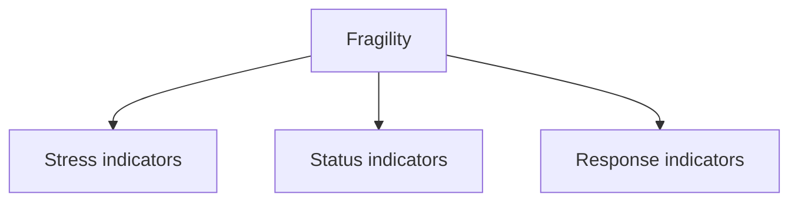
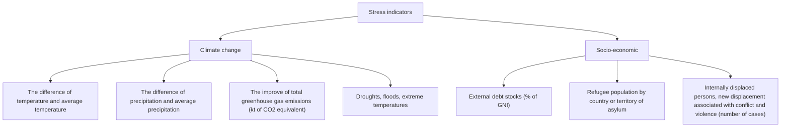
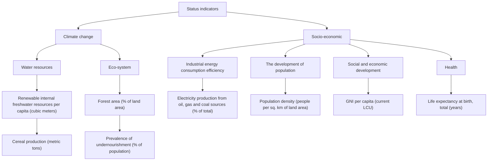
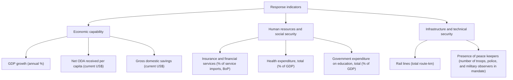
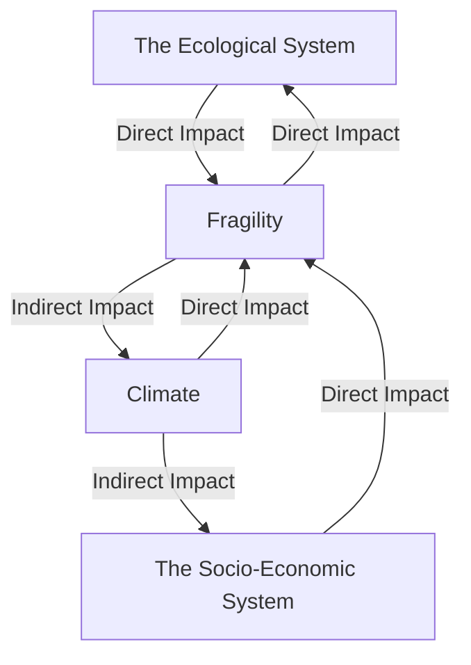

For office use only

T1

T2

T3

T4

Team Control Number

89499

Problem Chosen

E

For office use only

F1

F2

F3

F4

2018

MCM/ICM

Summary Sheet

(Your team's summary should be included as the first page of your electronic submission.)

Type a summary of your results on this page. Do not include the name of your school, advisor, or team members on this page.

## An Evaluation Model of State Fragility related to Climate Change Based on the PSR Model and Entropy Weight Method

Climate change is likely to influence the fragile situation of a state. Thereby, we propose an evaluation model in order to derive a quantitative expression of state fragility as well as the relationship between it and climate change.

First, theP-S-R (Pressure-State-Response) Model is applied in our model to offer a distinct framework of the relationship between fragility and related indicators. The model follows a domain-theme-feature structure. Climate change is involved through direct indicators and indirect impact on social and economic environment. Thereafter, we derive the equation of fragility by Entropy Weight Method. Furthermore, we apply the Discriminant Analysis to obtain the value range of fragile, vulnerable and stable states. The corresponding results are0.4991-1, 0.2196-0.4991, and 0-0.2196.

Second, we determine the fragility in Sudan from 2012 to 2016, which shows a fluctuation in the limited fragile range. Meanwhile, it is observed that climate change mainly influences on the food security in Sudan through Gray Relational Analysis. Then by establishing a new framework without climatic indicators directly, we acquire the fragility without climate change, and the result is that the fragility declines.

Third, for Egypt, our model shows that the fragile situation isgenerally deteriorating from 2012 to 2016 but still regarded as vulnerable. We obtain that climate change mainly impacts on health condition in Egypt. Then the tipping point of fragility is determined as 0.4991 (value of fragility) in this section. By Line Regression Method, we then predict that Egypt would become a fragile state in 2028.

Fourth, we propose a series of interventions based on the model, focusing on climate control and improving the coping capability of a country respectively. The total cost of interventions is calculated as 1,120,070,0000 dollars, and the results show that the fragile situation of Egypt would be 8.92% better after implementing interventions.

Lastly, we illustrate the comprehensive modifications of model for better applicable to different sizes of state, mostly concentrated on the indicators we choose.

## 1 Introduction...

1.1 Background..  
1.2 Restatement of the problem.

## 2 Assumptions and Notations......... 3

2.1 Assumptions.. . 3  
2.2 Notations... 3

## 3 The Model of Fragility...

3.1 P-S-R Model.. . 3  
3.2 P-S-R Framework for state fragility. 4

3.2.1 P-S-R Framework.  
3.2.2 Analysis of Impact of Climate........

3.3 Evaluate the State Fragility.

3.3.1 Entropy weight method.  
3.3.2 Equation of State Fragility. . 8

3.5 Model Test.. . 8

3.5.1 Model Test on 30 countries...... 8  
3.5.2 Classification of Fragile, vulnerable and stable states.......... O

## 4 Fragility and Climate Change in Sudan....

4.1 Fragile Situation and Climatic Impact. ...10

4.1.1 Current Fragility in Sudan........ ..... 10  
4.1.2 How Climate change impacts on fragile Sudan... ..11

4.2 A Less Fragile Sudan without influence of Climate.. .. 11

## 5 Fragility and Climate Change in Egypt......

5.1 Fragile Situation and Climatic Impact. ...12

5.1.1 Current Fragility..... ... 12  
5.1.2 How Climate change impacts on fragile Sudan... ...13

5.2 The tipping point of fragility. ...14

## 6 Intervention Plan for Better Stability....... ..... 14

6.1 Interventions.... ....15

6.1.1 Plan about climate control.. ... 15  
6.1.2 Plan about coping ability.. ... 15

6.2 Costbased on Egypt.. .... 16  
6.3 Effects of interventions. ...16

## 7 Modifications for regions of different sizes......

7.1 Inapplicability of model for smaller or larger states. ... 17  
7.2 Modifications for regions of different size. .17

## 8 Strengths and Weaknesses.. .. 18

8.1 Strengths. ....18

8.2 Weaknesses.. .... 18

## 9 Future work.. . 19

## References...... ...21

## 1 Introduction

## 1.1 Background

Climate-fragility risks pose threats to the stability of states and societies. In other words, climate change has already had observable effects on environment [1] and further on the state fragility. In this paper, we define the problem of climate change as the impact of superimposition of natural change cycle and human activities, rather than attribution of human activities or attribution of natural phenomena purely. [2]

States are classified as fragile if they lack the capacity to discharge their normal functions and drive forward development [3]. In fragile regions where inequality persists and the government is unable to respond to stresses, it has been found that the impacts of climate change on water, food and land will augment existing pressures. That is to say that dynamics of state fragility may be exacerbated by climate change impacts and that the consequence of this is reduced adaptation capacity [4]. Vice versa, the downward trend of state stability will also exacerbate the climate change. Terrible natural and political environment further enables resources shortage, migration, weak governance and even violent conflict.

## 1.2 Restatement of the problem

According to the problem, we are required to develop an appropriate model which contribute to the identification of a country’s fragility and the impact of climate change at the same time. After that, model instantiation should be implemented on concrete countries. Meanwhile, propose a series of interventions to mitigate the risk of climate change and further modifications for regions of different sizes.

Research work about fragile state has sprung up recent years around the world, especially for the west. 11 kinds of current indices for fragility are listed in [5], including Country Indicators for Foreign Policy Fragility Index (CIFP), Harvard Kennedy School Index of African Governance (IAG), Fragile States Index (FSI), etc. All these diverse evaluation indices are based on the Buckets effect and derived quantificationally. Nevertheless, scarcely do current indices take climate change into account, which becomes more and more non-negligible.

Thereby, on the foundation of the related work above, we establish a comprehensive evaluation model based on Entropy Analysis Method, so as to represent the extent of fragility as well as how climate change contributes to it. Next, we complete evaluation on both fragile Sudan and relatively not so fragile Egypt based on our model, deriving a tipping pointas the boundary value. Meanwhile, we acquire both the fragility quantificationally and the level of fragility. Furthermore, interventions of climatic controlling and better coping capabilityare proposed with the cost. Finally, we put forward modifications in order to exacerbate the capability of ourmodel on smaller and lager states.

## 2 Assumptions and Notations

## 2.1 Assumptions

(1) The indicators of a country's fragility are mainly socio-economic, ecological and climate. Based on that we establishour evaluation model, where the choice of indicators is comparatively comprehensive, since it offers convenience for a more integrated consideration of state fragility.  
(2) The political situation in Egypt is stable during intervening. Although Egypt is politically unstable in reality, this assumption is beneficial for calculating the total cost of our interventions.  
(3) Egypt will follow the trends in massive countries based on indicators like GDP, population and Industry. These trends are generally true. Thus, if Egypt follow them, we are able to derive quantitative relationship between a number of indicators so as to predict the economic growth in Egypt, based on current values of indicators.

## 2.2 Notations

Table 1 Notations of the model

<table><tr><td>Symbol</td><td>Notation</td></tr><tr><td> $X_{ij}$ </td><td>The value of the  $jth$  indicator in the  $ith$  year</td></tr><tr><td> $Y_{ij}$ </td><td>The standardized data corresponding to indicators $X_{ij}$ </td></tr><tr><td> $P_{ij}$ </td><td>The proportion of the  $jth$  indicator in the  $ith$  year of that indicator</td></tr><tr><td> $E_j$ </td><td>The information entropy of each indicator</td></tr><tr><td> $g_j$ </td><td>Variation coefficient</td></tr><tr><td> $W_j$ </td><td>The weight of each indicator</td></tr><tr><td> $F_i$ </td><td>Fragilityin the  $ith$  year</td></tr></table>

## 3 The Model of Fragility

Our model for the evaluation of state fragility is based on the P-S-R model and the Entropy Weight Method. Initially, we apply the former to determine and collect indicators that influence the fragility of a state, especially the indicators related to climate change. Then our model adopts the latter as the way of deriving an equation about these selected indicators, which enables the representation and calculation of state fragility quantificationally. After that, we determine the range of three criteria of fragility, namely fragile, vulnerable and stable, by Discrimination Analysis.

## 3.1 P-S-R Model

P-S-R (Pressure-State-Response) is an evaluation model commonly used in subdisciplines of ecosystem health assessment in the field of environmental quality

assessment. Through the thinking logic"reason-effect-response", the PSR model reflects the interaction between humans and the environment [6]. Mankind acquire the resources necessary for its survival and development from the natural environment and meanwhile, dischargethe waste to the nature. In this way, the reserves of natural resources and the quality of the environment are changed. And in return, variation in the state of nature and the environment impacts onsocio-economic activities and welfare of human beings. Furthermore, the society responds to these changes by means of environmental, economic and sectoral policies, as well as changes in consciousness and behavior. This cycle of reciprocation constitutes a pressure-state-response relationship between humans and the environment.

The PSR model answers the three basic questions of sustainable development, that is, "what happened, why it happened, how we do it." To represent and solve these more concretely, three categories of indicators are defined in the PSR model, namely exposure, sensitivity and adaptive capability. More specifically, the exposure characterizes howmortalsocio-economic activities impact on the environment, such as the environmental damage and disturbance due to resource acquisition, material consumption and emissions caused by various industries. Meanwhile, the sensitivity characterizes the environmental status and the change of environment itself during a specific period of time, including the current status of ecosystems and the natural environment, the quality of life and health of human beings. Finally, the adaptive capacity refers to how societies and individuals act so as to mitigate, deter, recover and prevent the negative effects of climate and economic factors, as well as remedial measures for the existing change in ecological environment that is not conducive to human existence.

## 3.2 P-S-R Framework for state fragility

## 3.2.1 P-S-R Framework

The mutual effect between state fragility and environment (both political and natural) mentioned above accords with the basic background of PSR model, which means that it is reasonable to interpret the relationship between state fragility and environment as a pressure-state-response relationship.

flowchart

Figure 1 The Domain Layer

For fragility, the original three categories of indicators correspond to stress indicators, status indicators and response indicators respectively as shown in Figure1. More exactly, the stress indicators refer to the catastrophic condition of a state, the status indicators own relatively indirect relationship with fragility, and the response indicators represent the capability of coping with negative influence of a state. Note that no clear differentiation exists between the stress indicators and the status indicators. These three categories constitute the domain layer.

Then the theme layer further refines the domain layer. First, we define the themes of stress indicators as climate change and socio-economic. The concrete indicators and the structure are shown in Figure 2.

flowchart

Figure 2 The Theme Layer and Feature Layer of Stress Indicators

Second, the themes of status indicators are defined as water resources, eco-system, social and economic development, the development of population, health andIndustrial energy consumption efficiency. The structure of both theme layer and feature layer is shown in Figure 3.

flowchart

Figure 3 The Theme Layer and Feature Layer of Status Indicators

Finally, the themes of response indicators are defined as economic capability, human resources and social security, infrastructure and technical security. The structure of both theme layer and feature layer is shown in Figure 4.

flowchart

Figure 4 The Theme Layer and Feature Layer of Response Indicators

While selecting the indicators, we give consideration to both scientificity and effectiveness, since it is kind of difficult to acquire correlative date for some special regions whose fragility are comparatively high. Moreover, we take the influence of government on fragility into account and regard it as an independent part, which contributes greatly to the more concrete analysis of state fragility as well as the interventions to mitigate fragility. Similarly, we take climate change as an individual theme including several indicators, which enables and augments the representation and interpretation of how climate change impacts on fragility.

## 3.2.2 Analysis of Impact of Climate

flowchart

Figure 5 The Coupling System

In addition to the 23 indicators which involving direct climatic indicators, we select above in section 3.2.1, we further present the indirect part of climate change as a more specific and effective explanation. Given that climate, ecological environment and social-economic environment constitute a coupling system [7] as shown in Figure 5, it is undoubtedly massively difficult to determine a certain quantitative relation. As a result, the indirect impart here is not equal to quantitative impact but works as guidance

for proceeding interventions instead.

We apply the Gray Relational Analysis(GRA) to obtain climate variables with the largest impact on some social indicators, namely the most relevant indicators, in order to draw effective instructions for proposing interventions. Gray Relational Analysis use gray relational degree as one metrics of the relational degree between the target and other related factors. In the process of system development, if the tendency of the change of two factors is consistent, that is, the degree of synchronization changes is high, the correlation between the two is higher; on the contrary, it is lower. That is to say, through GRA we can get the relationship between factors and the target in a numerical way, which simplifies further work.

Based on the indicators provided in the Fifth Assessment Report of IPCC, we select some with dramatic change and obvious impacts on society and economy. The final selected alternative variables are respectively CO2, temperature, land cover rate, etc.

## 3.3 Evaluate the State Fragility

## 3.3.1 Entropy weight method

With the main factors related to the capability of a region to offer clean water, the second step in our evaluation model is to determine the weight of each factor so that the equationof state fragility can be determined.

In this section we adopt the Entropy Weight Method as the means of delivering each factor's weight. The basic idea of the Entropy Weight Method is that entropy is a measure of the degree of disorder of the system. If the information entropy of an indicator is smaller, the greater the amount of information provided by the indicator, the greater the role played by the indicator in comprehensive evaluation, and the higher the weight should be. In other words, the size of the indicator variability determines the objective weight. It consists of several steps.

1) Above all, assuming that state fragility has been observed for m years and the number of indicators is n, we regard $X ^ { \cdot _ { \# } } \left( i = 1 , 2 , \dots , m ; j = 1 , 2 , \dots , n \right)$ as the value of the $j t h$ indicator in the ith year. Thereby, $X ^ { \cdot \cdot _ { \# } } ( i = 1 , 2 , \dots , m ; j = 1 , 2 , \dots , n )$ constitutes the matrix X.

2) Standardization. The value of each indicators should be standardized so as to proceed the following steps, which is actually the homogenization of heterogeneousindicators. We define the standardized data corresponding to indicators $X _ { \# } ^ { * } \ ( i = 1 , 2 , \ \dots \ , m ; \ j = 1 , 2 , \ \dots \ , n ) \ \mathrm { a s } \ Y ^ { * } \scriptstyle \# ( i = 1 , 2 , \ \dots \ , m ; \ j = 1 , 2 , \ \dots \ , n )$ separately.

$$
Y _ {i j} = \frac {X _ {i j} - m i n (X _ {i})}{m a x (X _ {i}) - m i n (X _ {i})}
$$

where $\scriptstyle i = 1 , 2 , \dotsc , m ; j = 1 , 2 , \dotsc , n .$

3) Calculate the proportion of the jth indicator in the ith year of that indicator.

$$
P _ {i j} = \frac {X _ {i j}}{\sum_ {i = 1} ^ {m} X _ {i j}}
$$

$w h e r e i = 1 , 2 , . . . , m ; j = 1 , 2 , . . . , n .$

4) Next, derive the information entropy E of each factor. According to the definition of information entropy, it is expressed as follows.

$$
E _ {j} = - \ln (n) ^ {- 1} \sum_ {i = 1} ^ {n} p _ {i j} \ln p _ {i j}
$$

5)Calculate the coefficient of variation of the jth indicator. For each indicator, the larger the difference, the more important it accounts for the evaluation, the smaller the information entropy. The variation coefficient is defined as follows.

6) Given the information entropy $\mathrm { E } _ { < } , \mathrm { E } _ { \mathrm { P } } , \mathrm { E } _ { \mathrm { Q } } , . . . ,$ the weight of each indicatorW> can be derived as the following equation.

$$
W _ {j} = \frac {g _ {j}}{\sum_ {j = 1} ^ {n} g _ {j}}
$$

$w h e r e i = 1 , 2 , . . . , m ; j = 1 , 2 , . . . , n .$

## 3.3.2 Equation of State Fragility

At last, we determine the equation of state fragility can be determined as the sum of multiplication of the weight and value of each indicator as follows.

$$
F _ {i} = \sum_ {j = 1} ^ {n} W _ {j} * Y _ {i j}
$$

where $\scriptstyle { i = 1 , 2 , . . . , m ; j = 1 , 2 , . . . , n ; }$  is the state fragility in the ith year.

## 3.5 Model Test

## 3.5.1 Model Test on 30 countries

Given that our evaluation model is a generalized model whose parameters cannot be determined until the target state is chosen, we test it on 30 countries respectively so as to certify its robustness and validity. And the 30 countries are SouthSudan, Yemen, Syria, Chad, Iraq, Ethiopia, Niger, Libya, Myanmar, NorthKorea, Nepal, Mozambique, BurkinaFaso, Cambodia, Madagascar, Laos, Turkey, Russia, Azerbaijan, Gabon, Paraguay, Samoa, Botswana, Montenegro, Argentina, Poland, United States, Belgium, Canada, and Norway.

line chart

| Country       | Our Model | FSI   |
| ------------- | --------- | ----- |
| SouthSudan    | 115       | 0.65  |
| Syria         | 112       | 0.63  |
| Iraq          | 108       | 0.60  |
| Niger         | 105       | 0.58  |
| Myanmar       | 102       | 0.55  |
| Nepal         | 98        | 0.52  |
| BurkinaFaso   | 95        | 0.50  |
| Madagascar    | 92        | 0.48  |
| Turkey        | 88        | 0.45  |
| Azerbaijan    | 85        | 0.42  |
| Paraguay      | 80        | 0.40  |
| Botswana      | 75        | 0.38  |
| Argentina     | 70        | 0.35  |
| United States | 65        | 0.32  |
| Canada        | 60        | 0.30  |

Figure 6 Comparison of The Rank Based on Our Model And FSI

From Figure 6 above, it can be interpreted that the rank of states of fragility according to the evaluation from our model differs from that according to the Fragile State Index, but in a reasonable range. The tendency of the two lines is similar. It is understandable for several reasons, especially for that our model takes indicators about climate change into account. In this way, countries with relatively small size and impressionable to climate change are prone to show an increase in fragility. Forexample, the fragility of Samoa increases compared with that in Fragile State Index, for it is located in Pacific isles suffered from extreme fluctuant climate throughout the year. Similarly, Laos that often encounters natural disasters like typhoons also shows a relative increase when compared with Fragile State Index.

## 3.5.2 Classification of Fragile, vulnerable and stable states

Based on the outcome of 30 countries in section 3.5.1, we then work on obtaining a relatively accurate range of three levels of fragility, namely fragile, vulnerable and stable. Here, we adopt the Discriminant Analysis, a statistical analysis to predict a categorical dependent variable (called a grouping variable) by one or more continuous or binary independent variables (called predictor variables). More specifically, in this section, weselect certain countries in the relatively top, middle and back part in the rank of Fragile State Indexas samples for classification. In the meantime, we take other countries as input for Discriminant Analysis and regard the fragility of countries in the junction between two categories as the boundary value. The results are shown below in Table 2.

Table 2Range of three levels

<table><tr><td>Level</td><td>Range</td></tr><tr><td>Fragile</td><td>0.4991-1</td></tr><tr><td>Vulnerable</td><td>0.2196-0.4991</td></tr><tr><td>Stable</td><td>0-0.2196</td></tr></table>

## 4 Fragility and Climate Change in Sudan

In this section, we implement our evaluation model on Sudan, determining its fragility and analyze the influence of climate change on it objectively. Furthermore, we instantiate our model in another condition where the effect of climate change is not taken into account through removing climatic indicators, which indicates that the state would be less fragile in this way.

## 4.1 Fragile Situation and Climatic Impact

## 4.1.1 Current Fragility in Sudan

Applying our model to Sudan with the collected data from the World Bank, we determine the fragility of Sudan and the level from 2012 to 2016 as follows.

stacked bar chart

| Year | Stress Indicator | Status Indicator | Response Indicator | Fragility |
|------|------------------|------------------|--------------------|---------|
| 2012 | 0.15             | 0.35             | 0.25               | 0.6     |
| 2013 | 0.15             | 0.35             | 0.25               | 0.6     |
| 2014 | 0.15             | 0.35             | 0.25               | 0.6     |
| 2015 | 0.15             | 0.35             | 0.25               | 0.6     |
| 2016 | 0.15             | 0.35             | 0.25               | 0.6     |

Figure 7 Fragility of Sudan

It can be obtained from the Figure 7 that during the five years, Sudan is still in severe fragile condition though its fragility fluctuated in a relatively small range like “W”, and on the whole it declined, which meets the reality. More specifically, the stress indicators, the status indicators, the response indicators are shown in Figure 8. It can be concluded that from 2012 to 2015, the change of fragility mainly comes from the change of response indicators as 57.39%, while from 2015 to 2016, the increase in fragility mainly comes from the increase in stress indicators as 78.1%.

line chart

| Year | Stress Indicators | Status Indicators | Response Indicators |
|------|-------------------|-------------------|---------------------|
| 2012 | 0.13              | 0.24              | 0.26                |
| 2013 | 0.12              | 0.24              | 0.23                |
| 2014 | 0.11              | 0.24              | 0.24                |
| 2015 | 0.12              | 0.24              | 0.22                |
| 2016 | 0.13              | 0.24              | 0.22                |

Figure 8 Variance of Stress, Status and Response Indicators in Sudan

## Stress Indicators

For the stress indicators including climate change and socio-economic, the variance of precipitation in dry and wet season both showed almost the same fluctuation from 2012 to 2016. Therefore, we can conclude that during the 5 years, it still received a greater threat and impact from the global climate, and the imbalance of eco-system has not yet been fundamentally alleviated. Moreover, the population of refugee by country or refuge area kept increasing dramatically, which directly compounded the pressure on the government and reflected the poor efficiency of government's measures and action at the same time.

## Status Indicators

For the status indicators including natural environment and social-economic, GNI per capita showed an upward trend especially between 2014 and 2015 when it almost doubled, meanwhile, both arable land per capita and forest area kept declining during the five years. To sum up, indicators pertaining to the status indicators showed a benign development condition on the whole.

## Response Indicators

For the response indicators including economic capability, human resources and social security, infrastructure and technical security, government expenditure on education totally (% of GDP) showed a positive tendency though the change is slow and, as well as health expenditure (% of GDP), while Net ODA received per capita maintained decreasing year by year significantly. All of the change indicates that adaptability of Sudan to external environment improved.

## 4.1.2 How Climate change impacts on fragile Sudan

Applying the Gray Relational Analysis to Sudan, we determine the relationship between climatic indicators and some social-economic indicators as shown in Table 3.

Table 3 Relationship Index between climatic indicators and social-economic indicators

<table><tr><td></td><td>Per capita renewable inland freshwater resources</td><td>Cereal production</td><td>Prevalence of undernourishment</td></tr><tr><td>CO2</td><td>0.0171</td><td>0.1367</td><td>0.0942</td></tr><tr><td>Temperature</td><td>0.0324</td><td>0.0942</td><td>0.1023</td></tr><tr><td>Precipitation</td><td>0.0514</td><td>0.1023</td><td>0.0786</td></tr><tr><td>Land coverage</td><td>0.0223</td><td>0.0786</td><td>0.0622</td></tr><tr><td>Extreme Weather</td><td>0.0308</td><td>0.0522</td><td>0.1367</td></tr></table>

From the table above, we can conclude that climatic indicators mostly impact the cereal production, namely the food security of Sudan, since the degree of relationship between them is relatively high on the whole. Therefore, in Sudan, climate change mainly influences the fragility through food security.

## 4.2 A Less Fragile Sudan without influence of Climate

In order to get the how the fragility of Sudan would change without the influences of climate change, we directly remove the indicators related to climate in our model and run it again. The results of 10 countries including Sudan are shown below in Table 4 in the form of original and subsequent rank.

Table 4 Ranks of countries' fragility with and without climate impact

<table><tr><td>Country</td><td>Rank with climatic impact</td><td>Rank without climatic impact</td><td>Change of Rank</td></tr><tr><td>SouthSudan</td><td>2</td><td>1</td><td>-1</td></tr><tr><td>Somalia</td><td>1</td><td>2</td><td>+1</td></tr><tr><td>CentralAfricanRepublic</td><td>4</td><td>4</td><td>0</td></tr><tr><td>Yemen</td><td>3</td><td>3</td><td>0</td></tr><tr><td>Sudan</td><td>6</td><td>7</td><td>+1</td></tr><tr><td>Syria</td><td>5</td><td>5</td><td>0</td></tr><tr><td>CongoDemocraticRepublic</td><td>7</td><td>6</td><td>-1</td></tr><tr><td>Chad</td><td>8</td><td>9</td><td>1</td></tr><tr><td>Afghanistan</td><td>9</td><td>10</td><td>+1</td></tr><tr><td>Iraq</td><td>10</td><td>8</td><td>-2</td></tr></table>

It can be inferred from the table that the fragile situation of Sudan is relatively dampened since its rank goes down, neglecting the impact of climate change.

## 5 Fragility and Climate Change in Egypt

In this part, we complete another case study onEgypt about fragility based on our evaluation model, which is out of the top 10 fragile states. Through calculation of the model, we measure the fragility of Egypt, as well as how and when climate change may increase that. Based on the work above, we further determine the tipping point that a country become fragile and make relevant predictions.

## 5.1 Fragile Situation and Climatic Impact

## 5.1.1 Current Fragility

Applying our model to Egypt with the collected data from the World Bank, we determine the fragility of Sudan and the level from 2012 to 2016 as follows.

stacked bar chart with an overlaid line

| Year | Stress Indicators | Status Indicators | Response Indicators | Fragility |
|------|-------------------|-------------------|---------------------|---------|
| 2012 | 0.14              | 0.17              | 0.13                | 0.45    |
| 2013 | 0.12              | 0.16              | 0.15                | 0.43    |
| 2014 | 0.14              | 0.16              | 0.15                | 0.46    |
| 2015 | 0.15              | 0.16              | 0.15                | 0.47    |
| 2016 | 0.13              | 0.16              | 0.17                | 0.48    |

Figure 9 Fragility of Egypt  
It can be inferred from the Figure 9 that the fragile situation of Egypt showed a

generally deteriorate trend from 2012 to 2016 as its fragility fluctuated.More specifically, the stress indicators, the status indicators, the response indicatorsare shown in Figure 10.It can be concluded that from 2012 to 2013, the change of fragility mainly comes from the change of response indicators and status indicators as 77.87%, while from 2013 to 2016, the increase in fragility mainly comes from the increase in response indicators as 83.4%.

line chart

| Year | Stress Indicators | Status Indicators | Response Indicators |
| ---- | ----------------- | ----------------- | ------------------- |
| 2012 | 0.14              | 0.15              | 0.15                |
| 2013 | 0.11              | 0.15              | 0.16                |
| 2014 | 0.14              | 0.15              | 0.17                |
| 2015 | 0.15              | 0.15              | 0.17                |
| 2016 | 0.13              | 0.15              | 0.20                |

Figure 10 Variance of Stress, Status and Response Indicators in Egypt

## Stress Indicators

For stress indicators, the variance of precipitation in dry season is relatively steady while that in wet season decreaseddramatically. The temperature in both wet and dry season also showed an apparent change. Therefore, we can conclude that during the 5 years, itsuffered from more severe threat and impact from the global climate than Sudan, and the imbalance of eco-system has not yet been fundamentally alleviated as well. Moreover, increase in other indicators like Present value of external debt (% of GNI) and the population of refugee by country or refuge area reflected the poor efficiency of government's measures.

## Status Indicators

The status indicators, except for the slight rise from 2012 to 2013, retained a relatively stable tendency during the 5 years. What resulted in this is that most concrete indicators involved change quite gently like forest coverage, dense of population and so on. However, though slight, the variance still showed the rough living environment in Egypt.

## Response Indicators

As shown in the figure, the response indicators first experienced a comparatively reduction in Egypt from 2012 to 2013, which mainly on account of the halving of Net ODA received per capita. Without enough aid, it may be much more difficult for Egyptian governments to deal with troubles. Thereby, though contributed less compared with other two kinds of indicators, the response indicators still account greatly when evaluating the state fragility.

## 5.1.2 How Climate change impacts on fragile Sudan

Applying the Gray Relational Analysis to Egypt, we determine the relationship between climatic indicators and some social-economic indicators as shown in Table5.

Table 5Relationship Index between climatic indicators and social-economic indicators

<table><tr><td></td><td>Per capita renewable inland freshwater resources</td><td>Cereal production</td><td>Prevalence of undernourishment</td></tr><tr><td>CO2</td><td>0.0223</td><td>0.1076</td><td>0.1431</td></tr><tr><td>Temperature</td><td>0.04545</td><td>0.0998</td><td>0.0879</td></tr><tr><td>Precipitation</td><td>0.0583</td><td>0.11415</td><td>0.11006</td></tr><tr><td>Land coverage</td><td>0.0282</td><td>0.08925</td><td>0.0622</td></tr><tr><td>Extreme Weather</td><td>0.0368</td><td>0.0677</td><td>0.1367</td></tr></table>

From the table above, we can conclude that climatic indicators mostly impact the prevalence of undernourishment, namely the medical condition of Egypt, since the degree of relationship between them is relatively high on the whole. Thus, in Egypt, climate change mainly influences the fragility through medical condition.

## 5.2 The tipping point of fragility

As what illustrated in classification of fragility, the tipping point is actually the boundary value between fragile and vulnerable. Thereby, we define the tipping point as 0.4991 (value of fragility), arriving at which means this country is fragile.

After that, we adopt Multi Factor Line Regression Method to predict when Egypt would become a fragile country as defined, by forecasting indicators including the population of refugee by country, precipitation, density of population, health condition, etc. The outcome is shown in Figure11 as follows.

stacked bar chart

| Year | Stress Indicators | Status Indicators | Response Indicators | Fragility |
|------|-------------------|-------------------|---------------------|---------|
| 2017 | 0.13              | 0.15              | 0.19                | 0.45    |
| 2018 | 0.13              | 0.15              | 0.19                | 0.46    |
| 2019 | 0.13              | 0.15              | 0.19                | 0.46    |
| 2020 | 0.14              | 0.15              | 0.19                | 0.47    |
| 2021 | 0.13              | 0.15              | 0.19                | 0.47    |
| 2022 | 0.13              | 0.15              | 0.19                | 0.48    |
| 2023 | 0.12              | 0.15              | 0.19                | 0.48    |
| 2024 | 0.14              | 0.15              | 0.19                | 0.47    |
| 2025 | 0.15              | 0.15              | 0.19                | 0.47    |
| 2026 | 0.15              | 0.15              | 0.19                | 0.47    |
| 2027 | 0.14              | 0.15              | 0.19                | 0.48    |
| 2028 | 0.12              | 0.15              | 0.19                | 0.48    |
| 2029 | 0.13              | 0.15              | 0.19                | 0.49    |

Figure 11 Prediction of Fragility in Egypt

As indicated in the figure, we can conclude that Egypt would arrive at a truly fragile situation in2028, after struggling for 11 years since 2017. Without additional interventions, this tendency is unpreventable in a way.

## 6 Intervention Plan for Better Stability

Based on our evaluation model accompanied with the cases of Egypt, we come up with a series of interventions of two kinds, the one is to control climate change and the other is to strengthen the coping capability starting from response indicators. How these interventions work has been shown through our model, at the same time, we list the total cost clearly.

## 6.1 Interventions

## 6.1.1 Plan about climate control

## 1) Droughts, floods, extreme temperatures

Undertaking water conservancy projects is an excellent solution for droughts and floods, since water conservancy can play a role of regulating and replenishing the water of the river. More specifically, it is able to shut down some of the water during floods and release the water from reservoirs to ease the drought. Additionally, returning farmland to forestry or grassland is also recommendable, since trees and grass can conserve part of water.Thereafter, reducing carbon emissions and slowing the warming of the earth may be effective ways to mitigate extreme weather.

## 2) Total greenhouse gas emissions (kt of CO2 equivalent)

The CO2-concentration is one of the most decisive indicators of global warming, thus reducing it is also capable of dampening the environmental degradation. Multiple means can be effective for that, like modifying technology, improving energy efficiency, energy saving, adjusting industrial structure, the development of energy-saving and environment-protecting industry.

## 6.1.2 Plan about coping ability

## 1) Economic capability

## Optimization and upgrading of industrial structure

For the purpose of improving economic capability, industrial structure is in need of optimizing and upgrading. Governments should better speed up transformation and upgrading of traditional industries, deepen the integration of informatization and industrialization, strive to foster strategic emerging industries, and actively cultivate new formats and new business models and build a new system for the development of modern industry. In the final analysis, the competition of comprehensive national strengthis a competition of innovation. Thereby, it is necessary to further implement the innovation-driven development strategy and promote scientific and technological innovation of all kinds.

## Develop advantageous local industries

Starting from local reality, it is of great help and significance to take market as guideline and develop economy with special characteristics through suitable measures with local conditions. In this way, the local conditions for readjusting production structure, increasing income and enhancing product competitiveness can be benefited [5].Multiple countermeasures include combining local advantageous with market requirement and develop industry and product with special characters.

## 2) For human resources and social security

## Promote catastrophe insurance

In allusion to Insurance and financial services (% of service imports, BoP), it helps if catastrophe insurance can be promoted and applied widely in a country. Catastrophe is a less frequent but destructive risk. Government and insurance industry should strengthen catastrophe risk prediction and early warning, as well as catastrophe risk management, building effective catastrophe prevention system and catastrophe compensation mechanism as soon as possible [8].

## 3) Infrastructure and technical security

## Augment railroading and peacekeeping

The contradiction between the shortage of energy resources and the deterioration of the environment has forced many countries to re-understand the importance of accelerating the development of the railway [9]. Moreover, for war zones, peacekeepers work as an important source of security safeguard.

## 6.2 Costbased on Egypt

Take Egypt as example, we analyze and estimate the total cost of above interventions, listed in Table 6 below. Some calculation formulas are listed as follows.

Table 6 Interventions and the cost

<table><tr><td>Measure</td><td>Cost</td></tr><tr><td>Catastrophe Insurance</td><td>50,000,000 dollars</td></tr><tr><td>Peacekeepers</td><td>70,000 dollars</td></tr><tr><td>Education</td><td>40,000,000 dollars</td></tr><tr><td>Railroading</td><td>460,000,000 dollars</td></tr><tr><td>Medical treatment</td><td>50,000,000 dollars</td></tr><tr><td>Economic Transition</td><td>500,000,000 dollars</td></tr><tr><td>Climatic improvement</td><td>20,000,000 dollars</td></tr><tr><td colspan="2">Total Cost</td></tr><tr><td colspan="2">1,120,070,000 dollars</td></tr></table>

The cost of education is derived by increasing the expenditure on education of Egypt from 375 million to 400 million, similarly, the cost of medical treatment is derived by increasing the health expenditure (% of GDP) from 5.64 to 5.8. And for railroading, we obtain the cost through increasing the mileage by 3%. These changes are reasonable with related theoretical support.

Furthermore, the total cost makes up for almost 3.365% of the GDP in Egypt, in a rational range. Therefore, our interventions are feasible without too much financial burden.

## 6.3 Effects of interventions

Simulating the implement of interventions on Egypt through our evaluation model, we obtain the effects of interventions as shown below in Figure 12.

line chart

| Year | Before | After |
|------|--------|-------|
| 2017 | 0.45   | 0.46  |
| 2018 | 0.46   | 0.47  |
| 2019 | 0.44   | 0.46  |
| 2020 | 0.44   | 0.47  |
| 2021 | 0.45   | 0.48  |
| 2022 | 0.45   | 0.49  |
| 2023 | 0.45   | 0.49  |
| 2024 | 0.44   | 0.48  |
| 2025 | 0.44   | 0.48  |
| 2026 | 0.44   | 0.49  |
| 2027 | 0.43   | 0.49  |
| 2028 | 0.44   | 0.50  |

Figure 12 Fragility in Egypt Before and After Intervention

It can be included that our interventions enable the declination of fragility by almost8.93% on average, which further testifies that the impact of climate change is mitigated and the coping capability of Egypt.

## 7 Modifications for regions of different sizes

## 7.1 Inapplicability of model for smaller or larger states

## 1) For smaller regions like cities

It is not so suitable to apply our model to evaluate the fragility of such a small region like a city. First, some indicators in the existing model may be unavailable. For example, indicators such as long-term foreign debt and CPIA are utilized to evaluate the condition of a country, which may be less meaningful for a city. Second, we regard a country as a politically and economically independent entity, whereas cities are not of this nature. A city is influenced by national policies and other factors and then the fragility increases or decreases. For example, some countriestend to call various resources to maintain the stability ofitseconomic and political center, which leads to a less fragile area.

## 2) For larger regions like continents

In terms of stress indicators, situation of a continent is more complicated than a country. For example, Asia stretches across the tropical climate, the temperate zone and the frigid zone, which means that directly measuring the climatic indicators of a continent is too rough to measure the risk of becoming fragile.In terms of status indicators, the situation of ethnic groups and religions in a continent is more complex than a country as well. Diversity of national system and strong independence among countries exist. For some indicators we use in the model like per capita arable land, the differences of countries are not taken into account if arable land is directly averaged. In terms of response indicators, when it comes to economic capability, countries with steady economic base may be very sound, boosting the economic ability of the entire continent to deal with the fragile factors deviating from reality.

## 7.2Modifications for regions of different size

## 1) For smaller regions like cities

When specific to a city, the overall framework of our model can maintain, that is, the categories of indicators including stress, status and response indicators and weighting to get the fragility of the region. For some national-level indicators, use the corresponding indicators at the regional level instead. When considering the response indicators, it is not feasible to consider the indicators of the city only, but such indicators as the country's ability to respond to the policies of the region and the country should be included.

## 2) For larger regions like continents

A continent is composed of various countries. Therefore, existing models can be used to count the degree of fragility of each country within a continent. Then based on a country's population, territorial area and other indicators, the analytic hierarchy process can be applied to determine the weight of each country. Finally, we can obtain the fragility of a continent through the sum of themultiplication of fragility and the weight ofeach country.

## 8 Strengths and Weaknesses

## 8.1 Strengths

## 1) Comprehensive and mostly objective indicators about fragility.

While searching for and selecting indicators about agility for its equation, we consider as comprehensively and meticulously as possible. Both indicators relevant with climate change and other irrelevant indicators like GDP are considered. Moreover, most of the indicators are selected as per what Fragile State Index takes into account, which means that our model is on a valid, significative basis.

## 2) Comparatively correct results of the model.

With restricted number of indicators and data, the fragility rank of our model is still similar to that of Fragility State Index proposed by the Fund for Peace. Particularly, the impact of climate change is highlighted in the results, which is novel and valid.

## 3)Extensive evaluation index system.

In our model of fragility, according to the "stress-state-response" framework, indicators are selected from three aspects including risk degree, sensitivity and vulnerability .The comprehensive evaluation index system is designed this way, reflecting the fragility of the country, the sensitivity of the state to risks and the capability to deal with the risk.

## 8.2 Weaknesses

## 1)Subjectivity and Limitation in the Process of Selecting the Indicators.

Although referring to other related literature as well as the factors involved in Fragile State Index, we still select the indicators with kind of subjective concept. This is unavoidable without enough literature.

## 2) Imprecise Classification of Fragility.

Our classification of fragility, namely the range of fragile, vulnerable and stable, is based on the outcome of 30 selected countries in section3.5.1. The limited number of

countries restricts the accuracy of the classification, even if we apply the Discrimination Analysis for better classification.

## 3) Not All-inclusive Analysis of Sudan and Egypt.

In the analysis of Sudan and Egypt, we only assess the fragile condition for 5 years from 2012 to 2016, the date for which is rather restricted. In that way, our results of the analysis are not comprehensive and precise enough to represent the fragility of the two states.

## 9 Future work

As discussed in the weaknesses of the models, multiple possibilities exist for the development of a more precise form of our model. Therefore, in the future, a more comprehensive and definitive model would be developed in the following ways:

## 1) More precise and comprehensive data

Our model is built and analyzed based on the assumption that all of our collected data is all reliable due to the limited time, which is relatively inconsistent with the real world. Therefore, more dependable and realistic data corresponding to the real world is ought to be acquired by more careful researching.

## 2) Consider special countries

In particular countries where an indicator may so extreme that leads to the collapse of the entire country, failing to guarantee the basic livelihood of population. For instance, the extreme lack of water resources may have a significant impact on the country's fragility, while in the future work we may not include the country in the list of fragile regions. We can define a normalized value of each indicator as a critical point that seriously limits people's livelihood security. If this value is reached, the basic living conditions of population in the country would be severely restricted and the fragility would be greatly enhanced.

## 3)Consider the coupling relationship between climate andsocio-economic activities

The mutual influence is bound to exist due to the coupling relationship between climate and socio-economic activities. Our model, with climate runs through the model as the starting point, only takes into account a series of indirect and direct impacts of

climate that only starting from climate. Therefore, it is necessary to consider the coupling relationship between climate and socio-economic activities in the future.

## 10 Conclusion

To conclude, we first establish a comprehensive evaluation model based on the PSR model and Entropy Weight Method, so as to represent the fragility quantificationally. Furthermore, we apply Discriminant Analysis to determine the range of fragility for fragile, vulnerable and stable states respectively. Test of 30 countries shows that our model is robust and correct.

Thereafter, we implement model instantiations on Sudan, an extremely fragile state, and Egypt, a relatively not so fragile state. It can be illustrated from the results that the climate changemainly influences fragility through food security in Sudan and through medical condition in Egypt. Without the impact change the fragility of Sudan would be alleviated. After that, we define the tipping point as 0.4991 (value of fragility) and

complete predictions, deriving that Egypt would become a fragile country.

Then we put forward a series of interventions about mitigating climate change and improving coping ability,as well as the cost based on our model. Our interventions are able to mitigate the influence of climate change and further contributes to the stability of a state. At last, we modify our model to be applicable to smaller cities and larger continents better through substituting some original indicators while maintaining the framework.

## References

[1] Team N A S. Climate change impacts on the United States: the potential consequences of climate variability and change.[J]. 2001, 336(6077):10-.  
[2] Liu Yang.Study on the socio-economic impact of global climate change on the estuary of the Yangtze river delta[D]. East China normal university.2014.  
[3] David Marsden. Deconstructing Development Discourse: Buzzwords and Fuzzwords[J]. Development in Practice, 2007, 17(4-5):471-484.  
[4] Rüttinger L, Stang G, Dan S, et al. A New Climate for Peace – Taking Action on Climate and Fragility Risks. Executive Summary[J]. British Heart Journal, 2015, 38(8):877-877.  
[5] Mata J F, Ziaja S. Users’ guide on measuring fragility[J]. Country Indicators for Foreign Policy, 2009.  
[6] Feng Shan and Xu Changle.Summary of Development of Global Climate Change and Its Effects on Social Economy[J]. China Population Resources & Environment, 2014. v.24;No.165(s2):6-10.  
[7] Ai Yunhang.To Give Full Play to The Advantages of Resources In Mountainous Areas, To Vigorously Develop Economy with Special Characteristic[J].Chinese Journal of Agricultural Resources and Regional Planning.2005, 26(2):38-42.  
[8] Wang He. Reflections on the Establishment of Catastrophe Insurance System in China[J]. China Finance. 2005(7):50-52.  
[9] Liu Zhijun. Recognizing the current situation and pushing forward the harmonious development of railway construction to achieve the sound and rapid development of railways[J]. Railway Economics Research.2007 (1):18-33.