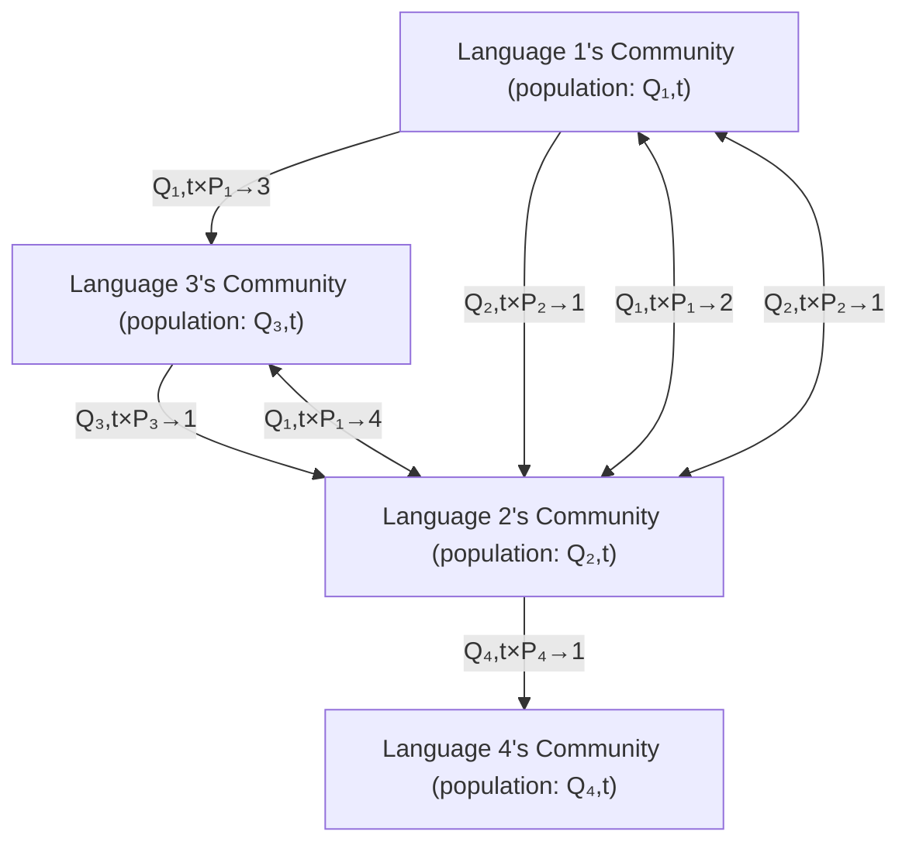
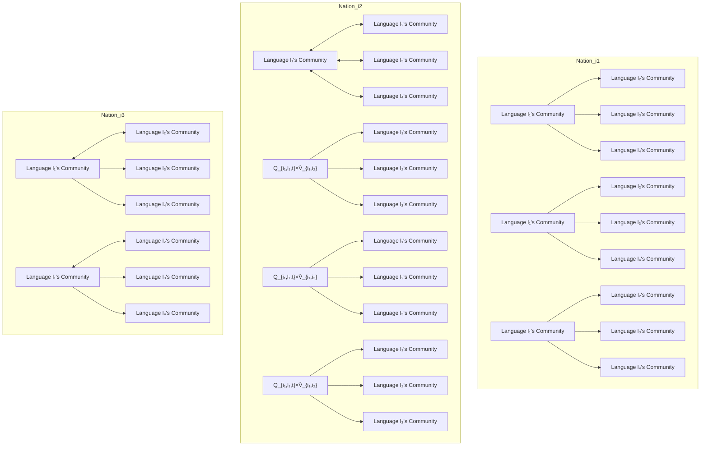

<table><tr><td colspan="2">For office use only</td></tr><tr><td>T1</td><td></td></tr><tr><td>T2</td><td></td></tr><tr><td>T3</td><td></td></tr><tr><td>T4</td><td></td></tr></table>

Team Control Number  
91566  
Problem Chosen  
B

For office use only

<table><tr><td>F1</td><td></td></tr><tr><td>F2</td><td></td></tr><tr><td>F3</td><td></td></tr><tr><td>F4</td><td></td></tr></table>

# 2018

# MCM/ICM

# Summary Sheet

# Forecasting the Language Distribution

## Summary

Language shift is a common and complicated phenomenon since ancient times, which has far-reaching influence on the development of the human civilization. The language shift is influenced by many factors. We study the geographically distributed language shift model and provide solutions based on language shift and economic benefits to the locations of new international offices for a service company.

To get the geographical language transformation model, we start off by creating a simple model, and then make it more sophisticated.

The Worldwide Language Shift Model reflects the situation when two or more languages communicate. The model takes into account factors such as government support, tourism, international business relations and technological progress.

The Domestic Language Shift Model is the application of the worldwide language shift model in country. We adjust some parameters to make this model fit the domestic situation better.

The Geographical Language Shift Model is based on the domestic language shift model. This model contains the impact of migration on language shift.

We collect rich and effective data, fit the unknown parameters and get the geographical distribution of various languages in the future. Through the sensitivity analysis, we prove the stability and error tolerance of the model. By the model implementation, we found that the geographical language distribution remains basically stable in the next 50 years.

To address the locations of international offices, we take into account the predicted geographical language distribution and the economic need. In our opinion, choosing the location of an international office should make the company more profitable. To this end, we establish a model of the impact of geographical language distribution on the company’s effectiveness. We identify the six cities most suitable for hosting international offices in both short and long terms are: Paris, Tokyo, Milan, Toronto, Bombay, Brussels. We also put forward our own ideas about the company’s long-term plan.

In a word, we predict the language development for the next 50 years according to the geographical distribution language shift model, and provide effective reference for the locations of international offices.

## Contents

1 Introduction. . . 4

1.1 Background 4

1.2 Restatement of the problem 4

1.3 Related Work 4

2 Assumptions and Notations . . . 5

2.1 Assumptions . . 5

2.2 Notations . 6

3 Model Construction . . . 6

3.1 Worldwide Language Shift Model 6

3.1.1 Factors . . . . 6

3.1.2 Data Pre-processing 7

3.1.3 Worldwide Language Shift Model Construction . . . 8

3.2 Domestic Language Shift Model 11

3.2.1 Domestic Language Shift Model Construction . . . . 11

3.3 Migration Model 12

3.3.1 Data Pre-processing 12

3.3.2 Migration Model Construction 12

3.4 Geographic Language Shift Model 13

3.4.1 Factors . . . . . 13

3.4.2 Geographic Language Shift Model Construction . . . . . . . . . . . 13

4 Model Implementation and Results . . . 14

4.1 Part I Problem A . . . 14

4.2 Part I Problem B . . . 15

4.3 Part I Problem C . . . 15

4.4 Part II Problem A 17

4.5 Part II Problem B 18

5 Sensitivity Analysis . . . . . 18

5.1 Sensitivity Analysis for Ki . . . . . 18

5.2 Sensitivity Analysis for domestic language distribution . . . . . 18

5.3 Sensitivity Analysis for Fitting Parameters . . . . 19

6 Strengths and weaknesses 19

6.1 Strengths . . . . 19

6.2 Weaknesses 20

6.3 Further work . 20

7 Conclusions . . . . . . 20

Team # 91566 Page 3 of 26

To: Chief Operating Officer

From: Investigation Team

Date: 12 February, 2018

Subject: Suggestions for New Office Locations

We have completed an analysis of the locations of your company’s international offices as well as the trends of global languages.

First, we set up a model of global language competition and summed up the rules of global language shift by collecting considerable and reliable data. We analyzed and pre-dicted the geographical distribution of global languages in the next 50 years. Second, based on the changes of languages, the recruitment cost and the development level of the city where the office is located in, we provided 6 suitable office locations. Finally, we combined scientific and technological development factors, and gave reasonable sugges-tions to the long-term plan of setting up new offices in the future.

Based on our analysis, here are some suggestions:

It is advisable to set up offices in the following six cities. The languages correspond to each office are as follows:

<table><tr><td>City</td><td>Country</td><td>Corresponding language</td></tr><tr><td>Paris</td><td>France</td><td>France, Spanish, English</td></tr><tr><td>Tokyo</td><td>Japan</td><td>Japanese, English</td></tr><tr><td>Milan</td><td>Italy</td><td>Italian, France, English</td></tr><tr><td>Toronto</td><td>Canada</td><td>English, French</td></tr><tr><td>Bombay</td><td>India</td><td>English, Hindustani, Bengali</td></tr><tr><td>Brussels</td><td>Belgium</td><td>France, Dutch, English</td></tr></table>

We do not recommend frequent replacements of office sites, because there is a cer-tain stability of the distribution of the world’s languages, no major changes would occur within a short time. At the same time, replacing an office is costly, and ad-versely affecting the company’s profits.

Profits brought by language advantages will be reduced due to the rapid expansion of global communications. While the cost of employing may increase, the amount of existing offices may no longer be optimal. If you can provide more specific data, we will be able to give more reasonable advice on the long-term plans for the new offices.

Our modeling analysis report contains more detailed theoretical information. Please contact us promptly if there are any questions.

## 1 Introduction

## 1.1 Background

It is generally taken for granted that language, as a concomitant of culture, can spread. With the trend of globalization and the world’s cultural exchange, language transfer and integration are also more common. Nowadays more and more people can speak two or even more languages.

The shift and spread of language can be seen through the amount of speakers, including native speakers plus second or third, etc. language speakers. However, the total number of speakers of a language fluctuates under the influence of various complicated factors. These factors involve political, economic, diplomatic, social relations and other aspects, such as government-mandated official languages, tourism among nations, mi-gration and population movements, the promotion of new social media (facebook, Twit-ter, etc.) and so on.

## 1.2 Restatement of the problem

We are required to predict the spread and development of languages all over the world under the influence of several factors and help a large multinational service company to determine the locations of new offices.

The problem can be analyzed into three parts:

Develop a model of the distribution of various language speakers over time based on impact factors and predict what will happen to the number of speakers of each language in the next 50 years.

Use the model to predict the geographic distributions of languages in the next 50 years.

Determine the locations of new international offices and the languages used in the new offices based on the modeling results.

## 1.3 Related Work

Mcmahon(1994) and Mufwene(2001) proposed that the languages change of a region is caused by a mechanism named language shift. Language shift is a process that takes place in the region where obsess more than one language. The members of the region abandon their initial language in favor of another. So, despite the migration. Accord-ing to Abrams and Strogatz(2003), Anna and Roman(2010), Katharina and Gero(2017), language shift is modeled as a competition between two communities who use differ-ent languages, and the motivation of the language shift is to chase to better opportunity provided by another language. Abrams-Strogatz (A-S) Model is the most widely math-ematic model of describing the changes in the patterns of language shift between two language communities. The A-S Model shows the temporal population shift of both languages, which results in

$$
\frac {d n _ {A}}{d t} = n _ {B} P _ {B \rightarrow A} (n _ {A}, s _ {A}) - n _ {A} P _ {A \rightarrow B} (n _ {B}, s _ {B}) \tag {1}
$$

$$
\frac {d n _ {B}}{d t} = - \frac {d n _ {A}}{d t} = n _ {A} P _ {A \rightarrow B} (n _ {B}, s _ {B}) - n _ {B} P _ {B \rightarrow A} (n _ {A}, s _ {A}) \tag {2}
$$

where nA and nB represent the proportion of each language (language A and language B) of the total population. PB!A(nA; sA) is the possibility that an individual from lan-guage B’s community shifts to language B’s community shifts, in other words, PB!A(nA; sA) is the shift rate from B to A. The calculation method of PB!A(nA; sA) is defined as

$$
P _ {B \rightarrow A} (n _ {A}, s _ {A}) = c n _ {A} ^ {a} s _ {A} \tag {3}
$$

where c is the maximum shift rate, a quantifies the resistance level of language B speakers to change their language to A. So, $\mathsf { n } ^ { \mathsf { a } } \mathsf { A }$ is a factor that measures the consistency of the attractiveness and language community size of A. sA is the language status, which represents the social and economic opportunities afforded to the speakers of language A relative to language B. The higher the proportion of a language, the higher shift rate and its status and the lower the resistance, the higher its attractiveness and therefore speak-ers of other languages are more likely to use this language in the future.

In the same way, PB!A(nA; sA) is defined as

$$
P _ {A \rightarrow B} (n _ {B}, s _ {B}) = c n _ {B} ^ {a} s _ {B} \tag {4}
$$

As sA and sB are two opposite factors, we have $\mathsf { s A } + \mathsf { s B } = 1$ .

Pinasco and Pomanelli(2006) developed an expanded model of A-S Model which takes the natural reproduction of language communities into account, and the natural repro-duction of language A is

$$
N R _ {A} = r _ {A} n _ {A} \left(1 - n _ {A} / K _ {A}\right) \tag {5}
$$

where $\mathsf { r } \mathsf { A }$ is the maximum natural growth rate and $\mathsf { K } _ { \mathsf { A } }$ is carrying capacity of language A in this region.

## 2 Assumptions and Notations

## 2.1 Assumptions

To simplify our problems, we make the following basic assumptions, each of which is properly justified.

Use 26 languages on behalf of all languages. Because this 26 languages have 50 million or more total speakers and have a large impact all over the world. The languages are listed in the appendix.

Use 36 countries on behalf of all countries. The update time of language data from

Ethnologue is usually slow. We can not collect data about all countries all languages by time. We have access to data series over time in major languages of the world (26) and cross-section data updated in 2016 for countries in various countries in the world. Considering the company as a service company, in the selection of the

international office location, the population and economic level of a country also have some requirements. Therefore, we mainly study the top 30 countries in the world in terms of population ranking or the top 30 countries in the world in terms of GDP. We think these countries are the major influencers of linguistic changes and linguistic exchanges and major players in global economy. In addition, we remove countries lacking of relevant data (for example, the Democratic People’s Republic of Korea). The countries that meet the requirements are listed in the appendix.

## 2.2 Notations

<table><tr><td>Abbreviation</td><td>Description</td></tr><tr><td> $t$ </td><td>Time scale</td></tr><tr><td> $l$ </td><td>Language</td></tr><tr><td> $P_{l' \rightarrow l}$ </td><td>The shift possibility from language  $l'$  to language  $l$ </td></tr><tr><td> $Q_{l,t}$ </td><td>The quantity of speakers of the language  $l$  in the year  $t$ </td></tr><tr><td> $T_{l,t}$ </td><td>The number of global tourists who speak language  $l$  in year  $t$ </td></tr><tr><td> $tiev_{l,t}$ </td><td>The total import and export volume assigned to language  $l$ </td></tr><tr><td> $\omega_{l,i}$ </td><td>The proportion of the speakers of the language  $l$  in country  $i$ </td></tr><tr><td> $G$ </td><td>The theoretical maximum global population growth rate</td></tr><tr><td> $P_T$ </td><td>The total population of the world in the year  $t$ </td></tr><tr><td> $K$ </td><td>The global carrying capacity</td></tr><tr><td> $c$ </td><td>The language&#x27;s maximum shift rate</td></tr><tr><td> $a_{l,t}$ </td><td>Resistance level</td></tr><tr><td> $s_{l,t}$ </td><td>Language status</td></tr><tr><td> $D_l$ </td><td>The number of users joined the group about language  $l$  in Facebook</td></tr><tr><td> $R_{l,t}$ </td><td>The proportion of countries with language  $l$  as their official language</td></tr><tr><td> $V$ </td><td>The migration rate</td></tr><tr><td> $M$ </td><td>The migration population</td></tr></table>

## 3 Model Construction

## 3.1 Worldwide Language Shift Model

We consider the influence of several factors and establish a language shift model to reveal the development principle of every language.

## 3.1.1 Factors

Government Support

Government support has a far-reaching impact on the development of language. The language established by the government as the official language can be used more widely, for example as an educational language among school teachers and students. Official languages tend to be more competitive and less likely to be elim-inated than other non-official languages.

## Tourism

With the improvement of people’s living standards, the international tourism in-dustry has also become increasingly prosperous. Tourism promotes the exchange of people of different languages. When tourists are traveling or living abroad for a short period of time, they will have an impact on the local language and culture, thus facilitating exchanges and collisions among different languages.

## International Business Relations

With the development of globalization, international business trade is becoming more and more common. The economic exchanges between countries have led to the exchange of personnel and material resources, thus promoting the exchange and integration of different languages.

## Technology

The progress of global science and technology, especially the development of on-line social media and the advancement of translation tools, have made communica-tion and exchange between languages more frequent and more convenient. People can easily access various languages through the Internet to learn and exchange. As the translation software is more intelligent, people in different languages in differ-ent countries can understand each other.

## 3.1.2 Data Pre-processing

## Quantity of language speakers

We have collected the worldwide number of language speakers of the selected 26 languages.Each of these languages has the number of native speakers and second or third language users, respectively. Due to limited data sources, we can only collect the data for the four years from 2014 to 2017 and use it as a basis for analysis and solution.We observe the changes of the number of native speakers and the total number of speakers, so as to observe the law of language development.

## Rate of being the official language

We count the number of countries where each language is the official language and its ratio to the total number of countries in the world is the ratio of the language as the official language in 2017. In this way, we can measure the extent to which the language is supported by the government.In view of the fact that the official languages in each countries vary very little, here the proportion of each language as the official language is not subject to change over time. The proportion of countries with language l as their official language can be calculated as:

$$
R _ {1, t} = \frac {N _ {\circ}}{N} \tag {6}
$$

No is the number of countries with language l as its official language, N is the total number of countries. N = 197.

## Tourism Index

We have compiled statistics on the number of departing population from each country in 2014-2017. We believe that the proportion of language users in each country’s departing population is consistent with the overall rate of language speak-ers in the whole country, so that the number of languages spoken and outgoing by each country can be calculated. The calculation method is:

$$
T _ {l, t} = \sum_ {i = 1} ^ {N} T _ {i, t} \times \omega_ {i, l} \tag {7}
$$

$T _ { l , t }$ is the number of tourists all over the world who speak the language l and this number changes with time t. $\omega _ { i , l }$ is the proportion of the speakers of the language l in nation i. As $\omega _ { i , l }$ changes very small in recent years, we approximate it with its 2015 data.

Total import and export volume

We have collected the import and export trade data (in US dollar) of selected 36 countries in 2014-2016. We use the sum of the absolute values of imports and exports as the country's import and export indicators. We believe that the proportion amount of language shift brought about by a country's international trade with other countries is consistent with that of the national language. The total import and export volume assigned to language l speakers can be calculated as:

$$
t i e v _ {l, t} = \sum_ {i = 1} ^ {N} t i e v _ {i, t} \times \omega_ {i, l} \tag {8}
$$

## Social Media

When measuring the impact of social media on language shifting, we select the in-fluential global social media Facebook as the data source. With the "group" lookup feature on Facebook, we look up the number of groups whose keywords are a lan-guage study group and count the number of users who participated in the group. For example, we enter the keyword "English study" in the group query interface, then we find out that there are 99 groups that contain this keyword, and the total number of participants in this kind of group is 65,109. Counting the number of language learning groups per language measures the contribution of social media (Facebook) to that language.

## 3.1.3 Worldwide Language Shift Model Construction

We expand the language competition model to a global scale, join multiple languages (not just a bilingual situation), and use the number of speakers of the language as a mea-sure of language development. By exploring the influence of those factors mentioned above on the number of language speakers, we can predict the future development of language.This is Worldwide Language Shift Model:

$$
\frac {d Q _ {l , t}}{d t} = \sum_ {l ^ {\prime} \neq l} Q _ {l ^ {\prime}, t} P _ {l ^ {\prime} \rightarrow l} - \sum_ {l ^ {\prime} \neq l} Q _ {l, t} P _ {l \rightarrow l ^ {\prime}} + G Q _ {l, t} (1 - P _ {t} / K) \tag {9}
$$

In this model:

• P′→ indicates the shift possibility from language l' to language l

• $Q _ { l , t }$ is the quantity of speakers of the language l all around the world in the year t.  
•G is the theoretical maximum global population growth rate.  
• $P _ { t }$ is the total population of the world in the year t  
K is global carrying capacity. Due to the limited environmental resources, the maximum population that the world can accommodate is limited. According to Brown and Kane(1994), Daily and Ehrlich (1994, 1996), the global carrying capacity is 11 billion, so we assign $K = 1 . 1 1 0 ^ { 1 } 0$

From this expression we can see that for a language, its change over time can be calculated as dQ1.t $\frac { d Q _ { l , t } } { d t }$

$\scriptstyle \sum _ { l ^ { \prime } \neq l } Q _ { l ^ { \prime } , t } P _ { l ^ { \prime }  l }$ illustrates the sum of the expected value of any language converted into the language l. This will lead to an increase in the number of language l speakers.

$\scriptstyle \sum _ { l ^ { \prime } \neq l } Q _ { l , t } P _ { l  l ^ { \prime } }$ illustrates the sum of the expected value language l converted into any other language. This will lead to a decrease in the number of language l speakers.

$G Q _ { l , t } ( 1 - P _ { t } / K )$ illustrates changes in the number of speakers brought by the growth of the natural population.

flowchart

Figure 1: Global language shift schematic diagram

## Shift Possibility

The shift possibility can be expressed as:

$$
P _ {l ^ {\prime} \rightarrow l} = c \times s _ {l, t} \times (Q _ {l, t} / P _ {t}) ^ {a _ {l, t}} \tag {10}
$$

In this expression:

• c is the maximum shift rate, the same as the A-S model, showing the maximum possibility of an individual to change his language.  
• $a _ { l , t }$ is the resistance level. $\cdot a _ { l , t }$ quantifies the resistance level of other language speakers to change their language to language l. Resistance is the unwillingness to change to, learn and speak language l.

$\mathsf { s l } , \mathsf { t }$ is the language status, which indicates the social and economic opportunity and convenience of the language l. Being official language increases the social and economic opportunities and thus improves the language status.

## Resistance Level

The resistance level can be expressed as:

$$
a _ {l, t} = - \frac {T _ {l , t}}{P _ {t}} \times \varphi - \frac {\text { tiev } _ {l , t}}{\text { GDP } _ {t}} \times \rho - \psi t - D _ {l} \delta + \overline {{a}} \tag {11}
$$

In this expression:

• $T _ { l , t }$ is the number of tourists all over the world who speak the language l and this number changes with time t  
• $t i e v _ { l , t }$ is the total import and export volume assigned to language l speakers  
• ψ is the technology level increasing constant.  
• $D _ { l }$ is the number of users joined the group about language l in the social media(statics from Facebook).  
a is a constant, the reference resistance level for each language. It indicates the difficulties encountered in learning and using a language, the resistance caused by social pressure and the average reluctance of people to change languages.

Tourism, international business relationship with other countries (which can be indicated by total the import and export volume) reduces the resistance.

Technological advances also make linguistic transitions more convenient. It lowers the difficulty of translation and facilitate online communication. Thus, over time, the resistance has an intrinsic decreasing trend.

The number of participants of the topic of a language in the online social network shows the popularity of this language, which shows the willingness and decreases the resis-tance.

The technology also reduce the language resistance as it lowers the difficulty of transla-tion and facilitate online communication. Thus, over time, the resistance has an intrinsic decreasing trend.

## Language Status

Language Status can be expressed as:

$$
s _ {l, t} = R _ {l, t} \times \varsigma + \overline {{{a}}} \tag {12}
$$

In this expression:

• $R _ { l , t }$ is the proportion of countries with language l as their official language.  
• is a constant and is the baseline for each language status, indicating the average chance and convenience that one can get by using one language

To summarize, the unknown parameters in the above formula contain $G , c , \varphi , \rho , \psi , \overline { { a } } , \varsigma , \delta , \overline { { s } } .$ Using the collected data, we can fit the parameters $\hat { G } , \hat { c } , \hat { \varphi } , \hat { \rho } , \hat { \psi } , \hat { \bar { a } } , \hat { \varsigma } , \hat { \delta } , \hat { \bar { s } }$ and obtain the development rules of various languages under the worldwide competition model.

## 3.2 Domestic Language Shift Model

Based on the established worldwide language shift model, we can extend the model to the domestic language competition. The principles and influencing factors are consistent with the global situation.

## 3.2.1 Domestic Language Shift Model Construction

For each country, we can also calculate the change of number of speakers over time as:

$$
\frac {d Q _ {i , l , t}}{d t} = \sum_ {l ^ {\prime} \neq l} Q _ {i, l ^ {\prime}, t} P _ {l ^ {\prime} \rightarrow l} - \sum_ {l ^ {\prime} \neq l} Q _ {i, l, t} P _ {l \rightarrow l ^ {\prime}} + \hat {G} Q _ {i, l, t} (1 - P _ {i, t} / K _ {i}) \tag {13}
$$

$$
P _ {l ^ {\prime} \rightarrow l} = \hat {c} \times s _ {i, l, t} \times (Q _ {i, l, t} / P _ {i, t}) ^ {a _ {i, l, t}} \tag {14}
$$

$$
a _ {i, l, t} = - \frac {T _ {i , l , t}}{P _ {i , t}} \times \hat {\varphi} - \frac {t i e v _ {i , l , t}}{G D P _ {i , t}} \times \hat {\rho} - \hat {\psi} t - D _ {l} \hat {\delta} + \hat {\bar {a}} \tag {15}
$$

$$
s _ {i, l, t} = R _ {i, l, t} \times \hat {\varsigma} + \hat {\bar {a}} \tag {16}
$$

The difference is that:

• $K _ { i }$ means the maximum population of each country. We assume the maximum is 1.5 times to the population in 2016. We will discuss about this assume later in the sensitivity analysis section.  
. $R _ { i , l , t }$ indicates that if the language l is the official language of country i.

$$
R _ {i, l, t} = \left\{ \begin{array}{l} 1, l = o _ {i} \\ 0, l \neq o _ {i} \end{array} \right. \tag {17}
$$

• $T _ { i , l , t } / P _ { i , t }$ is the proportion of the country's total tourist population in the country. We assume that it is a constant I calculated by the means of historical data:

$$
\Gamma = \frac {1}{1 7} \times \sum_ {t = 2 0 0 0} ^ {2 0 1 6} \frac {T _ {i , t}}{P _ {i , t}} \tag {18}
$$

• $t i e v _ { i , l , t } / G D P _ { i , t }$ is the ratio of import and export volume to GDP in one country. We assume that it is a constant Ω calculated by the means of historical data:

$$
\Omega = \frac {1}{1 7} \times \sum_ {t = 2 0 0 0} ^ {2 0 1 6} \frac {\text { tiev } _ {i , t}}{G D P _ {i , t}} \tag {19}
$$

We get the new expression of resistance level:

$$
a _ {i, l, t} = - \Gamma \times \frac {Q _ {i , l , t}}{P _ {i , t}} \times \hat {\varphi} - \Omega \times \frac {Q _ {i , l , t}}{P _ {i , t}} \times \hat {\rho} - \hat {\psi} t + \hat {\bar {a}} \tag {20}
$$

## 3.3 Migration Model

Migration is an important means of population mobility among nations. Studying the global migration trend is very important to solve the problem of language shift.

## 3.3.1 Data Pre-processing

We get the migration data from 1991 to 2017 with an interval of 5 years from United Nations(2017). The migration rate can be calculated as:

$$
V _ {i j, k} = \frac {M _ {i j , k}}{5 P _ {i , k}} \tag {21}
$$

In this expression:

• k is the count of time interval, i.e., k = 1 indicates the interval of 1991-1995 and $k = 6$ indicates the interval of 2016-2017  
• $V _ { i j , k }$ is the migration rate from country i to j in the interval k  
• $M _ { i j , k }$ is the net migration population from nation i to another nation j in the interval k.  
• $P _ { i , k }$ is the average population of the nation i in the interval k. For example, $P _ { i , 1 }$ is the average population of the nation i from 1991 to 1995.

Let $\overline { { V } } _ { i j }$ be the average of $V _ { i j , k }$ . The emigration from the nation i to another nation j of the year t is

$$
M _ {i j, t} = \overline {{{V}}} _ {i j} P _ {i, t} \tag {22}
$$

## 3.3.2 Migration Model Construction

We believe that the world's future trend of population movement keeps the same trend. The migration rate in the future is equal to the average migration rate from 1991 to 2017.

It is easy to forecast the distribution of speakers of the country i at the end of the year t as:

$$
Q _ {i, l, t + 1} = Q _ {i, l, t} - \sum_ {j = 1} ^ {N} Q _ {i j, l, t} + \sum_ {j = 1} ^ {N} Q _ {j i, l, t} + E _ {i, l, t} \tag {23}
$$

In this expression:

• $Q _ { i , l , t }$ is the speaker quantities of language l at the beginning of the year t in the nation i  
• $Q _ { i j , l , t }$ is the migrant quantities of language I in the migration route $i  j$ in the year t. The reversed language flow is $Q _ { j i , l , t }$  
. $E _ { i , l , t }$ is the increase of speakers who speak language l in nation i in the year t because of the natural population growth.

$\begin{array} { r } { \sum _ { j = 1 } ^ { N } Q _ { i j , l , t } \operatorname { a n d } \sum _ { j = 1 } ^ { N } Q _ { j i , l , t } } \end{array}$ model, we assume that $Q _ { i j , l , t }$ and $E _ { i , l , t }$ are based on the year-beginning data. They can be calculated as:

$$
Q _ {i j, l, t} = Q _ {i, l, t} \times \overline {{{V}}} _ {i j} \tag {24}
$$

$$
E _ {i, l, t} = G _ {i} \times Q _ {i, l, t} \times (1 - \frac {P _ {i , t}}{K _ {i}}) \tag {25}
$$

where $G _ { i }$ is the maximum of intrinsic growth rate of the nation i, $K _ { i }$ is the population carrying capacity of the nation i.

To summarize, we get the expression about the speaker quantities as:

$$
Q _ {i, l, t + 1} = Q _ {i, l, t} \times (1 - \sum_ {j = 1, j \neq i} ^ {N} \overline {{{V}}} _ {i j}) + \sum_ {j = 1, j \neq i} ^ {N} Q _ {j, l, t} \times \overline {{{V}}} _ {j i} + E _ {i, l, t} \tag {26}
$$

## 3.4 Geographic Language Shift Model

As globalization accelerates, cross-border language competition caused by migration is also more prevalent. We establish a geographic language shift model to explore the changes about various languages speakers across the globe.

## 3.4.1 Factors

Migration

The flow of population between countries will have an impact on the language conversion. Migration is an important factor affecting the language development model. Studying migration between countries can help us understand the changes in the number of people speaking different languages in different countries.

• Language Competition

Migration does not directly determine the number of language speakers. When two or more languages are competing, the number of language speakers changes under the combined effect of multiple factors. This competitive model and the associated multiple factors have been discussed in the previous model.

## 3.4.2 Geographic Language Shift Model Construction

We combine the Domestic Language Shift Model and the Migration Model to explore the row of language shift between countries. The combined model is:

$$
\Delta Q _ {i, l, t} = \sum_ {l ^ {\prime} \neq l} Q _ {i, l ^ {\prime}, t} P _ {l ^ {\prime} \rightarrow l} - \sum_ {l ^ {\prime} l ^ {\prime}} Q _ {i, l, t} P _ {l \rightarrow l ^ {\prime}} + G _ {i} Q _ {i, l, t} (1 - P _ {i, t} / K _ {i}) - Q _ {i, l, t} \sum_ {j = 1, j \neq i} ^ {N} \overline {{V}} _ {i j} + \sum_ {j = 1, j \neq i} ^ {N} Q _ {j, l, t} \overline {{V}} _ {j i} \tag {27}
$$

flowchart

Figure 2: Geographical language shift schematic diagram

## 4 Model Implementation and Results

## 4.1 Part I Problem A

We model the distribution of various language speakers over time as the Worldwide Language Shift Model.

For unknown parameters in the model, the gradient decent method is used to perform the fitting with programming tools.

## Algorithm 1: Parameter Fitting

Step 1: Calculate the actual amount of change in the number of users for each language form 2014 to 2017

Step 2: Use the annual data in the model formula to calculate the predicted value of the change in the number of users for each language from 2014 to 2017

Step 3: The cost function is constructed as the sum of squares for error of the actual variation and the predicted quantity

Step 4: Solve the cost function to reach the minimum value of the parameters, that is, the result of the fitting

The result of parameter fitting is:

Table 1: Fitting Result

<table><tr><td> $\hat{G} = 1.838 \times 10^{-2}$ </td><td> $\hat{\rho} = 1.246 \times 10^{-1}$ </td><td> $\hat{\varsigma} = 1.392 \times 10^{-1}$ </td></tr><tr><td> $\hat{c} = 2.43 \times 10^{-3}$ </td><td> $\hat{\psi} = 2.093 \times 10^{-5}$ </td><td> $\hat{\delta} = 2.128 \times 10^{-8}$ </td></tr><tr><td> $\hat{\phi} = 1.054 \times 10^{-1}$ </td><td> $\hat{\bar{a}} = 5.44 \times 10^{-1}$ </td><td> $\hat{\bar{s}} = 4.962 \times 10^{-1}$ </td></tr></table>

## 4.2 Part I Problem B

Use the Worldwide Language Shift Model to predict the future of speakers quantity in the next 50 years. We use the pattern:

$$
P _ {t} = P _ {t - 1} \left[ 1 + \hat {G} \left(1 - P _ {t} / K\right) \right] \tag {28}
$$

as the low of population growth. In fact, the choice of population growth mode has no essential effect on the result of our result. If the pattern of population growth changes, then we can calculate the development of the language under the new growth pattern.

Respectively, Use data of native speakers quantities of various languages and data of total speakers quantities of various languages in the model and solve the result for 50 years later. The changes of two indicators can be observed. Figure 3 and figure 4 indicates the number changes and Figure 5 and figure 6 indicates the proportion changes.

stacked bar chart

| 2017 | 3.5E+09 | 1.5E+09 | 1.0E+09 | 1.0E+09 | 1.0E+09 | 1.0E+09 | 1.0E+09 | 1.0E+09 | 1.0E+09 | 1.0E+09 | 1.0E+09 | 1.0E+09 | 1.0E+09 | 1.0e+09 | 1.0e+09 | 1.0e+09 | 1.0e+09 | 1.0e+09 | 1.0e+09 | 1.0e+09 | 1.0e+09 | 1.0e+09 | 1.0e+09 | 1.0e+09 |
| --- | --- | --- | --- | --- | --- | --- | --- | --- | --- | --- | --- | --- | --- | --- | --- | --- | --- | --- | --- | --- | --- | --- | --- | --- |
| 2020 | 3.6E+09 | 1.5E+09 | 1.0E+09 | 1.0E+09 | 1.0E+09 | 1.0E+09 | 1.0E+09 | 1.0E+09 | 1.0E+09 | 1.0E+09 | 1.0E+09 | 1.0e+09 | 1.0E+09 | 1.0e+09 | 1.0e+09 | 1.0e+09 | 1.0e+09 | 1.0e+09 | 1.0e+09 | 1.0e+09 | 1.0e+09 | 1.0e+09 | 1.0e-09 | 1.0e-09 |
| 2023 | 3.7E+09 | 1.5E+09 | 1.0E+09 | 1.0E+09 | 1.0E+09 | 1.0E+09 | 1.0E+09 | 1.0E+09 | 1.0E+09 | 1.0E+09 | 1.0e+09 | 1.0e+09 | 1.0E+09 | 1.0e+09 | 1.0e+09 | 1.0e+09 | 1.0e+09 | 1.0e+09 | 1.0e+09 | 1.0e+09 | 1.0e+09 | 1.0e-09 | 1.0e-09 | 1.0e-09 |
| 2026 | 3.8E+09 | 1.5E+09 | 1.0E+09 | 1.0E+09 | 1.0E+09 | 1.0E+09 | 1.0E+09 | 1.0E+09 | 1.0E+09 | 1.0e+09 | 1.0e+09 | 1.0e+09 | 1.0E+09 | 1.0e+09 | 1.0e+09 | 1.0e+09 | 1.0e+09 | 1.0e+09 | 1.0e+09 | 1.0e+09 | 1.0e-09 | 1.0e-09 | 1.0e-09 | 1.0e-09 |

stacked bar chart

| 2017 | 1100000000 | 500000000 | 300000000 | 200000000 | 100000000 | 50000000 | 30000000 | 20000000 | 10000000 | 5000000 | 3000000 | 2000000 | 1500000 | 1000000 | 500000 | 300000 | 250000 | 200000 | 150000 | 150000 | 150000 | 150000 | 150000 | 15000 | 150 |
| --- | --- | --- | --- | --- | --- | --- | --- | --- | --- | --- | --- | --- | --- | --- | --- | --- | --- | --- | --- | --- | --- | --- | --- | --- | --- |
| 2023 | 1150000001 | 550000119 | 325555555 | 225555555 | 115555555 | 45555555 | 32555555 | 22555555 | 11555555 | 6255555 | 3255555 | 2255555 | 1625555 | 1125555 | 625555 | 362555 | 312555 | 242555 | 212555 | 212555 | 162555 | 162555 | 16255 | 1625 | 162 |

Figure 3: Native Speakers Quantities in 2068 Figure 4: Total Speakers Quantities in 2068

To see how rank of the top 10 languages changes, we plot the top 15 rank of languages according to native speakers quantities and total speakers quantities in 50 years. (Figure 7 and figure 8) Among the top 10 languages native speakers languages, only Punjabi (10th th) is replaced by Wu Chinese. Similarly, among the top ten total speakers lan-guages, only French (10th) is replaced by Wu Chinese. This can be roughly attributed to the large number of tourists and foreign trade scale of people who speak Wu language. In addition, there are several internal adjustments in the order of the top ten in both rankings.

## 4.3 Part I Problem C

Use the Geographic Language Shift Model to predict the numbers of speakers of each language in each country for the next 50 years. In order to observe whether the geo-graphical distribution of language has changed, one-way ANOVA was used.

stacked bar chart

| Year | Mandarin Chinese | Arabic | English | Spanish | Hindiustani | Bengali | Portuguese | Japanese | Russian | Punjabi | Javanese | Wu Chinese | German | Telugu | Marathi | French | Turkish | Vietnamese | Yue Chinese | Persian | Tamil | Italian | Korean | Hausa | Swahili | Malay |
| --- | --- | --- | --- | --- | --- | --- | --- | --- | --- | --- | --- | --- | --- | --- | --- | --- | --- | --- | --- | --- | --- | --- | --- | --- | --- | --- |
| 2017 | 5% | 3% | 5% | 3% | 2% | 2% | 2% | 2% | 2% | 2% | 2% | 2% | 2% | 2% | 2% | 2% | 2% | 2% | 2% | 2% | 2% | 2% | 2% | 2% | 2% | 2% |
| 2019 | 5% | 3% | 5% | 3% | 2% | 2% | 2% | 2% | 2% | 2% | 2% | 2% | 2% | 2% | 2% | 2% | 2% | 2% | 2% | 2% | 2% | 2% | 2% | 2% | 2\% | 2\% |
| 2021 | 5% | 3% | 5% | 3% | 2% | 2% | 2% | 2% | 2% | 2% | 2% | 2% | 2% | 2% | 2% | 2% | 2% | 2% | 2% | 2% | 2% | 2% | 2% | 2\% | 2\% | 2\% |

stacked bar chart

| Year | Mandarin (%) | English (%) | Hindi (Hindustani) (%) | Arabic (%) | Spanish (%) | Bengali (%) | Portuguese (%) | Russian (%) | Japanese (%) | French (%) | Punjabi (%) | German (%) | Javanese (%) | Wu Chinese (%) | Telugu (%) | Yue Chinese (%) | Marathi (%) | Tamil (%) | Turkish (%) | Vietnamese (%) | Persian (%) | Italian (%) | Korean (%) | Hausa (%) | Swahili (%) | Malay (%) |
| --- | --- | --- | --- | --- | --- | --- | --- | --- | --- | --- | --- | --- | --- | --- | --- | --- | --- | --- | --- | --- | --- | --- | --- | --- | --- | --- |
| 2017 | ~5% | ~3% | ~2% | ~1% | ~1% | ~1% | ~1% | ~1% | ~1% | ~1% | ~1% | ~1% | ~1% | ~1% | ~1% | ~1% | ~1% | ~1% | ~1% | ~1% | ~1% | ~1% | ~1% | ~1% | ~1% | ~1% |

Figure 5: Native Speakers Proportions inFigure 6: Total Speakers Proportions in 2068 2068

line chart

| Year | Mandarin Chinese | Arabic | English | Spanish | Hindiustani | Bengali | Portuguese | Japanese | Russian | Punjabi | Javanese | Wu Chinese | German | Telugu | Marathi |
| --- | --- | --- | --- | --- | --- | --- | --- | --- | --- | --- | --- | --- | --- | --- | --- |
| 2017 | 1 | 3 | 3 | 5 | 5 | 5 | 7 | 9 | 9 | 11 | 11 | 11 | 13 | 15 | 15 |
| 2019 | 1 | 3 | 3 | 5 | 5 | 5 | 7 | 9 | 9 | 11 | 11 | 11 | 13 | 15 | 15 |
| 2021 | 1 | 3 | 3 | 5 | 5 | 5 | 7 | 9 | 9 | 11 | 11 | 11 | 13 | 15 | 15 |
| 2023 | 1 | 3 | 3 | 5 | 5 | 5 | 7 | 9 | 9 | 11 | 11 | 11 | 13 | 15 | 15 |
| 2025 | 1 | 3 | 3 | 5 | 5 | 5 | 7 | 9 | 9 | 11 | 11 | 11 | 13 | 15 | 15 |
| 2027 | 1 | 3 | 3 | 5 | 5 | 5 | 7 | 9 | 9 | 11 | 11 | 11 | 13 | 15 | 15 |
| 2029 | 1 | 3 | 3 | 5 | 5 | 5 | 7 | 9 | 9 | 11 | 11 | 11 | 13 | 15 | 15 |
| 2031 | 1 | 3 | 3 | 5 | 5 | 5 | 7 | 9 | 9 | 11 | 11 | 11 | 13 | 15 | 15 |
| 2033 | 1 | 3 | 3 | 5 | 5 | 5 | 7 | 9 | 9 | 11 | 11 | 11 | 13 | 15 | 15 |
| 2035 | 1 | 3 | 3 | 5 | 5 | 5 | 7 | 9 | 9 | 11 | 11 | 11 | 13 | 15 | 15 |
| 2037 | 1 | 3 | 3 | 5 | 5 | 5 | 7 | 9 | 9 | 11 | 11 | 11 | 13 | 15 | 15 |
| 2039 | 1 | 3 | 3 | 5 | 5 | 5 | 7 | 9 | 9 | 11 | 11 | 11 | 13 | 15 | 15 |
| 2041 | 1 | 3 | 3 | 5 | 5 | 5 | 7 | 9 | 9 | 11 | 11 | 11 | 13 | 15 | 15 |
| 2043 | 1 | 3.5 | -0.8 | -0.8 | -0.8 | -0.8 | -0.8 | -0.8 | -0.8 | -0.8 | -0.8 | -0.8 | -0.8 | -0.8 | -0.8 |
| 2045 | -0.8 | -0.8 | -0.8 | -0.8 | -0.8 | -0.8 | -0.8 | -0.8 | -0.8 | -0.8 | -0.8 | -0.8 | -0.8 | -0.8 | -0.8 |
| 2047 | -0.8 | -0.8 | -0.8 | -0.8 | -0.8 | -0.8 | -0.8 | -0.8 | -0.8 | -0.8 | -0.8 | -0.8 | -0.8 | -0.8 | -0.8 |
| 2049 | -0.8 | -0.8 | -0.8 | -0.8 | -0.8 | -0.8 | -0.8 | -0.8 | -0.8 | -0.8 | -0.8 | -0.8 | -0.8 | -0.8 | -0.8 |
| 2051 | -0.8 | -0.8 | -0.8 | -0.8 | -0.8 | -0.8 | -0.8 | -0.8 | -0.8 | -0.8 | -0.8 | -0.8 | -0.8 | -0.8 | -0.8 |
| 2053 | -0.8 | -0.8 | -0.8 | -0.8 | -0.8 | -0.8 | -0.8 | -0.8 | -0.8 | -0.8 | -0.8 | -0.8 | -0.8 | -0.8 | -0.8 |
| 2055 | -0.8 | -0.8 | -0.8 | -0.8 | -0.8 | -0.8 | -0.8 | -0.8 | -0.8 | -0.8 | -0.8 | -0.8 | -0.8 | -0.8 | -0.8 |
| 2057 | -0.8 | -0.8 | -0.8 | -0.8 | -0.8 | -0.8 | -0.8 | -0.8 | -0.8 | -0.8 | -0.8 | -0.8 | -0.8 | -0.8 | -0.8 |

line chart

| Year | Mandarin | English | Spanish | Bengali | Hindiustani | Arabic | Portuguese | Russian | Japanese | French | Punjabi | German | Javanese | Wu Chinese | Telugu |
| --- | --- | --- | --- | --- | --- | --- | --- | --- | --- | --- | --- | --- | --- | --- | --- |
| 2017 | 1 | 3 | 5 | 4 | 7 | 3 | 9 | 9 | 11 | 11 | 7 | 16 | 13 | 15 | 15 |
| 2019 | 1 | 3 | 5 | 4 | 7 | 3 | 9 | 9 | 11 | 11 | 7 | 16 | 13 | 15 | 15 |
| 2021 | 1 | 3 | 5 | 4 | 7 | 3 | 9 | 9 | 11 | 11 | 7 | 16 | 13 | 15 | 15 |
| 2023 | 1 | 3 | 5 | 4 | 7 | 3 | 9 | 9 | 11 | 11 | 7 | 16 | 13 | 15 | 15 |
| 2025 | 1 | 3 | 5 | 4 | 7 | 3 | 9 | 9 | 11 | 11 | 7 | 16 | 13 | 15 | 15 |
| 2027 | 1 | 3 | 5 | 4 | 7 | 3 | 9 | 9 | 11 | 11 | 7 | 16 | 13 | 15 | 15 |
| 2029 | 1 | 3 | 5 | 4 | 7 | 3 | 9 | 9 | 11 | 11 | 7 | 16 | 13 | 15 | 15 |
| 2031 | 1 | 3 | 5 | 4 | 7 | 3 | 9 | 9 | 11 | 11 | 7 | 16 | 13 | 15 | 15 |
| 2033 | 1 | 3 | 5 | 4 | 7 | 3 | 9 | 9 | 11 | 11 | 7 | 16 | 13 | 15 | 15 |
| 2035 | 1 | 3 | 5 | 4 | 7 | 3 | 9 | 9 | 11 | 11 | 7 | 16 | 13 | 15 | 15 |
| 2037 | 1 | 3 | 5 | 4 | 7 | 3 | 9 | 9 | 11 | 11 | 7 | 16 | 13 | 15 | 15 |
| 2039 | 1 | 3 | 5 | 4 | 7 | 3 | 9 | 9 | 11 | 11 | 7 | 16 | 13 | 15 | 15 |
| 2041 | 1 | 3 | 5 | 4 | 7 | 3 | 9 | 9 | 11 | 11 | 7 | 16 | 13 | 15 | 15 |
| 2043 | 1 | 3 | 5 | 4 | 7 | 3 | 9 | 9 | 11 | 11 | 7 | 16 | 13 | 15 | 15 |

Figure 7: Native Speakers Rank in 50 years Figure 8: Total Speakers Rank in 50 years

Use ANOVA to test the number of users for each language in 2018 and the predicted number of users for each language in 2068. The result of ANOVA is listed in the appendix. According to the one-way ANOVA test, all languages pass the test except Malay. (This situation is because Malay is a union of several languages and its data is not very accurate.) In this way, we can say that other 25 languages geographical distribution will not change a lot in the next 50 years.

Use ANOVA to test the number of users for each country in 2018 and 2068 and the conclusions are that the geographical distribution in each country will not change during the next 50 years. The result of ANOVA is listed in the appendix.

We can observe the geographical distribution of English straightly from Figure 9 and 10.

world map

| Country | Color |
| --- | --- |
| USA | Red |
| Canada | Red |
| UK | Red |
| Germany | Red |
| France | Red |
| Italy | Red |
| Brazil | Red |
| Russia | Red |
| China | Red |
| India | Red |
| Japan | Red |
| Australia | Red |
| South Korea | Red |
| Mexico | Red |
| Argentina | Red |
| Colombia | Red |
| Peru | Red |
| Venezuela | Red |
| Ecuador | Red |
| Bolivia | Red |
| Iceland | Red |
| Norway | Red |
| Sweden | Red |
| Finland | Red |
| Denmark | Red |
| Netherlands | Red |
| Belgium | Red |
| Switzerland | Red |
| Austria | Red |
| Poland | Red |
| Hungary | Red |
| Bulgaria | Red |
| Romania | Red |
| Ukraine | Red |
| Turkey | Red |
| Israel | Red |
| United Kingdom | Red |
| Switzerland | Red |
| Austria-Hungary | Red |
| United States Virgin Islands | White |
| European Union | White |
| Ireland | White |
| Norway | White |
| Sweden | White |
| Denmark | White |
| Iceland | White |
| Greenland | White |
| Greenland (not labeled) | White (not labeled) |
| North America | White (not labeled) |
| Europe (not labeled) | White (not labeled) |
| Europe (not labeled) | Black or white (not labeled) |
| Europe (not labeled) | Black or white (not labeled) |
| Europe (not labeled) | Black or white (not labeled) |
| Europe (not labeled) | Black or white (not labeled) |
| Europe (not labeled) | Black or white (not labeled) |
| Europe (not labeled) | Black or white (not labeled) |
| Europe (not labeled) | Black or white (not labeled) |
| Europe (notabeled) | Black or white (not labeled) |
| Europe (not labeled) | Black or white (not labeled) |
| Europe (not labeled) | Black or white (not labeled) |
| Europe (not labeled) | Black or white (not labeled) |
| Europe (not labeled) | Black or white (not labeled) |
| Europe (not labeled) | Black or white (not labeled) |
| Europe (not labeled) | Black or white (not labeled) |

Figure 9: Distribution of English in 2018

world map

| Country/Region | Value |
| :--- | :--- |
| North America | High density (Red) |
| Europe | High density (Red) |
| Asia | High density (Red) |
| Africa | Medium density (Light Pink) |
| South America | Medium density (Light Pink) |
| Australia | Medium density (Red) |
| Middle East | Medium density (Light Pink) |
| Central America | Medium density (Light Pink) |
| Southeast Asia | Medium density (Light Pink) |
| Eastern Europe | Medium density (Light Pink) |
| Southern Europe | Medium density (Light Pink) |
| North Africa | Medium density (Light Pink) |
| South Africa | Medium density (Light Pink) |
| Central Asia | Medium density (Light Pink) |
| Western Europe | Medium density (Light Pink) |
| Middle East | Medium density (Light Pink) |
| North America | Medium density (Red) |
| Canada | Medium density (Red) |
| Brazil | Medium density (Red) |
| Russia | Medium density (Red) |
| Mexico | Medium density (Red) |
| Argentina | Medium density (Red) |
| Colombia | Medium density (Red) |
| Peru | Medium density (Red) |
| Chile | Medium density (Red) |
| Ecuador | Medium density (Red) |
| Venezuela | Medium density (Red) |
| Guatemala | Medium density (Red) |
| Honduras | Medium density (Red) |
| Bolivia | Medium density (Red) |
| Iceland | Medium density (Red) |
| Greenland | Medium density (Red) |
| Faroe Islands | Medium density (Red) |
| Madagascar | Medium density (Red) |
| New Zealand | Medium density (Red) |
| United Kingdom | Medium density (Red) |
| United States | Medium density (Red) |
| China | Medium density (Red) |
| India | Medium density (Red) |
| Japan | Medium density (Red) |
| Germany | Medium density (Red) |
| France | Medium density (Red) |
| Italy | Medium density (Red) |
| Spain | Medium density (Red) |
| Portugal | Medium density (Red) |
| Greece and the Indian Ocean Islands | Medium density (Red) |
| Australia & New Zealand | Medium density (Red) |
| Canada, United States, etc. | Low to medium range (Medium to high range).

Figure 10: Distribution of English in 2068

## 4.4 Part II Problem A

We assume that each employee can speak multiple languages. The company needs to pay higher salaries to multilingual employees and such employees are harder to hire. We suppose that the company will pay C when each employee learn a new language.

The benefit company can get by learning a new language l in one year is $\mathsf { Q } _ { \mathsf { i } ; \mathsf { l } ; \mathsf { t } = \mathsf { P } _ { \mathsf { i } ; \mathsf { t } } } \mathsf { F }$ .

$\mathsf { Q } _ { \mathsf { I } , \mathsf { I } , \mathsf { t } } \mathsf { = } \mathsf { P } _ { \mathsf { I } , \mathsf { t } }$ indicates the business opportunity brought by learning a new language in one year and F indicates the business benefit one can get by earning one unit of business opportunity.

To get the maximum benefit, when recruiting staff, the company will give priority to employees who can speak both English and the language with the highest proportion in the local area.The net benefits each employee can bring to the company are:

$$
\Lambda = Q (n) / P _ {i, t} \times F - C \times n \tag {29}
$$

$Q ( n )$ is the accumulated number of speakers of English and the top n - 1 languages in the local area. The expression $Q ( n ) / { P _ { i , t } }$ illustrates the business opportunity one can get by learning n languages. The A will reach the maximum when $d \Lambda / d n = 0 ,$ which means:

$$
\frac {Q (n) - Q (n - 1)}{P _ {i , t}} = \frac {C}{F} \tag {30}
$$

We can get the best employees number n

We assume that $C { = } F = 1 0 \%$ and calculate n for each country. If ${ \mathsf n } < 2$ or English is not included in the top n languages, recruiting in that country will be uneconomical.

Except for uneconomical countries, we rank the cities in other countries by the rank of City classification for 2016 powered by Globalization and World Cities Research Network to choose the location of new offices. The result is:

We do not recommend recruiting employees with different language policies in the short term versus the long term. Because from the previous analysis, we know that the lan-guage distribution of these cities will not change a lot in the next 50 years.

Table 2: Office Locations

<table><tr><td>City</td><td>Country</td><td>n*</td><td>Corresponding language</td></tr><tr><td>Paris</td><td>France</td><td>3</td><td>France, Spanish, English</td></tr><tr><td>Tokyo</td><td>Japan</td><td>2</td><td>Japanese, English</td></tr><tr><td>Milan</td><td>Italy</td><td>3</td><td>Italian, France, English</td></tr><tr><td>Toronto</td><td>Canada</td><td>2</td><td>English, French</td></tr><tr><td>Bombay</td><td>India</td><td>3</td><td>English, Hindustani, Bengali</td></tr><tr><td>Brussels</td><td>Belgium</td><td>2</td><td>France, Dutch, English</td></tr></table>

## 4.5 Part II Problem B

As technology advances over time, cross-lingual communication becomes more and more convenient. This will reduce the advantages of being a particular language speaker and thus reduce the business opportunities and business benefits. On the other hand, the increase in the cost of employment will lead to an increase in C, so it will increase the ratio C=F over time. Based on previous studies, the proportion of the population for a language is basically constant. So n may decrease over time, thus failing to meet the company’s requirements and rendering the office uneconomical. So in the long run, it may not be economical to have some offices whose n = 2.

In order to study this issue, we need exact C and F data, especially the salary data for employees who can speak different languages and the benefit data they bring to the company. In addition, there is a need for data that measures the level of technology, business communication efficiency and communication costs. Through these data, we can analyze change of cost C and return F under the influence of time and communica-tion efficiency. In this way, we can get n to help the company make better decisions in the long run.

## 5 Sensitivity Analysis

## 5.1 Sensitivity Analysis for Ki

We have mentioned above that Ki is assumed as the 1.5 times of present population of nation i. In this part, we change the value of K to see whether it will significantly affect the global distribution of the population in all languages 50 years from now. Let the times q = 1:25; 1:75; 2 and do the ANOVA analysis on the result in 2068. The results are listed in the appendix.

According to the ANOVA analysis, both the number and the proportion of speakers are not sensitive to the change of Ki.

## 5.2 Sensitivity Analysis for domestic language distribution

Due to the error when collecting the data about Malay, we can not get the correct prediction result about Malay. As a result, we artificially add errors to the initial data to test the stability of the model. Using a random number generator, randomly select a country

i to change the initial language distribution of the country. Specifically, swap the number of users in the $\mathsf { i } ^ { \mathsf { t h } }$ language of the country with the number of users in the ${ \mathsf { L } } { \mathsf { i } } ^ { \mathsf { h } }$ language. Due to limited computational power of the computer, 20 tests are conducted. Do the ANOVA analysis on the results of experiments. The ANOVA results are listed in the appendix.

The results show that there is no significant difference in the results of the model after all the data in one country are disrupted. That is to say, the distribution of each language is not affected by a single country. Data errors in Malay will not affect the results of the whole model.

## 5.3 Sensitivity Analysis for Fitting Parameters

A is the based resistance level. is the based language status. is the maximum shift a s ${ \mathsf { c } } ^ { \wedge }$ rate. These three parameters impact the whole model during prediction and are very important. Use Austrilia as an example to explore the impact on the language distribution brought by the change of these three parameters. The results are showed in the Figure 11.

area chart

| α | Value |
| --- | --- |
| 0.444 | 2500000 |
| 0.494 | 2300000 |
| 0.544 | 2200000 |
| 0.594 | 2100000 |
| 0.644 | 2000000 |

stacked bar chart

| S | Value |
| --- | --- |
| 0.3962 | 0 |
| 0.4462 | 1000000 |
| 0.4962 | 2000000 |
| 0.5462 | 3000000 |
| 0.5962 | 4000000 |

area chart

| C | Value |
| --- | --- |
| 0.00043 | 2500000 |
| 0.00143 | 2500000 |
| 0.00243 | 2500000 |
| 0.00343 | 2500000 |
| 0.00443 | 2500000 |

text_image

Arabic
Bengali
Mandarin
German
English
Persian
French
Hausa
Hindustani
Italian
Javanese
Japanese
Korean
Marathi
Malay
Punjabi
Portuguese
Russian
Spanish
Swahili
Tamil
Telugu
Turkish
Vietnamese
Wu Chinese
Yue Chinese

Figure 11: Sensitivity Analysis for Fitting Parameters

From the analysis, we can know that except for the positive increasing of $\mathsf { c } ,$ the model is not sensitive to the change of ${ \sf a } ;$ s and the minus change of c. The model is very sensitive to the positive increasing of c. When the c gets lower, the main language will keep increasing because of its large base number. However, this enhanced trend will also begin to decline after a long enough period of time.

## 6 Strengths and weaknesses

## 6.1 Strengths

We pioneer and formulate the multi-language competition model and combine it with the global migration model, which is more practical than the bilingual competition model.

This composite model has a good interpretability and applies to language shifts both in the world and in a nation.

This model runs spontaneously after it is established and can predict the number of users of any language in any country at any one time. This model can smooth the impact of data errors caused by rough statistics.

We also set up another model that measures the economic marginal benefits from the perspective of the cost and profitability form the use of language, which is an innovation.

## 6.2 Weaknesses

At this stage, as there is limited access to linguistic data, we have simplified the model to some extent, for example, assuming the same maximum transfer speed between lan-guages.

Before using the gradient descent method to find the optimal combination of parameters, a large amount of manual derivations and calculations are required. Moreover, this model has many parameters to fit, so the model’s fitting time is long.

## 6.3 Further work

Since there still exists some weaknesses in our current work, we will continue to improve and optimize the model and solving process.

Firstly, we will look for more linguistic data and earlier data for each country to support the fit of the model and restore the simplified part of the model.

Secondly, we will discuss whether the parameters can be reduced with the assurance of accuracy. This can enhance the practical value of the model and reduce the data require-ments.

Thirdly, we will use the statistical data to evaluate the forecasting results and improve the model once the statistics are released next time.

## 7 Conclusions

For Part I, we establish a language transfer model that integrates language competition and migration. We look for language distributions across countries and around the world for model fitting. After getting the fitted parameters, we predict the linguistic distribution of any group in the future, whether the group is the entire global, a country or a community. After inserting the initial distribution of each country’s languages into the model, the model can automatically give the number of speakers each year, each country and each language through the method of Cellular Automata. After that, we predict that in the next 50 years, the distribution of various languages in the world will be basically stable.

For Part II, we set up another model, which gets the most economical hiring strategy based on the country’s linguistic distribution. Then, we use this model to evaluate whether the world’s major cities are suitable for the company to set up offices, and recommend six location options. We give advice based on the model, as communication becomes more convenient in the future, less than 6 offices should be established.

We also perform some further studies. We prove the stability and error tolerance of our model at the end of our discussion.

## References

[1] Daniel M Abrams and Steven H Strogatz. Linguistics: Modelling the dynamics of language death. Nature, 424(6951):900, 2003.  
[2] Lester Russell Brown and Hal Kane. Full house: Reassessing the earth’s population carrying capacity. Earthscan, 1995.  
[3] Gretchen C Daily and Paul R Ehrlich. Population, sustainability, and earth’s carrying capacity. In Ecosystem Management, pages 435–450. Springer, 1994.  
[4] Gretchen C Daily and Paul R Ehrlich. Socioeconomic equity, sustainability, and earth’s carrying capacity. Ecological Applications, 6(4):991–1001, 1996.  
[5] Courtenay Honeycutt and Daniel Cunliffe. The use of the welsh language on facebook: An initial investigation. Information, Communication & Society, 13(2):226– 248, 2010.  
[6] Anne Kandler, Roman Unger, and James Steele. Language shift, bilingualism and the future of britain’s celtic languages. Philosophical Transactions of the Royal Society B: Biological Sciences, 365(1559):3855–3864, 2010.  
[7] April MS McMahon. Understanding language change. Cambridge University Press, 1994.  
[8] Salikoko S Mufwene. The ecology of language evolution. Cambridge University Press, 2001.  
[9] Katharina Prochazka and Gero Vogl. Quantifying the driving factors for lan-guage shift in a bilingual region. Proceedings of the National Academy of Sciences, 114(17):4365–4369, 2017.  
[10] Department of Economic United Nations and Population Division (2017) Social Affairs. Trends in international migrant stock: The 2017 revision (united nations database, pop/db/mig/stock/rev.2017). http: //www.un.org/en/development/desa/population/migration/data/ estimates2/estimates17 shtml  
[11] Ethnologue https://www.ethnologue.com/statistics/size  
[12] Wikipedia https://en.wikipedia.org/wiki/Main\_Page  
[13] The World Bank https://data.worldbank.org

## Appendices

Table A1: Country List

<table><tr><td>China</td><td>Egypt</td><td>Netherlands</td><td>Tanzania</td></tr><tr><td>Argentina</td><td>France</td><td>Nigeria</td><td>Thailand</td></tr><tr><td>Australia</td><td>Germany</td><td>Pakistan</td><td>Turkey</td></tr><tr><td>Bangladesh</td><td>India</td><td>Philippines</td><td>United Kingdom</td></tr><tr><td>Belgium</td><td>Indonesia</td><td>Poland</td><td>United States</td></tr><tr><td>Brazil</td><td>Iran</td><td>Russian Federation</td><td>Viet Nam</td></tr><tr><td>Myanmar</td><td>Italy</td><td>Saudi Arabia</td><td></td></tr><tr><td>Canada</td><td>Japan</td><td>South Korea</td><td></td></tr><tr><td>Colombia</td><td>Kenya</td><td>Spain</td><td></td></tr><tr><td>Congo</td><td>Mexico</td><td>Switzerland</td><td></td></tr></table>

Table A2: Language List

<table><tr><td>Mandarin Chinese</td><td>Hausa</td><td>Tamil</td></tr><tr><td>English</td><td>Punjabi</td><td>Marathi</td></tr><tr><td>Hindustani</td><td>German</td><td>Yue Chinese</td></tr><tr><td>Spanish</td><td>Japanese</td><td>Turkish</td></tr><tr><td>Arabic</td><td>Persian</td><td>Vietnamese</td></tr><tr><td>Malay</td><td>Swahili</td><td>Italian</td></tr><tr><td>Russian</td><td>Telugu</td><td></td></tr><tr><td>Bengali</td><td>Javanese</td><td></td></tr><tr><td>Portuguese</td><td>Wu Chinese</td><td></td></tr><tr><td>French</td><td>Korean</td><td></td></tr></table>

Team # 91566

Page 23 of 26

Table A3: Language ANOVA

<table><tr><td>Language</td><td>F-value</td><td>P-value</td></tr><tr><td>Arabic</td><td>0.126460763</td><td>0.723199651</td></tr><tr><td>Bengali</td><td>0.01946812</td><td>0.889433442</td></tr><tr><td>Mandarin</td><td>1.57292E-06</td><td>0.999002891</td></tr><tr><td>German</td><td>0.081672152</td><td>0.775888019</td></tr><tr><td>English</td><td>0.009311393</td><td>0.923402739</td></tr><tr><td>Persian</td><td>0.075428564</td><td>0.784399768</td></tr><tr><td>French</td><td>0.055489296</td><td>0.814460637</td></tr><tr><td>Hausa</td><td>0.225852825</td><td>0.636095674</td></tr><tr><td>Hindustani</td><td>0.000111288</td><td>0.991613026</td></tr><tr><td>Italian</td><td>0.060315915</td><td>0.806715958</td></tr><tr><td>Javanese</td><td>0.054260691</td><td>0.816488366</td></tr><tr><td>Japanese</td><td>0.015521312</td><td>0.901209534</td></tr><tr><td>Korean</td><td>0.17026054</td><td>0.681141448</td></tr><tr><td>Marathi</td><td>0.088763071</td><td>0.76663808</td></tr><tr><td>Malay</td><td>7.660217524</td><td>0.007217351</td></tr><tr><td>Punjabi</td><td>0.044877544</td><td>0.832844964</td></tr><tr><td>Portuguese</td><td>0.008953098</td><td>0.924886351</td></tr><tr><td>Russian</td><td>0.02091572</td><td>0.885424378</td></tr><tr><td>Spanish</td><td>0.03310032</td><td>0.856159619</td></tr><tr><td>Swahili</td><td>0.610550371</td><td>0.437215462</td></tr><tr><td>Tamil</td><td>0.103668634</td><td>0.748430346</td></tr><tr><td>Telugu</td><td>0.081301552</td><td>0.776383223</td></tr><tr><td>Turkish</td><td>0.02908759</td><td>0.865068954</td></tr><tr><td>Vietnamese</td><td>0.08705579</td><td>0.768827363</td></tr><tr><td>Wu Chinese</td><td>0.114672547</td><td>0.735899623</td></tr><tr><td>Yue Chinese</td><td>0.142967776</td><td>0.706492498</td></tr></table>

Team # 91566

Table A4: Country ANOVA

<table><tr><td>Country</td><td>F-value</td><td>P-value</td></tr><tr><td>Argentina</td><td>0.007180598</td><td>0.932807751</td></tr><tr><td>Australia</td><td>0.010279037</td><td>0.919649862</td></tr><tr><td>Bangladesh</td><td>0.005194494</td><td>0.942831475</td></tr><tr><td>Belgium</td><td>0.036227065</td><td>0.849818022</td></tr><tr><td>Brazil</td><td>0.007068465</td><td>0.933333186</td></tr><tr><td>Canada</td><td>0.01255359</td><td>0.91123807</td></tr><tr><td>China</td><td>0.009238495</td><td>0.923811796</td></tr><tr><td>Colombia</td><td>0.00719267</td><td>0.932751431</td></tr><tr><td>Congo</td><td>0.008827832</td><td>0.925519183</td></tr><tr><td>Egypt</td><td>0.005450956</td><td>0.941439765</td></tr><tr><td>France</td><td>0.02490977</td><td>0.875227783</td></tr><tr><td>Germany</td><td>0.006832509</td><td>0.934452725</td></tr><tr><td>India</td><td>0.030554174</td><td>0.861944636</td></tr><tr><td>Indonesia</td><td>0.00934412</td><td>0.923378874</td></tr><tr><td>Iran</td><td>0.007673707</td><td>0.930544745</td></tr><tr><td>Italy</td><td>0.009250409</td><td>0.923762838</td></tr><tr><td>Japan</td><td>0.007241333</td><td>0.932524882</td></tr><tr><td>Kenya</td><td>0.009448448</td><td>0.922953684</td></tr><tr><td>Mexico</td><td>0.007516689</td><td>0.931257174</td></tr><tr><td>Myanmar</td><td>0.133593491</td><td>0.716276655</td></tr><tr><td>Netherlands</td><td>0.369745359</td><td>0.545895404</td></tr><tr><td>Nigeria</td><td>0.01762093</td><td>0.894928753</td></tr><tr><td>Pakistan</td><td>0.016767358</td><td>0.897490374</td></tr><tr><td>Philippines</td><td>0.01076275</td><td>0.917787779</td></tr><tr><td>Poland</td><td>0.000817746</td><td>0.977300434</td></tr><tr><td>Russian Federation</td><td>0.005671598</td><td>0.940268571</td></tr><tr><td>Saudi Arabia</td><td>0.000110737</td><td>0.991645751</td></tr><tr><td>South Korea</td><td>0.012061057</td><td>0.912989485</td></tr><tr><td>Spain</td><td>0.007454537</td><td>0.931541246</td></tr><tr><td>Switzerland</td><td>0.00700541</td><td>0.933630498</td></tr><tr><td>Tanzania</td><td>0.013530812</td><td>0.907863293</td></tr><tr><td>Thailand</td><td>0.009630563</td><td>0.922217114</td></tr><tr><td>Turkey</td><td>0.063482105</td><td>0.802107443</td></tr><tr><td>United Kingdom</td><td>0.00751444</td><td>0.931267433</td></tr></table>

United States 0.01171465 0.914243064

Viet Nam 0.00867058 0.926183563

Team # 91566

Table A5: ANOVA after Distribution Modified

<table><tr><td>No.</td><td>F-value</td><td>P-value</td></tr><tr><td>1</td><td>0.012109461</td><td>0.912690158</td></tr><tr><td>2</td><td>2.09116E-06</td><td>0.998850306</td></tr><tr><td>3</td><td>0.054184749</td><td>0.816614494</td></tr><tr><td>4</td><td>0.005367356</td><td>0.941806384</td></tr><tr><td>5</td><td>0.051066312</td><td>0.821876616</td></tr><tr><td>6</td><td>0.03653546</td><td>0.848967267</td></tr><tr><td>7</td><td>4.8344E-05</td><td>0.994472145</td></tr><tr><td>8</td><td>0.040907493</td><td>0.840303268</td></tr><tr><td>9</td><td>0.03702232</td><td>0.847976735</td></tr><tr><td>10</td><td>0.010132928</td><td>0.920106186</td></tr><tr><td>11</td><td>0.059291545</td><td>0.808331394</td></tr><tr><td>12</td><td>0.029920096</td><td>0.863170845</td></tr><tr><td>13</td><td>0.005664064</td><td>0.940222538</td></tr><tr><td>14</td><td>0.013522629</td><td>0.907758193</td></tr><tr><td>15</td><td>0.020080842</td><td>0.887718584</td></tr><tr><td>16</td><td>0.069403299</td><td>0.792981514</td></tr><tr><td>17</td><td>0.054251554</td><td>0.816503536</td></tr><tr><td>18</td><td>0.019573792</td><td>0.889135748</td></tr><tr><td>19</td><td>0.06004562</td><td>0.807140792</td></tr><tr><td>20</td><td>0.075328546</td><td>0.784539154</td></tr></table>

Table A6: ANOVA Analysis of the Language Populations in 2068

<table><tr><td>q</td><td>F-value</td><td>F-crit</td></tr><tr><td>1.25</td><td>0.6184</td><td>4.0343</td></tr><tr><td>1.75</td><td>0.7477</td><td>4.0343</td></tr><tr><td>2</td><td>0.9201</td><td>4.0343</td></tr></table>

Table A7: ANOVA Analysis of the Language Population Proportions in 2068

<table><tr><td>q</td><td colspan="2">F-value</td><td>F-crit</td></tr><tr><td>1.25</td><td>8:8131</td><td> $10^5$ </td><td>4.0343</td></tr><tr><td>1.75</td><td>0.0177</td><td></td><td>4.0343</td></tr><tr><td>2</td><td>0.2402</td><td></td><td>4.0343</td></tr></table>

Team # 91566

Table A8: City Classification for 2016

<table><tr><td>1</td><td>London(UK)</td><td>11</td><td>Frankfurt(Germany)</td></tr><tr><td>2</td><td>Singapore</td><td>12</td><td>Madrid(Spain)</td></tr><tr><td>3</td><td>Paris (France)</td><td>13</td><td>Warsaw(Johannesburg)</td></tr><tr><td>4</td><td>Tokyo (Japan)</td><td>14</td><td>Toronto(Canada)</td></tr><tr><td>5</td><td>Dubai (UAE)</td><td>15</td><td>Bombay(India)</td></tr><tr><td>6</td><td>Brussels (Belgium)</td><td>16</td><td>Seoul(Korea)</td></tr><tr><td>7</td><td>Milan (Italy)</td><td>17</td><td>Istanbul(Indonesia)</td></tr><tr><td>8</td><td>Chicago (Chicago)</td><td>18</td><td>Amsterdam(Netherlands)</td></tr><tr><td>9</td><td>Mexico City (Mexico)</td><td>19</td><td>Brussels (Belgium)</td></tr><tr><td>10</td><td>Moscow(Russia)</td><td></td><td></td></tr></table>