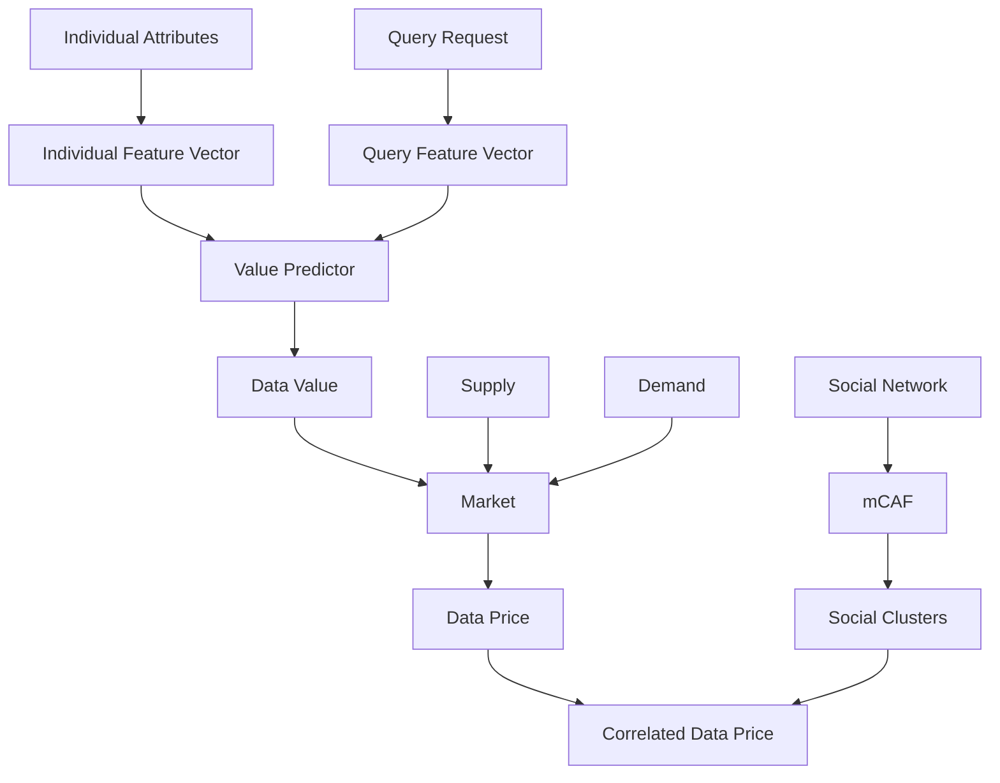

For office use only

T1 \_\_\_\_

T2

T3

T4

I eam Control Number

93036

Problem Chosen

F

For office use only

F1 \_\_\_\_

F2

F3 \_\_\_\_

F4

2018

MCM/ICM

Summary Sheet

# PIPE: Estimate the Value of Private Information

## Summary

Contrary to the pervasive belief that human society has entered the information age, the massive data produced by human individuals are not fully exploited yet. Private data nowadays are under poor, isolated management by individual enterprises, where the value of data cannot be fully extracted to benefit either its provider or owner. To address this problem, a well-established market system is required that not only prices and rewards data sharing, but also regulates and protects private information.

To satisfy the requirement, our paper provides a detailed analysis based on a dataset PI-DATA, based on which we propose a sophisticated and generalized model, Private Information Price Estimation (PIPE), which is able to estimate the price of private information (PI) regarding different data domains of PI and social subgroups.

Task 1: We abstractly extract feature vectors from individuals and query requests to distinctly characterize their traits in different data categories..

Task 2: We estimate the correlation matrix of data categories and develop an amendment formula to accurately compute data value considering internal and external factors.

Task 3: We establish a Supply and Demand Model to estimate the value of PI as a commodity on the level of individuals, groups and nations.

Task 4: We surveyed the existing government act (e.g. Privacy Act, GDPR, APPI, etc.) and price regulations related to the private information around the world. Also, we introduce a dynamic variation to illustrate the change of human decision-making over time.

Task 5: We introduce a risk-to-benefit factor and show how generational differences change our model. We also compare PI with PP and IP.

Task 6: To clarify the connection between different subgroups of people, the multidimensional clustering algorithm for friends (mCAF) is applied to the dataset PIDATA. By conducting experiments on the data from different groups as well as from the same group, we find that the relationship between data and value is not linear, but log-likelihood.

Task 7: We simulate the effect of massive data breach and predict the effect of PI loss and cascade event using our model. Based on our pricing system, we think agencies should compensate to individuals directly for data breaches.

In the end, we make sensitivity analysis and discuss the strengths as well as weaknesses of our model. Moreover, a policy memo is presented to the decision maker on the utility, results and recommendations based on our PIPE policy model.

# MEMORANDUM

To: Decision Maker about Privacy

From: MCM 2018 Team

Subject: Private Information: The Emergence of a New Asset

Date: Monday, February 12, 2018

## 1 Introduction

In the era of "anywhere, anytime", people now produce more data than ever before. The variety and volume of digital records that can be created, processed and analyzed will continue to increase dramatically. By 2020, International Data Corporation (IDC) estimates that the global amount of digital records will increase more than 40-fold.

The problem is to quantify the cost of privacy. That is, to establish a metric to evaluate the monetary value of keeping PI protected and the fees it would cost for others to possess or utilize PI. We consider private information (PI) as record of "everything a person makes and does". To make the problem clearer, several concepts need to be explained.

Domain of Private Information. An initial list of types of private information includes: Digital identity (e.g., names, addresses, phone numbers, demographic information, social network profile information, etc.); Relationships to other people and organization (social media, contact list and profiles); Communication data and logs (emails, SMS, phone calls, IM and social network posts); Media produced, consumed and shared (in-text, audio, photo, video and other forms of media); Financial data (financial transactions, accounts, credit scores, physical assets and virtual goods); Health data (health/medical records, medical history, medical device logs, prescriptions and health insurance coverage); Institutional data (government, academic and employment data).

Subgroup of Individuals. E.g. citizenship, professional profiles, age, education level, occupation, etc.

Risks. The risks involve loss of safety, money, valuable items, intellectual property (IP), the person's electronic identity, professional embarrassment, loss of a position or job, social loss (friendships), social stigmatization, or marginalization.

## 2 Solutions and Conclusions

Private information will continue to increase dramatically in both quality and diversity, and has the potential to unlock significant economic and societal value. To some extend, Private Information (PI) is similar to personal property (PP) and intellectual property (IP). However, there are also discrepancies among them. PI differs from PP and IP in that it can be sold or given to others who then have the right to use it without ownership, and it needs to be regulated by government. These information and privacy issues should be protected not only by the individuals but also by the agencies. Based on our model, the private data should not be trackable by the government for national security concerns.

3d surface chart

| Data Volume | In formation Entropy | Price Per Unit |
| ----------- | -------------------- | -------------- |
| 0           | 0                    | 10             |
| 1           | 1                    | 12             |
| 2           | 2                    | 14             |
| 3           | 3                    | 16             |
| 4           | 4                    | 18             |
| 5           | 5                    | 18             |

Figure 1: Demand Surface: the influence of data volume and information entropy

Building a harmonious ecosystem around personal data will require significant commitment from all stakeholders. Our model proposes four critical solutions to deal with the problem:

- An expanded role for government, such that governments can use their purchasing power to help shape commercially available products and solutions that the private sector can then leverage;  
- Mechanisms for enhancing trust among all parts in private information transaction;  
- Integrate principles surrounding and user trust and data protection into the development of new services and platforms;  
- Policy makers and agencies should launch an international dialog, which should encompass governments, international bodies such as the World Trade Organization, end user privacy rights groups and representation from the private sector. It should include not only US and European Union members, but interested parties from the Asia-Pacific region and emerging countries;

## PIPE: Estimate the Value of Private Information

## Contents

## 1 Introduction 1

1.1 Problem Background 1  
1.2 Our Work.... 1

## 2 Assumptions & Nomenclature 2

2.1 Assumptions.... 2  
2.2 Nomenclature 2

## 3 PIPE: Mathematical Model for Private Information Price Estimation 2

3.1 Vector-based Representation for Individuals and Queries ..... 4

3.1.1 Individual Feature Vectors ..... 4  
3.1.2 Query Feature Vector & Correlation Matrix 6

3.2 Dynamic Market System & Pricing Strategy 7

3.2.1 PI Demand Model 7  
3.2.2 Buyer-Seller Relationship Influence to Price ..... 8

3.3 mCAF: a Multi-dimensional Clustering Algorithm for Friends of Social Network Services 9

## 4 Experimental Results 12

4.1 Task 1: Price Point for Protecting One's Privacy and PI in Various Applications 12  
4.2 Task 2: Pricing Structure of PI....14  
4.3 Task 3: Supply and Demand....15  
4.4 Task 4: Assumptions and Constraints - Political/Cultural Issues......15

4.4.1 Explanation of Terminology....15  
4.4.2 Political Issues and Cultural Issues......16  
4.4.3 Price Regulations....17

4.5 Task 5: Generation Difference....17  
4.6 Task 6: mCAF: a Multi-dimensional Clustering Algorithm for Friends of Social Network Services....18  
4.7 Task 7: Data Breach Effect....18

5 Sensitivity Analysis 19

5.1 Demand Model....19  
5.2 mCAF Model....20

6 Conclusions and Future Work 20

A Implementation of Function $\sigma (\cdot)$ 22

A.1 Demographics....22  
A.2 Family & Health....24  
A.3 Property....24  
A.4 Activities....25  
A.5 Consumer....26

B Privacy Act 26

## 1 Introduction

## 1.1 Problem Background

We are moving towards a “Web of the world” in which mobile communications, social technologies and sensors are connecting people, the Internet and the physical world into one interconnected network $[1]$ . Vast quantities of data records are increasingly gathered by cheap and numerous information-sensing devices on personal information (PI) including but not limited to tweets, purchasing histories and health records. In 2016, roughly 16.1 zettabytes ( $10^{21}$ bytes) of data are being generated each day, and it is estimated that the figure will increase to 163 zettabytes by the year 2025 $[2]$ .

Mining and analyzing such data enables researchers to study, understand and even predict human behaviors on the individual, group and global level. Advanced data analytics methods that extract value from data have been in widespread use in insurance, marketing and many other industries $[3]$ . For instance, methods combining big data with deep learning methods have shown superior performance in predicting traffic flows $[4]$ and managing high-risk patients $[5]$ .

However, the massive collection, sharing and distribution of personal data are prone to certain risks concerning information privacy. As participation in social networking sites has dramatically increased in recent years, services such as Wechat, Twitter, and Facebook allow millions of individuals to create online profiles and share personal information with vast networks of friends-and, often, unknown numbers of strangers $[6]$ . Data breaches also pose considerable threats to sensitive private information that involves personal health information (PHI), personally identifiable information (PII), trade secrets of corporations or intellectual properties $[7]$ .

It has been acknowledged that data providers can possibly be classified into subgroups according to their data's value distribution over multiple domains (e.g. finance, health). On the other hand, personal or community risks related to data privacy often arouse significant differences in peoples' privacy choices across such domains as well [8].

More and more intensive sharing are taking place nowadays, while the management and trading of private data are under loose control of the government and companies. Currently, millions of people are tricked into offering their data in exchange for little reward. However, the use of their data is far from efficient due to data isolation between enterprises. Moreover, some of these data are not even kept safe, and stolen data can possibly encourage illegal activities, such as fraud.

## 1.2 Our Work

To address this situation, we model private information that can be classified into several categories as a range of digital commodities that are constantly produced throughout a person's life, the value of which is determined by a joint strategy that takes into consideration potential losses caused by disclosure of personal information as well as social and commercial benefits to be exploited from that data. The actual price of such data fluctuates around its real value under the influence of supply and demand, the cumulative effect and many other factors.

In this paper, we introduce three feasible techniques. Firstly, we propose a vector-based representation for both data providers and data query requests that abstractly and quantitatively describes features of private data, along with an corresponding value predictor that approximates the value function via correlation matrices. Secondly, with the introduction of a dynamic market system, we are able to further investigate the fluctuation in the real price influenced by both inner factors (e.g. supply and demand) and external causes (e.g. a sudden data bleach). Lastly, we develop an social network model to especially investigate the network effects of data sharing and the impact of social connection on data correlations with the multi-dimensional clustering algorithm mCAF.

The major contribution of this work is that we present a reliable price model for pervasive collection, sharing and trading of private information. In our experiments, we apply and test our model under diverse conditions, where it gives interesting and reasonable results which convinces us that the currency of private information should be kept under strict control under laws and regulations in order to maintain a healthy data economy.

## 2 Assumptions & Nomenclature

## 2.1 Assumptions

To better quantify the problem, our private information pricing model is based on several assumptions that hold true in most cases or is indisputably satisfiable under government regulation.

Assumption 1. All kinds of private information can be classified into a fixed number of distinct data categories (e.g. demographics, family & health, etc.), the number is denoted by m.

Assumption 2. Personal data brings benefits to the society by contributing to researches that intends to study the social and financial behaviors. Profits made from fraud or harassment are not taken into consideration.

Assumption 3. For information security and many other concerns, all the gathered data are managed by a trusted third-party organization, which protects uses' data and helps sell them under owner's permission.

Assumption 1 ensures that the number of parameters required to model private data is limited, thus it makes sense to represent PI with matrices. Assumption 2 guarantees that an universal understanding of data value exists, which forms the basis of our model. By assumption 3 large-scale management and regulation of data are made possible.

## 2.2 Nomenclature

In this paper we use the nomenclature in Table 1 to describe our model. Other symbols that are used only once will be described later.

## 3 PIPE: Mathematical Model for Private Information Price Estimation

In this section, we will discuss all details about our model, which is capable of establishing an accurate pricing system of personal data with the application of 1) a vector-based representation that distributes both benefits and risks of data from a certain subgroup over m data categories; 2) a dynamic pricing strategy that determines the intrinsic value as well as market price of data; 3) a social network model that further improves the predicting accuracy by taking data correlation originated from social connections into account.

Table 1: Nomenclature

<table><tr><td>Symbol</td><td>Definition</td></tr><tr><td>m</td><td>Total number of data categories</td></tr><tr><td>ci</td><td>The  $i^{th}$  category</td></tr><tr><td>I</td><td>Individual that produces data</td></tr><tr><td>X</td><td>Individual feature vector</td></tr><tr><td>σ(·)</td><td>Individual feature extractor</td></tr><tr><td>q</td><td>PI query request</td></tr><tr><td>Y</td><td>Query feature vector</td></tr><tr><td>φ(·)</td><td>Query feature extractor</td></tr><tr><td>C</td><td>Correlation matrix</td></tr><tr><td>v</td><td>Raw value of a person&#x27;s data under a certain query</td></tr><tr><td>T</td><td>Sequence length of personal data</td></tr><tr><td>t</td><td>Freshness of private data</td></tr><tr><td>N</td><td>Quantity of data records</td></tr><tr><td>ω</td><td>Cumulative factor of data sequence</td></tr><tr><td>τ</td><td>Decay factor of history data</td></tr><tr><td>μ</td><td>Scale factor</td></tr><tr><td> $v^j$ </td><td>Amended value of a person&#x27;s data under a certain query</td></tr><tr><td>di</td><td>Data size from person i</td></tr><tr><td>|</td><td>Total information contained from the PI</td></tr><tr><td>Γ</td><td>Neighborhood</td></tr><tr><td>R</td><td>Region</td></tr><tr><td>Q</td><td>Types of Agencies</td></tr><tr><td> $P_{agency}$ </td><td>Price concerning different agencies</td></tr><tr><td>Gij</td><td>Interaction value between person i and j of social circle</td></tr><tr><td>O</td><td>Organizations</td></tr><tr><td>Ti</td><td>Tie strength</td></tr><tr><td> $W_i^k$ </td><td>Weight summary of one measurement to one node</td></tr><tr><td> $Sim_{i,j}$ </td><td>Similarity between two vertices</td></tr><tr><td>N</td><td>Threshold Neighbor</td></tr><tr><td>M</td><td>Metric that evaluates the sensitivity of mCAF</td></tr><tr><td>Eq(·)</td><td>Function that judges equality</td></tr><tr><td>li</td><td>Group label of vertex i</td></tr></table>

Our idea is that the intrinsic value of personal data comes from two aspects: the potential risk from information disclosure, and the social benefits brought about by data analytic. Such benefits and threats posed by personal data varies not only among different data categories, but also between diverse social subgroups. Another unnegligible factor that affects the value of data is the data quality demanded by corporations or institutes. For instance, a commercial dataset that requests detailed financial information should definitely be charged higher than a rough portrait only involving the overall income and tax bills of the same social group. There is nothing ambiguous that a variety of additional factors also have impacts on data value, including freshness, quantity and consistency, which are taken into account in our model as well.

Based on such assumptions we model private data as a commodity in continuous production, which is then fit into a market model where data owners can choose to pay for various levels of privacy protection, or to put their data on sale via a trusted third-party data manager. The overall supply is mainly determined by people's willing to share their data based on its benefit-risk ratio, while the market demand follows a gaussian distribution and can be affected by incidents such as data breaches. We further classify data agencies into three types based on their purchasing power, and develop a pricing strategy for the third-party data manager.

Since human data is highly linked and individual behaviors can be quite correlated with those whom they are socially, professionally, economically or demographically connected, we further consider the natural social network as a graph and cluster similar individuals on multiple dimensions based on both network structure and profile information. On the basis of such social clusters, we especially polish our pricing policy in consideration of similarities within clusters and distinctions between them.

The overview of our entire pricing framework and three major components of it are illustrated in Fig. 1.

flowchart

Figure 1: The schematic illustration of the entire model

## 3.1 Vector-based Representation for Individuals and Queries

## 3.1.1 Individual Feature Vectors

Based on the assumption in Sec. 2.1 that private data can be classified into $m$ distinct categories, an individual's private data can thus be considered to consist of data records in multiple categories. In our model, we assume $m = 5$ and the categories include demographics, family & health, property, activities and consumer data.

The value of a person's entire data can then be split into $m$ independent category values, the sum of which is equal to the original data value. Therefore, it makes sense to represent private information of individuals with an $m \times 1$ matrix, which is actually a vector:

$$
\sigma (I) = X = \left[ \begin{array}{l l l l} X _ {1} & X _ {2} & \dots & X _ {m} \end{array} \right], \tag {1}
$$

where I is a data provider, element $X_{i}(1 \leq i \leq m)$ in vector X indicates the value of $I'$ s data in the $i^{th}$ category, and function $\sigma(\cdot)$ extracts such category values based on life events and individual attributes. We define vector X as person I's feature vector mainly because its elements reveals the essential value of I's data that is distributed over m categories.

The core part of Eqn. (1) is the function $\sigma(.)$ that maps a person to the corresponding feature vector. The process is accomplished based on an analysis on the most influential factors of data value conducted by Financial Times [9]. The report points out that contrary to popular belief, the value of private information does not increase linearly with its amount. In fact, general information about a person, such as their age, gender and location is worth a mere \$0.0005 per person, or \$0.50 per 1,000 people. It is certain milestones in a person's life that prompt major changes in data values, such as becoming a new parent, moving homes, getting engaged, buying a car, or going through a divorce.

As is mentioned above, the value of data limited to a certain category is defined as the sum of potential risks and benefits incurred by it. On the basis of the Financial Times report, we develop a sophisticated model that implements the function $\sigma(\cdot)$ . Here we briefly introduce its mechanism, the complete implementation can be referred to in Appx. A

A person can possess a number of attributes at the same time, such as being engaged, owning a home and current job, and some values of these attributes can possibly incur risks or benefits if known by a data company, for example, being engaged = true and current job = government officer. Our model includes a databases that stores the economical value vectors of certain attribute-value pairs, as is shown in Table 2, factors regarding to personal properties, health conditions and activities are considered more important and attached higher values than others.

Table 2: Some of the most significant value vectors in our

<table><tr><td>Attribute condition</td><td>Value vector / $</td></tr><tr><td>Being a millionaire</td><td>[0.116 0 0 0 0]</td></tr><tr><td>Having a heart disease</td><td>[0 0.260 0 0 0]</td></tr><tr><td>Registered at a real estate agency</td><td>[0 0 0.105 0 0]</td></tr><tr><td>Interested in foreign travel</td><td>[0 0 0 0.135 0]</td></tr><tr><td>Holding a store loyalty card</td><td>[0 0 0 0 0.136]</td></tr></table>

By significance we mean the magnitude of vectors calculated by norm $X_{1}$ . Note that all our vectors concentrate values in one dimension (one data category), by which we intend to reduce data correlations between categories, which will be reconsidered in Sec. 3.1.2.

Algorithm 1: Feature vector extractor  
Input : An individual I, information value database S.
Output: The feature vector $X = \sigma(P)$ .
1 $X \leftarrow 0$ $0 \ldots 0$ ;
2 for attr $\in \{P's attributes\}$ do
3 if (attr, P[attr]) $\in$ S.values then
4 $X \leftarrow X + S[(attr, P[attr])]$ ;
5 return X;

As is shown in Alg. 1, our algorithm first sets the initial feature vector as an all-zero vector and then checks all the attributes of that person to determine if some attribute-value pairs can be found in our database. If a match is found, which means a certain value-creating condition is met, the value vector corresponding to that attribute-value pair will be added to the person's feature vector. In other words, a person's feature vector is the sum of all value vectors of the conditions satisfied by his personal attributes.

Based on Alg. 1, we are able to determine the typical individual feature vectors of various social subgroups, which will be discussed in Sec. 4.1.

## 3.1.2 Query Feature Vector & Correlation Matrix

Similar to individual feature vectors defined in Sec. 3.1.1, we define an $m \times 1$ query feature vector $Y = \phi(q)$ that represents the query request $q$ with $m$ scalars, each stands for the intensity of private data requested in an data category. The intensity is measured by the amount as well as accuracy of requested data. For instance, if full information of a person's demographic characteristics and purchasing history is requested, the query feature vector should be 10001.

However, with merely query vectors we are still not able to accurately calculate the value of private information, as data correlations tend to occur between different categories of data. To address this phenomenon, we introduce a correlation matrix C that takes connections between various categories of data into consideration, and define that the value of a piece of data record from individual I queried with feature vector Y as

$$
v = \sigma (P) C Y ^ {T} \tag {2}
$$

Ideally, with no data correlations the correlation matrix $C = E = diag^{.Σ}1 \quad 1 \ldots 1^{ΣΣ}$ . In order to estimate the intensity of data correlations, we fill the correlation matrix C in following manners:

$$
C _ {i, j} = \left| c o v (c _ {i}, c _ {j}) \right| \tag {3}
$$

where $c_{i}$ and $c_{j}$ are the $i^{th}$ and $j^{th}$ data category value. Our final correlation matrix C is computed based on feature vectors extracted from typical population subgroups, which will be discussed in detail in Sec. 4.1 and demonstrated in Fig. 6.

$$
C = \begin{array}{l l l l l} 1. 0 0 0 0 & 0. 6 4 6 3 & 0. 8 4 4 3 & 0. 8 2 3 1 & 0. 2 7 9 3 \\ 0. 6 4 6 3 & 1. 0 0 0 0 & 0. 6 7 6 7 & 0. 2 1 9 7 & 0. 2 2 2 6 \\ 0. 8 4 4 3 & 0. 6 7 6 7 & 1. 0 0 0 0 & 0. 5 4 0 3 & 0. 1 6 4 9 \\ 0. 8 2 3 1 & 0. 2 1 9 7 & 0. 5 4 0 3 & 1. 0 0 0 0 & 0. 6 9 1 6 \\ 0. 2 7 9 3 & 0. 2 2 2 6 & 0. 1 6 4 9 & 0. 6 9 1 6 & 1. 0 0 0 0 \end{array} \tag {4}
$$

which suggests that the most magnificent data correlations exists between data categories of

• Demographics & Property  
• Demographics & Activities  
• Activities & Consumer

On the basis of Eqn. (2) and Eqn. (4), we are able to calculate the raw value of a specific data record and its query requests. However, there remain external factors that have strongly affect the real value of private data, among which the most significant one is time. It is widely acknowledged that data value decays with time. On the other hand, a consistent data record sequence collected throughout a long time period should be attached additional value. Similarly, data scale affects the value of private data nonlinearly. Thus, an amendment is made with Eqn. (2) by introducing variations:

$$
v ^ {j} = e ^ {\omega T ^ {-} \tau t} N ^ {\mu} v \tag {5}
$$

where the dynamic element T denotes the sequence length (/days) of data, t stands for the freshness of private data (days since the data is generated), and N represents the number of data records. Parameters $\omega$ , $\tau$ and $\mu$ affects the real value in exponential and multinomial manners. In our estimation based on information rules [10], $\omega = 1.28 \times 10^{-3}$ , $\tau = 9.50 \times 10^{-4}$ and $\mu = 1.05$ .

## 3.2 Dynamic Market System & Pricing Strategy

## 3.2.1 PI Demand Model

The demand $d_{i}$ for the private data is originate from the individual i (who themselves might possess the data or can generate the data). The availability of $d_{i}$ to the demander j is captured by a matrix M: the larger $M_{i,j}$ , the larger a fraction of i will be demanded by j. Specially, the demand that $j \in J^{+}$ will see from i is $d_{i} \cdot \frac{M_{i,j}}{\sum_{\omega \in J^{+}} P_{i,\omega}}$ . The matrix M will in practice depend on time latencies, as well as political and cultural issues. It need not be symmetric. For the purpose of the general model, we are agnostic to the derivation of M. An individual $j \in J^{+}$ will incur a risk of $r_{j}$ per unit of demand; This risk is the result of data breach/leakage, which will bring some potential trouble to the person or the related business. To encourage individuals to provide the PI, the buyer offers payments $P_{i}$ to the person i. These payments are different from person to person, and can be derived from the domains (e.g. social media, financial transactions, and health/medical records) and some properties of that person.

Different people have different tradeoffs between the price and risk of PI. We model this fact by assuming that each person j has a trade off factor $\lambda_{j}$ that describes the risk-to-benefit ratio of PI. We use Benefit-Divide-Risk Analysis (BDRA) to calculate $\lambda_{j}$ . It is defined in Eqn. (6), where $s_{benefit}$ and $s_{risk}$ are benefit score and risk score. Benefit score is the data value we have calculated. Risk score is calculated in Table 3.

$$
\lambda_ {j} = \frac {\overline {{S _ {b e n e f i t}}}}{s _ {b e n e f i t} + s _ {r i s k}}, \lambda_ {j} \in [ 0, 1 ] \tag {6}
$$

Table 3: Calculation of risk score (1,2,3,4,5 stand for level of risk)

<table><tr><td>Criterion</td><td>1</td><td>2</td><td>3</td><td>4</td><td>5</td></tr><tr><td>Financial Risk</td><td>0.05</td><td>0.062</td><td>0.074</td><td>0.09</td><td>0.128</td></tr><tr><td>Health Risk</td><td>0.06</td><td>0.09</td><td>0.11</td><td>0.14</td><td>0.24</td></tr><tr><td>Family Risk</td><td>0.05</td><td>0.062</td><td>0.088</td><td>0.15</td><td>0.22</td></tr><tr><td>Social Risk</td><td>0.03</td><td>0.062</td><td>0.1</td><td>0.13</td><td>0.17</td></tr></table>

Thus, the demanding of an individual $j \in J^{+}$ is

$$
D (j) = \lambda_ {i} P _ {j} - r _ {j} \sum_ {i} \frac {\sum d _ {i} \mathsf {M} _ {i , j}}{\omega \in J ^ {+} \mathsf {M} _ {i , \omega}}, \tag {7}
$$

Asymmetric Information. This part illustrates that purchasers possess a substantial amount of information about data providers. These facts suggest that the restrictions such as policy and culture - which make it difficult for data providers to adjust prices when they provide private information to purchasers over time - have different price effects across different sellers and buyers depending on their privately revealed types, cultural and political issues. Incorporating such factors in our model therefore become important in anticipation of using the model to study the PI problem. Formally, we estimate these effects in the following equation 8,

$$
D e f a u l t _ {i, t} = \alpha_ {j (i)} + \alpha_ {t} + \sum_ {n = 1} ^ {\Sigma} \beta_ {n} \mathbf {1} _ {\psi_ {i, t = n}} + s _ {i t} \tag {8}
$$

Here the dependent variable is an indicator for any instance of default by purchaser i after period t, and the key coefficients $\beta_{n}$ capture differences in default rate across different private information, which denoted by $\psi$ . Meanwhile the fixed effects for purchaser i and time t help ensure that these risk comparisons are made within otherwise observably similar purchasers.

Model Exposition This section presents the PI model. The backbone of the demand model is a finite mixture of agency types, each of whom has demand over PI providers.

Our model denotes type by $\theta$ . We specify several parameters to be estimated for each type. First, each type enjoys a flow utility $d_{j\theta}$ from buying from person $j$ and a time utility $n_{j\theta}$ from transacting with person $j$ ; meanwhile the utility is normalized to zero. Additionally, in order to capture the adjustment cost, each type pays a agency cost $s_{j\theta}$ for refer to potential related PI with person $j$ . The parameters $\{d_{j\theta}, n_{j\theta}, s_{j\theta}\}_{(\theta,j) \in \Theta_X J}$ are the key demand parameters to be estimated in the model, along with a probability distribution $\mu_{\theta}$ over types.

Integrating over taste shocks $s$ for each choice yields the standard Bellman equation for continuation values $V$ , which is shown in Eqn. (9).

$$
V (\theta , j, k) = \log \sum_ {j ^ {j}, k ^ {j}} \exp (v (j ^ {j}, k ^ {j} | j, k, \theta)) ^ {\Sigma}, \tag {9}
$$

where the lower-case v term denotes total expected payoffs. The value of v depends on data buyers' past-period and current-period choices. The expectation $E_{\theta}$ can be decomposed as Eqn. (10),

$$
\mathsf {E} _ {\theta} [ V (\theta^ {j}, j, b) ] = (1 - \delta (\theta)) T _ {\theta \theta j} (\theta) V (\theta^ {j}, j, b) + \delta (\theta) T _ {\theta \theta j} (\theta) V (\theta^ {j j}, 0, 0). \tag {10}
$$

With the establishment of Eqn. (5), our model further takes time variations and scale effects as dynamic elements into consideration to estimate the worth of personal data over time.

## 3.2.2 Buyer-Seller Relationship Influence to Price

As Fig. 2 shows, internet advertising revenue has grown strongly over the last ten years. In 2013 it hit \$42.8 billion in the US. Internet giants such as Google and Facebook have business models underlined by the use of personal data, but most people would have trouble knowing who exactly has access to the data trail they are generating across the internet [11]. A recent study by JPMorgan Chase [12] found that each unique user is worth approximately \$4 to Facebook and \$24 to Google.

Besides commercial corporations, there are also other agencies who purchase PI. Mozilla collect data about users to better personalize their experiences with their open source products such as Firefox, Thunderbird. The information they gather through analytics can be used to make their product easier to use. They also use cookies (small data files placed in browsers) to remember language preferences. Center for Disease Control utilizes the data

shared to trace the spread of disease in order to prevent further outbreak.  

line chart

| Year | Advertising Revenue ($bn) |
| ---- | ------------------------- |
| 2004 | 10                        |
| 2006 | 17                        |
| 2008 | 23                        |
| 2010 | 26                        |
| 2012 | 37                        |
| 2013 | 42                        |

Figure 2: US Internet Advertising Revenue by Year, the shadow represents statistical uncertainty and variance.  
There are 3 types of agencies in our model and their purchasing power is shown as Table 4. The price estimation system concerning with different agencies who purchased the PI is illustrated as Eqn. (11).

$$
P _ {\text {agency}} = \sum_ {j = 1} ^ {\text {空}} \tau_ {j} Q _ {i}, \tag {11}
$$

where $\tau_{j}$ is the control level of individual j to sell his/her own data, there are totally M individuals in a group/nationQ i can be Q, Q or Q which represents the purchasing power of different types of agencies.

## 3.3 mCAF: a Multi-dimensional Clustering Algorithm for Friends of Social Network Services

The multi-dimensional clustering algorithm for friends (mCAF) is adopted by us to perform multi-dimensional clustering. Multi-dimensional clustering algorithms on social networks are progressively gaining popularity due to the information and insights produced using large-scale social data. [13] describes the user's opinions, comments, and likes in social media have significant relationships with the popularity of that post. Multi-dimensional cluster analysis is a strategy for identifying different Facebook users' fan groups and provides insights to prompt further research analytics [14]. Both network structures and profile information should be taken into consideration while analyzing a user's clusters on social networks [6, 15].  
Table 4: Purchasing power of three types of agencies

<table><tr><td>Denotation</td><td>Types of Agencies</td></tr><tr><td> $Q_1$ </td><td>Commercial Corporation, e.g. Google, Facebook, Microsoft, etc.</td></tr><tr><td> $Q_2$ </td><td>Non-Profit Organization (NPO), e.g. Mozilla, GNU, WWF, etc.</td></tr><tr><td> $Q_3$ </td><td>Government Department, e.g. NSA, Department of Energy, etc.</td></tr></table>

In this study, we used the Facebook Graph API to retrieve information of 600 users. First, we define the measurements of clustering.

Social Circles. A social circle is a group of people who have the same interests or join the same activity. We define $M_{ij}$ as the number of mutual friends of user $i$ and $j$ and $G_{ij}$ as the interaction value. We quantify the subject's interactions within the community to obtain $S_{ij}$ with Eqn. (12) and then normalize the result as Eqn. (13)

$$
M G _ {i j} = M _ {i j} + G _ {i j}, \mathsf {M G} = \left\{M G _ {x y} \mid x, y \in 1, 2, 3, \dots , n \right\} \tag {12}
$$

$$
S _ {i j} = \frac {M G _ {i j}}{\max (M G)}, \mathrm{S} = \left\{S _ {x y} \mid x, y \in 1, 2, 3, \dots , n \right\} \tag {13}
$$

Regions. We determine the region of the users and then calculate the distances between them and store them as a dataset described by $\{D_{1}, D_{2}, D_{3}, D_{4}\}$ . Take the calculation of distance between A and B as an example, $D_{1}$ represents the distance between the hometowns of A and B; $D_{2}$ represents the distance between the current residence of A and B; $D_{3}$ represents the distance between $A'$ s hometown and $B'$ s current residence; $D_{4}$ represents the distance between $A'$ s current residence and $B'$ s hometown. The calculation of $R_{ij}$ is shown as Eqn. (14).

$$
R _ {i j} = \alpha \times D _ {1} + \beta \times D _ {2} + \gamma \times D _ {3} + \delta \times D _ {4} \tag {14}
$$

Organizations. If two individuals attended the same school or worked in the same company, the organizations measurement $O_{ij}$ is set equal to 1 since they have a connection. If no connection is present, the $O_{ij}$ is set equal to 0.

Tie strength. We retrieve related information and use the method described in [16] to calculate the tie strength as $T_{j}$ , which indicates the tie strength between a user and his jth friend.

mCAF maps a user's friends into un-directed, weighted graphs. We define the entire graph as $G = \{V, E\}$ , in which V is the set of vertices and E is the set of edges, defined as $E_{i,j}(e_{i,j}^{k})$ , which represents a connection if a value $e_{i,j}^{k}$ is greater than zero between nodes i and j under measurement k.

Definition of vertex structure. Let vertex $i \in V$ , where the structure of i is defined by its neighborhood denoted by $\Gamma(i)$ in Eqn. (15)

$$
\Gamma (i) = \{j \mid j \in V \land E _ {i, j} \in E \} \tag {15}
$$

Definition of the weight summary of one measurement to one node Eqn. (16) defines the summary values of measurements from vertex j, which is connected to i:

$$
W _ {i} ^ {k} = \underset {j = 1} {\overset {j \geqslant | V |} {\sum}} \left(e _ {i, j} ^ {k}\right), \text {where} j \in \Gamma (i) \tag {16}
$$

Definition of the weight summary of one measurement to two nodes Let vertex m V, and let edges from $(i, m)$ and $(j, m)$ exist. Eqn. (17) defines the summary values of measurements from vertex m, which is connected to i and j:

<table><tr><td colspan="2">Algorithm 2: Multi-dimensional clustering algorithm(mCAF)</td></tr><tr><td colspan="2">Input: G = {V, E}, [v^k], [p^k] Output: Clustering result</td></tr><tr><td>1</td><td>count^l = 0; count^l = 0; count^l = 0; k^l = 0; k^l = 0; k^l = 0;</td></tr><tr><td>2</td><td>foreach vertex i ∈ V do</td></tr><tr><td>3</td><td>for each vertex j ∈ I (i) do</td></tr><tr><td>4</td><td>if (S_n^l) × p^k has max value where k = 1 ~ 3 and j ∈ N_p(i) then</td></tr><tr><td>5</td><td>count^l = count^k + 1;</td></tr><tr><td>6</td><td>Set(1 count^l, 1, count^l), count^l) as (k_1, k_2, k_3);</td></tr><tr><td>7</td><td>if k^k has only one max value then</td></tr><tr><td>8</td><td>b_max(i) = q;</td></tr><tr><td>9</td><td>else</td></tr><tr><td>10</td><td>label i as uncertain V;</td></tr><tr><td>11</td><td>foreach unsigned vertex p ∈ V do</td></tr><tr><td>12</td><td>if q ∈ N_{max(p)}(p) then</td></tr><tr><td>13</td><td>if first q then</td></tr><tr><td>14</td><td>generate new clusterD;</td></tr><tr><td>15</td><td>insert q into queue Q;</td></tr><tr><td>16</td><td>while Q ≠ do</td></tr><tr><td>17</td><td>q=dequeue(Q);</td></tr><tr><td>18</td><td>foreach r ∈ N_{max(p)}, q) do</td></tr><tr><td>19</td><td>if (r is untagged) then</td></tr><tr><td>20</td><td>insert + into queue Q;</td></tr><tr><td>21</td><td>assign current clusterD to r;</td></tr><tr><td>22</td><td>remove q from Q;</td></tr></table>

Definition of structure similarity She structure similarity of two vertices i and j is defined as Eqn. (18):

$$
S i m _ {i, j} = \bar {\boldsymbol {S}} _ {i, j ^ {\prime}} ^ {1} S _ {i, j ^ {\prime}} ^ {2} S _ {i, j} ^ {3} \stackrel {\Sigma} {=} - \frac {\{T _ {i , j} ^ {1} , T _ {i , j ^ {\prime}} ^ {2} , T _ {i , j} ^ {3} \}}{\overline {{W _ {i} ^ {1} \cdot W _ {J} ^ {1} + W _ {i} ^ {2} \cdot W _ {J} ^ {2} + W _ {i} ^ {3} \cdot W _ {J} ^ {3}}}} \tag {18}
$$

Definition of the threshold neighbor If two nodes can be clustered together based on measurement k, their structure similarity value $S_{i,j}^{k}$ must be greater than the preset threshold $s^{k}$ to filter out noise. Eqn (19) defines neighbors with qualified similarity structure values. The parameter $s^{k}$ could be estimated via training.

$$
N _ {s ^ {k}} (i) = \bar {\cdot} j | j \in \Gamma (i) \wedge S _ {i, j} ^ {k} \leq s ^ {k} ^ {\Sigma} \text {   where   } k = 1 \text {   to   } 3 \tag {19}
$$

The complete mCAF algorithm is described in Algorithm 2.

The clustering result of mCAF is shown in Fig. 3. The social network of several individuals are clustered into 8 subgroups. The visualization of network shows the correlations between different people.

```mermaid
graph TD
  A["Node"] --> B["Node"]
  B --> C["Node"]
  C --> D["Node"]
  D --> E["Node"]
  E --> F["Node"]
  F --> G["Node"]
  G --> H["Node"]
  H --> I["Node"]
  I --> J["Node"]
  J --> K["Node"]
  K --> L["Node"]
  L --> M["Node"]
  M --> N["Node"]
  N --> O["Node"]
  O --> P["Node"]
  P --> Q["Node"]
  Q --> R["Node"]
  R --> S["Node"]
  S --> T["Node"]
  T --> U["Node"]
  U --> V["Node"]
  V --> W["Node"]
  W --> X["Node"]
  X --> Y["Node"]
  Y --> Z["Node"]
```

flowchart

Figure 3: mCAF Clustering Result of Social Network

3d surface plot with a color bar

| d1 | d2 | I    |
|----|----|------|
| 0  | 0  | 0.5  |
| 1  | 1  | 1.0  |
| 2  | 2  | 1.5  |
| 3  | 3  | 2.0  |
| 4  | 4  | 1.5  |
| 5  | 5  | 1.0  |

Figure 4: Relationship between data size $d_{i}$ and information I

To better evaluate the network effects of data sharing, we investigate the relationship between two individuals who are highly linked and discover the relationship between the data size from one person and the information it can provide. Define $d_{i}$ is the data size from person i and $\models f(d)$ [0, 1] represents the information the data on one person can provide. There are totally M individuals. Eqn. (20) represents the function between d and and Fig. 4 illustrates the function in the circumstance of i = 2.

$$
\mathbf {I} = \log (1 + \sum_ {i = 1} ^ {\text {空}} d _ {i}) \tag {20}
$$

## 4 Experimental Results

## 4.1 Task 1: Price Point for Protecting One's Privacy and PI in Various Applications

In order to accurately model risk to account for both 1) characteristics of the individuals, and 2) characteristics of the specific domain of information, we introduce the concept of individual and query feature vectors discussed in Sec. 3.1.

After surveying on several datasets $[17, 18, 19]$ and recent methods, we collect our dataset PIDATA with an API provided by Facebook $[20]$ . The usage of this dataset observes the Platform Policies, Data Use Policy, Statement of Rights and Responsibilities. Corresponding statistical information is illustrated as Fig. 5. Fig 5(a) is age distribution. Fig 5(b) is gender distribution. Fig 5(d) is education distribution. Fig 5(c) is occupation distribution. Fig 5(e) is education occupation distribution. Fig 5(f) is friend distribution.

line chart

| Age | Ratio |
| --- | ----- |
| 0   | 0.002 |

(a) Age Distribution

bar chart

| Gender | Number |
|---|---|
| Female | 56 |
| Male | 45 |

(b) Gender Distribution

bar chart

| Occupation   | Ratio  |
| ------------ | ------ |
| Unemployed   | 0.04   |
| Student      | 0.17   |
| Artist       | 0.08   |
| Engineer     | 0.14   |
| Teacher      | 0.21   |
| Doctor       | 0.19   |
| Manager      | 0.08   |
| Programmer   | 0.21   |

(c) Occupation Distribution

histogram

| Education Level | Ratio |
| --------------- | ----- |
| ≤ High School   | 0.1   |
| High School     | 0.4   |
| Bachelor        | 0.4   |
| Master          | 0.1   |
| PhD             | 0.05  |

(d) Education Distribution

heatmap

| Occupation | Education Level |
| ---------- | --------------- |
| Programmer | High School     |
| Manager    | High School     |
| Doctor     | High School     |
| Teacher    | High School     |
| Engineer   | High School     |
| Artist     | High School     |
| Student    | High School     |
| Unemployed | High School     |
| ≤ High School | Bachelor       |
| High School | Bachelor       |
| Master     | Bachelor       |
| PhD        | Bachelor       |

(e) Education - Occupation Joint Distribution

histogram

| Number of Friends Range | Ratio     |
| ------------------------ | --------- |
| 0 - 10                   | 0.0085    |
| 10 - 20                  | 0.0095    |
| 20 - 30                  | 0.0105    |
| 30 - 40                  | 0.0125    |
| 40 - 50                  | 0.0165    |
| 50 - 60                  | 0.0210    |
| 60 - 70                  | 0.0120    |
| 70 - 80                  | 0.0060    |
| 80 - 90                  | 0.0050    |
| 90 - 100                 | 0.0035    |
| 100 - 110                | 0.0025    |
| 110 - 120                | 0.0020    |
| 120 - 130                | 0.0015    |
| 130 - 140                | 0.0010    |
| 140 - 150                | 0.0005    |

(f) Number of friends  
Figure 5: Statistic information of PIDATA

Fig. 6 shows the distribution of private data over different data categories (feature vectors) of 6 selected subgroups. It is clear that the value of person's data is partially related his age and social status. Another interesting observation from Fig. 6 is that high covariance exists between certain data categories, which will be dealt with in Sec. 3.1.2.

bar chart

| Category | Demographics | Family & Health | Property | Activities | Consumer |
|---|---|---|---|---|---|
| Colledge Undergraduate | 1 | 2 | 3 | 5 | 8 |
| Teenager | 1 | 1 | 3 | 4 | 6 |
| Middle-aged Employee | 7 | 6 | 9 | 6 | 7 |
| Chief Officer | 10 | 7 | 8 | 10 | 10 |
| Senior citizen | 8 | 10 | 10 | 3 | 5 |
| House Wife | 5 | 6 | 9 | 5 | 5 |

Figure 6: Individual feature vectors of some typical subgroups.

To develop a price point for PI protection, we exam the true value of a person's full data and its components. Fig. 7 shows how different categories of private data contributes to the value of a person's PI.

stacked bar chart

| Category | Demographics | Family & Health | Property | Activities | Consumer |
|---|---|---|---|---|---|
| House Wife | 0.6 | 0.7 | 1.2 | 0.8 | 0.5 |
| Senior citizen | 0.9 | 1.3 | 1.4 | 0.8 | 0.6 |
| Chief Officer | 1.0 | 1.2 | 1.4 | 1.2 | 0.8 |
| Middle-aged Employee | 0.6 | 0.6 | 0.8 | 0.7 | 0.5 |
| Teenager | 0.1 | 0.1 | 0.2 | 0.2 | 0.2 |
| College Undergraduate | 0.2 | 0.3 | 0.3 | 0.3 | 0.4 |

Figure 7: Value components of different subgroups's PI.

Based on the computed value of personal information, we are able to establish a price point for protecting it by treating data protection as an special insurance. Although the trade value of data can is just a few dollars, cost for each stolen data record can be as high as \$141 - roughly 70-fold of its trade value, and the likelihood of a recurring material data breach over the next two years is estimated as 27.7%, according to a data breach study by IBM [21]. Therefore, to firmly protect a certain data record for 1 year, one must invest 10 times of its trade value calculated from Eqn. (5), which leads to the deduction that it might be better to share personal data and make profits from it if the risk is low.

## 4.2 Task 2: Pricing Structure of PI

With the introduction of feature vectors, correlation matrix and the amendment formula (Eqn. (5)), we can simply determine how much a person's information is worth given a query on a specific domain. Based on a thorough survey on 77 adults, we are able to estimate the corresponding query feature vector of several query domains. The results are listed in Table 5.

Based on query feature vectors in Table 5 and Eqn. (2), values of private information queried by different domains are illustrated in Fig. 8.

From results shown in Fig. 8, we can establish a pricing structure correspondingly. The price is explicitly calculated in view of different basic elements of data via individual feature vectors defined in Sec. 3.1.1. As for cost of privacy across various domains, it can be

Table 5: Comparison between query feature vectors from various domains

<table><tr><td>Domain</td><td colspan="5">Average query feature vector</td></tr><tr><td>Social media</td><td>[0.93</td><td>0.68</td><td>0.13</td><td>0.96</td><td>0.37]</td></tr><tr><td>Financial transactions</td><td>[0.82</td><td>0.53</td><td>0.94</td><td>0.24</td><td>0.98]</td></tr><tr><td>Health / media records</td><td>[0.26</td><td>0.99</td><td>0.08</td><td>0.11</td><td>0.10]</td></tr><tr><td>Search histories</td><td>[0.66</td><td>0.58</td><td>0.13</td><td>0.74</td><td>0.84]</td></tr><tr><td>Location info</td><td>[0.24</td><td>0.05</td><td>0.05</td><td>0.35</td><td>0.12]</td></tr></table>

bar chart

| Role | Social Media | Financial Transactions | Health / Media Records | Search Histories | Location Info |
|---|---|---|---|---|---|
| Colledge Undergraduate | 10 | 11 | 5 | 8 | 3 |
| Teenager | 6 | 7 | 2 | 4 | 1 |
| Middle-aged Employee | 20 | 22 | 10 | 15 | 7 |
| Chief Officer | 30 | 35 | 18 | 22 | 10 |
| Senior citizen | 28 | 32 | 20 | 25 | 8 |
| House Wife | 18 | 22 | 10 | 18 | 6 |

Figure 8: Information value in various domains of some typical subgroups.

calculated in similar manners as Sec. ??, where protecting cost and trade value of data are in direct proportion. If the risk of data disclosure is negligible, spending considerable money on data protection would be an unnecessary cost, and people might prefer to have their data unprotected in order to save budgets.

## 4.3 Task 3: Supply and Demand

People become more clear about which agencies had purchased their PI, how much their PI was worth and how PI was being used.

Based on the above model, we evaluate the influence of the control level to the price of PI. With data becoming a commodity, we find that:

- It is appropriate to consider forces of supply and demand for PI. Commercial Corporations Q have higher demand for PI, which makes it possible for them to provide higher offer compared with the other two types of agencies.  
- If people have control to sell to their data, which means $\tau_{j}$ varies with different individuals, the price $P_{agency}$ increases with the $\tau_{j}$ .

## 4.4 Task 4: Assumptions and Constraints - Political/Cultural Issues

The assumptions and constraints of our model, which is also the political and cultural issues of the United States, European Union and other countries is listed as below. Suppose our model is proposed under the circumstance which is in compliance with local government regulations and cultural issues. Firstly, we explain the terminology used in the model.

## 4.4.1 Explanation of Terminology

- Agency: any corporations, organizations, Executive department, military department, Government corporation, Government controlled corporation, or other establishment in the executive branch of the Federal Government.  
- Individual: a citizen of the United States or an alien lawfully admitted for permanent residence.

\- Private Information: any item, collection, or grouping of information about an individual that is maintained by an agency, including, but not limited to, his education, financial transactions, medical history, and criminal or employment history and that contains his name, or the identifying number, symbol, or other identifying particular assigned to the individual, such as a finger or voice print or a photograph.

## 4.4.2 Political Issues and Cultural Issues

## The United States: Privacy Act [22]

The Overview of the Privacy Act of 1974, 2015 Edition is prepared by the Department of Justice's Office of Privacy and Civil Liberties (OPCL). Tracking the provisions of the Act itself, the Overview provides reference to and legal analysis of court decisions interpreting the Act's provisions.

The purpose of the Privacy Act is to balance the government's need to maintain information about individuals with the rights of individuals to be protected against unwarranted invasions of their privacy stemming from federal agencies' collection, maintenance, use, and disclosure of personal information about them. More details are in the Appx. B.

## European Union: General Data Protection Regulation (GDPR) [23]

The GDPR aims primarily to give control back to citizens and residents over their personal data and to simplify the regulatory environment for international business by unifying the regulation within the EU. The regulation was adopted on 27 April 2016. It becomes enforceable from 25 May 2018 after a two-year transition period.

Data breaches. Under the GDPR, the Data Controller will be under a legal obligation to notify the Supervisory Authority (SA) without undue delay. The reporting of a data breach is not subject to any de minimis standard and must be reported to the Supervisory Authority within 72 hours after having become aware of the data breach.

Citizen Control of Personal Data. Under the GDPR, organizations are encouraged to give back control of personal data to the individual, or citizen.

## Canada: Personal Information Protection and Electronic Documents Act

The Personal Information Protection and Electronic Documents Act (PIPEDA or the PIPED Act) is a Canadian law relating to data privacy. It governs how private sector organizations collect, use and disclose personal information in the course of commercial business. In addition, the Act contains various provisions to facilitate the use of electronic documents.

The law gives individuals the right to

- know why an organization collects, uses or discloses their personal information;  
- know who in the organization is responsible for protecting their personal information;  
- expect an organization to protect their personal information by taking appropriate security measures;  
- obtain access to their personal information and ask for corrections if necessary; and

Japan: Act on Protection of Personal Information (APPI)

APPI reflects the Japanese socio-cultural characteristics for personal information protection. Personal information leakage cases and social responses in Japan reflect three Japanese socio-cultural characteristics: Uchi/Soto awareness, insular collectivism and Hon'ne/Tatemae tradition. An effective law protecting personal information in Japan's cultural environment cannot be made simply by copying the privacy protection laws in western nations. Instead, legal protection of personal information should be drafted that reflects and takes into account these socio-cultural characteristics [24].

## 4.4.3 Price Regulations

Generally, the data value of people varies from different regions. It's common to see quite a lot of variation by location. Fig. 9 is the statistical result, which is a comparison of the total number of a person's data value for countries around the world (ones without enough data are left gray) [25]:

Based on the model and the political/cultural issues, we can draw the conclusion that information privacy should be made a basic human right when thinking about policy recommendations.

## 4.5 Task 5: Generation Difference

In the perspective of risk-to-benefit ratio of PI and data privacy, there are generational differences. For example, the risk-to-benefit ratio is different between old people and young people when their health record is leaked. For old people, it is usually much higher than that of young people.

As generation changes, the input individual attributes change and data value depends on the generation correspondingly. As for the risk-to-benefit factor we defined in Eqn. (6), it describes the risk-to-benefit ratio of PI. The factor will change since the benefit score and risk score will change. Considering all the effects that generation change have, our final data price will be affected in the process above. PI (private information) is different from PP (private personal property) and IP (intellectual property). PI is an abstract concept. It is non-entity. However PP often refers to the property of people. It physically exists. IP is

heatmap

| Country | Value |
| --- | --- |
| United States | 400 |
| Canada | 350 |
| Mexico | 300 |
| Brazil | 250 |
| Argentina | 200 |
| United Kingdom | 150 |
| Germany | 100 |
| France | 150 |
| Italy | 150 |
| Spain | 150 |
| Russia | 150 |
| China | 150 |
| India | 150 |
| Japan | 150 |
| Australia | 150 |
| South Africa | 150 |
| Nigeria | 150 |
| Egypt | 150 |
| Saudi Arabia | 150 |
| Iran | 150 |
| Saudi Arabia | 150 |
| Turkey | 150 |
| Indonesia | 150 |
| Philippines | 150 |
| Vietnam | 150 |
| Thailand | 150 |
| Malaysia | 150 |
| Singapore | 150 |
| New Zealand | 150 |
| Norway | 150 |
| Sweden | 150 |
| Finland | 150 |
| Denmark | 150 |
| Netherlands | 150 |
| Belgium | 150 |
| Austria | 150 |
| Poland | 150 |
| Ukraine | 150 |
| Belarus | 150 |
| Moldova | 150 |
| Estonia | 150 |
| Latvia | 150 |
| Lithuania | 150 |
| Iceland | 150 |
| Greenland | 150 |
| Faroe Islands | 150 |
| Tuvalu | 150 |
| Grenada | 150 |
| Samoa | 150 |
| Kiribati | 150 |
| French Guiana | 150 |
| Tonga | 150 |
| Samoa | 150 |
| Kiribati | 150 |
| French Guiana | 150 |
| Tonga | 150 |
| Samoa | 150 |
| Kiribati | 150 |
| French Guiana | 150 |
| Samoa | 150 |
| Kiribati | 150 |
| French Guiana | 150 |
| Samoa | 150 |
| Kiribati | 150 |
| French Guiana | 150 |
| Samoa | 150 |
| Kiribati | 150 |
| French Guiana - Tonga | 150 |
| French Guiana - Samoa | 150 |
| French Guiana - Samoa | 150 |
| French Guiana - Samoa | 150 |
| French Guiana - Samoa | 150 |
| French Guiana - Samoa | 150 |
| French Guiana - Samoa | 150 |
| French Guiana - Samoa | 150 |
| French Guiana - Samoa | 150 |
| France Guiana - Samoa | 150 |
| French Guiana - Samoa | 150 |
| French Guiana - Samoa | 150 |
| French Guiana - Samoa | 150 |
| French Guiana - Samoa | 150 |
| French Guiana - Samoa | 150 |
| French Guiana - Samoa | 150 |
| French Guiana - Samoa | 15<nl> |

Figure 9: Data Value by locations: comparisons of the total number of a person's data value for countries around the world (ones without enough data are left gray)

Cost of Data Breach in Different Industries  

pie chart

| Sector | Percentage (%) |
| :--- | :--- |
| Retail | 8 |
| Technology | 12 |
| Services | 14 |
| Industrial | 15 |
| Financial | 15 |
| Entertainment | <1 |
| Research | <1 |
| Education | 1 |
| Health | 1 |
| Communications | 2 |
| Media | 1 |
| Life science | 4 |
| Hospitality | 4 |
| Energy | 5 |
| Consumer | 5 |
| Transportation | 5 |
| Public | 7 |

Figure 10: Cost of Data Breach in Different Industries

the property of human intellect including copyrights and patents. PI is only known by the owner but IP is not only known by the owner. People all know the owner of the IP.

PI is also similar with PP and IP to some extent. PI and PP are both private while PI and PP are both abstract.

## 4.6 Task 6: mCAF: a Multi-dimensional Clustering Algorithm for Friends of Social Network Services

Based on the mCAF model we proposed previously, we have the following conclusions:

- Network effects of data sharing sharing do effect the price system for individuals, subgroups, and entire communities and nations.  
- It is the responsibility of the communities to protect citizen's PI if communities have shared privacy risks.

## 4.7 Task 7: Data Breach Effect

Data breach, especially massive data breach where millions of people's PI are stolen will affect the privacy a lot. Taking TJX data breach as example, it involves more than 100 million records and causes 118 million dollars loss to cover the loss and potential liabilities. That does not include the loss in reputation of brand and other indirect cost. From the research of IBM [21], we get cost of data breach for different industries (Fig. 10) and countries (Fig. 11). We can see that data breach widely exists and PI loss is a factor that we should notneglect.

The PI loss and cascade event caused by massive data breach will impact the price point. In our model, we have considered such effect. Eqn. (7) shows the trade off between the price and data breach effect. When massive data breach happens, the trade off factor $\lambda_{j}$ will be smaller and thus $\lambda_{jp_{j}}$ will be smaller. $r_{j}$ depends on the level of data breach. For massive data breach and the corresponding cascade event, it would be higher. We can see that the price will be lower. It is reasonable since data breach will violate the assumption that all the gathered data are managed by a trusted third-party organization, which protects users' data and helps sell them under owner's permission. People's data will be sold without permission or even be used as ransom. Some PI buyers will buy the breach data in an illegal way instead of buying data from people or trusted third-party organization. Demand will decrease and the price will be lower.

bar chart

| Country | Value |
|---|---|
| United States | 100 |
| United Kingdom | 85 |
| India | 75 |
| Brazil | 60 |
| Germany | 55 |
| France | 50 |
| Japan | 45 |
| Middle East | 40 |
| Canada | 35 |
| Australia | 30 |
| Ithay | 25 |
| South Africa | 20 |
| ASEAN | 15 |
| North Atlantic Ocean | 100 |
| Senegal | 95 |
| Bolivia | 90 |
| Cuba | 85 |
| Colombia | 80 |
| Mali | 75 |
| Morocco | 70 |
| Algeria | 65 |
| Niger | 60 |
| Libya | 55 |
| Spain | 50 |
| Morocco | 45 |
| Sudan | 40 |
| Egypt | 35 |
| Saudi Arabia | 30 |
| Iran | 25 |
| Oman | 20 |
| Pakistan | 15 |
| Sri Lanka | 10 |
| Kazakhstan | 5 |
| India | 0 |
| China | 0 |
| Mongolia | 0 |
| Japan | 0 |
| Philippines | 0 |
| Indonesia | 0 |
| Papua New Guinea | 0 |
| Australia | 0 |
| Madagascar | 0 |
| Namibia | 0 |
| South Africa | 0 |

Figure 11: Cost of Data Breach in Different Regions

Agencies that breach the data should be responsible for the data breach and pay the individuals directly. As shown above, price of data will be much lower after massive data breach happens. The agencies should be responsible for the PI loss even if they don't intend to breach the data.

## 5 Sensitivity Analysis

In this part we will do sensitivity analysis on our model. The sensitivity analysis show that our model is generalized and performs stably under different conditions, by which we are convinced that our model is able to solve the problem successfully.

## 5.1 Demand Model

This part shows the PI purchasers are sensitive to price and illustrates how it is possible to identify heterogeneous price sensitivities in the data. This heterogeneity will play a key role when we later use the model to study the equilibrium effects of the PI's price restrictions, because this heterogeneity affects which types of purchasers change their purchasing behavior in response to different relative price changes.

The event-time-specific estimates is shown as Eqn. (21):

$$
\log Q _ {j t} = \alpha_ {j} + \alpha_ {t} + \beta_ {j} t + \alpha_ {A, t} + s _ {j t}, \tag {21}
$$

where $Q_{jt}$ denotes retention rates among existing buyers for data provider j at time t. The first two $\alpha$ terms in this equation implement a standard difference-in-difference design, while the $\alpha_{A,t}$ terms capture differences between data provider A and other. For sake of presentation, the $\beta$ term is included to account for different time trends among the included data providers. When estimating the demand side of the model, we use price variation to estimate heterogeneous price sensitivities across different purchaser types.

## 5.2 mCAF Model

We adopt the multi-dimensional clustering algorithm for friends (mCAF) to perform identify social clusters. mCAF algorithm randomizes the center points initially. We run mCAF several times on our dataset PIDATA and analyze the result.

We propose a metric to evaluate the sensitivity of mCAF in Eqn. (22), where $Eq(\cdot)$ is defined in Eqn. (23)

$$
\delta = \frac {\sum_ {i \in V} E q (l _ {i} , l _ {0 _ {i}})}{\sum_ {i \in V} 1} \tag {22}
$$

$$
E q (x, y) = \left\{ \begin{array}{l l} 1 & \text { if } x \neq y \\ 0 & \text { otherwise. } \end{array} \right. \tag {23}
$$

Table 6 shows the results from 8 experiments, from which we can conclude that the $\delta$ is very small in all experiments. It proofs that mCAF model performs well and is robust under different situations.

Table 6: Result of Sensitivity Analysis on mCAF

<table><tr><td>ExpNo</td><td>1</td><td>2</td><td>3</td><td>4</td><td>5</td><td>6</td><td>7</td><td>8</td></tr><tr><td>δ</td><td>0.025</td><td>0.013</td><td>0.025</td><td>0.013</td><td>0.051</td><td>0.013</td><td>0.013</td><td>0.025</td></tr></table>

## 6 Conclusions and Future Work

We develop a complete pricing system that accurately estimates the intrinsic value as well as market price of a certain individual's data under a specific query request. Out method consists of three core components: a value calculator that maps a query and an individual to value of that data, a dynamic market system to further compute its market price, and a social cluster model to estimate the network effect on data price. In the environments and sensitivity analysis of our model, we find that it is accurate and generalized enough to be adopted in a wide range of domains.

One limitation of our current approach is that our model requires a large dataset to precisely estimate the correlation matrix as well as many other parameters used in its mechanism. A promising future direction is to combine out methods with better estimation algorithms, e.g. Analytic Hierarchy Process (AHP), to reduce the variance caused by insufficient data.

In future work, our goal is to introduce non-linear data value predictors, e.g. neural networks, to characterize a more complicated relationship between individuals and data. Additionally, we plan to extend the current dataset in both scale and coverage to cater to the needs of deep learning algorithms.

## References

[1] M. Davis, R. Martinez, and C. Kalaboukis, “Rethinking personal information - workshop pre-read.” Invention Arts and World Economic Forum, 2010.  
[2] R. David, G. John, and R. John, "Data age 2025: The evolution of data to life-critical," seagate.com. Framingham, MA, US: International Data Corporation, Tech. Rep., 04 2017.  
[3] “Big data,” Wikipedia. [Online]. Available: https://en.wikipedia.org/wiki/Big\_data  
[4] Y. Lv, Y. Duan, W. Kang, Z. Li, and F.-Y. Wang, "Traffic flow prediction with big data: a deep learning approach," IEEE Transactions on Intelligent Transportation Systems, vol. 16, no. 2, pp. 865-873, 2015.  
[5] D. W. Bates, S. Saria, L. Ohno-Machado, A. Shah, and G. Escobar, “Big data in health care: using analytics to identify and manage high-risk and high-cost patients,” Health Affairs, vol. 33, no. 7, pp. 1123–1131, 2014.  
[6] R. Gross and A. Acquisti, “Information revelation and privacy in online social networks,” in ACM Workshop on Privacy in the Electronic Society, 2005, pp.71–80.  
[7] "Data breach," Wikipedia. [Online]. Available: https://en.wikipedia.org/wiki/Data\_breach  
[8] B. Debatin, J. P. Lovejoy, A.-K. Horn, and B. N. Hughes, “Facebook and online privacy: Attitudes, behaviors, and unintended consequences,” Journal of Computer-Mediated Communication, vol. 15, no. 1, pp. 83–108, 2009.  
[9] E. Steel, C. Locke, E. Cadman, and B. Freese, "How much is your personal data worth?" https://ig.ft.com/how-much-is-your-personal-data-worth, Financial Times, 2013.  
[10] C. Shapiro and H. R. Varian, Information Rules: A Strategic Guide to the Network Economy. Harvard Business Press, 1998.  
[11] J. Detemple and M. Rindisbacher, The Private Information Price of Risk. Palgrave Macmillan UK, 2016.  
[12] J. Brustein, "Start-ups seek to help users put a price on their personal data," The New York Times, vol. 12, no. 3, 2012.  
[13] H. Khobzi and B. Teimourpour, "How significant are users' opinions in social media?" International Journal of Accounting & Information Management, vol. 22, no. 4, pp. 254–272, 2014.  
[14] E. Wallace, I. Buil, L. de Chernatony, and M. Hogan, “Who “likes” you and why? a typology of facebook fans: From “fan”-atics and self-expressives to utilitarians and authentics,” Journal of Advertising Research, vol. 54, no. 1, pp. 92–109, 2014.  
[15] J. Mcauley and J. Leskovec, “Discovering social circles in ego networks,” ACM Transactions on Knowledge Discovery from Data (TKDD), vol. 8, no. 1, pp. 1–28, 2014.  
[16] T. T-H, C. H-T, C. Y-J, H. Y-H, L. D-H, K. C-C, and Y. T-Y, "TreeIt: an application to create, maintain, and enhance online social connections," in Networking and Electronic Commerce Conference (NAEC). NAEC2014, 2014.  
[17] A. L. Traud, E. D. Kelsic, P. J. Mucha, and M. A. Porter, “Comparing community structure to characteristics in online collegiate social networks,” SIAM Review, vol. 53, no. 3, pp. 526–543, 2011.  
[18] H. A. Schwartz, J. C. Eichstaedt, M. L. Kern, L. Dziurzynski, S. M. Ramones, M. Agrawal, A. Shah, M. Kosinski, D. Stillwell, M. E. Seligman et al., “Personality, gender, and age in the language of social media: The open-vocabulary approach,” PloS One, vol. 8, no. 9, p. e73791, 2013.  
[19] A. Pak and P. Paroubek, “Twitter as a corpus for sentiment analysis and opinion mining,” in International Conference on Language Resources and Evaluation, Lrec 2010, 17-23 May 2010, Valletta, Malta, 2010.  
[20] W. Graham, Facebook API developers guide. Infobase Publishing, 2008.  
[21] P. Allor, “Cost of data breach study,” https://www.ibm.com/security/data-breach, 2017.  
[22] J. T. O'Reilly, "The privacy act of 1974." Censorship, vol. 61, no. 2, p. 7, 1975.  
[23] G. D. P. Regulation, “Regulation (eu) 2016/679 of the european parliament and of the council of 27 april 2016 on the protection of natural persons with regard to the processing of personal data and on the free movement of such data, and repealing directive 95/46,” Official Journal of the European Union (OJ), vol. 59, pp. 1–88, 2016.  
[24] Y. Orito and K. Murata, “Socio-cultural analysis of personal information leakage in japan,” Journal of Information, Communication and Ethics in Society, vol. 6, no. 2, pp. 161-171, 2008.  
[25] V. Gkatzelis, C. Aperjis, and B. A. Huberman, “Pricing private data,” Electronic Markets, vol. 25, no. 2, pp. 109–123, 2015.

## A Implementation of Function $\sigma(\cdot)$

We format our attribute, value database in the form of a reader-friendly questionnaire consisting of five parts, each corresponding to a data category as value vectors in our database concentrate values in one dimension. The five scores generated by the following questionnaire make up for the five elements in the individual feature vector of the tester.

## A.1 Demographics

<table><tr><td>Has the following information been leaked?</td><td>Value</td></tr><tr><td>Age</td><td>$0.0005</td></tr><tr><td>Gender</td><td>$0.0005</td></tr><tr><td>ZIP Code</td><td>$0.0005</td></tr><tr><td>Ethnicity</td><td>$0.005</td></tr><tr><td>Education level</td><td>$0.0005</td></tr><tr><td>Are you a millionaire?</td><td>Value</td></tr><tr><td>Yes</td><td>$0.116</td></tr><tr><td>No</td><td>$0</td></tr></table>

<table><tr><td>Are you engaged to be married? If so, how long?</td><td>Value</td></tr><tr><td>Yes, one month or less</td><td>$0.12</td></tr><tr><td>Yes, one to three months</td><td>$0.115</td></tr><tr><td>Yes, more than three months</td><td>$0.10</td></tr><tr><td>No</td><td>$0</td></tr></table>

<table><tr><td>Are you?</td><td>Value</td></tr><tr><td>Recently married?</td><td>$0.01</td></tr><tr><td>Recently divorced?</td><td>$0.01</td></tr><tr><td>Empty nester?</td><td>$0.01</td></tr></table>

<table><tr><td>What is your job?</td><td>Value</td></tr><tr><td>Accountant</td><td>$0.072</td></tr><tr><td>Altorney</td><td>$0.08</td></tr><tr><td>Banking and finance executive</td><td>$0.08</td></tr><tr><td>Chairman</td><td>$0.076</td></tr><tr><td>Chief executive</td><td>$0.086</td></tr><tr><td>Chief financial officer</td><td>$0.086</td></tr><tr><td>Chief information officer</td><td>$0.086</td></tr><tr><td>Chief operating officer</td><td>$0.086</td></tr><tr><td>Chief technology officer</td><td>$0.086</td></tr><tr><td>Company owner</td><td>$0.086</td></tr><tr><td>Cosmetologist+Beauty</td><td>$0.072</td></tr><tr><td>Entrepreneur</td><td>$0.10</td></tr><tr><td>Health professional</td><td>$0.072</td></tr><tr><td>Human resources executive</td><td>$0.08</td></tr><tr><td>Home improvement contractor</td><td>$0.072</td></tr><tr><td>Insurance agent</td><td>$0.072</td></tr><tr><td>Licensed professional</td><td>$0.072</td></tr><tr><td>Manufacturing &amp; Engineering</td><td>$0.072</td></tr><tr><td>Non-profit</td><td>$0.072</td></tr><tr><td>Pilot</td><td>$0.072</td></tr><tr><td>Pharmaceutical industry exec</td><td>$0.076</td></tr><tr><td>President</td><td>$0.086</td></tr><tr><td>Real estate agent or broker</td><td>$0.072</td></tr><tr><td>Vice chairman</td><td>$0.086</td></tr><tr><td>Other</td><td>$0</td></tr></table>

A.2 Family & Health

<table><tr><td>Do you have children?</td><td>Value</td></tr><tr><td>Yes</td><td>$0.005</td></tr><tr><td>No</td><td>$0</td></tr><tr><td colspan="2"></td></tr><tr><td>Are you expecting a baby? If so, will this be your first child and which trimester are you in?</td><td>Value</td></tr><tr><td>Yes Yes First</td><td>$0.095</td></tr><tr><td>Yes Yes Second</td><td>$0.115</td></tr><tr><td>Yes Yes Third</td><td>$0.115</td></tr><tr><td>Yes No First</td><td>$0.08</td></tr><tr><td>Yes No Second</td><td>$0.10</td></tr><tr><td>Yes No Third</td><td>$0.10</td></tr><tr><td>No</td><td>$0</td></tr><tr><td colspan="2"></td></tr><tr><td>Are you a new parent? If so, is your new baby a boy or girl?</td><td>Value</td></tr><tr><td>Yes Boy</td><td>$0.035</td></tr><tr><td>Yes Girl</td><td>$0.035</td></tr><tr><td>No</td><td>$0</td></tr><tr><td colspan="2"></td></tr><tr><td>Do you have any of the following conditions?</td><td>Value</td></tr><tr><td>Acid reflux</td><td>$0.26</td></tr><tr><td>ADHD</td><td>$0.26</td></tr><tr><td>Allergies</td><td>$0.26</td></tr><tr><td>Arthritis</td><td>$0.26</td></tr><tr><td>Asthma</td><td>$0.26</td></tr><tr><td>Back pain</td><td>$0.26</td></tr><tr><td>Clinical depression</td><td>$0.26</td></tr><tr><td>Diabetes</td><td>$0.26</td></tr><tr><td>Frequent heartburn</td><td>$0.26</td></tr><tr><td>Headaches/migraines</td><td>$0.26</td></tr></table>

A.3 Property

<table><tr><td>Do you own a home?</td><td>Value</td></tr><tr><td>Yes</td><td>$0.085</td></tr><tr><td>No</td><td>$0</td></tr><tr><td>If you own a home, it is likely that data companies already know this information about you from public databases:</td><td>Value</td></tr><tr><td>The size of your home</td><td>$0.005</td></tr><tr><td>The size of your mortgage</td><td>$0.005</td></tr><tr><td>How many bathrooms the property has</td><td>$0.005</td></tr><tr><td>How many bedrooms the property has</td><td>$0.005</td></tr><tr><td colspan="2"></td></tr><tr><td>If you own a home, Has the following information been released on public databases?</td><td>Value</td></tr><tr><td>Yes</td><td>$0.085</td></tr><tr><td>No</td><td>$0</td></tr><tr><td colspan="2"></td></tr><tr><td>Is there a fireplace in your home?</td><td>Value</td></tr><tr><td>Yes</td><td>$0</td></tr><tr><td>No</td><td>$0</td></tr></table>

## A.4 Activities

<table><tr><td>Do you have any of these hobbies?</td><td>Value</td></tr><tr><td>Are you a cruise enthusiast?</td><td>$0.03</td></tr><tr><td>Are you a fitness and exercise buff?</td><td>$0.03</td></tr><tr><td>Are you interested in foreign travel?</td><td>$0.03</td></tr><tr><td colspan="2"></td></tr><tr><td>Do you own an aircraft?</td><td>Value</td></tr><tr><td>Yes</td><td>$0.085</td></tr><tr><td>No</td><td>$0</td></tr><tr><td colspan="2"></td></tr><tr><td>Do you own a boat?</td><td>Value</td></tr><tr><td>Yes</td><td>$0.076</td></tr><tr><td>No</td><td>$0</td></tr><tr><td colspan="2"></td></tr><tr><td>Do you exercise or participate in other activities to lose weight?</td><td>Value</td></tr><tr><td>Yes</td><td>$0.105</td></tr><tr><td>No</td><td>$0</td></tr></table>

A.5 Consumer

<table><tr><td>Have you searched online or visited websites recently on any of these topics? (please select as many as appropriate)</td><td>Value</td></tr><tr><td>Auto</td><td>$0.0021</td></tr><tr><td>Financial information</td><td>$0.001</td></tr><tr><td>Retail</td><td>$0.001</td></tr><tr><td>Travel</td><td>$0.001</td></tr><tr><td>Gossip</td><td>$0.0013</td></tr><tr><td>Gaming</td><td>$0.0013</td></tr><tr><td>Food</td><td>$0.0013</td></tr><tr><td>Education</td><td>$0.0013</td></tr><tr><td>Cooking topics</td><td>$0.0008</td></tr><tr><td>Movie information</td><td>$0.003</td></tr><tr><td>Political and governmental topics</td><td>$0.0019</td></tr><tr><td>Telecom and television purchase research</td><td>$0.0015</td></tr><tr><td colspan="2"></td></tr><tr><td>Do you hold any store loyalty cards, at a grocery store or pharmacy, for instance?</td><td>Value</td></tr><tr><td>Yes</td><td>$0.001</td></tr><tr><td>No</td><td>$0</td></tr><tr><td colspan="2"></td></tr><tr><td>Are you looking to buy any of these products? (Select as many as appropriate)</td><td>Value</td></tr><tr><td>Car(s)</td><td>$0.0018</td></tr><tr><td>Consumer packaged goods such as soap, shampoo, toilet paper etc</td><td>$0.001</td></tr><tr><td>Education</td><td>$0.0013</td></tr><tr><td>Financial products or services</td><td>$0.001</td></tr><tr><td>Other vehicles</td><td>$0.0011</td></tr><tr><td>Clothes</td><td>$0.0008</td></tr><tr><td>Travel</td><td>$0.0011</td></tr><tr><td colspan="2"></td></tr><tr><td>Are you looking to buy a mobile phone?</td><td>Value</td></tr><tr><td>Yes</td><td>$0.0125</td></tr><tr><td>No</td><td>$0</td></tr></table>

## B Privacy Act

In 1974, Congress was concerned with curbing the illegal surveillance and investigation of individuals by federal agencies that had been exposed during the Watergate scandal. It was also concerned with potential abuses presented by the government's increasing use of computers to store and retrieve personal data by means of a universal identifier - such as an individual's social security number. The Act focuses on four basic policy objectives:

- To restrict disclosure of personally identifiable records maintained by agencies.  
- To grant individuals increased rights of access to agency records maintained on themselves.  
- To grant individuals the right to seek amendment of agency records maintained on themselves upon a showing that the records are not accurate, relevant, timely, or complete.  
- To establish a code of "fair information practices" that requires agencies to comply with statutory norms for collection, maintenance, and dissemination of records.