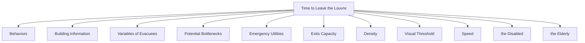
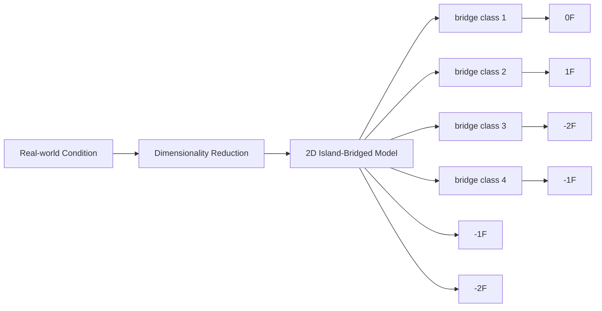
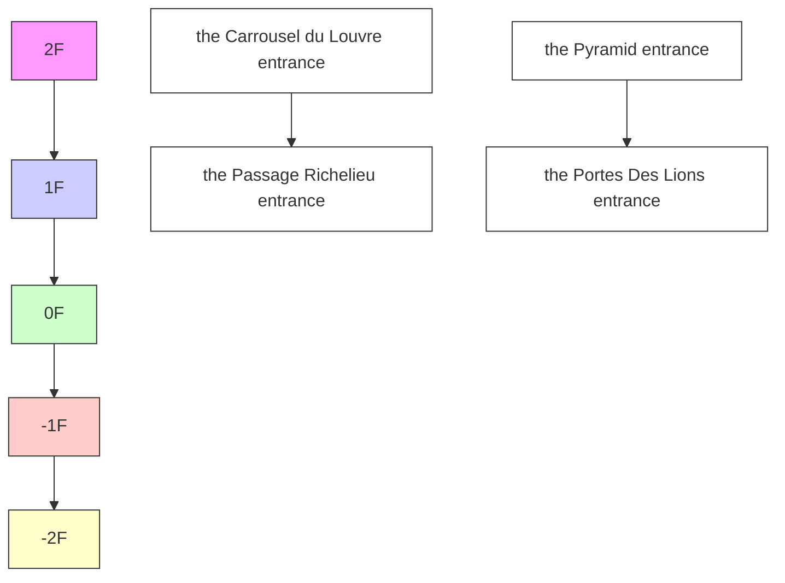
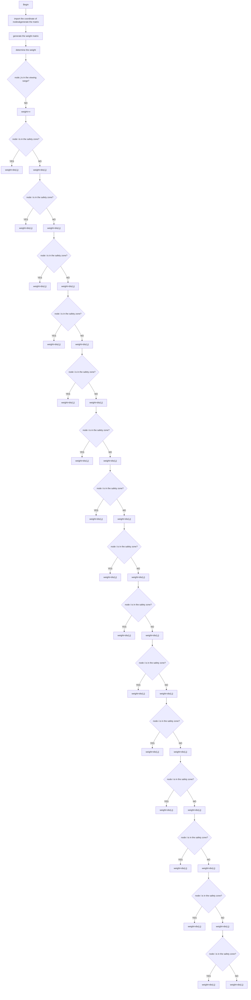
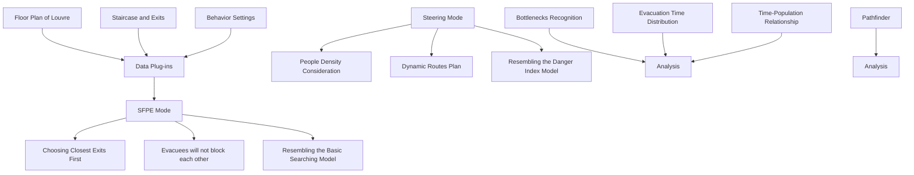

For office use only

T1

T2

T3

T4

Team Control Number

## 1900007

Problem Chosen

D

For office use only

F1

F2

F3

F4

2019 2019

MCM/ICM

Summary Sheet

# Analysis of the Optimal Evacuation Plan Based on 2D and 3D Models

## Summary

We are tasked to analyze the optimal evacuation plan for the Louvre. To this end, we construct both the 2D model and the 3D model to derive the optimal plan. We successfully utilize our models to determine the potential bottlenecks, plan the use of additional exits and let the emergency personnel enter. We take three dimensions of factors into account: the diversity of evacuees (e.g. the disabled, the elderly, etc.), people’s behaviors and the attributes of the building. We provide sufficient visualized results in order to explain our model intuitively.

In the 2D Island-Bridge Model, we reasonably planarize the building and discretize the space into dense nodes. Then, we construct the Basic Searching Submodel to calculate the optimal evacuation route and time for different varieties of people. We also form a method to solve the unbalanced usage of each exit. Then, we form the Danger Index Submodel, which gives insight to the real-time distribution of Danger Index in the building. Furthermore, we utilize these submodels to answer how to take advantage of additional exits and how to let the emergency personnel enter. Finally, we carry out the sensitivity analysis by operating our 2D model under different density of people and different influential range of danger. The result is stable despite these differences, which proves the robustness of the 2D model. Since the methodology of this model always holds true, it can be adapted to different buildings with only slight adjustments.

In the 3D Celluar Automata Model, we precisely construct a 3D copy of the Louvre using AutoCAD, which makes our simulation resemble the real-world situation. We implement the model in Pathfinder software and carry out 3D simulation. The results clearly demonstrate that the bottlenecks are all around exits or stairs. We also give a heat map of the evacuation time in different places of each floor.

As a conclusion, we write a letter of advice to the emergency manager, offering some practical suggestions about the evacuation plan.

## Contents

## 1 Introduction 1

1.1 Restatement of the Problem  
1.2 Literature Review .  
1.3 Our work . .

## 2 Preparation of the Models 3

2.1 Assumptions . . 3  
2.2 Notation 4

## 3 The 2D Island-Bridge Model (2D-IBM) 4

3.1 Basic Structure of the Model . . . 4  
3.2 Dimensionality Reduction Method . . . . 6  
3.3 Spacial Discretization Method . . 7  
3.4 Basic Searching Model 8  
3.5 Danger Index Model . . 11  
3.6 How to Utilize Additional Exits? 13  
3.7 How to Let Emergency Personnel Enter? . . . 13  
3.8 Model Evaluation and Sensitivity Analysis . . 14

## 4 The 3D Cellular Automata Model (3D-CAM) 15

4.1 The Mechanism of the Model 15  
4.2 Visualized Result of the Model 16  
4.3 Determining the Potential Bottleneck . . . . 17

## 5 Strengths and Weaknesses 18

5.1 Strengths . . 18  
5.2 Weaknesses 18

## 6 Conclusion: A Letter of Advice to the Emergency Manager 18

## References 19

## Appendices 20

## A Our Simulation Codes Written in MATLAB 20

## 1 Introduction

## 1.1 Restatement of the Problem

In France alone, there have been at least 12 major terror-related incidents since 2012, and the number is still increasing. In face of an emergency, panic-stricken people, if not properly guided, tend to flee around like headless chickens, causing massive chaos at the scene. The mayhem could hurt even more than the attack itself, especially in crowded space such as indoor museums like the Louvre. Therefore, establishing an effecitve emergency evacuation plan is critical as to eliminate unnecessary disorder and casualties. Here, we are required to design a model to guide evacuation from the Louvre or other multi-storey buildings.

There are three major objectives:

• Find the optimal evacuation plan, which means enabling people to evacuate the buliding in the fastest and safest manner, as well as allowing emergency personnel to enter as quickly as possible.

• Determine the potential bottlenecks that may cause congestion and stagnation. In our model, a bottleneck is defined as a particular location where the passing speed is extremely slow.

• Universalize the model, that is, adjust our model so that it can be adapted to a broad set of potential threats.

## 1.2 Literature Review

Based on the differences in mechanisms of spacial movement, current models of indoor emergency evacuation can be divided into four catagories[1]: network-based models, particle-based models, cellular-based models and ant-based models.

The network-based model simplified evacuation as a flow of people moving at a certain speed in the network[2]. The particle-based model considered people as selfdriving particles controlled by various internal and external forces[3]. The cellularbased model employed cellular automata theory to simulate the evacuation process by the spatio-temporal modeling method[4]. The ant-based model utilized ant colony algorithm, to perceive the real-time change and find the optimal path in a dynamic way[5].

## 1.3 Our work

We construct two distinctive models: the 2D Island-Bridge Model (2D-IBM) and the 3D Cellular Automata Model (3D-CAM).

In the 2D Island-Bridge Model (2D-IBM), we develop the following methods or submodels in four steps.

First, we develop a Dimensionality Reduction Method, which planarizes the movement on 3D multi-storey building as equivalent 2D horizontal motion. Secondly, we establish the Spacial Discretization Method. We discretize the space of the 2D "building" into dense nodes with certain coordinates. People are designed to move from one node to the other. Thirdly, we form a Basic Searching Model, which bases the evacuees’ route choice on three factors: their distance from each exit, their distance from the source of danger and the maximum capacity of each exit. We use it to solve the problem of congestion around exits, which is a potential bottleneck. The Dijkstra Searching Algorithm is utilized in this model. Fourthly, we form the Danger Index Model, which can provide the real-time distribution of Danger Index in the buiding. Thus, the emergency manager can have a direct understanding of emergency. In this model, the density of evacuees in each mesh are also included, thus adding the degree of congestion and stagnation into consideration.

After completing the construction of the 2D-IBM Model, we employ it to discuss problems of how to utilize additional exits and how to let emergency personnel enter. Finally, we carry out the sensitivity analysis and validate that our 2D-IBM Model stays robust despite the changes of the attributes of the building, the location of the danger source, the influence range of danger and the density of people.

In the the 3D Celluar Automata Model, we construct a 3D model of the Louvre using AutoCAD, and then implement it into Pathfinder, a professional and mature software, to simulate the evacuation process based on Celluar Automata Method. The 3D simulation clearly demonstrates the bottlenecks of evacuation and provide some other useful data.

All in all, we take a wide varieties of factors into consideration, including the diversity of evacuees, human behavior patterns, and building information. The specific factors we consider are shown in Figure 1.


<details>
<summary>flowchart</summary>


</details>

Figure 1: The Factors that We Take into Account

## 2 Preparation of the Models

## 2.1 Assumptions

It is difficult to study the actual situation in the Louvre because of the irregular shape of the building, the extreme complication of interior structure and the unpredictability of human behavior. In order to simplify the problem and to hold the correctness of results at the same time, we make the assumptions below:

(If there is no special explanation, the assumptions below are applied to both the 2D-IBM and the 3D-CAM Model. )

1. We simplify the shape of the Louvre museum, viewing each storey as a standard, two-dimensional ’U’ shape composed of three rectangles (the grey area). [Only Applicable in the 2D-IBM Model]

The exact data are labeled in Figure 2. With careful calculation, we set the total area of the simplified storey almost the same as that of the real-world condition. Therefore, the range of movement holds the same.


<details>
<summary>text_image</summary>

650 metre
Richelieu
Sully
170 metre
Denon
50 metre
</details>

Figure 2: The Simplified Storey in the Louvre

2. We assume that EVERY place of the simplified storey is walkable.

That is to say, we ignore the physical barriers (e.g. exhibits) in the way, because we can hardly know the exact distribution of exhibits and other facilities. The only barrier of movement we consider is the boundaries and the source of danger.

3. We treat every staircase and every escalator as identical, and suppose that they both function as two-way stairs in case of emergency.

First, it is understandable that escalators will be shut down in case of emergency, made to function the same as staircases. Therefore, staircases and escalators are treated equally as passageways between two storeys. Plus, we assume that passageways between two storeys share completely identical attributes for simplicity.

4. We regard the initial distribution of evacuees as random.

Though there might be more people piling up in front of some world-renowned masterpiece (e.g. the Mona Lisa), the cumulative effect is localized and smallscale. Compared to a total of 400,000 art works in the Louvre, the masterpiece which may cause cumulative effect resembles a drop in the ocean. Thus, random initial distribution of people is a reasonable assumption.

5. We suppose that evacuees become aware of the emergency and start escaping simultaneously. Plus, they will follow the guidance.

That is, first, we ignore the time lag of knowing the emergency, because it is tiny compared to the whole evacuation process. Second, if evacuees do not follow the guidance, their behavior will become unpredictable, and the evacuation plan will be of little use.

6. We regard different evacuees as points with different attributes moving in the two-dimensional space. [Only Applicable in the 2D-IBM Model]

This assumption is a complement of the "simplified storey assumption" (assumption 1) discussed above. It should be stressed that, each point of evacuee, though abstracted, still has its distinctive human characteristics. For example, the maximum speed of the point representing the elderly is slower than that of the young "point".

7. The data provided by the Louvre are representative.

Though the most recent annual report of the Louvre[6] was updated in 2014, we still assume these data are representative and ignore the potential errors related to them. Some important data we will use are listed in Table 1.

Table 1: Some Important Data about the Louvre

<table><tr><td>Item</td><td>Data</td></tr><tr><td>Visitors per Year</td><td>9.3 million</td></tr><tr><td>Ratio of Young and not Disabled Visitors</td><td>72.1%</td></tr><tr><td>Ratio of Old and not Disabled Visitors</td><td>21.1%</td></tr><tr><td>Ratio of Disabled Visitors</td><td>6.8%</td></tr></table>

## 2.2 Notation

The primary notations in our paper are listed in Table 2. There can be some other notations to be defined later.

## 3 The 2D Island-Bridge Model (2D-IBM)

## 3.1 Basic Structure of the Model

In the 2D Island-Bridge Model (2D-IBM), we develop the following methods and submodels subsequently.

Table 2: Notation

<table><tr><td>Symbol</td><td>Definition</td></tr><tr><td> $dis(i, j)$ </td><td>the distance between node i and node j</td></tr><tr><td> $e_{(i,j)}$ </td><td>the weight of edge between node i and node j</td></tr><tr><td> $R_{dead}$ </td><td>the radius of deadly area which can not be entered</td></tr><tr><td> $S_{node}$ </td><td>the sum of nodes</td></tr><tr><td> $S_{people}$ </td><td>the sum of people indoor in the case of emergency</td></tr><tr><td> $ρ_{people}$ </td><td>the density of people indoor in the case of emergency</td></tr><tr><td> $S_{dis}$ </td><td>the sum of distance travelled by all evacuees</td></tr><tr><td> $V_{range}$ </td><td>the maximum visual range of an individual</td></tr><tr><td> $α_{exit}^{(s)}$ </td><td>the maximum ratio of people exiting from exit s (an independent variable reflecting the attribute of exit s)</td></tr><tr><td> $S_{exit}^{(s)}$ </td><td>the number of people exiting from exit s</td></tr><tr><td> $t_{individual}$ </td><td>the average time for each individual to evacuate</td></tr><tr><td> $t_{elderly}$ </td><td>the average time for each elder to evacuate</td></tr><tr><td> $t_{youth}$ </td><td>the average time for each young people to evacuate</td></tr><tr><td> $t_{disabled}$ </td><td>the average time for each disabled people to evacuate</td></tr><tr><td> $R_{mesh}$ </td><td>the radius of each single mesh</td></tr><tr><td> $N_{mesh}^{(i)}$ </td><td>the number of people in mesh i</td></tr><tr><td> $w_{density}^{(i)}$ </td><td>the density weight of mesh i</td></tr><tr><td> $w_{emergency}^{(i)}$ </td><td>the emergency weight of mesh i</td></tr><tr><td> $w_{exit}^{(i)}$ </td><td>the exit weight of mesh i</td></tr><tr><td> $DI^{(i)}$ </td><td>the danger index of mesh i</td></tr></table>

• Step 1: We develop a Dimensionality Reduction Method, which planarizes the movement on staircases as equivalent 2D horizontal motion. Based on this method, we substitute the multi-storey building into a 2D planar space. Each storey resembles an "island", and each staircase resembles a "bridge" connecting two islands. See Figure 3.  
• Step 2: We establish the Spacial Discretization Method. We discretize the space of the "island" into dense nodes, and then place the "island" in a rectangular coordinate system to get the coordinate of each node. We save these nodes’ coordinates in the form of matrix for the sake of programming. People are designed to move from one node to the other.  
• Step 3: We build a Basic Searching Model, which bases the evacuees’ route choice on three factors: their distance from each exit, their distance from the source of danger and the maximum capacity of each exit. We also take into account the diversity of visitors, such as the elderly, the disabled, etc. Then, we utilize Dijkstra Searching Algorithm to implement the model in MATLAB. After randomly distributing people in the "building" and selecting a source of danger, we simulate the optimal evacuation route for every individual, and visualize the result.  
• Step 4: We optimize the Basic Searching Model and form the Field-based Model In this refined model, we add the degree of congestion and stagnation into consideration by measuring the density of evacuees in each mesh. Then, We calculate


<details>
<summary>flowchart</summary>


</details>

Figure 3: Schematic Diagram of the Dimensionality Reduction Method. Each storey resembles an island, and each staircase resembles a bridge connecting two "island"s.

the weight of each mesh in terms of the influence exerted by density of people, distance from danger and distance from exits. After that, we combine the three kind of weight to form Danger Index (DI) of each mesh, and calculate it. Finally, we visualize the result with a heat map.

## 3.2 Dimensionality Reduction Method

The philosophy of the 2D Island-Bridge Model (2D-IBM) is dimensionality reduction. Dimensionality reduction is the process of reducing the number of irrelevant variables in order to obtain a set of principal variables which can reflect the attributes of the high dimensional object. For example, the sun shines through leaves (high dimension, 3D), casting shadow (low dimension, 2D) on the ground. Despite the dimension of shadow is lower than that of leaves, you can still have a rough idea of the leaves’ shape. In other words, it is feasible to simulate the core attributes of high-dimensional objects with low-dimentional ones.

Back to our problem, evacuees move both horizontally and vertically on stairs, which is a 3D motion. Our Dimensionality Reduction Method seeks to planarize the movement on stairs as 2D horizontal motion.

We abstract all the stairs between two storeys as "bound-together", and then choose a "junction point" on either storey. We take the distance between each stair and "junction point" into account. Then we calculate the equivalent length and width of the planarized "bound-together" stair with the equations below:

$$
\eta_ {i} = \frac {\operatorname{dis} (i , j u n c)}{\sum_ {i = 1} ^ {n} \operatorname{dis} (i , j u n c)} \tag {1}
$$

$$
(L e n g t h) _ {e q} = \frac {1}{n} \cdot \sum_ {i = 1} ^ {n} [ \eta_ {i} \cdot (l e n g t h) _ {i} ]
$$

$$
(W i d t h) _ {e q} = (w i d t h) _ {i} \tag {3}
$$

where n is the number of stairs between two neighbouring storeys, i is the serial number of a stair, and $d i s ( i , j u n c )$ is the distance between the "junction point" and stair # i, $( l e n g t h ) _ { i }$ and $( w i d t h ) _ { i }$ are the original length and width of stair # i.

In Equation (1), $\eta _ { i } ~ \in ~ [ 0 , 1 ]$ is the normalized distribution coefficient, which has a positive correlation with the equivalent length. And $\eta _ { i } \cdot ( l e n g t h ) .$ i represents the weighed length of each stair. Therefore, Equation (2) represents the ultimate equivalent length between two storeys.

According to Assumption 3, we treat every staircase as identical, so the equations can be simplified as below.

$$
(L e n g t h) _ {e q} = \frac {L}{n} \cdot \sum_ {i = 1} ^ {n} \eta_ {i} = \frac {L}{n} \tag {4}
$$

$$
(W i d t h) _ {e q} = W \tag {5}
$$

Then, we substitute the data into the equations above $( L = 1 0 0 m , W = 2 0 m , n =$ $3 ( - 2 F , - 1 F ) , 1 3 ( - 1 F , 0 F ) , 2 8 ( 0 F , 1 F ) , 1 4 \hat { ( } 1 F , 2 F ) )$ ) and get the exact shape of the equivalent 2D "building". See Figure 4.


<details>
<summary>flowchart</summary>


</details>

Figure 4: The Dimensionality-reduction Building

## 3.3 Spacial Discretization Method

We discretize the space of the 2D "building" into dense nodes, and then place the "building" in a rectangular coordinate system to get the coordinate of each node. We save these nodes’ coordinates in the form of matrix for the sake of programming. (The four blue circle in Figure 5 respectively represent one of the four frequently-used exits.)


<details>
<summary>bar chart</summary>

Node Distribution of the 2D Model
| Node | x/m* |
|---|---|
| -2F | 650 |
| -1F | 650 |
| 0F | 600 |
| 1F | 600 |
| 2F | 650 |

| Exit1, Exit2, Exit3, Exit4 | y/m* |
| :--- | :--- |
| Exit1: Source of Danger (red dot) | 580 |
| Exit2: Exit1 (blue dot) | 120 |
| Exit3: Exit2 (blue dot) | 330 |
| Exit4: Exit2 (blue dot) | 480 |
</details>

Figure 5: Node Distribution of the 2D Model

## 3.4 Basic Searching Model

We base the Basic Searching Model on Dijkstra Searching Algorithm (DSA), which can figure out the optimal route from a given origin to an appointed destination. In our model, each evacuee is considered as an origin, and the closest exit for him/her is the corresponding destination. The Dijkstra Searching Algorithm can only find the shortest path to a single destination at a time, but the evacuee has 4 potential destinations (4 different exits). So in order to figure out the optimal exit, we separatedly set the 4 exits as the destination and carry out Dijkstra Searching Algorithm. Certainly, we will find four different "short route". The optimal exit for that evacuee is the exit of the shortest route among the four.

In a traditional Dijkstra Searching Algorithm, the weight of an edge is defined as the geometric distance between the two nodes.

However, we make some adjustions based on real-world conditions. First, evacuees can only assess the condition within their visual threshold and choose to head towards one place. So in our model, only the weight between adjacent nodes within an evacuee’s visual threshold can be set in the traditonal way: dis(i, j). Plus, it is apparent that evacuees should not choose the nodes located in the deadly zone, even if it is close to both of the exit and the current node. Therefore, the weight of all edges within the deadly zone should be set as infinity.

To sum up, in our model, weight of the edge between Node #i and Node #j is defined by the equation below.

$$
e _ {(i, j)} = \left\{ \begin{array}{l l} d i s (i, j) & i \neq j, d i s (i, j) \leq V _ {\text { range }}, \text { and   Node   \#j   is   not   in   the   danger   zone } \\ 0 & i = j, \\ \infty & \text { otherwise. } \end{array} \right. \tag {6}
$$

where

• $e ( i , j )$ is the weight of edge between Node #i and Node #j,  
• $d i s ( i , j )$ is the geometric distance between Node #i and Node #j,  
• $R _ { d e a d }$ is the radius of the deadly zone,  
• $V _ { r a n g e }$ is an individual’s maximum visual threshold.

We draw a flow chart to illustrate our Basic Searching Model. See Figure 6.


<details>
<summary>flowchart</summary>


</details>

Figure 6: The Flow Chart Describing the Basic Search Model

After implementing the model in MATLAB, we can figure out the optimal evacuation route for each individual and its length. Given the speed and proportion of different kinds of people (e.g. the elderly, the disabled), we can calculate the average evacuation time using the equations below.

$$
\overline {{t _ {i n d i v i d u a l}}} = \frac {S _ {d i s}}{S _ {p e o p l e} \cdot \sum P _ {k} \cdot v _ {k}}, \quad k \in \{e l d e r, y o u n g, d i s a b l e d \}
$$

$$
\overline {{t _ {k}}} = \frac {S _ {\text { dis }}}{S _ {\text { people }} \cdot v _ {k}}, \quad k \in \{\text { elder }, \text { young }, \text { disabled } \} \tag {8}
$$

We also establish a method to avoid congestion around exits, which may become the potential bottleneck. If we do not control the maximum ratio of people passing through a certain exit, chances are that the majority of evacuees are allocated to the same exit because of the limited number and uneven distribution of the exits, just as the following figure illustrates. See Figure 7.

Part(I) of Figure 7 shows optimal evacuation routes(the lines). Part(II) illustrates the ratio of people passing through each exit. We can clearly see that 90% of the evacuees leave the building from Exit #1, making this exit extremely overloaded. The overused exit will be jammed and may become the potential bottleneck.


<details>
<summary>scatterplot</summary>

| Exit   | x/m  | y/m  |
|--------|------|------|
| Exit1  | 580  | 600  |
| Exit2  | 100  | 450  |
| Exit3  | 300  | 600  |
| Exit4  | 500  | 600  |
| Source of Danger | 580 | 550  |
</details>

()


<details>
<summary>pie chart</summary>

| Category | Value (%) |
|---|---|
| S_exit^(1) | 90 |
| S_exit^(2) | 1 |
| S_exit^(3) | 4 |
| S_exit^(4) | 5 |
</details>

(II)  
Figure 7: The Result Without Setting the Ratio of People Passing Through a Certain Exit.

To solve the congestion around exits, all exits should be utilized in a balanced way. We can adjust the maximum ratio of people using exit #s $( \alpha _ { e x i t } ^ { ( s ) } )$ to disperse the pressure $\alpha _ { e x i t } ^ { ( s ) }$ The results are shown in Figure 8. It is clear that the overuse and congestion of Exit #1 are greatly relieved.


<details>
<summary>line chart</summary>

| Point | x/m  | y/m  |
|-------|------|------|
| Exit1 | 580  | 550  |
| Exit2 | 100  | 470  |
| Exit3 | 300  | 620  |
| Exit4 | 500  | 820  |
| Source of Danger | 600 | 550  |
</details>

()


<details>
<summary>pie chart</summary>

| Category | Percentage (%) |
| :--- | :--- |
| S_exit^(1) | 50 |
| S_exit^(2) | 41 |
| S_exit^(3) | 4 |
| S_exit^(4) | 4 |
</details>

(II)  
Figure 8: The Result after Setting αexit $\alpha _ { e x i t } ^ { ( s ) }$ as 50%.

Utilizing the equations discussed above, we plug in a set of reasonable data listed in Table 3, and calculate the average time to leave the Louvre for the elderly, the youth, the disabled, and all the evacuees respectively.

Table 3: Some Data we Use in the Basic Searching Model

<table><tr><td>Item</td><td>Plug-in Data</td></tr><tr><td> $V_{range}$ </td><td>21 m</td></tr><tr><td> $R_{dead}$ </td><td>30 m</td></tr><tr><td> $E_{xy}$ </td><td>(580 m, 550 m)</td></tr><tr><td> $S_{people}$ </td><td>1471</td></tr><tr><td> $P_{youth}$ </td><td>72.1%</td></tr><tr><td> $P_{elderly}$ </td><td>21.1%</td></tr><tr><td> $P_{disabled}$ </td><td>6.8%</td></tr><tr><td> $v_{youth}$ </td><td>1.28 m/s</td></tr><tr><td> $v_{elderly}$ </td><td>1.03 m/s</td></tr><tr><td> $v_{disabled}$ </td><td>0.78 m/s</td></tr><tr><td> $\rho_{people}$ </td><td>0.4 people per node</td></tr><tr><td> $\alpha^{s}_{exit}$ </td><td>0.5</td></tr></table>

The result of the average evacuation time and distance are listed in Table 4

Table 4: Some Data we Use in the Basic Searching Model

<table><tr><td>Item</td><td>Result</td></tr><tr><td> $S_{dis}$ </td><td> $6.33 \times 10^{5}$  m</td></tr><tr><td> $t_{individual}$ </td><td>364.85 s</td></tr><tr><td> $t_{elderly}$ </td><td>413.98 s</td></tr><tr><td> $t_{youth}$ </td><td>336.35 s</td></tr><tr><td> $t_{disabled}$ </td><td>551.95 s</td></tr></table>

## 3.5 Danger Index Model

In order to have a good command of the real-time change of emergency, we establish the Danger Index Model. In this model, we introduce a new concept–"mesh" as the smallest unit of our study, which is the circular area with a node as its centre.

We add the the density of evacuees in each mesh into consideration. Then, We calculate the weight of each mesh in terms of the influence exerted by density of people, distance from danger and distance from exits. After that, we combine the three kind of weight to form Danger Index (DI) of each mesh, and calculate it. Finally, we visualize the result with a heat map.

The weight of a mesh can be calculated in terms of the influence exerted by the density of people, the distance from exits and the distance from the source of danger.

• Density Weight: High density of people surrounding an evacuee will cause congestion and lower the speed, so the density weight of mesh #i can be calculated using the following equation:

$$
w _ {\text { density }} ^ {(i)} = \frac {N _ {\text { mesh }} ^ {(i)}}{\pi \times R _ {\text { mesh }} ^ {2}} \tag {9}
$$

where N (i) $N _ { m e s h } ^ { ( i ) }$ mesh is the number of people in mesh #i, and $R _ { m e s h }$ is the radius of mesh #i.

• Emergency Weight: It is widely accepted that the degree of danger is inversely proportional to the distance from it. Thus, the emergency weight of mesh #i can be defined by the following equation:

$$
w _ {\text { emergency }} ^ {(i)} = \frac {1}{\operatorname{dis} (i , E _ {x y})} \tag {10}
$$

where $E _ { x y }$ is the source of danger, and $d i s ( i , E _ { x y } )$ stands for the distance between mesh #i and the source of danger.

• Exit Weight: The weight of exit is defined as

$$
w _ {e x i t} ^ {(i)} = \min \left\{\operatorname{dis} \left(i, E x i t ^ {(s)}\right) \right\} \tag {11}
$$

where $\displaystyle d i s ( i , E x i t ^ { ( s ) } )$ refers to the distance from mesh #i to exit #s, because the more distant from the exit, the more time-consuming the evacuation process will be.

The overall degree of danger depends on all of the three factors. Thus, we define the Danger Index (DI) by calculating the weighed sum of these three kinds of weight, as

$$
D I ^ {(i)} = a \cdot w _ {\text { density }} ^ {(i)} + b \cdot w _ {\text { danger }} ^ {(i)} + c \cdot w _ {\text { exit }} ^ {(i)} \tag {12}
$$

where a,b and c are the ratios of the three weight components. In different cases, the significance of each component varies, so we should adjust these ratios to fit different conditions.

For example, we use two different sets of ratios, and visualize the real-time distribution Danger Index of every place using the 3D heat map. At the beginning of an emergency, the source of danger is very influential, so we set a high ratio for Emergency Weight, and the result is shown in Part(I) of Figure 9. However, after some time, the source of danger alleviates, so we can lower the ratio of emergency, and figure out the up-to-date distribution of Danger Index like Part(II) of Figure 9.

The emergency manager can adjust the ratio of the current key influence, and have an understanding of the real-time Danger Index in the building.


<details>
<summary>3d area chart</summary>

| y/m | DI^(i) |
| --- | --- |
| 0   | 500 |
| 200 | 200 |
| 400 | 100 |
| 600 | 50 |
| 800 | 100 |
| 1000| 200 |
</details>


<details>
<summary>3d area chart</summary>

| x/m | y/m | D1(i) |
| --- | --- | --- |
| 0   | 0   | 0   |
| 500 | 200 | 0   |
| 600 | 400 | 0   |
| 700 | 600 | 0   |
| 800 | 800 | 0   |
| 900 | 1000| 0   |
| 1000| 1200| 0   |
| 1100| 1400| 0   |
| 1200| 1600| 0   |
| 1300| 1800| 0   |
| 1400| 2000| 0   |
| 1500| 2200| 0   |
| 1600| 2400| 0   |
| 1700| 2600| 0   |
| 1800| 2800| 0   |
| 1900| 3000| 0   |
| 2000| 3200| 0   |
| 2100| 3400| 0   |
| 2200| 3600| 0   |
| 2300| 3800| 0   |
| 2400| 4000| 0   |
| 2500| 4200| 0   |
| 2600| 4400| 0   |
| 2700| 4600| 0   |
| 2800| 4800| 0   |
| 2900| 5000| 0   |
| 3000| 5200| 0   |
| 3100| 5400| 0   |
| 3200| 5600| 0   |
| 3300| 5800| 0   |
| 3400| 6000| 0   |
| 3500| 6200| 0   |
| 3600| 6400| 0   |
| 3700| 6600| 0   |
| 3800| 6800| 0   |
| 3900| 7000| 0   |
| 4000| 7200| 0   |
| 4100| 7400| 0   |
| 4200| 7600| 0   |
| 4300| 7800| 0   |
| 4400| 8000| 0   |
| 4500| 8200| 0   |
| 4600| 8400| 0   |
| 4700| 8600| 0   |
| 4800| 8800| 0   |
| 4900| 9000| 0   |
| 500 |     |     |
</details>

Figure 9: Distribution of Danger Index with Different Sets of Ratios

## 3.6 How to Utilize Additional Exits?

Utilizing the Danger Index Model, we can easily take advantage of the additional exits. Here is our plan.

First, all of the four main exits should be used for evacuation purpose, since they are more familiar to the evacuees and can be monitored by the app "Affluences".

Plus, based on the real-time Danger Index (DI) distribution, we can calculate the proportion of the additional exits that should be open for evacuation purpose. We set a danger threshold. When the emergency happens, we count the number of evacuees located in meshes whose DI is above the security threshold, and define the number as $P _ { d a n g e r }$ . Suppose we have n additional exits, and i of them are open for evacuation purpose, we can adjust i according to $P _ { d a n g e r }$ . The specific relationship between them can be described by Equation (13).

$$
i = \left\{ \begin{array}{l l} n & P _ {\text { danger }} > a, \\ n - 1 & b <   P _ {\text { danger }} \leq a, \\ n - 2 & c <   P _ {\text { danger }} \leq b, \\ \vdots & \vdots \\ 0 & P _ {\text { danger }} \approx 0. \end{array} \right. \tag {13}
$$

$a , b , c . \dots$ . in the equation can be determined by Fuzzy Sets or Monte Carlo method. However, due to the lack of specific data, we will not detail it here.

## 3.7 How to Let Emergency Personnel Enter?

To assist the emergency personnel, we can utilize our Basic Searching Model and Danger Index Model to determine the best doors to enter and optimal routes in the building.

First, emergency personnel should enter from the underused main exits and the additional exits that are not open for evacuation. As for the former, the ratio of evacuees passing through a certain main exit can be adjusted by our Basic Searching Model. Therefore, we can decrease the ratio of an exit to make way for the emergency personnel. As for the latter, the additional exits that are not open for evacuation can all be used to enter the building.

Second,upon entering the building, emergency personnel should travel from places with low Danger Index to the ones with high Danger Index, which is just the contrary to evacuees. (The real-time distribution of Danger Index can be calculated by our Danger Index Model.) In this way, they can quickly cope with the source of danger or dredge the crowd with high density.

## 3.8 Model Evaluation and Sensitivity Analysis

To test the sensitivity, we operate the model under several different conditions. We change the density of people $( \rho _ { p e o p l e } )$ , the radius of the deadly zone $( R _ { d e a d } )$ , the maximum ratio of usage of exit #i $( \alpha _ { e x i t } ^ { ( i ) } )$ , and calculate the corresponding average time of evacuation for each kind of people. Then, we visualize our results with the figures below.


<details>
<summary>line chart</summary>

the Time of Evacuation under Different ρpeople
| ρpeople | t_individual | t_elderly | t_youth | t_disabled |
|---|---|---|---|---|
| 0.2 | 385 | 440 | 355 | 585 |
| 0.3 | 365 | 415 | 335 | 550 |
| 0.4 | 365 | 415 | 335 | 550 |
| 0.5 | 375 | 425 | 345 | 565 |
| 0.6 | 375 | 425 | 345 | 570 |
| 0.7 | 375 | 425 | 345 | 570 |
</details>


<details>
<summary>line chart</summary>

the Time of Evacuation under Different R_dead
| R_dead | t_individual (s) | t_elderly (s) | t_youth (s) | t_disabled (s) |
|---|---|---|---|---|
| 22 | 385 | 440 | 355 | 580 |
| 24 | 385 | 440 | 355 | 575 |
| 26 | 380 | 435 | 350 | 565 |
| 28 | 385 | 435 | 350 | 570 |
| 32 | 370 | 425 | 340 | 555 |
| 34 | 375 | 430 | 345 | 565 |
</details>


<details>
<summary>line chart</summary>

the Time of Evacuation under Different α_exit^(s)
| α_exit^(s) | t_individual | t_elderly | t_youth | t_disabled |
|---|---|---|---|---|
| 0.3 | 430 | 495 | 400 | 650 |
| 0.35 | 415 | 480 | 385 | 625 |
| 0.4 | 405 | 465 | 375 | 610 |
| 0.5 | 370 | 425 | 345 | 555 |
| 0.6 | 375 | 430 | 345 | 570 |
| 0.7 | 375 | 430 | 345 | 565 |
</details>


<details>
<summary>box plot</summary>

| exit^(i) | S_exit^(i) |
| -------- | ---------- |
| i=1      | ~1100      |
| i=2      | ~900       |
| i=3      | ~100       |
| i=4      | ~100       |
</details>

Figure 10: The Framewok of the 3D Cellular Automata Model(3D-CAM)

The first and second part of Figure 10 tell us that the evacuation time for each kind of people is almost same despite the difference of the density of people $( \rho _ { p e o p l e } )$ and the varied radius of the deadly zone $( R _ { d e a d } )$ . This means our model is not sensitive to these varibles. Thus, we can apply the 2D-IBM Model to analyze emergency events of different severity and different number of influenced people. Therefore, though the number of guests in the museum varies throughout the day and year, the results are stable.

The third part of Figure 10 shows that the time of evacuation is not that stable when $\alpha _ { e x i t } ^ { ( i ) }$ exit is smaller than 0.5. But if $\alpha _ { e x i t } ^ { ( i ) }$ varies between 0.5 to 0.7, the evacuation time is nearly constant. We can conclude that our model is robust when the capacity of the exits is enough. However, if the capacity of each door becomes too small, evacuees have to wind their way to avoid potential congestion. Thus our model becomes a little unstable under such condition.

The fourth part of Figure 10 reflects that the sum of people passing through exit #1 or #2 of the Louvre increases greatly as the density of people rises, while that of exit #3 or #4 is hardly affected. This diagram shows that the usage of exit #1 and #2 is near the saturation state, as apposed to exit #3 and exit #4, which are usually underused.

## 4 The 3D Cellular Automata Model (3D-CAM)

## 4.1 The Mechanism of the Model

The 2D-IBM Model is concise, but somehow too abstract. In order to simulate the evacuation process in an intuitive way, we build the 3D Cellular Automata Model (3D-CAM). In this model, we construct a 3D copy of the Louvre using AutoCAD, and then implement it into Pathfinder, a professional and mature software which simulates the evacuation process based on Celluar Automata Method. The 3D simulation clearly demonstrates the bottlenecks of evacuation on each floor and gives the heat map of the evacuation time in different places of each floor.


<details>
<summary>flowchart</summary>


</details>

Figure 11: The Framewok of the 3D Cellular Automata Model(3D-CAM)

The framework of the 3D-CAM Model is illustrated in Figure 11. As shown in this figure, the floor plan of the Louvre, location of staircases and exits and human behavior patterns are integrated to guide the evacuation. The 3D indoor space is divided into triangular cellular space[9], like Figure 12.


<details>
<summary>natural_image</summary>

Abstract geometric pattern with triangular and diamond shapes, no text or symbols present
</details>

Figure 12: Triangular Cellular Space[9]

The search of evacuation routes for each individual is divided into two different modes, the SFPE Mode and the Steering Mode. Attributes of the two modes are shown in the figure. The mechanism of the former resembles our Basic Searching Model and the latter is like our Danger Index Model. After implementing the data and selecting a simulation mode, the Pathfinder software can provide visualized real-time condition of the evacuation process.

## 4.2 Visualized Result of the Model


<details>
<summary>heatmap</summary>

| Condition | Time to Exit (s) |
| --------- | ---------------- |
| -2F       | ~360             |
| -1F       | ~280             |
| 0F        | ~200             |
| 1F        | ~160             |
| 2F        | ~120             |
</details>

Figure 13: The Heat Map of Evacuation Time in Different Places of Each Floor

After running the simulation, we can get the heat map of evacuation time in different places of each floor. See Figure 13. The "hotter" a spot is, the longer it will take an individual to evacuate from that spot. Different colors in the heat map is of similar meaning to the different "Danger Index" in our 2D-IBM Model. Comparing Figure 13 with Figure 9, we notice that the distribute of color is of the same trend, which indirectly proves that our Danger Index Model is reasonable.

## 4.3 Determining the Potential Bottleneck

The Pathfinder simulation dynamically shows the real-time density of evacuees in a certain place, and forms the heat map of density on each floor. With the aid of it, we can easily figure out the bottlenecks on each floor, which are clearly shown in Figure 14, 15.

These bottlenecks are located either near staircases or close to exits, which makes sense. However, due to the difference of locations, not all the stairs or exits can be the potential bottleneck. For example, only a few evacuees choose to leave from distant exits.

  
Figure 14: The Potential Bottlenecks on each Floor


<details>
<summary>heatmap</summary>

| Location | Density (occ/m^2) |
| -------- | ----------------- |
| Exited   | 3218 / 14965      |
| 121.1    | 0.55              |
</details>

Figure 15: The Potential Bottlenecks–Focus

## 5 Strengths and Weaknesses

## 5.1 Strengths

1. Our Dimensionality Reduction Method successfully planarizes the building, thus simplifying the calculation greatly.  
2. Our Basic Searching Model and Danger Index Model take the attributes of the building into consideration (e.g. the capacity of exits, the distribution of staircases, etc.), so it can be adapted to other large and crowded structures easily.  
3. Our Basic Searching Model and Danger Index Model consider many hominine factors (e.g. the diversity of evacuees, the density of evacuees, etc.), so our routes can guarantee the evacuees’ security to a large extent.  
4. Our model is not sensitive to the density of people and the severity of the emergency, which gurantees its robustness.  
5. Our 3D Cellular Automata Model successfully constructs a well-designed 3D model of Louvre, allowing the simulation to resemble the real-world situation.

## 5.2 Weaknesses

1. The Dijkstra Searching Method needs to call the searching function repeatedly, leading to a comparatively high Time Complexity of the algorithm.  
2. Our 2D Island-Bridge Model discretizes the spaces into nodes. The discretization method replace the continuous movement of people with the leap between two adjacent nodes. This method deserves further justification.

## 6 Conclusion: A Letter of Advice to the Emergency Manager

Dear Sir/Madam,

We are a group of students participating in the 2019 ICM contest who chose the "Time to Leave the Louvre" problem. We would like to give some advice based on our work to better your evacuation plan.

First of all, we think it’s crucial to add more dectectors and sensors in the museum to monitor the density of evacuees and collect some other information. Plus, you should also suggest the visitors to utilize the positioning function of their smartphones to help you calculate their distance to each exit and the danger source. With these data in hand, you can have a good command of the real-time distribution of Danger Index in the building by our Danger Index Model. Then, you can work out the optimal evacuation route for people in different places of the museum. It’s necessary to implement an evacuation navigation function in the "Affluences" APP, so that everyone can get to know their own optimal route.

Secondly, we strongly advice you to guarantee that the exits and stairs are not occupied or stuck. Stairs and Exits play key roles in the evacuation process, and they are very likely to cause congestion or stagnation and become bottlenecks of evacuation.

Finally, we will be very glad if you can take time to read our paper and we hope our advice will be of help to you. If you have any questions, please feel free to ask us.

Sincerely,

Members of Team #1900007

## References

[1] Xiong, Q.; Zhu, Q.; Du, Z.; Zhu, X.; Zhang, Y.; Niu, L.; Li, Y.; Zhou, Y. A Dynamic Indoor Field Model for Emergency Evacuation Simulation. ISPRS International Journal of Geo-Information, 2017, 6, 104.  
[2] Lo, S.M.; Fang, Z.; Chen, D.H. Use of a modified network model for analyzing evacuation patterns in high-rise buildings. J. Archit. Eng, 2001, 7, 21–29.  
[3] Helbing, D.; Farkas, I.; Vicsek, T. Simulating dynamical features of escape panic. Nature, 2000, 407, 487–490.  
[4] Kirchner, A.; Schadschneider, A. Simulation of evacuation processes using a bionics-inspired cellular automaton model for pedestrian dynamics. Phys. A Stat. Mech. Appl., 2002, 312, 260–276.  
[5] FENG Weiwei; QIU Jiong. Application of Ant Colony Algorithm in Fire Evacuation Platform(in Chinese). Electronic Science and Technology., 2015, 4, 13-16.  
[6] Louvre 2014 Annual Report.pdf. https://www.louvre.fr/sites/default/files/rapport\_activite/ fichiers/PDF/louvre-2014-annual-report.pdf  
[7] Louvre Plan Visitors Mobility Impairments.pdf. https://www.louvre.fr/sites/default/files/medias/ medias\_fichiers/fichiers/pdf/louvre-plan-visitorsmobility-impairments.pdf  
[8] Louvre Interactive Floor Plans. https://www.louvre.fr/en/plan  
[9] Pathfinder 2012 Technical Reference.pdf.

## Appendices

## A Our Simulation Codes Written in MATLAB

DijkstraMain.m  
```matlab
clear all
clc
load('node.mat');
C=X;
n=size(C,1);
D=zeros(n,n);

viewpoint=21;
emerg=[580,550];
scatter(emerg(1,1),emerg(1,2),100,'r','filled');
hold on
thread=30;
totalpeople=0;
totaldistance=0;
e=[0,0,0,0];
alphaexit=0.35;
dens=0.4;
Contain=alphaexit*3700*dens;
for i=1:n
for j=1:n
if i~=j
D(i,j)=sqrt((C(i,1)-C(j,1))^2+(C(i,2)-C(j,2))^2);
else
D(i,j)=0;
end
D(j,i)=D(i,j);
end
end

for i=1:n
for j=1:n
if D(i,j)>viewpoint||sqrt((C(i,1)-emerg(1,1))^2+(C(i,2)-emerg(1,2))^2)<=
thread
D(i,j)=inf;
end
end
end

for ii=1:3700
if rand<=dens&&(sqrt((C(ii,1)-emerg(1,1))^2+(C(ii,2)-emerg(1,2))^2)>thread)
start=ii;
totalpeople=totalpeople+1;
exit=X(3701:3704,:);

if e(1,1)<=Contain
[mydistance1,mypath1]=Djsk(D,start,3701);
else
mydistance1=inf;
```

```matlab
end
if e(1,2)<=Contain
[mydistance2,mypath2]=Djsk(D,start,3702);
else
mydistance2=inf;
end
if e(1,3)<=Contain
[mydistance3,mypath3]=Djsk(D,start,3703);
else
mydistance3=inf;
end
if e(1,4)<=Contain
[mydistance4,mypath4]=Djsk(D,start,3704);
else
mydistance4=inf;
end
Pd=[mydistance1,mydistance2,mydistance3,mydistance4];
[value,index]=min(Pd);
[mydistance,mypath]=Djsk(D,start,3700+index);
e(1,index)=e(1,index)+1;
totaldistance=totaldistance+value;
Xp=[];Yp=[];
for i=1:size(mypath,2)
Xp=[Xp,C(mypath(i),1)];
Yp=[Yp,C(mypath(i),2)];
end
scatter(C(:,1),C(:,2),'b.');
hold on
scatter(exit(:,1),exit(:,2),100,'p','filled');
hold on
plot(Xp,Yp);
hold on
end
xlabel('x/m');
ylabel('y/m');
end
```

Djsk.m  
```matlab
function [res,index] = Djsk(mp, stat, ends)
n=size(mp, 1);
bj=zeros(n, 1);
dis=mp(stat,:);
path=ones(n, 1); path=path.*stat;
dis(stat)=0; bj(stat)=1;
for i=1:n
min=Inf; k=1;
for j=1:n
if (bj(j)~=1)&&dis(j)<min), min=dis(j); k=j; end
end
bj(k)=1;
for j=1:n
if (bj(j)~=1)&&dis(j)>(dis(k)+mp(k,j))), dis(j)=dis(k)+mp(k,j); path(j)=k;
end
end
end
```

```matlab
tem=ends; index(1)=ends; i=2;
while path(tem)~=stat
index(i)=path(tem);
tem=path(tem);
i=i+1;
end
index(i)=stat; index=index(length(index):-1:1); res=dis(ends);
end
```

DangerIndex.m  
```matlab
clear all
clc
load('node.mat');
emerg=[580,550];
X=[X;emerg];
C=X;
n=size(C,1);
totaldens=0.4;
viewpoint=21;
C=[C,zeros(n,1)];
hold on
thread=0;
e=[0,0,0,0];
Rfield=21;
Nfield=zeros(n,1);

rho=zeros(3700,1);
Wemerg=zeros(3700,1);
Wexit=zeros(3700,1);
Neg=zeros(3700,1);

for i=1:n
for j=1:n
if i~=j
D(i,j)=sqrt((C(i,1)-C(j,1))^2+(C(i,2)-C(j,2))^2);
else
D(i,j)=0;
end
D(j,i)=D(i,j);
end
end

for i=1:n
for j=1:n
if D(i,j)>viewpoint||sqrt((C(i,1)-emerg(1,1))^2+(C(i,2)-emerg(1,2))^2)<=thread
D(i,j)=inf;
end
end
end

for i=1:3700
if rand<=totaldens&&(sqrt((C(i,1)-emerg(1,1))^2+(C(i,2)-emerg(1,2))^2)>
    thread)
C(i,3)=1;
end
end
```

```matlab
for i=1:3700
for j=max(1,i-64):min(i+64,3700)
if (sqrt((C(i,1)-C(j,1))^2+(C(i,2)-C(j,2))^2)<=21)&&(C(j,3)==1)
Nfield(i,1)=Nfield(i,1)+1;
end
end
end
for i=1:3700
start=i;
exit=X(3701:3704,:);
[mydistance1,mypath1]=Djsk(D,start,3701);
[mydistance2,mypath2]=Djsk(D,start,3702);
[mydistance3,mypath3]=Djsk(D,start,3703);
[mydistance4,mypath4]=Djsk(D,start,3704);
Pd=[mydistance1,mydistance2,mydistance3,mydistance4];
[value,index]=min(Pd);
Wexit(i,1)=value;
disemerg=sqrt((C(i,1)-emerg(1,1))^2+(C(i,2)-emerg(1,2))^2);
Wemerg(i,1)=1/disemerg;

end

for i=1:3700
rho(i,1)=Nfield(i,1)/(pi*Rfield^2);
end

a=10^2;
b=10^4;
c=1;

for i=1:3700
Neg(i,1)=a*rho(i,1)+b*Wemerg(i,1)+c*Wexit(i,1);
end

f1=1:600;
f2=1:1000;
[F1,F2]=meshgrid(f1,f2);
F3=zeros(600,1000);
F1=F1';F2=F2';
for i=1:600
for j=1:1000
for ii=1:3700
if i==X(ii,1)&&(j==X(ii,2)
F3(i,j)=Neg(ii,1);
end
end
end
end

mesh(F1,F2,F3);
```  
NodeFormation.m

```txt
1 cnt=1;
2 X=[];
3 for i=1:64
4 for j=1:5
```

```matlab
5 X(cnt,1)=10*(i-1)+5;
6 X(cnt,2)=10*(j-1)+5;
7 cnt=cnt+1;
8 end
9 end
10 for i=1:23
11 for j=1:6
12 X(cnt,1)=10*(i-1)+420;
13 X(cnt,2)=10*(j-1)+60;
14 cnt=cnt+1;
15 end
16 end
17 for i=1:64
18 for j=1:4
19 X(cnt,1)=10*(i-1)+5;
20 X(cnt,2)=10*(j-1)+130;
21 cnt=cnt+1;
22 end
23 end
24 for i=1:4
25 for j=1:18
26 X(cnt,1)=5*(i-1)+553;
27 X(cnt,2)=5*(j-1)+175;
28 cnt=cnt+1;
29 end
30 end
31 for i=1:64
32 for j=1:5
33 X(cnt,1)=10*(i-1)+5;
34 X(cnt,2)=10*(j-1)+270;
35 cnt=cnt+1;
36 end
37 end
38 for i=1:17
39 for j=1:6
40 X(cnt,1)=10*(i-1)+480;
41 X(cnt,2)=10*(j-1)+320;
42 cnt=cnt+1;
43 end
44 end
45 for i=1:64
46 for j=1:5
47 X(cnt,1)=10*(i-1)+5;
48 X(cnt,2)=10*(j-1)+390;
49 cnt=cnt+1;
50 end
51 end
52 for i=1:4
53 for j=1:4
54 X(cnt,1)=5*(i-1)+553;
55 X(cnt,2)=5*(j-1)+435;
56 cnt=cnt+1;
57 end
58 end
59 for i=1:64
60 for j=1:5
61 X(cnt,1)=10*(i-1)+5;
62 X(cnt,2)=10*(j-1)+460;
63 cnt=cnt+1;
64 end
```

```matlab
end
for i=1:17
for j=1:7
X(cnt,1)=10*(i-1)+480;
X(cnt,2)=10*(j-1)+510;
cnt=cnt+1;
end
end
for i=1:64
for j=1:4
X(cnt,1)=10*(i-1)+5;
X(cnt,2)=10*(j-1)+580;
cnt=cnt+1;
end
end
for i=1:4
for j=1:2
X(cnt,1)=5*(i-1)+553;
X(cnt,2)=5*(j-1)+625;
cnt=cnt+1;
end
end
for i=1:64
for j=1:4
X(cnt,1)=10*(i-1)+5;
X(cnt,2)=10*(j-1)+640;
cnt=cnt+1;
end
end
for i=1:17
for j=1:6
X(cnt,1)=10*(i-1)+480;
X(cnt,2)=10*(j-1)+690;
cnt=cnt+1;
end
end
for i=1:64
for j=1:5
X(cnt,1)=10*(i-1)+5;
X(cnt,2)=10*(j-1)+755;
cnt=cnt+1;
end
end
for i=1:4
for j=1:4
X(cnt,1)=5*(i-1)+553;
X(cnt,2)=5*(j-1)+805;
cnt=cnt+1;
end
end
for i=1:64
for j=1:5
X(cnt,1)=10*(i-1)+5;
X(cnt,2)=10*(j-1)+825;
cnt=cnt+1;
end
end
for i=1:17
for j=1:7
X(cnt,1)=10*(i-1)+480;
```

```matlab
125 X(cnt,2)=10*(j-1)+875;
126 cnt=cnt+1;
127 end
128 end
129 for i=1:64
130 for j=1:5
131 X(cnt,1)=10*(i-1)+5;
132 X(cnt,2)=10*(j-1)+945;
133 cnt=cnt+1;
134 end
135 end
136 X(3701,:)=[478,536];
137 X(3702,:)=[404,622];
138 X(3703,:)=[324,623];
139 X(3704,:)=[113,454];
```