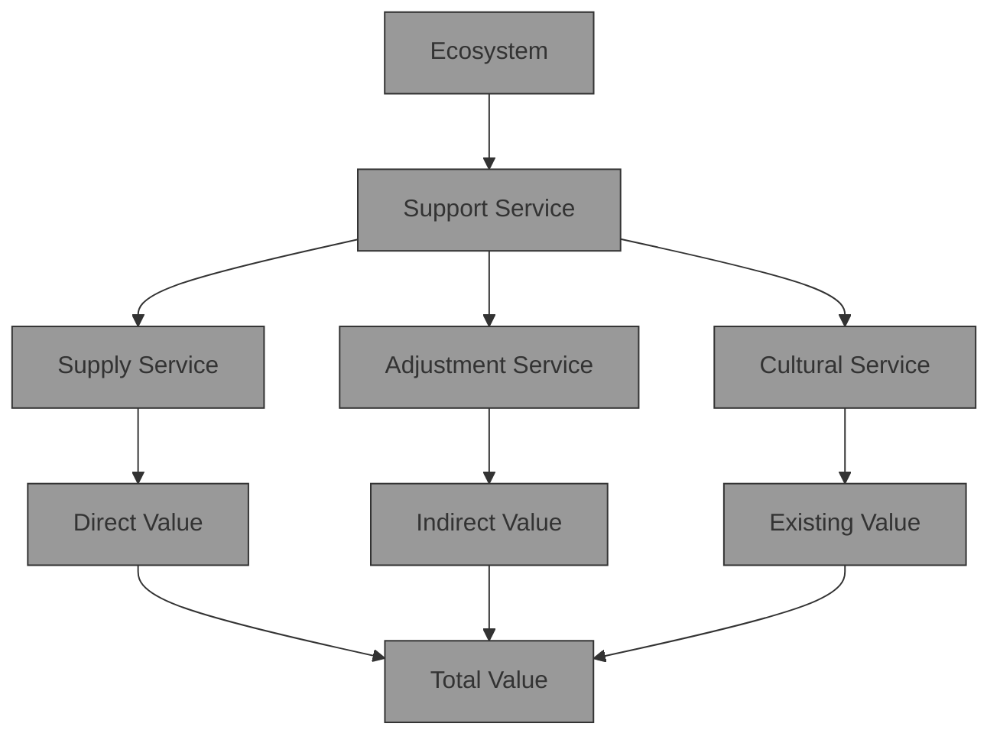

For office use only  
T1  
T2  
T3  
T4

Team Control Number

## 1902029

Problem Chosen

For office use only

F1  
F2  
F3  
F4

E

## 2019 Mathematical Contest in Modeling (MCM) Summary Sheet

(Attach a copy of this page to each copy of your solution paper.)

## Land counts! Better Use & Lower Cost Summary

Land use change is a mirror of human-land relationship, which most directly reflects the impact of human activities on the environment. Estimation of ecosystem service value based on land use/cover change has become the focus of environmental economics research.Our paper selects developing countries, which have more land use changes and covers a wide area, as the research object.A land ecosystem service value evaluation model based on the unit area value equivalent factor method is constructed, and a dynamic comprehensive assessment of the value of 14 ecosystem types and 11 types of ecological service functions on a spatial scale is realized.

We use the model to calculate the ecosystem service value of 14 regions in China, and to verify the validity of the model by comparing with the expert data. After that, we select China’s Yangtze River Delta and Huangguoshu Natural Scenic Spots as examples to analyze the changes in their ecosystem service value over time. According to the calculated ecological cost, a cost-benefit analysis model is introduced to study the changes in real economic costs.

In order to give more reference to policy makers, we introduce a multi-objective nonlinear programming model to study the optimization of land use options under different regional development principles. Taking Jiangsu Province and Heilongjiang Province as examples, we study the sensitivity of ESV and GDP to various land use area changes.

The trend of the model changes with time is explored. The seasonal variation of the model is analyzed on the monthly scale during the year. The grey prediction model is established on the scale of the year during the year, and the trend of the short-term model is explored.

In general, although further improvements are needed, the evaluation system constructed by the thesis provides a relatively comprehensive evaluation plan for the spatial and temporal dynamic assessment of ecosystem service value, thus providing a scientific basis for natural asset assessment and ecological compensation.

Key words: ecosystem services; value methods; value equivalence factors; dynamic assessment.

## Contents

## 1 Introduction 1

1.1 Background  
1.2 Our work . . . 1  
1.3 notation . . 2

## 2 Assumptions and Justifications 2

## 3 A model for ecological services valuation 3

3.1 Basic valuation method . . . 3  
3.2 Computing VC 4  
3.3 The Model 4  
3.3.1 Ecosystem classification . . . . 4  
3.3.2 Evaluation framework . . . . 4  
3.3.3 Standard Equivalent and Base Equivalent . . . . . . . 6

3.4 Sensitivity Index . . . 7

3.5 Implementation . .

3.5.1 Calculation and results . . . . 7

3.5.2 Consistency test . . . . . 8

3.5.3 Evaluation of ecological service value . . . . 9

## 4 The environmental costs of land use projects 11

4.1 Large Project - Yangtze River Delta . . 11  
4.1.1 Project Description . . . . . 11  
4.1.2 Adjustment of the value of ecological services . . . . . . . . 11  
4.1.3 Calculating ESV . . . . . 11  
4.1.4 Sensitivity analysis . . . . . 12  
4.1.5 Advices . . . 13

4.2 Small project - Huangguoshu Scenic Area . . 13

4.2.1 Project Description . . . . . 13

4.2.2 Adjustment of the value of ecological services . . . . . . . . 13

4.2.3 Calculating ESV . . . . . 14

4.2.4 Sensitivity analysis . . . . . 14

4.2.5 Advices . . . 14

4.3 A cost benefit analysis of land use development projects 14

## 5 Land Use Project Plan Assessment 15

5.1 Multi-objective nonlinear programming model . . 15  
5.2 Plan Assessment 17  
5.2.1 Impact of area change . . . . 17  
5.2.2 Policy evaluation . . . . 17

## 6 Change of time 18

6.1 Seasonal change . . 18  
6.2 Annual change . . 19

7 Strengths and Weaknesses 20

7.1 Strengths . . 20  
7.2 Weaknesses 20

8 Appendix 21

References 24

## 1 Introduction

## 1.1 Background

With population growth and economic development, the superposition of human factors and natural factors has caused rapid changes of ecology, depletion of resources, shortage of lands, and degradation of environment. One of the legitimate reasons for the above problems is that people do not have a deep understanding of the ecological value of land use.

In 1995, the International Geosphere and Biosphere Initiative (IGBP) and the ’Human Areas Program for Global Environmental Change’ (HDP) jointly proposed the ’Land Use/Cover Change’ Research Program (LUCC). So far, the ecological impact of land use change has begun to be widely recognized. Land use change is the result of the continuous adjustment of the purpose of land use. Therefore, it is of great significance to study the value of land ecosystem services, to explore the economic benefits of ecosystems from the perspective of value, and to provide scientific decisions for the planning of social development. Among the various methods of measuring estimates, ecosystem service value assessment is an effective method to measure the environmental impact of land use.

Ecosystem service functions are the utility provided by ecosystems to meet and sustain human life needs. Costanza (1997) et al. divided ecosystem services into 17 types and estimated them in monetary terms [1] ; the 2005 Millennium Ecosystem Assessment Report divides it into four categories. [2] On this basis, this paper proposes an evaluation method for the value of ecosystem services and conducts a series of empirical studies.

## 1.2 Our work

First, based on the ecosystem service value accounting model proposed by Costan za, we constructed a new ESV accounting model to measure the economic value of ecosystem services, and proposed how to use ESV to analyze its ecosystem service functions in combination with local GDP and area. Using the constructed ESV index, we selected 14 regions in China to calculate their ESV levels, and compared the results with the data measured by experts. The results show that our model is effective for measuring land use projects of different scales.

Based on the model, we conducted a case study. We selected China’s Yangtze River Delta as a representative of large-scale projects and Huangguoshu Natural Scenic Area as a representative of small-scale projects, to analyze the changes in their ecosystem service value with land use and conducted sensitivity tests. Then, taking into account the ecological costs, we carry out a cost-benefit analysis of the project. Compare the real cost of the project with the economic cost and propose criteria for project evaluation.

In order to give more reference to policy makers, we have further introduced a multi-objective nonlinear programming model to study the optimization of land use options under different regional development principles. We use Jiangsu Province and Heilongjiang Province as examples to illustrate how policy makers should weigh the relationship between economic development and ecological well-being.

Finally, since our model is calculated on a yearly basis, we incorporate time changes into the model. In response to seasonal differences in ecosystem service functions over the course of a year, we introduced dynamic equivalents that changed with the month. In view of the future trends of different ecosystem services over time, we use the GM (1,1) model to predict short-term development and prospect for long-term development.

## 1.3 notation

Table 1: List of Notations

<table><tr><td>Symbol</td><td>Definition</td></tr><tr><td>ESV</td><td>Ecosystem service value</td></tr><tr><td> $A_{k}$ </td><td>Area of ecosystem k</td></tr><tr><td> $VC_{k}$ </td><td>Ecological value coefficient per unit area of ecosystem k</td></tr><tr><td> $E_{ak}$ </td><td>Ecological density coefficient of ecosystem k in region a</td></tr><tr><td>D</td><td>A standard equivalent factor of ecosystem service value</td></tr><tr><td>CS</td><td>Coefficient of Sensitivity(ESV sensitivity to VC)</td></tr><tr><td>ESC</td><td>Ecological service capacity</td></tr><tr><td>GDP</td><td>Gross Domestic Product</td></tr><tr><td> $I_{ij}$ </td><td>The value of land type j in all land types in the year i</td></tr></table>

## 2 Assumptions and Justifications

Ecosystem services are effective for humans and ecosystem services are scarce. Ecosystem services have become a scarce resource due to the destruction of the ecological environment by human economic development. At the same time, more and more people recognize the important role that ecosystem services play in human survival. Based on this assumption, ecosystem services have utility value.  
• Each unit area of ecosystem serves as a functional unit to provide ecosystem services and products. Natural disasters, bad weather and other factors can affect normal ecological functions and reduce ecological value. Since this cost of destruction is difficult to measure, this article does not consider the damage to the ecology caused by major disasters. Therefore, such

assumption provides a simplistic but commercial approach for ecosystem service valuation.

• The basic model uses a static assessment method that does not take into account the temporal changes in the ecosystem. In the short term, the ecology is basically in balance and the value of ecological services is stable. In an improved model that considers time, this assumption will no longer be valid. The changes in ecological values within a year and between years will be analyzed separately later in this paper.

• The ecosystems in the study area are well developed. In the normal evolution of nature, regional ecology is diverse. Based on this assumption, there are enough land types in the study area to provide a basis for our estimation of the value equivalent table.

## 3 A model for ecological services valuation

## 3.1 Basic valuation method

The human socioeconomic system and natural ecosystems co-exist everywhere. To accurately assess the total economic products and services provided by all human activities, a large and complex statistical system has been established to estimate the gross domestic product (GDP). [3]

The ecosystem service value accounting model proposed by Costanza et al. [1] is still the most widely used ecosystem value accounting method. The ecosystem service value evaluation method of this paper is also based on this model and partially improved. The calculation method is based on an equivalent factor. If the monetary value of different ecosystem services from per unit land area can be identified, the total ESV will be quantified for the certain ecosystems and regions with the land area of different ecosystems. The formula is as follows:

$$
E S V = \sum A _ {k} \cdot V C _ {k} \tag {1}
$$

where ESV is the value of ecological services; $A _ { k }$ is the area of ecosystem k; $V C _ { k }$ is the ecological value coefficient per unit area of ecosystem k.

In order to make the ecosystem service value equivalence suitable in different regions and more accurately estimate the value of regional ecosystem services, we introduce the ecological service value equivalent correction coefficient $E _ { a k }$ :

$$
E _ {a k} = N _ {a k} / N _ {k} \tag {2}
$$

where $N _ { a k }$ refers to the eco-environmental quality index of ecosystem type k in re gion $\mathsf { a } ,$ and $N _ { k }$ represents the annual average ecology of such ecosystems nationwide. (The eco-environmental quality index refers to ISO Environmental Quality

Manual[4].) Thus the model is adjusted:

$$
E S V _ {a} = \sum A _ {k} \cdot V C _ {k} \cdot E _ {a k} \tag {3}
$$

## 3.2 Computing VC

With reference to the research of natural capital by Costanza et al.[1], the Equivalent Factor Method is based on the differentiation of different types of ecosystem services, based on quantifiable criteria to construct the value equivalence of various service functions of different types of ecosystems, and then combined with the distribution area of the ecosystem to assess [6].

$$
V C _ {k} = \sum V C _ {k i} \tag {4}
$$

$V C _ { k i }$ denotes the ecological value coefficient per unit area of the i-th service type of ecosystem k.

In this paper, the equivalent factor method is improved from the horizontal axis index and the vertical axis index. On the basis of the existing equivalent factor table, the classification of land use types is enriched (horizontal axis index).Also, the value classification equivalent factor method (vertical axis index) based on the service value of different classification ecosystems is proposed:

$$
V C _ {k} = \sum V C _ {k j} \tag {5}
$$

$V C _ { k j }$ denotes the ecological value coefficient per unit area of the j-th value type of ecosystem k.

## 3.3 The Model

## 3.3.1 Ecosystem classification

Ecosystem refers to the natural complex formed by the interaction and interdependence between biomes and their living environment within a certain geographical area. Based on the classification of land use and vegetation types, this study identified six types of first-level ecosystems (cultivated land, forest land, grassland, water area, residential construction land, unused land) and 14 types of secondary ecosystems.To comprehensively cover major ecosystem types. Marine ecosystems have not been included in this study due to the lack of systematic research data on the functions and values of marine ecosystem services.

## 3.3.2 Evaluation framework

Based on MA’s ecosystem service value assessment framework, integrating the research of Costanza, Turner, de Groot, Dai Junhu, etc., we build the assessment framework as shown in figure 1. The main workflow involved consists of four steps:

flowchart

Figure 1: Evaluation framework

## 1. Determination of assess target and the scope of study

According to the MA report,ecosystem services are in short abbreviations of ecosystem products and services, referring to all the benefits that human derive from various ecosystems.[7] Ecosystem services and functions do not necessarily present a one-to-one correspondence[1].

## 2. Determination of ecosystem service classification system

MA divides ecosystem services into four categories:

• Support Services (services essential for the production of all other ecological services)  
• Supply Services (from products in the ecosystem)  
• Regulation Services (obtained from the regulation of ecosystem processes) Various benefits)  
• Cultural Services (various non-material gains from ecosystems)

## 3. Value assessment of various ecosystem services

Supply services, regulation services, and cultural services often have a relatively direct short-term impact on humans. Support services are the backbone of these three types of ecosystem services. Therefore, we recommend not evaluating support services to avoid double the value of ecosystem services.

## 4. Classification and aggregation of values

Considering the research results of Qing Yang, Gengyuan Liu,etc.[5], according to the principle of non-repetition, we divide the value into three categories, and the total value of the ecosystem is the sum of the three values.

(a) Direct value represents a product or service in an ecosystem that can be directly consumed by human consumption, including food supply, water supply, and raw material/energy supply.

(b) Indirect value represents the value of the ecosystem that does not directly enter the production and consumption process, but provides the necessary conditions for the normal production and consumption, including gas regulation, hydrological regulation, soil conditioning and purification of the environment.

(c) Existing value represent indirect services brought about by the existence of ecosystems, including biodiversity, climate regulation, aes thetic landscapes and cultural education.

## 3.3.3 Standard Equivalent and Base Equivalent

## Standard Equivalent

The standard equivalent (D) is the equivalent factor of the ecosystem service value of a standard unit ecosystem. This paper refers to the calculation method of Xie Gaodi et al. [8], and takes the net profit of grain production per unit area of farmland ecosystem as the standard equivalent. The grain yield value of farmland ecosystems is mainly calculated based on the three main food products of rice, wheat and corn. The formula is as follows:

$$
D = S _ {r} \times F _ {r} + S _ {w} \times F _ {w} + S _ {c} \times F _ {c} \tag {6}
$$

$S _ { r } , S _ { w } { \mathrm { a n d } } S _ { c }$ respectively represent the percentage of planted area of rice, wheat and corn as a percentage of the total area of the three crops. $F _ { r } , F _ { w } \mathrm { a n d } F _ { c }$ respectively represent the average net profit per unit area of rice, wheat and corn in a country.

According to China Statistical Yearbook 2016 [9] and formula (6), the standard equivalent value applicable to China in 2014 is 1827.62 yuan/hm2.

## Base Equivalent

Base equivalent refers to the value coefficient of various service functions per unit area of different types of ecosystems, and reflects the annual average value level of various ecosystem service functions of different ecosystems. Based on the research results of Zhang Xingyu et al. [6] and the China Statistical Yearbook 2016 [9], we constructed the basic equivalents of different ecosystem types and different value categories, and obtained the following figure.

stacked bar chart

| Value | Direct value | Indirect value | Existing value |
| --- | --- | --- | --- |
| Ecosystem classification | Food supply | Air system | Climate regulation |
| Ecosystem classification | Raw material supply | Water system | Hydrological regulation |
| Ecosystem classification | Water supply | Soil system | Soil regulation |
| Ecosystem classification | Environmental purification | Purification system | Culture & Education |
| Ecosystem classification | arable land | Production system | Aesthetic landscape |
| Ecosystem classification | woodland | Air system | Biodiversity |
| Ecosystem classification | woodland | Water system | Agricultural and ecological services |
| Ecosystem classification | grassland | Air system | Agricultural and ecological services |
| Ecosystem classification | grassland | Water system | Agricultural and ecological services |
| Ecosystem classification | grassland | Water supply | Agricultural and ecological services |
| Ecosystem classification | grassland | Water supply | Agricultural and ecological services |
| Ecosystem classification | grassland | Water supply | Agricultural and ecological services |
| Ecosystem classification | grassland | Water supply | Agricultural and ecological services |
| Ecosystem classification | grassland | Water supply | Agricultural and ecological services |
| Ecosystem classification | grassland | Water supply | Agricultural and ecological services |
| Ecosystem classification | grassland | Water supply | Agricultural and educational services |
| Ecosystem classification | grassland | Water supply | Agricultural and educational services |
| Ecosystem classification | grassland | Water supply | Agricultural and educational services |
| Ecosystem classification | grassland | Water supply | Agricultural and educational services |
| Ecosystem classification | grassland | Water supply | Agricultural and educational services |
| Ecosystem classification | grassland | Water supply | Agricultural and educational services |
| Ecosystem classification | grassland | Water supply | Agricultural and educational services |

Figure 2: The basic equivalents of different ecosystem types and different value categories

## 3.4 Sensitivity Index

The Sensitivity Index (CS) was used to determine the sensitivity of the ESV to VC, to test whether the Ecosystem Service Value Factor per Ecosystem is suitable for the ecosystem being assessed. The meaning of CS refers to the change of ESV caused by one percent change of VC. If $C S > 1 ,$ it indicates that ESV is sensitive and flexible to VC; if $C S < 1$ , it indicates that ESV is inelastic to VC. The greater the ratio, the more critical the accuracy of the VC is for the estimated ESV. CS can be calculated as follows:

$$
C S = \frac {\left(E S V _ {j} - E S V _ {i}\right) / E S V _ {i}}{\left(V C _ {j k} - V C _ {i k}\right) / V C _ {i k}} \tag {7}
$$

where VC is the amount of ecological service value per unit area of land, i represents the initial state, j represents the adjusted state, and k is the ecosystem type.

## 3.5 Implementation

In this section, we will use the above model to measure the value of ecological services in 14 regions of China, and compare the calculated results with authoritative data to test the validity of the model. In addition, we will measure and analyze the ecological service capacity of different provinces in two ways.

## 3.5.1 Calculation and results

According to the above standard equivalent and basic equivalent table, the unit area value table of different land use types can be calculated, wherein the total ecological service value of the first-level land use type is taken as the average value of the secondary land type value.

Among the 14 regions analyzed, the value of ecological services varies greatly among different provinces. Among them, Inner Mongolia Autonomous Region,

<table><tr><td>Ecosystem</td><td>Cultivated Land</td><td>Woodland</td><td>Grassland</td><td>Construct-ion Land</td><td>Waters</td><td>Unutilized land</td><td>ESV</td><td>Cultivated Land Contributi-on Rate</td></tr><tr><td>Beijing</td><td>21.24</td><td>437.48</td><td>30.77</td><td>-67.23</td><td>12.29</td><td>0.00</td><td>434.55</td><td>4.89%</td></tr><tr><td>Hebei</td><td>640.11</td><td>2719.87</td><td>1001.92</td><td>-423.46</td><td>133.85</td><td>2.17</td><td>4074.46</td><td>15.71%</td></tr><tr><td>IM</td><td>908.84</td><td>13737.21</td><td>21409.66</td><td>-356.60</td><td>333.02</td><td>203.39</td><td>36235.51</td><td>2.51%</td></tr><tr><td>Liaoning</td><td>488.35</td><td>3321.25</td><td>391.41</td><td>-298.32</td><td>149.79</td><td>0.21</td><td>4052.69</td><td>12.05%</td></tr><tr><td>Jilin</td><td>686.54</td><td>5235.87</td><td>245.12</td><td>-227.38</td><td>113.66</td><td>10.78</td><td>6064.59</td><td>11.32%</td></tr><tr><td>Heilongjiang</td><td>1555.99</td><td>12905.30</td><td>733.92</td><td>-339.69</td><td>342.12</td><td>25.63</td><td>15223.26</td><td>10.22%</td></tr><tr><td>Jiangsu</td><td>448.74</td><td>151.91</td><td>14.11</td><td>-445.87</td><td>468.73</td><td>1.09</td><td>638.72</td><td>70.26%</td></tr><tr><td>Anhui</td><td>576.01</td><td>2213.79</td><td>26.48</td><td>-384.77</td><td>285.67</td><td>0.04</td><td>2717.23</td><td>21.20%</td></tr><tr><td>Jiangxi</td><td>302.58</td><td>6105.75</td><td>99.98</td><td>-227.58</td><td>197.66</td><td>0.07</td><td>6478.45</td><td>4.67%</td></tr><tr><td>Shandong</td><td>746.77</td><td>877.69</td><td>159.43</td><td>-556.85</td><td>254.26</td><td>3.10</td><td>1484.40</td><td>50.31%</td></tr><tr><td>Henan</td><td>796.25</td><td>2044.45</td><td>234.13</td><td>-522.78</td><td>159.05</td><td>0.28</td><td>2711.39</td><td>29.37%</td></tr><tr><td>Hubei</td><td>514.92</td><td>5083.33</td><td>101.77</td><td>-314.62</td><td>323.73</td><td>0.11</td><td>5709.25</td><td>9.02%</td></tr><tr><td>Hunan</td><td>407.28</td><td>7221.26</td><td>172.41</td><td>-317.40</td><td>238.43</td><td>0.02</td><td>7721.99</td><td>5.27%</td></tr><tr><td>Sichuan</td><td>660.97</td><td>13101.49</td><td>4435.31</td><td>-371.46</td><td>162.66</td><td>12.49</td><td>18001.45</td><td>3.67%</td></tr></table>

Figure 3: the ESV of 14 provinces in China (Billion yuan)

Heilongjiang Province, and Sichuan Province have higher ecological service values, and the ecological value measured by currency amount exceeds 100 billion yuan, mainly because The land use of cultivated land, woodland and grassland in these three provinces is relatively large.

In Jiangsu Province, although the cultivated land occupation area is at a medium level in 14 provinces and cities, the scarcity of forest land and grassland resources makes Jiangsu Province have more than 70 % ESV farmland contribution rate. According to the collected data, the forest land area and grassland area of Jiangsu Province were both among the lowest in the 14 provinces analyzed.

## 3.5.2 Consistency test

The article "Costanza model based on the evaluation of the ecological service value of China’s major grain-producing areas" uses the Costanza model to measure the ecological service value of the above 14 provinces. Compare our calculation results with authoritative data to get a scatter plot in figure 4.

Among the provinces we selected, the area varies from 167,000 square kilometers to 1.18 million square kilometers.It can be seen from the figure that the trends of ESV levels calculated by the two methods are consistent, indicating that our models are suitable for both small and large areas.Therefore, it can be concluded that our model can effectively and objectively assess the value of an ecosystem’s service value.

scatterplot

| ESV calculated by our approach/(10^8 Yuan) | ESV calculated by the paper/(10^8 Yuan) |
| ------------------------------------------ | ---------------------------------------- |
| 30000                                      | 50000                                    |
| 40000                                      | 52000                                    |
| 50000                                      | 54000                                    |
| 60000                                      | 56000                                    |
| 70000                                      | 60000                                    |
| 80000                                      | 65000                                    |
| 90000                                      | 70000                                    |
| 100000                                     | 75000                                    |
| 110000                                     | 80000                                    |
| 120000                                     | 85000                                    |
| 130000                                     | 90000                                    |
| 140000                                     | 95000                                    |
| 150000                                     | 100000                                   |
| 160000                                     | 110000                                   |
| 170000                                     | 120000                                   |
| 180000                                     | 130000                                   |
| 190000                                     | 140000                                   |
| 200000                                     | 150000                                   |
| 210000                                     | 160000                                   |
| 220000                                     | 170000                                   |
| 230000                                     | 180000                                   |
| 240000                                     | 190000                                   |
| 250000                                     | 255555                                   |
| 260000                                     | 275555                                   |
| 270000                                     | 295555                                   |
| 280000                                     | 315555                                   |
| 290000                                     | 335555                                   |
| 300000                                     | 355555                                   |

Figure 4: Scatter plot comparing the results of two calculations

## 3.5.3 Evaluation of ecological service value

In 3.4.1, the value of ecological services in different provinces is quite different, mainly caused by the large difference in land area between different provinces. In order to more objectively evaluate the service capacity of an ecosystem, This paper proposes two ways to eliminate the impact of total area on ecological value assessment.

1 Dividing the value of the ecological services in each province by the area of the province gives the value of the ecological services per unit area.

$$
E S C _ {i} = E S V _ {i} / A _ {i} \tag {8}
$$

2 Dividing the value of the ecological services in each province by the province’s GDP, the value of the ecological services per unit of GDP per province is obtained.

$$
E S C _ {i} = E S V _ {i} / G D P _ {i} \tag {9}
$$

By Area

The ecological service value per unit area of Jiangsu Province and Shandong Province is less than 1 million $y u a n / k m ^ { 2 }$ , which has weak ecological service capacity.In the future development, the two provinces should increase the emphasis on the environmental cost of project construction and promote the sustainable development of the region. The ecological service value per unit area of Jiangxi Province, Hunan Province and Sichuan Province is higher than 3.5 million $y u a n / k m ^ { 2 }$ , indicating that the ecological service capacity is strong. It ˛a´rs Suitable for people to live, and is conducive to ecological balance and sustainable development.

bar chart

| Ecosystem | ESC (Unit area) (10^4 yuan/km^2) |
|---|---|
| IM | 306.30 |
| HLI | 321.84 |
| Sichuan | 370.40 |
| Jilin | 323.62 |
| Jiangxi | 388.16 |
| Hunan | 364.59 |
| Liaoning | 273.83 |
| Hubei | 307.11 |
| Hebei | 215.81 |
| Anhui | 194.09 |
| Henan | 162.36 |
| SD | 93.95 |
| Beijing | 264.81 |
| Jiangsu | 59.58 |

Figure 5: Ecological service capacity calculated by unit area

<table><tr><td>ESC (Unit area)</td><td>Grade</td><td>Province</td></tr><tr><td>&lt;100</td><td>Weak Service Ability</td><td>Jiangsu, Shandong</td></tr><tr><td>100-200</td><td>Relative Weak Service Ability</td><td>Henan, Anhui</td></tr><tr><td>200-300</td><td>Medium Service Ability</td><td>Beijing, Heibei, Liaoning</td></tr><tr><td>300-350</td><td>Relative Strong Service Ability</td><td>Inner Mongolia, Jilin, Heilongjiang, Hubei</td></tr><tr><td>&gt;350</td><td>Strong Service Ability</td><td>Jiangxi, Hunan, Sichuan</td></tr></table>

Figure 6: Ecological service capability classification

## By GDP

Inner Mongolia Autonomous Region and Heilongjiang Province have the high-

bar chart

| Region | GDP (10^8yuan) | ESC (Unit GDP) |
| :--- | :--- | :--- |
| IM | 18128 | 2.00 |
| HU | 15386 | 0.99 |
| Sichuan | 32935 | 0.55 |
| Jilin | 14777 | 0.41 |
| Jiangxi | 18499 | 0.35 |
| Hunan | 31551 | 0.24 |
| Liaoning | 22247 | 0.18 |
| Hubei | 32665 | 0.17 |
| Hebei | 32071 | 0.13 |
| Anhui | 24408 | 0.11 |
| Henan | 40472 | 0.07 |
| SD | 68025 | 0.02 |
| Beijing | 25669 | 0.02 |
| Jiangsu | 77388 | 0.01 |

Figure 7: Ecological service capacity calculated by unit GDP

est ecological service capacity, with values of 2.00 and 0.99 respectively, but their corresponding GDP is relatively low.

The lowest ecological service capacity is in Jiangsu Province, Beijing Municipality and Shandong Province, and the ecological service capacity accounting values are 0.01, 0.02 and 0.02 respectively. Among them, the GDP level of Shandong Province and Jiangsu Province is very high, and the level of economic development is at the forefront of the country. In the process of economic construction, the ecology is inevitably damaged. The two provinces should deal with economic value and ecological value in the future development. Weighed and restored the service function of the ecosystem and improved the environment on the basis of maintaining a certain level of economic development.

Beijing’s ecological service capacity and GDP are at a relatively low level. The possible reason is that Beijing, as a political and cultural center of China, has certain peculiarities. In terms of resource allocation, more consideration should be given to political law and cultural education .As a result, investment in ecological input and economic development is relatively insufficient.

## 4 The environmental costs of land use projects

## 4.1 Large Project - Yangtze River Delta

## 4.1.1 Project Description

Yangtze River Delta is located on the eastern coast of the Chinese mainland and has diverse surface cover. The artificial urban construction land expansion and rapid urbanization lead to rapid changes in land type. [11] Therefore, it is important to study the environmental costs brought about by land use change here.

We obtained land use data of the region from 2010 to 2015 from the Ministry of Natural Resources website. (See Appendix) In the past five years, the area of forest land, grassland, waters and cultivated land in the Yangtze River Delta has been decreasing, and construction land has increased significantly.

## 4.1.2 Adjustment of the value of ecological services

In combination with local geography and existing land types, we have made the following adjustments.

Table 2: Ecosystem Service Value(yuan/hm2) of Land Use Type in Yangtze River Delta

<table><tr><td>Woodland</td><td>Grassland</td><td>Farmland</td><td>Wetland</td><td>Waters</td><td>Unutilized land</td></tr><tr><td>37979.23</td><td>12584.42</td><td>12000.82</td><td>108001.3</td><td>79956.43</td><td>734.44</td></tr></table>

## 4.1.3 Calculating ESV

Then we calculate ESV of the Yangtze River Delta from 2010 to 2015.(See Appendix)In the past five years, the ESV of the Yangtze River Delta has decreased year by year, from 560.3 billion yuan in 2010 to 542.7 billion yuan in 2015. According to the results, we carry out the following analysis.

## • Analysis by value

The Yangtze River Delta has a complex ecosystem and a large population density. We take into account the direct value, indirect value and existence value of all ecosystems in the calculation, and obtain the changes of the three types of values over time. (See Appendix) According to the results, all three values show a downward trend, and the reduction ratio of indirect value and existential value is greater.

We can see from figure 8 that although the expansion of urban construction leads to the simultaneous reduction of the three types of values, in contrast, the indirect value and the existence value of environmental degradation are reduced at a faster rate. However, in real-world decision-making, land managers often only consider the decline of direct value, ignoring more serious changes in the indirect value and existing value.

## • Analysis by various ecosystems

Using the ratio of the various ecosystem ESV in 2015 and 2010, the radar map is drawn in figure 9.

The ESV of the aquatic ecosystem is the highest, and the ESV of the grassland ecosystem is second. In the five years, the ESV of the waters and woodland ecosystems has the largest decline. The reason may be that the waters and forests in the Yangtze River Delta are vast in area and have high ecological conservation functions, which is of great significance for regulating the ecology of the region. As a result, the dramatic reduction in waters and woodlands has led to a significant decline in ecosystem services across the region.

## 4.1.4 Sensitivity analysis

The ecological value coefficient of the land use type is mobilized by 50 % to analyze the change of the ecosystem service value and the sensitivity to the value coefficient. The calculation results are shown in the appendix.According to the results, the sensitivity index of the waters is about 0.59; the second is the forest land, the sensitivity index is 0.40. The rest are between 0.1 and 0.4. Taken together, the sensitivity index of ESV to VC is less than 1, indicating that our model is valid.

line chart

| Year | Direct Value | Indirect Value | Existing Value |
|------|--------------|----------------|----------------|
| 2011 | 0.35%        | 0.70%          | 0.75%          |
| 2012 | 0.48%        | 0.76%          | 0.82%          |
| 2013 | 0.42%        | 0.70%          | 0.72%          |
| 2014 | 0.32%        | 0.68%          | 0.74%          |
| 2015 | 0.15%        | 0.58%          | 0.55%          |

Figure 8: Rate of Decline of Three Values

radar chart

| Category | Value |
|---|---|
| Woodland | 1.02 |
| Grassland | 0.96 |
| Waters | 0.94 |
| Farmland | 0.96 |
| Construction Land | 0.98 |
| Unused Land | 0.94 |

Figure 9: The Ratio of ESV of Various Ecosystems

## 4.1.5 Advices

## • From the perspective of the type of value

It is necessary for us to adopt a more scientific approach to quantify the indirect value and existential value of losses in urban expansion and to incorporate them into the assessment system for land-use projects.

## • From the perspective of the type of ecosystem

Land use planners should increase the density of artificial ditches, while paying attention to the protection of existing water areas and strengthening pollution control.

## 4.2 Small project - Huangguoshu Scenic Area

## 4.2.1 Project Description

The Huangguoshu Scenic Area is located in Anshun City, Guizhou Province. From 2009 to 2012, the Huangguoshu Scenic Area was reconstructed and has changed the service value of the ecosystem within a small geographical scope. The ArcGIS 9.2 software was used to export and sort out the land use dynamic data of Huangguoshu Scenic Area from 2009 to 2012 (See Appendix).

## 4.2.2 Adjustment of the value of ecological services

The ecological service value of the construction land in Huangguoshu Scenic Area is small, so the value of its ecosystem service function is not estimated. The changes in land use types have an impact on ecosystems only in a small geographical area, and have little impact on the function of ecosystems to regulate climate and maintain biodiversity, so the value of climate regulation and biodiversity services are not considered. Based on the above adjustment methods, the ecological value equivalents of each land use type in Huangguoshu Scenic Area are obtained.(see in figure 10)

<table><tr><td>Land Use Type</td><td>Cultivated land</td><td>Garden plot</td><td>Woodland</td><td>Grassland</td><td>Waters</td><td>Swamp and tidal flats</td><td>Other land</td></tr><tr><td>Ecological Value per Unit Area ( yuan/(hm^2·a)</td><td>3613.65</td><td>7606.45</td><td>11426.68</td><td>3786.23</td><td>24040.47</td><td>32794.82</td><td>219.64</td></tr></table>

Figure 10: Ecosystem services value unit area of different land types in Huangguosh

## 4.2.3 Calculating ESV

Using the adjusted ecological value equivalent table and the data of the land use area in each year, the value of the ecosystem service function of the Huangguoshu Scenic Area from 2009 to 2012 is calculated, and the ecological cost of the scenic area reconstruction project is obtained.(See Appendix)

It can be seen that the ecological service value of the forest land in Huangguoshu Scenic Area is the largest, accounting for nearly 70% of the total value, followed by cultivated land, waters and gardens. The scenic area renovation project of Huangguoshu caused the total value of its ecological service value to drop by 323,300 yuan in four years, which is the total ecological cost of the scenic area reconstruction project.

## 4.2.4 Sensitivity analysis

The sensitivity index in Huangguoshu project are calculated (see Appendix). The sensitivity index of various land use types is less than 1, from high to low, followed by forest land, cultivated land, pasture, water, garden, marsh and tidal flat, and other land, indicating that the ecological service value is inelastic to the change of the ecosystem service value coefficient. The results of this study are credible.

## 4.2.5 Advices

The ecological cost of the Huangguoshu scenic area reconstruction project calculated by our model is about 323,300 yuan. Considering that forest land contributes the most to the value of ecosystem services in scenic spots, Huangguoshu Scenic Area should pay attention to the protection of forest land, pasture and other ecological land in future development and improve the overall function of regional land ecosystem services.

## 4.3 A cost benefit analysis of land use development projects

From the perspective of cost-benefit analysis, we study the level of benefits before and after considering ecological costs.

If ecological costs are not considered, then

$$
\text { Totalcost } = \text { constructioncost } + \text { operatingcost } \tag {10}
$$

where construction costs are paid in one lump sum at an early stage, and operating costs occur annually.[12]

If considering ecological costs, then

$$
T o t a l c o s t = c o n s t r u c t i o n c o s t + o p e r a t i n g c o s t + e c o l o g i c a l c o s t
$$

where the ecological cost is the loss value of the ESV in each year. The total benefit of the land use project is

$$
\text { Totalbenefit } = \text { economicbenefit } + \text { socialbenefit } + \text { ecologicalbenefit } \tag {12}
$$

As shows in figure 11 and figure 12:

• If the ecological cost is not considered, as time changes, at $T _ { 1 }$ , the total cost and the total benefit curve intersect at point A. In the view of policy makers, all investments are compensated at this time, and the project becomes profitable after $T _ { 1 }$ .  
• If the ecological cost is considered, the slope and intercept of the total cost curve increase simultaneously.

## 5 Land Use Project Plan Assessment

In this section, a multi-objective nonlinear programming model is used to analyze land use scenarios under different priority objectives. Based on the evaluation results in Section 3.5, two typical provinces were selected to evaluate their existing land use policies.

## 5.1 Multi-objective nonlinear programming model

The land use is the way of using and using the land by humans. [13] Basically, there are four land use principles:(1)Natural growth. (2)Economic development. (3)Ecological protection. (4)ECO development. Assuming that:

1. Land use projects mainly change the number of ecosystem types and types of ecosystems.

2. The land use plan of a certain area is not adjusted in a short period of time, and the land use is highly efficient. The ecosystem type of different projects has a consistent direction of change, that is, all land use projects in the area are assumed to be of the same direction of influence to the ecosystem type. (Increase or decrease in area).

line chart

| Time Point | Total Benefit | Total Cost Including Ecological Costs | Total Cost Without Ecological Costs |
| ---------- | ------------- | ------------------------------------- | ----------------------------------- |
| T₁         | A             | B                                     | Construction Cost                      |
| T₂         | B             | B                                     | Construction Cost                      |

Figure 11: Cost-benefit curve(a)

line chart

| Time | Total Cost Including Ecological Costs | Total Benefit | Total Cost Without Ecological Costs |
|------|----------------------------------------|---------------|-------------------------------------|
| T₁   | 0                                      | 0             | 0                                   |

Figure 12: Cost-benefit curve(b)

3. Select the target in the short term, only considering the value change before and after the project.

The area of each ecosystem type after the implementation of the land use project can be expressed as $A _ { k } + \nabla A _ { k }$ . The calculation method of analogy ESV proposes the accounting method of economic value GDP:

$$
E S V = \sum A _ {k} \cdot L V C _ {k} \tag {13}
$$

$$
G D P = \sum A _ {k} \cdot N V C _ {k} \tag {14}
$$

Where: $L V C _ { k }$ indicates Ecological value coefficient per unit area for ecosystem type k(same as $V C _ { k }$ above $) \check { c } \dot { z } N V C _ { k }$ indicates Economic value coefficient per unit area for ecosystem type k.

Under the ecological protection principle, the model can be constructed as follows:

$\begin{array} { r l } { \operatorname* { m i n } } & { { } P _ { 1 } \cdot d _ { 1 } ^ { + } + P _ { 2 } \cdot d _ { 2 } ^ { - } } \end{array}$

$\begin{array} { r l } { \mathbf { s } . \mathbf { t } } & { { } \sum \nabla A _ { k } = 0 } \end{array}$

$$
A _ {k} + \nabla A _ {k} \geq M i n N e e d _ {k}
$$

$$
\begin{array}{l} \sum \nabla A _ {k} \cdot I (\nabla A _ {k} > 0) \cdot (P C C _ {k} + P O C _ {k}) + \sum \nabla A _ {k} \cdot I (\nabla A _ {k} <   0) \cdot E R C _ {k} \\ \leq \min \{B u d g e t, R e s o u r c e \} \\ \end{array}
$$

$$
\sum \nabla A _ {k} \cdot I (\nabla A _ {k} > 0) \cdot P I _ {k} \geq \sum \nabla A _ {k} \cdot I (\nabla A _ {k} > 0) \cdot (P C C _ {k} + P O C _ {k})
$$

$$
\sum (A _ {k} + \nabla A _ {k}) \cdot L V C _ {k} + d _ {1} ^ {-} - d _ {1} ^ {+} = M i n N e e d _ {E S V}
$$

$$
\sum (A _ {k} + \nabla A _ {k}) \cdot N V C _ {k} + d _ {2} ^ {-} - d _ {2} ^ {+} = M i n N e e d _ {G D P}
$$

Where: $I ( \nabla A _ { k } > 0 )$ and $I ( \nabla A _ { k } < 0 )$ are characteristic functions of $\nabla A _ { k } . \ d _ { i } ^ { + }$ and $d _ { i } ^ { - }$ are positive and negative deviation variables.

In the above constraints, the first formula indicates that the total land area is constant, and the increased land area and the reduced land area cancel each other out. The second formula indicates that the area of each land type after the project is implemented is not less than the minimum need for the land. The capital or resource input in the soil utilization project in a certain area can be divided into three parts: project construction investment, ecological restoration investment and project operation input, and the third formula is introduced. The sum of project construction and operating costs for each additional land and the ecological restoration cost of each reduced land is limited by the amount of budget and resources. The fourth formula indicates that the sum of project benefits from increased land is greater than the sum of project construction and operating costs. The last two formulas indicate that ESV and GDP meet the minimum requirements for them.

## 5.2 Plan Assessment

## 5.2.1 Impact of area change

According to the previous evaluation results , take Heilongjiang Province and Jiangsu Province as study subject.Through Monte Carlo simulation, take the number of tests N = 200 times, and results go as follow:

## For Heilongjiang

(A1 means forest land and A2 means residential construction land). The impact of forest area change on ESV and GDP is moderate. When the forest area increases by more than 2.1%, the forest area elasticity of ecological service value approaches 0. At this time, the forest area approximates a saturation level, and even if the forest area increases significantly, it will not contribute to the increase of ecological value.

## For Jiangsu

(A2 means residential construction land and A3 means cultivated land) The figure shows that the percentage change of cultivated land area has a great impact on ecological value and economic value, and the marginal ecological value and marginal economic cost brought by the increase of area show a decreasing trend. The change in the area of residential construction land has a greater impact on GDP and ESV within a certain range. When the percentage change exceeds 0.8% or is lower than -2.4%, the impact on GDP is no longer obvious.

## 5.2.2 Policy evaluation

• Heilongjiang Province began to implement the ecological construction strategy in 2001. [14] We compare and analyze the value of ecosystem service function before and after the implementation of land use policy in Heilongjiang Province. The results show that the various measures of the policy are basically reasonable and can take into account the environmental benefits while developing the economy, while efficiency of land use should be emphasized in land use policies.

line chart

| ΔA/A | GDP(ΔA1/A1) | GDP(ΔA2/A2) | ESV(ΔA1/A1) | GDP(ΔA2/A2) |
|------|-------------|-------------|-------------|-------------|
| -3%  | ~0.8        | ~0.4        | ~-0.5       | ~0.3        |
| -2%  | ~0.6        | ~0.5        | ~-0.3       | ~0.3        |
| -1%  | ~0.4        | ~0.6        | ~-0.2       | ~0.3        |
| 0%   | ~0.3        | ~0.7        | ~-0.1       | ~0.3        |
| 1%   | ~0.2        | ~0.8        | ~0.0        | ~0.3        |
| 2%   | ~0.1        | ~0.9        | ~0.1        | ~0.2        |
| 3%   | ~0.0        | ~1.0        | ~0.1        | ~0.1        |

line chart

| X-Axis Label | GDP(ΔA2/A2) | GDP(ΔA3/A3) | ESV(ΔA2/A2) | ESV(ΔA3/A3) |
| :--- | :--- | :--- | :--- | :--- |
| 7738B (10^8 Yuan) | 7738B | 639 (10^8 Yuan) | 639 (10^8 Yuan) | 639 (10^8 Yuan) |

Figure 13: the impact of area change in Hei-Figure 14: the impact of area change in longjiang Jiangsu

• Under the dual role of economic development and land resource management policies, Jiangsu Province has strengthened the protection of agricultural land.However, the results of data analysis show that the economic aggregate of Jiangsu Province has expanded rapidly and there is a problem of insufficient applicability of current planning.

## 6 Change of time

## 6.1 Seasonal change

During the year, due to changes in climate, temperature and other factors, the value of $V C _ { k }$ is also changing. According to the published statistical documents[15][16], we sort out the amount of ecosystem value according to different months. The changes in the value of ecological services for various ecosystems during the period from January to December are shown in the figure15. Among them, the an

line chart

| month | Paddy Field | Upland Field | Coniferous Forest | Coniferous & Broadleaf | Broadleaf Forest | Shrubwood | Grassland | Shrub Grass | Meadow | Water System | Wetlands | Glacier | Construction Land | Desert | Bare Land |
| --- | --- | --- | --- | --- | --- | --- | --- | --- | --- | --- | --- | --- | --- | --- | --- |
| 1 | 0.0 | 0.0 | 0.1 | 0.0 | 0.0 | 0.0 | 0.0 | 0.0 | 0.0 | 0.1 | 0.0 | 0.0 | 0.0 | 0.0 | 0.0 |
| 2 | 0.0 | 0.0 | 0.1 | 0.0 | 0.0 | 0.0 | 0.0 | 0.0 | 0.0 | 0.2 | 0.0 | 0.0 | 0.0 | 0.0 | 0.0 |
| 3 | 0.0 | 0.0 | 0.2 | 0.1 | 0.1 | 0.1 | 0.1 | 0.1 | 0.1 | 0.4 | 0.1 | 0.1 | 0.1 | 0.1 | 0.1 |
| 4 | 0.0 | 0.0 | 0.3 | 0.2 | 0.2 | 0.2 | 0.2 | 0.2 | 0.2 | 0.6 | 0.2 | 0.2 | 0.2 | 0.2 | 0.2 |
| 5 | 0.1 | 0.1 | 0.5 | 0.4 | 0.4 | 0.3 | 0.3 | 0.3 | 0.3 | 0.8 | 0.3 | 0.3 | 0.3 | 0.3 | 0.3 |
| 6 | 0.1 | 0.1 | 0.7 | 0.6 | 0.7 | 0.5 | 0.5 | 0.5 | 0.5 | 1.1 | 0.5 | 0.5 | 0.5 | 0.5 | 0.5 |
| 7 | 0.1 | 0.1 | 0.9 | 1.2 | 1.3 | 1.1 | 1.1 | 1.1 | 1.1 | 1.5 | 1.1 | 1.1 | 1.1 | 1.1 | 1.1 |
| 8 | 0.1 | 0.1 | 1.2 | 1.5 | 1.6 | 1.4 | 1.4 | 1.4 | 1.4 | 1.4 | 1.4 | 1.4 | 1.4 | 1.4 | 1.4 |
| 9 | 0.1 | 0.1 | 1.4 | 1.6 | 1.7 | 1.6 | 1.6 | 1.6 | 1.6 | 1.2 | 1.6 | 1.6 | 1.6 | 1.6 | 1.6 |
| 10 | 0.1 | 0.1 | 1.6 | 1.8 | 2.2 | 2.2 | 2.2 | 2.2 | 2.2 | 1.4 | 2.2 | 2.2 | 2.2 | 2.2 | 2.2 |
| 11 | 0.1 | 0.1 | 1.8 | 2.2 | 2.8 | 3.2 | 3.2 | 3.2 | 3.2 | 1.6 | 3.2 | 3.2 | 3.2 | 3.2 | 3.2 |
| 12 | 0.1 | 0.1 | 2.2 | 3.2 | - | - | - | - | - | - | - | - | - | - | - |

Figure 15: Ecosystem value change chart during the year

nual service value of residential construction land, desert, bare land and glacial snow is extremely small, and the trend of other ecosystem service value changes is generally the same, with July as the highest point, gradually decreasing to the adjacent months on both sides, January and The lowest point was reached in December.

The reason is analyzed. From winter to summer, the temperature rises, the rainfall increases gradually, the growth of vegetation accelerates, the biomass accumulation rate of the ecosystem reaches the fastest, and the functions of various ecosystems gradually increase. Therefore, the ecosystems provide the value of ecological services has gradually increased.

## 6.2 Annual change

According to the data of different ecosystems in China in 2004, 2008, 2012 and 2016 [17][18][19][20],using gray forecasting analysis, we have predicted future short-term data while long-term changes are expected.As the annual volume units change, we use the importance to measure the proportion of different ecosystems in the total ecosystem value in each year. The importance is calculated according to the following formula:

$$
I _ {i j} = V _ {i j} / V _ {i} \tag {15}
$$

Where: The importance level $I _ { i j }$ indicates the value of the ecosystem type j in all ecosystem types in the i-th year, $V _ { i j }$ represents the value of the ecosystem type in the i-th year, and $V _ { i }$ represents the sum of the values of various ecosystem types in the i-th year.Then, gray prediction and normalization are performed on different ecosystem types to obtain the importance level table.

line chart

| YEARS/YR | Woodland | Grassland | Arable land | Wetlands | Waters | Unutilized land |
| -------- | -------- | --------- | ----------- | -------- | ------ | ---------------- |
| 2004     | 0.12     | 0.03      | 0.04        | 0.47     | 0.35   | 0.01             |
| 2008     | 0.14     | 0.06      | 0.04        | 0.42     | 0.31   | 0.01             |
| 2012     | 0.15     | 0.06      | 0.05        | 0.43     | 0.31   | 0.01             |
| 2016     | 0.15     | 0.06      | 0.06        | 0.44     | 0.32   | 0.01             |
| 2020     | 0.15     | 0.05      | 0.07        | 0.42     | 0.31   | 0.01             |
| 2024     | 0.15     | 0.05      | 0.08        | 0.42     | 0.31   | 0.01             |
| 2028     | 0.15     | 0.05      | 0.09        | 0.41     | 0.30   | 0.01             |

Figure 16: The table of Different ecosystem importance levels

## The impact of short-term interannual changes on the model

With the development of science and technology, technological advancement, and more scientific planting, the value of cultivated land ecosystems has been enhanced, and there has been no significant change in the value of other types of land.

The impact of long-term interannual changes on the model The value of shortterm cultivated land ecosystems continues to increase, ultimately, due to the resource constraints of cultivated land ecosystems, the value of cultivated land area will not increase so significantly. Also,though the ecological environment value of residential construction land ecosystem is minimal or even negative in current study,in the future, with the development of green economy, the implementation of the environmental protection will increase its value by a large margin.

## 7 Strengths and Weaknesses

## 7.1 Strengths

1. Introducing the ecological service value equivalent correction coefficient. The ecological value base equivalent table adopts the national average level. When the ecological value of a certain area is specifically analyzed, the basic equivalent table can be adjusted according to the local specific conditions to make the final result more accurate.  
2. Classification of ecological service values. When conducting ecological value assessment, the value of ecological services is divided into three categories, thus the scale structure and change trend of various values more intuitively can be analysed.  
3. Analysis of ecological service capabilities. Dividing the value of regional ecological services by regional area and GDP is conducive to a more comprehensive evaluation of the stability of the ecosystem, and also to a more intuitive discussion of the relationship between ecological protection and economic development.  
4. Introduce the concept of a saturated area of value. As the value of marginal utility declines and the land area of a certain type reaches a certain level, its continued growth has almost zero impact on ecological value. This has a good reference for regional land use planning.

## 7.2 Weaknesses

1. The base equivalent has a certain timeliness. The basis value is judged by the willingness to pay the questionnaire survey, and the resulting value equivalent table can evaluate the ecological value in a short period of time.  
2. There is a problem of double counting in value. For example, there is a certain cross-value between biodiversity and aesthetic landscape, culture and education, which makes the final evaluation value large.  
3. Part of the value is difficult to quantify or the accuracy may not be high after quantification. For example, the value of genetic inheritance, human disease regulation and other functions is difficult to quantify, which will lead to bias in the final evaluation results.

## 8 Appendix

<table><tr><td rowspan="2">Year.</td><td colspan="6">Land Use Type</td></tr><tr><td>Woodland.</td><td>Grassland.</td><td>Waters.</td><td>Farmland.</td><td>Construction land.</td><td>Unused land.</td></tr><tr><td>2010.</td><td>599.29.</td><td>14.60.</td><td>419.45.</td><td>676.74.</td><td>358.62.</td><td>29.71.</td></tr><tr><td>2011.</td><td>598.42.</td><td>14.41.</td><td>416.89.</td><td>675.71.</td><td>364.52.</td><td>29.98.</td></tr><tr><td>2012.</td><td>597.69.</td><td>14.11.</td><td>414.42.</td><td>675.23.</td><td>369.36.</td><td>30.09.</td></tr><tr><td>2013.</td><td>596.81.</td><td>13.89.</td><td>411.71.</td><td>674.82.</td><td>374.36.</td><td>30.37.</td></tr><tr><td>2014.</td><td>595.87.</td><td>13.73.</td><td>409.32.</td><td>673.91.</td><td>379.67.</td><td>30.48.</td></tr><tr><td>2015.</td><td>595.09.</td><td>13.61.</td><td>407.28.</td><td>674.33.</td><td>383.33.</td><td>30.49.</td></tr><tr><td>2010-2015 Area Change.</td><td>-4.20.</td><td>-0.99.</td><td>-12.17.</td><td>-2.41.</td><td>24.71.</td><td>0.79.</td></tr><tr><td>2010-2015 Change Rate.</td><td>-0.70%</td><td>-6.80%</td><td>-2.90%</td><td>-0.36%</td><td>6.89%</td><td>2.65%</td></tr></table>

Figure 17: Land Use Changes of Yangtze River Delta,2010-2015

<table><tr><td rowspan="2">Year.</td><td colspan="6">Land Use Type.</td><td rowspan="2">Total</td></tr><tr><td>Woodland.</td><td>Grassland.</td><td>Waters.</td><td>Farmland.</td><td>Construction land.</td><td>Unutilized land.</td></tr><tr><td>2010.</td><td>2276.07.</td><td>18.37.</td><td>3354.46.</td><td>812.81.</td><td>-860.68.</td><td>2.16.</td><td>5603.20.</td></tr><tr><td>2011.</td><td>2272.75.</td><td>18.13.</td><td>3334.04.</td><td>811.57.</td><td>-874.84.</td><td>2.18.</td><td>5563.84.</td></tr><tr><td>2012.</td><td>2269.99.</td><td>17.75.</td><td>3314.26.</td><td>811.00.</td><td>-886.46.</td><td>2.19.</td><td>5528.74.</td></tr><tr><td>2013.</td><td>2266.65.</td><td>17.47.</td><td>3292.56.</td><td>810.51.</td><td>-898.46.</td><td>2.21.</td><td>5490.95.</td></tr><tr><td>2014.</td><td>2263.05.</td><td>17.27.</td><td>3273.47.</td><td>809.41.</td><td>-911.21.</td><td>2.22.</td><td>5454.23.</td></tr><tr><td>2015.</td><td>2260.11.</td><td>17.12.</td><td>3257.16.</td><td>809.92.</td><td>-920.00.</td><td>2.22.</td><td>5426.55.</td></tr><tr><td>2010-2015 ESV Change.</td><td>-15.95.</td><td>-1.25.</td><td>-97.30.</td><td>-2.89.</td><td>-59.31.</td><td>0.05.</td><td>-176.65.</td></tr><tr><td>2010-2015 Change Rate.</td><td>-0.70%.</td><td>-6.8%.</td><td>-2.90%.</td><td>-0.36%.</td><td>6.89%.</td><td>2.65%.</td><td>3.15%.</td></tr></table>

Figure 18: Changes of Ecosystem Service Value of Yangtze River Delta,2010-2015

<table><tr><td>Year.</td><td>Direct Value/ Million Yuan.</td><td>Indirect Value/ Million Yuan.</td><td>Existing Value/ Million Yuan.</td></tr><tr><td>2010.</td><td>390.026.</td><td>3668.560.</td><td>1545.788.</td></tr><tr><td>2011.</td><td>388.763.</td><td>3643.175.</td><td>1534.065.</td></tr><tr><td>2012.</td><td>386.977.</td><td>3619.002.</td><td>1523.916.</td></tr><tr><td>2013.</td><td>385.021.</td><td>3593.827.</td><td>1513.046.</td></tr><tr><td>2014.</td><td>383.847.</td><td>3570.250.</td><td>1502.070.</td></tr><tr><td>2015.</td><td>383.314.</td><td>3550.045.</td><td>1493.998.</td></tr><tr><td>2010-2015 Value Change.</td><td>-6.713.</td><td>-118.515.</td><td>-51.790.</td></tr><tr><td>2010-2015 Change Rate.</td><td>-1.72%.</td><td>-3.23%.</td><td>-3.35%.</td></tr></table>

Figure 19: Changes of Three Values of Yangtze River Delta,2010-2015

<table><tr><td rowspan="2">Year.</td><td colspan="6">Land Use Type (Coefficient of Sensitivity).</td></tr><tr><td>Woodland.</td><td>Grassland.</td><td>Waters.</td><td>Farmland.</td><td>Construction land.</td><td>Unused land.</td></tr><tr><td>2010.</td><td>0.40621.</td><td>0.00328.</td><td>0.59867.</td><td>0.14506.</td><td>0.15438.</td><td>0.00039.</td></tr><tr><td>2011.</td><td>0.40621.</td><td>0.00323.</td><td>0.60867.</td><td>0.14335.</td><td>0.15456.</td><td>0.00038.</td></tr><tr><td>2012.</td><td>0.43462.</td><td>0.00328.</td><td>0.60008.</td><td>0.14335.</td><td>0.15444.</td><td>0.00040.</td></tr><tr><td>2013.</td><td>0.40621.</td><td>0.00328.</td><td>0.59867.</td><td>0.14665.</td><td>0.15438.</td><td>0.00039.</td></tr><tr><td>2014.</td><td>0.40126.</td><td>0.00325.</td><td>0.59867.</td><td>0.14506.</td><td>0.15454.</td><td>0.00038.</td></tr><tr><td>2015.</td><td>0.43462.</td><td>0.00322.</td><td>0.59867.</td><td>0.14501.</td><td>0.15234.</td><td>0.00039.</td></tr></table>

Figure 20: Coefficient of Sensitivity of Yangtze River Delta,2010-2015

<table><tr><td>Land Use Type</td><td colspan="4">Amount of Change</td><td>Land Use Dynamics</td></tr><tr><td>Cultivated Land</td><td colspan="4">32.81</td><td>0.93</td></tr><tr><td>Garden Plot</td><td colspan="4">-2.99</td><td>-0.70</td></tr><tr><td>Woodland</td><td colspan="4">-21.54</td><td>-0.37</td></tr><tr><td>Grassland</td><td colspan="4">-43.86</td><td>-1.83</td></tr><tr><td>Construction Land</td><td colspan="4">33.88</td><td>4.69</td></tr><tr><td>Waters</td><td colspan="4">-0.18</td><td>-0.09</td></tr><tr><td>Swamp and Tidal Flats</td><td colspan="4">0.00</td><td>0.00</td></tr><tr><td>Other Land</td><td colspan="4">1.88</td><td>0.15</td></tr><tr><td rowspan="2">Land Use Type</td><td colspan="4">Ecological Service Value</td><td rowspan="2">Ecological Cost of the Project</td></tr><tr><td>2009.</td><td>2010.</td><td>2011.</td><td>2012.</td></tr><tr><td>Cultivated Land</td><td>1268.91</td><td>1274.84</td><td>1282.53</td><td>1280.77</td><td>-11.89</td></tr><tr><td>Garden Plot</td><td>323.77</td><td>323.53</td><td>322.80</td><td>321.49</td><td>2.27</td></tr><tr><td>Woodland</td><td>6734.23</td><td>6713.13</td><td>6717.61</td><td>6709.62</td><td>24.61</td></tr><tr><td>Grassland</td><td>950.63</td><td>899.62</td><td>890.28</td><td>889.02</td><td>16.61</td></tr><tr><td>Swamp and Tidal Flats</td><td>79.69</td><td>79.69</td><td>80.12</td><td>79.69</td><td>0.00</td></tr><tr><td>Waters</td><td>502.76</td><td>502.78</td><td>467.37</td><td>502.33</td><td>0.43</td></tr><tr><td>Other Land</td><td>28.23</td><td>28.27</td><td>28.37</td><td>28.27</td><td>-0.04</td></tr><tr><td>Total</td><td>9843.22</td><td>9821.85</td><td>9789.07</td><td>9811.19</td><td>32.03</td></tr></table>

Figure 21: The dynamic change of land use in Huangguoshu from 2009 to 2012

Figure 22: The total ESV of different land types in Huangguoshu

<table><tr><td rowspan="2">Land Use Type</td><td colspan="4">Coefficient of Sensitivity (CS)</td></tr><tr><td>2009</td><td>2010</td><td>2011</td><td>2012</td></tr><tr><td>Cultivated Land</td><td>0.1285</td><td>0.1294</td><td>0.1306</td><td>0.1301</td></tr><tr><td>Garden Plot</td><td>0.0328</td><td>0.0328</td><td>0.0329</td><td>0.0327</td></tr><tr><td>Woodland</td><td>0.6820</td><td>0.6813</td><td>0.6840</td><td>0.6817</td></tr><tr><td>Grassland</td><td>0.0917</td><td>0.0913</td><td>0.0907</td><td>0.0903</td></tr><tr><td>Swamp and Tidal Flats</td><td>0.0081</td><td>0.0081</td><td>0.0082</td><td>0.0081</td></tr><tr><td>Waters</td><td>0.0511</td><td>0.0512</td><td>0.0477</td><td>0.0520</td></tr><tr><td>Other Land</td><td>0.0029</td><td>0.0029</td><td>0.0029</td><td>0.0029</td></tr></table>

Figure 23: CS of ecosystem services value of different land types in Huangguoshu

## References

[1] Costanza R, d ˛a´rArge R, de Groot R, et al. The value of the world ˛a´rs ecosystem services and natural capital.Nature,1997,387:235-260  
[2] Millennium Ecosystem Assessment (MEA). Ecosystems and HumanWell-Being: Synthesis[M]. Washington DC: Island Press, 2005:1-13  
[3] Xie G D,Zhang C X,Zhen L.et al.Dynamic changes in the value of China”s ecosystem services[J].Ecosystem Services.2017,26,:146-154.  
[4] ISO Environmental Quality Manual  
[5] Yang, Q., Liu, G., Casazza, M., Campbell, E., Giannettia, B., Brown, M., December 2018. Development of a new framework for non-monetary accounting on ecosystem services valuation. Ecosystem Services 34A, 37-54.  
[6] XIE Gao-di, ZHEN Lin, LU Chun-xia, et al. Expert knowledge based valuation method of ecosystem services in China. Journal of Natural Resources, 2008, 23(5): 911-919.  
[7] Ecosystem services: From eye-opening metaphor to complexity blinder Richard B. Norgaard Energy and Resources Group, University of California, Berkeley, United States  
[8] XIE Gao-di, LU Chun-xia, LENG Yun-fa, et al. Ecological assets valuation of the Tibetan Plateau. Journal of Natural Resources, 2003, 18(2): 189-196.  
[9] National Bureau of Statistics. China Statistical Yearbook 2016 [EB/OL].2016.  
[10] National Bureau of Statistics. China Statistical Yearbook 2017 [EB/OL].2017.  
[11] Liu Guilin, Zhang Luocheng, Zhang Qian. The Impact of Spatial and Temporal Changes of Land Use on the Value of Ecosystem Services in the Yangtze River Delta[J]. Chinese Journal of Ecology, 2014, 34(12):3311-3319  
[12] Yin Qi. Economic Analysis of Land Use Planning [D]. Zhejiang University, 2006.  
[13] Wang Xiulan, Bao Yuhai. Discussion on Research Methods of Land Use Dynamic Change[J].Progress in Geography,1999,18(1):81-87.  
[14] Ran Shenghong, Lv Changhe, Jia Kejing, et al. Environmental Impact Assessment of Land Use Change in China Based on Ecological Service Value[J]. Environmental Science,2006,27(10): 2139-2144.  
[15] National Bureau of Statistics of the People ˛a´rs Republic of China. Chinese Statistical Yearbook. Beijing: China Statistics Press, 2011.  
[16] State Forestry Administration of the People ˛a´rs Republic of China. China Forestry Statistical Yearbook. Beijing: China Forestry Publishing House, 2010.  
[17] WANG Zong-ming, ZHANG Shu-qing, ZHANG Bai. Effects of land use change on the ecosystem service value of Sanjiang Plain[J]. China Environmental Science, 2004, 24(1): 0-0.  
[18] Xu Xu, Li Xiaobing, Fu Na, et al. Application of Ecosystem Service Value Accounting in Strategic Environmental Assessment of Land Use Planning: A Case Study of Beijing[J]. Resources Science, 2008, 30(9): 1382-1388 .  
[19] Ouyang Zhiyun, Wang Xiaoke. Preliminary Study on the Service Function and Ecological Economic Value of Terrestrial Ecosystem in China[J]. Chinese Journal of Ecology, 1999, 19(5): 607-613.  
[20] ZHANG Xing-yi, HUANG Xian-jin, ZHAO Xiao-feng. Accounting of ecosystem service value of land use change in coastal areas of Jiangsu Province[J]. Soil and Water Conservation Research, 2015, 22(1): 252-256.