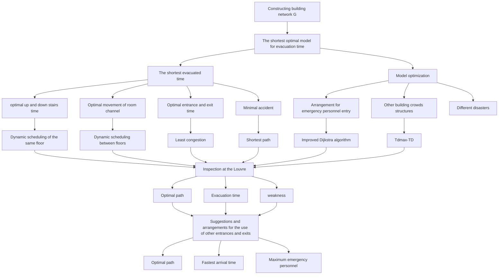
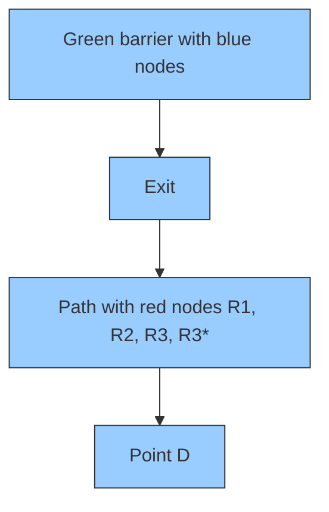
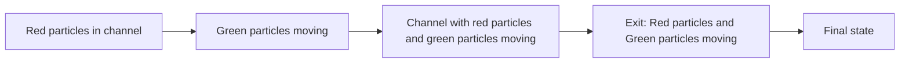
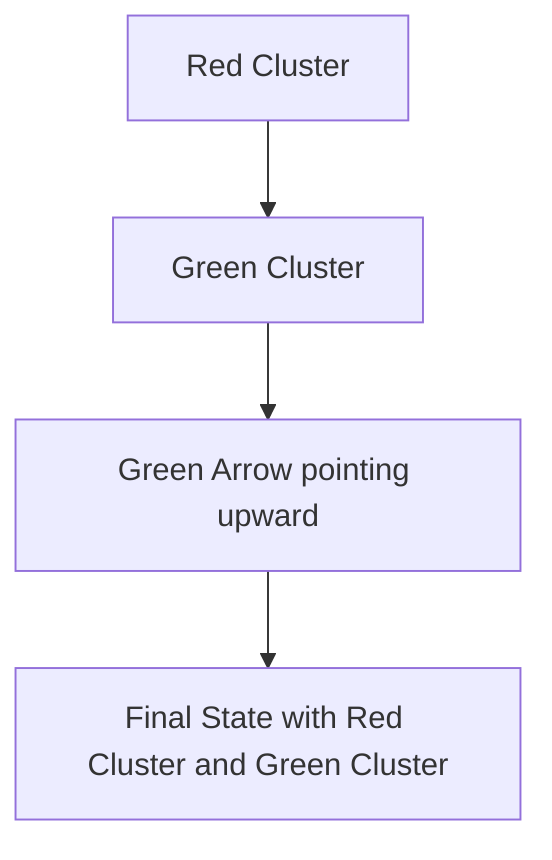
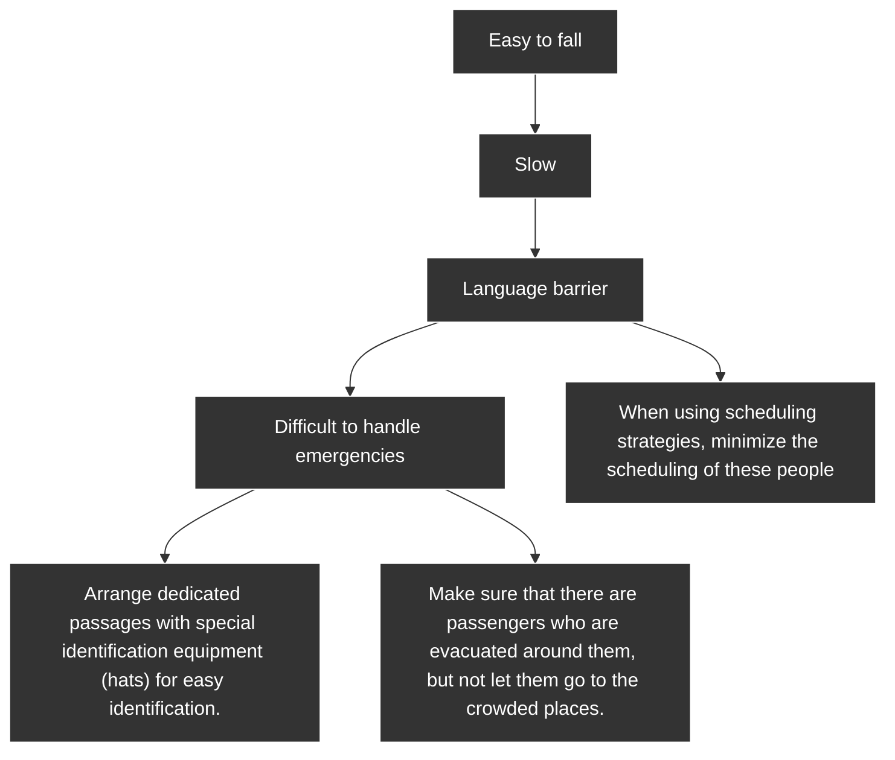
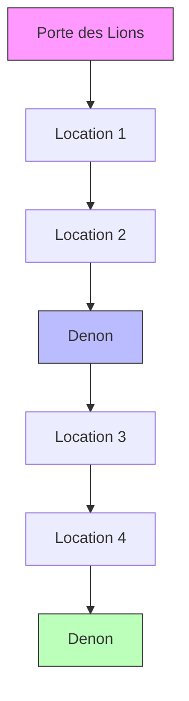
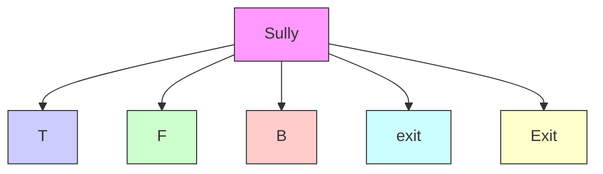
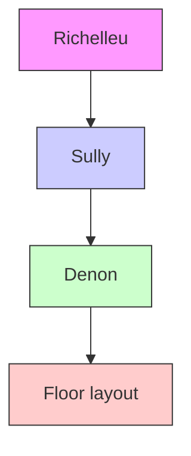
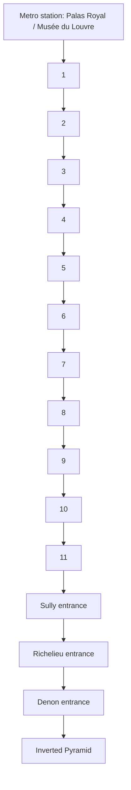

For office use only

T1

T2

T3

T4

Team Control Number

1902407

Problem Chosen

D

For office use only

F1

F2

F3

F4

## 2019

## MCM/ICM

## Summary Sheet.

In case of the terrorist attacks in France, the Louvre needed emergency evacuation plans to avoid danger. This paper first establishes the goal programming model with the minimum total evacuation time to make sure that people in building can be evacuated safely and quickly. The model divides the evacuation time into the moving phase of the room channel, the up and down building phase, the entry and exit phase, and the accident occurrence phase. By optimizing each of these stages, the goal of minimum total time is achieved. In order to achieve optimal path, we improve the Dijkstra algorithm and find the most efficient route from each room to the exit. In addition, we propose a dynamic scheduling algorithm between the same floor and a dynamic scheduling algorithm between different floors to solve the congestion problem according to the goal planning. Furthermore, we have designed targeted response strategies for different characteristics of vulnerable groups to reduce accidents.

In our model, we have obtained the optimal evacuate path of the Louvre and the weak bottleneck location. The emergency evacuation completion time of the Louvre is 527s, and the congestion time is 37.5%. Compared with the random method, we reduced the time by 39.3%, reduced the congestion by 24% and reduced the injury of 60.69%.

Secondly, this paper incorporates the disaster factors into the model, which further improves the adaptability of the model to different disasters and also considers the arrangement of emergency personnel entering the building. The maximum number of emergency personnel that can be entered at each intersection can be obtained without affecting the maximum evacuation time.

Based on the model, we calculated the maximum number of 410 emergency personnel and 370s of the optimal route through the Lions Gate exit, while through the Richelieu is about 229s but the maximum number was 240.

In addition, the model proposed in paper also explores other large-scale multi-storey public buildings and gives model improvement plans. Finally, in response to the conclusions of the model, this paper proposes to Louvre managers the plan to speed up evacuation, arrange emergency personnel, increase exits, and target vulnerable groups.

## I. Introduction

## 1.1 Problem Introduction

Helped design the evacuation plan for the Louvre in Paris, France, the goal of evacuation is to allow all groups of tourists to leave the building as quickly and safely as possible, while allowing emergency personnel to enter the building as soon as possible. However, the complex structure of venues and complex crowd structure make it more difficult to evacuate in an emergency. For example, different groups of organizations (tour groups, disabled people) evacuation processing. After the model is developed, validate the model and discuss how to implement it. Based on the results of the work, recommendations are made on policies and procedures for the emergency management of the Louvre, how to adjust and implement the model for other large congested structures, and how the model performs under different disasters.

## 1.2 Problem Analysis

At evacuation exits, we need to be aware of potential bottlenecks in exit movement. The Louvre museum in Paris, France, has complex building structure and diverse tourists, which should be reflected in the emergency evacuation model. The total number of actual exit points in the Louvre is known only to the staff. Although these additional exits can be used by the public, the safety of these exits cannot be guaranteed. Therefore, the reasonable use of these exits in the model should be considered. This model should be universal in order to facilitate adjustment and implementation for other large crowding structures.

## 1.3 Views of our work

flowchart

Figure 1 summary of our work

## Ⅱ. General Assumption

In the event of a disaster, people in the building can be informed of the dangers in a timely and simultaneous manner and immediately begin evacuation operations.  
The evacuation emergency personnel can start the evacuation operation in time, and can obtain the current evacuation status of the current population through electronic devices.  
C The evacuated masses listened to the command of evacuation emergency personnel.

## Ⅲ. Notations Description

<table><tr><td>Notation</td><td>Description</td></tr><tr><td>S</td><td>he node of the path (all exhibition halls, intersections and stairs)</td></tr><tr><td>D</td><td>Exit node (all exits)</td></tr><tr><td> $E\{e_{ij}\}$ </td><td>The set of paths between nodes I and j</td></tr><tr><td> $C_{ij}$ </td><td>Side  $e_{ij}$  of the maximum number of people per unit time</td></tr><tr><td> $C_{ii}$ </td><td>The maximum number of passageways per unit time of node i</td></tr><tr><td> $N^w$ </td><td>The number of people passing the floor w</td></tr><tr><td> $T_{1K}^W$ </td><td>The time of the last person escapes when the starting point is on the w floor and taking the k path</td></tr><tr><td> $T_{2K}^W$ </td><td>The time of escaping from the stairs when the starting point is on the w floor and taking the k path</td></tr><tr><td> $T_{3K}^W$ </td><td>The time of escaping from the exits when the starting point is on the w floor and taking the k path</td></tr><tr><td> $T_{4K}^W$ </td><td>Evacuation delays caused by emergencies and special groups (elderly, children, pregnant women and disabled)</td></tr></table>

## Ⅵ. Model Design

## 4.1 Establish evacuation network

Set all exhibition halls, node are $S \{ S _ { 1 } , S _ { 2 } , S _ { 3 } , S _ { 4 } \ldots \} ;$

Intersections, door (narrow channel) and stairs are $R \{ R _ { 1 } , R _ { 2 } , R _ { 3 } , R _ { 4 } \ldots \}$ .

Specifically, when the node $R _ { x }$ represents a stair node, $R _ { x } ^ { w }$ represents the node of the stair at the w floor.

All exits are exit nodes $D \{ D _ { 1 } , D _ { 2 } , D _ { 3 } , D _ { 4 } \ldots \}$ . The set of paths between node i and j is edge set $E \{ e _ { i j } \} ,$ and the nearest node in the building can be reached by path without passing through the connecting edge of other two nodes.

Network: $G = \{ ( S , R , D ) , E \}$

flowchart

Figure 2 Example of evacuation network

## 4.2 Optimal Basic Model

The goal of emergency evacuation of large multi-story public buildings is to evacuate personnel within the building as quickly as possible. Therefore, the goal of model optimization is to minimize the time that the last evacuated person flees the building.

We divide the escape time into the indoor escape phase, the up and down stairs phase, the entry and exit phase, and the escape time delay caused by sudden events such as falls and trampling on the vulnerable groups with a certain probability in the above three stages.

flowchart

Figure 3 Room movement  
Figure 4 Staircase movement  
Figure 5 Exit movement

$$
\min \mathrm{T} = m a x \left(T _ {1 _ {K}} ^ {W} + T _ {2 _ {K}} ^ {W} + T _ {3 _ {K}} ^ {W} + T _ {4 _ {K}} ^ {W}\right) \tag {4-1}
$$

s.t.

$$
T _ {1 K} ^ {W} = m a x \left(\frac {L _ {1} ^ {w , k}}{V _ {1} ^ {w , k}} + \frac {L _ {1} ^ {w , k ^ {\prime}}}{V _ {1} ^ {w , k ^ {\prime}}}\right) \tag {4-2}
$$

$$
T _ {2 K} ^ {W} = m a x \left(\frac {L _ {2} ^ {w , k}}{V _ {2} ^ {w , k}} + \frac {L _ {2} ^ {w , k ^ {\prime}}}{V _ {2} ^ {w , k ^ {\prime}}}\right) (4 - 3)
$$

$$
T _ {3 K} ^ {W} = \max \left(\frac {L _ {3} ^ {w , k}}{V _ {3} ^ {w , k}} + \frac {L _ {3} ^ {w , k ^ {\prime}}}{V _ {3} ^ {w , k ^ {\prime}}}\right) (4 - 4)
$$

$$
T _ {4 K} ^ {W} = \max \left(\left[ N _ {k} ^ {w} \delta_ {i} t _ {0} + N _ {k} ^ {w} \delta_ {1} \delta_ {2} t _ {0} \right] \times \left[ \alpha T _ {4, 1 K} ^ {W} + \beta T _ {4, 2 K} ^ {W} + \gamma T _ {4, 3 K} ^ {W} \right] ^ {4}\right) (4 - 5)
$$

$$
C _ {i j} * T _ {1 K} ^ {W} \geq N ^ {w, k} (i, j \epsilon k) \tag {4-6}
$$

$$
C _ {i j} * T _ {2 K} ^ {W} \geq N ^ {w, k} (i, j \in k) \tag {4-7}
$$

$$
N ^ {w, k} = N _ {S _ {1}} ^ {w, k} + N _ {S _ {2}} ^ {w, k} + N _ {S _ {3}} ^ {w, k} + \dots (S _ {1}, S _ {2}, S _ {3} \epsilon k) \tag {4-8}
$$

$$
N _ {S _ {1}} ^ {w, k}, N _ {S _ {2}} ^ {w, k}. N _ {S _ {3}} ^ {w, k} \dots \geq 0 \tag {4-9}
$$

Due to the different scenarios, different groups of people moving speed, we need to separate the indoor escape phase, the upper and lower stairs phases, and the entry and $V _ { 1 , s } ^ { w , k } , V _ { 2 , s } ^ { w , k } , V _ { 3 , i } ^ { w , k }$ $L _ { 1 } ^ { w , k } , L _ { 2 } ^ { w , k } , L _ { 3 } ^ { w , k }$ ,?? indicates the moving distance of the three stages at normal moving speed. W stands for different floors and k stands for route.

In each phase, the speed is divided into normal moving speed and moving speed during congestion due to possible congestion. The congestion rate of the indoor escape phase, the upper and lower stairs phases, and the entry and exit phases is expressed as $V _ { 1 , s } ^ { w , k \prime } , V _ { 2 , s } ^ { w , k \prime } , V _ { 3 , i } ^ { w , k \prime }$ $L _ { 1 } ^ { w , k \prime } , L _ { 2 } ^ { w , k \prime } , L _ { 3 } ^ { w , k \prime }$ ,?? ,??3

Although it is more convenient to replace these two variables with time, since the evacuation model needs to consider different characteristics of the population, such as the old and the weak, and these people have significant differences in the speed of movement, the speed is required. This situation will be discussed in the following.

## 4.3 Optimized for moving and exit

The indoor escape phase and the exit phase can be optimized using the same method.

$$
\min T _ {1} \Longrightarrow \max \left(\frac {L _ {1} ^ {w , k}}{V _ {1} ^ {w , k}} + \frac {L _ {1} ^ {w , k ^ {\prime}}}{V _ {1} ^ {w , k ^ {\prime}}}\right) (4 - 1 0)
$$

$$
\min T _ {3} \Longrightarrow \max \left(\frac {L _ {3} ^ {w , k}}{V _ {3} ^ {w , k}} + \frac {L _ {3} ^ {w , k ^ {\prime}}}{V _ {3} ^ {w , k ^ {\prime}}}\right) \tag {4-11}
$$

Since the speed of movement of a person can be given,

$$
L _ {t o t a l} ^ {w} = \sum (L ^ {w, k} + L ^ {w, k ^ {\prime}}) (4 - 1 2)
$$

?????? ?? is equivalent to

$$
\min \sum L _ {t o t a l} ^ {w} = \min (L ^ {w, k} + L ^ {w, k ^ {\prime}}) \tag {4-13}
$$

According to the principle of proximity, min $L _ { S ^ { \prime } } ^ { w , k }$ represent the smallest queuing congestion. Assume ???? represents the total visitors flow rate of the node i on the w floor. $N _ { i } ^ { w } = N ^ { w , k _ { 1 } } + N ^ { w , k _ { 2 } } + N ^ { w , k _ { 3 } } + \cdots$ , satisfy $k _ { 1 } \cap k _ { 2 } \cap k _ { 3 } \cap . . . = i$

$$
\left(\frac {N _ {i} ^ {w}}{C _ {i j}} - \frac {L _ {i}}{V _ {s}}\right) = \frac {L ^ {w , k}}{V _ {S ^ {\prime}}} (4 - 1 4)
$$

$V _ { s }$ represents the normal walking speed, $V _ { S ^ { ' } }$ represents the speed of crowd evacuation. Since the escape speed of the crowd is not uniform, the average speed is adopted here.

we can get

$$
V _ {S ^ {\prime}} \left(\frac {N _ {i} ^ {w}}{C _ {i j}} - \frac {L _ {i}}{V _ {s}}\right) = L _ {S ^ {\prime}} \tag {4-15}
$$

In a known congestion paths, $, V _ { S ^ { \prime } } , ~ L _ { i }$ and $V _ { s }$ for a fixed amount, therefore we should shorten $N _ { i } ^ { w }$

$$
\min L ^ {w, k ^ {\prime}} \Rightarrow \min N _ {i} ^ {w} \tag {4-16}
$$

s.t.

$$
\sum N ^ {w} = N _ {\text { total }} \tag {4-17}
$$

$$
N _ {i} ^ {w} = N _ {z _ {1}} ^ {w} + N _ {z _ {2}} ^ {w} + N _ {z _ {3}} ^ {w} + \dots \tag {4-18}
$$

## 4.4 Improved Dijkstra for optimal path

Dijkstra is one of the best and universal ways to find the best path, time complexity is $O ( n ^ { 2 } )$ . Dijkstra can improve efficiency for the shortest escape route for large multistorey buildings.

Improved direction:

○1 Since multi-storey buildings are evacuated, most of the nodes need to go up and down the stairs through a certain staircase. Therefore, for floors without stairs on this floor, the stairs in the exit direction are the only way. We assume $R ^ { * } \{ \ R _ { 1 } ^ { * } , \ R _ { 2 } ^ { * } \cdots \cdots \}$ is a necessary set of stairs.  
○2 Due to the flow restriction of the stairway, although some routes are the shortest, they are not optimal due to congestion queues. Therefore, when using Dijkstra to find the shortest path, you should avoid the location that may be congested. Therefore, the necessary set of stairs should be reduced to $R ^ { * } { } ^ { \prime } \{ \ R _ { 1 } ^ { * } , \ R _ { 2 } ^ { * } \cdots \}$ .

Table 1 Improved Dijkstra algorithm for optimal path

Input：Network G，Starting node S，Stairway node ??∗，End point set D，Number of people in the stairway $\mathbf { C } _ { R i } ,$ Unit Coverage Area y.

Output： Optimal route from the starting node S to the destination

Initialization：(1)initialize S={s}，V={other nodes}

(2) If <U,S> set has edges connected, its weight is assigned, otherwise the value is positive infinity.

Process：For ?? = ?? to length(??∗)

$$
\text { Area } = \mathbf {C} _ {R _ {i} ^ {*}} * \mathbf {y}
$$

If ?? ∉ ????????

$$
\mathbf {R} ^ {* \prime} = \mathbf {R} ^ {*} r e m o v e \mathbf {R} _ {i}
$$

$$
S = S r e m o v e \mathbf {R} _ {i}
$$

End If

End For

For w to high(Floor difference between starting point and exit)

While ??(??) ≠ ??(The number of nodes in the w floor is not zero)

Find node V closest to S in U

$U = U$ remove $\mathbf{U}$ $S = S$ remove $S$ If (all $\mathbf{R}_w^k$ in S and $\mathbf{S} \cap \mathbf{D} = \emptyset$ ) or $(\mathbf{S} \cap \mathbf{D} = \emptyset)$ Break  
End If  
End While  
End For

## 4.5 Optimized for the Same floor congestion

Although the improved Dijkstra can avoid congestion to some extent and find the optimal path, in the event of a sudden disaster, visitors may still be in a hurry and choose the "shortest" path to escape and cause congestion. At this point, the staff is required to perform dynamic scheduling. The overall purpose of the scheduling strategy is to minimize congestion time (to be faster evacuation). When people on all routes gather at one point, the number of people in the location is

$$
N _ {i} ^ {w} = \sum N _ {i} ^ {w, k} \tag {4-19}
$$

The scheduling scheme is specifically to guide a part of the crowd at the congestion location to a relatively smooth place. The specific objective function and the conditions are as follows:

$$
\min \sum_ {i, j} \left(\frac {N _ {i} ^ {w}}{C _ {i j}} - \frac {L _ {i}}{V _ {s}}\right) \tag {4-20}
$$

s.t.

$$
N _ {i} ^ {w} = N _ {z _ {i}} ^ {w} + N _ {z _ {2}} ^ {w} + N _ {z _ {3}} ^ {w} + \dots \tag {4-21}
$$

$$
\mathrm{M} = \left\{ \begin{array}{l l} 1, & \frac {N _ {i} ^ {w}}{C _ {i j}} > \frac {L _ {i}}{V _ {s}} + \frac {L _ {i j}}{V _ {s}} \\ 0, & \frac {N _ {i} ^ {w}}{C _ {i j}} \leq \frac {L _ {i}}{V _ {s}} + \frac {L _ {i j}}{V _ {s}} \end{array} \right. \tag {4-22}
$$

$$
\frac {N _ {i} ^ {w} - \sum N _ {i z} ^ {w}}{C _ {i j}} - \frac {L _ {i}}{V _ {s}} > \max \left\{\mathrm{M} \left[ \frac {N _ {i} ^ {w} - \left(\frac {L _ {i}}{V _ {s}} + \frac {L _ {i j}}{V _ {s}}\right) C _ {i j}}{C _ {i j}} \right] + \frac {N _ {i z} ^ {w}}{C _ {i j}} + \frac {L _ {i j}}{V _ {s}} \right\} (4 - 2 3)
$$

After successful scheduling,

$$
N _ {i ^ {\prime}} ^ {w} = N _ {i} ^ {w} - N _ {i z} ^ {w} \tag {4-24}
$$

$$
N _ {j ^ {\prime}} ^ {w} = N _ {j} ^ {w} - N _ {j z} ^ {w} \tag {4-25}
$$

The algorithm for scheduling strategy in the same floor is shown in the appendix.

flowchart

Figure 6 example of scheduling strategy in the same floor

## 4.6 Optimized between floors

That is, scheduling optimization of the same w floor can reduce congestion time.

Secondly, there is scheduling among different floors, and there is a scramble for stairs among different floors，

So we assume the objective function is

$$
\min \sum_ {w} T _ {2 K} ^ {W} \tag {4-26}
$$

$$
\sum_ {w} T _ {2 K} ^ {W} = \sum_ {F} T _ {f _ {2}} \tag {4-27}
$$

s.t.

$$
T _ {F _ {i _ {2}}} = \frac {N _ {i} ^ {w _ {1}} + N _ {i} ^ {w _ {2}} + N _ {i} ^ {w _ {3}} + \cdots}{C _ {i 2}} \tag {4-28}
$$

$$
\forall T _ {F _ {i _ {2}}} - T _ {F _ {i j}} <   \frac {L _ {i j}}{V _ {s}} + \frac {\left(T _ {F _ {i _ {2}}} - T _ {F _ {i j}}\right) C _ {i}}{C _ {j}} \tag {4-29}
$$

$$
T _ {f _ {i}} \geq 0
$$

Therefore, the influence on the scheduling between floors is

$$
\min \sum_ {i} (\frac {N _ {i} ^ {w} (w - 1)}{C _ {i}} - \frac {L _ {i}}{V _ {s}}) \tag {4-30}
$$

s.t.

$$
N _ {i} ^ {w} = N _ {z _ {1}} ^ {w} + N _ {z _ {2}} ^ {w} + N _ {z _ {3}} ^ {w} + \dots \tag {4-31}
$$

$$
\frac {(w - 1) (N _ {i} ^ {w} - \sum N _ {i 2} ^ {w})}{C _ {i i}} - \frac {L _ {i}}{V _ {s}} > m a x \left\{M \left[ \frac {N _ {j} ^ {w} (w - 1) - \left(\frac {L _ {i}}{V _ {s}} + \frac {L _ {i j}}{V _ {s}}\right) C _ {j}}{C _ {j}} \right] + \frac {N _ {i 2} ^ {w} (w - 1)}{C _ {i j}} + \frac {L _ {i j}}{V _ {s}} \right\} (4 - 3 2)
$$

The algorithm for scheduling strategy between different floors is shown in the appendix.

text_image

exit
exit

Figure 7 Example of scheduling strategy between different floors

## 4.7 Special crowd handling and emergency optimization

The objective function is

$$
m i n T  ^ {W} = [ N _ {k} ^ {w} \delta_ {i} t _ {0} + N _ {k} ^ {w} \delta_ {1} \delta_ {2} t _ {0} ] \times \left[ \alpha T _ {4, 1} ^ {W} _ {K} + \beta T _ {4, 2} ^ {W} _ {K} + \gamma T _ {4, 3} ^ {W} _ {K} \right] ^ {4} (4 - 3 3)
$$

We explain the above function,

$\delta _ { 1 }$ represents the probability of falling while fleeing in a particular population;

$\delta _ { 2 }$ represents the probability of a stampede after a fall in a particular crowd;

$\pmb { T } _ { 4 , 1 _ { K } ^ { } } { } ^ { W }$ ????,?????? represents the ratio of the queue time of all people walking and congested to the total walking time; $\pmb { T } _ { 4 , 2 _ { K } } ^ { \pmb { W } }$ represents the ratio of the queue time of all the crowds up and down the stairs to the total stairs time; $\pmb { T } _ { 4 , 3 _ { K } } ^ { \phantom { \dagger } W }$ represents the ratio of all people escaping from the export congestion queue time to the total escape time.

$$
\delta_ {1} = D N _ {k} ^ {w} \times \rho \tag {4-34}
$$

$D N _ { k } ^ { w }$ represents the number of special people in the k floor using the k path.

$$
\sum \mathrm{D} N _ {k} ^ {w} = D N _ {\text { total }} \tag {4-35}
$$

$$
D N _ {t o t a l} = \left(\rho_ {1} + \rho_ {2} + \rho_ {3} + \rho_ {4}\right) \times N _ {t o t a l} \tag {4-36}
$$

$\rho _ { 1 } , \rho _ { 2 } , \rho _ { 3 } , \rho _ { 4 }$ represent the proportion of the elderly, children, pregnant women and the disabled respectively.

The main population and feature of $T _ { 4 }$

Table 2 Group feature analysis

<table><tr><td>group</td><td>Elderly</td><td>children</td><td>Pregnant woman</td><td>Disabled</td></tr><tr><td>Speed</td><td>0.5v</td><td>0.5v</td><td>0.2v</td><td>0.2v</td></tr><tr><td>Weight(kg)</td><td>50</td><td>30</td><td>60</td><td>55</td></tr><tr><td>Force (N)</td><td>25</td><td>15</td><td>21</td><td>24</td></tr><tr><td>Feature</td><td>Slower, easy to fall</td><td>Faster, easy to fall</td><td>Slower, prone to accidents</td><td>Easy to fall, prone to accidents</td></tr></table>

## 4.7.1 Strategy to reduce $\pmb { T _ { 4 } }$

flowchart

Figure 8 Strategy to reduce $T _ { 4 }$

## Ⅴ. Model application in the Louvre

## 5.1 Data Analysis

The Louvre has a total of five floors. The total area of Louvre is about $7 2 7 3 5 m ^ { 2 }$ . It is divided into two underground floors and three floors above ground. Visitors enter the second floor. Most of the exhibition halls are on the third floor.

Table 3 Basic data of Louvre

<table><tr><td></td><td>The number of rooms</td><td>Total room area (m2)</td><td>Narrow channel number</td><td>Narrow channel area (m2)</td><td>Number of stairs</td><td>Stair area (m2)</td></tr><tr><td> $2^{nd}$ floor</td><td>98</td><td>12520.32</td><td>27</td><td>787.12</td><td>10</td><td>919.48</td></tr><tr><td> $1^{st}$ floor</td><td>153</td><td>18211.38</td><td>55</td><td>734.66</td><td>16</td><td>2226</td></tr><tr><td>Ground floor</td><td>122</td><td>21626.01</td><td>67</td><td>518.5</td><td>18</td><td>1870</td></tr><tr><td>Lower ground floor</td><td>27</td><td>11382.11</td><td>5</td><td>620.5</td><td>13</td><td>872</td></tr><tr><td>Napoleon Hall</td><td>1</td><td>6260.16</td><td>1</td><td>2304</td><td>3</td><td>94.5</td></tr></table>

(Note: The data sheet is from Google Maps, the guide of the Louvre official website.)

It can be learned from the above data that the most dense (the smallest area) and the largest number of room is $1 ^ { \mathrm { s t } }$ floor, the average room area is 212 m2/per room, next the ground floor is 309 m2/per room. This shows that the museum’s visitors will gather in the ground floor and the $\underline { { 1 ^ { \mathrm { s t } } } }$ floor. And the average area of the narrow channel of the ground floor is the smallest, being 7.73 m2 / per channel. The narrow channel area of the $\underline { { 1 ^ { \mathrm { s t } } } }$ floor is the second smallest, which is 13.35 $\underline { { \mathrm { ~ m } } } ^ { 2 }$ / per channel. Therefore, it can be inferred that due to the dense rooms and narrow passages, a large amount of congestion may occur, so the biggest difficulty in evacuation is the evacuation for the ground floor and the $1 ^ { \mathrm { s t } }$ floor.

## 5.2 Establish the network node model

text_image

Richelieu
Denon
Sully
Staircase
Room
Channel
Route

Figure 9 Louvre evacuation network plan

## 5.3 Model Solution and Result

According to the latest statistics, the total number of tourists in the Louvre in 2018 was 10.2 million, an average of 27,945 people per day. Considering the limited capacity of the museum to accommodate tourists, the peak of the museum is one-half of the daily average data, that is, the maximum number of visitors is approximately 13,972 at a certain moment.

## 5.3.1 Longest route and time

Table 4 Longest route and time

<table><tr><td>Floor</td><td>Location</td><td>Evacuation route</td></tr><tr><td> $2^{nd}$ floor</td><td>924 area</td><td>The population of the area is evacuated south to the corner of the 931 area and the 924 area and lowered two steps to the 337 area, and then passes through the 338 area, the 339 area, the 345 area, the 347 area, the 408 area, and then descends by stairs to the lower ground floor Zone 170, then descend one step to the Napoleon Hall through the stairs, and finally rise two floors to the exit of the pyramid to escape the exit</td></tr><tr><td> $1^{st}$ floor</td><td>636 area</td><td>The population in this area passes through 640 area, 641 area, 645 area, 650 area, 661 area, 703 area, and then descends two steps to the lower ground floor 170 area through the stairs, and then descends to the Napoleon Hall through the stairs, and finally rises two floors to the exit of the pyramid to escape the exit.</td></tr><tr><td>Ground floor</td><td>323 area</td><td>The population in this area passes through the 328 area, the 337 area, the 338 area, the 339 area, the 345 area, the 347 area, the 408 area, and then descends by a staircase to the lower ground floor 170 area, and then descends one to two floors through the stairs. And finally rise two floors to the exit of the pyramid to escape the exit.</td></tr><tr><td>Lower ground floor</td><td>181 area</td><td>The population in this area first passes through the 183 area, then the north walks to the diamond staircase and descends to the Napoleon Hall, and finally flees the exit through the Carrousel du Louvre underground corridor.</td></tr><tr><td>Napoleon Hall</td><td>Diamond Square</td><td>Escape the exit along the Carrousel du Louvre underground corridor</td></tr></table>

Table 5 Comparison between model and random

<table><tr><td></td><td> $2^{nd}$ floor</td><td> $1^{st}$ floor</td><td>Ground floor</td><td>Lower ground floor</td><td>Napoleon Hall</td></tr><tr><td>Model time</td><td>527.5s</td><td>487s</td><td>444.5s</td><td>188.5s</td><td>58.4s</td></tr><tr><td>Random time</td><td>878s</td><td>729s</td><td>653s</td><td>223s</td><td>67.5s</td></tr><tr><td>Model injuries</td><td>12</td><td>21</td><td>30</td><td>14</td><td>17</td></tr><tr><td>Random injuries</td><td>25</td><td>55</td><td>67</td><td>35</td><td>57</td></tr></table>

(Note: ${ \delta _ { 1 } = 0 . 0 8 ; ~ \delta _ { 2 } = 0 . 2 5 ; ~ \alpha = 1 . 2 , ~ \beta = 4 . 7 , ~ \gamma = 2 . 4 ) }$

From the results, the time of the model is reduced by 39.3% compared with the random time, and the model in this paper is effective. The number of injured in this model was reduced from 239 to 94, a decrease of 60.69%.

Since the main exit of the Louvre is on the $2 ^ { \mathrm { n d } }$ floor, it takes the longest time to evacuate from the $2 ^ { \mathrm { n d } }$ floor. Although there are entrances and exits on both sides of the Louvre, the exit of the Lions Gate is not connected to other rooms on the ground floor; the exit of Richelieu will give priority to people on the north side. Therefore, if people on the $2 ^ { \mathrm { n d } }$ floor choose to go out, it will cause more big congestion. Therefore the best way to exit the $2 ^ { \mathrm { n d } }$ floor is to return to the main exit of the Napoleon Hall.

We noticed that the slowest route on all floors was evacuated through the Napoleon Hall, and the extra downstairs did take more time. Therefore, if more exits can be added on the ground floor, the evacuation time will be effectively reduced.

## 5.3.2 Evacuation congestion analysis

line chart

| Time(s) | Pyramid Exit | Richelieu Exit | Lions Gate Exit | Carrousel du Louvre Exit |
| ------- | ------------ | -------------- | --------------- | ------------------------ |
| 0       | 0            | 0              | 0               | 0                        |
| 50      | 200          | 100            | 100             | 300                      |
| 100     | 400          | 300            | 300             | 700                      |
| 150     | 800          | 600            | 500             | 1200                     |
| 200     | 1500         | 1200           | 1000            | 1800                     |
| 250     | 2200         | 1800           | 1500            | 2200                     |
| 300     | 3500         | 2500           | 1500            | 2500                     |
| 350     | 4500         | 3000           | 1500            | 2600                     |
| 400     | 5000         | 3300           | 1500            | 2700                     |
| 450     | 5300         | 3500           | 1500            | 2900                     |
| 500     | 5600         | 3600           | 1500            | 3100                     |
| 550     | 5700         | 3700           | 1500            | 3150                     |
| 600     | 5758         | 3758           | 1500            | 3158                     |

Figure 10 Total number of evacuations in exits

From the chart we can see the exit evacuation: pyramid > Richelieu > Carrousel du Louvre > Lions Gate, the longest time to evacuate : the Carrousel du Louvre > Pyramid > Richelieu > Lions Gate. From the time, we can find the entrance and exit of the ground floor has an obvious effect on the evacuation speed, but from the evacuation number, the Napoleon Hall entrance and exit has an advantage.

3d bar chart

| Category           | Time |
| ------------------ | ---- |
| Rom Movement       | 60   |
| Upstairs and Downstairs | 180  |
| Exit Movement      | 110  |
| Normal             | 15   |
| Congestion         | 15   |

Table 6 Time analysis of areas

<table><tr><td></td><td>Normal</td><td>Congestion</td><td>Congestion proportion</td></tr><tr><td>Room movement</td><td>186.8s</td><td>89.2s</td><td>16.9%</td></tr><tr><td>Upstairs and downstairs</td><td>137s</td><td>103s</td><td>19.5%</td></tr><tr><td>Exit movement</td><td>5.5s</td><td>6s</td><td>1.1%</td></tr><tr><td></td><td>329.3s</td><td>198.2s</td><td>527.5s</td></tr></table>

Figure 11 Time analysis stereogram

In the Louvre evacuation, the slowest route was 52.3% in the room and channel movement; the downstairs time was 45.4% and the exit time was 2.1%.

About 49.7% of the time on the slowest route was spent on congestion. Among them, congestion was 2.1% at the entrance and exit, 27.1% at the upper and lower floors, and 20.7% between the room and the channel movement. There are too many corridors from the $2 ^ { \mathrm { n d } }$ floor to the Napoleon Hall, and the distance is long, so it takes more time. However, if evacuated from the ground floor, although the path is shortened, it will collide with the people who are evacuated from the first two floors to the first two layers, resulting in greater congestion and delayed evacuation.

## 5.3.3 Potential nodes that limit exits

3d area chart

| Time(s) | E    | D    | C    | B    |
| ------- | ---- | ---- | ---- | ---- |
| 0       | 0    | 0    | 0    | 0    |
| 80      | 100  | 150  | 200  | 250  |
| 160     | 200  | 250  | 300  | 350  |
| 240     | 300  | 350  | 400  | 450  |
| 320     | 400  | 450  | 500  | 550  |
| 400     | 500  | 550  | 600  | 650  |
| 480     | 600  | 650  | 700  | 750  |
| 560     | 700  | 750  | 800  | 850  |
| 600     | 800  | 850  | 900  | 950  |

B(Demon on lower ground floor ); D (Lions exit on the ground floor); C(The left vertex at the exit of the diamond); E(Right staircase at the 170 area on the lower ground floor); A(Two exit nodes of the Richelieu)

Figure 12 Bottlenect node flow diagram

We select five nodes with the highest peak traffic flow at a certain time for analysis. The Louvre's largest peak of human traffic appeared at the lower ground floor of Demon after 245s of evacuation. At this time, the 2nd, 1st , and ground floor people passed through the channel at the same time, and the number of people passing through 30 approaching 700.

The second weak link is the left apex of the Diamond exit, the entry point of the Richelieu exit, the stairway of the 170th floor of the lower ground floor, and the entry point of the exit of the ground floor Lions’ Gate.

We noticed that two of the weaknesses of the top five restricted exits were at the point of proximity to the entrance and exit. And the two exits are all on the ground floor, which means that the evacuation channel of the ground floor entrance and exit has been fully utilized, our model is accurate, and the museum should pay attention to widening on both sides.

## Ⅵ. Model Improvement

## 6.1 Model improvements under other disasters

## 6.1.1 Evacuation models for avoiding hazardous areas

The previous model is mainly for the general evacuation under ideal conditions, that is, the channel is complete, and there is no obstacle to personnel movement and access. The improvement of the model, that is, the emergency evacuation when the evacuation channel is incomplete and the movement of the person is limited is considered.

Emergency evacuation disasters that may be encountered at the Louvre include: fires, earthquakes, violent public attacks, stampede accidents, chemical gas leaks, etc. The methods of these accidents often lead to the unavailability of stairs, passages, and exits.

At this point, the previous model needs to make three changes:

## (1) Change the network path.

When a fire occurs, or a terrorist bomb attack on a place after use, at the location, personnel should be avoided.

## (2) Set the recommended route.

When the scope of the disaster is large and not clear, in order to avoid casualties, it is often mandatory or recommended to evacuate from certain exits and passages.

## The algorithm of evacuation models for avoiding hazardous areas is shown in appendix.

It can be seen from the algorithm that when an accident occurs in some places, limited the search range of the Dijkstra algorithm can avoid the dangerous area.

## (3) Consider the impact of different natures of disasters on people's movement speed and mood.

When a large fire suddenly spreads and the smoke is large, people's moving speed will be affected and will be reduced. In the event of a sudden incident such as a shooting incident, an explosion, or an earthquake, the speed will increase due to extreme panic, but the accident rate will increase.

We assume $\varphi _ { 0 }$ be the disaster factor caused by the accident.?????????? represents the disaster grade. The disaster factor can be determined by the level of the disaster accident.

$$
\varphi_ {0} = \frac {\text { Scale } _ {i} - \text { Scale } _ {\min}}{\text { Scale } _ {\max} - \text { Scale } _ {\min}} \left(\frac {V \max}{V}\right) \tag {6-1}
$$

Table 7 Calculation of disaster factor

<table><tr><td rowspan="3">Disaster type</td><td>M4 earthquake</td><td>M5 earthquake</td><td>M6 earthquake</td><td>M7 earthquake</td><td>Gas leak</td></tr><tr><td>Smoke alarm</td><td>Small fire</td><td></td><td>Medium fire</td><td>Heavy fire</td></tr><tr><td></td><td></td><td>Stampede event</td><td>Shooting event</td><td>Explosion attack</td></tr><tr><td>Disaster Grade</td><td>I</td><td>II</td><td>III</td><td>IV</td><td>V</td></tr><tr><td> $\varphi_0$ </td><td>0</td><td>0.625</td><td>1.25</td><td>1.875</td><td>2.5</td></tr></table>

Note:?? = 2??/?? ???????? = 5??/??

$$
T _ {1 K} ^ {W} = m a x \left[ \left(\frac {L _ {1} ^ {w , k}}{V _ {1} ^ {w , k}} + \frac {L _ {1} ^ {w , k ^ {\prime}}}{V _ {1} ^ {w , k ^ {\prime}}}\right) \frac {1}{(1 + \varphi_ {0})} \right] (6 - 2)
$$

$$
T _ {2 K} ^ {W} = m a x \left[ \left(\frac {L _ {2} ^ {w , k}}{V _ {2} ^ {w , k}} + \frac {L _ {2} ^ {w , k ^ {\prime}}}{V _ {2} ^ {w , k ^ {\prime}}}\right) \frac {1}{(1 + \varphi_ {0})} \right] (6 - 3)
$$

$$
T _ {3 K} ^ {W} = m a x \left[ \left(\frac {L _ {3} ^ {w , k}}{V _ {3} ^ {w , k}} + \frac {L _ {3} ^ {w , k ^ {\prime}}}{V _ {3} ^ {w , k ^ {\prime}}}\right) \frac {1}{(1 + \varphi_ {0})} \right] (6 - 4)
$$

$$
T _ {4 K} ^ {W} = m a x \left([ N _ {k} ^ {w} (1 + \varphi_ {0}) \delta_ {i} t _ {0} + N _ {k} ^ {w} (1 + \varphi_ {0}) \delta_ {1} \delta_ {2} t _ {0} ] \times \left[ \alpha T _ {4, 1 K} ^ {W} + \beta T _ {4, 2 K} ^ {W} + \gamma T _ {4, 3 K} ^ {W} \right] ^ {4}\right) (6 - 5)
$$

## 6.2 Model improvement for emergency personnel entering quickly

When a disaster occurs, there are tourists in the building who are in urgent need of evacuation and staff who assist in evacuation. But professional emergency personnel need to enter the house from outside the building to handle disaster areas and disaster causes, such as firefighters entering the fire, explosion-proof personnel of terrorist attacks, police, etc.

The route of emergency personnel entering the building and going to the accident site changes as the evacuation time changes.

After the evacuation is completed, the emergency personnel go to the accident site through the shortest route. With the improved Dijkstra, the shortest route can be found very quickly. However, during the evacuation process, traffic monitoring and prediction of each exit, stairs, and walkways are required to find the shortest route.

In the process of evacuation, if emergency personnel enter from the evacuation entrance, the evacuation efficiency will inevitably decrease. Therefore, this is a multiobjective planning problem, which is to ensure that the evacuation time is as short as possible, and that the emergency personnel arrive at the designated place as short as possible.

We assume the number of emergency personnel is NX; the designated destination is $T _ { 1 _ { N X } } ^ { \phantom { \dagger } W } , T _ { 2 _ { N X } } ^ { \phantom { \dagger } W } , T _ { 3 _ { N X } } ^ { \phantom { \dagger } W }$ represents the time of the emergency personnel in the designated area to move, up and down stairs, and entry and exit in the room respectively.

The added objective function is:

$$
\left\{ \begin{array}{c} m i n T _ {N X} = \max \left(T _ {1 _ {N X}} ^ {W} + T _ {2 _ {N X}} ^ {W} + T _ {3 _ {N X}} ^ {W}\right) \\ \min T = \max \left[ \left(T _ {1 _ {K}} ^ {W} + T _ {2 _ {K}} ^ {W} + T _ {3 _ {K}} ^ {W} + T _ {4 _ {K}} ^ {W}\right) + M * F (G _ {N X}) \right] \end{array} \right. \tag {6-6}
$$

$G _ { N X }$ represents the entry route of the emergency personnel. $F ( G _ { N X } )$ represents the delay time caused by the current route to evacuation.

## 6.2.1 Strategies to avoid emergency personnel conflict with maximum evacuation time

The time for emergency evacuation is determined by the latest evacuated person. If it can be made that the emergency personnel entering the building do not affect the evacuation route of the latest evacuated personnel and the emergency personnel's influence time on the evacuation personnel entering the route is less than the evacuation time of the latest evacuation personnel, the evacuation time will not change.

○1 Predict the total number of people per exit based on the route of the improved Dijkstra plan.

There are D exits, and the time for predicting D exits is $T _ { d 1 } , T _ { d 2 } , T _ { d 3 } \ldots$ …

○2 $\begin{array} { r } { N X \le \sum _ { D } ( T _ { D m a x } - T _ { d } ) C _ { d } . } \end{array}$

$N X _ { d } = ( T _ { D m a x } - T _ { d } ) C _ { d } , N X _ { d }$ represents the number of emergency personnel entering from the d exit. If $\begin{array} { r } { N X { > } \sum _ { D } ( T _ { D m a x } - T _ { d } ) C _ { d } } \end{array}$ , it means that the latest evacuation time will change.

○3 Determination of the route.

With the improved Dijkstra, enter from D-1 entrances to the path of the intended location.

After calculating the shortest path, calculate the time of the escape route person on the shortest path, and reduce its speed to 1/2.

If the evacuated person on the route has time greater than $T _ { D m a x } .$ , then the shortest distance in the line is set to infinity (abandon the line), and the second short line is calculated.

## 6.3 Model improvements under inspection in the Louvre

## 6.3.1 Test result

When fires happen in the Louvre and all large multi-level buildings, or for some other reasons, some areas cannot be used, the cessation of use in different regions has different effects on evacuation.

Table 8 Test result in different areas

<table><tr><td>Type of regional impact</td><td>Most influential area (X Area)</td><td>Congestion time ratio</td><td>Evacuation time</td></tr><tr><td>A channel cannot be used</td><td>338 area in ground floor</td><td>42.5%</td><td>632.5s</td></tr><tr><td>A corridor cannot be used</td><td>Stairs on the east side of the ground floor 408 area</td><td>49.2%</td><td>566.0s</td></tr><tr><td>An exit cannot be used</td><td>Pyramid exit</td><td>52.8%</td><td>782.0s</td></tr></table>

text_image

Richelieu
Sully
XArea
Denon
Porte des Lions

Figure 13 Evacuation route changes when affected by the disaster channel area Table 9 Optimal route and number of emergency personnel

<table><tr><td>Entry</td><td>Maximum number of emergency personnel</td><td>Time</td><td>Route</td></tr><tr><td>Pyramid</td><td>240</td><td>229s</td><td>Enter from the pyramid, from the entrance of the Syrian Pavilion to the lower ground floor, into the corridor of 132, from the stairs next to 132 to the ground floor, after 348, 345, 339 arrives at 338.</td></tr><tr><td>Lions Gate</td><td>410</td><td>370s</td><td>Entered by the Lions Gate, the stairs next to the door to the  $1^{st}$ floor, from 719, 708, 717,</td></tr></table>

716, 712, 710, 708, 703, arrived at the stairs measured by 703, down to the ground floor, after 408, 347, 345, 339 ,arrived in the 338 area.

Since Richelieu entry and Carrousel du Louvre entry influence the longest evacuation route, the number of the emergency personnel is 0.

## 6.3.2 Test conclusion

Pyramid exits cannot be used, resulting in a 48.3% delay in evacuation. And the total congestion ratio increased by 22.3%. In all channel areas, the ground floor 338 channel area will maximize the evacuation time delay, delay 20%, and the congestion level increased by 3.1%. The evacuation time delay caused by the stairs on the east side of the ground floor 408 area increased the congestion level by 14.3%.

Different areas cannot be used, the most affected by the evacuation time is the exit, next are the key channel, and finally the stairs, but the impact on the degree of congestion is that the influence of the stairs is greater than the key channel. This is due to the circular structure and channel of the Louvre. When one side of the channel is not available, the other side of the channel will take longer to move, but less congestion. The Louvre's stairs have an average of 80 meters, so the corridor cannot be used, the main increase is the congestion time.

Among the four main entrances and exits of the Louvre, there are fewer evacuated personnel because the Lions Gate is located on both sides and the same floor is not the same as other rooms. Emergency personnel can be arranged to enter more, but accordingly, emergency personnel need to spend more time on the move because they are not connected to the other room. Entering from the pyramid, the impact on evacuation time is minimal, because there are quite a few stairs to choose from to go to the destination.

## 6.4 Model improvements under other large, crowded structures

Intensive public buildings of different large groups, including stadiums, concert halls, subway stations, airplane stations, shopping malls, etc. For these public buildings, feature classification is first performed.

## 6.4.1 Large and medium-sized mall

The mall is a gathering place for all kinds of businesses. The staff are mainly cleaners responsible for the cleaning and the security personnel at the door. When the disaster suddenly occurs, there is a lack of sufficient staff to evacuate, often relying on emergency personnel entering from the outside. Lack of on-site evacuation and guidance personnel will make the crowd unable to regulate and dispatch when they are congested. Improvements are:

1）Use a system such as broadcasting for grooming and control.

2）Use the indicator light that can adjust the direction to change the direction of the indicator light and guide the crowd to avoid the congested area.

## 6.4.2 Stadiums, concert halls, cinemas

Usually a large open space, people sit next to each other. When they start to escape, people must stand up and wait in line (congested state) to get out quickly, and the

objective function changes to:

$$
\min T = \max \left(T _ {1 _ {K}} ^ {W} + T _ {2 _ {K}} ^ {W} + T _ {3 _ {K}} ^ {W} + T _ {4 _ {K}} ^ {W} + T _ {5 _ {K}} ^ {W}\right) \tag {6-7}
$$

$T _ { 5 _ { K } } ^ { ~ W }$ ${ , T _ { 5 } } _ { K } ^ { W } = L _ { S } / V _ { S } .$ $L _ { 5 }$ represents the farthest distance from the aisle in the audience seat. $V _ { 5 }$ represents the speed of evacuation from the seat.

## 6.4.3 Subway station, railway station, airport

These sites are considered to be divided into two areas, on-site and off-site, due to security reasons. That is, free activities such as off-site exits; the main venue is the waiting room. In the case of emergency evacuation, although there are exits (train station) and (airplane) outside the open space, tourists may have a front safety accident at the railway station and the plane. Therefore, when building a network model, the exit cannot select the train station and the aircraft boarding gate. When going from the infield to the outfield, the security checkpoint is a must.

For those who evacuate in the field, the network model needs to be improved.

When using the improved Dijkstra for calculations

Table 10 Key section of improved Dijkstra algorithm for calculation

<table><tr><td>For Infield node, Outfield nodeWhile the nodes in the inner field in the collection U are not emptyFind U to the nearest node v of SPut v in S, U remove vIf S cross J is not emptyBreakEnd ifEnd for</td></tr></table>

## Ⅶ. Model Summary

## 7.1 Advantage

(1) Based on the optimal path and dynamic scheduling model, this paper considers the complex distribution of different nodes, studies the influence of different room nodes and stair nodes, further calculates the proportion of congestion time, and improves the accuracy of the model.  
(2) At the same time of dynamic scheduling on the same floor, real-time scheduling is also implemented for different floors, thus reducing the time of congestion during evacuation.  
(3) While considering the evacuation of the Louvre, this paper also extends the model to more complex building structures such as shopping malls and office buildings, making the models and algorithms more universal.

## 7.2 Disadvantage

(1) The population distribution is relatively uniform when the model is calculated, but the density of the population in real life is different.

(2) The model was not taken into account when the different emotions of the crowd were affected by the exit.  
(3) The structure of the Louvre is intricate and complex, and the number of nodes is huge. Therefore, the calculation of the model is relatively complicated and needs to be improved.

## Ⅷ. Policy and procedural recommendations for the Louvre emergency management

## 8.1 Model deployment requirements

(1) Require the Louvre to have management personnel in the important passages in the museum, and to assist in dynamic scheduling during emergency evacuation.  
(2) Ask the Louvre to use monitoring equipment in real time to view and calculate the flow of people in each room passage, stairs, entrances and exits.

## 8.2 Suggestions for accelerating emergency evacuation

(1) Broaden the channel width of the five bottleneck intersections

According to our model calculation results, the bottlenecks that limit evacuation mainly include the channel of the lower ground floor of Demon, the left apex of the diamond exit, the entry node of the Richelieu exit, the stairway of the 170th floor of the lower ground floor, and the entry point of the exit of the lion door of the ground floor.

(2) Open the other rooms on the 0th floor to the passage of the Lions Gate

flowchart

Figure 14 Set up the new channel of the Lions Gate

After the calculation of our model, the lack of access to the Lions Gate at the ground floor caused the Lions Gate to be fully utilized. When the channel of the blue line in the map is opened, the number of evacuations of the pyramid can be transferred to the Lions Gate at most 1,100 people, thus reducing the congestion of the pyramid by 24% and making full use of the Lions Gate.

(3) Give priority to adding intersections at the ground floor

Due to the lack of direct exits in the Sully Pavilion, evacuators need to re-enter Richelieu, Denon or the underground pyramid to find the exit. If the exit can be increased in the position of the figure, the evacuation time can be reduced from 527.8s to 440s, which is reduced by 16%. At the same time, it can effectively reduce the congestion of the pyramid and the Carrousel du Louvre exit.

flowchart

Figure 15 Set up new doors for Sully exit

## 8.3 Entry of emergency personnel and use of other entrances

For the entry of emergency personnel, it is necessary to contact the monitoring in the hall. Through the current route planning for escape and the calculation of traffic monitoring, the longest evacuation route and time in the museum are obtained.

Two criteria are adopted: 1. The emergency personnel's route does not conflict with the longest evacuation route; 2. The number of emergency personnel cannot cause the evacuation route delay time on the emergency route to exceed the current longest evacuation route time. To ensure that the evacuation time is the shortest, and emergency personnel can reach the designated location as soon as possible. The relevant algorithm has been given, which calculates the optimal route and calculates the optimal number of emergency personnel.

According to the calculations that have been carried out, among the four entrances and exits, the intersection that can arrange the most emergency personnel to enter is the Lions Gate, which can arrange up to 400 people, but it takes the longest travel time. The fastest entry point for emergency personnel arriving at a designated location is the entrance to Richelieu, but a maximum of 200 emergency personnel can be arranged and will greatly increase the congestion level of Richelieu.

## 8.4 Different population structures and characteristics

For different population structures and characteristics, different ways to reduce congestion time.

Details as follows：

(1) For those who are easy to fall, special channels will be arranged, equipped with special identification equipment to facilitate people's identification;  
(2) For people with slower moving speed, when using the scheduling strategy, minimize the scheduling of these people;  
(3) For some people who are difficult to deal with emergencies, such as children and the elderly, try to let them have passengers who are evacuated as far as possible, but not

let them go to the places where they are congested;

(4) For some people who have language barrier, set up simple and easy indicator diagram; Use general language (including body language); Multiple languages are required.

## Ⅸ. References

[1] 杨建芳, 高岩, 王宏杰. 多层建筑物应急疏散模型和算法[J]. 系统仿真学报, 2014,26(2):267-273.  
[2] Smith M G . State-dependent queueing models in emergency evacuation networks[J]. Transportation Research, Part B (Methodological), 1991, 25(6):373-389.  
[3] Pursals, Salvador Casadesús, Garzón, Federico Garriga. Optimal building evacuation time considering evacuation routes[J]. European Journal of Operational Research, 2009, 192(2):692-699.  
[4] Manley M , Kim Y S . Modeling emergency evacuation of individuals with disabilities (exitus): An agent-based public decision support system[J]. Expert Systems with Applications, 2012, 39(9):8300-8311.  
[5] Feng F . A fast flow control algorithm for real-time emergency evacuation in large indoor areas[J]. Fire Safety Journal, 2009, 44(5):732-740.  
[6] Saadatseresht M , Mansourian A , Taleai M . Evacuation planning using multiobjective evolutionary optimization approach[J]. European Journal of Operational Research, 2009, 198(1):305-314.  
[7] Hayakawa Y , Mori K , Ishida Y , et al. Development of emergency rescue evacuation support system in panic-type disasters[C]// Consumer Communications & Networking Conference. IEEE, 2012.

## Ⅹ. Appendix

## 10.1 Algorithm

## 10.1.1 Same floor scheduling algorithms

Input：The total number of people on the w floor in i place: $\mathrm { N } _ { i } ^ { w } ( t )$ .

Output：At time t, the number of people evacuated to j at point j

Initialization： initialize $N _ { i j } ^ { w } ( t ) = 0 ( \mathrm { i } \mathrm { = } 1 , 2 , 3 \mathrm { . . . } )$

Process：For i = 1 to M (M is the total number of nodes on the w floor)

$$
\mathrm{N} t _ {i} = (\frac {N _ {i} ^ {w} (t)}{C _ {i j}} - \frac {L _ {i}}{V _ {S}})
$$

End For

For $\mathrm { i } = 1$ to M

For j = 1 to M

If i ≅ j and $\mathrm { N } t _ { i } > \mathrm { N } t _ { j }$

Calculate $N _ { i j } ^ { w } ( t )$

$\begin{array} { r } { \frac { N _ { i } ^ { w } ( t ) - N _ { i j } ^ { w } ( t ) } { C _ { i i } } - \frac { L _ { i } } { V _ { s } } = M \left[ \frac { N _ { j } ^ { w } ( t ) - \left( \frac { L _ { i } } { V _ { s } } + \frac { L _ { i j } } { V _ { s } } \right) C _ { j } } { C _ { j } } \right] + \frac { N _ { i j } ^ { w } ( t ) } { C _ { i j } } + \frac { L _ { i j } } { V _ { s } } } \end{array}$ ?????? Which make ???? = ?? (?? )?? + ??????

If $N _ { i j } ^ { w } ( t ) < 0$

$$
N _ {i j} ^ {w} (t) = 0
$$

Else

$$
N _ {i} ^ {w} (t + 1) = N _ {i} ^ {w} (t) - N _ {i j} ^ {w} (t) - c i \frac {L _ {i j}}{V _ {s}}
$$

$$
N _ {j} ^ {w} (t + 1) = N _ {j} ^ {w} (t) + N _ {i j} ^ {w} (t) - c j \frac {L _ {i j}}{V _ {s}}
$$

End If

End If

End For

End For

## 10.1.2 Different floor scheduling algorithms

Input：The number of people waiting for the stairs at the stairway of all floors at t time : $\sum \mathsf { N } _ { i } ^ { w } ( t )$

Output：Number of people dispatched to another stairway at a certain stairway at time t : $\Nu _ { i j } ^ { w } ( t )$

Initialization：(1) initialize $\mathrm { t } [ \mathrm { 1 } , \mathrm { N } _ { i j } ^ { w } ( t ) = 0 ( \mathrm { i } , \mathrm { j } \mathrm { = 1 } , 2 , 3 \ldots )$

(2) initialize q

Process：For i = 1 to M (M is the number of the stairs)

$$
T _ {i} = \frac {\sum N _ {i} ^ {w} (t)}{C _ {i}}
$$

End For

For i = 1 to M

For j = 1 to M

$\begin{array} { r } { \mathrm { I f ~ i \cong j ~ \ a n d ~ \ T _ { { i } } > \it T _ { { j } } ~ a n d ~ \ T _ { { i } } - \it T _ { { j } } > \frac { \it L _ { { i j } } } { \it V _ { { s } } } + \frac { ( \mathrm { T _ { { i } } - \it T _ { { j } } ) \it C _ { { i } } } } { \it C _ { { j } } } } } \end{array}$

$$
\mathrm{N} _ {i j} ^ {w} (t) = \frac {(\mathrm{T} _ {i} - T _ {j}) C _ {i}}{C _ {j}}
$$

$$
\mathrm{N} _ {i ^ {\prime}} ^ {w} (t + 1) = \mathrm{N} _ {i} ^ {w} (t) - \mathrm{N} _ {i j} ^ {w} (t) - \frac {c _ {i} L _ {i j}}{(w - 1) V _ {s}}
$$

$$
\mathrm{N} _ {j;} ^ {w} (t + 1) = \mathrm{N} _ {j} ^ {w} (t) - \mathrm{N} _ {i j} ^ {w} (t) - \frac {c _ {j} L _ {i j}}{(w - 1) V _ {s}}
$$

End If

End For

End For

## 10.1.3 Algorithm of evacuation models for avoiding hazardous areas

Input：Disaster occurrence point X，Range of disaster is X area

Network G，Starting node S，Stairway node R∗，End point set D，The number of people in the stairway $\complement _ { R i } .$ .

Output：dist{x} Optimal route from the starting node S to the destination

Initialization：(1)initialize ${ \mathrm { S } } { = } \{ { \mathbf { s } } \}$ ，V={other nodes}

(2) if<U,S> set has edges connected, its weight is assigned. Otherwise the assignment is positive infinity

Process：For i = 1 to length(R∗)

$$
A r e a = \mathrm{C} _ {R _ {i} ^ {*}} * \mathrm{y}
$$

If S ∉ Area

$$
\mathrm{R} ^ {* \prime} = \mathrm{R} ^ {*} r e m o v e \mathrm{R} _ {i}
$$

$$
S = S r e m o v e \mathrm{R} _ {i}
$$

End If

End For

For w to high(Floor difference between starting point and exit)

While N(w) ≠ 0(The number of nodes in the w floor is not zero)

Find the node V closest to S in U

If V is not in X area

$$
U = U \text { remove }; S = S \text { remove } S
$$

If (all $\mathtt { R } _ { w } ^ { k }$ in S and S ∩ D = ∅)or(S ∩ D = ∅)

Break

End If

End While

End For

## 10.2 Louvre group statistics

Table 1 Proportion of various tourists

<table><tr><td></td><td>Elderly</td><td>Children</td><td>Disabled</td><td>Pregnant woman</td><td>Language barrier</td><td>Normal</td></tr><tr><td>Proportion</td><td>11%</td><td>5%</td><td>2.5%</td><td>1%</td><td>53%</td><td>27.5%</td></tr></table>

Table 2 Speed of different areas

<table><tr><td></td><td>Upstairs and downstairsm/s</td><td>Room channel moving speedm/s</td><td>Entry and exit</td></tr><tr><td>Normal speed</td><td>0.25</td><td>2</td><td>2</td></tr><tr><td>Congestion speed</td><td>0.0625</td><td>0.5</td><td>0.6</td></tr></table>

10.3 Detailed Louvre area number

text_image

-1
MUSEUM AND EXHIBITIONS
Room 101
Room 102
Room 131
Room 133
Room 170
Room 186
Room 183
Room 169
RICHELIEU
Rooms 100 to 106
SULLY
Rooms 130 to 137
DENON
Rooms 160 to 187
SULLY
ROOMS 130 to 137
The Petite Galerie
Cabinet of Prints and Drawings
Greek Antiquities
6500-500 BC
The Pavillon de l'Horoge From palace to museum
Touch Gallery
SULLY
ROOMS 130 to 137
SULLY
ROOMS 160 to 187
SULLY
ROOMS 130 to 137
SULLY
ROOMS 160 to 187
SULLY
ROOMS 130 to 137
SULLY
ROOMS 160 to 187
SULLY
ROOMS 130 to 137
SULLY
ROOMS 160 to 187
SULL Y
ROOMS 130 to 137
SULLY
ROOMS 160 to 187
SULLY
ROOMS 130 to 137
SULLY
ROOMS 160 to 187
SULLY
ROOMS 130 to 137
SULLY
ROOMS 160 to 187
SULLY
ROOMS
ROOMS 130 to 137
SULLY
ROOMS 160 to 187
SULLY
ROOMS
ROOMS 130 to 137
SULLY
ROOMS
ROOMS 160 to 187
SULLY
ROOMS
ROOMS 130 to 137
SULLY
ROOMS
ROOMS 160 to 187
SULLY
ROOMS
ROOMS 130 to 137
SULLY
ROOMS
ROOMS 160 to 187
SULLY
ROOMS
ROOMS 20 to 24
SULLY
ROOMS
ROOMS 20 to 24
SULLY
ROOMS
ROOMS 20 to 24
SULLY
ROOMS
ROOMS 20 to 24
SULLY
ROOMS
ROOMS 20 to 24
SULLY
ROOMS
ROOMS 20 to 24
SULLY
ROOMS
ROOMS 20 to24
SULLY
ROOMS
ROOMS 20 to24
SULLY
ROOMS
ROOMS 20 to24
SULLY
ROOMS
ROOMS 20 to24
SULLY
ROOMS
ROOMS 20 to24
SULLY
ROOMS
ROOMS 20 to24
SULLY
ROOMS
ROOMS 20 to24

## 10.4 Evacuation network diagrams

2nd floor

text_image

Richelieu
Denon
Sully

1st floor

text_image

Richelieu
Sully
Denon

Ground floor

text_image

Richelieu
Sully
Denon
Porte des
Lions

Lower ground floor

flowchart

Napoleon Hall  

flowchart

