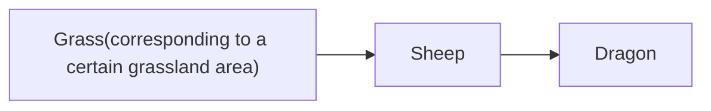
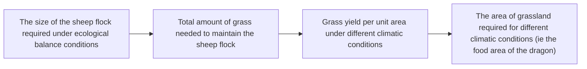

For office use only

T1

T2

T3

T4

Team Control Number

1902727

Problem Chosen

A

For office use only

F1

F2

F3

F4

2019

MCM/ICM

Summary Sheet

# Dragon and Ecology

## Summary

This paper analyzed dragon’s biological attributes, energy requirements and its interraction with environment by stepwise modeling.

To study the relationship between dragon’s weight w and its age a, we apply Logistics model after biological analysis. Then we use provided body mass data of dragon at different age, to fit the weight-age curve. It was found that the dragon grew rapidly from age 3 to age 5, then almost reached the maximum at age 8, and then grew slowly. The maximum body weight was about $1 4 . 8 \times 1 0 ^ { 5 }$ kg.

Then we set a model to find the relationship between daily energy consumption q, daily caroles intake u and age a of the dragon, according to Kleiber’s law (the relationship between the energy consumption and body weight w is $q \propto w ^ { 3 / 4 } )$ and the law of biological growth(consumption and expenditure determines the weight increase). An adult dragon would eat around $4 . 8 \times 1 0 ^ { 6 }$ kcal per day.

Under different climate conditions, area required to support a dragon varies. To simplify, we refer to the novel and we found dragons mostly eat sheep. So the food chain is herbage, sheep, dragon. First we calculated how many sheep will 3 dragons eat per day, then we use Malsus model to estimate the required sheep population. To analyze how mush area is required to support sheep group, we set a Integral regression model to calculate herbage yield, and use realworld temperature, rainfall, sunshine data to quantize it. In arid, temperate, arctic area, about 3738hm2, 2383hm2, 4843hm2 of pasture is required respectively.

Providing different levels of assistance to dragons corresponds to various community size, we defined 7 levels corresponding to 7 types of ecosystem. Using unit area biomass of them, we get the community size. When it’s on level 5, dragon lives in temperate grassland, $3 . 8 1 \times 1 0 ^ { 7 } k g$ of biomass is required.

An active dragon will affect surrounding ecosystem, we use species extinction speed, NPP(net primary production) and biomass decrease to measure degradation of ecosystem. E.g. a grownup dragon will wipe out a 20, 000 group of cattle in 103 days, also let a temperate evergreen forest degrade to grassland, so the NPP will decrease $1 . 7 5 \times \mathrm { { 1 0 } ^ { 7 } }$ per year, biomass will decrease $8 . 3 5 \times 1 0 ^ { \mathrm { \bar { 8 } } } \mathrm { p e r }$ year.

In practical, the model can be applied to analyze agribusiness problems, or invasive species.

This paper also analyzed the model’s sensitivity to dragon’s origin weight data , if it’s increased by 3%, the calculated adult weight will change by 5.36%, its daily energy expenditure will change by 8.98%, so the origin data has affect on model’s stability, but the result is still acceptable.

Keywords: Logicstics, Intake and Expenditure, Ecosystem Balance, Integral Regression

## Contents

## 1 Overview 2

1.1 Backgroud . . 2  
1.2 Restatement of the Problem . 2

## 2 Assumptions and Justifications 2

## 3 Notation 4

## 4 Analysis and Modeling 4

4.1 Dragon’s weight growth equation based on Logistics Model 4  
4.2 Energy consumption and intake model of dragon based on Kleiber’s law . 6

4.2.1 Energy consumption . . . 6  
4.2.2 Energy intake . . . . 6  
4.2.3 Comparison of energy consumption and intake . . . . . 7

4.3 Predation area required to support dragon under different climate conditions 8

4.3.1 Flock size under ecological equilibrium . . . . 9  
4.3.2 Herbage yield under different climate conditions . . . . . 10  
4.3.3 Predation area needed to support dragons in three types of regions 12

4.4 Community required to provide different level of assistance for dragons . . 13  
4.5 Impact of dragons on the ecological environment 15

4.5.1 Extinction rate of species . . . 15  
4.5.2 Degree of degradation in production capacity and declination in biomass . . 16

## 5 Sensitivity Analysis 17

5.1 The sensitivity analysis of dragon’s weight . . 17  
5.2 Reliability verification 17

## 6 Strengths and Weaknesses 18

## 7 Practical Application 19

7.1 In agribusiness 19  
7.2 Predicting the effects of invasive species . . 20

## 1 Overview

## 1.1 Backgroud

As a legendary creature with great and magical power, the dragon often appears in various literature, art, film and television works as well as architecture and monuments. Almost all the world has legends about dragons, but different regions have different descriptions of dragon images and their living habits.

In George Martin’s ”A Song of Ice and Fire”, the dragon has a strong body covered with hard scales, sharp teeth, a long neck and a long tail. It flies with a pair of giant wings like a batwing. The dragon is a kind of special mammal that lives in a cave and spends most of its time alone. The dragon does not exist in the real world, so people’s research on the dragon mostly focuses on the realms of history, literature and art. There are not many special studies on the biological aspects such as the dragon’s physiological characteristics, behavior, habits, diet, and interaction with the ecological environment.

## 1.2 Restatement of the Problem

If the fictional three dragons in The Song of Ice and Fire are still alive, we need to analyze the characteristics, requirements, and interactions of the creatures

1. How does the weight of a dragon change according to age?  
2. How does the calorie consumption and intake of the dragon change according to age?  
3. How large is the area required to support the dragon’s life under different climatic conditions? What is the impact of climatic conditions?  
4. How large a community is needed to provide different levels of assistance for the dragons?  
5. How does the dragons influence the ecological environment? How severe is the impact?

## 2 Assumptions and Justifications

To simplify our problems, we make the following basic assumptions, each of which is properly justified.

• Assumed that three dragons have the same characteristics in aspects of growth, behavior, habit, diet and other aspects;  
• Assumed that the growth of a dragon is restricted by its own genes and environmental conditions, so it cannot grow indefinitely, and its weight growth rate is a linear weight loss function;  
• Assumed that the weight of a dragon at birth is about 10kg, and it will weigh about 35kg one year later, 14000kg three years later.

• Supposed that the dragon is an egg-laying mammal (similar to a platypus), whose metabolism is similar to that of humans;  
• Assumed that the basic metabolism of the average human takes up 70% of the calories consumed in a day;  
• Assumed that the body of the dragon is composed of water, protein, fat, carbohydrate, mineral and etc, with the proportion of protein, fat and carbohydrate to 16  
• Supposed that the difference between the calorie intake and consumption of the dragon is converted into the protein, fat and carbohydrate that make up the dragon’s body;  
• Assumed that the area of land needed by the dragon includes the area of predation area, the area of drinking water area and the area of living area. The area of drinking water area and living area is relatively small for the area of predation area, so the area of land needed by the dragon is the area of predation area.  
• Supposed in 4.3, the dragon lives in a simplified grassland ecosystem, in which the biological community is only composed of microorganisms, dragons, sheep of the same species and herbage. The dragon’s main food is sheep, and its only source of calories is sheep.  
• Assumed that the average weight of the sheep as dragon’s food source, and the proportion of the portion of the edible part of the edible part of the diet, the calories in the size of a 1kg of lamb and the calories of the lamb and the amount of calories that are in the area of the grass, the average weight is about 100 kg, and the average weight is about 50% of the food, and the amount of calories that is in the 1kg is about 2030kcal;  
• Assumed that the birth rate and natural death rate of sheep are constant, the daily birth rate and natural death rate are 0.107% and 0.044% respectively.

## 3 Notation

<table><tr><td>Abbreviation</td><td>Description</td><td>Unit</td></tr><tr><td>a</td><td>Age of dragon</td><td>year</td></tr><tr><td>w(a)</td><td>Body mass of dragon at age of a</td><td>kg</td></tr><tr><td> $w_0$ </td><td>Body mass of dragon at birth</td><td>kg</td></tr><tr><td> $w_m$ </td><td>Maximum body mass of dragon</td><td>kg</td></tr><tr><td>r(w)</td><td>The weight increasing rate</td><td>kg/year</td></tr><tr><td>q(a)</td><td>Dragon&#x27;s daily expenditure at age of a</td><td>kcal/day</td></tr><tr><td>q0</td><td>Energy expenditure of a average male adult</td><td>kcal/day</td></tr><tr><td> $BMR_0$ </td><td>Basal metabolic rate of a average male adult</td><td>kcal/day</td></tr><tr><td>u(a)</td><td>Dragon&#x27;s daily intake at age of a</td><td>kcal/day</td></tr><tr><td>s(a)</td><td>Number of sheep a dragon need to eat per day</td><td> $day^{-1}$ </td></tr><tr><td>b</td><td>Birth rate of sheep flock</td><td> $day^{-1}$ </td></tr><tr><td>d</td><td>Natural mortality of sheep flock</td><td> $day^{-1}$ </td></tr><tr><td> $s_m$ </td><td>The number of sheep the three dragons</td><td> $day^{-1}$ </td></tr><tr><td>G</td><td>Scale of sheep flock under an ecological balance</td><td></td></tr><tr><td>g(t)</td><td>The number of sheep after breeding for t days</td><td></td></tr><tr><td>g0</td><td>Sensitive coefficient of forage yield</td><td></td></tr><tr><td> $h_i(t)$ </td><td>In t th month, grass yield</td><td> $kg/hm^2$ </td></tr><tr><td> $Y_t$ </td><td>Ihe value of the i th meteorological element</td><td> $kg/hm^2$ </td></tr><tr><td> $x_i(t)$ </td><td>meteorological element</td><td></td></tr><tr><td>y</td><td>Grass Yield</td><td> $kg/hm^2$ </td></tr><tr><td> $c_i$ </td><td>The animals calories of a type i ecosystem provides</td><td> $kcal \times day/m^2$ </td></tr><tr><td> $S_i$ </td><td>Type i ecosystem area required to sustain dragons</td><td> $m^2$ </td></tr><tr><td> $f_i$ </td><td>The average biomass of type i ecosystems</td><td> $kg/m^2$ </td></tr><tr><td> $F_i$ </td><td>The community size required</td><td>kg</td></tr><tr><td> $n_i$ </td><td>The net primary production(NPP)of type i ecosystem</td><td> $g \times year/m^2$ </td></tr><tr><td> $\Delta NPP_{ij}$ </td><td>The reduced NPP after type i degenerates into j</td><td>g/year</td></tr><tr><td> $\Delta F_{ij}$ </td><td>The reduced biomass after type i degenerates into j</td><td>kg</td></tr></table>

## 4 Analysis and Modeling

## 4.1 Dragon’s weight growth equation based on Logistics Model

According to biological analysis, due to the limitation of food resources and environmental conditions, the weight of an organism cannot grow indefinitely, and its growth rate (ie, the rate of weight gain) increases first and then decreases with the increase of its age[1], showing a growth retardation feature. Thus, we established a dragon weight gain model based on the retardation growth model.

Assume that the growth rate of dragon’s weight $r ( w )$ is a function of the weight of the dragon $w ( a ) \ , \ a$ is its age. According to the previous analysis, $r ( w )$ should be a decreasing function of $\mathrm { w } .$ For simplification, we assume that $r ( w )$ is a linear function of $\mathrm { w } , r ( w ) = r _ { 0 } - s w$ . Under the constraints of food resources and environmental conditions, the dragon’s maximum weight is $w _ { m }$ , when $w = w _ { m }$ , the dragon’s weight increase rate is

0, which is $r ( w _ { m } ) = 0$ . Under the assumption of linearization, there is

$$
r (w) = r (1 - \frac {w}{w _ {m}}) \tag {1}
$$

Thus, the realation between dragon’s body mass and age is

$$
\left\{ \begin{array}{c} \frac {d w}{d a} = r _ {0} w (1 - \frac {w}{w _ {m}}) \\ w (0) = w _ {0} \end{array} \right. \tag {2}
$$

w0 is dragon’s weight at birth, $w _ { m }$ is the maximum weight of dragon.

solve (2) to get dragon’s weight-age relationship, which is

$$
w (a) = \frac {w _ {m}}{1 + (w _ {m} / w _ {0} - 1) e ^ {- r _ {0} a}} \tag {3}
$$

According to the known conditions in the problem, the weight of the dragon at birth is about 10kg, and the weight after one year is about 35kg. Combined with the description of the dragon in the book ”Song of Ice and Fire”, the dragon is about three years later. It is 16.5m and weighs about 14000kg, so $\mathrm { w ( 0 ) } { = } 1 0 , \mathrm { w ( 1 ) } { = } 3 5 , \mathrm { w ( 3 ) } { = } 1 4 0 0 0$ .

Thus, we can solve the unknown parameters r0, w0, and $w _ { m }$ in the weight model and substitute it into (3), which is the weight model of the dragon.

$$
w (a) = \frac {1 . 4 8 1 \times 1 0 ^ {6}}{1 + 1 4 7 6 5 6 \times e ^ {- 2 . 4 1 7 a}} \tag {4}
$$

According to the above formula, we can fit a curve of the weight-age of the dragon , as shown in Figure 1.

line chart

| Age(year) | Mass(kg)     |
| --------- | ------------ |
| 0         | 0            |
| 2         | 0            |
| 4         | 1.481×10⁶    |
| 6         | 14           |
| 8         | 14.5         |
| 10        | 14.5         |
| 12        | 14.5         |

Figure 1: Dragon Age-Weight relation

As can be seen from Figure 1, the dragon grows slowly before the age of 3, and the weight increases rapidly from 3 to 7 years old. At the age of 8 years, the dragon’s weight reaches its maximum and then stabilizes. We can think that the dragon is in the growth period before the age of 8 and mature at the age of eight.

## 4.2 Energy consumption and intake model of dragon based on Kleiber’s law

## 4.2.1 Energy consumption

Because we can’t directly measure the calorie consumption of a dragon, we consider applying Kleiber’s law for indirect calculations.

Kleiber’s law, named after Max Kleiber for his biology work in the early 1930s, is the observation that, for the vast majority of animals, an animal’s metabolic rate scales to the ¾ power of the animal’s mass. Symbolically: if q is the animal’s metabolic rate, and M the animal’s mass, then Kleiber’s law states that $q \propto M ^ { 3 / 4 } [ 2 ]$

According to the hypothesis, both dragons and humans are mammals, and the ways of metabolism have certain similarities. At the same time, considering that the medical community has already had a reliable measurement and calculation method for human metabolic rate, we consider to use the calorie consumption of humans to estimate the calorie consumption of the dragon.

The calorie consumption of a human day consists of three parts: basal metabolism, food heat effects, and exercise consumption. For the average person, the proportion of basal metabolism is between 60% and 80%. According to the formula given by the American Sports Medicine Association, the basal metabolic rate of ordinary males is

$$
B M R = 1 3. 7 \times w _ {0} + 5 \times h _ {0} - 6. 8 \times a _ {0} + 6 6 \tag {5}
$$

where $w _ { 0 } , h _ { 0 } , a _ { 0 }$ represent weight, height and age, respectively.

Thus, a 20-year-old male with a body weight of 80 kg and a height of 180 cm has a basal metabolic rate of $B M R _ { 0 } { = } 1 9 2 6 \ \mathrm { k c a l / d a y . } [ 3 ]$ Assuming that basal metabolism accounts for 70% of his daily calorie consumption, then the male’s calorie for one day. Consumption $q _ { 0 } = B M R _ { 0 } / 0 . 7 = 2 7 5 1 k c a l / d a y$ .

According to Kleiber’s law, the ratio of the calorie consumption of a day of age a to the calorie consumption of the man’s day.

$$
\frac {q (a)}{q _ {0}} = \frac {w ^ {3 / 4} (a)}{w _ {0} ^ {3 / 4}} = \left[ \frac {w (a)}{w _ {0}} \right] ^ {3 / 4} \tag {6}
$$

Substituting the dragon’s weight equation (4) we obtained in 4.1 into the above equa tion, that is, the calorie consumption of the dragon at the age of ’a’.

$$
q (a) = \frac {4 8 6 8 5 9 8}{(1 + 1 4 7 6 5 6 \times e ^ {- 2 . 4 1 7 a}) ^ {\frac {3}{4}}} \tag {7}
$$

## 4.2.2 Energy intake

In 4.2.1, we have already got the calorie consumption of the dragon at 1 year old, and when the calorie intake is equal to the consumption, the dragon’s weight remains the same. [4]To increase the weight of the dragon, the calorie intake must be greater than the consumption.

We assume that the dragon’s body is composed of water, protein, fat, carbohydrates, minerals, etc., and the proportion of protein, fat and carbohydrate is $p _ { 1 } , p _ { 2 } , p _ { 3 } ,$ respectively. We believe that the proportion of protein, fat and carbohydrate in the weight gain of the dragon is also $p _ { 1 } , p _ { 2 } , p _ { 3 }$ . According to the basic knowledge of nutrition, we believe that the energy required to increase 1g protein, fat and carbohydrate in the dragon body is 4, 9, 4kcal. In order to increase the weight of the dragon ff w kg[5], the dragon should be ingested to ensure normal activities. Energy (ie consumption), and the energy that needs to be ingested can be expressed as

$$
\Delta E n e r g y = 4 0 0 0 p _ {1} \Delta w + 9 0 0 0 p _ {2} \Delta w + 4 0 0 0 p _ {3} \Delta w \tag {8}
$$

Let $\mathrm { u ( a ) }$ denote the calorie intake of the dragon at the age of a, according to the above analysis, we can get:

$$
3 6 5 [ u (a) - q (a) ] = 4 0 0 0 p _ {1} \Delta w (a) + 9 0 0 0 p _ {2} \Delta w (a) + 4 0 0 0 p _ {3} \Delta w (a) \tag {9}
$$

Where $\mathrm { { q } ( a ) }$ represents the calorie consumption of the dragon at the age of $\mathrm { a } , ~ \mathrm { w ( a ) }$ represents the weight gain of the dragon a year to a+1 year old, ie $\mathrm { w ( a ) = w ( a + 1 ) }$ − w(a).

If the proportion of each component in the dragon is the same as that of humans, that is, $p _ { 1 } = 1 6 \% , p _ { 2 } = 1 6 \% , p _ { 3 } = 1 \%$ , and the expressions (4) and (7) are substituted into (9). The calorie intake of the dragon at the age of a is u(a).

## 4.2.3 Comparison of energy consumption and intake

By plotting the calorie intake and consumption of the dragon day with age, we can visually see the relationship between the calorie consumption and intake of the dragon, as shown in Figure 2. As can be seen from Figure 2, before the age of the dragon, that is, before the age of 8, the calorie intake of the dragon is greater than the consumption. At this time, the weight of the dragon increases, and the difference between the intake and consumption is about 5 years old. The value reached the maximum, combined with the analysis in 4.1, this is exactly the period of the fastest weight gain of the dragon; in the mature stage of the dragon, that is, after 8 years old, the intake of the dragon is equal to the consumption, and the body weight remains stable.

line chart

| Age(year) | Daily Intake(Kcal) | Expenditure(Kcal) |
| --------- | ------------------ | ----------------- |
| 0         | 0                  | 0                 |
| 2         | 0                  | 0                 |
| 4         | 5.6×10⁶            | 3.0×10⁶           |
| 6         | 5.0×10⁶            | 4.8×10⁶           |
| 8         | 4.9×10⁶            | 4.9×10⁶           |
| 10        | 4.9×10⁶            | 4.9×10⁶           |
| 12        | 4.9×10⁶            | 4.9×10⁶           |
| 14        | 4.9×10⁶            | 4.9×10⁶           |
| 16        | 4.9×10⁶            | 4.9×10⁶           |
| 18        | 4.9×10⁶            | 4.9×10⁶           |
| 20        | 4.9×10⁶            | 4.9×10⁶           |

Figure 2: Dragon Intake-age, expenditure-age relation

## 4.3 Predation area required to support dragon under different climate conditions

The land area required by the dragon includes the area for predation, drinking and living area. Considering that the drinking and living area are relatively small for the predation area, in order to simplify the analysis, we assume that the land area required by the dragon is the predation area.

According to the description in the ”Song of Ice and Fire” series, the dragon’s food is mainly sheep, so in order to simplify the analysis, we assume that the dragon lives in a simplified grassland ecosystem, and the biomass in the ecosystem is only microbes, dragon, sheep of the same breed and pasture. Sheep meat is the only source of calorie intake. In order to sustain the dragon’s food supply, a certain number of sheep are needed. To maintain sheep, a certain amount of pasture is needed. We assume that the land area required to support the dragon (ie, the area for predation) is the area of the pasture. The simplified food chain is shown in Figure 3. Considering that the dragons migrate

flowchart

Figure 3: Food Chain

between regions with large climate differences, we need to calculate the area needed to support the dragon in different climatic conditions, namely the grassland area. The yield of grass is different under different climatic conditions, so the required grassland area is also different. Based on the above analysis, the main modeling ideas in this section are shown in Figure 4.

flowchart

Figure 4: Modeling flow

## 4.3.1 Flock size under ecological equilibrium

In order to sustain the number of sheep with the continuous predation of the dragons, and to ensure the sustainable development of the flock, it is necessary to make the flock reach a certain scale, so that the breeding speed of the flock can catch up with the speed of the dragon to prey, that is, to achieve ecological balance.

Suppose the sheep weighs about 100kg and the edible portion accounts for about 50% of the total mass. By looking up the food calorie table, we know that 1kg of lamb contains 2030kcal of calories. The number of sheep that the dragon needs to prey at the age of a ,as follow

$$
s (a) = \frac {u (a)}{2030 \times 100 \times 50 \%} \tag{10}
$$

Then the number of sheep that a dragon needs to prey every day is $\mathrm { s } ( 8 ) \mathrm { = } 5 6$ , so the number of sheep three dragons need to prey each day and the number of the sheep is three times the number of each of them $s _ { m } = 3 \times 5 6 = 1 6 8$ .

According to the analysis in 4.1, dragons grow from 0 to 8 years old, reach the maxi mum weight around 8 years old, and then enter adulthood. During growth, the number of sheep it needs to hunt each day increases rapidly with age, but it is relatively stable in adulthood. Considering that the eight-year growth period only accounts for a small part of the dragon’s life span of hundreds of years, we believe that the period when the dragon’s predation quantity remains stable accounts for the majority of the dragon’s life span. Therefore, we will only calculate the size of the sheep needed by the sheep after the dragon becomes an adult.

Let birth rate b and natural death rate d respectively represent the percentage of the number of sheep born and died in a day as a percentage of the total number of sheep. For the purpose of simplifying the analysis, we assume that the birth rate and natural death rate of sheep are fixed.

In order to maintain that the number of sheep does not decrease due to the predation of dragons, it should be ensured that the number of sheep increased is not less than the number of sheep predation by dragons daily. When two values are equal, the scale of sheep will remain stable, and let the number of sheep at this time be G, then

$$
G \times e ^ {b - d} - G = s _ {m} \tag {11}
$$

i.e.

$$
G = ^ {s _ {m}} / e ^ {b - d} - 1 \tag {12}
$$

Next we need to calculate the time it takes for the sheep to reach this size. According to the model, the growth of the sheep is not limited by the number of food and environmental conditions, that is, before the dragon begins to prey on the sheep, the number of sheep will show the characteristics of exponential growth. For this purpose we set up a Model for the growth of sheep based on the malthus model. let $g _ { 0 }$ be the initial number of sheep, g (t) for the number of sheep after t, then

$$
\left\{ \begin{array}{c} \frac {d g}{d t} = (b - d) g \\ g (0) = g _ {0} \end{array} \right. \tag {13}
$$

By solving this differential equation, the growth model of sheep population can be obtained

$$
g (t) = g _ {0} \times \mathrm{e} ^ {(b - d) t} \tag {14}
$$

Under the condition of natural growth, the time needed to achieve sheep scale ${ \mathrm { G } } ,$ , respectively

$$
T = \ln G - \ln g _ {0} / b - d \tag {15}
$$

After inquiring the relevant data of sheep breeding, we assume that $\mathrm { b { - } d { = } 0 . 0 5 6 7 I f }$ the initial number of sheep $g _ { 0 } { = } 1 0 0 0 0$ , it takes $\mathrm { T } { = } 1 6 . 4$ years for the size of sheep to reach ${ \mathrm { G } } ,$ , that is, before the adult dragons enter the pasture, in order to keep the size of sheep unchanged after the three dragons start to hunt, it is necessary to let the sheep reproduce naturally for at least 16.4 years.

## 4.3.2 Herbage yield under different climate conditions

Dragons migrate between regions with very different climates, and we need to calculate the forage yield per unit of land under different climatic conditions. For this, we set up based on Legendre polynomials of herbage yield integral regression model.

## 1. Herbage monthly output integral regression model based on Legendre polynomials

In section 4.3, we have calculated the scale of sheep needed to guarantee that the number of sheep is not reduced due to the continuous predation of the three dragons, which is 296297. Looking up the relevant data of sheep breeding, we assume that the forage intake of each sheep is $1 . 8 \mathrm { k g / d a y }$ , so the total amount of forage needed by the sheep is $5 3 3 3 3 5 \mathrm { k g / d a y . [ 1 3 ] }$ The main purpose of this section is to calculate the area of pasture required to provide such forage. At the same time, we need to calculate the predation area needed to sustain the dragons under different climatic conditions, considering that dragons will migrate between regions with different climates.

According to the hypothesis of the model, forage grass grows throughout the year, and only temperature, precipitation and sunshine hours are meteorological factors affecting the forage grass yield. In order to comprehensively analyze the influence of these three meteorological factors on the forage grass yield, we put forward the concept of sensitive index.

The sensitivity index $h _ { i } ( t )$ of forage yield to the ith meteorological element is defined as the change of forage yield in the first month $( k g / h m ^ { 2 } )$ for each unit change of this meteorological element.

The integrated regression response model of forage yield to meteorological factors was established

$$
Y (t) = C _ {t} + \sum_ {i = 1} ^ {3} \int_ {0} ^ {1} \sum_ {j = 0} ^ {5} a _ {i j} \phi_ {j} (t + \Delta t) x _ {i} (t + \Delta t) d \Delta t \tag {16}
$$

Where, $\mathrm { Y ( t ) }$ is the forage yield in month $\operatorname { t } , x _ { i } ( t )$ is the ith meteorological element value in month t, and $C _ { t } \mathrm { i }$ s the constant in the model. Selection in order to improve the calculation accuracy, moving average method, the nonlinear simulation method, the piecewise linear simulation, simulation method, orthogonal polynomial method, the output of 5 kinds of commonly used separation method, through calculating and comparing, we finally choose to adopt orthogonal polynomial $( { \mathrm { i . e . } }$ , Legendre polynomials) method to fit for forage production. Suppose $h _ { i } ( t )$ is the orthogonal polynomial function of the ith meteorological element, i.e

$$
h _ {i} (t) = \sum_ {j = 0} ^ {m} a _ {i j} \phi_ {j} (t) \tag {17}
$$

Where, m is the expansion power, ${ \bf \nabla } _ { j } ( t )$ is the orthogonal polynomials of the time, the calculating formula is

$$
\phi_ {j} (t) = \frac {1}{2 ^ {j} j !} \frac {d ^ {j}}{d t ^ {j}} [ (t ^ {2} - 1) ^ {j} ] \tag {18}
$$

$$
Y (t) = C _ {t} + \sum_ {i = 1} ^ {3} \int_ {0} ^ {1} \sum_ {j = 0} ^ {5} a _ {i j} \phi_ {j} (t + \Delta t) x _ {i} (t + \Delta t) d \Delta t \tag {19}
$$

If $\mathrm { \ m } = 5 ,$ , the integral regression response model of forage yield to meteorological elements (expression (16)) can be deformed into

## 2. integrated regression response model of herbage yield in three types of regions

In (1), we established the integrated regression response model of forage yield to meteorological factors. Considering the regional differences in climate, temperature, precipitation and sunshine time on the degree of cross influence herbage yield may be larger differences, that is to say, the herbage yield is sensitive to temperature, precipitation, sunshine hours of index will be because of the different climatic conditions, so we need to build in different climate condition, the integral regression herbage yield response model. [11]

To simplify the analysis, we consider only three types of regions, namely, arid regions, warm regions and polar regions. In order to obtain the sensitivity index of herbage yield to temperature, precipitation and sunshine hours in these three types of regions, we selected xx grassland representing arid regions, xx grassland representing warm regions and xx grassland representing polar regions, and collected the herbage yield and relevant meteorological data of these three grasslands. [12]

According to the data, the stepwise regression calculation was carried out for the herbage yield in each month and the 18 factors of normalized temperature, precipitation and sunshine duration, and the regression coefficient $a _ { i j }$ was obtained, where $_ { \mathrm { I = 1 , 2 , 3 } }$ , j=0,1... ,5. Substitute it into (16) to obtain the integral regression response equation of forage yield in each month. After summation, the integral regression response model of forage yield in these three types of areas can be obtained, that is, the relationship between annual forage yield y and temperature, precipitation and sunshine hours, as shown in table 1.

## 3. analysis of the influence of climatic conditions on herbage yield

In order to analyze the influence of climatic conditions on herbage yield, the sensitivity indexes of herbage yield to temperature[6], precipitation[7] and sunshine[8] hours in arid regions, warm regions and polar regions were successively calculated, as shown in Table 2.

<table><tr><td>Types of region</td><td>Temperature</td><td>Rainfall</td><td>Sunshine hours</td></tr><tr><td>Arid</td><td>-</td><td> $a_R(t) = 0.518\varphi_3 + 0.024\varphi_2 + 0.122\varphi_1 + 1.681\varphi_0$ </td><td> $a_S(t) = 1.266\varphi_1 - 0.846\varphi_0$ </td></tr><tr><td>Temperate</td><td> $a_T(t) = -233.03\varphi_5$ </td><td> $a_R(t) = 0.494\varphi_5 + 2.8522\varphi_3 + 17.128\varphi_1$ </td><td> $a_S(t) = -2.666\varphi_4 - 2.765\varphi_3 - 9.786\varphi_0$ </td></tr><tr><td>Arctic</td><td> $a_T(t) = 15.798\varphi_5 + 106.938\varphi_4 - 21.263\varphi_1$ </td><td> $a_R(t) = 21.723\varphi_5 - 4.6\varphi_0$ </td><td> $a_S(t) = 69.021\varphi_4 + 1.646\varphi_3$ </td></tr></table>

Table 2: sensitivity coefficient of monthly forage yield in three types of areas

In order to analyze the change of sensitive index with time, the curve of the change of sensitive index of herbage yield to temperature, precipitation and sunshine duration with month was made, as shown in Figure 5.

line chart

| Month | Egypt | Australia | Iceland |
|-------|-------|-----------|---------|
| 0     | 80    | -80       | 60      |
| 2     | 60    | -60       | 50      |
| 4     | 20    | 0         | 70      |
| 6     | -60   | 60        | 30      |
| 8     | -80   | 80        | -80     |
| 10    | -40   | 20        | 20      |
| 12    | 60    | -60       | 80      |

line chart

| Month | Egypt  | Australia | Iceland |
|-------|--------|-----------|---------|
| 0     | -9.6   | -11.2     | -11.2   |
| 2     | -10.2  | -10.8     | -10.8   |
| 4     | -10.6  | -11.0     | -9.6    |
| 6     | -9.8   | -11.2     | -10.0   |
| 8     | -9.8   | -11.0     | -10.4   |
| 10    | -10.4  | -10.6     | -10.8   |
| 12    | -11.2  | -10.2     | -11.2   |

line chart

| Month | Egypt | Australia | Iceland |
|-------|-------|-----------|---------|
| 0     | 0.5   | 2.5       | 2.0     |
| 2     | -0.5  | 0.0       | 1.0     |
| 4     | -1.5  | -2.0      | -1.0    |
| 6     | -1.0  | 0.5       | -2.0    |
| 8     | -1.5  | -1.5      | 0.5     |
| 10    | -1.0  | 0.0       | 1.5     |
| 12    | 2.5   | 1.5       | 2.0     |

Figure 5: Change of sensitivity coefficients

## 4.3.3 Predation area needed to support dragons in three types of regions

In 4.3.1, we have calculated the sheep size needed to ensure that the number of sheep is not reduced due to the continuous predation of the three dragons, which is 266,609. Looking up the relevant data of sheep breeding, we assume that the forage intake of each sheep is 1.8kg/day, so the total forage quantity required by the sheep is 479896kg/day.

To simplify our analysis, we consider the migration of dragons between three regions, namely, arid, warm and polar regions. The climate in different types of regions has similar characteristics. We assume that the climatic conditions of every place within the arid region are the same as those of the A grassland, the climatic conditions of every place within the warm region are the same as those of the B grassland, and the climatic conditions of every place within the polar region are the same as those of the C grassland.

According to the integrated regression response model of forage yield established in 4.3.2, we can calculate the forage yield under different climatic conditions, and then calculate the grassland area needed to ensure the demand of sheep, that is, the land area needed to support the life of dragons, as shown in Table 3.

<table><tr><td>Types of region</td><td>Arid</td><td>Temperate</td><td>Arctic</td></tr><tr><td>Grass yield (kg/hm2× year)</td><td>33087.43</td><td>42858.35</td><td>21085.43</td></tr><tr><td>Predation area (hm2)</td><td>3738.08</td><td>2382.62</td><td>4843.12</td></tr></table>

Table3 : Forage yield and predation area needed to support dragons in three types of regions

In Table 3, we only listed the area of grassland when the sheep reached the maximum size. Before that, as the sheep size increased, the required land area also increased. According to the growth model of the number of sheep established in 4.3.1, we can get the change trend of the required land area under different climatic conditions with the continuous expansion of the size of sheep, as shown in Figure 6.

Combined with Table 3 and Figure 6, it is easy to see that the area of land required by dragons to live in warm regions is the smallest, followed by arid regions and the polar regions is the largest.

contour plot

| Region | x(km) | y(km) |
|--------|-------|-------|
| Inner   | 4     | 4     |

scatter plot

| x(km) | y |
|-------|---|
| 4     | 4 |

scatter plot

| x(km) | y(km) |
|-------|-------|
| 4     | 4     |

scatterplot

100 Standard Olympic Track Field
| x(km) | y(km) |
|---|---|
| 4 | 4 |

Figure 6: The area of land required for dragon in different climates

## 4.4 Community required to provide different level of assistance for dragons

In 4.3, we assume that the dragons live in a simplified grassland ecosystem in which the biomes are composed only of dragons, sheep, pastures, and microbes, and to simplify the food chain, we assume that the dragon’s only food source is sheep. In fact, dragons can live in a variety of complex ecosystems, and dragons can be used as a species at the top of the food chain to prey on any animal. Considering only the food source of the dragon, different ecosystems have different levels of species richness, so the level of assistance that can provide the dragon’s predation behavior is also different. We next analyze that the dragon lives in different ecosystems, to ensure Its life, at least the size of the community needed.

Assuming the higher the species richness of the ecosystem, the higher the level of aid provided for the predation behavior of the dragon. We sorted the ecosystems of dragon life according to the species richness from high to low, followed by seven types: tropical rain forest, temperate evergreen broad-leaved forest, swamp and wetland, savanna, temperate grassland, desert and ice sheet. Corresponding to 7 assistance levels, from high to low are recorded as Level 1, Level 2, Level 3...

A community refers to a collection of populations of various species within a certain space within a certain period of time, including populations of various species such as animals, plants, and microorganisms, and biomass refers to a biome contained in a unit area or volume of habitat at a certain time. The total weight of all organisms, the unit of biomass is usually expressed in $\mathrm { g / m 2 }$ . From this we define the size of the community within a certain area as the total amount of biomass contained in the area.

Looking at the relevant data, we can get the average biomass per unit area of different ecosystems, as shown in Table 4.

<table><tr><td>Type of ecosystem</td><td>Level of assistance</td><td>Specie richness</td><td>Average biomass  $f_{i}$ (kg/m2)</td></tr><tr><td>Tropical rainforest</td><td>1</td><td>1(highest)</td><td>45</td></tr><tr><td>Temperate evergreen forest</td><td>2</td><td>2</td><td>35</td></tr><tr><td>Swamp and wetland</td><td>3</td><td>3</td><td>12.3</td></tr><tr><td>Savanna</td><td>4</td><td>4(median)</td><td>4</td></tr><tr><td>Temperate grasslands</td><td>5</td><td>5</td><td>1.6</td></tr><tr><td>Tundra</td><td>6</td><td>6</td><td>0.6</td></tr><tr><td>Desert and ice</td><td>7</td><td>7(lowest)</td><td>0.02</td></tr></table>

Table 4: Different ecosystem and corresponding Level of Assistance

Assume that the dragon is the top predator and can prey on any animal. Let $c _ { i }$ denote the calories that the animals owned by the i-type ecosystem per unit area can provide for the dragon on average per day. In order to ensure the survival of the three dragons, the required ecosystem area

$$
S _ {i} = \frac {u _ {m}}{c _ {i}} \tag {20}
$$

Where $u _ { m }$ represents the calorie intake of three adult dragons per day, $u _ { m } = 3 { \times } u ( 8 )$ .

In Table 4, we list the average biomass $f _ { i }$ per unit area of the seven types of ecosystems, then the biomass of the i-th ecosystem

$$
F _ {i} = f _ {i} \times S _ {i} = f _ {i} \times \frac {u _ {m}}{c _ {i}} \tag {21}
$$

Based on the above analysis, $F _ { i }$ is the size of the community needed to provide Level i help for the dragon.

In 4.3, we have calculated the area of the temperate grassland needed to support the life of the three dragons. The temperate grassland corresponds to the level 5 assitance, then $S _ { 5 } = 2 3 8 3 h m ^ { 2 }$ , from which $F _ { 5 } = f _ { 5 } { \times } S _ { 5 } = 3 . 8 1 { \times } 1 0 7 k g$ , The size of the community required to provide Level 5 assistance for the dragon is $3 . 8 1 \times 1 0 ^ { 7 } k g$ .

## 4.5 Impact of dragons on the ecological environment

In analysis of 4.3 and 4.4, we believe that the amount of resources provided by the ecosystem is not ruined by the predation of dragons, that is to say, the regeneration rate of resources in the ecosystem is greater or equal to the predation rate of dragons. In fact, the carrying capacity of the ecosystem is limited, and the existence of the dragons can have a severe impact on the ecological environment.

The influence of the dragon on the ecological environment is mainly manifested in two aspects:

1. Impact on species diversity and biological quantity of the ecosystem: the dragon has a huge body size and require far more food than other animals. At the same time, as a species at the top of the food chain, the dragon can prey on any animal.

2. impact on the productivity of the ecosystem: the fire-breathing behavior of the dragon will cause the destruction of local vegetation and the death of animals, not only directly reducing the number of producers, but also further undermining species diversity, thus causing the degradation of the ecosystem, which is mainly reflected in the reduction of productivity. We have quantified the impact of the dragon’s life on the ecosystem in terms of the rate of extinction, productivity and the extent of the decline.

## 4.5.1 Extinction rate of species

Supposed that before the dragon enters a certain region, the population of a certain creature in this region is $Q _ { 0 }$ , and the annual birth rate and annual death rate of this species are b and d, respectively.

Similar to the method of 4.3.1, we can establish a model based on the malthus-model population variation

$$
\left\{ \begin{array}{c} Q (t + 1) = Q (t) \times e ^ {b - d} - K \\ Q (0) = Q _ {0} \end{array} \right. \tag {22}
$$

when $Q ( t ) \leq 0$ ，the specie comes along with extinction.

If $Q _ { 0 } = 2 0 0 0 0 , \mathrm { ~ K = } 2 0 0 , \mathrm { ~ b \mathrm { - } d \mathrm { = } 2 3 \% , ~ K \mathrm { = } 2 0 0 . }$ , the species will become extinct after 103 days

## 4.5.2 Degree of degradation in production capacity and declination in biomass

We use net primary ecosystem production (NPP) and biomass changes to reflect the extent to which the entry of the dragon has degraded ecosystem productivity and decline biomass.

In ecology, primary production is the synthesis of organic compounds from atmospheric or aqueous carbon dioxide. Almost all life on Earth relies directly or indirectly on primary production. Net primary production (NPP) is the rate at which all the plants in an ecosystem produce net useful chemical energy; it is equal to the difference between the rate at which the plants in an ecosystem produce useful chemical energy (GPP) and the rate at which they use some of that energy during respiration.[9]

For relevant information, the average net primary production (NPP) and average biomass values of different ecosystems are shown in table 5.

<table><tr><td>Type of ecosystem</td><td>Average NPP(g/m2× year)</td><td>Average biomass(kg/m2)</td></tr><tr><td>Tropical rainforest</td><td>2200</td><td>45</td></tr><tr><td>Temperate evergreen forest</td><td>1300</td><td>35</td></tr><tr><td>Swamp and wetland</td><td>2000</td><td>12.3</td></tr><tr><td>Savanna</td><td>900</td><td>4</td></tr><tr><td>Temperate grasslands</td><td>600</td><td>1.6</td></tr><tr><td>Tundra</td><td>140</td><td>0.6</td></tr><tr><td>Desert and ice</td><td>3</td><td>0.02</td></tr></table>

Table 5: Mean net primary production (NPP) and mean biomass values for different ecosystems

Let the area of a certain region be S, and before the entry of the dragon into this region, this region is the type i ecosystem. After the entry of the dragon, due to the continuous predation and fire breathing of the dragon, this region is degraded into the type j ecosystem with lower species richness and productivity. Then, compared with the original, the total primary net production[10] and the total biological amount reduced in this region in a year are respectively.

$$
\begin{array}{l} \Delta N P P _ {i j} = S \times \left(n _ {i} - n _ {j}\right) \\ \Delta F _ {i j} = S \times \left(f _ {i}, f _ {j}\right) \end{array} \tag {23}
$$

If an area covers an area of $2 . 5 \times 1 0 ^ { 7 } m ^ { 2 }$ , ecosystem types for Temperate evergreen forest, due to the continuous feeding and spray fire dragon, the region degrade into Temperate grasslands, so in comparison, declined total net production and biomass in one year are as follows:

$$
\begin{array}{l} \begin{array}{l} \Delta N P P _ {2 5} = S \times \left(n _ {2} - n _ {5}\right) = 2. 5 \times 1 0 ^ {7} \times (1 3 0 0 - 6 0 0) = 1. 7 5 \times 1 0 ^ {1 0} g \\ \Delta E = S _ {\text {eff}} (f, f) = 2. 5 \times 1 0 ^ {7} \times (3 5 - 1. 6) = 8. 3 5 \times 1 0 ^ {8} l \end{array} \tag {24} \\ \Delta F _ {2 5} = S \times \left(f _ {2} - f _ {5}\right) = 2. 5 \times 1 0 ^ {7} \times (3 5 - 1. 6) = 8. 3 5 \times 1 0 ^ {8} k g \\ \end{array}
$$

## 5 Sensitivity Analysis

## 5.1 The sensitivity analysis of dragon’s weight

This paper models the effects of dragons on the ecological environment and, at the beginning, based on the Logistics model, uses the inaccurate data points provided to study the weight of the dragon as a function of age.

Under the premise that the weight of the dragon is 30-40 kg at the age of 1, in order to simplify the problem, this paper assumes that the dragon weighs 35 kg at the age of 1 in the previous modeling process, and analyzes the subsequent problems on this basis . By fitting the logistics curve again, we can get the body weight versus age curve when the dragon 1 year old weight is changed by 3%.

On this basis, we can continue to calculate the energy required by the dragon as a function of age, which is positively related to the demand for environmental resources.

line chart

| Age(year) | -3%     | +3%     | +0%     |
| --------- | ------- | ------- | ------- |
| 0         | 0       | 0       | 0       |
| 2         | 0       | 0       | 0       |
| 4         | 4.5e6   | 5.5e6   | 5.8e6   |
| 6         | 4.8e6   | 5.0e6   | 4.9e6   |
| 8         | 4.5e6   | 4.9e6   | 4.8e6   |
| 10        | 4.4e6   | 4.9e6   | 4.8e6   |
| 12        | 4.4e6   | 4.9e6   | 4.8e6   |

line chart

| Age(year) | -3%     | +3%     | +0%     |
| --------- | ------- | ------- | ------- |
| 0         | 0       | 0       | 0       |
| 2         | 0       | 0       | 0       |
| 4         | 0       | 0       | 0       |
| 6         | 14.5    | 16.5    | 16.0    |
| 8         | 14.8    | 17.0    | 16.5    |
| 10        | 14.8    | 17.0    | 16.5    |
| 12        | 14.8    | 17.0    | 16.5    |

Figure 7: The deviation of Dragon’s weight, daily intake if change the hypothesis weight at age 1 by 3%

Through the above figure, it can be intuitively found that the model is realatively stable.

## 5.2 Reliability verification

Using the above method, it is possible to calculate more accurately the weight of the dragon 1 year old in the range of 5%, each difference of 1%, the relative deviation percentage of the dragon weight, and further calculate the relative deviation percentage of the daily energy required by the dragon.

<table><tr><td>Weight Offset\Age</td><td>1</td><td>2</td><td>3</td><td>4</td><td>5</td><td>6</td><td>7</td><td>&gt;=8</td></tr><tr><td>+5%</td><td>5.37%</td><td>6.09%</td><td>6.87%</td><td>7.42%</td><td>7.30%</td><td>9.86%</td><td>8.42%</td><td>6.44%</td></tr><tr><td>+4%</td><td>4.37%</td><td>4.52%</td><td>3.79%</td><td>2.87%</td><td>4.19%</td><td>6.27%</td><td>6.03%</td><td>5.42%</td></tr><tr><td>+3%</td><td>2.15%</td><td>1.78%</td><td>2.36%</td><td>2.44%</td><td>2.89%</td><td>4.27%</td><td>5.02%</td><td>5.36%</td></tr><tr><td>+2%</td><td>2.13%</td><td>2.35%</td><td>3.48%</td><td>4.62%</td><td>4.35%</td><td>3.52%</td><td>4.07%</td><td>4.35%</td></tr><tr><td>+1%</td><td>0.02%</td><td>0.01%</td><td>0.01%</td><td>0.18%</td><td>1.18%</td><td>2.03%</td><td>2.15%</td><td>2.17%</td></tr><tr><td>-1%</td><td>0.07%</td><td>0.09%</td><td>0.19%</td><td>0.19%</td><td>2.30%</td><td>2.39%</td><td>2.78%</td><td>3.05%</td></tr><tr><td>-2%</td><td>1.03%</td><td>1.27%</td><td>1.98%</td><td>2.37%</td><td>2.05%</td><td>3.40%</td><td>3.57%</td><td>3.92%</td></tr><tr><td>-3%</td><td>2.33%</td><td>1.54%</td><td>2.88%</td><td>2.97%</td><td>3.23%</td><td>3.89%</td><td>4.12%</td><td>5.22%</td></tr><tr><td>-4%</td><td>3.33%</td><td>4.52%</td><td>3.79%</td><td>3.60%</td><td>4.19%</td><td>7.23%</td><td>6.58%</td><td>6.72%</td></tr><tr><td>-5%</td><td>6.28%</td><td>5.40%</td><td>3.21%</td><td>8.32%</td><td>8.54%</td><td>11.23%</td><td>9.87%</td><td>8.40%</td></tr></table>

Table 6: Sensitivity Analysis of dragon’s weight

<table><tr><td>AgeIntake Offset</td><td>1</td><td>2</td><td>3</td><td>4</td><td>5</td><td>6</td><td>7</td><td>&gt;=8</td></tr><tr><td>+5%</td><td>4.27%</td><td>6.09%</td><td>7.80%</td><td>6.54%</td><td>6.72%</td><td>11.32%</td><td>12.36%</td><td>12.68%</td></tr><tr><td>+4%</td><td>4.56%</td><td>5.32%</td><td>3.97%</td><td>3.29%</td><td>5.32%</td><td>7.84%</td><td>5.46%</td><td>8.78%</td></tr><tr><td>+3%</td><td>3.15%</td><td>2.89%</td><td>3.35%</td><td>3.62%</td><td>3.98%</td><td>5.67%</td><td>5.98%</td><td>8.98%</td></tr><tr><td>+2%</td><td>2.35%</td><td>3.35%</td><td>4.52%</td><td>4.52%</td><td>5.34%</td><td>4.36%</td><td>4.80%</td><td>5.90%</td></tr><tr><td>+1%</td><td>0.35%</td><td>0.45%</td><td>1.34%</td><td>1.02%</td><td>1.89%</td><td>3.65%</td><td>3.98%</td><td>2.17%</td></tr><tr><td>-1%</td><td>0.43%</td><td>0.18%</td><td>4.23%</td><td>1.53%</td><td>2.58%</td><td>4.56%</td><td>3.42%</td><td>2.89%</td></tr><tr><td>-2%</td><td>3.21%</td><td>3.45%</td><td>2.36%</td><td>2.66%</td><td>3.45%</td><td>4.78%</td><td>3.89%</td><td>4.57%</td></tr><tr><td>-3%</td><td>3.56%</td><td>4.56%</td><td>4.88%</td><td>3.98%</td><td>3.89%</td><td>4.20%</td><td>6.53%</td><td>8.22%</td></tr><tr><td>-4%</td><td>4.52%</td><td>4.32%</td><td>5.68%</td><td>4.58%</td><td>6.09%</td><td>7.89%</td><td>7.88%</td><td>8.98%</td></tr><tr><td>-5%</td><td>7.68%</td><td>8.62%</td><td>3.90%</td><td>9.34%</td><td>9.52%</td><td>10.42%</td><td>11.42%</td><td>11.35%</td></tr></table>

Table 7: Sensitivity Analysis of dragon’s daily energy intake

The results show that the dragon’s weight and stability of the required energy are not good enough, but it is still acceptable. Therefore, the error of the final result is acceptable, and finally the reliability of the analysis of environmental interaction based on the dragon model can be trusted.

In order to improve the reliability of the result analysis, the body weight data of the dragon at different ages can be obtained by referring to the novel, to increase the fitting accuracy.

## 6 Strengths and Weaknesses

## • Strengths

1. This article combines the description of the dragon in ”The Song of Ice and Fire” to analyze the shape, behavior and physiological characteristics of the dragon.  
2. From the morphological point of view, it is compared with the prehistoric giant biological pterosaur, and a logistic model of body weight with age is established.From the physiological point of view, combined with Kleber’s theorem and biological laws, the dragon’s energy consumption and intake model is established.

3. Based on the energy transfer mode of the ecosystem, the energy needed to maintain the daily activities of the dragon is calculated, and the changes in the predian area are used to describe the impact on the ecological environment, and the ecosystem is better simulated the growth process of the dragon and Its interaction with the environment.  
4. The integral regression model better describes the impact of different climates on pasture yield, reflecting the ability to support the survival needs of the dragon. At equal intervals, the orthogonal effects are used to describe the meteorological effects of each period, so that the regression coefficient estimates are independent of each other, and the recursive characteristics are used to reduce the amount of repeated calculation.

• Weaknesses

1. Because the dragon does not exist, the lack of data will make the model have a large deviation; Due to the complexity of the organism itself, the dragon’s weight, calorie consumption and intake may be subject to large fluctuations, and the established model does not reflect these fluctuations.  
2. To simplify the model, we have simplified and assumed food chains and ecosystems that may violate ecological laws.  
3. Most of the data we collected is average and may not be accurate. enumerate coefficient estimates are independent of each other, and the recursive characteristics are used to reduce the amount of repeated calculation.

• Model Extension The model reflects the damage of different predators to different ecosystems by studying the morphology and physiology of the dragon. This model can be used to analyze the invasion of alien species and the extinction process of early giant organisms. It can also be used for humans’ excessive demand for resources. The dragon itself can be used as combat power, which can be compared with the expenditure of the human society on the military and the consumption of natural resources by its weapons.

## 7 Practical Application

In this article, we proposed several models to analyze dragons. Beyond that, the techniques can also be used to solve practical problems. We considered sceanario below.

## 7.1 In agribusiness

There are a lot of breeding related businesses, if someone is doing agribusiness, or he/she is a farm owner, they must be curious about how a certain species grow.

If they’re breeding a new species, the pattern can be unknown. Using some weight data, the animal’s expected weight can be estimated. After that, we can analyze their energy expenditure. A proper plan can be made in advance to make greater economic benefits.

## 7.2 Predicting the effects of invasive species

Invasive species means an living organism, it can be any kind, and is not native to a certain ecosystem.

Why it is vital to study invasive species? Take dragon, a typical invasive species, for example. They appear suddenly, so they don’t belong to the ecosystem they’re currently living in before. Another important factor is, they can resist to tremendous trauma, and can breathe fire to prey, which means they don’t have predators, they can harm the environment. If consider they’re living close to human residents, they can also affect economy, or threaten the safety of human.

By modeling, we can quantize how much will an invasive species affect the environment, how much natural resources will they consume, finally, how should human respond to it.

To: George R.R. Martin

Date: Sunday, Janurary 26 , 2019

Subject: Fun Facts About ‘Game of Thrones ’: The Ecological Impacts of Dragons

## Dear Mr.Martin:

Many fans of ‘A Song of Ice and Fire’are fancinated about the dragon in the novel. Dragons are magical! They can fly, breathe fire, and resist tremendous trauma, which makes they undefeatable in wars. I love dragons my self! So my group decided to do some researches based on some datas, information provided in the novel about dragons, more specifically, we analyzed the biological attributes and ecological impacts of dragons by modeling. And we found some of the facts in the book are self-contradictory, more details are as follow:

In the world of ’Game of thrones’, the situation is tough for the mother of dragon. The wars and conflicts are everywhere, she must fight the enemies form the Westros, Essos. And there is a saying goes ’Winter is coming’, which means the white walkers(ghosts) are comming from the north to conquer human empires.

Dragons are great forces during wars, with the help of three dragons, the mother of dragon is very likely to become the lady regent of seven kingdoms. It is never easy to defeat all the enemies and become the queen. After that, it is also challenging to hold onto the throne. Dragons can live up to 200 years, everything should be taken into consideration in long-term.

The first question is, how much will a dragon eat? Dragons are huge, they must consume a lot. Also, they appear suddenly. We can not predict their negative impact on the environment. They are a kind of invasive alien specie, the food chain might be broken, finally, the balance of nature will be destroyed. These factors have adverse effect on economy, agriculture of human society, so the mother of dragons should consider this issue seriously.

To estimate the intake, body mass of dragons should be calculated first. Many studies have been done about the relation between body mass of an animal and its age, and Logistics model is widely used to describe this pattern. By collecting some age and body mass tuples of dragons from the book, we fitted the mass-age Logistics curve of dragons. Our result shows a dragon will grow up to 1500 tons, but the novel describes that the biggest dragon in history can eat a mammoth in one bite, there is a contradiction.

To find the relationship between body mass and food intake, we did some calculations based on Kleiber’s law and some biological modeling. A dragon will consume $6 \times 1 0 ^ { 6 }$ kcal per day!

Dragon is a intelligent animal, they can take order directly from their ’mother’, so they will do no destructions, and they mainly eat cattle to maintain the energy requirements. According to the work we done before, a grown-up dragon will eat 50+ sheep a day.

By modeling the cattle population growth pattern, we found a group of 100, 000 sheep can satisfy the need of 1 dragon.

Next, we did a survey on how herbage grow under different climate conditions. The realworld data from Iceland, Australia and Egypt is used to simulate the herbage yield of arctic, temperate, arid area in the world of ’Game of Thrones’.

To simplify the problem, a sheep will eat 1.8kg of herbage per day, a area can be calculated to keep a dragon. The corresponding area in arctic area is 4800 $h m ^ { 2 }$ .

Considering the science and technology, as well as productivity in the middle century. The total number of cattles in a standard city is about 2.2 times of its population. A city of 3,000,000 population is reasonable to support a dragon. According to discriptions in the book, 3000 soldiers took part in a great war, so the population is not reasonable.

To make the existance of dragon resonable, we suggested that, the body size of dragon should be smaller. Pepole should also keep cattle to feed dragon according to the plan, or dragons will do irreversable damage to the environment.

Valar Morghulis

Your Readers

## References

[1] Erickson, Gregory M. ”On dinosaur growth.” Annual Review of Earth and Planetary Sciences 42 (2014): 675-697.  
[2] Dodds, Peter Sheridan, Daniel H. Rothman, and Joshua S. Weitz. ”Re-examination of the “3/4-law”of metabolism.” Journal of theoretical biology 209.1 (2001): 9-27.  
[3] Sjödin, Anders M., et al. ”The influence of physical activity on BMR.” Medicine and Science in Sports and Exercise 28.1 (1996): 85-91.  
[4] Holliday, Malcolm A. ”Body composition and energy needs during growth.” Postnatal Growth Neurobiology. Springer, Boston, MA, 1986. 101-117.  
[5] Scholander, P. F., et al. ”Adaptation to cold in arctic and tropical mammals and birds in relation to body temperature, insulation, and basal metabolic rate.” The Biological Bulletin 99.2 (1950): 259-271.  
[6] https://en.wikipedia.org/wiki/List\_of\_cities\_by\_sunshine\_duration# Europe  
[7] https://www.nationmaster.com/country-info/stats/Geography/ Average-rainfall-in-depth/Mm-per-year  
[8] https://en.wikipedia.org/wiki/List\_of\_countries\_by\_average\_yearly\_ temperature  
[9] https://en.wikipedia.org/wiki/Primary\_production  
[10] https://en.wikipedia.org/wiki/Tundra#Arctic  
[11] https://en.wikipedia.org/wiki/Species%E2%80%93area\_ relationshipZhangJiayue,TianZhengwen,Tan  
[12] http://www.uworganic.wisc.edu/estimating-forage-yield/  
[13] Hongzhuan.Researchprogressinmeasurementmethodsofhumanbasalmetabolicrate[J] .JournalofCentralSouthUniversity:MedicalSciences,2018,43(07):805-810.  
[14] LiXiazi.Effectsofclimatechangeonthegrowthanddevelopmentofdominantpasture[D] .InnerMongoliaAgriculturalUniversity,2014.  
[15] ByronSleugh,KennethJ.Moorea,J.RonaldGeorgeaandEdwardC. BrummeraBinaryLegume–GrassMixturesImproveForageYield,Quality, andSeasonalDistribution.Vol.92No.1,p.24-29.Dec11,1998.Jan,2000ss  
[16] J.D.Finlayson,O.J.Cacho,A.C.Bywater,Asimulationmodelofgrazingsheep: I.Animalgrowthandintake,AgriculturalSystems,Volume48,Issue1,1995, Pages1-25,ISSN0308-521X,