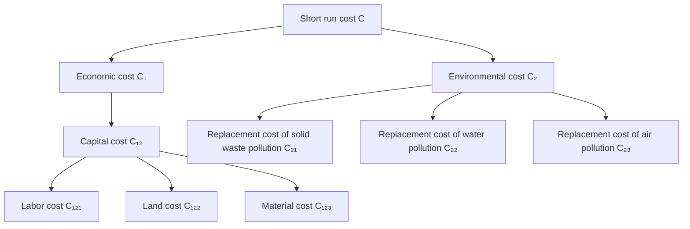
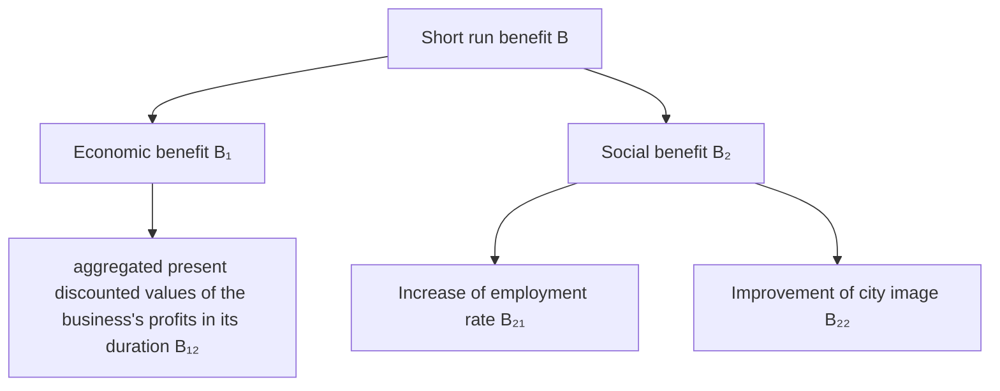
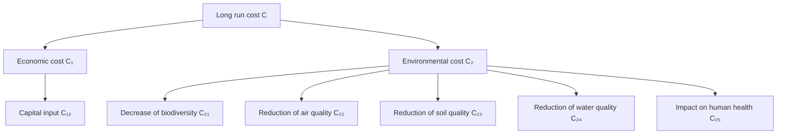

## 2019

## MCM/ICM Summary Sheet

## Take Environmental Effect into Consideration: Cost Benefit Analysis on Land Use Project

Ecosystem services should be included in the cost benefit analysis of land use development projects in order to assess true values of them comprehensively. We establish a short run model and a long run model of ecosystem service evaluation respectively, and incorporate the environmental cost into the cost benefit analysis. The models are applied to land development projects of varying sizes for examination and analysis.

In the short run model, we adopt the replacement cost method to measure the current impact of the land development project on the environment. After obtaining the monetary value of the environmental cost, we add it to the cost benefit analysis.

In the long run model, we develop the meaning of the environmental cost from the economic value of short run replacement cost to the cost of three aspects: impact on the quality of human life, the impact on the sustainable development of future generations and the impact on the whole natural ecosystem. Since it is difficult to measure long run environmental cost by monetary unit, we select five corresponding environmental indicators and use Analytic Hierarchy Process (AHP) to analyze the cost and benefit of land development projects.

The short run model is then applied to the case of the construction project of a small paper mill in China. And we find that the project is unfeasible after adding environmental cost. Likewise, the long run model is applied to the case of electric power development project in the Tennessee Valley in the United States. This time we find that the total benefit of the construction project of thermal power stations is still greater than the total cost even after the adjusting and optimizing the model, which indicates that the construction of Tennessee thermal power stations has large real value under comprehensive evaluation. This also confirms the validity of our model.

We analyze the sensitivity of the model, taking Tennessee as an example to demonstrate the results of changing the degree of emphasis on economy and environment. Finally, we evaluate the model and give some suggestions for improvement.

## Contents

1 Introduction 3

1.1 Background. C  
1.2 Our Work.

2 Fundamental Assumptions.... .4  
3 Symbol Description.  
4 Ecological Services Valuation Model.

4.1 Basic Model in Short-term Perspective. 5

4.1.1 Cost Analysis.  
4.1.2 Benefit Analysis F

4.2 Improved Model in Long-term Perspective .

4.2.1 Cost Analysis  
4.2.2 Benefit Analysis 12

4.3 Cost benefit analysis .12

5 Case Studies .13

5.1 Short run empirical analysis: a story of a paper mill .13

5.1.1 Our assumptions .13  
5.1.2 Analysis by a short run model 13

5.2 Long run empirical analysis: the electric power development in the Tennessee Valley 14

5.2.1 Background of the electric power development in the Tennessee Valley .14

5.2.2 Selection of project . 15  
5.2.3 Analysis by a long run model .15  
5.2.4 Initial matrix optimization . 17

6 Sensitivity Analysis. .17  
7 Implications on Land Use Project Planners and Managers ...... ..19  
8 Evaluation of the Model. 19

7.1 Strengths. 19  
7.2 Weaknesses and improvements .20

9 Conclusion.. .20

References.. 21

## 1 Introduction

## 1.1 Background

Ecosystem services are the conditions and processes through which natural ecosystems and the species that make them up, sustain and fulfil human life, which provide a series of goods and services that people perceive to be important for production, protection and maintenance and so on.[1] Therefore, ecosystem services play an important role in maintaining the coordinated development of social economy and ecological environment. However, with the rapid development of urbanization, economic development and population growth have brought great pressure on the ecological environment. In particular, changes in land use caused by human activities affect ecosystems, having the most immediate negative impact on ecosystem services.

However most economic theories that the decisions of land use projects depend on ignore the impact of land use projects on ecosystem services because of ecosystem services’ externalities. Therefore, the environmental problems such as resulted from ignorance of ecosystem services become more and more serious. Hence, the maintenance of ecosystem services has gradually become the hot topic in the world today.

There are various of methods to evaluate ecological services, but most of them only assess the dynamic changes of ecological services without considering the future impact like the damage to ecological services caused by environmental degradation. In addition, these models are usually applied to analyze the ecological services among an area but rarely applied to analyze the influence of a certain project. For example, the InVEST model can simulate the dynamic changes of carbon reserves, crop yield, habitat quality and other ecosystem services of the terrestrial ecosystem according to the timespace changes of the land use map, but it can’t evaluate the ecological services in long run.

So an ecological services model that can evaluate environmental cost in different time scale and can be applied to assess the influence of a certain project is required.

## 1.2 Our Work

We are asked to build an ecological services model to evaluate the environmental cost so as to measure the true economic cost of land use development projects. Then we should take the environmental cost into the cost benefit analysis to assess the land use projects varying from sizes and in different time scale.

In order to solve the problem, we did the following work:

We give several fundamental assumptions to simplify the model and define

symbols as different indexes.

In the short run, we use the replacement cost method to measure the monetary value of environmental costs in the current period according to the virtual treatment costs of solid, liquid and gas pollutants; build the short run cost benefit analysis model by substituting the monetary value of environmental cost that we have defined before into the cost-benefit analysis of land development projects.  
In the long run, we consider the long run environmental cost of environmental degradation from three perspectives of life quality, sustainable development and ecosystem; build the long run cost and benefit analysis model by ranking and scoring each cost and benefit with the Analytic Hierarchy Process (AHP).  
Apply the short run model to the cost benefit analysis of a construction project of a small paper mill.  
Apply the long run model to the cost benefit analysis of the large project of Tennessee thermal power stations development and evaluate the validity of the model based on the reality.  
Conduct the sensitivity analysis of weights setting in AHP; evaluate the model and give some suggestions for improvement.

## 2 Fundamental Assumptions

The long run or short run of the model depend on measurement of environmental cost in long run or short run. The short run model only measures the cost of environmental damage in the current period, while the long run model also considers the cost of damage to sustainable development and ecosystem after environmental degradation over time.  
Regardless of the construction time of the project.  
Project builders maximize profits, regardless of the positive environmental benefit brought by land use projects.  
⚫ Project evaluators attach equal importance to environmental cost and economic cost.  
People can make an assessment of the importance of various aspects of the environment in pairs.

## 3 Symbol Description

Table 1: Notations

<table><tr><td>Symbols</td><td>Definition</td><td>Unit</td></tr><tr><td> $C_S$ </td><td>Short run cost</td><td>$</td></tr><tr><td> $C_L$ </td><td>Long run cost</td><td>$</td></tr><tr><td>PC</td><td>Economic cost</td><td>$</td></tr><tr><td>EC</td><td>Environmental cost</td><td>$</td></tr><tr><td>P</td><td>The amount of pollution generated by businesses</td><td></td></tr><tr><td>LP</td><td>The amount of pollution which can be controlled by self-purification capability of nature</td><td></td></tr><tr><td> $LP_S$ </td><td>Self-purification capability of soil</td><td> $m^2$ </td></tr><tr><td> $LP_W$ </td><td>Self-purification capability of water</td><td> $m^3$ </td></tr><tr><td> $LP_A$ </td><td>Self-purification capability of atmosphere</td><td> $m^3$ </td></tr><tr><td> $P_S$ </td><td>The amount of pollution of soil</td><td> $m^2$ </td></tr><tr><td> $P_W$ </td><td>The amount of pollution of water</td><td> $m^3$ </td></tr><tr><td> $P_A$ </td><td>The amount of pollution in atmosphere</td><td> $m^3$ </td></tr><tr><td> $C_{RS}$ </td><td>Replacement/ restoration cost of solid waste pollution per square meter</td><td> $$/m^2$ </td></tr><tr><td> $C_{RW}$ </td><td>Replacement/ restoration cost of water pollution per cubic meter</td><td> $$/m^3$ </td></tr><tr><td> $C_{RA}$ </td><td>Replacement/ restoration cost of air pollution per cubic meter</td><td> $$/m^3$ </td></tr></table>

Where we define the main parameters while specific value of those parameters will be given later.

## 4 Ecological Services Valuation Model

We build an ecological services valuation model especially considering the environmental cost to perform cost benefit analyses of land use development projects on different time scales.

## 4.1 Basic Model in Short-term Perspective

In general, we establish the basic model by incorporating the environmental cost into cost benefit analysis, which does not involve the influence of time provisionally.

## 4.1.1 Cost Analysis

In our model, the cost of a land use development project includes economic cost and environmental cost, which is:

$$
\mathrm{C} _ {\mathrm{S}} = \mathrm{PC} + \mathrm{EC}
$$

Without considering the impact or the changes of ecosystem services, in most cases, the benefit cost analysis of land use development projects only takes economic cost into account, which is usually considered as the cost of construction PC.

Now we build an ecological services valuation model to evaluate the environment cost of land use development projects. There are many methods to measure environmental cost in previous studies. In this model, we adopt replacement cost method to assess the ability of ecosystem services in order to measure the monetary value of the cost of making the ecosystem revert to original standard after being polluted. The replacement cost is calculated by multiplying the amount of pollution discharged by the construction project beyond the environmental carrying capacity and the treatment cost per unit of pollution together. In addition, we divide the environmental pollution caused by land use projects into solid waste pollution, water pollution and air pollution. Then we calculate the replacement cost of each kind of pollution respectively. And the environmental cost is:

$$
\mathrm{EC} = \mathrm{f} (\mathrm{P} - \mathrm{LP}) = \mathrm{C} _ {\mathrm{RS}} ^ {*} \left(\mathrm{P} _ {\mathrm{S}} - \mathrm{LP} _ {\mathrm{S}}\right) + \mathrm{C} _ {\mathrm{RW}} ^ {*} \left(\mathrm{P} _ {\mathrm{W}} - \mathrm{LP} _ {\mathrm{W}}\right) + \mathrm{C} _ {\mathrm{RA}} ^ {*} \left(\mathrm{P} _ {\mathrm{A}} - \mathrm{LP} _ {\mathrm{A}}\right)
$$

Therefore, the total cost of a land use development project is:

$$
\mathrm{C} _ {\mathrm{S}} = \mathrm{PC} + \mathrm{C} _ {\mathrm{RS}} ^ {*} (\mathrm{P} _ {\mathrm{S}} - \mathrm{LP} _ {\mathrm{S}}) + \mathrm{C} _ {\mathrm{RW}} ^ {*} (\mathrm{P} _ {\mathrm{W}} - \mathrm{LP} _ {\mathrm{W}}) + \mathrm{C} _ {\mathrm{RA}} (\mathrm{P} _ {\mathrm{A}} - \mathrm{LP} _ {\mathrm{A}})
$$

Since in the above premise, the cost analysis in general can also be simply considered as the short run cost analysis.

To demonstrate our analysis of short run cost, we use diagram in Figure.1 to show the relationship among every factor in it.


<details>
<summary>flowchart</summary>


</details>

Figure 1：Schematic Diagram of Short Run Cost

## 4.1.2 Benefit Analysis

We divide the benefit of a land use development project into economic benefit EB and social benefit SB. Then we have:

$$
\mathrm{B} _ {\mathrm{S}} = \mathrm{EB} + \mathrm{SB}
$$

We use the aggregated present discounted values of the project's profits in its duration to measure its economic benefit. The formula of economic benefit is:

$$
\mathrm{EB} = \sum_ {t = 0} ^ {\mathrm{T}} \frac {\mathrm{Bt}}{(1 + r) ^ {t}}
$$

Where:

T the duration of the project

r social discount rate

Likewise, we suppose that social benefit can be divided into two aspects. One is $\mathrm { B } _ { 2 1 }$ , the monetary value of the increase of employment rate because of the land use project. The other is $\mathrm { B } _ { 2 2 } ,$ the monetary value of the improvement of city image resulted from the project.

So, the total benefit of a land use development project is:

$$
\mathrm{B} _ {s} = \sum_ {\mathrm{t} = 0} ^ {\mathrm{T}} \frac {\mathrm{Bt}}{(1 + \mathrm{r}) ^ {t}} + \mathrm{B} _ {2 1} + \mathrm{B} _ {2 2}
$$

Similarly, we can consider this benefit analysis as the short run benefit analysis. And the relationship among every factor of it can be viewed in Figure.2.


<details>
<summary>flowchart</summary>


</details>

Figure 2：Schematic Diagram of Short Run Benefit

## 4.2 Improved Model in Long-term Perspective

Now we already have a model without considering time scale. So, we will improve our model by taking influence of time into account.

## 4.2.1 Cost Analysis

Based on the theory of the economic analysis of environmental pollution cost ( Xu, 1995)[2], considering the impact of environmental degradation in the long run, the concept of environmental pollution cost expands in three aspects compared with the original health-economic understanding of pollution cost. The original one is merely the economic measurement of short run replacement cost. It expands from the narrow perspective of economic value to extensive attention on humans’ quality of life, the sustainable development of future generations and the whole natural ecosystem.

Therefore, environmental pollution cost can be divided into three categories. These three categories of costs can be defined as follows:

⚫ LWC the pollution cost in respect of humans’ quality of life, which reflects the impact of pollutants on the influential elements of human quality of life.  
SDC pollution cost in respect of sustainable development, which reflects the impact of the destruction of environmental elements caused by pollution on the sustainable development ability of future generations. These environmental elements include water, climate, soil and creatures.  
⚫ ELC pollution cost in respect of ecology, which reflects the destruction of biodiversity caused by pollution.

Therefore, in long-term perspective, what we call environmental pollution cost CL actually equates to the sum of the three categories of environmental pollution costs:

$$
\mathrm{C} _ {\mathrm{L}} = \mathrm{LWC} + \mathrm{SDC} + \mathrm{ELC}
$$

As these environmental costs are difficult to be measured by money in long run, we have to use another method to evaluate these costs. Next, we will introduce Analytic Hierarchy Process (AHP) to measure the long run environmental cost in the alternatives layer that is at the bottom. Then we will measure the environmental cost and economic cost comprehensively in the criteria layer in the middle. Finally, we will obtain the overall cost evaluation of the goal layer at the top.

## 1．Alternatives layer

According to the mathematical model in economics, ecology, and environment (Hritonenko, Yatsenko, 2006)[3], we evaluate the long run environmental cost of a land development project from the three categories of environmental pollution costs, including variation of five indexes: biodiversity, air quality, soil quality, water quality, and the humans’ feelings of environmental health.

## （1） Biodiversity

Simpson diversity index (SDI) is used to measure the biodiversity.

$$
\mathrm{SDI} = 1 - \frac {1}{\mathrm{N(N-1)}} \sum_ {i} \left(\mathrm{N} _ {i} \left(\mathrm{N} _ {i} - 1\right)\right)
$$

Where:

Ni number of entities belonging to the ith type

N the total number of entities

## （2） Air quality

We use the air quality index (AQI) to measure the quality of the air. AQI is determined by the contents of five pollutants in the air: ${ { \mathrm O } _ { 3 } }$ above the earth’s surface, particulate matter, CO, $\mathrm { S O } _ { 2 }$ and $\mathrm { N O } _ { 2 } .$ labeled with numbers from 1 to 5. Pi represents the air quality index related to pollutant i：

$$
\mathrm{P} _ {i} = \frac {C - C _ {l}}{C _ {h} - C _ {l}} (P _ {h} - P _ {l}) + P _ {l}
$$

Where:

C pollutant concentration

$\mathrm { C } _ { l }$ the critical concentration under C

$C _ { h }$ the critical concentration above C

$\mathrm { P } _ { l }$ the critical exponents corresponding to $\mathrm { C } _ { l }$

$\mathrm { P } _ { h }$ the critical exponents corresponding to $C _ { h }$

$$
\mathrm{AQI} = \max \{P _ {i} | i \in [ 1, 5 ] \}
$$

Finally, we take the maximum of Pi to obtain AQI among five pollutants.

## （3） Soil quality

As the soil quality Index (SQI) is too complicated for our model, we adopt the Normalized Difference Vegetation Index (NDVI) to measure the soil quality which is represented by the impact of human activities on the vegetation cover and plant productivity. R and NIR stand for the spectral reflectance measurements acquired in the red (visible) and near-infrared regions[4]. They separate vegetation from water and soil, then NDVI is:

$$
\mathrm{NDVI} = \frac {N I R - R}{N I R + R}
$$

## （4） Water quality

Here we use the Ross Water Quality Index to measure the water quality. WQI selects four parameters from the 12 parameters of routine monitoring as evaluation parameters for calculating the WQI and gives different weight coefficients to the four parameters by grading each parameter with grading score respectively. WQI is the weighted mean of these four parameters:

$$
\mathrm{WQI} = \frac {\sum \text {grading score}}{\sum \text {weight coefficient}}
$$

## （5） Environmental Health Indicator (EHI)

Due to environmental pollution, people may feel uncomfortable by inhaling excessive waste gas, eating crops with excessive heavy metal content, drinking polluted water and so on, which leads to the decline of humans’ life quality. Hence, we use the Environmental Health Indicator (EHI) as the indicator of human bodies’ feeling of environmental health. It is a quantitative index used to quantify the human health or human feelings related to environment. EHI is a dimensionless index with a quantitative value varying from 0 to 100. A higher value means better environment or more comfortable humans feel.

The Environmental Performance Database (EPI) offers the reference values of the above indicators in national projects. And local governments’ websites offer the required data in local projects.

Now we will build a matrix of indexes to represent the relative importance of SDI, AQI, NDVI and WQI. These weights may change with respect to different emphases of comparison: different projects cause great effect on one or several indexes due to different construction processes; Meanwhile, the attention that the residents near the project pay to the environmental health of these four aspects is also crucial to our consideration.

In our model, the selection of indexes in matrix will be discussed. And the sensitivity analysis will be carried out in the next section.

We establish the initial Comparative Matrix

$$
J = \left(a _ {i j}\right) _ {5 \times 5}
$$

The value of $a _ { i j }$ indicates the relative importance of indexi to indexj.

Now we will assign a reasonable value for J. We come up with an initial matrix of indexes estimation method: the comparative importance degree of two elements is estimated according to the ratio of the number of the literature on biodiversity, air quality, soil quality and water quality. After searching keywords on Google Scholar, we obtained 5,540,000 results for “biodiversity”, 3,180,000 results for “air quality”, 5,130,000 results for “soil quality”, 2,200,000 results for “water quality” and 6,410,000 results for “environmental health indicator”. So we estimate the relative importance of each index in the matrix:

$$
\mathbf {J _ {0}} = \left[ \begin{array}{c c c c c} 1 & 5 / 3 & 1 & 5 / 2 & 5 / 6 \\ 3 / 5 & 1 & 3 / 5 & 3 / 2 & 1 / 2 \\ 1 & 5 / 3 & 1 & 5 / 2 & 5 / 6 \\ 2 / 5 & 2 / 3 & 2 / 5 & 1 & 1 / 3 \\ 6 / 5 & 2 & 6 / 5 & 3 & 1 \end{array} \right]
$$

Obviously, J0 is a consistent matrix and its eigenvalue is 4. The normalized eigenvector is $( \frac { 5 } { 2 1 } , \frac { 1 } { 7 } , \frac { 5 } { 2 1 } , \frac { 2 } { 2 1 } , \frac { 2 } { 7 } )$ $\scriptstyle \mathbf { W } _ { 1 } = ( { \frac { 5 } { 2 1 } } , { \frac { 1 } { 7 } } , { \frac { 5 } { 2 1 } } , { \frac { 2 } { 2 1 } } , { \frac { 2 } { 7 } } )$ 2 is taken as the weight vector among biodiversity, air quality, soil quality, water quality and environmental health indicator.

However, in the general sense, we need a consistency test of the comparative matrix. Therefore, consistency index (CI) and random consistency index (RI) are introduced：

$$
\mathrm{CI} = \frac {\lambda - r}{r - 1}
$$

RI can be obtained by checking the data table.

Then calculate the consistency ratio:

$$
\mathrm{CR} = \frac {C I}{R I}
$$

If CR< 0.1, it is considered that the degree of inconsistency is within the acceptable range, so it passes the consistency test. If it can’t pass the test, we will modify J. The specific modified approach varies in respect to the size and geographical location of the construction project.

## 2. Criteria layer

Similarly, we examine the weights of environmental cost and economic cost respectively in the total cost. Since environmental cost is taken into account, we believe that environmental cost is as important as economic cost for the examiner. Therefore, we have the weight vector $\mathrm { W } _ { 2 }$ between economic cost and environmental cost:

$$
\mathrm{W} _ {2} = (\frac {1}{2}, \frac {1}{2}) ^ {T}.
$$

## 3. Goal layer

Now we calculate the combination weight vector:

$$
\mathrm{W} _ {3} = (1, 0, 0, 0, 0, 0) ^ {T}, \quad \mathrm{W} _ {4} = (0, \mathrm{W} _ {1}) ^ {T}, \mathrm{W} _ {5} = (\mathrm{W} _ {3}, \mathrm{W} _ {4})
$$

$$
\mathbf {W} = \mathbf {W} _ {5} ^ {T} * \mathbf {W} _ {1}
$$

W is the combination weight vector of cost of each element. The weight vector obtained by the initial matrix is $\mathrm { W } _ { 0 } { = } \left( \frac { 1 } { 2 } , \frac { 5 } { 4 2 } , \frac { 1 } { 1 4 } , \frac { 5 } { 4 2 } , \frac { 1 } { 2 1 } , \frac { 1 } { 7 } \right) \textbf {  { T } }$

## 4. Ranking standards evaluation of indexes

Since we need to make an absolute comparison between cost and benefit, we give the ranking standards of these environmental indexes in Table2:

Table2: Ranking standards and scores of values’ changes of different indexes

<table><tr><td>Ranking (Score)</td><td>Decrease of biodiversity</td><td>Reduction of air quality</td><td>Reduction of soil quality</td><td>Reduction of water quality</td><td>Impact on human health</td><td>Capital input</td></tr><tr><td>1(9)</td><td>above0.5</td><td>above 0.5</td><td>above 0.5</td><td>above 0.5</td><td>above 50</td><td>above 2AC</td></tr><tr><td>2(7)</td><td>0.3~0.5</td><td>0.3~0.5</td><td>0.3~0.5</td><td>0.3~0.5</td><td>30~50</td><td>1.5AC~2AC</td></tr><tr><td>3(5)</td><td>0.2~0.3</td><td>0.15~0.3</td><td>0.2~0.3</td><td>0.15~0.3</td><td>20~30</td><td>AC~1.5AC</td></tr><tr><td>4(3)</td><td>0.1~0.2</td><td>0.05~0.15</td><td>0.1~0.2</td><td>0.05~0.15</td><td>10~20</td><td>0.7AC~AC</td></tr><tr><td>5(1)</td><td>under0.1</td><td>under0.05</td><td>under0.1</td><td>under0.05</td><td>under10</td><td>under0.7AC</td></tr></table>

When measuring the economic cost, we select the average economic cost (AC) of the industry which the project belongs to as the benchmark to determine the scoring standard. We evaluate the project’s rank according to the ratio of the project cost to AC.

Thus, we obtain rank vectors of the five environmental cost indexes and economic cost index. And the value of total cost can be obtained from inner product of the rank vectors and combination weight vector.

To demonstrate our model in long-term perspective, we give the Figure.3 to illustrate our process of AHP.


<details>
<summary>flowchart</summary>


</details>

Figure 3：Schematic Diagram of Long Run Cost

## 4.2.2 Benefit Analysis

Our benefit analysis in long run is the same as the above benefit analysis in short run. So the total benefit of a land use development project is:

$$
\mathrm{B} _ {s} = \sum_ {\mathrm{t=0}} ^ {\mathrm{T}} \frac {\mathrm{Bt}}{(1 + \mathrm{r}) ^ {t}} + \mathrm{B} _ {2 1} + \mathrm{B} _ {2 2}
$$

Then we will evaluate the long run benefit of a land use development project’s rank and score in the same process as the long run cost analysis.

## 4.3 Cost benefit analysis

After obtaining the total benefit measured by monetary value of the land development project, in order to perform the cost benefit analysis, we conducted the same ranking process towards the benefit as the economic cost’s above to make cost and benefit comparable, which is scoring based on the ranking standards of the different ratios of the total benefit of the project (BS) to the average economic cost of the industry (AC).

Finally, we perform the cost benefit analysis by comparing the weighted score of total cost and the weighted score of total benefit, so that the feasibility of the land use development project can be evaluated.

## 5 Case Studies

Since we are required to perform a cost benefit analysis of land use development projects of varying sizes and time, we will combine normative analysis and empirical analysis with our model to do cost benefit analyses of two projects: one is a short run model application to a small community-based project, the other is a long run model application to a large national project.

## 5.1 Short run empirical analysis: a story of a paper mill

A private entrepreneur in a small town in China who is attracted by the large demand for paper in the town's schools wants to invest in a small paper mill nearby. The private entrepreneur submits the construction program to the land planning bureau. Now the land planning bureau's officer should measure the cost and benefit of the project to decide whether the project should be granted.

## 5.1.1 Our assumptions

⚫ Due to lack of funds, the private entrepreneur plans to use simple papermaking equipment with 20-year service life.  
⚫ The annual paper demand of this town is 10 tons, and the market price of paper is 100,000 yuan per ton.  
⚫ The private entrepreneur does not plan to expand production and choose to retire after equipment aging.  
⚫ A paper mill will not decrease the market price and bring additional benefit to the society.  
The discount rate is equal to the rate of inflation

## 5.1.2 Analysis by a short run model

After consulting the data, we learn that the construction cost of a small paper mill is about 2 million yuan and the average production cost of paper is about 70,000 yuan per ton. We can calculate that the economic benefit is 6 million yuan. Since the paper mill will not decrease the market price, it can be considered without any other benefit.

The officer is preparing to analyze the problem by using a short run model.

First, calculate the environmental cost. A small paper mill’s pollution mainly concentrates on water pollution, and emission of COD occupies more than 74% of the total emission [5]. We consider that a small paper mill plans to discharge 800 tons of sewage annually, assuming that the environment can purify 100 tons of sewage by its self-purification capability

We only take the replacement cost of COD in water pollution into account (the unit treatment cost of COD is 800 yuan per ton).

$$
\mathrm{C} _ {\mathrm{RW}} ^ {*} \left(\mathrm{P} _ {\mathrm{W}} - \mathrm{LP} _ {\mathrm{W}}\right) ^ {*} 2 0 = 8 0 0 ^ {*} (8 0 0 - 1 0 0) ^ {*} 2 0 = 1 1. 2 \text { million   yuan }
$$

It should be pointed out that the advanced paper mills in developed countries in Europe and America only discharge about 10 cubic meters of water per ton of paper production, and the large and medium-sized paper mills need about 20 cubic meters. However, there are a large number of small nonstandard paper mills in China which need about 1 million cubic meters per ton of paper.[6]

We can see that the cost of the private paper mill is far greater than its benefit when only the replacement cost of COD is taken into account. The addition of short run environmental cost has made us reject construction project, not to mention the long run environmental cost.

Therefore, our officer in land planning bureau must reject the private entrepreneur's request.

## 5.2 Long run empirical analysis: the electric power development in the Tennessee Valley

## 5.2.1 Background of the electric power development in the

## Tennessee Valley

The Tennessee Valley is in the southeast of United States. Its trunk, the Tennessee River, is the major river in the southeast and the fifth longest river in the United States. During the Great Depression, The Tennessee Valley was the typical representative of rural depression and poverty. As part of the New Deal, President Franklin Delano Roosevelt signed the Tennessee Valley Authority Act in 1933, creating the Tennessee Valley Authority (TVA) which began to develop the Tennessee Valley comprehensively. TVA's electric power development has experienced hydropower, thermal power, nuclear power and new energy generation. With the development of electric power, the economic society of the Tennessee river valley develops quickly as well.

## 5.2.2 Selection of project

Among the construction projects of hydropower plants, thermal power plants and nuclear power plants in the process of electric power development, we select to analyze construction projects of the thermal power plant in the Tennessee Valley from 1940 to 1965. The reasons are as follows:

⚫ The thermal power projects have a wider range of construction, so that the projects can be used for our research on large-scale land development projects.  
Most of the thermal power projects in Tennessee were constructed between 1940 and 1965.[7] So they have had a dominant position in the electric power development process for a long time, with the electricity-generating capacity once accounting for more than 80% nationwide.  
According to the data provided by the North American Electric Reliability Corporation[8], the average service life of thermal power stations is 50 years, and the long run economic benefit is estimable.  
the construction of large thermal power plants can produce powerful electric power for the benefit of society, but also need to use a lot of primary energy and water resources and build tall building groups. While providing local residents with a number of employment opportunities, they also discharge a large number of waste gas, waste water and waste residue, which must have certain impact on the environment. Therefore, it is necessary to incorporate environmental cost into the cost benefit analysis of this project.

## 5.2.3 Analysis by a long run model

## 1. Data sources

The data of Tennessee ecological indicators can be obtained from the official website of the Tennessee government [9]. And the environmental cost can be obtained according to the changes of those indicators.  
According to the work of Pankratz and Wilson (1988) [10], we obtained the estimated capital of the construction of a 2\* 200,000 kw thermal power plant. On this basis, the average construction cost of thermal power stations can be calculated, which should be converted into the dollar price in 1982.  
According to the article of Sun(2010)[11], we obtain the overall construction capital of Tennessee thermal power stations (measured by the constant dollar price in 1982, and the specific data will be shown in the appendix, the data after will be shown in the same way), unit cost and unit income of power generation and the total number of annual power generation, from which we can get the economic cost and economic benefit of construction project of

Tennessee thermal power station. In addition, the total amount of industry revenue increase and electricity price reduction in the Tennessee valley can also be obtained, so that we can calculate the total social benefit generated by the construction of thermal power stations.

## 2. Calculation

## (1) Cost:

After a series of calculation in our long run model of the data from above, the variation values of different indexes are obtained. According to Table.2, we have the scores of variation value of different indexes.

Table3: The ranks and scores of values’ changes of different indexes according to Tab.2

<table><tr><td>Cost Index</td><td>Variation Value</td><td>Ranking (Score)</td></tr><tr><td>Decrease of biodiversity</td><td>0.2</td><td>3(5)</td></tr><tr><td>Reduction of air quality</td><td>0.4</td><td>2(7)</td></tr><tr><td>Reduction of soil quality</td><td>0.1</td><td>5(1)</td></tr><tr><td>Reduction of water quality</td><td>0.1</td><td>4(3)</td></tr><tr><td>Impact on human health</td><td>20</td><td>3(5)</td></tr><tr><td>Capital input</td><td>$4,120million</td><td>3(5)</td></tr></table>

The average cost (AC) is \$3,000 million based on the before calculation.

$$
\therefore p = (5, 5, 7, 1, 3, 5), p \text { is   rank   vector. }
$$

Applying the weight vector w0 corresponding to J0 in the long run model, we have the score of cost $G _ { I } \colon$

$$
G _ {l} = p w _ {0} = \frac {3 2}{7}
$$

## (2) Benefit:

a. The economic benefit of the project of Tennessee thermal power station: (electricity price-generating cost) \* total amount of power generation =\$456 million  
b. The monetary value of the increase of employment rate:  
It can be estimated by the increase amount of the proportion of manufacturing industry and the income of the whole manufacturing industry. The resident income increased about \$6,815million.  
c. Other social benefit:  
Because of the adoption of the policy of low electricity price, the electricity price of TVA fell from 2 cents per kw·h to 1 cent per kw·h. The thermal power plants benefited power users by \$10 million from 1940 to 1965[12].

Therefore, the total benefit of the project of Tennessee thermal power stations is:

$4 5 6 + 6 , 8 1 5 + 1 0 = \mathbb { S } 7 , 2 8 0$ million. The rank is 9, so the score is 9 denoted as $G _ { 2 }$ .

## (3) Cost benefit analysis

Because $G _ { 2 } { > } G _ { I } .$ , that means construction project of Tennessee thermal power stations still have social value according to cost benefit analysis in a long-term perspective even incorporating environmental cost into the total cost.

## 5.2.4 Initial matrix optimization

As mentioned in the above model, the weights of various costs vary from model to model. Now we will optimize the comparative matrix. Considering the characteristic of the thermal power stations project: the main emission of the thermal power stations are dust particles and other pollutants produced by burning coal. Correspondingly, according to the public opinion survey around the thermal power stations and expert evaluation, we increase the weight of air pollution and modify the comparative matrix as follows:

$$
\mathbf {J _ {1}} = \left[ \begin{array}{c c c c c} 1 & 1 / 3 & 4 / 5 & 1 / 2 & 1 / 2 \\ 3 & 1 & 2 & 2 & 1 \\ 5 / 4 & 1 / 2 & 1 & 2 / 3 & 1 / 2 \\ 2 & 1 / 2 & 3 / 2 & 1 & 2 / 3 \\ 2 & 1 & 2 & 3 / 2 & 1 \end{array} \right]
$$

After the consistency test, the matrix passes the test and meets the requirement of consistency, and its eigenvalue is 5.04, and the normalized eigenvector is (0.108 0.306 0.135 0.186 0.266).

We define $\nu _ { 1 }$ as the weight vector, so $\nu _ { 1 } ~ = ( 0 . 1 0 8 ~ 0 . 3 0 6 ~ 0 . 1 3 5 ~ 0 . 1 8 6 ~ 0 . 2 6 6 )$ .

Thus, the combination weight vector $\nu _ { 2 } { = } ( 0 . 5 , 0 . 0 5 4 , 0 . 1 5 3 , 0 . 0 6 7 , 0 . 0 9 3 , 0 . 1 3 3 )$ .

Therefore, by the same method, the cost score is 4.852, which is less than the benefit score 9. The construction project of thermal power stations is still feasible.

## 6 Sensitivity Analysis

When we calculate the economic cost and the environmental cost, we assume that the decision maker considers that the environmental cost is as important as the economic cost, so we get the primary weight vector of the criteria layer $w _ { 2 } = ( 1 / 2 , 1 / 2 ) ^ { T }$ .

In fact, it is not accurate because different decision makers have different priorities with respect to their preference. Benevolent governments may care more about environmental protection, while entrepreneurs may consider the environment as a small factor affecting cost. The following is a sensitivity analysis of the primary indicators in the criteria layer (economic cost and environmental cost).

Suppose the weight of economic indicator changes from 1/2 to a, where 0<a<1. So the weight of economic cost becomes 1-a.

Taking Tennessee thermal power stations project as an example and repeating the evaluation process of AHP, we will obtain the new combination weight vector:

$$
v = \left(a, 0. 1 0 8 (1 - a), 0. 3 0 6 (1 - a), 0. 1 3 5 (1 - a), 0. 1 8 6 (1 - a), 0. 2 6 6 (1 - a)\right) ^ {T}
$$

So, the score of cost is 0.295a+4.705.

Furthermore, because 0<a<1，0.295a+4.705<9.

Now, we evaluate the model before optimization by the same method, and we get a cost score of 0.858a+4.142. Figure.4 illustrates a function of the score varying with the weight.


<details>
<summary>line chart</summary>

| proportion a | before adjustment | after adjustment |
| ------------ | ----------------- | ---------------- |
| 0            | 4.2               | 4.7              |
| 1            | 5.0               | 5.0              |
</details>

Figure 4：Sensitivity analysis of weights of the indicators

We can see that both of them converge to 5 with the growth of a, but the model is more stable after adjusting the weight of air quality.

Therefore, for the Tennessee project, even when environmental factors are taken into account, the benefit always far exceeds the cost. In other words, the decision to build a thermal power station will always be made regardless of the emphasis on economic cost or on environmental cost.

In reality, China's small paper mills are being gradually clamped down, while the development of Tennessee thermal power in the United States has brought great positive value in the history, which shows that our model is effective to some extent.

## 7 Implications on Land Use Project Planners and Managers

Planners should take the long run environmental impacts into account, including the current environmental costs and losses caused by environmental degradation. Then put them into the cost benefit analysis to comprehensively evaluate whether a project should be carried out. However, since businessmen are self-interested and pursue profit maximization, they may have no incentive to bear environmental costs. Therefore, the government should take this externality into full consideration when making decisions, and correct the negative environmental benefits brought by land development by means of regulation or Pigovian tax. That is, government will internalize the environmental costs into the real costs of land construction.  
When measuring environmental costs, it is necessary to conduct a survey of nearby residents on the importance of each indicator and set an initial matrix according to residents' wishes. After that, the next step is to measure the relative importance of various environmental indicators and calculate the whole environmental costs through the model.  
If the environmental pollution and ecological damage caused by some land use project is too large, the total cost may be greater than the total benefit of the project when the environmental cost is included. Thus, the land use project originally approved will be rejected.  
In order to reduce the cost of environmental pollution and degradation, land project planners should choose the green construction plan as far as possible.

## 8 Evaluation of the Model

## 7.1 Strengths

Comprehensive consideration of environmental costs. It not only includes the current economy-health cost, but also considers the environmental cost in the sense of sustainable development and ecology in the long run.  
In the short-term model, the replacement cost is used to measure the current environmental cost, so the environmental cost is conveniently and succinctly included in the cost benefit analysis of land use projects.  
In the long-term optimization model, forced monetization is somewhat farfetched due to the lack of monetization approaches for environmental costs caused by environmental degradation. Therefore, we converted the cost-

benefit analysis into the analytic hierarchy process (AHP), and reasonably selected the corresponding environmental indicators for scoring and evaluation.

In the long-term optimization model, the selection of initial matrix is flexible in practical sense. The relative proportion of each index can be determined by the project developer according to the public survey. From the perspective of humanistic care, this cost measurement is close to the will of citizens.

## 7.2 Weaknesses and improvements

The selection of comparison matrix is relatively rough. In the case of insufficient information, our method is to select the quantity of academic keywords as the basis of people's attention. If feasible, the initial matrix should be selected according to the poll results.

In the evaluation of economic costs and benefits, the basis for classification is the average cost of the industry. This scoring method needs to be evaluated, especially when the economic benefits of enterprises are much greater than the economic costs, which cannot reflect the gap perfectly.

We focus our analysis on cost and pay less attention to benefit. We did not consider the environmental benefits of the project, which are important features of some green public projects. As future work, we will improve the environmental benefit part.

The long-term and short-term time division is relatively vague, without clear boundaries.

Due to limited space and time, we only made a short-term analysis of the paper mill case and long-term of the Tennessee thermal power plant case. In fact, we could do a long-term analysis of the first, and a short-term analysis of the second, too.

## 9 Conclusion

Ecosystem services assessment model is presented. Our methodology accounts for environmental cost both in the short run and in the long run, which are included in the cost benefit analysis of land use projects. We apply the model to small and large projects separately. The results show that in some cases, the actual value of some land use projects is negative when environmental costs are considered. So we suggest the planners should choose green construction plans as far as possible.

## References

[1] Chee, Y., 2004. An ecological perspective on the valuation of ecosystem services. Biological Conservation 120, 549-565.  
[2] Songlin Xu, Economic Analysis of Enviromental Polltion[J]. Econometrics Technique,1995(07): 25-38.  
[3] Hritonenko N，Yatsenko Y. Mathematical Modeling in Economics, Ecology, and the Environment. Dordrecht: Kluwer Academic Publishers, 2006.  
[4] Normalized Difference Vegetation Index (NDVI). https://earthobservatory.nasa.gov/features/MeasuringVegetation/measuring\_vegetation \_2.php Published Aug 30, 2000 "Measuring Vegetation". NASA Earth Observatory.  
[5] Yihong Zhou. Further Discussion into Environmental Pollution Cost Analysis. China’s Environmental Protection Industry, 2002,01: 20-23.  
[6] Yaodong Liu. Current situation Analysis of paper mill polltion[J]. The southern farm machinery, 2015, 46(11): 79-80.  
[7] William U. Chandler, the Myth of TVA: Conservation and Development in the Tennessee Vally, Ballinger Publishing Company, C ambridge, Mass., 1984.p.230-231.  
[8]North American Electric Reliability Council. https://www.nerc.com/Pages/default.asp  
[9]Tennessee Government. https://www.tn.gov/  
[10]Pankratz. R. E. and Wilson. B. L.于 1988 年发表“Prediction Power Cost And its Role in Esp Economics”  
[11]孙前进在2010年发表论文 “美国田纳西河流域的电力开发（1933 一1983年）”  
[12]David E. Lilienthal, TVA: Democracy on the Marth, Harper & Brothers Publishers, New York, 1944.p.39-40.

## Appendices

This is the map of the power station:


<details>
<summary>text_image</summary>

55
IL
65
Lexington
WV 77
MO
Páducah 24 Hopkinsville
KY
81
Nashville
Knoxville
NC 40
AR
TN
Asheville
Charlotte
40 Memphis
Tupelo
MUSCLE Shoals
Huntsville
Chattanooga
SC 20
MS
Atlanta
GA 26
Birmingham
Macon
AL
Montgomery 65
Jackson 20 59
16
</details>

May 2005 map of TVA sites dam nuclear fossil

These are the cost tables:

3-2TVA

<table><tr><td rowspan="2">火力发电厂名称</td><td rowspan="2">建成时间(年)</td><td rowspan="2">装机容量(万千瓦)</td><td colspan="2">建设成本(美元/千瓦)</td></tr><tr><td>按当年美元计</td><td>按1982年不变价格计</td></tr><tr><td>沃茨巴火力发电厂</td><td>1942</td><td>24.0</td><td>92</td><td>556</td></tr><tr><td>约翰逊维尔发电厂</td><td>1951</td><td>79.4</td><td>145</td><td>525</td></tr><tr><td>威多斯克里克发电厂</td><td>1952</td><td>85.5</td><td>181</td><td>648</td></tr><tr><td>肖尼火力发电厂</td><td>1953</td><td>175.0</td><td>145</td><td>512</td></tr><tr><td>金斯敦火力发电厂</td><td>1954</td><td>172.3</td><td>154</td><td>536</td></tr><tr><td>科尔伯特火力发电厂</td><td>1955</td><td>84.6</td><td>126</td><td>428</td></tr><tr><td>约翰塞维尔发电厂</td><td>1955</td><td>84.7</td><td>139</td><td>473</td></tr><tr><td>加拉廷火力发电厂</td><td>1956</td><td>60.0</td><td>126</td><td>386</td></tr><tr><td>约翰逊维尔发电厂(扩建)</td><td>1958</td><td>51.9</td><td>123</td><td>386</td></tr><tr><td>艾伦火力发电厂</td><td>1959</td><td>99.0</td><td>—</td><td>—</td></tr><tr><td>加拉廷火力发电厂(扩建)</td><td>1959</td><td>65.5</td><td>—</td><td>—</td></tr></table>

4#TVA

<table><tr><td>项目 年份</td><td>电力收入</td><td>总收入</td><td>租金收入及其他项目收入</td><td>电力净收入</td><td>经营支出</td></tr><tr><td>1957</td><td>234,871,850</td><td>235,732,976</td><td>861,126</td><td>58,143,669</td><td>177,589,307</td></tr><tr><td>1956</td><td>220,902,537</td><td>221,642,216</td><td>739,679</td><td>53,859,167</td><td>167,741,206</td></tr><tr><td>1955</td><td>187,361,354</td><td>188,162,989</td><td>801,636</td><td>47,513,278</td><td>140,262,324</td></tr><tr><td>1954</td><td>133,319,876</td><td>133,947,808</td><td>627,932</td><td>28,140,957</td><td>105,127,412</td></tr><tr><td>1953</td><td>104,285,187</td><td>104,877,969</td><td>592,682</td><td>18,626,714</td><td>85,583,760</td></tr><tr><td>1952</td><td>94,466,655</td><td>85,004,390</td><td>537,735</td><td>25,096,349</td><td>69,165,041</td></tr><tr><td>1951</td><td>69,826,533</td><td>70,329,580</td><td>503,047</td><td></td><td>43,612,785</td></tr><tr><td>1950</td><td>57,259,339</td><td>57,786,111</td><td>526,772</td><td>26,068,212</td><td>30,780,157</td></tr><tr><td>1949</td><td>57,618,811</td><td>58,030,515</td><td>411,704</td><td>20,944,415</td><td>36,551,727</td></tr><tr><td>1948</td><td>48,434,877</td><td>48,769,524</td><td>334,647</td><td>16,617,811</td><td>31,593,076</td></tr><tr><td>1947</td><td>43,810,572</td><td>44,144,090</td><td>333,518</td><td>21,248,377</td><td>22,305,341</td></tr></table>

<table><tr><td>1961</td><td>315,001,000</td><td>324,148,000</td><td>2,75,000</td><td>18,748,000</td><td>27,4,768,000</td></tr><tr><td>1966</td><td>321,580,000</td><td>326,804,000</td><td>2,215,000</td><td>47,889,000</td><td>270,221,000</td></tr><tr><td>1965</td><td>291,116,000</td><td>296,031,000</td><td>1,947,000</td><td>54,977,000</td><td>233,803,000</td></tr><tr><td>1964</td><td>281,703,000</td><td>286,398,000</td><td>1,930,000</td><td>58,183,000</td><td>224,260,000</td></tr><tr><td>1963</td><td>264,421,000</td><td>268,766,000</td><td>1,794,000</td><td>55,103,000</td><td>213,661,000</td></tr><tr><td>1962</td><td>248,192,000</td><td>252,098,000</td><td>1,641,000</td><td>56,180,000</td><td>197,411,000</td></tr><tr><td>1961</td><td>244,607,000</td><td>248,338,000</td><td></td><td>51,644,000</td><td>198,789,000</td></tr><tr><td>1960</td><td>240,650,000</td><td>242,385,000</td><td>1,734,663</td><td>51,075,000</td><td>192,826,000</td></tr><tr><td>1959</td><td>236,197,581</td><td>237,540,179</td><td>1,342,598</td><td>50,829,938</td><td>186,710,241</td></tr><tr><td>1958</td><td>232,217,189</td><td>233,548,166</td><td>1,330,977</td><td>54,981,946</td><td>178,566,220</td></tr></table>

## These are Matlab codes:

```matlab
function[x1]=cal(A)
[n,n] = size(A);
[v,d] = eig(A);%求矩阵的特征值和特征向量
eigenvalue=diag(d);%求对角线向量
lamda=max(eigenvalue)%求最大特征值
for i=1:length(A)%求最大特征值对应的序数
    if lambda==eigenvalue(i)
    break;
    end
```

```matlab
end
d_lamda=v(:,i)%求矩阵最大特征值对应的特征向量
CI = (lamda-n)/(n-1);
RI = [0 0 0.58 0.90 1.12 1.24 1.32 1.41 1.45 1.49 1.52 1.54 1.56 1.58 1.59];
CR = CI/RI(n);
if CR<0.10    CR_Result = '通过';
else    CR_Result = '不通过';
end
w = v(:,1)/sum(v(:,1));
w = w';
disp('该判断矩阵权向量计算报告：');
disp('一致性指标：');disp(num2str(CI));
disp('一致性比例：');disp(num2str(CR));
disp('一致性检验结果：');disp(CR_Result);
disp('特征值：');disp(num2str(lamda));
disp('权向量：');disp(num2str(w));
xl=num2str(w);
end

a=0:0.1:1;
y1=0.295*a+4.705;
y2=0.858*a+4.142;
plot(a,y1,a,y2);
ylim([3 6])
grid on
title('sensitivity')
xlabel('proportion a')
ylabel('score of cost')
gtext('after adjustment')
gtext('before adjustment')
```