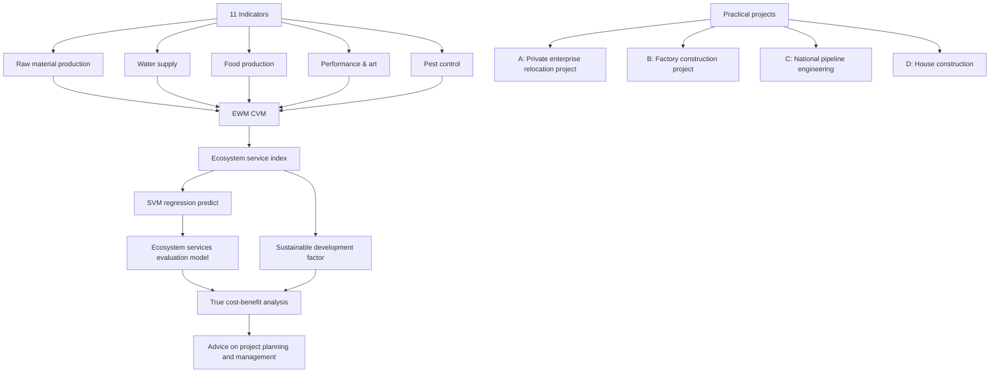
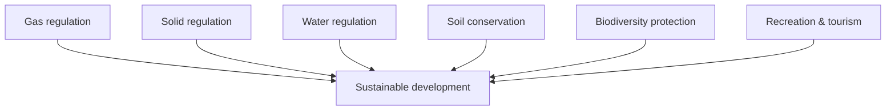

For office use only

T1

T2

T3

T4

Team Control Number

1903455

Problem Chosen

E

For office use only

F1

F2

F3

F4

2019

MCM/ICM

Summary Sheet

## Ecosystem services matters! Sustainability is necessary

Ecosystem services(ES) are the conditions and processes through which natural ecosystems and the species that make them up, sustain and fulfil human life (Daily, 1997). However, whenever humans alter the ecosystem, we potentially limi or remove ecosystem services. The impact of these projects of varying sizes may seem negligible to the total ability of the biosphere’s functioning potential, cumulatively they are directly impacting the biodiversity and causing environmental degradation. In order to understand the true economic costs of land use projects and propose sustainable development factor, we establish an Ecological Services Valuation Model.

To begin with, in order to measure the impact of ES numerically, we introduce MA classification method to make up the ecosystem services index(ESI). Furthermore, 11 indicators are selected from four aspects primarily, and then they are integrated into ESI by using entropy weight method (EWM) and coefficient of variation method (CVM). In addition, hierarchical clustering analysis(HCA) is applied to divide the ecosystem service intensity of the project into three categories: weak, moderate and strong. As a result, we found that private enterprise relocation project and house construction belongs to weak, factory construction project is determined to be moderate and national pipeline engineering has strong ecosystem service intensity.

Next, to calculate the true economic cost of land use projects, an Ecological Services Valuation Model is established. First, we analyze the impact of original cost on ES when the cost of ES is not taken into account. Then, we analyze the benefit and cost of land use project, on this basis, we find that the cost of ES has an important influence to the life cycle of a project. We also use support vector machine (SVM) to forecast the benefit-cost ratio of land use, the result shows that considering the cost of ES of project has the accumulation of a long life cycle and high efficiency. For private enterprise relocation project, without considering ES, we calculate that it reaches the maximum benefit-cost ratio in 2013, and predict that it will stop making profits in 2033. When ES is taken into account, the cost-benefit ratio of land use projects will gradually increase.

At last, for the sake of exploring the impact of sustainable development measures on ecosystem benefits, we divide the 11 three-level indicators into two categories: sustainable development indicators and unsustainable development indicators. After that, we introduce sustainable development factors to describe the impact of different ecosystem service measures on the final development status of projects. Eventually, the values of for four different size projects are $\mathrm { P _ { A } } = 8 7 . 3 1 , \mathrm { P _ { B } } = 8 8 . 4 , \mathrm { P _ { C } } = 1 0 1 . 4 , \mathrm { P _ { D } } = 1 1 . 9 8 .$ , it is obvious that increases as the size of the project increases.

To conclude, We first construct the ecosystem service system, establish the Ecological Services Valuation Model and conduct the cost benefit analysis to four projects of varying sizes. What’s more, introduce the sustainable developmen factor to evaluate the development of land use projects and propose our suggestion for developing land use projects.

Key words: Ecosystem services, ESVM, SVM, sustainable development factor

## Content

1. Introduction .....

1.1 Background.  
1.2 Our work..

2. Assumptions and Justification.... 2

3. Notations .... 2

4. Ecological Services Analysis . 3

4.1 Ecological Services System(ESS) 3  
4.2 Intensity evaluation ... 7

5. Ecosystem Service Valuation Model. 9

5.1 Cost-benefit analysis 9  
5.2 Prediction of Benefit-cost radio with SVM regression method.. . 12  
5.3 Result analysis .. 14

6. Sustainable development analysis . 15

6.1 Analysis of ecosystem services measures ... . 15  
6.2 Influence of Sustainability on benefit-cost ratio . 16

7. Sensitivity Analysis .. .. 18

8. Advice on project planning and management . 19

9. Conclusion..... .. 20

9.1 Strengths .... .. 20  
9.2 Weaknesses.... .. 20

References.. 21

## 1. Introduction

## 1.1 Background

Ecosystem is the foundation of human survival and development. It not only provides space for human survival, but also provides various resources needed for human development, and absorbs waste generated by human production and life. Land resources are the main component of natural resources, and its position in production determines that land development and utilization is a major project. However, most land use projects do not consider the impact of ecosystem services. Although these activities may seem inconsequential to the total ability of the biosphere, they cumulatively directly affect the biodiversity and lead to environmental degradation. Therefore, how to evaluate the environmental cost of land use development projects and determine the real valuation of projects is worth our consideration

## 1.2 Our work

For the sake of understanding the real economic costs of land use projects in ecosystem services, we are required to establish an ecological services valuation model which determines a project’s quality. By selecting appropriate evaluation indicators, we endow target weights and combine those low indicators to realize a comprehensive index. Subsequently, the established model will be applied to various projects to test its applicability and modifications will be proposed to improve it.

We will proceed as follows to tackle these problems:

First, create the ecosystem service system. We use the entropy weight method to determine the weights of 11 third-level indicators and apply the coefficient of variation method to determine the weight of four second-level indicators. Eventually, obtain the calculation equation of the ecosystem service index. After that, through the hierarchical clustering method, the land use projects are divided into three categories.  
Second, construct an ecological services valuation model. We conduct an benefit cost analysis of land use projects. Considering the importance of ecosystem service costs to the development of land use projects, we make a comparative analysis on the benefit-cost ratio of whether the cost of ecosystem services is considered in land use projects.  
Finally. create We divide the 11 three-level indicators into sustainable de-velopment indicators and unsustainable development indicators. At the same time, the sustainable development factor is introduced to describe the long-term impact of adopting sustainable development measures on project development.

The whole modeling process can be shown as follows:

flowchart

Figure.1 Framework of ESVM

## 2. Assumptions and Justification

To simplify the problem and make it convenient for us to simulate real-life conditions, we make the following basic assumptions, each of which is properly justified.

We assume that the cost and benefits of land use projects are not affected by regional policies and other factors that are not related to ecology and the project itself.  
We assume that the relative importance of various indicators doesn’t change over time.  
We assume all data we obtain are trustworthy since all of sources are reliable. Thus, we are confident that our metrics can reflect the accurate condition.

## 3. Notations

We list the symbols and notations used in this paper in Table 1.

Table 1 Notations

<table><tr><td>Symbols</td><td>Definition</td></tr><tr><td>PSI</td><td>Provisioning services index</td></tr><tr><td>RSI</td><td>Regulating services index</td></tr><tr><td>BSI</td><td>Biotope services index</td></tr><tr><td>CSI</td><td>Cultural services index</td></tr><tr><td>ESVM</td><td>Ecological services valuation model</td></tr><tr><td>ESS</td><td>Ecological services system</td></tr><tr><td>ESI</td><td>Ecosystem service index</td></tr><tr><td>BCAM</td><td>Benefit-cost analysis method</td></tr><tr><td>BCR</td><td>Benefit-cost ratio</td></tr><tr><td>ESC</td><td>Ecosystem services cost</td></tr><tr><td>SDF</td><td>Sustainable development factor</td></tr></table>

## 4. Ecological Services Analysis

In this section, in order to measure the impact of ecosystem services, we make up the ecosystem services index ESI. First, 11 three-level indicators are selected from four aspects primarily, and then they are integrated into ecosystem service index(ESI) by using entropy weight method (EWM) and coefficient of variation method (CVM). In addition, hierarchical clustering analysis (HCA) is applied to divide the ecosystem service intensity of the project into three categories: weak, moderate and strong. Eventually, we use four projects of varying sizes to verify our evaluation system.

## 4.1 Ecological Services System(ESS)

```mermaid
graph TD
  A["Water supply"] --> B["Provisioning services"]
  C["Raw material production"] --> B
  D["Food production"] --> B
  E["Regulating services"] --> F["Ecosystem services"]
  G["Gas regulation"] --> H["Regulating services"]
  I["Solid regulation"] --> H
  J["Water regulation"] --> H
  K["Soil conservation"] --> L["Biotope services"]
  M["Pest control"] --> L
  N["Biodiversity protection"] --> L
  O["Cultural services"] --> P["Performance & art"]
  Q["Recreation & tourism"] --> P
  R["Provisioning services"] --> S["Provide"]
  T["Regulating services"] --> S
  U["Ecosystem services"] --> S
```

flowchart

Figure.2 Ecological Services System.

According to the classification method of Millennium Ecosystem Assessment(MA)[1], the classification framework of MA combines ecosystem services with human well-being, and the classification system is more systematic. By using MA, the ecosystem service is divided into 4 service types: Provisioning services, Regulating services, Biotope services and Cultural services. Summarizing the generally accepted classification result[2] referring to the existing research[3]. Combined with the characteristics of ecosystem characteristics, structure and ecological process, the ecosystem service is subdivided into 11 functional types.

## 4.1.1 Indicator description

## (1) Provisioning services

a) Food production $X _ { 1 }$ (ton per year). Food is the main component of the ecosystem, and its status in agricultural production determines that its development and utilization is a significant agricultural engineering design. Therefore, we introduce the ratio of food production to reflect the development and utilization of ecosystem.

b) Raw material production $X _ { _ 2 }$ (ton per year). Taking into account changes in ecosystem services and assessing the environmental costs of land-use development projects, we have introduced the concept of raw material production including the production of wood, rubber, lacquer and rosin.

c) Water supply $X _ { 3 }$ (ha per year). Water supply is an important part of ecosystem services and has a significant impact on mitigating the negative consequences of land use change caused by river pollution and improper wastewater treatment. We hence introduce the water supply ha per year to describe its reflection to ecosystem services.

## (2) Regulating services

a) Gas regulation $X _ { 4 }$ (million dollars per year). Gas regulation is mainly used to improve poor air quality, thus indirectly having a positive impact on climate change. The main measure we take is to convert the waste gas into usable gas and express it in terms of a $X _ { 4 }$ .

b) Solid regulation (million dollars per year).Solid regulation mainly refers to a series of treatment of waste residues and wastes generated in the process of human production activities, which can be converted into solid materials that can be used by people, which has an important impact on improving environmental quality and improving biodiversity.

c) Water regulation $X _ { 6 }$ (million dollars per year).Water regulation includes purify-cation and regulation, and water purification primarily helps to filter out and break down organic waste into inland waters and coastal and marine ecosystems to obtain available water. Water regulation reduces the impact of land cover changes on runoff, floods and aquifers.

## (3) Biotope services

a) Soil conservation $X _ { \ l _ { 7 } }$ (ha per year). Quality soil protected by natural vegetation and litters maintains fertility, prevents dangerous landslides, protects coasts and riverbanks, and prevents silting. Through afforestation and planting grass to protect the soil, achieve sustainable development of food production, gradually improve soil productivity and the ecological situation

b) Pest control $X _ { 8 }$ (ha per year). In order to reduce or prevent the harmful effects of pathogenic microorganisms and pests on crops, people and livestock, we artificially adopt certain measures for prevention and control

c) Biodiversity protection $X _ { 9 }$ (ha per year).Genetic diversity, species diversity and ecosystem diversity are important components of biodiversity. We should not only focus on the protection of the wild populations of the species involved, but also protect their habitats, maintain the balance of the food chain and improve the ecological environment

## (4) Cultural services

a) Recreation & tourism $X _ { 1 0 }$ ( million dollars per year). Under the condition of not destroying the natural environment, people use different ways of using biological resources to carry out recreational activities, which is called ecotourism

b) Performance & art $X _ { 1 1 }$ ( time per year).The performing arts usually include dance, music, drama, folk art, acrobatics, magic and so on. Therefore, we determine the time of performance & art per year as one of the influence of cultural services.

## 4.1.2 Weight of indicators

## (1) Entropy weight method

In this section, with the evaluation indicators defined above, we further determine the weights of these eleven indicators, resulting in the combination of primary indicators. We first use the entropy weight method(EWM) to eliminate the data incommensurability caused by the inconsistency of data dimensions, based on the attribute type of the original indicators, we use the standard 0-1 transformation and the given optimal interval method to do non dimensional and normalization. Therefore, it is convenient to judge the merits of the evaluation indicators directly from the numerical value, and facilitate the evaluation of multi-attribute decision-making.

These 11 indicators of $\cdot X _ { 1 } , X _ { 2 } , X _ { 3 } , . . . , X _ { 1 1 }$ , where $X _ { i } = \left\{ x _ { i 1 } , x _ { i 2 } , . . . , \mathrm { x } _ { i n } \right\}$ , describe the impact of ecosystem services and assess the environmental costs of land-use development projects. For the cost index, ecosystem services are proportional to the value of the index, while for the efficiency index, ecosystem services decrease with the increase of the value of the index. Thus, we have

$$
\left\{ \begin{array}{l} y _ {i j} = \frac {x _ {i j} - \min (x _ {i})}{\max (x _ {i}) - \min (x _ {i})} \\ y _ {i j} = \frac {\max (x _ {i}) - x _ {i j}}{\max (x _ {i}) - \min (x _ {i})} \end{array} \right. \quad j = 1, 2, \dots , n \tag {1}
$$

where $y _ { i j }$ is the standardized value of each evaluation indicator of each size, $\operatorname* { m a x } ( x _ { i } )$ and $\operatorname* { m i n } ( x _ { i } )$ are the maximum and minimum value of the evaluation indicator $X _ { i }$ .

After data standardization, we can use $y _ { i j }$ instead of $x _ { i j }$ to describe ecosystem services, and then we have

$$
q _ {j} = \frac {y _ {i j}}{\sum_ {j = 1} ^ {n} y _ {i j}} \tag {2}
$$

According to the concept of self-information and entropy in information theory, the information entropy $e _ { i }$ of each evaluation index can be calculated, and thus

$$
e _ {i} = - \ln (n) ^ {- 1} \sum_ {j = 1} ^ {n} q _ {i j} \ln (q _ {i j}) \tag {3}
$$

Based on the information entropy, we will further calculate the weight of each evaluation indicator we defined before..

$$
w _ {i} = \frac {1 - e _ {i}}{k - \sum_ {i} e _ {i}} \quad i = 1, 2,..., k \tag {4}
$$

Furthermore, four comprehensive evaluation indicators of provisioning services, regulating services, biotope services, cultural services are obtained. This article will be abbreviated as , ， and based on the weight of these calculations, we have

$$
\left\{ \begin{array}{l} P S I _ {j} = w _ {1} y _ {1 j} + w _ {2} y _ {2 j} + w _ {3} y _ {3 j} \\ R S I _ {j} = w _ {4} y _ {4 j} + w _ {5} y _ {5 j} + w _ {6} y _ {6 j} \\ B S I _ {j} = w _ {7} y _ {7 j} + w _ {8} y _ {8 j} + w _ {9} y _ {9 j} \\ C S I _ {j} = w _ {1 0} y _ {1 0 j} + w _ {1 1} y _ {1 1 j} \end{array} \right. \tag {5}
$$

where , RSI j , and $C S I _ { j }$ represent the secondary indicators of the size of j.

The weight of these indexes are determined by EWM and the expression of these indexes are finally described.

## (2)Coefficient of variation method

After representing 11 indicators as four comprehensive variables, we need to further aggregate the four indicators into a comprehensive indicator to directly assess ecosystem services, laying the foundation for rational and effective use of natural resources and protection of the ecological environment.

The coefficient of variation method(CVM) is a method of directly using the information contained in each indicator and calculating the weight of the indicator by calculation. Considering the difference between the units and the mean of the four comprehensive indicators, the standard deviation cannot be used to compare the degree of variation, but the ratio of the standard deviation to the mean is used to compare. The equation for each exponent can be expressed as

$$
C. V _ {i} = \frac {\sigma_ {i}}{\overline {{x}} _ {i}} \quad i = 1, 2, 3, 4 \tag {6}
$$

where $C . V _ { i }$ is the coefficient of variation of , , BSI , , which are also known as the standard deviation. $\sigma _ { i }$ is the the standard deviation of the index . $\overline { { x } } _ { i }$ means the average of the index . After that, we can calculate the weight of four comprehensive index:

$$
W _ {i} = \frac {C . V _ {i}}{\sum_ {i = 1} ^ {n} C . V _ {i}} \quad i = 1, 2, 3, 4 \tag {7}
$$

Subsequently, on the basis of those calculated weights, we can derive the ecosystem services indicators, which is abbreviated as

$$
E S I = \left(W _ {1} \times P S I + W _ {2} \times R S I + W _ {3} \times B S I + W _ {4} \times C S I\right) \times 1 0 0 \tag {8}
$$

Since the specific value of those indicators have been given in Table 2, hence we can calculate the of our selected projects. As can be seen from table 2 below, for the 11 evaluation indicators, the weight difference between them is not big, which is generally around 0.1. Recreation & tourism has the largest weight of 0.1293. For the four comprehensive indicators, cultural services ranks the first with the weight of 0.2862 in our final criterion, with regulating services following behind, while provisioning services ranks the third and biotope services is at the bottom.

Table 2 Weight values of the indicators

<table><tr><td>Indicators(I)</td><td>Indicators(II)</td><td>Weights</td><td>Indicators(III)</td><td>Weights</td></tr><tr><td rowspan="11">Intensity</td><td rowspan="3">Provisioning services</td><td rowspan="3">0.2591</td><td>Food production</td><td>0.0705</td></tr><tr><td>Raw material production</td><td>0.1038</td></tr><tr><td>Water supply</td><td>0.1063</td></tr><tr><td rowspan="3">Regulating services</td><td rowspan="3">0.2647</td><td>Gas regulation</td><td>0.1157</td></tr><tr><td>Solid regulation</td><td>0.0743</td></tr><tr><td>Water regulation</td><td>0.1089</td></tr><tr><td rowspan="3">Biotope services</td><td rowspan="3">0.1900</td><td>Soil conservation</td><td>0.1189</td></tr><tr><td>Pest control</td><td>0.0348</td></tr><tr><td>Biodiversity protection</td><td>0.0438</td></tr><tr><td rowspan="2">Cultural services</td><td rowspan="2">0.2862</td><td>Recreation &amp; tourism</td><td>0.1293</td></tr><tr><td>Performance &amp; art</td><td>0.0937</td></tr></table>

## 4.2 Intensity evaluation

We first divide the ecosystem services of land use projects into three levels through hierarchical clustering. Then, we use our ecosystem services system to conduct an assessment of ecosystem services on four different size land use project examples to verify the effectiveness of our evaluation system.

## 4.2.1 Hierarchical clustering

Combined with the comprehensive ecosystem index we established before, we imported the project data of different sizes and calculated their values. Euclidean distance is used as similarity measurement method to divide the ecosystem intensity into weak, moderate and strong, and hierarchical clustering was used to cluster the projects of ten sizes

Hierarchical clustering algorithm is just like building a branching tree from bottom up[], with leaves as individual documents and the centers (clusters) as the roots[4]. The strategy of aggregation clustering is to firstly cluster each object as an atom, and then cluster these atoms layer by layer until certain termination conditions are met. The hierarchical clustering algorithm has a computational complexity of $O ( n ^ { 2 } )$ , which is suitable for the classification of small data sets[5].

After calculating the of our selected projects, then we apply hierarchical clustering algorithm to clarify these projects into three groups: weak, moderate and strong. The higher the value is, the stronger the project is. The results of clustering are shown as follows.

After calculating the value of , ， , and , we can evaluate the ecosystem service intensity of specific projects. As shown in Figure.4, we assign different colors to the different ecosystem service intensity levels of weak, moderate and strong, so as to intuitively display the ecosystem service intensity.

stacked bar chart

| Service Category | weak | moderate | strong |
| :--- | :--- | :--- | :--- |
| Ecosystem services | 29.45 | 68.37 | |
| Provisioning services | 25.2 | 57.92 | |
| Regulating services | 47.34 | 69.04 | |
| Cultural services | 35.6 | 68.12 | |
| Biotope services | 24.89 | 55.63 | |

Figure.3 Classification standards of varying ecosystem service index, which is classified as weak, moderate and strong.

As shown in Figure.3, the classification standards of the four combined indicators and the comprehensive metric vary a little. Take comprehensive index of ecosystem services for an example, when the score of is less than 29.45, it is a weak project. While the score of ESI is between 29.45 and 68.37, it is a moderate project. In the condition that  is more than 68.37, it is regarded as strong.

## 4.2.2 The result of intensity evaluation

As is vividly shown in Figure.5, we use the ecological services valuation system to evaluate four types of projects which will be listed later and rank them.

Table 3 Description of practical project of varying sizes

<table><tr><td>Project</td><td>Name</td><td>Size</td><td>Intensity</td></tr><tr><td> $P_A$ </td><td>Private enterprise relocation project</td><td>medium</td><td>weak</td></tr><tr><td> $P_B$ </td><td>Factory construction project</td><td>medium</td><td>moderate</td></tr><tr><td> $P_C$ </td><td>National pipeline engineering</td><td>large</td><td>strong</td></tr><tr><td> $P_D$ </td><td>House construction</td><td>small</td><td>weak</td></tr></table>

From the above Table 3 we can see that $\mathrm { P _ { A } , }$ PB, $\mathrm { P _ { C } } ,$ , and $\mathrm { P o }$ are land use projects of different sizes, respectively, national pipeline engineering has the largest scale as a national project.

bar-line hybrid chart

| Category | Intensity | Rank |
|---|---|---|
| P_A | 19.82 | 19.82 |
| P_B | 44.21 | 44.21 |
| P_c | 96.74 | 96.74 |
| P_D | 17.64 | 17.64 |

Figure.4 Comparison of original ranking and intensity valuation indicators.

Considering that $\mathrm { P _ { C } }$ involves pipeline protection structure engineering, pipeline crossing engineering and line subsidiary engineering, the project construction is very complex, with a long construction period and high technical requirements, therefore, it has the greatest impact on the environment and the intensity of ecosystem service is strong which is in line with reality. As for project of $\mathrm { { P } _ { D } , }$ , it mainly involves house construction. Its impact on the environment is relatively small, so the intensity of ecosystem services is weak which corresponds to reality.

## 5. Ecosystem Service Valuation Model

In the process of economic development, the initial construction projects mainly rely on extensive economic growth mode of increasing investment and material input, and the contradiction between economic development and resource environment is very sharp. While individually these activities may seem inconsequential to the total ability of the biosphere’s functioning potential, cumulatively they are directly impacting the biodiversity and causing environmental degradation.

## 5.1 Cost-benefit analysis

For the sake of understanding the true economic costs of land use projects, we create an ecological services valuation model to perform a cost benefit analysis of land use development projects of varying sizes based on the cost-benefit analysis method(CBA), which mainly includes the following steps[6].

## 5.1.1 Cost analysis

Cost analysis[7] includes internal cost and external cost. Internal cost refers to the direct expenses incurred by the developer in land development and utilization including land costs, infrastructure costs, ancillary facilities costs, financing costs, indirect costs borne by the development of land, which can be obtained from statistics and accounting data. The external cost is not directly reflected in the expenditure of land development and utilization itself, but in the monetary estimate of other environmental losses (i.e. negative external effects) caused by the development of land. When other productive resources associated with land are damaged by the exploitation of land, external costs are best estimated through the loss of productivity of that resource. Thus, we have:

$$
C _ {r} = C _ {o} + C _ {e} \tag {10}
$$

$$
C _ {e} = q \cdot E S I = q \cdot l \cdot C _ {o} \tag {11}
$$

where $C _ { r }$ is real economic costs of land use projects, $C _ { o }$ is the cost of building a project without considering the cost of ecosystem services, $C _ { e }$ is the economic cost of improving the negative consequences of land use change, that is, the cost of ecosystem services. represents a constant, is ecosystem service cost index.

In order to explore the functional relationship between and $C _ { o }$ , we calculate the ecosystem service index of project A over time through equation (8). To explore the relationship between and $C _ { o }$ , we make the cost of project $\mathrm { P _ { A } }$ and the discrete points of and fit it with Gaussian method, such as Figure.5 shows.

line chart

| Original Cost (x10^5) | ESI   |
| --------------------- | ----- |
| 0.5                   | 0.02  |
| 1.0                   | 0.03  |
| 1.5                   | 0.08  |
| 2.0                   | 0.15  |
| 2.5                   | 0.25  |
| 3.0                   | 0.40  |
| 3.5                   | 0.60  |
| 4.0                   | 0.75  |
| 4.5                   | 0.90  |
| 5.0                   | 0.95  |
| 5.5                   | 0.98  |

Figure.5 The relationship curve between original costs and .

From the above Figure.5, we can see that ecosystem services and original costs match the tendency of logistic growth curve approximately and the result of the fitting also proves this by equation (8). In the original cost accumulation stage, because the cost required at this time is small, the overall operational capacity of the biosphere is irrelevant, so  is increasing slowly. As the original cost continues to increase, when the ecosystem itself exceeds the range, the original cost will increase rapidly due to the impact on biodiversity and environmental degradation. When the original cost increases to a certain extent, at this time the ecosystem has a certain adaptability to the already existing impact, so the ecosystem service changes tend to be slow at this time.

$$
E S I = \frac {0 . 9 4 6 2}{1 + \exp (0 . 0 0 0 0 7 2 (C _ {o} - 3 1 2 6 5 4))} \tag {12}
$$

## 5.1.2 Benefit analysis

Generally, two benefits can be obtained through the development and utilization of land resources: internal and external benefits. The internal benefit is the benefit which can be estimated by the market price directly after the land development and utilization, and is the direct result of the land utilization plan. External benefits refer to the beneficial effects of land development and utilization activities on surrounding resources, environment and economic activities.

$$
B _ {r} = B _ {o} - C _ {e} + \delta \tag {13}
$$

$$
B _ {o} = B _ {b} - C _ {o} \tag {14}
$$

where $B _ { r }$ is true economic benefits of land use projects, $B _ { o }$ is the benefit of building a project without considering the cost of ecosystem services and it can be obtained from the statistics, $\delta$ is a variable related to policy, subsidies, etc. $B _ { b }$ is the total benefit of a project when the cost of ecosystem services is not taken into account.

## 5.1.3 The ratio of benefit-cost analysis

In order to explore the real benefit-cost situation of land use projects, we use benefit-cost ratio to describe the impact of whether or not to consider the ecological services on the project. We take project $\mathrm { P _ { A } }$ as an example.

$$
I = B _ {r} / C _ {r} \tag {15}
$$

where is the ratio of benefit-cost.

scatterplot

| Year | Benefit-cost ratio |
| ---- | ------------------ |
| 1995 | 2.0                |
| 1996 | 4.0                |
| 1997 | 5.0                |
| 1998 | 6.0                |
| 1999 | 7.0                |
| 2000 | 8.0                |
| 2001 | 8.5                |
| 2002 | 9.0                |
| 2003 | 9.5                |
| 2004 | 10.0               |
| 2005 | 10.5               |
| 2006 | 11.0               |
| 2007 | 10.5               |
| 2008 | 12.5               |
| 2009 | 12.0               |
| 2010 | 13.0               |
| 2011 | 13.5               |
| 2012 | 13.5               |
| 2013 | 13.5               |
| 2014 | 13.5               |
| 2015 | 13.5               |
| 2016 | 13.0               |
| 2017 | 12.5               |
| 2018 | 12.0               |
| 2019 | 12.5               |

line chart

| Year | Benefit-cost ratio |
| ---- | ------------------ |
| 1995 | 0.0                |
| 1996 | 0.3                |
| 1997 | 0.6                |
| 1998 | 0.9                |
| 1999 | 1.2                |
| 2000 | 1.5                |
| 2001 | 1.8                |
| 2002 | 2.1                |
| 2003 | 2.4                |
| 2004 | 2.7                |
| 2005 | 3.0                |
| 2006 | 3.3                |
| 2007 | 3.6                |
| 2008 | 3.9                |
| 2009 | 4.2                |
| 2010 | 4.5                |
| 2011 | 4.8                |
| 2012 | 5.1                |
| 2013 | 5.4                |
| 2014 | 5.7                |
| 2015 | 6.0                |
| 2016 | 6.3                |
| 2017 | 6.6                |
| 2018 | 6.9                |
| 2019 | 7.2                |
| 2020 | 7.5                |

Figure.6 The practical value (1995\~2019) of benefit. (a) scatter plot of benefit-cost rate over time not taking into account the cost of ecosystem services; (b) scatter plot of benefitcost rate over time taking into account the cost of ecosystem services.

As can be seen from Figure.6, without considering the cost of ecosystem services, the benefit of an existing project tends to increase first and then decrease. That is, as the life cycle increases, a project experiences entrepreneurship, growth, and maturity, and then quickly declines after reaching a peak. However, if the enterprise takes ecosystem services into consideration, although the growth trend is relatively slow in the early stage, the benefits of the project will gradually increase over time, and the trend of

growth will continue for a long time.

## 5.2 Prediction of Benefit-cost radio with SVM regression method

In order to predict the change trend of the curve quantitatively and describe the impact of ecosystem services on project benefits intuitively, we perform support vector machine(SVM) regression on the data of the two curves we just got.

Support vector machines are a core machine learning technology. They have strong theoretical foundations and excellent empirical successes. SVM follows the principle of structural risk minimization and is good at solving small sample and nonlinear problems[8]. Unlike traditional machine learning methods such as artificial neural networks that follow the principle of empirical risk minimization, SVM avoids problems such as overfitting, difficult parameter adjustment and slow convergence [9,10].

We are given training data $M _ { \mathfrak { u } } \left( u = 1 , 2 , 3 , \cdots , \mathfrak { b } \right)$ that are vectors in some space $M _ { u } \in R ^ { \nu }$ .We are also given their labels $Y _ { \scriptscriptstyle u } \left( u = 1 , 2 , 3 , \cdots , \mathrm { b } \right)$ where $Y \in R ^ { \nu }$ .In their simplest form, SVMs are hyperplanes that separate the training data by a maximal margin. The training instances that lie closest to the hyperplane are called support vectors. More generally, SVMs allow us to project the original training data in space to a higher dimensional feature space via a Mercer kernel operator . The form of the optimal hyperplane is expressed as follows:

$$
Y = f (m) = \varsigma \cdot \gamma (M) + p \tag {16}
$$

where $Y = \left[ Y _ { 1 } , Y _ { 2 } , . . . , Y _ { b } \right] , M = \left[ M _ { 1 } ^ { T } , M _ { 2 } ^ { T } , . . . , M _ { b } ^ { T } \right]$ ,  is the weight vector, $p$ is the threshold value, $\gamma ( M )$ is the mapping from the input space to the higher-dimensional space

Introduce the insensitive loss function , and use the dispersion analysis to solve the optimal hyperplane. When is greater than the error value, the error is small and negligible; the relaxation variables $\xi$ and $\xi ^ { * }$ are introduced to prevent individual data from affecting the model deviation. The penalty factor  is introduced, and the sample data deviating from the model is penalized, so the optimal hyperplane can be converted into equations (17) and (18) to solve the minimum problem:

$$
\min \left\{\frac {1}{2} \| \varsigma \| ^ {2} + D \left(\sum_ {i = 1} ^ {b} \xi_ {i} + \sum_ {i = 1} ^ {b} \xi_ {i} ^ {*}\right) \right\} \tag {17}
$$

$$
\left\{ \begin{array}{l} f \left(M _ {i}\right) - Y _ {i} \leq \xi_ {i} + \varepsilon \\ Y _ {i} - f \left(M _ {i}\right) \leq \xi_ {i} + \varepsilon \end{array} \right. \tag {18}
$$

We introduce the Lagrange function to solve the above equations (17) and (18), where $\beta _ { i }$ and $\beta _ { i } ^ { * }$ are Lagrange multipliers, so the equation is transformed into the following equation (19).

$$
\begin{array}{l} L (\varsigma , a, \xi , \xi^ {*}) = \frac {1}{2} \| \varsigma \| ^ {2} + D \sum_ {i = 1} ^ {b} (\xi + \xi^ {*}) - \beta \sum_ {i = 1} ^ {b} (\varepsilon + \xi_ {i} - Y _ {i} + \varsigma M _ {i} + a) \tag {19} \\ - \beta_ {i} ^ {*} \sum_ {i = 1} ^ {b} \left(\varepsilon + \xi_ {i} ^ {*} - Y _ {i} + \varsigma M _ {i} + a\right) \\ \end{array}
$$

where $\xi _ { i } , \xi _ { i } ^ { * } , \beta _ { i } , \beta _ { i } ^ { * } \ge 0 ; i = 1 , 2 , . . . , b , \ \xi ^ { * } , \ \beta _ { i } , \ \beta _ { i } ^ { * }$ .

The minimum value can be obtained by deflecting the $\varsigma , a , \xi _ { i } , \xi _ { i } ^ { * }$ of the function , respectively, as follows:

$$
\left\{\begin{array}{l}\frac {\partial L}{\partial \varsigma} = 0 \rightarrow \frac {\partial L (\varsigma , a , \xi , \xi^ {*})}{\partial \varsigma} = 0\\\frac {\partial L}{\partial a} = 0 \rightarrow \frac {\partial L (\varsigma , a , \xi , \xi^ {*})}{\partial a} = 0\\\frac {\partial L}{\partial \xi_ {i}} = 0 \rightarrow \frac {\partial L (\varsigma , a , \xi , \xi^ {*})}{\partial \xi_ {i}} = 0\\\frac {\partial L}{\partial \xi_ {i} ^ {*}} = 0 \rightarrow \frac {\partial L (\varsigma , a , \xi , \xi^ {*})}{\partial \xi_ {i} ^ {*}} = 0\end{array}\right. \tag {20}
$$

Two commonly used kernels are the polynomial kernel $K { \big ( } u , \nu { \big ) } = { \big ( } u \cdot \nu + 1 { \big ) } ^ { h }$ , which induces polynomial boundaries of degree in the original space , and the radial basis function kernel $K \left( u , \nu \right) = \left( e ^ { - \delta \left( u - \nu \right) \left( u + \nu \right) } \right)$ , which induces boundaries by placing weighted Gaussians upon key training instances. In the remainder of this paper we will adopt the first polynomial kernel function to build a prediction model.

Combining equations (20) and polynomial kernel, the final form of the optimal hyperplane is determined as shown in equation (21).

$$
f (X) = \varsigma \gamma (M) + a = \sum_ {u = 1} ^ {b} \left(\beta - \beta_ {i} ^ {*}\right) K (u, v) + a \tag {21}
$$

where $K \left( u , \nu \right)$ is the polynomial kernel.

We conduct regression analysis based on support vector machine. Given the data of 1995-2019 as the training samples, we predict the changes over 2019-2035 years and got the change curve as shown in the Figure.7.

As can be seen from the Figure.8(a), the benefit-cost ratio of the project $\mathrm { P _ { A } }$ without considering ecosystem services increases firstly and then decreases with time. In other words, although the profit rate of such projects is relatively fast at the beginning, the benefit starts to decline sharply with time.

line chart

| Year | Income-cost ratio vs. Year | Regression curve | Lower confidence bounds (95%) | Upper confidence bounds (95%) |
|------|-----------------------------|------------------|-------------------------------|-------------------------------|
| 1995 | ~3.5                        | ~3.0             | ~2.5                          | ~2.0                          |
| 1998 | ~6.0                        | ~5.5             | ~5.0                          | ~4.5                          |
| 2001 | ~8.5                        | ~8.0             | ~7.5                          | ~7.0                          |
| 2004 | ~10.5                       | ~10.0            | ~9.5                          | ~9.0                          |
| 2007 | ~12.0                       | ~11.5            | ~11.0                         | ~10.5                         |
| 2010 | ~13.0                       | ~12.5            | ~12.0                         | ~11.5                         |
| 2013 | ~13.5                       | ~13.0            | ~12.5                         | ~12.0                         |
| 2016 | ~13.0                       | ~12.5            | ~12.0                         | ~11.5                         |
| 2019 | ~12.0                       | ~11.5            | ~11.0                         | ~10.5                         |
| 2022 | ~10.5                       | ~10.0            | ~9.5                          | ~9.0                          |
| 2025 | ~8.5                        | ~8.0             | ~7.5                          | ~7.0                          |
| 2028 | ~6.5                        | ~6.0             | ~5.5                          | ~5.0                          |
| 2031 | ~4.5                        | ~4.0             | ~3.5                          | ~3.0                          |
| 2034 | ~-2.0                       | ~-2.5            | ~-3.0                         | ~-3.5                         |

line chart

| Year | Benefit-cost ratio |
|------|---------------------|
| 1995 | 0.0                 |
| 1998 | 1.0                 |
| 2001 | 2.0                 |
| 2004 | 3.0                 |
| 2007 | 4.0                 |
| 2010 | 5.0                 |
| 2013 | 6.0                 |
| 2016 | 7.0                 |
| 2019 | 8.0                 |
| 2022 | 9.0                 |
| 2025 | 10.0                |
| 2028 | 11.0                |
| 2031 | 12.0                |
| 2034 | 13.0                |

Figure.7 The practical value (1995\~2019) and predicted value(2019\~2035) of benefit-cost rate of project $\mathrm { P _ { A } } .$ . The blue line is made by the method of support vector machine regression, and the red dotted line is a fitting curve with a confidence interval of 0.95.(a) fitting curve of available benefit data over time; (b) fitting curve of benefit data over time taking into account the cost of ecosystem services.

As for the Figure.7(b), the project $\mathrm { P _ { A } }$ is based on the consideration of the cost of ecosystem services, that is, the external cost. Even if the rate of profit growth at the beginning is slow, the benefits have been slowly increasing with time. In the predicted nearly two decades, the benefit does not show a declining trend, but steadily increases. It can be seen that considering ecosystem services can effectively increase the life cycle of the project, consolidate the existing status, and delay the arrival of the recession.

## 5.3 Result analysis

In order to compare more intuitively the impact of the availability of ecosystem services on the benefit-cost ratio of land-use projects, we have combined the two maps of Fiugre.8 to facilitate comparative analysis.

line chart

| Year | Considering ecosystem services | Not considering ecosystem services |
|------|----------------------------------|-------------------------------------|
| 1995 | 0.5                              | 0.8                                 |
| 2013 | 4.0                              | 11.0                                |
| 2025 | 6.0                              | 6.0                                 |
| 2034 | 6.5                              | -2.0                                |

Figure.8 The practical value (1995-2019) and predicted value of benefit-cost ratio of project PA(2019-2035).

As can be seen from the Figure.8, in 2013, when the benefit cost ratio reached the peak of the project. The project that does not consider ecosystem services is not implemented in an appropriate environment due to the damage to the ecological environment beyond its capacity. As a result, efficiency decreases gradually and benefit decreases rapidly with time. In 2026, the two curves intersect, indicating whether the benefit-cost of the ecological cost service is equivalent at this time. After that (shaded area), the benefits brought about by the ecological service should be greater than the benefits brought by ecological services from that on. When reaching 2033, do not consider the ecological services will lead to the destruction of the ecological environment seriously affecting the project operation, so that the cost-effectiveness ratio reach to 0.

Table 4 shows the specific values and descriptions of some special information points in Figure 8. Among them, N represents the absence of ecosystem services, Y represents the adoption of ecosystem services. We use the same model for cost-benefit analysis of $\mathrm { P _ { B } } .$ , PC and $\mathrm { P } _ { \mathrm { D } }$ . The specific results are shown in Appendix 1，2，3.

Table 4 BCR of the project $\mathbf { P _ { A } }$ according to Figure.8

<table><tr><td rowspan="5"> $P_A$ </td><td colspan="2">Year</td><td>1995</td><td>2013</td><td>2019</td><td>2026</td><td>2030</td><td>2033</td></tr><tr><td rowspan="2">N</td><td>BCR</td><td>1.06</td><td>11.38</td><td>10.48</td><td>6.13</td><td>2.26</td><td>0</td></tr><tr><td>Description</td><td>↗</td><td>Highest</td><td>↘</td><td>Intersection</td><td>↘</td><td>Zero</td></tr><tr><td rowspan="2">Y</td><td>BCR</td><td>0.73</td><td>6.03</td><td>6.10</td><td>6.13</td><td>6.24</td><td>6.39</td></tr><tr><td>Description</td><td>↗</td><td>↗</td><td>↗</td><td>↗</td><td>↗</td><td>↗</td></tr></table>

## 6. Sustainable development analysis

From the above analysis, we can see that considering the cost of ecosystem services can increase the life cycle of land-use projects and increase cumulative benefits. In this section, we will explore the impact of specific ecological service measures on land use projects.

## 6.1 Analysis of ecosystem services measures

The ecosystem service measures are broadly divided into two categories by us: sustainable development measures and unsustainable development measures. Statistics on the ecosystem services about projects $\mathrm { P _ { A } , P _ { B } , P _ { C } }$ and $\mathrm { P o }$ are carried out.

From the pie chart shown in Figure.9, we can see land use projects of different scales $\mathrm { P _ { A } , P _ { B } , P _ { C } }$ , and $\mathrm { P _ { D } }$ . As the scale of the project increases, the proportion of projects adopting sustainable development measures is also increasing. For example, for national pipeline projects, projects taking sustainable development measures accounted for 91% of the total measures, and only non-sustainable development measures accounted for only 9%. Therefore, it is not difficult to find that the importance of sustainable development measures is valued on almost all scales.

  
Figure.9 Statistical results of four projects (a)project $\mathrm { P _ { A } ; }$ (b)project $\mathrm { P _ { B } } ;$ (c) project $\mathrm { P _ { C } ; }$ (d) project $\mathrm { P _ { D } }$

From the ecosystem service system established in the fourth part, it is not difficult to find that 11 indicators are divided into 6 sustainable development indicators and 5 unsustainable development indicators, and the sustainable development indicators are shown in Figure.10.

flowchart

Figure.10 The schematic diagram of the six sustainable development indicators

## 6.2 Influence of Sustainability on benefit-cost ratio

In order to more clearly reflect the impact of sustainable development measures on the benefits of land-use projects, we use project $\mathrm { { P } _ { A } , \mathrm { { P } _ { B } , \mathrm { { P } _ { C } , } } }$ and $\mathrm { P o }$ as research objects. The ecosystem service evaluation model established in Section 5 is used to analyze and predict the benefit-cost ratio which influenced by sustainable development measures for 2004-2018. The results are shown in Figure.11.

line chart

| Year | Project A | Project B | Project C | Project D |
|------|-----------|-----------|-----------|-----------|
| 1995 | 0.0       | 0.0       | 0.0       | 0.0       |
| 1998 | 0.0       | 0.0       | 0.0       | 0.0       |
| 2001 | 0.0       | 0.0       | 0.0       | 0.0       |
| 2004 | 0.0       | 0.0       | 0.0       | 0.0       |
| 2007 | 0.0       | 0.0       | 0.0       | 0.0       |
| 2010 | 0.0       | 0.0       | 0.0       | 0.0       |
| 2013 | 0.0       | 0.0       | 0.0       | 0.0       |
| 2016 | 0.0       | 0.0       | 0.0       | 0.0       |
| 2019 | 0.0       | 0.0       | 0.0       | 0.0       |
| 2022 | 1.5       | 1.5       | 1.5       | 0.5       |
| 2025 | 2.5       | 2.5       | 2.5       | 1.5       |
| 2028 | 3.5       | 3.5       | 3.5       | 2.5       |
| 2031 | 4.5       | 4.5       | 4.5       | 3.5       |
| 2034 | 6.5       | 6.5       | 6.5       | 4.5       |

Figure.11 Benefit-cost ratio curve of four projects which influenced by sustainable development measures only

As can be seen from the above Figure.11, for large-scale national pipeline engineering, the benefits of adopting sustainable development measures will grow exponentially over time, and the gap between medium and small scale will increase. It can be seen that the adoption of sustainable development measures has a significant impact on the long-term development of the project, and can significantly increase the cumulative benefits of the project in the later stages of project maturity.

From the Figure.11, we fitted the relationship expression between the benefit brought by sustainable development index and index weight. The fitting results are shown in Table 5.

Table 5 Result of fitting according to Figure.11

<table><tr><td>Project</td><td>Equation</td></tr><tr><td> $P_A$ </td><td> $B_{P_A} = 87.31 \cdot \exp(0.1056 \cdot \Delta t) + 0.0014$ </td></tr><tr><td> $P_B$ </td><td> $B_{P_B} = 88.4 \cdot \exp(0.1098 \cdot \Delta t) + 0.0014$ </td></tr><tr><td> $P_C$ </td><td> $B_{P_c} = 101.4 \cdot \exp(0.1198 \cdot \Delta t) + 0.0014$ </td></tr><tr><td> $P_D$ </td><td> $B_{P_D} = 11.98 \cdot \exp(0.1033 \cdot \Delta t) + 0.0013$ </td></tr></table>

From Table 5, we can summarize the relationship between sustainable development and benefit-cost radio of land-use projects of any size. We portray their relationship as equation(22).

$$
B = \eta \cdot \sum_ {s = 1} ^ {h} w _ {i} \cdot x _ {(s, t)} \left(e ^ {m \cdot \Delta t} + c\right) \tag {22}
$$

$$
\theta (w, x) = \eta \cdot \sum_ {s = 1} ^ {h} w _ {i} \cdot x _ {(s, t)} \tag {23}
$$

where is the benefit brought by sustainable development indicators; and $c$ is a constant; $w _ { i }$ is the weight of indicator  we defined before; is the number of sustainable development indicators, $h { = } 6 ; ~ x _ { ( s , t ) }$ is the value of the indicator  in year ;  is related to the size of the project; is the time that land use projects have existed; $\theta \big ( w , x \big )$ is a function of and  x .

Subsequently, we define $\theta \big ( w , x \big )$ as the sustainable development factor(SDF), which is closely related to the weight of sustainable development index and sustainable development index.

Taking into account the uncertainty $\delta$ in our benefit-cost radio equation when calculating the benefit-cost radio, through the above analysis, we clearly see that a large part of the benefits generated by uncertain factors is due to the benefit brought by the adoption of sustainable development measures. Thus, we get equation(24).

$$
\delta = B + \varpi \tag {24}
$$

where  is the benefit brought by sustainable development indicators; $\varpi$ is the benefits associated with policies, subsidies, etc.

The adoption of sustainable development measures has important practical significance for extending the life cycle of enterprises, delaying the arrival of recession and increasing the cumulative benefits of projects. The introduction of SDF to describe the level of sustainable development is of great significance for the long-term development of projects.

## 7. Sensitivity Analysis

Based on the sustainable development factors calculated from the above four projects, we calculate their real benefit-cost ratio, as shown in Figure 12.

line chart

| Year | Project A | Project B | Project C | Project D |
|------|-----------|-----------|-----------|-----------|
| 1995 | 1.0       | 1.0       | 1.0       | 1.0       |
| 2000 | 4.0       | 4.0       | 4.0       | 3.0       |
| 2005 | 5.5       | 5.5       | 5.5       | 4.5       |
| 2010 | 6.5       | 6.5       | 6.5       | 5.5       |
| 2015 | 7.0       | 7.0       | 7.0       | 6.0       |
| 2020 | 7.5       | 7.5       | 7.5       | 6.2       |
| 2025 | 7.8       | 7.8       | 8.0       | 6.3       |
| 2030 | 8.0       | 8.0       | 8.5       | 6.4       |
| 2034 | 8.1       | 8.1       | 8.8       | 6.5       |

Figure.12 The curve of benefit-cost ratio over time of four project.

To test the robustness of our model, in this section, by assigning different values to , we conducted a regression analysis on the data of benefit over time from 1995 to 2018, and predicted the data from 2019 to 2035. The final result is shown in Figure.13.

To quantitatively characterize the impact of SDF on a specific project, we have depicted the change curve of benefit-cost radio over time for project $\mathrm { P _ { A } } .$ . As can be seen from the figure above, with the increase of , the benefit-cost radio of the same project grows increasingly slowly, that is, the area between two adjacent curves gradually shrinks. This means that the value of $\theta$ is not the larger the better, but there is an optimal value. When is greater than this optimal value, the environmental damage caused by the project has been alleviated. If continues to increase at this time, it will not get the significant benefits it deserves, so the distance between adjacent curves is gradually narrowing which also accord with the development law of natural thing. This shows the stability of our model, which can solve practical problems in real life.

line chart

| Year | θ=80 | θ=60 | θ=40 | θ=20 |
|------|------|------|------|------|
| 1995 | 1.0  | 1.0  | 1.0  | 1.0  |
| 2001 | 4.5  | 4.5  | 4.5  | 4.0  |
| 2007 | 6.0  | 6.0  | 5.5  | 4.5  |
| 2013 | 6.8  | 6.8  | 6.2  | 5.2  |
| 2019 | 7.2  | 7.2  | 6.8  | 5.8  |
| 2024 | 7.5  | 7.5  | 7.0  | 6.0  |
| 2031 | 7.7  | 7.7  | 7.2  | 6.2  |
| 2034 | 7.8  | 7.8  | 7.3  | 6.3  |

Figure.13 The curve of benefit-cost ratio over time with different  (project $\mathrm { P _ { A } } )$ .

## 8. Advice on project planning and management

The real economic cost of the land use project is assessed by establishing an ecological services valuation model. We introduce sustainability assessment factors to characterize the factors that influence the effectiveness of their ecosystem services.

From the results of Figure.11, we can see that adopting sustainable development measures will make the long-term BCR of the project grow steadily, Although considering ecosystem services increases the cost of land use projects, in the long run, it will increase the project life cycle and cumulative benefits. Therefore, we suggest that in the planning of future land use projects, the emphasis on sustainable development factors will contribute to the long-term development of the projects.

As for the influence of land use project planners and managers[12], first of all, we should take the workload of the existing land use projects as the benchmark, taking into account the stable transition of the business, and consider the efficiency improvement after concentration. Secondly, in the initial stage of introducing sustainable development measures, changes in business models will have a certain impact on the efficiency of the project staff. Therefore, it should be configured according to the familiarity of personnel with the posts. Finally, after the project is running stably, with the improvement of staff efficiency, post adjustment can be made according to personnel and business conditions.

## 9. Conclusion

To conclude, we first establish an ecological services valuation system based on the entropy weight method and coefficient of variation method so as to represent the ecosystem service index. Furthermore, we apply hierarchical clustering to determine the range of intensity for weak, moderate and strong respectively. Test of 4 projects of varying sizes shows that our model is robust and correct.

Thereafter, in order to perform a cost benefit analysis of land use development projects of varying sizes, we first analyzed the correlation between original costs and ecosystem services, and found that ecosystem services had a significant effect on the increase of benefit-cost ratio. Then, we use support vector machines to predict the data in 2019-2035. It can be illustrated from the results that after considering the cost of ecosystem services, land use projects will continue to develop in a stable trend, although the projects without considering the cost of ecosystem services have more benefits in the short term, it will develop unsteadily in the long term. For the sake of further explore the factors affecting the benefit-cost ratio of a project, we introduce the sustainable development factor . when a project takes into account , its life cycle and cumulative benefits will be greater.

Finally, we put forward suggestions for the development of land-use projects and modify our model to be applicable to small community-based projects and large national projects better through substituting indicator of while maintaining the framework.

## 9.1 Strengths

We use the entropy weight method and the coefficient of variation method to determine the weight of ecosystem service indicators, avoiding the negative effects of a single method.  
The experimental results show that our model can be applied to the long-term cost-benefit analysis of land use projects of different scales.  
We validate our model through real land use project cases and find that our model is highly effective.  
C We use our model to discover the importance of sustainable development services for land use projects and to quantify the importance.

## 9.2 Weaknesses

Due to the limited search data, the indicators used cannot completely describe the actual ecosystem services, which may reduce the accuracy of our model.  
Our model does not take into account the possible costs of policies, natural disasters, etc., so there is a bias in cost-benefit analysis.

## References

[1] de GROOT R S, ALKEMADE R, BRAAT L, et al. Challenges in integrating the concept of ecosystem services and values in landscape planning, management and decision making [J]. Ecol Complexity, 2010, 7(3): 260-272.  
[2] BRAAT L C, de GROOT R. The ecosystem services agenda: bridging the worlds of natural science and economics, conservation and development, and public and private policy [J]. Ecosyst Serv, 2012, 1(1):4-15.  
[3] CHENG Min, ZHANG Liyun, CUI Lijuan, et al. Progress in ecosystem services value valuation of coastal wetlands[J]. Acta Ecol Sin, 2016, 36(23): 7509-7518.  
[4] Sambasivam S, Theodosopoulos N. Advanced data clustering methods of mining Web documents. Issues in Informing Science and Information Technology, 2006,(3):563-579  
[5] Sun JG, Liu J, Zhao LY. Clustering algorithms research. Journal of Software, 2008,19(1):48-61  
[6] Pandey M D, Nathwani J S. Canada Wide Standard for Particulate Matter and Ozone: Cost-Benefit Analysis Using a Life Quality Index[J]. Risk Analysis.2003 .23(1):55-67.  
[7] Fan Mingtian; Zhang Zuping; Su Aoxue. Cost-benefit analysis of integration DER into distribution network[C] Workshop 2012 //Integration of Renewables into the Distribution Grid. Lisbon,Portugal: CIRED, 2012:1-4  
[8] Vapnik V N. The Nature of Statistic Learning Theory [M]. New York: Springer, 2000. 17-34.  
[9] García Nieto P J, Combarro E F, Montañés E, et al. A SVM-based regression model to study the air quality at local scale in Oviedo urban area (Northern Spain): A case study [J]. Applied Mathematics and Computation, 2013, 219(17): 8923- 8937.  
[l0] Lu W Z, Wang W J. Potential assessment of the ‘support vector machine’ method in forecasting ambient air pollutant trends [J]. Chemosphere, 2005, 59(5): 693-701.  
[11] Greg Kats, Capital E. The Costs and Financial Benefits of Green Buildings, A Report to Califonnia’s Sustainable Building Task Force, 2003.  
[12] Pina V, Torres L. Analysis of the efficiency of local government services delivery. An application to urban public transport [J]. Transportation Research Part A, 2001, 35(10): 929- 944.

Appendix 1: ESVM result of project $\mathbf { P _ { B } }$

<table><tr><td rowspan="5"> $P_B$ </td><td colspan="2">Year</td><td>1995</td><td>2012</td><td>2015</td><td>2020</td><td>2025</td><td>2028</td></tr><tr><td rowspan="2">N</td><td>ICR</td><td>2.38</td><td>12.52</td><td>10.26</td><td>6.32</td><td>2.18</td><td>0</td></tr><tr><td>Description</td><td>↗</td><td>Highest</td><td>↘</td><td>Intersection</td><td>↘</td><td>Zero</td></tr><tr><td rowspan="2">Y</td><td>ICR</td><td>1.29</td><td>3.68</td><td>5.81</td><td>6.32</td><td>7.24</td><td>7.89</td></tr><tr><td>Description</td><td>↗</td><td>↗</td><td>↗</td><td>↗</td><td>↗</td><td>↗</td></tr></table>

Appendix 2: ESVM result of project $\mathbf { P _ { C } }$

<table><tr><td rowspan="5"> $P_c$ </td><td colspan="2">Year</td><td>1995</td><td>2010</td><td>2013</td><td>2016</td><td>2018</td><td>2020</td></tr><tr><td rowspan="2">N</td><td>ICR</td><td>4.92</td><td>20.16</td><td>16.24</td><td>11.72</td><td>4.37</td><td>0</td></tr><tr><td>Description</td><td>↗</td><td>Highest</td><td>↘</td><td>Intersection</td><td>↘</td><td>Zero</td></tr><tr><td rowspan="2">Y</td><td>ICR</td><td>2.67</td><td>6.27</td><td>9.19</td><td>11.72</td><td>12.46</td><td>13.25</td></tr><tr><td>Description</td><td>↗</td><td>↗</td><td>↗</td><td>↗</td><td>↗</td><td>↗</td></tr></table>

Appendix 3: ESVM result of project $\mathbf { P _ { D } }$

<table><tr><td rowspan="5"> $P_D$ </td><td colspan="2">Year</td><td>1995</td><td>2026</td><td>2035</td><td>2043</td><td>2050</td><td>2056</td></tr><tr><td rowspan="2">N</td><td>ICR</td><td>1.06</td><td>6.33</td><td>5.49</td><td>3.87</td><td>1.75</td><td>0</td></tr><tr><td>Description</td><td>↗</td><td>Highest</td><td>↘</td><td>Intersection</td><td>↘</td><td>Zero</td></tr><tr><td rowspan="2">Y</td><td>ICR</td><td>0.73</td><td>2.26</td><td>3.15</td><td>3.87</td><td>4.26</td><td>4.82</td></tr><tr><td>Description</td><td>↗</td><td>↗</td><td>↗</td><td>↗</td><td>↗</td><td>↗</td></tr></table>