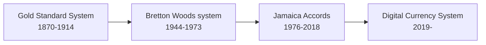
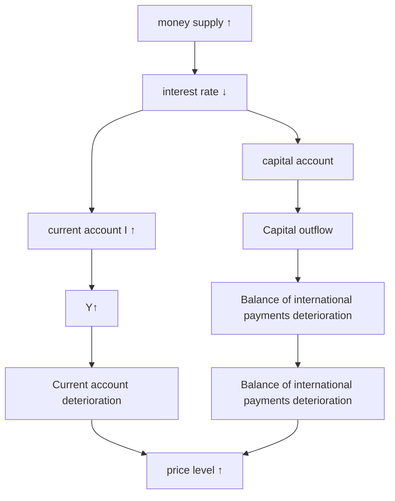
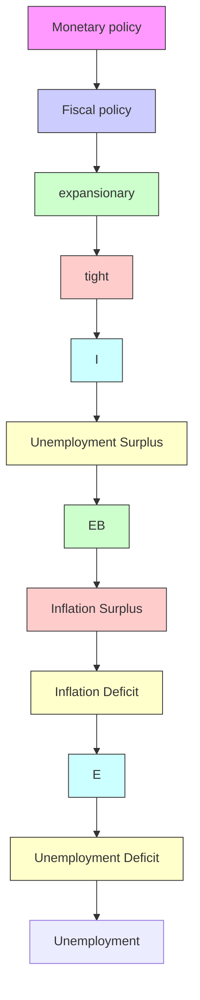
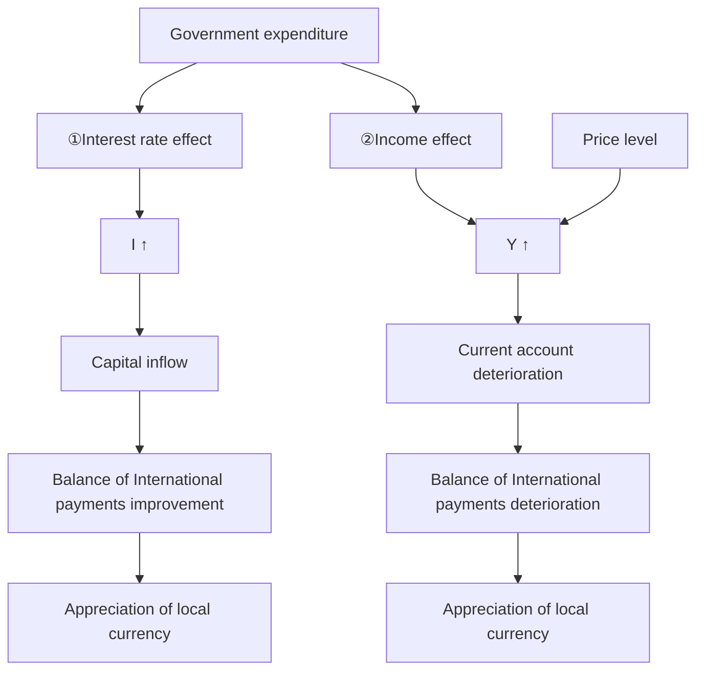

<table><tr><td colspan="2">For office use only</td></tr><tr><td>T1</td><td></td></tr><tr><td>T2</td><td></td></tr><tr><td>T3</td><td></td></tr><tr><td>T4</td><td></td></tr></table>

Team Control Number

1904381  
Problem Chosen  
F  
For office use only

<table><tr><td>F1</td><td></td></tr><tr><td>F2</td><td></td></tr><tr><td>F3</td><td></td></tr><tr><td>F4</td><td></td></tr></table>

## 2019

## MCM/ICM

## Summary Sheet

# Digital Currency System is Coming

## Summary

In recent years, digital currency has developed rapidly and become an indispensable part of the modern economic system. We construct a brand-new dynamic macroeconomic operation system, taking digital currency into account. Our model is based on three perspectives: individual choice, national economy, international economy. We first consider the individual behavior choice decision, which is because the aggregate demand of all micro-individuals selections determine the domestic economic operation state, describing as the product market equilibrium and money market equilibrium. We use models to analyze three short-term economic as well as a long-term economic performance objective, under different exchange rate systems, economic shocks and policies.

We first build a virtual country whose central bank issues the new digital currency. The impact of digital currency on the current banking system and macroeconomic system is determined by the economic interaction with a particular country in the real world.

We discuss two different exchange rate systems that a country will choose. Using theoretical analysis and R, we find that either systems would achieve internal and external equilibrium and realize economic objects if proper policies are implemented when digital currency is introduced.

The innovation of our model is that we introduce the parameters of international capital flows (ICF) to the model. We analyze the impact of ICF on economy of the country both theoretically and empirically. It is inspiring that we find that decentralized digital currency can not only run the economy more efficiently by removing barriers to currency flows, but also enhance the world’s welfare by the ultra-high liquidity of digital currency.

To ensure the new banking and the macroeconomic systems involving digital currency can operate with stability and effectiveness we propose all countries accepting digital currencies co-create a United Nations-affiliated organization– the World Digital Money Bank (WDCB) and develop a series of regulations.

Keywords: digital currency;fixed exchange rate ;float exchange rate

## 1 Introduction

## 1.1 Background

Considering the application of the digital currency, there lies both advantages and disadvantages. Its digital forms can enable instantaneous transactions and borderless transfer-of-ownership, which improves the efficiency of the markets and constructs a more convenient form of financial exchange. But in the meantime, while not technically money, their value is tied to real-world currencies which from the very beginning has placed them in a very precarious situation. Lack of regulation around these currencies and their anonymity also bring risk to both citizens and economic analysts.

Therefore, modeling the working mechanism of financial system adding the new type of currency is necessary. This model would enable us to have a clear overview of the market model and help make policies with regard to both regulations of the currency market and stablity of the system.

## 1.2 Statement of the Problem

• Task1: Construct a model in which digital currency is taken into consideration, and the model should adequately elucidate this financial system.  
• Task2: Identify the viability and effects of a global decentralized digital financial market and develop a kind of general digital currency.  
• Task3: Identify major factors which will limit or facilitate its growth, access, security, and stability at both the individual, national, and global levels.  
• Task4: How will the countries modify their current banking and monetary models according to their different needs and their willingness to work with this new financial marketplace? And what are the consequences of these modifications?  
• Task5: Include the mechanisms for oversight of the global digital currency built above.  
• Task6: Analyze the long-term effects of this system on the current banking industry; the local, regional, and world economy; and international relations between countries.  
• Task7: What will happen if the countries abandon their own currency and only use digital currency?

## 2 Assumptions and Notations

## 2.1 Assumptions

In order to better quantify our model, we may relax some of the assumptions.

• Consumption and savings occur in individuals, while production and investment occur in the enterprise sector. Individuals and enterprises have to pay taxes.

• Consumers are rational and pursue maximum utility.

• The government has two kinds of behavior: government purchase expenditure and tax revenue.

• Depreciation and undistributed profits are zero. GDP, NDP, NI, PI and DPI are equal.

• The government aims to achieve economic growth, adequate employment, price stability and internal and external equilibrium under balance of international payments.

## 2.2 Notation of Parameters

We make a list of parameters involving in the model as shown in Tabel 1.

## 3 Mathematical Model

In order to construct a model that sufficiently represent the brand-new financial system, we should take the willingness of countries to accept digital currency into account and primarily consider two different paths of developing digital currency, which laid the foundation of our mathematical model.

Path I Central banks in all countries refuse to accept digital currency. In this case, the system will be the same as today’s, which rarely influence the traditional currency market.

Path II NOT ALL central banks refuse to accept digital currency. When a central bank of a country with certain international influence that regard digital currency as traditional currency, the central bank will be willing to pay a certain amount of traditional currency to purchase digital currency owned by the public, and will sell digital currency to potential demanders to earn a certain amount of traditional currency. From the analysis above, it can be seen that digital currency will directly enter the existing open macroeconomic model.

Table 1: List of Parameters and Notations

<table><tr><td>Parameters</td><td>Descriptions</td></tr><tr><td>Y</td><td>GDP of a country</td></tr><tr><td>C</td><td>Consumption of a country</td></tr><tr><td>I</td><td>Investment</td></tr><tr><td>G</td><td>Government purchase</td></tr><tr><td>T</td><td>Tax</td></tr><tr><td>X</td><td>Exports</td></tr><tr><td>M</td><td>Imports</td></tr><tr><td>m̄</td><td>Total currency demand of individuals, a constant in a short period</td></tr><tr><td>y</td><td>Individual income level</td></tr><tr><td>i</td><td>Market interest rate level</td></tr><tr><td>m1</td><td>The amount of money held in traditional currency</td></tr><tr><td>m2</td><td>The amount of money held in digital currency</td></tr><tr><td>u</td><td>Individual utility level</td></tr><tr><td>α,β</td><td>Parameters. Depending on individual micro-traits</td></tr><tr><td>L1(Y)</td><td>Money demand caused by transactions motives and precautionary motives</td></tr><tr><td>L2(i)</td><td>Money demand caused by speculative motive is a function with regards to interest rate</td></tr><tr><td>Ms</td><td>Total money supply in the form of digital currency</td></tr><tr><td>Ms1</td><td>Total money supply in the form of traditional currency</td></tr><tr><td>Ms2</td><td>Total money supply in the form of digital currency</td></tr><tr><td>P</td><td>Price level measured by inflation rate</td></tr><tr><td>k,h</td><td>Constants</td></tr><tr><td>CA</td><td>The balance of current account</td></tr><tr><td>FA</td><td>The balance of financial account</td></tr><tr><td>NX</td><td>Net export</td></tr><tr><td>NF</td><td>Net capital inflow</td></tr><tr><td>AX</td><td>Capital outflow</td></tr><tr><td>AM</td><td>Capital inflow</td></tr><tr><td>Pf</td><td>Price level of foreign countries, measured by inflation rates of foreign countries</td></tr><tr><td>e</td><td>Exchange rate of national currency under direct price method</td></tr><tr><td>iw</td><td>Interest rates of foreign countries</td></tr><tr><td>γ,n,σ,φ</td><td>Parameters</td></tr></table>

In the following sections, we will mainly focus on path two. Our idea is to discuss the details of our mathematical model from three different perspectives in macroeconomics: 1) the domestic product market 2) the money market including individual level and nationanl level 3) the foreign exchange market. In addition, we would observe how every single model changes with the introduction of digital currency and analyze the working mechanism of all these three general models.

## 3.1 Digital Currency System

flowchart

The figure above demonstrates us the development of international monetary system. It is evident that this sytem will be changed with the introduction of brand-new type of currency–digital currency. Therefore, we name this new system as Digital Currency System.

• Build a virtual country

Regardless of all the existing digital currencies, we assume a mysterious organization issues a brand-new digital currency, which is initially held by a minority. Also, we envision there is a virtual country. The central bank of this country is the very mysterious organization that issues the digital currency, the currency in circulation is digital currency and the residents of this country are the individuals holding the currency.

We assume the total amount of digital money issued by the central bank of this virtual country as a constant. Each unit of electronic money can be infinitely divided. The unit price of digital money measured in real-world currency depends on the economic interactions between the virtual country and the countries in the real world. Denote the virtual country as A.

In the following analysis, we suppose a particular country in the real world will be economically associated with virtual countries through existing currencies and digital currencies. And this international economic relationship can be characterized by FE curve. Starting with the FE curve, we will in turn analyze the IS curve and the LM curve of this particular country which has economically associated with the virtual country.

## 3.2 The Money Market

## 3.2.1 Basic Theory

• Money Supply

Money supply refers to the process in which the economic entity creates the money supply and puts it into circulation. That is, the behavior and process of the central bank and commercial banks investing, expanding or contracting the money in circulation.

The money supply refers to the sum of the currency held by enterprises, individuals and foreign countries outside the banking system and other deposit currencies that are freely available at any time.

• Money Demand

Money demand refers to the amount of money the public is willing to hold after comprehensively weighing the benefits and costs of various assets.

• Liquidity Preference Theory

Keynes’s study of money demand is based on a study of the motives of demand for economic agents. Keynes believed that peopleâA˘ Zs demand for money´ is determined by three motives:

1. The transactions motive: in order to make daily transactions, people must hold money  
2. The precautionary motive: people prefer to have liquidity to cope with unexpected situations.  
3. Speculative motive: due to the uncertainty of the future interest rate, people will adjust the asset structure and demand more money to hold in order to avoid capital loss or increase capital gains.

## 3.2.2 Individual Level - Micro Level

Modern new classical macroeconomics tend to focus on the determination of money demand from the perspective of dynamic optimization. Based on the new classical currency model, we interpret currency as the amount of treasure that people are willing to retain under the premise of invariant income. Hence we propose the following model to describe the economic behavious at the micro level.

• Individual Currency Choice

Denote ${ \bar { m } } \triangleq { \bar { m } } ( y , i )$ . According to our model, we have $\bar { m } = m _ { 1 } + m _ { 2 }$

• Individual Money Utility Function

## Indifferent Curve:

$$
u = m _ {1} ^ {\alpha} m _ {2} ^ {\beta}
$$

where $\alpha , \beta$ are parameters. They depend on individual micro-traits, such as risk preferences, liquidity preferences, etc.

Assumptions: 1. Individual preference is normal. 2. Monotonicity. 3. Convexity.

In the next section, we try to solve this equation through both mathematical calculation and explicit figures.

$$
\max _ {m _ {1}, m _ {2}} u = m _ {1} ^ {\alpha} m _ {2} ^ {\beta}
$$

subject to

$$
\bar {m} = m _ {1} + m _ {2}
$$

We assume that both u and m¯ have continuous first partial derivatives. To find the maxium of this function, we introduce a new variable λ as the Lagrange multiplier.

$$
L (m _ {1}, m _ {2}, \lambda) = m _ {1} ^ {\alpha} m _ {2} ^ {\beta} - \lambda (m _ {1} + m _ {2} - \bar {m})
$$

We take the partial derivatives with regard to $m _ { 1 } , m _ { 2 }$ and λ.

$$
\left\{ \begin{array}{l} \frac {\partial L}{\partial m _ {1}} = \alpha m _ {1} ^ {\alpha - 1} m _ {2} ^ {\beta} - \lambda = 0 \\ \frac {\partial L}{\partial m _ {2}} = \beta m _ {1} ^ {\alpha} m _ {2} ^ {\beta - 1} - \lambda = 0 \Longrightarrow \left\{ \begin{array}{l} m _ {1} = \frac {\alpha}{\alpha + \beta} \bar {m} \\ m _ {2} = \frac {\beta}{\alpha + \beta} \bar {m} \end{array} \right. \\ \frac {\partial L}{\partial \lambda} = \bar {m} - m _ {1} - m _ {2} = 0 \end{array} \right. \tag {1}
$$

line chart

| m1   | m2   | Label |
|------|------|-------|
| 0    | 0    | u1    |
| 0    | 0    | u2    |
| 0    | 0    | u3    |
| 0    | 0    | U=m1^αm2^β |
| 0    | 0    | m1*   |
| 0    | 0    | m2*   |
| 0    | 0    | m1*   |
| 0    | 0    | m2*   |
| 0    | 0    | m1*   |
| 0    | 0    | m2*   |
| 0    | 0    | m1*   |
| 0    | 0    | m2*   |
| 0    | 0    | m1*   |

(a) individual choice between currency

line chart

| Chart Panel | Label | Description |
| --- | --- | --- |
| Bottom Right | LM curve | Current demand (i*) increasing from ~0 to ~45°, with current demand (i*) increasing from ~0 to ~45°, excluding demand for money |
| Bottom Left | LM curve | Current demand (i*) increasing from ~0 to ~45°, excluding demand for money |
| Bottom Center | LM curve | Current demand (i*) increasing from ~0 to ~45°, excluding demand for money |
| Bottom Center | Excessive demand for money | Current demand (i*) increasing from ~0 to ~45°, excluding demand for money |
| Bottom Center | Excessive demand for money | Current demand (i*) increasing from ~0 to ~45°, excluding demand for money |
| Bottom Center | Excessive demand for money | Current demand (i*) increasing from ~0 to ~45°, excluding demand for money |
| Bottom Center | Excessive demand for money | Current demand (i*) increasing from ~-0 to ~45°, excluding demand for money |
| Bottom Center | Excessive demand for money | Current demand (i*) increasing from ~-0 to ~45°, excluding demand for money |
| Bottom Center | Excessive demand for money | Current demand (i*) increasing from ~-0 to ~45°, excluding demand for money |
| Bottom Center | Excessive demand for money | Current demand (i*) increasing from ~-0 to ~45° |
| Bottom Center | Excessive demand for money | Current demand (i*) increasing from ~-0 to ~45° |
| Bottom Center | Excessive demand for money | Current demand (i*) increasing from ~-0 to ~45° |
| Bottom Center | Excessive demand for money | Current demand (i*) increasing from ~-0 to ~45° |
| Bottom Center | Excessive demand for money | Current demand (i*) increasing from ~-0% to ~45° |
| Bottom Center | Excessive demand for money | Current demand (i*) increasing from ~-0% to ~45° |
| Bottom Center | Excessive demand for money | Current demand (i*) increasing from ~-0% to ~45° |
| Bottom Center | Excessive demand for money | Current demand (i*) increasing from ~-0% to ~45° |
| Bottom Center | Excessive demand for money | Current demand( i*) increasing from ~-0% to ~45° |
| Bottom Center | Excessive demand for money | Current demand( i*) increasing from ~-0% to ~45° |
| Bottom Center | Excessive demand for money | Current demand( i*) increasing from ~-0% to ~45° |
| Bottom Center | Excessive demand for money | Current demand( i*) increasing from ~-0% to ~45° |
| Bottom Center | ExSingapore demand | Current demand (i*) increasing from ~-0% to ~45° |
| Bottom Center | ExSingapore demand | Current demand (i*) increasing from ~-0% to ~45° |
| Bottom Center | ExSingapore demand | Current demand (i*) increasing from ~-0% to ~45° |
| Bottom Center | ExSingapore demand | Current demand (i*) increasing from ~-0% to ~45° |
| Bottom Center | ExSingapore demand | Current demand ( i*) increasing from ~-0% to ~45° |
| Bottom Center | ExSingapore demand | Current demand ( i*) increasing from ~-0% to ~45° |
| Bottom Center | ExSingapore demand | Current demand ( i*) increasing from ~-0% to ~45° |
| Bottom Center | ExSingapore demand | Current demand ( i*) increasing from ~-0% to ~45° |
| Bottom Center | ExSingapore demand | Current demand (i*) increasing from ~-0% to ~45° |
| Bottom Center | ExSingapore demand | Current demand (i*) increasing from ~-0% to ~45° |
| Bottom Center | ExSingapore demand | Current demand (i*) increasing from ~-0% to ~45° |
| Bottom Center | ExSingapore demand | Current demand( i*) increasing from ~-0% to ~45° |
| Bottom Center | ExSingapore demand | Current demand( i*) increasing from ~-0% to ~45° |
| Bottom Center | ExSingapore demand | Current demand( i*) increasing from ~-0% to ~45° |
| Bottom Center | ExSingapore demand | Current demand( i*) increasing from ~-0% to ~45° |
| Bottom Center | ExSingapore demand | Current demand( ii) increasing from ~-0% to ~45° |
| Bottom Center | ExSingapore demand | Current demand( ii) increasing from ~-0% to ~45° |
| Bottom Center | ExSingapore demand | Current demand( ii) increasing from ~-0% to ~45° |
| Bottom Center | ExSingapore demand | Current demand( ii) increasing from ~-0% to ~45° |
| Bottom Center | ExSingapore demand | Current demand( ii/ii) increasing from ~-0% to ~45° |
| Bottom Center | ExSingapore demand | Current demand( ii/ii) increasing from ~-0% to ~45° |
| Bottom Center | ExSingapore demand | Current demand( ii/ii) increasing from ~-0% to ~45° |
| Bottom Center | ExSingapore demand | Current demand( ii/ii) increasing from ~-0% to ~45° |
| Bottom Center | Ex Singapore demand | Current demand( i*) increasing from -0% to ~45° |
| Bottom Center | Ex Singapore demand | Current demand( i*) increasing from -0% to ~45° |
| Bottom Center | Ex Singapore demand | Current demand( i*) increasing from -0% to ~45° |
| Bottom Center | Ex Singapore demand | Current demand( i*) increasing from -0% to ~45° |
| Bottom Center | Ex Singapore demand | Current demand( i*) increasing from -0% to >45° |
| Bottom Center | Ex Singapore demand | Current demand( i*) increasing from -0% to >45° |
| Bottom Center | Ex Singapore demand | Current demand( i*) increasing from -0% to >45° |
| Bottom Center | Ex Singapore demand | Current demand( i*) increasing from -0% to >45° |
| Bottom Center | Ex Singapore demand | Current demand( i*) increasing from -0% to >45° |

(b) The points that are not on the curve  
Figure 1: The slope

## 3.2.3 National Level - Macro Level

1. Total Demand for Money: $M = \sum { \bar { m } } = \sum m _ { 1 } + \sum m _ { 2 }$  
2. Total Supply for Money: $M _ { s } = \bar { M } _ { s 1 } + \bar { M } _ { s 2 }$

3. Balance:

$$
\left\{ \begin{array}{l} M = \frac {\bar {M} _ {s 1} + \bar {M} _ {s 2}}{P} \\ L (Y, i) = L _ {1} (Y) + L _ {2} (i) = k Y - h i \\ M = L (Y, i) \end{array} \right.
$$

$\begin{array} { r } { \Longrightarrow i = - \frac { 1 } { h } \frac { M _ { s } } { P } + \frac { k } { h } Y . } \end{array}$

Figure 1 explains the economic meaning of points that are not on the curve. As noted in the figure 1, the points above the LM curve indicate insufficient money demand of the country while those below the curve represent excessive demand for money.

line chart

| Metric | Value |
|--------|-------|
| L1 (Y) | 0     |
| L1 (P) | 45°   |
| LM curve | Linear increase from left to right |
| i      | Linear increase from left to right |
| L2(i)  | Linear decrease from left to right |

(a) Sensitivity of Monetary Demand to Income

  
(b) Sensitivity of Monetary Demand to Interest Rate  
Figure 2: The slope

Figure 2 demonstrates that the slope of the LM curve is determined by the slope of the currency transaction demand against the precautionary demand curve and against the speculative currency demand curve :

1. When the sensitivity of money demand to income is certain, the higher the sensitivity of money demand to interest rates, the flatter the LM curve.  
2. When the sensitivity of money demand to interest rates is certain, the lower the sensitivity of money demand to income, the flatter the LM curve.

line chart

| Series | X-axis Label | Y-axis Label | Line Color |
|--------|--------------|--------------|------------|
| Top Left | L1(Y)       | L1(Y)        | Blue       |
| Top Right | L1(Y)       | L1(Y)        | Red        |
| Bottom Left | Y1     | Y1         | Green      |
| Bottom Right | Y2     | Y2         | Green      |
| Bottom Right | Y1 (i)      | i (i)        | Green      |
| Bottom Right | Y2 (i)      | i (i)        | Green      |

(a)

line chart

| Chart | X-axis Label | Y-axis Label | Line Color |
| --- | --- | --- | --- |
| Top Left | L1(Y) | L1(L1) | Blue |
| Top Right | L1(L1) | L2(L1) | Blue |
| Bottom Left | Y: Y1: i: i1 | Y: Y2: i: i2 | Green |

(b)  
Figure 3: LM Curve shifts

Figure 3 explains why LM curve will shift to the right(or move downward):

1. Exogenous decrease in money demand: both $L _ { 1 }$ and $L _ { 2 }$ decrease.  
2. Exogenous increase in money supply: Ms increases while P decreases.

## 3.3 The Domestic Product Market

The IS curve describes all possible combinations of interest rate (i) and real GDP (Y) when the domestic product market is in equilibrium, given other fundamental factors.

1. National Income Balance: $Y = C + I + G + ( X - M ) = C + S + T$  
2. Saving-Investment Equality: $I _ { a l l } = I + G + ( X - M ) = S + T = S _ { a l l }$

Note: I and S below refer to $I _ { a l l }$ and $S _ { a l l }$

IS Model:

$$
\left\{ \begin{array}{l} I = I _ {0} - d i + (X - M) \\ S = - a + (1 - b) Y + (T - G) \\ I = S \end{array} \right.
$$

Therefore, we have

$$
i = \frac {a + I _ {0} + (\bar {G} - \bar {T}) + (\bar {X} - \bar {M})}{d} - \frac {(1 - b)}{d} Y
$$

<table><tr><td colspan="2">The position of a point on a non-curve</td><td>Curve slope size</td><td>Curve panning</td></tr><tr><td>Above</td><td>Below</td><td rowspan="2">the slope of the is curve depends on the slope of the savings function and the investment function(1) The higher the elasticity of investment to interest rates, the more straight the IS curve.(2) The lower the elasticity of savings to income, the more straight the IS curve.</td><td rowspan="2">cause The IS curve moves to the right (or up)(1) investment curve panning to the right: increased business confidence, increased exports, reduced imports(2) savings curve panning down: consumer confidence increases, taxes decrease, government purchases increase</td></tr><tr><td>Aggregate demandInsufficient</td><td>Aggregate demandExcessive</td></tr></table>

Figure 4: The analysis of the IS model

## 3.4 The Foreign Exchange Market

The FE curve describes all possible combinations of interest rates (i) and real GDP (Y) when the balance of payments is in equilibrium, given other fundamental factors.

The equilibrium of the balance of payments means that the sum of the balance of current account balances and the balance of financial account is zero.

## Assumptions:

1)The current account balance is a net export  
2)The balance of financial account balance is net capital inflow.

We have $B = C A ( Y ) + F A ( i ) = 0$

$$
\left\{ \begin{array}{c} C A \approx N X \\ N X = X - M \end{array} \right. \left\{ \begin{array}{c} F A \approx N F \\ N F = A M - A X \end{array} \right.
$$

Solve the equations shown above

$$
X - M + (A M - A X) = 0
$$

$$
N X = X - M = N F = A X - A M
$$

Suppose NX and NF satisfy the following equations

$$
\left. \begin{array}{c} N X = X - M \\ M = m _ {0} + \gamma Y - n * r e r \\ X = X _ {0} \end{array} \right\} \Longrightarrow N X (Y) = X _ {0} - m _ {0} - \gamma Y + n \frac {P _ {f} * e}{P} \tag {2}
$$

$$
\left. \begin{array}{c} N F (i) = \sigma \left(i _ {w} - i\right) + \phi \\ N X = N F \end{array} \right\} \Longrightarrow i = \frac {\gamma}{\sigma} Y + \left(i _ {w} + \frac {n}{\sigma} \frac {P _ {f} * e}{P} - \frac {X _ {0} - m _ {0}}{\sigma}\right) \tag {3}
$$

<table><tr><td colspan="2">The position of a point on a non-curve</td><td>Curve slope size</td><td>Curve panning</td></tr><tr><td>Above</td><td>Below</td><td rowspan="2">the slope of FE curve depends on the sensitivity of marginal import tendency and net capital outflow to interest rate(1) when the sensitivity of net capital outflow to interest rate is certain, the smaller the marginal import tendency, the more straight the FE curve;(2) When marginal import tendency is certain, the higher the sensitivity of net capital outflow to interest rate, the more straight the FE curve</td><td rowspan="2">The FE curve moves to the right (or down)(1) lead to net exports NX &#x27;s exogenous increase: exports increase, imports decrease(2) lead to net capital outflows NF &#x27;s exogenous decline: reduced capital outflows and increased capital inflows(3) devaluation of the local currency</td></tr><tr><td>Balance of payments Surplus</td><td>Balance of payments Deficit</td></tr></table>

Figure 5: The analysis of the FE model

## 4 Analysis of Our Model

## 4.1 Choice of Exchange Rate Institution

In the real world, the central bank of a particular country choose an exchange rate institution that allows the exchange rate between domestic currency and digital currency issued by the virtual country. Denote a particular country in the real world as $B _ { i } ( i = 1 , 2 , 3 , . . . n )$ . Suppose $B _ { i }$ chooses either fixed exchange rate or floating exchange rate. The exchange rate is expressed in domestic currency using direct price method. Therefore, the meaning of this exchange rate is the national currency in which one unit of digital currency can be exchanged. We also assume that there is no exchange control on digital currency and the bank’s buying price is the same as selling price.

In the following sections, we will analyze the macroeconomic performance of the country $B _ { i }$ after every country chooses different exchange rate institution, including: 1) long run goals 2) short run goals 3) internal equilibrium 4) external equilibrium. To be more specific, we will analyze the following :

## Fixed Exchange Rate

• International Balance of Payments under a fixed exchange rate institution  
•Policy Effects under a fixed exchange rate institution  
•Shocks to the Economy under a fixed exchange rate institution  
•Internal and External Disequilibrium Adjustment under a fixed exchange rate institution

## Floating Exchange Rate

• International Balance of Payments under a floating exchange rate institution  
Policy Effects under a floating exchange rate institution  
•Shocks to the Economy under a floating exchange rate institution  
Internal and External Disequilibrium Adjustment under a floating exchange rate institution

## 4.2 Fixed Exchange Rate Institution

## 4.2.1 Balance of International Payments

In order to maintain exchange rate stability, the central bank will take interventions. Interventions include sterilized intervention and non-sterilized intervention.

• Non-Sterilized Intervention

Situation I There is a surplus for the official settlement and the domestic currency is facing pressure to appreciate.

Under this circumstance, digital currency is under pressure to depreciate. Since the central banks of virtual countries do not have monetary and fiscal policies, we only need to analyze the behavior of central banks in existing countries. In addition, we regard the electronic money held by the central bank as a foreign exchange asset.

Central bank intervention: purchase digital currency, sell domestic currency.

<table><tr><td>Major assets</td><td>Main liabilities</td></tr><tr><td>Domestic assets</td><td>Base currency ↑</td></tr><tr><td>Debt securities</td><td>Cash</td></tr><tr><td>Loans to the bank</td><td>Deposit from bank</td></tr><tr><td>International reserve assets ↑</td><td></td></tr><tr><td>Foreign exchange assets</td><td></td></tr></table>

Table 2: Central bank’s assets and liabilities

Table 2 demonstrates the impact of central bank intervention on the central bank’s balance sheet. Base currency and international reserve assets will increase under this condition. Moreover, the way in which official interventions adjust the assets and liabilities of the central bank not only changes the holdings of a country’s official international reserve assets, but also changes the money supply. Under the partial reserve system of the bank, the amount of change in the money supply will be several times more than the amount of official intervention.

• International Balance of Payments - Realization of External Equilibrium

## 4.2.2 Policy Effects

• Monetary Policy:take the expansionary monetary policy as an example. The mechanism works as follows.

flowchart

Figure 6: Mechanism

• Fiscal Policy:take the expansionary monetary policy as an example. The mechanism works as follows.

<table><tr><td></td><td></td><td>Monetary policy</td><td>Fiscal Policy</td></tr><tr><td rowspan="3">Mechanism</td><td>Hypothetical scenarios</td><td colspan="2">The initial state of a country is non-full employment; external equilibrium</td></tr><tr><td>Policy options</td><td>Expansionary</td><td>Expansionary</td></tr><tr><td>Impact on the balance of payments</td><td>Deteriorating</td><td>Not sure.</td></tr><tr><td rowspan="2">Policy Effect</td><td>Capital flows are less sensitive to interest rates</td><td rowspan="2">The effect of monetary policy is limited</td><td rowspan="2">fiscal policy in the short term on the actual GDP has a strong impact.</td></tr><tr><td>Capital flows are more sensitive to interest rates</td></tr></table>

Figure 7: Mechanism

<table><tr><td></td><td>Fixed exchange rate system</td></tr><tr><td>Assumption</td><td>Complete capital flow</td></tr><tr><td>Monetary policy</td><td>It is impossible for a country to implement a completely independent monetary policy</td></tr><tr><td>Fiscal policy</td><td>Fiscal policy is completely effective</td></tr><tr><td>Conclusion</td><td>Under the fixed exchange rate system, fiscal policy is relatively effective</td></tr></table>

Figure 8: Mechanism

## 4.2.3 Shocks to the Economy

In this section, we will introduce definitions of differernt shocks to the economy help explain the impact of introducing digital currency based on our mathematical model.

Shocks to Domestic Currency: Changes in the way citizens hold money

Under the fixed exchange rate system, the impact of currency shocks on interest rates and output is very limited.

Domestic Spending Shock Effect: Changes in consumer confidence

Under the fixed exchange rate system, the impact of expenditure will have a certain impact on interest rates and output.

International Trade Shock Effects: Reduced export demands

Under the fixed exchange rate system, the impact of international trade has a huge impact on the internal equilibrium of a country.

## International Capital Flow Shock Effects: international capital outflow

The new financial transaction digital method enables users to instantly exchange currency via email addresses or fingerprints. A peer-to-peer payment system provided by the companies such as Google Pay enables global virtual currency transfers in seconds without the need for bank or currency verification transaction exchanges. Digital transactions exceed cash and check transactions because they are not affected by bank policies, national boundaries, citizenship, debt or other socio-economic factors. Due to the influence of exogenous factors such as political fluctuations and insider information, countries with an electronic monetary system will often face huge international capital flows. For example, when a country has a war, individuals holding the currency of the country will frantically want to exchange the country’s currency for electronic money and transfer the electronic money to the proper places.

Under the fixed exchange rate institution, the impact of international capital flows has a dramatic impact on internal equilibrium.

## 4.2.4 Internal and External Disequilibrium Adjustment

Tinbergen’s Rule: The number of independent policy instruments that a country can utilize is at least equal to the number of economic policy objectives to be achieved. That is to say, to achieve an economic goal, at least an independent policy tool is needed.

Mundell’s policy matching principle: Each policy tool should be assigned to its most influential goal, which has a comparative advantage in influencing this policy goal.

According to Mundell’s policy matching principle, we summarize all the possible policy matches as shown below.

flowchart

(a)

<table><tr><td rowspan="2">Initial State of Balance of International Payments</td><td colspan="2">Initial state of domestic economy</td></tr><tr><td>Unemployment</td><td>Inflation</td></tr><tr><td>Surplus</td><td>Expansionary monetary policyExpansionary fiscal policy</td><td>Expansionary monetary policyTightening fiscal policy</td></tr><tr><td>Deficit</td><td>Tightening monetary policyExpansionary fiscal policy</td><td>Tightening monetary policyTightening fiscal policy</td></tr></table>

(b)

Swan Model:

<table><tr><td rowspan="2">Initial state of balance of payments</td><td colspan="2">Initial state of the domestic economy</td></tr><tr><td>Unemployed</td><td>Inflation</td></tr><tr><td>Surplus</td><td>Domestic currency appreciation Expansionary policy</td><td>Domestic currency appreciation Tightening policy</td></tr><tr><td>Deficit</td><td>Domestic currency depreciation Expansionary policy</td><td>Domestic currency depreciation Tightening policy</td></tr></table>

## 4.3 Floating Exchange Rate Institution

## 4.3.1 Balance of International Payments

The floating exchange rate institution can realize the external equilibrium spontaneously through the free fluctuation of currency.

Situation I: official settlement surplus

If there is a surplus in balance of international payments, domestic currency will appreciate and digital currency will depreciate. For individuals in virtual countries, they will reduce imports. Therefore, the country’s exports are reduced, FE curve moves to the left, and the IS curve is panned to the left (or below). Ultimately, it will achieve internal and external equilibrium and hence the digital currency will depreciate.

## 4.3.2 Policy Effects

• The Influence of Monetary Policy on Exchange Rate  
• The Influence of Fiscal Policy on Exchange Rate

flowchart

Summarizing the above, the following table can be summarized.

<table><tr><td colspan="2"></td><td>Monetary policy</td><td>Fiscal Policy</td></tr><tr><td rowspan="3">Mechanism</td><td>Hypothetical scenarios</td><td colspan="2">The initial state of a country is non-full employment</td></tr><tr><td>Policy options</td><td>Expansionary</td><td>Expansionary</td></tr><tr><td>Impact on exchange rates</td><td>Depreciation of the domestic currency</td><td>Not sure.</td></tr><tr><td rowspan="2">Policy Effect</td><td>Capital flows are completely insensitive to interest rates</td><td>Strong</td><td>Weak</td></tr><tr><td>Capital flows are extremely sensitive to interest rates</td><td>Highly effective</td><td>Completely invalid</td></tr></table>

Comparison of policy effects under different exchange rate system

<table><tr><td></td><td colspan="2">Fixed exchange rate system</td><td colspan="2">Floating exchange rate System</td></tr><tr><td>Capital flowsAssume</td><td>Low capitalLiquidity</td><td>High capitalLiquidity</td><td>Low capitalLiquidity</td><td>High capitalLiquidity</td></tr><tr><td>Monetary policy</td><td>Weak</td><td>Basically invalid</td><td>Strong</td><td>Highly effective</td></tr><tr><td>Fiscal Policy</td><td>Strong</td><td>Highly effective</td><td>Weak</td><td>Basically invalid</td></tr><tr><td>Comparativeconclusions</td><td colspan="4">In the floating exchange rate system, monetary policy is relatively effectiveIn the fixed exchange rate system, fiscal policy is relatively effective</td></tr></table>

## 4.4 Impact effect under floating exchange rate system

• Domestic currency impact effect: National changes in the way money is held.Currency shock has a strong impact on a country’s economy  
• Impact effect of domestic expenditure: a change in consumer confidence.The impact of expenditure shocks depends on which changes are greater in international capital flows and current projects.

## 4.5 Real Cases Analysis

Taking into account the economic interaction of the following countries with virtual countries, the following countries will achieve internal and external balanced economic objectives through the use of policy instruments.

## 4.5.1 Analysis of Fixed Exchange Institution – Sweden

For fixed exchange rate system, we choose Sweden for analysis.

3d scatter plot with error bars

| Y | i | GTXM |
| --- | --- | --- |
| 3.0e+11 | 0.00 |  |
| 3.5e+11 | 0.01 |  |
| 4.0e+11 | 0.02 |  |
| 4.5e+11 | 0.03 |  |
| 5.0e+11 | 0.04 |  |
| 5.5e+11 | 0.05 |  |
| 6.0e+11 | 0.06 |  |
| 6.5e+11 | 0.07 |  |
| 7.0e+11 | 0.08 |  |
| 7.5e+11 | 0.09 |  |
| 8.0e+11 | 0.10 |  |
| 8.5e+11 | 0.11 |  |
| 9.0e+11 | 0.12 |  |
| 9.5e+11 | 0.13 |  |
| 1.0e+12 | 0.14 |  |
| 1.5e+12 | 0.15 |  |
| 2.0e+12 | 0.16 |  |
| 2.5e+12 | 0.17 |  |
| 3.0e+12 | 0.18 |  |
| 3.5e+12 | 0.19 |  |
| 4.0e+12 | 0.20 |  |
| 4.5e+12 | 0.21 |  |
| 5.0e+12 | 0.22 |  |
| 5.5e+12 | 0.23 |  |
| 6.0e+12 | 0.24 |  |
| 6.5e+12 | 0.25 |  |
| 7.0e+12 | 0.26 |  |
| 7.5e+12 | 0.27 |  |
| 8.0e+12 | 0.28 |  |
| 8.5e+12 | 0.29 |  |
| 9.0e+12 | 0.30 |  |
| 9.5e+12 | 0.31 |  |
| 1.0e+13 | 0.32 |  |
| 1.5e+13 | 0.33 |  |
| 2.0e+13 | 0.34 |  |
| 2.5e+13 | 0.35 |  |
| 3.0e+13 | 0.36 |  |
| 3.5e+13 | 0.37 |  |
| 4.0e+13 | 0.38 |  |
| 4.5e+13 | 0.39 |  |
| 5.0e+13 | 0.40 |  |
| 5.5e+13 | 0.41 |  |
| 6.0e+13 | 0.42 |  |
| 6.5e+13 | 0.43 |  |
| 7.0e+13 | 0.44 |  |
| 7.5e+13 | 0.45 |  |
| 8.0e+13 | 0.46 |  |
| 8.5e+13 | 0.47 |  |
| 9.0e+13 | 0.48 |  |
| 9.5e+13 | 0.49 |  |
| 1.0e+14 |  |  |
|  |  |  |
|  |  |  |
|  |  |  |
|  |  |  |
|  |  |  |
|  |  |  |
|  |  |  |
|  |  |  |
|  |  |  |
|  |  |  |
|  |  |  |
|  |  |  |
|  |  |  |
|  |  |  |
|  |  |  |
|  |  |  |
|  |  |  |
|  |  |  |
|  |  |  |
|  |  |  |
|  |  |  |
|  |  |  |
|  |  |  |
|  |  |  |
|  |  |  |
|  |  |  |
|  |  |  |
|  |  |  |
|  |  |  |

From the figure above and Firgue9, we can give the conclusion that there are domestic inflation, balance of international payments deficit. The domestic currency is under pressure to depreciate. Sweden should pursue a tight monetary policy and a tight fiscal policy. To maintain a fixed exchange rate, the central bank sells its own currency and buys digital currency. The IS curve moves to the left and the LM curve moves to the left. Finally achieves internal and external equilibrium.

line chart

| Y       | R     | L     | R'    |
| ------- | ----- | ----- | ----- |
| -1e+12  | 0.5   | 0.0   | -1.0  |
| -5e+11  | 0.3   | 0.1   | -0.5  |
| 0e+00   | 0.1   | 0.2   | 0.0   |
| 5e+11   | -0.1  | 0.4   | 0.5   |
| 1e+12   | -0.3  | 0.6   | 1.0   |

line chart

| Y        | IS    | LM    | FE    |
| -------- | ----- | ----- | ----- |
| -1e+12   | 1.0   | 0.3   | -     |
| -5e+11   | 0.7   | 0.5   | -     |
| 0e+00    | 0.5   | 0.7   | -     |
| 5e+11    | 0.3   | 0.9   | 0.5   |
| 1e+12    | 0.1   | 1.0   | -     |

Figure 9: three model together result for Sweden and Israel

## 4.5.2 Analysis of Floating Exchange Institution – Israel

For floating exchange rate system, we choose Israel for analysis.

From the figure above and Firgue9, we can give the conclusion that there are domestic inflation, balance of international payments deficit. The domestic currency depreciates and digital currency appreciates. Israel’s imports have decreased and exports have increased. For virtual countries, imports have increased. The FE curve moves to the right. Israel has a tight monetary policy, a currency appreciation, an digital currency depreciation, and LM curve moving to the left. finally achieve internal and external equilibrium.

## 5 Evaluations of the Model

## 5.1 Sensitivity Analysis

The sensitivity of our model is considered in this subsection. To test the sensitivity, we apply anova test to the models in Section 4.4 and to see whether the test is viabile and reliable.

<table><tr><td colspan="6">Analysis of Variance Table</td></tr><tr><td colspan="6">Response: IR</td></tr><tr><td></td><td>Df</td><td>Sum Sq</td><td>Mean Sq</td><td>F value</td><td>Pr(&gt;F)</td></tr><tr><td>GDP</td><td>1</td><td>0.0041739</td><td>0.0041739</td><td>40.4351</td><td>3.616e-05 ***</td></tr><tr><td>IEI</td><td>1</td><td>0.0005016</td><td>0.0005016</td><td>4.8598</td><td>0.04775 *</td></tr><tr><td>Residuals</td><td>12</td><td>0.0012387</td><td>0.0001032</td><td></td><td></td></tr></table>

(a) result for Sweden

<table><tr><td colspan="7">Analysis of Variance Table</td></tr><tr><td colspan="7">Response: IR</td></tr><tr><td></td><td>Df</td><td>Sum Sq</td><td>Mean Sq</td><td>F value</td><td>Pr(&gt;F)</td><td></td></tr><tr><td>GDP</td><td>1</td><td>0.037189</td><td>0.037189</td><td>151.704</td><td>8.567e-11</td><td>***</td></tr><tr><td>IEI</td><td>1</td><td>0.005325</td><td>0.005325</td><td>21.722</td><td>0.0001506</td><td>***</td></tr><tr><td>Residuals</td><td>20</td><td>0.004903</td><td>0.000245</td><td></td><td></td><td></td></tr></table>

(b) result for Israel  
Figure 10: linear regression anova result

From the linear regression result above, we can conclude that each variables of the model is indispensable, and the coeffcients of the model are both small, which demonstrates that the model doesn’t change significant when the variables fluctuate. Therefore, it is reasonable to consider that the model is insensitive to the outliers.

## 5.2 Test for Robustness

In this subsection, we consider the robustness of our model. To test the robustness, we apply the model to other countries to see whether the model also work well as the real cases analysis’ result in 4.4.

For fixed exchange rate system, we take Thailand as example. According to the Figure 11, Thailand should pursue a tight fiscal policy and an expansionary monetary policy and will finally achieve internal and external equilibrium. For floating exchange rate system, we take Mexico as example.According to the Figure 11, Mexico should implement a tight monetary policy and eventually achieve internal and external equilibrium, which attests to the effectiveness of our model.

Additionally, using the anova test in R, we can easily get that these models are significant enough to explain the real cases.

line chart

| Y       | GI    | LM    | FE    |
| ------- | ----- | ----- | ----- |
| -1e+12  | 0.4   | -0.1  | -0.6  |
| -5e+11  | 0.2   | 0.0   | -0.2  |
| 0e+00   | 0.0   | 0.1   | 0.1   |
| 5e+11   | -0.2  | 0.3   | 1.3   |
| 1e+12   | -0.4  | 0.5   | 1.5   |

(a) result for Thailand

line chart

| y       | B    | LM   | FE   |
| ------- | ---- | ---- | ---- |
| 0e+00   | 0.5  | 0.5  | 0.5  |

(b) result for Mexico  
Figure 11: model evaluation on robustness

## 6 Conclusions

## 6.1 Strengths and Weaknesses

## 6.1.1 Strengths

• We establish a multi-level dynamic analysis framework from micro-individual to macroeconomic operation  
• We creatively propose ideas and mathematical models for analyzing digital currency  
• The model is suitable for analysis under a variety of economic shocks

• The model is applicable to various exchange rate systems and has strong robustness  
• The model proposes a variety of policy tools to resolve internal and external imbalances, with strong realistic policy implications.

## 6.1.2 Weaknesses

• The equations in the model are linear equations that fail to truly portray the economic conditions of some countries.  
• We only consider the economic interaction between the two countries.

## 6.2 Conclusion

We first construct a representative model of financial operating systems and macroeconomic operating systems, involving digital currency. This model analyzes individual behavioral decisions on digital currency from a micro perspective. We also discuss two different exchange rate systems that a country will choose.Using theoretical analysis and R, we find that either systems would achieve internal and external equilibrium and realize economic objects if proper policies are implemented when digital currency is introduced.

## Recommendation

Dear leaders,

We are writing this letter to provide you with an overview of our efficient models on digital currency, since we are hired by International Currency Marketing (ICM) to help you identify viability of digital currency. We first construct a representative model of financial operating systems and macroeconomic operating systems, involving digital currency. On one hand, this model analyzes individual behavioral decisions on digital currency from a micro perspective. On the other hand, it analyzes the domestic economic operation from a macro perspective based on product market and money market. Moreover, it demonstrates the economic interactions within and between countries help build a framework in terms of foreign exchange market.

We discuss two different exchange rate systems that a country will choose. Using theoretical analysis and R, we find that either systems would achieve internal and external equilibrium and realize economic objects if proper policies are implemented when digital currency is introduced.

If the central bank of your country chooses a fixed exchange rate system, it is advisable to adopt an expansionary monetary policy to stimulate economy if there is a equilibrium of international payments surplus. If the unemployment rate is high, adopting an expansionary fiscal policy is advocating and vice versa. More importantly, the central bank and the government should adopt a proper policy match based on the actual economic situation.

In terms of floating exchange rate institution, the balance of international payments has been realized spontaneously. Monetary policy is relatively effective for this system.If unemployment rate is high, an expansionary monetary policy can be adopted to ease the situation and vice versa.

In the real digital currency era, the peer-to-peer payment system constructed by companies such as Google Pay can achieve global virtual currency flow in a short term. In order words. countries within digital currency system willpotentially face drastic international capital flows due to the influence of exogenous factors. Hence we introduce parameters concerning international capital flows in the model to help us focus on the impact of intense international capital flows on the national economy with digital currency. Consequently, we are capable of knowing what kind of policy tools the state should adopt to alleviate the negative effects.

To achieve a better performance with the new macroeconomic system and financial institution involving digital currency, we advise you to join the organization World Digital Currency Bank (WDCB) if your country accepts digital currency. Considering stability and security, advanced technology like blockchain can be adopt to help build a safer system and improve the total welfare of the world with digital currency.

Sincerely yours,

Team 1904381

## References

[1] Fleming, J. Marcus. "Domestic Financial Policies under Fixed and Floating Exchange Rates. "IMF Staff Papers 9 (March 1962), pp. 369âA ¸S377.˘  
[2] Klein, Michael W., and Jay C. Shambaugh. Exchange Rate Regimes in the Modern Era. Cambridge, MA:MIT Press, 2010.  
[3] Ghosh, Atish R., Jonathan D. Ostry, and Charalambos Tsangarides. "Exchange Rate Regimes and the Stability of the International Monetary System." International Monetary Fund Occasional Paper 270, 2010.  
[4] Yin Chen, "Research on the development of electronic money and government regulation in the era of "Internet +", Technology and Economic Guide, 2018ïijN26ïij ˇ ´L24ïijL’.  
[5] Feenstra, Robert C. âAIJEstimating the Effects of Trade Policy." In Grossman ˘ and Rogoff (1995).  
[6] Eichengreen, Barry. Exorbitant Privilege: The Rise and Fall of the Dollar and the Future of the International Monetary System. New York: Oxford University Press, 2011.  
[7] Ghosh, Atish R., Jonathan D. Ostry, and Charalambos Tsangarides. "Exchange Rate Regimes and the Stability of the International Monetary System." International Monetary Fund Occasional Paper 270, 2010.  
[8] Fischer, Stanley. "Distinguished Lecture on Economics in GovernmentâA˘ TExchange Rate Regimes: Is the Bipolar View Correct?" JEP 15, no. 2 ˇ (Spring 2001), pp. 3âA ¸S24.ïij˘ Z˙  
[9] Froot, Kenneth A., and Kenneth Rogoff. "Perspectives on PPP and the Long-Run Real Exchange Rate." In Grossman and Rogoff (1995).  
[10] Grossman, Gene M., and Elhanan Helpman. "Protection for Sale." AER 84, no. 4 (September 1994), pp. 833âA ¸S850.˘  
[11] Guangyou Zhou, "The Impact of Electronic Money on Deposit Reserve System", Journal of Guangdong University of FinanceïijN2010ïijˇ ´L05ïijL’  
[12] Findlay, Christopher, and Tony Warren, eds. Impediments to Trade in Services: Measurement and Policy Implications . New York: Routledge, 2000.  
[13] Bordo, Michael D., and Barry Eichengreen, eds. Retrospective on the Bretton Woods International Monetary System . Chicago: University of Chicago Press,1992.  
[14] Broda, Christian, and David Weinstein. "Globalization and the Gains from Variety." Quarterly Journal of Economics 121, no. 2 (May 2006), pp. 541âA ¸S585.˘

[15] Eun, Cheol S., and Bruce G. Resnick. International Financial Management , 6th ed. New York: McGraw-Hill/ Irwin, 2012.

## Appendices

3d scatter plot with error bars

| Y       | i     | MP   |
| ------- | ----- | ---- |
| 3.5e+11 | 0.06  | 24.6 |
| 3.7e+11 | 0.05  | 25.0 |
| 4.0e+11 | 0.07  | 25.2 |
| 4.5e+11 | 0.04  | 25.4 |
| 5.0e+11 | 0.03  | 25.6 |
| 5.0e+11 | 0.04  | 25.8 |
| 5.0e+11 | 0.05  | 26.0 |

3d scatter plot with error bars

| Y | i |
| --- | --- |
| 3.0e+11 | 0.00 |
| 3.5e+11 | 0.01 |
| 4.0e+11 | 0.02 |
| 4.5e+11 | 0.03 |
| 5.0e+11 | 0.04 |
| 5.5e+11 | 0.05 |
| 6.0e+11 | 0.06 |
| 6.5e+11 | 0.07 |
| 7.0e+11 | 0.08 |
| 7.5e+11 | 0.09 |
| 8.0e+11 | 0.10 |
| 8.5e+11 | 0.11 |
| 9.0e+11 | 0.12 |
| 9.5e+11 | 0.13 |
| 1.0e+12 | 0.14 |
| 1.5e+12 | 0.15 |
| 2.0e+12 | 0.16 |
| 2.5e+12 | 0.17 |
| 3.0e+12 | 0.18 |
| 3.5e+12 | 0.19 |
| 4.0e+12 | 0.20 |
| 4.5e+12 | 0.21 |
| 5.0e+12 | 0.22 |
| 5.5e+12 | 0.23 |
| 6.0e+12 | 0.24 |
| 6.5e+12 | 0.25 |
| 7.0e+12 | 0.26 |
| 7.5e+12 | 0.27 |
| 8.0e+12 | 0.28 |
| 8.5e+12 | 0.29 |
| 9.0e+12 | 0.30 |
| 9.5e+12 | 0.31 |
| 1.0e+13 | 0.32 |
| 1.5e+13 | 0.33 |
| 2.0e+13 | 0.34 |
| 2.5e+13 | 0.35 |
| 3.0e+13 | 0.36 |
| 3.5e+13 | 0.37 |
| 4.0e+13 | 0.38 |
| 4.5e+13 | 0.39 |
| 5.0e+13 | 0.40 |
| 5.5e+13 | 0.41 |
| 6.0e+13 | 0.42 |
| 6.5e+13 | 0.43 |
| 7.0e+13 | 0.44 |
| 7.5e+13 | 0.45 |
| 8.0e+13 | 0.46 |
| 8.5e+13 | 0.47 |
| 9.0e+13 | 0.48 |
| 9.5e+13 | 0.49 |
| - | - |
| - | - |
| - | - |
| - | - |
| - | - |
| - | - |
| - | - |
| - | - |
| - | - |
| - | - |
| - | - |
| - | - |
| - | - |
| - | - |
| - | - |

3d scatter plot with error bars

| Y | i |
| --- | --- |
| 1.0e+11 | 0.16 |
| 1.5e+11 | 0.17 |
| 2.0e+11 | 0.14 |
| 2.5e+11 | 0.08 |
| 3.0e+11 | 0.06 |
| 3.5e+11 | 0.05 |
| 4.0e+11 | 0.04 |
| 4.5e+11 | 0.03 |
| 5.0e+11 | 0.02 |
| 5.5e+11 | 0.01 |
| 6.0e+11 | 0.00 |
| 6.5e+11 | -0.01 |
| 7.0e+11 | -0.02 |
| 7.5e+11 | -0.03 |
| 8.0e+11 | -0.04 |
| 8.5e+11 | -0.05 |
| 9.0e+11 | -0.06 |
| 9.5e+11 | -0.07 |
| 1.0e+12 | -0.08 |
| 1.5e+12 | -0.09 |
| 2.0e+12 | -0.10 |
| 2.5e+12 | -0.11 |
| 3.0e+12 | -0.12 |
| 3.5e+12 | -0.13 |
| 4.0e+12 | -0.14 |
| 4.5e+12 | -0.15 |
| 5.0e+12 | -0.16 |
| 5.5e+12 | -0.17 |
| 6.0e+12 | -0.18 |
| 6.5e+12 | -0.19 |
| 7.0e+12 | -0.20 |
| 7.5e+12 | -0.21 |
| 8.0e+12 | -0.22 |
| 8.5e+12 | -0.23 |
| 9.0e+12 | -0.24 |
| 9.5e+12 | -0.25 |
| 1.0e+13 | -0.26 |
| 1.5e+13 | -0.27 |
| 2.0e+13 | -0.28 |
| 2.5e+13 | -0.29 |
| 3.0e+13 | -0.30 |
| 3.5e+13 | -0.31 |
| 4.0e+13 | -0.32 |
| 4.5e+13 | -0.33 |
| 5.0e+13 | -0.34 |
| 5.5e+13 | -0.35 |
| 6.0e+13 | -0.36 |
| 6.5e+13 | -0.37 |
| 7.0e+13 | -0.38 |
| 7.5e+13 | -0.39 |
| 8.0e+13 | -0.40 |
| 8.5e+13 | -0.41 |
| 9.0e+13 | -0.42 |
| 9.5e+13 | -0.43 |
| 1.0e+14 | -0.44 |
| 1.5e+14 | -0.45 |
| 2.0e+14 | -0.46 |
| 2.5e+14 | -0.47 |
| 3.0e+14 | -0.48 |
| 3.5e+14 | -0.49 |
| 4.0e+14 | -0.50 |
| 4.5e+14 | -0.51 |
| 5.0e+14 | -0.52 |
| 5.5e+14 | -0.53 |
| 6.0e+14 | -0.54 |
| 6.5e+14 | -0.55 |
| 7.0e+14 | -0.56 |
| 7.5e+14 | -0.57 |
| 8.0e+14 | -0.58 |
| 8.5e+14 | -0.59 |
| 9.0e+14 | -0.60 |
| 9.5e+14 | -0.61 |
| 1.0e+15 | -0.62 |
| 1.5e+15 | -0.63 |
| 2.0e+15 | -0.64 |
| 2.5e+15 | -0.65 |
| 3.0e+15 | -0.66 |
| 3.5e+15 | -0.67 |
| 4.0e+15 | -0.68 |
| 4.5e+15 | -0.69 |
| 5.0e+15 | -0.70 |
| 5.5e+15 | -0.71 |
| 6.0e+15 | -0.72 |
| 6.5e+15 | -0.73 |
| 7.0e+15 | -0.74 |
| 7.5e+15 | -0.75 |
| 8.0e+15 | -0.76 |
| 8.5e+15 | -0.77 |
| 9.0e+15 | -0.78 |
| 9.5e+15 | -0.79 |
| 1.0e+16 | -0.80 |
| 1.5e+16 | -0.81 |
| 2.0e+16 | -0.82 |
| 2.5e+16 | -0.83 |
| 3.0e+16 | -0.84 |
| 3.5e+16 | -0.85 |
| 4.0e+16 | -0.86 |
| 4.5e+16 | -0.87 |
| 5.0e+16 | -0.88 |
| 5.5e+16 | -0.89 |
| 6.0e+16 | -0.90 |
| 6.5e+16 | -0.91 |
| 7.0e+16 | -0.92 |
| 7.5e+16 | -0.93 |
| 8.0e+16 | -0.94 |
| 8.5e+16 | -0.95 |
| 9.0e+16 | -0.96 |
| 9.5e+16 | -0.97 |
| 1.0e+17 | -0.98 |
| 1.5e+17 | -0.99 |
| 2.0e+17 | -1.00 |
| 2.5e+17 | -1.01 |
| 3.0e+17 | -1.02 |
| 3.5e+17 | -1.03 |
| 4.0e+17 | -1.04 |
| 4.5e+17 | -1.05 |
| 5.0e+17 | -1.06 |
| 5.5e+17 | -1.07 |
| 6.0e+17 | -1.08 |
| 6.5e+17 | -1.09 |
| 7.0e+17 | -1.10 |
| 7.5e+17 | -1.11 |
| 8.0e+17 | -1.12 |
| 8.5e+17 | -1.13 |
| 9.0e+17 | -1.14 |
| 9.5e+17 | -1.15 |

3d scatter plot with error bars

| Y | MP |
| --- | --- |
| 1.5e+11 | 0.15 |
| 2.0e+11 | 0.15 |
| 2.5e+11 | 0.15 |
| 3.0e+11 | 0.15 |
| 3.5e+11 | 0.15 |
| 4.0e+11 | 0.15 |
| 4.5e+11 | 0.15 |
| 5.0e+11 | 0.15 |
| 5.5e+11 | 0.15 |
| 6.0e+11 | 0.15 |
| 6.5e+11 | 0.15 |
| 7.0e+11 | 0.15 |
| 7.5e+11 | 0.15 |
| 8.0e+11 | 0.15 |
| 8.5e+11 | 0.15 |
| 9.0e+11 | 0.15 |
| 9.5e+11 | 0.15 |
| 1.0e+12 | 0.15 |
| 1.5e+12 | 0.15 |
| 2.0e+12 | 0.15 |
| 2.5e+12 | 0.15 |
| 3.0e+12 | 0.15 |
| 3.5e+12 | 0.15 |
| 4.0e+12 | 0.15 |
| 4.5e+12 | 0.15 |
| 5.0e+12 | 0.15 |
| 5.5e+12 | 0.15 |
| 6.0e+12 | 0.15 |
| 6.5e+12 | 0.15 |
| 7.0e+12 | 0.15 |
| 7.5e+12 | 0.15 |
| 8.0e+12 | 0.15 |
| 8.5e+12 | 0.15 |
| 9.0e+12 | 0.15 |
| 9.5e+12 | 0.15 |
| 1.0e+13 | 0.15 |
| 1.5e+13 | 0.15 |
| 2.0e+13 | 0.15 |
| 2.5e+13 | 0.15 |
| 3.0e+13 | 0.15 |
| 3.5e+13 | 0.15 |
| 4.0e+13 | 0.15 |
| 4.5e+13 | 0.15 |
| 5.0e+13 | 0.15 |
| 5.5e+13 | 0.15 |
| 6.0e+13 | 0.15 |
| 6.5e+13 | 0.15 |
| 7.0e+13 | 0.15 |
| 7.5e+13 | 0.15 |
| 8.0e+13 | 0.15 |
| 8.5e+13 | 0.15 |
| 9.0e+13 | 0.15 |
| 9.5e+13 | 0.15 |
| 1.0e+14 | 0.15 |
| 1.5e+14 | 0.15 |
| 2.0e+14 | 0.15 |
| 2.5e+14 | 0.15 |
| 3.0e+14 | 0.15 |
| 3.5e+14 | 0.15 |
| 4.0e+14 | 0.15 |
| 4.5e+14 | 0.15 |
| 5.0e+14 | 0.15 |
| 5.5e+14 | 0.15 |
| 6.0e+14 | 0.15 |
| 6.5e+14 | 0.15 |
| 7.0e+14 | 0.15 |
| 7.5e+14 | 0.15 |
| 8.0e+14 | 0.15 |
| 8.5e+14 | 0.15 |
| 9.0e+14 | 0.15 |
| 9.5e+14 | 0.15 |
| 1.0e+15 | 0.15 |
| 1.5e+15 | 0.15 |
| 2.0e+15 | 0.15 |
| 2.5e+15 | 0.15 |
| 3.0e+15 | 0.15 |
| 3.5e+15 | 0.15 |
| 4.0e+15 | 0.15 |
| 4.5e+15 | 0.15 |
| 5.0e+15 | 0.15 |
| 5.5e+15 | 0.15 |
| 6.0e+15 | 0.15 |
| 6.5e+15 | 0.15 |
| 7.0e+15 | 0.15 |
| 7.5e+15 | 0.15 |
| 8.0e+15 | 0.15 |
| 8.5e+15 | 0.15 |
| 9.0e+15 | 0.15 |
| 9.5e+15 | 0.15 |
| 1.0e+16 | 0.15 |
| - | - |
| - | - |
| - | - |
| - | - |
| - | - |
| - | - |
| - | - |
| - | - |
| - | - |
| - | - |
| - | - |
| - | - |
| - | - |
| - | - |
| - | - |

3d scatter plot with error bars

| Y | Z |
| --- | --- |
| 2.5e+11 | 0.02 |
| 2.5e+11 | 0.08 |
| 2.5e+11 | 0.12 |
| 2.5e+11 | 0.15 |
| 2.5e+11 | 0.18 |
| 2.5e+11 | 0.20 |
| 2.5e+11 | 0.22 |
| 2.5e+11 | 0.24 |
| 2.5e+11 | 0.26 |
| 2.5e+11 | 0.28 |
| 2.5e+11 | 0.30 |
| 2.5e+11 | 0.32 |
| 2.5e+11 | 0.34 |
| 2.5e+11 | 0.36 |
| 2.5e+11 | 0.38 |
| 2.5e+11 | 0.40 |
| 2.5e+11 | 0.42 |
| 2.5e+11 | 0.44 |
| 2.5e+11 | 0.46 |
| 2.5e+11 | 0.48 |
| 2.5e+11 | 0.50 |
| 2.5e+11 | 0.52 |
| 2.5e+11 | 0.54 |
| 2.5e+11 | 0.56 |
| 2.5e+11 | 0.58 |
| 2.5e+11 | 0.60 |
| 2.5e+11 | 0.62 |
| 2.5e+11 | 0.64 |
| 2.5e+11 | 0.66 |
| 2.5e+11 | 0.68 |
| 2.5e+11 | 0.70 |
| 2.5e+11 | 0.72 |
| 2.5e+11 | 0.74 |
| 2.5e+11 | 0.76 |
| 2.5e+11 | 0.78 |
| 2.5e+11 | 0.80 |
| 2.5e+11 | 0.82 |
| 2.5e+11 | 0.84 |
| 2.5e+11 | 0.86 |
| 2.5e+11 | 0.88 |
| 2.5e+11 | 0.90 |
| 2.5e+11 | 0.92 |
| 2.5e+11 | 0.94 |
| 2.5e+11 | 0.96 |
| 2.5e+11 | 0.98 |
| 2.5e+11 | 1.00 |
| -3.0e+11 | -0.02 |
| -3.0e+11 | -0.04 |
| -3.0e+11 | -0.06 |
| -3.0e+11 | -0.08 |
| -3.0e+11 | -0.10 |
| -3.0e+11 | -0.12 |
| -3.0e+11 | -0.14 |
| -3.0e+11 | -0.16 |
| -3.0e+11 | -0.18 |
| -3.0e+11 | -0.20 |
| -3.0e+11 | -0.22 |
| -3.0e+11 | -0.24 |
| -3.0e+11 | -0.26 |
| -3.0e+11 | -0.28 |
| -3.0e+11 | -0.30 |
| -3.0e+11 | -0.32 |
| -3.0e+11 | -0.34 |
| -3.0e+11 | -0.36 |
| -3.0e+11 | -0.38 |
| -3.0e+11 | -0.40 |
| -3.0e+11 | -0.42 |
| -3.0e+11 | -0.44 |
| -3.0e+11 | -0.46 |
| -3.0e+11 | -0.48 |
| -3.0e+11 | -0.50 |
| -3.0e+11 | -0.52 |
| -3.0e+11 | -0.54 |
| -3.0e+11 | -0.56 |
| -3.0e+11 | -0.58 |
| -3.0e+11 | -0.60 |
| -3.0e+11 | -0.62 |
| -3.0e+11 | -0.64 |
| -3.0e+11 | -0.66 |
| -3.0e+11 | -0.68 |
| -3.0e+11 | -0.70 |
| -3.0e+11 | -0.72 |
| -3.0e+11 | -0.74 |
| -3.0e+11 | -0.76 |
| -3.0e+11 | -0.78 |
| -3.0e+11 | -0.80 |
| -3.0e+11 | -0.82 |
| -3.0e+11 | -0.84 |
| -3.0e+11 | -0.86 |
| -3.0e+11 | -0.88 |
| -3.0e+11 | -0.90 |
| -3.0e+11 | -0.92 |
| -3.0e+11 | -0.94 |
| -3.0e+11 | -0.96 |
| -3.0e+11 | -0.98 |
| -3.0e+11 | -1.00 |
| +3.0e+9 | -0.98 |
| +3.8e+9 | -- |
| +4e+9 | - |
| +4a | - |
| +4b | - |
| +4c | - |
| +4d | - |
| +4f | - |
| +4g | - |
| +4h | - |
| +4i | - |
| +4j | - |
| +4k | - |
| +4l | - |
| +4m | - |
| +4n | - |
| +4o | - |
| +4p | - |
| +4q | - |
| +4r | - |
| +4s | - |
| +4t | - |
| +4u | - |
| +4v | - |
| +4w | - |
| +4x | - |
| +4y | - |
| +4z | - |
| +4w | - |
| +4x | - |
| +4y | - |
| +4z | - |
| +4w | - |
| +4x | - |
| +4y | - |
| +4z | - |
| +4w | - |
| +4x | - |
| +4y | - |
| +4z | - |
| +4w | - |
| +4x | - |
| +4y | - |
| +4z | - |
| +4w | - |
| +4x | - |
| +4y | - |
| +4z | - |
| +4w | - |
| +4x | - |
| +4y | - |
| +4z | - |

## Appendix A Real Data Result

Domestic Product Market Model on Thailand  

scatterplot

| Y       | Z     |
| ------- | ----- |
| 1e+11   | 0.14  |
| 2e+11   | 0.12  |
| 3e+11   | 0.06  |
| 4e+11   | 0.04  |
| 5e+11   | 0.03  |
| 6e+10   | 0.02  |

Money Market Model on Thailand  

scatterplot

| Y | i | MP |
| --- | --- | --- |
| 1e+11 | 0.085 | 21 |
| 1e+11 | 0.090 | 22 |
| 1e+11 | 0.095 | 23 |
| 1e+11 | 0.120 | 24 |
| 2e+11 | 0.145 | 25 |
| 2e+11 | 0.150 | 26 |
| 2e+11 | 0.155 | 27 |
| 3e+11 | 0.140 | 26 |
| 3e+11 | 0.135 | 25 |
| 3e+11 | 0.130 | 24 |
| 4e+11 | 0.145 | 25 |
| 4e+11 | 0.140 | 26 |
| 4e+11 | 0.135 | 27 |
| 5e+11 | 0.075 | 26 |
| 5e+11 | 0.070 | 25 |
| 5e+11 | 0.065 | 24 |
| 5e+11 | 0.060 | 23 |
| 5e+11 | 0.055 | 22 |
| 5e+11 | 0.050 | 21 |
| 5e+11 | 0.045 | 20 |
| 5e+11 | 0.040 | 19 |
| 5e+11 | 0.035 | 18 |
| 5e+11 | 0.030 | 17 |
| 5e+11 | 0.025 | 16 |
| 5e+11 | 0.020 | 15 |
| 5e+11 | 0.015 | 14 |
| 5e+11 | 0.010 | 13 |
| 5e+11 | 0.005 | 12 |
| 5e+11 | 0.000 | 11 |
| 4e+11 | 0.080 | 26 |
| 4e+11 | 0.075 | 27 |
| 4e+11 | 0.070 |  |
| 4e+11 | 0.065 |  |
| 4e+11 | 0.060 |  |
| 4e+11 | 0.055 |  |
| 4e+11 | 0.050 |  |
| 4e+11 | 0.045 |  |
| 4e+11 | 0.040 |  |
| 4e+11 | 0.035 |  |
| 4e+11 | 0.030 |  |
| 4e+11 | 0.025 |  |
| 4e+11 | 0.020 |  |
| 4e+11 | 0.015 |  |
| 4e+11 | 0.010 |  |
| 4e+11 | 0.005 |  |
| 4e+11 | - |  |
| 3e+11 | - |  |
| 3e+11 | - |  |
| 3e+11 | - |  |
| 3e+11 | - |  |
| 3e+11 | - |  |
| 3e+11 | - |  |
| 3e+11 | - |  |
| 3e + | - |  |
|  |  |  |
|  |  |  |
|  |  |  |
|  |  |  |
|  |  |  |
|  |  |  |
|  |  |  |
|  |  |  |
|  |  |  |
|  |  |  |
|  |  |  |
|  |  |  |
|  |  |  |
|  |  |  |
|  |  |  |

3d scatter plot with error bars

| Y         | I     |
| --------- | ----- |
| 4.0e+11   | 0.75  |
| 6.0e+11   | 0.65  |
| 7.0e+11   | 0.95  |
| 8.0e+11   | 0.70  |
| 9.0e+11   | 0.55  |
| 1.0e+12   | 0.45  |
| 1.2e+12   | 0.35  |
| 1.4e+12   | 0.25  |
| 1.6e+12   | 0.20  |

