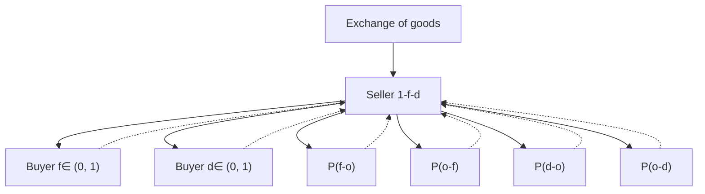

## 2019

## MCM/ICM

## Summary Sheet

General Digital currency Circulation Model

(based on the theory of adjusted optimal currency area)

This article described the influence of the digital currency on the currency circulation of sovereign countries, the government behavior and the world trade system from three aspects: individual transactions, national regulation and world trade.

In order to clearly describe the behavior of individuals and countries from micro to macro perspectives, we divided the analytical framework into three sub-models: Search and Matching Model, Long-term Government Behavior Model and Supranational Monetary System Model.

Firstly, we used Fisher's equation and Keynes's Theory of Currency Demand to analyze the pricing and risk characteristics of digital currency. It shows that the volatility of digital currency originates from speculative demand which is too maneuverable, while the transactional demand is insufficient because of too few individuals who trust digital currency. Therefore, expanding transaction demand and acceptance will help stabilize the currency value and enable it to act better as a trading medium.

Later, we extended the Diamond-Mortensen-Pissarides Model (DMP) and established a Search and Matching Model for holding digital and legal currencies in the market. We proved that there exists an equilibrium in the absence of external non-economic factors, that is, the proportion of people accepting digital to legal currency will converge to a fixed range. But there is also a long-term situation in which some factors gradually expel the use of legal or digital currency.

The initial recognition of the proportion of French currency to digital currency is exogenous, which leads to the possibility for the government and people to adjust the recognition of digital currency (i.e., artificial intervention).On this basis, we referred to the actual economic situation of more than 130 major countries in the world, substituted relevant parameter estimates, evaluated the possible currency holding patterns of these countries without policy intervention, and drew a conclusion that the more developed and open economies will accept the payment status of the coexistence of two currencies. The instability of currency value and other factors may cause the state to abandon legal tender.

We set up a Long-term Government Behavior Model to measure the government's regulatory behavior. The government regulates the proportion of currency use through the difference of taxation between the two payment modes, resulting in the cost difference for different currency users. On the one hand, the high liquidity of digital currency will promote the emergence of transactions, and at the same time, it will increase the matching efficiency in transactions, which will motivate the government to promote the use of it to increase the total tax base. On the other hand, due to the existence of additional regulatory costs for digital currency and the possible social losses caused by illegal transactions, the government also needs to regulate the development of digital currency to some extent.

Then, we used the Profit Margin Model under Exchange Rate Fluctuation to draw the conclusion that under the hypothesis of relatively low volatility (that is, according to the theory of currency demand, the increase of demand for digital currency transactions will increase its stability), the form of digital currency transactions will become the mainstream of international trade.

After that we established a Supranational Monetary System Model, in which digital currency is controlled by a supranational group and distributed to countries according to foreign exchange demand. When the world circulates publicly, digital currency will achieve lower price volatility. At this time, world trade will be settled mainly by digital currency. However, due to differences in development, legal currencies will still be retained and independent monetary policies will be formulated among countries. Central banks of all countries have the tendency to control the balance of trade and capital flow. This will help countries formulate sound and positive economic development programs, promote the free flow of capital, and tap the most potential growth point of economic investment.

Finally, we discussed the impact of digital currency on banking industry and the mechanism of longterm restructuring. The high liquidity and informatization of digital currency will lead to the oligopoly tendency of banking industry and disappearance of the intermediary function of bank payment. Lending platforms similar to banking industry will rise in the Internet. How to strengthen the supervision of illegal fund-raising and black-market transactions has become a challenge for governments of all countries.

# POLICY RECOMMENDATION

To: National leaders

From: Team 1905127

Subject: Policy Recommendation on building a digital financial market

Date: Jan 28,2019

Dear National Leaders：

This policy proposal is designed to give you an intuitive impression of the current development of the global digital monetary system. Our team has collected the characteristics of digital currencies and block chain technology, and combined it with the existing economic and monetary finance theories.We established a mechanism analysis model from the personal, national and international levels, trying to explain the inevitable trend of the development of the digital currency system and the existing risk factors for you to make policy decisions.

According to the circulation law of money, for there are not many transactions covered by digital currencies at present, its speculative demand is far higher than transaction demand. According to the Fisher equation, a lack of trades by digital currencies leads to the high volatility of it at present. So long as we can get a large proportion of people to participate in the transactions in digital currencies, its fluctuation of demand will become relatively more stable.

In our individual model, the market may reject the use of one currency and choose the other because of the difference in the degree of currency recognition. But ultimately the balance of a currency’s recognition is determined by whether the sellers and buyers can benift from the use of it. With the increase of recognition, the use of digital will be more frequent.Equilibrium of the use of this currency will finally be achieved.Therefore, our model assumes that the market will automatically choose a certain form of currency or achieve the long-term coexistence of two currencies. However, due to the lower transaction and storage costs of digital currencies (the currency value will be more stable reflected in the model), traders's acceptance of digital currencies will increase, holding other factors constant.

At the national level, governments’ goal is to maximize long-term tax income. The goal is to change the amount of transactions settled by two currencies by adjusting the tax rates of different transactions and guiding public recognition of the currency.Of course, for the transaction cost of digital currency is low, adoption of lower tax rate will lead to the increase of the total national economy (but not necessarily normal economic transactions, may involve smuggling, etc.). At this time, the matching efficiency of transactions will be improved, which will promote the development of taxation. It is worth noting that the increase of law enforcement costs will also occur，so the government needs to weigh the pros and cons.

At the international level, we have established a model of the monetary system across countries. Because of its widely use in trade settlement as a global currency ,digital currencies’ stability will rise, which makes enterprises bear less fluctuation losses of exchange rates. Global trade settlement will thus be dominated by digital currency.With the establishment of a worldwide digital monetary control system, our central bank will still be able to conduct monetary policies independently, and will be more motivated to balance import, export and capital flows.Because of the free flow of digital money, capital will flow to more profitable places, which will make up for many previously neglected underdeveloped areas.

Therefore, in summary, we should give full play to the advantages of digital currency, while controlling the uncertainty of exchange rate and the risk of illegal transactions.

Sincerely,

Team#1905127

## General Digital currency Circulation Model

(based on the theory of adjusted optimal currency area)

## Contents

## 1 Introduction...

1.1Background. .2  
1.2 Restatement of the Problem  
1.3 Overview of Our Work .2

## 2 General Assumptions and Justifications....

2.1 Assumptions... 3  
2.2 Variable Description.... 3

## 3 Analysis and Model Building .....

3.1 An Equilibrium Model of Legal and Digital Currency at Individual Level .....4  
3.1.1 Digital Currencies: Price and Risk. ∆  
3.1.2 Search and Matching Model under Dual Monetary System........ 5  
3.2 A Model for Maximizing Government Tax Revenue at National Level...........8  
3.2.1 National Cost-benefit Analysis 8  
3.2.2 Government Intertemporal Tax Model C  
3.3 International Digital Currency Trade Model (Based on Improved OCA) ........9  
3.3.1 Difference of Import and Export Profit under Exchange Rate Fluctuation .9  
3.3.2 Supranational Monetary System Model at the World Level. .10

## 4 Empirical Model based on Algebraic Operation ...... ..13

4.1Empirical Study Based on Micro-model. .13  
4.1.1Theoretical Restatement. 13  
4.1.2 Parameter Estimation and Result Solution .14  
4.1.3 Empirical Model Based on Econometric Methods .14  
4.1.4 The Final Results of the Empirical Model . .16

4.2 Empirical Study Based on Macro-model. 17

4.3 Further Discussion and Application of Factors Outside the Model. ..19

## 5 Conclusion .... .20

5.1 Strengths and Weaknesses .... .20  
5.1.1 Strengths ..20  
5.1.2 Weaknesses . ..21

5.2 Conclusion .. .21

5.3 Future Work .. .21

## Reference .. .22

## Appendix ....... .23

## 1 Introduction

## 1.1Background

Ever since Cong Nakamoto has released Bitcoin in 2009, digital currency trading has been expanding rapidly. Digital currencies, on the one hand, has the advantages of strong liquidity, high secrecy and low transaction costs. On the other hand, however, it is accompanied by a lack of national regulations. Also, central banks have found difficulties in macro-regulation and so on (though this may be part of the liberal ideal that Nakamoto wants to achieve).

Undeniably, almost all nations are stepping up the establishment of digital currency trading mechanism, trying to bring digital money into the regulatory system to maintain the dominance of their own sovereign currency. With the characteristics of Internet transactions, digital currency has more global currency characteristics. Its ability to promote global trade and capital circulation is better than that of the regulated sovereign currency. Whether the benefits of using digital currency in domestic trade and Global trade can exceed the costs is a topic of concern.

## 1.2 Restatement of the Problem

Our team will measure the impact of digital currencies on the legal tender and financial markets at the individual, national and global level.

We will also include the motivation of nations to limit or encourage the development of digital currencies in our study.

Last but not the least, we will explore the regulatory objectives and means of this free-flowing digital currency at the global level, as well as the monetary behavior game among countries.

## 1.3 Overview of Our Work

We built up models of transaction and regulation of legal and digital currencies at three levels.

As for the transactions between individuals, different forms of equilibrium will be achieved (e.g. natural exclusion of the legal tender, exclusion of digital currency or acceptance of two currencies at the same time), because of the difference in the degree of recognition and ease of circulation.

For the measurement of the recognition degree of legal currency and digital currency, we drew lessons from the idea of Diamond-Mortensen-Pessaries Model of Search and Development DMP

model. We introduced the matching efficiency of trades, economic development and other factors into the application of the model, and made use of the econometric model to evaluate the samples.

At the national level, we examined the factors that contributes to the national income (tax, regulation, regulation and cost control) to establish a model to maximize the national revenue, so as to evaluate the motivation of the country to encourage or restrict the development of digital currency.

In the aspect of the monetary circulation of international trade, we build up a Universal Digital Currency System Model based on Mundell's theory of Optimal Currency Areas (OCA).

Under reasonable assumptions, we can prove that:

In order to reduce the risk of trading volatility, normal trade in goods will rely on digital currency in circulation worldwide rather than on the legal tender of a country.

At the same time, a supranational financial institution (similar to the current European Central Bank but more independent) will be created to regulate national trade and capital flows，but nations still have the ability to use sovereign currencies within their borders and to carry out effective

macroeconomic regulation.

This will make up for the weakness of monetary policy and fiscal policy under the fixed floating exchange rate system in the Mundell-Fleming-Dornbusch Model (MFD) with only sovereign currencies.

Finally, based on the impact of the decentralization of digital money on commercial banks, we explored the long-term trend of the evolution of commercial banks and policies.

```mermaid
graph TD
  A["Digital currency system"] --> B["Commercial Bank"]
  A --> C["Risk management"]
  A --> D["Monetary policy"]
  A --> E["Regional economic difference"]
  A --> F["Individual"]
  F --> G["Fisher's equation"]
  F --> H["Keynesian theory of monetary demand"]
  F --> I["DMP"]
  F --> J["Search and matching model"]
  F --> K["Stability evaluation"]
  F --> L["Equilibrium analysis"]
  A --> M["State"]
  M --> N["Control measure: Tax rate"]
  M --> O["Supervision cost and black market"]
  M --> P["Long-term income optimization"]
  A --> Q["International"]
  Q --> R["Optimal currency area"]
  Q --> S["Profit margin Model based on Exchange rate"]
  A --> T["Capital centralization"]
  A --> U["Disappearance of the medium of exchange"]
  A --> V["A decline in financing costs"]
  A --> W["General currency's problem"]
```


<details>
<summary>flowchart</summary>


</details>

Figure 1 Overview of Our Work

## 2 General Assumptions and Justifications

## 2.1 Assumptions

As discussed above, we make several assumptions in our model.

·This new type of digital currency is widely distributed all over the world. It has the characteristics of decentralization, constant circulation, anonymity and so on  
·Everyone, including their country, is independent and free to choose currency without interference from others  
·Digital currency and flat currency are relatively independent, and fluctuations in the value of one currency do not affect another currency.  
·Although digital money is anonymous, countries can trace every transaction with the advanced technique, which has a higher cost.

These are the basic assumptions of our model, and we will add other assumptions for different models later.

## 2.2 Variable Description

Table 1 Parameter List

<table><tr><td>Parameter</td><td>Description</td></tr><tr><td>P</td><td>Commodity price</td></tr><tr><td>Y</td><td>Commodity yield</td></tr><tr><td>v</td><td>Currency circulation speed</td></tr><tr><td> $\varepsilon_{\text{dig}}$ </td><td>Exchange rate of digital currency to flat currency</td></tr><tr><td> $M_{\text{dig}}(M_{\text{flat}})$ </td><td>Monetary Supply of Digital currency (flat currency)</td></tr><tr><td>prob(success)</td><td>Probability of matching buyer and seller successfully</td></tr><tr><td>e</td><td>Matching efficiency</td></tr><tr><td> $p_{o-d}(p_{o-f})$ </td><td>Matching probability of a person without any currency with a person with legal currency or digital currency</td></tr><tr><td>d(f)</td><td>Proportion of digital currency (flat currency) owners</td></tr><tr><td>μ(λ)</td><td>Probability of accepting digital currency (flat currency)</td></tr><tr><td> $V_d(V_f)$ </td><td>Value of digital currency (flat currency)</td></tr><tr><td> $pc_d(pc_f)$ </td><td>Costs of saving digital currency (flat currency)</td></tr><tr><td>g</td><td>Revenue of government</td></tr><tr><td> $t_d(t_f)$ </td><td>Tax rate of digital currency (flat currency)</td></tr><tr><td>Π</td><td>Profit of exporters</td></tr><tr><td>π</td><td>Inflation rate</td></tr><tr><td>r</td><td>Real interest rate</td></tr></table>

## 3 Analysis and Model Building

What gave rise to the popularity of digital money? What impedes the function of digital currency in its currency? First of all, digital currency is based on block chain technology. The distributed accounting method generated by block chain will make transactions need not be confirmed by a third institution, and transfer operation only requires the operation between person and person. Money is no longer circulating in banks; it is just a piece of information in the Internet's ocean that keeps an account.

The convenience and concealment of transactions are the source of the demand for digital currency transactions. On the other hand, the monetary function defined by Krugman (1984) is "medium of exchange, measure of value and value of storage". Digital currency is unlikely to be guaranteed by a single country in the future because of its global liquidity and no sovereign guarantee. Digital currency itself is not real goods of useable value, so it is not recognized by most people, most trading occasions (that is, do not accept it as the equivalent of trading).As a result, the trading demand for digital currency will not be magnified indefinitely and will be volatile (the value of which exists only in the recognition of the population).At the same time, the high circulation of digital money will help its speculative demand rise. Reasons above makes it unable to fully perform the exchange medium of currency and store value. The model of this chapter at three levels will be based on the above features.

## 3.1 An Equilibrium Model of Legal and Digital Currency at Individual Level

## 3.1.1 Digital Currencies: Price and Risk

First, we will focus on a single domestic market, in which there is the circulation of legal tender $M _ { f l a t }$ , and there is also a digital currency involved in the part of the transaction process, the number of which is $M _ { d i g }$ . At that time, the exchange rate of digital currency against legal tender is $\varepsilon _ { d i g }$ thus the supply of digital money in legal tender is:

$$
M _ {d i g} ^ {s} = \varepsilon_ {d i g} M _ {d i g}
$$

According to the analysis above, the demand for digital currency will be divided into two parts: transaction and speculative, namely:

$$
M _ {d i g} ^ {d} = M _ {d i g} ^ {b u s i n e s s} + M _ {d i g} ^ {s p e c u l a t e}
$$

According to Fisher's equation：

$$
P Y = M v
$$

In the case of incremental fluctuations, we get:

$$
\Delta P = \frac {\Delta M v}{Y} o r \Delta P = M v \Delta \frac {1}{Y}
$$

Where the price of money is equal to the amount of money in circulation M (in this case the demand for money) times the velocity v, divided by the amount of goods Y settled using digital currency. Due to the technical characteristics of digital money, the velocity of currency circulation will be a fixed value when the storage factor is controlled. As a result, the price of goods measured by digital money will fall as transactions expand, that is, more goods are approved and traded. And when the speculative demand of digital currency in the market increases, the aggregate demand will be too high, which will trigger a rise in the price of goods measured by digital money. When the digital currency is not widely recognized, the quantity of goods(Y) is small, and the value volatility risk of the digital currency is expected to be greater.

In Section 3.3, we will verify that when digital currency becomes the settlement of global trade, the universal recognition of digital currency leads to a more stable exchange rate than a sovereign currency, thus deepening the dependence of international trade on digital money.

Combined with Keynes' theory of speculative monetary demand and the nature of digital money itself, the speculative demand for digital currency is positively related to the exchange rate of the currency to foreign currency, the expectation of interest rate and the increasing attention of the crowd. As the concept of digital currency expands, the value of digital currency as an investment property will increase, that is, the increase of speculative demand in the next period will push up the price of digital currency. On the other hand, it also shows that speculative demand has time series related attributes in the model.

## 3.1.2 Search and Matching Model under Dual Monetary System

## 3.1.2.1 Model Specification

Suppose that in a closed economy with one single period, there are specific buyers and sellers, in which:

a. The number of buyers holding flat currencies as a proportion of $f \in [ 0 , 1 ]$ (flat currency), and the proportion of $d \in [ 0 , 1 ]$ (digital currency) holders with virtual currencies. No one holds both currencies. The percentage of sellers (those who do not hold any currency) is $\mathbf { \nabla } _ { I - d - f . }$

b. Each buyer is a representative actor, and there is demand for i kind of goods in the market (i $< j )$ , and the quantity that each buyer wants to buy is exact 1 unit. Whoever buys the goods will get the utility u.

c. Each seller is also a representative actor. For the seller, only 1 unit of product is produced in each period, and the cost of production is c.  
d. Everyone in the market carries out only one search and pairing when doing trades, and the searching process satisfies: the larger the economic volume, the larger the market size; the more efficient the pairing is, the higher the Matching efficiency: e (GDP); and the more diversified the market demand, the more likely a match will succeed. So the probability of a successful match can be expressed as：

$$
p r o b (s u c c e s s) = e (G D P) m (i, j)
$$

In order to simplify the composition of the model and concretize the expression, we set the matching efficiency at this point to 1 and satisfy the random matching between the seller and the seller:

$$
p r o b (s u c c e s s) = \frac {i}{j} = \delta
$$

In the case of a random match between the buyer and the seller, the probability of matching the seller with no currencies with the buyers holding the flat money $( p _ { o - f } )$ ，and digital currency $( p _ { o - d } )$ )are as follows:

$$
p _ {o - f} = \min \{1, \frac {f}{1 - f - d} \}
$$

$$
p _ {o - d} = \min \{1, \frac {d}{1 - f - d} \}
$$

On the contrary, the probability of matching a buyer holding flat currency $( p _ { f - o } )$ , and a buyer with a digital currency $( p _ { d - o } )$ with a seller not holding a currency, are as follows:

$$
p _ {f - o} = \min (1, \frac {1 - f - d}{f})
$$

$$
p _ {d - o} = \min (1, \frac {1 - f - d}{d})
$$

We set the probability of acceptance of flat money to be  , the probability of acceptance of digital currency to be $\mu ; V _ { o } , V _ { f } , V _ { d }$ Separately represent the value contained by a person holding no currency, flat money and digital currency. Therefore, the following equations can be obtained:

$$
r V _ {o} = \left(1 - p _ {o - f} - p _ {o - d}\right) \delta^ {2} (u - c) + p _ {o - f} \lambda \delta \left(V _ {f} - V _ {o} - c\right) + p _ {o - d} \mu \delta \left(V _ {d} - V _ {o} - c\right) (1)
$$

$$
r V _ {f} = p _ {f - o} \lambda \delta (u + V _ {o} - V _ {f}) - p c _ {f} \tag {2}
$$

$$
r V _ {d} = p _ {d - o} \mu \delta (u + V _ {o} - V _ {d}) - p c _ {d} \tag {3}
$$

Where r is the discount rate， $p c _ { f } ~ p c _ { d }$ are the cost of storing flat money and digital currency.

The equation indicates that conducting the transaction and refusing it are the same, for one can preserve the value of the labor force and wait for the next transaction.


<details>
<summary>flowchart</summary>


</details>

Figure 2 Matching relation

The first part of the formula (1) is a barter happens with a matching failure, the second part deals with the exchange with the non-currency sellers and buyers holding legal tender and digital currency respectively. Formula (2) (3) are from the angle of legal currency and digital currency holder.

## 3.1.2.2 Equilibrium State of the Model

According to the equation（1）, when $V _ { f } > V _ { o } + c$ , all sellers will choose to accept flat money In order to maximize their profits .Contrarily，when $V _ { f } < V _ { o } + c$ ，all sellers will choose reject flat money .And when $V _ { f } = V _ { o } + c$ ，rejection and acceptance of flat money are the same：

$$
\lambda = \left\{ \begin{array}{c} 0 \dots i f V _ {f} <   V _ {o} + c \\ (0, 1) \dots i f V _ {f} = V _ {o} + c \\ 1 \dots i f V _ {f} > V _ {o} + c \end{array} \right.
$$

likely：

$$
\mu = \left\{ \begin{array}{c} 0 \dots i f V _ {d} <   V _ {o} + c \\ (0, 1) \dots i f V _ {d} = V _ {o} + c \\ 1 \dots i f V _ {d} > V _ {o} + c \end{array} \right.
$$

When the proportion of people receiving legal tender is balanced, the following exists：

$$
\lambda = 1 \quad o r \quad \lambda = \hat {\lambda}
$$

It can be inversely solved by equation (1) that:

$$
\hat {\mu} = \left\{ \begin{array}{l l} \frac {(1 - p _ {o - f} - p _ {o - d}) \delta}{p _ {d - o}} + \frac {r c + p c _ {d - o}}{p _ {d - o} \delta (u - c)} + \frac {p _ {o - f} (V _ {f} - V _ {o} - c)}{p _ {d - o} (u - c)} & i f \lambda = 1 \\ \frac {(1 - p _ {o - f} - p _ {o - d}) \delta}{p _ {d - o}} + \frac {r c + p c _ {d - o}}{p _ {d - o} \delta (u - c)} & i f \lambda <   1 \end{array} \right.
$$

Similarly, when the proportion of people who accept digital money in the market reaches

equilibrium：

$$
\mu = 1 \quad o r \quad \mu = \hat {\mu}
$$

We can use these equations to derive that：

$$
\hat {\lambda} = \left\{ \begin{array}{l l} \frac {(1 - p _ {o - f} - p _ {o - d}) \delta}{p _ {f - o}} + \frac {r c + p c _ {f - o}}{p _ {f - o} \delta (u - c)} + \frac {p _ {o - d} (V _ {d} - V _ {o} - c)}{p _ {f - o} (u - c)} & i f \mu = 1 \\ \frac {(1 - p _ {o - f} - p _ {o - d}) \delta}{p _ {f - o}} + \frac {r c + p c _ {f - o}}{p _ {f - o} \delta (u - c)} & i f \mu <   1 \end{array} \right.
$$

From the results of the above model, it can be seen that:

1.when a currency (legal tender or digital currency) is in the market equilibrium，the other currency can also maintain a certain level of acceptance in the market. It is possible that two currencies can achieve stable symbiosis and maintain the same level of acceptance in the long run.  
2.When a first currency has reached its equilibrium and the acceptance of the second one is lower than the theoretical equilibrium level (the low liquidity of the second currency will inevitably lead a wider population to abandon the use of the currency), the latter will fall into a vicious circle and gradually be marginalized.  
3. When a first currency has reached its equilibrium and the acceptance of the second one is higher than the theoretical equilibrium level, the second one will fluctuate between a stable state of partially approval and being fully approved until a balance is reached.  
Note that, in reality, due to the low storage cost of digital currency, there is no risk of management cost and hyperinflation, thus the possible equilibrium coefficient may be quite low.

## 3.2 A Model for Maximizing Government Tax Revenue at National Level

We assume that the government's goal will be maximizing its own revenue over the long term, under which the government is motivated to expand the economy in order to expand the tax base and increase the efficiency of transactions. （In the settings above, the expansion of economic is beneficial to the improvement of searching efficiency

e (GDP)。

## 3.2.1 National Cost-benefit Analysis

Development of digital money will externally increase the proportion of recognition of digital currency, while wider acceptance of digital currency will inversely contribute to the economy development and thus promote the expansion of the tax base.

At the same time, the rise in public acceptance of digital money will reduce the use of flat money， forcing the government's tax base to shift from legal currency transactions to digital currency transactions. But overall, as trade develops, the total tax base will increase, and the government's current tax revenues will rise.

In terms of transaction costs, digital money has higher liquidity and concealment. The government's regulatory costs will rise with the volume of transactions using digital money, and the widespread use of digital money will deprive the country of its monetary policy controls over the macro economy. This potential systemic risk also needs to be factored into the total cost.

## 3.2.2 Government Intertemporal Tax Model

In the current period (t0), the government's revenue function is：

$$
g _ {t} = t _ {f} p _ {o - f} \lambda e (G D P (\mu)) m (i, j) | V _ {f} - V _ {o} - c | + t _ {d} p _ {o - d} \mu e (G D P (\mu)) m (i, j) | V _ {d} - V _ {o} - c | - C (\mu)
$$

Among them， $t _ { f } , t _ { d }$ represent tax rates applied by the government in the use of sovereign and digital currencies, respectively. is the government’s legislation cost of monitoring tax evasion of digital currency and the risk of losing independent monetary policy. Because of $C ( u )$ ，the government needs to impose different tax rates on the two payment modes to meet the needs of macro-control; On the other hand, the government has different regulatory costs for the two forms of payment, leading to different tax rates.

GDP levels will rise as dependence on digital money intensifies (although some of this growth may occur in illegal practices such as black-market transactions), and the increase in total trading volume will lead to greater chances of market matching. The tax base is expanded from the direction of total income effect, so the total tax revenue will expand even if the tax revenue is transferred to the direction of digital money. The above effects are as follows:

$$
\frac {\partial [ \pi_ {t} + C (u) ]}{\partial u} > 0
$$

For willingness to change the way of payment is influenced by time, under the goal of maximization government revenue, the tax rate based on the shares of the current legal tender and digital currency transactions can only be optimized in the long run. We introduce the intertemporal model as follow:

$$
\max z = \sum_ {t = 0} ^ {n} \frac {g _ {t}}{(1 + r) ^ {t}}
$$

In our intertemporal model, the government continuously "induces" the transaction to take an optimal proportion of payment means by selecting the different tax rates of each period, until the total benefit of the discounted government tax to be the greatest, deducting the supervision and risk cost.

## 3.3 International Digital Currency Trade Model (Based on Improved OCA)

In this section, we extend the use of digital money to the global domain. We will also prove that digital currency transactions will be used in large numbers in the payment of international trade, in order to reduce the risk of uncertainty arising from exchange rate fluctuations. Referring to Bacchetta & Wincoop (2002)’s model about fluctuation of import and export exchange rate, we extend it to the regulation mechanism of foreign exchange stability of digital currency as a thirdparty currency.

## 3.3.1 Difference of Import and Export Profit under Exchange Rate Fluctuation

Assuming that in the world market, the supply enterprises and demand enterprises of one commodity come from different countries, the cost equation of the exporter is $C ( q )$ ; the demand equation is $D ( p ) ; \ p ^ { \dprime } , p ^ { \dprime }$ are prices of products expressed in the currencies of exporting and importing country, respectively. The exchange rate of the exporting country against the currency of the importing country is , so the total profits of the firms using the currencies of the exporting countries and the importing countries are as follows：

$$
\prod^ {p} = p ^ {p} D (p ^ {p} / \varepsilon) - C (D (p ^ {p} / \varepsilon)) \tag {4}
$$

$$
\prod^ {L} = \varepsilon p ^ {L} D (p ^ {L}) - C (D (p ^ {L})) \tag {5}
$$

Suppose the exchange rate fluctuations of the two currencies follow the normal distribution, their mean value can be calculated from the above expression. Their variance is $\sigma ^ { 2 }$ , in the context of the exchange rate fluctuation, the expected profit difference between the two settlement methods is as follows:

$$
E U (\prod^ {p}) - E U (\prod^ {L}) = \frac {1}{2} U ^ {\prime} \frac {\partial^ {2} (\prod^ {p} - \prod^ {L})}{\partial \varepsilon^ {2}} \sigma^ {2} = \frac {1}{2} U ^ {\prime} \frac {\partial^ {2} (\prod^ {p})}{\partial \varepsilon^ {2}} \sigma^ {2} \tag {6}
$$

Therefore, when the currency of the exporting country is used as the unit of settlement, the expected profit will expand if $\prod ^ { p }$ is a convex function（secondary derivative greater than zero）.Countries from both sides will therefore choose the home currency of the exporter as the unit of valuation. On this basis, we introduce digital currency as an alternative. Assuming that the exchange rate between the digital currency and the importing country is $\varepsilon _ { d i g }$ , the variance of the exchange rate fluctuation is $( \sigma ^ { d i g } ) ^ { 2 }$ , and the price of the digital currency is $p ^ { d i g }$ , the profit function using the digital currency as the settlement means is:

$$
\prod^ {d i g} = \frac {\varepsilon}{\varepsilon_ {d i g}} p ^ {d i g} D (\frac {p ^ {d i g}}{\varepsilon_ {d i g}}) - C (D (\frac {p ^ {d i g}}{\varepsilon_ {d i g}}))
$$

As a result, the expected profit ratio of the three currencies is higher:

$$
E U \left(\prod^ {d i g}\right) - E U \left(\prod^ {L}\right) = \frac {1}{2} U ^ {\prime} \frac {\partial^ {2} \prod^ {d i g}}{\partial \left(\varepsilon^ {d i g}\right) ^ {2}} \left(\sigma^ {d i g}\right) ^ {2}
$$

$$
E U \left(\prod^ {d i g}\right) - E U \left(\prod^ {p}\right) = \frac {1}{2} U ^ {\prime} \frac {\partial^ {2} \prod^ {d i g}}{\partial \left(\varepsilon^ {d i g}\right) ^ {2}} \left(\sigma^ {d i g}\right) ^ {2} - \frac {1}{2} U ^ {\prime} \frac {\partial^ {2} \prod^ {p}}{\partial (\varepsilon) ^ {2}} \sigma^ {2}
$$

The results show that when the exchange rate fluctuation of the digital currency to the importing country is smaller than that between the exporting country and the importing country, the highest expected profit income will be obtained if the digital currency is chosen as the unit of valuation. Therefore, when the uncertain risk of digital currency can be effectively controlled, the choice of digital currency can promote effective trade between countries.

## 3.3.2 Supranational Monetary System Model at the World Level

Mundell 1961 and McKinnon 1963 put forward the idea that countries should abandon issuing sovereign currencies and establish supranational central banks in groups of countries with similar economic development patterns(theory of optimal currency area/OCA).

However, viewing current practice, there are still great differences in the actual economic situation of various countries, and the scheme of giving up the legal tender of each country directly does not take into account the importance of independent monetary policy to the domestic economy.

The supranational monetary system to be established will maintain the two-track parallel state of the global digital currency and the sovereign currency. Moreover, the high liquidity of digital money also gives the unified issuing department of the global common currency a more precise and flexible means of regulation and control. The pattern of using digital currency as the form of international circulation can be based on the power of independent choice of monetary policy in member countries, and will nicely corporate with the mutual restriction relations among countries.

## 3.3.2.1 Basic Hypothesis, Mechanism Analysis and Model Construction

Assume that:

Countries still issue and use sovereign currencies at home $f _ { i } ( i = 1 , 2 , \cdots , n )$ , the currency supply in each country is $M ( f _ { i } )$ ，and each of them worth $V ( f _ { i } )$ .

The International Digital Money is issued by a financial institution at the international level, which distributes money to central banks in proportion to the needs of each country, which is then issued separately by central banks in each country. Money supply is expressed as： $M ( d _ { i } ) \ ( i { = } 1 , 2 , \cdots , n )$ ，

At the same time, the digital currency will be in circulation globally, and its value will remain stable around the globe(i.e. The exchange rate of the currency will always be 1 between countries). The speed of circulation between countries will also remain unchanged, namely:

$$
v (d) \equiv v (d _ {i j}) (i \neq j)
$$

The goal of supranational financial institution is to keep the value of digital money stable, with low inflation rate, following Fisher's equation:

$$
P Y = M v
$$

It also estimates actual global output to determine the total supply of the global digital currency at a given velocity level:

$$
\sum M (f _ {i}) = \frac {P Y}{v}
$$

From the results of the 3.3.1 model，when the exchange rate volatility of the universal digital currency is less than that of each country（The total value of the global digital currency in global circulation is nearly constant ,thus more conducive to maintaining the relative stability of exchange rates）,every country in the system has the motivation to adopt digital currency in foreign trade, and the domestic situation can refer to the search matching model of 3.1.

The country's total demand for digital money comes from two sources: the demand for imported goods and services $Y _ { i m p }$ , and the total demand for investment in all other countries $C F _ { - i }$ .Also, the actual demand for digital money depends on the aggregate demand and the speed of circulation:

$$
D d _ {i} = \sum_ {j = 1 j \neq i} ^ {n} \left[ Y _ {\text { imp }} / \varepsilon_ {\text { dig }} + C F _ {i j} \right] / v (d _ {i j})
$$

Where $D d _ { i } ^ { \mathrm { ~ \ i ~ } }$ is the demand for global digital currency in the country i. Note that since consumer goods themselves are denominated in local currency, the price need to be converted into local form.

In order to maintain the stable value of digital currency, the supranational financial institution will supply the currency similar to the quantity of demand, and for each country, it will supply the digital currency of the same amount as the proportion of demand:

$$
M (d _ {i}) \approx D d _ {i}
$$

## 3.3.2.2 Analysis on the Behavior Patterns of Each Subject

a. The supply of international digital money must be stable to ensure that the exchange rate of the digital currency against sovereign currencies is less volatile, and the supranational financial

institution should set inflation targets, that is：

$$
\frac {d \ln [ \sum M (d _ {i}) ]}{d t} = \pi_ {\text { targ } e t} ^ {t} \in [ \pi_ {l} ^ {t}, \pi_ {h} ^ {t} ]
$$

$\pi _ { l } ^ { t } \ , \pi _ { h } ^ { t }$ are the range set for inflation，the rate in the international market should generally be kept in the range of 1.5 to 2.5 per cent（Jian-Feng Liu，2010）. Since inflation expectation is an important determinant of inflation rate itself, when the real interest rate is known, setting a reasonable nominal interest rate will guide the market to adjust to the target inflation rate. Thus, the nominal interest rate should be set by $R _ { d } = r _ { d } + \pi _ { t a r g e t } ^ { t }$ ,according to the real interest rate of the universal digital currency, which is favorable to the control of inflation.

On the other hand, the supranational financial institution needs to evaluate and regulate the trade balance of each country. It also needs to control the surplus or deficit of the net capital outflow / inflow of a country:

$$
\Delta M (d _ {i}) = (\alpha N X _ {(- i)} - \beta N C F _ {- i}) / v (d _ {i})
$$

Among above， $\alpha , \beta \in [ 0 , 1 ]$ are weight coefficients for the country's trade surplus / net capital outflow.

Generally speaking, after generating trade surplus, capital will remain outflow to realize the full use of capital, so in this case, the supranational financial institution do not need to adjust the money supply to the country; If the country has a trade deficit and capital inflow, it means that the country has more pessimistic economic expectations, so the supranational financial institution will reduce their money supply and regulate the country's deficit in order to achieve the smooth operation of international trade.

b. From the national level, due to the existence of universal digital currency in international trade, countries will focus on balance of payments when formulating foreign trade strategies. The share system of digital currency allocated by the supranational financial institution will make countries balance the relationship between capital flow and trade surplus (deficit). Assume that a country has a large trade deficit and there is no investment opportunity in the country. To attract foreign funds, the state will lose the power to issue general currency. Therefore, consciously adjusting the balance of payments will be an important goal of the central banks of all countries.

Central banks will also issue their own sovereign currencies and maintain a floating exchange rate relationship with general electronic currencies at each time:

$$
\varepsilon_ {d i g, i} ^ {t} = V (f _ {i}) / V (d _ {i})
$$

Due to the different levels of inflation and real interest rates in different countries, according to purchasing power parity (PPP) theory, the exchange rate will change with the real interest rates and inflation rates at home and abroad, while the assumption of PPP can be more effectively realized by digital money because of its high liquidity and high acceptance of global sharing. At this time there is：

$$
\varepsilon_ {d i g, i} ^ {t} = \frac {1 + r _ {f , i} ^ {t}}{1 + r _ {d} ^ {t}} \frac {1 + \pi_ {f , i} ^ {t}}{1 + \pi_ {d} ^ {t}} \varepsilon_ {d i g, i} ^ {t _ {0}}
$$

Each country can manage the inflation and nominal interest rate of their sovereign currencies independently to realize the independence of monetary policy. However, the change of the interest and inflation rate of national currency will also lead to the exchange rate fluctuation between

national currency and general digital currency. This kind of exchange rate fluctuation can promote the export of domestic commodities in national currency and realize different trade strategies.

The difference between the real interest rate of each country and the others also leads to the difference of capital inflows of general digital currency capital to different countries.

In underdeveloped areas or domestic projects with better investment opportunities, due to the relatively high real interest rate (eliminating risk premium) and the wide application of unified, universally recognized digital currency, capital will rapidly entering the country and occupying investment opportunities, which will help to distribute capital evenly among all more profitable projects and increase global investment efficiency.

## 4 Empirical Model based on Algebraic Operation

## 4.1Empirical Study Based on Micro-model

## 4.1.1Theoretical Restatement

Based on the theoretical model above, we can predict the future use of currency options in 130 countries. Since Zimbabwe is now one of the countries in the world that has given up its autonomous issuance of currency, its probability of accepting digital money will most likely to be 100% when digital currencies emerge. So, we assume that Zimbabwe is now in the equilibrium with foreign currencies. Thus, the probability of Zimbabwe to adopt legal tender satisfies the expression below:

$$
\hat {\lambda} = \frac {(1 - p _ {o - f} - p _ {o - d}) \delta}{p _ {f - o}} + \frac {r c + p c _ {f - o}}{p _ {f - o} \delta (u - c)} + \frac {p _ {o - d} (V _ {d} - V _ {o} - c)}{p _ {f - o} (u - c)}
$$

After calculating this critical value ˆ , we use it to predict the use of legal currency in other countries. If the probability of accepting legal tender in a country is lower than that of , it means that one cannot reach the equilibrium of legal tender. So even if the country is fully using legal tender, it won't last long. Contrarily, if a country’s acceptance of legal tender is equal to or greater than , it will end up in a legal tender equilibrium and will fully accept their legal tender in the future.

Measuring the threshold for the probability of fully adopting digital currencies, we refer to the situation of U.S. Since dollar is the most widely accepted currency in the world today, we assume that the probability of acceptance of dollar by the American people is 100%, and America is now in the legal tender equilibrium. On the other hand, since U.S. is the birthplace of plenty of the existing digital currencies, its attitude towards them should be rather objective. So, we use the probability of American people to accept digital currency as the threshold value of equilibrium with digital currencies. Thus, the probability of the adoption of digital currency in the United States satisfies the following expression:

$$
\hat {\mu} = \frac {(1 - p _ {o - f} - p _ {o - d}) \delta}{p _ {d - o}} + \frac {r c + p c _ {d - o}}{p _ {d - o} \delta (u - c)} + \frac {p _ {o - f} (V _ {f} - V _ {o} - c)}{p _ {d - o} (u - c)}
$$

Therefore, if the acceptance probability of digital currency in one country is lower than that of America (  ), it means it cannot reach the equilibrium of digital currency and the digital currency cannot circulate in that country for a long time. If the probability of acceptance of digital currency in one country is equal to or greater than that of America ( ), it will end up in the equilibrium of digital currency, and the digital currency will be fully accepted after a period of time.

For the rest of the world, the probability of accepting legal tender or digital money is less than 100%. Derived from previous theories, we can conclude that the expressions of acceptance of legal or digital currency in other countries satisfy:

$$
\lambda = \frac {(1 - p _ {o - f} - p _ {o - d}) \delta}{p _ {f - o}} + \frac {r c + p c _ {f - o}}{p _ {f - o} \delta (u - c)}
$$

$$
\mu = \frac {(1 - p _ {o - f} - p _ {o - d}) \delta}{p _ {d - o}} + \frac {r c + p c _ {d - o}}{p _ {d - o} \delta (u - c)}
$$

By comparing $\lambda , \mu$ with the probabilistic threshold $\hat { \lambda } , \hat { \mu }$ , we can find out which countries will adopt a new digital currency in global circulation and which countries will not.

## 4.1.2 Parameter Estimation and Result Solution

In order to obtain the probability of acceptance of digital currency or legal tender in each country, we need to estimate the relevant parameters of the expression using real data. Among them indicates the benefit of each country through purchasing goods, in order to make it easier to calculate and without loss of accuracy, we assume it to be 1. Other parameters’ estimations are shown as follow:

Table 2 Estimation parameter interpretation

<table><tr><td>Parameter</td><td>Estimation method</td></tr><tr><td> $r$ </td><td>Nominal interest rate</td></tr><tr><td> $pc_{f-o}$ </td><td>Legal tender inflation rate</td></tr><tr><td> $pc_{d-o}$ </td><td>Digital monetary inflation rate</td></tr><tr><td> $c$ </td><td>1 – national average of profit margin</td></tr><tr><td> $\delta$ </td><td>Gross domestic product logarithm</td></tr><tr><td> $p_{o-f}$ </td><td>Legal tender’s share in the world monetary system</td></tr><tr><td> $p_{o-d}$ </td><td>Bitcoin&#x27;s share in the world monetary system</td></tr></table>

After measuring the parameters, we take these parameters back into the corresponding expressions and we get the probability of each country's acceptance of digital money. Comparing them with the critical values, we got the attitude of 130 countries in the world in the adoption of the digital currency and the legal tender. We'll show this result later in the next section.

To further verify the influence of these parameters and the reliability of the model results, we will then use Econometric Methods to verify the effect of the parameters in mathematical expressions on the acceptance of currencies.

## 4.1.3 Empirical Model Based on Econometric Methods

## Determinants of aggregate demand

In this section, we will construct an empirical model and make regression analysis of the factors that affect the demand for digital money, as a verification and supplement to the results in the previous section. As mentioned earlier, public demand for digital money $\mathbf { \nabla } M _ { d i g } ^ { d }$ can be broken down $M _ { d i g } ^ { b u \sin e s s }$ $\overline { { M _ { d i g } ^ { s p e c u l a t e } } }$ risk factors will affect the efficiency of digital currency to assist the circulation of goods and the storage of value, thus affect the total monetary demand.

We define the risk factor as (RISK), so that the function of total monetary demand takes the following form:

$$
M _ {d i g} ^ {d} = (M _ {d i g} ^ {b u s i n e s s}, M _ {d i g} ^ {s p e c u l a t e}, R I)
$$

That is, the aggregate demand for digital money $M _ { d i g } ^ { d }$ is a function of transaction demand $M _ { d i g } ^ { b u \sin e s s }$ di ( without considering risk), speculative demand $M _ { d i g } ^ { s p e c u l a t e }$ ( without considering risk)，and risk itself.

## Determinants of transactional demand

According to the Fisher equation $P Y = M \nu$ , the transaction demand $M _ { d i g } ^ { b u \sin e s s }$ dig is subject to the price level P , output level  and currency circulation speed  of one country.

Due to the high circulation of digital currency in the world, we make a reasonable assumption that the speed of circulation of digital currency  in the world will be set, and its influence on the monetary demand of each country is a constant. As a result, the differences between countries in the demand for transactional currency are actually affected only by the level of output Y and the level of prices P . In the case of no risk, there should be the following function：

$$
M _ {d i g} ^ {b u s i n e s s} = M _ {1} (P, Y)
$$

## Determinants of speculative demand

The current trading volume  (RAADE)of digital currency will well express the public speculative demand for digital currency, and the degree of public interest  (INREAESR) in digital currency can reflect the potential speculative demand. Thus, the following functional $M _ { d i g } ^ { s p e c u l a t e }$ for digital currency without risk：

$$
M _ {d i g} ^ {\text {   speculate   }} = M _ {2} (T R, I N)
$$

## Determinants of risk

We unravel the risk factors: legal risk , technical risk $R I _ { 2 }$ and price risk $R I _ { 3 }$ .

The legal risk will be determined by the attitude of a country's authorities to digital currencies, which we call  (LEGISLARION), it is an order variable (not allowed for digital currency, restricted development, strict control, unclear attitude, laissez-faire).

Technical risk is influenced by transaction volume and the degree of network security (SAFERY)of a country: with the increase of trading volume of digital currency, the possibility of technical failure will increase, and the difficulty of secrecy will also increase. Therefore, we expect the transaction volume to have a positive correlation with the risk. The higher the level of network security in a county, the less the possibility of technical risk, so the two have negative correlation. The price risk is expressed entirely by the uncertainty of the price of digital currency, and we assume that this variable is  ( PAICE). So, we get the following expression:

$$
R I = R I (L E, T R, S F, P R)
$$

## Construction of regression equation

The aggregate demand equation is further deformed as follow：

$$
M _ {d i g} ^ {d} = \left(M _ {d i g} ^ {\text { business }}, M _ {d i g} ^ {\text { speculate }}, R I\right) = \left(M _ {1} (P, Y), M _ {2} (T R, I N), (L E, T R, S F, P R)\right)
$$

Furtherly sorting out the equations, we get

$$
M _ {d i g} ^ {d} = (P, Y, T R, I N, L E, S F, P R)
$$

The variable  calculated in the previous section, reviewing its definition, is the country's

public acceptance of digital money, can largely measure the public's demand for it. To sum up, we construct the following multivariate linear regression model

$$
\mu_ {i} = \beta_ {0} + \beta_ {1} P _ {i} + \beta_ {2} Y _ {i} + \beta_ {3} T R _ {i} + \beta_ {4} I N _ {i} + \beta_ {5} L E _ {i} + \beta_ {6} S F _ {i} + \beta_ {7} P R _ {i} + O _ {i}
$$

The regression dependent variable is the public acceptance of digital money . The regression variables are price level , output level , digital currency trading volume , public concern degree IN , national attitude , network security degree SF and price fluctuation of digital currency .  is the random error term. Corner i indicates that each country will be an independent observation sample.

## Results of regression estimation

We used bitcoin as an approximate digital currency, (though many unsatisfactory aspects, but the best approximation so far), and the consumer price index (CPI) as the price level, and the GDP as the output level. Bitcoin transactions  in all markets of each country in the last 24 hours (dollars; Coinhills.com) indicates trading volume, uses the Bitcoin search heat of google trends in 24h to indicate the degree of public concern, and uses the national ranking in the GCI (Global Network Security Index) to indicate the degree of cyber security. Finally, we use the value of bitcoin’s percentage fluctuation against national currencies within 24 hours as . With the help of stata software, the ordinary least square method (OLS) is used to estimate the coefficients of the equation. The results are as follows:

Table 3 Regression results

<table><tr><td>Variables</td><td>Constant</td><td>P</td><td>Y</td><td>TR</td><td>IN</td><td>LE</td><td>SF</td><td>PR</td></tr><tr><td>Result</td><td>1.017***</td><td>0.00697*</td><td>0.0106</td><td>0.0632</td><td>0.00469***</td><td>0.0113</td><td>-0.0295</td><td>-0.0185</td></tr><tr><td>Variance</td><td>(0.0655)</td><td>(0.00413)</td><td>(0.00640)</td><td>(0.0480)</td><td>(0.000378)</td><td>(0.0101)</td><td>(0.0315)</td><td>(0.0285)</td></tr><tr><td></td><td>Observations</td><td>53</td><td></td><td></td><td colspan="2">R-squared</td><td>0.282</td><td></td></tr></table>

Standard errors in parentheses  
$^ { * * * } \mathrm { p } { < } 0 . 0 1 , ^ { * * } \mathrm { p } { < } 0 . 0 5 , ^ { * } \mathrm { p } { < } 0 . 1$

Due to the lack of data, we can only obtain the sample data from 53 countries, but the OLS estimate results are basically in line with expectations. The r-squared estimated by regression is 0.282, which indicates that dependent variables can explain the demand for digital currency to a large extent. As an important influence variable of trading demand and speculative demand, P IN is significant at the level of 0.1 and 0.01 respectively. The three variables that are risk measurement factors are statistically insignificant (which may be related to insufficient sample size). But they have significant economic implications: a country's relaxation of legal attitudes will boost the demand for digital money, and every retreat of a country's GCI ranking (the more secure the top the rank) will reduce the demand by 2.95%. An increase of 1% in price volatility will reduce demand by 1.85%.

## 4.1.4 The Final Results of the Empirical Model

In the previous section we got the probability of each country's acceptance of digital money, and the regression model is used to verify and supplement the result. Comparing them with the critical values, we got the attitude of 130 countries in the world in the adoption of the digital currency and the legal tender. The result is shown as figure below:


<details>
<summary>world map</summary>

| Currency Type         | Color  |
| --------------------- | ------ |
| Both Currencies       | Light Green |
| Legal Currency Only   | Yellow |
| Digital Currency Only | Orange |
| Missing Data          | Dark Grey |
</details>

Figure 3: World Monetary Equilibrium

From the chart, we can see that when the new digital currency appears, major economies such as the United States and the European Union will adopt a relatively friendly attitude. These countries tend to occupy a dominant position in the process of international trade. The more convenient the legal currency is the less of transaction costs and the more favorable their participation in the international trade. So as the digital currency. Compared with their companions from the other part of the world, these countries have greater advantage in the performance of legal tender, and the active adoption of digital currencies can also help them gain more trade benefits. Therefore, this part of the word will ensure their own legal independence of the adoption of digital currency while maintain fully acceptance of digital currencies.

Eastern countries, such as Russia and India, as well as some countries in the Americas, will adopt a relatively conservative attitude and will not accept digital money. From a practical point of view, these countries have a high degree of control over their own currencies, and in order to avoid the impact of digital currencies on their own currencies, they tend to restrict the circulation of digital money at home.

African countries, parts of the Asia and South America countries, will fully adopt digital currency and abandon their own legal tender. The reason for this may be that these governments have less control over their own currencies, and it is better for their economic development to accept the widely accepted universal digital currency instead of holding more volatile domestic currencies.

## 4.2 Empirical Study Based on Macro-model

Based on the macro model, we use Monte Carlo simulation to estimate the trading behavior of a country with dual monetary policy. We also classify the international trade market into two categories. One is the flat currency market. The operating mechanism of this currency market is the same as current currency market. Commodity trade is carried out by converting currencies at the exchange rates. The monetary policies of both countries will directly affect the exchange rates. Only after the implementation of monetary policy or interest rate policy can the two parties know the changes currencies’ value and exchange rates. There is a big volatility in the exchange rate. The other is the digital currency market. The operation mechanism of the market follows the above macro-model. Countries use digital money to trade in this market. There is no currency exchange in the process of international trade. The monetary policy and interest rate policy of supranational financial institution will be announced ahead of time. Each country can adjust its own interest rate policy or monetary policy of flat currency according to the monetary policy or interest rate policy announced by supranational supranational financial institution, which is benefit to keep the exchange rate relatively stable.

We fit the trade situation of the United States from 1994 to 2016 and get the corresponding fitting function to forecast the total trade volume of the United States in the next ten years. If there is a digital currency acceptable to the whole world at this time, the United States will trade in both the flat currency market and the digital currency market. The initial ratio is set randomly, and the annual trading ratio in the two currency markets is determined by the trading ratio in the previous year and the change of exchange rate.

$$
z _ {t} (z _ {t - 1}, \Delta \varepsilon_ {d i g}, \Delta \varepsilon_ {\mathrm{f}}) = \frac {D d _ {t} \times v (d)}{Y _ {t}}
$$

$z _ { t }$ shows the proportion of the United States total trade in digital currency market to total trade in both currency market during the year of t ; $\Delta \varepsilon _ { d i g }$ shows the fluctuation of the exchange rate of the digital currency, which obeys the normal distribution; $\Delta \varepsilon _ { \mathrm { f } }$ shows the fluctuation of the exchange rate of other flat currency, which refers to the fluctuation of the exchange rate in previous years. After simulating with different initial parameters, we get the changes of the digita currency market share in the next ten years. Through simulation, we find that the market share of digital currency will stabilize at about 65.21% regardless of the initial trading proportion.


<details>
<summary>line chart</summary>

| Year | Z0=15% | Z0=35% | Z0=55% |
|------|--------|--------|--------|
| 2018 | 0.15   | 0.35   | 0.55   |
| 2019 | 0.26   | 0.37   | 0.56   |
| 2020 | 0.40   | 0.40   | 0.58   |
| 2021 | 0.52   | 0.46   | 0.57   |
| 2022 | 0.53   | 0.53   | 0.58   |
| 2023 | 0.56   | 0.58   | 0.60   |
| 2024 | 0.57   | 0.56   | 0.61   |
| 2025 | 0.61   | 0.62   | 0.60   |
| 2026 | 0.63   | 0.64   | 0.63   |
| 2027 | 0.66   | 0.66   | 0.65   |
</details>

Figure 4: Market Share of Digital Currency in the United State (stable state)

But when the supranational central bank loses its regulatory capacity, the market share of digita currency will decline rapidly, even lower than the initial share.


<details>
<summary>line chart</summary>

| Year | Z0=15% | Z0=35% | Z0=55% |
|------|--------|--------|--------|
| 2018 | 0.15   | 0.35   | 0.55   |
| 2019 | 0.26   | 0.37   | 0.56   |
| 2020 | 0.41   | 0.40   | 0.58   |
| 2021 | 0.52   | 0.46   | 0.57   |
| 2022 | 0.53   | 0.53   | 0.58   |
| 2023 | 0.56   | 0.58   | 0.61   |
| 2024 | 0.47   | 0.44   | 0.45   |
| 2025 | 0.31   | 0.33   | 0.36   |
| 2026 | 0.25   | 0.28   | 0.30   |
| 2027 | 0.10   | 0.21   | 0.24   |
</details>

Figure 5: Market Share of Digital Currency in the United State (Imbalance state)

## 4.3 Further Discussion and Application of Factors Outside the Model

## Impact on Commercial Banks

We are concerned about the impact on the banking industry after the introduction of digital money into the market, the transaction form of digital money greatly improves the efficiency of search and matching，banks that had previously acted as agents of trade would gradually disappear from this service area, the main business of commercial banks，deposit and loan functions, will continue to exist, but there may be some trends:

The scale effect of Internet finance will make commercial banks get rid of the coexistence of local banks such as community banks, city banks and large banks at the international level, the promotion of informatization will reduce the cost of big banks and accelerate the expansion of market share, some corners that could not be covered will be occupied by convenient transactions of digital currency.

Banks will rely more on innovative financial derivatives. Digital currency transactions will only upgrade instruments, while a large number of financial services will still require banks to act as operators. Outside large banks and other financial institutions, the progress in digital currency transactions have reduced the costs of micro, informal lenders and made transactions more insidious, and the regulatory problems of financial derivatives will become more prominent.

## Exogenous Digital currency risk and Supervision

The reliability and privacy of digital currency deserve public attention. At present, the service system only recognizes public key and private key based on block chain technology, and does not change the means of verification. On the one hand, it strengthens the pertinence of interconnection, but the lost account password will also lose the control of the digital currency in the account forever. The decentralization of the accounting method makes the artificial modification become difficult and cannot fully adapt to the needs of the complex reality. On the other hand, every transaction in the network will be published in the accounting system of all accounts. Once the identity of the account holder is discovered in reality, it will be difficult to solve the problem of leakage of transaction information. By contrast, the cost of national regulation of the identification of a particular population has increased, which will correspondingly increase the cost of holding digital currency $p c _ { d }$ reduce the acceptance of digital money  .

Independence of monetary policy

The two-track monetary system has made it more effective and faster to circumvent national monetary policy at the individual level. After the introduction of the universal digital currency, if quantitative easing has led to instability in the value of the national currency, foreign capital will soon transfer the currency. In the search and matching model established in this paper, the proportion of using digital currency increases rapidly. Eventually, it will lead to a decline in the proportion of settlements accepted by legal tender, resulting in a decline in the credibility of the government and the continued exclusion of the local currency from the payment market.

State control over foreign investment

The Infant Industry theory holds that developing countries need to implement trade protectionism in the early stage of Infant industries, and then participate in international competition when they are developed. Although this argument has been criticized by liberal economists, many countries follow. Countries often afraid of foreigners’ control over domestic infant , arms and infrastructure industries which are highly related to national interests. Therefore, the global liquidity of digital money means that the state should abandon the protection of important industries from the perspective of foreign capital restriction and adopt direct administrative measures to intervene.

Gaps in the economic base

The establishment of the Eurozone is a great pioneering practice in the theory of optimal currency area, but the practice of the Eurozone in the past 20 years shows that the economic differences among countries cannot be compensated by the rapid flow of capital in the theoretical model. In model 3.3.2, the generation of globalized digital money is not fully applicable to the mechanism of capital flows to areas with higher nominal interest rates, because there may be a high-risk premium that cannot be directly observed in less developed areas. In fact, the capital entering the underdeveloped countries in the euro area is mainly for speculative purposes, which fails to fully promote the convergence effect of the underdeveloped economies.

## 5 Conclusion

## 5.1 Strengths and Weaknesses

## 5.1.1 Strengths

The core of our model is the acceptability of digital money for individual and manufacturer. It is the key to reflect whether the accounting voucher produced with the block chain technology is used as currency. Therefore, our models are more flexible and compatible. From other analytical perspectives, we can add more factors into our model to perfect it. (for example, the exogenous factors in section 4.3).  
Based on the DMP model, we explain the relationship between the flat currency of each country and the digital currency in global circulation. On this premise，we construct the influence mechanism that determines the country's attitude towards digital currency. It can explain some government monetary policies effectively.  
Sufficient theoretical preparations are made for our models. Combining Fisher Equation with Keynes’s Theory of Monetary Demand, we make scientific hypothesis on the flow mechanism of digital currency. Before the establishment of supranational currency system, we demonstrate the prerequisites for the use of digital currency in international trade. They reflect the preciseness of logic in the model.

## 5.1.2 Weaknesses

C The framework of the model is relatively large and the relationships of sub models are relatively loose, which is not conducive to linkage analysis.  
⚫ Because the global decentralized digital financial market does not exist in the real world, our model has a relatively weak realistic foundation. It may lead to insufficient interpretation of real data by the model. At the same time, the theory of currency choice constructed at the macro level is relatively abstract. There is room for further improvement.

## 5.2 Conclusion

In this paper, we establish a trade-off model between digital currency and flat currency at the personal, domestic and international levels. In the domestic part, a dynamic equilibrium between the flat currency and the digital currency is determined by simplifying real market transactions. It determines an interval in which the ratio of using the two currencies tend to stabilize.

Next, we make an empirical analysis for the model. We set up the model parameters according to the relevant economic theory and verify the reliability of the parameters by OLS regression. It helps us to judge the use of flat or digital currency in major countries around the world, when a new digital currency emerges. The results show that if the country has a dominant position in international trade and a more stable domestic economy, it is more likely to adopt a monetary policy about using both currencies. However, for the country who has a chaotic domestic economy and an unstable currency, it tends to abandon the original currency. (Or the proportion of people who recognize flat currency has fallen to a very low level) On the other hand, if a country has a firm attitude towards domestic monetary control, a lower degree of marketization or a more conservative concept, it will tend to recognize flat currency only.

In the international model, we have verified that with the widespread recognition of digital currency and the existence of strict inflation controls, the risk of digital currency is manageable. And a smooth digital currency will play a major role in international trade. According to this conclusion, it can be confirmed that the central banks of various countries still have the power to issue currency. They also can adjust the proportion of payment between the two currencies and formulate the appropriate monetary policy, for example, the central bank can use quantitative easing to stimulate export. At the same time, the supranational monetary system will also force the country to limit its own liabilities and balance imports and exports. The model also demonstrates to some conclusion in the theory of optimal currency area. That is digital monetary capital will flow rapidly into projects with higher real interest rates, promoting growth in the entire economy.

## 5.3 Future Work

In the future, some factors have not been reflected in the model should be considered. We need to use the objective evaluation system to add these factors into the overall analysis framework to enhance the model’s ability of explaining the reality. By calculating a large number of parameters in the supranational currency model, we can analyze the possibility of using a universal, decentralized digital currency in the international trade.

We hope to integrate the existing loose models and use the same basic model to analyze the tradeoffs about using different currencies between microeconomics and international trade. At the international level, we want to know whether the flat currency will exist a new evolution mechanism.

## Reference

[1]Bacchetta P , Van Wincoop E . A theory of the currency denomination of international trade[J]. Journal of International Economics, 2005, 67.  
[2]Beck T . Financial development and international trade: is there a link?[J]. Journal of International Economics, 2002, 57(1):107-131.  
[3]Cheng liu, Dong-feng Wang, Zhi-Wei Liu. Theoretical Analysis of the Optimum Currency Area of Regional Economic Integration [J]. Economic Survey, 2006, 2006(3):53-56.Chong Liu. Trade Development, Financial Development and Monetary Internationalization [D]. Jilin University, 2007.  
[4]Corbae D , Wright T R . Directed Matching and Monetary Exchange[J]. Econometrica, 2003, 71(3):731-756.  
[5]Ciaian P , Rajcaniova M , Kancs D . The Economics of BitCoin Price Formation[J]. EERI Research Paper Series, 2014, 48(19):1799-1815.  
[6]Demopoulos G , Yannacopoulos N . Conditions for Optimality of a Currency Area[J]. Open Economies Review, 1999, 10(3):289-303.  
[7]Hao Chen. Economic Analysis of Bitcoin [D]. Zhejiang University, 2015.  
[8]Hao-yuan Sun, Zu-Yan Yang. Research on Competitiveness of Non-statutory Digital Money Based on Complete Competitive Market [J]. Shanghai Finance, 2016(9):27-34.  
[9]Hayek F. Denationalization of Money [M]. New Star Press, 2007.  
[10]Jianfeng-Liu. A Theory of Dual Currency Regions and International Public Money— One Common Area, Two Commodity Markets, Two Monetary Systems [J]. Economics (Quarterly), 2010, 9(3):985-1006.  
[11]Keynes M. The General Theory of Employment, Interest and Money [M] 2009.  
[12]Paul Krugman, “O Canada: A neglected nation gets its Nobel”. Slate, Oct 19, 1999.  
[13]Qian,Yao. Analysis of Digital Money Economy [J]. New Financial Review,2018(04):68- 89.  
[14]Stephanie Lo and J. Christina Wang, “Bitcoin as Money?” Current Policy Perspectives, Federal Reserve Bank of Boston, 2014  
[15]Tschorsch F , Scheuermann B . Bitcoin and Beyond: A Technical Survey on Decentralized Digital Currencies[J]. IEEE Communications Surveys & Tutorials, 2016:1-1.  
[16]https://www.coinhills.com/  
[17]https://www.itu.int/dms\_pub/itu-d/opb/str/D-STR-GCI.01-2017-R1-PDF-E.pdf

## Appendix

## 1.Total Trade Volume of the United State


<details>
<summary>line chart</summary>

| Year | Trade Volume |
| ---- | ------------ |
| 1990 | 9000         |
| 1991 | 9500         |
| 1992 | 10000        |
| 1993 | 10500        |
| 1994 | 11000        |
| 1995 | 12000        |
| 1996 | 13000        |
| 1997 | 14000        |
| 1998 | 15000        |
| 1999 | 16000        |
| 2000 | 17000        |
| 2001 | 18000        |
| 2002 | 19000        |
| 2003 | 20000        |
| 2004 | 21000        |
| 2005 | 22000        |
| 2006 | 23000        |
| 2007 | 24000        |
| 2008 | 25000        |
| 2009 | 26000        |
| 2010 | 27000        |
| 2011 | 28000        |
| 2012 | 29000        |
| 2013 | 30000        |
| 2014 | 31000        |
| 2015 | 32000        |
| 2016 | 33000        |
| 2017 | 34000        |
| 2018 | 35000        |
| 2019 | 36000        |
| 2020 | 37000        |
| 2021 | 38000        |
| 2022 | 39000        |
| 2023 | 40000        |
| 2024 | 41000        |
| 2025 | 42000        |
| 2026 | 43000        |
| 2027 | 44000        |
| 2028 | 45000        |
| 2029 | 46000        |
| 2030 | 47000        |
</details>

## 2. Fitting code

```matlab
a=load('trade.txt');
b=polyfit(a(:,1),a(:,2),2); i
y(:,1)=2018:2027;
y(:,2)=polyval(b,y(:,1));
c(:,1)=1990:0.1:2027;
c(:,2)=polyval(b,c(:,1));
plot(c(:,1),c(:,2),'r')
hold on
plot(a(:,1),a(:,2),'b*');
title('Total Trade Volume of the United State')
xlabel('year')
ylabel('Trade Volume')
```

## 3. Drawing code

```matlab
load state.mat
n=length(states);
d=importdata('SJ.txt');
data=d.data;
textdata=d.textdata;
geoname={states.name}; 
n=length(data);
mysymbolspec=cell(1,n);
mycolormap=zeros(n,3);
for i=1:n
    count=data(i);
    if count==4
    mycolormap(i,:)=[0.74,0.99,0.79];
    elseif count==3
```

```matlab
mycolormap(i,:)=[1,0.89,0.52];
elseif count==2
mycolormap(i,:)=[1,0.38,0];
elseif count==1
mycolormap(i,:)=[0.5,0.5,0.5];
end
mycountry=textdata{i};
geoidx=strmatch(mycountry,geoname);
if numel(geoidx) > 0
country_name=geoname(geoidx(1));

mysymbolspec{i}={'name',char(country_name),'FaceColor',mycolormap(i,:)};
end
end
figure
ax=worldmap('world');
setm(ax,'grid','off')
setm(ax,'frame','off')
setm(ax,'parallellabel','off')
setm(ax,'meridianlabel','off')

symbols=makesymbolspec('Polygon{'default','FaceColor',[0.5 0.16 0.16],...
'LineStyle','--','LineWidth',0.2,...
'EdgeColor',[0 0 0]},...
mysymbolspec{:});
geoshow(states,'SymbolSpec',symbols);
```