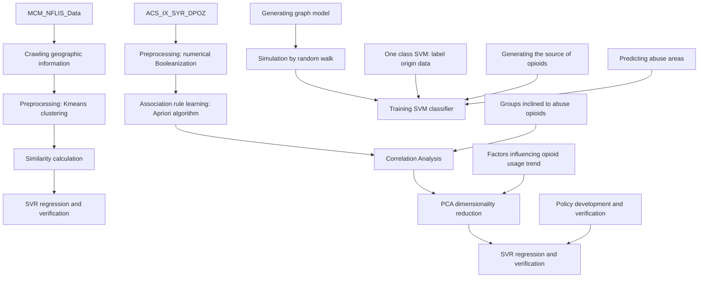
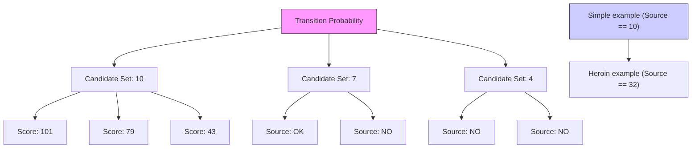
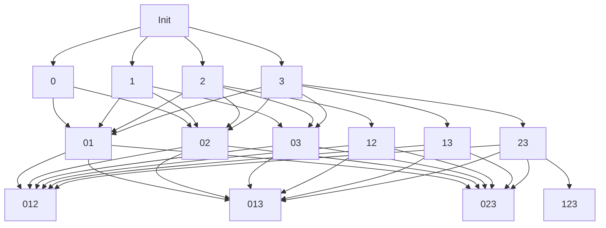
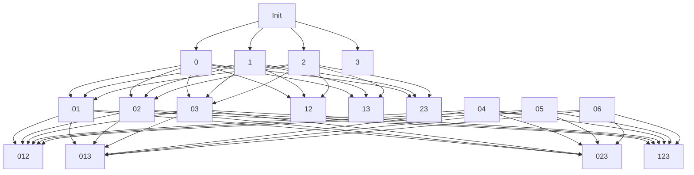

<table><tr><td colspan="2">For office use only</td></tr><tr><td>T1</td><td></td></tr><tr><td>T2</td><td></td></tr><tr><td>T3</td><td></td></tr><tr><td>T4</td><td></td></tr></table>

Team Control Number  
Problem Chosen

1906204  
C  
For office use only

<table><tr><td>F1</td><td></td></tr><tr><td>F2</td><td></td></tr><tr><td>F3</td><td></td></tr><tr><td>F4</td><td></td></tr></table>

# 2019

# MCM/ICM

# Summary Sheet

# Analysis of the opioid crisis and strategies

## Summary

The United States is undergoing an unprecedented opioid crisis. Opioid drugs have been widely used as medicine in a variety of treatments. The fast pace of life and fierce social competition put a lot of pressure on people. People with mental or physical illness will probably be treated with many drugs and they are likely to get addicted to them, especially to opioid drugs. Thus, more and more drug identification cases have been confirmed in recent years.

The goal of our model is to find the spread and characteristics of the reported synthetic opioid and heroin incidents and do possible explanation for current situation and prediction for future case distribution, based on provided data. Specifically, our model is inspired from "Recommendation System". The first step of our model has the similar purpose as "Recommendation System" does that is to find similarity and correlation between different zones and drugs. It is rough and inaccurate to directly address the data regardless of plenty of factors behind this sophisticated problem. In order to find how graphical location, marital status, education level, age distribution and other factors contribute to the opioid crisis, one appropriate method is to first find similar zones based on social structure, then compare that how their drug spread and opioid drug identification cases distribution relates each other and then we extend our model to serve different purposes, such as tracing the drug source, predicting the drug spread.

For the first part, we construct a weighted directed graph based on the similarity(described above) and use "Walk Around" strategy to simulate the drug spread process to trace the drug start source. Still based on similarity, we use SVR regression to fit the data distribution over time and predict the following two years of synthetic opioid drug identification and heroin cases distribution situation. Then we use a SVM discriminator to predict whether a county will be in the risk of opioid crisis. A county in opioid crisis will face a continues increase in drug abuse.

For the second part,We first binarize all the data through the Kmeans algorithm, then we use association rule learning algorithms to look for factors that lead to opioids and drug addiction. We then introduced the time factor, further streamlined the factors through correlation analysis methods, and found people who abused opioids.After these steps we can find all the main factors. However, due to the large number of these factors, we also need to use the PCA algorithm to reduce the output factors to make the prediction model simpler.Our model finds that difference in population distribution has a huge impact on the abuse of opioids.

For the third part, we extract three main features from part two, reintegrate the data and invoke this into our previous model, making our model do regression with multiple dimensions. We design some strategy aimed for different groups and use our model to verify the effectiveness of our strategies. Our model finds that special attention should be payed to female householder without husband as well as householder who is 65 years old or older and improving overall education level can also decrease opioid addiction rate.

Keywords: Recommendation System, Regression, PCA, Association Rule Learning

# Analysis of the opioid crisis and strategies

team # 1906204

January 29, 2019

## Summary

The United States is undergoing an unprecedented opioid crisis. Opioid drugs have been widely used as medicine in a variety of treatments. The fast pace of life and fierce social competition put a lot of pressure on people. People with mental or physical illness will probably be treated with many drugs and they are likely to get addicted to them, especially to opioid drugs. Thus, more and more drug identification cases have been confirmed in recent years.

The goal of our model is to find the spread and characteristics of the reported synthetic opioid and heroin incidents and do possible explanation for current situation and prediction for future case distribution, based on provided data. Specifically, our model is inspired from "Recommendation System". The first step of our model has the similar purpose as "Recommendation System" does that is to find similarity and correlation between different zones and drugs. It is rough and inaccurate to directly address the data regardless of plenty of factors behind this sophisticated problem. In order to find how graphical location, marital status, education level, age distribution and other factors contribute to the opioid crisis, one appropriate method is to first find similar zones based on social structure, then compare that how their drug spread and opioid drug identification cases distribution relates each other and then we extend our model to serve different purposes, such as tracing the drug source, predicting the drug spread.

For the first part, we construct a weighted directed graph based on the similarity(described above) and use "Walk Around" strategy to simulate the drug spread process to trace the drug start source. Still based on similarity, we use SVR regression to fit the data distribution over time and predict the following two years of synthetic opioid drug identification and heroin cases distribution situation. Then we use a SVM discriminator to predict whether a county will be in the risk of opioid crisis. A county in opioid crisis will face a continues increase in drug abuse.

For the second part,We first binarize all the data through the Kmeans algorithm, then we use association rule learning algorithms to look for factors that lead to opioids and drug addiction. We then introduced the time factor, further streamlined the factors through correlation analysis methods, and found people who abused opioids.After these steps we can find all the main factors. However, due to the large number of these factors, we also need to use the PCA algorithm to reduce the output factors to make the prediction model simpler.Our model finds that difference in population distribution has a huge impact on the abuse of opioids.

For the third part, we extract three main features from part two, reintegrate the data and invoke this into our previous model, making our model do regression with multiple dimensions. We design some strategy aimed for different groups and use our model to verify the effectiveness of our strategies. Our model finds that special attention should be payed to female householder without husband as well as householder who is 65 years old or older and improving overall education level can also decrease opioid addiction rate.

Keywords: Recommendation System, Regression, PCA, Association Rule Learning

## Contents

## 1 Introduction 3

1.1 Background 3

## 2 Analysis of the Problem 3

2.1 Data Preprocessing 3

2.1.1 Use K-means to Divide Areas 3

2.2 Basic Assumption . 4

2.3 Overview . 5

## 3 Models 5

3.1 Basic Model Description 5

3.1.1 Recommendation System 5

3.1.2 Mathematical Formulation 6

3.1.3 Similarity Design 6

3.2 "Walk Around" in Graph to find Origin 6

3.3 SVM Discriminator in Evaluate Drug Identification Threshold Levels . 9

3.3.1 SVM Discriminator . 9

3.3.2 One Class SVM 9

3.3.3 Threshold Identification . 9

3.4 Use SVR Regression to make Prediction 10

3.4.1 Algorithm Details . 10

3.5 Advantage of SVR . 11

3.5.1 Determine the best parameter for SVR . 11

3.6 Evaluate County Opioid Problem in the Future . . 12

3.6.1 Model Prediction Flow . 12

3.6.2 Analysis 13

3.7 Choosing Factors: Using the U.S. Census socio-economic data 13

3.7.1 Association rule learning: Apriori 13

3.7.2 Correlation Analysis 16

3.7.3 PCA Feature Extraction 16

## 4 Strategy for Countering Opioid Crisis 1 6

4.1 Brief Explanation for Factors . . 16

4.2 Possible Strategies . . 17

4.2.1 For the Elder .17

4.2.2 About Education Level .

4.2.3 For Female Householder Without Husband . 17  
4.2.4 Considering Other Factors . . 17

4.3 Strategies Verification . 18

4.3.1 Validation for Equivalent Verification 18  
4.3.2 Verification Results . 18  
4.3.3 Findings 19

5 Model Analysis 19

6 Memo 21

6.1 Origin of the Opioid Drug Abuse . . 21  
6.2 Prediction of Opioid Abuse Distribution . . 21  
6.3 Correlated Factors . . 21  
6.4 Strategies . . 22

6.4.1 For Elder . 22  
6.4.2 About Education Level . . 22  
6.4.3 For Female Householder Without Husband . 22  
6.4.4 Considering Other Factors . 22

Appendices 23

## 1 Introduction

## 1.1 Background

A drug crisis is storming in the United States, regarding to the use of synthetic and non-synthetic opioids, either for the treatment and the management of the pain or for recreational purpose. Official organizations such as Centers for Disease Control are struggling to control the spread of infectious diseases and mitigate the negative impact of opioid drugs, especially for the well-educated people with advanced degrees and the elder.

The DEA/National Forensic Laboratory Information System has published a data-heavy annual report addressing ”drug identification results” recently, which has caused widespread concern. In order to have a deeper insight of this problem, researches mainly focus on the individual counties located in five U.S. states: Ohio, Kentucky, West Virginia, Virginia and Tennessee. The relative data covers drug identification counts in years 2010-2017 for synthetic opioids and heroin in each of the counties from these five states. Additional data contains extracts from the U.S. Census Bureau that represent a common set of socio-economic factors collected for the counties of these five states during each of the years 2010-2016.

## 2 Analysis of the Problem

## 2.1 Data Preprocessing

Checking all the data in the ”MCM\_NFLIS\_DATA.xlsx”, it is easy to figure out that there are 69 different kinds of opioid drugs and 462 different counties in these five states. More specifically speaking, many kinds of drugs in some counties have almost no or very few ”Drug Reports”, which means the samples for a specific drug from a specific county are far from enough, which may mislead us to analyze the drug spread situation and prediction. To make the spread characters and tendency more apparent to observe, we use K-means Clustering to preprocess the data, dividing it into some larger areas called ”Zones”, the drug report in the zone is the sum of drug reports of all counties resident in the current zone.

## 2.1.1 Use K-means to Divide Areas

To implement regionalization appropriately, we ought to make ”Zone” neither too big or too smaller. By trying many times, we select the best case where we set parameter k as 100. Technically, we just used the basic K-means Algorithm and all 100 clusters have the same radius and each has number of counties roughly ranging from 2 to 8. Before clustering, we transform the ”FIPS\_Combined” into corresponding Longitude and Latitude, then applied K-means algorithm. Finally, we integrated the all drug identification reports for each kind of drug within the same zone. The following figures show the format of preprocessed data,

Figure 1: Data by Zone

<table><tr><td>YYYY</td><td>Zone</td><td>substanceName</td><td>DrugReport</td><td>TotalDrugReportZone</td></tr><tr><td>2010</td><td>0</td><td>Propoxyphene</td><td>1</td><td>327</td></tr><tr><td>2010</td><td>0</td><td>Oxycodone</td><td>4</td><td>327</td></tr><tr><td>2010</td><td>0</td><td>Hydrocodone</td><td>9</td><td>327</td></tr><tr><td>⋮</td><td>⋮</td><td>⋮</td><td>⋮</td><td>⋮</td></tr></table>

After transforming data into this form, we can analyze the drug spread process from a higher level, then focus on several special zones and take a deep look into it conveniently. The following fig. shows the visualization of the zones.

Figure 2: ZoneCounty Map

<table><tr><td>Zone</td><td>Latitude</td><td>Longitude</td><td>FIPS_Combined</td></tr><tr><td>0</td><td>37.6189</td><td>-75.8400</td><td>51001, 51620, 51115, 51119, 51131</td></tr><tr><td>1</td><td>41.5442</td><td>-84.0702</td><td>39001, 39047, 39051, 39095, 39173, 39171</td></tr><tr><td>1</td><td>39.9813</td><td>-77.2332</td><td>42001, 42041, 42055, 42133</td></tr><tr><td>⋮</td><td>⋮</td><td>⋮</td><td>⋮</td></tr></table>

Clustered Counties  


<details>
<summary>choropleth map</summary>

| County | Value |
|--------|-------|
| County 1 | 99 |
| County 2 | 98 |
| County 3 | 97 |
| County 4 | 96 |
| County 5 | 95 |
| County 6 | 94 |
| County 7 | 93 |
| County 8 | 92 |
| County 9 | 91 |
| County 10 | 90 |
| County 11 | 89 |
| County 12 | 88 |
| County 13 | 87 |
| County 14 | 86 |
| County 15 | 85 |
| County 16 | 84 |
| County 17 | 83 |
| County 18 | 82 |
| County 19 | 81 |
| County 20 | 80 |
</details>

Figure 3: Clustered Zones

(Note: each zone ought to have one color, but we don’t have 100 colors, we only use 20 colors to distinguish)

## 2.2 Basic Assumption

• Trend of opioid addiction distribution changes over time. When doing prediction, we take time into account. The latest tendency will have a higher influence factor.  
• Opioid abuse spread depends on graphical location. We assume that the spread of drug mainly from one place to adjacent places and will not across a great distance.  
• When addressing data missing, we regard it as average value.

## 2.3 Overview


<details>
<summary>flowchart</summary>


</details>

Figure 4: Model overview

The above diagram introduces the main workflow of our model. The left part of the PART1 workflow is divided into data preprocessing, model training, and model validation. The right part is the workflow of PART2,3, which is mainly divided into data preprocessing, correlation analysis, association rule learning, model verification, and rule making.

## 3 Models

## 3.1 Basic Model Description

In order to figure out what the spread and characteristics of the reported synthetic opioid and heroin incidents in and between the five states and their counties over time, identify the origin and predict the possible future drug use situation, we decide to use the Recommendation System.

## 3.1.1 Recommendation System

Imagine that you have just finished watching a film, and feel deeply impressed by it and you even make an evaluation of 5 stars. Movie website accepts your evaluation and it will automatically recommend you some films that you may like based on your recent behavior, such as evaluation behavior. The core part of the recommendation system is to find similar users who share the same preference and these similar users may see some other films which you haven’t seen but they thinks good. Thus, the system will recommend you these films.

Our model reflects the main idea of "Recommendation System", that is to find the similar zones. Those similar zones will share the similar spread and characteristics of reported synthetic opioid and heroin incidents to a great extent. These similar zones help us amplify the spread and characteristics as well as make prediction more accurate.

## 3.1.2 Mathematical Formulation

Since there are 100 zones and 69 different opioids, we create a 100×69 matrix. Each line represents a zone number and each column stands for a opioid drug number. Then cell(i, j) in this matrix will represent some information of number j drug in zone i. The information will be somehow different for different purposes.

## 3.1.3 Similarity Design

How can we tell two zones are similar is closely related to the performance of the model. In our model, we carefully take three main factors into account. (1) Trend over time (2) Geographical factor (3) Drug identification size.

• Factor (1): based on the mathematical formulation above, we store a list in each cell(i, j), which contains six years of data(2010-2016) for the j’th drug in i’th zone. When calculating the similarity between any pair zones, we find the correlation for each kind of drug, then make weighted summation. The definition of correlation is as follows:

$$
C o r r (X, Y) = \frac {c o v (X , Y)}{\sigma_ {X} \sigma_ {Y}} = \frac {E [ (X - \mu_ {X}) (Y - \mu_ {Y}) ]}{\sigma_ {X} \sigma_ {Y}}
$$

Using the numpy.corrcoef() method from "Numpy" package in python can implement the calculation quickly and conveniently.

• Factor (2): In practice, geographical factor plays critical role in drug spread. People are inclined to migrate from one zone to adjacent zones. This process may trigger drug spread, resulting that drug identification situation in one zone is more likely to be similar to that in adjacent zones. We can easily calculate distance between any zone pair based on their longitudes and latitudes. According to our test, controlling distance within 200 km makes model perform well.

• Factor (3): The size of drug identification is another significant factor should be taken into account. A zone with fewer drug identification cases has the tendency to be stable and growth or decline may have mutation, compared to zones with larger size of drug identification cases. When computing the similarity, we take summation of all six years of data and also invoke time decay factor.

$$
T o t a l = \sum_ {i = 2 0 1 0} ^ {2 0 1 6} d a t a _ {i} \nu^ {i - 1}
$$

with ν = 0.7, the later the data is, the more important the data should be.

For each zone, we use Factor (2) to find the "close zones" and give each close zone a score based on the factor (1) and (3). Pick the 10 zones with highest score, by sorting.

## 3.2 "Walk Around" in Graph to find Origin

In this part, we mainly want to find the source of some opioids.Imagine that we are browsing the webpage, we will open a web address, browse the page, and then select the favorite topic according to the URL on the page. We will continue to open the new webpage along the link of the page.The spread of opioids has similar behavior. An opioid is popular from a city and slowly affects surrounding cities. However, due to the different characteristics of the city, the speed of transmission of specific opioids in surrounding cities will vary greatly. Here we assume that cities with similar characteristics will have similar patterns when opioids are transmitted. Therefore, the probability that opioids will spread to neighboring cities will be different. This probability is described by the similarity between the cities in the above sections.

The first step in our model is to construct a propagation graph model for opioids.Suppose we are looking for the source of heroin. The first step in our model is to construct a propagation map model for opioids.

We selected heroin data for any given year. Each node in the figure represents a clustering point, and the weight of each node represents the number of people who smoked this drug in that place. When the number of nodes $\mathrm { A } \left( W _ { A } \right)$ is higher than the other node B $( W _ { B } ) _ { . }$ , a directed edge from A to B is generated(A– >B). The weight of the edge is the similarity of A and B $( s i m ( A , B ) = p _ { A - > B } )$ . The graph generated for heroin is shown below.


<details>
<summary>network graph</summary>

| Node | Color  | Connected To (Node IDs) |
|------|--------|--------------------------|
| 1    | Red    | 63                       |
| 2    | Orange | 22                       |
| 3    | Red    | 84                       |
| 4    | Red    | 16                       |
| 5    | Red    | 44                       |
| 6    | Red    | 45                       |
| 7    | Red    | 69                       |
| 8    | Red    | 8                        |
| 9    | Blue   | 08                       |
| 10   | Blue   | 10                       |
| 11   | Blue   | 11                       |
| 12   | Blue   | 12                       |
| 13   | Purple | 13                       |
| 14   | Purple | 14                       |
| 15   | Purple | 15                       |
| 16   | Red    | 16                       |
| 17   | Purple | 17                       |
| 18   | Purple | 18                       |
| 19   | Purple | 19                       |
| 20   | Blue   | 20                       |
| 21   | Blue   | 21                       |
| 22   | Orange | 22                       |
| 23   | Purple | 23                       |
| 24   | Purple | 24                       |
| 25   | Purple | 25                       |
| 26   | Purple | 26                       |
| 27   | Purple | 27                       |
| 28   | Purple | 28                       |
| 29   | Purple | 29                       |
| 30   | Orange | 30                      |
| 31   | Purple | 31                       |
| 32   | Blue   | 32                       |
| 33   | Blue   | 33                       |
| 34   | Purple | 34                       |
| 35   | Purple | 35                       |
| 36   | Red    | 36                       |
| 37   | Red    | 37                       |
| 38   | Blue   | 38                       |
| 39   | Purple | 39                       |
| 40   | Purple | 40                       |
| 41   | Blue   | 41                       |
| 42   | Purple | 42                       |
| 43   | Orange | 43                       |
| 44   | Orange | 44                       |
| 45   | Purple | 45                       |
| 46   | Blue   | 46                       |
| 47   | Purple | 47                       |
| 48   | Purple | 48                       |
| 49   | Purple | 49                       |
| 50   | Purple | 50                       |
| 51   | Orange | 51                       |
| 52   | Blue   | 52                       |
| 53   | Purple | 53                       |
| 54   | Red    | 54                       |
| 55   | Blue   | 55                       |
| 56   | Blue   | 56                       |
| 57   | Orange | 57                       |
| 58   | Blue   | 58                       |
| 59   | Blue   | 59                       |
| 60   | Red    | 60                       |
| 61   | Blue   | 61                       |
| 62   | Blue   | 62                       |
| 63   | Blue   | 63                       |
| 64   | Blue   | 64                       |
| 65   | Orange | 65                       |
| 66   | Purple | 66                       |
| 67   | Orange | 67                       |
| 68   | Blue   | 68                       |
| 69   | Red    | 69                       |
| ... (multiple nodes connected by edges) are not explicitly labeled in the image. The node values are estimated based on the visual representation of connections.
</details>

Figure 5: Graph model of drug transmission. The light color of the node represents a large number of people, and the color of the edge represents the magnitude of the transition probability.

The second step is to find the nodes that may become the source of drugs according to the above graph model. We call this the candidate set. CandidateSet = {node1, node2, node3, ...}. In graph theory, the degree (or valency) of a vertex of a graph is the number of edges incident to the vertex, with loops counted twice. Here we change the definition to the number of edges scatter from the vertex. For every node we calculate its degree $( D e g ( v ) )$ , We select the largest 5 nodes and store them in the candidate set.

The third step is to simulate the propagation behavior of a drug by using the simulation method of random walk. Simulate the nodes in the Candidate Set separately, simulate 100 times for each node, record the number of visits of other nodes $( n _ { i } ) _ { \cdot }$ , and calculate the score for each node by the following formula. The highest score is the source we want to find.

$$
Score_{i} = \sum_{\substack{j = 0 and j\neq i}}^{99}n_{j}*W_{i}*p_{i - >j} i\in Candidate Set
$$

$$
\text { Source } = \text { index } (\max (S c o r e) S c o r e \in \{S c o r e _ {1}, S c o r e _ {2}, S c o r e _ {3},... \})
$$


<details>
<summary>flowchart</summary>


</details>

Figure 6: The diagram on the left shows the implementation of the simulation algorithm for random walks. The example on the right shows that after the simulation, the source of heroin is in the 32nd area.


<details>
<summary>map chart</summary>

| Drug Name | Drug Name | Origin of Drugs |
| --- | --- | --- |
| Dihydrocodeine Butorphanol | ANPP MT-45 | - |
| Levorphanol | 4-Fluoroisobutyryl fentanyl | - |
| Fluorofentanyl | Phenyl fentanyl | - |
| Benzylfentanyl | U-51754 | - |
| Propoxyphene Methadone Hydromorphone Opiates | - | - |
| Dextropropoxyphene | - | - |
| Meperidine Tramadol | - | - |
| Buprenorphine Hydrocodone | - | - |
| Methorphan | - | - |
| Codeine | - | - |
| Chemethylenedioxy U-47700 Isobutyryl fentanyl | - | - |
| Pethidine Mitragynine | Acetyldihydrocodeine Hydrocodeinone | - |
| Furanyl fentanyl Carfentanil | - | - |
| Acryl fentanyl trans-3-Methylfentanyl | p-methoxybutyryl fentanyl p-Fluorofentanyl o-Fluorofentanyl | - |
| Furanyl/3-Furanyl fentanyl U-49900 3,4-Methylenedioxy U-47700 | - | - |
| Morphine Oxycodone, Heroin Pentazocine | - | - |
| Oxymorphone Fentanyl Morphine Oxycodone, Meperidine Tramadol | - | - |
| Oxymorphone Fentanyl Morphine Oxycodone, Meperidine Tramadol | - | - |
| Dextropropoxyphene | - | - |
| Buprenorphine Hydrocodone | - | - |
| Chemethylenedioxy U-47700 Isobutyryl fentanyl | - | - |
| Pethidine Mitragynine | Acetyldihydrocodeine Hydrocodeinone | - |
| Chemethylenedioxy U-49900 3,4-Methylenedioxy U-47700 Isobutyryl fentanyl | - | - |
| Dextropropoxyphene | - | - |
| Buprenorphine Hydrocodone | - | - |
| Chemethylenedioxy U-47700 Isobutyryl fentanyl | - | - |
| Pethidine Mitragynine | Acetyldihydrocodeine Hydrocodeinone | - |
| Chemethylenedioxy U-49900 3,4,Methylenedioxy U-47700 Isobutyryl fentanyl | - | - |
| Dextropropoxyphene | - | - |
| Buprenorphine Hydrocodone | - | - |
| Chemethylenedioxy U-47700 Isobutyryl fentanyl | - | - |
| Pethidine Mitragynine | Acetyldihydrocodeine Hydrocodeinone | - |
| Chemethylenedioxy U-49990 3,4,Methylenedioxy U-47700 Isobutyryl fentanyl | - | - |
| Pethidine Mitragynine | Acetyldihydrocodeine Hydrocodeinone | - |
| Chemethylenedioxy U-48800 Cytocyclopropane 3-Methylfentanyl fentanyl U-48800 Cytocyclopropane 3-Methylfentanyl fentanyl U-47700 3-Methylfentanyl fentanyl U-48800 Cytocyclopropane 3-Methylfentanyl fentanyl U-47700 2-Methylfanyl fentanyl Metazocine' | - | - |
| Dextropropoxyphene | - | - |
| Buprenorphine Hydrocodone | - | - |
| Chemethylenedioxy U-47700 Isobutyryl fentanyl | - | - |
| Pethidine Mitragynine | Acetyldihydrocodeine Hydrocodeinone | - |
</details>

Figure 7: Origin of all opioids

Result analysis, the above diagram shows the source of all opioids that appear in the problem.From this we can analyze many interesting phenomena. Traffic factors:We can see the source of a lot of opioids, near the ocean, or near the Great Lakes. The proximity to the ocean has made it easier to import illegal drugs or opioids from abroad, making these areas a source of numerous opioids. Legal factors:We can see that Ohio is the source of many drugs. The reason for this situation may be related to the fact that local laws and regulations still have loopholes and the government’s supervision is not strong.

## 3.3 SVM Discriminator in Evaluate Drug Identification Threshold Levels

In some counties, number of opioids drug identification counts is remarkably higher than other parts of the state. It reveals more severe drug abuse problem occurs in this county. A large number of drug incidents also reflect denser population, which has strong influence on drug spreads.

In most cases, an outlier data reveals either a fault or should be highlighted. Here we assume that some counties are already facing opioid crisis. Through observation, a certain gap was found between counties with less drug reports and counties with more reports. So we use a SVM discriminator to separate these too kinds of counties. Counties in class with more drug reports are facing risk of opioid crisis

## 3.3.1 SVM Discriminator

SVM Discriminator is used to separate counties with risk of getting into opioid crisis from others, given predicted number of opioid incidents. For 2D value, SVM discriminator trained a line called hyperplane to separate two different classes. Hyperplane was given by $\boldsymbol { \omega } ^ { T } \boldsymbol { \mathbf { x } } + \boldsymbol { \gamma } = 0$ where ω is the normal vector to the

$\left\{ \begin{array} { l l } { \omega ^ { T } \pmb { x } _ { i } + \gamma > 0 } \\ { \omega ^ { T } \pmb { x } _ { i } + \gamma < 0 } \end{array} \right.$ for $y _ { i } = 1$ hyperplane and x is the points on the plane. A valid hyperplane satisfies: for $y _ { i } = - 1$ Support vector is points closest to hyperplane, they are edges of two different sets.

## 3.3.2 One Class SVM

SVM discriminator is a supervised learning models, but with no labeled training data given, an unsupervised version of SVM should be applied. So one-class-SVM was introduced. The goal of one class SVM method is to separate data points and origin at feature mapped space as far as possible. Firstly use Gaussian kernel to project data points on to feature space, then we want to solve following quadratic program

to separate projected data points from origin: $\begin{array} { r } { \left\{ \begin{array} { c } { \operatorname* { m i n } _ { w , \zeta _ { i } , \rho } \frac { 1 } { 2 } \| w \| ^ { 2 } + \frac { 1 } { \nu n } \sum _ { i = 1 } ^ { n } \zeta _ { i } - \rho } \\ { s . t . \left( w ^ { T } \phi \left( x _ { i } \right) \right) > \rho - \zeta _ { i } , i = 1 , \dots , n } \\ { \zeta _ { i } > 0 } \end{array} \right. } \end{array}$ , where $\xi _ { i }$ is slack,

$\nu \in ( 0 , 1 )$ determines upper limits of outliers. A line in featured map space was finally trained to separate origin from data. Then transform the line and data back to unprojected space, outside the line are outliers.

## 3.3.3 Threshold Identification

Our SVM Discriminator combines one class SVM and linear SVM. We use one-class-SVM on opioid drug reports from 2010-2017 in total to determine outliers at first. These outliers indicates counties in the danger of opioid crisis. Then we use the labeled data from one class SVM to train a linear SVM as threshold for opioid abuse alert. Since the drug abuse problem is not only shown by opioid usage but also other drugs, a county with much opioid incidents compared with total drug reports or a large number of total drug report without opioid incidents should all be considered as facing crisis. Therefore, we use total drug report of a county as y-axis and total opioid use as x-axis to include the situation above. Later, we will use this trained model as filter, predicted drug reports number as input, dangerous level as output. The following picture is showing the process of training, highlighted line is hyperplane:


<details>
<summary>scatter plot</summary>

| Opioid Drug Reports | Total Drug Report by County (×10⁴) |
| ------------------- | ---------------------------------- |
| 0                   | 0                                  |
| 500                 | 2                                  |
| 1000                | 4                                  |
| 1500                | 6                                  |
| 2000                | 8                                  |
| 2500                | 10                                 |
</details>

Figure 8: SVM Discriminator

## 3.4 Use SVR Regression to make Prediction

To predict when and where will some specific drug reaching the drug identification threshold occur, we will combine the "Recommendation System" with Supporting Vector Regression(SVR).

## 3.4.1 Algorithm Details

## Pseudocodes

Algorithm 1 Recommendation System Combined with SVR Regression  
1: # 100×69×6 Info Matrix stores six years' drug reports for each drug in each zone.
2: features ← empty dictionary
3: for Each zone $z_{i}$ do
4: simi_zones ← $z_{i}$ 's all similar zones
5: for Each Drug $d_{j}$ do
6: feature ← empty set # to store regression results
7: get SVR regression of its own as a feature, push to list feature
8: for Each Training Sample $s_{k}$ do
9: get SVR regression of its sample as a feature, push to list feature
10: end for
11: # weight ← empty set
12: for Each feature do
13: use feature to predict val and find difference between predicted value and real value
14: take $\frac{1}{0.01+(difference)^{2}}$ as weight of the current feature
15: end for
16: normalize weight
17: store features[ $z_{i}$ ][ $d_{j}$ ] ← [feature, weight]
18: end for
19: end for

## Explanation

• We first create a $1 0 0 \times 6 9 \times 6$ InfoMatrix to store six years’ drug reports for each drug in each zone. Then for each zone, we find the 10 most similar zones, each of them will provide a sample. We use SVR to fit each of the sample as one feature for the specific drug in the specific zone. After we obtained all features(11 in total, 1 from itself, 10 from samples), we modify each feature by multiplying a hyperparameter – weight coefficient, in order to make the model more reasonable and stable to predict the future.

• Based on the idea from machine learning, we separate the data into 3 set, training set(data 2010-2015), held-out set(data 2016) and test set(data 2017). We extract features from training set and calculate hyper-parameter from held-out set. Finally, use test set to verify the performance of our model.  
• Another problem is how we set the hyper-parameters. Intuitively, the more close between a predicted value and real value, the more important the feature is, roughly satisfying inverse proportion. After trying many time, we set the formate of weight to 10.01+(dif ference)2 which has almost the smallest least $\frac { 1 } { 0 . 0 1 + ( d i f f e r e n c e ) ^ { 2 } }$ square error when testing by date from test set.  
• After we find the best formate of hyper-parameter, we divide data into 2 parts, training set(2010-2016) and held-out set(2017), then train the model again which will be used for later prediction.

## 3.5 Advantage of SVR

The following reasons explain that we choose SVR instead of other method to do the regression,

• Suit for multiple dimensional regression  
• Fast in computing (python has package off the shelf)  
• There is no overfitting

## 3.5.1 Determine the best parameter for SVR

SRV is a mature model with many parameters used for different purposes. The most common modes are "rbf" and "poly". For "poly" mode, we can set degree to any integer we want. So we test this basic setting to find the best model. The following test results shows the Least Square Error(difference between predicted 2017 date and real 2017 data) for each pair parameter settings,

Figure 9: Poly Tests

<table><tr><td>LSE / Degree kernel</td><td>1</td><td>2</td><td>3</td><td>4</td></tr><tr><td>&quot;Poly&quot;</td><td>47116.0</td><td>39458.0</td><td>28908.0</td><td>48322(slow)</td></tr></table>

Figure 10: RBF Tests

<table><tr><td>LSE gamma C</td><td>0.1</td><td>0.5</td><td>1</td><td>2</td></tr><tr><td>1e0</td><td>50332.0</td><td>50363.0</td><td>50496.0</td><td>50692.0</td></tr><tr><td>1e1</td><td>47804.0</td><td>48434.0</td><td>49189.0</td><td>49968.0</td></tr><tr><td>1e2</td><td>40161.0</td><td>41977.0</td><td>44438.0</td><td>46868.0</td></tr><tr><td>1e3</td><td>30788.0</td><td>32755.0</td><td>37597.0</td><td>42033.0</td></tr></table>

After the testing, we find that set kernel to "poly" and set degree to 3 is the best option. (Note: when kernel mode is "poly", we still need to consider parameter C, but during our test C has almost no influence to the result, so we just use default value.)

## 3.6 Evaluate County Opioid Problem in the Future

## 3.6.1 Model Prediction Flow

The SVR predictor introduced above uses NFLIS data 2010-2017 to predict number of opioid usage in total by areas. Since the given data only covers seven years, a prediction on further future based on these data are lacking fidelity, we only predict opioids drug identification counts in 2018 & 2019. The result is shown below, darker color indicates more opioid issues.

Drug Report Predict Thermodynamic Diagram 2018  


<details>
<summary>heatmap</summary>

| Region | Value Range |
|--------|-------------|
| > 9,900.0 | Dark Blue |
| 5,700.0 - 6,05 | Medium Dark Blue |
| 5,350.0 - 5,70 | Medium Dark Blue |
| 5,000.0 - 5,35 | Medium Dark Blue |
| 3,600.0 - 3,95 | Medium Dark Blue |
| 2,900.0 - 3,25 | Medium Dark Blue |
| 2,550.0 - 2,90 | Medium Dark Blue |
| 2,200.0 - 2,55 | Medium Dark Blue |
| 1,850.0 - 2,20 | Medium Dark Blue |
| 1,500.0 - 1,85 | Medium Dark Blue |
| 1,150.0 - 1,50 | Medium Dark Blue |
| 800.0 - 1,150.0 | Medium Dark Blue |
| 450.0 - 800.0 | Medium Dark Blue |
| 100.0 - 450.0 | Medium Dark Blue |
| < 100.0 | Light Yellow |
</details>

Drug Report Predict Thermodynamic Diagram 2019  


<details>
<summary>heatmap</summary>

| Region | Value Range |
|--------|-------------|
| > 9,900.0 | Dark Blue |
| 5,700.0 - 6,050 | Medium Blue |
| 5,350.0 - 5,700 | Medium Blue |
| 5,000.0 - 5,350 | Medium Blue |
| 3,600.0 - 3,950 | Medium Blue |
| 2,900.0 - 3,250 | Medium Blue |
| 2,550.0 - 2,900 | Medium Blue |
| 2,200.0 - 2,550 | Medium Blue |
| 1,850.0 - 2,200 | Medium Blue |
| 1,500.0 - 1,850 | Medium Blue |
| 1,150.0 - 1,500 | Medium Blue |
| 800.0 - 1,150.0 | Medium Blue |
| 450.0 - 800.0 | Medium Blue |
| 100.0 - 450.0 | Medium Blue |
| < 100.0 | Light Green to White |
</details>

Figure 11: Prediction Opioid Reports 2018  
Figure 12: Prediction Opioid Reports 2019

Then we train the SVM discriminator according to the data 2010-2017, and set the predicted result as input. Output is shown below, highlighted areas are areas in risk of opioid crisis.


<details>
<summary>choropleth map</summary>

| Region | Drug report count |
|--------|------------------|
| Various regions in 2018 | 1 to 5 (approximate) |
</details>

Figure 13: Predicted area in risk 2018


<details>
<summary>choropleth map</summary>

Predict Drug Reports 2019
| Region | Drug reports |
|---|---|
| Various administrative areas | 1 |
| Various geographic regions | -1 |
</details>

Figure 14: Predicted area in risk 2019

<table><tr><td>Pennsylvania</td><td>Adams Cumberland Franklin York</td></tr><tr><td>Ohio</td><td>Ashtabula Lake</td></tr><tr><td>Pennsylvania</td><td>Chester Lancaster</td></tr><tr><td>Ohio</td><td>Cuyahoga Geauga Henry Noble Summit</td></tr></table>

Figure 15: Counties in Crisis by 2017

The results for 2018 is in the appendix. The opioid incidents are increasing in total in high speed. In some area, the number may increase by thousands. However, we also notice a decline in prediction in some area from 2018-2019, these areas are shown in the chart below:

<table><tr><td>Kentucky</td><td>Clark Ballard Fayette MadisonMenifee Powell Trimble</td></tr></table>

Figure 16: Counties Possibly in Crisis variation from 2018-2019

## 3.6.2 Analysis

In the result derived from our model, we can see decline in some area, but increasing opioid incidents in total. Opioid abuse problem are getting more severe in areas that are already facing opioid crisis. Counties in risk of getting opioid problem does not match with counties where opioid drugs started to spread. However, counties around counties where opioid drugs started to spread tend to have an increase in the number of opioid incidents. According to our estimation, area far from other area with drug problem are declining in figure. So we may draw to the conclusion that opioid problems appear to be regional.

Apart from this, we also notice that areas around lake and seas have more severe opioid problem. This may caused by the denser population in these counties. More opioid incidents occur in larger crowd, denser population also makes drugs spread easier.


<details>
<summary>choropleth map</summary>

| County | Drug reports (count) |
| --- | --- |
| > 25,000.0 | Dark blue |
| 13,439.29 - 14,328 | Medium green |
| 8,103.57 - 8,992.8 | Medium green |
| 7,214.29 - 8,103.5 | Medium green |
| 5,435.71 - 6,325.0 | Medium green |
| 4,546.43 - 5,435.7 | Medium green |
| 3,657.14 - 4,546.4 | Medium green |
| 2,767.86 - 3,657.1 | Medium green |
| 1,878.57 - 2,767.8 | Medium green |
| 989.29 - 1,878.57 | Medium green |
| 100.0 - 989.29 | Medium green |
| < 100.0 | Light yellow |
</details>

Figure 17: Drug Incidents Report Variation 2010-2017

From the historical data, we can see a similar trend, drug problems are getting more severe in areas already facing drug problems. It is also happening in area with more people.

## 3.7 Choosing Factors: Using the U.S. Census socio-economic data

Here we use the U.S. Census socio-economic data set in question to select factors that are highly relevant to opioids. Due to the large amount of data, it is difficult to manually select features. So here we use machine learning algorithms to automate the selection of factors. We go through three steps to output the final extracted features. In the first step we used the association rule learning algorithm to select the demographic characteristics associated with opioids. In the second part, we used the characteristics obtained in the first step to find out the factors positively related to the growth of opioids through correlation analysis. Since the data dimension in the second part is still very large, in the third step we use the PCA algorithm to reduce the dimensionality of the data obtained in the second step. We use the multidimensional vector output in the third step as the final feature.

## 3.7.1 Association rule learning: Apriori

Association rule learning is a rule-based machine learning method for discovering interesting relations between variables in large databases. It is intended to identify strong rules discovered in databases using some measures of interestingness. Association rule learning is first applied for discovering regularities between products in large-scale transaction data recorded by point-of-sale systems in supermarkets. For example, the rule {bread, tea –> milk} found in the sales data of a supermarket would indicate that if a customer buys bread and tea together, they are likely to also buy milk.

Finding relationships between opioids and demographics can also be addressed using a association rule learning. Here we imagine each city as a ’shopping basket’. Every demographic can be regarded as a commodity. We also add the quantity information of opioids to the ’shopping basket’, and our problem is transformed into ,When the customer buys which kinds of goods, he has a high probability to buy ’opioid goods’, that is to say, looking for which kind of demographic characteristices of a city obsess, the city’s

crimes about opioids will rise sharply.

First step data preprocessing. Since our association rule learning algorithm requires input as a Boolean form, and our data is in a continuous form, here we first convert the data in the database into a Boolean form. Since each demographic has four types of data(HCxx\_VC01, HCxx\_VC02,HCxx\_VC03, HCxx\_VC04), here we use data in percentage form(HCxx\_VC03)to eliminate the effects of different urban populations. Then we use the Kmeans algorithm to divide each demographic feature into two categories, and finally generate a new Boolean data table.

<table><tr><td>ID\Fators</td><td>HC03_VC04</td><td>HC03_VC06</td><td>HC03_VC07</td><td>HC03_VC08</td><td>HC03_VC09</td><td>...</td><td>DRUG</td></tr><tr><td>21001</td><td>0</td><td>1</td><td>0</td><td>0</td><td>0</td><td>...</td><td>1</td></tr><tr><td>21003</td><td>0</td><td>0</td><td>0</td><td>0</td><td>1</td><td>...</td><td>0</td></tr><tr><td>21005</td><td>0</td><td>1</td><td>0</td><td>0</td><td>0</td><td>...</td><td>0</td></tr><tr><td>21007</td><td>0</td><td>0</td><td>0</td><td>0</td><td>1</td><td>...</td><td>1</td></tr><tr><td>...</td><td>...</td><td>...</td><td>...</td><td>...</td><td>...</td><td>...</td><td>...</td></tr></table>

Table 1: Data preprocessing instance, numerical Booleanization

The second step is to establish a formulaic description.Let $I = \{ i _ { 1 } , i _ { 2 } , . . . , i _ { n } \}$ be a set of n binary attributes called items.Here $I = \{ H C 0 3 _ { - } V C 0 4 , H C 0 3 _ { - } V C 0 6 , H C 0 3 _ { - } V C 0 7 , H C 0 3 _ { - } V C 1 0 , . . . D R U G \}$ . Let $D = \{ t _ { 1 } , t _ { 2 } , \ldots , t _ { m } \}$ be a set of transactions called the database. Here $D = \{ 2 1 0 0 1 , 2 1 0 0 3 , 2 1 0 0 5 , \ldots \}$ Each transaction in D has a unique transaction ID and contains a subset of the items in I. A rule is defined as an implication of the form:

$$
X \Rightarrow Y, \text {   where   } X, Y \subseteq I
$$

Every rule is composed by two different sets of items, also known as itemsets, X and Y, where X is called antecedent or left-hand-side (LHS) andY consequent or right-hand-side (RHS).In order to select interesting rules from the set of all possible rules, constraints on various measures of significance and interest are used. Here we use minimum thresholds on support and confidence method, we first need to define the definition of support and confidence. The support of X with respect to T is defined as the proportion of transactions t in the dataset which contains the itemset X.

$$
\operatorname{supp} (X) = \frac {| \{t \in T ; X \subseteq t \} |}{| T |}
$$

Confidence is an indication of how often the rule has been found to be true.The confidence value of a rule, $X \Rightarrow Y$ , with respect to a set of transactions T, is the proportion of the transactions that containsX which also contains Y.Confidence is defined as:

$$
\operatorname{conf} (X \Rightarrow Y) = \frac {\operatorname{supp} (X \cup Y)}{\operatorname{supp} (X)}
$$

The lift of a rule is defined as:

$$
\operatorname{lift} (X \Rightarrow Y) = \frac {\operatorname{supp} (X \cup Y)}{\operatorname{supp} (X) \times \operatorname{supp} (Y)}
$$

If the lift is > 1, that lets us know the degree to which those two occurrences are dependent on one another, and makes those rules potentially useful for predicting the consequent in future data sets.This represents the greater lift, the stronger the credibility of the association rules.

The third step is to find the association rules related to opioids.We use the Apriori algorithm to find frequent sets.Then use the frequent itemset to construct a rule that satisfies the minimum trust of the user.The specific method of Apriori algorithm is: first find out the frequent 1-item set, denoted as $\boldsymbol { L } _ { 1 } ;$ then use L1 to generate candidate set $C _ { 2 } ,$ and judge the items in $C _ { 2 }$ to mine $L _ { 2 } ,$ which is frequent 2-item set; Loop until you can’t find more frequent k-items. Every time you dig a layer of $L _ { k } ,$ , you need to scan the entire database.The algorithm utilizes the Apriori principle:

• An item set is frequent, then all its subsets are also frequent  
• If an item set is an infrequent item set, then all its supersets are also infrequent itemsets

Using this principle, you can avoid exponential growth in the number of itemsets, thus calculating frequent itemsets in a reasonable amount of time.


<details>
<summary>flowchart</summary>


</details>


<details>
<summary>flowchart</summary>


</details>

Apriori principle  
1. Calculate the single element set:

  
2. Shave the elements that do not meet the minimum support:

  
3. Calculate the two-element collection  
4. Shave the elements that do not meet the minimum support:

  
5. .... repeat the above steps until the collection element contains all the single elements  
6. Get the final frequent set

Apriori algorithm

Figure 18: Aporior principle and Aporiori algorithm

In the figure we can see that the known gray part {2,3} is a non-frequent item set, then with the above knowledge, we can know {0,2,3} {1,2,3} {0,1 , 2, 3} are all infrequent. In other words, after calculating the support of {2,3}, knowing that it is infrequent, you do not need to calculate {0,2,3} {1,2,3} {0,1,2,3} Support because we know that these collections will not meet our requirements.Below we generate association rules based on frequent itemsets. As with our previous frequent item set generation, we can generate many association rules for each frequent item set. If you can reduce the number of rules to ensure that the problem is resolvable, then the calculation will be much better. By observing, we can know that if a rule does not meet the minimum credibility requirement, then all subsets of the rule will not meet the minimum credibility requirement. The above property attributes of the association rules can be utilized to reduce the number of rules that need to be tested, just like the previous Apriori algorithm.

The fourth part produced the final factor that had the greatest impact on the spread of opioids.Since it is unrealistic to run the Apriori algorithm directly on all facotrs, here we divide the data in the table into 16 categories,and run the Apriori algorithm for each category, and the final result is .

<table><tr><td></td><td>1</td><td>2</td><td>3</td><td>4</td></tr><tr><td>HOUSEHOLDS</td><td>HC03_VC11</td><td>HC03_VC09</td><td>HC03_VC12</td><td>HC03_VC07</td></tr><tr><td>RELATIONSHIP</td><td>HC03_VC31</td><td>HC03_VC30</td><td>HC03_VC25</td><td></td></tr><tr><td>MARITAL</td><td>HC03_VC35</td><td>HC03_VC42</td><td>HC03_VC45</td><td>HC03_VC38</td></tr><tr><td>GRANDPARENTS</td><td>HC03_VC67</td><td>HC03_VC64</td><td>HC03_VC65</td><td></td></tr><tr><td>EDUCATIONAL</td><td>HC03_VC91</td><td>HC03_VC89</td><td>HC03_VC88</td><td></td></tr><tr><td>RESIDENCE</td><td>HC03_VC120</td><td>HC03_VC123</td><td>HC03_VC122</td><td></td></tr><tr><td>BIRTH PLACE</td><td>HC03_VC133</td><td>HC03_VC128</td><td></td><td></td></tr><tr><td>LANGUAGE SPOKEN</td><td>HC03_VC172</td><td>HC03_VC171</td><td>HC03_VC173</td><td>HC03_VC170</td></tr><tr><td>ANCESTRY</td><td>HC03_VC198</td><td>HC03_VC185</td><td>HC03_VC194</td><td>HC03_VC182</td></tr><tr><td>YEAR OF ENTRY</td><td>HC03_VC146</td><td>HC03_VC150</td><td>HC03_VC144</td><td></td></tr></table>

Table 2: Factor that may had the greatest impact on the spread of opioids

After analyzing the data, we conclude that the following groups may be more inclined to abuse opioids.

<table><tr><td>ID</td><td>People type</td></tr><tr><td>HC03_VC11</td><td>Female_householder_no_husband_present</td></tr><tr><td>HC03_VC09</td><td>Male_householder_no_wife_present</td></tr><tr><td>HC03_VC35</td><td>Males_15_years_and_over</td></tr><tr><td>HC03_VC45</td><td>Separated</td></tr><tr><td>HC03_VC67</td><td>Responsible_for_grandchildren_5_or_more_years</td></tr><tr><td>HC03_VC88</td><td>Some_college_no_degree</td></tr><tr><td>HC03_VC89</td><td>Associate&#x27;s_degree</td></tr><tr><td>HC03_VC172</td><td>Language_other_than_Spanish</td></tr><tr><td>HC03_VC170</td><td>Speak_English_less_than_&quot;very_well&quot;</td></tr></table>

Table 3: Groups may be more inclined to abuse opioids.

## 3.7.2 Correlation Analysis

Given several possible influencing factors, we still have to determine whether these factors are has positive correlation or negative correlation, so we still needs to calculate correlation between several filtered factors and opioid incidents during 2010-2017 years. Here we use Pearson correlation coefficient, given by:

$$
\rho_ {X, Y} = \frac {\operatorname{E} [ X Y ] - \operatorname{E} [ X ] \operatorname{E} [ Y ]}{\sqrt {\operatorname{E} [ X ^ {2} ] - [ \operatorname{E} [ X ] ] ^ {2}} \sqrt {\operatorname{E} [ Y ^ {2} ] - [ \operatorname{E} [ Y ] ] ^ {2}}}
$$

In consider with counties, we do autocorrelation to observer if the plot was smooth. It indicates whether there are too many variations in correlations. Here we assume 0.8 as strong correlated, calculate the number of $| c o r r | > 0 . 8$ to testify positive correlated or negative correlated. We chose three factors as most important factors influencing opioid usage:

<table><tr><td>Households with one or more people 65 years and over</td></tr><tr><td>Graduate or professional degree</td></tr><tr><td>Family households (families) - Female householder, no husband present, family</td></tr></table>

## 3.7.3 PCA Feature Extraction

Three features are selected, however still too large for input for model introduced above. So we use PCA to project three features into one line. PCA calculate the covariance matrix of the data matrix, and then obtaining the eigenvalue eigenvectors of the covariance matrix, the matrix composed of the eigenvectors corresponding to the k features with the largest eigenvalue is selected. In this way, the data matrix can be transformed into a new space to achieve dimensionality reduction. We used SVD to implement PCA, the result was reduced to a n\*1 matrix and applied to our model

## 4 Strategy for Countering Opioid Crisis

As the results from above model, three critical factors in opioid crisis are (1) the percentage of female householder without husband; (2) The percentage of people with advanced education level; (3) percentages of households with one or more people 65 years and over.

## 4.1 Brief Explanation for Factors

• Factor(1): Divorce or the death of a partner can trigger women’s substance use or other mental health disorders. A female householder would bear much more burden of life and face more social pressure, if they could’t get support from their companions. In addition, women, different from men, have a higher possibility to be addicted to opioid drug duo to physiological factors, such as sex hormone, etc.

• Factor(2): People with high education level are less likely to be addicted to opioid drugs. Although they may also face much work and social pressure, they can adjust them to adapt to it and education can make people aware of the danger of opioid drug and help them prevent addiction to opioid drugs.  
• Factor(3): The elder people are more likely to suffer both physical and mental illness. Drug treatment become a crucial way to alleviate symptoms and manage pain. Similarly, long-term treatment may trigger same addiction occurred in the elder, especially for those elder people who have lost their children or lack of care from their sons or daughters.

## 4.2 Possible Strategies

Opioid are always considered as drug not too harmful, cheap and easy to get, to reduce usage of Opioid, there are several things federal government can do.

## 4.2.1 For the Elder

Elder people is a key factor influencing Opioid abuse problem. Opioid drugs are widely used for medical usages to reduce pain, these kind of drugs are especially reachable for the elder. Besides, doctors are not restricted in providing patients opioid painkillers, some elder people use opioid painkillers too often and get addicted. Government can restrict doctors of providing opioid drugs or encourage pharmaceutical factories to produce inexpensive, effective painkiller in replace of opioids. Government can organize community nursing homes to help these elder people find companions. Common interests and hobbies are beneficial to their psychological and physical health.

## 4.2.2 About Education Level

Our model shows that higher education level may reduce usage of opioids. Educated people tend to avoid using drugs considering the risk of damaging their social status. Government can provide more opportunities for citizens to enroll in colleges, such as offering scholarship or starting community college. Education about drug abuse in communities are also important. Some promotional slogans about knowledge of opioids can be attached billboard in communities or even attached to the packages of opioid drugs.

## 4.2.3 For Female Householder Without Husband

Females are sometimes ignored in researches on medicine. Some medicine may have different influence on female, for example, easier to get addicted. Apart from this, female householders without husband are mostly under greater pressure. They are more likely to use drugs to release pressure. Government can supervise pharmaceutical factories to consider more about female during research and development. Governments can also provide job opportunities and welfare for female householders without husbands. Community staff members should visit those female householder more frequently, not only care about their physical health but also care about their mental health.

## 4.2.4 Considering Other Factors

• Laws varies among states, from drug spread diagram, most opioids are spread from Ohio and Virginia, laws in these two states are more tolerant to drugs. Stricter law should be made to restrict opioid production and trade.  
• From drug spread diagram, opioids spread easier in area with developed traffic, for example, adjacent to coast. Stocks in transportation can be checked in a stricter way.

## 4.3 Strategies Verification

All the strategies above are aimed to decrease influence from opioid drug on these groups. In our model, we consider the factor as fixed that a specific group is affected by opioid drug. An equivalent way to verify our strategy is to decrease the percentage of corresponding group. In reality, we can’t actually "decrease" its percentage, but the "decrease" here serves the same purpose as lower the influence factor for specific group.

## 4.3.1 Validation for Equivalent Verification

Suppose there are k kinds of groups in total. Let $\{ \alpha _ { 1 } , \alpha _ { 2 } , . . . , \alpha _ { k } \}$ represents the proportion of each group to the total population. Let $\{ \beta _ { 1 } , \beta _ { 2 } , . . . , \beta _ { k } \}$ represents the proportion of opioid addicted people in i’th group to the total population of that group. Let S be the number of total population. Then the origin total addicted people accounts for,

$$
O r i g i n T o t a l = S \times (\alpha_ {1} \beta_ {1} + \alpha_ {2} \beta_ {2} + \ldots + \alpha_ {k} \beta_ {k}) = S \sum_ {i = 1} ^ {k} \alpha_ {i} \beta_ {i}
$$

Now we use strategy to decrease the $\beta _ { i } ,$ , however, $\beta _ { i }$ is not specific in our model because we can’t figure it out based on our current information. To verify our strategy, one reasonable way is to decrease $\alpha _ { i }$ to reach the same purpose. Assume our strategy decreases $\beta _ { j }$ to $\beta _ { j } ^ { \prime }$ . Now we try to figure out new $\alpha _ { j } ^ { \prime }$ based on our equivalence idea. The total addicted people after strategy is implemented is,

$$
\begin{array}{l} \text { NewTotal } = S \times (\alpha_ {1} \beta_ {1} + \alpha_ {2} \beta_ {2} +... + \alpha_ {j} \beta_ {j} ^ {\prime} +... + \alpha_ {k} \beta_ {k}) \\ = S \sum_ {i = 1, i \neq j} ^ {k} \alpha_ {i} \beta_ {j} + S \alpha_ {j} \beta_ {j} ^ {\prime} \tag {1} \\ \end{array}
$$

Then we fix $\beta _ { j } ,$ , set $\alpha _ { j }$ to $\alpha _ { j } ^ { \prime }$ and keep other parameter unchanged. As a result, the total addicted are decreased by $S ( \alpha _ { j } - \alpha _ { j } ^ { \prime } )$ , denoted by $\hat { \mathrm { S ^ { \prime } } } .$ The new total addicted people can be calculated as,

$$
\begin{array}{l} N e w T o t a l = S ^ {\prime} \times (\alpha_ {1} \beta_ {1} + \alpha_ {2} \beta_ {2} + \ldots + \alpha_ {j} ^ {\prime} \beta_ {j} + \ldots + \alpha_ {k} \beta_ {k}) \\ = S ^ {\prime} \sum_ {i = 1, i \neq j} ^ {k} \alpha_ {i} \beta_ {j} + S ^ {\prime} \alpha_ {j} ^ {\prime} \beta_ {j} \tag {2} \\ \end{array}
$$

According to equation (1) and (2) above, for simplicity, we assume $S \approx S ^ { \prime }$ and in order to make the assumption reasonable, our model can’t verify when $\Delta _ { \alpha } = \alpha _ { j } - \alpha _ { j } ^ { \prime }$ is large. Temporarily, we make assumption satisfied, then

$$
S \sum_ {i = 1, i \neq j} ^ {k} \alpha_ {i} \beta_ {j} + S \alpha_ {j} \beta_ {j} ^ {\prime} = S ^ {\prime} \sum_ {i = 1, i \neq j} ^ {k} \alpha_ {i} \beta_ {j} + S ^ {\prime} \alpha_ {j} ^ {\prime} \beta_ {j}
$$

$\begin{array} { r } { \alpha _ { i } ^ { \prime } = \alpha _ { j } \frac { \beta _ { j } ^ { \prime } } { \beta _ { i } } } \end{array}$ $\beta$ very successful(So it is reasonable and practical to assume the $\beta$ will decrease by k percents, where k is smaller than 20). Since the α for the main factors are 12%, 8% and 27% percents, respectively. We can change $\alpha _ { i }$ at most 2.4%, 1.6% and 4\$ percents, correspondingly. Thus, we can roughly say $S \approx S ^ { \prime }$ because the changes are acceptably small.

## 4.3.2 Verification Results

The following table shows the results,

Figure 19: Strategy A Tests for zone 88

<table><tr><td>Level\Factor</td><td>female householder</td><td>people with advanced degree</td><td>≥ 65 years older householder</td><td>Total Decrease Rate</td></tr><tr><td>origin level</td><td>12%</td><td>8.0%</td><td>27%</td><td>0%</td></tr><tr><td>adjusted level</td><td>12%</td><td>8.0%</td><td>26%</td><td>0.34%</td></tr><tr><td>adjusted level</td><td>12%</td><td>8.0%</td><td>25%</td><td>1.33%</td></tr><tr><td>adjusted level</td><td>12%</td><td>8.0%</td><td>24%</td><td>2.57%</td></tr></table>

Figure 20: Strategy B Tests for zone 88

<table><tr><td>Level\Factor</td><td>female householder</td><td>people with advanced degree</td><td>≥ 65 years older householder</td><td>Total Drug Reports</td></tr><tr><td>origin level</td><td>12%</td><td>8.0%</td><td>27%</td><td>0%</td></tr><tr><td>adjusted level</td><td>11.2%</td><td>8.0%</td><td>27%</td><td>0.43%</td></tr><tr><td>adjusted level</td><td>10.4%</td><td>8.0%</td><td>27%</td><td>1.17%</td></tr><tr><td>adjusted level</td><td>9.6%</td><td>8.0%</td><td>27%</td><td>2.11%</td></tr></table>

Figure 21: Strategy C Tests for zone 88

<table><tr><td>Level\Factor</td><td>female householder</td><td>people with advanced degree</td><td>≥ 65 years older householder</td><td>Total Drug Reports</td></tr><tr><td>origin level</td><td>12%</td><td>8.0%</td><td>27%</td><td>0%</td></tr><tr><td>adjusted level</td><td>12%</td><td>8.5%</td><td>27%</td><td>0.15%</td></tr><tr><td>adjusted level</td><td>12%</td><td>9.0%</td><td>27%</td><td>0.34%</td></tr><tr><td>adjusted level</td><td>12%</td><td>9.5%</td><td>27%</td><td>0.71%</td></tr></table>

Note: Zone 88 consists of CAMPBELL, BUTLER, CALDWELL and KENTON. All 4 counties locate in Kentucky.

## 4.3.3 Findings

The above results show that special attention should be attached to female householders without husband and 65 years and more older householders. These two special groups are the main parts in this opioid crisis and strategies focusing on them should be taken into account carefully. Education also plays a crucial role in this opioid crisis, improving people’s overall education level can help the United States go through this opioid crisis.

## 5 Model Analysis

Although we think our model is better than most existing models, but it still has some weakness to notice.

• When considering graphical location influence, we set influence radius to 200km based on life experience, which is not specific enough. However, we haven’t found an efficient way to figure out which radius is most suitable.  
• When considering time influence, our attempt is to make latest tendency have more impact than previous ones. However, determining time decay factor is another difficult problem that we haven’t solved in such short time.  
• Based on our correlation analysis, there are many influence factors behind this opioid crisis. However, our regression model is not accurate enough for high dimension data. In practice, we consider three main influence factors to train our model to predict at the same time. If possible, we should invoke more factors to analyze simultaneously.

## References

1 [1] https://www.drugabuse.gov/publications/drugfacts/substance-use-in-women  
2 [2] Bernhard Schà ˝ulkopf, Williamson, R. C. , Smola, A. J. , Shawe-Taylor, J. , & Platt, J. C. . (1999). Support Vector Method for Novelty Detection. Advances in Neural Information Processing Systems 12, [NIPS Conference, Denver, Colorado, USA, November 29 - December 4, 1999]. MIT Press.  
3 [3] Jogi. Suresh1, T. R. (2013). Mining frequent itemsets using apriori algorithm. International Journal of Computer Trends & Technology, 4(4).  
4 [4] Hands-on machine learning with Scikit-Learn & tensorflow  
5 [5] Fouss, F. , Pirotte, A. , Renders, J. M. , & Saerens, M. . (2007). Random-walk computation of similarities between nodes of a graph with application to collaborative recommendation. IEEE Transactions on Knowledge and Data Engineering, 19(3), 355-369.  
6 [6] Recht, B. . (2009). A simpler approach to matrix completion. Journal of Machine Learning Research.  
7 [7] Castroneto, M. , Jeong, Y. S. , Jeong, M. K. , & Han, L. D. . (2009). Online-svr for short-term traffic flow prediction under typical and atypical traffic conditions. Expert Systems with Applications An International Journal, 36(3), 6164-6173.  
8 [8] Lin, M. Y. , Lee, P. Y. , & Hsueh, S. C. . (2012). Apriori-based frequent itemset mining algorithms on MapReduce. International Conference on Ubiquitous Information Management & Communication. ACM.

## 6 Memo

## 6.1 Origin of the Opioid Drug Abuse

From origin of the opioid drug abuse we can analyze many interesting phenomena. The origin of most opioids is concentrated and concentrated in Ohio and Virginia. There may be many factors that contribute to the characteristics of this distribution. We mainly analyze traffic characteristics and legal characteristics.

Traffic factors:We can see the source of a lot of opioids near the ocean, or near the Great Lakes. The proximity to the ocean has made it easier to import illegal drugs or opioids from abroad, making these areas a source of numerous opioids.

Legal factors:We can see that Ohio is the source of many drugs. The reason for this situation may be related to the fact that local laws and regulations still have loopholes and the government’s supervision is not strong.

## 6.2 Prediction of Opioid Abuse Distribution

According to our prediction, opioid abuse decline in some area, but increasing in total. Opioid abuse problem are getting more severe in areas that are already facing opioid crisis and areas adjacent.Most part of Ohio, east coast of Kentucky and west coast of Virginia, Pennsylvania are at the threat of opioid crisis.


<details>
<summary>choropleth map</summary>

| Region | Value Range |
|--------|-------------|
| > 9,900.0 | Dark Blue |
| 5,700.0 - 6,05 | Medium Blue |
| 5,350.0 - 5,70 | Medium Blue |
| 5,000.0 - 5,35 | Medium Blue |
| 3,600.0 - 3,95 | Medium Blue |
| 2,900.0 - 3,25 | Medium Blue |
| 2,550.0 - 2,90 | Medium Blue |
| 2,200.0 - 2,55 | Medium Blue |
| 1,850.0 - 2,20 | Medium Blue |
| 1,500.0 - 1,85 | Medium Blue |
| 1,150.0 - 1,50 | Medium Blue |
| 800.0 - 1,150. | Medium Green |
| 450.0 - 800.0 | Medium Green |
| 100.0 - 450.0 | Medium Green |
| < 100.0 | Light Green |
</details>

Figure 22: Prediction Opioid Reports 2018


<details>
<summary>choropleth map</summary>

| Region | Value Range |
|--------|-------------|
| > 9,900.0 | Dark Blue |
| 5,700.0 - 6,050 | Medium Green |
| 5,350.0 - 5,700 | Medium Green |
| 5,000.0 - 5,350 | Medium Green |
| 3,600.0 - 3,950 | Medium Green |
| 2,900.0 - 3,250 | Medium Green |
| 2,550.0 - 2,900 | Medium Green |
| 2,200.0 - 2,550 | Medium Green |
| 1,850.0 - 2,200 | Medium Green |
| 1,500.0 - 1,850 | Medium Green |
| 1,150.0 - 1,500 | Medium Green |
| 800.0 - 1,150.0 | Medium Green |
| 450.0 - 800.0 | Medium Green |
| 100.0 - 450.0 | Medium Green |
| < 100.0 | Light Green |
</details>

Figure 23: Prediction Opioid Reports 2019

## 6.3 Correlated Factors

From our observation, Elder people, female household without husbands are related to the increase of opioid abuse. Education also plays a crucial role in opioid crisis.

<table><tr><td>ID</td><td>People type</td></tr><tr><td>HC03_VC11</td><td>Female_householder_no_husband_present</td></tr><tr><td>HC03_VC09</td><td>Male_householder_no_wife_present</td></tr><tr><td>HC03_VC35</td><td>Males_15_years_and_over</td></tr><tr><td>HC03_VC45</td><td>Separated</td></tr><tr><td>HC03_VC67</td><td>Responsible_for_grandchildren_5_or_more_years</td></tr><tr><td>HC03_VC88</td><td>Some_college_no_degree</td></tr><tr><td>HC03_VC89</td><td>Associate&#x27;s_degree</td></tr><tr><td>HC03_VC172</td><td>Language_other_than_Spanish</td></tr><tr><td>HC03_VC170</td><td>Speak_English_less_than_&quot;very_well&quot;</td></tr></table>

Table 4: Groups may be more inclined to abuse opioids.

## 6.4 Strategies

## 6.4.1 For Elder

Government can restrict doctors of providing opioid drugs or encourage pharmaceutical factories to produce inexpensive, effective painkiller in replace of opioids, making elder people less likely to access opioid drugs and use alternative medicine to treat illness. Government can organize community nursing homes to help these elder people to find companions. Common interests and hobbies are beneficial to their psychological and physical health.

## 6.4.2 About Education Level

Government can provide more opportunities for citizens to enroll in colleges, such as offering scholarship or starting community college. Education about drug abuse in communities are also important. Some promotional slogans about knowledge of opioids can be attached billboard in communities or even attached to the packages of opioid drugs.

## 6.4.3 For Female Householder Without Husband

Government can supervise pharmaceutical factories to consider more about female during research and development. Governments can also provide job opportunities and welfare for female householders without husbands. Community staff members should visit those female householder more frequently, not only care about their physical health but also care about their mental health.

## 6.4.4 Considering Other Factors

• Laws varies among states, from drug spread diagram, most opioids are spread from Ohio and Virginia, laws in these two states are more tolerant to drugs. Stricter law should be made to restrict opioid production and trade.  
• From drug spread diagram, opioids spread easier in area with developed traffic, for example, adjacent to coast. Stocks in transportation can be checked in a stricter way.


<details>
<summary>map chart</summary>

| Drug Name | Origin of Drugs | Drug Name |
| --- | --- | --- |
| Dextropropoxyphene | High density | Morphine Oxycodone |
| Meperidine Tramadol | High density | Heroin Pentazocine |
| Buprenorphine Hydrocodone | High density | Codeine |
| Propoxyphene Methadone Hydromorphone Opiates | High density | Methorphan |
| Dihydrocodeine Butorphanol | High density | ANPP MT-45 |
| Levorphanol | High density | 4-Fluoroisobutyryl fentanyl |
| Fluorofentanyl | High density | Phenyl fentanyl |
| Benzylfentanyl U-51754 | High density | Benzylfentanyl U-51754 |
| Pethidine Mitragynine | High density | Acetyldihydrocodeine Hydrocodeinone |
| Furanyl fentanyl Carfentanil | High density | Acryl fentanyl trans-3-Methylfentanyl |
| p-methoxybutyryl fentanyl p-Fluorofentanyl o-Fluorofentanyl |
| Furanyl/3-Furanyl fentanyl U-49900 3,4-Methylenedioxy U-47700 Isobutryl fentanyl | High density | Furanyl/3-Furanyl fentanyl U-49900 3,4-Methylenedioxy U-47700 Isobutryl fentanyl |
</details>

Figure 24: Origin of all opioids

## Appendices

Here are programmes we used in our model.

Data preprocessing, Kmeans algorithm

```python
import xlrd
import pandas as pd
import numpy as np
from math import radians, cos, sin, asin, sqrt
import xlwt
import operator
import copy
from functools import reduce

# initialize
def init(table):
    nrows = table.nrows
    ncols = table.ncols
    # use FIPS_combined as key to record info
    county = {}
    for i in range(1, nrows):
    FIPS_Combined = table.row_values(i)[6]
    if FIPS_Combined not in county.keys():
    lat = table.row_values(i)[12]
    lon = table.row_values(i)[13]
    county[FIPS_Combined] = (lon, lat)
    return county

def haversine(pos1, pos2):
    """
    Calculate the great circle distance between two points
    on the earth (specified in decimal degrees)
    """

    # convert decimal into arc system
    lon1, lat1 = pos1
    lon2, lat2 = pos2
    lon1, lat1, lon2, lat2 = map(radians, [lon1, lat1, lon2, lat2])

    # haversine formula
    dlon = lon2 - lon1
    dlat = lat2 - lat1
    a = sin(dlat/2)**2 + cos(lat1) * cos(lat2) * sin(dlon/2)**2
    c = 2 * asin(sqrt(a))
    r = 6371 # radius of earth, unit as kilometer
    return c * r * 1000

def renew_cluster(centers, pos, cities):
    label = dict().fromkeys([i for i in range(len(centers))], [])
    for city in cities:
    dist = []
    for center in centers:
    dist.append(haversine(pos[city], center))
    index = dist.index(min(dist))
    cluster = copy.deepcopy(label[index])
    cluster.append(city)
    label[index] = cluster
    new_centers = []

    for i in range(len(centers)):
    positions = list(map(lambda x: pos[x], label[i]))
    new_centers.append(np.mean(positions, axis=0))
    return new_centers, label

# convert positions into k clusters
def k_means(k, pos):
    cities = list(pos.keys())
    if k > len(cities):
```

```python
print("K too large")
return False
else:
    # initial centers
    old_centers = [list(pos[cities[i]]) for i in range(k)]
    new_centers = []
    # itartion until convergence
    while True:
    new_centers, cluster = renew_cluster(old_centers, pos, cities)
    # print(new_centers)
    break;
    if (np.array(new_centers) == np.array(old_centers)).all():
    break
    else:
    old_centers = new_centers

zone = {}
for key in cluster:
    for city in cluster[key]:
    zone[city] = key
return new_centers, cluster, zone
```

```python
def output (centers, cluster, zone, data):
    # new_file = xlwt.Workbook (encoding = 'utf-8')
    # new_table = file.add_sheet('data')

table = []

for i in range(1, data.nrows):
    YYYY = data.row_values(i)[1]
    FIPS_Combined = data.row_values(i)[6]
    substanceName = data.row_values(i)[7]
    DrugReport = data.row_values(i)[8]
    TotalDrugReport = data.row_values(i)[9]
    label = zone[FIPS_Combined]
    entry = [YYYY, label, substanceName, DrugReport, TotalDrugReport]
    table.append(entry)

# def f(x, y):
    # if (np.array(x[:3]) == np.array(y[:3])).all():
    # return x[:3] + [x[3]+y[3]] + [x[4]+y[4]]
    # reduce(lambda x, y: f, table)
return table
```

```python
if __name__ == '__main__':
    data = xlrd.open_workbook('excel_output_add.xls').sheets()[0]

    county = init(data)
    centers, cluster, zone = k_means(100, county)
    table = output(centers, cluster, zone, data)

    #write data into excel
    excel = xlwt.Workbook()
    sheet1 = excel.add_sheet("Date based on Zone")
    sheet2 = excel.add_sheet("ZoneCounty Correspondence Table")
    sheet3 = excel.add_sheet("County Position")

    sheet1.write(0, 0, "YYYY")
    sheet1.write(0, 1, "Zone")
    sheet1.write(0, 2, "substanceName")
    sheet1.write(0, 3, "DrugReportZone")
    sheet1.write(0, 4, "TotalDrugReportZone")
    for row, entry in enumerate(table):
    for col in range(len(entry)):
    sheet1.write(row+1, col, entry[col])

    sheet2.write(0, 0, "Zone")
    sheet2.write(0, 1, "Latitude")
    sheet2.write(0, 2, "Longitude")
```

```python
for row, key in enumerate(list(cluster.keys)):  
    sheet2.write(row+1, 0, row)  
    sheet2.write(row+1, 1, centers[row][1])  
    sheet2.write(row+1, 2, centers[row][0])  
    for col in range(len(cluster[key])):  
    sheet2.write(row+1, col+3, cluster[key][col])  
sheet3.write(0, 0, "County")  
sheet3.write(0, 1, "FIS_Combined")  
sheet3.write(0, 2, "Latitude")  
sheet3.write(0, 3, "Longitude")  
written = []  
row_num = 0  
for row in range(1, data.nrows):  
    entry = data.row_values(row)  
    if entry[6] not in written:  
    row_num += 1  
    written.append(entry[6])  
    info = [entry[6], entry[2] + ' + ' + entry[3], entry[12], entry[13]]  
    for col in range(4):  
    sheet3.write(row_num, col, info[col])  
excel.save("/Users/lsd/Desktop/code/K-means/kmeans.xls")
```

Looking for the source of opioids  
```python
import xlrd
import pandas as pd
import numpy as np
from math import *
import xlwt
import operator
import copy
from functools import reduce
import matplotlib.pyplot as plt
import matplotlib
import networkx as nx
from itertools import combinations
from igraph import *
import seaborn as sns
import pylab
import random
sns.set_style('darkgrid')

def adjMatrix(medical_name, time, distance_threshold):
    G=nx.DiGraph()
    H=nx.DiGraph()
    M=nx.DiGraph()
    excel_path = 'kmeans.xls'
    klocation = pd.read_excel(excel_path, sheet_name='ZoneCounty Correspondence Table')
    kdata = pd.read_excel(excel_path, sheet_name='Date based on Zone')
    distance = pd.read_excel('distance.xls', sheet_name='distance').values
    simi = pd.read_excel('similarity.xls', sheet_name='sim').values

    edges = []
    medical_data = kdata[(kdata['substanceName'] == medical_name) & (kdata['YYYY'] == time)]
    combines = [list(c) for c in combinations(set(medical_data['Zone'].values.tolist()), 2)]
    weights = []

    for i in range(len(combins)):
    x = combines[i][0]
    y = combines[i][1]
    if distance[x, y] < distance_threshold:
    #print(medical_data[medical_data['Zone'] == x])
    #print(medical_data[medical_data['Zone'] == y])
    if (sum(medical_data[medical_data['Zone'] == x]['DrugReportZone'].values) >= sum(medical_data[medical_data['Zone'] == y]['DrugReportZone'].values)):
    edges.append(combins[i])
    G.add_edges_from([combins[i]], weight = round(simi[combins[i][0],combins[i][1]],1))
    weights.append(round(simi[combins[i][0],combins[i][1]],1))
    else:
```

```python
combins[i].reverse()
edges.append(combins[i])
#print(combins[i].reverse())
G.add_edges_from([combins[i]], weight = round(simimCombins[i][0], combins[i][1]], 1))
weights.append(round(simimCombins[i][0], combins[i][1]], 1))

print(edges)

degree = [[x,0] for x in range(100)]
for i in range(len(edges)):
    degree[edges[i][0]][1] += 1
degree.sort(key=lambda x: x[1], reverse = True)
ra = random.randint(0,3)
origin = degree[ra][0]

print(degree)
#Draw the picture
#G.add_edges_from(edges)
ind = []
posi = []
for i in range(100):
    ind.append(i)
    posi.append((klocation['Longitude'].iloc[i], klocation['Latitude'].iloc[i]))
position = dict(zip(ind, posi))

vals = []
for i in range(100):
    vals.append(int(sum(medical_data[medical_data['Zone'] == i]['DrugReportZone'].values)))
values_dic = dict(zip(ind, vals))
values = [values_dic.get(node, 1.0) for node in G.nodes()]
for i in range(len(values)):
    values[i] = values[i] - 10
    if (values[i] > 210):
    values[i] = 210
edge_labels=dict(((u,v,),d['weight'])
    for u,v,d in G.edges(data=True)])
plt.figure()
nx.draw_networkx_edge_labels(G,pos = position, edge_labels=edge_labels)
#nx.draw_networkx_edges(G,pos = position, width = 2, alpha = 0.5, arrows = True, arrowstyle='->', e
nx.draw(G,pos = position, node_color = "skyblue", node_size = 2000, edge_cmp = plt.cm.Blues,
with_labels=True)
fig = matplotlib.pyplot(gcf()
fig.set_size_inches(40, 20)
plt.savefig("./FIG/" + str(medical_name) + '-' + str(time) + Electricity + "0.pdf") # save as png
#flow_value = nx.shortest_path(G, 41, 32)
#pos=nx.spring_layout(G) # positions for all nodes
#nx.draw_networkx_nodes(G,pos = position, cmap=plt.get_cmap('jet'), node_size=500, node_color=values)
#nx.draw_networkx_edge_labels(G,pos = position, edge_labels=edge_labels)
plt.figure()
#nx.draw_networkx_nodes(G,pos = position, cmap=plt.get_cmap('jet'), node_size=1000, node_shape="o",
#nx.draw_networkx_edges(G,pos = position, width = 2, alpha = 0.5, arrows = True, arrowstyle='->', e
#nx.draw_networkx_edge_labels(G,pos = position, edge_labels=edge_labels)
nx.draw(G,pos = position, node_color = values, node_size = 2000, edge_cmp =
plt.cm.Blues, edge_color=weights, with_labels=True)
# plt.axis('off')
# plt.legend(loc='upper right')
fig = matplotlib.pyplot.gf()
fig.set_size_inches(40, 20)
plt.savefig("./FIG/" + str(medical_name) + '-' + str(time) + Electricity + "1.pdf") # save as png
#plt.show() # display
#pylab.savefig("weighted_graph.png", dpi = 500) # save as png
# graphStyle = {'vertex_size': 20}
# g = Graph(edges = edges, directed = True)
# g.write_svg("example.svg", width=3000, height = 3000, **graphStyle)

plt.figure()
plt.axis('off')
new_edges, edges_colors = get_new_edges(edges, origin)
for i in range(len(new_edges)):
    H.add_edges_from([new_edges[i]], weight = round(simimNewEdges[i][0], newEdges[i][1]]))
```

```python
# real_color = []
# elarge = [(u, v) for (u, v, d) in G.edges(data=True)]
# for i in range(len(elarge)):
    # for k in range(len(edges_colors)):
    #    #print(edges_colors[k][0], elarge[i])
    #    if ((edges_colors[k][0][0] == elarge[i][0]) and (edges_colors[k][0][1] == elarge[i][1])):
    #    real_color.append(edges_colors[k][1])
    #    elif(k == (len(edges_colors) - 1)):
    #    real_color.append('mediumslateblue')
    #print(len(elarge), len(real_color))
    nx.draw_networkx_nodes(H, pos = position, cmap=plt.get_cmap('jet'), node_size=2000, node_shape="o", a node_color = 'skyblue')
    nx.draw_networkx_edges(H, pos = position, width = 1, alpha = 0.5, arrowstyle='->')
    plt.scatter(position[origin][0], position[origin][1], color='royalblue', marker='o', edgecolors='g')
    plt.text(position[origin][0], position[origin][1], str(origin), fontsize=20, style='oblique', ha='o')
    plt.xlabel('lng')
    plt.ylabel('lat')
    #nx.draw(H, pos = position, node_color='skyblue', node_size = 1000, edge_cmp = plt.cm.Reds)
    fig = matplotlib.pyplot(gcf()
    fig.set_size_inches(40, 20)
    pylab.savefig("./FIG/" + str(medical_name) + '-' + str(time) + "_" + "2.pdf") # save as png
```

```python
def get_new_edges(edges, origin):
    new_edges = []
    color_mat = []

    for i in range(len(edges)):
    if(edges[i][0] == origin):
    new_edges.append(edges[i])
    color_mat.append([edges[i], 'salmon'])
    s_edges = new_edges
    for i in range(len(new_edges)):
    tem = new_edges[i][1]
    for k in range(len(edges)):
    if (edges[k][0] == tem):
    s_edges.append(edges[k])
    color_mat.append([edges[k], 'navajowhite'])
    t_edges = s_edges
    print(s_edges)
    for i in range(len(s_edges)):
    tem1 = s_edges[i][1]
    for k in range(len(edges)):
    if(edges[k][0] == tem1):
    t_edges.append(edges[k])
    color_mat.append([edges[k], 'mediumslateblue'])
    return t_edges, color_mat
```

```python
def get_all_origin(time, distance_threshold):
    excel_path = 'kmeans.xls'
    klocation = pd.read_excel(excel_path, sheet_name='ZoneCounty Correspondence Table')
    kdata = pd.read_excel(excel_path, sheet_name='Date based on Zone')
    distance = pd.read_excel('distance.xls', sheet_name='distance').values
    simi = pd.read_excel('similarity.xls', sheet_name='sim').values

medical = []

def opioid_extract(x):
    if not (x in medical):
    medical.append(x)
    kdata['substanceName'].apply(opoid_extract)

all_origins = []

for kk in range(len(medical)):
    medical_name = medical[kk]
    edges = []

    medical_data = kdata[(kdata['substanceName'] == medical_name) & (kdata['YYYY'] == time)]
    combines = [list(c) for c in combinations(set(medical_data['Zone'].values.tolist()), 2)]
    weights = []

    for i in range(len(combins)):
```

```python
x = combins[i][0]
y = combins[i][1]

if distance[x, y] < distance_threshold:
    #print(medical_data[medical_data['Zone'] == x])
    #print(medical_data[medical_data['Zone'] == y])

    if (sum(medical_data[medical_data['Zone'] == x]['DrugReportZone'].values) >= sum(medical_data[medical_data['Zone'] == y]['DrugReportZone'].values)):
    edges.append(combins[i])
    #G.add_edges_from([combins[i]], weight = round(simi[combins[i][0], combines[i][1]], 1)
    #weights.append(round(simi[combins[i][0], combines[i][1]], 1))

    else:
    combins[i].reverse()
    edges.append(combins[i])
    #print(combins[i].reverse())
    #G.add_edges_from([combins[i]], weight = round(simi[combins[i][0], combines[i][1]], 1)
    #weights.append(round(simi[combins[i][0], combines[i][1]], 1))

    degree = [[x, 0] for x in range(100)]
    for i in range(len(edges)):
    degree[edges[i][0]][1] += 1
    degree.sort(key=lambda x: x[1], reverse = True)
    ra = random.randint(0, 3)
    origin = degree[ra][0]
    all_origins.append([medical[kk], origin])
    print([medical[kk], origin])
    print(all_origins)

if __name__ == '__main__':
    data = xlrd.open_workbook('kmeans.xls')
    drug2num, num2drug, dataslice, center = init(data)
    trainingMatrix = np.zeros((100, 69, 7), dtype = np.int)
    # print(len(num2drug))
    for year in range(7):
    tmp = sparseMatrix(dataslice[year], drug2num, num2drug)
    for i in range(100):
    for j in range(len(num2drug)):
    trainingMatrix[i][j][year] += tmp[i][j]
    held_outMatrix = sparseMatrix(dataslice[7], drug2num, num2drug)
    # print(trainingMatrix)

    #print(similarity(2, trainingMatrix, center, 300000))
    adjMatrix('Heroin', 2014, 200000)
    #get_all_origin(2010, 200000)
```

## Data prediction

```python
import xlrd
import pandas as pd
import numpy as np
from math import *
import xlwt
import operator
import copy
from functools import reduce
from sklearn import svm
from sklearn.decomposition import PCA

def haversine(pos1, pos2):
    """
    Calculate the great circle distance between two points
    on the earth (specified in decimal degrees)
    """
    # convert decimal into arc system
    lon1, lat1 = pos1
    lon2, lat2 = pos2
    lon1, lat1, lon2, lat2 = map(radians, [lon1, lat1, lon2, lat2])

    # haversine formula
    dlon = lon2 - lon1
    dlat = lat2 - lat1
```

```python
a = sin(dlat/2)**2 + cos(lat1) * cos(lat2) * sin(dlon/2)**2
c = 2 * asin(sqrt(a))
r = 6371 # radius of earth, unit as kilometer
return c * r * 1000
```

```python
def init(data):
    sheet1 = data.sheets() [0]  # Date based on Zone
    sheet2 = data.sheets() [1]  # ZoneCounty Correspondence Table
    sheet3 = data.sheets() [2]  # County Position
```

```python
# map substanceName to Drug number
drug2num = {}
num2drug = []

rank = 0
dataslice = [[], [], [], [], [], [], []]
for row in range(1, sheet1.nrows):
    entry = sheet1.row_values(row)
    YYYY = entry[0]
    substanceName = entry[2]
    if substanceName not in drug2num.keys():
    drug2num[substanceName] = rank
    num2drug.append(substanceName)
    rank += 1
```

```python
# separate this data into 8 parts by year
if YYYY == 2010:
    dataslice[0].append(entry)
if YYYY == 2011:
    dataslice[1].append(entry)
if YYYY == 2012:
    dataslice[2].append(entry)
if YYYY == 2013:
    dataslice[3].append(entry)
if YYYY == 2014:
    dataslice[4].append(entry)
if YYYY == 2015:
    dataslice[5].append(entry)
if YYYY == 2016:
    dataslice[6].append(entry)
if YYYY == 2017:
    dataslice[7].append(entry)
```

```python
# dict to store each zone's position
center = {}
for row in range(1, sheet2.nrows):
    entry = sheet2.row_values(row)
    zone = int(entry[0])
    if zone not in center.keys():
    lat = entry[1]
    lon = entry[2]
    center[zone] = (lon, lat)
return drug2num, num2drug, dataslice, center
```

```python
def init_feature(feature):
    sheet = feature.sheet_by_name(u'extract_feature')
    factor = [[], [], []]
    for row in range(1, sheet.nrows):
    entry = sheet.row_values(row)
    if entry[1] == 2010:
    factor[0].append(entry[3:])
    if entry[1] == 2011:
    factor[1].append(entry[3:])
    if entry[1] == 2012:
    factor[2].append(entry[3:])
    return factor
```

```python
def sparseMatrix(data, drug2num, num2drug):
    '''
    Matrix has 100 zones, each forms a row
    each row represents the num of drug report in that zone for each drugs
    initially, we set it all to zeros
    '''
    # len(num2drug) = 69
    sparseMatrix = np.zeros([100, 69])
    for row in range(len(data)):
    zone = int(data[row][1])
    drugName = data[row][2]
    drugNum = drug2num[drugName]
    drugReport = data[row][3]
    sparseMatrix[zone][drugNum] += drugReport

    return sparseMatrix

    '''
    find the similarity between any zones
    alpha is the distance coefficient
    we only care about pairs whose distance
    is within alpha

    def similarity(zone, data, center, alpha):
    adjacentZones = []
    for i in range(100):
    if i != zone and haversine(center[i], center[zone]) < alpha:
    Sum = np.sum(np.sum(np.array(data[i]))) + np.sum(np.sum(np.array(data[zone])))
    corr = 0
    for j in range(69):
    tendency_i = data[i][j]
    tendency_zone = data[zone][j]
    sum_i = np.sum(np.array(tendency_i))
    sum_zone = np.sum(np.array(tendency_zone))
    if sum_zone == 0 or sum_i == 0:
    continue
    por = sum_i + sum_zone
    coef = np.corrcoef(tendency_i, tendency_zone)[0,1]
    if isnan(coef) or coef == 0:
    pass
    else:
    corr += coef * 1.0 * por / Sum
    adjacentZones.append([i, corr])

    if len(adjacentZones) > 10:
    adjacentZones.sort(key=lambda x: x[1])
    return list(map(lambda x: x[0], adjacentZones[-10:]))
    else:
    return list(map(lambda x: x[0], adjacentZones))

def normalization(array):
    Sum = np.sum(np.array(array))
    return list(map(lambda x: x * 1.0 / Sum, array))

    '''
    the purpose is to predict the drug spread tendency in following years
    Note:
    (1) for each zone and its every drug, if drug report is too smaller, we can't
    its tendency, we use the tendency from its similar zones to predict it
    (2) if the specific drug in current zone has enough samples, then we combine
    its tendency with that of its similar zones to predict
```

```python
def find_SVR_coef(data, center, held_outMatrix):
    features = {}
    axis = [[0], [1], [2], [3], [4], [5], [6]]
    for i in range(100):
    simi_zone = similarity(i, data, center, 200000)
    n = len(simi_zone)
    for j in range(69):
    # find each sample's tendency model
    feature = []
    clf = svm.SVR(gamma='auto', degree = 3, kernel='poly')
    clf.fit(axis, data[i][j])
    feature.append(clf)
    for k in range(n):
    clf = svm.SVR(gamma='auto', degree = 3, kernel='poly')
    clf.fit(axis, data[simi_zone[k]][j])
    feature.append(clf)
    # use held_out data to find the weight of each model
    weight = []
    for f in feature:
    pre = f.predict([[7]])
    real = held_outMatrix[i][j]
    weight.append(1.0/(0.01 + np.square(pre-real)))
    weight = normalization(weight)
    features[(i, j)] = [feature, weight]

return features

def find_SVR_coef_Mul(data, center, held_outMatrix, factor):
    features = {}
    for i in range(100):
    axis = []
    simi_zone = similarity(i, data, center, 200000)
    n = len(simi_zone)
    feature = []
    for j in range(3):
    # pca=PCA(n_components=1)
    # newaxis=pca.fit_transform(factor[j][i])
    # axis.append([newaxis])
    axis.append(factor[j][i])
    clf = svm.SVR(gamma='auto', kernel='poly')
    # print(axis)
    # print([np.sum(list(map(lambda x: x[0], data[i]])), np.sum(list(map(lambda x: x[1], data[i]]))])
    clf.fit(axis, [np.sum(list(map(lambda x: x[0], data[i]])),
    np.sum(list(map(lambda x: x[1], data[i]])), np.sum(list(map(lambda x: x[2], data[i]]))])

    feature.append(clf)

    for k in range(n):
    axis=[]
    for t in range(3):
    axis.append(factor[t][simi_zone[k]])
    clf = svm.SVR(gamma='auto', kernel='poly')
    clf.fit(axis, [np.sum(list(map(lambda x: x[0], data[simi_zone[k]]))), np.sum(list(map(lambda x: x[1], data[simi_zone[k]]))), np.sum(list(map(lambda x: x[2], data[i]]))
    feature.append(clf)
    weight = []
    for f in feature:
    pre = f.predict([factor[2][i]])
    real = held_outMatrix[i]
    weight.append(1.0/(1+abs(pre-real)))
    weight = normalization(weight)
    features[i] = [feature, weight]

return features

def predict(features, year):
    t = year - 2010
    predict = np.zeros([100, 69])
    for i in range(100):
    for j in range(69):
```

```python
f, w = features[(i, j)]
pre = round(np.sum(list(map(lambda x, y: x.predict([[t]])*y, f, w)), 0)
if pre > 0:
    predict[i][j] = pre
else:
    predict[i][j] = 0
return predict
```

```python
def predict_Mul(features, new_factor):
    predict = np.zeros([100, 1])
    for i in range(100):
    new_f = new_factor[i]
    f, w = features[i]
    pre = round(np.sum(list(map(lambda x, y: x.predict([new_f])*y, f, w))), 0)
    if pre > 0:
    predict[i] = pre
    else:
    predict[i] = 0
    return predict
```

```python
if __name__ == '__main__':
    data = xlrd.open_workbook('../K-means/kmeans.xls')
    drug2num, num2drug, dataslice, center = init(data)

    trainingMatrix = np.zeros((100, 69, 7), dtype = np.int)

    for year in range(7):
    tmp = sparseMatrix(dataslice[year], drug2num, num2drug)
    for i in range(100):
    for j in range(len(num2drug)):
    trainingMatrix[i][j][year] += tmp[i][j]
    held_outMatrix = sparseMatrix(dataslice[7], drug2num, num2drug)
```

```python
extract_feature = xlrd.open_workbook('extract_feature.xls')
factor = init_feature(extract_feature)

# print('----real----
real = np.zeros([100, 1])
for i in range(len(dataslice[2]):
    entry = dataslice[2][i]
    real[int(entry[1])] += entry[3]
# print(real)
# print([list(map(lambda x: x[2], dataslice[2][i])) for i in range(100)])
# print('----pre----
train = find_SVR_coef_Mul(trainingMatrix, center, real, factor)
pre = predict_Mul(train, factor[2])
# print(pre)
```

```python
factor_new = [[12., 5, 27]] * 100
pre_new = predict_Mul(train, factor_new)
```

```python
# for i in range(100):
#    print('real: {0} --- pre: {1} --- new: {2} --- zone: {3}'.format(real[i], pre[i], pre_new[i], i
```

```python
print('real: {0} --- pre: {1} --- new: {2} --- zone: {3}'.format(real[88], pre[88], pre_new[88], 88)

# features = find_SVR_coef(trainingMatrix, center, held_outMatrix)

# print(features)

# print('----2017predict----')
# pred2017 = predict(features, 2017)

# print(pred2017)

# print(held_outMatrix[0][1])

# print(trainingMatrix[0][1])

# sim = similarity(0, trainingMatrix, center, 300000)

# print(sim)

# for s in sim:
```

```txt
# print(trainingMatrix[s][1], '----')
# print('----2017real----
# real2017 = sparseMatrix(dataslice[7], drug2num, num2drug)
# print(real2017)

# diff = np.array(pred2017) - np.array(real2017)
# d = np.sum(list(map(lambda x: abs(x), diff)))
# print(d)
# print('----2018predict----
# rel2018 = predict(features, 2018)
# print(rel2018)
# print('----2019predict----
# rel2019 = predict(features, 2019)
# print(rel2019)

# excel = xlwt.Workbook()
# sheet = excel.add_sheet("Predicted Date based on Zone")
# sheet.write(0, 0, "YYYY")
# sheet.write(0, 1, "Zone")
# sheet.write(0, 2, "substanceName")
# sheet.write(0, 3, "DrugReportZone")

# row = 0
# for zone in range(len(rel2018)):
#    for drug in range(69):
#    row += 1
#    substanceName = num2drug[drug]
#    sheet.write(row, 0, 2018)
#    sheet.write(row, 1, zone)
#    sheet.write(row, 2, substanceName)
#    sheet.write(row, 3, rel2018[zone][drug])
# for zone in range(len(rel2019)):
#    for drug in range(69):
#    row += 1
#    substanceName = num2drug[drug]
#    sheet.write(row, 0, 2019)
#    sheet.write(row, 1, zone)
#    sheet.write(row, 2, substanceName)
#    sheet.write(row, 3, rel2018[zone][drug])
```

```bazel
# excel.save("/Users/lsd/Desktop/code/Model/predict.xls")
```

Data Classification  
```python
# -- coding: utf-8 --

import pandas as pd
import numpy as np
import sklearn.preprocessing

label = []
data = []
opioid = pd.read_csv('opioid_total.csv', index_col=0)
county = opioid['FIPS_Combined'].unique()

for i in range(10,17):
    column = ['GEO.id2']
    data_csv = pd.read_csv('ACS_' + str(i) + '_5YR_DP02/ACS_' + str(i) + '_5YR_DP02_with_ann.csv', index_col=0)
    for n in data_csv.columns.values:
    if 'HC03' in n:
    column.append(n)
    data_csv = data_csv[column]
    data.append(data_csv)
    label = np.unique(np.append(label, data_csv.loc['Id'].tolist()))
    label = label[1:len(label)]

df = pd.DataFrame(columns=label)

for fips in county:
```

```python
for row in label:
    A = []
    B = []
    for i in range(7):
    try:
    A.append(int (opioid.loc[(opioid['FIPS_Combined'] == fips) & (opioid['YYYY'] == i + 2010), 'DrugReports'])) except:A.append(0)
    try:
    B.append(float(data[i].loc[(data[i]['GEO.id2'] == str(fips)), (data[i].loc['Id'] == row)].values[0][0]))
    except:B.append(0)
    A = sklearn.preprocessing.normalize(np.array([A]), norm = '12')
    B = sklearn.preprocessing.normalize(np.array([B]), norm = '12')
    corr = np.corrcoef(A,B)[0][1]
    df.loc[fips,row] = corr
    print(fips)
for row in label:
    df.loc['avg',row] = df[row].mean()
df.to_csv('rough_corr_result.csv', encoding='utf-8')
```  
Association rule learning

```python
import xlrd
import pandas as pd
import numpy as np
from math import *
import xlwt
import operator
import copy
from functools import reduce
import matplotlib.pyplot as plt
import matplotlib
import networkx as nx
from itertools import combinations
from igraph import *
import seaborn as sns
import pylab
import random
from sklearn.cluster import KMeans
import sklearn.preprocessing
from mlxtend.frequent_patterns import apriori
from mlxtend.frequent_patterns import association_rules
from collections import Counter
sns.set_style('darkgrid')

def get_drugReport(time, location, excel_output_add_new =
    pd.read_excel('excel_output_add_new.xls', sheet_name='biubiu'))
    try:
    return excel_output_add_new[(excel_output_add_new['FIPS_Combined'] == location) & (excel_output_add_new['YYYY'] == time)]['TotalDrugReportsCounty'].values[0]
    except:
    return 0
#print(get_drugReport(2010, 51001))

def get_new_dataFile_with_drug(time):
    problem2_data = pd.read_excel('problem2_data.xlsx', sheet_name='Sheet1')
    dat = [0]
    for i in range(1, len(problem2_data['GEO.id2']))):
    loc = problem2_data['GEO.id2'].iloc[i]
    k = get_drugReport(time, loc)
    dat.append(get_drugReport(time, loc))
    print(k)
    problem2_data['drug'] = dat
    print(dat)
    return 'success'

def Kmean_sub(data):
```

```python
estimator = KMeans(n_clusters=2)
estimator.fit(data)
label_pred = estimator.labels_
centroids = estimator.cluster_centers_
inertia = estimator.inertia_
print(label_pred)
print(centroids)
print(inertia)

def softmax(x):
    """Compute softmax values for each sets of scores in x."""
    e_x = np.exp(x - np.max(x))
    return e_x / e_x.sum(axis=0) # only difference

def to_bool(problem2_data, alpha):
    column_name = problem2_data.columns.values.tolist()
    column_name = [x for x in column_name if ((x[0] == 'H') and (x[3] == '3') or (x == 'DRUG')))]
    all_info = []
    new_column_name = []
    for i in range(1, len(column_name)):
    item = column_name[i]
    temp = []
    try:
    threshold = problem2_data[item].iloc[1:].quantile(alpha)
    for k in range(1, len(problem2_data[item])):
    if (problem2_data[item][k] >= threshold):
    temp.append(1)
    else:
    temp.append(0)
    new_column_name.append(item)
    all_info.append(temp)
    except:
    print("Don't work:", item)
    bool_frame = pd.DataFrame(data = np.transpose(np.array(all_info)),
    columns = new_column_name, index = problem2_data['GEO.id2'].iloc[1:].tolist())
    print(bool_frame)
    print(new_column_name)
    bool_frame.to_excel('bool_pro2.xls',sheet_name='biubiu')
    return new_column_name

def get_corr(d, metadata, type_info):
    d = d[d['DRUG'] == 1]
    d = d[type_info]
    print(d.shape)
    #find_rule(d, support, confidence).to_excel('rules.xls')
    frequent_itemsets = apriori(d, min_support=0.05, use_colnames=True)
    print("apriori done!")
    rules = association_rules(frequent_itemsets, metric="lift", min_threshold=1)
    print("association_rules done!")
    rules = rules[(rules['lift'] >= 1) &(rules['confidence'] >= 0.8)].sort_values("lift",ascending = Fa
    #rules = rules[rules['consequents'].isin(["DRUG"])]
    dro = []
    #df[df['åLÜåR'].isin([çžýåžTçžDåAij]])
    rules.index = range(len(rules['lift'])) )
    for i in range(len(rules['lift']))):
    m = rules['consequents'].iloc[i]
    if not ("DRUG" in m):
    dro.append(i)
    rules = rules.drop(index = dro)

    rules.index = range(len(rules['lift'])) )
    influence = rules['antecedents'].values
    influence = [list(x) for x in influence]
    temp5 = []
    for i in range(len(influence)):
    for j in range(len(influence[i])):
    temp5.append(influence[i][j])
    thre = pd.value_counts(temp5).quantile(0.7)
```

```python
freqence_temp5 = pd.value_counts(temp5)
freqence_temp5 = freqence_temp5[freqence_temp5 >= thre]
freIndex = freqence_temp5.index.tolist()
metadata.index = metadata['GEO.id'].values.tolist()
final_result = []
for i in range(len(freIndex)):
    final_result.append([freIndex[i], freqence_temp5[freIndex[i]], metadata.loc[freIndex[i], 'Id']])
print(final_result)
return final_result
#rules.to_csv('rules.csv')

def classify(all_type, metadata, people_type):
    result = []
    for i in range(len(people_type)):
    result.append([])
    metadata.index = metadata['GEO.id'].values.tolist()
    for i in range(len(all_type)-1):
    temp = metadata.loc[all_type[i], 'Id']
    for j in range(len(people_type)):
    if (people_type[j] in temp):
    result[j].append(all_type[i])
    break
    #print(result)
    return result

def get_all_corr(all_type, d, metadata, people_type):
    # slice_number = []
    # for i in range(0, len(all_type)-1, split_number):
    #    if ((i+split_number)<= (len(all_type)-1)):
    #    slice_number.append([i, i+split_number])
    #    else:
    #    slice_number.append([i, len(all_type)-1])
    # print(slice_number)
cls = classify(all_type, metadata, people_type)
all_info = []
for i in range(len(cls)):
    #ty = all_type[slice_number[i][0]:slice_number[i][1]]
    ty = cls[i]
    ty.append("DRUG")
    all_info.append(get_corr(d, metadata, ty))
    print("Test case:", cls[i])
    print("People type:%s\n" %people_type[i])
print(all_info)
print('----\n\n')
all_info_new = []
for i in range(len(all_info)):
    for j in range(len(all_info[i])):
    all_info_new.append(all_info[i][j])
all_info_new.sort(key = lambda x: x[1], reverse = True)
return all_info_new
if __name__ == '__main__':
    #excel_output_add_new = pd.read_excel('excel_output_add_new.xls', sheet_name='biubiu')
    #get_new_dataFile_with_drug(2010)
    problem2_data = pd.read_excel('ACS_11_5YR_DP02_with_ann.xlsx', sheet_name='ACS_11_5YR_DP02_with_ann.xlsx', sheet_name='ACS_11_5YR_DP02_with_ann.xlsx', sheet_name='ACS_11_5YR_DP02_with_ann.xlsx', sheet_name='ACS_11_5YR_DP02_with_ann.xlsx', sheet_name='ACS_11_5YR_DP02_with_ann.xlsx', sheet_name='ACS_11_5YR_DP2<|im_start|> Guy's metadata'
    #print(problem2_data['DRUG'].iloc[1:].quantile(0.6))
    #predata = problem2_data['DRUG'].values[1:].reshape(-1, 1)
    #print(predata)
    #Kmean_sub(predata)
    all_type = to_bool(problem2_data, 0.5)
    support = 0.06
    confidence = 0.75
    ms = '--'
    d = pd.read_excel('bool_pro2.xls', sheet_name='biubiu')
    metadata = pd.read_excel('ACS_11_5YR_DP02_metadata.xlsx', sheet_name='ACS_11_5YR_DP02_metadata')
    #get_corr(d, metadata)

#all_type = ['HC03_VC04', 'HC03_VC06', 'HC03_VC07', 'HC03_VC08', 'HC03_VC09'
```

```coffeescript
# 'HC03_VC12', 'HC03_VC13', 'HC03_VC14', 'HC03_VC15', 'HC03_VC17', 'HC03_VC18', 'HC03_VC25', 'HC03_
# 'HC03_VC27', 'HC03_VC28', 'HC03_VC29', 'HC03_VC30', 'HC03_VC31', 'HC03_VC35', 'HC03_VC36', 'HC03_
# 'HC03_VC38', 'HC03_VC39', 'HC03_VC40', 'HC03_VC42', 'HC03_VC43', 'HC03_VC44', 'HC03_VC45', 'HC03_
# 'HC03_VC47', 'HC03_VC51', 'HC03_VC61', 'HC03_VC62', 'HC03_VC64', 'HC03_VC65', 'HC03_VC66', 'HC03_
# 'HC03_VC69', 'HC03_VC70', 'HC03_VC71', 'HC03_VC75', 'HC03_VC76', 'HC03_VC77', 'HC03_VC78', 'HC03_
# 'HC03_VC80', 'HC03_VC84', 'HC03_VC85', 'HC03_VC86', 'HC03_VC87', 'HC03_VC88', 'HC03_VC89', 'HC03_
# 'HC03_VC91', 'HC03_VC93', 'HC03_VC94', 'HC03_VC98', 'HC03_VC99', 'HC03_VC117', 'HC03_VC118', 'HC0
# 'HC03_VC120', 'HC03_VC121', 'HC03_VC122', 'HC03_VC123', 'HC03_VC124', 'HC03_VC128', 'HC03_VC129'
# 'HC03_VC131', 'HC03_VC132', 'HC03_VC133', 'HC03_VC134', 'HC03_VC138', 'HC03_VC144', 'HC03_VC146'
# 'HC03_VC156', 'HC03_VC166', 'HC03_VC167', 'HC03_VC168', 'HC03_VC170', 'HC03_VC171', 'HC03_VC17
# 'HC03_VC174', 'HC03_VC175', 'HC03_VC176', 'HC03_VC177', 'HC03_VC178', 'HC03_VC182', 'HC03_VC18
# 'HC03_VC185', 'HC03_VC186', 'HC03_VC187', 'HC03_VC188', 'HC03_VC189', 'HC03_VC190', 'HC03_VC19
# 'HC03_VC193', 'HC03_VC194', 'HC03_VC195', 'HC03_VC196', 'HC03_VC197', 'HC03_VC198', 'HC03_VC1
# 'HC03_VC201', 'HC03_VC202', 'HC03_VC203', 'HC03_VC204', 'HC03_VC205', 'HC03_VC206', 'HC03_VC2
# 'HC03_VC209', 'DRUG']
```

```python
people_type = ['HOUSEHOLDS BY TYPE', 'RELATIONSHIP', 'MARITAL STATUS', 'FERTILITY', 'GRANDPARENTS', 'SCHOOL ENROLLMENT', 'EDUCATIONAL ATTAINMENT', 'VETERAN STATUS', 'DISABILITY STATUS OF THE CIVILIAN NONINSTITUTIONALIZED POPULATION', 'RESIDENCE 1 YEAR AGO', 'PLACE OF BIRTH', 'U.S. CITIZENSHIP STATUS', 'YEAR OF ENTRY', 'WORLD REGION OF BIRTH OF FOREIGN BORN', 'LANGUAGE SPOKEN AT HOME', 'ANCESTRY']
```

```python
print('----\n\n')
print(get_all_corr(all_type, d, metadata, people_type))
# slice_number = []
# split_number = 25
# for i in range(0, len(all_type)-1, split_number):
#    if ((i+split_number)<= (len(all_type)-1)):
#    slice_number.append([i, i+split_number])
#    else:
#    slice_number.append([i, len(all_type)-1])
# print(slice_number)
# for i in range(len(slice_number)):
#    ty = all_type[slice_number[i][0]:slice_number[i][1]]
#    ty.append("DRUG")
#    print(ty)
```

SVM classifier and threshold analysis  
```matlab
report = opioidtotalbyzone.DrugReportZone;
County = opioidtotalbyzone.TotalDrugReportZone;
A = [report County];
idx = zeros(size(A,1),1);
for i=1:1:size(A,1)
    if A(i,2)<125000-100*A(i,1)
    idx(i) = 1;
    else
    idx(i) = 2;
    end
end
```

```matlab
figure;
plot(A(:,1).*(idx-1), A(:,2).*(idx-1),'r');
hold on;
plot(A(:,1).*(-idx-2),A(:,2).*(-idx-2),'b');
idx(idx==2)=-1;
svm = fitcsvm(A,idx);
```

```txt
svInd = svm.IsSupportVector;
```

figure  
```matlab
plot(A(:,1),A(:,2),'k.')
hold on
plot(A(svInd,1),A(svInd,2),'ro','MarkerSize',10)
%input new data here score is the output 1 or -1
predict_data = predictopioidtotal.DrugReportZone;
```

```txt
County = County(1:length(predict_data));
B = [predict_data County];

score = predict(svm,B);

title('{\bf Outlier Detection via One-Class SVM}')
xlabel('Opioid Drug Reports')
ylabel('Total Drug Report by County')
legend('Observation','Support Vector')
hold off
```