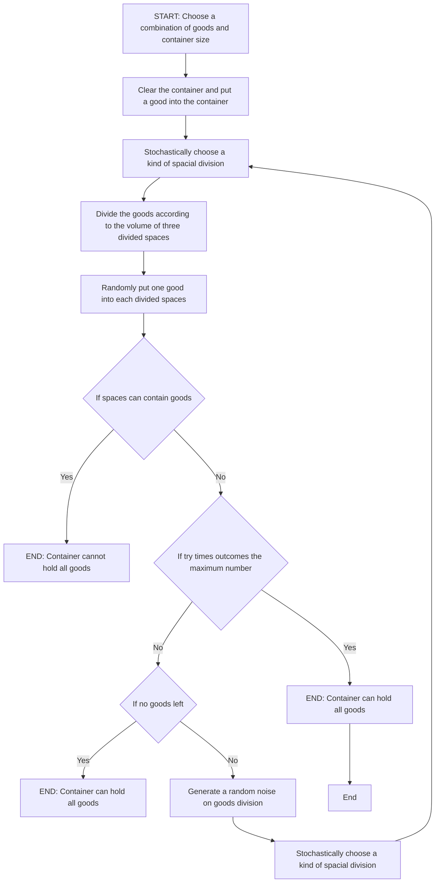
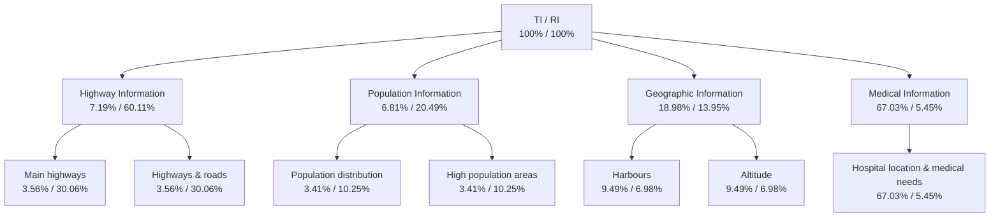
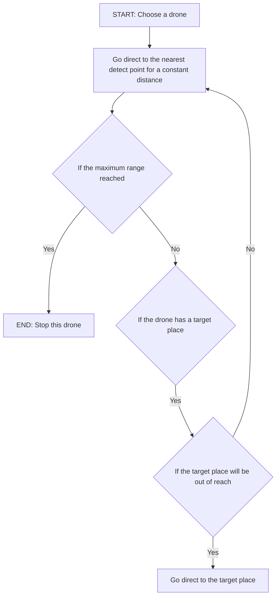
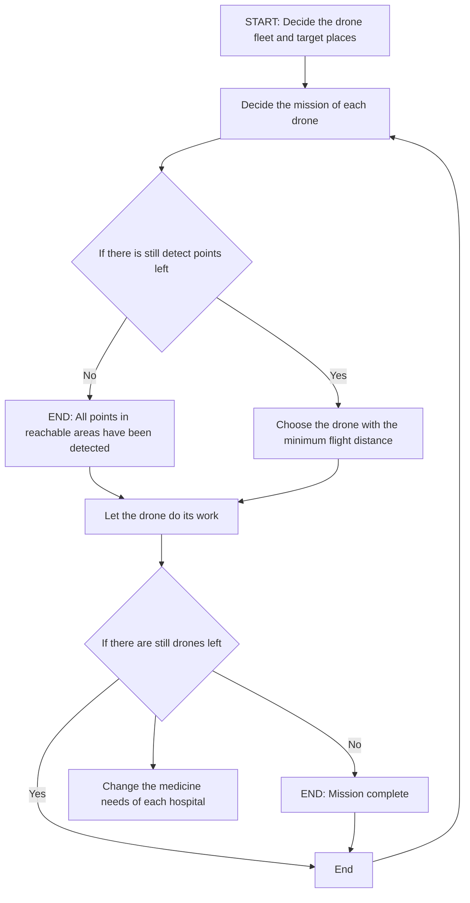

For office use only

T1

T2

T3

T4

Team Control Number

## 1908286

Problem Chosen

B

For office use only

F1

F2

F3

F4

## 2019 MCM/ICM Summary Sheet

Hurricane Maria Damage left Puerto Rico people a lot of pain and devastation. HELP,Inc., an NGO, is attempting to improve its response capabilities by designing a transportable disaster response system called "DroneGo".

In order to better assess the transport capability of the drone fleet, we establish a Transport Capability Evaluation Model of the drone fleet, so that we can maximize the medicine transportation capability of the drone fleet when the disaster location is unknown. In this model, we use the algorithm of linear programming to solve the limitations of volume, weight and other simple factors. After that, we used an algorithm based on three-space segmentation and improved Monte Carlo simulation to solve the size limitation of the objects. As a result, we obtain a reliable evaluation of the transport capability of drones, and it can be found that among the drones, the transportation capability of drone G is the strongest.

Through the research on the reconnaissance method of the drones, we get the Reconnaissance Capability Model of the drone fleet. In this model, we find that the reconnaissance capability of drone B is the strongest. Based on these two models (TCM & RCM) and abundant geographic information, we developed a Geospatial Analysis Model. We employ the Analytical Hierarchy Process (AHP) in the space of all position, obtaining a spatial distribution of drone fleet ˛a´rs transportation capability and reconnaissance capability. Then, we establish an overall Efficiency Evaluation Model for the drone fleet, using a nonlinear programming with a variable parameter to obtain the optimal solution of the drone fleet overall efficiency and its spatial location. Consequently, we can determine a configuration of the drone fleet and each container’s drop point. DroneGo users can also adjust the variable parameter depending on whether they care more about their fleet ˛a´rs transport capability or reconnaissance capability to determine different options. For the problem of multiple containers, we use a dynamic programming rule that allows users to arrange multiple containers.

In considering that the transportation capability of the drone fleet is as important as the reconnaissance capability, we get results that the medicine delivery can be maintained for more than two months and road reconnaissance coverage can reach nearly 60%. Meanwhile we construct an efficient Schedule Arrangement Model and Route Arrangement Model of drones using an integer programming model and an improved greedy algorithm, so that the drone fleet can be auto arranged.

The sensitivity analysis shows the strong robustness of our model. Meanwhile, we further discuss the possibility of developing a DroneGo system software, and provide practicable advice to the HELP, Inc. CEO.

Keywords: Multi-Objective Programming,Dynamic Programming, Drone Rescue Model, AHP

## Contents

1 Introduction 2  
2 Assumptions and Justification 2  
3 Transportation Capability Evaluation Model 3

3.1 Assumptions in This Model 3  
3.2 Three Space Division Model . 3  
3.3 Putting MEDs into Bays 5  
3.4 Drone Transport Capability Model 6  
3.5 Putting Drones and Bays into Cargo Conatainers . .  
3.6 Monte-Carlo Simulation And Results . . . . L

4 Geospatial Analysis Model 8

4.1 Drone Reconnaissance Model 8  
4.2 Geographical Features 9  
4.3 Singal Location Determination 10  
4.4 Multiple Locations Determination 13  
4.5 Results 14

5 Fleet Arrange Model 14

5.1 Schedule Arrangement Model . . . 14  
5.2 Drone Route Planning Model 16

6 Sensitivity Analysis 19

7 Strengths and Weaknesses 19

7.1 Strengths . . . 19  
7.2 Weaknesses 20

8 Conclusion 20

# An optional Design of DroneGo

## 1 Introduction

People in disaster areas are in great need of timely emergency services. [1] Drones can help a lot in emergency rescue. According to a drone manufacturer DJI [2], drones have saved 59 lives since 2013.

In this paper, we will

• Analyze three dimensional packing problem and develop Three Space Division Model and improved Monte-Carlo Simulation to solve the problem of packing restrictions in the transportation.  
• Analyze the transportation capability and detective capability of each Drone type,apply AHP method to considers the influence of many possible factors on the selection of container drop location , including transportation, population, geography and medical information.  
• Build a model to determine drone payload packing configuration and solve it with a complex integer programming quickly and accurately.  
• Improve greedy algorithm and figure out the drone route planing quickly and accurately.

## 2 Assumptions and Justification

We make some general assumptions to simplify our model. These assumptions together with corresponding justification are listed below:

• There are no charging devices for drones. In 2017, Hurricane Maria knocked down 80% of Puerto Rico’s utility poles and all transmission lines. We can infer that electricity are not available on the island. Our Cargo will not include charging equipment or generating set, due to extra weight and inconvenience.

• The cargo weight does not influence the maximum flight distance of a drone. That is, maximum flight distance is exactly the same with or without a cargo. We make the assumption for simplicity. In reality, the weight of a delivery drone is often larger than that of its cargo. It is quite reasonable to neglect the influence of cargo weight. And this will greatly simply our model.

• For each Cargo Container, we will load one tethered Drone (type H). In natural disasters, communication facilities are often affected to various degrees, and emergency communication becomes an urgent need. It can act as an emergency communication base station. Tethered drones will greatly enhance the disaster response capability of DroneGo system.

• One drone can carry one drone cargo bay or no bay for every flight. If the drone carries one, it can only deliver the bay to one location. Both of the two types of drone cargo bay are "top loaded", that is, loaded on the top of a drone. If we distribute more than one bay at a flight, connections between cargo bays could be unstable. We can deliver a drone cargo bay to only one place since it is an integral package that cannot be open in transit.

• Helicopters can transport cargo containers to any given place in the disaster area. In disaster-affected areas, timely external assistance is urgently needed to restore order. Therefore, we consider air transportation rather than sea transportation. Although Puerto Rico is an island, air transportation will bring adaptability to our model in other situations.

• Communication and data transmission of drones are always available. We can achieve telecommunication by radio communication or satellite communication. Drone communication dose not rely on ground devices.

• For the ith type of drone, its maximum Flight Distance, denoted by $D i s t _ { i }$ is in direct proportion to the product of Speed and F lightT ime(No Cargo). From that assumption, we have $D i s t _ { i } = \hat { \alpha } \times S p e e d \times \bar { F l i g h t } T i m e ( N o C a r g o )$ , where α represents distance-loss coefficient. Here we neglect the effect of weather (especially wind) and different battery and motor of different drones of a specific type. To determine $\alpha ,$ we note that there are mostly mountains with few plains. And Puerto Rico has a mean elevation of 261 m. [3] The high elevation shortens the maximum flight distance. We have $\alpha < 1$ . For simplification, we choose $\alpha = 0 . 9$ .

More detailed assumptions will be listed if needed.

## 3 Transportation Capability Evaluation Model

In this section, we will evaluate transportation ability of each type of drones. For simplicity, we will focus on the need of medical transportation here. We will incorporate road reconnaissance into our model in Section 5.

## 3.1 Assumptions in This Model

We will use the following assumptions in this section:

• All Cargo Containers(CC), Drone (in shipping containers), Drone Cargo Bays (DCB), and Medical packages (MP) are cuboids.  
• Drones and Drone Cargo Bays should be placed into Cargo Containers in parallel, which is "parallel placement". That is, the inner subface of Drones or Bays must be parallel to the corresponding surface of the Cargo Container. There are two reasons. For one thing, the parallel placement is one of the most commonly used packing methods. For another thing, cargos can be easily placed in this way and have a high stability.  
• The thickness of Drone Cargo Bays can be neglected.  
• Goods can be arbitrarily rotated, but must still satisfy the "parallel placement" condition.  
• As is interpreted in the problem description, each Cargo Container’s contents should be packed, so all Medical Packages should be packed in Drone Cargo Bays. We do not consider Medical Packages directly placed in a Cargo Container.

## 3.2 Three Space Division Model

## 3.2.1 One Goods Condition

To design a packing configuration for DroneGo, we need to put MEDs into Bays and put Bays or Drones into Containers. Due to various kinds of goods in the problem, this is a threedimensional heterogeneous container loading problem. We use the Three Space Division Method and Monte Carlo Simulation to solve it.

Note that we refer to a rectangular container that contains goods as a box. As is shown in Figure 1, $L , W$ and H is the length, width and height of the container, respectively. Similarly, $l ,$ w and h is the length, width and height of the cargo, respectively. We set up a Cartesian coordinate at the left bottom vertex of the container. Note that we consider the position of the container is unchanged. We put the cargo into the container, so that two left bottom vertexes coincide. Arrangement problem is a way to think about ways to put the cargo. To put

h into x, y and z coordinates, we have $\mathrm { A _ { 3 } ^ { 3 } = 6 }$ . There are six ways to put the cargo inside. That is, there are six possible combinations of the coordinates of the diagonal vertex of the cargo.

text_image

z
spaceZ
spaceX
y
x
spaceY
(a)

Figure 1: Three Space Division

For every specific combination, we can see that the rest space in the container are cut into three parts (spaceX, spaceY and spaceZ) , see figure 1. One possible sequence (shown in Figure 1) to generate the three parts is

1. Procedure X: Cut the remaining space using a plane perpendicular to the X-axis and get spaceX.  
2. Procedure Y: Cut the remaining space using a plane perpendicular to the Y-axis and get spaceY.  
3. Procedure Z: Cut the remaining space using a plane perpendicular to the Z-axis and get spaceZ.

We refer to this sequence as a X-Y-Z sequence. The rest are similar. Arrangement problem is a way to think about the space cutting process. To generate a sequence from procedure X, Y and Z we have $\mathrm { A _ { 3 } ^ { 3 } = 6 }$ .

Thus, if a cargo can be put into the cargo, we have the total cases of three space division: $6 \times 6 = 3 6$ Then we consider every new space as a new container. And the three space division process goes on, until the cargo can not be put into any of the existing containers. In this way, we can traverse all situations and find the optimal solution for a specific objective function.

## 3.2.2 Multiple Goods Condition

To clarify the problem, we will use the following notations:

• $\mathbb { K } = \{ 1 , 2 , \ldots , | \mathbb { K } | \}$ is the set of Boxes’ number;  
• $\mathbb { R } = \left\{ 1 , 2 , \ldots , | \mathbb { R } | \right\}$ is the set of goods’ types;  
• $\mathbb { M } _ { r } = \dot { \{ 1 , 2 , \dots , | \dot { \mathbb { M } } _ { r } | \} }$ is the set of goods’ number (same type) ;  
• $\mathbf { s ^ { B } } = ( L W H ) ^ { \mathrm { T } }$ is Box Size column vector;  
• $\mathbf { s } _ { \mathbf { r } } ^ { \mathbf { G } } = \dot { ( } l _ { r } \ w _ { r } \ h _ { r } ) ^ { \mathrm { T } }$ is the rth type of Goods Size column vector;  
• $X _ { k }$ is the number of goods in the kth box;

$$
Y _ {k r m} = \left\{ \begin{array}{l l} 1, & \text { if   the   } m \text { th   Goods   of   Type   } r \text {   is   in   Box   } k \\ 0, & \text { otherwise } \end{array} \right. \text {   is   an   Existing   Flag; }
$$

• $\mathbf { u } = ( x _ { k r m } \ y _ { k r m } \ z _ { k r m } ) ^ { \mathrm { T } }$ is coordinates of the mth goods of Type r in Box k;

$$
l _ {x r m} = \left\{ \begin{array}{l l} 1, & \text { if   the   length   of   the   } m \text { th   Goods   of   Type } r \text { is   parallel   to   the   x - axis } \\ 0, & \text { otherwise } \end{array} \right.
$$

is a Configuration Variable;

$$
\mathbf {P} = \left( \begin{array}{c c c} l _ {x r m} & l _ {y r m} & l _ {z r m} \\ w _ {x r m} & w _ {y r m} & w _ {z r m} \\ h _ {x r m} & h _ {y r m} & h _ {z r m} \end{array} \right) \quad \text {is Configuration Matrix.}
$$

Undefined elements in the matrix is defined similarly to $l _ { x r m }$ .

In multiple-goods-condition, we consider the container loading problem as a Single-objective integer programming problem. Constraint Conditions of the three-dimensional heterogeneous container loading problem are listed below:

1. Boxes should contain all goods:

$$
\sum_ {k = 1} ^ {| \mathbb {K} |} X _ {k} = \sum_ {r = 1} ^ {| \mathbb {R} |} M _ {r}
$$

2. Corresponding Rule. Each goods should be placed into just only one box:

$$
\forall r \in \mathbb {R}, \forall m \in \mathbb {M} _ {r}, \sum_ {k = 1} ^ {| \mathbb {K} |} Y _ {k m r} = 1
$$

3. Configuration Constraint. Each edge in each goods should be parallel to just only one edge of the corresponding box. Let $\begin{array} { r } { \breve { \mathbf { P } } = ( p _ { a b } ) _ { 3 \times 3 } , } \end{array}$ we have

$$
\sum_ {a = 1} ^ {3} p _ {a b} = 1 \quad \sum_ {b = 1} ^ {3} p _ {a b} = 1.
$$

4. Box Size Constraint. All goods should be inside the corresponding box:

$$
\forall k \in \mathbb {K}, \forall r \in \mathbb {R}, \forall m \in \mathbb {M} _ {r}, Y _ {k r m} (\mathbf {u} + \mathbf {P} \cdot \mathbf {s} _ {\mathbf {r}} ^ {\mathbf {G}}) \leq \mathbf {s} ^ {\mathbf {B}}
$$

We can solve the programming problem with a specific objective function.

## 3.3 Putting MEDs into Bays

Since there are only three types of MEDs and two types of Bays, putting MEDs into Bays is relatively simple. In 3D heterogeneous container loading problems, space utilization(SU) usually decreases as type of goods R increases. For simplicity, we only consider two types of MEDs or less in a Bay. We do not need to consider an objective function in this process. Rather, we list all possible combinations subject to its constraint conditions.

Let $\mathbb { R } = \{ 1 , 2 , 3 \}$ , whose elements 1, 2 and 3 correspond to MED1, MED2 and MED3, respectively. And $\left| { \mathbb M } _ { r } \right|$ is the number of MEDr. For type q Bay $( q = 1 , 2 )$ , we have the following constraint conditions:

$$
\left\{ \begin{array}{l} \sum_ {k = 1} ^ {| \mathbb {K} |} X _ {k} = \sum_ {r = 1} ^ {3} M _ {r} \\ \sum_ {k = 1} ^ {| \mathbb {K} |} Y _ {k m r} = 1, \forall r \in \mathbb {R}, \forall m \in \mathbb {M} _ {r} \\ \sum_ {a = 1} ^ {3} p _ {a b} = 1 \\ \sum_ {b = 1} ^ {3} p _ {a b} = 1 \\ Y _ {k r m} (\mathbf {u} + \mathbf {P} \cdot \mathbf {s} _ {\mathbf {r}} ^ {\mathbf {G}}) \leq \mathbf {s} _ {\mathbf {q}} ^ {\mathbf {B}}, \forall k \in \mathbb {K}, \forall r \in \mathbb {R}, \forall m \in \mathbb {M} _ {r} \end{array} , \right. \tag {1}
$$

where $\mathbf { s _ { 1 } ^ { B } } = ( 8 \ 1 0 \ 1 4 ) ^ { \mathrm { T } } , \mathbf { s _ { 2 } ^ { B } } = ( 2 4 \ 2 0 \ 2 0 ) ^ { \mathrm { T } } .$

For type i Drone, an additional constraint is that total weight cannot exceed Max Payload Capability(M P Ci):

$$
2 \left| \mathbb {M} _ {1} \right| + 2 \left| \mathbb {M} _ {2} \right| + 3 \left| \mathbb {M} _ {3} \right| \leq M P C _ {i} \tag {2}
$$

(1 and (2) determine whether we can put a set of MEDs into a Bay. If that set of MEDs works, we calculate its space utilization:

$$
S U = \frac {\sum_ {r = 1} ^ {3} (| \mathbb {M} _ {r} | l _ {r} w _ {r} h _ {r})}{L _ {q} W _ {q} H _ {q}},
$$

where $( l _ { \bot } \ w _ { 1 } \ h _ { 1 } ) ^ { \mathrm { T } } = ( \bot 4 \ 7 \ 5 ) ^ { \mathrm { T } } , \ ( l _ { 2 } \ w _ { 2 } \ h _ { 2 } ) ^ { \mathrm { T } } = ( 5 \ 8 \ 5 ) ^ { \mathrm { T } } , \ ( l _ { 3 } \ w _ { 3 } \ h _ { 3 } ) ^ { \mathrm { T } } = ( 1 2 \ 7 \ 4 ) ^ { \mathrm { T } } , \ ( L _ { 1 } \ W _ { 1 } \ H _ { 1 } ) ^ { \mathrm { T } } = ( 2 5 \ 6 \ 3 ) ^ { \mathrm { T } } .$ $( 8 1 0 1 4 ) ^ { \mathrm { T } } , ( L _ { 2 } \dot { W } _ { 2 } H _ { 2 } ) ^ { \mathrm { T } } = ( 2 4 2 0 2 0 ) ^ { \mathrm { T } } .$ .

We draw the space utilization plot of Drone D (Bay 1) and Drone F (Bay 2), see Figure 2. From the figure we can see that space utilization of Bay 2 is relatively low. The reason is that the inequality (2) is strict. In most cases, the max payload capability is so small that the all sets of MEDs that satisfy (2) can be loaded. So the sub-figures for Bay 2 clearly shows the inequality (2).

bar chart

| MED1 | MED2 |
| ---- | ---- |
| 3    | 0    |
| 2    | 0.85 |
| 1    | 0.6  |
| 0    | 0.3  |
| 1    | 0.75 |
| 2    | 0.8  |

bar chart

| MED   | bay1 space utilization |
|-------|------------------------|
| MED1  | 0.9                    |
| MED1  | 0.4                    |
| MED1  | 0.7                    |
| MED3  | 0.2                    |
| MED3  | 0.6                    |

bar chart

|        | Blue Bar | Teal Bar | Yellow Bar |
| ------ | -------- | -------- | ---------- |
| MED2   | 0.7      | 0.5      | 0.9        |
| MED3   | 0.1      | 0.4      | 0.6        |

bar chart

| MED1 | MED2 |
|------|------|
| 0    | 0    |
| 1    | 0.2  |
| 2    | 0.4  |

3d bar chart

| MED1 | MED3 | bay2 space utilization |
| ---- | ---- | ---------------------- |
| 2    | 0    | 0.55                   |
| 1    | 0    | 0.45                   |
| 0    | 0    | 0.35                   |
| 1    | 0    | 0.25                   |
| 2    | 0    | 0.15                   |
| 1    | 0    | 0.05                   |
| 0    | 0    | 0.0                    |
| 1    | 0    | 0.1                    |
| 2    | 0    | 0.2                    |
| 1    | 0    | 0.3                    |
| 0    | 0    | 0.4                    |
| 1    | 0    | 0.5                    |
| 2    | 0    | 0.6                    |

bar chart

|        | MED2  | MED3  |
| ------ | ----- | ----- |
| 2      | 0.23  | 0.24  |
| 1      | 0.18  | 0.22  |
| 0      | 0.12  | 0.25  |
| 1      | 0.16  | 0.26  |
| 2      | 0.19  | 0.27  |

Figure 2: Space Utilization with different MEDs and different Bays

From Figure 2, we conclude that the Transport Capability matrix is

$$
\mathbf {T C} = \left( \begin{array}{l l l} 1 & 1 & 1 \\ 2 & 4 & 2 \\ 7 & 7 & 4 \\ 2 & 4 & 2 \\ 7 & 7 & 5 \\ 1 1 & 1 1 & 7 \\ 1 0 & 1 0 & 6 \end{array} \right). \tag {4}
$$

## 3.4 Drone Transport Capability Model

Since we only consider medicine transport in this section, there must be a corresponding Drone Cargo Bay on each drone. The number of Typei Drones to carry $N u m _ { M E D j }$ MEDjs is

$$
N u m _ {i j} = N u m _ {M E D j} / T C _ {i j}
$$

. Note that we use $N u m _ { i j }$ to evaluate transport capability, so it may be a decimal. The volume needed when one Typei Drone carries all MEDs for one day is

$$
V _ {i} ^ {\text {Med Day}} = (\sum_ {j = 1} ^ {3} N u m _ {i j}) (V _ {i} ^ {\text {drone}} + V _ {i} ^ {\text {Bay}})
$$

. The number of days that a Typei Drone can continue transporting MEDs to all needed place is

$$
D a y s _ {i} = V _ {c} o n t a i n e r / V _ {i} ^ {M e d D a y}
$$

Transport Capability Index of Typei Drone is defined as the normalization of maximum day Daysi:

$$
T C I _ {i} = D a y s _ {i} / \max _ {1 \leq k \leq 7} \{D a y s _ {k} \}
$$

We have two matrices:

$$
\mathbf {D a y s} = \left( \begin{array}{c} 2. 9 7 \\ 1 5. 9 2 \\ 8. 7 8 \\ 2 4. 4 5 \\ 4 1. 4 6 \\ 2 8. 9 8 \\ 4 7. 2 1 \end{array} \right) \quad \mathbf {T C I} = \left( \begin{array}{c} 0. 0 6 2 9 \\ 0. 3 3 7 1 \\ 0. 1 8 5 9 \\ 0. 5 1 7 8 \\ 0. 8 7 8 2 \\ 0. 6 1 3 9 \\ 1. 0 0 0 0 \end{array} \right) \tag {5}
$$

## 3.5 Putting Drones and Bays into Cargo Conatainers

According to TCI matrix (5), Type E and G Drones have the best transport capability. We will choose Type E and G as alternative transport drones. The corresponding Bays are Bays 2. We will also load one Drone H (tethered drone) in each Cargo Container, because it helps to build emergency communication.

Let R = {4, 5, 6, 7}. 4, 5, 6 and 7 represent Bay 2, Drone E, H and $G ,$ respectively. The number of MEDs in Bay 2 only relies on Type i drone’s Max Payload Capability $\hat { M } P C _ { i }$ . So we conclude that for Drone fleet consisting of E and G, transport capability is only relevant to Total Load Weight:

$$
T L W = \sum_ {i = 5, 7} M P C _ {i} \times | \mathbb {M} _ {i} | = 1 5 | \mathbb {M} _ {5} | + 2 0 | \mathbb {M} _ {7} | \tag {6}
$$

Our problem can be stated as

$$
\mathbf {m a x} T L W = 1 5 | \mathbb {M} _ {5} | + 2 0 | \mathbb {M} _ {7} |
$$

Equation (??) shows that each Drone must carry one Bay, so the total number of Drones E and G equal to the number of Bays 2. Equation (??) shows that each Cargo Container should have one Type H Drone.

## 3.6 Monte-Carlo Simulation And Results

We use Monte-Carlo Simulation to get a satisfactory solution of the problem in Section 4.5. Since this is a NP-completeness problem, it takes too long to traverse all situations. Our objective function will not have major changes with a narrow change of inputs. That is, the optimal point is not an isolated singularity. That’s why we choose Monte-Carlo Simulation.

If the probability to find the optimal point is $1 0 ^ { - 5 }$ for one simulation, the probability to find the optimal point will be $1 - 0 . 9 9 9 9 9 ^ { 1 0 0 \hat { 0 } 0 0 0 } = 0 . 9 9 9 9 5 4$ with one billion simulations. Figure 3 is our simulation process using Three Space Division method. We start at a feasible solution $| \mathbb { M } _ { 4 } | = 5 0 , | \mathbb { M } _ { 5 } | = \dot { 3 } 0 , | \mathbb { M } _ { 6 } | = 1 , | \mathbb { M } _ { 7 } | = 2 0$ .

flowchart

Figure 3: Monte-Carlo Simulation Process

Table 1: Satisfactory Packing Configuration for Each Container

<table><tr><td colspan="3">Container 1</td><td colspan="3">Container 2</td><td colspan="3">Container 3</td><td rowspan="2">space utilization</td><td rowspan="2">days</td></tr><tr><td>drone G</td><td>drone H</td><td>bay 2</td><td>drone G</td><td>drone H</td><td>bay 2</td><td>drone G</td><td>drone H</td><td>bay 2</td></tr><tr><td>80</td><td>1</td><td>0</td><td>64</td><td>1</td><td>24</td><td>0</td><td>1</td><td>120</td><td>97.97%</td><td>106</td></tr><tr><td>84</td><td>0</td><td>0</td><td>76</td><td>0</td><td>16</td><td>0</td><td>0</td><td>144</td><td>97.73%</td><td>96</td></tr></table>

Using the Three Space Division Model and Monte-Carlo Simulation, we obtain the satisfactory packing configuration for each container (with or without Drone H). The result shows that the ideal optimal solution is, at most, slightly better than our satisfied solution(space utilization up to 97.97%). It also validates that Drone G has the best transportation capability, which perfectly fit the highest Drone G TCI value.

## 4 Geospatial Analysis Model

## 4.1 Drone Reconnaissance Model

For a video-capable drone, in order to effectively estimate its maximum viewing radius, $r _ { v i e w } ,$ we make the following assumptions:

1. The height between a drone and the ground is 20 meters.  
2. The drone’s lens can swing back and forth from side to side, with unlimited viewing angles.  
3. The camera on a drone (if it has one) is a two megapixel camera (a 1080P lens).  
4. The resolution of road detection is one meter.

We see

$$
\left\{ \begin{array}{l} \tan (\theta + \Delta \theta) = r _ {v i e w} / 2 0 \\ \tan \theta = (r _ {v i e w} - 1) / 2 0 \end{array} \right.,
$$

where

• θ is the camera’s forward viewing angle;  
• $\Delta \theta$ is the smallest resolution angle;  
• $r _ { v i e w }$ is the maximum viewing radius.

For a two megapixel camera, we have $\Delta \theta = 3 \times 1 0 ^ { - 3 }$ rad. Plugging it into (7), we obtain

$$
\left\{ \begin{array}{l l} \theta = 1. 3 2 2 \mathrm{rad} \\ r _ {v i e w} = 7 9. 7 \mathrm{m} \end{array} \right..
$$

Since $r _ { v i e w }$ is close to 100 m, we can divide the island map into grid on the order of one hundred meters, as is shown in Figure[ÍijÆ ˇn]. Every grid covers a $1 0 0 \mathbf { m } \times 1 0 0$ m square. Corresponding to the longitude and latitude,(x, y) is the grid point coordinates of the position.

## 4.2 Geographical Features

We divide the location selection problem into two major parts Transport and Reconnaissance. Then we decide that the information of highway, population, geographic and medical are important to Transport and Reconnaissance. Using the map in the attachment and from Puerto Rico Maps [4], we find seven features for the four types of information, see Table 2.

Table 2: Features (F O is the Feather Order)

<table><tr><td>F0</td><td>1</td><td>2</td><td>3</td><td>4</td><td>5</td><td>6</td><td>7</td></tr><tr><td>feature (F0)</td><td>Main highways</td><td>Highways &amp; roads</td><td>Population distribution</td><td>High population areas</td><td>Harbours</td><td>Altitude</td><td>Hospital location &amp; medical needs</td></tr></table>

For a certain position, Feature1 means the main highways. Feature 2 means the highways we extract from attachment 1. Feature 3 means the density of population [4]. Feature4 means high population areas from the given map. Feature 5 means the distance from harbors. [3] Feature 6 means the altitude. Feature 7 means the index considering transporting MEDs.

The feature maps are shown in Figure 4. Note that all feature maps are normalized, so that for every map, the sum of all values is 1 :

$$
\sum_ {x} \sum_ {y} F e a t u r e (F O, x, y), \forall F O \in \{\mathbb {Z} | 1 \leq F O \leq 7 \},
$$

where F eature $( F O , x , y )$ is the geographical distribution function of featureF O.

The weight of hospital j

$$
H O S _ {j} = \sum_ {i = 1} ^ {3} M e d W i g h t _ {i} \times M e d N u m b e r _ {j i}
$$

We assign the values in hospital map.

We calculate Transport cost for MEDj by Demand number for MEDj:

$$
M e d W e i g h t _ {j} = M e d _ {j} / \sum_ {i = 1} ^ {3} M e d _ {i}
$$

We have

$$
\text { MedWeight } = (0. 2 9 4 9 0. 2 6 8 1 0. 4 3 6 9) ^ {\mathrm{T}} j = 1, 2, 3 \tag {8}
$$

From (8) we see $M e d W e i g h t _ { 2 }$ is smallest, because MED 2 has the least demand.

## 4.3 Singal Location Determination

## 4.3.1 Detail Information of TI and RI

$\pmb { T } \pmb { I } _ { d e t a i l }$ is an evaluation index for Drone Type i of feature $F O$ in position $p _ { 1 } ( x , y )$ and evaluates the detailed transport capability. Let $p _ { 1 }$ be the target position for Cargo Container. Let $p _ { 2 }$ be the corresponding point in feature map, we have

$$
T I _ {d e t a i l} (i, F O, p 1) = \sum_ {p _ {2}} T I _ {\alpha} (i, p _ {1}, p _ {2}) F e a t u r e (F O, p _ {2}).
$$

Similarly, $\begin{array} { r } { R I _ { d e t a i l } ( i , F O , p 1 ) = \sum _ { p _ { 0 } } R I _ { \alpha } ( i , p _ { 1 } , p _ { 2 } ) F e a t u r e ( F O , p _ { 2 } ) . } \end{array}$ .

${ \pmb T } { \pmb I } _ { \alpha }$ is a function of $i , p _ { 1 }$ and $p _ { 2 } \colon$ :

$$
T I _ {\alpha} (i, p _ {1}, p _ {2}) = T I _ {d i s t a n c e} (i, p _ {1}, p _ {2}) T I _ {c o v e r} (i) T C I (i)
$$

Similarly, $\underline { { R I } } _ { \alpha } ( i , p _ { 1 } , p _ { 2 } ) = R I _ { d i s t a n c e } ( i , p _ { 1 } , p _ { 2 } ) R I _ { c o v e r } ( i ) R C I ( i )$

$\underline { { \boldsymbol { T } } } \boldsymbol { I } _ { d i s t a n c e }$ measures Transporting Index with flight distance:

$$
T I _ {\text { distance }} = \left\{ \begin{array}{l l} 1 - \frac {\text { dis } (p _ {1} , p _ {2})}{D I S (i)} \beta_ {T I}, & \text { dis } <   D I S \\ 0, & \text { otherwise } \end{array} \right., \tag {9}
$$

where

• $d i s ( p _ { 1 } , p _ { 2 } )$ is the distance between $p _ { 1 } , p _ { 2 } ;$  
• $D I S ( i )$ is the longest flight distance.

$$
D I S (i) = \alpha \times \text { Speed } \times \text { Flight   Time   (No   Cargo),see(2) } \tag {10}
$$

The function (9) shows that closer points are more important within coverage area. $\beta _ { T I } = 0 . 2$ produces a linear transformation.

Similarly,

$$
\underline {{R I _ {d i s t a n c e}}} = \left\{ \begin{array}{l l} 1 - (1 - \frac {\text { dis } (p _ {1} , p _ {2})}{D I S (i)}) \beta_ {R I}, & \text { dis } <   D I S \\ 0, & \text { otherwise } \end{array} \right., \tag {11}
$$

where $\beta _ { R I } = 0 . 2 , \beta _ { R I }$ produces a linear transformation. Compare (9) and (11), function (11) shows that in reconnaissance, farther points are preferred, because the close ones can be detected on the way to medical

$\underline { { \boldsymbol { T } \boldsymbol { I } _ { c o v e r } } }$ measures Transporting Index with coverage area. The effectiveness of each point in coverage area is equally important.

$$
T I _ {\text { cover }} (i) = 1 / \left(\pi \cdot (D I S (i)) ^ {2} \cdot \beta_ {T I} ^ {\prime}\right), \tag {12}
$$

where $\beta _ { T I } ^ { \prime }$ is determined by βT I; $\beta _ { T I } ^ { \prime } = 1 3 / 1 5$ .

$\mathrm { S i m i l a r l y } , \underline { { R } } I _ { c o v e r }  &  ( i ) = 1 / ( \pi \cdot ( D I S ( i ) ) ^ { 2 } \cdot \beta _ { R I } ^ { \prime } ) , \beta _ { R I } ^ { \prime } = 1 4 / 1 5$

T CI measures Transporting Index with and Transporting Capability of Drone Type i with unit volume. We computed the result of $T C I ( i )$ in matrix TCI (5). Similarly, We calculate $R C I _ { 1 } ( i ) = ( D I S ( i ) ) ^ { 2 } / \dot { V } ( i )$ ,where V(i) is the total volume of Type i drones and corresponding Bays. Then we normalize it as $\underline { { R C I ( \dot { i } ) } } = R C I _ { 1 } ( i ) / \operatorname* { m a x } _ { 1 \leq p \leq 7 } R C I _ { 1 } ( \dot { p } ) ^ { \frac { 1 } { 2 } }$

After we calculate $T I _ { d e t a i l } ( i , F O , x , y )$ and $R I _ { d e t a i l } ( i , F O , x , y )$ , we should take all features into account and calculate the integrate Transport Index of all features $\underline { { \boldsymbol { T } } } \underline { { \boldsymbol { I } } } ( i , x , y )$ :

$$
T I (i, x, y) = \sum_ {F O} w _ {T I} (F O) \cdot T I _ {\text { detail }} (i, F O, x, y) \tag {13}
$$

Similarly, $\begin{array} { r } { \underline { { \boldsymbol { R I } } } ( i , x , y ) = \sum _ { F O } w _ { R I } ( F O ) \cdot R I _ { d e t a i l } ( i , F O , x , y ) } \end{array}$ . We obtain a Reconnaissance Capability Index matrix

$$
\mathbf {R C I} = \left( \begin{array}{l} 0. 0 7 6 8 \\ 1. 0 0 0 0 \\ 0. 1 1 0 5 \\ 0. 1 8 5 0 \\ 0. 1 1 9 0 \\ 0. 1 7 8 2 \\ 0. 1 1 9 4 \end{array} \right) \tag {14}
$$

Matrix (14) shows that Drone B is the best type to detect highways and roads. Note that Drone B is a lot better than the other types.

We listed a few results of the detail information of TI and RI based on Puerto Rico case (see Figure 4).

natural_image

Simple hand-drawn outline of a geographical region with no text or symbols

(a) Main Highways

natural_image

Outline map of a country with irregular boundaries and no visible text or labels

(b) Highways and Roads

  
(c) Populated Places

heatmap

| Latitude | Longitude | Value |
| --- | --- | --- |
| 15 | 150 | 9 |
| 15 | 160 | 9 |
| 15 | 170 | 9 |
| 15 | 180 | 9 |
| 15 | 190 | 9 |
| 15 | 200 | 9 |
| 15 | 210 | 9 |
| 15 | 220 | 9 |
| 25 | 150 | 9 |
| 25 | 160 | 9 |
| 25 | 170 | 9 |
| 25 | 180 | 9 |
| 25 | 190 | 9 |
| 25 | 200 | 9 |
| 25 | 210 | 9 |
| 30 | 150 | 9 |
| 30 | 160 | 9 |
| 30 | 170 | 9 |
| 30 | 180 | 9 |
| 30 | 190 | 9 |
| 30 | 200 | 9 |
| 30 | 210 | 9 |
| 35 | 150 | 9 |
| 35 | 160 | 9 |
| 35 | 170 | 9 |
| 35 | 180 | 9 |
| 35 | 190 | 9 |
| 35 | 200 | 9 |
| 35 | 210 | 9 |
| 40 | 150 | 9 |
| 40 | 160 | 9 |
| 40 | 170 | 9 |
| 40 | 180 | 9 |
| 40 | 190 | 9 |
| 40 | 200 | 9 |
| 40 | 210 | 9 |
| 45 | 150 | 9 |
| 45 | 160 | 9 |
| 45 | 170 | 9 |
| 45 | 180 | 9 |
| 45 | 190 | 9 |
| 45 | 200 | 9 |
| 45 | 210 | 9 |
| 50 | 150 | 9 |
| 50 | 160 | 9 |
| 50 | 170 | 9 |
| 50 | 180 | 9 |
| 50 | 190 | 9 |
| 50 | 200 | 9 |
| 50 | 210 | 9 |
| ... | ... | ... |
| ... | ... | ... |
| ... | ... | ... |
| ... | ... | ... |
| ... | ... | ... |
| ... | ... | ... |
| ... | ... | ... |
| ... | ... | ... |
| ... | ... | ... |
| ... | ... | ... |
| ... | ... | ... |
| ... | ... | ... |
| ... | ... | ... |
| ... | ... | ... |
| ... | ... | ... |

(d) TI Drone G Main Highways

heatmap

| Longitude (km) | 20 | 40 | 60 | 80 | 100 | 120 | 140 | 160 | 180 | 200 | 220 |
| --- | --- | --- | --- | --- | --- | --- | --- | --- | --- | --- | --- |
| 90 | 0 | 0 | 0 | 0 | 0 | 0 | 0 | 0 | 0 | 0 | 0 |
| 80 | 0 | 0 | 0 | 0 | 0 | 0 | 0 | 0 | 0 | 0 | 0 |
| 70 | 0 | 0 | 0 | 0 | 0 | 0 | 0 | 0 | 0 | 0 | 0 |
| 60 | 0 | 0 | 0 | 0 | 0 | 0 | 0 | 0 | 0 | 0 | 0 |
| 50 | 0 | 0 | 0 | 0 | 0 | 0 | 0 | 0 | 0 | 0 | 0 |
| 40 | 0 | 0 | 0 | 0 | 0 | 0 | 0 | 0 | 0 | 0 | 0 |
| 30 | 0 | 0 | 0 | 0 | 0 | 0 | 0 | 0 | 0 | 0 | 0 |
| 20 | 0 | 0 | 0 | 0 | 0 | 0 | 0 | 0 | 0 | 0 | 0 |
| 10 | 1e-4 | -1e-4 | -1e-4 | -1e-4 | -1e-4 | -1e-4 | -1e-4 | -1e-4 | -1e-4 | -1e-4 | -1e-4 |
| 5 | -1e-4 | -1e-4 | -1e-4 | -1e-4 | -1e-4 | -1e-4 | -1e-4 | -1e-4 | -1e-4 | -1e-4 | -1e-4 |
| 25 | -1e-4 | -1e-4 | -1e-4 | -1e-4 | -1e-4 | -1e-4 | -1e-4 | -1e-4 | -1e-4 | -1e-4 | -1e-4 |

(e) TI Drone G Highways & Roads

heatmap

High population area Ti of drone G
| Latitude | Longitude | Ti Value |
| :--- | :--- | :--- |
| 10 | 20 | 0 |
| 10 | 40 | 0 |
| 10 | 60 | 0 |
| 10 | 80 | 0 |
| 10 | 100 | 0 |
| 10 | 120 | 0 |
| 10 | 140 | 5 |
| 10 | 160 | 5 |
| 10 | 180 | 5 |
| 10 | 200 | 5 |
| 10 | 220 | 5 |
| 20 | 20 | 0 |
| 20 | 40 | 0 |
| 20 | 60 | 0 |
| 20 | 80 | 0 |
| 20 | 100 | 0 |
| 20 | 120 | 0 |
| 20 | 140 | 5 |
| 20 | 160 | 5 |
| 20 | 180 | 5 |
| 20 | 200 | 5 |
| 20 | 220 | 5 |
| 30 | 20 | 0 |
| 30 | 40 | 0 |
| 30 | 60 | 0 |
| 30 | 80 | 0 |
| 30 | 100 | 0 |
| 30 | 120 | 5 |
| 30 | 140 | 5 |
| 30 | 160 | 5 |
| 30 | 180 | 5 |
| 30 | 200 | 5 |
| 30 | 220 | 5 |
| 40 | 20 | 0 |
| 40 | 40 | 0 |
| 40 | 60 | 0 |
| 40 | 80 | 0 |
| 40 | 100 | 5 |
| 40 | 120 | 5 |
| 40 | 140 | 5 |
| 40 | 160 | 5 |
| 40 | 180 | 5 |
| 40 | 200 | 5 |
| 40 | 220 | 5 |
| 50 | 20 | 5 |
| 50 | 40 | 5 |
| 50 | 60 | 5 |
| 50 | 80 | 5 |
| 50 | 100 | 5 |
| 50 | 120 | 5 |
| 50 | 140 | 5 |
| 50 | 160 | 5 |
| 50 | 180 | 5 |
| 50 | 200 | 5 |
| 50 | 220 | 5 |
| ... (Repeated four times) from the image to the image itself. The image contains only one data point labeled 'E'. The text 'High population area Ti of drone G' appears in the top-left corner.

(f) TI Drone G Populated Places

heatmap

| km | 20 | 40 | 60 | 80 | 100 | 120 | 140 | 160 | 180 | 200 | 220 |
| --- | --- | --- | --- | --- | --- | --- | --- | --- | --- | --- | --- |
| 90 | 0 | 0 | 0 | 0 | 0 | 0 | 0 | 0 | 0 | 0 | 0 |
| 80 | 0 | 0 | 0 | 0 | 0 | 0 | 0 | 0 | 0 | 0 | 0 |
| 70 | 0 | 0 | 0 | 0 | 0 | 0 | 0 | 0 | 0 | 0 | 0 |
| 60 | 0 | 0 | 0 | 0 | 0 | 0 | 0 | 0 | 0 | 0 | 0 |
| 50 | 0 | 0 | 0 | 0 | 0 | 0 | 0 | 0 | 0 | 0 | 0 |
| 40 | 0 | 0 | 0 | 0 | 0 | 0 | 0 | 0 | 0 | 0 | 0 |
| 30 | 0 | 0 | 0 | 0 | 0 | 0 | 0 | 0 | 0 | 0 | 0 |
| 20 | 0 | 0 | 0 | 0 | 0 | 0 | 0 | 0 | 0 | 0 | 0 |
| 10 | 1e-4 | -1e-4 | -1e-4 | -1e-4 | -1e-4 | -1e-4 | -1e-4 | -1e-4 | -1e-4 | -1e-4 | -1e-4 |
| 5 | -1e-4 | -1e-4 | -1e-4 | -1e-4 | -1e-4 | -1e-4 | -1e-4 | -1e-4 | -1e-4 | -1e-4 | -1e-4 |
| 15e-4 | -1e-4 | -1e-4 | -1e-4 | -1e-4 | -1e-4 | -1e-4 | -1e-4 | -1e-4 | -1e-4 | -1e-4 | -1e-4 |

(g) RI Drone E Main Highways

heatmap

| X (km) | Y (km) | Value (×10⁶) |
|---|---|---|
| 20 | 10 | 0 |
| 40 | 25 | 1 |
| 60 | 40 | 3 |
| 80 | 50 | 5 |
| 100 | 60 | 7 |
| 120 | 75 | 8 |
| 140 | 80 | 7 |
| 160 | 75 | 6 |
| 180 | 60 | 4 |
| 200 | 40 | 2 |
| 220 | 25 | 1 |
| 240 | 10 | 0 |

(h) RI Drone E Highways &c Roads

heatmap

High population area DI of drone B
| Longitude (km) | 20 | 40 | 60 | 80 | 100 | 120 | 140 | 160 | 180 | 200 | 220 |
| :--- | :--- | :--- | :--- | :--- | :--- | :--- | :--- | :--- | :--- | :--- | :--- |
| 90 | 0.0 | 0.0 | 0.0 | 0.0 | 0.0 | 0.0 | 0.0 | 0.0 | 0.0 | 0.0 | 0.0 |
| 85 | 0.1 | 0.1 | 0.1 | 0.1 | 0.1 | 0.1 | 0.1 | 0.1 | 0.1 | 0.1 | 0.1 |
| 80 | 0.2 | 0.2 | 0.2 | 0.2 | 0.2 | 0.2 | 0.2 | 0.2 | 0.2 | 0.2 | 0.2 |
| 75 | 0.3 | 0.3 | 0.3 | 0.3 | 0.3 | 0.3 | 0.3 | 0.3 | 0.3 | 0.3 | 0.3 |
| 70 | 0.4 | 0.4 | 0.4 | 0.4 | 0.4 | 0.4 | 0.4 | 0.4 | 0.4 | 0.4 | 0.4 |
| 65 | 0.5 | 0.5 | 0.5 | 0.5 | 0.5 | 0.5 | 0.5 | 0.5 | 0.5 | 0.5 | 0.5 |
| 60 | 0.6 | 0.6 | 0.6 | 0.6 | 0.6 | 0.6 | 0.6 | 0.6 | 0.6 | 0.6 | 0.6 |
| 55 | 0.7 | 0.7 | 0.7 | 0.7 | 0.7 | 0.7 | 0.7 | 0.7 | 0.7 | 0.7 | 0.7 |
| 50 | 0.8 | 0.8 | 0.8 | 0.8 | 0.8 | 0.8 | 0.8 | 0.8 | 0.8 | 0.8 | 0.8 |
| 45 | 0.9 | 0.9 | 0.9 | 0.9 | 0.9 | 0.9 | 0.9 | 0.9 | 0.9 | 0.9 | 0.9 |
| 40 | 1.0 | 1.0 | 1.0 | 1.0 | 1.0 | 1.0 | 1.0 | 1.0 | 1.0 | 1.0 | 1.0 |
| 35 | 1.1 | 1.1 | 1.1 | 1.1 | 1.1 | 1.1 | 1.1 | 1.1 | 1.1 | 1.1 | 1.1 |
| 30 | 1.2 | 1.2 | 1.2 | 1.2 | 1.2 | 1.2 | 1.2 | 1.2 | 1.2 | 1.2 | 1.2 |
| 25 | 1.3 | 1.3 | 1.3 | 1.3 | 1.3 | 1.3 | 1.3 | 1.3 | 1.3 | 1.3 | 1.3 |
| The chart is a contour plot of the population area (DII) of drone B, with the x-axis representing longitude (km) and the y-axis representing latitude (km). The color scale indicates the DI value ranging from -1 to +1 ×10⁻⁴, and the legend is implicit in the color bar on the right side of the plot.

(i) RI Drone E Populated Places  
Figure 4: Samples of Detail Information of TI and RI

## 4.3.2 TI and RI

To determine the weight of different features, we employ Analytic Hierarchy Process (AHP). Since those features in Table 2 have different effects on TI and RI, we use AHP twice for TI and RI. The comparison matrices are listed below:

text_image

Highway population rescue medical
Highway. 1 1 1/3 1/7
Population. 1 1 1/4 1/7
Rescue. 3 4 1 1/6
medical. 7 7 6 1

(a) Comparison Matrix For TI  
(b) Comparison Matrix For RI

$$
\begin{array}{cccc}
& & \text{Highway population rescue medical.} \\
& & \left( \begin{array}{cccc}
1 & 4 & 5 & 7\\
1 / 4 & 1 & 2 & 4\\
1 / 5 & 1 / 2 & 1 & 4\\
1 / 7 & 1 / 4 & 1 / 4 & 1
\end{array} \right) \\
\text{Rescue.} \\
\text{medical.}
\end{array}
$$

To test the consistency of the matrices, we calculate the Consistency Ratio (CR), which is defined as the ratio of Consistency Index $( C I )$ to Average Random Consistency Index $( R I ^ { \prime } )$ . $n = 4 , R I ^ { \prime } = 0 . 9 0 , C R = ( \lambda _ { m a x } - \check { n } ) / ( n - 1 )$ . For TI, $C I = 0 . 0 5 3 2 , C R = 0 . 0 5 9 8 ^ { \circ } < 0 . 1$ . For RI, $C I = 0 . 0 5 2 6 , C R = 0 . 0 5 9 1 < 0 . 1 . s \mathrm { o }$ the consistency of the matrices is confirmed.

As is indicated in Figure 6, for Transporting Index, Medical information is the most important factor weighting 67.03%. That is because hospital destination of a Drone transporting MEDs. For Reconnaissance Index, highway information take up the highest at 60.11%. One possible reason is that the flight distance of Drones is limited. Drones must get close enough to detect highways.

Then we put the weight terms into (13) and (4.3.1), and get T I and RI (see Figure5).

heatmap

Ti Drone B
| Latitude (km) | Longitude (km) | Intensity (10^4) |
| :--- | :--- | :--- |
| 10 | 20 | 8 |
| 10 | 40 | 7 |
| 10 | 60 | 6 |
| 10 | 80 | 5 |
| 10 | 100 | 4 |
| 10 | 120 | 3 |
| 10 | 140 | 2 |
| 10 | 160 | 1 |
| 10 | 180 | 0 |
| 10 | 200 | 0 |
| 10 | 220 | 0 |
| 20 | 20 | 8 |
| 20 | 40 | 7 |
| 20 | 60 | 6 |
| 20 | 80 | 5 |
| 20 | 100 | 4 |
| 20 | 120 | 3 |
| 20 | 140 | 2 |
| 20 | 160 | 1 |
| 20 | 180 | 0 |
| 20 | 200 | 0 |
| 20 | 220 | 0 |
| 30 | 20 | 8 |
| 30 | 40 | 7 |
| 30 | 60 | 6 |
| 30 | 80 | 5 |
| 30 | 100 | 4 |
| 30 | 120 | 3 |
| 30 | 140 | 2 |
| 30 | 160 | 1 |
| 30 | 180 | 0 |
| 30 | 200 | 0 |
| 30 | 220 | 0 |
| 40 | 20 | 8 |
| 40 | 40 | 7 |
| 40 | 60 | 6 |
| 40 | 80 | 5 |
| 40 | 100 | 4 |
| 40 | 120 | 3 |
| 40 | 140 | 2 |
| 40 | 160 | 1 |
| 40 | 180 | 0 |
| 40 | 200 | 0 |
| 40 | 220 | 0 |
| 50 | 20 | 8 |
| 50 | 40 | 7 |
| 50 | 60 | 6 |
| 50 | 80 | 5 |
| 50 | 100 | 4 |
| 50 | 120 | 3 |
| 50 | 140 | 2 |
| 50 | 160 | 1 |
| 50 | 180 | 0 |
| 50 | 200 | 0 |
| 50 | 220 | 0 |
| ... (Repeated four times) from image to image correspond to the visual intensity scale.

(c) TI Drone B

heatmap

Ti Drone E
| Longitude (km) | Latitude (km) | Intensity (x10⁻⁴) |
| :--- | :--- | :--- |
| 145 | 30 | 7.2 |
| 160 | 30 | 6.8 |
| 140 | 40 | 7.5 |
| 150 | 40 | 6.5 |
| 130 | 50 | 5.8 |
| 165 | 50 | 5.2 |
| 135 | 60 | 4.9 |
| 170 | 60 | 4.5 |
| 145 | 70 | 4.2 |
| 175 | 70 | 3.9 |
| 155 | 80 | 3.6 |
| 180 | 80 | 3.3 |
| 160 | 90 | 3.1 |
| 185 | 90 | 2.9 |
| 170 | 100 | 2.7 |
| 190 | 100 | 2.5 |
| 180 | 110 | 2.3 |
| 195 | 110 | 2.1 |
| 185 | 120 | 1.9 |
| 200 | 120 | 1.7 |
| 210 | 130 | 1.5 |
| 205 | 130 | 1.3 |
| 220 | 140 | 1.1 |
| 215 | 145 | 0.9 |
| 230 | 150 | 0.7 |
| 225 | 160 | 0.5 |
| 240 | 170 | 0.3 |
| 235 | 180 | 0.2 |
| 250 | 190 | 0.1 |
| 245 | 200 | 0.0 |
| 260 | 210 | -0.1 |
| 255 | 220 | -0.2 |
| 270 | 230 | -0.3 |
| 265 | 240 | -0.4 |
| 285 | 250 | -0.5 |
| 275 | 260 | -0.6 |
| 300 | 270 | -0.7 |
| 315 | 280 | -0.8 |
| 305 | 290 | -0.9 |
| 325 | 300 | -1.0 |
| 315 | 310 | -1.1 |
| 335 | 320 | -1.2 |
| 325 | 330 | -1.3 |
| 345 | 340 | -1.4 |
| 335 | 350 | -1.5 |
| 365 | 360 | -1.6 |
| 355 | 370 | -1.7 |
| 375 | 380 | -1.8 |
| 365 | 390 | -1.9 |
| 395 | 400 | -2.0 |
| 405 | 410 | -2.1 |
| 415 | 420 | -2.2 |
| 425 | 430 | -2.3 |
| 435 | 440 | -2.4 |
| 445 | 450 | -2.5 |
| 455 | 460 | -2.6 |
| 465 | 470 | -2.7 |
| 475 | 480 | -2.8 |
| 485 | 490 | -2.9 |
| 515 | 500 | -3.0 |
| Note: The data is in a format where the chart is a heatmap and the color scale is based on the y-axis values from the legend to the right-side color bar (color bar). The x-axis is labeled 'km' and the y-axis is labeled 'km'. The color bar is labeled 'x10⁻⁴'.

(d) TI Drone E

heatmap

Ti Drone G
| X (km) | Y (km) | Value (10^4) |
|---|---|---|
| 10 | 10 | 7 |
| 10 | 30 | 6 |
| 10 | 50 | 5 |
| 10 | 70 | 4 |
| 10 | 90 | 3 |
| 10 | 110 | 2 |
| 10 | 130 | 1 |
| 10 | 150 | 0 |
| 10 | 170 | 1 |
| 10 | 190 | 2 |
| 10 | 210 | 3 |
| 10 | 230 | 4 |
| 10 | 250 | 5 |
| 10 | 270 | 6 |
| 10 | 290 | 7 |
| 10 | 310 | 8 |
| 10 | 330 | 9 |
| 10 | 350 | 10 |
| 10 | 370 | 11 |
| 10 | 390 | 12 |
| 10 | 410 | 13 |
| 10 | 430 | 14 |
| 10 | 450 | 15 |
| 10 | 470 | 16 |
| 10 | 490 | 17 |
| 10 | 510 | 18 |
| 10 | 530 | 19 |
| 10 | 550 | 20 |
| 10 | 570 | 21 |
| 10 | 590 | 22 |
| 10 | 610 | 23 |
| 10 | 630 | 24 |
| 10 | 650 | 25 |
| 10 | 670 | 26 |
| 10 | 690 | 27 |
| 10 | 710 | 28 |
| 10 | 730 | 29 |
| 10 | 750 | 30 |
| 10 | 770 | 31 |
| 10 | 790 | 32 |
| 10 | 810 | 33 |
| 10 | 830 | 34 |
| 10 | 850 | 35 |
| 10 | 870 | 36 |
| 10 | 890 | 37 |
| 10 | 910 | 38 |
| 10 | 930 | 39 |
| 10 | 950 | 40 |
| 10 | 970 | 41 |
| 10 | 990 | 42 |
| 10 | 1010 | 43 |
| 10 | 1030 | 44 |
| 10 | 1050 | 45 |
| 10 | 1070 | 46 |
| 10 | 1090 | 47 |
| 10 | 1110 | 48 |
| 10 | 1130 | 49 |
| 10 | 1150 | 50 |
| 10 | 1170 | 51 |
| 10 | 1190 | 52 |
| 10 | 1210 | 53 |
| 10 | 1230 | 54 |
| 10 | 1250 | 55 |
| 10 | 1270 | 56 |
| 10 | 1290 | 57 |
| 10 | 1310 | 58 |
| 10 | 1330 | 59 |
| 10 | 1350 | 60 |
| 10 | 1370 | 61 |
| 10 | 1390 | 62 |
| 10 | 1410 | 63 |
| 10 | 1430 | 64 |
| 10 | 1450 | 65 |
| 10 | 1470 | 66 |
| 10 | 1490 | 67 |
| 10 | 1510 | 68 |
| ... (additional non-zero values) are not explicitly labeled in the image. The actual values may vary due to the absence of explicit numerical labels or unit definitions. The chart is a heatmap with color intensity based on the value scale.

(e) TI Drone G

heatmap

| Depth (km) | 20   | 40   | 60   | 80   | 100  | 120  | 140  | 160  | 180  | 200  | 220  |
|------------|------|------|------|------|------|------|------|------|------|------|------|
| 90         | 0.5  | 0.7  | 0.9  | 1.1  | 1.3  | 1.5  | 1.7  | 1.9  | 2.1  | 2.3  | 2.5  |
| 80         | 0.6  | 0.8  | 1.0  | 1.2  | 1.4  | 1.6  | 1.8  | 2.0  | 2.2  | 2.4  | 2.6  |
| 70         | 0.7  | 0.9  | 1.1  | 1.3  | 1.5  | 1.7  | 1.9  | 2.1  | 2.3  | 2.5  | 2.7  |
| 60         | 0.8  | 1.0  | 1.2  | 1.4  | 1.6  | 1.8  | 2.0  | 2.2  | 2.4  | 2.6  | 2.8  |
| 50         | 0.9  | 1.1  | 1.3  | 1.5  | 1.7  | 1.9  | 2.1  | 2.3  | 2.5  | 2.7  | 2.9  |
| Note: The color scale is scaled from -1 to +8 (unitless), but the color values are not explicitly labeled in the image. The actual values for the color scale are not provided in the code image.

(f) RI Drone B

heatmap

| Longitude (km) | Latitude (km) | Di drone intensity (×10⁴) |
| --- | --- | --- |
| 20 | 10 | 3.5 |
| 40 | 10 | 3.5 |
| 60 | 10 | 3.5 |
| 80 | 10 | 3.5 |
| 100 | 10 | 3.5 |
| 120 | 10 | 3.5 |
| 140 | 10 | 3.5 |
| 160 | 10 | 3.5 |
| 180 | 10 | 3.5 |
| 200 | 10 | 3.5 |
| 220 | 10 | 3.5 |
| 240 | 10 | 3.5 |
| 260 | 10 | 3.5 |
| 280 | 10 | 3.5 |
| 300 | 10 | 3.5 |
| 320 | 10 | 3.5 |
| 340 | 10 | 3.5 |
| 360 | 10 | 3.5 |
| 380 | 10 | 3.5 |
| 400 | 10 | 3.5 |
| 420 | 10 | 3.5 |
| 440 | 10 | 3.5 |
| 460 | 10 | 3.5 |
| 480 | 10 | 3.5 |
| 500 | 10 | 3.5 |
| 520 | 10 | 3.5 |
| 540 | 10 | 3.5 |
| 560 | 10 | 3.5 |
| 580 | 10 | 3.5 |
| 600 | 10 | 3.5 |
| 620 | 10 | 3.5 |
| 640 | 10 | 3.5 |
| 660 | 10 | 3.5 |
| 680 | 10 | 3.5 |
| 700 | 10 | 3.5 |
| 720 | 10 | 3.5 |
| 740 | 10 | 3.5 |
| 760 | 10 | 3.5 |
| 780 | 10 | 3.5 |
| 800 | 10 | 3.5 |
| 820 | 10 | 3.5 |
| 840 | 10 | 3.5 |
| 860 | 10 | 3.5 |
| 880 | 10 | 3.5 |
| 900 | 10 | 3.5 |
| 920 | 10 | 3.5 |
| 940 | 10 | 3.5 |
| 960 | 10 | 3.5 |
| 980 | 10 | 3.5 |
| 1000 | 10 | 3.5 |
| ... | ... | ... |
| ... | ... | ... |
| ... | ... | ... |
| ... | ... | ... |
| ... | ... | ... |
| ... | ... | ... |
| ... | ... | ... |
| ... | ... | ... |
| ... | ... | ... |
| ... | ... | ... |
| ... | ... | ... |
| ... | ... | ... |
| ... | ... | ... |
| ... | ... | ... |
| ... | ... | ... |

(g) RI Drone E

heatmap

DI Drone G
| Longitude (km) | Latitude (km) | Intensity (×10⁵) |
| :--- | :--- | :--- |
| 140 | 25 | 3.5 |
| 160 | 25 | 3.0 |
| 180 | 25 | 2.5 |
| 200 | 25 | 2.0 |
| 220 | 25 | 1.5 |
| 140 | 30 | 3.0 |
| 160 | 30 | 2.5 |
| 180 | 30 | 2.0 |
| 200 | 30 | 1.5 |
| 220 | 30 | 1.0 |
| 140 | 35 | 2.5 |
| 160 | 35 | 2.0 |
| 180 | 35 | 1.5 |
| 200 | 35 | 1.0 |
| 220 | 35 | 0.5 |
| 140 | 40 | 2.5 |
| 160 | 40 | 2.0 |
| 180 | 40 | 1.5 |
| 200 | 40 | 1.0 |
| 220 | 40 | 0.5 |
| 140 | 45 | 2.5 |
| 160 | 45 | 2.0 |
| 180 | 45 | 1.5 |
| 200 | 45 | 1.0 |
| 220 | 45 | 0.5 |
| 140 | 50 | 2.5 |
| 160 | 50 | 2.0 |
| 180 | 50 | 1.5 |
| 200 | 50 | 1.0 |
| 220 | 50 | 0.5 |
| 140 | 55 | 2.5 |
| 160 | 55 | 2.0 |
| 180 | 55 | 1.5 |
| 200 | 55 | 1.0 |
| 220 | 55 | 0.5 |
| 140 | 60 | 2.5 |
| 160 | 60 | 2.0 |
| 180 | 60 | 1.5 |
| 200 | 60 | 1.0 |
| 220 | 60 | 0.5 |
| 140 | 65 | 2.5 |
| 160 | 65 | 2.0 |
| 180 | 65 | 1.5 |
| 200 | 65 | 1.0 |
| 220 | 65 | 0.5 |
| 140 | 70 | 2.5 |
| 160 | 70 | 2.0 |
| 180 | 70 | 1.5 |
| 200 | 70 | 1.0 |
| 220 | 70 | 0.5 |
| 140 | 75 | 2.5 |
| 160 | 75 | 2.0 |
| 180 | 75 | 1.5 |
| 200 | 75 | 1.0 |
| 220 | 75 | 0.5 |
| 140 | 80 | 2.5 |
| 160 | 80 | 2.0 |
| 180 | 80 | 1.5 |
| 200 | 80 | 1.0 |
| 220 | 80 | 0.5 |
| 140 | 85 | 2.5 |
| 160 | 85 | 2.0 |
| 180 | 85 | 1.5 |
| 200 | 85 | 1.0 |
| 220 | 85 | 0.5 |
| ... (The image contains no data for this chart) — it is a heatmap or heatmap overlaying the original data table to create a contour plot.

(h) RI Drone G

Figure 5: Samples of TI and RI  

flowchart

Figure 6: Sections and their weight when determining location using AHP

## 4.3.3 Efficiency Evaluation

To show the relative relationship between TI and RI, we introduce an important parameter λ as the transport objective coefficient. $0 \leq \lambda \leq 1$ . λ shows the importance of transport. The bigger λ is, the more important transport is.

The location selection problem is a multi-objective programming problem. We simplify it to a single-objective-programming by using λ. Considering transport and reconnaissance, our objective function is the overall efficiency:

$$
E = T I _ {A L L} ^ {\lambda} R I _ {A L L} ^ {1 - \lambda}, \tag {15}
$$

In function (15),we define the Transport Index for all types of drones:

$$
T I _ {A L L} = \sum_ {i = 1} ^ {7} v (i) \cdot T I (i), \tag {16}
$$

where $v ( i )$ is the volume percentage of Type i drones and corresponding Bays in all types. Since $\begin{array} { r } { v ( i ) = V ( i ) / \sum _ { p = 1 } ^ { 7 } V ( p ) } \end{array}$ , we have $\begin{array} { r } { \sum _ { i = 1 } ^ { 7 } v ( i ) = 1 } \end{array}$ .

Similarly, $R I _ { A L L }$ is the RI for all types of drones: $\begin{array} { r } { R I _ { A L L } = \sum _ { i = 1 } ^ { 7 } v ( i ) \cdot R I ( i ) } \end{array}$

We compute the Best Efficiency for each position $( x , y )$ . Our programming problem can be stated as

heatmap

| X (km) | Y (km) | Value |
|--------|--------|-------|
| 140    | 15     | 3.5   |
| 140    | 20     | 3.0   |
| 140    | 25     | 2.5   |
| 140    | 30     | 2.0   |
| 140    | 35     | 1.5   |
| 140    | 40     | 1.0   |
| 140    | 45     | 0.5   |
| 140    | 50     | 0.5   |
| 140    | 55     | 0.5   |
| 140    | 60     | 0.5   |
| 140    | 65     | 0.5   |
| 140    | 70     | 0.5   |
| 140    | 75     | 0.5   |
| 140    | 80     | 0.5   |
| 140    | 85     | 0.5   |
| 140    | 90     | 0.5   |
| 140    | 95     | 0.5   |
| 140    | 100    | 0.5   |
| 140    | 105    | 0.5   |
| 140    | 110    | 0.5   |
| 140    | 115    | 0.5   |
| 140    | 120    | 0.5   |
| 140    | 125    | 0.5   |
| 140    | 130    | 0.5   |
| 140    | 135    | 0.5   |
| 140    | 140    | 0.5   |
| 140    | 145    | 0.5   |
| 140    | 150    | 0.5   |
| 140    | 155    | 0.5   |
| 140    | 160    | 0.5   |
| 140    | 165    | 0.5   |
| 140    | 170    | 0.5   |
| 140    | 175    | 0.5   |
| 140    | 180    | 0.5   |
| 140    | 185    | 0.5   |
| 140    | 190    | 0.5   |
| 140    | 195    | 0.5   |
| 140    | 200    | 0.5   |
| 140    | 205    | 0.5   |
| 140    | 210    | 0.5   |
| 140    | 215    | 0.5   |
| 140    | 220    | 0.5   |
| 140    | 225    | 0.5   |
| 140    | 230    | 0.5   |
| 140    | 235    | 0.5   |
| 140    | 240    | 0.5   |
| 140    | 245    | 0.5   |
| 140    | 250    | 0.5   |
| 140    | 255    | 0.5   |
| 140    | 260    | 0.5   |
| 140    | 265    | 0.5   |
| 140    | 270    | 0.5   |
| 140    | 275    | 0.5   |
| 140    | 280    | 0.5   |
| 140    | 285    | 0.5   |
| 140    | 290    | 0.5   |
| 140    | 295    | 0.5   |
| 140    | 300    | 0.5   |
| 140    | 305    | 0.5   |
| 140    | 310    | 0.5   |
| 140    | 315    | 0.5   |
| 140    | 320    | 0.5   |
| 140    | 325    | 0.5   |
| 140    | 330    | 0.5   |
| 140    | 335    | 0.5   |
| 140    | 340    | 0.5   |
| 140    | 345    | 0.5   |
| 140    | 350    | 0.5   |
| 140    | 355    | 0.5   |
| 140    | 360    | 0.5   |
| 140    | 365    | 0.5   |
| 140    | 370    | 0.5   |
| 140    | 375    | 0.5   |
| 140    | 380    | 0.5   |
| 140    | 385    | 0.5   |
| 140    | 390    | 0.5   |
| 140    | 395    | 0.5   |
| 140    | 400    | 0.5   |
| ... (multiple values) between adjacent regions are not explicitly labeled in the chart but correspond to the visual data points on the map from the legend.

(a) lambda = 0.2

heatmap

| X (km) | Y (km) | Value (x10⁻⁴) |
|--------|--------|---------------|
| 20     | 10     | 0.2           |
| 40     | 20     | 0.4           |
| 60     | 30     | 0.6           |
| 80     | 40     | 0.8           |
| 100    | 50     | 1.0           |
| 120    | 60     | 1.2           |
| 140    | 70     | 1.4           |
| 160    | 80     | 1.6           |
| 180    | 90     | 1.8           |
| 200    | 100    | 2.0           |
| 220    | 110    | 2.2           |

(b) lambda = 0.4

heatmap

| X  | Y  | Value (x10⁵) |
|----|----|--------------|
| 140 | 20 | 14           |

(c) lambda = 0.5

heatmap

| X Range | Y Range | Value (×10⁻⁶) |
| --- | --- | --- |
| 20-40 | 20-40 | ~5 |
| 40-60 | 20-40 | ~7 |
| 60-80 | 20-40 | ~8 |
| 80-100 | 20-40 | ~9 |
| 100-120 | 20-40 | ~10 |
| 120-140 | 20-40 | ~11 |
| 140-160 | 20-40 | ~10 |
| 160-180 | 20-40 | ~9 |
| 180-200 | 20-40 | ~8 |
| 20-40 | 40-60 | ~5 |
| 40-60 | 40-60 | ~7 |
| 60-80 | 40-60 | ~8 |
| 80-100 | 40-60 | ~9 |
| 100-120 | 40-60 | ~10 |
| 120-140 | 40-60 | ~11 |
| 140-160 | 40-60 | ~10 |
| 160-180 | 40-60 | ~9 |
| 180-200 | 40-60 | ~8 |
| 20-40 | 60-80 | ~5 |
| 40-60 | 60-80 | ~7 |
| 60-80 | 60-80 | ~8 |
| 80-100 | 60-80 | ~9 |
| 100-120 | 60-80 | ~10 |
| 120-140 | 60-80 | ~11 |
| 140-160 | 60-80 | ~10 |
| 160-180 | 60-80 | ~9 |
| 180-200 | 60-80 | ~8 |
| 20-40 | 80-100 | ~5 |
| 40-60 | 80-100 | ~7 |
| 60-80 | 80-100 | ~8 |
| 80-100 | 80-100 | ~9 |
| 100-120 | 80-100 | ~10 |
| 120-140 | 80-100 | ~11 |
| 140-160 | 80-100 | ~10 |
| 160-180 | 80-100 | ~9 |
| 180-200 | 80-100 | ~8 |
| 20-40 | 100-120 | ~5 |
| 40-60 | 100-120 | ~7 |
| 60-80 | 100-120 | ~8 |
| 80-100 | 100-120 | ~9 |
| 100-120 | 100-120 | ~10 |
| 120-140 | 100-120 | ~11 |
| 140-160 | 100-120 | ~10 |
| 160-180 | 100-120 | ~9 |
| 180-200 | 100-120 | ~8 |
| 20-40 | 120-140 | ~5 |
| 40-60 | 120-140 | ~7 |
| 60-80 | 120-140 | ~8 |
| 80-100 | 120-140 | ~9 |
| 100-120 | 120-140 | ~10 |
| 120-140 | 120-140 | ~11 |
| 140-160 | 120-140 | ~10 |
| 160-180 | 120-140 | ~9 |
| 180-200 | 120-140 | ~8 |
| 20-40 | 140-160 | ~5 |
| 40-60 | 140-160 | ~7 |
| 60-80 | 140-160 | ~8 |
| 80-1O | 14O | ~9 |
| 1O | 14O | ~9 |
| -O | -O | ~9 |
| +O | -O | ~9 |
| -O | +O | ~9 |
| +O | -O | ~9 |
| -O | +O | ~9 |
| +O | -O | ~9 |
| -O | +O | ~9 |
| +O | -O | ~9 |
| -O | +O | ~9 |
| +O | -O | ~9 |
| +O | +O | ~9 |
| -O | +O | ~9 |
| +O | -O | ~9 |
| -O | +O | ~9 |
| +O | -O | ~9 |
| -O | +O | ~9 |
| +O | -O | ~9 |
| -O | +O | ~9 |
| -O | -O | ~9 |
| +O | +O | ~9 |
| -O | -O | ~9 |
| +O | +O | ~9 |
| -O | -O | ~9 |
| +O | +O | ~9 |
| -O | -O | ~9 |
| +O | +O | ~9 |
| -O | -O | ~I |
| +O | +O | ~I |
| -O | -O | ~I |
| +O | +O | ~I |
| -O | -O | ~I |
| +O | +O | ~I |
| -O | -O | ~I |
| +O | +O | ~I |
| -O | -O | ~I |
| +O | +O! | ~I |
| -O | -O | ~I |
| +O | +O! | ~I |
| -O | -O | ~I |
| +O! | +O! | ~I |
| -O | -O | ~I |
| +O! | +O! | ~I |
| -O | -O | ~I |
| +O! | +O! | ~I |
| -O | -O | ~I |
| +O! | +O! | ~I |
| -O | +O! | ~I |
| +O! | +O! | ~I |

(d) lambda = 0.6

heatmap

| X (km) | Y (km) | Value (×10⁻⁵) |
|--------|--------|---------------|
| 120    | 40     | 6.5           |
| 140    | 60     | 5.5           |
| 160    | 70     | 4.5           |
| 180    | 80     | 3.5           |
| 200    | 90     | 2.5           |
| 220    | 100    | 1.5           |

(e) lambda = 0.8

heatmap

| Latitude | Longitude | Value (x10^5) |
| --- | --- | --- |
| 10 | 120 | 8 |
| 90 | 120 | 7 |
| 80 | 120 | 6 |
| 70 | 120 | 5 |
| 60 | 120 | 4 |
| 50 | 120 | 3 |
| 40 | 120 | 3 |
| 30 | 120 | 3 |
| 20 | 120 | 3 |
| 10 | 120 | 3 |
| 0 | 120 | 3 |
| -10 | 120 | 3 |
| -20 | 120 | 3 |
| -30 | 120 | 3 |
| -40 | 120 | 3 |
| -50 | 120 | 3 |
| -60 | 120 | 3 |
| -70 | 120 | 3 |
| -80 | 120 | 3 |
| -90 | 120 | 3 |
| -100 | 120 | 3 |
| -110 | 120 | 3 |
| -120 | 120 | 3 |
| -130 | 120 | 3 |
| -140 | 120 | 3 |
| -150 | 120 | 3 |
| -160 | 120 | 3 |
| -170 | 120 | 3 |
| -180 | 120 | 3 |
| -190 | 120 | 3 |
| -200 | 120 | 3 |
| -210 | 120 | 3 |
| -220 | 120 | 3 |
| -230 | 120 | 3 |
| -240 | 120 | 3 |
| -250 | 120 | 3 |
| -260 | 120 | 3 |
| -270 | 120 | 3 |
| -280 | 120 | 3 |
| -290 | 120 | 3 |
| -300 | 120 | 3 |
| -310 | 120 | 3 |
| -320 | 120 | 3 |
| -330 | 120 | 3 |
| -340 | 120 | 3 |
| -350 | 120 | 3 |
| -360 | 120 | 3 |
| -370 | 120 | 3 |
| -380 | 120 | 3 |
| -390 | 120 | 3 |
| -400 | 120 | 3 |
| -410 | 120 | 3 |
| -420 | 120 | 3 |
| -430 | 120 | 3 |
| -440 | 120 | 3 |
| -450 | 120 | 3 |
| -460 | 120 | 3 |
| -470 | 120 | 3 |
| -480 | 120 | 3 |
| -490 | 120 | 3 |
| -500 | 120 | 3 |
| -510 | 120 | 3 |
| -520 | 120 | 3 |
| -530 | 120 | 3 |
| -540 | 120 | 3 |
| -550 | 120 | 3 |
| -560 | 120 | 3 |
| -570 | 120 | 3 |
| -580 | 120 | 3 |
| -590 | 120 | 3 |
| -600 | 120 | 3 |
| -610 | 120 | 3 |
| -620 | 120 | 3 |
| -630 | 120 | 3 |
| -640 | 120 | 3 |
| -650 | 120 | 3 |
| -660 | 120 | 3 |
| -670 | 120 | 3 |
| -680 | 120 | 3 |
| -690 | 120 | 3 |
| -700 | 120 | 3 |
| -710 | 120 | 3 |
| -720 | 120 | 3 |
| -730 | 120 | 3 |
| -740 | 120 | 3 |
| -750 | 120 | 3 |
| -760 | 120 | 3 |
| -770 | 120 | 3 |
| -780 | 120 | 3 |
| -790 | 120 | 3 |
| -800 | 120 | 3 |
| -810 | 120 | 3 |
| -820 | 120 | 3 |
| -830 | 120 | 3 |
| -840 | 120 | 3 |
| -850 | 120 | 3 |
| -860 | 120 | 3 |
| -870 | 120 | 3 |
| -880 | 120 | 3 |
| -890 | 120 | 3 |
| -900 | 120 | 3 |
| -910 | 120 | 3 |
| -920 | 120 | 3 |
| -930 | 120 | 3 |
| -940 | 120 | 3 |
| -950 | 120 | 3 |
| -960 | 120 | 3 |
| -970 | 120 | 3 |
| -980 | 120 | 3 |
| -990 | 120 | 3 |
| -1000 | 12 | \( \text{Km} \) |

(f) lambda = 1.0  
Figure 7: Single Location Determination Based on Different λ Values

We apply this method to the Puerto Rico situation (see Figure 7).

## 4.4 Multiple Locations Determination

Selecting multiple best locations is a dynamic programming problem. Each location selection can effect the new selection. To show the effect,we set the two following rules:

• Effects on Transportation. After each selection, we assume the Container satisfies $1 / 3$ of all MEDs demands if its Drones and MED sullplies allow. Note that the container should first provide MEDs to nearby medical centers. And we should renormalize the the Medical Infromation feature.

• Effects on Reconnaissance. After each selection, we assume Drones of the Container can detect all highways within the container’s Maximun Reconnaissance Scope. Highway Information feature within that scope should decrease. We will multiply them by a coefficient of $r _ { 0 } = 0 . 1$ .

## 4.5 Results

Table 3: The Result of Multiple Locations Determination Modle(λ = 0.5)

<table><tr><td>Order</td><td>Drone B proportion</td><td>Drone E proportion</td><td>Drone G proportion</td><td>Drone B</td><td>Drone E</td><td>Drone G</td><td>Latitude</td><td>Longitude</td><td>bay 1</td><td>bay 2</td><td>MED1 bay1</td><td>MED2 bay1</td><td>MED3 bay1</td><td>MED1 bay2</td><td>MED2 bay2</td><td>MED3 bay2</td></tr><tr><td>1</td><td>0.0988</td><td></td><td>0.9012</td><td>9</td><td>0</td><td>39</td><td>18.334</td><td>-66.087</td><td>9</td><td>39</td><td>3</td><td>1</td><td>5</td><td>172</td><td>68</td><td>100</td></tr><tr><td>2</td><td></td><td>1</td><td></td><td>0</td><td>50</td><td>0</td><td>18.315</td><td>-66.059</td><td>0</td><td>50</td><td>0</td><td>0</td><td>0</td><td>160</td><td>63</td><td>97</td></tr><tr><td>3</td><td>0.4278</td><td>0.5722</td><td></td><td>31</td><td>28</td><td>0</td><td>18.371</td><td>-66.768</td><td>31</td><td>28</td><td>31</td><td>0</td><td>0</td><td>196</td><td>0</td><td>0</td></tr></table>

Table 4: The Location Selection Related To λ

<table><tr><td> $\lambda$ </td><td>Drone B proportion</td><td>Drone E proportion</td><td>Drone G proportion</td><td>Drone B</td><td>Drone E</td><td>Drone G</td><td>Latitude</td><td>Longitude</td><td>bay 1</td><td>bay 2</td><td>MED1 bay1</td><td>MED2 bay1</td><td>MED3 bay1</td><td>MED1 bay2</td><td>MED2 bay2</td><td>MED3 bay2</td></tr><tr><td>0.2</td><td></td><td></td><td>1</td><td>0</td><td>0</td><td>43</td><td>18.334</td><td>-66.087</td><td>0</td><td>43</td><td>0</td><td>0</td><td>0</td><td>180</td><td>72</td><td>108</td></tr><tr><td>0.4</td><td></td><td></td><td>1</td><td>0</td><td>0</td><td>43</td><td>18.334</td><td>-66.087</td><td>0</td><td>43</td><td>0</td><td>0</td><td>0</td><td>180</td><td>72</td><td>108</td></tr><tr><td>0.5</td><td>0.0988</td><td></td><td>0.9012</td><td>9</td><td>0</td><td>39</td><td>18.334</td><td>-66.087</td><td>9</td><td>39</td><td>3</td><td>1</td><td>5</td><td>172</td><td>68</td><td>100</td></tr><tr><td>0.6</td><td>0.2939</td><td></td><td>0.7061</td><td>22</td><td>0</td><td>30</td><td>18.315</td><td>-66.087</td><td>22</td><td>30</td><td>11</td><td>5</td><td>6</td><td>130</td><td>51</td><td>79</td></tr><tr><td>0.8</td><td>1</td><td></td><td></td><td>72</td><td>0</td><td>0</td><td>18.223</td><td>-66.390</td><td>72</td><td>0</td><td>37</td><td>14</td><td>21</td><td>0</td><td>0</td><td>0</td></tr><tr><td>1</td><td>1</td><td></td><td></td><td>72</td><td>0</td><td>0</td><td>18.223</td><td>-66.390</td><td>72</td><td>0</td><td>37</td><td>14</td><td>21</td><td>0</td><td>0</td><td>0</td></tr></table>

## 5 Fleet Arrange Model

## 5.1 Schedule Arrangement Model

## 5.1.1 Satisfactory Solution on MEDs

We maximize the ability of DroneGo fleet to satisfy the anticipated Medical Package Demand. According to the choices of drone type given in Part $\mathrm { B , }$ we will only employ drone B, E and G to transport MEDs. First, we search satisfactory solution on how to put MEDs into a Bay. Then we can use those schemes to assemble a best schedule so that we maximize the ability of DroneGo fleet to satisfy the anticipated Medical Package Demand.

We will use the following notations in this section:

• $M E D _ { j } ^ { w e i g h t }$ is the weight of MED $j ;$

• $M E D _ { i } ^ { N u m }$ is the number of $\mathrm { M E D } \ j$ put into a bay in a satisfactory solution;  
• Drone $^ { 1 , 2 }$ and 3 correspond to $^ { \mathrm { B , E } }$ and $G ,$ respectively;  
• $k _ { i j }$ is the jth scheme for Type i drones;  
• $\mathbf { K _ { i } } = ( k _ { i 1 } k _ { i 2 } \dots k _ { i r } ) ^ { \mathrm { T } }$ is the set of all the satisfactory schemes for drone $i .$

By using the Transport Capability matrix (4) in Section 4.3, we demonstrate that for drone $\mathrm { B , }$ E and $G ,$ only Max Payload Capacity (MPC) will play a decisive role on whether a scheme is feasible. Actually, satisfactory solutions must be at the feasible region. Consequently, satisfactory solution for a Type i drone should subject to the stated constraints:

$$
\sum_ {1} ^ {3} M E D _ {\mathrm{j}} ^ {\text {weight}} \times M E D _ {\mathrm{j}} ^ {\text {num}} \leq M P C _ {\mathrm{i}}
$$

$$
\sum_ {1} ^ {3} M E D _ {\mathrm{j}} ^ {\mathrm{weight}} \times M E D _ {\mathrm{j}} ^ {\mathrm{num}} + \min _ {j} M E D _ {\mathrm{j}} ^ {\mathrm{weight}} > M P C _ {\mathrm{i}}
$$

We use integer programming method to search feasible solutions.

$k _ { i 1 }$ is the 1st solution.

Eventually we get K1,K2 K3. for drone 1 2 3 respectively has 3,27,44 satisfactory schemes.

## 5.1.2 Maximum Effective Days Model

Now we have known all satisfactory schemes on how to put MEDs into a Bay for drone $^ { \mathrm { B , E } }$ and G.To evaluate the the ability of DroneGo fleet to transport Emergency Medical Package,we make an assumption: Every delivery location’s need for MED should be satisfied equally.

Since delivery location has the certain anticipated Medical Package Demand everyday,we can calculate a Maximum supply days if the type and number of drone and the schemes for each corresponding drone are determined.

we will use the following notations:

• M $E D _ { s } ^ { n e e d } = \left( m _ { j 1 } m _ { j 2 } m _ { j 3 } \right)$ is the need of sth delivery location within the range of transportation. $m _ { j 1 } , m _ { j 2 } , m _ { j 3 }$ is corresponding to the number of MED1, $^ { , 2 , 3 }$ .  
• $\bar { N } u m _ { i r s }$ is the number of drone i which carry out the rth scheme ;  
• $\lvert R _ { i } \rvert$ is the number of satisfactory schemes for drone i;  
• S is the number of delivery location;  
• $D a y s _ { s }$ is Maximum supply days for delivery position s.

Here is the Linear Programming model. For delivery position $s ,$

$$
\begin{array}{l} \max \sum_ {i = 1} ^ {3} \sum_ {r} ^ {| R _ {i} |} N u m _ {i r s} k _ {i s} \geq D a y s _ {s} \times M E D _ {r} \\ \text { s.t. } \quad \sum_ {s} ^ {| S |} \sum_ {r} ^ {| R _ {i} |} N u m _ {i r s} = Q _ {k} \\ N u m _ {i r s} \geq 0 \\ \end{array}
$$

$$
\mathbf {m a x} \quad D a y s _ {e f f e c t i v e} = \min _ {1 \leq s \leq | S |} \{D a y s _ {s} \} = \min _ {1 \leq s \leq | S |} (\frac {\sum_ {i = 1} ^ {3} \sum_ {r} ^ {| R _ {i} |} N u m _ {i r s} k _ {i s}}{\mathrm{MED} _ {\mathrm{s}}})
$$

$$
\begin{array}{r l} \mathrm{s.t.} & \sum_ {s} ^ {| S |} \sum_ {r} ^ {| R _ {i} |} N u m _ {i r s} = Q _ {k} \\ & N u m _ {i r s} \geq 0 \end{array}
$$

Table 5: Optimal Drone Payload Packing Configurations And Drone Schedule

<table><tr><td rowspan="5">Location1</td><td rowspan="2">Hospital HIMASan Pablo(35 days)</td><td>2×drone B</td><td>1×(1,0,0)</td><td>1×(0,0,1)</td><td></td><td></td></tr><tr><td>12×drone G</td><td>6×(10,0,0)</td><td>5×(1,0,6)</td><td>1×(4,0,4)</td><td></td></tr><tr><td>Hospital Pavia SanturceSan Juan(35 days)</td><td>7×drone G</td><td>7×(5,5,0)</td><td></td><td></td><td></td></tr><tr><td rowspan="2">Puerto Rico Children&#x27;sHospitalBayamon (34 days)</td><td>2×drone B</td><td>2×(1,0,0)</td><td>1×(0,1,0)</td><td>4×(0,0,1)</td><td></td></tr><tr><td>20×drone G</td><td>6×(10,0,0)</td><td>1×(8,2,0)</td><td>2×(0,10,0)</td><td>11×(0,1,6)</td></tr><tr><td rowspan="3">Location2</td><td>Hospital HIMASan Pablo(32 days)</td><td>15×drone E</td><td>10×(6,0,1)</td><td>1×(4,0,2)</td><td>4×(0,0,5)</td><td></td></tr><tr><td>Hospital Pavia SanturceSan Juan(31 days)</td><td>9×drone E</td><td>8×(4,3,0)</td><td>1×(0,0,7)</td><td></td><td></td></tr><tr><td>Puerto Rico Children&#x27;sHospitalBayamon (32 days)</td><td>26×drone E</td><td>10×(6,0,1)</td><td>1×(4,2,1)</td><td>5×(0,6,1)</td><td>10×(0,0,5)</td></tr><tr><td rowspan="2">Location3</td><td rowspan="2">Hospital Pavia AreciboArecibo(227 days)</td><td>31×drone B</td><td>31×(1,0,0)</td><td rowspan="2"></td><td rowspan="2"></td><td rowspan="2"></td></tr><tr><td>28×drone E</td><td>28×(7,0,0)</td></tr></table>

Through the use of integer linear programming, we can find the optimal drone payload packing configurations by traversing all possible combinations of the satisfied scheme when the number of each drone type and delivery locations’ MEDs need are certain. Now we apply the Schedule Arrangement Model to the situation in Table 3. The result indicates that we can get an optimal solution in a given situation. Moreover, the result directly gives the drone payload packing configurations for every drone.

## 5.2 Drone Route Planning Model

Now that we have confirmed the drone delivery plan. Under this scheme, the basic delivery strategy of each drone has been determined. Since we assume that each drone will not move once it has delivered the goods, the extra distance of the drone other than delivery can be used to detect the highways and roads. We can use a Greedy Search Algorithm to arrange individual drones. The algorithm is shown in Figure 8:

flowchart

Figure 8: Individual Drone Route Planning Algorithm

• Searching nearby, that is, searching the nearest road. Since most roads are continuous, the nearby search algorithm is simple, easy to operate and efficient.  
• The searched road should not be searched any more, and it should be deleted from the overall search targets.  
• Delivery first strategy, because delivery is urgent, so if you choose between delivery and search, then you must choose delivery.

In the algorithm, we call the hospital where the drones need to deliver as the target location. The keys of the algorithm are listed as follows Searching nearby, that is, searching the nearest road. Since most roads are continuous, the nearby search algorithm is simple, easy to operate and efficient. The searched road should not be searched any more, and it should be deleted from the overall search targets. Delivery first strategy, because delivery is urgent, so if you choose between delivery and search, then you must choose delivery.

For the drone fleet as a whole, we need to select different drones for reconnaissance. Since short-range drones cannot detect points far from the targets and containers, we should prioritize the path of these drones to maximize their reconnaissance potential. The number of drugs required by the hospital will be changed each time the drone delivers the goods, and the next delivery mission of the drone will also be changed accordingly. More specifically, if the delivery demand of a certain drug in a hospital has been met, the drone loaded with that drug should not be used as the target place.

Further, to improve the algorithm, we can find that among the three selected drones, drone B, E and $G ,$ the transport capacity of drone B is the weakest, but its reconnaissance capability is the strongest. Even if we deduct the medicine delivery amount of drone B, the effect on the overall drug delivery amount is not significant. Therefore, we should use drone B only for reconnaissance. If we apply the above strategy to the 3 container transport model with $\lambda = = 0 . 5$ , we can obtain the results of transportation path in Figure 10.

flowchart

Figure 9: Drone Fleet Route Planning Algorithm

Under the model of $\lambda \ = \ 0 . 5 ,$ our road reconnaissance coverage for Puerto Rico reached 59.86% (see Figure 10). We can find that, in order to meet the needs of the three hospitals nearby Puerto Rico ˛a´r capital, we use a lot of drones to transport medicine, so the reconnaissance coverage rate of this area is not high, however, in the area of transport demand is relatively small, the container 3, our reconnaissance coverage is very high. This result is consistent with our hypothesis that $\lambda \ = \ 0 . 5 ,$ , which means reconnaissance and transportation is equally important. At the same time, since we consider the range reduction of drone affected by various reasons, that is, the ratio between the total range used and the ideal total range calculated is $\alpha = 0 . 9$ the reconnaissance capability of drone fleet may be better in actual use.

text_image

Compana 1
47 Alendronas
51 Buburnee's
Caribbean Medical Center
Hospital ARMA
Hospital Park Satellite
Puritus Risk Children's Hospital
Hospital Park Avonla

(a) Container 1(C1)

text_image

Container 1
47 Alendrona B
15 Alendrona G
Caribbean Medical Center
Hospital HAHA
Hospital Park Service
Pacific Bus Children's Hospital
Hospital Park Andoe

(b) C1 drone B

text_image

Container 1
47 Altenoros B
15 Abutomoe U
Caribbean Medical Center
Hospital HAHA
Hospital Park Service
Pacific Rio Children's Hospital
Hospital Park Andes

(c) C1 drone G

text_image

Container 3
47 Anadisea B
11 Medicine S
Cardinal Medical Center
Hospital Hubs
Hospital Pass-Satience
Puerto Rio Children's Hospital
Hospital Pass-Anolis

(d) Container 3(C3)

text_image

Container J
MT Access B
MT Access E
Coatomical Medical Center
Inpatient MIB
Hospital Pain Balience
Pain Res Children's Hospital
Hospital Pain Ambio

(e) C3 drone B

text_image

Container 3
47 Anklasea B
11 Medicine S
Cardinal Medical Center
Hospital Hills
Hospital Pass Baltimore
Puerto Puerto Salvador Hospital
Hospital Pass Andola

(f) C3 drone E

text_image

Carriam 2
13 Marches E
Caribbean Medical Center
Hospital Manila
Hospital Pubs Service
Puerto Rio Children's Hospital
Hospital Pubs Andino

(g) Container 2(C2)

text_image

Coriander 2
13 Marches E
Caribbean Medical Center
Hospital MDA
Hospital Paks Service
Puerto Rio Children's Hospital
Hospital Paks Andro

(h) C2 drone E

natural_image

Outline map of a region with irregular boundaries and no visible text or labels

(i) All(routes under reconnaissance in black, undetectcted in gray)  
Figure 10: Drone Routes(the yellow line in the figure is the flight path of this drone, and the blue dot at the end of the yellow line represents the final position of the drone)

## 6 Sensitivity Analysis

As is shown on Geospatial Analysis Model, we use AHP to get the weight vector of $w _ { T I }$ and the weight vector of $w _ { R I }$ . However, AHP is based on subjective inputs to some extent. Aiming to determine how robust our rankings are in the AHP process, we use the following proportionality equation for adjusting weights:

$$
w _ {j} ^ {\prime} = \frac {1 - w _ {p} ^ {\prime}}{1 - w _ {p}} w _ {j},
$$

where $w _ { j } ^ { \prime }$ is the new weight, $w _ { p }$ the original largest weight of the criterion to be adjusted,and $\boldsymbol { w _ { p } ^ { \prime } }$ the value after the criterion is adjusted.

Table 6: Sensitivity Analysis Result of AHP

<table><tr><td>TI</td><td></td><td></td><td></td><td></td><td></td></tr><tr><td>Medical information impact</td><td>-20%</td><td>-10%</td><td>0</td><td>+10%</td><td>+20%</td></tr><tr><td>Position of container 1</td><td>(18.299,-66.087),0.86km</td><td>(18.315,-66.087),0.86km</td><td>(18.334,-66.087)</td><td>(18.334,-66.087)</td><td>(18.334,-66.087)</td></tr><tr><td>Position of container 2</td><td>(18.315,-66.059)</td><td>(18.315,-66.059)</td><td>(18.315,-66.059)</td><td>(18.315,-66.059)</td><td>(18.315,-66.059)</td></tr><tr><td>Position of container 3</td><td>(18.371,-66.768)</td><td>(18.371,-66.768)</td><td>(18.371,-66.768)</td><td>(18.374,-66.759),1.00km</td><td>(18.376,-66.370),1.00km</td></tr><tr><td>Drone proportion of container 1</td><td>(0.1224,0.0000,0.8776)</td><td>(0.1101,0.0000,0.8899)</td><td>(0.0988,0.0000,0.9012)</td><td>(0.0974,0.0000,0.9026)</td><td>(0.0963,0.0000,0.9037)</td></tr><tr><td>Drone proportion of container 2</td><td>(0.0000,1.0000,0.0000)</td><td>(0.0000,1.0000,0.0000)</td><td>(0.0000,1.0000,0.0000)</td><td>(0.0000,1.0000,0.0000)</td><td>(0.0000,1.0000,0.0000)</td></tr><tr><td>Drone proportion of container 3</td><td>(0.4052,0.5947,0.0000)</td><td>(0.4139,0.5861,0.0000)</td><td>(0.4278,0.5722,0.0000)</td><td>(0.4560,0.5403,0.0000)</td><td>(0.5551,0.4449,0.0000)</td></tr><tr><td>DI</td><td></td><td></td><td></td><td></td><td></td></tr><tr><td>Highway information impact</td><td>-20%</td><td>-10%</td><td>0</td><td>+10%</td><td>+20%</td></tr><tr><td>Position of container 1</td><td>(18.334,-66.087)</td><td>(18.334,-66.087)</td><td>(18.334,-66.087)</td><td>(18.334,-66.087)</td><td>(18.334,-66.087)</td></tr><tr><td>Position of container 2</td><td>(18.315,-66.059)</td><td>(18.315,-66.059)</td><td>(18.315,-66,059)</td><td>(18.315,-66.059)</td><td>(18.315,-66.059)</td></tr><tr><td>Position of container 3</td><td>(18.401,-66.772),1.39km</td><td>(18.385,-66.772),0.86km</td><td>(18.371,-66.768)</td><td>(18.364,-66.772),1.05km</td><td>(18.367,-66.779),1.24km</td></tr><tr><td>Drone proportion of container 1</td><td>(0.1008,0.0000,0.8992)</td><td>(0.0996,0.0000,0.9004)</td><td>(0.0988,0.0000,0.9012)</td><td>(0.0988,0.0000,0.9012)</td><td>(0.0986,0.0000,0.9014)</td></tr><tr><td>Drone proportion of container 2</td><td>(0.0000,1.0000,0.0000)</td><td>(0.0000,1.0000,0.0000)</td><td>(0.0000,1.0000,0.0000)</td><td>(0.0000,1.0000,0.0100)</td><td>(0.0000,1.0000,0.0000)</td></tr><tr><td>Drone proportion of container 3</td><td>(0.3979,0.6021,0.0000)</td><td>(0.4102,0.5898,0.0000)</td><td>(0.4278,0.5722,0.0000)</td><td>(0.4364,0.5636,0.0000)</td><td>(0.4404,0.5596,0.0000)</td></tr></table>

We respectively apply $a - 1 0 \% , - 2 0 \% , + 1 0 \% , + 2 0 \%$ variation to the $w _ { T I }$ and $w _ { R I }$ ,and record the the results under each circumstance, respectively. The following is the new results:

In the table above, note that Latitude and longitude are used to indicate location and distance between original and new position is shown if position changes. We can conclude that

• Above all, the table shows the strong robustness of our model.It is conspicuous that the results only change slightly,notwithstanding we let wDI or wTI have a sizable change.  
• Remarkably, some positions of container and drone proportion don ˛a´rt vary with different $w _ { T I }$ and $w _ { R I }$ . Via analyzing the corresponding data, a reasonable explanation is that this position or proportion has much better performance than those adjacent choices.

## 7 Strengths and Weaknesses

## 7.1 Strengths

• A model based on Three Space Division Model and improved Monte-Carlo Simulation can solve the problem of packing restrictions in the transportation of goods and have high realizability by considering weight and volume limitations.

• Based on the AHP method,the Geospatial Analysis Model fully considers the influence of many possible factors on the selection of container drop location , including transportation, population, geography and medical information. Therefore, the result of the model is highly credible.

• Complex integer programming model and improved greedy algorithm is able to give the drone schedule planning and route planning quickly and accurately.

• Flexibility and adaptability are also advantages of the Location Determination Model. When the company change its strategy, new decisions can be quickly derived without modifying the algorithm.

## 7.2 Weaknesses

• While utilizing improved Monte-Carlo Simulation,the quality of the result may not achieve our high expectation.  
• The rule of how to transport MEDs to different delivery position is uncertain.It can be further improved to meet different actual needs  
• The correctness of our conclusions is related to the accuracy of the data collected and the estimates of transportation, population, geography and medical information.

## 8 Conclusion

To help with post-disaster relief, we designed a prototype of the DroneGo. The system establishes the Drone Transport Model and Drone Survey Model, taking into account the characteristics of drone, medicine and container such as weight and size, as well as a variety of geographic information such as road information, population information, rescue information and medical information. We conclude that the Transportation Capability of Drone G is the strongest and the Reconnaissance Capability of drone B is the strongest. When users considered medicine delivery to be as important as road reconnaissance, we got results that the medicine delivery can be maintained for more than two months and road reconnaissance coverage reached nearly 60%.

To further provide advice to the DroneGo users, in our system, users can also input a different transport/reconnaissance parameter, i.e., different emphasis on transport and reconnaissance. In this case, our DroneGo system can provide different fleet configurations and container drop points to meet their needs. Meanwhile we construct an efficient schedule arrangement and route arrangement model of drones using an integer programming model and an improved greedy algorithm, so the drone fleet can be auto arranged.

## References

[1] Wikipedia, “Hurricane maria,” https://en.wikipedia.org/wiki/Hurricane\_Maria#Puerto\_ Rico\_3, accessed January 29, 2019.  
[2] M. Winn, “We need to be using drones to rescue harvey victims,” https://www.cia.gov/ library/publications/the-world-factbook/geos/rq.html#Geo, accessed January 29, 2019.  
[3] CIA, “Central america :: Puerto rico,” https://w3techs.com/technologies/overview/ content\_language/all, accessed January 29, 2019.

[4] “Puerto rico maps,” http://www.topuertorico.org/maps.shtml, accessed January 29, 2019.

# Memo to CEO of HELP, Inc.

To: HELP, Inc. CEO

From: Team 1908286

Date: January 28, 2019

Subject: Study of DroneGo disaster response system based on Puerto Rico hurricane in 2017

In the post-disaster relief, unmanned aerial vehicles, also called drones, are not limited by road conditions, so they can quickly provide medicines and other urgent materials to the affected areas, which can alleviate the shortage of local post-disaster medical drugs. Meanwhile, drones can also be used to survey the highways and roads situation and support post-disaster relief. We aim to develop a "DroneGo" disaster response system based on a drone fleet, which can be used to provide medical assistance to the people in the disaster area, as well as to provide information on the disaster situation to the rescue workers.

In 2017, the worst hurricane to ever hit the United States territory of Puerto Rico left the island with severe damage. The DroneGo system needs to be designed to better help NGOs use drones for post-disaster exploration and drug delivery missions in similar disasters. The system can reasonably plan the selection of a certain drone fleet, container delivery location, drone medicine delivery schedule and route planning of exploration road based on the known properties of drone, medicine and containers, as well as, medical needs and highways and roads reconnaissance needs in disaster areas and other relevant information.

We designed a prototype of the DroneGo system based on official drone, medicine and container information and applied it to the disaster situation in Puerto Rico. When users considered medicine delivery to be as important as road reconnaissance, we got results that the medicine delivery can be maintained for more than two months and road reconnaissance coverage reached nearly 60%. Users can also input a different transport/reconnaissance parameter, i.e., different emphasis on transport and reconnaissance. At the same time, our DroneGo system can also quickly obtain the program of drone fleet composition, delivery and arrangement. In addition, our DroneGo system can also form a model for drone transportation and reconnaissance evaluation for more geographic information (such as population distribution, road information, rescue information, medical information, etc.). The approach we are using can be further refined and extended to develop a post-disaster rescue drone fleet arrangement system. According to our ˛aˇrDroneGo ˛a´s system, we can develop a software (see Figure 11), which will greatly help post-disaster relief missions.

Firstly, for the loading problem of drone fleet, we use an indicator of drone fleet transport capacity to form our drone Transport Capacity Model to solve the problem of maximizing the drone fleet medicine transport capacity when the disaster location is unknown. Among them, the biggest obstacle we encountered is the limitation of goods packing. We developed an algorithm based on the three-space division method and an improved Monte Carlo simulation, which can better solve this problem in a short time. At the same time, we also consider the weight, volume and other restrictions, so that our results are highly achievable. In terms of specific solutions, Drone G is considered to be the most transportable.

Secondly, if we got the information of the disaster area, we can use our DroneGo system based on spatial geographic information, which integrated the previous drone Transportation Capability Model and a drone Reconnaissance Capability Model. Combining with different geographic information, we used Analytic Hierarchy Process (AHP) to analyze the distribution of drone transportation capability and reconnaissance capability along with the location. In order to better balance ˛aˇrDroneGo ˛a´s system users to transportation capacity and reconnaissance ability of different needs, we set up an overall Efficiency Evaluation Model, using the nonlinear programming and dynamic programming to get the specific configuration of the drone fleet and container drop point selection. In the system, users can adjust the transportation / reconnaissance parameter to get the response of different targets. Through the case study of Puerto Rico, we are able to further verify the feasibility of our system.

We use an integer programming model and an improved greedy algorithm to construct the Schedule Arrangement Model and Route Arrangement Model of drones. In drone fleet and containers delivery plan chosen by our DroneGo system, we got the medicine transport to maintain nearly two months, as well as the results of road reconnaissance coverage reached nearly 60%. Finally, the sensitivity of AHP is analyzed to verify the robustness of the system.

If you want to know more details, please read our essay about this subject. We will be glad to discuss more about DroneGo system with you in the future and follow through on any decisions you make.

Attached: DroneGo system software frame, January 28 2019

text_image

Drone Fleet Arrangement Program
Save	Load	Auto arrange	Setting	Latitude	18.33	Longitude	-65.65	Locate
Fleet attribute
Drone
Type A
Size
Size(in.):45 45 25
45 45 25	OK
Medicine
Type 1
Weight
Weight (lbs.):2
OK
Container
Standard IS0
Exterior Size
Size(in.):240 96 102
Tools
Locate position
Caribbean Medi	Add
Geo Information
+ Add layers
Map
Hospital
Highway

Figure 11: DroneGo system software frame