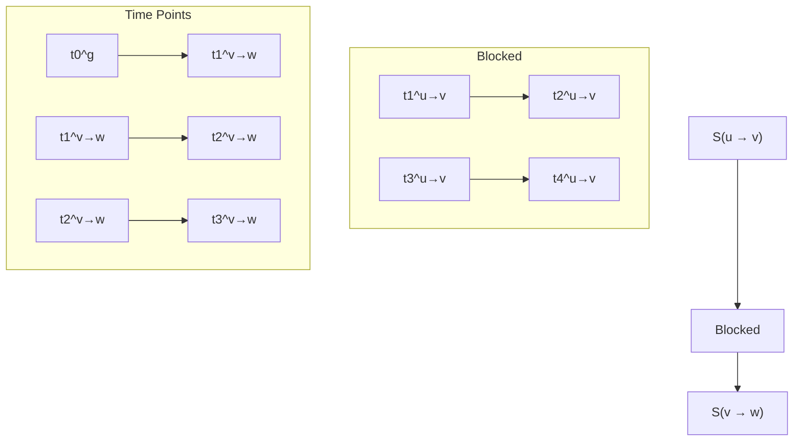

## Team Control Number

For office use only

T1 \_\_\_\_

T2 \_\_\_\_

T3 \_\_\_\_

T4

## 1908810

Problem Chosen

D

For office use only

F1

F2

F3

F4

## 2019 MCM/ICM Summary Sheet

In this paper we develop a number of models for formulating and evaluating exit strategies for evacuating the Louvre museum in Paris, France. To begin, we argue that the key emergency plan infrastructure is emergency exit directives: signs to exits. We annotate publicly available floorplans to create a graph model on which to test our strategies. Choosing the direction of edges on this graph simulates the placement of emergency exit signs and their directions.

This model progresses as such: the preliminary analysis serves to give an overview of the problem. Next, the agent-based model and the accompanying simulations then validate our ideas. Then, the differential equation model gives a theoretical approach that may be more amenable to quick analysis.

For our preliminary investigation, we use spectral graph analysis on our model floorplan to identify critical connections that might have maximum impact on flow through the graph. We start with an evacuation strategy where exit signs simply point to the nearest exit as a heuristic guess for the best plan to minimize evacuation time. Our two models, predicated on the same assumptions, predict how such a directive structure will affect populations flowing through the Louvre in an emergency and how that will affect evacuation time.

First, an agent-based model simulates individual behavior and crowd interaction at a fine-grained level grounded on queuing theory. People are modeled as discrete units and movements from room to room are stochastically scheduled. Furthermore, within this approach, simulated security personnel movements help to determine how congestion can affect response time.

Second, we also develop an analogous differential-equations-on-a-graph model to create a deterministic approximator of this behavior to more quickly generate information. Using these two models we can analyze chokepoints that impede smooth flow to the exits.

Finally, we suggest optimizing exit sign placement according to the metrics and insights generated by our models. We discuss how factors such as more exits and structural damage to the Louvre can affect swift evacuation and emergency response.

## Getting a Move On When the Louvre's Bombed

Control #1908810

January 2019

1 Introduction 3  
2 Direction and Rationale 3

2.1 Terms 3

3 Connectivity Model 4

3.1 Graph Structure 4  
3.2 Connectivity Analysis 4  
3.3 Spectral Analysis 5  
3.4 Spectral Drawing and Partitioning 6  
3.5 Unknown Exits 7  
3.6 Shortcomings 7

4 Agent-Based Model 7

4.1 Assumptions 8  
4.2 Parameter Settings 8  
4.3 Movement Model 8  
4.4 Emergency Response Personnel 9

4.4.1 Assumptions 9

5 Differential Flow Model 11

5.1 Assumptions 11  
5.2 Flow Equation 11

6 Adaptability and Sensitivity 13

6.1 Structural Damage 13  
6.2 Distribution of Persons 14  
6.3 Results of Simulations 15

7 Comparisons of Models 16

7.1 Connectivity Model.... 16  
7.2 Agent-Based Model 16  
7.3 Differential Flow Model 16

8 Further Work 17

8.1 Breaking Up Groups 17  
8.2 Leave-One-Out Analysis 17  
8.3 Synchronicity 17

8.4 Mob Mentality 17

9 Recommendation 17

References 19

## 1 Introduction

The Louvre is a famous art museum that houses many incredible artworks, including the Mona Lisa. As a result, the Louvre attracts many tourists and enthusiasts all throughout the year. In an event of an emergency, it is crucial that people are able to evacuate effectively while also allowing emergency personnel to get to a target location. In this paper, we model the Louvre as a network and analyze how evacuation occurs in different scenarios with multiple models. We identify bottlenecks, potential threats, and possible solutions – which we use to propose a policy and make recommendations to the Louvre’s emergency management team.

## 2 Direction and Rationale

Emergencies are multi-faceted; some situations require a more cautious approach while others may be straightforward. However, the one congruity in this multi-faceted system is an exit plan.

Based on these criteria, we focus on potential bottlenecks and congestion during an exit plan. These not only indirectly increase risk by preventing bystanders from exiting the compromised zone quickly, but they also have direct risks of injury due to tripping, trampling and other injuries possible from panicked, packed crowds. We believe the most effective method of mitigating these risks is through the consistent direction of crowd flow: the intelligent placement of exit signs. Indeed, the arrow and universal iconography of an exit sign is a common ground for the diverse crowd of the Louvre and are usually powered by independent power sources, allowing them to stay visible even in the event of a power-outage.

For an evacuation plan to be robust in unexpected disasters such as fires, earthquakes, terrorist attacks, or armed shooter situations, it must rely on reliable factors. In the absence of information from law enforcement and potentially without a good knowledge of the locale (as in the case of tourists in the Louvre), bystanders must rely on exit signs to exit quickly. Thus, our analysis works to identify congestion, security vulnerabilities, and metrics for optimization for a robust, consistent exit plan.

## 2.1 Terms

A number of terms will be used in this paper to refer to salient feature of our model. These terms may appear interchangeably to refer to these elements.

- Museum-goer, bystanders: people visiting the Louvre that must be evacuated during an emergency.  
- Movement, flow, transfer, percolation: the passage of people from one room to another in the Louvre.  
- Vertices, nodes, sites: the rooms in the Louvre.  
- Congestion, bottleneckedness, viscosity: a measure of how hard it is to pass through a space.  
- Target: any location of that security personnel are aiming to get to: may be the site of an attack or a region with injured people in need of medical attention.

3d network graph

| Node ID | X Coordinate | Y Coordinate | Connections to nearest exit |
|---------|--------------|--------------|------------------------------|
| 1       | 0.1          | 0.8          | 1                            |
| 2       | 0.2          | 0.7          | 2                            |
| 3       | 0.3          | 0.6          | 3                            |
| 4       | 0.4          | 0.5          | 4                            |
| 5       | 0.5          | 0.4          | 5                            |
| 6       | 0.6          | 0.3          | 6                            |
| 7       | 0.7          | 0.2          | 7                            |
| 8       | 0.8          | 0.1          | 8                            |
| 9       | 0.9          | 0.0          | 9                            |
| 10      | 1.0          | -0.1         | 10                           |
| 11      | 1.1          | -0.2         | 11                           |
| 12      | 1.2          | -0.3         | 12                           |
| 13      | 1.3          | -0.4         | 13                           |
| 14      | 1.4          | -0.5         | 14                           |
| 15      | 1.5          | -0.6         | 15                           |
| 16      | 1.6          | -0.7         | 16                           |
| 17      | 1.7          | -0.8         | 17                           |
| 18      | 1.8          | -0.9         | 18                           |
| 19      | 1.9          | -1.0         | 19                           |
| 20      | 2.0          | -1.1         | 20                           |
| 21      | 2.1          | -1.2         | 21                           |
| 22      | 2.2          | -1.3         | 22                           |
| 23      | 2.3          | -1.4         | 23                           |
| 24      | 2.4          | -1.5         | 24                           |
| 25      | 2.5          | -1.6         | 25                           |
| 26      | 2.6          | -1.7         | 26                           |
| 27      | 2.7          | -1.8         | 27                           |
| 28      | 2.8          | -1.9         | 28                           |
| 29      | 2.9          | -2.0         | 29                           |
| 30      | 3.0          | -2.1         | 30                           |
| 31      | 3.1          | -2.2         | 31                           |
| 32      | 3.2          | -2.3         | 32                           |
| 33      | 3.3          | -2.4         | 33                           |
| 34      | 3.4          | -2.5         | 34                           |
| 35      | 3.5          | -2.6         | 35                           |
| 36      | 3.6          | -2.7         | 36                           |
| 37      | 3.7          | -2.8         | 37                           |
| 38      | 3.8          | -2.9         | 38                           |
| 39      | 3.9          | -3.0         | 39                           |
| 40      | 4.0          | -3.1         | 40                           |
| 41      | 4.1          | -3.2         | 41                           |
| 42      | 4.2          | -3.3         | 42                           |
| 43      | 4.3          | -3.4         | 43                           |
| 44      | 4.4          | -3.5         | 44                           |
| 45      | 4.5          | -3.6         | 45                           |
| 46      | 4.6          | -3.7         | 46                           |
| 47      | 4.7          | -3.8         | 47                           |
| 48      | 4.8          | -3.9         | 48                           |
| 49      | 4.9          | -4.0         | 49                           |
| 50      | 5.0          | -4.1         | nan                          |
| Note: The data is not explicitly provided in the code snippet, so it is not possible to extract or convert the actual data points from the graph layout.

Figure 1: Graph representation of the Louvre. Colors indicate how far a room is from one of the four main exits.

\- Evacuation plan: refers to the placement of exit signs and other cues to facilitate evacuation.

## 3 Connectivity Model

## 3.1 Graph Structure

We model the Louvre itself as a network of rooms. Connections between rooms are doors, hallways or stairs from one level to another and take a certain amount of time to move from one to another. We hand annotated a publicly available floor plan, and manually entered data about room size and connectivity to create a graph. The graph has connections of near uniform scale; traveling from one node to another is approximately the same throughout the graph. Nodes, in contrast, have variable size depending on their footprint in the floor plan.

## 3.2 Connectivity Analysis

At the most basic level, we can analyze the graph as follows: considering only the estimated time to travel from one room to another, the maximum time for an unimpeded museum-goer to exit the building is simply the maximum time over the shortest paths to the exit from each room.

Likewise, the maximum time for any emergency responder to get to a location in the Louvre is simply the time over the shortest path to that destination. Note that in this case, security personnel would be recommended to take the same path as bystanders moving in the opposite direction. This situation is unrealistic since the shortest path to a target location may pass through heavily congested rooms.

## 3.3 Spectral Analysis

Using algebraic graph theory, we glean useful properties of this graph. First we compute the Laplacian matrix for our graph where $d_{i}$ is the degree of the ith vertex. The Laplacian is similar to the adjacency matrix which can be used to represent a graph. Considering pairs of rooms, $(u,v)$ , in the graph we can define the Laplacian as follows. [3]

$$
L (u, v) = \left\{ \begin{array}{l l} 1 & \text {if u = v} \\ - \frac {1}{\sqrt {d _ {u} d _ {v}}} & \text {if u adjacent to v} \\ 0 & \text {otherwise} \end{array} \right.
$$

Now let G be our graph and let $E(G)$ be the set of edges and $V(G)$ be the set of vertices. A sub-graph, A, is then defined as $A \subseteq V(G)$ . We call $\partial A$ the boundary of A.

$$
\partial A = \{(u, v) \in E (G): u \in A, v \in V (G) \backslash A \}
$$

We can then find the conductivity of our graph, $\Phi_{G}$ .

$$
\Phi_ {G} = \min \left\{\frac {| \partial A |}{| A |}: A \subseteq V (G), 0 <   | A | <   \frac {1}{2} | V (G) | \right\}
$$

This is very computationally complex to solve, therefore we bound this constant instead. We know a bound on the conductivity from a theorem by Chung that proves the Cheeger inequality for graphs that are not d-regular, that in the case of our graph $G$ , we can use $\lambda_2$ to bound $\Phi_G$ [2].

$$
\frac {\lambda_ {2}}{2} \leq \Phi_ {G} \leq 2 \sqrt {\lambda_ {2}}
$$

For our floor plan graph we get $\lambda_2 = 0.009287497$ which places a bound on $\Phi_G$ .

$$
0. 0 0 4 6 4 3 7 4 8 \leq \Phi_ {G} \leq 0. 1 9 2 7 4 3 3 2 0
$$

or

$$
\Phi_ {G} = 0. 1 1 1 5 0 2 6 \pm 0. 1 0 5 6 1 0 3
$$

The conductivity of our graph, $\Phi_{G}$ , is a measure of the worst "bottleneckness" considering only connectivity. It measures how quickly the position of a random walker on the graph will converge to a stable distribution. This measure is useful for understanding movement through the Louvre in typical circumstances. Notice that in the worst case this value is very small. This indicates that our graph can be broken into two pieces with only a small cut.

  
Figure 2: Graphs of the values in the Fiedler eigenvector and a partition of these values

## 3.4 Spectral Drawing and Partitioning

To further understand connectivity, we look at a spectral graph drawing of the floor plan. This graphs the location of node $n$ at the location $(v_{2}[n], v_{3}[n])$ where $v_{2}$ and $v_{3}$ are the eigenvectors of the second and third smallest eigenvalues and $v_{2}$ is often called the Fiedler vector [4]. Figure 2 shows a histogram of values for the vector is roughly bimodal, indicating that there is a rather natural partitioning of the Louvre into two, roughly equal parts.

Now, we can find the best partition using a Fiedler cut. We also graph the values of $v_{2}$ in ascending order. Splitting $V(G)$ into vertices with a positive associated value in $v_{2}$ gives one collection of nodes. We used the floor plan graph to understand how this will break up the Louvre. In Figure 3, large nodes represent one half of the partition and small nodes represent the other half.

network graph

| Node ID | Source Label | Target Label |
| --- | --- | --- |
| 1 | Spectral Graph | Spectral Graph |
| 2 | Spectral Graph | Spectral Graph |
| 3 | Spectral Graph | Spectral Graph |
| ... | ... | ... |
| 49 | Spectral Graph | Spectral Graph |
| 50 | Spectral Graph | Spectral Graph |
| ... | ... | ... |
| 60 | Spectral Graph | Spectral Graph |
| 61 | Spectral Graph | Spectral Graph |
| ... | ... | ... |
| 70 | Spectral Graph | Spectral Graph |
| 71 | Spectral Graph | Spectral Graph |
| ... | ... | ... |
| 80 | Spectral Graph | Spectral Graph |
| 81 | Spectral Graph | Spectral Graph |
| ... | ... | ... |
| 90 | Spectral Graph | Spectral Graph |
| 91 | Spectral Graph | Spectral Graph |
| ... | ... | ... |
| 100 | Spectral Graph | Spectral Graph |
| 101 | Spectral Graph | Spectral Graph |
| ... | ... | ... |
| 110 | Spectral Graph | Spectral Graph |
| 111 | Spectral Graph | Spectral Graph |
| ... | ... | ... |
| 120 | Spectral Graph | Spectral Graph |
| 121 | Spectral Graph | Spectral Graph |
| ... | ... | ... |
| 130 | Spectral Graph | Spectral Graph |
| 131 | Spectral Graph | Spectral Graph |
| ... | ... | ... |
| 140 | Spectral Graph | Spectral Graph |
| 141 | Spectral Graph | Spectral Graph |
| ... | ... | ... |
| 150 | Spectral Graph | Spectral Graph |
| 151 | Spectral Graph | Spectral Graph |
| ... | ... | ... |
| 160 | Spectral Graph | Spectral Graph |
| 161 | Spectral Graph | Spectral Graph |
| ... | ... | ... |
| 170 | Spectral Graph | Spectral Graph |
| 171 | Spectral Graph | Spectral Graph |
| ... | ... | ... |
| 180 | Spectral Graph | Spectral Graph |
| 181 | Spectral Graph | Spectral Graph |
| ... | ... | ... |
| 190 | Spectral Graph | Spectral Graph |
| 191 | Spectral Graph | Spectral Graph |
| ... | ... | ... |
| 200 | Spectral Graph | Spectral Graph |
| 201 | Spectral Graph | Spectral Graph |
| ... | ... | ... |
| 210 | Spectral Graph | Spectral Graph |
| 211 | Spectral Graph | Spectral Graph |
| ... | ... | ... |
| 220 | Spectral Graph | Spectral Graph |
| 221 | Spectral Graph | Spectral Graph |
| ... | ... | ... |
| 230 | Spectral Graph | Spectral Graph |
| 231 | Spectral Graph | Spectral Graph |
| ... | ... | ... |
| 240 | Spectral Graph | Spectral Graph |
| 241 | Spectral Graph | Spectral Graph |
| ... | ... | ... |
| 250 | Spectral Graph | Spectral Graph |
| 251 | Spectral Graph | Spectral Graph |
| ... | ... | ... |
| 260 | Spectral Graph | Spectral Graph |
| 261 | Spectral Graph | Spectral Graph |
| ... | ... | ... |
| 270 | Spectral Graph | Spectral Graph |
| 271 | Spectral Graph | Spectral Graph |
| ... | ... | ... |
| 280 | Spectral Graph | Spectral Graph |
| 281 | Spectral Graph | Spectral Graph |
| ... | ... | ... |
| 290 | Spectral Graph | Spectral Graph |
| 291 | Spectral Graph | Spectral Graph |
| ... | ... | ... |
| 300 | Spectral Graph | Spectral Graph |
| 301 | Spectral Graph | Spectral Graph |
| ... | ... | ... |
| 310 | Spectral Graph | Spectral Graph |
| 311 | Spectral Graph | Spectral Graph |
| ... | ... | ... |
| 320 | Spectral Graph | Spectral Graph |
| 321 | Spectral Graph | Spectral Graph |
| ... | ... | ... |
| 330 | Spectral Graph | Spectral Graph |
| 331 | Spectral Graph | Spectral Graph |
| ... | ... | ... |
| 340 | Spectral Graph | Spectral Graph |
| 341 | Spectral Graph | Spectral Graph |
| ... | ... | ... |
| 350 | Spectral Graph | Spectral Graph |
| 351 | Spectral Graph | Spectral Graph |
| ... | ... | ... |
| 360 | Spectral Graph | Spectral Graph |
| 361 | Spectral Graph | Spectral Graph |
| ... | ... | ... |
| 370 | Spectral Graph | Spectral Graph |
| 371 | Spectral Graph | Spectral Graph |
| ... | ... | ... |
| 380 | Spectral Graph | Spectral Graph |
| 381 | Spectral Graph | Spectral Graph |
| ... | ... | ... |
| 390 | Spectral Graph | Spectral Graph |
| 391 | Spectral Graph | Spectral Graph |
| ... | ... | ... |
| 400 | Spectral Graph | Spectral Graph |
| 401 | Spectral Graph | Spectral Graph |
| ... | ... | ... |
| 410 | Spectral Graph | Spectral Graph |
| 411 | Spectral Graph | Spectral Graph |
| ... | ... | ... |
| 420 | Spectral Graph | Spectral Graph |
| 421 | Spectral Graph | Spectral Graph |
| ... | ... | ... |
| 430 | Spectral Graph | Spectral Graph |
| 431 | Spectral Graph | Spectral Graph |
| ... | ... | ... |
| 440 | Spectral Graph | Spectral Graph |
| 441 | Spectral Graph | Spectral Graph |
| ... | ... | ... |
| 450 | Spectral Graph | Spectral Graph |
| 451 | Spectral Graph | Spectral Graph |
| ... | ... | ... |
| 460 | Spectral Graph | Spectral Graph |
| 461 | Spectral Graph | Spectral Graph |
| ... | ... | ... |
| 470 | Spectral Graph | Spectral Graph |
| 471 | Spectral Graph | Spectral Graph |
| ... | ... | ... |
| 480 | Spectral Graph | Spectral Graph |
| 481 | Spectral Graph | Spectral Graph |
| ... | ... | ... |
| 490 | Spectral Graph | Spectral Graph |
| 491 | Spectral Graph | Spectral Graph |
| ... | ... | ... |

Figure 3: A 3D view of how the partition separates the museum into two pieces

Diving into the data, we find that the partition severs only 4 corridors. One of these is the Richelieu entrance itself and the other 3 are connections on the three other floors to the Richelieu wing. Based on our floor plan, a cut along this section would completely disconnect it from the rest of the Louvre and from any exits. These give us insight on critical connections throughout the museum, given the normal 4 exits.

## 3.5 Unknown Exits

A number of emergency exits from the Louvre are kept from public knowledge; they are not on any publicly available floor plan. Only the emergency personnel and museum staff known the locations of these exits. However, assuming that the designer of the building desired efficient egress in the event of an emergency, we can expect exits to be placed in locations that minimize the average path length to an exit. We use a flood-fill algorithm to find the shortest distance to any exit for every node in the graph.

Algorithm 1: Guess Unknown Exits Locations  
forall candidates do
    for all rooms in building do
    ▲ Find the shortest distance to an exits or a candidate exit
    ▲ Find the mean of the shortest path distance for rooms
return The candidate that has the smallest sum of shortest path distances

Algorithm 1 guesses that exits exist in rooms that will minimize the average distance to travel. We use the rooms identified here in Section 4.4 for the agent-based simulation.

## 3.6 Shortcomings

This an algebraic graph theoretic model does not consider a number of salient realities that afflict the Louvre:

- Rooms can only hold so many people; they have a maximum capacity. Not every person can move along the shortest path at the same time.  
- This model cannot identify bottlenecks, only security risks. Emergency personnel would be advised to take the same paths as evacuees (backward).

We address these issues with the subsequent model.

## 4 Agent-Based Model

Like we mentioned, while the connectivity model gives us useful insights, it doesn't take into consideration many other factors at play. In this section, we formulate a model that takes into account both connectivity, structure and crowd self-interaction. For the purpose of explaining the model effectively, we do not yet include discussion on adaptable scenarios. For information on adaptable scenarios, refer to Section 6.

## 4.1 Assumptions

- Rooms can only hold so many people; they have limited space.  
- When the density of visitors in the Louvre is high, the time to exit a room is mainly determined by congestion (other people in the way), rather than the distance to travel to exit.  
- People move continuously from room to room.  
- The more crowded a room is, the slower people will move.  
- Evacuees always follow the signs for the exit and signs are always visible.  
- Emergency personnel seek a specific target room to administer aid.

## 4.2 Parameter Settings

Using publicly available data we gather some important information. The number of people entering the Louvre is on average 2,532.83 people/hr for 2017 [6]. We estimate that on average a museum-goer will spend 3 hrs in the Louvre. Thus, we calculate that the average population in the Louvre during opening hours is 7,598.49 people. We estimate the maximum safe capacity of the Louvre, which has a footprint is $72,737\mathrm{m}^2$ , is 21,748 people based safety code recommendations. We use these parameters to tune our model.

## 4.3 Movement Model

From queuing theory we know that given k events uniformly distributed in time, the time between events follows an Erlang distribution [9]. In our model then the time to transfer k people from room u to room v is $T^{u \rightarrow v}$ .

$$
T ^ {u \rightarrow v} \sim E r l a n g (k, \mu)
$$

An Erlang distribution has a probability density function $f(t; k, \mu)$ for a given shape $(k)$ and rate $(\mu)$ .

$$
f (t; k, \mu) = \frac {t ^ {k - 1} e ^ {- \frac {t}{\mu}}}{\mu^ {k} (k - 1) !}
$$

For our simulation we model the movement of each individual separately. Thus, k = 1 and this distribution reduces to exponential.

$$
T ^ {u \rightarrow v} \sim E x p (\mu)
$$

However, given the assumption of crowd self-interaction, the average time per transfer, $1/\mu$ , will not be constant. Indeed, the average time increases as congestion forms. Thus, we model $\mu$ as having a base rate scaled by function of the current density of the room of origin.

$$
\mu = t _ {0} \cdot e ^ {c \cdot \rho (u)}
$$

Here, $t_0$ is the average time for a person to pass through room $u$ to room $v$ with zero impedance (no other people around; the base rate). The penalty constant, $c$ , scales $t_0$ according to the density of people in the room. In other words, the more people in the starting room, the harder it becomes to move to the other room. This effectively represents the crowd self-interaction within the room itself.

Another important interaction is blocking. This happens when a person attempts to enter a room with full-capacity. In this scenario, we disallow—or block the person from entering the room. The person will have to try again once the destination room makes space.

We run a simulation with these assumptions and models on the graph structure of the Louvre. The following illustrates the algorithm of how people move and the results it generates.

Algorithm 2: Scheduling of Movements  
Data: floor plan graph, global_tracker, bottlenecks
Result: time to exit building
while people still in museum do
    Sort movement events on edges in ascending order of time until completion.
    if movement not blocked then
    Add processed event's time to global_tracker.
    Generate new transfer event for this edge forall other scheduled events do
    Decrement all other transfer event times until completion by time elapsed
    else
    Increment event's time
    if First time to reach full capacity then
    Add to bottlenecks as {event : currentTime}
return global_tracker, bottlenecks

Essentially, for every edge in our graph structure, if there are people to move from one node to another, we choose one person and schedule them to move using an exponentially distributed random number. This is the time until the event will occur. To move time forward we find the edge with the soonest time. If we can we, move that person and they are not blocked, then we advance time by that amount and transfer them to the room they were going to. If not, we add another random number to their time and try the next soonest event. This blocking mechanic means that rooms at full capacity force museum-goers to wait, as if in a queue. For a visual of the algorithm, refer to Figure 4.

## 4.4 Emergency Response Personnel

## 4.4.1 Assumptions

- Emergency personnel have priority over other visitors when moving.  
- Emergency personnel know the fastest route from their entrance point.  
- Emergency personnel begin moving into the building at different times after evacuation starts.

The agent-based model provides an excellent paradigm to simulate the behavior emergency response personnel. Indeed, the emergency personnel follow the same behaviors and interactions as normal evacuees outlined in Section 4.3, but have priority in movement over others.

flowchart

Figure 4: A visual illustration of blocking (vertex $u$ at max capacity). $S(u \to v)$ is the schedule for transfers from $u$ to $v$ .

This means that the penalty constant in $\mu = t_0\cdot e^{c\cdot \rho (u)}$ is less for security personnel.

$$
c _ {\mathrm{s}} <   c
$$

Essentially, this follows the idea that the evacuees will allow the emergency personnel through before they start moving. In this model, we still experience lag and blocking, but the emergency personnel are able to free themselves faster than normal visitors.

We also investigate how time of arrival can affect the time for emergency personnel to reach a target location. In real-life scenarios, the emergency personnel may arrive at different intervals, depending on the level of threat and other external factors. In light of this, we examine how different arrival times impact the time it takes to reach a certain room during the evacuation process. We guessed that seeking the target area in the middle of the evacuation will take the longest because that is when peak congestion occurs.

With this consideration, we run our simulations with the given assumptions and obtain the results shown in Figure 5.

An interesting insight from this is that we can glean when congestion seems to be highest for each density. For example, for a museum population density of 0.3, congestion seems to be highest around 5 minutes. However, for a museum population density of 0.65, it would seem that congestion is highest around 10 minutes.

Furthermore, we see that an immediate response is ideal; across the different densities, immediate response allowed emergency personnel to get to their target location at an earlier time. From this graph, we can also see that it may be strategic for the emergency personnel to delay their appearance when the threat is not critical – typically with lower densities.

bar chart

| densities | 0 minutes | 5 minutes | 10 minutes | 15 minutes | 20 minutes |
| --------- | --------- | --------- | ---------- | ---------- | ---------- |
| 0.1       | 14        | 15        | 14         | 14         | 13         |
| 0.2       | 13        | 23        | 24         | 16         | 12         |
| 0.3       | 13        | 40        | 35         | 27         | 15         |
| 0.4       | 19        | 37        | 34         | 29         | 34         |
| 0.5       | 17        | 37        | 31         | 35         | 27         |
| 0.6       | 20        | 40        | 33         | 35         | 34         |
| 0.7       | 20        | 36        | 41         | 31         | 27         |
| 0.8       | 22        | 30        | 36         | 39         | 34         |
| 0.9       | 29        | 37        | 41         | 35         | 39         |
| 1.0       | 20        | 41        | 36         | 37         | 44         |

Figure 5: How long it takes to get to target location for emergency personnel with varying response delays. Averaged across simulation trials

## 5 Differential Flow Model

Crowds traveling through the Louvre during an evacuation could be modeled in aggregate as something similar to a viscous non-Newtonian fluid percolating through a porous substrate.

## 5.1 Assumptions

- Rooms can only hold so many people; they have limited space.  
- Groups of people move continuously from room to room and can be treated like a fluid.  
- The more crowded a room is, the slower people will move.  
- Evacuees always follow the signs for the exit and signs are always visible.  
- Museum-goers interact with each other such that when they are closely packed, people move slower: like shear stress $^{1}$ increasing viscosity in a non-Newtonian fluid.

## 5.2 Flow Equation

Here we create a differential equation to determine the flow rate from site u to site v given the density of the crowd at both sites.

$$
\frac{\partial\rho_u}{\partial t} = \underbrace{\frac{1}{t_0}e^{-c\rho_u}}_{\text{Base rate of flow}}\cdot \overbrace{n(\rho_u)}^{\text{Non - negativity condition}}\cdot \underbrace{b(\rho_v)}_{\text{Blocking condition}}
$$

The base rate of flow includes an exponentially down-scaling penalty which accounts for bumping and/or tripping occurring as the density of the room increases. The penalty term is analogous to the increased viscosity experienced by non-Newtonian fluids as pressure increases, which also down-scales the flow.

The non-negativity function, $n(\rho_u)$ is a function such that $n_u(0) = 0$ and $n_u(1) = 1$ with $0 \leq n(\rho_u) \leq 1$ . This ensures that flow from a site with zero density is zero.

The blocking function, $b(\rho_{u})$ is a function such that $b_{u}(0)=1$ and $b_{u}(1)=0$ with $0\leq n(\rho_{u})\leq1$ . This is important because there cannot be flow into a room that is at max capacity. The effect of this term on the behavior of the system is analogous to the way transfer events in the agent-based model are rescheduled when they are blocked.

To actually analyze the densities in particular rooms we use linear algebra and our graph structure to solve for the change in density of each room at 1 second intervals until the evacuation is complete.

$$
\frac {\partial \boldsymbol {\rho}}{\partial t} = [ \boldsymbol {A} \boldsymbol {B} (\boldsymbol {\rho}) + \boldsymbol {E} ] \odot \boldsymbol {V} ^ {- 1} \boldsymbol {N} (\boldsymbol {\rho}) - \left[ \boldsymbol {A} ^ {T} \boldsymbol {V} ^ {- 1} \boldsymbol {N} (\boldsymbol {\rho}) \right] \odot \boldsymbol {B} (\boldsymbol {\rho})
$$

- $\rho$ is a column vector of densities at each site  
- $A$ is a directed adjacency matrix of the percolation matrix (our floor plan graph in this case)  
- $V$ is a diagonal matrix, with the volume of a room $i$ in the $i^{\text{th}}$ position  
- $E$ is the Exit matrix, it has all zeros except at the index of a room that have an exit  
- $N(\rho)$ is a vectorized non-negativity function  
- $B(\rho)$ is a vectorized blocking function  
- $\odot$ is the Hadamard product for matrices

$$
\boldsymbol {B} = \left[ \begin{array}{c} b _ {1} \\ b _ {2} \\ \vdots \\ b _ {n} \end{array} \right]
$$

$$
\boldsymbol {N} = \left[ \begin{array}{c} n _ {1} \\ n _ {2} \\ \vdots \\ n _ {n} \end{array} \right]
$$

$$
b _ {i} = (1 + 2 \rho_ {i}) (1 - \rho_ {i}) ^ {2}
$$

$$
n _ {i} = \frac {1}{t _ {0}} e ^ {- c \rho_ {i}} (3 - 2 \rho_ {i}) \rho_ {i} ^ {2}
$$

We use Euler's method to approximate the solution to this system of differential equations for each room.

$$
\rho_ {n + 1} = \rho_ {n} + \Delta t \frac {\partial \dot {\rho} _ {u}}{\partial t}
$$

Plotting the density distribution of all rooms after some time shows that a room is either bottlenecked, when $\rho = 1$ , unoccupied, when $\rho = 0$ , or at equilibrium. We define a room to be at equilibrium if $0.1 < \rho < 0.9$ .

scatter plot

| Room Index | Density |
| ---------- | ------- |
| 0          | 0.1     |
| 10         | 0.05    |
| 20         | 0.02    |
| 30         | 0.01    |
| 40         | 0.03    |
| 50         | 0.04    |
| 60         | 0.06    |
| 70         | 0.07    |
| 80         | 0.08    |
| 90         | 0.09    |
| 100        | 0.1     |
| 110        | 0.11    |
| 120        | 0.12    |
| 130        | 0.13    |
| 140        | 0.14    |
| 150        | 0.15    |
| 160        | 0.16    |
| 170        | 0.17    |
| 180        | 0.18    |
| 190        | 0.19    |
| 200        | 0.2     |

Figure 6: Node densities that are experiencing roughly equal in-flow and out-flow are banded in the middle region

## 6 Adaptability and Sensitivity

In this section, we examine how different threats and emergencies can affect movements and exit strategies. Furthermore, we explore how exits can be best placed or utilized such that evacuation and proper response happens optimally.

## 6.1 Structural Damage

Since we model the Louvre as a graph, it is most accurate to imitate damage or obstructions by removing either nodes or edges (rooms or corridors).

The most trivial case is when some damage completely disallows visitors to exit the building. In this case, the time until all evacuees exit the building will be almost completely dependent on how the emergency personnel handles the situation; e.g. adding ladders or fixing rooms/corridors.

A more relevant situation occurs when disconnections still keep our floor plan a connected graph. Connectedness is a simple way to ensure all the visitors have some path to exit the building.

Given that we have a directed graph structure with exit signs representing direction, a disconnection can and will lead to dead-ends (room with $|E_{out}(v)| = 0$ ). We will denote such a room as $R_{d}$ . Now, we model the modified behavior of visitors in the situation where exit signs may not point to the closest exit due to obstructions in Algorithm 3.

The critical density gives us a density in which the crowd of people moving toward $R_{d}$ realize that there is an obstruction, turn around, and look for another way out. With this approach, it simulates how people flow into a dead-end and eventually change the course of their behavior as a collective toward a way out.

Algorithm 3: Modified Movements With Damage  
Data: criticalDensity
Result: time to exit building
while people still in museum do
    Move according to Algorithm 2
    if movement edge toward $R_d$ and $R_d$ 's density >= criticalDensity then
    | change edge direction toward the optimal direction.
    else $\lfloor$ Move into $E_d$ return global_tracker, bottlenecks

## 6.2 Distribution of Persons

It's been said that something like $80\%$ of people go to the Luovre just to see the Mona Lisa.[7] Indeed, a visualization tracking Geo-tagged Instagram photos in 2014 shows the area of the Louvre with the Mona Lisa nearby has a significant higher density of people. Thus, a more accurate model would take into consideration on how artworks of prominence or interest affect potential bottlenecks and evacuation time.

text_image

Mural List

Figure 7: A visual illustration of the density distribution in the Louvre, highest around the Mona Lisa room.

With this in mind, we partition the overall density of the museum with higher densities in locations such as the Mona Lisa. We identify 15 major areas on interest and assign them a higher density than other rooms while decreasing the density of other rooms appropriately. Note that the overall population of the museum remains unchanged to test sensitivity of density distribution, not population itself. Figure 8 indicates baseline densities on the y-axis labels and colors representing the seconds till the room is considered congested. Spikes indicate rooms that almost immediately become congested regardless of the density level. Increasing the number of exits reduces, to some extent, the number of rooms that become congested during the evacuation.

bar chart

| Exit | Value |
|------|-------|
| 1    | 0.1   |
| 2    | 0.15  |
| 3    | 0.2   |
| 4    | 0.25  |
| 5    | 0.3   |
| 6    | 0.35  |
| 7    | 0.4   |
| 8    | 0.45  |
| 9    | 0.5   |
| 10   | 0.55  |
| 11   | 0.6   |
| 12   | 0.65  |
| 13   | 0.7   |
| 14   | 0.75  |
| 15   | 0.8   |
| 16   | 0.85  |
| 17   | 0.9   |
| 18   | 0.95  |

bar chart

| Index | Value |
|-------|-------|
| 1     | 0.1   |
| 2     | 0.15  |
| 3     | 0.2   |
| 4     | 0.25  |
| 5     | 0.3   |
| 6     | 0.35  |
| 7     | 0.4   |
| 8     | 0.45  |
| 9     | 0.5   |
| 10    | 0.55  |
| 11    | 0.6   |
| 12    | 0.65  |
| 13    | 0.7   |
| 14    | 0.75  |
| 15    | 0.8   |
| 16    | 0.85  |
| 17    | 0.9   |
| 18    | 0.95  |

heatmap

Congestion: 8 Exits, Uniform Density
| | | | |
|---|---|---|---|
| 1 | 0.15 | 0.15 | 0.1 |
| 2 | 0.2 | 0.25 | 0.3 |
| 3 | 0.35 | 0.4 | 0.4 |
| 4 | 0.45 | 0.5 | 0.5 |
| 5 | 0.55 | 0.6 | 0.6 |
| 6 | 0.65 | 0.7 | 0.7 |
| 7 | 0.75 | 0.8 | 0.8 |
| 8 | 0.85 | 0.9 | 0.9 |
| 9 | 0.95 | 1.0 | 1.0 |
The chart displays a vertical bar chart with color intensity representing the magnitude of congestion at each route, where darker blue indicates higher congestion and lighter red indicates lower congestion. The x-axis represents route indices (e.g., '1', '2', etc.), and the y-axis represents congestion level (e.g., '1', '2', etc.). The legend is embedded in the bars, but no explicit numerical values are provided for the data series.

bar chart

| Congestion | Value |
| ---------- | ----- |
| 1          | 0.1   |
| 2          | 0.15  |
| 3          | 0.2   |
| 4          | 0.25  |
| 5          | 0.3   |
| 6          | 0.35  |
| 7          | 0.4   |
| 8          | 0.45  |
| 9          | 0.5   |
| 10         | 0.55  |
| 11         | 0.6   |
| 12         | 0.65  |
| 13         | 0.7   |
| 14         | 0.75  |
| 15         | 0.8   |
| 16         | 0.85  |
| 17         | 0.9   |
| 18         | 0.95  |
| 19         | 0.9   |
| 20         | 0.85  |
| 21         | 0.8   |
| 22         | 0.75  |
| 23         | 0.7   |
| 24         | 0.65  |
| 25         | 0.6   |
| 26         | 0.55  |
| 27         | 0.5   |
| 28         | 0.45  |
| 29         | 0.4   |
| 30         | 0.35  |
| 31         | 0.3   |
| 32         | 0.25  |
| 33         | 0.2   |
| 34         | 0.15  |
| 35         | 0.1   |
| 36         | 0.05  |
| 37         | 0.0   |
| 38         | -0.05 |
| 39         | -0.1  |
| 40         | -0.15 |
| 41         | -0.2  |
| 42         | -0.25 |
| 43         | -0.3  |
| 44         | -0.35 |
| 45         | -0.4  |
| 46         | -0.45 |
| 47         | -0.5  |
| 48         | -0.55 |
| 49         | -0.6  |
| 50         | -0.65 |
| 51         | -0.7  |
| 52         | -0.75 |
| 53         | -0.8  |
| 54         | -0.85 |
| 55         | -0.9  |
| 56         | -0.95 |
| 57         | -1    |
| 58         | -1    |
| 59         | -1    |
| 60         | -1    |
| 61         | -1    |
| 62         | -1    |
| 63         | -1    |
| 64         | -1    |
| 65         | -1    |
| 66         | -1    |
| 67         | -1    |
| 68         | -1    |
| 69         | -1    |
| 70         | -1    |
| 71         | -1    |
| 72         | -1    |
| 73         | -1    |
| 74         | -1    |
| 75         | -1    |
| 76         | -1    |
| 77         | -1    |
| 78         | -1    |
| 79         | -1    |
| 80         | -1    |
| 81         | -1    |
| 82         | -1    |
| 83         | -1    |
| 84         | -1    |
| 85         | -1    |
| 86         | -1    |
| 87         | -1    |
| 88         | -1    |
| 89         | -1    |
| 90         | -1    |
| 91         | -1    |
| 92         | -1    |
| 93         | -1    |
| 94         | -1    |
| 95         | -1    |
| 96         | -1    |
| 97         | -1    |
| 98         | -1    |
| 99         | -1    |
| Note: The actual values are not provided in the code image. The code does not provide a valid representation for this specific data series. The values are estimated based on the provided code format.

Figure 8: A comparison of how density affects congestion.

## 6.3 Results of Simulations

As we see from Figure 9, as the density increases, so does the time to fully evacuate the Louvre. This is consistent with our intuition that higher densities require more people to move out of the building and that there are things like crowd-interaction at play. Furthermore, as more exits are added, evacuees are able to exit the building faster.

However, we don't see a significant difference when the distribution of persons is not uniform, as discussed in section 6.2. Therefore, it is reasonable to evaluate exit strategies without gathering the population per room statistic and instead using a uniform distribution of persons throughout the Louvre.

Finally, we see that severed connection(s) increase the time to exit dramatically at higher density configurations. It seems that crowd self-interaction with higher penalties combined with the time required to effectively "reverse exit sign direction" has a compounding effect in higher densities.

The analysis here indicates that a floor plan exit strategy is relatively insensitive to the initial configuration of populations per room in the Louvre. Instead, number of exits, total population, and the connectivity of the floor plan are the significant factors affecting exit times.

area chart

| densities | 4 Exits, Uniform Density | 4 Exits, Partitioned Density | 7 Exits, Uniform Density | 7 Exits, Partitioned Density | Severed exit at Critical Path |
| --------- | ------------------------ | ----------------------------- | ------------------------ | ---------------------------- | ---------------------------- |
| 0.1       | 500                      | 300                           | 200                      | 100                          | 800                          |
| 0.2       | 1000                     | 600                           | 400                      | 200                          | 1200                         |
| 0.3       | 1500                     | 900                           | 600                      | 300                          | 1800                         |
| 0.4       | 2000                     | 1200                          | 800                      | 400                          | 2500                         |
| 0.5       | 2500                     | 1500                          | 1000                     | 500                          | 3200                         |
| 0.6       | 3000                     | 1800                          | 1200                     | 600                          | 4000                         |
| 0.7       | 3500                     | 2100                          | 1400                     | 700                          | 5000                         |
| 0.8       | 4000                     | 2400                          | 1600                     | 800                          | 6500                         |
| 0.9       | 4500                     | 2700                          | 1800                     | 950                          | 8500                         |
| 1.0       | 5000                     | 3000                          | 2000                     | 1100                         | 13500                        |

Figure 9: Time it takes to do a full evacuation, with different setups. Averaged across simulation trials

## 7 Comparisons of Models

This section compares and contrasts the different approaches and types of analysis present in this paper.

## 7.1 Connectivity Model

This model is not effective at determining the evacuation time for a given plan. However, the analysis done on this model yielded some very key insights into the structure of the Louvre the can be used to test the robustness and sensitivity of a given evacuation plan to obstructions. It identifies bottlenecks for random, undirected wanderers which still provide a useful heuristic for where they will occur in the event of directed movement (evacuation).

## 7.2 Agent-Based Model

This model is based on queuing theory and so we expect it to accurately model how visitors (which are discrete entities) move through the museum. It also takes into account how visitors will interact with each other and give rise to emergent behavior such as congestion. Furthermore, the simulation is adaptable to many different scenarios via tuning parameters. However, unlike the differential flow model, the agent-based model relies are randomness to accurately model agents. Stochastic outcomes may necessitate multiple simulations to get a good sense of average-case behavior.

## 7.3 Differential Flow Model

The differential flow model is accurate at identifying whether individual rooms are bottle-necked, empty or at equilibrium—and at what time, if bottle-necked. The differential flow model would be far more amenable to theoretical analysis than the agent-based model. This model is also deterministic and so could best be understood as a model of average behavior. However, we also found this model to be very hard to tune which prevented in depth analysis.

## 8 Further Work

## 8.1 Breaking Up Groups

The differential flow model is the most promising model for quick theoretical analysis. Currently, our analysis for this model only investigated situations with uniform density initial conditions. Altering the initial conditions could give further insight into how population distribution affects evacuation times. This might suggest a museum policy of breaking up large groups of tourists when

## 8.2 Leave-One-Out Analysis

We also saw in our sensitivity analysis that it is desirable for an emergency exit plan to be robust to obstructions. We have a means of quantifying robustness in our simulation by removing connections and determining evacuation time. The increase in evacuation time ( $\Delta T$ ) measures how critical that connection is to evacuation and how robust the evacuation plan is to emergencies with obstructions. Evacuation plans could be altered to reduce this $\Delta T$ for connections deemed most vulnerable or likely to be attacked.

## 8.3 Synchronicity

While we were unable to do much analysis on the differential flow model, but it has the potential to give key insights into how congestion forms. Looking at cross-correlation between densities over time would reveal if congestion in one room is strongly related to congestion in another. Such information could inform how the network is directed so as to break up these dependencies and "desynchronize" the system.

## 8.4 Mob Mentality

In situations of high stress, a form of mob-mentality can have a considerable effect. McDougall's Theory suggests that people mostly act on emotions during such times [10] Therefore, it may be reasonable and a good idea to extend the crowd self-interaction aspect of our models to incorporate this dynamic. In doing so, we can look to minimize the effects of such dynamics through other policies and procedures.

## 9 Recommendation

The outlined evacuation strategy of pointing exit signs toward the closest exit serve as a very good heuristic approach in most scenarios for reducing the time to evacuate. However, our methods of identifying bottlenecks indicate that there are situations where a longer path might actually reduce congestion and hence counter-intuitively speed up egress. Using our agent-based model, we would suggest using an genetic algorithm or simulated annealing optimization scheme to determine whether or not a "closest exit" strategy needs modification to be more efficient.

We also know that there are other non-public exits that can be utilized to evacuate the visitors to the museum. The results show that as the number of exits increase, the evacuation time decreases. Thus, the museum leaders should determine how many other emergency exits should become accessible/known during evacuation and whether emergency exits should be publicly marked prior to evacuation. Since the simulation can determine time to exit for any number of exits at different locations, we advise the museum leaders to utilize it to determine the number of exits such that the evacuation time has an upper bound.

Furthermore, secret exits made only available to the emergency personnel could provide paths of least resistance, since congestion is shown to be in the direct path from a room to an exit. In light of this, the personnel can use these exits to traverse to the area of interest faster.

Therefore, we propose the following policies and recommendations:

- Have clearly visible exit signs in all rooms.  
- Determine which emergency exits to have publicly marked on maps and guides.  
- Point each exit sign so as to reduce predicted congestion during evacuation.

\- Choose to notify emergency personnel of some undisclosed emergency exits so as to speed up travel to a target site in the emergency zone.

## References

[1] S. Boccalettia, et al. Complex networks: Structure and dynamics (2006)  
[2] F. R. K Chung. Laplacians of graphs and Cheeger inequalities. Bell Communications Research Morristown, New Jersey 07960  
[3] P. Diaconis. Eigenvalues and the Laplacian of a graph.  
[4] D. Gleich. Spectral Graph Partitioning and the Laplacian with Matlab (2006)  
[5] R. Montenegro et al. Mathematical Aspects of Mixing Times in Markov Chains.  
[6] Louvre Museum. Number of Visitors to The Louvre in Paris from 2007 to 2017 (in Millions). Statista - The Statistics Portal, Statista.  
[7] C. Vogel. On a Mission to Loosen Up the Louvre. The New York Times. (2009)  
[8] T. Fischer. Le Louvre Sur Instagram. (2017)  
[9] F. Hillier, et al. Finite Queues in Series with Exponential or Erlang Service Times—A Numerical Approach. (1967)  
[10] W. McDougall. The Group Mind. BiblioBazaar, 1920  
[11] R. Paulas. How to Calculate Maximum Occupancy for a Room (2017)  
[12] Skip the Line Magnificent Louvre Tour in Paris. The Paris Guy (2019)