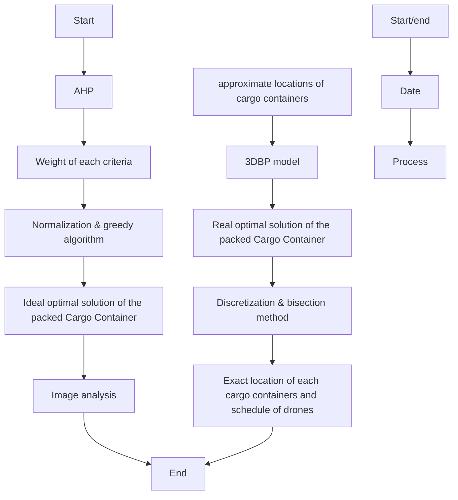

<table><tr><td colspan="2">For office use only</td></tr><tr><td>T1</td><td>____</td></tr><tr><td>T2</td><td>____</td></tr><tr><td>T3</td><td>____</td></tr><tr><td>T4</td><td>____</td></tr></table>

<table><tr><td>Team Control Number</td></tr><tr><td>1908904</td></tr><tr><td>Problem Chosen</td></tr><tr><td>B</td></tr></table>

<table><tr><td colspan="2">For office use only</td></tr><tr><td>F1</td><td></td></tr><tr><td>F2</td><td></td></tr><tr><td>F3</td><td></td></tr><tr><td>F4</td><td></td></tr></table>

# 2019 MCM/ICM Summary Sheet

# Arrangement for DroneGo

Summary

After the worst hurricane to ever hit Puerto Rico, lots of people were injured. Highways and roads were blocked and damaged by the flood. We establish a model to both meet the needs of medicine delivery and road reconnaissance with rotor wing drones.

Our model takes into account the following factors: the number of cargo containers, the type and the number of drones, the number of medicines, the associated packing configuration for each cargo container, the exact locations of cargo containers, and the schedule for each drone. Before establishing the model, we develop necessary assumptions and essential notations to make a reliable scenario.

After analyzing the locations of hospitals and flight distance of drones, we decide to set three containers because of the long distance among hospitals. Then, we quantify the associated packing configuration quality by the following three aspects: the minimum time to complete medical supply delivery, the amount of medical supply, and the reconnaissance ability. We use AHP Algorithm and the normalization method to determine the weights of these three factors and evaluate the Comprehensive Evaluation (CE) value. Then we use the greedy algorithm to get the best-associated packing configuration with the highest CE value under the ideal condition.

After that, we choose the approximate optimal positions for all cargo containers by image analysis to determine the optimate associated packing configuration in reality (using Bisection). We process the map of roads and populated places into pixels. Then, we can determine the exact location of containers by counting the occupied pixels of roads and populated places.

We provide the schedule plan for each drone. Then, we test our model and provide the evidence to show the stability and reliability of the work. In the end, we analyze the strengths and weakness of the model and conclude the result in our report.

Keywords: Drone, Route Planning, 3D Bin-Packing, AHP

## Contents

## 1 Introduction· · 1

1.1 Background · · · · 1  
1.2 Our work · · · ·

## 2 Assumption · · 2

## 3 Notations · 3

## 4 Specific formulation of problem · · 4

## 5 AHP Model 5

5.1 Establish an AHP Model · · · 5  
5.2 The Reason why We Choose These Three Aspects · · · · 5  
5.3 Weights of the Three Aspects · · · · 6  
5.4 Normalization 6

5.4.1 Amount of medical supply · · · · 6  
5.4.2 Minimum time to complete medical supply delivery · · · · · 7  
5.4.3 Reconnaissance ability · · · · 8

## 6 Packing Model · 8

6.1 Design Packing Configuration with Greedy Algorithm · · · · 8  
6.2 Roughly Find the Positions for the Cargo Containers· · · · 9  
6.3 Packing model in reality · · · · 12  
6.4 3D Bin-packing · · · · · 12

## 7 Accurate Locations · 13

## 8 Timetable of Flights · · 14

## 9 Sensitivity Evaluation of the Model· · 17

9.1 Sensitivity of the max distance reduction rate for drones · · · 17  
9.2 Sensitivity of the weight in AHP · · · · 17

## 10 Strengths and weaknesses 18

10.1 Strengths · · · · 18  
10.2 Weakness · · · 19

## 11 Conclusions · · 19

Memo · · 20

References · · 22

## A Appendices 23

A.1 Greedy Algorithm· · · · 23  
A.2 Binary Search with 3D bin-packing API · · · · 24  
A.3 Image Generating · · · · 26  
A.4 Image Processing and Optimal Position · · · · 28

## 1 Introduction

## 1.1 Background

Hurricane is a powerful tropical cyclone in the Atlantic and North Pacific with winds of more than 54.7 meters per second. A single ferocious hurricane can wreak havoc on a country. In 2017, a hurricane hit the United States territory of Puerto Rico, causing extensive property damage and up to 2,900 casualties. Storm surges destroyed coastal infrastructure, and hurricane-force rain damaged the most of the island’s electricity transmission lines. Widespread flooding has blocked and damaged many highways and roads across the island.

With the progress of science and technology, in the reconstruction, we can use drones to transport medical supplies to increase the hospital’s medicines reserves, use drones to detect road conditions, and to make preparations for further reconstruction in disaster areas. The rotor wing drone has the advantages of simple structure, strong maintainability and no casualties. It can be widely used in aerial photography, environmental detection and other fields, and has a huge industrial prospect [1]. Hence, rotor wing drones can be excellent at transporting cargo and reconnaissance.

## 1.2 Our work

However, in the scenario of using drones to deliver medicine and to detect road conditions, different drones have different sizes, functions, deadweight, flight speeds and maximum flight times. There are also different specifications for different types of medicines and Drone Cargo Bay, which all have to meet the carrying capacity of containers.

To best meet the needs of the medicines transportation and the road reconnaissance, we need to establish a reasonable model to make rational use of all aspects of resources and achieve the optimization of resource allocation.

However, how should we define the "good" of our model? To answer this question, our group defined the model as

• long days for medicines maintenance  
• wide range of reconnaissance road  
• short time for medicines delivery and reconnaissance mission.

## 2 Assumption

• The max distances the drones can reach are only related to their load conditions and their types. That means we ignore the wind or other unsure factors. We initially assume that the max distance will reduce to 80% when drones are carrying goods.  
• The drones can be cycle used (by charging to use next time). For a drone is not very cheap and DroneGo is a Non-Government Organization, we should concern the financial cost.  
• The time for charging is same for all kinds of drones. They may roughly equal in the reality; thus, assuming they are equal can simplify our calculation and the arrange of time.  
• The drones only can be charged at cargo containers of the DroneGo disaster response system. Because the electrical system in the island is ruined in the disaster.  
• The medicines do not need to be placed head on in the containers/cargo bay; most medicines and medical equipment are well-packed in daily life, with this assumption, we can use the space of containers/cargo bay better.  
• Drones, medicines and cargo bays are packed separately in the container (medicines will not be placed in cargo bays and then placed them together in the container). It is normal in our daily life.  
• Environments and weather do not have influence in drones flying/observing. Our plan is arranged for most situation; thus, we ignore the extreme weather which exists rarely.  
• The whole island is on a plane. For the difference of longitude is less than 2 degrees and difference of latitude is less than 0.5 degrees in the island, which just has a tiny influence on the shape of the island. Thus, we can ignore it for computational convenience.  
• Hospitals can store redundant medical in a day. That is, except the daily demand, the hospital can store more medical for the following days.  
• The drone of H type is used to offer communication between other drones and control center [2].So, each container should have at least one H.

3 Notations

<table><tr><td>Symbols</td><td>Description</td><td>Unit</td></tr><tr><td> $D$ </td><td>the number of days medicals can supply</td><td>days</td></tr><tr><td> $L_{Di}, W_{Di}, H_{Di}$ </td><td>the length, width and height of the ith kind of drone</td><td>in.</td></tr><tr><td> $L_{Bi}, W_{Bi}, H_{Bi}$ </td><td>the length, width and height of the corresponding bay for ith kind of drone</td><td>in.</td></tr><tr><td> $L_{Mi}, W_{Mi}, H_{Mi}$ </td><td>the length, width and height of MEDI</td><td>in.</td></tr><tr><td> $L_c, W_c, H_c$ </td><td>the length, width and height of the cargo container</td><td>in.</td></tr><tr><td> $z_i$ </td><td>the payload of the ith drone (here i is the drone number but not type)</td><td>lbs.</td></tr><tr><td> $n_d$ </td><td>the total number of the drones A-G</td><td>pieces</td></tr><tr><td> $n_{Mi}$ </td><td>the number of the MEDI</td><td>pieces</td></tr><tr><td> $n_{Di}$ </td><td>the number of the ith kind of drone</td><td>pieces</td></tr><tr><td> $CE$ </td><td>the comprehensive evaluation</td><td>None</td></tr><tr><td> $T_0$ </td><td>the charging time</td><td>min</td></tr><tr><td> $A$ </td><td>the average space used of all cargo containers</td><td>None</td></tr><tr><td> $x_{iR}$ </td><td>the largest distance the ith kind of drone can deliver medicines and come back</td><td>km</td></tr><tr><td> $x_{iS}$ </td><td>the largest distance the ith kind of drone can reach with medicines</td><td>km</td></tr><tr><td> $x_{iM}$ </td><td>the largest distance the ith kind of drone can reach with medicines</td><td>km</td></tr></table>

(\*Note: normally, $i \in [ A , H ] )$

## 4 Specific formulation of problem

Above all, in terms of the number of containers, it is obvious that more containers can provide more drones and medical supply. In addition, the area where the container is located can charge the drones. Therefore, more containers will make the drones more flexible and create a wider reconnaissance range. The most important point is that one or two cargo containers cannot cover the five hospitals (this will be shown in Part 7). Due to the reasons above, we firstly consider the number of containers is 3.

We think the helicopter has the ability to transport containers to inland. Therefore, in terms of the location of the container, we need to consider the location of the container inside Puerto Rico so that the container can meet the daily needs of the hospital and the road reconnaissance.


<details>
<summary>flowchart</summary>


</details>

Figure 1: flow diagram of solution

## 5 AHP Model

## 5.1 Establish an AHP Model

To evaluate the proportion of medicine and drones which will be installed in the cargo container, we establish an AHP model which focuses on the following three aspects:

• Minimum time to complete medical supply delivery, during which we use all drones to deliver medicines to the five hospitals without rest until all medicines are conveyed properly.  
• Amount of medical supply, which are the days our medicines can support the five hospitals keep working properly. By some easy calculations we can get that we need 7 MED1, 2 MED2, 4 MED3 per day; thus, to keep hospitals working D days, the amount of medical supply should be (let $V _ { m } = 7 n _ { M 1 } + 2 n _ { M 2 } + 4 n _ { M 3 } )$ :

$$
D \times V _ {m}
$$

• Reconnaissance ability, which measures the total reconnaissance ability under the situation we choose.

## 5.2 The Reason why We Choose These Three Aspects

The amount of the medical supply judges that how long can the hospitals keep working, which is important because people’s life is vital in the whole rescue activity.

We consider the minimum time to complete medical supply delivery for two reasons:

• It ensures that the five hospitals have plenty medicines so that can help save people, and more medical supply at the beginning days in hospital can let the hospitals deal with some emergencies in reality (even though the medical demanded is given in the question).  
• It reflects the efficiency of the NGO; faster completion of the task that means the organization can do more things with the same time. Time-cost is one thing we should consider.

(\*we have not counted in the time the drones cost on detecting the roads because it is not an urgent task and detection is much faster than restoration of the roads)

The problem requires us to detect roads as many as we can; thus, we choose reconnaissance ability as one of the factors we focus on.

## 5.3 Weights of the Three Aspects

The main task is to bring the medicines to the hospitals, which relates to people’s life; thus, we regard it as the most important factor.

If we bring one Type B Drone (which can fly furthest) in each cargo container, we can attain the largest reconnaissance area; thus, more drones can only observe the road more frequent or faster but cannot expand the detectable area anymore. As a result, we give it the smallest proportion.

<table><tr><td>Aspect</td><td>Minimum time for delivery</td><td>Amount of medical supply</td><td>Reconnaissance ability</td><td>Weight</td></tr><tr><td>Minimum time for delivery</td><td>1</td><td> $\frac{1}{4}$ </td><td>3</td><td>0.2051</td></tr><tr><td>Amount of medical supply</td><td>4</td><td>1</td><td>8</td><td>0.7167</td></tr><tr><td>Reconnaissance ability</td><td> $\frac{1}{3}$ </td><td> $\frac{1}{8}$ </td><td>1</td><td>0.0783</td></tr></table>

Table 1: Pairwise comparison matrix of hierarchy

Through calculating the weights of three factors, we get the maximum eigenvalue λ is 3.0183 and the consistency ratio CR is 0.0158. CR < 0.1, so the Consistency Test is right.

## 5.4 Normalization

Now we have already got the weight of each aspect; however, to analysis the three factors together, we need to normalize them so that they will have the same unit. Followings are our considering steps and normalized results:

We decide to give a mark (between 0 and 1) to each factor in every situation, which carries different number and kinds of drones as well as medicines. Details of the principles to give the marks are below.

## 5.4.1 Amount of medical supply

As we calculated, the five hospitals need 7 MED1, 2 MED2 and 4 MED3 per day. We define this one-day’s medical demand as a supply unit. For ensuring the basic medical demand during the first many days after the disaster, we decide to supply at least 120 supply units. (which are enough for four months). In our marking system, a scheme which has 120 supply units is worth 0.6 marks; when the amount of medical supply approaches infinity, the scheme worth 1 mark. To achieve these two criterions, we give a marking function:

$$
f (D) = \frac {D}{D + 8 0}, (D > = 1 2 0)
$$

## 5.4.2 Minimum time to complete medical supply delivery

We can know the function of time is $( z _ { i }$ is the payload of drone i):

$$
T = \frac {D \times V _ {m}}{\sum_ {i = 1} ^ {n _ {d}} \frac {z _ {i}}{\frac {d _ {i}}{v _ {i}} + T _ {0}}}
$$

• For the speed of the fastest drone is 79km/h (63.2km/h with cargo bay) and the speed of the slowest drone is 60km/h (48km/h with cargo bay), assume that distance is 7km(the Type D Drones’ furthest flight with cargo bay), a $\textstyle \sum _ { i = 1 } ^ { n _ { d } } z _ { i } .$ 4.998%; thus, we can regard the time for different types of drones is roughly same (consdering $\frac { d _ { i } } { v _ { i } }$ as a constant).  
• When we only have one drone, we can take 1042 units of medicines; thus, if we add a drone, the impact of $n _ { d }$ is much larger than the decrement in D. We decide to ignore the tiny change of $D \times V _ { m } \left( V _ { m } \right.$ is a constant).  
• In our greedy algorithm (we will introduce its details in Part Six), we adjust our plan by adding one drone per time and compare it with the former condition. Adding one drone will not influence the average of all drones’ payload capability when there are more than 10 drones; thus, we can reasonable assume the average of the drones’ payload capability does not change.

Finally, we can get $\begin{array} { r } { T \propto \frac { 1 } { n _ { d } } } \end{array}$ r1

The full one mark of this factor is given by the following situation:

With carrying 120 supply units of medicines (which ensure the medical supply) in the three cargo containers and three Type H Drones, the rest room is full of Type D Drones (which has the smallest volume of shipping container).

$$
\begin{array}{l} V _ {c} = L _ {c} \times W _ {c} \times H _ {c} \\ V _ {h} = L _ {D H} \times W _ {D H} \times H _ {D H} \\ V _ {d} = L _ {D D} \times W _ {D D} \times H _ {D D} \\ N _ {m a x} = \frac {3 \times V _ {c} - 3 * V _ {h} - 1 2 0 \times V _ {m}}{V _ {d}} \\ \end{array}
$$

To calculate other conditions’ marks, we simply use the number of the drones to divide the largest number $N _ { m a x }$ .

$$
g (n) = \frac {n _ {d}}{N _ {m a x}}
$$

## 5.4.3 Reconnaissance ability

It is obvious that if we add a drone, the reconnaissance ability will be higher. A drone which can fly further is able to detect more area and roads, which shows it has a higher reconnaissance ability. However, the drone’s flying time is limited, the reconnaissance ability should not be exactly proportional to the area which it can reach. We regard it roughly be proportional to the sum of all drone’s max flying distance.

The full one mark of this factor is given by the following situation:

With carrying 120 supply units of medicines (which ensure the medical supply) in the three cargo containers and three Type H Drones, the rest room is full of Type B Drones (which has the largest ratio of flight distance to its volume of shipping container). This situation has the largest sum of all drone’s max flying distance.

$$
V _ {b} = L _ {D B} \times W _ {D B} \times H _ {D B}
$$

$$
D _ {m a x} = \frac {3 \times V _ {c} - 3 \times \left(V _ {h} - 1 2 0 \times V _ {m}\right)}{V _ {b}} \times 5 2. 6 7
$$

To calculate other conditions’ marks, we simply use the sum of all drone’s max flying distance in that situation to divide the largest sum to get the mark:

$$
h (x _ {n}) = \frac {\sum_ {i = A} ^ {G} x _ {i M}}{D _ {m a x}}
$$

## 6 Packing Model

## 6.1 Design Packing Configuration with Greedy Algorithm

The “optimal” is defined by the comprehensive evaluation CE, which can be calculated by the normalization formula in the AHP model. When the CE is the highest, the associated packing configuration is the best.

$$
C E = \omega_ {f} \cdot f (D) + \omega_ {g} \cdot g (n) + \omega_ {h} \cdot h (x _ {n}) \quad \in [ 0, 1 ]
$$

The core idea of this model is the Greedy Algorithm. We put the drones into containers one by one, and guarantee that each time they are placed, they can achieve the highest comprehensive evaluation CE score. It’s rational that each new drone added will reduce the space to store the medicine. However, although the minimum time to complete medical supply delivery increases, the amount of medical supply decreases. Overall, the CE will increase first and then decrease as the new drones added. And our ultimate goal is to get the condition where the comprehensive evaluation of packing configuration score is the highest. Then, we get the amount of each type of drones shown in the Table 2.

<table><tr><td>Type</td><td>A</td><td>B</td><td>C</td><td>D</td><td>E</td><td>F</td><td>G</td><td>H</td></tr><tr><td>Number</td><td>0</td><td>121</td><td>0</td><td>54</td><td>0</td><td>0</td><td>0</td><td>3</td></tr></table>

Table 2: The amount of each type of drones

As what we can see from the figure above, the types and number of drones obtained by greedy algorithm are: 121 drones of type B, 54 drones of type D, and 3 drones of type H. We find that the result is rational and acceptable due to following aspects:

• The type D drones have the smallest volume and a not bad max payload capability. They have the largest ratio of max payload capability to the volume.  
• The type B drones have the furthest flight distance, which means that the area they can reconnoiter is the largest. Hence, type B drones have the best ability of reconnaissance when we don’t consider the speed of each type of drones.  
• What’s more, type B drones are the drones that have the highest speed; thus, they can connect each cargo container to allow even greater flexibility (from cargo container A to B for recharging).

By calculating how much space is left in the container, we can calculate the approximate number of days the medicine can last.

$$
\begin{array}{l} D = \frac {L _ {c} \times W _ {c} \times H _ {c} - \sum_ {i = A} ^ {H} n _ {D i} \times (L _ {D i} \times W _ {D i} \times H _ {D i} + L _ {B i} \times W _ {B i} \times H _ {B i})}{\sum_ {i = 1} ^ {3} n _ {M i} \times L _ {M i} \times W _ {M i} \times H _ {M i}} \\ = 4 1 1 d a y s \\ \end{array}
$$

The number of days obtained by this formula is an ideal value, that is, to completely use the space of the container to package materials. However, we know that in reality, packing often leads to space waste. There will be some space which can not be used to store any items. Therefore, the actual number of days that the medicine can sustain is going to be less than but close to the ideal number of days. Roughly, the actual number of days will be 20% less than the ideal time. However, 411 days is much larger than expected: 120 days (4 months), so the difference has little effect on our result.

## 6.2 Roughly Find the Positions for the Cargo Containers

## Steps of Drawing the Map for Analysis

We use image analysis to roughly find the positions for the cargo containers. Followings are some calculations for drawing the image:

The furthest distance that the Type B drone can carry medicines to hospital and fly back $( x _ { B R } )$ :

$$
x _ {B R} = \frac {v _ {B} \times t _ {B}}{\frac {1}{80 \%} + 1} \tag{1}
$$

$$
\rightarrow x _ {B R} = 2 3. 4 k m
$$

The furthest distance that the Type D drone can carry medicines to hospital and fly back $( x _ { D R } )$ :

$$
x _ {D R} = \frac {v _ {D} \times t _ {D}}{\frac {1}{80 \%} + 1} \tag{2}
$$

$$
\rightarrow x _ {D R} = 8 k m
$$

The furthest distance that the Type B drone can fly from one cargo container to another cargo container with medicines and cargo bay $( x _ { B S } )$ :

$$
x _ {B S} = V _ {B} \times t _ {B} \times 80 \% \quad \rightarrow \quad x _ {B S} = 42.5 \text {km}
$$

We use MATLAB to plot the following Figure 5.


<details>
<summary>text_image</summary>

Hospital Pavia
Arecibo
C
Puerto Rico Children's
Hospital
Hospital Pavia
Santurce
A
B
Hospital HIMA
Carribean Medical
Center
</details>

Figure 2: Image for analyzing the rough locations

• The five red dots represent the five hospitals.  
• The five blue circles $( { \mathrm { r a d i u s } } = x _ { D R } ,$ with the center at the five red dots) means if the cargo container is in the blue circles, Type D drones can deliver medicines to the corresponding hospital.  
• The five green circles $( { \mathrm { r a d i u s } } = x _ { B R } ,$ with the center at the five red dots) means if the cargo container is in the green circles, Type B drones can deliver medicines to the corresponding hospital.

• The red circle (radius $= x _ { B R } + x _ { B S }$ , with the center at the most left red dot) means the furthest positions Type B drones can fly to (with the precondition that Type B drones can deliver medicines to the most left hospital). If we set another cargo container in the red circle, Type B drones can deliver medicines between these two containers.  
• The dashed line is the approximate coastline, and the line between the middle two red dots represents the coastline there. We cannot place cargo containers above them.

(\* We will give the information for the black circle and Area A, B, C after some analysis.)

## The Aspects of a Good Locations for Cargo Containers

• The number of hospitals which can be covered by the delivery ability of two types of drones.  
• Whether the drones can transfer the medicines from the cargo container to another cargo container or not. This ability allows we load medicines in other containers and transfer to the one needs them. It will promote the maximum of the days which medicines can keep supplying.

## Results of the Rough Positions for the Three Cargo Containers

We choose Area A (which is shown in the picture) to place the Cargo Container A, because a cargo container there

• can supply medicines to the middle two hospitals by Type B and D drones;  
• can supply medicines to the bottom hospital by Type B drones;  
• remain the possibility to transfer medicines to other two cargo containers (one in the left and one in the right).

We choose Area B (which is shown in the picture) to place the Cargo Container B, because a cargo container there

• can supply medicines to the bottom hospital and the right one by Type B drones;  
• can transfer medicines to Cargo Container A which is in Area A.

We draw the black circle $( { \mathrm { r a d i u s } } = x _ { B S } ,$ , with the center at Area A), which shows the furthest positions where Type B drones can fly (from Area A) to. Thus, we choose Area C (which is shown in the picture) to place the Cargo Container C, because a cargo container there

• can supply medicines to the left hospital by Type B drones;  
• can transfer medicines to Cargo Container A which is in Area A.

## 6.3 Packing model in reality

Now, we have got the approximate position of each cargo container, so that we can determine the associated packing configuration for each of them.

For cargo containers B and C, they are so far away from every hospital that type D drones cannot be used to deliver medicine. Thus, all the type D drones should be packed in cargo container A.Only Hosp1 and Hosp2, which are both quite close to cargo container A, need the medicine 2. Therefore, it’s rational to pack all the medicine 2 in the Cargo container A. Cargo container B and C initially only have type B drones. Although they will both need to deliver medicine to the Hosp1, Hosp2, and Hosp3, Cargo container B has more load(offers medicine to two hospitals directly, but C only has one) than C, it will need much more room for medicine storage. Hence, we decide to pack more type B drones $( \frac { 3 } { 5 } N _ { D 2 } )$ in Cargo container C than B $( \textstyle { \frac { 2 } { 5 } } N _ { D 2 } )$ ;

## 6.4 3D Bin-packing

3DBP [3] is developed by company 3Dbinpacking, which established in 2012 and designed to solve the three-dimensional packing problem. By using the available API supported by 3DBP, we use the Bisection method to find the best packing condition.

The key idea is that we firstly decrease all kinds of good in ideal condition to 70% to ensure that all the cargo container can pack everything. The percentage of each good keep the same as initial after decreasing. Firstly, we make cargo container B pack more medicine 3 as Hosp4 and Hosp5 need. Secondly, we make cargo container C pack more medicine 1 as Hosp1 needs. Finally, we pack all the remaining thing in cargo container A. If three cargo containers can pack all the things when we increase the decreasing percentage (initially set to 70%), we will adopt the new packing plan. With the help of the Bisection method, we can get the final result shown in Table 3.

  
(a) Container A

  
(b) Container B

  
(c) container C  
Figure 3: Configuration of each container

<table><tr><td>Items and properties</td><td>Container A</td><td>Container B</td><td>Container C</td></tr><tr><td>B</td><td>0</td><td>39</td><td>60</td></tr><tr><td>D</td><td>42</td><td>0</td><td>0</td></tr><tr><td>H</td><td>1</td><td>1</td><td>1</td></tr><tr><td>Type 1</td><td>42</td><td>39</td><td>60</td></tr><tr><td>MED 1</td><td>831</td><td>1077</td><td>605</td></tr><tr><td>MED 2</td><td>718</td><td>0</td><td>0</td></tr><tr><td>MED 3</td><td>677</td><td>759</td><td>0</td></tr><tr><td>Space used</td><td>77.60%</td><td>89.34%</td><td>81.64%</td></tr></table>

Table 3: Pairwise comparison matrix of hierarchy

The detail of packing is shown in Figure 3. We can calculate the average space used of the three cargo containers: A = 82.86%.

## 7 Accurate Locations


<details>
<summary>text_image</summary>

Map with marked locations and colored circles, likely indicating survey or monitoring points across regions
</details>

Figure 4: routes, cities and range

Based on the approximate location of three cargo containers(as shown in Figure 4), we use the discretization method to calculate the accurate locations. Firstly we discretize roads and reconnaissance area into pixels. By computing the pixel number of roads and highways, and the number of populated places in the reconnaissance area, we use standardization to get the standard of every point. During this process, we give the weight of highway and road length as 0.6 and populated places as 0.4. After that, we calculate all the point inside the brown area (the approximate location) to get the exact locations, which are shown in Table 4 and Figure 5.

In Figure 5, the black curves represent the highways and roads. The red points represent the populated places and the green points represent the accurate location we get.

<table><tr><td>Cargo Container</td><td>Latitude</td><td>Longitude</td></tr><tr><td>A</td><td>18.40</td><td>-66.12</td></tr><tr><td>B</td><td>18.21</td><td>-65.82</td></tr><tr><td>C</td><td>18.43</td><td>-66.51</td></tr></table>

Table 4: Accurate location of each cargo container


<details>
<summary>natural_image</summary>

Map outline with red and green dots marking locations, no text or labels present
</details>

Figure 5: accurate location

## 8 Timetable of Flights

The initial conditions of three cargo containers are mentioned in the Part 6 We can know a whole flight is less than two hours (the flying period is less than one hour, and charging period is one hour); thus, we set two hours as a flight period. There are ten hours (8:00 – 18:00) per day, during which the drones can fly. We use 30 Type B drones (initially in Cargo Container C) to detect the roads. They will detect all the areas which they can fly to and come back two hours by two hours (five times per day); thus, we do not list them in the timetable. Our aims of setting the timetables are trying to deliver the medicines as soon as possible and to completion at the same time for the five hospitals.

## \*Notes:

• $\textcircled{1} - \textcircled{5}$ represents the five hospitals: 
1 : Hospital Pavia Arecibo, 
2 : Puerto Rico Children’s Hospital, 
3 : Hospital Pavia Santurce, 
4 : Hospital HIMA, 5 : Caribbean Medical Center.  
• A, B and C represent Cargo Container A, B and C.  
• N × T ype $X ( n \times M E D _ { i } + m \times M E D _ { j } ) \ $ Location L represents flights that $N T y p e / , X$ drones fly to location L with each carrying $n M E D _ { i }$ and

/ $n M E D _ { j } . ~ ( \mathrm { e . g . ~ 4 2 } \times D ( 4 \times M E D _ { 2 } )  \textcircled { 2 }$ means 42 Type D drones fly to 
2 with each carrying 4 MED2; A flight which does not carry any medicines represented with no bracket.)

• A flight to the hospitals will fly back to the original place, while a flight to another cargo container won’t. Every drone always carries a cargo bay, we do not consider cargo bays separately anymore.

Day One

<table><tr><td>Departure point Time</td><td>Cargo Container A</td><td>Cargo Container B</td><td>Cargo Container C</td></tr><tr><td>8:00 - 10:00</td><td>42* D(4*MED2)-&gt;2</td><td>18* B(2*MED3)-&gt;520*B(2*MED3)-&gt;A1*B(1*MED3)-&gt;A</td><td>30*B(2*MED1)-&gt;A</td></tr><tr><td>10:00 – 12:00</td><td>42* D(4*MED2)-&gt;321*B -&gt; B30*B -&gt; C</td><td>12*B(1*MED1+1*MED3)-&gt;46*B(2*MED1) -&gt;4</td><td>/</td></tr><tr><td>12:00 – 14:00</td><td>42* D(4*MED2)-&gt;2</td><td>16*B(1*MED1+1*MED3)-&gt;4</td><td>30*B(2*MED1)-&gt;A</td></tr><tr><td>14:00 – 16:00</td><td>42* D(4*MED2)-&gt;330*B -&gt; C</td><td>8*B(2*MED1) -&gt;415*B(1*MED1+1*MED3)-&gt;5</td><td>/</td></tr><tr><td>16:00 – 18:00</td><td>5* D(4*MED2)-&gt;25* D(4*MED2)-&gt;31* D(3*MED2)-&gt;21* D(3*MED2)-&gt;324*D(1*MED1+1*MED3)-&gt;26* D(2*MED1)-&gt;3</td><td>(*from this time, there will be 21 times (count this time in) that they have the same arrangement of flights)* The 24thtime (on Day 5)11*B(2*MED1) -&gt;45*B(2*MED1) -&gt;41*B(1*MED1) -&gt;4</td><td>3*B(2*MED1)-&gt;A27*B(2*MED1)-&gt;1</td></tr></table>

Figure 6: timetable for day 1

After Day One, each hospital has medicines which can maintain at least 12 days.

Day Two

<table><tr><td>DeparturepointTime</td><td>Cargo ContainerA</td><td>Cargo ContainerB</td><td>CargoContainer C</td></tr><tr><td>8:00 - 10:00</td><td>6* D(2*MED1)-&gt;33* B(2*MED1)-&gt;336*D(1*MED1+1*MED3)-&gt;2 (these 45 flights are marked as☆)</td><td rowspan="5">* The 25 $^{th}$  time (on Day 5):26*B(1*MED1+1*MED3)-&gt;5</td><td>27*B(2*MED1)-&gt;A</td></tr><tr><td>10:00 – 12:00</td><td>27*B-&gt;C☆</td><td>/</td></tr><tr><td>12:00 – 14:00</td><td>☆</td><td>27*B(2*MED1)-&gt;A</td></tr><tr><td>14:00 – 16:00</td><td>27*B-&gt;C☆</td><td>/</td></tr><tr><td>16:00 – 18:00</td><td>☆</td><td>6*B(2*MED1)-&gt;A4*B-&gt;A17*B(2*MED1)-&gt;1</td></tr></table>

Figure 7: timetable for day 2

• After Day Two, every period’s flights are cyclic:

Departure from Cargo Container A:

$$
\left[ \begin{array}{c} 1 1 \times B (2 \times M E D _ {1}) \to \textcircled {3} \\ 2 \times B (1 \times M E D _ {1} + 1 \times M E D _ {3}) \to \textcircled {2} \\ 4 2 \times D (1 \times M E D _ {1} + 1 \times M E D _ {3}) \to \textcircled {2} \end{array} \right] \text {each time.}
$$

After looping 11 times, the 22th time (on Day $5 ) ^ { \prime } { \bf s }$ flights are:

$$
\left[ \begin{array}{c} 7 \times B (2 \times M E D _ {1}) \to ③ \\ 1 \times B (1 \times M E D _ {1}) \to ③ \\ 3 0 \times D (1 \times M E D _ {1} + 1 \times M E D _ {3}) \to ② \end{array} \right]
$$

• Departure from Cargo Container C:

$1 7 \times B ( 2 \times M E D _ { 1 } ) $ 1 each time.

After looping 7 times, the 18th time (on Day 4)’s flights are:

$$
\left[ \begin{array}{c} 1 6 \times B (2 \times M E D _ {1}) \to \textcircled {1} \\ 1 \times B (1 \times M E D _ {1}) \to \textcircled {1} \end{array} \right]
$$

As the result, after Day 5(the last day we still need to deliver medicines) all hospitals have medicines which can keep 359 days.

## 9 Sensitivity Evaluation of the Model

## 9.1 Sensitivity of the max distance reduction rate for drones

According to equations 1 and 2, we can know that the rate of distance reduction for drones largely determines the maximum distance that the cargo containers from hospitals. The change of this rate will result in the shift of the exact cargo containers location.

Firstly, we make the ratio increase of 0.025. We calculate the furthest distances from a cargo container that the Type B and Type D drones can carry medicines to a hospital and fly back: $x _ { B R } = 2 3 . 8 1 k m , x _ { D R } = 8 .$ 14km

Secondly, we make the ratio decrease of 0.025. After the same calculation, we get: $x _ { B R } = 2 3 . 0 0 k m , x _ { D R } = 7 . 8 6 k m$

We show the exact final location for each cargo container in Table 5.

<table><tr><td></td><td>Container A</td><td>Container B</td><td>Container C</td></tr><tr><td>0.8</td><td>(18.40, -66.12)</td><td>(18.21, -65.82)</td><td>(18.43, -66.51)</td></tr><tr><td>0.825</td><td>(18.39, -66.11)</td><td>(18.20, -65.82)</td><td>(18.43, -66.51)</td></tr><tr><td>0.775</td><td>(18.40, -66.12)</td><td>(18.21, -65.82)</td><td>(18.43, -66.52)</td></tr></table>

Table 5: sensitive test result of distance reduction

We find that the change in the rate of distance reduction for drones will shift of the exact cargo containers location, but the difference is so small that we can even ignore it.

## 9.2 Sensitivity of the weight in AHP

We evaluate the associated packing configuration by the minimum time to complete medical supply delivery, the amount of medical supply, and the reconnaissance ability. The weight of these three factors will result in different packing plan of drones’ selection in the ideal condition.

Firstly, we increase the weight of one factor and equally remove the difference to the other two factors. We make the same progress for the other factors.

Secondly, we decrease the weight of one factor and equally remove the difference to the other two factors. We make the same progress for the other factors.

We show the final result of the drone selection in Figure 8.


<details>
<summary>bar chart</summary>

| Category | Series 1 | Series 2 | Series 3 | Series 4 |
| :--- | :--- | :--- | :--- | :--- |
| A | 0 | 0 | 0 | 0 |
| B | 122 | 117 | 131 | 126 |
| C | 0 | 0 | 0 | 0 |
| D | 55 | 66 | 42 | 51 |
| E | 0 | 0 | 0 | 0 |
| F | 0 | 0 | 0 | 0 |
| G | 0 | 0 | 0 | 0 |
| H | 3 | 3 | 3 | 3 |
| Days/5 | 83 | 81 | 85 | 82 |
</details>

Figure 8: the sensitive test of AHP

We find that the only drones our model choose are type B and type D. The maximum percentage difference $\beta _ { 1 }$ of the number of B Drones is 9.92%. The maximum percentage difference $\beta _ { 2 }$ of the number of D Drones is 33.3%. The maximum percentage difference $\beta _ { 3 }$ of the number of D (days) is 2.4%. In fact, the number of D cannot influence the result a lot. So, they are small enough to show that our model is stable and reliable.

## 10 Strengths and weaknesses

In this part, we will analyze the strengths and weaknesses of our model.

## 10.1 Strengths

• High space utilization  
3-D packing problem is a Non-deterministic Polynomial(N-P) problem, which means that we cannot get the answer directly only by calculation. However, the 3DBP model provides an excellent simulation to approach the best packing way.  
• Good flexibility  
Based on the AHP method, it’s available for us that we can change the weight of each aspect to satisfied different demands for we need in reality.  
• Both consider the populated place and the roads for reconnaissance  
Both consider the populated place and the roads for reconnaissance In the

exact position calculation, our model both consider the main cities and the roads. It’s reasonable that there are many main roads in and around the populated place. It improves the reliability of our model.

## 10.2 Weakness

## • The max distance reduction rate for drones are the same

In our model, the max distance reduction rate for all types of drones are the same. With physical analysis, we can know that the speed and the flight time are related to the power and weight of drones. Actually, the max distance reduction rate for the different type of drones might be different.

## • Ignore the altitude

Although most of the mountains (high altitude area) are around the island, there still exits some distance error caused by altitude difference.

## 11 Conclusions

The NGO should set three cargo containers at (18.40, -66.12), (18.43, -66.51) and (18.21, -65.28) (latitude, longitude). We determine to bring 121 Type B drones and 42 Type D drones to complete the task. The average space used ratio is 82.86%. Our plan brings medicines which are enough for 359 days; what’s more, we can deliver all the medicines in five days. We can detect as much as possible roads, and there are about 9 cities is in our reconnaissance range as well. (Figure 9 is created by Google map. The red points represent the accurate locations of three cargo containers, and the blue points represent the five hospitals. )


<details>
<summary>text_image</summary>

Hospital Pavia Arecibo
San Juan
18.4-66.12
Hospital Pavia Santurce
Caribbean Med
Naguabo
Gurabo
Hospital HIMA
Cebu
Rocqueveit
Roads
Luquillo
Fajardo
Caribbean Med
Caribana
Borresgate
Isabella
Quebradillas
Panilo
Arecibo
Tamaría
Sabaria Hoyos
Florida
Cales
Lima
Oahuado
Jayaña
Oracovis
Barranquitas
Cidra
Cayey
San Lorenzo
Humacao
Palmas
Del Mar
Talbucoa
Emagugu
Ponce
Juan Diaz
El Dío
Santa Isabela
Salinas
Guayama
Arooyo
</details>

Figure 9: location in Google Map

## A letter to HELP, Inc

January 28, 2019

Dear CEO of HELP, Inc:

Hearing that HELP, Inc is a Non-governmental Organization and recently developing a transportable disaster response system; We are more than glad to share our mathematical model to give some recommendations.

We strongly advise you to transport three cargo containers to Puerto Rico. Otherwise, there will be hospitals which cannot receive medicines. Besides, due to the non-profit property of HELP, Inc, we recommend using rechargeable drones. When considering the minimum time to complete medical supply delivery, the amount of medical supply, and the available reconnaissance area, we select type B, D, and H drones. Also, a rational packing plan is given in the figure below, which allows three cargo contains to pack 359 days unit medicine and has 82.86% average space used.

After considering the connection between containers, the number of hospitals, the length of roads, and the number of populated places, we give you a reliable timetable for the drones (shown below), which can complete all the task within five days and allow a part of drones to detect roads.

However, due to the max flight distance limit of drones and the medicine requirement of hospitals, it’s impossible to detect the whole Puerto Irco only by three containers. Meanwhile, to increase the efficiency of medicine delivery and reconnaissance ability, we use more drones, which will result in a lower space used of cargo containers.

We hope that our model can help HELP, Inc to save even one more people’s life. And we also hope that there will be more organizations like HELP, Inc. Disasters are horrible, but people’s care can resist everything.

<table><tr><td>Items and properties</td><td>Container A</td><td>Container B</td><td>Container C</td></tr><tr><td>B</td><td>0</td><td>39</td><td>60</td></tr><tr><td>D</td><td>42</td><td>0</td><td>0</td></tr><tr><td>H</td><td>1</td><td>1</td><td>1</td></tr><tr><td>Type 1</td><td>42</td><td>39</td><td>60</td></tr><tr><td>MED 1</td><td>831</td><td>1077</td><td>605</td></tr><tr><td>MED 2</td><td>718</td><td>0</td><td>0</td></tr><tr><td>MED 3</td><td>677</td><td>759</td><td>0</td></tr><tr><td>Space used</td><td>77.60%</td><td>89.34%</td><td>81.64%</td></tr></table>

Day One

<table><tr><td>DeparturepointTime</td><td>Cargo ContainerA</td><td>Cargo Container B</td><td>CargoContainer C</td></tr><tr><td>8:00 - 10:00</td><td>42* D(4*MED2)-&gt;2</td><td>18* B(2*MED3)-&gt;520*B(2*MED3)-&gt;A1*B(1*MED3)-&gt;A</td><td>30*B(2*MED1)-&gt;A</td></tr><tr><td>10:00 – 12:00</td><td>42* D(4*MED2)-&gt;321*B -&gt; B30*B -&gt; C</td><td>12*B(1*MED1+1*MED3)-&gt;46*B(2*MED1) -&gt;4</td><td>/</td></tr><tr><td>12:00 – 14:00</td><td>42* D(4*MED2)-&gt;2</td><td>16*B(1*MED1+1*MED3)-&gt;4</td><td>30*B(2*MED1)-&gt;A</td></tr><tr><td>14:00 – 16:00</td><td>42* D(4*MED2)-&gt;330*B -&gt; C</td><td>8*B(2*MED1) -&gt;415*B(1*MED1+1*MED3)-&gt;5</td><td>/</td></tr><tr><td>16:00 – 18:00</td><td>5* D(4*MED2)-&gt;25* D(4*MED2)-&gt;31* D(3*MED2)-&gt;21* D(3*MED2)-&gt;324*D(1*MED1+1*MED3)-&gt;26* D(2*MED1)-&gt;3</td><td>(*from this time, there will be 21 times (count this time in) that they have the same arrangement of flights)* The 24 $^{th}$ time (on Day 5)11*B(2*MED1) -&gt;45*B(2*MED1) -&gt;41*B(1*MED1) -&gt;4</td><td>3*B(2*MED1)-&gt;A27*B(2*MED1)-&gt;1</td></tr></table>

Day Two

<table><tr><td>DeparturepointTime</td><td>Cargo ContainerA</td><td>Cargo ContainerB</td><td>CargoContainer C</td></tr><tr><td>8:00 - 10:00</td><td>6* D(2*MED1)-&gt;33* B(2*MED1)-&gt;336*D(1*MED1+1*MED3)-&gt;2 (these 45 flights are marked as☆)</td><td rowspan="5">* The 25thtime (on Day 5):26*B(1*MED1+1*MED3)-&gt;5</td><td>27*B(2*MED1)-&gt;A</td></tr><tr><td>10:00 – 12:00</td><td>27*B-&gt;C☆</td><td>/</td></tr><tr><td>12:00 – 14:00</td><td>☆</td><td>27*B(2*MED1)-&gt;A</td></tr><tr><td>14:00 – 16:00</td><td>27*B-&gt;C☆</td><td>/</td></tr><tr><td>16:00 – 18:00</td><td>☆</td><td>6*B(2*MED1)-&gt;A4*B-&gt;A17*B(2*MED1)-&gt;1</td></tr></table>

Yours sincerely,

Team #1908904

MCM2019

## References

[1] W. Wei, M. Hao, X. Jin-qi, and S. Chang-yin, “Research on standardized design method of airframe for multi-rotor uav,” no. 5, pp. 147–150, 2014.  
[2] L. Wei and L. Yuejun, “The research on building high-altitude communication base station by using uav,” Communication World, no. 9, pp. 12–13, 2017.  
[3] 3Dbinpacking, “Single bin packing,” https://www.3dbinpacking.com/en/ about-us, accessed January 4, 2019.

## A Appendices

A.1 Greedy Algorithm  
```c
#include "greedy.h"
#include <stdio.h>

int Greedy(int drone_num[], float w_time, float w_amount, float w_scale) {
    float scale = 0;
    int total_load = 0;
    int occupy = 3 * drone[7].d_size.height * drone[7].d_size.width
    * drone[7].d_size.length;
    int pack = (7 * med[0].m_size.height
    * med[0].m_size.length * med[0].m_size.width +
    2 * med[1].m_size.height * med[1].m_size.width
    * med[1].m_size.width +
    4 * med[2].m_size.height * med[2].m_size.width
    * med[2].m_size.width);
    float grade = 0;
    while (1) {
    int n = 0; float m = 0;
    for (int i = 1; i < 7; i++) {
    float amount = ISO.length * ISO.width * ISO.height * 3
    - occupy;
    int t = drone[i].type;
    amount -= bay_size[t].height * bay_size[t].width
    * bay_size[t].length;
    amount -= (drone[i].d_size.height * drone[i].d_size.width
    * drone[i].d_size.length);
    amount = amount / pack;
    if (amount < 120) continue;
    int num = 0;
    for (int j = 0; j < 8; j++) num += drone_num[j];
    float time = 1.0 * num / 394;
    amount = amount / (80 + amount);
    float temp_scale = scale;
    if (drone[i].video)
    temp_scale += (1.0 * drone[i].v * drone[i].t / 60.0);
    temp_scale = temp_scale / (256 * 52.67);
    float n_grade = amount * w_amount + time * w_time +
    temp_scale * w_scale;
    if (n_grade > m) { m = n_grade; n = i; }
    }
    if (m >= grade) {
    grade = m;
    drone_num[n]++;
    scale += 1.0 * drone[n].v * drone[n].t / 60.0;
    int t = drone[n].type;
    occupy += drone[n].d_size.height * drone[n].d_size.width
    * drone[n].d_size.length;
    occupy += bay_size[t].height * bay_size[t].width
    * bay_size[t].length;
    total_load += drone[n].load;
    }
```

```c
if (m < grade) { break; }
}
return (ISO.length * ISO.width * ISO.height * 3 - occupy)/pack;
}

void test(float w1, float w2, float w3) {
    int drone_num[8] = {0, 0, 0, 0, 0, 0, 0, 3};
    printf("%d\n", Greedy(drone_num, w1, w2, w3));
    for (int i = 0; i < 8; i++)
    printf("%d ",drone_num[i]);
    printf("\n");
}
int main() {
    float w[3] = {0.2051, 0.7167, 0.0783};
    test(w[0], w[1], w[2]);
}
```

## A.2 Binary Search with 3D bin-packing API

#!/usr/bin/python  
import http.client  
import urllib  
import json  
DAY\_MAX = 370  
DAY\_MIN = 330  
ORIGIN\_B = 121  
ORIGIN\_DAY = 411  
ORIGIN\_D = 52  
```python
def getAns(item_list):
    bin_list = [{"w": 231, "h": 92, "d": 94, "max_wg": 1000, "id": "1"}]
    conn = http.client.HTTPConnection(host='eu.api.3dbinpacking.com', port=80)
    #data = {"bins": bin_list, "items": item_list, "username": "yjsxuanyuan", "api_key"
    "images_width": 250, "images_height": 250, "images_complete": 1}}
    data = {"bins": bin_list, "items": item_list, "username": "yjsxuanyuan", "api_key"
    params = urllib.parse.urlencode( {'query':json.dumps(data)} )
    headers = {"Content-type": "application/x-www-form-urlencoded",
    "Accept": "text/plain"}
    conn.request("POST", "/packer/pack", params, headers )
    content = conn.getresponse().read()
    conn.close()
    ans = json.loads(content);
    return ans;

item_list_all = [
    {"w": 30, "h": 30, "d": 22, "q": 121, "vr": 1, "wg": 0, "id": "B"},
    {"w": 65, "h": 75, "d": 41, "q": 3, "vr": 1, "wg": 0, "id": "H"},
    {"w": 8, "h": 10, "d": 14, "q": 121 + 52, "vr": 1, "wg": 0, "id": "Type 1"},
    {"w": 14, "h": 7, "d": 5, "q": 7*411, "vr": 1, "wg": 0, "id": "MED 1"},
    {"w": 12, "h": 7, "d": 4, "q": 4*411, "vr": 1, "wg": 0, "id": "MED 3"},
    {"w": 25, "h": 20, "d": 25, "q": 52, "vr": 1, "wg": 0, "id": "D"},
```

```python
{"w": 5, "h": 8, "d": 5, "q": 2*411, "vr": 1, "wg": 0, "id": "MED 2"}
]

dl = DAY_MIN;
dr = DAY_MAX;
while (dl < dr):

    day = (dl + dr + 1) // 2
    b_num = 339 * ORIGIN_B // ORIGIN_DAY;
    d_num = 339 * ORIGIN_D // ORIGIN_DAY;

    print(day, ":"")

    item_list1 = [
    {"w": 30, "h": 30, "d": 22, "q": b_num - b_num * 2 // 5, "vr": 1, "wg": 0, "id": {"w": 8, "h": 10, "d": 14, "q": b_num - b_num * 2 // 5, "vr": 1, "wg": 0, "id": "Type 1"},
    {"w": 65, "h": 75, "d": 41, "q": 1, "vr": 1, "wg": 0, "id": "H"},
    {"w": 14, "h": 7, "d": 5, "q": day, "vr": 1, "wg": 0, "id": "MED 1"}
    ]

    item_list3 = [
    {"w": 30, "h": 30, "d": 22, "q": b_num * 2// 5, "vr": 1, "wg": 0, "id": "B"},
    {"w": 65, "h": 75, "d": 41, "q": 1, "vr": 1, "wg": 0, "id": "H"},
    {"w": 8, "h": 10, "d": 14, "q": b_num * 2// 5, "vr": 1, "wg": 0, "id": "Type 1"}
    {"w": 14, "h": 7, "d": 5, "q": 3*day, "vr": 1, "wg": 0, "id": "MED 1"},
    {"w": 12, "h": 7, "d": 4, "q": 2*day, "vr": 1, "wg": 0, "id": "MED 3"}
    ]

    ans = getAns(item_list3)
maxn3 = 0
if (not ans["response"]["bins_packed"][0]["not_packed_items (
    l = 0 #130
    r = 2*day
    while (l < r):
    print(l,r)
    mid = (l + r + 1) // 2
    temp_list = item_list3[:]
    temp_list[-1] = item_list3[-1].copy()
    temp_list[-1]["q"] += mid
    ans2 = getAns(temp_list)
    if (not ans2["response"]["bins_packed"][0]["not_packed_items (
    l = mid
    else:
    r = mid - 1
    maxn3 = l
    print(l)
else:
    dr = day - 1
    continue
```

```python
maxn1 = 0
ans = getAns(item_list1)
if (not ans["response"]["bins_packed"][0]["not_packed_items (
    l = 0    #130
    r = 3 * day
    while (l < r):
    mid = (l + r + 1) // 2#
    temp_list = item_list1[:]
    temp_list[-1] = item_list1[-1].copy()
    temp_list[-1]["q"] += mid
    ans2 = getAns(temp_list)
    if (not ans2["response"]["bins_packed"][0]["not_packed_items (
    l = mid
    else:
    r = mid - 1
    maxn1 = 1
    print(l)
else:
    dr = day - 1
    continue

item_list2 = [
{"w": 8, "h": 10, "d": 14, "q": d_num, "vr": 1, "wg": 0, "id": "Type 1"},
{"w": 25, "h": 20, "d": 25, "q": d_num, "vr": 1, "wg": 0, "id": "D"},
{"w": 65, "h": 75, "d": 41, "q": 1, "vr": 1, "wg": 0, "id": "H"},
{"w": 5, "h": 8, "d": 5, "q": 2*day, "vr": 1, "wg": 0, "id": "MED 2"},
{"w": 14, "h": 7, "d": 5, "q": 3*day-maxn1, "vr": 1, "wg": 0, "id": "MED 1"},
{"w": 12, "h": 7, "d": 4, "q": 2*day-maxn3, "vr": 1, "wg": 0, "id": "MED 3"}
]

ans = getAns(item_list2)
print(ans)

if (not ans["response"]["bins_packed"][0]["not_packed_items (
    dl = day
else:
    dr = day - 1
```

## A.3 Image Generating

```javascript
hospital = [18.33 -65.65
    18.22 -66.03
    18.44 -66.07
    18.40 -66.16
    18.47 -66.73];
position = [18.40 -66.12
    18.43 -66.52
    18.21 -65.82];
hospital = hospital';
```

```matlab
position = position';
[m, n] = size(hospital);
[m2, n2] = size(position);
hospital(1,:) = (hospital(1,:) - 17.91)*1000;
hospital(2,:) = (hospital(2,:) + 67.32)*1000;
position(1,:) = (position(1,:) - 17.91)*1000;
position(2,:) = (position(2,:) + 67.32)*1000;
standard = 9.5;
```

## figure

hold on

```matlab
% r = 26.3*standard;
%
% for i= 1: 3
%    theta = 0:pi/100:2*pi;
%    x=r*cos(theta)+position(2,i);
%    y=r*sin(theta)+position(1,i);
%    plot(x,y,'-g');
% end
```

```javascript
plot(hospital(2,:), hospital(1,:), '.r', 'markersize', 16);
plot(position(2,:), position(1,:), '.g', 'markersize', 16);
```

axis equal;

```javascript
ax.YAxis.Visible = 'off';
```

```javascript
ax.XAxis.Visible = 'off';
```

```javascript
set(gca,'xtick',[],'ytick',[],'xcolor','w','ycolor','w');
```

```javascript
axis([0, 2000, 0, 1000]);
```

```txt
r = 23.00 * standard;
```

```matlab
for i= 1: 5
    theta = 0:pi/100:2*pi;
    x=r*cos(theta)+hospital(2,i);
    y=r*sin(theta)+hospital(1,i);
    plot(x,y,'-g');
```

end

```javascript
r = 7.86* standard;
for i = 1:5
    theta = 0:pi/100:2*pi;
    x=r*cos(theta)+hospital(2,i);
```

```matlab
y=r*sin(theta)+hospital(1,i);
plot(x,y,'-b');
end

a = position(2,1);
b = position(1,1);
plot(a,b,'.');
r = 42.5 * standard;
theta = 0:pi/100:2*pi;
x=r*cos(theta)+a;
y=r*sin(theta)+b;
plot(x,y,'-r','Color',[0,0,0]);

%plot([0,2000],[hospital(1:5),hospital(1:5)],'--');
plot([0,2000],[hospital(1,5),hospital(1,5)],'--','Color',[0.5,0.5,0.5]);

r = standard * 65.4;
theta = 0:pi/100:2*pi;
x=r*cos(theta)+hospital(2,5);
y=r*sin(theta)+hospital(1,5);
plot(x,y,'-r');

plot(1)
```

## A.4 Image Processing and Optimal Position

```python
from skimage import io
import matplotlib.pyplot as plt

area = set({})
area2 = set({})
area3 = set({})
hospital = []
r = round(26.3 / 0.10377) // 5

def inrange(x1, y1, x0, y0, r):
    return (x1-x0)**2 + (y1-y0)**2 < r**2

city_img = io.imread('city.png', as_grey=True)
range_img = io.imread('range.png', as_grey=True)
road_img = io.imread('road.png', as_grey=True)
hospital_img = io.imread('hospital.png', as_grey=True)
range2_img = io.imread('range2.png', as_grey=True)

for i in range(800):
    for j in range(2000):
    city_img[i//5][j//5] = min(city_img[i][j], city_img[i//5][j//5])
    range_img[i//5][j//5] = min(range_img[i][j], range_img[i//5][j//5])
    range2_img[i//5][j//5] = min(range2_img[i][j], range2_img[i//5][j//5])
    road_img[i//5][j//5] = min(road_img[i][j], road_img[i//5][j//5])
    hospital_img[i//5][j//5] = min(hospital_img[i][j], hospital_img[i//5][j//5])
for i in range(160):
    for j in range(400):
```

```python
if (range_img[i][j] != 1.0):
    area.add((i,j));
if (range2_img[i][j] != 1.0):
    area2.add((i,j));
if (hospital_img[i][j] != 1.0):
    hospital.append((i,j))

print(hospital)

road_w = [[0] * 400 for i in range(160)]
city_w = [[0] * 400 for i in range(160)]

def婢Position(area):
    mean_road = 0
    mean_city = 0
    for (x0, y0) in area:
    i1 = round(max(x0-r, 0))
    i2 = round(min(x0+r,160))
    i3 = round(max(y0-r, 0))
    i4 = round(min(y0+r,400))
    for x1 in range(i1,i2):
    for y1 in range(i3,i4):
    if (inrange(x1, y1, x0, y0, r)):
    if (road_img[x1][y1] < 0.5):
    road_w[x1][y1] += 1
    mean_road += 1
    road_img[x1][y1] = 1.0
    if (city_img[x1][y1] != 1.0):
    city_w[x1][y1] += 1
    mean_city += 1
    city_img[x1][y1] = 1.0
mean_road /= len(area)
mean_city /= len(area)
maxn = 0
maxx = 0
maxy = 0
for (x0, y0) in area:
    if (road_w[x0][y0] * 0.4 / mean_road + city_w[x0][y0] * 0.6 / mean_city > maxn):
    maxn = road_w[x0][y0] * 0.4 / mean_road + city_w[x0][y0] * 0.6 / mean_city
    maxx = x0
    maxy = y0
print(18.47-(maxx-hospital[0][0])/51*0.25)
print(-66.73+(maxy-hospital[0][1])/133*0.67)
return (maxx, maxy)

(maxx,maxy) =婢Position(area)
```

```python
i1 = round(max(maxx-round(42.5 / 0.10377) // 5, 0))
i2 = round(min(maxx+round(42.5 / 0.10377) // 5, 160))
i3 = round(max(maxy-round(42.5 / 0.10377) // 5, 0))
i4 = round(min(maxy+round(42.5 / 0.10377) // 5, 400))
for x1 in range(i1, i2):
    for y1 in range(i3, i4):
```

```txt
if (inrange(x1, y1, hospital[0][0], hospital[0][1], r) and inrange(x1, y1, maxx, m area3.add((x1, y1))
 Position(area3)
 Position(area2)
```