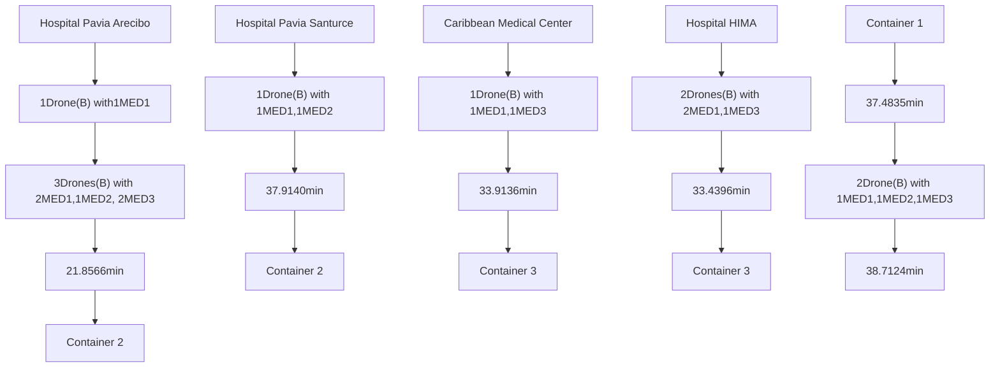
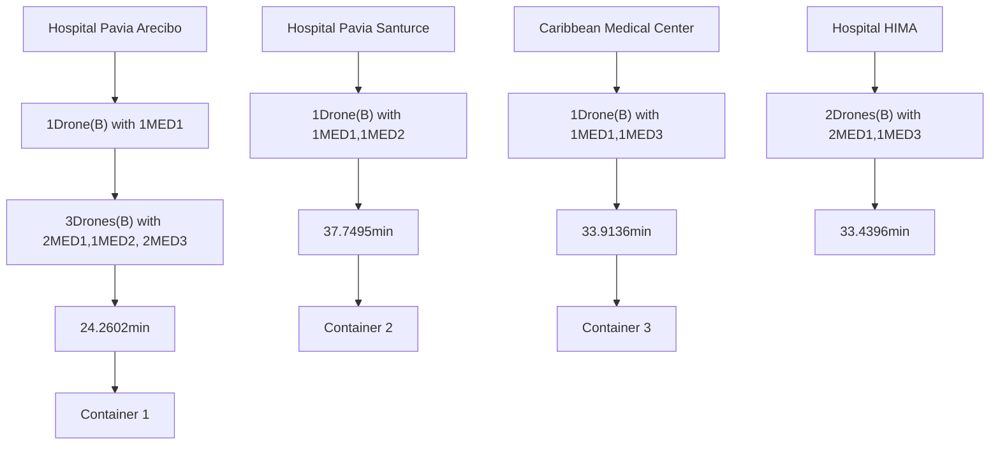
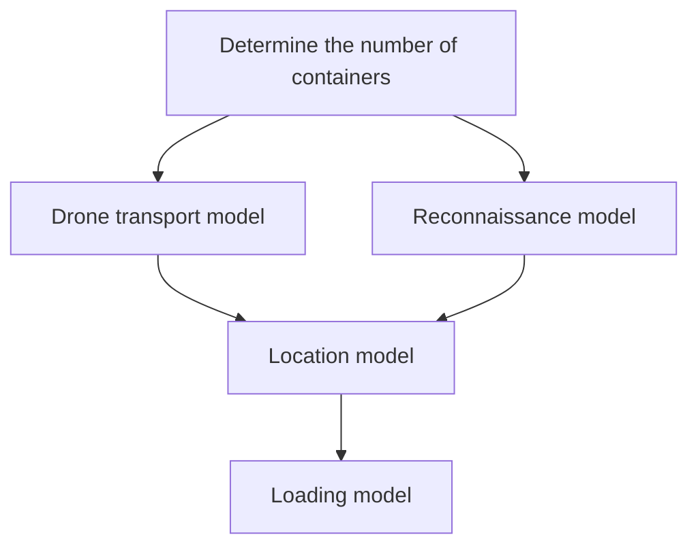
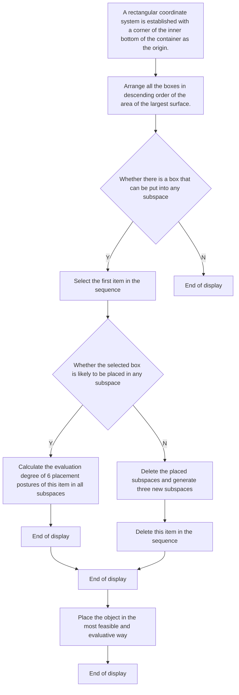
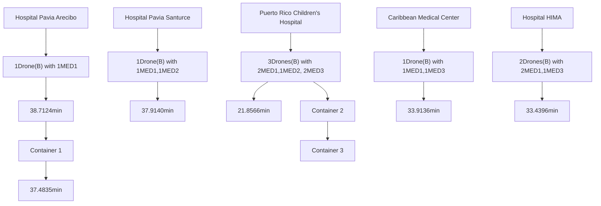
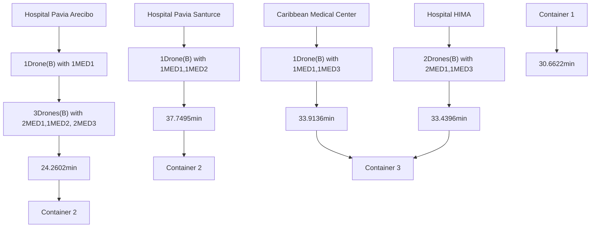

# 2019

# MCM/ICM

# Messengers of Hope

Summary Sheet

In 2017, the hurricane disaster brought many casualties and substantial economic and property losses to Puerto Rico. We help the NGO HELP, Inc. design a mobile disaster response system that uses drones to transport medical packages to selected areas and to take video reconnaissance of roads in disaster areas.

Containers are used to load the system to the disaster area. For the loading problem, the configuration problem of packages in containers is simplified into the combinatorial optimization problem of three-dimensional packing and the optimal configuration problem of medical packages and shipping containers. In this paper, the goal is the maximum space utilization rate of the ISO container, and the constraints in the loading process are as follows: in order to maintain the stability of the contents, each about to be loaded item must be fully supported; In order to facilitate loading and unloading, each item can be entirely separated by vertical or horizontal plane; The ratio of the 3 medical packages is certain. We establish a single objective programming model and use the improved 3D-RSO algorithm to solve the model.

Aiming at the location problem, this paper establishes a two-objective programming model aiming at achieving the shortest transportation time and the longest total reconnaissance road to determine the number and location of ISO containers. By analysis and calculation, it is found that under the condition of meeting the daily demand of five hospitals, at least 3 containers are needed to supply medical packages.

For the medical supply delivery and video reconnaissance, the specific quantity of drones is determined firstly, and then the loading model is used to determine the assembly scheme of the ISO container. Then the route and schedule of the drone transport medical package are calculated by traversal calculation of all roads. Finally, the transportation plan and the length of roads that can be detected are given.

The optimal geographical location distribution (in latitude and longitude coordinates) of the ISO container is calculated as follows: container 1 at (18.3805,-66.5109), container 2 at (18.3490,-66.2830), and container 3 at (18.2191,-65.8241).And we give the detailed daily transportation plan. The daily medical supply delivery can be completed in 38.7124min. The total length of the road that can be detected is 722.38km. The daily video reconnaissance can be completed in 12h. It is calculated that the specific assembly scheme of ISO container is that container 1 contains 53 drones B, 1 Tether H, 700 MED1, 350 MED2, and 350 MED3, and the space utilization rate is 89.10%. Container 2 contains 54 drones B, 1 Tether H, 684 MED1, 342 MED2, and 342 MED3, and the space utilization rate is 89.48%. Container 3 contains 53 drones B, 1 Tether H, 809 MED1, 0 MED2, and 539 MED3, and the space utilization rate is 91.45%.

Finally, the sensitivity analysis and extension of the model are given.

Keyword: Drone; The location problem; The loading problem; Emergency rescue

# MEMORANDUM

To: CEO of HELP, Inc.

From: Team 1915782

Subject: A DroneGo disaster response system

Date: Monday, January 28, 2019

We know that HELP, Inc. is trying to design the ’DroneGo’ system to improve the ability to respond to natural disasters. Therefore, we established the mathematical model and solved the situation that the drone needs to complete the medical supply mission and the video reconnaissance mission. It is a great honor to present our results to you.

It is recommended to use three ISO standard containers to load the required items. The calculation shows that one or two containers are not sufficient for medical supply missions and video reconnaissance missions.

The loading conditions of the three containers are different. In container 1, there are 53 type B drones for transport and reconnaissance, one type H drones for the signal repeater, 700 MED1, 350 MED2, and 350 MED3, which is enough to support the medical package demand for 350 days.Container 2 contains 54 type B drones, 1 type H drones, 684 MED1 drones, 342 MED2 drones and 342 MED3 drones, which is enough to support the medical package demand for 342 days. Container 3 contains 3 type B drones, 1 type H drones, 809 MED1, and 539 MED3, which is enough to support the medical package demand for 269 days. All three containers have a space utilization rate of around 90%, so they save a lot of buffer materials.

Upon completion of loading of container, it is suggested that the container 1 transport through the Port of Arecibo or Antonio (Nery) Juarbe Pol Airport transportation to Puerto Rico, after sending it through the local vehicle (66.5109,18.3805). The container 2 transport by the Port of San Juan or Fernando Ribas Dominicci Airport transportation to Puerto Rico, after sending it through the local vehicle (66.2830,18.3490). Container 3 transport through the Port of Ceiba or Jose´ Aponte DE la Torre Airport transportation to Puerto Rico, after sending it through the local vehicle (65.8241,18.2191).

Each drone has the same daily schedule for missions. To simplify the presentation, figure 1 is used to present the daily transportation plan of scheme 1. It is worth mentioning that all the drones can complete the task in 38.7 minutes.

flowchart

Figure 1: Daily transport and transhipment plan

Since the situation in the disaster area is changing rapidly, the drones need to perform the same reconnaissance missions every day. Each container has a similar reconnaissance mission. Make 20 drone B fly at 300m altitudes, using the 74 degree wide-angle lens, respectively in different directions of flying straight spying for 20 minutes, and returned along with a straight line. It just can complete 20 degree range of reconnaissance. Charge and maintain the returning drone, and send another 20 type B drones in a non-repeated direction. Working in shifts like this, all reconnaissance missions can be completed in 12 hours, without the danger of having the drone work at night. Also, there are a total of 30 spare drones B to replace the damaged ones. Based on this scheme, the drone unit of container 1 can detect the road of 313km, the drone unit of container 2 can detect the road of 362km, and the drone unit of container 3 can detect the road of 252km. Excluding duplicate roads, this covers 43.5% of the island’s roads.

If you think more attention should be paid to video reconnaissance to rebuild the disaster area, rather than strengthening the prevention of secondary disasters. We also have a slightly different set of plans in place.

In this scenario, container 1 contains 68 type B drones, 1 type H drones, and 630 MED1 drones, which is enough to support 630 days of medical bag demand. Container 2 contains 68 type B drones, 1 type H drones, 321 MED1, 212 MED2, 213 MED3, which is enough to support the demand for medical packages for 106 days. In container 3, there are 68 type B drones, 1 type H drones, 396 MED1 drones and 263 MED3 drones, which is enough to support the medical package demand for 131 days. More drones are being loaded to speed up the reconnaissance.

Figure 2 is the daily transportation plan of scheme 2.

flowchart

Figure 2: A loading model that contents can't be transferred between containers

At this point, the container 1 should be at (18.2948, 66.7748), container 2 should be at (18.2705, 18.2705), container 3 should be in (18.2419,65.8781). And container 1 no longer ships medical packages to container 2. All unoccupied drones should be used for reconnaissance to improve efficiency.

Under this scheme, the unmanned unit of container 1 can detect the road of 352km, the unmanned unit of container 2 can detect the road of 470km, and the unmanned unit of container 3 can detect the road of 319km. Excluding duplicated roads, this covered 60.4% of the island’s roads.

You can choose between option 1, which focuses on the prevention of secondary disasters, and option 2, which focuses on video reconnaissance, which is more efficient. It is worth noting that either option is excellent for both medical supply and video reconnaissance missions. We hope our efforts can be of help to you. Thank you very much for the opportunity to show us.

<table><tr><td></td><td></td></tr></table>

## Contents

1 Introduction. 2

1.1 Background 2  
1.2 Restatement of the Problem 2

2 Analysis of the Problem 2  
3 Symbols 3  
4 Simplifying Assumptions . . . . 4  
5 Data Processing 4  
6 Model and Solution . . 5

6.1 Three-dimensional Loading Model . 5

6.1.1 The Algorithm of the Loading Model . . . . . . −7

6.2 Container’s Location and Reconnaissance of Road Networks . . . . 9

6.2.1 Determine the Number of Cargo Containers . . . . . . . . 9  
6.2.2 Drone Transport Model . . . . . . . . 10  
6.2.3 Reconnaissance Model . . . . . . . 12  
6.2.4 Location Model . . . . . . . 12  
6.2.5 The Algorithm of the Location Model . . . . . . . . . . . . . 12

6.3 The Flight Plan 13  
6.4 Solution of Model . . . 14

7 Sensitivity Analysis . . . . 16  
8 Model Extension . . 17  
9 Strengths and Weakness . 19

9.1 Strengths . . . 19  
9.2 Weakness . . 19

References . 20

## 1 Introduction

## 1.1 Background

The U.S. territory of Puerto Rico was hit by the worst hurricane in 2017, wreaking havoc on the island and killing more than 2,900 people. The hurricane caused widespread damage in Puerto Rico, damaging about 80 percent of Puerto Rico’s utility poles and all transmission lines, so much so that the entire island lost power. The storm also damaged much of the island’s cellular communications network, trapping 3 to 4 million residents for months. As time went on, hospitals and NGOs were running short of lifesaving equipment and medical supplies. HELP, Inc., an NGO, is trying to use a transportable disaster response system called ’DroneGo’ to deliver medical supplies and high-resolution aerial video reconnaissance to disaster areas. It is necessary to design a reasonable mobile disaster response system.

## 1.2 Restatement of the Problem

Consider the background information, the requirements identified in the problem statement, and the information provided in the problem attachment to address the following issues:

1. A fleet of drones and a set of medical packages are recommended for HELP, Inc. DroneGo disaster response system, which will meet the requirements of Puerto Rico hurricane scenario. Design packaging configurations for up to three ISO cargo containers to ship the system to Puerto Rico.  
2. Determine the best location or location in Puerto Rico to place one, two, or three containers of the DroneGo disaster response system so it can perform medical supply delivery and video reconnaissance of the road network.  
3. For each type of drone included in a drone formation:

(a) Provide drone payload packaging configurations (that is, medical packages packed into the drone cargo bay), delivery routes and schedules to meet the emergency medical package requirements identified in the Puerto Rico hurricane scenario.

(b) Provide a drone flight plan that enables the drone fleet to use onboard cameras to evaluate major highways and highways to help support the company’s mission.

## 2 Analysis of the Problem

Developing the DroneGo disaster response system for hurricane-ravaged Puerto Rico can be divided into three sub-problems:

Problem 1 :Optimal loading of ISO container is a must. According to the specific dimensions of drones, medical packages and ISO containers given in the attachment, the reasonable assembly mode of ISO container is determined. Our main goal is to make ISO containers not only more space-efficient but also easier to load and unload by placing the contents properly.

Problem 2 :The determination of the number and location of ISO containers is the key to the whole problem, which requires to analysis of the geographical location of 5 hospitals and the performance of each drone. In order to carry out feasible rescue work in disaster areas in a timely manner, the shortest time for drones to complete the transport of medical packages and the longest reconnaissance road length should be taken into account to determine the number of ISO containers and the optimal geographical location of each ISO container.

Considering subproblems 1 and 2, when the number of containers and the optimal geographical locations are determined, 5 hospitals should be assigned to different ISO containers. Considering the differences in the types and quantities of medical packages required by different hospitals, the specific assembly scheme of each ISO container was determined.

Problem 3 :When the ISO container’s location and assembly scheme is determined, determine the route and schedule of the drone medical package delivery. Then provide the best way for drones to monitor the roads, and find all the roads that can be reconnaissanced and calculate their total length.

## 3 Symbols

<table><tr><td>Definitions</td><td>Descriptions</td></tr><tr><td> $\alpha$ </td><td>Longitude</td></tr><tr><td> $\beta$ </td><td>Latitude</td></tr><tr><td> $\theta$ </td><td>Angle between two places and the center of the earth</td></tr><tr><td>Dis</td><td>The straight distance between two place</td></tr><tr><td> $R_{earth}$ </td><td>Radius of the earth</td></tr><tr><td>C</td><td>A rectangular container</td></tr><tr><td>L</td><td>The length of container C</td></tr><tr><td>W</td><td>The width of container C</td></tr><tr><td>H</td><td>The height of container C</td></tr><tr><td>B</td><td>A set of different kinds of boxes</td></tr><tr><td>i</td><td>Type index variable</td></tr><tr><td> $b_i$ </td><td>Theith type of box</td></tr><tr><td> $l_i$ </td><td>The length of theith box</td></tr><tr><td> $w_i$ </td><td>The width of theith box</td></tr><tr><td> $h_i$ </td><td>The height of theith box</td></tr><tr><td>r</td><td>Whether theith box can be assembled and placed around</td></tr><tr><td>Q</td><td>A set of the number of each kind of box</td></tr><tr><td>f</td><td>The number of layers of boxes in a container</td></tr><tr><td>k</td><td>The position occupied by the kth box, which is called region</td></tr><tr><td> $S^{(f,k)}$ </td><td>The top area of the kth box</td></tr><tr><td> $A^{(f,k)}$ </td><td>The total bottom area of the boxes stacked on the f-layer k region</td></tr><tr><td> $q_i$ </td><td>The number ofith type of box</td></tr><tr><td> $q_{i}^{(f,k)}$ </td><td>The number of the  $i$ th type of box located on the  $f$ -layer in the  $k$ region</td></tr><tr><td> $F$ </td><td>The set of all boxes that have been put into container  $C$ </td></tr><tr><td> $V_{F}$ </td><td>The total volume of all boxes that have been put into container  $C$ </td></tr><tr><td> $n$ </td><td>The number of Cargo Containers, $n = 1,2,3$ </td></tr><tr><td> $d$ </td><td>The serial number of Cargo Container, $d = 1,..,n$ </td></tr><tr><td> $C_{d}$ </td><td>The location of the  $d$ th Cargo Container</td></tr><tr><td> $j$ </td><td>Hospital index variable, $j=1,2,...,5$ </td></tr><tr><td> $D_{j}$ </td><td>The location of the  $j$ th hospital</td></tr><tr><td> $\mu$ </td><td>The ratio of the actual drone’s flight time to the flight time without load</td></tr><tr><td> $N_{d}^{(i_{1})}$ </td><td>The  $d$ th container contains the number of type  $i_{1}$  medical packages</td></tr><tr><td> $N_{j}^{(i_{1})}$ </td><td>The number of type  $i_{1}$  packages required for the  $j$  hospital</td></tr><tr><td> $N_{d}^{(i_{2})}$ </td><td>The  $d$ th container contains the number of type  $i_{2}$  drone</td></tr><tr><td> $N_{j}^{(i_{2})}$ </td><td>The number of type  $i_{2}$  drone to the  $j$  hospital</td></tr><tr><td> $N^{(i_{2},i_{1})}$ </td><td>The number of type  $i_{1}$  medical packages carried by type  $i_{2}$  drone</td></tr><tr><td> $V^{(i_{1})}$ </td><td>The volume of type  $i_{1}$  medical packages</td></tr><tr><td> $G^{(i_{1})}$ </td><td>The weight of type  $i_{1}$  medical packages</td></tr><tr><td> $V^{(i_{2})}$ </td><td>The limited volume of type  $i_{2}$  drone</td></tr><tr><td> $G^{(i_{2})}$ </td><td>The limited weight of type  $i_{2}$  drone</td></tr><tr><td> $t^{(i_{2})}$ </td><td>The no-load limit flight time of type  $i_{2}$  drone</td></tr><tr><td> $v^{(i_{2})}$ </td><td>The flight speed of type  $i_{2}$  drone</td></tr><tr><td> $L^{(i_{2})}$ </td><td>The no-load limit flight distance of type  $i_{2}$  drone</td></tr><tr><td> $x_{dj}^{(i_{2})}$ </td><td>Whether the number of  $i_{2}$  drone from the  $d$ th container to the  $j$  hospital</td></tr></table>

## 4 Simplifying Assumptions

1. It is assumed that the flight time of the drone will decrease due to the weight of medical package, and it is linearly related to the weight.  
2. Ignore the effects of wind, weather on drone flight and road conditions.  
3. ISO container should be located close to a city or highway or road.  
4. The drone must be recharged at the location of an ISO container.  
5. Containers can only be transported to Puerto Rico via an airport or port.  
6. Same medical supply delivery mission and video reconnaissance mission should be completed daily.

## 5 Data Processing

Calculate the distance between any two places on the earth according to the longitude and latitude coordinates[2].We know that $( \alpha _ { 1 } , \beta _ { 1 } )$ is the longitude and latitude coordinates of place 1, and $( \alpha _ { 2 } , \beta _ { 2 } )$ is the longitude and latitude coordinates of place 2.The Angle between them and the center of the earth is q.

$$
\theta = \arccos [ \cos (9 0 - \alpha_ {1}) \cdot \cos (9 0 - \alpha_ {2}) \tag {1}
$$

$$
\left. + \sin \left(9 0 - \alpha_ {1}\right) \cdot \sin \left(9 0 - \alpha_ {2}\right) \cdot \cos \left(\beta_ {1} - \beta_ {2}\right) \right]
$$

Then, the distance between the two places can be calculated by using the arc length formula.

$$
D i s = \pi \cdot \frac {\theta}{1 8 0} \cdot R _ {e a r t h} \tag {2}
$$

## 6 Model and Solution

First of all, the number of containers must be determined. Then in the case of comprehensive consideration of drone transport model and reconnaissance model, the specific location of the container and the loading data are determined by location model. Finally, the packing scheme is obtained by three-dimensional loading model calculation.

flowchart

Figure 1: Thinking process chart

## 6.1 Three-dimensional Loading Model

Loading as many shipping container and emergency medical packages as possible in a cargo container is a typical three-dimensional packing problem as well as an optimization combination problem. In this study, three-dimensional Knapsack Loading Problems (referred to as 3D-KIP) with the value of volume were studied, that is, a group of small cuboids of different sizes (shipping container and emergency medical packages) were put into a large cuboid (cargo container) of a given size, aiming to maximize the total volume of all small cuboids that were put in[2].(See Figure 2)

text_image

Container C
Box bi
hi
li
wi
H
W
L

Figure 2: Schematic diagram of loading relationship

Given a rectangular container C and a set B of boxes. The length, width and height of container C are expressed as L , W and H respectively, as shown in the formula (3) [2]:

$$
C = (L, W, H) \tag {3}
$$

B is a set of different kinds of boxes $^ { , b _ { i } }$ is the ith type of boxes, as shown in the formula (4):

$$
B = \left\{b _ {i} \right\}, (i = 1, 2,..., 1 1) \tag {4}
$$

$$
b _ {i} = \left(l _ {i}, w _ {i}, h _ {i}, r l _ {i}, r w _ {i}, r h _ {i}\right) \tag {5}
$$

Where $l _ { i } , w _ { i }$ and $h _ { i }$ respectively represent the length, width and height of the ith box, and $r l _ { i } , r w _ { i }$ and $r h _ { i }$ represent whether the ith box can be assembled and placed around its own length, width and height.

For a complete loading, if F is the set of all boxes that have been put into container $C ,$ the total volume can be expressed as formula (6) [2]:

$$
V _ {F} = \sum_ {b _ {i} \in F} l _ {i} \cdot w _ {i} \cdot h _ {i} \tag {6}
$$

The number of each kind of box in the container is different, and the number of each kind of box is represented by a set Q ,as shown in the formula $( 7 )$ :

$$
Q = \left\{q _ {1}, \dots , q _ {i}, \dots , q _ {n} \right\}, (i = 1, 2, \dots , 1 1) \tag {7}
$$

Use $S ^ { ( f , k ) }$ to represent the top area of the kth box.

Among them:

f represents the number of layers of boxes in a container.  
k represents the position occupied by the kth box, which is called region. In the same layer of boxes, the top area of each box is the region.

Use $A ^ { ( f , k ) }$ to represent the total bottom area of the boxes stacked on the f -layer k region.

$$
A ^ {(f, k)} = \sum_ {i = 1} ^ {1 1} q _ {i} ^ {(f, k)} \cdot S _ {i} ^ {(f, k)} \tag {8}
$$

Take q (i $q _ { i } ^ { ( f , k ) }$ as the decision variable.

The constraint conditions are as follows:

1. The total area of the bottom of the boxes stacked on top of the f -layer k region should be less than or equal to the area of the f -layer k region (the bottom layer is the bottom of the container).This restriction allows boxes to be loaded and unloaded in batches by forklifts.

$$
\left\{ \begin{array}{l} A ^ {(1, k)} \leq L \cdot W, f = 1 \\ A ^ {(f, k)} \leq S _ {i} ^ {(f, k)}, f \geq 2 \end{array} \right. \tag {9}
$$

natural_image

3D coordinate system with two stacked cubes on X and Y axes (no text or symbols)

Figure 3: Two loading modes that do not meet the constraint conditions

2. Various types of box in all layers and all regions for each type are greater than or equal to the total number of boxes required.

$$
\sum_ {f} \sum_ {k} q _ {i} ^ {(f, k)} \geq q _ {i} \tag {10}
$$

3. According to Attachment 4:Anticipated Medical Package Demand,We can see that the daily demand for MED 1,MED 2 and MED 3 Emergency Medical Packages in 5 hospitals is 7,2 and 4, respectively. So, the ratio of the number of medical kits required should be 7:2:4.

$$
q _ {1}: q _ {2}: q _ {3} = 7: 2: 4 \tag {11}
$$

In order to make the most of the space in the container and load more boxes, the objective function is to maximize the space utilization of the container.

$$
\max Z = \frac {V _ {F}}{L \cdot W \cdot H} \tag {12}
$$

The single-objective programming function that maximizes the space occupancy of container space is as follows:

$$
\max Z = \frac {V _ {F}}{L \cdot W \cdot H}
$$

$$
s. t. \left\{ \begin{array}{l} A ^ {(f, k)} = \sum_ {i = 1} ^ {1 1} q _ {i} ^ {(f, k)} \cdot S _ {i} ^ {(f, k)} \\ A ^ {(1, k)} \leq L \cdot W, f = 1 \\ A ^ {(f, k)} \leq S _ {i} ^ {(f, k)}, f \geq 2 \\ \sum_ {f} \sum_ {k} q _ {i} ^ {(f, k)} = q _ {i} \\ q _ {1}: q _ {2}: q _ {3} = 7: 2: 4 \end{array} \right. \tag {13}
$$

## 6.1.1 The Algorithm of the Loading Model

3D-RSO algorithm is a heuristic residual space optimization algorithm, which does not need additional preprocessing and optimal solution search operation in the solution process, and can achieve an optimal solution with minimal computational consumption. Compared with other algorithms at the present stage, this algorithm has obvious advantages in solving efficiency[2].

flowchart

Figure 4: 3D-RSO algorithm flow chart

## Some additional notes on the 3D-RSO algorithm flow chart:

For any subspace that is put into a new box,the top view is shown in figure 5.

text_image

Y
S₂
S₁ S₃
X

Figure 5: Legend to place rules

If the area of $S _ { 3 }$ is larger than or equal to the area of $S _ { 2 }$ ,then generate 3 subspaces as shown in figure a.If the area of $S _ { 3 }$ is smaller than the area of $S _ { 2 }$ ,then generate 3 subspaces as shown in figure b.The surfaces in contact with each of the three subspaces are perpendicular to the underside, and the $S _ { 1 }$ subspace is directly above the new box[2].

text_image

Y
S₂
S₁
S₃
X

(a)

text_image

S₂
S₁ S₃

(b)  
Figure 6: Subspaces produce rules

Introducing the evaluation function, the larger the function value, the better.

$$
f (A, B) = - (l (B) - l (A) + \alpha) \cdot (w (B) - w (A) + \alpha) \tag {14}
$$

text_image

w(B) - w(A)
A
l(B) - l(A)
B

Figure 7: Legend to place rules

The parameters $\alpha = 0 . 1$ are modified to avoid the situation that the evaluation degree is 0.Based on the uncertainty of the number of medical packages in this topic and the idea of the closed-loop feedback system[4], the 3D-RSO algorithm is improved by inputting the calculation results of each time into the preset parameters. This improved algorithm improves the space utilization of the calculated results.

## 6.2 Container’s Location and Reconnaissance of Road Networks

## 6.2.1 Determine the Number of Cargo Containers

1. How about one container? The distance between Puerto Rico Children’s Hospital and Pavia Arecibo Hospital is 60.63 km.The type B is the longest single - flight drone, however it can only fly up to 52.67 km at a time.Because the drone has to return, it is impossible to transport the medical packages even if the containers are placed halfway between the two hospitals. As a result, the drones used to transport medicines for Puerto Rico Children’s Hospital and for Hospital Pavia Arecibo must have come from two different cargo containers.  
2. Will two containers be enough? As Puerto Rico Children’s Hospital is the closest Hospital to Pavia Arecibo Hospital. As a result, in the case of

two cargo containers, one must supply medicine only for Pavia Arecibo Hospital and the other for 4 other hospitals.

Take these 4 hospitals as vertices and construct a quadrilateral. Traverse each coordinate point in the quadrilateral (longitude and latitude precision is 0.01), and calculate the distance between each point and 4 hospitals.However, the point that satisfies the condition does not exist. In other words, two containers can not complete the transport task.

3. Three containers is the best choice.Because Puerto Rico Children’s Hospital and Hospital Pavia Arecibo must be supplied with medicines in two different containers, containers 1 and 2 should be placed between Puerto Rico Children’s Hospital and Hospital Pavia Arecibo. Since the HIMA Hospital is surrounded by the Cordillera Central (Puerto Rico) mountains and the El Yunque (Puerto Rico) mountains, drones cannot cross them, so container 3 needs to be placed on the road between the Caribbean Medical Center and the HIMA Hospital and transported to them.The remaining Hospital Pavia Santurce is transported by container 2.

## 6.2.2 Drone Transport Model

In practice, containers can only be transported to Puerto Rico by port or airport and then transport by vehicles, so containers can only be placed near the road. Due to the complex situation in the disaster area, containers should be placed as close as possible to the port or airport to avoid long-distance container transport.

Drones cannot transport medical packages directly across mountainous areas because of their limited climbing capacity.The containers that supplied medicine to Hospital Pavia Arecibo were not able to supply medicine directly to other hospitals.Hospital Pavia Arecibo, however, has very low demand for medicines (only 1 MED1 per day), as secondary disasters may result in a temporary surge in drug demand, containers of drug stocks should be balanced to the extent possible to cope with such a situation. Avoid situations in which there is a large drug stockpile.So this article considers transferring some of the medicines in the container supplied to Hospital Pavia Arecibo to other containers to avoid the situation that large quantities of medicines being stored for a long time.

The constraint conditions are as follows:

1. The number of medical packages in all containers is equal to the most reasonable loading capacity.

$$
\sum_ {d = 1} ^ {n} N _ {d} ^ {(i _ {1})} = q _ {i _ {1}} \tag {15}
$$

2. The number of drone in all containers is equal to the most reasonable loading capacity.

$$
\sum_ {d = 1} ^ {n} N _ {d} ^ {(i _ {2})} = q _ {i _ {2}} \tag {16}
$$

3. The various medical packages should meet the daily number of medical packages required by each hospital.

$$
\sum_ {d = 1} ^ {n} x _ {d j} ^ {(i _ {2})} = N _ {j} ^ {(i _ {2})} \tag {17}
$$

$$
\sum_ {d = 1} ^ {n} \sum_ {i _ {2} = 4} ^ {1 1} N _ {j} ^ {(i _ {2})} \cdot N ^ {(i _ {2}, i _ {1})} \geq N _ {j} ^ {(i _ {1})} \tag {18}
$$

4. Drones have a limited amount of carrier space for medical packaging. The left formula is the combined volume, and the right formula is the limited carrier product.

$$
\sum_ {i _ {1} = 1} ^ {3} N ^ {(i _ {2}, i _ {1})} \cdot V ^ {(i _ {1})} \leq V ^ {(i _ {2})} \tag {19}
$$

5. Drones have a limited amount of carrier weight for medical packaging.

$$
\sum_ {i _ {1} = 1} ^ {3} N ^ {(i _ {2}, i _ {1})} \cdot G ^ {(i _ {1})} \leq G ^ {(i _ {2})} \tag {20}
$$

6. When there is no load, the value is 1 (the load has no influence on the flight duration); when there is A full load, the value is e (it is e times longer than when there is no load).

$$
\mu = 1 - (1 - \varepsilon) \frac {\sum_ {i _ {1} = 1} ^ {3} N ^ {(i _ {2} , i _ {1})} \cdot G ^ {(i _ {1})}}{G ^ {(i _ {2})}} \tag {21}
$$

The drone’s range is limited,in order for the drone to be able to sustainably deliver medical first medical packages to various hospitals, and it needs to return after delivering medical packages.

$$
L ^ {(i _ {2})} = v ^ {(i _ {2})} \cdot \mu t ^ {(i _ {2})} \tag {22}
$$

The left side of the formula (22) represents the limit distance of the drone flight, and the right side represents the sum of the distance from the cargo container to the hospital.

$$
v ^ {(i _ {2})} \cdot \frac {\mu - 1}{2} \cdot t ^ {i _ {2}} \geq 2 D i s (C _ {d}, D _ {j}) \tag {23}
$$

The objective function is the drones with the longest transport time that should have the shortest transport time:

$$
\min T = \max _ {d, j, i _ {2}} \frac {\operatorname{Dis} \left(C _ {d} , D _ {j}\right) \cdot x _ {d j} ^ {\left(i _ {2}\right)}}{v ^ {\left(i _ {2}\right)}} \tag {24}
$$

## 6.2.3 Reconnaissance Model

Let the reconnaissance area covered by the drone be $\begin{array} { r } { S \left( C _ { d } , \frac { L ^ { \left( i _ { 2 } \right) } } { 2 } \right) } \end{array}$ ,which refers to the circle with $C _ { d }$ as the center and $\frac { L ^ { \left( i _ { 2 } \right) } } { 2 }$ (half of the maximum flying distance of the drone) as the radius. So,

$$
S \left(C _ {d}, \frac {L ^ {(i _ {2})}}{2}\right) = \pi \cdot \left(\frac {L ^ {(i _ {2})}}{2}\right) ^ {2} \tag {25}
$$

The total length of the road in the monitored area is $\boldsymbol { L } \left( C _ { d } , \frac { \boldsymbol { L } ^ { \left( i _ { 2 } \right) } } { 2 } \right)$

Establish a target function that takes the longest road of drone reconnaissance as the target.

$$
\max P = L \left(C _ {d}, \frac {L ^ {(i _ {2})}}{2}\right) \tag {26}
$$

## 6.2.4 Location Model

Location Model is the combination of Drone Transport Model and Reconnaissance Model.

Taking into account the shortest transport time and the longest total length of the road under investigation, the objective planning function for selecting the optimal container location is as follows:

$$
\max Z = \varphi_ {1} \frac {\min T}{T} + \varphi_ {2} \frac {P}{\max P}
$$

$$
s. t. \left\{ \begin{array}{l} \sum_ {d = 1} ^ {n} N _ {d} ^ {(i _ {1})} = q _ {i _ {1}} \\ \sum_ {d = 1} ^ {n} N _ {d} ^ {(i _ {2})} = q _ {i _ {2}} \\ \sum_ {d = 1} ^ {n} x _ {d j} ^ {(i _ {2})} = N _ {j} ^ {(i _ {2})} \\ \sum_ {d = 1} ^ {n} \sum_ {i _ {2} = 4} ^ {1 1} N _ {j} ^ {(i _ {2})} \cdot N ^ {(i _ {2}, i _ {1})} \geq N _ {j} ^ {(i _ {1})} \\ \sum_ {i _ {1} = 1} ^ {3} N ^ {(i _ {2}, i _ {1})} \cdot V ^ {(i _ {1})} \leq V ^ {(i _ {2})} \\ \sum_ {i _ {1} = 1} ^ {3} N ^ {(i _ {2}, i _ {1})} \cdot G ^ {(i _ {1})} \leq G ^ {(i _ {2})} \\ L ^ {(i _ {2})} = v ^ {(i _ {2})} \cdot \mu t ^ {(i _ {2})} \\ v ^ {(i _ {2})} \cdot \frac {\mu - 1}{2} \cdot t ^ {i _ {2}} \geq 2 D i s (C _ {d}, D _ {j}) \end{array} \right. \tag {27}
$$

## 6.2.5 The Algorithm of the Location Model

Based on the previous analysis, all road information on the map was extracted, and the scale of the map and the position of each location in the map were determined through the Google map[5]. Under the condition that the constraint conditions are satisfied, all the points on the road in the map are traversal, and the corresponding objective function is calculated, and then the optimization results under the current preset parameters are selected.

## 6.3 The Flight Plan

In order to monitor as long a road as possible, the type B drone was chosen. Assume that B drone that was chosen for reconnaissance scope $\frac { L ^ { ( 5 ) } } { 2 }$ 22 is 26.34 km, altitude $F _ { h }$ is 300 m, unmanned aerial vehicles to carry the camera Angle is 74 degree (in the range of normal wide-angle lens Angle)[8].

text_image

Drone lateral field of view l_v
Drone monitoring
range L^(5)/2
Single Drone
monitoring angle θ
θ
Container
F_h
74°
l_v

Figure 8: Reconnaissance schematic diagram of drone

$$
l _ {v} = 2 F _ {h} \cdot \tan (3 7 \text { degree }) = 0. 4 5 2 k m \tag {28}
$$

$$
\theta = \arccos \left[ \frac {\left(\frac {L ^ {(5)}}{2}\right) ^ {2} + \left(\frac {L ^ {(5)}}{2}\right) ^ {2} - l _ {v} ^ {2}}{2 \left(\frac {L ^ {(5)}}{2}\right) ^ {2}} \right] = 1 \text { degree } \tag {29}
$$

A single drone reconnaissance for 1 degree, considering the road reconnaissance should be done during the day time, so the hypothesis road reconnaissance time limit for 12 h. And completed a drone 1 degree reconnaissance need 40 min, in ignoring drone under the condition of charging time, so the first ISO container requiring minimum number of monitor road with B unmanned aerial vehicle is

$$
N _ {d} ^ {5} = \frac {3 6 0 \times 4 0}{1 2 \times 6 0} = 2 0.
$$

Moreover, considering that the drone must return to ISO container for charging and maintenance, the number of drones should be doubled, so that the two groups of reconnaissance drones can work alternately. This not only takes into account the inevitable charging situation of the drone, but also reduces the work burden of the drone and the use frequency of the drone.

Considering that in addition to reconnaissance drones and drones transporting medical packages, the number of shipping containers in each container is different from that of medical packages, and the load capacity of drones is limited, so the number of drones in each ISO container is 43, 44 and 43, respectively.

Finally, as the damage of drones is inevitable, the number of original drones should be increased by 1/4 on the basis of the original ones to prevent emergencies. Therefore, the final number of each ISO container drone is 53, 54 and 53. In addition to the above number of unmanned aerial vehicles, the ISO container is to load as much medicine as possible to complete the ISO container loading task.

## 6.4 Solution of Model

In fact, the location of the container, the configuration of the number and type of shipping containers and medical packages in the container, the rules of packing, the performance of the drone, the number of medical packages required by different hospitals and other factors are mutually restricted. Therefore, this paper gives the best result of the comprehensive full-text model.

Based on 2.6GhzCPU and Windows10 platform, it takes about 5.5 seconds to run this traversal calculation.

Table 1: Solution of Location model

<table><tr><td>Container</td><td>Latitude</td><td>Longitude</td><td>min T (min)</td><td>max P (km)</td></tr><tr><td>Container1</td><td>18.3805</td><td>-66.5109</td><td>38.7124</td><td>312.9891</td></tr><tr><td>Container2</td><td>18.3490</td><td>-66.2830</td><td>37.9140</td><td>362.1548</td></tr><tr><td>Container3</td><td>18.2191</td><td>-65.8241</td><td>33.9136</td><td>251.7731</td></tr></table>

The calculation results in Table 1 show that the locations of the container 1 to 3 are at the longitude and latitude coordinates of (18.3805,-66.5109),(18.3490,- 66.2830) and (18.2191,-65.8241) respectively.As shown in Table 1, take container 1 as an example: it takes up to 38.7124 minutes for the drone from container 1 to transport the medical package to the hospital farthest from container 1 in a straight line and return. Within the supply range of container 1, the total road length that can be detected by drone is 312.9891 km.

Starting from the three containers, the reconnaissance coverage rate of the entire island road by the drone is 43.477%.

As shown in figure 9,the center of the circle represents the geographical location of the container. It can be found that there are overlaps between the color blocks, which is called the supply range of the container in this paper. Overlapping hospital or road segments can be supplied with medical packages or reconnaissance by drones from two different containers. In particular, the supply scope of container 1 and container 2 includes each other’s containers, which means that partial transfer of medical packages can exist between containers.

venn diagram

| Category       | Color  | Description                     |
| -------------- | ------ | ------------------------------- |
| Container1     | Blue   | Drones' Movement Range          |
| Container2     | Red    | Drones' Movement Range          |
| Container3     | Yellow | Drones' Movement Range          |
| Hospital       | Pink   | Drones' Movement Range          |
| Airport        | Purple | Population Space               |
| Port           | Cyan   | Population Space               |
| Populated Place| Orange | Population Space               |

Figure 9: Location model in which contents can be transferred between containers[6][7]

Depending on the location of the Airport and Port, we recommend that container 1 be shipped to Puerto Rico via Port of Arecibo or Antonio (Nery) Juarbe Pol Airport and then transported by vehicle to the designated location. Container 2 is shipped to Puerto Rico via Port of San Juan or Fernando Ribas Dominicci Airport and then transported by vehicle to the designated location. Container 3 is shipped to Puerto Rico via Port of Ceiba or Jose´ Aponte de la Torre Airport and then transported by vehicle to designated locations.

It can be known from the calculation that the total length of the section where container 1 overlaps with container 2 is 176.8999 km, and the total length of the section where container 2 and container 3 collide is 27.6256 km.

Table 2: The result of the Loading model

<table><tr><td>Container</td><td>Drone B</td><td>Drone H</td><td>MED 1</td><td>MED 2</td><td>MED 3</td><td>Space Utilization</td><td>Days</td></tr><tr><td>Container1</td><td>43+10</td><td>1</td><td>700</td><td>350</td><td>350</td><td>89.10%</td><td>350</td></tr><tr><td>Container2</td><td>44+10</td><td>1</td><td>684</td><td>342</td><td>342</td><td>89.48%</td><td>342</td></tr><tr><td>Container3</td><td>43+10</td><td>1</td><td>809</td><td>0</td><td>539</td><td>91.45%</td><td>269</td></tr></table>

Table 2 is the result of the loading model. To simplify the article, we take container 3 as an example to explain. Container 1 is loaded with 43+10 type B drones, among which 43 are operational drones and 10 are standby drones. Container 1 is equipped with an H Tether[3], which serves as a signal base station. There are 809 MED1, 0 MED2 and 539 MED3 in container 1. With such a large number of contents and a space utilization rate of 91.445%, these contents can support the drug demand of hospitals within the container supply range for 269

days, which is a very good result.

3d heatmap

| X\Y | 10 | 20 | 30 | 40 | 50 | 60 | 70 | 80 | 90 | 100 | 110 | 120 | 130 | 140 | 150 | 160 | 170 | 180 | 190 | 200 |
| --- | --- | --- | --- | --- | --- | --- | --- | --- | --- | --- | --- | --- | --- | --- | --- | --- | --- | --- | --- | --- |
| 0 |  |  |  |  |  |  |  |  |  |  |  |  |  |  |  |  |  |  |  |  |
| 20 |  |  |  |  |  |  |  |  |  |  |  |  |  |  |  |  |  |  |  |  |
| 40 |  |  |  |  |  |  |  |  |  |  |  |  |  |  |  |  |  |  |  |  |
| 60 |  |  |  |  |  |  |  |  |  |  |  |  |  |  |  |  |  |  |  |  |
| 80 |  |  |  |  |  |  |  |  |  |  |  |  |  |  |  |  |  |  |  |  |
| 100 |  |  |  |  |  |  |  |  |  |  |  |  |  |  |  |  |  |  |  |  |
| 120 |  |  |  |  |  |  |  |  |  |  |  |  |  |  |  |  |  |  |  |  |
| 140 |  |  |  |  |  |  |  |  |  |  |  |  |  |  |  |  |  |  |  |  |
| 160 |  |  |  |  |  |  |  |  |  |  |  |  |  |  |  |  |  |  |  |  |
| 180 |  |  |  |  |  |  |  |  |  |  |  |  |  |  |  |  |  |  |  |  |

(a) Container1

3d surface plot chart

| Longitude | Latitude | Value |
| --- | --- | --- |
| 0 | 0 | 0 |
| 30 | 0 | 0 |
| 60 | 0 | 0 |
| 90 | 0 | 0 |
| 120 | 0 | 0 |
| 150 | 0 | 0 |
| 180 | 0 | 0 |
| 210 | 0 | 0 |
| 240 | 0 | 0 |
| 270 | 0 | 0 |
| 300 | 0 | 0 |
| 330 | 0 | 0 |
| 360 | 0 | 0 |
| 390 | 0 | 0 |
| 420 | 0 | 0 |
| 450 | 0 | 0 |
| 480 | 0 | 0 |
| 510 | 0 | 0 |
| 540 | 0 | 0 |
| 570 | 0 | 0 |
| 600 | 0 | 0 |
| 630 | 0 | 0 |
| 660 | 0 | 0 |
| 690 | 0 | 0 |
| 720 | 0 | 0 |
| 750 | 0 | 0 |
| 780 | 0 | 0 |
| 810 | 0 | 0 |
| 840 | 0 | 0 |
| 870 | 0 | 0 |
| 900 | 0 | 0 |
| 930 | 0 | 0 |
| 960 | 0 | 0 |
| 990 | 0 | 0 |
| 125 | -15 | -15 |
| 155 | -15 | -15 |
| 185 | -15 | -15 |
| 215 | -15 | -15 |
| 245 | -15 | -15 |
| 275 | -15 | -15 |
| 305 | -15 | -15 |
| 335 | -15 | -15 |
| 365 | -15 | -15 |
| 395 | -15 | -15 |
| 425 | -15 | -15 |
| 455 | -15 | -15 |
| 485 | -15 | -15 |
| 515 | -15 | -15 |
| 545 | -15 | -15 |
| 575 | -15 | -15 |
| 605 | -15 | -15 |
| 635 | -15 | -15 |
| 665 | -15 | -15 |
| 695 | -15 | -15 |
| 725 | -15 | -15 |
| 755 | -15 | -15 |
| 785 | -15 | -15 |
| 815 | -15 | -15 |
| 845 | -15 | -15 |
| 875 | -15 | -15 |
| 905 | -15 | -15 |
| 935 | -15 | -15 |
| 965 | -15 | -15 |
| 995 | -15 | -15 |
| 128 | -22 | -22 |
| 168 | -22 | -22 |
| 208 | -22 | -22 |
| 248 | -22 | -22 |
| 288 | -22 | -22 |
| 328 | -22 | -22 |
| 368 | -22 | -22 |
| 408 | -22 | -22 |
| 448 | -22 | -22 |
| 488 | -22 | -22 |
| 528 | -22 | -22 |
| 568 | -22 | -22 |
| 608 | -22 | -22 |
| 648 | -22 | -22 |
| 688 | -22 | -22 |
| 728 | -22 | -22 |
| 768 | -22 | -22 |
| 808 | -22 | -22 |
| 848 | -22 | -22 |
| 888 | -22 | -22 |
| 928 | -22 | -22 |
| 968 | -22 | -22 |
| 1008 | -22 | -22 |
| ... | ... | ... |
| ... | ... | ... |
| ... | ... | ... |
| ... | ... | ... |
| ... | ... | ... |
| ... | ... | ... |
| ... | ... | ... |
| ... | ... | ... |
| ... | ... | ... |
| ... | ... | ... |
| ... | ... | ... |
| ... | ... | ... |
| ... | ... | ... |
| ... | ... | ... |
| ... | ... | ... |
| ... | ... | ... |
| ... | ... | ... |
| ... | ... | ... |
| ... | ... | ... |
| ... | ... | ... |
| ... | ... | .** |
| ... | ... | .** |
| ... | ... | .** |
| ... | ... | .** |
| ... | ... | .** |
| ... | ... | .** |

(b) Container2

3d surface plot

| X(m) | Y(m) | Z(m) |
| --- | --- | --- |
| 0 | 0 | 100 |
| 50 | 10 | 95 |
| 100 | 20 | 90 |
| 150 | 30 | 85 |
| 200 | 40 | 80 |
| 250 | 50 | 75 |
| 300 | 60 | 70 |
| 350 | 70 | 65 |
| 400 | 80 | 60 |
| 450 | 90 | 55 |
| 500 | 100 | 50 |
| 550 | 95 | 45 |
| 600 | 90 | 40 |
| 650 | 85 | 35 |
| 700 | 80 | 30 |
| 750 | 75 | 25 |
| 800 | 70 | 20 |
| 850 | 65 | 15 |
| 900 | 60 | 10 |
| 950 | 55 | 5 |
| 1000 | 50 | 0 |
| 1050 | 45 | -5 |
| 1100 | 40 | -10 |
| 1150 | 35 | -15 |
| 1200 | 30 | -20 |
| 1250 | 25 | -25 |
| 1300 | 20 | -30 |
| 1350 | 15 | -35 |
| 1400 | 10 | -40 |
| 1450 | 5 | -45 |
| 1500 | 0 | -50 |
| 1550 | -5 | -55 |
| 1600 | -10 | -60 |
| 1650 | -15 | -65 |
| 1700 | -20 | -70 |
| 1750 | -25 | -75 |
| 1800 | -30 | -80 |
| 1850 | -35 | -85 |
| 1900 | -40 | -90 |
| 1950 | -45 | -95 |
| 2000 | -50 | -100 |
| 2050 | -55 | -105 |
| 2100 | -60 | -110 |
| 2150 | -65 | -115 |
| 2200 | -70 | -120 |
| 2250 | -75 | -125 |
| 2300 | -80 | -130 |
| 2350 | -85 | -135 |
| 2400 | -90 | -140 |
| 2450 | -95 | -145 |
| 2500 | -100 | -150 |

(c) Container3  
Figure 10: Loading condition of three containers

Based on 2.6GhzCPU and Windows10 platform, it only takes about 0.35 seconds to run the 3D-RSO algorithm every time.

flowchart

Figure 11: Daily transport and transhipment plan

Figure 11 shows the daily transport and transshipment plan intuitively.

## 7 Sensitivity Analysis

Since the impact of hurricane on Puerto Rico is diverse, the weight of the two targets in the model should be changed in the face of different hurricane disasters and actual situations. In this way, the location of ISO container will be more practical and suitable for rescue work. Therefore, we take 0.1 as the change gradient of weight and calculate 10 sets of results to test the sensitivity and feasibility of the model.

Table 3: Sensitivity Analysis

<table><tr><td colspan="2"></td><td> $\varphi_1=0.1\ \varphi_2=0.9$ </td><td> $\varphi_1=0.2\ \varphi_2=0.8$ </td><td> $\varphi_1=0.3\ \varphi_2=0.7$ </td><td> $\varphi_1=0.4\ \varphi_2=0.6$ </td><td> $\varphi_1=0.5\ \varphi_2=0.5$ </td></tr><tr><td rowspan="3">minT(min)</td><td>Container1</td><td>30.6622</td><td>0.2441</td><td>0.24406</td><td>0.2441</td><td>0.2441</td></tr><tr><td>Container2</td><td>37.7495</td><td>37.7495</td><td>37.7495</td><td>8.2333</td><td>8.2331</td></tr><tr><td>Container3</td><td>39.8384</td><td>39.8384</td><td>39.8384</td><td>39.8384</td><td>33.9136</td></tr><tr><td rowspan="3">maxP (km)</td><td>Container1</td><td>352.0325</td><td>239.8834</td><td>239.8834</td><td>239.8834</td><td>239.8834</td></tr><tr><td>Container2</td><td>470.2871</td><td>470.2871</td><td>470.2871</td><td>271.2144</td><td>271.2144</td></tr><tr><td>Container3</td><td>318.7733</td><td>318.7733</td><td>318.7733</td><td>318.7733</td><td>251.7731</td></tr><tr><td colspan="2">Coverage Rate</td><td>0.6042</td><td>0.5367</td><td>0.5367</td><td>0.4064</td><td>0.4007</td></tr><tr><td colspan="2"></td><td> $\varphi_1=0.6\ \varphi_2=0.4$ </td><td> $\varphi_1=0.7\ \varphi_2=0.3$ </td><td> $\varphi_1=0.8\ \varphi_2=0.2$ </td><td> $\varphi_1=0.9\ \varphi_2=0.1$ </td><td> $\varphi_1=1\ \varphi_2=0$ </td></tr><tr><td rowspan="3">minT(min)</td><td>Container1</td><td>0.2441</td><td>0.2441</td><td>0.2441</td><td>0.2441</td><td>0.2441</td></tr><tr><td>Container2</td><td>8.2331</td><td>8.2331</td><td>8.2331</td><td>8.2331</td><td>8.2331</td></tr><tr><td>Container3</td><td>33.9136</td><td>33.8503</td><td>33.8503</td><td>33.8503</td><td>33.8503</td></tr><tr><td rowspan="3">maxP (km)</td><td>Container1</td><td>239.8833</td><td>239.88333</td><td>239.8834</td><td>239.8834</td><td>238.5980</td></tr><tr><td>Container2</td><td>271.2144</td><td>271.2144</td><td>271.2144</td><td>271.2144</td><td>271.2144</td></tr><tr><td>Container3</td><td>251.7731</td><td>249.6844</td><td>249.6844</td><td>249.6844</td><td>249.6844</td></tr><tr><td colspan="2">Coverage Rate</td><td>0.4007</td><td>0.4008</td><td>0.4008</td><td>0.4008</td><td>0.4001</td></tr></table>

It can be found from this table that the influence of $\varphi _ { 1 }$ and $\varphi _ { 2 }$ on the result is not gradual, and there is a phi threshold that determines the final calculation result. When the values of $\varphi _ { 1 }$ and $\varphi _ { 2 }$ are close to the threshold, the sensitivity is very high. However, when the value is far from the threshold, the calculation results are almost unaffected. Therefore, it can be seen that $\varphi _ { 1 }$ and $\varphi _ { 2 }$ should be carefully determined according to the actual situation, especially when the value is close to the threshold.

## 8 Model Extension

Compared with the detailed scheme described in this paper, the following scheme improves the road detection capability by sacrificing part of the system’s medical rescue capability. In this scheme, the transshipment between containers is no longer considered, that is, $\varphi _ { 1 } = 0 , \varphi _ { 2 } = 1$ . In addition, when the containers are packed, as many drones as possible are carried to improve the efficiency of reconnaissance and broaden the scope of reconnaissance.

In this scheme, there is no intersection area between the supply scope of container 1 and container 2, and there is still intersection between container 2 and container 3. The total length of the road at the intersection is 137.2139 km. At this time, the reconnaissance coverage rate of the drone on the road of the whole island reaches 60.4%, which is higher than that of scheme 1.

Table 4: Solution of Location model of Scheme 2

<table><tr><td>Container</td><td>Latitude</td><td>Longitude</td><td>min T (min)</td><td>max P (km)</td></tr><tr><td>Container1</td><td>18.2948</td><td>-66.7748</td><td>30.6622</td><td>352.0325</td></tr><tr><td>Container2</td><td>18.2705</td><td>-66.2200</td><td>37.7495</td><td>470.2871</td></tr><tr><td>Container3</td><td>18.2419</td><td>-65.8781</td><td>39.8384</td><td>318.7733</td></tr></table>

text_image

Container1
Drones' Movement Range
Container2
Drones' Movement Range
Container3
Drones' Movement Range
Hospital
Port
Airport
Road
Populated Place

Figure 12: Location model in which contents can not be transferred between containers[6][7]

As can be seen from table $5 ,$ with the increase of the number of drones, the number of medical packages in the container decreases correspondingly. The supply time of materials in container 2 and container 3 to the disaster area is obviously shortened. Moreover, as containers cannot transfer boxes, material consumption is very uneven, and the medical packages in container 1 can last for 630 days.

Table 5: The result of the Loading model of Scheme 2

<table><tr><td>Container</td><td>Drone B</td><td>Drone H</td><td>MED 1</td><td>MED 2</td><td>MED 3</td><td>Space Utilization</td><td>Days</td></tr><tr><td>Container1</td><td>68</td><td>1</td><td>630</td><td>0</td><td>350</td><td>92.86%</td><td>630</td></tr><tr><td>Container2</td><td>68</td><td>1</td><td>321</td><td>212</td><td>213</td><td>90.98%</td><td>106</td></tr><tr><td>Container3</td><td>68</td><td>1</td><td>396</td><td>0</td><td>263</td><td>91.54%</td><td>131</td></tr></table>

The detailed daily transport plan in scheme 2 is shown in figure 13.

flowchart

Figure 13: A loading model in which contents cannot be transferred between containers

## 9 Strengths and Weakness

## 9.1 Strengths

In the loading model of containers, the orderly stacking method is adopted in this paper, so that the boxes have the overall stability of the group and are convenient for loading and unloading, which is in line with the actual situation of container transportation.  
Considering the transportation of containers in disaster-hit areas under the real situation, the ports or airports to transport containers are selected, so that containers can only be transported and placed along highways, which improves the feasibility of the model.  
The improved 3D-RSO algorithm is convenient and effective in solving the 3D loading model, which can obtain the results in a very short time, is very suitable for the allocation of materials in emergency, and it has a very high space utilization rate.  
Considering the transfer of medical packages between containers, the distribution of medical packages is balanced, which improves the system’s ability to withstand possible secondary disasters and extends the time of disaster relief.  
In addition, a plan focusing on road reconnaissance missions was presented, giving a more comprehensive consideration to the problem.

## 9.2 Weakness

The influence of load on drone is relatively simple. Due to the complexity of drone’s flight process, this paper did not deeply study the mechanism and process of drone’s flight, and there are some errors.

• Without considering the influence of altitude, wind, weather and other factors on drone flight, it lacks practicality.  
• Without reasonable planning for the medical bag loaded by the drone, it only meets the daily needs of the hospital, resulting in a low utilization efficiency of the drone transporting the medical bag.

## References

[1] Liu Lirong, Li Wei. Derivation of calculation formula for mutual conversion of GPS coordinates and direction and distance [A]. Technical application [J]. Chongqing: Chongqing Jiaotong University, 2018:106  
[2] Zhengyang Shang,Jinan Gu, Shixi Tang,Xiaohong Sun. An efficient residual space optimization algorithm for three dimensional packing problems[J/OL].Computer Engineering and Applications. http://kns.cnki. net/kcms/detail/11.2127.tp.20181220.1008.019.html  
[3] Establishment and guarantee of emergency communication system with tethered drone [J]. Satellite and network,2017,(6):56-57.  
[4] Control theory - Wikipedia[DB/OL]. https://en.wikipedia.org/wiki/Control\_theory#Classical\_ control\_theory,28 January 2019.  
[5] Google Maps[DB/OL]. http://ditu.google.cn/,2019.  
[6] Puerto Rico Ports Authority - Wikipedia[DB/OL]. https://en.wikipedia.org/wiki/Puerto\_Rico\_Ports\_ Authority,11 October 2018.  
[7] List of airports in Puerto Rico - Wikipedia[DB/OL]. https://en.wikipedia.org/wiki/List\_of\_airports\_in\_ Puerto\_Rico,16 September 2018.  
[8] A Brief Discussion on the Wide Angle Lens of the Camera[A].Journal of TaiYuan Urban Vocational college[J].Taiyuan:Taiyuan City Vocational and Technical College,2009,(4):122-123.