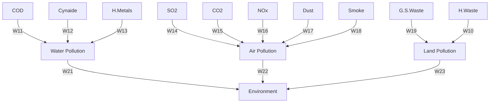
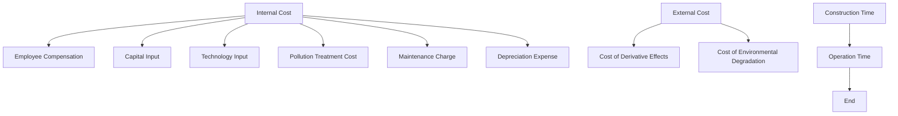

For office use only

T1

T2

T3

T4

Team Control Number

1916129

Problem Chosen

E

For office use only

F1

F2

F3

F4

## 2019

## MCM/ICM

## Summary Sheet

To evaluate the unmeasurable cost of environmental services, our team introduces an accounting model to calculate the economic costs of ecosystem services. We divide the true economic costs of land use projects into three parts: natural resource consumption, cost of environmental pollution and cost of environmental degradation.

To measure the natural resource consumption more accurately, we discuss the non-market consumption and market consumption separately. For the non-market consumption, we express it with the ecological value of the natural resource we put in. For market consumption, we express it with the shadow price of the net primary production (NPP), which can be calculated by CASA model.

When it comes to cost of environmental pollution, we divide the environmental pollution into water pollution, air pollution and industrial waste. Then we consider the derivative effect of pollution by calculating the economic loss it causes.

As for the cost of environmental degradation, we divide it into the cost of vegetation depletion, land degradation and biodiversity decrease. We introduce the concept of ecological value to measure the cost of vegetation depletion, while the cost of land degradation is measured by its opportunity cost. Then we introduce Shannon Wiener Index to measure the biodiversity decrease.

To calculate the environmental degradation cost of land use projects, we regard the self-recovery process of ecosystem as a negative feedback process based on the feedback principle of BP nerve network. Then we construct a long-term ecological self-recover model. In order to weight different factors’ influence more accurately, we develop an OBP (One-way back propagation) nerve network, which is significantly simplified from the well-known BP nerve network. Firstly, we train the known data in the net without considering environmental recovery. After obtaining the weight of each factor, we use it in the long-term ecological self-recover model and calculate the cost of environmental degradation.

Then we cite three typical cases to conduct the cost-benefit analysis, which are House, Subway and Steel Mill. After our cost-benefit analysis, the House is not worth building considering the cost of ecosystem services, while it is worth building in the traditional analysis model. The Subway and Steel Mill is worth constructing in both the traditional way and our new model. From the cases, we can see the significance of considering the cost of ecosystem services for it may influence the decision of planners.

At the end of the paper, we have a further discussion about the cost of ecosystem services. We put forward an innovative expression of Green GDP with the model we built. Moreover, to relieve the externalities of land use projects, we consider Pigou tax and define it in a new way.

Key Words: ecological value, BP nerve network, long-term ecological self-recover model, cost-benefit analysis, Green GDP, externalities

## CONTENT

## 1 Introduction.

1.1 Background.  
1.2 Problem Restatement .  
1.3 Symbol Description

## 2 Measurement of Natural Resource Consumption .

2.1 Net Primary Production .3  
2.2 Modified Cobb-Douglas Production Function. ′  
2.3 Measurement of Non-Market Consumption . /  
2.4 Measurement of Market Consumption 6

## 3 Cost of Environmental Pollution .6

3.1 Cost of Water Pollution Control.  
3.2 Cost of Air Pollution Control .  
3.3 Cost of Industrial Waste Control.  
3.4 Cost of Derivative Effects of Pollution.

## 4 Cost of Environmental Degradation . 8

4.1 Cost of Vegetation Depletion .8  
4.2 Cost of Land Degradation.  
4.3 Cost of Biodiversity Decrease ... C

## 5 Long-Term Ecological Self-Recover Model. .10

5.1 General Assumption. .10  
5.2 Weight Update Formula .10  
5.3 Simulation Process.. 11  
5.4 Practical Application of the Model 12

## 6 Cost-Benefit Analysis of Land Use Project . 13

6.1 General Assumption. .13  
6.2 Cost Analysis of Land Use Project .13  
6.3 Benefit Analysis of Land Use Project. 14  
6.4 Cost-Benefit Ratio 15  
6.5 Case Analysis . 15

## 7 Sensitivity Analysis. 17

## 8 Strength and Weakness .... 18

8.1 Strength. .18  
8.2 Weakness... .18

## 9 Further Discussion .19

9.1 Pigou Tax for Externalities of Natural Resources.. 19  
9.2 Inspiration to the Expression of Green GDP .19

## Appendix.

I. Reference ..  
II. Cost of Ecological Service Data Sheet.

## 1 Introduction

## 1.1 Background

Ecosystem services are the conditions and processes through which natural ecosystems and the species that make them up, sustain and fulfil human life [1]. Ecosystem services provide a guarantee for the survival of all life on earth. In traditional economic theory, Ecosystem services tend to be ignored and make no difference to the calculation of some economic indexes, such as GDP. However, Ecosystem services can be limited or removed by the human activities, which can influence the biodiversity and cause environmental degradation cumulatively. Moreover, as a research shows, the value of the entire biosphere (most of which is outside the market) is estimated at between \$16 trillion and \$54 trillion per year, with an average of \$33 trillion per year [2]. Therefore, it is necessary to put a value on the environmental cost of human activities that have a negative impact on environment.

## 1.2 Problem Restatement

In this paper, we are aimed to find out the negative impacts of human activities on environment and value the environmental cost of them. We need to solve the following problems:

 Create a model to calculate the environmental cost of land use development projects. It is consist of natural resource consumption, cost of environmental pollution and cost of environmental degradation.  
 Use the model to conduct a cost-benefit analysis of actual land use development projects.  
 Evaluate the effectiveness and timeliness of the model.

## 1.3 Symbol Description

Table 1. Symbol Description

<table><tr><td>Symbol</td><td>Description</td></tr><tr><td> $C_{res}$ </td><td>Natural Resource Consumption</td></tr><tr><td> $C_{pol}$ </td><td>Cost of Environmental Pollution</td></tr><tr><td> $C_{deg}$ </td><td>Cost of Environmental Degradation</td></tr><tr><td>N</td><td>Net Primary Production (NPP)</td></tr><tr><td>Y</td><td>Total Output of an Economic Entity</td></tr><tr><td>A</td><td>Technology Level of the Economic Entity</td></tr><tr><td>L</td><td>Labor Put into Production</td></tr><tr><td>K</td><td>Capital Put into Production</td></tr></table>

## 2 Measurement of Natural Resource Consumption

## 2.1 Net Primary Production

Net primary production (NPP) is a significant indicator for evaluating the level of ecosystem service. It weighs the amount of solar energy that is fixed by vegetation per unit of time after expending the energy of its metabolism. Net primary production (NPP) reflects the regulatory capacity of an ecosystem. The higher the value of NPP, the more carbon dioxide fixed by vegetation through photosynthesis and more nitrogen deposited. It means lower carbon dioxide content in the atmosphere, which directly reduce the greenhouse effect [5].

## 2.1.1 CASA Model for NNP Assessing

By referring to conference, we find out a method to roughly estimate the value of NPP. It is the product of vegetation absorbs photosynthetic effective radiation (APAR) and efficiency for solar energy utilization.

$$
N P P = A P A R \cdot \varepsilon^ {[ 5 ]} \tag {1}
$$

Where, NPP is Net Primary Production, ???????? is vegetation absorbs photosynthetic effective radiation and ?? is efficiency for solar energy utilization.

1) APAR is influenced by fraction of photosynthetically active radiation (FPAR), total solar radiation (TSR) and effective radiation ratio, which is 0.5.

$$
A P A R = F P A R \cdot S O L \cdot 0. 5 ^ {[ 5 ]} \tag {2}
$$

Where, FPAR is fraction of photosynthetically active radiation, SOL is total solar radiation, which can be acknowledged by interpolating all of solar radiation stations in space.

$$
F P A R = \frac {F P A R _ {N D V I} + F P A R _ {S R}}{2} [ 5 ] \tag {3}
$$

Where， $\mathrm { F P A R } _ { N D V I }$ can be calculated by NDVI image and NDVI pixel value, $\mathrm { F P A R } _ { S R }$ can be calculated by SR index. The value of NDVI depends on the type of the vegetation. The SR index can be calculated by normalized difference vegetation index (NDVI).

2) ?? depends on the maximum light utilization, temperature stress factor and image coefficients of water stress.

$$
\varepsilon = \varepsilon_ {m a x} \cdot T _ {\varepsilon} \cdot W _ {\varepsilon} ^ {[ 5 ]} \tag {4}
$$

Where, $\varepsilon _ { m a x }$ is maximum light utilization, which is a constant and depends on the type of the vegetation; $\mathrm { T } _ { \varepsilon }$ is temperature stress factor while $\mathsf { W } _ { \varepsilon }$ is image coefficients of water stress.

## 2.2 Modified Cobb-Douglas Production Function

Cobb-Douglas production function is an accounting equation measuring the total output of an economic entity. In classical economic theory, the contribution of Ecosystem services to the growth of output tend to be ignored. In this way, the traditional Cobb-Douglas production function has a form like this:

$$
Y = A \cdot L ^ {\alpha} \cdot K ^ {\beta} \tag {5}
$$

Where, Y is the total output of an economic entity, A is technology level of the economic entity, L is labor put into production, K is capital put into production, $\alpha , \beta$ are the output elasticities of labor and capital. Output elasticity measures the change of output introduced by the increase of unit factor input.

The environmental cost of human activities cannot be reflected in the above formula. Therefore, we introduce the modified Cobb-Douglas production function:

$$
Y = A \cdot L ^ {\alpha} \cdot K ^ {\beta} \cdot N ^ {\lambda [ 3 ]} \tag {6}
$$

Where, N is Net Primary Production (NPP), ?? is the output elasticities of Net Primary Production (NPP).

## 2.3 Measurement of Non-Market Consumption

It is hard for us to know the non-market consumption for there is no way to measure the consumers’ willingness to pay. On this occasion, we introduce ecological value to represent the natural resource consumption. Ecological value can be divided into five parts: the value of fixed carbon dioxide, oxygen released, purifying the water quality, cleaning the dust and conserving the soil.

## 2.3.1 Value of Fixed Carbon Dioxide and Oxygen released

Vegetation has the ability to fix carbon dioxide and release oxygen by photosynthesis. The reaction equation is as follows:

$$
6 C O _ {2} + 1 2 H _ {2} O \rightarrow C _ {6} H _ {1 2} O _ {6} + 6 O _ {2} + 6 H _ {2} O \tag {7}
$$

The ratio of NPP, the quality of carbon dioxide and oxygen is 100:163:120 [4]. In the method of carbon tax approach and oxygen cost method, we can calculate the value of fixed carbon dioxide and oxygen released with the following formula:

$$
V _ {P} = S \cdot \left(c _ {O _ {2}} \cdot m _ {O _ {2}} + c _ {C} \cdot \left(m _ {C} + H _ {S}\right)\right) \tag {8}
$$

Where, $V _ { P }$ is the value of fixed carbon dioxide and oxygen released, ?? is the floor space of vegetation, $c _ { O _ { 2 } } , c _ { C }$ are respectively the price of oxygen and coal per ton, $m _ { O _ { 2 } } , m _ { C }$ are respectively the amount of oxygen released and carbon fixed, $H _ { S }$ is carbon content of the soil.

The value of each constant can be seen in the following table:

Table 2. Value of Constants in Formula (8) [8]

<table><tr><td>Constant</td><td>Value</td></tr><tr><td> $c_{O_2}$ </td><td>198.6 $/kg</td></tr><tr><td> $m_{O_2}$ </td><td>0.05625 kg/m2</td></tr><tr><td> $c_C$ </td><td>150 $/t</td></tr><tr><td> $m_C$ </td><td>0.07755 kg/m2</td></tr><tr><td> $H_S$ </td><td>0.505 kg/m2</td></tr></table>

## 2.3.2 Value of Conserving the Soil

The roots of vegetation are firmly entwined with the soil, which can help conserve the soil. The value of conserving the soil can be calculated by the following formula:

$$
V _ {s} = \frac {S \cdot c _ {s o i l} \cdot (x _ {2} - x _ {1})}{\rho} [ 9 ] \tag {9}
$$

Where, $V _ { s }$ is the value of conserving the soil, S is the floor space of vegetation, ${ { \bf { C } } _ { s o i l } }$ is the cost of digging up and transporting a unit volume of soil, $\mathbf { X } _ { 2 }$ is soil erosion modulus without vegetation, $\mathbf { x } _ { 1 }$ is soil erosion modulus with vegetation, $\rho$ is soil bulk density.

The value of each constant can be seen in the following table:

Table 3. Value of Constants in Formula (9) [9]

<table><tr><td>Constant</td><td>Value</td></tr><tr><td> $c_{soil}$ </td><td>6 $/m3</td></tr><tr><td> $x_2$ </td><td>38.02 t/hm2</td></tr><tr><td> $x_1$ </td><td>2.86 t/hm2</td></tr><tr><td> $\rho$ </td><td>1.09 g/cm3</td></tr></table>

## 2.3.3 Value of Purifying the Water Quality

The branches, leaves and soil of vegetation are able to filter the pollutant in the rainfall. The value of purifying the rainfall quality can be calculated by the following formula:

$$
V _ {w} = 1 0 \cdot S \cdot (c _ {w a t} + c _ {p o o}) \cdot (R - T R) ^ {[ 1 0 ]} \tag {10}
$$

Where, $V _ { w }$ is the value of purifying the water quality, 10 is conversion ratio, S is the floor space of vegetation, $\mathbf { C } _ { w a t } , \mathbf { C } _ { p o o }$ are respectively the cost of dealing polluted water and building reservoir per reservoir capacity, R is the amount of rainfall, TR is the amount of transpiration.

The value of each constant can be seen in the following table:

Table 4. Value of Constants in Formula (10) [10]

<table><tr><td>Constant</td><td>Value</td></tr><tr><td> $c_{wat}$ </td><td>0.417 $/t</td></tr><tr><td> $c_{poo}$ </td><td>0.147 $/a</td></tr><tr><td>R</td><td>483.3 mm/a</td></tr><tr><td>TR</td><td>374.8 mm/a</td></tr></table>

## 2.3.4 Value of Cleaning the Dust

Vegetation is able to absorb the hazardous substance in the atmosphere, such as $\mathrm { S } O _ { 2 } , \mathrm { H F } , \mathrm { N } O _ { X }$ and dust. The value of it can be calculated by the following formula:

$$
V _ {d} = S \cdot \sum_ {i = 1} ^ {4} c _ {i} \cdot Q _ {i} ^ {[ 1 0 ]} \tag {11}
$$

Where, $V _ { d }$ is the value of cleaning the dust, S is the floor space of vegetation, $\mathrm { c } _ { i }$ is the cost of controlling hazardous substance, $\mathrm { Q } _ { i }$ is the amount of absorption per unit area, i can be $\mathrm { S } O _ { 2 } , \mathrm { H F } , \mathrm { N } O _ { X }$ and dust.

The value of each constant can be seen in the following table:

Table 5. Value of Constants in Formula (11) [10]

<table><tr><td>Constant</td><td>Value</td></tr><tr><td> $Q_{SO_2}$ </td><td>37.3 kg/(hm2.a)</td></tr><tr><td> $Q_{HF}$ </td><td>1.68 kg/(hm2.a)</td></tr><tr><td> $Q_{NO_X}$ </td><td>6.00 kg/(hm2.a)</td></tr><tr><td> $c_{SO_2}$ </td><td>0.171 $/kg</td></tr><tr><td> $c_{HF}$ </td><td>0.099 $/kg</td></tr><tr><td> $c_{NO_X}$ </td><td>0.090 $/kg</td></tr></table>

## 2.4 Measurement of Market Consumption

In the factor market, the factor inputs can be adjusted over time. With the Modified Cobb-Douglas Production Function, we use the shadow price of net primary production (NNP) to represent the natural resource consumption. The shadow price reflects the marginal contribution of net primary production (NPP) to output. Based on formula (2), we can calculate the value of it by taking the partial of net primary production (NPP) with respect to output.

$$
C _ {r e s} = \frac {\partial Y}{\partial N} = A \cdot \lambda \cdot L ^ {\alpha} \cdot K ^ {\beta} \cdot N ^ {\lambda - 1 [ 3 ]} \tag {12}
$$

Where, Y is total output of an economic entity, N is Net Primary Production (NPP), A is technology level of the economic entity, L is labor put into production, K is capital put into production, $\alpha , \beta , \lambda$ are the output elasticities of labor, capital and NPP.

## 3 Cost of Environmental Pollution

The cost of environmental pollution is mainly consist of four parts: the control cost of water pollution, air pollution, industrial waste and the cost of derivative effects of pollution. It can be represented as the following formula:

$$
C _ {p o l} = C _ {w} + C _ {a} + C _ {i} + C _ {d} \tag {13}
$$

Where, $\mathrm { C } _ { p o l }$ is the cost of environmental pollution, $\complement _ { w } , \complement _ { a } , \complement _ { i } , \complement _ { d }$ is respectively the control cost of water pollution, air pollution, industrial waste and the cost of derivative effects of pollution.

## 3.1 Cost of Water Pollution Control

Water pollution is mainly caused by cyanide and harmful metals. Moreover, high level of chemical oxygen demand (COD) is also an evidence of water pollution. Therefore, the cost of water pollution control comes from the three parts. The cost of each part is shown in the following table:

Table 6. Control Cost of Water Pollution [6]

<table><tr><td>Type of Water Pollution</td><td>Cost of Pollution Control ($/t)</td></tr><tr><td>COD</td><td>1671.43</td></tr><tr><td>Cyanide</td><td>357.00</td></tr><tr><td>Harmful Metals</td><td>225.57</td></tr></table>

The cost of control the water pollution can be calculated as the following formula:

$$
C _ {w} = 1 6 7 1. 4 3 \cdot n _ {C O D} + 3 5 7 \cdot n _ {C y a} + 2 2 5. 5 7 \cdot n _ {m e t} \tag {14}
$$

Where, ${ \sf C } _ { w }$ is the cost of water pollution control, $n _ { C O D }$ is the difference of COD above the standard value, $n _ { C y a } , n _ { m e t }$ respectively represent the amount of cyanide and harmful Metals.

## 3.2 Cost of Air Pollution Control

Air pollution is mainly caused by the pollutants $\mathsf { S } O _ { x } , \mathsf { C } O _ { 2 } , \mathsf { N } O _ { x }$ , dust and smoke. The control cost of each part is shown in the following table:

Table 7. Control Cost of Air Pollution [6]

<table><tr><td>Type of Air Pollution</td><td>Cost of Pollution Control ($/t)</td></tr><tr><td> $SO_x$ </td><td>92.86</td></tr><tr><td> $CO_2$ </td><td>97.14</td></tr><tr><td> $NO_x$ </td><td>432.86</td></tr><tr><td>Dust</td><td>32.86</td></tr><tr><td>Smoke</td><td>20.00</td></tr></table>

The cost of control the air pollution can be calculated as the following formula:

$$
C _ {a} = 9 2. 8 6 \cdot n _ {S O _ {x}} + 9 7. 1 4 \cdot n _ {C O _ {2}} + 4 3 2. 8 6 \cdot n _ {N O _ {x}} + 3 2. 8 6 \cdot n _ {D u s} + 2 0 \cdot n _ {S m o} \tag {15}
$$

Where, $\mathrm { C } _ { a }$ is the cost of air pollution control, $n _ { \mathrm S O _ { x } } , n _ { \mathrm C O _ { 2 } } , n _ { \mathrm N O _ { x } } , n _ { \mathrm { D u s } } , n _ { \mathrm { S m o } }$ respectively represent the amount of $\mathsf { S O } _ { x } , \mathsf { C O } _ { 2 } , \mathsf { N O } _ { x }$ , dust and smoke.

## 3.3 Cost of Industrial Waste Control

Industrial waste can be divided into general industrial solid waste and hazardous fixed waste. The actual cost of control industrial waste is composed of the treatment cost and storage treatment cost of industrial solid waste. The calculation formula is as follows:

$$
C _ {i} = C _ {c t l} + C _ {s t o} \tag {16}
$$

Where, $C _ { i }$ is the cost of industrial waste control, $C _ { c t l }$ is the treatment cost and $C _ { s t o }$ is storage treatment cost.

The control cost of each part is shown in the following table:

Table 8. Control Cost of Industrial Waste [7]

<table><tr><td>Type of Cost</td><td>Type of Waste</td><td>Unit Control Cost ($/t)</td></tr><tr><td rowspan="2">Control Cost</td><td>General Industrial Solid Waste</td><td>3.14</td></tr><tr><td>Hazardous Waste</td><td>214.29</td></tr><tr><td rowspan="2">Storage Cost</td><td>General Industrial Solid Waste</td><td>0.64</td></tr><tr><td>Hazardous Waste</td><td>2.15</td></tr></table>

## 3.4 Cost of Derivative Effects of Pollution

The derivative effects of pollution mainly refer to greenhouse effect, ozone hole and acid rain. The cost of it is calculated by the following formula:

$$
C _ {d} = L _ {G H} + L _ {O H} + L _ {A R} \tag {17}
$$

Where, $\mathrm { C } _ { d }$ is the cost of derivative effects of pollution, $\mathrm { L } _ { G H } , \mathrm { L } _ { O H } , \mathrm { L } _ { A R }$ are respectively the economic loss caused by greenhouse effect, ozone hole and acid rain.

The main evaluation index of greenhouse effect is carbon dioxide emissions. The greater the carbon dioxide emissions, the severer the greenhouse effect. Therefore, we approximate the severity of the greenhouse effect in terms of carbon dioxide emissions. The loss of greenhouse effect can be calculated with the following formula:

$$
L _ {G H} = \alpha \cdot E _ {c} \tag {18}
$$

Where, $\operatorname { L } _ { G H }$ is the loss caused by greenhouse effect, ?? is the marginal rate of substitution of capital for carbon dioxide emissions, $E _ { c }$ is the amount of carbon dioxide emissions.

## 4 Cost of Environmental Degradation

Environmental degradation refers to the deterioration or compromise of the natural environment through consumption of assets by either natural processes or human activities. The classic examples of Environmental degradation are vegetation depletion, land degradation and biodiversity decrease.

$$
C _ {d e g} = C _ {v e g e} + C _ {l a n d} + C _ {b i o d} \tag {19}
$$

Where, $\mathrm { C } _ { d e g }$ is the cost of environmental degradation, $\mathrm { C } _ { v e g e } , \mathrm { C } _ { l a n d } , \mathrm { C } _ { b i o d }$ respectively are the loss of vegetation depletion, land degradation and biodiversity decrease.

Then we will have a further discussion about the cost of the losses.

## 4.1 Cost of Vegetation Depletion

Vegetation depletion weakens the ability of ecosystem to purify the air, which means it fails to absorb the harmful gas such as $\mathrm { S } O _ { x }$ and $\mathrm { N } O _ { x }$ . Moreover, vegetation depletion decreases the $O _ { 2 }$ in the atmosphere and increases the $C O _ { 2 }$ in the atmosphere. The loss of them can be measured by their ecological value. The way to calculate the ecological value of the loss is represented by the formula (7).

## 4.2 Cost of Land Degradation

Land degradation leads to loss of land nutrient substance and sediment hazards. Based on the theory of market value, we can calculate soil conservation value by the opportunity cost of land nutrient substance and the control cost of sediment hazards.

$$
C _ {l a n d} = \Delta A \cdot (C _ {n u t} + C _ {s e d}) \tag {20}
$$

Where, $\mathrm { C } _ { l a n d }$ is the total cost of land degradation, A is soil retention, $\mathrm { C } _ { n u t }$ is the unit opportunity cost of land nutrient substance, $\complement _ { s e d }$ is the control cost of sediment hazards.

$$
A = R \cdot K \cdot L S \cdot (1 - C \cdot P) ^ {[ 8 ]} \tag {21}
$$

Where, R is rainfall erosion, which can be observed, K is factor of soil erodibility, LS is slope length slope factor, C is land cover factor, P is soil conservation measures factor. All of the parameters except R are constants.

## 4.3 Cost of Biodiversity Decrease

Misuse of ecological services leads to the decrease of biodiversity. To measure the biodiversity in a district, we adopt the Shannon Wiener Index formula with the method of theory of information.

$$
H = - \sum P _ {i} \cdot l n (P _ {i}) \tag {22}
$$

Where, H is Shannon Wiener Index, $P _ { i }$ is the proportion of species individualities in total number of individuals.

We can learn from the formula that biodiversity is proportional to Shannon Wiener Index. In case of species distribution uniformity, the Shannon Wiener Index is one. When there is only one species, the Shannon Wiener Index is zero. The decrease of species diversity is a long-term qualitative change process. Therefore, the large-scale land project during long period will have negative effects on biodiversity. The cost of ecological services due to biodiversity loss is approximately equal to the difference of Shannon Wiener Index over a long period of time multiplied the unit service value. The unit service value is shown in the following table:

Table 9. Unit Service Value of Biodiversity

<table><tr><td>Range of Shannon Wiener Index</td><td>Unit Service Value ($/hm2)</td></tr><tr><td>0 &lt; H &lt; 1</td><td>428.57</td></tr><tr><td>1 ≤ H &lt; 2</td><td>714.29</td></tr><tr><td>2 ≤ H &lt; 3</td><td>1428.57</td></tr><tr><td>3 ≤ H &lt; 4</td><td>2857.14</td></tr><tr><td>4 ≤ H &lt; 5</td><td>4285.71</td></tr><tr><td>5 ≤ H &lt; 6</td><td>5714.28</td></tr><tr><td>6 ≤ H</td><td>7142.86</td></tr></table>

# 5 Long-Term Ecological Self-Recover Model

All of the ecosystems have the ability to self-recover. It is reflected in the renewable nature of resources, the self-decomposition of waste and so on. Based on the feedback principle of BP neural network, we regard the self-recovery process of ecosystem as a negative feedback process, and thus construct the time evolution model of ecological self-recovery.

## 5.1 General Assumption

 The original ecological environment is not polluted.  
 The resistance stability of environment is very rapid while the restorative stability is slow.

## 5.2 Weight Update Formula

Considering the practicability of the model, the weights of the new model cannot be randomly selected. At the same time, we give up the method of AHP to find the weights. Through our database, we establish a training set of 20 different engineering data set. We use neural network machine learning method under the condition of satisfying error accuracy to train a group of appropriate weight.

Figure 1. Hierarchical Structure of Neural Network  

flowchart

Note: G.S. Waste = General Industrial Solid Waste  
H. Waste = Hazardous Waste

When we train the known training set, the process of neural network back propagation is influenced by only one “mother”. We keep adjusting the weights until it is within the margin of error. The advantage of determining the weight in this way is that the unit influence of different parameters can be reflected in the weight.

The weight update formula from hidden layer to output layer is as follows:

$$
\frac {\partial E _ {t o t a l}}{\partial W _ {1 1}} = \frac {\partial E _ {t o t a l}}{\partial W _ {o u t}} \cdot \frac {\partial W _ {o u t}}{\partial W _ {n e}} \cdot \frac {\partial W _ {n e}}{\partial W _ {1 1}} \tag {23}
$$

$$
W _ {1 1} ^ {\prime} = W _ {1 1} - \eta \cdot \frac {\partial E _ {t o t a l}}{\partial W _ {1 1}} \tag {24}
$$

Where, $E _ { t o t a l }$ is the binary norm of the total error between the output and the actual value of the output layer neural unit, $W _ { o u t }$ is the output of the neuron, $W _ { n e }$ is the linear summation of output values of hidden layer, $\frac { \partial W _ { o u t } } { \partial W _ { n e } }$ ?????????? is to find derivative of the activation function, η is the learning rate. ????????

The weight formula updating the first layer is as follows:

$$
\frac {\partial E _ {t o t a l}}{\partial W _ {1 1}} = \frac {\partial E _ {t o t a l}}{\partial W _ {o w}} \cdot \frac {\partial W _ {o w}}{\partial W _ {n e}} \cdot \frac {\partial W _ {n w}}{\partial W _ {1 1}} \tag {25}
$$

$$
\frac {\partial E _ {t o t a l}}{\partial W _ {o w}} = \frac {\partial E _ {w}}{\partial W _ {o w}} \tag {26}
$$

$$
W _ {1 1} ^ {\prime} = W _ {1 1} - \eta \cdot \frac {\partial E _ {t o t a l}}{\partial W _ {1 1}} \tag {27}
$$

Where, $E _ { w }$ is the overall error of hidden layer (water pollution) nerve cell, $W _ { o w }$ is the output if nerve cell (water pollution), $W _ { n w }$ is the linear summation of output values of input layer, ???????? is to find $\frac { \partial W _ { o w } } { \partial W _ { n e } }$ ???????? derivative of the activation function, η is the learning rate.

## 5.3 Simulation Process

Firstly, based on the life cycle theory, we divide the project into five cycles, which are the planning and design period, the raw material processing period, the construction period, the operation period and the end of life period. Here, we consider the evolution law of the pollution discharge with time in the raw material processing period, construction period and operation period.

We can substitute the weights trained by BP neural network into our ecological self-recover model. The pollutants discharged in the projects must be treated before they flow into the ecosystem. The pollutants flowing into the ecosystem are partly eliminated by the resistance of ecosystem while the others remain there. In the long term, this part could be purified because of the self –recover ability of ecosystem. Furthermore, something needs to be noticed.

 When the level of pollution exceeds the critical value that the ecosystem can withstand (k/2), the pollutant will not be purified.

 The stability of ecosystem decreased with the increase of pollution degree, and the stability of resilience increases with the increase of pollution degree.

The pollutant of the first year can be calculated by the following formula:

$$
E _ {1} = \sum_ {i = 1} ^ {3} x _ {1 i} (1 - \beta_ {i})) \cdot (1 - \lambda) \tag {28}
$$

The pollutant in year m+1 can be calculated by the following formula:

$$
E _ {m + 1} = \sum_ {i = 1} ^ {m + 1} E _ {n} \cdot f (m + 1 - n, \gamma) + \cdot \sum_ {i = 1} ^ {3} x _ {1 i} (1 - \beta_ {i})) \cdot (1 - \lambda) \tag {29}
$$

Where, $\begin{array} { r } { \gamma = \mathrm { g } ( \sum E ) , \lambda = \mathrm { h } ( \sum E ) } \end{array}$

As the system evolves, the ecosystem collapses because either the pollution level exceeds k/2, or it will reach a dynamic equilibrium. When it reaches the dynamic equilibrium, the status can be represented by the following formula:

$$
E _ {m + 1} \cdot (1 - f (1)) = \sum_ {n = 1} ^ {m - 1} E _ {n} \cdot f (m + n - 1, \gamma) + \left(\sum_ {i = 1} ^ {3} x _ {1 i} \cdot (1 - \beta)\right) \cdot (1 - \lambda) \tag {30}
$$

Where, $\operatorname { f } ( \mathsf { a } , \mathsf { b } )$ is a function that reflects the ecosystem restoration changed with recovery capability and time, g(E) is the function that reflects the ecosystem restoration increases with the pollution level increasing, h(E) is the ecosystem resilience decreases with the pollution level increasing.

## 5.4 Practical Application of the Model

Using our model, we can calculate the environmental degradation cost in different years more accurately. Then we use four practical examples to apply the model, the details of the data can be seen in the appendix. The computed results are as follows:

Figure 2. Environmental Degradation Cost of Bridge and Steel Plant  

line chart

| year | bridge (million dollars) | Steel Plant (billion dollars) |
| ---- | ------------------------- | ------------------------------ |
| 0    | 0.2                       | 0.01                           |
| 5    | 0.5                       | 0.05                           |
| 10   | 0.6                       | 0.06                           |
| 15   | 0.7                       | 0.07                           |
| 20   | 0.8                       | 0.075                          |
| 25   | 0.9                       | 0.08                           |
| 30   | 0.95                      | 0.085                          |
| 35   | 1.0                       | 0.09                           |
| 40   | 1.02                      | 0.09                           |
| 45   | 1.01                      | 0.09                           |
| 50   | 1.0                       | 0.09                           |
| 55   | 0.98                      | 0.09                           |
| 60   | 0.97                      | 0.09                           |

Figure 3. Environmental Degradation Cost of House and Subway  

line chart

| year | house (thousands dollars) | underground (billion dollars) |
| ---- | -------------------------- | ----------------------------- |
| 0    | 1.0                        | 0.06                          |
| 10   | 4.4                        | 0.20                          |
| 20   | 3.9                        | 0.21                          |
| 30   | 3.5                        | 0.22                          |
| 40   | 2.9                        | 0.22                          |
| 50   | 2.7                        | 0.22                          |
| 60   | 2.2                        | 0.22                          |

There is a turning point in both figures. The curve before the turning point is our raw material and construction. In this part of curve, a large amount of pollutant emission rises rapidly. Therefore, there is a little bit steep. The curve after the turning point is the operating period. In this part of curve, we find that because of the purification of ecosystem, the houses and bridges in the projects with less pollution will selfrecover over time. However, for the steel mill and subway project with more pollution, the purification of the annual quantity is less than new emissions pollution. Without man-made management, pollution become more serious.

## 6 Cost-Benefit Analysis of Land Use Project

## 6.1 General Assumption

 Net cash flow (NCF) is the same every year.  
 The depreciation method is linear depreciation.

## 6.2 Cost Analysis of Land Use Project

In order to simplify the model, we use factor cost to calculate the main cost of projects. The components of long-term costs of land use project are shown in the table below:

Figure 4. Components of Main Long-Term Costs of Project  

flowchart

## 6.2.1 Cost in Construction Time

Considering the lifetime of the project, we introduce the concept of present worth, which is calculated by expected cash flow, present value factor and discount rate. By adopting the present value approach rather than simply adding the cash flow of each year together, we can get a more accurate cost figure. In this way, we fully account for the time cost of the input factor.

$$
C _ {1} = \sum_ {i = 1} ^ {t _ {1}} \frac {w _ {i} + k _ {i} + T _ {i} + C _ {\text { con } , i}}{(1 + r) ^ {t _ {1}}} \tag {31}
$$

Where, $\mathsf C _ { 1 }$ is the cost in construction time, $t _ { 1 }$ is the construction period, ?? is discount rate, $w _ { i } , k _ { i } , T _ { i } , C _ { c o n , i }$ are respectively the employee compensation, capital input, technology input and pollution treatment cost in year i.

## 6.2.2 Cost in Operation Time

Likewise, we take the lifetime of the project into consideration. The depreciation method is linear depreciation. The cost in operation time can be calculated by the following formula:

$$
C _ {2} = \sum_ {j = 1} ^ {t _ {2}} \frac {m _ {j} + d _ {j}}{(1 + r) ^ {t _ {2}}} \tag {32}
$$

Where, $\mathsf { C } _ { 2 }$ is the cost in operation time, $t _ { 2 }$ is the operation period, which is equal to expected useful life of the asset, $r$ is discount rate, $m _ { j } , d _ { j }$ are respectively the maintenance charge and depreciation expense. The depreciation expense can be calculated according to formula (20).

$$
d _ {j} = \frac {K}{t _ {2}} \tag {33}
$$

Where, K is constructed assets that need to be depreciated， $t _ { 2 }$ is the expected useful life of the asset.

## 6.3 Benefit Analysis of Land Use Project

The long-term benefit of land use project is mainly consists of future inward cash flow and estimated net residual value of the project.

Considering the time cost, we calculate the benefit by the following formula:

$$
I = \frac {I _ {O}}{(1 + r) ^ {t _ {2}}} + \sum_ {j = 1} ^ {t _ {2}} \frac {I _ {j}}{(1 + r) ^ {t _ {2}}} + I _ {u n} \tag {34}
$$

Where, I is the total benefit of the project, $I _ { O }$ is expected net residual value, ?? is discount rate, $t _ { 2 }$ is the operation period, $I _ { j }$ is inward cash flow in year j, $I _ { u n }$ is the non-market benefit, which depends on the type of projects.

## 6.4 Cost-Benefit Ratio

Cost-benefit ratio is to reflect the profitability of the project, which can help decision makers to determine whether the project is beneficial to conduct. The cost-benefit ratio can be calculated by the following formula:

$$
r = \frac {C}{I} \tag {35}
$$

Where, r is cost-benefit ratio, C is the financial cost, I is inward cash flow.

In the traditional cost-benefit analysis, the decision maker may underestimate the total cost by ignoring the cost of ecosystem services.

In the developed cost-benefit analysis, we take the cost of ecosystem services and the social benefit into consideration. The developed formula can be represented as follows:

$$
r = \frac {C + C _ {e}}{I + I _ {s}} \tag {36}
$$

Where, r is cost-benefit ratio, C is the financial cost, $C _ { e }$ is cost of ecosystem services, I is inward cash flow and $I _ { s }$ is social benefit.

## 6.5 Case Analysis

In this part, we will conduct cost-benefit analysis of three different size projects using the self-recover model. Details of cost of ecosystem services and pollution are listed in the appendix. Moreover, we assume that the discount rate is 3%.

## 6.5.1 House of One Hundred Square Meters

The construction time of residential building is around one year, while the lifetime of it is around twenty years. The expected net residual value rate is about 5%. The cost and benefit can be seen in the following table:

Table 10. Cost Analysis of House

<table><tr><td>House</td><td>Cost/$</td></tr><tr><td>Employee Compensation</td><td>2,914.29</td></tr><tr><td>Capital Input</td><td>25,714.29</td></tr><tr><td>Technology Input</td><td>7,142.86</td></tr><tr><td>Maintenance Charge</td><td>2,571.43</td></tr><tr><td>Cost of Derivative Effects of Pollution</td><td>41,214.72</td></tr><tr><td>Cost of Environmental Degradation</td><td>699.00</td></tr><tr><td>TOTAL</td><td>80,256.59</td></tr></table>

Table 11. Benefit Analysis of House

<table><tr><td>House</td><td>Annual Payment/$</td><td>Present Value of Annuity/$</td></tr><tr><td>Rent Income</td><td>5,142.84</td><td>76,512.60</td></tr><tr><td>Net Residual</td><td>1,917.74</td><td>1,061.85</td></tr><tr><td>Social</td><td>0</td><td>0</td></tr><tr><td>TOTAL</td><td></td><td>77576.45</td></tr></table>

The cost-benefit ratio calculated in the traditional way is 0.49, which means the project is worth conducting. However, the cost-ratio calculated considering the ecosystem services is 1.03, which means the project is not worth conducting.

## 6.5.2 Subway of Forty Kilometers

The construction time of subway is around five years, while the lifetime of it is around sixty years. The rate of depreciation of subway is 1%. The cost and benefit can be seen in the following table:

Table 12. Cost Analysis of Subway

<table><tr><td>Subway</td><td>Annual Payment/$</td><td>Present Value of Annuity/$</td></tr><tr><td>Employee Compensation</td><td>137,142,857.14</td><td>626,742,857.14</td></tr><tr><td>Capital Input</td><td>274,285,714.29</td><td>1,253,485,714.29</td></tr><tr><td>Technology Input</td><td>45,714,285.71</td><td>208,914,285.71</td></tr><tr><td>Maintenance Charge</td><td>1,142,857.14</td><td>5,222,857.13</td></tr><tr><td>Cost of Derivative Effects of Pollution</td><td>9,300,938.57</td><td>42,595,508.37</td></tr><tr><td>Cost of Environmental Degradation</td><td>125.71</td><td>575.73</td></tr><tr><td>TOTAL</td><td></td><td>2,136,961,798.37</td></tr></table>

Table 13. Benefit Analysis of Subway

<table><tr><td>Subway</td><td>Annual Payment/$</td><td>Present Value of Annuity/$</td></tr><tr><td>Service Charge Income</td><td>81,428,571.43</td><td>2,253,581,612.85</td></tr><tr><td>Net Residual Value</td><td>835,657,142.86</td><td>141,838,669.05</td></tr><tr><td>Social Benefit</td><td>4,428,571.43</td><td>122,563,210.56</td></tr><tr><td>TOTAL</td><td></td><td>2,517,983,492.46</td></tr></table>

The cost-benefit ratio calculated in the traditional way is 0.83, which means the project is worth conducting. However, the cost-ratio calculated considering the ecosystem services is 0.84, which means the project is worth conducting as well.

## 6.5.3 Large-Scale Steel Mill of Twenty-Three Square Kilometers

The construction time of a steel mill is around five years, while the lifetime of it is around twenty years. The rate of depreciation of steel mill is 1%.The cost and benefit can be seen in the following table:

Table 14. Cost Analysis of Steel Mill

<table><tr><td>Steel Mill</td><td>Annual Payment/$</td><td>Present Value of Annuity/$</td></tr><tr><td>Employee Compensation</td><td>141,181,111.74</td><td>646,567,137.44</td></tr><tr><td>Capital Input</td><td>988,267,782.17</td><td>4,525,969,962.01</td></tr><tr><td>Technology Input</td><td>282,362,223.48</td><td>1,293,134,274.87</td></tr><tr><td>Maintenance Charge</td><td>27,697,106.54</td><td>126,844,438.84</td></tr><tr><td rowspan="2">Cost of Derivative Effects of Cost of Environmental Degradation</td><td>38,696,421.71</td><td>177,218,002.52</td></tr><tr><td>719.67</td><td>3,295.89</td></tr><tr><td>TOTAL</td><td></td><td>6,769,737,111.57</td></tr></table>

Table 15. Benefit Analysis of Steel Mill

<table><tr><td>Steel Mill</td><td>Annual Payment/$</td><td>Present Value of Annuity/$</td></tr><tr><td>Revenue from Operations</td><td>1,858,571,428.60</td><td>51,437,011,900.24</td></tr><tr><td>Net Residual Value</td><td>0</td><td>0</td></tr><tr><td>Social Benefit</td><td>0</td><td>0</td></tr><tr><td>TOTAL</td><td></td><td>51,437,011,900.24</td></tr></table>

The cost-benefit ratio calculated in the traditional way is 0.13, which means the project is worth conducting. However, the cost-ratio calculated considering the ecosystem services is 0.13, which means the project is worth conducting as well.

## 7 Sensitivity Analysis

In order to test the robustness of the model, we added 1% noise value to the above index parameters of our model and observed the change rate of output cost. The results are shown in the following table.

Table 16. Error of the Ecological Cost Corresponding to the Different Input Error

<table><tr><td>Parameter</td><td>Housing</td><td>Bridge</td><td>Subway</td><td>Steel Plant</td></tr><tr><td>H(1%)</td><td>0.025%</td><td>0.003%</td><td>0.02%</td><td>0.56%</td></tr><tr><td>SOx(1%)</td><td>0.15%</td><td>0.14%</td><td>0.05%</td><td>0.13%</td></tr><tr><td>NOx(1%)</td><td>0.14%</td><td>0.21%</td><td>0.12%</td><td>0.20%</td></tr><tr><td>Cyanide (1%)</td><td>0.11%</td><td>0.12%</td><td>0.19%</td><td>0.10%</td></tr><tr><td>General Industrial Waste (1%)</td><td>0.14%</td><td>0.17%</td><td>0.14%</td><td>0.13%</td></tr><tr><td>Hazardous waste (1%)</td><td>0.09%</td><td>0.12%</td><td>0.10%</td><td>0.09%</td></tr></table>

When we apply the model to practice, the margin k/2 is much higher than the damage caused by the project. Therefore, the ecosystem can always reach a dynamic balance. In order to verify the accuracy of the model, we replace k/2 value with a lower value, which can be reached more easily. We can see from the graph that once the degree of pollution surpasses the values of k/2, it stops to increase. It means that ecosystem collapsed under the weight of pollution.

The results can be seen by the following figure:

Figure 5. Results with Different K  

line chart

| year | K     | K/2  |
| ---- | ----- | ---- |
| 0    | 100   | 0.4  |
| 10   | 250   | 0.4  |
| 20   | 570   | 0.4  |
| 30   | 590   | 0.4  |
| 40   | 600   | 0.4  |
| 50   | 610   | 0.4  |
| 60   | 620   | 0.4  |

# 8 Strength and Weakness

## 8.1 Strength

 The model comprehensively considers multiple factors such as ecosystem services and environmental degradation.  
 We estimates the value of ecosystem services by opportunity cost and shadow cost, which can reflect real value objectively.  
 We use the negative feedback form of artificial neural network to construct our ecosystem self-recover model originally.  
 Based on the model we conducted, we have a further discussion about the Green GDP and talk about the expression of Pigou tax for the externalities problem.

## 8.2 Weakness

 Limited by our knowledge, there exists some factors that we fail to consider.  
 We do not consider the factor of inflation. Therefore, there may be errors in project costs.  
 Due to the limitation of space and data, we cannot do the cost analysis of land engineering in different zones.  
 The cost-benefit analysis of steel mill could be not representative for we selected a steel mill with high profit rate for example.

# 9 Further Discussion

## 9.1 Pigou Tax for Externalities of Natural Resources

Externality refers to the non-marketable influence of economic activities of economic subjects (including manufacturers and individuals) on others or society. Environmental pollution we discussed above is a typical negative externality, which do harm to the ecosystem and society. Both policy makers and business decision makers should consider the cost of Ecosystem services while making decisions. Then we will discuss the establishment of the Pigou tax levied on polluters.

The target of Pigou tax is to equalize the gap between the private and social costs of polluters production by the way of levying. From the model we built above, the Pigou tax can be formulated as the following formula:

$$
\mathrm{T} _ {p} = \mathrm{C} _ {d e g} + \mathrm{C} _ {d} \tag {37}
$$

Where, $\mathrm { T } _ { p }$ is Pigou tax for a specific land use project, $\mathrm { C } _ { d e g }$ is the cost of environmental degradation, $\mathrm { C } _ { d }$ is the cost of derivative effects of pollution.

## 9.2 Inspiration to the Expression of Green GDP

## 9.2.1 Traditional Accounting of Green GDP

Green GDP refers to Gross domestic product (GDP) accounting considering the ecosystem services. Based on the traditional GDP accounting system, the value of Green GDP is the value of GDP after deducting the cost of natural resources and cost of environmental pollution. It can be represented by the following formula:

$$
\mathrm{EDP} = \mathrm{NDP} - \mathrm{C} _ {r e s} - \mathrm{C} _ {p o l} \tag {38}
$$

Where, EDP is Green GDP, NDP is net domestic product, $\complement _ { r e s }$ is the non-market consumption of natural resources, and $\mathrm { C } _ { p o l }$ is the cost of environmental pollution.

## 9.2.2 Innovative Expression of Green GDP

In the previous section, we put forward the concept of natural resources consumption. We use it to represent the initial production cost, which can reflect the total natural resource input in the entity district.

## 9.2.2.1 General Assumption

 All of the capital input come from nature.  
 All of the labor input come from the consumption of natural resources consumption.  
 All of the labors are put into production.  
 There is no natural resources escaping from the ecosystem.

## 9.2.2.2 Process of Calculability

Firstly, we replace the capital input and labor input with the previous natural resources consumption. GDP can be calculated with the total natural resources consumption.

$$
\mathrm{GDP} _ {n} = \sigma \left(\mathrm{C} _ {\text {res}, n} + \sum_ {i = o} ^ {n} \delta \cdot \mathrm{C} _ {\text {inp}, i}\right) \tag {39}
$$

Where, $\mathrm { G D } \mathrm { P } _ { n }$ is GDP in year n, $\complement _ { r e s , n }$ is the natural resourced consumption in year n, σ is production efficiency, δ is resource depreciation rate, and $\mathrm { C } _ { i n p , i }$ is the natural resources input generated in year i.

On this basis, the value of Green GDP in year n is the previous results minus the pollution treatment costs, pollution derivative effects and environmental degradation losses generated in all processing processes. The following formula represent the whole process:

$$
\mathrm{EDP} _ {n} = \mathrm{GDP} _ {n} - \mathrm{C} _ {p o l, n} - \mathrm{C} _ {d e g, n} \tag {40}
$$

Where, ${ \mathrm { G D } } { \mathrm { P } } _ { n }$ is GDP in year n, $\mathrm { C } _ { p o l , n }$ is the cost of environmental pollution in year n, $\mathrm { C } _ { d e g , n }$ is the cost of environmental degradation in year n.

## Appendix

## I. Reference

[1] Chee, Y., 2004. An ecological perspective on the valuation of ecosystem services. Biological Conservation 120, 549-565.  
[2] Costanza, R., d’Arge, R., de Groot, R., Farber, S., Grasso, M., Hannon, B., Limburg, K., Naeem, S., O’Neill, R.V., Paruelo, J., Raskin, R.G., Sutton, P., van den Belt, M., 1997. The value of the world’s ecosystem services and natural capital. Nature 387, 253– 260.  
[3] Richmond, A., Kaufmann R., Myneni, R., 2007, Valuing ecosystem services: A shadow price for net primary production. Ecological Economics 64, 454-462.  
[4] Xuning Qiao, Linfeng Wang, Haipeng Niu, Yalin Yang, Yangyang Gu,2016. Ecological and economic coordination analysis of huaihe river basin in henan province based on NPP data. Economic Geography 36, 173-183.  
[5] Ke Liang, 2017. Estimation of land vegetation NPP in shaanxi province based on CASA model.  
[6] Liu MuYu, Chen FangFang. Research on environmental impact cost analysis model of bridge life cycle. Chinese journal of civil engineering,2010(43):373-378.  
[7] Yu Fang, Wang JinNan, Cao Dong. ,2009.Technical guide to environmental economic accounting in China. China science press.  
[8] Han Xiao, Zhiyun Ouyang, Jingzhu Zhao, Xiaoke Wang, 2000. Preliminary study on forest ecosystem service function and ecological economic value evaluation.  
[9] Weidong Han, Xiumei Gao, Changyi Lu, Peng Lin, 2000. Ecological value assessment of mangrove ecosystem in China. Ecological Science 19(1):40-46.  
[10] Zhuolin Li, 2014. Study on ecological value accounting of jishan jujube forest in Shanxi Province.

II. Cost of Ecological Service Data Sheet

<table><tr><td>Cost of Ecosystem Services</td><td>House</td><td>Subway</td><td>Steel Mill</td></tr><tr><td>Oxygen</td><td>159.57</td><td>114.86</td><td>5,874.30</td></tr><tr><td>Carbon Dioxide</td><td>94.86</td><td>68.29</td><td>3,485.70</td></tr><tr><td>Water Purified</td><td>225.29</td><td>225.14</td><td>4,142.90</td></tr><tr><td>Soil Fertilizer</td><td>80.14</td><td>124.86</td><td>2,234.30</td></tr><tr><td>Dust Clean</td><td>9.14</td><td>7.14</td><td>674.30</td></tr><tr><td>Biodiversity</td><td>130.00</td><td>88.29</td><td>8,777.10</td></tr><tr><td>Cost of Pollution</td><td>699.00</td><td>628.57</td><td>25,188.60</td></tr><tr><td>COD</td><td>171.43</td><td>4,646,571.43</td><td>57,497,142.90</td></tr><tr><td>Cyanide</td><td>2,428.57</td><td>10,174,500.00</td><td>157,794,000.00</td></tr><tr><td>Harmful Metals</td><td>371.43</td><td>800,778.57</td><td>22,557,142.90</td></tr><tr><td>SO</td><td>1,200.00</td><td>2,925,000.00</td><td>216,357,142.90</td></tr><tr><td>CO</td><td>44.29</td><td>476,000.00</td><td>9,646,285.70</td></tr><tr><td>NO</td><td>242.86</td><td>6,319,714.29</td><td>328,971,428.60</td></tr><tr><td>Dust</td><td>3,142.86</td><td>7,162,857.14</td><td>153,771,428.60</td></tr><tr><td>Smoke</td><td>1,057.14</td><td>838,000.00</td><td>38,200,000.00</td></tr><tr><td>General Industrial Solid Waste</td><td>28,571.43</td><td>7,685,000.00</td><td>222,600,000.00</td></tr><tr><td>Hazardous Waste</td><td>3,285.71</td><td>5,475,642.86</td><td>146,955,000.00</td></tr><tr><td>TOTAL</td><td>41,913.72</td><td>46,505,321.44</td><td>1,354,399,948.80</td></tr></table>