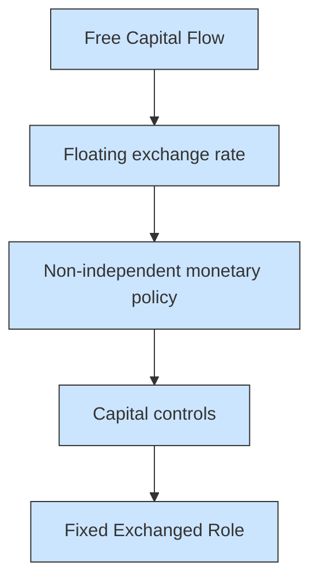
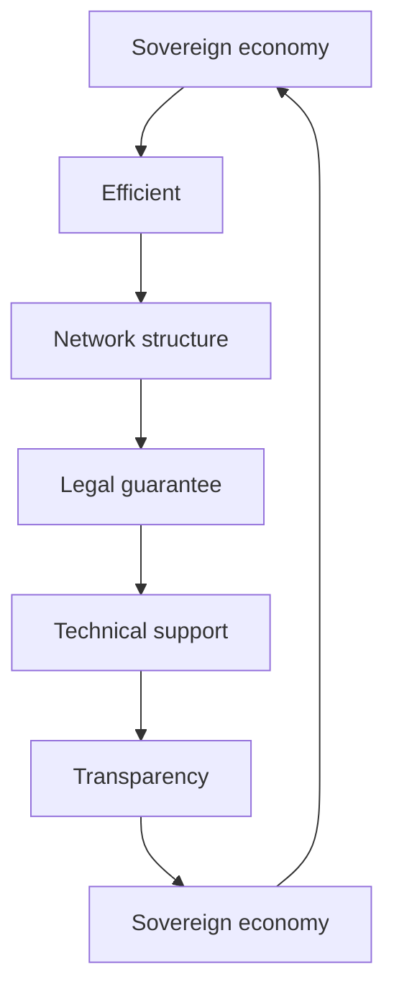

For office use only

T1 \_\_\_\_

T2 \_\_\_\_

T3 \_\_\_\_

T4

Team Control Number

## 1916375

Problem Chosen

F

For office use only

F1 \_\_\_\_

F2

F3

F4

## 2019 ICM Summary Sheet

## the Future is Coming: the Revolution of Currency

With the advent of Information Age, digital technology application like digital currency became prevalent and be of common use all over the world. Our study construct a model to represent a global decentralized digital financial system, mainly with the tools of Mathematical analysis and Economic Model. Based on our model, we analyze the choices of different countries and the long-term effects. Besides, we also put forward mechanisms for oversight of such a global digital currency and test our model's robustness.

First, we choose key factors that would limit or facilitate the digital financial system, and we integrate these factors into the return and the cost. Then we build cost-return analysis model to identify the viability of the global decentralized digital financial market, which are simplified and rationalized under our assumptions. We quantify the return and the cost by combining Analytic Hierarchy Process (AHP) with Fuzzy Comprehensive Evaluation (FCE). We give different weights based on the importance of these factors to quantify the total NI (net income). Also we give different weights based on the impact on the individual, national, and global to quantify the NI at different levels.

Second, we analyze different choices of different countries by their willingness and needs. We simplify different countries into small-scale country and large-scale country, then we make our analysis and draw conclusions in reference to Mundell Fleming's Open Economy Theory. Otherwise, we take whether a country would abandon their own currency into consideration. In this part, we introduce Impossible Trinity into our model, and we can come to the conclusion whether they abandon their own currency, a fixed exchange rate regime may be the most effective.

Third, combining the analysis of our model with the reality, we put forward mechanisms for oversight of such a global digital currency system.

Fourth, we extended our model to the long-term. We use the logistic model to simulate changes in the outlook for the banking industry. In the long run, the banking industry will almost lose all its on-balance sheet business, which means it may change to an investment intermediary. We transform our cost-benefit model to analyze the effects of the system on the local, the regional, and the global three levels. Furthermore, we take a view of the international relations between countries in the long term.

Lastly, we test the stability and the sensitivity of our model, what is the next? We conclude the strengths and the weaknesses of our model. In addition, we write a policy recommendation for national leaders based on our work.

# POLICY RECOMMENDATION

## Honored President/ Prime Minister:

Thanks for trusting us. Our team has designed a global digital currency system under the auspices of ICM. We guess maybe you have a mixed opinion about the system we built. Therefore, we feel obliged to recommend the optimal strategies to you to ensure the successful operation of the Digital Currency System in your country.

Based on our analysis of the cost-return model, for both the country and the people, in terms of free capital flows and free access to global financial markets, new currency system has the largest weight. However, it also brings in greater risk cost because of the impaired independence of monetary policy. There is a large amount of cost, and the NI function is affected by the gross national product and the speed of money circulation, then it will increase with the degree of the acceptance to the digital currency. We find something interesting, which is the country, gains the most marginal benefits in this system as the degree of acceptance increases in the long run, while the marginal benefits of the individual may decline, which reminds us of paying more attention to the maintenance of the safety. Here are our suggestion.

Having a fixed exchange rate Accepting the new digital currency system will be desirable for both large and small economy in the long run. In our design, it is feasible to abandon or maintain sovereign currency in the digital currency system. If your country abandon sovereign currency, it means giving up sovereign monetary policy. And according to the Impossible trinity, this means that your country's exchange rate will be fixed; if your country maintain sovereign currency, a floating interest rate will bring unsustainable high inflation risk. Therefore, we recommend that your country have a fixed exchange rate to ensure that the inflation risk is manageable.

Establish regulatory nodes and improve laws The digital currency financial system connects individuals and institutions around the world into a network, showing advantages like non-tampering and decentralization, so we recommend that you can work with other countries to establish a global regulatory node to detect crimes and facilitate tax. Besides, legal support is as important as technical support.

Maintain good international relations In our system, exchanges and integration between countries will develop on an unprecedented scale. The zero-sum game that is viewed by a large number of supporters in the past will no longer reasonable, and your country can maximize the benefits of digital currency globalization only if you maintain good international relations with other countries.

Robustness Of Our Model Our model is based on some assumptions that may differ slightly from circumstances of your nation. You and your team can formulate more specific operational strategies according to reality.

We hope that our suggestions are useful for you, and the Digital Currency System will be the ideal blueprint for future development in the world.

Sincerely,

## Content

## 1 INTRODUCTION....3

1.1 Background 3  
1.2 Restatement of the Problem...... 3

## 2 Assumptions and Variable Descriptions.... 4

2.1 Assumptions....4  
2.2 Terms, Definitions and Symbols 5

## 3 BASIC MODEL ANALYSIS 6

3.1 Measure of the Return about Currency Stability $R_{1}$ 6

3.1.1 Model of Currency Value....6  
3.1.2 Measure of the Return about the Currency Stability $R_{1}$ ......6

3.2 Measure of the Return about the Output Growth $R_{2}$ ...... 7  
3.3 Measure of the Return of Capital Availability $R_{3}$ 8

3.3.1 Short-term Model....8  
3.3.2 Long-term Model....8

3.4 Total Model of Return 9  
3.5 Total Model of Cost 10  
3.6 Total Evaluation Model....11

## 4 Choices of Different Countries .... 12

4.1 Different Choices because of size.... 12

4.1.1 Large Countries....12  
4.1.2 Small Countries....13

4.2 Give Up National Currency or Not 14

4.2.1 Give Up National Currency....14  
4.2.2 Not Give Up National Currency....14

## 5 Imagination of the Regulatory Mechanism....16

5.1 the Global Level 16  
5.2 the National Level 16  
5.3 the Individual Level 17  
5.4 Conclusion....17

## 6 Dynamic Analysis....17

6.1 Long-term Impact on the Banking Industry 18  
6.2 Long-term Impact on Different Regions.... 19  
6.3 Long-term Impact on International Relationship....20

## 7 Model Testing....21

## 8 Strengths and Weaknesses....21

## 9 Reference....22

## 1. Introduction

## 1.1 Background

“What is needed is an electronic payment system based on cryptographic proof instead of trust, allowing any two willing parties to transact directly with each other without the need for a trusted third party.”

\- Satoshi Nakamoto, , the creator and developer of bitcoin, quoted from his paper

As nakamoto said, with the development of economic globalization, the existing payment system and monetary system are increasingly difficult to meet people's demand for production and trade. People are fed up with a currency controlled by a government and no longer willing to pay the costs of inflation and exchange rate fluctuations. Digital currency based on technologies such as blockchain is a good way to solve this problem.

Cryptocurrency is a subset of digital currency with unique features of privacy, decentralization, security and encryption. The cryptocurrency represented by bitcoin is increasingly favored by economists and bankers. The development and application of cryptocurrency has become a frontier topic in financial research.

In Venezuela, South America, the government's wrong monetary policy has brought extremely serious hyperinflation to the public, and people have begun to hold bitcoin to avoid the effects of inflation to protect their property from erosion. Over time, people's enthusiasm for digital currency has gradually evolved from the private to the official, and the recent extremely popular Central Bank Digital Currency is an excellent proof.

## 1.2 Restatement of the Problem

To help identify the viability and effects of a global decentralized digital financial market, we are required to construct a model that adequately represents this type of financial system. Then we aim to solve these problems as follows:

Task 1. Identifying key factors that would limit or facilitate the growth, access, security, and stability of the global decentralized digital financial market from three levels: the individual, national, and global levels.

Task 2. Considering the different needs of countries and their willingness to work with this new financial marketplace.

Task 3. Modifying their current banking and monetary models and consider whether they should abandon their own currency or not.

Task 4. Establishing a mechanism for oversight of such a global digital currency.

Task 5. Extending our analysis to consider the long-term effects of such a system on current banking industry; the local, regional, and world economy; and international relations between countries.

```mermaid
graph TD
  A["Global Digital Currency System Task 1, 2, 3, 4, 5"] --> B["Modeling Method"]
  A --> C["Choice of Different Countries Task 2, 3"]
  A --> D["Regulatory Mechanism Task 4"]
  A --> E["Long-term Impact Analysis Task 5"]
    
  B --> B1["Economic Model"]
  B --> B2["Analytic Hierarchy Process"]
  B --> B3["Fuzzy Comprehensive Evaluation"]
  B --> B4["Game Theory"]
  B --> B5["Logistic Regression"]
    
  C --> C1["Cost and Benefit Analysis Task 1"]
  C --> C2["Choice of Different Countries Task 2, 3"]
  C --> C3["Regulatory Mechanism Task 4"]
  C --> C4["Long-term Impact Analysis Task 5"]
    
  D --> D1["Individual Nation Global"]
  D --> D2["Sensitivity Test Robustness Test"]
    
  E --> E1["Costs"]
  E --> E2["Risk costs"]
    
  F["Cost and Benefit Analysis Task 1"] --> F1["Benefits"]
  F --> F2["Total output growth"]
  F --> F3["Capital availability"]
  F --> F4["Fundamental costs"]
  F --> F5["Risk costs"]
    
  G["Choice of Different Countries Task 2, 3"] --> G1["National Scale"]
  G --> G2["Large Scale"]
  G --> G3["Small Scale"]
  G --> G4["Abandon/Maintain Sovereign Currency"]
    
  H["Long-term Impact Analysis Task 5"] --> H1["To Banking System"]
  H --> H2["To Local, Region, Global"]
  H --> H3["To International Relations"]
```

flowchart

Figure 1: Overview of Our Work

## 2 Assumptions and Variable Descriptions

## 2.1 Assumptions

We make the following basic assumptions in order to simplify the problem. Each of our assumptions is justified and consistent with the basic fact.

● The total number of digital currencies is fixed

Since the programming node is determined, the total number of digital currencies is also fixed, that is to say, the number of digital currencies is limited.

● Most of the countries use the digital currency as legal tender  
- There is a international organizations like global central bank to manage the global digital financial system

A public organization is necessary to lead public confidence. Currency system is first and foremost a social convention, which emerges to build trust among strangers in their economic transactions. We use Game Theory to analyze this process in the figure 2This trust mechanism can be maintained only if the trader is confident that the symbolic objects used now will be accepted by other traders in the future.

A public organization is necessary to supervise the global digital financial system

table

PRODUER
| PRODUER | ACCEPT | DON'T ACCEPT |
|---|---|---|
| ACCIEPT | 10 | 10 |
| DON'T ACCEPT | 5 | 5 |

Figure 2: Game Theory analysis about the necessity of the Central Bank

Only when the existing monetary system is trusted by people can the Nash equilibrium be reached, and the existence of a central bank that leads public confidence is necessary.

● The market environment is fully open and the elements are free to flow.

## 2.2 Terms, Definitions and Symbols

<table><tr><td>Variable</td><td>Meaning</td></tr><tr><td>V</td><td>the transactions velocity of money</td></tr><tr><td>σ0</td><td>the value of a basic basket of goods</td></tr><tr><td>σ</td><td>the purchasing power of money, the content of a basket of commodities included in a unit of currency</td></tr><tr><td>S(w,σ)</td><td>the return of currency stability</td></tr><tr><td>w</td><td>the degree of the acceptance to the digital currency</td></tr><tr><td>θ</td><td>the usage efficiency of capital under the digital currency system</td></tr><tr><td>K*</td><td>the capital use efficiency increased after the global digital currency used</td></tr><tr><td>K</td><td>the capital use efficiency before the global digital currency used</td></tr><tr><td>L</td><td>labor input</td></tr><tr><td>RT</td><td>the total return of our digital currency system</td></tr><tr><td>Ri</td><td>the return of currency stability/ output growth/ capital availability</td></tr><tr><td>Cf</td><td>The hidden costs of the digital currency system</td></tr><tr><td>Cr</td><td>The cost caused by risk of the system</td></tr><tr><td>NI</td><td>net income of the digital currency system</td></tr><tr><td>Pr0</td><td>the profit of the banking industry at the initial moment</td></tr></table>

## 3 Basic Model Analysis

## 3.1 Measure of the Return about Currency Stability $R_{1}$

Our hypothesis assumes that the total number of digital currencies is fixed, but the need of the currency is constantly increasing. Finally, there must be deflation in the system. We try to set the value of the currency in terms of the level of productivity to determine the degree of the deflation. Finally, we want to use currency stability to measure the return of the digital currency system.

## 3.1.1 Model of Currency Value

First, we try to use the Equation of Exchange from Monetary Economics to define the value of each digital currency

$$
M V = P T \tag {1}
$$

Thus, PT means the level of nominal expenditures and M is considered a fixed parameter.

The price index and the currency value are reciprocal, and we define a new parameter $\sigma_{0}$

$$
\sigma_ {0} = P \times \sigma \tag {2}
$$

- $\sigma_{0}$ -the value of a basic basket of goods  
- $\sigma$ -currency (the purchasing power of money, the content of a basket of commodities included in a unit of currency)

Combine equation (1) and equation (2), we can have equation (3) by a simple calculation.

$$
\sigma = \frac {\sigma_ {0}}{M} \times \frac {T}{V} \tag {3}
$$

There are three sections for GDP (the goods and services it produces in a year). If Y is national income (GDP), then the three uses: consumption, investment, and government purchases can be expressed as

$$
Y ^ {-} = C (Y - T) ^ {-} + I (r) + G \tag {4}
$$

\- $Y$ -the total national income or produces, $C(Y - \overline{T})$ -disposable income and $\overline{T}$ is the fixed tax, $I(r)$ -Investment, $\overline{G}$ -the fixed government purchases

$$
\left\{ \begin{array}{l l} \sigma = \frac {\sigma_ {0} / M}{V (t)} \times Y & \frac {d I}{d r} <   0 \\ Y = C (Y - \bar {T}) + I (V) + \bar {G} \end{array} \right. \tag {5}
$$

It can be seen that the value of a currency $\sigma$ is only related to r, Y and $V(t)$ . It will increase with the growth of the currency and decrease with the acceleration of the currency, which is consistent with the actual financial operation environment. So maintaining the stability of the value of the currency is conducive to maintaining the stability of the global monetary system

## 3.1.2 Measure of the Return about the Currency Stability $R_{1}$

We define a new function (6) to measure the return about the currency stability $R_{1}$ as follow:

$$
S (w, \sigma) = (1 - \left| \frac {\sigma_ {t} - \sigma_ {t - 1}}{\sigma_ {t - 1}} \right|) \bullet w \tag {6}
$$

- $S(w, \sigma)$ -the return of currency stability  
- $w$ - the degree of the acceptance to the digital currency

## 3.2 Measure of the Return about the Output Growth $R_{2}$

We believe that with the use of digital currency, the convenience of international liquidation will promote international capital flows faster. We introduce a new function $Y(V_{t}, w)$ to measure the return about the Output Growth $R_{2}$

Now we define a function to describe the free circulation rate of capital under new system

$$
\theta = f (V _ {t}) \quad \frac {d \theta}{d V _ {t}} > 0, \theta > 1 \tag {7}
$$

- $\theta$ - the usage efficiency of capital under the digital currency system  
Obviously, we can use $\theta K$ to represent the actual capital value $K^{*}$

$$
K ^ {*} = \theta K \tag {8}
$$

- $K^{*}$ - the capital use efficiency increased after the global digital currency used  
- $K$ -the capital use efficiency before the global digital currency used

We are trying to introduce the Cobb Douglas Production Function to describe the impact of capital flow efficiency on output

$$
Y = F (K, L) = A K ^ {\alpha} L ^ {\beta} \quad (\alpha + \beta = 1, \alpha > 0, 1 > \beta > 0) \tag {9}
$$

● Y -total production (the real value of all goods produced in a year or 365.25 days)  
- $K$ -capital input  
- $L$ -labor input  
● A -total factor productivity

It is easy to get the formulation (10) as follow by combining the formulation (8) and the formulation (9)

$$
Y ^ {*} = F (\theta K, L) = A (\theta K) ^ {\alpha} L ^ {\beta} \tag {10}
$$

$$
Y ^ {*} = \theta^ {\alpha} Y \quad \theta > 1, \alpha > 0 \tag {11}
$$

$Y^{*} > Y_{0}$ Increasing returns to scale

\- $\alpha$ -Capital's share of output value

## - $\beta$ -Labor's share of output value

The formulation (11) means that the free flow of capital on a global scale has led to an increase in total output

## 3.3 Measure of the Return of Capital Availability $R_{3}$

A major change must take place in payment method under the global digital monetary system. We consider its beneficial effects as the availability of capital. In the global digital currency system, the cost of capital will fluctuate within a reasonable range, for which we discuss both long-term and short-term situations. We want to use Economic Supply and Demand Model to display our analysis.

## 3.3.1 Short-term Model

In any regional market, if $r_0$ is greater than $r^*$ , this region will attract capital inflows from other regions, then the region's capital supply will exceed capital demand, hence the interest rates of local region will fall.

line chart

| M       | r(M_supply) | r(M_demand) |
|---------|-------------|--------------|
| 0       | >r          | <r*          |
| M_D     | >r          | >r*          |
| M*      | >r          | >r*          |
| M_S     | >r          | >r*          |

Figure 3: interest rate analysis in short term

## 3.3.2 Long-term Model

Because the total number of digital currencies is fixed, interest rates may rise as demand for capital continues to rise, At this point; the central bank can change the speed of money circulation through policy regulation.

line chart

| M     | r(M_demand) | r'(M_demand) |
|-------|-------------|--------------|
| 0     | r*          | r*           |
| M*    | r*          | r*           |
| M_S   | r*          | r*           |

Figure 4: interest rate analysis in long term

Now we renew a part of the formulation (5) as formulation (12)

$$
\sigma_ {i} = \frac {\sigma_ {0} / M}{V (t)} \times Y \tag {12}
$$

When $V(t)$ falls, $\sigma_{i}$ increase

The formulation (5) also can display as follow:

$$
P = \sigma_ {0} / \sigma_ {i} \tag {13}
$$

$$
\frac {M}{P} = L (r, Y) \tag {14}
$$

$\frac{M}{P}$ is Inversely proportional with $r$ , and is positive proportional with $Y$

The central bank can make nominal changes to from $M_{s}$ to $M^{*}$ through monetary policy adjustments, and $r_{0}$ fall to an equilibrium level $r^{*}$

In summary, under the global digital currency system, the price of capital is influenced by a relatively stable $r^{*}$ , and $r^{*}$ fluctuates around the benchmark interest rate

## 3.4 Total Model of Return

Base on the analysis from section 4.1 to section 4.3, the total return of our digital currency system can display as function (15)

$$
R _ {T} = R _ {1} + R _ {2} + R _ {3} \tag {15}
$$

- $R_{T}$ -the total return of our digital currency system  
- $R_{1}$ - the return of currency stability  
- $R_{2}$ - the return of output growth  
- $R_{3}$ - the return of capital availability

Then we think the total return of our digital currency system also can be divided into 3 parts, including the return of the individual, the return of nation and the return of the global. They can display as function (16)

$$
R _ {T} = \varphi_ {1} R _ {\text { individual }} + \varphi_ {2} R _ {\text { nation }} + \varphi_ {3} R _ {\text { global }} \tag {16}
$$

- $R_{\text {individual}}$ - the return of the individual  
- $R_{nation}$ - the return of nation  
- $R_{global}$ - the return of the global

We introduce Fuzzy Evaluation Method (FEC) to evaluate risk factors from three different levels: individual, the country and the global. Next is the single factor coefficient matrix.

Table 1: the membership of factors $R_{individual}$ , $R_{nation}$ , $R_{global}$

<table><tr><td rowspan="2">FactorsMembership</td><td colspan="2"> $R_{individual}$ </td><td colspan="2"> $R_{nation}$ </td><td colspan="2"> $R_{global}$ </td></tr><tr><td>Great( $v_1$ )</td><td>Small( $v_2$ )</td><td>Great( $v_1$ )</td><td>Small( $v_2$ )</td><td>Great( $v_1$ )</td><td>Small( $v_2$ )</td></tr><tr><td> $R_1$ </td><td>0.2</td><td>0.8</td><td>0.6</td><td>0.4</td><td>0.1</td><td>0</td></tr><tr><td> $R_2$ </td><td>0.3</td><td>0.7</td><td>0.7</td><td>0.3</td><td>0.9</td><td>0.1</td></tr><tr><td> $R_3$ </td><td>1</td><td>0</td><td>0.4</td><td>0.6</td><td>0.1</td><td>0.9</td></tr></table>

$$
R _ {\text { individual }} = \left( \begin{array}{c c} 0. 2 & 0. 8 \\ 0. 3 & 0. 7 \\ 1 & 0 \end{array} \right), \quad R _ {\text { nation }} = \left( \begin{array}{c c} 0. 6 & 0. 4 \\ 0. 7 & 0. 3 \\ 0. 4 & 0. 6 \end{array} \right), \quad R _ {\text { global }} = \left( \begin{array}{c c} 1 & 0 \\ 0. 9 & 0. 1 \\ 0. 1 & 0. 9 \end{array} \right) \tag {17}
$$

$$
A = \left(R _ {1}, R _ {2}, R _ {3}\right) = \left( \begin{array}{l l l} 0. 4 5 & 0. 3 2 & 0. 2 \end{array} \right) \tag {18}
$$

$$
A \bullet R _ {\text { individual }} = (0. 3 9 5 \quad 0. 6 0 5) \tag {19}
$$

$$
A \bullet R _ {\text { nation }} = (0. 5 9 5 \quad 0. 4 0 5) \tag {20}
$$

$$
A \bullet R _ {\text { global }} = (0. 7 8 5 \quad 0. 2 1 5) \tag {21}
$$

According to the principle of maximum membership degree, we can get the following results.

$$
R _ {T} = 0. 3 9 5 R _ {\text { individual }} + 0. 5 9 5 R _ {\text { nation }} + 0. 7 8 5 R _ {\text { global }} \tag {22}
$$

## 3.5 Total Model of Cost

Considering the possible cost of the global digital currency system, we break down the whole cost into two parts: fundamental cost $C_{f}$ and risk cost $C_{r}$ . In this model, we also try to use the Fuzzy Evaluation Method(FCE) for quantitative analysis like the total model of return.

- $C_{\mathrm{f}}$ - The hidden costs of the digital currency system, including digital currency acquisition (mining) cost, the invisible external cost of maintaining the operation of the system, etc.  
- $C_r$ - Including uncontrollable nature due to Internet technology, impaired independence and malicious manipulation

$a_{1}$ -the Uncontrollable Internet, like personal accounts may be offended by theft, data leakage and system failure caused by technical failure of government or international organization systems

$a_{2}$ - Impaired independence. The state has lost the independence of monetary policy to some extent.
In the face of asymmetric shocks, individual countries cannot impel independent and effective monetary policies for macroeconomic regulation and controlling like before. Digital current integration will also accelerate the transmission of global financial risks

$a_{3}$ - Malicious manipulation.

Based on the above considerations, we consider the risks at the individual, the national and the global level respectively, they are $C_{r_{1}}$ , $C_{r_{2}}$ and $C_{r_{3}}$ . Through easy analysis, we could empower these indicators as follows:

Table 2: the member ship of factors $C_{r_{1}}$ , $C_{r_{2}}$ , $C_{r_{3}}$

<table><tr><td rowspan="2">FactorsMembership</td><td colspan="2"> $C_{r_1}$ </td><td colspan="2"> $C_{r_2}$ </td><td colspan="2"> $C_{r_3}$ </td></tr><tr><td>Great( $v_1$ )</td><td>Small( $v_2$ )</td><td>Great( $v_1$ )</td><td>Small( $v_2$ )</td><td>Great( $v_1$ )</td><td>Small( $v_2$ )</td></tr><tr><td> $a_1$ </td><td>0.9</td><td>0.1</td><td>0.7</td><td>0.3</td><td>1</td><td>0</td></tr><tr><td> $a_2$ </td><td>0</td><td>1</td><td>1</td><td>0</td><td>0.6</td><td>0.4</td></tr><tr><td> $a_3$ </td><td>0.7</td><td>0.3</td><td>0.8</td><td>0.2</td><td>1</td><td>0</td></tr></table>

$$
C _ {r _ {1}} = \left( \begin{array}{c c} 0. 9 & 0. 1 \\ 0 & 1 \\ 0. 7 & 0. 3 \end{array} \right), C _ {r _ {2}} = \left( \begin{array}{c c} 0. 7 & 0. 3 \\ 1 & 0 \\ 0. 8 & 0. 2 \end{array} \right), C _ {r _ {3}} = \left( \begin{array}{c c} 1 & 0 \\ 0. 6 & 0. 4 \\ 1 & 0 \end{array} \right), A = \left( \begin{array}{c c c} a _ {1} & a _ {2} & a _ {3} \end{array} \right)
$$

$$
S _ {i} = C _ {r _ {j}} \bullet A \tag {23}
$$

$$
S _ {1} = A \bullet C _ {r _ {1}} = (0. 5 9 \quad 0. 4 1)
$$

$$
S _ {2} = A \bullet C _ {r _ {2}} = (0. 8 1 \quad 0. 1 9)
$$

$$
S _ {3} = A \bullet C _ {r _ {3}} = (0. 8 8 \quad 0. 1 2)
$$

According to the principle of maximum membership degree, we can get the following results.

$$
C = C _ {f} + 0. 5 9 C _ {r _ {1}} + 0. 8 1 C _ {r _ {2}} + 0. 8 8 C _ {r _ {3}} \tag {24}
$$

## 3.6 Total Evaluation Model

Based on the total model of return and the total model of cost we did above, in order to identify the viability of the global decentralized digital financial market, we can define some new weights according to the importance for different levels: the individuals, the nations and the global. To evaluate the net income and determine the feasibility of our digital currency system.

$$
N I = \sum_ {k = 1} ^ {n} R _ {k} - (C _ {f} + \sum_ {i = 1} ^ {n} \sum_ {j = 1} ^ {n} \lambda_ {i} C _ {r _ {j}}) \tag {25}
$$

We use the AHP method, then get the weight of $R_{1}, R_{2}, R_{3}, a_{1}, a_{2}, a_{3}$ to NI as follow:

Table 3: AHP Weight and Impact

<table><tr><td></td><td> $R_1$ </td><td> $R_2$ </td><td> $R_3$ </td><td> $a_1$ </td><td> $a_2$ </td><td> $a_3$ </td><td>Impact</td></tr><tr><td> $R_1$ </td><td>1</td><td>1/3</td><td>4</td><td>1/4</td><td>3</td><td>1/2</td><td>0.1238</td></tr><tr><td> $R_2$ </td><td>3</td><td>1</td><td>3</td><td>1/2</td><td>5</td><td>2</td><td>0.2484</td></tr><tr><td> $R_3$ </td><td>1/4</td><td>1/3</td><td>1</td><td>1/5</td><td>2</td><td>1/3</td><td>0.0638</td></tr><tr><td> $a_1$ </td><td>4</td><td>2</td><td>5</td><td>1</td><td>4</td><td>2</td><td>0.3472</td></tr><tr><td> $a_2$ </td><td>1/3</td><td>1/5</td><td>1/2</td><td>1/4</td><td>1</td><td>1/3</td><td>0.0499</td></tr><tr><td> $a_3$ </td><td>2</td><td>1/2</td><td>3</td><td>1/2</td><td>3</td><td>1</td><td>0.1669</td></tr></table>

$$
N I _ {\text { individual }} = 0. 3 9 5 \left[ 0. 1 2 3 8 S (Y, w) + 0. 2 4 8 4 Y \left(V _ {t}, w\right) + 0. 0 6 3 8 M (r, w) \right] - C _ {f} - 0. 5 9 \times 0. 3 4 7 2 C _ {r _ {1}} (w)
$$

$$
N I _ {\text { n   a   t   i   o   n }} = 0. 5 9 5 \left[ \left(0. 1 2 3 8 S (Y, w) + 0. 2 4 8 4 Y \left(V _ {t}, w\right) + 0. 0 6 3 8 M (r, w) \right] - C _ {f} - 0. 8 1 \times 0. 0 4 9 9 C _ {r _ {2}} (w) \right.
$$

$$
N I _ {\text { global }} = 0. 7 8 5 \left[ 0. 1 2 3 8 S (Y, w) + 0. 2 4 8 4 Y \left(V _ {t}, w\right) + 0. 0 6 3 8 M (r, w) \right] - C _ {f} - 0. 8 8 \times 0. 1 6 9 9 C _ {r _ {3}} (w)
$$

NI -net income of the digital currency system

## 4 Choices of Different Countries

## 4.1 Different Choices because of size

## Assumptions:

\- We divide the country into large countries and small countries according to the size of the economy.

➢ large countries: the volume of an economy that accounts for a considerable proportion of the world economy and can influence the world market, leading the formation of world market interest rates $r^{*}$  
➢ small countries: a small part of the open world market, so its impact on world interest rates is negligible. Small countries can only become the recipients of world interest rates $r^{*}$

Different countries have different monetary transmission mechanisms, but they all have same demand for new digital monetary financial systems, such as stability and economic growth. Recalling that:

$$
Y = C (Y - T) + I (r) + G + N X \tag {26}
$$

$$
N X = Y - C (Y - \overline {{{T}}}) - \overline {{{G}}} - I (r) \tag {27}
$$

$$
Y - C (Y - \overline {{{T}}}) - \overline {{{G}}} = S \tag {28}
$$

## 4.1.1 Large Countries

$$
N X = S - I (r) \tag {29}
$$

$$
N X = C F (r)
$$

$$
S = I (r) + C F (r)
$$

In large countries, the interest rates are determined internally, the loanable capital is determined by the function of domestic and foreign investment on interest rates. They can be displayed as follow:

$$
T) + I (r) + \overline {{G}} + C F (\overline {{r}}) \tag {32}
$$

- S - Loanable funds  
- $CF(r)$ - Net capital outflow

line chart

| x     | y     |
|-------|-------|
| 0     | r     |
| S     | r     |
| I(r)+CF | r     |

Figure 6: the analysis for large countries about their choices

Both I and CF are negatively affected by r When r rises, Y will fall faster, and the increase in elasticity will cause r not to rise excessively, then Y will not fall too much, eventually r will reach a desirable balanced level.

For large countries, under the digital monetary financial system, interest rate stability and economic growth will be guaranteed, also their demand of capital will be met.

## 4.1.2 Small Countries

$$
N X = S - I (r) \tag {33}
$$

line chart

| I/S | r     |
|-----|-------|
| 0   | r*    |
| >0  | r₀    |

Figure 7: the analysis for small countries about their choices

When $S > I(r)$ , then $S - I(r) = NX > 0$ , excess loanable capitals will flow abroad, which is a desirable outcome for the people of the country, This is a desirable outcome for the people of the country.

When $S \leq I(r)$ , the country's loanable funds will all be internally consumed, which is also desirable for the public.

In general, in small countries, the digital currency financial system makes interest rates relatively stable, the economy grows, and demand will be met.

## 4.2 Give Up National Currency or Not

## Assumptions:

- There is only a small number of countries do not give up their original national currency, the country A is one of them, we assume that the exchange rate between the country's currency and the global currency is $\varepsilon_{i}$  
- In the long term, employment is sufficient and the amount of capital is fixed

We are trying to introduce the Impossible Trinity Theory to analyze the choices of different countries under the digital currency system. As we all know, it is impossible for a country to complete the following three aims at the same time: Capital Mobility, Fixed Exchange Rate and Independent Monetary Policy. It is clear that the flow of the capital is free and the monetary policy is not independent in our digital currency system.

flowchart

Figure 5: Impossible Trinity Theory

## 4.2.1 Give Up National Currency

For countries who choose to abandon their national currency to become one part of the global digital currency system, their monetary policy is not independent, they keep a fixed exchange rate with digital currency. When trading with countries who use national currency, they use a basket of commodity values as exchange rate

## 4.2.2 Not Give Up National Currency

## Floating Exchange Rate

When r decreases, following is the increase of CF, and NX equals to CF, so $\varepsilon$ will decrease.

line chart

| x-axis | CF(r) | e     |
|--------|-------|-------|
| 0      | r     | e     |
| CF₁    | r₁    | ε₁    |
| CF₀    | r₀    | ε₀    |
| NX₁    |       |       |
| NX₀    |       |       |
| NX     |       |       |

Figure 8: model of floating exchange rate

- NX -Net exports  
- CF -Net capital outflow  
- $\varepsilon$ -Exchange rate

In the short term, NX will increase, and Y also increase, then $\varepsilon$ keep falling, finally the price of goods will rise

## Fixed Exchange Rate

In this situation, monetary policy, trade, and global central bank regulation just have limited impact and its impact is close to invalid.

line chart

| x-axis label | y-axis (top) | y-axis (bottom) |
| --- | --- | --- |
| CF | r | e |
| 0 | r1 | ε1 |
| 0 | r0 | ε0 |
| 0 | 1 | ① |
| 0 | 2 | ② |
| 0 | 3 | ③ |
| 0 | 4 | ④ |
| 0 | 5 | ⑤ |
| 0 | 6 | ⑥ |
| 0 | 7 | ⑦ |
| 0 | 8 | ⑧ |
| 0 | 9 | ⑨ |
| 0 | 10 | ⑩ |
| 0 | 11 | ⑪ |
| 0 | 12 | ⑫ |
| 0 | 13 | ⑬ |
| 0 | 14 | ⑭ |
| 0 | 15 | ⑮ |
| 0 | 16 | ⑯ |
| 0 | 17 | ⑰ |
| 0 | 18 | ⑱ |
| 0 | 19 | ⑲ |
| 0 | 20 | ⑳ |
| 0 | 21 | ⑴ |
| 0 | 22 | ⑵ |
| 0 | 23 | ⑶ |
| 0 | 24 | ⑦ |
| 0 | 25 | ⑧ |
| 0 | 26 | ⑨ |
| 0 | 27 | ⑩ |
| 0 | 28 | ⑪ |
| 0 | 29 | ⑫ |
| 0 | 30 | ⑬ |
| 0 | 31 | ⑭ |
| 0 | 32 | ⑮ |
| 0 | 33 | ⑯ |
| 0 | 34 | ⑰ |
| 0 | 35 | ⑱ |
| 0 | 36 | ⑲ |
| 0 | 37 | ⑳ |
| 0 | 38 | ⑴ |
| 0 | 39 | ⑵ |
| 0 | 40 | ⑥ |
| 0 | 41 | ⑦ |
| 0 | 42 | ⑧ |
| 0 | 43 | ⑨ |
| 0 | 44 | ⑩ |
| 0 | 45 | ⑪ |
| 0 | 46 | ⑫ |
| 0 | 47 | ⑬ |
| 0 | 48 | ⑭ |
| 0 | 49 | ⑮ |
| 0 | 50 | ⑯ |
| NM | e | ε1 |
| NM | e | ε0 |
| NM | e | ε1 |
| NM | e | ε0 |
| NM | e | ε1 |
| NM | e | ε0 |
| NM | e | ε1 |
| NM | e | ε0 |
| NM | e | ε1 |
| NM | e | ε0 |
| NM | e | ε1 |

Figure 9: model of fixed rate

Since the central bank of country A use the regulation to achieve the fixed exchange rate, it will cover the impact from imports and exports, the Y level will not change. However, there are only two general ways for the central bank to regulate the exchange rate, namely foreign exchange reserves and pegged exchange rates. Due to the limitation of foreign exchange savings under the digital currency system, the influence of the regulation by foreign exchange savings will be close to valid. Therefore, the nation like A country only can choose to peg the exchange rate as the only method to fix the exchange rate, so that it can stabilize the price level at a lower cost and avoid the problem caused by currency instability.

## 5 Imagination of the Regulatory Mechanism

In the global digital and monetary financial system we design, generalized, decentralized, and electronic are its biggest features, which is the biggest difference from the current legal currency system. This fundamental difference has also triggered our thinking about regulation.

The current sovereign state monetary system is endorsed by national credit, and the currency is issued and regulated by central banks. All the Countries belong to the system naturally have a variety of regulatory measures to detect and observe the circulation and increase of money. In the global digital financial system, central banks are no longer the main body of electronic money issuance. The basic technical characteristics of electronic money bring people the natural trust, and the country's credit endorsement is no longer useful.

At this point, the current regulatory system will no longer apply in the future. We have design a digital currency regulatory framework to ensure that this technological innovation will not become a cradle of crime. Our digital currency regulatory framework will be developed at the global, national and individual levels.

## 5.1 the Global Level

The first is the global level. In the future global digital and monetary financial system, the account system under the global central bank management makes everyone a node in the digital currency financial system, and its principle is similar to the node concept in Blockchain Technology. Unlike existing blockchain technology applications (such as Bitcoin), our system will have a God node that is a global central bank. The God node will have much higher authority than other individuals or institutional nodes. This node does not belong to any country, and it is shared by global sovereign states but operated and managed by an international organization similar to the United Nations. Its function is mainly to coordinate regulatory investigations and data analysis of transnational crimes. In order to ensure the super node is not abused, there must be a public international law to comprehensively manage its authority and management.

## 5.2 the National Level

The second is the national level. In the global digital and monetary financial system we design, the national regulatory authorities will also have their own secondary super nodes, whose rights and functions are similar to those of global super nodes, but the scope of authority is limited to the domestic market economy participants and their citizens. From this perspective, in order to ensure the effectiveness of national governance and the timeliness of crime prevention, the sub-super nodes of the national regulatory authorities will have the authority to penetrate the entire node in the national digital currency network, which can effectively track and interfere with illegal trading behaviors such as tracking money, laundering activities and freezing illegal digital currency assets. At this level, the removal of privileged nodes still requires legal protection as an aid to maintain the rational operation of the digital monetary and financial system at the national level.

## 5.3 the Individual Level

Finally, it is the personal level. In the system we designed, taxes and other things that are usually related with the efficiencies of the system will become more affordable and effective. This is because global and institutional accounts are connected in a network, and tax evasion will be easier to be detected by regulatory authorities. In addition, the bookkeeping characteristics of the digital currency will enable individuals to read historical transaction records within the scope of authority, then track better, to protect personal property, and supervise the capital flow procedures of relevant government departments.

## 5.4 Conclusion

In general, in our global digital financial system, as long as the relevant digital currency regulatory framework is implemented, it can ensure that there is no shortage of supervision at the individual, national and global levels. The technical framework and related laws we design will shape a transparent and efficient world. The flow of assets and data will all be difficult to escape from our supervision. And the efficiencies of the financial system is even better

flowchart

Figure 10: imagination of regulatory system

## 6 Dynamic Analysis

## 6.1 Long-term Impact on the Banking Industry

In this section, we want to consider the long-term impact of such systems on the current banking industry; local, regional and world economies; and international relations with the international community

## Assumptions:

\- before the promotion of the digital currency market, the profit of the In-table business of banking industry grows at a fixed rate $g_0$ of growth

$$
P r = P r _ {0} \left(1 + g _ {0}\right), \frac {d P t}{d t} = g _ {0}, \operatorname * {P r} (0) = \operatorname * {P r} _ {0} \tag {34}
$$

\- $Pr_{0}$ - the rate of return to the banking industry at the initial moment, assuming it grows at a fixed rate $g$ of growth

● after the promotion of the digital currency market, the profit of the In-table business of banking industry grows at a changing rate $g(w)$ of growth

with the promotion of the digital currency market, the importance of the bank's on premise business will become smaller and smaller until the bank is transformed into an investment intermediary, and $g(w)$ decreased as w increases

$$
\frac {d \operatorname* {P r}}{d t} = g (w) \bullet \operatorname * {P r}, \operatorname * {P r} (0) = \operatorname * {P r} _ {0} \tag {35}
$$

\- in the long term, when $w = w_{m}$ , the bank in-table business income will no longer expand

## Analysis

Based on the above assumptions, we can define that $g(w) = g - mw (g > 0, m > \frac{w_m}{2})$ , m is a fixed number,
and then we define $m = \frac{g}{w_m}$

$$
g (w) = g - \frac {g}{w _ {m}} \bullet w \tag {36}
$$

$$
\frac {d \operatorname* {P r}}{d t} = \operatorname * {P r} \bullet g - \frac {g}{w _ {m}} \operatorname * {P r} \bullet w \tag {37}
$$

$$
\frac {d \operatorname* {P r}}{d t} = \operatorname * {P r} \bullet g (1 - \frac {w}{w _ {m}}) \tag {38}
$$

Then, we try to use programming to simulate this formulation.

line chart

| pr     | dpr/dt |
| ------ | ------ |
| 0      | 0      |
| Peak   | ω = ωm/2 |

line chart

| t     | pr     |
|-------|--------|
| 0     | pr₀    |
| >0    | Higher (When ω=ωₘ) |

Figure 11: long-term impact on banking system

From the figure and the formulation, In the long run, the growth rate of the bank's business will drop to zero, and the bank will transform itself as an investment intermediary

## 6.2 Long-term Impact on Different Regions

To simplify the analysis, we consider the long-term impact of the local $E_{local}$ as the average of the sum of the effects of all individuals in the local. By the same token, we consider the long-term impact of the region $E_{religion}$ as the average of the sum of the effects of all countries within the hierarchy

$$
E _ {\text { local }} = \frac {\sum_ {i = 1} ^ {n} N I _ {\text { individual }}}{n}, E _ {\text { religion }} = \frac {\sum_ {i = 1} ^ {n} N I _ {\text { nation }}}{n} \tag {39}
$$

In the digital currency system, we can draw from the previous analysis that $r = r^{*}$ , and they are close to benchmark interest rate level $r_{0}$ , According to the production function:

$$
Y = F (L, K)
$$

In the long term, we can conclude that

$$
L = \overline {{{L}}}, K = \overline {{{K}}}, Y = \overline {{{Y}}}
$$

It is easy to know that $v_{t}$ and w are positively correlated. So when we consider the extent of w, we can assume $\lim_{t\to\infty}w=w_{m}$ in the long run

Through partial derivative of w in $NI_{individual}$ , $NI_{nation}$ and $NI_{global}$ , we get the following coefficient matrix

$$
\frac {\partial N I _ {\text { individual }}}{\partial w} = 0. 0 4 8 9 0 1 \frac {\partial S}{\partial w} + 0. 0 7 3 6 6 1 \frac {\partial Y}{\partial w} + 0. 9 7 1 8 3 \frac {\partial M}{\partial w} - 0. 2 0 4 8 4 \frac {\partial C _ {\mathrm{r} _ {1}}}{\partial w} \tag {40}
$$

$$
\frac {\partial N I _ {\text { nation }}}{\partial w} = 0. 0 7 3 6 6 1 \frac {\partial S}{\partial w} + 0. 1 4 7 7 9 8 \frac {\partial Y}{\partial w} + 0. 0 3 7 9 6 1 \frac {\partial M}{\partial w} - 0. 0 4 0 4 1 9 \frac {\partial C _ {\mathrm{r} _ {2}}}{\partial w}
$$

$$
\frac {\partial N I _ {\text { global }}}{\partial w} = 0. 0 9 7 1 8 3 \frac {\partial S}{\partial w} + 0. 1 9 4 9 9 4 \frac {\partial Y}{\partial w} + 0. 0 5 0 0 8 3 \frac {\partial M}{\partial w} - 0. 1 4 9 5 1 2 \frac {\partial C _ {\mathrm{r} _ {3}}}{\partial w} \tag {42}
$$

The coefficient matrix is as follows:

$$
\left[ \begin{array}{l} - 0. 0 3 2 6 3 \\ 0. 2 1 9 0 0 1 \\ 0. 1 9 2 7 4 8 \end{array} \right] \Leftarrow \left[ \begin{array}{c c c c c} 0. 0 4 8 9 0 1 & 0. 0 9 8 1 1 8 & 0. 2 5 2 0 1 & & 0. 2 0 4 8 4 8 \\ 0. 0 7 3 6 6 1 & 0. 1 4 7 7 9 8 & 0. 0 3 7 9 6 1 & & 0. 0 4 0 4 1 9 \\ 0. 0 9 7 1 8 3 & 0. 1 9 4 9 9 4 & 0. 0 5 0 0 8 3 & & 0. 1 4 9 5 1 2 \end{array} \right] \tag {43}
$$

Our explanations are as follow:

- In the long run, with the increase of $w$ , the marginal benefit obtained by the national level in the global digital monetary system is the largest, and from the perspective of the global and nation, the profitability brought by the international monetary system accounts for the largest share of marginal revenue. Our model is in line with the actual situation  
- From the perspective of risk cost, the national level has less risk than the global and individual levels, because the country's main risk cost is the potential risk of impaired monetary policy independence. In the long run, countries can reduce this effect through regional cooperation.  
- It is worth noting that the personal level of income has the smallest marginal benefit in the whole system and shows a small diminishing effect. Combined with the analysis of the reality, it is not difficult to find that the main utility of digital money to individuals, such as the availability of funds and the convenience of more flexible payment methods, tend to be short-term effects, while the risk that the digital currency system brings to individuals is a Long-term existence.

Under our hypothesis, contacting with the impact on local, we can think that the marginal benefits brought by digital currency to the local in the long run are negligible, and we should consider more from the perspective of improving security to reduce the risk

## 6.3 Long-term Impact on International Relationship

With the continuous development of the global digital currency system, political relations will also change. Especially the international relations between countries. Based on the existing geopolitics, there are roughly three parties of study on the relationship between countries, realism, liberalism and constructivism. The realism views the problem from the perspective of Hobbesian zero-sum and it is valued by many countries. Its basic view is that the world is always in conflicts of states. What is beneficial to one entity is inevitably harmful to another entity, and there is no intermediate zone. There may be some opportunities for cooperation (for example, alliances such as NATO), but such cooperation is often short-lived and has a strong focus. John Mearsheimer, a professor at the University of Chicago, believes that in an anarchic world of countries without hierarchy between people, they are constantly looking for opportunities to gain power over competitors because they must rely solely on themselves for security. This is undoubtedly a pessimistic view, but it is of great inspiration to us.

In the digital currency system we design, countries around the world will be better connected together through super-sovereign digital currencies, and all economic individuals in the world will become nodes exist in the global digital money network. Economic networking will not only promote economic exchanges, but also make political, cultural, diplomatic, military, and educational exchanges more frequently. As mentioned above, many countries still retain a rooted and zero-sum game in the future, and this kind of thinking will be strongly impacted in the digital currency world.

The digital currency system based on the encryption system has a significant advantage the geopolitical theory, which is the common sense of identity and purpose. This kind of identity and common goal is based on the technical framework and legal guarantee, it beyond the trust of sovereignty. Because of this influence, international relations will continue to develop towards integration and cooperation. The confrontation between countries will be reduced. This is also in line with the tend of the current world economy. In the mainstream trend of politics, conflicts between countries will be reduced. At the same time, digital currency's advantages on anti-terrorist economic activities, anti-money laundering, anti-corruption are also expected to solve global sensitive issues, such as terrorist activities and ethnic separatist movements, which will also reduce regional friction and promote the international relations between countries.

## 7 Model Testing

We construct a model that represents global decentralized digital currency system. Our model based on a reasonable assumption and characteristics of the digital currency system, also combined with objective facts and economic principles, such as the impossible triangle theory. Since we don't rely on certain data in the process of building models, when the data changes, our results can be transformed into new results corresponding to reality. Regardless of we add some data into the model or remove some data out, the results of the model will not have large fluctuations, indicating that our model has good stability and weak sensitivity.

We quantify the influencing factors of the income and cost in the global digital money system using the comprehensive fuzzy evaluation method (CFE) and the analytic hierarchy process (AHP). In the Consideration of the tools we take have strong subjectivity in the determination of weights, so we analyze the dynamic analysis in the analytic hierarchy. According to the results of computer test, we can find out that the function expression is more accurate when the factor w is increased.

Based on the above stability and sensitivity analysis, our model is robust

## 8 Strengths and Weaknesses

- Strengths  
- We apply scientific methods in approximating our model parameters like Fuzzy Comprehensive Evaluation Method (FCE) and Analytic Hierarchy Process (AHP).  
- Our model of the global digital currency system takes various factors into account.  
● We build our model based on reliable economic theory and link with realistic feature of digital currency  
- According to the characteristics of variables in economics, we consider different situations in the long and short term.  
- We have put forward our own ideas on the regulatory mechanism of this system.  
- We extend our model to the long run and analyze the impact from different levels and perspectives.

\- Weaknesses

● The value setting in pairwise-comparison criteria matrix of AHP is a little subjective.  
- In the analysis of different countries, we have a rough classification of country types.  
- We build up assumptions and simplify the reality while establishing our model, but these simplifications may leave some errors.  
● Some models are only theoretical inferences and lack of data to test.

## 9 Reference

[1] Paul Krugman. O Canada: A neglected nation gets its Nobel [J]. Slate, Oct 19, 1999.  
[2] Stephanie Lo and J. Christina Wang, Bitcoin as Money? [J]. Current Policy Perspectives, 2014.  
[3] Satoshi Nakamoto. Bitcoin: A Peer-to-Peer Electronic Cash System [J/OL]. www.bitcoin.org, 2008.  
[4] N. Gregory Mankiw. Macroeconomics, Ninth Edition [M]. New York: Worth Publishers, 2016.  
[5] Michael Bordo and Andrew Levin. Central Bank Digital Currency and the Future of Monetary Policy [J]. Economic Journal, 2017.  
[6] Paul A. Samuelson. An Exact Consumption-Loan Model of Interest with or without the Social Contrivance of Money [J]. The Journal of Political Economy, Vol. 66, No. 6, 1958.  
[7] Aleksi Grym. The great illusion of digital currencies [J]. BoF Economics Review, 2019.  
[8] N. Gregory Mankiw. Principles of Economics, Seventh Edition [M]. Bei Jing: Peking University, 2015.  
[9] Sun Ni, Wang Wei. Research on the Impact of Central Bank's Issue of Digital Money on Commercial Banks [J]. Times Finance, 2017(06): 100+104.  
[10] Wen Xinxiang, Zhang Bei. The Impact of Digital Money on Monetary Policy [J]. China Finance, 2016(17): 24-26.  
[11] Ming Haoyi, Zhu Yingying, Zhang Lei. The Impact of Internet Finance on Traditional Commercial Banks and Its Countermeasures [J]. Southwest Finance, 2014(11): 59-62.  
[12] Huang Tao. Analysis of International Risk Sharing Mechanism of Monetary Integration in East Asia: Based on the Expansion of the Second Generation Optimal Currency Area Theory [J]. Studies of International Finance, 2009(09): 87-96.  
[13] Yue Hua, Lou Dang. Game Analysis of Monetary Integration in East Asia [J]. Finance and Economics, 2005(06): 146-151.  
[14] Xie Ping, Shi Wuguang. Research on Digital Encrypted Money: A Literature Review [J]. Journal of Financial Research, 2015(01): 1-15.