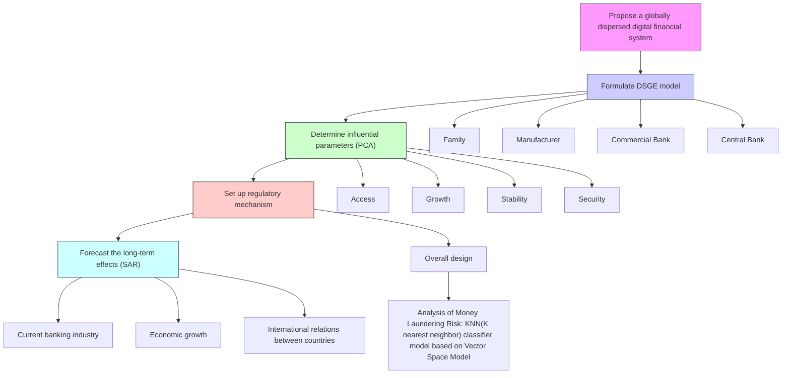

For office use only

T1

T2

T3

T4

Team Control Number

## 1916704

Problem Chosen

For office use only

F1

F2

F3

F4

F

## 2019 Interdisciplinary Contest in Modeling (ICM) Summary Sheet

(Attach a copy of this page to each copy of your solution paper.)

## A New Era of World Finance:The Strategy For A Global Decentralized Digital Financial Market

## Summary

In the current situation, people attach greater importance to digital currency for the sake of convenient transactions. Therefore, based on the reality of the financial and economic situation, our goal is to propose a global decentralized digital financial system, and verify its feasibility in addressing the problem of lack of supervision and anonymity of digital currency at this stage. We divide the job into 3 phases.

Firstly, we use the improved DSGE model to describe the system we establish. The model covers four sectors: family, firm, commercial bank and central bank. We consider 3 situations that the country completely abandons the original currency, does not completely abandon the original currency and the central bank does not issue digital currency. For various situations, we all obtain the financial and economic characteristics of the economic steady state. Our model is broad enough to accommodate various situations in different countries. We continue to study the macroeconomic effects of digital currency technology shocks.

Secondly, we select 14 indicators to measure the key factors affecting the system, and divide them into four categories, namely, access factors, growth factors, stability factors and security factors. Based on these key factors, we propose a global regulatory mechanism. In addition, we focus on the risk of money laundering in digital currencies by establishing a KNN (k Nearest Neighbor) classifier model based on vector space model, which can assist a country to judge the risk of money laundering of digital currency.

Finally,aiming at extending our analysis, we modify the SAR model to reflect the long-term effects of the new financial system. We selected the economic freedom indices of 163 countries, and then add space factors to study the spatial spillover effect of the central bank issuing digital currency. As a result, the emergence of a new monetary system model will gradually improve the perfection of the banking industry, the performance of global economy and the economic relationship with each country.

In a nutshell, we simulated the economic steady-state constraints of the proportion of different digital currencies. The results show that when the central bank issues digital currency to completely replace the original currency, it can avoid the violent fluctuation of the economy and reach the steady state as soon as possible.

## Contents

## 1 Introduction 1

1.1 Background  
1.2 Our work . 1

## 2 Assumptions 1

## 3 Model 1: Financial System Construction DSGE Model 2

3.1 Assumptions . . 2  
3.2 Variable Nomenclature 3  
3.3 Model 3  
3.4 Implementation and Results . . 6  
3.5 Future Discussion . 6  
3.6 Sensitivity Analysis . . . 7

## 4 Key Factors: Principal Component Analysis (PCA) 7

## 5 Model 2: Model of Construction Regulatory Mechanisms 9

5.1 Overall Design . . 9  
5.2 Model: KNN(K Nearest Neighbor) classifier model based on Vector Space Model . . . . . 10

5.2.1 Assumptions 10  
5.2.2 Parameters . 10  
5.2.3 Variable Nomenclature . 11  
5.2.4 Model 11  
5.2.5 Implementation and Results 11  
5.2.6 Sensitivity analysis . . 13

## 6 Model 3: Future Effects Spatial Autoregressive Model 13

6.1 Assumptions . . 13  
6.2 Variable Nomenclature . 13  
6.3 Model . 14  
6.4 Implementation and Results . . 15  
6.5 Sensitivity analysis 15

## 7 Evaluation of Models 16

7.1 Strengths . . . 16  
7.2 Weaknesses 16

## 8 Conclusion 16

## Policy Recommendation 18

## References 19

## 1 Introduction

## 1.1 Background

The development of information technology and the skyrocketing price of digital currencies have effectively promoted the explosive growth of digital currencies. Up to now, there are 16,344 digital currencies in the world with a total market capitalization of US120, 2 billion [1]. As a new currency form, digital currency has gradually reduced the transaction cost and improved the efficiency of trading. Almost every national central bank is actively constructing and developing legal digital currencies.

The existence of defects such as instability of this currency, easy to escape from the supervision of the regulatory authorities, and easy to be used by criminal activities not only hindered the development of digital currency, but also exacerbated the instability of the world financial system. How to establish a coordinated and effective global digital financial market system and its corresponding regulatory system is the primary task of ensuring the standardization and healthy development of digital currency.

## 1.2 Our work

1. We first construct a model that adequately represents a viable global decentralized digital financial market system.  
2. Next, we find key factors that influence the access, growth, security and stability of the financial system at both the individual, national, and global levels.  
3. Besides, we establish a set of regulatory mechanisms for the financial system.  
4. Finally, we analyze the influence of the financial system on banking industry, economics and international relations, and then predict their long-term effects.

flowchart

Figure 1: Our Work

## 2 Assumptions

The following assumptions are all applied for all models in this paper:

1. We won’t ask every country to issue a unified digital currency.  
2. We won’t ask every country to completely abandon the traditional currency and substitute digital currency for it.  
3. Digital currency is only issued by the central bank.

## 3 Model 1: Financial System Construction DSGE Model

In this paper, we consider establishing a globally dispersed digital financial market. We do not require every country in the world to issue a unified currency, nor do we require the state to completely abandon the physical currency and replace it with a digital currency. What we hope to establish is a financial system in which digital currency is issued by the central bank. Of course, it is also a possibility that most economies are discussing at the present stage. What’s more, we only consider the most general case, that is, digital currency is only issued by the central bank.

Model in this section is based on the model designed by Barrdear and Kumhof (2016)[2] and Qian Y (2018) [3]. Using the Dynamic Stochastic General Equilibrium Model (DSGE), it is possible to analyze whether the introduction of digital currency by the central bank is feasible by exploring the impact of the introduction of legal digital currency on the country’s macroeconomic effects. Since Qian Y (2018) [3] assumes that the central bank’s digital currency completely replaces physical cash, that is, the country completely abandons the original currency, which deviates from the reality, this section will improve the DSGE model to establish a model that covers four departments-households, manufacturers, commercial banks and the central bank. On the basis of considering different situations-the country completely abandoning the original currency, not completely abandoning the original currency and not issuing digital currency, combined with economic reality, we analyze whether the central bank’s issuance of digital currency is feasible for different countries and for the impact of the macro economy on countries.

## 3.1 Assumptions

1. Does not consider foreign currency deposit reserves, nor does it consider import and export factors.  
2. Digital currency and material currency as payment instruments can also be used as interest-bearing assets with the same interest rates.  
3. Sticky nominal price and sticky nominal wage.  
4. Consumer spending habits will not change for a while.  
5. From the perspective of banks and customers, all bank deposits are indistinguishable.  
6. Rational person assumptions, that is, for individuals, consumption brings positive effects, and work brings negative effects.  
7. There are two levels of vendors, the final vendor and the intermediate vendor. The intermediate manufacturer is in a state of monopolistic competition, and the final manufacturer is in a state of complete competition.  
8. Intermediate vendors rely entirely on external financing (bank deposits) for capital investment and hiring workers. The adjustment of the investment strategy of the intermediate manufacturer requires a corresponding cost.  
9. The bank deposit reserve is equal to the interest rate of the central bank’s digital currency. Bank deposit reserve rate is the risk-free rate.  
10. There is an interest rate corridor mechanism. Commercial banks have two financing channels, which can be used to finance the public or borrow from the central bank.  
11. Commercial banks do not retain monetary funds.  
12. The interest rate pricing method of commercial banks is the risk-free rate plus the credit risk pricing of commercial banks. The bank deposit interest rate is lower than the commercial bank standing loan convenience rate.  
13. Monetary policy targets inflation.

Table 1: Variable Nomenclature of Model 1

<table><tr><td>Abbreviation</td><td>Description</td><td>Abbreviation</td><td>Description</td></tr><tr><td> $P_t$ </td><td>Nominal commodity price index</td><td> $\mu$ </td><td>Demand elasticity coefficient of intermediate products</td></tr><tr><td> $c_t$ </td><td>Actual consumption of the family</td><td> $A_t$ </td><td>full factors production rate</td></tr><tr><td> $D_t$ </td><td>Balance of bank deposits held by the family</td><td> $\gamma$ </td><td>Elastic coefficient of capital output</td></tr><tr><td> $B_t$ </td><td>The size of the central bank&#x27;s digital currency held by the family</td><td> $\chi$ </td><td>Changes in the level of science and technology</td></tr><tr><td> $E_t$ </td><td>The size of the physical currency of the central bank held by the family</td><td> $\theta_t$ </td><td>Impact of technology</td></tr><tr><td> $W_t$ </td><td>Nominal wage</td><td> $k_t$ </td><td>Firm-owned capital</td></tr><tr><td> $n_t$ </td><td>Actual labor supply</td><td> $i_t(z)$ </td><td>Firm investment</td></tr><tr><td> $R_{t-1}^D$ </td><td>Bank deposit interest rate</td><td> $R_t^L$ </td><td>Commercial bank loan interest rate</td></tr><tr><td> $R_{t-1}$ </td><td>Central bank digital currency interest rate and central bank real currency interest rate</td><td> $B'_t$ </td><td>Commercial bank loan to central bank</td></tr><tr><td> $G_t$ </td><td>Firm profit dividend</td><td> $M_t$ </td><td>Deposit reserve</td></tr><tr><td> $d_t$ </td><td>Actual bank deposit balance held by the family</td><td> $R_{t-1}^C$ </td><td>Deposit reserve ratio</td></tr><tr><td> $b_t$ </td><td>The size of the actual central bank digital currency held by the family</td><td> $R_{t-1}^T$ </td><td>Central bank loan interest rate</td></tr><tr><td> $e_t$ </td><td>The size of the actual central bankafs physical currency held by the family</td><td> $\sigma$ </td><td>The cost of commercial banks in the process of conducting loan business</td></tr><tr><td> $g_t$ </td><td>Actual manufacturer profit dividend</td><td> $w_t$ </td><td>Commercial Bank Risk Management Capability</td></tr><tr><td> $w_t$ </td><td>Material currency</td><td> $\delta$ </td><td>Capital depreciation rate</td></tr><tr><td> $u_t$ </td><td>Current utility function</td><td> $\rho_w$ </td><td>Commercial Bank Risk Management Capability Smoothing Index</td></tr><tr><td> $\phi$ </td><td>Negative utility of measurement work</td><td> $\rho_v$ </td><td>Family holding currency smoothing index</td></tr><tr><td> $\phi_d$ </td><td>Measuring the negative utility of using bank deposits</td><td> $\rho_r 1$ </td><td>Commercial Bank Credit Risk Premium Smoothing Index</td></tr><tr><td> $\alpha_t$ </td><td>Proportion of bank deposits held by the family</td><td> $\rho_r 2$ </td><td>Commercial Bank Credit Risk Premium Smoothing Index</td></tr><tr><td> $v_t$ </td><td>Proportion of household holding currency</td><td> $\rho$ </td><td>Inflation adjustment factor</td></tr><tr><td> $\ell v_t$ </td><td>Proportion of digital currency held by the family</td><td> $r_{1t}$ </td><td>Commercial bank credit risk (with institutional guarantee)</td></tr><tr><td> $q_t$ </td><td>The impact of the central bank&#x27;s digital currency</td><td> $r_{2t}$ </td><td>Commercial bank credit risk (removal of institutional guarantee)</td></tr><tr><td> $\beta$ </td><td>Interval discount factor</td><td> $\phi_P$ </td><td>Manufacturer price adjustment cost factor</td></tr><tr><td>z</td><td>Manufacturer&#x27;s serial number</td><td> $\phi_k$ </td><td>Firm capital adjustment cost factor</td></tr><tr><td> $y_t(z)$ </td><td>Intermediate product</td><td> $r_{10}$ </td><td>Phase 0 commercial bank credit risk (with institutional guarantee)</td></tr><tr><td> $y_t$ </td><td>Final product</td><td> $r_{20}$ </td><td>Phase 0 commercial bank credit risk (removal system guarantee)</td></tr></table>

## 3.2 Variable Nomenclature

## 3.3 Model

Family First of all, combined with the actual situation, we assume that the family’s nominal budget constraints.

$$
P _ {t} c _ {t} + D _ {t} + B _ {t} + E _ {t} = W _ {t} n _ {t} + D _ {t - 1} R _ {t - 1} ^ {D} + B _ {t - 1} R _ {t - 1} + E _ {t - 1} R _ {t - 1} + G _ {t} \tag {1}
$$

Turn it into an actual budget constraint, that is, divide both sides by $P _ { t }$ .

$$
c _ {t} + d _ {t} + b _ {t} + e _ {t} = w _ {t} n _ {t} + d _ {t - 1} R _ {t - 1} ^ {D} + b _ {t - 1} R _ {t - 1} + e _ {t - 1} R _ {t - 1} + g _ {t} \tag {2}
$$

At the same time, we assume the current utility function of the family.

$$
u _ {t} = \log c _ {t} - \phi n _ {t} - \frac {\phi_ {d}}{2} (d _ {t} - d _ {t - 1}) ^ {2} \tag {3}
$$

Among them, the first item represents the utility of actual consumption to consumers. The parameter ϕ measures the negative utility of the work, and the larger the value, the higher the negative effect. The third item describes the negative effects of changes in actual bank deposits on households. Since households use bank deposits to receive some restrictions and need to pay a certain "cost", the greater the fluctuation of bank deposits, the greater the negative effect on the family.

To reflect the alternative advantages of central bank digital currency versus bank deposits, we introduce a second constraint:

$$
\alpha_ {t} c _ {t} \leq d _ {t} \tag {4}
$$

$$
\alpha_ {t} = 1 - v _ {t} \tag {5}
$$

$$
\ell v _ {t} = \rho_ {v} \ell v _ {t - 1} + (1 - \rho_ {v}) (\alpha + (1 - \ell) v _ {t - 1}) + q _ {t} \tag {6}
$$

Here, $v _ { t }$ indicates the proportion of households holding money, $\ell v _ { t }$ indicates the proportion of households holding digital currency, and $q _ { t }$ indicates the impact of central bank digital currency. It can be seen that when $q _ { t }$ is positive, an increase in $q _ { t }$ will increase the amount of digital money held by households and reduce the size of bank deposits.

Maximize the utility of the family based on (2) and (4):

$$
\max E _ {t} \sum_ {j = 0} ^ {\infty} \beta^ {j} u _ {t + j} \tag {7}
$$

$\beta$ represents the interplay discount factor for utility, and its value is between 0 and 1. The Lagrangian equation is solved to obtain its first-order condition, which will not be explained too much here.

Firm According to the New Keynes DSGE framework, it is assumed that there are two firms, the final firm and the intermediate firm, and the final firms are in complete competition. They purchased the intermediate product $y _ { t } ( z )$ from the intermediate firms z to produce the final product $y _ { t } , \ z$ is the manufacturer’s consecutive number, and $z \in [ 0 , 1 ]$ . Formulating a production function, we get:

$$
y _ {t} = \left(\int_ {0} ^ {1} y _ {t} (z) ^ {\frac {\mu - 1}{\mu}} d z\right) ^ {\frac {\mu}{\mu - 1}} \tag {8}
$$

To solve the first-order condition of maximizing the profit of the final firms, you can get:

$$
y _ {t} (z) = \left(\frac {P _ {t} (z)}{P _ {t}}\right) ^ {- \mu} y _ {t} \tag {9}
$$

Among them, the total price index is defined as:

$$
P _ {t} = \left(\int_ {0} ^ {1} P _ {t} (z) ^ {1 - \mu} d z\right) ^ {\frac {1}{\mu - 1}} \tag {10}
$$

Assuming that all intermediate firms’ production functions satisfy the Cobb-Douglas production function, they are:.

$$
y _ {t} (z) = A _ {t} k _ {t} ^ {\gamma} (z) n _ {t} ^ {1 - \gamma} (z) \tag {11}
$$

Among them, $A _ { t }$ represents total factor productivity, which is determined by the technological level of the overall economy:

$$
A _ {t} = e ^ {\left(\chi^ {t} + \theta_ {t}\right)} \tag {12}
$$

$$
\theta_ {t} = \rho_ {\theta} \theta_ {t} + \varepsilon_ {\theta t} \tag {13}
$$

Here $\chi > 0$ means that the level of technology continues to increase over time. $k _ { t }$ represents capital, the corresponding depreciation rate is defined as $\delta ,$ and intermediate firms can accumulate capital by investing $\dot { \bar { i } } _ { t } ( z ) { : }$ :

$$
k _ {t + 1} (z) = i _ {t} (z) + (1 - \delta) k _ {t} (z) \tag {14}
$$

It has been assumed that firms rely entirely on bank loans for capital investment and paying workers wages, so there are:

$$
L _ {t} (z) = W _ {t} n _ {t} (z) + P _ {t} i _ {t} (z) \tag {15}
$$

Therefore, the corresponding firm pays $R _ { t } ^ { L } L _ { t } ( z )$ , where $R _ { t } ^ { L }$ is the bank loan interest rate during this period. In addition, price adjustment and capital adjustment require firms to pay a certain management cost. The price adjustment cost and capital adjustment cost are defined as follows:

$$
C _ {P} (P _ {t} (z)) = \frac {\phi_ {P}}{2} \left[ \frac {P _ {t} (z) - P _ {t - 1} (z)}{P _ {t - 1} (z)} \right] ^ {2} y _ {t} (z) \tag {16}
$$

$$
C _ {k} (k _ {t} (z)) = \frac {\phi_ {k}}{2} [ k _ {t} (z) - k _ {t - 1} (z) ] ^ {2} \tag {17}
$$

Therefore, the actual profit of the intermediate firm is:

$$
g _ {t} (z) = \frac {P _ {t (z)}}{P _ {t}} y _ {t} (z) - \frac {R _ {t} ^ {L} L _ {t} (z)}{P _ {t - 1}} - C _ {P} (P _ {t} (Z)) - C _ {k} (k _ {t} (Z)) \tag {18}
$$

The goal of the intermediate firm is to maximize the expected discounted value of each period of profit, which can be expressed as:

$$
\max E _ {t} \sum_ {j = 1} ^ {\infty} \psi_ {t + j, t + j - 1} g _ {t + j} \tag {19}
$$

Similarly, $n _ { t } ( z )$ and $k _ { t } ( z )$ can be solved using the Lagrangian equation to obtain the first-order condition of (19), which is also not explained in detail here.

Commercial Bank Commercial banks have two financing channels, which can be financed through bank deposits of $D _ { t }$ or loans to the central bank for $B ^ { \prime } { } _ { t } .$ . When the funds are raised, the commercial bank can choose to deposit the funds in the form of a deposit reserve at the central bank $M _ { t } ,$ and can also lend the funds to the company $L _ { t }$ . Therefore, for the commercial banking sector, there are:

$$
L _ {t} + M _ {t} = D _ {t} + B _ {t} ^ {\prime} \tag {20}
$$

Turn it into an actual variable, and then it is expressed as:

$$
l _ {t} + m _ {t} = d _ {t} + b _ {t} ^ {\prime} \tag {21}
$$

For commercial banks, the actual profit is:

$$
h _ {t} = \frac {m _ {t - 1} R _ {t - 1} ^ {C}}{\pi_ {t}} + \frac {l _ {t - 1} R _ {t - 1} ^ {L}}{\pi_ {t}} - \frac {d _ {t - 1} R _ {t - 1} ^ {D}}{\pi_ {t}} - \frac {b _ {t - 1} ^ {\prime} R _ {t - 1} ^ {T}}{\pi_ {t}} - \sigma l _ {t} - \frac {w _ {t} d _ {t}}{m _ {t}} \tag {22}
$$

Among them, $R _ { t - 1 } ^ { C }$ indicates the deposit reserve ratio, and $R _ { t - 1 } ^ { T }$ indicates the interest rate to the central bank, which constitutes the lower and upper limits of the interest rate corridor. $\sigma l _ { t }$ represents the cost of a commercial bank in the process of conducting a loan business. $\frac { d _ { t } } { m _ { t } }$ m represents the deposit reserve ratio, which measures the commercial bank’s Credit creation ability. $w _ { t }$ reflects the risk management ability of commercial banks. The higher the value of it, the lower the risk management ability of commercial banks will be. Referring to Qian Y (2018) [3], we assume that $w _ { t }$ is subject to:

$$
w _ {t} = \left(1 - \rho_ {w}\right) w + \rho_ {w} w _ {t - 1} + j _ {t} \tag {23}
$$

Because the deposit reserve and the central bank’s digital currency are both central bank liabilities, we assume here that the two are equal, namely:

$$
R _ {t} ^ {C} = R _ {t} \tag {24}
$$

According to the interest rate pricing method of commercial banks, that ${ \mathrm { i } } s ,$ the risk-free rate plus the credit risk premium of commercial banks, there are:

$$
R _ {t} ^ {D} = R _ {t} + r _ {1 t} \tag {25}
$$

$$
R _ {t} ^ {L} = R _ {t} + r _ {1 t} + r _ {2 t} \tag {26}
$$

$$
r _ {1 t} = \left(1 - \rho_ {r _ {1}}\right) r _ {1 0} + \rho_ {r _ {1}} r _ {1 t - 1} + \varepsilon_ {r _ {1 t}} \tag {27}
$$

$$
r _ {2 t} = (1 - \rho_ {r _ {2}}) r _ {2 0} + \rho_ {r _ {2}} r _ {2 t - 1} + \varepsilon_ {r _ {2 t}} \tag {28}
$$

Maximize the expected value of the total discounted profits of commercial banks in each period:

$$
\max E _ {t} \sum_ {j = 1} ^ {\infty} \psi_ {t + j, t + j - 1} h _ {t + j} \tag {29}
$$

According to the Lagrangian equation, the optimal first-order condition is obtained.

Central Bank For the central bank, it needs to maintain equilibrium of its balance sheet:

$$
B _ {t} + E _ {t} + M _ {t} = B _ {t} ^ {\prime} \tag {30}
$$

The central bank issued digital currency to create a price-based monetary policy tool for the central bank. Assuming that monetary policy targets inflation, the setting of $R _ { t }$ is subject to the following rules:

$$
R _ {t} = (1 - \rho) \left[ \frac {1}{\beta} + \varphi_ {\pi} (\pi_ {t} - 1) \right] \rho R _ {t - 1} + \varepsilon_ {t} ^ {R} \tag {31}
$$

General Fquilibrium Under the optimal constraints of the above four departments, the general equilibrium condition is met, that is, the total output is equal to the total supply:

$$
y _ {t} = c _ {t} + i _ {t} + C _ {P} (P _ {t} (Z)) + C _ {k} (k _ {t} (Z)) + \sigma l _ {t} + \frac {w _ {t} d _ {t}}{m _ {t}}
$$

## 3.4 Implementation and Results

This model can be applied to various economies. Countries can determine each parameter according to its economic development status and national comprehensive development level, obtain constraints under steady-state conditions, and compare with the current situation in the country to determine whether it is feasible to issue digital currency. But for the sake of simplicity here, we consider the current situation of all countries as much as possible and reasonably determine the parameters. The current LIBOR (US) December interest rate is approximately $3 \% ,$ and the interest rate is used as the benchmark interest rate, and the inter-period discount factor $\lvert \beta \rvert$ is calibrated to 0.971. The proportion of total wages to GDP in the world varies widely between developed and developing countries. European and American countries can reach more than 50%. African countries are generally below 20%. In some countries, such as China, this value is significantly lower. Consider the global situation, set γ to 0.7. Set $r _ { 1 0 }$ and $r _ { 2 0 }$ to 0.4% and 2%, depending on the difference between the one-year bank deposit rate, the one-year bank loan rate, and the deposit reserve. The calibration of other parameters is shown in the table below.

Table 2: Parameter Calibration Table of Model 1

<table><tr><td></td><td colspan="3">Parameter Calibration Value</td></tr><tr><td> $\beta$ </td><td>0.7</td><td> $\rho_v$ </td><td>0.8</td></tr><tr><td> $\phi$ </td><td>1</td><td> $\rho_w$ </td><td>0.6</td></tr><tr><td> $\alpha$ </td><td>0.5</td><td> $\rho$ </td><td>0.8</td></tr><tr><td> $\gamma$ </td><td>0.7</td><td> $\rho_r 1$ </td><td>0.8</td></tr><tr><td> $\chi$ </td><td>0.02%</td><td> $\rho_r 2$ </td><td>0.8</td></tr><tr><td> $\delta$ </td><td>2%</td><td> $\phi_P$ </td><td>4</td></tr><tr><td>w</td><td>0.2</td><td> $\phi_k$ </td><td>4</td></tr><tr><td> $\sigma$ </td><td>0.60%</td><td> $r_{10}$ </td><td>0.40%</td></tr><tr><td> $\mu$ </td><td>5</td><td> $r_{20}$ </td><td>2%</td></tr></table>

According to the parameter values set above, calculate the corresponding deposit reserve ratio and the proportion of household consumption to GDP under steady state conditions. When $\ell = 1 .$ , that is, the digital currency completely replaces the existing physical currency, the steady state values of this indicator are 17.8%, 75%, respectively. See Table 3 for details.

Table 3: The Results

<table><tr><td>Value</td><td>Deposit reserve ratio(m/d)</td><td>Household consumption as a share of GDP(c/y)</td></tr><tr><td> $\ell = 1$ </td><td>17.8%</td><td>75%</td></tr><tr><td> $\ell = 0.5$ </td><td>26%</td><td>68.2%</td></tr><tr><td> $\ell = 0$ </td><td>32.9%</td><td>63%</td></tr></table>

In recent years, some major economies have lowered or cancelled the statutory deposit reserve ratio, but some countries, such as China, maintain a high statutory deposit reserve ratio. At present, most of the international reserves maintain a deposit reserve ratio of around 15%. According to data released by the World Bank, the proportion of final consumption in GDP worldwide in 2017 was approximately 80%. This paper assumes that foreign currency deposits and imports and exports are not considered. If this factor is considered, the steady-state indicators should be appropriately adjusted downward. Overall, the parametrically calibrated model can well match the characteristics of current world economic finance. It can also be seen from Table 3 that when $\ell = 1 .$ , the model is most consistent with the current situation, which means that at this stage, when the public holds all of the currency as a digital currency, it is more conducive to economic stability.

Therefore, based on this model, we believe that the establishment of a central bank to issue a digital currency financial system is feasible for the current international economic situation.

## 3.5 Future Discussion

In the above model, we assume that the technical impact of the central bank issuing digital currency is $q _ { t } .$ In the entire economic analysis, we set it to a positive number. Now we set it to an indeterminate number. Referring to the economic setting of Qian Y (2018) [3], we set the standard deviation of the central bank digital currency $q _ { t }$ to 0.0006 and set ℓ to 1. The chart below shows the impact of overall macro economy.

line chart

| x    | y (×10⁻⁴) |
| ---- | --------- |
| 0    | 1.0       |
| 5    | -0.8      |
| 10   | -0.2      |
| 15   | 0.4       |
| 20   | 0.6       |
| 25   | 0.2       |

line chart

| x    | y (×10⁻⁴) |
| ---- | --------- |
| 0    | -1.0      |
| 5    | -0.5      |
| 10   | 0.5       |
| 15   | 1.5       |
| 20   | 1.0       |
| 25   | 0.0       |

Figure 2: The impact of the technical shock of central bank digital currency on consumption and output

Figure 2 shows that when a positive digital currency shock occurs, it will contribute to the increase of household consumption and the increase of economic output in the long run, which further proves that the model is feasible.

## 3.6 Sensitivity Analysis

We let the calibration value of each parameter fluctuate within 10% of the original calibration value one by one. It turns out that this does not affect the conclusions we have drawn, so we believe that the model is robust.

## 4 Key Factors: Principal Component Analysis (PCA)

Since Model 1 only discusses the feasibility of realizing the issuance of digital currency by the central bank, which will have great significance for the country’s economic growth and economic stability, in this section, we analyze the factors that influence the financial system at the individual, national and world levels.

We selected 14 indicators to measure key factors in the access, growth, stability, and safety of the new financial system, and used principal component analysis (PCA) to screen out key variables. Finally, 11 of them are grouped into four categories, which represent the key factors of access, growth, stability and security of the financial system.

PCA simplifies the coincidence variables and synthesizes them with only a few key factors. It can find several linear combinations containing the main information, where is no coincidence between the information of each linear combination. So we have the principal below:

$$
\left\{ \begin{array}{c} Y _ {1} = a _ {1} X = a _ {1 1} X _ {1} + a _ {1 2} X _ {2} + \dots + a _ {1 p} X _ {p} \\ Y _ {2} = a _ {2} X = a _ {2 1} X _ {1} + a _ {2 2} X _ {2} + \dots + a _ {2 p} X _ {p} \\ \dots \dots \\ Y _ {m} = a _ {m} X = a _ {m 1} X _ {1} + a _ {m 2} X _ {2} + \dots + a _ {m p} X _ {p} \end{array} \right. \tag {33}
$$

• $a _ { 1 } a _ { 1 } ^ { \prime } = 1$  
$\bullet Y _ { i } , Y _ { j } \mathrm { a r e } \mathrm { i r r e l e v a n t . } ( \ i \neq j , \ i , j = 1 , 2 , \ldots , m )$

Based on this issue, we select countries with a population of more than 20 million in the world or countries with a total GDP of more than 100 billion US dollars according to international practice. These countries are divided into eight grades according to the per capita GDP of each country in 2017. Each grade randomly extracts 14 economic indicators of the same number of countries, and obtains a 14- dimensional random vector $X = ( X _ { 1 } , X _ { 2 } , \ldots \ldots , X _ { 1 4 } )$ ). After PCA calculation, following the principle of selected principal components of the eigenvalues > 1 and the cumulative contribution rate of 80%, we get a linearly combined set of linear combinations that are less numerous and uncorrelated between vectors: $Y _ { 1 } , Y _ { 2 } , \mathbf { \check { } } , Y _ { 3 } , Y _ { 4 }$ . They are the first, second, third, and fourth priciple components of the original variable metrics $X _ { 1 } , X _ { 2 } , \cdot \cdot \cdot \cdot , X _ { 1 4 }$ .

Access factors: inflation rate, government corruption index and government credit rating It can be seen from the coefficient of the principal component that the first principal component consists of inflation rate, government corruption index and government credit rating. One of the reasons for the emergence of digital currency is that the government’s excessive use of money has led to excessive inflation. The issue of bitcoin is to solve the problem of excessive inflation. Therefore, the size of the inflation rate can affect the access factor. The government’s work efficiency also influences the digital currency access factor, divided into government corruption index and government credit rating. The more corrupt the government is, the more it resists the digital currency–it will be out of government regulation or because of bureaucracy leading to high regulatory costs. What’s more, if the government has high credit, the credit base is relatively strong and can support the issuance of credit currency.

Table 4: Standard deviation, variance contribution rate, and cumulative contribution rate corresponding to the first four principal components of the normalized variable

<table><tr><td>Index</td><td>Comp.1</td><td>Comp.2</td><td>Comp.3</td><td>Comp.4</td></tr><tr><td>Standard deviation</td><td>2.3651112</td><td>1.4535807</td><td>1.2823521</td><td>1.08245266</td></tr><tr><td>Variance contribution rate</td><td>0.3995537</td><td>0.1509212</td><td>0.1174591</td><td>0.13369315</td></tr><tr><td>Cumulative contribution rate</td><td>0.3995537</td><td>0.5504749</td><td>0.6679339</td><td>0.80162705</td></tr></table>

Table 5: The eigenvector corresponding to the first 4 principal components of the normalized variable

<table><tr><td>Influencing factor</td><td> $Y_1$ </td><td> $Y_2$ </td><td> $Y_3$ </td><td> $Y_4$ </td></tr><tr><td>Gross domestic product growth rate</td><td>0.206143</td><td>0.201552</td><td>-0.38098</td><td>0.079807</td></tr><tr><td>Interest rate</td><td>0.182811</td><td>0.11747</td><td>-0.06887</td><td>-0.04665</td></tr><tr><td>Ratio of broad money to total reserves</td><td>-0.21747</td><td>0.023287</td><td>0.026979</td><td>0.388422</td></tr><tr><td>Broad money(% of GDP)</td><td>-0.14679</td><td>0.412974</td><td>0.038546</td><td>-0.05428</td></tr><tr><td>Inflation rate</td><td>0.276984</td><td>0.097393</td><td>0.223729</td><td>-0.01165</td></tr><tr><td>Government corruption index</td><td>-0.37868</td><td>-0.0355</td><td>0.128694</td><td>-0.16746</td></tr><tr><td>Government credit rating</td><td>0.38939</td><td>-0.08538</td><td>-0.12208</td><td>-0.12838</td></tr><tr><td>GDP</td><td>-0.21549</td><td>0.459926</td><td>-0.23584</td><td>-0.24366</td></tr><tr><td>Current account</td><td>-0.30186</td><td>-0.24827</td><td>0.013424</td><td>0.285172</td></tr><tr><td>Budget</td><td>-0.03598</td><td>-0.50062</td><td>-0.32238</td><td>-0.29023</td></tr><tr><td>Population</td><td>-0.02716</td><td>0.346364</td><td>0.49569</td><td>0.047599</td></tr><tr><td>Debt</td><td>-0.14336</td><td>0.28264</td><td>0.308497</td><td>0.199055</td></tr><tr><td>Exchange rate</td><td>0.057408</td><td>-0.15336</td><td>-0.23341</td><td>-0.31339</td></tr><tr><td>Unemployment rate</td><td>0.215507</td><td>0.096393</td><td>0.459653</td><td>0.020225</td></tr></table>

Growth factors: broad money (% of GDP), gross domestic product, budget

It can be seen from the principal component coefficients of Table 5 that the second principal component consists of broad money (as a percentage of GDP), gross domestic product, and budget. The broad money, M2 (quasi-currency), reflects the direct purchasing power and potential purchasing power of society, which can be used to measure the growth trend of future digital currencies. Gross domestic product is the premise and basis for future growth. Combined with the budget level, it can measure the future growth momentum.

Stabilizing factors: population, unemployment rate

It can be seen from the coefficient of the principal component that the third principal component consists of population and unemployment rate. The stability of population growth or reduction is the basic foundation for the stability of digital currency issuance and frequency of its use. In general, the unemployment rate is an important factor in measuring the stability of a country’s economic system. Therefore, it is a key factor in maintaining the stability of this new financial system.

Security factors: ratio of broad money to total reserves, exchange rate

It can be seen from the coefficient of the principal component that the fourth principal component consists of the ratio of the broad money to the total reserve and the exchange rate. The ratio of broad money to total reserves reflects the level of a country’s savings rate. Savings are the security of people’s lives in a country when problems occur in the operation of the economic system, thus affecting the security of the financial system. Fluctuations in exchange rates can lead to insecurity in the financial system and have an impact on the security of the financial system.

Therefore, in this section, we explore the key factors that influence the implementation of the financial system. We divide it into four categories, namely access factors, growth factors, stability factors and security factors. These aspects should be considered when countries consider adopting such a financial system.

## 5 Model 2: Model of Construction Regulatory Mechanisms

## 5.1 Overall Design

Since digital currency as a means of payment and assets are active in people’s trading and investment activities, the existence of risks will inevitably damage the interests of traders or investors to a certain extent. It mainly includes the risk of speculation caused by price fluctuations, the risk of illegal use of criminal activities such as money laundering, the illegal business risks of digital currency trading platforms, and the risk of wasting resources[7].

For the regulation of digital currency, this paper believes that there are three ways. One is to decentralize regulatory resources and supervise each issuer. To a certain extent, this can solve problems such as illegal transactions in digital currencies. But how to use all limited issuers to supervise all issuers? This requires countries to rely on existing computer technology to use existing high-end information technology to supervise existing issuers. The second is the support of physical assets as a digital currency system. This physical asset should be widely accepted by all countries in the digital monetary system. This requires unifying the views of global sovereign states and establishing uniform digital monetary system rules, such as how to pay, how to issue, and how to liquidate. The third is the issuance of legal digital currency by the central bank as the issuer. The digital currency issued under the support of sovereign state credit does not have the characteristics of decentralization in the issuance. The transaction method still uses peer-to-peer transactions.

This paper adopts the third regulatory mechanism, that is, the issuance of legal digital currency by the central bank. This is also the way that the world’s sovereign countries are actively exploring. For example, China, the United Kingdom and other countries are studying the distribution path of designing legal digital currency. The issuance of digital currency by the central bank can avoid the impact of the ups and downs of monetary value on the national economy and financial system, and can quickly transmit monetary policy, reduce speculation at home and abroad and also combat illegal and criminal activities to a certain extent. In order to realize this concept, a more complete regulatory system must be established.

Firstly, we need to establish the legal status of digital currency. The digital currency issued by the central bank and the credit of the central bank as a guarantee, the digital currency has certain versatility, but the top-level legal design still needs to be considered. All countries need to set the corresponding laws, regulations and system specifications and determine the essential attributes of digital currency according to the country’s economic situation and the status quo of the financial system construction, coupled with the development of digital currency. Let the public understand the digital currency and learn to use digital currency, so that digital currency gradually replaces the existing physical currency. Besides, international organizations such as the World Bank, IMF, etc. should establish relevant international common standards to provide reference for each country.

In addition, we need to establish a regulatory body. We have determined that the issuer of digital currency is the central bank, so the most appropriate regulator at this stage is still the central bank. First, because central banks in most countries have established relevant research departments, it is feasible to have a relatively clear understanding of digital currencies. Second, because the central bank is contracting the issuance of digital currency, the corresponding issuance strategy can be set. The issuance of digital currency by the central bank cannot be done overnight. It needs to be realized step by step. Otherwise, the influx of a large amount of legal currency will cause the collapse of the entire financial system. The most ideal way is to withdraw the physical currency while issuing the legal digital currency, and to maintain the stability of the money supply within the entire financial system while realizing the replacement of the physical currency by the digital currency to ensure the orderly and healthy development of the country. On the whole, only the central bank can shoulder this heavy responsibility.

Moreover, we need to establish an account real name system. The central bank can use the direct issue currency to individuals and businesses, or choose to distribute it to individuals and businesses through commercial banks. We believe that depending on the country, countries can determine the method of distribution according to the current banking system and the issuance of physical currency.

Finally, we hope to build a unified regulatory model on a global scale. Changes in a country’s regulatory policies can cause fluctuations in the country’s digital currency transactions, thereby affecting its value. Due to the international versatility of digital currencies, individual countries and institutions holding digital currency in other countries will be at risk. Therefore, governments of various countries should have the concept of global development, enhance the awareness of international cooperation, and explore international cooperation in digital currency regulation. Give full play to the important role of international organizations in the global unified regulatory system, build a global unified regulatory framework, and urge countries to share transaction data to achieve more standardized development of

digital currency.

Although such a regulatory system can more effectively prevent the problems of digital currency at this stage, it cannot fully explain that the regulatory mechanism can eliminate various risks, such as money laundering risks. Therefore, we have established the following models to assist the state in judging the risk of money laundering after the issuance of legal digital currency, thereby improving the regulatory mechanism.

## 5.2 Model: KNN(K Nearest Neighbor) classifier model based on Vector Space Model

This section uses the money laundering risk level assessment system built by HM Treasury to obtain a certain amount of origin data, and uses these origin data as a training set, applying KNN(K nearest neighbor) classifier model based on Vector Space Model in machine learning to learn risk level classification decision criterion automatically, and classify the risk levels of each money laundering methods that needs to be assessed. Finally, build a mechanism to monitor global digital currencies. It means that when other countries have accumulated sufficient origin data through the use of the UK’s money laundering risk assessment system, they can use our model and their own indicators to determine the level of money laundering risk in their respective areas, without having to use the UK’s risk assessment system. For the country, not only can it assess and monitor the risk of money laundering in its digital currency, it can also save the cost of long-term use of the UK’s risk assessment system.

## 5.2.1 Assumptions

1. Contiguity hypothesis: Money laundering methods with the same level of risk constitute a class. The same type of money laundering methods will constitute an adjacent area, and different types of adjacent areas do not overlap each other.  
2. In the national financial system, each method of money laundering is independent and have no effect on each other.  
3. In the national financial system, each money laundering method occurs with the same probability.

## 5.2.2 Parameters

We divide the national financial system into twelve thematic areas: Banks, Accountancy service providers, Legal service providers, Money service businesses, Trust or company service providers, Estate agents, High value dealers, Retail betting(unregulated gambling), Casinos (regulated gambling), Cash, New payment methods (e-money), Digital currencies. One money laundering method exists in each area, which means there are twelve money laundering methods in total. We choose Total vulnerabilities score, Total likelihood score, Structural risk, Risk with mitigation grading as four main factors to measure the risk level of money laundering in each area. Each factor can be determined by several detectable indicators.

A. Total vulnerabilities score

It’s defined as a score that measures the degree of damage done by money laundering behavior in each area. The higher the score is, the weaker the ability of each area to resist the destruction of money laundering. In the quantitative assessment and research process, the following three factors will have a significant impact on the results.

a. The capacity to move money internationally given the nature of the funds (i.e. cash, e-money)  
b. The speed or volume of money movement through firms in the sector given the nature of the funds.  
c. The level of compliance within the sector.

B. Total likelihood score

It’s defined as a score that measures the likelihood of this area reporting to law enforcement agencies when the money laundering event occurs in each area. The higher the score is, the higher the professionalism of practitioners in the area is. In the quantitative assessment and research process, the following three factors will have a significant impact on the results.

a. The size of the sector or area.  
b. The likelihood that the sector will report suspicious activity to law enforcement, as indicated by the level of SAR submission by the sector.  
c. Law enforcement agencies’ existing knowledge of money laundering through the sector.

## C. Structural risk

After rating Total vulnerabilities score and Total likelihood score, the system automatically generates a score that measures the structural risk in each area. The higher the score is, the higher the likelihood of money laundering in the field is or the greater the number of money laundering incidents are.

## D. Risk with mitigation grading

It’s defined as a score that measures the law enforcement ˛a´rs ability of handling the money laundering event when a message of money laundering event is obtained. The higher the score is, the stronger the ability of law enforcement to successfully handle incidents is.

## 5.2.3 Variable Nomenclature

Table 6: Variable Nomenclature of Model 2

<table><tr><td>Abbreviation</td><td>Definition</td><td>Abbreviation</td><td>Definition</td></tr><tr><td> $i$ </td><td>Money laundering method in the area i</td><td> $k_i$ </td><td>Law enforcement agenciesar existing knowledge level of money laundering through the area i</td></tr><tr><td> $Tvs_i$ </td><td>Score that measures the degree of damage done by money laundering behavior in area i</td><td> $Sr_i$ </td><td>Structural risk of area i</td></tr><tr><td> $a$ </td><td>Capacity to move money internationally</td><td> $Rwmg$ </td><td>Risk with mitigation grading</td></tr><tr><td> $M$ </td><td>The volume of money movement</td><td> $\vec{v}_i$ </td><td>Vector of money laundering method in the area i</td></tr><tr><td> $V$ </td><td>The speed of money movement</td><td> $k$ </td><td>kNN algorithm parameters</td></tr><tr><td> $Q$ </td><td>Number of items to be sold</td><td> $j$ </td><td>Risk level class (j=High,Medium,Low)</td></tr><tr><td> $P$ </td><td>Unit commodity price</td><td> $l_i$ </td><td>The level of compliance in the area i</td></tr><tr><td> $Tls_i$ </td><td>Score that measures the likelihood of area i reporting to law enforcement agencies when the money laundering event occurs in area i</td><td> $size_i$ </td><td>The size of area i</td></tr><tr><td> $r_i$ </td><td>The likelihood that area i will report suspicious activity to law enforcement</td><td> $Sr_i$ </td><td>Structural risk score for domain i</td></tr></table>

## 5.2.4 Model

$$
T v s _ {i} = f (a, M, I _ {i}) \tag {34}
$$

$$
T I s _ {i} = F \left(\text { size } _ {i}, r _ {i}, k _ {i}\right) \tag {35}
$$

$$
S r _ {i} = G (T v s _ {i}, T I s _ {i}) \tag {36}
$$

In the formula(34), M can also be replaced with P Q .

In view of the different financial systems of different countries, different functional relationships (f ,F, G) will occur.

## 5.2.5 Implementation and Results

Vector space model represents each money laundering method as a vector combined by real numeral components ⃗v = (T vs , T Is , Sr , Rwmg). Each component corresponds to one evaluation index. We obtained origin data of twelve thematic areas in 2015 from the UK’s money laundering risk assessment system. The digital currency money laundering method belongs to Low class. We selected eleven areas except the digital currency area as training sets, downgrading the eleven four-dimensional vectors into two-dimensional vectors. Then we projected them onto a 2D plane, and observed data distribution(Figure 3).

scatterplot

| Category | Value | Risk Level |
| :--- | :--- | :--- |
| 2015 Banks | + | High |
| 2015 Cash | + | High |
| 2015 Accountancy service providers | + | High |
| 2015 Legal service providers | + | High |
| 2015 Retail betting (unregulated gambling) | * | Low |
| 2015 High value dealers | * | Low |
| 2015 New payment methods(e-money) | ○ | Medium |
| 2015 Estate agents | ○ | Medium |
| 2015 Trust or company service providers | ○ | Medium |
| 2015 Money service business | ○ | Low |

Figure 3: Data visualization

Calculate the distances between all points in the training set and the current point in the test set and sort them in increasing order of distances, select the k points with the smallest distance from the current point in the test set, and store them in the data structure Sk. Determine the frequency of occurrence pj of the category in which the first k points are located. Returns the category with the highest frequency of the first k points as the predicted classification of the current point. We use the Euclidean distance when judging the distance between the point and the point in the space.

scatterplot

| Category | Value |
| --- | --- |
| 2015 Banks | High |
| 2015 Cash | High |
| 2015 Mortgage | Medium |
| 2015 Mortgage | Low |
| 2015 Mortgage | Low |
| 2015 Mortgage | Low |
| 2015 Mortgage | Low |
| 2015 Mortgage | Low |
| 2015 Mortgage | Low |
| 2015 Mortgage | Low |
| 2015 Mortgage | Low |
| 2015 Mortgage | Low |
| 2015 Mortgage | Low |
| 2015 Mortgage | Medium |
| 2015 Mortgage | Medium |
| 2015 Mortgage | Medium |
| 2015 Mortgage | Medium |
| 2015 Mortgage | Medium |
| 2015 Mortgage | Medium |
| 2015 Mortgage | Medium |
| 2015 Mortgage | Medium |
| 2015 Mortgage | Medium |
| 2015 Mortgage | Medium |
| 2015 Mortgage | Low |
| 2015 Mortgage | Low |
| 2015 Mortgage | Low |
| 2015 Mortgage | Low |
| 2015 Mortgage | Low |
| 2015 Mortgage | Low |
| 2015 Mortgage | Low |
| 2015 Mortgage | Low |
| 2015 Mortgage | Medium |
| 2015 Mortgage | Low |
| 2015 Mortgage | Low |
| 2015 Mortgage | Low |
| 2015 Mortgage | Low |
| 2015 Mortgage | Low |
| 2015 Mortgage | Low |
| 2015 Mortgage | Low |
| 2015 Mortgage | Low |
| 2015 Mortgage | High |
| 2015 Mortgage | High |
| 2015 Mortgage | High |
| 2015 Mortgage | High |
| 2015 Mortgage | High |
| 2015 Mortgage | High |
| 2015 Mortgage | High |
| 2015 Mortgage | High |
| 2015 Mortgage | High |
| 2015 Mortgage | High |
| 2015 Mortgage | Medium |
| 2015 Mortgage | Medium |
| 2015 Mortgage | Medium |
| 2015 Mortgage | Medium |
| 2015 Mortgage | Medium |
| 2015 Mortgage | Medium |
| 2015 Mortgage | Medium |
| 2015 Mortgage | Medium |
| 2015 Mortgage | Medium |
| 2015 Mortgage | High |
| 2015 Mortgage | High |
| 2015 Mortgage | High |
| 2015 Mortgage | High |
| 2015 Mortgage | High |
| 2015 Mortgage | High |
| 2015 Mortgage | High |
| 2015 Mortgage | High |
| 2015 Mortgage | High |
| 2015 Mortgage | Low |
| 2015 Mortgage | Low |
| 2015 Mortgage | Low |
| 2015 Mortgage | Low |
| 2015 Mortgage | Low |
| 2015 Mortgage | Low |
| 2015 Mortgage | Low |
| 2015 Mortgage | Low |
| 2015 Mortgage | Low |
| 2015 Mortgage | High |
| 2015 Mortgage | Low |
| 2015 Mortgage | High |
| 2015 Mortgage | Low |
| 2015 Mortgage | High |
| 2015 Mortgage | Low |
| 2015 Mortgage | High |
| 2015 Mortgage | Low |
| 2015 Mortgage | High |
| 2015 Mortgage | Low |
| 2015 Mortgage | Medium |
| 2015 Mortgage | Medium |
| 2015 Mortgage | Medium |
| 2015 Mortgage | Medium |
| 2015 Mortgage | Medium |
| 2015 Mortgage | Medium |
| 2015 Mortgage | Medium |
| 2015 Mortgage | Medium |
| 2015 Mortgage | High |
| 2015 Mortgage | Low |
| 2015 Mortgage | High |
| 2015 Mortgage | Low |
| 2015 Mortgage | High |
| 2015 Mortgage | Low |
| 2015 Mortgage | High |
| 2015 Mortgage | Low |
| 2015 Mortgage | High |
| 2015 Mortgage | Medium |
| 2015 Mortgage | Medium |
| 2015 Mortgage | Medium |
| 2015 Mortgage | Medium |
| 2015 Mortgage | Medium |
| 2015 Mortgage | Medium |
| 2015 Mortgage | Medium |
| 2015 Mortgage | Medium |
| 2015 Mortgage | High |
| 2015 Mortgage | Medium |
| 2015 Mortgage | Medium |
| 2015 Mortgage | Medium |
| 2015 Mortgage | Medium |
| 2015 Mortgage | Medium |
| 2015 Mortgage | Medium |
| 2015 Mortgage | Medium |
| 2015 Mortgage | Medium |
| 2015 Mortgage | Low |
| 2015 Mortgage | Medium |
| 2015 Mortgage | Medium |
| 2015 Mortgage | Medium |
| 2015 Mortgage | Medium |
| 2015 Mortgage | Medium |
| 2015 Mortgage | Medium |
| 2015 Mortgage | Medium |
| 2015 Mortgage | Medium |
| 2015 Mortgage | Low |
| 2015 Mortgage | High |
| 2015 Mortgage | Medium |
| 2015 Mortgage | Medium |
| 2015 Mortgage | Medium |
| 2015 Mortgage | Medium |
| 2015 Mortgage | Medium |
| 2015 Mortgage | Medium |
| 2015 Mortgage | Medium |
| 2015 Mortgage | Low |
| 2015 Mortgage | High |
| 2015 Mortgage | Low |

Figure 4: Classification result graph

Figure 4 gave an example of k = 3.The red line indicates the classification boundary, and the three categories are represented by +, ⃝, and \*. We can find that the three points closest to the digital money laundering method represented by ˛aî belong to the Low class, so the probability of the digital currency money laundering method belonging to each category is P (High class | digital currency money laundering mode) = 0, P ( Medium class|Digital currency money laundering method)=0,P(Low class|Digital currency money laundering method)=1. The result given by the classifier is that the digital currency money laundering method belongs to the Low class, which is consistent with the real result, indicating that our classifier is accurate.

We can also find that the UK’s 2015 digital currency money laundering method has a low level of risk, which is at the same risk level as Casinos, High value dealers, and Retail betting. Their risk structures are similar. Therefore, the regulation of digital currency can draw on the supervision of Casinos, High value dealers, and Retail betting. Suppose we have obtained the four indicators of the digital money laundering method in a certain year. We can still use the classifier to judge the risk level of the digital money laundering method in the year, and compare it with the previous period to get the trend of the risk of money laundering in digital currency for better supervision.

## 5.2.6 Sensitivity analysis

## 1. Sensitivity to k value

The value of k in kNN often depends on the experience or knowledge of the classification problem itself. k generally takes odd numbers to reduce the possibility of multiple primary classes coexisting. k=3 and k=5 are commonly used values, but k also takes a larger value between 50 and 100, which also depends on the size of the training set sample size.

## 2. Sensitivity to the sample size of the training set

The sample size of the training set is constantly updated. We can judge the risk level of the money laundering method that needs to be evaluated and then add it to the training set. Expanding the sample size of the training set for the next evaluation will be more accurate.

## 6 Model 3: Future Effects Spatial Autoregressive Model

In this section, we predict the effect of the introduction of digital currency on the future development of the world’s long-term overall economic system, including the effect on the banking industry, the effect of global economic trends, and the effect of trends in inter-state relations. Since the economic effect is globally linked and related to its historical development level, the key to our prediction model is to solve the effect of the "contagious" economic linkage between countries and the effect of the previous economic level on the future. We applied a spatial autoregressive model (SAR) to predict future developments.

## 6.1 Assumptions

1. The behavior of the country in the current period is often affected by its previous behavior (direct benefit).  
2. The current performance of the country is often affected by the actions of other neighboring countries, and will also potentially affect all other countries (indirect benefits).  
3. The influence of unobservable factors on the dependent variables is analyzed by simplifying into spatial factors.  
4. When calculating the distance between the country and the country, use the location of the capital of the country as the point of calculation of the space unit.  
5. We fully trust the various economic freedom indices in the annual reports issued by The Wall Street Journal and the American Heritage Foundation. In addition, countries or regions with more economic freedom will have higher long-term economic growth and prosperity than countries with less economic freedom.  
6. The relationship between countries only considers the economic level, so it is simplified into a trade relationship.  
7. The error terms of all models satisfy the normal independent and identical distribution.

## 6.2 Variable Nomenclature

Based on the annual report of the Economic Freedom Indices and the distance between the capitals of the world, we selected 163 countries with comprehensive data for spatial autoregressive prediction analysis.

The spatial autoregressive model refers to the regression model that sets the dependent variable autocorrelation (space lag factor) in the model and introduces the spatial weight matrix include the model form of other independent variables.

Table 7: Variable Nomenclature of Model 3

<table><tr><td>Abbreviation</td><td>Description</td></tr><tr><td> $B$ </td><td>Financial freedom (affecting the efficiency of the banking system)</td></tr><tr><td> $E$ </td><td>Overall freedom(affecting economic development)</td></tr><tr><td> $T$ </td><td>Trading freedom(affecting international trade)</td></tr><tr><td> $\rho$ </td><td>Spatial autocorrelation coefficient</td></tr><tr><td> $\beta$ </td><td>Independent coefficient</td></tr><tr><td> $W$ </td><td>163×163 spatial weight matrix</td></tr><tr><td> $\sigma$ </td><td>Random disturbance</td></tr></table>

When digital currency is newly added to the national monetary system, it will inevitably affect the efficiency of the banking system at the national, regional and global levels and the independence of government intervention. The change of the monetary system of any country will lead to the idea that its neighboring countries will also change their monetary system. From the perspective of modeling, the effect of the future development of the banking industry in various countries is the dynamic feedback effect from other countries, which will in turn affect the development of the global banking industry. In the same way, the trend of global economic development and the development trend of international relations will dynamically influence the surrounding areas with the introduction of digital currency or digital currency ˛a´rs continuous improvement in a country’s internal economic system.

## 6.3 Model

The process of building the model is as follows:

First, we establish a distance based spatial weight matrix for 163 countries:

$$
W = \left[ \begin{array}{c c c} W _ {1, 1} & \dots & W _ {1, 1 6 3} \\ \vdots & \ddots & \vdots \\ W _ {1 6 3, 1} & \dots & W _ {1 6 3, 1 6 3} \end{array} \right] \tag {37}
$$

So we get the initial distance-based spatial weight matrix W . After calculating $w _ { i } j ,$ , the spatial weight matrix is normalized by row, and the spatial weight matrix after row normalization is $\tilde { W }$ .

Considering our previous assumptions, we need to introduce the lag explanatory variables $B _ { t - 1 }$ , $E _ { t - 1 } , T _ { t - 1 } ,$ and establish the following improved spatial autoregressive model:

Model A: Forecasting future banking industry:

$$
B = \rho_ {1} W B + B _ {t - 1} \beta_ {1} + \varepsilon_ {1} \tag {38}
$$

Model B: Forecasting future economic development in countries:

$$
E = \rho_ {2} W E + E _ {t - 1} \beta_ {2} + \varepsilon_ {2} \tag {39}
$$

Model C: Forecasting future trade relations between countries:

$$
T = \rho_ {3} W T + T _ {t - 1} \beta_ {3} + \varepsilon_ {3} \tag {40}
$$

The parameter estimates based on the model for interpreting the variable matrices $B _ { t - 1 } , E _ { t - 1 } , T _ { t - 1 }$ take the following form:

$$
\hat {y} _ {1} ^ {(1)} = (I _ {k} - \hat {\rho} _ {1} W _ {1}) ^ {- 1} B _ {t - 1} \hat {\beta} _ {1} \tag {41}
$$

$$
\hat {y} _ {2} ^ {(1)} = (I _ {k} - \hat {\rho} _ {2} W _ {2}) ^ {- 1} E _ {t - 1} \hat {\beta} _ {2} \tag {42}
$$

$$
\hat {y} _ {3} ^ {(1)} = \left(I _ {k} - \hat {\rho} _ {3} W _ {3}\right) ^ {- 1} T _ {t - 1} \hat {\beta} _ {3} \tag {43}
$$

Considering the impact of a country’s introduction of digital currency as an official currency on the global economic system, Tunisia is selected as an observation based on countries in the world where the digital currency has been established as the official currency(In 2015, Tunisia officially established the digital currency as the official currency. In the following years, the economic freedom indices of Tunisia increased significantly. We assume that the increase in the indices is more or less derived from the issuance of legal digital currency). Increase Tunisia’s Financial freedom, Overall freedom, and Trading freedom by 10% to get $B ^ { \prime } { } _ { t - 1 } , E ^ { \prime } { } _ { t - 1 } , T ^ { \prime } { } _ { t - 1 } .$ , then estimate and analyze the global influence:

$$
\hat {y} _ {1} ^ {(2)} = (I _ {k} - \hat {\rho} _ {1} W _ {1}) ^ {- 1} B _ {t - 1} ^ {\prime} \hat {\beta} _ {1} \tag {44}
$$

$$
\hat {y} _ {2} ^ {(2)} = (I _ {k} - \hat {\rho} _ {2} W _ {2}) ^ {- 1} E _ {t - 1} ^ {\prime} \hat {\beta} _ {2} \tag {45}
$$

$$
\hat {y} _ {3} ^ {(2)} = (I _ {k} - \hat {\rho} _ {3} W _ {3}) ^ {- 1} T _ {t - 1} ^ {\prime} \hat {\beta} _ {3} \tag {46}
$$

## 6.4 Implementation and Results

Using the 2017 and 2018 economic freedom index data, the model is estimated using MATLAB, and the coefficients of the model are as follows:

Table 8: Model estimation coefficient

<table><tr><td>coefficient</td><td> $\hat{y}_{1}^{(1)}$ </td><td> $\hat{y}_{1}^{(2)}$ </td><td> $\hat{y}_{2}^{(1)}$ </td><td> $\hat{y}_{2}^{(2)}$ </td><td> $\hat{y}_{3}^{(1)}$ </td><td> $\hat{y}_{3}^{(2)}$ </td></tr><tr><td> $\beta_{i}$ </td><td>0.911459</td><td>0.917817</td><td>0.98891</td><td>0.989744</td><td>1.010008</td><td>1.010584</td></tr><tr><td> $\rho_{i}$ </td><td>0.088811</td><td>0.081985</td><td>0.022328</td><td>0.020279</td><td>-0.00734</td><td>-0.00848</td></tr></table>

$\hat { y } _ { 1 } ^ { ( 2 ) } - \hat { y } _ { 1 } ^ { ( 1 ) } , \hat { y } _ { 2 } ^ { ( 2 ) } - \hat { y } _ { 2 } ^ { ( 1 ) } , \hat { y } _ { 3 } ^ { ( 2 ) } - \hat { y } _ { 3 } ^ { ( 1 ) }$ significantly greater than the indirect effect, we only consider the indirect effect here) and sort it into Table 8.

As can be seen from the Figure 5, after Tunisia used the digital currency as the official currency, most of the indicators of each country showed an increase (the result of the subtraction was mostly greater than 0). Therefore, after the digital currency is used as the official currency, it has an indirect spillover effect on the countries of the world. It has a promoting effect on the efficiency of the banking system in various countries of the world, economic growth and the promotion of trade freedom between countries.

line chart

| x    | banking |
| ---- | ------- |
| 0    | 0.09    |
| 1    | 0.07    |
| 2    | 0.06    |
| 3    | 0.05    |
| 4    | 0.04    |
| 5    | 0.03    |
| 6    | 0.02    |
| 7    | 0.01    |
| 8    | 0.02    |
| 9    | 0.03    |
| 10   | 0.04    |
| 11   | 0.05    |
| 12   | 0.06    |
| 13   | 0.07    |
| 14   | 0.08    |
| 15   | 0.09    |
| 16   | 0.10    |
| 17   | 0.09    |
| 18   | 0.08    |
| 19   | 0.07    |
| 20   | 0.06    |
| 21   | 0.05    |
| 22   | 0.04    |
| 23   | 0.03    |
| 24   | 0.02    |
| 25   | 0.01    |
| 26   | 0.02    |
| 27   | 0.03    |
| 28   | 0.04    |
| 29   | 0.05    |
| 30   | 0.06    |
| 31   | 0.07    |
| 32   | 0.08    |
| 33   | 0.09    |
| 34   | 0.10    |
| 35   | 0.09    |
| 36   | 0.08    |
| 37   | 0.07    |
| 38   | 0.06    |
| 39   | 0.05    |
| 40   | 0.04    |
| 41   | 0.03    |
| 42   | 0.02    |
| 43   | 0.01    |
| 44   | 0.02    |
| 45   | 0.03    |
| 46   | 0.04    |
| 47   | 0.05    |
| 48   | 0.06    |
| 49   | 0.07    |
| 50   | 0.08    |
| 51   | 0.09    |
| 52   | 0.10    |
| 53   | 0.09    |
| 54   | 0.08    |
| 55   | 0.07    |
| 56   | 0.06    |
| 57   | 0.05    |
| 58   | 0.04    |
| 59   | 0.03    |
| 60   | 0.02    |
| 61   | 0.01    |
| 62   | 0.02    |
| 63   | 0.03    |
| 64   | 0.04    |
| 65   | 0.05    |
| 66   | 0.06    |
| 67   | 0.07    |
| 68   | 0.08    |
| 69   | 0.09    |
| 70   | 0.10    |
| 71   | 0.09    |
| 72   | 0.08    |
| 73   | 0.07    |
| 74   | 0.06    |
| 75   | 0.05    |
| 76   | 0.04    |
| 77   | 0.03    |
| 78   | 0.02    |
| 79   | 0.01    |
| 80   | 0.02    |
| 81   | 0.03    |
| 82   | 0.04    |
| 83   | 0.05    |
| 84   | 0.06    |
| 85   | 0.07    |
| 86   | 0.08    |
| 87   | 0.09    |
| 88   | 0.10    |
| 89   | 0.09    |
| 90   | 0.08    |
| 91   | 0.07    |
| 92   | 0.06    |
| 93   | 0.05    |
| 94   | 0.04    |
| 95   | 0.03    |
| 96   | 0.02    |
| 97   | 0.01    |
| 98   | 0.02    |
| 99   | 0.03    |
| 100+ | (no label) |

line chart

| x    | economy |
| ---- | ------- |
| 0    | 0.042   |
| 1    | 0.038   |
| 2    | 0.045   |
| 3    | 0.041   |
| 4    | 0.039   |
| 5    | 0.043   |
| 6    | 0.047   |
| 7    | 0.040   |
| 8    | 0.036   |
| 9    | 0.038   |
| 10   | 0.041   |
| 11   | 0.044   |
| 12   | 0.042   |
| 13   | 0.039   |
| 14   | 0.037   |
| 15   | 0.035   |
| 16   | 0.038   |
| 17   | 0.040   |
| 18   | 0.043   |
| 19   | 0.045   |
| 20   | 0.041   |
| 21   | 0.039   |
| 22   | 0.037   |
| 23   | 0.036   |
| 24   | 0.038   |
| 25   | 0.041   |
| 26   | 0.044   |
| 27   | 0.046   |
| 28   | 0.043   |
| 29   | 0.042   |
| 30   | 0.045   |
| 31   | 0.047   |
| 32   | 0.044   |
| 33   | 0.043   |
| 34   | 0.046   |
| 35   | 0.048   |
| 36   | 0.045   |
| 37   | 0.044   |
| 38   | 0.047   |
| 39   | 0.049   |
| 40   | 0.051   |
| 41   | 0.053   |
| 42   | 0.055   |
| 43   | 0.057   |
| 44   | 0.059   |
| 45   | 0.061   |
| 46   | 0.063   |
| 47   | 0.065   |
| 48   | 0.067   |
| 49   | 0.069   |
| 50+ | ~0.068 |

line chart

| x    | trading |
| ---- | ------- |
| 0    | 0.16    |
| 1    | 0.14    |
| 2    | 0.18    |
| 3    | 0.17    |
| 4    | 0.19    |
| 5    | 0.18    |
| 6    | 0.17    |
| 7    | 0.16    |
| 8    | 0.15    |
| 9    | 0.14    |
| 10   | 0.13    |
| 11   | 0.12    |
| 12   | 0.11    |
| 13   | 0.10    |
| 14   | 0.09    |
| 15   | 0.08    |
| 16   | 0.07    |
| 17   | 0.06    |
| 18   | 0.05    |
| 19   | 0.04    |
| 20   | 0.03    |
| 21   | 0.02    |
| 22   | 0.01    |
| 23   | 0.00    |
| 24   | -0.01   |
| 25   | -0.02   |
| 26   | -0.03   |
| 27   | -0.04   |
| 28   | -0.05   |
| 29   | -0.06   |
| 30   | -0.07   |
| 31   | -0.08   |
| 32   | -0.09   |
| 33   | -0.10   |
| 34   | -0.11   |
| 35   | -0.12   |
| 36   | -0.13   |
| 37   | -0.14   |
| 38   | -0.15   |
| 39   | -0.16   |
| 40   | -0.17   |
| 41   | -0.18   |
| 42   | -0.19   |
| 43   | -0.20   |
| 44   | -0.21   |
| 45   | -0.22   |
| 46   | -0.23   |
| 47   | -0.24   |
| 48   | -0.25   |
| 49   | -0.24   |
| 50   | -0.23   |
| 51   | -0.22   |
| 52   | -0.21   |
| 53   | -0.20   |
| 54   | -0.19   |
| 55   | -0.18   |
| 56   | -0.17   |
| 57   | -0.16   |
| 58   | -0.15   |
| 59   | -0.14   |
| 60   | -0.13   |
| 61   | -0.12   |
| 62   | -0.11   |
| 63   | -0.10   |
| 64   | -0.09   |
| 65   | -0.08   |
| 66   | -0.07   |
| 67   | -0.06   |
| 68   | -0.05   |
| 69   | -0.04   |
| 70   | -0.03   |
| 71   | -0.02   |
| 72   | -0.01   |
| 73   | 0.00    |
| 74   | 0.01    |
| 75   | 0.02    |
| 76   | 0.03    |
| 77   | 0.04    |
| 78   | 0.05    |
| 79   | 0.06    |
| 80   | 0.07    |
| 81   | 0.08    |
| 82   | 0.09    |
| 83   | 0.10    |
| 84   | 0.11    |
| 85   | 0.12    |
| 86   | 0.13    |
| 87   | 0.14    |
| 88   | 0.15    |
| 89   | 0.16    |
| 90   | 0.17    |
| 91   | 0.18    |
| 92   | 0.19    |
| 93   | 0.20    |
| 94   | 0.21    |
| 95   | 0.22    |
| 96   | 0.23    |
| 97   | 0.24    |
| 98   | 0.25    |
| 99   | 0.24    |
| 100  | 0.23    |

Figure 5: Eliminate the impact of direct effect data on the indicators of countries around the world

## 6.5 Sensitivity analysis

Considering that the emerging level of digital currency may not be as high as 10% for a country, it is chosen to test again with a growth of 5%.

Figure 6 is the result of a test with a growth of 5%. It can be found that although the economic development trend has the emergence of individual countries and the growth of the three indicators is not as obvious as before. The trend of indicator growth is roughly the same ˛ałthe sum total is greater than zero, which contributes to the overall prosperity of the world economy.

Based on this model, we can conclude that the emergence of a new monetary system model will gradually improve the perfection of the banking industry (including the adoption of emerging digital currencies). In addition, it can increase economic freedom to increase GDP and national economic vitality, and increase the degree of freedom and openness of imports and exports of goods and services between countries.

line chart

| x    | banking |
| ---- | ------- |
| 0    | 0.14    |
| 1    | 0.16    |
| 2    | 0.15    |
| 3    | 0.14    |
| 4    | 0.13    |
| 5    | 0.12    |
| 6    | 0.11    |
| 7    | 0.10    |
| 8    | 0.09    |
| 9    | 0.08    |
| 10   | 0.09    |
| 11   | 0.10    |
| 12   | 0.11    |
| 13   | 0.12    |
| 14   | 0.13    |
| 15   | 0.14    |
| 16   | 0.15    |
| 17   | 0.16    |
| 18   | 0.17    |
| 19   | 0.18    |
| 20   | 0.17    |
| 21   | 0.16    |
| 22   | 0.15    |
| 23   | 0.14    |
| 24   | 0.13    |
| 25   | 0.12    |
| 26   | 0.11    |
| 27   | 0.10    |
| 28   | 0.09    |
| 29   | 0.08    |
| 30   | 0.09    |
| 31   | 0.10    |
| 32   | 0.11    |
| 33   | 0.12    |
| 34   | 0.13    |
| 35   | 0.14    |
| 36   | 0.15    |
| 37   | 0.16    |
| 38   | 0.17    |
| 39   | 0.18    |
| 40   | 0.17    |
| 41   | 0.16    |
| 42   | 0.15    |
| 43   | 0.14    |
| 44   | 0.13    |
| 45   | 0.12    |
| 46   | 0.11    |
| 47   | 0.10    |
| 48   | 0.09    |
| 49   | 0.08    |
| 50   | 0.09    |
| 51   | 0.10    |
| 52   | 0.11    |
| 53   | 0.12    |
| 54   | 0.13    |
| 55   | 0.14    |
| 56   | 0.15    |
| 57   | 0.16    |
| 58   | 0.17    |
| 59   | 0.18    |
| 60   | 0.17    |
| 61   | 0.16    |
| 62   | 0.15    |
| 63   | 0.14    |
| 64   | 0.13    |
| 65   | 0.12    |
| 66   | 0.11    |
| 67   | 0.10    |
| 68   | 0.09    |
| 69   | 0.08    |
| 70   | 0.09    |
| 71   | 0.10    |
| 72   | 0.11    |
| 73   | 0.12    |
| 74   | 0.13    |
| 75   | 0.14    |
| 76   | 0.15    |
| 77   | 0.16    |
| 78   | 0.17    |
| 79   | 0.18    |
| 80   | 0.17    |
| 81   | 0.16    |
| 82   | 0.15    |
| 83   | 0.14    |
| 84   | 0.13    |
| 85   | 0.12    |
| 86   | 0.11    |
| 87   | 0.10    |
| 88   | 0.09    |
| 89   | 0.08    |
| 90   | 0.09    |
| 91   | 0.10    |
| 92   | 0.11    |
| 93   | 0.12    |
| 94   | 0.13    |
| 95   | 0.14    |
| 96   | 0.15    |
| 97   | 0.16    |
| 98   | 0.17    |
| 99   | 0.18    |
| 100+ | (no label) |

line chart

| x | economy |
| --- | --- |
| 0 | 0.025 |
| 1 | 0.023 |
| 2 | 0.027 |
| 3 | 0.024 |
| 4 | 0.026 |
| 5 | 0.028 |
| 6 | 0.029 |
| 7 | 0.031 |
| 8 | 0.033 |
| 9 | 0.035 |
| 10 | 0.037 |
| 11 | 0.039 |
| 12 | 0.041 |
| 13 | 0.043 |
| 14 | 0.045 |
| 15 | 0.047 |
| 16 | 0.049 |
| 17 | 0.051 |
| 18 | 0.053 |
| 19 | 0.055 |
| 20 | 0.057 |
| 21 | 0.059 |
| 22 | 0.061 |
| 23 | 0.063 |
| 24 | 0.065 |
| 25 | 0.067 |
| 26 | 0.069 |
| 27 | 0.071 |
| 28 | 0.073 |
| 29 | 0.075 |
| 30 | 0.077 |
| 31 | 0.079 |
| 32 | 0.081 |
| 33 | 0.083 |
| 34 | 0.085 |
| 35 | 0.087 |
| 36 | 0.089 |
| 37 | 0.091 |
| 38 | 0.093 |
| 39 | 0.095 |
| 40 | 0.097 |
| 41 | 0.099 |
| 42 | 0.101 |
| 43 | 0.103 |
| 44 | 0.105 |
| 45 | 0.107 |
| 46 | 0.109 |
| 47 | 0.111 |
| 48 | 0.113 |
| 49 | 0.115 |
| 50 | 0.117 |
| 51 | 0.119 |
| 52 | 0.121 |
| 53 | 0.123 |
| 54 | 0.125 |
| 55 | 0.127 |
| 56 | 0.129 |
| 57 | 0.131 |
| 58 | 0.133 |
| 59 | 0.135 |
| 60 | 0.137 |
| 61 | 0.139 |
| 62 | 0.141 |
| 63 | 0.143 |
| 64 | 0.145 |
| 65 | 0.147 |
| 66 | 0.149 |
| 67 | 0.151 |
| 68 | 0.153 |
| 69 | 0.155 |
| 70 | 0.157 |
| 71 | 0.159 |
| 72 | 0.161 |
| 73 | 0.163 |
| 74 | 0.165 |
| 75 | 0.167 |
| 76 | 0.169 |
| 77 | 0.171 |
| 78 | 0.173 |
| 79 | 0.175 |
| 80 | 0.177 |
| 81 | 0.179 |
| 82 | 0.181 |
| 83 | 0.183 |
| 84 | 0.185 |
| 85 | 0.187 |
| 86 | 0.189 |
| 87 | 0.191 |
| 88 | 0.193 |
| 89 | 0.195 |
| 90 | 0.197 |
| 91 | 0.199 |
| 92 | 0.201 |
| 93 | 0.203 |
| 94 | 0.205 |
| 95 | 0.207 |
| 96 | 0.209 |
| 97 | 0.211 |
| 98 | 0.213 |
| 99 | 0.215 |
| 100 | 0.217 |

line chart

| x    | trading |
| ---- | ------- |
| 0    | 0.09    |
| 1    | 0.07    |
| 2    | 0.05    |
| 3    | 0.08    |
| 4    | 0.10    |
| 5    | 0.09    |
| 6    | 0.06    |
| 7    | 0.07    |
| 8    | 0.08    |
| 9    | 0.09    |
| 10   | 0.10    |
| 11   | 0.07    |
| 12   | 0.08    |
| 13   | 0.09    |
| 14   | 0.10    |
| 15   | 0.08    |
| 16   | 0.07    |
| 17   | 0.09    |
| 18   | 0.11    |
| 19   | 0.12    |
| 20   | 0.13    |
| 21   | 0.11    |
| 22   | 0.10    |
| 23   | 0.09    |
| 24   | 0.08    |
| 25   | 0.07    |
| 26   | 0.08    |
| 27   | 0.09    |
| 28   | 0.10    |
| 29   | 0.11    |
| 30   | 0.12    |
| 31   | 0.13    |
| 32   | 0.12    |
| 33   | 0.11    |
| 34   | 0.10    |
| 35   | 0.09    |
| 36   | 0.08    |
| 37   | 0.07    |
| 38   | 0.08    |
| 39   | 0.09    |
| 40   | 0.10    |
| 41   | 0.11    |
| 42   | 0.12    |
| 43   | 0.13    |
| 44   | 0.12    |
| 45   | 0.11    |
| 46   | 0.10    |
| 47   | 0.09    |
| 48   | 0.08    |
| 49   | 0.07    |
| 50   | 0.08    |
| 51   | 0.09    |
| 52   | 0.10    |
| 53   | 0.11    |
| 54   | 0.12    |
| 55   | 0.13    |
| 56   | 0.12    |
| 57   | 0.11    |
| 58   | 0.10    |
| 59   | 0.09    |
| 60   | 0.08    |
| 61   | 0.07    |
| 62   | 0.08    |
| 63   | 0.09    |
| 64   | 0.10    |
| 65   | 0.11    |
| 66   | 0.12    |
| 67   | 0.13    |
| 68   | 0.12    |
| 69   | 0.11    |
| 70   | 0.10    |
| 71   | 0.09    |
| 72   | 0.08    |
| 73   | 0.07    |
| 74   | 0.08    |
| 75   | 0.09    |
| 76   | 0.10    |
| 77   | 0.11    |
| 78   | 0.12    |
| 79   | 0.13    |
| 80   | 0.12    |
| 81   | 0.11    |
| 82   | 0.10    |
| 83   | 0.09    |
| 84   | 0.08    |
| 85   | 0.07    |
| 86   | 0.08    |
| 87   | 0.09    |
| 88   | 0.10    |
| 89   | 0.11    |
| 90   | 0.12    |
| 91   | 0.13    |
| 92   | 0.12    |
| 93   | 0.11    |
| 94   | 0.10    |
| 95   | 0.09    |
| 96   | 0.08    |
| 97   | 0.07    |
| 98   | 0.08    |
| 99   | 0.09    |
| 100+ | -       |

Figure 6: Sensitivity test of the SAR model (after removing the data of the direct effect)

## 7 Evaluation of Models

## 7.1 Strengths

In Model 1, we introduced the digital currency holding ratio, which considers whether the central bank gives up the original currency when issuing digital currency. The model design is flexible and can be adjusted at any time according to demand.  
In Model 1, we consider the four departments of households, manufacturers, commercial banks and central banks, which can systematically summarize the development of the real world and have certain practical significance.  
Model 2 is mature in theory and simple in thinking. It can be used for both classification and regression, and can be used for nonlinear classification. The training time complexity is lower than the support vector machine classifier.  
In Model 3, we creatively propose the use of spatially measured knowledge to analyze the spatial spillover effects of the issuance of digital currency by a central bank of a country to other countries. It is of practical significance to study the impact of central bank issuing digital currency on a global scale based on geographical factors.  
In Model 3, based on data availability, we considered 163 countries and obtained a large amount of data from multiple sources, and the final result was highly credible.

## 7.2 Weaknesses

In Model 1, although we try to find relevant literature and related data to ensure the rationality of parameter determination, but because the values of some parameters are subjective, it may affect the final result.  
In Model 1, we did not consider foreign currency deposits, nor did we consider the impact of import and export factors on the overall economic stability, which may result in inaccurate results.  
When the sample size of model 2 is large, the amount of calculation will be too large, and the time taken for calculation will become correspondingly larger.  
In Model 3, we believe that the economic freedom indices of countries around the world in the annual reports published by The Wall Street Journal and the American Heritage Foundation are accurate and can reasonably reflect the actual situation of the countries concerned. But this may also affect the accuracy of the entire model to some extent.

## 8 Conclusion

From the analysis of our proposed DSGE model, it is feasible to establish a global decentralized digital financial market. We proposed a financial system in which digital money was issued by the central bank, and found that the existing economic and financial characteristics basically met the economic steady state after the central bank issued the digital currency, so we think the system is feasible. Moreover, when the public holds all of the currency as a digital currency, that is, the original currency is completely abandoned, the system is most feasible. In the follow-up study, we found that when the original currency is completely abandoned, the positive digital currency shock can achieve long-term economic growth of the national economy and support the feasibility of the system. From the spatial autoregressive model we finally established, when the central bank issues digital currency, it can produce a significant positive spatial spillover effect. In the long run, the issuance of digital currencies by central banks has positive implications for future banking development, global economic growth and international relations.

## Policy Recommendation

Dear national leaders,

Upon the request of International Currency Marketing, our team has devised empirically and quantitatively supported models that allow us to make various policy recommendations centered on a new digital financial market. The most critical suggestion we give is to establish a global decentralized digital financial system in which the central bank issues digital currency. Then we will give the corresponding mechanism we establish. Our recommendations are based on precise modeling and computer simulation based on real-world data; therefore we are confident of our proposals.

First, we recommend all countries establish a financial system for the central bank to issue digital currency based on our improved DSGE model. After all, our model is feasible and universal through our rigorous analysis. In our analysis, when the proportion of digital currency held by the family is 1, that is, when the public holds all the money as a digital currency, it is more conducive to economic stability. Therefore, we strongly recommend that countries issue digital currencies as soon as possible and make digital currencies more widely available in every country in soon.

In addition, we suggest that Leaders improve on specific factors that we have identified through principal component analysis that influence the access, growth, stability and security of the new emerging financial systems, including inflation level, degree of government corruption and government trustworthiness; broad money, gross domestic product, budget level; population, unemployment rate; ratio of broad money to total reserves, exchange rate, etc.

What’s more, we recommend that countries judge the level of money laundering risk in the digital currencies area in the national financial system based on the KNN classifier model we have established. National Leaders could assess the level of money laundering risk based on the results of the classifier. At the same time, national leaders can also improve the specific factors based on the level of risk of money laundering affecting digital currencies, including the size of the sector, the level of compliance within the sector, the professionalism and technical level of the employees, and the force of law enforcement agencies, etc.

Finally, we advise countries that first issue digital currencies gradually drive and encourage their neighboring countries to develop digital currencies. Countries that first issue digital currencies gradually drive and encourage their neighboring countries to develop digital currencies. Using our spatial autoregressive model to analyze the impact of the issued digital currency countries on various economic indices of countries around the world, the results fully prove that the discovery of digital currency can affect neighboring countries and even all countries in the world. The closer the spatial distance is, the greater the positive impact. Therefore, we hope that the improved new financial system of all countries in the world can form "from point to face" and gradually influence the global economy and promote the common prosperity of the world economy.

To better facilitate the development of economy all over the world, please consider our policy recommendations. We hope it sincerely that the advice can help national leaders to establish a better financial system.

Yours sincerely,

Team 1916704

## References

[1] CoinMarketCap.[EB/OL].[2019-1-25]. https://coinmarketcap.com/charts/  
[2] Barrdear J. and Kumhof M. The Macroeconomics of Central Bank Issued Digital Currencies[R]. Bank of England, Staff Working Paper No. 605.  
[3] Qian Y. Analysis of the economic effects of legal digital currency: theory and evidence. International Finance Research 2019, (01), 16-27  
[4] Qian Y. Experimental research on the central bank digital currency prototype system. Journal of Software, 2018, 29(9): 2716-2732  
[5] DENG HE, KARL HABERMEIER, ROSS LECHOW, et al. Virtual currencies and beyond: Initial considerations [J]. IMF working paper, 2016 (1).  
[6] Chen Jian, Zhao Xue. The status quo of digital currency development and its international experience and enlightenment. China’s prices 2018, (11), 44-47  
[7] Yang Wei. Research on the Risks and Supervision Strategies of Digital Currency Trading. China Management Informationization 2018, 21(22), 100-101  
[8] HM Treasury. UK national risk assessment of money laundering and terrorist financing. [EB/OL].[2019-1-25]. https://www.gov.uk/government/publications/uk-national-risk-assessmen t-of-money-laundering-and-terrorist-financing