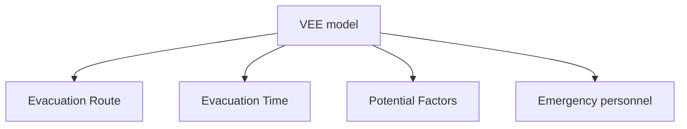
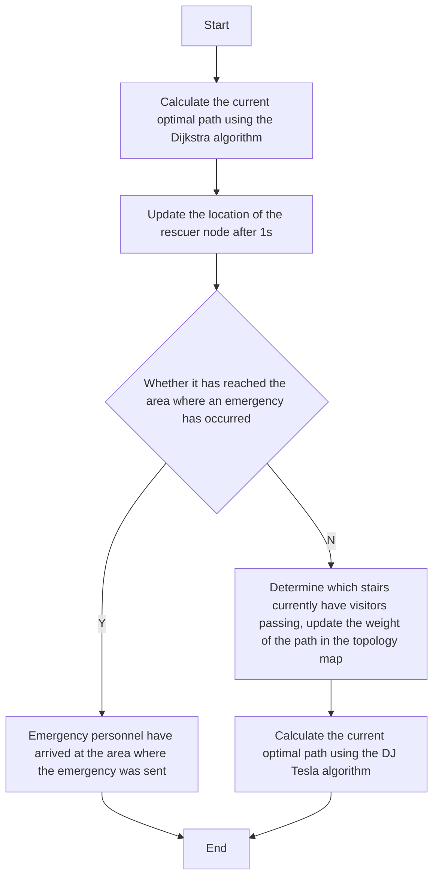
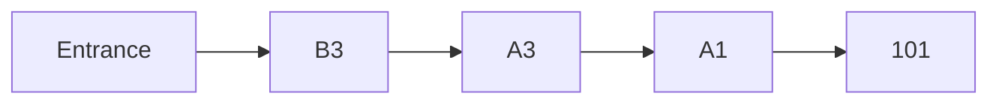
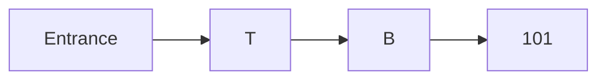

Team Control Number

For office use only

T1

T2

T3

T4

## 1922074

Problem Chosen

D

For office use only

F1

F2

F3

F4

2019

## MCM/ICM Summary Sheet

## A Model for Determining Evacuation Routes

## Summary

In 2018, the number of people in the Louvre was 10.8 million, creating a new high. At the same time, in the event of an emergency, such a large number of tourists will increase the difficulty of evacuation and raise the risk. Therefore, our goal is to design the Louvre's emergency evacuation plan to evacuate visitors from the museum and estimate the evacuation time, while also allowing emergency personnel to enter the building as quickly as possible, as well as considering other factors and potential threats.

We make the Visitor Emergency Evacuation(VEE) model to design the evacuation plan. The first model of the emergency evacuation plan is based on an improved ant colony optimization algorithm. The model transforms the entire Louvre into a topological map and influences the selection probability by setting the pheromone concentration threshold to determine the optimal evacuation route for visitors to leave from each region. We also established an evacuation time model and found that the shortest evacuation time for the largest number of visitors in the library was 417.2 s. This result indicates that our evacuation plan is reliable.

The third model uses the improved Dijkstra algorithm. The model considers the entire Louvre as a time-varying topology map to determine the route of emergency personnel to the emergency area as quickly as possible. By assuming an emergency in the 101 area of the -1F and adding a new exit near the B3 stairs of the 0F, the optimal path for the emergency personnel to reach the area and the shortest time of 130s are obtained. This result shows that our model is reliable.

We also discussed other factors that have an impact on evacuation time, such as whether to open new exports, the impact of tourist diversity, the consequences of potential threats, and so on. And we propose policy and procedural recommendations for emergency management of the Louvre . Additionally, we discuss how we can adapt and implement our models for other large, crowded structures. Then we performed sensitivity analysis on two important parameters: the number of people passing through the stairs and the speed. The results show that the changes of these two parameters will have a huge impact on the shortest evacuation time.

Key Words: Emergency evacuation plan, Ant colony optimization algorithm, Time model, Dijkstra algorithm, Other factors

## Content

## 1. Introduction...

1.1 Background..  
1.2 Restatement of Problems...  
1.3 Our Work.. 2

## 2. Assumptions and Symbol Table.......

2.1 Assumptions.... 2  
2.2 Symbol Table..

## 3. The Visitor Emergency Evacuation model.

3.1 Distribution of tourists..  
3.2 The evacuation route.. .4  
3.3 The evacuation time.  
3.4 Emergency personnel.. 10  
3.5 Potential factors.. . 13

## 4. Policy and procedural recommendations.........

## 5. The VEE model for other large structures...........

## 6. Sensitivity Analysis.

## 7. Strengths and Weaknesses...... . 20

7.1 Strengths. .20  
7.2 Weaknesses.. . 20

## 8. Conclusion..... ... 20

## 9. References. .21

## 10. Appendix.. 21

## 1. Introduction

## 1.1 Background

Nowadays, urban development has entered a period of rapid growth, the city’s scale has expanded rapidly, the number of high-rise buildings and large buildings has increased, and personnel are highly intensive. The dangers and harmfulness of unconventional emergencies, such as overcrowded and trampling in open spaces and buildings, are becoming more and more serious, making the public security of the mainland face severe challenges. Due to the serious casualties caused by emergency emergencies in densely populated places, which is one of the major disasters faced by mankind. Hence, solving the problem of emergency evacuation in densely populated areas has its unprecedented significance in today’s world.

The increasing number of terror attacks in France requires a review of the emergency evacuation plans at many popular destinations. In general, the goal of evacuation is to have all occupants leave the building as quickly and safely as possible. Upon notification of a required evacuation, individuals egress to and through an optimal exit in order to empty the building as quickly as possible.

The Louvre is one of the world’s largest and most visited art museum, receiving more than 8.1 million visitors in 2017. The number of guests in the museum varies throughout the day and year, which provides challenges in planning for regular movement within the museum. The diversity of visitors -- speaking a variety of languages, groups traveling together, and disabled visitors -- makes evacuation in an emergency even more challenging. As a result, it is necessary for the Louvre to have a complete emergency evacuation plan.

## 1.2 Restatement of Problems

To evacuate people safely when an emergency occurs, the reasonable evacuation plans at the Louvre should be developed, while the following tasks are to be accomplished :

• The number of guests in the museum varies throughout the day and year and the diversity of visitors such as disabled visitors make evacuation in an emergency challenging. What’s more, the actual exit points that can be used is not only the four exits that the public knows. While public awareness of these exit points could provide additional strength to an evacuation plan, their use would simultaneously cause security concerns due to the lower or limited security postures at these exits compared with level of security at the four main entrances. Thus, when creating the model, we should consider carefully how to evacuate disabled visitors, when and how any additional exits might be utilized.

• The model should allow the museum leaders to explore a range of options to evacuate visitors from the museum, while also allowing emergency personnel to enter the building as quickly as possible. It is also important to identify potential bottlenecks that may limit movement towards the exits, address a broad set of considerations and various types of potential threats.

• Validate the model and discuss how the Louvre would implement it.

• Based on the results of the work, propose policy and procedural recommendations for emergency management of the Louvre.

## 1.3 Our Work

According to the current queuing time displayed by the APP "Affluences", we get different numbers of people at different times of the day. According to the improved ant colony optimization algorithm, we get the best evacuation route for tourists. Through our time model, we found the shortest time for visitors to evacuate. Based on the improved Dijkstra algorithm, we get the optimal route for emergency personnel to reach the emergency area and calculate the required time. At the same time, other potential factors were considered, such as the diversity of visitors, the opening of other entrances and exits, and uncertain potential threats.

Finally, the propose policy and procedural recommendations for emergency management of the Louvre and Additionally, discuss how we can adapt and implement our models for other large, crowded structures.

## 2. Assumptions and Symbol Table

## 2.1 Assumptions

We make the following basic assumptions in order to simplify the problem. Each of our assumptions is justified.

• Assuming that each visitor runs at the same speed.  
• Assuming that the distance from chest to back of each visitor is the same. The length of the queue can be calculate directly based on the number of visitors.  
• Assuming that visitors will escape from the building orderly.  
• Assuming that when a block happen, tourists with low floors on the stairs are evacuated firstly.

## 2.2 Symbol Table

Symbol that we mainly use in the model are shown in the following table :

Table 1: Symbol Table

<table><tr><td>Symbol</td><td>Definition</td></tr><tr><td> $I$ </td><td>the number of stairs on the  $2^{nd}$  floor</td></tr><tr><td> $L_{ii}$ </td><td>the length of the human chain at the  $i^{th}$  stairs of the  $j^{th}$  floor</td></tr><tr><td> $L_f$ </td><td>the length of the stairs</td></tr><tr><td> $t_i$ </td><td>the time evacuate from the  $i^{th}$  stairs</td></tr><tr><td> $S_{ij}$ </td><td>the number of visitors at the  $i^{th}$  stairs entrance of the  $j^{th}$  floor</td></tr><tr><td> $n_f$ </td><td>the space between visitors</td></tr><tr><td> $l_i$ </td><td>the length required to escape to the  $i^{th}$  staircase</td></tr><tr><td> $T_{\min}$ </td><td>the time for evacuating all visitors</td></tr></table>

## 3. The Visitor Emergency Evacuation model

In this model, when an emergency occurs, the Visitor Emergency Evacuation(VEE) model uses the improved ant colony optimization algorithm to plan evacuation routes for visitors and calculate the the minimum time for evacuation. It also uses the improved Dijkstra Algorithm to consider how emergency personnel reach the emergency area as quickly as possible and other potential factors such as other entrances that visitors don’t know, diversity of visitors and various types of potential threats.


<details>
<summary>flowchart</summary>


</details>

Figure 1. The VEE Model

According to the floor plan of the Louvre, we can know that the Louvre has four main entrances, including the pyramid entrance, the Passage Richelieu entrance, the Carrousel du Louvre entrance on the $2 ^ { \mathrm { n d } }$ floor, and the Portes Des Lions entrance on the $0 ^ { \mathrm { t h } }$ floor of the building. Due to the different locations of the open exhibition areas on each floor, we divide the Louvre into two catecories: one category has five floors(from -2F to 2F), there are three entrance located on the $- 2 ^ { \mathrm { n d } }$ basement. The other category has three floors(from 0F to 2F), while the entrance is on the ${ \bf 0 } ^ { \mathrm { t h } }$ floor. Most visitors in this area will go through the stairs to the entrance, the rest of the visitors can escape directly on the $0 ^ { \mathrm { t h } }$ floor.

## 3.1 Distribution of tourists

There are many exhibition areas in the Louvre. In order to facilitate the calculation, we first assume that the number of people in each exhibition area is equal. According to the information, there are three art treasures in the Louvre, located in 345, 703 and 711. The number of tourists in these three exhibition areas is too many. We assume that the three exhibition areas have three times as much as the number of tourists in the ordinary exhibition area. Then, the number of tourists in each exhibition area is obtained.

The number of visitors in the Louvre varies throughout the day and year. We reverse the current number of people in the library based on the current queue time by “Affluences” and record it every 15 minutes. Then we can get the diagram between number of visitors and time. As we all know, the Louvre is open every day (except Tuesday) from 9 A.M. to 6 P.M, night opening until 9:45 P.M. on Wednesdays and Fridays. Regardless of the special events, the change of visitors’ number is showed in the Figure 2. 2(B) represents the change on Wednesdays and Fridays, 2(A) represents the change on rest days.


<details>
<summary>line chart</summary>

| time(hour) | Number of tourists |
| ---------- | ------------------ |
| 9          | 1000               |
| 10         | 4000               |
| 11         | 10500              |
| 12         | 10000              |
| 13         | 7200               |
| 14         | 8500               |
| 15         | 9500               |
| 16         | 7000               |
| 17         | 3000               |
| 18         | 500                |
</details>


<details>
<summary>line chart</summary>

| time(hour) | Number of tourists |
| ---------- | ------------------ |
| 8          | 1000               |
| 10         | 6000               |
| 12         | 8000               |
| 14         | 5500               |
| 16         | 7000               |
| 18         | 4500               |
| 20         | 3000               |
| 22         | 1000               |
</details>

Figure 2. The number of visitors

## 3.2 The evacuation route

We cite and reference the ant colony optimization algorithm of "Mathematical model of emergency evacuation in densely populated areas and its optimal solution" [5] and improve it, and use the improved ant colony optimization algorithm to select the optimal escape route, and establish the following route model.

## 3.2.1 Traditional ant colony optimization algorithm

We convert the Louvre's plan into a topology and build a mesh function $G ( N . R , \tau _ { 0 } )$ , where N is the node set. Staircases, each of exhibitions and entrances are nodes. R is route set. Stairs, corridors, passages are routes. $\tau _ { 0 }$ is an environmental initial pheromone distribution. m is the total number of ants, $m = \sum _ { i = 1 } ^ { n } b _ { i } ( t )$ , b (t) is the number of ants of the $i ^ { t h }$ node at time t .

During the iteration of k times $\left( k = N C _ { \operatorname* { m a x } } \right)$ , the ant $k ( k = 1 , 2 , . . . , m )$ select the probability according to the pheromone concentration left by the ant colony. The selection probability $p _ { i j } ^ { k } \left( t \right)$ is the probability that the ant k moves from the $i ^ { t h }$ node to the $j ^ { t h }$ node at time t . Function $\tau _ { i j } ( t )$ indicates the concentration of pheromone between nodes $i , j$ at time t . is pheromone heuristic factor which indicates how important pheromone is to ant selection probabilities, $\beta$ is expected heuristic value which indicates how important expectation value is to ant selection probabilities. $a l l o w e d _ { k }$ is a feasible set, indicating the set of nodes that ant k can choose next.

$$
p _ {i j} ^ {k} (t) = \left\{ \begin{array}{c} \frac {\left[ \tau_ {i j} (t) \right] ^ {\alpha} \left[ \eta_ {i j} (t) \right] ^ {\beta}}{\sum_ {s \in a l l o w e d _ {k}} \left[ \tau_ {i s} (t) \right] ^ {\alpha} \left[ \eta_ {i s} (t) \right] ^ {\beta}}, j \in a l l o w e d _ {k} \\ 0, o t h e r s \end{array} \right. \tag {1}
$$

The principle of traditional ant colony optimization algorithm is that the principle of the traditional ant colony optimization algorithm is that the ants with shorter routes release more pheromone. As time progresses, the concentration of pheromone accumulated on the shorter route gradually increases, and the number of ants that select the route is also getting more and more. Eventually, ants will focus on the best route under positive feedback. But for the evacuation of people, this situation will happen: when people reach one end of the channel and find that there are many people in the channel, people may choose another channel with fewer people to avoid congestion and collision. When it is found that there are fewer people in the channel, it means that the channel may not be the optimal escape channel, so a channel with more people will be selected. As a result, we need to improve the ant colony optimization algorithm.

## 3.2.2 Improved ant colony optimization algorithm

We set a threshold to improve the ant colony optimization algorithm. When the pheromone concentration is lower than the threshold, it means that the number of people in the channel is small. Perhaps this route is not the optimal escape route; when the pheromone concentration is higher than the threshold, it means that the channel is more likely to occur congestion and blocking.

For the threshold, when people pass through the channel, they may be crowded inside it without order. However, when passing through the exit of the channel, the maximum number of people allowed to pass at one time is only related to the width of the exit, that is, people are exporting in the form of multiple human chains. The length of the human chain is $L _ { d }$ :

$$
L _ {d} = \frac {S _ {T} d + (S _ {T} - 1) e}{n _ {d}} \tag {2}
$$

where $n _ { d }$ is the maximum number of people allowed to pass the channel, $l _ { d }$ is the length of queue, $S _ { T }$ is the number of people arriving at the exit of the channel at time $T \ : , \ : \ : \nu _ { 1 }$ is the speed when people move. The limit safety speed of people running freely is 1.5 m / s according to the survey data. At this moment, a visitor is at the entrance of the channel. The speed of human chain is v . Obviously, $\nu _ { 1 } > \nu$ .

When the human chain completely leaves the channel after $t _ { 1 }$ （the time）, the tourists just arrive at the exit of a channel, which means that the length is the most suitable and this channel is the optimal route. That is, $t _ { 1 } = \frac { L _ { d } } { \nu } = \frac { L _ { d } } { \nu _ { 1 } }$ L  d . At this moment, nS vt . $S _ { T } = n \nu t _ { 1 }$

Let each person carry a pheromone, then the pheromone concentration of the channel is $n \nu t _ { 1 }$ , the threshold is $t _ { 1 }$ . Finally, the selection probability after improvement is:

$$
p _ {i j} ^ {k} (t) = \left\{ \begin{array}{l} \frac {\left[ \tau_ {i j} (t) \right] ^ {\alpha} \left[ \eta_ {i j} (t) \right] ^ {\beta}}{\sum \left[ \tau_ {i s} (t) \right] ^ {\alpha} \left[ \eta_ {i s} (t) \right] ^ {\beta}}, j, s \in \text {allowed} _ {k}, \tau_ {i j} (t) \leq n v t _ {1} \\ 1 - \frac {\left[ \tau_ {i j} (t) \right] ^ {\alpha} \left[ \eta_ {i j} (t) \right] ^ {\beta}}{\sum \left[ \tau_ {i s} (t) \right] ^ {\alpha} \left[ \eta_ {i s} (t) \right] ^ {\beta}}, j, s \in \text {allowed} _ {k}, \pi_ {i j} (t) > n v t _ {1} \\ 0, o t h e r s \end{array} \right. \tag {3}
$$

## 3.2.3 The optimal evacuation route

We convert the Louvre's floor plan into a topographic map, and the following figure is an example of the $\mathbf { 1 } ^ { \mathrm { s t } }$ and $2 ^ { \mathrm { n d } }$ floor.

```mermaid
graph TD
    subgraph Section 1F
  A1[" "] --> B1["E1"]
  B1 --> C1[" "]
  C1 --> D1[" "]
  D1 --> E1[" "]
  E1 --> F1["B"]
  F1 --> G1[" "]
  G1 --> H1["B4"]
  H1 --> I1["T3"]
  I1 --> J1["T4"]
  J1 --> K1["T4"]
  K1 --> L1["T3"]
    end
    subgraph Section 2F
  M1[" "] --> N1["E1"]
  N1 --> O1[" "]
  O1 --> P1[" "]
  P1 --> Q1[" "]
  Q1 --> R1["E2"]
  R1 --> S1[" "]
  S1 --> T1["T1"]
  T1 --> U1["T2"]
  U1 --> V1["T4"]
  V1 --> W1["F"]
    end
    style Section 2F fill:#f9f,stroke:#333
    style Section 1F fill:#bbf,stroke:#333
```


<details>
<summary>flowchart</summary>


</details>

Figure 3. The topology of the 1st and 2nd floor

In the topology, circles indicate various areas, and the nodes with symbols refers to the entrances of stairs, and the red line refers to stairs between different floors.

We choose the appropriate parameters, bring the Louvre plane topology into the algorithm, and finally get the following optimal evacuation routes. In Figure $^ { 4 , }$ orange arrows indicate evacuated routes.

```mermaid
graph TD
    subgraph sg_2F["-2F"]
  ExitA["ExitA"] --> ExitB["ExitB"]
  ExitB --> A1["A1"]
  A1 --> A2["A2"]
  A2 --> A3["A3"]
    end

    subgraph sg_1F["-1F"]
  ExitA --> ExitB
  ExitB --> A3
  A3 --> A4["A4"]
  A4 --> A5["A5"]
  A5 --> A6["A6"]
  A6 --> A7["A7"]
  A7 --> A8["A8"]
  A8 --> A9["A9"]
  A9 --> A10["A10"]
  A10 --> A11["A11"]
  A11 --> A12["A12"]
  A12 --> A13["A13"]
  A13 --> A14["A14"]
  A14 --> A15["A15"]
  A15 --> A16["A16"]
  A16 --> A17["A17"]
  A17 --> A18["A18"]
  A18 --> A19["A19"]
  A19 --> A20["A20"]
  A20 --> A21["A21"]
  A21 --> A22["A22"]
  A22 --> A23["A23"]
  A23 --> A24["A24"]
  A24 --> A25["A25"]
  A25 --> A26["A26"]
  A26 --> A27["A27"]
  A27 --> A28["A28"]
  A28 --> A29["A29"]
  A29 --> A30["A30"]
  A30 --> A31["A31"]
  A31 --> A32["A32"]
  A32 --> A33["A33"]
  A33 --> A34["A34"]
  A34 --> A35["A35"]
  A35 --> A36["A36"]
  A36 --> A37["A37"]
  A37 --> A38["A38"]
  A38 --> A39["A39"]
  A39 --> A40["A40"]
  A40 --> A41["A41"]
  A41 --> A42["A42"]
  A42 --> A43["A43"]
  A43 --> A44["A44"]
  A44 --> A45["A45"]
  A45 --> A46["A46"]
  A46 --> A47["A47"]
  A47 --> A48["A48"]
  A48 --> A49["A49"]
  A49 --> A50["A50"]
  A50 --> A51["A51"]
  A51 --> A52["A52"]
  A52 --> A53["A53"]
  A53 --> A54["A54"]
  A54 --> A55["A55"]
  A55 --> A56["A56"]
  A56 --> A57["A57"]
  A57 --> A58["A58"]
  A58 --> A59["A59"]
  A59 --> A60["A60"]
  A60 --> A61["T61"]
  A61 --> A62["T62"]
  A62 --> A63["T63"]
  A63 --> A64["T64"]
  A64 --> T["T7T"]
    end

    subgraph sg_0F["0F"]
  ExitC["ExitC"] --> ExitD["ExitD"]
  ExitD --> ExitE["ExitE"]
  ExitE --> ExitF["ExitF"]
    end

    subgraph sg_1F_2["1F"]
  ExitF["ExitF"] --> ExitG["ExitG"]
  ExitG --> ExitH["ExitH"]
  ExitH --> ExitI["ExitI"]
  ExitI --> ExitJ["ExitJ"]
    end

    subgraph sg_2F_2["2F"]
  ExitF["ExitF"] --> ExitK["ExitK"]
  ExitK --> ExitL["ExitL"]
  ExitL --> ExitM["ExitM"]
    end

    style -2F fill:#f9f,stroke:#333
    style -1F fill:#ccf,stroke:#333
    style 0F fill:#cfc,stroke:#333
    style 1F fill:#fcc,stroke:#333
    style 2F fill:#ffc,stroke:#333
    style 0F fill:#fff,stroke:#333
    style 1F fill:#fff,stroke:#333
    style 2F fill:#fff,stroke:#333
    style 0F fill:#fff,stroke:#333
    style 1F fill:#fff,stroke:#333
    style 2F fill:#fff,stroke:#333
    style 0F fill:#fff,stroke:#333
    style 1F fill:#fff,stroke:#333
    style 2F fill:#fff,stroke:#333
    style -2F fill:#fff,stroke:#333
    style -1F fill:#fff,stroke:#333
    style 0F fill:#fff,stroke:#333
    style 1F fill:#fff,stroke:#333
    style 2F fill:#fff,stroke:#333
    style -2F fill:#fff,stroke:#333
    style -1F fill:#fff,stroke:#333
    style 0F fill:#fff,stroke:#338
    style 1F fill:#fff,stroke:#338
    style 2F fill:#fff,stroke:#338
    style -2F fill:#fff,stroke:#338
    style -1F fill:#fff,stroke:#338
    style -2F fill:#fff,stroke:#338
```


<details>
<summary>flowchart</summary>


</details>

Figure 4. The optimal evacuation route for the Louvre

## 3.3 The evacuation time

We figure out that the time required to evacuate all the visitors in the Louvre is the time when last visitor escapes from the Louvre. Moreover, the farthest floor from the $0 ^ { \mathrm { t h } }$ floor and the $2 ^ { \mathrm { n d } }$ basement is the $2 ^ { \mathrm { n d } }$ floor. As a result, there must be a stairway that allows visitors from this stairway to evacuate for the longest time. The time required to evacuate all visitors is the longest time for the last visitor to escape the Louvre, and the shortest evacuation time is the minimum of the longest time.

Assuming that the number of stairs on the 2nd floor is I , the length of the human chain at the $i ^ { t h }$ stairs of the $j ^ { t h }$ floor is $L _ { i j }$ , the length of the stairs is $L _ { f }$ , the time evacuate from the $i ^ { t h }$ stairs is $t _ { i }$ , the number of visitors at the $i ^ { t h }$ stairs entrance of the $j ^ { t h }$ floor is $S _ { i j }$ , $d$ is the thickness of a visitor, $e$ is the space between visitors, n is the number of visitors $n _ { f }$ who can accommodate up to one row at the stairway, v is the speed when people run, $l _ { j } ^ { ~ \dag }$ is the length of the exit from the person to the floor with the exit, $l _ { i }$ is the length required to escape to the $i ^ { t h }$ staircase, $t _ { d }$ is the time of blockage in the stairs, $T _ { \mathrm { m i n } }$ is the time for evacuating all visitors.

The length of the human chain is determined by the thickness $d$ of each person, the distance $e$ between people and the number of people through the stairs $n _ { f }$ . No matter how crowded outside the stairway, when passing through the stairway, the number of people passing through the stairway is just $n _ { f }$ , so the human chain can be equivalent to the $n _ { f }$ personal chain, and the new human chain length $L _ { i j }$ is:

$$
L _ {i j} = \frac {S _ {i j} d + (S _ {i j} - 1) e}{n _ {f}} \tag {4}
$$

The t is composed of the following times: the time $t _ { i }$ $\frac { l _ { i } } { \nu }$ from the current area to the stairway; the time $\frac { L _ { f } } { \nu }$ through the stairs; the time $\frac { l _ { j } ^ { ' } } { \nu }$ after reaching the exit floor, the time to the exit; the time $\frac { L _ { i j } } { \nu }$ Lij through the exit; and possibly on the way The congestion time caused by the blockage will occur $t _ { d }$ .So we can get:

$$
t _ {i} = \frac {l _ {i}}{v} + \frac {L _ {f}}{v} + \frac {L _ {i j}}{v} + \frac {l _ {j} ^ {\prime}}{v} + t _ {d} \tag {5}
$$

So, The shortest evacuation time is

$$
T = \min \left\{\max t _ {i} \right\} \tag {6}
$$

For $t _ { d }$ :

• Everyone moves at the same speed in the channel, so there is no blockage.  
• Since the escape route of each layer may pass through the same stairs, the length and width of the stairs are determined. The following situation is easy to occur: visitors on the $2 ^ { \mathrm { n d } }$ floor have reached the $\mathbf { 1 } ^ { \mathrm { s t } }$ floor stairs, and visitors on the $\mathbf { 1 } ^ { \mathrm { s t } }$ floor have not escaped from this stairway, and finally blockage will occur.

We assume that when the above situation occurs, there is a priority, that is, the higher floor allows the lower floor visitors to go first. Then we can get the following model where $L _ { i j } "$ is length of the human chain of the $\left( j - 1 \right) ^ { t h }$ staircase of the $i ^ { t h }$ floor, and ${ l } _ { i } ^ { \dag }$ is the distance to the stairs.

$$
t _ {d} = \sum_ {j} \frac {L _ {i j} ^ {\prime} - \left[ \left(\frac {l _ {i}}{v} + \frac {L _ {f}}{v} + \frac {L _ {i j}}{v}\right) \cdot v - l _ {i} ^ {\prime} \right]}{v} \tag {7}
$$

$$
t _ {d} = \sum_ {j} \frac {L _ {i j} ^ {\prime} + l _ {i} ^ {\prime} - \left(l _ {i} + L _ {f} + L _ {i j}\right)}{v} \tag {8}
$$

Set a parameter $\beta$ , when $t _ { { \scriptscriptstyle d } } > 0 , \beta = 1$ ; when $t _ { d } < 0$ , $\beta = 0$ .

For the three floors model, the number of visitors on the $2 ^ { \mathrm { n d } }$ floor is $S ^ { 2 }$ , the $1 ^ { \mathrm { s t } }$ floor is $S ^ { 1 }$ and the ${ \bf 0 } ^ { \mathrm { t h } }$ is $S ^ { 0 }$ .

When an emergency occurs, since Arts of Africa, Asia, Oceania and the Americas is not connected to other areas on the $0 ^ { \mathrm { t h } }$ floor, only visitors in Arts of Africa, Asia, Oceania and the Americas can escape from the Portes Des Lions entrance. As a result, the evacuation plan of the visitors on the $0 ^ { \mathrm { t h } }$ floor can be divided into two situations:

$$
S ^ {0} = S ^ {0 0} + S ^ {0 1} \tag {9}
$$

The visitors in Arts of Africa, Asia, Oceania and the Americas can escape directly, the number is $S ^ { 0 0 }$ . The rest visitors on the $0 ^ { \mathrm { t h } }$ can run from the $0 ^ { \mathrm { t h } }$ floor to the $1 ^ { \mathrm { s t } }$ floor, then run to the stairs leading to the Arts. Downstairs and escape from the Portes Des Lions entrance. The number of visitors in this part is $S ^ { 0 1 }$ . We observe the escape route, and find that the stairs from the $0 ^ { \mathrm { t h } }$ floor to the $\mathbf { 1 } ^ { \mathrm { s t } }$ floor is different from the stairs from the $2 ^ { \mathrm { n d } }$ floor to the $\mathbf { 1 } ^ { \mathrm { s t } }$ floor. Therefore, visitors escape from 0F to 1F can be equivalent to visitors escape from the $2 ^ { \mathrm { n d } }$ floor to the $\mathbf { 1 } ^ { \mathrm { s t } }$ floor.

$$
S ^ {2 \prime} = S ^ {0 1} + S ^ {2} \tag {10}
$$

Where $S ^ { 2 \prime }$ is the number of visitors on the $2 ^ { \mathrm { n d } }$ floor after the equivalent.

The $0 ^ { \mathrm { t h } }$ floor and the $2 ^ { \mathrm { n d } }$ floor can be equivalent to the same floor, so there are only the situations that 2 floors of visitors going down the stairs on the first floor, and the first floor visitors have not been evacuated. The time of congestion $t _ { d }$ is:

$$
t _ {d} = \frac {L _ {i 1} ^ {\prime} + l _ {i} ^ {\prime} - (l _ {i} + L _ {f} + L _ {i 2})}{v} \tag {11}
$$

The evacuation time of three floors model $T _ { 3 }$ is:

$$
T _ {3} = \min \left\{\max \left\{t _ {i} \right\} \right\} \tag {12}
$$

$$
\left\{ \begin{array}{l} t _ {d} = \frac {L _ {i 1} ^ {\prime} + l _ {i} ^ {\prime} - \left(l _ {i} + L _ {f} + L _ {i 2}\right)}{v} \\ L _ {i 2} = \frac {S _ {i 2} d + \left(S _ {i 2} - 1\right) e}{v} \\ \sum_ {i = 1} ^ {I} S _ {i j} = S ^ {2} + S ^ {0 1} \\ t _ {i} = \frac {l _ {i} + L _ {f} + L _ {i 2} + l _ {j} ^ {\prime}}{v} \end{array} \right. \tag {13}
$$

For the five floors model, when the visitors on the $2 ^ { \mathrm { n d } }$ floor are evacuating, the visitors on the $\mathbf { 1 } ^ { \mathrm { s t } }$ basement, ${ \bf 0 } ^ { \mathrm { t h } }$ , and $\mathbf { 1 } ^ { \mathrm { s t } }$ floor may be stuck on the stairs and not evacuated. So, the time of congestion $t _ { d }$ is:

$$
t _ {d} = \sum_ {j = - 1} ^ {1} \frac {L _ {i j} ^ {\prime} + l _ {i} ^ {\prime} - (l _ {i} + L _ {f} + L _ {i 2})}{v} \tag {14}
$$

There are three exits on the $2 ^ { \mathrm { n d } }$ basement, and the Carrousel du Louvre entrance and the Passage Richelieu entrance pass through the same channel, so they can regard as one large exit. The entrance to the pyramid requires a stairway on the $2 ^ { \mathrm { n d } }$ basement, which is the same length as the other two exit channels. As a result, three exits can be equivalent to a new exit. The number $n ^ { \prime }$ of people passing through the new exit is the sum of the three exits. The evacuation time of five floors model $T _ { 5 }$ is:

$$
T _ {5} = \min \left\{\max \left\{t _ {i} \right\} \right\} \tag {15}
$$

$$
\left\{ \begin{array}{c} t _ {d} = \sum_ {j = - 1} ^ {1} \frac {L _ {i j} ^ {\prime} + l _ {i} ^ {\prime} - (l _ {i} + L _ {f} + L _ {i 2})}{v} \\ L _ {i 2} = \frac {S _ {i 2} d + (S _ {i 2} - 1) e}{v} \\ \sum_ {i = 1} ^ {I} S _ {i j} = S ^ {2} + S ^ {0 1} \\ t _ {i} = \frac {l _ {i} + L _ {f} + L _ {i 2} + l _ {j} ^ {\prime}}{v} \end{array} \right.
$$

According to the investigation, we can get the reaction time $t _ { 0 } = 1 0 s$ .

Finally, the evacuation time $T _ { \mathrm { m i n } }$ :

$$
T _ {\min} = \max \left\{T _ {3}, T _ {5} \right\} + t _ {0} \tag {16}
$$

As we can see from the Figure 2, the number of visitors at 11:30 am on Monday, Thursday, Saturday and Sunday is the highest. It’s about 10,380. We substitute it into the time model and calculate the value of $T _ { 3 }$ and $T _ { \mathfrak { s } }$ . We use the python language for programming calculations (see the appendix for specific code). The result is:

$$
T _ {3} = 4 1 7. 2 \mathrm{s}, T _ {5} = 2 8 1. 8 \mathrm{s}
$$

The shortest evacuation time $T _ { \mathrm { m i n } }$ is 417.2s, about 7 minutes, when the number of visitors is the largest.

According to the information, the best evacuation time for different emergencies is different, but the maximum can not exceed 15 minutes. The shortest evacuation time obtained by the algorithm is realistic and short. Therefore, our model works well.

## 3.4 Emergency personnel

When there is an emergency in X area, emergency personnel is required to enter the building as soon as possible, that is, they need to reach the X area through some entrance quickly. The visitors in X area have to escape from there quickly, that is, to reach an exit as soon as possible. However, emergency personnel and visitors are prone to congestion and collisions on stairs and channels. The width of the channel is much larger than the stairs, and the main crowding and collisions will occur at the stairs, where crowding and collisions are neglected in the channel. Therefore, the best strategy is that the emergency personnel and visitors do not use the same stairs at the same time, that is, the emergency personnel need to use the stairs without visitors at that moment to avoid congestion. If seal off the original exit and only allow the emergency personnel to enter, it will greatly increase the evacuation time and cause danger. The best way is to open one of other exits for emergency personnel, and visitors still evacuate from the four main entrances.

We think of the Louvre as a topology $G ( N , R ( t ) )$ changing over time where N is the node set, $R ( t )$ is the route set that changes over time. The stairway, the various exhibition areas and the entrances are nodes. At the same time, we think of the emergency personnel as a node whose position move with time. Both the stairs and the channels are regarded as routes. The weight of the route is the time required to pass the stairs when the walking speed is $\nu = 2 m / s$ . If there are other visitors on a certain staircase at time t , the weight of the route is updated to the sum of the time through the stairs and the time for the stairs to be fully unblocked.We get the number of people at different time when the stairs are evacuated by calculations, and then get the time required for the stairs to be completely unblocked at different time. The part of results are show in the following table. The yellow grid means that the stairs are smooth for a while. After the blue finger, the stairs are always clear. The whole result can be seen in the Appendix 1.

Table 2. The time when stairs are evacuated completely

<table><tr><td>Clearing time Stairs Current moment</td><td>E 0</td><td>A1 1</td><td>A2 1</td></tr><tr><td>0</td><td>39.9</td><td>36</td><td>48</td></tr><tr><td>46</td><td>39.9</td><td>0</td><td>12</td></tr><tr><td>68</td><td>39.9</td><td>0</td><td>0</td></tr><tr><td>109.95</td><td>7.95</td><td>31.95</td><td>0</td></tr><tr><td>127.9</td><td>0</td><td>24</td><td>0</td></tr><tr><td>146</td><td>0</td><td>15.9</td><td>0</td></tr><tr><td>171.9</td><td>15.9</td><td>0</td><td>0</td></tr><tr><td>260.2</td><td>0</td><td>8.1</td><td>0</td></tr><tr><td>278.3</td><td>8.1</td><td>0</td><td>0</td></tr><tr><td>296.4</td><td>0</td><td>0</td><td>0</td></tr></table>

<table><tr><td>Clearing StairstimeCurrentmoment</td><td>B4 0</td><td>E 0</td><td>T1 0</td><td>T2 0</td></tr><tr><td>0</td><td>13.05</td><td>52.65</td><td>79.05</td><td>13.05</td></tr><tr><td>23.05</td><td>0</td><td>39.6</td><td>66</td><td>0</td></tr><tr><td>66.05</td><td>0</td><td>6.6</td><td>33</td><td>0</td></tr><tr><td>82.65</td><td>0</td><td>0</td><td>26.4</td><td>0</td></tr><tr><td>119.05</td><td>0</td><td>0</td><td>0</td><td>0</td></tr><tr><td>300.35</td><td>0</td><td>270.3</td><td>0</td><td>0</td></tr><tr><td>420.65</td><td>0</td><td>0</td><td>0</td><td>0</td></tr></table>

We use the improved Dijkstra's Algorithm to calculate the optimal route for emergency personnel to the emergency area. The specific process is as follows:


<details>
<summary>flowchart</summary>


</details>

Figure 5. The flow chart of optimal route for emergency personnel

Assuming the time spent on each route is $T _ { i }$ , and time spent on each aisle of one route is $t _ { i j }$ , the time spent on passing staircase is $\Delta t _ { i j }$ , for a specific route, $\Delta t _ { i j }$ will be changed because of the passing of time while $t _ { i j }$ will not. $\Delta t _ { i j }$ consists of two parts, time consumption of going up or down stairs, time consumption of staircase congestion.

$$
T _ {i} = \sum_ {j} t _ {i j} + \sum_ {j} \Delta t _ {i j} \tag {17}
$$

Then the minimal time cost is min( )T , and the route corresponds to min( )T is the shortest

route at this moment.

For example, some emergency people now enter by a new entrance (in the southernmost of Sully, close to the staircase B3), and their destination is the room 101 on the -1F. We assume the time from the start of evacuation as T .We set T as 180 and 150, and bring them into our model. The shortest route we get is the same and showed in the following figure:


<details>
<summary>flowchart</summary>


</details>

Figure 6. The shortest route A when $T = 1 8 0$ and $T = 1 5 0$

We set T as 120 and 90, and bring them into our model. The shortest route we get is the same and showed in the following figure:


<details>
<summary>flowchart</summary>


</details>

Figure 7. The shortest route B when T 120 and $T = 9 0$

The route map is showed in the following figure:


<details>
<summary>floor plan diagram</summary>

| Location | Exhibition Area | Accessible Area | Stairs | Target | Emergency Entrance |
| --- | --- | --- | --- | --- | --- |
| 1 | 100 |  |  |  |  |
| 2 | 102 |  |  | B1 |  |
| 3 | 103 |  |  | A1 |  |
| 4 | 104 |  |  | B2 |  |
| 5 | 105 |  |  | B3 |  |
| 6 | 106 |  |  | A3 |  |
| 7 | 107 |  |  | A2 |  |
| 8 | 108 |  |  | A1 |  |
| 9 | 109 |  |  | B1 |  |
| 10 | 110 |  |  | B2 |  |
| 11 | 111 |  |  | A2 |  |
| 12 | 112 |  |  | A3 |  |
| 13 | 113 |  |  | A1 |  |
| 14 | 114 |  |  | B3 |  |
| 15 | 115 |  |  | B2 |  |
| 16 | 116 |  |  | A2 |  |
| 17 | 117 |  |  | A1 |  |
| 18 | 118 |  |  | B1 |  |
| 19 | 119 |  |  | B2 |  |
| 20 | 120 |  |  | A3 |  |
| 21 | 121 |  |  | A2 |  |
| 22 | 122 |  |  | A1 |  |
| 23 | 123 |  |  | B2 |  |
| 24 | 124 |  |  | B3 |  |
| 25 | 125 |  |  | A3 |  |
| 26 | 126 |  |  | A2 |  |
| 27 | 127 |  |  | A1 |  |
| 28 | 128 |  |  | B2 |  |
| 29 | 129 |  |  | B3 |  |
</details>

Figure 8. The route map for route A and B

As the moving speed of emergency personnel is estimated to be 2m/s. And they won’t be blocked in staircase because of the small number. While all the staircases are unobstructed, we calculate the time cost of route A and B :

$$
T _ {A} = 1 3 0 s, T _ {B} = 1 6 0 s
$$

Time for evacuation of each stairs in route A is showed in the Table 3.

Table 3. Time for evacuation of each stairs in route A

<table><tr><td>Stairs</td><td>B3</td><td>A3</td><td>A1</td></tr><tr><td>Time</td><td>110s</td><td>46s</td><td>172s</td></tr></table>

Time for evacuation of each stairs in route B is showed in the Table 4.

Table 4. Time for evacuation of each stairs in route B

<table><tr><td>Stairs</td><td>T</td><td>B</td></tr><tr><td>Time</td><td>66s</td><td>110s</td></tr></table>

So route A can be totally evacuated in 172s, and route B is 110s.

While $T = 9 0$ , route A and B are both obstructed, and emergency people need to wait until staircases become usable. The time cost of waiting for A is 82s and waiting for B is 20s. The totally time cost on route A is 212s, and on route B is 180s, so route B is shorter.

While $T = 1 5 0$ , route A is still obstructed. The time cost of waiting for A is 22s and waiting for B is 0s. The totally time cost on route A is 152s, and on route B is 160s. So route A is shorter.

While $T = 1 8 0$ , route A and B are both obstructed. The totally time cost on route A is 130s, and on route B is 160s. So route A is shorter.

According to the calculations, we choose the value of threshold $T = 1 4 1$ .

## 3.5 Potential factors

There are some potential factors we need to consider: diversity of visitors and other entrances visitors don’t know.

## 3.5.1 Diversity of visitors

• Tourist group: whether it is a group or an individual to visit the Louvre, when an emergency occurs, the most important thing to do is to quickly escape breaking up the whole into parts instead waiting for the group to gather and then evacuate which may miss the best escape time.

• Languages diversity: the languages diversity often leads some visitors to fail to understand the instructions of emergency broadcasters and evacuation personnel.In our model, it means that the time $\frac { l _ { i } } { \nu }$ to reach the stairway increases. We count the number of tourists from all over the world in the Louvre in 2018 and get percentages of languages showed in Figure 9.

The proportion of all kinds of languages among tourists


<details>
<summary>pie chart</summary>

| Language | Percentage (%) |
| :--- | :--- |
| French | 25 |
| English | 30 |
| Spanish | 10 |
| Chinese | 13 |
| German | 9 |
| Italian | 8 |
| Other | 5 |
</details>

Figure 9. The nationality distribution of visitors

Considering that most tourists are from European and American countries, we have established the following measures:

\- Use English in emergency broadcasts, then broadcast them in French, Spanish, and Chinese.

\- The staff mainly use English and French for evacuation guidance.

\- The safety exit signs in the Louvre are marked in English and French. The legend of the emergency evacuation route map should be in English and French. The route instructions should not use words as much as possible.

• The disabled: In the Louvre, the disabled can only use disabled elevators. We still use the ant colony optimization algorithm and modify the topology $G ( N , R , \tau _ { 0 } )$ where N is the node set and R is route set. We changed the stairs in the path set R to the disabled stairs, and changed the ordinary stairway in the node set N to the disabled stairway. The nodes are dedicated elevators for disabled people. The movement speed of disabled people ${ \nu _ { 1 } } ^ { \prime } { = } 1 m / s$ . The capacity of elevators $n ^ { \prime }$ is 10 people. Eventually, we can draw a route map for the escape of disabled people, and Figure 10 is the escape route map on the 2nd floor.


<details>
<summary>floor plan diagram</summary>

| Location | Value |
|---|---|
| 1 | 854 |
| 2 | 848 |
| 3 | 855 |
| 4 | E1 |
| 5 | 802 |
| 6 | 803 |
| 7 | 811 |
| 8 | 825 |
| 9 | 843 |
| 10 | 836 |
| 11 | 800 |
| 12 | 823 |
| 13 | 818 |
| 14 | 835 |
| 15 | 830 |
| 16 | 912 |
| 17 | B4 |
| 18 | 917 |
| 19 | B4 |
| 20 | T3 |
| 21 | 932 |
| 22 | T |
| 23 | 952 |
| 24 | 941 |
| 25 | 940 |
| 26 | 936 |
| 27 | 931 |
| 28 | T4 |
Legend: Green = Exhibition area, Light Blue = Stairs, Yellow = lift for disabled people
</details>

Figure 10. The escape route map for the disabled on the 2nd floor

## 3.5.2 Other entrances

• Huge visitors traffic: According to the information, when the Louvre held the Da Vinci exhibition in 2012, the daily visitors amounted to three times as many as the usual. If there were any emergency at this time, the evacuation time would increase rapidly when only the original four main entrances open. Based on the Time Model, we study the relationship between the number of visitors and the evacuation time, and represent it by the Figure 11.


<details>
<summary>line chart</summary>

| Number of tourists (×10⁴) | Time of evacuation (seconds) |
| ------------------------- | ---------------------------- |
| 0                         | 0                            |
| 1                         | ~100                         |
| 2                         | ~400                         |
| 3                         | ~900                         |
| 4                         | ~1500                        |
| 5                         | ~2200                        |
| 6                         | ~3300                        |
</details>

Figure 11. The relationship between number of visitors and evacuation time

The prime time for emergency evacuation is 15 minutes when the number of visitors is 28000. Therefore, it’s necessary to consider other exit points when the number of visitors is 28000.

The surge in visitors is usually due to some reasons such as free ticket opening, special exhibitions and so on. The Louvre will strengthen security forces to prevent a stampede. Therefore, there is no need to worry about the safety of other exit points. What’s more, a new route map is obtained by modifying the node set $N$ in the ant colony optimization algorithm. We find an entrance in the 338 area of the $0 ^ { \mathrm { t h } }$ floor that is closed normally.

Figure 12 is the route map of the $0 ^ { \mathrm { t h } }$ floor and the $\mathbf { 1 } ^ { \mathrm { s t } }$ floor after opening the entrance.


<details>
<summary>heatmap</summary>

| Category | Location | Value |
| --- | --- | --- |
| 0F | T3 | 308 |
| 0F | T4 | 321 |
| 0F | T7 | 328 |
| 0F | T8 | 345 |
| 0F | T9 | 339 |
| 0F | T10 | 340 |
| 0F | T11 | 345 |
| 0F | T12 | 345 |
| 0F | T13 | 345 |
| 0F | T14 | 345 |
| 0F | T15 | 345 |
| 0F | T16 | 345 |
| 0F | T17 | 345 |
| 0F | T18 | 345 |
| 0F | T19 | 345 |
| 0F | T20 | 345 |
| 0F | T21 | 345 |
| 0F | T22 | 345 |
| 0F | T23 | 345 |
| 0F | T24 | 345 |
| 0F | T25 | 345 |
| 0F | T26 | 345 |
| 0F | T27 | 345 |
| 0F | T28 | 345 |
| 0F | T29 | 345 |
| 0F | T30 | 345 |
| 0F | T31 | 345 |
| 0F | T32 | 345 |
| 0F | T33 | 345 |
| 0F | T34 | 345 |
| 0F | T35 | 345 |
| 0F | T36 | 345 |
| 0F | T37 | 345 |
| 0F | T38 | 345 |
| 0F | T39 | 345 |
| 0F | T40 | 345 |
| 0F | T41 | 345 |
| 0F | T42 | 345 |
| 0F | T43 | 345 |
| 0F | T44 | 345 |
| 0F | T45 | 345 |
| 0F | T46 | 345 |
| 0F | T47 | 345 |
| 0F | T48 | 345 |
| 0F | T49 | 345 |
| 0F | T50 | 345 |
| 0F | T51 | 345 |
| 0F | T52 | 345 |
| 0F | T53 | 345 |
| 0F | T54 | 345 |
| 0F | T55 | 345 |
| 0F | T56 | 345 |
| 0F | T57 | 345 |
| 0F | T58 | 345 |
| 0F | T59 | 345 |
| 0F | T60 | 345 |
| 0F | T61 | 345 |
| 0F | T62 | 345 |
| 0F | T63 | 345 |
| 0F | T64 | 345 |
| 0F | T65 | 345 |
| 0F | T66 | 345 |
| 0F | T67 | 345 |
| 0F | T68 | 345 |
| 0F | T69 | 345 |
| 0F | T70 | 345 |
| 0F | T71 | 345 |
| 0F | T72 | 345 |
| 0F | T73 | 345 |
| 0F | T74 | 345 |
| 0F | T75 | 345 |
| 0F | T76 | 345 |
| 0F | T77 | 345 |
| 0F | T78 | 345 |
| 0F | T79 | 345 |
| 0F | T80 | 345 |
</details>

Figure 12. The route map after opening the entrance

After the entrance is opened, we obtain the shortest evacuation time when the number of visitors is 10380 and compared it with the original evacuation time. The result is showed in the following table.

Table 5. The comparison of evacuation time

<table><tr><td>Situation</td><td>Shortest evacuation time(s)</td></tr><tr><td>Old</td><td>417.2</td></tr><tr><td>New</td><td>343.4</td></tr></table>

• Some entrances cannot be used. When some entrances cannot be used normally due to maintenance, the evacuation time will increase dramatically. Therefore, on the one hand, we need to open other exit points, and on the other hand, we should send security personnel to protect three main entrances and exits as soon as possible. a new route map is obtained by modifying the node set N in the ant colony optimization algorithm. The following figure is the route map of the $0 ^ { \mathrm { t h } }$ floor and the $\mathbf { 1 } ^ { \mathrm { s t } }$ floor when the Portes Des Lions entrance is closed and the entrance in $3 3 8$ is open.

Table 6. The comparison of evacuation time

<table><tr><td>Situation</td><td>Shortest evacuation time(s)</td></tr><tr><td>Old</td><td>417.2</td></tr><tr><td>New</td><td>430.1</td></tr></table>

The new route map is showed in Figure 13:


<details>
<summary>flowchart</summary>


</details>

Figure 13. The new route map

## 3.5.3 Some potential threats

There are two consequences of potential threats:

• Some channels cannot pass.  
• Some staircase is not accessible.

As a result, we only need to modify the node set N and route set R , then we can get the new evacuation map. The time required for the new evacuation can be obtained based on the new evacuation map.

Assuming that the stairs B on the 2nd floor cannot be used, we use the improved ant colony optimization algorithm to get the new escape route on the 2nd floor which is showed in the Figure 14. The evacuation time is 453.3.


<details>
<summary>floor plan diagram</summary>

2F
Legend
| Location | Value |
|---|---|
| E1 | 802 |
| B | 803 |
| 811 | 811 |
| 825 | 825 |
| 843 | 843 |
| 848 | 848 |
| 864 | 864 |
| 845 | 845 |
| 836 | 836 |
| 800 | 800 |
| 823 | 823 |
| 818 | 818 |
| 835 | 835 |
| 830 | 830 |
| 902 | 902 |
| T | 902 |
| 952 | 952 |
| 944 | 944 |
| 912 | 912 |
| B4 | B4 |
| 913 | 913 |
| B4 | B4 |
| 917 | 917 |
| 924 | 924 |
| 936 | 936 |
| 931 | 931 |
| T4 | T4 |
Legend: Exhibition area, Accessible area, Stairs, only go out, Stairs, only go down
</details>

Figure 14. The escape route on 2F when B cannot be used

## 4. Policy and procedural recommendations

We have developed corresponding policies for the Louvre:

• In daily life, the Louvre should conduct emergency drills and training for staff in the museum to improve the staff's ability to handle emergencies. Continuously improve the rules and regulations, and strengthen safety education and training. System implementation is one of the most effective measures to regulate people's safety awareness and safety behavior. They also need regularly conduct safety study meetings to improve the safety awareness of security personnel and strengthen work responsibility.  
• The Louvre also should make the evacuation route map based on the best evacuation route derived from our model. Evacuate routes are marked at various entrances and exits, and evacuation route maps are added to the Louvre map. It is helpful for tourists to understand the evacuation route in advance, and be able to quickly escape according to the evacuation route in case of emergency.  
• The Louvre should keep the stairs and channels open during normal time, especially the key stairs and channels. It is good for tourists to escape quickly in the event of an emergency.  
• When an emergency happen, first of all, visitors should be informed through the radio in time to quickly escape along the evacuation route; at the same time, start the corresponding emergency plan according to the current situation. The staff should correctly guide the tourists to the channels and exits. Considering the language diversity of visitors, the staff at least have to fully grasp the English and French. Besides, they

also need to keep order to avoid crowding and stamping.

• In the optimal evacuation route got by our model, some stairs are closed, some stairs are only allowed up or down. Therefore, when an emergency happens, the staff is required to place a direction sign next to the corresponding stairs and promptly guide the visitors who are on the wrong stairs to the correct stairs.  
• For other factors, such as the diversity of visitors, potential threats, whether other entrances are used and so on. The Louvre needs to modify the topology in the ant colony optimization algorithm based on our model, and use the ant colony optimization algorithm to find the optimal evacuation route based on it. The Louvre also needs to develop relevant contingency plans for these factors so that they can respond as quickly as possible.  
• The optimal route for emergency personnel to reach the emergency area can be calculated according to our model. The Louvre needs to set the time for the emergency personnel to arrive at the Louvre, the location of the emergency area, and the entry of emergency personnel into the Louvre. Different routes make it easy for emergency personnel to reach the area where an emergency occurs.

## 5. The VEE model for other large structures

For other large, crowded structures, we still can use the improved ant colony optimization algorithm to get the optimal evacuation route. First, it is necessary to calculate basic data such as the number, length, and width of stairways, passages, and areas of each floor in the structure. It is also necessary to count the specific number of people in each area of each floor at different time so that the optimal evacuation route can be obtained according to the improved ant colony optimization algorithm.

At the same time, other factors still need to be considered. For example, the diversity of people in the building, various potential threats (such as some stairs can not be used in an emergency). For these factors, the topology should be modified and updated. After that, we can use ant colony optimization algorithm to find the optimal evacuation route.

It is also necessary to consider how the emergency personnel enter the structure. The entry of emergency personnel is different from the evacuation of people inside the structure. On the one hand, the number of emergency personnel is usually not particularly large, and it is usually not necessary to consider whether or not they will be congested. On the other hand, emergency personnel usually need to reach the high floors from the lower floors, avoiding collisions and crowding with people evacuating from the high floors to the lower floors. Therefore, we can use the Dijkstra algorithm where the weight of the route will be change over time. The change value is the time at which the stairs need to be completely unblocked at the current time. Then, we can calculate the optimal evacuation route. In addition, in response to these factors, it is necessary to prepare sufficient emergency plans in advance so that they can respond promptly when corresponding situations occur.

## 6. Sensitivity Analysis

There must be a lot of “What $\mathrm { i f } ^ { \mathrm { s } }$ scenarios happen when the When performing evacuation plans. “What $\mathrm { i f } ^ { \mathrm { s } }$ scenarios can be reflected in the fluctuation of important parameter of our model.Therefore, we will list two important “What $\mathrm { i f } ^ { \dag }$ scenarios and do sensitive analysis at the same time.

• The fluctuation of the speed of tourists. In the actual evacuation, the speed of the tourists will not be exactly 1m/s, and will fluctuate up and down on the basis of $\mathbf { 1 m } / \mathbf { s }$ . We adjust the visitor speed v to $\nu \pm 0 . 2$ , and the results are shown in the Figure 15.


<details>
<summary>line chart</summary>

| Number of People (x10^4) | v = 1m/s | v = 0.8m/s | v = 1.2m/s |
| ------------------------- | -------- | ---------- | ---------- |
| 0                         | 0        | 0          | 0          |
| 1                         | ~100     | ~50        | ~30        |
| 2                         | ~300     | ~150       | ~100       |
| 3                         | ~500     | ~300       | ~200       |
| 4                         | ~700     | ~500       | ~350       |
| 5                         | ~1000    | ~750       | ~600       |
| 6                         | ~1500    | ~1100      | ~1050      |
</details>

Figure 15. Change the value of speed

It can be seen that the effect of speed on evacuation time is very large. Therefore, in the actual evacuation process, the staff should guide the tourists to run as fast as possible while paying attention to safety.

• The reduction of the number of people passing through the stairs. In the actual evacuation, the number of people who can pass the stairs at one time is not necessarily the largest, and may be reduced because the stairway is too crowded and the tourists do not obey the order. We can adjust the number of stairs by $n _ { f } = 4$ and $n _ { f } = 3$ and $n _ { f } = 2$ , and the result is as shown in the Figure 16.


<details>
<summary>line chart</summary>

| Number of People (x10^4) | nf = 4,6 | nf = 3,5 | nf = 2,3 |
| ------------------------ | -------- | -------- | -------- |
| 0                        | 0        | 0        | 0        |
| 1                        | ~100     | ~200     | ~50      |
| 2                        | ~300     | ~700     | ~200     |
| 3                        | ~500     | ~1500    | ~500     |
| 4                        | ~800     | ~2500    | ~1000    |
| 5                        | ~1100    | ~4000    | ~1500    |
| 6                        | ~1500    | ~5800    | ~2100    |
</details>

Figure 16. Change the value of the number of people

It can be seen that the reduction in the number of people passing through the stairs has a great influence on the evacuation time. Therefore, in the actual evacuation process, it is necessary to ensure the orderly passage of the stairway, and maximize the number of people who can pass the stairs.

## 7. Strengths and Weaknesses

## 7.1 Strengths

• Our model is an adaptive model, that can be designed to address a broad set of considerations and various types of potential threats.  
• We improved the ant colony optimization algorithm so that it can be used for the evacuation planning of large-scale crowded structures.  
• We have improved the Dijkstra algorithm so that the route of emergency personnel to the emergency area is immediacy.

## 7.2 Weaknesses

• For our model, to simplify the calculation, we simply assume the thickness and width of each visitor and the running speed. In fact, we found through information that in 2018, about 10% of tourists are children, and 13% of tourists are elderly people, accounting for about a quarter of the total, and the number is still relatively large.  
• We simply think that the number of visitors is evenly distributed, except for the area of the treasures of the three major town halls. In fact, the number of visitors in different exhibition areas is inevitably different, and will vary with the size of the exhibition area, the popularity of the exhibition area, and the time.  
• For some stairs, we are unable to obtain the corresponding data. This may affect the actual evacuation time.

## 8. Conclusion

In our work, we make the VEE model to design the evacuation plan. At first, we get different numbers of people at different times of the day according to the current queuing time displayed by the APP "Affluences". Then, we use the improved ant colony optimization algorithm to get the optimal evacuation route, and establish the Time Model to get the shortest evacuation time when the number of people is the largest. Meanwhile, we use the improved Dijkstra algorithm to for emergency personnel to reach the emergency area. We also consider other potential factors. In addition, we propose policy and procedural recommendations for emergency management of the Louvre, and discuss how our model could adapt and implement our models for other large, crowded structures. Finally, we performed sensitivity analysis on two important parameters: the number of people passing through the stairs and the speed.

## 9. References

[1] Reporters, Telegraph. “Terror Attacks in France: From Toulouse to the Louvre.” The Telegraph, Telegraph Media Group, 24 June 2018, www.telegraph.co.uk/news/0/terrorattacks-france-toulouse-louvre/.

[2] "8.1 Million Visitors to the Louvre in 2017." Louvre Press Release, 25 Jan. 2018, presse.louvre.fr/8-1-million-visitors-to-the-louvre-in-2017/.

[3] “Interactive Floor Plans.” Louvre - Interactive Floor Plans | Louvre Museum | Paris, 30 June 2016, ww.louvre.fr/en/plan.

[4] "Pyramid" Project Launch – The Musée du Louvre is improving visitor reception (2014-2016)."Louvre Press Kit, 18 Sept. 2014, www.louvre.fr/sites/default/files/dp\_pyramide%2028102014\_en.pdf.

[5] “ The ‘ Pyramid ’ Project - Improving Visitor Reception (2014-2016). ” Louvre Press Release, 6 July 2016, presse.louvre.fr/the-pyramid-project/.

[6] QIdong Du,Rouxiang Chen,Aijun Xu.Optimization of Evacuation Route Selection in Flue Gas Based on ant colony optimization algorithms[J].Computer Era,2018,No. 2:18-21

[7] Yanfang Zhang,Jing Yuan,Fuchang Wang,Yibin Zhao,Yong ’ an Zhao.Mathematical model of emergency evacuation in densely populated areas and its optimal solution[J].MATHEMATICS IN PRACTICE AND THEORY,2009,No.39(24):48-52

## 10. Appendix

1. Table: the time when stairs are evacuated completely

<table><tr><td>Clearing time Stairs\Current moment</td><td>0</td><td>46</td><td>68</td><td>109.95</td><td>127.9</td><td>146</td><td>171.9</td><td>197.8</td><td>224</td><td>242.1</td><td>260.2</td><td>278.3</td><td>296.4</td></tr><tr><td>E 0</td><td>39.9</td><td>39.9</td><td>39.9</td><td>7.95</td><td>0</td><td>0</td><td>15.9</td><td>0</td><td>0</td><td>0</td><td>0</td><td>8.1</td><td>0</td></tr><tr><td>A1 1</td><td>36</td><td>0</td><td>0</td><td>31.95</td><td>24</td><td>15.9</td><td>0</td><td>0</td><td>0</td><td>0</td><td>8.1</td><td>0</td><td>0</td></tr><tr><td>A2 1</td><td>48</td><td>12</td><td>0</td><td>0</td><td>0</td><td>0</td><td>0</td><td>0</td><td>0</td><td>0</td><td>0</td><td>0</td><td>0</td></tr><tr><td>A3 1</td><td>36</td><td>0</td><td>0</td><td>0</td><td>0</td><td>0</td><td>0</td><td>0</td><td>0</td><td>0</td><td>0</td><td>0</td><td>0</td></tr><tr><td>B1 2</td><td>79.95</td><td>43.95</td><td>31.95</td><td>0</td><td>0</td><td>0</td><td>0</td><td>0</td><td>0</td><td>8.1</td><td>0</td><td>0</td><td>0</td></tr><tr><td>B2 2</td><td>79.95</td><td>43.95</td><td>31.95</td><td>0</td><td>0</td><td>0</td><td>0</td><td>0</td><td>16.2</td><td>8.1</td><td>0</td><td>0</td><td>0</td></tr><tr><td>B 2</td><td>79.95</td><td>43.95</td><td>31.95</td><td>0</td><td>0</td><td>0</td><td>0</td><td>0</td><td>0</td><td>0</td><td>0</td><td>0</td><td>0</td></tr><tr><td>B3 2</td><td>79.95</td><td>43.95</td><td>31.95</td><td>0</td><td>0</td><td>0</td><td>0</td><td>0</td><td>0</td><td>0</td><td>0</td><td>0</td><td>0</td></tr><tr><td>E1 3</td><td>144</td><td>108</td><td>96</td><td>64.05</td><td>56.1</td><td>56.1</td><td>40.2</td><td>24.3</td><td>8.1</td><td>0</td><td>0</td><td>0</td><td>0</td></tr><tr><td>E2 3</td><td>48</td><td>12</td><td>0</td><td>0</td><td>0</td><td>0</td><td>0</td><td>0</td><td>0</td><td>0</td><td>0</td><td>0</td><td>0</td></tr><tr><td>E3 3</td><td>144</td><td>108</td><td>96</td><td>64.05</td><td>56.1</td><td>48</td><td>32.1</td><td>16.2</td><td>0</td><td>0</td><td>0</td><td>0</td><td>0</td></tr><tr><td>B 3</td><td>144</td><td>108</td><td>96</td><td>64.05</td><td>56.1</td><td>48</td><td>32.1</td><td>16.2</td><td>0</td><td>0</td><td>0</td><td>0</td><td>0</td></tr><tr><td>E1 4</td><td>96</td><td>60</td><td>48</td><td>16.05</td><td>8.1</td><td>0</td><td>0</td><td>0</td><td>0</td><td>0</td><td>0</td><td>0</td><td>0</td></tr><tr><td>B 4</td><td>96</td><td>60</td><td>48</td><td>16.05</td><td>8.1</td><td>0</td><td>0</td><td>0</td><td>0</td><td>0</td><td>0</td><td>0</td><td>0</td></tr><tr><td>B4 4</td><td>48</td><td>12</td><td>0</td><td>0</td><td>0</td><td>0</td><td>0</td><td>0</td><td>0</td><td>0</td><td>0</td><td>0</td><td>0</td></tr></table>

<table><tr><td>Clearing\Stairs\Current moment</td><td>0</td><td>23.05</td><td>66.05</td><td>82.65</td><td>119.05</td><td>300.35</td><td>420.65</td></tr><tr><td>B4 0</td><td>13.05</td><td>0</td><td>0</td><td>0</td><td>0</td><td>0</td><td>0</td></tr><tr><td>E 0</td><td>52.65</td><td>39.6</td><td>6.6</td><td>0</td><td>0</td><td>270.3</td><td>0</td></tr><tr><td>T1 0</td><td>79.05</td><td>66</td><td>33</td><td>26.4</td><td>0</td><td>0</td><td>0</td></tr><tr><td>T2 0</td><td>13.05</td><td>0</td><td>0</td><td>0</td><td>0</td><td>0</td><td>0</td></tr><tr><td>T3 0</td><td>13.05</td><td>0</td><td>0</td><td>0</td><td>0</td><td>0</td><td>0</td></tr><tr><td>T4 0</td><td>13.05</td><td>0</td><td>0</td><td>0</td><td>0</td><td>0</td><td>0</td></tr><tr><td>F 1</td><td>276.9</td><td>276.9</td><td>276.9</td><td>270.3</td><td>270.3</td><td>0</td><td>0</td></tr><tr><td>T3 2</td><td>46.05</td><td>33</td><td>0</td><td>0</td><td>0</td><td>0</td><td>0</td></tr><tr><td>T 2</td><td>46.05</td><td>33</td><td>0</td><td>0</td><td>0</td><td>0</td><td>0</td></tr><tr><td>T4 2</td><td>46.05</td><td>33</td><td>0</td><td>0</td><td>0</td><td>0</td><td>0</td></tr></table>

2. ETxls\_time1.py  
```python
import math
import xlwt

total = 8000
floorweight = [1, 3, 8, 12, 6]
floors = []
sum = 0
d = 0.5
e = 0.1
nf = 4
v = 1
aimstairs = []
aimadd = []

for f in floorweight:
    sum += f

scost = 10/v
print(scost)

book = xlwt.Workbook()
sheet = book.add_sheet('Result')

class stair:
    def __init__(self, name, fl, aim, aimfloor, num):
    self.name = name
    self.fl = fl
    self.aim = aim
    self.aimfloor = aimfloor
    self.num = math.floor(num)
```

```python
def run(self, time):
    if time == self.cleartime() and self.aimfloor != -1:
    ss = floors[s.aimfloor].findstair(s.aim)
    aimstairs.append(ss)
    aimadd.append(s.num)
    self.num = math.floor(self.num - (time * nf * v) / (d + e))
    if self.num < 0:
    self.num = 0

def cleartime(self):
    if (self.num * d + self.num * e) / nf >= 0:
    return (self.num * d + self.num * e) / (nf * v)
    else:
    return 0

class floor:
    def __init__(self, fl, sname, saim, saimfloor, sweight):
    self.name = fl
    self.num = total / sum * floorweight[fl]
    self.stairs = []
    n = 0
    for t in sweight:
    n = n + t
    for i in range(sname.__len()):
    self.stairs.append(stair(sname[i], fl, saim[i], saimfloor[i], self.num * sweight[i] / n))

    def findstair(self, name):
    for s in self.stairs:
    if s.name == name:
    return s
    return None

    def min(self):
    result = None
    time = 1000000

    for s in self.stairs:
    if s.cleartime() > 0 and s.cleartime() < time:
    result = s
    time = s.cleartime()
    return result
```

```python
def run(self, time):
    for s in self.stairs:
    s.run(time)

if __name__ == '__main__':
    sn0 = ['E']
    sw0 = [1]
    sa0 = ['esc']
    saf0 = [-1]

    f = floor(0, sn0, sa0, saf0, sw0)
    floors.append(f)

    sn1 = ['A1', 'A2', 'A3']
    sw1 = [3, 4, 3]
    sa1 = ['E', 'E', 'E']
    saf1 = [0, 0, 0]
    f = floor(1, sn1, sa1, saf1, sw1)
    floors.append(f)

    sn2 = ['B1', 'B2', 'B', 'B3']
    sw2 = [2, 2, 2, 2]
    sa2 = ['A1', 'A1', 'A1', 'A3']
    saf2 = [1, 1, 1, 1]
    f = floor(2, sn2, sa2, saf2, sw2)
    floors.append(f)

    sn3 = ['E1', 'E2', 'E3', 'B']
    sw3 = [3, 1, 3, 3]
    sa3 = ['B1', 'B', 'B2', 'B']
    saf3 = [2, 2, 2, 2]
    f = floor(3, sn3, sa3, saf3, sw3)
    floors.append(f)

    sn4 = ['E1', 'B', 'B4']
    sw4 = [4, 4, 2]
    sa4 = ['E1', 'B', 'F']
    saf4 = [3, 3, 3]
    f = floor(4, sn4, sa4, saf4, sw4)
    floors.append(f)
    totaltime = 0
```

```python
col = 0
while True:
    aimstairs.clear()
    aimadd.clear()
    time = 1000000
    s = None
    row = 0

    sheet.write(col, row, 'total')
    sheet.write(col+1, row, totaltime)

    for i in range(5):
    stas = floors[i].stairs
    for sta in stas:
    row += 1
    str = sta.name + ' ' + sta.fl.__str__()
    num = sta.cleartime()
    if num < 0:
    num = 0
    sheet.write(col, row, str)
    sheet.write(col+1, row, num)

    for i in range(5):
    ss = floors[i].min()
    if ss is not None and 0 < ss.cleartime() < time:
    time = ss.cleartime()
    s = ss

    if s is None:
    break

    totaltime = totaltime + time + scost
    for i in range(5):
    floors[i].run(time)

    for i in range(aimstairs.__len()):
    aimstairs[i].num = aimstairs[i].num + aimadd[i]
    print(aimstairs[i].name)

    col += 2

print(totaltime)

book.save('G:/MathModeling/result_Five.xls')
```

3. ETxls\_time2.py  
```python
import math
import xlwt

total = 4000
floorweight = [8, 12, 6]
floors = []
sum = 0
d = 0.5
e = 0.1
nf = 6
v = 1

aimstairs = []
aimadd = []

for f in floorweight:
    sum += f

scost = 10/v

book = xlwt.Workbook()
sheet = book.add_sheet('Result')

class stair:
    def __init__(self, name, fl, aim, aimfloor, num):
    self.name = name
    self.fl = fl
    self.aim = aim
    self.aimfloor = aimfloor
    self.num = math.floor(num)

    def run(self, time):
    if time == self.cleartime() and self.aimfloor != -1:
    ss = floors[s.aimfloor].findstair(s.aim)
    aimstairs.append(ss)
    aimadd.append(s.num)
    self.num = math.floor(self.num - (time * nf * v) / (d + e))
    if self.num < 0:
    self.num = 0

    def cleartime(self):
    if (self.num * d + self.num * e) / nf >= 0:
    return (self.num * d + self.num * e) / (nf * v);
```

```python
else:
    return 0

class floor:
    def __init__(self, fl, sname, saim, saimfloor, sweight):
    self.name = fl
    self.num = total/sum*floorweight[fl]
    self.stairs = []
    n = 0
    for t in sweight:
    n = n + t
    for i in range(sname.__len()):
    self.stairs.append(stair(sname[i], fl, saim[i], saimfloor[i], self.num*sweight[i]/n))

    def findstair(self, name):
    for s in self.stairs:
    if s.name == name:
    return s
    return None

    def min(self):
    result = None
    time = 1000000

    for s in self.stairs:
    if s.cleartime()>0 and s.cleartime()<time:
    result = s
    time = s.cleartime()
    return result

    def run(self, time):
    for s in self.stairs:
    s.run(time)

if __name__ == '__main__':
    sn0 = ['B4', 'E', 'T1', 'T2', 'T3', 'T4']
    sw0 = [1,4,6,1,1,1]
    sa0 = ['F', 'esc', 'F', 'F', 'F', 'F']
    saf0 = [1,-1,1,1,1,1]
    f = floor(0, sn0, sa0, saf0, sw0)
```

```python
floors.append(f)

sn1 = ['F']
sw1 = [20]
sa1 = ['E']
saf1 = [0]
f = floor(1, sn1, sa1, saf1, sw1)
floors.append(f)

sn2 = ['T3', 'T', 'T4']
sw2 = [1, 1, 1]
sa2 = ['F', 'F', 'F']
saf2 = [1, 1, 1]
f = floor(2, sn2, sa2, saf2, sw2)
floors.append(f)
totaltime = 0

col = 0
while True:
    aimstairs.clear()
    aimadd.clear()
    time = 1000000
    s = None
    row = 0

    sheet.write(col, row, 'total')
    sheet.write(col + 1, row, totaltime)

    for i in range(3):
    stas = floors[i].stairs
    for sta in stas:
    row += 1
    str = sta.name + ' ' + sta.fl.__str__()
    num = sta.cleartime()
    if num < 0:
    num = 0
    sheet.write(col, row, str)
    sheet.write(col + 1, row, num)

    for i in range(3):
    ss = floors[i].min()
    if ss is not None and 0 < ss.cleartime() < time:
    time = ss.cleartime()
    s = ss
```

```python
if s is None:
    break
    totaltime = totaltime + time + scost
    for i in range(3):
    floors[i].run(time)
    for i in range(aimstairs.__len()):
    aimstairs[i].num = aimstairs[i].num + aimadd[i]
    print(aimstairs[i].name)
    col += 2
print(totaltime)
book.save('G:/MathModeling/result_Three.xls')
```