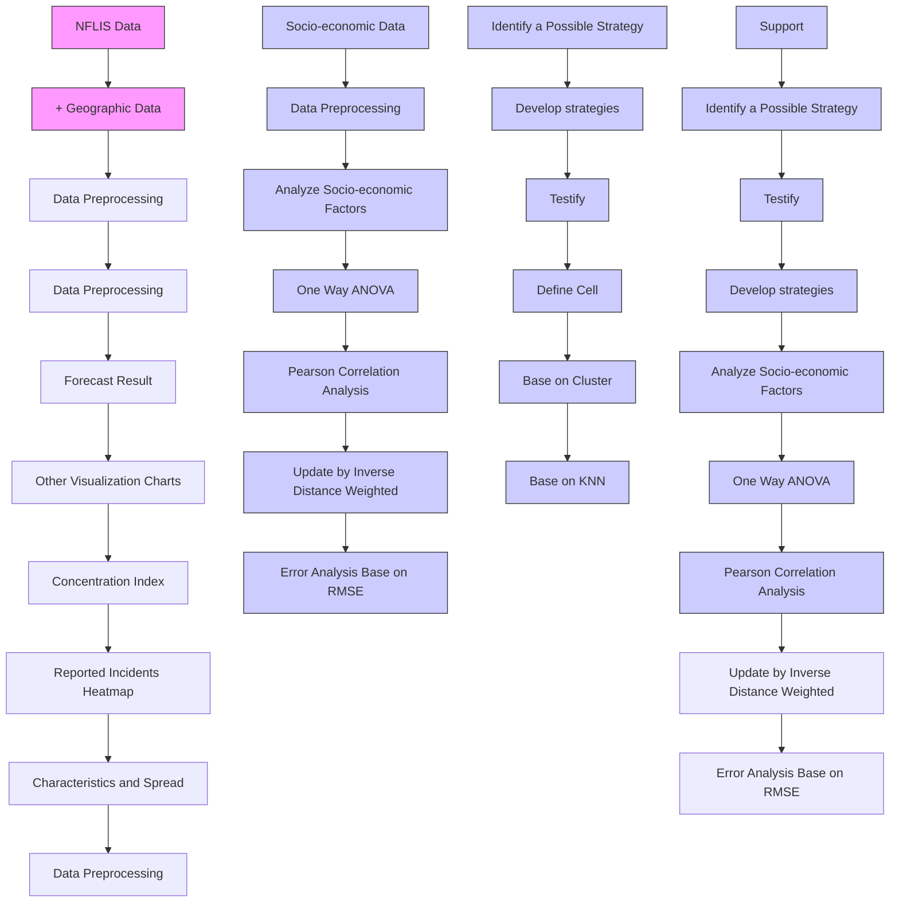
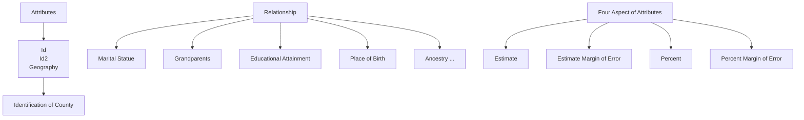

## The Current Status, Future and Strategy of Opioid

Summary

The United States is experiencing a crisis regarding the abuse of opioids which poses a great threat to the development prospects of the United States. Based on the idea of cellular automata, we not only describe the spread and characteristics of reported synthetic opioid and heroin cases in Ohio, Kentucky, West Virginia, Virginia, and Pennsylvania, but also develop a possible strategy countering the opioid crisis.

We define a county and the nearest k counties around it as an “environment”. Based on the idea of KNN, we determine the m “environments” that are most similar to the “environment” of the county, and then use the cellular automata to predict the number of cases in the county next year with the growth rate of m “environments”. At the same time, we define the opioid incidents concentration index (CI) to characterize the degree of aggregation of cases by reference to the HHI index. Finally, we obtain the distribution of synthetic opioids and heroin incidents in five states. Cases are still concentrated in transportation hubs and there is a tendency to spread. Heroin spread to the southwest in Kentucky with Lexington as the center and has a tendency to spread throughout Pennsylvania and Virginia. Based on historical data and prediction, we determine the drug identification threshold levels for each state. In 2026, Ohio will reach its threshold of 120,000, making it difficult for the government to control the amount of opioid use and the speed of spread.

In order to determine whether certain socio-economic factors have a significant impact on the trend of opioid usage, we select the first 25% and the last 25% of the data for all state cases in 2010-2016 for analysis of variance if the data passes the test of variance homogeneity. Correlation analysis is performed on data that do not pass the test for variance homogeneity to determine the correlation between socio-economic factors and trends in opioids usage. The final selection of significant factors is marital status, educational attainment, ancestry, and language spoken at home. Adding the important factors selected above to the “environment” similarity considerations, we have obtained a modified model that considers socio-economic factors.

Based on the above analysis, we develop a strategy contains two actions for dealing with opioid crisis. The first one is giving couples a discount on tax and mortgage rates to encourage people to marry at legal age. The other is opening a low-cost English language training institution to improve the English proficiency of non-native English speakers.

From: Team # 1922154

To: Chief Administrator

Data: January 27, 2019

## Subject: How to deal with the opioid crisis

Dear chief administrator, we are honored to inform you our achievement after performing data analysis and modeling.

First, we introduce the spread and characteristics of synthetic opioid and heroin usage between the five states and their counties from 2010 to 2017. Combining the provided data with the collected latitude and longitude data, we notice that the aggregation point of opioid incidents is mainly in the areas with developed traffic, and there is a tendency to spread around. The distribution of synthetic opioid in Virginia is the most extensive, moreover, the distribution in Pennsylvania is the most concentrated. Heroin once had a tendency to spread. However, perhaps for some reason, this trend has been arrested. Nowadays Heroin is spreading again in some states, such as Virginia.

Then, we forecast the synthetic opioid and heroin usage in each county from 2017 to 2026. According to the prediction, synthetic opioids will spread throughout Kentucky in the future. And the synthetic opioids usage of counties around Washington is growing from the forecasting.

Based on our observation on provided data and Calculated data, we think about the U.S. government is concern about two points:

- The opioid usage should be restricted to a certain level.  
- The spread of the opioid should be controlled within a certain range.

According to the historical data and prediction, we can identify the drug identification threshold levels to predict when and where the government's concern will occur. For example, the threshold level of Ohio is 120,000. government's concern has occurred in Ohio in 2026.

By analyzing the Census socio-economic data, we notice that some important variables such as marital status, educational attainment, ancestry and the language spoken will impact on the use of the opioid in each county.

Based on the above analysis, we propose a strategy that includes two actions.

- Give couples a discount on tax and mortgage rates to encourage people to marry at legal age.  
- Open a low-cost English language training institution to improve the English proficiency of non-native English speakers.

Our strategy can effectively reduce opioid use.

- By taking the action 1, the opioid cases will reduce from 257496 to 231073  
- By taking the action 2, the opioid cases will reduce from 257496 to 225873.

The above is the summary of our study. We sincerely hope that it will provide you with useful information.

Thanks!

## Contents

## 1 Introduction ...... 1

1.1 Background.... 1  
1.2 Planned Approach.... 1

## 2 Terminology, Symbols and Assumptions 2

2.1 Terms ...... 2  
2.2 Symbols 2  
2.3 General Assumptions.... 3

## 3 Spread and Characteristics of Opioid Incidents 3

## 3.1 Preprocess Data .... 3

3.1.1 Missing value processing .... 3  
3.1.2 Geographic coordinate acquisition 4  
3.1.3 Overview of drug cases distribution.... 4

## 3.2 Spread of Opioid Incidents base on CA Model 4

3.2.1 Introduction to the idea of method 4  
3.2.2 Attributes of a Cell.... 5  
3.2.3 Self-defined Rules .... 5  
3.2.4 Concentration index (CI)....7

## 3.3 Results & analysis 7

3.3.1 Spread and Characteristics....7  
3.3.2 Concern and Occur 9

## 3.4 Sensitivity analysis of model.... 10

## 4 Model Modification Considering Socio-economic Factors....11

## 4.1 Preprocess Data ....11

4.1.1 Data overview....11  
4.1.2 Data selection & Analysis 12

## 4.2 Important factor selection.... 12

4.2.1 The general idea of factors selection 12  
4.2.2 Grouping.... 12  
4.2.3 Twofold filter.... 13

## 4.3 Model Modification.... 14

## 4.4 Results & analysis 14

## 4.5 Model Evaluation 16

## 4.6 Strategy.... 17

4.6.1 Principles of strategy 17  
4.6.2 Action 17

## 5 Strength and Weakness 18

5.1 Strength.... 18  
5.2 Weakness 18

## 6 Conclusion.... 18

## 7 References 19

## Appendix 20

## 1 Introduction

## 1.1 Background

At present, the phenomenon of addiction and abuse of opioids in the United States is serious. The abuse of opioids not only imposes a heavy economic burden on the US government, but also affects the quantity and quality of the US workforce and the prospects for the US economy.

The DEA/National Forensic Laboratory Information System (NFLIS) of the Drug Enforcement Administration's (DEA) Office publishes an annual report on drug identification results and associated information from drug cases. Specifically, they need:

- a description of the spread and characteristics of synthetic opioids and heroin events reported between five states and their counties over time and identify possible locations where specific opioids may have begun to be used in five states.  
- an analysis of important factors affecting the use or use of opioids in socio-economic data from the US Census.  
• a possible strategy for countering the opioid crisis.

A large amount of literature tracks the abuse of opioids in the United States: for example, Cicero, Inciardi, and Muñoz [1] specifically described the trend of abuse of opioids in the United States from 2002 to 2004 based on the Researched Abuse, Diversion and Addiction-Related Surveillance (RADARS®) system; Volkow, Jones, Einstein, and Wargo [2] analyzed the factors that triggered the opioid crisis and its further evolution, as well as interventions to manage and prevent opioid use disorders.

However, most of the literature does not scientifically summarize its propagation patterns and distribution characteristics over time based on the data of the opioid drug identification cases in various counties, so that the future predictions cannot accurately indicate the time and place where a drug identification may be transmitted. In addition, past work has not been able to propose effective strategies to deal with the opioid crisis.

## 1.2 Planned Approach

Based on the above analysis, we propose the framework model shown in Figure 1, which can be summarized as the following steps:

## • Characteristics and Spread

Draw heat maps and other visualizations using NFLIS data and geographic data (latitude and longitude), and analyze the spread and characteristics of the reported synthetic opioid and heroin incidents in and between the five states and their counties over time.

## • Cellular Automata Model

With the idea of cellular automata which is the state of the next moment is determined by the surrounding and its own state, a new cellular automata model is constructed by combining the ideas of clustering and KNN. This model will fully exploit the information of historical data to achieve a more accurate simulation.

## • Analyze Socio-economic Factors

We plan to use statistical one-way ANOVA and correlation analysis to find socioeconomic factors that have a significant impact on the model and to correct the model.

## • Identify a Possible Strategies

We will consider the results of the cellular automata model and the influential socio-economic factors of the analysis, and then develop a possible strategy for countering the opioid crisis. The model will also be used to verify the effectiveness of the strategy.

flowchart

Figure 1: Model framework

## 2 Terminology, Symbols and Assumptions

## 2.1 Terms

- Opioids $^{[3]}$ : medically they are primarily used for pain relief, including anesthesia and they are also frequently used non-medically for their euphoric effects or to prevent withdrawal.  
- Heroin $^{[4]}$ : an opioid most commonly used as a recreational drug for its euphoric effects. It is generally illegal to make, possess, or sell heroin without a license.  
- HHI $^{[5]}$ : the Herfindahl-Hirschman index is a statistical measure of concentration. For example, it can be used to measure the market concentration. It is calculated by squaring the market shares of all firms in a market and then summing the squares.

## 2.2 Symbols

Table 1: Variable description

<table><tr><td>Symbol</td><td>Definition</td></tr><tr><td> $C_i$ </td><td>The  $i^{th}$  county</td></tr><tr><td> $\overrightarrow{C_i^n}$ </td><td>The environment(vector) related to  $i^{th}$  county in the  $n^{th}$  year</td></tr><tr><td> $r_i^n$ </td><td>The growth rate of opioid usage in the  $i^{th}$  county in the  $n^{th}$  year</td></tr><tr><td> $RMSE^{y}_{(k,m)}$ </td><td>The error in  $y^{th}$  year when the value of parameters are k and m</td></tr><tr><td>CI</td><td>The concentration index</td></tr><tr><td>MS</td><td>Marital status</td></tr><tr><td>EA</td><td>Educational attainment</td></tr><tr><td>AN</td><td>Ancestry</td></tr><tr><td>LS</td><td>Language spoken at home</td></tr></table>

## 2.3 General Assumptions

\- Assumption 1: The change in the number of a county opioid incidents is greatly affected by the surrounding counties, and the historical data can reflect the development of opioids to a certain extent.

Reason: This assumption was made to ensure the validity of the cellular automata model we constructed.

\- Assumption 2: The government will not have excessive rectification of opioids from now until 2026, and the changes in the opioids of each county will follow the historical law of 2010-2017.

Reason: The reason for this assumption is to ensure the validity of the results predicted by the model to some extent.

\- Assumption 3: The data used in this paper is realistic and accurate to a certain degree. Reason: Although the data is incomplete and there are some tolerable errors in the statistics, we make this assumption to ensure an effective solution.

\- Assumption 4: Counties, which are not involved in NFLIS Data is not considered in our model.

Reason: We believe the counties not involved in NFLIS Data are of little significance to the problem studied

## 3 Spread and Characteristics of Opioid Incidents

## 3.1 Preprocess Data

## 3.1.1 Missing value processing

The first file (MCM\_NFLIS\_Data.xlsx) contains most of the county's drug identification counts in year 2010-2017, but some counties still have missing data for a certain year or even years. We suspect that the county has a drug identification count in the absence of these years, but the name of the drug identified cannot be determined. Therefore, we fill in the missing value of variable County total count of all substances identified as follows:

$$
X _ {i} = \frac {X _ {i - 1} + X _ {i + 1}}{2} \tag {1}
$$

where $X_{i}$ indicates the missing total count of all substances identified in the county in the $i^{th}$ year, $X_{i-1}$ indicates the total count of all substances identified in the previous year, $X_{i+1}$ indicates the total count of all substances identified in the following year.

Notes: If the county has more than three missing data, we believe that the county data is invalid. We give up filling in missing values and abandon them.

## 3.1.2 Geographic coordinate acquisition

In order to see the geographical distribution of the submitted cases, we obtained five states: the latitude and longitude data of all counties in Ohio, Kentucky, West Virginia, Virginia, and Pennsylvania from the United States Cities Database website $[6]$ . And then we calculate the distance between each county using the Haversine formula $[7]$ . Suppose the latitude and longitude of the two counties are $(\varphi_{1}, \lambda_{1})$ and $(\varphi_{2}, \lambda_{2})$ , respectively.

$$
d = 2 r \cdot \arcsin (\sqrt {\sin^ {2} \left(\frac {\varphi_ {2} - \varphi_ {1}}{2}\right) + \cos \varphi_ {1} \cdot \cos \varphi_ {2} \cdot \sin^ {2} \left(\frac {\lambda_ {2} - \lambda_ {1}}{2}\right)}) \tag {2}
$$

where d is the distance between the two counties, r is the radius of the earth.

## 3.1.3 Overview of drug cases distribution

We draw heat maps using the latitude and longitude data of each state and the data of drug identification counts for narcotic analgesics (synthetic opioids) and heroin in each of the five states, to have a general understanding of the distribution of reported cases.

Take the case reported in 2010 as an example (shown in Figure 2). It can be roughly seen from the heat map that the proportion in the transportation hubs and along the lake and coastal areas is high.

heatmap

| City           | Value |
| -------------- | ----- |
| New York       | 120   |
| Boston         | 115   |
| Chicago        | 110   |
| Dallas         | 105   |
| Houston        | 100   |
| Atlanta        | 95    |
| Philadelphia   | 90    |
| Phoenix        | 85    |
| Miami          | 80    |
| Seattle        | 75    |
| Atlanta        | 70    |
| Washington     | 65    |
| Boston         | 60    |
| Philadelphia   | 55    |
| Dallas         | 50    |
| Houston        | 45    |
| Atlanta        | 40    |
| Philadelphia   | 35    |
| Phoenix        | 30    |
| Seattle        | 25    |
| Atlanta        | 20    |
| Philadelphia   | 15    |
| Dallas         | 10    |
| Houston        | 5     |
| Atlanta        | 0     |
| Philadelphia   | -5    |
| Phoenix        | -10   |
| Seattle        | -15   |
| Atlanta        | -20   |
| Philadelphia   | -25   |
| Dallas         | -30   |
| Houston        | -35   |
| Atlanta        | -40   |
| Philadelphia   | -45   |
| Phoenix        | -50   |
| Seattle        | -55   |
| Atlanta        | -60   |
| Philadelphia   | -65   |
| Dallas         | -70   |
| Houston        | -75   |
| Atlanta        | -80   |
| Philadelphia   | -85   |
| Phoenix        | -90   |
| Seattle        | -95   |
| Atlanta        | -100  |
| Philadelphia   | -105  |
| Dallas         | -110  |
| Houston        | -115  |
| Atlanta        | -120  |
| Philadelphia   | -125  |
| Phoenix        | -130  |
| Seattle        | -135  |
| Atlanta        | -140  |
| Philadelphia   | -145  |
| Dallas         | -150  |
| Houston        | -155  |
| Atlanta        | -160  |
| Philadelphia   | -165  |
| Phoenix        | -170  |
| Seattle        | -175  |
| Atlanta        | -180  |
| Philadelphia   | -185  |
| Dallas         | -190  |
| Houston        | -195  |
| Atlanta        | -200  |
| Philadelphia   | -205  |
| Phoenix        | -210  |
| Seattle        | -215  |
| Atlanta        | -220  |
| Philadelphia   | -225  |
| Dallas         | -230  |
| Houston        | -235  |
| Atlanta        | -240  |
| Philadelphia   | -245  |
| Phoenix        | -250  |
| Seattle        | -255  |
| Atlanta        | -260  |
| Philadelphia   | -265  |
| Dallas         | -270  |
| Houston        | -275  |
| Atlanta        | -280  |
| Philadelphia   | -285  |
| Phoenix        | -290  |
| Seattle        | -295  |
| Atlanta        | -300  |
| Philadelphia   | -305  |
| Dallas         | -310  |
| Houston        | -315  |
| Atlanta        | -320  |
| Philadelphia   | -325  |
| Phoenix        | -330  |
| Seattle        | -335  |
| Atlanta        | -340  |
| Philadelphia   | -345  |
| Dallas         | -350  |
| Houston        | -355  |
| Atlanta        | -360  |
| Philadelphia   | -365  |
| Phoenix        | -370  |
| Seattle        | -375  |
| Atlanta        | -380  |
| Philadelphia   | -385  |
| Dallas         | -390  |
| Houston        | -395  |
| Atlanta        | -400  |
| Philadelphia   | -405  |
| Phoenix        | -410  |
| Seattle        | -415  |
| Atlanta        | -420  |
| Philadelphia   | -425  |
| Dallas         | -430  |
| Houston        | -435  |
| Atlanta        | -440  |
| Philadelphia   | -445  |
| Phoenix        | -450  |
| Seattle        | -455  |
| Atlanta        | -460  |
| Philadelphia   | -465  |
| Dallas         | -470  |
| Houston        | -475  |
| Atlanta        | -480  |
| Philadelphia   | -485  |
| Phoenix        | -490  |
| Seattle        | -495  |
| Atlanta        | -500  |
| Philadelphia   | -505  |
| Dallas         | -510  |
| Houston        | -515  |
| Atlanta        | -520  |
| Philadelphia   | -525  |
| Phoenix        | -530  |
| Seattle        | -535  |
| Atlanta        | -540  |
| Philadelphia   | -545  |
| Dallas         | -550  |
| Houston        | -555  |
| Atlanta        | -560  |
| Philadelphia   | -565  |
| Phoenix        | -570  |
| Seattle        | -575  |
| Atlanta        | -580  |
| Philadelphia   | -585  |
| Dallas         | -590  |
| Houston        | -595  |
| Atlanta        | -600  |
| Philadelphia   | -605  |
| Phoenix        | -610  |
| Seattle        | -615  |
| Atlanta        | -620  |
| Philadelphia   | -625  |
| Dallas         | -630  |
| Houston        | -635  |
| Atlanta        | -640  |
| Philadelphia   | -645  |
| Phoenix        | -650  |
| Seattle        | -655  |
| Atlanta        | -660  |
| Philadelphia   | -665  |
| Dallas         | -670  |
| Houston        | -675  |
| Atlanta        | -680  |
| Philadelphia   | -685  |
| Phoenix        | -690  |
| Seattle        | -695  |
| Atlanta        | -700  |
| Philadelphia   | -705  |
| Dallas         | -710  |
| Houston        | -715  |
| Atlanta        | -720  |
| Philadelphia   | -725  |
| Phoenix        | -730  |
| Seattle        | -735  |
| Atlanta        | -740  |
| Philadelphia   | -745  |
| Dallas         | -750  |
| Houston        | -755  |
| Atlanta        | -760  |
| Philadelphia   | -765  |
| Phoenix        | -770  |
| Seattle        | -775  |
| Atlanta        | -780  |
| Philadelphia   | -785  |
| Dallas         | -790  |
| Houston        | -795  |
| Atlanta        | -800  |
| Philadelphia   | -805  |
| Phoenix        | -810  |
| Seattle        | -815  |
| Atlanta        | -820  |
| Philadelphia   | -825  |
| Dallas         | -830  |
| Houston        | -835  |
| Atlanta        | -840  |
| Philadelphia   | -845  |
| Phoenix        | -850  |
| Seattle        | -855  |
| Atlanta        | -860  |
| Philadelphia   | -865  |
| Dallas         | -870  |
| Houston        | -875  |
| Atlanta        | -880  |
| Philadelphia   | -885  |
| Phoenix        | -890  |
| Seattle        | -895  |
| Atlanta        | -900  |
| Philadelphia   | -905  |
| Dallas         | -910  |
| Houston        | -915  |
| Atlanta        | -920  |
| Philadelphia   | -925  |
| Phoenix        | -930  |
| Seattle        | -935  |
| Atlanta        | -940  |
| Philadelphia   | -945  |
| Dallas         | -950  |
| Houston        | -955  |
| Atlanta        | -960  |
| Philadelphia   | -965  |
| Phoenix        | -970  |
| Seattle        | -975  |
| Atlanta        | -980  |
| Philadelphia   | -985  |
| Dallas         | -990  |
| Houston        | -995  |
| Atlanta        | -1000 |
|
| Philadelphia   |-1005|
|
| Phoenix         |-1010|
|
| Seattle        |-1015|
|
| Atlanta        |-1020|
|
| Philadelphia   |-1025|
|
| Phoenix        |-1030|
|
| Seattle        |-1035|
|
| Atlanta        |-1040|
|
| Philadelphia   |-1045|
|
| Dallas         |-1050|
|
| Houston        |-1055|
|
| Atlanta        |-1060|
|
| Philadelphia   |-1065|
|
| Phoenix        |-1070|
|
| Seattle        |-1075|
|
| Atlanta        |-1080|
|
| Philadelphia   |-1085|
|
| Dallas         |-1090|
|
| Houston        |-1095|
|
| Atlanta        |-1100|
|
| Philadelphia   |-1105|
|
| Phoenix        |-1110|
|
| Seattle        |-1115|
|
| Atlanta        |-1120|
|
| Philadelphia   |-1125|
|
| Dallas         |-1130|
|
| Houston        |-1135|
|
| Atlanta        |-1140|
|
| Philadelphia   |-1145|
|
| Phoenix        |-1150|
|
| Seattle        |-1155|
|
| Atlanta        |-1160|
|
| Philadelphia   |-1165|
|
| Dallas         |-1170|
|
| Houston        |-1175|
|
| Atlanta        |-1180|
|
| Philadelphia   |-1185|
|
| Phoenix        |-1190|
|
| Seattle        |-1195|
|
| Atlanta        |-1200|
|
| Philadelphia   |-1205|
|
| Dallas         |-1210|
|
| Houston        |-1215|
|
| Atlanta        |-1220|
|
| Philadelphia   |-1225|
|
| Phoenix        |-1230|
|
| Seattle        |-1235|
|
| Atlanta        |-1240|
|
| Philadelphia   |-1245|
|
| Dallas         |-1250|
|
| Houston        |-1255|
|
| Atlanta        |-1260|
|
| Philadelphia   |-1265|
|
| Phoenix        |-1270|
|
| Seattle        |-1275|
|
| Atlanta        |-1280|
|
| Philadelphia   |-1285|
|
| Dallas         |-1290|
|
| Houston        |-1295|
|
| Atlanta        |-1300|
|
| Philadelphia   |-1305|
|
| Phoenix        |-1310|
|
| Seattle        |-1315|
|
| Atlanta        |-1320|
|
| Philadelphia   |-1325|
|
| Dallas         |-1330|
|
| Houston        |-1335|
|
| Atlanta        |-1340|
|
| Philadelphia   |-1345|
|
| Phoenix        |-1350|
|
| Seattle        |-1355|
|
| Atlanta        |-1360|
|
| Philadelphia   |-1365|
|
| Dallas         |-1370|
|
| Houston        |-1375|
|
| Atlanta        |-1380|
|
| Philadelphia   |-1385|
|
| Phoenix        |-1390|
|
| Seattle        |-1395|
|
| Atlanta        |-1400|
|
| Philadelphia   |-1405|
|
| Dallas         |-1410|
|
| Houston        |-1415|
|
| Atlanta        |-1420|
|
| Philadelphia   |-1425|
|
| Phoenix        |-1430|
|
| Seattle        |-1435|
|
| Atlanta        |-1440|
|
| Philadelphia   |-1445|
|
| Dallas         |-1450|
|
<fcel>Phoenix: Los Angeles; New York; Boston; Baltimore; New Jersey; Toronto; New York; Toronto; New Jersey; Boston; New Jersey; Boston; New Jersey; Boston; New Jersey; Boston; New Jersey; Boston; New Jersey; Boston; New Jersey; Boston; New Jersey; Boston; New Jersey; Boston; New Jersey; Boston; New Jersey; Boston; New Jersey; Boston; New Jersey; Boston; New Jersey; Boston; New Jersey; Boston; New Jersey; Boston; New Jersey; Boston; New Jersey; Boston; New Jersey; Boston; New Jersey; Boston; New Jersey; New Jersey; Boston; New Jersey; Boston; New Jersey; Boston; New Jersey; Boston; New Jersey; Boston; New Jersey; Boston; New Jersey; Boston; New Jersey; Boston; New Jersey; Boston; New Jersey; Boston; New Jersey; Boston; New Jersey; Boston; New Jersey; Boston; New Jersey; Boston; New Jersey; Boston; New Jersey; Boston; New Jersey; Boston; New Jersey; Boston; New Jersey; Boston; New Jersey; District of Columbia, Tampa Bay, Orlando, Tampa Bay, Tampa Bay, Tampa Bay, Tampa Bay, Tampa Bay, Tampa Bay, Tampa Bay, Tampa Bay, Tampa Bay, Tampa Bay, Tampa Bay, Tampa Bay, Tampa Bay, Tampa Bay, Tampa Bay, Tampa Bay, Tampa Bay, Tampa Bay, Tampa Bay, Tampa Bay, Tampa Bay, Tampa Bay, Tampa Bay, Tampa Bay, Tampa Bay, Tampa Bay, Tampa Bay, Tampa Bay, Tampa Bay, Tampa Bay, Tampa Bay, Tampa Bay, Tampa Bay, Tampa Bay<nl>

Figure 2: Distribution of drug identification cases in 2010

## 3.2 Spread of Opioid Incidents base on CA Model

## 3.2.1 Introduction to the idea of method

To help us understand the spread of opioid usage between the five states and their counties in the past, we propose a model to simulate the use of opioids over the past eight years in various regions. The simulation results of the model are then used to identify any possible locations in five states that may have begun to use a specific opioid.

Based on the analysis of the problem and data, we summarize the following challenges:

- The model should be able to reflect the interaction between the use of opioid each county.  
- The model should be able to reflect the impact of the historical development of each county on its future.  
- Models must be able to simulate changes in the number of opioid cases in all counties.

In view of these challenges, we adopt the Cellular Automata ${}^{[8]}$ (CA), a grid dynamics model, in which time, space, and state are all discrete and have the ability to simulate the evolution process of complex systems. Cellular Automata is a widely used model to analyze the spread problems [9]. In this case, the map is divided into cells, and each county occupies a separate cell. A cell records the total drug reports of the county. The state of the cell update based on its current state and the current state of the surrounding cells. We apply the self-defined update rules to simulate the evolution of each county's opioid usage in our model.

## 3.2.2 Attributes of a Cell

In our model, each cell can only represent at most one county. A cell has 3 attributes:

- An integer $c$ (0 or 1) to represent the cell status, 0 for no county, 1 for one county  
• Current number of opioid cases in the county $C_{i}$ .  
• The rate of change in the number of opioid cases in the county that year $r_{i}$

The other two properties only make sense when c is non-zero. In each step of the simulation, $C_{i}$ is updated by the $r_{i}$ . Self-defined rules are introduced in following sections.

## 3.2.3 Self-defined Rules

The key to the cellular automata that can be used to describe the use of opioids in each county is to develop rules that are close to reality. In this case, we develop update rules based on given historical data.

First we calculate the distance between them by the latitude and longitude of each county. Then we take each county and its nearest k counties as a set of vectors what we called “environment” based on the idea of cluster. The mathematical expression for each set of vectors is as follows:

$$
\overrightarrow {C _ {i} ^ {n}} = (r _ {i} ^ {n}, C _ {i} ^ {n} (0), C _ {i} ^ {n} (1), C _ {i} ^ {n} (2), C _ {i} ^ {n} (3), \dots , C _ {i} ^ {n} (k))
$$

where $\overrightarrow{C_{i}^{n}}$ is the environment(vector) related to $i^{th}$ county in the $n^{th}$ year, $r_{i}^{n}$ is the growth rate of opioid usage in the $i^{th}$ county in the $n^{th}$ year (growth rate can be negative). $C_{i}^{n}(0)$ is the opioid usage of itself $C_{i}^{n}(1)$ represents the opioid usage of the county with the shortest distance from $i^{th}$ county in the $n^{th}$ year. A set of vectors can be generated based on the annual data of each county.

So we have 3003 groups environment(vector). We believe that the growth in the number of opioid cases in a county is determinable. It can be found similar environment to determine the growth rate of the county's opioid cases in historical data. Before we look for the similar environment, we're going to do something with environment(vector). We sort $C_i^n(1), C_i^n(2), C_i^n(3), \cdots, C_i^n(k)$ in ascending order. If we do not make ascending order ranking to the $C_i^n(k)$ , we will amplify the error. For example, we think $(r_i^n, 1, 2, 3, 4, 5)$ should equal to the $(r_j^n, 1, 5, 4, 3, 2, 1)$ . But when we calculate the Euclidean distance between them, the result shows that they are different.

We can calculate the Euclidean distance between each environment(vector) $\overrightarrow{C_l^n}$ . The Euclidean distance calculation formula is as follows:

$$
d _ {i j} = \sqrt {\sum_ {i = 0 , j = 0} ^ {k} \left(C _ {i} ^ {n} - C _ {j} ^ {n}\right) ^ {2}} \tag {3}
$$

Based on the idea of KNN, we use the formula to find the m vectors closest to $\overrightarrow{C_{l}^{n}}$ . Based on the $r_{i}^{n}$ in the m vectors, we can determine the annual growth rate of the number of opioid cases in i county in 2010 by inverse distance weighting calculation. The inverse distance weighting formula is as follows:

$$
w _ {j} = \frac {\frac {1}{d _ {i j}}}{\sum_ {j = 1} ^ {m} \frac {1}{d _ {i j}}} \tag {4}
$$

where $w_{j}$ is the weight of each vector's influence on the growth rate in $i$ county.

scatterplot

| Data Type       | Point Color | Label |
| --------------- | ----------- | ----- |
| Current Data    | Red         | A     |
| Current Data    | Yellow      | A     |
| Current Data    | Purple      | A     |
| Current Data    | Green       | A     |
| Current Data    | Blue        | A     |
| Current Data    | Black       | A     |
| Historical Data | Red         | B     |
| Historical Data | Yellow      | B     |
| Historical Data | Purple      | B     |
| Historical Data | Green       | B     |
| Historical Data | Blue        | B     |
| Historical Data | Black       | B     |
| Historical Data | Red         | C     |
| Historical Data | Yellow      | C     |
| Historical Data | Purple      | C     |
| Historical Data | Green       | C     |
| Historical Data | Blue        | C     |
| Historical Data | Black       | C     |
| Historical Data (m=3) | Red         | D     |
| Historical Data (m=3) | Yellow      | D     |
| Historical Data (m=3) | Purple      | D     |
| Historical Data (m=3) | Green       | D     |
| Historical Data (m=3) | Blue        | D     |
| Historical Data (m=3) | Black       | D     |

Figure 3: Updating Rule

Figure 3 shows how the rule works in practice. The points indicate counties, and the colors of the point indicate different values. In this case, we choose k=3 and m=3. So we can find environment $\overrightarrow{A^{n}} = [r_{A}^{n}, 4,1,5,6]$ . From the historical data, the three most similar historical environments are $\overrightarrow{B^n} = [r_B^{n_b}, 4, 1, 5, 6]$ , $\overrightarrow{C^n} = [r_C^{n_c}, 4, 2, 5, 6]$ ,

$\overrightarrow{D^n} = [r_D^{n_d}, 3,1,5,6]$ . Then we can calculate the Euclidean distance between each environment.

Finally, we can determine the growth rate $r_{i}$ of the county in the current year to calculate the number of specific opioid cases in the next year. The formula for calculating the growth rate is as follows:

$$
r _ {i} = \sum_ {j = 1} ^ {m} w _ {j} r _ {j} ^ {n} \tag {5}
$$

Through the above method, we can determine the evolution rules of each cell in the cellular automata.

## 3.2.4 Concentration index (CI)

In economics, the industrial concentration is generally measured by the Hirschman index $[5]$ which is not affected by the number and size of the company. It can better measure the changes in the concentration of the industry. Here we want to portray the concentration of opioids, so we define the opioid incidents concentration index (CI) by reference to the HHI index.

At first, we determined to take the state as the research unit. The general idea is to select all counties in the certain state as a whole to calculate the CI to represent the concentration of drug identification cases in the certain state. The formula is as follows:

$$
\mathrm{CI} = \sum_ {i = 1} ^ {k} \left(\frac {C _ {i}}{\sum_ {i = 1} ^ {k} C _ {i}}\right) ^ {2} \tag {7}
$$

where $C_{i}$ is the drug identification count in the $i^{th}$ county, k is the number of counties in a state.

## 3.3 Results & analysis

In section 3.3.1. We will draw conclusions of spread and characteristics of the reported synthetic opioid and heroin incidents by analyzing the result of the model to at first. We then consider heroin as a specific opioid, we will use our model to find any possible county where heroin use in five states.

In section 3.3.2. We will talk about the government's specific concerns. And then we will find the threshold levels to determine when and where the government's concerns will occur in the future by using our model to predict the change of opioid usage.

## 3.3.1 Spread and Characteristics

To help us have a good grasp of opioid usage, identifying the way of opioid spread is very important. We have already built CA model and have defined our rule to change the status of cell. Based on the historical data, we use our model to predict the spread of opioids from 2017 to 2026.

## - Spread

The result of synthetic opioid and heroin spread in the future is solved by the CA

model. The spread of synthetic opioid in 2017 and 2020 are shown in Figure 4:

heatmap

| South Central | Medium |
| --- | --- |
| South Central | Medium |
| South Central | Medium |
| South Central | Medium |
| South Central | Medium |
| South Central | Medium |
| South Central | Medium |
| South Central | Medium |
| South Central | Medium |
| South Central | Medium |
| South Central | Medium |
| South Central | Medium |
| South Central | Medium |
| South Central | Medium |
| South Central | Medium |
| South Central | Medium |
| South Central (Low) | Low |
| South Central (Medium) | Low |
| South Central (Medium) | Low |
| South Central (Medium) | Low |
| South Central (Medium) | Low |
| South Central (Medium) | Low |
| South Central (Medium) | Low |
| South Central (Medium) | Low |
| South Central (Medium) | Low |
| South Central (Medium) | Low |
| South Central (Medium) | Low |
| South Central (Medium) | Low |
| South Central (Medium) | Low |
| South Central (Medium) | Low |
| South Central (Medium) | Low |
| South Central (Medium) | Low |
| South Central (Medium) | Low |
| South Central (Medium) | Low |
| South Central (Medium) | Low |
| South Central (Medium) | Low |
| South Central (Medium) | Low |
| South Central (Medium) | Low |
| South Central (Medium) | Low |
| South Central (Medium) | High |
| South Central (Medium) | High |
| South Central (Medium) | High |
| South Central (Medium) | High |
| South Central (Medium) | High |
| South Central (Medium) | High |
| South Central (Medium) | High |
| South Central (Medium) | High |
| South Central (Medium) | High |
| South Central (Medium) | High |
| South Central (Medium) | High |

Figure 4 (a) 2017 synthetic opioid

heatmap

| Location | Value |
| --- | --- |
| Central Europe | High |
| Northeast US | Medium-High |
| Southeast US | Medium |
| Midwest US | Low |
| Southwest US | Low |
| West Coast US | Low |
| Pacific Northwest US | Low |
| Southern USA | Low |
| Texas US | Low |
| Florida US | Low |
| California US | Low |
| New York City | Low |
| Boston EC | Low |
| Philadelphia | Low |
| Chicago EC | Low |
| Houston EC | Low |
| Washington DC | Low |
| Oregon State | Low |
| Washington MA | Low |
| Washington MA | Low |
| Seattle, WA | Low |
| Seattle, WA | Low |
| Seattle, WA | Low |
| Seattle, WA | Low |
| Seattle, WA | Low |
| Seattle, WA | Low |
| Seattle, WA | Low |
| Seattle, WA | Low |
| Seattle, WA | Low |
| Seattle, WA | Low |
| Seattle, WA | Low |
| Seattle, WA | Low |
| Seattle, WA | Low |
| Seattle, WA | Low |
| Seattle, WA | High |
| Seattle, WA | High |
| Seattle, WA | High |
| Seattle, WA | High |
| Seattle, WA | High |
| Seattle, WA | High |
| Seattle, WA | High |
| Seattle, WA | High |
| Seattle, WA | High |
| Seattle, WA | High |
| Seattle, WA | High |
| Seattle, WA | High |
| Seattle, WA | High |
| Seattle, WA | High |
| Seattle, WA | High |

Figure 4 (b) 2020 synthetic opioid

By comparing Figure 3(a) and Figure 3(b), We find that some areas have begun to form new aggregation points. At the same time, some of the old aggregation points are transferred or disappeared. The aggregation point is still mainly in the areas with developed traffic, and there is a tendency to spread around. According to the prediction, synthetic opioids will spread throughout Kentucky in the future. And the synthetic opioids usage of counties around Washington is growing from the forecasting.

The spread results of heroin in 2017 and 2020 are shown in Figure 5.

heatmap

| Location | Value |
| -------- | ----- |
| Point 1  | High  |
| Point 2  | High  |
| Point 3  | High  |
| Point 4  | High  |
| Point 5  | High  |
| Point 6  | High  |
| Point 7  | High  |
| Point 8  | High  |
| Point 9  | High  |
| Point 10 | High  |
| Point 11 | High  |
| Point 12 | High  |
| Point 13 | High  |
| Point 14 | High  |
| Point 15 | High  |
| Point 16 | High  |
| Point 17 | High  |
| Point 18 | High  |
| Point 19 | High  |
| Point 20 | High  |
| Point 21 | High  |
| Point 22 | High  |
| Point 23 | High  |
| Point 24 | High  |
| Point 25 | High  |
| Point 26 | High  |
| Point 27 | High  |
| Point 28 | High  |
| Point 29 | High  |
| Point 30 | High  |
| Point 31 | High  |
| Point 32 | High  |
| Point 33 | High  |
| Point 34 | High  |
| Point 35 | High  |
| Point 36 | High  |
| Point 37 | High  |
| Point 38 | High  |
| Point 39 | High  |
| Point 40 | High  |
| Point 41 | High  |
| Point 42 | High  |
| Point 43 | High  |
| Point 44 | High  |
| Point 45 | High  |
| Point 46 | High  |
| Point 47 | High  |
| Point 48 | High  |
| Point 49 | High  |
| Point 50 | High  |
| Point 51 | High  |
| Point 52 | High  |
| Point 53 | High  |
| Point 54 | High  |
| Point 55 | High  |
| Point 56 | High  |
| Point 57 | High  |
| Point 58 | High  |
| Point 59 | High  |
| Point 60 | High  |
| Point 61 | High  |
| Point 62 | High  |
| Point 63 | High  |
| Point 64 | High  |
| Point 65 | High  |
| Point 66 | High  |
| Point 67 | High  |
| Point 68 | High  |
| Point 69 | High  |
| Point 70 | High  |
| Point 71 | High  |
| Point 72 | High  |
| Point 73 | High  |
| Point 74 | High  |
| Point 75 | High  |
| Point 76 | High  |
| Point 77 | High  |
| Point 78 | High  |
| Point 79 | High  |
| Point 80 | High  |
| Point 81 | High  |
| Point 82 | High  |
| Point 83 | High  |
| Point 84 | High  |
| Point 85 | High  |
| Point 86 | High  |
| Point 87 | High  |
| Point 88 | High  |
| Point 89 | High  |
| Point 90 | High  |
| Point 91 | High  |
| Point 92 | High  |
| Point 93 | High  |
| Point 94 | High  |
| Point 95 | High  |
| Point 96 | High  |
| Point 97 | High  |
| Point 98 | High  |
| Point 99 | High

Figure 5 (a) Heroin opioid in 2017

heatmap

| Location | Value |
| -------- | ----- |
| Red Circle | 100 |
| Yellow Circle | 80 |
| Blue Circle | 60 |
| Grey Circle | 40 |
| Orange Circle | 20 |
| Dark Blue Circle | 10 |

Figure 5 (b) Heroin opioid in 2020

By comparing Figure 5(a) and Figure 5(b), we find that heroin spread to the southwest in Kentucky with Lexington as the center according to the prediction. Based on the forecasting, it can be seen that the aggregation points gradually disappear in the Ohio. That's probably because Ohio is starting to crack down on drugs. But in Pennsylvania and Virginia, heroin still has tendency to spread across wide areas of these two states.

## - Characteristics

In order to portray the characteristics of the synthetic opioid and heroin, we calculate the concentration index of them based on the historical data.

By calculation, we can obtain the concentration index of the synthetic opioid. The result is shown in Figure 6. We notice that the value of concentration index is periodic. According to the formula of concentration index, we know that the smaller the value, the stronger the degree of diffusion.

line chart

| Year | KY    | OH    | PA    | VA    | WV    |
|------|-------|-------|-------|-------|-------|
| 2010 | 0.04  | 0.09  | 0.115 | 0.035 | 0.095 |
| 2011 | 0.055 | 0.055 | 0.125 | 0.035 | 0.08  |
| 2012 | 0.055 | 0.075 | 0.13  | 0.035 | 0.06  |
| 2013 | 0.05  | 0.07  | 0.12  | 0.03  | 0.05  |
| 2014 | 0.045 | 0.065 | 0.085 | 0.03  | 0.055 |
| 2015 | 0.04  | 0.06  | 0.115 | 0.035 | 0.055 |
| 2016 | 0.035 | 0.065 | 0.115 | 0.035 | 0.065 |
| 2017 | 0.045 | 0.09  | 0.115 | 0.035 | 0.11  |
| 2018 | 0.055 | 0.055 | 0.125 | 0.035 | 0.075 |
| 2019 | 0.055 | 0.075 | 0.13  | 0.035 | 0.06  |
| 2020 | 0.05  | 0.07  | 0.125 | 0.03  | 0.06  |
| 2021 | 0.045 | 0.065 | 0.085 | 0.03  | 0.055 |
| 2022 | 0.045 | 0.065 | 0.11  | 0.03   | 0.055 |
| 2023 | 0.045 | 0.065 | 0.11  | 0.03   | 0.045 |

Figure 6: CI of the synthetic opioid

From the Figure 6, we find the distribution of synthetic opioid in Virginia is the most extensive. Moreover, the distribution in Pennsylvania is the most concentrated. From the Figure 5, we can also find the cases of opioid mainly occur in metropolis in Pennsylvania.

The result of heroin's concentration index is shown in Figure 7.

line chart

| Year | KY    | OH    | PA    | VA    | WV    |
|------|-------|-------|-------|-------|-------|
| 2010 | 0.21  | 0.09  | 0.16  | 0.05  | 0.12  |
| 2011 | 0.18  | 0.08  | 0.15  | 0.06  | 0.15  |
| 2012 | 0.16  | 0.09  | 0.14  | 0.06  | 0.14  |
| 2013 | 0.13  | 0.08  | 0.13  | 0.05  | 0.08  |
| 2014 | 0.14  | 0.07  | 0.12  | 0.06  | 0.07  |
| 2015 | 0.14  | 0.07  | 0.13  | 0.06  | 0.07  |
| 2016 | 0.12  | 0.08  | 0.14  | 0.06  | 0.12  |
| 2017 | 0.14  | 0.11  | 0.16  | 0.05  | 0.14  |
| 2018 | 0.18  | 0.11  | 0.14  | 0.06  | 0.11  |
| 2019 | 0.13  | 0.12  | 0.14  | 0.05  | 0.11  |
| 2020 | 0.13  | 0.13  | 0.16  | 0.05  | 0.11  |
| 2021 | 0.12  | 0.13  | 0.14  | 0.05  | 0.10  |
| 2022 | 0.13  | 0.14  | 0.14  | 0.05  | 0.10  |
| 2023 | 0.12  | 0.13  | 0.14  | 0.04  | 0.11  |

Figure 7: Heroin's concentration index

From the Figure 7, we notice that heroin once had a tendency to spread. However, perhaps for some reason, this trend has been arrested. According to the Figure 7, it can be seen that heroin is spreading again in some states, such as Virginia.

## 3.3.2 Concern and Occur

Based on our observation on provided data and calculated data, we think about the U.S. government is concern about two aspects:

- The opioid usage should be restricted to a certain level.  
- The spread of the opioid should be controlled within a certain range.

When the number of reported cases reaches to a certain level, government will take action to limit its development.

bar chart

| Year | KY    | OH    | PA    | VA    | WV    |
|------|-------|-------|-------|-------|-------|
| 2010 | 30000 | 120000| 70000 | 35000 | 5000  |
| 2011 | 30000 | 70000 | 85000 | 30000 | 10000 |
| 2012 | 30000 | 85000 | 75000 | 35000 | 10000 |
| 2013 | 30000 | 95000 | 75000 | 45000 | 10000 |
| 2014 | 30000 | 105000| 75000 | 35000 | 10000 |
| 2015 | 30000 | 115000| 75000 | 35000 | 10000 |
| 2016 | 30000 | 125000| 75000 | 35000 | 10000 |
| 2017 | 30000 | 125000| 75000 | 35000 | 10000 |
| 2018 | 30000 | 75000 | 85000 | 35000 | 15000 |
| 2019 | 35000 | 85000 | 85000 | 35000 | 15000 |
| 2020 | 35000 | 95000 | 75000 | 45000 | 15000 |
| 2021 | 35000 | 115555| 75555 | 35555 | 15555 |
| 2022 | 35555 | 115555| 78888 | 38888 | 18888 |
| 2023 | 35555 | 125   | 78888 | 38888 | 2     |
| 2024 | 38888 | 125   | 78888 | 38888 | 2     |
| 2025 | 38888 | 125   | 82888 | 4     | 2     |
| 2026 | 4     | 142   | 8      | 4     | 2     |

Figure 8: The use of opioid from 2010 to 2026

According to the historical data and prediction, we notice that the reported cases of each state is be limited to a certain. For instance, the reported cases in Ohio is be restricted under the 120000 from 2010 to 2023. Consequently, we can identify the drug identification threshold levels to predict when and where the government's concern will occur. From the Figure 8, we can determine the threshold level of Ohio is 120,000. But the number of incidents exceed the threshold level of Ohio in 2026 according to the prediction. Then we think the government's concern has occurred in 2026.

## 3.4 Sensitivity analysis of model

Based on a simple analysis, we notice that our model is sensitive to particular parameters. We run the model with different parameter values based on the provided data. Take the 2010 data as the initial state of the model.

Then we will analyze how the parameters in our model influences our result. Finally, we will determine the value of the parameter based on the results of the sensitivity analysis.

At first, we choose root-mean-square error (RMSE) to evaluate the error between the result of the CA model and the actual value under different parameter values. The formula of RMSE is:

$$
R M S E _ {(k, m)} ^ {y} = \sqrt {\frac {\sum_ {i} ^ {n} \left(\widehat {C} _ {l} - C _ {i}\right) ^ {2}}{n}} \tag {8}
$$

where $RMSE_{(k,m)}^{y}$ represents the error in $y^{th}$ year when the value of parameters are k and m, $\widehat{C}_{i}$ is the estimated value, $C_{i}$ is the actual value.

In order to evaluate the accuracy of the CA model from a global perspective, we should take RMSE of every year into account. The mathematical expression that is ultimately used to estimate the accuracy of the model is:

$$
R M S E _ {(k, m)} = \frac {\sum_ {y = 1} ^ {a} R M S E _ {(k , m)} ^ {y}}{a} \tag {9}
$$

Then we can obtain the integrated RMSE to depict the accuracy of the model.

heatmap

| | k=4 | k=5 | k=6 | k=7 | k=8 | k=9 | k=10 | k=11 | k=12 |
|---|---|---|---|---|---|---|---|---|---|
| m=6 | low | high | low | high | high | high | high | high | high |
| m=5 | low | high | medium | medium | high | high | high | high | high |
| m=4 | low | high | medium | medium | high | high | high | high | high |
| m=3 | low | high | medium | medium | high | high | high | high | low |
| m=2 | low | medium | medium | medium | low | high | low | medium | medium |

Figure 9: Heat map for RMSE

According to the Figure 9, we can find when k is 12 and m is 2, the RMSE is lowest, the value is 104.21. Therefore, we determine the value of k and m. The specific values are shown in Appendix I.

## 4 Model Modification Considering Socio-economic Factors

## 4.1 Preprocess Data

## 4.1.1 Data overview

We currently have a common set of socio-economic factors collected for the counties of these five states during each of the years 2010-2016 from the U.S. Census Bureau. Except for the three special identification attributes of “GEO.id”, “GEO.id2” and “GEO.display-label”, the remaining attributes include relationship, marital status, grandparents, educational attainment, ancestors, etc. in each year’s socio-economic factors data set. And each attribute has four values (Estimate、Estimate Margin of Error、Percent、Percent Margin of Error). The overall data frame is shown in Figure 10.

flowchart

Figure 10: The data frame

## 4.1.2 Data selection & Analysis

Here we only study the two values of estimate and percent, and do not consider the estimation error temporarily. After selecting the attributes that have a significant impact on the model, the margin of error can be used to measure whether the attribute is valid.

In addition, we remove some of the data based on the following considerations:

• The attribute that have an '(X)' in the margin of error column

We can abandon the attribute directly because an '(X)' means that the estimate is not applicable or not available.

• Estimated data (not contain percent)

The issue we are considering is the impact of certain important factors in the census socio-economic data on trends in opioid usage. In general, the reason for the increase or decrease in the estimates of certain socio-economic factors is that the overall situation is changing, and the trend of use at this time will also rise or fall with the overall trend. Therefore, we believe that the estimated quantity cannot be an effective factor, while we should pay more attention to the change of its proportional structure.

After analyzing the data, we found that the data attributes of 2010-2012 are slightly different from the attributes of 2013-2017. The comparison is shown in the following table:

Table 2: Data comparison

<table><tr><td>Year</td><td>Number of counties</td><td>Number of attributes</td><td>Number of attributes studied</td></tr><tr><td>2010-2012</td><td>464</td><td>599</td><td>125</td></tr><tr><td>2013-2016</td><td>463</td><td>611</td><td>121</td></tr></table>

Based on the above analysis, we divided the 7-year census socio-economic data into 2010-2011 and 2012-2017 to analyze separately.

## 4.2 Important factor selection

## 4.2.1 The general idea of factors selection

Considering that we want to find out the attributes that have a significant impact on the drug cases of each county from a large number of attributes, we believe that it can be grouped according to the number of incident reports.

One-way ANOVA is used to analyze the difference of the same attribute between groups, and the attributes are initially screened out. However, the attributes selected do not necessarily have a significant impact on the number of cases. Therefore, we consider using correlation analysis to further screen and determine the final important factors.

## 4.2.2 Grouping

In order to discuss the impact of different factors on the trend of opioids' usage, we can analyze the differences in socio-economic factors in the counties with high and low frequency of opioid use. Therefore, we select two sets of extreme data in order to see the difference more clearly. The specific description is as follows:

Table 3: Total drug reports in all counties

<table><tr><td>Index</td><td>2010-2012</td><td>2013-2017</td></tr><tr><td>Mean</td><td>501.16</td><td>534.45</td></tr><tr><td>Std</td><td>1717.67</td><td>1646.28</td></tr><tr><td>Min</td><td>0</td><td>0</td></tr><tr><td>25%(Q1)</td><td>59</td><td>51</td></tr><tr><td>50%(Q2)</td><td>151</td><td>160</td></tr><tr><td>75%(Q3)</td><td>387</td><td>412</td></tr><tr><td>Max</td><td>33513</td><td>21761</td></tr></table>

We extract the first 25% (that is 0\~25%) as a set of data and the last 25% (that is 75%\~100%) as another set of data. Through the analysis of variance, we can analyze the difference between the two sets of data to achieve the purpose of preliminary screening.

## 4.2.3 Twofold filter

We know that the variance analysis is used to make significant differences between the two groups of sample data, and the sample data needs to satisfy the homogeneity test of variance. If the data does not pass the homogeneity test, the correlation analysis can be used to analyze the correlation.

## • ANOVA [10]

Analysis of variance (ANOVA), also known as "coefficient of variation", was invented by the statistical expert R.A. Fisher for the significance test of the difference between two or more sample means. Its basic idea is to determine the influence of controllable factors on the research results by analyzing the contribution of variation from different sources to the total variation.

## • Correlation Analysis [11]

Correlation analysis refers to the analysis of two or more related variable elements to measure the closeness of the two variable factors. Relevance elements need to have a certain connection or probability before they can be correlated.

Through analysis of variance and correlation analysis, we screen for socio-economic factors that have a significant impact on the trends in opioid use, as shown in Table 4:

Table 4: Important factors

<table><tr><td>Factor group</td><td>Explanation</td></tr><tr><td>Marital status (MS)</td><td>Percent; Males 15 years and over - Never married (Mn)Percent; Females 15 years and over - Never married (Fn)</td></tr><tr><td>Educational attainment(EA)</td><td>Percent; Percent bachelor&#x27;s degree or higher(Ph)</td></tr><tr><td>Ancestry(AN)</td><td>Percent; Arab(Ar)Percent; Greek(Gr)Percent; Irish(Ir)Percent; Italian(It)Percent; Russian(Ru)Percent; Ukrainian(Uk)</td></tr><tr><td>Language spoken at home (LS)</td><td>Percent; Language other than English - Speak English less than “very well”(Lo)</td></tr></table>

## 4.3 Model Modification

By analyzing the Census socio-economic data, we notice that some variables will impact on the use of the opioid in each county. After the analysis in the previous section, we find the important variables are about the marital status, educational attainment, ancestry and the language spoken. These variables have an impact on the opioid usage. Accordingly, we then add them to the cellular automata model to improve the accuracy of our model. The specific variables are listed in Table 4.

In cellular automata model, the basic idea of iterative rules is to rely on a similar environment to determine the current growth rate. Hence, we take MS, EA, AN and LS into environment. However, there is a question we find is the value of the variables is very small. It will lead us to ignore the effects of these new variables in our calculations. In order to solve this problem, we redefined the formula of the variables:

$$
M S = \frac {1}{M n} + \frac {1}{F n} \tag {10}
$$

$$
E A = \frac {1}{P h} \tag {11}
$$

$$
A N = \frac {1}{\mathrm{Ar}} + \frac {1}{G r} + \frac {1}{I r} + \frac {1}{I t} + \frac {1}{R u} + \frac {1}{U k} \tag {12}
$$

$$
L S = \frac {1}{L o} \tag {13}
$$

Then, we add these variables into the environment(vector). The mathematical expression for each set of new vectors is as follows:

$$
\overrightarrow {C _ {i} ^ {n}} = (r _ {i} ^ {n}, C _ {i} ^ {n} (0), M S _ {i}, E A _ {i}, A N _ {i}, L S _ {i}, C _ {i} ^ {n} (1), C _ {i} ^ {n} (2), C _ {i} ^ {n} (3), \dots , C _ {i} ^ {n} (k))
$$

where $MS_{i}, EA_{i}, AN_{i}, LS_{i}$ is the marital status, educational attainment, ancestry and the language spoken of i county.

Finally, we followed the update rules explained in section 3.2.3 to complete the iteration of cellular automata.

## 4.4 Results & analysis

We use two methods of significance analysis, analysis of variance and correlation analysis, to examine the significant impact of census socio-economic factors on the use of opioids. The data passes the test for variance homogeneity is analyzed by ANOVA, while the other are analyzed by correlation analysis.

It is fun that when we try to correlate the factors that passed the variance significance test, the correlation is at a lower level. After careful analysis, we find that the data samples selected by the two methods are inconsistent; we extract the first 25% and the last 25% number of data sets as samples in the analysis of variance, while we use all the samples in the correlation analysis. Therefore, it can be explained that the results obtained by the two methods are different, because these attributes are localized significantly, and when the sample size increases, the significance is weakened.

We analyze the impact of significant factors on the trend of opioid usage in the following four areas:

## - Marital status

There is a positive correlation between the use of opioids in men and women aged 15 and over who have never been married.

The reason for this situation may be that men and women who are currently unmarried are the main opioid users. Because they are still pursuing personal entertainment and enjoyment who lack of family responsibility and social responsibility. There is little motivation to resist opioids, so it is easier to abuse drugs.

## • Educational attainment

In terms of educational attainment, we find that the results are contrary to our perception. Generally, we believe that people with higher degree are more aware of the dangers of the abuse of opioids, so they naturally contradict it.

On the contrary, the results show that people with a bachelor's degree or higher are positively correlated with the usage of opioids. The reason for this may be that the higher the responsibility of those with high educational background, the greater the pressure of study and work. This leads them to seek exciting opioids to stay focused or to relieve stress.

## - Ancestry

People whose ancestors are Arab, Greek, Irish, Italian, Russian, and Ukrainian have significant effects on the use of opioids, and are positively correlated.

We suspect that it is due to the mixed population. The local population has a complex source and many unstable factors, which is an excellent environment for illegal trafficking of opioids.

## • Language spoken at home

In the United States, if English is not very good, you can't communicate well with others. Hence, it's not easy to make friends. Therefore, in the process of dealing with people, it is easy to produce inferiority, and it is often easy to be criticized and addicted to drugs.

## - Spread

The result of synthetic opioid spread in the future is solved by the CA model and the modified CA model. The spread result of synthetic opioid predicted by original and modified model in 2020 are shown in Figure 11.

heatmap

| Region | Value |
|--------|-------|
| West Coast | High |
| Northeast | Medium-High |
| Midwest | Medium |
| Southeast | Low |
| Southwest | Low |
| Northwest | Low |

Figure 11 (a) 2020 synthetic opioid original

heatmap

| Location | Value |
| -------- | ----- |
| Various locations across the map | 1 to 100 (approximate) |

Figure 11 (b) 2020 synthetic opioid modified

By comparing Figure 11(a) and Figure 11(b), the aggregation point is still mainly in the areas with developed traffic, and there is a tendency to spread around. There are more aggregation points appear in the Ohio. It means that we have observed more propagation rules. From the Figure 11(b), we notice the Synthetic opioids usage are more concentrated in Virginia.

The spread result of heroin predicted by two model in 2020 are shown in Figure 12:

heatmap

| Location | Value |
|----------|-------|
| Red Dot 1 | High |
| Red Dot 2 | High |
| Red Dot 3 | High |
| Red Dot 4 | High |

Figure 12 (a) 2020 Heroin opioid original

heatmap

| Location | Value |
| --- | --- |
| Central North | 1.2 |
| Northeast | 0.8 |
| Southeast | 0.9 |
| Southwest | 0.7 |
| West Coast | 0.6 |
| East Coast | 0.5 |
| Northwest | 0.4 |
| South Central | 0.3 |
| Southern Central | 0.2 |
| Northern Central | 0.1 |
| Eastern Central | 0.05 |
| Western Central | 0.03 |
| Northeastern Central | 0.1 |
| Southern Central | 0.2 |
| Northern Central | 0.3 |
| Central West | 0.4 |
| Southern West | 0.5 |
| Northeast West | 0.6 |
| Southern West | 0.7 |
| Northern West | 0.8 |
| Southern West | 0.9 |
| Northeastern West | 1.0 |
| Southern West | 1.1 |
| Northern West | 1.2 |
| Southern West | 1.3 |
| Northeastern West | 1.4 |
| Southern West | 1.5 |
| Northern West | 1.6 |
| Southern West | 1.7 |
| Northeastern West | 1.8 |
| Southern West | 1.9 |
| Northern West | 2.0 |
| Southern West | 2.1 |
| Northeastern West | 2.2 |
| Southern West | 2.3 |
| Northern West | 2.4 |
| Southern West | 2.5 |
| Northeastern West | 2.6 |
| Southern West | 2.7 |
| Northern West | 2.8 |
| Southern West | 2.9 |
| Northeastern West | 3.0 |
| Southern West | 3.1 |
| Northern West | 3.2 |
| Southern West | 3.3 |
| Northeastern West | 3.4 |
| Southern West | 3.5 |
| Northern West | 3.6 |
| Southern West | 3.7 |
| Northeastern West | 3.8 |
| Southern West | 3.9 |
| Northern West | 4.0 |
| Southern West | 4.1 |
| Northeastern West | 4.2 |
| Southern West | 4.3 |
| Northern West | 4.4 |
| Southern West | 4.5 |
| Northeastern West | 4.6 |
| Southern West | 4.7 |
| Northern West | 4.8 |
| Southern West | 4.9 |
| Northeastern West | 5.0 |
| Southern West | 5.1 |
| Northern West | 5.2 |
| Southern West | 5.3 |
| Northeastern West | 5.4 |
| Southern West | 5.5 |
| Northern West | 5.6 |
| Southern West | 5.7 |
| Northeastern West | 5.8 |
| Southern West | 5.9 |
| Northern West | 6.0 |
| Southern West | 6.1 |
| Northeastern West | 6.2 |
| Southern West | 6.3 |
| Northern West | 6.4 |
| Southern West | 6.5 |
| Northeastern West | 6.6 |
| Southern West | 6.7 |
| Northern West | 6.8 |
| Southern West | 6.9 |
| Northeastern West | 7.0 |
| Southern West | 7.1 |
| Northern West | 7.2 |
| Southern West | 7.3 |
| Northeastern West | 7.4 |
| Southern West | 7.5 |
| Northern West | 7.6 |
| Southern West | 7.7 |
| Northeastern West | 7.8 |
| Southern West | 7.9 |
| Northern West | 8.0 |
| Southern West | 8.1 |
| Northeastern West | 8.2 |
| Southern West | 8.3 |
| Northern West | 8.4 |
| Southern West | 8.5 |
| Northeastern West | 8.6 |
| Southern West | 8.7 |
| Northern West | 8.8 |
| Southern West | 8.9 |
| Northeastern West | 9.0 |
| Southern West | 9.1 |
| Northern West | 9.2 |
| Southern West | 9.3 |
| Northeastern West | 9.4 |
| Southern West | 9.5 |
| Northern West | 9.6 |
| Southern West | 9.7 |
| Northeastern West | 9.8 |
| Southern West | 9.9 |
| Northern West | 10.0 |
| Southern West | 10.1 |
| Northeastern West | 10.2 |
| Southern West | 10.3 |
| Northern West | 10.4 |
| Southern West | 10.5 |
| Northeastern West | 10.6 |
| Southern West | 10.7 |
| Northern West | 10.8 |
| Southern West | 10.9 |
| Northeastern West | 11.0 |
| Southern West | 11.1 |

Figure 12 (b) 2020 Heroin opioid modified

By comparing Figure 12(a) and Figure 12(b), we find that heroin spread to the southwest in Kentucky predicted by modified model is slower than the original one. Two model have the same prediction of the Heroin spread in the Ohio and Pennsylvania.

## - Characteristics

By calculating relevant formulas, we can obtain the concentration index of the synthetic opioid predicted by the modified model. The result is shown in Figure 13.

line chart

| Year | KY    | OH    | PA    | VA    | WV    |
|------|-------|-------|-------|-------|-------|
| 2010 | 0.04  | 0.085 | 0.115 | 0.035 | 0.095 |
| 2011 | 0.055 | 0.055 | 0.125 | 0.035 | 0.075 |
| 2012 | 0.055 | 0.075 | 0.13  | 0.035 | 0.06  |
| 2013 | 0.05  | 0.07  | 0.12  | 0.03  | 0.05  |
| 2014 | 0.045 | 0.065 | 0.085 | 0.025 | 0.055 |
| 2015 | 0.04  | 0.06  | 0.115 | 0.035 | 0.055 |
| 2016 | 0.035 | 0.065 | 0.115 | 0.035 | 0.065 |
| 2017 | 0.045 | 0.085 | 0.115 | 0.035 | 0.11  |
| 2018 | 0.055 | 0.055 | 0.125 | 0.035 | 0.075 |
| 2019 | 0.055 | 0.075 | 0.13  | 0.035 | 0.06  |
| 2020 | 0.055 | 0.07  | 0.12  | 0.035 | 0.06  |
| 2021 | 0.055 | 0.065 | 0.085 | 0.045 | 0.055 |
| 2022 | 0.055 | 0.06  | 0.11  | 0.045 | 0.055 |
| 2023 | 0.055 | 0.075 | 0.11   | 0.055 | 0.045 |

Figure 13: CI of the synthetic opioid modified

From the Figure 13, we find the distribution of synthetic opioid predicted by the modified model in Virginia is the more concentrated than the original one. They have the same prediction of the Concentration Index in Pennsylvania and Ohio.

## 4.5 Model Evaluation

From the modeling process of the cellular automata, we can know that the key to improving the simulation and prediction capabilities of the model is the more effective updating rules. We think simulation results of CA model will be better after we introduce new variables into updating rule.

To evaluate whether our model performs better than the unmodified one. We used RMSE as described in section 3.4 to calculate the performance of the modified model. In section 3.4, we know that when k is 12 and m is 2, the average RMSE of the original model is the minimum. Interestingly, k=12 and m=2 are not the optimal combination of the modified model.

heatmap

| | k=4 | k=5 | k=6 | k=7 | k=8 | k=9 | k=10 | k=11 | k=12 |
|---|---|---|---|---|---|---|---|---|---|
| m=6 | low | low | low | high | high | high | high | high | high |
| m=5 | low | low | high | high | high | high | high | high | high |
| m=4 | low | low | low | high | high | high | high | high | high |
| m=3 | low | low | high | high | high | low | high | high | low |
| m=2 | low | low | low | high | high | low | high | high | high |

Figure 14: Heat map of modified model

According to the Figure 14, it is obvious that when k is 5 and m is 2, the modified model has the smallest average RMSE. The smallest average RMSE is 98.70.

## 4.6 Strategy

## 4.6.1 Principles of strategy

- We split the strategy into separate operations, using the control variates approach, and consider only the impact of one action on opioid use;  
- The effect of the behavior will be directly reflected in the change in the value of the relevant variable;  
- When the variables change, we select the combination of parameters that have been determined in Section 4.3 to simulate the use of opioid from 2010 to 2017.

Based on the above principles, we propose the following 2 actions and quantitatively interpret their promising effects. The simulation data is the simulation result of total reported opioid incidents in 2017. The real data is the total reported opioid incidents in 2017.

## 4.6.2 Action

Action One: Give couples a discount on tax and mortgage rates to encourage people to marry at legal age.

This action will influence the marital status(MS). Assume the change rate $r$ is 5%, 10%, 15%, 20%. According to the Table 1, we notice that when the $r$ is 5%, the simulation result exceeds the real data in 2017. We think that might be the cause of the error. When $r$ is 10%, 15%, 20%, it is obvious that the simulation data is lower than real data. It means the action one is effective.

Table 5: Comparative Results

<table><tr><td>Data</td><td>r=5%</td><td>r=10%</td><td>r=15%</td><td>r=20%</td></tr><tr><td>Actual Data</td><td>257496</td><td>257496</td><td>257496</td><td>257496</td></tr><tr><td>Simulation Data</td><td>263529</td><td>238872</td><td>243077</td><td>231073</td></tr></table>

## Action Two: Open a low-cost English language training institution to improve the English proficiency of non-native English speakers.

This action will influence the percent of speak English less than "very well"(Lo). Assume the change rate $r$ is -5%, -10%, -15%, -20%. We note from our simulation that when $r$ is -10%, the simulation data exceed the actual data in 2017. When $r$ is at other values, the simulation data is lower than the actual data. It means the action two is effective.

Table 6: Comparative Results

<table><tr><td>Data</td><td>r=-5%</td><td>r=-10%</td><td>r=15%</td><td>r=20%</td></tr><tr><td>Actual Data</td><td>257496</td><td>257496</td><td>257496</td><td>257496</td></tr><tr><td>Simulation Data</td><td>239705</td><td>268312</td><td>237580</td><td>225873</td></tr></table>

In all, we can conclude that take action one and action two as our strategy can effectively reduce the number of opioid cases.

## 5 Strength and Weakness

## 5.1 Strength

- Based on the idea of cellular automata, we skillfully combine clustering and KNN ideas to innovate the model of this paper.  
- Our model fully exploits the information of historical data and simulates the changes of opioids in each county from the perspective of historical development.  
- Although the model based on clustering and KNN is sensitive to k values, we try multiple sets of different k values and choose the smallest k value of RMSE as the model parameter.  
- Our model is extensible and can add new influence variables in the process of building an 'environment' around itself.  
• We set goals in strict accordance with the optimization theory.

## 5.2 Weakness

- Our model predicts that the error of the results in the past one or two years is small, but the prediction of long-term results will be very large.  
- The model results may be over-fitted, because the number of real data used to validate the model is too small.  
- The model only considers the counties discussed in the original data set, but does not consider the spread of the county to the county where there is no abuse of opioids.

## 6 Conclusion

In this paper, we first collect latitude and longitude data for each county in five states. After data preprocessing, we analyze the spread and characteristics of the reported synthetic opioid and heroin incidents in and between the five states and their counties over time combined the heat maps and concentration index (CI). Next, based on the idea of cellular automata, we built a cellular automata model based on the idea of clustering and KNN, and evolved the number of cases, and analyzed the error of the model. According to the results of the model simulation, we then analyze where specific opioid use might have started in each of the five states. And then, we use ANOVA and Pearson Correlation Analysis to find some socio-economic factors that have a significant impact on the model, and to modify the model. Moreover, we propose some possible strategies to deal with the opioid crisis, which are verified by our model. Finally, the advantages and disadvantages of the model are discussed.

## 7 References

[1] Cicero, T., Inciardi, J. and Muñoz, A. (2005). Trends in Abuse of OxyContin® and Other Opioid Analgesics in the United States: 2002-2004. The Journal of Pain, 6(10), pp.662-672.  
[2] Volkow, N., Jones, E., Einstein, E. and Wargo, E. (2018). Prevention and Treatment of Opioid Misuse and Addiction. JAMA Psychiatry.  
[3] Opioid. (2019). Retrieved from https://en.wikipedia.org/wiki/Opioid  
[4] Heroin. (2019). Retrieved from https://en.wikipedia.org/wiki/Heroin  
[5] Rhoades, S. A. (1993). The herfindahl-hirschman index. Fed. Res. Bull., 79, 188.  
[6] United States Cities Database. Retrieved from https://simplemaps.com/data/us-cities?tdsourcetag=s\_pcqq\_aiomsg  
[7] Haversine formula. (2019). Retrieved from https://en.wikipedia.org/wiki/Haversine\_formula  
[8] Yang, J., Su, J., Chen, F., Xie, P., & Ge, Q. (2016). A Local Land Use Competition Cellular Automata Model and Its Application. ISPRS International Journal Of Geo-Information, 5(7), 106. doi: 10.3390/ijgi5070106  
[9] Pfeifer, B. (2008). A Cellular Automaton Framework for Infectious Disease Spread Simulation. The Open Medical Informatics Journal, 2(1), 70-81. doi:10.2174/1874431100802010070  
[10] FARAWAY, J. (2002). Practical Regression and Anova using R. [Bath]: [University of Bath].  
[11] Knapp, T. (1978). Canonical correlation analysis: A general parametric significance testing system. Psychological Bulletin, 85(2), 410-416. doi: 10.1037//0033-2909.85.2.410

## Appendix

I. RMSE of different combinations of k and m

<table><tr><td></td><td>k4m2</td><td>k4m3</td><td>k4m4</td><td>k4m5</td><td>k4m6</td><td>k5m2</td><td>k5m3</td><td>k5m4</td><td>k5m5</td><td>k5m6</td><td>k6m2</td><td>k6m3</td><td>k6m4</td></tr><tr><td>2011</td><td>0.702974035</td><td>0.660225292</td><td>0.651338947</td><td>0.64414161</td><td>0.631348872</td><td>0.689582827</td><td>0.654907955</td><td>0.640512615</td><td>0.631348872</td><td>0.618291503</td><td>0.686194193</td><td>0.64954709</td><td>0.618291503</td></tr><tr><td>2012</td><td>6.382522756</td><td>6.227991553</td><td>6.993836781</td><td>7.969931839</td><td>9.086992163</td><td>4.858846736</td><td>7.678869381</td><td>7.768503739</td><td>8.055460439</td><td>9.061818257</td><td>6.812678432</td><td>6.943830587</td><td>7.560941222</td></tr><tr><td>2013</td><td>34.5552495</td><td>43.26408309</td><td>51.06440469</td><td>66.29665969</td><td>73.79199646</td><td>35.09461072</td><td>103.3068956</td><td>58.58633778</td><td>67.97781758</td><td>72.9797526</td><td>95.67006971</td><td>42.10246686</td><td>54.46951201</td></tr><tr><td>2014</td><td>118.5778098</td><td>133.7225235</td><td>173.3128395</td><td>205.9417903</td><td>231.547958</td><td>106.5340157</td><td>138.4434617</td><td>189.2682819</td><td>211.0507622</td><td>232.5925888</td><td>118.6640475</td><td>148.4046161</td><td>177.7839959</td></tr><tr><td>2015</td><td>179.7368771</td><td>246.459158</td><td>252.3333303</td><td>269.5203847</td><td>298.9185403</td><td>164.9199778</td><td>252.9398843</td><td>276.0128033</td><td>313.1720187</td><td>348.1102195</td><td>189.2682695</td><td>255.2801423</td><td>266.0224021</td></tr><tr><td>2016</td><td>451.2061458</td><td>573.3207221</td><td>440.7932323</td><td>473.3943688</td><td>336.5407286</td><td>191.3256417</td><td>565.5581953</td><td>547.2652012</td><td>499.3182182</td><td>396.6530281</td><td>221.4727564</td><td>438.9276082</td><td>317.7051638</td></tr><tr><td>2017</td><td>372.7998207</td><td>696.3578257</td><td>575.1554832</td><td>550.9506512</td><td>624.6561366</td><td>447.7870139</td><td>504.9906321</td><td>507.5659705</td><td>468.3214235</td><td>744.0179523</td><td>251.1995325</td><td>489.1281931</td><td>422.8964478</td></tr><tr><td></td><td>k4m2</td><td>k4m3</td><td>k4m4</td><td>k4m5</td><td>k4m6</td><td>k5m2</td><td>k5m3</td><td>k5m4</td><td>k5m5</td><td>k5m6</td><td>k6m2</td><td>k6m3</td><td>k6m4</td></tr><tr><td>mean</td><td>166.2801999</td><td>242.8589327</td><td>214.3292094</td><td>224.959704</td><td>225.0248144</td><td>135.8870985</td><td>224.7961209</td><td>226.7296587</td><td>224.0752928</td><td>257.719093</td><td>126.253364</td><td>197.3480577</td><td>178.1509649</td></tr><tr><td>std</td><td>181.0268378</td><td>283.2203141</td><td>223.5731777</td><td>220.9499227</td><td>222.671942</td><td>156.8786141</td><td>229.1343946</td><td>228.3187527</td><td>209.9527292</td><td>266.6617715</td><td>99.72903551</td><td>203.4261458</td><td>164.82979</td></tr></table>

<table><tr><td></td><td>k6m5</td><td>k6m6</td><td>k7m2</td><td>k7m3</td><td>k7m4</td><td>k7m5</td><td>k7m6</td><td>k8m2</td><td>k8m3</td><td>k8m4</td><td>k8m5</td><td>k8m6</td></tr><tr><td>2011</td><td>0.610704817</td><td>0.618291503</td><td>0.69295489</td><td>0.67936622</td><td>0.675926369</td><td>0.654907955</td><td>0.647750276</td><td>0.699650262</td><td>0.668993608</td><td>0.656685184</td><td>0.64954709</td><td>0.651338947</td></tr><tr><td>2012</td><td>8.630325456</td><td>9.028703258</td><td>4.464049611</td><td>5.923561267</td><td>7.193463752</td><td>8.454182011</td><td>9.475769615</td><td>5.501218344</td><td>6.570223144</td><td>7.409909575</td><td>8.553819741</td><td>9.530468867</td></tr><tr><td>2013</td><td>71.43347436</td><td>92.56316435</td><td>27.78748859</td><td>42.73791218</td><td>54.88778551</td><td>78.72786624</td><td>86.23140656</td><td>45.83951431</td><td>90.11657821</td><td>92.82732045</td><td>107.6172966</td><td>116.9397171</td></tr><tr><td>2014</td><td>194.4008247</td><td>206.4638508</td><td>81.23659653</td><td>160.0603252</td><td>190.9938429</td><td>230.9795297</td><td>251.8435245</td><td>144.6112464</td><td>219.3248115</td><td>233.5453915</td><td>247.5924823</td><td>260.5668601</td></tr><tr><td>2015</td><td>444.4392213</td><td>335.0241163</td><td>149.0443763</td><td>231.4022724</td><td>261.9961342</td><td>326.3630838</td><td>359.1618643</td><td>192.6916749</td><td>299.5087353</td><td>312.2190037</td><td>360.4894788</td><td>367.3190213</td></tr><tr><td>2016</td><td>494.8957744</td><td>423.0661336</td><td>404.1983404</td><td>420.4118638</td><td>327.4526888</td><td>395.2867066</td><td>431.6021948</td><td>552.3179129</td><td>490.9140089</td><td>389.7772809</td><td>677.3048365</td><td>625.2052567</td></tr><tr><td>2017</td><td>616.9209449</td><td>545.2829038</td><td>909.2514493</td><td>376.2977204</td><td>549.1471879</td><td>533.0649449</td><td>625.5960272</td><td>465.5550964</td><td>616.8661153</td><td>522.1177849</td><td>604.8729952</td><td>604.6975433</td></tr><tr><td></td><td>k6m5</td><td>k6m6</td><td>k7m2</td><td>k7m3</td><td>k7m4</td><td>k7m5</td><td>k7m6</td><td>k8m2</td><td>k8m3</td><td>k8m4</td><td>k8m5</td><td>k8m6</td></tr><tr><td>mean</td><td>261.6187528</td><td>230.2924519</td><td>225.2393222</td><td>176.7875745</td><td>198.9067185</td><td>224.7901744</td><td>252.079791</td><td>201.0309019</td><td>246.2813523</td><td>222.6504823</td><td>286.7257795</td><td>283.5586009</td></tr><tr><td>std</td><td>253.9350887</td><td>211.5791515</td><td>332.8141107</td><td>173.4923546</td><td>200.0109218</td><td>205.2761728</td><td>235.5100024</td><td>223.2626137</td><td>239.0649512</td><td>199.2557212</td><td>274.4817078</td><td>261.4978886</td></tr></table>

<table><tr><td></td><td>k9m2</td><td>k9m3</td><td>k9m4</td><td>k9m5</td><td>k9m6</td><td>k10m2</td><td>k10m3</td><td>k10m4</td><td>k10m5</td><td>k10m6</td><td>k11m2</td></tr><tr><td>2011</td><td>0.684493585</td><td>0.686194193</td><td>0.689582827</td><td>0.656685184</td><td>0.656685184</td><td>0.702974035</td><td>0.682788742</td><td>0.674199862</td><td>0.658457617</td><td>0.656685184</td><td>0.69295489</td></tr><tr><td>2012</td><td>7.120835183</td><td>14.1057445</td><td>14.0904504</td><td>14.20979996</td><td>14.54604457</td><td>8.450734786</td><td>14.08879599</td><td>12.28165953</td><td>14.34319604</td><td>14.52487618</td><td>8.444664251</td></tr><tr><td>2013</td><td>59.07880636</td><td>84.64556571</td><td>99.20734802</td><td>111.3241032</td><td>122.6053612</td><td>61.89817942</td><td>75.34132123</td><td>84.18581679</td><td>98.70752162</td><td>137.9641266</td><td>85.14030652</td></tr><tr><td>2014</td><td>127.0279598</td><td>166.5318102</td><td>182.0729381</td><td>208.7606899</td><td>251.9515669</td><td>103.818786</td><td>159.3326116</td><td>181.8095843</td><td>211.9986421</td><td>243.8577292</td><td>128.3012735</td></tr><tr><td>2015</td><td>174.7381724</td><td>234.855488</td><td>232.0894852</td><td>327.9651895</td><td>389.6765379</td><td>213.2507143</td><td>231.2633289</td><td>300.8321249</td><td>307.1571809</td><td>356.7766207</td><td>213.927171</td></tr><tr><td>2016</td><td>201.8843457</td><td>282.6825627</td><td>263.3484844</td><td>534.9816763</td><td>526.850235</td><td>179.1816154</td><td>239.8553128</td><td>315.1385569</td><td>660.3541396</td><td>648.3914074</td><td>575.7651077</td></tr><tr><td>2017</td><td>757.2435429</td><td>558.9201627</td><td>338.6156102</td><td>622.0920565</td><td>572.8990827</td><td>450.9889935</td><td>500.2835536</td><td>511.3414439</td><td>626.2145011</td><td>691.0289548</td><td>498.8250951</td></tr><tr><td></td><td>k9m2</td><td>k9m3</td><td>k9m4</td><td>k9m5</td><td>k9m6</td><td>k10m2</td><td>k10m3</td><td>k10m4</td><td>k10m5</td><td>k10m6</td><td>k11m2</td></tr><tr><td>mean</td><td>189.6825937</td><td>191.7753611</td><td>161.4448427</td><td>259.9986001</td><td>268.4550734</td><td>145.4702853</td><td>174.4068161</td><td>200.8947694</td><td>274.2048056</td><td>299.0286286</td><td>215.870939</td></tr><tr><td>std</td><td>262.2116446</td><td>193.6968913</td><td>128.2049746</td><td>246.2202988</td><td>235.1875612</td><td>156.803166</td><td>173.0293453</td><td>186.6657714</td><td>274.2056883</td><td>282.2549797</td><td>232.2630743</td></tr></table>

<table><tr><td></td><td>k11m3</td><td>k11m4</td><td>k11m5</td><td>k11m6</td><td>k12m2</td><td>k12m3</td><td>k12m4</td><td>k12m5</td><td>k12m6</td></tr><tr><td>2011</td><td>0.668993608</td><td>0.668993608</td><td>0.653125889</td><td>0.644141611</td><td>0.702974035</td><td>0.684493585</td><td>0.672468923</td><td>0.667249163</td><td>0.658457617</td></tr><tr><td>2012</td><td>7.456790838</td><td>8.110829044</td><td>9.927710741</td><td>10.80781466</td><td>3.19564097</td><td>4.891837071</td><td>6.155900007</td><td>6.82344785</td><td>8.610585993</td></tr><tr><td>2013</td><td>68.2665829</td><td>79.52509097</td><td>129.7653522</td><td>145.0459054</td><td>31.67462788</td><td>60.44919268</td><td>74.86483547</td><td>83.11639829</td><td>107.6360851</td></tr><tr><td>2014</td><td>196.4820792</td><td>184.6359614</td><td>207.0583006</td><td>240.8498163</td><td>83.36576525</td><td>169.4449323</td><td>200.8082445</td><td>226.0490437</td><td>255.054727</td></tr><tr><td>2015</td><td>300.2621271</td><td>259.1984282</td><td>330.2023749</td><td>385.1362336</td><td>137.3245437</td><td>250.5763008</td><td>331.2169656</td><td>354.8736011</td><td>355.0737538</td></tr><tr><td>2016</td><td>509.1044035</td><td>449.8267136</td><td>436.4830278</td><td>811.8192583</td><td>208.9219191</td><td>458.2980677</td><td>480.8881546</td><td>450.7891992</td><td>665.1452319</td></tr><tr><td>2017</td><td>506.6644407</td><td>505.8198681</td><td>831.256539</td><td>760.9899331</td><td>264.3423647</td><td>490.0159053</td><td>535.5806926</td><td>591.6666851</td><td>681.5557088</td></tr><tr><td></td><td>k11m3</td><td>k11m4</td><td>k11m5</td><td>k11m6</td><td>k12m2</td><td>k12m3</td><td>k12m4</td><td>k12m5</td><td>k12m6</td></tr><tr><td>mean</td><td>226.9864883</td><td>212.5408407</td><td>277.906633</td><td>336.4704433</td><td>104.2182622</td><td>204.9086756</td><td>232.8838945</td><td>244.8550892</td><td>296.2477929</td></tr><tr><td>std</td><td>219.3608208</td><td>203.9800991</td><td>291.4689724</td><td>334.9536692</td><td>103.5350184</td><td>204.702353</td><td>221.4074139</td><td>230.0692101</td><td>287.340526</td></tr></table>