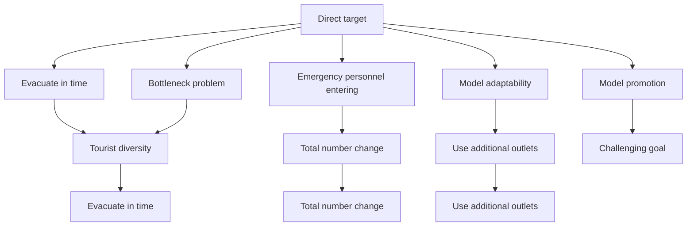
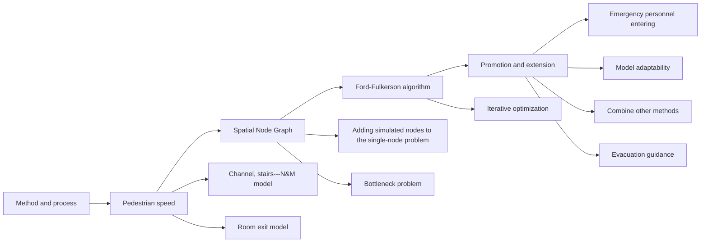
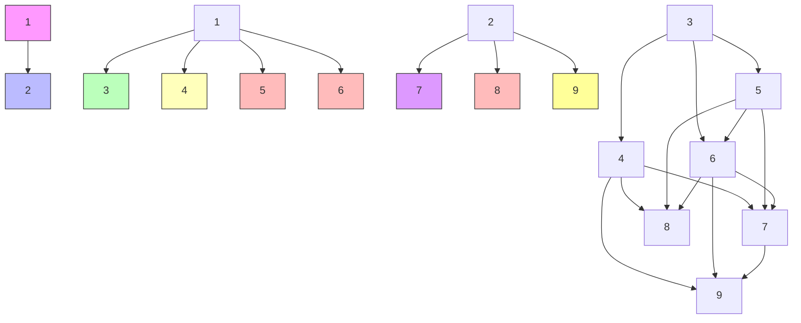
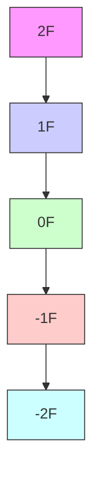
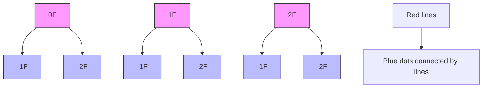
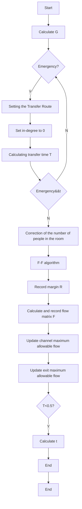
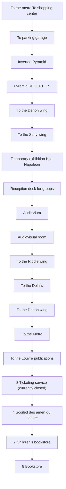

For office use only

T1

T2

T3

T4

Team Control Number

1922748

Problem Chosen

D

For office use only

F1

F2

F3

F4

2019

MCM/ICM

Summary Sheet

# A Systematic Dynamic Route Planning Model

Summary

The object of our model is to provide an emergency evacuation for the Louvre. In the meantime, this model can also identify potential bottlenecks and has certain adaptability. However, complex building structures and the interaction among people makes the problem much harder. In this paper, we present a system dynamic planning model. And both the systematicness during the planning and the individuality of the visitors are considered in our model.

The first part of our model is to solve the influence of individual factors. The effect will be ultimately reflected in the flow speed of the crowd. In this way, while calculating the flow speed of the crowd, we adopt N&M model and Stable Evacuation Speed model (SES Model) to deal with different situation.

The second part is to visualize the building into a graph. Then simplify the problem from mutito-muti plan to single-to-single plan through adding two virtual nodes. This step makes the following solution much easier.

The third part of the model is the systematic planning of evacuation route. Here a new algorithm with Ford-Fulkerson algorithm as the core, and considering the previous two parts of the model are proposed. In this way, the algorithm can carry out route planning from the perspective of system, and fully consider the micro factors.

Then, a simulated building is built to verify the validity of the model. The model obtains the result within 0.457s with a scale of 770 people. Besides, to a certain extent, the result matches practical case. In addition, it is able to evacuate the crowd from the dangerous room with the fastest speed in the emergency treatment, which shows excellent performance.

Finally, we implement this model to the Louvre. It cost 36.15s to get the result with a scale of 6700 people and accuracy of 0.1s. The total evacuation cost 288.7s. After the flow and margin matrices are visualized, it clearly shows the whole evacuation process and potential bottlenecks. Also, we present a series of suggestions for practical use of the model.

Key words: N&M model;Stable evacuation speed model;Ford-Fulkerson algorithm;System dynamic planning

## Contents

## 1 Introduction 1

1.1 Background  
1.2 Restatement of problems  
1.3 Overview of our work . . 2

## 2 Assumptions 3

## 3 Symbols and Notation 3

## 4 Microscopic model: personnel evacuation speed model 3

4.1 A possible model of different road segments (N&M model) 3  
4.2 A possible model considering the degree of congestion . . 4

## 5 Construction of the graph 6

5.1 Description of the diagram . . 6  
5.2 Matrix model 7  
5.3 Dynamic system planning algorithm . . 9

## 6 Simulation model validation 11

6.1 model initialization instructions 11  
6.2 Evacuation plan . . 11  
6.3 Three types of bottleneck problems 12  
6.4 Adaptive analysis . 14  
6.5 Entry of emergency personnel 1 5

## 7 Louvre evacuation model 15

7.1 Application of the dynamic node graph in the Louvre . 15  
7.2 Analysis of the results of the Louvre model . 16

## 8 How to use the model 17

## 9 Conclusion 18

9.1 Sensitivity analysis 18  
9.2 The model . 19  
9.3 The algorithm . . 19

## 1 Introduction

## 1.1 Background

Today, museums, libraries, and exhibition halls around the world are paying more attention to the safe evacuation of venues, and are looking for suitable emergency evacuation methods. Therefore, it is vital to establish a widely used and adaptable emergency evacuation model. In recent years, many scholars have put forward their own opinions in this field, and established various models. Among them, Wakim proposed a Markov pedestrian model based on the analysis of pedestrian dynamic behavior and Markov chain[1]; Helbing, a German scholar, proposed a social force model that can organize a series of self-organizing phenomena in the process of current human movement[2]. The above models are very suitable for the study of individual movement in emergency evacuation. And they’re very accurate for the bottleneck problem, which means situations when movement is dramatically slowed or even stopped. However, for a large, multi-story venue like the Louvre, an evacuation model with a general view from the whole to the local is needed. Therefore, based on the establishment of the spatial simulation maximum flow node graph model, we use the maximum flow method to explore how to choose the most appropriate evacuation scheme in case of emergency.

## 1.2 Restatement of problems

The Louvre is one of the largest and most visited art museums in the world. Due to the diversity of visitors and the complex structure of the building, it poses a great challenge to safe evacuation. We need to develop an emergency evacuation model to provide museum staff with options for evacuation options in different situations, and to popularize other large crowded structures.

The established model needs to accomplish the following objectives:

I.Give instructions to allow museum personnel to explore a range of options to evacuate visitors from the museum;  
II.Identify potential bottlenecks that may limit export movement;  
III.Allow emergency personnel to enter buildings as soon as possible;  
IV.The models can be used to solve a wide range of considerations and various types of potential threats;  
V.Extend to other large crowded structures.

At the same time, the model should consider several implicit objectives:

I.How to evacuate when the total number is different;  
II.When there are individual influence such as small group or different language speakers, how to arrange evacuation plan;  
III.When and how any additional exits.

The mind map (Figure 1) shows the issues that need to be addressed.


<details>
<summary>flowchart</summary>


</details>

Figure 1: Problem unfolding

## 1.3 Overview of our work

In our research program, the first step is the microscopic part: to find out the law of human flow speed based on the existing crowd movement model, including ”staircase model”, ”corridor model” and ”room exit model”. The second step is to establish a spatial node graph for the venue with the idea of graph theory. And use nodes to represent various parts of the venue, such as rooms and halls, lines to indicate the stairs, corridors, etc. connected to each part. The third step is the macro part: combined with the idea of the Ford-Fulkerson algorithm, we set the optimization goal as the speed of all exits flow at each moment is the maximum that can be achieved, and dynamically observe the evacuation and make adjustments by iterative method. The final step is to promote the model so that rescuers can get in time and make the model able to cope with other potential threats.

The flow chart (Figure 2) illustrate the above ideas in a more visual way.


<details>
<summary>flowchart</summary>


</details>

Figure 2: Method and process

## Assumptions

1. The guiding signs and notifications of the venues are clear enough for emergency evacuation.  
2. While evacuating, the vast majority of people are rational enough to follow the signs and notifications and complete the escape.  
3. No additional accidents such as stampedes occur during evacuation.  
4. When evacuating, the crowd will not evacuate in opposite directions.  
5. The doors of each main room are of moderate size and width, which will not cause overcrowding.

## 3 Symbols and Notation

Table 1: Symbol descriptions

<table><tr><td>symbol</td><td>descriptions</td><td>units</td></tr><tr><td> $v$ </td><td>Evacuation Speed of Flow</td><td> $m/s$ </td></tr><tr><td> $S_{ind}$ </td><td>Average personal area</td><td> $m^{2}/people$ </td></tr><tr><td> $S_{total}$ </td><td>Total area of human flow</td><td> $m^{2}$ </td></tr><tr><td> $D$ </td><td>Crowd congestion</td><td> $\backslash$ </td></tr><tr><td> $k$ </td><td>Speed coefficient</td><td> $\backslash$ </td></tr><tr><td> $\rho$ </td><td>Population density</td><td> $people/m^{2}$ </td></tr><tr><td> $q$ </td><td>Human flow</td><td> $people/s$ </td></tr><tr><td> $G$ </td><td>Overall matrix of the model</td><td> $\backslash$ </td></tr></table>

Note: Symbols not mentioned in the table will be explained if they appear below.

## Microscopic model: personnel evacuation speed model

## 4.1 A possible model of different road segments (N&M model)

According to the related research of Predtechenski and Milinskii [3], the average evacuation speed is a function of the flow density. Besides,they used the observation data of the aisle and stairs to fit the relationship curve. Unfortunately, this is a complex nonlinear relationship, that is not suitable for a wide range of applications.

After that, Nelson and Mowrer et al[4]. simplified the relationship between velocity and flow density to a linear relationship, and selected different linear coefficients for different evacuation channels. When 0.54 person $\cdot / m ^ { 2 } \leq \mathrm { D } \leq 3 . 8$ persons/m2, the relationship between the moving speed and the flow density is as follows.

$$
v = k - 0. 2 6 6 k D \tag {1}
$$

Where, we define D as the crowd congestion degree, that is, the ratio of the actual area of the human body in the crowd to the total area of the flow of people, which reflects the overall crowding degree of the crowd. It can be derived from $\begin{array} { r } { D = \frac { N \bar { S } _ { i n d } } { S _ { t o t a l . } } } \end{array}$ NSind , Where,Sind refers $S _ { i n d }$ Stotal to the average personal occupation area, $S _ { t o t a l }$ refers to the total area of the flow of people. And k in the formula (1) can be determined from Table 2[5].

Table 2: Speed coefficient k

<table><tr><td colspan="3">Evacuation Channel Type</td><td rowspan="2">k</td></tr><tr><td rowspan="5">Stairs</td><td>StairsRiser/mm</td><td>Tread/mm</td></tr><tr><td>190</td><td>254</td><td>1.00</td></tr><tr><td>178</td><td>279</td><td>1.08</td></tr><tr><td>165</td><td>305</td><td>1.16</td></tr><tr><td>165</td><td>330</td><td>1.23</td></tr><tr><td colspan="3">Corridor,Aisle,Ramp,Doorway</td><td>1.40</td></tr></table>

Corresponding to the above table, k is taken as 1 and 1.4 respectively to obtain the ”staircase model”and ”corridor model”.

In summary, N&M Model[6] considers the relationship between evacuation speed and flow density[7], and gives different models such as the staircase model and corridor model for different road sections, but it is not suitable for the situation where the flow density is relatively large, such as the narrow exit of the room. So we try to find a better model to replace it.

## 4.2 A possible model considering the degree of congestion

## 4.2.1 Crowding in two directions

According to research by Lu Junan and others, the speed of personnel escape is affected by Front- Crowding and Side-Crowding.[8]

Front-Crowding: In an escaped group, taking the exit as the coordinate origin, suppose $x _ { j }$ $\frac { d x _ { j } } { d t }$ previous $j - 1 .$ -th person is $| x _ { j } - x _ { j - 1 } |$ , which is recorded as $A ,$ also, the relative velocity is $\begin{array} { r } { \frac { d x _ { j } } { d t } - \frac { d x _ { j - 1 } } { d t } } \end{array}$ dxj−1 , which is recorded as B. Then the forward damping force caused by crowding $B .$ $\textstyle { \frac { B } { A } }$

Side-Crowding: Here we use a frictional damping force to describe the level of Side Crowding[9]. Note that Side-Crowding is generally suitable when the crowd density is particularly large, and when the population density is small, it has little effect.

## 4.2.2 Escape velocity dynamic equation

According to Newton’s second law, we have obtained the following escape velocity dynamics equation.

$$
- m _ {j} \frac {d ^ {2} x _ {j}}{d t ^ {2}} = \alpha (\frac {d x _ {j}}{d t} - \frac {d x _ {j - 1}}{d t}) / | x _ {j} - x _ {j - 1} | + f _ {j} \tag {2}
$$

Where $j = 2 \ N$ , which constitutes a system of equations with $N - 1$ equations.

## 4.2.3 Stable evacuation speed model (SES Model)

Performing integration of the above formula,we get

$$
\frac {d x _ {j}}{d t} = \lambda_ {j} L n (x _ {j - 1} (t) - x _ {j} (t)) - \frac {F _ {j}}{m _ {j}} + c _ {j} \tag {3}
$$

In the formula, $F _ { j }$ is the integral term of $f _ { j }$ and $c _ { j }$ is a constant term.

Let each person occupy a square with an area of LL,Set the front interval as $L + d _ { 1 }$ , the side interval is $L + d _ { 2 }$ .

Then front density $\begin{array} { r } { \rho _ { 1 } = \frac { 1 } { L + d _ { 1 } } } \end{array}$ , side density $\begin{array} { r } { \rho _ { 2 } = \frac { 1 } { L + d _ { 2 } } . } \end{array}$ .

Evacuation speed

$$
v (\rho_ {1}, \rho_ {2}) = \frac {d x _ {j}}{d t} \tag {4}
$$

When $v ( \rho _ { 1 } , \rho _ { 2 } ) = 0 , \rho _ { 1 } { = } \rho _ { 1 m } , \rho _ { 2 } = \rho _ { 2 m } . \rho _ { 1 m }$ and $\rho _ { 2 m }$ represent front and side maximum density respectively. Then use the expression containing $\rho _ { 1 m } \rho _ { 2 m }$ to indicate $c _ { j }$ . Substituting a into equation (1), we get

$$
v _ {j} \left(\rho_ {1}, \rho_ {2}\right) = \left\{ \begin{array}{l l} \lambda_ {j} L n \frac {\rho_ {1 m}}{\rho_ {1}} - \frac {k \left(\rho_ {2} - \rho_ {2 m}\right)}{m _ {j}} & \left(\rho_ {i c} <   \rho_ {i} \leq \rho_ {i m}, i = 1, 2\right) \\ v _ {m} & \left(\rho_ {i} \leq \rho_ {i c}, i = 1, 2\right) \end{array} \right. \tag {5}
$$

When the density is small, the velocity of the human flow is not affected by it, and the critical density does not affect the velocity[10].

Considering other factors such as personnel characteristics, the degree of influence before and after congestion is different, we attain

$$
v _ {j} (\rho_ {1}, \rho_ {2}) = v _ {m} \left(\alpha L n \frac {\rho_ {1 m} / \rho_ {1}}{\rho_ {1 m} / \rho_ {1 c}} + \frac {\beta (\rho_ {2 m} - \rho_ {2})}{\rho_ {2 m} - \rho_ {2 c}} + \gamma\right) \tag {6}
$$

where, $\rho = \rho _ { 1 } \rho _ { 2 } { = } D , \rho _ { 1 c }$ and $\rho _ { 2 c }$ are respectively the critical densities of two directions. $\alpha , \beta , \gamma$ is corresponding weight of each aspect.

The above is the evacuation escape speed model, also known as the SES Model.

It is analyzed that the above model is a generalized model. When the flow density is large, neither of $\alpha , \beta , \gamma$ is zero. When the flow density gets smaller, it can be considered to be mainly affected by Front-Crowding; when the flow density is small enough, only the impact of personnel characteristics can be considered. At this time, the population structure is relatively uniform under normal circumstances, the characteristics of the personnel should be consistent, and v is a certain value[11]. Here ia an example to implement this model.

According to the fire safety principle data prepared by M.Y.Roytman et al.[12], the adult body thickness in the front and rear direction is about 0.32 m, and the body width in both directions is 0.5 m.Considering that the contact between the human body is the highest density, it can be considered that the maximum density $\rho _ { 1 m }$ and $\rho _ { 2 m }$ in the front and side directions are 3 persons/m and 2 persons/m, respectively. According to the research data of Ando et al.[13], when distance between the human body lines is about 0.75 m. According to this, the critical density $\rho _ { 1 c }$ and $\rho _ { 2 c }$ of the front direction and the side direction are about 0.89 persons/m and 1.33 person $s / m$ , respectively. Substituting the above $\rho _ { 1 m } , \rho _ { 2 m } , \rho _ { 1 c }$ and $\rho _ { 2 c }$ into the model, we obtain:

$$
\begin{array}{l} \begin{array}{l} \mathrm{A} = 1. 3 2 - 0. 8 2 \mathrm{Ln} (\rho) \\ R = 2. 0 - 0. 7 6, \end{array} \tag {7} \\ B = 3. 0 - 0. 7 6 \rho \\ \end{array}
$$

$$
v _ {j} (\rho) = v _ {m} \left(\alpha A + \beta B + \gamma\right) \tag {8}
$$

The SES model considers the combined effects of factors such as Front-Crowding,Side-Crowding and other personnel characteristics on evacuation speed during evacuation, and can comprehensively reflect the influencing factors of evacuation speed[14]. The only downside is that due to the uncertainty and ambiguity of the characteristics of the personnel, the effect of this part on the whole cannot be well described.

## Construction of the graph

## 5.1 Description of the diagram

Graphs are one of the most powerful frameworks in data structure and algorithmics. Graphs can be used to represent almost any type of structure or system. In this problem, the Louvre is a complex space building structure. To explore its personnel evacuation plan, the method of constructing a node graph can be adopted. To simplify the calculation, we added two hypothetical nodes 1 and 9.

For the sake of convenience, we can use the schematic shown in Figure 3 to represent the idea of a node graph. In Figure 3, we imagine a building with six rooms, where the numbers 2 to 7 represent these rooms. The green line segments indicate the relationship between the rooms, where the solid lines indicate the corridors, and the dotted lines indicate that there is a staircase between the connections of the rooms.


<details>
<summary>flowchart</summary>


</details>

Figure 3: Node graph of a hypothetical building

It can be seen that in Figure 3, the green box shows the entire structure of the building. If we use the maximum flow method to calculate the node graph on this basis, we will find that this is a ”multi-target to multi-target” problem, that is, corresponding to evacuation from multiple rooms to multiple exits. Although the node structure diagram in the green frame is very intuitive, such multi-objective planning brings a lot of trouble to the calculation. In addition, the Louvre itself is a large and complex space building, and the planning of the evacuation plan will be very complicated and difficult to calculate.

So, we added two special nodes, which are represented by the number 9 and the number 1 in Figure 3.

Node 9 is called ”sink point” and represents the external environment. Its black line with the numbers 6, 7, and 8 indicates the three exits of the building. Node 1 is called the source point and does not have practical meaning. However, the number (not shown in Figure 3) on the line connecting it to each room indicates the number of people remaining in the room at a certain moment. It is worth noting that when the problem is solved later, all the connections will have numbers, and their meanings will be different, which will be explained in the later process.

The addition of two special nodes makes the multi-objective programming problem that is complicated and difficult to calculate become a simple and easy to calculate single-objective programming problem. The function of node 1 is to represent the remaining number truly and accurately. The function of node 9 is to express the flow of people leaving the building from the exit. This creates a new ”single goal to single goal” issue. This result corresponds to the relationship between the total number of people remaining in all rooms and the flow of people leaving all exits. The simplification of the goal brings great convenience to the optimization of the algorithm.

In addition, adding two virtual nodes has other benefits that will be explained in the theory of algorithm in the next section.

## 5.2 Matrix model

After the model of the graph is established, all we need to do is to incorporate the numerical calculations on this basis. In order to clearly show the variation of human flow during the simulated evacuation process and to see the optimal evacuation route planning, we can integrate various data with the help of the matrix.

In this model, the data needed to simulate the evacuation law are as follows:

I. The number of people in each room at any time of evacuation. We use the number of source points connected to each room to represent them.  
II. During the evacuation process, the number of people passing between adjacent parts (rooms) during a period of time, that is, the flow of people carried by corridors or stairs during a period of time. We use numbers on the connecting lines between rooms to represent them.  
III. In the process of evacuation, the number of people evacuated from each exit at any time, in other words, the flow of the exit. They are represented by numbers on the connecting line between the outlet and the outside (sink point).

Assuming that a building is divided into n parts, we can interpret it as n rooms, then we build a model with n nodes. At the same time, we can establish a matrix of $n \times n ,$ , in which the elements represent the connection between nodes. Since this n-order matrix can only represent the exchange of people between rooms in the building, and can not reflect the number of people remaining in the room or evacuating the building, we extend this n-order matrix to a circle and turn it into a $( n + 2 ) \times ( n + 2 )$ matrix, as shown in Figure 4.

The final $n + 2$ matrix is composed of several parts, which can establish their respective matrices.

## 5.2.1 ”corridor model” $C _ { q }$ and ”staircase model” $S _ { q }$

Firstly, the ”corridor model” channel traffic matrix $C _ { q }$ satisfies the following set of equations:

$$
\left\{ \begin{array}{l} c _ {i, j} = v = k - 0. 2 6 6 k D \\ c _ {i, j} = c _ {j, i} \\ c _ {i, i} = 0 \end{array} \right. \tag {9}
$$

Among them, $\left\{ \begin{array} { l l } { 2 \leq i \leq n + 1 } \\ { 2 \leq j \leq n + 1 } \end{array} \right.$ The other elements are all 0. $C _ { i , j }$ represents the flow of people through the channel over a period of time. This value is calculated by the channel model combined with the density of the flow and the moving speed. $C _ { i , j } = C _ { j , i }$ indicates that the maximum velocity in both directions on the channel is equal. From the matrix point of view, this shows that the human traffic matrix is a symmetrical matrix, and the diagonal line is all zero because it has no practical meaning. The meaning of $C _ { i , n + 2 } = 0$ is that the channel model only expresses the interconnection between the various parts of the building, but does not express the relationship between the exit and the outside world. The last column of the total matrix represents the flow of people at the exit of the building. Therefore, the last column of the traffic matrix is 0. The matrix is in the following form:

$$
C _ {q =} \left[ \begin{array}{c c c c} 0 & c _ {1, 2} & \dots & c _ {1, n + 2} = 0 \\ c _ {2, 1} & \ddots & \dots & \vdots \\ \vdots & \dots & \ddots & \vdots \\ c _ {n + 2, 1} & \dots & \dots & 0 \end{array} \right], S _ {q =} \left[ \begin{array}{c c c c} 0 & s _ {1, 2} & \dots & s _ {1, n + 2} = 0 \\ s _ {2, 1} & \ddots & \dots & \vdots \\ \vdots & \dots & \ddots & \vdots \\ s _ {n + 2, 1} & \dots & \dots & 0 \end{array} \right] \tag {10}
$$

Then the ”staircase model” channel traffic matrix $S _ { q }$ . It differs from the ”corridor model” channel traffic matrix in that, over a period of time, the calculation method of the traffic through the corridor is different. It uses the formula of the staircase model:

$$
s _ {i, j} = v _ {j} (\rho) = v _ {m} \left(\alpha A + \beta B + \gamma\right) \tag {11}
$$

## 5.2.2 ”initial matrix” En and ”export matrix” Ex

Next, the initial matrix En. It represents the number of people in each room at the initial time of evacuation. Finally, the export matrix Ex. It represents the number of people evacuated from each exit during the evacuation process, i.e. the exit flow. It differs from the initial matrix En in that it only has the last column which is not zero. En and Ex satisfy the following equation:

$$
\left\{ \begin{array}{l} e n _ {1, j} = t _ {j} \\ e n _ {i, j} = 0, (2 \leq i \leq n + 2) \end{array} , \left\{ \begin{array}{l} e x _ {i, n + 2} = T _ {j} \\ e x _ {i, j} = 0, (1 \leq j \leq n + 1) \end{array} \right. \right. \tag {12}
$$

The $t _ { j }$ is the number that the source point connects with each room at any time. $T _ { j }$ is the number on the connection line between the exit and the outside world (the sink point). Since the initial matrix only represents the remaining number of people in the internal room, it is independent of the channel, so the number of all rows except the first row is 0. The matrices are in the following form:

$$
E n = \left[ \begin{array}{c c c c c} 0 & e n _ {1, 2} & \dots & e n _ {1, n - 1} & 0 \\ 0 & \ddots & \dots & 0 & 0 \\ \vdots & \dots & \ddots & \vdots & \vdots \\ 0 & \dots & \dots & 0 & 0 \end{array} \right], E x = \left[ \begin{array}{c c c c} 0 & 0 & \dots & 0 \\ 0 & \ddots & \dots & e x _ {2, n + 2} \\ \vdots & \dots & \ddots & \vdots \\ 0 & 0 & \dots & e x _ {n - 1, n + 2} \\ 0 & 0 & \dots & 0 \end{array} \right] \tag {13}
$$

The four matrices ultimately form the overall matrix G, visually displayed in Figure 4:

$$
G = C _ {q} + S _ {q} + E n + E x \tag {14}
$$


<details>
<summary>text_image</summary>

G =
Eₙ
n×n
Eₓ
(n+2)×(n+2)
</details>

Figure 4: Overall matrix diagram

## 5.3 Dynamic system planning algorithm

## 5.3.1 Introducing Ford-Fulkerson algorithm

In the above we have transformed the multi-nodes to multi-nodes model of the building into a single-node to single-node model. In this model, the number of people flowing out of the source at any time should be equal to the number of people entering the sink point. Therefore, in the process of escape, the number of people who escaped is the number of people who go from the source to the sink point. In order to get the maximum of escape speed, we need to make full use of the channel resources in the building at any time to maximize the escape rate. In the established model, the problem is equivalent to obtaining the maximum flow from the source to the sink at any time. For such problems, we can apply the Ford-Fulkerson algorithm and make appropriate corrections. The algorithm is described in detail below[15].

Before describing the algorithm, we need to further clarify the meaning of each edge in the model. there are three kinds of nodes, source points, sink points, and room points in the model. The value on the line connecting the source point to the room node indicates the initial number of rooms in the corresponding room. The connection between the room nodes indicates the connection between the rooms, and the value indicates the maximum flow allowed by the channel. The connection between the sink point and the exit room nodes indicates the connection between the exit and the exterior of the building, and its value indicates the maximum passenger flow allowed by the exit.

The original Ford-Fulkerson algorithm is an iterative algorithm. In each iteration, the value of the stream is increased by looking for an ”augment path”[16]. The augmented path can be seen as a path from the source point to the sink point, and more streams can be added along this path. Iterating until the augmented path can no longer be found, at least one of the paths from the source point to the sink point must be full (ie, the size of the edge stream is equal to the size of the edge). The resulting stream at this point is the maximum flow in this case, which can be proved by the maximum flow minimum cut theorem. And we will not prove this here.

## 5.3.2 Application of Ford-Fulkerson algorithm

Since the model we built is not a traditional single-node to single-node mode, and the situation we considered is far more complicated than the Ford-Fulkerson algorithm. Therefore, we properly use the Ford-Fulkerson algorithm in the solution of the problem and propose a dynamic system planning algorithm based on the Ford-Fulkerson algorithm[17]. The algorithm takes the general planning and the planning of some rooms in emergency into account. The specific flow chart is shown in Figure A-1 (shown in appendix).

As shown in the flow chart of Figure A-1, the algorithm is divided into two parts, emergency handling and general case processing. In general case processing, each iteration represents a situation within a time period, such as within 0 to 1 second. When the number of people in the source point is less than 0.5, the iteration stops and the algorithm ends. In each iteration, the flow matrix and the margin matrix can be derived by the Ford-Fulkerson algorithm. Then, the value of the edge between the source point and the room node in the original model, which is the initial number of people in each room is corrected by the flow matrix. And the current flow velocity model is used to correct the maximum flow of the channel by the current flow density in each channel and the flow density at the exit. This will provide a picture of the flow of people in each time period. Finally, specific path planning is obtained from all traffic matrices. And the degree of use of each channel can be derived from the margin matrix[18].

In emergency handling, we make the following processing. As shown in the emergency processing section of Figure A-1, first, the person in the emergency room is transferred to the adjacent non-emergency room by default, and the entrance degree of the emergency room is set to zero. According to the maximum flow rate of the connecting channel, the time required for the transition $T _ { T }$ can be calculated. Since the emergency transfer route remains unchanged from 0 to $T _ { T }$ , regardless of the external situation. In this way, in the general case, at the beginning of each iteration from 0 to $T _ { T }$ , the number of people transferred from the emergency room during the time period is added to the remaining number of people in the non-emergency room. And set the corresponding route and finally integrated into the traffic matrix.

## 6 Simulation model validation

## 6.1 model initialization instructions

According to the graph model and matrix model defined in 5.1 and 5.2, we initialize the number of nodes in the node (taking random numbers between 100 and 200), and specify the maximum flow rates of each exit are 40 P eople/s, 35 P eople/s, 30 P eople/s.

As shown in Figure 5, 1 is a virtual ingress node, 9 is a virtual egress node, and 2-8 are actual nodes (where in the 6, 7, 8 nodes adjacent to the egress are called first-level nodes, and the first-level nodes are called second-level nodes), the value on the red line segment represents the initial number of people in the node, the value on the blue line segment represents the reachable maximum flow of the different channels between the nodes, and the value on the green line segment represents the maximum flow of each exit.


<details>
<summary>radar chart</summary>

| Point | Value |
|---|---|
| 1 | 100 |
| 2 | 180 |
| 3 | 19.9 |
| 4 | 150 |
| 5 | 13.3 |
| 6 | 16.6 |
| 7 | 13.4 |
| 8 | 15.7 |
| 9 | 35 |
| 10 | 108 |
| 11 | 90 |
| 12 | 12.2 |
| 13 | 19.7 |
| 14 | 15.7 |
| 15 | 15 |
| 16 | 60 |
| 17 | 19.7 |
| 18 | 15.7 |
| 19 | 20.4 |
| 20 | 40 |
| 21 | 30 |
</details>

Figure 5: Model initialization

## 6.2 Evacuation plan

According to the requirements of the topic, it is our goal to evacuate all personnel as quickly as possible. In order to achieve this goal, we substituted the model into the algorithm and solved it iteratively.

Here we take 5s as a time step and make a flow diagram. As shown in Figure 6, the values on the red line have no practical meaning. The values on the blue and green lines indicate the channel and exit flow in the 5S time step. It can be seen intuitively that the first step of the evacuation plan is to empty the exit rooms 6, 7and 8. Then the personnel at the secondlevel nodes move to the adjacent first-level nodes (Figure 6(a)). As the operating pressure of the evacuation medium-term channel increases, the channel between the two nodes may be required to be shunted (Figure 6(b)). Then, with the decrease of remaining number, the channel pressure between the two nodes decreases. The flow reduction is even reduced to 0 (Figure 6(c)), and eventually all evacuation is completed.

In fact, our evacuation plan is a continuous process of the flow chart given in each time section. According to this evacuation plan, all the people can be evacuated as soon as possible.


<details>
<summary>radar chart</summary>

| Node | Value |
|---|---|
| 1 | 30.7 |
| 2 | 19.7 |
| 3 | 15 |
| 4 | 12.2 |
| 5 | 20 |
| 6 | 19.7 |
| 7 | 15.7 |
| 8 | 15 |
| 9 | 35.4 |
| 10 | 35 |
| 11 | 27.3 |
| 12 | 12.2 |
| 13 | 15 |
| 14 | 15 |
| 15 | 15 |
| 16 | 12.2 |
| 17 | 15 |
| 18 | 12.2 |
| 19 | 15 |
| 20 | 15 |
| 21 | 15 |
| 22 | 15 |
| 23 | 15 |
| 24 | 15 |
| 25 | 15 |
| 26 | 15 |
| 27 | 15 |
| 28 | 15 |
| 29 | 15 |
| 30 | 15 |
| 31 | 15 |
| 32 | 15 |
| 33 | 15 |
| 34 | 15 |
| 35 | 15 |
| 36 | 15 |
| 37 | 15 |
| 38 | 15 |
| 39 | 15 |
| 40 | 15 |
| 41 | 15 |
| 42 | 15 |
| 43 | 15 |
| 44 | 15 |
| 45 | 15 |
| 46 | 15 |
| 47 | 15 |
| 48 | 15 |
| 49 | 15 |
| 50 | 15 |
| Note: The values in the 'Value' column are estimated based on the number of 'Number' labels (e.g., 'Number') and the corresponding 'Value' value for each node. The 'Number' values are not explicitly labeled but are inferred from the position of the 'Number' label on the graph.
</details>

(a) Flow in 15s


<details>
<summary>radar chart</summary>

| Node | Value |
|---|---|
| 1 | 43.2 |
| 2 | 16.6 |
| 3 | 15 |
| 4 | 24.9 |
| 5 | 19.7 |
| 6 | 12.2 |
| 7 | 15.7 |
| 8 | 27.3 |
| 9 | 30.1 |
| 10 | 3.3 |
| 11 | 13.3 |
| 12 | 12.2 |
| 13 | 6.7 |
| 14 | 14.4 |
| 15 | 15.7 |
| 16 | 16.6 |
| 17 | 35.4 |
The values are estimated based on the chart's visual structure and lack explicit numerical labels for the axes.
</details>

(b) Flows in 35s


<details>
<summary>radar chart</summary>

| Point | Value |
|---|---|
| 1 | 51.6 |
| 2 | 16.6 |
| 3 | 15 |
| 4 | 0.3 |
| 5 | 19.7 |
| 6 | 12.2 |
| 7 | 0.3 |
| 8 | 827.3 |
| 9 | 19.9 |
| 10 | 4.4 |
</details>

(c) Flows in 40s  
Figure 6: Evacuation flow

## 6.3 Three types of bottleneck problems

There are many bottlenecks in the actual evacuation of the building crowd. We divide them into three categories: (1) bottlenecks due to channel supply and demand imbalances (2) bottlenecks due to uneven distribution of exports (3) single room export bottlenecks.

## 6.3.1 Bottlenecks due to imbalance in channel flow

What we can find from the flow-time figure of the exit, shown in Figure 7(a), is that the flow drops occurs at around 10s, 30s and 35s.


<details>
<summary>line chart</summary>

| Time /s | Original | Optimized |
| ------- | -------- | --------- |
| 5       | 105      | 105       |
| 10      | 105      | 105       |
| 15      | 98       | 105       |
| 20      | 98       | 105       |
| 25      | 98       | 105       |
| 30      | 98       | 105       |
| 35      | 92       | 72        |
| 40      | 52       | 52        |
| 45      | 28       | 18        |
</details>

(a) Exit flow - time graph


<details>
<summary>line chart</summary>

| Time /s | 3 to 6 | 5 to 6 | 6 to 9 |
| ------- | ------ | ------ | ------ |
| 0       | 6      | 5      | 0      |
| 10      | 6      | 5      | 0      |
| 12      | 1      | 1      | 1      |
| 42      | 0      | 0      | 1      |
| 45      | 0      | 5      | 6      |
</details>

(b) Flow Margin-time graph  
Figure 7: Bottleneck phenomenon

Next, we refine the reason of the drop in flow, and make the channel Flow Margin-time graph of node 6 as Figure 7(b). Node 6 has two inlet channels and one outlet channel, corresponding to the three curves in the figure. The Flow Margin is defined as the difference between the maximum flow of the channel and the actual flow, reflecting the remaining capacity of the channel. To minimize evacuation time, the Flow Margin must be minimized. It can be seen from the figure that the flow margin of node 6 has a rise in 10s and about 42s respectively. The sharp rise in 42s is clearly due to the decline in the total number of people remaining. The reason for the slight increase at 10s is that the sum of the maximum flow of channels 3-6 and 5-6 is less than the maximum flow of channels 6-9 (15+12.1<30), that is, the flow ”unbalance between supply and demand” occurs. Reflected in Figure 7(a), this creates a bottleneck in flow at 10s.

In order to solve the problem ,we choose to expand the width of the restricted channel while keep the density unchanged to meet the flow supply and demand balance. Figure 7(a) also shows the optimized outlet flow-time diagram. It can be seen that the bottleneck is eliminated ,as well as , evacuation time shortened. The total evacuation time is about 43.2s. (The accuracy is related to the selected time step)

## 6.3.2 Bottlenecks due to uneven distribution of exports

As mentioned above, there is a bottleneck at 30s in the exit flow-time chart. Make the remaining number of people in the 2.3.4.5-time chart, as shown in Figure 8.It can be seen that the absolute values of the slopes of nodes 3 and 2 are smaller than those of nodes 4 and 5, and the comparison of 3 to 4 is slower than the similar number of people. 2 to 5 fell more slowly. At around 30-35s, people in node 2, 4, 5 have been evacuated, but 3 has the remaining number, which caused a small decline in export flows. There are two main reasons for the bottleneck: one is the uneven distribution of personnel in different rooms, and the other is the uneven distribution of exports. These two reasons together cause the uneven speed of the overall personnel escape (that is, the slope is different). The solution is to make the distribution of exports as uniform as possible in the case of similar numbers of people, especially in rooms far from the exit, there should be more outward access.


<details>
<summary>line chart</summary>

| Time /s | 3    | 2    | 4    | 5    |
| ------- | ---- | ---- | ---- | ---- |
| 0       | 180  | 100  | 150  | 110  |
| 5       | 180  | 100  | 150  | 110  |
| 10      | 180  | 100  | 150  | 110  |
| 15      | 170  | 90   | 130  | 100  |
| 20      | 160  | 70   | 100  | 70   |
| 25      | 140  | 50   | 70   | 40   |
| 30      | 120  | 30   | 40   | 0    |
| 35      | 90   | 10   | 20   | 0    |
| 40      | 40   | 0    | 0    | 0    |
| 45      | 0    | 0    | 0    | 0    |
</details>

Figure 8: Num of remaining-time graph

## 6.3.3 Single room export bottleneck

In addition to the two types of bottlenecks shown in Figure 7(a), there is still a bottleneck problem that is not reflected in this situation, that is, the single-room export bottleneck problem.

According to Helbing [19], Chunshan Lv [20] Weiguo Song [21] and others, the simulation of the evacuation model is carried out using a cellular automaton and a social force model: in the case of a relatively large population density, It is easy to form an ”arched” blockage at the exit of the room, and the greater the speed expected by the personnel, the more obvious the blockage.

In order to solve this bottleneck problem, we can control the evacuation of the expected speed by manual guidance, guidance, etc. to reduce or even eliminate the export blockage. (In fact, we have set the flow velocity of 0.8m/s in the aforementioned model, and have considered the factors of export bottlenecks.) According to research by relevant experts [22], there are some more practical and specific measures that can effectively prevent The bottleneck, such as setting a cylindrical obstacle, etc., a few meters before the exit.

## 6.4 Adaptive analysis

According to the topic requirements, museum managers hope to obtain an adaptive model that can be used to address a wide range of considerations and various types of potential threats. Let’s take a fire accident in a room as an example to show that our model is adaptable. Assuming that room 8 is on fire, it should meet such requirements: First, only leaving is allowed for room 8. Secondly, people in room 8 have to be evacuated as soon as possible. According to our aforementioned algorithm, the above two requirements can be achieved by blocking the entry channel of the node 8 which is shown in Figure9 (c), (d) and lead people evacuate to neighboring rooms just like Figure9 (a), (b).


<details>
<summary>radar chart</summary>

| Point | Red Line Value | Green Line Value |
|---|---|---|
| 1 | 30 | - |
| 2 | - | - |
| 3 | - | - |
| 4 | - | - |
| 5 | 35 | - |
| 6 | 30 | - |
| 7 | 35 | - |
| 8 | 30 | - |
| 9 | - | 35 |
</details>

(a) Normal situation in 5s


<details>
<summary>radar chart</summary>

| Point | Red Value | Blue Value | Green Value |
|---|---|---|---|
| 1 | 40 | 15.7 | 30 |
| 2 | 30 | 15.7 | 30 |
| 3 | 0 | 0 | 0 |
| 4 | 0 | 15.7 | 30 |
| 5 | 7 | 20.4 | 30 |
| 6 | 6 | 0 | 0 |
| 7 | 7 | 20.4 | 30 |
| 8 | 8 | 0 | 30 |
| 9 | 0 | 0 | 35 |
| 10 | 0 | 0 | 40 |
</details>

(b) Emergency situation in 5s


<details>
<summary>radar chart</summary>

| Node | Value |
|---|---|
| 1 | 30.7 |
| 2 | 19.7 |
| 3 | 15 |
| 4 | 12.2 |
| 5 | 20 |
| 6 | 19.7 |
| 7 | 15.7 |
| 8 | 15 |
| 9 | 35.4 |
| 10 | 35 |
| 11 | 27.3 |
| 12 | 12.2 |
| 13 | 15 |
| 14 | 15 |
| 15 | 15 |
| 16 | 12.2 |
| 17 | 15 |
| 18 | 15 |
| 19 | 15 |
| 20 | 15 |
| 21 | 15 |
| 22 | 15 |
| 23 | 15 |
| 24 | 15 |
| 25 | 15 |
| 26 | 15 |
| 27 | 15 |
| 28 | 15 |
| 29 | 15 |
| 30 | 15 |
| 31 | 15 |
| 32 | 15 |
| 33 | 15 |
| 34 | 15 |
| 35 | 15 |
| 36 | 15 |
| 37 | 15 |
| 38 | 15 |
| 39 | 15 |
| 40 | 15 |
| 41 | 15 |
| 42 | 15 |
| 43 | 15 |
| 44 | 15 |
| 45 | 15 |
| 46 | 15 |
| 47 | 15 |
| 48 | 15 |
| 49 | 15 |
| 50 | 15 |
| 51 | 15 |
| 52 | 15 |
| 53 | 15 |
| 54 | 15 |
| 55 | 15 |
| 56 | 15 |
| 57 | 15 |
| 58 | 15 |
| 59 | 15 |
| 60 | 15 |
| 61 | 15 |
| 62 | 15 |
| 63 | 15 |
| 64 | 15 |
| 65 | 15 |
| 66 | 15 |
| 67 | 15 |
| 68 | 15 |
| 69 | 15 |
| 70 | 15 |
| 71 | 15 |
| 72 | 15 |
| 73 | 15 |
| 74 | 15 |
| 75 | 15 |
| 76 | 15 |
| 77 | 15 |
| 78 | 15 |
| 79 | 15 |
| 80 | 15 |
| 81 | 15 |
| 82 | 15 |
| 83 | 15 |
| 84 | 15 |
| 85 | 15 |
| 86 | 15 |
| 87 | 15 |
| 88 | 15 |
| 89 | 15 |
| 90 | -27.3 |
| Note: The values in the 'Value' column are estimated based on the 'Value' label in the diagram.
</details>

(c) Normal situation in 15s


<details>
<summary>radar chart</summary>

| Node | Value 1 | Value 2 | Value 3 | Value 4 | Value 5 | Value 6 | Value 7 | Value 8 | Value 9 |
|---|---|---|---|---|---|---|---|---|---|
| 1 | 19.7 | 15.7 | 12.2 | 9.57 | 10.7 | 12.2 | 7 | 8.27 | 35.4 |
| 2 | 15.7 | 12.2 | 15.7 | 9.57 | 10.7 | 12.2 | 7 | 8.27 | 35.4 |
| 3 | 15.7 | 12.2 | 15.7 | 9.57 | 10.7 | 12.2 | 7 | 8.27 | 35.4 |
| 4 | 15.7 | 12.2 | 15.7 | 9.57 | 10.7 | 12.2 | 7 | 8.27 | 35.4 |
| 6 | 15.7 | 12.2 | 15.7 | 9.57 | 10.7 | 12.2 | 7 | 8.27 | 35.4 |
| 9 | 15.7 | 12.2 | 15.7 | 9.57 | 10.7 | 12.2 | 7 | 8.27 | 35.4 |
</details>

(d) Emergency situation in 15s  
Figure 9: Adaptive model schematic

According to the emergence of different emergencies, the transformation of our model can lead to the corresponding evacuation plan, which is adaptable and can be applied.

## 6.5 Entry of emergency personnel

When an accident occurs, emergency personnel is often required to enter the building in time for rescue. In the actual rescue, how to realize the entry of emergency personnel is also an important issue that should be considered in the case of ensuring the rapid evacuation of personnel. We give two options for this: The first one is real-time monitoring of channel flow. When the flow of people drops to 60%-70% of the maximum flow, the emergency personnel are allowed to enter in. Second, when the situation is particularly urgent, priority is given to emergency personnel.We choose a shortest path, dedicated to emergency personnel use and close all channels and stairs link to this room in the model. Combined with domestic and foreign rescue cases, our program meets the actual requirements.

## 7 Louvre evacuation model

## 7.1 Application of the dynamic node graph in the Louvre

As mentioned before, we can use nodes to represent the relatively independent parts of the building. We can call these parts different rooms.Therefore, we can divide the Louvre into five parts, representing the ground (0F), the first floor (1F), the second floor (2F), the negative first floor (-1F) and the negative second floor (-2F). These five floors can form five plane dynamic system node maps. The connecting part is the ”channel between layers” formed by the actual stairs.

In the actual process of building the model, we simplify each floor of the Louvre into a node diagram. Figure 10 shows the results of first floor (1F)[23] as an example.


<details>
<summary>text_image</summary>

RICHIEU WING
SULLY WING
DENON WING
Le Chapelle temporary
exhibition hall
</details>

(a) Actual 1F


<details>
<summary>line chart</summary>

| Point | X | Y |
|---|---|---|
| 1 | 150 | 100 |
| 2 | 225 | -35 |
| 3 | 300 | 100 |
| 4 | 450 | -25 |
| 5 | 525 | -25 |
| 6 | 525 | 0 |
| 7 | 525 | 30 |
| 8 | 450 | 30 |
| 9 | 375 | 0 |
| 10 | 350 | 10 |
| 11 | 325 | 35 |
| 12 | 225 | 75 |
| 13 | 225 | 35 |
| 14 | 150 | 35 |
| 15 | 225 | 105 |
| 16 | 150 | 105 |
| 17 | 100 | 75 |
</details>

(b) Node graph of 1F  
Figure 10: Louvre node graph

After the dynamic node diagram of each layer is established, the layers are connected according to the actual distribution of stairs in the Louvre, as shown in Figure 11.


<details>
<summary>3d network diagram</summary>

| Region | Node ID | X Coordinate | Y Coordinate |
| --- | --- | --- | --- |
| -2F | 1 | 62 | 4 |
| -2F | 2 | 57 | 58 |
| -2F | 3 | 59 | 59 |
| -2F | 4 | 54 | 61 |
| -2F | 5 | 56 | 58 |
| -2F | 6 | 55 | 54 |
| -2F | 7 | 53 | 52 |
| -1F | 1 | 48 | 40 |
| -1F | 2 | 47 | 43 |
| -1F | 3 | 49 | 41 |
| -1F | 4 | 50 | 42 |
| -1F | 5 | 48 | 44 |
| -1F | 6 | 47 | 45 |
| -1F | 7 | 46 | 48 |
| -1F | 8 | 49 | 49 |
| -1F | 9 | 48 | 47 |
| -1F | 10 | 47 | 46 |
| -1F | 11 | 46 | 45 |
| -1F | 12 | 45 | 44 |
| -1F | 13 | 44 | 43 |
| -1F | 14 | 43 | 42 |
| -1F | 15 | 42 | 41 |
| -1F | 16 | 41 | 39 |
| -1F | 17 | 40 | 38 |
| -1F | 18 | 39 | 37 |
| -1F | 19 | 38 | 36 |
| -1F | 20 | 37 | 35 |
| -1F | 21 | 36 | 34 |
| -1F | 22 | 35 | 33 |
| -1F | 23 | 34 | 32 |
| -1F | 24 | 33 | 31 |
| -1F | 25 | 32 | 30 |
| -1F | 26 | 31 | 29 |
| -1F | 27 | 30 | 28 |
| -1F | 28 | 29 | 27 |
| -1F | 29 | 28 | 26 |
| -1F | 30 | 27 | 25 |
| -1F | 31 | 26 | 24 |
| -1F | 32 | 25 | 23 |
| -1F | 33 | 24 | 22 |
| -1F | 34 | 23 | 21 |
| -1F | 35 | 22 | 20 |
| -1F | 36 | 21 | 19 |
| -1F | 37 | 20 | 18 |
| -1F | 38 | 19 | 17 |
| -1F | 39 | 18 | 16 |
| -1F | 40 | 17 | 15 |
| -1F | 41 | 16 | 14 |
| -1F | 42 | 15 | 13 |
| -1F | 43 | 14 | 12 |
| -1F | 44 | 13 | 11 |
| -1F | 45 | 12 | 10 |
| -1F | 46 | 11 | 9 |
| -1F | 47 | 10 | 8 |
| -1F | 48 | 9 | 7 |
| -1F | 49 | 8 | 6 |
| -1F | 50 | 7 | 5 |
| -1F | 51 | 6 | 4 |
</details>

Figure 11: Louvre’s spatial node graph

## 7.2 Analysis of the results of the Louvre model

## 7.2.1 Evacuation simulation

In the previous analysis of the model results, we have analyzed the evacuation of simple buildings. Now let’s take a look at the evacuation plan for the complex building of the Louvre.


<details>
<summary>scatterplot</summary>

| Label | Value |
|-------|-------|
| 2F    | 20.8  |
| 1F    | 25.9  |
| 0F    | 30    |
| -1F   | 20.3  |
| -2F   | 25.9  |
</details>

(a) Flow in 50s


<details>
<summary>scatterplot</summary>

| Label | Value |
|-------|-------|
| -2F   | 18.4  |
| -1F   | 30    |
| 0F    | 35    |
| 1F    | 40    |
| 2F    | 45    |
| -1F   | 23.3  |
| -2F   | 20.2  |
| -1F   | 25.9  |
| -2F   | 25.4  |
| -1F   | 35    |
| -2F   | 30    |
| -1F   | 35    |
| -2F   | 40    |
| -1F   | 45    |
| -2F   | 50    |
| -1F   | 55    |
| -2F   | 60    |
| -1F   | 65    |
| -2F   | 70    |
| -1F   | 75    |
| -2F   | 80    |
| -1F   | 85    |
| -2F   | 90    |
| -1F   | 95    |
| -2F   | 100   |
| -1F   | 105   |
| -2F   | 110   |
| -1F   | 115   |
| -2F   | 120   |
| -1F   | 125   |
| -2F   | 130   |
| -1F   | 135   |
| -2F   | 140   |
| -1F   | 145   |
| -2F   | 150   |
| -1F   | 155   |
| -2F   | 160   |
| -1F   | 165   |
| -2F   | 170   |
| -1F   | 175   |
| -2F   | 180   |
| -1F   | 185   |
| -2F   | 190   |
| -1F   | 195   |
| -2F   | 200   |
| -1F   | 205   |
| -2F   | 210   |
| -1F   | 215   |
| -2F   | 220   |
| -1F   | 225   |
| -2F   | 230   |
| -1F   | 235   |
| -2F   | 240   |
| -1F   | 245   |
| -2F   | 250   |
| -1F   | 255   |
| -2F   | 260   |
| -1F   | 265   |
| -2F   | 270   |
| -1F   | 275   |
| -2F   | 280   |
| -1F   | 285   |
| -2F   | 290   |
| -1F   | 295   |
| -2F   | 300   |
| -1F   | 305   |
| -2F   | 310   |
| -1F   | 315   |
| -2F   | 320   |
| -1F   | 325   |
| -2F   | 330   |
| -1F   | 335   |
| -2F   | 340   |
| -1F   | 345   |
| -2F   | 350   |
| -1F   | 355   |
| -2F   | 360   |
| -1F   | 365   |
| -2F   | 370   |
| -1F   | 375   |
| -2F   | 380   |
| -1F   | 385   |
| -2F   | 390   |
| -1F   | 395   |
| -2F   | 400   |
| -1F   | 405   |
| -2F   | 410   |
| -1F   | 415   |
| -2F   | 420   |
| -1F   | 425   |
| -2F   | 430   |
| -1F   | 435   |
| -2F   | 440   |
| -1F   | 445   |
| -2F   | 450   |
| -1F   | 455   |
| -2F   | 460   |
| -1F   | 465   |
| -2F   | 470   |
| -1F   | 475   |
| -2F   | 480   |
| -1F   | 485   |
| -2F   | 490   |
| -1F   | 495   |
| -2F   | 500   |
| -1F   | 505   |
| -2F   | 510   |
| -1F   | 515   |
| -2F   | 520   |
| -1F   | 525   |
| -2F   | 530   |
| -1F   | 535   |
| -2F   | 540   |
| -1F   | 545   |
| -2F   | 550   |
| -1F   | 555   |
| -2F   | 560   |
| -1F   | 565   |
| -2F   | 570   |
| -1F   | 575   |
| -2F   | 580   |
| -1F   | 585   |
| -2F   | 590   |
| -1F   | 595   |
| -2F   | 600   |
| -1F   | 605   |
| -2F   | 610   |
| -1F   | 615   |
| -2F   | 620   |
| -1F   | 625   |
| -2F   | 630   |
| -1F   | 635   |
| -2F   | 640   |
| -1F   | 645   |
| -2F   | 650   |
| -1F   | 655   |
| -2F   | 660   |
| -1F   | 665   |
| -2F<fcel>
</details>

(b) Flow in 120s


<details>
<summary>scatterplot</summary>

| Region | X | Y |
|---|---|---|
| 2F | 18.4 | 16.9 |
| 1F | 17.9 | 16.2 |
| 0F | 15.3 | 16.2 |
| -1F | 16.2 | 16.2 |
| -2F | 20.2 | 20.2 |
| 2F | 17.4 | 17.4 |
| 1F | 17.4 | 17.4 |
| 0F | 16.2 | 16.2 |
| -1F | 12.2 | 12.2 |
| -2F | 12.2 | 12.2 |
| 2F | 19.9 | 19.9 |
| 1F | 19.9 | 19.9 |
| 0F | 19.9 | 19.9 |
| -1F | 19.9 | 19.9 |
| -2F | 19.9 | 19.9 |
| 2F | 25.4 | 25.4 |
| 1F | 25.4 | 25.4 |
| 0F | 25.4 | 25.4 |
| -1F | 25.4 | 25.4 |
| -2F | 25.4 | 25.4 |
| 2F | 25.9 | 25.9 |
| 1F | 25.9 | 25.9 |
| 0F | 25.9 | 25.9 |
| -1F | 25.9 | 25.9 |
| -2F | 25.9 | 25.9 |
The chart displays a scatter plot with color-coded regions indicating different categories or groups within the defined ranges of the x and y axes.
</details>

(c) Flow in 190s


<details>
<summary>chemical</summary>

Molecular structure diagram showing atom positions and bonding distances in a crystal lattice with labeled planes (0F, 1F, 2F)
</details>

(d) Flow in 250s  
Figure 12: Dynamic flow distribution

In our simulation of the actual evacuation of the Louvre, we assumed some assumptions:  
I. The number of people in the hall is about 7,000;  
II. All persons are reasonably distributed according to the actual size of each room;  
III. In the evacuation process, the flow density meets the actual statistical value

In Figure 12(a), we can see that the four green lines meet at a point, which is the sink point, indicating the external environment. The number of people on the four green lines connected to it is the flow of the four main exits. In Figure 12, in the same layer, the numbers on the line indicate the flow of people carried by the corridors and other channels in a period of time; the lines between the different layers represent the actual stairs, they The numbers above indicate the flow of people carried by the stairs over a period of time.

As can be seen from Figure 12, this is a dynamic evacuation process simulation model.

From the simulation, we can summarize the following conclusions:

I. At the beginning of the evacuation, it is necessary to keep the exit area open;  
II. In the middle of the evacuation, it is found that the rooms far away from the exit are very congested, so consider opening other exits closer to them;  
III. In the later stage of evacuation, it can be found that the flow of some channels has been reduced, allowing rescuers to enter the venue in time.

## 7.2.2 Bottleneck analysis

It can be seen from Figure 13, the personnel in the hall can basically be evacuated within five minutes.


<details>
<summary>line chart</summary>

| Time /s | Flow of EXIT / (people/5s) |
| ------- | --------------------------- |
| 0       | 140                         |
| 50      | 120                         |
| 100     | 120                         |
| 150     | 120                         |
| 200     | 120                         |
| 250     | 120                         |
| 275     | 75                          |
| 290     | 15                          |
</details>

Figure 13: Export flow-time diagram

Figure 14 shows a schematic diagram of the margin of channel flow at each time. The red lines indicate that a channel is fully loaded, which is highly likely to cause an evacuation bottleneck. According to the blue line near the red line (not full load channel), the evacuation route can be re-planned to solve the bottleneck problem.

## 8 How to use the model

In order to give museum personnel a complete model exploration method, we give the following suggestions:

I. Based on the details and dimensions of the museum, perfect the model and establish the most accurate spatial node map;  
II. Set up a density detector at each key part of the hall to detect the density in real time to ensure the accuracy of the data;  
III. Once the accident occurs, the model is quickly used for evacuation simulation. Because


<details>
<summary>flowchart</summary>


</details>

(a) Margin in 50s


<details>
<summary>3d scatter plot with connecting lines</summary>

| Layer | Point Type | X Coordinate | Y Coordinate |
|-------|------------|--------------|--------------|
| -2F   | Point      | (various)    | (various)    |
| -1F   | Point      | (various)    | (various)    |
| 0F    | Point      | (various)    | (various)    |
| 1F    | Point      | (various)    | (various)    |
| 2F    | Point      | (various)    | (various)    |
</details>

(b) Margin in 120s


<details>
<summary>flowchart</summary>


</details>

(c) Margin in 190s


<details>
<summary>flowchart</summary>


</details>

(d) Margin in 250s  
Figure 14: Channel margin diagram

the calculation speed of this model is much faster than the actual evacuation speed, museum personnel can find the optimal evacuation route in advance and give timely instructions; (recommended to install clear and conspicuous indicator lights in the evacuation section)

IV. Because the model is adaptable, museum personnel can adjust the model based on actual accidents. For example, if a room is on fire, the route can be re-planned according to the model calculation results to ensure that people can get real-time and optimal solutions;  
V. Through the simulation of the model, the bottleneck in the evacuation process can be quickly identified, so that the extra exits can be arranged to make the export distribution most reasonable;  
VI. Through dynamic simulations, museum personnel can find the most appropriate route and time for rescuers to enter.

## 9 Conclusion

## 9.1 Sensitivity analysis

In the actual evacuation process, due to some objective reasons, such as the error of the density detector, the model will produce a certain deviation in the process of evacuation plan simulation. To determine the effect of these deviations on the final result, we performed a sensitivity analysis. Set the parameter to the flow density so that it has a 5% error. The results produced are shown in Figure 15.

It can be seen that the model can guarantee the accuracy of the simulation within a certain error range. The museum only needs to ensure that the error of the flow density detection device is small to get accurate results. In addition, in the actual evacuation process, the flow density of each part is time-varying, so the accuracy of the current event detection device is more needed. Since the model can respond to the changing results quickly, to a certain extent, the model can eliminate the impact of errors through iterative updating. In this way, the museum can find the best evacuation plan more accurately.


<details>
<summary>line chart</summary>

| Time /s | Error with ±5% | Original |
| ------- | -------------- | -------- |
| 5       | 105            | 105      |
| 10      | 105            | 105      |
| 15      | 98             | 98       |
| 20      | 98             | 98       |
| 25      | 98             | 98       |
| 30      | 98             | 98       |
| 35      | 95             | 92       |
| 40      | 50             | 45       |
| 45      | 15             | 25       |
</details>

(a) Verification model


<details>
<summary>line chart</summary>

| Time /s | Error with ±5% | Original |
| ------- | -------------- | -------- |
| 0       | 140            | 140      |
| 25      | 135            | 130      |
| 50      | 120            | 115      |
| 100     | 115            | 115      |
| 150     | 115            | 115      |
| 200     | 115            | 115      |
| 250     | 115            | 115      |
| 275     | 75             | 75       |
| 290     | 10             | 10       |
</details>

(b) Louvre model  
Figure 15: Sensitivity analysis diagram

## 9.2 The model

## 9.2.1 Strength

The model has great generalization because it does not consider any special circumstances but the general situation. And the model fully measures the structure inside the building, and the calculation result is that the route plan is more intuitive. In addition, when there is a need to open or close a channel, room or exit, it can be easily modified in the model. This also reflects the excellent adaptability of the model.

## 9.2.2 Weaknesses

While using the model, in order to fully exert its dynamic capabilities, it may be necessary to monitor the flow density of the channel and the exit. Thus there are certain limitations.

## 9.3 The algorithm

## 9.3.1 Strength

I.The effects of individual interactions and the physical parameters of specific channels are taken into account in the calculation of the maximum flow allowed in channels. In the application of the N&M model and the SES model, real-time human flow density is adopted, and therefore, it has certain dynamics.

II.Since the planning is performed from the perspective of the system, the algorithm is extremely fast compared with other algorithms, such as a cellular automaton-based planning algorithm. This allows a number of possible scenarios to be tried by modifying the model parameters in response to an unexpected situation.

III.Since the flow and the margin at any moment in the model can be obtained directly from the algorithm, the bottleneck problem that may occur in the planning scheme and the model can be found directly through the visualization of the flow matrix and the margin matrix.

## 9.3.2 Weaknesses

Firstly, the Ford-Fulkerson algorithm has certain limitations. When there is a special case for each value in the graph, the algorithm will loop indefinitely. However, considering that we apply the algorithm to the human flow problem, the probability of occurrence in a special case is almost zero.

Secondly, the calculation result will occupy a large amount of storage space with the increase of precision. However, in general buildings, the required storage space is still within acceptable limits.

## References

[1]C. F. Wakim, S. Capperon and J. Oksman, A Markovian model of pedestrian behavior[C].2004 IEEE International Conference on Systems, Man and Cybernetics .IEEE , 2004(4): 4028-4033.  
[2]Dirk Helbing,Pter Molnr.Social force model for pedestrian dynamics[J].Physical review, E. Statistical physics, plasmas, fluids, and related interdisciplinary topics,1995,51(5):4282-4286  
[3]PREDTECHENSKII V M, MILINSKI A I.Planning for foot traffic flow in building[M]. Stroiizdat Publishers, Moscow,1969  
[4]PHILIT J D, CRAIG J D, RICHARD L R, et al.SFPEHandbook of Fire Protection Engineering[ S] .Published by National fire protection association , 1995  
[5]Zhong, Wei & Tu, Rui & Yang, Jian-peng & Tianshui, Liang. (2013). Simulation of Evacuation Process in a Supermarket with Cellular Automata. Procedia Engineering. 52. 687-692. 10.1016/j.proeng.2013.02.207.  
[6]Li Junmei, Hu Cheng, Li Yanfeng, et al. Study on the effect of population density of different types of evacuation channels on walking speed[J]. Architecture Science, 2014, 30(8): 122-129. DOI: 10.13614/j.cnki. 11-1962/tu.2014.08.023  
[7]Lee, Eric Wai Ming,Shi, Meng,Ma, Yi.A novel grid-based mesoscopic model for evacuation dynamics[J].Physica, A. Statistical mechanics and its applications,2018,497:198-210.  
[8]Lu Junan, Fang Zheng, Lu Zhaoming, et al. Mathematical model of evacuation speed of building personnel[J]. Journal of Wuhan University (Engineering Science), 2002, 35(2): 66-70. DOI:10.3969/j.issn .1671-8844.2002.02.016.  
[9]Jin Nanjiang, Mao Zhanli. Research on evacuation path model of multi-story buildings in fire environment [J]. Industrial Safety and Environmental Protection, 2018, 44 (4): 1-4.  
[10]Jia Yu. Research on the law of evacuation behavior and speed model of the intersection of people in the middle school teaching building [D]. Southwest Jiaotong University, 2016.  
[11]C. Y. Wang and W. G. Weng, Study on evacuation characteristics in an ultra high-rise building with social force model,17th International IEEE Conference on Intelligent Transportation Systems (ITSC), Qingdao, 2014, pp. 566-571.  
[12]ROYTMAN, M Y.Principles of fire safety standards for building construction[ M] .Amerind publishing Co.New Delhi , 1975 .  
[13]Ando KOta HOki T Forecasting the flow of people ( in Japanese)J Railway Research Review198845(8): 8-14  
[14]H. Wang, Q. Chen, J. Yan, Z. Yuan and D. Liang, Emergency Guidance Evacuation in Fire Scene Based on Pathfinder,2014 7th International Conference on Intelligent Computation Technology and Automation, Changsha, 2014, pp. 226-230.  
[15]Zhang Yan, Ren Han. Ford-Fulkerson algorithm and short circle in embedded graph[J]. Chinese Journal of Applied Mathematics, 2008(05): 780-785.  
[16]Xia Xiaomei, Zhou Qianmin.NoC Path Assignment Based on Oriented Ford-Fulkerson Algorithm[J].Journal of Hefei University of Technology(Natural Science),2006(03):316-321.  
[17]Elvin J Moore,Wisut Kichainukon,Utomporn Phalavonk.Maximum flow in road networks with speed-dependent capacities application to Bangkok traffic[J].(4):489.  
[18]Uri Zwick,The smallest networks on which the Ford-Fulkerson maximum flow procedure may fail to terminate,Theoretical Computer Science,Volume 148, Issue 1,1995,Pages 165- 170,ISSN 0304-3975,  
[19]Helbing D, Farkas I, Vicsek T. Simulating dynamical features of escape panic [J]. Nature, 2000, 407: 487 - 490.  
[20]Lv Chunshan, Weng Wenguo, Yang Rui, et al. Personnel evacuation model based on motion mode and cellular automata in fire environment[J]. Journal of Tsinghua University(Science and Technology), 2007, 47(12): 2163-2167.  
[21]Song Weiguo, Yu Yanfei, Fan Weicheng, et al. A kind of evacuation of cellular automata model considering friction and repulsion[J]. Science in China, Series E, 2005, 35(7): 725-736. 10.3969/j.issn.1674-7259.2005.07.006.  
[22]Wei Chengjie. Research on pedestrian motion modeling and evacuation based on Markov model [D]. Beijing Jiaotong University, 2018.  
[23]Interactive Floor Plans,Retrieved from https://www.louvre.fr/en/plan

## Appendix

## Other figures


<details>
<summary>flowchart</summary>


</details>

Figure A-1: Flow diagrams of algorithm


<details>
<summary>flowchart</summary>


</details>

(a) Real -2F


<details>
<summary>scatterplot</summary>

| Point | X | Y |
|---|---|---|
| 1 | 0 | 0 |
| 2 | 100 | 0 |
| 3 | 230 | 0 |
| 4 | 330 | 0 |
</details>

(b) Simulation of -2F


<details>
<summary>text_image</summary>

Richelieu
temporary
exhibition hall
Tactile Gallery
easter
Temporary
exhibition hall
</details>

(c) Real -1F


<details>
<summary>line chart</summary>

| Point | X | Y |
|---|---|---|
| 1 | 230 | -35 |
| 2 | 195 | -35 |
| 3 | 195 | -100 |
| 4 | 230 | -100 |
| 5 | 275 | -100 |
| 6 | 275 | 0 |
| 7 | 315 | 0 |
| 8 | 395 | 0 |
| 9 | 235 | 40 |
| 10 | 275 | 40 |
| 11 | 315 | 40 |
| 12 | 315 | 105 |
| 13 | 275 | 80 |
| 14 | 275 | 105 |
| 15 | 165 | 40 |
</details>

(d) Simulation of -1F


<details>
<summary>text_image</summary>

RICHELIEU WING
SULLY WING
DENON WING
Information
and
Puris des Ligne
Etienne
</details>

(e) Real 0F


<details>
<summary>scatterplot</summary>

| Point | X | Y |
|---|---|---|
| 1 | 140 | -95 |
| 2 | 230 | -85 |
| 3 | 230 | -35 |
| 4 | 340 | -30 |
| 5 | 440 | -25 |
| 6 | 510 | -25 |
| 7 | 510 | 0 |
| 8 | 510 | 25 |
| 9 | 440 | 25 |
| 10 | 340 | 25 |
| 11 | 340 | 25 |
| 12 | 230 | 25 |
| 13 | 230 | 25 |
| 14 | 160 | 30 |
| 15 | 200 | 100 |
| 16 | 100 | 75 |
</details>

(f) Simulation of 0F  
Figure A-2: -2F ∼ 0F


<details>
<summary>text_image</summary>

RICHELIEU WING
SULLY WING
DENON WING
La Chapelle temporary
exhibition hall
chabot
</details>

(a) Real 1F


<details>
<summary>line chart</summary>

| Point | X | Y |
|---|---|---|
| 1 | 160 | 100 |
| 2 | 220 | -30 |
| 3 | 300 | 100 |
| 4 | 450 | -25 |
| 5 | 520 | -25 |
| 6 | 520 | 0 |
| 7 | 520 | 30 |
| 8 | 450 | 30 |
| 9 | 380 | 0 |
| 10 | 380 | 105 |
| 11 | 320 | 40 |
| 12 | 240 | 80 |
| 13 | 240 | 40 |
| 14 | 160 | 40 |
| 15 | 240 | 110 |
| 16 | 160 | 110 |
| 17 | 100 | 80 |
</details>

(b) Simulation of 1F


<details>
<summary>text_image</summary>

RICHELIEU WING
SULLYWING
DENON WING
GUEEP
GUEEP
</details>

(c) Real 2F


<details>
<summary>line chart</summary>

| Point | X | Y |
|---|---|---|
| 1 | 150 | -80 |
| 2 | 230 | -95 |
| 3 | 270 | -35 |
| 4 | 300 | -95 |
| 5 | 440 | -30 |
| 6 | 520 | -30 |
| 7 | 520 | 0 |
| 8 | 520 | 30 |
| 9 | 440 | 30 |
The chart displays a single series of discrete data points connected by lines, with each point labeled by its corresponding numerical value. The X-axis ranges from 100 to 550, and the Y-axis ranges from -150 to 100. No title or legend is present; the data represents a single variable (e.g., 'Value' or 'Amount').
</details>

(d) Simulation of 2F  
Figure A-3: 1F ∼ 2F

## control procedures

## BFS

function [ out, Parent ] = BFSGraph, start, End, parent, ROW

visited = zeros(1, ROW);

queue = [];

queue = [queue, start];

visited(start) = 1;

while queue

u = queue(1);

queue(1) = [];

for i = 1:ROW

if (visited(i)==0)&&(Graph(u, i)¿0)

queue = [queue, i];

visited(i) = 1;

parent(i) = u;

end

```matlab
end
end
out = visited(End);
Parent = parent;
end
```

Ford fulkerson  
```matlab
function [max_flow, Remain] = Ford_fulkerson(Graph, s, e, ROW)
NUM_INF = inf;
parent = zeros(1, ROW);
parent(:) = -1;
max_flow = 0;
start = s;
End = e;
[out, parent] = BFS (Graph, start, End, parent, ROW);
while out
path_flow = NUM_INF;
start = End;
while start = s
path_flow = min(path_flow, Graph(parent(1, start), start));
start = parent(1, start);
end
max_flow = max_flow + path_flow;
v = End;
while v = start
u = parent(1, v);
Graph(u, v) = Graph(u, v) - path_flow;
Graph(v, u) = Graph(v, u) + path_flow;
v = parent(1, v);
end
[out, parent] = BFS(Graph, start, End, parent, ROW);
end
Remain = Graph;
end
```

Channel  
```matlab
function [Graph_Channel] = Channel(Channel_width, Channel_density, ac)
v = 1 - 0.266.*1.40.*Channel_density;
Graph_Channel = v.*ac.*Channel_width.*Channel_density;
end
```

## Stairs

```matlab
function [Graph_Stairs] = Stairs(Stairs_width, Stairs_density, ac)
v = 1 - 0.266.*1.08.*Stairs_density;
Graph_Stairs = v.*ac.*Stairs_width.*Stairs_density;
end
```

## Main

```matlab
function[Max_flow, Flow, Remain, Time] = Main(G,ac)%Stairs_width, Stairs_density, Channel_width, Channel_density, Graph_enter,
Graph_exit, ac)%, Emergency)
Graph = G;%Channel(Channel_width, Channel_density, ac) + Stairs(Stairs_width, Stairs_density, ac) + Graph_enter +
(Graph_exit./5.*ac);
ROW = length(Graph);
Graph(2:ROW,:) = Graph(2:ROW,:).*ac./5;
Total = sum(Graph(1,:))
% Emergency situation
% Only leaving is allowed
% Use this section by uncommenting all about this
%{
if ~isempty(Emergency)
Graph(2:ROW,Emergency) = 0;
Ge = Graph;
t = [];
for i = 1:length(Emergency)
v = sum(Graph(Emergency(i),:),2);
t = [t, ac*Graph(1,Emergency(i))/v];
end
Graph(1, Emergency) = 0;
Graph(Emergency, :) = 0;
end
%}
i = 0;
Max_flow = [];
Flow = zeros(ROW, ROW, 1);
Remain = zeros(ROW, ROW, 1);
while Total;0.5
i = i+1;
mf = 0;
%{
if ~isempty(Emergency)
for j = 1:length(Emergency)
if i*ac-t(j);ac
Graph(1,:) = Graph(1,:) + Ge(Emergency(j),:).*(min(t(j),i*ac)-i*ac+ac)./ac;
```

```matlab
mf = mf+Graph(1,ROW);
Graph(1,ROW) = 0;
end
end
end
%}
Copy = Graph;
[max_flow, Copy] = Ford_fulkerson(Copy, 1, ROW, ROW);
Remain(:, :, i) = Copy;
Temp = Graph - Copy;
Temp(Tempi0) = 0;
%{
if isempty(Emergency)
for j = 1:length(Emergency)
if i*ac-t(j)iac
Temp(Emergency(j), :) = Temp(Emergency(j), :) + Ge(Emergency(j), :);
end
end
end
%}
Flow(:, :, i) = Temp;
max_flow = max_flow + mf;
Max_flow = [Max_flow, max_flow];
Total = Total - max_flow
Graph(1, :) = Graph(1, :) - Temp(1, :);
end
Time = i*ac;
end
```