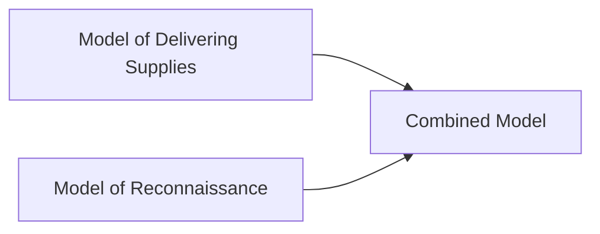
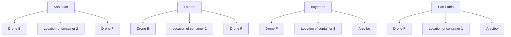

For office use only

T1

T2

T3

T4

Team Control Number

## 1923964

Problem Chosen

B

For office use only

F1

F2

F3

F4

# 2019 Mathematical Contest in Modeling (MCM) Summary Sheet

(Attach a copy of this page to each copy of your solution paper.)

# Go Safe with Drones

## Summary

We use Dijkstra Algorithm and Particle Swarm Optimization (PSO) to develop a set of models which can solve for a universally practicable DroneGo disaster response system.

Before model construction, we make some basic assumptions essential to further analyses. To model reasonably and effectively, we define three computable optimization objectives.

First, we rebuild a three-dimensional map by interpolation with intensive data collection. Deriving an equation of flying time versus payload and the pattern of onboard cameras’ scanning, we pay attention to the models’ authenticity.

Next, we design an optimization model for delivery to minimize the total delivering time. Adopting Optimal Combination Algorithm (OCA), we provide a detailed and universal solving strategy to identify the best locations. Moreover, Dijkstra Algorithm is applied to derive the drones’ three-dimensional delivery routes. To design the reconnaissance model, we creatively transform the evaluation problem of road segments to the evaluation of settlements. This easy-to-practice model reduces the problem’s complexity remarkably. General importance, a quantifiable index, is introduced for evaluation. Then we use improved PSO algorithm to identify the best reconnaissance area.

Based on two models above, we build a combined model to address multi-objective optimization problems. Different weights of objectives are introduced according to specific scenarios. Provided the weights, we can solve for optimal results.

In addition, we apply our models to Haiti’s earthquake in 2010 to test the practicability and effectiveness. The predicted locations of containers are approximately overlapped with the relief centers at that time, which demonstrates our models’ universality. Furtherly, we conceive a more comprehensive model including the factors of weather conditions and the extent of damage.

Finally, we conduct sensitivity analyses and prove our models to be quite robust against the changes in the method of assigning settlement’s importance.

## Contents

## 1 Introduction 3

1.1 Problem Restatement . 3  
1.2 Our Work . . 3

## 2 Assumptions and Justifications 4

2.1 General Assumptions . . . . 4  
2.2 Assumptions of Delivering Supplies . . 5  
2.3 Assumptions of Reconnaissance 5

## 3 Notations 5

## 4 Model Preparations 6

4.1 Reconstruction of 3-Dimensional Topographic Map 6  
4.2 Flight Time under Different Payload . . . 7  
4.3 Pattern of Onboard Camera Scanning . . . 7

## 5 Models 8

5.1 Model of Delivering Supplies . 8

5.1.1 Analysis . . 8  
5.1.2 Models Design . . 8  
5.1.3 A Possible Package Configuration . . . 10

5.2 Model of Reconnaissance . . 11

5.2.1 Importance Level of the Settlements . . . 11  
5.2.2 Importance Level of the Roads 12  
5.2.3 Model Solving . . . 13

5.3 Combined Model of Delivering Supplies and Reconnaissance 14

5.3.1 Best Locations and Packing Configurations . . 15  
5.3.2 Delivery Routes and Schedule . . 16  
5.3.3 Payload Packing Configurations . . . 17  
5.3.4 Flight Plan to Access Major Roads 17

## 6 Applying of Models 18

## 7 Sensitivity Analysis 18

7.1 Importance Level of Settlements 18

7.1.1 Assigning Methods of Importance . 19  
7.1.2 Underestimation of Some Settlements’ Importance 19

7.2 Drones’ Maximum Navigation Radius . . 19

## 8 Strengths and Weaknesses 20

8.1 Strengths . . . . 20  
8.2 Weaknesses 21

## 9 Future Work 21

## 10 Conclusions 21

## 11 Appendix 22

## References

## Memo

Dear CEO of Help, Inc.:

Never in the field of history are so many natural disasters faced by human-beings. We do appreciate Help, Inc.’s contribution to the recovery of Puerto Rico and it is out of our sincere hope that DroneGo system be enhanced. In response to your questions about the optimal design of DroneGo system in different scenarios, we are writing to inform you of our work of modelling.

We discuss your optimization objectives in different scenarios. With an urgent demand for medical resources, your only optimization objective is to minimize total time for delivering medical packages. In this case, we recommend you to apply our delivery model. This model uses Dijkstra Algorithm to solve for optimal locations of containers that minimize the total delivery time.

If the need of reconstructing road networks overwhelms medical demand, reconnoitering as many major roads as possible will be your single optimization objective. Acknowledging this, our reconnaissance model will suit you well. This model uses Particle Swarm Optimization(PSO) to solve for containers’ best locations which maximize the total value of all roads reconnoitered.

In reality, medical demand and the need of reconstruction are both of great importance. Sometimes your medical packages supply fails to meet the demand. This kind of problem should be solved by our combined multi-objective optimization model. Actually, each objective will have a specific weight. These weights are to be determined according to specific scenarios. With given weights, our combined model will solve for best locations of containers and optimal packing configuration, along with flight plan and delivery routes.

Our most creative work is that we find a both practical and convenient way to define each road’s importance level. We divide each road into segments. A segment is the indivisible part of a road, which connects two settlements without crossing another settlement. Each segment’s importance level is determined by the sum of the importance levels of the two settlements located on its two endpoints.

We use general importance to express a settlement’s importance level. General importance is the sum of self importance and connective importance. We score each settlement’s self importance according to its scale. We define a settlement’s neighboring settlements as the other settlements connected to it by a single segment. Then each settlement’s connective importance is the sum of self importance of all its neighboring settlements.

Following this rationale, we successfully transformed the importance of road into importance of settlement. Intuitively, a road with higher importance level will be of greater value. Therefore, to maximize the total value of roads reconnoitered, we can simply maximize the total value of settlements of all the roads reconnoitered.

In consideration of Puerto Ricos scenario, our models derive the results as follows. Locations of container 1, 2 that minimize total delivery time are (18.38, 65.85), (18.31, 66.09) respectively. And container 3 locates in the accessible surroundings of Arecibo. The sign ( , ) denotes ( latitude, longitude).

Locations of containers that maximize the total importance value of roads reconnoitered are (18.36, 65.85) for container 1, (18.27, 66.12) for container 2 and (18.23, -66.76) for container 3.

Now consider multi-objective optimization situation. In Puerto Rico scenario, simple calculation shows that the medical packages’ supply can easily meet the demand over 1 year. Therefore, we do not need to worry about the amount of medical packages. Besides, computer process shows that every point in the feasible region of delivery possesses very similar total delivery time. Thus, minimizing total delivery time is not the major optimization objective. We just need to find the locations that maximize total importance value of roads reconnoitered in the feasible region. The model’s results are as follows.

Best locations of containers (18.36, 65.85) for container 1, (18.27, 66.12) for container 2 and (18.23, 66.76) for container 3.

Flight plan and routes A drone F will deliver supplies between Bayamon and San Pablo, while a drone B between San Juan and Fajardo. Besides, each of the three drone B’s will navigate in one of the three reconnaissance areas, observing roads from close to far away.

Packing configurations of the drones Our drone fleet consists of drone B and drone F. We pack all the medical packages required by a certain destination each day into a single parcel. Therefore, each drone’s payload packing configuration is the corresponding parcel required by each city.

Configurations of containers Container 1 includes 1908 MED 1, 954 MED 2 and 954 MED 3. Container 2: includes 1224 MED 1, 306 MED 2 and 918 MED 3. Container 3 includes 3720 MED 1.

Before you get to apply our models, here are things worth your attention. First, sensitivity tests show that our models will not be affected too much by methods of assigning importance but will be considerably impacted by the individual changes of importance. Therefore, to ensure effectiveness, you need to correctly rank all settlements’ importance levels. The way of assigning importance levels is not much important as long as the order of levels is correct. Second, the variation of navigation radius make influence on the best locations. So you need to identify the actual navigation radius of drones.

In conclusion, From an overall perspective, we separate the problem into two missions and establish models for them respectively. For the overall design, we focus on the reality by considering three practicable factors. For the design of two individual models, we pay more attention to the practicability by sorting out the feasible groups of destinations, introducing segments and importance evaluation function. The combination of the two models is natural and derives the comprehensive results including the fleets’ composition, each drone’s payload configurations, delivery route, schedule and flight plan as well as the containers’ best locations and packing configurations.

Thank you again for considering our models and hope our models will be of help to your cause!

## 1 Introduction

The sudden attack of the savage hurricane on Puerto Rico in 2017 caused immeasurable loss of lives and property. It must be depressing to witness the devastating power of the storm surge and wave action brought by the hurricane. The only comfort that can convey strengths and confidence to the inhabitants is the adequate and timely assistance from the outside world, which makes our work meaningful in the future.

Due to the serious damage of infrastructures including roads, poles and transmission lines, the inhabitants are probably in short of transportation and electricity, which insulates them entirely from the emergency teams. In addition, the unclearness of the inside damage retards the rescuing progress. Thus, we must utilize the drones of high mobility to deliver indispensable supplies as well as implement reconnaissance for the next-step ground transportation. Lives are suffering with seconds elapsing, so the rescuing work must hurry!

## 1.1 Problem Restatement

We need to develop a disaster relief response system named DroneGo Fleet and improve its response capabilities based on the situations of Puerto Rico in 2017.

What we Know:

– 5 different destinations  
– Complete geographic information of Puerto Rico

What we Have:

– 7 kinds of drones (A-G) with their sizes, performances and configurations capabilities as well as a tethered equipment (H)  
– 3 kinds of pre-packaged medical supplies with their size  
– 3 ISO standard dry cargo containers with given sizes

What we Should Do

1. Arrange the flight. For single objective of delivering supplies, select specific drones and design the packing configurations for up to 3 cargo containers.  
2. Identify the best locations. Cargo containers can be set here for drones to achieve the optimal effect of both delivering and reconnoitring targets.  
3. Propose dispatching schedule. Assign payload packing configurations, delivery routes separately and flight plan to each type of drones.

## 1.2 Our Work

In our paper, we establish three models to solve the problem. Starting from simplicity, we consider delivery and reconnaissance separately and design two singleobjective optimization models. To achieve a comprehensive solution, we combine the two models as a multi-objective optimization model.

To make models close to reality, we take several practical factors into account. They are

flowchart

Figure 1: Solving strategy

The influence of the hilly topography whose surface is mostly uneven;  
• The influence of payload on the drones’ navigation radius;  
The influence of the scanning pattern of onboard cameras.

A crucial problem is discussed in the paper about how to evaluate the effectiveness of reconnaissance. To make it clear, we introduce importance level of settlements and segments (the smallest compartments of roads) and an importance evaluation function.

Since the response system is developed for the potential future crisis, we apply our model to another island country. The application shows that our models are meaningful and universal.

For sensitivity analysis, we vary the parameters including the importance levels and the drones’ navigation radius and derive corresponding results. The tests and comparisons demonstrate the robustness of our models.

## 2 Assumptions and Justifications

## 2.1 General Assumptions

The economic expenses are almost fixed. Because of the fixed number of containers and the definite requirement of minimizing the used space of each container, the total cost on materials is almost fixed.

Compared to the materials’ cost, the flying cost is negligible. A previous study in Lesotho indicated that each trip cost only 24 cents while the cost on base stations and drones are \$900,000.[12]

All drones are equipped with an ample number of batteries.

• All drones have to return to corresponding containers for battery replacement after each flight.

The above two assumptions are based on that most searching and rescuing drones are powered by electricity.[1] This is a compulsory condition because of the lack of power throughout the disaster area.

The volume and mass of batteries are ignored.  
The feasible response region of the drones is large enough to cover the entire island.

This requirement is practicable since the control radius of the drones of industrial grade can reach about 30km[2], which is larger than their maximum navigation radius discussed in Subsection 4.2.

People can load or download the drones’ packages in every delivering task.  
The time of drones’ ascending and descending is ignored.

This is because the drones cannot fly over 120m.[8] The maximum ascending speed is about 5m/s.[13]

The influence area of each distribution centre is almost a circle determined by the drones’ navigation radius.

## 2.2 Assumptions of Delivering Supplies

The longer the drones stay in the air, the greater the probability of failure is. Flying task is of great risk because of the complex terrains and the changeful tropical climate in Puerto Rico. More specifically, the working time of each aerial mission obeys exponential distribution.  
For safety considerations, the government should be able to transport as many medical packages to the disaster-stricken area as possible.

## 2.3 Assumptions of Reconnaissance

In addition to all the assumptions above, we hypothesize

The vegetation height does not hinder the camera’s photographic effect.  
Compared to the flight attitude that can reach over 120m, the height of the dominant shrub layer (usually 6-10m) can be ignored.[7][8]  
The time consumed for the onboard cameras’ rotating is ignored.

## 3 Notations

The primary notations used in this paper are listed in Table 1.

Table 1: Notations

<table><tr><td>Symbol</td><td>Definition</td></tr><tr><td> $T_0$ </td><td>Maximum flight time with no cargo</td></tr><tr><td> $T_f$ </td><td>Maximum flight time with full cargo</td></tr><tr><td>v</td><td>Flying speed of the drones</td></tr><tr><td>H</td><td>Flying height of the drones</td></tr><tr><td>r</td><td>Maximum navigation radius</td></tr><tr><td>R</td><td>Maximum scanning radius of onboard cameras</td></tr><tr><td>A</td><td>Distance Matrix</td></tr><tr><td>E(·)</td><td>Importance evaluation function</td></tr><tr><td> $s_i$ </td><td>Self importance of settlement i</td></tr><tr><td> $c_i$ </td><td>Connective importance of settlement i</td></tr><tr><td> $g_i$ </td><td>General importance of settlement i</td></tr></table>

## 4 Model Preparations

## 4.1 Reconstruction of 3-Dimensional Topographic Map

To make calculations close to real circumstances, especially when Puerto Rico locates on a hilly island, we should take the uneven ground into consideration.

We sample over 110 discrete data points from Google Maps of Puerto Rico and use interpolation to simulate the topography by Matlab.[3]

heatmap

| longitude/° | altitude/m | value |
| --- | --- | --- |
| -67.2 | 0 | 0 |
| -66.8 | 500 | 50 |
| -66.4 | 1000 | 100 |
| -66.0 | 500 | 50 |
| -65.6 | 0 | 0 |
| -65.2 | 500 | 50 |
| -64.8 | 1000 | 100 |
| -64.4 | 500 | 50 |
| -64.0 | 0 | 0 |
| -63.6 | 500 | 50 |
| -63.2 | 1000 | 100 |
| -62.8 | 500 | 50 |
| -62.4 | 0 | 0 |
| -62.0 | 500 | 50 |
| -61.6 | 1000 | 100 |
| -61.2 | 500 | 50 |
| -60.8 | 0 | 0 |
| -60.4 | 500 | 50 |
| -60.0 | 1000 | 100 |
| -59.6 | 500 | 50 |
| -59.2 | 0 | 0 |
| -58.8 | 500 | 50 |
| -58.4 | 1000 | 100 |
| -58.0 | 500 | 50 |
| -57.6 | 0 | 0 |
| -57.2 | 500 | 50 |
| -56.8 | 1000 | 100 |
| -56.4 | 500 | 50 |
| -56.0 | 0 | 0 |
| -55.6 | 500 | 50 |
| -55.2 | 1000 | 100 |
| -54.8 | 500 | 50 |
| -54.4 | 0 | 0 |
| -54.0 | 500 | 50 |
| -53.6 | 1000 | 100 |
| -53.2 | 500 | 50 |
| -52.8 | 0 | 0 |
| -52.4 | 500 | 50 |
| -52.0 | 1000 | 100 |
| -51.6 | 500 | 50 |
| -51.2 | 0 | 0 |
| -50.8 | 500 | 50 |
| -50.4 | 1000 | 100 |
| -5 | 18 | 18 |
| -49.6 | 18 | 18 |
| -49 | 18 | 18 |
| -48.4 | 18 | 18 |
| -47.8 | 18 | 18 |
| -47.2 | 18 | 18 |
| -46.8 | 18 | 18 |
| -46.4 | 18 | 18 |
| -46.0 | 18 | 18 |
| -45.6 | 18 | 18 |
| -45.2 | 18 | 18 |
| -44.8 | 18 | 18 |
| -44.4 | 18 | 18 |
| -44.0 | 18 | 18 |
| -43.6 | 18 | 18 |
| -43.2 | 18 | 18 |
| -42.8 | 18 | 18 |
| -42.4 | 18 | 18 |
| -42.0 | 18 | 18 |
| -41.6 | 18 | 18 |
| -41.2 | 18 | 18 |
| -4 | nan | nan |
| -39.6 | nan | nan |
| -39 | nan | nan |
| -38.4 | nan | nan |
| -37.8 | nan | nan |
| -37.2 | nan | nan |
| -36.8 | nan | nan |
| -36 | nan | nan |
| -35.6 | nan | nan |
| -35.2 | nan | nan |
| -34.8 | nan | nan |
| -34.4 | nan | nan |
| -34.0 | nan | nan |
| -33.6 | nan | nan |
| -33.2 | nan | nan |
| -32.8 | nan | nan |
| -32.4 | nan | nan |
| -32 | nan | nan |
| -31.6 | nan | nan |
| -31.2 | nan | nan |
| -3 | nan | nan |
| -29.6 | nan | nan |
| -29 | nan | nan |
| -28.4 | nan | nan |
| -27.8 | nan | nan |
| -27.2 | nan | nan |
| -26.8 | nan | nan |
| -26 | nan | nan |
| -25.6 | nan | nan |
| -25.2 | nan | nan |
| -24.8 | nan | nan |
| -24.4 | nan | nan |
| -24 | nan | nan |
| -23.6 | nan | nan |
| -23.2 | nan | nan |
| -22.8 | nan | nan |
| -22.4 | nan | nan |
| -22 | nan | nan |
| -21.6 | nan | nan |
| -21.2 | nan | nan |
| -2 | nan | nan |
| -19.6 | nan | nan |
| -19 | nan | nan |
| -18.4 | nan | nan |
| -17.8 | nan | nan |
| -17.2 | nan | nan |
| -16.8 | nan | nan |
| -16.4 | nan | nan |
| -16 | nan | nan |
| -15.6 | nan | nan |
| -15.2 | nan | nan |
| -14.8 | nan | nan |
| -14.4 | nan | nan |
| -14 | nan | nan |
| -13.6 | nan | nan |
| -13.2 | nan | nan |
| -12.8 | nan | nan |
| -12.4 | nan | nan |
| -12 | nan | nan |
| -11.6 | nan | nan |
| -11.2 | nan | nan |
| -1 | nan | nan |
| -9.6 | nan | nan |
| -9 | nan | nan |
| -8.4 | nan | nan |
| -7.8 | nan | nan |
| -7 | nan | nan |
| -6.4 | nan | nan |
| -6 | nan | nan |
| -5.6 | nan | nan |
| -5 | nan | nan |
| -4 | nan | nan |
| -3 | nan | nan |
| -2 | nan | nan |
| -1 | nan | nan |
| 1 | nan | nan |
| 2 | nan | nan |
| 3 | nan | nan |
| 4 | nan | nan |
| 5 | nan | nan |
| 6 | nan | nan |
| 7 | nan | nan |
| 8 | nan | nan |
| 9 | nan | nan |
| 10 | nan | nan |
| 11 | nan | nan |
| 12 | nan | nan |
| 13 | nan | nan |
| 14 | nan | nan |
| 15 | nan | nan |
| 16 | nan | nan |
| 17 | nan | nan |
| 18 | nan | nan |
| 19 | nan | nan |

Figure 2: The 3-dimensional map of Puerto Rico

Interpolation generates a large number of grids and identifies their altitude ordinates. These discrete points are dense enough to rebuild the 3-dimensional map.

Instead of deriving geodesic curve, we use Dijkstra algorithm to calculate the minimum distance between any two points on the land surface. Thus, the flying distance can be determined more accurately and realistically than the 2-dimentional situations.

## 4.2 Flight Time under Different Payload

Since the flight time decreases as the drone’s payload increases, we should realize that reaching the same distance, each flight should have different time consumed on the delivering trip and the returning trip.

We select points from the working curves (see in Appendix [4]) and fit them into negative exponential function

$$
T = T _ {0} e ^ {- \lambda b} \tag {1}
$$

where $T$ refers to flight time while b refers to the payload in unit of lbs. We derive sequently

$$
T = 2 9. 2 3 e ^ {- 0. 0 8 4 9 8 b} \qquad r = - 0. 9 9 8 1
$$

$$
T = 3 4. 6 3 e ^ {- 0. 0 8 1 8 7 b} \quad r = - 0. 9 9 9 2
$$

$$
T = 3 7. 8 0 e ^ {- 0. 0 7 6 8 9 b} \quad r = - 0. 9 9 8 9
$$

for the three working curves lower in the figure. We assume that λ is a function of $T _ { 0 } ,$ , and then we derive λ of different $T _ { 0 }$ given in problem by spline interpolation from the above data. Substituting λ, $T _ { 0 }$ and maximum payload b into eqn(4.2), we get $T _ { f }$ for each type of drones.

Just to be safe, we choose maximum flight time with full cargo to calculate the maximum navigation radius. As described in assumptions, the drones have to return back after each delivering, so radius $r = v \times T _ { f } / 2 ,$ , which is shown in the table below.

Table 2: Navigation radius of different types of the drones

<table><tr><td>Drone</td><td>Speed(km/h)</td><td> $T_0$ (min)</td><td> $T_f$ (min)</td><td>Maximum Payload(lbs)</td><td>Navigation Radius(km)</td></tr><tr><td>A</td><td>40</td><td>35</td><td>34.02</td><td>3.5</td><td>11.34</td></tr><tr><td>B</td><td>79</td><td>40</td><td>37.76</td><td>8</td><td>24.86</td></tr><tr><td>C</td><td>64</td><td>35</td><td>31.23</td><td>14</td><td>16.66</td></tr><tr><td>D</td><td>60</td><td>18</td><td>16.67</td><td>11</td><td>8.34</td></tr><tr><td>E</td><td>60</td><td>15</td><td>13.69</td><td>15</td><td>6.85</td></tr><tr><td>F</td><td>79</td><td>24</td><td>20.06</td><td>22</td><td>13.21</td></tr><tr><td>G</td><td>64</td><td>16</td><td>14.08</td><td>20</td><td>7.51</td></tr></table>

## 4.3 Pattern of Onboard Camera Scanning

The area covered by the onboard camera is determined by the drones’ flight altitude, H, as well as the required resolution of picture.

Let θ be the camera lens’ angle of view, and α be the angle between vertical line and the angular bisector of θ. α actually signifies the direction that camera points towards. Since the camera can rotate and point towards a number of directions, the covering area is a circle with a radius of R. Obviously, as α increases, the covering area increases. However, the requirement of high resolution limit the maximum detectable distance. From technical instruction, we use the following equation to calculate.[10]

$$
\text { Sensor   Resolution } = \text { Image   Resolution } = 2 \left(\frac {\text { Field   of   View(FOV) }}{\text { Smallest   Feature }} \right.
$$

text_image

R
θ
α
H
FOV

Figure 3: The illustration of onboard camera scanning

From Figure 3, we derive

$$
F O V + H \tan (\alpha - \theta / 2) = H \tan (\alpha + \theta / 2)
$$

$$
R = H \tan (\alpha + \theta / 2)
$$

For pictures with 1080p whose resolution is 1920 1080, we choose the smaller value 1080 as the sensor resolution. We set smallest feature as 5 metres, the mean width of roads on Puerto Rico, and H as 120 metres, the US legal altitude of drones.[11]

From four kinds of commercially available DJI drones, we set θ as $7 2 ^ { \circ }$ .[9]

Thus, we get $\alpha = 5 1 . 5 ^ { \circ } , R = 2 . 7 5 \mathrm { k m }$ .

## 5 Models

## 5.1 Model of Delivering Supplies

In this part, our single purpose is to deliver medical supplies.

## 5.1.1 Analysis

The problem requires us to recommend a composition of the drone fleet and provide the best locations for containers. Obviously, the two requirements are not independent. For each possible location, there may exist an optimal composition of the drones. Thus, it is a multi-objective optimization problem. Hoping to obtain the optimal solution, we are going to transform it into a single-objective optimization problem. Here, we construct the objective function as the total flight time.

## 5.1.2 Model Design

Assume that there is a number n of destinations, a number m of kinds of drones and a number l of cargo containers.

Here we have essential preparation works for models design.

For a given set of destinations, we derive a Distance Matrix $\pmb { A } \equiv ( \pmb { a } _ { i j } ) _ { n \times n } ,$ where $\mathbf { \Delta } \mathbf { a } _ { i j }$ is the distance between destination i and destination $j$ .

We construct a Destinations Combination Matrix B. It is a 0-1 matrix. Let each of its rows represent a combination of destinations. Thus, there are $2 ^ { n } - 1 \mathrm { r o w s } ^ { 1 }$ and n columns.

$$
b _ {i j} = \left\{ \begin{array}{l l} 0 & \text { if   destination   } j \text {   does   not   exist   in   the   combination   } i \\ 1 & \text { if   destination   } j \text {   exists   in   the   combination   } i \end{array} \right.
$$

$$
\alpha_ {i} = \left(b _ {i 1}, b _ {i 2}, \dots , b _ {i n}\right) \quad i = 1, 2, \dots , 2 ^ {n} - 1
$$

$\alpha _ { i }$ denotes a row vector of $B .$ .

Similarly, we construct a Drones Combination Matrix D. $\beta _ { j } ( j = 1 , 2 , \cdot \cdot \cdot , 2 ^ { m } - 1 )$ is a row vector of D

Definition 1. If all drones included in a specific combination $\beta _ { j }$ are able to arrive at all destinations included in a specific combination $\alpha _ { i } ,$ then there exists a corresponding relationship between $\beta _ { j }$ and $\alpha _ { i }$

Definition 2. If for $\alpha _ { i }$ and $\alpha _ { j }$ , there not exists integer k from 1 to n to make $b _ { i k } \ =$ $\begin{array} { r } { \pmb { b } _ { j k } = \mathbf { 1 } } \end{array}$ , then $\alpha _ { i } \cap \alpha _ { j } { = } \emptyset$ .

Definition 3. Group is a combination of row vectors.

For example, $\beta _ { i } , \beta _ { j }$ and $\beta _ { k }$ form a group $\{ \beta _ { i } , \beta _ { j } , \beta _ { k } \}$ . Naturally, we have $\beta _ { i } \cap \{ \beta _ { j } .$ , $\beta _ { k } \} = \beta _ { i } \cap \beta _ { j } \cap \beta _ { k }$ .

Since each $\alpha _ { i }$ possibly corresponds to a $\beta _ { j } ,$ , we construct a mapping $\begin{array} { r } { f . \ f ( i ) = j } \end{array}$ signifies that $\alpha _ { i }$ corresponds to a $\beta _ { j }$ . When there are more than one $\beta _ { j }$ that can satisfy Definition 1, let $f ( i )$ be the subscript of the $\beta _ { j }$ that contains the most drones.

With all the above preparation works, we give a strategy to solve the problem.

## Procedure 1: Sort out the isolated destinations

Check whether there exists the destinations whose distances from all other destinations exceed the largest maximum flight radius of all available drones. If there exists, assign an individual container for each of them.

## Procedure 2: Find out all possible groups

Step 0 Let $\scriptstyle { i = 1 }$ .

Step 1 For any $k \neq i ,$ examine whether $\alpha _ { k } \cap \{ \alpha _ { i } \} = \emptyset$ . If yes, add $\alpha _ { k }$ into the group $\left\{ \alpha _ { i } \right\}$ to get $\{ \alpha _ { i } , \alpha _ { k } \}$ and make $\mathbf { \nabla } l = l - \mathbf { 1 }$ .

Step 2 Judgement:

If $\begin{array} { r } { \sum _ { \alpha _ { i } \in \mathrm { g r o u p } } \alpha _ { j } = ( \underbrace { 1 , 1 , \cdots , 1 } _ { \mathrm { a l l 1 } } ) } \end{array}$ and ${ \bf { \ell } } l \geq { \bf { 0 } } ,$ , and there is no such a group {zall 1

before, keep the group in reserve. Let $\pmb { i } = \pmb { i } + \pmb { 1 }$ , back to Step 1.

$\begin{array} { r } { \operatorname { I f } \sum _ { \alpha _ { i } \in \mathrm { g r o u p } } \alpha _ { j } \ne ( \underbrace { 1 , 1 , \cdots , 1 } _ { \mathrm { a l l 1 } } ) } \end{array}$ and $l \geq \mathbf { 0 } ,$ , back to Step 2.

If $i > 2 ^ { n } - 1 ,$ , end and retrieve all possible groups.

## Procedure 3: Derive the optimal point of all possible groups

Step 1 For each possible group, using the mapping f to find the available $\beta _ { j }$ according to the $\alpha _ { i }$ in the group.

Step 2 For each pair of $\alpha _ { i }$ and $\beta _ { j }$ , utilize Greedy strategy to allocate different drones to the required air lines and consider the corresponding total flight time as the minimum time of the group.

Notice: If for a pair of $\alpha _ { i }$ and $\beta _ { j } ,$ there is only one element 1 in $\alpha _ { i } ,$ (there is only one destination in that combination) then selects the drone whose required number of flight is the least and use the equation

number of flight needed×maximum flight time to calculate the time needed.2 2

## Procedure 4: Compare all groups’ optimal point and select the best

## 5.1.3 A Possible Package Configuration

As assumptions described before, the drones are equipped with an ample number of batteries. Since flying time is short, we can utilize only one drone to run the air lines between a specific destination and a specific container. Denote the container carrying drone B as container 1, the other as container 2, the one assigned to Arecibo as container 3.

From estimation we can find that if we simply put one B into container 1 and load MED 1 and MED 3 as packages (roughly in the size and shape of $1 4 \times 7 \times 9$ cuboids) vertically into the container, more than 1900 packages of MED 1 and 1900 packages of MED 3 can be loaded into container 1. Under the consuming speed offered in the problem background[5][6], the amount of medical packages can cope with two years consumption. This is totally plausible.

In container 2, we pack the medical supplies needed each day (including 2 MED 1, 2 MED 2 and 6 MED 3) into a single pile, roughly in the size and shape of a 14×14×20 cuboid. The combination of a pile is because container 2 is obliged to give consideration to 3 destinations in the meantime. Thus, if we only load one F into container 2, we can load more than 324 piles, which is definitely enough for Puerto Rico.

As for Arecibo, we simply fill the container 3 with a drone B and as many MED 1 as possible.

In general, the package configurations for delivering purpose only are stated as follow.

<table><tr><td>Container</td><td>Destination</td><td>Drone Fleet</td><td>Packing Configurations</td><td>Locations</td></tr><tr><td>1</td><td>San Juan Fajardo</td><td>B</td><td>1908 MED 1954 MED 2, 954 MED 3</td><td>(18.38, -65.85)</td></tr><tr><td>2</td><td>Bayamon Cauguas</td><td>F</td><td>1296 MED 1324 MED 2, 972 MED 3</td><td>(18.31, -66.09)</td></tr><tr><td>3</td><td>Arecibo</td><td>B</td><td>3720 MED 1</td><td>in the accessible surrounding of Arecibo</td></tr></table>

## 5.2 Model of Reconnaissance

To make the problem clearer step by step, we establish the model for reconnaissance purpose only before considering both missions at the same time.

The target of video reconnaissance is to report the potential damaged road networks. One of the optimization objectives is to maximize the effectiveness. We need to make clear what contributes to the effectiveness. Thus, a measurement of the importance of specific constructions is introduced below.

## 5.2.1 Importance Level of the Settlements

Obviously, the larger the scale of a settlement is and the more roads connected it with other settlements, the more important the settlement would be. Thus, a settlements importance is combined by self importance, denoted by $\pmb { S }$ and connective importance, denoted by C. The sum of S and C is defined as a settlements general importance, denoted by G.

The self importance, S, depends on the city level. We divide all settlements on Puerto Rico into six categories as follow.

Number one is the region capital San Juan. Number two is the second largest city in Puerto Rico, Payamon. Number three is district capital, for example Mayaguez. Notice that some intersections of some roads are not settlements at all but simply road crossings. Few people live around these endpoints. We consider these crossings as the fifth kind of settlements. We score five kinds of settlements with integer scores 1 to 5. The higher the city level is, the higher the score it gets. We denote the following score of city level as individual importance.

<table><tr><td>Settlements Categories</td><td>Example</td><td>Self Importance</td></tr><tr><td>1</td><td>San Juan (Capital)</td><td>6</td></tr><tr><td>2</td><td>Payamon (Second Largest)</td><td>5</td></tr><tr><td>3</td><td>Mayaguez, etc (District Capital)</td><td>4</td></tr><tr><td>4</td><td>Yellow tinted areas</td><td>3</td></tr><tr><td>5</td><td>Small circles areas</td><td>2</td></tr><tr><td>6</td><td>Intersection not highlighted on map</td><td>1</td></tr></table>

Previous to discussion about connective importance, we need to introduce a Connection Matrix to describe the relationship of all settlements.

Connection Matrix X is a 0-1 matrix.

$$
X = \left( \begin{array}{c c c c} x _ {1 1} & x _ {1 2} & \dots & x _ {1 n} \\ x _ {2 1} & x _ {2 2} & \dots & x _ {2 n} \\ \vdots & \vdots & & \vdots \\ x _ {n 1} & x _ {n 2} & \dots & x _ {n n} \end{array} \right)
$$

when $\textstyle i = j , \quad x _ { i , j } = 0$

when $i \neq j$

$\begin{array} { r } { x _ { i , j } = \left\{ \begin{array} { l l } { 0 } \\ { 1 } \end{array} \right. } \end{array}$ if there is no segment connecting settlement i and settlement n is the total number of settlements. We sample 46 points in all from the given map and set ${ n = 4 6 }$ . Segment is defined later in Definition 4.

A settlement’s connective importance, $C ,$ depends on the other settlements connected to it with a segment. We define connective importance of settlement i as

$$
c _ {i} = \sum_ {j = 1} ^ {n} s _ {j} x _ {i, j}
$$

where $s _ { j }$ is the self importance of settlement i.

Hence, we derive

$$
\boldsymbol {C} = \boldsymbol {X} \boldsymbol {S}
$$

where $C = ( c _ { 1 } , c _ { 2 } , \ldots , c _ { n } ) ^ { T }$ is the connective importance vector, $S = ( s _ { 1 } , s _ { 2 } , \ldots , s _ { n } ) ^ { T }$ is the self importance vector.

Combining the two aspects of importance, we get general importance.

$$
\boldsymbol {G} = \boldsymbol {S} + \boldsymbol {C} = \boldsymbol {I S} + \boldsymbol {X S} = (\boldsymbol {I} + \boldsymbol {X}) \boldsymbol {S} \tag {2}
$$

where I is the identity matrix. The physical meaning of the equation is self-evident that general importance depends on settlement itself as well as the surrounding networks. If we use the function $\bar { \pmb { { \cal E } } } ( \cdot )$ to evaluate the importance of settlement i, then $\pmb { { \cal E } } ( i ) = \pmb { g } _ { i }$ .

## 5.2.2 Importance Level of the Roads

For purpose of ground-based route planning, we need to rank the roads according to their importance. A trip of reconnaissance covering more roads of greater importance would bring more benefit. Thus, we need to define each roads importance level.

First, we need to keep in mind what a road is. Notice that every road on Puerto Rico is divided by the settlements located on it. Therefore, roads are divided by settlements into small segments. The indivisible part of a road is the segment which connects two settlements without crossing another segment. As shown in the figure below, line segment AB and BC are indivisible parts of road $\scriptstyle { L , }$ while AC is not. Hence, we give an exact definition of segment.

text_image

Line L
B
A
C

Figure 4: The illustration of segment and road

Definition 4. Segment is the indivisible part of a road, which connects two settlements and not crossing other settlements.

Obviously, segments are the minimum compositions of a road. It will be straightforward and practical to define each segments importance level and then rank all segments according to the levels. Undoubtedly, segments with higher importance level should be reconnoitered and restored more quickly.

A segments importance depends on the two settlements it connects. Segments themselves are of little importance. Only if a segment connects two important settlements will it become important.

We use function $E ( \cdot )$ to evaluate importance. For convenience and easiness to comprehend, we derive

$$
\boldsymbol {E} (\overline {{i j}}) = \boldsymbol {E} (i) + \boldsymbol {E} (j) \tag {3}
$$

where $\overline { { i j } }$ signifies the segment that connects two settlements i and $j .$ .

Since $E ( i ) = g _ { i } , E ( \overline { { i j } } ) = g _ { i } + g _ { j }$ . Therefore, the importance evaluation of segments, the most tiny compartments of roads, is transformed into the importance evaluation of settlements.

By the evaluation introduced above, we abstract the map into the combination of nodes and lines by UCINET, as shown in Figure 6. For settlements whose general importance varies between 4 and 8, we signify them as grey up-triangles. For settlements whose general importance varies between 9 and 12, we signify them as yellow diamonds. For settlements whose general importance varies between 13 and 16, we signify them as purple inverted-triangles. For settlements whose general importance varies between 17 and 20, we signify them as red circles. For settlements whose general importance is larger than 20, we signify them as black tinted areas. The relative sizes of the nodes depend on their absolute value of general importance.

```mermaid
graph TD
  A["San Juan"] --> B["Bayamon"]
  A --> C["Aguas Buenas"]
  A --> D["Comerio"]
  A --> E["Aguadillo"]
  A --> F["Quebradillos"]
  A --> G["Precolo"]
  A --> H["Barceloneta"]
  A --> I["Manati"]
  A --> J["Vega Bijja"]
  A --> K["Unnamed 6"]
  A --> L["Corzal"]
  A --> M["Orocovis"]
  A --> N["Jayuya"]
  A --> O["Unnamed 1"]
  A --> P["Unnamed 3"]
  A --> Q["Cinnamed 2"]
  A --> R["Coamo"]
  A --> S["Santa Isabel"]
  A --> T["Ensenada"]
  A --> U["Cabo Rojo"]
  A --> V["San Lorenzo"]
  A --> W["Humaco"]
  A --> X["Punta Figuras"]
  A --> Y["Maurabo"]
  A --> Z["Naguabo"]
  A --> AA["Fajardo"]
  A --> AB["Ro Grande"]
  A --> AC["Avago"]
  A --> AD["Centrol Puntas"]
  A --> AE["Mayaguez"]
  AE --> AF["Andjuntas"]
  AE --> AG["Adenzo"]
  AE --> AH["Larres"]
  AE --> AI["Canstaner"]
  AE --> AJ["Indiera Alta"]
  AE --> AK["Indera Alta"]
  AE --> AL["Cabo Rojo"]
```

flowchart

Figure 5: The abstract expression of settlements and segments

## 5.2.3 Model Solving

We hope to identify the best locations for cargo containers. With the previous evaluation of importance of segments and settlements, we set the objective function Z as the sum of importance of all segments that lie in the covered area of the drones. It can be converted into the function of the general importance of settlements.

$$
Z = \sum_ {\overline {{{i j}}} \in \Omega} E (\overline {{{i j}}}) = \sum_ {\overline {{{i j}}} \in \Omega} (g _ {i} + g _ {j}) \tag {4}
$$

where Ω is the drones’ detectable area, a circle determined by their maximum navigation radius r plus scanning radius R.

For problem whose independent variables are locations, Particle Swarm Optimization(PSO) is a good solution.

Step 0 Initialize a great number of particles in the feasible region. The particles possess 3 dimensions including longitude, latitude and velocity.

Step 1 Set the feasible region as a circle whose centre is the specific particle’s location and radius is $r + R .$ .

Step 2 Identify the settlements locating within the feasible region.

Step 3 Identify the connective relationship among the settlements by the connective matrix $\dot { C } .$

Step 4 Sum up the general importance of the connecting settlements as equation 5.2.3 shows.

Step 5 Particles adjust their locations and velocity according to their value of Z. Back to Step 1.

Finally, most particles would converge to the location where there is the largest value of Z. Thus, we derive the location, from which the drones’ coverage reach the maximum importance.

Since drone B possess the largest flight radius among A H, it is the most suitable choice. For the reconnoitring problem across the whole island, we get the result as below.

scatterplot

| City | Longitude (°) | Latitude (°) |
| --- | --- | --- |
| Aquadilla | -67.15 | 18.35 |
| Central Puntas | -67.05 | 18.32 |
| San Sebastian | -66.95 | 18.31 |
| Lares | -66.85 | 18.29 |
| Mayaguez | -66.90 | 18.24 |
| Indiera Alta | -66.80 | 18.15 |
| Canstaner | -66.75 | 18.14 |
| San German | -66.70 | 18.09 |
| Yauco | -66.75 | 18.07 |
| Cabo Rojo | -66.85 | 17.99 |
| Ensenada | -66.70 | 17.98 |
| Quebradillas | -66.75 | 18.48 |
| Arecibo | -66.70 | 18.45 |
| Utuado | -66.70 | 18.28 |
| Utuado' Jayuya | -66.55 | 18.25 |
| Barceloneta | -66.50 | 18.42 |
| Manati | -66.45 | 18.39 |
| Dorado | -66.40 | 18.40 |
| Unnamed 6 | -66.35 | 18.37 |
| Corozal | -66.30 | 18.29 |
| Orocovis Comerio | -66.30 | 18.23 |
| Unnamed 3 | -66.25 | 18.19 |
| Unnamed 4 | -66.20 | 18.20 |
| Unnamed 5 | -66.20 | 18.17 |
| Unnamed 2 | -66.20 | 18.14 |
| Cayey | -66.20 | 18.12 |
| Coamo | -66.30 | 18.09 |
| Santa Isabel | -66.35 | 17.99 |
| Guayama Punta Figuras | -66.30 | 17.99 |
| Maunabo | -65.95 | 18.03 |
| Rio Grande | -65.85 | 18.39 |
| Bayamon | -65.90 | 18.37 |
| San Juan | -65.95 | 18.42 |
| Aguas Buenas | -65.90 | 18.33 |
| Caguas | -65.85 | 18.32 |
| Nanguabo | -65.80 | 18.29 |
| Humacao | -65.75 | 18.24 |
| Corozal | -66.40 | 18.29 |
| Corozal | -66.40 | 18.29 |
| Unnamed 4 | -66.30 | 18.23 |
| Unnamed 3 | -66.30 | 18.23 |
| Unnamed 2 | -66.30 | 18.23 |
| Unnamed 1 | -66.30 | 18.23 |
| Unnamed 5 | -66.30 | 18.23 |
| Unnamed 4 | -66.30 | 18.23 |
| Unnamed 3 | -66.30 | 18.23 |
| Unnamed 2 | -66.30 | 18.23 |
| Unnamed 1 | -66.30 | 18.23 |
| Unnamed 5 | -66.30 | 18.22 |
| Unnamed 4 | -66.30 | 18.22 |
| Unnamed 3 | -66.30 | 18.22 |
| Unnamed 2 | -66.30 | 18.22 |
| Unnamed 1 | -66.30 | 18.22 |
| Unnamed 5 | -66.30 | 18.22 |
| Unnamed 4 | -66.30 | 18.22 |
| Unnamed 3 | -66.30 | 18.22 |
| Unnamed 2 | -66.30 | 18.22 |
| Unnamed 1 | -66.30 | 18.21 |
| Unnamed 5 | -66.30 | 18.21 |
| Unnamed 4 | -66.30 | 18.21 |
| Unnamed 3 | -66.30 | 18.21 |
| Unnamed 2 | -66.30 | 18.21 |
| Unnamed 1 | -66.30 | 18.21 |
| Unnamed 5 | -66.30 | 18.20 |
| Unnamed 4 | -66.30 | 18.20 |
| Unnamed 3 | -66.30 | 18.20 |
| Unnamed 2 | -66.30 | 18.20 |
| Unnamed 1 | -66.30 | 18.20 |
| Unnamed 5 | -66.30 | 18.20 |
| Unnamed 4 | -66.30 | 18.20 |
| Unnamed 3 | -66.30 | 18.20 |
| Unnamed 2 | -66.30 | 18.20 |
| Unnamed 1 | -66.30 | 18.2 |
| Unnamed 5 | -66.30 | 18.2 |
| Unnamed 4 | -66.30 | 18.2 |
| Unnamed 3 | -66.30 | 18.2 |
| Unnamed 2 | -66.30 | 18 |
| Unnamed 1 | -67 | 18 |
| Unnamed 5 | -67 | 18 |
| Unnamed 4 | -67 | 18 |
| Unnamed 3 | -67 | 18 |
| Unnamed 2 | -67 | 18 |
| Unnamed 1 | -67 | 18 |
| Unnamed 5 | -67 | 18 |
| Unnamed 4 | -67 | 18 |
| Unnamed 3 | -67 | 18 |
| Unnamed 2 | -67 | 18 |
| Unnamed 1 | -67 | 1 |
| Unnamed 5 | -67 | 1 |
| Unnamed 4 | -67 | 1 |
| Unnamed 3 | -67 | 1 |
| Unnamed 2 | -67 | 1 |
| Unnamed 1 | -67 | 1 |
| Unnamed 5 | -67 |  |
| Unnamed 4 | -67 |  |
| Unnamed 3 | -67 |  |
| Unnamed 2 | -67 |  |
| Unnamed 1 | -67 |  |
| Unnamed 5 | -67 |  |
| Unnamed 4 | -67 |  |
| Unnamed 3 | -67 |  |

Figure 6: The global result of Particles Swarm Optimization

Another practicable method is exhaustion. By generating a huge number of grids that divide the feasible region into tiny parts, we calculate each point’s value of Z and find the maximum among them. The steps are similar to the above and the result is as shown below.

## 5.3 Combined Model of Delivering Supplies and Reconnaissance

In this part, we combine the two models established in section 5.1 and 5.2, and obtain a comprehensive solution to the problem. Notice that drone F cannot implement reconnaissance. We add one drone B to the container that supplies packages for San Pablo and Bayamon.

heatmap

| latitude/° | longitude/° | value |
| ---------- | ----------- | ----- |
| 18.6       | -67.4       | 0     |
| 18.5       | -67.2       | 0     |
| 18.4       | -67.0       | 0     |
| 18.3       | -66.8       | 0     |
| 18.2       | -66.6       | 0     |
| 18.1       | -66.4       | 0     |
| 18.0       | -66.2       | 0     |
| 17.9       | -66.0       | 0     |

Figure 7: The global result of exhaustion

## 5.3.1 Best Locations and Packing Configurations

scatterplot

| City | Longitude (°) | Latitude (°) |
|---|---|---|
| Aquadilla | -67.1 | 18.35 |
| Centrol Puntas | -67.2 | 18.35 |
| Agua | -67.0 | 18.35 |
| Mayaguez | -67.0 | 18.2 |
| San Sebastian | -66.9 | 18.3 |
| Lares | -66.9 | 18.3 |
| Utuado | -66.7 | 18.3 |
| Udayo' | -66.4 | 18.3 |
| Canstaner | -66.7 | 18.2 |
| Indiera Alta | -66.7 | 18.2 |
| Montas | -66.7 | 18.2 |
| San German | -67.0 | 18.0 |
| Yauco | -66.9 | 18.0 |
| Cabo Rojo | -67.0 | 17.95 |
| Ensenada | -66.9 | 18.0 |
| Quebradillas | -66.8 | 18.45 |
| Arecibo | -66.7 | 18.45 |
| Barcelona | -66.5 | 18.45 |
| Manafi | -66.4 | 18.45 |
| Corozal | -66.4 | 18.35 |
| Orocovis | -66.4 | 18.25 |
| Unnamed 3 | -66.4 | 18.15 |
| Unnamed 5 | -66.4 | 18.15 |
| Coamo | -66.4 | 18.15 |
| Ponce | -66.4 | 18.05 |
| Santa Isabel | -66.4 | 18.05 |
| Guayama Punta Figuras | -66.4 | 18.05 |
| Maunabo | -66.4 | 18.05 |
| Camero | -66.4 | 18.05 |
| Comerio | -66.2 | 18.25 |
| Unnamed 4 | -66.2 | 18.25 |
| Cayey | -66.2 | 18.25 |
| Uruguay | -66.2 | 18.25 |
| Buenos Aires | -66.2 | 18.25 |
| San Lorenzo Naguabo | -65.8 | 18.25 |
| Humacao | -65.8 | 18.25 |
| Rio Grande | -65.8 | 18.35 |
| Bayamon | -65.9 | 18.35 |
| San Juan | -65.9 | 18.35 |
| Fajardo | -65.9 | 18.35 |
The chart displays a scatter plot with labeled points for each location.

Figure 8: The PSO algorithm identifies the best locations of 3 containers.

As shown in Section 5.2, the PSO algorithm is used again to identify the best locations of cargo containers. But differently, since we need to meet the demand of the anticipated medical supplies, we shall narrow the feasible region according to the drones’ maximum navigation radius. The results of PSO give the best locations as below.

<table><tr><td>Container</td><td>Destinations to Supply</td><td>Drone Fleet</td><td>Location</td><td>Packing Configurations</td></tr><tr><td>1</td><td>San Juan Fajardo</td><td>B</td><td>(18.36, -65.85)</td><td>1908 MED 1, 954 MED 2954 MED 3</td></tr><tr><td>2</td><td>Bayamon Caguas</td><td>B, F</td><td>(18.27, -66,12)</td><td>1224 MED 1, 306 MED 2918 MED 3</td></tr><tr><td>3</td><td>Arecibo</td><td>B</td><td>(18.23, -66.76)</td><td>3720 MED 1</td></tr></table>

## 5.3.2 Delivery Routes and Schedule

Notice that the delivery route in the three-dimensional space is not actually straight because of the rugged terrain in reality. Since the maximum flight height is around 120 meters, far below the height of the mountains that the drones will come across in its journeys.[8] We assume drones are flying close to the ground. Thus, we applied Dijkstra algorithm to derive the minimum distance as well as the drones’ optimal delivery route. The 3-dimensional routes are illustrated below.

area chart

| latitude/° | longitude/° | altitude/m |
| --- | --- | --- |
| 18.42 | -65.65 | 18.44 |
| 18.40 | -65.70 | 18.44 |
| 18.38 | -65.75 | 18.44 |
| 18.36 | -65.80 | 18.44 |
| 18.34 | -65.85 | 18.44 |
| 18.32 | -65.90 | 18.44 |
| 18.30 | -65.95 | 18.44 |
| 18.28 | -66.00 | 18.44 |
| 18.26 | -66.05 | 18.44 |
| 18.24 | -66.10 | 18.44 |
| 18.22 | -66.15 | 18.44 |
| 18.20 | -66.20 | 18.44 |
| 18.18 | -66.25 | 18.44 |
| 18.16 | -66.30 | 18.44 |
| 18.14 | -66.35 | 18.44 |
| 18.12 | -66.40 | 18.44 |
| 18.10 | -66.45 | 18.44 |
| 18.08 | -66.50 | 18.44 |
| 18.06 | -66.55 | 18.44 |
| 18.04 | -66.60 | 18.44 |
| 18.02 | -66.65 | 18.44 |
| 18.00 | -66.70 | 18.44 |
| 17.98 | -66.75 | 18.44 |
| 17.96 | -66.80 | 18.44 |
| 17.94 | -66.85 | 18.44 |
| 17.92 | -66.90 | 18.44 |
| 17.90 | -66.95 | 18.44 |
| 17.88 | -67.00 | 18.44 |
| 17.86 | -67.05 | 18.44 |
| 17.84 | -67.10 | 18.44 |
| 17.82 | -67.15 | 18.44 |
| 17.80 | -67.20 | 18.44 |
| 17.78 | -67.25 | 18.44 |
| 17.76 | -67.30 | 18.44 |
| 17.74 | -67.35 | 18.44 |
| 17.72 | -67.40 | 18.44 |
| 17.70 | -67.45 | 18.44 |
| 17.68 | -67.50 | 18.44 |
| 17.66 | -67.55 | 18.44 |
| 17.64 | -67.60 | 18.44 |
| 17.62 | -67.65 | 18.44 |
| 17.60 | -67.70 | 18.44 |
| 17.58 | -67.75 | 18.44 |
| 17.56 | -67.80 | 18.44 |
| 17.54 | -67.85 | 18.44 |
| 17.52 | -67.90 | 18.44 |
| 17.50 | -67.95 | 18.44 |
| 17.48 | -68.00 | 18.44 |
| 17.46 | -68.05 | 18.44 |
| 17.44 | -68.10 | 18.44 |
| 17.42 | -68.15 | 18.44 |
| 17.30 | -68.20 | 18.44 |
| 17.28 | -68.25 | 18.44 |
| 17.26 | -68.30 | 18.44 |
| 17.24 | -68.35 | 18.44 |
| 17.22 | -68.40 | 18.44 |
| 17.20 | -68.45 | 18.44 |
| 17.18 | -68.50 | 18.44 |
| 17.16 | -68.55 | 18.44 |
| 17.14 | -68.60 | 18.44 |
| 17.12 | -68.65 | 18.44 |
| 17.10 | -68.70 | 18.44 |
| 17.08 | -68.75 | 18.44 |
| 17.06 | -68.80 | 18.44 |
| 17.04 | -68.85 | 18.44 |
| 17.02 | -68.90 | 18.44 |
| 17.00 | -68.95 | 18.44 |
| 16.98 | -69.00 | 18.44 |
| 16.96 | -69.05 | 18.44 |
| 16.94 | -69.10 | 18.44 |
| 16.92 | -69.15 | 18.44 |
| 16.90 | -69.20 | 18.44 |
| 16.88 | -69.25 | 18.44 |
| 16.86 | -69.30 | 18.44 |
| 16.84 | -69.35 | 18.44 |
| 16.82 | -69.40 | 18.44 |
| 16.80 | -69.45 | 18.44 |
| 16.78 | -69.50 | 18.44 |
| 16.76 | -69.55 | 18.44 |
| 16.74 | -69.60 | 18.44 |
| 16.72 | -69.65 | 18.44 |
| 16.70 | -69- | nan |
| latitude/° | longitude/° | altitude/m |
| ... | ... | ... |
| ... | ... | ... |
| ... | ... | ... |
| ... | ... | ... |
| ... | ... | ... |
| ... | ... | ... |
| ... | ... | ... |
| ... | ... | ... |
| ... | ... | ... |
| ... | ... | ... |
| ... | ... | ... (approx) |
| ... | ... | ... |
| ... | ... | ... |
| ... | ... | ... |
| ... | ... | ... |
| ... | ... | ... |
| ... | ... | ... |
| ... | ... | ... |
| ... | ... | ... |
| ... | ... | ... |
| ... | ... | ... (approx) |
| ... | ... | ... |
| ... | ... | ... |
| ... | ... | ... |
| ... | ... | ... |
| ... | ... | ... |
| ... | ... | ... |
| ... | ... | ... |
| ... | ... | ... |
| ... | ... | ... |

Figure 9: The 3-dimensional delivery routes of the drones

Since the total time needed to deliver supplies is fixed after the delivery routes are given by Dijkstra algorithm, the schedule is clear. We make the drones fly along the above routes and replace their batteries and reload packages after each return. Then the drones can take off again and fly to another destination.

flowchart

Figure 10: The illustration of delivery schedule

## 5.3.3 Payload Packing Configurations

As described before in Section 5.1.3, we pack all the medical packages required by a certain destination each day into a single parcel. Therefore, each drone’s payload packing configuration is the corresponding parcel required by each city. The drone will fly directly to the destination and return to the container.

With simple calculation by exhaustion, we know that this is the most time-saving way of package configuration. If the medical packages required by a destination is delivered by two or more drones for multiple times, total delivery time will increase.

## 5.3.4 Flight Plan to Access Major Roads

With the highest speed, longest flying range and relatively small size, drone B will be used in video reconnaissance.

Given the best locations, the settlements and segments of roads within the drones’ coverage area are definite, as the bold lines shown in figure below. Thus, we need to work out a flight plan aiming to inspect the segments of major roads.

radar chart

| City | Value |
| --- | --- |
| Control Puntas | 18.4 |
| Aguadilla | 18.4 |
| Mayaguez | 18.2 |
| San German | 18.0 |
| Cabo Rojo | 18.0 |
| Ensenada | 18.0 |
| Quebradillas | 18.4 |
| Arrecibo | 18.4 |
| Barceloneta | 18.3 |
| Manuel | 18.3 |
| Dorado | 18.3 |
| Meninged 6 | 18.3 |
| Corozal | 18.3 |
| Unnamed 3 | 18.2 |
| Comerio | 18.2 |
| Unnamed 4 | 18.2 |
| Cayey | 18.2 |
| Coamo Unnamed 2 | 18.1 |
| Santa Isabel | 18.1 |
| Puerta Figuras | 18.1 |
| Guayama | 18.1 |
| Punta | 18.1 |
| Maunabo | 18.1 |
| Buenos Aires | 18.2 |
| San Lorenzo | 18.2 |
| Aguas Buenas | 18.2 |
| Caguas | 18.2 |
| Rio Grande | 18.2 |
| Fajardo | 18.2 |
| Tlora de la Vieja | 18.2 |
| Uruayo | 18.2 |
| Indiera Alta | 18.2 |
| Yauco | 18.2 |
| Ponce | 18.2 |
| Uruado | 18.2 |
| Canstaner | 18.2 |
| Lares | 18.2 |
| San Sebastian | 18.2 |
| Arecibo | 18.4 |
| Uruado | 18.3 |
| Joyuya | 18.3 |
| Umeda | 18.3 |
| Orocóis | 18.3 |
| Unamad 5 | 18.3 |
| Unamad 4 | 18.3 |
| Unamad 3 | 18.3 |
| Corozal | 18.3 |
| San Juan | 18.4 |
| Aguas Buenas | 18.4 |
| Buenos Aires | 18.4 |
| Buenos Aires | 18.4 |
| Buenos Aires | 18.4 |
| Buenos Aires | 18.4 |
| Buenos Aires | 18.4 |
| Buenos Aires | 18.4 |
| Buenos Aires | 18.4 |
| Buenos Aires | 18.4 |
| Buenos Aires | 18.4 |
| Buenos Aires | 18.4 |
| Buenos Cities | 18.4 |
| Buenos Aires | 18.4 |
| Buenos Aires | 18.4 |
| Buenos Aires | 18.4 |
| Buenos Aires | 18.4 |
| Buenos Aires | 18.4 |
| Buenos Aires | 18.4 |
| Buenos Aires | 18.4 |
| Buenos Aires | 18.4 |
| Buenos Aires | 18.4 |
| Buenos Areas | 18.4 |
| Buenos Areas | 18.4 |
| Buenos Areas | 18.4 |
| Buenos Areas | 18.4 |
| Buenos Areas | 18.4 |
| Buenos Areas | 18.4 |
| Buenos Areas | 18.4 |
| Buenos Areas | 18.4 |
| Buenos Areas | 18.4 |
| Buenos Areas | 18.4 |
| Buenos Area | 18.4 |
| Buenos Area | 18.4 |
| Buenos Area | 18.4 |
| Buenos Area | 18.4 |
| Buenos Area | 18.4 |
| Buenos Area | 18.4 |
| Buenos Area | 18.4 |
| Buenos Area | 18.4 |
| Buenos Area | 18.4 |
| Buenos Area | 18.4 |
| Buenos Areas | 18.4 |
| Buenos Area | 18.4 |
| Buenos Area | 18.4 |
| Buenos Area | 18.4 |
| Buenos Area | 18.4 |
| Buenos Area | 18.4 |
| Buenos Area | 18.4 |
| Buenos Area | 18.4 |
| Buenos Area | 18.4 |
| Buenos Areas | 18.4 |
| Buenos Areas | 18.4 |
| Buenos Area | 18.4 |
| Buenos Area | 18.4 |
| Buenos Area | 18.4 |
| Buenos Area | 18.4 |
| Buenos Area | 18.4 |
| Buenos Area | 18.4 |
| Buenos Area | 18.4 |
| Buenos Areas | 18.4 |
| Buenos Area | 18.4 |
| Buenos Areas | 18.4 |
| Buenos Area | 18.4 |
| Buenos Area | 18.4 |
| Buenos Area | 18.4 |
| Buenos Area | 18.4 |
| Buenos Area | 18.4 |
| Buenos Area | 18.4 |
| Buenos Area | 18.4 |
| Buenos Areas | 18.4 |
| Buenos Areas | 18.4 |
| Buenos Areas | 18.4 |
| Buenos Area | 18.4 |
| Buenos Area | 18.4 |
| Buenos Area | 18.4 |
| Buenos Area | 18.4 |
| Buenos Area | 18.4 |
| Buenos Area | 18.4 |
| Buenos Areas | 18.4 |
| Buenos Area | 18.4 |
| Buenos Area | 18.4 |
| Buenos Areas | 18.4 |
| Buenos Area | 18.4 |
| Buenos Area | 18.4 |
| Buenos Area | 18.4 |
| Buenos Area | 18.4 |
| Buenos Area | 18.4 |
| Buenos Area | 18.4 |
| Buenos Areas | 18.4 |
| Buenos Area | 18.4 |
| Buenos Areas | 18.4 |
| Buenos Areas | 18.4 |
| Buenos Area | 18.4 |
| Buenos Area | 18.4 |
| Buenos Area | 18.4 |
| Buenos Area | 18.4 |
| Buenos Area | 18.4 |
| Buenos Area | 18.4 |
| Buenos Areas | 18.4 |
| Buenos Areas | 18.4 |
| Buenos Area | 18.4 |
| Buenos Areas | 18.4 |
| Buenos Areas | 18.4 |
| Buenos Areas | 18.4 |
| Buenos Areas | 18.4 |
| Buenos Areas | 18.4 |
| Buenos Areas | 18.4 |
| Buenos Areas | 18.4 |
| Buenos Areas | 18.4 |
| Buenos Areas | 18.4 |

Figure 11: The segments of major roads within each coverage area

An accessing mission consists of three successive phases: setting off to the target segment, inspecting along the segment and returning to container before running out of power. Due to the urgency of rescuing work, it must be better for the drones to provide feedback of information as soon as possible. Thus, in order to reduce the waste of time on the first and third phases, the drones should begin accessing from those segments close to the centre to those far away. Adopting the distance between the centre and the segments’ midpoint as a criterion, we rank the segments of roads from small to large by distance. The flight plans are listed below. Segments of roads are expressed by the two settlements they connect. The arrows indicate the accessing sequence.

Container 1 Rio Grande-Fajardo San Juan-Rio Grande Naguabo-Juncos Humacao Fajardo → Caguas-Juncos → Humacao-San Lorenzo → San Juan-Caguas → Caguas-San Lorenzo

Container 2 Aguas Buenas-Unnamed 4 Bayamon Aguas-Buenas Aguas Buenas-Caguas Comerio-Bayamon San Juan-Aguas Buenas Comerio-Unnamed

4 → San Juan-Caguas → Caguas-Cayey → Bayamon-San Juan → Unnamed 4- Cayey → Caguas-Juncos → Caguas-San Lorenzo → Bayamon-Unnamed 6 → Unnamed 2-Cayey Corozal-Unnamed 6

Container 3 Utuado-Adjuntas Lares-Utuado Canstaner-Adjuntas Lares-Canstaner Utuado-Utuado’ Indiera Alta-Canstaner Arecibo-Utuado Utuado’- Jayuya Lares-Arecibo Yauco-Indiera Alta

## 6 Applying of Models

Notice that the response system is developed for potential crisis, especially a largerscale one, in the future. We test our models by altering the case as Haiti whose population and area are about three times larger than Puerto Rcio. In 2010, Haiti suffered a earthquake and witnessed the participation of drones in the rescuing work.[12]

scatterplot

| Port | Longitude (°) | Latitude (°) |
| --- | --- | --- |
| Port de-Pak | -72.0 | 19.8 |
| Port South | -72.3 | 19.2 |
| Port de-Romé | -72.4 | 19.3 |
| Port de-Roël | -72.5 | 19.4 |
| Port de-Roël | -72.6 | 19.5 |
| Port de-Roël | -72.7 | 19.6 |
| Port de-Roël | -72.8 | 19.7 |
| Port de-Roël | -72.9 | 19.8 |
| Port de-Roël | -73.0 | 19.9 |
| Port de-Roël | -73.1 | 19.9 |
| Port de-Roël | -73.2 | 19.9 |
| Port de-Roël | -73.3 | 19.9 |
| Port de-Roël | -73.4 | 19.9 |
| Port de-Roël | -73.5 | 19.9 |
| Port de-Roël | -73.6 | 19.9 |
| Port de-Roël | -73.7 | 19.9 |
| Port de-Roël | -73.8 | 19.9 |
| Port de-Roël | -73.9 | 19.9 |
| Port de-Roël | -74.0 | 19.9 |
| Port de-Roël | -74.1 | 19.9 |
| Port de-Roël | -74.2 | 19.9 |
| Port de-Roël | -74.3 | 19.9 |
| Port de-Roël | -74.4 | 19.9 |
| Port de-Roël | -74.5 | 19.9 |
| Port de-Roël | -74.6 | 19.9 |
| Port de-Roël | -74.7 | 19.9 |
| Port de-Roël | -74.8 | 19.9 |
| Port de-Roël | -74.9 | 19.9 |
| Port de-Roël | -75.0 | 19.9 |
| Port de-Roël | -75.1 | 19.9 |
| Port de-Roël | -75.2 | 19.9 |
| Port de-Roël | -75.3 | 19.9 |
| Port de-Roël | -75.4 | 19.9 |
| Port de-Roël | -75.5 | 19.9 |
| Port de-Roël | -75.6 | 19.9 |
| Port de-Roël | -75.7 | 19.9 |
| Port de-Roël | -75.8 | 19.9 |
| Port de-Roël | -75.9 | 19.9 |
| Port de-Roël | -76.0 | 19.9 |
| Port de-Roël | -76.1 | 19.9 |
| Port de-Roël | -76.2 | 19.9 |
| Port de-Roël | -76.3 | 19.9 |
| Port de-Roël | -76.4 | 19.9 |
| Port de-Roël | -76.5 | 19.9 |
| Port de-Roël | -76.6 | 19.9 |
| Port de-Roël | -76.7 | 19.9 |
| Port de-Roël | -76.8 | 19.9 |
| Port de-Roël | -76.9 | 19.9 |
| Port de-Roël | -77.0 | 19.9 |
| Port de-Roël | -77.1 | 19.9 |
| Port de-Roël | -77.2 | 19.9 |
| Port de-Roël | -77.3 | 19.9 |
| Port de-Roël | -77.4 | 19.9 |
| Port de-Roël | -77.5 | 19.9 |
| Port de-Roël | -77.6 | 19.9 |
| Port de-Roël | -77.7 | 19.9 |
| Port de-Roël | -77.8 | 19.9 |
| Port de-Roël | -77.9 | 19.9 |
| Port de-Roël | -78.0 | 19.9 |
| Port de-Roël | -78.1 | 19.9 |
| Port de-Roël | -78.2 | 19.9 |
| Port de-Roël | -78.3 | 19.9 |
| Port de-Roël | -78.4 | 19.9 |
| Port de-Roël | -78.5 | 19.9 |
| Port de-Roël | -78.6 | 19.9 |
| Port de-Roël | -78.7 | 19.9 |
| Port de-Roël | -78.8 | 19.9 |
| Port de-Roël | -78.9 | 19.9 |
| Port de-Roël | -79.0 | 19.9 |
| Port de-Roël | -79.1 | 19.9 |
| Port de-Roël | -79.2 | 19.9 |
| Port de-Roël | -79.3 | 19.9 |
| Port de-Roël | -79.4 | 19.9 |
| Port de-Roël | -79.5 | 19.9 |
| Port de-Roël | -79.6 | 19.9 |
| Port de-Roël | -79.7 | 19.9 |
| Port de-Roël | -79.8 | 19.9 |
| Port de-Roël | -79.9 | 19.9 |
| Port de-Roël | -80.0 | 19.9 |
| Port de-Roël | -80.1 | 19.9 |
| Port de-Roël | -80.2 | 19.9 |
| Port de-Roël | -80.3 | 19.9 |
| Port de-Roël | -80.4 | 19.9 |
| Port de-Roël | -80.5 | 19.9 |
| Port de-Roël | -80.6 | 19.9 |
| Port de-Roël | -80.7 | 19.9 |
| Port de-Roël | -80.8 | 19.9 |
| Port de-Roël | -80.9 | 19.9 |
| Port de-Roël | -81.0 | 19.9 |
| Port de-Roël | -81.1 | 19.9 |
| Port de-Roël | -81.2 | 19.9 |
| Port de-Roël | -81.3 | 19.9 |
| Port de-Roël | -81.4 | 19.9 |
| Port de-Roël | -81.5 | 19.9 |
| Port de-Roël | -81.6 | 19.9 |
| Port de-Roël | -81.7 | 19.9 |
| Port de-Roël | -81.8 | 19.9 |
| Port de-Roël | -81.9 | 19.9 |
| Port de-Roël | -82.0 | 19.9 |
| Port de-Roël | -82.1 | 19.9 |
| Port de-Roël | -82.2 | 19.9 |
| Port de-Roël | -82.3 | 19.9 |
| Port de-Roël | -82.4 | 19.9 |
| Port de-Roël | -82.5 | 19.9 |
| Port de-Roël | -82.6 | 19.9 |
| Port de-Roël | -82.7 | 19.9 |
| Port de-Roël | -82.8 | 19.9 |
| Port de-Roël | -82.9 | 19.9 |
| Port de-Roël | -83.0 | 19.9 |
| Port de-Roël | -83.1 | 19.9 |
| Port de-Roël | -83.2 | 19.9 |
| Port de-Roël | -83.3 | 19.9 |
| Port de-Roël | -83.4 | 19.9 |
| Port de-Roël | -83.5 | 19.9 |
| Port de-Roël | -83.6 | 19.9 |
| Port de-Roël | -83.7 | 19.9 |
| Port de-Roël | -83.8 | 19.9 |
| Port de-Roël | -83.9 | 19.9 |
| Port de-Roël | -84.0 | 19.0 |

flowchart

Figure 12: Haiti’s comparison between the importance illustration and best locations

As shown above, we abstract the map of Haiti. Applying the same importance evaluation criteria and the optimization function, we identify the best three locations. The service regions of the containers cover the most population-dense districts including Haiti’s top 5 significant cities.

The successful application of Haiti demonstrates our models’ practicability and universality.

## 7 Sensitivity Analysis

## 7.1 Importance Level of Settlements

Since the values assigned to different settlements in Section 5.2.1 are subjective, we check up whether the variations of importance level affect the result remarkably. Two major possible defects are the arbitrariness of assigning settlements importance and the underestimation of some settlements.

## 7.1.1 Assigning Methods of Importance

Different from linear methods in Section 5.2.1, we set the values of different settlements’ importance as 1, 2, 4, 8, 16, 32, which is an exponential sequence.

<table><tr><td>Destination</td><td>Arecibo</td><td>Fajardo &amp; San Juan</td><td>Caguas &amp; Bayamon</td></tr><tr><td>Linear</td><td>(18.31, -66.83)</td><td>(18.32, -65.88)</td><td>(18.38, -66.17)</td></tr><tr><td>Exponential</td><td>(18.34, -66.55)</td><td>(18.32, -65.88)</td><td>(18.38, -66.17)</td></tr></table>

As shown in the table, different methods of assigning importance have a little impact on the best locations. Instinctively, we may make a bold prediction of robustness with respect to assigning methods so long as they satisfy the order preservation of the settlements.

## 7.1.2 Underestimation of Some Settlements’ Importance

Underestimation of some places’ importance is common. For example on Puerto Rico, Mayaguez on the western coast may possess abundant historical cultural relics and remains that deserve timely rescue and Loiza Aldea on the northeast coast may be an important harbour that allows supplies being transported into the island. Therefore, it would be well to change their values of importance from 4 to 5 and from 3 to 5 respectively. Our models give the result as follows.

<table><tr><td>Destination</td><td>Arecibo</td><td>Fajardo &amp; San Juan</td><td>Caguas &amp; Bayamon</td></tr><tr><td>Original</td><td>(18.31, -66.83)</td><td>(18.32, -65.88)</td><td>(18.38, -66.17)</td></tr><tr><td>Modified</td><td>(18.27, -66.71)</td><td>(18.32, -65.65)</td><td>(18.23, -66.03)</td></tr></table>

As shown above, the individual changes of importance bring about an actual impact on the best locations. It is worth pointing out that the influence of individual changes can spread far away through the connective matrix X. In general, t he moderate changes of locations are still acceptable.

## 7.2 Drones’ Maximum Navigation Radius

Varying the maximum navigation radius, we check up the corresponding changes in best locations. Under the restriction of delivering supplies for up to 3 containers, the largest maximum navigation radius r among all kinds of drones should be no less than 22km. Thus, we set r as 23, 26 and 40km.

heatmap

| longitude/° | latitude" |
| ----------- | --------- |
| -67.4       | 17.9      |
| -67.2       | 18.0      |
| -67.0       | 18.1      |
| -66.8       | 18.2      |
| -66.6       | 18.3      |
| -66.4       | 18.4      |
| -66.2       | 18.5      |
| -66.0       | 18.6      |
| -65.8       | 18.5      |
| -65.6       | 18.4      |

heatmap

| longitude* | value |
| ---------- | ----- |
| -67.4      | 17.9  |
| -67.2      | 18.0  |
| -67.0      | 18.1  |
| -66.8      | 18.2  |
| -66.6      | 18.3  |
| -66.4      | 18.4  |
| -66.2      | 18.5  |
| -66.0      | 18.6  |
| -65.8      | 18.5  |
| -65.6      | 18.4  |
| -65.4      | 18.3  |
| -65.2      | 18.2  |
| -65.0      | 18.1  |
| -64.8      | 18.0  |
| -64.6      | 17.9  |
| -64.4      | 17.9  |
| -64.2      | 17.9  |
| -64.0      | 17.9  |
| -63.8      | 17.9  |
| -63.6      | 17.9  |
| -63.4      | 17.9  |
| -63.2      | 17.9  |
| -63.0      | 17.9  |
| -62.8      | 17.9  |
| -62.6      | 17.9  |
| -62.4      | 17.9  |
| -62.2      | 17.9  |
| -62.0      | 17.9  |
| -61.8      | 17.9  |
| -61.6      | 17.9  |
| -61.4      | 17.9  |
| -61.2      | 17.9  |
| -61.0      | 17.9  |
| -60.8      | 17.9  |
| -60.6      | 17.9  |
| -60.4      | 17.9  |
| -60.2      | 17.9  |
| -60.0      | 17.9  |
| -59.8      | 17.9  |
| -59.6      | 17.9  |
| -59.4      | 17.9  |
| -59.2      | 17.9  |
| -59.0      | 17.9  |
| -58.8      | 17.9  |
| -58.6      | 17.9  |
| -58.4      | 17.9  |
| -58.2      | 17.9  |
| -58.0      | 17.9  |
| -57.8      | 17.9  |
| -57.6      | 17.9  |
| -57.4      | 17.9  |
| -57.2      | 17.9  |
| -57.0      | 17.9  |
| -56.8      | 17.9  |
| -56.6      | 17.9  |
| -56.4      | 17.9  |
| -56.2      | 17.9  |
| -56.0      | 17.9  |
| -55.8      | 17.9  |
| -55.6      | 17.9  |
| -55.4      | 17.9  |
| -55.2      | 17.9  |
| -55.0      | 17.9  |
| -54.8      | 17.9  |
| -54.6      | 17.9  |
| -54.4      | 17.9  |
| -54.2      | 17.9  |
| -54.0      | 17.9  |
| -53.8      | 17.9  |
| -53.6      | 17.9  |
| -53.4      | 17.9  |
| -53.2      | 17.9  |
| -53.0      | 17.9  |
| -52.8      | 17.9  |
| -52.6      | 17.9  |
| -52.4      | 17.9  |
| -52.2      | 17.9  |
| -52.0      | 17.9  |
| -51.8      | 17.9  |
| -51.6      | 17.9  |
| -51.4      | 17.9  |
| -51.2      | 17.9  |
| -51.0      | 17.9  |
| -50.8      | 17.9  |
| -50.6      | 17.9  |
| -50.4      | 17.9  |
| -50.2      | 17.9  |
| -50.0      | 17.9  |
| -49.8      | 17.9  |
| -49.6      | 17.9  |
| -49.4      | 17.9  |
| -49.2      | 17.9  |
| -49.0      | 17.9  |
| -48.8      | 17.9  |
| -48.6      | 17.9  |
| -48.4      | 17.9  |
| -48.2      | 17.9  |
| -48.0      | 17.9  |
| -47.8      | 17.9  |
| -47.6      | 17.9  |
| -47.4      | 17.9  |
| -47.2      | 17.9  |
| -47.0      | 17.9  |
| -46.8      | 17.9  |
| -46.6      | 17.9  |
| -46.4      | 17.9  |
| -46.2      | 17.9  |
| -46.0      | 17.9  |
| -45.8      | 17.9  |
| -45.6      | 17.9  |
| -45.4      | 17.9  |
| -45.2      | 17.9  |
| -45.0      | 17.9  |
| -44.8      | 17.9  |
| -44.6      | 17.9  |
| -44.4      | 17.9  |
| -44.2      | 17.9  |
| -44.0      | 17.9  |
| -43.8      | 17.9  |
| -43.6      | 17.9  |
| -43.4      | 17.9  |
| -43.2      | 17.9  |
| -43.0      | 17.9  |
| -42.8      | 17.9  |
| -42.6      | 17.9  |
| -42.4      | 17.9  |
| -42.2      | nan   |

Figure 13: Comparison of global optimization results

Apart from the density map of global optimization results, we identify the best 3 locations under different radii, as shown below.

<table><tr><td>Destination\Radius</td><td>23 km</td><td>26 km</td><td>40 km</td></tr><tr><td>Arecibo</td><td>(18.33, -66.79)</td><td>(18.31, -66.83)</td><td>(18.25 -66.58)</td></tr><tr><td>Fajardo &amp; San Juan</td><td>(18.34, -65.85)</td><td>(18.32, -65.88)</td><td>(18.32, -66.00)</td></tr><tr><td>Caguas &amp; Bayamon</td><td>(18.38, -66.17)</td><td>(18.38, -66.17)</td><td>(18.38, -66.17)</td></tr></table>

The comparison indicates that the variation of different extent of radius make remarkably different influence on the best locations. The changes can be explained by the length distribution of segments (see in Appendix). Since the settlements are discretely located, there exist a minimum distance among them. Tiny changes of radius can hardly include new settlements and therefore, they lead to little changes of the coverage’s contents. Hence, only large variations can contribute to significant changes of locations.

## 8 Strengths and Weaknesses

## 8.1 Strengths

Taking topographic factors into account, models are adaptable to regions of various terrains but not limit to Puerto Rico.  
Models are close to reality, such as safety concern of maximum flying time with full cargo and simulation of cameras’ scanning pattern.  
Reasonable and easy-to-practice evaluation of importance level instructs the reconnaissance effectively.  
Robustness and practicability are demonstrated by sensitivity analysis.

## 8.2 Weaknesses

• The time complexity of the delivering model obeys exponential pattern and brings about difficulties of solving a large-scale problem.  
Due to the complexity of the problem, we can hardly derive a systematic programme to solve it.  
The importance levels assigned to the settlements are subjective and lack detailed considerations.  
The influence of weather condition is ignored.

The possibility of encountering extreme weather shortly after a disaster should be considered. But for conciseness of modeling and feasibility of calculations, we have to abandon the consideration pitifully.

## 9 Future Work

As mentioned in weaknesses in Section 9.2, the weather condition is not taken into account. Actually, there are more factors that deserve inclusion in our models.

The most remarkable factor is the extent to which an area is suffering the disaster. The more severe the circumstances are, the more urgently it demands rescue. The factor can be quantitated by a series of measurements. For example, measurements include the distances away from the epicenter in an earthquake and the minimum distances away from the trajectory in a hurricane.

In addition, the feedback of the reconnaissance can instruct further missions including materials supplied by trucks. The ground transportation is obviously more economical.

However, due to the limited time information available for the problem, we cannot refine our models adequately.

## 10 Conclusions

From a top-down perspective, we separate the complicated problem into two relatively simplified missions and establish a model for them respectively.

For the overall design, we emphasize the reality by considering three practicable factors. For the design of two individual models, we emphasize the practicability by sorting out the feasible groups of destinations, introducing segments and importance evaluation function.

We combine the two models naturally and derive a comprehensive solution including the fleets’ composition, each drone’s payload configurations, delivery route, schedule and flight plan as well as the containers’ best locations and packing configurations.

## 11 Appendix

Flight time versus payload  

line chart

| Payload [lb] | 4x 12Ah | 2x 12Ah | 2x 10Ah | 2x 9Ah |
| ------------ | ------- | ------- | ------- | ------ |
| 0            | 45      | 38      | 35      | 30     |
| 1            | 42      | 35      | 32      | 27     |
| 2            | 40      | 33      | 30      | 25     |
| 3            | 38      | 31      | 28      | 23     |
| 4            | 36      | 29      | 26      | 21     |
| 5            | 34      | 27      | 24      | 19     |
| 6            | 32      | 25      | 22      | 17     |
| 7            | 30      | 23      | 20      | 15     |
| 8            | -       | -       | -       | -      |
| 9            | -       | -       | -       | -      |
| 10           | -       | -       | -       | -      |
| 11           | -       | -       | -       | -      |
| 12           | -       | -       | -       | -      |
| 13           | -       | -       | -       | -      |
| 14           | -       | -       | -       | -      |
| 15           | -       | -       | -       | -      |

Figure 14: Relationship between flight time and the drone’s payload [4]

Distribution of segments’ length  

histogram

| length of segment (m) ×10⁴ | frequency |
| -------------------------- | --------- |
| 0.5                        | 1         |
| 0.7                        | 2         |
| 0.9                        | 3         |
| 1.1                        | 4         |
| 1.3                        | 3         |
| 1.5                        | 2         |
| 1.7                        | 3         |
| 1.9                        | 4         |
| 2.1                        | 5         |
| 2.3                        | 3         |
| 2.5                        | 2         |
| 2.7                        | 1         |
| 2.9                        | 2         |
| 3.1                        | 1         |
| 3.3                        | 0         |
| 3.5                        | 0         |
| 3.7                        | 0         |
| 3.9                        | 0         |
| 4.1                        | 0         |
| 4.3                        | 0         |
| 4.5                        | 0         |
| 4.7                        | 0         |
| 4.9                        | 0         |
| 5.1                        | 0         |
| 5.3                        | 0         |
| 5.5                        | 0         |
| 5.7                        | 0         |
| 5.9                        | 0         |
| 6.1                        | 0         |
| 6.3                        | 0         |
| 6.5                        | 0         |
| 6.7                        | 0         |
| 6.9                        | 0         |
| 7.1                        | 1         |

Figure 15: The frequency map of segments’ length

## References

[1] Outstanding Drone: Top 10 Drones for Search and Rescue Operations. (2019) 2018.11.8. https://www.outstandingdrone.com/search-rescue-drones/ #1FlyByCopters\_X8\_640\_Quadcopter\_Drone.  
[2] BaiduBaike: control radius. 2018.12.05 https://baike.baidu.com/ item/%E6%8E%A7%E5%88%B6%E5%8D%8A%E5%BE%84/23192207?fr=aladdin  
[3] Google Maps: Puerto Rico http://haiba.qhdi.com/  
[4] Freefly Systems https://freeflysystems.zendesk.com/hc/en-us/ signin?return\_to=https%3A%2F%2Ffreeflysystems.zendesk.com %2Fhc%2Fen-us%2Farticles%2F204720589-What-is-the-max-flight -time-on-the-ALTA-6  
[5] Vann R. Newkirk II: Can Puerto Rico Recover From Maria Before the Next Storm Hits? The Atlantic Monthly. Politics 2018.04.26. https://www.theatlantic. com/politics/archive/2018/04/puerto-ricos-next-public-healthchallenges/558896/  
[6] PBS News Hour: Puerto Ricos recovery, 7 months after Hurricane Maria. 2018.04.19. https://www.pbs.org/newshour/nation/puerto-ricosrecovery-7-months-after-hurricane-maria  
[7] Wikipedia: Tropical Forest. 2018.11.16. https://zh.wikipedia.org/wiki/%E7%83%AD%E5%B8%A6%E9%9B%A8%E6%9E%97  
[8] The Drone Logic: How High Drones Can Fly? 2018.03.28. https://www. thedronelogic.com/how-drones-work/drone-flight-time/  
[9] DJI: Professional Product. Glimbal Cameras.(2019) https://pro.dji.com/ ?site=brandsite&from=nav  
[10] National Instruments: Calculating Camera Sensor Resolution and Lens Focal Length. (2019) 2018.02.15. http://www.ni.com/product-documentation /54616/en/  
[11] Federal Aviation Administration. Unmanned Aircraft Systems. 2018.12.20. https://www.faa.gov/uas/  
[12] The Guardian: Flying aid drones tested in Haiti and Dominican Republic. 2013.01.09. https://www.theguardian.com/global-development/ 2013/jan/09/flying-aid-drones-haiti-dominican-republic  
[13] DJI: Inspire 2. (2019) https://www.dji.com/cn/inspire-2/specs